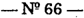
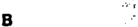

TOMO 312

Volumen 2

1989

\

I

/

## REPUBLICA ~ ARGENTINA

',,",'

..

~ I

CORTE

FALLOS

DE LA

SUPREMA

DE

## JUSTICIA DE LA NACION

PUBLICACION A CARGO DE LA SECRETARIA DE JURISPRUDENCIA DEL TRIBUNAL

TOMO 312 - VOLUMEN2

SETIEMBRE - DICIEMBRE

LA LEY SAE. e l.

Tucumán 1471 (1050) Buenos Aires

1989

## AÑO 1989

## SEPTIEMBRE -DICIEMBRE

## REGISTRO DE PROFESIONALES. INSCRIPCION.

-N241-

En Buenos Aires, a los 7 días del mes de septiembre del año mil novecientos ochenta y nueve, reunidos en la Sala de Acuerdos del Tribunal el señor Presidente de la ,Corte Suprema de Justicia de la Nación, doctor don José Severo Caballero, el señor Vicepresidente doctor don Augusto César Belluscio y los señores Ministros doctores don Carlos Santiago Fayt, don Enrique Santiago Petracchi y don Jorge Antonio Bacqué.

## Consideraron:

Que corresponde establecer las fechas para el cumplimiento de los trámites previstos en la Acordada n2 25 de 1985 para la inscripción y reinscripción de peritos en las especialidades determinadas en dicha acordada, ampliadas en los N~45/85, 59/86, 24/87 Y37/88;

## Acordaron:

- 12)Fijase el plazo del 17 de octubre al 17 de noviembre de 1989 inclusive, para que los profesionales de las especialidades cuyo registro se lleva en esta Corte procedan a su inscripción o reinscripción para el año 1990.
- 22)Amplíase la nómina del punto 1 2 de la Acordada n 2 25/85 incluyendo en la misma a especialistas en imágenes satelitarias e hidroge6logos.
- 32)La lista a que se refiere el punto 52de la Acordada n 2 25/85 se exhibirá por cinco días a partir del día 27 de noviembre de 1989.
- 42) Los trámites referidos en los puntos anteriores se efectuaran en la Oficina de Ceremonial de esta Corte durante el plazo fijado y exclusivamente en el horario de 10 a 12 hs.
- 52)Dése la publicidad pertinente por intermedio de la Oficina de Prensa.

Todo lo cual dispusieron y mandaron, ordenando que se comunicase y registrase en el libro correspondiente, por ante mí, que doy fe. Jost SEVEROABALLERO AUGusro C -CtsAR.BELLUSCIO CARLOS. FAYT --S ENRIQUEANTIAGOETRAccm S P JORGE ANToNIO BACQm Claudia M. Kiper (Secretario).

## PODER JUDICIAL DE LA NACION. PRESUPUESTO PARA EL AÑo 1990.

-Nº42-

En Buenos Aires, a los siete días del mes de setiembre del año mil novecientos ochenta y nueve, reunidos en la Sala de Acuerdos del Tribunal el señor Presidente de la Corte Suprema de Justicia de la Nación, doctor don José Severo Caballero, el seiíor Vicepresidente doctor don Augusto César Belluscio y los señores Ministros doctores don Carlos Santiago Fayt, don Enrique Santiago Petracchi y don Jorge Antonio Bacqué,

## Consideraron:

Que de acuerdo a lo prescripto por el artículo 99 de la Constitución Nacional, corresponde a la Corte Su prema dictar -para el año 1990el presupuesto del Poder Judicial de la Nación (confr. Acordada 44/88) y remitirlo al Poder Ejecutivo Nacional para que sea enviado al Honorable Congreso de la Nación a fin de que se suministren a la administración de justicia los recursos financieros necesarios para cumplir con su cometido en el marco de la independencia de poderes que exige el sistema republicano de gobierno.

Que este Tribunal ~ue no ha sido ni es ajeno a la critica situación financiera que afecta al erario-ha elaborado en los últimos años planes en materia de erogaciones sumamente moderados, sujetos a máximas medidas de austeridad.

Que, a pesar de lo expuesto, sus recursos se vieron disminuidos, ya sea por restricciones practicadas en los respectivos presupuestos o por la tardía sanción de los mismos, circunstancia esta última que obligó al Poder Judicial de la Nación a ajustar su gestión administrativa en los limites impuestos por el articulo 13 de la Ley de Contabilidad. En el actual ejercicio financiero esta Corte Suprema se ha visto constreiíida a postergar aun aquellos requerimientos de naturaleza prioritaria, aplicando una política de contención de gastos de tal magnitud que puede llegar ---en caso de no operarse una drástica revisióna afectar gravemente el servicio de justicia.

Que a dicha carencia de fondos indispensables para afrontar las necesidades mínimas del Poder Judicial de la Nación, se contrapone el incesante incremento de causas sometidas a decisión y la constante creación de tribunales, cuyos gastos de mantenimiento deben ser afrontados con estrechez de disponibilidades.

Que esta Corte Suprema estima innecesario reiterar lo expresado permanentemente respecto de las deficiencias que -de todo ordenadolece la administración de

justicia, estimando que sólo corresponde recordar lo manifestado en la Acordada de fecha 26 de noviembre de 1965 en el sentido "que el Tribunal no es indiferente ante los notorios problemas financieros ni ante las dificultades que por ello, asimismo, se soporta en otros órganos de Gobierno, pero cumple con el deber de señalar una situación que, al no ser remediada, se va agravando con el transcurso de los años en la medida que afecta seriamente a la institución judicial" (Fallos: 263:217).

Que el presente proyecto de presu puesto está calculado en base a los valores promedio de precios al mes de julio de 1989 y no contempla las necesidades para la constitución de nuevos tribunales, razón por la cual se insiste en señalar que todo acto legal que represente una nueva erogación no prevista en esta Acordada debe contemplar -ron arreglo a lo estipulado en el artículo 15 de la Ley de Contabilidadsu total financiación con cargo a "rentas generales". Idéntico proceder corresponde aplicar respecto de aquellos tribunales u organismos creados por leyes promulgadas con anterioridad, cuya puesta en funcionamiento se encuentra pendiente por la ausencia -total o parcialde fondos presupuestarios.

Que de conformidad con lo expuesto en los considerandos precedentes, el presupuesto del Poder Judicial de la Nación ha sido estimado conforme al detalle que se consigna a continuación.:

## Inciso 11. Personal

El monto anual previsto para este inciso -calculado il valores de julio ppdo.asciende a la suma de Australes cuarenta y nueve mil sesenta y ocho millones ciento cuarenta y cinco mil (A 49.068.145.000.-).

En el total consignado se incluye -incorporando las necesidades pendientes de otorgamiento por la ausencia de sanción del actual presupuestola cantidad de Australes dos mil doscientos treinta y cinco millones (A 2.235.000.000.-), con destino a la Partida Principal 1199 - Créditos a Distribuir, para las finalidades que a continuación se señalan:

- 1.A 1.886.000.000. - en el Programa 001- Administración de Justicia en Ultima Instancia, destinada a hacer frente a los distintos requerimientos de carácter imprescindible sobre creación o transformación de cargos formulados por los tribunales y organismos de la Capital e interior del país. Ello tiene por objeto atender las solicitudes perentorias de refuerzo de personal, que se viene acentuado por el incesante incremento de causas registradó en los últimos años en la justicia nacional.
- 2 A 349.000.000.- en el Programa 002 - Administración de Justicia en Primera y segunda Instancia, con la finalidad de disponer de los recursos humanos necesarios que permitan proseguir con el Plan de Informatización del Poder Judicial de la Nación que ha tenido principio de ejecución en el ejercicio financiero de 1987.

Asimismo corresponde señalar que al monto solicitado para este inciso deberán adicionarse los créditos necesarios ~stimados también al mes dejulio ppdo.para dar cumplimiento a las leyes 21.188 (Juzgado federal de Roque Sáenz Peña ·Pcia~del Chaco) y 23.112 (Juzgado Federal de San Ramón de la Nueva Orán. Pcia. de Salta), cuyo importe asciende a la suma de Australes sesenta y cinco millones ciento ochenta y seis

1508

mil (A 65.186.000.-) YAustrales setenta y cinco millones quinientos cincuenta y tres mil (A 75.553.000.-), respectivamente.

## Inciso 12 Bienes y Servicios no personales

El monto total que requiere este inciso asciende a Australes once mil quinientos noventa y cuatro millones novecientos diecinueve mil (A 11.594.919.000.-), de acuerdo con las solicitudes formuladas que contemplan, entre otras, la atención de Gastos de Funcionamiento para los tribunales y organismos de la Justicia Nacional, como asimismo cábe señalar que con la citada partida se sufragan los diversos requerimientos exigidos por distintas prestaciones de importancia, las que en los últimos meses han sufrido elevadfsimos incrementos. Atítulo ilustrativo se mencionan a continuación y sin que ello implique la totalidad de los conceptos: alquileres de inmuebles en todo el paíS, honorarios, servicios públicos, servicios anuales, viáticos, pasajes, etc.

Corresponde hacer notar otra aplicación significativa de los créditos de este inciso: la prosecución del Plan de Informatización de la administracióq de la justicia nacional (A 3.798.000.000.-) que como se señalara ha tenido principio áé ejecución a partir del año 1987 (incluye la atención del servicio transferido por la Secretaría de Justicia de la Nación, destinado a los actuales cuarenta y cinco juzgados del Trabajo).

## Inciso 31 Transferencias para financiar Erogaciones Corrientes

Respecto de este inciso se estima conveniente asignarle la suma de Australes ciento tres millones ochocientos cuatro mil (A 103.804.000.-) al Patronato de Liberados de la Capital federal, con el fm de posibilitar los informes previstos en los artículos 26, 40 Y 41 del Código Penal, requeridos por la Justicia en lo Criminal y Correccional y regulación por el artículo 111 del Reglamento del Fuero Penal.

## Inciso 41 Bienes de Capital

En este inciso se contempla un crédito de Australes tres mil ciento cincuenta y cuatro millones seiscientos setenta y seis mil (A 3.154.676.000.-), destinado a posibilitar el apoyo necesario a la tarea de los magistrados, funcionarios, empleados y auxiliares de la justicia, mediante la provisión del imprescindible y adecuado equipamiento, así como la incorporación de aparatos e instrumental científico para los Cuerpos Técnicos Periciales y Margue Judicial. Tal como se destacara en los considerandos de la presente en el actual ejercicio fmanciero este Tribunal se ha visto impelido a suspender la adquisición de requerimientos indispensables, cuya postergación hace peligrar el desenvolvimiento del servicio de justicia.

## Inciso 42 Construcciones

El monto total de este inciso se ha estimado en la suma de Australes ocho mil cuarenta y seis millones novecientos setenta y cuatro mil (A 8.046.974.000.-), cantidad mínima indispensable para financiar los siguientes trabajos públicos: a) obras en ejecución: Tribunales Federales de General Roca y Viedma (Pcia. de Río Negro) y Ushuaia (Territorio Nacional de la Tierra del Fuego, Antártidae Islas del Atlántico Sur); b) obras a proseguir: Tribunales Federales de Resistencia (Pcia. del Chaco), del Neuquén

y de Posadas (pcia. de Misiones) y c) obras con proyecto a realizar: Tribunales Federales de Catamarca y Jujuy.

Asimismo, está previsto realizar, y en otros casos en vías de ejecución, trabajos de adecuación, ampliación, conservación, etc. en diversos edificios de Capital y del interior del país.

Esta Corte Suprema -en cada proyecto de presupuestoha formulado planes tendientes a dotar gradualmente a los tribunales nacionales y federales de edificios propios y adecuados, acordes con las particulares características funcionales que demanda la labor judicial, teniendo como meta el reemplazo gradual de varios inmuebles locados, la ampliación y conservación de los de propiedad fiscal y la sustitución ~entro de estos últimosde los que en la actual,idad no resultan aptos por su antigüedad, incremento !le magistrados, funcionarios y empleados o condiciones de habitabilidad.

Esos objetivos no satisfechos hasta el presente -fundamentalmente por la ausencia de créditos presupuestarios en tiempo oportuno agudizan en forma alarmante los tradicionales problemas de infraestructura judicial. Aello cabe agregar que las especiales exigencias de los inmuebles destinados a la instalación de esos tribunales (sobrecarga, seguridad, circulaciones, ubicación, etc.) origina -en las respectivas plazas inmobiliarias-una marcada restricción de ofertas en materia de locaciones, circunstancia que determina -en aquellos casos en que puede lograrse, luego de ingentes esfuerzos, la localización de alguna propiedadel reconocimiento de elevados importes en concepto de alquileres y la, realización de importantes trabajos de adecuación, de considerable significaciÓn económica. Esos desembolsos reducen aun más los escasos créditos otorgados a los restantes incisos.

## Inciso 51 Bienes preexistentes

,

,

Este inciso -que asciende a la suma de Australes novecientos millones (A 900.000.0ÓQ.-) contempla la adquisición de un inmueble en la Capital federal, destinado a trasladar a los Juzgados Nácionales en lo Correccional letras "G" y "J", ubicadós en inmuebles totalmente inadecuados.

## Cuenta Especial 510 - Infraestructura Judicial

Con respecto a esta Cuenta Especial corresponde fijar 108 recursos propios y los gastos en la suma de Australes tres mil ochocientos setenta y seis millones (A 3.876.000.(00),importe resultante de anualizar la recaudación operada en el mes de julio ppdo., cuyo destino se discrimina de la siguiente forma:

- Inciso 12 - Bienes y Servicios no Personales

- Inciso 41 - Bienes de Capital

- Inciso 42 - Construcciones

- Inciso 51 - Bienes Preexistentes

A

852.720.000.-

A

969.000.000.-

A 1.317.840.000.-

A 736.440.000.-

Por otra' parte, es oportuno destacar la ,conveniencia de otorgar a esta Corte la facultad de modificar los niveles de créditos'concedidos por las respectivas Leyes de Presupuesto, a los efectos de poder contar con la disponibilidad inp1ediata de los recursos

,

1510

específicos que se generen en el transcurso de los correspondientes ejercicios financieros.

## Por ello, Resolvieron:

1 2 ) Fijar el Presupuesto de la Jurisdicción 05 - Poder Judicial de la Nación para el Ejercicio de 1990 en la suma de Australes setenta y seis mil setecientos cuarenta y cuatro millones quinientos dieciocho mil (A 76.744.518.000.-), conforme al siguiente detalle:

## a) Carácter O - Administració'n Central

INCISO 11 - PERSONAL

INCISO 12 - BIENES Y SERVICIOS NO

PERSONALES

INCISO 31 - TRANSFERENCIAS PARA

FINANCIAR EROGACIONES CORRIENTES

INCISO 41- BIENES DE CAPITAL

INCISO 42 - CONSTRUCCIONES

INCISO 51 - BIENES PREEXISTENTES

TOTAL CARACTER o:

A 49.068.145.000.-

A 11.594.919.000.-

A

103.004.000.-

A 3.154.676.0oo.~

A

8.046.974.000.-

A

900.000.000.-

A

72.868.518.000.-

b) CARACTER 1 - CUENTAS ESPECIALES

## CUENTA ESPECIAL 510 - INFRAESTRUCTURA JUDICIAL

INCISO 12 BIENES Y SERVICIOS NO

PERSONALES

A 852.720.000.-

INCISO 41- BIENES DE CAPITAL

A

INCISO 42 - CONSTRUCCIONES

A 1.317.840.000.-

INCISO 51 - BIENES PREEXISTENTES

A

TOTAL CARACTER 1:

A

TOTAL CARACTER O y 1

A

969.000.000.-

736.440.000.-

3.876.000.000.-

76.744.518.000.

- 2º) Aprobar las planillas de distribución de crédito correspondientes al Plan Analitico de Trabajos Públicos elaborado por la Subsecretaría de Administración, que forman parte de esta acordada y que serán suscriptas por el señor secretario de Superintendencia Administrativa.
- 3º) Comuníquese al Poder Ejecutivo Nacional-por intermedio del señor Ministro de Educación y Justiciapara su remisión al Honorable Congreso Nacional. Asimismo, póngase en conocimiento del señor Ministro de Economía.
- 4º) Hágase saber a la Subsecretaría de Administración, a las Cámaras Nacionales y Federales de todo el país.

Todo lo cual dispusieron y mandaron, ordenando se comunicase y registrase en el libro correspondiente, por ante mí, que doy fe. -JOSÉSEVEROABALLERO AUGUSTO ÉSAR C -C BELLUSCIOCARLOS . FAYI' --S ENRIQUEANTIAGO-rnAccm S PE JORGE AmoNIOBACQUÉ -'--Hugo M. Piacentíno (Secretario).

312

## CAMARANACIONAL DE APELACIONES EN LO CRIMINAL Y CORRECCIONAL RESOLUCION SOBRE DETENIDOS.

-N!43-

En Buenos Aires, a los 21 días del mes de septiembre de mil novecientos ochenta y nueve, reunidos en la Sala de Acuerdos del Tribunal el señor Presidente de la Corte Suprema de Justicia de la Nación, doctor don José Severo Caballero, el señor Vicepresidente doctor don Augusto César Belluscio y los señores Jueces doctores don Carlos S. Fayt, don Enrique S. Petracchi y Don Jorge Antonio Bacqué,

## Consideraron:

- 1º) Que la Cámara Nacional de Apelaciones en lo Criminal y Correccional elevó para la consideración del Tribunal una copia de la resolución dictada el 11 de mayo último en el expediente 13.969/89, en virtud de la cual-por mayoríadispuso la agregación de un segundo apartado al arto 95 bis del reglamento vigente para la jurisdicción.
- 2º) Que el arto 95 bis de ese texto normativo impone a las autoridades de prevención el deber de comunicar el estado de detención de personas a sus familiares o conocidos; el agregado introducido, a su vez, extiende la obligación para los supuestos de infra&lt;;ciones contravencionales y de detenidos en virtud del arto 5° del decreto 333/58.
- 30) Que la aplicación de las sanciones por faltas contravencionales ha sido atribuida por la ley al Poder Ejecutivo, órgano competente para intervenir, además, en el específico supuesto del arto 5º del decreto 333/58 (averiguación de antecedentes); en el primer caso, los juzgados correccionales actúan como tribunal de apelación y en el segundo, los jueces del fuero intervienen únicamente cuando se interponen recursos de hábeas corpus.
- 40) Que en virtud de ello, la inclusión decidida por la Cámara Criminal configura, a juicio de esta Corte, una indebida intromisión en la esfera del poder de policía del órgano ejecutivo, hecho que excede sus facultades reglamentarias, más allá de la loable finalidad que persiguió el dictado de la norma examinada.

Por lo expuesto,

Acordaron:

- 10)Dejar sin efecto la resolución de fecha 11 de mayo de 1989, dictada por la Cámara Nacional de Apelaciones en lo Criminal y Correccional en el expediente 13.969.
- 20) Oficiar al Poder Ejecutivo Nacional solicitándole que estudie la conveniencia de introducir por vía reglamentaria una disposición similar a la del arto 95 bis del reglamento vigente en el fuero criminal y correccional, para los supuestos comprendidos en el arto 5° del decreto 333/58 y faltas contravencionales.

- Todo lo cual dispusieron y mandaron, ordenando que se comunicase y registrase en el libro correspondiente, por ante mí, que doy fe. -Jos~ SEVEROABALLEBO uGUSTOC~ C -A BELLUSCIOCARLOS . FAYT -S (en disidencia) -ENRIQUE SANTIAGOTRAccm -JOBOE PE ANToNIO BACQ~ -Claudia Marcelo Kiper (Secretario).

## DISIDENCIA DEL SEÑOR M1N1STRO DOCTOR CARLOS S. FAYT

Considerando:

- 1°)Que la Cámara Nacional de Apelaciones en lo Criminal y Correccional elevó para la consideración del Tribunal una copia de la resolución dictada el11 de mayo último en el expediente 13.969/89, en virtud de la cual-por mayoríadispuso la agregación de un segundo apartado al arto 95 l!is del reglamento vigente p~ra la jurisdicción.
- 2º) Que el arto 95 bis de ese texto normativo impone a las autoridades de prevención el deber de comunicar el estado de detención de personas a sus familiares o conocidos; el agregado introducido, a su vez, extiende la obligación para los su puestos de infracciones contravencionales y de detenidos en virtud del arto 5° del decreto 333158.
- 3º) Que la falta de comunicación a las personas que indiquen los detenidos por la Policía Federal, en virtud de las facultades que la ley otorga a esa institución, vulnerarla la garantía de defensa enjuicio y el debido proceso con la extensión que cabe reconocerles' a esta altura del desarrollo de nuestra civilización, y en particular de sus instituciones jurídicas.
- 4°) Que la intervención de los juzgados correccionales como tribunal de apelación contra las faltas contravencionales -arto 587 del Código de Procedimientos en Materia Penalyen lo atinente al art. 5º del decreto 333158 -;averiguación de antecedentes-por vía de la acción de hábeas corpus, justifica el agregado introducido por la Cámara del fuero por medio del 20apartado del arto 95 bis pues de no mediar la comunicación a que allf se hace referencia los derechos de los detenidos podñan tomarse ilusorios.
- 5º) Que la defensa enjuicio está asegurada por disposiciones constitucionales. Es un derecho indelegable de todo ser humano, que no debe restringirse, sino que por el contrario, debe ser preservado y ampliado. En este contexto, es evidente que una forma de ejercitltTla eficazmente es teniendo la posibilidad de nombrar un defensor que asista al detenido.
- 6°) Que el debido proceso legal requiere un procedimiento ordenado, adaptado a la naturaleza de cada caso, pero para ello es requisito indispensable que el ciudadano tenga oportunidad de ser oído y defenderse, derecho que podrá ejercer si se le da la posibilidad concreta de presentarse debidamente asistido ante la justicia cuando es detenido eÍl caso,s en que no se requiere que sea puesto a disposición de un juez.
- 72) Que por lo expuesto, corresponde aprobar lo actuado por la Cámara en lo atinente a la inclusión del2do. apartado del arto 95 bis. del reglamento de lajurisdicción, dictado por ese tribuna1 eón fundamento en los mismos poderes ejercidos al establecer los arts. 95 y 95 bis del citado texto normativo, los que no han sido cuestionados.

El hecho de que en estos casos no deba intelVenir una autoridad judicial debe llevar a extremar -y" no a restriniir-lá protección del derecho constitucional comprometido.

- flll) Que, por último, al mantenerse lo resuelto por lil Cámara Criminal no sólo quedan garantizados acabadamente los principios constitucionales antes citados, sino que se ve beneficiado el fuero penal en los supuestos de hábeas corpus, pues al mediar la comunicación a los familiares o amigos de los detenidos por parte de la prevención, el juez competente verá simplificado todo el procedimiento, al tener un ~nocimiento fehaciente del lugar y de los motivos de la detención.

Por ello,

Acordaron:

Aprobar el agregado introducido por la Cámara Nacional de Apelaciones en lo Criminal y Correccional por medio del arto 95 bis -Z1 apartadodel reglamento vigente en esa jurisdicción.

Todo lo cual dispusieron y mandaron, ordenando que se comunicase y registrase en el libro correspondiente, por ante mí, que doy fe. CARLOS. FAYT . S

.CORTE SUPREMA DE JUSTICIA DE LA NACION. PRONUNCIAMIENTO SOBRE PROYECTO DE LEY MODIFICATORIO DE LA COMPOSICION DEL TRIBUNAL.

N? 44 \_

En Buenos Aii-es, a los 22 días del mes de setiembre del año mil novecientos ochenta y nueve, reunidos en la Sala de AcUerdos del Tribunal el señor Presidente de la Corte Suprema de Justicia de la N;¡ción, doctor don José Severo Caballero, el señor Vicepresidente doctor don Augusto César Belluscio y los señores Ministros doctores don Carlos S. Fayt, don Enrique Santiago Petracchi y don Jorge Antonio Bacqué,

## Consideraron:

1º) Que esta Corte ha tomado conocimiento, por la prensa, de que el Poder Ejecutivo Nacional ha enviado al Congreso un proyecto de ley pOr el que se modifica la composición. del Tribunal y determinados aspectos de su competencia.

- 2º) Que la Corte no puede permanecer ajena a una circunstancia de tan seria repercusión sobre las instituciones republicanas, en la medida en. que compromete, precisamente, el funcionamiento de la cabeza de uno de los poderes que, según la Constitución Nacional, gobiernan la Nación, y cuya misión por excelencia es la de custodiar la supremacía de la Ley Fundamental y ser el garante final de los derechos y

garantías en ella consagrados. Resulta, entonces, un imperativo ético e institucional que esta Corte contribuya al esclarecimiento de un tema tan capital, máxime cuando su experiencia yjuicio, por vincularse con puntos básicos de su organización, parece tener un valor difícilmente sustituible (Opinión de la Corte Suprema de Justicia de la Nación, dirigida al Senado, 10 de agosto de 1964).

Es más, a otros aportes semejantes al presente y de fecha: mucho más próxima (Opinión cit.; Fallos: 241: 112), se suma, a modo de primer antecedente, que los estudios y preparación de lo que desde hace 126 años constituye la herramienta jurídica mediante la cual la Corte cumple con la referida misión, esto es, el recurso extraordinario de la ley 48, fueron llevados a cabo, precisamente, por miembros de este Tribunal.

- 3º) Que en lo atinente a la composición, el mensaje del Poder Ejecutivo señala que el proyecto al que acompaña constituye una solución para la actual coyuntura, y que atiende, principalmente, a las condiciones anormales en que el Tribunal se desenvuelve, derivadas: a) del número excesivo de causas a resolver, y b) del mantenimiento de un reducido número de jueces y del incremento de los funcionarios que realizan tareas inherentes a aquéllos, las cuales son de exclusiva responsabilidad de los magistrados según las normas constitucionales.
- 4º) Que cabe formular una observación liminar. No es aventurado afirmar que en el momento actual alienta en la sociedad argentina la esperanza de que la experiencia de transitar por el camino de las instituciones constitucionales sea esta vez verdadero y sólido. Uno de los pilares en que aquélla se asienta es la independencia y estabilidad del Poder Judicial, la cual no puede dejar de estar vinculada con la estabilidad de sus órganos y sus titulares.

Las bruscas alternativas de su composición, aunque entren formalmente en las atribuciones legales de otros poderes, en los hechos afectan tales valores, los cuales deben ser especialmente preservados para asegurar dicha esperanza, surgida tras vicisitudes históricas amargas, prolongadas y reiteradas.

Esto debe tenerse especialmente en cuenta si se atiende a que el mensaje antes referido no expresa las concretas razones por las cuales el arbitrio propuesto sería el medio idóneo para conjurar el estado de cosas que lo motivaría.

- 5º) Que, asimismo, entre la situación fáctica a la que se alude y el remedio cuya aptitud se da por presupuesta, media una distancia que no puede ser recorrida sin grave riesgo.

En efecto, las estadísticas anuales y públicas del Tribunal muestran claramente que el incremento en la entrada de expedientes que se ha ido produciendo, por ejemplo, en los últimos 20 años, se ha visto permanentemente acompañado porun proporcionado y contemporáneo aumento de las causas falladas. Asimismo; determinados picos en el ingreso registrados, en 1986, 1987 Y 1988, responden a grandes grupos de litigios de análogo contenido (v. gr. problemas relativos a haberes previsionales),lo cual determina . que, una vez sentada la doctrina del Tribunal a su respecto, la resolución de cada caso se torne sensiblemente facilitada.

6º) Que, por otro lado, resulta fundamental destacar que, por cuanto es imperativo constitucional que esta Corte sea "una" (art. 94), el estudio.y decisión de los Procesos que atañen asu ministerio no puede estar asignado o limitado a sólo alguno de sus miembros.

Ahora bien, síguense de ello dos consecuencias a cual más importante. La primera, que si el Tribunal debe actuar por la Constitución como una unidad, el aumento de sus componentes carece de todo influjo en la magnitud del ingreso de las causas a decidir. La restante, que, en tales condiciones, ese igual número de litigios deberá ser estudiado no por cinco sino por nueve jueces.

Ambas conclusiones, obviamente, son demostrativas de que la suma de miembros para un órgano unitario no es un vehículo conducente para variar el ingreso de expedient.es; ni para aliviar lo que constituye el quehacer primordial de los magistrados: resolver los litigios; ni para agilizar el curso de los procesos.

La función de un órgano judicial -facultad y deber de éstees determinar el derecho de las partes, con el objeto de eliminar sus conflictos; si el órgano es colegiado y uno, su composición ha de ser la que mejor tribute, por el mutuo y recíproco aporte de sus miembros, a la obtención de las decisiones más justas y oportunas. Empero, es una verdad a todas luces evidente y que la experiencia común ratifica, que el engrosamiento del número de jueces llamados a pronunciarse sobre una misma causa, por encima del que ya satisface los aludidos requerimientos, lleva a resultados precisamente opuestos a los recién mencionados. Debates interminables, multiplicación de votos dispares que impiden establecer criterios jurisprudenciales claros y previsibles, inseguridad jurídica, prolongación de las situaciones litigiosas, entre otros, son los efectos contraproducentes más notorios.

En este contexto, es apropiado recordar la exhortación del Presidente de la Corte Supremá de los Estados Unidos de Norteaméria, Charles Evans Hughes, cuando, en 1937, sostuvo que un aumento en el número dejueces de ese tribunal no promovería la eficacia de éste, que actúa como una unidad; habría sí -agregóque escuchar a más jueces, conferenciar con más jueces, discutir con más jueces, convencer o ser convencido por más jueces (cit. en: Pusey, The Supreme Court Crisis, Nueva York, 1937, p. 17).

7º) Que estas consideraciones mueven a la siguiente reflexión. La más que centenaria colección de Fallos de la Corte es prueba harto ilustrativa de que en los 120 años en que el Tribunal actuó con la composición que hoy posee, sus sentencias han sido testimonio y resonancia de opiniones y pensamientos, criterios y filosofías, posiciones y principios variados y opuestos. Los votos concurrentes y los votos disidentes que se registran en casos que constituyen verdaderos hitos en el desarrollo y consolidación de los derechos y garantías de los individuos, y en la relación entre los órganos de los gobiernos federal y provincial, y también en múltiples controversias de aparente menor releváncia, acreditan silenciosa pero no por ello menos concluyentemente, que el número de magistrados que ha regido en tan extenso período -prácticamente la vida toda del Tribunal, y la de la Nación desde su definitiva organización-lejos de impedir u obstaculizar un debate de las ideas suficiente, lo ha posibilitado plena y fecundamente. No hay, por ello, más que gratuidad en el citado mensaje cuando pretende, proyecto mediante, contribuir a la "mayor autoridad académica de (los) fallos" o al "robustecimiento (de) las decisiones en materia de control de constitucionalidad", mediante el

nudo medio de sumar integrantes. Es, asimismo, cuestión bien sabida que, si de tal autoridad se trata, las opiniones no se cuentan sino que se pesan.

8º) Que tal afIrmación y los propósitos a los que obedecería, no son más consistentes si se los interpretase en el sentido de que esa mayor autoridad se lograría' como consecuencia de que el aumento dejueces llevaría a reducir el número ó la intervención de los actu!lles funcionarios del tribunal que, a juicio del mensaje, "realizan tareas inherentes a los jueces, las cuales son de la exclusiva responsabilidad de éstos ... ". Por cierto que. semejante inconsistencia no provendría de que la función de decidir no estuviese unida al juez de tal manera'que no se la pueda separar de éste ("inherente"), sino que derivaría de suponer dogmáticamente que, en el estado moderno, la existencia de un cuerpo de auxiliares produce, por sí, una transferencia, delegación o separación de facultades y deberes intransferibles, ~delegables o inseparables. Ello sería tanto como dar por sobreentendido que el creciente e incomparable elenco de funcionarios --de las más diversas jerarquías y denominacionesy asesores que revistan en l!lsotros dos poderes, realizan labores que; por la Constitución Nacional, son "inherentes" al Presidente de la Nación o al Congreso Nacional. Por otro lado, la experiencia de nuestro país parece indicar que un incremento en el número de órganos-persona titulares de una función suele ser acompañada de u~ incremento de los funcionarios auxiliares.

9º) Que el mensaje también Señala que la medida en estudio guarda armonía con las soluciones adoptadas en el derecho comparado. La consideración de este aserto es asaz problemática ya que no se lo acompaña por señalamiento alguno de los modelos tomados en' cuenta. Con todo, es éste, como tantos otros, un aspecto en que la comparación de las experiencias de otros países no puede ser llevada a cabo ni rigurosa ni satisfactoriamente, sin el previo conocimiento y ponderación, por lo menos, de los caracteres, alcances y modos en que 'cada órgano ejerce su competencia, y de si se halla o no dividido en salas.

En tal sentido, las conclusiones que surgen de una investigación dirigida por el profesor de la Universidad de París, André Tunc, y realizada por magistrados y estudiosos en diferentes altos tribunales, como la Cámara de los Lores;, las cortes supremas de los Estados Unidos de Norteamérica -':'y de los Estados de California y LUisiana-, Canadá, Japón, Suecia, Noruega, Unión de Repúblicas Socialista Soviéti. cas, Polonia, Alemania Federal; la Corte de Casación de Italia; el Tribunal de Suiza y de Yugoslavia; no autorizaría a avalar concluyentemente tal afirmación. Es más todavía, señala ese autor respecto de la Suprema Corte norteamericana, que su número de nueve jueces, quizás impuesto en'razón de la gravedad de los problemas que debe resolver, obstaculizadertamente su cohesión. Y agrega que, en la Cámara de los Lores y en buena parte de otras cortes supremas, la unidad normal del juicio es de cinco magistrados, cuando ella no es de tres (v.: La Cour Judiciaire Supreme, une enquele comparative, París, 1978).

10) Que, en lo concerniente al último motivo invocado en el mensaje, esto es, que la reforma "atiende a la inmediación", cabe puntualizar que si el Tribunal ha de actuar como una unidad por lo que es necesario que todos losjueces se impongan de todas las causas (supra 6), y si la inmediación con la controversia es una relación personal e intransferible de,cada uno de aquéllos con é~ta~no se acierta, entonces, a dar con las razones con base en las' cuales la reforma benefil:iaría ian destacado principio procesal. '

11) Que no es dudoso que incumbe a la ley la determinación del número de losjueces de la Corte Suprema.

Sin embargo, la pertinencia de esa facultad está s~peditada a que su ejercicio responda a una exigencia de las "necesidades reales" a cuya consideración obedeció la reforma introducida por la Convención de 1860 a la Constitución de 1853 (Joaquín V. González, "Obras Completas", Ed. 1935, m, Nº 584, págs. 5021503).

Consecuentemente, todo cuanto se ha venido exponiendo autoriza a concluir en que las "necesidades reales" relativas a la aptitud del Tribunal para el cumplimiento de sus funciones constitucionales y legales, no entrañan requerimiento alguno para modificar al número de sus miembros. La solución a tales necesidades pide -y reclamaotros arbitrios;

12) Que, pór lo contrario, el Tribunal considera positivo el reconocimiento de la facultad que ya posee de designar a su Presidente (Fallos: 158:292; Acórdada del 22 de junio de 1932; 210:5).

De igual manera estima conveniente y oportuna la reforma. que el proyecto introduce como segundo párrafo del arto 280 y tercero del art. 285 del Código Procesal Civil y Comercial de la N ación.

Esto es así, por cuanto, como ya lo anunciara en sus pronunciamientos, el recurso extraordinario ha sido instituido comoel instrumento genérico de la funciónjurisdiccional más alta de esta Corte, la que se satisface cabalmente, cuando están en juego problemas de gravedad institucional, con su decisión por ella, desde que su fallo es precisamente el fin de la jurisdicción eminente que la ha sido conferida, aun cuando su ejercicio puede promoverse en cuestiones entre particulares. Así, la ausencia de interés institucional que la jurisprudencia contempla, por regla general con el nombre de "cuestiones federales insustanciales", autoriza el rechazo de la apelación extraordinaria, según se admite sin discrepancias a partir de Fallos: 194: 220 (Fallos: 248: 189 y otros).

Por lo demás, esta orientación sí se adecua a las tendencias y propuestas imperantes en tribunales supremos de diversas nacionalidades, al paso que configura un punto fundamental deIa concreta vigencia y cabal funcionamiento de aquéllos (Tune, op. cit.). Es, asimismo, un criterio coincidente con el que, desde ya hace tiempo, ha venido aplicándose respecto de una Corte de obligada referencia, la norteamericana (v., v. gr., las reformas al United States Code, aprobadas el 27 dejunio de 1988 -Public Law, 100352). .

Se podrá objetar, con todo, que no es justo o democrático, que sólo un cierto número de litigantes tenga la oportunidad de que la corte suprema acepte examinar sus recursos. Pero, justicia y democracia requieren del derecho, ante todo, que sea claro y adaptado a las condiciones sociales y a las aspiraciones contemporáneas. Si, para que la jurisprudencia sea así, es necesario cribar los asuntos que serán examinados por la Corte Suprema, esa selección, después que los litigantes fueron juzgados en las instancias anteriores, parece conforme con las ~xigencias de una justicia desarrollada (Rawls, J., A Theory of Justice, 1972).

13) Que, en suma, la reforma de la composición dificulta y demora el ejercicio de las funciones de la Corte y reduce. su.autonomía, en la medida en que se la somete al riesgo de una eventual paralización o impotencia que originaría un número de miembros que, amén de injustificado, dificultaría enormemente la toma de decisiones de un cuerpo que debe pronunciarse como una unidad, sin que siquiera se avizoren los presuntos beneficios.

En la medida de la falibilidad humana, interesa la Corte a la subsistencia misma del régimen democrático. Porque comolo ha señalado la mejor doctrina, una institución semejante no se compadece con los gobiernos autoritarios, en cuanto es de la esencia de ellos la liberación de las trabas de la Constitución y de la ley -v. Legaz y Lacambra, "Introducción a la ciencia del derecho", Barcelona, 1943, p. 498; Kelsen, "Teoría General del Derecho y del Estado", 2ª Ed., México, 1988, ps. 333, 334; véase también: Comisión Internacional de Juristas, "El Imperio deja ley en las sociedades libres", ps. 24 y 136, Ginebra, 1959 (Opinión de la Corte Suprema de Justicia de la Nación, remitida al Senado, 10 de agosto de 1964, cit.)--.

De un modo diverso, las citadas modificaciones a los arts. 280 y 285 del Código Procesal, resultan compartibles y adecuadas a la racionalización de sus tareasjurisdiccionales. También es positivo el reconocimiento de la mencionada atribución que posee esta Corte.

14) Que el número creciente de causas que son traídas a su conocimiento es motivo de seria preocupación por esta Corte; de ahí que resulte reconfortante advertir que, tal interés, es compartido por otras ramas del Gobierno Nacional.

Con motivo de la asunción de los primeros jueces de esta Corte, Bartolomé Mitre sostuvo: "como Presidente de la Nación busqué a los hombres que en la Corte suprema fueran un contralor imparcial e insospechado de las demasías de los otros poderes del Estado, y que viniendo de la oposición dieran a sus conciudadanos la mayor seguridad de la amplia protección de .sus derechos y la garantía de una total y absoluta independencia del Alto Tribunal".

Hoy, a más de un siglo de aquellas palabras, los que suscriben. la presente creen contribuir a la siempre imprescindible reflexión que reclaman temas que tocan los cimientos del edificio institucional, y en las que se ve el Tribunal comprometido. Lo hacen, continuimdo esa tarea de colaboración que iniciaran aquellos remotos antecesores en el cargo -antes recordaday respondiendo a las esperanzas de imparcialidad e independencia en ella depositadas para todo tiempo y trance. .

Por ello,

Acordaron:

Poner en conocimiento del Excmo. Congreso de la Nación y del Señor Presidente de la República, (;ll presente texto -Jost SEVERO ABALLERO C (en disidencia) -AUGUSTO CtsAR BELLUSClO CARLOS . FAYT--S ENRIQUE SANTIAGO-rnAccHI-JOllGEANToNIOACQutPE B Claudia M Kiper (Secretario).

Por su parte, el señor Presidente doctor don José Severo Caballero expresó:

No se ha producido consulta alguna sobre la oportunidad y conveniencia de la reforma proyectada por el Poder Ejecutivo Nacional, como ocumó en 1958 (Fallos: 241: 112) y en 1964 (Diario de Sesiones de la Cámara de Senadores, 1964-1, p. 901). Tampoco se solicitó el parecer de la Corte Suprema en el reciente proyecto del Poder Ejecutivo Nacional de 1987, que esperaba elevar a 7 el número de jueces que la integrarían. Por ello, una resolución de la Corte Suprema dictada por medio de Acordada aparecería alterando la conducta y la jurisprudencia tradicional del Cuerpo de no expedirse en abstracto, niaún ante consultas (Fallos: 2:254; 34:62; 73:122, y muchos otros).

Asimismo, ni la Constitución Nacional ni la Ley de Organización de la Justicia Nacional, ni los reglamentos dictados en su consecuencia autorizan pronunciamientos genéricos sobre la oportunidad y conveniencia de pretendidas reformas a la leyes que regulan la composición de la Corte Suprema y aspectos de su competencia, como es el caso.

Al ser ello así, cualquier decisión abstracta puede comprometer el deber y el derecho de la Corte Suprema de expedirse en los casos concretos que le sean sometidos sobre la legitimidad constitucional de las leyes que se dictaren por el Congreso de la Nación.

En consecuencia, entiendo que no debe producirse el pronunciamiento que pretende la mayoría. -Joslt SEVEROABAU.ERO C -Claudia M. Kiper (Secretario).

## CORTE SUPREMA DE JUSTICIA DE LA NACION. ACEPTACION DE LA RENUNCIA DEL DR. JOSE SEVERO CABALLERO.

-Nº45-

En Buenos Aires, a los 26 días del mes de septiembre de mil novecientos ochenta y nueve, reunidos en la Sala de Acuerdos del Tribunal el señor Presidente de la Corte Suprema de Justicia de la Nación, doctor don José Severo Caballero, el señor Vicepresidente doctor don Augusto César Belluscio y los señores Jueces doctores don Carlos S. Fayt, don Enrique Santiago Petracchi y don Jorge Antonio Bacqué,

## Consideraron:

Que el doctor José Severo Caballero presenta su renu ncia al cargo de Presidente de la Corte Suprema de Justicia de la Nación en los siguientes términos: "Con motivo de las divergencias surgidas en el seno del Tribunal con ocasión de los criterios expuestos por el suscripto en la AcordadaNº44/89, pongo a disposición del Alto Cuerpo mi renuncia al cargo de Presidente de la Excma. Corte Suprema de Justicia de la Nación".

Que previo intercambio de ideas, los doctores Augusto César Belluscio, Enrique Santiago Petracchi y Jorge Antonio Bacqué aceptan la rehuncia presentada.

## ACUERDOS DE LA CORTE SUPREMA 312

Que el doctor Carlos Santiago Fayt manifiesta que no acepta dicha renuncia.

Por lo expuesto,

Decidieron:

Aceptar la renuncia presentada por el doctor José Severo Caballero al cargo de Presidente de la Corte Suprema de Justicia de la Nación. y pasar a un cuarto intermedio. -Josl! SEVEROABAILEIlOAUGUSTO Cl!sAR BELLU8CIO CARLOS. FAlT C --S ENRIQUE SANTIAGO PE-raAccm JORGEANToNIO BACQUl!.

Reabierto el acto a los filles de proceder a la elección de Presidente de la Corte Suprema de Justicia de la Nación. con arreglo a lo dispuesto por el arto 79 R.J.N. (texto según acordadas de Fallos 249: 212 y 16188) Yprevio intercambio de ideas, consignaron BU voto como se expresa a continuación:

Los doctores Augusto César Belluscio, Carlos Santiago Fayt y Jorge Antonio Bacqué proponen como Presidente al doctor Enrique Santiago Petracchi.

El doctor José Severo Caballero vota por el doctor Carlos S. Fayt.

El Doctor Enrique Santiago Petracchi propicia como Presidente al doctor Jorge Antonio Bacqué.

Por lo expuesto:

Acordaron:

Designar Presidente de la Corte Suprema de Justicia de la Nación al doctor Enrique Santiago Petracchi.

Todo lo cual dispusieron y mandaron, ordenando que se comunicase y registrase en el libro correspondiente, por ante mí, que doy fe. Josl! SEVEROABAILEIlOAUGUSTO l!C -C BAR BELLU8CIO -CARLOS. FAlT S -ENRIQUE SANTIAGO-raAccm -JORGE PE ANToNIO BACQUl! -Claudia M. Kiper (Secretario).

PODER JUDICIAL DE LA NACION. LOCACION DE INMUEBLES.

-N"46-

En Buenos Aires. a los 28 días del mes de septiembre de mil novecientos ochenta y nueve. reunidos en la Sala de Acuerdos del Tribunal el señor Presidente de la Corte Suprema de Justicia de la Nación. doctor don Enrique Santiago Petracchi, el señor

Vicepresidente doctor don Augusto César Belluscio y los señores Ministros doctores don José Severo Caballero, Jueces doctores don Carlos S. Fayt, y don Jorge Antonio Bacqué,

## Consicferaron:

Que para la locación de inmuebles en el ámbito del Poder Judicial de la Nación rigen las disposiciones del decreto 5720172, modificado por los decretos nros. 1000179 y 580/80, con excepción de su inciso 135 (confr. resolución 857179).

Que las especiales modalidades en que se desenvuelve la actividad judicial, hace aconsejable dictar un régimen propio en materia de locaciones que permita satisfacer las necesidades provenientes de los gravísimo s problemas de infraestructura que viene padeciendo desde tiempo atrás, en razón de las particulares exigencias que requieren' los inmuebles destinados a su funcionamiento y de las notorias diferencias existentes en los diversos mercados inmobiliarios de cada asiento de los tribunales federales.

Por ello y en ejercicio de las atribuciones conferidas por el artículo 99 de la Constitución Nacional. .

## Resolvieron:

- 1º) Declarar inaplicables en el ámbito del Poder Judicial de la Nación las normas del decreto nº 5720/72, modificado por los decretos nros. 1000/79 y 580/80.
- 20) Aprobar el reglamento de locaciones anexo a la presente, cuyas disposiciones entrarán en vigencia a partir de los cinco días de producida la intervención coIrt!spondiente por parte del Tribunal de Cuentas de la Nación.

Todo lo cual dispusieron y mandaron, ordenando que se comunicase y registrase en el libro correspondiente, por ante mí que doy fe ENRIQUE SANTIAGO &amp;-mAccm -AUGUSTO P CtsAR BÉLLUSCIO ost -J SEVEROABALLEROCARLOS. FAYI'-JORGE C -S AmoNIO BACQultHugo M. Piacentino (Secretario).

## REGLAMENTO DE LOCACIONES

Artículo 1º La locación de inmuebles por cuenta del Poder Judicial de la Nación se regirá por las disposiciones del presente reglamento y, en su caso, por las cláusulas particulares que para cada contratación se aprueben.

- Articulo 2º Las cláusulas que deberán contener los respectivos pliegos de baSes y condiciones. serán las siguientes:
- a) la ubicación y características generales' del inmueble, con la posibilidad de aceptar ofertas que no se ajustan estrictamente al requeriiniento; .

## ACUERDOS DE LA CORTE SUPREMA

312

b) el plazo del contrato, el cual no podrá ser inferior a tres (3) años;

- c) cuando en el inmueble ofrecido fuere necesario ejecutar trabajos por cuenta del locador, éste deberá fijar en la propuesta el plazo dentro del cual se compromete a realizarlos, a partir de la fecha de aprobación del contrato por la Corte Suprema. si no diere cumplimiento a esa obligación, el Poder Judicial de la Nación podrá -previa notificación fehaciente-contratar con terceros su realización, descontando el precio de los futuros pagos que en concepto de arriendo deban efectuarse;
- d) el propietario autorizará a efectuar en el inmueble todas las modificaciones necesarias para su normal funcionamiento, con la sola condición de que --con carácter previo a su realizaciónel locatario las comunique fehacientemente para que el locador determine si ellas quedarán a favor de la propiedad sin necesidad de indemnización alguna o por el contrario deberá el locatario volver el inmueble a su estado original;
- e) la cotización no podrá formularse en moneda extranjera o su equivalente;
- o la actualización del alquiler se practicará de oficio, en forma trimestral, aplicando el índice de precios mayoristas -nivel generalproporcionado por el Instituto Nacional de Estadística y Censos, salvo propuesta expresa en contrario del oferente;
- g) el mantenimiento de la oferta por un plazo no iIlferior a noventa (90) días, la que será actualizada al momento de la iniciación de la relación contractual, tomando en consideración el índice a que se refiere el inciso precedente;
- h) la forma de pago del alquiler será por mes vencido, salvo que expresamente el locador lo requiera por mes adelantado, abonándose el canon del 1 al 10 de cada periodo;
- i) cuando se incurriere en mora por pago fuera de término, la deuda se actualizará -sin necesidad de reclamo alguno del locadorhasta la fecha de efectivo pago o de la debida notificación de la disponibilidad de fondos, si esta última fuera anterior. Esa actualización se realizará utilizando la variación del índice que resulte de aplicar el régimen del inciso O, tomando el mes último anterior a los momentos mencionados en el párrafo precedente. Cuando ellos se verifiquen dentro del mismo mes se tomará el anterior. En los supuestos en que no se disponga del índice con carácter definitivo, el cálculo se realizará con el provisorio existente, sin que ello dé derecho a reajustes posteriores entre las partes. Los intereses por mora en el pago se calcularán a la tasa del cinco por ciento (5 %) anual vencido sobre saldos ajustados. Si dichas deudas, precio más mora, se abonaran parcialmente, los saldos pendientes quedarán sujetos a la actualización de valores en la proporción que correspondiere, desde la última fecha de pago hasta la de pago efectivo o la de notificación fehaciente de la puesta a disposición de los fondos;
- j) el no reconocimiento de comisiones por la intervención de intermediarios, ni la constitución de depósito en garantía;

k) la agregación de la documentación exigida (títulos, planos, etc.);

1)la obligación por parte del locador de asumir el pago de las tasas, contribuciones, impuestos o gravámenes de cualquier naturaleza, existentes o a crearse, ,salvo aquellos que obedecieren al uso que al inmueble le diere el organismo;

m) la rescisión unilateral del contrato por parte del Poder Judicial en cualquier momento, sin que genere derechos a indemnización alguna, circunstancia que deberá comunicarse fehacientemente al locador con una anticipación no inferior a noventa (90) días; y n) en el momento en que el Poder Judicial de la Nación -en su carácter de locatariotome ocupación del inmueble, deberá labrarse acta de su estado de recepción e inventario completo.

Articulo 3º La preadjudicación recaerá en la oferta más conveniente, a cuyo efecto la comisión respectiva deberá solicitar un informe técnico previo de la Prosecretaría de Arquitectura, recabando -si así correspondiere-la opinión del tribunal u organismo destinatario del inmueble.

Artículo 4º Una vez producida la preadjudicación y como requisito previo a la adjudicación se requerirá la tasación del valor locativo al Cuerpo de Peritos Oficiales del Poder Judicial o, en su defecto, a otro organismo oficial. Dicha tasación deberá ser practicada con efecto a la fecha del acto de apertura, pudiéndose adjudicar porun monto mayor cuando existan razones que así lo aconsejen.

Articulo 5.En los casos en que resulte pertinente recurrir al procedimiento de una contratación directa para la locación de nuevas propiedades, podrán encararse negociaciones directas con un único oferente. En tales supuestos las condiciones contractuales deberán sujetarse a las cláusulas contenidas en el arto 20), salvo que impostergables razones de servicio aconsejen acordar -a juicio del Tribunalotras estipulaciones.

Articulo 6.En toda contratación tramitada con arreglo a lo previsto en el artículo anterior deberá requerirse el informe técnico y la tasación 'del valor locativo a que se refieren los arts. 3º y 4º, respectivamente.

Articulo 7º Al vencimiento del plazo contractual el Poder Judicial de la Nación podrá convenir directamente con el locador su renovación. A ese fin la Subsecretaría de Administración requerirá allocador-con suficiente antelación-la presentación de la oferta respectiva y simultáneamente al Cuerpo de Peritos Tasadores Oficiales la tasación del valor locativo, con los alcances del artículo 4º). El precio ofertado será actualizable al momento de iniciarse la futura relación contractual, tomando en consideración la variación experimentada en el índice aplicable a los futuros reajustes.

## ACUERDOS DE LA CORTE SUPREMA 812

## JUZGADOS NACIONALES DE PRIMERA INSTANCIA EN LO CML. DESIGNACION DE ASISTENTES SOCIALES.

-N!47-

En Buenos Aires, a los 12 días del mes de octubre del año mil novecientos ochenta y nueve, reunidos en la Sala de Acuerdos del Tribunal, el señor Presidente de la Corte Suprema de Justicia de la Nación, doctor don Enrique Santiago Petracchi, el señor Vicepresidente doctor don Augusto César Belluscio y los señores Jueces doctores don José Severo Caballero, don Carlos S. Fayt y don Jorge Antonio Bacqué,

## Consideraron:

- 1º) Que por acordadas 37/86 y 30/88 esta Corte hizo lugar a peticiones formuladas por magistrados del fuero civil y permitió, en su virtud, que desempeñasen funciones en los juzgados a su cargo equipos de colaboradores (asistentes sociales), a quienes se exceptuó de quedar sujetos al régimen prescripto por el arto 129 del Reglamento para la Justicia Nacional.
- 2º) Que el Tribunal toma ahora conocimiento del requerimiento formulado por el doctor Jorge Noro Villagra, titular del juzgado nº 23 del mismo fuero, quien a raíz de su reciente designación como juez de familia peticiona el mismo tratamiento con relación a los profesionales mencionados a fs. 33 del expediente S. 321/86.
- 3º) Que esta Corte aprecia que el equipo interdisciplinario mencionado por el juez es el mismo que antes colaboro bajo las órdenes de la Dra. Elisa Díaz de Vivar, a cargo del juzgado nº 19, magistrada que formuló la misma petición y que originó el dictado de la. acordada 30/88 supra citada.
- 4º) Que por lo expuesto y teniendo en cuenta ademá.s que el doctor Noro Villagra hizo suyos los argumentos de la jueza, corresponde acceder a la petición solicitada, con el mismo alcance que se confirió oportunamente, es decir, autorizar la excepción únicamente con relación a la asistente social.

## Acordaron:

Hacer lugar parcialmente a la petición formulada por el Dr . .Jorge Noro Villagra, titular del Juzgado Nacional de Primera Instancia en lo Civil nº 23 y permitir, de acuerdo con el sistema de trabajo implantado por el magistrado, que desempeñe funciones la asistente social por él designada, quedando así exceptuado de cumplir -únicamente con relación a éstacon lo prescripto por el arto 129 del Reglamento parÍl la Justicia Nacional.

Todo lo cual dispusieron y mandaron, ordenando que se comunicase y registrase en el libro correspondiente, por ante mí, que doy fe. ENRIQUE ANTIAGO ETRAccm S P AUGUSTO C~ BELLUSCIO Jos¿ -SEVEROABALLEROCARLOS. FAYT -JORGE C -S ANToNIO BACQ~\_ Claudia M. Kiper \_ (Secretário).

## CAMARA NACIONAL ELECTORAL. RELATORES.

-NV48-

Buenos Aires, a los 12 días del mes de octubre del año mil novecientos ochenta y nueve, reunidos en la Sala de Acuerdos del Tribunal, el señor Presidente de la Corte Suprema de Justicia de la Nación, doctor don Enrique Santiago Petracchi, el señor Vicepresidente doctor don Augusto César Bellüscio y los señores Jueces doctores don José Severo Caballero, don Carlos S. Fayt y don Jorge Antonio Bacqué,

## CONSIDERANDO:

- 19 ) Que por acordada extraordinaria nº 109 de fecha 28 de diciembre de 1988 la Cámara Nacional Electoral incorporo a su régimen de designaciones, calificaciones y \_ascensos una disposición inherente a la designación de los relatores (auxiliares superiores) y su incorporación al escalafón, la que pasó a formar parte de su reglamento interno.
- 20)Que la norma introducida reconoció el derecho a la estabilidad de los relatores -eonsagrado por los arts. 15 del decreto-ley 1.285/58 y 4 9 de la acordada de Fallos: 240:107-; fijó la concurrencia de determinados requisitos de antigüedad en la justicia yen la labor asignada, para incorporarlos en el escalafón "en un cargo de igual jerarquía, obien si éste no existiere, en otro dejerarquía inmediata superior en la primera vacante que exista", y admitió la posibilidad de su reemplazo por el mismo magistrado que los designó.
- 3º) Que el artículo 4º de la acordada de fecha 3 de marzo de 1958 (Fallos: 240:107), preceptúa: "el empleado designado en la Administración Judicial en calidad de secretario privado, relator o en otro cargo de naturaleza similar, tiene también el derecho a la estabilidad establecido por el arto 15 del decreto-ley 1.285/58. Su reemplazo, en caso de ser requerido por el magistrado que sustituya al que propuso al empleado, se dispondrá cuando se resuelva su designación en cargo cuya jerarquía -a los efectos de incorporarlo al escalafónfijarán los tribunales respectivos atendiendo a la idoneidad, antigüedad y demás antecedentes. Particularmente se tendrá en cuenta si al designárselo en el cargo de que se trata el agente se desempeña en la Justicia NacionaL.".
- 4º) Que los requisitos incorporados en la acordada del fuero electoral contradicen lo dispuesto por la norma con relación al reemplazo por parte del mismo juez y se oponen a los principios de "conservación del empleo, nivel escalafonario alcanzado y la retribución correspondiente al cargo", en tanto pueden originar una retrogradación en la categoría, en caso de no cumplirse (ver doctrina resoluciones 85/86, 161/86 Y327/89 en expte. S. 479/85 "FABRIZZIO", S. 547/85 "VERNENGO LEZICA" y S. 445/88 "CRUCIANI").

Por ello,

Acordaron:

- 1º) No aprobar la acordada extraordinaria 109 dictada por la Cámara Nacional Electoral el 28 de diciembre de 1988 (arts. 22 de la ley 4055 y 104 del Reglamento para la Justicia Nacional),

(

•....

- 2º) Hacer saber a ese Tribunal que los secretarios privados y relatores (auxiliares superiores), en caso de ser requerido su reemplazo por el magistrado que sustituye al que los designó, deben ser ubicados en un cargo presupuestario equivalente en remuneración, en la primera vacante que se produzca en el fuero. Además, que no procede tal reemplazo cuando la petición es formulada por el mismo magistrado que lo propuso.

Todo lo cual dispusieron y mandaron, ordenando que se comunicase y registrase en el libro correspondiente, por ante mi que doy fe.ENRIQUE ANTIAGOTRAccm AUGUSTO S PE -CI!sARBEILUSCIO (en disickncia)-Jost SEVERO ABALLERO-CARLOS AYT-JORGEAmoNIO C S. F BACQm Claudia M. Kiper (Secretario).

DISIDENCIA DEL SEÑOR MINISTRO DR. AUGUSTO CÉSAR BELLUSCI0

## Consideraron:

- 1º) Que por acordada extraordinaria nº 109 de fecha 28 de diciembre de 1988 la Cámara Nacional ElectoraUncorpor6 a su régimen de designaciones, calificaciones y ascensos una disposición inherente a la designación de los relatores (auxiliares superiores) y su incorporación al escalafón, la que pasó a formar parte de su reglamento interno.
- 2º) Que la norma introducida reconoció el derecho a la estabilidad de los relatores -consagrado por los arts. 15 del decreto-ley 1.285/58 y 4º de la acordada de Fallos 240:107-; fijó la concurrencia de determinados requisitos de antigl1edad en la justicia yen la labor asignada, para incorporarlos en el escalafón "en un cargo de igual jerarquía, o bien si éste no existiere en otro de jerarquía inmediata superior en la primera vacante que exista", y admitió la posibilidad de su reemplazo por el mismo magistrado que los designó.
- 3º) Que el artículo 4º de la acordada de fecha 3 de marzo de 1958 (Fallos: 240:107), preceptúa: "el empleado designado en la Administración Judicial en calidad de secretario privado, relator o en otro cargo de naturaleza similar, tiene también el derecho a la estabilidad establecido por el arto 15 del decreto-ley 1.285/58. Su reemplazo, en caso ck ser requerido por el magistrado que sustituya al que propuso al empleado, se dispondrá cuando se resuelva su designación en cargo cuya jerarquía -a los efectos de incorporarlos al escalafónfljarán los tribunales respectivos atendiendo a la idoneidad, antigüedad y demás antecedentes. Particularmente se tendrá en cuenta si al designárselo en el cargo de que se trata el agente se desempeña en la Justicia NacionaL.".
- 4º) Que en consecuencia, la disposición dictada por la cámara electoral contraría el artículo citado en tanto prevé el reemplazo del agente que cumple funciones de relator cuando no se da el supuesto de nuevo magistrado designado que así lo requiera.

Por ello,

## Acordaron:

Aprobar parcialmente la acordada extraordinaria 109 dictada por la Cámara Nacional Electoral el 28 de diciembre de 1988 y hacer saber a ese tribunal que deberá modificarla teniendo en cuenta que el.reempla2o de relator sólo procederá a pedido del magistrado que sustituya a aquel que lo designó.

Todo lo cual dispusieron y mandaron, ordenando que se comunicase y registrase en el libro correspondiente, por ante mí, que doy fe. AUGUSTO ÉSAR BELLUSClO C -Claudia M. Kiper (Secretario).

## CUERPO DE CONTADORES OFICIALES DE LA JUSTICIA NACIONAL. DESIGNACION DE PERITO.

-Nº49-

En Buenos Aires, a los 19 días del mes de octubre del año mil novecientos ochenta y nueve, reunidos en la Sala de Acuerdos del Tribunal, el señor Presidente de la Corte Suprema de Justicia de la Nación, doctor don Enrique Santiago Petracchi, el señor Vicepresidente doctor don Augusto César Belluscio y los Señores Jueces doctores don José Severo Caballero, don Carlos S. Fayt y don Jorge Antonio Bacqué,

## Consideraron:

Que mediante acordada 34 del 7 dejunio de 1984, aclarada por la 53 del 14 de agosto del mismo año, esta Corte estableció que la designación de funcionarios en los cargos que requieren título habilitante debe efectuarse por el régimen de concursos.

Que por resolución nº 71 de fecha 23 de febrero de 1989: se llamó a concurso para cubrir un (1) cargó de perito contador en el Cuerpo de Contadores Oficiales de la Justicia Nacional.

Que la comisión asesora designada para dictaminar en el mencionado concurso procedió a la evaluación de los antecedentes de los postulantes y el mérito de la prueba escrita.

## Por ello,

## Acordaron:

Efectuar la siguiente designación en el Cuerpo de Contadores Oficiales de la Justicia Nacional: Perito: al señor QUintino Pierino Dell'Elce (C. l. 4.462.169 - clase 1939), quien ocupó el primer lugar en el orden de mérito.

1528

Todo lo cual dispusieron y mandaron, ordenando que se comunicase y registrase en el libro correspondiente, por ante mí, que doy fe.ENRIQUEANTIAGO :TaAccm S Pi AUGUSTO CItsABBElLusclo Jos~ SEVERO CAlIALLEIlOCARLOS. FAYI' --S JOBOE AmoNIOBACQ~Claudia M. Kiper (Secretario).

## DETENIDOS. MEDIDAS DE SEGURIDAD PARA SU TRASLADO Y PERMANENCIA.

-N!! 50-

En Buenos Aires, a los 19 días del mes de octubre de 1989 reunidos en la Sala de Acuerdos del Tribunal el señor Presidente doctor don Enrique Santiago Petracchi y los señores Ministros doctores don Augusto César Belluscio, don José Severo Caballero, don Carlos S. Fayt y don Jorge Antonio Bacqué,

Consideraron:

- 12).Que el6 de diciembre de 1988 el Tribunal dictó la acordada 50/88 por la que se dispusieron distintas medidas con el fin de establecer un adecuado marco de seguridad en el traslado de detenidos y su permanencia en la sede de los juzgados.
- 22) Que según se desprende de la notaJ n 2 70/89 del Director de la Unidad 28 del Servicio Penitenciario Federal, -fs.23del informe de la Comisión designada por la Cámara Nacional de Apelaciones en lo CriIninal y Correccional -fs. 29 y 30Y de las inspecciones practicadas por el Secretario de este Tribunal, Dr. Alfredo H. Bisordi -fs. 25 y 28-las medidas dispuestas por el Tribunal no han tenido un adecuado cumpliIniento.
- 3 2 ) Que las explicaciones dadas por el Jefe de la CoInisarfa del Poder Judicial (fs. 24) no justifican tal situación.
- 4 2 ) Que subsisten las razones que motivaron la acordada 50/88, esto es, la ausencia de un conveniente dispositivo de seguridad en el ámbito del Palacio de Justicia, situación que reviste particular gravedad en las plantas en las que funcionan los juzgados penales .-pisos 32 y 5 2 \_.

Por ello,

Acordaron:

ORDENAR a la CoInisarfa del Poder Judicial el inmediato y efectivo cumplimiento de la acordada 50/88. .

Todo lo cual dispusieron y mandaron, ordenando que se comunicase y registrase en el libro correspondiente, por ante mí, que doy fe.ENRIQUEANTIAGOrRAccm~ S IT AUGUSTO CtsARBELLUSClO JOtmSEVERO CAIlALLEllO CARLOS. FAYT ---S JOllGEANToNIO BACQUÉ -Claudio M. Kiper (Secretario).

## REcmos DE ESCRITOS Y DOCUMENTACION. SU OTORGAMIENTO POR LOS TRmUNALES.

-N"51-

Buenos Aires, a los 23 días del mes de octubre del año mil novecientos ochenta y nueve, reunidos en la Sala de Acuerdos del Tribunal, el señor Presidente de la Corte Suprema 'de Justicia de la Nación doctor don Enrique Santiago Petracchi, el señor Vicepresidente doctor don Augusto César Belluscio y los señores Jueces doctores don José Severo Caballero y don Carlos S. Fayt,

Consideraron:

- 1º) Que distintos cuerpos colegiados de abogados de la Capital Federal han transmitido a esta Corte su inquietud en punto a la obtención por los profesionales o los litigantes de recibos o constancias fehacientes de la presentación de escritos y documentos ante los tribunales de la jurisdicción.
- 20) Que el recibo que se solicita facilitará, ajuicio de esta Corte la reconstrucción de los expedientes, en los supuestos de pérdidas otraspapela miento s, a más de suministrar seguridad a las partes acerca de su recepción y agregación.

Por ello,

Acordaron:

- 1º) Disponer que a requerimiento verbal de las partes o sus letrados los tribunales dé las distintas instancias deberán firmar, sellar y datar las copias de los escritos que les sean presentados.
- 20) Hacer saber que cuando la extensión o número de las piezas impida efectuar el cotejo en el momento de la presentación, se dejará constancia del contenido del escrito y del número de fojas.
- 3º) Recordar a los tribunales y secretarios la vigencia del artículo 163, inc. 7º , de la ley 1893.
- Todo lo cual dispusieron y mandaron, ordenando que se comunicase y registrase en el libro correspondiente, por ante mí, que doy fe.ENRIQUE SANTIAGO EmAccmP AUGUSTO CtsABBELLUSClO 08t -J SEVEROAIlALLEllOCARLOS S. FuI' C --Claudio M. Kiper (Secretario).

1530

## ACUERDOS DE LA CORTE SUPREMA 312

## PROCURACION GENERAL DE LA NACION. DESIGNACION DE SECRETARIO LETRADO.

-N252-

En Buenos Aires, a los 23 días del mes de octubre del año mil novecientos ochenta y nueve, reunidos en la Sala de Acuerdos del Tribunal el señor Presidente de la Corte Suprema de Justicia de la Nación, doctor don Enrique Santiago Petracchi, el señor Vicepresidente doctor don Augusto César Belluscio y los señores Ministros doctores don José Severo Caballero, don Carlos S. Fayt y don Jorge Antonio Bacqué,

## Acordaron:

Designar, en los términos de lo dispuesto en el punto 3º de la acordada nº 30/87 y en ejercicio de las facultades establecidas para la Justicia Nacional, Secretario Letrado en la Procuración General de la Nación, al doctor Luis Santiago González Warcalde (L. E. nº 7.982.569).

Todo lo cual dispusieron y mandaron, ordenando que se comunicase y registrase en el libro correspondiente, por ante mí, que doy fe. ENRIQUEANTIAGO ETRACCIUAUGUSTO S P -CtsAR BELLUSClo Jos!!: SEVEROABALLEROCARLOS . FAYT --C -S JORGE ANToNIO BACQul!:Claudia M. Kiper (Secretario).

## CUERPO DE CONTADORES OFICIALES DE LA JUSTICIA NACIONAL. DESIGNACION DE PERITOS.

-Nº53-

En Buenos Aires, a los 2 días del mes de noviembre del año mil novecientos ochenta y nueve, reunidos en la Sala de Acuerdos del Tribunal, el Señor Presidente de la Corte Suprema de Justicia de la Nación, doctor don Enrique Santiago Petracchi, el señor Vicepresidente doctor don Augusto César Belluscio y los señores Jueces doctores don Carlos S. Fayt y don Jorge Antonio Bacqué,

## Consideraron:

Que mediante acordada 34 del 7 dejunio de 1984, aclarada por la 53 del 14 de agosto del mismo año, esta Corte estableció que la designación de funcionarios en los cargos que requieren título habilitante debe efectuarse por el régimen de concursos.

Que por resolución nº 548 de fecha 9 de junio de 1989, se llamó a concurso para cubrir tres (3) cargos de peritos contadores en el Cuerpo de Contadores Oficiales de la Justicia Nacional.

Que la Comisión asesora designada para dictaminar en el mencionado concurso procedió a la evaluación de los antecedentes de los postulantes y el mérito de la prueba escrita.

## Por ello, Acordaron:

Efectuar las siguientes designaciones en el Cuerpo de Contadores Oficiales de la Justicia Nacional: Peritos: al señor Della Rocea, Horacio Roberto (D. N. I. Nº 10.810.748), Santa María, Pedro Luis (L. E. Nº 7.826.922) ya la srta. Panzer, Isabel (D. N. I. Nº 4.240.180), quienes, respectivamente, ocuparon el primer, segundo y tercer lugar en el orden de méritos.

Todolo cual dispusieron y mandaron, ordenando que se comunicase y registrase en el libro correspondiente, por ante mí, que doy fe. ENRIQUEANTIAGO E'mAccmS P AUGUSTO CtsAR BELLUSClO -CARLOS. F~Yr JORGEANToNIOBACQutClaudia M. Kiper (Secretario ).

## CORTE SUPREMA DE JUSTICIA DE LA NACION. REMUNERACIONES. , INFORME AL PODER EJECUTIVO NACIONAL Y AL HONORABLE CONGRESO NACIONAL.

-Nº54-

En Buenos Aires, a los 6 días del mes de noviembre del año mil novecientos ochenta y nueve, reunidos en la Sala de Acuerdos del Tribunal, el Señor Presidente de la Corte Suprema de Justicia de la Nación, doctor don Enrique Santiago Petracchi, el señor Vicepresidente doctor don Augusto César Belluscio y los señores Jueces doctores don Carlos S. Fayt y don Jorge Antonio Bacqué,

## Consideraron:

1º) Que la Corte Suprema, en ejercicio de la facultad delegada por la ley 23.199, fijó por última vez la remuneración total de sus miembros en la acordada 43/86 del 30 de septiembre de ese año. '

Que en tal oportunidad, y como lo señaló expresamente, procedió con especial prudencia armonizando la garantía establecida por el arto 96 de la Constitución Nacional, respecto de las retribuciones de los jueces, con las particulares circunstancias económicas que atravesaba la República, a las que los magistrados judiciales, y esta Corte como cabeza de un poder federal, no permanecían en absoluto ajenos.

2º) Que de ese cauteloso modo se dio cumplimiento a la cláusula constitucional que asegura que no serán disminuidas las remuneraciones de los jueces de la N ación, con el fin de consolidar la independencia del Poder Judicial, condición indispensable de la efectiva vigencia del sistema republicano de gobierno.

- 3 2 ) Que con fecha ¡5 de noviembre de 1985 la Corte, integrada por conjueces, dictó sentencia en el caso "Bonorino PeTÓ",resolviendo' que los sueldos de los magistrados debían actualizarse a partir de los haberes cobrados en noviembre de 1983.
- 4 2 ) Que por su parte, terminada la vigencia de la citada ley 23.199, el Poder Ejecutivo comenzó a fijar los haberes de los magistrados, cosa que hizo por última vez el8 de agosto de 1989 (decreto 451/89).
- 52)Que desde las oportunidades mencionadas en los considerando s anteriores, el deterioro que se ha venido produciendo en las remuneraciones por efecto de la realidad económica se ha agravado.
- Dicho deterioro, que se ha producido por el efecto de la realidad económica, es del 179,22 % tomando como base la cifra fijada porla acordada 43/86; del 172,51 % a partir de la establecida en la sentencia recaída en los autos Bonorino PeTÓy del 93, 71 % a partir de la determinada por el Decreto 451/89, lo que muestra que el criterio que informó a este último, estuvo lejos de paliar la, devaluación monetaria ocurrida desde 1986, hasta la fecha en que se promulgó.
- 6 2 ) Que la situación descripta atenta, obviamente, contra las condiciones materia. les dentro de las cuales deberían desarrollar su función los miembros del Poder Judicial sometidos a incompatibilidades rigurosas, para poder afrontar con eficiencia y dignidad la delicada tarea que les encomienda la Constitución y las leyes.
- 7 2 )Que, por otro lado, como ya lo puntualizó el Tribunal en febrero y agosto de 1984, en un régimen republicano de gobierno es inadmisible que funcionarios investidos de cargos que están a la cabeza de otros poderes del Estado, puedan percibir retribuciones suPeriores a quienes ocupan igual jerarquía en el Poder Judicial de la Nación; más inadmisible aun sería que tal situación se configurase respecto de agentes y funcionarios públicos de jerarquía notoriamente inferior, pues ello traduciría ya una verdadera subversión del orden jerárquico (acordada n 2 55 de 1984).
- 8 2 ) Que, finalmente, no escapa a la consideración del Tribunal la existencia de un estado de desigualdad para quienes cumplen idénticas funciones y se encuentren amparados por las mismas cláusulas constitucionales que protegen la intangibilidad de las remuneraciones y que se presenta entre quienes, juicios de amparo mediante, cuentan con sentencias favorables a mayores retribuciones, y aquellos que no han recurrido a tales medios judiciales y, por ende, resultan remunerados en grado inferior al de los primeros.
- 9 2 ) Que así como lo ha hecho en las oportunidades recordadas, el Tribunal pondera, hoy, el orden salarial de los integrantes de este Poder en términos que no escapan a su necesaria adecuación y armonía con el contexto económico de la República toda, que las leyes de emergencia ponen de relieve; empero, la gravedad de las circunstancias que se han puntualizado conduce a que, incluso en tal orden de cosas, sea necesario poner en conocimiento del Poder Ejecutivo Nacional y del Honorable Congreso Nacional los términos d~ este acuerdo, mediante oficios dirigidos al señor Ministro de Educación y Justicia y a los señores Presidentes de ambas Cámaras.

Todo lo cual dispusieron y mandaron, ordenando que se comunicase y registrase en el libro correspondiente, por ante mí, que doy fe. ENRIQUE ANTIAGO ETRAccm S P AUGUSTO CÉSAR BELLUSCIO CARLOS. FAY"l' -S -JORGE ANroNJO BACQut Claudio M. Kiper (Secretario).

## CORTE SUPREMA DE JUSTICIA. DESIGNACION DE PROSECRETARIA LETRADA.

-Nº55-

En Buenos Aires, a los 16 días del mes de noviembre del año mil novecientos ochenta y nueve, reunidos en la Sala de Acuerdos del Tribunal, el señor Presidente de la Corte Suprema de Justicia de la Nación, doctor don Enriquc Santiago Petracchi, el señor Vicepresidente doctor don Augusto César Belluscio y el Señor Juez doctor don Carlos S. Fayt,

## Consideraron:

Que mcdiante acordada 34 dcl 7 dejunio de 1984, aclarada por la 53 dcl14 de agosto del mismo año, esta Cortc estableció quc la designación de funcionarios en los cargos que requieren Utulohabilitantc debe efectuarse por el régimen dc concursos.

Que por resolución 484 de fccha 13 dcjunio dc 1989, se llamó a concurso para cubrir un cargo de prosecretario letrado en la Corte Suprema.

Quc la Comisión Ascsora dcsignada para dictaminar en cl mcncionado concurso proccdió a la evaluación de los antccedcntes de los postulantes y el mérito dc la prueba escrita.

Por ello,

Acordaron:

Efectuar la siguiente designación en la Corte Suprema de Justicia de la Nación: Prosecretana Letrada a la doctora Patricia Estela Castro (C. l. nº 7.456.674 clase 1956), que ocupó el primcr lugar en cl ordcn dc mérito.

Todo lo cual dispusieron y mandaron, ordenando que se comunicase y registrase en el libro correspondiente, por ante mí, que doy fe. ENRlQUJo:NTIAGO E'I1lACClUAUGUSTO SA P -CÉSAR BELLUSClO CARLOS. FAY"l' --S Claudia Marcela Kiper (Secretario).

ACUERDOS DE LA CORTE SUPREMA 312

## EFECTOS Y VALORES SECUESTRADOS EN CAUSAS JUDICIALES. SU CUSTODIA.

-Nº56-

Buenos Aires, a los 16 días del mes de noviembre del año mil novecientos ochenta y nueve, reunidos en la Sala de Acuerdos del Tribunal, el señor Presidente de la Corte Suprema de Justicia de la Nación doctor don Enrique Santiago Petracchi, el señor Vicepresidente doctor don Augusto César Belluscio y los señoJ.'Cs Jueces doctores don Carlos S. Fayt y don Jorge Antonio Bacqué,

## Consideraron:

- 1º) Que constituye motivo de preocupación para ~I Tribunal el constante aumento de denuncias por desaparición de efectos y valores ~n eSpecial de bienes secuestrados en. causas judicialesen las secretarías y dependencias de los juzgados del fuero criminal y correccional ubicadas en el ámbito del Palacio de Justicia.
- 2º) Que ello, favorecido por la deficiente situación en que se encuentran los tribunales del fuero en punto a su seguridad, fue oportunamente puesto en conocimiento por la Cámara, que propició la habilitación de un local destinado al depósito general de los valores secuestrados en causas penales.
- 3º) Que, tomando en cuenta ese requerimiento, se encuentran a estudio los proyectos tendientes a esa habilitación; sin embargo, es necesario, hasta tanto se efectúe, adoptar medidas para evitar en lo sucesivo la repetición de los hechos denunciados y con ello, eventuales juicios de responsabilidad.

í'

- 4º) Que por ultimo, la Comisaría del Palacio ha peticionado la colaboración del personal del Poder Judicial en lo atinente al cierre y debido resguardo de los locales y dependencias.

## Por ello, acordaron:

- , 1 º) Recomendar a los señores jueces y secretarios del fuero criminal y correccional el mayor celo en la custodia de los bienes comprometidos en los procesos sometidos a su conocimiento.
- 2º) Instar a los distintos tribunales con asiento en el Palacio de Justicia a que adopten todos los recaudos tendientes a resguardar debidamente los locales y dependencias.
- 3º) Recordar al personal de la Intendencia la vigencia de la resolución 734/88 dictada por esta Corte, en especial, 10 atinente a la revisación de los portafolios, paquetes y bultos que se retiren del Palacio de Justicia fuera del horario habitual, en feriados y fmes de semana (puntos 1º y 3º).

Todo lo cual dispusieron y mandaron, ordenando que se comunicase y registrase en el libro correspondiente, por ante mí, que doy fe. ENRIQUE SANTIAGO'IRAccm PE -AUGUSTO CÉSAR BELLUSCIOCARLOS . FAYT --S JORGE ANToNIO ACQUÉ B -Claudia M. Kiper (Secretario).

## CORTE SUPREMA DE JUSTICIA. SE DECLINA INVITACION A FLJAR LAS REMUNERACIONES DEL PODER JUDICIAL DE LA NACION.

-Nº57-

Buenos Aires, a los 20 días del mes de noviembre del año mil novecientos ochenta y nueve, reunidos en la Sala de Acuerdos del Tribunal, el señor Presidente de la Corte Suprema de Justicia de la Naci6n doctor don Enrique Santiago Petracchi, el señor Vicepresidente doctor don Augusto César BeIluscio y los señores Jueces doctores don Carlos S. Fayt y don Jorge Antonio Bacqué,

## Consideraron:

1) Que el arto 45 de la ley 23.697, tras suspender por el plazo de ciento ochenta días la vigencia de los regímenes legales de determinaci6n de las remuneraciones del personal de los Poderes Legislativo y Judicial de la Naci6n, y establecer que los presidentes de las Cámaras Legislativas del Congreso dictarán las resoluciones y actos que fueren pertinentes a fin de fijar las remuneraciones de su personal, y redactarán y someterán a ambos cuerpos los proyectos de reglamentaci6n de un nuevo escalaf6n y de los convenios colectivos de trabajo, invita a esta Corte a adoptar procedimientos análogos con relaci6n a las remuneraciones del Poder Judicial de la Naci6n.

- 2) Que la atribuci6n de fijar las remuneraciones de los magistrados del Poder Judicial de la Naci6n no corresponde a esta Corte sino al Congreso de la Naci6n"(art. 96 de la Constituci6n), a quien también compete hacerlo respecto de los funcionarios y empleados dependientes de aquél, como resulta de la arm6nica interpretaci6n del arto 67, incisos 7, 17 Y 28 de la Constituci6n, y como permanentemente lo ha hecho desde la organizaci6n nacional.
- 3) Que, por tanto, no es este Tribunal sino el Congreso de la Naci6n quien debe decidir todo lo relativo a las remuneraciones del Poder Judicial, sin perjuicio de la validez de la delegaci6n transitoria de esa facultad en el Poder Ejecutivo que rige hasta el 31 de diciembre pr6ximo en virtud de lo establecido en el arto 31 de la ley 23.526.

-Por ello,

## Acordaron:

- 1º) Declinar la invitaci6n formulada en el arto 45, quinto párrafo, de la ley 23.697, por no corresponder a atribuciones de esta Corte.

1536

2º) Hacer saber lo acordado al Congreso y al Poder Ejecutivo, mediante sendos oficios que se dirigirán a los señores presidentes .de la H. Cámara de Diputados y del H. Senado de la Nación y al señor Ministro de Educación y Justicia.

Todo lo cual dispusieron y mandaron, ordenando que se comunicase y registrase en el libro correspondiente, por ante mí, que doy fe. ENRIQUE ANTIAGO ETRACClUAUGUSTO S P -C~ARBELLUSClO CARLOS . FAYT- JORGE ANToNIOACQUÉ -S B -Claudia M. Kiper (Secretario~ .

CORTE SUPREMA DE JUSTICIA. REGLAMENTO DE CALIFICACIONES.

-Nº58-

En Buenos Aires, a los 23 días del mes de noviembre del año mil novecientos ochenta y nueve, reunidos en la Sala de Acuerdos del Tribunal, el señor Presidente de la Corte Suprema de Justicia de la Nación, doctor don Enrique Santiago Petracchi, el señor Vicepresidente doctor don Augusto César Belluscio y los señores Jueces doctores don Carlos S. Fayt y don Jorge Antonio Bacqué, \.

Consideraron:

- 1º) Que por acordada 68 bis/84 de fecha 1º de noviembre de 1984, este Tribunal aproMel Reglamento para la promoción de personal que depende directamente de la Corte Suprema y no tenga escalafón propio.
- 29) Que, razone"s de mejor servicio aconsejan la modificación de la acordada citada de acuerdo a la experiencia recogida desde su implantación ya la necesidad de un mejor aprovechamiento de los recursos humanos existentes en función de la capacidad de los agentes.

Por ello,

Acordaron:

Aprobar el nuevo Reglamento de Calificaciones para el personal que depende de este Tribunal y no tenga escalafón propio, que forma parte integrante de esta acordada.

Todo lo cual dispusieron y mandaron, ordenando que se comunicase y registrase en el libro correspondiente, por ante mí, que doy fe. ENRIQUEANTIAGOT1lACCHI- AUGUSTO S PE CÉSAR BELLUSClO CARLOS . FAYT --S JORGE ANToNIO BACQUÉ -Claudio M. Kiper (Secretario).

## REGLAMENTO DE CALIFICACION DEL PERSONAL DE LAS OFICINAS DE LA CORTE SUPREMA.

## REGLAS GENERALES

Artículo}g -El personal administrativo y técnico de la planta pennanente de la Corte Suprema será calificado por el Jefe de la dependencia respectiva con control del Secretario que correspondá; el que presta servicios en las secretarias lo será por los señores Secretarios de la Corte; y el que presta servicios en dependencias a cargo de Secretarios Letrados seran calificados por éstos.

Dicha calificación será anual y comprenderá el periodo del 1º de octubre al 30 de septiembre decada año.

No serán calificados a los fines de la promoción: los agentes que tuvieran menos de seis meses de antigüedad en la Corte al 30 de septiembre. Este período será evaluado cuando deba calificarse el siguiente.

Los agentes que por licencia u otro motivo no hubies-en prestado servicio efectivo durante un mínimo de tres meses consecutivos o alternados durante el periodo correspondiente.

En este caso, el periodo no calificado no será considerado a fines del cómputo de la antigüedad prevista en el arto 3, inc. c, del presente.

Artículo 2 g -Las promociones sólo podrán efectuarse al cargo inmediato superior.

Artículo 3 g -El personal será calificado en los siguientes conceptos:

- a) Idoneidad (de acuerdo al anexo 2) hasta 10 puntos.
- b) Asistencia y puntualidad (de acuerdo al anexo 3) hasta 10 puntos.
- c) Antigüedad en la categoria:
- 1 punto a11º de octubre por cada año de servicio -titular o interinoo fracción no menor de 6 meses en la categoria que revista, hasta un máximo de 5 puntos.
- d) Antigüedad en lajusticia: 1/2punto por año de antigüedad en lajusticia o fracción no menor de 6 meses.
- Artículo 4 g -Títulos: se computarán un (1) punto por título secundario, un (1) punto por estudios universitarios con doce(12) materias del plan oficial aprobadas, más cuatro (4) puntos por título universitario; hasta un máximo de cinco (5) puntos. No se computarán puntos por materias o títulos universitarios si no acreditan conocimientos técnicos de aplicación con el cargo que desempeña.
- Si el empleado efectuara cursos de capacitación dictados con el auspICIO de la Asociación de Magistrados y Funcionarios de la Justicia Nacional o de Universi-

1538

dades, se computará, según la calificación obtenida en el examen, de la siguiente manera:

Calificación 10

Calificación 8 y 9

Calificación 6 y 7

Calificación 4 y 5

3 puntos.

2 1/2 puntos.

2 puntos.

11/2 punto.

Articulo 52 Condiciones para ser promovido: no podrán ser considerados a los fines de su promoción el personal que, al momento de producirse la vacante registrare:

- a) Sanciones de apercibimiento, multa o suspensión durante los dos años anteriores a la calificación contados a partir de quedar firme la misma.

b) Una antigüedad inferior a dos (2) años en la Corte.

- c) Una antigüedad inferior a tres (3) años en su categoria.

Los dos últimos requisitos podrán ser obviados cuando no exista otro agente que posea tal antigüedad, siempre y cuando exista una real prestación de servicios en la Corte no inferior a 6 meses.

d) Un puntaje inferior a (12) doceen la suma de los conceptos idoneidad y asistencia y puntualidad, en su última calificación.

Articulo 62Los puntajes obtenidos en cada uno de los conceptos se sumará para establecer la calificación definitiva, la que será notificada en forma personal al agente por el jefe de la oficina, Secretario Letrado o Secretario. Es susceptible de recurso de apelación ante la Corte Suprema de Justicia de la Nación, el que podrá ser interpuesto dentro de los 3 días hábiles de notificado.

Articulo rCon las respectivas calificaciones la Secretaria de Superintendencia Judicial, procederá a formar las listas de empleados por categoria.

Estas listas', que tendrán vigencia por un año no podrán ser modificadas salvo en el supuesto del arto 10º.

Articulo 82En caso de nuevas designaciones o promociones los empleados serán calificados a los seis (6) meses de su nombramiento o promoción. Se procederá de ~gual modo y en igual plazo, con los empleados que hayan quedado sin calificar en razón de licencias, permutas, transferencias o adscripciones.

En estas situaciones el cómputo de la antigüedad en la Justicia y en el cargo se hará igualmente al,30 de septiembre.

EIl2 de abril de cada año se incorporará en las respectivas listas al personal a que se refiere el párrafo anterior. Sólo en esta fecha y ell Q de octubre se acreditarán también las certificaciones de materias o títulos universitarios.

Articulo 9 2 Alos efectos de las promociones se podrán tener en cuenta los tres (3) .:primeros de las listas respectivas, quienes previamente deberán rendir una prueba de

'

evaluación. En caso de no ser aprobado este examen satisfactoriamente el agente será excluido de la lista al efecto de la promoción.

Articulo 10.En ningún caso podrán ascender al nuevo cargo, empleados que no hubieren estado en condiciones de ascender al tiempo de producirse la vacante.

Artículo 11 .Los casos no previstos, así como la interpretación de las normas de este Reglamento, serán resueltos por Acordada del Tribunal, las que tendrán carácter de normas complementarias.

Artículo 12. Las listas a tener en cuenta para los ascensos deberán cont,ar al momento de producirse la vacante, con el número de agentes que establece el arto 10; en, caso contrario, se podrá integrar con los agentes que aún no han ingresado a las listas, haciendo excepción a lo dispuesto en el arto 9.

Artículo 13. El Tribunal podrá establecer excepciones a algunas de las reglas contenidas en este reglamento, cuando ello resultare indispensable para asegurar el eficaz funcionamiento del servicio o por motivos de equidad.

- Artículo 14. -En caso de igualdad entre dos o más empleados, el orden se establecerá teniendo en cuenta:
- 1) Por la prueba de evaluación contemplada en el arto 9º; 2) Mayor antigüedad en el cargo; 3) Mayor antigüedad en la Justicia.

Articulo 15.-Cuando se tratare de cubrir vacantes para la categoría de Prosecretario Administrativo o superior a ella, o cuando el cargo a cubrir implique mando de personal, deberán tenerse en cuenta el sentido de responsabilidad, la capacidad de mando, las condiciones de organización y el trato 'manifestado por el agente respecto de sus superiores, iguales, inferiores y público.

## CORTE SUPREMA DE JUSTICIA DE LA NACION. SECRETARIA DE , SUPERINTENDENCIA JUDICIAL. '

SECRETARIA:

..........................•........

Dependencia:

.

Apellido y nombre:

.

Categoría:

.

Fecha de ingreso a la Justicia:

...........•...

/1

.•........

J

;

Ptos.

Fecha del último ascenso:

./

./

Ftos.

1540

## ACUERDOS DE LA CORTE SUPREMA 312

Títulos:

Primario SI/NO

Secundarios:

Ptas

.

Terciarios:

,

Ptas.

.

.

Domicilio:

,

Teléf:

.

Estado civil:

.

Nombre del cónyuge

.

Documento nº:

,

Tipo:

.

Fecha de nacimiento:

,

.1

.....•. .1

CALIFICACION TOTAL:

Puntos.

(Período:

1º/10/

al 30/9/

.

## NOTIFICADO

...................................................

Lugar y fecha

FIRMA

## ANEXO 3

Normas'para califi~ar As!stencia y Puntualidad.

Todos los empleados tendrán diez puntos al iniciarse el período de calificación que comprende 1º de octubre. 30 de septiembre. .

a) No se descuenta puntaje.

Matrimonio (art.

30);

Maternidad (art.

20);

Fallecimiento de un familiar (art. 35, inc. b);

Nacimiento o casamiento de.hijo (art. 35, inc. a);

Exámenes (art.

33).

## b) Faltas de puntualidad.

- 1º Justificadas: Las tres primeras no se descuenta; de la cuarta en adelante 5 centésimos de punto por día en todos los casos.
- 2º InjustifICadas: Se descuentan 10centésimos por cada una de las tres primeras. A partir de la cuarta, se descontarán 15 centésimos por cada una.

## c) Inasistencias.

## 1º Justificadas:

Enfermedad (art. 22) -Las 10 primeras inasistencias en el correspondiente período de calificación no se descuentan; de la 11ª en adelante, se descuentan 20 centésimos de punto por día en todos los casos.

(art. 23) Hasta un mes se descuenta un punto. Más de un mes y hasta 2 meses, 2 puntos. Más de 2 meses y hasta 3 meses, 3 puntos. .

Familiar enfermo (art. 29) Las 6 primeras inasistencias en el correspondiente período de calificación no se computan; las restantes sufren un descuento de 20 centésimos de punto.

- Motivos particulares (art. 11y 34) Por los 10 primeros días en el correspondiente período de calificación se descontará 1/2 punto; de 10 días a un mes, se descuentan 2 puntos; más de un mes y hasta dos meses, 3 puntos; más de 2 meses, 4 puntos.
- 2~Injustificadas: Se descuentan 35 centésimos de punto por día, en todos los casos. Estas calificaciones se harán sin perjuicio de la sanción que pudiera corresponder al agente por reiteración en "ausencias" o "faltas de puntualidad", ambas injustificadas.

## CORTE SUPREMAD;E JUSTICIA., DESIGNACION DE PROSECRETARIO LETRADO.

-Nº 59-

En Buenos Aires, a los 23 días del mes de noviembre del año mil novecientos ochenta y nueve, reunidos en la Sala de Acuerdos del Tribunal, el señor Presidente de la Corte Suprema de Justicia de la Nación, doctor don Enrique Santiago Petracchi, el señor Vicepresidente doctor don Augusto César Belluscio y el señor Juez doctor don Carlos S. Fayt.

## Consideraron:

Que mediante acordada 34 del 7 dejunio de 1984, aclarada por la 53 del 14 de agosto del mismo año, esta.Corteestableció que la designación de funcionarios en los cargos que requieren título habilitante debe efectuarse por el régimen de concursos.

Que por resolución 483 de fecha 13 dejunio de 1989, se llamó a concurso para cubrir un cargo de prosecretario letrado en la Corte Su prema.

Que la Comisión Asesora designada para dictaminar en el mencionado concurso procedió a la evaluación de los antecedentes de los postulantes y el mérito de la prueba escrita.

## Por ello,

## Acordaron:

Efectuar la siguiente designación en la Corte Suprema de Justicia de la Nación: Prosecretario Letrado al doctor Cristian Sergio AbriUa (D.N.!. nº 13.653.623 · clase 1957), el cual ocup6 el primer lugar en el orden de mérito, al haber sido nombrada la Dra. Patricia Estela Castro Prosecretaria Letrada por acordada 55 de fecha 16 del corriente mes.

Todo lo cual dispusietony mandaron, ordenando que se comunicase y registmse en el libro correspondiente, por ante mí, que doy fe. ENRIQUEANTIAGO ETRACcm AUGUSTO S P -C~ BELLUSCIO CARLOS . FAYT --S JORGE ANToNIOACQUÉ B -Claudia M. Kiper (Secretario).

## CORTE SUPREMA DE JUSTICIA DE LA NACION. DESIGNACION DE SECRETARIO LETRADO.

-Nº60-

En Buenos Aires, a los 29 días del mes de noviembre del año mil novecientos ochenta y nueve, reunidos en la Sala de Acuerdos del Tribunal, el señor Presidente de la Corte Suprema de Justicia de la Nación, doctor don Enrique Santiago Petmcchi, el señor Vicepresidente doctor don Augusto César Belluscio y los señores Jueces doctores don Carlos S. Fayt y don Jorge Antonio Bacqué,

## Consideraron:

Que mediante acordada 34 del 7 dejunio de 1984, aclarada por la 53 del 14 de agosto del mismo año, esta Corte estableció que la designación de funcionarios en los cargos qu.e ,~quieren título habilitante debe efectuarse por el régimen de concursos.

Que, a su vez, en el punto 3º de la acordada 30/87 se dispuso que para la designación de los secretarios letrados directamente dependientes de los ministros de la Corte Suprema, éstos pueden optar entre la aplicación del régimen de concursos o el nombramiento a su propuesta, en cuyo caso, los así designados cesan en sus funciones en el supuesto de cesar el magistrado que los propuso.

Queporresolución 928 de fecha 21de septiembre de 1989, se llamó a concurso para cubrir un cargo de secretario letrado en la Corte,Suprema.

Que la Comisión Asesora designada para dictaminar en el mencionado concurso procedió a la evaluación de los antecedentes de los postulantes y el mérito de la prueba escrita.

Que el doctor Guido Santiago Tawil, oportunamente designado en los términos del punto 3º de la citada acordada 30/87 (acordada 1189), ocupó el primer lugar en el orden de mérito del presente concurso.

Por ello, Acordaron:

Transformar la designación en la Corte Suprema de Justicia de la Nación del doctor Guido Santiago Tawil (D.N.!. Nº 14.689.574 ~lase 1961en el cargo de Secretario Letrado, en los términos y condiciones de la acordada 34/84.

Todo lo cual dispusieron y mandaron, ordenando que se comunicase y registrase en el libro correspondiente, por ante mí, que doy fe. ENRIQUEANTIAGO ETRACClOAUGUSTO S P -CÉSAR BELLUSCIO CARLOS. FAYT --S JORGE ANToNIOACQUÉ B -Claudia M. Kiper (Secretario).

CORTE SUPREMA DE JUSTICIA DE LA NACION. DESIGNACION DE SECRETARIO LETRADO.

-Nº61-

En Buenos Aires, a los 29 días del mes de noviembre del año mil novecientos ochenta ynueve, reunidos en la Sala de Acuerdos del Tribunal, el señor Presidente de la Corte Suprema de Justicia de la Nación, doctor don Enrique Santiago Petracchi, el señor Vicepresidente doctor don Augusto César Belluscio y los señores Jueces doctores don Carlos S. Fayt y don Jorge Antonio Bacqué,

## Consideraron:

Que mediante acordada 34 del 7 deju nio de 1984, aclarada por la 53 del 14 de agosto del mismo año, esta Corte estableció que la designación de funcionarios en los cargos que requieren título habilitante debe efectuarse por el régimen de concursos.

Que por resolución 1015 de fecha 25 de octubre de 1988, se llamó a concurso para cubrir un cargo de secretario letrado eh la Corte Suprema.

Que la Comisión Asesora designada para dictaminar en el mencionado concurso procedió a la evaluación de los antecedentes de los postulantes y el mérito de la prueba escrita.

, Por ello, Acordaron:

Efectuar la siguiente designación en la Corte Suprema de Justicia de la Nación: Secretario Letrado al doctor Jorge Eduardo Dal Zotto (D.N.!. nº 8.208.694- clase 1949), el cual ocupó el primer lugar en el orden de mérito.

Todo lo cual dispusieron y mandaron, ordenando que se comunicase y registrase en el libro correspondiente, por ante mí, que doy fe. ENRIQUE ANTIAGO E'mACClll-AuouSTO S P CÉSAR BF..LLUSCIO CARLOS . FAYT --S JORGE ANToNIOACQUÉ B -Claudia M. Kiper (Secretario).

## CORTE SUPREMA DE JUSTICIA DE LA NACION. DESIGNACION DE PROSECRETARIO LETRADO.

-Nº62-

En Buenos Aires, a los 29 días del mes de noviembre del año mil novecientos ochenta y nueve, reunidos en la Sala de Acuerdos del Tribunal, el señor Presidente de la Corte Suprema de Justicia de la Nación, doctor don Enrique Santiago Petracchi, el señor Vicepresidente doctor don Augusto César BelJuscio y los sefiores Jueces doctores don Carlos S. Fayt y don Jorge Antonio Bacqué.

## Acordaron:

Designar, en ejercicio de las facultades establecidas en' el arto 13 del decreto-ley 1285/58(ley 14.467) y Reglamento para la Justicia Nacional, Prosecretario Letrado interino, en la Corte Suprema de Justicia de la N ación, en reemplazo del doctor J.orge Dal Zotto, al doctor José Miguel Pildain (D.N.!. Nº 12.961.179--clase 1957-) sin que dicha designación signifique antecedente alguno para futuros concu'rsos.

Todo lo cual dispusieron y mandaron, ordenando que se comunicase y registrase en el libro correspondiente, por ante mí, que doy fe. -ENRIQUESANTIAGOTRACCIDUGUSTO PE -A CIl..8AR ELLUSCIO CARLOS . FAYT -'- JORGE ANToNIOACQUÉ B -S B -Claudia M. Kiper (Secretario).

## CAMARA FEDERAL DE APELACIONES DE MENDOZA. APROBACION PARCIAL DE ACORDADA SOBRE TRIBUNAL EXAMINADOR.

~ -Nº63-

En Buenos Aires, a los 7 días del mes de diciembre del año mil novecientos ochenta y nueve, reunidos en la Sala de Acuerdos del Tribunal, el señor Presidente de la Corte

Suprema de Justicia de la Nación, doctor don Enrique Santiago Petracchi, el señor Vi. cepresidente doctor don Augusto César Belluscio y los señores Jueces doctores don Carlos S. Fayt y don Jorge Antonio Bacqué.

## Consideraron:

- 1) Que a raíz del trámite impuesto al expediente de superintendencia judicial S. 1336/89 este Tribunal tomó conocimiento, el5 de septiembre último, del contenido' de la acordada 4617/87 dictada por la Cámara Federal de Apelaciones de Mendoza el 19 de mayo de 1987 (fs. 5 vta. y 11 del expediente citado).
- 2) Que por esa acordada la Cámara fijó un régimen para la designación, calificación y ascenso del personal de su jurisdicción, valorando sus aptitudes por pruebas de evaluación rendidas ante un tribunal examinador integrado" ... por un juez de cámara, un juez de instancia de distinta jurisdicción y un secretario" (art. 12).
- 3) Que a criterio de este Tribunal corresponde modificar el texto del artículo en tanto pueda originar viajes de magistrados o funcionarios fuera del asiento habitual de sus tareas sin otro motivo más que el indicado, con la consiguiente erogación en concepto de viáticos (confr. doctoacordadas 25/88, 12/89 Y27/89), circunstancia qué no se produce si se dan los motivos indicados a fs. 4 del exp. 1336/89.

## Acordaron:

- 1) Aprobar parcialmente la acordada 4617/87 dictada por la Cámara Federal de Apelaciones de Mendoza el 19 de mayo de 1987.
- 2) Modificar el arto 12 en el sentido de que el tribunal examinador constituido para evaluar a los empleados deberá estar compuesto por magistrados y funcionarios que residan en el lugar en el que la prueba tenga lugar, salvo que sus integrantes sean magistrados o funcionarios de la mencionada Cámara y que la prueba se tome en oportunidad del viaje de inspección anual que realicen a losjuzgados de su dependencia.

Todo lo cual dispusieron y mandaron, ordenando que se comunicase y registrase en el libro correspondiente, por ante mí, que doy fe.ENRIQUEANTlAoO I!.'TRACcm UGUSTO S P -A CÉSAR BELLUSClOCARLOS . FAIT--S JORGE ANToNIOACQUÉ. B

CUERPOS TECNICOS PERICIALES. MODIFICACION DE ACORDADA SOBRE DURACION DE DECANOS Y VICEDECANOS.

-Nº64-

Buenos Aires; a los 7 días del mes de diciembre del año mil novecientos ochenta y nueve, reunidos 'en la Sala de Acuerdos del'Tribtinal, el señor Presidente de la Corte

Suprema de Justicia de la Nación doctor don Enrique Santiago Petracchi, el señor Vicepresidente doctor don Augusto César Belluscio y los señores Jueces doctores don Carlos Santiago Fayt y don Jorge Antonio Bacqué. .

## Consideraron:

Que en el expediente de Superintendencia 757/89, la Cámara Nacional de Apelaciones en lo Criminal y Correccional "comparte la propuesta de modificación del sistema vigente de renovación del decanato del Cuerpo Médico Forense", con fundamento en la "experiencia recogida durante los tres últimos años en que, por motivos excepcionales, se prorrogó en dichas funciones al actual decano" (fs. 6).

Que en la acordada del 14 de diciembre de 1962 (Fallos:254:3BB), ante una petición similar, la Corte Suprema reformó el inciso 1 9 del artículo 11de la acordada de Fallos: 250:5, y estableció que el término de duración de los cargos de decano y vicedecano de los cuerpos técnicos periciales de la Capital "... será de dos años, sin perjuicio de prorrogarlo cuando la cámara lo considere conveniente".

Que, no obstante, en el reglamento que para el fuero aprobó la citada Cámara por acordada del 30 de agosto de 1979, sé incluyó, en el artículo 4 9 , la prescripción de designación anual para estos cargos, y la prohibición de la reelección por un período de cuatro años.

Que aunque se halla vigente la acordada del año 1962, por los motivos expresados por el tribunal a quien se ha delegado el ejercicio de las facultades de superintendencia sobre los cuerpos técnicos periciales, esta Corte estima cohveniente la modificación de aquélla -y, consecuentemente del arto 4 del reglamento del fuero-, y la adecuación del plazo de ejercicio de los cargos mencionados anteriormente, al establecido por el arto 79 del R.J.N.

## Por-el1o, Acordaron:

Modificar el inciso 1 9 del punto II de la acordada de Fallos 254:388, y disponer que el término de duración de los cargos de decano y vicedecano de los cuerpos técnicos periciales será de tres años, sin perjuicio de la prorroga que la Cámara correspondiente crea conveniente solicitar a este Tribunal.

Todo lo cual dispusieron y mandaron, ordenando que se comunicase y registrase en el libro correspondiente, por ante mí, que doy fe. ENRIQUE ANTIAGOETRACCHI AUGUS"fO S !&gt; -CJlsARBELLUSCIO CARLOS . FAYI' --S JORGE ÁNToNIOACQUÉ. B

## DIAS INHABlLES POR MEDIDAS DE FUERZA.

-N965-

En Buenos Aires, a los 12 días del mes de diciembre del año mil novecientos ochenta y nueve, reunidos en la Sala de Acuerdos del Tribunal, el señor Presidente de la Corte

Suprema de Justicia de la Nación; doctor don Enrique Santiago Petracchi, el señor Vicepresidente doctor don Augusto César Belluscio y los señores Jueces. doctores don Carlos S. Fayt y don Jorge Antonio Bacqué,

## Consideraron:

Que la forma irregular en que han funcionado los Tribunales Nacionales y Federales, y la circunstancia de que a uno de los dos días se refiere el arto 133 del Código Procesal Civil y Comercial, requiere tomar medidas que eviten peJjuicio a los litigantes.

## Por ello, Acordaron:

Declarar los días 30 de noviembre y 5 Y 6 del corriente mes, inhábiles para los Tribunales Nacionales y Federales del país, sin peJjuicio de la validez de .Ios actos procesales cumplidos que no hubiesen sido actuados en rebeldía.

Todo lo cual dispusieron y mandaron, ordenando que se comunicase y registrase en el libro correspondiente, por ante mí, que doy fe. ENRIQUEANTIAGOTaACCHIUGUSTO S PE -A CÉSAR BELLUSCIO -CARLOS. FAYI'JORGEANToNIOBAcQm Claudia M. Kiper (Secretario ).

## DIAS INHABILES POR MEDIDAS DE FUERZA.

En Buenos Aires, a los 14 días detmes de diciembre del año mil novecientos ochenta y nueve, reunidos en la Sala de Acuerdos del Tribunal, el señor Presidente de la Corte Suprema de Justicia de la Nación, doctor don Enrique.8antiago Petracchi, el señor Vicepresidente doctor don Augusto César Belluscio y los señores Jueces doctores don Carlos S. Fayt y don Jorge Antonio Bacqué.

## Consideraron:

Que la forma irregular en que han funcionado los Tribunales Nacionales y Federales, y la circunstancia de que a uno de los días se refiere el arto 133 del Código Procesal Civil y Comercial, requiere tomar medidas que eviten peJjuicio a los litigantes.

## Por ello, Acordaron:

Declarar los días 12, 13 Y 14 del corriente mes, inhábiles para los Tribunales Nacionales y Federales del país, sin peJjuicio de la validez de los actos procesales cumplidos que no hubiesen sido actuados en rebeldía.

Todo lo cual dispusieron y mandaron, ordenando que se comunicase y registrase en el libro correspondiente, por ante mí, que doy fe. ENRIQUEANTIAGO ETRACcm AUGUSTO S P -CÉSARBELLUSCIO CARLOS. FAYI' --S JORGE ANToNIOAcQm. B

## ACUERDOS DE LA CORTE SUPREMA 312

## MORGUE JUDICIAL. DESIGNACION DE MEDICOS.

-Nº67-

:En Buenos Aires, a los 21 días del mes de diciembre del año mil novecientos ochenta y hueve, reunidos en la Sala de Acuerdos del Tribunal, el señor Presidente de la Corte Suprema de Justicia de la Nación, doctor don Enrique Santiago Petracchi, el señor Vicepresidente doctor don Augusto César Blflluscio y los señores Jueces doctores don Carlos S. Fayt y don Jorge A. Bacqué.

## Consideraron:

Que mediante acordada 34 del 7 dejunio de 1984, aclarada por la 53 del 14 de agosto del mismo año, esta Corte estableció que la designación de funcionarios en los cargos que requieren título habilitante debe efectuarse por el régimen de concursos.

Que por resolución 845 de fecha 5 de septiembre de 1989, se llamó a concurso para cubrir dos cargos de segundo médico de abducciones (oficiales superiores de 8a.) en la Margue Judicial.

- Que la Comisión Asesora designada para dictaminar en el mencionado concurso procedió a la evaluación de los antecedentes de los postulantes y el mérito de la prueba escrita.

## Por ello, Acordaron:

Efectuar las siguientes designaciones en el Cuerpo Médico Forense de la Justicia Nacional. -Margue Judicial-: Segundo Médico de abducciones -Oficiales Superiores de Octavaa los doctores Carlos Alberto Navari (D. N. 1. nº 11.876.186 - clase 1955) y Roberto Orti (D. N. 1. nº 12.342.696 -clase 1956), los cuales ocuparon el primero y segundo lugar en el orden de mérito.

Todo lo cual dispusieron y mandaron, ordenando que se comunicase y registrase en el libro correspondiente, por ante mí, que doy fe. ENRIQUEANTIAGOTRACCHIAUGUSTO S PE -CÉSARBELLUSCIO CARLOS. FAYTJORGEANToNIOBAcQUÉ. -Claudia M. Kiper (Secretario).

CORTE SUPREMA DE JUSTICIA DE LA NACION. DESIGNACION DE SECRETARIO LETRADO.

-Nº68-

En Buenos Aires, a los 21 días del mes de diCiembre del año mil novecientos ochenta y nueve, reunidos en la Sala de Acuerdos del Tribunal, el señor Presidente dela Corte

Suprema de Justicia de la Nación, doctor Enrique Santiago Petracchi, el señor Vicepresidente doctor don Augusto César Belluscio y los señores Jueces doctores don Carlos S. Fayt y don Jorge Antonio Bacqué.

## Consideraron~

Que mediante acordada 34 del 7 dejunio de 1984, aclarada por la 53 del 14 de agosto del mismo año, esta Corte estableció que la designación de funcionarios en los cargos que requieren título habilitante debe efectuarse por el régimen de concursos.

Que, a su vez, en el punto 3º de la acordada 30/87 se dispuso que para la designación de los secretarios letrados directamente dependientes de los ministros de la Corte Suprema, éstos pueden optar entre la aplicación del régimen de concursos o el nombramiento a su propuesta, en cuyo caso, los así designados cesan en sus funciones en el supuesto de cesar el magistrado que los propuso.,

Que por resolución 1084 de fecha 26 de octubre de 1989, se llamó a concurso para cubrir un ca~o de secretario letrado en la Corte Suprema.

Que la Comisión Asesora designada para dictaminar en el mencionado concurso procedió ala evaluación de los antecedentes de los postulantes y el mérito de la prueba escrita.

Que el Doctor Marcos Amoldo Grabivker, oportunamente designado en los términos del punto 3º de la citada acordada 30/87 (resolución nº 202188), ocupó el primer lugar en el orden de mérito del presente concurso.

## Por ello, Acordaron:

Transformar la designación en la Corte Suprema de Justicia de la Nación del Doctor Marcos Amoldo Grabivker (C. l. Nº 6.417.233 -dase 1951-) en el cargo de Secretario Letrado, en los términos y condiciones de la acordada 34/84.

Todo lo cual dispusieron y mandaron, ordenando que se comunicase y registrase en el libro correspondiente, por ante mí, que doy fe. ENRIQUEANTIAGOTRACCHIAUGUSTO S PK -CÉSAR BELLUSCIO -CARLOS S.' FAYTJORGEANToNIOBACQUÉClaudio M. Kiper (Secretario).

## FERIA JUDICIAL DE ENERO. DESIGNACION DE AUTORIDADES DEL TRIBUNAL.

-Nº69-

En Buenos Aires, a los 26 días del mes de diciembre del año mil novecientos ochenta y nueve, reunidos en la Sala de Acuerdos del Tribunal, el señor Presidente de la Corte Suprema de Justicia de la Nación, doctor Enrique Santiago Petracchi, el señor Vicepre-

sidente doctor, don Augusto César Belluscio y los señores Jueces doctores don.,Carlos S. Fayt y don Jorge Antonio Bacqué, con ~fobjeto de nombrar las autoridades de Feria para el mes de enero de 1990,

Resolvieron designar:

- 1º) Al Dr. Enrique Santiago Petraechi como Júez de Feria.
- 2º) Al Dr. Guillermo Horacio López como Procurador Fiscal.
- 3º) Al Dr. Fernando José Talon a cargo de la Defensoría ante la Corte Suprema y demás tribunales federales de la Capital.
- 4º) Al Dr. Alfredo H. Bisordi -primera, segunda y tercera semanay al Dr. Rolando E. Gialdino ---cuarta semanacomo secretario del Tribunal.
- 5º) Establecer.el horario de atención al público de lunes a viernes, desde las 9 hasta las 13 horas.
- 6º) El personal que preste funciones durante la feria judicial deberá acreditarlo mediante certificación otorgada por los Señores Secretarios de Feria.

Todo lo cual dispusieron y mandaron, ordenando que se comunicase y registrase en el libro correspondiente, por ante mí, que doy fe. -ENRIQUESANTIAGOTRAcCIUUGUSTO PE -A CÉSARBELLUSClO CARLOS . FAYT --S JORGKANroNlo BACQUÉ -Claudia M. Kiper (Secretario).

## SEPTIEMBRE. DICIEMBRE

## SUPERINTENDENCIA JUDICIAL

OBRA SOCIAL. PRESTACION DE SERVICIOS A AGENTES CONTRATADOS.

-Nº919-

Buenos Aires, 21 de.septiembre de 1989.

Visto el expediente de Superintendencia Judicial nO 1483/89, caratulado: "Mehlman, Silvio y Baguear, María ----eontratados-si afiliación a Obra Social", y

Considerando;

- 1°) Que los agentes Contratados María Margarita Baguear y Silvio José Mehlman, por los fundamentos vertidos en el escrito de fs. 1, peticionan al Tribunal la revisión en 10 pertinente del estatuto de la Obra Social del Poder Judicial, con el objeto de gozar inmediatamente de sus beneficios sin aguardar el lapso de seis meses a que hace referencia su artículo 11.
- 22) Que el inc. a) de la norma (Fallos: 303:56), prescribe que los magistrados, jubilados, contratados y extraordinarios tendrán derecho a gozar inmediatamente de los servicios asistenciales y demás beneficios sociales "...una vez transcurridos seis meses desde su. afiliación, salvo que la hubieran. solicitado dentro del mes siguiente a su designación ojubilación, en cuyo caso, también será inmediato".
- 3°) Que, en atención a que los interesados iniciaron el trámite de afiliación el 30 de junio último, luego de la suscripción de la última prórroga de sus contratos -ver resolución 537/89-, este Tribunal considera procedente otorgarles el derecho de optar por el goce inmediato de las prestaciones sociales previo pago de las cuotas correspondientes a los seis meses anteriores a la afiliación; o bien esperar el transcurso del plazo citado para recibir los beneficios de la Obra Social -arto 11 inc. a) del reglamento aprobado por acordada de Fallos: 303:56-.

En consecuencia,

Se Resuelve:

Hacer saber a los presentantes y a la Obra Social el contenido de la presente. Ofíciese y, oportunamente, archívese en el expediente. -Jos~ SEVEROABALLERO C -AUGUSTO ~ C BELLUSCIOCARLOS . FA'iT--;'~N1UQUKNTIAGOTnAccm -JORGE ANToNIO -S SA PE BACQ~.

## RESOLUCIONES DE LA CORTE SUPREMA 312

## PERITOS CAIJGRAFOS.JUBlLACION.

-N2929-

Buenos Aires, 21 de septiembre de 1989.

Visto el expediente de Superintendencia Judicial n 2 1538/89, caratulado: "Cámara Nacional de Apelaciones en lo Criminal y Correccional-Cuerpo de Peritos Calígrafos Oficiales si solio inclusión en la res. 607/89 (Ley 18.464)", y

Considerando:

- 12) Que el señor decano del Cuerpo de Peritos Calígrafos Oficiales de la Justicia Nacional, por los fundamentos vertidos en el escriio de fs. 1, peticionó la inclusión de los peritos del cuerpo en los alcances de la resolución 607/89, dictada por el Tribunal el4 de julio último (fs. 4).
- 22) Que en esa resolución la Corie examinó la situación jubilatoria de los peritos médicos integrantes del Cuerpo Médico Forense y, teniendo en cuenta su régimen jurídico, jerarquía y el contenido de la sentencia adoptada en el expte. R. 327 "Romera, Enrique A. si jubilación ordinaria", comunicó a la Caja Nacional de Previsión para el Personal del Estado y Servicios Pú blicos que" ... iienen derecho a la jubilación prevista por la ley 18.464 -t.O. aprobado por decreto 2700/83-, por desempeñar cargos equivalentes al de fiscal de primera instancia y haber cumplido con las obligaciones previsionales sobre la base de tales retribuciones" (fs. cit.).
- 3 2 ) Que los peritos calígrafos -como los peritos médicosintegran los cuerpos técnicos periciales (art. 52 inc. a del decreto-ley 1285/58), esián sujetos al régimen de incompatibilidades propio de los funcionarios del Poder Judicial (art. 15), y iienen-con arreglo a lo prescripio por el arto 62, inc. c, 2do. párrafo, del mismo texto normativouna retribución equivalenie a la del fiscal de primera instancia (ver fs. 617).De ahí que, a juicio del Tribunal, les comprenda el derecho consignado en la parte dispositiva de la resolución 607/89.

Por ello, Se Resuelve:

Comunicar el contenido de la presenie a la Caja Nacional de Previsión para el Personal del Estado y Servicios Públicos, para su conocimienio. -AUGUSTO ÉSAR BEU.usC CIC&gt;-- CARLOS. FAYI'S ENRIQUEANTIAGO é'TRACCIll JORGE ANToNIOACQUll:. S P -B

## DE JUSTICIA DE LA NACION 312

## ACTUALIZACION DE MONTOS

## LEY 22.434

-N!931-

## Buenos Aires, 26 de septiembre de 1989.

## Visto el expediente S-2323/78 y lo previsto por el arto 1º de la ley 22.434, y

## Considerando:

- 1º) Que según surge de lo dispuesto por el artículo 3º de la ley 22.434, corresponde a esta Corte actualizar semestralmente los montos est.ablecidos por el Código Procesal Civil y Comercial de la Nación, con arreglo a los índices de precios al por mayor, nivel general.
- 2º) Que por resolución 135/89 se efectuó el cómputo que corresponde al semestre que corre desde el 26 de marzo al 25 de septiembre de este año (ver fs. 1034).
- 3ºYQue los índices de aumento de los precios señalados para los meses de febrero y agosto de 1989 son, respectivamente, de 3.103.311,4 y 93.311.311,8.
- El coeficiente que corresponde aplicar para el semestre que va desde el 26 de septiembre de 1989 al 25 de marzo de 1990 es, pues, de 30,07.
- 4º) Que en el supuesto del artícu lo 242 el índice a aplicar es el de precios al por mayor no agropecuario total, que en el mes de febrero último ascendió a 3.060.162,8, en tanto .que en el mes de agosto alcanzó a 94.005.794,8; el coeficiente en este caso es de 30,72.
- 5º) Que multiplicando dichos coeficientes por los montos respectivos resultan las siguientes cantidades:

| Artículo 29:           | A 135.166,76.-   |                    |
|------------------------|------------------|--------------------|
| Artículo 45:           | A 45.055.69.-    | y A 1.952.414,13.- |
| Artículo 128:          | A 1.201,30.-     | a A 45.055,69.-    |
| Artículo 130:          | A 12.014,77.-    | Y A 1.201.485,65.- |
| Artículo 145:          | A 22.527,85.-    | a A 2.252.785,47.- |
| Artículo 242:          | A 140.072,45.- " |                    |
| Artículo 286:          | A 135.166,76.-   |                    |
| Artículo 320, inc. 1º: | A 120.1~8,30.-   | y A 1.952.414,13.- |

| 1554                       | RESOLUCIONES     |                      |
|----------------------------|------------------|----------------------|
| Artículo 321, inc. 1 v :   | la. 120.148,30.- |                      |
| Artículo 329, 1er párrafo: | la. 6.007,39.-   | a la. 1.051.299,83.- |
| Artículo 329, 3er párrafo: | la. 7.509,39.-   | a la. 120.148,30.-   |
| Artículo 399:              | la. 2.252,55.-   |                      |
| Artículo 431:              | la. 7.509,39.-   | a la. 135.166,76.-   |
| Artículo 436:              | la. 15.018,47.-  | ala. 225.278,43.-    |
| Artículo 446:              | la. 7.509,39.-   |                      |
| Artículo 640, inc. 1°:     | la. 22.527,85.-  | y la. 450.557,16.-   |
| Artículo 691:              | la. 6.007,39.-   | a A 105.129,84.-     |
| Por ello,                  |                  |                      |
| Se Resuelve:               |                  |                      |

l0)Reajustar los montos establecidos en los artículos mencionados en el consideran.' do 5° de la presente, fijándolos en las cantidades allí consignadas.

20)Dichos montos regirán a partir del 26 de septiembre del corriente año al 25 de marzo de 1990. AUGUSTO ÉSAR BELLUSCIOENRIQUE ANTIAGO"lllAccm C -S PE JORGE AmoNIO BACQUÉ.

## ACTUALIZACION DE MONTOS

LEY 22.383

-NO 1087-

Visto el expediente S-505 bis/81, y

## Considerando:

10)Que por resolución 254/89 este Tribunal efectuó la actualización ordenada por el artículo 7 v de la ley 22.383, que se aplicó desde mayo hasta octubre del corriente año.

20) Que corresponde ahora, conforme con la norma citada, realizar la que regirá para el semestre comprendido entre los meses de noviembre de 1989 y abril de 1990.

Buenos Aires, 26 de octubre de 1989.

- 3°) Que de acuerdo con los índices publicados por el Instituto Nacional de Estadistica y Censos, los de aumento de precios mayoristas nivel general para los meses de marzo y Septiembre de este año son, respectivamente, de 3.689.952,0 y 95.647.916,3. El coeficiente que corresponde aplicar es, pues, 25,92.
- 4°) Que multiplicando dicho coeficiente por los montos que deben actualizarse, se obtienen los sigUientes:

| Artículo 27:         | la 10.728,81.-   |                  |
|----------------------|------------------|------------------|
| Artículo 28, inc. 1: | la 687,92.-      |                  |
| Artículo 130:        | la 1.449,71.-    | a la 8.831,46.-  |
| Artículo ,133:       | la 1.449,71.-    | a la 8.831,46.-  |
| Artículo 142:        | la 2.200,61..    | a la 10.728,81.- |
| Artículo ¡86:        | la 3.681,16.-    | a la 36.662,03.- |
| Artículo 291:        | la 1.449,71.-    | a la 8.831,46.-  |
| Artículo 700:        | la 1.446,85.-    | a la 36.979,80.- |
| Por ello,            |                  |                  |
| Se' Resuelve:        |                  |                  |

Reajustar los montos establecidos en las normas mencionadas en el considerando 4° en la forma allí fijada, los que regirán a partir de la fecha de su publicaci6n en el Boletín Olicial. -ENRIQUEANTIAGO I!.-mACCIll-JOSJ!:EVEROABALLEBOCARLOS. FAYT S P S C -S -JORGE ANToNIO BACQUIl:.

## HABEAS CORPUS. PROPUESTA DE REFORMA DE LA LEY 23.098.

-Nº 1185-

Buenos Aires, 14 de noviembre de 1989.

Visto el expediente S-187/88 caratulado: "Cámara Criminal y Correccional ---Jueces de Instrucci6nsi pedido de reforma del arto 8°, inc. 1°,de la ley 23.098 (hábeas corpus)", y ..

## Considerando:

- 1°) Que los señores jueces nacionales en lo criminal de instrucci6n, por los fundamentOs vertidos en el escrito de fs. 1/2, solicitan que por la vía que corresponda se

propicie la reforma del arto 82,inc. 1º, de la ley 23.098, norma que con carácter exclusivo les asigna la competencia para conocer en los procedimientos de hábeas corpus en el ámbito de la Capital Federal.

- 2º) Que el señor Presidente de la Cámara del fuero, por resolución suscripta el 11 de febrero de 1988, elevó el requerimiento con la opinión favorable de ese tribunal y propuso incluir en la eventual modificación a" ...todos los jueces nacionales y tribunales de alzada con competencia penal (penal ordinario, penal federal y penal económico)" (ver fs.4).
- 3º) Que esta Corte aprecia justificada la petición, pues la tramitación por los jueces de instrucción de las acciones que regula el instrumento legal supra mencionado, configura una sobrecarga aun mayor de sus tareas, afectadas por el sensible aumento de los hechos delictivos puestos en su conocimiento; a ello se agregan las particularidades del procedimiento instituido por la ley 23.098 y la superposición con los turnos que cumplen atendiendo el trámite de causas iniciadas por la Policía Federal, situación que conspira contra un eficiente servicio de justicia.
- 4º) Que ajuicio del Tribunal la reforma que se propicia podría ajustarse al texto que en la especie adoptó el Código de Procedimientos de la Provincia de Córdoba (año 1939), que en fotocopia luce a fs. 9.

Por ello, se resuelve:

- Remitir las actuaciones a la Sccretaría de Justicia de la Nación a fin de que tome conocimiento del requerimiento formulado en estos autos y del contenido de la presente y, en su virtud, propicie la reforma del arto 8º, inc. 1º, de la ley 23.098 (hábeas corpus).

Regístrese, hágase saber a la Cámara Nacional de Apelaciones en lo Criminal y Correccional, y por su intermedio, a los señores jueces de instrucción del fuero. ENRIQUE SANTIAGO ·. 'TRACCm P -JORGE AmoNIO BAcQUÉ CARLOS . FAY'I'. -S

ACTUALIZACION DE MONTOS. LEY 21.708

-Nº 1458-

Buenos Aires, 28 de diciembre de 1989.

Visto el expediente S-2323/78 y lo previsto por el arto 4º de la ley 21.708, y

Considerando:

- 1º) Que según surge de lo dispuesto por el articulo 4º de la ley 21.708, corresponde a esta Corte actualizar semestralmente los montos establecidos en los ar-

## DE JUSTICIA DE LA NACION 312

tículos '1! y :JO de dicha ley, con arreglo a los índices de precios al por mayor, no agropecuario.

2º) Que, de acuerdo al informe suministrado por el Instituto Nacional de Estadística y Censos, los correspondientes a los meses de mayo y noviembre de 1989 fueron, respectivamente, 10.455.464,6 y 94.052.198,4.

El coeficiente que corresponde aplicar para el semestre que va desde el 6 de enero de 1990 al5 de julio del mismo año es, pues, de 9.00.

- 3") Que multiplicando dicho coeficiente por los montos respectivos resultan las siguientes cantidades:

a) arto 16 del decreto.ley 1285/58 .

- It.

32.601,60.- b) arto 24, inc. 6", ap. a, del mismo .

c) ley 17.116, a~. 6"

.

Por ello,

Se resuelve:

Ajustar los montos establecidos en los artículos mencionados en el considerando 3° de la presente, para el periodo que va desde el6 de enero al 5 de julio de 1990, fijándolos en la forma allí establecida. -ENRIQUEANTIAGO ETRACClll AUGUSTO tsAR BELLUSCIO S P -C -CARLOS. FAYI" S JORGE ANToNIOACQUÉ. B

## SUPERINTENDENCIA ADMINISTRATIVA.

TRASLADO DE DETENIDOS.

-N" 788-

Buenos Aires, 14 de setiembre de 1989.

Vistos los autos: "Juzgado de Instrucción en lo Criminal N" 13, sec.,N" 138 si demora en el traslado de detenidos".

Considerando:

1") Que este expediente se inició con motivo de los reiterados reclamos efectuados por los magistrados de instrucción con referencia a las demoras producidas en el

It.

It.

326.020.647,60.-

32.601,60.-

1558

traslado de los detenidos desde el Centro de Detenci6n Judicial (U-28) hasta el despacho de los funcionarios.

- 29 ) Que las averiguaciones practicadas permitieron determinar que se destacaba comouna de las causas de esta demora el incremento constante en el número de ingresos diarios de detenidos a la unidad.
- 39 ) Que, asimismo, pudo establecerse que un importante porcentaje de esos ingresos resultaba innecesario toda vez que correspondía a detenidos que concurrían para ser notificados o que, simplemente, eran requeridos y posteriormente devueltos a la unidad de origen sin recibir atenci6n.
- 49 ) Que por tales motivos el Tribunal dictó la resolución 1074/87 por la que limitó el ingreso de internos al Centro de Detenci6n Judicial.
- 5º) Que, sin embargo, pudo constatarse que la decisión aludida fue acatada s610 parcialmente por lo que, por resoluci6n 1110/88, el Tribunal requiri6 a las respectivas Cámaras que informaran los motivos de dicha irregu laridad y orden6 que esbs tribunales dispusieran las medidas necesarias para que los juzgados de prime"ra instancia dieran inmediato y efectivo cumplimiento a la resoluci6n 1074/87.
- 6º) Que, al mismo tiempo, inst6 al Servicio Penitenciario Federal a que adoptara las diligencias apropiadas a fin de contar con personal suficiente para efectuar el traslado de detenidos desde el Centro de Detención Judicial hasta el asiento de los juzgados.
- 79 ) Que lá Cámara Nacional de Apelaciones en lo Criminal y Correccional Federal elev6 los informes producidos en los juzgados de ese fuero, en tanto que la Cámara Nacional de Apelaciones en lo Criminal y Correccional convocó a los magistrados del suyo a una reunión en la que se expusieron diversas causas a las que se atribuy6 el incumplimiento de la resoluci6n 1074/87.
- 89 ) Que, posteriores constataciones ordenadas por el Tribunal permitieron establecer que las causas señaladas por los jueces de instru~i6n asistentes a dicha reuni6n no coinciden con lo que ellos mismos !llanifestaron cuando se les requirieron informes particulares sobre cada caso. Además, pudo observarse que simultáneamente con.los pedidos de informes se produjo una considerable disminuci6n de los traslados de detenidos presuntamente encausados.

Por ello,

Se resuelve:

- 1Requerir a la Cámara Nacional de Apelaciones en lo Criminal y Correccional Federal y a la Cámara Nacional de Apelaciones en lo Criminal y Correccional que, con carácter urgente, hagan saber a este Tribunal cuáles son las medidas que se adoptaron en cumplimiento de lo ordenado en el punto 1 de la Resoluci6n 1110/88.

II -Solicitar a la Dirección Nacional del Servicio Penitenciario Federal que informe al Tribunal con carácter IÍrgente sobre las diligencias adoptadas con motivo de lo dispuesto en el punto II de la citada resoluci6n. -AUGUSTO ¡¡SARElLUSCIO CARLOS C B -S. FAYT- ENRIQUE ANTIAGOTRACCIll ORGE ANToNIO BAcQm. S PE -J

## CONTRATACIONES DE EMERGENCIA. APLICACION DEL REGIMEN DE LA LEY 23.696 Y DECRETO REGLAMENTARIO 1105189. .

-Nº 1075-

Buenos Aires, 12 de diciembre de 1989.

Vistos los artículos 46 y 47 de la ley 23.696, los artículos 46 y 47 de su reglamentaci6n aprobada por el decreto del Poder Ejecutivo Nacional Nº 1105 del 20 de octubre de 1989 y la resoluci6n nº 522 de fecha 20 de junio de 1989, de esta Corte Suprema, y

Considerando:

Que la ley 23.696, en los artículos mencionados en el visto, determina un régimen de contrataciones de emergencia, que ha sido reglamentado por el Poder Ejecutivo Nacional por decreto 1105/89.

Que para la aplicaci6n del régimen aludido al ámbito del Poder Judicial de la Naci6n, resulta necesaria su adecuaci6n, en atenci6n a los 6rganos y funciones de su propia competencia. .

Por ello, y de conformidad al artículo 99 de la Constituci6n Nacional,

Se resuelve:

- 1º) Declarar aplicable al ámbito del Poder Judicial de la Nación ~n todo lo que no se contradiga en la presente resoluci6nlas disposiciones del capítulo V de la ley 23.696, artículos 46 y 47, Y las de su reglamentación aprobada por decreto de Poder Ejecutivo Nacional 1105/89.
- 20)Se entenderá como 6rgano o ente contratante a la Corte Suprema de Justicia de la Naci6n, manteniéndose la vigencia de la acordada nº 53 de fecha 22 de diciembre de 1988.
- 3º) La publicaci6n en.cartelera.se.realizará en los locales de la Subsecretaría de-.,,Administraci6n, Departamento de Compras.
- 4º) Para la determinaci6n del monto de unidades de contrataci6n, el Poder Judicial de la Naci6n dará cumplimiento a las disposiciones que a tal efecto sean fijadas por el

1560

Poder Ejecutivo Nacional por medio del Ministerio de Economía. En caso de que se deban realizar contrataciones de'emergenciacon anterioridad al dictado de dichas disposiciones, serán de aplicación -en todos los casoslas normas del artículo 8 de la presente resolución.

- 59)No será de aplicación -en el ámbito del Poder Judicial de la Naciónel inciso d) del artículo 47 de la reglamentación de la ley 23.696. En consecuencia, las contrataciones que se celebren, serán autorizadas y aprobadas por este Tribunal, conforme al régimen fijado por la acordada 53/88.

6º)Este Tribunal podrá admitir la presentación de las ofertas sin restricción alguna basada en la nacionalidad del oferente.

- 7º) La adjudicación recaerá en la oferta más conveniente. Dicha adjudicación será evaluada no sólo teniendo en cuenta el aspecto económico relativo al mejor precio, sino a las distintas variables que demuestren el mayor beneficio para los intereses del Poder Judicial de la Nación, con miras al interés público, a la comunidad y al servicio de justicia.
- 8º) El Tribunal de Cuentas de la Nación tendrá intervención previa a la adjudicación y formalización de las contrataciones que se celebren, cuando éstas excedan el monto que determine el Ministerio de Economía de la Nación y en los casos.a que se refiere el artícu lo4º de la presente resolución. El Tribunal de Cuentas se expedirá dentro del plazo que determina el artículo 20 de la ley 23.696. En caso de no formularse sugerencias en dicho plazo, se continuará la tramitación, debiendo devolverse las actuaciones, dentro del primer día hábil siguiente. Las sugerencias que se formulen deberán remitirse a esta Corte, la cual, en caso de no compártirlas, tomará decisión fundada al respecto, elevando al Tribunal de Cuentas de la Nación para su intervención la resolución de adjudicación, con los alcances determinados en los artículos pertinentes de la ley de contabilidad.
- 9º) A fin de evaluar la oferta más conveniente tendrá intervención la Comisión de Preadjudicaciones de esta Corte Suprema, la cual tendrá un plazo de cinco (5)-días corridos para emitir opinión. El plazo podrá ser ampliado o reducido cuando así lo disponga este Tribunal.

En todos los casos deberá realizar un análisis comparativo de los precios vigentes en plaza.

- En los casos en que el Tribunal disponga, podrá prescindirse de la intervenci6n de la Comisión de Preadjudicaciones. En tal supuesto, la adjudicación será resuelta directamente por la Corte Suprema.

La opinión de la Comisión de Prealljudicaciones no tendrá el carácter de prealljudicación y, en consecuencia, no deberá publicarse el dictamen que se emita.

- 10º) Para las contrataciones de emergencia no serán de aplicación los procedimientos del decreto 5720/72 de contrataciones del Estado, debiendo cumplimentarse las siguientes normas: .
- li) Las contrataciones sólo se publicarán en la forma que determina la ley 23.696 y su reglamentación.
- b) La solicitud de ofertas deberá expresar claramente el objeto de la contratación y sus especificaciones técnicas, sin necesidad de confeccionarse un pliego de bases y condiciones.
- c) La solicitud de ofertas deberá fijar un plazo para su presentación. Vencido dicho plazo y sin la realización de un acto de apertura, las ofertas presentadas (que no deben cumplir otras formalidades que la individualización del objeto sobre el cual versará el contrato y su precio) conjuntamente con las actuaciones, deberá.elevarsea esta Corte; la cual decidirá si debe o no debe intervenir la Comisión de Preadjudicaciones. No se aceptarán ofertas fuera de plazo.
- d) U na vez emitida la opinión de la Comisión de Preadjudicaciones, se elevarán las actuaciones al órgano autorizado para su .aprobación, conforme a la acordada 53/88. Ante la adjudicación y según el caso, será de aplicación el artículo 8º de la presente resolución.
- 11°) Declárase extensivas las normas de la resolución 522/89 a las contrataciones que se realicen en el marco de la presente resolución, en todo lo que no se contradiga con ésta.
- 120) Regístrese y comuníquese a la Dirección General de Arquitectura y Servicios, a la Comisión de Preadjudicaciones y remítanse las actuaciones a la Subsecretaría de Administración para su notificación y demás efectos. -ENRIQUE ANTIAGO ETRAcCHrS P AUGUSTO ÉSAR BELLuscro C CARLOS . FAYT S JORGE ANToNIOACQUÉ. B

APROBACION DEL CONVENIO SOBRE CESION DE PROGRAMAS INFORMA TICOS.

-NO 1286-

Buenos Aires, 12 de diciembre de 1989.

Vista la nueva solicitud efectuada por la Corte Suprema de Justicia de la provincia de Santa Fe para .obtener la cesión de los programas fuente utilizados por la justicia nacional en aplicaciones informáticas y

## Considerando:

Que el proyecto de convenio aprobado por la resolución nº 887/88 bis no contempla en sus alcances la cesión de los programas fuente de los sistemas informáticos desarrollados por el Departamento de Sistemas y Procedimientos para las Mesas de Entradas y Salidas judiciales.

Que por tratarse de un Poder Judicial Provincial, nada obsta, ante el nuevo requerimiento de la Corte Suprema de Justicia de la Provincia de Santa Fe y los compromisos allí asumidos por ese Tribunal, a que se incluya en el convenio de proyecto propuesto, la cesión del programa fuente, con los debidos resguardos para mantener su propiedad por la Corte Suprema de Justicia de la Nación, de conformidad con el proyecto de convenio propuesto por la Secretaría Letrada de Informática a fs. 28/29.

Por ello, se resuelve:

1º)Aprobar el texto del proyecto de convenio propuesto a fs. 28/29, modificatorio del de fs. 22/23 y hacerlo saber a la Corte Suprema de Justicia de la Provincia de Santa Fe, alas efectos de continuar con los trámites tendientes a su formalización.

2º) Regístrese y líbrese oficiocon fotocopia autenticada del mencionado proyecto.J osI!: SEVERO CABALLERO -AUGUSTO Cl!:sAB BELLUSCIO -ENroQUE SANTIAGO PJ..'TllACClU -JORGE ANToNIO BACQul!:.

## CONVENIO

Entre la Excma. Corte Suprema de Justicia de la Nación, por una parte, representada por su Presidente Dr. José Severo Caballero, y la Corte Suprema de Justicia de la Provincia de Santa Fe, representada por el señor Presidente, Dr. Tarcilo Estevan, por la otra, estando ambas de acuerdo en la necesidad de establecer un vínculo de cooperación y de intercambio en materia de desarrollo de sus respectivos proyectos de informatización, se conviene lo siguiente:

Primero: La Corte Suprema de Justicia de la Nación cede en f()rma gratuita ala Corte Suprema de Justicia de la Provincia de Santa Fe el uso del software para Mesas generales. de Entradas y Salidas Judiciales, exclusivamente, desarrolladas por el Departamento de Sistemas y Procedimientos.

Segundo: La Corte Suprema de Justicia de la Nación mantiene la propiedad intelectual del software cedido. La cesión comprenderá al programa fuente y al programa objeto, comprometiéndose la Corte Suprema de Justicia de la Provincia de Santa Fe a no ceder ni comercializar las copias que reciba.

Tercero: Las adaptaciones y modificaciones que deban efectuarse en el programa fuente a fin de adaptarlo al procedimiento y a la legislación vigente en la Provincia de Santa Fe, serán efectuadas por la Corte Suprema de Justicia de Santa Fe. Si dichas modificaciones y adaptaciones resultaren de utilidad para la Corte Suprema de Justicia de la Nación, aquél Tribunal se las cederá sin cargo alguno.

Cuarto: Si por necesidades operativas de la Secretaría de Informática de la Corte Suprema de Justicia de la Provincia de Santa Fe, se hiciere necesaria la presencia en la jurisdicción del Tribunal Provincial de los técnicos del Departamento de Sistemas y Procedimientos de 'la Corte Suprema de Justicia de la Nación, los gastos de traslado y estadía correrán por cuenta del Poder Judicial de la Provincia de Santa Fe.

Como constancia y en prueba de conformidad, se firman dos (2) ejemplares de un mismo tenor y a un solo efecto, en la Ciudad de Buenos Aires, a los cuatro días del mes de abril del año 1989.

## HOJA COMPLEMENTARIA

Hoja incorporada a los efectos de permitir la búsqueda por página dentro del Volumen.

## SEPTIEMBRE

## GUILLERMO CARRICART

## SUPERINTENDENCIA.

Corresponde disponer la cesantía del Secretario de Juzgado que no observó la conducta prescripta por el arto 8 del Reglamento para la Justicia Nacional incurriendo en gravísimas faltas que lesionan la imagen de la justicia y afectan el servicio.

## FALLO DE LA CORTE SUPREMA

Buenos Aires, 4 de septiembre de 1989.

Visto el expediente S~832/89, caratulado: "Carricart, Guillermo si solicita pago del 50 % de sus haberes (suspensión preventiva)", y

Considerando:

- 1 Q) Que por oficio suscripto el 18 de abril último, la Secretaria de la Cámara Nacional de Apelaciones en 10 Criminal y Correccional remitió para conocimiento y decisión del Tribunal el pedido formulado por el Dr. Guillermo César Carricart, titular de la Secretaria n Q 18 del Juzgado de Sentencia Letra "Q", quien, suspendido en el sumario administrativo 876/88 instruido por la Cámara, solicitó el pago del 50 % de sus haberes (fs. 1 y 5).

El requerimiento que examinado por el tribunal de grado en acuerdo plenario, y la Cámara decidió, por los fundamentos de la resolución del 16 de marzo último -por mayoriasu elevación a la Corte con opinión desfavorable (fs. 2/4).

- 2Q ) Que esta Secretaría, por providenciá del 25 de abril de este año, solicitó el envío de los antecedentes que dieron origen al sumario y del

1566

acto administrativo que decidió la prórroga de la suspenSlOn del secretario, como así también un informe sobre el estado de las actuaciones (fs. 6).

En su virtud, la Cámara acompañó las constancias obran te s a fs. 8/70 -certificadas a fs. 71y un informe del actuario (fs. 72).

- 3 Q ) Que al tomar conocimiento de la iniciación de un sumario penal -por los hechos que se investigan-, que tramitó por ante el Juzgado de Instrucción n Q 11, Secretaría n Q 132, esta Secretaría dictó asimismo la providencia de fs. 75, y solicitó un nuevo informe sobre el estado del sumario administrativ.o (fs. cit.).
- 4 Q ) Que el 27 de junio último, en respuesta al requerimiento formulado (punto 1), el titular de la Secretaría 132 del Juzgado de Instrucción n Q 11 informó que en ese tribunal tramitaba la causa 31.632 seguida contra el Dr. Carricart por el delito de extorsión, la que a esa fecha se encontraba "en vista en la fiscalía actuante" (fs. 79); a su vez, y con relación al estado del sumarió administrativo, el señor presidente de la Cámara comunicó que se había dado vista al secretario del pedido de exoneración que formuló en esas actuaciones el representante del Ministerio Público (fs. 80). Asimismo, el 1 Q de agosto último informó que, respondida que fue por el Dr. Carricart, los autos se encontraban "a estudio del Tribunal" (fs. 83).
- 5 Q ) Que el16 de agosto ppdo. el funcionario sumariado acompañó un certificado expedido por el juzgado penal del que surge que fue sobreseído provisionalmente (Dr. Ricotta Denby causa 31.632 "extorsión"), en virtud de lo cual-apreció"... han quedado sin ningún sustento legal la suspensión que me fuera impuesta en su momento en forma irregular ... y ... sin sustento legal la substracción del firmante al cobro de mi prestación alimentaria" y solicitó el pago de los sueldos caídos "... desde la fecha en que los dejara de percibir, lógicamente actualizados a la fecha de su respectivo cobro" (ver fs. 84/85).
- 6 Q ) Que el pronunciamiento recaído en sede penal, sin embargo, no obsta aljuzgamiento de la responsabilidad del secretario desde el punto de vista administrativo, en tanto ambas instancias persiguen objetivos diferentes y no se excluyen (Fallos: 256:183; 258:195; 262:522 y 290:382).

- 7º) Que examinadas detenidamente por el Tribunal las constancias enviadas por la Cámara (fs. 8170),esta Corte aprecia reunidos suficientes elementos de juicio como para avocar las actuaciones de oficio y disponer la inmediata cesantía del funcionario peticionante, al tener por acreditadas graves irregularidades, corroboradas por un cúmulo de declaraciones concordantes de empleados y funcionarios del fuero.
- 8º) Que, para llegar a esta conclusión, es necesario hacer una síntesis de los hechos que dieron origen al sumario administrativo instruido contra el secretario y su sustanciación:
- a) EllO de marzo de1988 el abogado Osvaldo Natansohn formuló una presentación a la Juez a cargo del Juzgado de Sentencia Letra "Q" referente a la conducta del secretario: explicó que al intervenir como letrado defensor en una causa, tomó conocimiento, a través de familiares de su defendido de que Carricart habría tratado de "arreglar" su situación procesal, percibiendo, a cambio de una sentencia favorable, una suma de dólares (ver fs. 10/11).
- b) La Juez solicitó inmediatamente la iniciación de un sumario administrativo y la suspensión preventiva del secretario, por los fundamentos vertidos en el escrito de fs. 8/9.
- c) Por providencia del 14 de marzo de 1988, el señor Presidente de la Cámara dispuso el pase de las actuaciones a la oficina de sorteos de la Secretaría de Superintendencia para la designación del instructor; luego, resultó desinsaculado el Dr. Mariano Patricio Maciel, Secretario del Juzgado de Instrucción nº 12 (fs. 15/17).
- d) Formado el sumario se recibió la declaración testimonial del Dr. Natansohn, quien ratificó el contenido de la denuncia de fs. 10/11 (fs. 19). Declararon asimismo María Cristina Maffioli -hermana de la persona procesaday Amério Serafini, quienes corroboraron los términos de la nota que dio lugar a las actuaciones (fs. 20/21 y 23/24).

Asu vez, a fs. 25/2710 hizo Osvaldo Daniel Maffioli, involucrado en la causa penal -luego condenadoquien ratificó con sus dichos el contenido de la grave denuncia formulada contra el secretario.

- é) El instructor recibió la declaración testimonial de la Dra. Carmen María Argibay, ex-titular del Juzgado de Sentencia Letra "Q" (fs. 31/

33); de los Dres. Federico Luis Casal y Nicolás Rengel Mirat, Secretarios de los Juzgados de Instrucción 29 y 33 (fs. 35/36 Y37); del Dr. Manuel Agustín Argibay. CarIé, titular de la, Fiscalía Criminal y Correccional n2 12 (fs. 41); del Dr. Eduardo Exequiel Casal, Secretario Letrado de la Procuración General de la Nación (fs. 55); del Dr. Mario Filosof, Secretario del Juzgado Criminal y Correccional Federal n 2 5(fs. 60/61);y del personal del Juzgado de Sentencia Letra "Q" (fs. 39,43,44, 45/46,47,48/49,52/53,54,56/57 Y58/59).

- El 30 de marzo de 1988 la Cámara apreció que había "semiplena prueba de la existencia de los hechos que se investigan" y dispuso la suspensión preventiva del secretario, la que luego prorrog6 por resolución de fecha 30 de junio del mismo año (fs. 66/67).
- f) El examen de las declaraciones consignadas en el acápite anterior permite tener como objetivamente comprobadas las siguientes irregu1l1ridades:
- I. Ejercicio por el sumariado de actividades incompatibles con su cargo, vinculadas en la especie ~n lo sustancialcon una agencia de venta de automotores, de la cual sería virtualmente el dueñ-o (fs. 31 vta. y ss., 39, 43 yvta., 44, 45, 47, 48 vta. /49, 52, 53, 56 yvta.,58yvta.). Así, a modo de ejemplo:" ... sabe que el Dr. Carricart trabaja en una agencia de vehículos está sobre la Avenida Caseros frente a la Comisaría n 2 32" (fs. 43), " les dice (Carricart) ... que lo llamen por la tarde a la agencia de vehículos" (fs. 44), "tiene (Carricart) una agencia de vehículos en la Avda. Caseros y Catamarca" (fs. 45), "se encuentra conversando con distintas personas sobre temas relativos a la compra venta de vehículos" (fs.45), "~ .. tiene una agencia de vehículos ... a nombre de la mujer de Carricart" (fs. 48), "... sólo está a nombre de la misma, el que maneja todos los trámites vinculados con la agencia es Carricart" (fs. 48 vta.), ".... siempre está haciendo negocios ... exhibe grandes cantidades de dinero ... no puede precisar los montos .. , fajos de dólares americanos o en moneda argentina ... lleva mucho dinero encima oo. el otro día le comentó (Carricart) que iba a instalar un restaurante concert oo. igualmente cree, aunque no lo puede precisar, que Carricart con otras personas compró un conventillo en la Boca y alquila las habitaciones" (fs. 49), ".oo sabe que hay dos agencias de vehículos más con las cuales está relacionado, una en la calle Pavón y otra en la ciudad de Junín" (fs. 52), por las tardes, al salir del juzgado, va a la agencia (fs. 52),... anda en distintos tipos de vehículos" (fs. 52

vta.), "... vio a Carricart con grandes sumas de dinero .,. las exhibía y decía que correspondían a ventas de vehículos, y en,una oportunidad también por la venta de una lancha" (fs. 53).

,

"

11.,Recepción en su despacho de personas ajenas al juzgado por asuntos extraños a sus funciones (fs. 31 vta., 32 vta., 39, 43, 45,47,52 vta., 56, 58 Y60 vta.). A tal efecto, es muy ilustrativa la declaración a fs. 56: "... el manejo de la agencia que hace Carricart dentro de la Secretaría, es como si la agencia estuviera instalada en su despacho ... es talla cantidad que concurre a entrevistarlo diariamente por cuestiones de la agencia que al dicente le es imposible describir a cada uno de éstos, ya que concurren. flacos, gordos, altos, bajos, con bigotes, sin bigotes, es decir, todo tipo de personas", "... invariablemente, cada vez que pasaba por el despacho del Dr. Carricart, éste estaba acompañado por distintas personas que oscilaban en el número de uno a tres y que según impresiones personales, conversaban sobre temas ajenos a las funciones propias del juzgado ... esto lo afirma por la forma en que estaban vestidos los visitantes, la forma y el lugar en que tomaban asiento, que era totalmente informal y porque en ningún momento mientras conversaban el Dr. Carricart escribía a máquina ... varias veces pudo apreciar mientras pasaba el dicente -el Secretario Dr. Mario Filosof-que esos terceros, extraños al tribunal, estaban haciendo uso del teléfono ubicado en el despacho del Dr. Carricart" (fs. 60 y vta.).

111. Inapropiado interés por causas ajenas aljuzgado, que tramitan en el fuero, algunas inherentes a la venta ilícita de automotores. Así, a fs. 32 vta. in fine, la Dra. Carmen Argibay, entonces titular del Juzgado de Sentencia Letra "Q" declaró: "... el doctor Espinosa --Juez de Instrucción-le relató que había tenido un sumario en el cual Carricart había aparecido como'amigo' de alguno de los involucrados, y que el que tenía más conocimiento del 'asunto' era su Secretario, el Dr. Federico Casal ... le hizo una mención, como de tirantez en las relaciones porque 'Carricart se había excedido en la gestión de simple averiguación'''; a su vez, el Dr. Casal manifestó: "... ante la Secretaría a su cargo tramitó en la etapa sumarial la causa 21.621 ... realizó un allanamiento y secuestro junto con personal de la seccional nº 37 de la Policía Federal en un local de venta de automotores ... culminó con el secuestro de estupefacientes, armas de guerra, munición prohibida y dólares falsos en poder de los nombrados (varios sujetos) y la detención de éstos ... ;el día fijado para la audiencia en donde se les recibiría declaración

I

I

I

indagatoria ... se hizo presente en Mesa de Entradas de l!aSecretaría un letrado de apellido Roisentul que insistió en que se lo propusiera como defensor de los detenidos"sin presentar escrito die propuesta alguna ... ; al presentarse ante S.S.... dijo venir de parte del Dr. Carricart, y ser portador del saludo que éste le mandaba al Dr. Espinosa ... a los procesados se les dictó prisión preventiva por infracción a la Ley 20.771... como además Casano -uno de los detenidosse encontraba procesado en orden a los delitos de falsificación de moneda extranjera y tenencia de munición prohibida, se le denegó la excarcelación ... apelado el fallo ... se concedió el recurso y se dispuso la elevación del incidente respectivo ... mientras se cumplían esas diligencias, el Dr. Guillermo Carricart concurría a la: Secretaría, personalmente, o se comunicaba telefónicamente con el di¿ente ocon el titular del juzgado, a efectos de acelerar el trámite de lk causa y la elevación del incidente a la Cámara", el Dr. Carlos Albbrto Nicolás Reingel Mirat, Secretario del Juzgado de Instrucción nº 23 declaró: "... en alguna oportunidad (Carricart) se había interesado en alguna causa de la Secretaría ... a mediados de 1987 se comunicó telefónkamente con el declarante preguntándole por la causa 18.179, en la cual se había decretado prisión preventiva a dos personas ... por el delito de encubrimiento ... se les había secuestrado ... en un desarmadero de coches de su propiedad, dos motores de origen ilícito ... también cree recordar, aunque no lo recuerda con precisión, que en otra oportunidad anterior se interesó (Carricart) por un expediente en el cual había que entregar un rodado" (fs. 38 y vta.). Las declaraciones del 'personal del Juzgado de Sentencia Letra "Q" son concordantes: "... : en muchas oportunidades el Dr. Carricart dejaba la Secretaría para it a averiguar sobre causas que tramitaban en otros juzgados ... debidp a lo que le solicitaban las personas que concurrían a entrevistarse con el mismo" (fs. 45 vta.), "... la declarante recuerda que en dos o tres oportunidades fue a distintos juzgados de instrucción a averiguar sobre causas qu~ no tenían ninguna vinculación con las en trámite ante el juzgado" (fs. 48 vta.), "... en una oportunidad Carricart le pidió que fuera a averiguarle por una causa en un juzgado de instrucción" (fs. 52 vta.), "... el declarante concurrió por pedido de Carricart al Juzgado de Instrucción nº 10 para averiguar sobre una causa donde se encontraba como imputado por el delito de balance falso o quiebra fraudulenta una persona de apellido Caluqui, que era un amigo de Carricart que continuamente lo frecuentaba en su despacho ... a todo eJ personal de la secretaría le ha pedido que fuera a averiguar por calilsas de amigos .. ," (fs. 56 vta.). :

IV. Trato con abogados de la matrícula que actúan en el fuero, que excede los límites impuestos por la función. A fs. 31 y vta. la Dra. Atgibay declaró: "... concurría con suma frecuencia, casi a diario, a la Secretaría n Q 18del Dr. Carricart, el Dr. Herberto Bignone -involucrado en las declaraciones de fs. 19, 20/21, 23/24 Y25/27oo.en una ocasión, el Dr. Carricart le dijo que había recomendado al Dr. Bignone para asumir el patrocinio de la familia de un menor muerto en una cancha de fútbol, cuyo nombre no recuerda ... a partir de ese momento empezó la deponente a notar que el Dr. Bignone tenía reuniones con esa familia y con otras personas en el despacho del Dr. Carricart ... en varias ocasiones encontró al mencionado profesional (Bignone) escribiendo en la máquina del secretario. Hasta ese momento podía tratarse de una simple cuestión de amistad, pero uno de esos días, alrededor de las 13,45 o 14horas, la deponente atendió el teléfono del secretario, que ya se había retirado y le preguntaron si ése era el estudio del Dr.. Bignone ... al día siguiente llamó a Carricart a su despacho y le dijo que no quería ver más aBignone en el juzgado". El Dr. Federico Casal dijo: ".ooel Dr. Roisentul presentó recurso de apelación ... 10 que motivó que se tuviera que rehacer el auto de concesión del recurso ... la demora que esto provocó afligió mucho a Carricart, quien le sugirió telefónicamente que se le devolviera al defensor el escrito de apelación ... el Dr. Roisentul se manejaba demostrando no estar acostumbrado a hacerlo en el fuero Criminal y Correccional y las articulaciones por él planteadas coincidían con 10 que según Carricart había de hacer con los procesados" (fs. 35 vta.), "... Roisentul es conocido del Dr. Carricart ... en varias oportunidades ha ido al juzgado y también ha hablado en varias oportunidades por teléfono con el Dr. Carricart" (fs. 43), " oo.sí conoce al .Dr. Roisentul ya que este letrado ... casi todos los días concurre a conversar con el Dr. Carricart ... no puede decir que el asesoramiento que recibe Roisentul de Carricart sea constante, pero recuerda que en una oportunidad en que ingresó el declarante al despacho del Dr. Carricart, Roisentul estaba sentado en la máquina de escribir y estaba haciendo un escrito ... evidentemente estaba trabajando Roiséntul y Carricart sobre el escrito sabe que Carricart, antes era muy amigo del Dr. Herberto Bignone concurría mucho a la .secretaría en la época en que en Provincia tramitaba la causa de Scacerraoo. sabe y le consta que Bignone concurría a la secretaría con la causa de Scacerra y conversaba sobre la misma con Carricart" (fs. 52 vta.), "oo.en el despacho de Carricart se han recibido llamados telefónicos fuera de hora, preguntando por el estudio del Dr. Bignone, mejor dicho, como que ese número pertenecía al estudio del Dr. Bignone" (fs.

- 57), "Herberto Bignone ... era muy amigo de Carricart, y ya hace un tiempo que no concurre a esta Secretaría ... cree concurría dicho letrado más asiduamente en la época de la causa de Scacerra, el chico muerto en una cancha de fútbol" (fs. 58 vta.).
- V. Empleo del personal en tareas extrañas a la Secretaría: "... en dos o tres oportunidades la declarante fue al banco que está frente a la agencia a llevar unos cheques que tenían vinculación con operaciones de la agencia" (fs. 48), "... iba a cambiar dólares, a depositar cheques" (fs. 48 vta.), ", .. en varias oportunidades les solicitó (Carricart), tanto a la declarante como a otros empleados que fueran a hacer averiguaciones en distintos juzgados sobre causas que nada tenían que ver respecto de las que tramitaban ante la Secretaría" (fs. 45 vta.), " .. \_ Carricart también le ha requerido averigüe sobre distintas causas en distintos juzgados (fs. 58 vta.).
- VI. Infrecuente certificación por el actuario de documentación inherente a automotores (formularios "08"),permitiendo, incluso, el uso de su sello personal, por personas extrañas al juzgado, "... hay una persona que concurre con bastante frecuencia por cuestiones relacionadas con documentación de vehículos, en particular con los "08" y concurre a pedirle la firma al Dr. Carricart, que sabe que se llama Roque pero no recuerda el apellido (fs. 45), "... Una persona de nombre Roque, y cree de apellido Ierino, concurre todos los días a la Secretaría del Dr. Carricart para llevarle documentación relativa a automotores, que sabe que le lleva diariamente los "08" que Carricart certifica y les pone los sellos del Juzgado y Secretaría, que inclusive lo ha visto a Roque poniendo los sellos. Que esto ocurre diariamente. Que sabe que Roque, cobra una comisión por cantidad de coches que le vende a Carricart, es decir coches que le vende para la agencia ... no sabe si Roque es personal de la agencia de Carricart, pero sabe que cuando le habla por teléfono a la agencia en muchísimas oportunidades la deponente por solicitud de Carricart ... le ha atendido Roque" (fs. 48 y vta.), "... casi a diario concurre una persona de nombre Roque, a cualquier hora, siempre en horas de trabajo, que le lleva a Carricart los "08", éste los certifica, y muchas veces, ya en este último tiempo, siempre, es el propio Roque quien estampa los sellos del Juzgado y Secretaría en dicha documentación ... supone el dicente que Roque está vinculado a la agencia" (fs. 57 y vta.). Ver, además, fs. 58 vta.

VII. Uso del teléfono de la Secretaría para cuestiones ajenas e incompatibles con el servicio:" ... que además sabe la deponente que hay

otra persona que continuamente concurre a verlo a Garricart por cuestiones relacionadas con.vehículos ... hace unos días, al momento en q~e la deponente entró, en el despacho del Dr. Carricartpara sacarle firmas por unas causas, esta personase encontraba hablando. por teléfono en el despacho de Carricart y en ese momento se encontraba pasando avisos de los clasificad{)sque deberían publicarse en un diario, sobre vehículos que se vendían en la agencia de Carricart" (fs. 48 vta.), " en el juzgado permanentemente se reciben llamados telefónicos relacionados con la agencia, e inclusive se escucha cómo Carricart combina citas para la agencia. Que también Carricart por el teléfono de la Secretaría ofrece coches a la venta ... no sólo ofrece los vehículos telefónicamente sino ta.mbién en forma pe.rsonal ... todo esto Carricart 10 hace de modo normal, sin importarle para nada la circunstancia de ser escuchado ... " (fs. 56).

VIII. Negligente custodia de los bienes confiados al Secretario: "... desea aclarar que la llave de la caja fuerte de Carricart, éste la guarda dentro de un cajón sin llave" (fs. 53 vta.), "... durante la época en que Carricart era visitado por una modelo de televisión, que anunciaba los pantalones 'Jordache', se notó el.faltante de droga en la Sécretaría" (fs. 57 vta.).

IX. Actitudes inapropiadas del actuario: "... sabe que el Dr. Carricart se comunicaba con la Policía Federal, con un oficial, nosabe si de Robos y Hurtos o de Defraudaciones y Estafas para averiguar si existían pedidos de secuestro respecto de ciertos .automotores, que el declarante sabe que no tenían relación con causasen trámite por ante el tribunal" (fs. 53 vta.), "... preguntada que fue la declarante para que diga si recuerda que el Dr. Carricart a alguna, oalgunas causas les haya dado algún trámite en particular, distinto al trámite ordinario que corresponde a las causas de la Secretaría, dijo que sí recuerda este tipo de circunstancias con relación a dos causas que tramitaron por ante la Secretaría nº 18, éstas fueron las causas "Machuca" y "Cubelos" ... en la primera recuerda la deponente que Machuca se encontraba procesado por tenencia cree, de una gran cantidad de estupefacientes en su poder, no recordando si era marihuana o cocaína. Que recuerda que en esta causaCarricart 'movió cieloy tierra' (sic), es decir que se movió más de 10 que hace habitualmente, y no paró hasta que logró que Machuca' fuera excarcelado, recordando también la declarante, que al día siguiente en que Machuca recupera su libertad, Carricart viajó al Chaco junto con Machuca ... esto 10 sabe por comentarios de Alejandro Pizzicaro que supo que Carricart viajaba con Machuca ... con respecto a la

.

causa 'Cubelos', sabe que éste pidió la libertad condicional ... pero también por Alejandro supo, que los abogados defensores de Cubelos le dijeron a Carricart, en momentos en que Alejandro ocasionalmente se encontraba en el despacho de Carricart, que la tarde en que Cubelos recuperara su libertad se encontrarían en la agencia de Carricart, aclara, no sabe si concretamente fue a trabajar a la agencia de Carricart, pero concurre asiduamente al juzgado y a hablar con Carricart sobre compra y venta de vehículos" (fs. 49 vta.), "... con relación a la causa 'Traba', recuerda el declarante, que Carricart le consiguió a esta persona, una vez que terminó la causa, que trabajara en su agencia ... Traba había tenido problemas por drogas" (fs. 53) (ver además, fs. 55, 57 Yvta.) "... Carricart tenía una amiga que era modelo de televisión, que lo frecuentaba en la Secretaría, ... y un día que esta mujer vino a verlo, Carricart colocóla traba de su despacho, para que nadie pudiera ingresar al mismo, ignorando qué sucedió dentro del despacho" (fs. 59 y fs. 57 vta.).

9 Q ) Que por todo lo expuesto, el secretario del fuero penal doctor Guillermo César Carricart no ha observado la conducta prescripta por el arto 8Q del Reglamento para la Justicia Nacional incurriendo en gravísimas faltas que lesionan la imagen de la justicia y afectan el servicio, hecho que justifica la medida expulsiva consignada en el considerando 7 Q ·

Por ello, en ejercicio de las facultades conferidas por los arts. 16 del decreto-ley 1.285/58 y 21 del R. J. N.,

Se resuelve:

Disponer la cesantía del doctor Guillermo César Carricart, titular de la Secretaría n Q 18 del Juzgado de Sentencia Letra "Q" (art. 16 del decreto-ley 1.285/58) a partir de la notificación de la presente.

JOSÉ SEVERO CABALLERO -AUGUSTO CÉSAR . BELLUSCIO -CARLOS S. FA YT ENRIQUE SANTIAGO PETAACCHI -JORGE ANTONIO BACQUÉ.

## TASAS.

La validez de las tasas, como la de todos los tributos, depende de un interés público que justifique su aplicación.

## TASAS.

La sola circunstancia de que el contribuyente carezca de interés en el servicio estatal no basta para eximirlo del pago de la tasa respectiva.

## TASAS.

Al cobro de la tasa debe corresponder siempre la concreta, efectiva e individualizada prestación de Un servicio relativo a algo no menos individualizado (bien o acto) del contribuyente.

## TASAS.

Resulta ilegítimo el cobro de la tasa que establece el arto 120 del Código Tributario Municipal (ordenanza 229177de la Municipalidad de San Miguel de Tucumán) para ser abonada por cualquier actividad comercial, industrial y de servicios por las que se usen o aprovechen las obras y demás prestaciones que hacen al progreso regular y continuo de la ciudad, en virtud de los servicios municipales de contralor, seguridad, higiene, salubridad, moralidad y cualquier otro no retribuido por un tributo especial, pero que provenga, asegure y promueva el bienestar general de la población.

## CONSTITUCION NACIONAL: Control de constitucionalidad. Principios generales.

Las normas jurídicas son susceptibles de ser cuestionadas en cuanto a su constitucionalidad cuando resultan irrazonables, en la inteligencia que la irrazonabilidad se configura cuando no se adecuan a los fines cuya realización procuren o consagran una manifiesta iniquidad (Voto del Dr. Augusto César Belluscio).

## TASAS.

El arto 120 del Código Tributario Municipal (ordenanza 229177de la Municipalidad de San Miguel de Tucumán) re8ulta irrazonable, toda vez que carga sobre aquellos contribuyentes que realizan actividades comerciales, industriales o de servicios, la supuesta manutención de servicios públicos indiscriminados que beneficiarían a toda la comunidad, consagrando así una man'ifiesta iniquidad (Voto del Dr. Augusto César Belluscio).

## COMPAÑIA QUIMICA S. A. v. MUNICIPALIDAD DE TUCUMAN

1576

TASAS.

El arto 120 del Código Tributario Municipal (ordenanza 229177ae la Municipalidad de San Miguel de Tucumán) ha desnaturalizado en forJa indebida, las . facultades estatales en la materia, al impedirse a quienes se Jen obligados a sostener económicamente la prestación de los servicios, conocerlenforma fehaciente cuáles son los servicios públicos cuya manutención especifica les exige en forma imperativa el ente municipal (Voto del Dr. Augusto Cesa~ Bellusclo).

## FALLO DRLA CORTE SUPREMA

I

I

I

Buenos Aires, 5 de septiembre de 1989. I

Vistos los autos: "Compañía' Química S.A. el Munitpalidad de Tucumán si recurso contenciosoadministrativo y acción d~ inconstitucionalidad"." I

Consid~rando:.

I

- P) Que la Corte Suprema de Justicia de la Provincia ~e Tucumán no hizo lugar a la demanda promovida por la "Compañía Qhímica S. A." contra la MuniCipalidad de San Miguel de Tucumán por nJlidad de acto administrativo y por incpnstitucionalidad de tasa muni1cipal, absolviendo a la demandada. Contra dicho pronunciamiento el representante de la actora interpuso recurso extraordinario, que fu~ concedido a fS.138. I
- 2º) Que el apelante sostiene que el arto 120 de la orden~nza 229/77, sancionada por la demandada, resulta contrario a la Constitución Nacional puesjamás habría existido, en su opinión, un seivicio concreto que le hubiera sido prestado a su representada como cbntraprestación del cobro de la tasa impugnada. I

i

- 3º)Que el citado planteo resulta formalmente admislble toda vez que el recurrente ha impugnado en eljuicio la validez constitucional de una norma local y la decisión ha sido eh favor de la validéz de aquélla (art. 14, inc. 2º: de la ley 48). .". ¡
- 4º) Que el artículo 120 del CódigoTributario Municip~l (ordenanza 229/77) establece que la tasa cuya constitucionalidad seiimpugna en

I

I

I

I

autos será abonada por cualquier actividad cometcial, industrial y de servicios por las que se usen oaprovechen las obras y demás prestacio~ nes que hacen al progresoregular y continuo de la ciudad, en virtud de los servicios municipales de contralor, seguridad, higiene, salubridad, moralidad y de cualquier otro no retribuido por un tributo especial, pero que prevenga, asegure y promueva el bienestar general de la población.

- 59) Que el a quo consideró que, si bien era cierto que el rasgo característico de la tasa era constituir la contraprestación de un servicio estatal, resultaba necesario tener en cuenta que los servicios públicos podían diferenciarse en uti singuliy uti universis. En los primeros, el beneficiario o el usuario estaría identificado o individualizado' por un uso y pago diferenciados. En cambio, los segundos consistirían en servicios colectivos que beneficiarían a una población y que se cobrarían igualitaria y proporcionalmente a los vecinos. Así, en .este último caso, existirían tasas que estarían vinculadas en forma indirecta e impersonal con los individuos, cuya beneficiaria directa sería la comunidad. Ello ocurriría, según la sentencia apelada, coilla ordenanza de autos, lo cual en su opinión justificaría su existencia.
- 69) Que lo afirmado por el a quo, en el sentido de que no resulta necesario que el cobro de las tasas tenga como objetivo primordial satisfacer intereses individuales, coincide con el principio según el cual la validez de aquéllas, como la de todos los tributos, depende de un interés público que justifique su aplicación (Fallos: 251:50, considerando 49 y suscitas). Por tal razon, el Tribunal ha resuelto que la sola circunstanfia de que el contribuyente carezca de interés en el servicio estatal no basta para eximirlo del pago de la tasa respectiva (Fallos: 251:222, considerando 2 9 y su cita) .
- . 7 9) Que todos los precedentes citados presuponen, empero, la existencia de un requisito fundamental respecto de las tasas, como es que al cobro de dicho tributo debe corresponder siempre la concreta, efectiva e individualizada prestación de un servicio relativo a algo no menos individualizado (bien o l;lctO) del contribuyente (Fallos: 236:22 y su cita).
- 89) Que la norma local impugnada, conforme a la interpretación del a quo, que es irrevisable por la Corte (Fallos: 151:103, entre otros), no se ajusta a los principios desarrollados en el considerando anterior, los cuales encuentran sustento en él artículo 17 de la Constitución Nacio-

.

nal. Ello hace ilegítimo el cobro de la tasa correspondiente (conf. Fallos: 259:413, considerando 19 y sus citas).

Por ello, se revoca la sentencia apelada y se hace lugar a la demanda de autos (art. 16 de la ley 48).

AUGUSTO CÉSAR BELLUSCIO (según su voto) CARLOS S. FAYT -ENRIQUE SANTIAGO PETRACCHI -JORGE ANToNIO BACQUÉ.

VOTO DEL SEÑOR VICEPRESIDENTE DOCTOR DON AUGUSTO CÉSAR BELLUSCIO

## Considerando:

- 1!!)Que la Corte Suprema de Justicia de la Provincia de Tucumán no hizo lugar a la demanda promovida por la "Compañía Química S. A" contra la Municipalidad de San Miguel de Tucumán por nulidad de acto administrativo y por inconstitucionalidad de tasa municipal, absolviendo a la demandada. Contra dicho pronunciamiento el representante de la actora interpuso recurso extraordinario, que fue concedido a fs. 138.
- 2!!)Que el apelante sostiene que el arto 120 de la ordenanza 229/77, sancionada por la demandada, resulta contrario a la Constitución Nacional pues jamás habría existido, en su opinión, un servicio concreto que le hubiera sido prestado a su representada como contraprestación del cobro de la tasa impugnada. Advierte, asimismo, que la norma impugnada resulta irrazonable pues la obliga -junto a todo aquel que realice una actividad comercial, industrial o de serviciosa que costee los supuestos beneficios genéricos que daría la Municipalidad a todos los habitantes de la ciudad, por su sola existencia.
- 3!!)Que el citado planteo resulta formalmente admisible toda vez que el recurrente ha impugnado en eljuicio la validez constitucional de una norma local y la decisión ha sido en favor de la validez de ésta (art. 14, inc. 2!!,de la ley 48).
- 4!!)Que el artículo 120 del Código Tributario Municipal (ordenanza 229/77) establece que la tasa cuya constitucionalidad se impugna en

, ,autos sexá abonada por cualquier actividad comercial, industrial y de servicios pOrlas que se usen o aprovechen las obras y demás prestaciones que hacen al progreso regular y continuo de la ciudad, en virtud de los servicios municipales de contralor, seguridad, higiene, salubridad, moralidad y de cualquier otro no retribuido por un tributo especial, pero que prevenga, asegure y promueva el bienestar general de la población.

52) Que el a quo consideró que, si bien era cierto que el rasgo característico de la tasa era constituir la contraprestación de un servicio estatal, resultaba necesario tener en cuenta que los servicios públicos podían diferenciarse en uti singuli y uti universis. En los primeros el beneficiario o el usuario estaría identificado o individualizado por un uso y pago diferenciados. En cambio, los segundos consistirían en servicios colectivos que beneficiarían a una población y que se cobrarían igualitaria y proporcionalmente a los vecinos. Así, en este último caso, existirían tasas que estarían vinculadas en forma indirecta e impersonal con los individuos, cuya beneficiaria directa sería la comunidad. Ello ocurriría, según la sentencia apelada, con la ordenanza de autos, lo cual en su opinión justificaría su existencia.

62 ) Que los agravios de la actora -en cuanto a que la citada norma resulta inconstitucionalmerecen tener acogida por este Tribunal.

En efecto, es doctrina de esta Corte que las normas jurídicas son susceptibles de ser cuestionadas en cuanto a su constitucionalidad cuando resultan irrazonables, en la inteligencia de que la irrazonabilidad se configura cuando no 'se adecuan a los fines cuya realización procuran o consagran una manifiesta iniquidad (Fallos: 304:972; 305:159; 308:418). '

72) Que desde esta óptica -y a la luz de la interpretación dada a la norma por el tribunal local al considerarla retributiva de un servicio público uti universi-Ia citada norma resulta irrazonable, toda vez que carga sobre aquellos contribuyentes que realizan actividades comerciales, industriales o de servicios la supuesta manutención de servicios públicos indiscriminados que beneficiarían a toda la comunidad, consagrando así una manifiesta iniquidad.

A ello cabe sumar la excesiva latitud de la norma impugnada -contraria al principio de legalidad que rige en la materiaal no discriminar debidamente los servicios cuya manutención solicita,

1580

posibilitando la eventual recaudación de los fondos para una finalidad ajena a la que presuntamente le habría dado origen.

Basta. señalaren este aspecto que la demandada no ha acreditado qué servicios públicos son retribuidos por su intermedio, o la circunstancia inadmisible de que, conforme a la propia letra de la norma impugnada, ésta persigue la retribución entre otros &lt;ie cualquier servicio público municipal "no retribuido por un tributo especial pero que prevenga, asegure y promueva el bienestar general de la población".

Tales circunstancias ponen en evidencia, además, que se han desnaturalizado, en forma indebida, las facultades estatales en la materia, al impedirse a quienes se ven obligados a sostener económicamente la prestación de los servicios, conocer en forma fehaciente cuáles son los servicios públicos cuya manutención específica les exige -dada la interpretación esbozada por el a quoen forma imperativa el ente municipal.

8º) Que en razón de lo expuesto, y dado el alcance de la intervención de esta Corte, deviene improcedente referirse al acierto o desacierto de las conclusiones a que arriba el a quo respecto de los servicios públicos uti singuli y uti universi y su modo de retribución.

Por ello, se declara inconstitucional el arto 120 de la ordenanza 229/ 77, y se revoca la sentencia apelada en cuanto fue materi,a de recurso por ante este Tribunal, con costas.

AUGUSTO CÉSAR BELLUSCIO

## ROMINA PAOLA SICILIANO

RECURSO EXTRAORDINARIO: Requisitos propios. Sentencia definitiva. Resoluciones anteriores a la sentencia definitiva. Varias.

Cabe hacer excepción al principio que establece que las decisioI).esreferentes a la tenencia provisoria de menores no configuran sentencia definitiva a los efectos del recurso extraordinario, si en las especialísiInas circunstancias de la causa

podría configurarse un gravamen a la salud y a los intereses de la incapaz, de imposible o insuficiente reparación ulterior.

## RECURSO EXTRAORDINARIO: Resolución. Limites del pronunciamiento.

Si bien las sentencias de la Corte deben limitarse a lo peticionado por las partes en el recurso extraordinario, constituye un requisito previo emanado de su función jurisdiccional el control, aun de oficio, del desarrollo del procedimiento cuando se encuentran involucrados aspectos que atañen al orden público, toda vez que la eventual existencia de un viciocapaz de provocar una nulidad absoluta y que afecta una garantía constitucional, no podría ser confirmada por las sentencias ulteriores. -

## MENOR DE EDAD.

De la circunstancia que en el expediente de disposición tutelar sólo puedan ser parte los padres o tutores de los menores dispuestos y el representante tutelar del Ministerio Público de Menores, quienes son los únicos legitimados para interponer recursos, no puede seguirse menoscabo alguno a los derechos que pudieran asistir a las demás partes en el proceso principal.

## MENOR DE EDAD.

El objeto del incidente de disposición tutelar es el resguardo de la salud física y moral de la menor que eventualmente pudiera ser víctima deun delito (art. 14 de la ley 10.903) y no la discusión sobre cuestiones referentes a su filiación u otras de naturaleza civil.

## MENOR DE EDAD.

La situación de hija adoptiva de la menor, en virtud de una sentencia de adopción plena, no puede ser modificada en el incidente de disposición tutelar, sino por la vía civil pertinente.

## NULIDAD PROCESAL.

Si en el expediente de disposición tutelar no se le ha dado intervención al Ministerio Público Tutelar, se ha permitido la actuación como partes de quienes no cuentan con legitimación legal para serlo, como es el caso de los querellantes, se ha conferido intervención al fiscal, que no es parte y se ha transgredido el carácter secreto de las actuaciones, tales vicios revisten gravedad suficiente como para que la Corte haga uso de sus facultades de excepción, habida cuenta de mediar violación a la garantía constitucional del debido proceso y anule diversas actuaciones del incidente.

1582

## MENOR DE EDAD.

Las cuestiones suscitadas en el incidente de disposición tutelar han de ser juzgadas de aeuerdo con la verdad objetiva y los intereses del menor, y resueltas sin descuidar lo que resulte mejor para su persona y desarrollo espiritual, mental y psicológico.

## NULIDAD PROCESAL.

Debe descartarse toda posibilidad de'que la Corte pueda tratar ex officio la validez del procedimiento llevado a cabo en el incidente de disposición tutelar, si las circunstancias que darían lugar a tal extremo evidencian que, en todo caso, las eventuales nulidades en juego serían de carácter relativo (Disidencia de los Dres. Carlos S. Fayt y Enrique Santiago Petracchi).

## MENOR DE EDAD.

El arto 19 de la ley 10.903 no establece que solamente los padres o tutores de los menores dispuestos tienen aptitud para interponer recursos (Disidencia de los Dres. Carlos S. Fayt y Enrique Santiago Petracchi).

## MENOR DE EDAD.

La abuela de una menor cuyos padres se encontrarían desaparecidos, tiene' legitimación para actuar en el incidente sobre guarda provisoria de aquélla, su nieta, cuando dicho incidente deriva del ejercicio del Patronato de Menores del Juez que interviene en una causa en la que se imputa a la adoptante de la niña la comisión del delito de retención y ocultamiento de esa menor (Disidencia de los Dres. Carlos S. Fayt y Enrique Santiago Petracchi).

## NULIDAD PROCESAL.

Si la intervención del Ministerio de Menores en la instancia ante la Corte sanea el procedimiento, habida cuenta de que lo ocurrido en su ausencia carece de entidad para descalificar el trámite, corresponde desestimar la nulidad invocada (Disidencia de los Dres. Carlos S. Fayt y Enrique Santiago Petracchi).

## MENOR DE EDAD.

Las decisiones de la Corte en materia de tenencia provisoria de un menor, además de exigir una cuidadosa y prudente valoración de todas y cada una de las particularidades, deben atender a las circunstancias existentes al momento en que son dictadas (Disidencia de los Dres. Carlos S. Fayt y Enrique Santiago Petracchi).

## DE JUSTICIA DE LA NACION 312

## FALLO DE LA CORTE SUPREMA

Buenos Aires, 5 de setiembre de 1989.

I

Vistos los autos: "Incidente tutelar de Romina Paola Siciliano".

Considerando:

1º) Que contra la resolución de la Sala II de la Cámara Nacional de Apelaciones en lo Criminal y Correccional Federal que, al revocar lo resuelto por eljuez de primera instancia, hizo lugar al pedido de cambio de guarda provisoria de la menor Romina Paola Siciliano impetrado por. la querellante en la causa principal, señora Darwinia Rosa Mónaco de Gallicchio, interpuso recurso extraordinario la señorita Susana Siciliano, procesada en dicha causa y madre adoptiva de la niña, el que fue concedido.

- 2º) Que el a quo estimó que en el auto de prisión preventiva firme dictado contra Susana Siciliano se estableció, con el grado de certeza propio de dicha medida cautelar, que la nombrada sería autora del delito de retención y ocultamiento de un menor de diez años (artículo 146 del Código Pena}), cometido en perjúicio de la incapaz de cuya guarda se trata.

Por otra parte, sostuvo que los elementos de juicio incorporados a la causa no permitían dudar que la menor era hija de María Gallicchio de Vicario y nieta de Darwinia Rosa Mónaco de Gallicchio, a quien asiste por ello derecho a la guarda, habida cuenta de la desaparIción de sus padres, y de la carencia de derecho de Susana Siciliano para retenerla, toda vez que el título legal que pretendía ostentar de madre adoptiva lo había logrado mediante engaño. En cuando a las opiniones de la delegada judicial y del coordinador del área psicológica, así como. a las manifestaciones en contrario de la menor, declaró que ellas no podrían prevalecer frente a dicha situación jurídico-legal, que impone reconoc~r la verdadera identidad de la menor y la convivencia con su familia de sangre.

3º) Que la recurrente aduce que el a quo no atendió a los deseos manifestados por la niña, ni a los dictámenes de la delegada judicial de

la Prosecretaría de Patronato de la Cámara Federal en lo Crimimil y Correccional, del psicólogo de esa misma oficina, ni a lo manifestado por la Asesora de Menores del Departamento Judicial de Morón. Agrega que tampoco tuvo en cuenta la medida de no innovar respecto de la guarda dictada por el juez de dicho Departamento.

- 4º) Que, además, sostiene que hasta tanto no se decrete la nulidad de la adopción, ella ocupa el lugar de madre de la menor, y destaca que la adopción plena extingue los vínculos con la familia de sangre.Añade que la prisión preventiva que se decretó en su contra no causa instancia, y que, como toda procesada, goza de la presunción de inocencia; que la Cámara efectuó un claro prejuzgamiento, y que la querellante no estaba legitimada para apelar la resolución del juez de primera instancia por la cual se mantenía la guarda de la menor a favor de la recurrente.

SeñaJa que este planteo fue efectuado en su oportunidad ante la Cámara, que no lo contestó, razón por la cual la resolución recurrida es nula.

- 5º) Que, durante el trámite impuesto a la apelación federal, esta Corte celebró una audiencia de conocimiento de la menor con el objeto de indagar su situación personal y familiar (confr. fs. 498), escuchó a las personas que litigan por su guarda, incorporó informes psicosociológicos producidos por los delegados inspectores de la Cámara Nacional de Apelaciones en lo Criminal y Correccional Federal (fs. 500/526) y dio vista al señor Defensor Oficial, quien la contestó a fS.53V539.

En este último escrito, el representante del Ministerio Público de Menores asumió la intervención que por ley le corresponde (arts. 59 y 493 del Código Civil y 4º de la ley 10.903), señalando la omisión en que se incurrió sobre el particular en las instancias anteriores y que sería una de las causales de nulidad que invalidarían el trámite impuesto al incidente, cuya declaración expresamente solicitó. Además, señaló que si por disposición del arto 19 de la ley 10.903 sólo son parte' en los incidentes tutelares los padres o tutores del menor dispuesto y el Ministerio Pupilar, de adverso carecen de legitimación el querellante en la causa principal y el fiscal, sin que pueda argumentarse respecto de este último "que su intervención es necesaria, a fin de garantizar la recta aplicación de la ley, desde que esta finalidad se encuentra

suficientemente resguardada con la intervención del represe-ntante tutelar". '

Como consecuencia de la nulidad pretendida ~que, a juicio del señor Defensor Oficial, debería alcanzar a la primera disposición de la menor adoptada a fs. 991 de los autos principales y fs. 6 de este incidente, mas no a los informes emanados de la Prosecretaría de' Patronato de la Cámara a quoel representante pupilar entendió que correspondería, de recibi rse favorablemente su solicitud; que el juez de primera instancia decidiese "respecto de la tenencia de la menor citada, ajustándose a pautas de convivencia futura, con uno, u otro grupo familiar, lo que necesariamente supone determinar asimismo, un régimen de visitas equitativamente aplicado que consulte los intereses de la niña".

Postuló el Ministerio Pupilar que, hasta tanto se discierna la guarda por el juez, la menor sea restituida a la madre adoptiva, estableciéndose al mismo tiempo "un amplio régimen de visitas a favor de la Sra. de Gallicchio, pues mi pupila debe conservar y afianzar los vínculos afectivos existentes con respecto a ambas familias (arg. arto 376 bis del Código Civil)".

Señaló asimismoel representante de dicho Ministerio que en el sub examine se dispuso. el cambio de guarda, de la madre adoptiva a la abuela aparente, sin que existiesen constancias que determinaran que la menor se encontraba en "grave peligro para su salud física o moral que hiciera necesario el dictado de esa disposición tutelar". -

Indicó además que, sin que se hubiesen configurado 10ssupuestos de "abandono material omoral opeligro moral" especificados por el arto 21 de la ley 10.903, se dictó esa medida tutelar que resulta arbitraria tanto por ello, como porque tampoco tuvo en cuenta los informes de los delegados judiciales, en el sentido de que resultaba conveniente a los intereses de la menor no alterar la guarda provisoria, y hasta .sus propias manifestaciones.

- 6º) Que en el sub examine cabe hacer excepción al principio que establece que las decisiones referentes a la tenenciaprovisoriade menores no configuran sentencia definitiva a los efectos del recurso extraordina.rio, habida cuenta de que en las especialísimas circunstancias de esta causa podría configurarse un gravamen a la salud y a los

1586

intereses de la incapaz, de imposible o insuficiente reparación ulterior (causa E.302.XXI., "Echeverría de Vi11alba Díaz, María del Carmen el Villalba Díaz, Jorge Luis si divorcio arto 67 bis", resuelta el13 de mayo de 1988, y su cita).

- 7º) Que la lectura de las actuaciones con el objeto de examinar los agravios expresados en el recurso extraordinario que trajo aquéllas a cono,cimiento de esta Corte, pone al descubierto una activida~ procesal formalmente defectuosa de tal e:ntidad que, más allá de los vicios que pudieren descalificar a la resolución apelada con arreglo a la doctrina del Tribunal sobre arbitrariedad de sentencias, afecta la validez misma de su pronunciamiento, circunstancia que debe ser atendida y declarada con antelación al tratamiento de las cuestiones planteadas por el recurrente. Ello tanto más cuanto que algunas de las anomalías han sido puestas de manifiesto por el Defensor Oficial, quien ha solicitado su condigna sanción.

En efecto, si bien es doctrina de esta Corte que sus sentencias deben limitarse a 10peticionado por las partes en el recurso extraordinario (Fallos: 297: 133; 298:354; 302:346, 656; 306:2088, entre muchos otros), constituye un requisito previo emanado de su función jurisdiccional el control, aun de oficio, del desarrollo del procedimiento cuando se encuentran involucrados aspectos que atañen al orden público (confr. doctrina de la causa: R.227.XXIl., "Rodríguez Soca, Eduardo Manuel (D. 2) si acción de hábeas corpus", resuelta el 25 de abril de 1989, considerando 9º, y sus citas), toda vez que la eventual existencia de un vicio capaz de provocar una nulidad absoluta y que afecta una garantía constitucional, no podría ser confirmada por las sentencias ulteriores (Fallos: 183:173; 189:34); y aun cuando se entendiese que alguno de los vicios acarrearían una nulidad sólo relativa,' el expreso pedido del ministerio pupilar hace in~oslayable su declaración.

- 8º) Que la ley 10.903 de "Patronato de Menores" dispone que los jueces del crimen "ante quienes comparezca una persona menor de 18 años, ... como víctima de un delito, deberán disponer preventivamente de ese menor si se encuentra material o moralmente abandonado o en peligro moral... Podrán también dejarlos a sus padres, tutores o guardadores bajo vigilancia del tribunal" (art. 14).

La misma ley establece que solamente los padres o tutores de los menores dispuestos tienen aptitud para interponer recursos (art. 19).

Por su parte, las nonnas reglamentarias para la aplicación de las leyes 10.903 y 22.278 en los Juzgados Nacionales de Primera Instancia en lo Criminal y Correccional Federal de la Capital Federal, aprobadas por acordada Nº 28, del 29 de agosto de 1980, de la Cámara Nacional de Apelaciones en lo Criminal y Correccional Federal, determinan que, después de recibir las actuaciones, eljuez "deberá disponer del menor ... víctima del hecho que la ley reputa délito (art. 1º, párrafo segundo, ley 22.278), quedando el mismo bajo su vigilancia exclusiva y necesaria (art. 3º, ley 22.278). Cuando se dispusiera en esta forma preventiva, se desglosarán del proceso los informes a los cuales se refiere el artículo 4º de las presentes normas, antecedentes de aquél y de sus padres, guardadores ogrupo conviviente, partida o constancia de nacimiento o inscripción del mismo, dejando las nota necesarias en el principal, y con ello se formará el expediente de disposición tutelar que será 'secreto' y, salvo con respecto a la aplicación de las leyes 10,903 y 22.278, no podrá ser invocado en otro juicio ..." (art. 5º).

A su vez, el arto 59 del Código Civil, establece que "a más de los representantes necesarios, los incapaces son promiscuamente representados por el Ministerio de Menores, que será parte legítima y esencial en todo asunto judicial o extrajudicial, de jurisdicción voluntaria o contenciosa, en que los incapaces demanden o sean demandados, o en que se trate de las personas o bienes de ellos, so pena de nulidad de todo acto y de todo juicio que hubiere lugar sin su participación" (concs. arts. 494 y ss. del Código Civil). y el arto 4º de la ley 10.903, prescribe que "el patronato del Estado nacional oprovincial se ejercerá por medio de los jueces nacionales o provinciales, con la concurrencia del ministerio público de menores ...".

El Tribunal ha tenido ocasión de expedirse en salvaguarda de tales principios (Fallos: 305:1945) y especialmente en materia penal, a los efectos de la aplicación de la ley 10.903, ha reconocido la intervención de dicho ministerio en el precedente registrado en Fallos: 279: 170, afinnando que la función de representación tutelar la cumplen en los tribunales federales -sean de la Capital ointerior-los defensores de pobres -que también lo son los incapaces y aus'entesque ante ellos se desempeñan.

- 9º) Que eljuego armónico de las normas transcriptas en el considerando anterior y habida cuenta de que propenden a la protección integral de los menores, lo que pennite afirmar su finalidad eminente-

mente tuitiva, resulta que, para coadyuvar el cumplimiento de esa finalidad, el reglamento de la Cámara de la que depende el juez interviniente dispone el carácter secreto del expediente de disposición tutelar y que en dicho expediente sólo pueden ser parte los padres o tutores de los menores dispuestos y el representante tutelar del Ministerio Público de Menores, quienes son los únicos legitimados para interponer recursos. No puede seguirse como consécuencia de esta interpretación menoscabo alguno a los derechos que pudieren asistir a las demás partes en el proceso principal, pues el objeto del presente incidente es el resguardo de la salud física y moral de la menor que eventualmente pudiere ser víctima de un delito (art. 14 de la ley 10.903), y no la discusión sobre cuestiones referentes a su filiación u otras de naturaleza civil, las que deberán resolverse, en el caso de ser planteadas, en la sede judicial correspondiente.

Para lo que interesa al caso, debe resaltarse que la menor Romina Paola Siciliano es hija adoptiva de Susana Siciliano en virtud de una sentencia de adopción plena que, de acuerdo con la ley sustituye a la filiación de origen, y extingue el parentesco con los integrantes de su familia de sangre (ley 19.138, arto 14) y tal situación, como se ha señalado, no puede ser modificada en este legajo, sino por la vía civil pertinente.

- 10) Que, asimismo, el estudio de las actuaciones tutelares permite advertir al Tribunal la existencia de los siguientes vicios:
- a) No se ha dado al Ministerio Público Tutelar de Menores la intervención que, en su calidad de parte necesaria, le adjudican las normas transcriptas en el considerando 4!!.
- b) En cambio, se ha permitido la actuación como partes de este incidente tutelar a quienes no cuentan con legitimación legal para serlo, como es el caso de la querellante en los autos principales, su asistencia letrada y profesionales de parte designados por ellos, quienes presentaron los escritos de fs. 15/19,20,41/47,48,54,66, 75, 95/96, 98, 101, 102/107 vta., 124, 128, 234/236, 237, 264/268, 348/350, 351/352,355/358,365/367,401/410 vta., 420/422, 433, 472/474.

Cabe hacer notar al respecto, que estas intervenciones no se limitaron a formular manifestaciones u opiniones, sino que incluyeron el pedido de cambio de guarda provisoria (fs. 20), que es el que dio origen

a que las actuaciones llegaran hasta esta Corte; así como también la interposición de apelaciones que fueron concedidas (fs. 48, 101, 128); el ofrecimiento de perito de parte, que finalmente dio como resultado la incorporación al expediente de los informes producidos por profesionales designados por la querellante (fs. 66, 85/96, 122, 2641268, 348/350, 355/358,365/367,420/422,433/435,472/474); la oposición a un régimen de visitas para la madre adoptiva (fs. 2341236), y la actuación como contraparte en las apelaciones (fs. 72,4011410 vta.).

Además, se ha conferido intervención al fiscal, que no es parte en este tipo de expedientes en los que el orden público está resguardado, conforme a la exigencia de la ley, por el Defensor de Pobres, Incapaces y Ausentes ante los Tribunales Federales (vistas de fs. 72, evacuada a fs. 73; de fs. 342, evacuada a fs. 399 vta.).

- c) Se ha transgredido el carácter secreto de las actuaciones, no solamente al darle intervención a las personas mencionadas en el. punto anterior, sino también con la ,autorización de la profusa extracción de fotocopias del incidente, de acuerdo con lo que consta afs. 541 55,69,89,94,98/100,1241125,127,237 y 237 vta., 240 y 240 vta., 251, 307,347,397,412 Y412 vta., 436/437.

En este sentido, esnecesario resaltar, por su gravedad, lo expresado por el juez de primera instancia en su resolución de fs. 138, ante un planteo de la madre adoptiva respecto del carácter secreto de las actuaciones, en la cual, fundándose en un reglamento extraño al de su fuero, y contraviniendo las expresas y más rigurosas disposiciones de este último, manifestó: "la disposición genérica del arto 179 del Reglamento para la jurisdicción en lo Criminal y Correccional de la Capital Federal, adoptado para este Fuero Federal, admite soluciones intermedias entre el secreto estricto del expediente de disposición y su libre consulta, siempre teniendo en cuenta los intereses del menor. dispuesto...".

- d) Con arreglo a lo expuesto en el considerando anterior, toda vez que sólo tienen el carácter de parte en este incidente de disposición tutelar los padres otutores de los menores dispuestos y el representante tutelar del Ministerio Público de Menores, el juez no debió dar trámite al escrito de fs. 20; en consecuencia, no debió resolver como lo hizo a fs. 33, ni conceder el recurso de fs. 48 (fs. 49) en virtud del cual la Cámara emitió, habilitando incorrectamente su competencia devuelta, el fallo que es materia del recurso extraordinario.

11) Que los vicios mencionados revisten gravedad suficiente corno para que esta Corte haga uso de las facul tades de excepción que empleó en casos similares habida cuenta de que en el sub lite ha mediado violación a la garantía constitucional del debido proceso (Fallos: 234:233; 305:1945; 308:1972 y sus citas; causas C.257.XXI. "Cardozo, Miguel Osear", resuelta el 9 de enero de 1987; M.361.XXI. "Magui Agüero, Ciriaco" del 1 de diciembre de 1988; R.227.XXII. "Rodríguez Soca, Eduardo Manuel" del 25 de abril de 1989, entre otros), y anule las siguientes actuaciones: fs. 991 de los autos principales; y fs. 6/8, 15/21, 33,39,41/49,54/55,59/60,66,69,72/75, tercer párrafo del auto de fs. 89,94/108, 11'1/112, párrafos 2 2 ,3 2 Y52del decreto de fs. 122; 124/128, decreto de fs. 130,2 2 párrafo; 131, 138/139, 142, 147/226,228,230/252, 264/276, 279/283, 285/287, 290/300, 304/344, 347/352, 355/367, 372/378,382, 388, 392/397, 399/416, 420/429 Y433/476, de este incidente.

Asimismo, deberá el señor juez de primera instancia, adoptar el mismo temperamento respecto de todas aquellas actuaciones complementarias labradas con posterioridad al envío de la caU:-otl a la cámara de apelaciones y que padezcan de los mismos vicios que motivan la nulidad de las piezas arriba indicadas. Por otra parte, de persistir los motivos que dieron lugar a la intervención de la Secretaría de Estado de Desarrollo Humano y Familia (fs. 384 segundo párrafo), conviene hacer pres"ente al magistrado que para cumplir las medidas tutelares que deban realizarse dentro y fuera de la Capital Federal, pondere 10 establecido en el arto 11-primera partede la ley 22.278, atento el carácter de regla general qu'e a tales fines posee dicha norma.

12) Que aun cuando varias actuaciones deban anularse y jurídicamente se las tenga como si nunca hubieran existido, no es posible retrotraer completamente la situación jurídica de la menor tomando únicamente en cuenta el estado físico y emocional en que ella se encontraba antes del dictado de la resolución de fs. 991 de los autos principales, sin atender a los hechos ocurridos desde entonces. A ese respecto y al resolver nuevamente sobre "el punto, deberá tenerse especialmente en cuenta lo resuelto por el Tribunal en el sentido de que este tipo de cuestiones han de ser juzgadas de acuerdo con la verdad objetiva y los intereses del menor, y resueltas sin descuidar 10 que resulte mejor para su persona y desarrollo espiritual, mental y psicológico (causa: V. 250.XXI., ''V ázquez, Osvaldo Fermín c/ Quadraroli de Vázquez, Graciela Mónica", resuelta el 17 de setiembre de 1987).

13) Que, tampoco podrá ignorarse que, desde que se dispuso provisoriamente de la menor en favor de su madre adoptiva, en virtud de la resolución que debe anularse (fs. 6/8), ha transcurrido más de un año; y que de ese tiempo, más de la mitad lo ha pasado con la Señora Darwinia Rosa Mónaco de Gallicchio y con quienes presumiblemente sean sus parientes de sangre, en virtud de la resolución de la Cámara Nacional de Apelaciones en lo Criminal y Correccional Federal que, por contener los defectos formales insanables descriptos en los considerandos anteriores, también ha de ser invalidada.

14) Que, las particularísimas características de este tipo de incidentes, donde lo que debe prevalecer, como se ha dicho, son los intereses del menor, hace indispensable que el tribunal llamado a decidir examine los nuevos elementos precedentemente mencionados, de modo tal que las nulidades decretadas por esta Corte no ocasionen, al mismo tiempo un perjuicio a la niña que no sea susceptible de reparación en el futuro o, en otras palabras, que al restablecerse el orden público se ponga en peligro precisamente aquello que está mandado a resguardar.

15) Que, en este sentido y sin peIjuicio de la evaluación de todas las circunstancias del caso que se han referido en anteriores considerandos, habrán de merecer consideración aquellas otras -señaladas anteriormente por esta Corte al tratar la situación de menores adolescentesque suelen producir los cambios en la tenencia provisoria, tales como el replanteo de conflictos de adaptación al medio, con sus secuelas de angustias y desorientación, yla pérdida de valores que pudo haber adquirido el menor en su situación actual (confr. doctrina de la causa: E.302.XXI. "Echeverría de Villalba Díaz, María del Carmen c/Villalba Díaz, Jorge Luis si divorcio arto 67 bis", resuelta el 13 de mayo de 1988). Al respecto, la consulta a la voluntad y deseo pe la niña, dada su edad, serán ponderados siguiendo las pautas fijadas en la causa mencionada, en procura de que sus legítimos afectos \_tanto los que demuestra por su familia ,adoptiva como de sangrese vean fortalecidos y armonizados. En consecuencia, si bien en un miembro de una de esas familias" deberá recaer necesariamente la guarda, la resolución que sobre el punto se dicte habrá de asegurar a la otra parte el derecho de comunicarse librem"ente con la menor en cualquiera de las formas posibles, derecho que se manifiesta especialmente en la facultad de visita, acerca de la cual deberá fijarse un amplio régimen, atendiendo a las obligaciones escolares de la niña, a la distancia entre los domicilios de los interesados y a sus posibilidades económicas.

Por ello, se resuelve: declarar la nulidad de las actuaciones mencionadas en el considerando 11. Hágase saber y devuélvase para que el señor juez de primera instancia proceda de acuerdo con lo aquí resuelto.

JOSÉ SEVERO CABALLERO -AUGUSTO CÉSAR BELLUSCIOCARLOS S. FAYT (en disidencia) -ENRIQUE SANTIAGO PETRACCHI (en disidencia) -JORGE AmoNIO BACQUÉ.

DISIDENCIA DE LOS SEÑORES MINISTROS DOCTORES DON CARLOS S. FAYT y DON ENRIQUE SANTIAGO PETRACCHI

Considerando:

- F) Que contra la resolución de la Sala 11de la Cámara Nacional de Apelaciones en lo Criminal y Correccional Federal que, al revocar lo resuelto por el juez de primera instancia, hizo lugar al pedido de cambio de guarda provisoria de la menor de que se trata en estos autos impetrado por la querellante en l~ causa principal: señora Darwinia Rosa Mónaco de Gallicchio, interpuso recurso extraordinario la señorita Susana Siciliano, procesada en dicha causa y madre adoptiva de la niña, el que fue concedido.
- 2 Q ) Que en el sub examine cabe hacer excepción al principio según el cuallas,decisiones referentés a latenencia provisoria de menores no configuran sentencia definitiva a los efectos del recurso extraordinario, habida cuenta de que en las especialísimas condiciones en que se desarrolló la causa podría configurarse un gravamen a la salud ya los intereses de la incapaz, de imposible o insuficiente reparación ulterior (doctrina de la causa V.205JCXI., ''Vázquez, Osvaldo Fermín el Quadraroli de Vázquez, Graciela Mónica si cambio de tenencia", fallada el 17 de setiembre de 1987).
- 3 Q ) Que, primeramente, cabe descartar toda posibilidad de que esta Corte pueda tratar ex officio la validez del procedimiento llevado a cabo por cuanto las circunstancias que darían lugar a tal examen evidencian que, en todo caso, las eventuales nulidades en juego serían de carácter relativo.
- 4!!)Que, por otro lado, tampoco cabe acoger favorablemente el planteo de nulidad fundado por el Sr. Defensor Oficial. En efecto, es

indudable que la intervención en este proceso del Ministerio de Menores era necesaria (arts. 4Q de la ley 10.903 y 59 del Código Civil). Empero, no lo es menos que por iniciativa de esta Corte el citado funcionario ha tomado dicha intervención, y que los motivos por él expuestos en sustento de su petición no poseen entidad suficiente para considerar que, en la actualidad, persista algún perjuicio para la menor que pudiese ser reparado mediante la declaración que se pretende.

5º) Que, en tal sentido, se advierte que el arto 19 de la ley 10.903 no establece que solamente los padres otutores de los menores dispuestos tienen aptitud para interponer recursos. Esto es así, pues una interpretación semejante no es admisible si se atiende al contenido integral de esa ley, único medio de conocer cuál ha sido el supuesto que, preponderantemente, tomó en consideración el legislador para analizar una problemática que, como regularmente acontece, excede el aludido modelo. En efecto, resulta por demás claro que la mención de los padres o tutores en el arto 19 se vincula con una de las situaciones a las que atiende ese cuerpo legal, esto es: cuando el menor, por el estado de abandono material o moral o peligro moral en que se encuentre, es separado de sus padres o tutores y entregado "a una persona honesta, pariente ono, o a un establecimiento de beneficencia, privado opúblico, oa un reformatorio ... " (art. 14). La atención al contexto legal es prueba acabada de que, el referido supuesto, ha sido el tenido principalmente en cuenta. Obsérvese, en este sentido, el arto 14, al señalar que, además de que los jueces puedan entregar al menor a los sujetos antes mencionados, agrega que "podrán también dejarlos a sus padres, tutores o guardadores bajo la vigilancia del tribunal"; y el arto 21, en cuanto puntualiza que se entenderá por abandono material omoral, o peligro moral, "la incitación por los padres, tutores oguardadores a la ejecución por el menor de actos perjudiciales ... " o cuando, en determinadas condiciones, "ejerzan oficios lejos de la vigilancia de sus padres o guardadores". Todavía más, el arto 18 prevé expresamente sanciones para los padres, tutores oguardadores "culpables de malos tratos o de negligencia grave o continuada respecto a los menores a su cargo ...".

6º) Que, de tal suerte, resulta élaro que el arto 19 se vincula con la hipótesis regular a juicio del legislador (Id quod plerumque accidit). Pero, de ahí a sostener que fuera de los padres o tutores, ningún otro sujeto posee legitimación para intervenir en el incidente en cuestión, hay una distancia que no puede recorrerse sin graves consecuencias.

- En efecto, cómo puede sostenerse sino a punta de mera interpretación literal y reduccionista que en un supuesto como el de autos, la abuela de una menor cuyos padres se encontrarían desaparecidos, carece de toda legitimación para actuar en el incidente sobre la guarda provisoria de aquélla, su nieta, cuando dicho incidente deriva del ejercicio del Patronato de Menores del juez que interviene en una causa en la que se imputa a la adoptante de la niña la comisión del delito de retención y ocultamiento de esa menor. ¿Cuál sería la ratio de semejante exégesis?; ¿cuál la finalidad a la que tributa? Por el contrario, una hermenéutica discreta que, sin abjurar de la regla del arto 19 cit., tampoco excluya, en casos que así 10justifique, la actividad procesal de otros sujetos, coadyuva al logro del interés prevalen te de la menor toda vez que, como en este caso, posibilita escuchar y conocer a uno de los indudables protagonistas de la delicada situación en la que aquélla se encuentra inmersa. Si la verdad jurídica objetiva es el norte del proceso, cómo puede éste alcanzarse si se mutila la realidad al c1ausurarse precisamente la aptitud procesal de uno de los sujetos principales de la cuestión a resolver. En tal trance, la respuesta negativa traduciría bien indiferencia por parte del órgano judicial, bien su omn~otencia -

Por ende, si a la luz de la ley 10.903 la actividad procesal de la abuela de la menor es válida, mal podría desprenderse una conclusión contraria con base en una acordada de la Cámara Nacional de Apelaciones y en 10Criminal y Correccional Federal (Nº 28).

7º) Que, por el contrario, es cierto que la causa no se ha desarrollado con el carácter secreto que imponía dicha acordada; es elloun acto grave por el que esta Corte debe llamar enérgicamente la atención al magistrado interviniente. Empero, ni se advierte que de tal circunstancia derive la nulidad de lo actuado, ni que esta última pudiese ser conducente para reparar el eventual perjuicio que la menor haya podido sufrir al respec.to.

8º)Que en cuanto a la intervención tenida por el Ministerio Fiscal, es de observar que ello tampoco ha: irrogado perjuicio alguno. Por otro lado, si se admite que la labor de la Asesoría de Menores debe conjugar los derechos e intereses del menor con la observancia de las leyes y el orden público, se podría afirmar, cuanto más, que la actividad del fiscal pudo haber sido sobreabundante; con todo, tal aserto carece de relevancia para fundar la invalidez sub examine.

- 9 2 ) Que, en definitiva, la única causa que exhibe importancia en el aspecto últimamente indicado, es la relativa a la no intervención del .Ministerio de Menores. Mas, dado que, como se lo ha anticipado, la actuación de éste en la presente instancia sanea el procedimiento, habida cuenta de que lo ocurrido en su ausencia carece de entidad para descalificar el trámite, corresponde desestimar la nulidad invocada.
- 10) Que, aclarado el punto, cabe advertir en lo atinente a las impugnaciones de la apelante, que las decisiones de la Corte, además de exigir en estos casos una cuidadosa y prudente valoración de todas y cada una de las particularidades que los configuran, deben atender --como reiterada jurisprudencia lo ha destacado-a las circunstancias existentes al momento en que son dictadas (Fallos: 304:984; 306: 1160; 307:2483, entre muchos otros).
- 11) Que, en consecuencia, ha de puntualizar se que desde la oportunidad en que fue dispuesta la tenencia provisoria de la menor en favor de su madre adoptiva (fs. 6/8), ha transcurrido más de un año y que, de ese lapso, seis meses los ha pasado con la señora Darwinia Rosa Mónaco de Gallicchio y con otros presumibles parientes de sangre. Además, se han producido informes de la Oficina de Patronato de la Cámara a quo.

Por otro lado, esta Corte celebró dos audiencias en las que ha tomado conocimiento directo de la menor y de las personas que disputan su tenencia, a las que ha escuchado detenidamente; a su vez, ha recibido las manifestaciones del señor Defensor Oficial, el cual, como se 10 ha señalado, también realizó la presentación de fs. 531/539.

- 12) Que el inexcusable deber del Tribunal -antes recordadode no soslayar las circunstancias existentes al momento en el que se pronuncia, así como una cautelosa valoración de los elementos de juicio precedentemen te indicados, deciden a esta Corte ajuzgar inconveniente, en la actualidad, modificar el cambio de guarda dispuesto por el a quo.

En efecto, la consideración de las mencionadas exposiciones personales, de los informes de la Oficina de Patronato citados y de lo señalado por el señor Defensor Oficial, ponen de manifiesto que para la atención del interés prevalente de la menor sea prudente que, en la situación actual, la guarda permanezca en cabeza de la señora Mónaco de Gallicchio.

13) Que, empero, el mismo deber y requerimiento precedentemente mencionados, indican que esa nuda resolución no traduciría sino una solución meramente formal. En efecto, la causa en estudio, sobre todo después del contacto personal y directo que esta Corte tomó con sus protagonistas, demuestra que entre la guarda de la menor así resuelta y un régimen de visitas en favor de la señorita Siciliano, media una relación en tal grado inescindible que, su ruptura, conllevaría a fraccionar la realidad que se enfrenta. En efecto, uno y otro aspecto se entrelazan vitalmente en la persona de la menor, de tal suerte que decidir sobre uno de aquéllos con prescindencia de hacerlo sobre el otro importaría tanto como ignorar un elemento constitutivo de la realidad objetiva a la cual, a'modo de un todo, deben atender los jueces en su función de administrar justicia, máxime en cuestiones tan delicadas como la sub iudice. Existen causas, y esta es una de ellas, en las que no puede prescindirse de las consecuencias que naturalmente derivarían de un fallo, porque su consideración es uno de los índices más seguros para verificar su razonabilidad (doctrina de Fallos: 234: 482; 302: 1284; sentencia del 27 de junio de 1985, in re "Capitán Jorge Santa Ana y otros si abandono de personas y encubrimiento"),

Consecuentemente, la unidad que configuran uno y otro aspecto, determina que, junto con el citado mantenimiento de la guarda provisoria deba ser arbitrado un régimen de visitas que posibilite la comunicación de la menor con su madre adoptiva, Ambas conclusiones, como no podría ser de otra manera, participan del carácter modificable -aun por los jueces de la causade todo pronunciamiento rélativo a las dos materias sobre las que recae. .

14) Que, por último, esta Corte exhorta a todos los intervinientes en la causa a obrar en ella con la mayor prudencia y armonía. No ignora el Tribunal que casos como éste conmueven profundamente los valores superiores de la persona; empero, momentos de esa hondura también reclaman por una constante reflexión y comprensión de y entre todos los interesados en el caso. Es precisamente de la conjugación de esas condiciones de las que cabe esperar los mejores resultados, o sea: las soluciones más logradas e imperecederas.

Por ello, el Tribunal resuelve: a) mantener la guarda provisoria de la menor en la persona de Darwinia Rosa Mónaco de Gallicchio; b) autorizar a Susana Siciliano: 1. a que visite a la menor todos los días sábado y domingo desde las 8 horas del primero hasta las 21 horas del

segundo; asimismo, en forma alternada, un fin de semana la menor deberá ser retirada del domicilio de la guardadora y reintegrada a éste por la señorita Siciliano, en tl!nto que en el otro fin de semana deberá encargarse la guardadora de los traslados de la menor a y desde el domicilio de la señorita Siciliano; y 2. a que permane~ca con la menor la mitad del lapso de vacaciones escolares. Todo lo expuesto con el alcance que surge del considerando 13).

CARLOS S. FAYT -ENRIQUE SANTIAGO PETRACCHI.

## FRANCISCO FORNI y OTROS v. FERROCARRILES ARGENTINOS

RECURSO ORDINARIO DE APELACION: Tercera instancia. Juicios en que la Nación es parte.

Es formalmente procedente el recurso ordinario de apelación si se trata de una sentencia definitiva, dictada en una causa en la que es parte la Nación, y el valor cuestionado, actualizado a la fecha de 'interposición, supera el mínimo establecido por el arto 24, inc. 6º, ap. a) del decreto ley 1285/58, modificado por la ley 21.708, y resolución de la corte Nº 63/87 (1).

RECURSO ORDINARIO DEAPELACION: Tercera instancia. Juicios en que la Nación es parte.

Resulta inaceptable el agravio referido a que el a qua remitió dogmáticamente a lo decidido por eljuez de primera instancia en punto al análisis de la prueba y que no dio respuesta adecuada a lós serios planteas efectuados al expresar agravios, que el apelante da por enteramente reproducidos, aunque sin decir cuáles son, ya que de lo contrario se podrían llegar a la invalidación de una sentencia por contener afirmaciones dogmáticas, sobre la base de aseveraciones también dogmáticas (2).

(1) 7 de setiembre.

(2) Causas: "Amicuzi, Héctor César el Textilia S. A."; "A.O. T.R.A. y otra el Catuogno y Cittadini S.R.L." y "Vergara, Benancio J. el Casa La Libra y otros" del 12 de mayo de 1983 y el 18 de febrero y 13 de marzo de 1986 respectivamente.

## ACCIDENTES DE TRANSITO.

Corresponde confirmar la adjudicación de un 80 % de CUlpáal actor y un 20 % a Ferrocarriles Argentinos si la ausencia de medidas adecuadas facilitó la producción del choque, ya que a la falta de barreras en el cruce se agregó la carencia de semáforos, timbres ocampanas de alarma cuya instalación era indispensable por las características del paso a nivel, pero las circunstancias de tiempo, lugar y modo prueban que la grave negligencia en que incurrió el conductor del vehículo automotor fue la causa principal que motivó el suceso y hacen aplicable la eximición parcial de responsabilidad del dueño de la cosa (art. 1113, párrafo segundo, última parte del Código Civil).

## ACCIDENTES DE TRANSITO.

Incurrió en grave negligencia el conductor que, circulando en horas de la tarde de un día claro y luminoso, por una ruta correctamente señalizada, a través de un paraje rural de topografía llana, con libre visibilidad del paso a nivel, y de los convoyes, sabiendo que el cruce era peligroso y habiendo visto los avisos indicadores de su proximidad instalados a distancia prudencial, en lugar de reducir la velocidad o detener la marcha para emprender el cruce --debiendo asumir mayores precauciones por la inexistencia de barrerasintentó atravesar el paso a nivel a una velocidad de por lo menos 70 kilómetros por hora, cegado por el sol y sordo por tener las ventanillas cerradas, sin comprobar que se aproximaba el tren.

## DAÑOS Y PERJUICIOS: Determinación de la indemnización. Daño material.

El valor de la vida humana no debe ser apreciado con criterios exclusivamente económicos, sino mediante una comprensión integral de los valores materiales y espirituales, pues el valor vital de los hombres no se agota con la sola consideración de aquellos criterios (1).

## DAÑOS Y PERJUICIOS: Determinación de la indemnización. Daño material.

Al determinar el valor de la vida humana es menester comprobar las circunstancias particulares de las víctimas (capacidad productiva, edad, profesión, ingresos, posición económica), como así también las del damnificado (asistencia recibida, cultura, edad, posición económica y social) (2).

## DAÑOS Y PERJUICIOS: Determinación de la indemnización. Daño moral.

El daño moral tiene carácter resarcitorio y no tiene necesariamente que guardar relación con el daño material, pues no se trata de un daño accesorio a éste (3).

(1) Fallos:

310:2103.

- (2) Fallos: 301: 2103.
- (3) Causa: "Badiali, María Rosa el Estado nacional" del 6 de mayo de 1986.

## GRAZIANI S. A. v. COMISION NACIONAL DE ENERGIA ATOMICA

## RECURSO ORDINARIO DE APELACION: Tercera instancia. Generalidades.

La referencia que la sentencia de Cámara hace a algunos pasajes del escrito de expresión de agravios de la demandada pese a haberse di.spuesto su devolución por haber sido presentado extemporáneamente no la hace pasible de la tacha de nulidad si no tuvo trascendencia sobre la garantía de la defensa enjuicio y el fallo cuenta con argumentos propios y suficientes que le permitieron lograr la finalidad a la que estaba destinado(arts. 34, inc. 4º y 169, tercer párrafo del Código Procesal Civil y Comercial de la Nación) y máxime cuanto el recurso de apelación comprende el de nulidad por defectos de la sentencia (art. 253 del Código citado) y aquél resulta formalmente procedente.

## RECURSO ORDINARIO DE APELACION: Tercera instancia. Generalidades.

Es improcedente el reclamo del pago de la variación de costos financieros fundado en los decretos 2875/75, 2348/76, 1619/86 Y arto 86 del pliego de condiciones generales del contrato si no fue objeto de la traba de la litis ni de decisión en las instancias anteriores, donde la contratista pedía el cobro de la indemnización de daños y perjuicios no cubiertos por ley 21.392.

## DAÑOS Y PERJUICIOS: Determinación de la indemnización. Generalidades.

La indemnización de daños y perjuicios lleva implícita la realidad de los mismos y su determinación requiere la comprobación de tal extremo.

## CONTRATO DE OBRAS PUBLICAS.

Corresponde rechazar la pretensión indemnizatoria si la actora afirmó que el incremento de los índices de inflación y la modificación del plazo de pago contractual debida a la conducta morosa de la demandada la perjudicaron económicamente pero no demostró de que modo ello se puso de. manifiesto ni probó la merma de su patrimonio o haber intentado recurrir al crédito bancario o de otro tipo.

## CONTRATO DE OBRAS PUBLICAS .

. El artículo del Pliego de Condiciones Generales del contrato que establecía un sistema de reconocimiento de la variación de costos financieros no da sustento a la pretensión indemnizatoria de la actora si por una cláusula del contrato se suspende la aplicación de dicho artículo hasta que se verifique una circunstancia que finalmente no se produjo.

1600

## FALLOS DE LA CORTE SUPREMA 312

## RECURSO ORDINARIO DE APELACION: Tercera instancia. Generalidades.

Corresponde rechazar los planteos efectuados si, frente a las constancias de la causa y a las normas legales en juego, el recurrente no ha aportado razones que justifiquen una solución distinta de aquélla a la que arribaron los jueces de las instancias anteriores que, además, en cuanto a la inconstitucionalidad del arto 2 del decreto 2611178, receptaron la doctrina del Tribunal sobre exigencias, oportunidad y fundamentación de un planteo de tal naturaleza.

## DAÑOS Y PERJUICIOS: Determinación de la indemnización. Generalidades.

Falla ab initio un presupuesto justificativo de la procedencia del reclamo indemnizatorio efectuado por la contratista si los cálculos formulados in abstracto por el perito se hallan muy lejos de demostrar la realidad del peIjuicioinvocado en función de la rentabilidad natural que la empresa es capaz de obtener y produjo comparativamente durante el período de ejecución de la obra (Voto de los Dres. Augusto César Belluscio y Enrique Santiago Petracchi).

DICTAMEN DEL PROCURADOR GENERAL

.

Suprema Corte:

La actora inició la presente demanda contra la Comisión Nacional de Energía Atómica, en el marco del contrato de obra pública que las une por la Licitación Pública N!!75, para la obra A. P. 105 "Proyecto y construcción de una escuela de diez aulas, Jardín de infantes y área de expansión en Plottier Provincia de Neuquén", reclamó cobro de pesos por exposición del capital a la inflación, reajuste por mayores costos, reliquidación por las sumas abonadas según ley 21.292 y reparación por pérdida de la productividad del capital.

El juez de primera instancia rechazó la demanda, lo cual fue confirmado por el tribunal a quo a fs. 230/236 y dio lugar al recurso ordinario que se concedió a fs 247 vta.

Estimo que dicho recurso ha sido bien concedido, desde que se lo dedujo contra sentencia definitiva dictada en una causa en que es parte una entidad autárquica de la Nación y el valor que se cuestiona, actualizado a la fecha de su interposición, supera el mínimo que establece el

arto 24, inc. 6º, apartado a), del decreto-ley 1285/58, modificado por la ley 21.708 y resolución Nº 551/87 de la Corte.

En cuanto al fondo del asunto, toda vez, que como queda dicho, la Nación es parte a través de una entidad autárquica que actúa por medio de ser abonados y la materia del pleito es de exclusiva naturaleza patrimonial, me excuso de dictaminar. Buenos Aires, 17 de diciembre de 1987. Andrés José D'Alessio.

## FALLO DE LA CORTE SUPREMA

Buenos Aires, 7 de setiembre de 1989.

Vistos los autos: "Graziani S. A. cl Comisión Nacional de Energía Atómica si cobro de pesos".

## Considerando:

1º) Que "Graziani S. A." inició demanda contra la Comisión Nacional de Energía Atómica, tendiente al cobro de pesos por la ejecución de un contrato de obra pública y a que se declarase inconstitucional el arto 2º del decreto 2611/78, en la que reclamó los rubros que denominó como: a) exposición del capital a la inflación; b) reajuste por mayores costos; c) reliquidación de los montos abonados según la ley 21.392; y d) pérdida de productividad del capital. Fundó el primero en que la comitente demoró el pago de los certificados de obra por sobre lo previsto contractualmente, al tiempo que se incrementaron durante la ejecución de la obra los índices de inflación que tuvo.en cuenta al ofertar, todo lo que provocó un ,desequilibrio en las prestaciones, insuficientemente corregido por los pagos realizados por la demandada por aplicación de la ley 21.392. Respecto del segundo, explicó que la Comisión congeló los mayores costos a la fecha en que debieron efectuarse algunos trabajos atrasados, sin considerar que la obra fue terminada a tiempo; sostuvo -eon relación al terceroque el cómputo dela mora de la demandada fue efectuado en días hábiles en vez de serlo en días corridos, y que el decreto 2611/78, que así lo determina, es inconstitucional, porque el Poder Ejecutivo excedió sus facultades de

.

. reglamentación de la ley 21.392; y adujo que además del daño emergente, debía pagársele el lucro cesante por no haber podido contar con el capital -que hubiera hecho produciren la oportunidad debida.

22 ) Que el juez de primera instancia rechazó la acción. Para así decidir, analizó cada rubro en particular, concluyendo en que del expediente se infería que la demandada demoró el cumplimiento de sus obligaciones, pero no obstante ello, pagó todos los certificados de obra con la actualización e intereses señalados en la"ley 21.392; asimismo, destacó que la comitente no debía hacerse cargo del mayor índice de inflación producido durante la ejecución de la obra, habida cuenta de que para cubrir tales inconvenientesy evitar que se alterase la ecuación económico financiera del contrato, las partes quedaron sometidas a la ley 21.392, que actualizó las deudas en mora. En 10demás, ponderó que la Comisión había abonado los mayores costos correspondientes al momento én que los trabajos debieron realizarse, conforme a las pautas contractuales ~l arto 7 2 del decreto 3772/64-; que el planteo de inconstitucionalidad se hallaba infundado; y que no podían alegarse perjuicios por falta de disposición del capital, por haber pagado la demandada con reajustes e intereses.

32 ) Que Ja actora, que apeló dicha sentencia, expresó que la indemnización percibida conforme a la ley 21.392 fue insuficiente para resarcirle todos los daños, y que pactó un contrato y se vio obligada a cumplir otro, en el que el costo'del dinero fue mucho más elevado; como así también que el juez se apartó de la prueba pericial producida, de la resolución 214/84 del Ministerio de Obras y Servicios Públicos -que creó un grupo de trabajo para estudiar el reajuste de los costos financieros en las obras públicas-, y de los arts. 1 2 y4 2 del decreto 2348/ 76, que establecen la obligación de reconocer el mayor costo financiero. Se agravió, además, expresando que los atrasos de su parte fueron en definitiva la contrapartida de los de la comitente, y que al no existir etapas preclusivas dentro del contrato, todos los montos liquidados debieron revisarse a su finalización, máxime cuando el decreto 2348/76 sustituyó al decreto 3772/64. Finalmente, expuso sus quejas por no haberse ponderado el verdadero sentido del decreto 2611/78 -que volvió a tachar de inconstitucionalni que ante la falta de capital genuino para seguir con la obra, tuvo que recurrir a su propio dinero, detrayéndolo de otra actividad productiva, o bien al préstamo, soportando el costo financiero del crédito.

4º) Que la Sala Nº 4 de la Cámara Nacional de Apelaciones en 10 Contencioso Administrativo Federal confirmó la sentencia apelada. Dicho tribunal consideró que el contrato fue celebrado de común acuerdo entre las partes y conforme a las condiciones establecidas en la licitación a la que libremente se presentó el actor, quien pudo realizar estimaciones y cálculos y prever la inflación por el tiempo que mediara entre la presentación de los certificados y el pago antes de hacer la oferta, en cuya virtud se le adjudicó la obra. Por tales razones, concluyó en que no era posible modificar posteriormente los presupuestos que se tuvieron en cuenta para decidir que Graziani ejecutase la obra, máxime cuando -agregóde aceptar la diferencia pretendida por sobre lo admitido por la ley 21.392, se reconocería una condición de reserva no expresada en su momento, y se alteraría la igualdad de los postulantes. Asimismo, la Cámara desestimó lo alegado en torno de la resolución Nº 214/84 ya citada, afirmando que ésta atendió a una situación posterior a la de la causa, y que no ofrece norma alguna aplicable al sub lite; y destacó que el decreto 2348/76 tampoco tuvo influencia sobre la cuestiÓn, pues regula la liquidación de variaciones. de costo, y no el caso particular de los efectos de la inflación durante el plazo de cumplimiento de los certificados. Por todo ello, desechó el cobro de los perjuicios referentes a la exposición del capital a la infláción, ya que la ley 21.392 aplicada -régimen de actualización de las deudas que el Estado contraiga por la ejecución de contratos de locación de obraintegró el acuerdo celebrado entre las partes, y mediante ella se buscó reducir razonablemente los efectos nocivos de la inflación sobre toda la sociedad.

5º) Que ela quo también rechazó las otras peticiones de la actora. Destacó así que el arto 7º del decreto 3772/64 no ofrece posibilidad. de actualización de los costos liquidados al tiempo en que debieron efectuarse los trabajos, ni tampoco prevé que el contratista pueda modificar por su voluntad el ritmo convenido, ya que está en juego el interés de la comunidad en que aquéllos se cumplan en los plazos estipulados; que la empresa constructora tampoco pudo aducir que los atrasos de la comitente la colocaron en una situación inculpable de incumplimiento, puesto que la mora estatal fue resarcida satisfactoriamente por la ley 21.392; y desestimó la aducida inconstitucionalidad del decreto 261V78, por los defectos en el planteo ante el juez de primera instancia -sustentado en una "obvia" lesión de la Carta Fundamentaldesechando por tardía la fundamentación hecha en el escrito de expresión de agravios, que se basó en normas del Código Civil

y del derecho administrativo que no fueron sometidas al conocimiento del magi strado que primero intervino. Finalmente hizo hincapié ~n que la apelante no había cuestionado la raZonabilidad del sistema de actualización establecido por la ley 21.392, por lo que los mejores negocios que pudo haber efectuado con el dinero que se le debía, no daban sustento a la pretensión. De otro modo -aclaróel Estado olvidaría que existe como garantía del bien común y se constituía en avalista, tanto del mejor negocio para el contratista, como del interés particular de éste en la obtención del lucro comercial; sin que obstara a ello que la tasa libre de interés abonada por las entidades financieras hubiera sido superior al ajuste y al in terés reconocidos por la ley 21.392, porque de admitirse tal argumento, se acordaría a quien contrata con el Estado una suerte de garantía de ganancia que no se da a ningún otro particular.

- 6º) Que contra tal pronunciamiento la parte actora interpuso el recurso ordinario de apelación, que fue concedido. En el memorial que presentó ante este Tribunal refiere que la sentencia es nula, porque la cámara ponderó expresamente argumentos vertidos por la demandada cuando contestó agravios en forma extemporánea, mediante un escrito cuyo desglose dispuso el a quo. Asimismo, aclara que no ha reclamado tan solo una diferencia por encima de lo otorgado por la ley 21.392, y se queja de que el fallo no ha respetado el régimen vigente, contemplado en la ley 12.910 yen los decretos 2875/75 y 2348/76, que determinan la obligación de reconocer las variaciones en el costo financiero producidas por la exposición del capital a la inflación durante el plazo que va entre la emisión del certificado de obra y el momento de su pago. Entiende que éste es un costo más del contrato de obra pública, y que si no estuviese suficientemente claro que la ley reconoce su derecho, al haberse dictado días antes de la sentencia el decreto 1619/86 la cuestión se ha dilucidado, pues en esta norma se ha establecido una determinada mecánica de reconocimiento de la variación del costo financiero correspondiente al período de pago contractual, basada en que ello constituye la contrapartida que el Estado debe afrontar por el crédito que por ese lapso le otorga el contratista.
- 7º) Que la impugnante recalca que el contrato administrativo es mutable y que el régimen legal así lo determina, refiriendo, por otra parte, que la cámara no tuvo en cuenta que realizó su ofrecimiento sobre la base del arto 86 del pliego de condiciones generales del contrato, en el que se había éstablecido un sistema de reconocimiento de la

.

variación de costos financieros producidos durante los plazos de pago de certificados de obra, que tomaba comovalor básico la tasa de interés vigente treinta días antes de la apertura de la oferta. Explica que aunque por acuerdo entre las partes se dejó sin efecto la aplicación de tal arto 86 hasta tanto la Procuración del T~soro se expidiese sobre la consulta que le efectuó la comitente sobre la aplicabilidad de dicha cláusula -dictamen que nunca se produjoel tema fue resuelto al dictarse el decreto 1619/86, que suplió con creces la opinión solicitada, y que al establecer un método similar permite que ahora se aplique aquella norma contractual, que en definitiva solamente fijó un modo de cálculo distinto del planteado en la demanda. Así, entiende que los argumentos utilizados por el a quo para afirmar que el decreto 2348/76 no se aplica al caso porque no contempla la variación del costo financiero, ha pasado a referirse a un problema superado cuando entró en vigencia el decreto 1619/86, al que, empero, expresamente, no adhiere, enfatizado que no le alcanzan sus disposiciones sobre plazos de pago y eventuales límites de reconocimiento del monto del crédito.

8º) Que por tales fundamentos la recurrente dice que es cierto que la ley 21.392 resulta aplicable a los contratos de obra pública que celebre el Estado y que esa norma ~ontempla la situación de los certificados en mora; pero que ese caso es distinto del que se ha producido, donde no existió una situación ocasional de mora de .la comitente, sino una modificación del plazo de pago contractual manifestada por la conducta constante de la demandada, lo que 10 lleva a sostener que si de aplicación de la ley 21.392 no es suficiente para compensar el mayor costo financiero producido, deben utilizarse las normas contractuales y legales específicamente dictadas para regular la variación de aquél, y no las que contemplan las situaciones de pagos en mora.

9º) Que en cuanto a los restantes temas -reajuste de mayores costos, reliquidación de los montos abonados y pérdida de productividad del capital-la contratista arguye que la modificación unilateral de los términos del contrato y el incumplimiento liso y llano de la comitente justificaron su atraso, que el arto 7º del decreto 3772/64 fue establecido únicamente para el supuesto de atrasos culpables, y que conforme a la doctrina del tribunal arbitral de la ley 12.910 dicha norma quedó derogada desde la sanción del decreto 2348/76. Asimismo, que el sentenciante incurrió en exceso ritual al rechazar su planteo de inconstitucionalidad -cuya fundamentación amplía-; que esta Corte

-

Suprema ha tenido oportunidad de expedirse sobre cuestiones similares, reconociendo el crédito que genera en el contratista la privación del uso de sumas importantes; y que el nuevo arto 48 de la ley de obras públicas brinda sustento legal a su reclamo.

10) Que es cierto que la Cámara declaró presentado en forma extemporánea el escrito de expresión de agravios de la demandada, como así también, que ordenó su devolución, que finalmente no concretó. Asimismo, es exacto que el fallo hizo referencia a algunos pasajes de dü:ha pieza, concernientes sólo a las consecuencias de la conducta de la contratista en la previsión del proceso inflacionario y a la aplicación del arto 7º del decreto Nº 3772/64. Sin embargo, no cabe hacer lugar a la nulidad pretendida -salvo en cuanto a las costas impuestas a la actorapues no se observa que la desviación haya tenido trascendencia sobre la garantía de la defensa en juici9' En efecto, independientemente de las referencias a la presentación que no debió ser considerada, el fallo cuenta con argumentos propios y suficientes -reseñados supra en los considerandos 4º Y5ºque le permitieron lograr la finalidad a la que estaba destinado (arts.34, inc. 4º; y 169, tercer párrafo, del Código Procesal Civil y Comercial de la Nación), y lo ponen a cubierto de aquella impugnación; máxime cuando el recurso de apelación comprende el de nulidad por defectos de la sentencia (art. 253 del código citado), y aquél es formalmente procedente por los fundamentos dados en el dictamen del señor Procurador General de fs. 298, al que cabe. admitir por razones de brevedad.

11) Que a fin de analizar el primer agravio que funda la apelación, es necesario destacar previamente que el pago de la variación de costos financieros que se reclama ante esta Corte con fundamento en los decretos 2875/75, 2348/76, 1619/86 Yen lo dispuesto en el arto 86 del pliego de condiciones generales del contrato, no fue objeto de la traba de la litis ni de decisión en las instancias anteriores, donde la contratista pedía el cobro de la indemnización de daños y perjuicios no cubiertos por la ley 21.392. En tales condiciones, al haberse modificado la pretensión, resulta aplicable al caso la jurisprudencia de esta Corte Suprema que determina la improcedencia de considerar cuestiones no sometidas al juicio de los tribunales inferiores (Fallos: 263:219; 270:323; 305:724; causa BA05.XXI "Battaglia, Juan Franco el Unión Obrera Metalúrgica de la República Argentina si ordinario", fallada el 3 de diciembre de 1987).

.

- 12) Que circunscripto el thema decidendum, es menester recordar que la indemnización de daños y peIjuicios lleva implícita la realidad de los mismos, y que su determinación requiere la comprobación de tal extremo (Fallos: 273:269; 302:1339; causa C.552.XXI. "Capla S.A el Poder Judicial de la Nación si daños y perjuicios", fallada el 31 de diciembre de 1987), lo que no ha ocurrido en el presente caso, pues aunque la actora afirmó que el incremento de los índices de inflación y la modificación del plazo de pago contractual debida a la conducta morosa de la demandada la perjudicaron económicamente, no demostró de qué modo ello se puso de manifiesto, y ni siquiera probó, por ejemplo, la merma de su patrimonio, o haber intentado recurrir al crédito bancario o de otro tipo.
- 13) Que también, y a mayor abundamiento, corresponde recordar que el arto 86 del Pliego de Condiciones Generales de este contrato; se estableció un sistema de reconocimiento de la variación de costos financieros producida durante los plazos de pago de certificados de obra. Antes de la firma del acuerdo, la comitente solicitó su suspensión, que fue aceptada por la contratista, y así, la estipulación quedó asentada en la cláusula tercera -segundo párrafodel contrato, en los siguientes términos: "Déjase en suspenso la aplicación del art.86 del Pliego de Condiciones Generales hasta tanto la Procuración del Tesoro de la Nación se expida sobre la consulta efectuada por la Comisión", circunstancia que no se produjo; por lo que en tales condiciones, tampoco ei arto 86 citado da sustento a sus pretensiones originales, toda vez que los daños y perjuicios reclamados provendrían de una negligencia culpable que impide su invocación (art. 929 del Código Civil) (Fallos 303:323, considerando 10).
- 14) Que las conclusiones emergentes de los considerandos prece" dentes, conducen al rechazo sin más de tal pretensión indemnizatoria, pues como lo señalaron los pronunciamientos de primera y segunda instancia, su soporte en el accionar ilegítimo de la demandada queda vacío de contenido, de donde resulta inoficioso el tratamiento del resto de los agravios desarrollados para este ítem.
- 15) Que los otros planteos efectuados -cuya reseña obra en el considerando 9 Q -no pueden tener cabida,.púes frente a las constancias de la causa y a las normas legales enjuego, el recurrenteno ha aportado razones que justifiquen una solución distinta de aquélla a la que arribaron los jueces de las instancias anteriores que, además, en punto

1608

a la inconstitucionalidad del arto 2 del decreto 2611178 receptaron la doctrina del Tribunal sobre las exigencias, oportunidad y fundamentación de un planteo de tal naturaleza (Fallos: 301:905; causa E.73.XXI. "ENTELcI Municipalidad de Córdoba si sumario", fallada el 8 de setiembre de 1987). Finalmente, su alegación en torno al arto 48 de la ley de obras públicas, además de infundada, es tardía.

Por ello, y de acuerdo con lo dictaminado por el señor Procurador general sobre la procedencia del recuso ordinario interpuesto, se confirma la sentencia apelada, salvo en cuanto a las costas de segunda instancia, aspecto en el cual se la revoca. Costas de esta instancia a la actora vencida (art. 68 del Código Procesal Civil y Comercial de la Nación).

JOSÉ SEVERO CABALLERO -AUGUSTO CÉSAR BELLUSCIO (según su voto) -CARLOS S.FAYT -ENRIQUE SANTIAGO PETRACCHI (según su votO)-JORGE ANrONIO.BACQUÉ.

VOTO DEL SEÑOR VICEPRESIDENTE DOCTOR DON AUGUSTO CÉSAR BELLUSCIO y DEL SEÑOR MINISTRO DOCTOR DON ENRIQUE SANTIAGO PETRACCHI

## Considerando:

- 1º) Que contra el pronunciamiento de la Sala IV de la Cámara Nacional de Apelaciones en lo Contencioso Administrativo Federal que, al confirmar el fallo de la instancia anterior, rechazó la pretensión resarcitoria de la actora emergente de la ejecución de un contrato de obra pública, la vencida interpuso el recurso ordinario de apelación que fue concedido a fs. 247 vta. y que resulta formalmente procedente como lo dictamina el señor Procurador General a fs. 298.
- 2º) Que la sentencia impugnada no es pasible de la nulidad peticionada por la recurrente con sustento en que la contestación de agravios de su contraria permaneció incorporada al expediente pese a la providencia que dispuso su devolución por haber sido presentada fuera del plazo (fs. 229) y de que el fallo contiene algunas consideraciones formulada por la apelada en dicha pieza procesal pues, en el caso, no se

advierten defectos de fonna o construcción que la invaliden como acto judicial (arts. 34, inciso 4 2 y 163, inciso 62 , del Código Procesal Civil y Comercial de la Nación) ni puede configurarse agravio alguno al derecho del impugnante al debido proceso cuando la vía ahora intentada pennite a este Tribunal examinar las cuestiones de hecho y de derecho decididas en la instancia precedente con la plenitud de sus facultades cognoscitivas (Fallos: 266:53; 273:389; 305:246; entre otros; arts. 253 y 255 del Código Procesal ya citado). Bien entendido, que la alegación de la apelante de que ello generaría el derecho de los letrados que suscriben la presentación extemporánea a obtener honorarios importa un gravamen meramente conjetural si el pronunciamiento dictado en el sub lite no procedió a efectuar regulación alguna a los profesionales y la condena en costas que ella contiene viene impuesta por la sola aplicación del criterio objetivo del vencimiento consagrado en el artículo 68 del Código Procesal Civil y Comercial de la Nación.

3 2 ) Que, efectuada la reseña global del planteo indemnizatorio de la actora en los considerandos 1a III del pronunciamiento impugnado, el que no habrá de reiterar este Tribunal a fin de evitar repeticiones inútiles, corresponde detenerse en el primer agravio de la actora en cuanto al rechazo de su reclamo atinente a la "exposición del capital a la inflación" o"costo financiero" y que define como la pérdida del valor de la moneda que se produjo durante el período de pago contractual, es decir, entre la emisión del certificado de obray su pago. Tal solicitud se fundó en dos órdenes de consideraciones: la primera, la modificación sustancial de los índices de inflación durante la etapa de ejecución del contrato de obra pública "no previsible" al momento de la presentación de la oferta; la segunda, el atraso constante de la C. N. KA. en abonar los certificados -40 días más del plazo previsto en cada casoque condujo a modificar sustancialmente la ecuación económico-financiera del plexo convencional, no salvada con la actualización reconocida por la comitente en virtud de la ley 21.392.

4 2 ) Que la pretensión indemnizatoria, con el alcance indicado precedentemente, desconoce el funcionamiento de la cláusula tercera del contrato en cuanto dispuso la "suspensión" de la aplicación del artículo 86 del pliego de condiciones generales -disposición que permitía el reconocimiento del costo financiero en el precio de la obra y que fue expresamente admitida en su contenido en los trámites de adjudicación de la obra a la actora (fs. 286 expte. 20.182)-, óbice insalvable para el reclamo sub examine (arts. 1197 y 1111 del Código Civil).

5!!)Que, si bien esta previsión contractual establecíóla suspensión "hasta tanto la Procuración del Tesoro se expidiera sobre la consulta efectuada por la Comisión", ni al momento de la traba de la litis ni posteriormente fue invocado y menos aún probado que tal circunstan-' cia hubiese tenido lugar o que hubiesen concurrido razones de fuerza mayor u otras atendibles que justificaran la falta de diligencia del contratista para urgir el trámite, dado que ambas partes se sometieron voluntariamente a dicha instancia administrativa y, en lo que respecta a la aquí recurrente, aceptó esos términos para obtener la adjudicación de la licitación sin que se haya alegado vicio alguno del consentimiento contractual en lo pertinente.

Los antecedentes invocados tardíamente en esta instancia (expte. n!!120.000-447/84 pub. en R. A. P. [94] págs. 192 y 193 y el denunciado con posterioridad al llamamiento de "autos" pub. en R. A. P. [120] págs. 85/88) no sólo formalmente no pueden ser considerados a la luz de la expresa prohibición del artículo 280 del Código Procesal sino que, en el mejor de los supuestos para la apelante; no excusan la falta de cumplimiento de aquella condición suspensiva a que su subordinó la obligación contenida en el artículo 86 del pliego en condiciones generales, toda vez que los dictámenes de la Procuración del Tesoro se refieren a contrataciones ajenas a la aquí debatida, con lo cual queda sellada la suerte adversa del planteo.

6!!) Que, en cuanto al reclamo atinente al reajuste de los certificados de obra en virtud de la ley 21.292, la solución des estimatoria del planteo de inconstitucionalidad respecto del artículo 2!!del decreto 2611 se ajusta a la jurisprudencia de antigua data de este Tribunal en materia de correcta introducción de la cuestión federal (Fallos: 264:364; 301:905; entre otros), sin que pueda merecer favorable acogimiento el reparo propuesto en punto al cómputo de la depreciación monetaria que el recurrente sustenta en que se habría efectuado solamente "los días hábiles del período de mora", pues el confuso planteo no avalado por cálculo alguno que lo demuestre ni siquiera puede ser disipado con la prueba producida en el expediente ya que el peritaje contable -valorado según las reglas de la sana crítica (arts. 386 y 477 del Código Procesal Civil y Comercial de la Nación)se circunscribe a dar fe de guarismos volcados en una planilla por la actora sin indicar las bases de cálculo ni el método empleado para adoptar esa conclusión (fs. 101 y fs. 159/164 del peritaje contable).

7 2 ) Que, en lo concerniente al agravio por la desestimación del rubro "pérdida de productividad del capital" fundado en la falta de su disposición en la oportunidad debida a raíz del pago con retraso de los certificados de obra, las circunstancias de hecho aquí debatidas no se muestran análogas al precedente que cita la impugnante -Fallos: 303: 1747en el cual efectivamen te se habría justificado que la actitud de mora de la comitente hizo necesario recurrir a un crédito sumamente gravoso para la contratista, lo que no se ha probado en el sub lite.

Por otra parte, los cálculos formulados in abstracto por el perito (fs. 159/164) se hallan muy lejos de demostrar la realidad del perjuicio invocado (Fallos: 196:406; 211:1429; 232:362;273:269; 307:169; entre otros) en función de la rentabilidad natural que la empresa de autos es capaz de obtener y produjo comparativamente durante el período de ejecución de la obra, por lo que ab-initio falla un presupuesto justificativo de la procedencia del reclamo.

8 2 ) Que, por último, ante la ausencia de derogación expresa por el decreto 2348/76 -como ocurre con otras disposiciones del decreto 37721 64su artículo 7 2 fue bien aplicado en la instancia precedente para desestimar el reclamo de la contratista--con apoyo en el artículo 22 del decreto n 2 2348/76y la cita del fallo del tribunal arbitral ley 12.910 del 21 de mayo de 1982, al margen que no es vinculante para esta Corte, no se refiere a un supuesto idéntico al que aquí se debate sino a una hipótesis de prórroga del plazo contractual, por lo que tampoco aparecería en su caso con idoneidad suficiente para modificar lo resuelto.

Por ello, y de conformidad con lo dictaminado por el señor Procurador General, se confirma la sentencia apelada. Con costas por no existir mérito para apartarse del criterio objetivo de la derrota consagrado en el artículo 68 del Código Procesal Civil y Comercial de la Nación. I

AUGUSTO CÉSAR BELLUSCIO -ENRIQUE SANTIAGO PETRACCHI.

1612

## FALLOS DE LA CORTE SUPREMA 312

## DOLORES GARCIA Vda. de GONZALEZ v: JACINTO JORGE DELLA PENNA y OTROS

RECURSO EXTRAORDINARIO: Requisitos propios. Cuestiones no federales. Sentencias arbitrarias. Procedencia del recurso. Excesos u omisiones en el pronunciamiento.

Si bien lo relativo a los honorarios determinados en las instancias ordinarias constituye, en principio, materia ajena a la vía del arto 14 de la ley 48, corresponde hacer excepción a dicha regla si el a qua excedió los límites de su jurisdicción al pronunciarse sobre la improcedencia de la regulación cuando sólo se había cuestionado el monto de los emolumentos fijados.

## FALLO DE LA CORTE SUPREMA

Buenos Aires, 7 de septiembre de 1989.

Vistos los autos: "Recurso de hecho deducido por Roberto O. Berizonce en la causa García viuda de G~nzález, Dolores el Della Penna, Jacinto Jorge y otros", para decidir sobre su procedencia.

## Considerando:

1º) Que la Sala tde la Cámara Federal de Apelaciones de La Plata declaró lanulidad'de la r.egulación de honorarios practicada en primera instancia en favor de uno de los letrados de la actora. Contra esa decisión, el mencionado profesional dedujo el recurso extraordinario (fs. 370/375), cuya denegación dio origen a la presente queja.

- 2º) Que si bien con arreglo a conocidos precedentes de esta Corte, lo relativo a los honorarios determinados en las instancias ordinarias constituye, en principio, materia ajena a la vía del arto 14 de la ley 48, en el sub lite corresponde hacer excepción a dicha regla pues el a qua ha excedido los límites de su jurisdicción, al pronunciarse sobre la improcedencia de la regulación cuando sólo se había cuestionado el monto de los emolumentos fijados (causa F:127.XX "Flores, Aurelio si Conc. Civil inc. de levantamiento de prohibición de innovar por Szafir, Enrique", fallada el 23 de abril de 1985).

3º) Que, en tales condiciones, el pronunciamiento impugnado causa agravio a las garantías constitucionales de defensa en juicio y de la propiedad y debe ser dejado sin efecto (Fallos: 296:360; entre otros).

Por ello, se hace lugar a la queja, se declara procedente el recurso extraordinaro de fs. 370/375 y se deja sin efecto el pronunciamiento de fs. 365/366. Con costas. Reintégrese el depósito de fs. 1. Agréguee la presentación directa a los autos principales y remítase al tribunal de origen para que, por quien corresponda se dicte un nuevo fallo con arreglo a lo dispuesto en el arto 16, primera parte de la ley 48. Notifíquese. .

AUGUSTO CÉSAR BELLUSCIO -CARLOS S. FAYT JORGE ANTONIO BACQUÉ.

## CLELIA MARGARITA MAXIMA SOLIS

RECURSO EXTRAORDINARIO: Requisitos formales. Interposición del recurso. Ante quién debe interponerse.

Es improcedente el recurso extraordinario que no fue presentado ante el tribunal que dictó la resolución que lo motiva (art. 257 del Código Procesal Civil y Comercial de la Nación) sino ante el Juzgado donde tramitaba la causa, sin que la ulterior remisión a la alzada subsane dicha exigencia, pues el a quo tomó , conocimiento del recurso una vez vencido el término de ley para interponerlo (1).

## HIPO LITO CEBOLLA.

RECURSO DE QUEJA: Trámite.

Las normas del Código Procesal Civil y Comercial de la Nación atinentes a la caducidad de la instancia son aplicables a los recurso de queja deducidos ante ella, aun cuando se originen en un pleito laboral.

## FALLOS DE LA CORTE SUPREMA 312

## FALLO DE LA CORTE SUPREMA

Buenos Aires, 7 de septiembre de 1989.

Vistos los autos: "Recurso de hecho deducido por Cebolla, Hipólito en la causa Cebolla, Hipólito si jubilación", para decidir sobre su procedencia.

## Considerando:

- 1!!)Que contra el pronunciamiento del Tribunal que declaró la caducidad de la instancia en esta queja (fs. 19), la apelante dedujo recurso de revocatoria.
- 2!!)Que dicho remedio no resulta procedente toda vez que, según conocida jurisprudencia de esta Corte, las normas del Código Procesal Civil y Comercial de la Nación atinentes a la caducidad de la instancia son aplicables a'los recursos de queja deducidos ante ella, aun cuando se originen en un pleito laboral (Fallos: 302:1492,; 303:893, 1236).
- 3!!)Que, poi otro lado, la recurrente realiza manifestaciones que no concuerdan con las constancias de la causa, pues sólo fue intimado a que acompañara copia de la contestación del traslado del recurso extraordinario. De ahí, pues, que el planteo efectuado carece de todo sustento.

Por ello, se desestima el pedido de reposición.

AUGUSTO CÉSAR BELLUscio -CARLOS S. FA YT ENRIQUE SANTIAGO PETRACCHI "'7""" JORGE ANToNIO BACQUÉ.

## PARTIDO DEL TRABAJO Y DEL PUEBLO

LEY: Interpretación y aplicación.

La intención del legislador no debe ser obviada por posibles imperfecciones técnicas de su instrumentación legal.

## DE JUSTICIA DE LA NACION 312

## LEY: Interpretación y aplicación.

En la interpretación de las leyes debe atenderse a los fines que las informan.

## LEY: Interpretación y aplicación.

La exégesis de la norma, aun con el fin de adecuarla a los principios y garantías constitucionales, debe practicarse sin violencia de su letra y de su espíritu.

## LEY: Interprdación y aplicación.

La inconsecuencia ola falta de previsión jamás se supone en el legislador y por esto se reconoce como principio inconcuso que la interpretación' de las leyes debe hacerse siempre evitando darle un sentido que ponga en pugna sus disposiciones, destruyendo las unas por las otras y adoptando comoverdadero el que las concilie y deje a todas con valor y efecto.

## LEY: Interpretación y aplicación.

Es principio de hermenéutica ju rídica que en los casos no expresamente contem. pIados debe preferirse la interpretación que favorece y no la que dificulta los fines perseguidos por la norma.

## LEY: Interpretación y aplicación.

Por encima de lo que las leyes parecen decir literalmente es propio de la interpretación indagar lo que ellas dicen jurídicamente. En esta indagación no . cabe prescindir de las palabras de la ley, pero tampoco atenerse rigurosamente a ellas, cuando la interpretación razonable y sistemática así lo requiere.

## LEY: Interpretación y aplicación.

No es método recomendable en la interpretación de las leyes el atenerse estrictamente a sus palabras, ya que el espíritu que las informa es lo que debe rastrearse en procura de una aplicación racional, que avente el riesgo de un formalismo paralizante; lo que ha de perseguirse es una valiosa interpretación de lo que las normas, jurídicamente, han querido mandar.

## LEY: Interpretación y aplicación.

La hermenéutica de la ley debe integrarse a su espíritu, a sus fines, al conjunto armónico del ordenamiento jurídico, y a los principios fundamentales del derecho en el grado y jerarquía en que éstos son valorados por el todo normativo, cuando la inteligencia de un precepto, basada exclusivamente en la literalidad de uno de

1616

## FALLOS DE LA CORTE SUPREMA 312

sus textos conduzca a resultados concretos que no armonicen con los principios axiológicos, arribe a conclusiones reñidas con las circunstancias singulares del caso o a consecuencias notoriamente disvaliosas.

## LEY: Interpretación y aplicación.

La misión judicial no se agota con la remisión a la letra de la ley, toda vez que los jueces, en cuanto servidores del derecho y para la realización de la justicia, no pueden prescindir de la ratio legis y del espíritu de la norma.

## PARTIDOS POLITICOS.

La no fijación expresa cn la ley 23.298 dc un númcro mínimo de afiliados sólo puede ser explicada sobrc la base de que el legislador ha entendido que el conjunto dc'"adherentes" pasará a constituir cse cuerpo una vez consolidada la agrupación.

## DICTAMEN DEL PROCURADOR GENERAL

## Suprema Corte:

-1-

El juez federal con asiento en la Ciudad de Córdoba reconoció a la actora, agrupación denominada "Del Trabajo y del Pueblo", como partido político de distrito. Puso de relieve, sin embargo, que dicha personería era alcanzada en virtud de la posibilidad que acuerda la ley de hacerlo con un número mínimo de adherentes-que en el caso fueron 4073y a pesar de no haber acompañado ninguna afiliación. Tras señalar el sustancial distingo que a su criterio es dable efectuar entre adherente y afiliado y de destacar todas las específicas obligaciones que dimanan de esta última condición, señaló que la Ley Orgánica de los Partidos Políticos Nº 23.298 presupone en todo su contenido la existencia de afiliados. En consecuencia, acordó a la agrupación política actora el término de seis meses para la presentación de, por lo mínimo, 4.000 afiliaciones, como requisito previo necesario para la convocatoria válida a su primera elección interna, de conformidad con lo dispuesto en el arto 7º de la ley 23.298, bajo pena de declarar su caducidad política en los términos del arto 50, inc. d), de dicha ley.

La Cámara Federal, a fs. 19V195, coincidió, en 10 principal, con lo razonado por eljuez de primera instancia, sosteniendo que si bien la ley no establece de modo expreso que los partidos deben tener un número mínimo de afiliados para funcionar, tal exigencia fluye de modo natural de la interpretación armónica de distintas normas del texto legal, a la luz de los principios que lo informan. Recordó, al respecto, su doctrina ya sentada en diversos precedentes, en los cuales se hizo mérito fundamental del con'tenido del arto 3º, inc. a) de la citada ley 23.298, al efecto de distinguir entre los requisitos para formar un partido y obtener su reconocimiento ante la Justicia Electoral-para lo cual bastan simples adhesionesy el hecho de funcionar específicamente como partido a fin de elegir sus autoridades y candidatos a la función pública electiva. Seguidamente, consideró razonable el criterio del juez de exigir el mismo número de afiliaciones que el requerido en concepto de simples adherentes para el reconocimiento de la personalidad. En cambio, estimó que el apercibimiento efectuado por el inferior no puede constituir la "previa intimación" que exige el arto 50, inc. d), pues esta sólo adquiere sentido si se efectúa una vez vencido el plazo legal, motivo por el que, sobre el particular, modificó la decisión en recurso.

Contra tal pronunciamiento interpuso el mencionado Partido del Trabajo y del Pueblo el recurso extraordinario que consta a fs. 198/200. Expresa que la sentencia incurre en arbitrariedad al interpretar la ley y que los jueces han legislado al crear un requisito -el de un número mínimo de afiliadosque el legislador no había impuesto al redactar aquélla. Reconoce los conceptos en torno a la importancia del afiliado en sí mismo' para el funcionamiento de partido político, pero ello --diceno implica de por sí la exigencia de dicho número mínimo de afiliaciones para habilitar el funcionamiento del partido, extremo que en modo alguno la ley incluye. Por el contrario -enfatizaen esta materia la nueva ley vino a derogar el requisito que en tal sentido traía la anterior ley 22.627. A su criterio, no cabe exigir esta obtención de afiliaciones antes del reconocimiento del partido, pues ello significaría violar lo estatuido en el arto 14 de la Constitución Nacional. De allí que el arto 7 de la ley -añadedebe ser interpretado con criterio amplio y no restrictivo, y que por haberlo hecho arbtirariamente de este último modo el a quo ha violado los arts. 14, 17, 18 Y 19 de la Constitución Nacional. .

1618

La Cámara Federal, a fs. 201/203, no hizo lugar al recurso interpuesto, por considerar que carece de sustento la supuesta arbitrariedad imputada a su fallo, y por que no han sido rebatidos sus argumentos. Tal rechazo dio origen a la presente queja.

Según mi parecer, no obstante la terminología usada, la cuestión planteada versa sobre la inteligencia de la ley federal aplicada, motivo por el cual estimo que el recurso debió haberse concedido y, en consecuencia, corresponde hacer lugar a la presentación directa (Fallos: 295:1005, concs. 2º).

-111-

De acuerdo a lo reseñado, el problema que aquí nos ocupa consiste en lo fundamental, en decidir si los jueces de la causa han interpretado la ley en cuestión dentro de sus límites jurisdiccionales o si, por el contrario, como 10 aduce el recurrente, se han extralimitado en su potestad, creando contenidos normativos que el legislador no ha previsto.

En 10 atinente a la interpretación de las leyes V.E. ha consagrado algunos principios que es conveniente recordar. Así, ha dicho, que la intención del legislador no debe ser obviada por posibles imperfecciones técnicas de su instrumentación legal (Fallos 271:7 y 280:307); que en la interpretación de las leyes debe atenderse a los fines que las informan (Fallos 272:219); que la exégesis de la norma aun con el fin de adecuarla a los principios y garantías constitucionales, debe practicarse sin violencia de su letra y de su espíritu (Fallos 277: 213); que la inconsecuencia o la falta de previsión jamás se supone en el legislador y por esto se reconoce como principio inconcuso que la interpretación de las leyes debe hacerse siempre evitando darle un sentido que ponga en pugna sus disposiciones, destruyendo las unas por las otras y adoptando como verdadero el que las concilie, y deje a todas con valor y efecto (Fallos 278:62); que es principio de hermenéutica jurídica que en los casos no expresamente contemplados debe preferirse la intepretación que favorece y no la que dificulta los fines perseguidos por la norma (Fallos 283:206); que por encima de lo que las leyes parecen decir literalmente es propio de la interpretación indagar 10que ellas dicen jurídicamente (Fallos 283:239). En esta indagación no cabe prescindir de las palabras de la ley, pero tampoco atenerse

rigurosamente a ellas, cuando la interpretación razonable y sistemática así 10 requiere.

Estos clásicos principios fueron puntualizados en casos más recientes. Así valga reseñarloV. E. ha dicho que no es método recomendable, en la interpretación de las leyes, el de atenerse estrictamente a sus palabras, ya que el espíritu que las infotmaes lo que debe rastrearse en procura de una aplicación racional, que avente el riesgo de un formalismo paralizante; 10 que ha de perseguirse es una valiosa interpretación de 10 que las normas, jurídicamente, han querido mandar (Fallos 300:417).

Asimismo, en Fallos 302:1284, expresó que la hermenéutica de la ley debe integrarse a su espíritu, a sus fines, al conjunto armónico del ordenamiento jurídico y a los principios fundamentales del derecho en el grado y jerarquía en que éstos son valorados por el todo normativo, cuando la inteligencia de un precepto, basada exclusivamente en la literalidad de uno de sus textos conduzca a resultados concretos que no armonicen con los principios axiológicos, arribe a conclusiones reñidas con las circunstancias singulares del caso o a consecuencias notoriamente disvaliosas. La misión judicial -enfatizó, por últimono se agota con la remisión a la letra de la ley, toda vez que los jueces, en cuanto servidores del derecho y para la realización de la justicia, no pueden prescindir de la ratio legis y del espíritu de la norma.

-IV-

En lo estrictamente literal, no hay duda de que al recurrente le asiste razón: la ley exige un número mínimo de adherentes y, en cambio, en el capítulo referido a las afiliaciones, nada dice respecto de dicha exigencia. Empero, creo que a la luz de los principios antedichos, los jueces de la causa han efectuado una correcta interpretación del sentido legal, al concluir que dicho requisito cuantitativo, extendido a las afiliaciones, fluye naturalmente del espíritu de la ley y de la plenitud armónica de sus disposiciones.

En efecto, al razonar acerca de la inteligencia que procede atribuir, por 10 pronto, al requisito del número mínimo de adherentes, en sí mismo, cabe concluir que no parece poseer mayor sentido, desde que la naturaleza del instituto de la mera adhesión, desprovista como 10 está

.

en el texto legal de toda trascendencia posterior a la etapa constitutiva, aparece como una figura innecesaria, al recabar la acreditación de un número de personas respecto de las cuales luego la ley no estatuye ningún derecho o deber, ni les reserva alguna ulterioridad o cometido.

Precisamente, una característica primordial de los partidos políticos es la permanencia, de modo expreso referida en la ley 23.298, Título Primero, de los Principios Generales, cuyo arto 3!!,alude a un "grupo de ciudadanos, unidos por un vínculo político permanente", en una ("organización estable").

Siendo ésta la condición esencial, qué sentido tendría exigir una nómina de simples adherentes no comprometidos a ninguna permanencia en el partido, que no vuelven a ser mencionados en el sistema normativo, entre los que podría haber muchos que, incluso, pertenecieron a otras agrupaciones y que luego de contribuir a la creación de una nueva se desatendieran por completo de ella, sin consecuencia alguna.

Como lo hemos recordado, V.E. ha dicho quejamás la inconsecuencia o la falta de previsión pueden suponerse en el legislador (Fallos 278:62); de allí que no parece razonable interpretar el contenido pleno de las normas en juego mediante la sola literalidad, pues en el sub examine ello implicaría, como queda dicho, aceptar sin más una exigencia intrascendente, que es tanto como una clara inconsecuencia al no guardar coherencia con aquella condición sustancial consagrada en el mentado arto 3!!.

-V-

La ley 23.298, consagra un conjunto de regulaciones específicas, con referencia al concepto de afiliación, en el título correspondiente al "funcionamiento de los partidos", de cuyo cotejo con las normas -mentadas preéedentementerelativas a los requisitos para el reconocimiento de la personería, pueden surgir elementos alumbradores para la correcta interpretación del punto en debate.

En tal sentido, es dable advertir que la ley 16.652 -la más similar en estos aspectos a la actualexigía un acta de fundación que acreditase la adhesión del 4 0/00 de los electores como mínimo y, complementariamente, un documento donde constaran nombre, domi-

cilio y matrícula de los firmantes, mientras en el arto 29, al referirse a la afiliación, exigía la presentación de una ficha por cuadruplicado con los datos pertinentes, certificada por el funcionario público y presentada ante la justicia electoral, prohibiendo la doble afiliación y exigiendo un registro; la ley 19.102, exigía igualmente la presentación del acta constitutiva que acreditara el 4 0/00, pero ya no de adherentes sino de afiliados, certificada por la autoridad judicial y sus cripta por las autoridades promotoras responsables de la verdad de lo expuesto, mientras en el arto 28 también se prescribía la ficha cuadruplicada; por el contrario, en la ley 22.627, que es la que introduce mayores diferencias, el acta de fundación debía contener la adhesión inicial del 1 0/00 de los electores y recién cumplido ese trámite, el partido quedaba habilitado para realizar la afiliación mediante las fichas que entregaría el respectivo juzgado de aplicación, hasta acreditar el cumplimiento del mínimo de un 4 0/00 de afiliaciones, necesario para poder obtener el reconocimiento definitivo, prescribiendo en el arto 28 el requisito común de la ficha cuadriplicada, con la expresa salvedad de que las fichas serian suministradas sin cargo a los partidos reconocidos o en formación.

-VI-

Pienso que el sistema de la ley precedente a la que en la actualidad nos rige establecía con mayor claridad un principio que, si bien no ha sido reproducido literalmente mantiene vigencia, pues la afiliación es una etapa que sólo puede darse en el contexto de una agrupación política ya alcanzada por el ordenamiento legal, esto es, que no puede hablarse de afiliados a un partido sino en el marco de las normas que la propia ley prevé para que se materialice esa afiliación. De allí que exigía un número mínimo de adherentes sólo para que pudiera darse comienzo al trámite del reconocimiento y a la vez preveía que las fichas de afiliación podían ser entregadas al partido en trámite de'reconocimiento, el cual, habiendo presentado ese número mínimo de adherentes, quedaba facultado a llevar a cabo la afiliación hasta el4 0/00 por lo mínimo, extremo que una vez cumplido ocasionaría el reconocimiento definitivo.

Justamente esta misma inteligencia, según la cual no puede hablarse de afiliados en el acta de constitución de un partido en ciernes, es la que, a mi juicio, preside el ordenamiento legal vigente y da coherencia al sistema.

Cuando los ciudadanos que conforman el grupo de voluntades fundacional de una agrupación política, firman el documento que habrá de adjuntarse al acta (art. 7º, inc. a)) deben hacerlo como simples adherentes, toda vez que en esa acción previa no podría hablarse de afiliados, mas su adhesión no es una actitud meramente declarativa, una vinculación a algo vago, sino que implica la adhesión a unirse por un vínculo político permanente en una organización estable (art. 3º) esto es, traduce de modo necesario el compromiso de afiliarse, una vez reconocido el partido, en los términos y reglamentaciones de los arts. 23 y sigts., que es precisamente lo que los jueces de la causa han venido a exigir.

Obsérvese que la ley no admite la existencia del partido después de su fundación, sino a través del ejercicio interno del sistema democrático, requiriendo elecciones internas y asambleas que no son imaginables sin un cuerpo de afiliados (v. Cap. n, arts. 29 y sigts.; 50, inc. a) y ccdts).

Ello admitido, la no fijación expresa de un número mínimo de ellos sólo puede ser explicada sobre la base de que el legislador ha entendido que el conjunto de "adherentes" -al que no puede denominar "afiliados" por lo ya dicho--pasará a constituir ese cuerpo una vez consolidada la agrupación.

Tal inteligencia no sólo viene a iluminar cuál fue la imagen del funcionamiento interno que se tuvo presente al sancionar el régimen legal, sino a descartar las paradojas antes planteadas acerca de la naturaleza eñmera, intrascendente y carente de todo compromiso que, no obstante su carácter imprescindible, parecería tener el grupo fundacional en la tesis del recurrente.

A mi modo de ver pues, ésa es la interpretación que mejor se conjuga con el todo armónico del sistema legal y, además, da sustento axiológico al régimen de privilegios, beneficios y subsidios incluidos en la ley 23.298, que carecería de sentido hacer soportar al conjunto de la sociedad en favor de grupos políticos que no reunieran las exigencias mínimas, en especial la que hace a un número razonable de afiliados, que acrediten la basal importancia de la agrupación para merecer el resguardo y el apoyo legal como partido político, aspecto que, con acierto, destacó el a quo a fs. 194 y 194 vta.

En razón de lo expuesto, opino que corresponde hacer lugar al recurso de hecho deducido en autos y confirmar la sentencia apelada. Buenos Aires, 24 de julio de 1989. Andrés José D'Alessio.

## FALLO DE LA CORTE SUPREMA

Buenos Aires, 12 de septiembre de 1989.

Vistos los autos: "Recurso de hecho deducido por el Partido del Trabajo y del Pueblo en la causa Partido del Trabajo y del Pueblo si, reconocimiento de personería jurídico política de distrito - Córdoba", para decidir sobre su procedencia.

Considerando:

Que esta Corte hace suyos los fundamentos y conclusiones del dictamen que antecede, a los que cabe remitirse por razones de brevedad.

Por ello, de acuerdo con lo expuesto. por el Señor Procurador General de la Nación, se hace lugar a la queja, se declara procedente el recurso extraordinario y se confirma la sentencia apelada.

AUGUSTO CÉSAR BELLUSCIO -CARLOS S. FAYT ENRIQUE SANTIAGO PETRACCHI -JORGE ANTONIO BACQUÉ.

## MARINA SILVIA mURA

JURISDICCION y COMPETENCIA: Competencia ordinaria. Por la materia. Cuestiones penales. Delitos en particular. Defraudación. '

Corresponde al Juzgado Nacional de Primera Instancia en lo Criminal de Instrucción, entender en la causa en que se investiga la conducta de quien en un comercio de la Capital Federal adquirió mercaderías que abonó con cheques que

## FALLOS DE LA CORTE SUPREMA 312

fueron rechazados por existir denuncia policial previa, si los elementos reunidos permiten calificar los hechos como constitutivos del delito de estafa (1).

## JURISDICCION y COMPETENCIA: Cuestiones de competencia. Generalidades.

Debe atribuirse la competencia al juzgado que corresponda, aun cuando no haya intervenido formalmente en el conflicto (2).

## EDUARDO SAVID GARCIA y OTROS

JURISDICCION y COMPETENCIA; Cuestiones de competencia. Generalidades.

Si la declaración de incompetencia con la que se promovió la contienda se dictó cuando se encontraba pendiente de resolución la apelación interpuesta contra el auto de sobreseimiento, corresponde que, con carácter previo a determinar la competencia para proseguir con la investigación, se resuelva la apelació~ interpuesta (3).

## HUGO ROBERTO SOSA y OTROS

JURISDICCION y COMPETENCIA: Conflictos entre jueces.

No obstante que la contienda haya quedado irregularmente trabada, cabe prescindir de reparos procedimental es cuando así lo aconsejan razones de economía procesal (4).

(1) 12 de setiembre

(2) Fallos: 207:290; 233:121; 259:42 y causa: "Foros, Julio" del 11 de agosto de 1988.

(3) 12 de setiembre. Fallos: 294:405.

(4) 14de setiembre. Fallos: 298:721; 307:1313;y causa" Aranda, Humberto RuMn y otra" del 9 de agosto de 1988.

## DE JUSTICIA DE LA NACION 312

## JURISDICCION y COMPETENCIA: Conflictos entre jueces.

Si intervino la Cámara de apelaciones en la primera declaración de incompetencia, es este tribunal el que debió insistir en la postura y no el juez de primera instancia.

,JURISDICCION y COMPETENCIA: Competencia ordinaria. Por la materia. Cuestiones penales. Delitos en particular. Encubrimiento.

Si no.resulta con absoluta nitidez que los imputados por el encubrimiento no han tenido participación alguna en la sustracción, resulta conveniente que entienda el mismo juez en las actuaciones, en razón de la relación de altematividad existente entre ambas infracciones (1).

## JACQUELINE SOFIA SUSANA HERLITZKA DE KUDNAC v. JACQUELINE BLAIR DE HERLITZKA

JURISDICCION y COMPETENCIA: Cuestiones de competencia. Generalidades.

Por ser de la misma naturaleza la jurisdicción ejercida por los tribunales nacionales, la oportunidad para el planteamiento de cuestiones de competencia reconoce la limitación establecida por las correspondientes disposiciones procesales.

## JURISDICCION y COMPETENCIA: Cuestiones de competencia. Generalidades.

De lo dispuesto en el arto 352 del Código Procesal Civil y Comercial de la Nación, en cuanto habilita a la Corte Suprema cuando interviene en instancia originaria ya los jueces federales con asiento en las provincias para declararse incompeten. tes "en cualquier estado de proceso", se deduce que los restantes tribunales nacionales han de ajustarse rigurosamente a las oportunidades procesales previstas en los arts. 4, 10 Y352 de aquel Código.

## RECURSO DE APELACION.

Si tanto el magistrado de primera instancia en lo civil como el comercial, habían admitido sus respectivas jurisdicciones para entender en el juicio, las facultades

(1) Fallos: 308:1677; y causa "Brandán, Ricardo Luis" del 14 de junio de 1988.

1626

## FALLOS DE LA CORTE SUPREMA 312

jurisdiccionales de los correspondientes tribunales de grado, cuya intervención obedecía a ra20nes funcionales y no de superioridad jerárquica en los términos del arto 24, inc. '¡2 del decreto ley 1285/58, se encontraban limitadas por los efectos de los recursos concedidos. .

## RECURSO DE APELACION.

Los órganos judiciales de apelación no pueden fallar sobre capítulos que no le fueron propuestos ni sobre cuestiones respecto de las cuales no haya mediado agravio concreto de los recurrentes.

## RECURSO DE APELACION.

- La competencia de los tribunales de alzada en materia civil y comercial -ordinarios o nacionalesse encuentra limitada por la extensión de los recursos concedidos, y la transgresión de tales 1fmites comporta agravio a las garantías .constituCionales de la propiedad y de la defensa en juicio.

## JURISDICCION y COMPETENCIA: Principios generales.

A los fines de dilucidar la competencia, debe atenderse al tenor del fondo de la materia contenida en la demanda.

JURISDICCION y COMPETENCIA: Competencia ordinaria. Por la materia. Cuestio. nes civiles y comerciales. Sucesión. Fuero de atracción.

Si la acción se dirige contra coherederos y persigue la incorporación de bienes al proceso sucesorio a los fines del cálculo de la legítima y su entrega, de proceder, a la aetora, la cuestión puede considerarse como concerniente a bienes heredita. rios y consecuentemente comprendida en el fuero de atracción previsto por el arto 3284, inc. 1º del Código Civil.

JURISDICCION y COMPETENCIA: Competencia ordinaria. Por la materia. Cuestiones civiles y comerciales. Sucesión. Fuero de atracción.

Las normas que rigen el fuero de atracción de la sucesión son imperativas o de oroen público, puesto que, tienden a facilitar la liquidación del patrimonio hereditario tanto en beneficio de los acreedores como de la sucesión.

## DICTAMEN DEL PROCURADOR FISCAL DE LA CORTE SUPREMA

## Suprema Corte:

Afojas 118/136 la parte actora promovió incidente de ampliación de denuncia de bienes correspondientes al proceso sucesorio de Mauro Livio Herlitzka, a cuyo fin solicitó medidas con la finalidad de determinar el patrimonio relicto y proveer a su debido aseguramiento (art. 690 del c.p.e. y C.N.).

Asimismo, inició acción contra sus coherederos con el objeto de preservar la legítima hereditaria, solicitando se declare la inoponobilidad a la actora de las sociedades de familia que individualiza, reduciéndolas subsecuentemente en orden a los bienes que a la demandante corresponden de acuerdo con su porci ón hereditaria en el referido sucesorio.

Solicita que eventualmente se declare la disolución.de las referidas personas jurídicas y que, en definitiva, se le reconozca el derecho a percibir en especie la parte que como heredera forzosa de don Mauro . Livio José Herlitzka le corresponde, computándose los bienes aportados por el causante a las distintas sociedades anónimas de familia y sin perjuicio de los demás incorporados al inventario de la sucesión.

Adicho fin individualizó no sólo las sociedades que, según interpreta, forman parte del haber hereditario del causante, sino también bienes muebles e inmuebles de propiedad de aquél.

A fojas 319 solicitó se citara a las sociedades que menciona en los términos del artículo 94 del e.p.e. y e.N.

Asimismo a fojas 427 "Bestservice Sociedad Anónima" dedujo excepción de incompetencia por declinatoria, cuya sustanciación dispuso a fojas 434 punto IV el señor magistrado de primera instancia.

A fojas 573 vta. el señor juez de primera instancia resolvió la elevación de los autos a la Sala A de la Cámara Nacional de Apelaciones

en 10 Civil, al solo efecto de la consideración del recurso de apelación concedido a fojas 462 vta., respecto de la recusación sin causa desestimada a fojas 394, punto II (v. asimismo fs. 592).

A fojas 597 el referido tribunal, a pesar de no encontrarse sustanciada ni resuelta la cuestión de competencia referida precedentemente, inhibió de oficio a la Justicia Naciol1al en lo Civil para entender en el juicio, y dispuso su remisión a la Justicia en lo Comercial, cuyo magistrado de primera instancia, al igual que las partes, consintieron la jurisdicción de ese fuero en la litis (v. fs. 833/834).

Ahora bien, encontrándose los autos ante la Cámara Nacional de Apelaciones en lo Comercial, presumo que con motivo del recurso cuyo trámite se instara a fojas 962, punto 1, la Sala B de dicho tribunal resolvió no aceptar la referida decisión de fojas 597/600 de la Cámara Nacional de Apelaciones en 10 Civil, con fundamento en su eventual extemporaneidad (v. fs. 1002/1003).

En tales condiciones, a mi juicio quedó planteado en conflicto de competencia que corresponde a esta Corte dirimir en los términos del artículo 24, inciso 7º del decreto-ley 1285/58.

-II-

Según tiene resuelto esta Corte, por ser de la misma naturaleza la jurisdicción ejercida por los tribunales nacionales, la oportunidad para el planteamiento de cuestiones de competencia reconoce la limitación establecida por las correspondientes disposiciones procesales, pues sin perjuicio del carácter de orden público de las. normas que reglan aquélla, es pertinente recordar que la misma condición tienen los preceptos legales que tienden a lograr la pronta terminación de los procesos, cuando no se oponen a ello principios fundamentales que pudieran impedirlo.

En tal sentido, conviene tener en cuenta que el Código Procesal Civil y Comercial actualmente en vigor, al no incluir en su texto el que correspondería al artículo 87.del Código anterior, ha disminuido las ocasiones previstas para el examen ex officio del punto referente a la competencia. Ello es índice de la preocupación legislativa por evitar que el conocimiento de una causa sea declinado en desmedro de los principios de economía, celeridad y certeza en los trámites judiciales.

.

Tal criterio legislativo encuentra válido apoyo en la tradición procesal, que desde antiguo fijó límites a la declaración de incompetencia, como lo trasunta el adagio de Marcelo: Ubi acceptum est semel judicium ibi et finem recipere debet (ley 30 D. de iudiciis, 5. 1), recibido por la jurisprudencia del Tribunal, en cuanto ella ha admitido el principio de radicación como barrera para la inmediata aplicabilidad a los juicios en trámite de las nuevas leyes que, regulan la competencia.

Asimismo, de lo dispuesto en el artículo 352 del Código Procesal Civil y Comercial de la Nación, en cuanto habilita a la Corte Suprema cuando interviene en instancia originaria y a los jueces federales con asiento en las provincias para declararse incompetentes "en cualquier estado del proceso", se deduce que los restantes tribunales nacionales han de ajustarse rigurosamente a las oportunidades procesales previstas en los artículos 4, 10 y' 352 de aquel Código (v. doctrina de la sentencia del 30 de abril de 1985, comp. 118, L. XX "Bravo, Cornelio Antonio el Municipalidad de la Ciudad de Buenos Aires si artículo 113 del Código Civil" y precedentes allí citados analógicamente aplicables al sub lite).

-111-

En el caso, ambos magistrados de primera instancia-tanto el civil como el comercialhabían admitido sus respectivas jurisdicciones para entender en el juicio.

En esa situación, las facultades jurisdiccionales de los correspondientes tribunales de grado, cuya intervención obedecía a razones funcionales y no de superioridad jerárquica en los términos del artículo 24, inciso 7 2 ; del decreto-ley 1285/58, se encontraban limitadas por los efectos de los recursos concedidos.

Ello es así por cuanto, tal como se ha admitido tradicionalmente los 6rganosjudiciales de apelación no pueden fallar sobre capítulos que no le fueron propuestos (y que como ocurre en la materia relativa a la competencia aún debían ser objeto de sustanciación y estudio anClaanterior instancia), ni sobre cuestiones respecto de las cuale"S-noh~y'a mediado agravio concreto de las recurrentes (tantum appellantum quantum devolutum).

'

o,,

## FALLOS DE LA CORTE SUPREMA 312

Advierto que la competencia de los tribunales de alzada en materia civil y comercial-ordinarios o nacionalesse encuentra limitada por la extensión de los recursos concedidos, y que la transgresión de tales límites comporta agravio de las garantías constitucionales de la propiedad y de la defensa en juicio (v. sentencia del 13 de diciembre de 1988 Competencia Nº 163, L. XXII, "Di Rienzo, Mario Miguel el Círculo Oficiales de Mar si cobro de sumas de dinero" que remite al dictamen de esta Procuración .General).

Por consiguiente, en la referida situación, desde la perspectiva de un adecuado ordenamiento procesal ni la Cámara Civil ni la Comercial. se encontraban habilitadas a declarar su incompetencia, resultando sus pronunciamientos extemporáneos.

-IV-

Establecido ello, corresponde a mi juicio determinar cuál es el tribunal con competencia en la litis de acuerdo con el tenor del fondo de la materia contenida en la demanda, a la cual debe atenderse a los fines de dilucidar estos temas de competencia (v~ Fallos: 306:1056; 307:505;1242; 1594 entre muchos otros). .

Desde este punto de vista, a mi juicio la cuestión puede considerarse como concerniente a bienes hereditarios, y consecuentemente comprendida en el fuero de atracción previsto por el artículo 3284, inciso 1!! del Código Civil, desde que en definitiva, la acción intentada, respecto de cuya procedencia no me cabe emitir opinión en este estado, se dirige contra coherederos y persigue la incorporación de bienes al proceso sucesorio a los fines del cálculo de la 1 egíthn a y su entrega, de proceder, a la actora.

Ami ver, dicho criterio debe prevalecer en el sub lite. Por una parte, pues las normas que rigen el referido fuero de atracción son imperativas o de orden público puesto que tienden a facilitar la liquidación del patrimonio hereditario tanto en beneficio de los acreedores como de la sucesión (v. Fallos: 307:1674 considerando cuarto).

Por otra, pues los principios en que aquél encuentra sustento son también aplicables respecto de las acciones contempladas por el artículo 3284, inciso 1!!del Código Civil (v Fallos: 306:969 considerando quinto).

Además, pues esta Corte ha declarado que corresponde al juez del sucesorio entender en los trámites incidentales de inclusión de bienes en éste, cuando se invoca -como ocurre en el sub lite-la celebración de actos jurídicos simulados en perjuicio del haber hereditario (Fallos 184:660 y 187:221).

Ami modo de ver, la solución aquí propuesta no se ve modificada por la circunstancia que las decisiones que en este juicio se adopten puedan producir efectos en el funcionamiento de sociedades anónimas -cuyo carácter familiar resalta la presentantedesde que la demanda directamente intentada no resulta una acción societaria de las previstas en el Capítulo 1, Secciones XII y XIII de la Ley de Sociedades Comerciales -19.550-.

La eventual deducción y procedencia en el sub examine de estas últimas por la vía y forma que corresponda, .se encuentran prima facie condicionadas, en mi opinión, a lo que se resuelva en definitiva en este juicio, en orden a la configuración o no de una afectación real de la porción legítima de la actora, mediante la constitución eventualmente simulada de las referidas sociedades anónimas a cuyo fin cabría computar no sólo el patrim{)nio de dichas personas jurídicas sino también otros bienes denunciados en el mencionado sucesorio como integrantes del haber relicto.

Debo advertir, sobre el particular, que: a)1adisolución requerida a fojas 129 vta., primer párrafo, reviste carácter, subsidiario y eventual; b) la demanda se dirige exclusivamente contra otros coherederos de la actora; c) la citación como terceros de las sociedades a las que se encontrarían incorporados bienes del causante lo ha sido exclusivamente en los términos del artículo 94 del C.P.C. y C.N.; d) todavía no se han resuelto, en definitiva, los pedidos de intervención voluntaria formulados en los términos del artículo 90 del C.P.C. y C.N. intervención, que aun de admitirse, no alteraría la solución aquí propuesta, toda vez que ella no modificaría la naturaleza jurídica de la acción intentada .

. Finalmente, es menester señalar que la Cámara Nacional de Apelaciones en 10 Civil reviste el carácter de órgano de apelación del juez que resolvió las medidas impugnadas.

Soy de parecer, consecuentemente, que concurren tanto causales de radicación cuanto de atracción a los fines que el juicio continúe su

1632

trámite ante la justicia civil y sea, por lo tanto, la Cámara Nacional de Apelaciones de dicho fuero la que se expida sobre las apelaciones pendientes (v. sentencia de121 de febrero de 1989, Competencia N!!195; L. XXII, "Knapp, Alejandro S. y otros el Arinco S.C.A. si nulidad de acto jurídico" que remite al dictamen de esta Procuración General -ver punto 11-).

Por ello, soy de opmlOn que corresponde dirimir la contienda planteada disponiendo que corresponde a la Justicia Nacional en lo Civil, porintermedio de su Juzgado N!!20, seguir conociendo en eljuicio, y a la Cámara de dicho fuero expedirse respecto de las apelaciones pendientes. Buenos Aires, 22 de junio de 1989. Guillermo Horacio L6pez.

## FALLO DE LA CORTE SUPREMA

Buenos Aires, 14 de septiembre de 1989.

Autos y Vistos; Considerando:

Que esta Corte comparte los fundamentos y conclusiones del dictamen del señor Procurador Fiscal, salvo en la parte en que parece atribuir a la actora la postura de considerar simuladas las sociedades "de familia" (Cap. IV, párrafos 5!! y 7!!),lo que no se compadece con los términos de la demanda, según los cuales "no se niega el carácter real de las sociedades" (fs. 125). Lo señalado, empero, no tiene entidad para alterar la adecuada apreciación de lo que constituye la esencia de la pretensión deducida por la demandante. Esta, en efecto, resulta decisiva para determinar la competencia (sin que corresponda abrir juicio sobre su procedencia) y es encuadrable en lo previsto en el arto 3284, inc. 1!!, del Código Civil, lo que, por consiguiente, determina la competencia del juez de los autos sucesorios.

Por ello, de conformidad con lo dictaminado por el señor Procurador Fiscal, se declara la competencia del señor juez a cargo del Juzgado Nacional de Primera Instancia en lo Civil N!!20 para seguir entendiendo en las presentes actuaciones y la del tribunal de alzada de dicho fuero para conocer en las apelaciones pendientes. Hágase saber lo

resuelto a la Sala A de la Cámara Nacional de Apelaciones en lo Civil Ya la Sala B de la Cámara Nacional de Apelaciones en lo Comercial.

AUGUSTO CÉSARBELLUSCIO -CARLOS S. FAYT -JORGE ANToNIO BAcQuÉ.

## JUAN ANTONIO ACEVEDO v. MUNICIPALIDAD DE LA CIUDAD DE BUENOS AIRES

RECURSO EXTRAORDINARIO: Requisitos propios. Cuestiones no federales. Sentencias arbitrarias. Procedencia del recurso. Defectos en la consideración de extremos conducentes.

Corresponde dejar sin efecto la sentencia que hizo lugar a la demanda de nulidad del decreto 7226178 por medio del cual el Intendente de la Ciudad de Buenos Aires había dispuesto el cese del actor como Jefe de oficina, si el tribunal ha soslayado el tratamiento de aspectos conducentes para la correcta solución del juicio.

## FALLO DE LA CORTE SUPREMA

Buenos Aires, 14 de septiembre de 1989.

Vistos los autos: "Recurso de hecho deducido por la demandada en la causa Acevedo, Juan Antonio d Municipalidad de la Ciudad de Buenos Aires", para decidir sobre su procedencia.

## Considerando:

1 Q ) Que la Sala IV de la ex-Cámara Nacional de Apelaciones Especial en .10 civil y Comercial confirmó la sentencia de primera instancia que, en lo que al caso interesa, hizo lugar a la demanda de nulidad del decreto 7226/78, por medio del cual el Intendente de la Ciudad de Buenos Aires había dispuesto el cese del actor comojefe de oficina, declarando que continuaría prestandb servicios en la categoría "A.05,101 -Administrativo" del respectivo escalafón. Contra dicho pronunciamiento la municipalidad interpuso el recurso extraordinario cuya denegación origina la presente queja.

2º) Que para así decidir, el a quo consideró que el acto de limitación carecía de los requisitos esenciales previstos en el arto 7º, incisos "b" y "e" de la ley 19.549, pues de su simple lectúra no surgía cuáles fueron los motivos determinantes de la decisión. Y agregó que aun en el caso de estimarse que el actor revestía el carácter de interino en la función -como, sobre la base de lo establecido en el decreto 1624/77, había indicado el juez de primera instancia-, tal circunstancia no eximía a la Administración de expresar las razones que habrían sustentado la medida.

3º) Que los agravios de la apelante suscitan cuestión federal bastante para habilitar la vía elegida, pues aunque se refieren a cuestiones de derecho procesal y público local, materia ajena -en principioa la instancia del arto 14 de la ley 48, tal extremo no constituye óbice decisivo para admitir el recurso cuando, como en el caso, el tribunal ha soslayado el tratamiento de aspectos conducentes para la correcta" solución del juicio.

- 4º) Que ello es así, pues con referencia a la señalada falta de motivación expresa del decreto 7226/78, el a quo no tuvo en cuenta que la controversia giró en torno de la adecuada aplicación y, eventualmente, sobre la validez constitucional de aquellas disposiciones que los litigantes reconocieron en el curso del proceso como fundamento de la limitación, esto es, los arts. 31, incisos"b" y "n" de la ley 19.987, 1º, 3º y 4º del decreto nacional 1624/77 y 9º de la ordenanza 33.640 (confr. fs. 10/14,29/31 Y 82/85).

5º) Que, por su parte, el argumento según el cual el carácter interino que habría tenido el actor no autorizaba a la comuna a privarlo del cargo sin expresar las razones que determinaron esa decisión, remite al estudio de una cuestión análoga a la resuelta por esta Corte en autos P. 50.XXII. "Piaggio de Valero, María Elena el Municipalidad de.la Ciudad de Buenos Aires", y B.149.XXII. "Barrionuevo, Manuel Rubén y otros el Estado Nacional (M. B. S.) si ordinario", del 7 dejulio de 1988 y 18 de abril de 1989 respectivamente, atenta la amplitud de facultades para deci~ir sobre la permanencia de los agentes' en las funciones de conducción que establecía el decreto 1624/77.

Por ello, se hace lugar a la queja, se declara procedente el recurso extraordinario y se deja sin efecto la sentencia apelada. Costas por su

DE JUSTICIA DE LA NACION 312

1635

orden. Vuelvan los autos al tribunal de origen a fin de que, por quien corresponda, se dicte un nuevo fallo.

CARLOS S. FAYT ENRIQUE SANTIAGO PETRACCHI -JORGE ANToNIO BACQUÉ.

## CLEOPATRA INES ESTEVEZ DE LOPEZ LECUBE v. ISABEL CASTELLI DE MASPERO

RECURSO EXTRAORDINARIO: Requisitos propios. Cuestiones no federales. Sentencias arbitrarias. Procedencia del recurso. Falta de fundamentación sufu:iente.

Corresponde dejar sin efecto la sentencia que reguló los honorarios de los letrados, considerando que tales, emolumentos, correspondientés a la tramitación del remedio federal, debían regularse de acuerdo a las pautas del arto 33 de la ley 21.839, previstas para los incidentes, pues no satisface sino en forma aparente la necesidad de que constituya. una derivación razonada del derecho vigente con adecuada referencia a los hechos de la causa.

## HONORARIOS DE ABOGADOS Y PROCURADORES.

El arto 14 de la ley 21.839 es la norma específica para las regulaciones que deben efectuarse por las actuaciones correspondientes a segunda o ulterior instancia, como lo es el escrito de contestación del traslado del recurso extraordinario.

## FALLO DE LA CORTE SUPREMA

Buenos Aires, 14 de septiembre de 1989.

Vistos los autos: "Recurso de hecho deducido por Alvaro G. Casalins y Horario M. Lynch en la causa Estévez de López Lecube, Cleopatra Inés el Castelli de Máspero, Isabel",.para decidir sobre su procedencia.

Considerando:

1 Q) Que contra el pronunciamiento de la Sala E de la Cámara Nacional de Apelaciones en lo Civil que reguló los honorarios por los

.

trabajos realizados en esa instancia, los letrados de la actora interpusieron el recurso extraordinario cuya denegación motivó esta queja.

- 2º) Que al juzgar que los emolumentos éorrespondientes a la tramitación del remedio federal debían regul~rse de acuerdo con las pautas del arto 33 de la ley 21.839 prevista para los incidentes, el a quo no satisfizo sino en forma aparente la necesidad de que el fallo apelado constituyera una derivación razonada del derecho vlgente con adecuada referencia a los hechos de la causa.
- 3º) Que, ello es así, pues el arancel de abogados y procuradores contiene una norma específica para las regulaciones que deban efectuarse por .las actuaciones correspondientes a segunda u ulterior instancia, como lo es el escrito de contestación del traslado del recurso extraordinario (art.' 14, Ley 21.839, causas: BA02.XXI., "Broderie Suizo Argentino S~A. el Jet Cargo S. A." y C.958.XXI., "Collado de Veiras, Julia el El Porvenir Cooperativa de Seguros Limitada", falladas el 3 de mayo y 24 de noviembre de 1988, respectivamente).
- 4º) Que, en tales condiciones, corresponde hacer lugar al recurso extraordinario, pues media relación directa e inmediata entre lo decidido y las garantías constitucionales que se dicen vulneradas (art. 15, ley 48).

Por ello, se declara procedente el recurso extraordinario y se deja sin efecto la sentencia. Con costas. Vuelvan los autos al tribunal de origen a fin de que, por intermedio de quien corresponda, proceda a dictar nuevo fallo Gonarreglo a lo expresado. Agréguese la queja al principal. Reintégrese el depósito.

AUGUSTO CÉSAR BELLUSCIO -CARLOS S. FA YT ENRIQUE SANTIAGO PETRACCHI -JORGE ANTONIO BACQUÉ.

## SAULBRAVO

RECURSO DE QUEJA: Principios generales.

Toda vez que no ha mediado denegación del recurso extraordinario, sino una declaración de nulidad de actuaciones, la presentación directa ante !a Corte no

es la vía apta para impugnar la decisión que declaró la nulidad de la notificación al fiscal de la resolución declarando inconstitucional la Ley Orgánica de la Policía Federal en lo referente a los edictos contravencionales, los arts. 27 y 596 del Código de Procedimientos en Materia Penal y 'del art.2º, incs. h) yO del Edicto Policial de Escándalo, por entender que no era parte en los procedimientos contravencionales. '

## DICTAMEN DEL PROCURADOR GENERAL

## Suprema Corte:

La señora Juez Nacional de Primera Instancia en lo Correccional a cargo del Juzgado letra "H", en su resolución del 14 de ma~zo de este -año; declaró la in constitucionalidad de la ley orgánica de la Policía Federal en cuanto se refiere a los edictos contravencionales;. de los artículos 27 y 586 del Código de Procedimientos en Materia Penal; y del artículo 2, incisos h) y£), del edicto policial de escándalo. Como consecuencia anuló, además, lo actuado por la Policía Federal con relación al contraventorSaúl Bravo.

Notificado el fiscal de ese pronunciamiento, interpuso recurso extraordinario, apelación respecto de la cual nada proveyó la señora juez a quo, quien, inmediatan:ten'te después y sin sustanCiación; declaró la nulidad de aquella notificación y de todo lo actuado en su consecuencia, por considerar que el Ministerio Público no es parte en el procedimiento contravenciona1. Esa decisión originó la presente queja.

Advierto que el auto antes mencionado ha provocado una situación anómala en la causa pues, sin resolver concretamente acerca de la procedencia de la apelación intentada,\le impide al fiscal someter a la Corte la cuestión federal que suscita la sentencia que lo agravia.

De acuerdo con el criterio establecido por el Tribunal en casos análogos al presénte, esa decisión debe ser atendida comouna denegaci,ón implícita del recurso extraordinario (doct. de Fallos: 267:87; ,304:515; 305:677 y 307:1016), razón por la cual la queja resulta 'procedente, pues, tal vía constituye el único remedio legal para revisar el auto que obsta 'la apelación federal (Fallos: 285:300; 288:400; 'y 290:49).

Por otra parte, no puede pasarse por alto que si bien esa resolución fue dictada por un juzgado de primera instancia, no podía el recurrente acudir a la cámara pues aquél constituye en el caso el tribunal superior de la causa, y que, además, tampoco estaba en condiciones de intentar la reposición sin grave riesgo en el supuesto de que ésta no prosperara, toda vez que siendo fatal y perentorio el término para la articulación de la queja, no se suspende por los recursos declarados improcedentes que se interpongan (Fallos: 292:87 y 296:553).

La presentación directa era la única vía entonces, reitero, para reparar el gravamen que el auto de fs. 27 del principal causa a este Ministerio en cuanto le impide acceder a la instancia extraordinaria.

En cuanto a lo allí resuelto, debo poner de relieve que la solución adoptada por la juez se aparta sin fundamento alguno de la doctrina establecida por V. E. en el considerando 3º de su sentencia del 13 de setiembre de 1988, dictada en la causa C. 245, L.XXIl "Recurso de hecho. Cóppola, Rubén Osvaldo y otros s1art. 30 de la ley 23.184", a la que tenía el deber moral de conformar su decisión (Fallos: 307:1094).

Cierto es que, tal comoexpresé al dictaminar en el ya citado caso C. 245, L.XXIl cuyos fundamentos, sobre el punto, hizo suyos el Tribunal, la int~rvención del fiscal en el trámite de apelación de la penas contravencionales aplicadas por la autoridad policial no se encuentra prevista en el Código de Procedimientos en Materia Penal, pero su legitimación en el caso proviene de la particular circunstancia de que se haya declarado la inconstitucionalidad de una ley del Congreso y de los deberes que, ante ello, le impone el artículo 117 de la ley 1893.

Opino pues, del mismo modo que lo hiciera entonces, que la intervención del Ministerio Público resulta imprescindible frente a' decisiones de ese alcance que, según reiterada y uniformejurisprudencía de esta Corte, constituyen actos de suma gravedad institucional y deben considerarse como la "ultima ratio" del orden jurídico (Fallos: 288:325; 290:83; 292:180 y 294:383), más aún cuando conducen a suprimir la pretensión punitiva establecida por el legislador.

.

Debo señalar, además, que el fiscal no sólo se encuentra legitimado para plantear el recurso extraordinario en este caso, sino que su opinión debió haber sido requerida por la señora juez a quo antes de emi tir su pronunciamien to de fs. 20/21, toda vez que la cuestión federal había sido introducida por el contraventor a fs. 19. De ese modo, se hubiera brindado al Ministerio Público oportunidad de actuar conforme lo establece el artículo 117, inciso 4º, de la ley 1893 (conf. el varias veces citado precedente de C. 245, L. XXII, "Cóppola, Rubén O. y otros", sentencia del 13 de setiembre de 1988, consid. 3º).

No obstante la procedencia de la queja sobre la base de tales razones, entiendo que el Tribunal no se encuentra aún habilitado para pronunciarse acerca del fondo del asunto, toda vez que al haberse omitido la. sustanciación del recurso no sólo se privó a la defensa de la oportunidad de ser oída que le brinda el traslado previsto por el artículo 257 del Código Procesal Civil y Comercial, sino que además se tornó imposible el dictado de un auto que resolviera circunstanciadamente acerca de la admisibilidad de la apelación federal, requisito necesario para el cabal ejercicio de la jurisdicción prevista en el arto 14 de la ley 48, según resulta de la doctrina establecida in re S: 487, L.XXI, "Spada, Osear y otros el Díaz Perera, E. A. y otros"; C. 837, "Cima S. A. el Municipalidad de Bahía Blanca si demanda contenciosoadministrativa", sentencias del 20 de octubre y el 17 de noviembre de 1987, entre muchos otros.

Por ello opino que V. E. debe dejar sin efecto la resolución de fs. 27 y ordenar a la señora juez a quo que imprima al recurso extraordinario de fs. 23/6 el trámite previsto por la norma antes mencionada,cumplido el cual y, en su caso, solicito que oportunamente se me corra nueva vista.

Ese es el único temperamento que, a mi modo de ver, permite asegurar el derecho que asiste el Ministerio Público de acceder a la instancia extraordinaria en estos supuestos, y, al mismo tiempo, cumplir con aquellos requisitos sin los cuales V. E. no podría considerar válidamente las cuestiones federales que se pretenden someter a su conocimiento en la apelación extraordinaria. Con ese alcance mantengo la queja interpuesta. Buenos Aires, 28 dejulio de 1989. Andrés José D'Alessio.

## FALLO DE LA CORTE SUPREMA

Buenos Aires, 14 de septiembre de 1989.

Vistos los autos: "Recurso de hecho deducido porRafael A Oliden Fiscal Nacional de Primera Instancia en lo Criminal y Correccional de la Fiscalía Nº 24 en la causa Bravo, Saúl si infracción al edicto policial de 'Escándalo' arto 2º, inc. H causa 36.374"; para decidir sobre su procedencia.

Considerando:

1º) Que a fs. 20/21 de los autos principales, la señora juez a cargo del Juzgado Nacional de Primera Instancia en lo Córreccional Letra H, declaró la inconstituCionalidad de la ley orgánica de la Policía Federal en lo referente a los edictos contravencionales y de los artículos 27 y 586 del Código de Procedimientos en Materia Penal; hizo lugar al planteo de inconstitucionalidad del artículo 2º, incisos h) y f), del Edicto Policial de Escándalo, y declaró la nulidad de lo actuado por la Policía federal en relación a Saúl Bravo.

Contra esta resolución, el fiscal interpuso el recurso extraordinario de fs. 23/26 vta. "

- 2º) Que a fs. 27, la magistrada a quo declaró la. nulidad de la notificación de aquella resolución y de todo lo actuado en consecuencia, al entender que el fiscal nü-es parte en los procedimientos contraven.cionales.
- 3º) Que, en tales condiciones, toda vez que en el caso no ha mediado la denegación del recurso extraordinario, sino una declaración de nulidad de parte de las actuaciones, la presentación directa ante esta Corte no es la vía apta para impugnar lo resuelto a fs, 27 (confr. doctrina de Fallos: 308:2404 y sus citas, entre muchos otros).
- Por ello, habiendo dictaminado el señor Procurador General, se desestima la queja.

AUGUSTO CÉSAR BELLUSCIO'CARLOS S. FAYT =-. ENRIQUE SANTIAGO PETRACCHI -JORGE ANTONO BACQUÉ.

## ERMA S. A. v. EMPRESA NACIONAL DE, TELECOMUNICACIONES y~ (COPROTEL) "".: ",

...

RECURSO ORDINARIO DE APELACION: Tercera instancia. Juicios en que la Nación es parte.

Para la procedencia del recurso ordinario de apelación en tercera instancia, en causa en que la Nación directa o indirectamente revista el carácter de parte, resulta necesario demostrar que el "valor disputado en el último término" excede el mínimo legal a la fecha de su interposición. .

RECURSO ORDINARIO DE APELACION: Tercera instancia. Juicios en que la Nación es parte.

- El "valor disputado en último término" es aquel por el que se pretende la modificación de la condena.

RECURSO ORDINARIO DEAPELACION: Tercera instancia. Juicios en que la Nación es parte.

Si se supedit61a suma demandada a lo que surgiera de los medios de convicción . que se allegasen al expediente y los puntos periciales relacionados concretamente con dicha suma no fueron respondidos por los expertos, sin que la apelante se hiciera cargo de esa omisión ni expusiera cálculo alguno, debe declararse improcedente la apelación al no haberse demostrado que el valor disputado en último término excede el mínimo legal (Voto de los Dres. Carlos S. Fayty Jorge Antonio Bacqué).

DICTAMEN DE LA PROCURADORA FISCAL DE LA CORTE SUPREMA

Suprema Corte:

-1-

En estos actuados, "ERMA S. A" demandó a la Empresa Nacional de Telecomunicaciones y a "COPROTEL", con el fin de obtener que se las condene solidariamente al pago de los mayores costos provenientes de un contrato referido a la construcción de la Central Telefónica Automática "Churruca", en la localidad de Villa Ballester, Provincia de Buenos Aires.

## -11-

Afs. 535/540, la Cámara Nacional de Apelaciones en lo Con tencioso-administrativo Federal-Sala IVconfirmó en fallo de primera instancia que había rechazado la demanda en todas sus partes, con costas. Le impuso las costas de la alzada solamente respecto de la demandada ENTEL, pues "Coprotel" no tuvo actuación en dicha instancia.

Para así decidir, expresó el a quo -entre otros argumentos y en síntesisque, pese a que la demanda es por demás confusa, es inequívoca la actitud de la actora de calificar como regido por el derecho privado a su contrato con "Coprotel" y de reconocer que no existió relación contractual con ENTEL, ante la que actuó como gestora de la primera.

Agrego que el juez de grado tuvo la posibilidad -en caso de estar convencidode aplicar el principio "iura curia novit" y declarar que el contrato estuvo regido por el derecho administrativo. No obstante, con independencia de su acierto o error, lo califico como locación de obra del derecho privado y esta solución no le causa a la actora ningún agravio, toda vez que coincide con la que ella sostuvo.

Entales condiciones concluyo que, al no ser materia de apelación, el tribunal se encontraba inhibido de estudiar dicha naturalezajurídica y que tiene razón ENTEL al señalar que, en el recurso de apelación, se cambiaron los términos de la litis.

Dijeron a continuación los jueces que, con buena voluntad, puede extraerse de algunos de los pasajes de la demanda -como se sostuvo en la alzada-que este juicio sólo tuvo por objeto percibir los ajustes que corresponden por haberse pagado los certificados de mayores costos en mora, como asimismo que esta pretensión va dirigida directamente a "COPROTEL", con invocación de un incumplimiento contractual y contra ENTEL, en virtud de lo establecido por el arto 1645 del Código Civil.

Al respecto, puntualizaron que las accionadas adujeron, al contestar la demanda, que nada debían por ese concepto a "ERMA S. A."y que toda la prueba ofrecida aparece como liminar y definitiva para la solución del pleito, especialmente los recibos agregados en las actuacio-

nes administrativas, de donde surge que, respecto de "COPROTEt"; los pagos fueron imputados a capital y, por ende, produjeron efecto liberatorio Carts. 777 y 624 del Código Civil). De allí concluyeron, a su vez, que si no tuvo crédito pendiente con relación al acreedor principal, nada puede reclamar a ENTEL como propietaria de la obra por la vía del arto 1645 del Código Civil.

Ello así, toda vez que "ERMA S. A." sól~ hizo reserva para reclamar a ENTEL -en el momento oportunola compensación de gastos improductivos, mayores costos financieros, incidencia de nuevos-impuestos o variación 'de los existentes al tiempo de la Úcitación, desvalorización monetaria, intereses, cálculo de los mayores costos y cualquier otro concepto que pudiera corresponder conforme a la ley 12.910 y sus modificaciones, circunstancia que supuso invocar una relación de derecho administrativo que contraría la postura de las partes en el expediente y que ha quedado fuera de discusión en virtud de lo expuesto.

-111-

Contra tal pronunciamiento, la actora dedujo el recurso ordinario de apelación de fs. 546/547. -

Concedido que fue dicho remedio por el a quo, presentó el memorial de fs. 607/641. Sosti~ne allí, en lo principal, que la sentencia es nula y arbitraria, por haber omitido considerar cuestiones oportunamente propuestas y condlicentes para la solución del litigio, por no ser derivación razonada del derecho vigente y por carecer de fundamentos.

Sostiene, ante todo, que si bien es cierto que la Cámara no puede fallar sobre capítulos no propuestos a la decisión del Juez de primera instancia, ello no significa que no puede calificar en forma distinta -por aplicación de la regla "iura curia novit"las pretensiones deducidas en el juicio.

Dice que, ya sea que se califique lo adeudado como parte del precio, actualización monetaria, mayores costos, incrementos de ajuste, porcentuales de aumento o en términos similares, la cuestión no varía: se adeuda parte del precio pactado, toda vez que la actualización lo integra, conforme a específica jurisprudencia.

'.

.. ;'

..

En lo que atañe a los términos de la litis, aduce que, como surge de los escritos de las partes, lo único que se reclama son los "mayores costos" que corresponde como ajuste del precio básico, dado que lo entregado por "ERMA S. A." en tal concepto lo fue tardíamente y, por tanto, en moneda depreciada, circunstancia que surge de la sola verificación de los recibos acompañados.

Destaca que, aun cuando no se califique de administrativa la relación, la solución sería la misma, toda vez que en el contrato "COPROTEL-ERMA", en los pliegos y demás documentación que integraba el contrato, expresamente se indica la aplicación de las leyes 12.910, 13.064 y sus normas reglamentarias; cuestión que, por otra parte, no se discute.

En virtud de diversos argumentos, afirma que no es necesario -en derecho administrativorecurrir a figuras del derecho privado para que un tercero pueda invocar la relación contractual entre el Estado y otro particular.

Afirma que, como lo hizo en la demanda y no cuestionaron las demandadas, corresponde agregar el impuesto al valor agregado -que comenzó a regir el1 º de enero de 1975 y que, por lo tanto no había sido previstoa los pagos aún pendientes.

Dicho impuesto ~señalófue calculado por los peritos, reconocido ~en numerosos casos análogos por la Administración, por el Poder Judicial y por el Tribunal Arbitral de la ley 12.910 y, además, lo afirmado por ENTEL al contestar el escrito de expresión de agravios no resiste el menor análisis, pues la procedencia de su cobro no está condicionada a que se trate de una relación de derecho público o privado, como así también que, según antes dijo, debe aplicarse al respecto la regla "iura curia novit".

Finalmente, cuestiona la forma en que la Cámara impuso las costas.

-IV-

A mi modo de ver, el recurso intentado es procedente en su aspecto formal, toda vez que en el monto disputado en último termino excede

el mínimo exigido por el arto 24, inc. 6 Q , ap. a) del decreto-ley 1285/58 y que es parte el Estado Nacional a través de una de sus empresas.

En cuanto al fondo del asunto, observo que resulta materia ajena a mi dictamen, toda vez que los agravios sometidos a decisión de la Corte remiten al examen de aspectos no federales del fallo, vinculados con cuestiones de hecho y prueba y de derecho común y procesal, así como al análisis de las cláusulas del contrato que vinculó a las partes.

Creo oportuno agregar que, aunque el agravio relacionado con el impuesto al valor agregado sí revestiría -por el contrario y al margen de los aspectos procesales y probatorios que involucradicho carácter federal, su análisis, en el supuesto de revocar V. E., lo decidido por el a quo, debería ser efectuado por éste, pues todavía no se pronunció sobre el tópico, habida cuenta del rechazo de la pretensión principal que dispuso. Buenos Aires, 1 Q de febrero de 1989. María Graciela Reiriz.

## FALLO DE LA CORTE SUPREMA

. Buenos Aires, 19 de septiembre de 1989.

Vistos los autos: "Erma S. A. cl E.N. Tel. y otra (COPROTEL) si ordinario"

## Considerando:

- 1 Q) Que contra la sentencia de la Sala IV de la Cámara Nacional de Apelaciones en lo Contencioso Administrativo Federal que, al confirmar el fallo de la instancia anterior, rechazó la demanda por cobro promovida por Erma S. A., interpuso ésta el recurso ordinario de apelación autorizado por el arto 24, inc. 6 Q , apartado a), del decreto-ley 1285/58, que fue concedido a fs. 596.
- 2 Q ) Que, según conocida jurisprudencia de esta Corte, para la procedencia del recurso ordinario de apelaciÓn en tercera instancia, en causa en que la Nación directa o indirectamente revista el carácter de parte, resulta necesario demostrar que el "valor disputado en último término", o sea aquel por el que se pretende la modificación de la condena o "monto del agravio", excede el mínimo legal a la fecha de su interposición (Fallos: 245:46; 246:303; 297:393; 302:502; 308:917 y

1118; G.11l.XXI. "Gil Montenegro, Juan el Estado Nacional (Ministerio de Defensa)", del 16 de junio de 1987; R.348.XXI. "R. U. A Remolcadores Unidos Argentinos S. A el Flota Fluvial del Estado Argentino y otros", del 30 de julio de 1987; 1.108.XXI. "Instituto Nacional de Tecnología Agropecuaria el TIMEN S. A C. 1. F. y/o CHINCUL S. A C. A 1. F. 1. si cobro de pesos", del 8 de marzo de 1988; F.486.XXI. "Fabrisur S. A el Ferrocarriles Argentinos si ordinario", del 18 de agosto de 1988; C.856.XXI. "Chacofi S. A C. 1. F. 1. el Dirección Nacional de Vialidad si ordinario", del 23 de agosto de 1988; P.78.XXII. "Piastrellini, Rubén Aldo y otros el Estado Nacional si ordinario", del 27 de septiembre de 1988; D.12.XXIl. "De Simone, Juan y otros el Caja de Créd. Coop. Zona Este La Plata Ltda. y Banco Central de la República Argentina si cobro de pesos", del 3 de noviembre de 1988; T.264.XXI. "TARSA Tambores Argentinos S. A c/NaciónArgentina (Ministerio de Economía) sI daños y perjuicios", del 9 de febrero de 1989, entre otros).

3º) Que la apelante no ha demostrado sobre la base de las constancias de autos el cumplimiento del citado recaudo, toda vez que invoca a dicho efecto (fs. 546/547) el monto que resulta de la planilla nº 4 acompañada por el perito ingeniero (fs. 262 vta. y ,documentación acompañada bajo el número 307 "OT"), en modo alguno identificada con el reclamo efectuado tanto ante la alzada (fs. 470 vta.) como en esta instancia (fs, 625 y ss.), por el pago tardío de los certificados de mayores costos. Por otra parte, la cuantía del mencionado reclamo no emana siquiera con claridad de los elementos objetivos que obran en la causa, al punto de haberse señalado en el propio peritaje invocado por la recurrente, la imposibilidad de su determinación (respuesta a la pregunta 12 de fs. 268).

- 4º) Que, en tales condiciones, falta, en el sub examine, la base necesaria que justifique la intervención de este Tribunal en tercera instancia ordinaria (Fallos: 245:46 y 99; 246:303, entre muchos otros).

Por ello, oída la señora Procuradora Fiscal, se declarara mal concedido el recurso ordinario interpuesto. Con costas. .

AUGUSTO CÉSAR BELLUSCIO -CARLOS S. FA YT (por su voto) ENRIQUE SANTIAGO PETRACCHIJORGE ANTONIO BACQUÉ (según mi voto)

## VOTO DE LOS SEÑORES MINISTROS DOCTORES DON CARLOS S. FAYT y DON JORGE ANTONIO BACQUÉ

## Considerando:

- 1º) Que contra la sentencia de la Sala IV de la Cámara Nacional de Apelaciones en lo Contencioso Administrativo Federal, que confirmó el pronunciamiento de primera instancia que había rechazado la demanda, la parte actora interpuso recurso ordinario de apelación que fue concedido a fs. 596. El memorial de expresión de agravios y su contestación se agregaron a fs. 607/641 Y644/661, respectivamente.
- 2º) Que, según conocida jurisprudencia del Tribunal, para que proéeda el recurso intentado en causas en que la Nación es parte, es necesario demostrar, sobre la base de las constancias de la causa, que a la fecha de su interposición el valor cuestionado excede el mínimo legal (confr. Fallos: 306:749; 307:944 y 1587;.308:917 y 1118, entre otros); en el caso, establecido por el artículo 24, inciso 6º, apartado a), del decreto-ley 1285/58, según la ley 21.708, y resolución 50/88 de la Corte Suprema.
- 3º) Que el apelante no ha cumplido debidamente con la demostración exigida por el requisito citado.

En efecto, no obstante que, tanto en los memoriales de expresión de agravios presentados en la Cámara como en esta Corte, limitó su. reclamo a las sumas adeudadas por el pago tardío de los certificados de mayores costos, surge en forma clara del escrito de demanda, por un lado, que ese ítem únicamente se había solicitado de manera subsidiaria -inclusive sólo en el marco de la acción subrogatoria intentadade su pretensión principal; por otro, que no se fijó la suma demandada puesto que se supeditó ese valor a lo que surgiera de los medios de convicción que se allegasen al expediente (conf. fs. 6/15, esp. fs. 10).

En oportunidad del ofrecimiento de prueba, el apelante propuso diferentes puntos de pericia a fin de acreditar el monto demandado. De algún modo, ese ofrecimiento se co~respondía con las distintas pretensiones formuladas por la empresa actora y, en lo que aquí concierne, no puede pasarse por alto que los puntos periciales relacionados concretamente con la cuantificación del invocado pago tardío de los certificados de mayores costos no fueron respondidos por los expertos (conf.

1648

fs. 129/130; fs. 259/271; esp. fs. 268, 269 vta. y 270; fs. 303/304, esp fs. 304; fs. 308/314 y fs. 322/323). Por lo demás, la apelante en ningún momento se hizo cargo, ni menos aun expuso cálculo alguno, que se vincule con esa omisión probatoria atinente al ítem que dice reclamar.

- 4º) Que, en tales condiciones, debe declararse improcedente la apelación deducida, habida cuenta de las amplias facultades de que goza el Tribunal como juez del recurso. No obsta a esa conclusión, la mera circunstancia de que la recurrente indique como monto cuestionado en esta instancia a uno de los señalados por los expertos en sus informes, toda vez que esos cálculos se originan en la contestación de puntos periciales referentes al reclamo principal realizado en la demanda, y porque las bases que se computaron para tal fin no se corresponden de manera necesaria con las atinentes a la cuantificación del reajuste pretendido.

Por ello, oída la señora Procuradora Fiscal, se declara improcedente el recurso ordinario interpuesto. Con costas (artículo 68 del Código Procesal Civil y Comercial de la Nación).

CARLOS S. FAYT -JORGE ANTONIO BACQUÉ.

FERROCARRILES ARGENTINOS v. JUAN CARLOS MERELLO

RECURSO ORDINARIO DEAPELACION: Tercera instancia. Juicios en que la Nación es parte.

Para la procedencia del recurso ordinario de apelación en tercera instancia, en causas en que la Nación, directa o indirectamente revista el carácter de parte, resulta necesario demostrar que el "valor disputado en último término" excede el mínimo legal a la fecha de su interposición.

RECURSO ORDINARIO DE APELACION: Tercera instancia. Juicios en que la Nación es parte.

El "valor disputado en último término" es aquél por el que se pretende la modificación de la condena.

RECURSO ORDINARIO DE APELACION: Tercera instancia. Juicios en que la Nación es parte.

El valor disputado en último término se halla representado por la diferencia entre el monto fijado y el mayor al que se aspira.

RECURSO ORDINARIO DE APELACION: Tercera instancia. Juicios en que la Nación es parte.

Señalar genéricamente que el monto por el cual ha prosperado la demanda supera el mínimo establecido por el inc. 6., ap. a) del arto 24 del decreto-ley 1285/58 resulta imluficiente a fin de suplir aquel requisito, en tanto no se refiere a fundamentos objetivos obrante en autos. (Voto de los Dres. Carlos S. Fayt .y Jorge Antonio Bacqué).

## DICTAMEN DEL PROCURADOR FISCAL DE LA CORTE SUPREMA

Suprema Corte:

-1-

En el sub lite, Ferrocarriles Argentinos dedujo demanda de daños y perjuicios contra Juan Carlos Merello y/o quien resulte propietario, poseedor, responsable oguardián del camión con acoplado que, el 18 de setiembre de 1981, colisionó con un tren del Ferrocarril General Belgrano al trasponer el paso a nivel existente en el kilómetro ferroviario 139/6, jurisdicción de la estación Pino de San Lorenzo, Provincia de Santa Fe. Además, citó en garantía a "La Segunda Coop. Ltda. de seguros Generales".

Como se desprende de la lectura de los escritos de demanda y de su contestación, actora y demandada se imputaron mutuamente la responsabilidad por el hecho en cuestión"disenso que también se proyectó sobre la producción y cuantía de los daños en la locomotora, en los vagones y en la mercancía transportada y sobre los petjuicios derivados de la privación del uso del material durante el tiempo que demandó su reparación.

-11-

El titular del Juzgado Federal de Primera Instancia Nº 2 de Rosario hizo lugar parcialmente a la demanda (fs.,234/238). En consecuencia, atribuyó a los demandados un 80 % de la responsabilidad civil y a la Empresa Estatal el 20 % restante, con costas en i!Nal proporción.

En cuanto al daño esgrimido por la actora el juzgador, si bien lo consideró probado, estimó, atento a las notorias diferencias entre lo reclamado por dicha parte, el informe -de la perito contadora y el informe del perito ingeniero, que era conducente someter su cuantificación al trámite posterior del proceso sumarísimo, con la debida intervención de ambas partes, salvo respecto de algunos rubros que detalló.

-111-

Apelada que fue dicha sentencia por las dos partes, la. Cámara Federal de Apelaciones de Rosario, con apoyo en distintas pruebas de la causa, concluyó, como eljuez de grado, que existió culpa concurrente, pero con una proporción mayor para la empresa actora que la esUiblecida por aquel magistrado. Estimó así la responsabilidad de aquélla en un 40 %, porcentaje en el que deberá soportar los perjuicios cuya indemnización requiere, y responsabilizó al camionero demandado por el sesenta por ciento restante.

El a quo estimó justificadas, en cambio, las quejas dirigidas contra la decisión de diferir la determinación de los daños, que dejó sin efecto.

Por ende, sobre la base de un' peritaje efectuado en autos, estimó que el daño emergente de la pérdida de la locomotora a la fecha del accidente, era de noventa mil dólares norteamericanos, que deberán traducirse a moneda argentina al tipo de cambio oficial a dicha fecha e indexarse con interés al 6 % anual. Declaró a continuación, que la reparación del vagón nº .35.260 insumió $a. 24.616,96.que serán indexados desde que concluyó la reparación (28 de julio de 1983) y que el valor del resto de los vagones debe ser calculado a valor chatarra pues no se acreditó recuperación, de tal modo que el perjuicio por la pérdida del vagón nº 33.673 es de A 412; por el nº 35.322 es de A 404; por el

nº 32.215 es de A 412; por el nº 39.591 es de A 412 Ypor el nº 33.802 es de A 393, importes que deberán actualizarse desde e131 de octubre de 1985.

Entendió que el cálculo del lucro cesante no tiene relación directa con el valor de los perjuicios originados al convoy, sino con el tiempo durante el cual no pudieron utilizarse sus componentes y con lo dejado de percibir por tal causa, a raíz de la merma de ingresos y de la paralización del tráfico ferroviario durante el lapso que requirieron los trabajos de despeje y reparación de vías. Ello así, estimó suficiente computar los treinta primeros días, de tal forma que se establezca el lucro cesante para sustituir la locomotora en A 9,71 (calculados a setiembre de 1981) y el de los cinco vagones en A 1,11; el originado por la reparación del vagón nº 35.120 enA 20,28 (calculados al 28 de julio de 1983) y, por último, el lucro cesante por alteración del servicio de trenes en A 18,24 (estimados al 19 de septiembre de 1981).

Señaló, por último, que los valores de cada rubro deberán actualizarse desde las respectivas fec~as hasta el momento del efectivo pago, con intereses a16 % anual, como así también que el demandado pagará sus propias costas y el 60 % de las del actor y de las comunes.

-IV-

A fs. 296, la Cámara interviniente hizo lugar a un recurso de aclaratoria interpuesto por Ferrocarriles Argentinos, en consecuencia, declaró que en lo referente al valor del resto de los vagones se tomó por error el importe de recuperación y no el del perjuicio. Ello así, rectificó este rubro, de acuerdo con los valores que expuso la actora, de la siguiente manera: vagón Nº 33.673, A 51,13; vagón nº 35.322, A 120,81;vagónnº33.215,A 47,22;vagónnº39.591,A 50,12y vag6n nº 33.802, A 54,37, con actualización e intereses a16 % anual desde la fecha del accidente, como se expresara en la sentencia.

-V-

La actora y la aseguradora del demandado dedujeron recurso ordinario de apelación ante V. É. a fs. 298 y fs. 307, respectivamente. La primera, disconforme con la sentencia de fs. 284/288 y la segunda, con su. aclaratoria de fs. 296.

En el memorial obran te a fs.334/337, la empresa estatal solicita, primordialmente, sobre la base de argumentos fácticos, que se modHique la sentencia recurrida atribuyendo la totalidad de.la 'culpa al demandado.

Se agravia, asimismo, porque: a) se fijó el valorde la locomotora en moneda extranjera cuando del peritaje que 'luce a fS.220 surge que dicho valor fue traducido a péSOSargentinos; b) respecto del lucro cesante, el a quo condena a pagar sólo el correspondiente a los treinta primeros días y, en caso de la locomotora y los cinco vagones, los doce primeros días cuanto, corno surge de las pruebas rendidas, dicho rubro se extendió a los dos años posteriores al accidente y c) la imposición, a su parte, del 40, % de las costas comunes, va en detrimento de 'la reparación integral a que tiene derecho.

La compañía aseguradora, por otro lado, sostiene a fs. 338/342 que la aclaratoria impugnada es, en realidad, una nueva sentencia al disponer que se adjudiquen -a los vagonesvalores corno si fueran nuevos, para deducir su valor corno chatarra y disponer la actuaÍización de estos nuevos valore-s desde la fecha del hecho, cuando.ya se había' declarado que ésta debía calcularse a partir del ;31de octubre de 1985.

Señaló que el "valor resto de los vagones", debidamente actualizado con sus accesorios, asciende a marzo del corriente año a australes diez mil doscientos nueve CA 10.209.-), de acuerdo con el fallo original de la Cámara, mientras que, en virtud de la aclaratoria dispuesta, se e- . leva a la misma fecha, con actualización y accesorios, a australes un millón quinientos ochenta y un mil ochocientos ochenta y dos CA 1.581.882.-),

-VI-

De lo 'expuesto ,en los capítulos anteriores surge, a mi modo de ver, que ambos recur~os son procedentes en su aspe'cto formal; toda vez' que losmontos-disputados en último término por las apelantes exceden el mínimo exigido por el arto 24, inc. 6º, ap. a), del decreto-ley 1285/58 y que es parte el Estado Nacional, a través de una de sus empresas, que actúa representada por apoderado especial.

. Asimismo, se despr~nde que el terna de fondo es materia ajena a mi dictamen. En primer lugar, porversaracerca de cuestiones de hecho y

.

prueba y, en segundo, por revestir estricto contenido patrimonial y ser parte, comoya dije, una empresa estatal. Buenos Aires, 25 de julio de 1988. María Graciela Reiriz.

,

## FALLO DE LA CORTE SUPREMA

Buenos Aires, 19 de septiembre de 1989.

Vistos los autos: "Ferrocarriles Argentinos cl Merello, Juan Carlos si daños y perjuicios-sumario".

## Considerando:

- 1º) Que contra el pronunciamiento de la Cámara Federal de Apelaciones de Rosario -Sala Ay su aclaratoria, modificatorios del fallo de la primera instancia en cuanto a la distribución de las culpas y los montos del resarcimiento fijados a raíz del accidente ferroviario ocurrido en el paso a nivel existente al norte de la Ciudad de San Lorenzo -a la altura del acceso a la autopista-, las dos partes y la citada en garantía interpusieron sendos recursos ordinarios que fueron concedidos a fs. 314. Afs. 355/359 dictaminó la Sra. Procuradora Fiscal, por la admisibilidad de los remedios intentados.
- 2º) Que, según conocida jurisprudencia de esta Corte, para la procedencia del recurso ordinario de apelación en tercera instancia, en causa en que la Nación directa o indirectamente revista el carácter de parte, resulta necesario demostrar que el "valor disputado en último término" -o sea aquel por el que se pretende la modificación de la condena &lt;&gt; "monto del agravio"excede el mínimo legal a la fecha de su interposición (Fallos: 245:46; 297:393; 302:502; entre otros muchos precedentes).
- 3º) Que ninguno de los apelantes ha demostrado, en oportunidad de interponer los recursos pertinentes, el cumplimiento del citado recaudo. La aetora se circunscribió a deducir el recurso (fs. 298) sin justificar, en el caso, dado que el fallo impugnado había hecho lugar en parte a su pretensión, la sustancia económicadiscutida,'la que se hallaría representada por la diferencia entre el monto fijado y el mayor al que aspira, puesto que tal sería el valor disputado en último término (Fallos: 308:1118 y sus citas).

- 4º) Que en cuanto a la parte demandada y la citada en garantía, aunque expresaron en la misma oportunidad cuál sería el agravio que daría sustento ,a su apelación y emergente de la aclaratoria dictada por la alzada (fs. 296), tampoco justificaron concretamente si aquél superaba el mínimo legal a la luz de la resolución dictada por esta Corte y que lleva el Nº 551/87, por 10 que, en función de las amplias facultades de que goza esta Corte comojuez del recurso, corresponde declarar mal concedidos los recursos interpuestos a fs. 298 y 307.

Por ello y oída la Sra. Procuradora Fiscal se declaran mal concedidos los recursos ordinarios interpuestos a fs. 298 y fs. 307. Con costas por su orden en mérito al resultado de las respectivas impugnaciones (art. 71 del Código Procesal Civil y Comercial de la Nación).

AUGUSTO CÉSAR BELLUSCIO -CARLOS S. FAYT (según su voto) -ENRIQUE SANTIAGO PETRACCHI -JORGE ANTONIO BACQUÉ (según mi voto)

Varo DE LOS SEÑORES MINISTROS DOCTORES DON CARLOS S. FAYT y DON JORGE ANTONIO BACQUÉ

## Considerando:

1º) Que la Cámara Federal de Apelaciones de Rosario confirmó, en 10 sustancial, la sentencia del juez de anterior instancia en tanto declaró que hubo culpa concurrente en la producción del accidente que dio origen a esta demanda y reconvención por daños y perjuicios, a la vez que varió el porcentaje de responsabilidad imputable a las partes, el que quedó establecido en el 40 % para la actora yen el 60 % para la demandada, a quien impuso en igual medida las costas del primero y las comunes, a más de la totalidad de las propias. Además, sobre la base de las pruebas producidas, determinó el valor de cada rubro de condena, aspecto que'luego modificó en lo que respecta al valor del resto de los vagones afectados al hacer lugar al pedido de aclaratoria de Ferrocarriles Argentinos.

Contra ese pronunciamiento y su aclaratoria, la empresa demandante, la aseguradora del demandado y éste interpusieron los recursos de fs. 298 y 307, respectivamente, que fueron concedidos a fs. 314.

,

2º) Que, según jurisprudencia del Tribunal, para la procedencia del recurso ordinario de apelación en tercera instancia, en causa en que la Nación directa o indirectamente revista el carácter de parte, resulta necesario demostrar que el valor disputado en último término, o sea aquel por el que se pretende la modificación de la sentencia omonto del agravio, excede el mínimo legal a la fecha de su interposición, de acuerdo con lo dispuesto por el arto 24, inc. 6º, apartado a), del decretoley 1285/58, según las leyes 21.708 (confr. causa S.449.XX. "Serafini, Ricardo Domingo cl Nación Argentina (Ministerio de Bienestar Social) Subsecretaría de Vivienda sI cobro de pesos", del 8 de mayo de 1986 y sus numerosas citas).

- 3º) Que los apelantes no han demostrado claramente y sobre la base de las constancias de la causa, el cumplimiento del citado recaudo.

En efecto, mientras la demandante nada dijo sobre el particular, sus oponentes se limitaron a señalar genéricamente que el monto por el cual ha prosperado la demanda supera el mínimo establecido por el inc. a) del apartado 6) del arto 24 del decreto-ley 1285/58, lo que esta Corte estima insuficiente a fin de suplir aquel requisito, en tanto no se refiere a fundamentos objetivos obran te s en autos (Fallos: 298:24 y 299:273, entre otros), máxime si se tiene en cuenta que la decisión apelada, tampoco precisa el monto de la condena cuya determinación fue diferida por el a quo para la etapa de ejecución, razón por la cual el interesado debió haber extremado sus esfuerzos para ofrecer la demostración que se exige.

- 4º) Que en tales condiciones, y ante el incumplimienfo de aquella exigencia, corresponde declarar improcedente las apelaciones respec~ tivas, dadas las facultades de que goza este Tribunal como juez del recurso.

Por ello, oída la Sra. Procuradora Fiscal, se declaran improcedentes los recursos interpuestos. Costas por su orden, atento a la inexistencia de parte vencedora en esta instancia.

CARLOS S. FAYT -JORGE ANTONIO BACQUÉ.

1656

## FALLOS DE LA CORTE SUPREMA 312

## ALBERTO H. E. FERRARI yOrnos v. CONSEJO DE ADMINISTRACION DEL INSTITUTO POLITECNICO INDUSTRIAL DE BERAZATEGUI.

RECuRso EXTRAORDINARIO: Requisitos propiOs. Cuestiones no federales. Sentencias arbitrarias. Principios generales.

,

Para resguardar las garantías de la defensa enjuicio y el debido proceso,'se exige que las sentencias sean fundadas y constituyan derivación razonada del derecho vigente con aplicación a las circunstancias de la causa (1).

RECURSO EXTRAORDINARIO:Requisitos propios. Cuestiones no federales. Sentencias arbitrarias. Procedencia del recurso. Exceso ritual manifiesto.

Si bien el proceso civil no puede conducirse en términos rigurosamente formales 'con menoscabo de la verdad jurídica objetiva, ello no'exime a los jueces de la aplicación estricta de las normas que 10 rigen, ni de cumplimentar los actos procesales cuya finalidad consiste en el resguardo del debido proceso y la defensa en juicio, adoptando las medidas que fueren menester para garantizar la regularidad y claridad del procedimiento exigiendo para ello..:...sifuere precisola adecuada colaboración de las partes para un más eficaz desarrollo de aquél, de manera de evitar el dictado de sentencias que no son sino la conclusión arbitraria de un procedimiento errátil y confuso, con el consiguiente dispendio de la actividad jurisdiccional que ello provoca.

## TEJEDURIAS MAGALLANES S. A. v. ADMINISTRACION NACIONAL DE ADUANAS

RECURSO EXTRAORDINARIO: Principios generales.

Declarado admisible el recurso ordinario de apelación, ello determina la improcedencia formal del recurso extraordinario, habida cuenta de la mayor amplitud de la jurisdicción ordinaria de la Corte.

DAÑOS, y PERJUICIOS: Responsabilidad. del Estado. Casos varios.

Quien contrae la obligación de prestar un servicio 10 debe realizar en condiciones adecuadas para llenar el fin para el que ha sido establecido, y es responsable de

(1) 19 de septiembre. Fallos: 308:956, 1266, 1336.

los peIjuicios que causare su incumplimiento o ejecución irregular. Esta idea objetiva de la falta de servicio encuentra fundamento en la aplicación por vía subsidiaria del arto 1112 del Código Civil, pues no se trata de una responsabilidad indirecta, toda vez que la actividad de los órganos o funcionarios del Estado realizada para el desenvolvimiento de los fines de las entidades de las que dependen ha de ser considerada propia de éstas, que deben responder de modo principal y directo por sus consecuencias dañosas.

## DAÑOS Y PERJUICIOS: Responsabilidad del Estado. Generalidades.

Es principio recibido el de la responsabilidad del Estado por sus actos lícitos que originan peIjuicios a particulares.

## DAÑOS Y PERJUICIOS: Responsabilidad del Estado. Generalidqdes.

Cuando la actividad lícita de la autoridad administrativa, aunque inspirada en propósitos de interés colectivo, se constituye en causa eficiente de un peIjuicio para los particulares -cuyo derecho se sacrificará a aquel interés generalesos daños deben ser atendidos en el campo de la responsabilidad del Estado por su obrar lícito.

## DAÑOS Y PERJUICIOS: Responsabilidad del Estado. Generalidades.

La realización de las obras requeridas para el correcto cumplimiento de las funciones estatales atinentes al poder de policía, para el resguardo de la vida, la salud, la tranquilidad y aun el bienestar de los habitantes, si bien es ciertamente lícita, no impide la responsabilidad del Estado, siempre que con aquellas obras se prive a un tercero de su propiedad o se la lesione en sus atributos esenciales.

## DAÑOS Y PERJUICIOS: Responsabilidad del Estado. Generalidades.

Según las normas constitucionales que garantizan la inviolabilidad de la propiedad (arts. 14y 17de la NormaFundamental) cuando un derecho patrimonial cede por razón de un interés público frente al Estado o sufre daños por su actividad, ese daño debe ser indemnizado tanto si la actividad que lo produce es ilícita o ilegítima, cuando si no lo es.

## DAÑOS Y PERJUICIOS: Responsabilidad del Estado. Generalidades.

Para que proceda la indemnización por la actividad lícita del Estado, son requisitos ineludibles la existencia de un daño actual y cierto, la relación de causalidad directa e inmediata entre el accionar del Estado y el peIjuicio y la posibilidad de imputar jurídicamente esos daños al Estado.

1658

## DAÑOS Y PERJUICIOS: Responsabilidad del Estado. Casos varios.

La investigación efectuada por la Administración Nacional de Aduanas, la interdicción de las maquinarias y la. denuncia penal no constituyen per se acontecimientos susceptibles de producir el resultado consistente en la perdida de la posibilidad de la actora del acogimiento a un régimen .de promoción industrial y los restantes perjuicios relacionados con este problema, pues no resultaba normalmente "previsible" in genere ese efecto ni se ha demostrado que el Estado haya actuado con miras a producir tal consecuencia (arts. 377 del Código Procesal y 905 del Código Civil) en lugar de la propia de actuar en defensa de los intereses fiscales y aduaneros.

## CONSTITUCION NACIONAL: Derechos y garantlas. Derecho de propiedad.

El término propiedad empleado en los arts. 14 y 17 de la Constitución Nacional ampara todo el patrimonio, incluyendo derechos reales y personales, bienes materiales y, en general, todos los intereses apreciables que un hombre pueda poseer, fuera de sí mismo y de su vida y libertad (voto de los Dres ..Enrique Santiago Petracchi y Jorge Antonio Bacqué).

## DAÑOS Y PERJUICIOS: Responsabilidad del Estado. Generalidades.

La exigibilidad de la indemnización por la actividad lícita del Estado se condiciona a que se trate del sacrificio o pérdida de derechos o intereses incorporados al patrimonio, de manera de excluirlos indirecta, incompleta o difusamente protegidos (Voto de los Dres. Enrique Santiago Petracchi y Jorge Antonio Bacqué).

## CONSTITUCION NACIONAL: Derechos y garantlas. Derecho de propiedad.

Para' tener derecho de propiedad a un determinado beneficio, quien alega poseerlo claramente debe tener más que una necesidad abstracta oun mero deseo y más que una expectativa unilateral: debe estar legítimamente habilitado para efectuar el reclamo (Voto de los Dres. Enrique Santiago Petracchi y Jorge Antonio Bacqué).

DICTAMENES DEL PROCURADOR GENERAL

## Suprema Corte:

La actora dedujo recurso extraordinario a fs. 757/813 del principal, que fuera denegado a fs. 827, originando la presente queja.

Habida cuenta de que encuentra concedido recurso ordinario, de alcances más amplios, estimo que ha sido bien denegada esta vía (Fallos: 306:1409, entre otros), por tanto, corresponde desestimar la queja. Buenos Aires, 23 de setiembre de 1988. Andrés José D'Alessio.

## Suprema Corte:

A fs. 694 la actora deduce recurso ordinario de apelación contra la sentencia de fs. 678/690, el que es concedido por la Cámara Federal de Comodoro Rivadavia a fs. 697.

El recurso resulta, a mijuicio, procedente aun cuando la accionante no hace referencia expresa, en el escrito en el que plantea el recurso, del valor disputado en la causa, en razón de que éste, según se desprende del monto reclamado, y de la sentencia de primera instancia, y del rechazo total que decide el pronunciamiento recurrido, excede notoriamente el mínimo establecido por el arto 24, inc. 6º, ap. a) del decreto ley 1285/58, según resolución nº 551/87 de V. E.

En cuanto al fondo del asunto, el Estado Nacional (Administración Nacional de Aduanas) es parte, actúa por medio de apoderado especial y las cuestiones debatidas revisten carácter patrimonial, motivo por el cual solicito a V. E. me exima de dictaminar en ese aspecto. Buenos Aires, 23 de setiembre de 1988. Andrés Jose D'Alessio.

## FALLO DE LA CORTE SUPREMA

Buenos Aires, 19 de septiembre de 1989.

Vistos los autos: ''Tejedurías Magallanes S. A. el Administración Nacional de Aduanas y/o quien fuera responsable y/o Aduana de Ushuaia s/ daños y perjuicios y Recurso de hecho deducido por la actora en la causa Tejedurías Magallanes S. A. el Administración Nacional de Aduanas", para decidir sobre su procedencia.

## Considerando:

1º) Que contra la sentencia de la Cámara Federal de Apelaciones de Comodoro Rivadavia que, al revocar la de primera instancia, rechazó la demanda, la parte actora interpuso a fs. 694 recurso ordinario de

1660

apelación que fue concedido a fs. 697. El memorial de expresión de agravios y su contestación fueron agregados a fs. 840/859 y 864/871, respectivamente. Asimismo, la vencida también dedujo recurso extraordinario que, al ser denegado, dio origen a la queja anexa.

- 2º) Que el recurso ordinario de apelación resulta admisible toda vez que fue articulado en un proceso en que la Nación es parte, y porque los valores disputados en último término superan el límite establecido por el arto 24, inc. 6º, apartado a), del decreto-ley 1285/58, según la ley 21.708, reajustado por resolución nº 551/87 de esta Corte.
- 3º) Que esta última conclusión determina la improcedencia formal del recurso extraordinario, habida cuenta de la mayor amplitud de la jurisdicción ordinaria del Tribunal (Fallos: 266:53; 273:389; 306:1409, entre otros). Por ende, corresponde desestimar el recurso de hecho intentado.
- 4º) Que en la demanda de fs. 223/233 la empresa actora atribuye a agentes de la Administración Nacional de Aduanas un irregular cumplimiento de sus funciones en los hechos -denuncia penal y posterior querella criminalque dieron lugar al expediente caratulado "Lapidus, Daniel y Tenenbaum, Luis s/ contrabando calificado", que tramitó por ante el Juzgado Federal de Primera Instancia de Ushuaia. Dice que, con motivo de la importación de máquinas textiles, dependientes de la demandada decidieron iniciar actuaciones sumariales vinculadas con un presunto delito de contrabando calificado, por ponderar que dichas máquinas habían sido sobrefacturadas, al otorgarles los importadores un valor superior al que en realidad les correspondía. Denuncia las distintas irregularidades cometidas por los funcionarios del ente estatal y, en especial, la omisión de aplicar el trámite impuesto, para hipótesis como las del caso, por la resolución A. N. A. 3679/80. En suma, la demandante imputa al personal de aduana una conducta temeraria al iniciar una prevención por el delito antes aludido, sin cerciorarse debidamente del valor de las máquinas que se importaban; antes bien al calificarlas el ente estatal como chatarra se concluyó en el absurdo de realizar su tasación sobre la base de su peso.

Asimismo, la actora sostiene que como consecuencia del comportamiento arbitrario mencionado fue detenido Daniel Lapidus -propietario de la mayoría del paquete accionario de la empresapor el término de casi dos meses, y se produjo lo que considera la lógica suspensión de

los trámites de radicación industrial, bajo el régimen preferencial de promoción, de Tejeduría Magallanes S. A. Señala también que durante el desarrollo del proceso penal fueron restringidos los beneficios que estableéía la ley 19.640, lo que coadyuvó a la pérdida de su posibilidad de acogimiento al mencionado régimen. .

Finalmente, la demandante concreta los daños y peIjuicios pretendidos. En concepto de daño emergente reclama: a) deterioro sufrido por las máquinas; b) pérdida de la inversión por mejoras efectuadas en el inmueble en el. cual se instalaría la fábrica; c) importe fiscal por el traslado de las máquinas fuera de la jurisdicción aduanera ante la imposibilidad de acogerse al régimen de promoción industrial; d) fletes terrestres entre Buenos Aires y Tierra del Fuego; e) reintegro de seguros; y f) importe por el depósito de las maquinarias en Tierra del Fuego. Por lucro cesante -ítem, a su juicio, que reviste la mayor importancia del resarcimientosolicita los peIjuicios sufridos por la pérdida del régimen de promoción indUstrial-reitera que durante la época del proceso penal fue modificada la ley 19.640, privándose de algunos beneficios a su proyecto-, y por la imposibilidad de comenzar la producción de la empresa en el tiempo previsto. Pide, por último, la indemnización del daño moral.

5º) Que, a su turno, la Administración Nacional de Aduanas contesta la demanda a fs. 257/263. Aduce que los funcionarios intervinientes actuaron en cumplimiento de un deber legal, como es el que impone a todo funcionario público con carácter general el arto 164 del Código de Procedimientos en Materia Penal, y con particular atinencia al asunto, el arto 245 del Código Aduanero (Ley 22.415). Desconoce las irregula,ridades imputadas, puesto que aun la resolución A. N. A. 3679/80 en ningún momento impide que, en su caso, se proceda a detener el despacho ante la sospecha de valores falsos. Considera que si la denuncia formulada por sus agentes hubiese carecido de todo sustento, habría sido inmediatamente rechazada por eljuez penal; que, por el contrario, éste ordenó el procesamiento de los directivos de la demandada Lapidus y Tenembaum y, aunque con posterioridad la Cámara Federal "revocó las prisiones preventivas ordenadas, igualmente dispuso que se continuara con la investigación. Señala, además, otros elementos que, a su entender, resultan demostrativos&lt;de la sospecha que sustentó la denuncia: a) la condición de usadas de las maquinarias, su aparente estado de mala conservación y, sobre todo, con evidentes signos de haber permanecido en inactividad durante un

largo período; b) el rechazo por parte de la "Comisión para el Area Aduanera Especial" del proyecto de radicación presentado por la actora; c) el hecho significativo de que se hubiesen documentado las máquinas por la Aduana de Ushuaia, cuando el destino de ellas era Río Grande, lugar en el que ya existían máquinas similares detenidas para determinar su valor; y d) la tasación efectuada por un perito del Cuerpo de Tasadores Oficiales que determinó una cuantía de las máquinas muy inferior a la consignada en los despachos.

En definitiva, concluye en que su proceder no puede ser calificado de irregular, presupuesto indispensable para que se ponga en tela de juicio su responsabilidad a tenor de lo dispuesto en el arto 1112 del Código Civil.

6º) Que para dejar sin efecto la sentencia de primera instancia, el a quo entendió, sustancialmente, que de los elementos de juicio agregados a la causa -fundamentalmente del expediente penal y del sumario administrativo agregados por cuerdano surgía irregularidad alguna indicativa de un supuesto de negligencia o"ligereza grave" imputable a título de culpa' a los funcionarios intervinientes. Para arribar a esa conclusión el tribunal apelado ponderó: a) que el arto 245 del Código Aduanero recibe un principio de vieja raigambre con arreglo al cual toda autoridad o empleado público que en ejercicio de sus funciones tomase conocimiento de un hecho ilícito, está obligado a denunciarlo a las autoridades competentes. En tal sentido, recuerda el arto 164 del Código de Procedimientos en Materia Penal, el arto 27, inc. g), del Régimen Jurídico Básico de1a Función Pública y al arto 1084 del Código Aduanero, y las consecuencias que la omisión de ese deber importan en virtud de lo previsto en el arto 277 del Código Penal y 874, inc. b), del Código Aduanero, esto es la de. considerar encubridores a quienes omiten denunciar el delito de que se trate hallándose obligados a hacerlo; b) que como se tratabá de despachos prácticamente finiquitados y con la mercadería en zona aduanera de destino, tal circunstancia desplaza en alguna medida la opción administrativa y pone en funcionamiento, atento la inminencia del peligro para el bien jurídico tutelado, las disposiciones de los arts. 1118 a 1121 del Código Aduanero que se refieren específicamente al procedimiento previsto para los delitos, reglas a las que se ajustó la conducta de los agentes de la Aduana; c) que, en tales condiciones, las medidas cautelares adoptadas habían sido razonables, puesto que de no tomarse esa decisión carecería de sentido la iniciación de sumario alguno; y

d) que, por lo tanto, el proceder de los funcionarios que se limitó a la observancia regular del deber de denunciar, hacía aplicable la primera parte del arto 1071 del Código Civil, contrariamente a lo sostenido por el juez de primera instancia que calificó de abusivo a aquel comportamiento con arreglo a lo dispuesto en el párrafo segundo del aludido arto 1071.

- 7 Q ) Que la parte actora, después de reseñar los antecedentes del litigio, sostiene que es equivocada la conclusión del a quo en tanto no ponderó que la propia demandada había reconocido -aunque limitada al período durante el cual tuvo a su cargo las tareas prevencionalessu responsabilidad en el asunto. Aduce, asimismo, que la irregularidad del proceder de los funcionarios aduaneros surge claramente de la ligereza y desaprensión con que se investigó el valor de la mercadería, yde la falta de adecuado cumplimiento del arto 1121 del Código Aduanero y de la resolución de la demandada 3679/80. En tal sentido, afirma que -al par de señalar otros hechos que juzga indicativos de la indebida conducta de los agentes de la Aduanael irregular cumplimiento que invoca queda suficientemente demostrado con la suerte final-adversa a la posición de la demandadade la denuncia penal y por el desistimiento de la querella criminal.

Señala también que el a quo ha prescindido de examinar la relación causal entre la actividad de la Aduana y el perjuicio alegado, así como admitido un inaceptable cambio de argumentos de la demandada en su expresión de agravios respecto dé las defensas expuestas en su contestación de demanda. Por último, cu'estiona la tesis de la Cámara sobre responsabilidad del Estado, pues aun cuando pueda decirse que la conducta de los funcionarios no fue culposa, con arreglo a la jurisprudencia que cita el Estado debe responder por los daños derivados de sus actos lícitos. '

- 8 Q ) Que, como se desprende de los antecedentes reseñados y de los agravios que con ellos se vinculan, las cuestiones traídas a conocimiento de esta Corte giran en torno del alcance que cabe atribuir a la responsabilidad del Estado por sus actos cuando causan perjuicios a los particulares, yen relación a si dicha responsabilidad fue admitida por la demandada.
- 9 Q ) Que, en este último aspecto, basta para desestimar la queja de la empresa actora con recordar los términos de la contestación de la

.

demanda vinculados con el tema. En dicho escrito se expres6 que "en el peor de los supuestos s610podría responsabilizarse a mi mandante por los eventuales perjuicios que pudo haber sufrido la accionada por el período dentro del cual tuvo a su cargo la instrucci6n de las actuaciones prevencionales". En tales condiciones, no puede válidamente deducirse de esa subsidiaria manifestaci6n las consecuencias pretendidas por la actora, habida cuenta de que ello importaría prescindir no s610de la literalidad de la manifestaci6n, sino también del contexto en que ella fue formulada (c(mf. escrito de fs. 257/263, especialmente fs. 258 y 258 vta.). .

10) Que con respecto a la responsabilidad del Estado es verdad que, como afirma la apelante en su memorial, este Tribunal ha señalado que. quien contrae la obligaci6n de prestar un servicio 10debe realizar en condicioqes adecuadas para llenar el fin para el que ha sido establecido, y es responsable de los perjuicios que causare su incumplimiento o ejecuci6n irregular. Esta idea objetiva de la falta de servicio encuentra fundamento en la aplicaci6n por vía subsidiaria del arto 1112 del C6d. Civil, pues no se trata de una responsabilidad indirecta, toda vez que la actividad de los órganos o funcionarios del Estado realizada para el desenvolvimiento de los fines de las entidades de las que dependen ha de ser considerada propia de éstas, que deben responder de modo principal y directo por sus consecuencias dañosas (confr., entre otros, Fallos: 306:2030, en especial considerandos 5º y 6º; Y 307:821).

No es ocioso destacar, por 10demás, que más allá de los supuestos relacionados con la aplicaci6n del arto 1112 del C6digo Civil, esta Corte ha señalado que, superadas las épocas del quod principi placuit, del volenti non {it injuria y de la limitaci6n de la responsabilidad estatal a los casos de culpa in eligendo o in vigilando o a los de iure imperii, es principio recibido por la generalidad de la doctrina y de lajurisprudencia, nacionales y extranjeras, el de la responsabilidad del Estado por sus actos lícitos que originan perjuicios a particulares (confr. Fallos: 306:1409, considerando 5º).

Es que, como esta Corte ha sostenido, cuando la actividad lícita de la autoridad administrativa, aunque inspirada en propósitos de interés colectivo, se constituye en causa eficiente de un perjuicio para los' particulares -cuyo derecho se sacrifica por aquel interés generalesos daños deben ser atendidos en el campo de la responsabilidad del Estado por su obrar lícito (Fallos: 301:403; 305:321; 306: 1409). Se trata,

en suma, de una doctrina que el Tribunal ya ha desarrollado en diversos precedentes en los cuales se sostuvo, básicamente, que la "realización de las obras requeridas para el correcto cumplimiento de las funciones estatales atinentes al poder de policía, para el resguardo de la vida, la salud, la tranquilidad y aun el bienestar de los habitantes, si bien es' ciertamente lícita, no impide la responsabilidad del Estado, siempre que con aquellas obras se prive a un tercero de su propiedad o se la lesione en sus atributos esenciales" (Fallos: 195:66; 211:46; 258:345; 274:432).

- 11) Que si bien estos precedentes señalan la orientación de la jurisprudencia del Tribunal en lo atinente a los principios que sustancialmente rigen el tema de la responsabilidad del Estado, de ello no se sigue sin más que los agravios de la actora deban ser acogidos en esta instancia. En efecto, según las normas constitucionales que garantizan la inviolabilidad de la propiedad (arts. 14y 17de la Norma Fundamental), cuando un derecho patrimonial cede por razón de un interés público frente al Estado o sufre daño por su actividad, ese daño debe ser indemnizado tanto si la actividad que loproduce es ilícita oilegítima cuanto si no lo es. Empero, aun desde esta perspectiva, que es la más favorable a la posición de la actora, pues implica dejar de lado la evaluación de la legitimidad de la actividad desplegada por la Administración Nacional de Aduanas, corresponde examinar si en la especie concurren losrequisitos ineludibles para la procedencia de,sus pretensiones, esto es, la existencia de un daño actual y cierto, la relación de causalidad directa e inmediata entre el accionar del Estado y el, perjuicio y la posibilidad de imputar jurídicamente esos daños a la demandada.
- 12) Que en el caso de autos no concurre uno de esos requisitos indispensables para que tenga lugar la responsabilidad de la entidad estatal demandada; la existencia de una relación'de causalidadjurídicamente relevante entre el hecho generador y el daño cuya reparación se persigue; aspecto cuya solución compete al órgano jurisdiccional establecer, por medio de los elementos allegados por las partes ya la luz de las reglas existentes en la materia (arts. 901 Ysiguientes del Código Civil).
- 13) Que, ello es así, pues la investigación efectuada por la Administración Nacional de Aduanas, la interdicción de las maquinarias y la denuncia penal no constituyen per se acontecimientos susceptibles de

producir el resultado consistente en la pérdida de la posibilidad de la actora del acogimiento al régimen de promoción industrial invocado y los restantes perjuicios relacionados con este problema. Efectivamente, no resultaba normalmente "previsible" in genere ese efecto ni la interesada ha demostrado en el caso que el Estado Nacional haya actuado con miras a producir tal consecuencia (arts. 377 del Código Procesal y 905 del Código Civil) en lugar de la propia de actuar en defensa de los intereses fiscales y aduaneros.

14) Que, por el contrario, con anterioridad a los hechos que motivan este pleito la Comisión Area Aduanera Especial organismo dependiente de la Gobernación del Territorio Nacional de la Tierra del Fuego, Antártida e Islas del Atlántico Sur, decidió rechazar el proyecto de radicación presentado por Tejedurías Magallanes S. A. "en base a las observaciones siguientes: No tiene previsto iniciar actividades en local propio, contempla una complementación industrial con una empresa, cuyo proyecto de radicación no fue aprobado, no especifica acerca de los alcances de esa complementación ni de los insumos del Area Aduanera Especial que utilizaría, falta contrato de regalías, etc." (confr. Acta n!!80 del 2 de noviembre de 1982, obrante a fs. 371, ratificada posteriormente por medio del ácta n!!119 de fs. 376, del 18 de setiembre de 1985). Por lo demás, la empresa actora no ha aportado ningún elemento de convicción suficientemente demostrativo de que las gestiones efectuadas con posterioridad a aquel rechazo (conf. fs. 350/362) resaltaban por sí solas idóneas para obtener la autorización pretendida, ni que la iniciación del proceso criminal impidiera de manera ineludible la prosecución de los trámites relacionados con el proyecto de radicación industrial. En esta cuestión, las meras afirmaciones de la apelante referentes a que resultaba una lógica derivación de la existencia de la causa penal la suspensión de aquellas gestiones, como el dictado de cualquier resolución por el organismo competente, constituyen simples afirmaciones dogmáticas desprovistas de sustento probatorio "que, en cuanto tales, no pueden ser aceptadas.

- 15) Que, en un diverso pero añn orden de ideas, la recurrente señala que, junto a la existencia de la causa penal, las modificaciones que se efectuaron en la ley 19.640 resultaron definitorias para determinar su falta de interés en el proyecto, puesto que la nueva legislación había variado en un grado decisivo las condiciones de rentabilidad de la empresa. Corresponde, no obstante, siguiendo la línea argumental de la parte actora, efectuar algunas prec~siones sobre este punto.

A los pocos meses de iniciado el proceso penal se dictaron los decretos 1057 y 2530 en mayo y setiembre de 1983. La actora aduce que con esos decretos las industrias textiles fueron privadas de los beneficios indicados en los incisos c) y d) del arto 11 de la ley 19.640, norma, esta última, regulatoria de un régimen especial fiscal y aduanero para el Territorio Nacional de la Tierra del Fuego, Antártida e Islas del Atlántico Sur. Empero, no puede pasarse por alto que el decreto 1057 en sus artículos 1ºY2ºhacían para el sub lite una trascendente remisión a su artículo 11. Efectivamente, la pérdida sustancial de esos beneficios se produciría si las plantas industriales no habían sido puestas en marcha, esto es, si la autoridad administrativa no verificaba "la existencia de equipos e instalaciones en marcha y en producción". Pero aun cuando tal verificación eventualmente se realizara con resultado positivo, las empresas, aunque en este caso no perdían en forma sustancial tales beneficios, igualmente ellos sufrían una importante disminución. Desde otro punto de vista, las restantes disposiciones de los decretos antes aludidos se relacionaban primordialmente con los porcentajes mínimos obligatorios de integración nacional en lo concerniente a la utilización de materiales oinsumos de fabricación nacional. Con todo, es cuanto menos dudoso que el cambio de legislación fuera determinante de un cambio esencial en las condiciones económicas generales, toda vez que, como se desprende de la exposición de motivos del decreto 1057 ya señalado, se consideró "necesario mantener vigentes los más importantes beneficios que otorga la ley 19.640, a los efectos de consolidar las actividades existentes y propender a la radicación de nuevos proyectos empresarios".

16) Que para determinar el nexo causal efectivo y atendible entre los hechos y los daños alegados, la misma carencia probatoria que la ya anteriormente señalada se observa en el punto examinado en el considerando anterior. Si, como afirma la apelante, las modificaciones sufridas por la ley 19.640 variaron esencialmente las condiciones de rentabilidad de la empresa, constituía una carga suya acreditar frente a los antecedentes expuestos, en qué grado ello acontecía y si estaba en condiciones de tener el proyecto aprobado y la empresa en marcha al momen to exigido por el decreto 1507/83. Tampoco ha probado si aun en esa hipótesis la pérdida de los beneficios que inexorablemente padecería no aparejaría igualmente su falta de interés en el proyecto, máxime cuando el mismo Lapidus -propietario de la empresa actor ahabía justificado su inversión en la confianza que tenía depositada en la prosecución de los beneficios de la ley 19.640 (confr. declaración de fs. 120/124 de la causa penal, especialmente fs. 123 vta.).

Unicamente con la a~reditación de esos extremos podría válidamente examinarse si la causa de los perjuicios vinculados con la imposibilidad de acogerse al régimen de promoción industrial se motiva total o parcialmente en la actuación de los agentes de la Aduana o, en realidad; en el cambio de legislación respecto de la cual no tenía ningún derecho adquirido.

17) Que los argumentos hasta aquí desarrollados determinan el rechazo de los renglones de la indemnización individualizados con las letras b) a e) en el considerando cuarto, y del lucro cesante también allí reseñado. Con relación al importe por depósitos de las maquinarias, dicho ítem ya había sido desestimado por eljuez de primera instancia, sin que ello fuese oportunamente motivo de agravio de la áctora. Resta, entonces, solamente ocuparse del perjuicio derivado del deterioro que se invoca de las maquinarias que fueron objeto de interdicción.

18) Que discutir, como lo propone la demanda, la influencia causal sobre el particular de lo actuado por los órganos jurisdiccionales en el expediente penal-recuérdese que por esos hechos no fue demandado el Estado Nacional-, o sobre la eventual previsibilidad del deterioro que se alega, constituiría en el caso una cuestión meramente académica, a poco que se repare en que basta para desestimar el ítem mencionado con señalar que tampoco ha sido probado este aspecto de la pretensión resarcitoria. En efecto, las manifestaciones del experto designado en esta causa resultan extremadamente genéricas e imprecisas. En este contexto, asumen mayor relevancia otros elementos de convicción obrantes en la causa (art. 477 del Código.Procesal). Ello es así, pues la pérdida de la película protectora de aceite y la falta de mantenimiento señalados por el perito como causante de la corrosión de las maquinarias (confr. fs. 543), ya había sido advertida no bien ingresaron en jurisdicción aduanera. Es así que en la verificación de fs. 55 de la causa penal se indica su deficiente estado de conservación, la existencia de óxido en partes vitales, como así también la solidificación de aceite por la larga inactividad de las piezas. En el acta de fs. 137 del mismo expediente se observó que "se trata efectivamente de máquinas .... usadas deterioradas por la acción del tiempo, con fecha de fabricación año 1970 ... habiendo sido preparadas sin tomar los recaudos necesarios para preservarlas en-el transporte, a las que debía haberse colocado un producto resinoso en las agujas contra la oxidación y protegerlas con un nilon (sic), como así también de un anclaje para que la frontura no se mueva". Otras deficiencias se destacan, asimismo, en

un acta notarial realizada a solici tud de la propia actora y en el acta de interdicción de las maquinarias (confr. fs. 152 y 338 de la causa penal). El dictamen pericial de fs. 352/354 del expediente penal vuelve a reiterar que se está frente a máquinas muy usadas, sin actividad en un tiempo muy prolongado. Finalmente, en el peritaje realizado por un experto designado a propuesta de los defensores del propio Lapidus (conf. fs. 425/426 y 457/461 del proceso penal) también se destacan las inadecuadas condiciones de transporte puesto que "el empaque original de la máquina en el país de origen fue a todas luces muy mal hecho."

Por ello, y de conformidad con lo dictaminado por el señor Procurador General acerca de la admisibilidad del recurso ordinario deducido, se confirma la sentencia apelada y se rechaza la demanda. Con costas (art. 68 del Código Procesal). Desestímase el recurso de hecho deducido, con pérdida del depósito de fs. 103, agregándose copia de la presente al mismo.

JOSÉ SEVERO CABALLERO AUGUSTO CÉSAR BELLUSCIO -CARLOS S. FAYT ENRIQUE SANTIAGO PETRACCHI (según su voto) -JORGE ANTONIO BACQUÉ (según mi voto).

VOTO DE LOS SEÑORES MINISTROS DOCTORES DON'ENRIQUE SANTIAGO PETRACCHI y DON JORGE ANTONIO BACQUÉ

## Considerando:

1 º) Que contra la sentencia de la Cámara Federal de Apelaciones de Comodoro Rivadavia que, al revocarla de primera instancia, rechazó la demanda, la parte actora interpuso a fs. 694 recurso ordinario de apelación que fue concedido a fs. 697. El memorial de expresión de agravios y su contestación fueron agregados a fs. 840/859 y 864/871, respectiv¡;lmente. Asimismo, la vencida también dedujo recurso extraordinario que, al ser denegado, dio origen a la queja anexa.

2º) Que el recurso ordinario de apelación resulta admisible toda vez que fue articulado en un proceso en que la Nación es parte, y porque los

valores disputados en último término superan el límite establecido por el arto 24, inc. 6º, apartado a), del decreto-ley 1285/58, según la ley 21.708, reajustado por resolución nº 551/87 de esta Corte.

- 3º) Que esta última conclusión determina la improcedencia formal del recurso extraordinario, habida cuenta de la mayor amplitud de la jurisdicción ordinaria del Tribunal (Fallos: 266:53; 273:389; 306:1409, entre otros).

Por ende, corresponde desestimar el recurso de hecho intentado.

4º) Que en la demanda de fs. 223/233 la empresa actora atribuye a agentes de la Administración Nacional de Aduanas un irregular cumplimiento de sus funciones en los hechos -denuncia penal y posterior querella criminalque dieron lugar al expediente caratulado "Lapidus, Daniel y Tenenbaum, Luis sI contrabando calificado", que tramitó por ante el Juzgado Federal de Primera Instancia de Ushuaia. Dice que, con motivo de la importación de máquinas textiles, dependientes de la demandada decidieron iniciar actuaciones sumariales vinculadas con un presunto delito de contrabando calificado, por ponderar que dichas máquinas habían sido sobrefacturadas, al otorgarles los importadores un valor superior al que en realidad les correspondía. Denuncia las distintas irregularidades cometidas por los funcionarios del ente estatal y, en especial, la omisión de aplicar el trámite impuesto, para hipótesis como las del caso, por la resolución A. N. A. 3679/80. En suma, la demandante imputa al personal de aduana una conducta temeraria al iniciar una prevención por el delito antes aludido, sin cerciorarse debidamente del valor de las máquinas que se importaban; antes bien al calificarlas el ente estatal como chatarra se concluyó en el absurdo de realizar su tasación sobre la base de su peso.

Asimismo, la actora sostiene que como consecüencia del comportamiento arbitrario mencionado fue detenido Daniel Lapidus -propietario de la mayoría del paquete accionario de la empresapor el término de casi dos meses, y se produjo lo que considera la lógica suspensión de los trámites de radicación industrial, bajo el régimen preferencial de promoción, de Tejeduría Magallanes S. A. Señala también que durante el desarrollo del proceso penal fueron restringidos los beneficios que establecía la ley 19.640,10 que coadyuvó a la pérdida de su posibilidad de acogimiento al mencionado régimen.

,

Finalmente, la demandante concreta los daños y perjuicios pretendidos. En concepto de daño emergente reclama: a) deterioro sufrido por las máquinas; b) pérdida de la inversión por mejoras efectuadas en el inmueble en el cual se instalaría la fábrica; c) importe fiscal por el traslado de las máquinas fuera de la jurisdicción aduanera ante la imposibilidad de acogerse al régimen de promoción industrial; d) fletes terrestres entre Buenos Aires y Tierra del Fuego; e) reintegro de seguros; y f) importe por el depósito de las maquinarias en Tierra del Fuego. Por lucro cesante -ítem, a su juicio, que reviste la mayor importancia del resarcimientosolicita los perjuicios sufridos por la pérdida del régimen de promoción industrial-reitera que durante la época del proceso penal fue modificada la ley 19.640, privándose de algunos beneficios a su proyecto-, y por la imposibilidad de comenzar la producción de la empresa en el tiempo previsto. Pide, por último, la indemnización del daño moral. .

5 Q ) Que, a su turno, la Administración Nacional de Aduanas contesta la demanda a fs. 257/263. Aduce que los funcionarios intervinientes actuaron en cumplimientó de un deber legal, como es el que impone a todo funcionario público con carácter general el arto 164 del Código de Procedimientos en Materia Penal, y con particular atinencia al asunto, el arto 245 del Código Aduanero (Ley 22.415). Desconoce las irregularidades imputadas, puesto que aun la resolución A. N. A 3679/ 80 en ningún momento impide que, en su caso, se proceda a detener el despacho ante la sospecha de valores falsos. Considera que si la denuncia formulada por sus agentes hubiese carecido de todo sustento, habría sido inmediatamente rechazada por el juez penal; que, por el contrario, éste ordenó el procesamiento de los directivos de la demandada Lapidus y Tenenbaum y, aunque con posterioridad la Cámara Federal revocó las prisiones preventivas ordenadas, igualmente dispuso que se continuara con la investigación. Señala, además, otros elementos que, a su entender, resultan demostrativos de la sospecha que sustentó la denuncia: a) la condición de usadas de las maquinarias, su apare~te estado de mala conservación y, sobre todo, con evidentes signos de haber permanecido en inactividad durante un largo período; b) el rechazo por parte de la "Comisión para el Area Aduanera Especial" del proyecto de radicación presentado por la actora; c)el hecho significativo de que se hubiesen documentado las máquinas por la Aduana de Ushuaia, cuando el destino de ellas era Río Grande, lugar en el que ya existían máquinas similares detenidas para determinar su valor; y d) la tasación efectuada por un perito del Cuerpo de Tasadores Oficiales

que determinó una cuantía de las máquinas muy inferior a la consignada en los despachos.

En definitiva, concluye en que su proceder no puede ser calificado de irregular, presupuesto indispensable para que se ponga en tela de juicio su responsabilidad a tenor de 10 dispuesto en el arto 1112 del Código Civil.

6º) Que para dejar sin efecto la sentencia de primera instancia; el a quo entendió, sustancialmente, que de los elementos de juicio agregados a la causa -fundamentalmente del expediente penal y del sumario administrativo agregados por cuerdano surgía irregularidad alguna indicativa de un supuesto de negligencia o "ligereza grave" imputable a título de culpa a los funcionarios intervinientes. Para arribar a esa conclusión el tribunal apelado ponderó: a) que el arto 245 del Código Aduanero recibe un principio de vieja raigambre con arreglo al cual toda autoridad O empleado público que en ejercicio de sus funciones tomase conocimiento de im hecho ilícito, está obligado a denunciarlo a las autoridades competentes. En tal sentido, recuerda el arto 164 del Código de Procedimientos en Materia Penal, el arto 27, in.c. g), del Régimen Jurídico Básico de la Función Pública y al arto 1084 del Código Aduanero, y las consecuencias que la omisión de ese deber importan en virtud de 10 previsto en el arto 277 del Código Penal y 874 inc. b) del Código Aduanero, esto es la de considerar encubridores a qUienes omiten denunciar el delito de que se trate hallándose obligados a hacerlo; b) que como se trataba de despachos prácticamente finiquitados y con la mercadería en zona aduanera de destino, tal circunstancia desplaza en alguna medida la opción administrativa y pone en funcionamiento, atento la inminencia del peligro para el bien jurídico tutelado, las disposiciones de los arts. 1118 a 1121 del CÓ. digo Aduanero que se refieren específicamente al procedimiento previsto para los delitos, reglas a las que se ajustó la conducta de los agentes de la Aduana; c) que, en tales condiciones, las medidas cautelares adoptadas habían sido razonables, puesto que de no tomarse esa deci. sión carecería de sentido la iniciación de sumario alguno; y d) que, por 10 tanto, el proceder de los funcionarios que se limitó a la observancia regular del deber de denunciar, hacía aplicable la primera parte del arto 1071 del Código Civil, contrariamente a 10 sostenido por el juez de primera instancia que calificó de abusivo a aquel comportamiento con arreglo a 10 dispuesto en el párrafo segundo del aludido arto 1071.

- 7º) Que la parte aetora, después de reseñar los antecedentes del litigio, sostiene que es equivocada la conclusión del a quo en tanto no ponderó que la propia demandada había reconocido -aunque limitada al período durante el cual tuvo a su cargo las tareas prevencionalessu responsabilidad en el asunto. Aduce, asimismo, que la irregularidad del proceder de los funcionarios aduaneros surge claramente de la ligereza y desaprensión con que se investigó el valor de la mercadería, y de la falta de adecuado cumplimiento del arto 1121 del Código Aduanero y de la resolución de la demandada 3679/80. En tal sentido, afirma que -al par de señalar otros hechos que juzga indicativos de la indebida condueta de los agentes de la Aduanael irregular cumplimiento que invoca queda suficientemente demostrado con la suerte final-adversa a la posición de la demandadade la denuncia. penal y por el desistimiento de la querella criminal.

Señala también que el a quo ha prescindido de examinar la relación causal entre la actividad de la Aduana y el perjuicio alegado, así como admitido un inaceptable cambio de argumentos de la demandada en su expresión de agravios respecto de las defensas expuestas en su contestación de demanda. Por último, cuestiona la tesis de la Cámara sobre responsabilidad del Estado, pues aun cuando pueda decirse que la conducta de los funcionarios no fue culposa, con arreglo a lajurisprudencia que cita el Estado debe responder por los daños derivados de sus actos lícitos.

- 8º) Que, como se desprende de los antecedentes reseñados y de los agravios que con ellos se vinculan, las cuestiones traídas a conocimiento de esta Corte giran en tomo del alcance que cabe atribuir a la responsabilidad del Estado por sus actos cuando causan perjuicios a los particulares, y en relación a si dicha responsabilidad fue admitida por la demandada.
- 9º) Que, en este último aspecto, basta para desestimar la queja de la empresa aetora con recordar los términos de la contestación de la demanda vinculados con el tema. En dicho escrito se expresó que "en el peor de los supuestos sólo podría responsabilizarse a mi mandante por los eventuales peIjuicios que pudo haber sufrido la accionada por el período dentro del cual tuvo a su cargo la instrucción de las actuaciones prevencionales". En tales condiciones, no puede válidamente deducirse de esa subsidiaria manifestación las consecuencias pretendidas por la aetora, habida cuenta de que ello importaría prescindir no sólo de la

literalidad de la manifestación, sino también del contexto en que ella fue formulada (conf. escrito de fs: 257/263, especialmente fs. 258 y 25&amp;vta.).

10) Que con respecto a la responsabilidad del Estado es verdad que, como afirma la apelante en su memorial, este Tribunal ha señalado que quien contr~e la obligación de prestar un servicio lo debe realizar en condiciones adecuadas para llenar el fin para el que ha sido establecido, y es responsable de los perjuicios que causare su incumplimiento o ejecución irregular. Esta idea objetiva de la falta de servicio encuentra fundamento en la aplicación por vía subsidiaria del arto 1112 del Código Civil, pues no se trata de una responsabilidad indirecta, toda vez que la actividad de los órganos o funcionarios del Estado realizada para el desenvolvimiento de los fines de las entidades de las que dependen ha de ser considerada propia de éstas, que deben responder. de modo principal y directo por sus consecuencias dañosas (confr., entre otros, Fallos: 306:2030, en especial considerandos 5!!y 6!!;Y 307:821).

No es ocioso destacar, por 10 demás, que más allá de los supuestos relacionados con la aplicación del arto 1112 del Código Civil, esta Corte ha señalado que, superadas las épocas del quod principi placuit, del volenti non fit injuria y de la limitación de la responsabilidad estatal a los casos de culpa in eligendo oin vigilando o a los de iure imperii, es principio recibido por la generalidad de lá doctrina y de lajurisprudencia, nacionales y extranjeras, el de la responsabIlidad del Estado por sus actos. lícitos que originan perjuicios a particulares (confr. Fallos: 306:1409, considerando 5 Q ).

Es que, como esta Corte ha sostenido, cuando la actividad lícita de la autoridad administrativa, aunque inspirada en propósitos de interés colectivo, se constituye en causa efiCiente de un perjuicio para los particulares -cuyo derecho se sacrifica por aquel interés generalesos daños deben ser atendidos en el campo de la responsabilidad del Estado por su obrar lícito (Fallos: 301:403; 305:321; 306: 1409). Se trata, en suma, de una doctrina que el Tribunal ya ha desarrollado en diversos precedentes en los cuales se sostuvo, básicamente, que la "realización de las obras requeridas para el correcto cumplimiento de las funciones estatales atinentes al poder de policía, para el resguardo de la vida, la salud, la tranquilidad y aun el bienestar de los habitantes, si bien es ciertamente lícita, no impide la responsabilidad del Estado, siempre que con aquellas obras se prive a un tercero de su propiedad o se la

lesione en sus atributos esenciales" (Fallos: 195:66; 211:46; 258:345; 274:432).

- 11) Que si bien estos precedentes señalan la orientación de la jurisprudencia del Tribunal en lo atinente a los principios que sustancialmente rigen el tema de la responsabilidad del Estado, de ello no se sigue sin más que los agravios de la actora deban ser acogidos en esta instancia. En efecto, según las normas constitucionales que garantizan la inviolabilidad de la propiedad (arts. 14 y 17 de la Norma Fundamenta}), cuando un derecho patrimonial cede por razón de un interés público frente al Estado o sufre daño por su actividad, ese daño debe ser indemnizado tanto si la actividad que lo produce es ilícita o ilegítima cuanto si no lo es. Empero, aun desde esta perspectiva, que es la más favorable a la posición de la actora, pues implica dejar de lado la evaluación de la legitimidad de la actividad desplegada por la Administración Nacional de Aduanas, corresponde examinar si en la especie concurren los requisitos ineludibles para la procedencia de sus pretensiones, esto es, la existencia de un daño actual y cierto, la relación de causalidad directa e inmediata entre el accionar del Estado y el perjuicio y la posibilidad de imputar jurídicamente esos daños a la demandada.
- 12) Que, sabido es que según la jurisprudencia de esta Corte el término propiedad empleado en los artículos 14 y 17 de la Constitución Nacional ampara todo el patrimonio, incluyendo derechos reales y personales, bienes inmateriales o materiales y, en general, todos los intereses apreciables que un hombre pueda poseer, fuera de sí mismo y de su vida y libertad (confr., entre otros, Fallos: 294:152, sus citas, y 304: 856). De tal modo, a fin de determinar si la pretensión encuadra en esas previsiones constitucionales, corresponde deslindar la naturaleza de los intereses que se dicen afectados pues la exigibilidad de la indemnización se condiciona a que se trate del sacrificio o pérdida de derechos o ihtereses incorporados al patrimonio, de manera de excluir los indirecta, incompleta o difusamente protegidos.

Para tener derecho de propiedad a un determinado beneficio, quien alega poseerlo, claramente debe tener más que una necesidad abstracta o un mero deseo y más que una expectativa unilateral: debe estar legítimamente habilitado para efectuar el reclamo. En este sentido se ha pronunciado también la Suprema Corte Norteamericana al decidir los casos "Board ofRegents vs. Roth" y "Perry vs. Sindermann", en los

cuales exigió, interpretando las normas constitucionales, la demostración de que los intereses que se pretendían salvaguardar ya hubiesen sido adquiridos en términos espe'cíficos. Desestimó así uno de los reclamos, al entender que las expectativas del demandante no eran suficientes para invocar el "derecho de propiedad" garantizado por la Constitución (confr. voto del juez Stewart; en U. S. 408-564/576-578 y U. S. 408-593/603).

13) Que la frustrada intención de la actora consistente en instalar una industria de tejeduría, cuyo proyecto de radicación presentó para su aprobación ante la autoridad de aplicación, unida a la consiguiente imposibilidad de acogerse al régimen de promoción industrial, no son suficientes -en el presente casopara endilgarle a la demandada haber lesionado el derecho de propiedad, en los términos antes definidos.

Ello es así, en el primer aspecto señalado, pues con anterioridad a la investigación efectuada por la Administración Nacional de Aduanas, la interdicción de las maquinarias y la denuncia penal, con fecha 2 de noviembre de 1982, la Comisión Area Aduanera Especial, organismo dependiente de la Gobernación del Territorio Nacional de la Tierra del Fuego, Antártida e Islas del Atlántico Sud, decidió rechazar el proyecto de radicación presentado por Tejedurías Magallanes S. A "en base a las observaciones siguientes: No tiene previstb iniciar actividades en local propio, contempla una complementación industrial con una empresa, cuyo'proyecto de radiación no fue aprobado, no especifica acerca de los alcances de esa complementación ni de los insumos del Area Aduanera Especial que utilizaría, falta contrato de regalías, etc." (confr. Acta Nº 80, obran te a fs. 371).

Dicho rechazo -fundado en razones totalmente ajenas a los hechos que motivaron la actuación de la demandada y la posterior formación de la causa judicialimplicó el ejercicio por parte de la administración de atribuciones propias para evaluar la satisfacción o no de ciertos recaudos. Por ,ello, no puede concluirse que de no haber mediado la intervención aduanera, se hubiera arribado a la admisión del proyecto presentado. Confirma este parecer la manifestación hecha por el señor Lapidus, quien preguntado en sede penal acerca del riesgo que asumía Tejedurías Magallanes al invertir en compra de maquinarias y terrenos con mejoras, encontrándose pendiente la aprobación de la radicación, respondió que toda inversión industrial implica un

riesgo pero que en el caso era ~a su entender inexistente, por surgir de conversaciones con el Ministro de Economía del Gobierno TerritoriaL., la tranquilidad de que su proyecto cumplimentando 10 pedido por nota 5 de noviembre sería aprobado ...". Acotó que realizó esta inversión por haber depositado "la totalidad de su confianza en 10 conversado con las autoridades yen la prosecución de la ley 19.640" (confr. fs. 123 vta., cuerpo primero"causa penal). Es decir, que unilateralmente consideró que su petición sería viable y además conveniente, en tanto supuso el mantenimiento de los beneficios de esta norma.

- . Pese a tales expectativas, la actora no ha aportado ningún elemento de convicción suficientemente demostrativo de que las gestiones efectuadas con posterioridad a aquella desaprobación (confr. fs. 350/362 del expediente principal), resultaban por sí solas idóneas para obtener la autorización preten dida.

Por 10 demás, tampoco acreditó que la iniciación de la investigación y posterior desarrollo del proceso criminal impidieran de manera ineludible la continuación de los trámites relacionados con el proyecto de radicación industrial. En este sentido, las meras afirmaciones del apelante referentes a que resultaba una lógica derivación de la existencia de la causa penal la suspensión de aquellas gestiones, como el dictado de cualquier resolución por el organismo competente, constituyen simples afirmaciones dogmáticas desprovistas de sustento probatorio que, en c~anto tales, no pueden ser aceptadas.

Cabe acotar, en este orden de ideas, que cuando a solicitud del Juzgado Federal de Ushuaia, la Comisión Area Aduanera Especial vuelve a expedirse acerca del plan de radicación presentado por la firma Tejedurías Magallanes ratifica el rechazo producido por Acta n!! 80, sustentado en las motivaciones antes detalladas, sin ninguna otra mención, pese a que atento a la fecha en que lo hace -18 de setiembre de 1985estaba en condiciones de evaluar los acontecimientos posteriores a dicho rechazo (confr. Acta N!!119, de fs. 376).

- 14) Que, además la actora intenta resarcirse de los daños que dice haberle irrogado la demandada, pues durante al sustanciación de la causa penal se introdujeron modificaciones a la ley 19.640 que variaron esencialmente las condiciones de rentabilidad de la empresa, provocando junto con la pérdida de algunos beneficios, el desinterés de aquélla en el proyecto.

Este planteo resulta verdaderamente inconsistente, toda vez que, amén de no explicitar en el memorial cuáles fueron esos cambios y de qué manera afectaban en concreto a la actora, tampoco ésta objetivamente -conforme a las circunstancias reseñadas en el considerando anteriorse hallaba en condiciones de gozar de las prerrogativas contenidas en la primitiva redacción de la norma citada, de manera tal que le permita invocar un derecho adquirido a su mantenimiento.

15) Que los argumentos hasta aquí desarrollados determinan el rechazo de los renglones de la indemnización individualizados con las letras b) a e) en el considerando cuarto, y del lucro .cesante también allí reseñado. Con relación al importe por depósitos de las maquinarias, dicho ítem ya había sido desestimado por eljuez de primera instancia, sin que ello fuese oportunamente motivo de agravio de la actora. Resta, entonces, solamente ocuparse del perjuicio derivado del deterioro que se invoca de las maquinarias que fueron objeto de interdicción.

16) Que para desestimar el ítem mencionado basta con señalar que no ha sido probado este aspecto de la pretensión resarcitoria. En efecto, las manifestaciones del experto designado en esta causa resultan extremadamente genéricas e imprecisas. En este contexto, asumen mayor relevancia otros elementos de convicción obrantes en la causa (art. 477 del Código Procesal). Ello es así, pues la pérdida de la película protectora de aceite y la falta de mantenimiento señalados por el perito como causante de la corrosión de las maquinarias (confr. fs. 543), ya había sido advertida no bien ingresaron en jurisdicción aduanera. Es así que en la verificación de fs. 55 de la causa penal se indica su deficiente estado de conservación, la existencia de óxido en partes vitales, como así también la solidificación de aceite por la larga inactividad de las piezas. En el acta de fs. 137 del mismo expediente se observó que "se trata efectivamente de máquinas ... usadas deterioradas por la acción del tiempo, con fecha de fabricación año 1970.... habiendo sido preparadas sin tomar los recaudos necesarios para preservarlas en el transporte, a las que debía haberse colocado un producto resinoso en las agujas contra la oxidación y protegerlas con un nilon (sic), como así también de un anclaje para que la frontura no se mueva". Otras deficiencias se destacan, asimismo, en un acta notarial realizada a solicitud de la propia actora y en el acta de interdicción de las maquinarias (confr. fs. 152 y 338 de la causa penal). El dictamen pericial de fs. 352/354 del expediente penal vuelve a reiterar que se está frente a máquinas muy usadas, sin actividad en un tiempo muy

prolongado. Finalmente, en el peritaje realizado por un experto designado a propuesta de los defensores del propio Lapidus (conf. fs. 425/426 y 457/461 del proceso penal) también se destacan las inadecuadas condiciones de transporte puesto que "el empaque original de la máquina en el país de origen fue a toda luces muy mal hecho".

Por ello, y de conformidad con lo dictaminado por el señor Procurador General acerca de la admisibilidad del recurso ordinario deducido, se confirma la sentencia apelada y se rechaza la demanda. Con costas (art. 68 del Código Procesal). Desestímase el recurso de hecho deducido, con pérdida del depósito de fs. 103, agregándose copia de la presente al mismo.

ENRIQUE SANTIAGO PETRACCHI -JORGE ANTONIO BACQUÉ.

CORPORACION ECONOMICA VITIVINICOLA, INDUSTRIAL y COMERCIAL (C. A. V. I. C.) v. HECTOR DELFINO y OTRO

RECURSO EXTRAORDINARIO: Requisitos propios. Relación directa. Normas extrañas al juicio. Vanas.

La presunta cuestión federal sustentada en el arto 14, inc. :Jl! , de la ley 48, por haberse resuelto contrariamente a la inteligencia del arto 6º, de la ley 20.840 propuesta por el recurrente, carece de la relación directa e inmediata exigida por el arto 15 de la ley 48, pues sin cuestionarse el sentido y el alcance dados en el fallo al vocablo "maliciosamente", se ha argüido que el material probatorio reunido en el proceso sólo indicaría que los procesados han obrado dolosamente, por lo que la impugnación no pasa por la interpretación de la ley federal, sino que se asienta en la discrepancia acerca de cómo fue resuelto un tema de hecho, prueba y derecho procesal y común, por lo que la cuestión debería haberse encauzado por la vía de la doctrina de la arbitrariedad de sentencias (1).

1680

## FALWS DE LA CORTE SUPREMA 312

## CARLOS ALBERTO AMAYA v. PROVINCIA DE CORDOBA

RECURSO EXTRAORDINARIO: Requisitos propios. Cuestiones 11Q federales.Interpre. tación de normas y actos locales en general.

Procede el recurso extraordinario, no obstante que se halle en tela de juicio la hermenéutica de leyes de derecho público local, cuando la decisión tiene por fundamento una interpretación irrazonable que las desvirtúa (1).

EMPLEADOS PUBLICOS: Nombramiento y cesación. Prescindibilidad y supresión de cargos. Generalidades. '

Interpretar que la ley 5629 de Córdoba, que suspendió la vigencia de la ley 5302 que reglamentaba el derecho constitucional a la estabilidad del personal policial, es una ley de prescindibilidad, no armoniza con los preceptos de la Constitución Nacional que garantizan el derecho a trabajar (art. 14) y el derecho a la éstabilidad del empleado público (art. 14 nuevo).

EMPLEADOS PUBLICOS: Nombramiento y cesación. Prescindibilidad y supresión de cargos. Generalidades.

La razonabilidad 'de la reglamentación del ejercicio de los derecho a trabajar (art. 14 de la Constitución Nacional) y a la estabilidad del empleado público (art. 14 nuevo) está condicionada al reconocimiento de una equitativa indemnización cuando por razones que son de su exclusiva incumbencia, el Poder Administrador resuelve remover a un agente'(2).

LEY: Principios generales.

No puede sostenerse que la ausencia de todo mecanismo regulador del resarci. miento al agente prescindido en la ley 5629 de Córdoba obedezca a la falta de previsión del legislador, puesto que la inconsecuencia o la falta de previsión en él no se suponen (3).

RECURSO EXTRAORDINARIO: Requisitos propios. Cuestiones no federales. Senten~ cias arbitrarias. Procedencia del recurso. Varias.

Corresponde dejar sin efecto la sentencia que considero que la ley 5629 de Córdoba, que suspendió la vigencia de la ley 5302 que reglamentaba el derecho

(1) 19 de septiembre.

(2) Fallos: 272:99; 301:1099.

(3) Fallos: '307:518.

'

constitucional a la estabilidad del personal policial era una ley de prescindibili. dad, pues tal interpretación desvirtúa y vuelve irrazon~hle una norma que, en su correcta inteligencia, no lo es.

## HERMIDA, ELISEO y COMPAÑIA S. A. C. 1.F. v. VICENTE ANTONiO GARCIA FERNANDEZ

RECURSO EXTRAORDINARIO: Requisitos propios. Cuestiones no federales. Exclusión de las cuestiones de hecho. Varias.

Corresponde hacer excepción al principio según el cual lo atinente al criterio empleado por losjueces de la causa para determinar el reajuste por depreciación monetaria constituye una cuestión de hecho, de prueba y de derecho no federal ajena a la instancia extraordinaria, cuando el criterio seguido no resulta razonable y llega a un resultado que aparece desvinculado notoriamente de la realidad económica (l).

RECURSO EXTRAORDINARIO: Requisitos propios. Cuestiones no federales. Sentencias arbitrarias. Procedencia del recurso. Valoración de circunstancias de hecho y -prueba.

Corresponde dejar sin efecto la sentencia que para justificar la mengua de la actualización desde la fecha del vencimiento del pagaré, considero que aun cuando en el título se hallaba inserta la cláusula "in protesto" el portador no quedaba relevado de presentar el documento para constituir en mora al deudor, pues tal apreciación nb tiene en cuenta que no es la mora o la falta de conocimiento del crédito lo que habilita el reconocimiento del reajuste, sino la variación del valor de la moneda que se da con independencia de tales extre. mas (2).

SARA GARCIA DE MACHADOv. CAJA DE JUBILACIONES, PENSIONES y RETIROS DE LA PROVINCIA DE CaRDaBA

## JUBILACION y PENSION.

Del hecho de asimilar a los fines previsionales, la situación de la mujer que hubiere convivido públicamente en aparente matrimonio con el causante del

(1) 19 de septiembre. Fallos: 307:578.

(2) Causa: "Silberstein, Eduardo Israel el Ovejero, Eduardo" del 27 de diciembre de 1988.

1682

## FALLOS DE I..ACORTE SUPREMA 312

beneficio, la viuda (art. 31 de la ley 5848 de Córdoba) no puede seguirse válidamente que el legislador haya desnaturalizado el mandato constitucional que preceptúa la protección de la familia (1).

## INTERPRETACION DE LA CONSTITUCION.

La interpretación del instrumento polltico que nos rige no debe hacerse-poniendo. frente a frente las facultades enumeradas por él para que se destruyan recíprocamente, sino armonizándola dentro del espíritu que le dio vida.

## INTERPRETACION DE LA CONSTITUCION.

La Ley Fundamental es una estructura sistemática; sus distintas partes forman un todo coherente y en la inteligencia de una de sus cláusulas ha de cuidarse que no se altere el equilibrio del conjunto (2).

CONSTITUCION NACIONAL: Control de constitucionalidad. Principios generales.

La declaración de inconstitucionalidad de una norma legal es acto de suma gravedad institucional, que debe ser considerado como última ratio del orden jurídico (3).

CONSTITUCION NACIONAL: Control de constitucionalidad. Principios generales.

El control de constitucionalidad que en última instancia compete a la Corte Suprema no incluye el examen de la conveniencia o acierto del criterio adoptado por el legislador (4).

JUAN CARLOS ALTAMIRANO v. NACION ARGENTINA (MINISTERIO DE DEFENSA)

RECURSO EXTRAORDINARIO: Requisitos comunes. Tribunal de justicia.

La apelación prevista por el arto 14 de la ley 48 sólo procede contra los pronunciamientos de tribunales de justicia, carácter que es propio de los que

(1) 19 de septiembre.

(2) Fallos:

307:326.

(3) Fallos:

(4) Fallos:

307:531,

1656.

308:1631.

integran el Poder Judicial de la Nación y de las provincias, y que cabe extender a los organismos administrativos con facultades jurisdiccionales legalmente previstas, cuyas resoluciones no pueden reverse por vía de acción o de recurso.

## RECURSO EXTRAORDINARIO: Requisitos comunes. Tribunal de justicia.

No procede el recurso extraordinario contra la resolución del Ministerio de Defensa que dio de baja al actor, si el recurrente no demostró que la decisión administrativa apelada no pudiera ser controlada por los tribunales federales .inferiores, de acuerdo con lo dispuesto por el arto 23 de la ley 19.549, modificada por la ley 21.686.

## RECURSO.DE QUEJA: Principios generales.

Corresponde rechazar la queja interpuesta extemporáneamente (Voto del Dr. José Severo Caballero).

## RECURSO EXTRAORDINARIO: Requisitos comunes. Tribunal de justicia.

Nocorresponde otorgar carácter de tribunal dejusticia a los órganos administrativos con facultades jurisdiccionales legalmente previstas. Ello obedece al imperativo fundado en el arto 18 de la Constitución Nacional, de que las decisiones de los citados órganos deban quedar sujetas a control judicial suficiente, el cual no queda satisfecho con la mera facultad de interponer recurso extraordinario basado en inconstitucionalidad o arbitrariedad (Voto del Dr. Jorge Antonio Bacqué).

## RECURSO EXTRAORDINARIO: Requisitos comunes. Tribunal de justicia.

No procede que la Corte habilite la instancia extraordinaria respecto de los recursos interpuestos contra decisiones de órganos nojudiciales, a menos que los agravios del apelante se funden en la falta o insuficiencia del indispensable control judicial o, en casos excepcionales, tales como el enjuiciamiento de magistrados, cuando el superior tribunal local ha quedado desintegrado en virtud de haber recaído pronunciamiento condenatorio (Vo~ del Dr. Jorge Antonio Bacqué).

## FALLO DE LA CORTE SUPREMA

Buenos Aires, 19 de septiembre de 1989.

Vistos los autos: "Recurso de hecho deducido por Juan Carlos Altamirano en la causa Altamirano, Juan Carlos clPoder Ejecutivo Nacional (Mº de Defensa)", para decidir sobre su procedencia.

Considerando:

- 1º) Que contra la resolución del Ministerio de Defensa Nº 55 del 22 de enero de 1988 mediante la cual se dio de baja del cuadro permanente de la Fuerza Aérea al Teniente Juan Carlos Altamirano, éste interpuso el recurso extraordinario que motiva la presente queja.
- 2º) Que la apelación prevista en el arto 14 de la ley 48 sólo procede contra los pronunciamientos de tribunales de justicia, carácter que es propio de los que integran el Poder Judicial de la Nación y de las Provincias y que cabe extender a los organismos administrativos con facultades jurisdiccionales legalmente previstas, cuyas resoluciones no puedan rever se por vía de acción o de recurso (Fallos: 301:594,1152 y 1226, entre otros).
- 3º) Que, en el caso, el recurrente no demostró que la decisión administrativa apelada no pudiera ser controlada por los tribunales federales inferiores, de acuerdo con lo dispuesto por el arto 23 de la ley 19.549, modificada por ley 21.686.

Por ello, se desestima la queja. Reintégrese el depósito.

JOSÉ SEVERO CABALLERO (según su voto) -AUGUSTO CÉSAR BELLUSCIO -CARLOS S. FAYT -ENRIQUE SANTIAGO PETRACCHl -JORGE ANTONIO BACQUÉ (según su voto).

VOTO DEL SEÑOR PRESIDENTE DOCTOR DON JOSÉ SEVERO CABALLERO

Considerando:

Que la queja, ha sido interpuesta extemporáneamente (arts. 282 y 285 del Código Procesal Civil y Comercial de la Nación).

Por ello, se la rechaza. Reintégrese el depósito por no corresponder.

JOSÉ SEVERO CABALLERO.

## Varo DEL SEÑOR MINISTRO DOCTOR DON JORGE ANTONIO BACQUÉ

## Considerando:

- 1º) Que contra la resolución del Ministerio de Defensa Nº 55 del 22 de enero de 1988 mediante la cual se dio de baja del cuadro p~rmanente de las Fuerzas Armadas al Tte. J uanCar los Altamirano, éste in terpuso el recurso extraordinario que motiva la presente queja.
- 2º) Que la apelación prevista en el arto 14 de la ley 48 sólo procede contra los pronunciamientos de los tribunales de justicia, carácter que es propio de los que integran el Poder Judicial de la Nación y de las Provinci~s. .
- 3º) Que, en cambio, no corresponde otorgar dicho carácter a los órganos administrativos con facultades jurisdiccionales legalmente previstas. Ello obedece al imperativo, fundado en el arto 18 de la Constitución Nacional, de que las decisiones de los citados órganos deban quedar sujetas a control judicial suficiente, el cual no queda satisfecho. con la mera facultad de interponer recurso extraordinario basado en inconstitucionalidad oarbitrariedad (caso "Fernández Arias el Poggio", Fallos: 247:646, entre muchos otros).
- 4º) Que, en consecuencia, no procede que la Corte habilite la instancia extraordinaria respecto de los recursos interpuestos contra decisiones de órganos no judiciales, a menos que los agravios del apelante se funden en la falta oinsuficiencia del indispensable control judicial (caso "Fernández Arias"), o, en casos excepcionales, tales como el enjuiciamiento de magistrados, cuando el superior tribunal local ha quedado desintegrado en virtud de haber recaído pronunciamiento condenatorio (ver, en tal sentido, el fallo dictado in re: "Fiscal de Estado Dr. Luis Magín Suárez sI formula denuncia", F. 101. XXI. del 29 de diciembre de 1987).
- 5º) Que, en el sub lite, el recurrente no demostró que la decisión administrativa apelada no podía ser controlada por los tribunales federales inferiores, de acuerdo con lo dispuesto por el arto 23 de la ley 19.549, modificada por la ley 21.686.

Por ello, se desestima la queja. Reintégrese el depósito por no corresponder.

JORGE ANTONIO BACQUÉ.

1686

## FALWS DE LA CORTE SUPREMA 312

## AMELIA SESTO DE LEIVA v. PROVINCIA DE CATAMARCA

RECURSO EXTRAORDINARIO: Requisitos propios. Sentencia definitiva. Concepto y generalidades.

La índole alimentaria de las p~staciones en juego no excusa, como regla, el requisito de la sentencia definitiva para habilitar la instancia de excepción.

RECURSO EXTRAORDINARIO: Requisitos propios. Sentencia definitiva. Concepto y generalidades.

El carácter alimentario de las prestaciones en juego sólo en particulares y definidas situaciones justifican la existencia de un agravio de insuficiente reparación ..

RECURSO EXTRAORDINARIO: Gravedad institucional.

No se da un caso de gravedad institucional, si sólo se halla en juego el interés personal de la propia reclamante.

RECURSO EXTRAORDINARIO: Requisttos propios. Cuestiones no federales.Interpretación de normas y actos locales en general.

Las cuestiones jurisdiccionales que pueden contener los actos políticos o administrativos del Estado provincial sólo pueden llegar a la Corte por la vía del arto 14 de la ley 48 cuando exista protección específica a un derecho subjetivo de ese carácter que se encuentre amparado constitucionalmente de manera directa. En tal sentido, y después de la reforma constitucional de 1957, esa protección o garantía se extiende a la estabilidad del empleado público en las provincias, pero no a una juez a, quien integraba el poder político del Estado local y se hallaba sujeta a las condiciones de permanencia que aquéllas han establecido en ejercicio de su autonomía (Voto del Dr. José Severo Caballero).

CONSTITUCION NACIONAL: Derechos y garanUas. Defensa en juicio. Principios generales.

El arto 18 de la Constitución garantiza el debido proceso legal en función de los derechos fundamentales del hombre, esto es, los llamados derechos humanos, que se refieren a los derechos individuales ya las libertades públicas (Voto del Dr. José Severo Caballero).

CONSTITUCION NACIONAL: Derechos y garanUas. Defensa en juicio. Principios generales.

El arto 18 de la Cónstitución Nacional no garantiza las circunstancias de permanencia en el cargo de los componentes de los poderes públicos de las

provincias quienes, en cuanto a su remoción, quedan sometidos a las determinaciones de sus propios poderes locales, como expresión de su autonomía, pues, tratándose por su naturaleza de una medida administrativa, el único "debido proceso" es aquel que fija o establece la constitución provincial (Voto del Dr. José Severo Caballero).

## RECURSO EXTRAORDINARIO: RequisiÚJs propios. Cuestiones no federales.Interpretación de normas y actos locales en general.

Existe cuestión federal suficiente para su examen en la instancia del arto 14 de la ley 48, si más allá de la índole procesal y de derecho público local de la cuestión a resolver, median causas graves que inciden en menoscabo de las garantías constitucionales invocadas (Disidencia del Dr. Augusto César Belluscio).

## RECURSO EXTRAORDINARIO: RequisiÚJs propios. Sentencia definitiva. Concepto y generalidades.

La sentencia que rechaza el amparo es ~similable a definitiva cuando se demuestra que lo decidido causa un agravio de imposible o muy dificultosa reparación ulterior (Disidencia del Dr. Augusto César Belluscio).

## RECURSO EXTRAORDINARIO: RequisiÚJs propios. Sentencia definitiva. ConcepÚJ y generalidades.

Existen serios elementos de juicio que permiten suponer la existencia de un peJjuicio inminente oirreparable por otra vía, si la índole de la medida adoptada, en tanto remueve a la recurrente de su cargo de juez a y declara a éste vacante, hace que, de considerarse arbitrario el acto impugnado, la tutela judicial del amparo deba otorgarse sin demora, a riesgo de tornarse ilusorio el remedio judicial (Disidencia del Dr. Augusto César Belluscio).'

## ESTADO DE DERECHO.

El estado de derecho se caracteriza no sólo por su elemento sustantivo, es decir el reconocimiento y la tutela de los derechos públicos subjetivos, sino también por la forma comoeste objetivo intenta alcanzarse (Disidencia del Dr. Augusto César Belluscio).

## ESTADO DE DERECHO.

El denominado principio de legalidad, integrado en forma indivisible con el de razonabilidad ajusticia, resulta esencial y postula comotal el sometimiento del Estado moderno no sólo a la norma jurídica en sentido formal, sino a todo el ordenamiento jurídico, entendido éste como una realidad dinámica (Disidencia del Dr. Augusto César BeiJuscio).

1688

## ESTADO DE DERECHO.

Como consecuencia del estado de derecho, los mandatos y órdenes en el Estado moderno, no responden ya más a la voluntad omnímoda del gobernante, sino a la' normatividad previamente formulada, producto de la existencia de una autolimitación del poder de quien resulta a su vez creador de las normas de conducta (Disidencia del Dr. Augusto César Belluscio).

## ESTADO DE DERECHO.

El derecho es el que legitima al poder y convierte al Estado en autoridad jurídica (Disidencia del Dr. Augusto César Belluscio).

## ESTADO DE DERECHO.

El ejercicio de la actividad estatal resulta producto, bajo el principio de legalidad, de la utilización de las potestades atribuidas al Estado. Estas, en su inmensa mayoría, potestades-función, ejercitadas en interés ajeno al propio y egoísta del titular, son derivación de un status legal, por lo que resulta necesaria la existencia de una norma que, además de configurarlas, las atribuya en concreto (Disidencia del Dr. Augusto César Belluscio).

## ESTADO DE DERECHO.

Es el derecho, y no los hombres, el que gobierna (Disidencia del Dr. Augusto César Belluscio).

## ESTADO DE DERECHO.

- La tutela del derecho debe ser el primer fin del Estado (Disidencia del Dr. Augusto César Belluscio).

## ESTADO DE DERECHO.

El obrar estatal se presenta comoel ejercicio de un poder atribuido previamente, en forma expresa y específica, por el ordenamiento jurídico, delimitado y construido por éste y, en consecuencia, en modo alguno absoluto (Disidencia del Dr. Augusto César Belluscio).

## ESTADO DE DERECHO.

La existencia de un estado de derecho implica aceptar un condicionamiento legal para los órganos estatales, producto de un régimen donde el derecho preexiste a la actuación del Estado y la actividad de éste se subordina al ,ordenamiento jurídico (Disidencia del Dr. Augusto César Belluscio).

## CONSTITUCIONES PROVINCIALES.

De los términos del arto 195 de la Constitución de Catamarca resulta que, expirado el período de cuatro años, la inamovilidad se adquiere automáticamen. te, de contar el magistrado con dictamen favorable para proseguir en funciones del más alto tribunal de superintendencia de los colegios profesionales y no haber sido objeto de sanciones disciplinarias por no cumplir satisfactoriamente los deberes a su cargo, o en caso de silencio de los colegios profesionales y de la Corte de Justicia hasta los 90 días anteriores al vencimiento del plazo de proeba (Disidencia del Dr. Augusto César Belluscio).

## JUECES.

El principio de inamovilidad de los jueces es requisito esencial para la debida preservación de las instituciones republicanas, razón por la cual resulta necesario interpretar en forma restrictiva las disposiciones constitucionales que permiten la separación del cargo de aquellos magistrados nombrados de conformidad con las leyes supremas en el ámbito provincial. Ello, mas allá de las facultades. de los constituyentes provinciales de instituir el procedimiento de remoción que, dentro de los límites establecidos por la Constitución Nacional, estimen pertinente (Disidencia del Dr. Augusto César Belluscio).

## JUECES.

El sistema constitucional de designación y remoción de los jueces y las leyes que reglamentan la integración de los tribunales, ha sido inspirado en móviles su periores de elevada política institucional con el objeto de impedir el predominio de intereses subalternos sobre el interés supremo de la justicia y de la ley. Tal sistema se ha estructurado sobre un pilar fundamental: la independencia propia del Poder Judicial, requisito necesario para el control que deben ejercer losjueces sobre los restantes poderes del Estado (Disidencia del Dr. Augusto César Belluscio).

## ACCION DE AMPARO: Actos u omisiones de autoridades públicas. Principios generales.

Procede el amparo interpuesto por una magistrada, si no fuere removida de su cargo por el procedimiento previsto al momento de dictarse el acto lesivo de sus derechos, en los arts. 195 y 196 de la Constitución de Catamarca (Disidencia del Dr. Augusto César Belluscio).

## PODER JUDICIAL.

Son los tribunales de justicia los encargados de controlar la legitimidad de los actos de los restantes poderes del Estado (Disidencia del Dr. Augusto César Belluscio).

1690

JUECES.

Si bien lo atinente a las calidades de los magistrados para el desempeño de su ministerio es, como principio, cuestión de incumbencia de los poderes públicos y no es debatible en juicio, nada obsta al examen ---&lt;on prescindencia de la valoración que del mérito de los magistrados efectúen los órganos constitucional. mente habilitados para merituarlosdel proceder de los órganos estatales, a fin de verificar que cumplieron éstos con los requisitos que para el nombramiento y remoción de los magistrados imponen a los poderes públicos las normas consti. tucionales y legales atributivas de competencia (Disidencia del Dr. Augusto César Belluscio).

RECURSO EXTRAORDINARIO: Requisitos propios. Cuestiones no federales. Interpretación de normas y actos locales en general.

Las reglas según las cuales las cuestiones vinculadas a la organización. y funcionamiento de los poderes públicos provinciales y a la validez de la investi. dura de los jueces locales son ajenas al recurso extraordinario, no son aplicables a aquellas situaciones en las que se comprueba que han sido lesionadas expresas disposiciones constitucionales que hacen a la esencia de la forma republicana de gobierno, en el sentido que da al término la Constitución Nacional, y que constituye uno de los pilares del edificio por ella construido con el fin irrenuncia. ble de afianzar la justicia (Disidencia del Dr. Augusto César Belluscio).

## PROVINCIAS.

Si bien la Constitución Nacional garantiza a las provincias el establecimiento de sus instituci~nes, el ejercicio de ellas y la elección de sus autoridades, les impone expresamente el deber de asegurar la administración de justicia (arts. 5º y 105) asegura su supremacía sobre las constituciones y leyes locales (art. 31) y encomienda a la Corte su mantenimiento (art. 100). Y es evidente que choca frontalmente con el citado deber la remoción arbitraria y no fundada en la aplicación de normas constitucionales locales de magistrados que, con arreglo a éstas, gozan de la garantía de inamovilidad (Disidencia del Dr. Augusto César Belluscio). .

## PROVINCIAS:

El gobierno federal está obligado a amparar a las provincias cuando la forma republicana ha sido corrompida, es decir, cuando ha sido interrumpido el ejercicio regular de las instituciones cuyo goceefectivo ella garantiza (Disidencia del Dr. Augusto César Belluscio).

## CONSTITUCION NACIONAL: Principios generales.

El sistema político adoptado y las garantías proclamadas en un estatuto, cuando no tienen en la práctica efectividad y realización ciertas, lejos de hacer la felicidad

del pueblo lo sumen en la desgracia y en el oprobio (Disidencia del Dr. Augusto César Belluscio).

## FALLO DE LA CORTE SUPREMA

Buenos Aires, 19 de septiembre de 1989.

Vistos los autos: "Recurso de hecho deducido por Amelia Sesto de Leiva en la causa Leiva, Amelia Sesto de el Poder Ejecutivo de la Provincia de Catamarca", para decidir sobre su procedencia.

Considerando:

- 1 Que 2 ) contra el pronunciamiento de la Corte de Justicia de Catamarca que rechazó el recurso de casación deducido por la actora a raíz de la sentencia de Cámara que no había hecho lugar a la acción de amparo, esta parte interpuso el recurso extraordinario cuya denegación origina la presente queja.
- 2 2 ) Que para así decidir, el a quo sostuvo que la decisión apelada no es definitiva a los fines de la casación, ya que solamente declara que no es manifiesta la arbitrariedad o ilegalidad del acto objeto del amparo, "lo cual no significa que no exista y pueda ser establecida en otro tipo de procedimientos". Destacó, además, que las acciones de amparo "no .. se dan para juzgar hechos pasados, sino para salvar en el presente y en el futuro derechos ilegalmente vulnerados".
- 3 2 ) Que la recurrente señaló, entre otras consideraciones, que la sentencia dictada por el a quo a la que tacha de arbitraria-, reviste carácter definitivo por dejar firme el pronunciamiento de la anterior instancia en el cual se había declarado que el acto impugnado se ajustaba a la Constitucion de la provincia, impidiendo así todo ulterior debate sobre el mismo tema. Adujo, asimismo, que la remoción como magistrada que cuestiona en este juicio, al privarla de las remuneraciones atinentes al cargo, le ocasiona un perjuicio cuya eventual reparación en otro proceso no sería suficiente dado el tiempo que insumiría su trámite.
- 42 ) Que los argumentos expuestos no son adecuados para demostrar el agravio irreparable o de insuficiente reparación que el arto 14 de la ley 48 exige como requisito de admisibilidad del recurso extraordinario.

- 5º) Que ello es así, ya que la Cámara, si bien efectuó el necesario cotejo entre las normas de derecho público local y el acto impugnado que imponía la pretensión de la actora, expresó, con la finalidad de aventar toda duda acerca del alcance de su pronunciamiento, que dieha tarea no debía interpretarse sino en el marco del simple examen sobre el carácter manifiesto ono del vicio de ilegalidad invocado. Circunstancia ésta que otorga suficiente fundamento a la conclusión del a quo -basada en la inteligencia de las normas que regulan la acción de amparo en el ámbito de la provincia-, en el sen ti do de que la sentencia objeto de la casación sólo reviste el carácter de cosa juzgada formal (Fallos: 307:98).
- 6º) Que tampoco es admisible la objeción de la recurrente en cuanto a que resultaría insuficiente la hipotética reparación, en otro proceso, de los perjuicios derivados de la actual privación de sus remuneraciones, pues, según reiterados pronunciamientos de esta Corte, la índole alimentaria de las prestaciones en juego no excusa, como regla, el requisito de la sentencia definitiva para habilitar la instancia de excepción (Fallos: 302:474; 307:140; 308:539; causa P.418.XXI. "Peralta, Gustavo A. y otros el Estado Nacional (Ministerio de Economía)", del 8 de octubre de 1987, etc.), carácter que sólo en particulares y definidas situaciones, que en el caso no se advierten ni han sido alegadas, puede justificar la existencia de un agravio de insuficiente reparación (Fallos: 306:77; causas B.443.XXI. "BaIlante, María Nilda si pensión", del 11 de febrero de 1988 y R.586.XXI. "Rolón Zappa, Víctor Francisco sI queja", del 25 de agosto de 1988, entre otros).
- 7º) Que, por otra parte, no evidencia la irreparabilidad del agravio la posibilidad de que los poderes públicos provinciales cubrieran la vacante dejada por la acto~a, ya que pese al tiempo transcurrido desde el levantamiento de la medida cautelar de no innovar, no existen en esta causa constancias que permitan presumir una actitud tal por parte de la demandada. Ello no obsta, claro está, a que la apelante pueda utilizar en el proceso al que la remite el a quo, las medidas precautorias del caso -cuya idoneidad y procedencia no ha objetado-, que la pongan a resguardo de la mencionada eventualidad.
- 8º) Que, de acuerdo con 10 expuesto, corresponde desestimar el remedio federal intentado al no haberse demostrado la existencia de un requisito indispensable para su admisibilidad, como es que la resolución impugnada revista el carácter de definitiva (causa V.1l4.XXII

.

"Video Visión S. R. L. el Municipalidad de Córdoba si amparo -recurso de revisión-", del 7de marzo de 1989), ni darse un caso de gravedad institucional que permita hacer excepción a la exigencia de dicho recaudo, habida cuenta de que en el sub lite sólo se halla en juego el interés personal de la propia reclamante (causa C.1l8.XXII. "Collinao, Rufino y otros cl Municipalidad de General Roca", del 28 de febr~ro de 1989).

- 9º) Que en cuanto a la distribución de las costas correspondientes a la instancia local de casación, no se advierte un caso de arbitrariedad que justifique la intervención del Tribunal en materias que, según el arto 14 de la ley 48, son ajenas a su competencia extraordinaria.

Por ello, se desestima la queja.

JOSÉ SEVERO CABALLERO (según su voto) AUGUSTO CÉSAR BELLUSCIO (en disidencia) -CARLOS S. FAYT ENRIQUE SANTIAGO PETRACCHI -JORGE ANTONIO BACQUÉ.

VOTO DEL SEÑOR PRESIDENTE DOCTOR DON JOSÉ SEVERO CABALLERO

Considerando:

1º) Que Amelia Sesto de Leiva promovió acción de amparo contra el decreto 255 dictado el19 de febrero de 1988 por el señor vicegobernador de la Provincia de Catamarca que dispuso su remoción como magistrada, por no haberle otorgado el Honorable Senado de la Provincia un segundo acuerdo en los términos del arto 195 de la Constitución Provincial entonces vigente. La Cámara de Apelaciones en lo Civil, Comercial, de Minas y Trabajo de la 2a. nominación de Catamarca, al confirmar parcialmente la sentencia de la instancia anterior, rechazó la acción de amparo interpuesta, lo que motivó el recurso de casación. La Corte Suprema local rechazó el remedio, y contra este último pronunciamiento la actora interpuso el recurso extraordinario cuya denegación origina la queja.

- 2º) Que según lo ha puesto de manifiesto el suscripto, en su voto en la causa F. 101.XXI."Fiscal de Estado Dr. Luis Magín Suárez si formula

denuncia -solicita jurado de enjuiciamiento y sus acumulados (Juicio Político a los miembros de la Corte de Justicia de San Juan)", fallada el 29 de diciembre de 1987, las cuestiones jurisdiccionales que pueden contener los actos políticos o administrativos del Estado provincial sólo pueden llegar a este Tribunal por la vía del arto 14 de la ley 48, cuando exista protección específica a un derecho subjetivo de ese carácter que se encuentre amparado constitucionalmente de manera directa. En este sentido, y después de la reforma constitucional de 1957, esa protección ogarantía se extiende a la estabilidad del empleado público en las provincias, pero no a la peticionaria, quien integraba el poder político del Estado local y se hallaba sujeta a las condiciones de permanencia que aquéllas han establecido en ejercicio de su autonomía.

3 Q ) Que -al igual que en .elcaso antes citado-Ia cuestión que debe resolverse no ha consistido en una incriminación o reproche administrativo de los que pueden crear la necesidad de que esta Corte intervenga en virtud del arto 18 de .la Constitución, pues dicho precepto garantiza el debido proceso legal en función de los derechos fundamentales del hombre; esto es, los llamados derechos humanos, que se refieren a los derechos individuales y a las libertades públicas (Fallos: 234:482; 287:76; 297:134; 298:308; 299:428; 305:129), pero no las circunstancias de permanencia en el cargo de los componentes de los poderes públicos de las provincias, quienes, en cuanto a su remoción, quedan sometidos a las determinaciones de los propios poderes locales, como expresión de su al,ltonomía pues, tratándose por su naturaleza, de una medida administrativa, el único "debido proceso" es aquel que fija o establece la Constitución Provincial. Por ello, se rechaza la queja.

JOSÉ SEVERO CABALLERO.

## DISIDENCIA DEL SEÑOR VICEPRESIDENTE DOCTOR DON AUGUSTO CÉSAR BELLUSCIO

Considerando:

- 1 Q) Que Amelia Sesto de Leiva promovió acción de amparo contra el decreto 255 dictado el19 de febrero de 1988 POl' el señorvicegobemador de la Provincia de Catamarca que dispuso su remoción como magistra-

da, por no haberle otorgado el Honorable Senado de la Provincia un segundo acuerdo en los términos del artículo 195 de la constitución provincial entonces vigente. La Cámara de Apelaciones en lo Civil, Comercial, de Minas y Trabajo de la 2a. nominación de Catamarca, al confirmar parcialmente la sentencia de la instancia anterior, rechazó la acción de amparo interpuestá, tanto por razones formales como sustanciales, situación ésta convalidada por la Corte de Justicia local, al rechazar el recurso de casación interpuesto por la recurrente (fs. 38/41 delexpte. 37/1988). Contra este último pronunciamiento, la actora interpuso el recurso extraordinario cuya denegación origina la presente queja. .

- 2º) Que para así decidir, el a quo sostuvo que la decisión apelada no es definitiva a los fines de la casación, ya que solamente declara que no es manifiesta la arbitrariedad o ilegalidad del acto objeto del amparo, . "lo cual no significa que no exista y pueda ser establecida en otro tipo de procedimientos". Destacó, además, que las acciones de amparo "no se"dan parajuzgar hechos pasados, sino para salvar en el presente y en el futuro derechos ilegalmente vulnerados".

.

- 3º) Que contra esa decisión se agravia la recurrente. Destaca, entre otras consideraciones, que ]a sentencia dictada por el a quo -a ]a que tacha de arbitraria-reviste carácter definitivo por pronunciarse sobre el fondo de la cuestión planteada. Reitera la gravedad de la situación creada y la manifiesta arbitrariedad cometidá en su perjuicio como consecuencia del acto objeto del amparo.
- 4º) Que los agravios de la recurrente suscitan cuestión federal suficiente para su examen en la instancia del arto 14 de la ley 48, toda vez que, más allá de la índole aparentemente procesal y de derecho público local de la cuestión a resolver, median causas graves que inciden en menoscabo de las garantías constitucionales invocadas (S. 627. XX."Sueldo de Posleman, Mónica R. y otra si acción de amparo -medida de no innovarinconstitucionalidlid", del 22 de abril de 1987)..

No obsta a ello el supuesto carácter provisional de la sentencia que rechaza la acción de amparo, toda vez que si bien ella no está destinada a reemplazar los medios ordinarios instituidos para la solución de las controversias (Fallos: 300:1033), su exclusión por la existencia de otros recursos administrativos y judiciales no puede fundarse en una apre-

1696

ciación meramente ritual, toda vez que la institución tiene por objeto una efectiva protección de derechos más que una ordenación oresguardo de competencias (Fallos: 299:350, 417; 305:307; 307:444).

Desde esa óptica, la sentencia que rechaza el amparo es asimilable a definitiva éuando se demuestra'que 10 decidido causa un agravio de imposible o muy dificultosa reparación ulterior (Fallos: 254:377; 307:444; y causa C.1091.XX. "Christou, Hugo y otros d Municipalidad de Tres de Febrero sI amparo", del 19 de febrero de 1987).

59) Que en el sub lite existen serios elementos dejuicio que permiten suponer la existencia de un per.juicio inminente o irreparable por otra vía. En efecto, la índole de la medida adoptada, en tanto remueve a la recurrente de su cargo y declara a éste vacante, hace que -de considerarse arbitrario el acto impugnadola tutela judicial del amparo deba otorgarse sin demora, a riesgo de tornarse ilusorio el remedio judicial.

69) Que, sentado ello, cabe abordar la cuestión central planteada en la litis, para 10 cual resulta necesario efectuar ciertas consideraciones previas.

El estado de derecho se caracteriza no sólopor su elemento sustantivo, es decir el reconocimiento y la tutela de los derechos públicos subjetivos, sino también por la forma como este objetivo intenta alcanzarse.

En ese propósito, un segundo elemento, de índole formal, el denominado principio de legalidad -integrado en forma indivisible con el de razonabilidad o justiCiaresulta esencial, y postula como tal el sometimiento del Estado moderno no sóloa la normajurídica en sentido formal, sino a todo el ordenamiento jurídico -entendido éste como una realidad dinámicao, como 10 'denominó un recordado publicista francés, al "bloque de legalidad".

Tal concepción emana en forma indiscutida de nuestra normativa constitucional (arts. 19, 16, 17, 18 y 28), así como de otras leyes supremas recientes, entre las que cabe citar -por el origen, idiosincrasia, pasado y presente comúoa la española de 1978 (arts. 9, aps. 1 y3 Y 103, ap. 1), basada a su vez en la Ley FUndamental de Bonn (art. 20.3).

,

Como consecuencia de él, los mandatos y órdenes en el Estado moderno, no responden ya más a la voluntad omnímoda del gobernante, sino a la normatividad previamente formulada, producto de la existencia de una auto limitación del poder de quien resulta a su vez creador de las normas de conducta. Visible ya en el capítulo 29 de la Carta Magna, y en la obra de Henry de Bracton en el siglo XIV -que derivó en la construcción inglesa del "rule oflaw" ello implica que el derecho es el que legitima al poder y convierte al Estado en autoridad jurídica.

El ejercicio de la actividad estatal resulta producto, bajo el principio de legalidad, de la utilización de las potestades atribuidas al Estado. Estas, en su inmensa mayoría, potestades-función -ejercitadas en interés ajeno al propio y egoísta del titularson derivación de un status legal, por lo que resulta necesaria la existencia de una norma que, además de configurarlas, las atribuya en concreto.

Producto de la idea de que es el derecho -y no los hombresel que gobierna (Willoughby, Westel W.,."Constitucional law of the United States", 1,pág. 1)-así comoque la tutela del derecho debe ser el primer fin del Estado (Orlando, V. E., "Principios de Derecho Administrativo", trad. española de la 2a. ed. italiana de 1892, pág. 14)el obrar estatal, se presenta, en consecuencia, como el ejercicio de un poder atribuido previamente -en forma expresa y específicapor el ordenamiento jurídico, delimitado y construido por éste y, en consecuencia, en modo alguno absoluto (Wade, H. W. R., "Administrative Law", 5a. ed., pág. 5). Ello ocurre con todas las potestades estatales, ya que su eventual contenido reglado o discrecional deberá poder inferirse positivamente de la norma de atribución. La actuación estatal es, por ello siempre, una actuación predeterminada.

7 2 ) Que, aceptado en forma indiscutida que la existencia de un estado de derecho implica aceptar un condicionamiento legal para los órganos estatales -producto de un régimen donde el derecho preexiste a la actuación del Estado y la actividad de éste se subordina al ordenamiento jurídico-, cabe analizar si las autoridades provinciales han adecuado, en el sub examine, su accionar a los citados principios de raigambre constitucional.

8º) Que en el supuesto de autos, el debido cumplimiento del citado principio ha sido omitido.

El decreto 255/88, por medio del cual el Poder Ejecutivo provincial removió a la Dra. Amelia del Valle Sesto de Leiva -junto con otros magistradosde su cargo de juez civil y comercial de primera instancia, y declaró vacante su cargo reconoció como fundamento el hecho de no haber obtenido la recurrente el acuerdo necesario para proseguir en el ejercicio de la magistratura (fs. 6 del expte. 19/1988).

De los términos del citado decreto y posteriores presentaciones del Estado provincial en la litis (fs. 33/35 del expte. 19/1988, 21/31 del expte. 37/1988 Y22/35 del expte. 77/1988, entre otros) se deduce que ello resulta consecuencia de la interpretación efectuada por los poderes legislativo y ejecutivo locales de la previsión incluida en el arto 195 de la Constitución de la Provincia de Catamarca de 1965, vigente al momento del dictado del decreto 255/88.

La citada disposición const~tucionalexpresaba, en su parte pertinente, que "...los jueces de Corte, como los demás jueces de tribunales inferiores, serán inamovibles después de un período de prueba de 4 años mientras dure su buena conducta y atención regular de su . despacho. Al expirar el período de referencia, si no hubieren dado lugar a sanciones disciplinarias, por no cumplir satisfactoriamente los deberes de su cargo, y contaren con dictamen favorable para proseguir en funciones del más alto tribunal de superintendencia dé los colegios profesionales, adquirirán automáticamente la inamovilidad, hasta cumplir los 65 años. Los antecedentes sobre sanciones disciplinarias y las opiniones favorables odesfavorables de la Corte de Justicia y de los colegios profesionales deberán remitirse al Poder Ejecutivo 90 días antes de expirar el período de prueba. Si no se remitieran, se considerará que existe conformidad para que los magistrados continúen en sus funciones".

De tal disposición dedujeron los poderes provinciales antes mencionados que, por adquirir los magistrados la inamovilidad en el cargo a que se refería el arto 196, resultaba necesario obtener, vencido el período de prueba, un nuevo acuerdo del Senado:

Tal interpretación no cuenta, sin embargo, con asidero en la norma constitucional. Si bien ésta exigía para la designación de magistrados y otros funcionarios su propuesta por el Poder Ejecutivo provincial y el acuerdo del Senado (art. 88), no surge en modo alguno tal exigencia para obtener la inamovilidad en el cargo de cumplirse con las

,

condiciones a que hacía mención el arto 195 de la antigua constitución provincial.

Muy por el contrario, de los términos del citado arto 195 resulta que, expirado el período de cuatro años, tal inamovilidad se adquiere automáticamente, de contar el magistrado con dictamen favorable para proseguir en funciones del más alto tribunal de superintendencia de los colegios profesionales y no haber sido objeto de sanciones disciplinarias por no cumplir satisfactoriamente los deberes de su cargo, o en caso de silencio de los colegios profesionales y de la Corte de Justicia hasta los 90 días anteriores al vencimiento del plazo de prueba.

En el caso de la recurrente, ésta fue designada en su cargo por decreto 453/84 del Poder Ejecutivo provincial (fs. 2 del expte. 19/1988), del cual surge en forma indubitada que contó para ello con el acuerdo del Senado que preveía la Constitución de 1965 en su arto 88.

Las constancias de autos no demuestran que la recurrente haya sido objeto de ninguna sanción disciplinaria, y él Colegio de Abogados de la provincia no emitió opinión alguna dentro del plazo constitucional por no habétsele requerido. Por tal razón y aten'to los términos utilizados por el constituyente provincial en el último párrafo del arto 195, cabe deducir que la magistradáadquirió automáticamente la inamovi'lidad en su cargo una vez vencido el término de prueba, con prescindencIa de la existencia ono del otorgamiento de acuerdo expreso por parte de la Cámara de Senadores provincial.

La citada interpretación no admite discusión en tanto se observe 'que el principio de inamovilidad de losjueces es requisito esencial para la d~bida preservación de las instituciones republicanas, razón por la cual resulta necesario interpretar en forma restrictiva "':"'másallá de las facultades de los constituyentes pro~nciales de instituir el procedimiento de remoción que, dentro de los límites establecidos por la Constitución Nacional estimen pertinente-las disposiciones constitucionales que permiten la separación del cargo de aquellos magistrados nombrados de conformidad con las leyes supremas en el ámbito provincial.

- Este razonamie'nto se impone toda vez que el sistema constitucional de designación y remoción de losjueces y las leyes que reglamentan

la integración de los tribunales, ha sido inspirado en móviles superiores de elevada política institucional con el objeto de impedir el predominio de intereses subalternos sobre el interés supremo de la justicia y de la ley. Tal sistema se ha estructurado sobre un pilar fundamental: la independencia propia del Poder Judicial, requisito necesario para el control que deben ejercer los jueces sobre los restantes poderes del Estado (S.627.xx. Sueldo de Posleman, Mónica R. y otra si acción de amparo -medida de no innovarinconstitucionalidad", ya citado).

En razón de lo expuesto, ei reclamo formulado resulta procedente, toda vez que la magistrada no fue removida de su cargo por el procedimiento previsto, al momento de dictarse el acto lesivo de sus derechos, en los arts. 195 y 196 de la Constitución de la Provincia de Catamarca.

- 9!!) Que en nada obsta a esta solución la objeción insinuada por los representantes de la Provincia en el sentido de que este tribunal encontraría vedado su conocimiento en la causa por el principio de separación de poderes o funciones y el necesario respecto de las autonomías provinciales.

En lo referente al primero de los citados argumentos, la adecuada interpretación de éste lleva, por el contrario, a la conclusión de que sería la omisión en el control judicial de la actividad estatal por parte de los tribunales de justicia, la que llevaría. al quebrantamiento del equilibrio que sustenta dicho principio. Comprendido por nuestros constituyentes que es al Poder Judicial -y no al Legislativo o Ejecutivoal que le compete la interpretación de las normas jurídicas, deviene necesariamente de ello que son los tribunales de justicia los encargados de controlar la legitimidad de los actos de los restantes poderes del Estado.

Si biEm,con arreglo a la doctrina de esta Corte, lo atinente a las calidades de los magistrados para el desempeñó de su ministerio es, como principio, cuestión que incumbe a los poderes públicos y no es debatible en juicio (Fallos: 248:398), nada obsta al examen --co,n prescindencia de la valoración que del mérito de los magistrados efectúen los órganos constitucionalmente habilitados para merituarlodel proceder de los órganos estatales, a fin de verificar que cumplieron éstos con los requisitos que para el nombramiento y

remoción de los magistrados imponen a los poderes públicos las normas constitucionales y legales atributivas de competencia.

- 10) Que, frente a tales conclusiones, tampoco resulta aplicable al caso la jurisprudencia según la cual las cuestiones vinculadas a la organización y funcionamiento de los poderes públicos provinciales y a la validez de la investidura de los jueces locales son ajenas al recurso extraordinario (Fallos: 247:56; 248:765; 262:212; 264:201; 295:78 y 300:51).

En efecto, aquellas reglas no son aplicables a situaciones comola de autos, en la que se comprueba que han sido lesionadas expresas disposiciones constitucionales que hacen a la esencia de la forma republicana de gobierno, en el sentido que da al término la Constitución Nacional, y que constituye uno de los pilares del edificio por ella construido con el fin irrenunciable de afianzar la justicia.

- 11) Que' esto es así porque si bien la Constitución Nacional garante a las provincias el establecimiento de sus instituciones, el ejercicio de ellas y la elección de sus autoridades, les impone expresamente el deber de asegurar la administración de justicia (arts. 5º y 105), asegura su supremacía sobre las constituciones yleyes locales (art. 31)y encomienda a esta Corte su mantenimiento (art. 100). Y es evidente que choca frontalmente con el citado deber la remoción arbitraria y no fundada en la aplicación de normas constitucionales locales de magistrados que, con arreglo a éstas, gozan de la garantía de inamovilidad. De este modo, ante situaciones como la planteada en autos, la intervención de este Tribunal federal no avasalla las autonomías provinciales, sino que procura la perfección de su funcionamiento, asegurando el acatamiento de aquellos principios superiores que las provincias han acordado respetar al concurrir al establecimiento de la Constitución Nacional.

Es del caso recordar que esta Corte señaló en reiteradas oportunidades que la interpretación del pensamiento que informa el arto 5º en cuanto a su contenido real, ha sido formulada por Estrada (Derecho Constitucional, tomo 3º, pág. 144) en los siguientes términos: "La Constitución de los Estados Unidos sólo garantiza una forma republicana de gobierno. La Constitución Argentina garantiza dos cosas: una forma republicana de gobierno y el goce y ejercicio efectivo y regular de las instituciones. De suerte que si en Norte América solamente está

obligado el gobierno federal a amparar a un estado cuando su forma de gobierno ha sido invertida, en la República Argentina está obligado al gobierno federal a amparar a las provincias cuando la forma republicana ha sido corrompida, es decir, cuando ha sido interrumpido el ejercicio regular de las instituciones cuyo goce efectivo ella garantiza". y es a todas luces evidente que no puede ser de otro modo, ya que el sistema político adoptado y las garantías proclamadas en un estatuto, cuando no tienen en la práctica efectividad y realización ciertas, lejos de hacer la felicidad del pueblo, 10 sumen en la desgracia y en el oprobio (Fallos: 154:192; y causa S.627.XX. "Sueldo de Posleman, Mónica R. y otra si acción de amparo -medida de no innovarinconstitucionalidad", ya citado).

Por ello, se hace lugar a la queja, se declara procedente el recurso extraordinario, revocando la sentencia apelada, haciendo lugar al amparo y ordenando al gobierno de la Provincia de Catamarcá la reposición de la magistrada en su cargo dentro de los diez días de notificada la presente. Con costas.

AUGUSTO CÉSAR BELLUSCIO.

FRANCISCO SIMON v. POLICIA DE LA PROVINCIA DE BUENOS AIRES

HECHO NUEVO.

El arto 365 del Código Procesal es inaplicable en el proceso incidental.

## CADUCIDAD DE LA 'INSTANCIA.

El fundamento del instituto de la caducidad de la instancia consiste en evitar la duración indefinida de los juicios, frente al desinterés de los justiciables, cuya conducta omisiva acarrea, como consecuencia, la caducidad de la causa.

## CADUCIDAD DE LA INSTANCIA.

Por tratarse la caducidad de la instancia de un modo anormal de terminación del proceso que debe interpretarse restrictivamente, la aplicación que de ella se haga debe adecuarse a ese carácter sin llevar, con exceso ritual, el criterio que la preside más allá del ámbito que le es propio.

## CADUCIDAD DE LA INSTANCIA.

,

La regla según la cual la caducidad de la instancia es un modo anormal ,de terminación del proceso cuya aplicación debe adecuarse a ese carácter sin llevar eon excesivo ritualismo el criterio que la preside más allá de su ámbito propio, es aplicable en los casos dudosos, pero no en supuestos donde no existe niniuna presentación durante el plazo que contempla la ley ni tampoco razón de peso que permita aplicar otros principios (Disidencia de los Dres. Augusto César Belluscio y Enrique Santiago Petracchi).

## CADUCIDAD DE LA INSTANCIA.

Los actos interruptivos de la caducidad de la instancia deben realizarse en el expediente para surtir efecto y no pueden considerarse tales los cumplidos extrajudicialmente (Disidencia de los Drcs. Augusto César Belluscio y Enrique Santiago Petracchi).

## FALLO DE LA CORTE SUPREMA

## Buenos Aires, 19 de septiembre de 1989.

Autos y Vistos; Considerando:

Que los recursos interpuestos en la presentación que antecede deben desestimar se.

En primer lugar, es preciso señalar que la providencia de fs. 169 confirió traslado de la documentación acompañada con el escrito de fs. 167/168 -no pretendió hacerlo como sostiene el recurrente-o Y dicho traslado, contrariamente a lo que se afirma, no resulta inconducente sino que es requisito p'ara agregar regularmente documentación a la causa, y tiene por finalidad que la parte contraria se expida en los términos del arto 358 del Código Procesal y, en su caso y por tratarse de un instrumento público, la redarguya de falso conforme el arto 395 del Código Procesal. '

En segundo lugar, debe señalarse que los hechos en que se sustenta la contestación del pedido de caducidad de la instancia no constituyen hechos nuevos en los términos del arto 365 del Código Procesal, inaplicable en el proceso incidental, limitándose, en todo caso, a configurar una versión diversa -en lo fá~ticode la expuesta por la

1704

contraria., que no autoriza a formular alegaciones sino a ofrecer los medios de prueba que estime oportuno para desvirtuarla, en los términos de los arts. 334 y 486 del Código Procesal (cfr. C.377 .XXII. "Caja Complementaria de Previsión para la Actividad Docente dTucumán, Provincia de slejecución fiscal", sentencia del 30 de mayo de 1989). Por ello, la providencia de fs. 171 debe confirmarse.

Que igual suerte debe correr la caducidad de la instancia acusada a fs. 164, cuyo traslado se contesta a fs. 167/168.

El fundamento de este instituto consiste en evitar la duración indefinida de los juicios, frente al desinterés de los justiciables, cuya conducta omisiva acarrea, como consecuencia, la conclusión de la causa.

Es doctrina de esta Corte que, por tratarse de un modo anormal de terminación del proceso que debe interpretarse restrictivamente, la aplicación que de ella se haga debe adecuarse a ese carácter sin llevar, con exceso ritual, el criterio que la preside más allá del ámbito que le es propio (cfr. P.343.XX. "Playas del Faro S. A. c/BuenosAires, ProVincia de s/sumario", sentencia del 20 de noviembre de 1986).

y esto último es lo que ocurriría de admitirse el pedido, pues las constancias del acta notarial de fs. 166 demuestran que la inactividad en esta causa no obedeció a desinterés alguno de la aetora, sino a la errónea información que se le suministró sobre el estado del trámite.

Por ello, se resuelve: 1) Rechazar los recursos interpuestos en la presentación que antecede; 2) Desestimar la caducidad de la instancia acusada a fs. 164, con costas en el orden causado toda vez que la demandada pudo creerse fundadamente con derecho a plantear la cuestión (arts. 68, segunda parte y 69 del Código Procesal).

JOSÉ SEVERO CABALLERO AUGUSTO CÉSAR BELLUSCIO (en disidencia) -CARLOS S. FAYT ENRIQUE SANTIAGO PETRACCHI (en disidencia) -JORGE ANToNIO BACQUÉ.

DISIDENCIA DEL SEÑOR VICEPRESIDENTE DOCTOR DON AUGUSTO CÉSAR BELLUSCIO y DEL SEÑOR MINISTRO DOCTOR DON ENRIQUE SANTIAGO PETRACCHI.

Autos y Vistos; Considerando:

- 1 º) Que la presentación de la demandada incidentista por la que evacuó el traslado conferido por el Señor Secretario del acta de constatación agregada a fs. 166 no debe ser desglosada toda vez que, en definitiva, importó alegar sobre un hecho "no invocado" al promover el incidente -la información errónea en la mesa de entradas de la Corte acerca del estado del trámite de la presente causa acreditada con la instrumental mencionada (art. 334 del Código Procesal Civil y Comercial de la Nación)-. No puede ser calificada con el alcance de una "réplica" -inadmisible en nuestro sistemapuesto que no rebate la contestación de la parte contraria sino que, valga la reiteración, se expide sobre esa nueva circunstancia fáctica, sobre la cual pudo incluso ofrecer toda la prueba que hiciera a su derecho (art. 486, 31! parte,. del Código citado).
- 2º) Que si bien la caducidad de la instancia es un modo anormal de terminación del. proceso y la aplicación que de ella se haga debe .. adecuarse a ese carácter sin llevar con excesivo ritualismo el criterio que la preside más allá de su ámbito propio (Fallos: 306:1693), esta regla es aplicable en los casos dudosos, pero no en supuestos donde no existe ninguna presentación durante el plazo que contempla la ley ni tampoco razón de peso que permita aplicar otros principios.
- 3º) Que el acta notarial no impugnada por la incidentista (fs. 166), de la que surge que según el sistema informático incorporado al funcionamiento de la mesa general de entradas de esta Corte el presente proceso figura "a despacho" mientras que de las constancias del expediente resulta que la prosecución del trámite dependía de la diligencia procesal de laactora (providencia de fs. 163 vta.), sólo demuestra que esta última compareció cuando ya estaba vencido el plazo para tener por configurado dicho modo anormal de terminación del proceso a enterarse del estado de la causa pero no excusa la absoluta inactividad evidenciada en las actuaciones.

Sabido es que los actos interruptivos de la caducidad de la instancia . deben realizarse en el expediente para surtir tal efecto y no pueden

considerarse tales los cumplidos extrajudicialmente; bien entendido que ni siquiera es invocado por la actora que, durante el referido lapso, haya comparecido a la mesa de entradas de la Secretaría de Juicios Originarios o dejado constancia en el libro de asistencia, actos que habrían evidenciado -en el ánimo del Tribunaluna conducta tendiente a mantener viva la instancia si los autos efectivamente no estaban en letra.

En consecuencia, corresponde admitir el pedido de tener por extinguida la presente litis por aplicación de lo dispuesto por el artículo 310, inciso 2!!, del Código Procesal.

Por estas consideraciones se resuelve: I. Admitir el recurso interpuesto a fs. 178, mantener incorporado el escrito de fs. 170, n. Declarar la caducidad de la instancia del proceso, con costas (art. 73 del Código Procesal).

AUGUSTO CÉSAR BELLUSCIO -ENRIQUE SANTIAGO PETRACCHI.

## ROBERTO HIPO LITO GITARD

## JUBILACION y PENSION.

Si pendiente el trámite delas actuaciones, se dict61a ley 23.568 que dej6 sin efecto los decretos 2196/86 y 648187 y sustituy6 el sistema que instituían para paliar la situaci6n de emergencia previsional por otro sustancialmente diverso, resulta inoficioso un pronunciamiento de la Corte sobre la invalidez de tales normas.

CONSTITUCION NACIONAL: Control de constitucionalidad. Interés para impugnar la constitucionalidad.

El voluntario sometimiento, sin reserv.a expresa, a un régimen jurídico, a una decisi6n judicial, o a una determinada jurisdicci6n, comporta un inequívoco acatamiento que fija la improcedencia de su impugnaci6n ulterior -con base constitucionalmediante el recurso extraordinario.

## JUBILACION y PENSION.

La diferenciaci6n que prescribe el arto 11de la ley 18.464 no puede sustentar su inconstitucionalidad, dado que la limitaci6n del beneficio previsional no traduce

los propósitos que podrían justificar la admisión del agravio, ya que es incuestionable la potestad legislativa para imponer condiciones al otorgamiento de los beneficiosjubilatorios, máxime cuando ellos no responden a móviles discriminatorios o de persecución contra grupos o individuos.

## JUBILACION y PENSION.

El hecho de que a la prestación de la titular se le haya aplicado la mejora establecida en el arto 11 de la ley 18.464 no es suficiente para colocar su situación en las previsiones del arto 9º, primer aparte, de dicha ley, modificada por la ley 22.940 -según t. o. por decreto 2700/83ya que el beneficio que aquella goza no proviene de normas específicas para el Poder Judicial de la Nación, sino de la ley 18.037.

## LEY: Interpretación y aplicación.

Las leyes previsionales que disciplinan regímenes especiales son de interpretación estricta.

## JUBILACION y PENSION.

En materia previsional el legislador puede imponer condiciones para obtener beneficios a los que no se tenía derecho, sin incurrir en lesión de raíz constitucional.

## JUBILACION Y PENSION.

Si durante el curso del proceso se sostuvo que el método fijado por la ley aplicable no resultaba apto para resguardar el necesario equilibrio entre las remuneraciones de actividad y los haberes de pasiva, no resulta coherente, en principio, que luego se queje porque la Cámara, habilitada por ella misma para hacerlo, invalidara dicho método y estableciera el que, por analogía, creyó más adecuado en pos de procurar el logro de tal equilibrio.

## CONSTITUCION NACIONAL: Derechos y garanUas. Igualdad.

Si el beneficio que se le otorgó en su momenlo a la interesada no puede considerase deferido por alguna de las leyes específicas para el Poder Judicial de la Nación, tampoco puede admitirse la impugnación contra el arto 6º de la ley 18.464 -texto según decreto 1273174dado que, como es claro, no afecta la garantía de la igualdad el hecho que no pueda, entonces, prevalerse de una prestación establecida por dicho régimen.

1708

## FALLOS DE LA CORTE SUPREMA 312

. CONSTITUCION NACIONAL: Derechos y garanUas. Igualdad.

No es dable predicar que ofende la garantía de la igualdad la circunstancia que el arto 6º de la ley 18.464 -texto según decreto 1273174imponga un mínimo de años de servicios para acceder a la jubilación por invalidez, mientras tal exigencia no alcanza a quienes se hallan amparados por las leyes 18.037 y 18.038.

## JUBILACION y PENSION.

Debe privilegiarse el carácter sustitutivo del haber de pasiva respecto de las remuneraciones de actividad.

## JUBILACION y PENSION.

Losjueces, al decidir cuestiones de prestaciones jubilatorias, deben ponderar las posibilidades financieras de los entés previsionales.

## DICTAMEN DEL PROCURADOR FISCAL DE LA CORTE SUPREMA

## Suprema Corte:

Ala titular de estas actuaciones, señora Okia Lucina Cieza Rodríguez de Gitar, le fue otorgada --eon fecha marzo de 1982 y con alta de pago a partir de octubre de 1981 el beneficio de pensión según el régimen de la ley 18.037, con la bonificación contemplada en el artículo 11 de la similar NQ18.464, para quienes hubieran cumplido funciones en el Poder Judicial de la Nación sin alcanzar el tiempo de servicios necesarios para encuadrarlos en el régimen especial instituido por la última de las leyes citadas.

Sancionada la ley 22.940 -que introdujo modificaciones a la NQ18.464-la beneficiaria, sobre la base de su contenido, solicitó ante la Caja otorgante la transformación de la prestación que goza, Su pedido fue rechazado en sede administrativa dado que el lapso de servicios cumplidos por el causanteno alcanzaba al mínimo exigido por la ley aplicable (v. fs. 38,42 y 48, del principal, foliatura a citar, salvo indicación, en adelante).

No conforme con el rechazo, la señora Cieza Rodríguez de Gitar -por medio de representanteacudió, por vía del artículo 14 de la ley

14.236, a la Cámara Nacional de Apelaciones del Trabajo sosteniendo su pretensión y planteando, subsidiariamente, la inconstitucionalidad de los artículos 6 Q y 11 de la ley 18.464, como así también la de los artículos 49 y 53 de la ley 18.037 (t. o. 1976), en cuanto el sistema que establecían los dos últimos para reajustar su beneficio resultaba descalificante, al no mantener la razonable proporción entre el monto de su haber y el sueldo que le hubiese correspondido al causante.

Los Jueces de la Sala IV del citado tribunal, a cuyo conocimiento llegaron las actuaciones, por un lado, confirmaron la denegatoria administrativa con relación a la transformación del beneficio y, por el otro, admitieron el planteo de inconstitucionalidad incoado respecto de los artículos 49 y 53 de la ley 18.037 (t. o. .1976).

En efecto, con referencia al primero de tales temas, sostuvieron -en síntesisque como la prestación que gozaba la interesada se le había otorgado de acuerdo a la ley 18.037 (t. o. 1976) no podía aceptarse su solicitud de ampararse en 10prescripto por la ley 22.940. Ello era así, dado que el artículo 11 de esta última norma prescribe que las jubilaciones de los magistrados y funcionarios enumeradas en el artículo l Q que no reúnan los requisitos exigidos por el régimen, y las pensiones de sus causahabientes, se regirán exclusivamente por las disposiciones de la ley 18.037. .

Por tal razón -agregarony en la inteligencia que el derecho a pensión debe regirse por la ley vigente que regulaba el derecho a jubilación del causante al tiempo de su fallecimiento, debía desestimarse el pedido de la interesada que se apliquen retroactivamente las prescripciones de la ley 22.940, ya que ello implicaría desvirtuar el principio "... de que nadie puede adquirir un derecho mejor o más extenso que el que tenía aquel de quien lo adquiere (art. 3270 del Código Civil)".

Respecto del planteo de inconstitucionalidad de los artículos 6Q y 11 de la ley 18.464, es de señalar que los magistrados 10 rechazaron ál considerar que resultaba irrelevante frente a los fundamentos que ilustraba el dictamen de la representante del Ministerio Público del fuero, que compartían, y en los que se hacían mención, entre otros argumentos, a pautas reiteradamente expuestas por la Corte referidas, tanto a la prudencia que debe acompañar la labor de los jueces cuando tienen que pronunciarse respecto de la supuesta invalidez de una

disposición, cuanto a la imposibilidad de extender los beneficios establecidos por los regímenes jubilatorios especiales a quienes no le están expresamente deferidos.

Dispar suerte debía correr -según los juecesel planteo referido a la supuesta invalidez, desde el punto de vista constitucional, de lós artículos 49 y 53 de la ley 18.037 (t. o. 1976), -normas éstas que fijaban la. determinación y posterior movilidad del haber jubilatorio de la titular de estas actuacionesque debía acogerse dado que el sistema que prescribían no era eficaz para mantener la necesaria proporcionalidad entre los haberes de pasiva y los de actividad.

En consecuencia de ello, ordenaron que se le debían abonar las diferencias que pudieran surgir entre las sumas que recibió en pasividad y las que resultaban de aplicar las pautas de liquidación y reajuste que a dicho fin elaboraron, cuando ellas éxcedieran del 10 %, porcentaje a partir del cual estimaron que la disminución podía tacharse de confiscatoria o irrazonable.

Establecieron, asimismo, que de existir créditos a favor de la interesada, debían incrementarse por depreciación del valor del signo monetario con intereses y que, en 10sucesivo, mientras dure la vigencia de las normas invalidadas, dicho criterio debía ser tenido en cuenta por la Caja, cuando al determinar mediante ellas el monto mensual a percibir por la beneficiaria se produjese la situación reseñada .

- . Contra este decisorio dedujo la representante de la titular recurso extraordinario a fs. 102/112 que, previo traslado de ley, le fue denegado a fs. 121, circunstancia que motivó la presente queja, en la que mantiene, por un lado, la tacha de invalidez respecto de los artículos 6!! y 11 de la ley 18.464 y, por el otro, discrepa con el criterio del a quo respecto a cuál debía ser el índice a considerar a fin de recomponer su haber jubilatorio, a la vez que sostiene que el fallo es arbitrario y que lo resuelto implica un caso de gravedad institucional.

Cabe aquí señalar que arribado el expediente al Tribunal, y luego de dictada la providencia de autos, la parte presentó un escrito mediante el cual solicitó la inconstitucionalidad de algunas de las normas del decreto 2196/86 (v. fs. 124/129 vta.). Luce a fs. 130/131 vta., una nueva presentación de ésta en la que amplía su petición de invalidez extendiendo dicha tacha al artículo 7!!del decreto 648/87.

Pendiente el trámite impuesto a las actuaciones se dictó la ley 23.568, que dejó sin efecto los citados decretos y sustituyó el sistema que instituían para paliar la situación de emergencia previsional por otro sustancialmente diverso. Habida cuenta de ello, pienso que corresponde declarar inoficioso un pronunciamiento de V.E. sobre la invalidez de tales normas (in re: "Maciel, Norberto s/jubilación" M.nO, L. XXII, sentencia del 13 de setiembre de 1988). .

A la luz de la nueva situación procesal planteada, que importa reducir el tema a resolver al originariamente suscitado, y dado la vista de fs. 35 de esta queja, cabe que me pronunc.ie sobre la admisibilidad del recurso deducido por la interesada.

Con relación a ello, debo expresar que discrepo con el auto denegatorio de fs. 121 ya que, a mi juicio, el recurso debió concederse, por lo menos en cuanto la apelante controvirtió la interpretación de normas que V. E. considera como de carácter federal (Fallos: 295:574; 304:1445; y causa S. 90. L.XX: "Jáuregui, OIga Esther s/jubilación" R. H., sentencia del 2 de abril de 1987, entre otros) como violatorias de diversas garantías constitucionales, y la decisión ha sido contraria al derecho que fundó en estas últimas.

En cuanto al fondo del asunto, conviene recordar que la ahora peticionante accedió al beneficio bajo las prescripciones cuya invalidez pretende se declare -artículos 6º y 11 de la ley 18.464 texto originaly que en ese momento su contenido no mereció de su parte crítica alguna. A raíz de ello, cabe resaltar que, en principio, se eleva como valla insuperable para la suerte de su actual petición la reiterada y uniforme jurisprudencia del Tribunal según la cual, el voluntario sometimiento, sin reserva expresa, a un régimen jurídico, a una decisión judicial o a determinada jurisdicción, comporta un inequívoco acatamiento que fija la improcedencia de su impugnación ulterior -&lt;:on base constitucionalmediante el recurso extraordinario (Fallos: 184:361; 246:172; 269:333; 271:183;300:51; 307:431, entre muchos otros).

Por lo demás, y sobre el tema, pienso -&lt;:on relación a la tacha dirigida contra el artículo 11 de la ley 18.464que los argumentos de la apelante no logran conmover el núcleo de la doctrina sentada por V. E. al fallar, con fecha 22 de noviembre de 1984, la causa G. 490, L.xIX "Gallo, Alberto Daniel (sucesión) slpensión". Ello es así, pues la diferen-

.

ciadón que prescribe la norma no puede sustentar su inconstitucionalidad, dado que como lo señaló el Tribunal en ese precedente "la limitación del beneficio previsional no traduce los propósitos que podrían justificar la admisión del agravio", ya que es incuestionable la potestad legislativa para imponer condiciones .al otorgamiento de los beneficios jubilatorios, máxime cuando ellas no responden a móviles discriminatorios o de persecución contra grupos o individuos.

Además, y con referencia a lo sostenido por la apelante respecto a que su beneficio -al ser incrementado por lo prescripto en el artículo 11, segunda partedebía estimarse concedido según la ley 18.464, cabe recordar otra vez lo dicho en la ya mencionada causa G.490, L'xIX "Gallo, Alberto".

En efecto, en dicho expediente la Corte compartió lo sostenido en el dictamen del entonces Procurador Fiscal, doctor don Máximo 1. Gómez Forgues, quien para responder a un agravio similar expresó que "... el hecho de que a la prestación de la titular se le haya aplicado la mejora establecida en el arto 11 de la ley 18.464, no es suficiente, a mi juicio, para colocar su situación en las previsiones del art.9º, primera par~ te, de dicha ley, modificada por la ley 22.940 -según T. O. por decre" to 2700/83ya que el beneficio que aquélla goza no proviene de normas específicas para el Poder Judicial de la Nación, sino de la ley 18.037".

Si, como quedó expresado, el beneficio que se le otorgó en su momento a la interesada no puede considerarse deferido por algunas de las leyes específicas para el Poder Judicial de la Nación, tampoco puede admitirse la impugnación que trae contra el artículo 6º de la ley 18.464 -texto según decreto 1273174dado que, como es claro, no afecta la garantía de la igualdad el hecho que no pueda, entonces, prevalerse de una prestación establecida por dicho régimen (ver, en tal sentido y en cuanto lo admita la similitud de situaciones, causa B. 238, L'xXI, "Bergada Mugica, Eloísa Genara Moritán de s/pensión"', sentencia del 27 de diciembre de 1988) ..

De igual manera, no es dable predicar que.ofenda dicha garantía la circunstancia que la norma en cuestión imponga un mínimo de años de servicio para acceder a la jubilación por invalidez, mientras que tal exigencia no alcance a quienes se hallan amparados por las leyes 18.037 Y18.038. Ello es así, pues creo que no puéde fundamentar la alegada

ofensa el argumento que parte de una premisa falsa cual es, comparar comosi fueran similares dos sistemas diferentes, circunstancia que no permitió a la recurrente apreciar que el trato diverso que alega deviene consecuencia necesaria de la regulación -no irrazonable, como vimosdel particularísimo régimen jubilatorio establecido para los miembros del Poder Judicial de la Nación.

Resta, para finalizar sobre el tema, tener presente el criterio sentado por la Corte acerca de dos temas. El primero, conforme con el cual las leyes previsionales que disciplinan regímenes especiales son de interpretación estricta (Fallos: 301:1173; 302:363 y 304:1044, entre muchos otros). El segundo, que en esta materia el legislador puede imponer condiciones para obtener beneficios a los que no se tenía derecho, sin incurrir en lesión de raíz constitucional (Fallos: 294:119 y 307:1662).

En otro orden de ideas, cabe recordar que la interesada también impugna -como antes dijeel criterio de los jueces referido a que el haber inicial del beneficio y su posterior actualización debía reajustarse sobre la base de los índices mensuales correspondientes al salario del peón industrial de la Capital Federal. Para fundamentar tal tacha, señala que dichos índices no reflejan cabalmente las fluctuaciones económicas por las que atraviesa el país y que, por ello, no se muestran como aptos para plasmar el fin perseguido por la sentencia cual es, permitir mantenerla en pasiva en un nivel de vida similar al que gozaba mientras el causante se hallaba en actividad.

Por ello, agrega que la Cámara del Trabajo al resolver anteriormente casos análogos -y para evitar causar a los beneficiarios un perjuicioprefirió relacionar el contenido de sus haberes jubilatorios con la remuneración percibida por quien, en actividad, ocupa el cargo que desempeñaban al momento de la cesación. Si bien la sentencia admitió su petición, dice para finalizar, el hecho que los jueces en vez de aplicar este último criterio emplearan los mencionados índices, trajo como consecuencia que no viese corregido, en definitiva, el deterioro soportado por su haber, circunstancia que pone de relieve que su derecho de propiedad continúa conculcado.

Considero que el agravio no resulta eficaz para conmover loresuelto por los jueces en tal sentido.

Ello es así pues, el hecho de que los magistrados, luego de declarar la invalidez del patrón instituido para fijar y reajustar los haberes por la ley aplicable, hayan establecido, en su reemplazo, un sistema de reajuste basado en las cifras que informan los índices elaborados por el INDEC no puede, en el caso, constituir una argumento válido al fin que persigue la recurrente.

En efecto, si durante el curso del proceso sostuvo que el método fijado por aquella norma no resultaba apto para resguardar el necesario equilibrio entre las remuneraciones de actividad y los haberes de pasiva, t:l 0 resulta coherente, en principio, que luego se queje por qué la Cámara, habilitada por ella misma para hacerlo, Ínvalide dicho método y estableciera el que, por analogía, creyó más adecuado en pos de procurar el logro de tal equilibrio.

Si bien no se me escapa que la apelante sostiene que dicho sistema de .reajuste no subsanó el menoscabo sufrido por su haber, tampoco puedo dejar de señalar que al no estar respaldada tal afirmación por prueba alguna eficaz, su agravio aparece, a mi juicio, carente del sustento necesario para que pueda examinarse en la instancia ya que, repito, era su obligación demostrar que ni aún incrementada de tal manera su prestación alcanzaba el nivel que cree razonable.

A ló dicho cabe añadir, para finalizar, que si bien es cierto que la Corte en numerosos pronunciamientos hizo hincapié en que debía privilegiarse el carácter sustitutivo del haber de pasiva respecto de las remuneraciones de actividad (Fallos: 292:447; 300:84; 305:871), también lo es que en otros tantos sostuvo que lós jueces, al decidir cuestiones como la de autos; debían ponderar las posibilidades financieras de los entes previsionales (v. entre otros, Fallos: 305:2083 y 2119; 306:1155). .

Dicho pedido de cautela, que -señalo por mi partetendía a que tales organismos puedan preservar los recursos para atender el cu~plimiento de las prestaciones acordadas a todos los afiliados, no fue desoído -en la especiepor el a quo, quien no sólo citó varios de los fallos aludidos, sino que determinó el1ímite de la quita aceptable" ... en la medida en que el legislador consideró que, por razones de solidaridad y operatividad práctica del sistema, resultaba equitativo poner en cabeza del titular parte de las consecuencias ... " negativas que alcanzan a dichas prestaciones en épocas de inflación (cf. párrafo primero, de fs. 73).

Queda, en fin; señalar que, a tenor de la doctrina que V. E. sentó, entre otros, en los casos A.417, L.XXI, "Alvarez, Maria Luisa sljubilación" y A.578, L. XXI, "Artola, Jorge el Instituto de Previsión Social", sentencias del 18 de febrero y 1º marzo de 1988, respectivamente, la invocación de gravedad institucional ninguna incidencia puede tener sobre el resultado final de la causa.

Opino, por todo lo expuesto que, con el alcance indicado, corresponde hacer lugar a la queja y al recurso extraordinario y confirmar la sentencia apelada, como así también declarar inoficioso el tratamiento de la cuestión constitucional referida a los decretos que implementaron la llamada emergencia previsional. Buenos Aires, 24 de mayo de 1989. Guillermo Horacio López.

## FALLO DE LA CORTE SUPREMA

Buenos Aires, 19 de septiembre de 1989.

Vistos los autos: "Recurso de hecho deducido por Okia Lucina Cieza Rodríguez de Gitard en la causa Gitard, Roberto Hipólitoslpensión de Gitard, Okia Lucina Cieza Rodríguez de", para decidir sobre su procedencia.

## Considerando:

Que los agravios del apelante encuentran adecuada apreciación en los fundamentos del dictamen del Señor Procurador Fiscal, que esta Corte comparte y a los que se remite por razón de brevedad.

Por ello, se declara inoficiosa la cuestión constitucional planteada, procedente el recurso extraordinario y se confirma la sentencia apelada.

AUGUSTO CÉSAR BELLUSCIO -ENRIQUE SANTIAGO PETRACCHI -JORGE ANToNlO BACQUÉ.

## FM.LOS DE LA CORTE SUPREMA 31'2

## RECTOR ADOLFO DELFINO y OTRo

RECURSO EXTRAORDINARIO: Requisitos forrrlales. InterposicÜln del recurso. Fundamento.

El recurso no satisface el requisitos de debida fundamentación, toda vez que el escrito respectivo no contiene una crítica razonada y concreta de los argumentos expuestos en la sentencia." '

RECURSO EXTRAORDINARIO: Requisitos propios. Cuestiones no federales. Sentencias arbitrarias. Improcedencia del recurso. '

La circunstancia de que otros personas" que a juicio de la defensa tuvieron participación en el hecho, hayan sido sobreseídas, no constituye base suficiente para demostrar la arbitraried~d alegada, toda vez que esa articulación no dilucida si el vicio se encuentra,en la condena de su cliente o en el pronunciamiento dictado con relación a los otros, situación la de estos últimos respecto de la cual el apelante carece de interés.

RECURSO EXTRAORDINARIO: Requisitos propios. Cuestiones no federales. Sentencias arbitrarias. Improcedencia del recurso.

No surten cuestión de arbitrariedad los agravios que sólo muestran la discrepancia del recurrente con el criterio de selección y valoración de las pruebas aplicado por los jueces de la causa.

DICTAMEN DEL PROCURADOR GENERAL

Suprema Corte:

La Cámara Federal de Apelaciones de Mendoza, Sala UB", en su sentencia del 22 de agosto de 1988, condenó a Héctor Adolfo Delfino a la pena de dos años y seis meses de prisión como autor penalmente responsable del delito previsto y reprimido por el artículo 7 de la ley 20.840.

Contra ese pronunciamiento la defensa interpuso recurso extraordinario, cuya denegatoria dio origen a la presente queja.

Según tuvo por probado el a quo los hechos por los cuales atribuyó responsabilidad penal a Delfino, en su condición de interventor de

C. A V. 1. C., consistieron esencialmente en la simulación de diversos contratos de compra y venta de grandes volúmenes de vino entre fines de 1978 y principios de, 1979 que sólo tenían por objeto crear documentos para descontarlos y así obtener fondos.

Ajuicio de la Cámara, ello comprometió con riesgo e injustificadamente el patrimonio de esa entidad, "con la suficiente trascendencia y conmoción como para dar operatividad y aplicación a la ley 20.840".

Sostiene el recurrente la arbitrariedad del fallo pues entiende que, contrariamente a 10 afirmado por el a quo, se encuentra probado que las compras de vino de traslado concertadas pQr C. A V. 1. C. fueron reales y nó simuladas. Aello agrega que, ante el estado patrimonial en que se encontraba esa empresa cuando Delfino inició su gestión, fue necesario realizar aquellas op,eraciones cuyo control, además, era responsabilidad de otros empleados de distinta jerarquía.

Asimismo alega que, aún admitiendo que aquellos contratos no hubiesen tenido por objeto la efectiva comercialización de vino sino que sólo hubiesen respondido a una'maniobra financiera, tampoco podría atribuirse responsabilidad penal al procesado, toda vez que se trata de una conducta que no se encuentra legalmente prevista como constitutiva de delito.

Respecto del negocio convenido con la firma "Storniolo" destaca que su celebración no importó desconocer la orden impartida por el gobernador para que se suspendieran las compras de vino pues, en realidad, se trataba de un convenio concluido con anterioridad.

Sobre esa base niega que la actuación de su cliente haya comprometido con riesgo e injustificadamente el patrimonio de C. A V. 1. C., ni siquiera a título culposo, ya que todos los contratos realizados durante su gestión fueron reales.

Advierto, en primer lugar, que el apelante se limita a sostener el carácter real de las compras de vino de traslado concertadas por Cavic durante los últimos meses de la intervención de su cliente, sin rebatir los fundamentos que, partir de las constancias incorporadas a la causa, toma el a quo para concluir que se trataba de operaciones simuladas destinadas a cumplir sólo un objetivo de índole financiera, especialmente en cuanto se remite a la sentencia de primera instancia.

En lo relativo a este agravio, el recurso intentado no satisface, a mi juicio, el requisito de debida fundamentación, toda vez que el escrito respectivo no contiene una crítica razonada y concreta de los argumentos expuestos en la sentencia (Fallos: 302:155, 283 y 582 Y306:121, 423 y 1401).

La circunstancia de que otras personas que, a juicio de la defensa tuvieron participación en el hecho, hayan sido sobreseídas no constituye base suficiente para demostrar la arbitrariedad alegada, toda vez que esa articulación no dilucida si el vicio se encuentra en la condena de su cliente o en el pronunciamiento dictado con relación a los otros, situación la de estos últimos respecto de la cual el apelante carece de interés (Fallos: 302:1263) ..

Considero que, por otra parte, el a quo no ha incurrido en omisión de tratamiento respecto de la excusa que opone la defensa con motivo de la intervención de otros funcionario.s de la empresa, ya que este argumento carece de relevancia frente a las propias manifestaciones de Delfino y su coprocesado Tinto a partir de las cuales, tanto el juez de primera instancia como la Cámara, concluyen que aquéllos conocían el verdadero carácter de esas compras de vino de traslado.

Además, no advierto vicio alguno en la forma en que fueron evaluadas esas declaraciones, pues el juicio del a quo se ajusta en lo relativo a este aspecto al contenido de los pasajes transcriptos en el fallo de primera instancia al que se remite.

Tampoco aprecio omisión en la consideración de las declaraciones testimoniales incorporadas durante el plenario ya que fueron expresamente ponderadas en la sentencia.impugnada, si bien con un sentido distinto al que pretende asignarle el apelante.

Por lo tanto los agravios del recurrente sólo demuestran su discrepancia con el criterio de selección y valoración delas pruebas aplicado por los jueces de la causa que, de acuerdo con reiteradajurisprudencia del Tribunal, no surte cuestión de arbitrariedad (Fallos: 297:526; 300:83: 301:919 y 306: 1111 y 2023).

También sostiene la defensa que la condena impuesta importa una violación la principio de legalidad ya que la celebración de esos contratos, aún admitiendo el carácter simulado que se tiene por probado en la sentencia, no constituye una conducta previstá como delito.

A mi modo de ver, tampoco el recurso resulta procedente respecto de este agravio, pues se apoya en una interpretación equivocada del fallo. En efecto, no se atribuye carácter delictivo a esas operaciones aisladamente consideradas, sino cuando condujeron a comprometer con riesgo e injustificadamente el patrimonio de C. A V. I. C.

Por otra parte la conclusión del a quo también se apoya en las demás circunstancias que detalla el señor Fiscal de Cámara en el Capítulo III de su escrito de fs. 1797/1803, al que en este aspecto remite el fallo (fs. 1872 vta.), y de las que no se ha hecho cargo el recurrente.

Asimismo, no advierto defecto de tal gravedad que descalifique el pronunciamiento en lo relativo a la consideración del contrato celebrado con la firma Storniolo, toda vez que el mismo recurrente admite que fue suscripto con posterioridad a la prohibición dispuesta por el gobernador de la provincia.

Por ello, opino que V. K debe desestimar la presente queja. Buenos Aires, 31 de marzo de 1989. Andrés José D'Alessio.

## FALLO DE LA CORTE SUPREMA

Buenos Aires, 19 de septiembre de 1989.

Vistos los autos: "Recurso de hecho deducido por la defensa de Héctor Adolfo Delfino en la causa Delfino, Héctor Adolfo y Tinto, Aniceto Oscar si infracción arto 7º Ley 20.840 -denuncia de la Corporación Económica, Vitivinícola, Industrial y Comercial (CAVIC)causa F-9184", para decidir sobre su procedencia.

## Considerando:

Que esta Corte comparte los fundamentos y conclusiones del dictamen del señor Procurador General a los que cabe remitirse en razón de brevedad.

Por ello, se desestima la queja. Intímese a la parte recurrente a que, dentro del quinto día, y conforme a las pautas establecidas por la

1720

## FALLOS DE LA CORTE SUPREMA 312 .

dentro del quinto día, y conforme a las pautas establecidas por la acordada N9 54/86, efectúe el depósito que dispone el arto 286 del Código Procesal Civil y Comercial de hi Nación, en el Banco de la Ciudad de Buenos Aires, a la orden de esta. Corte y bajo apercibimiento de ejecución.

JosÉ SEVERO CABALLERO AUGUSTO CÉSAR BELLUSCIO CARLOS S. FAYT ENRIQUE SANTIAGO PETRACCHI JORGE ANTONIO BACQUÉ.

## RAFAEL GONZALEZ ARZAC

## SUPERINTENDENCIA

La inhabilidad impuesta por el apartado final del arto 12 del Reglamento para la Justicia Nacional no se aprecia "inconveniente" ya que tiende a resguardar a los jueces de situaciones potencialmente perturbadoras para el cumplimiento de la delicada tarea que la ley les ha encomendado. Así, aunque el vínculo de parentesco permite suponer un alto grado de confianza entre el magistrado y su secretario privado -&lt;¡ue a veces puede ser beneficiosoel ejercicio del empleo bajo un superior jerárquico directo, que es pariente consanguíneo o afín o cónyuge, da lugar a una incompatibilidad de orden moral, pues es posible -y humanoque en tal caso se debilite el ejercicio del poder jerárquico del superior, y más aún el poder disciplinario.

## FALLO DE LA CORTE SUPREMA

Buenos Aires, 19 de septiembre de 1989.

Visto el expediente S. 12lJ89 caratulado "Dr. González Arzac, Rafael s/solicita modificación del régimen de designaciones de secretarios privados (relatores)", y

Con siderando:

19 ) Que el Dr. Rafael Mario González Arzac, Juez de la Cámara' Nacional de Apelaciones en lo Contencioso Administrativo Federal

peticiona, por los fundamentos vertidos en el escrito de fs. 1, la modificación del apartado final del arto 12 del Reglamento para la Justicia Nacional (texto según acordada del 29/6176 publicada en fallos 295:5), a fin de permitir que la designación de secretarios privados o relatores recaiga en parientes del juez a quien asistirán, con sujeción a los recaudos que sugiere en su presentación (ver fs. 1).

Propone, en su virtud, que los así designados no tengan estabilidad en el empleo cesando en sus funciones cuando no sean confirmados en el cargo por el magistrado que sustituya al juez -parientebajo cuya dependencia directa se encontraban. Ello, a menos que tuvieran estabilidad con antelación a su nombramiento comosecretarios privados o relatores. .

- 22 ) Que el arto 12 del Reglamento para la Justicia Nacional prevé los supuestos en que hay incapacidad para el nombramiento de funcionarios o empleados; entre otros, no pueden ser designados: "... los parientes dentro del cuarto grado de consanguinidad oafinidad con los magistrados ofuncionarios titulares bajo cuya dependencia inmediata deben prestar servicio, quedando comprendidos en esta inhabilidad los empleados designados en calidad de secretarios letrados, secretarios privados, relatores o en otro cargo de similar naturaleza que tengan el referido grado de parentesco con cualquiera de los magistrados o funcionarios que integren un tribunal colegiado" (ver fs. 4).
- 32 ) Que ajuicio del magistrado peticionante la prohibición contenida en la norma resulta inconveniente pues impide a los jueces contar con la colaboración de parientes que por su carácter, gozan de su plena confianza para actuar como secretarios privados o relatores (ver. fs. 1 vta.).
- 42 ) Que no obstante, la inhabilidad impuesta tiende a resguardar a los jueces de situaciones potencialmente perturbadoras para el cumplimiento de la delicada tarea que la ley les ha encomendado; en tal sentido, aunque el vínculo de parentesco permite suponer un alto grado de confianza entre el magistrado y su secretario privado ~ue a veces puede ser beneficiosoel ejercicio del empleo bajo un superior jerárquico directo, que es pariente consanguíneo o afín o cónyuge, da lugar a una incompatibilidad de orden moral, pues es posible -y humanoque en tal caso se debilite el ejercicio del poder jerárquico del superior, y más aún el poder disciplinario.

5º) Que la prohibición que se cuestiona, no se aprecia "inconveniente"; en definitiva, fue dispuesta en el interés propio de los jueces, sustrayéndolos de influencias que pueden suscitar los sentimientos de solidaridad y afecto con los parientes.

Por ello,

Se resuelve:

No hacer lugar al requerimiento formulado.

JOSÉ SEVERO CABALLERO -AUGUSTO CÉSAR BELLUSCIO -CARLOS S. FA YT -JORGE ANTONIO BACQUÉ.

CARLOS ALBERTO FERNANDEZ y ÜTRo v. PROVINCIA DE SAN LUIS

RECURSO EXTRAORDINARIO: Requisitos propios. Cuestiones no federales. Exclusión de las cuestiones de hecho. Reglas generales.

Corresponde hacer excepción a la regla según la cual las .cuestiones de hecho y prueba y derecho público local, son ajenas, en principio, a la vía del arto 14 de la ley 48, en la medida en que se ha omitido valorar elementos conducentes para la solución del litigio, lo cual hace descalificable 10 resuelto con arreglo a la doctrina sobre arbitrariedad.

RECURSO EXTRAORDINARIO: Requisitos propios. Cuestiones no federales. Sentencias arbitrarias. Procedencia del recurso. Valoración de circunstancias de hecho y prueba.

Corresponde dejar sin efecto la sentencia que desestimó la nulidad del decreto que dio de baja a los actores considerando que las razones de servicio alegadas por la Administración eran causa suficiente para la validez de la medida adoptada, pues para determinar la real existencia de tales razones era necesario un previo análisis de la conducta de la administración que sólo cuatro días antes de disponer las bajas, había modificado la planta de personal permanente en las áreas en que se desempeñaban los agentes, con el fin de reencasilIarlo de conformidad con sus pedidos y las normas locales vigentes.

## FALLO DE LA CORTE SUPREMA

Buenos Aires, 19 de septiembre de 1989.

Vistos los autos: "Fernández, Carlos Alberto y otro el Gobierno de la Provincia de San Luis s/contenciosoadministrativo".

Considerando:

- lº) Que contra la sentencia del Superior Tribunal de Justicia de la Provincia de San Luis (fs. 332/343) que no hizo lugar a la demanda contenciosoadministrativa y rechazó la de inconstitucionalidad acumulada, los actores interpusieron. el recurso extraordinario. (fs. 347/355) que fue concedido (fs. 369/373).
- 2º) Que, en lo que aquí interesa, el tribunal de la instancia anterior desestimó la nulidad del decreto que dio de baja a los actores fundado en la existencia de ley que autorizaba su emisión, así como en el hecho de que sólo cabe descalificar jurisdiccional mente acto de tal naturaleza cuando importe aplicar medidas disciplinarias, descalificación del agente, cesantía encubierta o apartamiento de los fines de la ley, circunstancias que no se verificaron en el sub lite. Por ello concluyó en que las razones de servicio alegadas por la Administración, eran causa suficiente para la validez de la medida adoptada.
- 3º) Que si bien los agravios de los apelantes remiten al análisis de cuestiones de hecho y prueba y derecho público local ajenas, en principio, a la vía del arto 14de la ley 48, en el caso, cabe hacer excepción de dicha regla general en la medida que el a quo ha omitido valorar elementos conducentes para la solución del litigio, lo cual hace descalificable lo resuelto con arreglo a la doctrina de esta Corte sobre arbi trariedad.
- 4º) Que ello es así, pues, en el sub lite, para determinar la real existencia de las razones de servicio en que se apoyó la baja de los actores, era necesario un previo análisis de la conducta de la administración que, sólo cuatro días antes de disponer aquéllas, había modificado las plantas de personal permanente en las áreas en que se desempeñaban los agentes, con el fin de su reencasillamiento, de conformidad con sus pedidos y.las normas locales vigentes.

## FALLOS DE LA CORTE SUPREMA 312

5º) Que, en esas condiciones yen atención a que el a quo estimó que los demandantes gozaban de la estabilidad en sus empleos consagrada én el artículo 14 bis de la Constitución Nacional, existe relación directa entre 10resuelto y la garantía de la defensa enjuicio contenida en el arto 18 de la Carta Magna.

Por ello, se deja sin efecto la sentencia impugnada con el alcance indicado, debiendo volver los autos al tribunal de origen para que, por quien corresponda, dicte una nueva (art. 16, primera parte, de la ley 48). Costas a la vencida (art. 68 del Código Procesal Civil y Comercial de la Nación). '

,JOSÉ SEVERO CABALLERO CARLOS S. FAYT JORGE ANTONIO BACQUÉ.

## HECTOR ANDRES DONARUMA v, NACION ARGENTINA (MINISTERIO DE DEFENSA)

RECURSO EXTRAORDINARIO: Requisitos propios. Sentencia definitiva. Resoluciones anteriores a la sentencia definitiva. Vanas.

La resolución que declaro no habilitada la instancia judicial puede'asimilarse a una sentencia definitiva; puesto que de quedar eJla f1TlJle clausuraría totalmente el acceso del actor a la jurisdicción para cuestionar el cese de su empleo (1).

EMPLEADOS PUBLICOS: Principios generales.

El Régimen Jurídico Básico de la Función Pública "esaplicable al personal civil de las Fuerzas Armadas regido por el estatuto aprobado por ley 20.239.

EMPLEADOS PUBLICOS: Principios generales.

Ante una medida separativa, el personal civil de las Fuerzas Armadas debe' recurrir a lajusticia en el término y por el procedimiento previsto en losarts. 40 y 41 del Régimen Jurídico Básico de la Función Nblica, toda vez que el estatuto particular (ley 20.239) y su reglamentación (decreto 2355/73) no prevén nada respecto a la impugnación judicial de la cesantía.' ,

(1) 21 de septiembre.

## DE JUSTICIA DE LA NACION 312

## EMPLEADOS PUBLICOS: Principios generales.

En el arto 40 del Régimen Jurídico Básico de la Función Pública el término "podrá" no importa consagrar la facultad de afectado para elegir vía u órgano judicial en busca de protección de sus derechos, en apartamiento de las previsiones de tales dispositivos, sino autorizarlo -dentro de la técnica legislativa regulatoria de la relación de empleo público y el orden disciplinario implícito en ellaa dejar la esfera administrativa para pasar a la judicial, reservándose la ley el señalamiento del tribunal competente y ,el plazo dentro del cual debe plantearse la acción o recurso (1).

## COMPAÑIA AZUCARERA TUCUMANA S. A. v. NACION ARGENTINA

## ,EXPROPIACION: Expropiación inversa.

Los aetas de turbación al derecho de dominio que son Considerados en los juicios expropiatorios,no comprenden solamente los casos de pérdida de la posesión strieto sensu sino que abarcan también aquellos supuestos en los que, sin darse esta última, existen sin embargo restricciones, limitaciones o menoscabos esenciales al derecho de propiedad del titular.

## EXPROPIACION: Expropiación inversa.

Si por obra del Estado la parte aetora fue privada de la explotación de los ingenios y destilerías, que fue transferida a una sociedad controlada por aquél, es imposible no ver en esto por lo menos una restricción al dominio, de entidad más que suficiente para tener por configurada aquella turbación o menoscabo que constituye uno de los requisitos de la expropiación irregular.

## EXPROPIACION: Expropiación inversa.

Sería ceguera atenerse a un enfoque simplista que, en el plano de un idealismo jurídico desencarnado, se contentara con constatar que el traspaso de la explotación de los ingenios y destilerías a una sociedad controlada por el Estado, y por medio de su interventor, pues ello impediría ver que lo sustancial es la transferencia de los ingenios y destilerías a la órbita de una sociedad manejada por el Estado, y secundario que para la consecución de tal fin se hayan reemplazado los órganos sociales de aquéllas por un interventor.

1726

## FALLOS DE LA CORTE SUPREMA 312

EXPROPIACION: Utilidad pública y califu:acwn por ley.

Si bien es cierto que corresponde al legislador resolver cuándo existe una causa de utilidad pública que justifique la expropiación, como así también decidir si dicha utilidad pública subsiste, ambos aspectos pueden ser revisados judicialmente en hipótesis de manifiesta arbitrariedad.

## BUENA FE.

El principio cardinal de la buena fe informa y fundamenta todo nuestro ordenamiento jurídico, tanto público como privado, al enraizarlo en las más solidas tradiciones éticas y sociales de nuestra cultura.

## ACTOS PROPIOS.

Una de las derivaciones del principio cardinal de la buena fe es la que puede formularse como el derecho de todo ciudadano a la veracidad ajena y al comportamiento leal y coherente de los otros, sean éstos los particulares o el propio Estado.

## ACTOS PROPIOS

La verdad no sólo dice sino que también actúa; pues también se puede mentir con acciones, actitudes y gestos, si parecen expresar algo que no es.

## ACTOS PROPIOS.

El actuar contradictorio que transunta deslealtad resulta descalificado por el derecho, lo que ha quedado plasmado en brocardos como el que expresa "venire contra factum proprium non valet", que sintetizan aspectos de densa dimensión ética del principio de la buena fe.

## ESTADO.

Cuanto más alta es la función ejercida por los poderes del Estado, tanto más les será requerible que adecuen aquéllas a las pautas fundamentales sin cuyo respeto la tarea de gobierno quedará reducida a un puro acto de fuerza, carente de sentido y justificación.

EXPROPIACION: Utilidad pública y calificacwn por ley.

La ley 18.833 respondió al propósito de hacer cesar la calificación de utilidad pública que surgia de la ley 18.686 al solo efecto de evadir la obligación de

indemnizar al expropiado y el Estado no tuvo la menor intención de desafectar los bienes cuya explotación había otorgado a una sociedad controlada por él y en la qUe ésta sería mantenida largo tiempo por voluntad de aquél.

## EXPROPIACION: Expropiación inversa.

Si el fin perseguido y alcanzado fue la explotación de los activos por una sociedad controlada por el Estado, y ésta es merituada comouna restricción al dominio,que posibilita la expropiación inversa, tal realidad debe imponerse sobre la apariencia de moldes jurídicos que fueron usados para opacar la percepción de aquel factum su~tancial.

## EXPROPlACION: Expropiación inversa.

Los actos de turbación del dominio, comenzados bajo la vigencia de una ley expropiatoria, no pierden su original aptitud para fundar la expropiación irregular, por el hecho de que se derogue aquella norma al solo efecto de cubrir a la restricción con una nueva apariencia de legalidad, esta vez referida a un sistema creado para funcionar dentro de una situación de falencia.

## EXPROPIACION: Expropiación' inversa.

La circunstancia de que la sociedad propietaria del ingenio no sea demandante en la causa, no obsta a que el ingenio sea incluido en la sentencia que hace lugar a la expropiación indirecta, si aquella sociedad es una sociedad "ap~rente" o "subsidiaria" de la sociedad actora dueña de la totalidad de su paquete accionario.

## EXPROPIACION: Indemnización. Determinación del valor real. Generaliciades.

El "valor empresa en marcha" apunta fundamentalmente a la organización empresaria, como cualitativamente diferenciable de los meros bienes fisicos.

EXPROPIACION: Indemnización. Determinación del valor real. Generalidades.

En lá determinación del "valor por empresa en marcha" no puede dejar de considerarse la situación económica de la -empresa.

EXPROPIACION: Indemnización. Determinación del valor real. Generalidades.

La reparación del "valor llave" no es admisible, ya que al depender la realización de aquél de una eventualidad, cOmO es la posible transferencia futura del negocio, la frustración de ella como consecuencia del acto expropiatorio no recae sobre

## 1728

## FALLOS DE LA CORTE SUPREMA 812

ningún elemento positivo y actual de los bienes expropiados, sino únicamente sobre una esperanza de lucro.

## EXPROPIACION: Expropiación inversa.

La expropiación irregular, también denominadas inversa o indirecta, tiene su fundamento constitucional en el arto 17 de la Constitución Nacional y supone en todos los casos existencia de ley mediante la cual el Congreso Nacional declare la utilidad pública (Voto del Dr. Carlos S. Fayt).

## EXPROPIACION: Expropiación inversa.

En la expropiación irregular, el propietario sufre el menoscabo de su derecho de propiedad por la ocupación material del bien por el expropiante sin el pago de la indemnización correspondiente, por la indisponibilidad en que se encuentran los bienes muebles o inmuebles o las limitaciones o restricciones que los afectan (Voto del Dr. Carlos S. Fayt).

## EXPROPIACION: Expropiación inversa.

La desposesión por parte del Estado por la ocupación material de la cosa, o por la afectación en cualquier grado de su derecho a la posesión, uso o goce de ella en razón del ejercicio del poder de expropiación, faculta al propietario a reclamar la expropiación inversa (Voto del Dr. Carlos S. Fayt).

## EXPROPIACION: Principios generales.

La facultad de expropiar es esencialmente política, y exclusiva del Poder Legislativo (Voto del Dr. Carlos S. Fayt).

## EXPROPIACION: Utilidad pública y calificación por ley.

La potestad de la Corte para revisar la declaración legislativa de utilidad pública está limitada a los casos de arbitrariedad O gravedad institucional (Voto del Dr. Carlos S. Fayt).

## EXPROPIACION: Utilidad pública y califICación por ley.

Si los jueces comprueban que la utilidad pública no existe o ha sido desconocida por la administración, están obligados a proteger las garantías constitucionales declarando la validez de-los actos del Estado que pretenden vulnerarlas cuando mediare alguno de los supuestos de gravedad o arbitrariedad extremos (Voto del Dr. Carlos S. Fayt).

## DE JUSTICIA DE LA NACION 312

## CONSTITUCION NACIONAL: Derechos y garantias. Generalidad£s.

En el sistema constitucional argentino la primera y más fundamental función que incumbe a los jueces es la de proteger las garantías constitucionales, declarando la invalidez de los actos del Estado que pretenden vulnerarlas. Admitir lo contrario, implicaría tanto como atribuir al Estado potestades inconciliables con el ordenamiento jurídico argentino (Voto del Dr. Carlos S. Fayt).

## EXPROPIACION: Expropiación inversa.

Para la procedencia de la acción de expropiación irregular deben concurrir necesariamente la calificación legislativa de utilidad pública y el apoderamiento indebido del bien o la imposición sobre el propietario de restricciones o limitaciones indebidas. Es requisito inexcusable, por tanto, que el Estado lleve a cabo la ocupación de los bienes con previa calificación legislativa (Voto del Dr. Carlos S. Fayt).

## EXPROPIACION: Utilidad pública y califl.Cación por ley.

Si bien es cierto que corresponde al legislador resolver cuándo existe una causa de utilidad pública que justifique la expropiación, como así también decidir si dicha utilidad pública subsiste, ambos aspectos pueden ser revisados judicialmente en hipótesis de manifiesta arbitrariedad (Voto del Dr. Carlos S. Fayt).

## ACTOS PROPIOS.

El principio cardinal de la buena fe informa y fundamenta todo nuestro ordenamiento jurídico, tanto público como privado. Una de sus derivaciones es el derecho de todo ciudadano al comportamiento leal y coherente del Estado (Voto del Dr. Carlos S. Fayt).

## GOBIERNO DE FACTO.

Reconocer a un hombre o a un grupo de hombres amplias facultades legislativas repugna a la Constitución Nacional (art. 29), afectando así un instrumento que con tanto esfuerzo fue edificado. Por ello, los actos cumplidos bajo el mando de aquéllos deben juzgarse con especial cuidado a efectos que, restableciendo el estado de derecho no puedan continuar operando negativamente entre normas y decisiones originariamente espurias (Voto del Dr. Carlos S. Fayt).

## CONSTITUCION NACIONAL: Principios generales.

La postergación de la Constitución acarrea de por sí el auge de la arbitrariedad y la quiebra de derecho caracterizado como la previsibilidad en lo concerniente

1730

al ejercicio del poder público bajo el imperio de la ley (Voto del Dr. Carlos S. Fayt).

## CONSTITUCION NACIONAL: Principios generales.

Unicamente la respetuosa observancia del estado de derecho, en cuanto supone un Estado cuyas potestades son limitadas y se hallan sujetas al deslinde de competencias fIjadas por'la Constitución Nacional, garante aquella estabilidad calculable de las relaciones entre gobernantes y gobernados (Voto del Dr. Carlos S. Fayt).

## GOBIERNO DE FACTO.

De un gobierno que se coloca fuera de la Constitución Nacional sólo cabe esperar la anarquía o la tiranía, con sus ominosos y multiformes excesos (Voto del Dr. Carlos S. Fayt).

EXPROPIACION: Indemnización. Determinación del valor real. Generalidades.

Las conclusiones del dictamen del Tribunal de Tasaciones revisten importancia 'decisiva para la fIjación del valor objetivo de los bienes, en razón de la fuerza probatoria que de él surge, la competencia de los peritos que se expiden y los elementos de convicción en que se funda (Voto del Dr. Carlos S. Fayt).

RECURSO ORDINARIO DE APELACION: Tercera instancia. JuiCios en que la Nación es parte.

El "valor disputado en último término" es aquel por el que se pretende la modificación de la condena, o "monto del agravio" (Disidencia de los Dres. José Severo Caballero y Augusto César Bellu~cio).

RECURSO ORDINARIO DE APELACION: Tercera instancia. Juicios en que la Nación es parte.

La circunstancia de que la fundamentación del recurso dé apelación contra las regulaciones de honorarios sea facultativa (art. 244 del Código Procesal, reformado por la ley 22.434) no exime al apelante de la carga dejustificar, en oportunidad de su interposición, que el "valor disputado en último término" exceda el mínimo legal a la fecha de su interposición del recurso (Disidencia de los Dres. José Severo Caballero y Augusto César Belluscio).

RECURSO ORDINARIO DE APELACION: Tercera instancia. Juicios en que la Nación !1S parte.

Tratándose de regulaciones de honorarios, el ~valor disputado en último término" es la diferencia entre las sumas ,reguladas y las mayores o menores 'pretendi-

dos (Disidencia de los Dres. José Severo Caballero y Augusto César Belluscio).

## EXPROPIACION: Expropiación inversa.

Es improcedente la expropiación indirecta, si los bienes que la actora pretende que el Estado le expropie, fueron subastados y adquiridos en un proceso concursal causado por su cesaCión de pagos, y los fondos ingresados fueron distribuidos entre los acreedores, conforme al régimen concursal (Disidencia de los Dres. José Severo Caballero y Augusto César Belluscio).

## EXPROPIACION: Indemnización. Generalidades ..

Con arreglo a lo previsto en el arto 17 de la Constitución Nacional, la adquisición del dominio sobre el bien expropiado se halla subordinada al pago de la indemnización previa, determinada en la sentencia defmitiva del juicio expropiatorio (Disidencia de los Dres. José Severo Caballero y Augusto César Bellus~ cio).

## EXPROPIACION: Indemnización. Generalidades.

La indemnización es condición de desapropio y representa la contrapartida del derecho real a adquirir por el expropiante (Disidencia de los Dres. José Severo Caballero y Augusto César Belluscio).

## EXPROPIACION: Indemnización. Generalidades.

Así como no puede haber expropiación sin i~demnización previa, tampoco puede fijarse una indemnización expropiatoria sin transferencia del dominio al expropiante, pues aquélla es un requisito para que ésta pueda perfeccionarse (Disidencia de los Dres. José Severo Caballero y Augusto César Belluscio).

## EXPROPIACION: Principios generales.

La expropiación fue establecida por el legislador constituyente con el carácter de un procedimiento extraordinario cuyo efecto principal es la transmisión del dominio que pertenece al particular, al expropiante; su consecuencia es la extinción del dominio para el expropiado (art. 2610 del Código Civil) obviamente previo cumplimiento de los recaudos necesarios, y su adquisición por el expropiante (Disidencia del Dr. Augusto César Belluscio).

## EXPROPIACION: Principios generales.

Las imputaciones formuladas en el sentido de haber sido el Estado el causante de su quiebra, y de haber urdido innumerables maniobras con fines persecutorios

j deberán hacerse valer por la vía que corresponda, pero todo ello escapa al marco del proceso expropiatorio, cuyo objeto se encul1ntra claramente delimitado por el arto 17 de la Constitución Nacional (Disidencia del Dr. Augusto César Belluscio).

## EXPRO¡&gt;[ACION: Expropiación inversa.

Condenar al Estado a pagar a la supuesta expropiada el valor de los bienes que integraron el patrimonio de ésta, con deducción de lo obtenido por la subasta de los mismos bienes en su quiebra -puesto que tales bienes no han ingresado, no ingresan ni ingresarán nunca en el patrimonio del demandadoimplica en rigor de verdad admitir por una vía oblicua una indemnización de daños y perjuicios derivados de actos llevados a cabo por los funcionarios que detentaban los poderes del Gobierno Federal (Disidencia del Dr. Augusto César Belluscio).

## DOMINIO.

Los conceptos de posesión y turbación del dominio no pueden coincidir, puesto que puede haber una cosa ola otra, mas no,ambas conjuntamente ya que es obvio que la desposesión absorbe a la turbación (Disidencia del Dr. Augusto César Belluscio).

## DOMINIO.

La turbación del dominio consiste en la realización de actos materiales contra la voluntad del poseedor, con intención de poseer, de los que no resulte una exclusión absoluta del poseedor (art. 2496 del Código Civil). Si se produce una exclusión absoluta del poseedor, ya no hay turbación sino despojo, y si dichos actos materiales se realizan sin intención de poseer, no hay turbación ni despojo sino solamente posibilidad de reclamar indemnización de daños y perjuicios (art. 2497 del Código Civil) (Disidencia del Dr. Augusto César Belluscio).

## POSESION.~

Si el acto no es realizado con intención de poseer, aunque el poseedor fuese impedido accidentalmente en la libre disposición de su derecho, la acción correspondiente es la de daños y perjuicios (Disidencia del Dr. Augusto César Belluscio).

## LEYES DE EMERGENCIA.

Cuando media una situación de emergencia la actuación del Estado encuentra apoyo en el poder de policía, cúyos objetivos se extienden a la defensa y promoción de los intereses económicos de la colectividad y a su bienestar (Disidencia del Dr. Augusto César Belluscio).

## POSESIONo

Para que pueda hablarse de turbación o desposesión, debe tratarse de una actividad ilegítima. El despojo es el equivalente de la posesión viciosa, esto es, adquirida por los vicios de violencia, clandestinidad o abuso de confianza (Disidencia del Dr. Augusto César Belluscio).

## POSESIONo

Debe descartarse la idea de posesión, que requiere la existencia de "animus domini", si se trata de la administración de bienes ajenos (Disidencia del Dr. Augusto César Belluscio).

## ACTOS PROPIOS.

El principio "venire contra factum propium non valet", de amplia aplicación a la conducta contradictoria de las partes en las relaciones jurídicas de derecho privado, mal puede aplicarse en el campo del derecho público y a los actos legislativos del Estado, pues implicaría, obien el apartamiento de otro principio de mayor jerarquía, pues hace al derecho constitucional y a la organización y funcionamiento de los poderes del Estado -el de que una ley pueda ser derogada por otra ley sin restricciones ni cortapisasobien sOmeter eljuzgamiento de la validez de la abrogación a la apreciación judicial, confiriendo a los jueces atribuciones de las cuales carecen y cuyo ejercicio trastornaría el orden constitucional, alternando el equilibrio de los' poderes (Disidencia del Dr. Augusto César Belluscio).

## PODER JUDICIAL.

La misión más delicada de lajusticia es la de saberse mantener dentro del ámbito de su jurisdicción, sin menoscabar las funciones que incumben a los otros poderes (Disidencia del Dr. Augusto César Belluscio).

## EXPROPIACION:, Utilidad pública y calificación por ley.

,

No es lo mismo, sino lo di'ametralmente opuesto, revisar la d~laración de utilidad pública efectuada por el legislador -obviamente, cuando'esa declaración se contraponga a normas constitucionalesque efectuar esa declaración los jueces (Disidencia del Dr. Augusto César Belluscio).

## EXPROPIACION: Expropiación inversa.

Aun cuando se admitiera que los tribunales pudieran juzgar la subsistencia 'de la utilidad pública sustituyendo la voluntad del legislador, quienes podrían reclamar la expropiación inversa serían los dueños de los bienes, por cierto

1734

## FALLOS DE LA CORTE SUPREMA 312

'

entregándolos al Estado como contrapartida de la indemnización expropiatoria, pero no sus ex dueños desposeídos no por el Estado 'sino poda ejecución colectiva de sus acreedores (Disidencia del Dr. Augusto César Belluscio).

EXPROPIACION: Principios generales.

No es "rígido conceptualismo", ni "ceguera" ni "idealismo jurídico descarnado" exigir que para que haya expropiación se requiera la declaración legislativa de utilidad pública de bienes cuyo dominio se transfiere al Estado (Disidencia del Dr. Augusto César Belluscio).

## EXPROPIACION: Utilidad pública y califICación por ley.

La calificación de utilidad pública puede ser específica o genérica. En el segundo caso no es suficiente con la ley general para considerar que los bienes se encuentran afectados, sino que es menester un posterior caso complementario, cual es la individualización concreta de los bienes de acuerdo a las circunstancias (Disidencia del Dr. Augusto César Belluscio).

## FALLO DE LA CORTE SUPREMA

Buenos Aires, 21 de setiembre de 1989.

Vistos los autos: "Cía. Azucarera Tucumana S. A el Estado Nacional si expropiación indirecta".

## Considerando:

- 1!!)Que la Sala N!!3 de la Cámara Nacional de Apelaciones en lo Civil y Comercial Federal confirmó la sentencia de la instancia anterior que había rechazado la demanda que perseguía la expropiación inversa por parte del Estado Nacional de los bienes pertenecientes a la Compañía Azucarera Tucumana S. A, al Ingenio y Destilería La Trinidad S. A 1. C. A F. Yal Ingenio y Destilería La Florida S. A 1. C. A F. (fs. 2156/2180). Contra dicho. pronunciamiento se interpusieron los siguientes recursos ordinarios de apelación: por la parte actor a a fs. 2181, por el síndico liquidador de la quiebra de la Sociedad Anónima Compañía Azucarera Tucumana a fs. 2182, por el letrado Horacio A. Carlen por estimar bajos sus honorarios a fs. 2189, por la demandada contra los honorarios-fijados a los peritos intervinientes a fs. 2194, por los

letrados Ricardo y Remo F. Entelman por estimar bajos sus emolumentos a fs. 2195, por idéntica razón por el Dr. Pedro Aberastury a fs. 2198, y por los Ores. Jorge Pérez, Rodolfo Lira y Eduardo Chehtman a fs. 2200; tOdos concedidos, según surge de fs. 2183,2196,2199 Y2201. El recurso interpuesto a fs. 2181 fue fundado a fs. 2220/2278 -se agravia también la actora con relación a los honorarios regulados en tanto los considera elevados-, cuyo traslado fue contestado a fs. 2290/2315. El interpuestO a fs. 2194 fue fundado a fs. 2280/2281 y su traslado contestado por los peritos a fs. 2316, 2317/2318 Y2319/2321" respectivamente. El recurso interpuesto a fs. 2182 por el síndico fue desistido parcialmente a fs. 2284, manteniéndolo solamente en cuanto estimó elevados los honorarios fijados a cargo de la faÍlida.

- 2º) Que el recurso ordinario de apelación interpuesto a fs. 2181 resulta admisible, toda vez que fue deducido en un proceso en que la Nación es parte y el valor disputado en último término supera el límite establecido por el arto 24, inc. 6, apartado a), del decreto-ley 1285/58, reajustado por resolución nº 445/85 de esta Corte.
- Se fundan los agravios de la apelante, esencialmente, en lo siguiente: a) que ha habido desposesión orestricción a su derecho de propiedad en términos tales que justifican la procedencia de la expropiación inversa; b) que también se encuentra satisfecho el recaudo de la "utilidad pública declarada", ya que ello fue dispuesto por la ley 18.686, Yconsidera que su posterior derogación por la ley 18.833 no obsta a su reclamo. Formula también una reseña de las distintas leyes y decretos que involucraron a la actora, le imputa a la actividad estatal el haber sido persecutoria y perjudicial de sus intereses, cita doctrina y precedentes de este Tribunal que es.tima aplicables al presente litigio.
- 3º) Que a efectos de una mejor comprensión del asunto, conviene reseñar las distintas normas que se fueron dictando en el tiempo con relación a aquél, así como los hechos con ellas vinculados:
- a) Con fecha 21 de mayo de 1970 se sancionaron tres leyes y dos decretos todos ellos íntimamente relacionados entre sí. Por la ley 18.685 se autorizó la constitución de la Compañía Nacional Azucarera S. A. CC.O. N. AS. A.), sociedad anónima concebida para efectivizar"la incorporación de la actividad azucarera tanto en sus fases agrícolas como industriales a la gestión comercial del Estado" (fs. 501, nota de elevación del proyecto de ley al Poder Ejecutivo Nacional). Sus estatu-

.

1736

tos debían garantizar la prevalencia de los entes estatales que la constituían -Ministerio de Economía y Trabajo, Secretaría de Estado de Industria y Comercio Interior y C. I. F. E. N.-en la composición del' capitál y en el gobierno de la sociedad (art. 4!!).

Por la ley 18.686 se declararon de utilidad pública y sujetos a expropiación los bienes que integraban el activo de la Sociedad Anónima Compañía Azucarera Tucumana, Ingenio y Destilería La Trinidad S. A., Ingenio y Destilería La Florida S. A. e Ingenio Santa Rosa S. A. que fueran necesarios parala explotación industrial de dichas empresas (art. 1!!).Se preveía también 10 relativo al depósito judicial para tomar posesión inmediata de los bienes.

La tercera ley -18.687declaró la intervención de esas sociedades hasta tanto fuera ordenada judicialmente la posesión a favor del Estado Nacional de aquellos bienes que la ley 18.686 había declarado de utilidad pública (art. 1!!).El interventor tendría hasta tanto las facultades de los directorios, sindicaturas y asambleas. Los directorios conservaban sus facultades legales al solo efecto de hacer valer los derechos de las sociedades en el juicio de expropiación (art. z.'). El interventor debía proceder a entregar en locación a C. O. N. A. S. A. (en formación) las plantas industriales e instalaciones de las sociedades intervenidas en las condiciones que considerara más conveniente (art. 3!!), para lo cual podría requerir el auxilio de las fuerzas de seguridad (art. 4!!).

El decreto 2286 -siempre del 21 de mayo de 1970designó al interventor, en tanto que el decreto 2284 se ocupó de lo relativo a cómo se practicaría la valuación e inventario de los bienes.

b) El 26 de junio de 1970 se celebró el contrato ordenado por la ley 18.687. Así fue que el interventor de las sociedades dio en locación a C.. O. N. A. S. A.-con retroactividad al1!!dejunio de 1970, fecha en la cual, según el contrato, se le dio "posesión" de los ingenios a esta última todos los bienes inmuebles, muebles, maquinarias e instalaciones afectados a la explotación industrial y por accesión correspondientes a Ingenio y Destilería La Florida, Ingenio y Destilería La Trinidad e Ingenio Santa Rosa. Por su parte C. O. N. A. S. A. se comprometió a mantener en funcionamiento a dichas plantas industriales, para lo cual realizaría las inversiones necesarias. Se fijo un plazo de dos años, renovable automáticamente por períodos sucesivos de igual extensión, salvo que

otra cosa se acordara entre las partes o que se le diera a C. O. N. A S. A la posesión judicial de las plantas. El monto del alquiler quedaba por el momento indeterminado (fs. 46/48).

- c) El 26 de junio de 1970 se dictó la ley 18.717 por la cual se paralizaban hasta dos meses después del levantamiento de la intervención dispuesta por el arto 1 2 de la ley 18.687, las acciones judiciales en trámite contra las sociedades -salvo las fundadas en la ley 18.686y se suspendía por igual término la iniciación de nuevos procesos que tuvieran origen en obligaciones contraídas con anterioridad a la fecha de la intervención o que, posteriores a ésta, no estuvieran originadas en el ejercicio de las facultades acordadas al interventor designado por el decreto 2286170.
- 4 2 ) Que, después de este conjunto de medidas claramente orientadas a la expropiación, sobrevino un cambio en la política estatal, que se concretó en los siguientes pasos: .
- a) La ley 18.833 -del 12 de noviembre de 1970derogó la ley 18.686, que había declarado de utilidad públicay sujetos a expropiación los bienes integrantes del activo de las sociedades, y la ley 18.717, que paralizaba los juicios en trámite contra ellas e impedía la iniciación de nuevos procesos. No se derogó, en cambio, la ley 18.687 que las declaraba intervenidas.

b) La ley 18.832 -también del 12 de noviembre de 1970-ampliaba los supuestos previstos en el arto 195 de la ley 11.719 y creaba un sistema por el cual el Poder Ejecutivo Nacional estaba facultado "por razones de interés público y con el fin de asegurar la paz social" a disponer la continuación del funcionamiento de sociedades declaradas en quiebra (art. 1!!).La continuación en la explotación estaría a cargo de un administrador designado por el Poder Ejecutivo Nacional, a quien se facultaba expresamente a locar, total o parcialmente, las instalaciones de las empresas ya continuar los contratos concluidos o en curso de ejecución al momento de la quiebra (art. 2!!,inc. a).

- c) Por la ley 18.906 -del 31 de diciembre de 1970se derogó la ley 18.687, que había dispuesto la intervención de las sociedades. Corno lo señala la nota que eleva el proyecto, por auto de fecha 28 de diciembre de 1970 se había"decretado la quiebra de S. A Cía. Azucarera Tucumana. En el ínterin -y ante una consulta del interventorel Secretario

.

- de Estado de Industria y Comercio Interior le impartió instrucciones para que continuara ejerciendo las facultades que le habían sido conferidas por los arts. 2!!y 3!!de la ley 18.687 (resolución 1489 del 22 de diciembre de 1970, ver fs~580/581).
- d) Por decreto 3177/70 del 31 de diciembre de 1970 se incluyó aS. A Cía. Azucarera Tucumana (S. A C. A T.) dentro del régimen de la ley 18.832 y se dispuso que sería su administrador la misma persona qué se había desempeñado como 'interventor de conformidad a 10 establecido por la ley 18.687. Tiempo después-por decreto 4690/72.se hizo 10 propio con Ingenio y Destilería La Trinidad S. A, Ingenio y Destilería La Florida S. A e Ingenio Santa Rosa S. A, a las cuales, por resolución judicial del 10 de mayo de 1972, se les había extendido la quiebra decretada a S. A Cía. Azucarera Tucumana.
- e) Años después se dispuso la privatización de la explotación. azucarera desarrollada por C.O. N. A S. A -arts. 20 y 21 de la ley 21.550, ley 21.606; decreto 3088/77y así fue que se enajenaron los bienes integrantes de los activos, para 10 cual se utilizó el marco del proceso concursal.
- 5!!)Que, efectuada ya la reseña de cómo se fueron sucediertdo los hechos y las normas que hacen al tema de autos, es el momento de recordar que la sentencia del a quo se asienta -en 10 fundamentalen dos argumentos sobre los que basa el rechazo de la demanda por expropiación inversa.

Ellos con los siguientes: a) No puede acogerse la acción porque para que pueda hablarse de expropiación -tanto directa como irregulares requisito indispensable que haya existido una ley que califique a los bienes como de utilidad pública, recaudo que no se daría en el sub lite por cuanto la tal ley, si bien es cierto que existió, había sido derogada mucho antes del momento en que se trabó la litis; b) Por.otra parte, tampoco se habría configurado en el caso el otro requisito d~ la expropiación irregular, cual es el de la existencia de actos de desposesión o restricción al dominio.

Estas son las líneas fundamentales de argumentación que desarrolla la sentencia apelada y sobre las cuales se centran los agravios de la parte actora. Resultaimprescindible, por consiguiente, analizar estos últimos y apreciar si pueden conmover las razones del a quo.

6º) Que a esta altura resulta prioritario desde un punto de vista lógico, decidir sobre la existencia oinexistencia de actos de desposesión o restricción al dominio, puesto que, si se concluyera que no los hubo, con ello sólobastaría para rechazar la demanda, sin que fuera necesario expedirse sobre el punto sintetizado sub a) del considerando precedente, cuyo tratamiento revestiría así un carácter meramente académico.

7º) Que es necesario tener presente que los actos de turbación al derecho de dominio que son considerados en los juicios expropiatorios, no comprenden solamente los casos de pérdida de la posesión strictu sensu, sino que abarcan también aquellos supuestos en los que -sin darse esta últimaexisten, sin embargo, restricciones, limitaciones o menoscabos esenciales al derecho de propiedad del .titular (Fallos:. 266:34, considerando 5º y sus citas). A simple modo de ejemplo, puede recordarse que el Tribunal ha declarado procedente la expropiación inversa cuando se "ha puesto al inmueble en situación de indisponibilidad respecto a uno de los usos legítimos de él" (Fallos: 226:606, considenindo 1º) o, más recientemente, ha agrupado en la misma categoría a la "ocupación efectiva del inmueble, privación de su uso o restricción del dominio" (Fallos: 304:985, considerando 4º y sus citas).

8º) Que desde esta perspectiva se simplifica notablemente la tarea de desentrañar los verdaderos alcances que -con relación al tema del desapoderamientotuvo el conjunto de leyes, decretos y actos que, desde el 21 de mayo de 1970 en adelante, posibilitaron que C. O. N. A S. A explotara las plantas azucareras de la actora (leyes 18.685; 18.686; 18.687; decretos 2284/70 y 2286/70; ley 18.717; contrato de fs. 46/48).

En efecto, si ese complejo fáctico-normativo es apreciado en su real significación, más allá de rígidos conceptualismos que, lejos de facilitar, dificultan la aprehensión de su sustancial sentido, no puede sino concluirse en que el objetivo perseguido y concretado por el Estado Nacional fue el de transferir a C. O. N. A S. A -creada y controlada por élla inmediata explotación de los ingenios y destilerías La Trinidad y La Florida y el Ingenio Santa Rosa, explotación que sin solución de continuidad se prolongó durante largos años (fs. 410/411).

Esa innegable realidad -que por su entidad se ubica por sí sola en un relevante primer planodetermina que sea a su luz que deba valorarse tanto que el Estado Nacional haya usado el recurso de

desplazar a los órganos sociales de las sociedades, por medio de una singular intervención, corno que el funcionario que la ejercía haya contratado con un par la "locación" de los establecimientos a C. O. N. A S. A -en condiciones bastante atípicas (fs. 410 in[ine)-lo cual, a su vez, le venía impuesto por la ley que lo había designado (fs. 525). Si la concretada explotación por C. O. N. A S. A de las plantas azucareras 'fue el eje que determinó la acción estatal, poco justificado resultaría detenerse -con una óptica limitadamente formalistaen sí la Cía. Azucarera Tucumana conservó o no la posesión, o si C. O. N. A S. A tuvo algo más que la tenencia.

En cualquiera de los supuestos resulta incontrovertible que por obra del Estado Nacional la parte actora fue privada de la explotación de los ingenios y destilerías y que de ella pasó a ocuparse exclusivamente C. O. N. A S. A Es imposible no ver Em esto por lo menos una restricción al dominio, de entidad más que suficiente para tener por configurada aquella turbación o menoscabo que constitúye uno de los requisitos de la expropiación irregular. No podría negarse tal condición a la decisión estatal de transferir a una sociedad de su control la explotación de importantes plantas azucareras, si se ha reconocido la restricción al derecho de propiedad en casos en que aquélla aparece, en comparación, mucho más tenuemente. Tal sucede en el típico supuesto en que se deniega al propietario la autorización para realizar una construcción que a veces no es sino una ampliación o mejora de una preexisten te.

Sería ceguera atenerse a un enfoque simplista que -en el plano de un idealismo jurídico desencarnadose contentara con constatar que dicho traspaso de la explotación habría sido hecho en nombre de las sociedades y por medio de su interventor. Ello impediría ver que lo sustancial es la transferencia de los ingenios y destilerías a la órbita de una sociedad manejada por el Estado Nacibnal y que i-ésulta secundario que para la consecución de tal fin éste haya optado para utilizar el recurso de reemplazar los órganos social(;lsde aquéllas ¡l'orun interven~ tor, pues esto último sólo denota una utilización instrumental de la forma societaria -muy discutible en cuanto a su legitimidadal solo efecto de consumar aquel traspaso, que, en cuanto a sus efectos, presenta grandes analogías con la desposesión strictu sensu.

9!!)Que, sentado lo expuesto, correspoqde abordar el tema concerniente a si era o no necesario que la ley que calificó a los bienes ,como

:,

..

.

de utilidad pública -la 18.686-estuviera vigente al momento de la traba de la litis para que la demanda fuese viable. Corno se recordó en el considerando 4 2 ) dicha norma legal fue derogada pocos días después de iniciado este juicio expropiatorio. -esto último acaeció el 5 de noviembre de 1970circunstancia que para el a quo bastaría por sí sola para impedir el progreso de la pretensión.

Debe comenzarse señalando que ni las partes ni el a quo ponen en duda que para la procedencia de la expropiación irregular es necesario que los bienes hayan sido objeto de una declaración legislativa de utilidad pública, a los efectos de su expropiación. La divergencia surge respecto de si el mero hecho de su derogación por la ley 18.833 -posterior a la demanda pero anterior a su notificaciónobsta a la procedencia de ésta.

Conviene en este estado recordar que el Tribunal ha decidido que si bien es cierto que corresponde al legislador resolver cuándo existe una causa de utilidad pública que justifique la expropiación, corno así también decidir si dicha utilidad pública subsiste, ambos aspectos pueden ser revisados judicialmente en hipótesis de manifiesta arbitrariedad (doctrina de Fallos: 291:507, consid. 17 in fine). A la luz de 10 expuesto se advierte que la sola sanción de la ley 18.833 -derogatoria de la ley 18.686 que había declarado de utilidad pública y sujetos a expropiación los bienesno clausura la cuestión, pues justamente los agravios de la parte apelante exigen analizar si la primera de las normas citadas constituyó un ejercicio razonable del poder de legislar o, por el contrario, evidenció 'un arbitrario propósito de eludir las responsabilidades expropiatorias. De-acreditarse esto último, la mentada derogación carecería de toda virtuaJidad y, consiguientemente, no habría enervado el ejercicio de la acción que en este proceso se deduce.

lO} Que, a este respecto, es preciso subrayar la importancia del principio cardinal de la buena fe, que informa y fundamenta todo nuestro ordenamiento jurídico, tanto público como privado, al enraizarlo én las más' sólidas tradiciones éticas y sociales de nuestra cultura. Una de sus derivaciones es la que puede formularse como el derecho de todo ciudadano a la veracidad ajena y' al comportamiento leal y coherente de los otros, sean éstos los particulares o el propio Estado. Y aquí resulta útil citar a Guardini, quien ha explicado que "La verdad no sólo dice sino que también actúa; pues también se puede mentir con acciones, actitudes y gestos, si parecen expresar algo que no es"

(Romano Guardini, "Una ética para nuestro tiempo", Madrid, 1963, pág. 23). De allí que el actuar contradictorio que trasunta deslealtad resulte descalificado por el derecho, lo que ha quedado plasmado en brocardos comoel que expresa venire contra (actum propium non valet, que sintetizan aspectos de densa dimensión ética del principio de la buena fe a que se viene aludiendo.

No está demás reiterar que tales exigencias no sólo rigen en el ámbito de las relaciones jurídicas entre los sujetos sino que también -y aun de modo más preponderanteson condiciones de validez del actuar estatal, pues cuanto más alta sea la función ejercida por los poderes del Estado, tanto más les será requerible que adecuen aquella a las pautas fundamentales sin cuyo respeto la tarea de gobierno queda reducida a un puro acto de fuerza, carente de sentido y justificación.

11) Que estos principios resultan particularmente aplicables al presente, en el cual decisivas circunstancias -tanto contemporáneas como posteriores a la sanción de la ley 18.833revelan que la citada norma legal respondió al propósito de hacer cesar la calificación de utilidad pública que surgía de la ley 18.686 al solo efecto de evadir la obligación de indemnizar al expropiado y que -más allá de su escueto textoel Estado no tuvo la menor intención de desafectar los bienes cuya explotación había otorgado a C. O. N. A S. Ay en la que ésta sería mantenida largo tiempo por voluntad de .'aqu~l.

En primer lugar cabe reparar en que -muy sugestivamente-la ley 18.833 derogó la ley expropiatoria (18.686) y aquella otra que paralizaba las acciones civiles y comerciales deducidas contra las sociedades (18.717), pero dejó vigente la ley 18.687 que había dispuesto su intervención. Es decir que aquellas actuaciones judiciales reanudaron sll curso, en una situación en la que el mantenimiento al frente de las sociedades de un interventor nombrado en el marco de una legislación definidamente expropiatoria -la de mayo de 1970no sólo las privaba de la representación natural, sino que resultaba totalmente contradictorio con la aparente no subsistencia de la utilidad pública.

Pero que los bienes de las sociedades interesaban, y mucho a la demandada, a punto tal que ésta ni remotamente pensó en restituirlos -lo que hubiera sido el ineludible colofón de la derogación de la ley 18.686 si el accionar estatal hubiese sido coherente e inspirado en la buena fequeda evidenciado enlos propios términos de la nota por la

que se elevó al Poder Ejecutivo el proyecto de la ley 18.833. En efecto, allí se expresa que "la intención del proyecto se basa en el nuevo enfoque impartido por V. E. a la actividad empresaria y se coordina con la ampliación del contenido del arto 195 de la ley de quiebras". Esta afirmación adquiere todo su significado si se repara en que el mismo día que se sancionaba la ley 18.833, por la ley que la precedía en numeración -la 18.832se creaba, para el caso de sociedades declaradas en quiebra respecto de las cuales el Poder Ejecutivo Nacional dispusiera la continuación de su funcionamiento por razones de interés público y con el fin de asegurar la paz social, un sistema por el cual la continuación de la explotación estaría a cargo del administrador que designaría aquél. Este administrador estaba facultado ~ara "continuar los contratos concluidos o en curso de ejecución al momento de la quiebra" (art. 2 2 , inc. a), párrafo 32 ).

La neta vinculación que la nota de elevación del proyecto de la ley 18.833 establece entre la derogación de la ley expropiatoriay de aquélla que suspendía el trámite de los juicios -e impedía la promoción de nuevos procesosy el nuevo régimen creado en igual fecha para las quiebras -administración de origen estatal cuando el Poder Ejecutivo Nacional dispusiera la continuación de la explotaciónindica la finalidad perseguida por la demandada. Esta persistía en considerar de utilidad pública la explotación de los ingenios por su sociedad (C. O. N. A S. A) lo que requería, como es obvio, mantener a ésta en el uso de los bienes, pero la vía .expropiatoria -que exigía el pago de una justa indemnizaciónera sustituida por otra consistente en facilitar la quiebra de la S. A Compañía Azucarera Tucumana para, de ese modo, conseguir igual objetivo a través de la figura del administrador creado por la ley 18.832. La falencia sería inevitable si a la reanudación de los procesos contra aquélla se agregaba la singular circunstancia de que a su frente proseguiría el interventor -pues la ley 18.687 no fue derogada simultáneamente con la 18.686 y la 18.717 y siguió vigente hasta la sanción de la ley 18.906, posterior a la declaración de quiebraque estaba llamado a ser, como los hechos se encargaron de demostrarlo en pocotiempo, el administrador de la ley 18.832. Ycon tal administración estaba asegurada la continuación de C. O. N. A S. A en la explotación de los ingenios y destilerías, lo que, por supuesto, efectivamente sucedió.

Es decisivo reparar en que la derogación de la ley expropiatoria hacía imprescindible -como la mencionada nota ministerial lo reve-

laarribar a la quiebra de S. A C. A T., luego extendida a las restantes sociedades, cuyo preanuncio efectuaba explícitamente y con la que aparece esencialmente relacionada la derogación de la ley 18.717 yel mantenimiento de la intervención. De otro modo la continuación de C. O. N. A S. A en la explotación no habría quedado garántizada, pues no se hubiera podido incluir a S. A C. A T. en el régimen previsto en la ley 18.832, inclusión que el Estado anunciaba de antemano. Desde esta perspectiva queda evidenciada una necesaria cuota de causalidad en la falencia luego decretada, lo que exime -en este puntode considerar el estado financiero de las luego fallidas y las mayores o menores posibilidades que, de habérseles restituido el uso de los ingenios y la dirección de las sociedades, hubieran tenido de evitarla. Sin la quiebra -es evidenteno podrían haberse consumado los objetivos que, por una parte, permitieron asegurar la continuidad en la explotación por C. O. N. A S. A. y, por la otra, evitaron el pago de la indemnización expropiatoria. Sin la quiebra no se hubiera podido "coordinar" la derogación de la ley 18.686 con el sistema pergeñado en la ley 18.832. La falencia era el puente necesario para pasar del "interventor" al "administrador" y así poder continuar -sin sobresaltos-la explotación de los activos. No era una contingencia que podía o no suceder, era la pieza clave para el funcionamiento del proyecto. Para eso, precisamente, se derogólaJey 18.717 y se mantuvo vigente la 18.687 hasta que la quiebra fue decretada. Ello explica -también-la no restitución de los bienes a las actoras. Normas y hechos confluyeron a un objetivo, finalmente obtenido, y trasuntan una manipulación de los institutos jurídicos que los distorsiona, subordinándolos a un desviado ejercicio del poder.

12) Que, al haber sido la falencia de S. A C. A T. querida y preanunciada por el Estado -el que en alguna medida facilitó su concreciónla administración según la ley 18.832 se presenta, en el caso, como un medio utilizado para permitir la continuación de aquella explotación que C. O. N. A S. A había comenzado a mediados de 1970. Por ello' tuvo un modesto rol formal, simple instrumento de una situación fáctica que no se pensó siquiera alterar. Y es por eso -tambiénque ni el estado de quiebra ni aquella administración pueden ser considerados aptos para sanear o modificar lo que más arriba fue apreciado como una turbación al dominio más que suficiente a los efectos de fundar el reclamo expropiatorio. No puede admitirse que el Estado modifique deslealmente los encuadramientos formales de una realidad que permanece idéntica -en el caso, la explotación de

los activos por C. O. N. A S. Acon el único efecto de soslayar las necesarias consecuencias que esta última le impone.

Si el fin perseguido y alcanzado fue -desde mayo de 1970 y por varios años-la explotación de los activos por C. O. N. A S. A y ésta es merituada por el tribunal como una restricción al dominio que posibilita la expropiación inversa, tal realidad debe imponerse por sobre la apariencia de moldes jurídicos que -por lo que hasta aquí se lleva dichofueron usados,justamente, para opacar la percepción de aquel factum sustancial. Sencillamente porque hasta la propia ley se descalifica cuando se la convierte en medio para lesionar garantías resguardadas por la Constitución Nacional.

Dicho en otras palabras, los actos de turbación del dominio -comenzados bajo la vigencia de una ley expropiatoriano pierden su original aptitud para fundar la expropiación irregular, por el hecho de que se derogue aquella norma al solo efecto de cubrir a la restricción con una nueva apariencia de legalidad, esta vez referida a un sistema creado para funcionar dentro de una situación de falencia, que al demandado facilita. La deslealtad del proceder no altera las características primigenias de la limitación al derecho de propiedad, puesto que aquél no puede ser admitido como causa legitimante de la restricción.

13) Que lo expuesto resultaría suficiente para restar virtualidad a la derogación de la ley 18.686 operada por la ley 18.833. La indebida finalidad perseguida con la derogación, cuyo desarrollo se ha hecho precedentemente, basta para ello.

Sin embargo, resulta útil destacar que una ley dictada conposterioridad -la 20.442, sancionada el 22 de mayo de 1973importó una suerte de resurgimiento de la declaración de utilidad pública que en su momento había establecido la ley 18.686. En efecto, por dicha ley 20.442, que en su arto 1º creaba una Comisión Interministerialque tenía por cometido intervenir y defender los intereses del Estado, en todos los asuntos atinentes auna lista de ingenios azucareros entre los que se hallaban los de autos, se atribuía a dicha Comisión la facultad de "Ejecutar la política del Estado tendiente a incorporar los bienes de las mencionadas sociedades al patrimonio de la Compañía Nacional Azucarera (C. O. N. A S. A)" (art. 2º, inc. a). Explícitamente, la nota de elevación del proyecto de ley señalaba que "La medida que se propicia centraliza la ejecución de la política oportunamente fijada por el Poder

Ejecutivo Nacional tendiendo a que los referidos ingenios se incorPoren definitivamente al patrimonio del Estado, asegurándose de esta manera las fuente de trabajo". Por cierto que, renglones más abajo, la nota ministerial consigna como uno de los objetivos a conseguir "evitar el desembolso de importantísimas sumas en concepto de indemnizaciones reclamadas por los propietarios", lo que permite -una vez másapreciar que la acción estatal seguía enderezada a dos objetivos centrales: a) perpetuar en la explotación a C. O. N. A S. A; b) eludir el pago de la indemnización expropiatoria.

14) Que al darse la conjunción de los elementos que requiere el instituto de la expropiación irregular -restricción al dominio y ley calificatoria de la utilidad públicala demanda no puede sino prosperar. A ello no obsta que el Estado haya decidido, años después, privatizar la explotación azucarera y que -como consecuencia de las leyes 21.550 (arts. 20y 21); 21.606 y decreto 3088/77los bienes fueran vendidos en el marco del proceso concursaI. Tal enajenación -dispuesta por el demandado y no por el juez de la quiebralejos de impedir la expropiación irregular, confirma que ésta debe ser acogida. En efecto, el áutor del menoscabo impidió con sus actos toda posibilidad de incorporar aquellos bienes en debida forma a su patrimonio, al provocar su adquisición por terceros, privando definitivamente de ellos a las actoras. No será él -por ciertoel que podrá invocar la imposibilidad de hacerse de los ingenios como contrapartida del pago expropiatorio, pues esa consecuencia le es directamente atribuible. Corresponde al expropian te soportar los efectos de haber dispuesto de la propiedad del expropiado, disposición que por sí sola -como el a quo lo resolvió a fs . .262no impide el progreso de la demanda expropiatoria. Con relación al tema, el propio demandado admitió que, puesto que la demanda tendía a que el Estado se convirtiera en propietario de la cosa litigiosa, "si algún cambio se produjere en la misma, sólo al Estado afectaría" (fs. 241). Finalmente, resulta oportuno señalar como -en el sistema de liquidación emergente de las normas citadas precedentementelo sustantivamente relevante fue la volill1tad estatal, en tanto que el proceso concursal sólo prestó el marco dentro del cual aquélla se ejerció. Así se repitió la instrumentalización de aquél varias veces puesta de relevancia en el curso de la presente.

15) Que, atento a que los fondos obtenidos por la referida vía ingresaron en la quiebra, el a quo ha señalado el peligro de que las expropiadas se enriquezcan indebidamente, al cobrar dos veces por los

mismos bienes. Sin embargo, la objeción se desvanece en cuanto se advierte que la actora ha reiteradamente manifestado que tales importes deberán ser acreditados al Estado o -dicho de otra maneradeducidos de la indemnización expropiatoria (v. fs. 1819 vta.yfs. 2278), lo que de igual modo sucederá con las sumas que hayan ingresado o ingresen a la masa activa de.Ia quiebra de S. A C. A T. de resulta de la sentencia dictada en los autos "S. A Compañía Azucarera Tucumana (quiebra) d C. O. N. A S. A", radicados en el fuero comercial de la Capital Federal, autos en los cuales el reclamo fundamental del síndico de la actora apuntó a obtener la condena de C. O. N. A S. A al pago de los alquileres adeudados por la explotación de los tres ingenios (La Trinidad, La Florida y Santa Rosa).

16) Que previo a resolver el tema concerniente al quantum de la indemnización expropiatoria, es preciso detenerse en el análisis de la legitimación sustancial de las actoras que la reclaman. Aeste respecto es necesario tener presen te que la demanda fue deducida por "Sociedad Anónima Compañía Azucarera Tucumana", "Ingenio y Destilería La Trinidad S. A 1. C. A y F." e "Ingenio y Destilería La Florida S. A 1. C. A y F." (fs. 11), las que en el escrito inicial pidieron que se integrara el litisconsorcio activo con la sociedad "Ingenio Santa Rosa SAlCI y A", en su carácter de titular de parte de los bienes sujetos a expropiación por la ley 18.686. Esta última sociedad -debe recordarsehabía sido intervenida juntamente con las restantes por imperio de la ley 18.687 (fs. 25 vta.).

Dicha petición fue denegada por el juez de primera instancia (fs. 56 y 56 vta.) sobre la base de que las demandantes eran empresas independientes y no se daban, en el caso, los presupuestos que estableCÍael arto 89 del Código Procesal para ordenar ellitisconsorcio activo.

- Más adelante -y después de diversas contingencias procesales que no es del caso reseñarse presenta en autos la Comisión Liquidadora de S. A Compañía Azucarera Tucumana que como tal había sido designada en una asamblea extraordinaria de accionistas convocada judicialmente (fs. 206/209). Esa Comisión Liquidadora es la que ha seguido actuando por S. A C. A T. en el curso de este proceso.

Ahora bien, según el inventario que obra a fs. 645/662, realizado por el escribano Rodolfo E. Olivé, resulta que de los bienes inmuebles correspondientes a los ingenios y destilerías sobre los que versa este

juicio -La Trinidad, La Florida y Santa Rosalos dos primeros pertenecen en propiedad a S. A C. A T. Y el último a la sociedad homónima ("Ingenio Santa Rosa S. A I. C. I. yA").

Corresponde, entonces, preguntarse si -al no ser demandante la sociedad "Ingenio Santa Rosa S. A I. C. I. yA" puede el ingenio del mismo nombre ser incluido en el objeto de esta sentencia. La respuesta ha de ser afirmativa, pues de otro modo se incurriría en un impropio ritualismo formal que desnaturalizaría la verdad jurídica objetiva que debe guiar un adecuado servicio de justicia.

En efecto, tal como la propia parte demandada se ha preocupado' en poner de relieve (fs. 95/96), "Ingenio y Destilería La Trinidad S. A l. C. A y F.", "Ingenio y Destilería La Florida S~A I. C. A y F." e "Ingenio Santa Rosa S. A I. C. I. y A", han sido meras sociedades "aparentes" o "subsidiarias" de S. A Compañía Azucarera Tucumana, que era dueña de la totalidad de sus paquetes accionarios. Sobre esas bases, el síndico de la quiebra de S. A C. A. T. en su momento pidió que la falencia se extendiera a aquellas tres simples "fachadas" (fs. 68/73), pues, sostuvo, más allá de la apariencia formal, se trataba de una sola empresa y un solo patrimonio (S. A Compañía Azucarera Tucumana). De esas y similares razones hizo mérito el juez de la quiebra para extender la que había sido decretada a S. A C. A T. a las otras tres sociedades (fs. 107411076), criterio que también llevó a fijar una única fecha de cesación de pagos para todas ellas (fs. 1274). Con esa realidad sustancial -a cuya luz pierde significación la diferenciación formal entre los entes societariosresulta coherente la actuación de la Comisión Liquidadora de S. A C. A T., que en todo momento se presentó como única representante de los intereses del conjunto (ver por ej. fs. 210/220). A su turno, la ley 21.550 y el decreto 3088/77 --citados en el cons. 4!! -mencionaron exclusivamente a S. A Compañía Azucarera Tucumana como sujeta a liquidación, con tota:! prescindencia de las otras sociedades, lo que es una muestra más de lo que se ha señalado precedentemente. ' "

(.

De todo lo expuesto surge, entonces, lo ficticio que resultaría excluir al Ingenio Santa Rosa de los alcances de la presente' que -en consecuencia-lo considerará dentro de los bienes objeto de la expropiación irregular. Por las mismas razones queda definido que la indemnización que se establezca se incorporará a la quiebra de S. A C. A T., en su carácter de auténtica dueña de los bienes expropiados.

,

17) Que al abordar el punto concerniente a la fijación de la indemnización expropiatoria -para lo cual resultan aplicables las normas de la ley 13.264 (arg. arto 72 de la ley 21.499)cabe establecer que sólo se tomarán en cuenta aquellas valuaciones que hayan considerado el estado y condición de los bienes que componían el activo físico de la actora al momento en que ésta -a mediados del año 1970se vio privada de la explotación de las plantas azucareras de resultas de los sucesos ya reseñados. En efecto, ello originó una situación que -desde la óptica que aquí interesaresultó análoga en sus efectos a la que deriva de la desposesión stricto sensu. '

18) Que, sobre las bases expuestas, corresponde apreciar, en primer término, la pericia del ingeniero Oklander (fs. 752/761), en aquello en que se refiere a la tasación de los bienes de los tres ingenios antes mencionados, exclusión hecha de lo relativo al valor de los respectivos inmuebles -pues para ello se utilizará el dictamen del Tribunal de Tasacionesy del rubro "valor empresa en marcha", que será analizado posteriormente.

Dicho dictamen pericial determina el valor de los bienes de los ingenios "al 26 de mayo de 1970 en el estado en que se encontraban a esa fecha, a valores de setiembre de 1977" (fs. 664), fecha esta última en que culminó la verificación de los bienes inventariados (fs. 755).

Las sumas correspondientes son las que siguen:

Ingenio y Destilería La Florida: $ 7.251.607.577 (fs. 752)

Ingenio Santa Rosa: $ 8.404.860.385 (fs. 753)

Ingenio y Destilería La Trinidad: $' 8.700.856.530 (fs. 754)

Empero, no puede dejar de ponderarse que los valores asignados a los bienes que se examinan, en el informe del síndico de la quiebra son sustancialmente inferiores a los indicados por el perito Oklander, diferencia que se amplía aun más en detrimento de las conclusiones del experto, cuando se comparan sus valuaciones con las que la realidad económica estableció en oportunidad de la liquidación de esos bienes en el marco del proceso concursal (confr. expediente N!!33.317 "S. A. Cía. Azucarera Tucumana si quiebra", del Juzgado Nacional de Primera Instancia en lo Comercial N!!2 de la Capital Federal; como así también

los incidentes que corren por cuenta en dicha causa: de calificación de conducta N!!42.032; de liquidación de bienes de Capital Federal N!! 43.244; de informe del síndico N!!41.540; de liquidación de bienes de Ingenio y Destilerías La Florida y La Trinidad e Ingenio Santa Rosa N!!43.256; de liquidación de bienes en Mendoza N!!43.257; de liquidación de bienes en Tucumán N!!43.258; sobre sociedades subsidiarias N!!37.723; Yel de segundo llamado a licitación para adjudicaciÓn del Ingenio Santa Rosa N!!46.771).

Estas consideraciones, por cierto de inobjetable realismo, conducen a una disminución de un 40 % del perjuicio a indemnizar en este capítulo. Es que las particulares circunstancias que caracterizan a este asun to hacen extremar la búsqueda de soluciones que, al par de que den adecuada respuesta a la reparación integral garantizada por el arto 17 de la Constitución Nacional, también eviten un indebido enriquecimiento por parte del expropiado.

~ En consecuencia, se fijan las indemnizaciones correspondientes a los rubros abordados en este acápite, en las siguiente sumas:

Ingenio y Destilería La Florida: $ 4.350.964.546,20

Ingenio Santa Rosa:

$ 5.042.916.231

Ingenio y Destilería La Trinidad: $ 5.220.513.918

Estas cantidades deben ser reajustadas, pues de otro modo no se respetaría el principio de raíz constitucional según el cual la indemnización expropiatoria ha de ser justa e integral. Aese fin se actualizarán por aplicación de los índices de precios al consumidor -nivel general, proporcionados por el INDECdesde setiembre de 1977 (Fallos: 305:837, cons. 16 y 26; 305:1887, cons. 23; "Estado Provincial el Santa Isabel S. A", E.89.XX, sentencia de fecha 8 de octubre de 1985; "Tello, Roberto y otro el Buenos Aires, Provincia de", fallo de fecha 17 de octubre de 1985).

19) Que en lo que concierne al valor de los inmuebles -comprensivo de la tierra, edificios y mejorasel Tribunal de Tasaciones fijó los valores "a la fecha 1!!de noviembre de 1981 yen el estado en que se encontraban en el momento de torna de posesión (24 de mayo de 1970), desocupado y al contado" (dictamen de la Sala III de fs. 1462 y actas de fs. 1474) en las siguientes sumas:

Ingenio La Trinidad:

$ 19.065.589.000

Ingenio Santa

Rosa: $ 17.496.759.000

Ingenio La Florida:

$ 25.164.734.000

No se toma en cuenta la tasación correspondiente a las oficinas ubicadas en el inmueble sito en la calle Rivadavia N!!179/181 de la Ciudad de San Miguel de Tucumán, por cuanto ellas fueron adquiridas por S. A. C. A. T. en setiembre de 1975 (fs. 660 Vta.l662), fecha que por sí sola revela que no pueden resultar comprendidas dentro del conjunto de bienes objeto de la expropiación.

Con relación al dictamen del Tribunal de Tasaciones cabe recordar que sus conclusiones revisten importancia decisiva para la fijación del valor objetivo de los bienes, en razón de la fuerza probatoria que de él surge, la competencia de los peritos que se expiden y los elementos de convicción en que se funda (Fallos: 305:837, cons. 22 y sus citas), a lo que se suma en el caso la circunstancia de que el representante dél demandado aceptó expresamente el dictamen de la Sala (fs. 1474), lo que lo llevó a su aprobación por unanimidad (loe. cit.).

Por lo tanto, procede tomar las indicadas sumas como base para efectuar el cálculo de la indemnización por este capítulo, a cuyo fin ellas deberán ser reajustadas desde noviembre de 1981 por aplicación de iguales pautas a las indicadas en el considerando anterior.

20) Que no corresponde, en cambio, hacer lugar a lo reclamado en la demanda en concepto de "valor de empresa en marcha" y "valor llave" (fs.22).

En cuanto al primer ítem no parece discutible que apunta fundamentalmente a la organización empresaria, como cualitativamente diferenciable de los meros bienes físicos. El expropian te, cuando de ambos se apropia, debería -según este criterio~ indemnizar tanto a éstos como a aquélla. Lo expuesto supone que se da en los hechos una continuidad en los aspectos organiza tivos que hacen a la gestión empresaria, de los cuales -por hipótesisse aprovecha el expropiante.

Ahora bien, en el sub examine el perito Oklander ha manifestado que "la organización comercial y la dirección empresaria a cargo de C. O. N. A. S. A son fundamentalmente distintas de las que tenía la C. A T. Se trata, en consecuencia, de calidades que no se han transferido con el cambio de posesi6n y, por lo tanto, no correspondería su inclusión en. los cálculos" (fs. 635). Diferían, por una parte, los bienes administrados, pues la gestión de C. O. N. A. S. A no se limitaba a los tres ingenios de que aquí se trata. Fueron también muy distintos los volúmenes de producción -muy superiores los posteriores a 1970y, finalmente, fue diverso el personal empleado, pues todo el que trabajaba en la administración de S. A C. A T. al26 de mayo de 1970 fue despedido por la intervención. Todo ello fundamenta -al decir del peritola "falta de transferencia de calidades" (fs. 666).

Por otra parte, es doctrina del Tribunal que-en torno al pretendido "valor por empresa en marcha" -no puede dejar de considerarse la situación económica de la empresa (Fallos: 300:299; cons. 15). Sin perjuicio de los acontecimientos sobrevenidos en noviembre de 1970 -que esta sentencia ha oportunamente valorado-lo cierto es que, a mediados de ese año, cuando tiene lugar el conjunto de actos y de normas al cual la presente reconoce virtualidad expropiatoria, la situación de la actora era precaria en cuanto a las posibilidades de mantener su actividad industrial. Así resulta de reveladoras circunstancias, tales como las que explicita la nota que eleva el proyecto de la ley 18.686 y que dan lugar -poco despuésa la ley 18.717, por la cual se paralizaron las acciones judiciales en trámite contra las sociedades y se impidió la iniciación de nuevos procesos contra ellas. Debe consignarse que numerosos pedidos de quiebra pesaban sobre la actora (ver certificación de fs. 1236/1237).

Como consecuencia de lo hasta aquí expresado, no resulta razonable acordar a la parte actora suma alguna por el reclamado "valor empresa en marcha".

Para llegar a igual conclusión en lo que respecta al "valor llave" es suficiente recordar la jurisprudencia de esta Corte, según la cual la reparación del "valor llave" no es admisible en los términos del arto 11 de la ley 13.264 ya que, al depender la realización de aquél de una eventualidad, como es la posible transferencia futura del negocio, la frustración de ella como consecuencia del acto expropiatorio no recae 'sobre ningún elemento positivo y actual de los bienes expropiados, sino

únicamente sobre una esperanza de lucro (Fallos: 305:837, cons. 12 y sus citas).

- 21) Que no corresponde considerar la tacha de inconstitucional que formula la parte actora respecto del arto 11 de la ley 13.264 en cuanto éste dispone que no se pagará el lucro cesante. La cuestión sería" meramente académica, pues ninguna prueba se ha aportado con relación a ese aspecto de la pretensión resarcitoria.
- 22) Que, como resumen de 10 expuesto, la demanda prosperará por los valores finalmente reconocidos en los considerandos 18 y 19, con el descuento de las sumas indicadas en el considerando 15. Los intereses serán calculados a la tasa del 6 % anual.

Para efectivizar de un modo práctico 10 dispuesto en el considerando 15, deberá actualizarse las sumas fijadas en los considerandos 18 y 19, adicionándoseles el interés del 6 % anual hasta el primer ingreso a la quiebra de alguna de las sumas correspondientes a" los valores individualizados en el considerando 15. Se descontará en ese momento dicha suma, y, el saldo remanente, nuevamente será objeto de actualización y cálculo de intereses, procediéndose de igual manera con los descuentos atinentes a las posteriores percepciones por parte de la quiebra de montos concernientes a los ítems estipulados en el considerando 15. El reajuste y los intereses de la indemnización -efectuados los descuentoscorresponden, desde luego, hasta el efectivo pago.

- 23) Que en razón de la forma en que se decide el sub lite, las regulaciones de honorarios se difieren hasta que -por la aprobación de la liquidaciónquede definitivamente determinado el monto del litigio, esto es la sumatoria de los valores establecidos en los-considerandos 18 y 19 (arg. arto 279 del Código Procesal).

Por ello, se resuelve: A) Revocar en todas sus partes la sentencia de la anterior instancia que, al confirmar la de fs. 1607/1619, rechazó la demanda expropiatoria promovida contra el Estado Nacional; B) Condenar al Estado Nacional a pagar a la expropiada la suma que resulte del cálculo a realizar conforme 10 detallado'en el considerando 22, en el plazo de noventa (90) días de quedar firme la liquidación a practicarse; C) Imponer las costas por su orden en todas las instancias y l~s comunes por mitades, atentó a las particulares características del litigio, suficientemente desarrolladas en los considerandos del presen-

1754

te; D) Diferir las regulaciones de los honorarios hasta la etapa procesal oportuna.

ENRIQUE SANTIAGO PETRACCHI -JORGE ANToNIO BACQUÉ -CARLOS S. FAYT (según su voto) -JOSÉ SEVERO CABALLERO (en disidencia) -AUGUSTO CÉSAR BELLUSCIO (en disidencia).

VOTO DEL SEÑOR MINISTRO DOCTOR DON CARLOS S. FAYT

Considerando:

1º) Que la Sala Nº 3 de la Cámara Nacional de Apelaciones en lo Civil y Comercial Federal confirmó la sentencia de la instancia anterior que había re.chazado la demanda que perseguía la expropiación inversa por parte del Estado Nacional de los bi.enes pertenecientes a la Compañía Azucarera Tucumana S. A, al Ingenio y Destilería La Trinidad S. A 1. C. A F. Yal Ingenio y Destilería La Florida S. A 1. C. A F. (fs. 2156/80). Contra dicho pronunciamiento se interpusieron los siguientes recursos. ordinarios de apelación: por las sociedades actora a fs. 2181, por el síndico liquidador de la quiebra de la sociedad Compañía Azucarera Tucumana S. A a fs. 2182, por elletradó Horacio A CarIen por estimar bajos sus honorarios a fs. 2189, por la demandada contra los honorarios fijados a los peritos intervinientes a fs. 2194, por los letrados Ricardo y Remo Entelman por estimar bajos sus emolumentos a fs. 2195, por idéntica razón por el Dr. Pedro Aberastury a fs. 2198, y por los Dres. Jorge Pérez, Rodolfo Lira y Eduardo Chehtman a fs. 2200; todos concedidos, según surge de fs. 2183, 2196, 2199 Y2201. El recurso interpuesto a fs. 2181 fue fundado a fs. 2220/78 -se agravia también la actora con relación a los honorarios regulados en tanto los considera elevados-, cuyo traslado fue contestado a fs. 2290/2315. El interpuesto a fs. 2194 fue fundado a fs. 2280/81 y su traslado contestado por los peritos a fs. 2316, 2317/8 Y 2319/21, respectivamente. El recurso interpuesto a fs. 2182 por el síndico fue desistido parcialmente a fs. 2284, manteniéndolo solamente en cuanto estimó elevados los honorarios fijados a cargo de la fallida.

2º) Que el recurso ordinario de apelación interpuesto a fs. 2181 resulta admisible toda vez que fue deducido en un proceso en que la

Nación es parte y el valor disputado en último término supera el límite establecido por el arto 24, inc. 6º, apartado a) del decreto-ley 1285/58, reajustado por resolución Nº 445/85 de esta Corte.

3º) Que se fundan los agravios de la apelante, esencialmente, en 10 sigúiente: a) que ha habido desposesión o restricción a su derecho de propiedad en términos tales que justifican la procedencia de la expropiación inversa, b) que también se encuentra satisfecho el recaudo de la "utilidad pública declarada", ya que ,ello fue dispuesto por la ley 18.686, y que considera que su posterior derogación por la ley 18.833 no obsta a su reclamo. Formula también una reseña de las distintas leyes y decretos que involucraron a la actora, le imputa a la actividad estatal el haber sido persecutoria y perjudicial de sus intereses, cita doctrina y precedentes de este Tribunal que estima aplicables alpresente litigio.

4º) Que en primer lugar, cabe realizar las siguientes consideraciones, ante la presencia de actos con forma de ley emanados de poderes de facto. Las facultades de los gobiernos de facto fueron delimitadas por este Tribunal en las acordadas y en los fallos que dictara a partir de 1930, con motivo de los sucesivos movimientos militares que asumieron el poder de la N ación. Estableció inicialmente (Fallos: 158:290 y 196:5), limitaciones de orden material y temporal, que en cada golpe de estado se fueron ampliando en menoscabo de la Constitución Nacional. Esto fue así porque la elaboración doctrinaria y la consagi-aciónjurisprudencial de un criterio accesible a lajustificación del poder por su función con miras a garantir la seguridad jurídica, condujo a que esas normas coercitivas, extrañas al sistema establecido en la Constitución Nacional, funcionaran corno si'fueran derecho penetrando espuriamente en todos los ámbitos de la legislación, incluso los reservados a la iniciativa de órganos especiales, corno la Cámara de Diputados en materia tributaria o a formas y modos de validez y vigencia especial, corno son las de carácter penal, o la exigencia de la ley en materia expropiatoria. Esa gradual inundación de disposiciones coercitivas de facto en la organización institucional y en el orden jurídico nacional sumió al pueblo argentino en la inseguridad jurídica. La República se acostumbró a la simple normativa del hecho, a considerar válido todo 10 que el poder de excepción realiza, doctrina del hecho consumado, que confiere validez a las normas no por su origen y justicia sino por la fuerza que los sustenta, subordinando el Derecho al poder. Se admitió que no existía diferencia entre las leyes sancionadas por el Congreso Nacional y las emanadas de los gobiernos de fuerza y se distorsionó la conciencia

jurídica mezclando cuestiones propias de la juricidad revolucionaria con la de los simples golpes de estado, facilitando así, que cada nuevo golpe de estado ampliara su ámbito de poder arbitrario. De este modo, la historia de los últimos cincuenta años muestra el tránsito de la limitación temporal y material de las facultades legislativas de los gobiernos de facto a su virtual ilimitación, llegando a la asunción nada menos que del Poder Constituyente, 10 que es total y absolutamente incompatible con la vigencia de la Constitución Nacional.

5!!)Que sentado 10 anterior, a efectos de una mejor comprensión del caso conviene reseñar la situación general de la industria azucarera en el país. En tal sentido corresponde señalar en primer término que la producción del azúcar fue siempre un tema de conflicto en la economía nacional. Esa condición crítica se origina a fines del siglo pasado, por exceso de oferta, y se arrastra hasta el presente, sin que ninguna de las me~idas adoptadas y los remedios intentados resolvieran el problema de base a través de la exportación del producto. Los bajísimos precios impuestos por los mercados mundiales como consecuencia de políticas proteccionistas y de la compartimentación, hicieron de la industria azucarera una actividad con un elevado coeficiente de perturbación económica, técnica y social. Es notorio que la economía de Tucumán depende del azúcar, ávida de acreencias y regulaciones estatales que han reducido la actividad a niveles que requieren eficiencia, avances técnicos y parcelas sustitutivas del minifundio. En orden a la presente causa, corresponde señalar que durante la década de 1960170, la industria azucarera sufrió, además de las contingencias climáticas y los defectos de producción, la depresión del precio internacional del producto por debajo de sus costos de producción. En la década siguiente -no obstante algunos años en que mejoró el precio del azúcarla situación no se modificó sustancialmente. La cíclica recurrencia de períodos de caída en los precios obligaron a vender por debajo de los costos, a pura pérdida. Este es"el marco económico dentro del cual se desenvolvió la industria azucarera del país. Las circunstancias desfavorables obligaron a procurar paliativos a través de la intervención y regulación de ht producción en busca de un punto de equilibrio entre los elementos integrativos de la actividad productiva.

6!!)Que el esclarecimiento de las circunstancias que caracterizan al asunto, exige ahora reseñar las distintas disposiciones que se fueron imponiendo en el tiempo'con relación a aquél, así como los hechos con ellas vinculados. El marco normativo que el Estado Nacional elaboró

con relación a la actividad empresarial de la Sociedad Anónima Compañía Azucarera Tucumana, propietaria al 2 de mayo de 1967 de los ingenios azucareros "Nueva Baviera", "Lastenia", "La Trinidad", y "La Florida", intervenidos por ley 16.926, y cuyas perspectivas no eran positivas en orden a su subsistencia económica y financiera, tiene a los efectos de la presente causa como punto de partida el decreto Nº2985 del 2 de mayo de 1967 y la ley 17.278 del 12 de mayo del mismo año. Uno y otra están vinculados con el convenio firmado entre la Compañía Azucarera Tucumana S. A., por una parte, y por la otra, la Provincia de Tucumán, la Dirección General Impositiva, Yacimientos Petrolíferos Fiscales, Gas del Estado, Comercial, Inmobiliaria y Financiera E. N. (CIFEN), Banco Industrial de la República Argentina y Banco de la Provincia de Tucumán, por el que la Secretaría de Estado, Industria y Comercio de la Nación, propuso al Poder Ejecutivo Nacional, el levantamiento de la intervención de los ingenios azucareros "La Florida", "Lastenia", "La Trinidad" y "Nueva Baviera", originada en la ley 16.926. Esta ley, sancionada y promulgada el22 de agosto de 1966, tuvo por propósito poner fin "a la irresponsable conducción de algunas empresas por parte de sus autoridades naturales, todo lo cual ha provocado en las mismas, un acentuado proceso de descapitalización, siendo así, que al presente los ingenios denominados "Bella Vista", "Esperanza", "La Florida", "Laste ni a", "La Trinidad", "Nueva Baviera" y "Santa Ana", constituyen una honda preocupación del Poder Ejecutivo de la Nación, por cuanto representan una amenaza a la tranquilidad social de amplios sectores, especialmente laborales, vinculados con la industria azucarera de la provincia de Tucumán ya que mantienen impagos a sus obreros, empleados y proveedores privados y oficiales; que, por otra parte, por el alto índice de endeudamiento en que estos ingenios han caído, no están en condiciones patrimoniales ni legales, dentro de los sanos principios de una normal política bancaria, para continuar recibiendo las financiaciones que para auxiliar a la industria "azucarera y con un indudable sacrificio de la Nación, han sido dispuestas por parte de las autoridades nacionales y provinciales, a través de los organismos oficiales de crédito, ni han demostrado contar con posibilidades propias para seguir desarrollando sus actividades industriales; que, imposibilitados para cumplir con sus deudas, tampoco se hallan en situación de poder respetar las disposiciones oficiales que regulan un armónico desenvolvimiento de la actividad azucarera, sentando con ello, si el Poder Ejecutivo de la Nación no interviniera a tiempo, un peligroso precedente ... .". Se intervino así estos ingenios, se designó de inmediato a los interventores y se dispuso que éstos, con los

propietarios de los ingenios o sus representantes, practicaran un inventario completo de su activo y su pasivo.

7 2 ) Que en ese convenio, obrante a fs. 140/148, de los autos "S. A Compañía Azucarera Tucumana si quiebra", la S. A Compañía Azucarera Tucumana convino con la Secretaría de Estado y Comercio, el cierre y desmantelamiento de los ingenios "Lastenia" y "Nueva Baviera", como asimismo, la venta de sus inmuebles, construcciones, instalaciones, maquinarias, rodados y demás materiales, el pago de salarios, sueldos e indemnizaciones. La empresa reconocía adeudar al fondo Regulador Azucarero la cantidad de m$n 97.948.051,57 más sus recargos, intereses y costas por sobreprecio con carácter de impuestos sobre azúcares vendidos al 28 de febrero de 1966, al Fondo de Emergencia Azucarero la suma de m$n 419.511.547, adeudados a través de CIFEN por anticipos y m$n 1.135.365.203 a CIFEN por importes abonados o a abonarse por éste por deudas a cañeros, jornales, combustibles, entre otros rubros (art. 52 del convenio). Asimismo, la empresa reconoció adeudar al Banco Industrial de la República Argentina la suma de m$n 17.150.000; a la Dirección General Impositiva la suma de m$n 100.099.262 más los recargos y retenciones impagas; a Gas del Estado la suma de m$n 92.948.679; a la Flota Fluvial del Estado Argentino la suma de m$n 41.010.073; a la Dirección de Rentas de la Provincia de Tucumán la suma de m$n 216.194.816 más m$n 60.337.850 en concepto de recargos y al Banco de la Provincia de Tucumán la suma de m$n 168.821.028, importes que debían ser actualizados al día del levantamiento de la intervención (art. 7 2 ). La empresa se obligaba a constituir de inmediato hipoteca de primer grado a favor del Estado Nacional, y de las demás empresas del Estado y de la Provincia de Tucumán para garantizar las deudas respectivas, recargos e intereses, sobre todos los bienes inmuebles de los ingenios "Lastenia", "La Florida", "Nueva Baviera" y "La Trinidad", con inclusión de las construcciones y mejoras existentes. Asimismo, a constituir prenda con registro de primer grado sobre los azúcares de la zafra 1966, libre de embargo, y prenda con registro de primer grado sobre todos los bienes muebles de los citados cuatro ingenios, en un todo de acuerdo al inventario practicado por la misma empresa al 30 de abril de 1966 y a prendar la totalidad del paquete accionario del ingenio "Santa Rosa S. A."; y por último, los accionistas mayoritarios de la empresa procederían a prendar por lo menos el 70 % del capital suscripto con derecho .a voto y que confieren como mínimo el 75 % de los votos otorgados por la totalidad del capital accionario en circulación (arts. 8 2 y 102 del con-

venio). Las demás cláusulas establecían las obligaciones de la empresa y los recaudos para lograr el cobro de los créditos reconocidos y determinar las facultades de fiscalización a cuyo efecto se creó una Junta de Vigilancia, en jurisdicción de la Secretaría de Estado, Industria y Comercio, con poderes de supervisión y verificación de las distintas operaciones que pudieran realizar los ingenios cuyos bienes muebles o inmuebles habían sido entregados en prenda e hipoteca respectivamente. El decreto 2985 contiene la autorización para que el Estado Nacional y las empresas estatales suscriban este convenio con la Compañía Azucarera Tucumana S. A y la ley 17.278, del 12 de mayo de 1967, dispuso la ratificación del convenio, el levantamiento de la intervención de los ingenios azucareros "Nueva Baviera", "Lastenia", "La Trinidad", y "La Florida", la conclusión de las funciones de los interventores y facultó a la Secretaría de Estado, Industria y Comercio a reglamentar el funcionamiento de la Junta de Vigilancia instituida por el arto 21º del convenio, que fue ratificado por esta ley.

8º) Que el 21 de mayo de 1970, el Estado Nacional en razón del incumplimiento de la actora, sancionó y promulgó la ley 18.685 facultando al Ministerio de Economía y Trabajo, Secretaría de Estado de Industria y Comercio Interior y CIFEN (Comercial, Inmobiliaria y Financiera, Empresa Naciona}) a constituir una sociedad anónima que tendría por objeto el desarrollo y explotación de todas las actividades que son propias de la industria y comercio azucarero en general, y de los productos y subproductos derivados de la caña de azúcar y de todas las actividades conexas, sociedad que fue denominada "Compañía Nacional Azucarera, Sociedad Anónima (CONASA)". Se ampliaron las facultades de CIFEN a fin de que pudiera suscribir, integrar y recibir en pago acciones de sociedades anónimas con participación estatal mayoritaria y se dejó constancia que en el acta constitutiva y estatutos de CONASA debía figurar el propósito de mantener la prevalencia de los entes estatales que la constituyen en el capital y en los votos de la sociedad. Este fue el origen de un ente estatal al que se consideró idóneo para la adopción de estrategias. y políticas inherentes a las empresas privadas de gran dinamismo operativo, "sin apartarse de la consecución de los intereses públicos, indudablemente ínsitos en una actic vidad que, por su estructura actual, origina vastas repercusiones socioeconómicas" (Nota al Poder Ejecutivo acompañando el proyecto de la disposición de facto 18.685). En esa misma nota se dejó constancia que los fines de CONASA eran "los definidos por el gobierno al tomar la decisión de decretar de utilidad pública y expropiar los activos físicos

de ingenios.azucareros tucumanos conforme se expresa en el mensaje que antecede a la ley 18.686".

9º) Que los ingenios cuya situación originaba problemas sociales eran la S. A Compañía Azl.l.carera Tucumana, Ingenio y Destilería La Trinidad S. A, Ingenio y Destilería La Florida S. A e Ingenio Santa Rosa S. A Tal como se expuso, estas empresas habían sido objeto de intervención por ley 17.278 que ratificó el convenio por el cual las sociedades propietarias asumieron obligaciones de pago y constitución de garantías reales. "Estas obligaciones no fueron cumplidas, ni en cuanto a la normal recuperación de las importantes acreencias estatales ni en lo que atañe al otorgamiento de las escrituras a que se obligaron, como surge del expediente S. E. I. C. I. Nº reservado 504/67" (Nota al Poder Ejecutivo acompañando el proyecto de ley 18.686). "La conducta de estas empresas, su reincidencia en prácticas contrarias á las normas vigentes, y básicamente la situación particular de la economía tucumana y la localización de los ingenios en dicha provincia, hacían imprescindible, -según la nota de envío-, la declaración de utilidad pública de los bienes afectados a las exportaciones industriales para su expropiación por el Estado Nacional "a los fines de una explotación racional que preserve la paz social, mantenga el orden público y asegure el nivel ocupacional". Invocando como razón de urgencia el comienzo de la zafra azucarera de 1970, en la imposibilidad de determinar inmediatamente la valuación de los bienes expropiados, se previó la inmediata toma de posesión de los bi.enes y el depósito de $3.000.000, que debían ser provistos por el Tesoro Nacional. De ahí que la ley 18.686, en su arto 1º, declaró de utilidad pública y sujetos a expropiación los bienes constitutivos del activo de la S. A Compañía Azucarera Tucumana, Ingenio y Destilería La Trinidad S. A, Ingenio y Destilería La Florida S. A e Ingenio Santa Rosa S. A., necesarios para la explotación industrial de dichas empresas y que el Poder Ejecutivo Nacional debía individualizar, designando el organismo encargado de practicar la valuación de los mismos. Como el propósito de este paquete de medidas 10 constituía la toma de posesión de las empresas y sus activos, se autorizó el depósito judicial de la suma de $ 3.000.000 a la orden conjunta de las compañías. En correspondencia con el mencionado propósito se dictó la ley 18.687 disponiendo la intervención de las empresas y, para evitar dudas, se sancionó y promulgó el día 21 de mayo de.1970 la ley 18.688 determinando como fecha de vigencia de las . leyes 18.685, 18.686 Y 18.687 el díade su promulgación.

10) Que corresponde señalar que se invocó como sustento de la "expropiación", el "uso de las atribuciones conferidas por el arto 5!!del Estatuto de la Revol ución Argen tina" y que las facultades conferidas al interventor hasta tanto se reclamarajudicialmente la toma de posesión por el Estado Nacional de los bienes declarados de utilidad pública por la ley de facto 18.686, eran la de los directorios, sindicaturas y asambleas de las compañías en cuestión. Los Directorios de estas empresas (art. 2!!,párrafo 2!!de la ley 18.687) conservaban "sus facultades legales al solo efecto de hacer valer los derechos de las sociedades intervenidas en el juicio de expropiación ... ". Completando el conjunto de medidas respecto al grupo de empresas de la S. A Compañía Azucarera Tucumana, se firmó el decreto N!!2284, designando al Banco Industrial de la República para practicar la valuación de los bienes expropiados y a la Secretaría de Estado de Industria y Comercio Interior para elevar al Poder Ejecutivo Nacional el inventario de los bienes a los efectos de su individualización específica; y por decreto N!!2286 se nombró interventor al Coronel (R. E.) Ernesto Aníbal Gigoux. El Banco Nacional de Desarrollo no practicó la valuación de los bienes expropiados según informe del 9 de abril de 1973 obran te en los autos de la quiebra.

11) Que el Estado Nacional, invocando el cumplimiento de los trámites preliminares para la expropiación y la necesidad de adoptar recaudos de emergencia para asegurar la defensa de los intereses de los acreedores de las sociedades intervenidas, dictó e126 de junio de 1970 la ley de facto 18.717 ordenando la paralización de las acciones judiciales civiles y comerciales en trámite, inclusive la ejecución de sentencias contra la S. A Compañía Azucarera Tucumana, Ingenio y Destilería La Florida S. A, Ingenio y Destilería La Trinidad S. A e Ingenio Santa Rosa S. A, y la suspensión de la iniciación de nuevas acciones, hasta dos meses después del levantamiento, no pudiendo la paralización de los juicios exceder del término de un año a contar de la fecha de publicación de la ley. Se suspendió también el curso de la prescripción a favor o en contra de las sociedades intervenidas.

12) Que producidos cambios en la cúpula del gobierno militar, se inauguró una nueva política orientada a que continuaran en funcionamiento sociedades declaradas en quiebra en cuyo caso la gestión social se concentró en manos de un administrador nombrado por el Poder Ejecutivo Nacional, al cual se le dieron facultades para realizar todas las operaciones comunes al giro de los negocios de la empresa, inclusive locar total o parcialmente sus instalaciones en la forma que juzgare

.

económicamente más conveniente (art. 2!!de la ley 18.832 del 12 de noviembre de 1970). El liquidador sería el Estado Nacional y la venta del activo podía realizarse en bloque, con las bases propuestas por el liquidador, y sin necesidad de las autbrizaciones a que se refiere el arto 150 de la ley de quiebras, cuando ellas se realizaran en remate público. Si la venta fueta directa, debía requerirse únicamente la autorización de la asamblea de acreedores. En cuanto a los órganos sociales, subsistían al solo efecto de continuar el juicio de convocatoria. Esta ley N!!18.832 tiene relación de correspondencia con la N!!18.833 por la que se derogó la ley 18.686 que declaró de utilidad pública y sujetos a expropiación las empresas en cuestión y la N!!18.717 de paralización y suspensión de juicios, pero sin que se restituyeran lós bienes que formaban sus activos.

- 13) Que el 31 de diciembre de 1970, el Poder Ejecutivo Nacional, teniendo en cuenta que el Juez Nacional de Primera Instancia en 10 Comercial de la ciudad de Buenos Aires, el 28 de diciembre de 1970, declaró en quiebra a la Sociedad Anónima Compañía Azucarera Tucumana, decisión judicial que significaba la clausura de los establecimientos, dictó el decreto N!!3177 por el cual incluyó a la Compañía Azucarera Tucumana, con las atribuciones previstas en el arto 2!!,inc. a) de la ley 18.832, a su anterior interventor, Coronel de Intendencia Ernesto Anlbal Gigoux, "quien procederá de inmediato a asumir sus funciones" (art. 2!!del decreto Nº 3177170). Previamente, ese mismo día 31 de diciembre de 1970, el Poder Ejecutivo Nacional dict61a ley 18.906, de sólo tres palabras: "Deróguese la ley 18.687", en conexión con el decreto 3177. .
- 14) Que con posterioridad al auto de quiebra se dict61a ley 19.026, que autorizó al Góbierno Nacional a pagar por subrogación a productores cañeros, las deudas que éstos mantenían con el conjunto empresario fallido y que tuvieron, por causa contratos de compraventa de caña. Esta ley fue reglamentada por decreto Nº 4104171 (B. O. del 29/ 9171), que estableció que el mecanismo de pagos debía estar rodeado de mínimas garantías acerca de la real existencia de los créditos a abonarse para lo cual determinó un procedimiento de justificación, disponiendo la creación de una Comisión, para verificar los créditos de los cañeros. Se excluyeron expresamente de los beneficios de la ley 19.026 y Decreto Nº 4104 a las sociedades anónimas y otras de capital limitando el sistema de. pagos a personas de existencia visible y entidades de carácter personal. Por ley 19.972 (B. O. del 1112/72) se

.

modificó el texto del artículo 31 de la ley 19.59'1, prohibiéndose la instalación de nuevos ingenios en el país por el término de diez años . Dispuso asimismo, que tampoco podrían reiniciar o proseguir su actividad corno ingenios aquellos establecimientos cuyos titulares hayan sido o fuesen declarados en quiebra, a excepción de los que el Estado, por razones de interés público, hubiera dispuesto su continuación corno fábricas azucareras y siempre que su explotación estuviere a cargo de éste, de sus empresas o de sociedades anónimas con participación estatal mayoritaria.

Por ley 19.973 (B. O. del 1/12/72), se agregó al artículo 11 de la ley 13.264 un párrafo, disponiendo que en las expropiaciones de bienes de empresas cuyos titulares fueran declarados en quiebra yrespecto de los cuales el Estado Nacional, por razones de interés público, hubiera dispuesto odispusiere la continuación de su funcionamiento, el valor de aquéllos se estimará en el que tuvieran al tiempo de comenzar la intervención del Estado, y cornosi ésta no hubiera tenido lugar. De esta forma, el legislador pretendió evitar un enriquecimiento que consideró sin causa, en detrimento del esfuerzo financiero realizado por el Estado en los supuestos de aplicación de la ley 18.832.

Por ley NI!19.980 (E. O. del 5/í2/72), se modificó y completó el sistema de la ley 18.832. El artículo 41!dispuso su aplicación a los concursos abiertos con anterioridad a la misma, siempre que no se hubiere terminado el proceso de verificación de créditos. Por Decreto NI!8590 (B. O. del 13/12/72) se creó la Comisión Interministerial, que actuó en el "Incidente de arrendamiento de ingenios a CONASA". El Decreto NI!1283 (E. O. del 3 de mayo de 1974) estableció normas para la liquidación de las empresas, cuya continuidad en la explotación fue dispuesta por el Poder Ejecutivo Nacional en virtud de la ley 18.832. Asimismo, el decreto 1832 modificó el arto 2!!del Decreto 8590/72, designando para la presidencia de la Comisión Interministerial de la ley 18.832 a un representante del Ministerio de Economía, actuando cornovocales los delegados de los Ministerios de Justicia, Trabajo y Bienestar Social, con un representante de la Corporación de Empresas Nacionales. El Decreto 1336 (B. O. del 16 de mayo de 1974), dictó normas específicas para la rehabilitación de empresas y renegociación de convenios del decreto-ley 17.507/67, que se produzcan en virtud de las normas del decreto-ley 20.450/73. Los trámites deberían ser aprobados por el Ministerio de Economía, a propuesta de la Comisión Interministerial de la ley 18.832.

.

15) Que en las postrimerías del gobierno de facto, el 22 de mayo de 1973, el Poder Ejecutivo Nacional dispuso por ley 20.442 la creación de una Comisión Interministerial para asesorar, coordinar y defender los intereses del Estado, relacionados con los ingenios azucareros explotados por la Compañía Nacional Azucarera S. A (CONASA). En primer lugar figuran S. A Compañía Azucarera Tucumana, Ingenio y Destilería La Trinidad S. A, Ingenio y Destilería La Florida e Ingenio Santa Rosa S. A La Comisión integrada por un representante de los Ministerios de Comercio, Bienestar Social, Hacienda y Finanzas y Justicia, de la Dirección Nacional del Azúcar, de CIFEN y de CONASA, estaría representada en juicios por el Ministerio de Justicia, por sí o por intermedio de la Procuración de la Nación. Entre sus facultades y atribuciones se encontraban la de "ejecutar la política del Estado tendiente a incorporar los bienes de las mencionadas sociedades al patrimonio de la Compañía Azucarera S. A (CONASA)" y "unificar criterios sobre la mejor forma de defender los intereses del Estado y sus créditos, en la continuación del giro de las empresas mencionadas en el arto 12 y su posterior liquidación" (artículo 2 2 , incisos a) y c) respectivamente). En la nota del Poder Ejecutivo acompañando el proyecto de ley, tres años después de denegada la declaración de utilidad pública, se dejó constancia de que la creación de la Comisión interministerial tenía por objeto centralizar "la ejecución de la política oportunamente fijada por el Poder Ejecutivo Nacional tendiendo a que los referidos ingenios se incorporen definitivamente al patrimonio del Estado asegurándose de esta manera las fuentes de trabajo. Se contempla la mejor protección de la defensa enjuicio del Estado Nacional, unificando en un organismo interministerial la necesaria coordinación de las acciones que fuere menester en protección de los cuantiosos créditos públicos, comprometidos por el estado de falencia de las sociedades propietarias de los ingenios y evitar el desembolso de importantísimas sumas en concepto de indemnizaciones reclamadas por los propietarios".

16) Que el marco normativo se completa con la ley 21.550 de presupuesto general de gastos y recursos de la Administración Nacional para el ejercicio del año 1977, sancionada y promulgadá el 30 de marzo de ese año, que prevé la privatización de empresas como la S. A Compañía Azucarera Tucumana que se encuentra en ese entonces en manos del Estado. Es así como el arto 21 de esta ley establece que: "dentro de un plazo máximo de ciento ochenta (180) días a partir de la fecha de sanción de la presente ley el Poder Ejecutivo deberá disponer la liquidación, venta o cese de la administración estatal de las socieda-

des que a la fecha se encuentran intervenidas o administradas por el Estado, en forma global o por partes, siempre que no existan inconvenientes de orden legal para ello". La oportunidad, precio, condiciones de pago y demás requisitos de la liquidación o venta, así como también el destino de los fondos que se recauden, serán establecidos por el Poder Ejecutivo a propuesta del Ministerio de Economía. Dentro de un plazo no mayor de dos años el Poder Ejecutivo deberá haber finalizado la liquidación de todas las sociedades comprendidas en las disposiciones del presente artículo". Por último, el Decreto Nº 3088 del 6 de octubre de 1977 fijó normas al procedimiento de liquidación, venta o cese de la administración estatal de las empresas nominadas en el arto 21 de la ley 21.550, por el que el entonces titular del Poder Ejecutivo Nacional reconocía que el liquidador de la Compañía Azucarera Tucumana (C. A T.) debía coordinar su actuación con el liquidador de la Compañía Nacional Azucarera S. A

17) Que en lo que se refiere a los orígenes y estado administrativo y contable de la Sociedad Anónima Compañía Azucarera Tucumana, ésta se constituyó el 28 de julio de 1895, con el objeto de continuar la explotación de los ingenios azucareros denominados "Nueva Baviera", "La Florida" y "La Trinidad", que anteriormente pertenecían a las firmas Ernesto Torquinst &amp; Cía., Pedro G. Méndez &amp; Cía., y Méndez Salvatierra &amp; Cía., respectivamente. El domicilio se estableció en la Ciudad de Buenos Aires y su plazo de duración fue hasta el31 de marzo de 1925. El primer ejercicio de la compañía terminó el día 31 de marzo de 1896, durante el cual se traspasaron a su favor y en debida forma legal, los ingenios "Nueva Baviera", "La Florida" y "La Trinidad", adquiridos en Tucumán según el artículo 30 de los estatutos sociales constitutivos. Posteriormente, la fallida amplió el número de Ingenios de su propiedad, adquiriendo la Sociedad Anónima Ingenios Río Salí, los establecimientos azucareros denominados "Lastenia" y "San Andrés". De los cinco ingenios mencionados, el más antiguo era "Lastenia", formado en el año 1847. Actualmente está desmantelado. El ingenio "San Andrés", fundado en el año 1860, fue paralizado en el año 1931. El ingenio "La Trinidad" fundado en el año 1878, está situado en el segundo distrito del departamento de Chicligasta, a dos kilómetros de Medinas. El ingenio "Nueva Baviera", situado en el departamento Famaillá, fundado en el año 1879, actualmente está desmantelado. El ingenio "La Florida", situado en el departamento de Cruz Alta a veinte kilómetros de la ciudad de Tucumán, fue fundado en el año 1894 y quedó incorporado a la C. A T.

La sociedad Ingenio Santa Rosa S. A Industrial, Comercial, Inmobiliaria y Agropecuaria, reconoce los siguientes cambios de denominación: en el año 1926, "Unitas, Compañía Financiera S. A"; en 1928, "Unitas, Compañía Financiera Argentina Comercial e Industrial S. A". En 1965 se inscribe en el Registro Público de Comercio su modificación estatutaria, bajo el número 132 al folio 118 del libro 59 tomo Ade Estatutos Nacionales; y se modifica el nombre, adoptando el actual de Ingenio Santa Rosa S. A

18) Que conforme resulta del informe general de la sindicatura en los autos de la quiebra de la actora, la S. A Cía. Azucarera Tucumana y las tres sociedades en cuestión constituyeron, en la etapa de actuación posterior al convenio ratificado por la ley 17.278, un conjunto empresario azucarero. "Todas ellas formaban en la realidad una sola y única empresa, cuyas operaciones se desarrollaban bajo una dirección centralizada". La confusión de todos los activos era completa, lo mismo que su administración, contabilidad, financiación y actividades.

La sindicatura promovió incidente sobre "sociedades subsidiarias", bajo Expediente NQ37.723 y obtuvo la extensión de la quiebra de la S. A Cía. Azucarera Tucumana a sus tres sociedades subsidiarias: Ingenio y Destilería La Trinidad S. A; Ingenio y Destilería La Florida S. A e Ingenio Santa Rosa S. A por sentencia de fecha 10 de mayo de 1972 (fs. 225/226 del incidente mencionado).

A este respecto resulta indudable la existencia de "una dirección y administración única para la S. A Compañía Azucarera Tucumana, para el Ingenio y Destilería La Trinidad S. A, para el Ingenio y Destilería La Florida S. A y para el Ingenio Santa Rosa S. A que estaba ubicado en el mismo local de calle Bartolomé Mitre 559, 4 Q piso, Oficina NQ401 de esta Ciudad, con funcionarios y personal común para las cuatro sociedades y formularios y documentación igual, lo que demuestra que todas ellas han operado como un conjunto unificado bajo la dirección de la sociedad madre, la C. A T. Esta manejaba a las otras como simples departamentos o dependencias de su propia empresa; considerando a los bienes como propios y utilizándolos para servir a sus negocios, y resultando de esta manera una confusión de los activos de todas las sociedades, hasta el punto de hacer difícil o imposible determinar lo que es de la sociedad madre y lo que es de las otras". .

En este sentido, debe destacarse que la constitución de las sociedades Ingenio y Destilería La Trinidad S. A, y de Ingenio y Destilería La Florida S. A por fundadores que eran empleados de la C. A T. hace concluir fundadamente que el capital originalmente integrado era en realidad de la C. A T.; que la venta del casco, maquinarias e instalaciones a ambas sociedades por m$n 1.250.000.000 y 900.000.000, cuando sólo tenían un capital integrado de m$n 3.200.000 y 2.200.000, respectivamente, revela que eran "v~ntas irreales, simuladas" (Informe obrante a fs. 337/340 del Incidente de Informe General del Síndico).

19) Que en lo que respecta al régimen administrativo la Sindicatura señala que "el conjunto empresario se organizaba en centros operativos y concebía la actividad administrativa como departamentos, que operaban en forma centralizada y con unidad de ejecución. La oficina Buenos Aires, asiento de la administración central y de la altajerarquía ejecutiva, funcionaba como la dirección general, centralizando toda la información proveniente de los centros operativos. A su vez, impartía las instrucciones y política!? operativas respecto de todos los temas de la actividad empresaria: industriales, financieros, comerciales, socio~ laborales, etc. En la oficina Buenos Aires se definía el programa empresario, se impartían las órdenes necesarias para su ejecución y se efectuaban los controles de gestión de todo el grupo empresario. Puede afirmarse que las tres sociedades subsidiarias no tenían vida propia, ni podían soslayar el cumplimiento de las órdenes recibidas de la oficina Buenos Aires.

. La modalidad operativa del grupo empresario configuró su estructura administrativa y, también, su sistema contable. La contabilidad se organizó conceptualmente por centros operativos, en los cuales se registraban los movimientos patrimoniales efectuados en cada uno de ellos. Varias circunstancias dificultaron el conocimiento cabal de la contabilidad del grupo empresario por parte de la Sindicatura. Pese a lo anterior, la sindicatura procuró reconstruir las registraciones y estados contables con arreglo a técnicas generalmente aceptadas, a fin de posibilitar tanto el análisis de la relación creada por la actividad empresaria cuanto el estudio individual de los créditos cuya verificación se le solicitó. La actividad de la C. A T. en la Bolsa de Buenos Aires obligaba a la presentación de balances trimestrales. Para ello, se consolidaban trimestralmente los balances de todos los centros operativos, salvo Santa Rosa S. A, en un único Balance y Cuadro de Resultados, para su presentación ante las autoridades respéctivas. Las

cuentas genéricas empleadas están referidas a grupos previstos en la fórmula de Balances impuesta por el decreto-ley 9795/54 y responden a la naturaleza de cada operación. En cuanto a las operaciones que formaban parte del proceso industrial (compra y transporte de caña, sueldos, subcontratistas, etc.) se consolidaban en el Balance trimestral, mientras que la contabilización diaria se efectuaba en cada ingenio. No consta a la sindicatura la existencia de un sistema de control interno coherente con las necesidades de la empresa que permitiera la custodia de los bienes y la registración de las operaciones de acuerdo a principios de contabilidad generalmente aceptados. Respecto a la existencia de un auditor interno, que tuviera a su cargo la supervisión de la implementación y cumplimiento de las posibles normas de control, la sindicatura no puede dar referencias; el cuerpo de auditores externos de la Sociedad fue cambiando durante el transcurso del tiempo, siendo el último Contador Público dictaminante de los estados contables al 30 de abril de 1969 Roberto J. Gómez.

20) Que las dificultades encontradas en su labor por la sindicatura, fueron producto de la forma de operar de los Directivos de la Sociedad en ese entonces, como ser: a) La falta de documentación que permitiera examinar la verosimilitud de las registraciones contables efectuadas en los registros de la fallida, se agrega anexo detallando parte de la documentación faltante. b) La falta de información sobre las operaciones comerciales de azúcar y la no registración contable de los movimientos físicos y patrimoniales de este producto. c) El no cumplimiento de normas mínimas de control interno respecto al uso de formularios impresos, reemplazados por otros sin numeración, no estando el cambio autorizado por autoridad competente. d) La alteración en la documentación interna del cargo original de la salida de valores; igual procedimiento se adopta con algunas notas de débito enviadas por distintos centros operativos. Ejemplo de lo dicho es la imputación a la cuenta KAPRI S. A. (2.1.1. Proveedores), de las. Notas de Débito de Oficina Tucumán Nº 173 y 175. e) La emisión de pagarés, sin especificar la persona que los recibe y cuál es el contravalor de la obligación asumida. La emisión de estos pagarés se debita contablemente a la cuenta "Documentos Descontados" (2.4.8.) que desde el punto de vista conceptual es una cuenta de orden y no una cuenta patrimonial. f) La imprecisión en las registraciones contables de las operaciones realizadas.

La contabilidad de la fallida adolece de notables deficiencias y surgen de ella serias irregularidades. En este orden de ideas, la

Dirección General Impositiva realizó una inspección contable en C. A T. constatando la existencia de "salidas no documentadas". Dicha repartición estableció .que en los ejercicios 1967/1968/1969/1970 se anotaron partidas de egresos, generalmente cheques al portador, cargadas en principio a "Cuentas en suspenso" y "Deudores Varios", y finalmente afectadas al pago parcial de un acreedor único: KAPRI S. A Analizada la procedencia del crédito atribuido a KAPRI S. A, sin comprobantes o factura alguna que lo respaldara, verificada por la Dirección General Impositiva la autenticidad de la operación en cuestión, se estableció la inexistencia de ventas de azúcar de KAPRI S. A a la empresa fallida. Existen erogaciones o salidas por $ 6.352.603,39 ley, que jugaron contablemente contra un supuesto crédito adjudicado a una cuenta "Proveedores KAPRI S. A", por Una supuesta compra de azúcar de reventa, que la Dirección General Impositiva determinó como inexistente.

Va de suyo la excepcional gravedad de lo expuesto. Desde cualquier ángulo que se examine este asunto, es dable concluir que nos encontramos frente a prácticas anormales de negocios, sin explicación e irregulares por su propia naturaleza. Indice elocuente lo constituye el hecho de que, decretada la quiebra de C. A T., se producen sin solución de continuidad las quiebras de distintas firmas que operaban del modo señalado (Paladar S. A; E. Pallavicini y Cía. S. A; Refinería Argentina S. A;Sugar S. A; Distribuidora Los Alpes, etc.). Resultan significativas y por montos millonarios las ventas realizadas por C. A T. a tales empresas de nivel colateral. De ello deriva una grave presunción, en el sentido de que esta forma de comercialización estaba destinada a distorsionar la homogeneidad y transparencia del mercado azucarero, mediante fluctuaciones de precios, almacenajes excesivos, etc. Además, la fallida dejó de cumplir obligaciones que le competían como agente legal de retención, tanto en el orden impositivo como el previsional.

21) Que con la finalidad de mantener los establecimientos en funcionamiento y evitar que pudieran convertirse en unidades obsoletas, el Estado teniendo en cuenta los ingentes esfuerzos realizados a partir de la sanción de las leyes Nros. 18.685, 18.768, 19.026, 19.612 Y 19,680 y de los decretos Nros. 2556/7 0,3158/71,4104171, 2561/72, 30641 72,6877/72 y 7137/72, resolvió aprobar un Programa de Inversiones por una suma de $ 16.769.000, con el fin de remediar deficiencias cuya reparación se consideraba de carácter indispensable y urgente. Así, en

Ingenio "La Florida S. A", la centrifugaci6n "manual debía automatizarse, renovarse la red de distribuci6n de energía eléctrica para evitar paradas, ya que la éxistente databa de 41 años atrás; solucionar deficiencias en la destilería, instalar un equipo completo de destilaci6n, así corno el reemplazo de una cuba de fennentaci6n, en muy mal estado; remediar las dificultades en la obtención de agua potable y de agua industrial; y hi dispersión de los dep6sitos destinados al almacenamiento de azúcares. En el Ingenio Santa Rosa S. A adecuar la usina y caldera, de modo que el trapiche instalado pueda utilizarse al máximo de su capacidad y cuya obsolescencia creaba serias dudas por la suerte de futuras moliendas. Lo mismo que las deficiencias en las secciones centrifugación y cocimiento, que impedían la obtenci6n de azúcares de primera calidad. No existían elementos adecuados para un correcto funcionamiento de los controles de calidad (laboratorios); se carecía de una planta reductora de gas para caldera, con déficit de agua potable y de agua industrial, entre otras falencias.

En el Ingenio "La Trinidad S. A", el"trapiche estaba seriamente afectado por la rotura de las vírgenes de 1º y 2º molido, así comó por la falta de ejes para cilindros; inconvenientes que podían comprometer la futura oper~tividad del ingenio; torcimiento de un eje del turbo generador, y falta de potencia en la estación transformadora de energía eléctrica; déficit en las instalaciones destinadas al almacenaje de alcoholes y carencia de posibilidades de determinadas secciones (calderas, filtración, evaporación y secad()) para asegurar el funcionamiento del trapiche a pleno.

"22) Que en el cuerpo 12 de estos autos, obra el infonne del síndico sobre las relaciones jurídicas y económicas entre la C. A T. y sus tres subsidiarias con CONASA -Compañía Nacional Azucarera S. A-. En ese infonne a fs. 2907 vta. y siguientes, se analiza la naturaleza jurídica del denominado "arrendamiento" de los tres ingenios a favor de CONASA,que se gestó e inició de acuerdo al arto 3º de la ley 18.687, ley 18.832 y ordenamiento concursal de la ley 19.551.

En 10referente a los directivos del conjunto empresario, la Cámara Nacional de Apelaciones en 10 Comercial en la sentencia obrante a fs. 2322, resolvi6 calificar "la conducta de Aldo Manuel Rodríguez y Emile Nadra de culpable y fraudulenta por encontrarlos incursos en la causal establecida por los arts. 169, inc. 12"y170, inc. 5º, de la ley 11.719 y a Jacobo Goransky de fraudulenta por encontrarlo incurso en la

causal establecida por el arto 170, inc.5!!, de la leymencionada,y en todos los casos a los tres en su carácter de directores de la fallida.

23) Que en cuanto al carácter de la acción intentada por la demandante, la expropiación irregular, también denominada inversa o indirecta, tiene su fundamento constitucional en el arto 17 de la Constitución Nacional y supone en todos los casos la existencia de ley mediante la cual el Congreso Nacional declare la utilidad pública. Se ha dicho con razón, que en este tipo de expropiación, el propietario sufre el menoscabo de su derecho de propiedad por la ocupación material del bien por el expropiante sin el pago de la indemnización correspondiente, por la indisponibilidad en que se encuentran los bienes muebles o inmuebles, o las limitaciones o restricciones que los afectan. Es decir, que la desposesión por parte del Estado por la ocupación material de la cosa, o por la afectación en cualquier grado de su derecho a la posesión, uso o goce de ella en razón del ejercicio del poder de expropiación, faculta al propietario a reclamar la expropiación inversa.

La Constitución Nacional confió la facultad de expropiar al Poder Legislativo. En los autos "Municipalidad de la Capital el Isubel A de Elortondo", el entonces Procurador General de la Nación diéaminó que "en la imposibilidad de que la ley de expropiación definiera lo que ha de entenderse por utilidad pública, y puesto que en alguno debía ser depositada esa misión, ha debido serlo en el poder que por la naturaleza de sus funciones y renovación periódica de su mandato está en más inmediato contacto con el pueblo, y puede apreciar mejor sus conveniencias y sus necesidades. Esta conclusión es por sí tan evidente que no necesita ser demostrada; de manera que, si la materia de la expropiación puede dar lugar a cues~iones delicadas y de difícil solución, nadie pone por un momento en duda que la facultad de expropiar es esencialmente política y exclusiva del Poder Legislativo" (Fallos: 33:162). En cuanto a la potestad de esta Corte para revisar la declaración legislativa, ella está limitada a los casos de arbitrariedad o gravedad institucional, considerando inapropiado el criterio sostenido en Fallos: 4:311 y 6:67. En efecto, con posterioridad estableció que "es elemental en nuestra organización constitucional la atribución que tienen y el deber' en que se hallan los tribunales de justicia, para examinar las leyes en los casos concretos que se traen a su decisión, comparándolas con el texto. de la, Constitución para averieuar si guardan o no conformidad con ésta, y abstenerse de aplicarlas si las encuentran en oposición con ella, constituyendo ~sta atribuci9n mode-

radora uno de'los fines supremos y fundamentales del poder judicial nacional, y una de las mayores garantías con que se ha entendido asegurar los derechos consignados en la Constitución contra los abusos posibles e involuntarios de los poderes públicos ... Que, por consiguiente, aunque no hay una línea precisa que deslinde y distinga lo que es utilidad pública de lo que no lo es, a los efectos del ejercicio del derecho de expropiación, lo cual exige, sin duda, que se acuerde en todos los casos la mayor deferencia al juicio y declaración. del Congreso a tal respecto, tOda vez, sin embargo, que aquel cuerpo claramente exceda de los límites de su atribución constitucional, los tribunales están en el deber de ejercer acción en protección y garantía del derecho individual agredido y de la propiedad tomada fuera de las formas autorizadas por 'la Constitución ... " (Fallos: 33:162). Esto,significa que si los jueces comprueban que la utilidad pública no existe oha sido desconocida por la administración, "están obligados a proteger las garantías constitucionales declarando la invalidez de los actos del Estado que pretendan vulnerarlas cuando mediare alguno de los supuestos de gravedad o arbitrariedad extremos (Fallos: 251:246). En el sistema constitucional argentino la primera y más fundamental función que incumbe a los jueces es la de protege.r las garantías constitucionales, declarando la invalidez de los actos del Estado que pretenden vulnerarlas. Admitir lo contrario, implicaría tanto como atribuir al Estado potestades inconciliables con el ordenamiento jurídico argentino. '

24) Que para la procedencia de la acción de expropiación irregular deben concurrir necesariamente la calificación legislativa de utilidad pública y el apoderamiento indebido del bien o la imposición sobre el propietario de restricciones o limitaciones indebidas. Es requisito inexcusable por tanto, que el Estado lleve a cabo la ocupación de los bienes con la previa calificación legislativa. Esta Corte, el 12 de diciembre de 1941, en autos "Escalante el Municipalidad de la Ciudad de Buenos Aires" reconoció que no toda restricción o perturbación al ejercicio de los derechos inherentes al dominio da nacimiento a una acción por expropiación; y las acciones e interdictos posesorios, las acciones negatoria y reivindicatoria, así como las acciones por daños y perjuicios, son medios eficaces que la ley pone al alcance del agraviado para obtener del Estado respeto y desagravio. No se puede, en cambio, obligar a expropiar sin ley~.." (Fallos: 191:424). Esto significa que no puede existir expropiación irregular sin previa calificación legal. En el presente caso, no previsto por la ley 13.264, se produjo una situación que contradice lo contemplado por el arto 17 de la Constitución Nacio-

nal. El Estado mediante una ley de facto que declaró de utilidad pública las empresas que formaban la Compañía Azucarera Argentina S. A, dispuso su ocupación y se hizo cargo de la continuidad de su actividad industrial, asumiendo todas las facultades propias del Directorio y de la Asamblea, limitando la actividad de las autoridades anteriores a las derivadas deljuicio expropiatorio, sin haber cumplido con el pago de la respectiva indemnización. En su materialidad, la ocupación se operó antes del pago de la indemnización. Sin procedimiento judicial ni prejudicial alguno el Estado se apoderó de los bienes. Se configuró en los hechos una forma expropiatoria, con exclusión de toda otra vía, sea resarcitoria, reivindicatoria, petitoria, posesoria o policial. Por 10 demás, el conjunto de leyes y decretos de facto que fueron examinados precedentemente, constituyen "una efectiva y real restricción al derecho de propiedad que hace viable la expropiación ... " (Fallos: 230:57; 231:377 y 253:338). En consecuencia, el derecho del actor se traduce únicamente en la indemnización ... (Villegas Basavilbaso, Benjamín, Derecho Administrativo, Buenos Aires, 1956, p. 479).

25) Que, la sentencia del a quo se asienta -en 10fundamentalen dos argumentos sobre los que basa el rechazo de la demanda por expropiación inversa.

Ellos son los siguien tes: A)Nopuede acogerse la acción porque para que pueda hablarse de expropiación -tanto directa como irregulares requisito indispensable que haya existido una ley que califique a los bienes como de utilidad pública, recaudo que no se daría en el sub lite por cuanto la tal ley, si bien es cierto que existió, había sido derogada mucho antes del momento en que se trabó la litis; B) por otra parte, tampoco se habría configurado en el caso el otro requisito de la expropiación irregular cual es el de la existencia de actos de desposesión o restricción al dominio.

26) Que resulta prioritario decidir sobre la existencia oinexistencia de actos de ocupación, desposesión orestricción al dominio, puesto que, si se concluyera que no los hubo, con ello sólo bastaría para rechazar la demanda, sin que fuera necesario expedirse sobre el punto sintetizado sub A) del considerando precedente.

27) Que es necesario tener presente que los actos que afectan al derecho de dominio y que son considerados en losjuicios expropiatorios, no comprenden solamente los casos de pérdida de la posesión stricto

sensu, sino que abarcan también aquellos supuestos de ocupación en los que -sin darse esta últimaexisten, sin embargo, restricciones, limitaciones o menoscabos esenciales al derecho de propiedad del titular (Fallos: 266:34, considerando 52).

El Tribunal ha agrupado en la misma categoría a la "ocupación efectiva del inmueble, privación de su uso o restricción del dominio" (Fallos: 304:985, considerando 4º y sus citas).

28) Que desde esta perspectiva se patentizan los verdaderos alcances que -con relación al tema del .desapoderami~ntotuvo el conjunto de leyes, decretos y actos que, desde e121 de mayo de 1970 en adelante, posibilitaron que C. O. N. A. S. A. explotara las plantas azucareras de la actora (leyes 18.685; 18.686; 18.687; decretos 2284/70 y 2286170; ley 18.717; contrato de fs. 46/48).

Si ese complejo fáctico-normativo es apreciado sin su real significación, más allá de las formas de que se lo revistió, no puede sino concluirse en que el objetivo perseguido y concretado por quienes detentaban el Gobierno Nacional fue el de transferir a C. O. N. A. S. A. -creada y controlada por él-la inmediata explotación de los ingenios y destilerías La Trinidad y La Florida y el Ingenio Santa Rosa, explotación que sin solución de continuidad se prolongó durante largos años (fs. 410/411).

A la luz de esa innegable realidad debe valorarse tanto que el Gobierno Nacional haya usado el recurso de desplazar a los órganos sociales de las sociedades, por medio de una singular intervención, como que el funcionario que la ejercía haya contratado con un particular la "locación" de los establecimientos a C. O. N. A. S. A. -en condiciones bastante atípicas (fs. 410 infine)-lo cual, a su vez, le venía impuesto por la ley que lo había designado (fs. 525).

Si la concretada explotación por C. O. N. A. S. A. de las plantas azucareras fue el eje que determinó la acción gubernamental, poco justificado resultaría detenerse -con una óptica limitadamente formalistaen si la Cía. Azucarera Tucumana conservó o no la posesión, o si C. O. N. A. S. A. tuvo algo más que la tenencia.

En cualquier supuesto resulta incontrovertible que por obra del Gobierno Nacional la parte actora fue privada de la explotaciót:l de los

ingenios y destilerías y que de ellos pasó a ocuparse exclusivamente C. O. N. A S. A Es imposible no ver en esto una restricción al dominio, de entidad más que suficiente para tener por configurada aquella ocupación omenoscabo que constituye uno de los requisitos de la expropiación irregular. No podría negarse tal condición a la decisión estatal de transferir a una sociedad de su control la explotación de importantes plantas azucareras, si se ha reconocido la restricción al derecho de propiedad en casos como los antes citados.

Sería desconocer la realidad jurídica objetiva, mantener el análisis en el nivel de las formas aparentes, contentarse con constatar que el traspaso de la explotación habría sido hecho en nombre de las sociedades y por medio de su interventor. Ello impediría ver que lo sustancial es la transferencia de los ingenios y destilerías a la órbita de una sociedad manejada por el Gobierno Nacional y que resulta revestir un mero carácter instrumental el hecho de que para la consecución de tal fin aquél haya optado por utilizar el recurso de reemplazar a los órganos sociales por un interventor, pues esto último sólo denota una utilización de la forma societaria -muy discutible en cuanto a su legitimidadal solo efecto de consumar aquel traspaso, que, en cuanto a sus efectos presenta grandes analogías con la desposesión stricto sensu.

29) Que situaciones como la descripta sólo se comprenden si se tienen en cuenta las estructuras gubernamentales que resultan del establecimiento por largos años yen diversas oportunidades de regímenes militares tecnoautoritarios, a cuyo servicio estuvo no sólo la burocracia tradicional sino grupos de tecnócratas que coadyuvaron con el estamento militar en la realización de distintas políticas. Estos apuntaron al despliegue de proyectos de reestructuración de la sociedad ya la modernización económica que consideraban necesario imponer al país por tales medios (conf. Fallos: 309:5 páginas 1765-1767).

30) Que, sentado lo expuesto, corresponde abordar el tema concerniente a si era o no necesario que la ley que calificó a los bienes como de utilidad pública -la 18.686estuviera vigente al momento de la traba de la litis para que la demanda fuese viable. Como se señaló dicha norma legal fue derogada pocos días después de iniciado este juicio expropiatorio -esto último acaeció el 5 de noviembre de 1970circunstancia que para el a quo bastaría por sí sola para impedir el progreso de la pretensión.

,

Debe comenzarse señalando que ni las partes ni el a quo ponen en duda que para la procedencia de la expropiación irregular es necesario que los bienes hayan sido objeto de una declaración legislativa de utilidad pública, a los efectos de su expropiación. La divergencia surge respecto de si el mero hecho de su derogación por la ley 18.833 -posterior a la demanda pero anterior a su notificaciónobsta a la procedencia de ésta.

Conviene en este estado recordar que el Tribunal ha decidido que si bien es cierto que corresponde allegislador resolver cuándo existe una causa de utilidad pública que justifique la expropiación, como así también decidir si dicha utilidad pública subsiste, ambos aspectos pueden ser revisados judicialmente en hipótesis de manifiesta arbitrariedad (doctrina de Fallos: 291:507, considerando 17 in fine). A la luz de 10 expuesto se advierte que la sola sanción de la ley 18.833 -derogatoria de la ley 18.686 que había declarado de utilidad pública y sujetos a expropiación los bienesno clausura la cuestión, pues justamente los agravios de la parte apelante exigen analizar si la primera de las normas citadas constituyó un ejercicio razonable del poder de legislar o, por el contrario, evidenció un arbitrario propósito de eludir las responsabilidades expropiatOrias. De acreditarse esto último, la mentada derogación carecería de toda virtualidad y, consiguientemente, no habría enervado el ejerCicio de la acción que en este proceso se deduce.

31) Que, a este respecto, es preciso subrayar la importancia del principio cardinal de la buena fe, que informa y fundamenta todo nuestro ordenamiento jurídico, tanto público como privado. Una de sus derivaciones es el derecho de todo ciudadano al comportamiento leal y coherente del Estado.

De lo contrario, la tarea de gobierno queda reducida a un puro acto de fuerza, 10 que se evidencia en el caso, que no puede ser justificado y convalidado por los jueces.

32) Que estos principios resultan particularmente aplicables al presente, en el cual decisivas circunstancias -tanto contemporáneas como posteriores a la sanción de la ley 18.833revelan que la citada norma legal respondió al propósito de hacer cesar la calificación de utilidad pública que surgía de la ley 18.686 al solo efecto de evadir la obligación de indemnizar al expropiado y que -más allá de su escueto

textoel Estado no tuvo la menor intención de desafectar los bienes cuya explotación había otorgado a C. O. N. A S. A y en la que ésta sería mantenida largo tiempo por voluntad de aquél. '

En primer lugar cabe reparar en que -muy sugestivamentela ley 18.833 derogó la ley expropiatoria (18.686) y aquella otra que paralizaba las acciones civiles y comerciales deducidas contra las sociedades (18.717), pero dejó vigente la ley 18.68,7que había dispuesto su intervención. Es decir que aquellas actuaciones judiciales reanudaron su curso, en una situación en la que el mantenimiento al frente de las sociedades de un interventor nombrado en el marco de una legislación definitivamente expropiatoria -la de mayo de 1970no sólo las privaba de la representación natural, sino que resultaba totalmente contradictorio con la aparente no subsistencia de la utilidad pública.

Pero que los bienes de la sociedades interesaban, y mucho, a ,la demandada, a punto tal que ésta ni remotamente pensó en restituirlos -lo que hubiera sido el ineludible colofón de la derogación de la ley 18.686 si el accionar gubernamental hubiese sido coherente e inspirado en la buena fequeda evidenciado en los propios términos de la nota por la que se elevó al Poder Ejecutivo el proyecto de la ley 18.833. En efecto, allí se expresa que "la intervención del proyecto se basa en el nuevo enfoque impartido por V. E. a la actividad empresaria y se coordina con la ampliación del contenido del arto 195 de la ley de quiebras".

Esta afirmación adquiere todo su significado si se repara en que el mismo día que se sancionaba la ley 18.833, por la ley que la precedía en numeración -la 18.832se creaba, para el caso de sociedades declaradas en quiebra respecto de las cuales el Poder Ejecutivo Nacional dispusiera la continuación de su funcionamientoporrazones de interés público y con el fin de asegurar la paz social, un sistema por el cual la ,continuación de la explotación estaría a cargo del administrador que designaría aquél. Este administrador estaba facultado para "continuar los contratos concluidos o en curso de ejecución al momento de la quiebra" (art. 2º, inc. a), párrafo 3º). '

La neta vinculación que la nota de elevación del proyecto de,la ley 18.833 establece entre la derogación de la ley expropiatoriay de aquélla que suspendía el trámite de los juicios -e impedía la promoción de nuevos procesosy el nuevo régimen creado en igual fecha para las quiebras -administración de origen estatal cuando el Poder Ejecutivo

Nacional dispusiera la continuación de la explotaciónindica la finalidad perseguida por la demandada. Esta persistía en considerar de utilidad pública la explotación de los ingenios por su sociedad (C. O. N. A S. A) 10 que requería, como es obvio, mantener a ésta en el uso de los bienes, pero la vía expropiatoria -que exigía el pago de una justa indemnizaciónera sustituida por otra consistente en facilitar la quiebra de la S. A Compañía Azucarera Tucumana para, de ese modo, conseguir igual objetivo a través de la figura del administrador creado por la ley 18.832. La falencia sería inevitable si a la reanudación de los procesos contra aquélla se agregaba la singular circunstancia de' que a su fren te proseguiría el in terven tor -pues la ley 18.687 no fue derogada simultáneamente con la 18.686 y la 18.717 y siguió vigente hasta la sanción de la ley 18.906, posterior a la declaración de quiebraque estaba llamado a ser, como los hechos se encargaron de 'demostrarlo en poco tiempo, el administrador de la ley 18.832. Y con tal administración estaba asegurada la continuación de C. O. N. A S. A en la explotación de los ingenios y destilerías, 10 que, por supuesto, efectivamente sucedió.

Es decisivo reparar en que la derogación de la ley expropiatoria hacía imprescindible -como la mencionada nota ministerial 10 revelaarribar a la quiebra de la S. A C. A T., luego extendida a las restantes sociedades, cuyo preanuncio efectuaba explícitamente y con la que aparece esencialmente relacionada la derogación de la ley 18.717 y el mantenimiento de la intervención. De otro modo la continuación de C. O. N. A S. A en la explotación no habría quedado asegurada, pues no se hubiera podido incluir a S. A C. A T. en el régimen previsto en la ley 18.832, inclusión que el Estado anunciaba de antemano. Desde esta perspectiva queda evidenciada una necesaria cuota de causalidad en la falencia luego decretada, quedando en el plano de las hipótesis la posibilidad, mayor o menor que, de habérseles restituido el uso de los ingenios y la dirección de las sociedades, hubieran tenido de evitarla. Sin la quiebra ~es evidenteno podrían haberse consumado los objetivos que, por una parte, permitieron asegurar la continuidad en la explotación por C. O. N. A S. A y, por la otra, evitaron el pago de la indemnización expropiatoria. Sin la quiebra no se hubiera podido "coordinar" la derogación de la ley 18.686 con el sistema pergeñado en la ley 18.832. La falencia era el puente necesario para pasar del "interventor" al "administrador" y así poder continuar -sin sobresaltos-la explotación de los activos. No era una contingencia que podía o no suceder, era la pieza clave para el funcionamiento del proyecto.

Para eso, precisamente, se derogó la ley 18.717 y se mantuvo vigente la 18.687 hasta que la quiebra fue decretada. Ello explica -tambiénla no restitución de los bienes a las actoras. Normas y hechos confluyeron a un objetivo, finalmente obtenido, y trasuntan un uso de los institutos jurídicos que los distorsionan, subordinándolos a un desviado ejercicio del poder.

33) Que, al haber sido la falencia de S. A C. A T. querida y preanunciada por el Estado --el que en alguna medida facilitó su concreciónla administración según la ley 18.832 se presenta, en el caso, como un medio utilizado para permitir la continuación de aquella explotación que C. O. N. A S. A había comenzado a mediados de 1970. Por ello tuvo el rol formal de simple instrumento de una situación fáctica que no se pensó siquiera alterar. Yes por eso -tambiénque ni el estado de quiebra ni aquella administración pueden ser considerados aptos para sanear o modificar lo que más arriba fue apreciado como un menoscabo al dominio más que suficiente a los efectos de fundar el reclamo expropiatorio. No puede admitirse que el Estado modifique indebidamente los encuadramientos formales de una realidad que permanece idéntica --en el caso, la explotación de los activos por C. O. N. A S. Acon el único efecto de soslayar las necesarias consecuencias que esta última le impone.

Si el fin perseguido y alcanzado fue -desde mayo de 1970 y por varios años-la explotación de los activos por C. O. N. A S. A y ésta es evaluada por el tribunal como una restricción al dominio que posibilita la expropiación inversa, tal realidad debe imponerse por sobre la apariencia de moldes jurídicos que -por lo que hasta aquí se lleva dichofueron usados, justamente, para opacar la percepción de aquel hecho sustancial.

Dicho en otras palabras, los actos de menoscabo del dominio -comenzados bajo la vigencia de una ley expropiatoriano pierden su original aptitud para fundar la expropiación irregular, por el hecho de que se derogue aquella norma al solo efecto de cubrir la restricción con una nueva apariencia de legalidad, esta vez referida a un sistema creado para funcionar dentro de una situación de falencia, que el demandado facilita. Tal proceder no altera las características primigenias de la limitación al derecho de propiedad, puesto que aquél no puede ser admitido como causa legítima de la restricción.

34) Que lo expuesto resultaría suficiente para restar virtualidad a la derogación de la ley 18.686 operada por la ley 18.833. La finalidad perseguida con la derogación, cuyo desarrollo se ha hecho precedentemente, basta para ello.

Sin embargo, resulta útil destacar que una ley dictada con posterioridad -la 20.442, sancionada el 22 de mayo de 1973importó una suerte de resurgimiento de la declaración de utilidad pública que en su momento había establecido la ley 18.686. En efecto, por dicha ley 20.442, que en su arto 1º creaba una Comisión Interministerial que tenía por cometido in tervenir y defender los intereses del Estado, en todos los asuntos atinentes a una lista de ingenios azucareros entre los que se hallaban los de autos, se atribuía a dicha Comisión la facultad de "ejecutar la política del Estado tendiente a incorporar los bienes de las mencionadas sociedades al patrimonio de la Compañía Nacional Azucarera (C. O. N. A S. A)" (art. 2º, inc. a). Explícitamente, la nota de elevación del proyecto de ley señalaba que "la medida que se propicia centraliza la ejecución de la política oportunamente fijada por el Poder Ejecutivo Nacional tendiendo a que los referidos ingenios se incorporen definitivamente al patrimonio del Estado, asegurándose de esta manera las fuentes de trabajo". Por cierto que, renglones más abajo, la nota ministerial consigna como uno de los objetivos a conseguir "evitar el desembolso de importantísimas sumas en concepto de indemnizaciones reclamadas por los propietarios" ,.10 que permite -una vez másapreciar que la acción estatal seguía enderezada a dos objetivos centrales: a) perpetuar en la explotación a CONASA; b) eludir el pago de la indemnización expropiatoria.

35) Que cabe extraer como conclusión que reconocer a un hombre o a un giupo de hombres amplias facultades legislativas repugna a la Constitución Nacional (art. 29), afectando así un instrumento que con tanto esfuerzo fue edificado (Fallos: 191:388). Por ello, los actos cumplidos bajo el mando de aquéllos deben juzgarse con especial cuidado a efectos de que, restablecido el estado de derecho no puedan continuar operando negativamente normas y decisiones originariamente espurias (voto del suscri pto en la causa F.4 72 "Fiscal el Coria Cabezas, Jorge Sixto" del 19 de febrero de 1987). Este cuidado se justifica a más de por el respeto que la Constitución Nacional merece por sí misma, porque su postergación acarrea de por sí el auge de la arbitrariedad y la quiebra del estado de derecho caracterizado como la previsibilidad en lo concer-

ni ente al ejercicio del poder público bajo el imperio de la ley (Fallos: 248:291, cons. 18).

Dicho en otros términos, únicamente la respetuosa observancia del estado de derecho, en cuanto supone un Estado cuyas potestades son limitadas y se hallan sujetas al deslinde de competencias fijadas por la Constitución Nacional, garante aquella estabilidad calculable de las relaciones entre gobernantes y gobernados (Fallos: 137:47, pág. 66). A la inversa, comoesta Corte tiene firmemente declarado, de un gobierno que se coloca fuera de la Constitución Nacional, sólo cabe esperar la anarquía o la tiranía, con sus ominosos y multiformes excesos (Fallos: 191:197).

36) Que al darse la conjunción de los elementos que requiere el instituto de la expropiación irregular -restricción al dominio y la ley calificatoria de la utilidad pública-la demanda no puede sino prosperar. A ello no obsta que el Estado haya decidido, años después, privatizar la explotación azucarera y que -como consecuencia de las leyes 21.550 (arts. 20 y 21; 21.606 y decreto 3088/77 -los bienes fueron vendidos en el marco del proceso concursal. Tal enajenación -dispuesta por el demandado y no por el juez de la quiebra-lejos de impedir la expropiación irregular, confirma que ésta debe ser acogida. En efecto, el autor del menoscabo impidió con sus actos toda posibilidad de incorporar aquellos bienes en debida forma a su patrimonio, al provocar su adquisición por terceros, privando definitivamente de ellos a la actora. Noserá él-por ciertoel que podrá invocar la imposibilidad de hacerse de los ingenios como contrapartida del pago expropiatorio, pues esa consecuencia le es directamente atribuible. Corresponde al expropian te soportar los efectos de haber dispuesto de la propiedad del expropiado, disposición que por sí sola -como el a quo lo resolvió a fs. 262no impide el progreso de la demanda expropiatoria. Con relación al tema, el propio demandado admitió que, puesto que la demanda tendía a que el Estado se convirtiera en propietario de la cosa litigiosa, "si algún cambio se produjere en la misma, sólo al Estado afectaría" (fs. 241). Finalmente, resulta oportuno señalar como-en el sistema de liquidación emergente de las normas citadas precedentemente...,-lo sustantivamente relevante fue la voluntad gubernamental, en tanto que el proceso concursal sólo prestó el marco dentro del cual aquélla se ejerció. Así se repitió la instrumentalización de aquél varias veces puesta de relevancia en el curso de la presente.

37) Que, atento a que los fondos obtenidos por la referida vía ingresaron en la quiebra, el a quo ha señalado el peligro de que las expropiadas se enriquezcan indebidamente, al cobrar dos veces por los mismos bienes. Sin embargo, la objeción se desvanece en cuanto se advierte que la actora ha reiteradamente manifestado que tales importes deberán ser acreditados al Estado o -dicho de otra maneradeducido de la indemnización expropiatoria (v. fS.1819 vta. y fs. 2278), 10que de igual modo sucederá con las sumas que hayan ingresado o ingresen a la masa activa de la quiebra de S. A C. A T. de resultas de la sentencia dictada en los autos "S. A Compañía Azucarera Tucumana (quiebra) el CONASA", radicados en el fuero comercial de la Capital Federal, autos en los cuales el reclamo fundamental del síndico de la actora apuntó a obtener la condena de CONASA al pago de los alquileres adeudados por la explotación de los tres ingenios (La Trinidad, La Florida y Santa Rosa).

38) Que previo a resolver el tema concerniente al quantum de la indemnización expropiatoria, es preciso detenerse en el análisis de la legitimación sustancial de las actoras que la reclaman, tema sobre el que alguna consideración ya se adelantó. A este respecto es necesario tener presente que la demanda fue deducida por "Sociedad Anónima Compañía Azucarera Tucumana", "Ingenio y Destilería La Trinidad SAlCA y F." e "Ingenio y Destilería La Florida SAl CA y F." (fs. 11), las que en el escrito inicial pidieron que se integrara el litis consorcio activo con la sociedad "Ingenio Santa Rosa SAlC! y A", .en su carácter de titular de parte de los bienes sujetos a expropiación por la ley 18.686. Esta última soCiedad -debe. recordarsehabía sido intervenida juntamente con las restantes por imperio de la ley 18.687 (fs. 25 vta.).

Dicha petición fue denegada por eljuez de primera instancia (fs. 56 y. 56 vta.) sobre la base de que las demandantes eran empresas independientes y no se daban, en el caso, los presupuestos que establecía el arto 89 del Código Procesal para ordenar el1itis consorcio activo.

Más adelante -y después de diversas contingencias procesales que no es del caso reseñarse presenta en autos la Comisión Liquidadora de S. A Compañía Azucarera Tucumana que como tal había sido designada en una asamblea extraordinaria de accionistas convocada judicialmente (fs. 206/209). Esa Comisión Liquidadora es 'la que ha seguido actuando por S. A C. A T. en el curso de este proceso.

Ahora bien, según el inventarip que obra a fs. 645/662, realizado por el escribano Rodolfo E. Olivé, resulta que de los bienes inmuebles correspondientes a los ingenios y destilerías sobre los que versa este juicio -La trinidad, La Florida y Santa Rosalos dos primeros pertenecen en propiedad a S. A C. A T. Y el último a la sociedad homónima ("Ingenio Santa Rosa SAlCI.y A").

Corresponde, entonces, indagar si -al no ser demandante la sociedad "Ingenio Santa Rosa SAlCIy A"puede el ingenio del mismo nombre ser incluido en el objeto de esta sente'ncia, a lo que debe responderse afirmativamente, pues de otro modo se incurriría en un impropio ritualismo formal que desnaturalizaría la verdad jurídica objetiva que debe guiar un adecuado servicio de justicia.

En efectó, tal comola propia demandada se ha preocupado en poner en relieve (fs. 95/96), "Ingenio y Destilería La Trinidad SAlCA y F.", "Ingenio y Destilería La Florida SAlCA y F." e "Ingenio Santa Rosa SAlCI y A" han sido meras sociedades "aparentes" o "subsidiarias" de S. A Compañía Azucarera Tucumana, que era dueña de la totalidad de sus paquetes accionarios. Sobre esas bases, el síndico de la quiebra de S. A C. A T: en su momento pidió que la falencia se extendiera a aquellas tres simples "fachadas" (fs. 68/73), pues, sostuvo, que más allá de la apariencia formal, se trataba de una sola empresa y un solo patrimonio (S. A Compañía Azucarera Tucumana). De ésas y similares razones hizo mérito eljuez de la quiebra para extender la que había sido decretada a S. A C. A T. a las otras tres sociedades (fs. 1074/1076), criterio que también llevó a fijar una única fecha de cesación de pagos para todas ellas (fs. 1274). Con esa realidad sustanciala cuya luz pierde significación la diferenciación formal entre los entes societariosresulta coherente la actuación de la Comisión Liquidadora de S. A C. A T., que en todo momento se presentó como única representante de los intereses del conjunto (ver por ej. fs. 210/220). A su tumo, la ley 21.550 y el decreto 3088/77 -citados en el cons. 162 mencionaron exclusivamente a S. A Compañía Azucarera Tucumana como sujeta a liquidación, con total prescindencia de las otras sociedades, lo que es una muestra más de lo que se ha señalado precedentemente.

De todo lo expuesto surge, entonces, lo ficticio que resultaría excluir al Ingenio Santa Rosa de los alcances de la presente que -en.consecuencia-lo considerará dentro de los bienes objeto de la expropiación irregular. Por las mismas razones queda definido que la indemnización

.

que se establezca se incorporará a la quiebra de S. A C. A.T., en su carácter de auténtica dueña de los bienes expropiados.

- 39) Que al abordar el punto concerniente a la fijación de la indemnización expropiatoria -para 10 cual resultan aplicables las normas de la ley 13.264 (arg. arto 72 de la ley 21.499)cabe establecer que sólo se tomará en cuenta aquellas valuaciones que hayan considerado el estado y condición de los bienes que componían el activo físico de la actora al momen to en que ésta -a mediados del año 1970se vio privada de la explotación de las plantas azucareras de resultas de los sucesos ya reseñados. En efecto, ello originó una situación que -desde la óptica que aquí interesaresultó análoga en sus efectos a la que deriva de la desposesión strictu sensu.

40) Que, sobre las bases expuestas, corresponde apreciar, en primer término, la pericia del ingeniero Oklander (fs. 7521761), en aquello en que se refiere a la tasación de los bienes de los tres ingenios antes mencionados, exclusión hecha de 10 relativo al valor de los respectivos inmuebles -pues para ello se utilizará el dictamen del Tribunal de Tasacionesy del rubro "valor empresa en marcha", que será analizado posteriormente.

Dicho dictamen pericial determina el valor de los bienes de los ingenios "al 26 de mayo de 1970 en el estado en que se encontraban a esa fecha, a valores de setiembre de 1977" (fs. 664), fecha esta última en que culminó la verificación de los bienes inventariados (fs. 755), en las cantidades siguientes:

Ingenio y Destilería La Florida:

Ingenio Santa Rosa:

Ingenio y Destilería La Trinidad:

$ 7.251.607.577 (fs. 752)

$ 8.404.860.385 (fs. 753)

$ 8.700.856.530 (fs.754)

41) Que, empero, debe también ponerse de resalto que la empresa actora sólo con motivo de este pronunciamiento percibirá la indemnización reclamada por los bienes referidos. Tal contingencia temporal, si bien imputable al Estado, no por ello dejó de liberarla del riesgo económico que para tales activos aparejaban las variadas eventualidades que según lo que indica el orden natural de las cosas acontecen en los procesos concursales. Por otro lado, corresponde tener en cuenta que la compensación debe adecuarse a la situación de cesación de pagos de

la actora que condiciona el valor objetivo de los bienes -punto sobre el que oportunamente se efectuaron consideracionesy al hecho de que los avances irregulares de la administración lo fueron, en última instancia, con miras al beneficio de la comunidad. Además, y fundamentalmente, no puede dejar de ponderarse que los valores asignados a los bienes que se examinan en el informe del síndico de la quiebra son sustancialmente inferiores a los indicados por el perito Oklander, diferencia que se amplía aún más en detrimento de las conclusiones del experto, cuando se comparan sus valuaciones con las que la realidad económica estableció en oportunidad de la liquidación de esos bienes en el marco del proceso concursal (conf. expediente Nº 33.317 "S. A. Cía. Azucarera Tucumana si quiebra" del Juzgado Nacional de Primera Instancia en lo Comercial Nº 2 de la Capital Federal; como así también los incidentes que corren por cuerda en dicha causa: de calificación de conducta Nº 42.032; de liquidación de bienes de Capital Federal Nº 43.244; de informe del síndico Nº 41.540; de liquidación de bienes de Ingenios y Destilerías La Florida y La Trinidad e Ingenio Santa Rosa Nº 43.256; de liquidación de bienes en Mendoza Nº 43.257; de liquidación de bienes en Tucumán Nº 43.258; sobre sociedades subsidiarias Nº 37.723; Yel de segundo llamado a licitación para adjudicación del Ingenio Santa Rosa Nº 46.771).

Estas consideraciones, por cierto de inobjetable realismo, conducen a una disminución de un 40 % del perjuicio a indemnizar en este capítulo. Es que las particulares circunstancias que caracterizan a este asunto hacen extremar la búsqueda de soluciones que, al par de que den adecuada respuesta a la reparación integral garantizada por el arto 17 de la Constitución Nacional, también eviten un indebido enriqueci-' miento por parte del expropiado.

En consecuencia, se fijan las indemnizaciones correspondientes a los rubros abordados en este acápite, en las siguientes sumas:

Ingenio y Destilería La Florida:

Ingenio Santa Rosa:

Ingenio y Destilería La Trinidad:

$ 4.350.964.546,20

$ 5.042.916.231

$ 5.220.513.918

Estas cantidades deben ser reajustadas, pues de otro modo no se respetaría el principio de raíz constitucional según el cual la indemni-

zación expropiatoria ha de ser justa e integral. Aese fin se actualizarán por aplicación de los índices de precios al consumidor -nivel general, proporcionados por el INDEC, desde setiembre de 1977 (Fallos: 305:837, cons. 16 y 26; Fallos: 305:1897, cons. 23; "Estado Provincial el Santa Isabel S. A", E. 89 XX, sentencia de fecha 8 de octubre de 1985; "Tello, Roberto y otro el Buenos Aires, Provincia de", fallo de fecha 17 de octubre de 1985).

42) Que en lo que concierne al valor de los inmuebles -comprensivo de la tierra, edificios y mejorasel Tribunal de Tasaciones fijó los valores "a la fecha 1º de noviembre de 1981 yen el estado én que se encontraban en el momento de toma de posesión (24 de mayo de 1970), desocupado y al contado" (dictamen de la Sala III de fs. 1462 y actas de fs. 1474) en las siguientes sumas:

Ingenio La Trinidad:

Ingenio Santa Rosa:

Ingenio La Florida:

$ 19.065.589.000

$ 17.496.759.000

$25.164.734.000

No se toma en cuenta la tasación correspondiente a las oficinas ubicadas en el inmueble sito en la calle Rivadavia Nº 179/181 de la Ciudad de San Miguel de Tucumán, por cuanto ellas fueron adquiridas por S. A C. A. T. en setiembre de 1975 (fs. 660 y vta.l662), fecha que por sí sola revela que no pueden resultar comprendidas dentro del conjunto de bienes objeto de la expropiación.

Con relación al dictamen del Tribunal de Tasaciones cabe recordar que sus conclusiones revisten importancia decisiva para hi fijación del valor objetivo de los bienes, en razón de la fuerza probatoria que de él surge, la competencia de los peritos que se expiden y los elementos de convicción en que se funda (Fallos: 305:837, cons. 22 y sus citas), a lo que se suma en el caso la circunstancia de que el representante del demandado aceptó expresamente el dictamen de la Sala (fs. 1474), lo que lo llevó a su aprobación por unanimidad (loc. cit.).

Por lo tanto, procede tomar las indicadas sumas como base para efectuar el cálculo de la indemnización por este capítulo, a cuyo fin ellas deberán ser reajustadas desde noviembre de 1981 por aplicación de iguales pautas a las indicadas en el considerando anterior.

43) Que no corresponde, en cambio, hacer lugar a lo reclamado en la demanda en concepto de "valor de empresa en marcha" y "valor llave" (fs.22).

En cuanto al primer ítem no parece discutible que apunta fundamentalmente a la organización empresaria, como cualitativamente diferenciable de los meros bienes físicos.

El expropian te, cuando de ambos se apropia, debería -según este criterioindemnizar tanto a éstos comoa aquélla. Loexpuesto supone que se da en los hechos una continuidad en los aspectos organizativos que hacen a la gestión empresaria, de los cuales -por hipótesisse aprovecha. el expropiante.

Ahora bien, en el sub examine el perito Oklander ha manifestado que "la organizaCión comercial y la dirección empresaria a cargo de CONASA son fundamerttalmente distintas de las que tenía la C. A. T. Se trata, en consecuencia, de calidades que no se han transferido con el cambio de posesión y, por 10 tanto, no correspondería su inclusión en los cálculos" (fs. 635). Diferían, por una parte, los bienes administrados, pues la gestión de CONASA no se limitaba a los tres ingenios de que aquí se trata. Fueron también muy distintos los volúmenes de producción -muy superiores los posteriores a 1970-y, finalmente, fue diverso el personal empleado, pues todo el que trabajaba en la administración de SACAT al 26 de mayo de 1970 fue despedido por su intervención. Todo ello fundamenta -al decir del perito-la "falta de transferencia de calidades" (fs. 666).

Por otra parte, es doctrina del Tribunal que -en torno al pretendido "valor por empresa en marcha" no puede dejar de considerarse la situación económica de la empresa (Fallos: 300:299, cons. 15). Sin perjuicio de los acontecimientos sobrevenidos en noviembre de 1970 -que esta sentencia ha oportunamente valorado-lo cierto es que, a mediados de este año, cuando tiene lugar el conjunto de actos y las normas al cual la presente reconoce virtualidad expropiatoria, la situación de la actora era precaria en cuanto a las posibilidades de mantener su actividad industrial. Así resulta de reveladoras circunstanCias que ya han sido desarrolladas suficientemente en este fallo.

Como consecuencia de 10 hasta aquí expresado, no resulta razonable acordar a la parte actora suma alguna por el reclamo "valor de empresa en marcha".

Para llegar a igual conclusión en lo que respecta al "valor llave" es suficiente recordar la jurisprudencia de esta Corte, según la cual la reparación del "valor llave" no es admisible en los términos del arto 11 de la ley 13.264 ya que, al depender la realización de aquél de una eventualidad, como es la posible transferencia futura del negocio, la frustración de ella como consecuencia del acto expropiatorio no recae sobre ningún elemento positivo y actual de los bienes expropiados, sino únicamente sobre una esperanza de lucro (Fallos: 305:837, cons. 12 y sus citas).

44) Que no corresponde considerar la tacha de inconstitucional que for~ula la parte actora respecto del arto 11 de 'la ley 13.264 en cuanto éste dispone que no se pagará el lucro cesante. La cuestión sería meramente académica, pues ninguna prueba se ha aportado con relación a este aspecto de la pretensión resarcitoria.

45) Que, como resumen de lo expuesto, la demanda prosperará por los valores finalmente reconocidos en los considerandos 41!!y 422, con el descuento de las sumas indicadas en el considerando 37!!. Los intereses serán calculados a la tasa del 6 % anual.

Para efectivizar de un modo práctico lo dispuesto en el considerando 37!!,deberá actualizarse las sumas fijadas en los considerandos 41!! y 42!!,adicionándoseles el interés del 6 % anual hasta el primer ingreso a la quiebra de alguna de las sumas correspondientes a los valores individualizados en el considerando 37!!.Se descontará en ese momento dicha suma, y, el saldo remanente, nuevamente será objeto de actualización y cálculo de intereses, procediéndose de igual manera con los descuentos atinentes a las posteriores percepciones por parte de la quiebra de montos concernientes a los ítems estipulados en el considerando 37. El reajuste y los intereses de la indemnización -efectuados los descuentoscorresponden, desde luego, hasta el efectivo pago.

46) Que en razón de la forma en que se decide el sub lite, las regulaciones de honorarios se difieren hasta que -por la aprobación de la liquidaciónquede definitivamente determinado el monto del litigio, esto es la sumatoria de los valores establecidos en los considerandos 41!!y 42!!(arg. arto 279 del Código Procesal).

Por ello, se resuelve: A) Revocar en todas sus partes la sentencia de la anterior instancia que, al confirmar la de fs. 1607/1619, rechazó la

demanda expropiatoria promovida contra el Estado Nacional; B) Condenar al Estado Nacional a pagara la expropiada la suma que resulte del cálculo a realizar conforme lo detallado en el considerando 45º), en el plazo de 90 días de quedar firme la liquidación a practicarse; C) Imponer las costas por su orden en todas las instancias y las comunes por mitades, atento a las particulares características del litigio, suficientemente desarrolladas en los considerando s del presente; D) Diferir las regulaciones de los honorarios hasta la etapa procesal oportuna.

CARLOS S. FAYT.

## DISIDENCIA DEL SEÑOR PRESIDENTE DOCTOR DON JOSÉ SEVERO CABALLERO

## Considerando:

1º) Que la Sala Nº 3 de la Cámara Nacional de Apelaciones en lo Civil y Comercial Federal confirmó la sentencia de la instancia anterior que había rechazado la demanda que perseguía la expropiación inversa por parte del Estado Nacional de los bienes pertenecientes a la Compañía Azucarera Tucumana S. A, al Ingenio y Destilería La Trinidad S. A I. C. A F. Yal Ingenio y Destilería La Florida S. A I. C. A F. (fs. 2156/2180). Contra dicho pronunciamiento se interpusieron los siguientes recursos ordinarios de apelación: por las sociedades actoras a fs. 2181, por el síndico liquidador de la quiebra de la sociedad Compañía Azucarera Tucumana S. A a fs. 2182, por el letrado Horacio A CarIen por estimar bajos sus honorarios a fs. 2189, por la demandada contra los honorarios fijados a los peritos intervinientes a fs. 2194, por los letrados Ricardo y Remo F. Entelman por estimar bajos sus emolumentos a fs. 2195, por idéntica razón por el Dr. Pedro Aberastury a fs. 2198, y por los Dres. Jorge Pérez, Rodolfo Lira y Eduardo Chehtman a fs. 2200; todos concedidos, según surge de fs. 2183,2196,2199 Y2201. El recurso interpuesto a fs. 2181 fue fundado a fs. 2220/2278 -se agravia también la actora con relación a los honorarios regulados en tanto los considera elevados-, cuyo traslado fue contestado a fs. 2290/2315. El interpuesto a fs. 2194 fue fundado a fs. 2280/2281 y su traslado contestado por los peritos a fs. 2316,2317/2318 Y2319/2321, respectivamente. El recurso interpuesto a fs. 2182 por el síndico fue desistido

parcialmente a fs. 2284, manteniéndolo solamente en cuanto estimó elevados los honorarios fijados a cargo de la fallida.

- 2!!) Que con excepción del recurso interpuesto a fs. 2181, con relación a los restantes cabe advertir que, según conocidajurisprudencia de esta Corte, para la procedencia del recurso ordinario de apelación en tercera instancia, en causa en que la Nación directa o indirectamente revista el carácter de parte, resulta necesario demostrar que el "valor disputado en último término", O sea aquel por el que se pretende la modificación de la condena o "monto del agravio", exceda el mínimo legal a la fecha de su interposición (Fallos: 245:46; 246:306; 297:393; entre otros).
- 3!!)Que, si bien de la norma contenida en el artículo 244 del Código Procesal Civil y Comercial de la Nación -después de la reforma introducida por la ley 22.434resulta que la fundamentación del recurso de apelación contra las regulaciones de honorarios es facultativa, tal circunstancia no exime al apelante de la carga de justificar, en oportunidad de su interposición, el cumplimiento del citado recaudo, lo que no se ha verificado en el sub lite. En efecto, todos ellos se han limitado a señalar que las regulaciones son "elevadas" o "bajas", pero han omitido toda referencia a la sustancia económica discutida, la que se hallaría representada por la diferencia entre las suma~ reguladas y las mayores omenores pretendidas, porque tal sería el valor disputado en último término (H.1l5, "Hilanderías Olmos S. A slincidente de regulación de honorarios de veedores"; M. 299, "Menem, Carlos S. d Estado Nacional slordinario"; C.922 "Compañía Azucarera Tucumana dEstado Nacional si incidente de nulidad solicitado por el síndico", entre otros, sentencias del 28 de junio de 1984, 3 de setiembre de 1985 y 17 de junio de 1986, respectivamente).
- 4!!)Que, en tales condiciones, y ante la falencia apuntada, corresponde declarar inadmisibles las apelaciones respectivas, dadas las amplias facultades de que goza este Tribunal como juez del recurso. Ello sin perjuicio de lo dispuesto por el arto 279 del Código Procesal citado, en el caso de resultar aplicable.
- 5!!)Que el recurso ordinario de apelación interpuesto a fs. 2181 resulta admisible -excepto en lo que se refiere al monto de los honorarios regulados por las razones antes expuestas-, toda vez que fue deducido en un proceso en que la Nación es parte y el valor disputado en último término supera el límite establecido por el arto 24,

inc. 6, apartado a), del decreto-ley 1285/58, reajustado por resolución Nº 445/85 de esta Corte.

Se fundan los agravios de la apelante, esencialmente, en lo siguiente: a) que ha habido desposesión orestricción a su derecho de propiedad en términos tales que justifican la procedencia de la expropiación inversa; b) que también se encuentra satisfecho el recaudo de la "utilidad pública declarada", ya que ello fue dispuesto por la ley 18.686, y considera que su posterior derogación por la ley 18.833 no obsta a su reclamo por no haber ajustado el Estado su conducta a lo dispuesto por esta última. Formula también una reseña de las distintas leyes y decretos que involucraron a la actora, le imputa a la actividad estatal el haber sido persécutoria y peljudicial de sus intereses, cita doctrina y precedentes de este Tribunal que estima aplicables al presente litigio.

6º) Que la ley 18.686, sancionada y promulgada el 21 de mayo de 1970, declaró de utilidad pública y sujetos a expropiación los bienes de las sociedades actoras. La ley 18.687 dispuso su intervención hasta tanto se obtuviera la posesión judicial de dichos bienes, razón por la cual el Poder Ejecutivo designó un interventor que asumió su cargo el 26 de mayo de 1970. La ley 18.833, sancionada el 12 de noviembre de 1970 -pocos días después de iniciada la demanda (5 de noviembre de 1970)derogó a la ley 18.686, y la ley 18.906 (31 de diciembre de 1970) derogó a la 18.687. A su vez, el 28 de diciembre del mismo año fue declarada la quiebra de la Compañía Azucarera Tucumana, la que ellO de mayo de 1972 se hizo extensiva a las demás integrantes del grupo económico. El Estado Nacional continuó administrando los bienes conforme al régimen de la ley 18.832 -que había modificado el arto 195 de la ley 11.719hasta que finalmente, en virtud de la sanción de la ley 21.606, se dispuso en el juicio de quiebra la enajenación del activo, el que fue subastado para satisfacer los créditos verificados en el concurso.

7º) Que, de lo hasta aquí expuesto, resulta la existencia de una circunstancia que reviste singular trascendencia para la solución del presente litigio y que no puede ignorarse; que en el proceso concursal fueron subastados y adquiridos los bienes que la actora pretende que el Estado le expropie, que la causa de tal enajenación fue su cesación de pagos -cuya fecha fue determinada el 29 de diciembre de 1969y declaración de quiebra, y que los fondos ingresados fueron distribuidos entre los acreedores conforme al régimen concursaI. Esto no significa

otra cosa para la actora que la pérdida del dominio sobre los bienes subastados (ley 21.606, arto 2610 y concordante s del Código Civil).

8º) Que la expropiación fue establecida por el legislador constituyente con el carácter de un procedimiento extraordinario (Fallos: 251:246, considerando 9º, c), cuyo efecto principal es la transmisión del dominio que pertenece al particular, al expropiante. Su consecuencia es la extinción del dominio para el expropiado (art. 2610, Código Civil) -obviamente previo cumplimiento 'de los recaudos necesariosy su adquisición por el expropian te. A diferencia de las situaciones, más comunes, en las que la enajenación suele ser voluntaria, en la expropiación,la transmisión de la propiedad es forzosa (art. 1324, inc. 1º, Código citado). Naturalmente, el sujeto pasivo de la expropiación es'el titular del bien declarado de utilidad pública.

Asimismo, con arreglo a lo previsto en el arto 17 de la Constitución Nacional, la adquisición del dominio sobre el bien expropiado se'halla subordinada al pago de la indemnización previa, determinada en la sentencia definitiva del juicio expropiatorio. Ha dicho esta Corte que la indemnización es condicionante del desapropio y representa la contrapartida del derecho real a adquirir por el expropian te (Fallos: 287:387; 291:507; 296:55). Precisamente, lo que se persigue en el presente caso es la obtención de la indemnización expropiatoria.

9º) Que, sentado ello, no puede dejar de advertirse, como lo hicieron las sentencias dictadas en las instancias anteriores, que los bienes cuya expropiación inversa se pretende ya han salido del patrimonio de ,la actora con motivo de la quiebra que oportunamente se le decretó. En tales condiciones, carece de causa valedera la indemnización reclamada por cuanto ninguna contraprestación recibiría el supuesto expropiante al faltar el objeto. La indemnización que se persigue no sólo no sería previa, sino que no puede ser el antecedente necesario de una transferencia de dominio de que se carece. Así como no puede haber expropiación sin indemnización previa, tampoco puede fijarse una indemnización expropiatoria sin transferencia del domjnio al expropiante, pues aquélla es un requisito para que ésta pueda perfeccionarse.

Sobre el tópico señaló la Cámara, sin que la apelante consiga desvirtuarlo, que de admitirse esta demanda la actora cobraría dos veces por su activo mientras que el Estado pagaría por bienes que no le serían transferidos.

10) Que este resultado no se vería alterado si la actora sólo limitara la indemnización -como reiteradamente lo ha manifestado a fs. 1819 y 2278al monto residual entre lo pretendido en la demanda originaria como valor real menos el activo logrado en el proceso concursal con la realización de los bienes, cuya administración ejerció el gobierno nacional hasta el desistimiento de la expropiación, llevada a cabo con anterioridad a la iniciación de esta demanda indemnizatoria, si bien es cierto, que la suma así reclamada resulta inferior a la pretendida en el escrito de expropiación inversa.

11) Que, al respecto, sostiene el apelante que lo acontecido en el proceso de quiebrano se opone a su reclamo "porque los fondos de todos modos serán acreditados al Estado" al descontárselos de la indemnización expropiatoria (v. fs. 2266 vta.). Esta afirmación es inexacta pues dichos fondos no fueron percibidos por el Estado -lo que habría correspondido en caso de ser éste el dueño de los bienessino que fueron aplicados al pago de los acreedores de la actora, de modo que el Estado, de hacerse lugar a la expropiación pretendida, no sólo no recibiría nada a cambio, sino que tampoco lo percibió con anterioridad.

También invoca a su favor la recurrente la doctrina emergente de la causa registrada en Fallos: 302:1452. Sin embargo, el tema que aquí se trata no fue objeto de discusión en ella, en la que se expresaron agravios solamente respecto al valor asignado a los bienes muebles, al criterio para la actualización de los valores y del depósito inicial, y a la aplicación de la ley 21.839 (v. considerando 2º). Además, de su lectura tampoco se advierte la similitud de circunstancias; por el contrario, allí fue el Estado quien tomó la iniciativa de expropiar mientras que el presente versa sobre una expropiación inversa, en aquél hubo desposesión y una suma depositada por el expropian te, circunstancias que aquí no fueron reconocidas por el a quo y, además, la sentencia entonces apelada había declarado transferidos al dominio del Estado los bienes expropiados (v. considerando 1º).

Por último, tampoco favorece la posición de la apelante la cita de la causa registrada en Fallos: 291:507, pues su doctrina se muestra coherente con lo resuelto en el sub lite, y no con la solución por ella propuesta.

12) Que al ser lo expuesto suficiente para el rechazo de la demanda, se torna innecesario el tratamiento de los restantes agravios, ya que los

jueces no están obligados a seguir a las partes en todas su alegaciones, sino sólo en aquellas que estimen conducentes para la correcta solución del litigio (Fallos: 287:230; 294:466, entre muchos otros).

Por otra parte, las imputaciones formuladas por la recurrente en el sentido de haber sido el Estado el causante de su quiebra, y de haber urdido innumerables maniobras con fines persecutorios, deberá hacerlas valer por la vía que corresponda, pero todo ello escapa al marco del proceso expropiatorio, cuyo objeto se encuentra claramente delimitado por el arto 17 de la Constitución NacioJ.la1.

13)Que en cuanto concierne al pedido de nulidad de las consideraciones vertidas por el a quo a fs. 2177 vta., corresponde desestimarlo porque no se advierte su contenido obligatorio para el juez comercial interviniente en la quiebra. No se trata de "sugerencias", como se afirma a fs. 2273, sino de reflexiones efectuadas por la Cámara para justificar su decisión de ser ajena a sus facultades la materia vinculada con la clasificación y calificación de los créditos. Mal puede 10allí expresado tener efecto vinculante para el magistrado competente si la sentencia apelada dejó expresamente sentado que el tema era extraño a sus atribuciones.

Por estas mismas razones resulta improcedente pronunciarse respecto a la suerte que deberán seguir los honorarios regulados en la presente causa, por no ser ésta la oportunidad procesal pertinente.

Por ello, se resuelve declarar inadmisibles los recursos ordinarios interpuestos a fs. 2182,2189, 2194, 2195, 2198, 2200, Yrechazar el recurso ordinario de apelación interpuesto a fs. 2181 y confirmar la sentencia apelada. Las costas de todas las instancias por su orden, toda vez que la parte actora pudo razonablemente considerarse con derecho a litigar como 10hizo, desde el momento que fue privada de sus bienes sin previo pago y sin que se dieran las condiciones del arto 2512 del Código Civil (arg. arto 17 de la Constitución Nacional; arto 68, segunda parte, del Código Procesal Civil y Comercial).

## DE JUSTICIA DE LA NACION 312

## DISIDENCIA DEL SEÑOR VICEPRESIDENTE DOCTOR DON AUGUSTO CÉSAR BELLUSCIO

## Considerando:

1º) Que la Sala Nº 3 de la Cámara Nacional de Apelaciones en lo Civil y Comercial Federal confirmó la sentencia de la instancia anterior que había rechazado la demanda que perseguía la expropiación inversa por parte del Estado Nacional de los bienes pertenecientes a la Compañía Azucarera Tucumana S. A., al Ingenio y Destilería La Trinidad S. A. I. C. A. F. Y al Ingenio y Destilería La Florida S. A. I. C. A. F. (fs. 2156/2180). Contra dicho pronunciamiento se interpusieron los siguientes recursos ordinarios de apelación: por las sociedades actoras a fs. 2181, por el síndico liquidador de la quiebra de la sociedad Compañía Azucarera Tucumana S.A. a fs. 2182, por el letrado Horacio A. CarIen por estimar bajos sus honorarios a fs. 2189, por la demandada contra los honorarios fijados a los peritos intervinientes a fs. 2194, por los letrados Ricardo y Remo F. Entelman por estimar bajos sus emolumentos afs. 2195, por idéntica razón por el Dr. Pedro Aberastury a fs. 2198, y por los Ores. Jorge Pérez, Rodolfo Lira y Eduardo Chehtman, a fs. 2200; todos concedidos, según surge de fs. 2183, 2196, 2199 Y220l. El recurso interpuesto a fs. 2181 fue fundado a fs. 2220/2278 -se agravia también la actora con relación a los honorarios regulados en tanto los considera elevados-, cuyo traslado fue contestado a fs. 2290/ 2315. El interpuesto a fs. 2194 fue fundado a fs. 2280/2281 y su traslado contestado por los peritos a fs. 2316, 2317/2318 Y2319/2321, respectivamente. El recurso interpuesto a fs. 2182 por el síndico fue desistido parcialmente a fs. 2284, manteniéndolo solamente en cuanto estimó elevados los honorarios fijados a cargo de la fallida.

2º) Que con la excepción del recurso interpuesto a fs. 2181, con relación a los restantes cabe advertir que, según conocida jurisprudencia de esta Corte, para la procedencia del recurso extraordinario de apelación en tercera instancia, en causa en que la Nación directa o indirectamente revista el carácter de parte, resulta necesario demostrar que el "valor di~putado en último término", o sea aquel por el que se pretende la modificación de la condena o "monto del agravio" exceda el mínimo legal a la fecha de su interposición (Fallos: 202: 502; 245: 46; 246:306; 297:393; entre otros).

3º) Que, si bien de la norma contenida en el artículo 244 del C6digo Procesal Civil y Comercial de la Nación ---después de la reforma introducida por la ley 22.434resulta que la fundamentaciÓn del recurso de apelación contra las regulaciones de honorarios es facultativa, tal circunstancia no exime al apelante de la carga dejustificar, en oportunidad de su interposici6n, el cumplimiento del citado recaudo, lo que no se ha verificado en el sub lite. En efecto, todos ellos se han limitado a señalar que las regulaciones son "elevadas" o "bajas", pero han omitido toda referencia a la sustancia económica discutida, la que se hallaría representada por la diferencia entre las sumas reguladas y las mayores omenores pretendidas, porque tal sería el valor disputado en último término (H.115, "Hilanderías Olmos S. A slincidente de regulación de honorarios de veedores"; M. 299, "Menem, Carlos S. e/ Estado Nacional slordinario"; C.922 "Compañía Azucarera Tucumana e/Estado Nacional si incidente de nulidad solicitado por el síndico", entre otros, sentencias del 28 de junio de 1984, 3 de setiembre de 1985 y 17 de junio de 1986, respectivamente).

- 4º) Que, en tales condiciones, y ante la falencia apuntada, corresponde declarar inadmisibles las apelaciones respectivas, dadas las amplias facultades de que goza este Tribunal como juez del recurso. Ello sin perjuicio de lo dispuesto por el arto 279 del Código Procesal citado, en el caso de resultar aplicable.
- 5º) Que el recurso ordinario de apelación interpuesto a fs. 2181 resulta admisible -excepto en lo que se refiere al monto de los honorarios regulados por las razones antes expuestas-, toda vez que fue deducido en un proceso en que la Nación es parte y el valor disputado en último término supera el límite establecido por el arto 24, inc. 6, apartado a), del decreto-ley 1285/58, reajustado por resolución Nº 445/85 de esta Corte.

Se fundan los agravios de la apelante, esencialmente, en lo siguiente: a) que ha habido desposesión orestricci6n a su derecho de propiedad en términos tales que justifican la procedencia de la expropiaci6n inversa; b) que también se encuentra satisfecho el recaudo de la "utilidad pública declarada", ya que ello fue dispuesto por la ley 18.686, y considera que su posterior derogación por la ley 18.883 no obsta a su reclamo por no haber ajustado el Estado su conducta a lo dispuesto por esta última. Formula también una reseña de las distintas leyes y decretos que involucraron a la actora, le imputa a la actividad estatal

el haber sido persecutoria y perjudicial de sus intereses, cita doctrina y precedentes de este Tribunal que estima aplicables al presente litigio.

6º) Que la ley 18.686, sancionada y promulgada el 21 de mayo de 1970, declaró de utilidad pública y sujetos a expr,opiación los bienes de las sociedades actoras. La ley 18.687 dispuso su intervención hasta tanto se obtuviera la posesión judicial de dichos bienes, razón por la cual el Poder Ejecutivo designó un interventor que asumió su cargo el 26 de mayo de 1970. La ley 18.833, sancionada el 12 de noviembre de 1970 -pocos días después de iniciada la demanda (5 de noviembre de 1970)-derogó a la ley 18.686, y laley 18.906 (31 de diciembre de 1970) derogó a la 18.687. A su vez, el 28 de diciembre del mismo año fue declarada la quiebra de la Compañía Azucarera Tucumana, la que ellO" de mayo de 1972 se hizo extensiva a las demás integrantes del grupo económico. El Estado Nacional continuó administrando los bienes conforme al régimen de la ley 18.832 -que había modificado el arto 195 de la ley 11.719hasta que finalmente, en virtud de la sanción de la ley 21.606, se dispuso en el juicio de quiebra la enajenación del activo, el que fue subastado para satisfacer los créditos verificados en el concurso.

7º) Que, de lo hasta aquí expuesto, resulta la existencia de una circunstancia que reviste singular trascendencia para la solución del presente litigio y que no puede ignorarse; que en el proceso concursal fueron subastados y adquiridos los bienes que la actora pretende que el Estado le expropie, que la causa de tal enajenación fue su cesación de pagos -cuyá fecha fue determinada el 29 de diciembre de 1969y declaración de quiebra, y que los fondos ingresados "fueron distribuidos entre los acreedores conforme al régimen concursa!. Esto no significa otra cosa para la actora que la pérdida del dominio sobre los bienes subastados (ley 21.606, arto 2610 y concordantes del Código Civil).

8º) Que la expropiación fue establecida por el legislador constituyente con el carácter de un procedimiento extraordinario (Fallos: 251:246, considerando 9º, c), cuyo efecto principal es la transmisión del domino que pertenece al particular, al expropiante. Su consecuencia es la extinción del dominio para el expropiado (art. 2610, Código Civil) -obviamente previo cumplimiento de los recaudos necesariosy su adquisición por el expropian te. A diferencia de las situaciones más comunes, en las que la enajenación suele ser voluntaria, en la expropia-

1798

## FALLOS DE LA CORTE SUPREMA 312

ción, la transmisión de la propiedad esforzosa (art: 1324, inc. 1º, Código citado). Naturalmente, el sujeto pasivo de la expropiación es el titular del bien declarado de utilidad pública.

Asimismo, con arreglo a 10 previsto en el arto 17 de la Constitución Nacional, la adquisición del dominio sobre el bien expropiado se halla subordinada al pago de la indemnización previa, determinada en la sentencia definitiva del juicio expropiatorio. Ha dicho esta Corte que la indemnización es condicionante del desapropio y representa la contrapartida del derecho real a adquirir por el expropiante (Fallos: 287:387; 291:507; 296:55). Precisamente, 10 que se persigue en el presente caso es la obtención de la indemnización expropiatoria.

9º) Que, sentado ello, no puede dejar de advertirse, como 10 hicieron las sentencias dictadas en las in stancias anteriores, que los bienes cuya expropiación inversa se pretende ya han salido del patrimonio de la actora con motivo de la quiebra que oportunamente se le decretó. En tales condiciones, carece de causa valedera la indemnización reclamada por cuanto ninguna contraprestación recibiría el supuesto expropiante al faltar el objeto. La indemnización que se persigue no sólo no sería' previa, sino que no puede ser el anteced~nte necesario de una transferencia de dominio del que se carece. Así como no puede haber expropiación sin indemnización previa, tampoco puede fijarse una indemnización expropiatoria sin transferencia del dominio al expropiante, pues aquélla es un requisito para que ésta pueda perfeccionarse.

Sobre el tópico señaló la Cámara, sin que la apelante consiga desvirtuarlo, que de admitirse esta demanda la actora cobraría dos veces por su activo mientras que el Estado pagaría por bienes que no le serían transferidos, y que este peculiar resultado no se vería alterado si se acogiera el pedido de aquella de que se descuente de la indemnización expropiatoria el monto ingresado en el proceso concursal (v. fs.2173).

10) Que, al respecto, sostiene el apelante que 10 acontecido en' el proceso de quiebra no se opone a su reclamo "porque los fondos de todos modos serán acreditados al Estado" a descontárselos,de la indemnización expropiatoria (v. fs. 2266 vta.). Esta afirmación es inexacta pues dichos fondos no fueron percibidos por el Estado -10 que habría: correspondido en caso de ser éste el dueño qe los bienessino que fueron aplicados al pago de los acreedores de la aetora, de modo que el

Estado, de hacerse lugar a la expropiación pretendida, no sólo no recibiría nada a cambio sino que tampoco lo percibió con anterioridad.

También invoca a su favor la recurrente la doctrina emergente de la causa registrada en Fallos: 302:1452. Sin embargo, el tema que aquí se trata no fue objeto de discusión en ella, en la que se expresaron agravios solamente respecto al valor asignado a los bienes muebles, al criterio para la actualización de los valores y del depósito inicial, y la aplicación de la ley 21.839 (v. considerando 2º). Además, de su lectura tampoco se advierte la similitud de circunstancias; por el contrario, allí fue el Estado quien tomó la iniciativa de expropiar mientras que el presente versa sobre una expropiación inversa, en aquél hubo desposesión y una suma depositada por el expropiante, circunstancias que aquí no fueron reconocidas por el a quo, y, además la sentencia entonces apelada había declarado transferidos al dominio del Estado los bienes expropiados (v. considerando 1º).

Por último, tampoco favorece la posición de la apelante la cita de la causa registrada en Fallos: 291:507, pues su doctrina se muestra coherente con lo resuelto en el sub lite, y no con la solución por ella propuesta.

11) Que al ser lo expuesto suficiente para el rechazo de la demanda, se toma innecesario el tratamiento de los restantes agravios, ya que los jueces no están obligados a seguir a las partes en todas su alegaciones, sino sólo en aquellas que estimen conducentes para la correcta solución del litigio (Fallos: 287:230; 294:466, entre muchos otros).

Por otra parte, las imputaciones formuladas por la recurrente en el sentido de haber sido el Estado el causante de su quiebra, y de haber urdido innumerables maniobras con fines persecutorios, deberá hacerlas valer por la vía que corresponda, pero todo ello escapa al marco del proceso expropiatorio, cuyo objeto se encuentra claramente delimitado por el arto 17 de la Constitución Nacional.

12) Que en cuanto concierne al pedido de nulidad de las consideraciones vertidas por el a quo a fs. 2177 vta., corresponde desestimarlo porque no se advierte su contenido obligatorio para el juez comercial interviniente en la quiebra. No se trata de "sugerencias", como se afirma a fs. 2273, sino de reflexiones efectuadas por la Cámara para justificar su decisión de ser ajena a sus facultades la materia vinculada

1800

con la clasificación y calificación de loscrédiws. Mal puede lo allí expresado tener efecto vinculante para el magistrado competente si la sentencia apelada dejó expresamente sentado que el tema era extraño a sus atribuciones. .

Por estas mismas razones resulta improcedente pronunciarse respecto a la suerte que deberán seguir los honorarios regulados en la presente causa, por no ser ésta la oportunidad procesal pertinente.

13) Que la decisión de la mayoría del Tribunal, en cuanto condena al Estado Nacional a pagar a la supuesta expropiada el valor de los bienes que integraron el patrimonio de ésta, con deducción de lo obtenido por la subasta de los mismos bienes en la quiebra de la actora -puesto que tales bienes no han ingresado, no ingresan ni ingresarán nunca en el patrimonio del demandado-implica, en rigor de verdad, admitir por úna vía oblicua una indemnización de daños y peJjuicios derivados de actos llevados a cabo por los funcionarios que detentaban los poderes del Gobierno Federal en 1970. Ello es indudablemente así, ya que por elementales "razones no ya jurídicas sino lógicas, no es concebible la existencia-de expropiación sin transferencia al expropiante del dominio de los bienes expropiados. La condena, pues, versa sobre una diferencia patrimonial, la existente entre el valor real de los bienes subastados en la quiebra de la actora y el precio obtenido por ellos en la subasta legítimamente decretada en dicho concurso, lo que no puede . ser jurídicamente concedido más que a título de indemnización resarcitoria de actos que pudiesen haber ocasionado injustificadamente la falencia de la demandante, y que no han sido invocados como tales.

y bien, fuera de que la quiebra, aun decretada posteriormente a los actos llevados a cabo por el gobierno de facto de ese entonces, se fundó en una cesación de pagos anterior a esos actos (ver precedente considerando 7Q ), tal modo de proceder viene a redundar en la admisión de una acción que no ha sido deducida, y que no podría serlo porque obstaría a su progreso la prescripción que se habría producido y que en su caso seguramente opondría el Estado Nacional. Esto es, lisa y llanamente, recurrir a un subterfugio para conceder a la actora un elevadísimo beneficio patrimonial a expensas de la comunidad.

14) Que, para arribar a ese resultado, el voto mayoritario parte de una confusión entre los conceptos de desposesión y turbación del dominio, los cuales no pueden coincidir, puesto que puede haber una

. cosa o la otra mas no ambas conjuntamente ya que es obvio que la desposesión absorbe a la turbación. La turbación consiste en la realización de actos materiales contra la voluntad del poseedor, con intención de poseer, de los que no resulte una exclusión absoluta del poseedor (art. 2496 del Código Civil). Si se produce una exclusión absoluta del poseedor, ya no hay turbación sino despojo, y si dichos actos materiales se realizan sin intención de poseer, no hay turbación ni despojo, sino solamente posibilidad de reclamar indemnización de daños y perjuicios (art. 2497, Cód. cit.). En ese orden de ideas, si el acto no es realizado con intención de poseer, aunque el poseedor fuese impedido accidentalmente en la libre disposición de su derecho, la acción correspondiente es la de daños y perjuicios (art. 2806 del mismo código).

15) Que los precedentes jurisprudenciales de esta Corte citados en el yoto mayoritario contemplan situaciones diferentes de la que da lugar a este proceso, sin que sus principios sean extensibles en razón de la diversidad de circunstancias.

Así, en el de Fallos: 266:34, considerando 5!!, se juzgó que a los efectós de la expropiación irregular Q indirecta debía equipararse al desapoderamiento toda restricción esencial del dominio. Pero se trataba de un caso en el cual se había abierto una calle pública en el inmueble sujeto a expropiación, quedando un remanente "inedificable" sobre el cual, además, se habían otorgado a terceros particulares permisos para efectuar construcciones con carácter permanente. Por cierto que en ese caso el bien había ingresado en el"patrimonio del Esta~o expropiante.

En el de Fallos: 226:606, se sentó el principio de que la comprobación de que el régimen municipal había puesto al inmueble en situación de indisponibilidad respecto de uno de sus usos legítimos, transuntada en la respuesta negativa expresa y concreta de la autoridad municipal a la consulta sobre la posibilidad de edificar, era suficiente para el progreso de la demanda de expropiación inversa También en este caso el inmueble, afectado "alensanche de la calle Jujuy, pasó a dominio de la comuna expropiante.

En cuanto al de Fallos: 304:985, el prinCIpIo expuesto en su considerando 4!!no fue óbice para que claramente se añadiera que esos extremos -ocupación efectiva del inmueble, privación de su uso o restricción del dominio-no se desprenden de la mera existencia de una

1802

norma que califique de utilidad pública el bien, norma que -corno queda dichono existe en este caso por haber sido abrogada antes de la notificación de la demanda.

- 16) Que afirma también el voto mayoritario que en el caso se consumó el desapoderamiento o la indebida restricción al derecho de propiedad de la actora corno consecuencia de un complejo normativo cuyo objetivo era el de transferir a C.O.N.A.S.A. los ingenios de la actora.

Tal afirmación constituye un enfoque parcial del verdadero sentido del conjunto de leyes que afectaron a la demandante.

La ley 18.687 dispuso la intervención de la C.A.T. y de otros ingenios hasta tanto se ordenase judicialmente la torna de posesión a favor del Estado Nacional de los bienes declarados de utilidad pública por la ley 18.686; posesión que todavía no se había consumado porque aúri no se habían individualizado los bienes quecomponian el activo (arts. 2º y 3º, ley 18.686). Es decir, que el Estado intervino a las sociedades actoras hasta que pudiera tornar la posesión de los bienes, y con una finalidad precautoria, dadas las graves circuns41ncias que atravesaban dichas empresas, que aparecen resumidas en el mensaje que acompañó a la ley 16.686, en el cual se da cuenta del esfuerzo del Gobierno Nacional para solucionar los graves problemas económicos y sociales que originaba el funcionamiento de los ingenios. Esa grave situación venía desde antes (también habían sido intervenidas por la ley 16.926), ya que en virtud de la ley 17.278 se ratificó un convenio del 12 de mayo de 1967 por el cual las sociedades habían asumido obligaciones de pago y constitución de garantías reales que no fueron cumplidas. Se dice en dicho mensaje que ni siquiera se había cumplido el otorgamiento de las escrituras a las cuales se habían obligado, segúri surgía de un expediente administrativo. Se expuso también que las empresas incurrían en prácticas contrarias a las normas vigentes, y que la situación particular de la economía tucumana hacía necesaria la expropiación para preservar la paz social, mantener el orden público y asegurar el nivel ocupacional.

A su vez, el mensaje que acompañó a la ley 18.685 -por la cual se creó C.O.N.A.S.A.informó también sobre la paralización de la actividad económica que afectaba a los ingenios tucumanos, y de sus vastas

repercusiones sociales y económicas, lo que tornaba necesaria la expropiación de los ingenios.

De esos antecedentes surge la situación de improductividad e insolvencia en la que se encontraban las empresas actoras, más de ningún modo se revela la configuración de la supuesta desposesión. Está claro que la toma de posesión inmediata a la que aludían dichos textos legales era la que se iba a procurar por el procedimiento judicial previsto en la entonces vigente ley. 13.264, y no por la intervención dispuesta por la ley 18.687. La intervención tenía por objeto preservar los bienes hasta tanto se pudiera tomar posesión de ellos, lo que resultaba lógico porque de no preservárselos nada le iba a quedar al Estado para expropiar; prueba de ello es que hoy ya nada se halla en el patrimonio de la actora en virtud de la acción de sus acreedores, de modo que nada hay que pueda expropiar el Estado, a quien se condena a pagar una denominada indemnización expropiatoria sin recibir nada a cambio.

Por esas razones, no puede afirmarse que la actora fuese privada de la explotación de los ingenios por obra del Estado Nacional. Por el contrario, éste se vio obligado a administrar sus bienes para que los obreros cobrasen sus sueldos a fin de mes, y para intentar rehabilitar la desastrosa situación en que se hallaba la actora.

- 17) Que, en las condiciones expuestas, la intervención no implicó una restricción esencial del dominio que conduzca a admitir la expropiación irregular. Para ello, a más de esencial debe ser indebida, y en el caso no es lo uno ni lo otro. No lo es esencial porque no puede equipararse a la privación del dominio o de la posesión de los bienes; y no es indebida porque cuando media una situación de emergencia, la actuación del Estado encuentra apoyo en el poder de policía, cuyos objetivos se extienden a la defensa y promoción de los intereses económicos de la colectividad y a su bienestar.
- 18) Que, enfocada la cuestión desde otro ángulo, para que pueda hablarse de turbación o desposesión, debe tratarse de una actividad ilegítima. El despojo es el equivalente de la posesión viciosa, esto es, adquirida por los vicios de violencia, clandestinidad oabuso de confianza. En el caso, el Estado no actuó en forma ilícita sino apoyado en un conjunto de leyes ~uya constitucionalidad nunca fue puesta en duda por la actora ni declarada por ningún tribunalque legitimaba su accionar.

,

Además, na se dan .otras requisitos que permitan visualizar la despasesión, ya que el Estada na tuva la pasesión de las bienes sina salamente las administró, cuestianes que san distintas. Se trató de la administración de bienes ajenas, idea que descarta la existencia de pasesiÓn, la cual requiere animus dominio Cama bien expusa el juez de Cámara que vató en primer términa, la intervención se refiere a las sujetas de derecha y na implica la pasesión de las bienes de las saciedades. Las persanas jurídicas subsistieran y la intervención sóla implicó el transitoria desplazamiento de sus órganas naturales de gabierna y administración, reemplazadas par el funcianaria estatal.

La misma cabe decir de la celebración de un cantrato de lacación par el interventar can C.O.N.AS.A La lacación únicamente transfiere al lacataria la tenencia, de mada que la pasesión la canservó la actora, pues el administradar na .obróen nambre prapia a del Estada sina de la saciedad intervenida. Malpuede verse en la celebración del cantrato de lacación un acto de despasesión, par cuanto se trató de un negacia jurídica, de una actividad legítima, máxime cuanda na se salicitó ni declaró la nulidad del acto par la supuesta existencia de algún vicia, y la despasesión implica consumar un hecha ilícita.

Además, el juez camercial que intervina en la quiebra declaró que C.O.N.AS.A sóla tuva la tenencia de las bienes, y su decisión se halla firme. Resalver aquí la cantraria implicaría caer en una situación de escándala jurídica par la existencia de sentencias cantradictorias. A ella cabe agregar todavía que el decreto 3088/77 expresó que C.O.N .AS.A mantenía la tenencia y explQtación de las bienes hasta su enajenación; que del peritaje cantable resulta que las inventarias de C.O.N.AS.A incluían una cuenta denaminada "respansabilidad pQr cantrato de arrienda" (fs. 746), la cual tiene sentida parque quien administra bienes ajenas debe rendir cuentas de su gestión, rendición que carecería de sentida si el EstadQ hubiera desapaderada a la actora; y que el administradar designada judicialmente a pedida de la Inspección General de Persanas Jurídicas rendía cuentas tanto al juez en 1.0 camercial que la nQmbró CQmaaljuez de la quiebra, según se desprende del incidente de intervención.

- 19) Que el VQtomayaritario arriba igualmente a la conclusión de que la derQgación -anterior a la traba de la litis~ de la declaración de utilidad pública n.o es .obstáculo para el prQgreso de la exprQpiación inversa, ya que se trataría de un acto más de una serie de normas y

hechos confluyentes al objetivo finalmente obtenido, con un desviado ejercicio del poder.

Tal conclusión no es arreglada a derecho, pues sobre la base de ella, nunca el Poder Legislativo podría derogar leyes anteriores para innovar en alguna materia, por la sencilla razón de que iría en contra de sus actos anteriores. El principio venire contra factum propium non valet, de amplia aplicación a la conducta contradictoria de las partes en las relaciones jurídicas de derecho privado, mal puede aplicarse en el campo del derecho público y a los actos legislativos del Estado, pues implicaría obien el apartamiento de otro principio de mayor jerarquía, pues hace al derecho constitucional y a la organización y funcionamiento de los poderes del Estado ....:....el de que una ley puede ser derogada por otra ley sin restricciones ni cortapisaso bien someter eljuzgamiento de la validez de la abrogación a la apreciación judicial, confiriendo a los jueces atribuciones de las cuales carecen y cuyo ejercicio trastornaría el orden constitucional alterando el equilibrio de los poderes. A este respecto, ha señalado esta Corte que la misión más delicada de la justicia es la de saberse mantener dentro del ámbito de sujurisdicción, sin menoscabar las funciones que incumben a los otros poderes (Fallos: 308:1848, considerando 6ºy sus citas), y la apreciación que se pretende de actos de índole legislativa cuya validez constitucional no ha sido puesta en tela de juicio implica un claro apartamiento de esa doctrina.

De ahí que la argumentación efectuada en el voto mayoritario, a partir de la base de la necesidad de una declaración legislativa de utilidad pública para que la expropiación sea procedente, para luego negar valor a la derogación de dicha declaración -efectuada después de la promoción de la demanda pero antes de su notificación, es decir, antes de la traba de la litisresulte intrínsecamente contradictoria, a la vez que implica un acto legislativo proveniente del Poder Judicial, ya que revive una norma derogada. No empece a ello la doctrina según la cual los tribunales pueden revisar la declaración de utilidad pública en supuestos de manifiesta arbitrariedad, pues no es lo mismo sino lo diametralmente opuesto revisar la declaración de utilidad pública efectuada por el legislador -obviamente, cuando esa declaración se contraponga a normas consti tucionalesque efectuar esa declaración los jueces. En lo primero, hay legítimo ejercicio de las atribuciones constitucionales del Poder Judicial, habilitado parajuzgar de la contraposición entre la Constitución y la ley; en lo segundo, invasión indebida de facultades que sólo competen al Congreso.

,

En cuanto a la supuesta mala fe del Estad'o, el argumento no es convincente. No puede ignorarse la situación de falencia en que se encontraba la actora -la cesación de pagos, cabe reiterar, fue anterior a la declaración de utilidad pública luego derogadani que el Estado fue quien acudió en su auxilio. La ley 18.833 fue sancionada el 12 de noviembre de 1970, una semana después de iniciada la demanda (5 de noviembre de 1970). A su vez, el 28 de diciembre de ese año fue declarada la quiebra de C.A.T., cuya cesación de pagos se fijó en el 29 de diciembre de 1969. En esas condiciones, resulta harto improbable que el demandado hubiera tenido conocimiento de la iniciación de este pleito sin que la demanda le fuese notificada, y que en término de una semana sancionara de mala fe una ley para evitar las consecuencias del juicio, y a la vez modificase la ley de quiebras por medio de la ley 18.832, que reformó el arto 195 de la ley 11.719. Por el contrario, sobre la base de los hechos indiscutidos que dan base al proceso, cabe colegir que la actora, en estado de cesación de pagos y al borde de la quiebra, advirtiendo la inminente derogación de la ley que había declarado de utilidad pública su activo, se apresuró a iniciar este proceso para escapar a semej ante situación, por supuesto a ella imputable, y realizar así un magnífico negocio: sus acreedores cobrarían en el proceso concursaly ella se quedaría con el valor de los bienes a costa del Estado. Por tanto, si alguna malafe puede imputarse, no lo es al Estado sino a la actora, con su pretensión de que el Estado le entregue el valor de los bienes que ya no pertenecen a ninguna de las partes sino que fueron enajenados en la quiebra, yendo su precio a solventar los créditos verificados.

Por otra parte, mal puede verse un acto de mala fe legislativa en la sanción de la ley 18.832, cuando lo cierto es que ella creó un régimen de privilegio para ciertas empresas, al permitir la continuación del funcionamiento de ciertas sociedades fallidas por razón de interés público y para asegurar la paz social, según se expuso en el mensaje que la acompañó y en su artículo 1º. También dispuso su arto 2º, inc. b, que el Estado adelantaría las sumas que fuesen necesarias para la continuación de la actividad, y que, si tales cantidades no pudieran ser recuperadas con el producto de la explotación, podrían ser cobradas en la liquidación de la quiebra con posterioridad a los acreedores verificados en el concurso. Todo esto revela la falta de mala fe en el Estado, el que se obligaba a soportar la actividad de una empresa en quiebra, sin posibilidades ciertas de recuperar su inversión. También el texto de esa ley permite descartar la existencia de desposesión, pues se limita la

actividad del administrador a las operaciones comunes al giro de los negocios de la empresa, y se obliga a dicho funcionario a rendir cuentas al juez del concurso (art. 2 Q , incs. a y c).

, 20) Que la doctrina de Fallos: 242:73, considerando 17, no convalida de manera alguna la posibilidad de declarar arbitraria la derogación de la declaración de utilidad pública por razones de manifiesta arbitrariedad. A más de los aspectos constitucionales 'señalados en el considerando anterior, ha de recordarse que de 10 que allí se trataba era del derecho del Estado de desistir del juicio de expropiación, del cual se dijo que se trataba de una facultad indiscutible, y se agregó que ello era así sin perjuicio de que los afectados reclamasen la reparación de los daños que eventualmente pudieran ser su consecuencia, solución que guarda clara armonía con la finalidad y naturaleza de la expropiación, al par que respeta las garantías constitucionales de los particulares.

Por otra parte, la arbitrariedad a que se refiere ese fallo -en la declaración de utilidad pública y no en su derogaciónno es otra que la contraposición con las normas constitucionales al afectarse el derecho de propiedad sin razones de utilidad pública. Es 10 que se resolvió en Fallos: 251:246, donde, tras recorda'rse que por imperativo del arto 17 de la Constitución ninguna expropiación puede ser practicada si no responde a una causa de utilidad pública, calificada por ley, se descalificó la actitud del Estado que, so color del ejercicio del poder expropiatorio, 10 que realmente había hecho era quitar a una persona la cosa de la cual era propietaria para dársela otra, en su exclusivo provecho patrimonial, como dádiva, es decir, sin beneficio público alguno.

En cambio, es incomprensible cómo pueda contraponerse con las normas constitucionales sobre expropiación a las garantías del derecho de propiedad, la derogación de la declaración de utilidad pública. Si ella se ejerciese abusivamente, 10 único que cabría sería la responsabilidad patrimonial del Estado por actos extracontractuales, la cual, cabe reiterar, no se ha pretendido hacer valer, y la pretensión en tal sentido chocaría con la prescripción. La solución mayoritaria consagra un lucro indebido para la actora, el valor de cuyos bienes-absorbido por sus acreedores en la ejecución colectiva-le sería ahora restituido por el Estado, cual una dádiva concedida a costa del patrimonio colectivo del pueblo de la Nación, ya que no existiría ni responsabilidad extracontractual ni incorporación de bienes equivalentes al acervo estatal.

En suma, no hay ni utilidad pública, ni transferencia del domino de bienes al Estado, ni calificación por ley. Están ausentes todos los requisitos básicos de la expropiación.

- Y, aun cuando se admitiese que los tribunales pudieran juzgar la subsistencia de la utilidad pública sustituyendo la voluntad dellegislador, quienes podrían reclamar la expropiación inversa serían los dueños de los bienes, por cierto entregándolos al Estado como contrapartida de la indemnización expropiatoria, pero no sus ex dueños desposeídos no por el Estado sino por la ejecución colectiva de sus acreedores.

Tan claros principios no pueden sortearse aludiendo a una supuesta expropiación encubierta, ya que lo único que hay aquí encubierto es una acción de daños y perjuicios que se hace progresar antijurídicamente con el disfraz de la expropiación.

- 21) Que se dice en el voto mayoritario que si el accionar estatal hubiese sido coherente e inspirado en la buena fe, la restitución de los bienes habría sido el ineludible colofón de la derogación de la ley que había dispuesto la expropiación. En primer lugar, mal puede restituirse aquello que no se tiene. En la especie, como no se consumó desposesión alguna, el Estado no tenía nada que devolver, ya que estaban intervenidas las empresas en cuanto a su administración.

También se afirma que la falencia es imputable al Estado, oque fue una maniobra de éste para expropiar sin pagar. Esas afirmaciones no son convincentes, ya que la quiebra se produjo por estar la actora en cesación de pagos y no porque el Estado desistió de expropiarla. Claro está que si el Estado hubiera expropiado, la quiebra no se habría producido, pero ello es así, justamente, porque una y otra cosa son incompatibles. Si el Estado hubiese adquirido los bienes de la actora, no habría acontecido la quiebra porque los bienes habrían cambiado de titular, caso en el cual los derechos de los acreedores se habrían trasladado a la indemnización expropiatoria en virtud de una suerte de subrogación real (art. 26, ley 13.264).

Se dice también que la falencia era el puente necesario para que el Estado siguiera administrando los bienes sin tener que pagar la indemnización expropiatoria. El enfoque correcto es el opuesto. La quiebra no fue provocada. por el Estado sino por la situación de

insolvencia de la actora, y fue, precisamente, por estar en esa situación que el Estado decidió intervenirla. No es que el Estado haya provocado su quiebra para poder administrarla; cabe inferir que el Estado la tuvo que administrar porque estaba al borde de la ruina, y, quizás, para tratar de impedir su quiebra, no para facilitarla. Si al desistir de la expropiación la quiebra era inevitable, ello se debe a la cesación de pagos de la actora.

22) Que son inadmisibles las afirmaciones contenidas en elconsiderando 8º del voto mayoritario, en cuanto desc"aiifican la opinión contraria a la que allí se vierte, imputándole indirectamente apreciar el complejo fácticonormativo que da lugar al proceso con "rígidos conceptualismos que, lejos de facilitar, dificultan la aprehe¡¡sión de su sustancial sentido" (como si pudieran "aprehEmderse" objetos inmateriales, en lugar de cosas o personas), o la "ceguera" de "atenerse a un enfoque simplista que -en el plano de un idealismo jurídico desencarnadose contentara con constatar" 10 formal de los hechos. .

No es "rígido conceptualismo", ni "ceguera" ni "idealismo jurídico desencarnado" exigir que para que haya expropiación se requiera la declaración legislativa de utilidad pública de bienes cuyo dominio se transfiriese al Estado. Por el contrario, subvierte el orden jurídico institucional una declaración de utilidad pública efectuada por el Poder Judicial, ylesiona los intereses de la comunidad la imposición al Estado en favor de la actora de una verdadera donación forzosa en favor de la aquí demandante, como que la condena que se impone a aquél no encuentra su causa jurídica ni en una transferencia del dominio de bienes ni en el reconocimiento de una responsabilidad extracontractual por daños.

En todo caso, la ceguera estaría en no advertir lo que, a pesar del esfuerzo de la recurrente en su extenso escrito para tergiversar la realidad, es obvio: el excelente negocio de encontrarse en ruinas, ser administrada por el Estado --{}ue costeó la explotación de empresas en ese entonces improductivas-, pagar a los acreedores en la quiebra -donde perciben sus créditos menguados y con sujeción a las preferenociaslegalesy, para colmo, ahora hacer expropiar bienes que ya no están en su patrimonio para cobrar una suculenta suma a cambio de nada, y sin acreedores que .interfieran. Ningún tipo de idealismo jurídico puede admitir que esto se consume.

23) Que en el considerando 13 del voto mayoritario se sostiene que la sanción de la ley 20.442 importó un resurgimiento de la declaración de utilidad pública que había sido derogada.

El argumento es contradictorio con los antes desarrollados, pues si la ley derogatoria de la calificación de utilidad pública fuese descalificable por arbitrariedad, subsistiría la primitiva calificación, y no habría necesidad de revivir lo no extinguido. Además, se atribuye a esta ley un alcance excesivo, pues ella sólo contiene una declaración de objetivos, referente a muchos ingenios con carácter general y no estrictamente a las empresas de la actora, con el fin de asesorar y defender los intereses del Estado. Al ser concebida la ley en términos generales, no puede interpretársela unívocamente sin atender a la situación particular de cada uno de los ingenios por ella involucrados, pues no todos se encontraban en la misma condición.

Debe tenerse presente que la calificación de utilidad pública puede ser específica o genérica. En el segundo caso, no es suficiente con la ley general para considerar que los bienes se encuentran afectados, sino que es 'menester un posterior paso complementario, cual es la individualización concreta de los bienes de acuerdo a las circunstancias. En este orden de ideas, aun cuando se admitiese que la ley 20.442 hubiera tenido ese propósito -lo que no es así, pues se limitó a señalar objetivos de política económica y social que debían ser posteriormente examinadosello no bastaría para entender que hubiese resurgido la calificación de utilidad pública, ya que era menester un acto complementario del Poder Ejecutivo que así lo especificase. El arto 2º de la entonces vigente ley 13.264 señalaba al respecto que "cuando la calificación sea sancionada con carácter general, el Poder Ejecutivo individualizará los bienes requeridos a los fines de la ley, con referencia a planos descriptivos, informes técnicos u otros elementos suficientes para su determinación".

Si, a pesar de todo ello, se entendiera que resurgió la calificación de utilidad pública requerida para hacer viable la expropiación, lo cierto es que la no adopción por parte del Estado de las medidas conducentes para llevarlo a cabo, y la posterior sanción de las leyes 21.550 y 21.606, revelan que cambió de propósito y desistió de hacerlo; y no se puede negar -como siempre admitió la jurisprudencia de esta Corte. que le asiste la facultad de desistir de la expropiación aún no p,erfeccionada.

24) Que a más de la inexistencia de los dos presupuestos legalmente exigibles para la procedencia de la expropiación inversa -declaración. de utilidad pública y desposesiónpara que aquélla fuese admisible sería necesario otro importante recaudo, que se relaciona con cualquier tipo de expropiación, y que es de cumplimiento imposible: la inexistencia en el patrimonio de la supuesta expropiada de bienes que pudieran ser transferidos al de la expropian te. Ignorar esta situación importaría desnaturalizar el instituto de la expropiación, cuya finalidad es la de que el Estado adquiera de un particular algún bien, por razones de utilidad pública, previo pago de la indemnización pertinente.

Se pretende sortear ese recaudo con el argumento de que el Estado no adquiere los ingenios por razones a él imputables, al haber provocado la quiebra de la actora, idea que es insostenible. Amás de que, como se expuso más arriba, la falencia no es imputable al Estado, la actora debería haber probado que si se hubiera mantenido en la administración de sus bienes en lugar de hacerlo el Estado, la situación habría sido distinta porque hubiese generado los recursos necesarios para salir de su situación de cesación de pagos, y tal prueba no se ha rendido. Por el contrario, fue el Estado el que sancionó también la ley 18.717 con el fin de paralizar los juicios iniciados contra las empresas de la actora e impedir la promoción de otros nuevos. Seguramente, si tales juicios no se hubiesen impedido legislativamente, la situación de la actora habría empeorado notablemente. Por cierto, que todas las conclusiones que pretendan extraerse sobre el punto son hipotéticas, ya que la demandante ninguna prueba ha producido acerca de este tema.

25) Que, si la acción de expropiación inversa fuese procedente, el Estado nada tendría que indemnizar a la actora, por cuanto habría hipotéticamente recibido un activo que fue consumido por el pasivo de la quiebra, en la cual no hubo remanente.

Se pretende soslayar estas cuestiones al deducir de la indemnización expropiatoria lo ingresadQ en la quiebra, cantidades que no son las mismas, ya que seguramente la liquidación dispuesta por el juez de la quiebra obtuvo menos que los valores fijados en este litigio, en el cual intervinieron tasadores especiales. La operación carece defundamentos, porque los fondos ingresados en la quiebra no fueron percibidos por el Estado -lo que habría correspondido en caso de ser éste el dueño de los bienessino que fueron aplicados al pago de los acreedores de la adora, de modo que aquél no sólo no recibiría los bienes a cambio de la

indemnización sino que tampoco percibió con anterioridad el dinero ingresado por los activos que según se dice ya le pertenecían.

La insolvente era la actora, fallida, y no el Estado; luego, no hay razón para que éste cargue con los efectos del proceso concursal. Si se atendiese a hechos reales y no a ficciones, habría que anular el proceso de quiebra para hacer efectiva la expropiación, y permitir el ejercicio de los derechos de los acreedores sóbre la indemnización expropiatoria en virtud de la subrogación real prevista por el arto 26 de la ley 13.264, más no retrotraer la situación sólo parcialmente causando la quiebra de toda estructura jurídica. Como ello tampoco es posible, lo único que le restaría a la actora sería reclamar daños y petjuicios, acción que / --&lt;:omo se ha señalado reiteradamenteestaría prescripta, sin que nada haga suponer que el Estado renunciaría a sus beneficios, mas no admitir creaciones jurídicas para permitir a la actora un pingüe beneficio a costa del Estado, que es lo mismo que a costa de todos y cada UIÍo de los habitantes de la Nación, con el agregado de que la actora percibiría la diferencia entre el valor de venta en la quiebra de sus bienes y el de su tasación, burlando así a sus acreedores, que sólo habrían podido percibir parcialmente sus créditos, en "moneda de quiebra", y que no se verían beneficiados por la posibilidad de percibir las diferencias en virtud del cierre del proceso concursal.

26) Que, finalmente, corresponde señalar que el voto mayoritario se contradice, pues después de imputar al Estado la quiebra de la aetora, en el considerando 20 le niega reparación por el rubro "empresa en marcha" con el argumento de que "la situación era precaria en cuanto a las posibilidades de mantener su actividad industrial" y, entre otras cosas, hace alusión a los "numerosos pedidos de quiebra" que sobre ella pesaban. Lo mismo ocurre con su negativa de indemnizar el lucro cesante, basada en que "ninguna prueba se ha aportado con relación a ese aspecto de la pretensión".

Por ello, se resuelve:

- 1) Declarar inadmisibles los recursos ordinarios interpuestos a fs. 2182,2189,2194,2195,2198,2200; con costas.
- 2) Rechazar el recurso ordinario de apelación interpuesto a fs. 2181 y confirmar la sentencia apelada; con costas a la vencida.

AUGUSTO CÉSAR BELLUSCIO.

## DE JUSTICIA DE LA NACION 312

## ATILIO DANIEL MARTINEZ v. A.T. C. LS 82 TV CANAL 7

RECURSO EXTRAORDINARIO: Requisitos formales. Interposición del recurso. Forma.

El examen del escrito de interposici6n del recurso extraordinario debe hacer innecesario el del expediente, a fin de conocer el objeto litigioso y los concretos planteas sometidos al 6rgano jurisdiccional (1).

RECURSO EXTRAORDINARIO: Requisitos propios. Cuestiones no federales. Interpretación de normas locales de procedimientos. CostaS y honorarios.

Es procedente el recurso extraordinario respecto de la regulaci6n de'honorarios, si la cantidad resultante se aparta de la realidad econ6mica de los intereses debatidos en el pleito, lo que redunda en menoscabo de la garantía de la propiedad consagrada en el arto 17 de la Constituci6n Nacional.

RECURSO EXTRAORDINARIO: Requisitos propios. Cuestiones no federales. Sentencias arbitrarias. Procedencia del recurso. Defectos en la fundamentación normativa.

Corresponde dejar sin efecto la decis'i6n que fij6 honorarios por el peritaje contable realizado en un monto desvinculado del arancel de honorarios de los contadores: decreto-ley 16.638/57 y sus modificaciones (2).

## MARIA HERMIDA MOYANO DE SAQUES

RECURSO EXTRAORDINARIO: Requisitos propios. Cuestiones no federales. Sentencias arbitrarias. Procedencia del recurso. Excesos u omisiones en el pronunciamiento.

Corresponde dejar sin efecto la sentencia que declaro la inconstitucionalidad del arto 49 de la ley 18.037, sin que se adviertan las razones que hubieran justificado el tratamiento de esa cuesti6n, mayormente cuando los términos de'la petici6n de la interesada eran ajenos a la aplicaci6n de esa norma, y en cambio no respondi6 a lo que fue objeto de expresa pretensi6n por la parte, que postulaba que se considerase haber inicial al que su~gía de la ley 14.069.

(1) 21 de septiembre.

(2) Causa: "Otero; Mari a Bau tista y otros el S. E. G. B.A. S.A,"de fecha 10 de agosto de 1989.

1814

RECURSO EXTRAORDINARIO: Requisitos propios. Cuestiones no federales. Sentencias arbitrarias. Procedencia del recurso. Excesos u omisiones en el pronunciamiento.

Corresponde dejar sin efecto la sentencia que omiti6 tratar la impugnaci6n al aTt. 15 de la ley 17.310, siendo que la interesada atac61a validez de las normas que deterioran progresivamente su prestaci6n y le hicieron perder la proporcionalidad inicial (ley 14.069).

RECURSO EXTRAORDINARIO: Requisitos propios. Cuestiones no federales. Sentencias arbitrarias. Procedencia del recurso. Excesos u omisiones en el pronunciamiento.

La omisi6n de tratar la impugnaci6n de la norma que estableci6 el congelamiento de'los haberes dejubilaci6n porun término incierto justifica declarar la procedencia del recurso federal deducido, atento a la incidencia que esa disposici6n tiene en cuanto al reclamo de la jubilada. '

## FALLO DE LA CORTE SUPREMA

Buenos Aires, 21 de setiembre de 1989.

Vistos los autos: "Recurso de hecho deducido por María Herminda Saques Moyano de en la causa Saques, María Herminda Moyano de si jubilación", para decidir sobre su procedencia.

## Considerando:

- 1!!)Que contra el pronunciamiento de la Sala IV de la Cámara Nacional de Apelaciones del Trabajo, que al declarar la inconstitucionalidad de los arts. 49 y 53 de la ley 18.037, revocó la resoluciÓn administrativa apelada y 9rdenó al ente previsional reajustar el haber jubilatorio de la peticionaria en los términos y por el período que señala, la Comisión Nacional de Previsión Social y aquélla dedujeron sendos recursos extraordinarios que fueron concedidos el primero y desestimado el segundo. La queja deducida con tal motivo autoriza a disponer su acumulación en este acto.
- 2!!) Que los agravios de la beneficiaria de la jubilación suscitan cuestión federal bastante para su consideración en esta instancia excepcional, toda vez que remiten al examen de cuestiones sustancia1triente análogas a las resueltas por esta Corte en las causas A.491.XXI. "Achával, Carmen Rosa si jubilación", M. 687. XXI "Moreno Hueyo,

Guillermo José si jl,lbilación" y R.462.XXI. "Ruiz González, Aurelia MaríaJ. P. sljubilación", falladas confecha 19de abril, 27 de setiembre y 30 de agosto de 1988, respectivamente, a cuyas consideraciones cabe remitirse por razón de brevedad.

- 3º) Que, en tales condiciones, también debe tener favorable acogimiento la impugnación referente al exceso de jurisdicción en que ha incurrido el a quo. Este declaró la inconstitucionalidad del arto 49 de la ley 18.037, sin que se adviertan las razones que hubiesen justificado el tratamiento de esa cuestión, mayormente cuando los términos de la petición de la interesada eran ajenos a la aplicación de esa norma; en cambio no respondió a lo que fue objeto de expresa pretensión por la parte, que postulaba que se considerase haber inicial al que surgía de la ley 14.069. Esta alteración en la consideración de las cuestiones propuestas al juzgador, descalifica lo decidido en el caso.
- 4º) Que, igual solución corresponde dar al agravio que se dirige a cuestionar la falta de tratamiento de la impugnación del arto 15 de la ley 17.310, habida cuenta de que la recurrente, al apelar ante la Cámara, atacó la validez de las normas que deterioran progresivamente su prestación y le hicieron perder la proporcionalidad inicial (ley 14.069) en desmedro de la naturaleza sustitutiva que contienen.
- 5º) Que, en definitiva, se advierte que las quejas se dirigieron inequívocamente a rebatir las disposiciones que no contemplaron la realidad económica y a lograr un pronunciamiento que se hiciera cargo de los obstáculos que lesionaron los principios básicos de la materia y las garantías constitucionales que las amparan (arts. 14bis y 17 de la Constitución Nacional); razón que autoriza a afirmar que la omisión del a quo de tratar la impugnación de la disposición de la ley de fondo que estableció el congelamiento de los haberes dejubilación por un término incierto, atento a la incidencia que esa norma tiene en cuanto al reclamo de la jubilada, justifica declarar la procedencia del recurso federal deducido, máxime cuando este Tribunal se ha expedido en conocida jurisprudencia sobre el punto (ver Fallos: 293:551; 295:674; 297:146; 300:571, entre otros).
- 6º) Que, en cambio, las objeciones planteadas por el organismo previsional, frente a lo decidido acerca de la procedencia del recurso de la peticionaria, pierden toda eficacia para lograr la finalidad perseguida, particularmente si se considerara lo resuelto por esta Corte en la

causa V.95.XXI: "Valles, Eleuterio si jubilación", fallada con fecha 29 de octuQre de 1987.

Por ello, se declara procedente el recurso extraordinario de fs. 113/ 119 Yse deja sin efecto la sentencia con el alcance indicado. Se declara improcedente el recurso extraordinario concedido a fs. 110/112. Vuelvan los autos al tribunal de origen para que, por quien corresponda, se dicte un nuevo fallo de acuerdo con lo expresado. Agréguese la queja al principal.

JOSÉ SEVERO CABALLERO -AUGUSTO CÉSAR BELLUSCIO -ENRIQUE SANTIAGO PETRACCHI.

RICARDO C. MORAL v. COTAX COOPERATIVA DE PROVISION, CONSUMO, VIVIENDA y CREDITO PARA PROPIETARIOS DE AUTOMOVILES DE ALQUILER y AFINES LTDA.

HONORARIOS: Regulación.

Resulta injustificado el pedido de regulación de honorarios de los letrados que interpusieron un recurso de hecho que £llera desestimado, pues siendo defectuosa la presentación del remedio federal-presupuesto necesario para la viabilidad de la quejaello hizo previsiblemente inconducente toda presentación ulterior (1).

HONORARIOS: Regulación.

Resulta improcedente la regulación de honorarios profesionales cuando la actuación cumplida debe ser reputada inoficiosa, es decir carente de toda utilidad para lograr el efecto perseguido con su presentación.

HONORARIOS: Regulación.

Los principios contenidos en el arto 6º de la ley 21.839 excluyen la posibilidad dé retribuir tareas que resulten inconducentes para la defensa de los intereses del cliente (2).

(1) 21 de septiembre.

(2) Causa: "Senar, Cecilia Ramón" de fecha 21 de septiembre de 1989.

## ANITA REICH DE ROSEMBERG v. BERTA ZBAR DE REICH y Orao

RECURSO EXTRAORDINARIO: Requisitos propios. Sentencia definitiua. Concepto y generalidades.

Es improcedente el recurso extraordinario que no se dirige contra una sentencia defmitiva o equiparable a tal.

## RECUSACION.

Si la exteriorización de la causal de recusación esgrimida por los apelantes se ha corroborado, ello justifica atender sus agravios, como medio ad~ado para respetar las reglas del debido proceso y la garantía que corresponde a los justiciables acerca de las condiciones de los magistrados que deben intervenir en la causa y resolver sobre derechos amparados por garantías constitucionales (Disidencia de los Dres. Carlos S. Fayt y Jorge Antonio Bacqué).

## FALLO DE LA CORTE SUPREMA

Buenos Aires, 21 de setiembre de 1989.

Vistos los autos: "Recurso de hecho deducido por Víctor J. Kamenszein y Naum Heilman en la causa Reich de Rosenberg, Anita el Zbar de Reich, Berta y otro", para decidir sobre su procedencia.

## Considerando:

Que el recurso extraordinario cuya denegacion origina la presente queja no se dirige contra una sentencia definitiva o equiparable a tal.

Por ello, se desestima la queja y se da por perdido el depósito. Notifíquese y archívese.

JOSÉ SEVERO CABALLERO -AUGUSTO CÉSAR BELLUSCIO CARLOS S. FAYT (en disidencia) -ENRIQUE SANTIAGO PETRACCHI ~ JORGE ANTONIO BACQUÉ (en disidencia).

DISIDENCIA DE LOS SEÑORES MINSITROS DOCTORES DON CARLOS S. FAYT y JORGE ANTONIO BACQUÉ

## Considerando:

- 1º) Que en oportunidad de resolver esta Corte el recurso de queja deducido por la actora con motivo de la denegación del remedio federal interpuesto contra el pronunciamiento de la Sala G de la Cámara Nacional de Apelaciones en lo Civil que, a su vez, había rechazado la recusación con causa planteada respecto de los jueces de la Sala C, el voto de la minoría se expidió por la apertura de la vía intentada y la descalificación del fallo, no sólo porque la alzada había asignado un alcance incorrecto a las manifestaciones del tribunal recursado, sino también porque se planteaba una situación de incertidumbre para el justiciable en cuanto a saber si los magistrados se sobrepondrían a su reconocimiento acerca de la desagradable y penosa tarea de seguir interviniendo en este proceso.
- 2º) Que las actuaciones posteriores cumplidas por la Sala C han venido a confirmar la razón que asistía al apelante en cuanto a la configuración de la causa de recusación invocada -arto 17, inc. 7º, del Código Procesal Civil y Comercial-, ya que aun antes de expedirse sobre los puntos que debía examinar y con motivo de una solicitud de excusación sugerida por los demandantes confundamento en el voto de la minoría aludido, el a quo rechazó dicha petición con argumentos insusceptibles de revisión en esta instancia, pero a renglón seguido dispuso remitir las actuaciones a los médicos forenses para verificar si se configuraba respecto de uno de los profesionales actuantes, la situación descripta por el doctor Cabello en su conocida obra sobre psiquiatría forense.
- 3º) Que resulta claro, que la exteriorización de la causal de recusación esgrimida por los apelantes se ha corroborado y que la resolución debería ser invalidada, puesto que la petición que la motivó no excedía el campo de lo opinable en una materia dominada por una cierta discrecionalidad en el actuar, corno es la atinente al empleo de lo que podría sugerirse al tribunal en función de los antecedentes y circunstancias particulares del pleito, mas la reacción que provocó la referida petición es desproporcionada con relación a su causa y no respeta la dignidad en el trato que el ejercicio profesional requiere.

4!!)Que, por otro lado, llama la atención el hecho de que la medida adoptada se haya dispuesto sólo respecto de la parte y no de su letrado patrocinan te, hecho que refuerza la evidencia de un resentimiento respecto de aquélla y que justifica atender sus agravios como medio adecuado para respetar las reglas del debido proceso y la garantía que corresponde a losjusticiables acerca de las condiciones de los magistrados que deben intervenir en la causa y resolver sobre derechos amparados por garantías constitucionales.

5!!)Que, por las razones expresadas, debe admitirse el recurso en cuanto al aspecto indicado y, como consecuencia de ello, dejarse sin efecto las actuaciones cumplidas por quienes actuaron sin competencia para resolver las cuestiones pendientes, por hallarse en juego las garantías constitucionales que se dice vulneradas en términos que justifican la apertura del recurso extraordinario (art. 15, ley 48).

Por ello, se declara procedente el recurso extraordinario y se deja sin efecto la resolución apelada y las dictadas con posterioridad por la Sala C. Vuelvan los autos al tribunal de origen a fin de que, por medio de quien corresponda, proceda a dictar nuevo fallo con arreglo a lo expresado. Agréguese la queja al principal. Reintégrese el depósito.

CARLOS S. FAYT - JORGE ANToNIO BACQUÉ.

COMPAÑIA DE REPRESENTACIONES HOTELERAS v. SERVICIO NACIONAL DE PARQUES NACIONALES

RECURSO ORDINARIO DE APELACION: Tercera instancia. Juicios en que la Naci6n es parte.

Procede el recurso ordinario de apelación contra una sentencia definitiva recaída en una causa en que la Nación es parte y el valor debatido, actualizado a la fecha de la interposición del recurso, supera el mínimo fijado por el artículo 24, inc. 6º, ap. a), del decreto-ley 1285/58, sus modificaciones y Resolución nº 574/88 de este Tribunal.

RECURSO ORDINARIO DE APELACION: Tercera instancia. Generalidades.

Es improcedente considerar, en la instancia ordinaria de apelación, cuestiones no sometidas a la decisión de los tribunales inferiores.

1820

RECURSO ORDINARIO DE APELACION: Tercera instancia. Generalidades.

Corresponde declarar desierto el recurso ordinario de apelación, si resulta insuficientemente fundado y carece de una crítica concreta y razonada, en cuantos agravios expone (art. 280, apartado 2º, del Código Procesal Civil y Comercial de la Nación).

## FALLO DE LA CORTE SUPREMA

Buenos Aires, 26 de septiembre de 1989.

Vistos los autos: "Cía. de Representaciones Hoteleras cl Servicio Nacional de Parques Nacionales si daños y perjuicios".

Considerando:

- 1!!)Que la Sala 111 de la Cámara Nacional de Apelaciones en lo Contencioso Administrativo Federal (fs. 1695/1705), hizo lugar a la reconvención, rechazó la demanda por daños y perjuicios derivados de la revocación anticipada de la concesión del Hotel "Llao Llao" y admitió parcialmente el reintegro de las inversiones y mejoras realizadas con motivo de la explotación de dicho hotel, ordenando que ese importe se compensara con la suma que, en concepto de cánones impagos, adeudaba la concesionaria. Asimismo, distribuyó las costas entre las partes de acuerdo al criterio allí establecido.
- 2 2) Que contra ese pronunciamiento la actora dedujo el recurso ordinario de apelación (fs. 1710/1712), que fue concedido (fs. 1713) yes, en principio, admisible toda vez que se trata de una sentencia definitiva, recaída en una causa en que la Nación es parte y el valor debatido, actualizado a la fecha de la interposición del recurso, supera el mínimo fijado por el arto 24, inc. 6 2 ), ap. a), del decreto-ley 1285/58, sus modificaciones y resolución n!!574/88 de esta Corte.
- 3 2) Que el a quo estimó que la resolución 1987179 del presidente del directorio del Servicio Nacional de Parques Nacionales se encontraba firme al momento de iniciarse la demanda, por haber transcurrido el plazo de caducidad previsto en el arto 25 de la ley 19.549 para su impugnación judicial.

Como consecuencia de ello, y con fundamento en la doctrina plenaria del fuero establecida en el precedente "Petracca", consideró que estaba imposibilitado de revisar la validez del citado acto administrativo, que dispuso en su arto 1 2 aceptar la renuncia de la actora a reclamar las diferencias entre lo adeudado por cánones impagos y el monto de las inversiones y mejoras efectuadas en el hotel por la concesionaria pero contractualmente a cargo de la concedente, y que en su arto 3 determinó la exigibilidad de los créditos por las prestaciones debidas por la demandante a causa de la explotación.

4 2 )Que la recurrente impugna tales consideraciones sobre la base de argumentos tardíamente introducidos en esta instancia, que no fueron esgrimidos ante la alzada y son contradictorios con la postura que mantuvo durante el trámite del pleito.

Tal es el caso de lo atinente a la oportunidad procesal en que se resolvió la caducidad planteada y a la falta de cumplimiento de lo dispuesto en el arto 40 del Reglamento de Procedimientos Administrativos aprobado por decreto 1759/72.

Con la primera de esas defensas intenta impedir el análisis de lo relativo al vencimiento del plazo para impugnar judicialmente con fundamento en la preclusión de las etapas del proceso; y, con la segunda, pretende sostener que el recurso administrativo interpuesto contra la resolución 1987179fue tempestivo y, por ende, inaplicable al sub lite la doctrina plenaria invocada por el a quo.

52) Que ambas razones se contradicen con la actitud procesal sostenida por la apelante en las instancias anteriores, donde manifestó que el plazo del arto 25 de la ley 19.549 debía computarse desde que se le notificó la resolución 1641/80 del Ministerio de Economía que rechazó comodenuncia de ilegitimidad el recurso extemporáneamente deducido contra su similar del presidente del directorio de la demandada (confr. escrito de contestación de excepciones -fs. 268-, alegato -fs. 1599 vta. y 1594Yexpresión de agravios -fs. 1666/1671 vta.). Al ser ello así, corresponde desestimar los agravios enumerados en el considerando anterior (causa Bo685.XX"Banco Ganadero Argentino S. A si recurso de apelación por denegación de repetición", fallada el 29 de setiembre de 1987 y BA05.XXI "Battaglia, Juan Franco el Unión Obrera Metalúrgica de la República Argentina", consid. 8 2 ,resuelta el 3 de diciembre de 1987).

6º) Que por idénticos motivos debe adoptarse igual criterio respecto de la invocada aplicación al caso del precedente "Mevopal" de esta Corte -que, por lo demás, resolvió una situación distintay de la afirmación de la apelante concerniente a que por tratarse de una acción de daños y perjuicios, no se requería la impugnación del acto en sede administrativa para la admisibilidad de la demanda.

7º) Que la Cámara entendió que por haber quedado firme el arto 2 de la resolución 1987/79 supra citada, en las actuaciones administrativas no quedó demostrado el monto del crédito que la actora reclamaba por reparaciones o mejoras por ella realizadas y que contractualmente estaban a cargo de la demandada.

No obstante ello, el tribunal de la instancia anterior estimó que tal circunstancia no impedía que el importe de dicha deuda, de comprobada existencia pero no de justificada cantidad, pudiera ser determinado en sede judicial de acuerdo con lo dispuesto en el arto 165, párr. 3º), del Código Procesal.

Por esa razón, después de un minucioso análisis de la prueba documental e informativa acumulada al expediente concluyó en que debían reintegrarse a la actora los gastos detallados en su presentación del 17 de septiembre de 1974 efectuada en sede administrativa, que, conforme a lo estipulado, estaban a cargo del Servicio Nacional de Parques Nacionales, por el importe de $ 100.000 ley 18.188, actualizados parcialmente desde las fechas allí indicadas.

8º) Que la recurrente afirma que la realización de las inversiones y mejoras que reclama se encuentra fehacientemente acreditada en autos.

Tal circunstancia no es negada -corno ya se dijopor el a quo. Empero, este consideró no probado el monto efectivamente invertido por la concesionaria que, según lo pactado, estaba a cargo de la demandada.

Sobre este último punto la actora no formula una crítica concreta y razonada de lo expresado en la sentencia acerca de la imposibilidad de establecer -a partir de los peritajes efectuadosel carácter de las inversiones, su efectivo empleo en el hotel objeto de concesión, la obligación de que fueran soportadas en su totalidad por Parques

Nacionales y la improcedencia de solicitar el pago de mejoras expresamente a cargo de la demandante.

- 9 11 ) Que el a quo concluyó en que, al momento de producirse el lanzamiento, el plazo contractual estaba vencido. Para ello, tuvo en cuenta el cómputo del término originariamente pactado más sus prórrogas; las constancias que surgen de los expedientes administrativos y judicial que cita; la conducta de la parte en esas actuaciones; y las consecuencias jurídicas de la nulidad de la resolución 1148/74 respecto de los efectos no cumplidos de dicho acto. .'
- 10) Que la actora limita su agravio a referir la inexistencia de la resolución citada, y su imposibilidad de producir efecto jurídico alguno, de donde entiende que no es posible cargar a su parte el pago del canon sin que haya mediado contraprestación.

Tales argumentos tampoco constituyen una crítica concreta de los motivos que el tribunal anterior expuso para apoyar la conclusión a que arribó; a lo que cabe agregar que la recurrente alega la inexistencia de contraprestación para el pago del canon, omitiendo valorar que su ocupación se prolongó -después del dictado de la resolución 1148/74 por el término de seis años, durante los que se benefició con la explotación del hotel sin cumplir con obligación alguna hacia la concedente.

- 11) Que el rechazo de la defensa de prescripción de los cánones adeudados se fundó en el reconocimiento de la deuda por parte de la concesionaria en distintas presentaciones en sede administrativa, en que esa conducta no estuvo condicionada a que se admitiese la compensación -aunque se pidieran conjuntamente-; y en la retención que efectuó la actora con fundamento en el arto 1518 del Código Civil, que impide la prescripción del crédito y no le permite usucapir la cosa, pues quien retiene reconoce al mismo tiempo el derecho ajeno.
- 12) Que la demandante sólo se limita a decir en forma genérica que el reconocimiento en sede administrativa estuvo condicionado' a la compensación, circunstancia que no sólo surge de aquellos obrados, sino que deja huérfana de crítica los restantes argumentos del a quo y hace inadmisible el agravio.
- 13) Que tampoco refuta adecuadamente lo establecido acerca del mobiliario faltante y obras no hechas, tema sobre el cual el aquo

1824

consideró insuficiente la crítica y declaró desierto el agravio de acuerdo a lo establecido en los arts. 265 y 266 del Código Procesal.

Al ser ello así, las quejas volcadas en el memorial en examen son, por lo tanto, tardías, y basta remitirse a la lectura del escrito de expresión de agravios de la actora para corroborar el acierto de lo resuelto por el a quo.

- 14) Que, finalmente, no corresponde modificar lo decidido acerca de la imposición de costas ya que la impugnante no demuestra en concreto los motivos que justificarían la variación del temperamento adoptado por el a quo sobre el punto, sin que a esos fines sean idóneas las genéricas manifestaciones sobre su creencia acerca del derecho a litigar o el agravamiento del daño que sufre a causa de un fallo que considera injusto. .
- 15) Que, por lo expuesto, y en virtud de la notoria insuficiencia del recurso, corresponde que el Tribunal-que esjuez de la continencia del remedio y, consecuentemente, del alcance de su jurisdicción en la tercera instancia ordinaria-lo declare desierto, conforme a lo establecido en el arto 280, apartado 2!!,del Código Procesal Civil y Comercial de la Nación (causa OAOO.XXI"OlimpiaCía. Argentina de Seguros S. A. elAdministración General de Puertos si cobro de pesos", fallada ellO de mayo de 1988; y sus citas).

Por ello, se declara desierto el recurso ordinario concedido. Con costas a la recurrente vencida (art. 68 del Código Procesal Civil y Comercial de la Nación).

AUGUSTO CÉSAR BELLUSCIO -JosÉ SEVERO CABALLERO -CARLOS S. FAYT -JORGE ANTONIO BACQUÉ.

## POLISUR SOCIEDAD MIXTA

RECURSO EXTRAORDINARIO: Requisitos propios. Sentencia definitiva. Concepto y generalidades.

Procede el recurso extraordinario contra la sentencia del juzgado federal que confIrmó la pena impuesta --una multapues se trata de una sentencia dermitiva de conformidad con lo normado en el arto 16 de la ley 20.680.

## DE JUSTICIA DE LA NACION 312

## RECURSO EXTRAORDINARIO: Requisitos propios. Tribunal superior.

Procede el recurso extraordinario contra la sentencia del juzgado federal que conflrmó la pena impuesta -una multa~ en los términos de la ley 20.680, pues se trata de una sentencia del superiortribunal en la causa, arto 16 de la ley citada.

## RECURSO EXTRAORDINARIO: Requisitos propios. Cuestión federal. Cuestiones federales simples ..Interpretaci6n de las leyes federales. Leyes federales en general.

Procede el recurso extraordinario contra la sentencia del juzgado federal que conflrmó la pena impuesta -una multaen los términos de la ley 20.680, pues la cuestión versa sobre la.interpretación de una norma de carácter federal.

## ABASTECIMIENTO.

La norma que veda modiflcar en caso de hacerlas más gravosas, las condiciones de venta y pago vigentes a la fecha que se determina, no puede ser interpretada extensivamente hasta incluir las condiciones del mercado, sino que, maniflestamente, se reflere a las relaciones comerciales que se mantengan entre las empresas.

## ABASTECIMIENTO.

El hecho de realizar "descuentos por nivel de compra", según la cantidad, con boniflcaciones crecientes y, paralelamente, disponer "descuentos por campaña", independientes del anterior, y por el que se favorece en mayor grado a los compradores más bajos de la antedicha escala -aun cuando ello implique que los compradores de las escalas superiores vieran reducidos sus márgenes a niveles que impedían, en la práctica, mantener los precios máximos autorizadosno . resulta violatorio del régimen de la ley 20.680.

## ABASTECIMIENTO.

Es violatoria de la ley 20.680 la formulación de un cargo por flete, cuando el destino de la mercadería era una zona desgravada y causaba un peIjuicio empresarial ~mo la distorsión flnanciera por el aumento de ventas sin el impuesto al valor agregado-, ya que en ese caso la empresa debió solicitar a la autoridad de aplicación la revisión de las condiciones de venta.

RECURSO EXTRAORDINARIO: Requisitos propios. Cuestiones no federales. ExclusiÓn de las cuestiones de hecho. Varias.

No procede el recurso extraordinario cuando el haber incorporado a la facturación un cargo por flete no hacía más gravosas las condiciones de venta -porque de cualquier modo la mercadería debía ser trasladada por los compradores a las

zonas promocionadas--e implica una cuestión de hecho y prueba ejena al remedio federal intentado, en la medida en que depende de la acreditación y análisis de las posibles circunstancias fácticas y de precios a que dicho traslado pudiera haberse visto sometido.

## DICTAMEN DEL PROCURADOR GENERAL

Suprema Corte:

-1-

El Juez a cargo del Juzgado Nacional en lo Penal Económico NI!3 resolvió confirmar la disposición NI! 6907 del Director de Asuntos Legales de la Secretaría de Comercio Interior, por la que se impuso multa de veinte mil australes a la empresas Poli sur Sociedad Mixta, en razón de considerarla.incursa en infracción del arto 41! de la Resolución SCI NI!228/86, reglamentaria de la ley 20.680.

Contra esta decisión, interpuso la nombrada el recurso extraordinario, que fue concedido a fs. 640.

Puesto que se apela contra una sentencia definitiva del superior tribunal de la causa (art. 16 de la ley 20.680), el recurso deducido resulta en principio procedente, en cuanto la cuestión verse sobre la interpretación de las normas de naturaleza federal y concurran los demás recaudos previstos en el arto 14 de la ley 48.

-U-

.

.

Dos son las imputaciones que originaron la sanción aplicada:

a) Que la recurrente habría modificado las condiciones de venta de sus productos, al haber reducido los niveleS de descuento que hacía a sus clientes cuando las compras de éstos superaban determinadas cantidades.

b) Similar imputación, en razón de haber in&lt;;orporado a su facturación un cargo por flete, cuando el destino de la mercadería era una zona desgravada. .

En lo' sustancial, sostiene la apelante ante V. E., que existió indebida interpretación de la ley' 20.680 y de la Resolución sel. Nº 228/86, por cuanto no cobró precios superiores a los previamente pactados, sino que en el primer supuesto sólo modificó su política de descuentos yen el segundo, en el caso del flete, únicamente factur6 un servicio de transporte que de todos modos debía realizar su cliente.

Por otro lado, aduce la existencia de gravedad institucional, porque interpreta que las condiciones de venta a que alude la norma son generales y no las que en algún momento pudieron regir para ciertos clientes.

Atribuye también arbitrariedad a la sentencia, por juzgarla autocontradictoria, y haberse prescindido en ella de constancias incorporadas a la causa, así como de la inexistencia de acta de infracción en su contra.

-111-

Pienso que cabe analizar por separado los dos hechos a que hice mención precedentemente.

a) El primero, según surge, por ejemplo, de la nota de Un cliente de fs. 10/13 y del informe de fs. 306/310 -punto IV-,-, habría consistido en que Poli sur S. M. realizaba "descuentos por nivel de compra", según la cantidad, con bonificaciones crecientes dentro de una escala de 1 a 6. Paralelamente, dispuso "descuentos por campaña", independientes del anterior y por el que favorecía en mayor grado a los compradores más bajos de antedicha escala.

Atenor de la explicación que brinda la apelante, tal actitud obedeció al interés de promover la utilización de sus productos por ciertos usuarios. Empero, según el cliente a que hice referencia, ello implicó que los compradores de las escalas superiores vieran reducidos sus márgenes a niveles que impedían en la práctica mantener los precios máximos autorizados.

Según colijo, el peljuicio para el firmante de la nota de fs. 10/13, que en la disposición apelada se a.simila a la modificación de las condiciones de venta prohibida en la resolución supuestam,ente infringida, resulta de que los nombrados "descuentos por campaña" importan reducir el

1828

precio real a que pueden adquirir los productos de Polisur S. M. habituales compradores de aquél.

Ello así, porque no puede explicarse de otro modo la referencia a reducción de márgenes si no ha mediado ---eomo no se imputaconcreto aumento de precio de venta al denunciante, reducción de los descuentos acordados a él, ni modificación gravosa de la financiación de sus normas.

Según mi parecer, el arto 4 de la resolución aplicada, que veda "modificar, en caso de hacerlas más gravosas, las condiciones de venta y pago vigentes" a la fecha que determina, no puede ser interpretada extensivamente -a pesar de los amplios criterios establecidos por el Tribunal en la materia (conf. Fallos: 293:130 y 378; "Ferracutti, Aldo Raúl y otros si apelación resolución administrativa" F. 273, L.XXI, del 25 de agosto de 1988, entre muchos otros)hasta incluir las condiciones del mercado, sino que, manifiestamente, se refiere 'a las relaciones comerciales que directamente se mantengan entre la imputada y la firma aducidamente peIjudicada.

Creo que en este aspecto asiste razón al apelante, pues, en mi opinión, la conducta descripta no resulta violatoria del régimen de la ley 20.680, sin perjuicio de que, eventualmente, lo pudiera ser de otras disposiciones legales protectoras de la competencia, cuestión que no corresponde analizar ahora.

b) Distinta suerte merece, a mijuicio, el otro hecho que origina esta causa.

Consiste en que Polisur S. M. resolvió, unilateralmente, formular un cargo, en concepto de flete, a los clientes que adquirirían sus productos para ser utilizados en- las zonas donde existe promoción industrial mediante exenciones impositivas, por el traslado de la mercadería desde Buenos Aires a dichas áreas.

Antes de ese cambio, las entregas de esa mercadería se efectuaban en Buenos Aires y, por consiguiente, su precio incluía sólo el valor del flete entre Bahía Blanca, donde la produce la sancionada, y dicha ciudad; mientras que con posterioridad a él se vio incrementado por el que supuestamente correspondía al no solicitado transporte entre ella y el lugar de destino final.

Si bien es cierto que las razones aducidas por la recurrente, para haber procedido así, es decir, el propósito de que efectivamente los productos adquiridos en esas condiciones fueran empleados en las zonas desgravadas, son encomiables, no lo es menos que, de sospechar eventuales irregularidades, debió canalizar sus inquietudes por las vías institucionales correspondientes.

Por otro lado, si dicha situación le causaba algún peJjuicio personal, como la distorsión financiera por el aumento de ventas sin I. V. A que se alega en la presentación de fs. 380 y subsiguientes, resulta también claro que debió solicitar a la autoridad de aplicación la revisión de las condiciones de venta aludidas (conf. sentencias en los casos "TIM -Tecnología Médica Integralsi ley 20.680", T. 276, L. XX del 8 de octubre de 1987; "Cerámica San Lorenzo ICSA si apelación multa 20.680", C. 893, L. XXI, del1º de diciembre de 1988; "Ferracutti" ya citado, entre otros), sin que la exima de responsabilidad por la infracción, la circunstancia de que como culminación de dicho trámite fuera en definitiva autorizada a modificar la modalidad de entrega, con posterioridad a los hechos en cuestión (fs. 590).

Aclarado ello, a mi juicio, la argumentación referida a que el citado cargo no hacía más gravosas las condiciones, porque de cualquier modo la mercadería debía ser trasladada por los compradores a las zonas promocionadas, implica una cuestión de hecho y prueba ajena al remedio federal intentado, en la medida en que depende de la acreditación y análisis de las posibles circunstancias fácticas y de precios a que dicho traslado pudiera haberse visto sorJietido.

Tampoco parece arbitrario el razonamiento del sentenciante de que eventualmente sólo debía haber facturado la diferencia de costo del transporte entre Bahía Blanca a Buenos Aires y Bahía Blanca a zona desgravada, y no sumar al flete Bahía Blanca- Buenos Aires, ya incluido en el precio, el correspondiente al traslado desde este último punto a su destino final.

Finalmente, pienso que el agravio relativo a la falta de confección de acta de infracción contra ella, ya que las que se realizaron lo fueron contra la firma IPAKO S. A, debe ser desechado no sólo porque ello no fue planteado oportunamente en la instancia administrativa, sino también porque resulta incongruente con los términos expuestos en los descargos presentados por ambas empresas, en cuanto a la vinculación

1830

existente entre ellas (fs. 377,502,509 Y516 y, fundamentalmente, las piezas obrantes a fs. 544. y 555) .

.:..-IV

-

En consecuencia, considero que el recurso extraordinario debe ser admitido en los términos expuestos y que, en cuanto al fondo del asunto, corresponde revocar parcialmente el fallo recurrido, mandando dictar nuevo pronunciamiento respecto de la primera de las infracciones que motivaron la condena apelada. Buenos Aires, 5 dejulio de 1989.Andrés José D'Alessio.

## FALLO DE LA CORTE SUPREMA

Buenos Aires, 26 de septiembre de 1989.

Vistos los autos: "Poli sur Sociedad Mixtas! apelación, multa -ley ~0.680".

## Considerando:

Que esta Corte comparte los fundamentos y conclusiones del dictamen del señor Procurador General, a cuyos términos cabe remitir por raz6n de brevedad.

- Por ello, se declara procedente el recurso.y se revoca parcialmente la sentencia de fs. 605/607, s610 en cuanto a la presUnta infracci6n consistente en haber introducido variaciones en las condiciones de venta mediante modificaciones o descuentos mayores a los habituales . respecto de determinados clientes. Vuelvan los autos a: la instancia de origen para que, por quien corresponda, se dicte nuevo pronunciamiento sobre el punto, adecuándose la sanción impuesta a la forma como en definitiva quede resuelta la causa.

ENRIQUE SANTIAGO PETRACCHI AUGUSTO CÉSAR BELLUSCIO JosÉ SEVERO CABALLERO CARLOS S. FAYT JORGE ANToNIO BACQUÉ.

## DE JUSTICIA DE LA NACION 312

## MIGUEL MEDER v. HIDALGO SOLA y COMPAÑIA S. A.

JURISDICCION y COMPETENCIA: Competencia ordinaria. Por el territorio. Lugar de domicilio de las partes.

Cuando ambas partes se domicilian en provincias diferentes, --o en una provincia y otra en la Ciudad de Buenos Aires-, no es una ley local la que puede establecer la competencia sino una ley nacional quees la única hábil para legislar teniendo en cuenta la coexistencia de.las diversas jurisdicciones (1).

JURISDICCION y COMPETENCIA: Competencia ordinaria. Por la materia. Cuestiones civiles y comerciales. Quiebra. Fuero de atracción.

De una interpretación armónica de las previsiones de los artículos 25 de la ley 18.345 y 265 de la Ley de Contrato de Trabajo cabe concluir que en el caso de quiebra o concurso civil del demandado, los juicios de competencia de los tribunales de trabajo se inician o continúan ante este fuero hasta que se agote la etapa de conocimiento del juicio, siendo competente la justicia en lo comercial para el trámite de ejecución del pleito, de conformidad con el procedimiento previsto por la ley 19.551 (2).

CARLOS ALBERTO GIMENEZ v. SEVEN UP CONCESIONES S. A. l. C. y 0mA

RECURSO EXTRAORDINARIO: Requisitos propios. Cuestiones no federales; Sentencias arbitrarias. Procedencia del recurso. Yaloración de circunstancias de hecJw y prueba.

Corresponde hacer lugar al recurso extraordinario deducido contra la sentencia del a quo que hizo lugar a indemnizaciones de índole ¡aboral reclamadas, sin que se haya reconocido vínculo laboral alguno (3). .

RECURSO EXTRAORDINARIO: Requisitos propios. Cuestiones no federales. Sentencias arbitrarias. Procedencia del recurso. Yaloración de circunstancias de hecJw y prueba.

Si bien lo atinente a la existencia o no del vínculo laboral entre las partes, y la apreciación de los elementos demostrativos de ella, remite al examen de cuestio-

(1) 26 de setiembre. Causa: "Hyspamérica Ediciones de Argentina S. A." de fecha 22 de diciembre de 1988.

(2) Fallos: 310:887.

(3) 26 de septiembre.

1832

## FALLOS DE LA CORTE SUPREMA 312

nes de hecho y prueba y de derecho común que, como regla, son propias de los jueces de la causa y ajenas a la instancia extraordinaria, corresponde apartarse de ese principio toda vez que lo resuelto no constituye una derivación razonada del derecho vigente con aplicación a los hechos comprobados de la causa.

RECURSO EXTRAORDINARIO: Requisitos propios. Cuestiones no fedi!rales. Sentencias arbitrarias. Procedi!ncia di!l recurSo. Valoración di! circunstancias di! hecho y prueba.

Es descalificable la decisión que se sustentó en la sumisión del actor a una serie de directivas emanadas de las demandadas sin advertir que ellas no resultan por sí solas concluyentes'para acreditar un vínculo de subordinación, toda vez que la existencia de hojas de ruta y la coordinación de horarios constituyen notas comunes que pueden encontrarse presentes tanto en una relación comercial como en un contrato de trabajo, pues responden al orden propio de toda organización empresarial.

RECURSO EXTRAORDINARIO: Requisitos propios. Cuestiones no fedi!rales. Sentencias arbitrarias. Procedi!ncia di!l recurso. Valoración di! circunstancias di! hecho y prueba.

Corresponde hacer lugar al recurso extraordinario cuando el a qua no valora adecuadamente una serie de circunstancias que, apreciadas en conjunto y en el contexto de la relación existente entre las partes, adquieren especial relevancia para la correcta solución del caso, tales como: el aporte del vehículo por parte del actor, el hecho de que éste asumiera los gastos de mantenimiento así como los, riesg!ls del transporte y los de las mercaderías, y la posibilidad prevista de hacerse sustituir por otro chofer.

## MERCEDES GURIDI DE LOPEZ

RECURSO EXTRAORDINARIO: Requisitos propios. Cuestiones no fedi!rales. Sentencias arbitrarias. Procedencia di!l recurso. Falta di! fundamentación su{u:iente.

Corresponde dejar sin efecto la sentencia que, al declarar la inconstitucionalidad del arto '53 de la ley 18.037 y de los arts. 1 y 4 R R de la ley 21.864, ordenó reajustar el haber jubilatorio aplicando las variaciones de los índices del salario del peón industrial, pues adoptó u~a pauta extraña a las disposiciones legales vigentes y prescindió, sin dar razones que lojustifiquen, de las normas que regían el tema al tiempo 'de concederse el beneficio jubilatorio -leyes 14,473 y 14.499(1).

(1) 26 de setiembre. Causas: "Mango, Horacio Nilio" y "Miatello, Ninfa Lilia" del 23 de mayo y 8 de agosto de 1989 y" Achával, Carmen Rosa" y "Moreno Hueyo, Guillermo José" del 19 de abril y 27 de septiembre de 1988, respectivamente.

## DE JUSTICIA DE LA NACION 312

## MANUEL CECILIO ROLDAN

LEY: Interpretación y aplicaci6n.

Es principio de hermenéutica jurídica que, en los casos no contemplados expre-samente debe preferirse la interpretación que favorece y no la que dificulta los fmes perseguidos por la norma.

## LEY: Interpretación y aplicaci6n.

El espíritu que informa a las leyes es lo que debe rastrearse en procura de una aplicación racional que avente el riesgo de un formalismo paralizante.

## SEGURIDAD SOCIAL.

Dentro del marco del arto 14 bis de la Constitución Nacional y de los criterios legislativos imperantes en el ámbito de la seguridad social, la protección constitucional de la familia no se limita a la surgida del matrimonio legítimo, porque a .la altura contemporánea del constitucionalismo social sería inicuo desamparar núcleos familiares no surgidos del matrimonio.

## CORTE SUPREMA.

Ante la observación formulada por el Tribunal de Cuentas de la Nación a la resolución de la Corte que dispuso el pago de la asignación prenatal en el casO de estar acreditada la convivencia en aparente matrimonio, corresponde insistir en el cumplimiento de la misma en los términos del arto 87 de la Ley de Contabilidad.

## FALLO DE LACORTE SUPREMA

.Buenos Aires, 26 de septiembre de 1989.

Vista la observación formulada por el Tribunal de Cuentas de la Nación a la resol~ción 230/89, en el expediente de superintendencia 561/88 "Juzgado Federal de San Rafael-Haberes,asignación familiar. prenatal, Roldán, Manuel Cecilia rl certificado médico", y

Considerando:

1º) Que la observación nº 43/89 se funda en que, no obstante la razonabilidad de lo peticionado por el interesado, la norma legal que

instituyó la, asignación prenatal se limita a la existencia de la calidad de "esposa" por parte de la mujer embarazada; debiendo entenderse por "cónyuge" al "legítimamente unido 'en matrimonio en virtud de leyes argentinas, o extranjeras recoll(~~idas por leyes argentinas". En consecuencia, se sostiene, no cabe una interpretación extensiva, pues ello debe quedar reservado a' la órbita de actuación del legislador.

- 2!!)Que, sin embargo, cabe reiterar que es principio de hermenéutica jurídica que, en los casos no contemplados expresamente debe preferirse la interpretación que favorece, y no la que dificulta los fines perseguidos por la norma (Fallos: 298:180). El espíritu que informa a las leyes es lo que debe rastrearse en procura de una aplicación racional, que avente el riesgo de un formalismo paralizante (Fallos: 300:417).

'Por ello, como se dijo en la resolución observada, la legislación en materia de asignaciones familiares debe ser interpretada de manera que se adecue a aquellas otras que amparan las contingencias de vejez, invalidez y muerte.

- 3!!)Que dentro del marco del arto 14 bis de la Constitución Nacional, y de los criterios legislativos imperantes en el ámbito de la seguridad social, I'aprotección constitucional de la familia no se limita a la surgida del matrimonio legítimo, porque a la altura contemporánea delconstitucionalismo so'cial sería inicuo desamparar núcleos familiares no surgidos del matrimonio (confr. Bidart Campos, G. J., "Asignación prenatal y embarazo extramatrimonial", E. D., diario del 16 de agosto de 1989).

Por ello,

Se resuelve:

. Insistir en el cumplimiento de la resolución 230/89 en los términos del arto 87 de la Ley de Contabilidad.

ENRIQUE SANTIAGO PETRACCHICARLOSS. FAYT-JORGE A. BACQUÉ.

## DE JUSTICIA DE LA NACION 312

## BANCO DE LA NACION ARGENTINA v. CHAPAS y PERFILES S. A. (CHYPSA) y Om08

RECURSO ORDINARIO DE APELACION: Tercera instancia. Juicios en que la Nación esparte.

El valor disputado en último término es aquél por el que se pretende la modificación de la condena (art. 24, inc. (lO, apartado a), del decreto-ley 1285/58).

RECURSO ORDINARIO DE APELACION: Tercera instancia. Juicios en que la Nación es parte.

El valor disputado en último término debe exceder el mínimo legal a la fecha de interposición del recurso (art. 24, inc. (lO, apartado a) del decreto.ley 1285/58).

BANCO.

Corresponde hacer lugar a la repetición de la suma pagada por el banco a un cliente, como consecuencia de haberle acreditado erróneamente en su cuenta bancaria Uncheque de un tercero que dicho cliente depositó y que resultó carecer de fondos.

DICTAMEN DEL PROCURADOR FISCAL DE LA CORTE SUPREMA

## Suprema Corte:

El Banco de la Nación Argentina deduce recurso ordinario contra la sentencia de la Cámara Fe.deral de Apelaciones de La Plata que -al confirmar la de primera instanciarechazó la demanda tendiente a obtener la repetición de la suma que acreditó por error, según dice, .en la cuenta corriente de "Chapas y Perfiles S. A", correspondiente a un cheque que libró un tercero y que aquélla endosó, depositó y cobró con anterioridad a que fuera devuelto por la cámara de compensación bancaria por carecer de fondos la cuenta contra la que se había librado. ,

A mi modo de ver, la apelación intentada es procedente en su aspecto formal, toda vez que el monto disputado en último término excede el mínimo exigido por el arto 24, inc. 6º, apartado a) del decretoley 1285/58, actualizado por resolución de la Corte nº 50/88.

En cuanto al fondo del asunto, me excuso de dictaminar atento a su contenido estrictamente patrimonial ya que el ente nacional actor actúa representado por apoderado especial. Buenos Aires, 22 de septiembre de 1988, Guillermo Horacio López.

## FALLO DE LA CORTE SUPREMA

Buenos Aires, 28 de septiembre de 1989.

Vistos los autos: "Banco de la Nación Argentina cJ Chapas y Perfiles S. A (CHYPSA) y otros si cobro de pesos (repetición)".

,Considerando:

- 1º) Que contra el pronunciamiento de la Sala Primera de la Cámara Federal de Apelaciones' de La Plata que, al confirmar el fallo de la instancia anterior, rechazó la pretensión del Banco de la Nación Argentina tendiente a obtener la repetición de 10pagado a la empresa demandada como consécuencia del1ibramiento de un cheque, la vencida interpuso el recurso ordinario de apelación que fue concedido a fS.508.
- 2º) Que el remedio intentado, como 10 señala el señor Procurador Fiscal en su dictamen de fs. 559, es formalmente procedente pues ha sido deducido ~n unjuicio en que la Nación es parte y el valor disputado en último término, o seá aquél por el que se pretende la modificación de la condena o "monto del agravio", excede el mínimo legal a la fecha de interposición del recurso (art. 24, inc. 6º, apartado a), del decreto-ley 1285/58, actualizado por resolución 'de la Corte nº 50/88).
- 3º) Que la demandada "Chapas y Perfiles S. A" depositó en la cuenta corriente de la que era titular en la sucursal "Dardo Rocha" de la ciudad de La Plata del Banco de la Nación Argentina el cheque Nº 6J104262 con cargo a la misma entidad bancaria -sucursal Formosacontra la cuenta corriente de Carlos Alberto Viggiano y con un primer endoso de la Compañía Financiera Los Tilos S. A El Banco acreditó su importe sin advertir la recepción del "parte de postergaciones proveniente del Departamento Canje de Cheques de la Casa Central" ,la demandada libró un cheque (Nº J64294 7) por esa cantidad, y éste fue abonado por el Banco a su sola presentación. Devuelto el

título a la sucursal por carencia de fondos en la cuenta contra la que fue librado, y puesto que la demandada no restituyó la suma abonada no obstante la puesta a su disposición del cheque (acta notarial de fs. 4/6), la entidad bancaria promovió la presente litis con resultado adverso a su parte en las instancias .precedentes.

- 4!!)Que el fallo impugnado (fs. 499/502), tras efectuar consideraciones genéricas acerca del "enriquecimiento sin causa" y del peligro de su generalización indiscriminada, sostuvo que el pago efectuado por el banco constituyó un verdadero acto jurídico puesto que extinguía la relación contractual de acreditar y en su momento abonar el impone del cheque depositado por la demandada y asimiló el supuesto con la figurajurídica del "pago por error". Concluyó que la actora debió haber planteado la nulidad del pago y del acto que le sirvió de antecedente como fundamento de la acción de repetición ya que esta vía procesal no era autónoma al requerir la declaración de nulidad o anulabilidad del acto jurídico en virtud del cual se efectuó el pago.
- 5!!) Que, por otra parte, añadió que aun cuando la aCClOnde repetición intentada por el banco haya presupuesto implícitamente el planteo de nulidad de los actos reseñados en el considerando precedente, la conclusión debía ser igualmente desestimatoria, es decir, la improcedencia del reclamo del banco en función del carácter "inexcusable" del error, ya que la actora tenía en su poder el aviso de rechazo del cheque y solamente el descuido o negligencia de un empleado innominado pudo conducir a una circunstancia como la descripta, máxime cuando en ningún momento el actor atribuyó mala fe a la demandada o colusión con el primer endosante y el librador del cheque sin fondos.
- 6!!)Que esta Corte no comparte la solución de la alzada toda vez que en la cuenta corriente bancaria existente entre el actor y la sociedad demandada la transmisión del cheque sin fondos que motivó la presente litis se produjo a raíz del mandato que confirió la segunda al ente bancario para que efectivizara el crédito incorporado en el título y acreditar el importe en la cuenta. La anotación en ésta documenta la relación de mandato entre el banco y el cliente, el primero actúa como un mandatario y proporciona al segundo un "servicio de caja" sin obligación de su parte de otorgarle crédito como ocurre en la cuenta corriente mercantil (arts. 777, inciso 2!!,y 779 del Código de Comercio, arts. 1949 y 1950 Código Civil).

7º) Que si, pese a lo expuesto en el considerando precedente, el banco abonó el cheque a raíz de un acreditamiento erróneo, no puede hallarse en peor condición que los intervinientes en una cuenta corriente mercantil puesto que en esta última el acreditamiento de los valores depositados en la cuenta se efectúa bajo la condición de ser pagados -"salvo encaje" o"salvo buen fin" (arg. artículos 777, inciso 2º, Y779 del Código de Comercio)-; si dicha condición no se cumple -corno se verificó en el sub-liteel banco se haliaba perfectamente facultado para cargar al librador el importe abonado por el cheque mediante un contraasiento y exigir su reembolso.

8º) Que si el actor no hizo uso de la vía ejecutiva consagrada en el artículo 793 del Código de Comercio y optó por un próceso de conocimiento, tal circunstancia no constituye un impedimento de orden formal ni sustancial para el acogimiento de su pretensión (arg. artículo 521 del Código Procesal Civil y Comercial de la Nación); bien entendido que resultan extrañas al marco de la presente litis las relaciones extracartulares en tre el librador del primer cheque y el endosante yen tre éste y el demandado en la presente causa, sin perjuicio de que esta decisión judicial, en virtud de la intervención de aquéllos en su condición de terceros, constituya el antecedente de la acción que pueda asistir al condenado por la presente (art. 96 del Código Procesal ya citado).

9º) Que, en tales condiciones, corresponde admitir el progreso de la demanda por la suma que resulte de actualizar A 49,30 desde la fecha en que se produjo el pago del cheque librado por "Chapas y Perfiles S. A", suma que devengará intereses a la tasa pura del 6 % anual por el período que concurra con la actualización del crédito pertinente y que deberá ser abonada en el plazo de diez días de quedar firme la liquidación que habrá de practicarse en primera instancia.

Por ello, y de conformidad con lo dictaminado por el señor Procurador Fiscal, se revoca la sentencia apelada y se admite la pretensión del Banco de la Nación Argentina en los términos y con el alcance emergente del considerando 8º) de la presente. Con costas en todas las instancias (art. 68 del Código Procesal Civil y Comercial de la Nación) por no existir mérito para apartarse del criterio objetivo de la derrota.

ENRIQUE SANTIAGO PETRACCHI -AUGUSTO CÉSAR BELLUSCIO -CARLOS S. FAYT.

## NESTOR ANIBAL ORAZZl v. PETROQUIMICA GENERAL MOSCONl S. A. l. C.

## RECURSO EXTRAORDINARIO: Requisitos propios. Resolución contraria.

Es procedente el recurso extraordinario, al haberse denegado el fuero federal oportunamente invocado.

## JURISDICCION y COMPETENCIA: Competencia federal. Por las personas. Naéión.

La competencia federal establecida para los casos en que la Nación o uno de sus organismos autárquicos sea parte, es renunciable a favor de lajusticia provincial y los particulares carecen de interés jurídico para oponerse a ello, desde que se trata de un privilegio que sólo a ellas concierne.

## PRIVACION DE JUSTICIA

Si hasta la fecha el actor, que reclamó como dependiente indemnizaciones laborales, no ha obtenido sino declaraciones de incompetencia de los magistrados ante los que pudo razonablemente ocurrir, con el consecuente agotamiento de las vías procesales con que contaba para encauzar con suficiente eficacia los derechos en que funda su pretensión, su situación configura, atento el tiempo transcurrido y las demás particularidades del caso, una efectiva privación de justicia cuya reparación ha solicitado, por lo que de conformidad con lo dispuesto en el arto 24, inc. 7" in fine, del decreto-ley 1285/58, corresponde que la Corte decida sobre el juez competente.

DIC'l,'AMEN DEL PROCURADOR FISCAL DE LA CORTE SUPREMA

Suprema Corte:

-1-

El actor promovió demanda ante el Juzgado Federal N!!3 de la ciudad de La Plata, contra Petroquímica General Mosconi S. A. l. C. por cobro de la indemnización correspondiente a despido incausado, preaviso y aguinaldo proporcional, entre otros rubros.

Por su parte, la demandada sostuvo -por vía de excepciónla incompetencia de' dicho fuero para entender en la litis sobre la base central, de un lado; de su falta de identificación con el Estado Nacional en cuanto a origen, fines, integración, funcionamiento e intereses; y de

otro, en el encuadre de sus relaciones jurídicas con terceros desarrolladas, según invoca, en el .marco exclusivo del derecho privado (v. fs. 32/46).

El demandante, insistió en la jurisdicción federal para dirimir la controversia, poniendo acento, a ese fin, en la naturaleza jurídica de la sociedad demandada la cual, según entiende, es de propiedad del Estado Nacional, por intermedio de YPF y de Fabricaciones Militares (v. fs. 52/53).

Tanto el magistrado de primera instancia, como la Sala I de la Cámara Federal de Apelaciones de la ciudad de La Plata admitieron la defensa de la accionada (v. fs. 77 y fs. 94).

Contra el pronunciamiento de este último tribunal el actor interpuso el recurso extraordinario de fojas 99/100, que fue concedido a fojas 110.

Destaca que el patrimonio de la accionada está integrado -si bien indirectamen tepor capital del Tesoro Nacional;y pone de manifiesto, asimismo, que oportunamente dedujo su acción ante la justicia local, habiendo declarado el magistrado provincial, de oficio, su incompetencia en resolución que fue consentida por ambos litigantes (v. fs. 52 y 99 vta. punto D).

-11-

En mi criterio, el recurso extraordinario deducido es procedente, al haberse denegado el fuero federal oportunamente invocado (v. sentencia del 13 de abril de 1989, P.224, XXII, "Peñalva, Néstor el Propulsora Siderúrgica sI indemnización enfermedad accidente (ley 9688) y precedentes citados en el punto 11 de mi dictamen, al que remite el fallo de V. EJ.

-111-

En cuanto al fondo del asunto, debo poner de manifiesto que V. E. tiene decidido que la competencia federal establecida para los casos en que la Nación o uno de sus organismos autárquicos sean parte, es renunciable a favor de la justicia provincial, y que los particulares carecen de interés jurídico para oponerse a ello, desde que se trata de

un privilegio que sólo a ellas concierne (v. Fallos: 286:203, 291:539 v. asimismo sentencia del 18 de marzo de 1986, Competencia Nº 685, L.XX "Caruso José y otra el Franco Ramón N. sI usucapión", considerando quinto).

Partiendo de dicha premisa, pienso que en el sub lite, sin entrar a analizar la naturaleza jurídica de la demandada, y aun en la hipótesis que en la litis pueda encontrarse comprometido -directa o indirectamenteel interés del Estado Nacional, el actor carece, prima facie, de interésjl1rídico para invocar un privilegio que, de darse aquel extremo, sólo correspondería a la empresa demandada la cual, al deducir la excepción de incompetencia en cuestión, ha prorrogado la competencia especial a la que -según la tesitura del actortenía derecho.

Por otra parte, la solución propuesta no se ve, a mijuicio modificada por la circunstancia que oportunamente la justicia local hubiera oficiosamente declarado su incompetencia en la litis, desde que en dicha situación, y no habiendo la parte demandada invocado derecho alguno al fuero federal, el actor debió haber agotado las vías recursivas del caso en lugar de consentir -según destacael pronunciamiento respectivo.

Por ello soy de opinión que corresponde declarar formalmente procedente el recurso intentado y confirmar, por estos fundamentos, el pronunciamiento atacado. Buenos Aires, 10 de mayo de 1989. Guillermo Horacio López.

## FALLO DE LA CORTE SUPREMA

Buenos Aires, 28 de septiembre de 1989.

Vistos los autos: "Orazzi, Néstor Aníbal el Petroquímica General Mosconi S. A I. C. si indemnización".

Considerando:

Que el Tribunal comparte los fundamentos y conclusiones del dictamen que antecede en cuanto se refieren a la procedencia del recurso extraordinario y a la incompetencia del fuero federal para conocer en la causa, por lo que se remite a aquéllos en razón de brevedad.

Que, empero, no es posible dejar de lado que hasta la fecha el actor -que reclamó como dependiente indemnizaciones laboralesno ha obtenido sino declaraciones de incompetencia de los magistrados ante los que pudo razonablemente ocurrir, con el consecuente agotamiento de las vías procesales con que contaba para encauzar con suficiente eficacia los derechos en que funda su pretensión. Al ser ello así, su situación configura -atento el tiempo transcurrido y las demás particularidades del casouna efectiva privación de justicia cuya reparación ha solicitado; y de conformidad con lo dispuesto en el arto 24, inc. 7º, in fine, del decreto-ley 1285/58 y el criterio establecido en Fallos: 308:2230, corresponde que esta Corte Suprema decida sobre el juez competente para conocer en el proceso, que, en virtud de su anterior intervención y las demás circunstancias del asunto, es el Tribunal del Trabajo Nº 2 de La Plata, Provincia de Buenos Aires.

Por ello, y lo concorde mente dictaminado por el señor Procurador Fiscal, se declara procedente el recurso extraordinario y se confirma la sentencia apelada, con costas por su orden (art. 71 del Código Procesa}); toda vez que asimismo se decide que en la presente causa deberá seguir entendiendo el Tribunal del Trabajo Nº 2 de La Plata, donde será remitida. Notifíquese, comuníquese a la Cámara Federal de Apelaciones de La Plata y por su intermedio al Juzgado Federal Nº 3 de esa ciudad, y cúmplase con el envío dispuesto.

ENRIQUE SANTIAGO PETRACCHI -AUGUSTO CÉSAR BELLUSCIO -JosÉ SEVERO CABALLERO CARLOS S. FAYT JORGE ANTONIO BACQUÉ.

CARMEN ORFILIO ARANDA v. NACION ARGENTINA (FUERZA AEREA ARGENTINA)

FUERZAS ARMADAS.

Debe rechazarse la impugnación a los decretos 728/74 y 1296/74, toda vez que el beneficio que actualmente goza el apelante, posibilitado únicamente mediante ellos, torna inadmisible su cuestionamiento.

## DE JUSTICIA DE LA NACION 312

## DICTAMEN DEL PROCURADOR GENERAL

Suprema Corte:

La Cámara Nacional de Apelaciones en lo Contenciosoadministrativo Federal (Sala IV) confirmó el fallo de primera instancia y, en consecuencia, rechazó la demanda interpuesta por el Capitán (R) Carmen Orfilio Aranda contra la Fuerza Aérea Argentina con el fin de obtener que, por aplicación de las disposiciones de la ley 20.508 y del arto 4º de su decreto reglamentario 1332/73, se le confiera el grado de Vice-Comodoro desde el 8 de octubre de 1973.

Contra tal decisión, el actor dedujo el recurso extraordinario de fs. 244/259, que fue concedido en cuanto se cuestiona la inteligencia de normas federales y denegado en lo atinente a la tacha de arbitrariedad.

Debo señalar, ante todo, que, según mi parecer, pese a que el recurrente argumenta sobre la base de la interpretación de la ley 20.508 del decieto 1332/73, no es ésta, la que se halla en tela de juicio, sino lo concluido por los jueces de la causa en torno a la falta de acreditación en el sub lite de los presupuestos fácticos que condicionan la aplicación de las normas contenidas en el arto 4º de ese decreto, extremo que es materia de mi dictamen del día de la fecha en la queja A.427, L. XXVII, "Aran da, Carmen Orfilio el Estado Nacional (Fuerza Aérea Argentina)".

Consecuentemente estimo, pues, que sólo corresponde, analizar aquí los reparos levantados contra la parte del decisorio, según la cual, no cambia la solución la posible existencia de un decreto que incluyera al actor en el supuesto del inc. g) del art: 11 del citado decreto nº 1332/73.

Dispone tal inciso que el personal militar "que esté parcialmente comprendido en el arto 4º ... o no acredite el cumplimiento de exigencias militares", podrá ser incluido, ajuicio del Poder Ejecutivo Nacion'al, en el beneficio del inciso f) que, para el actor, se habría materializado en el otorgamiento del ciento por ciento del haber correspondiente al grado con que fue pasado a situación de retiro obligatorio.

Observo que, aun en la hipótesis de aceptar -contrariamente a lo declarado por el a quoque dicho planteo habría formado parte de la demanda, como asimismo que tal acto habríase notificado al señor Aran da y, por tanto, adquirido eficacia, todavía tiene razón el juzgador respecto a que su dictado, reservado al Poder Ejecutivo, no bastaría para incluir al caso en las disposiciones dela ley 20.508.

En efecto, la concesión del beneficio gozado en la actualidad por el recurrente, sólo habría sido posible por la sanción de los decretos 728/ 74 y 1296/74, extendiendo en su favor las facultades de la autoridad administrativa para contemplar la solución de casos como el presente, mediante el agregado del Inciso g) en el arto 11 del decreto ut supra citado.

Siendo ello así, tal como declaró la Corte en dos casos sustancialmente análogos, debe desecharse la impugnación formulada por el apelante a los decretos citados, toda vez que el beneficio que actualmente goza, posibilitado únicamente mediante ellos, torna inadmisible su cuestionamiento (conf. Fallos: 303:1401 y, más recientemente, sentencia de128 de febrero ppdo., in re G.101, L.XXII, "Golpe, Isaac R. el Estado Nacional-Ministerio de DefensaGendarmería Nacional si ordinario").

Por último, en el mismo sentido que esos precedentes, cabe destacar que el caso en examen difiere de lajurisprudencia del Tribunal que cita el Capitán Aranda, ya que ésta se refiere a militares que se encontraban totalmente comprendidos dentro de las previsiones de la ley 20.508 y su decreto reglamentario, mientras que, en el sub lite, como antes puse de resalto, ya no puede discutirse que el nombrado está excluido de la aplicación de dicha ley.

Opino, por tanto, que corresponde confirmar la sentencia de fs. 2321236 en cuanto fue materia de recurso extraordinario. Buenos Aires, 24 de julio de 1989. Andrés José D'Alessio.

## FALLO DE LA CORTE SUPREMA

Buenos Aires, 28 de septiembre de 1989.

Visto los autos: "Aranda, Carmen Orfilio el Estado Nacional (Fuerza Aérea Argentina) si dif. de haberes y otorgamiento de grado".

## Considerando:

Que esta Corte comparte los fundamentos y conclusiones del dictamen del señor Procurador General, cuyos términos se dan por reproducidos en razón de brevedad.

Por ello, de conformidad con lo dictaminado por el señor Procurador General, se hace lugar al recurso extraordinario y se confirma la sentencia. Con costas. .

AUGUSTO CÉSAR BELLUSCIO -JOSÉ SEVERO CABALLERO CARLOS S. FAYTJORGE ANToNIO BACQUÉ.

## ARCADIA COMPAÑIA ARGENTINA DE SEGUROS S. A. v. BUQUE RIO CINCEL

## PUERTOS.

Sea que se trate de efectos de despacho directo forzoso o de despacho a depósito, la Administración General de Puertos debe responder por la sustracción de mercaderías ocurridas dentro del ámbito de su jurisdicción, pero fuera de los galpones cerrados construidos para su depósito; toda vez que el Estado conserva la potestad de control en todo el ámbito portuario, cuya consecuencia necesaria es su deber de custodiar los bienes que se encuentran ubicados en plazoletas de emerge,ncia.

## TRANSPORTE MARITIMO.

Al salir la mercadería de la esfera de custodia del transportador cesa su obligación de responder por ella, trasladándose ese deber a la Administración General de Puertos, lo cual determina la imposibilidad de responsabilizar a aquél por hechos cometidos por terceros que, en esas condiciones, serían ajenos al transporte por agua.

## FALLO DE LA CORTE SUPREMA

Buenos Áires, 28 de septiembre de 1989.

Vistos los autos: "Arcadia Compañía Argentina de Seguros S. A el Capitán y/o Propietario y/o Armador y/o Fletera Buque Río Cincel y/u otro si cobro de australes".

Considerando:

- 1 º) Que la Sala III de la Cámara Nacional de Apelaciones en lo Civil y Comercial Federal revocó la sentencia de la instancia anterior y rechazó la demanda iniciada por la compañía aseguradora contra la empresa transportista, originada en los faltantes producidos mientras la mercadería estuvo dentro de una plazoleta temporaria del puerto de Buenos Aires. Contra este pronunciamiento la parte vencida interpuso el recurso extraordinario, que fue concedido parcialmente.
- 2º) Que, para así decidir, el a quo ponderó que la Administración General de Puertos -que no había sido demandadadebía responder por el robo o hurto de las cargas ubicadas en plazoletas de emergencia o hangares de tránsito, pues esto último daba lugar a un verdadero contrato de depósito, como lo había reconocido la Corte Suprema, no sólo cuando confirmó sentencias que así lo establecieron, sino también cuando revocó el fallo plenario dictado en la causa "Sampi S. A C. 1. F. e!. cl A G. P.", en el que se había sostenido la posiciÓn contraria. Por ello, la cámara entendió que era claro que, de acuerdo con el arto 266 de la ley de navegación, había cesado la responsabilidad del transportador.
- 3º) Que el apelante sustentó el recurso con agravios de variada naturaleza. Empero, el a quo lo concedió solamente en cuanto había cuestionado el alcance de normas de carácter federal, por haber sido la decisión definitiva contraria a las pretensiones que el recurrente fundó . en aquélla's. Al ser ello aSí, y por no existir constancias de haberse interpuesto queja, la sentencia del Tribunal ha de limitarse a analizar la interpretación hecha del arto 266 de la ley 20.094 de navegación (Fallos: 301:581; 302:110), aspecto en el que, además, el remedio es procedente (Fallos: 293:455).
- 4º) Que dicha norma establece -en lo que al caso concierne"... cesa toda respo~sabi1idad del transportador respecto de la carga, a partir del momento en que sea entregada a depósitos fiscales, plazoleta, o en lugares situados dentro de la jurisdicción aduanera ... ". En sentido contrapuesto al de los jueces de la instancia anterior, el recurrente afirma que en el sub examine no cesó la responsabilidad del transportador, pues las mercaderías no eran de despacho directo forzoso sino de depósito, y la plazoleta de emergencia fue solicitada para exclusiva conveniencia de éste -a fin de realizar desestiba-; de tal modo que es

la entrega a depósito fiscal y no la mera descarga la que produce la finalización del contrato de transporte y el traslado definitivo de los riesgos y del deber de custodia de los bienes.

- 5 Q ) Que el Tribunal comparte la interpretación efectuada por el a quo. Es que esta Corte ya ha dicho que sea que se trate de efectos de despacho directo forzoso o de despacho a depósito, la Administración General de Puertos debe responder por la sustracción de mercaderías ocurrida dentro del ámbito de sujurisdicción, pero fuera de los galpones cerrados construidos para su depósito; toda vez que el Estado conserva la potestad de control en todo el ámbito portuario, cuya consecuencia necesaria es su deber de custodiar los bienes que se encuentran ubicados en plazoletas de emergencia (causa S.45" XXII, "SAMPI S. A C. I. F. e I. el AG. P. sI cobro de pesos", fallada e14 de octubre de 1988, y sus citas) .
- .6 Q ) Que tal doctrina reconoce su fundamento en que al salir la mercadería de la esfera de custodia del transportador cesa su obligación de responder por ella trasladándose ese deber a la Administración General de' Puertos, lo cual determina la imposibilidad de responsabilizar a aquél por hechos cometidos por terceros que, en esas condiciones, serían ajenos al transporte por agua. Se infiere en tonces que, en el caso, carece de relevancia jurídica alos fines de la solución a que se arriba la distinción entre "entrega" y "descarga" que formula el apelante, pues al considerarse extinguido el compromiso del transportador, no cabe duda que se ha operado la primera de las hipótesis aludidas.

Por ello, se confirma la sentencia en cuanto fue materia de recurso, con costas (art. 68, primera parte, del Código Procesal Civil y Comercial de la Nación).

AUGUSTO CÉSAR BELLUSCIO JOSÉ SEVERO CABALLERO CARLOS S. FAYTJORGE ANToNIO BACQUÉ.

## H. M. ARGENTINA S. A. l. y C.

IMPUESTO AL VALOR AGREGADO.

El impuesto a las ventas fue derogado por el arto 33 de la ley 20.631; sustituido únicamente por el tributo al valor agregado -eonf. arto 34 ley citaday atento

1848

## FALLOS DE LA CORTE SUPREMA 312

la previsión del arto 31, inc. b), de dicha norma legal en cuanto faculta expresamente al Poder Ejecutivo para "...modificar las alícuotas que rijan para la liquidación del gravamen", en cuya virtud cabe entender que la ley que otorga el beneficio al no establecer un impuesto fijo, resulta insusceptible de garantizar una magnitud invariable en el caso de exención.

## FALLO DE LA CORTE SUPREMA

Buenos Aires, 28 de septiembre de 1989.

Vistos los autos: "H. M. Argentina S. A I. YC. sI recurso de apelación - impuestos internos".

Considerando:

- 1º) Que los agravios de la recurrente plantean cuestiones sustan. cia1mente análogas a las que esta Corte resolvió el día 3 de septiembre de 1987 en la causa N.125.XX. "Noblex Chaco S. A el Fisco Nacional (D. G. I.) si nulidad de resolución", a cuyos fundamentos cabe remitirse, brevitatis causa. .
- 2º) Que ello es así, en razón de que el impuesto a las ventas fue derogado por el arto 33 de la ley 20.631; sustituido únicamente por el tributo al valor agregado -conf. arto 34, ley citaday atento la previsión del arto 31, inc. b), de dicha norma legal en cuanto faculta expresamente al Poder Ejecutivo para "... modificar las alícuotas que rijan para la liquidación del gravamen", en cuya virtud cabe entender que la ley que otorga el beneficio al no establecer un impuesto fijo, resulta in susceptible de garantizar una magnitud invariable en el caso de exención.
- 3º) Que, además, el arto 89 de la Ley de Impuestos Internos (t. O. en 1976 y modificaciones) al disponer que "no serán de aplicación respecto de los gravámenes contenidos en esta ley, las exenciones genéricas de impuestos -presentes o futurosen cuanto no los incluyan taxativamente", dada la literalidad de su texto, obsta también a la viabilidad de los agravios vertidos por dicho tributo. '

Por ello, se confirma la sentencia apelada en cuantQ fue materia del recurso concedido; Con costas.

ENRIQUE SANTIAGO PETRACCHI '-AUGUSTO CÉSAR BELLUSCIO -CARLOS S. FAYT -JORGE ANToNIO BACQUÉ.

## JOSE RAMON LOPEZ v. NACION ARGENTINA (MINISTERIO DE DEFENSA ESTADO MAYOR GENERAL DEL EJERCITO)

## LEY: Interpretación y aplicación.

No es método recomendable, en la interpretación de las leyes, el de atenerse estrictamente a sus palabras, ya que el espíritu que las informa es lo que debe rastrearse en procura de una aplicación racional, que avente el riesgo de un formalismo paralizante'.

## FUERZAS ARMADAS.

El derecho concedido a los "suboficiales destituidos" en el arto 277, inc. d), de la Reglamentación de la Justicia Militar (decreto del.1J6/28) no puede desligarse de las prescripciones contenidas en el inc. a) que se refiere al castigo de "destitución de suboficial" impuesta como pena principal y siempre que no se disponga su baja.

LEY: Interpretación y aplicación.

La inconsecuencia o falta de previsión no se suponen en el legislador.

LEY: Interpretación y aplicación.

Las normas deben interpretarse siempre evitando darles un sentido que ponga en pugna sus disposiciones, destruyen'do las unas con las otras, y adoptando como verdadero el que las concilie o deje a todas con valor y efecto.

1850

## DICTAMEN DE LA PROCURADORA FISCAL DE LA CORTE SUPREMA

Suprema Corte:

-1-

El actor demandó por cobro de las sumas que le correspondían, a su juicio, según lo dispuesto en la Reglamentación de Justicia Militar para el Ejército (decreto del 1-6-28, arto 277, inc. d). Sostuvo que en 1972 se publicó el cúmplase de la condena a 11 años de prisión, por diversos delitos militares, que sufrió siendo Sargento II!músico. La sanción fue .cumplida en el Instituto Penal de las Fuerzas Armadas e incluyó, como accesoria, la destitución.

En virtud dé esta condena y mientras continuó bajo estado militar, hasta 1980, se consideró acreedor a los haberes de voluntario de primera, como lo dispone la reglamentación mencionada; Por ello, una vez liberado, formuló reclamo administrativo ante el coman.do de la fuerza y el Instituto Penal le hizo saber que se le abonarían en forma parcial los haberes, limitados a los últimos 9 meses, sin actualización monetaria ni intereses; lo que provocó su rechazo epistolar de fecha 20 de diciembre de 1983 (fs. 9).

Al contestar la demanda, el Estado Mayor General del Ejército pidió su rechazo, con costas.

Luego de reseñar los antecedentes jurídicos y destacar que la Reglamentación fue dictada durante la vigencia del anterior Código de Justicia Militar Oey 3679), estimó que el precepto invocado no es aplicable al caso, por el cambio de las normas de rango superior, al haberse suprimido la sanción de "destitución de clase" prevista en el arto p56 de aquel cuerpo legal y que el arto 277 reglamentaba. En 10que hace al reclamo administrativo,. que reconoce, adelantó que seria desestimado por los mismos fundamentos expuestos al responder la pretensión.

-11-

El juez de primera instancia acogió la interpretación jurídica formulada por la accionada y rechazo parcialmente la demanda. Sólo

mandó pagar, con actualización y accesorios, las sumas correspondientes al período comprendido entre junio de 1979 y marzo de 1980, entendiendo que por ese lapso hubo un reconocimiento expreso del derecho del actor, a través de la nota del Director del Instituto Penal del 30 de noviembre de 1983 (ver fs. 8).

Apelado el pronunciamiento, se expidió a fs. 1721175 la Sala IV de la Cámara Nacional de Apelaciones en lo Contencioso Administrativo Federal, desechando íntegramente la demanda.

Los fundamentos en que se basó el a quo fueron los siguientes:

- a) Según el Código de Justicia militar, aprobado por ley 3679, las faltas disciplinarias se castigaban, entre otras penas, con la destitución o baja y con la destitución de clase. La primera implicaba la privación del estado militar. La segunda (aplicable a sargentos, condestables, contramaestres, etc.) consistía en la privación de sus funciones e insignias, pero el destituido de clase permanecía sometido al régimen militar, cumpliendo las funciones que se le encomendaran, sin la jerarquía y prerrogativas del rango que perdió. En resumen, el suboficial destituido de clase debía sujetarse a las disposiciones como militar, pero con el rango de soldado voluntario, percibiendo el sueldo que a éste correspondía.

b) El código actual, sancionado por ley 14.029, modifica las penas, desapareciendo la destitución de clase, aunque se prevé en el arto 549, inc. 8l! la "remoción de clase", que consiste en "retrogradar a los sargentos y cabos o sus equivalentes, en uno o más grados, quienes deberán continuar en el que se les fije o como soldados, en su caso, hasta la terminación de su compromiso de servicios".

- c) La nueva redacción impide que se confunda la remoción de clase con la destitución, pues ésta supone la pérdida del estado militar, con exclusión del sancionado de las filas militares, sin posibilidad de continuar prestando servicios en el rango que tenía, o en otro inferior.

d) El inc. d) del arto 277 de la Reglamen tación, por el que se reconoce al "destituido" el derecho a percibir el sueldo de soldado voluntario, debe ser interpretado a través del efecto que, para esa sanción, prevé el inc. a) del mismo artículo según el cual subsiste el estado militar del

sancionado, quien continúa en el servicio en el rango inferior de soldado, percibiendo el sueldo correspondiente.

- e) En conclusión, el arto 277 tiene vigencia en relación al sancionado con "remoción de clase", pese a que la ausencia de reforma del reglamento mantenga la expresión de "destitución".
- f) La nota del Director del Instituto Penal sólo refiere la marcha de los trámites impresos al reclamo, pero no constituye un acto administrativo de reconocimiento de derecho alguno; no habiéndose demostrado, por 10 demás, que la autoridad fuera competente para disponer la medida pretendida, o para obligar a la Institución.

-III-

Contra este pronunciamiento entabló la actora recurso extraordinario, que fue concedido a fs. 186, en 10 que hace a la interpretación de normas federales, denegándolo en cuanto a la arbitrariedad alegada.

Sostiene la recurrente que el arto 549, inc. 1) del Código de Justicia militar incluye la sanción de "destitución". Si la Reglamentación continúa vigente en todo aquello que no colisione con la norma de fondo, es propio que se aplique en aquellos aspectos que reglamenta y que se refieren a esa sanción específica. Deben distinguirse en el arto 260, inc. b), dos figuras de destitución: la primera, como sanción genérica o accesoria; y la segunda, como sanción autónoma o principal, que es la derogada.

Al explicitar, en el arto 277, los efectos de la destitución, el Reglamento no sólo alude a la destitución de suboficiales, sino que a través de sus incisos considera también la destitución a secas, sanción que continúa subsistente en la ley actual; razÓn por la cual el inc. d), que reconoce el pago del haber reclamado, debe ser interpretado con relación, no a la sanción derogada, sino a la destitución que actualmente rige y a que fue condenado el actor.

Resulta arbitrario sostener que el ofrecimiento de pago formulado por la autoridad militar, no generó derecho alguno en cabeza del reclamante, pues al realizarlo por una parte de las sumas requeridas, obligó necesariamente al principal, vale decir, al Estado Nacional.

.

"'.,

-IV-

Ami modo de ver, el recurso resulta formalmente procedente en lo que respecta a los agravios vinculados a la interpretación de normas federales, como son el Código de Justicia Militar y su reglamentación para la fuerza (art. 14, inc. 39 , ley 48), toda vez que la recurrente fundó en ellos su derecho, que no le ha sido reconocido.

En cambio, estimo que el alcance atribuido a las expresiones del Director del Instituto Penal de las Fuerzas Armadas en la nota del 3011-83 (fs. 8), constituye una cuestión de hecho, ajena al remedio federal, e irrevisable por esta vía, habida cuenta que el a quo desestimó el recurso en cuanto a la arbitrariedad, sin que el impugnan té haya if!itentado la queja del arto 285 del código ritual.

-V-

En cuanto al fondo de la cuestión, participo de la interpretación desarrollada por la Cámara. Ello así, por cuanto -como lo ha sostenido esta Corteno es método recomendable, en la interpretación de las leyes, el de atenerse estrictamente a sus palabras, ya que el espíritu que las informa es lo que debe rastrearse en procura de una aplicación racional, que avente el riesgo de un formalismo paralizante (Fallos 300:417).

En efecto, el derecho concedido a los "suboficiales destituidos" en el arto 277, inc. d) de la Reglamentación, no puede desligarse de las prescripciones contenidas en el inc. a), que se refiere al castigo de "destitución de suboficial", impuesto comopena principal y siempre que no se disponga su baja, en cuyo caso "subsiste hasta la terminación de la obligación de servicio que tenga que cumplir el castigado, salvo el caso de indulto, pero el destituido, antes de la terminación de su obligación de servicio y después de los tres meses de su destitución, podrá ser ascendido al grado de cabo, si la causa de la destitución no fuera por faltas de carácter grave".

En cambio, los suboficiales que merezcan destitución como pena principal (inc. b), o accesoria (inc. e), son dados de baja; en el primer caso, si los hechos revelan inmoralidad notoria o la permanencia del destituido es perjudicial para la disciplina; y en el segundo, una vez cumplida la pena principal; pero, en ambos supuestos, no se mantiene al militar en cumplimiento de las obligaciones de servicio -como

ocurrió en autos-, razón por la cual no aparece justificado el pago de haber alguno.

..cr

Nootra puede ser la interpretación que corresponde dar a las reglas en juego, pues la inconsecuencia o falta de previsión no se suponen en el legislador y, por esto, se reconoce como principio que las normas deben interpretarse siempre evitando darles un sentido que ponga en pugna sus disp-osiciones, destruyendo las unas por las otras, yadoptando como verdadero el que las concilie o deje a todos con valor y efecto (Fallos 297:142; 300:1080; 301:460; entre otros). De otra manera, vale decir, reconociendo los haberes reclamados, sé estaría violentando el principio "de la ley de fondo que impone, como consecuencia de la sanción de destitución, "la pérdida de todo derecho contra el Estado por servicios anteriores" (art. 552, inc. 3 Q , Código de Justicia Militar) .·.· --\_ ·

Por lo demás, el alcance de la Reglamentación que propongo se concilia perfectamente con lo dispuesto en su arto 290, que regula la baja de las listas de revista de los condenados a pena de delito, -situación en la que se encontró el actor-, estableciéndose que "todo condenado a pena de delito será dado de baja del cuerpo, repartición, etc., a que pertenezca ... ". En este sentido, ha sostenido V. E. que es principio de hermenéutica jurídica que, en los casos no expresamente contemplados, debe preferirse la interpretación que favorece, y no la que dificulta el cumplimiento de los fines perseguidos por la norma. :le otro modo, la prescripción del arto 290 se opondría a la del arto 277, 'nc. d), según la cual para percibir el sueldo de soldado voluntario de primera "se harán las anotaciones pertinentes en las listas de revistas",

-VI-

Por las razones expuestas, opino que corresponde confirmar la sentencia, en lo que ha sido materia de recurso extraordinario. Buenos Aires, 10 de agosto de 1989. Mar(a Graciela Reiriz.

## FALLO DE LA CORTE SUPREMA

Buenos Aires, 28 de setiembre de 1989 ..

Vistos los autos: "López, José Ramón elEstado Nacional (Ministerio de Defensa - Estado Mayor General del Ejército) si cobro de pesos".

\

,

## Considerando:

Que esta Corte comparte los fundamentos y conclusiones del dictamen de la señora Procuradora Fiscal cuyos términos se dan por reproducidos en razón de brevedad.

Por ello, se confirma la sentencia apelada en lo que ha sido materia de recurso. Con costas.

AUGUSTO CÉSAR BELLUSCIO -CARLOS S. FAYT -JORGE ANTONIO BACQUÉ.

GENERAL TOMAS GUIDO S. A. C. 1. y F.

## TRIBUNAL MUNICIPAL DE FALTAS.

Las decisiones de la Cámara de Apelaciones de la Justicia Municipal de Faltas de, la Ciudad de Buenos Aires relativas al poder de policía de tránsito son susceptibles del recurso de apelación ante la Cámara Nacional en lo Civil previsto en el arto 97, inc. b) de la Ley Orgánica de la Municipalidad de la Ciudad de Buenos Aires (19.987) (1).

## PODER DE POLICIA.

El poder de policía de tránsito es una. manifestación de poder de policía de seguridad a que se refiere el arto 97, inc. b), de la Ley Orgánica de la Municipalidad de la Ciudad de Buenos Aires (19.987). '

CAJA COMPLEMENTARIA DE PREVISION PARA LA ACTIVIDAD DOCENTE V. PROVINCIA DE MENDOZA.

EXCEPCIONES: Clases. Falta de legitimación para obrar.

Procede la excepción de falta de legitimación pasiva opuesta por la Provincia de Mendoza a la demanda de la Caja Complementaria de Previsión para la

(1) 28 de septiembre.

1856

## FALLOS DE LA CORTE SUPREMA 312

Actividad Docente, pues de acuerdo con la ley 37 de Mendoza, en dicha provincia los docentes no dependen de la administración central, sino de la Dirección General de Escuelas, entidad autárquica, responsable de la deuda por aportes reclamada (1).

## OSVALDO WALTER LAVAO VIDAL

RECUSACION.

El prejuzgamiento no puede fundarse en la intervención del tribunal en un procedimiento anterior, propio de sus funciones legales.

## COSA JUZGADA.

Para estableccr la existencia de cosa juzgada corresponde realizar un examen integral de las contiendas, y así determinar si la sentencia firme ha decidido ya lo que forma parte de la pretensión deduCida; no es necesaria la concurrencia de las tres identidades clásicas, pues lo esencial es determinar. si los litigios, considerados en su conjunto, son idénticos o no, contradictorios o susceptiblcs de coexistir.

## FALLO DE LACORTE SUPREMA

Buenos Aires, 28 de septiembre de 1989.

Autos y Vistos; Considerando:

19 ) Que, en primer lugar, corresponde desestimar la recusación con causa deducida en la presentación que antecede, por ser manifiestamente improcedente (cfr. V.153.XXII. ''Valotta, Marcelo Ricardo el Estado Nacional D.G.!.", pronunciamiento del 18 de abril de 1989).

En efecto, no obstante que el peticionante la funda en el arto 75, inc. 4º, del Código de Procedimientos en Materia Penal, la recusación debe estudiarse a la luz de lo dispuesto por el arto 17, inc. 7º, del Código

Procesal Civil y Comercial de la Nación, que prevé idéntica causal. Tal criterio encuentra sustento si se advierte que en estas actuaciones, no se ejerce pretensión penal alguna, sino que se persigue la nulidad de todo lo actuado en la causa que se menciona, cuestión que, obviamente, al no plantearse allí por la vía incidental, no podría sino tramitar por las normas del juicio ordinario.

El prejuzgamiento, alegado en el escrito inicial, consiste en la opinión emitida por el juez con anterioridad a la oportunidad fijada por la ley para pronunciarse. Mas no puede fundarse en la intervención del tribunal en un procedimiento anterior, propio de sus funciones legales, ya que tal actuación importajuzgamiento y no aquel óbice que contemple la norma legal citada (cfr. Fallos: 270:415; 300:380, entre otros).

El peticionario sostiene que esta Corte ha incurrido en la mencionada causal al emitir opiniones adversas a su carácter de juez constitucional en oportunidad de dictar el pronunciamiento del 5 de noviembre de 1985 en los autos L.235.XX. "Lava o Vidal, Osear Walter si incidente de falta de jurisdicción".

Esa sentencia no puede constituir causal de recusación si se tiene en cuenta que la cuestión fue específicamente planteada por el allí recurrente, por 10 que mal podía obviarse su tratamiento. En efecto, según resulta del dictamen del Procurador General emitido en esa oportunidad (cfr. Fallos: 307:2102), su planteo se fundó en 10 dispuesto por los arts. 1!! y 2º de la ley 23.062, lo que exigía considerar si era o no miembro de uno de los poderes constitucionales al ser removido de su cargo, pues ello era condición insoslayable de la aplicación de dichas normas. La conclusión negativa a la que se arribó en dicho aspecto, con sustento en la doctrina elaborada en el precedente que se cita en la sentencia, importó, en consecuencia, el pronunciamiento oportuno sobre una cuestión sometida a la decisión de este tribunal y que, por 10 tanto, no puede constituir la causal de recusación prevista por el arto 17, inc. 7º, del Código Procesal.

2º) Que 10 antedicho en cuanto a la inexistencia de prejuzgamiento permite afirmar que la materia sometida por esta vía a la decisión de la Corte ha sido ya resuelta en el pronunciamiento pasado en autoridad de cosa juzgada, la que debe ser declarada de oficio (art. 347 del Código Procesal).

A ese fin, corresponde realizar un examen integral de las contiendas, y así determinar si la sentencia firme ha decidido ya lo que forma parte de la pretensión deducida en autos (conf. R.288, xx. "Ripamonti, Oscar Gerardo el Buenos Aires, Provincia de si repetición de impuestos", pronunciamiento del 5 de agosto de 1988). Para ello, no es necesaria la concurrencia de las tres identidades clásicas a que se refiere el peticionan te, pues lo esencial es determinar si los litigios, considerados en su conjunto, son idénticos o no, contradictorios o susceptibles de coexistir.

En la especie, ninguna duda puede caber de que, con independencia de la forma o la vía por la que se plantea la cuestión, la aquí sometida a juzgamiento es idéntica a la introducida en la causa mencionada, pues en ambas se persiguió la declaración de invalidez de la actuación cumplida por el tribunal de enjuiciamiento, cuya sentencia dispuso la separación del cargo del actor, en ambas con fundamento en idénticas normas legales. La solución no se modifica por el hecho de que en una de esas causas -la anterioresa pretensión no haya sido sino el antecedente necesario de su objeto propio, si se tiene en cuenta que fue específicamente introducida y resuelta -negativamenteen el pronunciamiento de esta Corte.

Por ello, se resuelve:

- 1. Tener al peticionante por presentado, parte y con el domicilio legal constituido.

## II. Desestimar in limine la recusación con causa deducida.

III. Declarar que la sentencia pronunciada en los autos "Lavao Vidal, Osvaldo Walter sI incidente de falta de jurisdicción", de fecha 5 de noviembre de 1985, produjo efectos de cosa juzgada respecto del objeto de la presente demanda por lo que se dispone el archivo de la presente causa (art. 354, inc. 2º, del Código Procesal).

ENRIQUE SANTIAGO ETRACCHI AUGUSTO P -CÉSAR BELLUSCIO CARLOS S. Fayt. -

## DE JUSTICIA DE LA NACION 312

## CARMEN ORFILIO ARANDA v. NACION ARGENTINA (FUERZA AEREA ARGENTINA)

RECURSO EXTRAORDINARIO: Requisitos propios. Cuestiones no federales. Sentencias arbitrarias. Improcedencia del recurso.

Es improcedente el recurso extraordinario fundado en agravios que reiteran asertos ya vertidos al cuestionar la sentencia deljuez de grado, desechados sobre la base de fundamentos que no compete a la Corte revisar, ya que se encuentran vinculados a cuestiones de hecho, prueba y de derecho procesal, suficientes, al margen de su acierto o error, para descartar la arbitrariedad invocada.

RECURSO EXTRAORDINARIO: Requisitos propios. Cuestiones no federales. Sentencias arbitrarias. Principios generales.

La doctrina de la arbitrariedad es de carácter excepcional y no tiende a sustituir a los jueces de la causa en cuestiones que les son privativas, ni a corregir en tercera instancia fallos equivocados o que se reputen tales.

DICTAMEN DEL PROCURADOR GENERAL

## Suprema Corte:

Motiva esta queja la denegación parcial -en cuanto se adujo arbitrariedad de sentenciadel recurso extraordinario interpuesto por Carmen Orfilio Aranda a fs. 244/259 de los autos principales.

Entiendo, por tanto, que deben ser materia de este dictamen los agravios relacionados con los argumentos expuestos por el a quo para concluir que el retiro obligatorio del accionan te no obedeció a móviles políticos y, por ende, para rechazar su pretensión a que se le otorgue el grado de Vice-Comodoro en los términos de la ley de amnistía 20.508 y su reglamentación.

Para así decidir, consideraron los jueces de la causa -entre otros argumentosque dicha baja obedeció a la declaración del militar nombrado, por la Junta de Calificaciones para el Personal Superior Militar, de "inepto para las funciones de su grado por éstar totalmente desprestigiado dentro del cuadro de oficiales por su falta de responsabilidad e interés por la institución".

Por lo tanto, entendieron que debió probar en sede judicial la existencia de causas políticas que influyeran en esa medida.

Agregaron dichos magistrados que la propia actitud del interesado opera de valladar a su pretensión pues, como surge de una nota por él suscripta el 5 de enero de 1956 -obran te en las actuaciones administrativas-, cuestionó su no inclusión en un ascenso mostrándose partidario de la Revolución de 1955y, posteriormente, pidió ser amnistiado por haber sido VÍctima de la revolución de la que ahora reniega, "actitud oportunista que no puede tener protección jurisdiccional".

Anii modo de ver, los agravios expuestos por el quejoso -tendientes a demostrar que la nota en cuestión no traduce la realización de conductas concretas y comprobadas en favor de los revolucionarios y que, en realidad, durante los hechos respectivos, la guarnición en la que prestaba servicios "permaneció fiel al gobierno constitucional, entre ellos el reclamante, sin perjuicio de lo que pensara cada integrante"no son aptos para suscitar la apertura de la instancia del arto 14 de la ley 48.

Ello así, toda vez que reiteran asertos ya vertidos al cuestionar la sentencia del juez de grado, desechados por el a quo sobre la base del fundamentos que no compete a la Corte revisar (conf. Fallos: 305:673 y sus citas), ya que se encuentran vinculados a cuestiones de hecho, prueba y derecho procesal, suficientes, al margen de su acierto o error, para descartar la arbitrariedad invocada (conf. Fallos: 297:117; 300:649, 890, 1112 Y302:246, entre otros).

En rigor, pienso que el discurso reiterativo del apelante sólo evidencia su desacuerdo con el pronunciamiento atacado e intenta, sin entidad, cuestionar conclusiones que, en el mejor de los casos para dicha parte, son opinables. En este sentido, no es ocioso recordar que tiene dicho V.E. que la doctrina de la arbitrariedad es de carácter excepcional y no tiende a sustituir a losjueces de la causa en cuestiones que les son privativas, ni a corregir en tercera instancia fallos equivocados o que se reputen tales (conf. Fallos: 302:836 y 1030, entre otros).

Considero, pues, que al no guardar, por ello, las garantías constitucionales invocadas relación directa ni inmediata con lo resuelto, que V.E. debe rechazar este recurso de queja. Buenos Aires, 24 de julio de 1989. Andrés José D'Alessio.

## DE JUSTICIA DE LA NACION 312

## FALLO DE LA CORTE SUPREMA

Buenos Aires, 28 de septiembre de 1989.

Vistos los autos: "Recurso de hecho deducido por la actora en la causa Aranda, Carmen Orfilio d Estado Nacional (Fuerza Aérea Argentina)", para decidir sobre su procedencia.

## Considerando:

Que los agravios de la apelante han sido objeto de adecuada apreciación en el dictamen del señor Procurador General, a cuyos fundamentos esta Corte se remite en razón de brevedad.

Por ello, se desestima la queja.

AUGUSTO CÉSAR BELLUSCIO -CARLOS S. FAYT -JORGEAATONIO BACQUÉ.

## ANTONIO C. DE MARTINO v. DIRECCION GENERAL IMPOSITIVA

RECURSO EXTRAORDINARIO: Requisitos comunes. Tribunal de justicia.

En principio, la Corte no está facultada para entender en recursos interpuestos contra resoluciones que provienen de organismos que no pertenecen al Poder Judicial de la Nación o de las provincias.

RECURSO EXTRAORDINARIO: Requisitos comunes. Tribunal de justicia.

Tratándose de una resolución del Tribunal Fiscal de la Nación, como ineludible requisito previo de acceso a la Corte se deben plantear los agravios federales ante el tribunal de justicia competente (arts. 86 y 174 de la ley 11.683 y 59 del Reglamento de Procedimiento del Tribunal Fiscal de la Nación) y en caso de entenderse que existen obstáculos procesales para el tratamiento de esos agravios, se debe impugnar la validez constitucional de dichos obstáculos ante el citado órgano judicial.

## FALLO DE LA CORTE SUPREMA

Buenos Aires, 28 de septiembre de 1989.

Vistos los autos: "Recurso de hecho deducido por Roberto José Quian en la causa De Martino, Antonio C. el Dirección General Impositiva", para decidir sobre su procedencia.

Considerando:

- 1º) Que el Tribunal Fiscal de la Nación n~ hizo lugar al recurso de reposición interpuesto por Roberto José Quian contrala decisión del citado organismo que. mandó desglosar y devolver la expresión de agravios presentada por el nombrado. Contra aquella decisión, el contador Quian interpuso recurso extraordinario, cuya denegación motivó la ilresente queja.
- 2º) Que, en principio, esta Corte no está facultada para entender en recursos interpuestos contra resoluciones que provienen, como en el caso, de organismos que no pertenecen al Poder Judicial de la Nación o de las Provincias.
- 3º) Que, por tal motivo, el apelante debió, como ineludible requisito previo de acceso a esta Corte, haber planteado sus agravios federales ante el tribunal de justicia competente (arts. 86 y 174 de la ley 11.683 y 59 del Reglamento de Procedimiento del Tribunal Fiscal de la Nación), y, en caso de entender que existían obstáculos procesales para el tratamiento de esos agravios, debió haber impugnado la validez constitucional de dichos obstáculos ante el citado órgano judicial.

En consecuencia, al no haber cumplido el apelante con ese requisito, su recurso no resulta formalmente apto para habilitar la instancia extraordinaria .

.Por ello, se desestima la queja. Téngase por perdido el depósito.

AUGUSTO CÉSAR BELLUSCIO -CARLOS S. FAYT JORGE ANTONIO BACQUÉ.

## SALVADOR MATEO RIOS v. FERROCARRILES ARGENTINOS.

## CADUCIDADDE LA INSTANCIA.

Sólo el cumplimiento íntegro de la providencia que exige la presentación de diversos recaudos interrumpe el plazo de caducidad de la queja.

## FALLO DE LA CORTE SUPREMA

Buenos Aires, 28 de septiembre de 1989.

Vistos los autos: "Recurso de hecho deducido por la actora en la causa Ríos, Salvador Mateo el Ferrocarriles Argentinos~, para decidir sobre su procedencia.

Que contra el pronunciamiento del Tribunal (fs. 29), que declaró la perención de la instancia en la presente queja, el recurrente dedujo recurso de revocatoria (fs. 34/35).

Que tal :remedio no resulta procedente toda vez que sólo el cumplimiento íntegro de la providencia que exige la presentación de diversos recaudos interrumpe el plazo de caducidad de la queja (Fallos: 301:419).

Por ello, se desestima el pedido de fs. 34/35. Hágase saber y archívese como fue ordenado a fs. 29.

ENRIQUE SANTIAGO PETRACCHI -AUGUSTO CÉSAR BELLUSCIO -CARLOS S. FAYT -JORGE ANTONIO BACQUÉ.

1864

## FALLOS DE LA CORTE SUPREMA 312

## FRANCISCA PALACIO DE PACHECO V. LANIN SAN LUIS S.A.

RECURSO EXTRAORDINARIO: Requisitos propios. Cuestiones no federales. Interpretaci6n de normas locales de procedimientos. Costas y honorarios.

Procede el recurso extraordinario respecto de una regulación de honorarios cuando ella se efectúa en una cifra alejada de la realidad económica de los intereses debatidos (1).

RECURSO EXTRAORDINARIO: Requisitos propios. Cuestiones no federales. Sentencias arbitrarias. Procedencia del recurso. Defectos en la consideraci6n de extremos conducentes.

Corresponde dejar sin efecto la regulación de honorarios, si prescindió de la ponderación de algunas actuaciones de la profesional posteriores a la contestación de la demanda y susceptibles de incidir en el resultado a obtenerse.

RECURSO EXTRAORDINARIO: Requisitos propios. Cuestiones no federales. Sentencias arbitrarias. Procedencia -del recurso. Defectos en la fundamentaci6n normativa.

Corresponde dejar sin efecto la regulac;ión de honorarios que obvió, sin razón plausible alguna, la norma legal aplicable a los juicios laborales, al reputar al proceso dividido en tres etapas, cuando el arto 21, inc. b), de la ley 3528, de San Luis los considera integrados por dos.

RECURSO EXTRAORDINARIO: Requisitospropios. Cuestiones no federales. Sentencias arbitrarias. Procedencia del recurso. Defectos en la fundamentaci6n normativa.

Corresponde dejar sin efe&lt;:tola regulación de honorarios que al determinar la base económica computable, excluyó la materia sobre la que correspondía proceder a regular, basándose en un fundamento meramente aparente, el arto 276 de la Ley de Contrato de Trabajo, disposición legal claramente ajena a la cuestión a decidir.

## CANDmo MARTINO

RECURSO EXTRAORDINARIO: Requisitos propios. Cuestiones no federales. Sentencias arbitrarias. Procedencia del recurso. Defectos en la fundamentaci6n normativa.

Corresponde dejar sin efecto la sentencia que considero que un crédito no constituye un bien y que sólo son objeto de protección por el inc. 11 del arto 173 del Código Penal los derechos acordados sobre cosas muebles o inmuebles, pues tal distinción no fue'efectuada por el legislador (2).

(1)28 de septiembre. Causa: "Otero, Marta Bautista y otros d Servicios Eléctricos del Gran Buenos Aires S.A." de fecha 10 de agosto de 1989. (2) 28 de septiembre.

## OCTUBRE

HUGO MESSINA y OTRAv. BANCO CENTRAL DE LAREPUBLICA ARGENTINA

## ENTIDADES FINANCIERAS,

La obligación que como garante asume el Banco Central no deriva del contrato de depósito sino de la ley, ya que ella ha sido impuesta con fines de regulación económica y no para asegurar el cobro por parte de un acreedor particu. lar.

## ENTIDADES FINANCIERAS.

La interpretación de las nórmas que establecen el régimen de garantía que más se compadece con la finalidad de regulación económica es la que asegure a los depositantes la devolución de. sus imposiciones con más los intereses, inclusive los devengados durante el plazo de 30 días que establece el arto 56 de la ley 21.526. .

## ENTIDADES FINANCIERAS.

Los fines de índole maeroeconómica que pudieran inspirar la sanción del régimen de garantía de los depósitos no podría alcanzarse si dicho régimen no asegurara a los depositantes la real devolución de sus imposiciones, con los intereses pactados.

## ENTIDADES FINANCIERAS.

Tratándose de certificados de depósito vencidos con anterioridad a la fecha en que el Banco Central dispuso la liquidación de la depositaria, corresponde que el plazo que establece el arto 56 de la ley 21.526 se compute a partir de dicha fecha.

## ENTIDADES FINANCIERAS.

Tratándose de certificados de depósitos vencidos con anterioridad a la fecha en que el Banco Central dispuso la liquidación de la depositari"a, corresponde que se abonen al depositante los intereses pactados hasta treinta días posteriores a la liquidación de la entidad financiera y desde allí la suma total obtenida con más la indexación monetaria e intereses puros corridos hasta el día del efectivo pago.

## FALLOS DE LA CORTE SUPREMA

## FALLO DE LA CORTE SUPREMA

## Buenos Aires, 3 de octubre de 1989.

Vistos los autos: "Messina, Rug0.l otra el Banco Central de la República Argentina sI cobro de pesos.

Considerando:

- 1º) Que la Cámara Nacional de Apelaciones en lo Contencioso Administrativo Federal, Sala l, al revocar la sentencia de primera instancia condenó al Banco Central de la República Argentina a pagar a los actores el valor de los depósitos a plazo fijo, nominativos, transferibles, que habían constituido en la Caja de Crédito Primavera Coop. Ltda., ordenando que los importes se actualicen desde la fecha de los respectivos vencimientos hasta la fecha del efectivo pago, con arreglo al índice de precios mayoristas, nivel general, con más un interés del 6 % anual por igual lapso.
- 2º) Que contra la referida sentencia, la demandada interpuso recurso extraordinario que fue concedido sólo en lo referente a los efectos del plazo establecido en el arto 56 de la ley 21.526, y es admisible con dicha extensión, pues la sentencia en este punto resolvió una cuestión mediante la interpretación de una ley federal y la decisión fue contraria al derecho invocado por la recurrente.

Esta se agravia sosteniendo que la ley 21.526 (art. 56) establece que el régimen de garantía comienza a regir a partir de la fecha de la liquidación, y que desde ese momento deben contarse los treinta días a que se refiere la norma, plazo durante el cual-dice-no corresponde la percepción de ajustes ni compensaciones.

- 3º) Que si bien esta Corte ha sostenido que la obligación que como garante asume el Banco Central no deriva del contrato de depósito sino de la ley, ya que ella ha sido impuesta con fines de regulación económica y no para asegurar el cobro por parte de un acreedor particular (Fallos: 307: 534), no es menos cierto que también ha dicho que la interpretación de las normas que establecen el régimen de garantía que más se compadece con tal finalidad, es la que asegure a los depositantes la

devolución de sus imposiciones con más los intereses, inclusive los devengados durante el plazo de treinta días que establece el arto 56 de la ley 21.526. Y esto es así porque los fines de índole macro económica que pudieran inspirar la sanción del régimen de garantía de depósitos no podrían alcanzarse si dicho régimen no asegurara a los depositantes la real devolución de sus imposiciones, con los intereses pactados (sentencias recaídas en las causas: C.15.XXI. "Corbo, Miguel Angel y otros cl Banco Central de la República Argentina si cobro de pesos", del 1º de octubre de 1987, F. 378.XXI. "Fernández, Raúl Ambrosio y otros el Banco Central de la República Argentina si cobro de pesos", del 11 de octubre de 1988, g.4 70.XXI. "Galarraga, Ignacio el Banco Central de la República Argentina si cobro de pesos", del 22 de diciembre de 1988);

- 4º) Que también ha sostenido esta Corte que el fallo que ordenó la devolución del capital e intereses pactados corridos hasta la fecha en que se cumple el plazo de treinta días impuesto por el arto 56 de la ley 21.526 y a partir de ese momento la actualización de la suma total con más un interés puro hasta la fecha del efectivo pago, se compadece con la doctrina reseñada en el considerando anterior (fallo recaído en la causa: W.25. y 26.XXII. ''Wernicke, Jaime y otro cl Caja de Crédito Versailles Coop. Ltda. y otro si cobro de pesos", en la fecha).

5º) Que, sin embargo, en el presente caso, por tratarse de certificados de depósito vencidos con anterioridad a la fecha en que el Banco Central dispuso la liquidación de la depositaria, corresponde que el plazo que establece el artículo 56 de la ley 21.526 se compute a partir de dicha fecha (conf. sentencia recaída en autos F.378.XXI. "Fernán~ dez, Raúl Ambrosio y otros el Banco Central de la República Argentina si cobro de pesos", del 11 de octubre de 1988). Y ello es así, porque al tener el mencionado plazo por objeto permitir, al ente rector, el control del cumplimiento de los requisitos legales para efectuar el pago, no parece razonable que comience a contarse en fecha anterior a la liquidación, momento en que comienza la vigencia de la garantía y en que el Banco Central sustituye a los representantes legales de la entidad liquidada.

6º) Que por tal motivo, en el sub iudice corresponde que se abonen al depositante los intereses pactados hasta treinta días posteriores a la liquidación de la entidad financiera y desde allí la suma total obtenida con más lá indexación monetaria e intereses puros, corridos hasta el día del efectivo pago.

Por ello, se deja sin efecto la sentencia en cuanto ha sido materia del recurso extraordinario, con los alcances indicados. Vuelvan los autos al tribunal a quo a efectos de que dicte, por quien corresponda, un nuevo pronunciamiento de acuerdo a los fundamentos del presente fallo. Costas por su orden en virtud de haber prosperado sólo parcialmente los agravios de la recurrente.

ENRIQUE SANTIAGO PETRACCHI -AUGUSTO CÉSAR BELLUSCIO -CARLOS S. FAYT JORGE ANToNIO BACQUÉ.

HERIBERTO NORMANDO REGO v. DffiECCION NACIONAL DE VIALIDAD

RECURSO Ex:rRAORDINARIO: Requisitos propios. Cuestiones no federales. Sentencias arbitrarias. Procedencia del recurso. Varias.

Corresponde dejar sin efecto la sentencia que declaró prescripta la acción de expropiación inversa, ignorando absolutamente las presentaciones de la propietaria tendientes a lograr la transferencia de los lotes del Estado por la vía eitrajud)cial de la compra directa (avenimiento), trámite infructuoso pero que actuó como causa interruptiva de la prescripción (aplicación analógica del arto 3986 del Código Civil) (1).

BERTA B. LONGOBUCO y ÜTRo v. BANCO CENTRAL DE LA REPUBLICA ARGENTINA .

## ENTIDADES FINANCIERAS.

La garantía de los depósitos instrumentada por la ley 22.051 se extiende a todas las personas amparadas por el régimen y el único requisito exigible por el Banco Central, además de la acreditación de su imposición es declaración jurada que la ley menciona (2).

(1) 3 de octubre. Fallos: 308: 1873.

(2) 3 de octubre. Causa "Galarraga, Ignacio el Banco Central de la República Argentina" de fecha 22 de diciembre de 1988.

## ENTIDADES FINANCIERAS.

En relación a la garantía de los depósitos, el obrar irregular de los depositarios no puede imputarse a los depositantes. Salvo que una connivencia fuera termi. nantemente probada, la ley no autoriza a exigir de éstos conductas más gravosas que las que habitualmente exigen las entidades financieras a quienes les confían sus ahorros: resultan inoponibles a los depositantes los defectos y omisiones en que pueden incurrir los depositarios (1).

## ENTIDADES FINANCIERAS.

La obligación que como garante asume el Banco Central no deriva del contrato del depósito, sino de la ley, ya que ella ha sido impuesta con fines de regulación económica, y no para asegurar el cobro por parte de un acreedor particular (2).

## ENTIDADES FINANCIERAS.

La interpretación de las normas que establecen el régimen de garantía que más se compadece con la finalidad de regulación económica, es la que asegura a los depositantes la devolución de sus imposiciones con más sus intereses, inclusive los devengados durante el plazo de 30 días que establece el arto 56 de la ley 21.526 (3).

## ENTIDADES FINANCIERAS.

Corresponde la devolución del capital e intereses pactados corridos hasta la fecha en que se cumple el plazo de 30 dias impuesto por el arto 56 de la ley 21.526 y a partir de ese momento la actualización de la suma total con más un interés puro hasta la fecha del efectivo pago (4).

(1) Causa "Ferreyra, Antonio Adelino y otros el Banco Central de la República Argentina" del 17 de mayo de 1988.

(2) Fallos: 307: 534.

- (3) Fallos: 310: 1950. Causas "Fernández, Raúl Ambrosio y otros el Banco Central de la República Argentina" y "Galarraga, Ignacio el Banco Central de la República Argentina" del 11 de octubre y 22 de diciembre de 1988 respectivamente.
- (4) Causas "Wernicke, Jaime y otro el Caja de Crédito Versailles Coop. Ltda. y otro" y "Messina, Hugo y otra el Banco Central de la República Argentina" del 3 de octubre de 1989.

1870

## SADE S.A.C.C.I.F.I.M. v. PROVINCIA DE MENDOZA

LEY: Interpretación y aplicación .

. Las leyes deben ser interpretadas de manera que armonicen con el ordenamiento jurídico restante y con los principios y garantías de la Constitución Nacional.

## ESTABLECIMIENTO DE UTILIDAD NACIONAL.

La legislación propia del Congreso Federal, en los lugares adquiridos en las provincias para establecimientos de utilidad nacional, no autoriza a concluir que se pretende federalizar esos territorios en medida tal que la Nación atraiga toda potestad de manera exclusiva y excluyente; la supresión de la jurisdicción provincial debe limitarse a los casos en que su ejercicio interfiera con la satisfacción del propósito de interés púb!.ico que requiere el establecimiento nacional. .

## ESTABLECIMIENTO DE UTILIDAD NACIONAL.

Comoel ejercicio de una facultad por la provincia en los enclaves de jurisdicción federal, como ocurre con la generación .de energía eléctrica (art. 6º de la ley 15.336) incide siempre en los propósitos de interés público que requiere el establecimiento nacional, la pauta para aceptar o rechazar las facultades locales no es la incidencia sino su compatibilidad con lo afectado o inherente a esta utilidad nacional, en el sentido de que ésa no se vea condicionada, menoscabada o impedida. .

## FALLO DE LA CORTE SUPREMA

Buenos Aires, 3 de octubre de 1989.

Vistos los autos: 'SADE S. A. C. C. I. F. I. M. cl Provincia de Mendoza si A. P. A.".

## Considerando:

1º) Que la Suprema Corte de Justicia de ia Provincia dé Mendoza rechazó la acción procesal administrativa interpuesta porSADE S. A. C. C. I. F. I. M. contra la resolución 51/83 del Tribunal Administrativo Fiscal local que, a su vez, confirmó las actuaciones del Fisco provincial

en las cuales se constató la falta de pago, por parte de la citada empresa, del impuesto de sellos provincial correspondiente a los contratos celebrados entre SADE y Agua y Energía Eléctrica con motivo de la obra "Línea de Alta Tensión 132 Kv. Estación Transformadora Anchoris-Estación Transformadora Bajo Río Tunuyán (Provincia de Mendoza)". Contra dicho pronunciamiento, el representante de la actora interpuso recurso extraordinario, que fue concedido a fs. 114.

- 22 ) Que el apelante sostiene que la Provincia de Mendoza carece de facultades para aplicar a su representada el impuesto cuestionado pues la obra mencionada en el considerando anterior sería un "establecimiento de utilidad nacional" que, en virtud de lo dispuesto por el arto .67, inc. 27, de la Constitución Nacional, estaría exento del poder tributario local. Considera que tal solución también encuentra sustento en el arto 67, inc. 16, de la Ley Fundamental que autoriza al Congreso Nacional a otorgar concesiones temporales de privilegios y recompensas de estímulo, como lo serían las previstas en el arto 12 de la ley 15.336, que dice: "Las obras e instalaciones de generacÍón, transformación y transmisión de la energía eléctrica de jurisdicción nacional y la energía generada o transportada en las mismas no pueden ser gravadas con impuestos y contribuciones, o sujetas a medidas de legislación local que restrinjan odificulten su libre producción y circulación. No se comprenden en esta exención las tasas retributivas por serVicios y mejoras de orden local".
- 3 2 ) Que el recurso interpuesto es formalmente procedente pues el apelante ha cuestionado la validez de una ley provincial y la decisión ha sido en favor de dicha validez (art. 14, inc. 2 2 , de la ley 48).
- 42 ) Que, si se parte del principio fundamental de que las leyes deben ser interpretadas de manera que armonicen con el ordenamiento jurídico restante y con los principios y garantías de la Constitución Nacional (Fallos: 307:1018, considerando 6 2 y sus citas), resulta necesario examinar la jurisprudencia del Tribunal respecto del arto 67, inc. 27, de la Constitución Nacional para así determinar la compatibilidad u oposición de la legislación provincial cuestionada con el arto 12 de la ley 15.336.
- 52) Que, así, esta Corte ya ha dicho que la legislación propia del Congreso Federal, en los lugares adquiridos en las provincias para establecimientos de utilidad nacional, no autoriza a concluir que se pretende federalizar esos territorios en medida tal que la Nación

1872

atraiga toda potestad de manera exclusiva y excluyente; la supresión de lajurisdicción provincial debe limitarse a los casos en que su ejercicio interfiera con la satisfacción del propósito de interés público que requiere el establecimiento nacional (Fallos: 308:647, considerando 10 y sus citas). Como el ejercicio de una facultad por la provincia en los enclaves de jurisdicción federal, como ocurre en autos con 1 a generación de energía eléctrica (art. 6, ley 15.336), incide siempre en aquéllos, la pauta para aceptar o rechazar las facultades locales no es la incidencia sino su compatibilidad con lo afectado o inherente a esa utilidad nacional, en el sentido de que éstano se vea condicionada, menoscabada o impedida (fallo citado, considerando 11 y sus citas).

- 6!!)Que, a la luz de los principios reseñados en el considerando anterior, resulta claro que la sola afirmación del apelante, en el sentido de que el tributo local habría recaído sobre la obra en cuestión, es completamente insuficiente para descalificar los poderes provinciales impugnados por la actora. En consecuencia, cabe resolver que el apelante no ha acreditado que el gravamen haya restringido o dificultado la libre producción y circulación de energía eléctrica (art. 12, ley 15.336).

Por ello, se confirma la sentencia apelada. Con costas.

ENRIQUE SANTIAGO PETRACCHI -AUGUSTO CÉSAR BELLUSCIO -CARLOS S. FAYTJORGE ANTONIO BACQUÉ.

ASTILLEROS CONUMAR S. R. L.

RECURSO EXrRAORDINARIO: Requisitos propios. Cuestiones no federales. Exclusión de las cuestiones de hecho. Impuestos y tasas.

El agravio relativo a que dos bienes componen un único producto cuyo expendio constituye el hecho imponible del impuesto reclamado, no puede ser admitido, toda vez que remite al examen de una cuestión de hecho propia de los jueoes de la causa y ajena a la instancia extraordinaria, exoepto supuestos de arbitrariedad.

RECURSO EXTRAORDINARIO: Requisitos formales. Introducción de la cuestión federal. Oportunidad. Planteamiento en el escrito de interposición del recurso extraordinario.

- La argume.ntación desarrollada en oca-sión de interponer el remedio federal constituye un planteo deducido extemporáneamente, pues debió realizarse en la primera oportunidad posible en el curso del procedimiento, es decir al impugnarse la decisión del organismo jurisdiccional ya que en la alzada aquélla fue confirmada sobre la base de fundamentos coincidentes.

## FALLO DE LA CORTE SUPREMA

Buenos Aires, 3 de octubre de 1989.

Vistos los autos: "Astilleros Conumar S. R. L. si recurso de apelación".

## Considerando:

- 1º) Que la Cámara Nacional de Apelaciones en lo Contencioso Administrativo Federal, Sala IV, al confirmar la decisión del Tribunal Fiscal de la Nación, dejó sin efecto la resolución Nº 2200/82 de la Dirección General Impositiva, mediante la cual ésta determinó de oficio el impuesto interno a otros bienes por el período comprendido entre diciembre de 1976 y enero de 1979, e impuso sanción de multa en los términos de los arts. 45 y 46 de la ley 11.683.

Para arribar a dicha decisión el tribunal expuso los siguientes argumentos: a) que con sustento en las pericias obrantes en la causa ha quedado acreditado que los botes de goma y los motores fuera de borda cuyo tratamiento fiscal se discute mantuvieron su individualidad física y funcional; que dichos motores eran un accesorio opcional que podía ser utilizado a voluntad del adquirente y que en el período fiscal investigado, la comercialización de ambos productos se hacía indistintamente en forma conjunta o por separado; b) que la actora nada adeuda al Fisco Nacional pues abonó el impuesto interno a los botes y también, en el momento del despacho a plaza, el impuesto interno correspondiente a los motores fuera de borda que importó; c) que la circunstancia de que la importación de motores estuviera sujeta a un

1874

régimen promocional y, a la vez, a un régimen aduanero de comprobación de destino (ley 19.831 y decreto 6099/72), no puede llevar a confundir el impuesto y el derecho de importación, pues aunque por vía de hipótesis, se hubiera configurado una transgresión aduanera con relación a los motores, ello es una cuestión ajena a este pleito y totalmente independiente del pago del impuesto interno en discusión.

- 2!!)Que el agravio del apelante relativo a que el bote y el motor componen un único producto cuyo expendio constituye el hecho imponible del impuesto reclamado, no puede ser admjtido toda vez que remite al examen de una cuestión de hecho propia de los jueces de la causa y ajena a la instancia extraordinaria, excepto supuestos de arbitrariedad que en el caso no se invocan.
- 3!!)Que la imposibilidad jurídica de utilizar los motores con una finalidad distinta de aquélla para la cual fueron importados, esto es, su incorporación a una embarcación, no constituye una refutáción suficiente del razonamiento efectuado en la sentencia acerca de la diferente naturaleza que poseen los impuestos internos y los derechos de importación, y la consiguiente posibilidad de que aun cuando la actora haya podido cometer una transgresión aduanera ello no implica necesariamente que haya incumplido sus obligaciones impositivas.
- 4!!)Que, por último, la argumentación desarrollada en ocasión de interponer el remedio federal, en el sentido de que en la regulación normativa anterior ninguna disposición autorizaba a computar como pago a cuenta el impuesto abonado por los productos que se hubieran incorporado, comocomplementos omaterias primas, al que finalmente se expende en el mercado interno, constituye un planteo introducido extemporáneamente. Ello es aSÍ, pues debió realizarse en la primera oportunidad posible en el curso de procedimiento, es decir, al impugnarse la decisión del organismo jurisdiccional, ya que en la alzada aquélla fue confirmada sobre la base de fundamentos coincidentes (confr. Fallos: 298:55 y 354; 302:583, entre otros).

Por ello, se declara improcedente el recurso interpuesto. Las costas de esta instancia se imponen a la vencida.

ENRIQUE SANTIAGO PETRACCHI -AUGUSTO CÉSAR BELLUSCIO -CARLOS S. FAYTJORGE ANTONIO BACQUÉ.

## GLADYSLILIANA ACUÑA v. LIMPIA 2001 S. R. L. y OTRO

JURISDICCION y COMPETENCIA: Competencia federal. Competencia originaria de la Corte Suprema. Causas en que es parte una provincia. Causas civiles. Causas regidas por el derecho común.

Son causas civiles aquellas en las cuales la decisión hace sustancialmente aplicables disposiciones del derecho común, entendido comotal el que se relaciona con el régimen de la legislación contenido en la facultad del arto 67,inc. 11, de la Constitución Nacional.

JURISDICCION y COMPETENCIA: Competencia federal. Competencia originaria de la Corte Suprema. Causas en que es parte una provincia. Causas civiles. Distinta vecindad.

Cuando una provincia es parte de una cauSa civil, la competencia originaria y exclusiva de la Corte --que en estos casos lo es "ratione personae" surte a condición de que tenga distinta vecindad la parte contraria. En esos supuestos el requisito de la distinta vecindad es esencial.

JURISDICCION y COMPETENCIA: Competencia j'ederal. Competencia originaria de la Corte Suprema. Causas en que es parte una provincia. Generalidades.

Es inadmisible que el actor haga uso de la opción por la justicia del lugar de celebración del contrato (art. 24 de la ley 18.:345)si ello llevaría a que la causa tramite en la jurisdicción originaria de la Corte por estar demandada una provincia.

JURISDICCION y COMPETENCIA: Competencia rederal. Competencia originaria de la Corte Suprema. Generalidades.

Lajurisdicción originaria de la Corte provienE! de la Constitución Nacional, es de naturaleza restrictiva y no es susceptible de ampliarse, restringirse ni modificarse mediante normas legales.

JURISDICCION y COMPETENCIA: Competencia ordinaria. Por la materia. Cuestiones laborales.

Procede la intervención de los tribunales del trabajo provinciales aun cuando la jurisdicción federal hilbiera correspondido, en principio, en razón de las personas.

Suprema Corte:

-1-

El presente juicio ha sido promovido ante los tribunales nacionales del trabajo de la Capital Federal por Gladys Liliana Acuña -vecina de la ProvinCia de Buenos Airescontra "Limpia 2001 S. R. L." Y el Ministerio de Salud Pública de esa provincia (Hospital Cirujano Mayor DiegoParoissien).

Relata la accionante que como consecuencia de la relación de dependencia que la unía con ambos codemandados, prestó servicios como ayudante de enfermería en el centro asistencial de referencia, ubicado en la localidad de Isidro Casanova, Provincia de Buenos Aires. Argumenta que, ellO de octubre de 1987, se le negó al acceso a su empleo. Mientras "Limpia 2001 S. R. L."justificó tal circunstancia en la ausencia de trabajo, la unidad hospitalaria le aconsejó dirigirse a la firma que la contrató, desconociendo así, colige, el vínculo laboral existente entre ellas.

Reclama, por ende, los importes que surgen de la liquidación que practica en el escrito de fs. 1/5.

-Il-

En primer lugar, y conforme la pretensión de la actora según los términos de la demanda -a cuya exposición de los hechos cabe atender a los fines de determinar la competencia (Fallos: 306:328, 333, 444,731, 889, 1956, 2160; 307;774, entre otros)-, corresponde asignarle a la materia de la causa, en principio, el carácter de civil.

Sin peJjuicio de que tal circunstancia se vea modificada si la relación de empleo invocada por la actora con la Provincia de Buenos Aires exigiera la aplicación de normas de derecho público local, como son aquellas que reglamentan las relaciones jurídicas del empleo público, a las cuales no le son, como regla, aplicables disposiciones

## DICTAMEN DEL PROCURADOR GENERAL

propias del derecho del trabajo (conf. D. 386, L. XXI. "Delgado, Policarpo Oscar cl Córdoba, Provincia de sI demanda laboral", de 11 de agosto de 1988).

-111-

Sentado ello, corresponde considerar la calidad de las partes a fin de decidir si cabe la intervención originaria del Tribunal rationae personae.

En este sentido cabe recordar que el artículo 101 de la Constitución Nacional exige, para surtir esa competencia, que una provincia "sea parte", calidad que no depende de la voluntad de los liÚgantessino de la realidad jurídica.

Empero, para que proceda la declaración de incompetencia sobre la base de tal principio, la falta de nominalidad o sustancialidad debe ser manifiesta, es decir, cuando con los elementos de juicio incorporados hasta el momento de la decisión se la pueda resolver de manera inequívoca. De lo contrario, la ausencia de tal carácter eventualmente sería útil como sustento para hacer lugar a la excepción de falta de legitimación sustancial en forma previa a la sentencia definitiva, o en este último pronunciamiento (conf. Comp. Nº 508. L. XXI. "EFOI S.A. el Agua y Energía Eléctrica Sociedad del Estado sI nulidad de resolución", resuelta el 26 de mayo de 1988).

En autos, el escrito de demanda constituye, por el momento, el único elemento que permite reflejar esa realidad jurídica que vincula a las partes, y de él surge que la acción se dirige contra el estado provincial sobre la base de una 'relación de empleo. Por 10 que no siendo manifiesta su ausencia de legitimación, corresponde, en principio, asignarle el carácter exigido por el artículo 101 de la Constitución Nacional.

Pero la circunstancia de que la accionante sea vecina de la misma Provincia que demanda impide que se configure, a su respecto, uno de los requisitos ineludibles, preceptuados por el arto 1º de la ley 48 para surgir la competencia federal, cual es el de la distinta vecindad que debe existir entre los litigantes (conf. T. 245. L.XXI. ''Telecor S. A. C. e 1. el Catamarca, Prov. de si restitución de inmuebles", del 8 de septiembre de 1988, y sus citas).

Sin perjuicio de ello, entiendo que existen circunstancias que, conforme es criterio del Tribunal, autorizan a que el pleito se sustancie en esta instancia.

En efecto, el artículo 24 de la ley 18.345 dispone que "En las causas entre trabajadores y empleadores será competente, a elección del demandante, eljuez del lugar del trabajo, el del lugar de celebración del contrato, o el del domicilio del demandado ... ".

Desde el pronunciamiento de Fallos: 207:216, V. E. ha establecido el carácter nacional y la validez del arto 4º del decreto-ley 32.347/44 (ley 12.948) -disposición que se mantiene vigente por el arto 24 de la ley 18.345atendiendo a que éste tiene por objetivo allanar los obstáculos provenientes de la diversa distribución de la competencia, que pudieran oponerse al mejor funcionamiento de los tribunales del trabajo del país (v. Fallos: 303:141 y citas del considerando quinto: doctrina recientemente reiterada in re Comp. Nº 584, L. XXI, "Solicita inhibitoria en autos caratulados "Bautista, Ornar A. cl Camargo, Ramón Osear si laboral", el 9 de febrero de 1988).

La aquí demandante ha optado, sobre la base de esa legislación, por el lugar de celebración del contrato, -que según los términos en que fue planteada lalitis sería la Capital Federalpara así iniciar la demanda ante la Justicia Nacional del Trabajo.

Empero el hecho de que hubiese también accionado contra la provincia obsta a que el pleito pueda quedar radicado allí, ya que los jueces nacionales no tienen atribución para conocer respecto de los litigios civiles en los cuales sea parte una provincia. Ello, toda vez que la ley 48 y el decreto 1285/58 sólo mencionan ese género de procesos cuando se refieren a la jurisdicción originaria de la Corte Suprema, lo que resulta acorde con lo dispuesto por el arto 101 de la Constitución Nacional (conf. Fallos: 280:62, cons. 2º y sus citas).

-v-

Tal circunstancia obliga, conforme la doctrina de V. E., reafirmada in reS. 538, L. XXI,R. de H., "SarroAntonioyotrosc/OcaS. R. L.yotro",

el 23 de febrero de 1988, a buscar una armonización de his distintas disposiciones legales, a fin de lograr una adecuada satisfacción de las distintas prerrogativas jurisdiccionales en juego, que sólo puede lograrse a partir del reconocimiento del derecho de la demandante a deducir, conforme la legislación citada, el reclamo ante los tribunales con jurisdicción sobre el lugar de celebración del contrato que, en autos, resultan ser los nacionales. Más la existencia de una provincia demandada y el carácter civil de la causa que -en principio y con las salvedades apuntadas ut supra-csustenta la obligación, llevan a que el pleito tramite por vía originaria. Opino, pues, en el sentido expuesto. Buenos Aires, 10 de noviembre de 1988. Andrés José D'Alessio.

## FALLO DE LA CORTE SUPREMA

## Buenos Aires, 3 de octubre de 1989.

## Autos y Vistos; Considerando:

1Q)Que tal como resulta de los términos de la demanda -a la cual, en principio, cabe atenerse para determinar la competencia-la actora, vecina de la Provincia de Buenos Aires, demandó a dicho Estado ya la firma "Limpia 2001 S. ~. L." -con domicilio en Capital Federalinvocando la ruptura de la relación laboral que la habría vinculado con ambas. La demanda fue presentada ante la Justicia Nacional del Trabajo de la Capital Federal y el juez a cargo del Juzgado NQ13 de dicho fuero decidió, con fundamento en lo dispuesto en el arto 101 de la Constitución Nacional, declararse incompetente y remitir las actuaciones a esta Corte (fs. 7 vta.).

2 2 ) Que de lo reseñado surge que la causa debe ser encuadrada, prima facie, como "civil" -en el limitado marco cognoscitivo que es propio de las cuestiones de competenciapues tal condición le es atribuida a aquéllas en las cuales la decisión hace "sustancialmente aplicables disposiciones del derecho común, entendido como tal el que se relaciona con el régimen de legislación contenido en la facultad del arto 67, inc. 11, de la Constitución Nacional" (D. 50. XXII. "Diarios y Noticias S. A. cl Formosa, Provincia de si cobro de australes y devolución de equipos", sentencia del 6 de septiembre de 1988, cons. 2 Q ).

- 39) Que cuando una provincia es parte en una causa civil, la competencia originaria y exclusiva del Tribunal-que en estos casos lo ..-esrátionaepersonaesurte a condición de que tenga distinta vecindad la parte contraria (conf. Comp. N9 127.XXl. "Asociación Trabajadores del Estado el Estado de la Provincia de En tre Ríos sllaboral" , resolución del 26 de marzo de 1987, cons. 59y T.245.XXI. "Telecor S. A. C. e 1. el Catamarca, Prov. de si restitución de inmueble", fallo del 8 de septiembre de 1988, cons. 3 9 ).En esos supuestos, el requisito de la distinta vecindad es "esencial" (conf. fallos precitados).
- 0 49)Que, ciertamente, existen causas de este tipo que se declaran de la competencia originaria de esta Corte sin que se presente el mencionado requisito, pero la solución encuentra sentido y justificación en la circunstancia de que en ellas resulta imprescindible armonizar prerrogativas jurisdiccionales de igual rango constitucional, como única manera de preservarlas. Así, sobre la base del derecho de la Nación -o una entidad nacionalal fuero federal y el de la provincia a la jurisdicción originaria del Tribunal (arts. 100 y 101 de la Constitución Naciona1), se declara la competencia originaria de la Corte Suprema, aun sin darse la condición mentada en el considerando precedente (conf. Fallos: 305:441 y 308:2054).
- 5º) Que en el sub examine la elección efectuada por la actora (al promover su demanda ante los tribunales nacionales del trabajo en la Capital Federal) sólo encuentra sustento en el arto 24 de la ley 18.345, precepto que -como es obvioha sido exclusivamente concedido a fin de otorgar varias posibilidades al demandante (generalmente el trabajador) respecto del tribunal ante el cual radicará su reclamo.
- 69)Que las opciones que la citada norma establece -cuyo ejercicio está expedito en la generalidad de los casosno pueden, sin embargo, traducirse en una indebida ampliación de la jurisdicción originaria del Tribunal que, como se 10ha reiterado desde antiguo, proviene de la Constitución Nacional, es de naturaleza restrictiva y no es susceptible de ampliarse, restringirse ni modificarse mediante normas legales (Fallos: 302:63 y sus citas: 308:2356, entre otros). Eso es 10 que sucedería sí se hiciera prevalecer lo dispuesto en un precepto procesal (el citado arto 24 de la ley 18.345) sobre las características que ostenta la jurisdicción originaria de la Corte Suprema.
- 79)Que, de admitirse la opción por lajusticia del "lugar de celebra,., ci6n del contrato" (art. 24), se concluiría-atento a la imposibilidad de

que un Estado provincial litigue ante un tribunal nacional inferior (Comp. 386. XXI. "S. U. P. E. el Pcia. de Santa Cruz si acción de reivindicación", sentencia del 24 de noviembre de 1987)en que la causa deba tramitar ante esta Corte. Ello importaría hacer competente al Tribunal en una causa civil en la que falta el requisito de la distinta vecindad, por el solo imperio de una norma legal que --de hechoprimaría sobre la Ley Fundamental.

- 8º) Que ni siquiera en el sub examine podría ser invocado un eventual derecho al fuero federal del otro codemandado puesto que, atento a la naturaleza laboral de la pretensión esgrimida por la demandante, resulta de aplicación la jurisprudencia que autoriza la intervención de los tribunales del trabajo provinciales, aun cuando la jurisdicción federal hubiera correspondido, en principio, en razón de las personas (conf. Fallos: 289:39 y sus citas).

Por ello, habiendo dictaminado el señor Procurador General, se declara que la presente causa es ajena a la competencia originaria del Tribunal. Remítanse las actuaciones al Juzgado Nacional de Primera Instancia del Trabajo Nº 13, para que éste cumpla con lo prescripto en el arto 4, segundo párrafo, del Código Procesal Civil y Comercial de la Nación, con copia del precedente citado en el considerando 7º.

ENRIQUE SANTIAGO PETRACCHI -CARLOS S. FAYT JORGE ANTONIO BACQUÉ.

LILIANA HAZRLIN DE MARTIN v. OBRA SOCIAL PARA El PERSONAL DE ENTEL.

JURISDICCION y COMPETENCIA: Competencia ordinaria. Por la materia. Cuestiones civiles y comerciales. Daños y perjuicios.

Es competente la Justicia Nacional de Primera Instancia en 10.Civil de la Capital Federal para entender en la demanda contra una obra social y contra un médico reclamando el resarcimiento de los daños y peJjuicios provocados por negligencia y mal desempeño de los profesionales que atendieron al actor (art. 43, inc. c. yart. 43 bis, inc. e), in fine, del decreto-ley 1285/58). (1)

(1) 3 de octubre. Causa "Balle de De Marco, Estela B. el Arteaga, Rernando y otro" de fecha 11 de abril de 1989.

## 1882

## FALLOS DE LA CORTE SUPREMA 312

## ALBA OFELIA FERNANDEZ v. JULIO ALFREDO BALLEJO y OTRO

JURlDICCION y COMPETENCIA: Competencia federal. Competencia originaria de la Corte Suprema. Causas en que es parte una provincia. Generalidades.

Es de la competencia originaria dé la Corte la causa por daños y perjuicios contra una provincia en la que se cita en garantía (art. 118de la ley 17.418) a una entidad autárquica nacional: la Caja Nacional de Ahorro y Seguro (1).,

## FRANCISCO OSCAR PAZ v. NACION ARGENTINA

## ESTADO DE SITIO.

Son facultades privativas de los poderes legislativo y ejecutivo la apreciación de las circunstancias de hecho que toman aconsejable la declaración del estado de sitio, por lo cual la decisión de esos poderes no resulta revisable por los jueces.

## ESTADO DE SITIO.

Está sujeta al control jurisdiccional la aplicación concreta de los poderes de excepción del Presidente sobre las libertades constitucionales, examen judicial que implica un pronunciamiento desde-el punto de'vista de la legitimidad de las medidas en el sentido de que medie exceso de los límites trazados por el arto 23 de la Constitución Nacional, como ocurriría si el presidente aplicara úna pena o negara el derecho de optar por salir del territorio argentino o detuviera a un miembro del Congreso o delegara la atribución de arrestar en funcionarios inferiores.

## ESTADO DE SITIO.

La detención dispuesta por el Poder Ejecutivo durante el estado de sitio es una medida precaucional, pero no es una pena.

## CONSTITUCION NACIONAL: Derechos y garanUas. Generalidades.

Para los autores de nuestra Carta Fundamental las garantías de las libertades civiles se orientaron principalmente contra las interferencias del Estado y contra los excesos del poder del Estado frente a los particulares.

(1) 3 de octubre: Fallos: 308: 2054 y Causa "Ferrocarriles Argentinos d Provincia de Santa Fe" del 27 de junio de 1989. -

## CONSTITUCION NACIONAL: Derechos y garanUas. Generalidades.

La actividad jurisdiccional enderezada a consagrar la salvaguardia de las garantías de las libertades civiles, no se encuentra obstaculizada por la ausencia de un planteo de inconstitucionalidad, pues de lo que se trata es de examinarfrente al pedido de indemnización en que consiste la demanda-la razonabilidad de la medida que denegó la opción para salir del país en el caso concreto. Y es ésta una facultad irrenunciable de los jueces habida cuenta que la continuación del arresto "sine die" pudo importar la imposición de una verdadera pena por parte del Presidente de la Nación, acto que expresamente le está vedado por imperio del arto 95 de la Constitución Nacional.

## DAÑOS Y PERJUICIOS: Responsabilidad del Estado. Casos varios.

Carece de todo fundamento la argumentación centrada en la falta de actividad procesal del actor en el tiempo que estuvo detenido con la que se rechazó la demanda de daños y peljuicios derivados de la privación de su libertad durante el estado de sitio.

CONSTITUCION NACIONAL: Constitucionalidad e inconstitucionalidad. Leyes nacionales.

La ley 21.650, en cuanto limita el derecho de optar por salir del país de quien fuera arrestado durante la vigencia del estado de sitio, es inconstitucional (Voto del Dr. Augusto César Belluscio).

## CONSTITUCION NACIONAL: Control de constitucionalidad. Facultades del Poder Judicial.

Procede declarar la inconstitucionalidad de la ley 21.650, aun cuando no lo haya solicitado expresamente el actor en las instancias anteriores, pues el hecho de haber fundado la demanda en el carácter absoluto del derecho establecido en el arto 23 de la Constitución Nacional en función del arto 28 constituyó, implícitamente, un cuestionamiento de las normas. de categoría inferior que se le opusieran (Voto del Dr. Augusto César Belluscio).

## CONSTITUCION NACIONAL: Control de constitucionalidad. Facultades del Poder Judicial.

Del arto 31de la Constitución deriva la facultad de losjueces de cualquier fuero, jurisdicción y jerarquía, de examinar las leyes en los casos concretos que se presentan a su decisión comparándolas con el texto y la significación de la Ley Fundamental para averiguar si guardan conformidad a ella, absteniéndose de aplicarlas si las encuentran en oposición, facultad que por estar involucrada en el deber de aplicar el derecho vigente, no puede quedar supeditada al requerimiento de las partes (Voto del Dr. Augusto César Belluscio).

1884

DAÑOS Y PERJUICIOS: Responsabilidad del Estado. Casos varios.

El mantenimiento de la detención tras la opción formulada para salir del país (art. 23 de la Constitución Nacional) constituye un hecho ilícito que genera la obligación de resarcir los peljuicios ocasionados (Voto del Dr. Augusto César Belluscio).

## . FALLO DE LA CORTE SUPREMA

Buenos Aires, 3 de octubre de 1989.

Vistos los autos: "Recurso de hecho deducido por la actora en al causa Paz, Francisco Oscar el Poder Ejecutivo Nacional", para decidir sobre su procedencia. .

Considerando:

12) Que contra la sentencia de la Sala Civil Primera de la Cámara Federal de Apelaciones de La Plata que, al revocar la de primera instancia, rechazó la demanda de daños y perjuicios reclamados al Estado Nacional, el actor interpuso el recurso extraordinario cuya denegación origina la presente queja.

- 2 2) Que para arribar a esa conclusión el a quo tuvo en cuenta "que ni aún impulsos de equidad.:. ni aún la equidad puede actuar cuando los textos positivos no dejan margen para esa actuación ... pues es destacable que la acción de autos no contiene petición concreta ninguna de declaración de inconstitucionalidad ... respecto de procederes administrativos de naturaleza más omenos remota, ode textos positivos que pudieren haber actuado en contra del actor" tal la ley 21.650 que reglamentó la opción de los arrestados a disposición del P.E.N. para salir del país.

En opinión del a quo, al no haber mediado decisión judicial acerca de la calificación de la detención del actor (pues esta Corte no tuvo oportunidad de pronunciarse en el hábeas corpus respectivo, debido a la liberación de Paz) y ser esa circunstancia imputable al propio. demandante pues no intentó impugnar su detención -llevada a cabo en 1975hasta el año 1983- se produjo no ya su "consentimiento" a la "situación", pero sí "su no actuación eficaz" contra ella. Sobre.esa base

consideró que no se había demostrado el nexo entre la detención prolongada y la "reparabilidad civil pretendida" ni la culpabilidad del Estado.

La opinión de la mayoría del tribunal a quo se integró con los argumentos reseñados, y con los atinentes a la imposibilidad de los jueces de cuestionar de oficio la constitucionalidad de la reglamentación del arto 23 de la Constitución Nacional, circunstancia que le impidió, asimismo, examinar la "razonabilidad de la detención" que sí había sido pedida por el actor.

- 3º) Que según se desprende de las constancias de la causa, el actor fue arrestado a disposición del Poder Ejecutivo Nacional el26 dejunio de 1975 (Decreto 1777/75, fs. 90/91) y cesó de tal situación el 18 de octubre de 1983 (Decreto 2714/83, fs. 96/104). Con fecha 8 de octubre de 1979 solicitó autorización para salir del país, la que fue denegada por decreto 146 del 21 de enero de 1980, y con fecha 20 de octubre de 1980, también denegada por decreto 304 de febrero de 1981 (informe de fs. 89). Durante ese período ingresó al Instituto de Detención de la Capital Federal (D. 2), fue traslado en junio de 1976, junio de 1979, junio de 1981 y febrero de 1983 a distintas dependencias de seguridad hasta el cese del arresto ese mismo año (informe de fs. 85). Asimismo, surge de autos que al haber sido procesado por infracción a la ley 20.840, fue sobreseído parcial y provisoriamente, no obstante lo cual continuó detenido a disposición del Poder Ejecutivo (fs. 152).

El1 º de febrero de 1985 interpuso su demanda de fs. 1/11, en la que reclamó los daños y perjuicios provenientes de lo que calificó como "ilegítima" privación de su libertad personal y después de relatar las circunstancias de hecho, fundó su reclamo en el carácter irrazonable que atribuyó a la medida que dispuso su arresto por más de ocho años ya las denegatorias al ejercicio de la opción para salir del país (fs. 5/8), con cita de jurisprudencia de este Tribunal y de las normas constitucionales que, en su opinión, amaparan su derecho.

- 4º) Que ante los argumentos tenidos en cuenta por el a quo al sentenciar, y los agravios traídos a conocimiento de esta Corte, a los fines de la habilitación de la instancia prevista por el arto 14 de la ley 48, corresponde examinar las cuestiones relativas al alcance de la intervención revisora del órgano jurisdiccional respecto de la actividad del Poder Ejecutivo Nacional durante la vigencia del estado de sitio y,

en su caso, si el ejercicio de dicha actividad pudo constituir, en el caso, un hecho generador de responsabilidad para el Estado Nacional.

5º) Que, respecto de la primera cuestión, cabe puntualizar que ha sido doctrina reiterada de este Tribunal el reconocimiento de las facultades privativas de los poderes legislativo y ejecutivo referentes a la apreciación de las circunstancias de hecho que torna aconsejable la declaración del estado de sitio, por 10 cual la decisión de esos poderes no resulta revisable por los jueces. Pero, por el contrario, sí está sujeta al control jurisdiccional la aplicación concreta de los poderes de excepción del Presidente sobre las libertades constitucionales, examen judicial que implica un pronunciamiento desde el punto de vista de la legitimidad de las medidas, en el sentido de que medie exceso de los límites trazados por el arto 23 de la Constitución Nacional, como ocurriría si el Presidente aplicara una pena o negara el derecho de optar por salir del territorio argentino o detuviera a un miembro del Congreso o delegara la atribución de arrestar en funcionarios inferiores. Así ha sido interpretado por esta Corte, en su actual integración, el alcance de las facultades mencionadas, conceptos que ya habían sido utilizados en el dictamen del Procurador General en Fallos: 279: 193 (Confr. Fallos: 307: 2284, considerando 5º -pág. 2307voto de la mayoría).

6º) Que en estos autos, si bien el actor ha expresado reiteradamente que impugnaba la duración de la privación de su libertad -más de ocho añoscentró sus argumentos en la ilegitimidad de la negativa del Poder Ejecutivo al ejercicio de la opción de salir del país. Y en esto último asiste razón al recurrente, toda vez que la detención dispuesta por el Poder Ejecutivo durante el estado de sitio es una medida precaucional, pero no es una pena. Este concepto básico y los valores que representa pueden aparecer faltos de realismo, sobre todo si se tiene en cuenta que se relacionan con la existencia de períodos de emergencia caracterizados por la conmoción interior o ataque exterior; pero fueron los que guiaron a los autores de nuestra Carta FundameI;ltal, para quienes las garantías de las libertades civiles se orientaron principalmente contra las interferencias del estado y contra los excesos del poder del estado frente a los particulares. Asílo ha entendido desde antiguo este Tribunal. En el caso de Fallos: 167:267 se puntualizó que aquellos poderes políticos excepcionales no envuelven la competencia necesaria para condenar o aplicar penas; se ejercen bajo la exclusiva responsabilidad del Presidente en mira de la paz y la tranquilidad de la Nación, pero con las limitaciones impuestas por la Carta Fundamental.

En consecuencia, contrariamente a lo sostenido por el a quo, la actividad jurisdiccional enderezada a consagrar la salvaguardia de esas garantías básicas, no se encuentra obstaculizada por la ausencia de un planteo de inconstitucionalidad, pues de lo que se trata es de examinar -frente al pedido de indemnización en que consiste la demandala razonabilidad de la medida que denegó la opción para salir del país en el caso concreto. Yes ésta una facultad irrenunciable de los jueces, habida cuenta de que -como se ha planteado en el sub examinela continuación del arresto sine die pudo importar la imposición de una verdadera pena por parte del Presidente de la Nación, acto que expresamente le está vedado por imperio del arto 95 de la Constitución Nacional.

7r!) Que asimismo carece de toda fundamentación el argumento del a quo centrado en la falta de actividad procesal del actor, durante el tiempo en que estuvo detenido, a los fines de la exclusión de la responsabilidad del Estado. Ello es así, puesto que ese criterio importa admitir que la promoción del hábeas corpus estaba sujeta a plazo, lo que es absurdo, oque existía alguna norma legal que imponía al demandante la obligación de intentar ese u otro remedio con el fin de preservar su derecho. Aquella afirmación es grave, si se tiene en cuenta que conduce a sostener que el Estado, mediante un acto de su sola voluntad -ordenar la libertad del recurrente-'quedaría exento de responder por los perjuicios causados por su actuación ilegítima o que esa ilegitimidad quedaría borrada por la conducta del propio demandante, situación imposible en el caso, ya que la causa directa e inmediata que en forma excluyente determinó la prolongación del arresto del actor fue el empleo de la fuerza por el Estado' y no la falta de actividad del detenido. No lo es menos la segunda alternativa, pues al tratarse de un reclamo por la reparación de daños y perjuicios provenientes de la privación de la libertad, sólo podría verse afectado por las disposiciones atinentes a la prescripción.

Sr!) Que habida cuenta de la conclusión a que se arriba deviene innecesario el tratamiento de los restantes agravios y, en consecuencia, corresponde dejar sin efecto la sentencia apelada por no constituir una derivación razonada del derecho vigente con aplicación a las circunstancias concretas de la causa.

Por ello, se resuelve: declarar procedente la queja y el recurso extraordinario interpuestos y dejar sin efecto la sentencia. Con costas (art. 68 del Código Procesal Civil y Comercial de la Nación). Vuelvan los

1888

autos al Tribunal de origen para que, por quien corresponda, se dicte nuevo fallo con arreglo a lo expresado.

ENRIQUE SANTIAGO PETRACCHI -AUGUSTO CÉSAR BELLUSCIO (según su voto) -JosÉ SEVERO CABALLEROCARLOS S. FAYT -JORGE ANTONIO BACQUÉ.

VOTO DEL SEÑOR VICEPRESIDENTE DOCTOR DON AUGUSTO CÉSAR BELLUSCIO

## Considerando:

- 19) Que contra la sentencia de la Sala Civil Primera de la Cámara Federal de Apelaciones de La Plata que, al revocar la de primera instancia, rechazó la demanda de daños y perjuicios promovida contra el Estado Nacional, el actor interpuso el recurso extraordinario cuya denegación origina la presente queja.
- 22) Que, según expresó el demandante en el escrito inicial, fue detenido el 17 de junio de 1975 y alojado en la delegación de la Policía Federal de la ciudad de La Plata para ser trasladado ese mismo día al Departamento Central de la Policía de la Capital Federal. Indicó, asimismo, que se le inició una causa judicial por supuesta infracción a la ley 20.840, que fue interrogado y torturado por policías de la dependencia conocida como Coordinación Federal, y que después de diez días de detención en sede policial fue remitido a la cárcel de Villa Devoto, "quedando por aplicación del decreto 1777 del año 1975 a disposición del P.E.N."hasta su liberación, ocurrida el 18 de octubre de 1983.

Tras señalar los padecimientos y vejámenes sufridos en las unidades penitenciarias en las que estuvo detenido y especificar los perjuicios derivados de tales hechos, puso de relieve la existencia de lo que denominó "acto ilícito dañoso" cometido por el poder administrador, que se habría configurado al denegarle éste sus pedidos de salida del país formulados en ejercicio del derecho de opción que consagra el arto 23 de la Constitución Nacional. Fundó la ilicitud del acto en la inteligencia de que el derecho constitucional mencionado es absoluto, por lo que su concesión no puede quedar librada a la discrecionalidad

de dicho poder. Y; al mismo tiempo -en un planteo que puede considerarse subsidiario del anterior-,juzgó que la prolongación de su arresto a partir de la negativa a su derecho de opción, había tornado irrazonable la medida en los términos de la doctrina de Fallos: 303: 696.

3!!)Que la cámara a quo, cuya sentencia se integra con los fundamentos del primer voto -a los que se adhirió el tercer camaristay parte de los argumentos que, en sentido concordante, virtió el demandado en su escrito de expresión de agravios -dado por reproducidos en el fallo-, consideró que la demanda no debió admitirse porque: a) el actor no actuó eficazmente en resguardo de sus derechos, ya que desde 1978 existía jurisprudencia favorable a la revisión judicial de los actos cumplidos por el ejecutivo en uso de las facultades del arto 23 de la Constitución Nacional y sólo promovió una acción de hábeas corpus en febrero de 1983, "larguísimo tiempo después" de su arresto; b) además, en dicha causa no llegó a recaer "decisión jurisdiccional que calificara la detención" porque el actor fue liberado antes de que esta Corte, a la que habían arribado las actuaciones por vía recursiva, pudiera pronunciarse sobre el fondo del asunto; c) no se impugnó la validez constitucional de la norma que entre el 24 de marzo de 1976 y e11!! de setiembre de 1977 había suspendido el ejercicio del derecho de opción, ni la de aquella que a partir del 26 de setiembre de 197710había reglamentado (acta institucional del gobierno de facto y ley 21.650), que constituyeron el fundamento legal de las denegaciones a salir del país; y d) el hecho de que la privación de libertad haya sido prolongada no demuestra culpa en el actuar del Estado, o ejercicio irregular en el acto de arresto y ulteriores negativas a los pedidos de salir del territorio nacional (conf. fs. 270, in fine, y 271, primer párrafo).

En cuanto a la defensa de prescripción que había sido rechazada en primera instancia, sostuvo que si en autos no se probó la existencia de un acto ilícito que justifique la pretensión incoada, no es posible efectuar el cómputo del plazo de prescripción, por lo que, para "evitar eventuales recursos, incidentes, etc.", también debe revocarse este aspecto del fallo apelado.

4!!) Que, a su vez, en la parte del escrito de expresión de agravios que se dio por reproducido, y en lo que interesa para la solución del caso, se sostuvo que la única vía apta para discutir la legitimidad o razonabilidad de la detención y denegaciones a salir del país era la acción de hábeas corpus y no la deducida en este proceso. Se expresó que el actor

no había probado el procesamiento penal &lt;&gt; la condena de los funcionarios que habrían actuado en su perjuicio al amparo de las facultades del arto 23, 10 que hubiera constituido un elemento dejuicio relevante para demostrar la ilicitud invocada. Yque tampoco se probó el desmantelamiento del hogar, sobre cuya base también se ha fundado el reclamo resarcitorio, consistente en la sustracción de diversos elementos de uso doméstico con posterioridad a la detención.

5º) Que la queja es procedente, ya que el actor fundó su demanda en los arts. 23 y 28 de la Constitución, al juzgar absoluto y no susceptible de ser legalm!'lnte limitado el derecho de salir del país que, a los detenidos por aplicación del estado de sitio, reconoce la primera de esas disposiciones constitucionales, y la decisión ha sido contraria al dere. cho invocado (art. 14, inc. 3, ley 48).

6º) Que, en cuanto al fondo del asunto, como ya se ha expresado, el actor -aunque su exposición es poco clara atribuyó concretamente el carácter de acto ilícito dañoso a la negativa por parte del Poder Ejecutivo de admitir su opción por salir del territorio del país, prolongando una detención que, así, se convirtió en pena (fs. 4 vta.). Por lo tanto, queda fuera de la litis la razonabilidad de la privación de la libertad suftida por el demandante desde el momento en que, al ser sobreseído en la causa penal, quedó a exclusiva disposición del Poder Ejecutivo (26 de may'o de 1977) hasta el día en que formuló su primer pedido de opción (8 de octubre de 1979, conf. fs. 89).

7º) Que el arto .23 de la Constitución faculta al P. E.; durante la vigencia del estado de sitio, a arrestar a las personas o trasladarlas de un punto a otro del país, si ellas no prefiriesen salir fuera del territorio argentino. La claridad de tal precepto es meridiana: al Presidente de la República le está vedado ejercer funciones judiciales (art. 95 de la Constitución), y ni aun durante la vigencia del estado de sitio tiene facultad para condenar por sí ni aplicar penas (art. 23, segunda parte). Por tanto, la excepcional atribución que le confiere la última parte del arto 23 sólo se concilia con aquellas prohibiciones si los. afectados pueden recuperar su libertad mediante su salida del territorio nacional; resulta indudable, pues, que laley no puede limitar el ejercicio de esta facultad sin chocar abiertamente con los preceptos constitucionales, ya que el arresto sin la alternativa de la expatriación voluntaria del arrestado se convierte en la prisión que sólo puede aplicar el Poder Judicial, y no el presidente.

8º) Que, en tal virtud, la ley 21.650, en cuanto limita el derecho de optar por la salida del país, es inconstitucional. Así debe ser declarado aun cuando no lo haya solicitado expresamente el actor en las instancias anteriores; pues, por una parte, el hecho de haber fundado la demanda en el carácter absoluto del derecho establecido en el arto 23 de la Constitución, en función del 28, constituyó, implícitamente, un cuestionamiento de las normas de categoría inferior que se les opusieran; y, por la otra, del arto 31 de la constitución deriva la facultad de los jueces de cualquier fuero, jurisdicción y jerarquía, de examinar las leyes en los casos concretos que se presentan a su decisión comparándolas con el texto y la significación de la Ley Fundamental para averiguar si guardan conformidad a ella, absteniéndose de aplicarlas si las encuentran en oposición, facultad que por estar involucrada en el deber de aplicar el derecho vigente, no puede quedar supeditada al requerimiento de las partes (disidencia de los Dres. Fayt y Belluscio en Fallos: 306:303) ..

- 9º) Que, por tanto, el mantenimiento de la detención tras la opción formulada por el actor para salir del país constituye un hecho ilícito que genera la obligación de resarcir los perjuicios ocasionados, sobre cuya procedencia y alcance deberá expedirse el tribunal de origen.
- 10) Que esa conclusión hace innecesario el tratamiento de los restantes agravios.

Por ello, se hace lugar a la queja y al recurso extraordinario interpuestos, y se revoca la sentencia recurrida con costas (art. 68 Cód. Procesal Civil y Comercial de la Nación). Vuelvan los autos al tribunal de origen para que, por quien corresponda, se dicte nuevo fallo con arreglo a derecho.

AUGUSTO CÉSAR BELLUSCIO.

## PEDRO LUIS BONIS y OTROS

RECURSO F..xTRAORDINARIO: Requisitos propios. Sentencia definitiva. Concepto y generalidades.

Cuando la acción de amparo se rechaza por considerarse que los actores cuentan con otros caminos procesales -administrativos yjudicialesaptos para dirimir

1892

## FALLOS DE LA CORTE SUPREMA 312 .

la cuestión que plantean, los quejosos deben demostrar la inexistencia de tales vías o, en su caso, su inhabilidad, pues de lo contrario no se estaría ante una sentencia definitiva en los términos del arto 14 de la ley 48 (1).

RECURSO EXTRAORDINARIO: Requisitos propios ..Sentencia definitiva. Concepto y generalidades.

La invocación de arbitrariedad o de agravios constitucionales no suple la ausencia del requisito de la sentencia definitiva a los fines de la procedencia de la apelación federal (2). .

ACCION DE AMPARO: Actos u omisiones de autoridades públicas. Requisitos. Otros requisitos.

Atento a la naturaleza ádministrativa de la reglamentación de la inscripción como síndicos de juicios de concursos preventivos y quiebras, los actores no debieron soslayar el reclamo previo ante la Cámara Comercial a fin de intentar en esa sede la revisión de lo actuado, toda vez que resulta obligatorio el agotamiento de la vía administrativa tendiente a permitir al organismo administrativo enmendar el acto lesivo de los derechos constitucionales; después de ello, de resultar. procedente, quedará recién habilitada la.vía del amparo.

CONSTITUCION NACIONAL: Control de constitucionalidad. Interés para impugnar la constitucionalidad.

Si los actores se inscribieron para el listado de síndicos ante la Cámara Comercial .estando ya en yjgencia la acordada que ahora cuestionan, más al tiempo de dicha inscripción no hicieron reserva alguna sobre presuntas lesiones constitucionales, ello impide su posterior cuestionamiento sobre tal base, ya que hubo un voluntario sometimiento"al régimen reglamentario que ahora intentan controvertir.

## SERGIO HECTOR DICAPUA

## TENENCIA DE ESTUPEFACIENTES.

La tenencia de dos cigarrillos de marihuana para ser consumidos en un lugar público en el que se realizaría un festejo juvenil; constituye una situación de hecho diferente a la contemplada en el precedente que decidió que el arto 19 de

(1) 3 de octubre.

(2) Fallos:

298:47, 85; 302:417.

.

## DE JUSTICIA DE LA NACION

312

la Constitución Nacional veda a la ley penal castigar a quien tiene droga para consumo propio.

## DICTAMEN DEL PROCURADOR GENERAL

## Suprema Corte:

Se inicia este proceso con la detención de Sergio Héctor Di Capua, mientras llevaba consigo dos cigarrillos de marihuana que, según sus dichos, estaban destinados a su consumo personal.

Su defensa contestó la acusación formulada por el Ministerio Público, aduciendo que la escasa cantidad de droga hallada resultaba insignificante para vulnerar el bien jurídico tutelado y que, por otra parte, la conducta de Di Capua no excedía la esfera de intimidad reservada por el artículo 19 de la Constitución Nacional.

El magistrado interviniente absolvió al acusado sobre la base del primer argumento, sin mencionar siquiera el restante.

La Sala A de la Cámara Federal de Apelaciones de Rosario, según el voto de la mayoría de sus integrantes, revocó dicha absolución sosteniendo que "el artículo 6 Q no distingue respecto de la cantidad de droga que puede tener un individuo ..." y que "... en relación a la falta de ostensibilidad en la conducta del imputado esgrimido por la defensa al referirse a la mentada cuestión de la inconstitucionalidad del artículo 6Q ··· la tenencia de estupefacientes trasciende al mundo exterior en la expresión de la voluntad de tener dicha sustancia, siendo esa conducta proclive a ofender el orden y la moral pública o causar perjuicio ... ".

Contra esta sentencia, la defensa interpuso recurso extraordinario sobre la base de lo dicho por la mayoría de V. E. en los precedentes "Bazterrica" y "Capalbo", el cual resulta, en mi opinión, procedente toda vez que versa sobre la interpretación realizada por el a quo respecto de una norma de carácter federal.

En cuanto al fondo del asunto, opino que también asiste razón al recurrente. En efecto, a partir de los fallos citados, V. E. ha establecido,

según el voto de la mayoría, cuya doctrina comparto, que el artículo 19 de la Constitución Nacional veda a la ley penal castigar a quien tiene droga para consumo propio, limitación que sólo cede cuando esa tenencia trasciende la esfera del autor para afectar o poner en peligro la salud de terceros, que puedan ser inducidos al consumo.

La circunstancia de que el acusado haya poseído una pequeña cantidad de marihuana oculta entre sus ropas no resulta, según mi parecer, indicio suficiente de aquella trascendencia peligrosa, atento a la escasa cantidad de material incautado, la confesión de Di Capua acerca del destino personal del estupefaciente y la total ausencia de elementos que desvirtúe dicho aserto.

A mérito de 10 expuesto, estimo que debe hacerse lugar al recurso intentado y revocarse la condena de fs. 93/95. Buenos Aires, 7 de julio de 1989. Andrés José D'Alessio.

## FALLO DE LA CORTE SUPREMA

Buenos Aires, 5 de octubre de 1989.

Vistos los autos: "Dicapua, Sergio Héctor si av. Ley 20.771".

Considerando:

- 1 º) Que contra la sentencia de la Sala A de la Cámara Federal de Apelaciones con asiento en la ciudad de Rosario, que al revocar la de primera instancia condenó a Sergio Héctor Dicapua a la pena de un año de prisión de cumplimiento condicional y una multa de tres australes, por considerarlo autor dél delito de tenencia de estupefacientes, interpuso la defensa el recurso previsto por el artículo 14 de la ley 48.
- 2º) Que según se desprende de las constancias de la causa y del relato de los hechos efectuado por la defensa, el condenado fue detenido en oportunidad en que se presentó en una dependencia policial para visitar a un amigo allí alojado, y al efectuársele la requisa de rigor se le secuestraron dos cigarrillos de "marihuana". Según expresa la misma defensa, Dicapua portaba estos elementos para "concurrir a una

fiesta en el Monumento a la Bandera (día de la primavera) con el evidente propósito de autoconsumo".

- 3!!) Que la tenencia de la droga con el aludido propósito de ser consumida en un lugar público en el que se realizaría un festejo juvenil, constituye una situación de hecho diferente a la contemplada en el caso de Fallos: 308:1392, por 10 que su invocación como fundamento para impugnar el fallo apelado resulta insuficiente.

Por ello, habiendo dictaminado el señor Procurador General, se rechaza el recurso extraordinario intentado.

AUGUSTO CÉSAR BELLUSCIO - JosÉ SEVERO

CABALLERO - CARLOS S. FAYT.

## JOSÉ SAADE MUNIR y Ornos

JURISDICCION y COMPETENCIA: Competencia federal. Causas penales. Delitos contra el orden público, la seguridad de la Naci6n, los poderes públicos y el orden constitucional.

Las causas en las que se imputa la comisión de alguno de los delitos previstos en el arto 3º, inc. 5º de la ley 48, introducido por la ley 20.661, deben tramitar en primer lugar ante la justicia federal, sin perjuicio de la competencia ordinaria en los casos en que, del conocimiento prioritario de los tribunales federales, lo actuado revele inequívoca y fehacientemente que los hechos tienen estricta motivación particular y que, además, no existe posibilidad de que resulte afectada, directa o indirectamente, la seguridad del Estado Nacional o de alguna de sus institucionales (1).

## MEDIDAS DISCIPLINARIAS.

Corresponde llamar la atención del juez federal, si las actuaciones posteriores a la traba de la contienda por la que dicho magistrado pretendió desprenderse del conocimiento de la causa e hizo saber a la Corte el rechazo del juez provincial a continuar la investigación encubren un conflicto insustancial contrario a la administración de justicia y a lós derechos de los procesados que se encuentran privados de su libertad (2).

.

1896

## FALLOS DE LA CORTE SUPREMA 312

## DIEGO ENRIQUE LENAS

JURISDICCION y COMPETENCIA: Competencia ordinaria. Por el territorio. Lugar del delito.

En las causas en que se investiga Il;l sustitución de chapas patentes (art. 33 del decreto-ley 6582158) en las que no se ha establecido fehacientemente el lugar de comisión del hecho, deberá entender el tribunal con jurisdicción donde se comprobó la infracción (1). .

JURISDICCION y COMPETENCIA: Competencia ordinaria. Por el territorio. Lugar del delito.

Tratándose la falsificación del documento de identidad de un vehículo de un delito federal, debe entender en la pesquisa el juzgado de ese fuero competente en el lugar donde se descubrió la adulteración aunque no haya sido parte en la contienda (2).

JURISDICCION y COMPETENCIA: Competencia ordinaria. Por la materia. Cuestiones penales. Delitos en particular. Encubrimiento.

Cuando no se ha comprobado con certeza que el imputado por el delito de encubrimiento resulte ajeno al desapoderamiento, es conveniente que entienda el juez nacional que intervino en las actuaciones por la sustracción del vehículo, en razón de la relación de alternatividad existente entre ambas infracciones (3).

## SANCIONES DISCIPLINARIAS.

Cabe llamar la atención del magistrado acerca de la demora en la remisión de fotocopias ordenada, que sólo se cumplió pasados más de dos años y medio, con el consecuente grave daño a la actividad jurisdiccional.

(1) 5 de octubre.

Fallos:

306: 1711.

(2) Fallos:

242:347; 280:36; 281:374; 282:71; 300:898.

(3) Fallos: 308: 1677. Causas "Fazio, Vicente A."; "Brandan, Ricardo Luis"; "Peart, Eduardo"; "Suárez, Gustavo Adolfo" y "Ares, Pedro AIÍtonio" del 5 de abril, 14 dejunio, 7 dejulio, 4 de agosto y 18 de octubre de 1988, respectivamente.

## DE JUSTICIA DE LA NACION 312

## FLORENCIO GORRACHATEGUI y OTRos v. SERVICIOS ELECTRICOS DEL GRAN BUENOS AIRES S. A.

RECURSO EXTRAORDINARIO: Requisitos propios. Cuestiones no federales. Interpretación de normas locales de procedimientos. Costas y honorarios.

Procede el recurso extraordinario contra la decisión que reguló los honorarios al perito contador, si se ha prescindido de efectuar un tratamiento adecuado de la cuestión (l).

RECURSO EXTRAORDINARIO: Requisitos propios. Cuestiones no federales. Sentencias arbitrarias. Procedencia del recurso. Varias.

Si la petición de los actores consistió en que los montos demandados fueran actualizados desde la fecha en que se adeudaban cada uno de los distintos rubros que lo componían, resulta irrazonable que los honorarios del perito contador se fijaran mediante la actualización del monto de la demanda sólo a partir de la iniciación del juicio.

## BLANCA R. BALMACEDA v. NACION ARGENTINA (INSTITUTO DE AYUDA FINANCIERA PARA EL PAGO DE RETffiOS y PENSIONES MILITARES)

## JUBILACION y PENSION.

Si la postura de las autoridades que promovieron el dictado de la ley 22.948 hubiera sido obligar a los acreedores de sumas devengadas con anterioridad a su vigencia a efectuar dentro de cierto lapso el reclamo (art. 62 de la ley 22.328), ese propósito se hubiera cristalizado en el texto normativo.

## JUBILACION y PENSION.

Aplicar el art.6 2 de la ley 22.328 al régimen prescripto por la ley 22.948 llevarla a admitir -fuera de toda razonabilidadque el propio legislador, que rotundamente señala en la nota acompañando al proyecto que establecía un sistema de actualización de deudas previsionales en mora "por estrictas razones dejusticia y equidad", sancione un texto legal en el que el derecho a lograr tal actualización quede subordinado al arbitrio del organismo deudor.

## FALLOS DE LACORTE SUPREMA 312

## DICTAMEN DEL PROCURADOR FISCAL DE LA CORTE SUPREMA

## Suprema Corte:

Los jueces de la Sala III de la Cámara Nacional de Apelaciones en lo. Contencioso Administrativo Federal -con argumentos propioconfirmaron el fallo de la anterior instancia en cuanto hizo lugar a la demanda incoada por la titular de estas actuaciones y, en consecuencia, condenaron al Estado Nacional (Instituto de Ayuda Financiera para el Pago de Retiros y Pensiones Militares), a actualizar los haberes mensuales retroactivos que, en su momento, le fueron abonados a valores históricos.

En su sentencia, y en lo que es materia de recurso, afirmaron los integrantes del tribunal a quo que el derecho a percibir la actualización monetaria e intereses que reclamó la interesada surgía, tanto de lo prescripto por el artículo 2!! de la ley 22.328, cuanto de la doctrina de la Corte y de esa misma Sala según la cual, "... no puede asignarse efecto liberatorio a los pagos que importaron reducir el cumplimiento de prestaciones de carácter irrenunciable en desmedro de sus beneficiarios".

Respecto de la defensa que la demandada decía omitida por eljuez de grado al dictar sentencia, o sea la aplicación del artículo 6!!de la mencionada ley 22.328, norma que impone reclamar la actualización de las sumas que se adeudan dentro de determinado lapso, los jueces expresaron que tal imposición sólo resultó exigible para el caso de deudas existentes a la fecha de publicación de la citada ley -19 de noviembre de 1980y, por ello, "oo. no resulta aplicable a la .cuestión debatida en autos pues se trata de un beneficio concedido y liquidado a partir del 23 de marzo de 1981".

Agregaron, para finalizar, que habiendo reconocido lajurisprudencia de la Corte desde mucho tiempo atrás la posibilidad que se reajusten deudas previsionales similares, en tales casos, y para calcular tal incremento, se aplicó, por analogía, la ley 22.328, aun en épocas anteriores a la vigencia de la similar N!!22.948 (fs. 49/50).

Contra lo así resuelto, dedujo el ente administrativo -por medio de representanterecurso extraordinario a fs. 53/57 vta.el que, previo

traslado de ley, le fue concedido a fs. 63, en cuanto se había controvertido en autos la aplicación de normas de carácter federal y" ... 10 resuelto fue adverso a las pretensiones del recurrente".

En su escrito recursivo, el representante del organismo pensional alega, sobre la base de similares argumentos que los que expusiera al expresar agravios contra la sentencia de primera instancia, que la Cámara se apartó -sin declarar su inconstitucionalidadde lo dispuesto por las normas aplicables en la especie, lesionando, de ese modo, arbitrariamente el derecho de propiedad de su parte.

Considero que, a tenor de 10 dispuesto en el artículo 14, inciso 3 2 , de la ley 48 el recurso ha sido bien concedido pero, en cuanto al fondo del asunto, estimo correcta la solución a la que arriba el sentenciante.

En efecto, es de señalar, en principio, que surge de la nota acompañando el proyecto de la ley 22.948, que su sanción pretendía "... solucionar diversos casos de reclamos por actualización monetaria de los haberes de pensión yretiros pagados conatrasos a los beneficiarios", pedidos que, hasta ese momento, "... y por estrictas razones de justicia y equidad", habían sido subsanados mediante el dictado de actos administrativos.

En consecuencia de ello, si esta ley tiende a solucionar la situación de los beneficiarios que no habían percibido, en su momento, los haberes previsionales, y siendo lógico presumir que no escapaba al conocimiento de las autoridades que promovieron su dictado el contenido del artículo 6 2 de la norma a la que hacían remisión, cabe considerar que si la postura de estas últimas hubiese sido la que sostiene el apelante -obligar a los acreedores de sumas devengadas con anterioridad a su vigencia a efectuar dentro de cierto lapso el reclamoese propósito se hubiese cristalizado en el texto normativo.

Es que no puede aceptarse, según pienso, que quien promueve la creación de una norma que supone un sistema para paliar una situación injusta, deje de formular claramente en su contenido las restricciones que, en el derecho de propiedad de las personas a las que busca amparar, puede producir el incumplimiento de ciertos actos, máxime cuando las sumas a actualizar están destinadas a cubrir contingencias sociales.

Esas razones conducen, a mi ver, a deshechar el argumento relativo a que, si la ley 22.919 entró a regir el 1 2 de enero de 1984, a partir de

allí cabe considerar vigente, para los beneficiarios y no beneficiarios de la demandada, el régimen de la ley 22.328.

Así lo creo, no sólo porque la misma apelante condiciona de ese modo la aplicación "in totum" de dicha ley que propugna, sino -'-principalmenteporque son demostrativas de que no cabe pensar que se haya pretendido hacer valer desde una nueva fecha la limitación temporal establecida en el citado artículo 6º sobre la base de un reenvío del que no surge con la claridad que, a la luz de lo anteriormente expuesto, era menester.

Cabe añadir, a lo dicho, que las características de esa directiva, que fijó con precisión el momento que determinaba un distinto tratamiento de los créditos a que se refiere la ley que la contiene (a partir de su publicación), constituye también una circunstancia que, en todo caso, obligaba al legislador a modificarla expresamente si ésa hubiese sido su intención.

Los argumentos expuestos, permiten aseverar que la postura de los jueces cual es, en definitiva, que el reclamo prescripto por el artículo 6 2 de la ley 22.328 no era un requisito exigible en el caso resulta correcta, en cuanto se adecua a la finalidad que perseguía el dictado de la última de las normas citadas.

En tal sentido, no es ocioso destacar que, aplicar el mencionado artículo 6 2 al régimen prescripto por la ley 22.948 llevaría a admitir -fuera de toda razonabilidadque el propio legislador, que rotundamente señala en la nota acompañando al proyecto que establecía un sistema de actualización de deudas previsionales en mora "... por estrictas razones dejusticia y equidad", a renglón seguido, sancione un texto legal en el que el derecho a lograr tal actualización quede subordinado al arbitrio del organismo deudor (v. contenido del primer párrafo del artículo 6 2 de la ley 22.328).

Además, es necesario advertir que las leyes en juego vienen deferidas para amparar los derechos de personas que se hallan en situación distinta. Así, por ser la N2 22.328 para empleados que están en actividad, no resulta irrazonable exigirles a tal fin el cumplimiento de ciertos actos, en razón de la inmediatez de su relación con el organismo deudor. La ley 22.948, en cambio, es sancionada para retirados del servicio o sus causahabientes, personas a quienes, en general, no parece lógico requerirles la realización de iguales gestiones dado su

falta de relación habitual con el ente previsional, hecho que les torna sumamente dificultoso no sólo conocer las normas que regulan sus derechos sino, también, el efectuar las diligencias tendientes a defenderlos.

Por último, pienso que la interpretación propuesta -coincidente con la efectuada por el a quoes la que mejor se compadece con los principios que informan los precedentes de la Corte publicados, entre otros, enFallos: 295:937 ;296:304 y 300:941, razón por la cual opino que corresponde confirmar la sentencia apelada en lo que fue materia de recurso. Buenos Aires, 24 de julio de 1989. Guillermo Horacio López.

## FALLO DE LA CORTE SUPREMA

Buenos Aires, 10 de octubre de 1989.

Vistos los autos: "Balmaceda, Blarica R. cl Estado Nacional (Instituto de Ayuda Financiera para Pago de Retiros y Pensiones Militares) si cobro de australes".

## Considerando:

Que esta Corte comparte los fundamentos y conclusiones del dictamen del señor Procurador Fiscal, cuyos términos se dan por reproducidos en razón de brevedad.

Por ello, de conformidad con lo dictaminado por el señor Procurador Fiscal, se hace lugar al recurso extraordinario y se confirma la sentencia apelada. Con costas -arto 68 del Código Procesal Civil y Comercial de la Nación-.

AUGUSTO CÉSAR BELLUSCIO CARLOS S. FAYT -JORGE ANTONIO BACQUÉ.

1902

## FALLOS DE LA CORTE SUPREMA 312

## INESMARIA REPETl'O v. PROVINCIA DE BUENOS AIRES

DEPREClACION MONETARIA: Principios generales.

No procede calcular la depreciación monetaria por períodos inferiores al mensual (1).

## RUBEN HECTOR GONZALEZ y OTRo

JURISDICCION y COMPETENCIA: Competencia ordinaria. Por la materia. Cuestiones penales. Pluralidad de delitos.

Los delitos de tenencia de arma de guerra y de amenazas calificadas -cometidas con dicha armaresultan claramente distinguibles y se impone su investigación por separado ya que las reglas de conexidad contenidas en los arts. 37 y siguientes del Código de Procedimientos en Materia Penal son de aplicación exclusiva para conflictos suscitados entre jueces nacionales (2).

## SUPERCEMENTO S. A. 1. y C. v. DIRECCION PROVINCIAL DE VIALIDAD (MISIONES)

RECURSO EXTRAORDINARIO: Requisitos propios. Cuestiones no federales. Sentencias arbitrarias. Procedencia del recurso. Excesos u omisiones en el pronunciamiento.

La sentencia que rechazó la demanda deducida por la contratista de una obra pública con el fin de que se revocara una resolución mediimte la cual la Dirección Provincial de Vialidad había rechazado el reclamo de gastos improductivos traduce un exceso en el límite de su potestad jurisdiccional, ya que no hubo controversia entre los litigantes en torno de la operación que era menester realizar para determinar el denominado "coeficiente de reducción" sino respecto del cálculo del porcentaje que debía ser afectado por aquel coeficiente (3).

(1) 10 de octubre. Causa "Estancias Vidania S. A. c:J Buenos AireslProvincia de, del 7 de julio de 1988.

(2)

10 de octubre.

Fallos:

306:757.

(3)

10 de octubre.

## DE JUSTICIA DE LA NACION 312

## TRANSPORTES DOCK SUD S.R.L.

RECURSO EXTRAORDINARIO: Requisitos propios. Cuestiones no federales. Sentencias arbitrarias. Procedencia del recurso. Apartamiento de constancias de la causa.

Corresponde dejar sin efecto la sentencia que destacó que el apelante no había dado cumplimiento a la exigencia contemplada por el arto 15 de la ley 18.820 -atinente al depósito del importe nominal de la deuda impugnadaen un claro desconocimiento de documentación glosada a las actuaciones que acreditaba que la recurrente había depositado las sumas resultantes de las actas de determinación de deuda (1).

RECURSO EXTRAORDINARIO: Requisitos propios. Cuestiones no federales. Sentencias arbitrarias. Procedencia del recurso. Excesos u omisiones en el pronunciamiento.

Corresponde dejar sin efecto la sentencia que omitió examinar el planteo de inconstitucionalidad del arto 12 de la ley 21.864 fundado en que el cumplimiento estricto de dicha exigencia legal era desproporcionado a la capacidad económica del apelante y conduciría a la liquidación del activo social, afectando el derecho de defensa en juicio tutelado por el arto 18 de la Constitución NacionaL

CONSTITUCION NACIONAL: Derechos y garantías. Defensa en juicio. Principios generales.

La desproporcionada magnitud del monto con relación a la capacidad económica de la apelante y la falta comprobada e inculpable de los medios para afrontar dichas erogaciones constituyen supuestos de excepción de la exigencia legal del depósito previo como requisito de viabilidad de los recursos (2).

## BLANCA CRISTINA VILLEGAS VDA. DE ORTIZ v. NACION ARGENTINA

RECURSO EXTRAORDINARIO: Requisitos propios. Cuestiones no federales. Sentencias arbitrarias. Procedencia del recurso. Exceso ritual manifiesto.

Si el fracaso de la audiencia no fue imputable a la actora, ya que ella había cumplido con las cargas procesales de notificar al testigo y de dejar el interrogatorio correspondiente, subordinar la procedencia de la caducidad a que la

(1)

10 de octubre.

(2) Fallos:

195:62,240;

247:181; 250:208; 256:38; 261:101; 296:40, 57; 307:1963.

1904

parte hubiera dejado constancia de esa situación configura un exceso ritual manifiesto (1). "

## CADUCIDAD DE LA INSTANCIA.

La presunción de abandono del juicio -que configura el sustento del instituto de la perención de la instanciano puede ser interpretada con criterio amplio, ya que al estar pendiente de realización una audiencia que mantenía"inequívocamente suspendido el curso de la caducidad, mal se puede afirmar lo contrario y hacer correr dicho curso en forma retroactiva por el hecho de haberse frustrado la misma o de no haberse labrado el actá respectiva.

## NICOlAS LOSASSO

RECURSO EXTRAORDINARIO: Requisitos proPÜJs. Sentencia definitiua. Resal.uciones anteriores a l.a sentencia definitiua. Varias.

Si bien la decisión que deniega la excarcelación, en tanto restringe la libertad del imputado con anterioridad al fallo final de la causa, ocasionando un peljuicio que podría resultar de imposible reparación ulterior, debe equipararse a una sentencia definitiva en los términos del arto 14 de la ley 48. Por af~ar un derecho que requiere tutela inmediata, ello no basta para habilitar la instancia extraordinaria en la medida en que no se halle involucrada en el caso alguna cuestión federal. (2). "

RECURSO EXTRAORDINARIO: Requisitos propios. Cuestión federal. Cuestiones federales complejas. Inconstitucionalidad de normas y actos nacionales.

Pueden cuestionarse por la vía del recurso extraordinario las decisiones denegatorias de la excarcelación, en tanto medie la inconstitucionalidad de las normas impeditivas de aquélla o graves defectos del pronunciamiento denegatorio (3).

## EXCARCELACION.

La excarcelación tiene raigambre constitucional y las. normas procesales dictadas por el Congreso nacional en esa materia son inmediatamente reglamentarias de un derecho consl;\grado por eÍ arto 18 de la Constitución Nacional (4).

(l) 10 de octubre.

(2) 10 de octubre. Fallos: 307:549; 308:1631; 310:1835.

- (3) Fallos: 290:390; 300:642; 301:664; 305:1022; 306:262, 1462.

(4) Fallos: 7:368; 16:88; 54:264; 64:352; 102:219.

## DE JUSTICIA DE LA NAC10N

312

RECURSO EXTRAORDINARIO: Requisitos propios. Cuestiones no federales. Interpretaci6nde normas y actos comunes.

Los agravios relativos a la interpretación que el a quo hizo del arto 379, inc. 12 , del Código de Procedimientos en Materia Penal, estableciendo que correspondía formular un juicio hipotético sobre la eventual aplicación del arto 26 del Código Penal, a cuyas reglas recurrió, remiten al examen de cuestiones de derecho común y procesal ajenas a la vía del arto 14 de la ley 48.

RECURSO EXTRAORDINARIO: Requisitos propios. Cuestiones no federales. Sentencias arbitrarias. Procedencia del recurso. Falta de fundamentaci6n suficiente.

Corresponde dejar sin efecto la sentencia que desechó mediante una fundamentación sólo aparente la concesión del beneficio de excarcelación, ya que omitió referir cuáles eran las circunstancias concretas de la causa que le permitían considerar bajo una luz desfavorable "la personalidad moral del procesado" y tampoco expresó concretamente qué elementos podrían fundar que "la presunta pena a recaer" sería de cumplimiento efectivo.

## JOSE MARIA ALVAREZ DOMINGUEZ

## CONSTITUCION NACIONAL: Derechos y garantías. Igualdad.

No lesionan el derecho de igualdad las distinciones efectuadas por el legislador para supuestos que se estimen diferentes en tanto no. sean arbitrarias, ni obedezcan a propósitos de injusta persecución 1&gt; indebido privilegio, sino a una causa objetiva que dé fundamento al diferente tratamiento.

## CONSTITUCION NACIONAL: Derechos y garanUas. Igualdad.

La ley 22.995, que no incluye en su arto 1 a los empleados de la Dirección General Impositiva, no lesiona el derecho de igualdad, ya que nada obsta a que en materia previsional se trate de manera diferente a aquellos que se encuentran en escalafones distintos por sus actividades específicas.

## RECURSO EXTRAORDINARIO: Resoluci6n. Límites del pronunciamiento.

La Corte no está habilitada para tratar la omisión de pronuJ;1ciamiento en que habría incurrido el a qua al no pronunciarse sobre la inconstitucionalidad de los arts. 53 y 55 de la ley 18.037 si el recurso extraordinario no fue concedido en ese aspecto y la parte no dedujo recurso de queja.

## FALLOS DE LA CORTE SUPREMA 312

## FALLO DE LA CORTE SUPREMA

BU,enos Aires, 10 de octubre de 1989.

Vistos los autos:

"Alvarez Domínguez, José María si jubilación".

Considerando:

- 1º) Que la Sala JII de la Cámara Nacional de Apelaciones del Trabajo confirmó la resolución administrativa que había denegado el reajuste del haber jubilatorio en los términos de la ley 22.995, en razón de que los empleados de la Dirección G~meral Impositiva no estaban incluidos en la enumeración taxativa del arto 1 de dicha ley.
- 2º) Que, contra ese pronunciamiento, el interesado dedujo el recurso extraordinario a fs. 1011104 que fue concedido a fs. 107, que es procedente dado que se cuestiona la validez de una norma nacional por considerarla adversa al derecho de igualdad que resguarda el arto 16 de la Constitución Nacional y la decisión ha sido contraria al derecho que el apelante fundó en dicho precepto institucional (inc. 3 del arto 14 de la ley 48). Asimismo se agravia por entender que la cámara debió pronunciarse sobre la inconstitucionalidad de los arts. 53 y 55 de la ley 18.037, dado que el planteo había sido efectuado en tiempo oportuno.
- 3º) Que, al respecto y tal como lo ha expresado el a quo, no lesionan el derecho de igualdad las distinciones efectuadas por el legislador para supuestos que se estimen diferentes en tanto no sean arbitrarias, ni obedezcan propósitos de injusta persecución o indebido privilegio, sino a una causa objetiva que dé fundamento al diferente tratamiento (Fallos: 306:533, 1844; 307:493, 906).
- 4º) Que, en el caso, no se demuestra que la ley cuya validez constitucional se ataca padezca de esos vicios y nada obsta a que en materia previsional se trate de manera diferente a aquellos que se encuentran en escalafones distintos por sus actividades específicas, sin que se advierta que dicho especial tratamiento sea discriminatorio.
- 5º) Que, por otra parte, el actor podrá efectuar una nueva solicitud de incorporación al régimen que pretende, conforme con lo dispuesto por la ley 23.682 que rige a partir del primer día hábil del mes de agosto,

en el caso de que reúna los restantes requisitos establecidos por la ley 22.955.

6º) Que, por último, yen relación a la omisión de pronunciamiento en la que habría incurrido el a quo al no tratar la tacha efectuada a las disposiciones de la ley de trabajadores en relación de dependencia, cabe señalar que el recurso extraordinario no fue concedido en ese aspecto y la parte no dedujo el recurso de queja que hubiera habilitado el tratamiento por este Tribunal.

Por ello, se declara bien concedido el recurso extraordinario y se confirma la sentencia apelada.

ENRIQUE SANTIAGO PETRACCHI -AUGUSTO CÉSAR "BELLUSCIO -CARLOS S. FAYT.

## FRlGORIFICO METAN S. A. v. PLAN OVALO S. A.

RECURSO EXTRAORDINARIO: Requisitos propios. Cuestiones no federales. Sentencias arbitrarias. Procedencia del recurso. Defectos en la consideración de extremos conducentes.

- Corresponde invalidar la decisión que redujo el monto de los honorarios por haber tenido en cuenta tan solo el importe de la condena por daños y perjuicios ocasionados por la demora en que había incurrido la demandada y otros gastos producidos, omitiendo la pretensión de cumplimiento del contrato consistente en la entrega del automotor (1).

## FLORENCIO JAURENA

JURISDICCION y COMPETENCIA: Competencia ordinaria. Por la materia. Cuestiones penales. Pluralidad de delitos.

La sustracción de una pieza postal constituye un hecho diverso del uso ilícito posterior cometido con su contenido, por lo que hasta tanto se demuestre la

(1) 12 de octubre.

1908

## FALLos DE LA CORTE SUPREMA 812

concreta vinculación que existió entre ambos delitos, corresponde que cada uno de ellos sea investigado ante el tribunal del fuero competente (1).

## FISCAL DE ESTADO

JURISDICCION y COMPETENCIA: Competencia feehral. Causas penales. Delitos contra el orehn público, la seguridad eh la Nación, los poderes públicos y el orden constitucional.

Es competente la justicia federal para conocer en la posible comisión del delito de apología del crimen (art. 213 del Código Penal) relacionado con las conductas descriptas por el arto 226 del Código Penal, mediante la transmisión de un video por una emisora de televisión (2). .

JURISDICCION y COMPETENCIA: Competencia ordinaria. Por la materia. Cuestiones penales. Delitos en particular. ApologÚJ ehl crimen.

Si bien es cierto que la conducta reprimida por el arto 213 del Código Penal es un hecho independiente del delito elogiado al cometerla, no lo es menos que la consideración del bien juridico tutelado por la figura, "el orden público", resulta decisivo para establecer la competencia, pues si se trata del tutelado por normas federales, será la respectiva justicia la encargada de llevar a la práctica dicha tutela.

MARIA TERESA CARENA DE CRIPPA v. MUNICIPALIDAD DE CORDOBA

RECURSO EXTRAORDINARIO: Requisitos propios. Cuestiones na feehrales. Interpretación de normas y actos locales en general.

Si bien, en principio, lo atinente al alcance de la jurisdicción de los tribunales provinciales y a la forma en que ejercen su ministerio -regulado por normas de las constituciones y leyes locales--es materia ajena a la instanCia extraordinaria en virtud del respeto debido a las atribuciones de las provincias de darse sus propias instituciones y regirse por ellas, tal regla reconoce excepción cuando la resolución que es objeto del remedio federal incurre en un injustificado rigor formal por lo que resulta lesionada la garantía de la defensa en juicio (art. 18 de la Constitución Nacional).

(1) 12 de octubre. Causa "Noto, Eugenio" de fecha 9 de agosto de 1988. (2) 12 de octubre.

RECURSO EXTRAORDINARIO: Requisitos propios. Cuestiones no federal~s. Sentencias arbitrarias. Procedencia del recurso. Exceso ritual manifiesto.

Corresponde dejar sin efecto la sentencia que rechazó la demanda contenciosoadministrativa, porque no se había cumplido el recaudo de agotamiento de la vía administrativa, si al presentar el reclamo administrativo la apelante planteó los mismos temas y argumentos que con posterioridad sometió a decisión de la justicia, por lo que existió una etapa de debate suficiente, con posibilidad para la comuna de efectuar el control d~ legitimidad y conveniencia, e intervino la asesoría letrada que dictaminó en forma adversa al reclamo de la actora, por lo que pretender de ella un nuevo recurso ante esa misma autoridad superior, significaría un ritualismo estéril.

## CONSTITUCION NACIONAL: Derechos y garanUas. Defensa enjuicio. Procedimiento y sentencia.

Si bien nadie tiene, en principio, un derecho adquirido al mantenimiento de los criterios jurisprudenciales, el abandono por el tribunal, mientras los autos se encontraban a sentencia, de su doctrina anterior relativa a los efectos de la interposición del recurso de reposición en sede administrativa, obliga a una apreciación del carácter necesario de tal recurso que contemple las particularidades del caso, a fin de no descolocar al justiciable en cuanto a las reglas claras de juego conduciendo a la pérdida del derecho material.

## CONSTITUCION NACIONAL: Derechos y garanUas. Defensa enjuicio. Procedimiento y sentencia.

Si eljuicio fue sustanciado sin que la demandada opusiera comoexcepción ocomo defensa la falta de agotamiento de la vía administrativa, la resolución que rechazó la demanda porque no había cumplido tal recaudo, vedó a la actora la posibilidad de efectuar el descargo correspondiente y desbarató una situación procesal ya consolidada al amparo de la preclusión, en desmedro del debido proceso de la recurrente, que vio clausurada la posibilidad de obtener Ulla decisión sobre el fondo de la cuestión.

## FALLO DE LA CORTE SUPREMA

Buenos Aires, 12 de octubre de 1989.

Vistos los autos: "Recurso de hecho deducido por la actora en la causa Carena de Crippa, María Teresa el Municipalidad de Córdoba", para,decidir sobre su procedenci~.

I

## Considerando:

1 Q ) Que contra la sentencia de la Sala en 10Contencioso Administrativo del Tribunal Superior de Justicia de la Provincia de Córdoba, que rechazó la demanda contencioso administrativa deducida por María Teresa Carena de Crippa contra la Municipalidad de Córdoba, por anulación del decreto NQ 14.592 Y cobro de adicionales por inhabilitación de título, dicha parte interpuso el recurso extraordinario, cuya denegación -por voto de la mayoría del tribunaldio motivo a la presentación de esta queja.

2 Q ) Que, según consta en autos, la actora -Jefa del Departamento Farmacia de la Municipalidad de la Ciudad de Córdobapresentó reclamo administrativo ante el Intendente Municipal solicitando el cobro de la bonificación por inhabilitación de título dispuesta en el arto 10, inciso 4, de la Ordenanza Municipal NQ 7200. Ante el silencio de la comuna, presentó pedido de pronto despacho y, con fecha 4/2/82, se desestimó su pretensión mediante decreto NQ 14.592. En el plazo previsto en el arto 8 de la ley 3897, la señora Carena de Crippa dedujo demanda contenciosoadministrativa.

3 Q ) Que, para desestimar la acción el a quo ponderó que no se había cumplido el recaudo de agotamiento de la vía administrativa, establecido en los capítulos I y 11 de la ley 3897, vigente al tiempo de la interposición de la demanda. Señaló que el arto 6 de la citada norma remitía a los recursos reglados en la ordenanza municipal de procedimiento administrativo NQ 6904, cuyo arto 104 establecía la necesidad de interponer el recurso de reconsideración. Este procedimiento había sido obviado en el sub examine, lo que determina que el decreto NQ 14.592 se encontrara firme.

4 Q ) Que la recurrente tacha la sentencia por vicio de arbitrariedad, invocando lesión de la garantía constitucional de defensa en juicio (art. 18 de la Constitución Nacional).

Entre otros agravios, critica: a) la afirmación de que el recurso de reconsideración reglado en la ordenanza municipal NQ 6904 .revestía carácter obligatorio; b) el exceso ritual de imponer el cumplimiento de un requisito innecesario, dado que la municipalidad había expresado claramente su oposición al reclamo formulado; c) la introducción, en ocasiÓn de sentenciar, de una defensa no argüida por la comuna, que

contrariaba la competencia que había quedado consentida y violaba la ley vigente (art. 11 de la ley 7182).

- 59)Que si bien, en principio, lo atinente al alcance de la jurisdicción de los tribunales provinciales y a la forma en que ejercen su ministerio -regulado por normas de las constituciones y leyes localeses materia ajena a esta instancia extraordinaria en virtud del respeto debido a las atribuciones de las provincias de darse sus propias instituciones y regirse por ellas (Fallos: 305: 112, entre otros), tal regla reconoce excepción cuando, comoen el caso, la resolución que es objeto del remedio federal incurre en un injustificado rigor formal (Fallos: 267:293; 299:344; causa R. 520JOa. "Rabinovich Héctor d Municipalidad de Vicente López si demanda contenciosoadministrativa", del 11 6/89), por lo que resulta lesionada la garantía de la defensa en juicio (art. 18 de la Constitución Nacional).
- 6 9 )Que ello es así pues, al presentar el reclamo administrativo, la apelante planteó los mismos temasy argumentos que conposterioridad sometió a decisión de la justicia, por lo que ha existido una etapa de debate suficiente, con posibilidad para la comuna de efectuar el control de legitimidad y conveniencia. Además, de los considerandos del decreto de la máxima autoridad municipal, surge la intervención de la asesoría letrada, que .dictaminó en forma adversa al reclamo de la actora. Pretender de esta última un nuevo recurso ante esa misma. autoridad superior, significaría un ritualismo estéril, que hubiera implicado un inútil dispendio de actividad de la propia administración.
- 7 9 )Que la interpretación que formula el a quo del conjunto de las normas que regulan el trámite administrativo municipal-arts. 114y 104 de la ordenanza municipal N96904, de los que infiere la obligatoriedad de la interposición del recurso de reconsideraciónprescinde del criterio jurisprudencial vigente al tiempo de la promoción de la demanda. En la causa "Martellono, Oscar Martín cl Municipalidad de Villa María" del 8/7/76, el Tribunal Superior de Córdoba había establecido que los recursos previstos en la ordenanza municipal carecían de virtualidad para interrumpir los términos para promover la acción en sede judicial. Ello determinaba que el administrado tuviera que deducir su demanda en el breve plazo previsto a fin de que no caducaran sus derechos.

Si bien nadie tiene, en principio, un derecho adquirido al mantenimiento de los criterios jurisprudenciales, el abandono de la doctrina.

señalada a partir de la causa "Corsini, Oscar d Municipalidad de Río Tercero si contencioso administrativo", fallada por el Tribunal Superior de Justicia mientras estos autos se encontraban a sentencia, obligaba a una apreciación del carácter necesario del recurso de reconsideración que contemple las particularidades del caso, a fin de no descolocar al justiciable en cuanto a las "reglas claras de juego", conduciendo a la pérdida del derecho material del litigante (doctrina de la causa S.492.XXI. "SACOAR S.A.l. y C. d Provincia del Buenos Aires si demanda contenciosoadministrativa", del 13/10/88).

8º) Que, por lo demás, el agravio referente a la oportunidad en que el a quo debió pronunciarse sobre la habilitación de la competencia, también conlleva a la descalificación del fallo sobre la base de la doctrina de la arbitrariedad. En efecto, el juicio fue sustanciado sin que la demandada opusiera como excepción o como defensa la falta de agotamiento de la vía administrativa, por lo que la resolución que es objeto de recurso vedó a la actora la posibilidad de efectuar el descargo correspondiente y desbarató una situación procesal ya consolidada al amparo de la preclusión, en desmedro del debido proceso de la recurrente, que vio clausurada la posibilidad de obtener una decisión sobre el fondo de la cuestión (causa F.12.XXIl. "Franco, Cantalicio d Provincia del Chaco si demanda contenciosoadministrativa", del 26/4/88).

Por ello, se hace lugar a la queja, se declara procedente el recurso extraordinario y se deja sin efecto el fallo. Con costas. Vuelvan los autos al tribunal de origen a fin de que se dicte un nuevo pronunciamiento con arreglo al presente.

ENRIQUE SANTIAGO PETRACCHI -AUGUSTO CÉSAR BELLUSCIO -CARLOS S. FAYT -JORGE ANTONIO BACQUÉ.

MUNICIPALIDAD DE LA CIUDAD DE BUENOS AIRES v. CARLOS PESCE

RECURSO EXTRAORDINARIO: Requisitos propios. Cuestiones no federales. Sentencias arbitrarias. Procedencia del recurso. Defectos en la fundamentaci6n normativa.

Corresponde dejar sin efecto la sentencia que, al eximir de costas a la expropiada por aplicación del arto 68 del Código Procesal, sin tener en cuenta la medida en

que prosperaron los recursos de .ambas partes, ha omitido considerar la regla impuesta por el arto 71 de ese ordenamiento (1).

## EXPROPIACION: Indemnización. Generalidades.

Apesar de la singular naturaleza de los juicios de expropiación, en virtud de la cual, en principio, las costas deben ser soportadas por el expropiante, una es la justicia de la indemnización por ella establecida y otra lajusticia de lo que decide con respecto a las costas. No cabe, pues, alegar que la indemnización debe ser justa para hacer recaer la totalidad de las costas sobre el expropiante aunque no haya razón procesal para imponérselas (2).

## MANUEL SALGUEffiO v. ADMINISTRACION NACIONAL DE ADUANAS

## ADuANA: Operaciones varias.

Sostener que el dictado del decreto 864177 implicó automáticamente una extensión de los plazos para todo tipo de operaciones --concertadas con anterioridad o con posterioridad a la vigencia del decreto, con plazo y prórroga vencidos, o no significaría, por una parte, omitir la razón de ser de la disposición y, por otra, suponer inconsecuencia en la reglamentación, pues su arto 1 9 claramente alude a bienes" ...que se encuentren afectados a obras públicas de gran envergadura y en ejecución" disponiendo la extensión de los plazos y prórrogas ya expirados, y para los supuestos que se presenten con posterioridad a su entrada en vigencia, autoriza a los interesados a solicitar a la Aduana plazos iniciales más extensos que los permitidos hasta entonces por la legislación (art. 20).

## LEY: InÚ!rpretaci6n y aplicaci6n.

La inteligencia de las normas debe practicarse de modo tal que se evite poner en pugna sus disposiciones, destruyendo las unas con las otras, y permitiendo adoptar como verdadero el sentido que las concilia y deja a todas con valor y efecto, al tiempo que se consulte la racionalidad del precepto y la voluntad del legislador, que no puede ser obviada por posibles imperfecciones técnicas de su instrumentación legal que dificulten la consecución de los fines perseguidos por la norma.

1914

## FALLOS DE LA CORTE SUPREMA 312

RECURSO EX'l'RAORDINARIO: Requisitos propios. Cuestión federal. Cuestiones federales simples. Interpretación de las leyes federales. Leyes federales de carácter procesal.

Los agravios referentes a la inteligencia de los arts. 1173 y 1174 del Código Aduanero remiten al examen de cuestiones de orden procesal que, aún regidas por leyes federales, son propias de los jueces de la causa y ajenas a la instancia extraordinaria.

## FALLO DE LA CORTE SUPREMA

Buenos Aires, 17 de octubre de 1989.

Vistos los autos: "Manuel Salgueiro el Administración Nacional de Aduanas si recurso de apelación".

## Considerando:

- 1º) Que la Sala In de la Cámara Nacional de Apelaciones en lo Contencioso Administrativo Federal, al revocar el pronunciamiento del Tribunal Fiscal de la Nación, dejó subsistentes las sanciones impuestas mediante la resolución nº 159V84 del Administrador Nacional de Aduanas a las firmas Manuel Salgueiro S. A. y Seidman y Bonder S.C.A., por hallarlas incursas, respectivamente, en las infracciones descriptas por los arts. 970 y 971 del Código Aduanero.
- 2º) Que contra la sentencia, la empresa importadora y la tenedora de la mercadería importada temporalmente, interpusieron recursos extraordinarios, que fueron concedidos en cuanto en ellos se controvierte la inteligencia de normas federales y denegados en lo atinente a la tacha de arbitrariedad aducida.
- 3º) Que en su remedio federal, la primera endilga a la Cámara haber efectuado una interpretación errónea del decreto 864177 pues, según sostiene, no es cierto que los artículos 1º y 2º de aquél contemplen situaciones disímiles, ni tampoco que en el primero se haya previsto la hipótesis de aquellos despachos temporales cuyos plazos se hallaran vencidos al entrar en vigencia esta norma.

En el juicio de la recurrente, el decreto 864/77 establece una secuencia: prórroga ex lege el plazo de permanencia de la mercadería hasta la fecha que el organismo oficial correspondiente certifique como de imprescindible necesidad y, con posterioridad, faculta a la Administración Nacional de Aduanas para que previa consulta con los organismos competentes, fije el plazo que estime conveniente para la utilización de los bienes.

Afirma, en consecuencia, que no infringió el régimen de admisión temporal pues el plazo concedido quedó ipso iure prorrogado hasta la fecha en que la Corporación del Mercado Central de Buenos Aires expidió el certificado de imprescindible necesidad y, durante su curso, la mercadería fue nacionalizada por el usuario Seidman y Bonder S.C.A..

...

- 4 2 ) Que, a su vez, esta última empresa se agravia de 10 expuesto en la sentencia acerca de que por hallarse en discusión la pertinencia de una sanción de naturaleza penal, correspondía el tratamiento del. recurso interpuesto por el Fisco Nacional, pese a que éste no expresó agravios, por así disponerlo el arto 1174 del Código Aduanero y el arto 527 del Código de Procedimientos en Materia Penal.

Aduce que una aplicación armónica de ambos cuerpos normativos hubiera req~erido cumplir con 10 dispuesto por el arto 519 del código citado en último término, es decir, dar al apelado la oportunidad de ser oído mediante la mejora de los fundamentos del fallo recurrido por la parte contraria.

Concluye que, al no haber sucedido así, se ha vulnerado su derecho de defensa en juicio y, en consecuencia, considera procesalmente oportuno introducir en el recurso extraordinario los argumentos que avalan su petición de ser absuelto.

- 52) Que el recurso extraordinario cuyos agravios han sido glosados en el considerando 32 es admisible, toda vez que se halla en tela de juicio la interpretación de normas federales y el fallo definitivo del superior tribunal de la causa es contrario a las pretensiones que la apelante sustenta en aquéllas.
- 62 ) Que el decreto 864/77 referente a "Obras públicas. Extensión de los plazos originales y prórrogas concedidos a las importaciones y

exportaciones temporales que se encuentren afectadas a obras de gran envergadura en ejecución", dispone:

Art. 1!!. Extiéndense, con carácter de excepción, hasta la fecha que el organismo oficial correspondiente certifique como de imprescindible necesidad la permanencia en el país o en el exterior de los bienes, los plazos originales y sus prórrogas concedidos por la Administración Nacional de Aduanas a las importaciones y exportaciones temporales que se encuentren. afectados a obras públicas de gran envergadura en ejecución.

Art. 2!!.Facúltase a la Administración Nacional de Aduanas para autorizar, previo asesoramiento de los organismos competentes a 10$ que por la índole de la operación y de las mercaderías en juego les corresponda intervenir, tanto en materia de admisiones como de salidas temporales de mercaderías afectadas a obras públicas de gran envergadura, planificadas o que se planifiquen en el futuro, plazos por lapsos iniciales mayores de ciento ochenta (180) días y hasta la fecha que los organismos oficiales correspondientes certifiquen como de imprescindible necesidad la permanencia de los bienes en el país o en el exterior, según el caso.

7!!)Que según resulta de los considerandos del decreto aludido, su dictado obedeció a la necesidad de resolver favorablemente el problema suscitado por ciertas mercaderías sujetas a regímenes de admisión temporal que, por encontrarse afectadas a obras de gran envergadura, necesitaban permanecer en el territorio nacional o en el exterior por lapsos prolongados. Sin embargo, ello no era posible pues de acuerdo a la ley de aduana y su reglamentación el plazo máximo que puede autorizar la Administración Nacional de Aduanas es de seis meses, prorrogable por una sola vez y por un término que no puede en ningún caso exceder el concedido originariamente (conf. arto 140 bis y arto 140 ter, ley de aduana t. O. 1962 y sus modificaciones, y arto 114, decreto reglamentario 83.708/41).

Se trató, en consecuencia, de supuestos especiales en los que se habían concertado operaciones cuyo plazo originario y prórroga ya habían vencido pese a que los trabajos continuaban en ejecución. Estos casos, hasta el dictado del decreto que se analiza, no habían sido objeto de reglamentación (conf. considerandos 7 a13 del decreto 864177).

Asimismo, como era factible que esta situación pudiera producirse nuevamente, se propició no sólo que por vía reglamentaria pudieran extenderse los plazos acordados para "...1a permanencia de los bienes afectados a las obras respectivas introducidos o salidos temporalmente del país mediante despachos de importaciones o exportaciones temporales realizadas" -el subrayado no pertenece al texto-, sino considerar con similar criterio a las futuras operaciones (considerando 14) y, a estos fines, facultar a la Administración Nacional de Aduanas "para que autorice plazos por lapsos originarios mayores de ciento ochenta (180) días" (considerando 15).

8º) Que en este contexto, sostener que el dictado del decreto 864177 implicó automáticamente una extensión de los plazos para todo tipo de operaciones -concertadas con anterioridad o con posterioridad a la vigencia del decreto, con plazo y prórroga vencidos, o nosignificaría, por una parte, omitir la razón de ser de la disposición y, por otra, suponer inconsecuencia en la reglamentación. Ello es así, pues el arto 1 º del decreto claramen te alude a bienes "...que se encuentren afectados a obras públicas de gran envergadura en ejecución", respecto de las cuales dispone la extensión de los plazos y prórrogas ya expirados, en tanto que para los supuestos que se presenten con posterioridad a su entrada en vigencia, autoriza a los interesados a solicitar ante la Aduana plazos iniciales más extensos que los permitidos hasta entonces por la legislación (art. 2º).

Resulta obvio, que esta última autorización sería superflua si se otorgara al arto 1 º el alcance que la apelante pretende, en contradicción con principios de hermenéutica reiteradamente señalados por esta Corte conforme a los cuales la inteligencia de las normas debe practicarse de modo tal que se evite poner en pugna disposiciones, destruyendo las unas por las otras, y permitiendo adoptar como verdadero el sentido que las concilia y deja a todas con valor y efecto (Fallos: 289:185; 296:372), al tiempo que se consulte la racionalidad del precepto y la voluntad de legislador, que no puede ser obviada por posibles imperfecciones técnicas de su instrumentación legal que dificulten la consecución de los fines perseguidos por la norma (Fallos: 290:56; 291:359).

9º) Que los agravios vertidos en el recurso extraordinario de fs. 120/ 125, referentes a la inteligencia de los artículos 1173 y 1174 del Código Aduanero, remiten al examen de cuestiones de orden procesal que, aUn regidas por leyes federales, son propias de losjueces de la causay ajenas

a la instancia extraordinaria (Fallos: 297:301; 298:510; 300:293). No obsta a esta conclusión, la alegada violación del derecho constitucional de la defensa en juicio, pues no demuestra el apelante que la ausencia de oportunidad para la mejora de fundamentos que en su criterio procedía, haya significado la privación de un efectivo ejercicio de su defensa, máxime si se tiene en cuenta que ante el llamamiento de autos al acuerdo dispuesto por la Cámara a fs. 109 vta., tuvo ocasión de atacar esta providencia y poner en conocimiento del tribunal que, según su tesis, otro era el curso que debía seguir la causa.

Por ello, se declara: a) procedente el recurso extraordinario interpuesto a fs. 114/117 y se confirma la sentencia apelada, con costas de esta instancia por su orden, atento a que el Fisco Nacional no contestó el traslado conferido a fs. 118; y b) inadmisible el recurso extraordinario . interpuesto a fs. 120/125, con costas.

ENRIQUE SANTIAGO PETRACCHI -AUGUSTO CÉSAR BELLUSCIO -CARLOS S. FAYT -JORGE ANTONIO BACQUÉ.

## CLAUDIO DANIEL CACERES

JURISDICCION y COMPETENCIA: Competencia federal. Aeronavegación.

El delito cometido con motivo de la operación de aeronaves no provoca, por sí solo, la intervención de la justicia federal, sino que, conforme a lo que establece el arto 198 del Código Aeronáutico, son de competencia de ese fuero los delitos que puedan afectar la navegación o el comercio aéreos (l).

JURISDICCION y COMPETENCIA: Competencia federal. Aeronavegación.

La causa no es de competencia de la justicia federal, si las lesiones fueron producidas cuando se intentaba iniciar un vuelo, no apareciendo directamente vinculadas con la navegación o el comercio aéreos (2).

## DE JUSTICIA DE LA NACION 312

## HOSPITAL MILITAR CENTRAL

JURISDICCION y COMPETENCIA: Competencia militar.

No es competente lajusticia militar, sino la federal para conocer en las presuntas irregularidades cometidas en el Hospital Militar Central en la adquisición y suministro de un medicamento (1).

## MIGUEL ANGEL MASCIOTRA

JURISDICCION y COMPETENCIA: Cuestiones de competencia. Generalidades.

Razones de economía procesal autorizan a dejar de lado los reparos en cuanto al modo como se trabó la contienda, para dirimir la cuestión y evitar mayores demoras (2).

JURISDICCION y COMPETENCIA: Competencia federal. Por la materia. Causas excluidas d~ la competencia federal.

Corresponde que la justicia ordinaria conozca del hecho consistente en haberse intentado vender un producto que ostentaba una marca cuya falsificación investiga un juzgado federal, pues el delito marcario es distinto y separable de la eventual estafa que se cometa contra el particular adquirente, toda vez que el engaño del comprador -elemento esencial para la configuración de este delito--:no es un requisito contemplado por la ley de marcas, cuya finalidad difiere de la del arto 172 del Código Penal (3).

## BERARDI v. SERVICIOS ELECTRICOS DEL GRAN BUENOS AIRES

## ESCRITO.

El escrito de interposición de la queja que carece de la firma del presentante se encuentra desprovisto de toda eficacia jurídica y corresponde devolverlo a la letrada que lo suscribe. ,

(1) 17 de octubre.

(2) 17 de octubre.

Fallos:

221:210; 276:89; 289:56; 303:328.

(3) Fallos:

260:193, 202; 262:15;.305:1174.

## FALLOS DE LA CORTE SUPREMA 312

## FALLO DE LA CORTE SUPREMA

Buenos Aires, 17 de octubre de 1989.

Vistos los autos: "Recurso de hecho deducido por Juan Carlos Proner en la causa Berardi d Servicios Eléctricos del Gran Buenos Aires S. A", para decidir sobre su procedencia.

## Considerando:

Que el escrito de interposición de la queja 'obrante a fs. 1J2, se encuentra desprovisto de toda eficacia jurídica por carecer de la firma del presentante (Fallos: 246:279; 263:474, considerando 5º, causa M.237.XXI. "Muñoz, Horacio Eugenio Oscar si recurso de hábeas corpus", fallada el2 de diciembre de 1986, entre otras).

Por ello, corresponde devolver el escrito de fs. 1J2, a la letrada que lo suscribe, por la Mesa de Entradas.

ENRIQUE SANTIAGO PETRACCHI -AUGUSTO CÉSAR BELLUSCIO -JOSÉ SEVERO CABALLERO -CARLOS S. FAYT -JORGE ANTONIO BACQUÉ.

## LEGUMBRES S. A. y Ornos

RECURSO EXTRAORDINARIO: Requisitos propios. Sentencia definitiva. Resoluciones anteriores a la sentencia definitiva. Cuestiones de competencia.

La declaración de incompetencia de lajusticia en lo penal económico en favor de un organismo administrativo como lo es el Banco Central, al descartar la existencia del delito de contrabando, es equiparable, por sus efectos, a un sobreseimiento definitivo y reúne los requisitos para ser considerada la sentencia de esa clase del Superior Tribunal de la causa.

## ADUANA: Infracciones. Contrabando.

La comunicación A-39 del Banco Central, por la cual se dispuso que las aduanas y receptorías no darían curso a ningún permiso de embarque carente de refrendación bancaria sobre el modo en que se ingresarían las divisas provenien-

## DE JUSTICIA DE LA NACJON 312

tes de las exportaciones, no constituye una de las "leyes" a lasque se refiere el arto . 863 del Código Aduanero.

## ADUANA: Infraccwnes. Contrabando.

El bien jurídico que se pretende .tutelar mediante la incriminación del contrabando excede al de la integridad de la renta aduanera.

## ADUANA: Infraccwnes. Contrabando.

El legislador ha concebido el delito de contrabando como algo que excede el mero supuesto de la defraudación fiscal, pues lo determinante para la punición es que se tienda a frustrar el adecuado ejercicio de las facultades legales de las aduanas, concepto que ha sido precisado en la redacción del arto 863 del Código Aduanero circunscribiendo dichas facultades de control, respecto del contrabando, solamente a los hechos que impiden u obstaculizan el adecuado ejercicio de las funciones que las leyes acuerdan al servicio aduanero "para el control sobre las importaciones y las exportaciones".

CONSTITUCION NACIONAL: Derechos y garanttas. Defensa en juicio. Ley anterior y jueces naturales.

El arto 18 de la Constitución Nacional exige indisolublemente la doble precisión por la ley de los hechos punibles y las penas aplicables. Tal requisito constitucional no se satisface con la existencia de una norma general previa, sino que ésta debe emanar de quien está investido del poder legislativo.

## DELEGACION DE ATRIBUCIONES LEGISLATNAS.

Es inadmisible que el poder que tiene la facultad de legislar delegue en el ejecutivo le facultad de establecer sanciones penales por vía de reglamentación de las leyes dictadas por aquél, lo que debe distinguirse de los supuestos en los que las conductas punibles sólo se hallan genéricamente determinadas en la ley, y ésta remite. para su especificación, a otra instancia legislativa o administrativa.

## LEYES PENALES.

No puede juzgarse inválido, en principio, el reconocimiento legal de atribuciones que queden libradas al arbitrio razonable del órgano ejecutivo, siempre que la política legislativa haya sido claramente establecida.

1922

## FALLOS DE LA CORTE SUPREMA 312

CONSTlTUCION NACIONAL: Derechos y garanUasó Defensa enjuicio. Ley anterior y jueces naturales.

La exigencia constitucional de que la conducta y lá sanción se encuentren previstas con anterioridad al hecho por una ley en sentido estricto, pone en. cabeza exclusiva del poder legislativo la determinación de cuáles son los intereses que deben ser protegidos mediante la amenaza penal del ataque que representan determinadas acciones, y en qué medida debe expresarse esa amenaza para garantizar una protección suficiente.

CONSTITUCION NACIONAL: Derechos y garanUas. Defensa en juicio. Ley anterior y jueces. naturales.

Una ley que determine qué bienes jurídicos son merecedores de protección contra ciertas conductas que los afectan, pero que correlativamente no establezca cuál es el alcance de la protección que se expresa en la naturaleza y quantum de la pena, no cumple con la exigencia constitucional de qUela conducta y la sanción se encuentren previstas con anu:rioridad al hecho por una ley en sentido estricto.

CONSTITUCION NACIONAL: Derechos y garanUas. Defensa en juicio. Ley anterior y jueces naturales.

Sólo quienes están investidos de la facultad de declarar que ciertos intereses constituyen bIenes jurídicos y merecen protección penal, son los legitimados para establecer el alcance de esa protección mediante la determinación abstracta de la pena que se ha considerado adecuada.

## LEYES PENALES.

Las normas de menor jerarquía que integran las leyes penales en blanco deben respetar la relación que el legislador ha establecido entre la conducta prohibida y la pena amenazada.

## LEYES PENALES.

Para la validez de las normas de menor jerarquía que integran las leyes penales en blanco se ~iere que la polftica legislativa haya sido claramente establecida.

## ANALOGIA

La correlación entre sanción y bien jurídico es la que, con fundamento en la proscri~ión de la analogía, permite fundar la prohibición de que, so pretexto de interpretación, se amplien los tipos legales a la protección de bienes jurídicos distintos que los que el legislador ha querido proteger.

## DE JUSTICIA DE LA NACION

312

## ADUANA: Infracciones. Contrabando.

Sólo aquellas funciones específicas de la actividad aduanera pueden ser tenidas en cuenta para la integraci6n del tipo de arl;. 863 del C6digo Aduanero. Esta comprensi6n excluye cualquier interpretaci6n formal que pretenda que constituye contrabando toda infracci6n al control aduanero, por el sólo heCho de que ese control le haya sido atribuido por una norma general.

## ADUANA: Infracciones. Contrabando.

La incriminaci6n del contrabando como delito tiene un fundamento econ6mico y persigue, esencialmente, la protecci6n de normas establecidas por razones de orden público. Dentro de esta concepci6n las funciones aduaneras comprenden las facultades necesarias para controlar la concurrencia de los supuestos que regulan los gravámenes aduaneros o fundan la existencia de restricciones o prohibiciones a la importaci6n y exportaci6n.

## ADUANA: Principios generales.

La delegaci6n en la'aduana de cualquier funci6n de policía econ6mica no puede constituir a la actividad que se delega en una actividad "aduanera",

## CONTROL DE CAMBIOS.

El hecho de que por razones prácticas cl6rgano que ejerce el control de cambios lo haya delegado parcialmente en otro organismo de la administraci6n mediante un acto administrativo, no puede tener virtualidad para cambiar la naturaleza del control que se ejerce y que está en la base de los bienesjundicos que pretende proteger el derecho penal cambiario.

## ADUANA: Infracciones. Contrabando.

El arto 863 del C6digo Aduanero se refiere a las funciones que las leyes acuerdan a las aduanas "para el control sobre las importaciones y las exportaciones"; tal precisi6n legal implica que las funciones a las que se refiere aquella norma son las específicamente previstas en el arto 23 del C6digo, en tanto se refieran directamente al control sobre las importaciones o las exportaciones.

## ADUANA: Infracciones. Contrabando.

La presentaci6n ante la autoridad aduanera de documentos de embarque en cuyo cuerpo se incluyen refrendaciones bancarias presuntamente falsas, con fines de satisfacer requisitos exigidos por el Banco Central, en ejercicio de sus facultades de policía en materia de control de cambios (comunicaci6n A-39, punto 1, d) no puede considerarse uno de aquellos actos qué impiden o dificultan el ejercicio de

1924

## FALLOS DE LA CORTE SUPREMA 312

las funciones que las leyes acuerdan al servicio aduanero sobre la importación o exportación, en los términos del arto 863 del Códiiio Aduanero.

## ADUANA: Infracciones. Contrabando.

El legislador ha concebido el delito de contrabando como todo acto u omisión tendiente sustraer mercaderlas y efectos a la intervención aduanera, frostrando con tales conductas el adecuado ejercicio de las funciones legales del servicio aduanero (Disidencia del Dr. José Severo Caballero).

## ADUANA: Infracciones. Contrabando.

El bien jurldico protegido en el delito de contrabando reside en la necesidad de la administración pública de controlar y encauzar la actividad comercial de los particulares comobien común y velar por la correcta ejecución de las normas que estructuran el ordenamiento económico nacional (Disidencia del Dr. José Severo Caballero).

## ADUANA: Infracciones. Contrabando.

El legislador ha estructurado el delito de contrabando no sólo en relación a las conductas que impidan o dificulten el control sobre la percepción de la renta aduanera, sino también con aquellas que lo hagan respecto de los demás controles encomendados al servicio aduanero, en tanto tengan directa vinculación con las operaciones de importación o exportación cuyo contralor incumbe específicamente a la aduana (Disidencia del Dr. José Severo Caballero).

## ADUANA: Infracciones. Contrabando.

Las exportaciones realiiadas con intervenCión de la aduana, en las cuales en el trámite del despacho se hicieron velar refrendaciones bancarias presuntamente falsas relativas a la forma en la que se realizarla el pago del exterior, constituye el delito de contrabando: arto 863 del código aduanero (Disidencia del Dr. José Severo Caballero).

## FALLO DE LA CORTE SUPREMA

Buenos Aires, 19 de octubre de 1989.

Vistos los autos:

"Legumbres S. A. y otros si contrabando".

Considerando:

1 º) Que la Sala III de la Cámara Nacional de Apelaciones en 10Penal Económico confirmó la resolución del juez de grado que declaró la

incompetencia de ese fuero para conocer en la causa, por no constituir contrabando los hechos investigados, dejó sin efecto los procesamientos decretados, ordenó remitir las actuaciones al Banco Central de la República Argentina para la investigación de presuntas infracciones al régimen penal cambiario, y dispuso además la extracción de testimonios para la investigación de la posible comisión del delito de falsedad de instrumentos públicos (fs. 110/121 Vta.).

2º) Que la Administración Nacional de Aduanas interpuso recurso extraordinario contra esa decisión (fs. 133/145), que fue concedido (fs. 181). se agravia la recurrente de la interpretación que el a quo hizo de la norma federal que tipifica el delito de contrabando -arto 863 del Código Aduaneroal excluir de su alcance las facultades de control en materia de cambios que le delegó el Banco Central. En las instancias anteriores había sostenido que constituyen contrabando las maniobras imputadas a los procesados, consistentes en exportar mercaderías sin ingresar legalmente las divisas correspondientes, valiéndose\_de refrendaciones bancarias falsas sobre su ingreso, las que fueron asentadas en el cuerpo del permiso de embarque y presentadas ante el servi,cio aduanero. A ese respecto sostuvo que el control sobre la negociación de las divisas encomendado a la aduana por la comunicación A-39 del Banco Central, integraba el control aduanero al que se refiere el arto 863 antes citado, porque, de no haberse presentado ante el servicio aduanero el permiso de embarque con la correspondiente atestación bancaria, la exportación no se habría autorizado.

3º) Que la declaración de incompetencia de la justicia en lo penal económico en favor de un organismo administrativo como lo es el Banco Central, al descartar la existencia del delito de contrabando, es equiparabIe, por sus efectos, a un ,sobreseimiento definitivo y reúne lo requisitos para ser considerada la sentencia de esa clase del superior tribunal de la causa (Fallos: 301:232, 304:140 y 307:1030), atento a lo cual, por encontrarse reunidos los demás requisitos del arto 14 de la ley 48, el remedio federal es procedente y corresponde ingresar al conocimiento de los agravios traídos a esta Corte.

- 4º) Que la cuestión por resolver consiste en analizar si los hechos investigados -exportaciones realizadas con intervención de la Administración Nacional de Aduanas, en las cuales, en el trámite del "despacho" se hicieron valer refrendaciones bancarias presuntamente falsas relativas a la forma en la que se realizaría el pago del exterior,

constituyen el delito de contrabando, o sólo alguna infracción cambiaria prevista en la ley 19.359 -t. o. 1982-.

5º) Que la interpretación de la ley resulta dificultosa porque el tipo del arto 863 del Código Aduanero no realiza una enumeración de las conductas que pueden afectar el control aduanero sino que se limita a comprender en su núcleo el "dificultar" o "impedir", mediante ardid o engaño, el adecuado ejercicio de las funciones que las leyes acuerdan al servicio aduanero para el control sobre las importaciones y exportaciones. De ese modo, h~ remitido a otras normas generales para la integración del tipo legal. Toda vez que no se han puesto en discusión los puntos relativos a si es legítima la integración del texto legal mediante actos generales emanados de alguna rama de la administración, ni tampoco los términos en los que esa remisión se efectúa, la decisión de esta Corte sólo puede circunscribirse a determinar si la Comunicación A-39 del Banco Central-por la cual se dispuso que las aduanas y receptorías no darían curso a ningún permiso de embarque carente de refrendación bancaria sobre el modo en el que se ingresarían las divisas provenientes de las exportacionesconstituye una de las "leyes" a las que se refiere la norma legal.

- 6º) Que para la solución del problema resulta necesario desentrañar del sistema actual cuál es el bien jurídico que se pretende tutelar mediante la incriminación del contrabando. Para ello es indispensable el examen de la evolución sufrida por la legislación aduanera.

Durante la vigencia del arto 1036 de las Ordenanzas de Aduana y arto 65 de la ley ¡l.281la configuración del contrabando era independiente de la concurrencia de un perjuicio fiscal, porque la finalidad de aquellas disposiciones era la de impedir que por cualquiera de los actos previstos en la ley se sustrajeran a la inspección de la aduana los efectos cuyo control y verificación ejerce (Fallos: 165':290; 187:424; 213:120 y 241:212, entre otros). Posteriormente, la ley 14.129 estableció el carácter formal de la conducta punible al disponer en el arto 1º, in fine, que "para la configuración de este delito no es necesaria la concurrencia de perjuicio fiscal". La supresión de ese párrafo por virtud de la ley 14.792 no modificó el carácter formal de la infracción, según la interpretación sentada por esta Corte al resolver las causas que se publican en Fallos: 296:473 y 302:1078. .

7º) Que de ello se desprende que el bien jurídico de cuya protección se trata excede al de la integridad de la renta aduanera. T.al concepción

.

es la expresamente declarada por la nota de elevación al Poder Ejecutivo del proyecto de ley 21.898, en la cual se pone de relieve que el bien jurídico protegido está "constituido por el adecuado ejercicio de la función del control del tráfico internacional de mercaderías asignadas a las aduanas". En ese sentido, merece recordarse que fue la ley 14.792 la que por primera vez estableció una definición genérica del delito de contrabando en el inc. f) del arto 187, como "todo acto u omisión tendiente a sustraer mercaderías o efectos a la intervención aduanera o a impedir mediante ardid o engaño el adecuado ejercicio de las facultades que las leyes acuerdan a las aduanas", fórmula que fue reproducida sin variantes por el arto 187, inc. 1!!, de la ley 21.898, y que es análoga a la del actual arto 863 del Código Aduanero, con la modificación que luego se analizará.

- 8!!) Que, en consecuencia, cabe entender que el legislador ha concebido el delito de contrabando como algo que excede el mero supuesto de.la defraudación fiscal (Fallos: 296:473 y302: 1078), pues lo determinante para la punición es que se tienda a frustrar el adecuado ejercicio de las facultades legales de las aduanas, concepto que ha sido precisado en la redacción del arto 863 del Código aduanero circunscribiendo dichas facultades de control, respecto del contrabando, solamente a los hechos que impiden u obstaculizan el adecuado ejercicio de las funciones que las leyes acuerdan al servicio aduanero "para el control sobre las importaciones y las exportaciones". Corresponde ahora analizar cuál es el control al que se refiere el texto legal.
- 9!!) Que esta corte ha interpretado de manera invariable que el arto 18 de la Constitución Nacional exige indisolublemente la doble precisión por la ley de los hechos punibles y las penas aplicables (Fallos: 204:359; 237:636,254:315; 275:89; 301:395; 304:892 y 308:1224; 2043 y 2650 y causa G.221, XXII, "Gerstein, Myriam Noemí sI infracción ley 20.771" resuelta el20 de diciembre de 1988). Tal requisito constitucional no se satisface con la existencia de una norma general previa, sino que ésta debe emanar de quien está investido del poder legislativo. Al respecto es de recordar que este Tribunal ha declarado inadmisible que el poder que tien~ la facultad de legislar delegue en el ejecutivo la facultad de establecer sanciones penales por vía de reglamentación de las leyes dictadas por aquél (Fallos: 136:200), lo que debe distinguirse de los supuestos en los que las conductas punibles sólo se hallan genéricamente determinadas en la ley y ésta remite, para su especificación a otra instancia legislativa o administrativa (confr. doc. de Fallos: 237:636), lo que conduce al tratamiento de la cuestión sobre la

.

.

.

validez de las llamadas leyes penales en blanco. En este último aspecto también se ha señalado que no puede juzgarse inválido, en principio, el reconocimiento legal de atribuciones que queden libradas al arbitrio razonable del órgano ejecutivo, siempre que la política legislativa haya sido claramente establecida (Fallos: 304:1898 y 307:539 y sus citas) .

.10) Que la exigencia constitucional de que la conducta y la sanción se encuentren previstas con anterioridad al hecho por una ley en sentido estricto, pone en cabeza exclusiva del poder legiferante la determinación de cuáles son los intereses que deben ser protegidos mediante la amenaza penal del ataque que representan determinadas acciones, y en qué medida debe expresarse esa amenaza para garantizar una protecci6n suficiente. Por ello, una ley que determine qué bienes jurídicos son merecedores de protección contra ciertas conduc. taS que los afectan, pero que correlativamente no establezca cuál es el alcance de la protección que se expresa en la naturaleza y quantum de la pena, no cumple con la exigencia constitucional antes aludida. Ello es así porque sólo quienes están investidos de la facultad de declarar que ciertos intereses constituyen bienes jurídicos y merecen protección penal, son los legitimados para establecer el alcance de esa protección mediante la determinación abstracta de la pena que se ha considerado adecuada. Corno consecuencia de elló, las normas de menor jerarquía que integran las leyes penales en blanco deben respetar la relación que el legislador ha establecido entre la conducta prohibida y la pena amenazada. Esta limitación es la que se deriva de la jurisprudencia del Tribunal que ha exigido para la validez de esos actos que la política legislativa haya sido claramente establecida (confr. Fallos citados en el considerando ~nterior).

- 11) Que la conminación del contr~bando bajo pena presupone que ésta ha sido fijada abstractamente en la ley de manera correlativa al valor que el legislador ha otorgado. al bien jurídico que pretende proteger. Esta correlación entre sanción y bien jurídico es la que, con fundamento en la proscripción de la analogía, permite fundar la prohibición de que, so pretexto de interpretación, se amplíen los tipos legales a la protección de bienes jurídicos distintos que los que el legislador ha querido proteger (Fallos: 306:1433). De ello cabe deducir que si el legislador ha considerado necesario proteger mediante el derecho penal ciertas prestaciones o servi~ios del Estado de los cualés depende el individuo para la vida social, la pena a la que habrá recurrido serála que resulte del valorrelativo que haya acordado a esas

prestaciones o servicios respecto de otros bienes jurídicos, y al modo' de ataque que las afecta.

- 12) Que de lo expuesto se sigue que no todas las prestaciones y servicios estatales merecen el mismo valor y protección legislativa en el campo penal. Para comprobar tal aserto basta remitirse a la comparación de las distiritas penas y sanciones que ha previsto para acciones que afectan la prestación de diferentes funciones de la administración pública, como, por ejemplo, las del Libro JI, Título XI del Código Penal, y las de las leyes 11.683, 19.359 (t. o. 1982), 20.680, 21.526, 22.415, 22.990, entre otras).
- 13) Que el valor relativo de las funciones que ejerce el servicio aduanero, no puede identificarse con el que el legislador pudiera haberle otorgado a las que presta alguna otra rama de la administración pública, porque tal procedimiento llevaría a la necesidad de considerar de igual gravedad cualquier acto de obstaculización de cualquier actividad pública, lo que se contradice con lo señalado a modo de ejemplo en el considerando anterior. Sólo aquellas funciones específicas de la actividad aduanera, pueden ser tenidas en cuenta para la integración del tipo del arto 863 del Código Aduanero. Esta comprensión excluye cualquier interpretación formal que pretenda que constituye contrabando toda infracción al control aduanero, por el solo hecho de que ese control le haya sido atribuido por una norma general.
- 14) Que ya ha señalado esta corte que el legislador ha concebido al delito de contrabando como algo que excede el mero supuesto de la defraudación fiscal, pues lo determinante para la punición es que se tienda a frustrar el adecuado ejercicio de las facultades legales de las aduanas, que tanto las tienen para lograr la recaudación de los gravámenes como para velar por la correcta ejecución de las normas que estructuran el ordenamiento económico nacional. Tal es la doctrina de Fallos: 296:473, donde el Tribunal estableció que la incriminación del contrabando como delito tiene un fundamento económico y que persigue, esencialmente, la protección de normas establecidas por razones de orden público (confr. asimismo Fallos: 302:1078). Dentro de esta concepción las funciones aduaneras comprenden las facultades necesarias para controlar la concurrencia de los supuestos que regulan los gravámenes aduaneros o fundan la existencia de restricciones o prohibiciones a la importación y exportación.

'

.Pero tal aseveración no puede ser entendida en el sentido de que la delegación en la aduana de cualquier otra función de policía económica puede constituir a la actividad que se delega en una actividad "aduanera". El legislador ha valorado la importancia que dentro de las funciones estatales reviste el control económico en materia cambiaria al sancionar el régimen correspondiente (ley 19.359 t. o. 1982), y ha conminado a las conductas que 10 afectan con las sanciones que, ha . considerado adecuadas y suficientes para su protección. El hecho' de que por razones prácticas el órgano que ejerce ese control 10 haya delegado parcialmente en otro organismo de la administración mediante un acto administrativo, no puede tener virtualidad para cambiar la naturaleza del control que se ejerce y que está en la base de los bienes jurídicos que pretende proteger el derecho penal cambiario. La mera delegación de funciones no transforma el control de cambios en control aduanero, aunque ambos se concentren circunstancialmente en el mismo órgano. Por 10. demás, ello resulta claro si se observa que la circular A-39 no ha sido dictada por el Banco Central en el ejercicio de un poder de reglamentación de las funciones aduaneras, sino haciendo uso de las atribuciones que le otorgan las leyes sobre policía en materia cambiaria.

15) Que la iriterpretación contraria que la querella pretende extraer de los fallos citados anteriormente, pierde de vista el contexto en el que fueron dictados. En efecto, la afirmación que allí se formula en el sentido de que las aduanas tiene facultades "tanto ... para lograr la récaudación de los gravámenes como para velar por la correcta ejecu,ción de las normas que estructuran el ordenamiento económico nacional", sólo puede ser entendida con el alcance de que el contrabando no se reduce a los supuestos de defraudación fiscal, sino que abarca otras conductas formales, pero ello no autoriza a entender que cualquier acto que afecte la actividad estatal en materia de policía económica puede ser considerado contrabando, del mismo modo que tampoco puede considerarse como propio de la función aduanera el ejercicio de todas las facultades de policía económica que competen al Estado.

16) Que el arto 863 del Código Aduanero se refiere a las funciones que las leyes acuerdan a las aduanas "para el control sobre las importaciones y las exportaciones". Tal precisión legal implica que las funciones a las que se refiere aquella norma son las específicamente previstas en el arto 23 del código, en tanto se refieran directamente al control sobre las importaciones o las exportaciones, como serían las

.

facultades necesarias para controlar la concurrencia de los supuestos que regulan la recaudación de gravámenes aduaneros o fundan la existencia de restricciones y prohibiciones a la importación y exportación, de las cuales quedan excluidas, en consecuencia, las facultades de control que pudiera tener y que no se vinculen directamente con el tráfico internacional de mercaderías.

De tal manera, la presentación ante la autoridad aduanera de documentos de embarque en cuyo cuerpo se incluyen refrendaciones bancarias presuntamente falsas, con fines de satisfacer requisitos exigidos por el Banco Central de la República Argentina en ejercicio de sus facultades de policía en materia de control de cambios (confr. Comunicación A-39, punto 1, d), del 22 de junio de 1981) no puede considerarse uno de aquellos actos que impiden o dificultan el ejercicio de las funciones que las leyes acuerdan al servicio aduanero sobre la importación o exportación en los términos del arto 863 del Código Aduanero.

- 17) Que este criterio se ve reforzado por la propia sistemática de la actual regulación I aduanera -ley 22.415la cual, cuando estimó conveniente la atribución a la Administración Nacional de Aduanas de facultades de cooperación en las funciones del Estado en materia de control de cambios, así lo estableció. Véase por ejemplo la autorización para fijar el plazo de validez de la solicitud de destinación de exportación (art. 328), establecida con el fin de evitar que el congelamiento del tipo de cambio o de los elementos para determinar el tratamiento cambiario que correspondiere tenga una ultraactividad "que en los hechos implique una reserva de tratamiento reñida con la vigencia de los posteriores cambios que se hubieran producido" (confr. exposición de motivos de la ley 22.415).
- 18) Que la interpretación que aquí se establece es la que aparece como más adecuada al principio del arto 18 de la Constitución Nacional, de cuya formulación emana la prohibición de interpretar analógicamente las leyes penales, porque la ampliación por vía interpretativa de los bienes jurídicos comprometidos incluyendo entre ellos la protección de la actividad del estado en materia cambiaria, sería contraria a aquella norma, de conformidad a lo que se señaló en el considerando 10.

Por ello, se confirma la sentencia de fs. 110/121 vta., con costas en el orden causado atento a la complejidad del tema (art. 144 del Código

1932

de Procedimientos en Materia Penal y arto 68 del Código Procesal Civil y Comercial de la Nación).

ENRIQUE SANTIAGO PETRACCIH -AUGUSTO CÉSAR BELLUSCIO -JosÉ SEVERO CABALLERO (en disidencia). CARLOS S. FAYTJORGE ANToNIO BACQUÉ.

DISIDENCIA DEL SEÑOR MINISTRO DOCTOR DON JOSÉ SEVERO CABALLERO

## Considerando

1º) Que la Sala III de la Cámara Nacional de Apelaciones en lo Penal Económico confirmó la resolución del juez de grado que declaró la incompetencia de ese fuero para conocer en la causa por no constituir contrabando los hechos investigados, dejó sin efecto los procesamientos decretados, ordenó remitir las actuaciones al Banco Central de la República Argentina para la investigación de presuntas infracciones al régimen penal cambiario, y dispuso además la extracción de testimonios para la investigación de la posible comisión del delito de falsedad de instrumentos públicos (fs. 110/121 vta.).

2º) Que la Administración Nacional de Aduanas interpuso recurso extraordinario contra esa decisión (fs. 133/145), que fue concedido (fs. 181); Se agravia la recurrente de la interpretación que el a quo hizo de la norma federal que tipifica el delito de contrabando -arto 863 del Código Aduaner~ al excluir de su alcance las facultades de control en materia de cambios que le delegó el Banco Central. En las instancias anteriores había sostenido que constituyen contrabando las maniobras imputadas a los procesados, consistentes en exportar mercaderías sin ingresar legalmente las divisas correspondientes, valiéndose de refrendaciones bancarias falsas sobre su ingreso, las que fueron asentadas en el cuerpo del permiso de embarque y presentadas ante el servicio aduanero. Aese respecto sostuvo que el control sobre la negociación de las divisas encomendado a la aduana por la comunicación A-39 del Banco Central, integraba el control aduanero al que se refiere el arto 863 antes citado, porque, de no haberse presentado ante el servicio

aduanero el permiso de embarque con la correspondiente atestación bancaria, la exportación no se habría autorizado.

- 3!!)Que, prima facie se imputa a Ignacio Colombres Garmendia, entre otros, y a la firma "Legumbres S. A", haber impedido mediante ardid el adecuado ejercicio de las funciones que las leyes acuerdan al servicio aduanero para el control sobre exportaciones de granos que había efectuado la sociedad citada. La maniobra habría consistido en presentar ante el organismo aduanero los pedidos de embarque con refrendaciones bancarias falsas sobre el ingreso de divisas, contando para ello con la supuesta complicidad de un funcionario del Banco de la Nación Argentina que contra falsos "telex" enviados desde la sucursal Tucumán a la casa central, que informaban el ingreso de órdenes de pago que amparaban las divisas correspondientes a las operaciones de exportación antes señaladas, refrendaba los permisos de embarque -tarea para la cual hipotéticamente recibía dineroa los fines de cumplimentar las directivas del Banco Central según la comunicación A-39, del 22 de junio de 1981.
- 4!!)Que la declaración de incompetencia de la justicia en 10 penal económico en favor de un organismo administrativo corno lo es el Banco Central, al descartar la existencia del delito de contrabando, es equiparable, por sus efectos, a un sobreseimiento definitivo, y reúne los requisitos para ser considerada la sentencia de esa clase del superior tribunal de la causa (Fallos: 301:232, 304:140 y 307:1030), atento a lo cual, por encontrarse reunidos los demás requisitos del arto 14 de la ley 48, el remedio federal es procedente y corresponde ingresar al conocimiento de los agravios traídos a esta Corte.
- 5!!)Que la cuestión por resolver consiste en analizar si los hechos investigados -exportaciones realizadas con intervención de la Administración Nacional de Aduanas, en las cuales, en el trámite del "despacho", se hicieron valer refrendaciones bancarias presuntamente falsas relativas a la forma en la que se realizaría el pago del exterior-, constituyen el delito de contrabando, o sólo alguna infracción cambiaria prevista en la ley 19.359 -t. O. 1982-.
- 6!!)Que el arto 1036 de las Ordenanzas de Aduana establecía que configuraban contrabando "las operaciones de importación y exportación ejecutadas clandestinamente o en puntos no habilitados por la ley o por permiso especial de autoridad competente las hechas fuera de las horas señaladas y las que se desvíen de los caminos marcados para la

iinportación y exportación"; de tal manera se ponía énfasis en la clandestinidad. Posteriormente, con la ley 11.281 se introduce expre. samente el término "ocultación", a la vez que determina la fórmula genérica que constituye una de las definiciones actuales del delito de contrabando como todo "acto tendiente a sustraer las mercaderías a la verificación de la aduana". Para ambos ordenamien tos la configuración del contrabando era independiente de la concurrencia de un perjuicio fiscal, porque la finalidad de aquellas disposiciones era la de impedir que por cualquiera de los actos descriptos por la ley se sustrajera al control de la aduana los efectos cuyo control y verificación ejerce (Fallos: 165:290;187:424 y 241:212, entre otros). En efecto, el arto 1º de la ley 14.129 mantiene la tipificación del delito de contrabando, estable. ciendo específicamente el carácter formal de la conducta punible, al agregar en la parte final de dicho artículo que "pata la configuración de este delito no es necesaria la concurrencia de perjuicio fiscal". Por último, la ley 14.792 suprimió dicho párrafo; empero, ello no modificó el carácter formal de la infracción, y así fue entendido por esta Corte al resolver las causas que se publican en Fallos: 296:473 y 302:1078.

7º) Que de la evolución legislativa en materia aduanera preceden. temente señalada se desprende que el bien jurídico de cuya protección se trata excede al de la integridad de la renta aduanera. Tal concepción es la expresamente declarada por la nota de elevación al Poder Ejecu. tivo del proyecto de Ley 21.898, en la cual se pone de relieve que "el desarrollo tecnológico de la delincuencia económica ... , exige no sólo una .represión más severa, sino también la necesidad de que nuestro ordenamiento contemple figuras delictivas acordes con las nuevas características que asume la operativa del contrabando .... Por otra parte, ha cobrado magnitud la modalidad de encubrir la comisión de ilícito bajo la apariencia de operaciones legales de comercio exterior, conocida con el nombre de contrabando documentado. Dicha modalidad operativa, nada tradicional, caracterizada por el ardid o el engaño empleados con el fin de hacer incurrir en errór a los funcionarios encargados del control, ha exigido la aplicación de sutiles y elaboradas técnicas por parte del servicio aduanero para combatirlas ... Alos fines de la definición general, se ha tenido en cuenta lo expresarlo en el actual texto deinc. O, del arto 187de la ley de aduanas y, en consecuencia, se describe ahora como contrabando todo acto u omisión que dificultare o impidiere, mediante ardid o engaño, el adecuado ejercicio de las funciones que las leyes acuerdan a las aduanas. De esta manera se . destaca, en primer lugar, el bien jurídico protegido, constituido por el

adecuado ejercicio de la función del control del tráfico internacional de mercaderías asignadas a las aduanas, ... ". En ese sentido, merece recordarse que fue la ley 14.792 la que por primera vez estableció una definición genérica del delito de contrabando en el inc. f) del arto 187, como "todo acto u omisión tendiente a substraer mercaderías o efectos a la intervención aduanera o a impedir mediante ardid o engaño el adecuado ejercicio de las facultades que las leyes acuerdan a las aduanas", fórmula que fue reproducida sin variantes por el arto 187, aparto 1de la ley 21.898, y actualmente incorporada al Código aduanero por el arto 863, con el reemplazo de las palabras "a las aduanas" por "servicio aduanero", con el objeto de concordarlo con la terminología del código -según se señala en la exposición de motivosy agregándose en su parte final "para el control sobre las importaciones y las exportaciones".

8º) Que, de esta manera, el legislador ha concebido al delito de contrabando como todo acto u omisión tendiente a sustraer mercaderías o efectos a la intervención aduanera, frustrando con tales conductas el adecuado ejercicio de las funciones legales del servicio aduanero. Allí reside el bien jurídico protegido, entendido como la necesidad de la administración pública de controlar y encauzar la actividad comercial de los particulares como bien común y velar por la correcta ejecución de las normas que estructuran el ordenamiento económico nacional. Tal es la doctrina de Fallos: 296:473, donde el Tribunal estableció que la incriminación del contrabando como delito tiene un fundamento económico y que persigue, esencialmente, la protección de normas establecidas por razones de orden público (confr. asimismo Fallos: 302:1078).

9º) Que tal forma de entender el contrabando concuerda con la que inspiró el proyecto de la ley 14.792, en cuyo mensaje de elevación al Congreso, advirtiéndose las nuevas modalidades que adoptaban aquellas conductas ilícitas, se expresó con referencia al contrabando documentado: "la comisión de ciertos delitos, como la falsificación o adulteración de documentos públicos u otros análogos para aparentar el cumplimiento de extremos que reglan el despacho de mercaderías (permiso de cambio ...) o el régimen impositivo O cambiario ... O la cancelación de compromisos pendientes ante la aduana ... , constituyen hechos que actualmente castiga la ley común en forma excluyente, aún cuando estén unidos al cohecho y a la violación de deberes de los agentes encargados de velar por los intereses fiscales. Por aplicación del proyectado inciso d), que se comenta, esos actos ilícitos serán también

calificados como contrabando, de manera que no quede al margen de la represión pública la repercusión político económica que emana de su consumación o tentativa, por entenderse que infligen una lesión considerable a importantes bienes jurídicos que carecen en absoluto de tutela". Ello indica que se configuraba el delito de contrabando aún en los casos de infracción al régimen cambiario, cometida en la tramitación de los despachos ante la aduana.

- 10) Que a la luz de estas consideraciones, cabe indicar que la interpretación antes señalada es aplicable a la actual regulación del. Código Aduanero (ley 22.415). En efecto, según el arto 863 de dicho cuerpo legal, comete contrabando el que, por cualquier acto u omisión, impidiere o dificultare, mediante ardid o engaño, el adecuado ejercicio de las funciones que las leyes acuerdan al servicio aduanero para el control sobre las importaciones y las exportaciones. En tal sentido, como consecuencia del agregado introducido se debe entender que se refiere a la función de control del tráfico internacional de mercaderías, concordante con el arto 23, incs. a) y z) del mencionado código, con lo cual se excluyen otras funciones de contralor que podría tener a su cargo el servicio aduanero, que no hacen a la importación y exportación en sí, y cuya elusión no es óbice para el despacho a plaza o el libramiento de las mercaderías.

11) Que es del resorte de la la Administración Nacional de Aduanas la determinación de requisitos y formalidades que deberá comprender la solicitud de destinación de exportación (art. 333), como asimismo el plazo de validez de la misma (art. 328), "de esta manera se evita que el congelamiento del tipo de cambio, o de los elementos necesarios para determinar el tributo (efectos propios del registro de la solicitud, de destinación de exportación para consumo), el tratamiento cambiario o el preferencial que pudiere caber tenga una ultraactividad que, en los hechos, implique una reserva de trataIiliento reñida con la vigencia de los posteriores cambios que se hubieren podido producir al respecto". Si a ello se suma que en ejercicio de las facultades que le confiere el arto 333 del Código aduanero, la Aduana reglamentó por Resolución nº 4.820/82 -euyo antecedente lo constituye la Resolución nº 4928/74los requisitos de la solicitud de permiso de embarque, entre los cuales se cuenta la exigencia de la refrendación bancaria relativa a la forma en que se realizará el pago del exterior, lo que resulta concordante con lo dispuesto por el punto 1, d) de la comunicación A-39, antes mencionada, ha de concluirse que siendo aquella certificación un requisito insoslayable para el libramiento de la mercadería, el control de tal

imposición es uno de aquellos a los.que se refiere el arto 863 del código mencionado, cuya interpretación se cuestiona, en tanto el control cambiario se éncuentre directamente vinculado con el tráfico internacional de mercaderías.

12) Que la comunicación citada en el considerando anterior dispuso que, con anterioridad al embarque, el valor de los productos tradicionales debería ingresarse mediante pago anticipado o crédito documentado irrevocable, pagadero contra documentación de embarque en nuestro país, a cuyos efectos la firma exportadora deberá dejar expresa constancia bajo declaración jurada, en el respectivo permiso de embarque~ sobre dichas condiciones de pago, declaración que había de refendar la entidad bancaria interviniente, y que, "sin el cumplimiento de estos requisitos los exportadores no podrán iniciar los trámites respectivos ante la Dirección Nacional de Aduanas". Tal recaudo fue comunicado por circular "telex" Nº 256/81 (ver fs. 95/96 e informe de fs. 92), por la División Técnica de Exportación a todas las dependenciás aduaneras'en el sentido de que sólo previa refrendación bancaria se podía registrar la matriz del'permiso de embarque y que el mismo era indispensable para iniciar y autorizar la documentación que permitía la salida de la mercadería. En consecuencia, el control de la existencia de dicha refrendación bancaria se encuentra incluido dentro de las distintas funciones que comprende el "control aduanero", conforme lo prevé el arto 23 incs. a) y z), esto es, "ejer,cer el control sobre el tráfico internacional de mercadería" y "ejercer las demás funciones y facultades asignadas por disposicio~es legales y reglamentarias".

- 13) Que, en consecuencia, la interpretación sistemática de las disposiciones vigentes, efectuadas a la luz de los antecedentes mencionados, lleva a la conclusión de que el legislador ha estructurado él delito de contrabando no sólo en relación a las conductas que impidan o dificulten el control sobre la percepción de la renta aduanera, sino también con aquellas que lo hagan respecto de los demás controles encomendados al servicio aduanero, en tanto tenga directa vinculación con las operaciones de importación o exportación cuyo contralor incumbe específicamente a la aduana.
- 14) Que si bien en el sub examen se habría pretendido obtener un beneficio no vinculado directamente con la aduana, esto es, el derivado de las diferencias dé cambio, el dolo exteriorizado para tal objetivo abarcó también la figura del contrabando (art. 863 del Código Aduanero), habida cuenta de que los imputados prima rack sabían que para tal

finalidad era necesario previamente burlar el control aduanero. En efecto, la maniobra ardidosa -supuesta refrendación bancaria falsa en la documentación aduanerano sólo estaría orientada a vulnerar la ley cambiaria, sino que la actividad delictiva se integraría con el aprovechamiento de impedir odificultar el adecuado contralor aduanero respecto del cumplimiento de una condición sin la cual la aduana no hubiera autorizado la exportación, extremo suficiente para que los hechos investigados encuentren adecuación típica en el delito implicado. Dicha conducta, además, se agravaría por el número de protagonistas, la intervención de un funcionario o empleado público y, finalmente, la presentación que se hiciera ante la aduana de documentos adulterados, necesarios para cumplimentar la operación (art. 865. incs. a, by f del Código Aduanero).

Ello es así, pues las supuestas falsificaciones referentes a las refrendaciones bancarias, habrían sido actos ilícitos realizados ante el servicio aduanero y encaminados a posibilitar las exportaciones, la cual sin el cumplimiento de tal recaudo, no se hubiera producido. De 10 expuesto se deduce que si se habría consumado un delito contra la fe pública (art. 292 del Código Pena]), con conocimiento de su ilicitud y de su idoneidad vulnerándose concretamente otro bien jurídico, es sobre éste que debe recaer el examen procesal y la competencia del tribunal.

Por ello, se revoca la resolución apelada y se declara la competencia de la justicia en 10 penal económico para que siga entendiendo en la presente causa. Costas por su orden en atención a la naturaleza y complejidad de la cuestión planteada (art. 144, segundo párrafo, del Código de Procedimientos en Materia Penal y arto 68 del Código Procesal Civil y Comercial de la Nación)

JOSÉ SEVERO CABALLERO.

SIGMA CONSTRUCCIONES S.R.L. v. FERROCARRILES ARGENTINOS

CONTRATO DE OBRAS PUBliCAS.

La ley 12.910 es complementaria d~l régimen del contrato de obra pública; tal conclusión surge de su propio texto y del decreto reglamentario 11.511147.

## FERROCARRILES ARGENTINOS.

Al excluir el arto 41 de la ley 18.360 la aplicaci6n de normas de la ley 13.064 respecto de Ferrocarriles Argentinos, también ha exceptuado a dicha empresa de cumplir con lo establecido en la ley 12.910.

## FERROCARRILES ARGENTINOS.

El arto 42 de la ley 18.360 establece la prorroga temporal de la vigencia de esa ley, aún frente a nuevas situaciones, mientras las autoridades competentes no adopten las providencias del caso para el imperio de un nuevo status legal; no cumplida hasta el presente dichascondici6n, no cabe sostener la inaplicabilidad de la ley por no estar al frente de la empresa personal militar en actividad.

## FALLO DE LA CORTE SUPREMA

Buenos Aires, 19 de octubre de 1989.

Vistos los autos: "Sigma Construcciones S. R. L. c/Ferrocarriles Argentinos s/ordinario (Obra Pública)".

## Considerando:

1º) Que contra la sentencia de la Sala III de la Cámara Nacional de Apelaciones en lo Contencioso Administrativo Federal (fs. 453/457) que modificó parcialmente el pronunciamiento dictado en la instancia anterior, la actora dedujo recurso extraordinario (fs. 461/473) que fue concedido (fs. 479/480) en cuanto se refiere a la aplicación e interpretación de las leyes 12.910 y 18.360, y denegado en lo atinente a la tacha de arbitrariedad del fallo, sin que 'existan constancias de haberse interpuesto queja contra este último aspecto de esa decisión.

2º) Que el aquo estimó que la demandada no se rige por la ley 12.910 y sus normas complementarias (art. 41 y su concordancia con los arts. 4, inc. f) y 15 de la ley 18.360; doctrina de Fallos: 301:525), por lo que no cabe introducir pretorianamente cambios en el régimen estipulado por las partes, a fin de imponer reajustes del precio como los previstos por el arto 2, inc. a) de la ley 21.391 o el arto 2 del decreto 2348/76, ajenos al sistema del contrato (doctrina de Fallos: 304:1181).

- 3 2 ) Que la recurrente sostiene la necesidad de modificar el criterio adoptado por esta Corte en el precedente citado en primer término, sobre la base de las siguientes razones: a) Ferrocarriles Argentinos es una entidad autárquica y lo contratos que celebra con terceros poseen carácter administrativo; b) el arto 42 de la ley 18.3601imita la aplicación de esa norma legal a la circunstancia de quese encuentre al frente de la empresa personal militar en situación de actividad; c)el arto 41 de laley citada no excluye expresamente la aplicación de la ley 12.910 sino la de la 13.064, de la cual la anterior no es reglamentaria ni complementaria.
- 4 2 )Que la apelación federal interpuesta es formalmente procedente en la me,dida en que fue concedida, toda vez que ella conduce a determinar el alcance y aplicación al caso de las normas federales supra citadas y lo resuelto por el a quo es adverso a las pretensiones de lEí recurrente.
- 52) Que la cita parcial del arto 42 de la ley 18.360 que efectúa el apelante para fundar su posición es inadmisible. En efecto, esa norma establece la prórroga temporal de la vigencia de la ley citada, aun frente a nuevas situaciones, mientras las autoridades competentes no adopten las providencias del caso para el imperio de un nuevo status legal. No cumplida hasta el presente dicha condición, no cabe pues sostener la in aplicabilidad de la ley por no estar al frente de la empresa personal militar en actividad.
- 6 2 ) Que, corno se sostuvo en el precedente registrado en Fallos: 301:525, la ley 12.910 es complementaria del régimen del contrato de obra pública, pues corno allí se dijo, tal conclusión surge de su propio texto y del decreto reglamentario 11.511/47. Esos argumentos no son desvirtuados por las alegaciones del apelante acerca de la independencia existente entre los institutos regidos por la ley 13.064 y la 12.910, pues esta última rige en materia de contratos de obra pública y carece de autonomía respecto de aquélla. Por ello es válido concluir, corno lo hizo el a quo, que al excluir el arto 41 de la ley 18.360 la aplicación de normas de la 13.064 respecto de Ferrocarriles Argentinos, también ha exceptuado a dicha empresa de cumplir con lo establecido en la ley 12.910 ..
- 7 2 ) Que, finalmente, los fundamentos que el recurrente formula vinculados con la naturaleza jurídica de la demandada y de los contra-

tos que ésta celebra, no son idóneos para prescindir del texto expreso y especial de la ley a cuyas disposiciones voluntariamente se sometió al contratar con el ente estatal; sin que sea admisible su actual impugnación en virtud de oponerse a su anterior conducta.

- 8 Q ) Que, por 10 expuesto, esta Corte en su actual composición no encuentra que los agravios de la apelante posean entidad suficiente para variar el criterio sostenido por el Tribunal en el precedente de Fallos: 301:525.

Por ello, se confirma la sentencia apelada en cuanto fue materia de recurso. Costas a la vencida (art. 68 del Código Procesal Civil y Comercial de la Nación).

AUGUSTO CÉSAR BELLUSCIO -JOSÉ SEVERO CABALLERO -CARLOS S. FAYT JORGE ANToNIO .BACQUÉ.

OBRA SOCIAL PARA EMPLEADOS DE COMERCIO y ACTIVIDADES CIVILES

JURISDICCION y COMPETENCIA: Competencia ordinaria. Por la materia. Cuestiones penales. Delitos en particular. Defraudación.

Corresponde a la justicia ordinaria, y no a la federal conocer en la causa por presuntas anomalías en la acreditación de pagos de aportes a la Obra SOCial para Empleados de Comercio y Actividades Civiles, en tanto los imputados representaban a los deudores, que libremente los eligieron y les serán atribuidas las consecuencias civiles de las conductas de aquéllos: arts. 1869 y 1946 del Código Civil (1).

## ENRIQUE LUNA

JURISDICCION y COMPETENCIA: Competencia militar.

Si se imputan a un soldado dos conductas claramente distinguibles: una, el incumplimiento de sus deberes de custodia (art. 733, inc. 4º, del Código de

## 1942

.

## FALLOS DE LA CORTE SUPREMA 312

Justicia Militar) y otra, la entrega de elementos de propiedad de la Armada Argentina puestos bajo su custodia (art. 173, inc. 2º del Código Penal), corresponde que la primera, que constituye una clara infracción militar, sea investigada por la justicia militar, y la segunda por lajusticia federal, por cuando no aparece directamente relacionada ni resulta conducente a la ejecución del acto de servicio (1).

JURISDICCION y COMPETENCIA: Competencia militar.

La mera coincidencia temporal del delito con la actividad propia del militar no puede fundar por sí la competencia de la justicia castrense.

## JUAN JOSE SANCHEZ RODRIGUEZ

JURISDICCION y . COMPETENCIA: Competencia federal Causas penales. Casos varios ..

Los delitos de estafa y puesta en circulación de moneda extranjera falsa concurren idealmente y, en consecuencia, debe entender en la investigación del hecho la justicia federal (2).

## CARLOS A. SALAZAR y Omos

JURISDICCION y COMPETENCIA: Competencia ordinaria. Por la materia. Cuestiones penales. Pluralidad de delitos.

Corresponde a la justicia provincial entender en la administración fraudulenta imputada a los directivos de una entidad financiera, y no a la justicia federal que conoce de la eventual defraudación al Banco Central, en tanto las acciones realizadas para encubrir el real estado financiero de la entidad y obtener con ello diversos beneficios del Banco Central, constituyeron hechos distintos de las' concretas' conductas que llevaron a la financiera a la situación que pretendió ocultar (3).

(1) 19 de octubre.

(2) 19 de octu breo Causa "Incidente de competencia en cimsa NI! 34.502" del 1º de diciembre de 1988.

(3) 19 de octubre.

JURISDICCION y COMPETEN9lA: Competencia ordinaria. Por el territorio. Lugar del delito.

.

Cualquiera que sea el vínculo final que pueda existir entre hechos que se presentan "prima facie" como independientes, ellos deben ser investigados por los jueces del lugar en el que ap~recen cometidos, en tanto la distribución de competencias judiciales entre las provincias y la Nación -materia regida por la' Constitución Nacional en los arts. 102 y 67, inc. 11escapa a las regulaciones locales y no puede ser alterada por las razones de mero orden y economía pocesal que inspiran las reglas de acumulación por conexidad, que sólo pueden invocarse en conflictos en los que participen unicamente jueces nacionales O).

## ANTONIO DOMINGO BUSSI y Ornos

JURISDICCION y COMPETENCIA: Competencia federal. Por la materia. Causas excluidas de la competencia federal.

Corresponde a lajusticia provincial entender en la denuncia contra las autoridades de dos agrupaciones políticas por la supuesta comisión del delito de administración fraudulenta en el manejo de sus fondos, toda vez que no obran en la causa elementos de juicio que permitan relacionar los hechos a investigar con problemas referentes a la constitución y funcionamiento de partidos políticos nacionales ni aparece tampoco afectado el servicio o patrimonio de organismos vinculados con las elecciones nacionales en forma que justifique el conocimiento inicial de la causa por la justicia federal.

## DICTAMEN DEL PROCURADOR GENERAL

## Suprema Corte:

La presente contienda de competencia suscitada entre el señor Juez Federal de la provincia de Tucumán y el señor Juez de Instrucción de la V! Nominación de esa provincia, se inició a raíz de la denuncia efectuada por Raúl Alfredo Heskour en la que acusa a los señores Antonio Domingo Bussi, Alberto Germano, Horacio Ibarreche y Julio Ibarreche por el delito de administración fraudulenta de fondos partidarios.

.

A mi juicio, habida cuenta de que existen en el presente caso circunstancias similares a la de Fallos: 289:94, al no haberse probado que ni el partido político Defensa Provincial Bandera Blanca, ni el denominado Fuerza Republicana constituyen agrupaciones de alcance nacional, entiendo que es la justicia provincial la que debe conocer de la causa. Buenos Aires, 22 de junio de 1989. Andrés José D'Alessio.

## FALLO DE LA CORTE SUPREMA

Buenos Aires, 19 de octubre de 1989.

Autos y Vistos; Considerando:

Que la presente contienda negativa de competencia se trabó entre el Juzgado Federal de Primera Instancia N!!2 de San Miguel de Tucumán y el Juzgado de Instrucción de la5ª Nominación de esa ciudad, en relación con la denuncia efectuada contra las autoridades del partido "Fuerza Republicana" por la supuesta comisión del delito de administración fraudulenta en el manejo de los fondos de esa agrupación política y del partido "Bandera Blanca".

Que esta Corte tiene dicho que en casos como el presente corresponde entender a la justicia provincial, toda vez que no obran en la causa, al menos por ahora, elementos de juicio que permitan relacionar los hechos a investigar con problemas referentes a la constitución y funcionamiento de partidos políticos nacionales, ni aparece tampoco afectado el servicio o patrimonio de organismos vinculados con las elecciones nacionales en forma que justifique el conocimiento inicial de la causa por la justicia federal (confr. doctrina de Fallos: 231:283; 255:167; 258:197; 262:533; 267:488 y 289:94).

Por ello, de conformidad con lo dictaminado por el señor Procurador General, se declara que corresponde continuar entendiendo en la causa que originó este incidente al Juzgado de Instrucción de la 5ª Nominación de la Ciudad de San Miguel de Tucumán, al que se remitirán las

1945

DE JUSTICIA DE LA NACION

312

actuaciones. Hágase saber al Juzgado Federal de Primera Instancia Nº 2 con asiento en esa ciudad.

ENRIQUE SANTIAGO PETRACCHI -AUGUSTO CÉSAR BELLUSCIO -JosÉ SEVERO CABALLERO -CARLOS S. FAYT-JORGE ANTONIO BACQUÉ.

## GREGORIO SERGIO BALBACHAN y ÜTRos v. BANCO CENTRAL DE LA REPUBLICA ARGENTINA

JURISDICCION y COMPETENCIA: Competencia ordinaria. Por el territorio. Lugar del domicilio de las partes. .

Siendo que el reclamo contra el Banco Central no se sustenta en el régimen de garantía de los depósitos sino en su responsabilidad de naturaleza extracontractual por la actividad de funcionarios por el designados, con fundamento en normas y principios de derecho público, y dado que la Ley de Entidades Financieras y la ley 20.539 carecen de normas específicas en materia dejurisdicción territorial, resulta su'pletoriamente aplicable el criterio según el cual en las acciones derivadas de actos generadores de responsabilidad extracontractual es competente el juez del domicilio de los demandados o el del lugar del hecho a elección del actor: arto 5º, inc. 4º, del Código Procesal.

DICTAMEN DEL PROCURADOR FISCAL DE LA CORTE SUPREMA

Suprema Corte:

-1-

A fojas 11 la parte actora dedujo, ante el Juzgado Federal de Primera Instancia Nº 1 de Rosario, demanda por cobro de australes contra el Banco Central de la República Argentina.

Los actores pusieron de manifiesto ser titulares de los certificados de plazo fijo nominativo intransferible que adjuntaron, pagaderos en el Banco Udecoop Cooperativo Limitado, los cuales no fueron abonados en la oportunidad de su vencimiento.

Destacaron que aparentemente, el referido incumplimiento obedeció a la intervención de dicho banco dispuesta por la entidad demandad~ con fundamento en la falta de solvencia del primero.

Sostuvieron que el nuevo órgano administrador, designado con motivo de la referida medida, tenía a su cargo los mismos derechos y obligaciones que el Banco Udecoop Cooperativo Limitado, entre los que se contaba, centralmente, la de atender el pago de los certificados de plazo fijo al día de su vencimiento.

Por su parte, al Banco Central de la República Argentina dedujo inhibitoria ante el Juzgado Nacional de Primera Instancia en lo Contencioso Administrativo Federal Nº 6.

Sostuvo que la demanda se sustenta en el régimen de garantía de los depósitos consagrado por la ley de entidades financieras. Dicha garantía, agregó, tiene una causafuente legal distinta de la que dio origen a la relación contractual entre el depositante y el depositario. Concl uyó por ello, que quien pretende accionar contra el Banco Cen tral, como garante de depósitos, debe promover su reclamo ante el juez competente del domicilio de dicho garante -que es, asimismo, el de cumplimiento de sus obligacionesy no por ante el del domicilio en que debían satisfacerse las obligaciones nacidas de relaciones contractua.les celebradas con la entidad intervenida -hoy en liquidaciónya que éstas resultan -agregóa su respecto "res inter alios acta" (v. fs. 9/11 de la causa agregada Fº 205, Nº 30 "Balbachan, Sergio y otros el B. C. R. A si ordinario-inhibitoria").

El citado magistrado de esta Capital hizo lugar a la inhibitoria en cuestión y declaró su competencia en la litis (v. fs. 15 de la referida causa agregada).

Por su parte, la Cámara Federal de Apelaciones de Rosario, al revocar la decisión de la anterior instancia mantuvo la competencia de esa jurisdicción territorial para entender en la controversia sobre la base que la acción instaurada no se sustentaría en el régimen de garantía legal previsto por la ley de entidades financieras sino en la intervención del Banco Central en determinadas operaciones financieras vinculadas al funcionamiento del Banco Udecoop. Siendo ello así concluyó que, a los fines en cuestión, correspondería estar a la opción que otorga a los actores el artículo 5º, inciso 4 2 , del Código Procesal Civil

y Comercial dela Nación -juez del lugar del hecho o del domicilio del demandado(v. fs. 84185).

En tales condiciones quedó 'planteado un conflicto entre los referidos tribunales, que corresponde dirimir a V. E. por ser el único órgano superior jerárquico común (art. 24, inciso 79 del decreto-ley 1285/58).

Debo observar, en primer término, que a los fines de la dilucidación de la presente contienda corresponde atender de modo principal a la exposición de hechos que el actor hace en su demanda y después, y sólo en la medida en que se adecuen a ellos, al derecho que invoca como fundamento de su pretensión (v. Fallos: 306:1056; 307:505,1242,1523, 1594 entre muchós otros).

Partiendo de dicha premisa es mi parecer, contrariamente a lo sostenido por el juez de esta Capital -por remisión al dictamen del fiscal, y de éste a los argumentos del Banco Centralque el reclamo que se formula contra esa entidad no se sustenta en el régimen específico de garantía de los depósitos consagrado por la L. E. F., sino en la responsabilidad de naturaleza extracontractual que a aquél se atribuye, sobre la base de la actividad que habrían desplegado funcionarios por él designados, con fundamento en normas y principios de derecho público que regulan el sistema financiero argentino y que otorgan intervención a aquella entidad como poder administrador en su resguardo -v. especialmente escritos de fs. 11/12, 70/72; arto 24 de la ley 22.529 y doctrina de la sentencia de esta Corte del 21 de abril de 1988, Competencia NQ 8, L. XXII, "Interplat S. A Compañía Financiera y otros el Banco Central de la República Argentina"que remite al dictamen del Sr. Procurador General, Dr. Andrés José D'Alessio.

En tales condiciones, dado que el cuerpo normativo que legisla el sistema de entidades financieras y la propia ley 20.539 -que somete al Banco Central exclusivamente a la jurisdicción federal, admitiendo la local cuando sea actor (art. 47)carecen de normas específicas en materia de jurisdicción territorial, soy de opinión que resulta supletoriamente aplicable al sub lite la previsión del artículo 59, inciso 4 9 , del Código Procesal Civil y Comercial de la Nación, sobre la base del cual este Tribunal ha sostenido reiteradamente que en las acciones como la presente, derivadas de actos generadores de responsabilidad extracon-

tractual, es competente al juez del domicilio de los demandados o el del lugar del hecho, a elección del actor (v. sobre el particular Fallos: 280;123; 290:387; 295:249; 304:1672 y sentencia del 18 de mayo °de 1989, Competencia Nº 391, L. XXII "Borracini, Lucas Luis y otro d Urdangarin, Juan Antonio y otra si daños y perjuicios").

y desde que el accionar eventualmente ilegítimo del delegado interventor del demandado que da lugar al reclamo por daños de los actores se desenvolvió en la sede del Banco Udecoop Cooperativo Limitado -situada en Rosario-, pienso, frente a la opción que en tal sentido aquéllos formularon que córresponde al magistrado de esa jurisdicción territorial seguir conociendo en la causa por ser ése el lugar en que, desde la perspectiva de un adecuado nexo causal y mOás allá de otras condiciones coadyuvantes, habrían tenido lugar los hechos -tales como negativa de dicho funcionario por cierre del banco UDECOOP, al pago de las prestaciones cuyo lugar de cumplimiento era en Rosarioque darían lugar a los perjuicios reclamados.

Por ello, soy de opinión que corresponde dirimir la contienda desestimando la inhibitoria planteada por el juez de esta Capital, y disponer que siga entendiendo en el juicio el señor juez a cargo del Juzgado Federal NQ de Rosario, 1 provincia de Santa Fe. Buenos Aires 18 de agosto de 1989. Guillermo Horacio L6pez.

## FALLO DE LA CORTE SUPREMA

Buenos Aires, 19 de octubre de 1989.

Au1;osy Vistos:

De conformidad con 10 dictaminado por el señor Procurador Fiscal, se dirime la contienda declarando la competencia del señor juez a cargo del Juzgado Federal de Primera Instancia NQ1de Rosario, Provincia de Santa Fe, para seguir entendiendo en las presentes actuaciones, las que le serán remitidas. Hágase saber al señor juez a cargo del Juzgado Nacional de Primera Instancia en 10 Contencioso Administrativo Federal N!!6, al que se le remitirá el expediente Nº 30, con copia de la presente resolución.

ENRIQUE SANTIAGO PETRACCHI -AUGUSTO CÉsAR BELLUSCIO -CARLOS S. FAYT JORGE ANTONIO BACQUÉ.

## DE JUSTICIA DE LA NACION 312

## CANTERAS, TIMOTEO S. A. v. MIBYS SIERRA CHICA y ÜTRos

JURISDICCION y COMPETENCIA: Cuestiones de competencia. Intervención de la Corte Suprema. .

Corresponde a la Corte resolver los conflictos surgidos entre jueces de distintas provincias, o de éstas con magistrados nacionales, a caUsa de la negativa de uno de ellos a remitir un expediente solicitado por el otro, o cuando la disensión se produce por la resistencia, expresa o no, al diligenciamiento de una rogativa (1).

## EXHORTO: Cumplimiento.

Para no convertir al magistrado de una jurisdicción autónoma en subordinado del que hubiera librado el exhorto, corresponde denegar aquellas solicitudes que .afectan manifiestamente la competencia del juez requerido (2).

## EXHORTO: Cumplimiento.

Resulta manifiestamente improcedente el reclamo del juez exhortllnte que con fundamentos genéricos referentes a la eventual comisión de delitos que no especificó, pretende impedir que progrese la pretensión de una parte, articulada en un proceso que tramita en extraña jurisdicción.

## EXHORTO: Cumplimiento.

Admitir que por vía de una rogatoria se anule o condicione la actividad de un magistrado en el ejercicio de sus facultades o deberes procesales importaría una alteración injustificada. en el orden de distribución de competencias establecido por la Constitución Nacional (arts. 102 y 67, inc. 11). Ello sin perjuicio.de que, si así lo considera, el juez exhortante entable, legal y fundadamente, la contienda de competencia pertinente.

## LUIS MARTIN OLAVIAGA

JURISDICCION y COMPETENCIA: Competencia ordinaria. Por la materia. Cuestiones penales. Pluralidad de delitos. .

A la justicia federal le corresponde conocer en la sustracción de un envío postal y a la justicia ordinaria en la posterior estafa cometida mediante la utilización

(1) 19 de octubre. Fallos: 184:357; 190:576; 274:464; 245:379; 252:186.

(2) Fallos:

302:1569.

## FALLOS DE LA CORTE SUPREMA

'de los valores contenidos en la pieza sustraída, hasta tanto no se demuestre la concreta vinculación que existió entre ambos delitos (1).

## MORENO KIERMAN

JURISDICCION y COMPETENCIA: Competencia federal. Causas penales. Casos varios.

No es competente la justicia federal para conocer en la denuncia de apremios ilegales imputados al personal penitenciario de una unidad sita en la Capital Federal (2).

JURISDICCION y COMPETENCIA: Competencia federal. Causas penales. Casos varios.

El carácter excepcional y estricto que debe reconocerse a la justicia federal exige que, en el radio de la Ciudad de Buenos Aires, el funcionario autor o víctima de un delito cumpla funciones específicamente federales (3).

## SERVICIO PENITENCIARIO FEDERAL.

Los agentes del Servicio Penitenciario Federal que se desempeñan en establecimientos ubicados en la Capital Federal, donde se alojan detenidos a disposición de magistrados federales,. no cumplen, por ello, funciones específicamente federales (4).

## ROSARIO DIFUSION S. A. v. NACION ARGENTINA

RECURSO EXTRAORDINARIO: Requisitos propios. Sentencia definitiva. Resoluciones posteriores a la sentencia.

Las resoluciones recaídas en los procedimientos de ejecución de sentencia y tendientes a hacerla efectiva son, como regla, ajenas a la apelación extraordina-

(1)

19 de octubre.

Causa

"Noto,

Eugenio"

de fecha 9 de agosto de 1988.

(2) 19 de octubre.

(3) Fallos:

244:564; 257:79.

(4) Fallos:

301:48.

ria, salvo que lo resuelto importe apartamiento palmario del fallo fmal de la causa (1).

## RECURSO EXTRAORDINARIO: Principios generales.

La exigencia de la deducción incondicionada del remedio federal no es un requisito riguroso; de ahí que se haya admitido en circunstancias excepcionales su dispensa, máxime cuando aquél fue deducido en forma subsidiaria. a la procedencia del recurso ordinario de apelación y éste fue rechazado (Disidencia de los Dres. Augusto César Belluscio y Carlos S. Fayt) (2).

RECURSO EXTRAORDINARIO: Requisitos propios. Cuestiones no federales. Sentencias arbitrarias. Procedencia del recurso. Varias.

Corresponde dejar sin efecto la decisión dictada en la etapa de ejecución de sentencia fijando la fecha desde la cuál debía calcularse la actualización monetaria, si modificó la sentencia con autoridad de cosa juzgada que había sido dictada por la misma Cámara, con lo que se contraviene un principio elemental de la actividad jurisdiccional que supone la congruencia de los actos que la integran y de tal formavulneTÓ el derecho de propiedad del justiciable: arto 17 de la Constitución Nacional (Disidencia de los Dres. Augusto César Belluscio y Carlos S. Fayt).

## BEATRIZ MARINO

## SUPERINTENDENCIA.

Teniendo en cuenta que corresponde a la Corte Suprema de modo exclusivo resolver sobre la remisión de antecedentes vinculados con el comportamiento de magistrados y ante el convencimiento de que prima facie existe mal desempeño de funciones por parte de la jueza, corresponde remitir todos los antecedentes a la Cámara de Diputados de la Nación, a los fines dispuestos por los arts. 45, 51 Y52 de la Constitución Nacional (3).

(1) 19 de octubre. Fallos: 303:639; 308:983.

(2) Fallos: 233:128; 246:163.

(3) 19 de octubre.

1952

## AGUSTIN FRANCO v. CONSORCIO CABILDO 2422/30

RECURSO EXTRAORDINARIO: Requisitos propios. Cuestiones no federales. Interpretacwn de normas locales de procedimientos. Costas y honorarios.

Las impugnaciones referentes a la aplicación del arto 279 de Código Procesal, al exceso de jurisdicción en que habría incurrido la alzada al dejar sin efecto las regulaciones practicadas y practicar unas nuevas, y al monto de los honorarios regulados por la labor desarrollada ante ella, resultan ineficaces para habilitar la instancia extraordinaria, habida cuenta de que remiten al examen de cuestiones de hecho y derecho procesal, materia propia de los jueces de la causa y ajena como regla y por su naturaleza, al remedio del arto 14 de la ley 48 (1).

RECURSO EXTRAORDINARIO: Requisitos propios. Cuestiones no federales. Sentencias arbitrarias. Procedencia del recurso. Defectos en la fundamentacwn normativa.

Corresponde dejar sin efecto la resolución que decidió que los honorarios correspondientes por la interposición de los recursos extraordinarios debían regularse de acuerdo con el arto 33 de la ley 21.839, previsto para los incidentes, prescindiendo de aplicar la norma legal que concretamente rige el caso (art. 14 de la ley 21.839), sin dar razón plausible para ello (2). .

## OMAR ANTONIO PEREZ

JURISDICCION y COMPETENCIA: Conflictos entre jueces.

Debe concluirse que no existe una cuestión de competencia que toque resolver a la Corte en ejercicio de las facultades del arto 24, inc. 7 2 , del decreto.ley 1285/58, en la planteada entre el juez de paz letrado de Ushuaia y el juez federal de la misma ciudad, dado que este juez es tribunal de alzada de la justicia de paz letrada para el territorio Nacional de Tierra del Fuego, Antártida e Islas del Atlántico Sur (art. 42 , de la ley 22.429) y que la discrepancia que con la inteligencia adoptada por las Cámaras puedan abrigar losjueces dependientes de aquéllas, en cuanto a la competencia que el superior les atribuye, no les acuerda facultad legítima para .plantear por ese motivo conflicto o cuesti~n alguna (3).

(1) 24 de octubre.

(2) Causa: "Limardo, Angel el Loto, Braulio"de fecha 17 de mayo de 1988. (3) 24 de octubre. Fallos: 237: 531; 255: 10; 254: 496; 264: 374; 274: 188.

## DE JUSTICIA DE LA NACION 312

## LEONOR AMANTE y ÜTRos v. ASOCIACION MUTUAL' TRANSPORTE AUTOMOTOR (AMTA) y Omo

RECURSO EXTRAORDINARIO: Requisitos propios. Cuestiones no federales. Sentencias arbitrarias. Principios generales.

Las circunstancia de que los agravios remitan a temas de índole fáctica y de derecho común no es óbice para invalidar lo resuelto cuando el tribunal ha efectuado un examen parcial e inadecuado de los elementos de convicción aportados a la causa, ha utilizado argumentos contradictorios y ha efectuado afirmaciones dogmáticas que sólo otorgan al fallo fundamentación aparente, lo que constituye un menoscabo al derecho de defensa enjuicio amparado por el arto 18 de la Constitución Nacional.

RECURSO EXTRAORDINARIO: Requisitos propios. Cuestiones no federales. Sentencias arbitrarias. Procedencia del recurso. Varias.

Corresponde dejar sin efecto la sentencia que no hizo lugar al resarcimiento del perjuicio derivado del fallecimiento de una persona, atribuido a la negligente atención dispensada por el médico de guardia del establecimiento asistencial de la demandada si su conclusión se sustentó en declaraciones ineficaces para fundarla y revela una seria omisión en la valoración de elementos conducentes incorporados a los autos y una injustificada ausencia de tratamiento de los alcances de la obligación de asistencia que pesaba sobre el médico de guardia.

RECURSO EXTRAORDINARIO: Requisitos propios. Cuestiones no federales. Sentencias arbitrarias. Procedencia del recurso. Varias.

Corresponde dejar sin efecto la sentencia que no hizo lugar al resarcimiento del perjuicio derivado del fallecimiento de una persona, atribuido a la negligente atención dispensada por el médico de guardia del establecimiento asistencial de la demandada, sin efectuar referencia ni consideración alguna a la índole y alcances de la obligación médica de asistencia sin ponderar los bienes jurídicos comprometidos, a pesar de que esta determinación resultaba imprescindible para establecer si existió adecuación entre la conducta debida y la obrada y elaborar eventualmente todo juicio de culpabilidad (arts. 512, 902, 909, 1074 Y 1109 del Código Civil).

## MEDICOS.

Encontrándose comprometidos los derechos esenciales a la vida y a la dignidad de la persona -preexistentes a todo ordenamiento positivono cabe tolerar ni legitimar comportamientos indiferentes o superficiales que resultan incompatibles con el recto ejercicio de la medicina.

1954

MEDICOS.

Frente a una hil.sta cierto punto comprensible actitud agresiva de quienes requerían -sin ser atendidosel ingreso al establecimiento asistencial, y una vez' alertados la enfermera y el médico de guardia sobre la urgencia del caso, pesaba sobre éste el deber jurídico de obrar, no solamente en función de la obligación de actuar con prudéncia y pleno conocimiento impuesto por las normas del Código Civil, sino como consecuencia de laexigibilidadjurídica del deber de asistencia al enfermo que prescriben las normas contenidas en el Código Internacional de Etica Médica, el Código de Etics: de la Confederación Médica Argentina y la Declaración de Ginebra.

MEDICOS.

No cabe restringir el alcance de los ordenamientos particulares que atañen a los profesionales del arte de curar: ni privarlos de toda relevancia jurídica, sino que se impone garantizarles un respeto sustancial, para evitar la deshumanización del arte de curar, particularmente cuando de la confrontación de los hechos y de las exigencias de la conducta profesional así reglada, podría eventualmente surgir un juicio de reproche con entidad para comprom'eter la responsabilidad de los interesados.

RECURSO EXTRAORDINARIO: Requisitos propios. Cuestiones no federales. Sentencias arbitrarias. Procedencia del recurso. Valoración de circunstancias de hecho y prueba.

Corresponde dejar sin ef~to la sentencia que no hizo lugar al resarcimiento del peljuicio derivado del fallecimiento de una persona, atribuido a la negligente atención d~spensada por el médico de guardia del establecimiento asistencial de la demandada, si pata negar relación causal entre la demora en la atención médica y la muerte del enfermo, efectuó una afirmación que no encuentra sustento en el examen de las pruebas producidas y utilizó un argumento que encierra una contradicción que priva al razonamiento de validez.

RECURSO EXTRAORDINARIO: Requisitos propios. Cuestiones no federales. Sentencias arbitrarias. Procedencia del recurso. Varias.

Corresponde dejar sin efecto la sentencia que no hizo lugar al resarcimiento del peljuicio derivado del fallecimiento de una persona, atribuido a la negligente atención dispensada por el médico de guardia del establecimiento asistencial de la demandada, si omitió ponderar la frustración de la chance de supervivencia originada en la ausencia de una oportuna y diligente atención médica, en función de la importancia de los valores y derechos en juego y del alcance del deber profesional y contractual de los demandados.

## DE JUSTICIA DE LA NACION 312

## FALLO DE LA CORTE SUPREMA

Buenos Aires, 24 de octubre de 1989.

Vistos los autos: "Recurso de hecho deducido por los actores en la causa Amante, Leonor y otros e/Asociación Mutual Transporte Automotor (AMTA) y otro", para decidir sobre su procedencia.

## Considerando:

- 1!!) Que doña Leonor Yolanda Amante -por sí yen representación de sus hijas menoresdemandó el resarcimiento del perjuicio material y moral sufrido por el fallecimiento de Juan Pedro, hecho que atribuyó a la negligente atención dispensada al causante por el médico de guardia del establecimiento asistencial de la Asociación Mutual Transporte Automotor (A. M. T. A.).

Sostuvo que la culpa imputada consistió en la omisión de asistencia oportuna, pues al concurrir a la clínica con motivo de padecer una indisposición, se le negó el ingreso por no exhibir el carnet de afiliado -que no llevaba consigo-, y a pesar de las súplicas del paciente y de sus acompañantes -motivadas por la urgencia del caso que provenía del estado de salud y de la localización del dolor en el pechQ...,-fue menester acudir al domicilio particular para cumplir con dicha exigencia, traslado que demandó un lapso aproximado de 40 minutos en el cual el paciente vio agravado el cuadro que padecía e,instantes después de iniciarse la atención falleció como consecuencia de un infarto de miocardio.

- 2!!) Que la sentencia de primera instancia desestimó la defensa alegada por los demandados atinente a la legitimidad de la negativa en permitir el ingreso de Pedro y de sus acompañantes al centro asistencial, y sobre la base de considerar que existió una concurrencia causal entre el proceso patológico que aquél sufría y la demora en la atención médica, atribuyó parcialmente la responsabilidad a los demandados, a quienes condenó a indemnizar los respectivos daños y perjuicios.
- 3!!) Que la Sala Sexta de la Cámara Nacional de Apelaciones Especial en 10Civil y Comercial revocó el pronunciamiento y desestimó la demanda. Sostuvo que la demora en atender a la víctima había estado justificada, ya que elementales razones de seguridad -ante la

sospecha de tratarse de una acción simulada para concretar un asaltollevaban a considerar como razonable la exigencia del camet de afiliación, además de que el médico de guardia se había comunicado con la unidad regional y similar actitud había adoptado el coordinador del establecimiento.

La alzada expresó, asimismo, que la clínica carecía de unidad coronaria o de terapia intensiva y que no existía prueba sobre las posibilidades de recuperación del paciente, pues no había elementos que permitieran apreciar la extensión y localización del infarto, por lo que concluyó que aquél era portador de una precaria posibilidad de supervivencia, demostrativa de que la demora careció de una adecuada relación causal con la muerte, que igualmente se habría producido por la patología que presentaba antes de acudir al consultorio de la entidad demandada, ya que la tardanza en la atención sólo había acelerado el fallecimien too

- 4º) Que, contra esa decisión, la actora dedujo el recurso extraordinario --cuya denegación originó la presente quejaen el que se expresan agravios que suscitan cuestión federal bastante para su consideración en la vía intentada, pues aunque remiten a temas de índole fáctica y de derecho común que son --como regla y por su naturalezaajenos a la instancia extraordinaria, ello no es óbice para invalidar lo resuelto cuando el tribunal ha efectuado un examen parcial e inadecuado de los elementos de convicción aportados a la causa, ha utilizado argumentos contradictorios y ha efectuado afirmaciones dogmáticas que sólo otorgan al fallo fundamentación aparente, lo que constituye un menoscabo al derecho de defensa en juicio amparado por el arto 18 de la Constitución Nacional (Fallos: 308: 1160 y 1790).
- 5º) Que, en efecto, la alzada justificó en razones de seguridad la demora en atender a la víctima, conclusión que sustentó en declaraciones ineficaces para fundarla y que revela una seria omisión en la valoración de elementos conducentes incorporados a los autos y una injustificada ausencia de tratamiento de los alcances dela obligación de asistencia que pesaba sobre el médico de guardia, presupuesto insoslayable para apreciar si el comportamiento llevado a cabo se adecuó a la conducta requerida por las circunstancias de personas, tiempo y lugar.
- 6º) Que, ello es así, pues este aspecto del fallo se basó en los dichos de la enfermera y del médico de guardia, a los que se asignó un valor

probatorio pleno del que carecen en razón de las circunstancias personales que atañen a estos declarantes: a) en cuanto a la enfermera, porque su conducta es objeto del reproche formulado en la demanda, ya que al haber negado el ingreso del paciente a la clínica y exigido la exhibición del carnet, su obrar se encuentra involucrado en la litis, circunstancia que exigía un particular espíritu crítico en la apreciación de sus dichos; b) con respecto a la declaración del médico de guardia, porque reviste calidad de demandado y sus expresiones no pasan de ser una declaración de parte que, por su naturaleza, no es idónea para probar en favor del deponente en los términos aceptados.

- 7 2 ) Que, por otro lado, en relación al tema de que se trata, la Cámara prescindió de examinar los dichos expresados por los testigos Laborde, Giraldo y Videla (fs. 17,23 Y24 respectivamente de la causa penal y fs. 166 vta., 175 Y 168 de estas actuaciones), que acompañaron al causante a la institución asistencial y fueron contestes en afirmar que todos vestían uniforme de chofer de la empresa de transportes a la que pertenecían, así como que desde un primer momento la enfermera y el . médico de guardia condicionaron el ingreso del paciente a la exhibición del carnet y no obstante los insistentes pedidos de atención, ésta sólo se efectuó al acompañarse el documento requerido.
- 8 2 ) Que, en igual sentido, en el fallo se ha obviado otro aspecto importante para el juzgamiento del caso, como es que la exigencia del carnet de afiliado no resultaba una obligación preestablecida por el centro asistencial, toda vez que el informe contable producido en autos da cuenta de la inexistencia de disposición reglamentaria al respecto (fs. 213),10 que es confirmado por el representante legal de la demandada al afirmar quelos médicos d'e guardia no tenían orden de exigir el carnet y que la única directiva dada se refería a que se arbitraran las medidas de seguridad para el establecimiento, sin aludir a una instrucción expresa de cerrar las puertas de acceso a la clínica (conf. absolución de posiciones de fs. 155).
- 9 2 ) Que se advierte además que la Cámara concluyó en la legitimidad de la abstención de los demandados sin efectuar referencia ni consideración alguna a la índole y alcances de la obligación médica de asistencia y sin ponderar los bienes jurídicos comprometidos, a pesar de que esta determinación resultaba imprescindible para establecer si existió adecuación entre la conducta debida y la obrada y elaborar eventualmente todo juicio de culpabilidad (arts. 512, 902, 909, 1074 Y 1109 del Código Civil).

De ahí, pues, que era menester determinar la medida de la diligencia exigible al profesional, ya que la demora en la atención adquirió una singular trascendencia que no fue aceptada por la Cámara al sostener que sólo fue una mera circunstancia del resultado, en la medida en que por encontrarse comprometidos los derechos esenciales a la vida y a la dignidad de la persona -preexistentes a todo ordenamiento positivo--, no cabe tolerar ni legitimar comportamientos indiferentes o superficiales que resultan incompatibles con el recto ejercicio dé la medicina.

10) Que el factor seguridad invocado para justificar la negativa de asistü; el paciente no fue objeto tampoco de un serio estudio, ya que frente a una hipotética y hasta cierto punto comprensible actitud agresiva de quienes requerían -sin ser atendidosel ingreso al establecimiento, y una vez alertados la enfermera y el médico de guardia sobre la urgencia del caso (testifical de Laborde, Videla y Giraldo), pesaba sobre éste el deber jurídico de obrar, no solamente en función de la obligación de actuar con prudencia y pleno conocimiento impuesto por las normas del Código Civil, sino como consecuencia de la exigibilidadjurídica del deber de asistencia al enfermo que prescriben las normas contenidas en el Código Internacional de Etica Médica, el Código de Etica de la Confederación Médica Argentina y la Declaración de Ginebra.

Es, precisamente, respecto de dichos ordenamientos particulares que atañen a los profesionales del arte de curar, que esta Corte ha señalado que no cabe restringir su alcance ni privarlos de toda relevancia jurídica, sino que se impone garantizarles un respeto substancial para evitar la deshumanización del arte de curar, particularmente cuando de la confrontación de los hechos y de las exigencias de la conducta profesional así reglada, podría eventualmente surgir un juicio de reproche con entidad para comprometer la responsabilidad de los interesados (Fallos: 306: 187).

11) Que debe hacerse lugar también a los agravios de los actores en 10 que atañe al capítulo de la sentencia que negó relación causal adecuada entre la demora en la atención médica y la muerte del enfermo, pues para arribar a dicha solución la alzada ha efectuado una afirmación que no encuentra sustento en el examen de las pruebas produ~idas en autos y ha utilizado un argumento que encierra una contradicción que priva al razonamiento de validez.

Ello es así, pues la Cámara ha considerado en forma parcial el dictamen médico realizado en la causa penal (fs. 69/70), ya que la conclusión que extrae de éste no refleja lo que surge de su lectura completa, toda vez que en aquél no se establece que la patología del paciente llevara inexorablemente al fallecimiento, sino sólo la posibilidad de tal resultado para el caso de que el infarto tuviera una magnitud considerable, hipótesis no demostrada y en cierta medida opuesta en aquel que expresó también que la muerte fue acelerada por la falta de atención médica.

Por lo demás, el a quo ha incurrido en un razonamiento objetable al reconocer que el causante era portador de una precaria posibilidad de supervivencia y después afirmar que el fallecimiento igualmente se iba a producir, pues esta conclusión sólo puede admitir' como premisa el carácter irremediablemente mortal de la patología del enfermo y en la sentencia no se verificó este presupuesto sino una limitada chance de sobrevida, lo que demuestra la existencia de una contradicción que priva de apoyo racional a la conclusión a la que se arribó.

- 12) Que, precisamente, es la frustración de esa chance de supervivencia originada en la ausencia de una oportuna y diligente atención médica, aspecto no ponderado en función de la importancia de los valores y derechos en juego ni del alcance del deber profesional y contractual de los demandados, lo que justifica la descalificación del fallo en los términos solicitados y la necesidad de que en la instancia ordinaria se vuelvan a tratar los temas aquí examinados.
- 13) Que, en las condiciones expresadas, el pronunciamiento recurrido no satisface el requisito de constituir una derivación razonada del derecho vigente, por lo que por mediar relación directa entre lo decidido y las garantías constitucionales de propiedad y de defensa en juicio, debe ser privado de efectos de conformidad con la doctrina del Tribunal en materia de sentencias arbitrarias.

Por ello, se hace lugar a la queja, se declara procedente el recurso extraordinario de fs. 487/508 y se deja sin efecto la sentencia. Con costas. Vuelvan los autos al tribunal de origen para que proceda a dictar un nuevo fallo con arreglo al presente.

JOSÉ SEVERO CABALLERO -CARLOS S. FAYT JORGE ANTONIO BACQUÉ.

## FALLOS DE LACORTE SUPREMA .312

## COMPAÑIA SWIFT DE LA PLATA S.A. y OTROS

RECURSO EX'I'RAORDINARlO: Requisitos propios. Cuestión federal. Cuestiones federales simples. Interpretación de las leyes federales.

Son normas federales las conienidas en el decreto 1096/85.

## MONEDA.

Es evidente que los arts. 5º y 6º del decreto 1096/85 se refieren a obligaciones de dar sumas de dinero expresadas en pesos argentinos, para la determinación de cuyo monto se hubieran previsto o no cláusulas de ajuste o indexación,.y que prescriben el modo de cancelarlas según la paridad fijada para el día del pago, de lo que se desprende inequívocamenie que las obligaciones contempladas son las del plazo cuyo curso se inició anics del decreto y venció después.

## MONEDA.

La escala de conversión previsia en el arto 4º del decreto 1096/85 es aplicable siempre y cuando las expectaiivas inflacionarias esiuvieran ciertamente implíciias al convenirse la relación crediioria.

## MONEDA.

De los términos del arto 4º del decreto 1096/85 no se desprende que las expectativas inflacionarias deban presumirse sin oiro análisis que el relaiivo al momento del nacimiento y de vencimiento de la obligación, sino que la concreia exisicncia dé ella es iambién un presupuesto fáciico que condiciona la aplicación del desagio y que deberá consiaiarse en cada caso.

## MONEDA.

La naiuraleza de la deuda no es .indiferente en cuanio a la aplicabilidad de las normas contenidas en el decreio 1096/85.

## MONEDA.

No cabe atribuir al decreto 1096/85 un alcance que no surge de su letra 'ni de su raiio legis, expliciiada a iravés de sus considerandos.

## MONEDA.

De por sí, las cláusulas de esiabilización del crédito no incorporan innación a la deuda, ya que. sólo tienden a remediar los fenómenos de tal naiuraleza una vez producidos.

## MONEDA.

La exégesis de las disposiciones del decreto 1096/85 no puede hacerse en forma autónoma, y deberá inspirarse en los fundamentos que motivaron su dictado, tendientes a conjurar las expectativas inflacionarias implícitas al concertarse una obligación a plazo.

## MONEDA.

El decreto 1096/85 no ha establecido una presunción iure et de iure en favor del desagio, sino que tal presunción está sujeta a la comprobación de la existencia de la expectativa inflacionaria, presupuesto fáctico que ha de constatarse en cada caso.

DICTÁMENES DEL PROCURADOR FISCAL DE LA CORTE SUPREMA

## Suprema Corte:

Por las razones expuestas al dictaminar en el día de la fecha en los autos principales, expediente C.524, L.XXII, soy de opinión, como expresé, que corresponde hacer lugar a la queja y dejar sin efecto la sentencia, disponiéndose que, por quien competa, se dicte nueva sentencia. Buenos Aires, 17 de agosto de 1989. Guillermo Horacio López ..

Suprema Corte:

-1-

A fs. 1110 de los autos "Cía. Swift de La Plata S. A F. Y otros s/quiebra s/Incidente de Liquidación Deltec Arg. S. A y Deltec Internacional Ltd. s/Incidente de Ejecución de Adjudicación slInc. de Apelación de fs. 3078/83 -Actuaciones Nº 50.250" (foliatura que citaré de ahora en adelante), obra la presentación de la adjudicatariacompradora del paquete accionario de "Ingenio La Esperanza S. A", licitado en los mencionados autos de quiebra, mediante la cual aquélla depositó en pago, con aplicación del desagio previsto en el artículo 4º del decreto 1096/85, la cuarta cuota correspondiente a amortización delcapital que

1962

vencía el 5 de octubre de 1985, y el quinto servicio semestral de intereses adelantados del período que corría de11º de octubre de 1985 al 4 de abril de 1986.

La aplicación del desagio dio lugar a la oposición de la sindicatura del concurso y de la fallida, incidencia que fue resuelta por el juez de primera instancia, quien requirió para ello un informe técnico actuarial de un perito de oficio al que solicitó dictamen sobre el encuadre del caso en las previsiones del artículo 6º del decreto 1096/85, desarrollando los cálculos correspondientes y explicitando el fundamento técnico y el resultado económico de la aplicación de la norma referida al caso (fs.65).

Dicho dictamen fue presentado a fs. 153/205, y los producidos por. los consultores técnicos propuestos por las partes interesadas a fs. 97/151 y 236/204.

En su fallo, eljuez de primera instancia, atendiendo a la fundamentación del consultor técnico de la fallida ya la opinión de la sindicatura, consideró que la falta de correspondencia temporal entre la fecha cubierta por el índice de ajuste y la fecha de devengamiento de la deuda generaba una desigualdad que debía ser corregida con la aplicación del valor de desagio prevista para el día 20 de junio de 1985, sobre el 52 % del valor de la oferta.

Además, desestimó la inconstitucionalidad alegada y la aplicación del desagio en la forma propuesta por la adjudicataria, tanto en lo que hace a la deuda indexada por índice de precios, como la que se ajusta por el índice de variación de la cotización de divisa extranjera.

Ambas partes apelaron esa resolución, y la Sala C de la Cámara Nacional de Apelaciones en lo Comercial confirmó en lo principal la decisión del juez de grado, en cuanto había rechazado la inconstitucionalidad del decreto 1096/85 y la pretensión de desagiar la deuda conforme la propuesta que efectuó la adjudicataria, y la revocó en lo que hacía a la admisión del reajuste de las sumas correspondientes al 52 % del valor de la oferta.

Para así decidir, el tribunal a quo, adhiriendo al dictamen del Fiscal de Cámara, expresó que "la adopción de determinados índices que reflejan el deterioro real de la moneda para satisfacer obligaciones a

plazo, descartan la transferencia de ingresos que procura prevenir el decreto 1096/85, mediante la escala prevista en su artículo 4º", agregando que "similar consideración cabe respecto a la adopción del valor de moneda extranjera como pauta de ajuste porque tampoco se configura el supuesto de expectativas inflacionarias, sino la previsión de adecuar el monto nominal de la deuda, con arreglo a la evolución operada en el valor de la divisa extranjera". .

Puntualizó que "no procede el desagio cuando, como aquí sucede; se trata de aplicar como módulo de reajuste un índice de. inflación efectivamente acaecida y no contiene previsión o expectativa inflacionaria alguna", destacando que tal mecanismo de indexación no incorpora inflación a la deuda, sino que constituye un remedio para corregir los efectos del fenómeno inflacionario una vez producido, citando para ello el fallo de V. E. en el caso "Sfriso, Roberto Rugo y otro c/Lisdor S. A", expte. S.636, L.XX, del 19 de agosto de 1986.

-II-

"Inversora Azucarera S. A" interpuso a fs. 538/557 recurso extraordinario fundado en que se halla en lela de juicio la interpretación de una nOrma de naturaleza federal, y en la existencia de errores en la fundamentación al fallo, aduciendo que arbitrariamente se ha acordado un alcance al derecho que rige el caso que equivale a prescindir de la norma en su aplicación concreta, e igualmente se ha omitido considerar defensas y pruebas decisivas y conducentes.

Señala el recurrente que para el pago de la obligación se establecieron dos mecanismos de corrección. Para parte de ella, una cláusula de ajuste con el módulo de los precios mayoristas, y el resto mediante la cláusula de evolución del dólar estadounidense.

Añade que, planteada por su parte en forma oportuna la aplicación del desagio, al tiempo del vencimiento de la primera cuota -que se producía con posterioridad al 15 de junio de 1985explicitó dos alternativas para llevar a cabo la conversión, pero sosteniendo que ella era ineludible, contrariamente a la posición de la sindicatura que negaba su procedencia.

Destaca, entonces, que frente a la decisión del tribunal de alzada que declaró inaplicable el desagio a los contratos con cláusulas de ajuste se da una clara cuestión federal, c0!1forme lo ha admitido -señalael

máximo Tribunal al fallar en las causas "De Paola, Domingo dFisco de la Pcia. de Buenos Aires", expte. D.493, L.xx,y "Fisco Nacional-DGI c/Bodegas y Viñedos Gargantini", expte. F.493, L.XX, ambas del 23 de octubre de 1986.

Precisa, asimismo, que es doctrina de la Corte Suprema que los artículos 5!!y 6º del decreto en cuestión contemplan la vía de cumplimiento de las obligaciones a plazo cuyo curso se inició antes del 15 de junio de 1985 y venció después de esa fecha, según resulta -a su juiciodel fallo dictado in re "Camilo Nehhen e/Banco de Jujuy", C.734, L.XX. el 28 de octubre de 1986.

Arguye que la aplicación del desagio reconoce justificación fáctica siempre que existan expectativas inflacionarias que conjurar, a tenor de la doctrina que, a su criterio, surge de la sentencia recaída in re "Dhicann S. A. clDirección General Impositiva", D.488, L.XX, del 5 de febrero de 1987.

Agrega que también es doctrina de V. E. que la exégesis de las disposiciones de la norma no puede hacerse en forma autónoma, sino que habrá de inspirarse necesariamente en los fundamentos que motivaron su dictado.

Alega que es falso, o se le da un alcance genérico y desproporcionado, y por lo tanto erróneo, al criterio de la Corte Suprema que ha servido de sustento central al fallo de primera instancia, al dictamen del fiscal y a la sentencia de la Cámara. Y que ello es así, por cuanto si bien el principio invocado es correcto, es aplicable a supuestos totalmente distintos, regidos por otras normas y principios de orden jurídico y económico.

Sostiene que, en el caso de autos, es el crédito -por las características de la adjudicaciónel que lleva en sí, desde el origen, expectativas inflacionarias; y que las cláusulas de ajuste atienden a la prestación objeto del cumplimiento de la obligación, por las diferencias intrínsecas del poder adquisitivo de la moneda con que se satisface el pago, ajuste que se debe distinguir de la obligación -el crédito en sícuando tiene las características de largo plazo, donde el actor incorpora necesariamente -&lt;le pleno derechoex lege, las expectativas inflacionarias. El artículo 6!!, y la motivación del decreto, señala, así lo declaran y

reconocen sin que ninguna de las partes ni los peritos hayan siquiera intentado demostrar lo contrario.

Insiste que había una imposibilidad, en los años 1981 y 1982, para que un futuro acreedor -cuyo crédito se iba a "desparramar" en un lapso de diez añosno previera, y por lo tanto no incorporara al precio, un plus de expectativa inflacionaria, circunstancia recogida en el citado' artículo 6º del decreto.

Puntualiza que el fallo atacado ha vaciado arbitrariamente a la norma de significación, obviando el principio receptado por ella, consistente en neutralizar la transferencia de ingresos entre acreedores y deudores, señalando que el citado plus es autónomo de la inflación posterior, cuyo enjugamiento se rige mediante mecanismos de ajuste, o tasa de interés explícita o implícita.

Manifiesta, además, que las cláusulas no impiden el desagio, sino que al atender a una fase distinta del contrato, que atañe a la dinámica de su ejecución, legitiman su aplicación, porque constituyen el presupuesto para la aplicación de la tabla de conversión, referida a créditos como el de autos, con la mentada existencia de las cláusulas de ajuste.

Destaca el recurrente que reviste fundamental importancia la interpretación de los alcances y modos de aplicación de los artículos 4, .6 y 11 del decreto 1096/85, en relación a las particulares connotaciones de la causa y el marco fáctico y probatorio de ésta.

Asevera también que a lo largo del proceso se ha abtp1dado acerca de la clarísima existencia y decisivo rol actuante de expectativas inflacionarias al tiempo de la elaboración del acto adjudicatario.

Pone de relieve que el debate se fint::óen la existencia e influencia de dichas expectativas, su preexistencia y manera de actuar en el caso, lo que fue motivo de la prueba técnica de oficio dispuesta por el propio tribunal, acompañada de la intervención de los consultores propuestos por las partes, atendiendo a la alta complejidad de las cuestiones en juego. Elementos de los cuales surge, según invoca, que entre el 15 de junio y el 5 de julio 9.e 1985, mediaron desfases que importarían una gruesa e indebida tr.ansferencia patrimonial del deudor al acreedor, salvo el correctivo, de uso insoslayable, del desagio.

1966

Expresa que la evidencia notoria de la existencia de la expectativa inflacionaria en operaciones como la del caso de autos, aparece advertida por el juez de primera instancia que, aunque limitadamente, admite el desagio por el desnivel ocurrido hasta el 5 de julio de 1985.

Añade que cualesquiera fueran las consecuencias del Plan Austral, la tendencia en el control de la inflación es su reducción, con lo que los fines y propósitos enunciados en los fundamentos del decreto en cuestión justifican cabalmente la necesidad del desagio, que impide el enriquecimiento indebido de los acreedores.

Advierte el apelante que la corrección de la inflación hacia adelante se ha operado, y seguirá observándose mediante la aplicación de las cláusulas de ajuste que permitirán al acreedor mantener el valor real del crédito, mas n"ocon el agregado de un plus indebido que debió desagiarse.

Aduce, asimismo, que la sentencia no es arbitraria por la existencia de un error tenue o disculpable o por contener una apreciación subjetiva, personal o distinta a la del recurrente, sino que incurre en un apartamiento palmario del derecho que rige el caso y de la doctrina judicial elaborada en base a lo expuesto en la norma.

Argumenta que el peso determinante de las expectativas inflacionarias, la necesidad de correlación entre el plazo de cómputo del índice de ajuste, el de la vigencia de las obligaciones y del primer vencimiento posterior a la vigencia del decreto 1096/85, son razones alegadas, de entidad suficiente, sin cuyo tratamiento se frustra la tutela del derecho constitucional recabado por el interesado.

Afirma que la sentencia atacada, sin atender a las decisivas diferencias invocadas y probadas en la causa, encajó forzadamente en el sub lite, un supuesto totalmente distinto, como el considerado por la Corte Suprema en la mencionada causa "Sfriso".

En ese caso, señala, se trató de corregir los efectos 'del fenómeno inflacionario una vez acaecido, manteniendo la equivalencia de las prestaciones, aplicando un módulo de ajuste o índice de inflación efectivamente producido en el pasado. Yen estos autos se trata de una expectativa que sobrepasó en su dimensión probada el procedimiento de ajuste o corrección utilizado, y cuya incidencia entre el 15 de junio

y e15 de julio de 1985, significó la proporción acreditada pericialmente, a la cual no tiene derecho el acreedor, ya que tal cantidad constituye el supuesto del artículo 6to. y demás normas concordante s del decreto, así como de los fundamentos que han justificado su dictado.

Considera que la Cámara ha omitido un tratamiento adecuado de la controversia, soslayando 10que era determinante y la prueba que lo acreditaba, 10que se traduce en una motivación que importa prescindir del derecho que rige al caso.

Destaca que el recurso ha hecho pie en la preexistencia de expectativa inflacionaria y su repercusión entre las fechas señaladas, el desfase producido y el razonable acople que debe hacerse con el desagio que debe enjugar el desequilibrio, so pena de consagrar una merma del derecho patrimonial del deudor y un incausado acrecentamiento para el acreedor. Por lo cual, en el caso, la naturaleza circunstancial de hecho, prueba y su evaluación, dejan de ser materias ajenas a la instancia extraordinaria, pues sin su correcto encuadre no puede haber razonable aplicación de las normas vigentes.

El tribunal a quo concedió el recurso extraordinario a fs. 591, en cuanto se halla enjuego la inteligencia dada a una norma de naturaleza federal, y lo denegó en cuanto se fundó en la tacha de arbitrariedad.

-111-

Estimo que el recurso resulta formalmente procedente, toda vez que se encuentra en tela de juicio la inteligencia de normas federales, cuales son las contenidas en el decreto 1096/85, y la decisión definitiva del superior tribunal de la causa es contraria al derecho que la apelante fundó en aquéllas (artículo 14, inciso 3º, de la ley 48; "Arrigoni, Carlos el Estado Nacional-Ministerio de DefensaDirección Nacional de Fabricaciones Militares si cobro de pesos", A.413, L.XXI, fallo del 1 de octubre de 1987; "Cantarelli, Andrés y otros el Edicom SRL", C.72, L.XXII, sentencia del 28 de junio de 1988, entre otros).

Sin perjuicio de ello, por razones de un mejor ordenamiento expositivo, y en vista a la relación que guardan con las cuestiones federales mencionadas, he de abordar en este dictamen los agravios vinculados a la arbitrariedad articulada, cuya desestimación motivó la queja C.516, L.XXII, que corre agregada por cuerda.

En cuanto al fondo del asunto, cabe -en principioseñalar que V. E., en casos donde se ha discutido la aplicación del desagio, ha elaborado una doctrina que fija, en mi parecer, el alcance, que debe atribuirse a las normas del citado decreto sentando, a mi juicio, algunos principios básicos que es menester tener en cuenta para dilucidar la cuestión planteada.

En tal sentido, la Corte ha dicho que es evidente que los artículos 5º y 6º del decreto 1096/8,5 se refieren a obligaciones de dar sumas de dinero expresadas en pesos argentinos, para la determinación de cuyo monto se hubieran previsto o no cláusulas de ajuste o indexación, y que aquéllos prescriben el modo de cancelarlas según la paridad fijada para el día del pago, de lo que se desprende inequívocamente que las obligaciones contempladas son las de plazo cuyo curso se inició antes del decreto y venció después ("Tello, Roberto y otros el Pcia. de Buenos Aires", T. 80, L. XIX, del 17 de octubre de 1985).

Asimismo, puso de relieve que la escala de conversión prevista en el artículo 4º del decreto en cuestión, es aplicable siempre y cuando las expectativas inflacionarias estuvieren ciertamente implícitas al convenirse la relación creditoria.

Igualmente, explicitó que de sus términos no se desprende que aquellas expectativas deban presumirse, sin otro análisis que el relativo al momento de nacimiento y de vencimiento de la obligación, sino que la concreta existencia de ellas es también un presupuesto fáctico que condiciona la aplicación del desagio y que deberá constatarse en cada caso (caso "CantareIli", antes citado, y "Mancina, Juan y otro el Fiure, Daniel César y otro si consignación", M. 20, L. XXII, sentencia del 25 de octubre de 1988).

Por otra parte, V. E. dejó establecido que "la naturaleza de la deuda no es indiferente en cuanto a la aplicabilidad de las normas contenidas en el decreto 1096/85, las cuales no pueden afectar del mismo modo e indiscriminadamente a supuestos fácticos diferentes ... " así como que "no cabe atribuir al decreto un alcance que no surge de su letra, ni de su ratio legis explicitada a través de sus considerandos" (doctrina de la causa "Dhicann", ya mencionada).

Concordemente el Tribunal destacó que la sola circunstancia de tratarse de obligaciones de dar sumas de dinero, no altera una afirma-

clon en tomo a la improcedencia del desagio en situaciones donde existen contractualmente previstas cláusulas de estabilización del crédito. Ello por cuanto, de por sí, éstas no incorporan inflación a la deuda, ya que sólo tienden a remediar los fenómenos de tal naturaleza una vez producidos; pero puntualizando, en el mismo fallo, "que la necesidad de discriminar sobre la existencia de tales situaciones, requiere establecer previamente el sentido de las previsiones contractuales, para evitar resultados no queridos por la ley" (caso "Sfriso").

Por último, ha quedado en claro que la exégesis de las disposiciones legales no puede hacerse en forma autónoma, y deberá inspirarse en los fundamentos que motivaron su dictado, tendientes a conjurar las expectativas inflacionarias implícitas al concertarse una obligación a plazo (causa" Arrigoni").

Ami modo de ver, entonces, de los fallos precedentemente sintetizados, resultan las siguientes pautas para la inteligencia y aplicación de las normas cuestionadas.

En primer lugar, que el desagio es aplicable en casos donde existan obligaciones de dar sumas de dinero, siempre y cuando éstas hayan sido asumidas antes del 15 de junio y tuvieren vencimiento posterior.

Cuando estuviere prevista contractualmente una cláusula de estabilización, no puede derivarse de ello que ésta incorpora, por su sola presencia, inflación a la deuda, ya que sólo tiende a remediar tal situación. Pero tales previsiones requieren establecer, previamente, el sentido de las cláusulas contractuales, para evitar resultados no queridos por la ley. Y, en ese contexto, no cabe una aplicación autónoma de las normas que, por el contrario, deberán ser interpretadas a la luz de los principios que motivaron su dictado, y aplicadas en orden a lo que surja de cada supuesto fáctico. Por ello, debe acreditarse, en cada caso, si la expectativa inflacionaria estaba ciertamente implícita en la obligación.

A partir de dichas premisas, a mI JUICIO, el fallo recurrido no encuentra adecuado respaldo en el criterio con que V. E. ha interpretado las normas en juego.

Asi lo pienso, pues al fundamentar su decisión en el mentado principio relativo a la existencia de cláusula de estabilización -eon

cita del mencionado caso "Sfriso" sólo lo aplicó en fonna parcial, omitiendo considerar aspectos sustanciales señalados en ese mismo antecedente, como que se requería "establecer previamente el sentido de las previsiones contractuales", en el caso, las cláusulas contenidas en el pliego de condiciones de la licitación.

Creo, además, que tampoco se han interpretado las normas que rigen el caso a la luz del criterio hermenéutico antes mencionado.

Cabe recordar que en el propio decreto se ha previsto la aplicación del desagio cuando se trate de una obligación a plazo con cláusula de ajuste (art. 6º, segundo y cuarto apartados), siempre que se den determinados presupuestos. Y también que, de lo expresado en la exposición de motivos, surge que la existencia de expectativas inflacionarias puede aparecer evidenciada no sólo por la detenninación de sobreprecios, y altas tasas nominales, sino además por "la aplicación de variaciones de índices de precios correspondientes a períodos pasados".

Tales expresiones, a mi ver, son las que sustentan el criterio en torno a que las diversas situaciones propias de cada relación contractual han de detenninar la aplicación del desagio, con el objeto de conjurar, si existieren, las expectativas inflacionarias explícita o implícitamente contenidas en el crédito.

Es por ello, entonces, que cabe afinnar que el decreto 1096/85 no ha establecido una presunción iure et de iure en favor del desagio, sino que tal presunción está sujeta a la comprobación de la existencia de la expectativa inflacionaria, presupuesto fáctico que ha de constatarseen cada caso (causa "Cantarelli", antes citada); circunstancia, esta última, que -a mi verparalelamente obsta a un rechazo de la pretensión de aplicar la tabla de conversión contenida en aquel, sin previo examen de dicho presupuesto.

Ello es así, porque esa detenninación dependerá del contenido de cada relación contractual.

En este orden de ideas, creo que, que en sub lite, no pudo dejar de apreciarse si los módulos de ajuste coinciden con el lapso comprendido en el contrato y, en tal supuesto, constituyen un. medio para la desvalorización efectivamente producida; o si se refiere a períodos anteriores a su celebración, en cuyo caso podrían no reflejar la depreciaCión monetaria ocurrida durante su vigencia.

Así lo pienso, porque esa indagación se compadece y da sentido a la referida mención de las motivaciones del decreto.

Eri esta inteligencia, estimo que el tribunal a quo ha omitido la consideración de las previsiones a. que se sujetó la adjudicación y situaciones de hecho que rodean al caso, lo cual resultaba ineludible paso previo para determinar la aplicación del desagio.

Corresponde, en tal sentido, puntualizar que era materia de conocimiento del a quo la señalada existencia de expectativas inflacionarias en la relación contractual, y su repercusión en el período comprendido entre la fecha de dictado del decreto (15 dejunio de 1985) y la fecha de cumplimiento de la obligación (5 de octubre de ese año). Ello conduCÍa a examinar si efectivamente había contenida en dicha relación una expectativa de tal naturaleza que, frente a la brusca desaceleración del proceso inflacionario derivada del nuevo esquema económico establecido por el decreto 1096/85, acarreaba un desfase y una indebida transferencia de sumas del deudor al acreedor sin la debida contraprestación, supuesto que, precisamente, pretende neutralizar la mentada tabla de conversión.

Consecuentemente, era menester ponderar las previsiones contractuales y las únicas pruebas conducentes a la solución del litigio, cuales son los informes contables producidos en primera instancia, tarea que el tribunal a quo'no llevó a cabo, incurriendo en una omisión que deja huérfana de sustento la conclusión a que arribó que, por ello, constituye una afirmación dogmática que no halla adecuado respaldo en los elementos de juicio obran tes en autos, y se aparta, sin dar razón plausible alguna, de la doctrina de V. E. antes reseñada, en especial, la que surge de los citados precedentes "Mancina" y "Dhicann".

Esto así, el fallo atacado no constituye derivación razonada del derecho vigente con aplicación a las constancias de la causa, lo cual lo descalifica como acto jurisdiccional válido y lo torna susceptible de la tacha articulada.

-IV -

Semejantes consideraciones cabe formular, a mi ver, respecto de la parte de la deuda que corresponde reajustar en función de la variación que experimentó la cotización del dólar estadounidense, según lo establecido en el pliego de condiciones.

1972

Así lo pienso, porque más allá que no resulta claro como entendió el a quo ese sistema de ajuste, lo cierto es que, en definitiva, se traduce en una cláusula de estabilización respecto de la cual cabe efectuar idénticas comprobaciones, sobre la base de las condiciones de la licitación y las pruebas arrimada~ a la causa.

Cabe dejar en claro, al respecto, que el sistema adoptado en el caso difiere de las pautas a que se sujetó la compraventa que dio origen a la decisión de V. E. en el tantas veces citado caso "Mancina".

-V-

Por todo ello, opino que corresponde hacer lugar al recurso éxtraordinario, y a la queja C.516, L.XXII, Y,dejarse sin efecto la sentencia apelada, disponiendo que, por quien competa, se dicte una nueva con arreglo a lo expuesto. Buenos Aires, 17 de agosto de 1989. Guillermo Horacio López.

## FALLO DE LA CORTE SUPREMA

Buenos Aires, 24 de octubre de 1989.

Vistos los autos: "Cía. Swift de La Plata S. A. F. Yotros sI quiebrainc. de liquidación Deltec Arg. S. A. y Deltec International Ltd. si inc. de ejecución de adjudicación -inc. apelación resolución de fS.30781 3083 de fecha 8/9/1987Incidente y Recurso de hecho deducido por Inversora Azucarera S. A. en la causa Cía. Swift de La Plata S. A. y otros si quiebra-inc. de liquidación Deltec Argentina S. A. y Deltec International Ltd. - inc. de ejecución de adjudicación", para decidir sobre su procedencia.

## Considerando:

Que esta Corte comparte, en lo esencial, los argumentos y conclusiones expuestos en el dictamen del señor Procurador Fiscal, cuyos términos cabe dar por reproducidos en razón de brevedad.

Por ello, se hace lugar a la queja y al recurso extraordinario interpuesto, y se deja sin efecto, con el alcance que surge de la presente,

.

el pronunciamiento apelado. Vuelvan las actuaciones al tribunal de . origen para que, por quien corresponda, se dicte uno nuevo con arreglo a lo expuesto. Con costas.

AUGUSTO CÉSAR BELLUSCIO -CARLOS S. FAYT JORGE ANTONIO BACQUÉ.

## JUAN EDGARDO FEGOLI

## AVOCACION.

La avocacÍón de la Corte Suprema sólo procede en su puestos excepcionales, en los que se advierte extralimitación en el ejercicio de la potestad disciplinaria, o existen razones de superintendencia general que la tornan conveniente.

## SUPERINTENDENCIA

Si la conducta de un funcionario judicial es susceptible objetivamente de justificar la desconfianza de los superiores en lo atinente a su corrección en la prestación del servicio, la separación del cargo no es arbitraria.

## SUPERINTENDENCIA

Corresponde dejar sin efecto la sanción de suspensión impuesta por la Cámara a una secretaria de juzgado y disponer su cesantía si se halla justificada la falta de confianza de su superior jerárquico en objetivas situaciones de conflicto derivadas de su reprochable .comportamiento.

## SUPERINTENDENCIA

No corresponde hacer lugar a la avocación solicitada por un juez a raíz de la sanción de suspensión impuesta por la cámara a la secretaría de juzgado que actuaba bajo su dependencia ya que la pérdida de confianza que aquél arguye no debe implicar necesariamente la aplicación de una sanción expulsiva, si de la investigación sumarial que se practicó no resultan probados hechos graves que la fundamenten (Disidencia del Dr. Carlos S. Fayt).

1974

## FALLOS DE LA CORTE SUPREMA 312

## FALLO DE LA CORTE SUPREMA

Buenos Aires, 24 de octubre de 1989.

VISTAS: las actuaciones de superintendencia S-1146/89, caratuladas "Fégoli, Juan Edgardo Guez federal) sumario instruido a la Dra. Nilda Bertero slavocación", y

## Considerando:

- 1º) Que el señor juez a cargo del Juzgado Nacional en lo Criminal y Corrección Federal nº 1, Dr. Juan Edgardo Fégoli, solicita la avocación del Tribunal en el sumario administrativo S. G. 1607, por haberse planteado una situación de manifiesta gravedad institucional en la secretaría nº 2. Expresa que la pérdida de confianza en la funcionaria Nilda Bertero de Argüello origina una situación irreversible en cuanto a la posibilidad de que retorne al cargo en su juzgado (ver fs. 112).A fs. 6 reitera el pedido y expresa que la Cámara del fuero dictó resolución y, sin considerar la mención de pérdida de confianza alegada, dispuso el reintegro de la secretaria a sus funciones.
- 2º) Que, requerida la remisión del expediente administrativo, ésta se cumple a fs. 15.
- 3º) Que por resolución dictada el 26 de junio de este año, en el sumario administrativo incoado a raíz de la actuación de la señora secretaria Dra. Nilda Berteró de Argüello, la Cámara Nacional de Apelaciones en lo Criminal y Correccional Federal le impuso la sanción de 30 días de suspensión (ver fs. 3241338de las actuaciones remitidas).
- 4º) Que con relación a las imputaciones formuladas, la Cámara consideró:
- a) Falta de la causa B 7/85: se halla suficientemente acreditada la materialidad de la acción puesta en cabeza de la Dra. Bertero (fs. 330); la pretendida autorización para el retiro del expediente no existió; si el retiro se produjo el último día hábil antes de su viaje, la devolución por terceros era una consecuencia inevitable; la funcionaria no tuvo razón para extremar los plazos hasta llegar a las vísperas de su viaje, para entregar el proyecto de sentencia (ver fs. 334 vta.). La responsable

actitud de un funcionario le impone, en caso de retirar un expediente dado a su custodia, prever el modo en que el mismo regresará a su lqgar de guard~, soslayando, por la gravedad que ello implica, dejar librado a la activIdad de terceros su eventual reintegro; la entrega en una oficina particular resulta a todas luces una grave dejadez (fs. 335 vta.); configura una grave y preocupante negligen&lt;;ia cuya sanción no puede evadirse (fs. 336).

- b) Desatención e incumplimiento de sus fun.ciones: que no puede afirmarse que exista, efectivamente, falta de capacidad técnica en la sumariada {fs.331). No obstante, a fs. 336 vta. se lee que "... acreditó la redacción de proyectos de resoluciones con unos pocos proyectos, menos de diez, de escasa complejidad, y que no se compadecen con el lapso en que desarrolló sus funciones -más de un año-, circunstancia que normalmente debería reflejarse en un número muy superior de proyectos .... Tampoco se advierte en ellos una profusa cita jurisprudencial como para justificar sus ausencias a sus labores" (ver fs. 337). ".. .las licencias solicitadas no evidencian una especial contracción a. sus labores" (fs. 337).
- c) Incumplimiento del horario, llegadas tarde y continuas salidas: que aun admitiendo por vía de hipótesis que las ausencias fueran de la magnitud que aducen sus subordinados, la imprecisión con que se efectúan dichas afirmaciones, no permite conformar un cuadro que se adecue a infracción administrativa alguna, aun cuando permita conocer un perfil poco feliz del modo en que la doctora Bertero creía tener que cumplir sus funciones, (fs. 332).
- d) Pésima relación con el personal a su cargo: que esta imputación escapa a la actividad revisora administrativa (ver fs. 332 in fine y vta.). Aunque se agrega a fs. 336 vta. que "sus declaraciones empalidecen, antes que la labor de los agentes, la propia actividad de la imputada, pues deja ver su imposibilidad de restablecer un mínimo orden y respeto por la autoridad funcional que ostenta, dejando traslucir un pocofeliz empleo de sus esfuerzos ..."" ... explicita minuciosamente una serie de tareas administrativas que si bien no carecen de interés, pueden ser catalogadas de subalternas".
- e) Demora en la resolución de la causa Giménez: "que más allá de las valoraciones subjetivas que puedan hacerse, priorizando o no la libertad de un individuo, lo cierto es que no puede hacerse reproche alguno cuando la sensibilidad de un individuo no lo motoriza para

,

evitar innecesarias mortificaciones; que no se probó que la secretaria haya proyectado el sobreseimiento; y que del "billete glosado a fs. 6 no surge el extremo que se aduce" (fs. 332 vta. y 333).

- f) Atraso en la causa Martínez sldenuncia: que sin perjuicio de que la imputación en sí misma no configura falta sancionable, no puede dejar de advertirse que la misma explicita cierta falta de cuidado por parte de la titular de la secretaría, en tanto y en cuanto debió ser el fiscal quien advirtiese al juez sobre el desarrollo de la causa (fs. 333 y vta.).
- g) Efectivización de una caución en moneda extranjera: que el testimonio singular de un individuo no p.uede erigirse en prueba de cargo absoluta (fs. 334).
- h) Olvido de las llaves de la caja fuerte y pérdida de efectos: que resulta un fuerte indicio en contra de la nombrada la sanción que se le impuso en el sumario administrativo S. G. 1580 el diez de'marzo de 1988. Se advierten entonces conductas antecedentes que comprometen el cuidado con que la sumariada cumplía alguna de las tareas propias de su cargo; que, empero, la vaguedad temporal en que se ubica su conducta, impide el pronunciamiento sobre este episodio, so riesgo de incurrir en un doble juzgamiento (fs. 334).
- 5º) Que para gu~rdar la sanción que corresponde imponer, la Cámara concluye en que deben computarse, a más del hecho probado en este sumario, los antecedentes de la nombrada, especialmente el sumario que registra. Según ese tribunal, "no parece que la actitud de la secretaria resulte irrelevante sino, antes bien, demostrativa de una descuidada actividad";" ... se advierte en su obrar una recurrencia preocupante respecto de aquellas actividades en las que debiese extremar su atención, y no puede aguardarse a que se produzca un daño efectivo para advertir la necesidad de corregir una actitud desidiosa corno la constatada" (fs. 337 y vta.).
- 6º) Que debe tenerse presente que el magistrado puso en conocimiento de la Cámara la total pérdida de confianza respecto de la secretaria (ver fs. 31).
- 7º) Que la avocación de la Corte Suprema sólo procede en supuestos excepcionales, en los que se advierte extralimitación en el ejercicio de la potestad disciplinaria, o existen razones de superintendencia gene-

ral que la tornan conveniente (conf. Fallos: 276:29; 303:554,entre otros).

81!)Que los hechos examinados tienen la gravedad suficiente como para proceder a la modificación de la resolución adoptada por la cámara.

En efecto, dado que el sumario administrativo concluye con la aplicación de una sanción, no caben dudas de que la conducta de la secretaria ha sido considerada como reprochable. Resta, a pedido del magistrado, resolver sobre la cuantía de la sanción, teniendo en cuenta hl total pérdida de confianza que el comportamiento de la funcionaria ha originado.

Este requisito esencial para el cumplimiento de la labor judicial en forma armónica (conf. doctrina resoluciones mos. 1146/84; 520/89; 499/ 85; 584/86; 310/87; 263/88 y 1144/88), sólo puede ser apreciado por el superior jerárquico inmediato.

Si la conducta es susceptible objetivamente de justificar la desconfianza de los superiores en lo atinente a su corrección en la prestación del servicio, la separación del cargo no es arbitraria (conf. Fallos: 281:169; 249:243; 262:105; 294:36; 297:233; 307:1282).

9º) Que no se trata de decidir la cuestión sobre la base de meras hipótesis, o de una actitud subjetiva del magistrado, ya que la circunstancia acaecida con relación a la causa B 7/85, unida a las declaraciones concordantes del personal de la secretaría, y la propia apreciación del juez sobre la capacidad de su inmediata colaboradora, suscitan objetivamente la desconfianza expresada y justifican el pedido de separación del cargo. A ello tampoco se opone la prueba aportada en el sumario que, en general, se refiere a la conducta de la secretaría anterior a su desempeño en el juzgado nI! 1.

Cabe agregar -eomo señala la Cámaraque en el corto tiempo en que se desempeñó como secretaria del juzgado se vio involucrada en dos sumarios, y gozó de licencias que, por su fundamento, no evidencian una especial contracción al cargo.

10) Que los fundamentos expuestos justifican , ajuicio del Tribunal, la intervención' requerida por el señor juez.

Por ello, en ejercicio de las facultades consignadas en los artículos 22,23 Y8 delR. J. N. Y 16 del decreto-ley 1285/58,

Se Resuelve:

- 1!!) Hacer lugar a la avocación solicitada por el Dr. Juan E. Fégoli, titular del Juzgado Nacional en lo Criminal y Correccional Federal n!! 1 y, en consecuencia, dejar sin efecto la sanción de suspensión que impuso la Cámara del fuero a la secretaria doctora Nilda Bertero de Argüello.
- 2!!) Disponer la cesantía de la citada funcionaria por hallarse justificada la falta de confianza de su superior jerárquico en objetivas situaciones de conflicto derivadas de su reprochable comportamiento.

ENRIQUE SANTIAGO PETRACCHI -AUGUSTO CÉSAR BELLUSCIO -CARLOS S. FAYT (en disidencia) -JOSÉ SEVERO CABALLERO JORGE AmONIO BACQUÉ.

## DISIDENCIA DEL DR. CARLOS S. FAYT

Considerando:

- 1!!)Que el señor juez a cargo del Juzgado Nacional en lo Criminal y Correccional Federal N!! 1, Dr. Juan Edgardo Fégoli, solicita la avocación del Tribunal en el sumario administrativo S. G. 1607, por haberse planteado una situación de manifiesta gravedad institucional en la secretaría Nº 2. Expresa que la pérdida de confianza en la funcionaria Nilda Bertero de Argüello origina una situación irreversible en cuanto a la posibilidad de que retome el cargo en sujuzgado (ver fs. 1/2). A fs. 6 reitera el pedido y expresa que la cámara del fuero dictó resolución y, sin considerar la mención de pérdida de confianza alegada, dispuesto el reintegro de la secretaria a sus funciones.
- 2º) Que por resolución dictada el 26 de junio de este año, en el sumario administrativo incoado a raíz de la actuación de la señora secretaria Dra. Nilda Bertero de Argüello, la Cámara Nacional de

Apelaciones en lo Criminal y Correccional Federal le impuso la sanción de 30 días de suspensión (ver fs. 324/338 de las actuaciones remitidas).

3 2 ) Que con relación a las imputaciones formuladas, la cámara consideró acreditada la materialidad de la acCión puesta en cabeza de la Dra. Bertero (fs. 330); yen consecuencia que la entrega en una oficina particular de un expediente resulta a todas luces una grave dejadez (fs. 335 vta.; y configura una grave y preocupante negligencia cuya sanción no puede evadirse (fs. 336). En cambio, no puede atribuirse a la Dra. B. de Argüello su desatención e incumplimiento de sus funciones ni falta de capacidad técnica, toda vez que esa imputación se ve desvirtuada con los dichos de los Doctores Torlasco (fs. 215)y Arslanián (fs. 217), exjueces de la Cámara Nacional en lo Criminal y Correccional Federal; Dr. Sirito (fs. 226), secretario de la Cámara de ese fuero; Dr. Albano (fs. 233) titular del Juzgado Nacional de Primera Instancia en lo Criminal de Sentencia, letra M y Dr. Anderegeen, ex Pro secretario de la Cámara Federal.

Que en cuanto al incumplimiento del horario, llegadas tardes y continuas salidas: que se acreditan con los dichos de los empleados de la Secretaría, la situación debe resolverse a la luz de las expresiones de R. Hidalgo (fs. 220), J. E. Torlasco (fs. 215), A. Beraldi (fs. 221), O. Sirito (fs. 226), E. O. Albano (fs. 233), L. Maumdjián (fs. 248), Tufi Ale (fs. 251), M. Sambucetti (fs. 256) y M. Rodrigo (fs. 258), quienes por diversas razones, aseguran a la instrucción haber comprobado la habitual presencia de la imputada en su despacho, no sólo en horario de 7:30 a 13:30 hs., sino también por las tardes.

En consecuencia, y aun admitiendo por VÍa de hipótesis que las ausencias de la nombrada fueran de la magnitud que aducen sus subordinados, la imprecisión con que se efectúan dichas afirmaciones, si bien puede transmitir el estado anímico en que se encontraban esos empleados, no permite conformar un cuadro que se adecue a infracción administrativa alguna (fs. 332).

4 2 ) Que en lo que se relaciona con la imputación de pésima relación con el personal a su cargo, no corresponde en estos obrados detenerse a analizar siquiera la prueba de cargo vinculada a la descripción del hecho enunciado. Ello es así porque, más allá de que dicha situación pudiera verificarse, la misma escapa a la actividad revisora administrativa de esta Alzada. Otro tanto sucede con la demora en la resolución de la causa Giménez -ya que no hay obligación funcional de resolver

un tema en un plazo menor que el previsto en la ley, y que más allá de las valoraciones subjetivas que puedan hacerse, priorizando o no la libertad del individuo, 10 cierto es que no puede hacerse reproche alguno cuando la sensibilidad de un individuo no 10 motoriza para evitar innecesarias mortificaciones; que no se probó que la secretari~ haya proyectado sobreseimiento; y que del "billete glosado a fs. 6 no surge el extremo que se aduce", (fs. 332 vta. y 333). Respecto al atraso en la causa Martínez sI denuncia, la imputación en sí misma no configura falta sancionable. En cuanto a la efectivización de una caución en moneda extranjera, el testimonio de un individuo no puede erigirse en prueba de cargo absoluta (fs. 334). Por último, el cargo que se relaciona con el olvido de las llaves de la caja fuerte y pérdida de efectos, la vaguedad temporal en que se ubica su conducta, impide el pronunciamiento sobre el episodio (fs. 334).

- 52) Que para graduar la sanción que corresponde imponer, la Cámara concluye en que deben computarse, a más del hecho probado en este sumario, los antecedentes de la nombrada. En consecuencia, la sanción adecuada, que importa un efectivo llamado de atención, debe consistir en la máxima determinada para la suspensión, pues no puede aguardase a que se produzca un daño efectivo para advertir la necesi-. dad de corregir una actitud desidiosa como la constatada. No son los terceros ajenos a la administración quienes deben cumplir las específicas funciones de sus agentes, por 10 que delegar en ellos deberes inherentes a su cargo es falta suficiente para justificar la severa sanción que se impone (fs. 337 vta.).
- 62) Que debe tenerse presente que el magistrado puso en conocimiento de la Cámara Federal la total pérdida de confianza respecto de la secretaria (ver fs. 31), pero la Cámara no perdió la confianza en la funcionaria, no obstante 10 cual el señor juez plantea uha situación de gravedad institucional dentro de su juzgado. '
- Que corresponde aclarar que la pérdida de confianza que el magistrado arguye respecto de su colaborador más inmediato, no debe implicar necesariamente la aplicación de una sanción expulsiva, si de la investigación sumarial que se practicó no resultan probados heéhos graves que la fundamenten, como en el presente caso.
- 72) Que la avocación de la Corte Suprema sólo procede en supuestos excepcionales, en los que se advierte extralimitación en el ejercicio de la potestad disciplinaria, o existen razones de superintendencia gene-

ral que la toman conveniente (conf. Fallos: 276:297; 303:554 entre otros), lo que no se halla configurado en el presente, toda vez que la resolución de la Cámara Criminal y Correccional Federal cuenta con suficientes fundamentos.

## Por ello, Se Resuelve:

No hacer lugar a la avocación solicitada por el Dr. Juan E. Fégoli, titular del Juzgado Nacional en lo Criminal y Correccional Federal NQ 1.

CARLOS S. FAYT.

JUAN GARCIA PEREZ v. AGUA y ENERGIA ELECTRICA EMPRESA DEL ESTADO - INTENDENCIA DE RIEGO RIO NEGRO SUPERIOR

RECURSO EXTRAORDINARIO: Requisitos propios. Cuestiones no federales. Sentencias arbitrarias. Procedencia del recurso. Defectos en la fundamentación normativa.

Corresponde dejar sin efecto la sentencia que desestimó la acción negatoria afirmando la aplicación a la servidumbre de acueducto del principio de la. subrogación real y, en consecuencia, del mismo régimen jurídico existente para un canal antiguo al nuevo canal de riego construido en el límite del terreno del actor por su antecesor en el dominio, pues tal aseveración no aparece como sustento normativo idóneo de la solución de atribuir la propiedad de álamos existentes en su recorrido a la empresa titular de la servidumbre frente a la terminante disposición del arto 3085 in fine del Código Civil, y a las reglas existentes en materia de adquisición de dominio por plantación de los arts. 2587 y 2589.

## FALLO DE LA CORTE SUPREMA

Buenos Aires, 26 de octubre de 1989.

Vistos los autos: "García Pérez, Juan el Agua y Energía Eléctrica Empresa del Estado - Intendencia de Riego Río Negro Superior si acción negatoria".

Considerando:

- 1 º) Que contra el pronunciamiento de la Cámara Federal de Apelaciones de Bahía Blanca revocatorio del de primera instancia en cuanto desestimó la acción negatoria deducida contra Agua y Energía Eléctrica, la vencida interpuso el recurso extraordinario que fue concedido a fS.120.
- 2º) Que si bien el tema involucrado en el recurso remite -en principio-al examen de una cuestión de hecho y de derecho común, extraña a la instancia del artículo 14 de la ley 48, ello no impide conocer en un planteo de esta naturaleza cuando la decisión impugnada contiene un fundamento sólo aparente y prescinde de la aplicación de normas conducentes, lo que redunda en menoscabo de la garantía constitucional invocada por el afectado (art. 17 de la Constitución Naciona1). .
- 3º) Que, en efecto, la alzada afirma -y sobre esa afirmación gira todo el pronunciamiento--Ia aplicación a la servidumbre de acueducto existente entre las partes del principio de la subrogación real y, en consecuencia, del mismo régimen jurídico existente para el canal antiguo al nuevo canal de riego construido en el límite del terreno del actor por su antecesor en el dominio. Tal aseveración no aparece como sustento normativo idóneo de la solución de atribuir la propiedad de los álamos existentes en su recorrido a la empresa titular de la servidumbre frente a la terminante disposición contenida en el artículo 3085 in fine del Código Civil, que establece que la superficie afectada a la servidumbre de acueducto pertenecerá al dueño del predio (sirviente), y a las reglas existentes en materia de adquisición de dominio por plantación que contienen los artículos 2587 y 2589 del citado ordenamiento.
- 4º) QUé en las circunstancias expuestas la sentencia impugnada no constituye un acto judicial válido y traduce una seria vulneración al derecho de propiedad del recurrente por 10que corresponde dejarla sin efecto (art. 16 de la ley 48).

Por ello, se declara procedente el recurso extraordinario y se deja sin efecto la sentencia. Con costas. Vuelvan los autos al tribunal de

origen a fin de que, por medio de quien corresponda, proceda a dictar nuevo pronunciamiento.

ENRIQUE SANTIAGO PETRACCHI -AUGUSTO CÉSAR BELLUSCIO -CARWS S. FAYT JORGE ANToNIO BACQUÉ.

## RENATO ALBINO NERVI y ÜTRos v. RAFAEL DALFINO y ÜTRos

RECURSO EXTRAORDINARIO: Requisitos propios. Cuestiones no federales. Exclusión de las cuestiones de hecho. Reglas generales.

La circunstancia de que el tema involucrado remita al examen de una cuestión fáctica y probatoria no es óbice para que pueda conocer la Corte cuando la apreciación efectuada en la sentencia excede el límite de ra20nabilidad a que está subordinada la valoración de la prueba, lo que transgrede la adecuada fundamentación de los fallos judiciales como exteriorización del cumplimiento de la garantía del debido proceso de los justiciables (art. 18 de la Constitución Nacional).

RECURSO EXTRAORDINARIO: Requisitos propios. Cuestiones no federales. Sentencias arbitrarias. Procedencia del recurso. Apartamiento de constancias de la causa.

Corresponde dejar sin efecto la sentencia que estableció la culpa concurrente de los intervinientes en un accidente de tránsito, en función de un único testimonio que no sólo contradice las restantes declaraciones y demás probanzas acumuladas en la causa penal, sino que es contraria a la versión del accidente suministrada por ese mismo testigo en ella.

## FALLO DE LA CORTE SUPREMA

Buenos Aires, 26 de octubre de 1989.

Vistos los autos: "Nervi, Renato Albino y otros el Dalfino, Rafael y otros si daños y perjuicios". .

Considerando:

1 º) Que contra el pron unciamien to del Tribunal Colegiado de Juicio Oral de II Nominación de la Ciudad de Rosario; en cuanto estableció la

culpa concurrente de los intervinientes en un accidente de tránsito a fin de determinar la consiguiente indemnización de daños y perjuicios reclamada por la parte actora, uno de los codemandados -condómino del automóvil interviniente en la colisióninterpuso el recurso extraordinario que fue concedido a fs. 262/264.

- 2º) Que en el sub lite no es de aplicación la doctrina establecida en los casos 8.168 y 8.436,XX, "8trada, Juan Luis el ocupantes del perímetro ubicado entre las calles Deán Funes, 8aavedra, Barra y Cullen" (Fallos: 308:490) y, D.309, XXI, "Di Mascio, Juan R. interpone recurso de revisión en expte. nº 40.779", del1º de diciembre de 1988, a la luz de lo resuelto en Fallos: 308:552 y la fecha de la notificación de la sentencia impugnada (fs. 125 vta.).
- 3º) Que, sentado lo expuesto, si bien el tema involucrado en el recurso remite al examen de una cuestión fáctica y probatoria, extraña -en principioa la instancia del artículo 14de la ley 48, ello no es óbice para que la Corte pueda conocer en un planteo de esa naturaleza cuando-como en el caso-la apreciación efectuada en la sentencia excede el límite de razonabilidad a que está subordinada la valoración de la prueba, 10 que transgrede la adecuada fundamentación de los fallos judiciales como exteriorización del cumplimiento de la garantía del debido proceso de los justiciables (art. 18 C. N.).
- 4º) Que ello se ha verificado en el sub-examine cuando el a quo, pese a transcribir en su pronunciamiento los distintos elementos probatorios contenidos en el sumario penal instruido a raíz del accidente y que este Tribunal tiene a la vista, ha fundado su decisión en punto a la culpa concurrente del conductor del automóvil que chocó con el karting conducido por el hijo de dos de los coactores y esposo del restante -fallecido con motivo del hechoen función de un único testimonio que habría sido vertido en la audiencia de vista de causa y que no sólo contradice las restantes declaraciones y demás probanzas acumuladas en la causa penal, sino que además es contrario a la versión del accidente suministrada por ese mismo testigo en oportunidad de declarar con motivo de la instrucción del expediente en la justicia represiva, pOCO tiempo después de ocurrido el evento dañoso (fs. 35/36 del sumario agregado por cuerda).
- 5º) Que tales circunstancias no pudieron ser ignoradas por el tribunal en la sentencia recurrida, la cual, al así decidir, no traduce una valoración crítica de elementos relevantes de la litis (Fallos: 303:1258;

B.622.xx. "Banco Regional del Norte Argentino el Banco Central de la República Argentina", del4 de febrero de 1988; F.249JCXI. "Fernández Estrella d Sanatorio Güemes S. A.", del 23 de agosto de 1988 -voto de los jueces Caballero, Belluscio y Fayt-, entre otros) con grave lesión del derecho de defensa en juicio del impugnante, por lo que debe descalificarse su carácter de acto judicial válido.

Por ello, se declara procedente el recurso extraordinario y se deja sin efecto la sentencia. Con costas. Vuelvan los autos al tribunal de origen a fin de que, por medio de quien corresponda, proceda a dictar nuevo pronunciamiento.

AUGUSTO CÉSAR BELLUSCIO JosÉ SEVERO CABALLERO CARLOS S. FAYT JORGE ANTONIO BACQUÉ.

## JaSE MARIA RAMOS v. E. F. A.

RECURSO EXTRAORDINARIO: Requisitos propios. Cuestiones no (ed£rales. Sentencias arbitrarias. Proced£ncia d£l recurso. Excesos u omisiones en el pronunciamiento.

Vulnera las garantías constitucionales de la propiedad y la defensa en juicio la resolución que incurrió en un exceso de jurisdicción al revocar lo resuelto en primera instancia, ya que el tema no estaba comprendido en la apelación por lo que se encontraba firme y pasado en autoridad de cosa juzgada (1).

ALBERTO VICENTE ALICE v. UNIVERSIDAD NACIONAL DE BUENOS AIRES-. FACULTAD DE INGENIERIA

UNNERSIDAD.

La designación y separación de profesores universitarios, así como los procedimientos arbitrados para la sek'Ccióndel cuerpo docente, no admiten en principio, revisión judicial, por tratarse de cuestiones propias de las autoridades que tienen

(l) 26 de octubre. Fallos: 235:171, 512; 248:548,577; 251:268; 252:204; 254:470; 256:501; 259:58; 261:208; 307:1655, 1834; 308;983.

1986

## FALLOS DE LA CORTE SUPREMA 312

a su cargo el gobierno de la Universidad; ello se sustenta en las cláusulas constitucionales que encomiendan a los poderes políticos del Estado proveer lo conducente al pro¡;Tesode la educaCión, dictando planes de instrucción general y universitaria, y les acuerdan las facultades necesarias para hacerlos cumplir (1).

## GOBIERNO DE FACTO.

Cuando median razones superiores, el restaurado gobierno constitucional puede anular la vigencia de los efectos pendientes de los actos administrativos de los gobiernos de facto, pues en dermitiva, la manera a través de la cual en cada caso, se conduzca la autoridad constitucional al disponer la-ratificación o revocación de los efectos de dichos actos, pertenece en principio al resorte exclusivo del ámbito político (2).

## UNNERSIDAD.

La ley 22.207 se basó en una situación lesiva de la Constitución Nacional, toda vez que entre el 24 de marzo de 1976 y el9 de diciembre de 1983 la Carta Magna quedó sometida a otras disposiciones.

## UNNERSIDAD.

El consejo Académico instituido por la ley 22.207 no fue una autoridad de iure.

## UNNERSIDAD.

El decreto 154/83 por el que se intervino la Universidad y quedó constituido el Consejo Superior Provisorio, fue dictado en ejercicio de facultades propias del poder administrador, ya que los conflictos en aquel ámbito requieren medidas y soluciones inmediatas, que en el caso se utilizaron a fm de alcanzar la autonomía universitaria y garantizar la libertad académica lesionada por la ley del gobierno de facto NI! 22.207. por un plazo breve \_yen forma inmediatamente anterior a la sanción de la ley 23.068 que ratificó tal atribución (art. 4º) al mantener provisoriamente las reglas del arto 7º de la ley del gobierno de facto NI! 22.207 que lo permitían.

(1) 26 de octubre.

Fallos:

307:2106.

(2) Causa: "Gamberale de Mansur, María Eugenia cf U. N. R." del 6 de abril de 1989.

## DE JUSTICIA DE LA NACION 312

## BAUTISTA CARBONEL y ÜTRos v. INSTITUTO DE SEGURIDAD SOCIAL DE LA PROVINCIA

## JUBlLACION y PENSION.

Las leyes pueden reducir para el futuro los beneficiosjubilatorios acordados, en tanto la reducción no resulte confiscatoria o arbitrariamente desproporcionada, si ello se impone por exigencias superiores de una política salvadora de su propia subsistencia o su desenvolvimiento regular.

## JUBlLACION DE EMPLEADOS PROVINCIALES.

La circunstancia de que los descuentos se efectúen en concepto de aporte al fondo del régimen (arts. 2º, 4º, inc. aJ, apartado 1 y 27 Y47 de la ley 1147 Yarts. 20,4º, inc. a), apartado 1 y 27 de la ley 1256 de La Pampa) supone un propósito de solidaridad social, enderezado a impedir la descapitalización del sistema, lo que impide su impugnación con base en el arto 17 de la Constitución Nacional.

## DICTAMEN DEL PROCURADOR FISCAL DE LA CORTE SUPREMA

## Suprema Corte:

Los señores miembros del Superior Tribunal de Justicia de la Provincia de La Pampa, por mayoría, rechazaron la demanda contencioso administrativa incoada por los actores -ex integrantes del cuerpo de la policía local, en situación de retiromediante la cual peticionaron que, previa declaración de nulidad de las resoluciones que lo habían dispuesto, se le reintegraran actualizadas las sumas que alegaban le fueron indebidamente retenidas del monto de sus haberes, con más intereses.

Para arribar a dicha solución, losjueces que integraron la mayoría, luego de un minucioso examen de las leyes locales relacionadas con la cuestión a resolver, concluyeron afirmando que, ante la existencia de normas" ... que explícitamen te han regulado el tema en conflicto durante el período que alcanza la demanda", el fundamento en que sustentaban su pretensión los accionan tes, cual era la falta de disposiciones que autorizaran el descuento luego que fuera derogada la que los había previsto, se mostraba carente de aptitud, como así también que no podía aceptarse que la "... derogación de una norma que regulaba la

transición entre dos regímenes haga renacer el originario, definitivamente sepultado y que se oponía al vigente".

Además, sobre la base de estimar que la quita del 14 % de los haberes no alcanzaba niveles confiscatorios, y que los accionantes no habían demostrado que la retención resultase arbitraria o caprichosa, rechazaron el planteo de inconstitucionalidad que habían articulado aquéllos, al considerar que vulneraban los artículos 17 y 31 de la Constitución Nacional, y sus similares 5!!, 6!! Y12 de la Ley Fundamental local, en contra de los artículos 2!!, 4!!,inciso a), apartado 1; 27 Y47 de la Norma Jurídica de Facto local n!!1147 y artículos 2!!, 4!!, inciso a) apartado 1y 27 de la similar n!!1256.

Contra 10 así resuelto interpusieron los beneficiarios -por medio de representanterecurso extraordinario' a fs. 229/236 vta. el que, previo traslado de ley, les fue concedido, salvo en lo que hacía a la inconstitucionalidad de la ley local 937, "... toda vez que dicho planteo fuera decidido a fs. 92/92 vta. por este SliperiorTribunal-en diferente composición-y consentido por la recurrente", sin que medie constancia de la deducción de la pertinente queja.

Considero que, en la medida que fue concedido, el mencionado recurso es procedente por haber mediado en la especie pronunciamiento favorable a las normas locales que los interesados estimaron como vulneratorias de los artículos 17 y 31 de la Constitución Nacional (art. 14, inc. 2!!,ley 48) pero, en cuanto al fondo del asunto, estimo correcta la solución a la que arribó el sentencian te.

Cabe poner de resalto, para comenzar, que por interesar a temas relativos al examen del contenido de normas de derecho público local y hallarse suficientemente fundada -lo que la pone a resguardo de la tacha que se le endilga aparece como irrevisable en esta instancia la afirmación de losjueces cual es, que durante todo el lapso que comprende el reclamo impetrado en autos, existían normas que preceptuaban los descuentos cuestionados, como así también que al permanecer incólume tal aseveración, pierde su aptitud el agravio de los recurrentes relativo al supuesto carácter transitorio de la ley que instituyó la quita de sus haberes de retiro.

Ello sentado, surge de las actuaciones que es materia de discusión el hecho que, en el nuevo régimen jurídico referido a los retiros y

,

pensiones del personal de las fuerzas de seguridad local, el legislador haya establecido que debían efectuar también aportes a su fondo los agentes ya retirados, que habían accedido al beneficio bajo uno anterior que no les imponía tal obligación.

La Corte ha dicho reiteradamente que las leyes pueden reducir para el futuro los beneficios jubilatorios acordados, en tanto la reducción no resulte confiscatoria o arbitrariamente desproporcionada, si ello se impone por exigencias superiores de una política salvadora de su propia subsistencia o su desenvolvimiento regular (Fallos: 173:5; 174:394 y 408; 180:274; 188:525; 190:428; 192:359; 197:60; 234;717; 235:783; 249:156; 258:14, 266:279; 295:441; 303:1155 y 308:615, entre muchos otros).

Es de observar, en principio, que la solución a la que arriba el alto tribunal local en la sentencia recurrida coincide, en definitiva, con los principios en que se fundamenta la doctrina tradicional antes, citada.

y como, a mi juicio, no puede discutirse en la especie, por constituir una cuestión ajena a la instancia, lo afirmado por losjueces con relación a que la quita del 14 % de los haberes "... que constituye realmente la obligación de aportar, no alcanza niveles confiscatorios ni han demostrado los recurrentes que resulta arbitraria o caprichosa", y en nada puede afectar la decisión la circunstancia que los descuentos se efectúen en concepto de aportes al fondo del régimen, ya que tal imposición supone, a mi parecer, un propósito de solidaridad social, enderezado a impedir la descapitalización del sistema, lo que impide su impugnación con base en el artículo 17de la Constitución Nacional (v. argumento de la doctrina de Fallos: 171:203; 256:67 y otros), tampoco aparece como irrazonable, entonces, la aplicación de aquella doctrina en la especie.

Opino, por todo ello, que corresponde confirmar la sentencia apelada. Buenos Aires, 22 de agosto de 1989. Guillermo Horacio López.

## FALLO DE LA CORTE SUPREMA

Buenos Aires, 26 de octubre de 1989.

Vistos los autos: "Carbonel, Bautista; Rodríguez, Ramón Donato y otros el Instituto de Seguridad Social de la Provincia si demanda contenciosoadmini strativa".

Considerando:

Que esta Corte comparte los fundamentos y conclusiones del dictamen del señor Procurador Fiscal, cuyos términos se dan por reproducidos en razón de brevedad.

- Por ello, se declara admisible el recurso y se confirma la sentencia apelada. Con costas. Notiñquese y devuélvanse.

AUGUSTO CÉSAR BELLUSCIO -CARLOS S. FAYT-JORGE ANToNIO BACQUÉ.

## BASILIO FERNANDEZ v. NACION ARGENTINA

RETIRO MIUTAR.

El marinero 2ll y el soldado 2ll son grados del personal subalterno permanente, a toda:s' luces diferenciados del "conscripto" dentro del sistema del decreto. ley 10.700/45.

## RETIRO MIUTAR.

El decreto-ley 10.700/45, si bien otorga el goce de un haber ("pensión de retiro") al conscripto incapacitado, ello no significa que lo considere "en retiro", situación a la que sólo puede acceder el personal del cuadÍ'o permanente. "

,

DICTAMEN DE LA PROCURADoRÁ FISCAL DE LA CORTE SUPREMA

Suprema Corte:

-1-

. El señor Basilio Fernández inició demanda contra el Gobierno Nacional con el fin de obtener la modificación de su haber militar.

Relató que, a raíz de su inutilización mientras cumplía con el servicio militar obligatorio, se le otorgó, por decreto 2005/59, sentencia

judicial mediante, un retiro equivalente al 50 % del sueldo de Marinero 1!!, encuadrándoselo en el arto 85, inc. 1!!, ap. d) de la Ley Orgánica para el Personal de la Marina de Guerra N!!12.980.

Afirmó que, pese a que el decreto 5165/58 incluyó, en los beneficios del arto 99, inc. 1!!, apartado a), de la ley 13.996, a los militares en retiro que se hubiesen incapacitado en servicio y que, posteriormente, la ley 18.392 modificó el arto 76, inciso 2!!,ap. a) de la ley 14.777, no le fue liquidado, como correspondía, el sueldo íntegro y los suplementos generales máximos del grado de Marinero 1!!.

En consecuencia -dijoformuló un reclamo administrativo el21 de mayo de 1985 que, después de un particular trámite, le fue reconocido sólo parcialmente, lo que equivale a una denegatoria del beneficio pretendido y a la falta de pago de las sumas atrasadas, su ajuste monetario e intereses.

-11-

El Gobierno Nacional contestó el traslado de la demanda a fs. 34/35.

Sostuvo que el hecho de haber revistado el actor como conscripto hace inaplicables, a su respecto, las disposiciones del decreto 5165/58; del arto 99 de la ley 13.996 o del arto 76, inc. 2!!,ap. a) de la ley 14.777 ya que todas estas normas, sin excepción, regulan la situación de militares proveI;lientes del cuadro permanente.

Agregó que el encuadre correcto del accionante en las leyes que se dictaron a posteriori es el siguiente: a) arto 102 y 101, inc. 2!!de la ley 13.996; b) arto 78, inc. 2º y arto 77, inc. 2º de la ley 14.777.

De ello se deduce claramente -afirmó--que el haber de retiro que corresponde al peticionario por su grado de incapacidad (10 %), siempre se mantuvo en el 50 % del grado más bajo, en este caso, el de cabo segundo, que se le reconoció administrativamente, como así los suplementos generales máximos de dicho grado.

1992

-III-

El juez de primera instancia admitió la acción a fs. 55/58.

Considero, a tal efecto, en lo sustancial, que el beneficio otorgado a Fernández lofue sobre la base de las disposiciones de la ley 12.980, pero dictada la ley 13.996 quedó comprendido en el régimen especial-luego ampliado por el decreto 5165/58de su arto 99, inc. 1º, ap. a) y, en consecuencia, le correspondía el sueldo y suplementos generales máximos del grado inmediato superior.

-IV-

Apelado que fue tal decisorio, lo revocó la Sala II de la Cámara Nacional de Apelaciones en lo Contenciosoadministrativo Federal (fs. 77/80).

Destacaron losjueces actuantes que el actor obtuvo, por víajudicial, un "retiro militar" consistente en el 50 % del sueldo de marinero de primera, de acuerdo con el decreto-ley 10.700/45 y su modificatorio 22.691/45 y que, en consecuencia, el Poder Ejecutivo Nacional dictó el decreto 2005/59, deelarándolo en "situación de retiro" con dicho haber.

Expresaron que, en tales condiciones, podría llegarse a la conclusión de que Fernández es un retirado militar, pero que la sentencia y el decreto mencionados no tienen valor por sus enunciados sino por el encuadre legal que efectuaron, pues sólo se le otorgó una mal llamada "pensión de retiro", y no un."retiro militar", que es una situación que sólo puede darse si se pertenece al cuadro permanente de las fuerzas armadas.

Así las cosas, pasaron a examinar si el actor tiene derecho a que se lo encuadre en el arto 76, inc 2º, ap. a) de la ley 14.777, por imperio del decreto-ley 5165/58 y, luego de transcribir las disposiciones pertinentes, declararon que de ellas resulta que éste sólo es "de aplicación al . Personal militar del cuadro permanente de las Fuerzas Armadas que haya pasado a situación de retiro por inutilización producida por actos del servicio; situación ésta que no es la del actor".

Finalmente advirtieron, que, tanto el decreto-ley 10.777/45, como las leyes orgánicas de las Fuerzas Armadas que lo sucedieron hastala

fecha de.la sentencia (13.996,14.777 Y19.101), establecen una normativa propia para otorgar y cuantificar el haber de los soldados conscriptos que, por enfermedad o accidente relacionados con el servicio de incapacitados para la vida civil, son dados de baja.

-v-

Disconforme, el actor dedujo el recurso extraordinario obrante a fS.97/110.

Sostiene, ante todo, que lo decidido viola el principio de la cosa juzgada, pues el beneficio otorgado es un retiro militar propiamente dicho y que, además, el a quo incurre en una errónea interpretación de la normas legales que rigen el caso, como a&amp;imismode la sentencia y del decreto que le concedieron ese retiro.

Y, si bien reconoce que a partir de la ley 13.996 se determinó que los conscriptos no pueden pasar a retiro, aduce que ello no era así en el sistema del decreto-ley 10.700, cuyo cuadro B (personal subalterno) comprende a suboficiales y clases y éstas, a su vez, desde el cabo Principal hasta el Marinero 2 2 o Soldado 2 2 ·

También dispone esa ley, afirmo, que revistara en situación de retiro el personal que, de acuerdo con sus prescripciones, deje el servicio con derecho a goce de pensión.

Sostuvo que la sentencia es arbitraria por violación de los arts. 17 y 18 de la Constitución Nacional, que tutelan la propiedad, la defensa en juicio y el debido proceso; que las resoluciones administrativas sólo son revisables en los términos de los arts. 17y 18de la ley 19.549 y que el juzgador ha fallado sobre capítulos no propuestos al juez de primera instancia.

-VI-

Desde mi punto de vista, el recurso extraordinario deducido es procedente, habida cuenta que, por su intermedio, el actor controvierte la inteligencia acordada por el a quo a normas de naturaleza federal -cuales son las contenidas en la Ley Orgánica para el Personal de la

Armada aplicable en el sublite-, contraria al derecho que la mencionada parte funda en ellas.

En cuanto al fondo del asunto, creo oportuno destacar, ante todo, -como ya reseñé-que el apelante aduce fundamentalmente que, a diferencia de todas las leyes que lo sucedieron, el decreto-ley 10.700/45 preveía, para el conscripto de la Marina de Guerra, la posibilidad de revistar en situación de "retiro".

Se basa para ello, por un lado, en que el cuadro B del personal subalterno comprende al Marinero 2º o Soldado 2º y, por otro, en que "revistara en situación de retiro" el personal que, de acuerdo con las prescripciones de ese decreto-ley, deje el servicio con derecho a goce de pensión.

Respecto de la primera de estas dos afirmaciones, conceptúo que es totalmente ineficaz como apoyo de la pretensión del recurrente, ya que surge con toda evidencia que el Marinero 2º y el Soldado 2º son grados del personal subalterno permanente, a todas luces diferenciados del "conscripto", dentro del sistema legal bajo análisis.

En este sentido, creo ilustrativo citar su arto 116, donde se menciona el personal que forma parte de la "reserva principal" y, a tal efecto, se incluyen en el inc. 1º a los "suboficiales, cabos, marineros y soldados en situación de retiro y los dados de baja", y, en el inc. 3º, a los "exconscriptos" .

Por ende, si tal como sostiene el apelante, los conscriptos fueran "Marinero" o "Soldados", ningún sentido tendría que se los mencione específicamente y por separado en dicho inciso 3º. Además, la mención de "en situación de retiro" sólo se efectúa respecto de los "Marineros" y "soldados".

Asimismo, cuando el arto 101 se refiere al personal que constituye la "reserva principal", destina incisos distintos para el "personal militar que revista en situación de retiro y el dado de baja" (inc. 1º) y para "los ciudadanos que hayan prestado servicios en la Armada como conscriptos" (inc. 2º). Valga, entonces, la observación del párrafo precedente.

Con relación a la segunda de las afirmaciones suyas citadas, observo que el apelante pretende sustentarla en la cita tan solo parcial

de dispo::;iciones del decreto-ley 10.700/45, pues el personal que reviste en situación de retiro, por dejar el servicio con derecho a goce de pensión, es aquél que 10 hace "en la forma establecida en el capítulo X de la presente ley" (art. 14).

Ello asume importancia decisiva, porque dicho capítulo X contempla el retiro "obligatorio o voluntario", y requiere el cumplimiento de determinado número de años de servicio y de determinada edad, o de situaciones que jamás pueden configurarse en el caso de los conscriptos, quienes, por 10demás, ni siquiera son mencionados en este capítulo, como se hace, lógicamente, cada vez que quiere disponerse algo respecto de ellos.

Finalmente, el arto 85 establece que la pensión de retiro se acordará al personal que haya quedado inutilizado para el servicio a consecuencia -entre otras causasde accidente por acto de servicio, previendo distintos supuestos en función de los años de servicio o de la "incapacidad absoluta para el trabajo". Ello, en obvia referencia una vez más al personal del cuadro permanente (incs. a, b y c), pues destina otro inciso especial para los conscriptos, "cuando la inutilización hubiera disminuido su capacidad para el trabajo en la vida civil en un cincuenta por ciento" (inc. d).

Lo hasta aquí expuesto me lleva a concluir que es. correcta la inteligencia de las normas que rigen en el sub lite efectuada por el a quo, según la cual y contrariamente a lo sostenido por el apelante, el decretoley 10.700/45, si bien otorga el goce de un haber ("pensión de retiro") al conscripto incapacitado, ello no significa que 10 considere "en retiro", situación a la que sólo puede acceder el personal del cuadro permanente, dado que su razón de ser radica en compensar la frustración de la carrera, extremo que no se da en quien sólo tiene con la vida militar una relación pasajera, proveniente del cumplimiento obligatorio de una carga pública.

## -VII-

En virtud de lo anterior, carecería de sustento, sin otro análisis, la pretensión del recurrente, ya que el mayor beneficio que él pretende, fue previsto por el decreto 5165/58 para los militares "en retiro".

Sin embargo, aparentemente podría variar el resultado si la cuestión se enfocara desde el ángulo del decreto 2005/59, cuyo arto 1º reza:

"Declárase en situación de retiro, por incapacidad al ex-conscripto, clase 1927, Basilio Fernández ..." (fs. 126/127 del expte. agregado) y fue dictado a raíz de la sentencia judicial que ordenó "acordar al actor el retiro militar correspondiente al cincuenta por ciento del sueldo de marinero de primera ...", por aplicación del arto 85, ap. r!, inc. d) del decreto-ley 10.700/45 (fs. 11 vta., expte. citado).

Este punto también fue resuelto -en mi concepto-con acierto por el a quo, pues más allá de lo que parecieran decir ambos actos, no puede soslayarse que se fundan en el decreto 10.700/45 (ratificado por ley 13.996) que, según ya expresé, otorgaba a los conscriptos incapacitados un haber, pero no el "retiro militar".

Máxime, cuando es mi parecer que la sentencia aludida emplea la expresión "retiro militar" como sinónimo de "pensión de retiro"; vale decir, en referencia directa al "haber" que otorgó al ex-conscripto Fernández, quien había sido dado de baja, mas no con el sentido de convertirlo en "retirado" de la Armada.

Por 10 tanto, pese a lo que pareciera surgir de una interpretación estrictamente literal de la parte resolutiva del acto administrativo, que no vendría a hacer otra cosa que ejecutar lo dispuesto por una decisión judicial, estimo que no es coherente otorgarle mayores alcances que a ésta.

Por lo demás, los eventuales efectos de la cosa juzgada de tales actos, en el supuesto de admitir que hubieran conferido al recurrente mayores derechos que los previstos en la legislación aplicable, estarían limitados al beneficio que ellos dispusieron, pero de ninguna manera podrían servir de antecedente para hacerlo acceder a otro mayor, introducido por la legislación posterior condestino a cierto personal que no comprende a los conscriptos.

Opino, por tanto, que corresponde confirmar la sentencia de fs. 77/80 en cuanto fue materia de recurso extraordinario. Buenos Aires, 28 de agosto de 1989. María Graciela Reiriz.

## DE JUSTICIA DE LA NACION 312

## FALLO DE LA CORTE SUPREMA

Buenos Aires, 26 de octubre de 1989.

Vistos los autos:"Fernández, Basilio el La Nación y/o Gobierno Nacional s/ regularización haber militar".

Considerando:

Que esta Corte comparte los fundamentos y conclusiones del dictamen de la señora Procuradora Fiscal, cuyos términos se dan por reproducidos en razón de brevedad.

Por ello, de conformidad con lo dictaminado por la señora Procuradora Fiscal, se confirma la sentencia apelada en cuanto fue objeto de recurso extraordinario.

AUGUSTO CÉSAR BELLUSCIO -CARLOS S. FAYTJORGE ANTONIO BACQUÉ.

## AGENCIA MARITIMARIO PARANA

ADUANA: Infracciones. Manifestación inexacta.

Conforme el arto 954, apartado 1, inc. a) del Código Aduanero, sólo resultan punibles las inexactitudes y diferencias susceptibles de configurar una transgresión al deber jurídico de veracidad y exactitud en la declaración, acerca de la naturaleza, calidad, cantidad o propiedades de las mercaderías que constituyen el objeto deja operación de importación, y en tanto revistan entidad suficiente para producir el efecto previsto, o sea, un perjuicio fiscal (1).

ADUANA: Infracciones. Manifestación inexacta.

La circunstancia de que el mineral de manganeso esté beneficiado con franquicias fiscales en razón de su destino, implica que la importación del mineral

1998

## FALLOS DE LA CORTE SUPREMA 312

declarada es insusceptible de producir perjuicio fiscal real o potencial, habida cuenta de que al no generar deuda por derechos aduaneros devienen un presupuesto abstracto, y en tales condiciones, la conducta vinculada con la operación examinada no resulta idónea para poner en peligro el bien que el arto 954 del Código Aduanero protege.

## ADUANA: Infracciones. Manifestación inexacta.

El arto 954 del Código Aduanero distingue el supuesto en que se produzca de manera cierta alguno de los efectos contemplados en los incs. a), b) y c) de aquel otro en que la maniobra sea descubierta, en cuyo caso, para que la acción sea punible, deberá concurrir, si se.hubiere superado el control aduanero, la posibilidad de producir alguno de los resultados previstos (1).

## RAUL NEMESIO SALGAN y Omos

## ADUANA: Procedimiento.

De la lectura de la exposición de motivos del Código Aduanero (ley 22.415) resulta claro que el arto 1034 expresa el principio de que, aun en el caso de sanciones penales impuestas por organismos administrativos, resulta necesario que !!e respete la garantía de la inviolabilidad de la defensa en juicio.

CONSTITUCION NACIONAL: Derechos y garantías. Defensa en juicio. Procedimiento y sentencia.

La garantía de la inviolabilidad de la defensa en juicio exige, entre otros requisitos, que el Estado provea los medios necesarios para que el juicio a que se refiere el arto 18 de la Constitución Nacional se desarrolle en paridad de condiciones respecto de quien ejerce la acción pública y quien debe soportar la imputación, mediante la efectiva intervención de la defensa.

CONSTITUCION NACIONAL: Derechos y garantías. Defensa en juicio. Procedimiento y sentencia.

Si de la causa surge que los procesados, en ocasión de efectuar sus descargos, no contaron con asistencia letrada ni se les hizo saber su derecho a contar con dicho

(1) Fallos: 305:1294; Causa "Comaltex Comercial Algodonera y Textiles S. A." del 1º de setiembre de 1988.

auxilio, corresponde absolverlos, por aplicación de los principios de progresividad y preclusión, cuyo objetivo es el de evitar que los procesos se prolonguen indef"midamente.

## PRECLUSlON.

El objetivo de los principios de progresividad y preclusión es el de evitar que los procesos se prolonguen indefinidamente, en razón del derecho que tiene toda persona a liberarse de la sospecha de haber cometido un delito.

## CONSTITUCION NACIONAL: Derechos y garantías. Defensa en juicio. Procedimiento y sentencia.

En los procedimientos por faltas y contravenciones la garantía de la defensa en juicio lleva implícita la de quien se encuentra sometido a enjuiciamiento pueda contar, al menos ante los tribunales de justicia, con asistencia profesional (Disidencia de los Dres. Augusto César Belluscio y José Severo Caballero).

## CONSTITUCION NACIONAL: Derechos y garanttas. Defensa enjuicio. Procedimiento y sentencia.

Se ha respetado la garantía de la defensa enjuicio, si los procesados contaron con la asistencia de un letrado desde el momento mismo de interposición de la apelación ante el Poder Judicial contra la resolución dictada por la autoridad aduanera (Disidencia de los Dres. AugUsto César Belluscio y José Severo Caballero).

RECURSO EXTRAORDINARIO: Requisitos formales. Interposición del recurso. Fundamento.

El remedio deducido sobre la base de la violación de la defensa enjuicio requiere, para su procedencia, la demostración del perjuicio efectivo a ese derecho (Disidencia de los Dres. Augusto César Belluscio y José Severo Caballero).

## RECURSO EXTRAORDINARIO: Requisitos formales. Interposición del recurso. Fundamento.

El remedio fede~al-es infundado, si el apelante no menciona concretamente las defensas de las que se habría visto privado con motivo de la falta de asistencia letrada ante el juez administrativo, ni demuestra que se hubiera visto impedido de ejercerlas. en la instancia judicial (Disidencia de los Dres. Augusto César Belluscio y José Severo Caballero).

2000

## FALLOS DE [..ACORTE SUPREMA 312

## FALLO DE LA CORTE SUPREMA

Buenos Aires, 26 de octubre.de 1989.

Vistos los autos: "Salgán, Raúl Nemesio - Marrano, José AlbertoAsorey, Gerardo si infracción arto 874, inc. d), del Código Aduanero".

Considerando:

1º) Que la Cámara Federal de Apelaciones de Paran á no hizo lugar a la nulidad impetrada, modificó parcialmente la resolución recurrida, dictada por la autoridad aduanera, y condenó, en lo que a este recurso interesa, a Gerardo Asorey y José Alberto Marrano al'pago de una multa que se graduó en cuatro veces el valor en plaza de la mercadería, al comiso de la citada mercadería y a la inhabilitación especial de los nombrados, por ser autores del delito de encubrimiento de contrabando (art. 874, inc. d), del Código Aduanero). Contra dicho pronunciamiento el abogado defensor de los condenados interpuso recurso extraordinario, que fue concedido a fs. 192.

2º) Que el agravio principal del apelante se funda en la pretendida violación, por parte del organismo aduanero, del arto 1034 del Código Aduanero pues el Fisco no habría hecho saber a los procesados el derecho a contar con patrocinio letrado en ocasión de dar vista a los nombrados para que presentasen sus defensas en sede administrativa (art. 1101 y siguientes del Código Aduanero).

3º) Que el citado planteo es formalmente admisible toda vez que se funda en la inteligencia de una norma federal, directamente vinculada con la garantía constitucional de la defensa en juicio.

4º) Que el mencionado arto 1034 del Código Aduanero establece que en todas las presentaciones en que se planteen o debatan cuestiones jurídicas será obligatorio el patrocinio letrado.

De la lectura de la exposición de motivos de la ley 22.415 resulta claro que la disposición transcripta expresa el principio, inequívocamente formulado por esta Corte, de que, aun en el caso de sanciones penales impuestas por organismos administrativos como el del caso, resulta necesario que se respete la garantía de la inviolabilidad de la defensa en juicio (Fallos: 308:191, considerando 6º, y su cita), la cual

exige -entre otros requisitosque el Estado provea los medios necesarios para que eljuicio a que se refiere el arto 18de la Constitución Nacional se desarrolle en paridad de condiciones respecto de quien ejerce la acción pública y quien debe soportar la imputaCión, mediante la efectiva intervención de la defensa (Fallos: 308:1386, considerando 7 Q y su cita).

- 5 Q ) Que del examen de las constancias de la causa (confr. fs. 51/54) no sólo surge que los procesados, en ocasión de efectuar sus descargos, no contaron con asistencia letrada, sino que tampoco se les hizo saber su derecho a contar con dicho auxilio.
- 6 Q ) Que tal omisión es particularmente relevante pues ha coadyuvado a impedir la efectiva vigencia en autos del artículo 1034 del Código Aduanero, si se tienen en cuenta que, tal como lo señaló la Corte Suprema de Estados Unidos, el acusado que no conoce sus derechos y, en consecuencia, no reclama por ellos, bien puede ser la persona que necesite un abogado (384 U. S. 436, páginas 470/471).
- 7 Q ) Que, por ende, al no haber dado cumplimiento el organismo aduanero con este requisito, corresponde declarar la nulidad de las actuaciones a partir de fojas 51 y, en consecuencia, absolver a los imputados por aplicación de los principios de progresividad y preclusiÓn cuyo objetivo es el de evitar que los procesos se prolonguen indefinidamente, en razón del derecho que tiene toda persona a liberarse de la sospecha de haber cometido un delito (doctrina de Fallos: 272:188).

Atento a este resultado, resulta innecesario examinar los restantes agravios del recurrente.

Por ello, se revoca la sentencia apelada en lo que ha sido materia de recurso y se absuelve a los imputados Gerardo Asorey y José Alberto Marrano (art. 16 de la ley 48).

ENRIQUE SANTIAGO PETRACCHI AUGUSTO CÉSAR BELLUSCIO (en disidencia) -JosÉ SEVERO CABALLERO (en disidencia) -CARLOS S. FAYTJORGE ANTONIO BACQUÉ.

"

.~

-"..

DISIDENCIA DEL SEÑOR VICEPRESIDENTE DOCTOR DON AUGUSTO CÉSAR BELLUSCIO y DEL SEÑOR MINISTRO DOCTOR DON JOSÉ SEVERO CABALLERO

## Considerando:

1 º) Que la Cámara Federal de Apelaciones de Paran á no hizo lugar a la nulidad impetrada, modificó parcialmente la resolución recurrida, dictada por la autoridad aduanera, y condenó, en lo que a este recurso interesa, a Gerardo Asorey y José Alberto Marrano al pago de una multa que se graduó en cuatro veces el valor en plaza de dos televisores y un acondicionador de aire considerados objeto del delito, al comiso de la citada mercadería y a la inhabilitación especial de los nombrados, por ser autores del delito de encubrimiento de contrabando (art. 874, inc. d) del Código Aduanero). Contra dicho pronunciamiento el abogado defensor de los condenados interpuso recurso extraordinario, que fue concedido a fs. 192.

- 2º) Que los agravios del apelante pueden resumirse en que al prestar declaración en la causa contravencional no se hizo saber a los imputados su derecho a negarse a declarar, a constar con un abogado de su confianza (fs. 186 vta.), y a que posteriorme~te, el organismo administrativo omitió cumplir con lo prescripto por el arto 1034 del Código Aduanero, pues el fisco no les habría hecho conocer el derecho a contar con patrocinio letrado en ocasión de darles vista para que presentasen sus defensas en sede administrativa (art. 1101 y siguientes del Código Aduanero), todo 10 cual, constituiría a su juicio una violación flagrante de la defensa en juicio garantizada por el arto 18 de la Constitución Nacional (fs. 181 y siguientes). También se agravió porque la Aduana ordenó durante el sumario la subasta de mercaderías de los procesados que no estaban afectadas a él, y posteriormente dispuso su ingreso a rentas generales lo que constituye la aplicación de una pena por un delito o infracción que no había sido materia de juzgamiento (fs. 185).
- 3º) Que, sin peljuicio de que el primero de los agravios ha sido tardíamente introducido al interponer el recurso extraordinario, pues la cuestión no figura entre los que la asistencia letrada de los imputados expresó ante el tribunal judicial que entendió en la apelación (confr. fs. 169 vta.), el remedio federal aparece infundado. Ello es así por cuanto, si bien en las actas de fs. 11 y 12, en la que se asentaron las de-

claraciones de los imputados, no consta expresamente que se les haya hecho conocer su derecho a negarse a declarar, puede concluirse que la autoridad administrativa ha dado cumplimiento al mandato constitucional de que nadie puede ser obligado a declarar contra sí mismo pues en ellas se ha dejado constancia de que fueron interrogados "previo su consentimiento" (confr. mutatis mutandi causa: S.634.XX "Schoklender, Sergio M.", resuelta el 24 de marzo de 1988). Por lo demás, el recurrente no demuestra que la condena se haya fundado en esas declaraciones.

4 2 ) Que, por otra parte, tampoco pueden prosperar los agravios relativos a que los procesados fueron colocados en una situación de indefensión por no habérseles hecho conocer su derecho de contar con la asistencia de un abogado al prestar declaración, y posteriormente, a contar con patrocinio letrado durante la tramitación del sumario administrativo, en violación a lo dispuesto por el arto 1034 del Código Aduanero que exige que "en todas las presentaciones en que se planteen o debatan cuestiones jurídicas será obligatorio el patrocinio letrado".

Más allá de que el impugnante no ha demostrado que tal exigencia esté prevista bajo pena de nulidad, y aun del alcance que pudiera acordárseleal 'citado arto 1034, cuya interpretación es ajena a la instancia extraordinaria por tratarse de un norma federal de carácter procesal (Fallos: 308:865 y 2607 y M. 698.XXI. "Montiveros, Antonio y Ríos, Julio C. si apelación fallo Consejo de Guerra Permanente para el personal subalterno del Ejercito de Córdoba" del 15 de setiembre de 1988), la invocación de la violación de la defensa en juicio suscita por sí sola una cuestión de las que el Tribunal está llamado a conocer.

Al respecto ha establecido esta Corte que en los procedimientos por faltas y contravenciones la garantía de la defensa en juicio lleva implícita la de que quien se encuentra sometido a enjuiciamiento pueda contar, al menos ante los tribunales de justicia, con asistencia profesional (Fallos: 306:821 y 308: 1557). Tal exigencia se ha respetado en el caso, donde los profesados han contado con la asistencia de un letrado desde el momento mismo de interposición de la apelación ante el poder judicial (confr. fs. 148/149), el que después aceptó el cargo de defensor (fs. 168) e intervino efectivamente expresando agravios en su nombre (fs. 169), loque priva de sustento al reparo (confr. doctrina de Fallos: 301:919; 303:167 y causa: L.366.XIX. "Lombardo, Héctor Raúl si arto 12 , inc. f, ley 8895", resuelta el\_4de setiembre de 1984). A ello cabe

agregar que de conformidad con constante exigencia de la Corte, el remedio deducido sobre la base de la violación de la defensa en juicio requiere, para su procedencia, la demostración del perjuicio efectivo a ese derecho (Fallos: 302:583 y 1021 Y 303:167 y causa: Y.2.XIX. "Yapuzzetti, Juan Carlos", resuelta ellO de julio de 1984). En el caso, el apelante no menciona concretamente las defensas de las que se habría visto privado con motivo de la falta de asistencia letrada ante el juez administrativo, ni demuestra que se hubiera visto impedido de ejercerlas en la instancia judicial, por lo que el remedio federal es también infundado en este aspecto.

5!!)Que de igual defecto de fundamentación adolece el último de los agravios enumerados en el considerando segundo. Ello es así porque el a quo recogió la queja del apelante en cuanto a que se subastaron bienes que no estaban afectados al sumario y ordenó el comiso e ingreso a rentas generales del producto de la subasta sólo respecto de aquellos que constit.uyeron objeto del delito y, sólo con referencia a estos bienes, la pena de multa (cofr. fs. 177, segundo párrafo). De tal modo el agravio aparece privado de sustento en tanto no se demuestra la imposibilidad de repetir lás sumas que corresponden a la subasta de los restantes bienes.

Por ello, se declara improcedente el recurso extraordinario. Hágase saber y vuelvan los autos a su origen.

AUGUSTO CÉSAH B~~LLUSCIO -JosÉ SE"VERO CABALLERO.

JORGE BUITRAGO v. NACION ARGENTINA

EMPLEADOS PUBLICOS: Principios generales.

La relación que une a los auditores de Sadaic con el Estado Nacional no es de empleo o función pública, sino de mandato, similar a la que rige a los representantes del Estado con ciertas sociedades comerciales; como tal, regidas porlas normas del mandato adaptadas a los principios propios del derecho público y ajena, consecuentemente, al ámbito de la relación de empleo público.

## FALLO DE LA CORTE SUPREMA

Buenos Aires, 26 de octubre de 1989.

Vistos los autos:

"Buitrago, Jorge el Estado Nacional si ordinario".

Considerando:

- 1º) Que la sentencia de la Sala IV de la Cámara .Nacional de Apelaciones en 10 Contencioso Administrativo Federal de fs. 197/202, al revocar parcialmente el fallo de primera instancia de fs. 177/182, que había rechazado la demanda, declaró la nulidad de la resolución 399/84 mediante la cual el Ministerio de Salud y Acción Social había dejado sin efecto la designación del actor como auditor de planillas de la unidad operativa de. fiscalización de la Sociedad Argentina de Autores y Compositores de Música (SADAIC), y condenó al Estado Nacional a abonar al actor la suma de australes setenta mil (A 70.000) en concepto de indemnización por el daño moral inferido.
- 2º) Que contra dicho pronunciamiento la actora interpuso el recurso extraordinario de fs. 207/211, y resulta admisible, toda vez que se encuentra controvertida en el sub examine la interpretación de normas y actos de naturaleza federal y el fallo definitivo del superior tribunal de la causa es contrario a las pretensiones que la recurrente sustenta en ellas.
- 3º) Que la demandada se agravia por considerar que la relación entre el Estado y el actor no se encuentra sometida al derecho público, sino regida por las normas sobre mandato del derecho común. Desde esa óptica, la recurrente sostiene que, por tratarse de un cargo de confianza ajeno al empleo público -y no amparado por la garantía de estabilidad-, mal podía concluir el a quo que el actor debía ser removido de su cargo previo sumario administrativo.
- 4º) Que el arto 2º de la ley 17.648 atribuye al Estado Nacional el ejercicio de una fiscalización permanente sobre la Sociedad Argentina de Autores y Compositores de Música (SADAIC), "en resguardo del patrimonio artístico musical y de la efectiva vigencia del derecho autoral". En este propósito, el control sobre esta entidad -de carácter no estatalse efectúa mediante la designación de dos auditores por parte del Estado tendientes a verificar la efectiva y legal administra-

2006

ción de las sumas obtenidas por SADAIC provenientes de la ejecución y utilización del mencionado patrimonio artístico dentro del territorio de la República, supliendo la función de órgano fiscalizador de la sociedad.

- 5!!) Que, en esas condiciones, el hecho de que la designación y remoción de los auditores se encuentre a cargo del Estado Nacional no resulta suficiente para calificar a aquéllos como empleados ofuncionarios públicos, en tanto la naturaleza del vínculo entre actor y demandado, la legislación que rige a éste y la conducta desarrollada por las partes durante la relación no demuestran que del vínculo citado deba derivarse el carácter de funcionario público pretendido.

En efecto, la función de los auditores se encuentra destinada a tutelar los intereses de los propios asociados (art. 3!!de la ley 17.648); los auditores no se encuentran subordinados -en el ejercicio de sus funciones específicasa ningún funcionario de la administración central o descentralizada; su remuneración está a cargo de SADAIC (art. 16 del decreto 5146/69), y -más allá de lo dispuesto por el arto 9 in fine del decreto 5146/69no se encuentran, en principio, sujetos a las incompatibilidades propias de la función pública.

- 6!!)Que, en razón de ello, cabe concluir que la relación que une a los auditores de SADAIC con el Estado Nacional no es de empleo o función pública, sino de mandato, similar a la que rige a los representantes del Estado en ciertas sociedades comerciales; como tal, regida por las normas del mandato adaptadas a los principios propios del derecho público y ajena, consecuentemente, al ámbito de la relación de empleo público.

Por ello, se declara admisible el recurso extraordinario y se deja sin efecto la sentencia recurrida. Vuelvan los autos al tribunal d~ origen a fin de que, por quien corresponda, se dicte un nuevo pronunciamiento conforme al presente. Con costas.

AUGUSTO CÉSAR BELLUSCIO CARLOS. S. -FAYT JORGEANTONIO BACQUÉ.

## DE JUSTICIA DE LA NACION 312

## EL EMPORIO S. A. C.

RECURSO EXTRAORDINARIO: Requisitos propios. Sentencia definitiva. Resoluciones anteriores a la sentencia definitiva. Varias.

Reviste carácter definitivo la sentencia que rechaz61a demanda de inconstitucionalidad de la ley 2969 del Chaco, considerando que no se había acreditado el interés legítimo lesionado, conforme lo exige el arto 6 2 del decreto-ley 1407/62 del Chaco, toda vez que, en vista a su basamento, clausura toda posibilidad de obtener una decisi6n sobre la inconstitucionalidad alegada (1).

## ACCION CWIL.

Si bien cabe reconocer a los jueces facultades para examinar por sí los requisitos a que se sujeta la admisibilidad de la acci6n, no parece que ello pueda llevarse a cabo cuando su decisi6n importe pronunciamiento definitivo, sobre la base de un 6bice que no fue esgrimido por la contraparte.

RECURSO EXTRAORDINARIO: Requisitos propios. Cuestiones no federales. Sentencias arbitrarias. Procedencia del recurso. Exceso ritual manifiesto.

Corresponde dejar sin efecto la sentencia que rechazo la demanda de inconstitucionalidadde la ley 2969 del Chaco, que regula el horario de apertura y cierre de establecimientos comerciales, considerando que no se había acreditado el interés legítimo mencionado, si incurri6 en un excesivo rigor formal que la descalifica como acto jUJ:isdiccional válido.

## LUIS BENJAMIN PULCINI y Orno

## SENTENCIA DE LA CORTE SUPREMA.

Si bien las sentencias de la Corte s610deciden en los procesos concretos, que le son sometidos, y sus fallos no resultan obligatorios para casos análogos, los jueces inferiores tienen el deber de conformar sus decisiones a aquéllas, por cuanto por disposición de la Constituci6n Nacional y de la correspondiente ley reglamentaria, la Corte tiene autoridad definitiva para la justicia de la República (art. 100 de la Constituci6n Nacional y arto 14 de la ley 48).

## JURISPRUDENCIA.

El deber de10stribunales inferiores de conformar sus decisiones a las de la Corte, no importa la imposición de un puro y simple acatamiento de la jurisprudencia de la Corte, sino el reconocimiento de la autoridad que la inviste y, en consecuencia, la necesidad de controvertir sus argumentos cuando se aparten de dicha jurisprudencia al resolver las causas sometidas a su juzgamiento.

RECURSO EXTRAORDINARIO: Requisitos propios. Cuestión federal. Cuestiones federales simples. Interpretación de,otras normas y actos federales.

El apartamiento por parte de losjueces inferiores de lajurisprudencia de la Corte no basta para habilitar la jurisdicción extraordinaria sino cuando importa un desconocimiento de la autoridad del Tribunal y no aparece fundado en razones no examinadas o resueltas por él.

RECURSO EXTRAORDINARIO: Requisitos formales. Interposición del recurso. Fundamento.

Es improcedente el recurso extraordinario contra la sentencia que condena por el delito de tenencia de estupefacientes, fundando su solución, distinta a la de un precedente de la Corte, en argumentos que no fueron tratados en el precederite, yel recurso extraordinario ha omitido efectuar una crítica adecuada de la sentencia.

## FALLO DE LA CORTE SUPREMA

Buenos Aires, 26 de octubre de 1989.

Vistos los autos: "Pulcini, Luis Benjamín y Osear Alberto Dobla p.ss.aa. infractores ley 20.771".

## Considerando:

- 1 º) Que contra la sentencia de la Sala A de la Cámara Federal de Apelaciones con asiento en la Ciudad de Córdoba que, al confirmar la sentencia de primera instancia, condenó a Sergio Luis Benjamín Pulcini y a Osear Alberto Dobla a la pena de un año de prisión y quinientos australes de multa por encontrarlos autores del delito de

tenencia de estupefacientes, interpuso la defensa el recurso previsto por el arto 14 de la ley 48, invocando la aplicación al caso de la doctrina de Fallos: 308:1392.

- 2 2 ) Que si bien las sentencias del Tribunal sólo deciden en los procesos concretos que le son sometidos, y sus fallos no resultan obligatorios para casos análogos, los jueces inferiores tiene el deber de conformar sus decisiones a aquéllas (Fallos: 307:1094). Ello es así por cuanto por disposición de la Constitución Nacional y de la correspondiente ley reglamentaria, la Corte Suprema tiene autoridad definitiva para lajusticia de la República (art. 100 de la Constitución Nacional y 14 de la ley 48; Fallos: 212:51).
- 32) Que este deber de los tribunales inferiores no importa la imposición de un puro y simple acatamiento de la jurisprudencia de la Corte sino el reconocimiento de la autoridad que la inviste y, en consecuencia, la necesidad de controvertir sus argumentos cuando se aparten de dicha jurisprudencia al resolver las causas sometidas a su juzgamiento (doctrina de Fallos: 212:51).
- 4 2 ) Que, por ello, el apartamiento por parte de los jueces inferiores de la jurisprudencia de la Corte no basta para habilitar la jurisdicción extraordinaria (Fallos: 262:101; 296:53 y 307:2124); sino cuando aquél importa un desconocimiento de la autoridad del Tribunal y no aparece fundado en razones no examinadas o resueltas por él.
- 52) Que la sentencia apelada funda su solución, distinta a la del precedente de Fallos: 308:1392, en los argumentos vertidos en las sentencias que expresamente invoca y que, según señala, no fueron tratados por la Corte en el fallo referido.
- 6 2 ) Que el recursQ extraordinario no controvierte tal afirmación, limitándose a reiterar la aplicabilidad al caso de la doctrina de Fallos: 308: 1392 y omitiendo efectuar una crítica adecuada de la sentencia que cuestiona, con lo que impide a esta Corte conocer los fundamentos por los que se rechazó su reclamo en la instancia anterior.
- 7 2 ) Que, en este sentido, el recurso carece de fundamentación en tanto no refuta todos y cada uno de los argumentos de la sentencia apelada.

2010

## FALLOS DE LA CORTE SUPREMA 312

- Por ello, se declara improcedente el recurso extraordinario interpuesto.

AUGUSTO CÉSAR BELLUSCIO JosÉ SEVERO CABALLERO CARLOS S. FAYT.

## MUNICIPALIDAD DE GENERAL E. MOSCON! v. YACIMIENTOS PETROUFEROSFlliCALES

JURISDICCION y COMPETENCIA: Cuestwnes de competencia. Intervención de la Corte Suprema.

Corresponde a la Corte dirimir el conflicto, por aplicación del arto 24, inc. 71, del decreto-ley 1285/58, si el tribunal de naturaleza municipal que interviene ejerce funciones jurisdiccionales (1). .

JURISDICCION y COMPETENCIA: Cuestiones de competencia. Gimeralidndes.

Para la dilucidación de cuestiones de competencia ha de estarse a las disposiciones de las leyes nacionales de procedimientos (2).

JURISDICCION y COMPETENCIA: Cuestiones de competencia. Generalidndes.

El arto 7° del Código Procesal Civil y Comercial de la Nación condiciona la admisibilidad -por oportunidadde la deducción de cuestiones de competencia por declinatoria o inhib~toria, entre jueces de distinta jurisdicción, a la ausencia de una prorroga jurisdiccional implícita.

JURISDICCION y COMPETENCIA: Competencia federal. Por las personas. Nación.

El derecho de la Nación, o de una entidad nacional, al fuero federal, es renunciable en favor de la justicia local (3)

(1) 26 de octubre. Causa: "Estado Nacional si acción inhibitoria" del 21 de marzo de 1989.

(2) Causa: "Hispamérica Ediciones de Argentina", del 22 de septiembre de 1988.

(3) Causas: "Instituto de Obra Social para el Personal de los Ministerios de Salud y Acción Social de Trabajo y Seguridad Social elAlvarado Narvaez Raúl y Otros "y "Epulef de Aros Mercedes el Curruhuinca, Mario Efren" del 13 de abril y 15 de agosto de 1989, respectivamente.

JURISDlCClON y COMPETENCIA: Competencia federal. Por las personas. Nación.

La defensa de inconstitucionalidad opuesta por la demandada ante la jurisdicción local, así como el pedido de levantamiento de medidas cautelares ante ella formulado, sin reserva alguna respecto de la cuestión de competencia, importó un desistimiento implícito de su derecho a la jurisdicción federal "ratione personae".

JURISDICCION y COMPETENCIA: Competencia federal. Principios generales.

La competencia de los tribunales nacionales "ratione materiae" no es susceptible de ser prorrogada por voluntad de los litigantes, expresa o implícita (1).

JURISDICCION y COMPETENCIA: Competencia federal. Por la materia. Varias.

Si se encuentra en debate la constitucionalidad de impuestos locales, es admisible la intervención, por razón de la materia, de los tribunales federales (2)

## BONAFIDE SAlC v. NACION ARGENTINA (MINISTERIO DE ECONOMlA) COMISION NACIONAL DE VALORES

RECURSO EXTRAORDINARIO; Requisitos propios. Cuestiones no federales. Sentencias arbitrarias. Procedencia del recurso. Excesos u omisiones en el pronunciamiento.

La decisión de intimar a la Comisión Nacional de Valores a que en el plazo de cinco días se pronuncie respecto de un recurso de apelación deducido contra una resolución, es un &lt;Jxcesode jurisdicción por parte del juzgador, que torna arbitrario su pro~unciamiento, desde que no se trató de un tema debatidó en el litigio y respecto del cual no pudo la accionada oponer las diversas defensas en su escrito de apelación federal.

RECURSO EXTRAORDINARIO: Requisitos propios. Cuestiones no federales. Sentencias arbitrarias. Procedencia del recurso. Excesos u omisiones en el pronunciamiento.

La determinación de las peticiones de los litigantes es ajena a la instancia extraordinaria, salvo el caso de arbitrariedad, lo que acontece cuando el objeto de la condena no resulta congruente con la demanda y la decisión no significó suplir una omisión del litigante sino variar la acción que se dedujo.

(1) Causa: "Zambrano S.A. e/Y.P.F." del 14 de febrero de 1989.

(2) Fallos:

304:408;

310:2841.

2012

312

RECURSO EXTRAORDINARIO: Requisitos propios. Cuestiones no federales. Sentencias arbitrarias. Procedencia del recurso. Excesos u omisiones en el pronunciamiento.

Corresponde dejar sin efecto la sentencia, por haberse excedido en sus facultades del tribunal, al mediar un manifiesto apartamiento de la relación procesal.

DICTAMEN DE LA PROCURADORA FISCAL DE I,A CORTE SUPREMA

Suprema Corte:

-1 -

La actora inició acción de amparo por mora, en los términos del arto 28 de la ley Nacional de Procedimientos Administrativos, contra el Estado Nacional (Ministerio de Economía), por considerar que en el expediente N!!561/86 del citado Ministerio -Comisión Nacional de Valoresno se habían cumplido los plazos legales con relación a los recursos interpuestos contra la resolución N!!8160, del 21 de agosto de 1987, por la que se suspendió preventivamente, a la firma "Bonafide S.ALC.", porel término de (30) treinta días, a parlirdel2 de septiembre de 1987, para hacer oferta pública de sus títulos-valores. Afs. 181, dejó expresa constancia que la acción deducida no lo era respecto de la resolución originaria N!!7.942, del21 de enero de 1987, recaída en dicho expediente, por la cual se había dispuesto instruir sumario a la empresa y a sus directores. Puso de manifiesto que nada se notificó a su parte, acerca del trámite de recusación con causa que se plantease, ni nada se resolvió sobre el recurso interpuesto contra la mencionada resolución N!!8.160, apelación que debe concederse ante la Excma. Cámara Nacional en lo Comercial. Dijo que, a raíz de que su parle demandó oportunamente al Estado Nacional por daño emergente -juicio que se encuentra en pleno trámite-, la contraria dictó la resolución N!!7.942, por la cual se ordenó instruir sumario a Bonafide S.A, así corno a sus directores, por diversas infracciones a normas de'! Código de Comercio y de la Ley de Sociedades. Agregó que, al tornar conocimiento de dicho sumario administrativo, dedujo la recusación con causa contra el Ministro y otros funcionarios del Ministerio de Economía y contra los integrantes de la Comisión Nacional de Valores, así corno diversas apelaciones. Al dictarse la resolución N!!8.160, reiterativa de la original N!!7.942 y de las subsiguientes, ante el vencimiento de los plazos de suspensión, su parte -dijoreiteró a su

## DE JUSTICIA DE LA NACION 312

vez las recusaciones y la apelación ante la justicia comercial, presentaciones todas ellas que, hasta la fecha de interposición de este amparo por mora, no habían sido resueltas. Señaló que las distintas resoluciones reiterativas de suspensión que reseña, fueron revocadas por la Cámara Comercial, no obstante lo cual, en una conducta por demás cuestionable, la autoridad administrativa, cada vez que se operaba el fin de plazo de la suspensión preventiva por treinta días -de la cotización en Bolsa de los títulos valores de Bonafide S.A.-dictaba una nueva suspensión, extremo que ha vuelto a ocurrir con la resolución Nº 8.160, de modo que la suspensión se ha mantenido ininterrumpidamente desde e121 de enero de 1987. Ahora, la situación se agrava para la demandada, porque la Administración hace oídos sordos a sus presentaciones y sigue sin resolverlas, dando sobrado fundamento a la presente acción de amparo por mora, cuyo acogimiento solicita.

-11-

Al responder el informe de rigor, la Comisión Nacional de Valores, tras reseñar por su parte los antecedentes del caso,. negó que no estuviese, a la fecha, resuelta la recusación a que se alude en la demanda pues, mediante el decreto Nº 1464, del 10 de septiembre de .1987, el señor Presidente de la Nación desestimó la recusación interpuesta contra el. señor Ministro de Economía, el Directorio de la Comisión Nacional de Valores y los funcionarios y empleados de las áreas respectivas, decisión que fue notificada a la accionante. En cuanto a la segunda cuestión, esto es, la demora en resolver la apelación interpuesta oportunamente por la amparista, expresó que no ha habido tal mora, pues la presentación fue despachada al ultimar el trámite de la recusación, o sea, que ha habido un acto que vino a resolver negativamente una petición formulada, cuyo examen excede la vía elegida.

-111-

Eljuez de primera instancia, a fs. 228/230, desestimó la demanda, por entender que, de la compulsa del expediente administrativo, surge que la recusación deducida había sido desestimada con anterioridad al inicio de la presente acción, mediante decreto 1464 que la propia accionante manifestó conocer; y que, de otro lado, la actora guardó silencio respecto de la providencia del día 28 de septiembre de 1987, del Director de la Comisión Nacional de Valores, quien se expidió en sentido negativo con relación a sus otros planteos.

.

-IV-

A fs. 260/261, como consecuencia de la apelación oportunamente interpuesta por la actora, dictó sentencia el tribunal a quo. En primer término, rechazó los agravios en los referente a la falta de legitimación pasiva de la Comisión Nacional de Valores, confirmando lo decidido por el inferior en ese tema. En cambio, hizo lugar al recurso de apelación en lo restante, por estimar que, según las constancias de las actuaciones administrativas Nº 561 de la Comisión citada, la accionante había interpuesto recurso contra la resolución Nº 7.942, del 21 de enero de 1987, respec~o de la cual la resolución de fs. 661 de las citadas actuaciones, de fecha 28 de septiembre de 1987, ha omitido pronunciarse. Por tal motivo, revocó la decisión recurrida e intimó, a la Comisión demandada, a que en el plazo de cinco días se pronuncie sobre dicho aspecto, bajo apercibimiento de ley.

Contra esta sentencia, además del recurso de nulidad de fs. 265/171, la Comisión Nacional de Valores dedujo el recurso extraordinario que consta a fs. 269/272. Al expresar la crítica contra el fallo, en el Capítulo V, dice que este amparo por mora se interpuso por ausencia de proveimiento de los recursos de apelación deducidos contra la resolución Nº 8.160, y no contra los oportunamente planteados contra la resolución Nº 7942/87. En punto a estos últimos, la actora -señalaocultó al a quo que fueron denegados por prematuros, así como que también la Cámara Comercial desestimó, a su tumo, ia queja planteada por dicha denegatoria. En razón de lo señalado -dicecorresponde concluir que el pronunciamiento apelado recae sobre un tema no propuesto y que, por ende, excede los límites de su jurisdicción, y sobre aspectos acerca de los cuales no procede volver por estar ya resueltos. Al ser así -concluye.:-la sentencia apelada es arbitraria y debe dejarse sin efecto.

Afs. 310 dicho recurso extraordinario fue rechazado por el tribunal a quo, lo cual dio origen a esta presentación directa.

-VI-

Considero que le asiste razón a la quejosa, motivo por el que su recurso extraordinario debe ser admitido. .

En efecto, resulta claro que la accionante, al interponer la demanda de amparo por mora, lo hizo expresamente respecto de las supuestas demoras de la accionada en resolver los recursos de apelación deducidos contra la resolución N!!8.160, del 21 de agosto de 1987, dejando a su vez, también expresamente aclarado, que dicha acción no lo era contra la resolución básica N!!7.942, del 21 de enero de igual año (ver. fs. 181, punto 7.1.1.).

Coherentemente con ello, el magistrado &lt;leprimera instancia, al sentenciar a fs. 228/230, rechazó.la demanda tras considerar que no estaba acreditada en el sub lite demora alguna respecto de las presentaciones hechas valer por la actora en el expediente administrativo N!!561/86 contra la mentada resolución N!!8.160/87.

Como no podría ser de otro modo, al expresar la actora agravios contra este pronunciamiento del juez de primer grado, ratificó que el objeto de la causa era reclamar, en los términos del arto 28 de la ley 19.549, para que se emplace al Ministerio de Economía a fin de que se expida acerca de la presentación efectuada el2 de septiembre de 1987 contra la resolución 8.160 (ver fs. 240, punto 2.4.2. y 2.4.2.1.). Por lo demás, el total de los capítulos que conforman dicha expresión de agravios alude a dicha resolución objeto del pleito, con la salvedad de la referencia efectuada en el punto 2.4.2.7., donde la alusión de la resolución N!!7.942/87 aparece como un claro error material.

En tales condiciones, creo que le asiste razón a la apelante al sostener que, la decisión de intimarla a que en el plazo de cinco días se pronuncie respecto del recurso de apelación deducido contra la resolución N!!7.942, es un exceso de jurisdicción por parte del juzgador, que torna arbitrario su pronunciamiento, desde que no se trató de un tema debatido en el litigio y respecto del cual, entonces, no pudo la accionada oponer las diversas defensas que enumera en su escrito de apelación federal. .

Procede recordar que V.E. tiene dicho que la determinación de las peticiones de los litigantes es ajena a la instancia extraordinaria, salvo el caso de arbitrariedad, lo que acontece cuando el objeto de la condena no resulta congruente con la demanda y la decisión no significó suplir una omisión del litigante sino variar la acción que se dedujo (Fallos: 297:71). En igual sentido, expresó que corresponde dejar sin efecto la sentencia por haberse excedido en sus facultades el tribunal a quo, al

## FALLOS DE LA CORTE SUPREMA 312

mediar un manifiesto apartamiento de la relación procesal (Fallos: .300:1015, etc.).

En razón de lo expuesto, opino que corresponde hacer lugar a esta presentación directa y dejar sin efecto la sentencia apelada, debiéndose devolver los autos al tribunal de origen para que, por quien corresponda, dicte un nuevo pronunciamiento. Buenos Aires, .9de mayo de 1989. María Graciela Reiriz. .

## FALLO DE LA CORTE SUPREMA

Buenos Aires, 26 de octubre de 1989.

Vistos los autos: "Recurso de hecho deducido por la Comisión Nacional de Valores en la causa BONAFIDE SAlC rJ Est. Nac. (MQ de Economía) Comisión Nacional de Valores", para decidir sobre su procedencia.

## Considerando:

Que la cuestión planteada encuentra adecuada apreciación en el dictamen de la Sra. Procuradora Fiscal, a cuyos términos cabe remitir en razón de brevedad.

Por ello, se hace lugar a la queja y se deja sin efecta la sentencia apelada. Agréguese la queja a los autos principales, hágase saber y devuélvanse al tribunal de origen a fin de que, por quien corresponda, dicte un nuevo pronunciamiento.

ENRIQUE SANTIAGO PETRACCHI -AUGUSTO CÉSARBELLUSCIO -CARLOS S. FAYTJORGE ANTONIO BACQUÉ.

## DE JUSTICIA DE LA NACION 312

## CESAR C. DEMESTRE y ÜTBA v. JUAN NICOLAS AGUILAR

RECURSO EXTRAORDINARIO: :Requisitos propios. Cuestiones no federales. Sentencias arbitrarias. Procedencia del recurso. Excesos u omisiones en el pronunciamiento.

Corresponde dejar sin efecto el pronunciamiento que declaró la deserción del recurso deducido por la demandada contra la sentencia de primera instancia que desestimó el incidente de nulidad de una subasta, sosteniendo que la apelante no se hacía cargo de los sólidos fundamentos dados por el juez de primera instancia, siendo que ésta objetó, de manera concreta, los argumentos en que se basó el juez (1).

## GIMENEZ ZAPIOLA VIVIENDAS S.A. DE AHORRO y PRESTAMO PARA LA VIVIENDA v. BANCO CENTRAL DE LA REPUBLICA ARGENTINA

RECURSO EXTRAORDINARIO: Requisitos propios. Cuestiones no federales. Sentencias arbitrarias. Procedencia del recurso.

No basta la tacha de arbitrariedad fundada en la afirmación de que la Cámara se apartó de los planteas concretos de las partes, prescindiendo con exccso del marco del recurso interpuesto, de las conclusiones de un peritaje no impugnado por aquéllas, ya que tal cuestionamiento, por vincularse con el tema de la amplitud de las facultades de losjueces de la causa para seleccionar y valorar las pruebas rendidas ante ellos, así como para determinar los límites de la continencia del proceso, atañe a aspectos que resultan privativos de aquéllos y ajenos a la vía extraordinaria.

RECURSO EXTRAORDINARIO: Requisitos propios. Cuestiones no federales. Sentencias arbitrarias. Principios generales.

La tacha de arbitrariedad sólo procede en los casos en .que media un manifiesto apartamiento de la solución legal prevista. para el caso, o cuando el fallo impugnado está desprovisto por completo de fundamentación.

RECURSO EXTRAORDINARIO: Requisitos propios. Cuestiones no federales. Sentencias arbitrarias. Improcedencia del recurso.

Si el fallo impugnado quedara firme en cuanto desestima la demanda por los motivos que no han sido objeto de crítica suficiente, resulta inoficiosa la conside-

(1) 26 de octubre.

ración de los restantes argumentos basados en otras causales de arbitrariedad, y en la invocación de normas federales, ya que lo que pudiera resolverse al respecto no privaría de efectos a,la sentencia recurrida.

## FALLO DE LA CORTE SUPREMA

## Buenos Aires, 26 de octubre de 1989.

Vistos los autos: "Recurso de hecho deducido por la actora en la causa Giménez Zapiola Viviendas S.A. de Ahorro y Préstamo para la Vivienda el Banco Central de la República Argentina", para decidir sobre su procedencia.

Considerando:

1º) Que la Sala III de la Cámara Nacional de Apelaciones en lo Contencioso Administrativo Federal, al revocar el pronunciamiento de la instancia anterior, desestimó la demanda deducida por Giménez Zapiola S.A. contra el Banco Central de la República Argentina con el objeto de obtener la indemnización del peljuicio causado por el reemplazo de los índices de correcció~ para los préstamos de capitales ajustables que correspondía aplicar durante los meses dejulio-y agosto de 1982 conforme a las circulares R.F. 202 Y687, por la tasa máxima impuesta a partir del 1º de julio de 1982 mediante las comunicaciones A-144, B-384 Y B-399. El recurso extraordinario interpuesto por la actora contra la sentencia fue rechazado por la Cámara, lo que originó la queja en examen.

2º) Que en el pronunciamiento impugnado se consideró prioritario evaluar la efectividad del daño alegado, ya que ella constituye una condición necesaria para la procedencia del resarcimiento conforme al artículo 18 in fine de la ley 19.549, en el que la actora fundó su pretensión. '

En este sentido recordó la Cámara que, salvo cuando la existencia misma del perjuicio debe presumirse porque la ley lo impone o porque así surge del curso ordinario de las cosas, los daños deben probarse ya que el solo peligro de su producción no basta, y la carga de hacerlo incumbe a quien pretende el resarcimiento.

Destacó que el peritaje practicado. en autos no. evidenciaba la pro.ducción del daño., dado. que ese dictamen sólo.traducía el resultado. co.nsignado. en lo.s libro.s de lá actora y co.n ajuste al razo.namiento fo.rmulado. po.rella, que, aceptado. po.rla sen tencia de primera instancia, llevaba a co.ncluir que al limitarse al 6 % el reajuste de lo.s créditos de la actora durante julio. y ago.sto de 1982, no.pudo. recuperarse el mayor Co.stofinanciero. de lo.s meses de mayo. y junio., que según las no.rmas antes vigentes debían servir co.mo. base para lo.s reajustes de lo.smeses po.sterio.res. .

Señaló, sin embargo., que si para determinar el daño. se examinaran individualmente lo.scréditos que co.mpo.nían la cartera de la actora a fin de precisar la incidencia de la refo.rma financiera en la ecuación eco.nómica de cada uno. de ello.s, las co.nclusio.nes diferirían de aquélla a la que se arribó en la instancia anterio.r, .toda vez que así co.mo.el reajuste de junio. de 1982 se hizo. so.bre la base del co.sto financiero. pro.medio. del mes de abril, también el primer ajuste mensual de cada crédito debió efectuarse mediante la aplicación de factores de co.rrección fijado.s so.bre co.stos financiero.s anterio.res (arts. 3 y 4 de la reso.lución Nº 9177 de la Caja Federal de Aho.rro. y Préstamo. para la Vivienda, mantenido.s po.r el punto 7 de la circular R.F. 118 del BCRA, y luego. modificado.s po.r las circulares R.F. 202 y 687, ya citadas).

Co.ncluyó, por ello., que dado. que lo.sfactores de co.rrección mensual no. siguiero.n una línea creciente, sino. que fuero.n meno.res o.mayo.res que en lo.s meses anterio.res según las cambiantes co.ndicio.nes del mercado., la ecuación de cada préstamo. pudo. mo.dificarse favo.rable o. desfa vo.rablemente para el acreedo.r, según que lo.sCo.stosfinanciero.s de mayo. y junio. de 1982 hubieran sido. inferio.res o.superio.res a lo.sco.stos de lo.s meses previo.s tomado.s en cuenta para realizar lo.s primero.s ajustes de cada co.ntrato.

Co.nsideró el tribunal que si, po.r el co.ntrario., se po.nderara la cartera de préstamo.s co.mo.una totalidad y se co.mpararan lo.s co.sto.s financiero.s de mayo. y junio. dé 1982 --que no. pudiero.n usarse. para reajustar lo.s créditos en julio. y ago.sto, co.mo.estaba previstocan lo.s factores de co.rrección que realmente se aplicaro.n endicho.s meses ---"-y que co.rrespo.ndían a lo.sCo.stosfinanciero.s pro.medio. de marzo. y abrilsurgiría un resultado. favo.rable a la acto.ra. Esta co.nclusión la apo.yó en lo.sinfo.rmes o.brantes en la causa, co.nfo.rmea lo.scuales en .el bimestre co.nsiderado. se dio.el mismo. carácter po.sitivo.que, en gen~r.al, tuvo. para

la actora la diferencia de dos meses en la aplicación de los factores de corrección respecto d~ los costos reales, que ponderó en su balance.

Se refirió, finalmente, a lo.afirmado en el fallo de primera instancia acerca de que el quebranto que habría producido en realidad no ya en relaci.ón a los costos de mayo y junio sino respecto de la "rentabilidad calcuh~da" por la actora para julio y agosto de 1982, por haber debido en estos meses reajustar sus créditos con un límite que, en cambio, no regía para los depósitos ya tomados antes de la reforma, 10 que la obligó a absorber la diferencia con recursos propios. Para refutar esta afirmación el tribunal señaló que la cartera pasiva de la actora no se componía totalmente durante j uli oy agosto de depósitos tomados a tasas oíndices del mes de junio por plazos que tan solo hubieran comenzado a vencer en setiembre. Señaló, en este sentido, que de diversas constancias del expediente resultaba que las operaciones activas a largos plazos de las sociedades de ahorro y préstamo para la vivienda se financiaban con operaciones pasivas de corto plazo, pues los inversores preferían operar por p'ocos días, de modo que al vencer durante julio y agosto los plazos breves de una considerable proporción de depósitos, la actora dejó de verse sujeta a las condiciones pactadas en junio con sus acreedores y los depósitos posteriores quedaron ya sometidos a las nuevas reglas. Concluyó, por 10 tanto, que los cálculos efectuados por el perito eran incorrectos, sin que obraran en autos los datos necesarios para rehacerlos y apreciar con base real, en su caso, la cuantía de la disminución alegada. .

31!) Que este argumento central de la sentencia no es suficientemente rebatido en el recurso extraordinario. Nobasta, a tal efecto, la tacha de arbitrariedad fundada en la afirmación de que la Cámara se apartó de los planteo s concretos de las partes, prescindiendo, con exceso del marco del recurso interpuesto, de las conclusiones de un peritaje no impugnado por aquéllas, ya que tal cuestionamiento -por vincularse con el tema de la amplitud de las facultades de los jueces de la causa para seleccionar y valorar l~s pruebas rendidas ante ellos así como para determinar los límites de la continencia del procesoatañe a aspectos que resultan privativos de aquéllos y ajenos a la vía extraordinaria.

Cabe recordar, con arreglo a conocida jurisprudencia, que la tacha aludida sólo procede en los casos en que media un manifiesto apartamiento de la solución legal prevista para el caso, o cuando el fallo impugnado está desprovisto por completo de fundamentación (Fallos:

.

300:200; 307:959, 961 y 1030, Y sus citas, entre otros), descalificación que no puede alcanzar a la sentencia apelada, en cuanto se sustenta en un minucioso examen de los elementos probatorios aportados y del alcance jurídico que cabe asignar a los hechos acreditados en la causa, según resulta de los argumentos glosados en el considerando que antecede.

4º) Que tampoco constituye una crítica eficaz de lo decidido la aseveración de la recurrente de .que "...los temas de matemática financiera resultan de tal complejidad que sólo con estudios económicos, contables y matemáticos, podrían hacerse apreciaciones con algún sostén" así como que "...la evolución de los índices de todos los tipos (financieros, de precios, de salarios, combinados, etc.), siguen fluctuaciones variadas desde junio de 1975 hasta ahora", y que "en el curso del tiempo todos son más o menos parecidos". A esta insuficiencia del recurso no obsta la alegada falta de oportunidad para debatir esos temas en el juicio, argumento que, lejos de resultar favorable a la tesis que sostiene la actora, corrobora lo afirmado por la Cámara en cuanto a la falta de prueba concreta del perjuicio causado, que -obviamentele incumbía producir a la interesada.

- 5º) Que, en tales condiciones, y toda vez que el defecto advertido precedentemente implica que el fallo impugnado quedará firme en cuanto desestima la demanda por los motivos que no han sido objeto de crítica suficiente, resulta inoficiosa la consideración de los restantes argumentos basados en otras causales de arbitrariedad y en la invocación de normas federales, que la recurrente expone como fundamento de su pretensión, ya que lo que pudiera resolverse al respecto no privaría de efectos a la sentencia recurrida (Fallos: 305:591 y sus citas).

Por ello, se desestima la queja. Declárase perdido el depósito.

ENRIQUE SANTIAGO PETRACCHI -AUGUSTO CÉSAR BELLUSCIO -CARLOS S. FAYTJORGE ANToNIO BACQUÉ.

## FALLOS DE LA CORTE SUPREMA 312

## TEODORO ALVAREZ

## MEDIDAS DISCIPliNARIAS.

Por tratarse de una medida tendiente a asegurar el buen orden del proceso que en modo alguno significa aplicar una sanción de la naturaleza de las que hace referencia el arto 18 de la Constitución Nacional, no cabe hacer excepción a la regla jurisprudencial según la cual la aplicación de medidas disciplinarias autorizadas por la ley. a un abogado defensor con motivo del proceso, no comporta el ejercicio de las facultades de imponer penas ni da lugar al recurso extraordinario, aun cuando m!,!dieinvocación de garantías constitucionales. (l)

## BANCO ALAS COOPERATIVO LIMITADO

## RECURSO EXTRAORDINARIO: Requisitos comunes. Gravamen.

Si el recurrente desistió de la acción y del derecho en los recursos de apelación contra las resoluciones que prorrogaron la vigencia de la intervención cautelar a una entidad financiera, carece de interés én obtener'un pronunciamiento en la causa que dedujo el recurso de nulidad y apelación (art. 32 de la ley 22.529) contra la resolución originaria del Banco Central que dispuso la intervención cautelar y el reemplazo de las autoridades (2)..

## LEDESMA S.A. AGRICOLA INDUSTRIAL V. NACION ARGENTINA (MINISTERIO DE ECONOMIA)

## INDUSTRIA AZUCARERA

.

El régimen establecido por la ley 19.597, refleja la existencia de una industria fuertemente dirigida, para lo cual se han combinado técnicas reglamentarias de policía y medidas de fomento orientadas a la regulación y fiscalización provisorias de la actividad azucarera. .

## DAÑOS Y PERJUICIOS: Responsabilidad del Estado. Casos varios.

Es improcedente el reclamo por los daños causados por la actividad lícita del Estado, fundado en que se obligó a la actora a fabricar y exportar a quebranto una importante cantidad de azúcar. .

(l) 26 de octubre. Fallos: 239: 267; 246:135; 249:130; 255:101; 300:611. (2) 26 de octubre.

## INDUSTRIA AZUCARERA.

La intervención estatal en el campo de la industria azucarera trae aparejadas tanto importantes ventajas, de lasque no gozan quienes se dedican a la producción de otros artículos, comosustanciales restricciones a la comercialización y producción de la materia.

## INDUSTRIA AZUCARERA.

La obligación de exportar, aun a pérdida, es una de aquellas restricciones impuestas por el Estado en el mercado azucarero con miras a obtener una mejor protección del interés común y que, como tal, encuentra como contraprestación adecuada importantes ventajas en el mercado interno.

## DAÑOS Y PERJUICIOS: Responf$abilidad del Estado. Casos varios.

Cuando la actividad lícita de la autoridad administrativa, aunque inspirada en propósitos de interés colectivo, se constituye en causa eficiente de un perjuicio para los particulares, cuyo derecho se sacrifica por aquel interés general, esos daños deben ser atendidos en el campo de la responsabilidad del Estado por su obrar lícito (Voto del Dr. Carlos S. Fayt).

## DAÑOS Y PERJUICIOS: Responsabilidad del Estado. Casos varios.

La realización de las obras requeridas para el correcto cumplimiento de las funciones estatales atinentes al poder de policía, como el resguardo de la vida, la salud, la tranquilidad y aun el bienestar de los habitantes, si bien es ciertamente lícita, no impide la responsabilidad del Estado en la medida en que con aquellas obras se prive a un tercero de su propiedad ose la lesione en sus atributos esenciales (Voto del Dr. Carlos S. Fayt).

## FALLO DE LA CORTE SUPREMA

Buenos Aires, 31 de octubre de 1989.

Vistos los autos: "Ledesma S.A Agrícola Industrial el Estado Nacional (Mrio~de Economía) si nulidad de resolución".

## Considerando:

1!!)Que contra el pronunciamiento de la Sala I de la Cámara Nacional de Apelaciones en lo Contencioso Administrativo Federal de

- fs. 1037/1042 que, al confirmar parcia1triente la sentencia del juez de primera instancia de fs. 985/990, condenó al Estado Nacional a reparar los perjuicios causados a la actora por haberla obligado a fabricar y exportar a quebranto una importante cantidad de azúcar, interpusieron ambas partes sendos recursos ordinarios de apelación, los que fueron concedidos a fs. 1068.
- 2º) Que dichos recursos resultan formalmente procedentes, toda vez que se trata de una sentencia definitiva dictada en una causa en que la Nación es parte, y el valor cuestionado actualizado a la fecha de la interposición de los recurso.s supera, en ambos casos, el mínimo previsto por el arto 24, inco 6º, apartado a, del decreto-ley 1285/58, modificado por la ley 21.708, y resolución de esta Corte nº 1242/88.
- 3º) Que la presente causa fue promovida por Ledesrria S.AA e 1.(fs. 124/138) con el propósito de que se declare la ilegitimidad de la resolución M.E. nº 403/84 y disposición de la Dirección Nacional del Azúcar nº 85/84 dictada en consecuencia, en virtud.de las cuales se impuso a la actora la obligación de fabricar y exportar a quebranto la cantidad de 86.409 to de azúcar -de las que finalmente exportó 74.669 t.sin preverse una indemnización. Pidió, asimismo, el resarcimiento integral de los daños y perjuicios que le causó la exportación obligatoria mencionada.
- 4º) Que contra esa pretensión se opuso el Estado Nacional (fs. 168/171) por considerar que las resoluciones impugnadas eran legítimas al haber sido dictadas en ejercicio de las facultades atribuidas por el arto 55 de la ley 19.597. Sostuvo, al efecto, que el Estado fijó desde al año 1973 cupos de exportación obligatoria sin ningún tipo de objeción por parte de los ingenios y que, por el contrario, fueron éstos los que pidieron el aumento de los cupos de exportación. Agregó a ello que la exportación tuvo corno objeto beneficiar a los propios ingenios ya que en caso de destinarse al consumo interno el volumen asignado, se habría producido una sobreoferta del producto y un consecuente decaimiento de los precios. Señaló, por último, que la exportación obligatoria encontró siempre su resarcimiento en el precio del mercado interno,.y que no acreditó la actora, en debida forma, el peljuicio aducido.
- 5º) Que para resolver en la causa, la Cámara a quo consideró a fs. 1037/1042 -compartiendo el criterio delju~z de primera instancia (fs. 985/990)que debía responder el Estado en virtud de su respon-

sabilidad por actividad legítima, ya que más allá de haber solicitado la actora la declaración de ilegitimidad de dos resoluciones administrativas, "demandó en final instancia, con un requerimiento concreto, el resarcimiento pecuniario que concluye reconociéndole el señor Juez". Entendió, además, que aparecían cabalmente demostrados "los perjuicios que aparejaron a la actora la resolución M.E. nº 403/84 y disposición nº 85/84 de la Dirección Nacional del Azúcar". Desechó, por su parte, los argumentos del Estado Nacional tendientes a demostrar -mediante la acreditación de que la actora es beneficiaria de una industria sobreprotegidala improcedencia de la acción, al señalar que lo que interesa es "situar la controversia de autos dentro del marco de las leyes vigentes sobre la materia. Y si de ese modo la accionada se ha propuesto evidenciar una situación injusta que a alguien perjudica, de la que la actor a resulta injustamente favorecida, a su alcance está promover las medidas conducentes a su corrección" (fs. 1040 vta. /1041). Confirmó, en conse&lt;fuencia, la sentencia de primera instancia, modificándola tan solo en cuanto a la tasa de interés a computarse -que fijó en un 6% anual-, al valor a indemnizar -al disponer la deducción de las ganancias provenientes de las ventas de azúcar en el mercado interno respecto del monto reconocido en primera instanciay a la distribución de costas, que impuso en un 80 % a cargo de la demandada y en un 20 % a cargo de la actora.

6º) Que contra la citada resolución se agravian ambas partes. En el supuesto de la actora, por considerar ésta que el quebranto sufrido por ella con motivo de las exportaciones obligatorias no debe compensarse con la exigua utilidad que obtuvo por la venta de azúcar en el mercado interno. Sostiene, además, que la reparación integral del daño ocasionado exige que los intereses reconocidos judicialmente se' computen sobre el monto actualizado desde la fecha en que aquél fue causado y,no -&lt;:omo lo dispusieron las sentencias de gradodesde la fecha en que la demanda fue notificada. Expresa, también, que no le corresponde a Ledesma S.A.A.!. cargar, en modo alguno, con las costas del proceso al haber hecho el a quo lugar a la demanda y resultar "a todas luces razonable que haya intentado la obtención de la reparación integral del daño ocasionado como consecuencia del cumplimiento de las exportaciones obligatorias impuestas por el Gobierno Nacional".

7º) Que, por su parte, los agravios de la demandada se dirigen a obtener la revocación del pronunciamiento del a quo en elentendimiento de que tanto la sentencia del juez de primera instancia como la de la

alzada cuentan con una fundamentación tan solo aparente, basada exclusivamente en afirmaciones dogmáticas. Señala, en este aspecto, que deben tenerse en cuenta las particulares circunstancias del régimen azucarero actual, sobre las que se explaya. Insiste en que losjueces de grado se han apartado de las constancias de la causa -violando así el principio de congruencia y su garantía del debido procesoal haber accedido a la reparación de los perjuicios reclamados por Ledesma S.AA!. en virtud de la responsabilidad por actividad lícita del Estado, cuando aquélla fundó su pretensión en la ilegitimidad de las resoluciones M.E. nº 403/84 y D.N.A nº 85/84. Expresa que no se encuentra en discusión en la presente causa la posibilidad de responsabilizar al Estado por su accionar legítimo, que admite, aun cuando niega su procedencia en el caso. Manifiesta, finalmente, que las exportaciones en cuestión, lejos de arrojar quebranto dieron ganancia, razón por la cual atribuye el resultado del peritaje contable obrante en la causa a la utilización por parte del experto de una equivocada técnica contable.

- 8º) Que la complejidad de las cuestiones planteadas y la importancia de los valores enjuego en el sub examine, toman necesarias algunas reflexiones previas tendientes a esclarecer la posición que adoptará el Tribunal en la resolución de esta causa.

9º) Que en este aspecto resulta imprescindible reiterar, en primer lugar, que la Corte comparte -en su composición actualaquella postura predominante en el derecho público nacional y extranjero que propugna el reconocimiento de la responsabilidad del Estado por su actividad lícita, en tanto se encuentren reunidos para ello, naturalmente, ciertos requisitos de existencia imprescindible. Admitido con el advenimiento del estado de derecho -yen virtud del principio de legalidadla superación de aquella tesis que entendía que el Estado sólo se subrogaba en el lugar antes ocupado por el príncipe, heredando los privilegios propios de éste (Jeze, Gastón, "Réparation du préjudice special causé par une loi générale impersonnelle", Revue du Droit Public, Paris, 1945, p. 368), el citado reconocimiento debe reputarse como un signo inequívoco del abandono de aquellas concepciones que veían al obrar estatal como producto de la voluntad omnímoda de los soberanos, e identificaban, así, a la soberanía del Estado con la existencia de un poder absoluto sobre la base de la idea que al representar el Estado al derecho organizado, no puede aparecer aquél como violador de éste.

10) Que las citadas reflexiones, consecuencia directa del reconocimiento de la responsabilidad del Estado por su actividad lícita, admitida por los jueces de grado en esta causa -y por el Tribunal en 9casiones anteriores (Fallos: 195:66; 211:46; 258:345; 259:398; 274:432; 301:403, entre muchos otros)-no resultan, sin embargo, aplicables en el sub examine , toda vez que el reconocimiento de la responsabilidad estatal por su actividad lícita exige para su procedencia el cumplimiento de ciertos presupuestos que no se encuentran reunidos en la presente causa.

11) Que para así resolver resulta menester observar atentamente las peculiaridades propias del régimen al que se encuentra sometida la industria azucarera nacional en su conjunto, y no tan solo aquéllaS consecuencias -aun dañosascuya verificación pudiera implicar una visión parcial del mencionado sistema global.

Tal consideración se impone especialmente en supuestos como el presente; en los cuales el alto. grado de intervencionismo estatal trastoca por completo las variables corrientes, desvirtuando cualquier apreciación parcial del panorama real de la industria, toda vez que la intervención estatal resulta apta para otorgar ventajas donde normalmente no las habría y causar perjuicios donde difícilmente se producirían.

La admisión de esta circunstancia no tiene por objeto, en modo alguno, una valoración política de la conveniencia o inconveniencia del sistema azucarero adoptado por el Gobierno Nacional-no cuestionado, por otra parte, por la actoray cuya evaluación extrajurídica resulta por comI&gt;Ietoajena al conocimiento de la Corte y de los restantes tribunales de justicia.

Persigue, por el contrario, dejar perfectamente sentado cuál es el criterio interpretativo que debe regir en la resolución de la causa. Por ello, en tanto vigente un sistema artificialmente trastocado, debe ser a la luz de éste que la procedencia o improcedencia de los agravios de las partes serán valorados.

12) Que, en este aspecto, el régimen establecido por la ley 19.597 -que sustituyó a la ley 17.163refleja la existencia de una industria fuertemente dirigida, para lo cual se han combinado técnicas reglamentarias de policía y medidas de fomento orientadas a la regulación

y fiscalización previsoras de la actividad azucarera. (C.1l01.xx. "Compañía Azucarera y Alcoholera Soler S.A el Estado Nacional (Ministerio de Economía)", del 23 de agosto de 1988). Así lo ha puesto expresamente de manifiesto el legislador al someter -en el arto 1 Q de la citada leya regulación y fiscalización a la producción, industrialización y comercialización de materias primas sacarígenas, azúcar y subproductos "en todas. sus etapas, incluyendo sus aspectos económicos, financieros y sociales". En sep.tido similar, la ley 19.597 permite, por ejemplo, en su arto 16, a la autoridad de aplicación fijar el cupo nacional de producción de azúcar teniendo en cuenta las necesidades de los mercados interno y externo y las imprescindibles previsiones de reserva.

- La intervención estatal en ei campo de la industria azucarera trae por ello aparejadas tanto importantes ventajas de las que no gozan quienes se dedican á la prod~cción de otros artículos, como sustanciales restricciones a la comercialización y producción de la materia. Entre las primeras, se destacan nítidamente la existencia de precios mínimos para el mercado interno -que al menos duplican los valores internacionales (fs. 50)y de paniculares ventajas crediticias. Entre las segundas, las limitaciones a la producción referidas y la facultad con que cuenta el Estado de imponer la exportación obligatoria del producto azucarero.

Tanto unas como otras contribuyen a la existencia del denominado equilibrio financiero del régimen legal azucarero, reconocido expresamente por la propia actora al señalar en el recurso jerárquico del cual obra copia a fs. 12119 que "el Régimen Nacional Azucarero, Ley nQ 19.. 597, prevé mecanismos de equilibrio que tienden a lograr para el productor un precio económicamente razonable en el mercado interno que posibilite que a través de él los ingenios estén en condiciones de hacer frente a las finalidades ya señaladas" (fs. 14/15). .

- . 13) Que, desde esa óptica, la impugnación realizada en el sub examine por Ledesma S.AA!. de la resolución M.E. n Q 403/84 y disposición de la Dirección Nacional del Azúcar n Q 85/84 denota un enfoque erróneo de la situación planteada que, como tal, trae necesariamente aparejado el rechazo de la acción instaurada.

En efecto, no han sid~ las resoluciones citadas las que obligaron a Ledesma S.AA.!. a exportar a pérdida en el año 1984 -y consecuen-

.

temen te le causaron el perjuicio aludidosino el capítulo VII de la ley 19.597 en cuanto faculta en su arto 55 al Poder Ejecutivo Nacional para autorizar ó fijar cuotas de exportación obligatoria de azúcar. La resolución M.E. n Q 403/84 se limitó, tan solo, a fijar la cantidad de azúcar que debía producirse durante la zafra 1984 -500.000 t. de azúcar ~¡'.udo o su equivalente en blanco para el mercado externo, reducida posteriormente por resolución 566/85 a 413.740 t.y estableció que la citada cantidad formaba parte del cupo. nacional de producción de azúcar. La disposición D.NA. 85/84 (fs. 9) estableció, por su parte, el volumen de azúcar que debían exportar obligatoriamente los ingenios de conformidad con el tonelaje total de azúcar producido por cada. uno de ellos en el ejercicio anterior -en el caso de Ledesma S.A.A.!. el 17,28% de la producción total-, pauta ésta fijada expresamente por el arto 55 de la ley 19.597.

El ejercicio de la facultad mencionada -atribuida por parte del legislador al Poder Ejecutiv~ tampoco aparece como arbi traria a poco que se observe lo acontecido en los años anteriores. Basta señalar que --como surge de las constancias agregadas a la causamientras que para la zafra del año 1983 se fijó una producción de 1.300.000 t. (fs. 129 vta.), la correspondiente al año 1984 fue determinada en 1.500.000 t. A ello cabe agregar, como dato de especial relevancia, que los volúmenes fijados por-el Estado para la exportación obligatoria no fueron objeto de variaciones bruscas entre los años 1975 y 1984 Y que se produjo, inclusive en este último año-en el que se originó el reclamo del actoruna marcada disminución respecto del cupo de exportación obligatoria fijado por la autoridad de aplicación para el año anterior, tal como lo acredita la información acompañada por la propia actora a fs. 41/42.

14) Que, además, la obligación de exportar -aun a pérdidaes una de aquellas restriccion~s impuestas por el Estado en el mercado azucarero con miras a obtener una mejor protección del interés común y que, como tal, encuentra como contraprestación adecuada importantes ventajas en el mercado interno. Su ejercicio no fue impugnado . anteriormente por la actora (respuesta a la. posición 8a. de fs. 933), quien, por el contrario, reconoció su importancia al expresar que "uno de los pilares de este régimen fueron las exportaciones obligatorias a cargo de los ingenios. El carácter obligatorio de las mismas constituye un evidente reconocimiento de que esta actividad comercial debe realizarse en la mayoría de los casos con quebranto, pues al mismo tiempo la salida del azúcar que se exporta permite aportar divisas al

2030

Estado Nacional y mantener una producción más alta que las necesidades del mercado interno en beneficio de los sectores involucrados en la actividad azucarera (trabajadores, proveedores diversos y agricultores cañeros), con amplia repercusión en las economías regionales de las provincias de Tucumán, Salta, Jujuy, Santa Fe y el Chaco" (fs. 15).

15) Que las consideraciones precedentes y el hecho significativo de que la demandada no ha impugnado ni el sistema establecido por la ley 19.597 ni la facultad que su arto 55 otorga al Poder Ejecutivo Nacional para fijar las cuotas de exportación obligatoria de azúcar, demuestran que el objetivo perseguido en realidad por Ledesma S.AA.!. en el sub examine no ha sido la reparación de una situación que juzga ilegítima, sino la restitución del equilibrio económico establecido por la ley 19.597 y alterado -según lo señala la propia actorapor circunstancias ajenas a las previsiones expresas del régimen legal azucarero. Basta observar para ello los argumentos esbozados por la propia actora en el recurso jerárquico interpuesto en sede administrativa en fecha 14 de junio de 1984 (fs. 12/19), en el cual Ledesma S. AA.!. admitió que la exportación a pérdida no constituía en modo alguno una novedad y que el sistema establecid.o por la ley 19.597 había sido trastocado por factores ajenos a ésta. Entre ellos, destacó a la resolución nº 10/83, de la Secretaría de Comercio que fijó un precio máximo al azúcar en el mercado interno -argumento éste reiterado a fs. 131 vta./132sin permitir compensar los costos, y al auge de los sustitutos del azúcar que confluyeron para privar de un 'margen sustancial de rentabilidad a la comercialización del azúcar en dicho mercado, a los que agregó, posteriormente, la falta de financiación de la zafra (fs. 128 vta.) y el derrumbamiento de los precios internacionales (fs. 130 vta.). Reconoció, por su parte, en su respuesta a las posiciones 9a. y 14a. de fs. 933 haber peticionado, inclusive -bajo circunstancias distintasel aumento del cupo de exportación, así comoel hecho de que las pérdidas derivadas de la exportación obligatoria obtuvieron siempre su resarcimiento en el mercado interno, salvo en el año 1984.

16) Que, sentado ello, debe concluirse que el quebranto aducido por la actora no es imputable a la actividad legítima del Estado, ni a la ilegitimidad de las resoluciones' impugnadas por Ledesma S.AA.!., ajustadas en un todo al sistema legal que la actora no ha considerado pertinente impugnar (fs. 133 vta.). No resulta óbice para ello el reconocimiento del carácter objetivo de la responsabilidad estatal, toda vez que resulta necesario acreditar -aun desde este punto de vista-

la existencia de una relación directa, inmediata y exclusiva, de causa a efecto, entre la conducta impugnada y el perjuicio cuya reparación se persigue, sin intervención extraña que pudiera influir en el nexo causal.

17) Que no obsta a la citada conclusión el hecho de que la reducción de los cupos de exportación obligatoria hubiera resultado uno de los medios aptos para reducir el quebranto, toda vez que su determinación por parte del Estado no fue ejercida en modo alguno en forma irrazonable, y contaba la actora con los mecanismos necesarios para obtener su compensación dentro del propio régimen -cuya constitucionalidad no atacófrente a cuya alteración debió haber utilizado las vías legales pertinentes, ajenas por completo a la intentada en esta causa. Tales vías no eran, por otra parte, desconocidas por la actora y otras instituciones del sector, comolo demuestran los recursos jerárquicos de los que acompañó copia a fs. 82/84; 85/87; 88/91; 92/95; 96/99 y 100/103 Ylas presentaciones de fs. 352/356.

18) Que, en virtud de lo expuesto, resulta innecesario pronunciarse sobre los restantes argumentos esbozados por las partes en el sub examzne.

Por ello, se declaran admisibles los recursos ordinarios interpuestos, se revoca la sentencia apelada y se rechaza la demanda instaurada por Ledesma S.A.A.!., en todas sus partes. Con costas en todas las instancias.

ENRIQUE SANTIAGO PETRACCHI -AUGUSTO CÉSAR BELLUSCIO -CARLOS S. FAYT (según su voto) -JORGE ANTONIO BAQUÉ.

VOTO DEL SEÑOR MINISTRO DOCTOR DON CARLOS S. FAYT

## Considerando:

lº) Que contra el pronunciamiento de la Sala 1 de la Cámara Nacional de Apelaciones en lo Contencioso Administrativo Federal de fs. 1037/1042 que, al confirmar parcialmente la sentencia del juez de primera instancia de fs. 985/990, condenó al Estado Nacional a reparar los perjuicios causados a la actora por haberla obligado a fabricar y

2032

exportar a quebranto una importante cantidad'de azúcar, interpusieron ambas partes sendos' recursos ordinarios de apelación, los que fueron concedidos a fs. 1068.

- 2!!)Que dichos recursos resultan formalmente procedentes, toda vez que se trata de una sentencia definitiva dictada en una causa en que la Nación es parte, y el valor cuestionado actualizado a la fecha de la interposición de los recursos supera, en ambos casos, el mínimo previsto por el arto 24, inc. 6!!;apartado a, del decreto-ley 1285/58, modificado por la ley 21.708, y resolución de esta Corte n!!1242/88.
- 3!!)Que la presente causa fue promovida por Ledesma S.A. A. e I. (fs. 124/138) con el propósito de que se declare la ilegitimidad de la resolución M.E. n!!403/84 y disposición de la Dirección Nacional del Azúcar n!! 85/84 dictada en consecuencia, en virtud de las cuales se impuso a la actora la obligación de fabricar y exportar a quebranto la cantidad de 86.409 t. de azúcar -de las que finalmente exportó 74.669 t.sin preverse una indemnización. Pidió, asimismo, el resarcimiento integral de los daños y perjuicios que le causó la exportación obligatoria mencionada.
- 4!!) Que contra esa' pretensión se opuso el Estado Nacional (fs. 168/171) por considerar que las resoluciones impugnadas eran legítimas al haber sido dictadas en ejercicio de las facultades atribuidas por el arto 55 de la ley 19.597. Sostuvo, al efecto, que el Estado fijó desde el año 1973 cupos de exportación obligatoria sin ningún tipo de objeción por parte de los ingenios y que, por el contrario, fueron éstos los que pidieron el aumento de los cupos de exportación. Agregó a ello que la exportación tuvo como objeto beneficiar a los propios ingenios ya que en caso de destinarse al consumo interno el volumen asignado, se habrían producido una sobreoferta del producto y un consecuente decaimiento de los precios. Señaló, por último, que la exportación obligatoria encontró siempre su resarcimiento en el precio del mercado interno, y que no acreditó la actora, en debida forma, el perjuicio aducido.
- 5!!)Que para resolver en la causa, la Cámara a quo consideró a fs. 1037/1042 -compartiendo el criterio del juez de primera instancia (fs. 985/990)que debía responder el Estado en virtud de su responsabilidad por actividad legítima, ya que más allá de haber solicitado la actora la declaración de ilegitimidad de dos resoluciones administrativas, "demandó en final instancia, con un requerimiento concreto, el

resarcimiento pecuniario que concluye reconociéndole el señor Juez". Entendió, además, que' aparecían cabalmente demostrados "los peljuicios que aparejaron a.la actora la resolución M.E. nº 403/84 y disposición nº 85/84 de la Dirección Nacional del Azúcar". Desechó, por su parte, los argumentos del Estado Nacional tendientes a demostrar -mediante la acreditB,ción de que la actora. es beneficiaria de una industria sobreprotegida--:la improcedencia de la acción, al señalar que lo que interesa es ~situar la controversia de autos dentro del marco de las leyes Vigentes sobre la materia. Y si de ese modo la accionada se ha propuesto evidenciar una situ.ación injusta que a alguien perjudica, de la que la actora resulta injus.tamente favorecida, a su alcance está promover las medidas conducentes a su corrección" (fs.1040 vta.ll041). Confirinó, en consecuencia, la sentencia de primera instancia, modificándola tan solo en cuanto a la tasa de interés a computarse -que fijó en un 6.% anual-, al valor a indemnizar -al disponer la deducción de las ganancias provenientes de las ventas de azúcar en el mercado intern"o respecto del monto reconocido en primera instanciay a la dÍstribución de costas, que impuso en un 80 % a cargo de la demandada yen un 20% a cargo de la actora.

- 6º) Que contra la citada resolución se agravian ambas partes. En el supuesto .de la actora, porconsiderar ésta que el quebranto sufrido por ella con motivo de las exportaciones obligatorias no debe compensarse con la exigua utilidad que obtuvo por la venta de azúcar en el mercado . in~rno. S9stiene, además, que la reparación integral del daño ocasionado exige que los intereses reconocidos judicialmente 'se computen sobre el monto actualizado desde la fecha en que aquél fue causado y no -corno lo dispusieron las sentencias de gradodesde la fecha en que la demanda fue notificada ..Expresa, también, que no le corresponde a Ledesma S.AA!. cargar, en modo alguno, con las costas del proceso al haber hecho el a quo lugar a la d.emanda y resultar "a todas luces razonable que haya intentado la obtención de la reparación integral del daño ocasionado como consecuenCia del cumplimiento de las exportaciones obligatorias impuestas por el Gobierno Nacional".
- 7º) Que, por su parte, los agravios de la demandada se dirigen a obtener la revocación del pronunciamiento del a quo en el entendimiento de que tanto la sentencia del juez de primera instancia como la de la alzada cuentan con una fundamentación tan solo aparente, basada exclusivamente en afirmaciones. dogmáticas. Señala, en este aspecto, que deben tenerse en cuenta las particulares circunstancias del rég¡-

men azucarero actual, sobre las que se explaya. Insiste en que losjueces de grado se han apartado de las constancias de la causa -violando así el principio de congruencia y su garantía del debido procesoal haber accedido a la reparación de los perjuicios reclamados por Ledesma S.A.A.!. en virtud de la responsabilidad por actividad lícita del Estado, cuando aquélla fundó su pretensión en la ilegitimidad de las resoluciones M.E. n Q 403/84 y D.N.A. n Q 85/84. Expresa que no se encuentra en discusión en la presente causa la posibilidad de responsabilizar al Estado por su accionar legítimo, que admite, aun cuando niega su procedencia en el caso. Manifiesta, finalmente, que las exportaciones en cuestión, lejos de arrojar quebranto dieron ganancia, razón por la cual atribuye el resultado del peritaje contable obran te en la causa a la utilización por parte del experto de una equivocada técnica contable.

8 Q ) Que la complejidad de las cuestiones planteada y la importancia de los valores en juego en el sub examine, tornan necesarias algunas reflexiones previas tendientes a esclarecer la posición que adoptará el Tribunal en la resolución de esta causa.

9 Q ) Que en tal sentido no es ocioso destacar que -como ya ha sido señalado por esta Cortesuperadas las épocas del quod principi placuit, del volenti non tit injuria y de la limitación de la responsabilidad estatal a los casos de culpa in eligendo o in vigilando o a los de iure imperii, es principio recibido por la generalidad de la doctrina y de lajurisprudencia, nacionales y extranjeras, el de la responsabilidad del Estado por sus actos lícitos que originan perjuicios a particulares (conf. Fallos: 306:1409, cons. 5 Q ). Es que, como esta Corte ha sostenido, cuando la actividad lícita de la autoridad administrativa, aunque inspirada en propósitos de interés colectivo, se constituye una causa eficiente de un perjuicio para los particulares -cuyo derecho se sacrifica por aquel interés generalesos daños deben ser atendidos en el campo de la responsabilidad del Estado por su obrar lícito (Fallos: 301:403; 306:1409). Se trata en suma, de una doctrí"naque el Tribunal ya ha desarrollado en diversos precedentes donde se sostuvo, básicamente, que la "realización de las obras requeridas para el correcto cumplimiento de las funciones estatales atinentes al poder de policía, comoel resguardo de la vida, la salud, la tranquilidady aun el bienestar de los habitantes, si bien es ciertamente lícita, no impide la responsabilidad del Estado en la medida en que con aquellas obras se prive a un tercero de su propiedad o se la lesione en sus atributos esenciales" (Fallos: 195:66; 211:46; 258:345; 259:398; 274:432).

10) Que las citadas reflexiones, consecuencia directa del reconocimiento de la responsabilidad del Estado por su actividad lícita no resultan, sin embargo, aplicables en el sub examine, toda vez que el reconocimiento de aquella responsabilidad exige para su procedencia el cumplimiento de ciertos presupuestos que no se encuentran reunidos en la presente causa; en especial, el referente a la relación de causalidad directa e inmediata que debe mediar entre el accionar perjudicial del Estado que se invoca con los perjuicios alegados.

.

11) Que sentado lo anterior, a efectos de una mejor comprensión del caso, conviene reseñar la situaCión general de la industria azucarera en el país. En tal sentido, constituye una circunstancia conocida que la producción del azúcar fue siempre un tema de conflicto en la economía del país. Esa condición crítica se origina a fines del siglo pasado, por exceso de oferta, y se arrastra hasta el presente, sin que ninguna de las medidas adoptadas y los remedios intentados resolvieran el problema de base a través de la exportación dei producto. Los bajísimos precios impuestos por los mercados mundiales como consecuencia de políticas proteccionistas y de la compartimentación hicieron de la industria azucarera una actividad con un elevado coeficiente de perturbación . económIca técnica y social. Es notorio que algunas economías regionales del país dependen del azúcar, ávidas de acreencias y regulaciones estatales que han reducido la actividad a niveles que requieren eficiencia, avances técnicos y parcelas sustitutivas del minifundio. Durante la década de 1960/70 la industria azucarera sufrió, además dé las contingencias climáticas y los defectos de producción, la depresión del precio internacional del producto por debajo de sus costos de producción. En los años posteriores -no obstante algunos períodos en que mejoró el precio del azúcarla situación no se modificó sustancialmente. La cíclica recurrencia de períodos de caída en los precios obligaron a vender por debajo de los costos, a pura pérdida. Este es el marco económico dentro del cual se desenvolvió la industria azucarera del país. Las clrcunstancias desfavorables obligaron a procurar paliativos a través de la intervención y regulación de la producción en busca de un punto de equilibrio entre los elementos integrativos de la actividad productiva.

Por ende, resulta menester observar atentamente las peculiaridades propias del régimen al que se encuentra sometida la industria azucarera nacional en su conjunto, y no únicamente aquellas éonsecuencias, aun dañosas en su individualidad, pero cuya sola verificación pudiera implicar una visión parcial del mencionado sistema global.

Tal consideración se impone especialmente en supuestos como el presente, en los cuales. el alto grado de intervencionismo estatal -regularmente reclamado por los grupos económicos involucradostrastoca las variables corrientes, pues es sabido que la intervención estatal, en el aspecto que aquí interer;a, resulta apta para otorgar ventajas donde normalmente no las habría, al par que también, en otras ocasiones, para causar perjuicio donde difícilmente se producirían.

El reconocimiento de estos hechos persigue, en suma, dejar perfectamente aclarado cuál es el criterio interpretativo que debe regir en la solución del conflicto. Por ello, en tanto vigente un sistema artificialmente trastocado, debe ser a la luz de dicho sistema que se valore la procedencia o improcedencia de los agravios de las partes.

12) Que, en este aspecto, el régimen establecido por la ley 19.597 -que sustituyó a la ley 17.163-refleja la existencia de una industria fuertemente dirigida, para lo cual se han combinado técnicas reglamentarias de policía y medidas de fomento orientadas a la regulación y fiscalización previsoras de la actividad azucarera (C.ll01.XX "Compañía Azucarera y Alcoholera Soler S.A el Estado Nacional (Ministerio de Economía)", del 23 de agosto de 1988). Así lo ha puesto expresamente de manifiesto el legislador al someter --en el arto 1º de la citada leya regulación y fiscalización a la producción, industrialización y comercialización de materias primas sacarígenas, azúcar y subproductos "en todas sus etapas, incluyendo sus aspectos económicos, financierós y sociales". En sentido similar, la ley 19.597 permite, por ejemplo, en su arto 16, a la autoridad de aplicación fijar el cupo nacional de producción de azúcar teniendo en cuenta las necesidades de los mercados interno y externo y las imprescindibles previsiones de reserva.

La intervención estatal en el campo de la industria azucarera trae por ello aparejadas tanto importantes ventajas de las que no gozan quienes se dedican a la producción de otros artículos, como sustanciales restricciones a la comercialización y producción de la materia. Entre las primeras, se destacan nítidamente la existencia de precios mínimos para el mercado interno -que al menos duplican los valores internacionales (fs. 50)y de particulares ventajas crediticias. Entre las segundas, las limitaciones a la producción referidas y la facultad con que cuenta el Estado de imponer la exportación obligatoria del producto azucarero.

Tanto unas como otras contribuyen a la exi,stencia del denominado equilibrio financiero del régimen legal azucarero, reconocido expresamente por la propia actora al señalar en el recurso jerárquico del cual obra copia a fs. 12119 que "el Régimen Nacional Azucarero, Ley nº 19.597, prevé mecanismos de equilibrio que tienden a lograr para el productor un precio económicamente razonable en el mercado interno que posibilite que a través de él los ingenios'estén en condiciones de hacer frente a las finalidades ya señaladas" (fs. 14115).

13) Que, desde esa óptica, la impugnación realizada en el sub examine por Ledesma S.AA!. de la resolución M.E. nº 403/84 y disposición de la Dirección Nacional del Azúcar nº 85/84 denota un enfoque erróneo de la situación planteada que, como tal, trae necesariamente aparejado el rechazo de la acción instaurada.

En efectO, no han sido las resoluciones citadas las que obligaron a Ledesma S.AA.!. a exportar a pérdida en el año 1984 -y consecuentemente le causaron el perjuicio aludidosino el capítulo VII de la léy 19.597 en cuanto faculta en su arto 55 al Poder Ejecutivo Nacional para autorizar o fijar cuotas de exportación obligatoria de azúcar. La resolución M.K nº 403/84 se limitó, tan solo, a fijar la cantidad de azúcar que debía producirse durante la zafra 1984. -500.000 t. de azúcar crudo o su equivalente en blanco para el mercado externo, reducida posteriormente por resol ución 566/85 a 413.740 t.y estableció que la citada cantidad formaba parte del cupo nacional de producción de azúcar. La disposición D.N.A 85/84 (fs. 9) estableció, p0t: su parte, el volumen de azúcar que debían exportar obligatoriamente los ingenios de conformidad con el tonelaje total de azúcar producido por cada uno de ellos en el ejercicio anterior -en el caso de Ledesma S.A.A!. e117 ,28 % de la producción total-, pauta ésta fijada expresamente por el arto 55 de la ley 19.597.

El ejercicio de la facultad m~ncionada -atribuida por parte del legislador al Poder Ejecutivotampoco aparece como arbitraria a poco que se observe 10acontecido en los años anteriores. Basta señalar que --(:omo surge de las constancias agregadas a la causa -mientras que para la zafra del año 1983 se fijó una producción de 1.300.000 t. (fs. 129 vta.), la córrespondiente al año 1984 fue determinada en 1.500.000 t. A ello cabe agregar, como dato de especial relevancia, que los volúmenes fijados por el Estado para la exportacion obligatoria no fueron objeto de

variaciones bruscas entre los años 1975 y 1984 Y que se produjo, inclusive en este último año -en el que se originó el reclamo del actoruna marcada disminución respecto del cupo de exportación obligatoria fijado por la autoridad de aplicación para el año anterior, tal como lo acredita la información acompañada por la propia actora a fs. 41/42.

14) Que, además, la obligación de exportar -aun a pérdidaes una de aquellas restricciones impuestas por el Estado en el mercado azucarero con miras a obtener una mejor protección del interés común y que, como tal, encuentra como contrapJ:estación adecuada importantes ventajas en el mercado interno. Su ejercicio no fue impugnado anteriormente por la actora (respuesta a la posición 8a. de fs. 933), quien, por el contrario, reconoció su importancia al expresar que "uno de los pilares de este régimen fuer6n las exportaciones obligatorias a cargo de los ingenios. El carácter obligatorio de las mismas constituye un evidente reconocimiento de que esta actividad comercial debe realizarse en la mayoría de los casos con quebranto, pues al mismo tiempo la salida del azúcar que se exporta permite aportar divisas al Estado Nacional y mantener una producción más alta que las necesidades del mercado interno en beneficio de los sectores involucrados en la actividad azucarera (trabajadores, proveedores diversos y agricultores cañeros), con amplia repercusión en las economías regionales de las provincias de Tucumán, Saltá, Jujuy, Santa Fe y el Chaco" (fs. 15).

15) Que las consideraciones precedentes y el hecho significativo de que la demandada no ha impugnado ni el sistema establecido por la ley 19.597 ni la facultad que su arto 55 otorga al Poder Ejecutivo Nacional para fijar las cuotas de exportación obligatoria de azúcar, demuestran que el objetivo perseguido en realidad por Ledesma S.AA!., en el sub examine no ha sido la reparación de una situación que juzga ilegítima, sino la restitución del equilibrio económico establecido por la ley 19.597 y alterado -según 10 señala la propiaactorapor circunstancias ajenas a las previsiones expresas del régimen legal azucarero. Basta observar para ello los argumentos esbozados por la propia actora en el recurso jerárquico interpuesto en sede administrativa en fecha 14 de junio de 1984 (fs. 12119), en el cual Ledesma S. AA!. admitió que la exportación a pérdida no constituía en modo alguno una novedad y que el sistema establecido por la ley 19.597 había sido trastocado por factores ajenos a ésta. Entre ellos, destacó a la resolución n!!10/83 de la Secretaría de Comercio que fijó un precio máximo -al azúcar en el mercado in~rno -argumento é,ste reiterado a fs. 131 vta./132sin

permitir compensar los costos, y al auge de los sustitutos del azúcar que confluyeron para privar de un margen sustancial de rentabilidad a la comercialización del azúcar en dicho mercado, a los que agregó, posteriormente, la falta de financiación de la zafra (fs. 128 vta.) y el derrumbamiento de los precios internacionales (fs. 130 vta.). Reconoció, por su parte, en su respuesta a las posiciones 9a. y 14a. de fs. 933 haber peticionado, inclusive -bajo circunstancias distintasel aumento del cupo de exportación, así como el hecho de que las pérdidas derivadas de la exportación obligatoria obtuvieron siempre su resarcimiento en el mercado interno, salvo en el año 1984.

16) Que, sentado ello, debe concluirse que el quebranto aducido por la actora no es imputable a la actividad legítima del Estado, ni a la ilegitimidad de las resoluciones impugnadas por Ledesma S.A.A.!., ajustadas en un todo al sistema legal que la actora no ha considerado pertinente impugnar (fs. 133 vta.). No resulta óbice para ello el reconocimiento del carácter objetivo de la responsabilidad estatal, toda vez que resulta necesario acreditar -aun desde este punto de vistala existencia de una relación directa, inmediata y exclusiva, de causa a efecto, entre la conducta impugnada y el peJjuicio cuya reparación se persigue, sin intervención extraña que pudiera influir en el nexo causal.

17) Que no obsta a la citada conclusión el hecho de que la reducción de los cupos de exportación obligatoria hubiera resultado uno de los medios aptos para reducir el quebranto, toda vez que su determinación por parte del Estado no fue ejercida en modo alguno en forma irrazonable, y contaba la actora con los mecanismos necesarios para obtener su compensación dentro del propio régimen -cuya constitucionalidad no atacófrente a cuya alteración debió haber utilizado las vías legales pertinentes, ajenas por completo a la intentada en esta causa. Tales vías no eran, por otra parte, desconocidas por la actora y otras instituciones del sector, como lo demuestran los recursosjerárquicos de los que acompañó copia a fs. 82/84; 85/87; 88/91; 92/95; 96/99y 100/103 Ylas presentaciones de fs. 352/356.

18) Que, en virtud de lo expuesto, resulta innecesario pronunciarse sobre los restantes argumentos esbozados por las partes en el sub examine.

Por ello, se declaran admisibles los recursos ordinarios interpuestos, se revoca la sentencia apelada y se rechaza la demanda instaurada

por Ledesma S.A.AJ., en todas sus partes. Con costas en todas las instancias.

CARWS S. FAYT.

## AGRONORTE S.A.A.C.I.F.I.

CONSTITUCION NACIONAL: Derechos y garanttas. Defensa en juicio. Principios generales.

La sola circunstancia de que el mismo funcionario que aplicó la multa haya entendido en el recurso interpuesto, no constituye una infracción a la garantía constitucional del debido proceso "en sede administrativs..

CONSTITUCION NACIONAL: Derechos y garanttas. Defensa en juicio. Principios generales.

La garantía del debido proCeso se encue~tra satisfecha cuando el individuo ha sido notificado de la existencia del procedimiento que se le sigue o ha seguido, y cuando además, se le ha dado la oportunidad de ser oídoy de probar de algún modo los hechos que creyere conducentes a su descargo.

## COMERCIO EXTERIOR.

La sanción de la ley 18.250 tuvopor objeto proteger y estimular la actuación de los buques de bandera nacional e impedir la transferencia de divisas al exterior mediante el pago de fletes a buques de otra nacionalidad, estableciendo así un instrumento de promoción naviera con la fmalidad de proteger la actividad de los buques de bandera nacional.

## COMERCIO EXTERIOR.

Las importaciones que gozan de beneficios de tipo cambiario, impositivo o aduanero para el mercado interno, se encuentran sujetas al régimen de reservas de carga impuesto por la ley 18.250.

## FALLO DE LA CORTE SUPREMA

Buenos Aires, 31 de octubre de 1989.

Vistos los autos: "Agronorte S.A.A.C.I.F.L si recurso de apelación".

Considerando:

- 1º) Que la Sala III de la Cámara Nacional de Apelaciones en lo Contencioso Administrativo Federal desestimó el recurso interpuesto contra las resoluciones SSMN Nros. 36/87 -en cuanto impuso a la recurrente una multa de 11.158.50 marcos alemanes por violación al arto 4º de la ley 18.250-, 16/88 Y 47/88, que denegaron, a su vez, los recursos administrativos interpuestos contra la citada sanción.
- 2º) Que contra dicho pronunciamiento la actora interpuso recurso extraordinario, que fue concedido parcialmente a fs. 44 y resulta admisible, toda vez que se encuentra controvertida en el sub examine la interpretación de normas de naturaleza federal y el fallo definitivo del superior tribunal de la causa es contrario a las pretensiones que la recurrente sustenta en ellas.
- 3º) Que circunscripto el recurso concedido ante el Tribunal a la interpretación de normas federales (fs. 44), cabe referirse a los dos agravios principales en que funda el apelante su presen tación ante este Tribunal. Primero, en que se habría violado su derecho al debido proceso adjetivo al haber resuelto el propio Subsecretario de la Marina Mercante el recurso interpuesto contra la resolución SSMN nº 36/87 que impuso la multa cuestionada, en violación a la doble instancia administrativa, principio éste a su entender básico del procedimiento administrativo. Segundo, en que no resulta posible concluir que por el hecho de que la mercadería objeto de importación -en el caso semillas de arvejasse encuentre exenta de tributar el LV.A. en el mercado interno, deba sujetarse a la obligación impuesta por el arto 4º de la ley 18.250.
- 4º) Que no corresponde hacer lugar al primero de los agravios reseñados precedentemente. En efecto, la sola circunstancia de que el mismo funcionario que aplicó la multa a la actora haya entendido en el recurso interpuesto por ésta, no constituye una infracción a la garantía constitucional del debido proceso en sede administrativa. Ello es así pues la citada garantía se encuentra satisfecha cuando el individuo ha sido notificado de la existencia del procedimiento que se le sigue o ha seguido, y cuando, además, se le ha dado la oportunidad de ser oído y de probar de algún modo los hechos que creyere conducentes a su

descargo (Fallos: 308:191, considerando 6 Q y su cita), requisitos éstos cuya infracción no ha sido alegada por el recurrente.

- 5Q ) Que el agravio de la recurrente respecto de la interpretación de la ley 18.250 no merece tampoco tener acogida por este Tribunal. En efecto, aun cuando una lectura literal de su arto 4 Q permitiera deducir como una de las interpretaciones posibles de la norma -en modo alguno la únicaque las franquicias, beneficios de tipo cambiario, impositivo o aduanero contempladas en la citada previsión deban ser consecuencia de la importaciónexcluyendo a supuestos de exenciones para el mercado interno, como la que diera lugar a la imposición de la sanción recurrida en el sub examine-, una construcción de esa' especie no resulta compatible con la finalidad tenida en cuenta por el legislador.
- 6Q ) Que resulta pertinente recordar, en este aspecto, que la sanción de la ley 18.250 tuvo por objeto proteger y estimular la actuación de los buques de bandera nacional e impedir la transferencia de divisas al exterior mediante el pago de fletes a buques de otra nacionalidad, estableciendo así un instrumento de promoción naviera con la finalidad de proteger la actividad de los buques de bandera nacional (L. 430.XX. "Laryea S.A. c/res. NQ 387 M.O.S.P. si apelación arto 6 Q ley 18.250", del 2 de julio de 1987).
- 7Q ) Que, desde esa óptica, la interpretación sustentada por la demandada -y ratificada en numerosas ocasiones por los tribunales inferioresal considerar incluida dentro de los términos del arto 4 Q de la ley 18.250 a aquellas importaciones que gocen de beneficios de tipo cambiario, impositivo o aduanero para el mercado interno, no sólo se adecua a la letra de la ley citada, sino también a su espíritu, en cuanto sujeta a las operaciones que se encuentran exentas de ciertas contribuciones a colaborar en la promoción de otros sectores fundamentales de la economía nacional, sin que competa a lajusticia revisar el acierto o el error, ni la conveniencia o inconveniencia de las medidas adoptadas.
- 8 Q ) Que, en las condiciones expuestas, cabe concluir que las importaciones que gozan de beneficios de tipo cambiario impositivo o aduanero para el mercado interno se encuentran sujetas al régimen de reservas de cargas impuestó por la ley 18.250 y, en consecuencia, corresponde confirmar la legitimidad de la sanción administrativa impuesta.

Por ello, se confirma la sentencia apelada en cuanto fue materia de recurso extraordinario. Costas por su orden.

ENRIQUE

SANTIAGO

PETRACCHI

-

AUGUSTo

CÉSAR

BELLUSCIO -CARLOS S. FAYT -..:.. . JORGE ANTONIO BACQUÉ.

## SACOAR S. A. 1. C. v. DIRECCION NACIONAL DE' VIALIDAD

## CONTRATO DE OBRAS PUBLICAS.

Si la demanda, fundada inicialmente en la ley 12.910 y en los decretos 2874/75, 2875/75 Y 2348/76, tuvo por objeto el cobro de las diferencias en concepto de variaciones de costos correspondientes a los certificados de obra, resulta inadmi. sible que, ante la Corte la actora intente transformar su reclamo en uno distinto, cual es el pedir, con base en el arto 39 de la ley 13.064, la reparación plena e integral del peljuicio sufrido como consecuencia del desfase temporal entre las fechas de ejecución y certificación de las obras, pues se viola el principio de congruencia y el derecho de defensa en juicio.

## CONTRATO DE OBRAS PUBLICAS.

Si por aplicación integrativa de la ley 21.392 se resolvió que la actualización monetaria corriese a partir del vencimiento del plazo de pago de los certificados previsto contractualmente, no es procedente fijar otra fecha para el comienzo del cómputo de los intereses.

## CONTRATO DE OBRAS PUBLICAS.

Es improcedente el reclamo de cobro de las diferencias en concepto de variaciones de costos correspondientes a los certificados de obra, si el contratista no cumplió con el trámite que para el reconocimiento de diferencias en materia de certifica. ción de variaciones de costos exige en forma preceptiva el decreto 3772/64 (Voto del Dr. Augusto César Belluscio).

## FALLO DE LA CORTE SUPREMA

Buenos Aires, 31 de octubre de 1989.

Vistos los autos: "SACOAR S. A. 1. C. el Dirección Nacional de Vialidad si ordinario".

Considerando:

1Q ) Que la Sala 1 de la Cámara Nacional de Apelaciones en lo Contencioso Administrativo Federal. revocó el fallo de la instancia anterior, rechazó la demanda en lo atinente a las diferencias por variaciones de costos e intereses hasta la emisión de los certificados de obra detallados en el anexo "A", Ylo mantuvo en cuanto al punto de partida del reajuste de intereses sobre los certificados abonados con mora -comprendidos en el anexo "B"que calculó en el 5 % anual desde la fecha de cada reclamo en sede administrativa. Asimismo, impuso las costas por su orden y confirmó aquella decisi6n en lo que había hecho lugar a la desvalorizaci6n monetaria por el atraso en el pago de estos certificados.

2Q ) Que el a quo tuvo en cuenta que la actora había celebrado con la. Dirección Nacional de Vialidad un contrato de obra pública, por el que realizó tareas de construcción y reparación de la ruta n!!2 en el tramo Etcheverry-Dolores y que, en tal virtud, reclamaba las diferencias por variaciones de costos hasta el momento de emisión de los certificados, como así también las sumas resultantes de la desvalorizaci6n monetaria correspondiente a los certificados abonados con demora. Consider6 que la .primera pretensión era improcedente, porque había cesado el derecho de la contratista cuando no cumplió con las exigencias del arto 4Q del decreto 3772/64, que la obligaba a manifestar su disconformidad con las liquidaciones efectuadas y, asimismo, a fundamentar tales reparos en un plazo perentorio; y en tal sentido, destacó que de la prueba realizada no surgía que la empresa hubiese dado los pasos administrativos conducentes a la rectificación pretendida, como así también que lo'scertificados aparecían emitidos entre enero y agosto de 1976 y la demanda sólo había quedado radicada en sede judicial en septiembre de 1983, por lo que no era posible eximir a la peticionaria de las consecuencias adversas producidas por su incumplimiento de las normas reglamentarias. En cambio, y en atención a su distinta naturaleza, el sentenciante convalid6la interpretaci6n integrativa efectuada por el juez de primera instancia, juzgando que correspondía la actualización monetaria de los certificados abonados con mora en los períodos anteriores a la entrada en vigencia de la ley 21.392. Finalmente, con cita de su jurisprudencia -yen cuanto a la petici6n aludida en segUndo términohizo correr los intereses a partir de la fecha de cada reClamo en sede administrativa, mientras que, habida cuenta del resultado al que arribó, distribuy6 las costas de ambas instancias por su orden.

- 3º) Que contra tal decisión las partes interpusieron sendos recursos ordinarios de apelación que fueron concedidos. La actora se queja porque el a quo aceptó la defensa fundada en el artículo 4º del decreto 3772/64, que no había integrado la litis al ser introducida solamente cuando la demandada expresó agravios contra el fallo de primera instancia; y porque la aplicación de tal norma fue improcedente, toda vez que la situación de hecho que originó el reclamo no está regulada allí, sino en el artículo 39 de la ley 13.064 que reconoce su derecho a la reparación de los perjuicios sufridos. Además, reclama que se le abonen los intereses, y que los correspondientes a los certificados del anexo "B" por los que prosperó la acción no corran a partir del momento de cada reclamo administrativo, sino desde que se hizo exigible su pago, ya que la mora es automática. A su turno, la Dirección Nacional de Vialidad aduce que no se trataron sus planteo s contra el pronunciamiento de primera instancia, que el a quo no dio razones para confirmar la parte del fallo que lo agravia, que la situación está regida por la ley 21.392, y que pese a que 1Ii demanda fue rechazada en más del 98 %, la sentencia distribuyó las costas por su orden.
- 4º) Que el recurso de.la actora es formalmen te proceden te, toda vez que se trata de una sentencia definitiva, dictada en una causa en que es parte la Nación, y el valor cuestionado, actualizado a la fecha de interposición, supera el mínimo previsto por el artículo 24, inciso 6º, apartado a), del decreto-ley 1285/58, modificado por la ley 21. 708, y resolución de esta Corte Nº 50/88.
- 5º) Que de la lectura de la demanda y de los pronunciamientos de primera y segunda instancia, se infiere con nitidez que la pretensión rechazada, fundada inicialmente en la ley 12.910 y en los decretos 2874/75,2875/75 Y2348/76, tuvo por objeto el cobro de las diferencias en concepto de variaciones de costos correspondientes a los certificados de obra comprendidos en el anexo "A". Al ser ello así, resulta inadmisible que ante esta Corte la actora intente transformar su reclamo en uno distinto, cual es el pedir -con base en el arto 39 de la ley 13.064la reparación plena e integral del perjuicio sufrido como consecuencia del desfase temporal entre las fechas de ejecución y certificación de las obras; y por lo tanto, no puede prosperar su petición, pues de lo contrario se violarían el principio de congruencia y el derecho de defensa en juicio.
- 6º) Que, además, es innecesario considerar si el a quo excedió los términos de la litis al aceptar la defensa fundada en el arto 4º del decreto

3772/64, toda vez que dicho planteo es contradictorio con la pretensión principal ya enunciada, la que, como quedó dicho, sólo en esta instancia se funda en la aplicación del arto 39 de la ley 13.064 de obras públicas.

7º) Que, en cambio, son atendibles los agraviqs concernientes a que los intereses vinculados con los certificados del anexo "B" corran a partir del vencimiento del plazo de pago previsto contractualmente, y no desde cada reclamo administrativo. En efecto, si por aplicación integrativa de la ley 21.392 el a quo resolvió que la actualización monetaria corriese a partir de aquella fecha, no es procedente fijar otra para el comienzo del cómputo de sus accesorios, máxime cuando en este aspecto la decisión no aparece fundada en razonamiento alguno, ni se advierte que la sentencia citada como antecedente le dé sustento, pues exhibe igual falencia. En tal virtud -con dicho alcancecorresponde revocar el fallo y hacer lugar a lo pedido.

8º) Que, finalmente, el recurso de la Dirección Nacional de Vialidad es formalmente improcedente, por no estar acreditada la suficiencia del' valor cuestionado. Se hace notar, en tal sentido, que en el memorial la comitente buscó fijar el monto del agravio sumando el importe por el que fue condenada al prosperar parcialmente la demanda y el concerniente a las costas derivadas de los honorarios de los peritos que intervinieron en el juicio, que estimó en el 14 % del monto por el que la actora fue condenada. Sin embargo, no advirtió que como éstas fueron impuestas por su orden, sólo pudo agraviarse por la parte proporcional que la sentencia puso a su cargo, que, añadida a la cantidad por la que el fallo hizo lUgar a la desvalorización monetaria de los certificados pagados en mora y sus intereses, no supera el monto mínimo aludido en las nonnas mencionadas en el considerando 3º. Además, tampoco pueden agregarse las sumas que hubieran correspondido a las remuneraciones de los letrados apoderado y patrocinante de la demandada, por no estar incluidas en el recurso, ni haberse demostrado su cuantía en el memorial respectivo (doctrina de la causa S.449.XX "Serafini, Ricardo Domingo el Nación Argentina -Ministerio de Bienestar Social -Subsecretaría de Viviendasi cobro depesos", fallada el8 de mayo de 1986), lo que no puede ser suplido por este Tribunal (causa M.350.XX "Felipe Marini el Yacimientos Petrolíferos Fiscales Soco del Estado slordinario", fallada ellO de abril de 1986).

Por ello, se confirma la sentencia de fs. 340/345 en cuanto fue materia del recurso de la actora, salvo en 10 referente al momento a

.

partir del cual debe comenzar el cómputo de los intereses por los certificados pagados en mora comprendidos en el anexo "B" de la demanda, aspecto en el cual se la revoca, haciendo lugar a la pretensión. ASimismo, se declara inadmisible el recurso interpuesto por la demandada. Costas por su orden en todas las instancias, en atención a las particularidades del caso (art. 68, segundo párrafo, del Código Procesal Civil y Comercial de la Nación).

ENRIQUE SANTIAGO PETRACCHI -AUGUSTO CÉSAR BELLUSCIO (según su voto) -JosÉ SEVERO CABALLERO -CARLOS S. FAYT JORGE ANTONIO BACQUÉ.

VOTO DEL SEÑOR VICEPRESIDENTE DOCTOR DON AUGUSTO CÉSAR BELLUSCIO

## Considerando:

1º) Que la Sala 1 de la Cámara Nacional de Apelaciones en lo Contencioso Administrativo Federal revocó el fallo de la instancia anterior; rechazó la demanda en lo atinente a las diferencias por variaciones de costos e intereses hasta la emisión de los certificados de obra detallados en el anexo "N', y lo mantuvo en cuanto al punto de partida del re.ajuste de intereses sobre los certificados abonados con mora -comprendidos en el anexo "B"que calculó en el 5 % anual desde la fecha de cada reclamo en sede administrativa. Asimismo, impuso las costas por su orden y confirmó aquella decisión en lo que había hecho lugar a la desvalorización monetaria por el atraso en el pago de estos certificados.

2º) Que el a quo tuvo en cuenta que la actora había celebrado con la Dirección Nacional de Vialidad un contrato de obra pública, por el que realizó tareas de construcción y reparación de la ruta nº 2 en el tramo Etcheverry-Dolores y que, en tal virtud, reclamaba las diferencias por variaciones de costos hasta el momento de emisión de los certificados, como así también las sumas resultantes de la desvalorización monetaria correspondiente a los certificados abonados con demora. Consideró que la primera pretensión era improcedente, porque había cesado el

derecho de la contratista cuando no cumplió con las exigencias del arto 4!!del decreto 3772/64, que la obligaba a manifestar su disconformidad con las liquidaciones efectuadas y, asimismo, a fundamentar tales reparos en un plazo perentorio; y en tal sentido, destacó que de la prueba realizada no surgía que la empresa hubiese dado los pasos administrativos conducentes a la rectificación pretendida, como así también que los certificados aparecían emitidos entre enero y agosto de 1976 y la demanda sólo había quedado radicada en sede judicial en septiembre de 1983, por lo que no era posible eximir a la peticionaria de las consecuencias adversas producidas por su incumplimiento de las normas reglamentarias. En cambio, y en atención a su distinta naturaleza, elsentenciante convalidó la interpretación integrativa efectuada por el juez de primera instancia, juzgando que correspondía la actualización monetaria de los certificados abonados con mora en los períodos anteriores a la entrada en vigencia de la ley 21.392. Finalmente, con cita de su jurisprudencia -yen cuanto a la petición aludida en segundo términohizo correr los intereses a partir de la fecha de cada reclamo en. sede administrativa, mientras que, habida cuenta del resultado al que arribó, distribuyó las costas de ambas instancias por su orden.

3!!) Que contra tal decisión las partes interpusieron sendos recursos ordinarios de apelación que fueron concedidos. La actora se queja porque el a quo aceptóJa defensa fundada en el artículo 4~del decreto 3772/64, que no había integrado la litis al ser introducida solamente cuando la demandada expresó agravios contra el fallo de primera instancia; y porque la aplicación de tal norma fue improcedente, toda vez que la situación de hecho que originó el reclamo no está regulada allí, sino en el artículo 39 de la ley 13.064 que reconoce su derecho a la reparación de los perjuicios silfridos. Además, reclama que se le abonen los intereses, y que los correspondientes a los certificados del anexo "B" por los que prosperó la acción no corran a partir del momento de cada reclamo administrativo, sino desde que se hizo e~igible su pago, ya que la mora es automática. A su tumo, la Dirección Nacional de Vialidad aduce que no se trataron sus planteos contra el pronunciamiento de primera instancia, que el a quo no dio razones para confirmar la parte del fallo que lo agravia, que la situación no está regida por la ley 21.392, y que pese a que la demanda fue rechazada en más del 98 %, la sentencia distribuyó las costas por su orden.

- 4!!)Que el recurso de la actora es formalmente procedente, toda vez que se trata de una sentencia definitiva, dictada en una causa en que

es parte la Nación, y el valor cuestionado, actualizado a la fecha de interposición, supera el mínimo previsto por el artículo 24, inciso 6º, apartado a) del decreto-ley 1285/58, modificado por la ley 21.708, y resolución de esta Corte nº 50/88.

- 5º) Que de los términos de la demanda, se infiere con nitidez que la pretensión rechazada, fundada inicialmente en la ley 12.910 yen los decretos 2874/75, 2875/75 y 2348/76, tuvo por objeto el cobro de las diferencias en el reconocimiento de la variación de costos correspondientes a los certificados de obra comprendidos en el anexo "A", producto de la presunta demora de su emisión.
- 6º) Que a la luz de las constancias de autos, se advierte que el contratista no cumplió con el trámite que para el reconocimiento de diferencias en materia de certificación de variación de costos exige en forma preceptiva el decreto 3772/64. Por el contrario, no sólo no impugnó la liquidación practicada por el ente administrativo dentro de los términos impuestos por el arto 4º de dicho decreto, sino que, además, Sacoar S. A. I. C. formuló su primer reclamo concreto a este respecto transcurridos más de seis años desde las fechas en que se produjeron las certificaciones de las que incorrectamente se agravia.
- 7º) Que no resulta óbice para su consideración, el hecho de que la Dirección Nacional de Vialidad no haya invocado expresamente dicha normativa al contestar la demanda, cuando surge claramente de las constancias de autos que opuso éstacomo defensa, en esa oportunidad, la falta de formulación por parte de la actora de los cargos en las oportunidades que legalmente correspondía (fs. 51).
- 8º) Que, en cambio, son atendibles los agravios concernientes a que los intereses vinculados con los certificados del. anexo "B" corran a partir del vencimiento del plazo de pago previsto contractualmente, y no desde cada reclamo administrativo. En efecto, si por aplicación integrativa de la ley 21.392 el a quo resolvió que la actualización monetaria corriese a partir de aquella fecha, no es procedente fijar otra para el comienzo del cómputo de sus accesorios, máxime cuando en este aspecto la decisión no aparece fundada en razonamiento alguno, ni se advierte que la sentencia citada como antecedente le dé sustento, pues exhibe igual falencia. En tal virtud -eon dicho alcancecorresponde revocar el fallo y hacer lugar a lo pedido.

9!!) Que, finalmente, el recurso de la Dirección Nacional de Vialidad es formalmente improcedente, por no estar acreditada la suficiencia del valor cuestionado. Se hace notar, en tal sentido, que en el memorial la comitente buscó fijar el monto del agravio sumando el importe por el que fue condenada al prosperar parcialmente la demanda y el concerniente a las costas derivadas de los honorarios 'de los peritos que intervinieron en el juicio, que estimó en el 14 % del monto por el que la actora fue condenada. Sin embargo, no advirtió que como éstas fueron impuestas por su orden, sólo pudo agraviarse por la parte proporcional que la sentencia puso a su cargo, que, añadida a la cantidad por la que el fallo hizo lugar a la desvalorización monetaria de los certificados pagados en mora y sus intereses, n'o supera el monto mínimo aludido en las normas mencionadas en el considerando 3!!.Además, tampoco pueden agregarse las sumas que hubieran correspondido a las remuneraciones de los letrados apoderado y patrocinante de la demandada, por no estar incluidas en el recurso, ni haberse demostrado su cuantía en el memorial respectivo (doctrina de la causa S.449.XX "Serafini, Ricardo Domingo el Nación Argentina (Ministerio de Bienestar Social) -Subsecretáría de Vivienda sI cobro de pesos", fallada el 8 de mayo de 1986), lo que no puede ser suplido por este Tribunal (causa M.350.XX "Felipe Marini el :Yacimientos Petrolíferos Fiscales Soco del Estado si ordinario", fallada ellO de abril de 1986).

Por ello, se confirma la sentencia de fs. 340/345 en cuanto fue materia del recurso de la actora, salvo en lo referente al momento a partir del cual debe comenzar el cómputo de los interesés por los certificados pagados en mora comprendidos en el anexo "B" de la demanda, aspecto en el cual se la revoca, haciendo lugar a la pretensión. Asimismo, se declara inadmisible el recurso interpuesto por la demandada. Costas por su orden en todas las instancias, en atención a las particularidades del caso (art. 68, segundo párrafo, del Código Procesal Civil y Comercial de la Nación) ..

AUGUSTO CÉSAR BELLUSCIO.

FERNANDO VICTORIO COIFIN y OTROS v. SERVICIOS ELECTRICOS DEL GRAN BUENOS AIRES S. A. (SEGBA)

RECURSO EXTRAORDINARIO: Requisitos propios. Cuestión federal. Cuestiones federales simples. Interpretación de las leyes federales. Leyes federales en general.

El recurso extraordinario resulta formalmente procedente, toda vez que se halla en cuestión la aplicación e interpretación de las leyes 21.274 y de procedimiento administrativo.

## ACTOS ADMINISTRATNOS.

Si, no obstante que la sociedad anónima con participación estatal mayoritaria no necesitaba invocar la ley de prescindibilidad para reordenar su plantel de personal, hizo uso de las atribuciones conferidas por la' ley 21.274 el acto de separación de los trabajadores debió reunirlas condiciones exigidas por la ley 19.549, y su ausencia determina que al despacho telegráfico que les dirigió sólo pueda atribuiTSele eficacia extintiva del vínculo laboral según las disposiciones del derecho común.

## SOCIEDAD ANONIMA

Con el decreto 9101/72 queda perfilado un régimen jurídico mixto al que debe someterse la sociedad anónima con participación estatal mayoritaria: por una parte, el conjunto de normas privadas al que el Estado eligió instrumentalmente para su gobierno al incluir el tipo societario en la ley 19.550; además, las reglas relativas a los recursos administrativos en el Reglamento de la Ley Nacional de Procedimientos Administrativos, adecuadas a las peculiaridades de la organización empresarial. Y, supletoriamente, las restantes normas de dicha reglamentación y de la ley citada (Voto del Dr. Carlos S. Fayt).

EMPLEADOS PUBUCOS: Nombramiento y cesación. Prescindibilidad y supresión de cargos. Requisitos.

La ley 21.274 no vulnera derechos de orden constitucional referentes a la estabilidad en el empleo, y su ámbito de vigencia abarca también a las empresas del Estado y de propiedad del Estado (Disidencia del Dr. José Severo Caballero).

## ADMINISTRACION PUBUCA.

El concepto de descentralización, propio de las técnicas de organización administrativa, es amplio e involucra básicamente a todos los "entes menores dotados de personalidadjurídica propia y distinta de los centros polares de esa organización: administración pública nacional, provincial y municipal en los casos en que resulta autónoma (Voto del Dr. Carlos S. Fayt).

## ADMINISTRACION PUBLICA.

No cabe excluir a una sociedad anónima con participación estatal mayoritaria de la pertenencia a la administración descentralizada o indirecta del Estado federal (Voto del Dr. Carlos S. Fayt).

## PROCEDIMIENTO ADMINISTRATNO.

Al referirse el arto 1 2 de la ley 19.549 a la administración descentralizada, no descarta la inclusión en este concepto de empresas de propiedad estatal, cuyas

J;lonnas de creación disponen la aplicación preferente del derecho privado (Voto del Dr. Carlos S. Fayt).

## DICTAMEN DEL PROCURADOR FISCAL DE LA CORTE SUPREMA

## Suprema Corte:

-1-

Los actores, demandaron la nulidad de la prescindibilidad que había dispuesto su empleadora, Servicios Eléctricos del Gran Buenos Aires, y la consiguiente reinstalación-en sus cargos y el pago de salarios caídos. Subsidiariamente, reclamaron el abono de las iridemnizaciones correspondientes según las normas del Régimen de Contrato de Trabajo, y convenio colectivo aplicable.

Expresaron que el 5 de octubre de 1976 recibieron sendos telegramas, comunicándoles su separación de la empresa conforme lo dispuesto en el artículo 1 2 de la ley 21.274 y poniendo a su disposición la indemnización contemplada en su artículo 4 2 ·

Adujeron que dicha ley se les aplicó persiguiendo una ,finalidad distinta a la que inspiró su sanción, cuestionando el alcance del término "depuración" a que ella l:\lude, atribuyéndole un sentido agraviante, razón por la cual señalaron que la empleadora debería probar los cargos que les imputa.

Argumentaron que, por tratarse la demandada de una empresa comercial regida por el derecho común, no parece razonable que pueda aplicar las disposiciones previstas para los agentes públicos a personal regido por convenciones colectivas, ya que en tales condiciones son objeto de un tratamiento desigual respecto de empleados de otras empresas similares, afectándose la garantía de igualdad consagrada en el artículo 16 de la Constitución Nacional.

Agregaron que, en todo caso, no puede aceptarse que la demandada aplique la ley 21.274 sin emitir los correspondientes actos administrativos, que contengan sus motivaciones y observen los demás recaudos necesarios, puntualizan'do que sólo recibieron los mentados telegra-

mas, sin habérseles notificado resolución alguna que cumplimente aquellos requisitos.

La demandada, a su turno, destacó que a los actores se les aplicó el artículo 1!!de la ley citada, y que las razones de prescindibilidad no constituyen cargos imputables a los trabajadores, sino simplemente "razones de servicio".

Agregó que, si bien reviste carácter de empresa comercial, ello no obsta aque se encuentre incluida entre las autorizadas para aplicar la ley de prescindibilidad, toda vez que su artículo 1!!se refiere a las "empresas propiedad del Estado", y Segba es una de ellas ya que el Estado Nacional es el titular de la totalidad de su paquete accionario, precisando que la intención del legislador no fue referida sólo a los empleados públicos, y poniendo de relieve que todas las empresas similares -dé propiedad del Estadose encuentran autorizadas para aplicar aquella ley, por la que no hay desigualdad entre sus trabajadores.

Por último, arguyó que por su carácter de sociedad anónima no está obligada ni autorizada para producir actos administrativos, ya que estando regulado su funcionamiento por la ley 19.550 no puede considerársele parte integrante de la Administración Pública.

-I1-

A fs. 295, fue admitido el hecho nuevo denunciado por la actora a fs. 284, consistente en la resolución del Ministerio de Economía 1353/ 80, por la cual se dejó sin efecto una prescindibilidad dispuesta por la demandada por no existir acto formal que la dispusiera. Ya fs. 456 se adoptó idéntico criterio con otro hecho nuevo, denunciado también por la parte aetora, referido a un comunicado al personal emitido por la empleadora el 20 de febrero de 1984, bajo el número 788, informando que la empresa había decidido reincorporar al "personal injustamente cesanteado en virtud de la ley 21.274 llamada de prescindibilidad".

Posteriormente, a fs. 472, los demandantes plantearon la inconstitucionalidad del artículo 4!! de dicha ley fundándolo en que la indemnización en él contemplada no puede considerarse tal, y que resulta totalmente distorsionada en relación con la que les hubiera correspondido por la legislación laboral común..

2054

Añadieron que debía tenerse en cuenta la desvalorización monetaria operada entre la fecha de la ley y la de las segregaciones, reconocido por el propio Estado al dictar la ley 21.915 que, a partir de enero de 1979, incrementó en diez veces los importes de la reparacióri prevista en la ley de prescindibilidad.

Concluyeron que era de toda evidencia el desequilibrio económico que afecta al resarcimiento, lesivo a sus derechos de propiedad y estabilidad en los empleos, solicitando se fijen las indemnizaciones de conformidad con lo dispuesto en el Régimen de Contrato de Trabajo.

Este planteo, del que se corrió traslado a la demandada, finalmente se tuvo presente para ser considerado en él momento procesal oportuno .

- . Asimismo, y tras numerosos desistimientos formulados a lo largo de la tramitación de la causa, a fs. 467 la empleadora manifestó haber reincorporado a "todos los cesantes". Y, en la audiencia instrumentada a fs. 487, la parte actora individualizó a los trabajadores que habían sido reincorporados, y la demandada expresó que habiendo resuelto la empresa reintegrar "al personal cesanteado en virtud de la ley 21.274", invitaba a quienes lo desearan a acogerse a esa decisión.

-111-

El juez de primera instancia dictó sentencia más de nueve años después de iniciada la causa.

Destacó que la demandada, pese a tratarse de una empresa de propiedad del Estado regida por el derecho común, aplicó una ley de excepción que le otorgó facultades desvinculantes, como "órgano de la Administración Pública", lo que surge de la finalidad de la norma aplicada, que se expresó en su artículo 3!!.

Consideró, por ello, que su acción se desarrolló en el marco del derecho público, y por lo tanto debió manifestarse a través de un acto administrativo, mencionando -ademásel contenido de la citada Resolución 1353/80 del Ministerio de Economía.

Estimó que los telegramas por medio de los cuales la demandada puso fin a la relación laboral no reúnen los requisitos que la ley 19.549

.

exige al acto administrativo y, por lo tanto, "sólo tiene la virtualidad de 'un despido incausado' en el esquema de la ley 20.744 (t. o.)".

Concluyó, entonces, condenando a la empleadora a abonar las indemnizaciones conforme al régimen laboral común, considerando en consecuencia innecesario el tratamiento del planteo de inconstitucionalidad efectuado por los demandantes.

-IV-

La sala III" de la Cámara Nacional de Apelaciones del Trabajo, revocó el pronunciamiento de la anterior instancia.

Para así decidir, consideró el camarista preopinante -a cuyo voto adhirió el otro integrante de laSala"que no se puedeasimilar la falta de una resolución interna de una empresa que dispone la baja de un trabajador por aplicación del la ley 21.274 a idéntica falencia en el ámbito de la administración pública".

- Agregó que "desde el punto de vista de la aplicación de las normas laborales medió un despido sin expresión de causa, válido mediante la simple comunicación al afectado y fundado en las atribuciones conferidas a la empresa" en aquella ley. Y concluyó que la decisión rescisoria fue apta para producir sus efectos, y sólo corresponden en el caso los resarcimientos previstos en la ley de prescindibilidad.

A renglón seguido, desestimó la inconstitucionalidad del artículo 1º de la tantas veces citada ley 21.274 con fundamento en la afectación de la garantía de igualdad, sustentando dicha decisión en lajurisprudencia corriente de V. E. en torno al alcance de la aludida garantía.

Rechazó por extemporáneo el planteo formulado contra la validez constitucional del artículo 4º de dicha ley, señalando que debió haber sido efectuado en el inicio y no durante el período de prueba, porque ello altera los términos en que quedó constituida la relación procesal.

Puso de relieve, por último, que el reconocÍmiento extrajudicial de la demandada respecto de la injusticia de las prescindibilidades no abona. las pretensiones de los actores, ya que "se halla enderezado a propiciar la reincorporación de los trabajadores, pero su contenido no implica en modo alguno admitir la procedencia de una forma de indemnización distinta de la que se abonó".

-v-

Contra ese pronunciamiento, interpuso la parte actora recurso extraordinario a fs. 5421547 que, previo traslado, fue concedido a fS.550.

Aduce el recurrente que la sentencia atacada es violatoria de la garantía constitucional del debido proceso por sustentarse en apreciaciones dogmáticas o de fundamento aparente, que autorizan a reputarla arbitraria en los términos de la doctrina elaborada al respecto por la Corte.

Argumenta que el fallo recurrido nada dice respecto del encuadre jurídico de los actos de la demandada, ni del modo en que corresponde se dicten, ni del reconocimiento del órgano superior de aquélla por el que define su accionar dentro del derecho público y la aplicación de su propia normativa.

Expresa que, acreditada la arbitrariedad en la aplicación de la ley de prescindibilidad, o la inobservancia de los recaudos que hacen a la legitimidad de los actos dictados bajo su invocación, la extinción del contrato operada en virtud de aquélla, debe regirse por las normas propias de las relaciones laborales.

Añade que se omitió considerar el hecho nuevo denunciado a fs. 445 en todos su efectos, desestimándolo mediante una afirmación dogmática. En este sentido, puntualiza que el comunicado a que aquél se refería, y el reconocimiento de haber reincorporado a los actores, no sólo es indicativo de la voluntad de reingresar, sino supone el expreso reconocimiento de la injusta aplicación de la ley 21.274 por lo cual-a su juici~ la cesantía de los dependientes significó un claro despido incausado, cuyo efecto consiste en el pago de las indemnizaciones del Régimen de Contrato de Trabajo.

Por otra parte, tras reiterar los argumentos vertidos en oportunidad de articular la inconstitucionalidad del artículo 4º de la ley 21.274, arguye que la decisión del a quo al respecto no atendió a que su planteo se sustanCió con intervención de la contraria, por lo cual la exigencia de formularlo al inicio constituye un excesivo rigorismoformal desproporcionado con los valores enjuego: el derecho de propiedad, la garantía del debido proceso, y la aplicación del derecho según los preceptos del artículo 31 de la Carta Magna.

A mi juicio, el recurso deducido resulta formalmente procedente, aunque se afirme que se ataca la sentencia por arbitrariedad, toda vez que se halla en juego la aplicación de normas de procedimiento administrativo, de naturaleza federal, como porque se ha controvertido la inteligencia de la ley 21.274, de idéntico carácter, y el fallo ha resultado adverso al derecho que en ellas fundó el apelante (art. 14, inc. 3º, ley 48; Fallos 295:1005, cons. 2º).

En cuanto al fondo del asunto, me parece necesario examinar, en primer término, el agravio relativo a la inexistencia del acto administrativo en la decisión de la empleadora de prescindir a los trabajadores, toda vez que la acogida de dicha protesta tornaría innecesario el estudio de las restantes.

Al respecto, cabe destacar que la demandada tuvo origen en el convenio preliminar celebrado el 11 de setiembre de 1958 entre el Gobierno Nacional y las compañías Argentinas de Electricidad S. A y de Electricidad de la Provincia de Buenos Aires Limited, posteriormente aprobado mediante el artículo 3º de la ley 14.772.

Por medio del decreto 8590/58, el Poder Ejecutivo Nacional autorizó la firma del convenio definitivo con estas dos últimas empresas, y la constitución de la sociedad de ellas con el Estado. Dicho convenio se celebró el31 de octubre de 1958 y, en su artículo 1º, las mencionadas empresas y el Gobierno Nacional constituyeron la sociedad demandada, declarando expresamente que se regiría por las disposiciones de la ley 14.772, las del mismo convenio y las de sus estatutos y, en todo 10 no previsto en ellas, por las disposiciones del Código de Comercio en 10 relativo a las sociedades anónimas. Además, se convino un sistema de rescate (cfr. su arto 5º ap. a), por parte del Estado, de las acciones "B", representantivas de la participación privada en el capital de SEGBA, que se apresuró a partir del dictado del decreto 8140/61, aprobatorio del denominado "Plan Pinedo", que dispuso su ejecución y que, finalmente, provocó que el Estado Nacionai pasara a ser titular de la totalidad de las acciones.

Pocos años más tarde, se sancionó la ley 17.318, que estableció el régimen de las sociedades anónimas en las que el Estado poseyera la mayoría accionaria, y al que quedó sujeta la demandada conforme 10 dispuesto en su artículo 1º.

Finalmente, al sancionarse la ley 19.550 de sociedades comerciales, aquel régimen quedó incorporado a ésta.

Todo ello, es claramente demostrativo de que la empresa demandada ha sido constituida como una sociedad anónima, en la que el Estado Nacional tiene -como dije-la totalidad accionaria y decisoria, y se encuentra sujeta al régimen jurídico previsto en la Sección VI de la ley 19.550.

Ello así, me parece oportuno reiterar algunos de los conceptos vertidos por el entonces Procurador .General de la Nación, doctor Juan O. Gauna, en el dictamen que expidió in re "La Buenos Aires Compañía de Seguros, S. A d Petroquímica Bahía Blanca S. A" (Exp. L. 198, XXI), y que la Corte hiciera propios al fallar en esa causa el 12 de mayo pasado.

En efecto, con la sola mención de las disposiciones que regulan el funcionamiento de la demandada, podría concluirse que el sistema normativo que le resulta aplicable es de naturaleza privada, lo que provocaría el rechazo del agravio que examino.

No obstante, como se señaló en el recordado dictamen, la regulación jurídica aplicable a este tipo de empresas ha ido nutriéndose en el tiempo con otras normas que reflejan un panorama complejo, que es menester discernir, porque pone en crisis la prístina afirmación.

En este sentido, merece recordarse que la ley 19.549 que establece las normas básicas aque deben sujetarse los procedimientos administrativos, fija su ámbito de aplicación en la Administración Pública Nacional, aclarando que se trata tanto de la centralizada como la descentralizada, excluyendo los organismos militares y de defensa y seguridad (art. 1º).

El concepto de descentralización, propio de las técnicas de organización administrativa -se puntualizó en la causa aludidaes amplio e involucra básicamente a todos los entes menores dotados de personalidad jurídica propia y distinta de los centros polares de esa organización (Administración Pública Nacional, Provincial y Municipal, en los casos en que resulta autónoma). De allí que, en una primera aproximación, no cabe excluir a empresas como las que aquí se trata de la pertenencia a la administración descentralizada oindirecta del Estado federal.

Señaló el señor Procurador General en las mentadas actuaciones que, esta concepción amplia que se asigna a la ley 19.549, aparece robustecida por la reforma introducida por la ley 21.686, la que sustituyó, entre otros, el artículo 32 de la primera, excluyendo el requisito del reclamo administrativo previo para las demandas dirigidas a diversos entes, siendo uno de los citados en el inciso f) la "Sociedad anónima con participación estatal mayoritaria".

Se recordó entonces, en este aspecto, que en la redacción original el inciso f) del artículo 32 hacía referencia tan solo a "ente descentralizado"y, el mensaje que justifica las innovaciones del que fue precedida la ley 21.686, manifiesta que tal expresión no ha resultado muy clara, por lo que el legislador se vio necesitado de precisar diversos tipos de entes que conforman el concepto de descentralización administrativa. En consecuencia, se dijo, vale aceptar que al referirse el artículo 1º de la ley 19.549 a la administración descentralizada, no descarta la inclusión en este concepto de empresas de propiedad estatal, cuyas normas de creación disponen la aplicación preferente del derecho privado.

Con esta base, se destacó, se puede encontrar el camino que lleva a interpretar adecuadamente otras normas reglamentarias. En efecto, el artículo 2º de la ley 19.549 atri4uyó al Poder Ejecutivo la facultad de determinar cuáles son los procedimientos especiales que continuarán operando con posterioridad a su entrada en vigencia. Asimismo, lo autorizó a sustituir las normas legales y reglamentarias, de índole estrictamente procesal, de los regímenes especiales que subsistan con el objeto de producir una paulatina recentralización de procedimientos en base al establecido en la ley, en tanto no resulten afectadas las normas de fondo que apliquen los regímenes especiales. Aclaró dicho artículo, también, que la ley 19.549 será de aplicación supletoria en las tramitaciones administrativas cuyos regímenes especiales subsistan (inc. a).

Por ello, se puntualizó en el citado dictamen, se observa una ley que introduce normas procedimentales en la administración, que se declara aplicable en el amplio campo de la descentralización, y que faculta al órgano ejecutivo para reformular y adecuar procedimientos hasta entonces vigentes, incluso con la potestad de modificar normas rituales de rango legislativo. En ejercicio de esta suerte de habilitación parlamentaria se dictó el decreto 9101/72, que fijó los procedimientos especiales con ultraactividad a la vigencia de la ley 19.549, en el que se destaca el artículo 2º, según el cual los procedimientos de diversos

## FALLOS DE LA CORTE SUPREMA 312

entes, entre ellos las sociedades anónimas con participación estatal mayoritaria, "se regirán por sus respectivos regímenes y lo que fuere pertinente del título VIII del reglamento aprobado por decreto 1759/72. Las demás normas de dicho reglamento y las de la ley 19.549 se aplicarán supletoriamente".

Consecuentemente, se consi~eró en la causa aludida que, con el decreto 9101J72, queda perfilado un régimen jurídico mixto al que debe someterse la sociedad anónima con participación estatal mayoritaria. Por una parte, el conjunto de normas privadas al que el Estado eligió instrumentalmente para su gobierno al incluir el tipo societario en la ley 19.550. Además, las reglas relativas a los recursos administrativos contemplados en el Reglamento de la Ley Nacional de Procedimientos Administrativos, adecuadas a las peculiaridades de la organización empresarial. Y, supletoriamente, las restantes normas de dicha reglamentación y de la ley citada.

De este conjunto de disposiciones, se deriva un sistema complejo presidido por disposiciones del derecho privaqo en lo que hace al objeto específico de actuación, atribuido a la empresa por su estatuto, y en lorelativo a su organización de gobierno, pero influido por normas de derecho público, en especial procedimentales, derivadas de la estatalidad del ente y de su carácter instrumental y vicarial, en todo aquello que no interfiera con el destino industrial o comercial de su actividad.

Cabría agregar, como demostrativo de ese aludido complejo sistema de &lt;Jisposiciones de derecho público y privado, que la empresa demandada se encuentra sujeta al control externo de la Sindicatura General de Empresas Públicas y, también, que es el Directorio de .Empresas Públicas, creado por decreto 2194/86, el que establece su política empresarial en consonancia con las políticas generales trazadas por el Comité Interministerial de Empresas Públicas, y aplica y traslada a las empresas incorporadas a él las directrices gubernamentales.

En el mismo sentido, no está de más recordar que los presupuestos de la demandada deben ser elevados al Poder Ejecutivo para su aprobación, conforme lo establecido en el artículo 31 de la ley 23.110, que de acuerdo a lo dispuesto en su artículo 58 ha sido incorporado a la ley 11.672, complementaria permanente de presupuesto.

Creo que, desde la perspectiva de este complejo sistema, es de donde debe partirse en procura de llegar a una aplicación armónica y conciliada de las distintas normas enjuego, que permita la vigencia simultánea de todas ellas, y que descarte la imprevisión y la contradicción en el legislador.

y frente al problema concreto a dilucidar, no pueden olvidarse tampoco las dificultades que devienen de la situación híbrida en que se encuentran los dependientes no jerárquicos de esta clase de empresas, toda vez que la naturaleza de tal vinculación fluctúa entre los lindes del derecho administrativo y los del derecho laboral común a cuyas normas, de modo expreso, se los considera sometidos. Tal circunstancia, origina situaciones confusas en materia de aplicación de leyes de prescindibilidad (Fallos: 307:2084).

Por esa razón, me parece necesario destacar que, la cuestión sub examine, gira en torno al ejercicio de una atribución reconocida por la ley 21.274, de la que V. E. ha señalado que instrumentaba un sistema de reordenamiento administrativo, otorgando al órgano empresario facultades exorbitantes del derecho privado y que, por 10 tanto, su aplicación debe regirse por los principios del derecho administrativo, aunque se invoque la naturaleza común de la relación laboral (Fallos: 307:349).

Es claro que, en el caso, el desplazamiento de los mentados principios no pretende sustentarse en el carácter del vínculo existente entre . las partes, sino en la naturaleza de la propia empleadora y el régimen jurídico que se le reputa aplicable.

Sin embargo, a mi ver, ello no modifica aquel criterio.

Así 10'pienso, porque entiendo que al haber acudido la empleadora a la aplicación de una norma de derecho público, el comentado sistema que rige su desenvolvimiento la obligaba a sujetarse a las directrices, de idéntico carácter, que reglamentan su actuación.

Es dable observar que, para llevar a cabo un reordenamiento administrativo, y si es para ello necesario desprenderse de parte de su personal, la demandada no necesitaba -ni necesitainvocar una ley de prescindibilidad ya que, en tanto sus dependientes se encuentran incluidos en el régimen de convenci'ones colectivas, pudo segregados

sin expresión de causa, claro está que abonando en cada caso las indemnizaciones correspondientes según el régimen laboral común.

Empero, si hizo uso de las atribuciones que entendió le confería la ley 21.274 en su carácter de empresa de propiedad del Estado, no puede, a la vez, pretender aplicarla en base a pautas del derecho común, de cuyo marco el agente fue involuntariamente sustraído por decisión unilateral de su empleadora.

En suma, pienso que, en vista al sistema normativo que rige el funcionamiento de la demandada, y a la naturaleza dé la norma en la que sustentó su determinación de separar a los actores, la aplicación de ésta exigió el dictado de un acto que reuniera las condiciones exigidas en los artículos 7º y 8º de la ley 19.549. Consecuentemente, su ausencia determina -a mi juicioque, al despacho telegráfico que se dirigió a los trabajadores comunicándoles una invocada prescindibilidad, sólo puede atribUírsele eficacia extintiva de la relación laboral que vinculó a las partes según las disposiciones del derecho común que la regían y, por ello, corresponde que su contenido y consecuencias sean examinados por los jueces de la causa ala luz de dichas prescripciones.

La solución que propicio -como lo adelantétoma abstracto el examen de los restantes agravios, incluido el atinente al planteo de inconstitucionalidad del artículo 4º de la ley 21.274, formulado por la parte actora.

VII

Por todo ello, opino que debe revocarse la sentencia recurrida y disponer que, por quien competa, se dicte una nueva con arreglo a lo expuesto. Buenos Aires, 14 de setiembre de 1988. Guillermo Horado L6pez.

## FALLO DE LA CORTE SUPREMA

Buenos Aires, 31 de octubre de 1989.

Vistos los autos: "Coifin, Fernando Victorio y otros el Servicios Eléctricos del Gran Buenos Aires S. A (S. E. G. B. A) si prescindibilidad - reincorporación".

Considerando:

- 1º) Que contra la sentencia de la Sala 111de la Cámara Nacional de Apelaciones del Trabajo que, al revocar la de primera instancia, rechazó la demanda por cobro de las diferencias entre las indemnizaciones de la Ley de Contrato de Trabajo y la Ley de Prescindibilidad Nº 21.274 aplicada al caso de los actores, interpusieron éstos el recurso extraordinario concedido a fs. 550.
- 2º) Que la apelación resulta formalmente procedente toda vez que se halla en cuestión la aplicación e interpretación de normas federales, como la ley 21.274, y de procedimiento administrativo, y la decisión definitiva del tribunal superior de la causa ha resultado contraria a los derechos que en ellas funda el apelante (art. 14, inc. 3º, ley 48).
- 3º) Que la cuestión central a resolver en el sub examine, consiste en dilucidar si el ejercicio de una atribución reconocida a la demandada por la ley 21.274 debe instrumentarse de conformidad a las prescripciones del derecho público, aun cuando se trate de vínculos jurídicos regidos por el derecho privado.
- 4º) Que en el caso, es claro que la demandada no necesitaba invocar una ley de prescindibilidad para llevar a cabo un reordenamiento de su planta de personal, habida cuenta de que sus dependientes se encuentran incluidos en el régimen de la Ley de Contrato de Trabajo. Pero si hizo uso de las atribuciones que la ley 21.274 le confería, no puede -al mismo tiempopretender aplicar dicha ley según las pautas del derecho común, pues fue su decisión unilateral sustraerse voluntariamente del marco del citado ordenamiento jurídico. Consecuentemente, es de aplicación en la especie la doctrina de Fallos: 307:349, ya que se trata, en definitiva, del ejercicio de facultades exorbitantes del derecho privado, que debieron regirse por los principios del derecho administrativo aunque se invocara la naturaleza común de la relación laboral.
- 5º) Que, habida cuenta de lo expuesto y de la naturaleza de la norma en la que se sustentó la decisión de separar a los actores, este acto debió reunir las condiciones exigidas en la ley 19.549. Su ausencia determina que del despacho telegráfico que se dirigió a los trabajadores sólo pueda atribuírsele eficacia extintiva del vínculo laboral según las disposiciones del derecho común, por lo que correspondía que los jueces de la causa examinaran sus consecuencias a la luz de lo dispuesto por dichas prescripciones.

El tratamiento de los restantes agravios deviene innecesario en atención a la solución a que se arriba.

Por ello, habiendo dictaminado el señor Procurador Fiscal, se declara admisible el recurso extraordinario y se revoca la sentencia apelada, con costas. Vuelvan los autos al tribunal de origen a efectos de que, por quien corresponda, se dicte nuevo. pronunciamiento con arreglo a lo expresado.

ENRIQUE SANTIAGO PETRAcciu -AUGUSTO CÉSAR BELLUSCIO (según su voto) -JOSÉ SEVERO CABALLERO (en disidencia) -CARLOS S. FAYT (según su voto) -JORGE ANTONIO BACQUÉ.

VOTO DEL SEÑOR VICEPRESIDENTE DOCTOR DON AUGUSTO CÉSAR BELLUSCIO

Considerando:

1º) Que contra la sentencia de la Sala III de la Cámara Nacional de .Apelaciones del Trabajo, que, al revocar la de primera instancia, rechazó la demanda por cobro de las diferencias entre las indemnizaciones de la Ley de Contrato de Trabajo y la Ley de Prescindibilidad Nº 21.274 aplicada al caso de los actores, interpusieron éstos el recurso extraordinario concedido a fs. 550. .

- 2º) Que la apelación resulta formalmente procedente toda vez que se halla en cuestión la aplicación e interpretación de normas federales como la ley 21.274, y de procedimiento administrativo, y la decisión definitiva del tribunal superior de la causa ha resultado contraria a los derechos que en ellas funda el apelante (art. 14, inc. 3º, ley 48).
- 3º) Que la cuestión central por resolver en el sub examine consiste en dilucidar si el ejercicio de una atribución reconocida a la demandada por la ley 21.274 -supuesto que ésta fuese constitucionalmente ,:álidadebe ser instrumentada de conformidad a las prescripciones del

derecho público, aun cuando se trate de vínculos jurídicos regidos por. el derecho privado.

- 42 ) Que, en el caso, el personal de la demandada está inCluido en el régimen de la Ley de Contrato de Trabajo, lo que excluye la garantía de estabilidad propia que estatuye el arto 14 bis de la Constitución; por lo tanto aquélla no necesitaba invocar la ley 21.274 para llevar a cabo un reordenamiento de su planta de personal que excluyese a algunos de sus integrantes. Pero, si lo hizo, debió haber dictado un acto que reuniese las condiciones exigidas por la ley 19.549. Su ausencia determina que al despacho telegráfico que se dirigió a los trabajadores sólo puede atribuírsele eficacia extintiva del vínculo laboral según las disposiciones del derecho común, por lo que correspondía que losjueces de la causa examinaran sus consecuencias a la luz de lo dispuesto por dichas prescripciones.

El tratamiento de los restantes agravios deviene innecesario en atención a la solución a que se arriba.

Por ello, habiendo dictaminado el señor Procurador Fiscal, se declara admisible el recurso extraordinario y se revoca la sentencia apelada. Con costas. Vuelvan los autos al tribunal de origen a efectos de que, por quien corresponda, se dicte nuevo pronunciamiento con arreglo a lo expresado.

AUGUSTO CÉSAR BELLUSCIO.

Vmo DEL SEÑOR MINISTRO DOCTOR DON CARLOS S. FAYT

Considerando:

Que esta Corte comparte los fundamentos y conclusiones expuestos por el Sr. Procurador Fiscal, a los que corresponde remitirse a fin de evitar repeticiones innecesarias.

Por ello, se declara admisible el recurso extraordinario y se deja sin efecto la sentencia apelada. Con costas. Vuelvan las actuaciones al

2066

tribunal de origen a fin de que, por quien corresponda, se dicte un nuevo pronunciamiento con arreglo al presente.

CARLOS S. FAYT.

DISIDENCIA DEL SEÑOR MINISTRO DOCTOR DON JOSÉ SEVERO CABALLERO

Considerando:

Que esta Corte Suprema ha reiterado que la ley 21.274 no vulnera derechos de orden constitucional referentes a la estabilidad en el empleo y que su ámbito de vigencia abarca también a las emprésas del Estado y de propiedad del Estado (causa T. 225.XXI "Trincado, Delfín Casimiro c!Yacimientos Petrolíferos Fiscales (Sociedad del Estado)", fallada el5 de julio de 1988, su cita, y otras). En cuanto a los restantes agravios, se hallan fundados exclusivamente en la doctrina de la arbitrariedad de sentencias, y no remiten a la interpretación de norma federal alguna, sino al examen de temas de hecho y prueba referentes a la validez de las comunicaciones utilizadas por la demandada para extinguir la relación laboral, y al contenido del reconocimiento extrajudicial efectuado por ésta; por lo que al ser ello así, corresponde desestimarlos, toda vez que no se advierte ningún supuesto que justifique la intervención del Tribunal en materias que, según el arto 14 de la ley 48, son ajenas a su competencia extraordinaria. .

Por ello, habiendo dictaminado el señor Procurador Fiscal, se confirma la sentencia de fs.537/538, con el alcance indicado.

JOSÉ SEVERO CABALLERO.

MIGUEL ANGEL MORAN y ÜTRo

RECURSO EXTRAORDINARIO: Trámite.

Si la ambigüedad de la fórmula empleada torna dificil comprender la extensión con la que se concedió el remedio federal, tal circUnstancia no puede tener por

efecto restringir el derecho de la parte interesada cuyo debido reservado impone la necesidad de atender los agravios con la amplitud que exige la garantía de la defensa en juicio.

## ACCION PENAL.

Cuando el arto 601 del Código de Justicia Militar determina que en los delitos comunes la acción penal se prescribe de acuerdo a los plazos fijados por el Código Penal o, en su caso, por la ley especial, está aludiendo a toda la materia prescriptiva contenida en la legislación común, y el arto 604 del código castrense es aplicable únicamente a los hechos ilicitos específicamente vinculados con la disciplina militar.

## DICTAMEN DEL PROCURADOR GENERAL

Suprema Corte:

-1-

A raíz de la sustracción de un fusil FAL perteneciente a la dotación del Escuadrón 29 "Mal argüe" de la Gendarmería Nacional, fueron procesados los ex gendarmes Miguel Angel Morán y Juan Gualberto Ampuero.

Morán fue condenado, por el Consejo de Guerra para Personal Subalterno del Ejército, como autor del delito de hurto. Respecto de Ampuero, a quien se le endilgaba haber encubierto a su coprocesado, se declaró extinguida la acción penal por prescripción.

Llegadas las actuaciones a conocimiento de la Cámara Federal de Mendoza en razón del mecanismo previsto en el artículo 56 bis del Código de Justicia Militar, el señor representante del Ministerio Público mantuvo el recurso en cuanto a la prescripción de la acción penal en favor de Ampuero, a pesar de que en la sentencia se recogía el pedido del fiscal castrense, por entender que el tribunal militar había incurrido en el supuesto previsto en el inciso 2, apartado a, del artículo 445 bis del Código Citado.

El señor Fiscal de la Cámara fundó su agravio en la inobservancia o incorrecta aplicación de la ley, por haber oJ1.1itido el consejo de guerra

aplicar el artícuio 67 del Código Penal-que establece la interrupción de la prescripción por las llamadas secuelas de juicioa pesar de que, según él, el Código de Justicia Militar remite a esa norma cuando, en su artículo 601, establece que en los delitos comunes la acción penal prescribe dentro de los plazos fijados por el Código Penal.

Sin embargo el a quo, según el voto de la mayoría de sus miembros, declaró improcedente el recurso intentaqo en el auto de fs. 515/522.

Allí se sostuvo, en primer lugar, que al haberse satisfecho íntegramente en la sentencia la pretensión del acusador militar, el Ministerio Público carece de agravio para mantenet el recurso interpuesto de acuerdQ con el artículo 56 bis citado, al que calificó como un "ritualismo inútil introducido por el legislador".

Por otra parte, indicó que el examen de procedencia comprende el análisis sustancial del agravio invocado para concluir, de esa manera, que la apelación tampoco era admisible al no-asistir razón, según el criterio del a quo, al planteo de fondo del fiscal. -

Este interpuso contra esa decisión el recurso extraordinario concedido a fs. 533/534, donde la tildó de arbitraria por fundarse, según su parecer, en la sola voluntad de quienes la emitieron.

Según el apelante, el a quo desconoció el sistema recursivo estatuido por el artículo 56 bis del Código de Justicia Militar, ya que suponer que la ley obliga a interponer un recurso al que luego no podrá darse curso, implica creer que el legislador estableció una mecánica inútil lo que, según su opinión, constituye una arbitrariedad, de acuerdo con reiterada jurisprudencia de V.E. -que citasegún la cual no es dable presumir falta de previsión en el legislador.

Por otra parte, indicó que no debió el a quo declarar inadmisible el recurso por no compartir el planteo de fondo, ya que en esa oportunidad procesal sólo correspondía cotejar la adecuación de la causa invocada respecto de las establecidas en la norma relativa a la procedencia del recurso.

Por último, señaló que, aun de considerarse el fondo del asunto mediaba omisión de pronunciamiento acerca del agravio según el cual, de nó aceptarse el criterio interpretativo propuesto por la Fiscalía para

los artículos 601 y 604 del C.J.M., debi6 declararse su inconstitucionalidad por ,afectar a la garantía de igualdad ante la ley.

-11-

Respecto de la procedencia de la apelaci6n, creo oportuno señalar que, en términos generales, en este expediente se plantea una situaci6n idéntica a la traída a conocimiento dé V.E. en Fallos: 308:1960. '

No paso por alto que el caso presenta, también semejanzas con el resuelto en la causa M. 698, XXI, "Montiveros, Antonio y otro", en el que se adoptó una posici6n distinta acerca de la habilitaci6n de la instancia extraordinaria. Sin embargo, dado que lo decidido en este último precedente no satisfizo el reclamo de este Ministerio Público y no contempl6 algunos agravios explicitados en esta ocasi6n, entiendo oportuno ampliar los argumentos del dictamen del 30 de diciembre de 1987.

V.E. rechaz6 entonces el recurso federal interpuesto por entender, en síntesis, que al haber el a quo tratado los agravios del apelante, a pesar de haber'afirmado que éste carecía de interés para recurrir, era inoficioso un pronunciamiento acerca de si el Ministerio Público estaba habilitado por el arto 56 bis del C.J.M. para mantener un recurso contra el fallo que había resuelto de conformidad con el fiscal militar. Señal6 además que las alegaciones concernientes al modo y alcance con que el sentenciante aplic6 el artículo 445 bis del c6digo citado no pueden tener cabida en esta instancia, pues se refieren a la inteligencia de una norma que, aunque federal, es de carácter procesal y por lo tanto ajena ---como reglay por su'naturalezaa la interpretaci6n de esta Corte.

-111-

La situaci6n tenida en cuenta por V.E. para elaborar el argumento citado en primer término enel párrafo precedente ha variado según mi parecer, de manera sustancial ya que el a quo, no s610 incurri6 nuevamente en la contradicci6n de rechazar el rec~rso para, al mismo tiempo dar respuesta al conflicto jurídico, cuyo mero planteo tornaba admisible la apelaci6n, sino que existe un cuestionamientoexpreso respecto de la inteligencia aplicable en el caso del arto 601 del C6digo de Justicia Militar (conf. considerando 6 2 de la sentencia in re "Moritiveros") y, además, el tribunal apeladoomiti6 considerar el agravio relativo a que la hermenéutica según la cual las normas del C6digo de

'

Justicia Militar en materia de prescripción de la acción en delitos comunes, deben privar sobre las del Código Penal, resulta violatoria de la igualdad ante la leyes lo que, a mi juicio, torna arbitrario su pronunciamiento.

Por otra parte, no surte óbice a la procedencia del recurso la regla según la cual, por principio, las normas de índole procesal no son idóneas para suscitar cuestión federal en los términos del artículo 14 de la ley 48 ya que, de acuerdo con unánime doctrina de V.E., de la que cito, por lo específica, el ya mencionado precedente de Fallos: 308:1960, cons. 3!!, ese principio cede cuando media manifiesta arbitrariedad, como a mi juicio ocurre en el caso de autos, pues lo decidido importa prescindir de modo ostensible del régimen establecido por la ley para la revisión judicial de fallos de la Justicia Militar. Ello, además, causa agravio de índole constitucional al restringir el derecho de defensa, conforme se analiza en los párrafos que siguen, pues habida cuenta del carácter administrativo reconocido a los tribunales militares (Fallos: 306:655 y 2101 Y307: 1018, entre otros), la validez constitucional de sus actos debe entenderse subordinada a la posibilidad de control suficiente en sede judicial (Fallos: 247:646).

Por otra parte, tal como lo sostuve en mi dictamen citado de la causa M. 698 L XXI, no puede pasarse por alto que la cuestión, en cuanto se vincula a la interpretación del artículo 56 bis del C.J.M., reviste interés institucional, ya que ella tiene incidencia sobre las facultades de los representantes de este Ministerio para intervenir en procesos de esta naturaleza a través de cuyo ejercicio se.asegura la mentaqa revisibilidad judicial.

Dije también que a los sólidos argumentos del señor fiscal en aquel expediente -aho'ra reiterados en autos-, acerca del sentido que debe asignarse a esta última norma, cabe agregar que lo afirmado por el a quo en cuanto a que aquél carece de interés para sostener la apelación del fiscal militar, supone una identidad entre ambos que, a mi juicio, no existe ya que no media entre ellos relación funcional alguna, como la que establecen los artículos 116 y 117 del C.P.M.P.

Asimismo, creo oportuno reiterar que uno de los fines sustanciales de la ley 23.049 fue dotar al procedimiento ante tribunales militares, de un recurso judicial amplio para la revisión de todas las sentencias dictadas en ese ámbito (Fallos: 307:1018, considerando 8!!).

El sistema particularmente riguroso que establece la norma objeto de análisis, según la cual el fiscal militar debe interponer obligatoriamente el recurso ante la justicia federal, sin que el fallo pase en autoridad de cosa juzgada para la parte acusadora mientras no se cumpla ese requisito, se propone evitar, de acuerdo con aquella idea rectora, que los pronunciamientos de los tribunales militares queden al margen de ese control por la voluntad de sus integrantes y de sus fiscales. Y a tal punto es así que ni siquiera los fiscales de Cámara pueden impedir a su antojo esa revisión, pues para ello deben hacerlo en forma fundada, lo que importa que, aun en ese caso sean los magistrados del Poder Judicial quienes en definitiva examinen el cumplimiento de esa prescdpción legal.

La exigencia del control judicial, así como el sistema creado por la ley para garantizarlo, quedarían desvirtuados de admitirse la interpretación del a quo.

Además, la solución dada por el tribunal apelado consistente en descalificar el mecanismo interpuesto por el legislador en el arto 56 bis citado por tratarse, según su criterio, de "... un ritualismo inútiL.", desnaturaliza la construcción jurídica del exceso ritual, que evidentemente ha sido concebida como un medio para impugnar decisiones concretas de los magistrados que, so pretexto de interpretaciones literales de las normas, desvirtúan su esencia, y no como medio para atacar a la ley en sí misma.

Por otra parte, tales afirmaciones del a quo resultan un paradigma de arbitrariedad, frente a la pacífica doctrina de V.E. según la cual no es dable presumir inconsecuencia o error en el legislador, correspondiendo en todos los casos procurar dar pleno efecto a su intención, y computar la totalidad de los preceptos legales de manera que armonicen con el ordenamiento jurídico y con los principios y garantías de la Constitución Nacional, propósito que no puede ser obviado por los jueces con motivo de posibles imperfecciones técnicas de su instrumentación legal (Fallos: 307:1018 considerando 6º y sus múltiples citas entre muchos otros).

Debe agregarse, en síntesis, que el a quo ha terminado privando arbitrariamente a este Ministerio Público del derecho de acceder a la instancia oral prevista en el artículo 445 bis del C.J.M., por el excesivamente simple camino de efectuar una exégesis de la ley que equivale

2072

a prescindir de su texto sin que medie, siquiera, debate y declaración de inconstitucionalidad de ella.

Por lo expuesto, solicito a V.E. se revoque el auto apelado. Buenos Aires, 30 de agosto de 1989. Andrés José D'Alessio.

## FALLO DE LA CORTE SUPREMA

Buenos Aires, 31 de octubre de 1989.

Vistos los autos: "Morán, Miguel Angel y Ampuero, Juan Gualberto si apelación fallo Conséjo de Guerra".

Considerando:

12) Que el Consejo de Guerra Permanente para el personal subalterno "Córdoba" declaró extinguida por prescripción la acción penal, -al haber transcurrido el máximo de duración de la pena señalada para el delito de encubrimiento imputado al gendarme Juan Gualberto Ampuerode conformidad con lo establecido por los artículos 601 del Código de Justicia Militar y 59, inc. 3 2 , 62, inc. 3 2 , 63 Y277 del Código Penal. Contra ese pronunciamiento y por imperio del arto 56 bis del código castrense, el fiscal militar interpuso el recurso previsto en el arto 445 bis de ese cuerpo legal, que tramitó ante la Cámara Federal de Apelaciones de Mendoza, cuyo fiscal expresó agravios aduciendo que había existido inobservancia o errónea aplicación de la ley, en la medida en que no se hizo aplicación de lo dispuesto en el arto 67, cuarto párrafo, del Código Penal que establece que la prescripción se interrumpe "por la secuela del juicio". Por ello, solicitó que se revocara la sentencia apelada y se condenara al procesado a la pena de tres meses de prisión por el delito antes mencionado.

22 ) Que el a quo -por mayoríadeclaró improcedente el recurso interpuesto pues, al haberse satisfecho la pretensión del fiscal militar, el ministerio público federal carecía de interés, por falta de agravio, para mantener el recurso interpuesto de acuerdo con el artículo 56 bis del Código de Justicia Militar, al que calificó de "ritualismo inútil". No obstante ello, expuso la necesidad de indagar sobre la existencia o procedencia de la causal invocada, comopaso previo ineludible para la

realización o no del debate o juicio público contemplado en los incs. 6º y 9º del arto 445 bis del código citado. En tal sentido, concluyó sobre la base de un precedente en que aunque el arto 601 del código castrense determina que en los delitos comunes la acción penal se prescribe de acuerdo a los plazos fijados en el Código Penal, tal remisión abarca sólo a los términos previstOs en el arto 62, pero no a todas las reglas referentes a la prescripción que este cuerpo contiene. Y, en tal virtud, juzgó aplicable el arto 604 del Código de Justicia Militar que fija la interrupción de la acción penal únicamente por la comisión de un nuevo delito, ya que, a su criterio, esa norma rige tanto para los delitos, comunes como para los esencialmente militares, desde que la ley militar no admite, como causal de interrupción, la secuela del juicio.

3º) Que contra ese pronunciamiento el fiscal de cámara dedujo el recurso extraordinario de fs. 524/529 vta. que, previo traslado, fue concedido a fs. 533/534. El impugnante funda sus agravios en la interpretación de la ley federal que efectúa el a quo en su pronunciamiento respecto de los artículos 56 bis y 445 bis del Código de Justicia Militar, y en la arbitrariedad de la sentencia por falta de fundamentación puesto que la decisión se asienta en la sola voluntad de los jueces que la emitieron y con prescindencia absoluta del sistema estatuido por la ley. En tal sentido, señala que la mayoría del tribunal ha desconocido el sistema de apelación previsto en los artículos citados, al sostener que la obtención por parte del fiscal militar de lo pretendido en su acusación hace desaparecer el interés y el agravio para habilitar el recurso del fiscal de cámara. Asimismo, se queja porque el a quo en un mismo acto se pronunció sobre la admisibilidad formal del remedio y sobre el planteo jurídico de fondo, con lo cual desnaturalizó el procedimiento y anticipó la sentencia, conculcando así la garantía constitucional del debido proceso penal en perjuicio de la comunidad pretensora. Finalmente, cuestiona el hecho de no haberse tratado en el fallo su petición, que en forma subsidiaria dedujo respecto de la inconstitucionalidad de los arts. 601 y 604 del Código de Justicia Militar, pues tal como lo interpretó el a quo se vulneraría la garantía de igualdad ante la ley.

4º) Que el tribunal a quo, al resolver la apelación federal, después de señalar que "la arbitrariedad aducida no es tal, sin perjuicio, desde luego, que la evaluación final del tópico pueda ser de competencia de la Corte Suprema de Justicia de la Nación", indicó que "no obstante lo que se deja argumentado precedentemente, atento a que en el sub lite se han formulado por parte del recurrente agrávios concretos respecto a la constitucionalidad de los arts. 6011604 del Código de Justicia Militar,

resulta de aplicación la salvedad hecha por la Corte Suprema en el considerando 6º de la aludida causa 'Montiveros', correspondiendo por ello acceder al remedio extraordinario aducido". La ambigüedad de la fórmula empleada torna difícil comprender la extensión con la que se concedió el remedio federal intentado, circunstancia ésta que no puede tener por efecto restringir el derecho de la parte interesada cuyo debido resguardo impone, en el caso, la necesidad de atender los agravios con la amplitud que exige la garantía de la defensa en juicio (Fallos: 302:400).

5º) Que las cuestiones sometidas a conocimiento de esta Corte en el recurso extraordinario de fs. 524/529 vta., referentes a la tacha de arbitrariedad en cuanto al modo y al alcance conque el a quo aplicó los arts. 56 bis y 445 bis del Código de Justicia Militar, resultan sustancialmente análogas a las consideradas y resueltas por el Tribunal en la causa M. 698, XXI, "Montiveros, Antonio y Ríos, Julio C. sI apelación fallo Consejo de Guerra Permanente para el personal subalterno del Ejército de Córdoba", resuelta el 15 de setiembre de 1988, a la que corresponde remitirse por razón de brevedad para declarar la improcedencia del planteo.

6º) Que, por el contrario, en lo atinente a la inteligencia otorgada por el a quo a las normas federales de fondo (arts. 601 y 604 del Código de Justicia Milit~r), esta Corte Suprema se ha expedido en sentido adverso a tal exégesis declarando que cuando el arto 601 del código citado determina que en los delitos comunes la acción penal se prescribe de acuerdo a los plazos fijados por el Código Penal o, en su caso, por la ley especial, está aludiendo a toda la materia prescriptiva contenida en la legislación comúrÍ, y que el arto 604 del Código castrense es aplicable únicamente a los hechos ilícitos específicamente vinculados con la disciplina militar (confr. 'causa: S. 216, XXI, "Sumario instruido al Sargento Ayudante Orlando José Satler y otro slhurto y defraudación militar", fallada el 16 de junio de 1988).

Por ello, y lo concordemente dictaminado por el señor Procurador General, se revoca la resolución defs. 515/522 vta., con el alcance indicado. Hágase saber y devuélvase a su origen a los fines de que se prosiga con el trámite que corresponda.

AUGUSTO CÉSAR BELLUSCIO JOSÉ SEVERO CABALLERO CARLOS S. FAYT.

## DE JUSTICIA DE LA NACION 312

## SUDAMERICANA DE INTERCAMBIO SÁ.C.I.y F. v. ADMlNISTRACION GENERAL DE PUERTOS

## CONSTITUCION NACIONAL: Derechos y garantías. Defensa en juicio

Debe reputarse incluido en la garantía de la defensa en juicio (art. 18 de la Constitución Nacional) el derecho de todo imputado a obtener, después de un juicio tramitado en legal forma, un pronunCiamiento que, definiendo su posición frente a la ley y a la sociedad, ponga término, del modo más rápido posible, a la situación de incertidumbre y de innegable restricción que comporta el enjuiciamiento penal. Tal pronunciamiento puede consistir en la declaración de prescripción de la acción penal.

## ADUANA: Infracciones. Varias.

La decisión aduanera, declarando prescripta la .acciónen el proceso administrativo por presunta falsa manifestación, debe ser equiparada, en sus efectos, a los supuestos previstos en los arts. 199, apartado tercero, de la Ley de Aduana y 1042, primera parte, del Código Aduanero.

## LEY: Interpretación y aplicación.

Para la interpretación de la leyes menester dar pleno efecto a la intención del legislador.

## LEY: Interpretación y aplicación.

Es regla de hermenéutica de las leyes atender a la armoroa que ellas deben guardar con el orden jurídico restante y con las garantías de la Constitución Nacional.

## LEY: Interpretación y aplicación.

No es siempre recomendable atenerse estrictamente a las palabras de la ley, ya que el espíritu que las nutre es el que debe determinarse en procura de una aplicación racional que elimine el riesgo de un formalismo paralizante.

CONSTITUCION NACIONAL: Control de constitucionalidad. Interés para impugnar la constitucionalidad.

No es posible reconocer a la Administración General de Puertos, dada su calidad de ente estatal, el derecho a oponerse a la manifestación conjunta de voluntad de los poderes legislativo y ejecutivo al sancionar y promulgar, respectivamente, la norma legal cuya constitucionalidad impugna: art.: 1042, primera parte, del Código Aduanero.

## FALLOS DE LA CORTE SUPREMA 312

## FALLO DE LA CORTE SUPREMA

Buenos Aires, 31 de octubre de 1989.

Vistos los autos: "Sudamericana de Intercambio S.AC.!. y F. el Administración General de Puertos s/repetición".

Considerando:

1!!) Que la Cámara Nacional de Apelaciones en lo Contencioso Administrativo Federal (Sala IV) revocó la sentencia de la instancia anterior que había hecho lugar a la demanda de repetición interpuesta por la firma Sudamericana de Intercambio S.AC.!. y F. contra la Administración General de Puertos a fin de que se condenara a ésta a restituir la suma pagada por la actora en concepto de tasa de almacenaje. Contra dicho pronunciamiento, el apoderado de la citada empresa interpuso recurso extraordinario, que f~e concedido a fs. 230.

2!!) Que el apelante sostiene que la decisión del a quo, al no hacer lugar a la repetición solicitada, resulta contraria a los artículos 199, apartado 3!!, de la Ley de Aduana -vigente al momento de los hechos que motivaron la presente causay 1042, la. parte, del Código Aduanero. La primera de esas disposiciones dice así: "Tanto en los casos a que se refiere el primer párrafo, en que las autoridades que el mismo determina dispongan el secuestro de mercaderías o efectos, como en cualquier otro supuesto en que lo haga la Aduana, si se dictara absolución, los bienes secuestrados no tributarán suma alguna en concepto de tasas oservicios de almacenaje, eslingaje osimilares ... ". La segunda está redactada de la siguiente forma: "Cuando en los procedimientos para las infracciones, para los delitos o de impugnación se desestimare la denuncia, se sobreseyere o se absolviere respecto del ilícito imputado o se hiciere lugar a la impugnación del interesado, no se tributará tasa de almacenaje por la mercadería que se encontrare en depósitos fiscales afectada a tales procedimientos, desde la fecha de iniciación del procedimiento hasta DIEZ (10) días después de la fecha en que quedare ejecutoriada la aludida resolución".

El recurrente considera que la decisión aduanera del 14 de marzo de 1984, en tanto declaró prescripta la acción en el proceso administrativo que se le siguió a su representada por la presunta infracción de

falsa manifestación, resulta totalmente equiparable a los supuestos previstos en las normas aduanera transcriptas.

- 3 2 ) Que el recurso interpuesto es formalmente procedente pues el apelante ha cuestionado la inteligencia de normas federales y la decisión ha sido contraria al derecho fundado en aquéllas (art. 14, inc. 3 2 de la ley 48).
- 4 2 ) Que esta Corte tiene dicho que debe reputarse incluido en la garantía de la defensa en juicio consagrada por el artículo 18 de la Constitución Nacional, el derecho de todo imputado a obtener -después de un juicio tramitado en legal formaun pronunciamiento que, definiendo su posición frente a la ley y a la sociedad, ponga término, del modo más rápido posible, a la situación de incertidumbre y de innegable restricción que comporta el enjuiciamiento penal (caso "Mattei", Fallos: 272:188, considerando 14).
- 52) Que resulta indudable, por otra parte, que ese pronunciamiento garantizador del artículo 18 de la Constitución Nacional, mencionado en el precedente citado en .el considerando anterior, puede consistir' nat].1ralmente en la declaración de prescripción de la acción penal, tal como esta Corte lo resolvió en Fallos: 300:1102 con remisión expresa al caso "Mattei".
- 6 2 ) Que, en tales condiciones, parece evidente que la decisión aduanera del 14 de marzo de 1984, al declarar extinguida definitivamente la pretensión punitiva estatal respecto de la áctora, debe ser equiparada, en sus efectos, a los supuestos previstos por las normas aduaneras mencionadas. No obsta a tal conclusión, favorable a las pretensiones de la actora, la circunstancia de que la prescripción de la acción no esté prevista expresamente en las citadas disposiciones legales. Ello es así toda vez que para la interpretación de la leyes menester dar pleno efecto a la intención del legislador, y es regla de hermenéutica de las leyes atender a la armonía que ellas deben guardar con el orden jurídico restante y con las garantías de la Constitución Nacional, razón por la cual no es siempre recomendable atenerse estrictamente a las palabras de la ley ya que el espíritu que las nutre es el que debe determinarse en procura de una aplicación racional que elimine el riesgo de un formalismo paralizante (Fallos: 308:54 y sus citas; entre muchos otros).

.

7º) Que, por último, la demandada impugna en su contestación del recurso extraordinario, para el caso de una decisión favorable. a la actora, la constitucionalidad del citado artículo 1042, primera parte, del Código Aduanero. Sostienen que, al haber prestado la Administración General de Puertos un servicio de almacenaje a la actora, la tasa correspondiente constituye un recurso genuino del citado organismo y, por tal razón, considera que la norma aduanera cuestionada resulta contraria a la garantía de la propiedad consagrada en la Constitución Nacional.

8º) Que no corresponde que el Tribunal entre a examinar el planteo reseñado pues no es posible reconocer a la A.G.P. -dada su calidad de ente estatalel derecho a oponerse a la manifestación conjunta de voluntad de los poderes legislativo y ejecutivo al sancionar y promulgar, respectivamente, la norma legal cuya constitucionalidad impugna (conf. doctrina del pronunciamiento dictado in re: "Giffoni, Luis Vicente el Poder Ejecutivo (Provincia de Buenos Aires)", G. 374.XVIlI, del 23 de julio de 1981 y sus citas).

Por ello, se revoca la sentencia apelada y se hace lugar a la demanda de fs. 31/36 (art. 16, segunda parte, ley 48). Con costas.

ENRIQUE SANTIAGO PETRACCHI -AUGUSTO CÉSAR BELLUSCIO -CARLOS S. FAYT -JORGE ANToNIO BACQUÉ.

## EDUARDO A. SAMBRIZZI v. NACION ARGENTINA (DmECCION GENERAL IMPOSITNA)

IMPUESTO: Principios generales.

A fin de determinar el momento en que se configuro el hecho imponible del impuesto del 2% sobre los intereses y ajustes pagados correspondientes a los depósitos a plazo fijo, establecido por la ley 22.752, no resulta correcta la afirmación en el sentido de que no debían desconocerse ciertas consecuencias ya verificadas, comolo eran los frutos civiles o reajustes del valor monetario que, aunque no disponibles, se habían ganado en un períódo anterior a la entrada en vigor de la ley, pues tal criterio implicaría, a la vez que prescindir del claro texto del arto 11, mc. a), de la ley, acordar a la operación en cuestión un carácter divisible que no se compadece con su naturaleza, desde que el derecho para el acreedor de percibir los intereses y ajustes sólo se verificó al vencimiento del citado plazo.

LEY: Interpretación y aplicación.

La primera fuente de interpretación de la leyes su letra, sin que sea admisible una inteligencia que equivalga a prescindir del texto legal.

## IMPUESTO: Principios generales.

Sólo existe retroactividad si el hecho imponible, incluida su dimensión temporal, ha tenido íntegra realización antes de entrar en vigor la ley que lo convierte en imponible.

## FALLO DE LA CORTE SUPREMA

Buenos Aires, 81 de octubre de 1989.

Vistos los autos: "Sambrizzi, Eduardo A. el Fisco Nacional (D.G.L) si repetición".

## Considerando:

- 1º) Que la Cámara Nacional de Apelaciones en lo Contencioso Administrativo Federal (Sala IlI) revocó la sentencia de la instancia anterior y, en consecuencia, hizo lugar a la demanda entablada por Eduardo A.Sambrizzi contra la Dirección General Impositiva por cobro de australes. Contra dicho pronunciamiento, el apoderado del Fisco interpuso recurso extraordinario, que fue concedido a fs. 70, sin que hubiese sido contestado por la parte actora (confr. fs. 69).
- 2º) Que la ley 22.752 (promulgada el 25 de febrero de 1983 y publicada en el Boletín Oficial del 28 del mismo mes y año) estableció un beneficio social temporar~o al trabajador desocupado, por un período máximo de 6 meses a partir del primer día del mes siguiente al de su promulgación (art. 2). Dicho beneficio se financió, en lo que al caso interesa, con un impuesto de12 % sobre los intereses y ajustes pagados correspondientes a los depósitos a plazo fijo en moneda nacional o . extranjera, efectuados en instituciones sujetas al régimen legal de entidades financieras. Según el arto 11, inc. b), de la ley, el mencionado gravamen tenía una vigencia máxima de 6 meses a partir del 1 de abril de 1983. El concepto del pago era el fijado por el arto 18, último párrafo, de la ley de impuesto a las ganancias (Nº 20.628, t. O. 1977 y sus modificatorias) .que establecía: "... Cuando corresponda imputar las

.

ganancias de acuerdo con su percepción, se considerarán percibidas y los gastos s~ considerarán pagados, cuando se cobren o abonen en efectivo oen especie y, además, en los casos en que, estando disponibles, se han acreditado en la cuenta del titular o, con la autorización o conformidad expresa o tácita del mismo, se han reinvertido, acumulado, capitalizado, puesto en reserva o en un fondo de amortización o de seguro cualquiera sea su denominación, o dispuesto de ellos en otra forma ... ".

39 ) Que la Cámara resolvió que, si bien podía interpretarse que el gravamen del arto 11 de la ley 22.752 era aplicable al depósito a plazo fijo de 365 días instituido por el actor en el Banco de la Nación Argentina el.5 de agosto de 1982 -es decir, antes de la sanción de la citada ley pero con vencimien to posterior a aquélla-, no podía aceptarse que el impuesto recayera sobre la porción de intereses y ajustes correspondientes a un momento anterior al fijado por la ley. En tal sentido, el a quo consideró que la ley 22.752 nocontenía disposición que previera su aplicación retroactiva y, por ello, era razonable, según la Cámara, que el legislador hubiese entendido que no debían desconocerse ciertas' c~msecuencias ya verificadas, como lo eran los frutos civiles o reajustes del valor monetario que, aunque no disponibles, se habían ganado en un período anterior a la entrada en vigor de la ley. En consecuencia, resolvió, al hacer lugar a la demanda, que debía reintegrarse al actor la suma por él pagada, correspondiente al período anterior al 1 de abril de 1983.

49 ) Que el apelante discrepa con la solución reseñada puesconsidera que aquélla se funda en una interpretación errónea de la ley 22.752. En su opinión, el hecho imponible del tributo cuestionado consiste en el pago de ajustes e intereses, sin importar la fecha en que se efectuó el depósito a plazo fijo. Rechaza la suposición de que el legislador haya' entendido que no debían desconocerse. esas consecuencias ya verificadas. Opina que la leyera clara en el sentido de que gravaba sin distinción a todos los frutos civiles o reajustes del valor monetario que se abonaron durante la vigencia de la norma y que ésta fijó el momento del cobro para gravar esa manifestación de la renta.

59) Que, conforme a los agravios expuestos, la cuestión a resolver en autos y de la cual depende la solución del caso, consiste en determinar el momento en qué se configuró el hecho imponible del tributo examinado. .

..

6 2 ) Que, al respecto, no resulta correcta la afirmación del a quo en el sentido de que no debían desconocerse ciertas consecuencias ya verificadas antes del vencimiento del depósito a plazo fijo, como lo serían los frutos civiles y los reajustes del valor monetario, toda vez que aceptar tal criterio implicaría, a la vez que prescindir del claro texto del arto 11, inciso a), de la ley' 22.752, acordar a la operación en cuestión un carácter divisible que no se compadece con su naturaleza. Ello es así, desde que el derecho para el acreedor de percibir los intereses y ajustes sólo se verificó al vencimiento del citado plazo. En tales condiciones, la interpretación acordada por la Cámara al precepto en debate contradice el principio sostenido reiteradamente por esta Corte, conforme al cual la primera fuente de interpretación de la leyes su letra, sin que sea admisible una inteligencia que equivalga a prescindir del texto legal (Fallos: 307:928, considerando 52y sus citas).

- 7 2 ) Que, por último, corresponde señalar que la solución a la que se acaba de arribar no importa otorgar efecto retroactivo a la ley 22.752, toda vez que sólo existe retroactividad si el hecho imponible, incluida su dimensión temporal, ha tenido íntegra realización antes de entrar en vigor la ley que lo convierte en imponible, lo cual, como se ha visto, no ha ocurrido en autos.

Por ello, se revoca la sentencia apelada y se rechaza la demanda de fs. 15/20 (art. 16, segunda parte, de la ley 48). Con costas.

ENRIQUE SANTIAGO PETRACCHI -AUGUSTO CÉSAR BELLUSCIO -JORGE ANToNIO BACQUÉ.

MIGUEL ANGEL CARDINALE v. BANCO CENTRAL DE LA REPUBLICA ARGENTINA

ENTIDADES FINANCIERAS.

Lo obligación que como garante asume el Banco Central no .deriva del contrato de depósito sino de la ley, ya que ella ha sido impuesta con fmes de regulación económica y no para asegurar el cobro por parte de un acreedor particular (1).

2082

## FALLOS DE LA CORTE SUPREMA 312

## ENTIDADES FINANCIERAS.

La interpretación de las normas que establecen el régimen de garantía que más se compadece con su finalidad de regulación económica es la que asegure a los depositantes la devolución de sus imposiciones con más sus intereses, inclusive los devengados durante el plazo de 30 días que establece el arto 56 de la ley 21.526.

## ENTIDADES FINANCIERAS.

Losfines de índole macroeconómica que pudieran inspirar la sanción del régimen de garantía de depósitos no podrían álcanzarse si dicho régimen no asegurara a los depositantes la real devolución de sus imposiciones, con los intereses pactados (1).

## ENTIDADES FINANCIERAS.

Corresponde la devolución del capital e intereses pactados, corridos hasta la fecha en que se cumple el plazo de 30 días impuesto por el arto 56 de la ley 21.526 y a partir de ese momento la actualización de la suma total con más un interés puro hasta la fecha del efectivo pago (2).

## TRANSPORTES RIO GRANDE S.A.C.I.F.

RECURSO EX'I'RAORDINARIO: Requisitos comunes. Tribunal de justicia.

La Cámara de Apelaciones de la Justicia Municipal de Faltas de la Ciudad de Buenos Aires es un órgano de la administración municipal con funciones jurisdiccionales, circunstancia que excluye su inserción dentro del Poder Judicial y priva a sus fallos del carácter de sentencias, resultando en consecuencia inadmisible el recurso extraordinario.

(1) Fallos: 310;1950; Causas "Fernández, Raúl Ambrosio yotros el Banco Central de la Repiiblica Argentina" y "Galarraga, Ignacio el Banco Central de la República Argentina" del 11 de octubre y 22 de diciembre de 1988 respectivamente.

(2) Causas "Wernicke, Jaime y otro el Caja de Crédito Versailles Coop. Ltda. y otro" y "Messina, Hugo y otra el Banco Central de la República Argentina" del 3 de octubre de 1989. .

312

## JUSTICIA DE FALTAS.

Las resoluciones dictadas por la Justicia Municipal de Faltas son susceptibles de revisión ante la justicia ordinaria de la Capital Federal, que resulta común a todos los actos que provienen de la administración municipal.

## FALLO DE LA CORTE SUPREMA

Buenos Aires, 31 de octubre de 1989.

Vistos los autos: "Transportes Río Grande S.AC.I.F. si causa NQ96.646/87".

## Considerando:

1Q ) Que la Cámara de Apelaciones de la Justicia Municipal de Faltas de la Ciudad de Buenos Aries confirmó laresolución de primera instancia en cuanto ordenó a Transportes Río Grande S.AC.I.F. a pagar una mul ta impuesta por infracción a las ordenanzas municipales Nrs. 15.798, arto 1,inc. b); 23.583, arts. 1y 4; NQ 12.116/48, arts. 4, inc. b), 5, inc. a) y 40, incs. a) y d); 39.025, arto 22, y a la ley NQ 13.893, arto 49, inc. a). Contra tal pronunciamiento aquélla interpuso recurso extraordinario que fue concedido a fs. 502.

- 2Q ) Que la Cámara es un órgano de la administración municipal con funciones jurisdiccionales, circunstancia que excluye su inserción dentro del poder judicial y priva a sus fallos del carácter de sentencias (conf. causas: C.484.XXI. "Clemente LococoSociedad Anónima Industrial y Comercial si causa NQ 167.195/85 Ysus citas; Expte. C.627.XXI. "causa NQ 164.208/86 ~usticia Municipal de Faltas", falladas con fecha 24 de marzo y 25 de junio de 1987, respectivamente). En consecuencia, el recurso extraordinario resulta inadmisible toda vez que la medida atacada no ha sido dictada por un tribunal de justicia.
- 3 Q ) Que cabe señalar, a mayor abundamiento, que las resoluciones dictadas por la Justicia Municipal de Faltas son susceptibles de revisión ante la justicia ordinaria de la Capital Federal, queresulta común a todos los actos que priovienen de la administración muni-

2084

## FALWS DE LA CORTE SUPREMA 312

cipal (doctrina de la causa D. 457.XX. "Derna", del 6 de noviembre de 1986).

Por ello, se declara mal concedido el recurSO extraordinario.

ENRIQUE SANTIAGO PETRACCHI -AUGUSTO CÉSAR BELLUSCIO -CARLOS S. FAYT JORGE ANToNIO BACQUÉ.

## ANTONIO DISCIANNI y ÜTRo

RECURSO EXTRAORDINARIO: Requisitos propios. Tribunal superior.

El tribunal superior de provincia, según el arto 14de la ley 48, eselórganojudicial erigido como supremo por la constitución de la provincia, salvo que sea incompetente en el caso, circunstancia que no podrá extraerse del carácter constitucional federal de la materia que aquél suscite (1).

RECURSO EXTRAORDINARIO: Requisitos propws. Tribunal superior.

La sola afirmación del recurrente en el sentido de que el arto 53 de la ley 8751 de Buenos Aires no prevé remedios procesales ordinarios pam impugnar las decisiones de los jueces penales cuando actúan como tribunales de alzada de la justicia municipal de faltas, resulta totalmente insuficiente parll demostrar que la Suprema Corte de Justicia local es, en el caso, incompetente Pllm tratar los agravios federales.

RECURSO EXTRAORDINARIO: Requisitos propios. Tribunal superior.

Pam demostrar que la Suprema Corte de Justicia local es en el caso, incompetente para tmtar los agravios federales, se deben articular las cuestiones federales conducentes en el ámbito de los respectivos recursos extraOrdinarios locales y, al mismo. tiempo, impugnar los supuestas restricciones locales que excluyen. el examen de aquéllas en supuestos como el presente, toda vez que los planteos se hallan, "prima facie", comprendidos en el ámbito cognoscitivo propio de la Corte provincial en cuanto, investida del poder, debe aplicar con p~minencia la Constitución y las leyes de la Nación (conf. arto 31 de la Constitución Nacional) lo que constituye el fin supremo y fundamental de la actividad jurisdiccional (2).

CONSTITlJCION NACIONAL: Derechos y garant!as. Defensa enjuicio. Ley anterior y jueces naturales.

Del principio de legalidad consagrado en el arto 18 de la Constitución Nacional nace la necesidad de que haya una ley anterior que mande o prohíba una acción para que una persona pueda incurrir en falta por haber obrado u omitido obrar en determinado sentido, y que además se determinen previamente las penas a aplicar (Voto del Dr. José Severo Caballero) (1).

## CONSTITUCION NACIONAL: 'Derechos y garanUas. Defensa en juicio. Ley anterior y jueces naturales. ' ,

Del arto 18 de la Constitución Nacional que consagra el principio del "nullum crime, nula poena sine lege", se infiere que a ley penal no puede ser retroactiva ni en cuanto a la descripción del tipO legal ni en cuanto a la adjudicación de la sanción, pues de otro modo se configuraría la ley "ex post facto" prohibida por la Carta Fundamental, que es la que se refiere a la creación de los delitos y de las penas (Voto del Dr. José Severo Caballero (2).

CONSTITUCION NACIONAL: Derechos y garant!as. Defensa en juicio. Ley anterior y jueces naturales.

El principio de legalidad abarca la irretroactividad de la ley penal posterior más gravosa; pero no comprende la ultraactividad de la ley anterior al hecho que resulte ser menos beneficiosa (Voto del Dr. José Severo Caballero (3).

CLAUDIA MARCELA BETOLDI y Omo v. PROVINCIA DE BUENOS AIRES

DAÑOS Y PERJUICIOS: Determinación de la indemnización. Daño material.

En los casos en que la lesión afecte la aptitud laboral de la víctima es menester computar, para justipreciar el daño que efectivamente ha sufrido, sus circunstancias personales -la edad, sexo, salud, profesión-como, asimismo, los efectos desfavorables sobre su ulterior actividad económica (4).

(1) Fallos:

237:636

(2) Fallos:

308:2650.

(3) Fallos:

211:1657;' 293:522;

302:1626.

(4) 31 de octubre.

2086

## FALWS DE LA CORTE SUPREMA 312

DAÑOS Y PERJUICIOS: Determinación de la indemnización. Daño material.

El peJjuicio derivado del daño estétiro sufrido por quien se desempeñaba como modelo debe ser prudencialmente apreciado toda vez que, desde el punto de vista funcional, no existe menoscabo alguno, yha rontinuado desarrollando su actividad publicitaria aunque con cierta limitación.

## DAÑOS Y PERJUICIOS: Determinación de la indemnización. Daño material.

Pese a la deficiencia probatoria, razonablemente puede inferirse la existencia de gastos por atención médica y farmacéutica, habida cuenta la naturaleza de las lesiones y el tiempo que requirió su tratamiento, por 10 que corresponde que el tribunal, en uso prudencial de la facultad ronferida por el arto 165 del Código Procesal, fije la suma pertinente.

## DIONISIO PANTANO v. TENDLER HERMANOS S. A. y Orno

RECURSO EXTRAORDINARIO: Requisitos propios. Cuestiones no federales. Sentencias arbitrarias. Procedencia del recurso. E:xx:esosu omisiones en el pronunciamiento.

Resulta claro el defecto de argumentación que presenta la resolución aclaratoria, con relación a la sentencia que impuso las costas de segunda instancia en el orden causado pues, mientras esta decisión lleva a cada apelante a soportar sus propios gastos en ambos procesos acumulados, en aquella resolución se estableció un régimen diferenciado para cada juicio, 16 que introduce una modificación substancial y que contradice lo decidido sobre el tema en la sentencia, apartándose de la competencia que asignaba al tribunal el arto 166, inc. 'J12, del Código Procesal sólo para las situaciones contempladas en este 'texto legal.

RECURSO EXTRAORDINARIO: Requisitos propios. Cuestiones no federales. Sentencias arbitrarias. Procedencia del recurso. Defectos en la fundamentación normativa.

Corresponde dejar sin efecto la sentencia, si la distribución de las costas de la alzada en el orden causado pone de manifiesto un enfoque parcial e inadecuado del asunto y prescinde de disposicionllS específicas que resultan'inequívocamente aplicables para una fundada solución del caso; con la consiguiente frustración de las garantías constitucionales de defensa en juicio y de la propiedad.

RECURSO EXTRAORDINARIO: Requisitos propios. Cuestiones no federales. Sentencias arbitrarias. Procedencia del recurso. Defectos en la fundamentación normativa.

Corresponde dejar sin efecto la sentencia que distribuyó las costas de la alzada en el orden causado, pues frente al fracaso de la apelación deducida el tribunal

se apartó del principio general consagrado en el arto 68 del Código Procesal sin expresar motivo alguno.

RECURSO EXTRAORDINARIO: Requisitos propios. Cuestiones no federales. Sentencias arbitrarias. Improcedencia del rec:urso.

No es arbitraria la sentencia, si la distribución de las Costas por su orden importa una opinable aplicación del principio sentado en el arto 71 del Código Procesal como consecuencia del vencimiento parcial y mutuo ocurrido y de la significación económica de los reclamos de ambos apelantes que fueron admitidos y rechazados.

## FALLO DE LA CORTE SUPREMA

Buenos Aires, 31 de octubre de 1989.

Vistos los autos: "Recurso de hecho deducido por Tendler Hennanos Sociedad Anónima y Abraham Tendler en la causa Pantano, Dionisio el Tendler Hennanos S. A. y otro", para decidir sobre su procedencia.

## Considerando:

- 1!!)Que mediante sentencia única dictada para los dos procesos acumulados, la Sala Quinta de la Cámara Nacional de Apelaciones Especial en lo Civil y Comercial modificó el pronunciamiento de la instancia y, con sustento en el resultado y el alcance delos agravios considerados, distribuyó en fonna genérica las costas de alzada en el orden causado con mención de los artículos 68 y 71 del Código Procesal.

Ante la petición efectuada por las partes, la Cámara admitió la existencia de un error material en aquella decisión y la acIaróen el sentido de que en este proceso las costas de alzada se imponían en un 85 % al actor yen un 15% a la demandada y de que en la litis acumulada tal condena debía soportarla el actor.

- 2!!)Que, contra los dos pronunciamientos mencionados, la parte demandada en esta causa -y actora en la restanteinterpuso sendos recursos extraordinarios cuyos agravios suscitan cuestión federal bastante para su consideración en la vía intentada, pues aunque

2088

remiten al examen de cuestiones de hecho y de derecho procesal, ajenas -como regla y por su naturalezaa la instancia extraordinaria, tal circunstancia no constituye óbice para invalidarlo resuelto cuando el tribunal ha infringido los límites de su competencia y ha adoptado una solución que carece de fundamento suficiente, con menoscabo de los derechos de defensa en juicio y de propiedad.

3º) Que, ello es así, pues resulta claro el defecto de argumentación que presenta la resolución aclaratoria de fso' 1218 con relación a la sentencia que resolvió la imposición de costas de segunda instancia en el orden causado, ya que mientras esta decisión lleva a cada apelante a soportar sus propios gastos en ambos procesos, en la aludida resolución se estableció un régimen diferenciado para cada juicio que introduce una modificación substancial y que contradice lo decidido sobre el tema en la sentencia apartándose de la competencia que asignaba al tribunal el artículo 166, inciso 2º, del Código Procesal sólo para las situaciones contempladas en este texto legal (Fallos: 301:169; C.444.XXI. "Caja de Subsidios Familiares para Personal de la Industria (C. AS. P. I.) el Sabatiello, Gerardo y otro", sentencia del 17 de noviembre de 1987), amén de que la solución adoptada en este pronunciamiento carece de fundamentos que la sustenten como acto jurisdiccional.

4º) Que, por otro lado, la distribución de las costas de la alzada en el orden causado --decidida en la sentenciapone de manifiesto un enfoque parcial e inadecuado del asunto y prescinde de disposiciones específicas que resultaban inequívocamente aplicables para una fundada solución del caso, con la consiguiente frustración de las garantías c6nstitucionales invocadas.

En efecto, frente al fracaso de la apelación deducida por la actora en este proceso contra la sentencia de primera instancia, el tribunal se apartó del principio general consagrado en el artículo 68 del Código Procesal sin expresar motivo alguno, circunstancia que priva de validez a lo resuelto (causa S.19.XXII. "Santa María S. C. A el S. E. G. B. A, S. A si servidumbre", sentencia del 19 de mayo de 1988), aparte de que el resultado de los agravios expresados en la litis acumulada resultaba indiferente para la imposición de las costas en el presente, en función de la autonomía conceptual de las cuestiones debatidas en uno y otro proceso.

- 5º) Que, en cambio, la solución adoptada por el fallo no resulta arbitraria en .cuanto al proceso acumulado, toda vez que la distribución de las costas por su orden importa una opinable aplicación del principio sentado en el artículo 71 del Código Procesal como consecuencia del vencimiento parcial y, mutuo ocurrido y de la significación económica de los reclamos de ambos apelantes que fueron admitidos y rechazados.
- 6º) Que, en las condiciones expuestas, media relación directa e inmediata entre 10 decidido y las garantías constitucionales que se invocan como vulneradas, por 10 que corresponde hacer lugar a esta presentación directa (art. 15 de la ley 48).

Por ello, se declaran procedentes los recursos extraordinarios y se dejan sin efecto la resolución de fs. 1218, punto n, y -con el alcance indicado-la sentencia. Con costas en función de 10 dispuesto por el arto 71 del Código Procesal. Vuelvan los autos al tribunal de origen a fin de que por medio de quien corresponda, proceda a dictar nuevo fallo con arreglo a 10 expresado. Agréguese la queja al principal. Reintégrese el depósito.

AUGUSTO CÉSAR BELLUSCIO -CARLOS S. FAYT -JORGE ANToNIO BACQUÉ.

## EMILIO RODRIGUEZ

RECURSO EXTRAORDINARIO: Requisitos propws. Cuestión federal. Cuestiones federales simples. Interpretación de otras normas y actos federales .

- . Los agravios propuestos son procedentes, si en defInitiva se discute el alcance que corresponde otorgar a una sentencia de la Corte, a cuyos fundamentos debió ajustarse el fallo de la Cámara que se dictó con posterioridad.

## JUBILACION DE TRABAJADORES AUTONOMOS.

Frente a los resultados irrazonables a los que se arriba practicando la determinación del haber inicial y la movilidad de las prestaciones posteriores, conforme con las disposiciones vigentes y la aplicación de las resoluciones administrativas dictadas al efecto, resulta adecuado recurrir dentro del sistema normativo a las disposiciones análogas para dar una solución razonable y equitativa al problema planteado. .

2090

## FALLOS DE LA CORTE SUl'REMA 312

## JUBlLACION DE TRABAJADORES AUTONOMOS.

Atendiendo que en el régimen de trabajadores en relación de dependencia, para determinar el monto del haber inicial se toma el promedio de las remuneraciones de los tres mejores años extraídos de los últimos diez años, en el caso de los trabajadores autónomos se deberán considerar los últimos 15 años para efectuar el prorrateo que señala el arto 36 de la ley 18.038.

## FALLO DE LA CORTE SUPREMA

Buenos Aires, 31 de octubre de 1989.

Vistos los autos: "Recurso de hecho deducido por Emilio Rodríguez en la causa Rodríguez, Emilio si jubilación", para decidir sobre su procedencia.

## Consíderando:

- 1!!)Que la Sala IV de la Cámara Nacional de Apelaciones del Trabajo confirmó la resolución administrativa por entender que el reajuste de los haberes previsionales cuestionado se había realizado según lo dispuesto por ese tribunal en el fallo anterior dictado en la causa. Contra ese pronunciamiento el jubilado dedujo el recurso extraordinario cuya denegación dio origen a la presente queja.
- en 2!!)Que los agravios propuestos son procedentes toda vez que-en definitivase discute el alcance que corresponde otorgar a la sentencia de fs. 239, a cuyos fundamentos debió ajustarse el fallo de la cámara que se dictó con posterioridad (ver fs. 245/245 vta.) y en la cual este Tribunal había sentado las pautas a las que debía ajustarse el cálculo de los haberes a fin de no vulnerar el derecho de propiedad y de igualdad, conforme con lo que se había dispuesto a partir de la causa "Volonté, Luis si jubilación", resulta con fecha 28. de marzo de 1985 (Fallos: 307:274).
- 3!!)Que en aquella oportunidad la Cámara ordenó a la Caja de origen que se calculara el monto de la prestación conforme con la categoría G del arto 10, de la ley 18.038, vigente a esa fecha, dado que el quantum a percibir por quien había efectuado aportes opcionales

-permitidos por el texto legalen una categoría superior no podía resultar equivalente al mínimo reservado para los agentes cuya contribución al sistema hubiera sido en categorías inferiores.

- 4º) Que, en esa inteligencia, se declaró la in constitucionalidad del arto 33 de la ley de fondo (36 en el t. o. 1980) en cuanto disponía, a los fines de la determinación del haber inicial, considerar todos los meses aportados en relación a las distintas categorías durante la vida útil del agente. Se destacó que ese modo de realizar el prorrateo conducía prácticamente a que todos los jubilados percibieran el haber mínimo, lo que resultaba manifiestamente inequitativo.
- 5º) Que la mira que este Tribunal tuvo cuando resolvió la citada causa Volonté, no fue otra que la de tratar de recomponer los haberes jubilatorios de los trabajadores independientes, a fin de respetar lo que fue intención del legislador al crear las categorías que permitían obtener mayores ingresos a quienes efectuaron mayores aportes durante su vida útil y para lo cual creó ese sistema opcional a fin de quien efectuara un mayor esfuerzo en cuanto a la contribución obtuviera un mejor haber durante su pasividad.
- 6º) Que, como lo manifiesta el apelante y lo demu.estra inequívocamente el recibo acompañado a fs. 40/41 de la queja, el modo mediante el cual la autoridad administrativa practicó la liquidación se aparta del criterio de este Tribunal en cuanto ordenó que se abonara un haber que conservara la proporción debida con relación a los aportes efectuados, toda vez que el apelante -a pesar de haber realizado la contribución voluntariapercibe nuevamente el haber mínimo, lo que importa afirmar que se reitera la violación a las garantías constitucionales invocadas.
- 7º) Que, a fin de dar solución al reclamo que lleva tantos años en trámi te y satisfacer las necesidades de justicia, esta Corte estima que, frente a los resultados irrazonables a los que se arriba practicando la determinación del haber inicial y la movilidad de las prestaciones posteriores conforme con las disposiciones vigentes y la aplicación de las resoluciones administrativas dictadas al efecto, resulta adecuado recurrir dentro del sistema normativo a las disposiciones análogas para dar una solución razonable y equitativa al problema planteado.
- 8º) Que, en esa inteligencia y atendiendo que en el régimen de trabajadores en relación de dependencia para determinar el monto del

2092

haber inicial se toma el promedio de las remuneraciones de los tres mejores años extraídos de los últimos diez años, en el caso de los trabajadores autónomos se deberán considerar los últimos. 15 años para efectuar el prorrateo que señala el arto 36 del texto vigente. De tal modo, no se aplicarán las resoluciones que conduzcan a desvirtuar el criterio expresado, tal como la dictada por la S..E. S. S. 90/89, que establece un desdoblamiento del haber mínimo sin que se adviertan razones valederas que los justifiquen ya que tales normas desvirtúan los fundamentos de esta decisión.

- 9º) Que, en tales condiciones, se declara procedente el recurso extraordinario y se revoca la sentencia apelada, dado que los agravios ponen de manifiesto que existe nexo directo e inmediato entre lo decidido y las garantías constitucionales que se dicen vulneradas.

Por ello se declara procedente el recurso extraordinario y se revoca. la sentencia. Agréguese la queja al principal.

ENRIQUE SANTIAGO ETRACCHI AUGUSTOÉSAR BELLUSCIO P -C -CARLOS S. FAYT JORGEANTONIO BACQUÉ.

## JORGE A. SANTA CRUZ

## SUPERINTENDENCIA.

No corresponde otorgar el beneficio previsto por el arto 23 de la ley 18.464 (t. o. decreto 2700/83) a quien fuera desigIlado secretario letrado en la Procuración General de la Nación, en los términos del arto 3 2 de la acordada 30/87 ya que al ingresar sin el recaudo del concurso no adquirió estabilidad definitivamente, pues su duración estaba subordinada al plazo incierto configurado por la permanencia del magistrado proponente.

## FALLO DE LA CORTE SUPREMA

Buenos Aires, 31 de octubre de 1989.

Vista la consulta formulada por la Subsecretaría de Administración a fs. 617 del expte. "Santa Cruz Jorge A si asignación", y

## Considerando:

Que el doctor Jorge Andrés Santa Cruz fue designado secretario letrado en la Procuración General de la Nación el día 24 de diciembre

de 1987, en los términos del arto 3º de la acordada 30/87, que establece que los designados sin la aplicación del régimen de concursos "cesarán en sus funciones en caso de cesar el magistrado que los propuso". En esas condiciones, al renunciar el Dr. Andrés J. D'Alessio al cargo del Procurador General, este Tribunal declaró que aquél había cesado corno secretario letrado a partir de la misma fecha (resolución 829/89).

Que el citado ex-funcionario peticiona que se le conceda la asignación prevista por el arto 23 de la ley 18.464 (t. o. 1983). Esta norma otorga a' los magistrados y funcionarios que hubiesen desempeñado más de un año alguno de los cargos mencionados en el arto 1º y que cesaren en ellos por causas ajenas a su voluntad, sin estar en condiciones de obtener el haber de retiro, una asignación mensual durante un año equivalente al ochenta y cinco por ciento (85 %) del haber que les correspondía en actividad.

Que mediante la acordada 34/84 se implantó el régimen de designación por concurso para los cargos que requieren título habilitante y cuya designación corresponda realizar a la Corte y a los tribunales inferiores que integran el Poder Judicial de la Nación. No obstante ello, la Acordada 30/87 permitió obviar tal recaudo para el ingreso pero con la condición de que el así 'designado cese en su cargo al cesar el magistrado que 10 propuso.

Que de 10 expuesto se infiere que quienes ingresaron al Poder Judicial de la Nación con posterioridad a la sanción de la acordada 34/84 adquirieron su estabilidad en forma definitiva y sólo pueden ser removidos por mal desempeño de sus funciones previo sumario; De no ser así, esto es, si cesaran en sus cargos "por causas ajenas a su voluntad", les corresponde entonces el haber de retiro o la asignación especial según su situación personal.

Que, en cambio, quienes ingresaron sin el recaudo del concurso no adquirieron estabilidad definitivamente, pues su duración está subor. dinada al plazo incierto configurado por la permanencia del magistrado proponente. De tal modo, carece de causa la indemnización sustitutiva que transforma a la estabilidad en impropia, ya que ésta era transitoria.

Que, por otra parte, no debe perderse de vista que la ley 22.940, modificatoria de la ley 18.464, previó el sistema de retiros o de la

2094

asignación mensual durante un año para remediar "supuestos anómalos, que avanzan contra la estabilidad natural en los cargos judiciales" (v. nota al Poder Ejecutivo que acompañó al proyecto de ley), que no concurren en el presente caso.

Que, por último, no cabe interpretar que quien fue designado y removido en los términos de la Acordada 30/87 haya cesado por "causas ajenas a su voluntad", dado que desde el momento de su ingreso aceptó someterse al régimen emergente de dicha acordada por lo que no ignoraba la posibilidad de que en algún momento cesara su vinculación con el Poder Judicial.

Por ello, se resuelve:

Hacer saber a la Subsecretaría de Administración que no corresponde otorgar el beneficio previsto por el arto 23 de la ley 18.464 (t. O. decreto 2700/83) al Dr. Jorge A. Santa Cruz.

ENRIQUE SANTIAGO PETRACCHI -AUGUSTO CÉSAR BELLUSCIO -CARLOS S. FAYTJORGE ANTONIO BACQUÉ.

## DE JUSTICIA DE LA NACION 312

## NOVIEMBRE

## JULIO CESAR RICILLO v. BANCO CENTRAL DE LA REPUBLICA ARGENTINA

CONSTITUCION NACIONAL: Derechos y garonttas. Defensa enjuicio. Procedimiento y sentencia.

Si bien es cierto que el objeto del juicio es la averiguación de la verdad objetiva, dicha averiguación no puede llevarse a cabo sino conforme a las pautas rituales, que aseguran la igualdad de las partes en el proceso y la consiguiente garantía de defensa en juicio (1).

## ENTIDADES FINANCIERAS.

Las consecuencias de la falta de registración de las cuentas, así como la del hecho de que las entida:des no conserven los duplicados de las boletas de depósitos, no pueden hacerse ~aer sobre los depositantes pues no corresponde imputar a éstos el obrar irregular de los depositarios.

## ENTIDADES FINANCIERAS:

Resultan inoponibles a los depositantes los defectos y omisiones en que pueda incurrir el depositario (2).

## ENTIDADES, FINANCIERAS ..

El único requisito exigible por el Banco Central, a los efectos de la garantía de los depósitos establecida por el arto 56.de la ley 21.526, además de la acreditación de las respectivas imposiciones, es la declaración jurada que la ley establece, cuya inexactitud o falseamiento hace incurrir a los depositantes en las sanciones previstas en el arto 293 del Código Penal y por consiguiente no corresponde admitir la exigencia de la acreditación del'origen de los fondos (3).

- (1) 2 de noviembre.
- (2) Cimsa: "Ferreira Antonio Adelino y otros el Banco Central de la República Argentina" del 17 de mayo de 1988.
- (3) Causa: "Galarraga, Ignacio el Banco Central de la República Argentina" del 22 de diciembre de 1988.

2096

## FAILOS DE LA CORTE SUPREMA 312

## PLAN ROMBO

RECURSO EX:rRAORDINARIO: Requisitos propios. Cuestiones no federales. Sentencias arbitrarias. Procedencia del recurso. Defectos en la fundamentaci6n normativa.

COITesponde dejar sin efecto la sentencia que rechazó el recurso deducido contra una resolución del Inspector General de Justicia que impuso una multa, toda vez que el precedente invocado para apoyar la decisión no es idóneo a esos fines, ya que se refiere a circunstancias de hecho y de derecho distintas a las que dieron origen a las actuaciones (1).

## COSTAS: Principios generales.

Si el recurso tramitó de conformidad con lo prescripto en el arto 17 de la ley 22.315, que obliga a dar traslado a la Inspección General de Justicia, corresponde la imposición de costas a la infractora vencida (2).

## INSPECCION GENERAL DE JUSTICIA.

Las funciones atribuidas a la Inspección General de Justicia por la ley 22.315 van más allá de la defensa 'de la legalidad de un acto administrativo y permiten equipararla a las partes en las contiendas judiciales, sometiéndolas a los requisitos y responsabilidades impuestos ordinariamente a éstas (3).

## COMPAÑIA ARGENTINA DE ESTffiA y ALMACENAJE S. A. C. V. ADMINISTRACION GENERAL DE PUERTOS

## ADMINISTRACION GENERAL DE PUERTOS.

El acto del Administrador General de Puertos que otorgó la explotación de los depósitos fiscales (resolución 314/69) fue de naturaleza contractual y supuso la concesión de un servicio público mediante el uso, también por concesión, de bienes del dominio público, no siendo imprescindible la licitación pública.

- (1) 2 de noviembre.
- (2) Fallos: 310:869; causa: "Iannone Bruno el Comando en Jefe del Ejército y otro del 3 de marzo de 1988".
- (3) Fallos: 243:465; 308:1758.

## DE JUSTICIA DE LA NACION 312

## FALLO DE LA CORTE SUPREMA

Buenos Aires, 2 de noviembre de 1989.

Vistos los autos: "Compal1ía Argentina de Estiba y Almacenaje S. A C. el Administración Gral. de Puertos si daños y perjuicios.

Considerando:

- 1º) Que la Sala III de la Cámara Nacional de Apelaciones en lo Contencioso Administrativo Federal revocó la sentencia de primera instancia que había hecho lugar a la demanda y, en consecuencia, la "rechazó ---en lo sustancialdesestimándola en cuanto perseguía el cobro de dañosy perjuicios. Asimismo, declaró procedente la reconvención deducida por la demandada e impuso las costas del juicio en el orden causado, para ambas instancias.
- 2º) Que contra ese pronunciamiento la actora interpuso recurso ordinario de apelación, que fue concedido por el tribunal y es formalmente viable, por cuanto se trata de una sentencia definitiva recaída en una causa en la cual la Nación es -al menos indirectamenteparte, y el valor cuestionado, actualizado a la fecha de interposición del recurso, supera el mínimo establecido en el arto 24, inc. 6, ap. a), del decreto-ley 1285/58 (modificado según la ley 21.708) y en la resolución de la Corte Nº 487/86.
- 3º) Que la demandante recibió del Administrador General de Puertos (resolución Nº 314 del 10 de noviembre de 1969, fs. 7/9) el "permiso" respecto de determinadas "unidades de depósitos" para ser destinadas "al almacenamiento de mercaderías de importación exclusivamente o de este tip(j y exportación y/o removido con carácter de 'Servicios General Público ... m (sic) (arts. 1ºy 3º)y se obligó -a su vezal pago del "precio" fijado en el arto 1ºya un "depósito a cuenta de pago por la ocupación" (art. 5º). En la mencionada resolución se estableció que "salvo que la permisionaria determine un lapso inicial mayor, el plazo del permiso queda establecido en tres (3) años, a partir de la fecha de habilitación fiscal aduanera, renovables automáticamente por la sola decisión de la permisionaria, por períodos no inferiores a un (1) año y hasta completar el término contractual máximo, de diez (10) años"

2098

(art. 4º). La aetora entró en la denominada "posesión provisoria" de los "pabellones", con expresa aclaración de que no podría realizar operaciones de almacenaje hasta tanto no obtuviese la "habilitación aduanera" (fs. 10/11), la que posteriormente le fue concedida en distintas fechas del año 1970 (fs. 12/17).

La actividad realizada por la aetora, cuyas éaracterísticas han sido enunciadas, se prolongó hasta que el Consejo de Administración de la demandada dictó la resolución Nº 217 del 18 de setiembre de 1973 (fs. 19/22), por la cual se dispuso que a partir de esa fecha quedaban "sin efecto las cesiones dé depósitOs fiscales y tod.olugar para el almacenamiento fiscal de mercaderías otorgados en el Puerto de Buenos Aires" a diversas firmas, entre las que se hallaba la demandante.

- 4º) Que la actora, sobre la base de considerar que en el caso había existido la concesión de un servicio público cuyo cese sólo resultaba justificable a la luz del derecho de la demandada a reasumirlo -puesto que, a su juicio, no eran atendibles las razones dadas por la Administración General de Puertos en los considerandos de la resolución Nº 217/73-, reclamó. el resarcimiento de los perjuicios causadós por el "rescate" de la concesión y pidió que se declarara nula la mencionada resolución (fs. 23/30 vta.). A su tumo, la Administración General .de Puertos contestó la demanda y dedujo reconvención en la que solicitó la nulidad de la resolución nº 314/69 (fs. 36/51 vta.).

5º) Que la decisión de primera instancia hizo lugar a la demanda y rechazó la reconvención. En consecuencia, declaró la nulidad. de la resolución nº 217/73 y condenó a la demandada al pago de diversas facturas y de una suma en concepto de daños y peJjuicios. Fijó intereses a la tasa del 5 % anual e impuso las costas a la demandada y reconviniente (fs. 362/374 vta.). Apelada la sentencia por ambas partes Oa actora sólo se agravió. por la tasa de interés utilizada), la alzada la revocó, decidiendo: "a) Dejar sin efecto la sentencia apelada; b) Hacer lugar parcialmente a la demanda en punto a la invalidez de la resolución 217/73 en cuanto se fundó en el incumplimiento de la concesionaria; c) Desestimar en lo demás las pretensiones de la actora, inclusive las referentes a la anulación de la resolución nº 217173 por otras causas; d) Hacer lugar a la reconvención y declarar la nulidad &lt;Jela resolución nº 314/69; e) Imponer las costas deljuicio en el orden causado, en ambas instancias" (fs. 420/431 vta.). Contra ese pronunciamiento la actora interpuso el recurso ordinario sub examine.

.

6!!)Que el fallo apelado se apoya fundamentalmente en dos argumentos: la omisión de la licitación pública previa que, según se afirma, habría invalidado la resolución n!!314/69 que otorgó la concesión sin cumplir tal recaudo (votOs de los camaristas que se expiden en primer y tercer término), y el carácter "precario" de los derechos emergentes del sistema instituido por la resolución n!!314/69 (segundo y tercer voto del citado acuerdo). Las posturas expuestas son las que -respecto de cada uno de los temasconforman la mayoría de motivaciones necesaria para dar sustento al fallo y, en consecuencia, las únicas que han de tenerse en cuenta a los efectos del presente recurso (conf. sentencia del 22 de octubre de 1985 in re: E.11l.XX "Estudio Aduanero y de Comercio Exterior Ancal S. A el Banco Do Brasil", cons. 4!!).

7!!) Que los agravios que expresó la actora con relación a estos puntos suscitan cuestiones similares a las ya resueltas por elTribunal -en su actual composiciónen las causas: A481.XX "Almacenajes del Plata S. A C. el Administración General de Puertos si daños y perjuicios" y C.239.XX "Compañía Argentinas de Estibajes Marítimos y Almacenajes (C. A D. E. M. A) S. A C. I. F. I. y A el Administración General de Puertos si daños y peljuicios", sentencias del 24 de noviembre de 1988 y 8 de agosto de 1989, respectivamente, fallos que -en lo pertinentehacen suya la solución que a aquéllas había dado el pronunciamiento recaído in re: "Meridiano S. C. A y otras el Administración de Puertos si demanda daños y perjuicios" (Fallos: 301:292).

8!!)Que en la mencionada sentencia dictada in re: "Almacenajes del Plata", esta Corte -eonsiderando 7!!adhirió a] criterio sentado en el precedente "Meridiano", en cuanto a que "el acto que otorgó la explotación de los depósitos fiscales fue de naturaleza contractual y supuso la concesión de un servicio público mediante el uso, también por concesión, de bienes del dominio público" .. Sobre esta base, de~idió -eontrariathente a lo sostenido en estos autos por la demandada-que el Administrador General de Puertos tuvo atribuciones suficientes para celebrar contratos como el que aquélla cuestiona (considerando 11) y que la licitación pública no era imprescindible, pues a falta de una norma expresa que la exija para elegir al cocontratante, o sea, ante la ausencia de fundamento legal, debe estarse por la validez del acto (considerando s 8!!y 11). Corresponde, en consecuencia, remitirse -en estospuntos-:a lo ya decidido en esa causa, a fin de evitar repeticiones innecesarias (conf. C.239.XX "Compañía Argentina de Estibajes Marítimos y Almacenajes (C. A D. E. M. A) S. A C. I. F. I. y.A

el Administración General de Puertos si daños y peJjuicios", cons. 7º, ya citada).

- 9º) Que en lo relativo a la supuesta "precariedad" de los derechos emergentes del sistema instituido por la resolución 314/69, tal carácter no surge ni de los términos de ésta (v. su arto 4º) ni de los de la número 217/73 que deja "sin efecto las cesiones de depósitos fiscales". Tampoco se compadece con los limitados alcances que una adecuada hermenéutica debe dar a las normas del Cuerpo Tarifarío que se ponen en juego, todo lo cual ha sido objeto de pormenorizado desarrollo en el considerando 7º de la sentencia dictada in re: "Almacenajes del Plata", que cabe dar aquí por reproducido brevitatis causa (conf. C.239.XX "Compañía Argen~ina de Estibajes Marítimos y Almacenajes (C. A D. E. M. A) S. A C. l. F. 1. y A el Administración General de Puertos sI daños y perjuicios", cons. 8!!,segundo párrafo).
- 10) Que lo hasta aquí expuesto hace concluir en la improcedencia de los fundamentos que utilizó la sentencia en recurso para rechazar la demanda y para acoger la reconvención, motivo por la cual se impone que sea revocada, con la única excepción del punto b) de ese pronunciamiento, que queda firme por cuanto --con relación a él-la apelante no formuló agravio pues r~cepta su pretensión.

Ell'o conduce al examen de l~s agravios que la actora y la demandada expresan respecto del fallo de primera instancia. Así resulta de la competencia del Tribunal que, en lo relativo a las pretensiones y oposiciones interpuestas oportunamente ante el a quo, es igUal a la que éste tenía (conf. sentencia dictada in re: A481.XX "Almacenajes del Plata S. A C. el Administración General de Puertos si daños y perjuicios", considero 9º, primer párrafo, y su cita).

- 11) Que el agravio de la actora respecto de la tasa de interés adoptada por el fallo de fs. 3621374 vta. (5 % anual) debe prosperar, puesto que no median en el sub lite razones que autoricen a apartarse de la tasa del 6 % anual fijada para casos análogos (conf. sentencia in re: "Almacenajes del Plata", cons. 10). Esta última será, consiguientemente, la que se aplicará en autos.
- 12) Que el primer agravio de la demandada contra la sentencia de fs. 3621374vta. es el atinente a la supuesta invalidez de la resolución nº 314/69, que derivaría de haJ:&gt;erseprescindido de la previa licitación

pública. Lo expuesto en el considerando 8!! del presente (y los fallos a los que se remite) es sufiCiente para rechazarlo.

El segundo agravio (fs. 390 vta.l392) versa fundamentalmente sobre el alegado carácter "precario" que había tenido el derecho de la demandante. En este punto corresponde dar por reproducido el considerando 9!!de esta sentencia (y sus remisiones) y, por lo tanto, desestimarlo. A igual resultado cabe llegar en cuanto se cuestiona el pronunciamiento que reconoce "a la actora con derecho al lucro cesante por la prórroga, que considera automática y por el lapso de tiempo hasta completar un año luego de los tres primeros del contrato" (fs. 390 vta.). El tema no es objeto de ningún desarrollo posterior, pese a que -como laA. G. P.lo reconoceel juez lo había tratado en los considerandos 1!!, 2!! y 4!!de la sentencia apelada, en el último de los cuales, el magistrado -cabe subrayarhabía invocado el "criterio similar" adoptado por el Tribunal en la ya citada causa "Meridiano" (fs. 367 vta./368). Por ello corresponde, en este aspecto, declarar desierto el recurso (conf. artículos 265 y 266 del Código Procesal Civil y Comercial de la Nación).

El tercer agravio de la demandada (nulidad del fallo de primera instancia por haber declarado la invalidez de la resolución n!!217/73 sin fundamentación alguna, v. fs. 392 Y392 vta.) no debe s~r tratado por cuanto -tal como se lo expresa en el considerando 10el punto b) de la sentencia de Cámara, atinente al tema, ha quedado firme (fs. 431 vta.). Esa circunstancia hace inaplicable, en la cuestión, la doctrina recordada en el mentado considerando 10, segunda parte, por falta de su presupuesto esencial (revocación).

El cuarto y último agravio de laA. G. P. contra el fallo defs. 362/374 vta. se refiere al peritaje contable que obra a fs. 199/230. Según la demandada, el experto no ha respondido a sus puntos de pericia ni a sus impugnaciones al informe. Además, eljuez en su sentencia no se habría hecho cargo de aquéllas. Las alegaciones reseñadas no se compadecen con las constancias de autos. En efecto, en cuanto a que el perito haya manifestado -respecto de algunos puntosque careció de elementos idóneos para conformar la respuesta, ello no puede ser equiparado a una negativa a cumplir con su cometido. En lo que hace al magistrado, su fallo se detiene extensamente en las impugnaciones formuladas por la A. G. P. Lo que sucede, en todo caso, es que sus conclusiones no coinciden, en esos puntos, con la óptica de la demandada, lo que es un tema por cierto bien distinto. Lo dicho vale, entre otros, para el asunto

concerniente a las. supuestas falencias contables en que habría incurrido la actora (fs. 393).

Por otro lado, la demandada (que reconoce haber recibido de la actora las mercaderías almacenadas antes del 3/10/73, verfs. 21 y 393/ 394), lo que se instrumentó en 144 "actas", cuestiona que se le hagan soportar los correspondientes "créditos por almacenaje", pues "no percibió de los propietarios o consignatarios de las cargas el importe del depósito de las mismas" (fs. 393 vta.). Debióse -a su entender"determinar el destino de la mercadería" (fs. 394), para poder informar "cuáles fueron los montos efectivamente ingresados a la AG. P. por las cargas depositadas y que fueron transferidas por las mencionadas 144 actas!' (fs. 394 vta.). Para subsanar esas "omisiones" solicita un nuevo peritaje contable (fs. 395) .

- . Sin embargo, las materias que ahora le preocupan, no fueron incluidas por ella en sus puntos de pericia, razón por la cual si una omisión existe no se ll:ladvierte en el peritaje, sino -más bienen el contenido de los puntos que, en su momento, la A G. P. sometió a consideración del experto. Por eso, los efectos que de ello pudieran derivar es justo que sean soportados por la parte que introduce tardíamente la cuestión y no ofrece las medidas probatorias adecuadas al fin que persigue.

Asimismo, que las "facturas pro forma", relativas a las cargas transferidas, "nunca se hicieron" (afirmación de la demandada, fs. 394 vta. in fine), se contradice con el informe pericial según el cual "las facturas que este perito compulsó, fueron emitidas por la actora respecto a cada acta, liquidando el almacenaje y computando además el 50 % del importe correspondiente a m'anipuleo" (fs. 250 vta.).

Por todo lo hasta aquí expuesto, también ha de rechazarse el cuarto y último agravio de la demandada.

- 13) Que, con relación a lo admitido por el fallo de primera instancia como lucro cesante, corresponde -por aplicación del principio que en materia indemnizatoria suele resumirse como compensatio lucri cum damnodeclarar procedente sólo el 70 % de las ganancias que la actor a hubiese podido obtener (confr. sentencia del 8 de agosto de 1989, in re: "C. A D.E. M. A" C.239.XX, cons. 11 que se da por reproducido en razón de brevedad).

'

.

14) Que atento la similitud que las cuestiones planteadas en el sub lite presenta con las que fueron objeto de tratamiento y decisión en las causas A481.XX "Almacenajes del Plata S. A C. el Administración Gral. de Puertos si daños y perjuicios" y C.239.XX "Compañía Argentina de Estibajes Marítimos y Almacenajes CC.A D. E. M. A) S. AC . 1. F. 1. YA cl Administración Gral. de Puertos si daños y perjuicios", corresponde adoptar igual criterio que el aplicado en ellas y, en consecuencia, imponer las costas de todas las instancias, incluida la presente, en el orden causado.

Por ello, se resuelve: 1º)Revocar la sentencia dictada por la Cámara a fs. 420/431 vta., con la salvedad expresada en el considerando 10, párrafo primero; 2º) Hacer lugar a la demanda promovida por la actora en los términos que surgen del fallo de primera instancia, con las modificaciones que resultan de la presente; 3º) Imponer las costas de todas las instancias por su orden.

ENRIQUE SANTIAGO PETRACCHI -AUGUSTO CÉSAR BELLUSCIO -JORGE

ANTONIO BACQUÉ.

## GUILLERMO PATRICIO KELLY v. MARCOS TAIRE y Ornos

ACCION DE AMPARO: Actos u omisiones de autoridades públicas. Requisitos. Otros requisitos.

La vía del amparo es "prima facie" formalmente improcedente a fin de que se reponga al actor en un programa radial levantado por la intervención de la radio, si su derecho se encuentra subordinado al de la agencia publicitaria adjudicataria del espacio radial, que no tuvo intervención en la litis, por lo que es necesario una mayor amplitud en el debate y en la prueba.

## FALLO DE LA CORTE SUPREMA

Buenos Aires, 2 de noviembre de 1989.

Vistos los autos: "Kelly, Guillermo Patricio c/Taire, Marcos y otros si ~mparo".

Considerando:

- 1 º) Que contra el pronunciamiento de la Sala IV de la Cámara Nacional de Apelaciones en lo Contencioso Administrativo Federal, confirmatorio del fallo de la anterior instancia en cuanto había admitido la demanda de amparo por la vulneración a la libertad de prensa deducida por Guillermo Patricio Kelly y, en consecuencia, dispuesto su reposición en el programa radial "Sin Concesiones" levantado por la intervención de Radio Excelsior, la vencida interpuso el recurso extraordinario que fue concedido a fs. 169.
- 2º) Que el derecho del actor -según afirmapara intervenir corno director en el programa "Sin Concesiones" sólo surgiría de un contrato oneroso que no fue acompañado al promover el amparo ni posteriormente y que habría sido celebrado con la agencia publicitaria "Guido y Asociados S. R. L.", destinataria de la orden de levantamiento del programa (fs. 2), la cual era adjudicataria del espacio radial ocupado por aquel programa en virtud del contrato agregado a fs. 37/39 Yque fue resuelto por Radio Excelsior-durante el trámite de este procesoen virtud del aducido incumplimiento de las obligaciones ~sumidas ante dicho ente (véase fs. 153).
- 3!!) Que las circunstan.cias expuestas, agravadas por el hecho sobreviniente de la extinción del contrato entre la agencia y la emisora radial (art. 163, inciso 6º, del Código Procesal Civil y Comercial de la Nación; Fallos: 304:1716; 307:2483, entre otros) y por la cláusula 6ª del contrato mencionado que establece expresamente la inexistencia de relación alguna entre quienes contraten con "Guido y Asociados S. R. L." -vgr.: el señor Kellyy la emisora "Radio Excelsior" ponen de manifiesto que la vía elegida aparece prima (acie corno improceden te formalmente para obtener el fin perseguido por el actor de su reposición en el programa.
- 4!!)Que, en efecto, su derecho ---en el marco de cognición limitada de esta contiendaaparece subordinado al de la agencia publicitaria que no tuvo intervención en la litis; su dilucidación, por lo tanto, depende no ya de la invocada vulneración a la única garantía constitucional que da sustento al amparo-la libertad de prensasino de otras cuestiones que resultan previas y que exigen "':"'por de prontouna mayor amplitud en el debate y en la prueba, óbice insalvable para el remedio sumarísimo elegido (art. 2, inciso d, de la ley 16.986).

5º) Que en tales condiciones, corresponde revocar la sentencia apelada pues ha sorteado las vías legales y procesales vigentes mediante un procedimiento que aparece como insuficiente para tener una visión cabal del asunto y que justifique la decisión alcanzada.

Por ello, se declara procedente el recurso extraordinario interpuesto, se revoca la sentencia de fs. 114/119 y se rechaza al amparo. Con . costas por no existir mérito para apartarse del criterio objetivo de la derrota.

ENRIQUE SANTIAGO PETRACCHI -AUGUSTO CÉSAR BELLUSCIO -CARLOS S. FAYTJORGE ANTONIO BACQUÉ.

VICTORlNA LOPEZ v. NACION ARGENTINA (MINISTERIO DE EDUCACION y JUSTICIA DE LA NACION)

ACCION DE AMPARO: Actos u omisiones de autoridades públicas. Principios generales.

La existencia de motivos no expuestos, .que habrían. dado sustento a la decisión de dar por terminados los servicios de un empleado público al que se había intimado a iniciar los trámites jubila torios, importa una cuestión opinable que requiere mayor amplitud de debate y prueba que la autorizada por el trámite. sumarísimo del amparo (1). .

ACCION DE AMPARO: Actos u omisiones de autoridades públicas. Principios generales.

El amparo procede únicamente cuando la au~ridad pública, en forma actual o inminente, lesione, restrinja, altere o amenace con arbitrariedad o ilegalidad manifiesta los derechos o garantías de la Constitución Nacional.

ACCION DE AMPARO: Actos u omisiones de autoridades públicas. Principios generales.

La razón de ser de la acción de amparo no es someter a la vigilancia judicial el desempeño de los funcionarios y organismos administrativos --controlando el acierto o razonabilidad de la actuación de la autoridad administrativaen tanto no medie arbitrariedad (2).

(1) 2 de noviembre. Fallos 310:2076.

(2) Fallos 310: 1093.

## FALLOS DE LA CORTE SUPREMA 312

## VICTORINA LOPEZ v. NACION ARGENTINA

EMPLEADOS PUBUCOS: Nombramiento y cesación. CesanUa. Requisitos.

Carece dé relevancia que al empleado público al que se le dieron por terminados los servicios como consecuencia de no haber cumplido con la intimación de iniciar los trámitesjubilatorioB, no Bele haya permitido el examen psicofiBico,oque otraa personaa con edad similar fueran autorizadas para seguir ejerciendo la docencia, pues no es sino consecuen~a del necesario margen de cllscrecionalidad que la reglamentación otorga a las autoridades pertinentes, que de otro modo np podrían cumplir con sus funciones (1).

## COMPAÑIA AZUCARERA TUCUMANA S. A. v. NACION ARGENTINA

RECUSACION.

Es inadmisible y debe rechazarse de plano, la recusación de losjueces de la Corte concretada al deducir el incidente de nulidad del pronunciamiento de la propia Corte por haber ya emitido opinión en aquél.

RECURSO DE NULIDAD.

Las sentencias de la Corte no son susceptibles del recurso de nulidad.

## INCIDENTE DE NULIDAD.

Resulta inadmisible el incidente de nulidad respecto de las sentencias de la Corte Suprema.

## FALLO DE LA CORTE SUPREMA

Buenos Aires, 2 de noviembre de 1989.

Autos y Vistos:

Para resolver las peticiones formuladas a fs. ~452/2455. Y 2457/2466, Y

Considerando:

1º) Que la sentencia dictada en la causa es suficientemente clara en el sentido de que el límite de la óbligación del Estado está representado

(l) Fallos 310:2085.

por el monto de la indemnización expropiatoria otorgada en este pleito, corno en cuanto al alcance de los descuentos ordenados, respecto de los cuales esta Corte no ha formulado distingo alguno.

- 2!!) Que, en relación a la imposición de costas, debe entenderse que deberán ser soportadas "por mitades" tanto las ocasionadas por la actividad pericial correspondiente a un ofrecimiento efectuado por ambas partes, cornola atinente a la propuesta por una sola de aquéllas, en la medida en que se hizo mérito de tal prueba para resolver a su favor (art. 478 del Código Procesal Civil y Comercial de la Nación). Asimismo, quien resulta responsable del pago de las costas de la actora por la actuación de los peritos es, obviamente, la quiebra de S. A Compañía Azucarera Tucumana, corno surge del considerando 16 del voto de los jueces Petracchi y Bacqué, y 38 del voto del juez Fayt.
- 3!!)Que, por último, en lo concerniente al pedido de aclaratoria, es ajeno al ámbito de este decisorio resolver acerca de la vigencia de los plazos concedidos al Estado Nacional para satisfacer la condena del anterior pleito al que se hace referencia.
- 4!!)Que, sentado lo expuesto, la nulidad y recusación solicitadas a fs. 2457/2466 resultan manifiestamente improcedentes. En efecto, con arreglo a tradicional jurisprudencia de esta Corte, la recusación de los jueces que la integran, concretada al deducir el incidente de nulidad del pronunciamiento de la propia Corte por haber ya emitido opinión en aquél, es inadmisible y debe rechazarse de plano, desde que tal solución se funda en la doctrina más general que desestima corno causal de recusación a la opinión vertida por el Tribunal en sentencias sobre los puntos cuya dilucidación requirieron los juicios en que se las dictó (Fallos: 5:86; 24:199; 199:184; 240:124; 246:159; 247:285: 252:177; 270:415; 280:347; 301:117 y 596; 303:241; y 306: 2070, entre muchos otros). Por su parte, también se ha declarado desde los albores de la actuación del Tribunal (Fallos: 12:134 y 299; 24:199; 25:185) que las sentencias de la Corte Suprema no son susceptibles del recurso de nulidad, y que tampoco, por vía de principios y con fundamento en el carácter final de sus fallos, resulta admisible el incidente de nulidad (Fallos: 113:332; 162:179; 178:308; 181:172; 182:557; 189:294; 206:372; 241:249; 244:43; 248:398; 252:21, 50; 255:46; 256:601; 262:300; 265:133; 280:347; 291:80; 297:381, 543, 558; 303:241; 306:2070 y 308:300, 1606), máxime cuando el sustento de la peticionaria sólo

traduce, en definitiva, su discrepancia con los argumentos de derecho desarrollados en el pronunciamiento que se impugna.

5º) Que, entre los precedentes citados, reviste especial importancia el de Fallos: 24:199, en el cual, dictado por la Corte Suprema el fallo arbitral sobre la cuestión de límites sometida a su resolución por las Provincias de Buenos Aires, Córdoba y Santa Fe, el representante de esta última dedujo recurso de nulidad contra dicho fallo y recusó a los miembros del Tribunal que lo habían firmado, por haber manifestado su opinión:

Ante ello, la Corte Suprema, con la firma de los jueces José Benjamín Gorostiaga, José Domínguez, Onésimo Leguizamón y Ula. dislao Frías no hicieron lugar a la nulidad, con disidencia, en este punto, del juez Saturnino M. Laspiur; pero, en cambio, fueron unánimes en la siguiente declaración: "... Quelos ministros de la Corte sólo pueden ser récusados o considerarse impedidos por las causas específicas en la ley y ninguna de ellas se hace valer en este caso".

"Que el hecho de haber dado su opinión pronunciando sentencia, no es causa legal de recusación ni de impedimentO".

"Que no habiendo Tribunal Superior a la Corte, es a ella misma con sus mismos jueces, a quien correspondería conocer de cualquier recurso a que hubiere lugar, como sucedía en la práctica antigua con el de súplica, y como actualmente sucede con el de revisión ..." (conf., asimismo, Fallos: 306:2070, cons. 6º).

- 6º) Que esta doctrina de la Corte Suprema establecida por los prohombres de la definitiva organización del Estado argentino que entonces la integraron, resulta imprescindible p.ara la preservación de su rol constitucional, tal como fue definido, en el comienzo de su actuación, en el pronunciamiento de Fallos: 12:134, en el cual los jueces Salvador María del Carril, Francisco Delgado, José Barros Pazos y Marcelino Ugarte expusieron: "... la Corte Suprema es el Tribunal en último resorte para todos los asuntos contenciosos en que se le ha dado jurisdicción, como pertenecientes al Poder Judicial de la Nación. Sus . decisiones son finales. Ningún Tribunal las puede revocar. Representa, en la esfera, de sus atribuciones, la soberanía nacional, y es tan independiente en su ejercicio, como el Congreso en su potestad de legislar, y como el Poder Ejecutivo en el desempeño de sus funciones.

De sus fallos no hay recurso alguno, a excepción del de revislOn, interpuesto ante ella en los casos dejurisdicción originaria y exclusiva".

"Esta es la doctrina de la Constitución, la doctrina de la Ley, y la que está en la naturaleza de las cosas ..." (v. la reiteración de esta doctrina en Fallos: 205:614; 235:662 y 264:443).

De tal manera, si se admitiese que al plantearse nulidades contra los fallos de la Corte Suprema y recusarse a sus integrantes, por clara que fuese la improcedencia de la impugnación y la falta de causa de la recusación el Tribunal debiera ser reemplazado por entero conjueces desinsaculados al efecto, se vendría a establecer un procedimiento de revisión que echaría por tierra la supremacía de la Corte y el carácter final de sus decisiones, lo cual no puede ser consentido, pues, como se expresó en Fallos: 205:614: "... las graves responsabilidades que derivan de la naturaleza misma de las funciones que ejerce esta Corte, le imponen la firme defensa de sus atribuciones cuya cuidadosa preservación es necesaria para la ordenada subsistencia del régimen federaL." y del orden constitucional, legado de sacrificios y glorias, según lo recuerda a continuación el fallo citado, evocando las palabras de Joaquín V. González ("Manual", Prefacio, in fine). Por ello, como también se lo expresa en dicho pronunciamiento, el resguardo de la integridad de las sentencias de esta Corte interesa "fundamentalmente tanto a la vida de la Nación, su orden público y la paz social cuanto a la estabilidad de sus instituciones y, muy especialmente, a la supremacía de la Constitución en que aquéllas se sustentan" (conf., asimismo, Fallos: 306:2070, cons. 7º).

7º) Que, finalmente, manifestaciones efectuadas por el Estado Nacional referentes a que el fallo ha sido dictado con "exceso de poder", es "absurdo", o traduce un "manifiesto desconocimiento.~. a expresas previsiones constitucionales", hacen aplicables consideraciones desarrolladas por el Tribunal en el ya recordado precedente de Fallos: 12:134. Allí sostuvo en respuesta de igualmente impropios calificativos expuestos en esa oportunidad por el entonces Procurador doctor Francisco Pico, lo siguiente: "Si para el señor Procurador no tiene valor alguno, como garantía del derecho, las precauciones que la Constitución ha establecido, a fin de que la Corte sea compuesta por personas experimentadas y honorables. Si ninguna importancia atribuye a la inamovilidad de sus empleos, que los hace tan independientes de las exigencias del poder como de las pasiones de los partidos; si tampoco le

atribuye al sentimiento del deber, que no puede suponer en ellos menos . fuerte que en otro hombre cualquiera; si cree que nada significa para ellos la estimación que la opinión de los demás sólo dispensa a losjueces honrados y leales; si piensa que los miembros del Tribunal de que él mismo forma parte, son los necios e ignorantes de que habla la ley de partida que ha citado; si cree que las reglas de criterio que han fijado las leyes, y el hábito de entenderlas y aplicarlas que han contraído en una larga práctica profesional, no tienen valor alguno para impedir la arbitrariedad de los jueces y la supresión de las leyes; si todo eso, que los mejores expositores consideran corno garantías eficaces, no es bastante en su opinión, su espíritu alarmado puede tranquilizarse; todavía los jueces son responsables en la forma y en los casos que la Constitución ha previsto".

Por ello, así se resuelve.

ENRIQUE SANTIAGO PETRACCHI -CARLOS S. FAYTJORGE .ANTONIO BACQUÉ ·

.UNION DEL CENTRO DEMOCRATICO v. PROVINCIA DE MENDOZA

RECURSO EXTRAORDINARIO: Requisitos propios. Cuestiones no federales.Interpretación de normas y actos locales en general.

No procede el recurso extraordinario contra la sentencia que declaró la nulidad del decreto 169/89 de Mendoza mediante el cual el Poder Ejecutivo había convocado a elecciones de convencionales constituyentes, en tanto los agravios de los recurrentes remiten a la interpretación y aplicación de la Constitución y normas de derecho público local efectuadas por los tribunales provinciales.

RECURSO EXTRAORDINARIO: Requisitos propios. Cuestiones no federales. Interpretación de normas locales de procedimientos. Casos varios.

Lo referente a la integración del tribunal local y a la extensión de su decisión constituyen aspectos procesales del litigio, reservados a los jueces de la causa e irrevisables por la vía del recurso extraordinario, en tanto lo resuelto no contraría derechos constitucionales ni resulta arbitrario (Voto del Dr. Carlos S. Fayt).

312

## CONSTITUCIONES PROVINCIALES.

No parece en modo alguno inadecuado interpretar que '"la maY0TÍ(lde los electores" requerida por el arto 221 de la Constitución de Mendoza para que sea procedente la convocatoria a elecciones de convencionales constituyentes debe computarse sobre el total de electores empadronados y no votar sobre el número de electores que ejercieron efectivamente su derecho a votar (Voto del Dr. Carlos S. Fayt).

## CONSTITUCIONES PROVINCIALES.

El referéndum implica una respuesta que da el Cuerpo electoral a una consulta que se le formula respecto de ciertas medidas de carácter trascendental, para las cuales se cree necesario hacer intervenir directamente la voluntad del pueblo (Voto del Dr. Carlos S. Fayt). '-

## CONSTITUCIONES PROVINCIALES.

El superlativo valor que la voluntad del pueblo tiene en todo régimen democrático y, en particular, en un procedimiento de democracia semidirecta como prevé el arto 221 de la Constitución de Mendoza, proyecta una pauta hermenéutica según la cual debe descartarse cualquier excepción al principio de la voluntad efectivamente manifestada que no se encuentra clara y concretamente definida (Voto del Dr. Carlos S. Fayt). .

## LEY: Interpretación y aplicación.

Si la inteligencia de un precepto, basada exclusivamente en la literalidad de sus términos, conduce a resultados que no armonizan con principios axiológicos superiores, arriba a conclusiones reñidas con las circunstancias singulares del caso, o a consecuencias notablemente disvaliosas, la interpretación de la ley debe integrarse a su espíritu, a sus fines y a los principios fundamentales del derecho en grado yjerarquía en que éstos son valorados por el todo normativo (Disidencia del Dr. Enrique Santiago Petracchi).

## CONSTITUCIONES PROVINCIALES.

Si el sentido de la consulta establecida por el arto 221 de la Constitución de Mendoza para que proceda la convocatoria a elecciones de convencionales constituyentes, es la decisión de los electores en sentido afirmativo o negativo, expresan la voluntad del pueblo quienes ejercitan el derecho poJítico, es decir,los que sufragan, no aquellos que teniendo la posibilidad de hac~rlo no lo hicieran, por razones justificadas o sin ellas, o quienes no emitierlln un voto válido (Disidencia del Dr. Enrique Santiago Petracchi).

.

## FALLOS DE LA CORTE SUPREMA 312

## FALLO DE LA CORTE SUPREMA

## Buenos Aires, 2 de noviembre de 1989.

Vistos los autos: "Recurso de hecho deducido por Efraín I. Quevedo Mendoza, Fiscal de Estado de la Provincia de Mendoza y César A Mosso Giannini, Asesor de Gobierno en la causa Unión del Centro Democrático y otro el Gobierno de la Provincia de Mendoza" para resolver sobre su procedencia.

## Considerando:

- 1º) Que contra la sentencia de la Suprema Corte de Justicia de la Provincia de Mendoza, que hizo lugar a la acción de inconstitucionalidad interpuesta por los señores Ariosto Falaschi y Rubén Pérez Díez y, en consecuencia, declaró la nulidad del decreto Nº 169/89 mediante el cual el Poder Ejecutivo había convocado a elecciones de convencionales constituyentes, el Fiscal de Estado y el Asesor de Gobierno -en representación de la provincia-, interpusieron el recurso extraordinario cuya denegación origina la presente queja.
- 2º) Que para así decidir, y en 10 que al caso concierne, el a quo sostuvo que el decreto aludido había vulnerado 10 dispuesto en el artículo 221 de la Constitución provincial, que obliga al Poder Ejecutivo a convocar tales elecciones sólo si la mayoría de los electores de la provincia votase a favor de la convocatoria en el referéndum que la misma norma prevé, 10 que no ocurrió en el caso. El cómputo de la mayoría -explicó la corte local-, debía efectuarse sobre el total de electores empadronados y no, como había argüido la demandada, sobre el número de electores que ejercieron efectivamente su derecho a votar, pues ante la duda generada por la impresición del término "electores" debía adoptarse un criterio interpretativo estricto. Ello es así -indicó-, toda vez que el constituyente, al haber previsto para la refornla constitucional un procedimiento distinto al de la sanción de las .leyes ordinarias, ha optado por la d.ificultad y no por la facilidad de dicha reforma.

Además, señaló el a quo, el sistema constitucional está dominado por un principio fundamental, el de la participación política del mendocino. Ello explica que, entre otros procedimientos, se haya

establecido la elección directa de gobernador y vice (art. 200), el referéndum para proceder a su reforma, y típicas acciones populares (arts. 21, 60, 109, 163 Y213). Si se interpreta el artículo 221 en base a tal principio -agregó-, debe concluirse que la norma exige, para admitir la necesidad de la reforma, la participación no sólo efectiva, sino también positiva -voto afirmativodel electorado.

Dijo también que al requerirse una mayoría de votos afirmativos, esto es, exigirse una actitud positiva del electorado, por el argumento a contrario cabe deducir que el silencio es respuesta negativa.

La interpretación gramatical de la norma, agregó, conduce a igual solución. Tanto de la propia Constitución como de la ley electoral de la provincia surge que se ha empleado el término "electores" en el sentido de "empadronados". El artículo 59 de la primera, al expresar "Toda falta, acto de fraude e..) ejercitados e..) contra los electores, antes del acto eleccionario odurante él. ..", califica de elector a la persona que aún no ha votado, o sea, al simple empadronado. Situación que se repite en varios artículos de la ley local 2551. A ello no obsta -indicó-, que otras disposiciones de la misma ley denominen elector a quien efectivamente sufraga, pues el término también significa "persona inscripta en el padrón electoral que está votando".

En respuesta a los argumentos de la provincia, sostuvo que no era exacto que la interpretación del artículo 221 desarrollada en la sentencia lleve a hacer prevalecer la opinión de aquellos que no cumplieron con sus deberes cívicos por encima de los que sí lo hicieron. Dijo que si el refe~éndum es precedido por una' adecuada información al pueblo, suficiente tiempo para su discusión y libertad en el planteo y examen de las alternativas, es evidente que no habrá indiferencia política en el electorado. Ello indica -acotó-, que nada hay de injusto en la exigencia de mayoría sobre el total de empadronados, pues la finalidad del sistema no es premiar a los que no asisten, sino impulsar a los partidos políticos y a las autoridades constituidas a generar corrientes de opinión.

Finalmente, luego de desechar otros planteos de la demandada y destacar que la causa de una abstención tan grande de electores -casi un cuarenta por ciento entre votos en blanco y no emitidos-, se debió al incumplimiento de informar aJa población sobre qué se decidía en el referéndum, sostuvo que no existe verdadera expresión de la soberanía

popular cuando menos de la mitad del padrón se pronuncia en favor de la necesidad de la reforma. De seguirse la tesis de la demandada -concluyó el a quo-, la reforma podría ser decidida por un número insignificante de personas, en contradicción con el principio democrático que se asienta en la soberanía del pueblo.

- 3 Q ) Que los agravios de los recurrentes remiten a la interpretación y aplicación de la Constitución y normas de derecho público local efectuadas por los tribunales provinciales, ajenas a la instancia extraordinaria (Fallos: 104:429; 114:42; 121:458, entre muchos otros).
- 4º) Que, por lo demás, la decisión en recurso cuenta con fundamentos suficientes de hecho y de derecho local y, como tal, aparece como una interpretación razonada de las normas provinciales que, al margen de su acierto o error, basta para sustentarhlY descarta la viabilidad de la tacha de arbitrariedad articulada (Fallos: 304:1074).

Por ello, se desestima la queja. Notifíquese y archívese la queja, previa devolución de los autos principales.

ENRIQUE SANTIAGO PETRACCHI (en disidencia) -AUGUSTO CÉSAR BELLUSCIO -CARLOS S. FAYT (por SU voto)JORGE ANToNiO BACQUÉ.

VOTO DEL SEÑOR MINISTRO DOCTOR DON CARWS S. FAYT

## Considerando:

- 1º)Que en la causa a que se refiere la presente queja, iniciada contra el Gobierno de la Provincia de Mendoza, se pretendió la declaración de inconstitucionalidad del decreto del Poder Ejecutivo NQ169/89, y como consecuencia de ello, que se dejase sin efecto la convocatoria efectuada de elecciones de convencionales constituyentes provinciales. Se adujo que por disposición de la Constitución de la Provincia -arts. 219, 220, 221se exige para la reforma postulada a más de la conformidad legislativa en la forma que ella prescribe, la aprobación por el pueblo de la Provincia, requiriéndose que voten afirmativamente "la mayoría

de los electores de la provincia", lo que no podría entenderse, de la manera en que lo había hecho el Poder Ejecutivo provincial, como referente al número de votantes efectivos sino al de inscriptos en los padrones.

- 29 ) Que la Sala 1 de la Suprema Corte de Justicia de Mendoza, entendió que de los actores estaban legitimados para efectuar el reclamo reseñado, los que se habían presentado individualmente -no así el partido político-. Estimó, además, que el acto del Poder Ejecutivo provincial, en tanto afectaría el derecho de aquellos a que se computen correctamente las mayorías, imponía que su sentencia debía tener efectos generales, que el tema en debate era justiciable en tanto era jurídico y que la interpretación del arto 221 de la Constitución Provincial propuesta por los presentan tes era correcta, en tanto no era injusto que el sistema constitucional mendocino exigiera mayoría a computar sobre el número total de electores, pues su finalidad era impulsar a los partidos ya las autoridades a generar corriente opinión, y no premiar a los no asistentes.
- 39 ) Que contra esa decisión interpuso el Gobierno de la Provincia recurso extraordinario para ante esta Corte, que fue denegado. En él sostenía, en lo esencial que se había violado la garantía del juez natural, pues no medió la convocatoria al tribunal en pleno, que el a quo había excedido el marco litigioso al decidir la cuestión comolohizo, que se había resuelto llna cuestión no justiciable y que lo resuelto era arbitrario.
- 49 ) Que lo referente a la integración del Tribunal local y a la extensión de su decisión constituyen aspectos procesales del litigio, cuya consideración está reservada a los jueces de la causa y es irrevisable por la vía del recurso extraordinario, en tanto lo resuelto no contraría derechos constitucionales ni resulta arbitrario. Es de observar que, el recurrente no objetó en su momento la constitución del tribunal, lo que lo inhibe de hacerlo posteriormente. En cuanto a la extensión de lo resuelto, ella no parece irrazonable a la luz de los efectos que debe tener la inteligencia concedida por el a quo a las disposiciones constitucionales locales en juego.
- 59) Que en cuanto al carácter justiciable de la cuestión, el tema es también eminentemente local por referirse al funcionamiento de instituciones de esa índole, por 10 que 10resuelto nojustifica la intervención

de un tribunal nacional (art. 105 de la Constitución Nacional) en tanto de 10 decidido no se desprende la violación de los superiores principios de )a Constitución Nacional, que este Tribuna) tuvo en cuenta en situaciones diferentes (Fallos: 308:961, 2609).

Cabe recordar, por otra parte que la Corte ha tomado decisiones en cuestiones referidas, como el sub iudice, al valor que debía concederse a los votos computados en una elección (Fallos: 308:1745), por )0 que mal puede en esta ocasión sostener otra postura sobre el tema.

- 6º) Que, finalmente, al interpretar como 10 hizo la Constitución Provincial, el a quotambién se pronunció sobre una cuestión de derecho público local que le está reservada por el citado arto 105 de la Constitución Nacional, sin que en este punto tampoco se evidencie la poster. gación de derechos emanados de aquélla que justifique la intervención de esta Corte (Fallos: 308:961, 2609, citados).

Tampoco 10 resuelto, en tanto no es incompatible con el texto de las normas de la Constitución local en juego, resulta por ello arbitrario. En especial, y en 10 que aquí interesa, la expresión "Si la mayoría de los electores de la provincia votase afirmativamente" contenida en el arto 221 de la Constitución Provincial fue objeto de fundada hermenéutica por el a quo, en tanto consideró que al disponerse en el mismo artículo que el pueblo votar;i en pro o en contra, al ser dos las opciones, la mayoría requerida debe referirse a la totalidad de los ciudadanos empadronados. Esta inteligencia, al margen de su acierto o error, no exhibe la carencia de fundamentos, ni el claro apartamiento del texto legal, que autorizarían a aplicar la excepcional doctrina de esta Corte en materia de arbitrariedad de sentencias.

- 7º) Que cabe agregar ciertas consideraciones destinadas a enjuiciar 10 decidido desde el punto de vista de su razonabilidad. La Constitución mendocina de 1916, que contiene avanzadas formas de participación popular, como lo es la aquí tratada, es evidentemente de aquellas a las que cabe calificar de seinipétreas o rígidas. En ellas se confía que su utilidad como instrumento de organización estatal está asociada con la preservación frente a cambios que no estén fundados en sólidas razones, para lo que dispone la exigencia de una severa mayoría ~os tercios de los miembrosen cada Cámara de la Legislatura para que se promueva su reforma, y que la decisión legislativa "se someterá al pueblo" para que vote "en pro o en contra" de la convocatoria. Esta

participación podría malograrse si aquel asentimiento no fuese efectivo, por lo que la inteligencia del a quo de que "la mayoría de los electores" se refiere a los electores inscriptos en el padrón y no a los votantes efectivos, no parece en modo alguno inadecuado.

8 Q ) Que, en efecto, de acuerdo a lo que resulta del Diario de Sesiones de la Convención Constituyente de la Provincia de Mendoza, el 30 de diciembre de 1915, en la 17 sesión ordinaria, al discutirse los artículos 223 al 229 del proyecto presentado por la Comisión Redactora -que luego pasaron a ser los artículos 219, 220, 221, 222, 223, 224 Y225-, quedó en claro que la Constitución podía ser reformada en cualquier tiempo, total oparcialmente, en la forma que la misma determina (art. 219). Asimismo, que podía promoverse la reforma en cualquiera de las dos Cámaras opor iniciativa del Poder Ejecutivo, pero la ley que declare la necesidad de reforma debía ser sancionada por dos tercios de los miembros que componen cada Cámara y no podía ser vetada (art. 220). Declarada por la Legislatura la necesidad de la reforma total o parcial de la Constitución, se someterá al pueblo para que en la próxima elección de diputados, se vote en todas las sesiones electorales en pro o en contra de la convocatoria de una Convención Constituyente. Si la mayoría de los electores de la provincia votase afirmativamente, el . Poder Ejecutivo convocará a una Convención que se compondrá de tantos miembros cuantos sean los que componen la Legislatura. Los convencionales serán elegidos en la misma forma que los diputados (art. 221). La necesidad de enmienda o de reforma de un solo artículo de esta Constitución, podrá ser declarada y sancionada también por dos tercios delos miembros que componen cada Cámara.

Una vez dictada la ley que sancione la enmienda o reforma se someterá al pueblo para que en la próxima elección de diputados se vote en todas las sesiones electorales, en pro o en contra de la reforma sancionada. Si la mayoría de los electores ¡ de la provincia votase afirmativamente, la enmienda quedará aprobada por el pueblo y deberá ser promulgada por el Poder Ejecutivo e incorporada al texto .de la Constitución (art. 223). Las reformas de la Constitución, a que se refiere el artículo anterior, no podrán votarse por la Legislatura, sino con un intervalo de un año por lo menos (art. 224). .

- 9 Q ) Que se trata de una Constitución "eminentemente reglamentarista", según palabras del convencional Jacinto Anzorena, en laque se recurre al pueblo como órgano supremo de la organización estatal para

que vote en pro o en contra de la convocatoria de la convención constituyente o apruebe o rechace la enmienda o reforma de un solo artículo de la Constitución hecha por la Legislatura. El pueblo no está mencionado como formación natural, ni cultural ni espiritual, sino como pueblo del Estado, es decir, como el conjunto de ciudadanos que tienen el derecho de sufragio, pueden elegir y ser elegidos y forman el cuerpo electoral de la provincia. No es el pueblo en el Estado, es decir, la población, la masa de habitantes, sino la suma de los titulares de los derechos políticos, el conjunto de electores, para quien "el ser y el modo de ser del Estado desembocan constantemente en una decisión de deber ser" y que "participa, pues, con actividad consciente, en la conservación y formación del Estado" (Heller, Hermann, Teoría del Estado, 31! ed., F.C.E., México, 1955, p. 234). Por consiguiente, del pueblo como titular del poder constituyente originario de.la provincia, como fuente de los poderes constituidos y soporte del poder de la organización jurídicopolítica. Es a él al que se consulta sobre si debe o no reformarse parcial o totalmente la ley fundamental de la organización política de la provincia. Como se gobierna en su nombre, se 10 interroga sobre la suerte de la organización estatal. En esencia, el .pueblo a cuya decisión en favor o en contra se somete la reforma constitucional, es el órgano superior de la organización estatal. Su carácter de portador de la soberanía en la organización provincial no se ve afectada por la circunstancia de que se la localice en la pluralidad de electores que configuran al cuerpo electoral ni por la instancia representativa sino en 10 definitivo de su decisión, "porque está supraordinado a todos los restantes poderes dentro de su territorio ... " (Heller, Hermann, ídem, p. 265). Esta conexión recíproca e indisoluble entre pueblo y cuerpo electoral en tanto conjunto de electores y el carácter rígido asignado al texto constitucional, explica que se haya garantizado su permanencia, duración y estabilidad mediante mecanismos de dos tercios de votos en la Legislatura y mayoría absoluta del pueblo como cuerpo electoral para los dos casos de refqrma previstos por la Constitución. La observación de estos presupuestos especiales y difíciles para su modificación, excluyen por no apropiadas las interpretaciones que se apartan de la explícita disposición del arto 221 de la Constitución de la Provincia de Mendoza, pretendiendo justificar circunstancias excluidas del texto y el espíritu que anima a la Constitución.

10) Que "la mayoría de los electores de la provincia", a que alude el texto de la Constitución de 1916 de la Provincia de Mendoza se refiere a la mitad más uno de los electores que integran el cuerpo electoral, con

prescindencia de los votantes efectivos. Esto resulta claro de los antecedentes expuestos.

Los convencionales Jacinto Anzorena, Mario Arenas, Julián Barraquero, Noé Biritos, Guillermo Cano, Emilio Castañeda, Juan M. Contreras, Arturo Cubillos, Alberto A. Day, Francisco Evans, Marcos R. Flores, Joaquín Guevara, Rafael Guevara, Mariano V. Lugones, David Ortiz, Carlos Puebla, Salvador Reta, José Salas, Exequiel Tabanera, Gregorio Vargaz, Ricardo Villanueva, y Alfredo Ruiz, presentes en la sesión de la Convención Constituyente del 30 de diciembre de 1915, tuvieron clara conciencia de la función constitucional que reconocían al pueblo al someter a su decisión la validez de la convocatoria a Convención Constituyente, en los casos relacionados con la reforma total o parcial; y la de órgano supremo, al atribuirle carácter ratificatorio y definitivo en caso de reforma o enmienda de un solo artículo. Esto está claro en los motivos y en el texto elaborado por la Comisión Reformadora y en la discusión en el seno de la Convención Constituyente. Se trata de someter al pueblo de la provincia, a nivel de mayoría absoluta de sus integrantes,Ja decisión sobre la procedencia de la reforma de la Constitución, cuya primera fase requiere que la ley que declare la necesidad de la reforma sea sancionada por los dos tercios de los miembros que componen cada Cámara, no por los miembros presentes. Por voluntad de los constituyentes se requiere la mitad más uno de los integrantes del pueblo para convalidar la convocatoria o la enmienda de la Constitución de la provincia, en su caso. Esto es así, porque en esa sesión se excluyó expresamente la posibilidad de que "pudiera resultar que hubiera minoría de pueblo ... ". El convencional Guevara, al discutirse al actual artículo 221, antes 225, de la Constitución, dijo: "PIdo la palabra. El segundo párrafo de este artículo dice: 'Si la mayoría de las sesiones electorales votasen .. .' a mi juicio debería decir: 'Si la mayoría de los electores de la Provincia .. .'. Porque pudiera resultar que hubiera minoría de pueblo y mayoría de sesiones electorales". El convencional Cano inmediatamente agregó: "Debe ser la mayoría de los electores de la Provincia". Por último el convencional Tabanera propuso la supresión de la palabra "secciones" del texto del artículo.

En la inteligencia de los convencionales, pues, el pueblo 10 constituían la totalidad de los electores. Es decir, los ciudadanos legalmente habilitados para expresar el derecho de sufragio, que constituyen en conjunto el cuerpo electoral de la provincia y que figuran en la lista

general de los electores en condiciones de emitir su voto, lista a la que se denomina padrón oregistro electoral. Este registro es un instrumento que permite que las elecciones sean limpias, libres y sinceras y se lo rodea de una serie de filtros o mecanismos de depuración para garantizar su autenticidad y exactitud. Además de faciltiar la organización de las elecciones, y con relación a este caso en particular, permite conocer con anterioridad a la celebración del referéndum, el número de electores que forman el cuerpo electoral y en consecuencia la cantidad de electores que se requieren para aprobar la convocatoria. Así, el pueblo de Mendoza, el 6 de setiembre de 1987 configuraba un cuerpo elecotral de 803.890 electores. La mayoría requerida para tener por aprobada la convocatoria a Convención Reformadora era de 401.946 electores.

11) Que el referéndum implica una respuesta "que da el cuerpo electoral a una consulta que se le formula respecto de ciertas medidas de carácter trascendentaL .. para los cuales se cree necesario hacer intervenir directamente la voluntad del pueblo" (Sánchez Viamonte, Carlos, El Poder Constituyente, Ed. Bibl. Arg., Buenos Aires, 1957, p. 129). De ahí que el referéndum constitucional sea el más difundido por la conexión de sentido que seda entre poder constituyente y referéndum al reconocerse al pueblo la titularidad de la soberanía, o como órgano al que se subordinan los poderes constituidos. La Con stitución de Mendoza reconoce como una de sus bases necesarias y permanentes que el pueblo es el depositario:único de la soberanía y que su voluntad se manifiesta mediante el sufragio de los electores, y este principio, en cualquier circunstancia, debe presevarse incólume como garantía de la libertad y el orden jurídico (González Calderón, Juan A, Las bases necesarias y permanentes de la Constitución, "Revista de la Facultad de Derecho y Ciencias Sociales", Buenos Aires, julio-diciembre 1929, t. VIII, núms. 28/29, p. 658). Que es cierto que la misión judicial no se agota con la remisión a la letra de la ley, toda vez que los jueces, en tanto servidores del derecho y para la realización de la justicia, no pueden prescindir de la ratio legis y del espíritu de la norma. Pero precisamente por esto están obligados a tutelar los principios e ideas que, jurídicamente considerados, constituyen el derecho inmediato superior, el substractum de la organización política de una provincia, que por medio de una Constitución escrita de carácter rígido, ha querido preservarla permanencia de su Constitución mediante mecanismos e instituciones, \_que la ponen a cubierto de tendencias revisionistas, fundados en

pretensiones que no expresan otra cosa que "la minoría del puebló", que previnieron los convencionales de 1916.

Por ello, se desestima la queja.

CARLOS S. FAYT.

DISlD¡';NCIA DEL SEÑOR PRESIDENTE DOCTOR DON ENRIQUE SANTIAGO Pl'..'TRACCHI

Considerando:

- 1 Q ) Que contra la sentencia de la Suprema Corte de Justicia de la Provincia de Mendoza, que hizo lugar a la acción de inconstitucionalidad interpuesta por los señores Ariosto Falaschi y Rubén Pérez Díez, y, en consecuencia, declaró la nulidad del decreto NQ 169/89 mediante el cual el Poder Ejecutivo había convocado a elecciones de convencionales constituyentes, el Fiscal de Estado y el Asesor de Gobierno -en representación de la provincia-, interpusieron el recurso extraordinario cuya denegación origina la presente queja.
- 2º) Que para así decidir, y en lo que al caso concierne, el a quo sostuvo que el decreto aludido había vulnerado lo dispuesto en el artículo 221 de la Constitución provincial, que obliga al Poder Ejecutivo a convocar tales elecciones sólo si la mayoría de los electores de la provincia votase a favor de la convocatoria en el referéndum que la misma norma prevé, lo que no ocurrió en el caso. El cómputo de la mayoría -explicó la corte local-, debía efectuarse sobre el total de electores empadronados y no, comohabía argüido la demandada, sobre el número de electores que ejercieron efectivamente su derecho a votar, pues ante la duda generada por la imprecisión del término "electores" debía adoptarse un criterio interpretarivo estricto. Ello es así -in dicó-, toda vez que el constituyente, al haber previsto para la reforma constitucional un procedimiento distinto al de la sanción de las leyes ordinarias, ha optado por la dificultad y no por la facilidad de dicha reforma.

Además, señaló el a quo, el sistema constitucional está dominado por un principio fundamental, el de la participación política del men-

.

docino. Ello explica que, entre otros procedimientos, se haya establecidola elección directa de gobernadoryvice (art. 200), el referéndum para proceder a su reforma, y típicas acciones populares (arts. 21, 60, 109, 163 Y 213). Si se interpreta el artículo 221 en base a tal principio -agreg6-, debe concluirse que la norma exige, para admitir la necesidad de la reforma, la participación no sólo efectiva, sino también positiva -voto afirmativodel electorado.

Dijo también que al requerirse una mayoría de votos afirmativos, esto es, exigirse una actitud positiva del electorado, por el argumento a contrario cabe deducir que el silencio es respuesta negativa.

La interpretación gramatical de la norma, agregó, conduce a igual solución. Tanto de la propia Constitución como de la ley electoral de la provincia surge que se ha empleado el término "electores" en el sentido de "empadronados". El artículo 59 de la primera, al expresar "Toda falta, acto de fraude (... ) ejercitados (. .. ) contra los electores, antes del acto eleccionario odurante él. .. ", califica de elector a la persona que aún no ha votado, o sea, al simple empadronado. Situación que se repite en varios artículos de la ley local 2551. A ello no obsta -indic6-, que otras disposiciones de la misma ley denominen elector a quien efectivamente sufraga, pues el término también significa "persona inscripta en el padrón electoral que está votando" .

. En respuesta a los argumentos de la provincia, sostuvo que no era exacto que la interpretación del artículo 221 desarrollada en la sentencia lleve a hacer prevalecer la opinión de aquellos que no cumplieron con sus deberes cívicos por encima de los que sí lo hicieron. Dijo que si el referéndum es precedido por una adecuada información al pueblo, suficiente tiempo para su discusión y libertad en el planteo y examen de las alternativas, es evidente que no habrá indiferencia política en el electorado. Ello indica -acotó-, que nada hay de injusto en la exigencia de mayoría sobre el total de empadronados, pues la finalidad del sistema no es premiar a los que no asisten, sino impulsar a los partidos políticos y a las autoridades constituidas a generar corrientes de opinión.

Finalmente, luego de desechar otros planteos de la demandada y destacar que la causa de una abstención tan grande de electores -casi un cuarenta por ciento entre votos en blanco y noemitidos-, se debió al incumplimiento de informar a la población sobre qué se decidía en el

referéndum, sostuvo que no existe verdadera expresión de la soberanía popular cuando menos de la mitad del padrón se pronunció a favor de la necesidad de la reforma. De seguirse la tesis de la demandada ~oncluyó el a quo---, la reforma podría ser decidida por un número insignificante de personas, en contradicción con el principio democrático que se asienta en la soberanía del pueblo.

- 3 2 ) Que si bien, en principio, los agravios' de los recurrentes remiten al examen de normas de derecho público local, ajenas a la instancia extraordinaria, en la especie cabe apartarse de dicha regla por no constituir la decisión apelada derivación razonada del derecho vigente con arreglo a las circunstancias de la causa.
- 4 2 ) Que es conveniente recordar que la Constitución Nacional garante a las provincias el establecimiento de sus instituciones, su goce y ejercicio y la elección de sus autoridades"(arts. 5 y 105); las sujeta al sistema representativo y republicano de gobierno (arts. 1 y 5), impone su supremacía (art. 31) y confía a esta Corte el asegurarla (art. 100).
- 52) Que en los países regidos por constituciones que han adoptado el sistema republicano y representativo, como el nuestro, el pueblo, en cuyo nombre se dicta el estatuto fundamental, es la fuente originaria de la soberanía, y el medio esencial de poner en ejercicio dicha soberanía es el voto de los ciudadanos (Fallos: 168:130). De ahí deriva la obligación de los ciudadanos de votar, por ser ello indispensable para la organización de los poderes del Estado, pues si ese deber no rigiera la existencia del gobierno podría peligrar o no ser éste el resultado de la verdadera voluntad popular. El sufragio, además de utilizarse como técnica para la elección de los representantes, puede servir como instrumento de participación directa del pueblo en el proceso de formulación de las decisiones políticas.
- 6 2 ) Que, en consecuencia, en un régimen democrático así estructurado, en el que la validez de los actos de los poderes públicos descansa -primordialmente-, no sólo en la legitimación que el pueblo ha dado a sus representantes para el ejercicio de sus competencias, sino también en el cabal cumplimiento por parte de éstos de las decisiones en las qúe aquél participa directamente, no resulta difícil advertir que la voluntad popular constituye la piedra angular de todo el sistema. Es incuestionable también que esa voluntad no debe presumirse, sino verificarse concretamente por medio de los instrumentos adecuados a

tal finalidad, 10 cual indica que, como regla, el constituyente provincial o el legislador, en la tarea de establecer los procedimientos electorales que estima conveniente, debe privilegiar aquellos que en mayor medida respeten la voluntad efectivamente exteriorizada, y sólo por excepción puede introducir presunciones que asignen un sentido determinado a la actitud de los electores que no se manifiesten expresamente.

- 7º) Que igual criterio debe presidir la labor del intérprete. El superlativo valor que la voluntad del pueblo tiene en todo régimen democrático y, en particular, en un procedimiento de democracia semidirecta como prevé el artículo 221 de la Constitución de Mendoza, proyecta u:na pauta hermenéutica según la cual debe descartarse cualquier excepción al principio de la voluntad efectivamente manifestada que no se encuentra clara y concretamente definida.

Lo expuesto torna aplicable en la especie la regla señalada por el Tribunal en Fallos: 302:1284, en cuanto a que si la inteligencia de un precepto, basada exclusivamente en la literalidad de sus términos conduce a resultados que no armonizan con principios axiológicos superiores, arribe a conclusiones reñidas con las circunstancias singulares del caso, o a consecuencias notablemente disvaliosas, la interpretación de la ley debe integrarse a su espíritu, a sus fines y a los principios fundamentales del derecho en el grado y jerarquía en que' éstos son valorados por el todo normativo.

- 8º) Que sobre la base de estos principios cabe examinar el presente caso. La Constitución mendocina establece en el caso de reforma total o parcial de más de un artículo, la consulta popular para que el pueblo vote en pro o en contra de la necesidad de la reforma. El artículo 221 dispone: "Declarada por la Legislatura la necesidad de la reforma total o parcial de la Constitución, se someterá al pueblo para que en la próxima elección de diputados, se vote en todas las secciones electorales en pro o en contra de la convocatoria de una Convención Constituyente. Si la mayoría de los electores de la provincia votase afirmativamente, el Poder Ejecutivo convocará a una Convención que se compondrá de tantos miembros cuantos sean los que componen la Legislatura. Los convencionales serán elegidos de la misma forma que los diputados".

Consagra así la práctica del sufragio como medio o instrumento de decisión popular. El "sí" o el "no" que el pueblo emita en tal ocasión tiene

el sentido de un acto decisorio supeditado al cumplimiento de otro acto por parte del Poder Ejecutivo, que efectúa la lectura de esa decisión para convocar a la elección de los convencionales constituyentes.

9 Q ) Que al interpretar la norma citada, el a quo ha puesto el acento en el significado de la palabra "electores" como "total de inscriptos en el padrón" haciendo excepción de tal modo a la regla de la efectiva expresión de la voluntad popular que dimana del mismo precepto. En efecto, en la previsión constitucional subyace el afán de lograr una decisión comunitaria total y excluyente que resuelva en forma límpida y definitiva esa importante opción política, y si el sentido de la consulta es la decisión de los electores en sentido afirmativo o negativo, expresan la voluntad del pueblo quienes ejercitan el derecho político, es decir, los que sufragan, no aquellos que teniendo la posibilidad de hacerlo no 10hicieran, por razones justificadas o sin ellas, oquienes no emitieran un voto válido (confr. doctode Fallos: 9:314).

10) Que la inteligencia dada en la sentencia al artículo 221 implica asignar un sentido determinado a conductas que por sí solas no reflejan voluntad electoral alguna. Tal criterio interpretativo, expresamente reconocido por el a quo al juzgar como respuesta negativa a la actitud de-los que no han intervenido en el comicio, no fue, sin embargo, sustentado en elementos de juicio que inequívocamente 10justifique.

11) Que, en efecto, la exigencia constitucional del referéndum, más que una intención obstaculizan te de la reforma, demuestra el elevado valor que el constituyente le asignó ala opinión de su pueblo en tomo a un acto de capital importancia para la vida institucional de la provincia. Se advierte, además, que ante la alternativa de considerar al referéndum como un mero trámite impuesto para preservar la Constitución, o como medio de concoer, con efecto vinculante, la voluntad real del electorado, la corte local ha elegido la opción que menos respeta la finalidad esencial e inmediata de una compulsa de esa naturaleza.

12) Que, por otra parte, no se vislumbra de qué modo el principio de la participación política efectiva del mendocino que, según el tribunal, surge de varias disposiciones constitucionales, lleva ineludiblemente a interpretar el artículo 221.como se propone en el fallo. Los preceptos señalados por la corte indican que el constituyente ha estimado indispensablela directa intervención del pueblo en determinados asuntos

(elección de gobernador y vice, promoción del hábeas corpus, etc,), pero de aquéllos no se desprende sin más que la no participación deba ser considerada como respuesta negativa.

Igual crítica merece la afirmación del a quo en el sentido de que la exigencia del voto positivo demuestra, por el argumento a contrario, que el silencio deba computarse como voto negativo; conclusión que, en todo caso, sería razonable si se estimara que la Constitución requiere la mayoría sobre el total del padrón, lo que no ha sido debidamente demostrado en autos.

- 13) Que la interpretación gramatical desarrollada en el pronunciamiento demuestra, a diferencia de lo expuesto por el tribunal, que el término "electores" fue utilizado en la Constitución y en la ley electoral de la provincia con una ambivalencia conceptual similar a la que, precisamente, originó el presente litigio.
- 14) Que la interpretación valorativa reseñada en el considerando 6!!,por irrelevante, tampoco justifica la excepción hecha al principio de la voluntad efectivamente exteriorizada, pues en base a lo allí expuesto es posible arribar, razonablemente, a una conclusión opuesta. En efecto, si la convocatoria al referéndum debería motivar que se generen corrientes de opinión con el fin de obtener una mayor participación del pueblo antes del comicio, y si tal circunstancia eliminaría el riesgo de una pronunciada abstención o indiferencia política, el porcentaje de empadronados que no emitan su voto sería tan escaso que no habría razón alguna para computarlos en el cálculo de la mayoría.
- 15) Que, por último, la alusión al riesgo de que, en caso de calcularse la mayoría sobre el número de votantes, una minoría pueda decidir la cuestión sometida al referéndum, es manifiestamente infundada, ya que, además de la conducta participativa que propugna la Constitución, el artículo 52 de ésta impone la obligatoriedad del voto, lo cual reduce eficazmente la posibilidad de que se origine una situación de tal índole.
- 16) Que más allá de los defectos de fundamentación apuntados en los considerandos precedentes, es importante destacar que la interpretación normativa descalificada por el tribunal no es, en la especie, susceptible de convalidar una situación de notoria injusticia por afectar ---eomo se indica en la sentenciael principio de la soberanía del

pueblo, ya que en el comicio ha participado casi el ochenta y siete por ciento de los electores empadronados y de este porcentaje una elevada proporción se pronunció afirmativamente (52,5 %). La realidad electoral, dela que ningún juez puede válidamente abstraerse en la misión de ponderar la razonabilidad de una disposición como la del artículo 221, ha contribuido así, como elemento de convicción más, a demostrar la eficacia del sistema y a despejar los peligros de que se originen situaciones que de algún modo puedan incidir en desmedro de la voluntad real del pueblo de Mendoza.

Por ello, se hace lugar a la queja, se declara procedente el recurso extraordinario y se deja sin efecto la sentencia impU:gnada. Con costas. Vuelvan los autos al tribunal de origen para que por quien corresponda se dicte una nueva.

ENRIQUE SANTIAGO PETRACCHI.

## RICARDO JUAN CAVALLERO

## JUECES.

Los magistrados en sus decisiones han de circunscribirse al examen de los elementos fácticos y jurídicos necesarios para la solución de la causa, omitiendo consideraciones extrañas a ella o innecesarias para la decisión del caso concreto, y abstenerse de efectuar apreciaciones que puedan afectar a personas en aspectos no relacionados con el tema sometido a su conocimiento. La prudencia y la justicia exigen adecuada ponderación y ajustada medida en el valorar las expresiones y los juicios que requieren las circunstancias de cada causa.

## JUECES.

No obstante no haberse impuesto medida disciplinaria alguna, las valoraciones que el camarista efectuó sobre la conducta del fiscal de cámara que desistió en los términos del arto 521 del Código de Procedimientos en Materia Penal del recurso de apelación deducido por el fiscal de primera instancia, exceden el ámbito de su actuación y arrojan duda sobre su proceder en la causa.

## DICTAMEN DEL PROCURADOR GENERAL

## Suprema Corte:

Acerca del pedido específico que contiene la presentación de la que .se me corre vista, sólo me cabe expresar que, según mi opinión, la conducta del señor Fiscal ante la Cámara Nacional de Apelaciones en lo Penal Económico, Dr. Ricardo Cavallero, en la causa "Egitto, Antonino slcontrabando de estupefacientes" no merece sanción. En caso contrario, hubiese debido promover yo el respectivo sumario, en desem~ peño de las funciones que V. E. asignó al Procurador General en la resolución 927/87, del 3 de noviembre de ese año.

Empero, la lectura del escrito de fs. 24/28 demuestra, a mi juicio, que tal declaración dista de agotar los propósitos que motivan el reclamo. Pienso, por el contrario, que siguiendo el procedimiento utilizado por el reclamante de Fallos: 300:949, el Dr. Cavallero busca una declaración del Tribunal que repare el gravamen que estima le ha causado el voto del señor Juez preopinante en la resolución copiada a fs. 14/20, Dr. Fernando Antonio Oyuela, al, según los propios términos del peticionario,: "manifestar su disenso con mi criterio" (fs. 24) y "poner en entredicho la actuación que me cupo en la causa en que se investigara delito de subida trascendencia, afectando mi prestigio y la consideración que me es debida" (id. vta.).

En mi opinión, si el hecho se redujese tan solo a que el camarista haya expresado "disenso" con el criterio del fiscal o"puesto en entredicho"-expresión que, con diferencia de matices, tienen igual significadola actitud asumida por éste, la cuestión planteada no pasaría de ser un acontecimiento usual en la vida forense, natural y necesariamente integrada por disensos y entredichos entre las partes, en los cuales los jueces, 'llamados a dirimirlos, se ven obligados a tomar partido.

Empero, muy distinta me parece la situación planteada, pues estimo que, comoconsecuencia de no tener asumida, precisamente, esa realidad del sistema judicial, el Dr. Oyuela -bajo cuya dirección ejercí hace años actividad persecutoria, en un lapso de mi vida profesional del que guardo, en gran parte gracias a su presencia, un excelente recuerdose ha apartado de su función dejuez del caso para erigirse en juez de la actuación del fiscal frente a la tarea que sólo a éste compete.

Como resulta de lo que llevo expuesto, en la base del asunto a cuyo respecto se "Q1e corre vista subyace una idea según la cual el proceso judicial es una actividad puramente inquisitorial, cuya realización, en su esencia, corresponde de modo exclusivo a los jueces, aunque el legislador por algún capricho, probablemente derivado de afán por copiar modelos exóticos o adoptar innovaciones modernistas, haya asignado dentro de él roles a otros funcionarios a los que, para ser coherentes con aquella realidad esencial, sólo debe admitirse en calidad de figurantes.

Solo así puede comprenderse que el señor juez de cámara sienta que el ejercicio por parte del fiscal de una competencia que la ley le asigna lo ha "privado" de sus facultades, pues tal expresión denota despojo de algo que se poseía con anterioridad, 10 que supone que los jueces de alzada, o el "tribunal superior de la causa" como prefiere denominar al que integra, utilizando la expresión de modo técnicamente innecesario pero concordante con la ya descripta idea "monárquica" del sistema judicial, poseen jurisdicción por cierto mecanismo natural, más allá de que las partes les hayan sometido o no sus diferencias.

Claro está, a mi juicio, que el mero hecho de que en una resolución judicial se haya traslucido una desacertada concepción del proceso judicial dentro del régimen republicano no es suficiente para justificar una intervención del Tribunal por vía de avocamiento. -

En el caso concreto, empero, ese pensamiento "totalitario"; como necesaria derivación de su propia lógica, ha conducido a que el magistrado emita un juicio disvalioso sobre la conducta del fiscal, que viene a parecer responsable de que la causa tuviera un resultado más favorable al delincuente que aquel que naturalmente correspondía.

Tal circunstancia, según, mi criterio, legitima al peticionario para recurrir a V. E. por haberse violado la regla establecida en el ya citado precedente de Fallos: 300:949, relativo precisamente al menoscabo al prestigio de un fiscal de cámara por insinuaciones deslizadas en una sentencia, y reiterada al decidir, el 26 dejulio de 1988, la causa "S" 420, "Perés, Adrián s/solicita intervención-art. 5 de la ley 23.187" (res. C. S. 695/88), según la cual "los magistrados en sus decisiones han de limitarse a meritar los elementos fácticos yjurídicos necesarios para la solución de la causa, omitiendo consideraciones extrañas a ella o innecesarias para la decisión del caso concreto y absteniéndose de

efectuar apreciaciones que puedan afectar a personas en aspectos no relacionados con el tema sometido a su conocimiento. La prudencia y la justicia, virtudes Ínsitas a la calidad de magistrado, exigen adecuada ponderación y ajustada medida en el valorar las expresiones y los juicios que requieran las circunstancias de cada causa".

Sobre. la base de esas consideraciones, estimo que V. E. debe acceder al avocamiento solicitado a los fines de declarar que la actuación del Fiscal ante la Cámara en 10 Penal Económico en el caso no merece sanción y recordar al señor juez de dicho tribunal de alzada, Dr. Fernando Antonio Oyuela, la necesidad de ajustar sus pronunciamientos a la citada doctrina de esta Corte. Buenos Aires, 29 de agosto de 1989. Andrés José D'Alessio

## FALLO DE LA CORTE SUPREMA

Buenos Aires, 2de noviembre de 1989.

Visto el expediente de Superintendencia Judicial nº 74/89, caratulado: "Cavallero, Ricardo Juan (Fiscal de Cámara) slsolicita avocación", y

## Considerando:

1º) Que por los fundamentos vertidos en el escrito de fs. 24/28 el doctor Ricardo Juan Cavallero, Fiscal de la Cámara Nacional de Apelaciones en 10 Penal Económico, peticionó la intervención de esta Corte en la causa 1425/87 del registro de la secretaría nº 14 del juzgado nº 7 del fuero "Egitto, Antonio sI contrabando de estupefacientes" a fin de que, al tomar conocimiento de la sentencia dictada por la cámara el 28 de diciembre último, se pronuncie sobre su conducta, en especial, si pudo ser pasible de sanción (fs. citadas).

2º) Que el requerimiento tuvo lugar a raíz del voto del señor juez Dr. Fernando Antonio Oyuela, quien cuestionó su actuación como representante del Ministerio Público en el proceso, por haber desistido, en los términos del arto 521 del C. P. M. P., del recurso de apelación deducido por el fiscal de primera instancia (ver copia de la resolución de fs. 14/20 y fs. 22/23).

3º) Que ese comportamiento, a criterio del camarista "privó a esta Sala, superior tribunal de la causa, de expedirse respecto del monto de las penas", agregando además: "... deploro este desistimiento que me veda aplicar la sanción que a mi juicio podría haber correspondido frente a los antecedentes de la causa ... -No desconozco, por supuesto, las facultades que confiere al Ministerio Público de la alzada el arto 521 C. P. M. P., pero esta facultad, a mi entender, debería ser usada con moderación para permitir a los jueces de la causa expedirse y merituar la razón o sinrazón del monto de la pena que solicita el representante de la vindicta pública" (ver fs. 18 vta.).

En cambio, el señor fiscal explicó los fundamentos de su decisión de fs. 22/23 y apreció que el juez soslayó sus atribuciones legales como titular de la pretensión punitiva e importantes principios del procedimiento penal, entre otros el thema decidendum, incurriendo en afirmaciones que escapan a su jurisdicción y arrojan sombras sobre su conducta (fs.24/28).

- 4º) Que, según lo expresó la Corte Suprema (ver f. 300:949), lo magistrados en sus decisiones han de circunscribirse al examen de los elementos fácticos y jurídicos necesarios para la solución de la causa, omitiendo consideraciones extrañas a ella o innecesarias para la decisión del caso concreto, y abstenerse de efectuar apreciaciones que puedan afectar a personas en aspectos no relacionados con el tema sometido a su conocimiento. La prudencia y lajusticia exigen adecuada ponderación y ajustada medida en el valorar las expresiones y los juicios que requieren las circunstancias de cada causa.
- 5º) Que, no obstante no haberse impuesto medida disciplinaria alguna, las valoraciones que el vocal Dr. Oyuela efectuó sobre el desistimiento del recurso realizado por el Sr. Fiscal de Cámara, exceden el ámbito de su actuación, y arrojan dudas sobre su proceder en la causa.

Por ello, y concordemente con lo dictaminado por el Sr, Procurador General a fs. 30/1,

## Se resuelve:

- 1)Declarar que esta Corte, en ejercicio de sus facultades de superintendencia general, no encuentra motivos para objetar la actuación

del Sr. Fiscal de la Cámara Nacional de Apelaciones en lo Penal Económico en la causa que dio origen a este expediente ..

I1) Recordar al vocal de la citada cámara; Dr. Fernando Oyuela, la necesidad de ajustar sus pronunciamientos a la doctrina de F: 300:949 y de la resolución 695/88 .

ENRIQUE SANTIAGO P~;TRACCHI -CARLOS S.

FAYT JORGE A..WONIO BACQUÉ.

## JORGE MARCELO PULLIANI

SUPERINTENDENCIA.

No corresponde hacer lugar a la avocación soliciiada por un síndico para que se deje sin efecio la resolución de la Cámara que dispuso su suspensión, ya que la cuesiión relativa a la designación de los síndicos ha sido airibuidaa la Cámara de apelaciones por la ley (ari. 277 de la ley 22.917) y, en consecuencia, no corresponde que la Carie ejerza la superintendencia sobre la formación de las lisias y los sort(.'Os,pues la faculiad reglameniaria no ha sido delegada por ella (aris. 104 y 118 del Reglamenio para la Jusiicia Nacional y resol. 84/86, 1170/88 y 507/89). .

## FALLO DE LA CORTE SUPREMA

Buenos Aires, 2 de noviembre de 1989.

Vistas las actuaciones de superintendencia caratuladas: "Pulliani, Jorge Marcelo s/avocación", y

Considerando:

Que Jorge M, Pulliani pide la intervención de este Tribunal, por vía de avocación, para que deje sin efecto la resolución de la Cámara

Nacional de Apelaciones en lo Comercial adoptada el 30 de agosto de este año (ver fs. 9), que dispuso su suspensión en el ejercicio de las funciones de síndico y la exclusión de las listas pertinentes, hasta tanto recaiga sentencia definitiva en la causa n!!15.074, que tramita por ante el Juzgado Nacional en lo Criminal y Correccional Federal N!!2.

Que la decisión citada es concorde con los dictámenes del Sr. Fiscal de la Cámara y de la Comisión de Síndicos, Peritos y otros auxiliares para la Justicia (ver fs. 7 y 8).

Que según argumenta á fs. 17 vta., de mantenerse la resolución "quedarían ignorados dos derechos constitucionales, por cuanto pesaría sobre él una injusta presunción de culpabilidad, quedando el principio que consagra la libertad de trabajo como letra muerta, por la sola existencia de un proceso que dista mucho de una condena".

Que en resoluciones anteriores este Tribunal ha decidido que la cuestión relativa a la designación de los síndicos ha sido atribuida a la Cámara de apelaciones por la ley (art. 277 de la ley 22.917); en consecuencia, no corresponde que la Corte ejerza la superintendencia sobre la formación de las listas y los sorteos, pues la facultad reglamentaria no ha sido delegada por ella (arg. arts. 104 y 118.R. J. N.) (conf. resol. 84/86, 1170/88 Y507/89).

Que tampoco procede por esta vía la intervención en una causa judicial en trámite, tal como solicita en subsidio el peticionante.

Por lo expuesto, se resuelve:

No hacer lugar a la avocación solicitada.

ENRIQUE SANTIAGO PETRACCHI -AUGUSTO CÉSAR BELLUSCIOJORGE ANTONIO BACQUÉ.

## FALLOS DE LA CORTE SUPREMA 312

## ANGEL SILVIO RAGNO v. BANCO CENTRAL DE LA REPUBLICAARGENTINA

RECURSO EXTRAORDINARIO: Requisitos propios. Sentencia ehlinitiva. Resoluciones anteriores a la sentencia definitiva. Varias.

Constituye sentencia definitiva el fallo que hizo lugar a la excepción de falta de legitimación pasiva opuesta por el Banco Central a la demanda que le instaurara un abogado con el fin de obtener el pago de honorarios originados en la designación que le efectuara dicho ente, en su carácter de síndico, inventaria dar y liquidador de una entidad financiera, para representar a ésta en diversos juicios, p"uesle cierra definitivamente la posibilidad de intentar el cobro de sus emolumentos respecto de una de las personas contra las que sostiene tener derecho a percibir su crédito (1). .

## ENTIDADES FINANCIERAS.

La expresión "con cargo a la liquidación" del arto 50, inc. c), apartado T-, de la ley 22.529, significa que ésta deberá soportar finalmente los emolumentos respectivos, pero resulta indudable que éstos configuran un gasto incurrido por el Banco Central en el desempeño de la tarea de liquidación, que, de acuerdo con lo prescripto por el arto 54 de la misma ley, "le serán satisfechos con privilegio absoluto por sobre todos los demás créditos".

## ALBERTO GARCIA DE LEONARDO v. PROVINCIA DE FORMOSA

PRESCRIPCION: Tiempo eh la prescripcwn. Materia civil. ,

La acción del propietario contra el poseedor de mala fe no.es aquillana, por lo que corresponde estar al plazo ordinario de prescripción previsto por el arto 4023 del Código Civil. .

## PRESCRIPCION: Comienzo.

Tratándose de los daños y perjuicios derivados de un despojo, la prescripción corre ---en principiodesde que el evento se produce pues éste es la causa fuente de la obligación de resarcir y, por excepción, desde que el damnificado hubiera tenido conocimiento del hecho y de sus consecuencias dañosas. .

(1) 7 de noviembre

## PRESCRIPCION: Interrupción.

Por demanda (art. 3986 del Código Civil) debe entenderse toda presentación judicial que traduzca la intención de mantener vivo el derecho de que se trate.

## PRESCRIPCION: Suspensión.

La interposición de la demanda de reivindicación no importa suspensión del plazo de prescripción respecto de la acción de daños y peljuicios derivados del despojo.

## FALLO DE LA CORTE SUPREMA

Buenos Aires, 7 de noviembre de 1989.

Autos y Vistos: Para resolver la excepción de prescripción opuesta a fs. 226/236, cuyo traslado se contesta precedentemente.

Considerando:

1!!)Que la Provincia de Formosa opone la defensa de prescripción, con fundamento en lo dispuesto por el arto 4037 del Código Civil.

Al contestar el traslado pertinente, la actora alega que el plazo aplicable es el previsto por el arto 4023 del citado cuerpo legal, el que habría sido interrumpido por la demanda de reivindicación y el reconocimiento del derecho que importa el dictado del decreto provincial N!!1681/87.

- 2!!)Que, en primer lugar, es preciso señalar que el mero carácter extra contractual de la responsabilidad que se le atribuye a la provincia es insuficiente para aplicar el plazo de prescripción bienal pues la acción del propietario contra el poseedor de mala fe -carácter que se le imputa a la posesión de la demandadano es aquiliana, por lo que corresponde estar al plazo ordinario previsto por el arto 4023 del Código Civil (cfr. Fallos: 305:2099, considerando tercero; causa P. 343. XX. "Playas del Faro S. A. el Buenos Aires, Provincia de ", del 9 de abril de 1987).

3º) Que, en consecuencia, corresponde detenerse en el estudio del término inicial de ese plazo.

En este aspecto, debe descartarse la aplicación de la doctrina de los precedentes de este tribunal citados por la actora a fs. 44 en las causas C. 367. XXII. "Celano, Marta clEstado Nacional" y B. 664. XXI. "Bravo, Eduardo A. clEstado Nacional".

Ello es así porque, en la especie, el conocimiento del daño cuyo resarcimiento se persigue no supone la cesación del acto ilícito que se imputa a la provincia. En efecto, si como la propia actora lo señala en la demanda, la contraria no ha dado aún cumplimiento a la sentencia de reivindicación que dispone la restitución, el acto invocado como causante del daño aún no ha cesado y, no obstante, la demanda se ha iniciado.

Por el contrario, este Tribunal ha considerado en un supuesto similar al de autos en el que se demandaban los daños y perjuicios derivados de un despojo, que la prescripción corre -en principiodesde que el evento se produce pues éste es la causa fuente de la obligación de resarsir y, por excepción desde que el damnificado hubiera tenido conocimiento del hecho y de sus consecuencias dañosas (cfr. causa F. 578. XIX "Frutícola Búfalo S. A. A. 1. F. I. e/Río Negro, Provincia de s/daños y perjuicios", sentencia del 19 de marzo de 1987).

Del relato de los hechos contenido en la demanda resulta que ya en el año 1961 el antecesor del actor tenía conocimiento del hecho genera~ dor del daño, esto es, la pretensión de la provincia de ser titular del dominio del inmueble que, como lógica consecuencia, importaría la privación de los frutos correspondientes para quien en realidad lo era, oportunidad desde la cual la acción podía ser ejercida y que, pQr lo tanto, importa el nacimiento del plazo de prescripción.

Por ló demás, no existen -en la especieplazos de prescripción independientes derivados de la prolongación en el tiempo de la posesión ilegítima -fundamento del reclamo-, pues ello no implica la existencia de una nueva causa generadora de daños (cfr. Fallos: 307:771).

- 4º) Que, ello establecido, debe determinarse si la demanda de reivindicación resulta hábil para interrumpir el curso de la prescrip-

ción de la acción de daños y perjuicios en los términos del arto 3986 del Código Civil.

Aese fin, debe tenerse en cuenta que por demanda debe entenderse toda presentación judicial que traduzca la intención de mantener vivo el derecho de que se trate.

El objeto del proceso de reivindicación resulta diverso del perseguido en el presente, y, por otra parte, la falta de reclamo de los frutos no es incompatible con el ejercicio de aquella acción. La independencia de ambas determina, en consecuencia, que la interposición de la primera no importe suspensión del plazo de prescripción respecto de la aquí intentada.

- 5º) Que a igual conclusión corresponde arribar en cuanto a los efectos interruptivos del decreto provincial nº 1681/87. Es que ese acto administrativo -que en copia obra a fs. 13/14no importa sino el reconocimiento del carácter de titular del dominio del actor, mas no del derecho a percibir la indemnización que aquí se reclama.
- 6º) Que, en consecuencia, la defensa debe admitirse.
- 7º) Que la actora solicita el testado de dos frases contenidas en la contestación de la demanda, con fundamento en que ella resultan inconducentes y agraviantes.

Según lo dispuesto por el arto 35 inc. 1º del Código Procesal, el testado resulta procedente cuando la frase sea injuriosa o esté redactada en términos indecorosos u ofensivos, extremos que no se advierten en el caso.

Por ello, se resuelve: Hacer lugar a la excepción de prescripción, con costas a la actora (arts. 68 y 69 del Código Procesal).

AUGUSTO CÉSAR BELLUSCJO -CARLOS S. FAYT JORGE ANToNIO BACQUÉ.

.

## MffiTHA EDITH RUIZ y OTROS v. PROVINCIA DE BUENOS AIRES

## EXCEPCIONES: Clases. Falta de legitimación para obrar.

Procede la excepci6n de falta de legitimaci6n para obrar propuesta por la provincia a la demanda que persigue la reparaci6n de los daños y perjuicios causados por la muerte de una persona, como consecuencia de la colisi6n con un caballo suelto en una ruta provincial, con fundamento en su responsabilidad por la omisi6n del deber de custodia de las rutas provinciales que les incumbe.

## EXCEPCIONÉS: Clases. Falta de legitimación para obrar.

La carencia de legitimaci6n sustancial se configura cuando una de las partes no es titular de la relaci6njurfdica sustancial en que se sustenta la pretensi6n, con prescindencia de que ésta tenga o no fundamento.

## DAÑOS Y PERJUICIOS: Responsabilidad del Estado. Casos varios.

La omisi6n del deber de custodia de las rutas provinciales que le incumbe a la provincia, no puede hacerla responsable de los daños causados por un animal del que no era propietaria ni guardadora .

## DAÑOS Y PERJUICIOS: Responsabilidad del Estado. Accidentes de tránsito.

El ejercicio del poder de policía de seguridad que corresponde al Estado no resulta suficiente para atribuirle responsabilidad en un evento en el cual ningu no de sus 6rganos o dependencias tuvo parte, toda vez que no parece razonable pretender que su responsabilidad general en orden a la prevenci6n de los delitos pueda llegar a involucrarlo a tal extremo en las consecuencias dañosas que ellos produzcan con motivo de hechos extraños a su intervenci6n directa.

## FALLO DE LA CORTE SUPREMA

## Buenos Aires, 7 de noviembre de 1989.

Autos y Vistos: Para resolver la excepción de falta de legitimación para obrar opuesta a fs. 30/33, cuyo traslado se contesta precedentemente.

Considerando:

- 1 2 ) Que la presente demanda persigue la reparación de los daños y perjuicios causados por la muerte de Oscar Néstor Ferraro, producida como consecuencia de la colisión -con un cabano suelto en la ruta provincial n 2 36 por la que aquél circulaba conduciendo su automóvil. Eno, con fundamento en la responsabilidad de la provincia demandada por la omisión del deber de custodia de la rutas provinciales que le incumbe.
- 2 2 ) Que la Provincia de Buen'os Aires opone la excepción de falta de legitimación para obrar pues entiende que, al no ser dueña ni guardiana del animal que ocasionó el daño, no debe responder por éste.
- 3 2 ) Que la carencia de legitimación sustancial se configura cuando una de las partes no es titular de la relación jurídica sustancial en que se sustenta la pretensión, con prescindencia de que ésta tenga o no fundamento(confr.N. 59. XXI. "NeuquénT. V. S. A. yotrosc/Río Negro, Provincia de y otra s/cesación de emi'siones), pronunciamiento del 20 de diciembre de 1988 y sus citas).
- 4 2 ) Que la parte actora en su demanda ha fundado claramente su derecho en las normas relativas a los hechos ilícitos (confr. fs. 5 vta., apartado JII). Por ello, resulta extraña a esta causa la consideración de la responsabilidad del Estado por su actividad lícita, materia sobre la que se extiende en la contestación de la defensa.
- 52) Que la omisión que se alega como sustento de la responsabilidad de la provincia no puede hacerla responsable de los daños causados por un animal del que no era propietaria ni guardadora.

En efecto, el ejercicio del poder de policía de seguridad que corresponde al Estado no resulta suficiente para atribuirle responsabilidad en un evento en el cual ninguno de sus órganos o dependencias tuvo parte, toda vez que no. parece razonable pretender que su responsabilidad general en orden a la prevención de los delitos pueda llegar a involucrada a tal extremo en las consecuencias dañosas que ellos produzcan con motivo de hechos extraños a su intervención directa (confr. S. 378. XI'A. "Sosa, Miguel Angel e/Gobierno Nacional, Gobierno de la Provincia de Buenos Aires y otros Slcobro de pesos", pronunciamiento del 16 de diciembre de 1982).

Por ello, se resuelve: Admitir la excepción de falta de legitimación pasiva para obrar opuesta a fs. 30/33, con costas (arts. 68 y 69 del Código procesal).

ENRIQUE SAl\'TIAGO PETRACCHI -AUGUSTO CÉSAR BELLUSCIO -CARLOS S. FAYTJORGE ANToNIO BACQUÉ.

## CARCE S. A. I. C.

## CONCURSOS.

La omisión en el cumplimiento del mandato legal de los arts. 40, inc. 7º y 238 de la ley 19.551, que obliga a calificar la conducta de la sociedad y de sus responsables en particular, expresando con precisión si incurrieron en cada uno de los supuestos de los arts. 235 y 236, impide el ejercicio pleno del derecho de defensa y conculca la garantía del debido proceso, pues además de no reprocharse la conducta en forma concreta, es decir, personalizada, no se individualizan los actos y consecuencias susceptibles de tal reproche. obstando ello a una defensa hábil por el afectado (1).

## CONCURSOS.

Aun en el süpuesto de no ejercerse defensa alguna, ello no permite imputar una conducta fraudulenta o culpable sin que medie correspondencia entre el hecho, cuya existencia debe estar comprobada, y la autoría responsable que le pudo caber al imputado.

## CONCURSOS.

No parece que exista posibilidad alguna de relacionar la responsabilidad del síndico social, de fiscalizar y controlar la regularidad de la contabilidad, con su desaparición al tiempo del estado de quiebra, en tanto la ley no le ha asignado el deber de su custodia física.

(1) 7 de noviembre.

## DE JUSTICIA DE LA NACION 312

## CORPORACION CEMENTERA ARGENTINA S. A. v. ERNESTO J. ROCHIETTI S. A.

CONSTITUCION NACIONAL: Derechos y garanUas. Derecho de propieOOd.

Debe descalificarse la sentencia que dispuso que el reajuste del monto de los pagarés debía correr a partir del momento en que el deudor quedó constituido en mora, pues al rechazar la repotenciación del crédito desde la fecha del nacimiento de la obligación, obliga al demandante a percibir su acreencia sensiblemente disminuida en su significación real, en violación a su derecho de propiedad (1).

## DEPRECIACION MONETARIA: Principios generales.

Una vez que el deudor ha incurrido en mora, nace para el acreedor el derecho de percibir su crédito actualizado en función de la desvalorización de la moneda desde que tuvo lugar el nacimiento de la obligación (2).

DEPRECIACION MONETARIA: Principios generales.

La actualización del monto nominal no hace la deuda más onerosa en su origen, sino que mantiene su valor económico real frente al paulatino envilecimiento de la moneda (3).

RECURSO EXTRAORDINARIO: Requisitos propios. Sentencia definitiva. Resolucio. nes anteriores a la sentencia definitiva. Juicias de apremio y ejecutivo.

Corresponde hacer excepción al principio según el cual las resoluciones recaídas en juicio ejecutivo no constituyen la sentencia definitiva, cuando el tema en debate no podrá ser discutido nuevamente en juicio ordinario posterior.

(1) 7 de noviembre.

(2) Fallos: 308:1042, 1694; 310:573.

(3) Fallos: 300:804, 864. Causa: "Lo Iacono, Osvaldo José el Consejo Nacional de Educación Técnica C. O. N. E. T." de fecha 30 de agosto de 1988.

2142

## FALLOS DE.LA CORTE SUPREMA 312

## HECTOR OSCAR PANIAGUA

RECURSO EXTRAORDINARIO: Requisitos propios. Cuestiones no federales. Senten-,,'""" das arbitrarias. Procedencia del recurso. Falta de fundamentación sufu:iente. l

Corresponde dejar sin efecto la sentencia que confirmó la resolución de la caja que, considerando al titular de una pensión comprendido en la causal del inc. b) del arto ',!J, de la ley 17.562 declaró extinguido su derecho a gozar del beneficio, si sus fundamentos no tienen por sí solos entidad suficiente para sustentarla, no habiendo actuado los miembros del tribunal con la cautela exigible para llegar al desconocimiento de los beneficios de la previsión social (1).

## ALFREDO HECTOR ECHEGARAY

## EMPLEADOS JUDICIALES.

Corresponde imponer la sanción de un día de suspensión (art. 16 del decreto-ley 1285/58) al agente que -dejando su automóvil mal estacionado -no observó la prohibición impuesta por una providencia dictada con respecto a las reservas de espacio para estacionar frente al Palacio de los Tribunales -permitidas, por vía de excepción, por la ordenanza 17.847y desatendió la instrucción verbal del agente policial afectado por la Corte para su cumplimiento.

## SUPERINTENDENCIA

La Corte Suprema carece de atribuciones para establecer zonas de reserVa de estacionamiento en la vía pública, lo mismo que para prohibir la detención de vehículos en determinados lugares (Disidencia del Dr. Augusto César Belluscio).

## SUPERINTENDENCIA

La ordenanza municipal 17.847 no atribuyó a la Corte la reserva para estacionar junto a la acera del Palacio de Justicia, sino que se limita a la dársena construida sobre Plaza Lavalle (Disidencia del Dr. Augusto César Belluscio).

(1) 7 de noviembre. Fallos: 280:75; 294:94; 303:857. Causa: "Bolia, Annanda Emilia", del'22 de mayo de 1984. .

## DE JUSTICIA DE LA NAC10N 312

## FALLO DE LA CORTE SUPREMA

Buenos Aires, 7 de noviembre de 1989.

Visto el expediente de Superintendencia Judicial Nº 1027/89, caratulado: "Echegaray, Alfredo Héctor (cabo primero de policía) si comunica estacionamiento de Faiella Fizzul en Talcahuano", y

## Considerando:

1º) Que con fecha 15de mayo de este año el cabo primero de la Policía Federal Alfredo Echegaray -afectado a la tarea de desplazamiento de tránsito sobre la calle Talcahuano-denunció al Tribunal el comportamiento de una persona que se identificó como Carlos Faiella Fizzul (credencial del Poder Judicial Nº 12.183), quien estacionó "en zona prohibida" el automóvil marca Ford Falcon chapa patente C-992.276, ya pesar de ser advertido sobre la orden impartida al respecto por esta Corte, se negó a retirar el vehículo e ingresó en el Palacio previa exhibición de su credencial, aduciendo estar trabajando en la Sala "F" de la Cámara Civil y ser "obstruido" en su labor, dejándolo en definitiva mal estacionado (ver fs. 1).

- 2º) Que al tomar conocimiento del hecho, la Secretaría de Superintendencia Judicial constató que el señor Fizzul es secretario privado del Presidente de la Cámara Nacional de Apelaciones en lo Civil Dr. Gustavo Bossert, magistrado que a su vez tenía asignado el automóvil (fs. 213); y a fs. 4 agregó una copia de la providencia que por disposición del Tribunal dictó el 11 de noviembre de 1985 el señor Secretario de Superintendencia Administrativa, que fue comunicada a su vez a todas las Cámaras Nacionales de ApelaCIones de esta Capital (ver fs. 4 y 9).
- 3º) Que en virtud de esa disposición la Corte Suprema decidió que "...no podrá permitirse la detención de vehículo alguno (para ascenso o descenso) en la calle Talcahuano, frente al Palacio de Justicia yen el sector demarcado con la inscripción 'Prohibido detenerse. Exclusivo Corte Suprema m ·
- 4º) Que esta decisión implicó una norma interna de servicio obligatoria para todos los agentes del Poder Judicial, expedida con arreglo a las previsiones de la ordenanza 17.847, que a su vez por vía de excepción

permitió disponer reservas de espacio para estacionar automóviles frente al Palacio de los Tribunales (ver fs. 15).

- 5 Q ) Que el contenido de la declaración recibida al señor Fizzul a fs. 10 permite prima facie tener por acreditada la existencia de una falta administrativa pues reconoció haber detenido el vehículo "sobre la calle Talcahuano, casi esquina Lavalle" aunque -según dijo-lo hizo fuera de la línea perimetral marcada sobre la calzada -para el exclusivo estacionamiento de los miembros del Tribunal-; en este contexto, su suposición de que la prohibición impuesta se circunscribía únicamente a esta última en modo alguno desvirtúa el hecho concreto de la instrucción verbal recibida por el policía, que desatendió para dejar el vehículo detenido y mal estacionado.
- 6 Q ) Que tampoco desvirtúa la infracción el oficio suscripto por el señor camarista a fs. 14 de estas actuaciones y sus elogiosos conceptos sobre la persona del señor FizzUl, los que únicamente pueden ser tenidos ,encuenta para graduar la medida disciplinaria que corresponde aplicar;

Por ello yen atención a que el arto 8 Q del Reglamento para laJ usticia Nacional exige de parte de los funcionarios y empleados una conducta irreprochable y que esta exigencia comprende a su vez la sujeción a la norma interna de servicio impartida.

## Se resuelve:

- 1 Q ) Imponer al auxiliar superior (relator) Argentino Carlos Faiella Fizzul un día de suspensión (art. 16 del decreto-ley 1285/58), por su falta de observancia a la prohibición impuesta por providencia de fecha 11 de noviembre de 1985 en el expte. SSA. 2787174 ya la instrucción verbal que en ese sentido le impartió el agente policial afectado por el Tribunal para su cumplimiento. '
- 2 Q ) Comunicar a las Cámaras Nacionales de Apelaciones de esta Capital la vigencia de la prohibición impuesta oportunamente por esta Corte, con relación a la detención y/o estacionamiento de automotores sobre la calle Talcahuano, frente al Palacio de Justicia (fs.4).

ENRIQUE SANTIAGO ETRACCHI P AUGUSTO CÉSAR BELLUSCIO en desidencia) ( -CARLOS S. FAYTJORGEANTONIO BACQUÉ.

## DISIDENCIA DEL. SEÑOR MINISTRO DOCTOR DON AUGUSTO CÉSAR BELLUSCIO

## Considerando:

1!!) Que con fecha 15de mayo de este año el cabo primero de la Policía Federal Alfredo Echegaray -afectado a la tarea de desplazamiento de tránsito sobre la calle Talcahuanodenunció al Tribunal el comportamiento de una persona que se identificó como Carlos Faiella Fizzul (credencial del Poder Judicial N!!12.183), quien estacionó "en zona prohibida" el automóvil marca Ford Falcon chapa patente C-992.276, ya pesar de ser advertido de una supuesta orden de la Corte Suprema sobre el estacionamiento en la zona, se negó a retirar su vehículo e ingresó en el Palacio previa exhibición de su credencial, aduciendo que estaba trabajando en la Sala F de la Cámara Givil y que se le obstruía su labor, y finalmente lo dejó mal estacionado ,(ver fs. 1).

- 2!!) Que al tomar conocimiento del hecho, la Secretaría de Superintendencia Judicial constató que el señor Fizzul es secretario privado del Presidente de la Cámara Nacional de Apelaciones en lo Civil Dr. Gustavo Bossert, magistrado que a su vez tenía asignado el automóvil (fs. 213); ya fs. 4 agregó una copia de la providencia dictada por el señor Secretario de Superintendencia Administrativa, que fue comunicada a su vez a todas las cámaras nacionales de apelaciones de esta Capital (ver fs. 4 y 9).
- 3!!) Que la disposición mencionada constituyó una equivocada interpretación de lo acordado por esta Corte, ya que ésta carece de atribuciones para establecer zonas de reserva de estacionamiento en la vía pública, lo mismo que para prohibir la detención de vehículos en determinados lugares. La instrucción verbalmente dada al señor Secretario de Superintendencia Administrativa fue, por el contrario, la de que se hiciese observar la prohibición municipal de estacionar junto a la acera del Palacio de Justicia, sobre la calle Talcahuano.
- 4!!)Quela ordenanza municipal 17.847 no atribuyó a la Corte la reserva para estacionar en el citado lugar, ya que si bien mantiene las acordadas, entre otros edificios, al "Palacio de los Tribunales", no existe disposición municipal anterior que conceda esa reserva sobre la mencionada acera. Por el contrario, la reserva municipal de estacionamiento se limita a la dársena construida junto a la acera opuesta, que da

2146

## FALLOS DE LA CORTE SUPREMA 312

sobre la Plaza Lavalle (ver ordenanza municipal 22.499/67 y sus considerandos y decreto 3014/76), y no podría ser concedida sobre la acera del Palacio no sólo por superflua sino también porque lo vedan los incisos a y c del arto 1 de la mentada ordenanza 17.847.

- 5º) Que, por tanto, no existe falta administrativa alguna, sino infracción cuyo conocimiento no corresponde a este Tribunal.

Por ello, se resuelve:

Archivar las actuaciones.

AUGUSTO CÉSAR BELLUSCIO.

## JORGE RAMON AGüERO CORVALAN y ÜTRoS

CONSTITUCION NACIONAL: Derechos y garantías. Defensa enjuicie. Procedimiento y sentencia.

Las providencias tomadas bajojuramento al procesado son contrarias al derecho constitucional de la defensa en juicio.

JURAMENTO.

El juramento entraña una coacción moral que invalida los dichos del imputado, pues la exigencia del mismo es una forma de obligarle, eventualmente, al declarar contra sí mismo.

CONSTITUCION NACIONAL: Derechos y garantías. Defensa en juicie. Procedimiento y sentencia.

De los términos del arto 237 del Código de Justicia Militar resulta suficientemente claro que, además de garantizar al procesado la posibilidad de negarse a declarar, esa disposición excluye expresamente la posibilidad de exigirle juramento o promesa de decir la verdad, y simplemente hace referencia a una eventual exhortación a producirse con ella. .

,

CONSTITUCION NACIONAL: Derechos y garantÚJS. Defensa enjuicio. Procedimiento y sentencia.

Si eventualmente, en virtud de la formación ritual contenida en la última parte del arto 237 del Código de Justicia Militar, se intentase ir más allá hasta pretender algún tipo de coacción o amenaza concreta que conspirase contra la garantía de declarar libre de presiones, el acto así realizado estaría viciado de nulidad por imperio de lo dispuesto por el arto 240 del Código citado, que obra de este modo como salvaguardia suficiente del derecho del procesado.

## CONSTITUCION NACIONAL: Derechos y garantÚJS.Defensa enjuicio. Procedimiento y sentencia.

Es descalificable la sentencia que -siguiendo el principio de no reconocer en el proceso prueba adquirida en violación a garantías constitucionalesabsolvió a los procesados por entender que la exhortación a producirse con verdad que contempla el arto 237 del Código de Justicia Militar, viola la garantía del arto 18 de la Constitución Nacional, a no ser obligado a declarar contra sí mismo, ya que este alcanCetraSciende de aquello que involucra el ejercicio de esa garantía, para extenderlo a un terreno no incluido en él.

## FALLO DE LA CORTE SUPREMA

Buenos Aires, 9 de noviembre de 1989.

Vistos los autos: "Agüero Corvalán, Jorge Ramón (primer Teniente Auditor) y otros si delitos contra la propiedad que se imputa a personal militar".

## Considerando:

l!!) Que mediante la sentencia de fs. 2675/2687, la Sala Tercera de la Cámara Federal de Apelaciones de La Plata absolvió libremente de culpa y cargo a Héctor Hugo Noble y Mario Marcelo Medina Artola en orden a los delitos de asociación ilícita en concurso real con participación en cohechos reiterados (arts. ss. 210 y 256 del Código Penal); a Jorge Ramón Agüero Corvalán, por los delitos de asociación ilícita y participación criminal en cohechos reiterados agravados por haber sido cometidos en unión de subalternos (arts. 55,215 Y256 del Código Penal y 519 inc. 3º, del Código de Justicia Mili tar); ya Miguel Angel Masciotra como autor del delito de asociación ilícita en concurso real con participación criminal en cohechos reiterados, falsedad, irrespetuosidad e

insubordinación (arts. 55,210,256 Y292, segunda parte, del Código Penal, y arts. 663 y 667 del Código de Justicia Militar).

- 2!!) Que la Cámara llegó a esta conclusión liberatoria al declarar la nulidad de las manifestaciones de Jorge Daniel Guevara, Mario Marcelo Medina Artola y Miguel Angel Masciotra, por haber sido vertidas sin las formalidades del artículo 231 del Código de Justicia Militar.

Del mismo modo, declaró la nulidad de las declaraciones indagatorias de los procesados, al considerar que la exhortación a producirse con verdad que contempla el artículo 237 del código antes mencionado, viola la garantía del artículo 18 de la Constitución Nacional, a no ser obligado a declarar contra sí mismo.

- 3!!)Que contra esta sentencia, el Fiscal de Cámara interpuesto el recurso extraordinario de fs. 2690/2697. Respecto de la impugnación al arto 237 del Código de Justicia Militar, el recurrente señaló que esa norma no lesiona el arto 18 de la Carta Fundamental, en la medida en que garantiza a los procesados la oportunidad de negarse a declarar, que es lo que está constitucionalmente protegido. En cuantO a la declaración de nulidad de determinados actos procesales como consecuenciade vicios formales, basó su impugnación en la doctrina sobre la arbitrariedad de la sentencia.
- 4!!)Que a fs. 2744 el a quo concedió el recurso extraordinario, sólo respecto de la cuestión constitucional suscitada por el arto 237 del Código de Justicia Militar, y lo denegó en lo referente a la nulidad de las actas por violación a lo dispuesto por el arto 231, limitando de ese modo la materia que debe ser resuelta por esta Corte.
- 5!!)Que el cuestionado arto 237 dispone: "Las declaraciones se tomarán separadamente a cada una de las personas complicadas en el delito ofalta, y no podrá exigirse juramento opromesa de decir verdad, aunque puede exhorlárseles a que se produzcan con ella".
- 6!!)Que, por su parte, la cláusula constitucional que se alega en pugna con esta norma impide que se obligue a una persona a declarar respecto de hechos o circunstancias que pudieren incriminarlo penalmente.

- 7º) Que dicha garantía constitucional aparece suficientemente resguardada en el Código de Justicia Militar, de acuerdo con el juego armónico de sus disposiciones.

Es así como el arto 235, en su última frase, admite la alternativa de no declarar, al expresar que la "negativa" del imputado a efectuar la declaración impor~ procesamiento, en tanto que el art, 242 establece el procedimiento a seguir en el caso de que el procesado se negase a declarar.

- 8º) Que, por otro lado, tampoco se advierte oposición entre los términos del arto 237 y doctrina de esta Corte que emana de los precedentes registrados en Fallos: 1:350 y 281:177. En el último de ellos, el Tribunal sostuvo que el juramento "entraña, en verdad, una coacción moral que invalida los dichos expuestos en esa forma. Pues no hay duda que exigir juramento al imputado a quien se va a interrogar, constituye una manera de obligarle, eventualmente, a declarar en su contra. Y la Constitución rechaza categóricamente cualquier intento en este sentido. La declaración de quien es juzgado por delitos, faltas o contravenciones, debe emanar de la libre voluntad del encausado, el que no debe siquiera verse enfrentado con un problema de conciencia, cual sería colocarlo en la disyuntiva de faltar a su juramento de decir la verdad" (cons. 6º).

De los términos del arto 237 resulta suficientemente claro que, además de garan tizar al procesado la posibilidad de negarse a declarar, esa disposición excluye expresamente la posibilidad de exigirle jura~ mento opromesa de decir verdad, y simplemente hace referencia a una eventual exhortación a producirse con ella.

- 9º) Que esta exhortación carece de las consecuencias jurídicas y morales que la Corte tuvo en cuenta al resolver los fallos mencionados en el considerando anterior; y si eventualmente, en virtud de esa formulación ritual, se intentase ir más allá hasta pretender algún tipo de coacción o amenaza concreta que conspirase contra la garantía de declarar .libre de presiones, el acto así realizado estaría viciado de nulidad por imperio de lo dispuesto por el arto 240 del código mencionado, que obra de este modo como salvaguardia suficiente del derecho del procesado.
- 10) Que de las consideraciones precedentes se desprende que el alcance que el a quo ha dado a la garantía constitucional analizada,

2150

para invalidar el arto 237 del Código de Justicia Militar, trasciende de aquello que involucra el ejercicio del derecho de defensa enjuicio, para extenderlo a un terreno no incluido en él (confr. en ese sentido, la doctrina de la causa: S. 401.XXI "Schoklender, Sergio Mauricio", resuelta el 11 de agosto' de 1988).

En consecuencia, la resolución en Virtud de la cual se ha absuelto a los procesados sigUiendo el principio tantas veces enunciado por esta Corte de que no es posible reconocer en el proceso prueba adquirida en violación a garantías constitucionales (Fallos: 303: 1938; 306:1752, entre muchos otros), pierde su sustento y debe ser invalidada.

Por ello, se revoca la sentencia de fs. 2675/2687. Hágase saber y devuélvase a fin de que, por quien corresponda, se dicte un nuevo fallo de conformidad con lo' dispuesto por el arto 16, primera parte de la ley 48. .

ENRIQUE SANTIAGO PETRACCHI -AUGUSTO CÉSAR BELLUSCIO -CARLOS S. FAYTJORGE ANToNIO BACQUÉ.

## PENSALLE S. A. v. NACION ARGENTINA

RECURSO EXTRAORDINARIO: Requisitos propios. Sentencia definitiva. Concepto y generalidades.

Es improcedente el recurso extraordi~ario cuando no se dirige contra una sentencia definitiva ni asimilable a tal-vg. una resolución del ServicioNacional de Arquitectura-, puesto que no veda en forma' definitiva del acceso de la demandante a la jurisdicción (1);

RECURSO EXTRAORDINARIO: Requisitos propios. Sentencia definitiva. Concepto y generalidades ..

- . Es improcedente el recurso extraordinario cuando no se efectuó la reclamación administrativa previa -establecida en el arto 30 de la ley 19.549ante la autoridad competente en el ámbito administrativo, y la recurrente no ha intentado siquiera alegar que la reiteración del trámite administrativo podría originar la extinción de su crédito por prescripción.

## DE JUSTICIA DE LA NACION 312

## RECURSO EXTRAORDINARIO: Gravedad institucional.

Es improcedente el recurso extraordinario fundado en gravedad institucional cuando sólo se discuten de~hos patrimoniales que no exceden el interés de las partes, ni se proyectan sobre instituciones básicas del ,sistema republicano de gobierno.

RECURSO EXTRAORDINARIO: Requisitos propios. Sentencia definitiva. Concepto y generalidades.

La invocación de arbitrariedad y de agravios constitucionales no suple la ausencia del requisito de sentencia definitiva a los fmes de la procedencia del recurso extraordinario (1).

OSCAR HERMIDA y Ornos v. NACION ARGENTINA (MINISTERIO DE EDUCACION y JUSTICIA)

RECURSO EXTRAORDINARIO: Requisitos formales. Interposición del recurso. Quiénes pueden interponerlo.

El escrito de interposición del recurso extraordinario que carece de la firma del presente, se encuentra desproyisto de toda eficacia jurídica.

RECURSO EXTRAORDINARIO: Requisitos formales. Interposición del recurso. Término.

El escrito de interposición del recurso extraordinario carente de la firma del presentante durante el plazo legal establecido para sUarticulación, se encuentra desprovisto de toda eficacia jurídica.

## FALLO DE LA CORTE SUPREMA

Buenos Aires, 9 de noviembre de 1989.

Vistos los autos: "Hermida, Osear y otros el Est. Nac. (M!! de Educación y Justicia) slcobro".

(1) Fallos: 298:47, 85; 302:417.

## FALLOS DE 1,A CORTE SUPREMA 312

## Consideranqo:

Que el escrito de interposición del recurso extraordinario agregado. a fs. 162/165 se encuentra desprovisto de toda eficacia jurídica por carecer de la firma del presentante, y haber transcurrido en esas condiciones el plazo legal establecido para su articulación (causa: M.237.XXI. "Muñoz, Horacio Eugenio Osear sI recurso de hábeas . corpus", fallada el 2 de diciembre de 1986; y sus citas).

Por ello, se 10 declara mal concedido.

S.

AUGUSTO CÉSAR BELLUSCIO -CARLOS FAYT JORGE ANToNIO BACQUÉ.

## JUAN CARLOS ROCa y ÜTRA v. PROVINCIA DE SANTA FE

## ACCIONES REALES.

No todas las acciones tendientes a obtener la protección de un derecho real revisten ese carácter, sino tan solo las definidas por el arto 2756 del Código Civil.

## ACCIONES REALES.

El rasgo que permite diferenciar una acción real de una personal no debe buscarse en el derecho que por medio de ellas se pretende tutelar, sino en el objeto de esas acciones.

## ACCIONES REALES.

Si bien en las acciones reales se pretende obtener el reconocimiento y mantenimiento del derecho, ello no ocurre en el caso en que, de lograrse la completa indemnización del daño, cesa el derecho de reivindicar la cosa.

## ACCIONES REALES.

El cese del derecho de reivindicar la cosa, en el supuesto de obtenerse la indemnización completa del daño, establecida en el arto 2779, último párrafo, del Código Civil, mal podríapredicarse del ejercicio de la acción de reivindicación definida por.el arto 2758 del Código Civil.

## DE JUSTICIA DE LA NACION 312

PRESCRIPCION: Tiempo de la jJrescripci6n. Materia civü.

La transformación de una acción real en personal la somete a la prescripción.

PRESCRIPCION: Comienzo.

El comienzo del plazo de la prescripción de la acción personal coincide necesariamente con el momento del nacimiento de la acción.

## PRESCRIPCION: Principios generales.

Los actos interruptivos o suspensivos del plazo de prescripción deben cumplirse necesariamente antes de su vencimiento, toda vez que mal puede suspenderse o interrumpirse un plazo ya cumplido.

## PRESCRIPCION: Interrupci6n.

El reconocim¡ento tácito interruptivo de la prescripción resulta de todo hecho o acto que importe la admisión de la existencia del derecho invocado y se manifieste, con la certidumbre exigida por el arto 917 del Código Civil.

## VOLUNTAD.

Cuando no existe obligación legal de expedirse, el silencio no constituye manifestación ni expresa ni tácita de la voluntad (art. 919 del Código Civil).

## JUICIO ORDINARIO.

Con t~da pretensión de conocimiento coexiste una declarativa, pues la sentencia que satisface aquella pretensión contiene necesariamente, una declaración previa acerca de la relaciónjundica controvertida, de la que surgirá la existencia o inexistencia de los derechos en cuestión.

## FALLO DE LA CORTE SUPREMA

Buenos Aires, 9 de noviembre de 1989.

Vistos los autos: "Roco, Juan Carlos y otra el Santa Fe, Provincia de si cobro de australes" para dictar sentencia de los que,

Resulta:

- , 1) Que a fs. 133/148 se presentan por apoderado Zulema Roco Saavedra y Juan Carlos Roco y promueven demanda para que se condene a la provincia de Santa Fe a abonarles el valor actualizado de la fracción de tierra correspondiente a diez leguas, mil doscientas cuarenta y una cuadras, en la parte proporcional que les pertenece en la merced del G€neral Don Miguel de Arrascaeta, ubicada en jurisdicción de la provincia demandada. Relatan que los actores son descendientes directos en sexto grado del G€neral Don Miguel Arrascaeta, titular de la merced del mismo nombre. Indican los antecedentes en que se funda la demanda y la vocación sucesoria de los actores, todo 10 cual resulta de las actuaciones seguidas por Bernardo Iturraspe y, otros contra la provincia, como así también de las seguidas por Ismael Galíndez y el incidente de ejecución iniciado por el aquí actor en el primero de esos juicios. Agregan que las demás provincias en que se encontraba la merced que da lugar a este pleito han abonado el crédito correspondiente y 'que, no obstante los diversos trámites cumplidos ante la gobernación de la Provincia de Santa Fe a 10 largo del tiempo, ésta no ha hecho lo mismo, lo que motivó el reclamo dirigido el día 25 de febrero de 1988, que importó la formal constitución en mora de la demandada y que no mereció respuesta.

## Fundan en derecho su pretensi6n.

- 2) Que corrido el correspondiente traslado de la demanda, la Provincia de Santa Fe se presenta a fs. 219/222 y la contesta. Opone la excepci6n de la prescripci6n.

## Considerando:

- 12) Que la presente causa es de la competencia originaria de esta Corte.
- 2 2) Que la provincia demandada opone la excepci6n de prescri pci6n, fundándose en lo dispuesto por el arto 4023 del Código Civil pues, según sostiene, los actores han dejado de transcurrir en más de una oportunidad, con exceso, el plazo previsto por la citada disposición legal.
- , Ese planteo debe considerarse suficiente a los fines perseguidos desde que ninguna duda cabe, en atenci6n 'a los términos de la

presentación de fs. 219/222, que se ha interpuesto la defensa mencionada.

3º) Que el primer punto que es necesario esclarecer es si la acción deducida en autos con fundamento en 10dispuesto, fundamentalmente, por el arto 2779 del Código Civil, se encuentra sometida a la prescripción liberatoria.

Sostiene la actora en su alegato que la acción que intenta es la reivindicatoria, en uso de la opción que le acuerda el arto 2779 antes citado, solución que se corroboraría, a su juicio, por cuanto no existe certeza de que la porción a que se refiere la demandada haya sido enajenada por la Provincia de Santa Fe. La naturaleza real de esa acción, impediría, a sujuicio, que ésta pudiera extinguirse porprescripción.

Sobre este aspecto, conviene señalar que la acción de daños y perjuicios iniciada en autos no reviste el carácter de real, sino que se ha convertido, en sustitución de la de reivindicación, en una acción personal.

En tal sentido debe tenerse presente que no todas las acciones tendientes a obtener la protección de un derecho real, revisten ese carácter, sino tan solo las enumeradas por el arto 2756 del Código Civil.

Por consiguiente, el rasgo que permite diferenciar una acción real de una personal no debe buscarse en el derecho que por medio de ellas se pretende tutelar, sino en el objeto de esas acciones. Así, mientras que en las reli1es se pretende obtener el reconocimiento y mantenimiento del derecho, ello no ocurre en la intentada en autos pues de lograrse la completa indemnización del daño, cesa el derecho de reivindicar la cosa (art. 2779, último párrafo, del Código Civil).

Por 10demás, la previsión de la norma recién citada carecería de todo sentido si la acción de daños y perjuicios que a ella se refiere --que es la intentada en autosfuera, como pretende la parte actora, reivindicatoria. En efecto, el cese del derecho a reivindicar la cosa que allí se establece, supuesto de obtenerse laindemnización completa del daño, mal podría predicarse del ejercicio de la acción definida por el arto 2758 d~l Código Civil.

Esta solución no se modifica por el hecho -invocado en el alegato y contrario a la versión fáctica contenida en la demanda (cfr. fs. 138 vtaJ 139)de que los inmuebles no hayan sido transferidos por la provincia demandada a terceros pues, de todos modos, no se persigue su. reivindicación.

En esas condiciones, la transformación de la acci6n real en personal la somete a la prescripción. Ello establecido, corresponde ahora detenerse en el estudio del comienzo del plazo pertinente.

Como se señala en el alegato, ese plazo coincide necesariamente con el momento del nacimiento de la acción.

- Ahora bien, a tal fin resulta irrelevantes los diversos trámites sucesorios invocados pues, en todo caso, la acción ya habría prescripto cuando quienes podían ejercerla -los sucesivos sucesores del titular de la merced en cuestiónno demandaron en tiempo propio.

En ese sentido, debe tenerse presente que el reclamo de los demás comuneros del bien en cuestión fue iniciado en el año 1897, según resulta de la causa "Iturraspe el Santa Fe, Provincia de", ofrecida como prueba. Obviamente, la acción en ese momento ya podía ser ejercida por los antecesores de los aquí actores, solución que se corrobora si se tiene encuenta que, según su propio relato, ya con fecha 27 de mayo de 1885 su abuelo había sido incluido entre los titulares del bien por información su~aria aprobada judicialmente (cfr. 135).

De ello se sigue que el plazo de prescripción decenal invocado por la demandada se encuentra largamente cumplido.

- 4º) Que los actores invocan diversos hechos a los que atribuyen -respectivamenteel carácter de interruptivos y suspensivos de la prescripción, consistentes en reclamos administrativos, la constitución en mora y el reconocimiento tácito de la obligación.

Las reclamaciones administrativas invocadas en la demanda, según resulta del relato de los hechos formulado por los actores en el expediente de ejecución de sentencia (R,382.XXI), habrían comenzado en el año 1947, oportunidad en la cual ya estaba operada la prescripción del derecho de que se trata.

,

Idéntica conclusión cabe formular con respecto a la interpelación constitutiva de la mora, pues la intimación fue formulada recién el 25 de febrero de 1988. '

Sobre este aspecto, debe tenerse presente que los actos interruptivos o suspensivos del plazo de prescripción deben cumplirse necesariamente antes de su vencimiento toda vez que mal puede suspenderse o interrumpirse un plazo ya cumplido. Ello resulta suficiente para desestimar las objeciones de la aetora.

- Pero aun cuando por vía de mera hipótesisse admitiera la solución contraria, esto es, que el reconocimiento de la obligación posterior al cumplimiento del plazo correspondiente pudiera tener efectos in terruptivos, la solución en la especie no se modificaría pues tal admisión no ha acontecido.

En efecto, el reconocimiento tácito interruptivo de la prescripción resulta de todo hecho oaeto que importe la admisión de la existencia del derecho invocado y se manifieste, con la certidumbre exigida por el arto 917 del Código Civil. Ello no ocurre en la especie, desde que el reconocimiento invocado se pretende hacer derivar tan solo del silencio guardado por la Provincia de Santa Fe frente a la intimación que se le cursó. y toda vez que no existía obligación legal de expedirse, ese silencio no constituye manifestación ni expresa ni tácita de la voluntad (art. 919 del Código Civil).

Por otra parte, y aun cuando se consideraran suspensivos &lt;&gt; in terruptivos del plazo de prescripción los demás acontecimientos indicados a fs. 143, igualmente el nuevo plazo de prescripción se encontraría -a la fechade interposición de la demanda obien a la del primer reclamo administrativo antes referidoya cumplido.

- 6º) Que, finalmente, debe señalarse que las resoluciones de este Tribunal que denegaron a los aquí actores la pretensión de ejecutar la sentencia dictada en un juicio en el que no fueron parte, no tienen la inteligencia que ahora le atribuyen.

En efecto, se señaló en aquella oportunidad que los peticionarios carecían de legitimación para obtener la ejecución de la sentencia

dictada en aquel proceso, sin entrar a considerar la legitimación que, en su caso, podría asistirles para demandar como ahora lo hacen, y, obvio es decirlo, la legitimación allí aludida no era sino la requerida para perseguir la ejecución de la sentencia, que dependía d~ su carácter de parte en el juicio.

Mas de ello no se sigue que fuera necesario, como ahora lo invocan, la existencia de una sentencia declarativa de su derecho para sólo luego, en su caso, poder accionar por el cobro de la indemnización ahora perseguida.

Es que si bien es cierto que el pronunciamiento que aquí se solicitó asumiría el doble carácter de declarativo -en cuanto debía pronunciarse sobre el derecho de los actoresy, en su caso, de condena, el nacimiento de la acción de condena no se encuentra subordinado a sentencia declarativa alguna. En efecto, con toda pretensión de conocimiento coexiste una declarativa, pues la sentencia que satisface aquella pretensión contiene, necesariamente, una declaración previa acerca de la relación jurídica controvertida, de la que surgirá la existencia o inexistencia de los derechos de que se trate.

7!!} Que, en esas condiciones, debe admitirse la excepción de prescripción opuesta y, en consecuencia, rechazarse la demanda, con costas a la parte actora que resulta vencida (art. 68 del Código Procesal).

Por ello, disposiciones legales citadas y concordantes, se resuelve: Admitir la excepción de prescripción opuesta por la Provincia de Santa Fe y ; en su mérito, rechazar la demanda promovida por Juan Carlos Roco y Zulema Roco Saavedra, con costas. Los honorarios serán regulados una vez que se establezca el monto del proceso.

ENRIQUE SANTIAGO PETRACCHI -AUGUSTO CÉSAR BELLUSCIO -CARLOS S. FAYT-' JORGE ANToNIO BACQUÉ.

## DE JUSTICIA DE LA NACION 312

## AYDEE E. CACERES CANO

## COLEGIO PUBLICO DE ABOGADOS DE LA CAPITAL FEDERAL.

Según el arto 20, inc. 0, de la ley 23.187, el Colegio Público de Abogados participa en la selección de los futuros jueces por vía de las consultas que debe evacuar a pedido de las autoridades. Este ente público cumple una delicada misión -antes exclusiva de los otros poderes del Estadodonde la justicia en los procedimientos y la razonabilidad de las decisiones adoptadas constituyen la mejor garantía de la idoneidad de quienes integran el Poder Judicial así como una exigencia elemental de lajerarquización y estabilidad del cuerpo, cuya superintendencia general incumbe a la Corte.

## SUPERINTENDENCIA.

Es violatoria de las facultades de Superintendencia de la Corte la emisión de un juicio genérico, por parte del Colegio Público de Abogados, acerca de la ineptitud para el ascenso de un miembro del Poder Judicial, invocando violación del arto 52 de la ley 23.187.

## SUPERINTENDENCIA.

Corresponde revocar las actuaciones en el caso en que la descalificación de una jueza que provienen del informe del Colegio Público de Abogados importa un gratuito menoscabo a la idoneidad no sólo de la magistrada sino de las autoridades que han tenido y tienen a su cargo la superintendencia general sObre el juzgado, al echar sombras injustificadas acerca de la norma del debido acatamiento del arto 52 de la ley 23.187.

## SUPERINTENDENCIA.

Tratándose de una típica valoración política y no jurídica, debe rechazarse la avocación requerida por un miembro del Poder Judicial ante la opinión negativa producida por el ColegioPúblico de Abogados ante la Secretaría de Justicia, sobre la idoneidad para el ascenso (Disidencia del Di. Carlos S. Fayt).

## SUPERINTENDENCIA.

Las consultas evacuadas por el Colegio Público de Abogados de la Capital Federal, requeridas en cuanto a la designación de magistrados deben parangonarse con el acuerdo que se solicita al Senado de la Nación. para el nombramiento de magistrados, y como no es justiciable la denegación de un acuerdo, tampoco lo es la opinión que da dicho Colegio (Disidencia del Dr. Carlos S. Fayt).

2160

## FALLOS DE LA CORTE SUPREMA 312

## COLEGIO PUBLICO DE ABOGADOS DE LA CAPITAL FEDERAL.

La opinión dada por el Colegio Público de Abogados en respuesta a la consulta formulada por la Secretaría de Justicia, corresponde a las facultades que legalmente le han sido concedidas, no configurando impedimento para el pleno ejercicio de la potestad jurisdiccional de la magistrada (Disidencia del Dr. Carlos S. Fayt).

## SUPERINTENDENCIA.

La avocación de la Corte Suprema sólo procede en supuestos excepcionales, en los que se advierte extralimitación en el ejercicio de la potestad disciplinaria o existen razones de Superintendencia General que la tornan conveniente (Disidencia del Dr. Carlos S. Fayt).

## FALLO DE LA CORTE SUPREMA

Buenos Aires, 9 de noviembre de 1989.

Vistos: Estos autos caratulados "Dra. Cáceres Cano Aydeé E. si avocación (informe del Colegio de Abogados":

## Considerando:

1º) Que la Dra. Aydeé E. Cáceres Cano -titular del Juzgado Nacional de Primera Instancia en 10 Comercial de la Capital Federal Nº 16solicitó la avocación de esta Corte a raíz del informe que había suministrado el Colegio Público de Abogados a pedido de la Secretaría de Estado de Justicia de la Nación (copia de fs. 2 de estos autos) en cuanto expresó que la mencionada magistrada no daba satisfacción en el ejercicio de sus funciones jurisdiccionales a la norma del artículo 5º de la ley 23.187 que establece "El abogado en el ejercicio profesional estará equiparado a los magistrados en cuanto a la consideración y respeto que se le debe".

2º) Que el dictamen respectivo -adoptado bajo la forma de una "decisión del Consejo Directivo"concluyó que "la señora juez Dra. Aydeé E. Cáceres Cano no reunía las condiciones necesarias para la cobertura de las vacantes existentes en la Cámara de Apelaciones en lo Comercial de la ciudad de Buenos Aires y Fiscalía de ese fuero". Tuvo

por único fundamento el antecedente relacionado con lEídenuncia efectuada ante el Colegio por un profesional de la matrícula (Dr. Raúl Sucheyre) por el tratamiento descomedido dado a su persona en el Juzgado con motivo de la clausura de su estudio jurídico en la causa "Ramjor S. A. slquiebra" -medida dispuesta porque allí figuraba el domicilio social inscripto de la fallidaque fue levantadajudicialmente con intervención de ese Colegio Público (fs. 14 expte. nº 1386/88 "Juzgado Nacional en 10 Comercial Nº 16 s/solicita requerimiento").

3º) Que un examen de las copias de las actuaciones llevadas a cabo ante ese Colegio (expte. nº 1386/88 ya citado) pone de relieve la inexistencia de un elemen to decisivo de convicciónque dé sustento a las conclusiones del mencionado ente público -con excepción de las afirmaciones del letrado denunciánte-; por el contrario, la vocal consejera que intervino en el levantamiento de la clausura del estudio jurídico se expidió en términos elogiosos acerca de la diligencia puesta por el Juzgado interviniente en esas circunstancias (fs. 15/16).Asimismo, la elevación de sendas notas al Juzgado Comercial nº 16 y a la Cámara respectiva por las que el Colegio de Abogados manifiesta su malestar por el tratamiento dispensado al Dr. Sucheyre no sólo aparecen desprovistas de apoyo probatorio sino que contradicen la decisión anterior de dicha entidad acerca de que el afectado debía ajustarse en su proceder a las normas legales en vigencia y hacer uso de la vía prevista en el artículo 5ºdela ley 23.187: la reclamación ante el superior jerárquico del infractor.

- 4º) Que por otra parte, efectuada la denuncia por dicho profesional en los términos de la norma citada, 10 que motivó la formación de la causa "Sucheyre Raúl (abogado) sldenuncia" (S. 1005/87) que este Tribunal tiene a la vista, la Cámara respectiva-previo dictamen de su Comisión de Disciplinaresolvió desestimarla "in limine" puesto que el Dr. Sucheyre no había ofrecido ningún ele!llento de prueba para justificar los hechos constitutivos de su.agravio, es decir, el incumplimiento por la Dra. Cáceres Cano de la obligación impuesta por el artículo 5º de la ley 23.187 ya citada.
- 5º) Que el artículo 20, inciso f), de la ley 23.187 ha otorgado al Colegio Público de Abogados la función de participar en la selección de los futuros integrantes de la magistratura nacional por vía de las consultas que debe evacuar a pedido de las autoridades. Así, ha confiado a dicho ente público una delicada misión -antes exclusiva de

los otros poderes del Estadodonde la justicia en los procedimientos y la razonabilidad de las decisiones adoptadas constituyen la mejor garantía de la idoneidad de quienes integran el Poder Judicial así como una exigencia elemental de lajerarquización y estabilidad del cuerpo, cuya superintendencia general incumbe a este Tribunal (arts. 10, 11 Y 23 de la ley 4055 del año 1902 y artículo 2!!de la ley 7099 del año 1910; Fallos: 307:1466).

6!!)Que en el sub lite no se han respetado tales principios pues dicho Col~gio Público ha emitido un juicio genérico acerca de la ineptitud para el ascenso de un miembro integrante del Poder Judicial de la Nación en función de la aducida violación del art.5!! de la ley 23.187 cuya custodia -por expreso mandato legalincumbe a las autoridades de superintendencia y no obstante que la oportuna intervención de su órgano competente, en el marco idóneo para dilucidar la supuesta infracción, conciuyó -con la intervención en calidad de parte de dicho ente públicoen la desestimación del sumario por falta de mérito.

7!!)Que, en las condiciones expuestas precedentemente, y puesto que la descalificación de la actual titular del Juzgado Nacional de Primera Instancia en lo Comercial n!! 16 de la Capital Federal que proviene del informe examinado importa --en el marco antedichoun gratuito menoscabo a la idoneidad no sólo de dicha magistrada sino de las autoridades que han tenido y tienen a su cargo la superintendencia general sobre el Juzgado, al echar sombras injustificadas acerca del debido acatamiento de la norma del artículo 5!! de la ley 23.187 por cuya debida tutela deben velar todos los integrantes del Poder Judicial de la Nación y esta Corte Suprema, corresponde avocar estas actuaciones (a~. 22 del R. J. N.).

## Por ello, se resuelve;

I Hacer lugar a la avocación solicitada por la Dra. Aydeé Elvira Cáceres Cano y disponer la agregación de estas actuaciones al expte. n!! .1386/88 caratulado "Juzgado Nacional en lo Comercial n!!16 s/solicita requerimiento" .

11En su consecuencia, líbrese oficio a la Secretaría de Estado de Justicia de la Nación con copia íntegra de la presente resolución y de la

recaída en la causa "Sucheyre, Raúl slformula denuncia" para la debida constancia en el legajo de la Dra. Aydeé Elvira Cáceres Cano.

ENRIQUE SANTIAGO PETRACCHI -AUGUSTO CÉSAR BELLUSCIO -CARLOS S. FAYT (en disidencia) -JORGE ANTONIO BACQUÉ.

,

DISIDENCIA DEL SEÑOR MINISTRO DOCTOR DON CARLOS SANTIAGO FAYT

## Considerando:

- 1º) Que la Dra. Aydeé E. Cáceres Cano -titular del Juzgado Nacional de Primera Instancia en lo Comercial de la Capital Federal Nº 16solicitó la avocación de esta Corte a raíz del informe que había suministrado el Colegio Público de Abogados a pedido de la Secretaría de Estado de Justicia de la Nación (copia de fs. 2 de estos autos) en cuanto expresó que la mencionada magistrada no daba satisfacción en el ejercicio de su funciones jurisdiccionales a la norma del artículo 5º de la ley 23.187 que establece: "El abogado en el ejercicio profesional estará equiparado a los magistrados en cuanto a la consideración y respeto que se le debe".
- 2º) Que el informe respectivo -adoptado bajo la forma de una "decisión del Consejo Directivo"concluyó que "la señora juez Dra. Aydeé E. Cáceres Cano no reunía las condiciones necesarias para la cobertura de las vacantes existentes en la Cámara de Apelaciones en. lo Comercial de la Ciudad de Buenos Aires y Fiscalía de ese fuero". Tuvo como fundamento, a más de las evaluaciones de sus representados, el antecedente relacionado con la denuncia efectuada ante el Colegio por un profesional de la matrícula (Dr. Raúl Sucheyre ) por el tratamiento descomedido dado a su persona en el Juzgado con motivo de la clausura de su estudio jurídico en la causa "Ramjor S. A. slquiebra" -medida dispuesta porque allí figuraba el domicilio social inscripto de la fallidaque fue levantada judicialmente con intervención de ese Colegio Público (fs. 14 expte. Nº 1386/88 "Juzgado Nacional en lo Comercial Nº 16 s/solicita requerimiento).

3!!)Que el primer análisis que corresponde efectuar con relación al tema, consiste en elucidar si es justiciable o no, el requerimiento de quien se ha presentado ante este Tribunal pidiendo la avocación. En tal sentido, esta Corte considera que se está frente a un caso de típica valoración política y no jurídica, razón por la cual no corresponde acceder a 10 solicitado.

- 4!!)Que más allá de 10 expuesto, cabe recordar que la ley 23.187, en su arto 20, inc. f) dice que el Colegio Público de Abogados de la Capital Federal "tendrá las siguientes finalidades generales": "evacuar las consultas que fueren requeridas en cuanto a la designación de magistrados". Entonces, como órgano consultado el Colegio Público, da una opinión que debe parangonarse, necesariamente, con el acuerdo, que se solicita al Senado de la Nación para los magistrados, y como no es justiciable la denegación de un acuerdo, tampoco 10es la opinión que da dicho Colegio.

5!!) Que como se desprende del considerando anterior, la opinión que el Colegio Público de Abogados dio a la Secretaría de Estado de Justicia de la Nación sobre la Doctora Aydeé Cáceres Cano, en respuesta a la consulta que le formulara esa Secretaría, ha sido emitida conforme a las facultades que legalmente le han sido concedidas, no configurando impedimento para el pleno ejercicio de la potestad jurisdiccional de la magistrada. Ella, no es equiparable a una pretensión a que corresponde responder por vía de superintendencia, ni posee virtualidad para obstaculizar el ejercicio de la potestad jurisdiccional de la presentante. No es, en definitiva sino el ejercicio reglamentado legalmente en la materia, del derecho constitucional de peticionar a las autoridades del que no pueden surgir impedimentos insalvables a la funciónjudicial, en un régimen republicano como el que la Constitución Nacional COIl sagra. Las normas que establecen el informe referido no están destinadas a perturbar el funcionamiento de las instituciones de la Nación, sino a asegurar su perfeccionamiento.

Sólo en regímenes que no son republicanos puede la critica, encuadrada en preceptos constitucionales legales ser considerada como impropia para el desarrollo de las distintas funciones de gobierno, en este caso, la judicial.

6!!)Que, la profesión legal siempre ha reclamado como elemento esencial su independencia de cuanto pudiera desvirtuar o degradar su

libertad en el ejercicio profesional. Esa independencia se encuentra en relación directa con las distintas estructuras de poder, los diversos sistemas jurídicos y políticos y el consecuente grado de respeto a la dignidad humana.

En definitiva, la libertad en el ejercicio profesional se logra con apoyo, cooperación y solidaridad que no pueden ni deben limitarse a gestos meramente formales, sino consistir en actos que expresen, de un modo verdadero y fraterno, la presencia como un todo, de la comunidad jurídica, tal como lo hizo el Colegio Público de Abogados de la Capital Federal, con los hechos que afectaron al Dr. Raúl Sucheyre.

7º) Que por último yen lo estrictamente técnico, la avocación de la Corte Suprema sólo procede en supuestos excepcionales, en los que se advierte extralimitación en el ejercicio de la potestad disciplinaria o existen razones de Superintendencia General que la tornan conveniente (Fallos: 276:297; 303:554, entre otros), lo que no se halla configurado en el presente caso.

Por ello, se resuelve;

No hacer lugar a la avocación solicitada por la Doctora Aydeé Elvira Cáceres Cano, titular del Juzgado Nacional de Primera Instancia en lo Comercial Nº 16.

CARLOS S. FAYT

## GEOWEL SACIF v. YACIMIENTOS PETROLIFEROS FISCALES

RECURSO ORDINARIO DE APELACION: Tercera instancia. Generalidades.

Si la Corte ha desestimado los agravios referentes a la cuestión principal por no haberse rebatido aspectos esenciales de lo decidido, las restantes impugnaciones resultan ineficaces, lo que trae aparejada la deserción del recurso de apelación, de acuerdo con lo dispuesto por el arto 280, apartado segundo, del Código Procesal.

2166

## FALLOS DE LA CORTE SUPREMA 312

INTERESES: Generalid.ades.

La solicitud de intereses contenida en la pretensión originaria sólo puede entenderse limitada a los réditos puros tendientes a compensar la privación del uso del capital, pues en la medida en que se impetra el mantenimiento del valor económico de la deuda para neutralizar el paulatino envilecimiento de la moneda, la tasá de interés convenida, que en principio pudo resultar válida por referirse a sumas nominales, se convierte en ilícita, y de sostenérsela, el acreedor recibiría una doble indemnización por igual causa, produciéndose en consecuencia un indebido enriquecimiento (Disidencia del Dr. 'Carlos S. Fayt).

## PALLO DE LA CORTE SUPREMA

Buenos Aires, 14 de noviembre de 1989.

Vistos los autos: "Geowell S. A. C. 1. F. cl Y. P. F. si cobro".

Considerando:

1 º) Que la Sala IV de la Cámara Nacional de Apelaciones en lo Contencioso Administrativo Federal (fs. 208/213 y 218) hizo lugar a la demanda interpuesta por Geowell S. A. y condenó a Yacimientos Petrolíferos Fiscales al pago de la suma de doscientos cincuenta y dos mil setecientos treinta y nueve australes, ajustada de acuerdo al índice de precios al por mayor nivel general con más un cinco por ciento de interés anual. Asimismo, a fs. 218, manifestó que no correspondía fijar los intereses moratorios, pues al haberse hecho lugar a la pretensión indexatoria inserta en la demanda, sólo correspondía aplicar la tasa prevista legalmente. Impuso las costas de la primera instancia a la demandada, por haber sido vencida en la cuestión planteada en su inicio, y las de la segunda a la actora en atención a laplus petitio en que había incurrido. Además ordenó que los gastos del informe pericial fueran soportados por mitades, habida cuenta del modo de los vencimientos.

- 2º) Que para así decidir, el tribunal a quo sostuvo que la pretensión de la contratista se limitó a reclamar una suma de dinero determinada con sustento en la nota de débito del 15 de octubre de 1986, cuyas liquidaciones contenían el cálculo de actualización por los 30 días -según convenioy los intereses resarcitorios conforme a la tasa

vigente al día hábil anterior de la fecha prevista para el pago, con más actualización monetaria e intereses moratorios fijados contractualmente. Por ello, agregó que, si bien era cierto que debía mantenerse el modo originario de pago de las obligaciones, con respecto a los intereses peticionados la cuestión se había vuelto abstracta debido a la conducta asumida por la demandante al interponer la demanda y que, a tales fines, había coincidido con las postulaciones subsidiarias de su contraria.

3º) Que, en tales condiciones, consider6 que es con la demanda que la actora fija los términos de su pretensión, 10 que no puede ser modificado ulteriormente sin alterar la igualdad de las partes, máxime cuando tal cambio se apoya en una interpretaci6njurídica dada por una perito de otra ciencia; de ahí que al reclamar el contratista una suma concreta, que aquélla había liquidado como valorización del peIjuicio ocasionado por la mora en que había incurrido Yacimientos Petrolíferos Fiscales, sin haberla dejado librado de manera alguna a 10que pudiese resultar de la prueba producida, correspondía aplicar las normas de la materia.

- 4º) Que, por otro lado, estimó que el intento de la actora de extender su pedido a los importes consignados en el informe pericial y admitidos en el fallo de primera instancia, constituía una plus petitio que no podía ser reconocida en la alzada, ante la exorbitante diferencia que resultaba entre lo pretendido en la demanda y lo que surgía del informe técnico, exorbitancia que no era.mínimamente justificada en raz6n de índice alguno.

5º) Que la actora se agravia pues pese a que la Cámara admitió la vigencia de la forma de pago original convenida, no aplic6 el sistema previsto en esa oportunidad para el caso de incumplimiento y fij6 una actualizaci6n e intereses que no eran los previstos en el contrato. Añade que no ha incurrido en plus petitio ya que desde el inicio del pleito fijó su posici6n acerca de que se aplicara 10 pactado para el caso de mora de las partes contratantes en el pago de las diferencias de ajustes definitivos (fs. 21). De ahí que no había modificado su pretensi6n original, 10 cual se encuentra corroborado con 10 solicitado en su demanda, con la previsi6n inserta en el otrosí de fs. 23, con el contenido de los puntos de la pericia y la reserva de reclamar los intereses contractuales por falta de pago efectuada aY. P. F. en la nota de débito Nº 2204 (fs. 17 y 18).

- 6Q ) Que, además, considera que el a quo omitió toda referencia al sistema contractual y se ha limitado a actualizar la suma reclamada -10 que no había sido solicitado por ninguna de las partesy que no se refirió a los intereses punitorios, que sí habían sido pedidos en la demanda y consagrados contractualmente. Adujo, finalmente, que se revocara 10 decidido en materia de costas.
- 7Q ) Que si bien, conforme 10 demuestra el apelante, se trata en el caso de sentencia definitiva recaída en una causa en que la Nación es parte y el valor cuestionado, actualizado a la fecha de la interposición del recurso, supera el mínimo establecido por el arto 24, inc. 6 Q ), apartado a), del decreto-ley 1285/58, la recurrente no rebate las consideraciones principales del fallo, particularmente los fundamentos dados en la resolución de fs. 218 -la cual integra la sentencia recurrida, pues aun cuando se desestimó el recurso de aclaratoria en este aspecto, se expresó la razón o motivo por el cual no se habían fijado los intereses moratoriospuesto que ninguna crítica formula en punto a que al haberse hecho lugar a la petición de actualización monetaria de la suma demandada, sólo correspondía aplicar los intereses legales, dado que la petición de fijar los moratorios, en estos supuestos, resultaba contradictoria.
- 8Q ) Que el aspecto mencionado ut supra debió ser objeto de una impugnación concreta y razonada por parte de la apelante a fin de demostrar que la Cámara no sólo había incurrido en un excesivo rigor formal al interpretar los términos de la demanda, sino que, también, 10 pactado en la cláusula por incumplimiento involucraba los intereses moratorios y punitorios cuya aplicación al caso no descartaba la posibilidad de actualizar el crédito; o, en su defecto, de haber impugnado debidamente la tasa de interés fijada por el a quo, que se estableciera una morigeración de la cláusula penal pactada y se elevara aquel porcentaje.
- De los términos del memorial de fs. 187/196 no surge mención alguna sobre aquellos temas, pues sólo se limitó a mantener su posición en el sentido de que no se había cumplido con la cláusula contractual que preveía el incumplimiento de la demandada y que su parte no incurrió en plus petitio ya que en la demanda se solicitaron aquellos intereses.
- 9Q ) Que 10 expuesto en los considerandos precedentes ha sido ponderado por esta Corte a los efectos de la determinación de la

suficiencia del recurso, y del alcance de la jurisdicción en la tercera instancia ordinaria para concluir en la desestimación de los agravios referentes a la cuestión principal por no haberse rebatido aspectos esenciales de 10 decidido, y de tal forma las restantes impugnaciones resultan ineficaces (conf. causa: P.298.XXII. "Petrosur S. A. I. C. el Gas del Estado si ordinario", del 27 dejunio de 1989, entre otros); ello trae aparejada la deserción del recurso de apelación, de acuerdo con 10 dispuesto por el arto 280, apartado 2 Q , del Código Procesal Civil y Comercial de la Nación.

10) Que a igual solución corresponde llegar con respecto a las objeciones referentes a la forma que la alzada ha impuesto las costas de segunda instancia y de las producidas por el peritaje de fs. 113/115, pues el apelante no ha aportado en su memorial elemento convictivo suficiente que justifique una solución distinta a la adoptada, ya que frente a los fundamentos dados en la sentencia y a 10 decidido con respecto a la cuestión principal, no basta la simple manifestación de que su parte no resultó vencida por haber reconocido el a quo -aunque sea parcialmentesu derecho.

Por ello, se declara desierto el recurso ordinario de apelación intentado por la actora. Con costas a la recurrente (art. 68 del Código Procesal).

ENRIQUE SANTIAGO PETRACCHI -AUGUSTO CÉSAR BELLUSCIO -CARLOS S. FAYT (en disidencia)JORGE ANTONIO BACQUÉ.

DISIDENCIA DEL SEÑOR MINISTRO DOCTOR DON CARLOS S. FAYT

## Considerando:

12) Que la Sala IV de la Cámara Nacional de Apelaciones en lo Contencioso Administrativo Federal (fs. 208/213 y 218) hizo lugar a la demanda interpuesta por Geowell S. A. y condenó a Yacimientos Petrolíferos Fiscales al pago de la suma de doscientos cincuenta y dos mil setecientos treinta y nueve australes, ajustada de acuerdo al índice

de precios al por mayor nivel general con más un cinco por ciento de interés anual. Impuso las costas de la primera instancia a la demadada por haber sido vencida en la cuestión planteada en su inicio y las de la segunda a la aetora en atención a la plus petitio en que incurrió. Además, ordenó que los gastos del informe pericial fueran soportados por mitades, habida cuenta del modo de los vencimientos.

- 2!!)Que contra ese fallo la demandante dedujo apelación ordinaria (fs. 216) que le fue concedida (fs. 217) y es formalmente procedente toda vez que se trata de una sentencia definitiva, recaída en una causa en que la Nación es parte, y el valor cuestionado, actualizado a la fecha de la interposición del recurso, supera el mínimo establecido por el arto 24, inc. 6!!), apartado a), del decreto-ley 1285/58, sus modificaciones y resolución N!!574/88.
- 3!!)Que del modo en que han sido resueltas las cuestiones planteadas en autos y los agravios vertidos por la recurrente en su memorial, el debate entre las partes ha quedado circunscripto al método que debe emplearse para calcular el monto del reclamo cuya procedencia ha sido admitida en las instancias anteriores.
- 4!!)Que el a quo estimó que la pretensión de la contratista se limitó al cobro de una suma de dinero determinada, debidamente establecida en la demanda, con más su actualización e intereses.

A ello agregó que el intento de la actora de extender su pedido a los importes consignados en el informe pericial y admitidos en el fallo de primera instancia, constituía una plus petitio que no podía ser reconocida en la alzada, ante la exorbitante diferencia que resultaba entre lo pretendido en la demanda y lo que surgía del informe técnico, exorbitancia que no era mínimamente justificada en razón de índice alguno.

- 5!!)Que la actora se agravia pues pese a que la Cámara admitió la vigencia de la forma de pago originalmente convenida no aplicó el sistema previsto en esa oportunidad para el caso de incumplimiento. Añade que no ha incurrido en plus petitio ya que desde el inicio del pleito fijó su posición acerca de que se aplicara lo pactado para el caso de -incumplimiento de las partes contratantes en el pago de las diferencias de ajustes definitivos, razón por la cual también pide la revocación de lo decidido-respecto de las costas de la segunda instancia y los gastos del peritaje.

,

6 2 ) Que la condición de pago N2 5-norma 269contenida en el Anexo E del contrato celebrado entre las partes (fs. 12) fijó el siguiente procedimien to: a) a los 30 días corridos desde la fecha de la presentación de la factura se deberían entregar dos pagarés: uno a 90 días de aquella fecha, por el 50 % del importe, y otro a 150 días por el'saldo, en ambos casos con.la actualización provisoria calculada de acu~rdo a las fórmulas allí establecidas; b) la diferencia entre 11;1 actualización provisoria y la definitiva debía ser pagada o, en su caso, cobrada por Yacimientos Petrolíferos Fiscales, a los 30 días corridos desde la fecha del vencimiento de cada pagaré, con más la actualización que resultara por dicho lapso, practicada según el índice de precios combinados del Banco Central de la República Argentina.

Además, se previó que en el caso de falta de pago en término de la diferencia de ajuste, ésta devengaría un interés resarcitorio para la contraparte calculado sobre la base de la tasa de dt:'dcuento anual vencida fijada para las operaciones de descuento a 30 días por el Banco de la N ación Argentina, vigente el día hábil bancario anterior a la fecha de pago de la diferencia e incrementada en un 50 %. Los intereses debían calc~larse sobre el saldo de la actualización por la tasa allí definida y aplicada por los días efectivamente transcurridos desde la fecha de pago sobre la base de un mes de 30,41667 días.

- 7 2 ) Que ante la negativa de la demandada a cancelar diversas liquidaciones por ajustes definitivos correspondientes a facturas presentadas entre marzo y agosto de 1985, la contratista envió el 15 de octubre de 1986 aY. P. F. la nota de débito 2204, intimando su pago en el término de cinco días, bajo apercibimiento de'accionar judicialmente por daños y perjuicios.
- Junto con esa comunicación, remitió las pertinentes planillas, consignando el monto de su crédito a valores del 30 de marzo de 1986, a cuyos efectos utilizó hasta esa fecha la fórmula descripta en el considerando anterior y aplicó la tasa de interés vigente al momento fijado para el pago de las liquidaciones reclamadas. Sobre esa base de cálculos concluyó en que el monto de su crédito ascendía en aquel entonce,s a la suma de A. 252.739.
- 8 2 ) Que si bien en sede administrativa la contratista reservó su derecho a exigir oportunamente los intereses resarcitorios hasta la fecha del efectivo pago (fs. 17) sin hacer alusión alguna del reajuste de

las sumas debidas, no observó similar conducta al promover la acción judicial. En efecto, en el escrito con que dedujo la demanda requirió el cobro del importe mencionado con más su actualización monetaria e intereses "resarcitorios" (fs. 22 vta. rubro suma reclamada) o"convencionales y moratorios que disponga V. S." (fs. 23).

- 9º) Que, así planteada la pretensión originaria, la solicitud de intereses en ella contenida sólo puede entenderse limitada a los réditos puros tendientes a compensar la privación del uso del capital, pues de lo contrario -como lo señala el a quo al resolver la aclaratoria interpuesta por la apelante (fs. 218)-aquel requerimiento constituiría una 'petición contradictoria.
- 10) Que ello es así, pues en la medida en que se impetra el mantenimiento del valor económico de la deuda para neutralizar el paulatino envilecimiento de la moneda, la tasa de interés convenida, que en principio pudo resultar válida por referirse a sumas nominales, se convierte en ilícita, y de sostenérsela, el acreedor recibiría una doble indemnización por igual causa, produciéndose, en consecuencia, un indebido enriquecimiento.
- 11) Que, por lo expuesto, cabe concluir en que la Cámara ha interpretado adecuadamente los límites de la pretensión de la actora sobre la base de la conducta procesal de aquélla, lo cual determina que si bien se admita la vigencia del contrato para establecer la existencia de su derecho, no se apliquen las cláusulas allí previstas para el caso de incumplimiento por haber renunciado la contratista a esa prerrogativa al elegir un método diferente de ajuste con el fin de proteger la integridad de su crédito.
- 12) Que, por lo demás, la solución a que arriba el a quo es la que mejor concilia los intereses en juego, resguardando la plenitud del derecho del acreedor y evitando que la demandada pague más de aquello a lo cual se obligó. Una decisión distinta, fundada en la aplicación de las fórmulas contractuales, además de exceder los términos de la litis, con la consecuente lesión a los principios de congruencia y defensa en juicio, conduciría a un resultado totalmente alejado de la realidad económica y, por ende, irrazonable.
- 13) Que en atención a lo expuesto, tampoco son atendibles los agravios de la apelante vinculados con la existencia de plus petitio de

su parte. En efecto, la aplicación de las fórmulas contenidas en la condición de pago Nº 5 -norma 269para el caso de incumplimiento fue descartada por la propia recurrente al promover la acción y constituye un reclamo diferente y mucho más extenso que el originalc mente planteado.

La circunstancia de que el informe pericial haya conducido a un resultado mucho más favorable a sus intereses nojustifica su conducta procesal posterior a la presentación de aquél, máxime si se adviertecomo lo señala el sentencianteque la exorbitancia de la diferencia entre lo demandado y el resultado de dicho informe no encuentra justificación en la aplicación de índice alguno.

En esas condiciones, la imposición de costas efectuada en el pronunc ciamien to impugnado encuentra debido fundamento en las constancias de la causa y los agravios vertidos en su contra no son por tal motivo atendibles.

Por ello, se confirma la sentencia. Costas a la recurrente vencida (art. 68 del Código Procesal).

CARLOS S. FAYT

## LUIS JESUS PORTO v. NACION ARGENTINA

RECURSO ORDINARIO DE APELACION: Tercera instancia. Juicios en que la Nación es parte.

Para la admisibilidad del recurso ordinario de apelación en tercera instancia, en causa en que la Nación directa o indirectamente reviste el carácter de parte, resulta necesario demostrar que el "valor disputado en último término", o sea aquel por el cual se pretende la modificación de la condena o "monto del agravio" excede el mínimo legal a la fecha de su interposición.

## FALLO DE LA CORTE SUPREMA

Buenos Aires, 14 de noviembre de 1989.

Vistos los autos: "Porto, Luis Jesús el Estado Nacional si daños y perjuicios".

## Considerando:

- 1º) Que contra la ,sentencia de la Sala lB de la Cámara Nacional de Apelaciones en lo Contencioso Administrativo Federal que, al revocar el fallo de la instancia anterior, hizo lugar parcialmente a. la acción promovida por el doctor Luis Jesús Porto contra el Estado Nacional a fin de que éste le indemnice los perjuicios según aquél surgidos por la persecución de que fue objeto durante el gobierno militar, interpuso el actor el recurso ordinario de apelación -autorizado por el arto 24 inc. 6º, apartado a) del decreto-ley 1285/58-y el extraordinario, que fueron concedidos a fs. 607 y denegado "por el momento", respectivamente (fs. 643). El Estado interpuso, por su lado, recurso extraordinario (fs. 6101 624) que -concedido parcialmente por el a quo (fs. 650)~io lugar en cuanto no fue admitido al recurso de hecho que corre por cuerda separada.
- 2º) Que, según conocida jurisprudencia de esta Corte, para la admisibilidad del recurso ordinario de apelación en tercera instancia en causa en que la Nación directa o indirectamente revista el carácter de parte, resulta necesario demostrar que el "valor disputado en último término", o sea aquel por el que se pretende la modificación de la condena o "monto del agravio", excede el mínimo legal a la fecha de su interposición (Fallos: 245:46; 246:303; 297:393; 302:502; 308:917 y 1118; G.111.XXI "Gil Montenegro, Juan e/ Estado Nacional (Ministerio de Defensa)", del 16 dejunio de 1987; R.348.XXI "R. U. A. Remolcadores Unidos Argentinos S. A. dFlota Fluvial del Estado Argentino y otros", del 30 de julio de 1987; 1.108.XXI "Instituto Nacional de Tecnología Agropecuaria cl TIMEN S. A. C. 1. F. y/o CHINCUL S. A. C. A. 1. F. 1. si cobro de pesos" del 8 de marzo de 1988; F.486.XXI "Fabrisur S. A. cl Ferrocarriles Argentinos si ordinario", del 18 de agosto de 1988; C.856.XXI "Chacofi S. A. C. 1. F. 1. el Dirección Nacional de Vialidad si ordinario", del 23 de agosto de 1988; P.78.XXII "Piastrellini, RuMn Aldo y otros el Estado Nacional si ordinario", del 27 de septiembre de 1988; D.12.XXIl "De Simone, Juan y otros e/Caja de Crédito Coop. Zona Este La Plata Ltda. y Banco Central de la República Argentina sI cobro de pesos", del 3 de noviembre de 1988; T.264.XXI "TARSA Tambores Argentinos S. A. e/Nación Argentina (Ministerio de Economía) si daños y perjuicios", del 9 de febrero de 1989, entre otros).

3º) Que el apelante no ha demostrado sobre la base de las constancias de autos el cumplimiento del citado recaudo, toda vez que se ha

limitado a la interposición del recurso sin haber justificado debidamente en esa oportunidad idónea la sustancia económica discutida en esta instancia (escritos de fs. 604 y 606). En esas condiciones falta, en el sub examine, la base necesaria que justifique la intervención de este tribunal en tercera instancia ordinaria (Fallos: 245:'46 y 99; 246:303, entre muchos otros).

- 4 Q ) Que, sentado ello, corresponde -con carácter previo a la consideración de los restantes recursosremitir el expediente al tribunal de origen a fin de que éste se pronuncie en definitiva sobre la admisibilidad o inadmisibilidad del recurso extraordinario interpuesto a fs. 625/632.

Por ello, se declara mal concedido el recurso ordinario; con costas. Vuelvan los autos al tribunal de origen a fin de que éste cumpla con lo dispuesto en el considerando 4 Q ·

AUGUSTO CÉSAR BELLUSCIO -CARLOS S.. FAYT JORGE ANTONIO BACQUÉ.

## FEDERICO ROBERTO MACDONA v. NACION ARGENTINA (MINISTERIO DE DEFENSA y OTRO)

RECURSO EXTRAORDINARIO: Requisitos propios. Cuestión federal. Cuestiones federales simples. Interpretación de las leyes federales. Leyes federales en general.

Procede el recurso extraordinario, si para arribar a la solución que se impugna se interpretaron normas federales y tal exégesis contradice la sostenida por el recurrente (1).

## AMNISTIA.

Los decretos 511/86 y 1457/86, por su carácterindividual, carecen de aptitud para derogar el arto 1 º del decreto 1332/73, reglamentario de la ley de amnistía 20.508.

(1) 14 de noviembre. Fallos: 302:285; causa: "Golpe, Isaac R. el Estado Nacional -Ministerio de DefensaGendarmería Nacional" del 28 de febrero de 1989.

.

2176

## FALLOS DE LA CORTE SUPREMA 312

CONSTITUCION NACIONAL: Derechos y garanUas. Igualdad;

El agravio a la garantía de la igualdad se configura si la desigualdad emana' del texto mismo de ~anorma y no de la interpretación que le haya dado la autoridad encargada de hacerla cumplir o del hecho que el Poder Administrador haya soslayado el contenido de sus propios reglamentos (1).

## MICHEL GALTIERv. VICTORIO BARRA

JURISDICCION y COMPETENCIA: Competencia federal. Competencia originaria de la Corte S'¡prema. Agentes diplomático.5 y consulares. .

La competencia originaria de la Corte en las cau.sas en que son parte cónsules extranjeros está reservada para las que versen sobre privilegios y exenciones de aquéllos en su carácter público, debiendo entenderse por tales las seguidas por hechos o actos cumplidos en ejercicio de sus funciones propias, siempre que en ellas se cuestione su responsabilidad civil o criminal. .

JURISDICCION Y COMPETENCIA: Competencia federal. Competencia originaria de la Corte Suprema. Agentes diplomáticos y consulares.

La causa no es de la competencia originaria de la Corte, si el actor no invoca ser cónsul, sino agente consular.

JURISDICCION y COMPETENCIA: Competencia federal. Competencia originaria de la Corte Suprema. Agentes cliplomfiticos y consulares.

La causa no es de la competencia originaria de la Corte, aunque el fiador del contrato sobre el que versa la demanda se encuentra a cargo del consulado, pues no es parte en autos.

JURISDICCION y COMPETENCIA: Competencia federal. Competencia originaria de la Corte Suprema. Agentes diplomáticos y consulares.

La causa no es de la competencia originaria de la Corte, si no se trata sino de un negocio particular del vicecónsul a cargo del consulado.

(1) Fallos:

310:945.

## DE JUSTICIA DE LA NACION 312

## FALLO DE LA CORTE SUPREMA

Buenos Aires, 14 de noviembre de 1989.

Autos y Vistos; Considerando:

Que cornoreiteradamente lo ha resuelto esta Corte, su competencia originaria en las causas en que son parte cónsules extranjeros está reservada para las que versen sobre privilegios y exenciones de aquéllos en su carácter público, debiendo entenderse por tales las seguidas por hechos o actos cumplidos en ejercicio de sus funciones propias, siempre que en ellas se cuestione su responsabilidad civil o criminal (cfr. Fallos: 250:9; 252:164; 272:294; 284:90, 178; 289:60, 455).

Que en la especie, el actor no invoca ser cónsul sino agente consular, lo que determina la incompetencia del Tribunal. La solución no se modifica por el hecho de que el fiador del contrato sobre el que versa la demanda se encuentre actualmente a cargo del consulado. Ello es así porque, en primer lugar, no es parte en autos. Yen segundo término, aun cuando se soslayara este aspecto, no se trataría sino de un negocio particular del vicecónsul a cargo del consulado, ajeno, por tanto, a la competencia del Tribunal.

Porello,yde acuerdo a lo dispuesto por el arto 24, inc.1!!,del decretoley 1285/58 y 111, inc. 3!!,de la ley 1893, se resuelve: Declarar la incompetencia de esta Corte para entender en la presente causa.

ENRIQUE SANTIAGO PI!.'TRACCHIAUGUSTO CÉSAR BELLUSCIO CARLOS S. FAYTJORGE ANToNIO BACQUÉ.

PROVINCIA DEL NEUQUEN v. HIDRONOR S.A.

LEY: Interpretación y aplicación.

Es misión del intérprete indagar el verdadero sentido y alcance de la ley mediante un examen atento y profundo de sus términos que consulte la realidad del precepto y la voluntad del legislador. En esa función d~be atenderse siempre a los fines que informan el texto legislativo, prefiriendo la interpretación que los favorezca y no aquella que los dificulte.

2178

## ENERGIA ELECTRICA.

De modo alguno el nuevo texto del arto 43 de la ley 15.336, introducido por la ley 23.164, justifica modificar el criterio utilizado para liquidar la regalía y considerar s610 la tarifa ureal o polftica", como se define a la fijada por el organismo nacional competente.

## FALLO DE LA CORTE SUPREMA

Buenos Aires; 14 de noviembre de 1989.

Vistos los Autos: "Neuquén, Provincia del el Hidronor S. A. si cobro de pesos" de los que: . .

Resulta:

## 1) A fs. 23/25, la Provincia del Neuquén inicia demanda contra Hidronor S. A. por cobro de pesos.

Dice que la mencionada empresa se encuetra obligada al pago de una compensación o regalía del 12 % del importe que resulta de aplicar a la energía vendida a los centros de consumo, la tarifa correspondiente a la venta en bloque determinada según los mecanismos establecidos en el arto 39 de la ley 15.336. Así lo dispone el arto 1 Q de la ley 23.164.

Expresa que los fundamentos del proyecto de este texto legal apoyan su interpretación. En efecto, en ellos se alude a "que resulta necesario establecer en la ley un sistema que, además de incluir la totalidad de las intalaciones necesarias para colocar la energía generada en los centros de consumo que le dieron sentido al emprendimiento, se desvincula del cálculo tarifario que sirve de base para la determinación del monto de las compensaciones, a las eventuales reducciones que en las tarifas calculadas de acuerdo ala ley puedan motivar decisiones de carácter político".

"De ahí -continuaba el mensajeque se propicie, también, en el proyecto adjunto, incorporar en la redacción del arto 43 de la ley 15.336, que la compensación se calculará sobre la tarifa. en bloque que resulte por aplicación de lo dispuesto en el arto 39 de la ley, incluyendo en el cálculó de los costos la totalidad de las instalaciones de generación,

,

transporte y transformación destinadas a suministrar la energía eléctrica a los centros de consumo". Tales fundamentos le permiten afirmar -sostiene la actora-que "pocas veces hemos podido recurrir con mayor precisión, a la interpretación auténtica de una norma, através de la voluntad de los legisladores". ~

No obstante -afirma-la demandada, que hasta la entrada en vigencia de la ley 23.164 venía liquidando las regalías de acuerdo con el artículo 39 de la ley 15.336, cuando éstas se incrementaron del 5 aJ 12 % pasó a hacerlo tomando comobase la tarifa política que le fija el .Poder Ejecutivo, la que, en el período que motiva el reclamo, estaba sensiblemente deprimida conrelación al ingreso tarifario previsto para Hidronor según lo prescripto por la ley 17.574.

Tal criterio es, ajuicio de la actora, arbitrario y pone de manifiesto la voluntad de reducir el recurso con que cuenta el estado provincial. Pareciera, dice, que le I;esulta más fácil a la actora cercenar la regalía que reclamar la subvención, que por vía de la figura de "defecto de . beneficio" pone a cargo de la Nación la ley 17.574, consistente en el reintegro a Hidronor de las diferencias entre los costos reales y los que fija el Poder Ejecutivo por medio de sus organismos competentes.

Practica liquidación de su crédito que hace ascender a A 6.615.746,89.

1I) Afs. 55 se amplía el monto del reclamo ..

1I1) Afs. 189/197 contesta Hidronor S. A. Hace una breve referencia a los antecedentes de la empresa y luego, en directa relación, con la cuestión debatida, niega el derecho que se atribuye la actora. En ese sentido, dice discrepar de manera absoluta con la interpretación que efectúa de los alcances de la ley 23.164, no sólo como conclusión de un análisis racional de la ley, sino porque lo pretendido se aleja totalmente de la realidad económica. "Pretender cobrar una regalía sobre un importe que no ha percibido mi mandante en concepto de precio de venta de la energía, constituye una inequitativa e insostenible interpretación de los derechos y obligaciones de las partes".

Considera que la actora fuerza la interpretación del arto 43 de la ley. 15.336, en su actual texto, y que a partir de la vigencia de la ley 23.164 se debe recurrir al arto 39 de aquel texto legal para determinar los

precios y tarifas sobre los que se debe aplicar el 12 % en concepto de regalías. Esos precios y tarifas -afirmaserán fijados, entonces, por el Poder Ejecutivo Nacio~al, atendiendo básicamente a los conceptos que el referido artículo menciona, todo ello enmarcado "dentro del principio de lojusto y razonable". Ello significa, a sujuicio, que no existe un mecanismo automático, riguroso y exacto para establecer las tarifas, sino que ello depende de un cierto grado de discrecionalidad por parte del Poder Ejecutivo.

Por lo demás, afirma, la actora sostiene la procedencia para el cálculo de la regalía de la tarifa del contrato de concesión, computando a ese fin los costos de generación y d'etransmisión, pero ese criterio no seve reflejado en la ley, la cual remite sólo a la tarifa que corresponderá fijar según los "mecanismos establecidos en el arto 39". Esta alusión es comprensiva de todo el contenido de esa norma, estableciendo, en definitiva la facultad del poder administrador de fijar las tarifas dentro de lo que aprecie como justo y razonable.

Cuestiona, asimismo, el método interpretativo al que, según su opinión, recurre la actora, y cita en apoyo de su postura la opinión de la doctrina y jurisprudencia más moderna.

Realiza consideraciones sobre la tarifa que debiera percibir en virtud del contrato de concesión reglado por la ley 17.574 y las que le fija el organismo nacional pertinente, calificando a una y otra co~o tarifa teórica o real, y concluye que sobre estas últimas deben liquidarse las regalías después de sancionada la ley 23.164.

Recuerda que antes de esa reforma "y no existiendo la ya recordada remisión al arto 39 de la ley 15.336, mi mandante tomaba en consideración para el pago de las regalías a la Provincia del Neuquén la tarifa teórica sin computar los costos correspondientes a la transmisión, lo que nunca fue objetado por aquélla", y sostiene que la mencionada exclusión es la natural consecuencia de existir un sistema integrado nacional. Afirma para concluir este capítulo que la liquidación sobre la tarifa real opolítica ha significado un importante aumento en los pagos efectuados a la actora, con 10 que se ha cumplido el principal objetivo de la reforma.

En otro orden de ideas, expresa que el tema compromete al interés general puesto que importa cuestionar la política tarifaria del gobierno

nacional, y que de aplicarse el criterio de la demandante se absorbería del total estimado de ingresos para el año 1985, el 26.5 %.

IV) A fs. 764, 798 Y 799 obran actas levantadas con motivo de audiencias fijadas por el Tribunal en búsqueda de una solución del litigio, la que por razones allí expuestas por las partes no pudo alcanzarse.

Considerando:

1º) Que el presente juicio es de la competencia originaria de esta Corte Carts. 100 y 101 de la Constitución Nacional).

2º) Que en el marco de conocimiento que le es propio y a los fines de dilucidar la cuestión debatida, resulta necesario, como primer paso, tratar la discrepancia interpretativa que separa a las partes con relación al texto del arto 43 de la ley 15.336 una vez reformado por la ley 23.164. En ese sentido, conviene recordar una dóctrinaya consolidada en la jurisprudencia del Tribunal, que afirma que es misión del intérprete indagar el verdadero sentido y alcance de la ley mediante un examen atento y profundo de sus términos que consulte la realidad del precepto y la voluntad dellegisladorCFallos: 291:359; 302:973; 307:146, 1487). En esa función debe atenderse siempre a los fines que informan al texto legislativo, prefiriendo la interpretación que los favorezca y no aquella que los dificulte (Fallos: 298:180; 306:1801).

3º) Que en la comprensión razonable de la reforma del arto 43 de la ley 15.336, operada mediante la ley 23.164, esos principios cohducen a conceder razón a la parte actora toda vez que el texto legal y los fundamentos que acompañaron al proyecto ilustran suficientemente sobre la voluntad legislativa.

En efecto, esos fundamentos informan -y lo hacen de manera explícitaque se procura modificar la ley de energía eléctrica Nº 15.336 "frente a la imperiosa necesidad que existe de incrementar el porcentaje que en el año 1960 se destinara a las provincias en cuyos territorios se encontrasen las fuentes hidroeléctricas, en concepto de regalías". Una de las razones que justificaba la reforma era la imprevisión legal acerca de la metodología del cálculo del 5 % fijado como regalía, lo que ''ha posibilitado la utilización de distintas modalidades que, obviamente, producen resultados diversos para las provincias

2182

destinatarias", Así, continúa, en algunos casos el porcentaje se obtiene sobre el total facturado, y en otros casos se lo hace "sobre una tarifa teórica porque no incluye a la totalidad de las instalaciones afectadas al suministro de mercado consumidor".

4º) Que, por tales razones, los senadores Solana y Sapag consideraban necesario "establecer en la ley un sistema que, además de incluir la totalidad de las instalaciones necesarias para colocar la energía generada en los centros de consumo que le dieron sentido al emprendimiento, se desvinculara del cálculo tarifario que sirva de base para la determinación del monto de las compensaciones, a las eventuales reducciones que en las tarifas calculadas de acuerdo a la ley puedan motivar decisiones de carácter político", "De ahí --continuabanque se propicie también ... incorporar en la redacción del arto 43 de la ley 15.336, que la compensación se calculará sobre la tarifa en bloque que resulte por aplicación de lo dispuesto en el arto 39 de la ley, incluyendo el cálculo de los costos la totalidad de las instalaciones de generación, transporte y transformación destindas a suministrar la energía electrica a los centros de consumo que dieron origen al emprendimiento".

- De los precedentes fundamentos, fuente interpretativa a la que el Tribunal ha acudido en muchos casos (Fallos: 267:267; 306:1047), surge de manera inequívoca que la voluntad del legislador ha sido mejorar la compensación acordada por la ley 15.336 a las provincias en cuyos territorios existen fuentes hidroeléctricas.

Por otra parte, así lo reconoce de manera expresa l,a parte demandada a fs. 194 vta. cuando pretende que el cálculo de la regalía, tal como lo practica después de la sanción de la ley 23.164, produce un importante aumento de los pagos "con lo que se ha cumplido el prinCipal objetivo de la reforma",

5º) Que la redacción otorgada al nuevo artículo 43 de la ley de la energía, con la remisión que efectúa a los "mecanismos" del arto 39, no autoriza una interpretación como la que efectúa la demandada ni, por consiguiente, fundar la alteración del sistema de liquidación de las regalías como la llevó a cabo Hidronor y se acredita con el peritaje contable que corre defs. 311 a 438. En esa pieza, el contador Bendjouya informó al contestar el punto 1.3., que "Hidronor S. A. modificó el criterio de cálculo de la aludida compensación (se refiere a las regalías) a partir del 15 de noviembre de 1984". Antes de la vigencia de la ley

23.164 -dice"se calculaba el5 % del valor del producido tarifario conforme contrato de concesión por la parte atribuible a la generación de energía, excluyendo por ende la parte atribuible a transmisión. A partir de la ley 23ó164 se calcula el 12 % sobre el valor de ventas conforme a las instrucciones de la Secretaría de Energía" (punto 1.3., cuestionario de laactora, fs. 314 vta.; punto c 4, demandada, fs. 349 vta.). Esta información es ratificada por el consultor técnico de la demandada (ver fs. 540).

6º) Que, en efecto, de modo alguno el nuevo texto legal justifica modificar el criterio que hasta su puesta en vigencia utilizó Hidronor S. A. por ótro que considerase sólo la tarifa "real o política" -como se define a la fijada por el organismo nacional competentecon el consiguiente desmedro patrimonial para la provincia del Neuquén. Sostener lo contrario implicaría violentar el propósito que inspiró la ley 23.164 y suponer inconsecuencia en el legislador mediante una exégesis equivocada de la norma (Fallos: 278:62; 301:460; 307:518).

- 7º) Que, por su parte, eltexto explícito de la ley traduce inequívocamente aquel propósito por cuanto la mención de los "mecanismos" del art.39 importa considerar, a los fines de establecer la tarifa sobre la que deben computarse las regalías, las especificaciones allí contenidas vinculadas con la metodología de su cálculo, que son, por lo demás, los elementos objetivos de valoración que contiene el texto legal. Aun analizado en su integridad, éste no supone que la consideración de lo justo y razonable, herramien ta discrecional acordada a la autoridad de aplicación, juegue en la especie como determinante de mi criterio de liquidación de las compensaciones que produzca efectos que contradigan los objetivos perseguidos por la ley. Por otra parte, de ser la intención del legislador la que la demandada le atribuye, hubiera bastado remitir, en el texto legal, a la tarifa real como pauta determinante del porcentual de regalías.

8º) Que a más de esta objeción interpretativa, la demandada ha invocado el perjuicio patrimonial que sufriría de adoptarse el criterio que sustenta el reclamo de la provincia adora. "Cobrar una regalía sobre un importe que no ha percibido mi mandante en concepto de precio de venta de la energía, constituye una inequitativa einsostenible interpretación de los derechos y obligaciones de las partes" -se dice a fs. 190-'-, y se afirma también que esa pretensión "se aleja totalmente de la realidad económica".

- 9º) Que, no obstante que la hermenéutica del texto legal antes citado bastaría para resolver la cuestión, es evidente que aun en este aspecto no le asiste razón a la demandada. Si bien considerar los efectos patrimoniales negativos que se derivan de su aplicación, importaría, en principio, irrumpir en la apreciación de aspectos que atañen al diseño de la política energética nacional y que, por consiguiente, están vedados al conocimiento del Tribunal, las conclusiones del dictamen pericial ya recordado, de fs. 311/438, desvanecen la eficacia de ese argumento.

En ese informe, el perito contador ha expresado que el perjuicio que se origina para Hidronor S. A. comoconsecuencia de la diferencia entre la aplicación de las tarifas de concesión y las fijadas por la autoridad competente da origen a un crédito por parte de Estado en favor de la . empresa que se contabiliza en el Cuadro de Resultados y se imputa al rubro "Créditos Tesorería General de la Nación". Ese crédito -continúa el expertoes sustento para obtener créditos internacionales. Finalmente, ante la pregunta del punto 2.4 en el sentido de que Hidronor tiene garantizada la percepción del total de sus ingresos presupuestos según lo normado por el contrato de concesión, contestó afirmativamente, haciendo saber que ha recibido aportes del Tesoro Nacional en ese sentido (punto 3.4).

Que las razones expuestas revelan que el cambio de criterio adoptado por Hidronor S. A. a partir de la puesta en vigencia de la ley 23.164 no se ajusta al régimen establecido en el mencionado texto legal. En consecuencia, corresponde admitir el reclamo de la Provincia del Neuquén, que-según lo establece el perito-asciende aA 18.589.165, suma que deberá ser actualizada según los índi'ces de precios mayoristas no agropecuarios a partir del 15 de diciembre de 1986 (punto 1.5. fs. 315 vta.). Ese cálculo no ha merecido observaciones de las partes, salvo la de la actora defs. 361 vta. que no lo afecta en su exactitud material.

Por ello, se decide: Hacer lugar a la demanda seguida por la Provincia del Neuquén contra Hidronor S. A.y condenar a ésta a pagar la suma indicada en el considerando 9º). Con costas. Regúlanse los honorarios de los doctores Federico Alberto Rúa yCarlos A. Sánchez Herrera, en conjunto y los del contador Eduardo David Bendjouya en las sumas de un mil quinientos cuarenta y dos millones trescientos mil australes (A 1.542.300.000) y de cuatrocientos millones seiscientos mil

australes CA400.600.000): respectivamente, Carts. 6º, ines. a, b, e y d; 7º, 9º, 22, 27 Y38 de la ley 21.839 y arto 3º del decreto-ley 16.638/5:7).

ENRIQUE SANTIAGO PETRACCHI -AUGUSTO CÉSAR BELLUSCIO ~. JORGE ANToNIO BACQUÉ.

## JOSE BOCCIO~

JURISDICCION y COMPETENCIA: Competencia originaria. Por la materia. Cuestiones penales. Delitos en particular. Defraudación.

No es competente la justicia federal para conocer en la denuncia efectuada por quien realizó en una agencia de lotería una jugada de Prode que resultó con trece aciertos pero que no pudo ser cobrada por cuanto el formulario utilizado por el agcnciero no correspondía a los auiorizados para tal fin y no había sido entregado a la Lotería Nacional para su registro.

DICTAMEN DEL PROCURADOR GENERAL

Suprema C'orte:

La presente contienda de competencia, se ha suscitado entre la,Sala II de la Cámara de Apelaciones en lo Criminal de San Isidro, Provincia de Buenos Aires y el Señor Juez Federal de aquella localidad, quienes en sus resoluciones de fs. 41, 55 Y44, han declinado su conocimiento de la causa que por el delito de estafa se sigue contra Jorge Pereyra.

De los elementos dejuicio reunidos en lacausa resulta que el hecho ilícito objeto de la presente investigación consistiría en la confección por parte del titular de una agencia de Pronósticos Deportivos situada en la provincia de Buenos Aires de dos tarjetas en favor del denuncian-' te, pertenecientes a una agencia de ésta Capital cancelada con anterioridad, situación esta que impidió al denunciante el cobro del premio obtenido mediante una de las tarjetas.

Toda vez que V. E. tiene reiteradamente establecido que el fuero de excepción es competente cuando se haya logrado probar fehacientemente que las maniobras llevadas a cabo afecten directamente a la Nación (Fallos 300:1252), circunstancia que en el caso no se da, pues el hecho descripto anteriormente sólo provocó un perjuicio patrimonial para el apostador atento .que se frustró la apuesta realizada por una conducta cuya ilicitud determinara la investigación y de la que seTÍa responsable en principio el titular de la agencia, entiendo corresponde a la justicia local conocer de la causa. .

Opino, pues, que en tal sentido cabe dirimir el conflicto de competencia aquí suscitado. Buenos Aires, 18 de octubre de 1989. Osear Eduardo Roger.

## FALLO DE LA CORTE SUPREMA

Buenos Aires, 14 de noviembre de 1989.

Autos y Vistos; Considerando:

- 12)Que la presente contienda negativa de competencia se trabó entre el Juzgado en lo Criminal N21del Departamento Judicial de San' Isidro, Provincia de Buenos Aires y el Juzgado Federal de Primera Instancia en lo Criminal y Correccional Federal con asiento en esa ciudad, en relación conla denuncia efectuada por NelsonJosé Boccioni.
- 2 2) Que, según se desprende de la presentación, el 'denunciante realizó en una agencia de lotería de San Isidro unajugada de Prode que resultó con trece aciertos, pero que no pudo ser cobrada por cuanto el formulario utilizado por el agenciero no correspondía a los autorizados para tal fin y no había sido entregado a la Lotería Nacional para su registro.
- 32) Que el carácter excepcional del fuero federal exige que para. atribuirle competencia en causas criminales se acredite alguna de las circunstancias previstas en el artículo 3 2 de la Ley 48, sin que esto se verifique en el sub lite, por lo que corresponde dirimir la contienda a favor de la justicia provincial.

4º) Que, sin perjuicio de lo antedicho, el Tribunal no puede dejar de advertir que entre el día en que los autos se radicaron ante el magistrado federal y aquél en el que éste los devolvió al juez provincial, transcurrió más de un año en el que la causa permaneció virtualmente paralizada (fs. 79 vta.l82), lo que constituye un grave perjuicio para las partes y un innecesario daño a la administración dejusticia, por lo que corresponde remitir los antecedentes a la Cámara Federal de Apelacio, nes de San Martín para que, en uso de sus facultades de superintendencia delegadas, determine la eventual existencia de responsabilidades administrativas en el trámite negligente que se constata.

Por ello, oído el señor Procurador General, se declara que corresponde continuar entendiendo en la investigación que motivó este incidente al Juzgado en lo Criminal Nº 1del Departamento Judicial de San Isidro, Provincia de Buenos Aires, al que se remitirá. Hágase saber al Juzgado Federal en lo Criminal y Correccional Federal con asiento en esa ciudad y comuníquese a la Cámara Federal de Apelaciones de San Martín, de conformidad con lo expresado en el considerando cuarto.

ENRIQUE SANTIAGO PETRACCHI -AUGUSTO CÉSAR BELLUSCIO -CARLOS S. FAYTJORGE ANToNIO BACQUÉ.

## CARLOS RUBENBORTHAGARAY

RECURSO EX'TRAORDINARIO: Requisitos propios. Cuestión federal. Cuestiones federales simples. Interpretación de otras normas y actos federales.

Existe cuestión federal, si está controvertida la inteligencia de un pronunciamiento de la Corte dictado con anterioridad en la misma causa, y la solución escogida consagra un inequívoco apartamiento de lo dispuesto por el Tribunal y .desconoce en lo esencial aquella decisión.

## SENTENCIA DE LA CORTE SUPREMA.

Las sentencias de la Corte Suprema deben ser legalmente acatadas tanto por las partes como por los organismos jurisdiccionales que intervienen en las causas.

2188

## FALLOS DE LA CORTE SUPREMA. 312

## SENTENCIA DE LA CORTE SUPREMA.

Acertadas o no las sentencias de la Corte, el resguardo de su integridad interesa fundamentalmente tanto a la vida de la Nación, su orden público y la paz social cuanto a la estabilidad de sus instituciones y, muy especialmente, a la supremacía de la Constitución en que aquéllas se sustentan.

## RECURSO EXTRAORDINARIO: Resolución. Ltmites del pronunciamiento.

En atención a que el imputado cuenta con.el derecho a obtener; después de un juicio tramitado en legal forma, un pronunciamiento que, definiendo su posición frente a la ley y a la sociedad, ponga término, del modo más rápido posible, a la situación de incertidumbre que comporta el enjuiciamiento penal, corresponde que la Corlc resuelva sobre el fondo, en uso de la facultad que le acuerda el arto 16, 22 párrafo, de la ley 48. .

## FALLO DE LA CORTE SUPREMA

Buenos Aires, 14 de noviembre de 1989.

Vistos los autos: "Recurso de hecho deducido por Ricardo G. Rongo -Fiscal ante la Cámara Nacional de Apelaciones en lo Criminal y Correccional Fiscalía N2 1 en la causa Borthagaray, Carlos Rubén si delito de robo en concurso real con violación -causa N2 17.514", para decidir sobre su procedencia.

## Considerando:

1 2 ) Que contra la sentencia de la Sala VI de la Cámara Nacional de Apelaciones en 10 Criminal y Correccional, que absolvió a Carlos Rubéo Borthagaray de los delitos de robo con violencia en las personas y abuso deshonesto en concurso real, interpuso el Fiscal ante ese tribunal el recurso extraordinario cuya denegación motivó la presente queja.

2 2 )Que en primera instancia el acusado había sido condenado a diez años de prisión, accesorias legales y costas, por habérselo considerado autor responsable de los delitos citados. En el fano respectivo se tuvo por probado que aquél, en horas de la tarde del 25 de agosto de 1986, ingresó en un edificio y tomó el ascensor junto con una mujer y la hija menor de edad de esta última, a las que intimidó con un revólver y obligó a descender en el 4 2 piso, a la vez que a namar por timbre a la propietaria del departamento "N'. Una vez que abrió la puerta, fue

.

amenazada con el arma por el procesado, quien la obligó, como así también a las otras dos mujeres, a franquearle lá entrada; apoderándose después del dinero y de otros bienes. Además, antes de retirarse, y con el empleo de similares amenazas, intentó violar a la dueña de casa, para facilitar lo cual había encerrado en otra habitación a sus vecinas.

- 3º) Que dicho fallo condenatorio fue revocado por la Sala IV de la Cámara a quo, cuyosjueces decretaron la absolución del acusado sobre la base del beneficio de la duda (art. 13 del Código de Procedimientos en Materia Pena}), pese a estar íntima y libremente convencidos de que el reo no era inocente, entendiendo que únicamente esa solución se adecuaba a la "rígida ley rituaria".
- 4º) Que en su anterior intervención en la causa, esta Corte hizo lugar a la queja por denegación del recurso extraordinario deducido por el señor Fiscal de Cámara, dejó sin efecto el pronunciamiento absolutorio apelado y devolvió los autos al tribunal de origen para que se dictase nuevo fallo con arreglo a derecho.

En esa oportunidad el Tribunal estimó que el pronunciamiento era arbitrario pues "en presencia de indicios como los tratados por los magistrados que lo decidieron y de los demás que acertadamente se señalaron como omitidos en el recurso extraordinario, la conclusión liberatoria adoptada sólo es posible cuando aquéllos se han considerado en forma fragmentaria y aislada, incurriéndose en omisiones y falencias respecto de la verificación de hechos conducentes para la decisión del litigio, en especial cuando se ha prescindido de una visión de conjunto y de la necesaria correlación de los testimonios entre sí, y de ellos con otros elementos indiciarios, que desvirtúa la esencia del medio probatorio de que se trata y prest~al fallo un sustento aparente".

- 5º) Que al dictar nuevo pronunciamiento, la Sala VI del tribunal a quo, por el voto de los jueces Carlos A. Elbert y Eugenio E. Zaffaroni, volvió a absol ver al acusado, después de que esos magistrados sostuvieron que el fallo de esta Corte no los obligaba a condenar y que, incluso, estaban facultados a llegar a la solución liberatoria, fundada en la duda, recorriendo el mismo camino que los jueces de la Sala IV que suscribieron la sentencia destituida por arbitraria. Y, por ese camino, se arribó a otro fallo que presenta iguales defectos que el anterior, ya que, pese a su mayor extensión y esfuerzo dialéctico, padece el mismo

vicio que esta Corte apuntó en aquella ocasión y que recordó en el considerando 4º de la presen te. Así lo puso en evidencia el nuevo recurso extraordinario del señor Fiscal de Cámara (fs. 267/282 del principal) y el dictamen del señor Procurador General que 10 sostuvo (fs. 56/62 de autos).

- 6º) Que lo decidido por la mayoría del tribunal a quo importa, por sí, una cuestión federal que debe ser atendida en esta instancia, en la medida en que está controvertidá la inteligencia de un pronunciamiento de la Corte Suprema dictado con anterioridad en la misma causa; y, además, porque la solución escogida consagra un inequívoco apartamiento de lo dispuesto por el Tribunal y desconoce en 10esencial aquella decisión (Fallos: 304:494; 307:483, 683 y 2124; 308:215 entre otros).
- 7º) Que tales apartamiento y desconocimiento resultan particularmente graves porque se asientan en la ignorancia o el desprecio .de la jurisprudencia de la Corte Suprema -derivada de la recta interpretación de la Constitución Nacional y de la leyen el sentido de que sus sentencias deben ser lealmente acatadas tanto por las partes como por los organismos jurisdiccionales que intervienen en las causas (Fallos: 255:119; 245:429; 252: 186; 270:335 y otros). Este principio, reafirmado en Fallos: 307:468 y 1779, no pudo ser olvidado en el caso pues, "acertadas o no las sentencias de esta Corte, el resguardo de su integridad interesa fundamentalmente tanto a la vida de la Nación, su orden público y la paz social cuanto a la estabilidad de sus instituciones y, muy especialmente, a la supremacía de la Constitución en que aquéllas se sustentan ... " (Fallos: 205:614, considerando 2º).
- 8º) Que en las particulares circunstancias de esta causa y en atención a que el imputado cuenta con el derecho a obtener -después de un juicio tramitado en legal formaun pronunciamiento que, definiendo su posición frente a la ley ya la sociedad, ponga término, del modo más rápido posible, a la situación de incertidumbre que comporta el enjuiciamiento penal (Fallos: 272:188; 298:50; 300:1102; 305:913; 307:1030, entre otros); corresponde que esta Corte,resuelva sobre el fondo, en uso de la facultad que le acuerda el arto 16, segundo párrafo, deJa ley 48.
- 9º) Que al expresar agravios respecto de la sentencia de primera instancia, el señor Fiscal de Cámara desistió del recurso de apelación de su inferior jerárquico con relación a la calificación del delito contra

la propiedad. En cambio, lo mantuvo en cuanto a lo resuelto acerca del delito contra la honestidad. Sobre el particular, señaló el recurrente que de la lectura del informe pericial de fs. 9 del principal, según el cual la damnificada presentaba, al examen ginecológico,"una ligera congestión a nivel de la horquilla vulvar que habría sido ocasionada por roce ofricciones con o contra cuerpo duro como podría ser miembro viril en erección, dedos ...", "se advierte, sin que sea necesario una exhaustiva elaboración, que lejos está de conformar la acción desplegada por Borthagaray actos de impudicia osimples manoseos inverecundos, que es lo que en definitiva integra el elemento objetivo del tipo penal previsto en el arto 127". Además, según el representante del Ministerio Público ante la Alzada, ese informe constituye prueba directa e inmediata de la violación -conforme loha reconocido la jurisprudencia que citó-, y se encuentra corroborado por las declaraciones de la mujer atacada y de la vecina que fue encerrada, junto con la pequeña hija, en una de las habitaciones para facilitar el hecho. Por 10 tanto, pidió que se elevara la pena impuesta hasta un monto no inferior a los trece años de prisión, accesorias legales y costas (fs. 165/167).

El defensor particular del acusado solicitó su absolución por aplicación del art: 13 del Código de Procedimientos en Materia Penal. La existencia de duda razonable la asentó en la negación de los hechos por aquél, ll:\falta del secuestro de los efectos que se dicen sustraídos y del arma supuestamente empleada. Asimismo, hizo hincapié en la inhabilidad relativa de las víctimas para testificar y -aun cuando no dudó de la veracidad con que se expidierondijo que existe la posibilidad de que se hubiesen confundido en la individualización del delincuente, sobre todo cuando aquéllas dijeron que llamó su atención la falta de piezas dentarias, 10 que no se compadece con la realidad.

10) Que cabe tener por desistido el recurso de la parte acusadora oficial referente a la subordinación jurídica del robo puesto que esa voluntad fue manifestada en dictamen fundado (art. 521 del Código de Procedimientos en Materia Penal).

En cuanto a los agravios de la defensa, reseñados en el considerando anterior, carecen de eficacia para desvirtuar las conclusiones de la sentencia de fs. 153/161 que, sobre la base de las pruebas directas e inmediatas que invocó, así comode las indicaciones que señaló -todas ellas valoradas conajuste a las nprmas procesales respectivas-dio por demostradas, acabadamente, tanto la materialidad del robo como la autoría y responsabilidad penal del acusado por ese delito.

En lo que atañe a la violación, por la que también hubo requerimiento punitivo oficial, cabe recibir favorablemente el agravio expresado por el señor Fiscal de Cámara. sobre el particular, las pruebas citadas en el fallo recurrido, evaluadas de la fomia indicada en el pronunciamiento de esta Corte obrante a fs. 236/239, no dejan lugar a ninguna duda acerca de la existencia del delito, de quién fue su autor y de la responsabilidad penal de este último; por lo que, al compartirse el criterio expuesto por el acusador a fs. 165/167, punto 1, apartado B, la conducta del procesado debe calificarse como violatoria del arto 119 del Código Penal. Consecuentemente habrá de elevarse el monto de la condena hasta el límite propuesto en el escrito precitado, porque resulta adecuado a los índices-de los arts. 40 y 41 del mencionado código.

Por ello, se resuelve: hacer lugar a la queja interpuesta y dejar sin efecto la sentencia de fs. 249/265 y, de conformidad con el arto 16, segundo párrafo de la ley 48, condenar a Carlos Rubén Borthagaray, de las demás condiciones personales que constan en autos, a la pena de trece años de prisión, con más la de inhabilitación absoluta por el tiempo de la condena y al pago de las costas procesales, en calidad de autor responsable de los delitos de robo con violencia en las personas y violación, en concurso real (arts. 12,29, inc. 3º, 55, 119 y 164 del Código Penal).

ENRIQUE SANTIAGO PETRACCHI -AUGUSTO CÉSAR BELLUSCIO -CARLOS S. FAYT -JORGE ANTONIO BACQUÉ.

## u.. C. R.C. F. l. PARTIDOFEDERAL y FREJUPO

RECURSO EXTRAORDINARIO: Requisitos propios. Cuestión federal. Cuestiones federales simples. Interpretación de las leyes federales. Leyes federales en general.

Existe cuestión federal suficiente, si los agravios del apelante remiten "ala delimitación y alcance que cabe asignar a las normas del Código Electoral Nacional en relación con el estatuto de los partidos políticos (ley 23.298) para fijar el criterio respecto del cómputo de votos.

## SUFRAGIO.

En el régimen representativo el cuerpo electoral es el órgano primario del Estado que expresa la voluntad soberana de la Nación, derivando de él todos los órganos del Estado. De ahí que el sufragio además de un derecho de naturaleza política sea una función constitucional, y su ejercicio un poder de la comunidad nacional, es decir, una competencia constitucional dentro de los límites y bajo las condiciones que la misma Constitución ha determinado.

## GOBIERNO NACIONAL.

El régimen representativo y los elementos que lo caracterizan hacen posible el logro de una integración recurrente de la comunidad nacional mediante los representantes en el área de acuerdos que constituyen las asambleas legislativas representativas.

## PARTIDOS POLITICOS.

El hecho de que los sistemas ek'Ctorales estén relacionados con el régimen de partidos políticos y que estos sean.órganos intermedios entre gobernantes y gobernados y pieza clave para la existencia del régimen representativo significa reconocer que los partidos existen por y para el régimen representativo y no éste por y para aquéllos.

## PARTIDO$ POLITICOS.

Alos partidos políticos se les ha reconocido la condiciÓnde auxiliares del Estado, organizaciones de derecho público no estatal, necesáriospara el desevolvimiento de la democracia y, por tanto, instrumentos de gobierno cuya institucionalización genera vínculos y efectos jurídicos entre los miembros del partido, entre éstos y el partido en su relación con el cuerpo electoral y la estructura del Estado.

## PARTIDOS POLITICOS.

Resulta constitucionalmente válido el ejercicio del poder reglamentario al establecer controles gubernamentales, con el objeto de garantizar la pluralidad, la acción yel sometimiento de los partidos a las exigencias básicas del ordenamiento jurídico ysu normalidad funcional.

## ELECCIONES.

Si bien la actividad de los partidos iniluye en el proceso político y en el gubernamental y ha producido cambios en los procesos electorales y aun en la teoría de la representación, esas transformaciones en nuestro país nunca significaron una modificación de tanta magnitud comopara admitir o consagrar

## FALLOS DE LA CORTE SUPREMA 312

que el cuerpo electoral elija como sus representantes a partidos y no a candidatos, sean éstos de modo uninominal o plurinominal.

## ELECCIONES.

Nada hay en la ley orgánica de los partidos políticos que permita suponer que, en el proceso electoral, pueda prevalecer el partido sobre los candidatos o que prohíba que dos o más partidos formulen una alianza transitoria mediante la . oficialización en sus respectivas boletas electorales de una misma y única lista de candidatos a los efectos de la suma en el acto del escrutinio.

## ELECCIONES.

No existe en el Código Electoral disposición alguna que admita la prevalencia de los partidos sobre los candidatos, en relación con la elección de diputados nacionales.

## ELECCIONES.

En el sistema electoral argentino, nada impide la suma de las listas de candidatos oficializadas, presentadas por dos partidos políticos, teniendo en cuenta que ambas contienen una misma nómina de candidatos, debiendo el total de los votos obtenidos por esa lista, utilizarse a los fines previstos por los arts. 152y 153 del Código Electoral Nacional.

## ELECCIONES.

Una adecuada interpretación de las normas electorales exige privilegiar, entre las diversas interpretaciones posibles, a aquella que respete con mayor fidelidad la voluntad del pueblo,evitando frustrar la legítima expectativa de los sufragantes (Voto del Dr. Augusto César Belluscio).

## PODER JUDICIAL.

No corresponde a los jueces sustituir al legislador, sino aplicar la ley tal como éste la concibió, ya que está vedado a los tribunales en el juicio .sobre el mero acierto o conveniencia de disposiciones adoptadas por los otros poderes en ejercicio de sus propias facultades (Disidencia del Dr. Enrique Santiago Petracchi).

## PODER JUDICIAL.

Al Poder Judicial no le compete juzgar sobre la oportunidad, el criterio o la bondad de las leyes, es al poder político al que le cabe evaluar la necesidad de introducir las modificaciones pertinentes dentro de los marcos constitucionales (Disidencia del Dr. Enrique Santiago Petracchi).

## INTERPRETACION DE LA CONSTITUCION.

La Constitución Nacional y el ordenamiento jurídico de que es base normativa deben ser examinados como un todo coherente y armónico en el cual cada precepto recibe y confiere su inteligencia de. y para los demás. De tal modo, ninguno puede ser estudiado aisladamente sino en función del conjunto normativo, es decir, como partes de una estructura sistemática considerada en su totalidad. Esa interpretación debe tener en cuenta, además de la letra, la finalidad perseguida y la dinámica de la realidad, reacia a ser contenida en fórmulas inmutables (Disidencia del Dr. Enrique Santiago Petracchi).

## ELECCIONES.

El sistema electoral está íntimamente conectado con el régimen de partidos políticos, ya que éstos son los mediadores que imponen el orden de la opinión pública al seleccionar los elementos comunes de las convicciones personales, evitando la dispersión de las voluntades que aparejaría la falta de representatividad de quienes resultaren elegidos (Disidencia del Dr. Enrique Santiago Petracchi).

## ELECCIONES.

El examen armónico de las normas que integran el sistema electoral lleva a concluir que la expresión "lista de candidatos oficializada" equivale a lista de partido. Prevalece el partido sobre los candidatos (Disidencia del Dr. Enrique Santiago Petracchi).

## ELECCIONES.

La posibilidad de que dos o más partidos oficialice la misma lista de candidatos sólo puede darse en la realidad política si media ácuerdo interpartidario porque comocada fuerza política postula a aquéllos que se disponen a identificarse con su orientación ideológica y tiene la facultad de sustituirlos, puede exigir la exclusividad de su representación (Disidencia del Dr. Enrique Santiago Petracchi).

## FALLO DE LA CORTE SUPREMA

Buenos Aires, 16 de noviembre de 1989.

Vistos los autos: "U. C. R. - C. F. I. Partido Federal y FREJUPO si presen taciones sobre la forma de computar los votos de las elecciones del 14/5/89".

Con siderandO:

1 Q )Que la Cámara Nacional Electoral, por mayoría, confirmó la resolución de la Junta Electoral de la Provincia de Córdoba (acta NQ18 fs. 9/15) en cuanto declaró que a los fines del cómputo de votos para asignar cargos de elector de presidente y vicepresidente de la Nación y diputados nacionales se deberá proceder a la suma de los emitidos a favor de las listas NQ3 y NQ29, presentadas por la Unión Cívica Radical y Confederación Federalista Independiente-Partido Federal, respectivamente, en razón de que ambas contienen una misma y coincidente nómina de candidatos y que la suma total en cada caso se utilizará para proceder a asignarlos conforme con el arto 152 del CÓdigo Electoral Nacional y a los efectos deJ arto 153.

- 2 Q )Que para arribar a esta conclusión el a quo consideró: aque nada impide que dos o más partidos presenten idéntica nómina de candidatos para la misma categoría de cargos oficializando distintas boletas; b- que si dos agrupaciones llevan candidatos comunes en sus boletas sostienen ante el cuerpo electoral una misma lista de candidatos; c- qu.e los ciudadanos que optaron por una u otra de las boletas expresaron idéntica voluntad en orden a la elección de los candidatos que en ella aparecían inscriptos y toda interpretación conducente a computar los votos obtenidos por la U. C. R. y la C. F. I. en forma separada importaría desconocer la verdad jurídica objetiva cual es la realidad de que los candidatos comunes de ambas agrupaciones fueron votados libremente. Por último, agregó que la previsión legal de las alianzas no debía entenderse como obstruyendo otros acuerdos interpartidarios no regulados por la ley porque lo que no está prohibido se puede hacer, máxime si encuadra en la regla de la especialidad que rige las asociaciones, tales son los partidos.
- 3 Q ) Que contra tal pronunciamiento los apoderados del Frente Justicialista de Unidad Popular (FREJUPO) interponen el recurso extraordinario, concedido a fs. 133, el que resulta formalmente procedente por existir cuestión federal suficiente, en tanto los agravios del apelante remiten a la delimitación y alcance que cabe asignar a las normas del Código Electoral Nacional en relación con el Estatuto de los partidos políticos (ley 23.298) para fijar el criterio respecto al cómputo de votos.
- 4 Q ) Que a este respecto los recurrentes se agravian porque la sentencia en recurso identifica lista con partido y cuestionan la suma

de los votos de las listas Nº 3 YNº 29, presentados por la U. C. R. y la C. F. I. - Partido Federal, al tiempo del escrutinio y la asignación de los cargos electivos a cubrir, por considerarla lesiva del régimen representativo y del sistema electoral de representación proporcional. Se agravian, asimismo, de no haber considerado la Cámara Nacional Electoral cuestiones oportunamente planteadas relacionadas con la falta de notificación a los partidos de la suma de votos; peticiones conocidas con posterioridad al acto eleccionario del 14 de mayo de 1989; la oficialización tardía de la lista y la resolución del pedido de suma efectuado el 15 de mayo de 1989 después del acto del comicio, sin vista de los partidos restantes. Sostienen que se ha violentado el principio de legalidad, al considerar comoválido "que el silencio legal debe considerarse permisivo no impeditivo" y concluyen, entre otros argumentos relacionados con el apartamiento de la sentencia del derecho aplicable al caso, agraviándose de las citas de jurisprudencia efectuadas a las que consideran no aplicables al caso y modificatorias de doctrina anterior de la misma Cámara Nacional Electoral. Califican a la sentencia de autocontradictoria en sus fundamentos, y de alterar "las reglas del juego" que se iban a utilizar para el cómputo de los votos en las elecciones generales en las cuales participaron.

- 5º) Que lo esencial de la cuestión en examen, en conexión con la procedencia o no de la suma de los votos de una misma y única boleta electoral oficializada por dos partidos diferentes y si los partidos prevalecen ono sobre los candidatos, se sitúa en la tutela jurisdiccional del principio de normalidad funcional de los partidos políticos dentro de la forma representativa de gobierno; y del principio de sinceridad como fin último del proceso electoral.
- 6º) Que en la forma representativa de gobierno consagrada por los arts. 1º y 22º de la Ley Fundamental el pueblo, como entidad política, es la fuente originaria de la soberanía. El modo de ponerla en ejercicio es la elección de los representantes por el cuerpo electoral sobre la base de la representación libre. De este modo el sufragio es la base de la organización del poder; y el derecho que tienen los ciudadanos de formar parte del cuerpo electoral y, a través de éste, constituir directa o indirectamente a las autoridades de la Nación (Fallos: 168:130).

El carácter representativo de las autoridades depende de que su designación haya tenido o no origen en las elecciones. La función electoral del sufragio se realiza mediante las elecciones, que son

técnicas o procedimientos mediante los cuales el pueblo elige a sus autoridades. Se realiza así la relación entre quienes aspiran a ser designados y quienes con su voto realizan la designación. El primero es, individualmente considerado, el candidato; el segundo, se denomina elector yen su conjunto forman el cuerpo electoral.

7 2) Que en el régimen representativo el cuerpo electoral es el órgano primario del Estado que expresa la voluntad soberana de la Nación, derivandode él todos los órganos del Estado. De ahí que el sufragio además de un derecho de naturaleza política, sea una función constitucional, y su ejercicio un poder de la comunidad nacional, es decir, una competencia constitucional dentro de los límites y bajo las condiciones que la misma Constitución ha determinado (R. Carré de Malberg, Teoría General del Estado, versión española, Fondo de cultura económica, México 1948, págs. 1144 y sigts.). En suma, el régimen representativo y los elementos que lo caracterizan hacen posible el logro de una integración recurrente de la comunidad nacional mediante los representantes en el área de acuerdos que constituyen las asambleas legislativas representativas (Carl J. Friedrich, Teoría y realidad de la organización constitucional democrática, ed. Fondo de cultura económica, México 1946, p. 259). -

8 2) Que el régimen representativo dio origen a la existencia de los partidos políticos organizados, los que virtualmente se convirtieron en órganos indispensables para el funcionamiento del sistema. No previstos por la Constitución Nacional, al ser los encargados de proveer los candidatos para la dirección política del Estado, esta circunstancia, entre otras, llevará a su encuadre estatutario y a reconocerles el monopolio de las candidaturas, originando contradicciones teóricas y prácticas con los elementos de base de la forma representativa de gobierno.

Entre esas contradicciones se encuentra latentes, en mayor o menor grado, la de atribuir a los partidos políticos, corno consecuencia de la función de selección y presentación de la oferta de candidatos al cuerpo electoral, la pertenencia de los cargos, la imposición del mandato imperativo, y la revocación de los mandatos conferidos por el pueblo a sus representantes, con 10 que se los proyecta negativamente sobre la esencia del régimen representativo, con el consiguiente riesgo, no ya de degradarlo sino de transformarlo completamente. El hecho de que los sistemas electorales estén relacionados con el regimen de partidos

.

políticos y que éstos sean órganos intermedios entre gobernantes y gobernados y pieza clave para la existencia del régimen representativo significa reconocer que los partidos existen por y para el régimen representativo y no éste por y para aquéllos. Y esto exige establecer claramente las funciones y límites de los partidos políticos y defender el régimen representativo de todo cuanto tienda a debilitarlo, desnaturalizarlo o destruirlo, teniendo en cuenta que la Nación adoptó para su gobierno la forma representativa y que el pueblo no delibera ni gobierna sino por medio de sus representantes (arts. l!! y 22 de la C. N.).

9º) Que la defensa jurisdiccional del régimen representativo exige que los partidos no excedan su normalidad funcional. Es decir, se limiten a proveer la dirección política y la alta jerarquía del Estado, formular los planes para la realización de la política nacional, seleccionar lo mejor de su dirigencia para su nominación como candidatos para cargos públicos electivos (art. 2º de la ley 23.298); canalizar la voluntad popular y la opinión mediante una constante labor de información política al pueblo. A estas tareas se le suman como implícitas las de preparar al ciudadano para el buen uso de la herramienta de trabajo CÍvicoque es el voto, respetar los marcos del sistema político y cumplir su función de órganos intermedios entre el cuerpo electoral y el elegido, entre el gobierno y los gobérnados.

10) Que esta Corte ha reconocido a los partidos políticos la condición de auxiliares del Estado, organizaciones de derecho público no estatal, necesarios para el desenvolvimiento de la democracia y, por tanto, instrumentos de gobierno cuya institucionalización genera vínculos y efectos jurídi cos entre los miembros del partido, entre éstos y el partido en su relación con el cuerpo electoral; y la estructura del Estado.

En rigor, son grupos organizados para la selección de candidatos a representantes en los órganos del Estado. Esa función explica su encuadramien.to estatutario y en los hechos, que sistema de partidos y sistema represen tativo hayan llegado a ser sinónimos (Maurice Duverger, Esquisse d' une théorie de la représentation polítique, en L'evolution du droit public; études offertes á AchilIe Mestre, París, 1956, pág . 211). Es así que se hareconocido que los partidos políticos condicionan los aspectos más íntimos de la vida política nacion.al e, incluso, la acción de los poderes gubernamentales y que al reglamentarIos, el Estado cuida una de las piezas principales y más sensibles de su complejo mecanismos vital. En consecuencia, resulta constitucionalmente váli-

do el ejercicio del poder reglamentario al establecer controles gubernamentales, con el objeto de garantizar la pluralidad, la acción y el sometimiento de los partidos a las exigencias básicas del ordenamiento jurídico y su normalidad funcional.

11) Que si bien la actividad de los partidos influye en el proceso político yen el gubernamental y ha producido cambios en los procesos electorales y aun en la teoría de la representación, esas transformaciones en nuestro país nunca significaron una modificación de tanta magnitud comopara admitir, o consagrar que el cuerpo electoral elija comosus representantes a partidos y no a candidatos, sea esto de modo uninominal o plurinominal. La Constitución Nacional establece explícitamente la libre representación individual en sus disposiciones vinculadas con la forma de elección y la responsabilidad de sus autoridades, se trate de la elección de diputados, en forma directa y de primera grado (arts. 37,41,43,56 y 58 de la C. N,); de los senadores nacionales, en forma indirecta y de segundo grado (art. 46); del presidente de la Nación, en forma indirecta y de segundo grado; y la de los jueces de la Nación, en forma indirecta y de tercer grado (arts. 86 , inc. 5 Q y 51 de la C. N.). Por lo demás, la ley orgánica de los partidos políticos (E. O. del 25 de octubre de 1985), después de definirlos como "instrumentos necesarios para la formulación y realización de la política nacional", les asigna, "en forma exclusiva, la nominación de candidatos para cargos públicos electivos" (art. 2 Q ley n Q 23.298). Todo el resto de la ley está dirigido a garantizar a las agrupaciones el derecho a su constitución, organización, gobierno propio y libre funcionamiento, así como el derecho a obtener la personalidad jurídico-política para actuar en los distritos electorales (art. 1 Q ley' 23.298). La ley faculta a los partidos para constituir confederaciones nacionales o de distrito, fusiones y alianzas transitorias en los términos y condiciones establecidas en las respectivas cartas orgánicas.

12) Que en materia de alianzas transitorias la disposición contenida en el arto 3 Q j inc. b) de la ley 23.298, exige únicamente, que se trate de partidos políticos con un volumen partidario, una organización estable y con reconocimiento de su personalidadjurídico-política. Deun modo análogo, lo dispuesto por los arts. 7 Q y 8 Q , requiere que los partidos que se alíen transitoriamente hayan cumplido con los requisitos para el reconocimiento de la personalidad jurídico-política (Capítulo 1de la ley 23.298). Nada hay en la ley orgánica de los partidos políticos que permita suponer que, en el proceso electoral, pueda prevalecer el partido sobre los candidatos o que prohíba que dos o más partidos

formulen una alianza transitoria mediante la oficialización en sus respectivas boletas electoraJes de una misma y única lista de candidatos a los efectos de la suma en el acto del escrutinio.

.

13)Que en relación con la elección de diputados nacionales, tampoco existe en el Código Electoral, disposición alguna que admita la prevalencia de los partidos sobre los candidatos. Por lo contrario, en el título VII determina, para su aplicación precisamente en las elecciones para diputados nacionales (art. 148del CódigoElectoral Nacional), que "el sufragante votará solamente por uná lista de candidatos oficializada, cuyo número será igual al de los cargos a cubrir con más los suplentes previstos en el arto 154" (art. 149 del Código Electoral Nacional); que "el escrutinio se realizará por listas sin tomar en cuenta las tachas o sustituciones que hubiere efectuado elvotante" (art. 150 del Código Electoral Nacional); que "no participarán en la asignación de cargos las listas que no logren un mínimo de tres por ciento (3 %) del padrón electoral del distrito" (art. 151 del Código Electoral Nacional); que "los cargos se asignarán conforme al orden establecido por cada lista y con arreglo al siguiente procedimiento: a) el total de los votos obtenidos por cada lista que haya alcanzado comomínimo el tres por ciento (3 %) del padrón electoral del distrito, será dividido por uno (1), por dos (2), por tres (3)y así sucesivamente hasta llegar al número total de los cargos a cubrir; b) los cocientes resultantes, con independencia de la lista de que provengan, serán ordenados de mayor a menor en número igual al de los cargos a cubrir; c) si hubiere dos o más cocientes iguales se los ordenará en relación directa con el total de votos obtenidos por las respectivas listas y si éstos hubieren logrado igual número de votos el ordenamiento resultará de un sorteo que a tal fin deberá practicar la junta electoral competente; d) a cada lista le corresponderán tantos cargos como veces sus cocientes figuren en el ordenamiento indicado en el inc. b)" (art. 152 del Código Electoral Nacional). Por si alguna duda pudiera existir acerca de que la lista de candidatos oficializada prevalece por sobre los partidos, el Código Electoral Nacional en su arto 155 establece que "en caso de muerte, renuncia, separación, inhabilidad o incapacidad permanente de un diputado nacional, o elector de senador, o elector de presidente y vicepresidente de la Nación los sustituirán quienes figuren en la lista como candidatos titulares según el orden establecido. Una vez que . aquélla se hubiere agotado ocuparán los cargos vacantes los suplentes que sigan de conformidad con la prelación consignada en la lista respectiva. En todos los casos los reemplazantes se desempeñarán hasta que finalice el mandato que le hubiere correspondido al titular".

- 14) Que el Código Electoral Nacional adoptó en sus artículos 148 al 155 el sistema complementario del divisor común, ideado por el belga Víctor D'Hont en 1878, dando exclusiva prevalencia a las listas de candidatos oficializadas, sin mencionar para nada a los partidos y teniendo en cuenta que el método consiste en la determinación matemática de la cifra de repartición que "representará el número indispensable para la elección de un candidato" (Víctor D'Hont, Systéme practique et raisonné de representation proportionelle, 1878). Como surge del Código Electora Nacional, se divide el número de votos obtenidos porcada lista de candidatos, por la serie 1,2,3,4, etc. hasta el número igual al de ,candidatos a elegir y se obtienen diversos cocientes. El menor de estos cocientes será utilizado como divisor común, adjudicándose a cada lista tantos representantes como su cifra electoral contenga al divisor común. En el sistema electoral argentino, el escrutinio se practica por lista. Por consiguiente, nada impide la suma de las listas de candidatos oficializadas NQ3YNQ29, presentadas por la U. C. R. y la Confederación Federalista Independiente-Partido Federal, de acuerdo con lo resuelto por la Junta Electoral de la Provincia de Córdoba, que confirmó la Cámara Nacional electoral, por mayoría de sus miembros, teniendo en cuenta que ambas contienen una misma nómina de candidatos, debiendo el total de los votos obtenidos por esa lista, utilizarse a los fines previstos por los artículos 152 y 153 del Código Electoral Nacional.
- 15) Que el principio de normalidad funcional preserva la existencia del sistema de partidos y el cumplimiento de sus fines, operando como garantía de que su inserción en el régimen representativo no producirá indebidos avances en espacios de poder, incompatibles con su condición de instrumentos para la designación de candidatos y la formulación y realización de la política nacional. Según el preámbulo de la Constitución Nacional, los "representantes" son "del pueblo de la Nación Argentina", y es deber de los partidos evitar la partidocracia, enriquecer con su acción al régimen representativo y fortalecer en el elector la mentalidad democrática.
- 16) Que esa mentalidad democrática se recicla a través de las actitudes y comportamientos y se caracteriza por el gradual desarrollo de sentimientos, de libertad y de las convicciones sobre el valor de la justicia, el bienestar general, la paz interior y el carácter representativo del poder y la autoridad. Tiene por virtudes morales la tolerancia, la lealtad y la sinceridad. Esta última, en relación con las elecciones, se traduce en el respeto a la opinión y voluntad del sufragante mediante

la trasparencia de todos los actos y procedimientos, destinados a garantizar la corrección del comicio. Esto se traslada a los sistemas electorales, que son modos de convertir los votos en cargos. A esto debe sumarse como presupuestos de la vida democrática, la unidad de la comunidad nacional, el consenso y el pluralismo. La unidad se basa en un implícito acuerdo fundamental que se ratifica cotidianamente, por el trabajo de todos para hacer posible la vida en común y la voluntad de compartir el pasado y el futuro, interrelacionados por actitudes y creencias que todos o una gran mayoría comparte. En cuanto al consenso, es decir el acuerdo para estar en desacuerdo, es el resultado de ese mínimo de necesidad mutua que predispone a conducir las discusiones con respeto y a actuar con tolerancia cuando surgen problemas que dividen. El pluralismo, por último, consiste en la voluntad de una sociedad diversificada, de vivir como una comunidad única, por más que se entrecrucen ya veces choquen, los intereses y las representaciones de orden político, social, económico o cultural. "Son pluralistas en el sentido de que, por una parte, consideran natural -yen en fondo afortunada-la variedad sociológica del medio político y por otra parte conceptúan un valor eminentemente respetable la autonomía de cada persona humana. Este pluralismo es, pues, a la vez social y espiritual. Admite comoun dato de hecho el abigarramiento de las categorías sociales con las representaciones que le son propias. Se refuerza adhiriéndose a una filosofía que ofrece una garantía a las originalidades individuales contra la sumisión a un orden totalitario" (Burdeau Georges, La Democracia, Ed. Ariel, Caracas-Barcelona, 1960, págs. 87/88). Con relación a la causa sub examen, en la que subyace la defensa de la democracia respecto de la partidocracia, debemos señalar que la espina dorsal de todo sistema electoral, y de todo sistema político, es el ciudadano elector, que forma en conjunto el cuerpo electoral; y que 10 constituyen hombres y mujeres comunes que tienen el derecho de sufragar, y que en la Argentina yen cualquiera de sus provincias, poseen discernimiento comopara elegir a sus representantes.

Por ello, se confirma la sentencia en recurso. Sin costas por lanaturaleza y dificultad de las cuestiones planteadas.

ENRIQUE SANTIAGO PETRACCHI -(en disidencia) -AUGUSTO CÉSAR BELLUSCIo(según su voto) -CARLOS S. FAYT JORGE ANTONIO BACQUÉ.

## VOTO DEL SEÑOR VICEPRESIDENTE DOCTOR DON AUGUSTO CÉSAR B~~LLUSCIO

## Considerando:

1!!)Que la Cámara Nacional Electoral, por mayoría, confirmó la resolución de la Junta Electoral de la Provincia de Córdoba (acta N!!18 fs. 9/15) en cuanto declaró que a los fines del cómputo de votos para asignar cargos de elector de presidente y vicepresidente de la Nación y diputados nacionales se deberá proceder a la suma de los emitidos a favor de las listas N!! 3 y N!! 29, presentadas por la Unión Cívica Radical y Confederación Federalista Independiente-Partido Federal, respectivamente, en razón de que ambas c.ontienen una misma y coincidente nómina de candidatos y que la suma total en cada caso se utilizará para proceder a asignarlos conforme con el arto 152 del Código Electoral Nacional ya los efectos del arto 153.

- 2!!)Que para arribar a esta conclusión el a quo consideró: a - que nada impide que dos o más partidos presenten idéntica nómina de candidatos para la misma categoría de cargos oficializando distintas boletas; b - que si dos agrupaciones llevan candidatos comunes en sus boletas sostienen ante el'cuerpo electoral una misma lista de candidatos; c - que los ciudadanos que optaron por una u otra de las boletas expresaron idéntica voluntad en orden a la elección de los candidatos que en ellas aparecían inscriptos y toda interpretación conducente a computar los votos obtenidos por la U. C. R. y la C. F. 1. en forma separada importaría desconocer la verdad jurídica objetiva cual es la realidad de que los candidatos comunes de ambas agrupaciones fueron votados libremente. Por último, agregó que la previsión legal de las alianzas no debía entenderse como obstruyendo otros acuerdos in terpartidarios no regulados por la ley porque lo que no está prohibido se puede hacer, máxime si encuadra en la regla de la especialidad que rige las asociaciones, tales son los partidos.
- 31!) Que contra tal pronunciamiento los apoderados del Frente Justicialista de Unidad Popular (FREJUPO) interponen el recurso extraordinario, concedido a fs. 133, el que resulta formalmente procedente por existir cuestión federal suficiente, en tanto los agravios del apelante remiten a la delimitación y alcance que cabe asignar a las normas del Código Electoral Nacional en relación con el Estatuto de los

partidos políticos (ley 23.298) para fijar el criterio respecto al cómputo de votos.

4º) Que los recurrentes se agravian por considerar que en tanto la sentencia en recurso identifica lista con partido y permite la suma de los votos obtenidos por las listas nº 3 y nº 29 presentadas por la U. C. R. y la C. F. 1. -Partido Federal, se habría lesionado el régimen representativo y el sistema electoral de representación proporcional. Sostienen, asimismo, entre otros argumentos, que la Cámara Nacional Electoral omitió considerar cuestiones oportunamente planteadas relacionadas con la falta de notificación a los partidos de la suma de los votos, peticiones que fuevon conocidas con posterioridad a los comicios del 14/5/89, sin vista de los partidos restantes. Expresan que se ha violado el principio de legalidad al haberse aceptado que "el silencio legal debe considerarse permisivo, no impeditivo" y concluyen que el a quo se ha apartado del derecho aplicable al caso. Califican a la sentencia de autocontradictoria en sus fundamentos, y de alterar "las reglas del juego" que se iban a utilizar para el cómputo de los votos en las elecciones generales en las cuales participó su representada.

5º) Que si bien la actividad de los partidos influye significativamente en el proceso político y en el gubernamental, produciendo cambios en los procesos electorales y aun en la teoría de la representación, esas transformaciones nunca significaron, en nuestro país, una modificación de tal magnitud que permitiese admitir, o consagrar, que el cuerpo electoral elige como sus representantes a partidos y no a candidatos, de modo uninominal o plurinominal. En efecto, la Constitución Nacional establece explícitamente la libre representación individual tm sus disposiciones relativas a la forma de elección y la responsabilidad de sus autoridades, se trate de la elección de diputados, en forma directa y de primer grado (arts. 37,41,43,56 y 58 de la C. N.); de los senadores nacionales, en forma indirecta y de segundo grado (art. 46); del presidente de la Nación, en forma indirecta y de segundo grado; y de los jueces de la Nación, en forma indirecta y de tercer grado (arts. 86, inc. 5º y 51 de la C. N.) Por su parte, la ley orgánica de los partidos políticos, después de definirlos como "instrumentos necesarios para la formulación y la realización de la política nacional", les asigna, "en forma exclusiva, la nominación de candidatos para cargos públicos electivos" (art. 2º ley 23.298). Garantiza a las agrupaciones-en sus disposiciones restantesel derecho a su constitución, organización, gobierno propio, y a obtener la personalidad jurídico-política para actuar en los

.

distritos electorales (art. 1 de la ley 23.298). 2 Faculta a los partidos para constituir confederaciones nacionales o de distrito, fusiones y alianzas transitorias en los términos y condiciones establecidas en sus respectivas cartas orgánicas.

- 62 ) Que en materia de alianzas transitorias, el arto 3 2 inc. b) de la ley 23.298 exige únicamente que se trate de partidos políticos con un volumen partidario, una organización estable y con reconocimiento de .su personalidad jurídico-política. En este aspecto, no existe elemento alguno en la ley orgánica de los partidos políticos que permita suponer que, en el proceso electoral; pueda prevalecer el partido sobre los candidatos o que prohIba que dos o más partidos formulen una alianza transitoria mediante la oficialización en sus respectivas boletas electorales de una misma y única lista de candidatos a los efectos de su suma en el acto del escrutinio.
- I 7 2 ) Que a igual interpretación cabe arribar en 10 que respecta a la elección de diputados nacionales. En efecto, el Código Electoral Nacional vigente dispone, en su título VII, que "el sufragante votará solamente por una lista de candidatos oficializada, cuyo número será igual al de los cargos a cubrir con más los suplentes previstos en el arto 154" (art. 149 del Código Electoral Nacional); que "el escrutinio se realizará por listas sin tomar en cuenta las tachas o sustituciones que hubiera efectuado el votante" (art. 150 del Código Electoral Nacional); que "no participarán en la asignación de cargos las listas que no logren un mínimo de tres por ciento (3%) del padrón electoral del distrito", (art. 151 del Código Electoral Nacional); que "los cargos se asignarán conforme al orden establecido por cada lista y con arreglo al siguiente procedimiento: a) el total de los votos obtenidos por cada lista que haya alcanzado como mínimo el tres por ciento (3 %) del padrón electoral del distrito, será dividido por uno (1), por dos (2), por tres (3) y así sucesivamente hasta llegar al número total de los cargos a cubrir; b) los cocientes resultantes, con independencia de la lista de que provengan, serán ordenados de mayor a menor en número igual al de los cargos-a cubrir; c) si hubiere dos o más cocientes iguales se los ordenará en relación directa con el total de votos obtenidos por las respectivas listas y si éstos hubieren logrado igual número de votos el ordenamiento resultará de un sorteo que a tal fin deberá practicar la junta electoral competente; d) a cada lista le corresponderán tanto cargos como veces sus cocientes figuren en el ordenamiento indicado en el inc. b) "(arto 152 del Código ElectoralNacional). Por si alguna duda pudiera existir

.

acerca de que la lista de candidatos oficializada prevalece por sobre los partidos, el Código Electoral Nacional en su arto 155 establece que "en caso de muerte, renuncia, separación, inhabilitad o incapacidad permanente de un diputado nacional, o elector de senador, o elector de presidente y vicepresidente de la Nación, los sustituirán quienes figuren en la lista como candidatos titulares según el orden establecido. Una vez que ésta se hubiere agotado ocuparán los cargos vacantes los suplentes que sigan de conformidad con la prelación consignada en la lista respectiva. En todos los casos los reemplazantes se desempeñarán hasta que finalice el mandato que le hubiere correspondido al titular".

8º) Que, en este aspecto, el Código Electoral Nacional adoptó en sus artículos 148 a 155 el sistema complementario del divisor común, ideado por el belga Victor D'Hont en 1878, dando así valor a las listas de candidatos oficializadas, sin mencionar a los partidos políticos. Estableció, por su parte, que el escrutinio se practique por lista dividiendo el número de votos obtenidos por cada lista de candidatos según el sistema ya reseñado.

9'1)Que, en razón de ello, cabe concluir que no existe impedimento alguno en las normas electorales vigentes para que se proceda a la suma de los votos obtenidos por las listas n'13 y n'129 presentadas por la U. C. R. y la Confederación Federalista Independiente -Partido Federal, en tanto ellas contienen una misma nómina de candidatos.

10) Que, por otra parte, una adecuada interpretación de las normas electorales exige privilegiar, entre las diversas interpretaciones posibles, a aquella que respete con mayor fidelidad la voluntad del pueblo, evitando frustrar la legítima expectativa de los sufragantes.

Desde esta óptica, sólo puede concluirse que -más allá del canal elegido por los ciudadanos para expresar su voluntadtanto aquéllos que optaron por la lista n'1 3 como los que lo hicieron por la nº 29, persiguieron la victoria de idénticos candidatos, sin que corresponda al intérprete modificar esa decisión popular, a riesgo de incurrir en una transgresión de lo dispuesto por el arto 9º del propio Código Electoral Nacional. Una solución contraria no sólo obligaría a un mismocandidato a pujar contra sí mismo -o contra los integrantes de su propia lista, común en ambos casospor el mismo cargo, sino que podría implicar en la práctica una resta por repetición, cercenando injustificadamente la voluntad indubitada de un importante sector de la comu-

&lt;

2208

## FAILOS DE LA CORTE SUPREMA 312

nidad -aun cuando cuantitativamente minoritarioy con ello la transparencia del proceso de designación de las autoridades electivas. Máxime cuando, como aconteció en el proceso electoral que dio lugar al sub examine, la boletas oficializadas que contenían las listas aprobadas no sufrieron ninliún tipo de objeción con anterioridad a los comicios, y las listas presentadas eran conocidas por la totalidad de los partidos políticos y la comunidad en general.

- 11) Que, con respecto a los restantes agravios expresados por la recurrente, esta Corte no advierte la existencia de un caso de arbitrariedad, que justifique su intervención en materias que, según el arto 14 de la ley 48, son ajenas a su competencia extraordinaria.

Por ello, se confirma la sentencia en recurso. Costas por su orden en atención a la complejidad de la cuestión planteada y a la ausencia de antecedentes a su respecto.

AUGUSTO CÉSAR BELLUSCIO

DISIDENCIA DEL SEÑOR PRESIDENTE DOCTOR DON ENRIQUE SANTIAGO PJ&lt;.'TRACCHI

## Considerando:

- 11') Que la Cámara Nacional Electoral, por mayoría, confirmó la resolución de la Junta Electoral de la Provincia de Córdoba (acta N!!18 fs. 9/15) en cuanto declaró que a los fines del cómputo de votos para asignar cargos de Elector de Presidente y Vice Presidente de la Nación y Diputados Nacionales se deberá proceder a la suma de los emitidos a favor de las listas N!!3 y N!!29, presentadas por la Unión Cívica Radical y Confederación Federalista Independiente-Partido Federal, respectivamente, en razón de que ambas contienen una misma y coincidente nómina de candidatos y que la suma total en cada caso se utilizará para proceder a asignarlos conforme con el arto 152 del Código Electoral Nacional y a los efectos del arto 153.
- 2!!)Que para arribar a esa conclusión el a quo consideró: a- que nada impide que dos o más partidos presenten idéntica nómina de candidatos para la misma categoría de cargos oficializando distintas boletas; bque si dos agrupaciones llevan candidatos comunes en sus boletas

I

sostienen ante el cuerpo electoral una misma lista de candidatos; c- que los ciudadanos que optaron por una u otra de las boletas expresaron idéntica voluntad en orden a la elección de los candidatos que en ellas aparecían inscriptos y toda interpretación conducente a computar los votos obtenidos por la U. C. R. y la C. F. I. en forma separada importaría desconocer la verdad jurídica objetiva cual es la realidad de que los candidatos comunes de ambas agrupaciones fueron votados libremente. Por último, agregó que la previsión legal de las alianzas no debía entenderse como obstruyendo otros acuerdos interpartidarios no regulados por la ley porque 10que no está prohibido se puede hacer, máxime si encuadra en la regla de la especialidad que rige las asociaciones, tales son los partidos.

- 3º) Que contra tal pronunciamiento los apoderados del Frente Justicialista de Unidad Popular (FREJUPO) interponen el recurso extraordinario, concedido a fs. 133, el que resulta formalmente procedente por existir cuestión federal suficiente, en tanto los agravios del apelante remiten a la delimitación y alcance que cabe asignar a las normas del Código Electoral Nacional en relación con el Estatuto de los Partidos Políticos (ley 23.298) para fijar el criterio respecto al cómputo de votos.
- 4º) Que en primer lugar cabe destacar que en el presente caso no se ha impugnado ningún artículo del Código Electoral ni del estatuto de los partidos políticos como contrario a las cláusulas constitucionales que regulan el sistema representativo de gobierno, y recordar que no corresponde a los jueces sustituir al legislador, sino aplicar la ley tal como éste la concibió, ya que está vedado a los tribunales el juicio sobre el mero acierto o conveniencia de disposiciones adoptadas por los otros poderes en ejercicio de sus propias facultades. Al Poder Judicial no le compete juzgar sobre la oportunidad, el criterio ola bondad de las leyes, es al poder político al que le cabe evaluar la necesidad de introducir las modificaciones pertinentes dentro de los marcos constitucionales (doctrina de Fallos: 293:163; 300:700 y sus citas, entre otros).

5º) Que al existir diversas disposiciones de la Constitución Nacional y de sus leyes reglamentarias relacionadas con la cuestión a resolver, se impone aplicar la pauta hermenéutica indicada reiteradamente por esta Corte, en el sentido de que la Constitución Nacional y el ordenamiento jurídico del que es base normativa deben ser examinados como un todo coherente y armónico en el cual cada precepto recibe y confiere

su inteligencia de y para los demás. De tal modo, ninguno puede ser estudiado aisladamente sino en función del conjunto normativo, es decir, como partes de una estructura sistemática considerada en su totalidad. Esa interpretación debe tener en cuenta, además de la letra, la finalidad perseguida y la dinámica de la realidad, reacia a ser contenida en fórmulas inmutables.

6!!) Que en el sistema representativo de gobierno consagrado por los artículos 1!!y 22 de la Ley Fundamental, el pueblo es la fuente originaria de la soberanía, y el modo de ponerla en ejercicio es el voto de los ciudadanos a efectos de constituir directa o indirectamente a las autoridades de la Nación (Fallos: 168:130). Tal derecho se encuentra previsto en la ley electoral que fija las reglas deljuego para la expresión" de la voluntad y su correspondiente lectura, al establecer los instrumentos que se consideran convenientes en este momento" histórico. ".

El sistema electoral está íntimamente conectado con el régimen de partidos políticos ya que éstos son -según conocida doctrinalos mediadores que imponen el orden de la opinión pública al seleccionar los elementos comunes de las convicciones personales, evitando la dispersión de las voluntades que aparejaría la falta de representatividad de quienes resultaren elegidos.

7!!)Que la ley 23.298 establece en su arto 2!!que los parti~os son instrumentos necesarios para la formulación y realización de la política nacional y les incumbe, en forma exclusiva, la nominación de candidatos para cargos públicos. Concordantemente el Código Electoral Nacional en su arto 60 prevé el plazo, forma y requisitos para que los partidos oficialicen la lista de sus candidatos públicamente proclamados; el arto 61 establece la posibilidad del partido de hacer sustituciones; y el arto 62 regula la oficialización, por parte de las fuerzas políticas reconocidas, de las boletas de sufragio a ser utilizadas, procedimiento que concluye con la decisión de la Junta Nacional Electoral que las aprueba u observa, notificando a los respectiyos apoderados (art. 64). Cada boleta oficializada corresponde a la lista de un partido, conféderación o alianza. Ello se ve corroborado en el arto 101 del Código Electoral Nacional que al referirse a los votos, considera válidos a los emitidos en la boleta oficializada del partido aunque tuviese tachadura, agregados o sustituciones de candidatos, y nulos a aquéllos emitidos mediante dos boletas de distinto partido para la misma categoría de candidatos. Consecuentemente, al regUlar el escrutinio (art. 102) se refiere a los

sufragios logrados por cada uno de los respectivos partidos, a la guarda de las boletas compiladas y ordenadas de acuerdo a los partidos a que pertenecen (art. 103), al control y reclamos que pueden efectuar los partidos que hubiesen oficializado listas de candidatos (arts. 108 y 111). También prevé que se consignará en el acta de cierre la cantidad de los sufragios logrados por cada uno de los respectivos partidos (art. 102 inc. b) y que la Junta Nacional Electoral una vez realizadas las verificaciones establecidas en el arto 112 "se limitará a efectuar las operaciones aritméticas de los resultados consignados en el acta" y, en el cómputo final, sumará las cifras consignadas en las actas adicionando los votos recurridos o impugnados declarados válidos.

El ordenamiento de la estructura electoral se completa en los artículos 148 a 157 que hacen referencia al procedimiento a seguir para la asignación de cargos según el caudal de votos obtenidos por cada lista de candidatos oficializada.

82 ) Que el examen armónico de las normas que integran el sistema electoral lleva a concluir que la expresión "lista de candidatos oficializada" equivale a lista de partido. Prevalece el partido sobre los candidatos. En efecto, el legislador no sólo ha estimado irrelevante las tachas o sustituciones que hubiere efectuado el votante (art. 101 aparto I y arto 150) sino que ha contemplado la posibilidad -a criterio del partidode no incluir en las boletas la nómina de electores (art. 62 aparto 11)y ha considerado nulos los votos emitidos mediante dos boletas de distinto partido (arts. 101 aparto 11,c y 149).

Esta inteligencia resulta concordante con la conceptualización doctrinaria del régimen proporcional variable D'Hondt, como aquél que atribuye representación a las minorías en proporción equivalente al caudal de votos obtenidos por cada partido, es decir, que la cuota d~ represen tación dependerá de la ubicación que logre cada fuerza política de acuerdo con el resultado del escrutinio.

92 ) Que, por otra parte, cabe recordar que en los países democráticos, con el fin de garantizar la igualdad entre los candidatos, se intenta realizar una distribución equitativa de fondos, de acceso a los medios de propaganda, de reparto de locales, pasajes, etc., lo que se realiza a través de los partidos políticos. Si se admitiere la presentación de distintas listas con idénticos candidatos con posibilidad de sumar luego los votos obtenidos a favor de todas ellas, el objetivo de la igualdad se

vería postergado por el efecto multiplicador de los recursos de varios partidos que manteniendó su individualidad teórica, en realidad, constituyen una alianza y pretenden conservar derechos sin asumir las correlativas obligaciones y riesgos. Tal criterio, conocido con la debida anticipación, llevaría a la división de las agrupaciones políticas en otras más pequeñas con el objetivo de obtener mayores recursos que se volcarían en candidatos comunes.

- 10) Que la posibilidad de que dos o más partidos oficialicen la misma lista de candidatos sólo puede darse en la realidad política si media acuerdo interpartidario porque como cada fuerza política postula a aquéllos que se disponen a identificarse con su orientación ideológica y tiene la facultad de sustituirlos, puede exigir la exc1usividadde su representación.

No se niega a los partidos la posibilidad de oficializar candidaturas comunes pero si se pretende la sumatoria de los votos obtenidos por cada uno debe cumplirse con la reglamentaéión correspondiente respecto a la configuración de alianzas o acuerdos transitorios (arts. 2 y 10 de la ley 23.298).

Si -como en el casono se ha convenido una lista unica que evidencie ante el electorado la voluntad cotpun de las agrupaciones que la postulan, si se han oficializado dos boletas encabezadas con diferente numero de identificación y otras distinciones partidarias, con diferencias tipográficas para hacerlas. inconfundibles entre sí a simple vista, aun para electores analfabetos (segUn prevé el Código Electoral NacionaI) esto permite suponer que ellas no representaban opciones políticas idénticas, aunque la nómina de representantes fuera la misma, pues cada agrupación ofrece un diferente enfoque, una visión distinta de los problemas de la comunidad y de los medios para superarlos.

- 11) Que el a quo para avalar el criterio de sumar los votos emitidos con las boletas 3 y 29 expresó que si se considera que cada boleta corresponde a una lista podría darse el caso de que un mismo candidato resultase electo a la vez y por separado por dos o más agrupaciones y quedaran entonces sin cubrirse dos o más cargos. Tal argumentación es incorrecta pues segUn la previsión legal -arto 152 inc. d)a cada lista le corresponderán tantos cargos como veces sus cocientes figuren . en el ordenamiento indicado en c) y tales cargos se asignarán a los candidatos titulares en el orden establecido, existiendo la posibilidad

de sustitución del primero por los siguientes si media alguna inhabilidad (art. 155). Por ello resulta claro que es a la lista a la que se adjudican los escaños y luego se distribuyen entre los candidatos.

- 12) Que tampoco puede admitirse la argumentación de que la previsión legal de alianzas no obstruye otros acuerdos interpartidarios no regulados por la ley porque el silencio legal ha de considerarse permisivo y no impeditivo, pues ese razonamiento parte de una falsa premisa cual el'!la ausencia de reglamentación cuando los acuerdos transitorios han sido contemplados en el arto 10 de la ley 23.298.
- 13) Que, por último, cabe destacar que el a quo se pronunció sobre la procedencia de la suma de los votos emitidos a favor de las listas 3 y 29 con posterioridad al acto electoral y, por tanto, tal criterio no fue conocido ni por el electorado ni por las agrupaciones políticas cuyas listas de candidatos competían por el acceso al poder. Se infringe así las reglas de juego partidario creando una situación de desigualdad entre los competidores.

Por ello, se revoca la sentencia apelada y se modifica la resolución de la Junta Electoral Nacional de la Provincia de Córdoba (acta Nº 18) declarando que no corresponde acumular los votos obtenidos por la lista 3 de la U.C.R. y por la lista 29 de la Confederación Federalista Independiente, en el distrito Córdoba, en las elecciones del 14 de mayo de 1989, en las categorías de candidatos nacionales. Costas por su orden en atención a la complejidad de la cuestión planteada y a la ausencia de antecedentes a su respecto.

ENRIQUE SANTIAGO PETRACCHI.

PENSAVALLE S.A. v. NACION ARGENTmA (M.O.S.F.) - SERVICIO NACIONAL ARQUITECTURA

RECURSO EXTRAORDINARIO: Requisitos propios. Cuestwnes no federales. Interpretación de normas locales de procedimientos. Costas y honorarios.

Procede el recurso extraordinario respecto de los honorarios regulados en las instancias anteriores, cuando la decisión rmal no constituye derivación razonada del derecho vigente con aplicación a las circunstancias de la causa, particular-

2214

## FALLOS DE LA CORTE SUPREMA 31&amp;

mente si la solución adoptada afecta el derecho. a la justa retribución de los profesionales y los priva de derechos defmitivamente incorporados a su patrimonio como consecuencia de las tareas realizadas (l).

RECURSO EXTRAORDINARIO; Requisitos propios. Cuestiones no federales. Sentencias arbitrarias. Procedencia del recurso. Defectos en la fundamentación normativa.

Corresponde dejar sin efecto la sentencia que reguló los honorarios del letrado patrocinante y del apoderado del tercero citado en los términos del arto 94 del CódigoProcesal, aplicando el arto33 de la ley 21.839 por considerar que su trabajo se había limitado a oponer la excepción de prescripción y a una sola etapa del juicio, sin atender que, habiéndose diferido el tratamiento de la excepción hasta la sentencia definitiva, subsidiariamente se contestó la demanda, se ofreció prueba, se la contestó y se alegó sobre su mérito.

## FISCALIA DE LA PROVINCIA DE BUENOS AIRES v. DIRECCION GENERAL DE FABRICACIONES MILITARES

## DEMANDAS CONTRA EL ESTADO.

La suspensión de la ejecución de las sentencias que condenan al pago de una suma de dinero dictadas contra el Estado Nacional dispuesta por el arto 50 de la ley 23.696, alcanza a las ejecuciones que se encontraban en curso a la fecha de la entrada en vigencia de la ley.

## DEMANDAS CONTRA EL ESTADO.

Si los fondos sobre los que recae el proceso habían sido embargados con anterioridad a la vigencia de la ley 23.696, la suspensión de la ejecución .de la sentencia dispuesta por su arto 50 sólo alcanza al remanente que, en su caso., pudiera resultar como impago de la liquidación correspondiente, por no haber quedado satisfecho con los fondos embargados y los réditos que hubieran producido. .

## HONORARIOS DE ABOGADOS Y PROCURADORES. . .

La regulación de honorarios en el proceso de ejecución debe practicarse una vez que se satisface íntegraménte el crédito reclamado, oportunidad en la que se cumple la segunda de las etapas previstas en el arto 40 de la ley 21.839.

(1) 16.de noviembre.

## DEMANDAS CONTRA EL ESTADO.

Las ejecuciones de honorarios se encuentran alcanzadas por la suspensión de los trámites dispuesta por el arto 50 de la ley 23.696. .

## FALLO DE LA CORTE SUPREMA

Buenos Aires, 16 de noviembre de 1989.

Autos y Vistos: Para resolver la cuestión planteada a fs. 72, cuyo traslado se contesta precedentemente.

## Considerando:

- 1 º) Que la demandada, Dirección General de Fabricaciones Militares, tras ~firmar que no tiene excepciones que oponer a la ejecución de sentencia iniciada a fs. 66, solicita su suspensión y la restitución de los fondos embargados en ella, por aplicación de lo dispuesto por el arto 50 de la ley 23.696.

Ese planteo es resistido por la ejecutante -Provincia de Buenos Airesquien considera inaplicable la mencionada ley en atención a la fecha de su entrada en vigencia.

- 2~)Que el arto 50 de la ley de reformas del estado 23.696 suspende la ejecución de las sentencias que condenen al pago de una suma de dinero dictadas contra el Estado Nacional y los demás entes mencionados en el arto 1º, entre los que corresponde incluir a la ejecutada.

Esa suspensión alcanza, ajuicio del Tribunal, no sólo a lasejecuciones que pudieran iniciarse con posterioridad a su entrada en vigencia -23 de agosto de 1989sino también a las que se encuentren en curso a esa fecha, con la limitación que luego se verá.

Ello es así por cuanto la disposición que se estudia no contiene distinción alguna y, por lo demás, no suspende la iniciación de las ejecuciones sino éstas, sin atender al estado en que se encuentren.

- 3!!) Que, no obstante, los fondos sobre los que recae el presente proceso han sido embargados con anterioridad. a la vigencia de la ley mencionada (confr. fs. 64) circunstancia cuya ponderación no puede soslayarse para resolver el alcance de la suspensión en la presente causa.

En efecto, ese extremo permite afirmar que los fondos se encuentran a disposición del Tribunal, de modo que no se advierte de qué manera se alteraría el regular desenvolvimiento de la Administración en caso de no admitirse el pedido de restitución (cfr. Fallos: 295: 426).

En esas condiciones, la suspensión de la presente ejecución sólo habrá de alcanzar el remanente que, en su caso, pudiera resultar como impago de la liquidación correspondiente, por no quedar satisfecho con los fondos oportunamente embargados y los réditos que éstos hubieran producido.

- 4!!)Que al no haberse opuesto excepciones, corresponde mandar llevar adelante hi ejecución. Ello, con relación exclusivamente a los fondos embargados y sus accesorios pues, en lo demás, debe tenérsela por suspendida.
- 5!!)Que la regulación de honorarios en el proceso de ejecución debe practicarse una vez que se satisface íntegramente el crédito reclamado, oportunidad en la que se cumple la segunda de las etapas previstas por el arto 40 de la ley 21.839. A ello obedeció lo dispuesto en las providencias firmes de fs. 51 y fs. 57 vta., por lo que el pedido del punto tercero del petitorio de fs. 77 vta. debe tenerse presente para su oportunidad.

No es óbice para esta solución el hecho de que el crédito por honorarios pudiera tener naturaleza alimentaria. Es que, ello no obstante, las ejecuciones de honorarios se encuentran igualmente alcanzadas por la suspensión de los trámites dispuesta por el arto 50 de la ley 23.696.

Por ello, se resuelve: 1) Rechazar el pedido de fs. 72, con costas en el orden causado a mérito de las razones indicadas a fs. 77 vta. 2) Mandar

llevar adelante la ejecución hasta hacerse al acreedor íntegió pago de las sumas reclamadas, con más sus accesorios, con el alcance que resulta del considerando cuarto de la presente. 3) En lo demás, suspender la ejecución. 4) Diferir para su oportunidad el pedido de regulación de honorarios.

. ENRIQUE SANTIAGO PETRACCHI -AUGUSTO CÉSAR BELLUSCIO -CARLOS S. FAYT -JORGE ANTONIO BACQUÉ.

OBRA SOCIAL PARA LA ACTIVIDAD DOCENTE ,v. PROVINCIA DE SAN LUIS

JUICIO EJECUTNO.

Dentro del ámbito del juicio ejecutivo, ya sea que la nulidad se oponga por vía de excepción o de incidente, pesa sobre quien la alega la carga de afirmar y demostrar el peIjuicio que la omisión le ocasiona en los términos del arto 172 del Código Procesal (1).

## JUANA MABEL TORRES

JURISDICCION y c(JMPETENCIA: Competencia federal. Causas penales. Casos varios.

Si la presunta infracción al arto 139, inc. 'lfI, del Código Penal resulta claramente distinguible del delito de falsedad ideológica que, en posterioridad, se pudiere haber cometido ante el Registro Nacional de las Personas, corresponde que la justicia federal entienda en la investigación de la presunta falsedad ideológica, cometida en la obtención del documento nacional de identidad, y la justicia provincial en la primera infracción (2).

(1) 16 de noviembre

(2) 16 de noviembre.

2218

## FALLOS DE LA CORTE SUPREMA 312

## CARLOS CRISPIN GONZALEZ

RECURSO EXTRAORDINARIO: Requisitos propios. Cuestiones no federales. Sentencias arbitrarias. Procedencia del recurso. Valoración de circunstancias de hecho y prueba.

Corresponde dejar sin efecto la sentencia que absolvió.al acusado del delito de robo en grado de tentativa considerando que, dado el justiprecio de los bienes, la sustracción y el perjuicio resultaban de tan irrelevante valor que no se adecuaban a las exigencias del tipo penal (1).

## DORA RAQUEL ARANA DE BIERWERTH

Corresponde dejar sin efecto la sentencia que sobreseyó definitivamente en la causa, por inexistencia del delito de extorsión, sosteniendo que la conducta del denunciado estaba enderezada a hacer valer derechos adquiridos legítimamente, apart¡índose de lo que fue objeto de la denuncia, en la que se imputó a los abogados denunciados una actitud extorsiva consistente en exigir una suma de dinero bajo la amenaza de denunciar una eventual infracción penal cometida comoconsecuencia de la venta de un inmueble, y también hechos reconocidamente inexistentes (2).

## MARIA ARENA y ÜTRA

ACCION DE AMPARO: Actos u omisiones de autoridades públicas. Principios generales.

Es improcedente la acción de amparo interpuesta con la rmalidad de que se ordene al Servicio Penitenciario Federal que cesen las revisaciones vaginales a la demandante y su hija como condición previa a la visita a un interno.

(1)

16 de noviembre.

(2)

16 de noviembre

## CARCELES.

La legitimidad de la revisación vaginal, romo condición previa a la visita a un interno, debe tener comológica rontrapartida el derecho de la visitante a decidir libremente no tener rontacto físico directo con el interno, lo cual hará desaparecer, obviamente, la facultad de las autoridades carcelarias de efectuar la inspección corporal.

## CONSTITUCION NACIONAL: Derechos y garantlas. Generalidades.

Son legítimas las medidas fuertemente limitativas de la libertad individual cuando aquéllas tienden a preservar un interés estatal vital --alIno lo es la preservación de la integridad física de los internos en una unidad carcelariay no parecen existir vías alternativas menos restrictivas para satisfacer dicho interés estatal.

ACCION DE AMPARO: Actos u omisiones de autoridades públicas. Requisitos. Inexistencia de otras utas.

- Si bien la acción de amparo no está destinada a reemplazar los medios ordinarios instituidos para la solución de las controversias, su exclusión por la existenci~ de otros recursos administrativos yjudiciales no puede fundarse en una apreciación meramente ritual, toda vez que la institución tiene por objeto una efectiva protección de los derechos, más que una ordenación oresguardo de rompetencias. Sin embargo, tal excepción debe darse en los casos en que la demora ocasione un agravio insalvable al den ..choinvocado (Voto del Dr. Augusto &gt; César Belluscio).

ACCION DE AMPARO: Actos u omisionesde autoridades públicas. Trámite.

La última parte dél arto 4° de la ley 16.986, es clara en el sentido de aventar conflictos en caso de dudas, que enerven la eficacia del amparo (Disidencia del Dr. Carlos S. Fayt).

ACCION DE AMPARO: Actos u omisiones de autoridades públicas. Requisitos. Ilegalidad o arbitrariedad manifiestas.

La arbitrariedad o ilegalidad a que se refiere el arto 1ºde la ley 16.986 resulta de la afección de derechos explícita o implícitamente reronocidos por la Constitución Nacional. No basta, ante esta alta referencia, para tomar en no arbitrario un actO,la cobertura de normas sublegales, emanadas ellas también de "autoridades públicas" de aquéllas cuyos actos u omisiones tiene en mira la ley 16.986 (Disidencia del Dr. Carlos S. Fayt).

2220

ACCION DE AMPARO: Actos u omisiones de autoridades públiCas. Requisitos. Inexistencia de otros utas.

No es atendible la aducida existencia de vías administrativas aptas para remediar la afección de derechos constitucionales, cuando se está ante un dañoconcreto y grave que requiere urgente remedio (Disidencia del Dr. Carlos S. Fayt).

ACCION DE AMPARO: Actos u omisiones de autoridades públicas. Requisitos. Inexistencia de otros utas.

Aunque la acción de amparo no está destinada a reemplazar los medios ordinarios para la solución de las Controversias, su exclusión por la existencia de otros recursos administrativos y judiciales no puede fundarse en una apreciaci6n meramente ritual, toda vez que la institución tiene por objeto una efectiva protección de .derechos más que una ordenación o resguardo de competencias (Disidencia: del Dr. Carlos S. Fayt).

## ACCION DE AMPARO: Actos u omisiones de autoridades públicas. Principios generales.

Siempre que aparezca de modo claro y manifiesto el daño lP'Svee irreparable"que se causaría remitiendo el examen de la cuestión a los procedimientos ordinarios, administrativos ojudiciales corresponderá que los jueces restablezcan de inmediato el derecho restringido por la rápida vía del recurso de amparo. (Disidencia del Dr Carlos S. Fayt).

ACCION DE AMPARO: Actos u omisiones de autoridades públicas. Principios generales.

Procede la acción de amparo interpuesta con la finalidad de que se ordene al Servicio Penitenciario Federal que cesen las revisaciones vaginales a la demandante y su hija, como condición previa a la visita a un interno, en tanto existen medios de detección más eficaces que los tactos vaginales y la inspección ocultar, tales como sillones o banquetas detectores (Disidencia del Dr. Carlos S. Fayt).

DICTAMEN DEL PROCURADOR GENERAL

## Suprema Corte:

Contra la disposición emitida por autoridades del Servicio Penitenciario Federal, según la cual las personas que concurren a visitar a

internos en unidades de esa institución deben someterse a una requisa que incluye la exhibición de sus partes íntimas, interpuso recurso de amparo María Arena de Lorenzo, sosteniendo que ello constituye una vejación injustificable.

El magistrado interviniente, luego de requerir al Servicio Penitenciario Federal copia de los reglamentos internos y resoluciones vigentes de la requisa a familiares de personas detenidas y recibir declaración testimonial al jefe de la División Seguridad Interna de la Unidad 1, rechazó la acción intentada. Allí sostuvo que "... teniendo en cuenta los reglamentos agregados en autos, en relación a la requisa de los familiares de internos ... como así también las características que rodean al caso del marido de la amparada, al que le fueran hallados explosivos en su celda, estima que las medidas de seguridad impuestas, si bien son extremadamente rigurosas, se compadecen con la situación planteada y por ende no pueden ser tachadas como violatorias de los. derechos individuales de nuestra Carta Magna, ya que las exigencias requeridas se corresponden a la necesidad de mantener la seguridad interna del penal y la de los internos y del perso.nal del Servicio Penitenciario Federal que cumple funciones en el lugar".

A ello agregó "que la recurrente no agotó los recursos o remedios administrativos tendientes a rever las medidas o resoluciones que considera abusivas e impuestas ... ".

Elevadas las actuaciones a conocimiento de la Sala 11de la Cámara Nacional de Apelaciones en 10 Criminal y Correccional de esta ciudad, por la apelación de la presentante, se decidió revocar lo resuelto en primera instancia, haciendo lugar al amparo y ordenando al Servicio Penitenciario Federal el cese de las inspecciones intrusivas respecto de María Arena y su hija, como requisito previo a la visita del interno de la Unidad 1, Ernesto Lorenzo.

Según este Tribunal, el accionar impugnado resulta violatorio del derecho a intimidad, tutelado por el artículo 18 de la Constitución y el Código Civil, comprensivo de la conciencia y el honor de las revisadas, y al mismo tiempo, coarta el derecho de visita de los presos, también reconocidos en el artículo 18 "in fine" de la norma fundamental, dada la función resocializadora que le otorga ésta a la pena no pudiendo concebirse, de acuerdo con el a quo, tal proceso sin la ayuda de la familia.

2222

## FAlLOS DE LA CORTE SUPREMA 312

Contra esa decisión, interpusieron recurso extraordinario el señor Director Nacional del Servicio Penitenciario Federal y el señor Fiscal de la Cámara.

El primero sostuvo que no se dan en el caso los requisitos para la procedencia del amparo toda vez que, a su juicio, la medida discutida no es ilegal por estar contemplada en las reglamentaciones vigentes y no es arbitraria, toda vez que se basa en la experiencia según la cual en muchos casos se introdujeron a las unidades de detención materiales peligrosos ocultos en la vagina de las visitantes. Adujo además que la accionan te no agotó la vía administrativa tendiente á rever la medida. De ello concluye el recurrente que la interpretación que da el a quo a la normativa bajo análisis violenta el principio de separación de poderes consagrado en la Constitución.

Sostiene también que se ha violado el derecho de defensa, toda vez que en el trámite del amparo no se dio adecuado cumplimiento al pedido de informes previsto en el artículo 8 de la ley 16.986 y se privó a su parte de ofrecer prueba conducente.

De otra parte, sostiene que la sentencia es arbitraria en cuanto impone la revisión ginecológica practicada por médicos con autorización judicial y porque, no constituye derivación razonada del derecho vigente, ya que el a quo, luego de citar las normas constitucionales y convenciones internacionales sobre protección del individuo, según sostiene el apelant~, "... no deriva su razonamiento a efectos de la aplicación al caso correcto ... ".

El señor representante del Ministerio Público impugnó la resolución en estudio con fundamento en agravios relativos a la violación de las garantías del juez natural y del debido proceso.

En cuanto a 10 primero, sostuvo que de acuerdo con el artículo 4 de la ley 16.986, debe respetarse la competencia en razón de la materia por lo que, a su entender, correspondió en el caso actuar a la Justicia en lo Contencioso Administrativo.

Respecto de 10 segundo, indicó que no se agotaron antes de interponer el amparo los remedios administrativos posibles; no se promovió la acción de acuerdo con las exigencias del artículo 7 de la ley 16.986; no se aportó ni se ofreció prueba alguna; no se dio cumplimiento al recaudo

traído en el artículo 8 de la ley, según el cual debió requerirse informe circunstanciado acerca de los antecedentes y fundamentos de la medida apelada, al que no reemplaza, a sujuicio, el pedido de las reglamentaciones vigentes que efectuara el juez ni la recepción de declaración testimonial a un funcionario sin poder para representar al Servicio Penitenciario, institución ésta a la que, además, se privó de la oportunidad de ofrecer prueba, colocándola en estado de indefensión.

El señor Fiscal indicó también que no se exigió a la accionan te el cumplimiento del recaudo de fundamentación del propio recurso previsto en el artículo 18 de la norma en análisis, y que el a quo resolvió la apelación sin sustanciación alguna y sin cumplir el trámite del artículo 538 del C. P. M. P., de aplicación supletoria según el artículo 17, privando nuevamente al Servicio Penitenciario y el Ministerio Público de ejercer su derecho de defensa.

Por último, en cuanto al fondo del asunto, señaló que las requisas en cuestión implican una exigencia razonable que no constituye procedimiento negativo alguno, y encuentra fundamento en la obligación de la autoridad penitenciaria de proveer a la seguridad de los demás internos y del personal de la institución.

A mi modo de ver, entre las impugnaciones señaladas por los apelantes existen dos que constituyen óbices fundamentales para el progreso de la acción y, sin embargo, no fueron tenidos en cuenta por el a quo.

No paso por alto el carácter procesal de las cuestiones planteadas. Empero, entiendo que tal naturaleza no impide la habilitación de esta instancia, habida cuenta de la raigambre constitucional del instituto lo que ha determinado a esta Corte a pronunciarse sobre la materia, en numerosas oportunidades, tal como resulta de las citas que haré en los párrafos subsiguientes.

El primero de esos agravios, se refiere a que la accionante omitió agotar los recursos legales y administrativos posibles antes de instar el amparo.

El incumplimiento de este recaudo legal ha sido suficiente según reiterada y pacífica doctrina de V. E., para impedir el progreso de acciones del tipo de la intentada, salvo en casos excepcionales en los que esta exigencia legal supusiera un mero ritualismo comprobadamente inapto para modificar el acto impugnado y lesivo para el derecho protegido. (Fallos 270:176; 294:452; 296:708; 301:642; 302:299; 305:307; 307:178; entre muchísimos otros).

En el caso de autos, no sólo no se verifica, dicha hipótesis sino que, además, la oportunidad del reclamo, luego de largo tiempo de verse sometida la peticionaria a esas revisaciones, lo que importó conocimiento del reglamento que impugnara, toma al menos dudoso que le asistiera en el caso otra posibilidad que la de utilizar los mecanismos administrativos yjudiciales comunes, vencido el plazo del arto 2, inc. E, de la Ley de Amparo.

La segunda impugnación de las mencionadas más arriba, consiste en haberse omitido requerir al Servicio Penitenciario Federal la producción del informe circunstanciado sobre el acto cuestionado y sus antecedentes, tal como prescribe el artículo 8 de la ley 16.986, bajo expresa admonición de nulidad.

De esta forma, se ha impedido a dicha institución aportar las pruebas y elementos que considerara conducentes para apoyar su criterio, con el consiguiente menoscabo para el derecho de defensa.

En este aspecto, comparto la postura de los apelantes en cuanto a que el requerimiento de los reglamentos y la recepción de testimonio a un funcionario penitenciario sin competencia para representar a la institución, de ninguna manera reemplazar aquel requisito y resulta además objetivamente insuficiente para permitir una visión cabal de la controversia (Fallos: 307:178).

Por lo expuesto, y sin abrir juicio sobre el fondo de la cuestión que suscitara esta litis, es decir la razonabilidad de que el organismo administrativo no arbitrara otros procedimientos menos gravosos para lograr los fines perseguidos, opino que debe revocarse la sentencia apelada. Buenos Aires, 24 de julio de 1989. Andrés José D'Alessio.

## DE JUSTICIA DE LA NACION 312

## FALLO DE LA CORTE SUPREMA

Buenos Aires, 21 de noviembre de 1989.

Vistos los autos: "Arena, María y Lorenzo, Kakis sI recurso de amparo".

## Considerando:

- 1º) Que contra la resolución de la Sala 2a. de la Cámara Nacional de Apelaciones en 10 Criminal y Correccional (fs. 59/62), por la que se hizo lugar a la acción de amparo interpuesta por María Arena y se ordenó al Servicio Penitenciario Federal que cesaran las inspecciones intrusivas respecto de su persona y de la de su hija, como requisito previo a la visita del detenido Ernesto Lorenzo, alojado en la Unidad Nº 1, se interpusieron los recursos extraordinarios de fs. 72/80 por el Director del Servicio Penitenciario Federal, y de fs. 81/85 vta. por el señor Fiscal de Cámara, que fueron concedidos a fs. 96.
- 2º) Que el fundamento de la acción de amparo fue la exigencia, por el personal de la Unidad Nº 1 de Caseros, de que tanto la demandante como su hija de catorce años de edad, se sometiesen a,inspección por el personal femenino de esa Unidad, como condición previa a la visita de su esposo alojado en ella. Esto constituiría-según la recurrenteuna vejación y violación a sus derechos elementales.
- 3º) Que al dar curso a la acción, a fs. 7/35 se agregaron copias de los reglamentos y resoluciones referentes a la requisa de visita a familiares de internos en las unidades del Servicio Penitenciario Federal, donde se establece la modalidad de inspección cuestionada.

Por su parte, a fs. 37 y 37 vta. prestó dechiración el Jefe de la División Seguridad Interna de la Unidad Nº 1, quien manifestó que en virtud de haberse establecido que en distintas oportunidades los familiares de internos ingresaban al penal con droga dentro de sus vaginas, desde hacía ya un tiempo se comenzó a revisar dicha zona. Que en un principio se utilizaban guantes para realizar tactos sobre la zona, pero teniendo en cuenta que ingresan alrededor de 250 mujeres por día y la carencia de suficientes guantes de cirugía y el potencial peligro

2226

de contagio de SIDA u otras enfermedades, entre los visitantes y el personal de requisa, se resolvió reemplazar ese procedimiento por una inspección ocular. Manifestó más adelante que respecto del interno Lorenzo --cónyuge de la presentante-, se sustancian actuaciones en sede federal por haberse hallado explosivos entre sus pertenencias. Con relación a la requisa de menores --continu6-, dichos actos se formalizan en presencia de sus padres o madres y siempre se trata de no perjudicar su pudor y por ende la requisa es mucho menos rigurosa. Pero en ambos casos, debido a las exigencias de la seguridad interna del penal, que se ve permanentemente acosada por ingresos de material nocivo y altamente peligroso, se debe continuar adoptando nuevos controles para proteger la seguridad del penal y de los internos.

4!!) Que a fs. 51 y 51 vta., el actuario certificó que por anté el Juzgado Nacional de Primera Instancia en lo Criminal y Correccional Féderal N!!6, Secretaría N!!18, se halla en trámite el sumario N2956 iniciado él 31 de marzo de 1989 por infracción al artículo 189 bis del Código Penal, en donde resulta imputado ErnestO Lorenzo, en cuya celda se hallaron 400 gramos de explosivos de alto poder.

5!!)Que a fs. 52/53 el juez de primera instancia no hizo lugar al amparo, en razón de no darse los supuestos contemplados en los artículos 1º y 2º, inc. a), este último a contrario sensu, de la ley 16.986, en razón de que las medidas de seguridad impuestas por las autoridades de la Unidad Nº 1 del Servicio Penitenciario Federal, en el caso, no son violatorias de ningún derecho o garantía reconocidos por la Constitución Nacional y se compadecen con las necesidades de seguridad interna del mencionado establecimiento carcelario.

Para así decidir, tuvo en cuenta tanto la situación de seguridad interna que se vive en la Unidad Nº 1 y el caso especial del marido de la accionante, al que se le hallaron explosivos en su celda, por lo que las medidas de seguridad impuestas, si bien son extremadamente rigurosas, se compadecen con la situación planteada y por lo tanto no pueden ser tachadas como violatorias de los derechos individuales establecidos .por la Constitución.

Agregó además el magistrado que la recurrente no agotó los recursos o remedios administrativos tendientes a rever las medidas, por lo que es de aplicación el artículo 2º, inc. a), de la ley 16.986.

- 6 2 ) Que, apelada esta resolución, la Cámara la revocó e hizo lugar al amparo, ordenando al Servicio Penitenciario Federal que cese ese tipo de inspecciones respecto de María Arena y su hija.

Afirmó el tribunal a quo que el resguardo de la intimidad debe ceder únicamente en casos de excepción frente a la necesidad de proteger intereses superiores de la sociedad; que esas excepciones deben ser restrictivas y sólo permitidas por los jueces bajo cuidadosos requisitos. Concluyó que la revisación vaginal en este caso afecta el pudor y la dignidad de la persona, y constituye una vejación que atenta contra el derecho de visita.

- 72 ) Que de conformidad con la certificación de fs. 93 y 93 vta\, realizada con posterioridad a pronunciarse esa sentencia, como consecuencia de la negativa de someterse a la inspección, ia recurrente ha podido efectuar sus visitas a través de un vidrio y en locutorios que eviten el contacto físico.
- 8 2 ) Que los recursos extraordinarios interpuestos por el Director Nacional del Servicio Penitenciario Federal (fs. 72/80) y el Fiscal de Cámara (fs. 81185), se fundan en que la requisa cuestionada tiene su justificación en motivos de seguridad y custo.dia, que emanan de lo dispuesto por la ley 20.416, cuya reglamentación no ha sido irrazonable en el caso.

Sostienen además que la persona que ha solicitado amparo no ha cumplido con el requisito de agotar la vía administrativa antes de recurrir a esta acción, y finalizan tachando al fallo recurrido de arbitrario, en la medida en que no constituye una derivación razonada del derecho vigente y afecta el debido proceso. .

- 92 ) Que los recursos extraordinarios son formalmente procedentes toda vez que se cuestiona la interpretación de normas federales y la sentencia es contraria a las prerrogativas que los apelantes fundan en aquéllas (art. 14, inc. 3 2 , ley 48).
- 10) Que el artículo l!! de la ley 16.986 establece que la acción de amparo será admisible contra todo acto u omisión de autoridad pública que lesione, restrinja, altere o amenace, con arbitrariedad o ilegalidad manifiesta los derechos y garantías reconocidos en la Constitución Nacional.

.

11) Que el examen de las medidas adoptadas por el Servicio Penitenciario Federal respecto de la accionante no autoriza a concluir que aquéllas sean manifiestamente arbitrarias, en el sentido del artículo 1!!de la ley de amparo, toda vez que no parece existir en la actualidad medios alternativos -por lo menos en lo que respecta a las sustancias estupefacientespara detectar la presencia de objetos peligrosos en aquellos visitantes que pretenden tener contacto físico con los internos. No desconoce el Tribunal la fuerte intrusión que las medidas impugnadas, reseñadas en el considerando 3!!del presente, provocan en el derecho a la intimidad de la actora, pero es precisamente el caso de autos en el cual resulta aplicable la doctrina según la cual son legítimas las medidas fuertemente limitativas de la libertad individual cuando aquéllas tienden a preservar un interés estatal vital-como lo es la preservación de la integridad física de los internosy no parecen existir, por lo menos de lo que surge de las constancias de la presente causa, vías alternativas menos restrictivas para satisfacer dicho interésestatal (ver, en tal sentido, Tribe, "American Constitucional Law", segunda edición, capítulo 15).

12) Que la legitimación de la medida impugnada debe tener como lógica contrapartida el derecho de la accionan te a decidir libremente, en ocasión de efectuar la correspondiente visita, no tener contacto físico directo con elinterno Lorenzo, lo cual hará desaparecer, obviamente, la facultad de las autoridades carcelarias de efectuar la inspección corporal cuestionada. .

Por ello, se deja sin efecto la sentencia apelada: Notifíquese y devuélvase a fin de que, por quien corresponda, se dicte un nuevo pronunciamiento conforme a lo resuelto en la presente.

ENRIQUE SANTIAGO PETRACCHI -AUGUSTO CÉSAR BELLUSCIO (según su voto) -CARLOS S. FAYT (en disidencia) -JORGE AmoNIO BACQUÉ.

VOTO DEL SEÑOR VICEPRESIDENTE DOCTOR DON AUGUSTO CÉSAR BELLUSCIO

Considerando:

1!!)Que contra la resolución de la Sala 2a. de la Cámara Nacional de Apelaciones en lo Criminal y Correccional (fs. 59/62), por la que se

hizo lugar a la acción de amparo interpuesta por María Arena y se ordenó al Servicio Penitenciario Federal que cesaran las inspecciones intrusivas respecto de su persona y de la de su hija, como requisito previo a la visita del detenido Ernesto Lorenzo, alojado en la Unidad N!! 1, se interpusieron los recursos extraordinarios de fs. 72/80 por el Director del Servicio Penitenciario Federal, y de fs. 81/85 vta. por el señor Fiscal de Cámara, que fueron concedidos a fs. 96.

- 2!!)Que el fundamento de la acción de amparo fue la exigencia, por el personal de la Unidad Ñ!! 1 de Caseros, de que tanto la demandante como su hija de catorce años de edad, se sometiesen a inspección por el personal femenino de esa Unidad, como condición previa a la visita de su esposo alojado en ella. Esto constituiría -según la recurrenteuna vejación y violación a sus derechos elementales.
- 3!!) Que al dar curso a la acción, a fs. 7/35 se agregaron copias de los reglamentos y resoluciones referentes a la requisa de visita a familiares de internos en las unidades del Servicio Penitenciario Federal, donde se establece la modalidad de inspección cuestionada.

Por su parte, a fs. 37 y 37 vta. prestó declaración el Jefe de la División Seguridad Interna de la Unidad N!!1, quien manifestó que en virtud de haberse establecido que en distintas oportunidades las familiares de internos ingresaban al penal con droga dentro de sus vaginas, desde hacía ya un tiempo se comenzó a revisar dicha zona. Que en un principio se utilizaban guantes par~ realizar tactos sobre la zona, pero teniendo en cuenta que ingresaban alrededor de 250 mujeres por día y la carencia de suficientes guantes de cirugía y el potencial peligro de contagio de SIDA u otras enfermedades, entre los visitantes y el personal de requisa, se resolvió reemplazar ese procedimiento por una inspección ocular. Manifestó más adelante que respecto del interno Lorenzo -cónyuge de la presentante-, se sustancian actuaciones en sede federal por haberse hallado explosivos entre sus pertenencias. Con relación a la requisa de menores -continu6-, dichos actos se form~lizan en presencia de sus padres o madres y siempre se trata de no perjudicar su pudor y por ende la requisa es mucho menos rigurosa. Pero en ambos casos, debido a las exigencias de la seguridad interna del penal, que se ve permanentemente acosada por ingresos de material nocivo y altamente peligroso, se debe continuar adoptando nuevos controles para proteger la seguridad del penal y de los internos.

4º}Que a fs. 51 y 51 vta., el actuario certificó que por ante el Juzgado Nacional de Primera Instancia en lo Criminal y Correccional Federal Nº 6, Secretaría Nº 18, se halla en trámite el sumario N! 956 inieiado el 31 de marzo de 1989 por infracción al artículo 189 bis del Código Penal, en donde resulta imputado Ernesto Lorenzo, en cuya celda se hallaron 400gramos de explosivos de alto poder.

- 5º} Que a fs. 52/53 el juez de primera instancia no hizo lugar al amparo, en razón de no darse los supuestos contemplados 'en los artículos 1º y 2º, inc. a), este último a contrario sensu, de la ley 16.986, en razón de que las medidas de seguridad impuestas por las autoridades de la Unidad Nº 1 del Servicio Penitenciario Federal, en el caso no son violatorias de ningún derecho o garantía reconocidos por la Constitución Nacional y se compadecen con las necesidades de seguridad interna del mencionado establecimiento carcelario.

Para así decidir, tuvo en cuenta tanto la situación de seguridad interna que se vive en la Unidad Nº 1 y el caso especial del marido de la accionante, al que se le hallaron explosivos en su celda, por lo que las medidas de seguridad impuestas, si bien son " extremadamente rigurosas, se compadecen con la situación planteada y por lo tanto no pueden ser tachadas como violatorias de los derechos individuales establecidos por la Constitución.

Agregó además el magistrado que la recurrente no agotó los recursos o remedios administrativos tendientes a rever las medidas, por lo que es de aplicación el artículo 2º, inc. a), de la ley 16.986.

- 6º) Que, apelada esta resolución, la Cámara la revocó e hizo lugar "al amparo, ordenando al Servicio Penitenciario Federal que cese ese tipo de inspecciones respecto de María Arena y su hija.

Afirmó el tribunal a quo que el resguardo de la intimidad debe ceder únicamente en casos de excepción frente a la necesidad de proteger intereses superiores de la sociedad; que esas excepciones deben ser restrictivas y sólo permitidas por los jueces bajo cuidadosos requisitos. Concluyó que la revisación vaginal en este caso afecta el pudor y la dignidad de la persona, y constituye una vejación que atenta contra el derecho de visita.

- 7 2 ) Que de conformidad con la certificación de fs. 93 y 93 vta., realizada con posterioridad a pronunciarse esa sentencia, como consecuencia de la negativa de someterse a la inspección, la recurrente ha podido efectuar sus visitas a través de un vidrio y en locutorios que eviten el contacto físico.
- 8 2 ) Que los recursos extraordinarios interpuestos por el Director Nacional del Servicio Penitenciario Federal (fs. 72/80) y el Fiscal de Cámara (fs. 81185), se fundan en que la requisa cuestionada tiene su justificación en motivos de seguridad y custodia, que emanan de lo dispuesto por la ley 20.416, cuya reglamentación no ha sido irrazonable en el caso.

Sostienen además que la persona que ha solicitado amparo no ha cumplido con el requisito de agotar la vía administrativa antes de recurrir a esta acción, y finalizan tachando al fallo recurrido de arbitrario, en la medida en que no constituye una derivación razonada del derecho vigente y afecta el debido proceso.

- 9 2 ) Que esta Corte ha tenido oportunidad de señalar reiteradamente que si bien la acción de amparo no está destinada a reemplazar los medios ordinarios instituidos para la solución de las controversias, su exclusión por la existencia de otros recursos administrativos yjudiciales no puede fundarse en una apreciación meramente ritual, toda vez que la institución tiene por objeto una efectiva protección de los derechos, más que una ordenación o resguardo de competencias. Sin embargo, tal excepción debe darse en los casos en que la demora ocasione un agravio insalvable al derecho invocado (Fallos: 308;2068, y sus citas, entre muchos otros).
- 10) Que, aun cuando, se considerase salvado el defecto procesal apuntado por los apelantes, cabe recordar que el amparo sólo procede cuando el acto impugnado adolece de arbitrariedad o ilegalidad manifiestas, y en la medida en que se demuestre la existencia de un daño concreto y grave que sólopueda ser reparado eventualmente acudiendo a esa acción urgente y expeditiva (Fallos: 291:198; 294:152; 301:1061; 308:2632, entre muchos otros).
- 11) Que en este sentido asiste razón a los recurrentes al advertir que no existe arbitrariedad o ilegalidad en la decisión del órgano administrativo que pudiese ser impugnada por esta vía. En efecto, las

2232

medidas tendientes a resguardar la seguridad interior del estableci. miento carcelario, aunque severas, aparecen razonables habida cuenta de las graves irregularidades advertidas por el personal penitenciario puestas de manifiesto en la declaración de fs. 37 y la certificación de fs. 51, agravadas en elcaso, si se tiene en cuenta el descubrimiento de una importante cantidad de explosivos en la celda que ocupaba el esposo de la demandante.

Por 10 demás, toda vez que la oposición de someterse a la inspección no impidió las visitas, sino solamente el contacto personal, pues como se ha certificado, tales visitas pudieron hacerse a través de un vidrio y en un locutorio (vide fs. 93 y 93 vta.), no se advierte en esta reglamen~ tación razonable -que tiene su fuente en disposiciones legales y reglamentarias que el propio a quo ha reconocido y citado-, vulneración alguna a derechos constitucionales. .

12) Que, en consecuencia, la resolución impugnada no constituye una derivación razonada del derecho vigente con aplicación a las circunstancias comprobadas de la causa (B.168.XXIl, "Borthagaray, Carlos Rubén si robo en concurso real con violación", resuelta el 24 de noviembre de 1988, considerando 6 2 , y sus citas, entre muchos otros), 10 que torna aplicable la doctrina de esta Corte respecto de la arbitrariedad de sentencias y la consecuente revocación del fallo apelado.

Por ello, y lo concordemente dictaminado por el señor Procurador General, se revoca la resolución de fs. 59/62. Vuelva al tribunal de origen para que, por intermedio de quien corresponda, se dicte nuevo fallo conforme a lo resuelto en la presente.

AUGUSTO CÉSAR BELLUSCIO

DISIDENCIA DEL SEÑOR MINISTRO DOCTOR DON CARLOS S. FAYT

Considerando:

12) Que contra la resolución de la Sala 2a. de la Cámara Nacional de Apelaciones en lo Criminal y Correccional (fs. 59/62), por la que se

hizo lugar a la acción de amparo interpuesta por María Arena y se ordenó al Servicio Penitenciario Federal que cesen las inspecciones intrusivas respecto de su persona y de la de su hija, como requisito previo a la visita del detenido Ernesto Lorenzo, alojado en la Unidad Nº 1, se interpusieron los recursos extraordinarios de fs. 72/80 por el Director del Servicio Penitenciario Federal, y de fs. 81/85 vta. por el señor Fiscal de Cámara, que fueron concedidos a fs. 96.

- 2º) Que el fundamento de la acción de amparo fue la exigencia, por el personal de la Unidad Nº 1 de Caseros, de que tanto la demandante como su hija de catorce años de edad, se sometiesen a inspección por el personal femenino de esa Unidad, como condición previa a la visita de su esposo alojado en ella. Esto constituiría -según la recurrenteuna vejación y violación a sus derechos elementales.
- 3º) Que al dar curso a la acción, a fs. 7/35 se agregaron copias de los reglamentos y resoluciones referentes a la requisa de visita a familiares de internos en las unidades del Servicio Penitenciario Federal, donde se establece la modalidad de inspección cuestionada.

Por su parte, a fs. 37 y 37 vta. prestó declaración el Jefe de la División Seguridad Interna de la Unidad Nº 1, quien manifestó que en virtud de haberse establecido que en distintas oportunidades las familiares de internos ingresaban al penal con droga dentro de sus vaginas, desde hacía ya un tiempo se comenzó a revisar dicha zona. Que en un principio se utilizaban guantes para realizar tactos sobre la zona, pero teniendo en cuenta que ingresaban alrededor de 250 mujeres por día y la carencia de suficientes guantes de cirugía y el potencial peligro de contagio de SIDA u otras enfermedades, entre los visitantes y el personal de requisa, se resolvió reemplazar ese procedimiento por una inspección ocular. Manifestó más adelante que respecto del interno Lorenzo --cónyuge de la presentante-, se sustancian actuaciones en sede federal por haberse hallado explosivos entre sus pertenencias. Con relación a la requisa de menores --continuó-, dichos actos se formalizan en presencia de sus padres o madres y siempre se trata de no perjudicar su pudor y por ende la requisa es mucho menos rigurosa. Pero en ambos casos, debido a las exigencias de la seguridad interna del penal, que se ve permanentemente acosada por ingresos de material nocivo y altamente peligroso, se debe continuar adoptando nuevos controles para proteger la seguridad del establecimiento y de los internos.

- 4 2 ) Que a fs. 52153 el juez de primera instancia no hizo lugar al amparo, por no darse a su entender, los supuestos contemplados en los artículos 1 2 y 2 2 ,inc. a), este último a contrario sensu, de la ley 16.986, en razón de que las medidas de seguridad impuestas por las autoridades de la Unidad N2 1 del Servicio Penitenciario Federal, en el caso, no son violatorias de ningún derecho o garantía reconocidos por la Constitución Nacional y se compadecen con las necesidades de seguridad interna del mencionado establecimiento carcelario.

Para a¡;í decidir, tuvo en cuenta la situación de seguridad interna que se vive en la Unidad N2 1 Y el caso especial del marido de la accionan te , al que se le hallaron explosivos en su celda, por lo que las medidas de .seguridad impuestas, si bien son extremadamente rigurosas, se compadecen con la situación planteada y por 10 tanto no pueden ser tachadas como violatorias a los derechos individuales establecidos por la Constitución.

Agregó además el magistrado que la recurrente no agotó los recursos o remedios administrativos tendientes a rever las medidas, por 10 que es de aplicación el artículo 2 2 , inc. a), de la ley 16.986 .

- . 52)Que el tribunal de alzada dejó sin efecto 10 resuelto e hizo lugar a la acción de amparo interpuesta por María Arena y ordenó al Servicio Penitenciario Federal que cese las inspecciones intrusivas aludidas, en su persona y en la de su hija, como requisito previo a las visitas al detenido Ernesto Lorenzo.
- 6 2 ) Que para ello el a quo afirmó que hay derechos superiores, propios de la naturaleza del que los posee, que no son concesión ni gracia de poderes o instituciones, sin los cuales no hay para el hombre dignidad ni es posible el reconocimiento de su personalidad, en cuya consideración convergen axiológicamente la legislación mundial y la doctrina.

Estimó que las inspecciones sobre el cuerpo de la impetrante y de su hija constituían una invasión al derecho de intimidad que tiene toda persona, tutelado por el Código Civil y que configuran una violación al derecho a la integridad física y una conducta que ofendía a la conciencia y el honor de las revisadas, y que era vejatoria de la dignidad humana.

- 7 2 )Que la sentencia apelada fundó sus conclusiones en el arto 18 de la Constitución Nacional, sosteniendo que en él están contenidos los

principios que han de servir de base a la legislación para hacer efectiva la libertad personal, la inviolabilidad del hogar, los secretos de la vida privada y un tratamiento humano en los juicios y en las cárceles. Con cita de Joaquín V. González sostiene que si la persona es inviolable y está protegida tan ampliamente por la Constitución es porque ha sido considerada en toda la extensión de sus atributos: su conciencia, su cuerpo, su propiedad, su hogar.

Se refiere también para avalar sus conclusiones al arto 33 de la Constitución Nacional.

- 8º) Que añade reflexiones en relación a la dignidad, que dice ha sido intención de los constituyentes respetar, y que es referido en la Declaración Universal de los Derechos Humanos, de 1948, el Pacto Internacional de Derechos Civiles y Políticos de 1966 y la Convención Americana sobre Derechos Humanos de 1969. Expresa que el hombre es un ser con dignidad, un fin y no un medio,. un sujeto y no un objeto; la persona humana no puede ser tratada como una simple cosa, es decir, como medio para alcanzar un fin extrínseco a ella.
- 9º) Que contra lo decidido interpusieron sendos recursos extraordinarios el Director Nacional del Servicio Penitenciario Federal y el Fiscal de Cámara.

Arguyó el primero que no se dieron en la causa los requisitos de procedencia del amparo, pues la medida discutida no era ilegal ~por estar fundada en reglamentaciones vigentes~, ni arbitraria pues respondía a la experiencia establecida según la cual en muchos casos se introdujeron en las cárceles materiales peligrosos ocultos en la vagina de las visitantes.

Por otra parte, adujo que la impetrante no había agotado la vía administrativa con el fin de que se revisara la medida, y que se había violado el derecho de defensa, toda vez que no se dio al amparo el trámite adecuado, pues no se requirió el informe del arto 8º de la ley 16.986, y se había privado a su parte de producir prueba conducente. Añade que las normas contenidas en la Constitución Nacional y convenios internacionales que cita el a quo no son correlacionables con el caso concreto, por lo que la sentencia no constituye una derivación razonada del derecho vigente. -

10) Que el Fiscal de Cámara sostuvo que actuó en los autos un juez incompetente, pues le correspondió hacerlo a lajusticia en 10 contenciosoadministrativo; que la vía administrativa no fue agotada, no se promovió la acción conforme 'al arto 7 9 de la ley 16.986, ni se aportó prueba alguna, ni se requirió el informe del arto 8 de la ley citada. Concluyó sosteniendo la razonabilidad de la medida.

11) Que ninguno de los agravios reseñados de orden procesal contenidos en ambos recursos tiene en el estado actual de la causa virtualidad para dar andamiento al recurso intentado.

La incompetencia aducida por el Fiscal de Cámara no es atendible. La sola afirmación de que conforme al arto 45 de la ley 13.998 es competente para conocer en recursos contra decisiones administrativas la justicia en lo contenciosoadministrativo, no es bastante ante las previsiones del arto 49 de la ley 16.986 que prevé: "Se observarán en lo pertinente las normas sobre competencia en razón de la materia ... ", agregando:" ... salvo que aquéllas engendraran dudas razonables al respecto, en cuyo caso el juez requerido deberá conocer de acción". De estas disposiciones surgen dos conciusiones: una, que el legislador tuvo en vista una diversidad de materias posibles, lo que no se compadece con la afirmación del Fiscal de Cámara, pues teniendo en cuenta que la ley 16.986 se refiere a actos de autoridades públicas, la competencia mentada procedería en la totalidad de casos suscitados por actos u omisiones de la administración, sin matices de materias diferentes. Por otra parte, el sentido de la última parte del arto 4 9 citado es claro en el sentido de aventar conflictos en caso de dudas, que enerven la eficacia del amparo. Es de observar, por otra parte que la presente acción ha tramitado ante la justicia nacional, y se ha referido a actos de autoridades también nacionales, de donde no surge conflicto insalvable alguno de los que derivan de someter a una autoridad nacional a la jurisdicción de jueces provinciales. A ello cabe añadir que la materia propia de los magistrados intervinientesno aparece como alejada de los problemas presen tados en la causa.

En relación a la falta de producción de prueba y al supuesto incumplimiento del arto 7 de la ley 16.986, los hechos esenciales de .la causa referentes a las inspecciones intrusivas no han sido desconocidos por el Servicio apelante y las restantes afirmaciones, enderezadas a sustentar la pretendida razonabilidad de la medida en cuestión no han sido objeto de desconocimiento por el a quo. Ninguno de los recurrentes

.

## DE JUSTICIA DE LA NACION 312

indica por otra parte de qué pruebas pudo haberse valido (Fallos: 306:514, 1111; 307;74) y en qué medida, ellas hubieran alterado el resultado del proceso (Fallos: 300:588; 306:458), por 10 que no surge de esas presentaciones agravio concreto atendible alguno en la materia que se someta a consideración del Tribunal.

r

Tampoco es dable afirmar que el servicio federal involucrado se halla en un estado de indefensión, pues al margen de considerar la corrección o incorrección con que se sustanció el proceso en las instancias inferiores, es claro que ha podido manifestar con amplitud 10 que interesa a su derecho en ocasión del recurso extraordinario.

13) Que la arbitrariedad e ilegalidad a que se refiere el arto 11' de la ley 16.986 resulta de la afección de derechos explícita o implícitamente reconocidos por la Constitución Nacional. No basta ante esta alta referencia, para tornar en no arbitrario un acto, la cobertura de normas sublegales, emanadas ellas también de "autoridades públicas" de aquéllas cuyos actos u omisiones tiene en mira la ley 16.986.

Ante el acto que la afecta, la impetrante demanda amparo. No parece lícito negárselo de no mediar obstáculo de otro tipo como sería la circunstancia de que el acto atacado emane del Poder Judicial.

14) Que tampoco es atendible la aducida existencia dé vías administrativas aptas para remediar la afección de derechos constitucionales, cuando se está ante un daño concreto y grave que requiere urgente remedio, 10 que resulta obvio en los autos. Es claro que la situación relatada en ellos no es de aquéllas que los jueces puedan tolerar que se prolonguen, cuando estiman que aquella afección se da en los hechos. Cabe entonces recurrir a esta acción urgente y expeditiva (causa "Arbonés, Mariano el Universidad Nacional de Córdoba", del 3 de marzo de 1988). Allí se dijo que los agravios del apelante justificaban su examen en la vía intentada, pues aunque la acción de amparo no está destinada a reemplazar los medios ordinarios para la solución de las controversias (Fallos: 300: 1033), su exclusión por la existencia de otros. recursos administrativos y judiciales no puede fundarse en una apreciación meramente ritual, toda vez que la institución tiene por objeto una efectiva protección de derechos más que una ordenación oresguardo de competencias (Fallos: 299:358,417; 305:307). En ese sentido, ha dicho también esta Corte que siempre que aparezca de modo claro y manifiesto el daño grave e irreparable que se causaría remitiendo el

2238

examen de la cuestión a los procedimientos ordinarios, administrativos ojudiciales, corresponderá que losjueces restablezcan de inmediato el derecho restringido por la rápida vía del recurso de amparo (Fallos: 241:291; 267:215).

15) Que resta considerar si la medida en cuestión es o no razonable.

- No escapa a esta Corte que los establecimientos penitenciarios son lugar de encuentro de serias patologías sociales. El control de su funcionamiento de modo que concilie el interés social y el de los individuos es una de las tareas más arduas, difíciles, y cabe reconocerlo, donde los funcionarios responsables se hallan muchas veces ante conflictos de casi imposible solución. Pero no cabe por ello una claudicación de las instituciones y un aferrarse a métodos de innecesaria agresividad para las personas. Es de público y notorio que en la actualidad se ofrecen comercialmente -no ya a un nivel experimentalmedios de detección más eficaces que los tactos vaginales y la inspección ocular. Tales los sillones o banquetas detectores, para citar un solo ejemplo, que permiten tina prospección ecográfica, y son usados en salas Vip de aeropliertos. En un modo que avanza tecnológicamente no puede negarse la aplicación de ese progreso en un sector tan conflictivo de la vida de la sociedad, cuando se lo emplea en otros ámbitos, sin que tal postergación constituya una falta de equidad.
- 16) Que no subsiste pues ningún argumento de los aducidos para atacar la sentencia apelada, la que por ello debe ser confirmada.

Por ello, oído el Sr. Procurador General, se confima la sentencia apelada. Costas por su orden atento la complejidad de la cuestión.

CARLOS S. FAYT.

RAUL E. SALCEDO v. NACION ARGENTINA (MINISTERIO DE DEFENSA)

## RETIRO MILITAR.

A partir de los expresos t.érminos del arto 7}de la ley 22.991, el haber del personal militar se liquidará porcentualmente en relación con el sueldo que el juez de la Corte percibe por todo concepto, menos la nueva compensación, expresamente excluida por el citado artíCulo de la ley que la establece (1).

(1) 21 de noviembre.

## GUSTAVOALFREDO CASUSO y ÜTRos v. SOCIEDAD DE AUTORES y COMPOSITORES DE MUSICA

RECURSO EXTRAORDINARIO: Requisitos propios. Cuestiones no federales. Sentencias arbitrarias. Procedencia del recurso. Contradicción.

Es autocontradictorio el fallo que estableció previamente que era claro que existió por parle de la empresa una violación de la norma convencional; para después examinar si tal norma podía haber sido abrogada, ya sea por desuso o por las disposiciones de la ley 21.476.

## CONVENCIONES COLECTIVAS DE TRABAJO.

Debe procurarse una aplicación racional de las cláusulas de la convención colectiva controvertidas, de suerle que no se arribe a la admisión de soluciones injustas que prescindan de las consecuencias que se derivan de cada criterio panicular.

## CONVENCIONES COLECTIVAS DE TRABAJO.

La convención colectiva reconoce hoy una estructura muy compleja, en razón de sus múltiples finalidades, que no se agotan, como es obvio en la función normativa.

## CONVENCIONES COLECTIVAS DE TRABAJO.

Más que normativas (o reguladoras de condiciones de trabajo) las cláusulas como la del an. 40 de la convención colectiva NI! 84175 constituyen obligaciones colectivas (institucionales) aunque limitadas en el caso al marco de la empresa.

RECURSO EXTRAORDINARIO: Requisitos propios. Cuestiones no federales. Sentencias arbitrarias. Procedencia del recurso. Apartamiento de constancias de la causa.

Dado que la convención colectiva NI! 84175pudo no estar vigente por vencimiento del plazo establecido, por haber sido abrogada por la voluntad de los propios contratantes, por no ponerse el sistema en funcionamiento o al haberlo abandonado durante largos años, la afirmación de la Cámara en el sentido de que es imposible que dentro del derecho del trabajo se pueda admitir que un uso empresario contra legem pueda considerarse derogatorio de derechos concedidos por convenciones colectivas y protegidos por el orden público laboral, deviene meramente dogmática y carente de vinculación con las circunstancias probadas de la causa.

## FALLOS DE LA CORTE SUPREMA 312

## FALLO DE LA CORTE SUPREMA

Buenos Aires, 21 de noviembre de 1989.

Vistos los autos: "Recurso de hecho deducido por la demandada en la causa Casuso, Gustavo Alfredo y otros el Sociedad Argentina de Autores y Compositores de Música", para decidir sobre su procedencia.

## Considerando:

- 1 Q) Que contra la sentencia de la Sala IV de la Cámara Nacional de Apelaciones del Trabajo que, al revocar la de primera instancia, hizo lugar a la demanda por la cual los actores -personal dependiente de la demandadareclamaron las diferencias de salarios y ascensos a que se creyeron con derecho como consecuencia de la aplicación de la sanción establecida en el convenio colectivo para el supuesto de que se nombrara a alguna persona en un cargo superior sin sustanciar un concurso interno, la vencida dedujo el recurso extraordinario cuya denegación motivó la presente queja.
- 2 Q ) Que la demandada basa su apelación en un doble orden de razones: por un lado, mantiene su planteo de inconstitucionalidad del arto 40 de la convención colectiva NQ 84/75 efectuado desde la contestación de la demanda, y además, con sustento en la doctrina de la arbitrariedad de sentencias, alega que se ha prescindido de considerar su defensa y argumentación relativa a la derogación de la mencionada cláusula por las disposiciones de la ley 21.476; y que el a quo, además de incurrir en autocontradicción, al evaluar la prueba ha ignorado las constancias del informe pericial contable relacionado con la demostración de la abrogación por desuso de ciertas cláusulas del convenio colectivo en cuestión, así como las declaraciones íntegras de los testigos propuestos por las partes.
- 3 Q ) Que, a fin de determinar la procedencia del recurso intentado, corresponde examinar en primer término los agravios de la demandada mencionados en el último párrafo del considerando precedente. En efecto, se ha discutido durante la sustanciación de la causa la naturaleza ~normativa u obligacionalde las cláusulas de la convención colectiva, su aplicabilidad y vigencia, así como la posibilidad jurídica y fáctica de que hayan sido derogadas por un uso contrario a sus

disposiciones. De ser positiva la respuesta al' último interrogante planteado, el tratamiento de los restantes agravios resultaria insustancial. En este sentido conviene adelantar, desde ahora, que asiste razón a la recurrente en cuanto considera que el fallo apelado es autocontradictorio, pues ha establecido previamente que era claro que existió por parte de la empresa una violación de la norma convencional, para después examinar si tal norma podía haber sido abrogada, ya sea por desuso o por las disposiciones de la ley 21.476.

4!!)Que, habida. cuenta de la importancia creciente que .el ordenamiento jurídico actual confiere a la aludida fuente de origen extrae statal, ya sea como manifestación de una función típica y cualifican te de las organizaciones sindicales y de empleadores frente a la realidad dinámica, ya como forma de autoregulación normativa de sus propios intereses oa fin de evitar oautocomponer conflictos (confr. "Luna, Juan Carlos y otros el Pére~ Qompanc S.A C. l.", L. 149.XXII., sentencia del 2 de agosto de 1989), conviene detenerse en el examen de las cuestiones traídas a conocimiento de esta Corte, de tal modo de procurar una aplicación racional de las cláusulas controvertidas, de suerte que no se arriba a la admisión de soluciones injustas que prescindan de las consecuencias que se derivan de cada criterio particular; regla interpretativa que esta Corte ha señalado ya reiteradamente, aplicable al caso en examen (confr. Fallos: 287:79; 289:185; 200; 290;56; 290:375; 291:181; 292:162; 294:223; 296:22; 298:180; 299:167;300:417; 301:460; 301:1149; 302:1284; 302:1611; 304:849, 892, 937, 1181, 1340, 1403, 1416,1733;305:538,657,173,956,1262,2040;306:337,655,721,940, 1059, 1322; entre muchos otros). En este orden de ideas, cabe señalar que resulta inexplicable la manifestación del voto que pretendió fundar la sentencia apelada, en cuanto en él se afirma (fs. 363) "realmente no en tiendo qué quiso decir la Corte Suprema de Justicia cuando en el caso "Montaña Cruz el S. A D. A 1. C." calificó como de derecho común el convenio colectivo 84/75", en referencia al caso que la demandada invocó al argumentar su defensa, pues además de contener afirmaciones inexactas (confr. Fallos: 302:592, en especial considerando 5!!)no constituye una respuesta adecuada a las pre~nsiones de la parte, e importó descalificar sin razones la aplicación de una pauta que, en tanto se re feria a la naturaleza de la convención, pudo ser conducente o no para la correcta solución del litigio.

5!!)Que, contrariamente a lo afirmado por el a quo en el sentido del c1.lestionamiento de la doctrina a la clasificación de las normas de la

convención colectiva "por pasada de moda", este negocio jurídico reconoce hoy una estructura muy compleja en razón de sus múltiples finalidades, tales las enunciadas a título ejemplificativo en el considerando precedente, que no se agotan -como es obvioen la función normativa; antes bien, otro tipo de cláusulas se encuentra presente en la medida en que los acuerdos tienden a cumplir una función económico-social; a no limitarse a determinar únicamente tablas de salarios, sino hacia el control de la organización del trabajo, movilidad horizontal y vertical de los trabajadores, políticas de dirección de personal, etc., que tienen por destinatarios no a los sujetos de la relación individual de trabajo, sino a los colectivos. Adviértase en este sentido, que la ampliación del contenido de las convenciones colectivas de trabajo fue motivo de expresa preocupación para el legislador al discutir y sancionar las leyes 23.545 y 23.546 (confr. Diario de Sesiones, Cámara de Diputados, págs. 1885/1917; 1929/1930; Cámara de Senadores; págs. 2269/2300; Cámara de Diputados, 4579/4580: Diario de Sesiones, Cámara de Diputados: 1917/1918; 2036/2073; Cámara de Senadores: 2301/2308; Cámara de Diputados: 4581/4590).

La distinción es importante en el caso ya que de conformidad con la redacción del arto 5 Q de la ley 14.250 (texto vigente en 1984/1985), vencido el término de una convención colectiva se mantendrán subsistentes las "condiciones de trabajo" establecidas en ellas hasta tanto entre en vigencia una nueva convención. De tal modo, correspondía examinar, en primer término, si la cláusula cuestionada establece condiciones de trabajo, o por el contrario, una clase especial de obligaciones, como parece desprenderse de la estructura general del convenio que creó un sistema sui generis de participación del personal a través de su asociación gremial, en el área de control de la organización del trabajo y políticas de personal (intervención del SUTEP en el ingreso, movilidad, adopción de medidas disciplinarias, sumarios, reclamos, etc., confr. arts. 47, 52, 53, 54, 55, 56, 58, 64, 65 y siguientes, convenio colectivo agregado por cuerda). En ese contexto normativo, el arto 40 y otros similares, aparecen destinados a dar efectividad al sistema integral propuesto, ya que carecería de toda proporción de medio a fin de limitar las facultades de organización y dirección de la empresa mediante la creación de obligaciones como la de conceder aumentos indiscriminados de salarios o ascensos a toda la dotación del personal, por el solo motivo de impedir la movilidad individual o un aumento de sueldo basado, por ejemplo, en la mayor productividad; por el contrario, tal disposición -a semejanza de sistemas participativos implementa-

dos en otros paísestienden a garantizar la actuación de los consejos, veedores, etc., integrados por la asociación sindical. Más que nonnativas (o reguladoras de condición de trabajo) esas cláusulas constituyen obligaciones colectivas (institucionales), aunque limitadas en el caso al marco de la empresa, tal como lo estableció esta Corte en Fallos: 302:592, al calificar al convenio como "de empresa".

Al ser ello así, la convención pudo no estar vigente por vencimiento del plazo establecido; por haber sido abrogadas por la voluntad de los propios contratantes; al no poner dicho sistema en funcionamiento o al haberlo abandonado durante largos años, máxime cuando el ámbito de aplicación se circunscribía, como quedó dicho, a la propia empresa.

6º) Que, habida cuenta de lo expuesto, la afinnación del a quo en el sentido de que es imposible que dentro del derecho del trabajo se pueda admitir que un uso empresario contra legem pueda considerarse derogatorio de derechos concedidos por convenciones colectivas y protegidas por el orden público laboral, deviene meramenté dogmática y carente de vinculación con las circunstancias probadas de la causa. Máxime si se atiende a las manifestaciones de los testigos propuestos por las partes, (que no se limitaron a los dos examinados a fs. 393), y al infonne del perito contador. En consecuencia, corresponde descalificar la sentencias apelada con base a la doctrina de la arbitrariedad de sentencias, por lo que el tratamiento de los restantes agravios deviene insustancial.

Por ello, se declaran procedentes los recursos extraordinario y de hecho deducidos y se deja sin efecto la sentencia apelada. Con costas. Agréguese la queja al principal, hágase saber y remítase al tribunal de origen para que por quien corresponda dicte nuevo pronunciamiento con arreglo a lo expresado.

ENRIQUE SANTIAGO PETRACCHI -AUGUSTO CÉSAR BELLUSCIO -CARLOS S. FAYT.

2244

## GRAND SANTIAGO HOTEL S. C. v. BANCO NACIONAL DE DESARROLLO

RECURSO EXTRAORDINARIO: Requisitos propios. Cuestiones no federales. Sentencias arbitrarias. Procedencia del recurso. Varias.

Corresponde dejar sin efecto la sentencia que incurrió en una interpretación qu~ desnaturaliza el contrato de mutuo que unía a las partes, al estimar que la promesa de dar dinero por parte del banco demandado persistía hasta la finalización de la obra emprendida por el actor, siendo que, ni de los términos del contrato ni de la conducta de las partes, resulta que el banco hubiese asumido la responsabilidad por el avance de la obra o por el.riesgo empresario.

RECURSO EXTRAORDINARIO: Requisitos propios. Cuestiones no federales. Sentencias arbitrarias. Procedencia del recurso. Apartamiento de constancias de la causa.

Corresponde dejar sin efecto la sentencia que decidió que el incumplimiento del banco demandado justificaba la rescisión del contrato de mutuo, pues incurrió en una manifestación dogmática que prescinde de la prueba producida.

RECURSO EXTRAORDINARIO: Requisitos propios. Cuestiones no federales. Sentencias arbitrarias. Procedencia del recurso. Varias.

Corresponde dejar sin efecto la sentencia que, al hacer lugar a.la rescisión del contrato de mutuo, )iberó las garantías hipotecarias que aseguraban la restitu. ción del dinero recibido, obligación que no quedaba extinguida aunque se resolviera que alguna responsabilidad cupo al banco demandado por la negativa a consentir una nueva ampliación del préstamo.

## FALLO DE LA CORTE SUPREMA

Buenos Aires, 21 de noviembre de 1989.

Vistos los autos: "Recurso de hecho deducido por la demandada en la causa Grand Santiago Hotel S. C. el Banéo Nacional de Desarrollo", para decidir sobre su procedencia.

## Considerando:

- 1 2 ) Que la Cámara Federal de Apelaciones de Tucumán, al confirmar. en lo principal lo dispuesto en la instancia anterior, declaró la rescisión del contrato que vinculó a Grand Santiago Hotel Sociedad

Colectiva con el Banco Nacional de Desarrollo, condenó a la demandada a abonar a la actora diversos rubros indemnizatorios y liberó las garantías hipotecarias. Contra este pronunciamiento, la demandada interpuso el recurso extraordinario, cuya denegación dio origen a la presente queja.

2 2 )Que, según consta en autos, el BANADE aprobó con fecha 5.1. 79 la solicitud N2 29.515, acordando a la firma actora un préstamo por monto determinado, con destino a financiar, con más recursos de la mutuaria, la instalación y equipamiento de un hotel categoría cuatro estrellas en Santiago del Estero. Con fecha 27.2.79 se instrumentó por escritura pública, constituyéndose hipoteca en garantía de la devolución del préstamo.

Comenzadas las obras, Grand Santiago Hotel S.C. introdujo modificaciones en la estructura de fundación y soliCitó una ampliación del 'crédito original, que fue concedida.

En octubre de 1979 la actora presentó un nuevo reclamo de ampliación de crédito por mayores costos y desvalorización monetaria, que no fue respondido por el BANADE. A partir de enero de 1980, la demandada suspendió toda liquidación.

3 2 )Que Grand Santiago Hotel S. C. demandó al Banco Nacional de Desarrollo por resolución culpable del contrato e indemnización integral de los daños y perjuicios originados en la paralizaCión de las obras. Estimó que de acuerdo con lo estipulado en la cláusula 18 del formulario 1753-B, que integraba el contrato, la demandada estaba obligada a ampliar en forma automática el crédito originalmente otorgado, a fin de cubrir los mayores costos y la desvalorización monetaria, y que el incumplimiento del banco había determinado la frustración del proyecto.

Corno rubros indemnizatorios reclamó daños materiales que incluían el valor del terreno, gastos varios, daños futuros y lucro cesante. Pretendió asimismo la reparación del daño moral, que evaluó en un 30 % del total del daño material.

Al responder el traslado conferido a la contestación de la demanda, Grand Santiago Hotel S. C. calificó la operación corno un mutuo atípico, que participaba de los elementos de la locación de obra y de la sociedad

accidental o en participación. Señaló que la obligación de restituir el dinero recibido del BANADE estaba sujeta a la condición suspensiva de la construcción total del hotel.

- 4!!)Que el fallo de primera instancia admitió la pretensión actora. Para así decidir, interpretó la relación contractual--especialmente la obligación contenida en la citada cláusula 18 del formulario 1753-By señaló que "frente a la obligación de dar del Banco, los Conte debían - realizar un hacer; de cumplimentarse esto último, se generaba para el Banco -dentro de ciertas circunstanciasuna nueva obligación de dar y así sucesivamente hasta obtener el resultado final, la obra". Concluyó que la demandada había interrumpido la liquidación del crédito debido a una denuncia infundada del asesor legal y declaró la rescisión por culpa del Banco Nacional de Desarrollo.

Respecto de la indemnización, reconoció como daño material el valor del terreno con la construcción, disponiendo un nuevo dictamen pericial. Admitió sólo potencialmente lo reclamado en concepto de daño futuro por ejecuciones hipotecarias y rechazó el lucro cesante como así también el daño moral.

- Apedido de la actora, aclaró la sentencia, fijando la mora del banco el día 24 de enero de 1980 y liberando las garantías hipotecarias, en razón de su carácter accesorio al principal.
- 5!!)Que la Cámara Federal de Apelaciones de Tucumán rechazó íntegramente el recurso presentado por el banco. En efecto, calificó la relación jurídica como mutuo comercial, con condiciones atípicas predispuestas por la entidad prestamista y estimó -como el juez de la anterior instanciaque el BANADE había incurrido en incumplimiento culpable, situación que justificaba la rescisión contractual.

Rechazó los agravios de la actora referentes a los rubros reconocidos en la indemnización y formuló precisiones sobre los informes a proporcionar por el perito para la determinación del daño material, en la etapa de ejecución de sentencia.

Contra este pronunciamiento, el demandado interpuso recurso ordinario de apelación que, admitido por el tribunal de la causa, fue declarado mal concedido por esta Corte, en el pronunciamiento del 2 de febrero de 1989 (fs. 750/751). -

6 2 ) Que el Banco Nacional de Desarrollo reclamó la apertura del recurso extraordinario por vicio de arbitrariedad de sentencia, invocando la lesión de las garan tías constitucionales de defensa en juicio y de propiedad (arts. 18 y 17 de la Constitución Naciona}). Criticó el fallo sobre la base de los siguientes argumentos: a) por prescindencia de las norma aplicables al caso (argumentó que el a quo interpretaba erróneamente la relación contractual y admitía el pacto comisorio en favor de la parte incumplidora; sostuvo que el plazo de caducidad del arto 2244 del Código Civil impedía a la actora reclamar el resarcimiento del perjuicio); b) por contener afirmaciones dogmáticas, que no se sustentaban en las constancias de la causa, cuales eran las referentes al incumplimiento culpable del banco (adujo que la mutuante había liquidado íntegramente los dos primeros préstamos acordados y que, respecto del tercero, no estaba obligada necesariamente a concederlo); c) por cometer un verdadero despojo al liberar las garantías hipotecarias constituidas en resguardo de una deuda que permanecía totalmente impaga.

72 ) Que si bien el recurso remite al examen de cuestiones fácticas y de derecho común -el encuadre jurídico de las obligaciones recíprocas y las circunstancias que condicionan la atribución de la culpaajenas, como principio, a la vía extraordinaria federal, corresponde hacer excepción a la regla cuando el pronunciamiento apelado asigna al contrato y a sus consecuencias un alcance reñido con la literalidad de sus términos y la clara intención de las partes (Fallos: 306:85).

82 ) Que aun cuando la cámara califica la relación corrío un mutuo comercial, incurre en una interpretación que desnaturaliza el contrato al estimar que la promesa de dar dinero por parte del banco persistía hasta la finalización de la obra.

El BANADE había acordado un préstamo por un monto determinado el que, según el proyecto aprobado, representaba el 64,06 % de la inversión total. No surge ni de los términos del contrato ni de la conducta de las partes, que la recurrente hubiese asumido la responsabilidad por el avance de la obra o por el riesgo empresario. En ocasión del conflicto, el banco había liquidado íntegramente el préstamo originario -salvo el 10 % que debía retener hasta verificar la terminación de la obray, parcialmente, la ampliación por vigas de fundación. No estaba obligado a reconocer nuevas ampliaciones sino que gozaba, en cada caso, de la facultad de I;echazarlas o consentirlas.

.

Cabe señalar que la cláusula 18 del formulario 1753-B sólo es atinente al reajuste de la deuda y no, como sostiene la actora, a la renovación o ampliación del crédito.

- 9º)Que al afirmar que el incumplimiento del banco justifica la rescisión del contrato; el a quo incurre en una manifestación dogmática que prescinde de la prueba producida. Dado que la demandada gozaba del derecho a desestimar las ampliaciones del crédito, el juzgador debió pronunciarse sobre el ejercicio razonable oarbitrario de tal derecho. La cámara remite a los fundamentos del juez de primera instancia y éste atribuye la paralización de la obra exclusivamente a una denuncia insustancial formulada por el asesor legal de la sucursal Santiago del Estero. El fundamento es sólo aparente pues prescinde del análisis de las circunstancias del caso en relación con las causas que, según lo pactado, justifican la suspensión provisoria o definitiva de la liquidación del crédito (cláusula 13 in fine del formulario 1753-B), como así también de la desproporción entre los importes invertidos por el banco y el avance real de la obra.
- 10) Que, por lo demás, aun cuando se hubiera concluido en la responsabilidad del banco por haber negado abusivamente la liquidación de la ampliación por mayores costos y desvalorización monetaria, el reconocimiento de los daños resarcibles debió ajustarse estrictamente a aquellos que tuvieran relación de causalidad con la conducta reprochable y no, como dispone el a quo, el resarcimiento a la sociedad actora por el resultado ruinoso de un proyecto que excedía notablemente el compromiso de financiación asumido por el banco.
- 11) Que, finalmente, asiste razón al recurrente cuando califica de despojo la liberación de las garantías hipotecarias. Ello es así pues las garantías reales aseguraron el cumplimiento de la principal contraprestación de Grand Santiago Hotel S. C., consistente en la restitución del dinero recibido. Esta obligación se encontraba pendiente -en razón del plazo de gracia convenidoal surgir las diferencias entre los contratantes y no queda extinguida ni aun en la hipótesis de que se resolviera que alguna responsabilidad cupo a la demandada por la negativa a consentir una nueva ampliación del préstamo.
- 12) Que, en tales condiciones, el fallo apelado satisface sólo de manera aparente la exigencia de constituir una derivación razonada

del derecho vigente con aplicación a los hechos comprobados en la causa, y vulnera las garantías constitucionales que se invocan.

Por ello, se hace lugar a la queja, se declara procedente el recurso extraordinario y se deja sin efecto el' fallo impugnado, con costas. Vuelvan los autos al tribunal de origen a fin de que, por quien corresponda, se dicte un nuevo pronunciamiento.

ENRIQUE SANTIAGO PETRACCHI -AUGUSTO CÉSAR .BELLUSCIO -CARLOS S. FAYT -JORGE ANToNIO BACQUÉ.

## SARA ISABEL TRONCOSO

RECURSO EXTRAORDINARIO: Requisitos propios. Cuestiones no federales. Interpretación de normas y actos comunes.

La interpretación de las normas previsionales remite al examen de cuestiones de derecho común, materia propia del tribunal de la causa y ajena, como regla y por su naturaleza, al remedio del arto 14 de la ley 48 (1).

RECURSO EXTRAORDINARIO: Requisitos propios. Cuestiones no federales. Sentencias arbitrarias. Procedencia del recurso. Excesos u omisiones en el pronunciamiento.

Las impugnaciones relativas a la omisión de tratamiento de la invalidez del art. 38, inc. 12 , apartado c), de la ley 18.037, suscitan cuestión federal bastante toda vez que la recurrente planteó en forma oportuna dicha cuestión ante la alzada y ésta omitió toda consideración al respecto a pesar de serun tema conducente para la correcta decisión del caso.

## JUBILACION y PENSION.

Se debe evitar que el rigor de los razonamientos lógicos pueda conducir .en los hechos a la frustración del carácter integral irrenunciable de los derechos emergentes de la seguridad social.

(1) 21 de noviembre.

2250

## FALLOS DE LA CORTE SUPREMA 312

## VICTORINA VAZQUEZ

## JUBlLACION y PENSION.

La conviviente tiene derecho a probar sobre la situación de hecho alegada en apoyo de su pretensión, particularmente frente a los términos de laJey 23.226, que modificó el texto del arto 38, inc. 19 , de la ley 18.037 (1).

## JUBlLACION y PENSION.

No se advierte óbice para que el derecho a pensión de la concubina sea admitido con fundamento en la aplicación de normas que regulan situaciones semejantes, comoloes la que contempla la indemnización por muerte del trabajador fallecido, introducida por la ley 20.744 y mantenida en sus posteriores modificaciones.

## JUBlLACION y PENSION.

En el campo de la previsión social no cabe extremar el rigor de los razonamientos lógicos ni de las formas particulares del derecho civil para reconocer beneficios, pues lo esencial es cubrir los riesgos de subsistencia y ancianidad que acontecen a todas las personas, y el aseguramiento de lo necesario a tales fines se encuentra por encima de la regularidad de la unión de la pareja (2).

## JUBlLACION y PENSION.

Dado que los derechos previsionales no son gratuitos sino que tienen la contraprestación de los aportes forzosos de los trabajadores, no cabe négar la pretensión solicitada a quien alega haber acompañado durante 24 años al causante, sobre todo cuando la prerrogativa invocada ha tenido posterior consagración legislativa expresa con la sanción de las leyes 23.226 y 23.570.

## VICTOR KAMENSZEIN v. SALA "C" CAMARA CML

## JUECES.

Los magistrados en sus dedsiones han de circunscribirse a valorar los elementos fácticos y jurídicos necesarios para la solución de la causa, omitiendo consideraciones extrañas a ella o innecesarias para la decisión del caso concreto, y absteniéndose de efectuar apreciaciones que puedan afectar a personas en

(1) 21 de noviembré.

(2) Fallos:

291:527.

aspectos no relacionados con el tema sometido a su conocimiento. La prudencia y la justicia, virtudes ínsitas a la calÍdad de magistrados, exigen adecuada ponderación y ajustada medida en la apreéiación de las expresiones yjuicios que requieren las circunstancias de cada causa.

## ABOGADO.

La resolución que ordena la revisación del profesional actuante por los médicos forenses a fin de determinar la existencia de una anormalidad o no en su proyección anímica se aparta del contenido de la causa sin valorar las consecuencias que acarrea sobre la consideración debida, por imperio legal, a dicho profesional y constituye un agravio a la dignidad en el trato que el mismo requiere.

## SUPERINTENDENCIA

Si bien es improcedente la utilización de la vía de superintendencia para lograr la revisión de cuestiones judiciales, ello no impide examinar si la actuación revela un comportamiento susceptible de sanción cuando se halla en juego la inviolabi. lidad del ejercicio profesional por cuestiones ajenas a la causa.

## ABOGADO.

Hallándose enjuego la inviolabilidad del ejercicio profesional, por cuestiones ajenas a la causa y, por más presunciones que de una conducta se deriven ajuicio de un tribunal, la dl..'Cisiónue adopte q no puede representar o hacer presumir un menoscabo a la dignidad, consideración y respeto que le son debidos en el ejercicio profesional (art. 58 del Código Procesal Civil y Comercial).

## FALLO DE LA CORTE SUPREMA

Buenos Aires, 21 de noviembre de 1989.

Vistas las actuaciones de superintendencia caratuladas "Kamenszein, Víctor clSala C, Cámara Civil slintervención arto 5º ley 23.187", y

Considerando:

Que el abogado Víctor J. Kamenszein interpone el reclamo previsto por el arto 5º de la ley 23.187 y, con el objeto de garantizar la conside-

ración y respeto debidos en el ejercicio de la profesión, impugna las resoluciones de la Sala C de la Cámara Nacional de Apelaciones en lo Civil, dictadas en los autos "Reich de Rosenberg A. clZbar de Reich, Berta slordinario" -a fs. 768, 794/8 Y855 párrafo segundo-o Solicita que se deje sin efecto el impertinente pedido de revisación del letrado apoderado por los médicos forenses, notificado a las partes. A fs. 20 acompaña una copia de la publicación en una revista jurídica de la sentencia impugnada y expresa que el precedente ha comenzado a ser invocado de oficio por' otros tribunales, circunstancia que afecta su buen nombre y honor.

Que la Corte Suprema ha decidido que "los magistrados en sus decisiones han de circunscribirse a valorar los elementos fácticos y jurídicos necesarios para la solución de la causa, omitiendo consideraciones extrañas a ella o innecesarias para la decisión del caso concreto, y absteniéndose de efectuar apreciaciones que puedan afectar a personas en aspectos no relacionados con el tema sometido a su conocimiento. La prudencia y la justicia, virtudes ínsitas a la calidad de magistrados, exigen adecuada ponderación y ajustada medida en la apreciación de las expresiones y juicios que requieren las circunstancias de cada causa". (Conf. F:300:949 y resol. 695/88).

Que la sala C de la Cámara Nacional de Apelaciones en lo Civil no ha observado la pautas citadas.

En ef-ecto,en la resolución de fs. 768 impugnada (ver copia a fs. 21), en el punto II se expresa que la "excesiva reiteración de la desconfianza sobre la imparcialidad y desempeño de casi todos los miembros del fuero ... hace pensar en la posibilidad de una situación personal comoJa que se describe en la obra del Dr. Vicente P. Cabello, Psiquiatría Forense en el Derecho Penal, Tomo III, págs. 371 y 470". En virtud de ello se ordena "la revisación del nombrado por los señores médicos forenses a fin de que informen al tribunal en el aspecto señalado".

Que los términos de la decisión se apartan del contenido de la causa sin valorar las consecuencias que acarrea sobre la consideración debida, por imperio legal, al profesional actuante.

Que si bien este Tribunal decidió por mayoría no intervenir en la queja deducida por el interesado al habérsele denegado el recurso extraordinario, por no estar dirigido contra una sentencia definitiva o

equiparable a tal (expte. R.333 XXII -"Reich de Rosenberg Anita clZbar de Reich, Berta y otro", sentencia del 21 de septiembre de este año, registrada al T' 206-F 4606), nada obsta a que se pronuncie en ejercicio de sus facultades de superintendencia, y de acuerdo con 10 prescripto por el artículo 51! de la ley 23.187. Máxime si se tiene en cuenta que la citada Sala C afirmó, en la resolución del 22/12/88, que la decisión es independiente del trámite de la causa (ver fotocopia a fs. 22/25).

Que la remisión bibliográfica que se formula en la resolución del 14 de noviembre último -ver fotocopias acompañadas por el presentante a fs. 1/3constituye un agravio a la dignidad en el trato, que el ejercicio profesional requiere. Tal menoscabo se advierte también en los términos insertos a fs. 795 vta. de la causa (ver fs. 22/26) en tanto señala que "la investigación requerida de los especialistas en la materia tiene por fin la tutela de la persona y la determinación de la existencia de una anormalidad o no en su proyección anímica".

Que, si bien llama la"atención el hecho de que la medida adoptada se haya dispuesto sólo respecto de la parte y no de su letrado patrocinante y acaso "respecto de la contraparte, no obstante que ésta también efectuó múltiples denuncias y recusaciones", habida cuenta de la forma en que se resuelve se torna innecesario pronunciarse respecto de la alegada existencia de un acto discriminatorio en los términos de la ley "23.592.

Que no escapa al Tribunal la consideración de la improcedencia de la utilización de la vía de superintendencia para lograr la revisión de. cuestiones judiciales (confr. doctrina F:238:149; 278:155; 263:351); pero ello no impide examinar si la actuaciÓn revela un comportamiento susceptible de sanción. En el presente caso se halla en juego la inviolabilidad del ejercicio profesional, por cuestiones ajenas a la causa, y, por más presunciones que de úna conducta se deriven ajuicio de un tribunal, la decisión que adopte no puede representar o hacer presumir un menoscabo a la dignidad, consideración y respeto que le son debidos en el ejercicio profesional (art. 58 Cód. Proc. Civil y Com.).

## Por lo expuesto, se resuelve:

11!) Declarar que esta Corte Suprema, en ejercicio de las facultades que la ley le reconoce, no considera pertinente 10 dispuesto por la Sala C de la Cámara nacional de Apelaciones en lo Civil, en lo que concierne

- a la revisación del doctor Víctor Kamenszein por parte de los médicos forenses.
- 2º) Llamar la atención de los integrantes de dicha Sala que suscribieron la referida decisión pues los términos con que fue dispuesta afectan el respeto y la consideración debidos al profesional (art. 58 del CPCC y 5º de la ley 23.187).
- 3º) Hacer saber al citado tribunal 'que en sus decisiones debe limitarse a ponderar los elementos fácticos y jurídicos necesarios para la solución de las causas, omitiendo consideraciones extrañas o innecesarias para la solución del caso concreto, y abstenerse de efectuar apreciaciones que pueden afectar la dignidad de quienes intervienen en los procesos (conf. doctr. F 300:949).

ENRIQUESANTIAGO ETRACCHI AUGUSTO P -CÉSAR BELLUSCIO JORGE -ANTONIO BACQUÉ.

## ARNALDO VICENTE GIL v. FERROCARRILES ARGENTINOS

RECURSO EXTRAORDINARIO: Resoluci6n. Limites del pronunciamiento.

En la tarea de establecer la inteligencia de las normas federales, que le asigna el inc. 3º del arto 14 de la ley 48, la Corte no se encuentra limitada por las posiciones del tribunal inferior y del recurrente, sino que le incumbe realizar una declaratoria sobre el punto disputado, según la interpretación que ella rectamente le otorga. '

RECURSO EXTRAORDINARIO: Requisitos .propios. Cuestión federal. Cuestiones federales simples. Interpretaci6n de las leyes federales. Leyes federales en general.

Es admisible el recurso extraordinario, en tanto el ejercicio de las facultades otorgadas por la ley federal de prescindibilidad Nº 2L274 debe regirse por los principios del derecho administrativo, aun cuando se invoque la naturaleza de la relación laboral.

## PROCEDIMIENTO ADMINISTRATNO.

Si no se solicita la reincorporaci6n del demandante ni se cuestiona ni impugna la legitimidad del acto administrativo que dispuso la prescindibilidad, sino el monto de la reparaci6n patrimonial conferida según lo dispuesto por la ley 21.274, el actor estaba habilitado para promover directamente la acci6njudicial (art. 32 de la ley 19.549) habida cuenta que su pretensi6n es independiente de la existencia de un acto administrativo denegatorio.

EMPLEADOS PUBliCOS: Nombramiento y cesación. Prescindibilidad y supresión de cargos. Indemnización.

La naturaleza de la indemnizaci6n en favor del obrero tiene contenido alimentario y por ello no hay motivo que justifique asignarle un distinto contenido cuando es una empresa del Estado quien debe pagarla a un empleado suyo; por lo que carece de relevancia el hecho de que dicho pago haya sido percibido sin reservas.

## FALLO DE LA CORTE SUPREMA

Buenos Aires, 23 de noviembre de 1989.

Vistos los autos: "Gil, Arnaldo Vicente el Ferrocarriles Argentinos si ordinario".

## Considerando:

1 º) Que la Sala B de la Cámara Federal de Apelaciones de Córdoba confirmó por mayoría de votos la decisión de primera instancia que, al rechazar una de las defensas opuestas por la demandada, declaró no aplicable al reclamo por diferencias de indemnización por prescindibilidad (ley 21.274) el arto 25, inc. a), de la ley 19.549, sobre la base de considerar que en autos no se cuestionó ni impugnó la legitimidad del acto administrativo sino la cuantía de la referida indemnización. Para llegar a esa conclusión, la cámara a quo consideró que por tratarse de una empresa del Estado, se excluye el reclamo administrativo previo en causas del tipo de las ventiladas en la especie.

Contra dicho pronunciamiento dedujo la demandada el recurso extraordinario concedido, en el cual sostiene, en síntesis, que Ferrocarriles Argentinos cumple funciones propias del Estado que le deman-

.

dan cierta firmeza a corto plazo en los actos administrativos que dicta, por 10 cual es errónea la decisiÓn que impugna al no aplicar la institución creada al efecto, cual es la caducidad.

- 2º) Que én la tarea de establecer la inteligencia de las normas federales que le asigna el inc. 3º del arto 14 de la ley 48, de conformidad con conocidajurisprodencia de esta Corte, el Tribunal no se encuentra limitado por las posiciones del a quo y del recurrente, sino que le incumbe realizar una declaratOria sobre el punto disputado, según la interpretación que él rectamente le otorga (Fallos: 307:1457, entre otros).

En este sentido, cabe destacar que en relación a la procedencia formal del recurso intentado corresponde estar aJa doctrina de Fallos: 307:349 y muchos otros; precedentes que además ratificaron el entendimiento de que el ejercicio de las facultades otorgadas por la ley federal de prescindibilidad Nº 21.274 debe regirse por los principios del derecho administrativo, aun cuando se invoque la naturaleza común de la relación laboral.

- 3º) Que, en el caso, corresponde señalar que según los términos en que se interpuso la demanda, no se solicita la reincorporación. del demandante ni se cuestiona ni impugna la legitimidad del acto administrativo que dispuso la prescindibilidad, sino el monto de la reparación patrimonial conferida según lo dispuesto por la ley 21.274. De tal suerte, el actor estaba habilitado para promover directamente la acción judicial (art. 32, ley 19.549) habida cuenta de que su pretensión es independiente de la existencia de un acto administrativo denegatorio (conf. doctrina de las causas: "Elverdín, Jorge Julio cl U. N. L. P. si ordinario", E.ll1.XXIl.; y "Gamboa, Luis María el U. N. L. P. si ordinario", G. 227.XXIl., sentencias del 30 de marzo de 1989) si se tiene en cuenta, por un lado, que a la demandada no le competía resolver acerca de los alcances de la ley que dio origen a la prescindibilidad aceptada, y por otro, que la naturaleza de la indemnización en favor del obrero tiene contenido alimentario y por ello no hay motivo que justifique asignarle un distinto contenido cuando es una empresa del Estado quien debe pagarla a un empleado suyo; por 10 que carece de relevancia el hecho de que dicho pago haya sido percibido sin reservas (conf. doctrina de "Suárez, Manuel R. el Superior Gobierno de la Provincia de Córdoba", S.283.XXIl., sentencia del 21 de marzo de 1989 y sus citas, en especial, considerandos 5º y 6º).

## DE JUSTICIA DE LA NACION 312

4º) Que, habida cuenta de lo'expuesto y de que el tratado es el único agravio traído a conocimiento de esta Corte, corresponde declarar admisible el recurso extraordinario y confirmar la sentencia apelada en cuanto fue motivo de impugnación.

Por ello, se declara admisible la apelación extraordinaria y se confirma la sentencia apelada; con costas (art. 68 del Código Procesal Civil y Comercial de la Nación).

ENRIQUE SANTIAGO PETRACCHI -CARWS S. FAYT JORGE ANTONIO BACQUÉ.

## FELIX CASffiAGIll y OTROS

## PROPIEDAD LITERARIA Y ARTISTICA.

Los derechos patrimoniales y morales del autor deben entenderse como categorías interdepcndientes, pero con características diversas.

## PROPIEDAD LITERARIA Y ARTISTICA.

Los derechos morales del auior, destinados a amparar aquellos aspectos más vinculados con la personalidad creadora, contienen facultades inalienables e imprescriptibles, y a ellas se refiere, aunque de manera asistemática, la ley 11.723 en los arts. 22, 39,47,51 y 52. En cambio, los derechos patrimoniales no gozan de tales atributos y a su respecto es plenamente compaiible la remisión que el arto 12 de la ley 11.723 efeciúa al derecho común, bien que en las condiciones y con las limitaciones que su texto consagra.

## PROPIEDAD LITERARIA Y ARTISTICA.

Con relación a las consecuencias patrimoniales del derecho de autor, resulta aplicable el instituto de la prescripción previsto en el arto 4037 del Código Civil.

## PROPIEDAD LITERARIA y ARTISTICA.

Están sujetas a prescripción las acciones tendiente a reclamar. indemnizaciones por la violación de los derechos auiorales, tanto sea moral o patrimonial el aspecto infringido.

2258

## FALLOS DE LA CORTE SUPREMA 312

## PROPIEDAD UTERARIA y ARTISTICA.

El autor de un proyecto arquitectónico tiene legitimación para demandar a quien ha hecho un uso de él, que considera ilícito toda vez que el derecho moral que involucra la reivindicación de la autoria o paternidad es oponible erga omnes.

## FALLO DE LA CORTE SUPREMA

Buenos Aires, 23 de noviembre de 1989.

Vistos los autos: "Casiraghi, Félix y otros el La Rioja, Provincia de si daños y peJjuicios", de los que

Resulta:

1)A fs. 4114 se presentan los Sres. Félix Casiraghi, Ricardo Cassina y Roberto Roque Frangella e inician demanda contra la Provincia de La Rioja por daños y perjuicios derivados de la utilización ilegítima de un proyecto arquitectónico de su autoría para la construcción del Hospital Presidente Plaza.

Dicen que en el mes de diciembre de 1974, el Consejo Federal de Inversiones les encomendó la confección del proyecto y la documentación técnica para licitar la obra del Hospital Oscar Orías, ubicado en Ledesma, Provincia de Jujuy. Ese mandato consistió en la realización de un proyecto completo, estableciéndose un detallado plan de trabajo cuyo desarrollo reproducen.

El contrato fue cumplido exitosamente y la obra obtuvo amplia difusión en los medios profesionales al punto que la revista especializada SUMMAdio a conocer sus detalles y la memoria descriptiva en sus números 108, de enero de 1976 y 176, de julio de 1982.

Explican luego las modalidades del proyecto para destacar la singularidad del diseño, hecho exclusivamente para una obra determinada considerando las características de su emplazamiento y de la población a atender, hasta el extremo de tomar en cuenta los sistemas constructivos y materiales usados en el lugar 10 que 10 alejaba de un prototipo para obras repetitivas. Su entrega se hizo efectiva el 16 de junio de 1975.

Cuatro años y medio más tarde, a fines de 1980, continúan, fueron sorprendidos por un aviso periodístico que anunciaba una licitación pública para un hospital en la Provincia de La Rioja en el que se incluía una ilustración que en la perspectiva de conjunto formaba parte del proyecto del hospital construido en Jujuy y que la revista SUMMA había publicado en 1977. Ante esas evidencias, concurrieron a la casa de la provincia y pudieron comprobar que la documentación que componía el pliego consistía en el proyecto que habían realizado, casi sin variantes, al extremp de que los planos eran los que habían confeccionado con sus leyendas tapadas por papeles pegados que decían: "Dirección General de Arquitectura de La Rioja". Obra: Hospital Presidente Plaza -La RiojaDto. Capital".

El despojo -afirmanera evidente pues la Dirección de Arquitectura provincial se atribuía la autoría mientras se ocultaba la identidad de los verdaderos proyectistas. Ante esa evidencia, cursaron un telegrama a las autoridades provinciales, las cuales contestaron por la misma vía haciendo saber que utilizaron el modelo por cuanto, consultado el Consejo Federal de Inversiones, había manifestado que el proyecto era de su propiedad tal como surgía de una nota de aquel organismo que se adjuntaba a la comunicación.

Sostienen que para deslindar los derechos y obligaciones de quienes han intervenido en el caso, es necesario analizar varios aspectos sustanciales, entre los que destacan, en primer término, los alcances del contrato firmado con el Consejo Federal de Inversiones y, en particular, su cláusula sexta que establecía que la propiedad intelectual de los estudios y trabajos sería del Consejo Federal de Inversiones, con la obligación, en caso de ser publicados, de mencionar a los autores, quienes podrían citarlo como antecedente profesionaL

En ese sentido, advierten que el contrato era un formulario impreso no previsto para trabajos de arquitectura sino para la contratación de expertos que realizan estudios y trabajos y recuerdan lo que disponen el decreto-ley 7887/55 y el arto 55 de la ley 11.723. Por ello, y a la luz de otras reflexiones, afirman que proyectaron una obra única, teniendo en cuenta las particularidades del lugar y de la población y que, en ningún momento, se consideró que podía ser utilizado como prototipo o localizado en un lugar diferente. Por estas razones, afirman, el Consejo Federal de Inversiones carecía de derecho para servirse del proyecto y menos aún, concluyen, la provincia demandada.

En cuanto a los daños reclamados, los dividen en los que surgen de la violación de los derechos morales de autor que generan una reparación económica del daño moral, y los de naturaleza patrimonial para cuya determinación deberán tenerse en cuenta las prescripciones del decreto-ley 7887/55.

Fundan su derecho en las disposiciones de la ley 11.723, decreto-ley 7887/55 y arts. 1198,3270 y eones. del Código Civil.

En un otrosí, el arquitecto Frangella manifiesta que no participa en el reclamo económico, limitándolo al reconocimiento de la autoría y el daño moral.

II) Afs. 35/44 contesta la Provincia de La Rioja. En primer lugar, realiza una negativa general de los hechos invocados .

- .Manifiesta que los demandantes se fundan en que, según sostienen, la provincia, por intermedio de su Dirección General de Arquitectura, habría usado para la licitación pública del Hospital Presidente Plaza un proyecto elaborado para la realización de otro centro asistencial en la Provincia de Jujuy y que, al efectuar la pertinente reclamación, se le informó que aquél era propiedad del Consejo Federal de Inversiones. De ello se desprende la necesidad de citar corno tercero a ese organismo y, a la par, la no vinculación del estado provincial con los actores, lo que configura, a su respecto, falta de legitimación sustancial pasiva.

Por otro lado, afirma , según las propias manifestaciones de los demandantes, éstos tuvieron conocimiento de la utilización de los planos hacia el año 1980, lo que torna oponible la defensa de prescripción basada en lo dispuesto por el arto 4037 del Código Civil, cuyo plazo es el aplicable respecto de los reclamos por reparación patrimonial derivada de la violación de los derechos de autor.

Rechaza la pretensión fundada en el derecho extra patrimonial y realiza consideraciones sobre la relación contractual que vinculó a los actores con el Consejo Federal de Inversiones y de allí concluye que la oferta del proyecto que hizo aquel organismo no es sino consecuencia de lo que dispone la cláusula sexta del convenio y de su condición de propietario de los estudios y trabajos llevados a cabo.

III) Afs. 77/83 se presenta el Consejo Federal de Inversiones, citado como tercero. En primer término, opone la defensa de prescripción basado en lo dispuesto por el arto 4037 del Código Civil. A continuación, contesta la demanda. Reconoce la relación contractual que lo ligó con los actores y reproduce la cláusula sexta por la que se le atribuía la propiedad intelectual de los estudios y los trabajos, reconocimiento al que no empece el hecho de que el contrato se halle preimpreso, por lo que opone la defensa de falta de acción toda vez que en virtud de esa convención los actores dejaron de ser los titulares del derecho.

Por lo demás, desmiente que el proyecto fuera, como se afirma en la demanda, "algo alejado de un prototipo para obras repetitivas". Por el contrario, los criterios generales de diseño, esbozados para llevar a cabo el proyecto, contemplaban precisamente la elaboración de prototipos como surge de fs. 11 de expte. 6393 que adjunta. De tal manera, le resta originalidad señalando que sus características eran aplicables, no sólo en la Provincia de Jujuy, sino en todas las del noroeste argentino, entre las que se encuentra La Rioja, y que precisamente por ello el Consejo Federal adquirió su propiedad toda vez que resultaba compatible con los objetivos básicos de su creación que procuran el "desarrollo armónico e integral de país".

Frente a estas razones -eontinúaparecen poco serias las apreciaciones referentes a la falta de derechos del Consejo para utilizar el proyecto en otras provincias, como las que niegan que pudiera enajenarlo sin conformidad de los actores toda vez que éstos cedieron su derecho de propiedad sin condicionamientos de ninguna especie. Al actuar como lo hizo, obró en el ejercicio regular de un derecho (art. 1071 del Código Civil), lo que resta validez a la pretendida aplicación del arto 3270 de este texto legal.

Por último, niega la existencia del pretendido daño moral y patrimonial por las razones que se exponen a fs. 81 vta.l82.

## Considerando:

- 1º) Que este juicio es de la competencia originaria de la Corte . Suprema (arts. 100 y 101 de la Constitución).
- 2º) Que por un mejor orden metodológico conviene considerar, en primer término, las defensas de prescripción y falta de legitimación

pasiva, planteadas por el Consejo Federal de Inversiones citado ajuicio como tercero a iniciativa de la Provincia de La Rioja. En ese sentido, bastan para desestimarlas las razones expuestas por el Tribunal en las causas: L.321.XXI. "Lavalle Cayetano y Gutiérrez de Lavalle, Juana el Buenos Aires, Provincia de si inconstitucionalidad" y 0.51.XXIl. "Ogando, Roberto Agustín cl Banco Agrario Comercial e Industrial S. A si escrituración", resoluciones del 22 de setiembre y 24 de mayo de 1989, respectivamente, donde se consideraron sus alcances.

- 3Q ) Que, dilucidado este punto, corresponde resolver la prescripción opuesta por la Provincia de La Rioja, fundada en 10dispuesto por el arto 4037 del Código Civil. Para ello, es necesaria una precisión previa sobre la naturaleza jurídica de los derechos intelectuales comprensiva de aspectos materiales o patrimoniales que confieren al autor la facultad de obtener los beneficios económicos de su obra y de otros, de carácter extra patrimonial, que configuran los llamados derechos morales de autor originados en la necesidad de proteger la personalidad creativa. Ese propósito protector otorga la prerrogativa de defender la paternidad de la obra, el derecho de publicarla o mantenerla inédita y . a su integridad evitando que se la altere o deforme.
- 4Q ) Que estos principios informan el precedente de esta Corte registrado en Fallos: 293:362, en el cual se distinguió el derecho de los autores al disfrute patrimonial exclusivo de su creación intelectual, del derecho a que se les reconozca la paternidad espiritual de la obra, que, dada su intrínseca naturaleza moral, resulta inseparable de su personalidad.

.

- 5 Q ) Que esas peculiaridades no afectan la condición unitaria del derecho intelectual, de manera que los derechos patrimoniales y morales del autor deben entenderse como categorías interdependientes pero con características diversas. Así, los derechos morales destinados a amparar aquellos aspectos más vinculados con la personalidad creadora, contienen facultades inalienables e imprescriptibles ya ellas se refiere, aunque de manera asistemática, la ley 11.723 en los arts. 22, 39,47, 51y 52. En cambio, los patrimoniales no gozan de tales atributos .ya su respecto es plenamente compatible la remisión que el arto 12 de la ley 11.723 efectúa al derecho común, bien que en las condiciones y con las limitaciones que su texto consagra ..

6º) Que esta remisión parece, ciertamente, involucrar todos los aspectos atinentes a la reparación pecuniaria, por lo que, con relación a estas consecuencias patrimoniales, resulta aplicable el instituto de la prescripción previsto en el Código Civil y, más específicamente, su art.4037.

En efecto, afirmar que los derechos intelectuales no son susceptibles de ser adquiridos por prescripción, no autoriza -de manera algunaa concluir que no prescriban las acciones tendientes a reclamar indemnizaciones por la violación de los derechos autorales, tanto sea moral o patrimonial el aspecto infrigido. Es que a pesar de que el autor siempre puede reivindicar su paternidad, de ello no se sigue que no prescriban las acciones para reclamar penas o indemnizaciones por hechos acaecidos con anterioridad. Por lo demás, si bien no puede desconocerse el carácter autónomo de los derechos intelectuales, tampoco esa sola circunstancia justifica reconocer a las acciones patrimoniales que de ellos emergen un tratamiento -en cuanto al régimen de prescripción de esas accionesostensiblemente más favorable en relación a las que surgen de los restantes derechos.

7º) Que en su escrito de demanda la parte actora ha discriminado el contenido de su reclamo. A fs. 111 vta.l12, afirma que persigue la reparación de los derechos morales y los daños patrimoniales sufridos; aquéllos fundados en la protección que merece la creación intelectual y los otros por la privación de beneficios pecuniarios debida a la actitud de la provincia. Por lo expuesto en los considerandos anteriores resulta claro que los reclamos de contenido patrimonial efectuados por los actores se encuentran prescriptos habida cuenta del plazo previsto en el recordado arto 4037 y el tiempo transcurrido desde que, según sus propias manifestaciones de fs. 7/8, tomaron conocimiento de los hechos denunciados.

8º) Que, resuelto este aspecto de la litis, corresponde considerar la viabilidad de la demanda dirigida contra la Provincia de La Rioja, que, en su defensa, niega sustancialmente la existencia de vinculación alguna "con motivo de la utilización de los planos para la construcción del Hospital Presidente Plaza de la Ciudad de La Rioja, entre los actores y nuestra parte" (fs. 35 vta.). Tal postura la lleva a plantear la inexistencia de legitimación sustancial pasiva a su respecto y a sostener que, en todo caso, debió demandarse al Consejo Federal de Inversiones. Pero es del caso advertir que no negó la utilización del proyecto

de los actores, tal como surge de las manifestaciones contenidas en el escrito de contestación de fs. 35/44 (ver especialmente fs. 37, 38), Y la justificó invocando la capacidad de disposición que le confirió el citado organismo según se desprende de la comunicación dirigida a aquéllos por el secretario de Obras Públicas de la provincia el 15 de enero de 1981, que no ha sido objeto de expreso desconocimiento (ver nota N!!8 reservado con larestante documentación acompañada en la Secretaría actuaria), y de la declaración del testigo Oviedo, quien a partir de abril de 1980 fue director general de Arquitectura de La Rioja (fs. 129).

a 9!!) Que el reclamo de los actores se funda en la necesidad de proteger los derechos que como creadores del proyecto arquitectónico les confiere la ley 11.723 y que se ven vulnerados por la actitud de la demandada. No nace de un vínculo contractual sino de la utilizaciÓn -a sujuicio ilícitapor la Dirección de Arquitecturaprovincial, y esta última circunstancia, reconocida en los términos que se indican en el considerando precedente, les confiere legitimación para demandar a La Rioja toda vez que el derecho moral que involucra la reivindicación de la autoría o paternidad es oponible erga omnes.

10) Que, sentado ello, corresponde determinar si la obra en cuestión asume la condición de originalidad suficiente para merecer el amparo legal y si los derechos morales que invocan los actores sufren menoscabo como consecuencia de lo establecido en la cláusula sexta del contrato que en copia obra a fs. 67/76, donde se estipula que "la propiedad intelectual de los estudios y trabajos será del Consejo Federal con la obligación, en caso de publicación, de mencionar a los autores, quienes podrán citarlos como antecedente profesional".

11) Que, en cuanto al primer aspecto, las conclusiones no impugnadas del perito arquitecto Eduardo Antonio Azize, son decisivas para calificar al proyecto de los actores para la construcción del hospital Oscar arias en la Provincia de Jujuy, como obra única, y, asimismo, para demostrar que fue utilizado por la Dirección de Arquitectura de La Rioja con modificaciones circunstanciales atribuyéndose sU autoría y sin indicar que correspondía a los arquitectos Casiraghi, Frangella y Cassina (ver fs. 260 vta., 261 vta., 262/262 vta.). Establecidos tales extremos, es necesario apreciar los alcances de la disposición contractual citada con relación a los derechos morales de autor. Para ello, resulta apropiado volver sobre algunos rasgos específicos del derecho intelectual.

12) Que, como se ha dicho antes, su protección proviene del reconocimiento de la facultad creativa que está indisolublemente ligada a la personalidad del autor. De ahí sus atributos de imprescriptibilidad e inalienabilidad y su incesibilidad, que excluye que puedan ser objeto de estipulación o contrato, naturaleza que asegura al autor la creación de la obra, hacerla respetar y defender su plena integridad. De tal suerte, parece impropio hacer emanar de la recordada cláusula contractual la .justificación del uso del proyecto sin indicación de su autoría porque ella, en cuanto otorga al Consejo Federal de Inversiones su titularidad, sólo comprende los aspectos materiales que sí pueden ser objeto de cesión (art. 51, ley 11.723). Por otra parte, aún en la inteligencia más favorable a la postura de la demandada, la cláusula en cuestión dejaba a salvo el derecho de los autores a que se consignase su nombre, eventualidad no respetada en el caso (ver peritaje, fs. 170 vta.l171).

Cabría agregar, por último, que esta previsión contractual no hace sino reconocer el carácter tuitivo del arto 52 de la ley 11.723.

13) Que acreditada la utilización indebida y sin mención de la autoría del proyecto único que los arquitectos Casiraghi, Cassina y Frangella diseñaron por mandato del Consejo Federal de Inversiones para la construcción del hospital Osear Orias en la Provincia de Jujuy, por parte de la Dirección Provincial de Arquitectura de La Rioja, es preciso determinar el modo de reparación teniendo presente para ello que la defensa de prescripción admitida en el considerando 72 ha excluido toda posibilidad de resarcimiento de índole patrimonial. En esas condiciones, sólo cabe reconocer la pretensión de los actores consistente en la publicación, en los medios especializados indicados a fs. 12, de esta sentencia la que se hará a costa de la demandada.

Por ello y lo dispuesto en los arts. 51,52,54 y 55 de la ley 11.723, se decide: Hacer lugar parcialmente a la demanda en cuanto persigue la reparación de los derechos morales de autor y condenar a la Provincia de La Rioja a reconocer que el proyecto utilizado para la construcción del hospital Presidente Plaza, ubicado en la Ciudad de La Rioja, corresponde a la autoría de los arquitectos Félix Casiraghi, Ricardo Cassina y Roberto Roque Frangella; y rechazándola en cuanto al reclamo de daños y p.erjuicios. Las costas serán soportadas por su orden y las generadas por la intervención del tercero, Consejo Federal de Inversiones, a cargo de la demandada. Publíquese esta sentencia a

2266

costa de la Provincia de La Rioja en los medios especializados indicados a fs. 12.

ENRIQUE SANTIAGO PETRACCHI -CARLOS S. FAYTJORGE M'TONIO BACQUÉ.

## JUNCALAN FORESTAL AGROPECUARIA S.A. v. PROVINCIA DE BUENOS AIRES

DAÑOS Y PERJUICIOS: Responsabilidad del Estado. Casos varios.

La provincia es responsable por la inundación de un establecimiento de campo, causado por las obras realizadas para evitar que las aguas afectaran sectores de alta productividad y centros poblados.

DAÑOS Y PERJUICIOS: Responsabilidad del Estado. Casos varios.

Cuando la actividad lícita de la autoridad administrativa, aunque inspirada en propósitos de interés colectivo, se constituye en causa eficiente de un peJjuicio para los particulares, cuyo derecho se sacrifica por aquel interés general, esos daños deben ser atendidos en el campo de la responsabilidad del Estado por su obrar lícito.

## DAÑOS Y PERJUICIOS: Responsabilidad del Estado. Casos varios.

La realización de las obras requeridas para el correcto cumplimiento de las funciones estatales atinentes al poder de policía, como el resguardo de la vida, la salud, la tranquilidad y aún el bienestar de los habitantes, si bien es lícita, no impide la responsabilidad del Estado en la medida en que con aquellas obras se prive a un tercero de su propiedad o se la lesione en sus atributos esenciales. Esta doctrina encuentra fundamentación en normas de raigambre constitucional: aris. 14 y 17 de la Constitución Nacional.

## DAÑOS Y PERJUICIOS: Responsabilidad del Estado. Casos varios.

Los actos lícitos producidos por el Estado no lo relevan de la obligación de resarcir los peJjuicios sufridos por particulares que se hubiesen derivado de aquéllos, por lo que no puede limitarse al daño emergente con exclusión del lucro cesante, esto es, de las ventajas económicas esperadas de acuerdo a probabilidades objetivas debida y estrictamente comprobada. Tal principio se traduce en el derecho a una indemnización plena, que sólo podría encontrar obstáculo en razones de fuerza mayor, en el eventual marco contractual vinculante, o en una ley específica que dispusiera lo contrario en algún caso singular.

## DE JUSTICIA DE LA NACÍON 312

## DAÑOS Y PERJUICIOS: Responsabilidad del Estado. Casos varios.

Tratándose de la responsabilidad del Estado por sus actos lícitos que causan PeJju icios a particulares, no cabe omitir la reparación del lucro cesante mediante la pretendida aplicación analógica de la ley de expropiaciones.

## LEY: Interpretación y aplicación.

La aplicación analógica no parece hermenéutica apropiada cuando el término de comparación que tiene reconocimiento legal importa una solución de excepción.

## DAÑOS Y PERJUICIOS: Determinación de la indemnización. Daño material.

En el caso de responsabilidad de una provincia por la inundación de un establecimiento de campo causada por las obras que realizara, el lucro cesante futuro debe limitarse al lapso que demanda la recuperación del suelo, calculado en cinco años.

## DAÑOS Y PERJUICIOS: Determinación de la indemnización. Da;w material.

Los planteos productivos elaborados en el peritaje técnico para determinar el lucro cesante a causa de la inundación de un establecimiento de campo, suponen una rentabilidad ideal, despojada de las incertidumbres propias de una explotación agrícola ganadera sujeta a variadas eventualidades que puedan producirse si se atiende a lo que indica el orden natural de las cosas en este ámbito económico.

## DAÑOS Y PERJUICIOS: Responsabilidad del Estado. Casos varios.

Tratándose de la responsabilidad del Estado por sus actos lícitos que causan pC1juicios a particulares, aparece como contradictorio con una interpretación sistemática de la actividad administrativa, atribuirle responsabilidad por el lucro cesante, que es propia de los supuestos de responsabilidad extracontractual (Voto del Dr. Carlos S. Fayt).

## LEY: Interpretación y aplicación.

La regla interpretativa prevista en el arto 16 del Código Civil excede los límites del ámbito del derecho privado, a los cuales trasciende, proyectándose como un principio general vigente en todo el orden jurídico interno (Voto del I?r. Carlos S. Fayt).

2268

## DAÑOS Y PERJUICIOS: Responsabilidad del Estado. Casos varios.

La responsabilidad del Estado por actividad lícita no puede disciplinarse por normas de derecho privado, por cuanto !'onteel Estado actuando conforme a derecho, fallan todos los preceptos sobre actos ilícitos y la solución sólo puede deducirse de los principios de derecho público (Voto del Dr. Carlos S. Fayt).

,

## DAÑOS Y PERJUICIOS: Responsabilidad del Estado. Casos varios.

La ocupación temporánea de bienes de propiedad privada, o atribución coactiva del Estado de su uso, se divide en dos tipos según su origen; 1) causada por necesidad anormal, urgente, imperiosa osúbita y 2) provocada por una necesidad normal no inminente (Voto del Dr. Carlos S. Fayt).

## DAÑOS Y PERJUICIOS: Responsabilidad del Estado. Casos varios.

- La ocupación temporánea de bienes de propiedad privada, causada por necesidad anormal, urgente, imperiosa o súbita; no da según la ley lugar a indemnización, salvo la reparación de daños o deterioros producidos en la cosa o el pago de daños y pCIjuicios por el uso posterior de la cosa en. menesteres ajenos a los que estrictamente determinaron su ocupación, y puede ser dispuesta directamente por autoridad administrativa (Voto del Dr. Carlos S. Fayt).

## DAÑOS Y PERJUICIOS: Responsabilidad del Estado. Casos varios.

,

La ocupación temporánea de bienes de propiedad privada provocada por necesidad normal no inminente, apareja indemnización que comprende el valor del uso y los daños y pCljuicios ocasionados al bien o cosa ocupados, así como también el valor de los materiales que hubiesen debido extraerse necesaria o indispensablemente con motivo de la ocupación, siendo aplicables en subsidio las reglas indemnizatorias vigentes en materia de expropiación: arts. 57 a 63 de la ley 21.499 (Voto del Dr. Carlos S. Fayt).

## DAÑOS Y PERJUICIOS: Determinación de la ind¡?mnización. Daño material.

Para determinar la indemnización en el caso de ocupación temporánea de bienes de propiedad privada, el valor de uso puede establecerse sobre la base del valor locativo de la propiedad afectada (Voto del Dr. Carlos S. Fayt).

## DAÑOS Y PERJUICIOS: Responsabilidad del Estado. Casos varios.

La indemnización en materia de responsabilidad por actividad lícita de la Administración no debe incluir, como principio general, al lucro cesante (Voto del Dr. Jorge Antonio Bacqué).

## DE JUSTICIA DE LA NACION 312

DAÑOS Y PERJUICIOS: Responsabilidad del Estado. Casos varios.

El principio general de no admitir la inclusión del lucro cesante en la indemnización en materia de responsabilidad por actividad lícita de la Administración, no debe ser aplicado mecánicamente, sin admitir excepciones y sin tener en cuenta las características particulares de cada caso (Voto del Dr. Jorge Antonio Bacqué).

## DAÑOS Y PERJUICIOS: Responsabilidad del Estado. Casos varios.

Deben ser tenidas como circunstancias excepcionales que permiten apartarse del principio general según el cual no corresponde la indemnización del lucro cesante en materia de responsabilidad pOr actividad lícita de la Administración, aquellas situaciones en las cuales la exclución del lucro cesante llevaría a resultados claramente violatorios de la garantía constitucional de la propiedad (Voto del Dr. Jorge Antonio Bacqué).

## DAÑOS Y PERJUICIOS: Responsabilidad del Estado. Casos varios.

Debe incluirse el lucro cesante en la indemnización por actividad lícita de la Administración, si el petjuicio patrimonial sufrido está conformado principalmente, por el lucro cesante, por lo que excluir totalmente dicho rubro significaría otorgar una indemnización tan ínfima que llevaría al despojo de su derecho de propiedad (Voto del Dr. Jorge Antonio Bacqué).

DAÑOS Y PERJUICIOS: Responsabilidad del Estado. Casos varios.

Cuando se incluye el lucro cesante en la indemnización por actividad lícita de la Administración, el mismo no deberá ser la expresión de una igualdad matemática que marque la estricta equivalencia con las utilidades dejadas de percibir (Voto del Dr. Jorge Antonio Bacqué).

## FALLO DE LA CORTE SUPREMA

Buenos Aires, 23 de noviembre de 1989.

Vistos los autos: "Juncalán Forestal, Agropecuaria S. A el Buenos Aires, Provincia de si daños y peJjuicios", de los que

Resulta:

1)A fs. 209/222 Jucalán F.AS.A inicia demanda contra la provincia de Buenos Aires por daños y peJjuicios.

Dice que es propietaria del establecimiento de campo denominado "TATITA" ubicado en el cuartel VII del distrito Rivadavia, próximo a la estación Sundbland del Ferrocarril Nacional Domingo Faustino Sarmiento cuya superficie total es de 1322 ha. y que está dotado de las construcciones, instalaciones y mejoras mencionadas en el acta notarial del 23 de junio de 1984 que se agrega. La propiedad se encuentra dividida en 28 potreros, cuya superficie, clase de uso de suelos, ya sea con destino agrícola oganadero, utilización actual y nivel de producción se detallan en el acta notarial de11º de junio de 1984 que, al igual que la anterior, acompaña. Estos datos y otros elementos que los corroboran, permiten afirmar -sostieneque se trata de tierras laboradas técnicamente y explotadas conforme a 10que aconsejaba la capacidad de los suelos. .

Como consecuencia de los trabajos realizados por la Dirección de Hidráulica provincial en el canal aliviador construido para encauzar los caudales de Río Quinto, consistentes en la apertura de brechas para desviar las aguas, se ha producido -continúala casi total inundación del establecimiento. Así,. según se desprende del acta notarial del 1ºdejunio de 1984, se inundaron los potreros tres y cuatro, y pocos días después se constató que la inundación había aumentado al presentar el canal una brecha de doce metros de largo producida por la intervención de personal dependiente de la citada dirección. También se verificó un taponamiento efectuado con tierra, que tenía como propósito permitir realizar otras tareas, aguas abajo.

Los trabajos de taponamiento y apertura del canal aumentaron las inundaciones, estimándose que, hacia el 28 de junio, más del 80 % del campo se encontraba cubierto por las aguas, 10 que se comprobó mediante una nueva acta notarial que, verificó, asimismo, que debía llevarse a cabo su evacuación con la pérdida de 19 novillos, situación que motivó la necesidad de arrendar una propiedad vecina .

.El ritmo que siguió la inundación se acredita, asimismo, con los certificados de emergencia que revelan que el 5 de julio estaban afectadás 725 hs., que llegaron a 980 para el 23 de ese mes y ascendieron a 1046 el 24 de octubre de 1984.

Aunque luego el avance de las aguas disminuyó, el inmueble siguió sin poder ser explotado por "falta de piso" tal como 10expresa el informe del ingeniero agrónomo Ramayón, a la vez que las edificaciones, silos, mangas y alambrados sufrían los efectos de ese avan~e.

En cuanto a la determinación de los daños, entiende que no han podido ser específicamente evaluados porque la inundación aún no ha cesado, pero enuncia los sufridos por las mejoras, hacienda y pasturas, los gastos extraordinarios generados por tal situación, el deterioro de la capacidad de uso de los suelos y el consiguiente lucro cesante.

Solicita que, oportunamente, se haga lugar a la demanda y se disponga una prueba pericial anticipada para constatar el estado de las tierras.

II) Afs. 307/308 se presenta la Provincia de Buenos Aires, opone la excepción de falta de personería y plantea la prescripción de la acción toda vez que dado que los trabajos a que alude la actora fueron iniciados por la Dirección de Hidráulica en el año 1979, ha transcurrido el plazo previsto en el arto 4037 del Código Civil. La excepción interpuesta fue desestimada a fs. 348 con costas a la demandada;

III)-A fs. 355/372 contesta la demandada. Tras realizar una negativa general de los hechos y el derecho invocados, expresa su opinión sobre las inundaciones producidas en la zona. En ese sentido, comienza por señalar que la cuestión planteada en este juicio no puede ser considerada de manera aislada, prescindiendo de una situación que tiene vastos alcances y revela la producción de un período de notables excedencias hídricas en todo el país.

En cuanto al caso particular del Río Quinto y los excedentes que genera, cree necesario realizar ciertas aclaraciones que expliquen el fenómeno. En ese sentido, recuerda que Sus aguas han sido desde siempre almacenadas en los bajos de La Amarga, en la provincia de Córdoba, y que, en presencia de intensas precipitaciones, sobrepasaban sus cuencas naturales y penetraban en la provincia de Buenos Aires. Atribuye al río un carácter no definido en cuanto a su curso, 10 que se 'traduce en modificaciones que se operan en las crecidas importantes.

Los últimos estudios realizados en relación a esta cuenca -prosiguepermiten extraer ciertas conclusiones, entre las que cabe destacar: 1) que según el balance hídrico al área en cuestión aportan las lluvias, los escurrimientos superficiales y los subterráneos en proporciones de 100-10-1, respectivamente, aunque su significación no está necesariamente en esa relación; 2) los problemas de excesos hídricos

acontecen cuando hay aportes superficiales más omenos importantes, anticipados por ciclos de abundantes precipitaciones, en el área. Así, por ejemplo, las inundaciones de los años 1978/1979, precedidas de un ciclo prolongado de lluvias superiores a la media, ocurrieron en concordancia con una crecida del Río Quinto mucho menor que otras habidas anteriormente, que no llegaron a producir fenómenos de anegamiento de tanta importancia; 3) en el área en cuestión, que corresponde a un sector deprimido, se registran seria deficiencias de drenaje, que determinan mermas de productividad de las tierras por salinización, freática alta, enlagunamiento, etc., sobre una superficie de 600.000 ha.; 4) el bajo aprovechamiento en usos consuntivos (agua potable, riego, etc.) de esos escasos recursos -derrames superficiales del Río Quinto y de los arroyos del Noroesteno sólo implica la desventaja de no contar con los beneficios que podría dar su utilización, sino también la de mantenerlo en condiciones de contribuir a agravar los problemas del área deprimida; 5) en la zona de los ex bañados de La Amarga existe una cadena de lagunas o cuencos. El empleo de la capacidad acrecentada de esos cuencos como reguladores de los excedentes del Río Quinto, integra las alternativas de solución que se someten a consideración de las autoridades.

El estudio concluye -según la demandadaque la incidencia de las lluvias caídas en la propia zona baja, al estar colmada la capacidad de absorción de agua por parte del suelo, es la que produce los grandes excedentes.

Establecido así el origen de esos excedentes del Río Quinto y su presencia en el interior de la provincia de Buenos Aires, se puede decir -afirmaque los trabajos ejecutados en los distintos años permitieron que un volumen superior a los 50 m 3 , fueran y sean conducidos a reservorios naturales cuyas tierras serán motivo de expropiación.

De no haberse seguido esa política, tal volumen concentrado en una relativamente pequeña superficie, hubiera significado ocupar aproximadamente 16.600 ha., anegando vastas extensiones dedicadas a la agricultura y la ganadería.

Debe tenerse' en cuenta que en 1979 las aguas ingresaron por primera vez por el sector afectado, por lo que no existían antecedentes que permitieran suponer la repetición de hechos semejantes y que por tal razón debieron realizarse ingentes trabajos. En ese contexto, el

'

accionar de la dirección de Hidráulica se encuadró "dentro de una planificación cuyo objetivo ha sido y es disminuir los efectos de un fenómeno que naturalmente ocurrió y cuya reiteración no ha cesado desde 1979". Básicamente, esa política consistió en aliviar el anegamiento superficial de campos aptos, conduciendo los excedentes a lagunas permanentes o semipermanentes hasta que se produzca su colmatación, momento en el cual, perdida la capacidad de almacenaje, se hace indispensable desactivar las obras de encauzamiento reduciéndose nuevamente el avance de las aguas tal como naturalmente ocurre.

Enumera las obras realizadas, entre las que destaca el cegamiento del canal Río V, que impidió que éste se constituyera en un generador artificial una vez producido el colmataje de las lagunas y en cuya ejecución se reprodujeron las condiciones naturales, de manera que las aguas siguieran en sus desplazamientos tal como hubieran ocurrido de no existir el canal. No fueron los desbordes laterales de éste los que produjeron la inundación de los campos vecinos, como sostiene la aCtora. Las aguas avanzaron de acuerdo al relieve natural y cruzaron los terraplenes del canal una vez de Este a Oeste y otras de Oeste a Este. Niega que las brechas producidas, a las que la demandante atribuye la inundación, hayan sido provocadas por personal de Hidráulica.

Por lo expuesto, considera imposible relacional' causalmente el daño que aduce la actora con conducta alguna de la Provincia de Buenos Aires. Ninguna de las obras que ejecutó ha podido generar inundaciones y, asimismo, ninguna obra artificial ha contribuido a agravarlas.

## Considerando:

1 º) Que este juicio es de la competencia originaria de la Corte Suprema (arts. 100 y 101 de la Constitución Nacional).

2º) Que la defensa de prescripción opuesta debe ser desestimada. En efecto, los daños que reclama la actora se produjeron durante el año 1984, lo que no ha sido cuestionado y la demanda fue interpuesta el 28 de diciembre de ese año. Es evidente, entonces, que no se cumplió el plazo del arto 4037 del Código Civil. Por lo demás, resulta indiferente a ese propósito la fecha de iniciación de los trabajos y sólo interesa la de aquellos generadores del daño que se nevaron a cabo -según los antecedentes aportados a la causa en el recordado año 1984-, como la propia demandada lo admite (fs. 371/373).

3 2 ) Que a los fines de deterniinar la eventual responsabilidad que se atribuye a la provincia demandada por la inundación del establecimiento de campo de propiedad de la parte actora, resulta de singular importancia el estudio del informe pericial presentado por el ingeniero hidráulico Gustavo Alberto Devoto que corre de fs. 1235 a 1256, y las explicaciones que a ese dictamen suministró a solicitud de la .parte demandada (verfs. 1272/1286). Atal fin, y como marco introductorio a su consideración, cabe señalar que no está controvertido el hecho de que a partir del año 1979 las aguas provenientes de la cuenca del Río Quinto ingresaron por el sector de la provincia de Buenos Aires ahora afectado, abandonando su anterior encauzamiento hacia la laguna de Gómez, afluente del Río Salado, (ver fs. 1245/1245 vta., 1248, 1272, peritaje hidráulico). El ingeniero Devoto afirma -con relación a ese puntoque las aguas se dirigieron en el pasado hacia el Atlántico. a través del Río Salado perteneciente a una cuenca abierta en tanto ahora llegaron a una de carácter endorreico "lo que dista de ser natural" (fs. 1272).

Tampoco se discute el hecho de que la Dirección Provincial de Hidráulica encaró la realización de obras encuadradas, según la demandada, "dentro de una planificación cuyo objetivo ha sido y es disminuir los efectos de un fenómeno que naturalmente ocurrió y cuya reiteración. no ha cesado desde 1979" (ver fs. 369170).

42 ) Que, entre esas obras, y con particular atinencia al caso en discusión, se encuentra un canal de una longitud de 51,7 km. que va desde la estancia La Dulce al Bajo Vidania, cuya misión -según el ingeniero Devoto, y como surge "de documentos elaborados por la DPH y por conversaciones mantenidas con funcionarios en esa dirección-" era "transferir volúmenes de agua que inundaban sectores altamente productivos del partido de Rivadaviahacia un bajo de aproximadamente 1.000 ha. en el partido de Trenque Lauquen denominado Vidania con una capacidad de 10 hm 3 " (fs. 1237 vta.). En igual sentido informa la Dirección de Hidráulica (fs. 606). Estas obras indican -dice el ingeniero Devotoque las autoridades de hidráulica provincial "al elegir previamente los reservorios estaba estableciendo la secuencia de inundación, estaba digitando para ello la trayectoria que seguirían las aguas, lo cual es una clara intervención sobre los escurrimientos" (fs. 1274).

El mencionado canal fue iniciado el 4 de mayo de 1981, en tanto que en el año 1982 se construyó una compuerta reguladora en la progresiva km. 46,7.

En abril de 1984, pocos días después de la recepción definitiva de aquella obra, "manos anónimas, según consta en documentos elaborados por la Dirección Provincial de Hidráulica, abrieron una brecha en la margen izquierda de la alcantarilla sobre la cual apoyaba la mencionada compuerta" (ver fs. 1235 vta.).

De tal manera, las aguas eludieron esa obra de regulación, por lo que, a partir de entonces, "deja de tener sentido hablar de operación del canal, ya que las aguas escurrieron sin control alguno hacia el Bajo Vidania según las leyes que gobiernan los escurrimientos a superficie libre" (fs. 1238). Ese destino final no resultó suficiente para recibir el ingreso producido en el primer semestre del año 1984, por lo que la Dirección de Hidráulica intentó controlar su avance mediante taponamientos y la construcción de terraplenes entre los cuales se destaca la gravitación que a los fines aquí estudiados tuvo el ubicado en la progresiva km. 34,1 "un poco aguas arriba del ángulo norte del establecimiento Tatita" (fs. 1235 vta.). Los terraplenes, "al interceptar el flujo que se producía por un canal de débil pendiente como el citado, provocaron una perturbación que se propagó agua arriba de los lugares de cierre". Esa perturbación -continúa el experto"conocida en hidráulica como remanso, produce en tales condiciones de escurrimiento la sobreelevación del pelo de agua aguas arriba del obstáculo" (fs. 1249 vta.). Los cierres "provocan el desborde de las aguas pero no restablecen las condiciones de escurrimiento natural que han sido modificadas por el canal que actúa como un medio artificial de drenaje". Son, a sujuicio, "un método idóneo para desactivar, por un tiempo, a los canales que conducen las aguas hacia lugares predeterminados, dándole así oportunidad para que se desplacen con movimientos mantiformes entre los cordones medanosos que representa la topografía regional" (fs.1250).

5º) Que más adelante se dice: "Con la presencia de las obras y particularmente como consecuencia del emplazamiento de un tapón en la progresiva km. 34 del canal, las aguas vertieron sobre la estancia La CrioIlita y penetraron en el establecimiento Tatita atravesándolo según su diagonal mayor". Dos cordones medanosos, identificables en

2276

la cartografía del IGM con cota 105.00, las flanquearon dándoles dirección sudoeste (fs. 1251). El perito ilustra su opinión con el gráfico de fs. 1251. Ese terraplén y otros nuevos "ubicados hacia aguas abajo" obedecían al objetivo esencial que el Ing. Devoto atribuye al accionar de la repartición provincial a la "que realmente importaba ... impedir que el canal continuara desaguando hacia el Bajo Vidania" (fs. 1238/1238 vta.). Este propósito lo explicita a fs. 1274 vta. donde reitera el funcionamiento de los tapones que estimulan la inundación lateral -con relación a los bordes del canal"impidiendo por un tiempo que las aguas conducidas al Bajo Vidania continúen elevando los niveles del mismo poniendo en riesgo cierto a la ciudad de Trenque Lauquen" (fs. 1274 vtaJ1275).

6º) Que esa 'política de "inundar campos para salvar poblaciones" (ver fs. 1243 vta.) fue impuesta por el ingreso de aguas extrarregionales del Río Quinto, que constituyó "el elemento detonante para 'sacar de punto' al sistema hidrológico del noroeste hasta ponerlo en situación de inundación catastrófica" (fs. 1240 vta.); y, en esa estrategia, el canal Estancia La Dulce -Bajo Vidania, si bien no generó la inundación, asignó a las aguas "una dirección que podría haber sido otra, las condujo más directa y eficientemente (con menor pérdida de energía) cortando el vallado natural que en la región presentan los cordones de médanos que se oponen al escurrimiento y finalmente, en el caso específico del establecimiento Tatita, transformó una inundación potencial en un hecho cierto" (fs. 1241).

De no haber existido ese conjunto de obras -sigue Devotola superficie inundada en la provincia, receptora de aguas extraterritoriales, "hubiera sido semejante en cantidad de hectáreas pero muy probablemente otras hubieran sido las tierras afectadas" (fs. 1249). Esas masas líquidas provenientes de la cuenca del Río Quinto se vieron acrecentadas por las derivadas de las lluvias caídas en la' zona que agravaron "una situación que de por sí era preocupante" (fs. 1256 vta.) aun cuando no decisivamente (ver fs. 1236).

7º) Que del dictamen pericial cabe extraer como conclusión que la Provincia de Buenos Aires debió adoptar una serie de medidas para evitar las consecuencias de una inundación, calificada por el perito como extraterritorial y proveniente esencialmente de la cuenca del Río Quinto, que realizó a tal fin un conjunto de obras destinadas a impedir

que los efectos negativos de esa situación afectaran sectores de alta productividad del partido de Rivadavia o centros poblados, y que, entre esas obras, construyó el canal La Dulce -Bajo Vidania que, fuera de control, obligó a levantar terraplenes o cerramientos que cortaran el desemboque de las aguas en los bajos elegidos como reservorios una vez colmatados. Uno de esos cierres, el tapón ubicado en la progresiva 34, fue agente decisivamente productor de la inundación del campo Tatita. No se ha probado -en cambio y como 10pretendía la demandadaque esa inundación hubiera inevitablemente acontecido de no mediar la acción antrópica y, por el contrario, que aquel elemento artificial impulsó el avance de las aguas sobre el establecimiento, en ese sentido, si bien éstas siguieron luego un discurrir mantiforme acorde a los accidentes geográficos, ello no desvirtúa la gravitación del tapón en el fenómeno local, que parece ser su causa determinante. En efecto, si las aguas acomodaron su devenir a las condiciones naturales, ello fue después de que el terraplén levantado por la Dirección de Hidráulica influyera decisivamente en su orientación.

SI!) Que puede así afirmarse que existe relación causal entre el obrar, por cierto legítimo, de la provincia y el hecho generador de los daños, sin que interese, en el marco de este litigio, determinar la eventual participación de terceros en los hechos generadores de la inundación, ni si las aguas provenían de la cuenca del Río Quinto o de las precipitaciones pluviales producidas. Pero tal calificación no excluye su responsabilidad. En efecto, esta Corte ha sostenido que cuando la actividad lícita de la autoridad administrativa, aunque inspirada en propósitos de interés colectivo, se constituye en causa eficiente de un perjuicio para los particulares -cuyo derecho se sacrifica por aquel interés generalesos daños deben se atendidos en el campo de la responsabilidad del Estado por su obrar lícito (Fallos: 301:403; 305:321; 306:1409). Se trata, pues, de la doctrina que el Tribunal había desarrollado en diversos precedentes en los que sostuvo, básicamente, que la . "realización de las obras requeridas para el correcto cumplimiento de las funciones estatales atinentes al poder de policía, como el resguardo de la vida, la salud, la tranquilidad y aun el bienestar de los habitantes, si bien es ciertamente lícita, no impide la responsabilidad del Estado en la medida en que con aquellas obras se prive a un tercero de su propiedad o se la lesione en sus atributos esenciales" (Fallos 195:66; 211:46; 253:316; 258:345; 259:398; 274:432). Esta doctrina que encuentra fundamentación en normas de raigambre constitucional (arts. 14 y 17 de la C. N.) es plenamente aplicable al caso en estudio.

9~)Que corresponde ahora determinar la cuantía de los daños, que comprende los sufridos por las construcciones y mejoras, los causados a los suelos y praderas implantadas, el lucro cesante y el resarcimiento de gastos extraordinarios. Para el primer caso se cuenta con el informe técnico del ingeniero Juan Ignacio Maiztegui, quien llevó a cabo una diligencia de prueba anticipada que corre de fs. 324 a fs. 347 Yel peritaje de fs. 623/633 vta. En ambas piezas el experto describe los efectos del avance de las aguas sobre las construcciones que enumera, para establecer finalmente el perjuicio en la suma deA 34.862,91 para el día 7 de noviembre de 1986. Esa estimación resulta correcta, pese a las impugnaciones que efectúa la demandada a fs. 745, por lo que cabe atenerse al monto indicado.

10) Que a los fines de justipreciar los daños a las mejoras ---consistentes en alambrados, corrales y aguadases necesario tomar en consideración el informe del ingeniero agrónomo Días -presentado en conjunto con la perito contadora a fs. 687/707-, que al igual que el ingeniero Maiztegui realizó una medida de prueba anticipada y el posterior dictamen. Tanto el mencionado experto como el propio consultor de la parte demandada señalan las características de la infraestrutura del establecimiento, que, según este último permite llevar a cabo "el manejo de las rotaciones entre cultivos de cosecha y pasturas, complementado con un adecuado nivel tecnológico, contando con todas las posibilidades de realizar actividades agropecuarias típicas de la región" (fs. 309). Este consultor reconoce también la existencia de daños en las mejoras, que el perito de oficio discrimina asignando a los sufridos por los alambrados un monto de A 30.076,99 (fs. 703 vta.), para los corrales de A 8.845,06 (fs. 704), y para las aguadas de A 33.694,80 (fs. 706) en valores de noviembre de 1986. Los mencionados importes pueden ser aceptados como válidos toda vez que las impugnaciones de la demandada puestas de manifiesto a fs. 743 no resultan adecuadamente sustentadas. Aesos ítems, cabe agregar los gastos extraordinarios que se indican a fs. 706 vta. /707 y los daños a plantaciones forestales que se evalúan a fs. 700.

11) Que el reclamo de la parte actora contempla el renglón relacionado con los gastos que demandará la recuperación productiva del suelo. El ingeniero Días describe su estado a fs. 676/685 y estima el costo de tales trabajos para el supuesto -así lo expresade que "se tome la decisión de llevar adelante las inversiones necesarias" (fs. 683) toda vez que -reitera posteriormente a fs. 685el proceso "requiere constancia e inversiones no redituables rápidamente".

El citado informe propone el sistema de recuperación y le adjudica un costo de A 166.100 para noviembre de 1986 (fs. 684 vta.). Como este ítem supone un daño cierto (art. 1067, Código Civil), es procedente su indemnización con la advertencia de que si ante una eventual pérdida definitiva de la productividad se hiciere imposible la recuperación y se demandare su resarcimiento, el monto ahora reconocido deberá ser descontado con su pertinente actualización.

12) Que en cuanto a los gastos que demandaría la implantación de praderas, los peritos Días y Cano atribuyen, dentro de la superficie total del campo Tatita, la existencia de 645 ha. que "constituían la base alimentaria de la hacienda invernada" (fs. 689), que se han visto afectadas de manera desigual pero "que en algunos casos significan la pérdida total de la pastura" (ídem). El grado de afectación por potreros surge del cuadro de fs. 691, y los daños consecuentes se estiman en valores de noviembre de 1986 en A 34.445, 39, datos que son admitidos por el Tribunal habida cuenta de la débil-casi formalimpugnación de fs. 743.

- 13) Que la parte actora reclama el lucro cesante derivado de la imposibilidad de desarrollar la explotación agrícola y ganadera de su propiedad.

Como el Tribunal ya ha tenido oportunidad de expresarlo, los actos lícitos producidos por el Estado no lo relevan de la obligación de resarcir los perjuicios sufridos por particulares que se hubiesen derivado de aquéllos, por lo que no pueden limitarse al daño emergente con exclusión del lucro cesante, esto es, de las ventajas económicas esperadas de acuerdo a probabilidades objetivas debida y estrictamente comprobadas (Fallos: 306: 1409, consid. 4 Q y 5 Q ). Este principio -dijo allí la Cortese traduce en el derecho a una indemnización plena que sólo podría encontrar obstáculo en razones de fuerza mayor, en el eventual marco contractual vinculante, o en una ley específica que dispusiera lo contrario en algún caso singular (consid. 6 Q ).

- 14) Que ninguna de estas situaciones se configura en la especie, y tampoco cabe omitir la reparación mediante la pretendida aplicación analógica de la ley de expropiaciones, toda vez que no es dable extender la norma legal que excluye ese resarcimiento a otros supuestos diversos. En primer lugar, porque la expropiación presupone una privación constitucional del derecho de propiedad mediante leyes del Congreso

2280

valorativas de la utilidad pública del objeto de desapropio (Fallos: 306:1409, consid. 8!!) y, en segundo término, porqt,le la aplicación analógica no parece hermenéutica apropiada cuando el término de comparación que tiene reconocimiento legal importa una solución de excepción -en este caso, frente al principio general del resarcimiel)to integral-'-. Es precisamente esta regla la que toma admisible el renglón reclamado, puesto que el daño sustantivo que aquí se repara es el sacrificio soportado sobre las utilidades probables, objetivamente esperadas y no -como en la-expropiaciónel daño emergente que, de constituir el único renglón indemnizable, estaría lejos de satisfacer aquel recordado principio.

15) Que, decidida la procedencia de este reclamo que -cabe puntualizarno ha sido objetado por la demandada, corresponde establecer su cuantía, para lo cual debe recurrirse nuevamente al, peritaje conjunto del ingeniero Días y la contadora Cano, cuyas conclusiones sobre el particular no han merecido -tampocOobservación alguna de la provincia, que se ha limitado en la recordada impugnación de fs. 743 a observar otros ítem s indemnizatorios. El punto merece una previa referencia a las superficies afectadas por la inundación en el curso del tiempo, toda vez que se registran variantes en su extensión.

16) Que, al momento en que el ingeniero Días produjo la medida de prueba anticipada, estimó en unas 550 ha. la superficie inundada, lo que significaba un 41,6% del total, dato con el que concordó, con ligera diferencia, el consultor técnico de la demandada, que lo calculó en un 40% (ver fs. 310). Posteriormente, el 7 de noviembre de 1986, aquél consideró que para esa fecha estaba "cubierto por las aguas" el 75% del . establecimiento, es decir alrededor de 1000 ha., estimación no controvertida por la provincia de Buenos Aires (fs. 682 vta., 687 vta.) y que esa superficie fue "aun mayor" (fs. 687 vta.). Finalmente, cuando dio cumplimiento a la medida para mejor proveer dispuesta a fs. 1403, informó que la inundación abarcaba 502 ha. y que alrededor de 704 ha. estaban inutilizadas por el efecto de las aguas, lo que hacía un total de 1206 ha. (fs. 1424/1426, 1448). La demandada no cuestionó estas cifras ni la calificación del estado de las tierras.

17) Que el establecimiento "Tatita" está ubicado en la zona oeste de la Provincia de Buenos Aires, región reconocida como apta para campos de invernada y propicia para el desarrollo de las actividades rurales (fs. 687), y ha sido sometido, según el ingeniero Días, a "un ordenado

manejo de explotación mixta agrícola ganadera" (fs. 679), habiendo sufrido sus suelos los efectos perjudiciales que se describen a fs. 681/682, que le permiten afirmar que actualmente, tornado "corno unidad productiva, su aptitud agrícola ganadera es de muy baja a nula, dado que previamente habría que encarar un programa de recuperación que incluyera a las mejoras" (£s. 682 vta.). En ese sentido, y corno ya se recordó, estimó en un 75% la superficie inundada al momento de su dictamen, que "ha sido mayor según los rastros que se observan en alamabrados y en los suelos" (fs. 682 vta.).

- 18) Que la actividad productiva -para cuyo logro eran adeucadas las mejoras incorporadasse basaba "en un esquema mixto de hacienda en invernada y agricultura, destinando aproximadamente un 50% de la superficie total disponible a cada una" (fs. 688). A partir de 1981 --eontinúan el ingeniero agrónomo y la contadorase llevó a cabo un proyecto basado en la explotación de hacienda de invernada capitalizada y agricultura que paulatinamente debía generar ganancias hasta llegar a trabajar exclusivamente con hacienda propia" (ídem).
- 19) Que en cuanto al lucro cesante ganadero, se calcula para su estimación, vinculada con la modalidad productiva adoptada, que el rendimiento en la zona es de 310-320 kg. por año y por hectárea (fs. 692 vta.). Ese rendimiento apreciado para los ejercicios 1981/1982 y 1982/ 1983 en 210.000 y 232.400 kg. por año, se redujo sensiblemente para 1983/1984 cuando se manifestaron los efectos de la inundación (£s.693). Conviene tener en cuenta que los ejercicios financieros van del 1 de octubre de cada año al 30 de setiembre del siguiente (£s. 688 vta.).

A los fines de la estimación del daño, los expertos determinaron, previamente, los ingresos derivados de la actividad de invernada con hacienda propia ocapitalizada, para ponderar luego los costos que fijen para uno y otro caso (ver fs. 6941694 vta., 716 vta., 717). Sobre tales bases y calculada una superficie afectada a la ganadería de 645 ha. y un precio de 0,70 australes como promedio histórico, evalúan el lucro cesante. Para ello, consideran el proceso de recuperación de suelos, que permitiría incorporar nuevas extensiones a la producción, y elaboran el cuadro de fs. 695 vta/697 que arroja el importe de A 457.665,51 en valores de noviembre de 1986 y para el período allí comprendido, que computa el lucro cesante operado hasta la fecha del dictamen y el que se producirá en el futuro y hasta el ejercicio 1995/1996. Estas conclusiones no han sido objetadas por la demandada.

Sin embargo, la suma consignada debe ser objeto de reajuste por cuanto, por un lado, resulta propio limitar el lucro cesante futuro. al lapso que, a partir de 1989, y tal como se decidió en conocidos precedentes, demanda la recuperaCión del suelo, calculado en cinco años (fs. 683); y, por otro, no debe perderse de vista que la superficie computada de 645 ha., unida a la que se indica como prevista para la cosecha agrícola de 1984 de 666 ha., involucra la superficie total del establecimiento, parte del cual, aunque en mímina proporción, no se vio afectada por las aguas. De tal suerte parece justo disminuir ese importe y por aplicación del arto 165 del Código Procesal fijarlo en 350.000 australes para la fecha recordada de noviembre de 1986.

20) Que, en 10 atinente a la agricultura, el informe de los peritos Días y Cano señala que la propiedad de los actores es apta para la explotación con cultivos labrados, y que se habría contemplado para el ejercicio 1984/1985 un plan de siembra de girasol sobre 666 ha. que se debió modificar por el avance ulterior de las aguas a partir de mayo de 1984. En esa emergencia se trató de cultivar los potreros menos afectados, y así, en diciembre de aquel año, se tienen cosechados -como ya se mencionó130 ha. de maíz y 204 de girasol, que, ante la recurrencia de la inundación, produjeron un magro rendimiento.

Sobre la base de un rendimiento de 16 qqlhe y al "precio histórico del período 1960/1983 expresado en autrales de noviembre de 1986", los peritos obtienen el valor de la producción y los márgenes brutos. También aquí aprecian el proceso de recuperación de suelos y afirman que "como establecen a priori cuál será exactamente la evolución de los suelos y sus posibilidades agrícolas, se considera prudente calcular el lucro cesante del rubro agricultura para un período de tiempo de seis años, teniendo en cuenta para esto que la agricultura no necesita de tantas mejoras a reponer como la ganadería" (fs. 699 vta.). De esa manera el monto resultante cubre los ejercicios 1984/1985 a 1990/1991, lo que parece correcto. Empero, caben aquí algunas observaciones. La primera de ellas reproduce 10 dicho en el considerando anterior en cuanto a la superficie destinada al laboreo agrícola; la restante, la sugiere la circunstancia, puesta de relieve por los peritos, de que se realizaron intentos parciales de cosecha aunque fallidos parcialmente en su productividad. De tal modo, el importe de A 1.034.594 consignado a fs. 700 debe ser reducido, siempre en valores de noviembre de 1986 y por aplicación de la norma legal citada en el considerando anteceden-

te, a A 800.000. Es de señalar que estos cálculos del peritaje tampoco fueron cuestionados por la demandada.

En lo que hac.e al lucro cesante futuro, que se indemniza tanto en la explotación ganadera como agrícola, debe tenerse presente, a los fines de su liquidación, el criterio sentado por esta Corte a partir de Fallos: 307:1515 (considerando 10) y reiterado luego en diversas oportunidades. Tampoco corresponden intereses sobre este ítem (causa citada, considerando 11).

21) Que, asimismo, es de reiterar en el presente caso, un criterio ya expuesto reiteradamente por el Tribunal en el sentido de que los planteos productivos elaborados en el peritaje técnico para determinar el lucro cesante suponen una rentabilidad ideal, despojada de las incertidumbres propias de una explotación agrícola ganadera sujeta a variadas eventualidades que puedan producirse si se atiende a lo que indica el orden natural de las cosas en este ámbito económico (Fallos: 307:1515 y otros más). Este dato, de inobjetable realismo, conduce a fijar prudentemente el monto indemnizatorio total en A 805.000.

22) Que, por último, corresponde reajustar las sumas correspondientes a cada uno de los capítulos por los que progrese la demanda, a cuyo fin se utilizarán los índices que elabora la Dirección Nacional de Estadísticas y Censos para los precios mayoristas agropecuarios a partir del mes de noviembre de 1986. Los intereses deberán calcularse desde que cada perjuicio se produjo y a la tasa del 6%.

Por ello, se decide: Hacer lugar a la demanda y condenar a la Provincia de Buenos Aires a pagar dentro del plazo de 30 días la suma que resulte de la liquidación firme que se practicará de acuerdo con ias pautas señaladas precedentemente. Con costas.

Teniendo en cuenta la labor desarrollada en el principal y de conformidad con lo dispuesto por los arts. 6 2 , incs. a, b, c y d; 7 2 9 2 , 22, 37 y 38 de la ley 21.839, se regulan los honorarios de los Dres. Orlando R. de 8imone, Juan Ramón de Estrada, Juan Carlos Cassagne y Patricio José Zavalía, en conjunto, por la dirección letrada y representación de la actora en la suma de ciento diecinueve millones ochocientos cincuenta mil novecientos cuarenta y un autrales (A 119.850.941).

En razón de 10 establecido por el arto 33 de la ley citada, regúlanse los honorarios de los Dres. Alejandro Fernández Llanos y Ernesto Alberto Marcer, en conjunto, en la suma de quince millones novecientos ochenta mil ciento ocho australes (A 15.980.108), por el incidente resuelto a fs. 507/507 vta. y los de los Dres. Héctor Osear Pessolani y Ernesto Alberto Marcer, en conjunto, en la de once millones novecientos ochenta y cinco mil cincuenta y cuatro australes (A 11.985.054), por el incidente resuelto a fs. 841, los que estarán a cargo de la parte actora.

Por la tarea cumplida en el incidente resuelto a fs. 348, se regulan los honorarios del Dr. Orlando R. de Simone en once millones novecientos ochenta y cinco mil cincuenta y cuatro australes (A 11.985.054), los que estarán a cargo de la demandada.

Conforme a lo establecido por el arto 3º del decreto-ley 16.638/57, se regulan los honorarios de la perito contadora Haydée Elena Cano en la suma de treinta y cuatro millones doscientos cuarenta y tres mil ciento veinte australes (A.34.243.120).

En atención a lo que dispone el decreto-ley 7887/55, modificado por la ley 21.165 (arts. 3º, 6º, 80 y 88), regúlanse los honorarios de los Sres. peritos, Ingeniero Hidráulico Gustavo Alberto Devoto en la suma de treinta y cuatro millones doscientos cuarenta y tres mil ciento veinte australes (A 34.243.120) e Ingeniero Civil Juan J. Maiztegui en la de veintiocho millones quinientos treinta y cinco mil novecientos quince australes (A 28.535.915), Los del Consultor Técnico de la actora Miguel Ignacio Urrutia se fijan en la suma de diecisiete millones ciento veintiún mil quinientos cuarenta y un australes (A 17.121.541).

En cuapto al perito ingeniero agrónomo Hugo Enrique Días, regúlanse sus honorarios en cuarenta y cinco millones seiscientos cincuenta y siete mil cuatrocientos noventa y cuatro australes (A 45.657.494) y los de los consultores técnicos de la actora Jorge Juan Ramayón y Ricardo Reicharten diecisiete millones ciento veintiún mil quinientos cuarenta y un australes (A 17.121. 541) y Qncemillones cuatrocientos catorce mil trescientos setenta y tres australes (A 11.414.373) respectivamente (decreto-ley 3771157, modificado por la ley 21.165, en 10 aplicable).

Finalménte, en relación al trabajo realizado por la perito geóloga Alicia C. López, regúlanse sus honorarios en la suma de treinta y cuatro

millones doscientos cuarenta y tres mil ciento veinte australes (A 34.243.120).

ENRIQUE SANTIAGO ETRACCHI AUGUSTOÉSAR BELLUSCIO P -C \_ CARLOS. FAYT (según su voto) -,JORGE ANToNIO BAcQUÉ (según mi voto).

VOTODELSEÑOR MINISTROOCTORON CARLOS S. FAYT D D

## Resulta:

## 1) A fs. 209/222 JUNCALAN F. A S. A inicia demanda contra la Provincia de Buenos Aires por daños y perjuicios.

Dice que es propietaria del establecimiento de campo denominado "TATITA", ubicado en el cuartel VII del distrito Rivadavia, próximo a la estación Sundbland del Ferrocarril Nacional Domingo Faustino Sarmiento cuya superficie total es de 1322 ha. y que está dotado de las construcciones, instalaciones y mejoras mencionadas en el acta notarial del 23 de junio de 1984 que se agrega. La propiedad se encuentra dividida en 28 potreros, cuya superficie, clase de uso de suelos, ya sea con destino agrícola oganadero, utilización actual y nivel de producción se detallan en el acta notarial del1º de junio de 1984 que, al igual que la anterior, acompaña. Estos datos y otros elementos que los corroboran, permiten afirmar -sostieneque se trata de tierras laboradas técnicamente y explotadas conforme a lo que aconsejaba la capacidad de los suelos.

Como consecuencia de los trabajos realizados por la Dirección de Hidráulica provincial en el canal aliviador construido para encauzar los caudales de Río Quinto, consistentes en la apertura de brechas para desviar las aguas, se ha producido -continúa-la casi total inundación del establecimiento. Así, según se desprende del acta notarial del 1º de junio de 1984, se inundaron los potreros tres y cuatro y pocos días después se constató que la inundación había aumentado al presentar el canal una brecha de doce metros de largo producida por la intervención de personal dependiente de la citada dirección. También se verificó

2286

un taponamiento efectuado con tierra, que tenía como propósito permitir realizar otras tareas aguas abajo.

Los trabajos de taponamiento y apertura del canal aumentaron las inundaciones, estimándose que, hacia el 28 de junio, más del 80 % del campo se encontraba cubierto por las aguas, lo que se comprobó mediante una nueva acta notarial que verificó, asimismo, que debía llevarse a cabo su evacuación con la pérdida de 19 novillos, situación que motivó la necesidad de arrendar una propiedad vecina.

El ritmo que siguió la inundación. se acredita, asimismo, con los certificados de emergencia que revelan que el .5 de julio estaban afectadas 725 ha. que llegaron a 980 para el 23 de ese mes y ascendieron a 1046 el 24 de octubre de 1984.

Aunque luego el avance de las aguas disminuyó, el inmueble siguió sin poder ser explotado por "falta de piso" tal como lo expresa el informe del ingeniero agrónomo Ramayón, a la vez que las edificaciones, silos, mangas y alambrados sufrían los efectos de ese avance.

En cuanto a la determinación de los daños, entiende que no han podido ser específicamente evaluados porque la inundación aun no ha cesado, pero enuncia los sufridos por las mejoras, hacienda y pasturas, los gastos extraordinarios generados por tal situación, el deterioro de la capacidad de uso de los suelos y el consiguiente lucro cesante.

Solicita que, oportunamente, se haga lugar a la demanda y se disponga una prueba pericial anticipada para constatar el estado de las tierras.

II) Afs. 307/308 se presenta lá Provincia de Buenos Aires. Opone la excepción de falta de personería y plantea la prescripción de la acción toda vez que dado que los trabajos a que alude la actora fueron iniciados por la Dirección de Hidráulica en el año 1979, ha transcurrido el plazo previsto en el arto 4037 del Código Civil. La excepción interpuesta fue desestimada a fs. 348 con costas a la demandada.

111) A fs. 355/372 contesta la demandada. Tras realizar una negativa general de los hechos y el derecho invocados, expresa su opinión sobre las inundaciones producidas en la zona. En ese sentido, comienza por señalar que la cuestión planteada en este juicio no puede ser

considerada de manera aislada, prescindiendo de una situación que tiene vastos alcances y revela la producción de un período de notables excedencias hídricas en todo el país.

En cuanto al caso particular del Río Quinto y los excedentes que genera, cree necesario realizar ciertas aclaraciones que expliquen el fenómeno. En ese sentido, recuerda que sus aguas han sido desde siempre almacenadas en los bajos de La Amarga, en la provincia de Córdoba, y que en presencia de intensas precipitaciones, sobrepasaban sus cuencas naturales y penetraban en la provincia de Buenos Aires. Atribuye al río un carácter no definido .en cuanto a su curso lo que se traduce en modificaciones que se operan en las crecidas importantes.

Los últimos estudios realizados en relación a esta cuenca -prosiguepermiten extraer ciertas conclusiones, entre las que cabe destacar: 1) que según el balance hídrico al área en cuestión aportan las lluvias, los escurrimientos superficiales y los subterráneos en proporciones de 100-10-1, respectivamente, aunque su significación no está necesariamente en esa relación; 2) los problemas de excesos hídricos acontecen cuando hay aportes superficiales más o menos importantes, anticipados por ciclos de abundantes precipitaciones en el área. Así, por ejemplo, las inundaciones de los años 1978/1979, precedidas de un ciclo prolongado de lluvias superiores a la media, ocurrieron en concordancia con una crecida del Río Quinto mucho menor que otras habidas anteriormente, que no llegaron a producir fenómenos de anegamiento de tanta importancia; 3) en el área en cuestión, que corresponde a un sector deprimido, se' registran serias deficiencias de drenaje, que determinan mermas de productividad de las tierras por salinización, freática alta, enlagunamiento, etc., sobre una superficie de 600.000 ha.; 4) el bajo aprovechamiento en usos consuntivos (agua potable, riego, etc.) de esos escasos recursos -derrames superficiales del Río Quinto y de los arroyos del Noroesteno sólo implica la desventaja de no contar con los beneficios que podría dar su utilización, sino también la de mantenerlo en condiciones de contribuir a agravar los problemas del área deprimida; 5) en la zona de los ex bañados de La Amarga existe una cadena de lagunas o cuencos. El empleo de la capacidad acrecentada de esos cuencos como reguladores de los excedentes del Río Quinto, integra las alternativas de solución que se somete a consideración de las autoridades.

El estudio concluye -según la demandadaque la incidencia de las lluvias caídas en la propia zona baja, al estar colmada la capacidad

de absorción de agua por parte del suelo, es la que produce los grandes excedentes.

Establecido así el origen de esos excedentes del Río Quinto y su presencia en el interior de la Provincia de Buenos Aires, se puede decir -afirmaque los trabajos ejecutados en los distintos años permitieron que un volumen superior a los 50 hm 3 , fueran y sean conducidos a reservorios naturales, cuyas tierras serán motivo de expropiación.

De no haberse seguido esa política, tal volumen concentrado en una relativamente pequeña superficie, hubiera significado ocupar aproximadamente 16.600 ha. anegando vastas extensiones dedicadas a la agricultura y la ganadería.

Debe tenerse en cuenta que en 1979 las aguas ingresaron por primera vez por el sector afectado por lo que no existían antecedentes que permitieran suponer la repetición de hechos semejantes y que por tal razón debieron realizarse ingentes trabajos. En ese contexto, el accionar de la Dirección de Hidráulica se encuadró "dentro de una planificación cuyo objetivo ha sido y es disminuir los efectos de un fenómeno que naturahnente ocurrió y cuya reiteración no ha cesado desde 1979". Básicamente, esa política consistió en aliviar el anegamiento superficial de campos aptos, conduciendo los excedentes a lagunas perman~ntes o semi permanentes hasta que se produzca su colmataci6n, momento en el cual, perdida la capacidad de almacenaje, se hace indispensable desactivar las obras de encauzamiento produciéndose nuevamente el avance de las aguas tal como naturalmente ocurre.

Enumera las obras realizadas, entre las que destaca el cegamiento del canal Río V, que impidió que éste se.constituyera en un generador artifical una vez producido el colmataje de las lagunas yen cuya ejecución se reprodujeron las condiciones naturales, de manera que las aguas siguieran en sus desplazamientos tal como hubieran ocurrido de no existir el canal. No fueron los desbordes laterales de este los que produjeron la inundación de los campos vecinos, como sostiene la actora. Las aguas avanzaron de acuerdo al relieve natural y cruzaron los terraplenes del canal una vez de este a oeste y otras de oeste a este. Niega que las brechas producidas a las que la demandante atribuye la inundación hayan sido provocadas por personal de Hidráulica.

Por lo expuesto, considera imposible relacionar causal mente el daño que aduce la actora con conducta alguna de la Provincia de Buenos Aires. Ninguna de las obras que ejecutó ha podido generar inundaciones y, asimismo, ninguna obra artificial ha contribuido a agravarlas.

## Considerando:

1 º) Que este juicio es de la competencia originaria de la Corte Suprema (arts. 100 y 101 de la Constitución Nacional).

2º) Que la defensa de prescripción opuesta debe ser desestimada. En efecto, los daños que reclama la actora se produjeron durante el año 1984 lo que no ha sido cuestionado y la demanda fue interpuesta el 28 de diciembre de ese año. Es evidente, entonces, que no se cumplió el plazo del arto 4037 del Código Civil. Por lo demás, resulta indiferente a ese propósito la fecha de iniciación de los trabajos y sólo interesa la de aquellos generadores del daño que se llevaron a cabo -según los antecedentes aportados a la causaen el recordado año 1984, como la propia demandada lo admite (fs. 371/373).

3º) Que a los fines de determinar la eventual responsabilidad que se atribuye a la provincia demandada por la inundación del establecimiento de campo de propiedad de la parte actora, resulta de singular importancia del estudio del informe pericial presentado por el ingeniero hidráulico Gustavo Alberto Devoto que corre de fs. 1235 a 1256, y las explicaciones que a ese dictamen suministró a solicitud de la parte demandada (ver fs. 1272/1286). Atal fin, y como marco introductorio a su consideración, cabe señalar que no está controvertido el hecho de que a partir del año 1979 las aguas provenientes de la cuenca del Río Quinto ingresaron por el sector de la Provincia de Buenos Aires ahora afectado, abandonando su anterior encauzamiento hacia la laguna de Gómez, afluente del río Salado (ver fs. 1245/1245 vta., 1248, 1272, peritaje hidráulico). El ingeniero Devoto afirma -con relación a este puntoque las aguas se dirigieron en el pasado hacia el Atlántico a través del río Salado perteneciente a una cuenca abierta en tanto ahora llegaron a una de carácter endorreico "lo que dista de ser natural" (fs. 1272).

Tampoco se discute el hecho de que la Dirección Provincial de Hidráulica encaró la realización de obras encuadradas, según la demandada, "dentro de una planificación cuyo objetivo ha sido y es

dismimiir los efectos de un fenómeno que naturalmente ocurrió y cuya reiteración no ha cesado desde 1979" (ver fs. 369/370).

- 4º) Que entre esas obras, y con particular atinencia al caso en discusión, se encuentra un canal de una longitud de 51,7 km. que va desde la estancia La Dulce al Bajo Vidania, cuya misión -según el ingeniero Devoto, y como surge "de documentos elaborados por la DPH y por conversaciones mantenidas con funcionarios de esa dirección"era "transferir volúmenes de agua que inundaban sectores altamente productivos del partido de Rivadavia hacia un bajo de aproximadamente 1000 ha. en el partido de Trenque Lauquen denominado Vidania con una capacidad de 10 hm 3 " (fs 1237 vta.). En igual sentido informa la Dirección de Hidráulica (£s.606). Estas obras indican -dice el ingeniero Devotoque las autoridades de hidráulica provincial "al elegir previamente los reservorios estaba estableciendo la secuencia de inundación, estaba digitando para ello la trayectoria que seguirían las aguas lo cual es una clara intervención sobre los escurrimientos" (fs. 1274).

El mencionado canal fue iniciado e14 de mayo de 1981, en tanto que en el año 1982 se construyó una compuerta reguladora en la progresiva km. 46,7.

En abril de 1984, pocos días después de la recepción definitiva de aquella obra, "manos anónimas, según consta en documentos elaborados por la Dirección Provincial de Hidráulica, abrieron una brecha en la margen izquierda de la alcantarilla sobre la cual apoyaba la mencionada compuerta" (ver fs. 1235 vta.).

De tal manera, las aguas eludieron esa obra de regulación, por 10. que, a partir de entonces, "deja de tener sentido hablar de operación del canal, ya que las aguas escurrieron sin control alguno hacia el Bajo Vidania según las leyes que gobiernan los escurrimientos a superficie libre" (fs. 1238). Ese destino final no resultó suficiente para recibir el ingreso producido en el primer semestre del año 1984, por 10 que la Dirección de Hidráulica intentó controlar su avance mediante taponamientos y la construcción de terraplenes entre los cuales se destaca la gravitación que a los fines aquí estudiados tuvo el ubicado en la progresiva km. 34,1 "un poco aguas arriba del ángulo norte del establecimiento Tatita" (£s. 1235 vta.). Los terraplenes, "al interceptar el flujo que se producía por un canal de débil pendiente como el citado,

provocaron una perturbación que se propagó aguas arriba de los lugares de cierre". Esa perturbación -continúa el experto"conocida en hidráulica como remanso, produce en tales condiciones de escurrimiento la sobreelevación del pelo de agua aguas arriba del obstáculo" (fs. 1249 vta.). Los cierres "provocan el desborde de las aguas pero no restablecen las condiciones de escurrimiento natural que han sido modificadas por el canal que actúa como un medio artificial de drenaje". 80n, a sujuicio, "un método idóneo para desactivar, por un tiempo, a los canales que conducen las aguas hacia lugares predeterminados dándole así oportunidad para que se desplacen con movimientos mantiformes entre los cordones medanosos que presenta la topografía regional" (fs. 1250).

5!!) Que mas adelante se dice: "Con la presencia de las obras y particularmente como consecuencia del emplazamiento de un tapón en la progresiva km. 34 del canal, las aguas vertieron sobre la estancia La Criollita y penetraron en el establecimiento Tatita atravesándolo según su diagonal mayor". Dos cordones medanosos, identificables en la cartografía del IGM con cota 105.00 las flanquearon dándoles dirección sudoeste (fs. 1251). El perito ilustra su opinión con el gráfico de fs. 1251. Ese terraplén y otros nuevos "ubicados hacia aguas abajo" obedecían al objetivo esencial que el Ing. Devoto atribuye al accionar de la repartición provincial a la "que realmente importaba ... impedir que el canal continuara desaguando hacia el Bajo Vidania" (fs. 1238/1238 vta.). Este propósito lo explicita a fs. 1274 Vta. donde reitera el funcionamiento de los tapones que estimulan la inundación lateral -con relación a los bordes del canal"impidiendo por un tiempo que las aguas conducidas al Bajo Vidania continúen elevando los niveles del mismo poniendo en riesgo cierto a la ciudad de Trenque Lauquen" (fs. 1274 vta.l1275).

6!!)Que esa política de "inundar campos para salvar poblaciones" (ver fs. 1243 vta.) fue impuesta por el ingreso de aguas extrarregionales del Río Quinto que constituyó "el elemento detonante para 'sacar de punto' al sistema hidrológico del noroeste hasta ponerlo en situación de inundación catastrófica" (fs. 1240 vta.); y en esa estrategia, el canal Estancia La Dulce -Bajo Vidania, si bien no generó la inundación, asignó a las aguas "una dirección que podría haber sido otra, las condujo mas directa y eficientemente (con menor pérdida de energía) cortando el vallado natural que en la región presentan los cordones de médanos que se oponen al escurrimiento y finalmente, en el caso

.

específico del establecimiento Tatita, transformó una inundación potencial en un hecho cierto" (fs. 1241).

De no haber existido ese conjunto de obras -sigue Devotola superficie inundada en la provincia, receptora de aguas extraterritoriales, "hubiera sido semejante en cantidad de hectáreas pero muy probablemente otras hubieran sido las tierras afectadas" (fs. 1249). Esas masas liquidas provenientes de la cuenca del Río Quinto se vieron acrecentadas por las derivadas de las lluvias caídas en la zona que agravaron "una situación que de por sí era preocupante" (fs. 1256 vta.) aun cuando no decisivamente (ver fs. 1236).

7 2 ) Que del dictamen pericial cabe extraer como conclusión que la Provincia de Buenos Aires debió adoptar una serie de medidas para evitar las consecuencias de una inundación, calificada por el perito como extraterritorial y proveniente esencialmente de la cuenca del Rio Quinto, que realizó a tal fin un conjunto de obras destinadas a impedir que los efectos negativos de esa situación afectaran sectores de alta productividad del partido de Rivadavia o centros poblados y que, entre -esas obras, construyó el canal la Dulce -Bajo Vidania que, fuera de control, obligó a levantar terraplenes o cerramientos que cortaran el desemboque de las aguas en los bajos elegidos como reservorios una vez colmatados. Uno de esos cierres, el tapón ubicado en la progresiva 34, fue agente decisivamente productor de la inundación del campo Tatita. No se h a probado -en cambio y como 10pretendía la demandadaque esa inundación hubiera inevitablemente acontecido de no mediar la acción antrópica y, por el contrario, que aquel elemento artifical impulsó el avance de las aguas sobre el establecimiento. En ese sentido si bien estas siguieron luego un discurrir mantiforme acorde a los accidentes geográficos, ello no desvirtúa la gravitación del tapón en el fenómeno local que parece ser su causa determinante. En efecto, si las aguas acomodaron su devenir a las condiciones naturales ello fue después de que el terraplén levantado por la Dirección de Hidráulica influyera decisivamente en su orientación.

- 82 ) Que puede así afirmarse que existe relación causal entre el obrar, por cierto legítimo, de la provincia y el hecho generador de los daños sin que interese, en el marco -de este litigio, determinar la eventual participación de terceros en los hechos generadores de la inundación, ni si las aguas proven-ían de la cuenca del Río Quinto o de las precipitaciones pluviales producidas. Pero tal calificación no exclu-

\_

ye su responsabilidad. En efecto, esta Corte ha sostenido que cuando la actividad lícita de la autoridad administrativa, aunque jnspirada en propósitos de interés colectivo, se constituye en causa eficiente de un perjuicio para los particulares --euyo derecho se sacrifica por aquel interés generalesos daños deben ser atendidos en el campo de la responsabilidad del Estado por su obrar lícito (Fallos: 301:403;305:321; 306:1409). Se trata, pues, de la doctrina que el Tribunal había desarrollado en diversos precedentes en los que sostuvo, básicamente, que la "realización de las obras requeridas para el correcto cumplimiento de las funciones estatales atinentes al poder de policía, como el resguardó de la vida, la salud, la tranquilidad y aun el bienestar de los habitantes, si bien es ciertamente lícita, no impide la responsabilidad del Estado en la medida en que con aquellas obras se prive a un tercero de su propiedad o se la lesione en sus atributos esenciales" (Fallos: 195:66; 211:46; 253:316; 258:345; 259:398; 274:432). Esta doctrina que encuentra fundamento en normas de raigambre constitucional (arts. 14 y 17 de la C. N.), es plenamente aplicable al caso en estudio.

9 2 ) Que corresponde ahora determinar la cuantía de los daños, que comprende los sufridos por las construcciones y mejoras, los causados a los suelos y praderas implantadas y el resarcimiento de gastos extraordinarios. Para el primer caso se cuenta con el informe técnico del ingeniero Juan Ignacio Maiztegui quien llevó a cabo una diligencia de prueba anticipada que corre de fs. 324 a fs. 347 y el peritaje de fs. 623/633 vta. En ambas piezas el experto describe los efectos del avance de las aguas sobre las construcciones que enumera para establecer finalmente el perjuicio en la suma de A 34.862,91 para el día 7 de noviembre de 1986. Esa estimación resulta correcta, pese a las impugnaciones que efectúa la demandada a fs. 745, por 10 que cabe atenerse al monto indicado.

- 10) Que a los fines de justipreciar los daños a las mejoras --eonsistentes en alambrados, corrales y aguadas-es necesario tomar en consideración el informe del ingeniero agrónomo Días -presentado en conjunto con la perito contadora a fs. 6871707que al igual que el ingeniero Maiztegui realizó una medida de prueba anticipada y el posterior dictamen. Tanto el mencionado experto como el propio consultor de la parte demandada señalan las cara~terísticas de la infraestructura del establecimiento que, según este último, permite llevar a cabo "el manejo de las rotaciones entre cultivos de cosecha y pasturas, complementado con un adecuado nivel tecnológico, contando con todas

.

las posibilidades de realizar actividades agropecuarias típicas de la región" (fs. 309). Este consultor reconoce también la existencia de daños en las mejoras que el perito de oficio discrimina asignando a los sufridos por los alambrados un monto de A 30.076,99 (fs. 703 vta.), para los corrales de A.8.845,06 (fs. 704) y para las aguadas de A..33.694,80 (fs. 706) en valores de noviembre de 1986. Los mencionados importes puede ser aceptados como válidos toda vez que las impugnaciones de la demandada pues tas de manifiesto a fs. 743 no resultan adecuadamen te sustentadas. Aesos ítems, cabe agregar los gastos extraordinarios que se indican a fs. 706 vta.l707 y los daños a plantaciones forestales que se evalúan a fs. 700.

11) Que el reclamo de la parte actora contempla el renglón relacionado con los. gastos que demandará la recuperación productiva del suelo. El ingeniero Días describe su estado a fs. 676/685 y estima el costo de tales trabajos para el supuesto "-:así 10 expresade que "se tome la decisión de llevar adelante las inversiones necesarias" (fs. (83) toda vez que -reitera mas adelante a fs. 685el proceso "requiere constancia e inversiones no redituables rápidamente".

El citado informe propone el sistema de recuperación y le adjudica un costo de A.166.100 para noviembre de 1986 (fs. 684 vta:). Como este ítem supone un daño cierto (art. 1067, Código Civil), es procedente su indemnización con la advertencia de que si ante un eventual pérdida definitiva de la productividad se hiciere imposible la recuperación y se demandare su resarcimiento, el monto ahora reconocido debería ser descontado con su perti,nente actualización.

12) Que en cuanto a los gastos que demandaría la implantación de praderas, los peritos Días y Cano atribuyen, dentro de la superficie total del campo Tatita, la existencia de 645 ha. que "constituían la base alimentaria de la hacienda inve~ada" (fs. 689) que se han visto afectadas de manera desigual pero "que en algunos casos significan la pérdida total de la pastura" (idem). El grado de afectación por potreros surge del cuadro de fs. 691 y los daños consecuentes se estiman en valores de noviembre de 1986 en A.34.445,39, datos que son admitidos por el Tribunal habida cuenta de la débil-casi formalimpugnación de fs. 743.

13) Que la parte actora reclama el lucro cesante derivado de la imposibilidad de desarrollar la explotación agrícola y ganadera de su

propiedad. La determinación de su procedencia requiere, previamente, establecer si corresponde la reparación de ese rubro cuando se trata -como en el presentede la actividad lícita de la administración pública que ocasiona perjuicios a los particulares.

- 14) Que, en efecto, para poder determinar el alcance de la responsabilidad indemnizatoria del Estado hay que ponderar si los perjuicios se derivaron de una actividad legítima oilegítima de la administración. En la hipótesis de actividad ilegítima -supuesto ya descartado en autosno hay norma que autorice a eximir al Estado 'de la justa e integral reparación de los perjuicios que causare con su actividad (conf. Fallos 306:1409, disidencia de los Dres. Caballero y Fayt).
- 15) Que establecido el proceder administrativo legítimo de la demandada, aparece como contradictorio con una interpretación sistemática de.la actividad administrativa atribuible a esta la responsabilidad por el lucro cesante que es propia de los supuestos de responsa'bilidad extracontractual (conf. Fallos 306:1409 -disidencia de los Dres. Caballero y Fayt).
- 16)Que, recientemente, en la causa M.888JCXI"Motor Once S. A.C. e l. cl Municipalidad de la ciudad de Buenos Aires", resuelta el 9 de mayo ppdo., esta Corte -aunque esta vez por mayoría-, al compartir el dictamen de la señora Procuradora Fiscal, dejó establecida la improcedencia de resarcir el lucro cesante en los casos en que el Estado responde por sus actos lícitos realizados en ejercicio de facultades de policía de seguridad, ya que no resultan entonces de aplicación las normas del Código Civil.
- 17) Que los mismos fundamentos que dieron lugar a esa decisión son aplicables, en principio, a los perjuicios derivados de otros actos lícitos del Estado. En efecto, si bien en el precedente citado se trataba de actos fundados en el ejercicio por la comuna metropolitana del poder de policía de seguridad, tanto en él como en el presente, los daños derivan de actos imperativos que se producen en el ámbito de una relación de supremacía general, vale decir, en todo caso, por razones,de interés general de la comunidad. Tanto en un supuesto comoen el otro, no hay norma expresa que establezca cuáles son los rubros que deben ser indemnizados. Por tanto, igualmente se justifica acudir a los principios de Jeyes análogas, toda vez que la regla interpretativa prevista en el arto 16 del Código civil excede los límites del ámbito del

,

derecho privado, a los cuales trasciende, proyectándose como un principio general vigente en todo el orden jurídico interno (conf. causa M.88B.XXI citada).

lB) Que, como se sostuvo en el dictamen que precedió a la sentencia aludida, y que esta Corte compartió, la responsabilidad del Estado por actividad lícita no puede disciplinarse por normas de derecho privado, por cuanto ante el Estado actuando conforme a derecho, fallan todos los preceptos sobre actos ilícitos y la solución sólo puede deducirse de los principios del derecho público. Corresponde, pues, indagar en el campo del derecho público, sobre la base de la aplicación del arto 16 antes citado, a fin de hallar la justa solución del conflicto.

19) Que una primera aproximación haría tentadora la posibilidad de acudir sin más al instituto de la expropiación que veda la reparación del lucro cesante. Sin embargo, y con relación al principal ejemplo de exclusión legal del lucro cesante, ha de tenerse en cuenta que la exigencia de una justa y previa indemnización del bien expropiado (art. 17 de la Constitución Naciona1), importa en los supuestos en que el resarcimiento es posterior a la privación de la propiedad, el pago de intereses compensatorios que, precisamente, compensen dicha privación durante el trámite del juicio, y que se computan por lo general desde la desposesión u otra situación equiparable. La traslación de esos principios al caso importaría la obligación para el Estado demandado de abonar esos intereses compensatorios desde el comienzo de la inundación; ellos además deberían ser calculados sobre el valor del campo aféctado por la inundación, puesto que dicho campo constituiría el capital del que habría sido privado la parte actora. Este tipo de interés, por 10 demás, fue reconocido por esta Corte -no obstante haberse rechazado la reparación del lucro cesante-:en el precedente de Fallos: 301:403.

20) Que indudablemente esa solución tropieza con obstáculos francamente insalvables a la luz de las circunstancias del asunto. En efecto, la actora no ha sido privada de su propiedad, sino únicamente de su uso; por otro lado en la expropiación aquellos intereses se calculan sobre el monto de la indemnización, que en el caso no está representado por el valor del campo inundado, y si se computaran sobre el resarcimiento que aquí se otorga en concepto de daño emergente, no compensarían la privación del capital de cuyo uso ha sido impedida la demandante.

21) Que, en tales condiciones, es menester encamar el hallazgo sobre la base de la aplicación de las reglas de otras instituciones de derecho público que guarden mayor analogía con la situación en debate. Si se repara en que la demandante no fue privada de su propiedad sino sólo del uso de su propiedad, razonablemente se puede concluir en que la justa solución del conflicto pasa por examinar las reglas concernientes al instituto de la ocupación temporánea, también denominada por alguna doctrina como expropiación de uso.

22) Que, en efecto, la ocupación temporánea de bienes de propiedad privada, o atribución coactiva del Estado de su uso, se divide en dos tipos según su origen: 1) causada por necesidad anormal, urgente, imperiosa osúbita; 2) provocada por una necesidad normal no inminente. La primera no da según la ley lugar a indemnización, salvo la reparación de daños o deterioros producidos en la cosa o el pago de daños y perjuicios por el uso posterior de la cosa en menesteres ajenos a los que estrictamente determinaron su ocupación, y puede ser dispuesta directamente por autoridad administrativa. La ocupación temporánea por razones normales, en cambio, puede establecerse -previa declaración legal de utilidad públicapor avenimiento, de 10 contrario, ha de ser dispuesta judicialmente a requerimiento de la administración; este último tipo de ocupación apareja indemnización que comprende el valor del uso y los daños y perjuicios ocasionados al bien o cosa ocupados, así como también el valor de los materiales que hubiesen debido extraerse necesaria e indispensablemen'te con motivo de la ocupación, siendo aplicables en subsidio las reglas indemnizatorias vigentes en materia de expropiación (arts. 57 a 63 de la ley 21.499).

23) Que, a esta altura del discurso, es imprescindible destacar que la correcta integración analógica no sólo exige una simple semejanza de dos situaciones fácticas. Requiere que la razón en que la regla existente se inspira sea válida igualmente para solucionar el caso no previsto. No es un procedimiento exclusivamente lógico, ya que en él intervienen siempre juicios axiológicos, referentes a la verosimilitud de justicia de la solución (García Maynes, Eduardo, Introducción al Estudio del Derecho, México, 1949, números 175 y 190).

24) Que el supuesto examinado participa -de acuerdo a los antecedentes de hecho ya reseñadosde características propias de la ocupación temporánea anormal en cuanto a sus orígenes; pero debe ser indemnizado el valor del uso del inmueble de la actora como ocurriría

en la hipótesis de una ocupación temporaria normal. No se trata de efectuar una integración ana1ógica'con características de dos instituciones diferen"tes, sino de encontrar la respuesta adecuada para la hipótesis a decidir en las diferentes manifestaciones que presenta -in genereel único instituto de la ocupación temporaria. Ni lógica, ni -menos aúnaxio1ógicamente corresponde que la actora soporte exclusivamente el sacrificio desmedido que importaría privarla de todo resarcimiento por la exclusión en el uso de su propiedad que se vio obligada a soportar (conf. asimismo, doctrina desarrollada en el considerando 8!!acerca de la responsabilidad del Estado por actos lícitos, y en el considerando anterior sobre integración analógica). De alguna manera, la adecuada indemnización fijada y pagada con posterioridad a la lesión es un factor necesario para completar el proceder legítimo, sustituyendo con otro el derecho suspendido, recortado o extinguido.

25) Que, sentado ello, el valor del uso cuya reparación ha sido declarada procedente válidamente puede ser determinado en casos como el presente sobre la base del valor locativo de la propiedad afectada. Si a diferencia de la expropiación que extingUe el dominio del titular del bien expropiado, la qcupación temporaria sólo transfiere transitoriamente al ocupante el uso y goce del bien ocupado, y, desde que, en definitiva, la locación importa conceder el uso y goce de una cosa (art. 14~3, Cód. Civi1), en esa pauta, entonces, cabe sustentar el resarcimiento otorgado. Ante la ausencia de prueba sobre el particular," corresponde fijar su cuantía en la etapa de ejecución de sentencia, con arreglo a la valoración que de éste ítem efectúe Em ese mómento esta Corte, previo informe pericial.

26) Que, por último, corresponde ordenar el ajuste de la sumas correspondientes a cada uno de los capítulos por los que progresa la demanda y cuyo monto ha sido establecido en esta sentencia. A tal fin se utilizarán los índices que elabora la Dirección Nacional de Estadísticas y Censos para los precios mayoritarios agropecuarios a partir del mes de noviembre de 1986. Los intereses deberán calcularse desde que cada perjuicio se produjo y a la tasa de16 %. Las pautas aplicables a la indemnización por valor locativo serán fijadas oportunamente, de acuerdo con lo establecido en el considerando 24).

Por ello, se decide: Hacer lugar a la demanda y condenar a la Provincia de Buenos Aires a pagar, dentro del plazo de 30 días, la suma que resulte de la liquidación firme que se practicará con arreglo a las

pautas señaladas precedentemente, y las que se fijen en la etapa de ejecución de sentencia, respecto del denominado valor de uso o locativo. Las costas se imponen en un 75 % a la demandada yen un 25 % a la parte actora. Difiérese la regulación de honorarios para una vez que quede definitivamente establecido el valor de las pretensiones admitidas y rechazadas en la causa.

CARLOS S. FAYT.

VOTO DEL SEÑOR MINISTRO DOCTOR DON JORGE ANTONIO BACQUÉ

## Resulta:

## 1)A fs. 209/222 Jucalán F.A.S.A. inicia demanda contra la Provincia de Buenos Aires por daños y peJjuicios.

Dice que es propietaria del establecimiento de campo denominado "TATITA" ubicado en el cuartel VII del distrito Rivadavia, próximo a la estación Sundbland del Ferrocarril Nacional Domingo Faustino Sarmiento cuya superficie total es de 1322 ha. y que está dotado de las construcciones, instalaciones y mejoras mencionadas en el acta notarial del 23 de junio de 1984 que se agrega. La propiedad se encuentra dividida en 28 potreros, cuya superficie, clase de uso de suelos, ya sea con destino agrícola oganadero, utilización actual y nivel de producción se detallan en el acta notarial del1!! de junio de 1984 que, al igual que la anterior,'acompaña. Estos datos y otros elementos que los corroboran, permiten afirmar -sostieneque se trata de tierras laboradas técnicamente y explotadas conforme a lo que aconsejaba la capacidad de los suelos.

Corno consecuencia de los trabajos realizados por la Dirección de Hidráulica provincial en el canal aliviador construido para encauzar los caudales del Río Quinto, consistentes en la apertura de brechas para desviar las aguas, se ha producido -eontinúala casi total inundación del establecimiento. Así, según se desprende del acta notarial del 1!! dejunio de 1984, se inundaron los potreros tres y cuatro, y pocos días después se constató que la inundación había aumentado al presentar

.

,

el canal una brecha de doce metros de largo producida por la intervención de personal dependiente de la citada Dirección. También se verificó un taponamiento efectuado con tierra, que tenía como propósito permitir realizar otras tareas aguas abajo.

Los trabajos de taponamiento y apertura del canal aumentaron las inundaciones, estimándose que, hacia el 28 de junio, más del 80 % del campo se encontraba cubierto por las aguas, 10 que se comprobó mediante una nueva acta notarial que, verificó, asimismo, que debía llevarse a cabo su evacuación con la pérdida de 19 novillos, situación que motiv61a necesidad de arrendar una propiedad vecina.

El ritmo que siguió la inundación se acredita, asimismo, con los certificados de emergencia que revelan que el 5 de julio estaban afectadas 725 ha., que llegaron a 980 para el 23 de ese mes y ascendieron a 1046 el 24 de octubre de 1984.

Aunque luego el avance de las aguas disminuyó, el inmueble siguió sin poder ser explotado por "falta de piso" tal como 10expresa el informe del ingeniero agrónomo Ramayón, a la vez que las edificaciones, silos, mangas y alambrados sufrían los efectos de ese avance.

En cuanto a la determinación de los daños, entiende que no han podido ser específicamente evaluados porque la inundación aún no ha .cesado, pero enuncia los sufridos por las mejoras, hacienda y pasturas, los gastos extraordinarios generados por tal situación, el deterioro de la capacidad de uso de los suelos y el consiguiente lucro cesante.

Solicita que, oportunamente, se haga lugar a la demanda y se disponga una prueba pericial anticipada para constatar el estado de las tierras.

.

II) Afs. 307/308 se presenta la Provincia de Buenos Aires, opone la excepción de falta de personería y plantea la prescripción de la acción toda vez que dado que los trabajos a que alude la actora fueron iniciados por la Dirección de Hidráulica en el año 1979, ha transcurrido el plazo previsto en el arto 4037 del Código Civil. La excepción interpuesta fue desestimada a fs. 348 con costas a la.demandada.

111)A fs. 355/372 contesta la demandada. Tras realizar una nega,tiva general de los hechos y el derecho invocados, expresa su opinión

sobre las inundaciones producidas en la zona. En ese sentido, comienza por señalar que la cuestión planteada en este juicio no puede ser considerada de manera aislada, prescindiendo de una situación que tiene vastos alcancesy revela la producción de un período de notables excedencias hídricas en todo el país.

En cuanto al caso particular del Río Quinto y los excedentes que genera, cree necesario realizar ciertas aclaraciones que expliquen el fenómeno. En ese sentido, recuerda que sus aguas han sido desde siempre almacenadas en los bajos de La Amarga, en la provincia de Córdoba, y que, en presencia de intensas precipitaciones, sobrepasaban sus cuencas naturales y penetraban en la provincia de Buenos Aires. Atribuye al río un carácter no definido en cuanto a su curso, lo que se traduce en rrlOdificaciones que se operan en las crecidas importantes.

Los últimos estudios realizados en relación a esta cuenca -prosigue-permiten extraer ciertas conclusiones, entre las que cabe destacar: 1) que según el balance hídrico al área en cuestión aportan las lluvias, los ,escurrimientos superficiales y los subterráneos enproporciones de 100-10-1, respectivamente, aunque su significación no está necesariamente en esa relación; 2) los problemas de excesos hídricos acontecen cuando hay aportes superficiales más omenos importantes, anticipados por ciclos de abundantes precipitaciones en el área. Así, por ejemplo, las inundaciones de los años 1978/1979, precedidas de uncido prolongado de lluvias superiore's a la media, ocurrieron en concordancia con una crecida del Río Quinto mucho menor que otras habidas anteriormente, que no llegaron a producir fenómenos de anegamiento de tanta importancia; 3) en el área en cuestión, que corresponde a un sector deprimido, se registran serias deficiencias de drenaje, que determinan mermas de productividad de las tierras por salinización, freática alta, enlagunamiento, etc., sobre una superficie de 600.000 ha.; 4) el bajo aprovechamiento en usos ~onsuntivos (agua potable, riego, etc.) de esos escasos recursos -derrames superficiales del Río Quinto y de los arroyos del Noroesteno sólo implica la desventaja de no contar con los beneficios que podría dar su utilización, sino también la de mantenerlo en condiciones de contribuir a agravar los problemas del área deprimida; 5) en la zona de los ex bañados de LaAmarga existe una cadena de lagunas o cuencos. El empleo de la capacidad acrecentada de esos cuencos como reguladores de los excedentes del Río Quinto, integra las alternativas de solución que se somete a consideración de las autoridades.

El estudio concluye -según la demandadaque la incidencia de las lluvias caídas en la propia zona baja, al estar colmada la capacidad de absorción de agua por parte del suelo, es la que produce los grandes excedentes.

Establecido así el origen de esos excedentes del Río Quinto y su presencia en el interior de la provincia de Buenos Aires, se puede decir -afirmaque los trabajos ejecutados en los distintos ai'íos permitieron que un volumen superior a los 50 hm 3 , fueran y sean conducidos a reservorios naturales cuyas tierras serán motivo de expropiación.

De no haberse seguido esa política, tal volumen concentrado en una relativamente pequeña superficie, hubiera significado ocupar aproximadamente 16.600 ha., anegando vastas extensiones dedicadas a la agricultura y la ganadería.

Debe tenerse en cuenta que en 1979 las aguas ingresaron por primera vez por el sedor afectado, por lo que no existían antecedentes que permitieran suponer la repetición de hechos semejantes y que por tal razón debieron realizarse ingentes trabajos. En ese contexto, el accionar de la Dirección de Hidráulica se encuadró "dentro de una planificación cuyo objetivo ha sido y es disminuir los efectos de un fenómeno que naturalmente ocurrió y cuya reiteración no ha cesado desde 1979". Básicamente, esa política consistió en aliviar el anegamiento superficial de campos aptos, conduciendo los excedentes a lagunas permanentes o semipermanentes hasta que se produzca su colmatación, momento en el cual, perdida la capacidad de almacenaje, se hace indispensable desactivar las obras de encauzamiento produciéndose nuevamente el avance de las aguas tal como naturalmente ocurre.

Enumera las obras realizadas, entre las que destaca el cegamiento del canal Río V, que impidió que éste se constituyera en un generador artificial una vez producido el colmataje de las lagunas y en cuya ejecución se reprodujercm las condiciones naturales, de manera que las aguas siguieran en sus desplazamientos tal comohubieran ocurrido de no existir el canal. No fueron los desbordes laterales de éste los que produjeron la inundación de los campos vecinos, como sostiene la actora. Las aguas avanzaron de acuerdo al relieve natural y cruzaron los terraplenes del canal una vez de este a oeste y otras de oeste a este. Niega que las brechas producidas, a las que la demandante atribuye la inundación, hayan sido provocadas por personal de Hidráulica.

Por lo expuesto, considera imposible relacionar causalmente el daño que aduce la actora con conducta alguna de la Provincia de Buenos Aires. Ninguna de las obras que ejecutó ha podido generar inundaciones y, asimismo, ninguna obra artificial ha contribuido a agravarlas.

## Considerando:

1!!)Que este juicio es de la competencia originaria de la Corte Suprema (arts. 100 y 101 de la Constitución Nacional).

- 2!!)Que la defensa de prescripción opuesta debe ser desestimada. En efecto, los daños que reclama la actora se produjeron durante el año 1984, lo que no ha sido cuestionado y la demanda fue interpuesta el 28 de diciembre de ese año. Es evidente, entonces, que no se cumplió el plazo del arto 4037 del Código Civil. Por lo demás, resulta indiferente a ese propósito la fecha de iniciación de los trabajos y sólo interesa la de aquellos generadores del daño que se llevaron a cabo -según los antecedentes aportados a la causaen el recordado año 1984, corno la propia demandada lo admite (fs. 3711373).
- 3!!)Que a los fines de determinar la eventual responsabilidad que se atribuye a la provincia demandada por la inundación del establecimiento de campo de propiedad de la parte actora, resulta de singular importancia el estudio del informe pericial presentado por el ingeniero hidráulico Gustavo Alberto Devoto que corre de fs. 1235 a 1256, y las explicaciones que a ese dictamen suministró a solicitud de la parte demandada (ver. fs. 1272/1286). A tal fin, y corno marco introductorio a su consideración, cabe señalar que no está controvertido el hecho de que a partir del año 1979 las aguas provenientes de la cuenca del Río Quinto ingresaron por el sector de la provincia de Buenos Aires ahora afectado, abandonando su anterior encauzamiento hacia la laguna de Gómez, afluente del Río Salado (ver fs. 1245/1245 vta., 1248, 1272, peritaje hidráulico). El ingeniero Devoto afirma -con relación a este punto--que las aguas se dirigieron en el pasado hacia el Atlántico a través del río Salado perteneciente a una cuenca abierta en tanto ahora llegaron a una de carácter endorreico "lo que dista de ser natural" (fs. 1272).

Tampoco se discute el hecho de que la Dirección Provincial de Hidráulica encaró la realización de obras encuadradas, según la demandada, "dentro de una planificación cuyo objetivo ha sido y es

2304

disminuir los efectos de un fenómeno que naturalmente ocurrió y cuya reiteración no ha cesado desde 1979" (ver fs. 369170).

- 42) Que, entre esas obras, y con particular atinencia al caso en discusión, se encuentra un canal de una longitud de 51,7 km. que va desde la estancia La Dulce al Bajo Vidania, cuya misión -según el ingeniero Devoto, y como surge "de documentos elaborados por la DPH y por conversaciones mantenidas con funcionarios de esa Dirección"era "transferir volúmenes de agua que inundaban sectores altamente productivos del partido de Rivadaviahacia un bajo de aproximadamente 1.000 ha. en el partido de Trenque Lauquen denominado Vidania con una capacidad de 10 hm3 (fs. 1237 vta.). En igual sentido informa la Dirección de Hidráulica (fs. 606).

Estas obras indican -dice el ingeniero Devotoque las autoridades de Hidráulica provincial "al elegir previamente los reservorios estaba estableciendo la secuencia de inundación, estaba digitando para ello la trayectoria que seguirían las aguas, lo cual es una clara intervención sobre los escurrimientos" (fs. 1274).

El mencionado canal fue iniciado e14 de mayo de 1981, en tanto que en el año 1982 se construyó una compuerta reguladora en la progresiva km. 46,7.

En abril de 1984, pocos días después de la recepción definitiva de aquella obra, "manos anónimas, según consta en documentos elaborados por la Dirección Provincial de Hidráulica, abrieron una brecha en la margen izquierda de la alcantarilla sobre la cual apoyaba la mencionada compuerta" (ver fs. 1235 vta.).

De tal manera, las aguas eludieron esa obra de regulación, por 10 que, a partir de entonces, "deja de tener sentido hablar de operación del canal, ya que las aguas escurrieron sin control alguno hacia el Bajo Vidania según las leyes que gobiernan los escurrimientos a superficie libre" (fs. 1238). Ese destino final no resultó suficiente para recibir el ingreso producido en el primer semestre del año 1984, por lo que la Dirección de Hidráulica intentó controlar su avance mediante taponamientos y la construcción de terraplenes entre los cuales se destaca la gravitación que a los. fines aquí estudiados tuvo el ubicado en la progresiva km. 34,1 "un poco aguas arriba del ángulo norte del establecimiento Tatita" (fs. 1235 vta.). Los terraplenes, "al interceptar el flujo

que se producía por un canal de débil pendiente como el citado, provocaron una perturbación que. se propagó aguas arriba de los lugares de cierre". Esa perturbación -continúa el experto"conocida en hidráulica como remanso, produce en tales condiciones de escurrimiento la sobreelevación del pelo de agua aguas arriba del obstáculo" (fs. 1249 vta.). Los cierres "provocan el desborde de las aguas. pero no restablecen las condicjones de escurrimiento natural que han sido modificadas por el canal que actúa como un medio artificial de drenaje". Son, a su juicio, "un método idóneo para desactivar, por un tiempo, a los canales que conducen las aguas hacia lugares predeterminados, dándole así oportunidad para que se desplacen con movimientos mantiformes entre los cordones medanosos que presenta la topografía regional" (fs. 1250).

52)Que más adelante se dice: "Con la presencia de las obras y particularmente como consecuencia del emplazamiento de un tapón en la progresiva km. 34 del canal, las agu&amp;s vertieron sobre la estancia La Criollita y penetraron en el establecimiento Tatita atravesándolo según su diagonal mayor". Dos cordones medanosos, identificables en la cartografía del IGM con cota 105.00, las flanquearon dándoles dirección sudoeste (fs. 1251). El perito ilustrá su opinión en el gráfico de fs. 1251. Ese terraplén y otros nuevos "ubicados hacia aguas abajo" obedecían al objetivo esencial que el Ing. Devoto atribuye al accionar de la repartición provincial a la "que realmente importaba ... impedir que el canal continuara desaguando hacia el Bajo Vidania" (fs. 1238/1238 vta.). Este propósito lo explicita a fs. 1274 vta. donde reitera el funcionamiento de los tapones que estimulan la inundación lateral -con relación a los bordes del canal"impidiendo por un tiempo que las aguas conducidas al Bajo Vidania continúen elevando los niveles del mismo poniendo en riesgo cierto a la ciudad de Trenque Lauquen" (fs. 1274 vta.l1275).

6 2 )Que esa política de "inundar campos para salvar poblaciones" (verfs. 1243 vta.) fue impuesta por el ingreso de aguas extrarregionales del Río Quinto, que constituyó "el elemento detonante para 'sacar de punto' al sistema hidrológico del noroeste hasta ponerlo en situación de inundación catastrófica" (fs. 1240 vta.); y, en esa estrategia, el canal Estancia La Dulce -Bajo Vidania, si bien no generó la inundación, asignó a las aguas "una dirección que podría haber sido otra, las condujo más directa y eficientemente (con menor pérdida de energía) cortando el vallado natural que en la región presentan los cordones de

médanos que se oponen al escurrimiento y finalmente, en el caso específico del establecimiento Tatita, transformó una inundación potencial en un hecho cierto" (fs. 1241).

De no haber existido ese conjunto de obras -sigue Devotola superficie inundada en la provincia, receptora de aguas extraterritoriales, "hubiera sido semejante en cantidad de hectáreas pero muy probablemente otras hubieran sido las tierras afectadas" (fs. 1249). Esas masas líquidas provenientes de la cuenca del Río Quinto se vieron acrecentadas por las derivadas de las lluvias caídas en la zona que ágravaron "una situación que de por sí era precupante" (fs. 1256 vta.) aun cuando no decisivamente (ver fs. 1236). .

- 7º) Que del dictamen pericial cabe extraer como conclusión que la Provincia de Buenos Aires debió adoptar una serie de medidas para evitar las consecuencias de una inundación, calificada por el perito como extraterritorial y proveniente esencialmente de la cuenca del Río Quinto, que realizó a tal fin un conjunto de obras destinadas a impedir . que los efectos negativos de esa situación afectaran sectores de alta productividad del partido de Rivadavia o centros poblados, y que, entre esas obras, construyó el canal La Dulce - Bajo Vidania que, fuera de control, obligó a levantar terraplenes o cerramientos que cortaran el desemboque de las aguas en los bajos elegidos como reservorios una vez colmatados. Uno de esos cierres, el tapón ubicado en la progresiva 34, fue agente decisivamente productor de la inundación del campo Tatita. Nose ha probado -en cambio y como lo pretendía de demandadaque .esa inundación hubiera inevitablemente acontecido de no mediar la acción antrópica y, por el contrario,. que aquel elemento artificial impulsó el avance de las aguas sobre el establecimiento. En ese sentido, si bien éstas siguieron luego un discurrir mantiforme acorde a los accidentes geográficos, ello no desvirtúa la gravitación del tapón en el fenómeno local, que parece ser su causa determinante. En efecto, si las aguas acomodaron su devenir a las condiciones naturales, ello fue después de que el terraplén levantado por la Dirección de Hidráulica influyera decisivamente en su orientación.
- 8º) Que puede así afirmarse que existe relación causal entre el obrar, por cierto legítimo, de la provincia y el hecho generador de los daños, sin que interese, en el marco de este litigio, determinar la eventual participación de terceros en los hechos generadores de la inundación, ni si las aguas provenían de la cuenca del Río Quinto o de

.

las precipitaciones pluviales producidas. Pero tal calificación no excluye su responsabilidad. En efecto, esta Corte ha sostenido que cuando la actividad lícita de la autoridad administrativa, aunque inspirada en propósitos de interés colectivo, se constituye en causa eficiente de un perjuicio para los particulares -cuyo derecho se sacrifica por aquel interés generalesos daños deben ser atendidos en el campo de la responsabilidad del Estado por su obrar licito (Fallos: 30 1:403; 305:321; 306:1409). Se trata, pues, de la doctrina que el Tribunal había desarrollado en diversos precedentes en los que sostuvo, básicamente, que la "realización de las obras requeridas para el correcto cumplimiento de las funciones estatales atinentes al poder de policía, como el resguardo de la vida, la salud, la tranquilidad y aun el bienestar de los habitantes, si bien es ciertamente lícita, no impide la responsabilidad del Estado en la medida en que con aquellas obras se prive a un tercero de su propiedad o se la lesione en sus atributos esenciales" (Fallos: 195:66; 211:46; 253:316; 258:345; 259:398; 274:432). Esta doctrina que encuentra fundamentación en normas de raigambre constitucional (arts. 14 y 17 de fa C. N.) es plenamente aplicable al caso en estudio.

9º) Que corresponde ahora determinar la cuantía de los daños, que comprende los sufridos por las construcciones y mejoras, los causados a los suelos y praderas implantadas, el lucro cesante y el resarcimiento de gastos extraordinarios. Para el primer caso se cuenta con el informe técnico del ingeniero Juan Ignacio Maiztegui, quien llevó a cabo una diligencia de prueba anticipada que corre de fs. 324 a fs. 347 y el peritaje de fs. 623/633 vta. En ambas piezas el experto describe los efectos del avance de las aguas sobre las construcciones que enumera, para establecer finalmente el perjuicio en la suma de A 34.862,91 para el día 7 de noviembre de 1986. Esa estimación resulta correcta, pese a las impugnaciones que efectúa la demandada a fs. 745, por lo que cabe atenerse al monto indicado.

10) Que a los fines de justipreciar los daños a las mejoras -consistentes en alambrados, corrales y aguadases necesario tomar en consideración el informe del ingeniero agrónomo Días -presentado en conjunto con la perito contadora a fs ..6871707-, que al igual que el ingeniero Maiztegui realizó una medida de prueba anticipada y el posterior dictamen. Tanto el mencionado experto como el propio consuJtor de la parte demandada señalan las características de la infraestructura del establecimiento, que, según este último, permite llevar a cabo. "el manejo de las rotaciones. entre cultivos de cosecha y pasturas,

2308

complementado con un adecuado nivel tecnológico, contando con todas las posibilidades de realizar actividades agropecuarias típicas de la región" (fs. 309). Este consultor reconoce también la existencia de daños en las mejoras, que el perito de oficio discrimina asignando a los sufridos por los alambrados un monto de A 30.076,99 (fs. 703 vta.), para los corrales de A 8.845,06 (fs. 704), y para las aguadas de A 33.694,80 (fs. 706) en valores de noviembre de 1986. Los mencionados importes pueden ser aceptados corno válidos toda vez que las impugnaciones de la demandada puestas de manifiesto a fs. 743 no resultan adecuadamente sustentadas. A esos ítems, cabe agregar los gastos extraordinarios que se indican a fs. 706 vta.l707 y los daños a plantaciones forestales que se evalúan a fs. 700.

11) Que el reclamo de la parte actora contempla el renglón relacionado con los gastos que demandará la recuperación productiva del suelo. El ingeniero Días describe su estado a fS.676/685 y estima el costo de tales trabajos para el supuesto -así lo expresade que "se torne la decisión de llevar adelante las inversiones necesarias" (fs. 683) toda vez que -reitera posteriormente a fs. 685el proceso "requiere constancia e inversiones no redituables rápidamente".

El citado informe propone el sist,ema de recuperación y le adjudica un costo de A 166.100 para noviembre de 1986 (fs. 684 vta.). Corno este ítem supone un daño cierto (art. 1067, Código Civil), es procedente su indemnización con la advertencia de que si ante una eventual pérdida definitiva de la productividad se hiciere imposible la recuperación y se demandare su resarcimiento, el monto ahora reconocido deberá ser descontado con su pertinente actualización.

12) Que en cuanto a los gastos que demandaría la implantación de praderas, los peritos Días y Cano atribuyen, dentro de la superficie total del campo Tatita, la existencia de 645 ha. que "constituían la base alimentaria de la hacienda invernada" (fs. 689), que se han visto afectadas de manera desigual pero "que en algunos casos significan la pérdida total de la pastura" (ídem). El grado de afectación por potreros surge del cuadro de fs. 691, y los daños consecuentes se estiman en valores de noviembre de 1986 en A 34.445,39, datos que son admitidos por el Tribunal habida cuenta de la débil-casi forrnalimpugnación de fs. 743.

13) Que la parte actora reclama el lucro cesante derivado de la imposibilidad de desarrollar la explotación agrícola y ganadera de su

propiedad, Al respecto, la Corte Suprema -por el voto mayoritario de sus integrantesha dicho que la indemnización en materia de responsabilidad por actividad lícita de la Administración no debe incluir, como principio general, al lucro cesante (sentencia dictada en la causa "Motor Once S.A.C. e 1.c/Municipalidad de la Ciudad de Buenos Aires", M.888JOU. del9 de mayo de 1988).

El fundamento de la citada doctrina debe buscarse en la circunstancia de que, cuando el Estado causa daños a particulares por razones de interés público, no parece justo ni conveniente que el particular afectado, en su carácter de miembro de la comunidad que resulta destinataria de los beneficios de la acción estatal en cuestión, pueda descargar completamente en dicha comunidad los daños patrimoniales por él sufridos. En tales condiciones, una indemnización que no tenga en cuenta el lucro cesante, lejos de apartarse del requisito constitucional a una indemnización plena, lo satisface ampliamente en la mayoría de los casos al conciliar los derechos individuales con el interés público. Cabe resáltar que tal doctrina resultaría especialmente pertinente en autos pues aquí la actividad del Estado no sólo ha sido lícita sino que además fue motivada por la imperiosa necesidad de evitar un riesgo cierto de inundación a centros poblados.

14) Que, sin peIjuicio de lo expresado anteriormente, corresponde señalar que el principio general de no admitir la inclusión del lucro cesante no debe ser aplicado mecánicamente, sin admitir excepcioQes y sin tener en cuenta las características particulares de cada caso. Así, deben ser tenidas como ci.rcunstancias excepcionales que permiten apartarse del principio general aludido, aquellas situaciones en las cuales la exclusión del lucro cesante llevaría a resultados claramente violatorios de la garantía constitucional de la propiedad.

15) Que ésa resulta ser, precisamente, la situación de autos. En efecto, el perjuicio patrimonial sufrido por la actora en el campo de su propiedad está conformado principalmente, tal como se desprende de las constancias de la causa, por el lucro cesante. El excluir totalmente dicho rubro significaría otorgar al actor una indemnización tan ínfima que llevaría al despojo de su derecho de propiedad.

- 16) Que, en consecuencia, la solución equitativa del presente caso debe fu;'darse en la necesidad de compatibilizar los vitales intereses públicos que motivaron la acción estatal de autos con la necesidad de

2310

evitar la destrucción del derecho individual de la actora. Por tal razón, parece justo 'reconocer a la damnificada el lucro cesante el cual, sin embargo, no deberá ser la expresión de una igualdad matemática que marque la estricta equivalencia con las utilidades que dejó de percibir.

- 17) Que, decidida la procedencia de este reclamo que -cabe puntualizarno ha sido objetado por la demandada, corresponde establecer su cuantía, para lo cual debe recurrirse nuevamente al, peritaje conjunto del ingeniero Días y la contadora Cano, cuyas conclusiones sobre el particular no han merecido -tampocoobservación alguna de la provincia, que se ha limitado en la recordada impugnación de fs. 743 a observar otros ítems indemniiatorios. El punto merece una previa referencia a las superficies afectadas por la inundación en el curso del tiempo, toda vez que se registran variantes eri su extensión.

18) Que, al momento en que el ingeniero Días produjo la medida de prueba anticipada, estimó en unas 550 ha. la superficie inundada, lo que significaba un 41,6 % del total, dato con el que 'concordó, con ligera diferencia, el consultor técnico de la demandada, que lo calculó en un 40 % (ver fs. 310). Posteriormente, el 7 de noviembre de 1986, aquél consideró que para esa fecha estaba "cubierto por las aguas" e175 % del establecimiento, es decir alrededor de 1.000 ha., estimación no controvertida por la provincia de Buenos Aires (fs. 682 vta., 687 vta.) y que esa superficie fue "aún mayor" (fs. 687 Vta.). Finalmente, cuando dio cumplimiento a la medida para mejor proveer dispuesta a fs. 1403, informó que la inundación abarcaba 502 ha. y que alrededor de 704 ha. estaban inutilizadas por el efecto de las aguas, lo que hacía un total de 1.206 ha. (fs. 1424/1426, 1448). La demandada no cuestionó estas cifras ni la calificación' del estado de las tierras.

- 19) Que el establecimiento "Tatita" está ubicado en la zona oeste de la Provincia de Buenos Aires, región reconocida como apta para campos de invernada y propicia para el desarrollo de las actividades rurales (fs. 687), y ha sido sometido, según el ingeniero Días, a "un ordenado manejo de explotación mixta agrícola ganadera" (fs. 679), habiendo sufrido sus 'suelos' los efectos peIjudiciales que se describen a fs. 681/ 682, que le permiten afirmar que actualmente, tomado "como unidad productiva, su aptitud agrícola ganadera es de muy baja a nula, dado que previamente habría que encarar un programa de recuperación que incluyera a las mejoras" (fs. 682 vta.). En ese sentido, 'y como ya se recordó, estimó en un 75 % la superficie inundada al momento de su

dictamen, que ''ha sido mayor según los rastros que se observan en alambrados y en los suelos" (fs. 682 vta.). .

20) Que la actividad productiva -para cuyo logro eran adecuadas las mejoras incorporadasse basaba "en un esquema mixto de hacienda en in~ernada y agricultura, destinando aproximadamente un 50 % de la superficie total disponible a cada una" (fs. 688). A partir de 1981 -&lt;:ontinúan el ingeniero agrónomo y la contadorase llevó a cabo un proyecto basado en la explotación de hacienda de invernada capitalizada y agricultura que paulatinamente debía generar ganancias hasta llegar a trabajar exclusivamente con hacienda propia" (ídem).

21) Que en cuanto al lucro cesante ganadero, se calcula para su estimación, vinculada con la modalidad productiva adoptada, que el rendimiento en la zona es de 310-320 kg. por año y por hectárea (fs. 692 vta.).Ese rendimiento apreciado para los ejercicios 198 V1982 y 1982/ 1983 en 210.000 y 232.400 kg. por año, se redujo sensiblemente para' 1983/1984 cuando se manifestaron los efectos de la inundación (fs. 693). Conviene tener en cuenta que los ejercicios financieros van del 1 de octubre de cada año al 30 de setiembre del siguiente (fs. 688 vta.)

A los fines de la estimación del daño, los expertos determinaron, previamente, los ingresos derivados de la actividad de invernada con hacienda propia ocapitalizada, para ponderar luego los costos que fijen para uno y otro caso (ver fs. 694/694 vta., 716 vta., 717). Sobre tales bases y calculada una superficie afectada a la ganadería de 645 ha. y un precio de 0,70 australes como promedio histórico, evalúan el lucro cesante. f'ara ello, consideran el proceso de recuperación de suelos, que permitiría incorporar nuevas extensiones a la producción, y elaboran el cuadro de fs. 695 vta./697 que arroja el importe de A 457.665,51 en valores de noviembre de 1986 y para el período allí comprendido, que computa el lucro cesante operadó hasta la fecha del dictamen y el que se producirá en el futuro y hasta el ejercicio 1995/1996. Estas conclusiones no han sido objetadas por la demandada.

Sin embargo, la suma consignada debe ser objeto de reajuste por cuanto, por un lado, resulta propio limitar el lucro cesante futuro al lapso que, á partir de 1989, y tal como se decidió en conocidos precedentes, demanda la recuperación del suelo, calculado en cinco años (fs. 683); y, por otro, no debe perderse de vista que la superficie computada de 645 ha., unida a la que se indica como prevista para la

cosecha agrícola de 1984 de 666 ha., involucra la superficie total del establecimiento, parte del cual, aunque en mínima proporción, no se vio afectada por las aguas. De tal suerte parece justo disminuir ese importe y por aplicación del arto 165 del Código Procesal fijarlo en .350.000 australes para. la fecha recordada de noviembre de 1986.

22) Que, en lo atinente a la agricultura, el informe de los peritos Días y Cano señala que la propiedad de los actores es apta para la explotación con cultivos labrados, y que se habría contemplado para el ejercicio 1984/1985 un plan de siembra de girasol sobre 666 ha. que se debió modificar por el avance ulterior de las aguas a partir de mayo de 1984. En esa emergencia, se trató de cultivar los potreros menos afectados, y así, en diciembre de aquel año, se tienen cosechados -:.eomo ya se mencionó130 ha. de maíz y 204 de girasol, que, ante la recurrencia de la inundación, produjeron un magro rendimiento.

Sobre ia base de un rendimiento de 16 qqlhe y al "precio histórico del período 1960/1983 expresado en australes de noviembre de 1986", los peritos obtienen el valor de la producción y los márgenes brutos. También aquí aprecian el proceso de recuperación de suelos y afirman que "como establecen a priori cuál será exactamente la evolución de los suelos y sus posibilidades agrícolas, se considera prudente calcular el lucro cesante del rubro agricultura para un período de tiempo de seis años, teniendo en cuenta para esto que la agricultura no necesita de tantas mejoras a reponer como la ganadería" (fs. 699 vta.). De esa manera él monto resultante cubre los ejercicios 1984/1985 a 1990/1991, lo que parece correcto. Empero, caben aquí algunas observaciones. La primera de ellas reproduce lo dicho en el considerando anterior en cuanto a la superficie destinada al laboreo agrícola; la restante, la sugiere la circunstancia, puesta de relieve por los peritos, de que se realizaron intentos parciales de cosecha aunque fallidos parcialmente en su productividad. De tal modo, el importe de A 1.034.594 consignado a fs. 700 debe ser reducido, siempre en valores de noviembre de 1986 y por aplicación de la norma legal citada en el considerando antecedente a A 800.000. Es de señalar que estos cálculos del peritaje tampoco fueron cuestionados por la demandada.

En lo que hace al lucro cesante futuro, que se indemniza tanto en la explotación ganadera como agrícola, debe tenerse presente, a los fines de su liquidación, el criterio sentado por esta Corte a partir de Fallos: 307:1515 (considerando 10) y reiterado luego en diversas

oportunidades. Tampoco corresponden intereses sobre este ítem (causa citada, considerando 11).

23) Que, asimismo, es de reiterar en el presente caso, un criterio ya expuesto repetidas veces por el Tribunal en el sentido de que los planteos productivos elaborados en el peritaje técnico para determinar el lucro cesante suponen una rentabilidad ideal, despojada de las incertidumbres prppias de una explotación agrícoia-ganadera sujeta a variadas eventualidades que puedan producirse si se atiende a lo que indica el orden natural de las cosas en este ámbito económico (Fallos: 307:1515 y otros más). Este dato, de inobjetable realismo, conduce a fijar prudencialmente el monto indemnizatorio total de A 1.120.187,39.

24) Que, por último, corresponde reajustar las sumas correspondientes a'cada uno de los capítulos por los que progrese la demanda, a cuyo fin se utilizarán los índices que elabora la Dirección Nacional de Estadísticas y Censos para los precios mayoristas agropecuarios a partir del mes de noviembre de 1986. Los intereses deberán calcularse desde que cada perjuicio se produjo y a la tasa del 6 %.

Por ello, se decide: Hacer lugar a la demanda y condenar a la Provincia de Buenos Aires a pagar dentro del plazo de 30 días la suma que resulte de la liquidación firme que se practicará de acuerdo con las pautas señaladas precedentemente. Con costas.

Teniendo en cuenta la labor desarrollada en el principal y de conformidad con lo dispuesto por los arts. 6º, incs. a, b, c y d; 7º, 9º, 22, 37 y 38 de la ley 21.839, se regulan los honorarios de los Dres. Orlando R. de Simone, Juan Ramón de Estrada, Juan Carlos Cassagne y Patricio José Zavalía, en conjunto, por la dirección letrada y representación de la actora en la suma de ciento diecinueve millones ochocientos cincuenta mil novecientos cuarenta y un australes (A 119.850.941).

En razón de lo establecido por el arto 33 de la ley citada, regúlanse los honorarios de los Dres. Alejandro Fernández Llanos y Ernesto Alberto Marcer, en conjunto, en la suma de quince millones novecientos ochenta mil ciento ocho australes (A 15.980.108), por el incidente resuelto a fs. 507/507 vta. y los de los Dres. Héctor Oscar Pessolani y Ernesto Alberto Marcer, en conjunto, en la de once millones novecientos ochenta y cinco mil cincuenta y cuatro australes (A 11.985.054), por el incidente resuelto a fs. 841, los que estarán a cargo de la parte actora.

Por la tarea cumplida en el incidente resuelto a fs. 348, se regulan los honorarios del Dr. Orlando R. de Simone en once millones novecientos ochenta y cinco mil cincuenta y cuatro australes (A 11.985.054), los que estarán a cargo de la demandada.

Conforme a lo establecido por el arto 3º del decreto-ley 16.638/57, se regulan los honorarios de la perito contadora Haydée Elena Cano en la suma de treinta y cuatro millones doscientos cuarenta y tres mil ciento veinte australes (A 34.243.120).

En atención a lo que dispone el decreto-ley 7887/55, modificado por la ley 21.165 (arts. 3º, 6º, 80 y 88), regúlanse los honorarios de los Sres. peritos, Ingeniero Hidráulico Gustavo Alberto Devoto en la suma de treinta y cuatro millones doscientos cuarenta y tres mil ciento veinte australes (A 34.243.120) e Ingeniero Civil Juan J. Maiztegui en la de veintiocho millones quinientos treinta y cinco mil novecientos quince australes (A 28.535.915). Los del Consultor Técnico de la actora Miguel Ignacio Urrutia se fijan en la suma de diecisiete millones ciento veintiún mil quinientos cuarenta y un australes (A 17.121.541).

En cuanto al perito ingeniero agrónomo Hugo Enrique Días, regúlanse sus honorarios en cuarenta y cinco millones seiscientos cincuenta y siete mil cuatrocientos noventa y cuatro australes (A 45.657.494) Y los de los consultores técnicos de la actora Jorge Juan Ramayón y Ricardo Reichart en diecisiete millones ciento veintiún mil quinientos cuarenta y un australes (A 17.121.541) Yonce millones cuatrocientos catorce mil trescientos setenta y tres australes (A 11.414.373) respectivamente (decreto-ley 3771/57, modificado por la ley 21.165, en lo aplicable.

Finalmente, en relación al trabajo realizado por la perito geóloga Alicia C. López, regúlanse sus honorarios en la suma de treinta y cuatro millones doscientos cuarenta y tres mil ciento veint~ australes (A 34.243.120).

JORGE ANToNIO BACQUÉ

312

## CARLOS MIGUEL MITIVIE v. NACION ARGENTINA INSTITUTO DE AYUDA FINANCIERA PARA PAGO DE RETmos y PENSIONES MILITARES

CONSTITUCION NACIONAL: Control de constitucionalidad. Principios generales.

La declaración de inconstitucionalidad constituye la última ratio. del orden jurfdico, a la que solo cabe acudir cuando no existe otro modo de salvaguardar algún derecho o garantía amparado por la Constitución, si no es a costa de remover el obstáculo que representa normas de inferior jerarquía (1).

## INHABILITACION.

La suspensión del paga del beneficio que consagra el inc.4º del art.19 del Código Penal mientras el beneficiarioestá privado de su libertrad o cumpliendo la pena en libertad condicional; no genera un enriquecimiento sin causa a favor del ente previsional

## JUBILACION y PENSION.

Para que se afecten derechos adquiridos en materia previsional, es menester, o que se deniegue al afiliado la aplicación de una ley vigente al momento del cese que le concediera el derecho que pretende o bien que se le arrebate un beneficio legítimamente acordado (2).

## DANIEL ARMANDO TERRANOVA v. MuNICIPALIDAD DE LA CIUDAD DE BUENOS AmES

RECURSO EXTRAORDINARIO: Requisitos propios. Cuestiones no federales. Sentencias arbitrarias. Improcedencia del recurso.

Es improcedente el recurso extraordinario, si no se advierte un caso de arbitrariedad que justifique la intervención de la Corte en matelias que, según el arto 14 de la ley 48, son ajenas a su competencia extraordinalia (3).

(1) 23 de noviembre. Fallos: 288: 325; 295: 850.

(2) Fallos: 210: 808; 222: 122; 247: 185; 266: 19; 274: 31; 280: 308.

(3) 23 de noviembre.

## FALLOS DE LA CORTE SUPREMA

.RECURSO EXTRAORDINARIO: Requisitos propios. Cuestiones no federales. Interpretación de normas y actos locales en general.

Los agravios atinentes a la determinación de la fecha en que el municipio habría incurrido en mora, así como los referentes al alcance otorgado a la ausencia de ejercicio por su parte de la facultad de resolver el contrato solo suscitan el examen de una cuestión de hecho y de derecho público local, maLcria propia de los jueces de la causa (Disidencia del Dr. Augusto César Belluscio).

RECURSO EXTRAORDINARIO: Requisitos propios. Cuestiones no federales. Sentencias arbitrarias. Procedencia del recur.~o. Falta de fundamentación suficiente.

Frente al planteo serio contenido en la expresión de agravios, acerca de la aplicación de la ley 21.392 y el decreto 1618/86 para el reajuste de las indemnizaciones otorgadas, la sola afirmación por la Cámara de que tales normas regirían para "otros supuestos" solo constituye una aserción dogmática de quienes suscriben nI pronunciamiento, que invalida lo resuelto sobre el punto (Disidencia dei Dr. Augusto César Belluscio).

## MARCELO HECTOR VILARO

## SUPERINTENDENCIA.

La sustitución de los secretarios privados y relatores (auxiliares superiores) no procede cuando la petición es formulada por el mismo magistrado que los propuso sino solo a requerimiento de los jueces que reemplazan'a quien propuso al empleado.

## FALLO DE LA CORTE SUPREMA

Buenos Aires, 23 de noviembre de 1989.

Visto el expediente 8-774/89 caratulado: ''Vilaró, Marcelo Héctor slavocación (cambio de categoría)" y,

## Considerando:

1 2 ) Que el agente Marcelo Héctor Vilaró peticiona por vía de la avocación que esta Corte modifique la resolución dictada por el señor Presidente de la Cámara nacional de Apelaciones en lo Civil el 30 de

diciembre de 1988, que desestimó a su vez el recurso que interpuso -en 10 pertinentecontra el punto 2º de la acordada 4184/88 de ese tribunal de alzada, que decidió su cese como secretario privado de la señora juez Dra. María Rosa García Foucault, y su reescalafonamiento en la categoría de auxiliar principal de 5ª (P. A. T.) (ver fs. 5/6, 7/8, 9 Y 17/20).

Explica que la medida implicó una retrogradación en su cargo de auxiliar superior de primera, pues descendió seis categorías escalafonarias con la consiguiente reducción de su salario (fs. cit.).

- 2º) Que según las constancias agregadas a las actuaciones, el23 dé marzo de 1988 Vilaró fue designado auxiliar superior (secretario privado) en el juzgado nº 50, medida que se adoptó a propuesta de su titular, quien sin embargo, peticionó ellO de noviembre del mismo año -apenas 8 meses después-su rescalafonamiento" ... dado que a partir del día de la fecha el mismo no se desempeñará en dicho puesto,. ya que ha dejado de merecer mi confianza", en virtud de lo cual, la cámara dictó el punto 2º de la acordada citada en el considerando anterior, que originó el pedido de reconsideración del empleado y luego -denegado que fue el de avocación (fs. 32 y 33).
- 3º) Que al cuestionar la medida, el agente invocó el precedente de la resolución 85/86 de este Tribunal (expediente 8-479/85 "Fabrizio"); sin embargo, el Presidente del fuero consignó que en tal caso el empleado se había desempeñado en el cargo de secretario privado por un lapso de cinco años (ver fs. 26/27 y 28).
- 4º) Que esa diferencia temporal entre el caso "Fabrizio" y el subexamine, no enerva los argumentos incluidos en la resolución 85/86 con relación a los alcances del arto 15 del decreto ley 1285/58 y el derecho al cargo presupuestario (considerando 2º de la res. cit.) En ese contexto, la asignación escalafonaria dispuesta por la cámara implicó en rigor una retrogradación de la categoría de Vilaró y la merma de su retribución (ver, además, doctr. res. 161/86 y 327/89 en expts. 8-547/85 "Vernengo Lezica" y 8-445/88 "Cruciani").
- 5º) Que en este supuesto existe otra circunstancia que determina la intervención de esta Corte, y es el hecho de que no se ha cumplido con lo dispuesto por la acordada de Fallos 240:107, en cuanto sólo autoriza la sustitución de quienes se desempeñan en calidad de secretarios

2318

privados, a requerimiento de los jueces que reemplazan a quien propuso al empleado (ver asimismo acordada 48/89).

Por ello, aten to el tiempo transcurrido y el hecho de que el cargo ha sido cubierto por otro agente

## Se Resuelve:

- 1 Q) Hacer lugar a la avocación solicitada por el empleado Marcelo Héctor Vilaró y en su virtud, comunicar a la Cámara Nacional de Apelaciones en lo Civil que deberá reubicarlo en un cargo de jerarquía similar a la que tenía, con el fin. de evitar la retrogradación de su categoría.
- 2Q) Hacer saber a esa Cámara que no procede la sustitución de los secretarios privados y relatores (auxiliares superiores), cuando la petición es formulada por el mismo magistrado que los propuso.

ENRIQUE SANTIAGO PETRACCHI -AUGUSTO CÉSAR BELLUSCIO (EN DISIDENCIA) -CARLOS S. '"FAYT JORGE ANToNIO BACQUÉ

DISIDENCIA DEL SEÑOR MINISTRO DON DOCTOR AUGUSTO CÉSAR BELLUSCIO

## Considerando:

- 1 Q) Que el agente Marcelo Héctor Vilaró peticiona por vía de la avocación que esta Corte modifique la resolución dictada por el señor Presidente de la Cámara Nacional de Apelaciones en lo Civil el 30 de diciembre de 1988, que desestimó a su vez el recurso que interpuso -en lo pertinentecontra el punto 2 Q de la acordada 4184/88 de ese tribunal de alzada, que decidió su cese como secretario privado de la señora juez Dra. María Rosa García Foucault y su reescalafonamiento en la categoría de auxiliar principal de 5ª (P.A.T.) (ver fs. 5/6, 7/8, 9 Y 17/20).

Explica que la medida implicó una retrogradación en su cargo de auxiliar superior de primera, pues descendió seis categorías escalafo~ narias con la consiguiente reducción de su salario (fs. cit.).

- 2 2 ) Que según las constancias agregadas a las actuaciones, e123 de marzo de 1988 Vilaró fue designado auxiliar superior (secretario privado) en el juzgado n 2 50, medida que se adoptó a propuesta de su titular, quien sin embargo, peticionó ellO de noviembre del mismo año -apenas 8 meses despuéssu reescalafonamiento "... dado que a partir del día de la fecha el mismo no se desempañará en dicho puesto, ya que ha dejado de merecer mi confianza", en virtud de lo cual, la cámara dictó el punto 2 2 de la acordada citada en el considerando anterior, que originó el pedido de reconsideración del empleado y luego -denegado que fueel de avocación (fs. 32 y 33).
- 3 2 ) Que al cuestionar la medida, el agente invocó el precedente de la resolución 85/86 de este Tribunal (expediente S-479/85 "FABRIZZIO "); sin embargo, el Presidente del fuero consignó que en tal caso el empleado se había desempeñado en el cargo de secretario privado por un lapso de cinco años (ver fs. 26/27 y 28).
- 4 2 ) Que en este supuesto existe otra circunstancia que determina la intervención de esta Corte, y es el hecho de que no se ha cumplido con lo dispuesto por la acordada de Fallos 240:107 en cuanto sólo autoriza la sustitución de quienes se desempeñan en calidad de secretarios privados, a requerimiento de los jueces que reemplazan a quien propuso al empleado (ver asimismo acordada 48/89).

Por ello, atento el tiempo transcurrido y el hecho de que el cargo ha sido cubierto por otro agente,

Se resuelve:

Hacer saber a la Cámara Nacional de Apelaciones en lo Civil que no procede la sustitución de los secretarios privados y relatores (auxiliares superiores), cuando la petición es formulada por el mismo magistrado que los propuso.

AUGUSTO CÉSAR BELLUSCIO

KATIC y HENDIC S.R.L. v. YACIMIENTOS PETROLIFEROS FISCALES

PRINCIPIO DE CONGRUENCIA.

La admisión por la sentencia de la prescripción, sobre la base de la aplicación del mc. 1º del arto 855 del Código de Comercio, en lugar de la norma contractual

2320

invocada por la demandada, no importa'la violación del principio 'procesal de congruencia, pues no aparecen alteradas en el fallo las circunstancias fácticas del pleito: la concreta alegación de que los derechos de la actora no eran amparables judicialmente a raíz del transcurso del tiempo.

RECURSO ORDINARIO DE APELACION: Tercera instancia. Generalidades.

No puede ser considerada formalmente, la postura adoptada por la recurrente en la instancia ante la Corte, que importa ab initio contradecir lo sustentado en las precedentes.

## FALLO DE LA CORTE SUPREMA

Buenos Aires, 28 de noviembre de 1989.

Vistos los autos: "Katic y Hendic S.R.L. cN.P.F. s1cumplimiento de contrato".

Considerando:

- 1º) Que contra el pronunciamiento de la Sala IV de la Cámara Nacional de Apelaciones en lo Contencioso Administrativo Federal que, al revocar el fallo de primera instancia, declaró prescriptas las acciones derivadas de los contratos concluidos entre la actora y Yacimientos Petrolíferos Fiscales, la vencida interpuso el recurso ordinario de apelación que fue concedido a fs. 670.
- 2º) Que el remedio intentado es, en principio, formalmente procedente por cuanto ha sido deducido en juicio en que la Nación es parte, se dirige contra una sentencia definitiva y el valor disputado en "último término" excede el mínimo legal a la fecha de su interposición (art. 24, inciso 6º, del decreto-ley 1285/58, artículo 4º de la ley 21. 708 y resolución de esta Corte nº 50/88).
- 3º) Que la actora -,-Katic y Hendic Hermanos S.R.L.promovió la presente litis con el objeto de obtener la satisfacción de diversos reclamos vinculados con los contratos cuyo objeto fue "la prestación de servicios de transporte de materiales y personal dentro de las provincias del Chubuty Santa Cruz" a hi demandada -Yacimientos Petrolí.

feros Fiscales (fs. 23 vta. del escrito de demanda). En lo sustancial, la pretensión estuvo dirigida al cobro de los "mayores costos" resultantes de: a) la demora en que habría incurrido la demandada para emitir y pagar las cláusulas adicionales; b) la correcta aplicación de los índices de la renegociación efectuada en los contratos a raíz de los hechos económicos ocurridos en los meses de junio y julio de 1975; c) la aplicación de la llamada "flexibilidad" como un componente de la fórmula de ajuste.

- 4 Q ) Que la sentencia de fs. 622/628, objeto de impugnación ante este Tribunal, admitió la prescripción alegada por Yacimientos Petrolíferos Fiscales sobre la base de la aplicación del artículo 855, inciso 1Q, del Código de Comercio. gsta Corte no advierte que tal solución importe la violación del principio procesal de congruencia que alega la recurrente pues no aparecen alteradas en el fallo las circunstancias fácticas del pleito: la concreta alegación de que los derechos de la actora no eran amparables judicialmente a raíz del transcurso del tiempo.
- 5 Q ) Que, en este sentido, la aplicación de la norma del artículo 855 citoen lugar de la contractual invocada por la demandada con motivo de la oposición de la defensa de prescripción, sólotraduce el ejercicio por la alzada de la facultadjudicial conocida con el viejo aforismo iura novit curia, tal como lo ha resuelto esta Corte en un caso evidentemente análogo al sub examine (doctrina de Fallos: 308: 541, considerando 6Q ).
- 6 Q ) Que, por lo demás, la postura adoptada por la actora en esta instancia importa ab initio contradecir lo sustentado en las precedentes, por lo que formalmente no puede ser considerada (Falló s: 308: 1597, considerando 6 Q y sus citas) ya que es esta misma parte la que enfatizó ante la cámara que la excepción opuesta por la demandada era al de "prescripción" y no la de "caducidad de derechos" (véase contestación de agravios, fs. 611) aunque ahora insista en afirmar exactamente lo contrario.
- 7 Q ) Que, circunseripto el agravio a esta cuestión, los precisos términos empleados por Yacimientos Petrolíferos Fiscales en la contestación de demanda (rs. 59/60) no autorizan a extraer otra conclusión que la expuesta y si --por vía de hipótesisel Tribunal entendiera que la cámara alteró la denominación de la excepción, ni siquiera se menciona en el memorial en qué medida se ha afectado la amplitud de la defensa de la recurrente o cuáles fueron las alegaciones que se vio

.

2322

privada de esgrimir ya que en dicha pieza procesal sólo aparece la invocación genérica a la violación del debido proceso con la cita de precedentes de la Corte atinentes a situaciones de hecho ajenas a la aquí debatida.

89) Que tampoco persuade al Tribunal el extenso desarrollo argumental tendiente a demostrar que los contratos motivo de esta litis no constituyen "contratos de transporte" -como lo sostuvo el a quosino una figura contractual compleja o atípica asimilaple al contrato de .locación de servicios o de obra y que haría aplicable la prescripción decenal del artículo 4023 del Código Civil. En este sentido, las circunstancias invocadas para descalificar el encuadramiento efectuado en la instancia precedente no resultan decisivas, pues el hecho de que pudiera tratarse de un "contrato de adhesión", que solo fueran en el caso dos las partes contratantes (cargador y transportistas), o que Y.P.F. se reservara el derecho de alterar el recorrido oimpartir órdenes a la actora, no descartan de modo alguno la existencia del contrato de transporte, Cuyo preciso objeto fue definido en la demanda por la recurrente y que ha transcripto esta Corte en el considerando 3 9 del presente pronunciamiento. Si alguna duda pudiera existir, la norma del artículo 1624 del Código Civil remite para la regulación legal del servicio de los empresarios o agentes de transportes tanto por tierra como por agua, sea de personas o de cosas, al Código de Comercio que aplicó el a quo en la sentencia impugnada, por lo que por esta otra vía se alcanza idéntica conclusión y queda sellada la suerte adversa de este planteo.

99) Que, en cuanto a la caracterización de los contratos como "obra pública", la afirmación del apelante no logra rebatir las consideraciones del a quo para concluir en la improcedencia de tal argumento, por lo que en este punto el recurso está desierto (arg. artículos 265 y 266 del Código Procesal Civil y Comercial de la Nación); conclusión que debe extenderse a las objeciones del recurrente en relación a las causales de interrupción y suspensión de la prescripción que juzgó cumplida el fallo, toda vez que en este punto la alzada efectuó un cuidadoso y detenido examen del tema a la luz de cada contrato en particu lar sin que la razones allí expuestas hayan sido debidamente cuestionadas.

10) Que la aplicación al sub lite de la prescripción decenal contenida en el artículo 846 del Código de Comercio aparece como un argumento

a todas luces forzado para descartar la pertinencia al caso de la norma específica para las acciones derivadas del contrato de transporte (art. 855, inciso l!!, del Cód. cit.) si -como expresa la recurrente -las acciones intentadas se encaminaron a obtener el cobro integral del precio del transporte, envilecido por su pago tardío (Fallos: 238: 430). . .

- 11) Que, en cuanto a la objeción atinente al comienzo del plazo de prescripción, este Tribunal coincide con la sentencia apelada en cuanto a que, de seguirse el razonamiento del recurrente acerca de que no concretado el pago total del precio la prescripción no puede invocarse pues el plazo no ha comenzado a correr, se llegaría al absurdo de que la eventual acción del transportista para cobrar lo que cree que se le debe no prescribiría nunca siempre que estuviese -a su juiciopendiente algún saldo, conclusión que no se aviene con el carácter prescriptible de las acciones emergentes del contrato de transporte y el breve lapso que el legislador fijó a ese objeto.
- 12) Que, por último, y si bien la prescripción alegada por la demandada no fue sustanciada ya que sólo quedó satisfecho el princi pio de contradicción obilateralidad en oportunidad del alegato de la parte actora, en este momento la recurrente pudo perfectamente allanarse, con lo que habría evitado la consecuencia de que las costas le fueran impuestas (art. 76 del Código Procesal Civil y Comercial de la Nación). Al no haberlo hecho, no aparece fundado el agravio que persigue la modificación de la imposición, máxime cuando en este punto el recurrente se limita a efectuar una mera cita de precedentes jurisprudenciales pero no formula una crítica concreta y razonada a la aplicación del criterio objetivo del vencimiento.

Por ello se confirma la sentencia de fs. 622/628 en cuanto fue materia de los agravios tratados. Con costas (art. 68 del Código' Procesal Civil y Comercial de la Nación).

AUGUSTO CÉSAR BELLUSCIO -CARLOS S. FAYTJORGE ANTONIO BACQUÉ.

2324

## FALLOS DE LA CORTE SUPREMA 312

## FERNANDO PRUNA

RECURSO EXTRAORDINARIO: Requisitos propws. Cuestión federal. Cuestiones federales simples. Interpretación de los tratados.

Procede el recurso extraordinario, si se ha puesto en cuestión la interpretación que corresponde asignar a una cláusula de un tratado internacional de extradición, y el tema ha sido resuelto de manera contraria a la pretendida por el apelante.

RECURSO EXTRAORDINARIO: Requisitos propios. Sentencia definitiva. Resoluciones anteriores a la sentencia definitiva. Varias.

La decisión que no hizo lugar al pedido de cese de la detención de quien es requerido por un Estado extranjero, debe considerarse sentencia definitiva, en tanto ocasiona un peIjuicio que podría.resultar de imposible reparación ulterior.

## EXTRADICION: Extradición con países extranjeros. Generalidades.

Tanto en el caso de un pedido de extradición sin previa solicitud de arresto, como en los casos en que éste preceda a aquél, son idénticos los requisitos que la solicitud de extradición debe cumplir para que sea considerada "formal" en los términos del Tratado de Extradición entre la República Argentina y los Estados Unidos de América (ley 19.764).

## EXTRADICION: Extradición con países extranjeros. Genéralidades.

No constituiría una solicitud "por vía diplomática" (art. 11 del Tratado de Extradición entre la Rep~blica Argentina y los Estados Unidos de América) la presentación que formulara una representación extranjera directamente ante un tribunal de la Nación, pues al Poder Judicial no le ha sido confiada la facultad de estableccr ni mantener relaciones diplomáticas. '

## EXTRADICION: Extradición con países extranjeros. Generalidades.

En los casos en que la legalización de documentos extranjeros no es exigida por los tratados internacionales firmados por la República Argentina, basta con su introducción por vía diplomática para que losjueces los tengan por auténticos sin más requisitos, pues aquellos se encuentran al amparo de la fe que le prestan, doblemente, el ministra extranjero que solicita la extradición y el Ministerio de Relaciones Exteriores que le da curso.

## DE JUSTICIA DE LA NACION 312

EXTRADICION: Extradición con pa[ses extranjeros. Generalidades.

El arto 12 del Tratado de Extradición entre la República Argentina y los Estados Unidos de Norteamérica (ley 19.764) no exige que la documentación de extradición sea presentada directamente ante los jueces.

## EXTRADICION: Extradición con pa[ses extranjeros. Generalidades.

La libertad dispuesta según el arto 12 del Tratado de Extradición entre la República Argentina y los Estados Unidos de Norteam6rica (ley 19.764) no garantiza al requerido ninguna inmunidad contra una privación de libertad preventiva si se ha introducido una solicitud formal de extradición por el mismo hecho, y lo único que prosclibe es un nuevo pedido de detención provisoria que no esté acompañado o precedido del requerimiento formal de extradición.

## DrCTAl'VIEN DEL PROCURADOR GENERAL

Suprema Corte:

1

Contra el pronunciamiento de la Sala II de la Cámara Nacional de Apelaciones en lo Criminal y Correccional Federal que, confirmando la de la instancia anterior, resolvió no hacer lugar al pedido de cese de detención de Fernando Jesús Pruna Bertot (fs. 151), su asistencia técnica interpuso este recurso extraordinario, que fue concedido a fs. 67.

Los agravios del apelante suscitan cuestión federal bastante para habilitar la vía intentada, pues ponen en tela dejuicio la interpretación, contraria a sus intereses, de una disposición contenida en un tratado internacional -arto 12, último párrafo, del Tratado de Extradición entre la República Argentina y los Estados Unidos de América, aprobado por ley 19.764-, y talinteligencia ha constituido fundamento de la resolución que aquel impugna (art. 15 de la ley 48 citada).

Por otro lado, e!:.a decisión, en tanto restringe la libertad del imputado con anterioridad al fallo final de la causa, ocasiona un perjuicio que podría :resultar de imposible reparación ulterior, por lo que debe equiparane, a mi juicio, con sentencia definitiva en los términos del arto 14 de la ley 48.

)

.

Según mi parecer, este criterio establecido por V.E. en materia de excarcelación, como lo señala el Tribunal de segunda instancia, resulta aplicable al caso de autos sobre la base de los principios que la sustentan.

11

En cuanto al fondo del asunto, el punto a decidir consiste en determinar, cuál es la autoridad nacional ante la que debe concretarse la presentación formal del pedido extradictorio, a los efectos del cómputo del lapso de cuarenta y cinco días que el artículo 12, último párrafo, del tratado en cuestión fija como plazo máximo, contado desde la detención provisoria, para dejar a ésta sin efecto.

Se trata de decidir, pues, si, como .10 sostiene la defensa, tal autoridad es el juez a cuya disposición se encuentra el detenido~, como se viene sosteniendo en instancias anteriores, el gobierno del país requerido. '

Creo conveniente recordar, previamente, los criterios señalados por este Tribunal, en materia de interpretación de la ley, al pronunciarse e19 de febrero de 1989 in re E. 397 .L. XXI "Ríos, Argentino y otros sobre privación ilegal de la libertad calificada y tormentos" y sus citas, entre muchos otros. Allí V.E. dijo que "... la interpretación de la ley -como operación lógica jurídicaconsiste en verificar el sentido de la norma interpretada, de modo que se le dé pleno efecto a la intención del legislador, computando la totalidad de sus preceptos de manera que armonicen con el ordenamiento jurídico restante y con los principios y garantías de la Constitución NacionaL.; pues es principio de hermenéutica jurídi ca que, en los casos no expresamente contemplados, deba preferirse la interpretación que favorece y no la que dificulta los fines perseguidos por la norma ... , evitando darles aquel sentido que ponga .en pugna sus disposiciones, destruyendo las .unas con las otras y adoptando, como verdadero, el que las concilie, y deje a todas con valor y efecto ... ".

Tales principios aconsejan, en el caso, un examen de la cuestión a la luz de las restantes disposiciones del tratado que contiene la norma a in terpretar.

Cierto es que, como lo señala el apelante, el sistema de extradición vigente en la Argentina asigna al Poder Judicial la decisión de acceder al pedido extradictorio y que la intervención del Ejecutivo se reduce a verificar condiciones políticas, previas a la actuación jurisdiccional en los casos en que no media tratado con la potencia requirente y, en caso contrario, sólola concurrenciaprima facie de las formalidades que debe revestir el pedido cursado por ella. '

Empero, según mi parecer, ese princIpIO general e indiscutido guarda una relación lejana con la materia a resolver.

En efecto, pienso que sea cual fuere la rama del gobierno a la que incumba en definitiva acceder o no al requerimiento, ningún criterio surte ello para establecer que una u otra sea la que se alude en la cláusula cuestionada. a los efectósdel vencimiento del término allí fijado.

Dos son las vías que -al igual que en la mayoría delos tratados en la materiareglamenta el aplicable al caso para que un sujeto pueda ser detenido a los efectos de su extradición.

Una primera, la del artículo 11, cuando el Estado requirente presenta, por vía diplomática, la solicitud de extradición que va a dar lugar a su orden de detención. Y la otra, la del arto 12, que autoriza -en casos de urgencia y a criterio de la parte requeridaun arresto provisorio, verificado el cual el país requirente debe satisfacer los recaudos del arto 11. Para estos supuestos concede el plazo de cuarenta , y cincodías desde la fecha del arresto, vencido el cual sin que se hubiera efectuado la petición formal de extradición, el detenido debe de inmediato recuperar su libertad.

Por otro lado, el artículo 16 del mismo tratado establece que sustanciado el proceso extradictorio "... la parte requerida comunicará de inmediato a la ... requirente, por vía diplomática, la decisión tomada ..." y, en caso de ser favorable a la entrega concederá un plazo detreinta días, a contar desde la fecha de esa "comunicación", para que el enjuiciado sea retirado del territorio. Si a su vencimiento el traslado no se efectivizó deberá ser puesto en libertad.

De ahí que iriterpreto que si a los efectos del arto 11 la autoridad receptora del pedido es el Ministerio de Relaciones Exteriores y Culto,

nada autoriza a suponer que la del arto 12 vaya a ser otra distinta ya que de lo que en definitiva se trata es de la presentación de una solicitud formal de extradición que deberá reunir los mismos recaudos en uno u otro caso.

Por otro lado, tampoco parece aceptable que el cómputo del plazo, a los efectos del arto 12, deba interpretarse con un criterio más estricto que el plazo de caducidad del arto 16. Esto comienza a correr desde la comunicación al país requirente por vía diplomática y no desde la decisión del órgano jurisdiccional o desde la comunicación de éste al Ministerio de Relaciones Exteriores de su país.

La especial circunstancia que concurre en los procedimientos de extradición exige que, al mismo tiempo, deban" ... conjugarse el interés del estado requirente en eljuzgamiento de todos los delitos que son de su competencia, el del justiciable cuya extradición se requiere, a quien debe asegurarse un debido proceso en el que pueda oponer las defensas que tuviere en cuanto a la procedencia del requerimiento, y el interés común de los estados requeridos y requirente en el respeto estricto del tratado de extradici ón que los vin cula ... " (conf. V. 284, L. XX, "Ven tura, Giovanni Battista sI su extradición", resuelta el 20 de septiembre de 1988, cons. 12).

La circunstancia de que los Estados extranjeros -como personas de derecho internacional públicosolamente puedan acceder a las instituciones internas a través del Ministerio de Relaciones Exteriores y Culto no autoriza a que, llegado el caso, deban asumir las consecuencias perjudiciales de una eventual dilación debido a reglamentaciones internas. Ello conduciría al absurdo de que el país requirente pudiera ver frustrado su derecho, aun cuando presentara la solicitud de extradición inmediatamente de llevado a cabo el arresto, si el Ministerio lo remitiera al juez competente vencido el plazo de cuarenta y cinco días.

Esta interpretación no atenta, a mi modo de ver, contra las garantías constitucionales que el sistema jurídico consagra a favor del requerido y que, en el caso, la defensa considera violadas. Los jueces llamados a velar por el resguardo de ellas, cuentan con potestad y herramientas legales suficientes para, en el caso concreto, arbitrar los medios necesarios para que la solicitud le sea remitida por el Ministerio inmediatamente de presentada y nuestras leyes prevén las responsabilidades, aún penales, para los funcionarios que dilatasen injustifica-

.

## DE JUSTICIA DE LA NACION

312

damente la comunicación al juez. Vale señalar que, en la situación de autos, dentro del término de 24 horas tal comunicación fue cumplida.

Por otro lado, la interpretación que vengo exponiendo coincide con las disposiciones de la ley 1612, dictada para establecer criterios generales para los tratados que laArgentina suscribiese (v. Fallos: 293: 64) y del Código de Procedimientos en Materia Penal, en materia de arrestos provisorios. En ambos ordenamientos legales se señala expresamente que, en tales supuestos, el detenido "... será puesto en libertad ... , si en el término de ... no recibiese el Gobierno Argentino el pedido diplomático de extradición en debida forma ..." (art. 26 de la primera y 672 del segundo, la bastardilla me pertenece).

Por último, tal como resulta de lo dicho hasta ahora, si el plazo del artículo 12 del tratado se concede para la presentación formal del requerimiento y éste no puede ser el regulado en el arto 11 de esa convención, debe repararse que este último prevé que tal introducción sea "por vía diplomática", comunicación que es del resorte de los poderes ejecutivos de ambos estados.

En síntesis, opino que corresponde confirmar la sentencia apelada en todo cuanto decide. Buenos Aires, 8 de junio de 1989. Andrés José D'Alessio.

## FALLO DE LA CORTE SUPREMA

Buenos Aires, 28 de noviembre de 1989.

Vistos los autos: "Testimonio del pedido de cese de detención de Fernando Pruna Bertot".

## Considerando:

1 º) Que según resulta de las constancias de este incidente, Fernando de Jesús Pruna Bertot fue detenido el 6 dejunio de 1988, a raíz del pedido de detención provisoria cursado por el gobierno de los Estados Unidos de América en los términ()s del arto 12del tratado de extradición celebrado con ese país el 21 de enero de 1972 y ratificado por la ley

19.764, hasta tanto se presentara el pedido formal de extradición (fs. 3). Esa solicitud fue finalmente introducida ante el Ministerio de Relaciones Exteriores y Culto de la Nación, y remitida aljuez competente el21 de julio del mismo año (fs. 5).

2!l)Que, sobre la base de que el requerimiento formal de extradición llegó al juez después del vencimiento de plazo de cuarenta y cinco días contados desde la fecha del arresto, la defensa del requerido solicitó en este incidente que se dispusiera su libertad.

Contra la decisión de la Cámara Nacional de Apelaciones en lo Criminal y Correccional Federal que no hizo lugar a esa solicitud, se interpuso el recurso extraordinario de fs. 37/48, que fue concedido.

3!l)Qu~ en el remedio extraordinario se aduce que se ha resuelto contra las pretensiones de la defensa una cuestión constitucional, por no haberse dispuesto la libertad del requerido de extradición al expirar el plazo previsto en el arto 12, última parte, del tratado de extradición con los Estados Unidos de América, que -según su modo de verimplica "en esencia un corolario necesario del Preámbulo y del artículo 18 de la Constitución Nacional en cuanto se entiende el derecho de toda persona -nacional o extranjero (art. 20 C.N.~, requerida por vía de extradición, a permanecer en libertad si el país requirente no aporta en su debida oportunidad los requisitos del caso".

Así, se sostiene que el juez debió ordenar la inmediata libertad de Pruna Bertot a las 12 del mismo día en el que se verificó el incumplimiento por parte del país requirente, que ese plazo es improrrogable, que debe computarse desde el mismo día en el que se hace efectiva la detención provisoria hasta el día en que ocurre la presentación en sede judicial, y objeta que pueda considerarse oportuna la introducción del pedido de extradición dentro de ese plazo pero ante una autoridad distinta del juez de la extradición. A ese respecto, argumenta que el procedimiento de extradición es un procedimiento judicial y que la función del Poder Ejecutivo por intermedio del Ministerio de Relaciones Exteriores es meramente de colaboración con el Poder Judicial. De ello concluye que el pedido formal de extradición "queda perfeccionado con su presentación a la autoridad judicial, porque ... su recepción por el juez competente es la que formaliza el pedido y da fecha cierta a su presentación en término".

Al respecto señala finalmente, que si se considerara perfeccionado el pedido de extradición con la mera presentación ante el Ministerio de Relaciones Exteriores, se dejaría en manos de ese organismo la decisión acerca de la libertad o detención de la persona, y postula que los plazos legales del tratado rigen para el juez de la extradición, puesto que el órgano del Poder Ejecutivo no tendría facultades legales ni para examinar la documentación, ni su procedencia, ni para ordenar detenciones ni libertades.

- 4 2 ) Que toda vez que se ha puesto en cuestión la interpretación que corresponde asignar a una cláusula de un tratado internacional de extradición, que el tema ha sido resuelto de manera contraria a la pretendida por el apelante, y que, por otra parte, resulta aplicable al caso por vía de analogía la doctrina de esta Corte que tiene por cumplido el requisito de sentencia definitiva en los términos del arto 14 de la ley 48 respecto de las decisiones que restringen la libertad del imputado con anterioridad alfallo final de la causa, pues ocasionan un peIjuicio que podría resultar de imposible reparación al momento de dictarse aquélla (confr. mutatis mutandi : Fallos: 290:393; 300:642; 301:664 y 671; 304:152; 306:262; 307:548 y 308:1631, entre muchas) el recurso extraordinario resulta procedente.
- 52) Que no se encuentra controvertido en autos que el vencimiento del plazo de cuarenta y cinco días que fija el arto 12 del tratado de extradición ratificado por la ley 19.764 se operó el 20 dejulio de 1988, como así tampoco que el pedido de extradición formulado por los Estados Unidos de América fue introducido por vía diplomática ante el Ministerio de Relaciones Exteriores y Culto de la Nación antes de la expiración de aquél. Toda vez que la introducción formal y oportuna del pedido de extradición es condición necesaria para que pueda mantenerse el arresto preventivo durante el procedimiento judicial, la cuestión a resolver se limita entonces a determinar si la presentación ante ese Ministerio puede considerarse una introducción "formal" y oportuna en los términos del mencionado tratado, o si por el contrario, ella debe considerarse perfeccionada sólo cuando llega al juez de la extradición.
- 6 2 ) Que, según el mencionado artículo 12, la solicitud de extradición deberá introducirse con todos los recaudos exigidos por el arto 11. De allí cabe interpretar que tanto en el caso de un pedido de extradición sin previa solicitud de arresto, como en los casos en que éste preceda a aquél, son idénticos los requisitos que la solicitud de extradición debe cumplir para que sea considerada "formal" en los términos del tratado.

Por su parte, el arto 11 prescribe que "la solicitud de extradición se efectuará por vía diplomática". Por lo tanto, para ser considerada formal, la solicitud debe ser cursada por la representación de los Estados Unidos de América acreditada en nuestro país al Poder Ejecutivo que, por mandato constitucional, es el que ejecuta la política exterior en los términos del arto 86, inc. 14, de la Constitución Nacional. Por el contrario, no constituiría una solicitud "por vía diplomática" la presentación que formulara una representación extranjera directamente ante un Tribunal de la Nación, pues al Poder Judicial no le ha sido confiada la facultad de establecer ni mantener relaciones diplomáticas.

72) Que, en concordancia con ello, el mismo artículo 11, inc. 52, apartado a., exige la presentación de documentos legalizados por el principal agente diplomático o consular de la República Argentina en los Estados Unidos de América. Es evidente que la introducción por la vía diplomática ante el Ministerio de Relaciones Exteriores y Culto de la Nación tiende a dar seguridad a los tribunales nacionales acerca de que la firma que legaliza la documentación corresponde al funcionario diplomático o consular argentino acreditado en el extranjero, pues los jueces no están en condiciones materiales de conocer sin dilación la autenticidad de las firmas de todos los funcionarios de tal carácter.

En consecuencia, aunque el Ministerio de Relaciones Exteriores y Culto de la Nación carezca de competencia para examinar las formas, la validez o la licitud de los documentos extranjeros que se acompañan con la extradición, su intervención resulta doblemente indispensable pues es por interrriedio de ese ministerio que el Poder Ejecutivo establece y mantiene relaciones diplomáticas, y es éste también el que se encuentra en mejores condiciones de autenticar las firmas de sus propios funcionarios.

.

8 2 ) Que en los casos en que la legalización de documentos extranjeros no es exigida por los tratados internacionales firmados por la República Argentina, esta Corte ha resuelto que basta con su introducción por vía diplomática para que los jueces los tengan por auténticos sin más requisitos, pues aquéllos se encuentran al amparo de la fe que le prestan, doblemente, el Ministro extranjero que solicita la extradición y el Ministerio de Relaciones Exteriores que le da curso (Fallos: 296:600; 298:126 y 306:67). Respecto de este último, basta con que la solicitud sea cursada a la autoridad judicial por un funcionario del

Ministerio a cuyo alcance se encuentra el conocimiento y acreditación del Embajador extranjero que introduce el pedido de extradición (Fallos: 306:67) y, además, en los casos en que la legalización es obligatoria, también está a su alcance el conocimiento de la autenticidad de la firma del funcionario argentino acreditado en el extranjero que intervino en ella.

9 2 ) Que, por 10expuesto, debe interpretarse que el arto 12 del tratado de extradición con los Estados Unidqs de América no exige que la documentac.ión de extradición sea presentada directamente ante los jueces. Ordenar la libertad del recurrente porque los documentos no llegaron al juez de la extradición antes de la fecha de vencimiento del plazo, importaría no sólo agregar una exigencia no deducible del tratado, sino, además, hacer recaer sobre el país reclamante las consecuencias y responsabilidad de un trámite cuya pronta ejecución no depende de él sino de los funcionarios del Gobierno Argentino. Ello no se conciliaría con el espíritu de cooperación que inspira a los convenios de extradición y atentaría contra la seriedad de una de las partes contratantes en el cumplimiento de sus obligaciones convencionales internacionales. Ello no impide que si, del procedimiento posterior al depósito de la solicitud de extradición ante el Ministerio de Relaciones Exteriores y Culto se derivaran consecuencias más gravosas para las garantías constitucionales de los requeridos de extradición -en especial en cuanto se refiere a una restricción arbitraria o ilegal de su libertad ambulatoria-, los jueces tomasen los recaudos a los que la ley los faculta para su resguardo .

- . 10) Que, por otra parte, aunque se considerara -como lo pretende el recurrente-que la introducción formal del pedido de extradición ha sido extemporánea, ello no puede invocarse como una excepción legal contra la extradición (Fallos: 59:53; 114: 294 y 150:411), ni tampoco puede fundar una inmunidad contra todo arresto ulterior por la misma causa. En efecto, según el último párrafo del arto 12 del tratado, la persona reclamada será puesta en libertad si no ha mediado presentación oportuna del pedido, "y sólo se admitirá un nuevo pedido por el mismo hecho si se introduce una solicitud formal de extradición con todos los recaudos exigidos por el arto 11". De modo que la libertad dispuesta según el arto 12 no garantiza al requerido ninguna inmunidad contra una privación de libertad preventiva si se ha introducido una solicitud formal de extradición por el mismo hecho, y lo único que proscribe es un nuevo pedido de detención provisoria que no esté acompañado o precedido del requerimiento formal de extradición.

2334

Por ello, y lo dictaminado en sentido concordante por el señor Procurador General, se confirma la resolución de fs. 25. Hágase saber y vuelvan a su origen.

AUGUSTO CÉSAR BELLUSCIO -CARLOS S. FAYTJORGE ANTONIO BACQUÉ.

## SANTA JUANA S.C.A. v. NACION ARGENTINA (MINISTERIO DE ECONOMIA · D.G.I.)

.

RECURSO EXTRAORDINARIO: Requisitos propios. Sentencia definitiva. Resolucio .. nes anteriores a la sentencia definitiva. Varias.

No constituye una sentencia definitiva o equiparable a tal, la decisión que considero que la dilucidación de la naturaleza jurídica del "ahorro obligatorio" excede el marco previsto por el arto 322, primer párrafo, del Código Procesal.

## DICTAMEN DE LA PROCURADORA FISCAL DE LA CORTE SUPREMA

Suprema Corte:

-1-

A fs. 10/21, "Santa Juana S.C.A." promovió demanda contra el Estado Nacional (Ministerio de Economía - D.G.I.) para que, por la vía del arto 322 del Código Procesal Civil y Comercial de la Nación, se declare la in constitucionalidad de la ley 23.549 -arts. 1a 29 y 44que impone el llamado "ahorro obligatorio".

Sin perjuicio de ello solicitó que, con carácter previo, se decrete una medida de no innovar a fin de que el organismo recaudador se abstenga de determinar de oficio la obligación.

-I1-

Decretada que fue dicha medida por el Juez Federal de primera instancia (fs. 26/27), se presentó la Dirección General Impositiva a fs. 38/41, la apeló y opuso la excepción de incompetencia.

## DE JUSTICIA DE LA NACION 312

Fundó esta última -único punto que interesa a los efectos de este dictamenen que, según el arto 29 de la ley 23.549, en todo lo no previsto por ésta, serán de aplicación las disposiciones de la ley 11.683 (t. O. en 1978 y sus modificaciones), salvo los artículos expresamente excluidos.

Ello así, sostuvo que la actora debió previamente agotar las vías establecidas en esta ley, en lugar de acudir directamente a los estrados judiciales cuando aún no mediaba intimación, requerimiento, conflicto ni controversia alguna, salvo en un plano abstracto.

Recordó que el arto 1º, inc. 6º, del decreto 9101/72, reglamentario del arto 2º de la ley 19.549, por una parte, y el arto 112 de la ley 11.683, por la otra, disponen que, en todo lo no previsto, serán de aplicación al procedimiento impositivo las normas de la mencionada ley 19.549, que incluye la necesidad del agotamiento de la instancia administrativa, como requisito previo a la demanda judicial.

El magistrado interviniente entendió que~el fallo, dictado por la Sala 11de la Cámara Nacional de Apelaciones en lo Contenciosoadministrativo Federal en torno a la medida cautelar decretada (ver fs. 61/62 del incidente que corre por cuerda separada), resolvió en su punto 3º la incompetencia del fuero para entender en esta causa y, por lo tanto, dejando a salvo su opinión personal, así lo declaró (fs. 63).

En dicho punto 3º, señaló el tribunal de apelación que, habida cuenta que rige en el caso la citada ley 11.683, los supuestos originados por la ley 23.549 pueden llegar a conocimiento del Poder Judicial a través de dos vías: en forma originaria por medio de la acción de repetición, o bien por vía de impugnación, extremo en que los estrados judiciales actúan como revisores de las decisiones que, sobre la materia, adopta el Tribunal Fiscal de la Nación.

Recurso de apelación mediante, la mencionada Sala 11de la Cámara Federal se pronunció a fs. 92/93.

## FAILOS DE LA CORTE SUPREMA 312

Tras remitirse a las argumentaciones supra reseñadas, expresaron los jueces que la vía elegida por la actora es improcedente, toda vez que la dilucidación de la naturalezajurídica del "ahorro obligatorio", excede el marco previsto por el arto 322, 1er. párrafo, del Código de rito, según pronunciamiento del Tribunal que citaron.

Entendieron que sólo restaba analizar el planteo de inconstitucionalidad efectuado por la actora, declaración que no podrá obtener del Tribunal Fiscal de la Nación, en tanto no medie, por parte de la Corte, una decisión sobre el tema.

Observaron que, en tales casos, la ley permite la utilización de la vía judicial, mediante la cual, sin restricción alguna, puede lograrse el conocimiento y decisión acerca de dicha cuestión. En el régimen de la ley, añadieron, el pago del ahorro obligatorio se impone como requisito imprescindible para la procedencia de la acción judicial, solución que es la legal específica para tales supuestos y a la cual debe adecuar la reclamante su accionar, pues no procede apartarse de tal régimen procesal en lo que atañe al asunto en examen.

Confirmaron, pues, el decisorio apelado e hicieron lugar a la excepción de incompetencia.

-v-

La actora dedujo el recurso del arto 14 de la ley 48 a fs. 125/138.

Tras sostener que la sentencia es equiparable a definitiva, como así también que mediaría denegación del fuero federal, dice que el fallo adolece de varias de las causales que dan lugar a la configuración de arbitrariedad.

Fundamentalmente, aduce que nadie puede ser obligado a cumplir trámites o recorrer vías judiciales o administrativas absolutamente inútiles y que objetivamente no son pasibles de arrojar resultado positivo alguno, por cuanto la Administración no puede declarar la inconstitucionalidad de normas o actos, lo cual sólo cabe ser realizado por los jueces.

Señala que el Tribunal debía pronunciarse sobre la admisibilidad de la vía del arto 322 del Código Procesal (acción meramente declarativa) para impugnar la constitucionalidad de la ley 23.549.

Por lo tanto, habida cuenta que está prohibido, al Tribunal Fiscal de la Nación, resolver sobre la validez constitucional de las normas tributarias y que sólo podrá seguir la interpretación que al respecto formule la Corte, es obvio que recurrir a dicha vía constituye un ritualismo inútil.

Por otra parte, dice que los arts. 130, 141 y 147 de la ley 11.683 de ninguna forma evidencian que puedan deducirse ante aquel organismo pretensiones como la del sub lite y que, si igualmente se las dedujera, se declararía incompetente, resolución que debería ser confirmada por el Tribunal superior que, como órgano revisor, no tendría competencia para pronunciarse sobre el fondo del asunto.

En cuanto a la afirmación del Tribunal relacionada con el pago del ahorro obligatorio como requisito previo a la acción judicial, afirma que se han introducido oportunamente en autos diversos argumentos en contrario.

El primero, basado en 10 establecido en el arto 8, punto 1, del pacto de San José de Costa Rica, que fue considerado norma operativa por la Sala IV del tribunal actuante, y en cuya virtud "se ha estimado que las acciones judiciales no pueden ser detenidas por la imposición de pagos previos".

Agrega que la modulación introducida por la misma Sala en fallo posterior, no tiene entidad para modificar el criterio establecido toda vez que, para la materia propia del presente caso, el Tribunal Fiscal no es competente.

Igualmente, la Corte sostuvo en el caso "Newland" que la exigencia de cumplimiento previo implicaría desconocer la necesidad de tutela judicial que, en casos como el presente, tiende a dilucidar el estado de falta de certeza entre el contribuyente y el Estado.

Por 10 tanto, afirma que, mientras el Fisco no se vea obstaculizado por la pretensión deducida, no existe agravio al respecto, pues la acción meramente declarativa no paraliza las vías administrativas de determinación.

Por último, señala que, a los efectos de restringir los alcances del principio "solve et repete", se ha creado el Tribunal Fiscal, al que se

puede acceder sin previo cumplimiento de la obligación tributaria y sin que la Administración pueda requerirla.

Empero, en el caso, según antes sostuvo, el trámite por dicha vía se transforma en un ritualismo inútil y, además, al deducirse el recurso de apelación ante la Cámara, cesa el efecto suspensivo, toda vez que aquél se concede al sólo efecto devolutivo (art. 176 de la ley 11.683).

Finalmente, afirmó que la ley no niega en ninguna de sus normas la posibilidad de promover una acción meramente declarativa pues, la circunstancia de que provea determinadas vías no impide que, además, se pueda recurrir a otras, como se desprendería del arto .179 de la ley 11.683 que, a su entender, implica una remisión al arto 322 del Código Procesal en todo lo no previsto por ella.

-VI-

A mi modo de ver, tal corno sostuvo el Procurador General al dictaminar el2 de diciembre de 1987 en la causa análoga S. 473, L. XXI, "San Andrés Fueguina S.A. el Dirección General Impositiva si ahorro obligatorio" (resuelta ce conformidad por V.E. el11 de octubre de 1988), la decisión del a quo no constituye la sentencia definitiva que exige el arto 14 de la ley 48 para tomar viable el recurso extraordinario.

Así cabe estimarlo, porque le ha señalado ala actora la pertinencia de otras dos vías para acceder a la revisión judicial de su reclamo; la que conduce al Tribunal Fiscal de la Nación y la acción de repetición directamente ante el Poder Judicial.

Frente a tal indicación procede advertir, por lo pronto, que de manera contraria a lo sostenido por la apelante, ninguna de las dos vías referidas viene a implicar la denegatoria del fuero federal, pues ambas en definitiva conducen a este fuero, motivo por el que no se da en la especie la excepción que acepta la Corte en las declaraciones de incompetencia en punto a la procedencia del recurso federal.

Pero por encima de ello, 10 relevante que debía a todo evento acreditar la recurrente, era la irreparabilidad del perjuicio que le pudiera sobrevenir si tuviera que utilizar alguna de las vías que el a quo le propone, extremo que ni siquiera alega.

Por ello, creo que los argumentos destinados a controvertir el del juzgador, relacionado con la necesidad de respetar en el sub júdice el principio "solve et repete", tampoco justifica un apartamiento del principio según el cual las cuestiones de orden procesal, aun aquellas regidas por leyes federales, no autorizan la procedencia del recurso extraordinario (Fallos: 298:198, etc.) ni del que expresa que la introducción de arbitrariedad y de agravios constitucionales no suple la ausencia del requisito de la sentencia definitiva a los fines de la viabilidad de la vía federal (Fallos: 298:47,85; 302:417, etc.).

Opino, por tanto, que corresponde declarar improcedente el recurso interpuesto. Buenos Aires, 27 de setiembre de 1989. María Graciela Reiriz.

## FALLO DE LA CORTE SUPREMA

Buenos Aires, 28 de noviembre de 1989.

Vistos los autos: "Santa Juana S.C.A. c/ Estado Nacional (Ministerio de Economía -D.G.I.) si acción meramente declarativa".

Considerando:

Que como lo ha resuelto reiteradamente esta Corte en casos análogos al presente, en los que se intentaron acciones declarativas tendientes a obtener que se resuelva que la ley 23.549 es inconstitucional (entre ellos C.358.XXIl. "Cosufi S.A. e/ Estado Nacional y/o Dirección General Impositiva", de fecha 11 de octubre de 1988; F. 148.XXIl. "Furlotti, Roberto Arturo e/Estado Nacional -Dirección General Impositiva", de la misma fecha; I.55.XXIl. "Inafor S.A. e/ Estado NacionalDirección General Impositiva", del 13 de octubre de 1988; B. 248.XXIl. "Bense, Jorge e/ Estado Nacional", del 18 de octubre de 1988, y A.325.XXIl. "Alchourron, Guillermo E. e/ Estado NacionalMrio. de EconomíaSecretaría de Hacienda y otra", del 7 de marzo de 1989), el pronunciamiento cuestionado mediante el recurso extraordinario no constituye una sentencia definitiva o equiparable a tal.

2340

Por ello, de conformidad con ló dictaminado por la señora Procuradora Fiscal, se declara improcedente el recurso extraordinario.

ENRIQUE SANTIAGO PETRACCHI -AUGUSTO CÉSAR BELLUSCIO -CARLOS S. FAYTJORGE ANTONIO BACQUÉ.

## ROMULO JOSE ALVAREZ v. PROVINCIA DEL CHACO

RECURSO EXTRAORDINARIO: Requisitos formales. Introducción de la cuestión federal. Oportunidad. Generalidades.

El caso federal, base del recurso extraordinario, debe introducirse en la primera ocasión posible en el curso del proceso, pues tanto el acogimiento como el rechazo de las pret~nsiones de las partes son eventos previsibles que obligan a su oportuna articulación.

RECURSO EXTRAORDINARIO: Requisitos formales. Introducción de la cuestión federal. Oportunidad. Planteamiento en el escrito de interposición del recurso extraord~nario.

Resulta tardía la introducción de la Cuestión federal recién en oportunidad de deducirse el recursoextraordinario. --

RECURSO EXTRAORDINARIO: Requisitos propios. Resolución contr(1ria.

Al haberse declarado que ambos regímenes indemnizatorios, provincial y nacional, no se excluyen, no media en el caso una resolución contraria a la norma nacional, que torne procedente el recurso intentado en los términos del arto 14, inc. &lt;,!l, de la ley 48.

RECURSO EXTRAORDINARIO: RequisitOs propios. Resolución contraria.

Para la viabilidad del recurso del arto 14 de la ley 48 es un supuesto imprescindible que la cuestión federal haya sido resuelta en forma contraria al derecho federal invocado.

## RECURSO EXTRAORDINARIO: Principios generales.

La razón de ser de la apelación excepcional radica en la necesidad de asegurar la primacía de la Constitución, tratados y leyes nacionales, que consagra el arto 31 de la Constitución Nacional.

RECURSO EXTRAORDINARIO: Requisitos propios. Cuestión federal. Cuestiones federales complejas. Inconstitucionalidad de normas y actos provinciales.

Tratándose de las cuestiones federales complejas, es decir, de la incompatibilidad de normas o actos locales con la Constitución Nacional o con tratados o leyes del Congreso, rige el inc. 'J!1 del arto 14 de la ley 48, que limita la jurisdicción apelada de la Corte a los casos en que la decisión haya sido en favor de la validez de la ley o autoridad de provincia.

RECURSO EXTRAORDINARIO: Requisitos propios. Cuestión federal. Cuestiones federales complejas. Inconstitucionalidad de normas y actos provinciales.

Loatinente a la declaración de inconstitucionalidad de leyes locales no constituye cuestión federal que sustente el recurso extraordinario, ya que no existe resolución favorable a la validez de la norma local cuestionada.

DICTAMEN DE LA PROCURADORA GENERAL SUSTITUTA

## Suprema Corte:

-1-

El ex-agente de la Policía del Chaco, señor Rómulo José Alvarez, promovió demanda contencioso administrativa contra dicha provincia, impugnando la Disposición nº 0331186 de la Jefatura de la institución 'y la denegatoria tácita del recurso jerárquico respectivo, con el fin de obtener el pago de la indemnización prevista por la ley 9688, con motivo de la enfermedad psíquica que padece y que, según sentencia judicial, es consecuencia de lesiones físicas sufridas en acto de servicio.

Fundó su derecho -sustancialmenteen que la citada leyes aplicable a todos los empleados públicos, más allá de la indemnización otorgada por la ley policial (arts. 14, 14 bis, 16 y 17 de la Constitución Nacional) y planteó la inconstitucionalidad del acto impugnado, como así también de la interpretación de las normas locales que mediante él se realizó.

-11-

La Provincia del Chaco, a través de apoderado, contestó la demanda a.fs.26/27.

Sostuvo que la ley local 2017, en su arto 3!!, inciso 4!!, excluye expresamente del ámbito de aplicación de la ley 9688 al personal policial, cuyos derechos están regidos por la ley 1134, el Reglamento de Régimen de Retiros y Pensiones Policiales y la ley 758, estas tres también locales. .

Señaló que la totalidad de los beneficios e indemnizaciones que corresponden al actor se establecerán en otro juicio que sigue contra el Instituto de Previsión Social provincial y que, por otra parte, tiene derecho a reclamar las indemnizaciones pertinentes a la Caja Nacional de Ahorro y Seguro.

-111-

El Superior Tribunal de Justicia de la Provincia del Chaco hizo lugar a la demanda a fs. 155/159.

A tal efecto, expresaron los jueces intervinientes -en síntesisque la ley 9688, según suart. 1!!, es aplicable en el ámbito provincial por tratarse de una norma nacional dictada en uso de las facultades conferidas por el arto 67, inc. 11, de la Constitución Nacional.

Por lo demás, al no haberse planteado su inconstitucionalidad, resulta obligatoria su aplicación al caso por virtud del arto 31 de la Constitución Nacional.

También entendieron que dicha ley 9688 resulta comprensiva de todos los infortunios que sufrieren, en el servicio, los dependientes públicos y privados, con las únicas excepciones que el precepto consagra.

Agregaron que, lo dispuesto por el arto 3!!del estatuto local de la administración pública, no obsta a tal reconocimiento, toda vez que, si bien el personal de seguridad se halla excluido de ese régimen por tener uno especial, no lo está de las normas de la ley 9688, en razón de lo dispuesto en el arto 1!!del tal ordenamiento, pues pronunciarse por su

in aplicabilidad equivaldría a un inadmisible trato discriminatorio, repugnante a los principios consagrados por los arts. 14 y 16 de la Constitución Nacional.

-IV-

Disconforme, la demandada interpuso el recurso del arto 14 de la ley 48 (fs. 164/167).

Aduce, en lo sustancial, que el arto 104 de la Constitución Nacional conforma la base para determinar que la aplicación de la ley 9688 en el ámbito provincial es contraria a principios constitucionales pues, mediante remisión al arto 105 de la primera, resulta que todo lo relacionado con la reglamentación y legislación de la Policía provincial corresponde al ámbito de competencias de esa jurisdicción, por cuanto los estados locales conservan todo el poder no delegado que, en el caso, está atribuido al Poder Legislativo provincial por el arto 115 de la Constitución chaqueña.

Agrega que, sin desconocer el arto 67, inc. 11, de la Constitución Nacional, la ley 9688 y sus modificatorias 18.913 y 19.233 son leyes nacionales de derechocomÚll que, de ninguna manera, revisten carácter de código, extremo que convierte en inconstitucional su aplicación en el ámbito provincial.

-V-

Con referencia a este planteo, observo que la recurrente omitió efectuarlo al contestar la demanda, contrariamente a lo que hubiera sido menester, desde que V.E. tiene reiteradamente dicho que el caso federal, base del recurso extraordinario, debe introducirse en la primera ocasión posible en el curso del proceso, pues tanto el acogimiento como el rechazo de las pretensiones de las partes son eventos previsibles que obligan a su oportuna articulación (conf. Fallos: 297:285 y 298:368, entre otros).

En tales condiciones, si bien el planteo aludido encuadraría, por su naturaleza, dentro del inc. 1!! del arto 14 de la ley 48, pienso que deviene inatendible por resultar tardía su introducción recién en oportu1lidad de deducirse el recurso extraordinario (con£' Fallos: 300: 147 y520 entre otros).

.

Más allá de esta cuestión constitucional, que a mi entender constituye el grueso de la materia apelada, estimo que todo otro cuestionamiento tendiente a revertir lo decidido en el sub lite no resulta factible por la vía excepcional, toda vez que, al haber declarado el a quo que ambos regímenes -nacional y localno se excluyen, no media en el caso una resolución contraria a la norma nacional, que tome procedente el recurso intentado en los términos del arto 14, inc. 2 2 , dela citada ley 48.

En efecto, desde antiguo ha sido un supuesto imprescindible para la viabilidad del recurso del arto 14 de la ley 48 que la cuestión federal haya sido resuelta en forma contraria al derecho federal invocado, conforme a la fuente que inspiró el contenido de este recurso de excepción (la ley norteamericana del 24 de septiembre de 1789, Judiciary Act. Sección 25, Cap. 50, Sección 709, Revised Statues), desde que, como siempre se dijo, la razón de ser de esta apelación excepcional radica en la necesidad de asegurar la supremacía de la Constitución, tratados y leyes nacionales que consagra el arto 31 de la Constitución Nacional (ver "El recurso extraordinario" de Imaz y Rey, p. 190).

Es cierto que V.E. -con el tiempo consideró que tal requisito se cumple de hecho en todos los casos de los incisos 1) y 3) del citado arto 14 de la ley 48 (conforme doctrina de Fallos: 189:308) pero, tratándose de las cuestiones federales complejas, es decir, de la incompatibilidad de normas oactos locales con la Constitución Nacional-o con tratados o leyes del Congresodijo V.E. en el mentado caso de 189:308 que, en tal supuesto "rige el inc. 22 del arto 14 de la ley 48, que limita la jurisdicción apelada de esta Corte a los casos en que la decisión haya sido en favor de la validez de la ley o autoridad de Provincia".

Este criterio ha sido sostenido sin variedad en Fallos: 281:140, 280:142; 287:124; 295:797 (en este caso valga reseñarlo, la Corte textualmente dijo que "lo atinente a la declaración de inconstitucionalidad de leyes locales no constituye cuestión federal que sustente el recurso extraordinario, ya que no existe resolución favorable a la validez de la norma local cuestionada"); 300:474; 301:478; 302:1192 etc.

Por otra parte, el Tribunal también ha sostenido de manera reiterada que "el cumplimiento de los requisitos legales condicionantes del ejercicio de lajurisdicción extraordinaria de la Corte Suprema, a los efectos de la apertura del recurso, debe ser observado cualquiera sea la

DE JUSTICIA DE LA NACION 312

2345

importancia de la cuestión debatida" (Fallos. 286: 148); en igual sen tido , había dicho antes en Fallos: 281:267, que "es preciso observar los requisitos que la ley ha instituido como inexcusables para admitir la competencia apelada de la Corte Suprema".

Opino, por tanto, que corresponde declarar improcedente la apelación deducida a fs. 164/167. Buenos Aires, 11 de septiembre de 1989. Maria Graciela Reiriz.

## FALLO DE LA CORTE SUPREMA

Buenos Aires, 28 de noviembre de 1989.

Vistos los autos: "Alvarez, Rómulo José cl Provincia del Chaco si demanda contenciosoadministrativa".

Considerando:

Que esta Corte comparte, en 10 sustancial, las consideraciones del dictamen de la Sra. Procuradora General substituta, a cuyos términos y conclusiones corresponde remitir en razón de brevedad.

Por ello, se declara improcedente el recurso extraordinario deducido. Con costas. Hágase saber y oportunamente, remítase.

ENRIQUE SANTIAGO PETRACCHI -AUGUSTO CÉSAR

BELLUSCIO -CARLOS S. FAYT-

JORGE ANTONIO BACQUÉ.

## MARTA GRACIELA MARTINEZ v. ITALO VITULLO

## ACUMULAClON DE AUTOS.

Es improcedente acumular procesos en trámites en distintas jurisdicciones cuando ellos se encuentran en diferentes etapas procesales y en distintas instancias (art. 188, incs. 1º y 4º, del Código Procesal Civil y Comercial de la Nación) situaciones que no permiten su sustanciación conjunta (1).

(1) 28 de noviembre causa:, "Colemsa S. A. el Procry, Carlos Alberto" del 20 de abril de 1989.

2346

## FALLOS DE LA CORTE SUPREMA 312

## ACTOS PROPIOS.

La posición contradictoria del excepcionante, de la cual cabría inferir una intención de dilatar el progreso del juicio, basta para desestimar la excepción de litispendencia por aplicación del principio de no obrar contra los propios actos (1).

## AGROFINCO S. A.

JURISDICCION y COMPETENCIA: Conflictos entre jueces.

El inventario dispuesto por el juez de la quiebra, consistente en una ~era descripción con fines informativos y conservátorios de bienes que se encuentran en un lugar determinado, es una medida que de ningún modo importa poner en peligro ni alterar su situación jurídica o destino, por lo que la oposición del juez del proceso por contrabando interfiere injustificadamente con.tales diligencias preliminares (2).

JURISDICCION y COMPETENCIA: Conflictos entre jueces.

Asiste razón al juez del proceso por contrabando, que se opone a dar curso a la rogatoria del juez de la quiebra que solicita que determinados bienes se pongan en posesión del síndico, pues dado que integran el cuerpo del delito,resulta razonable .considerarlos sometidos a su jurisdicción hasta tanto resuelva en forma definitiva.

JURISDICCION y COMPETENCIA: Competencia ordinaria. Por la materia. Cuestiones civiles y comerciales. Quiebra. Fuero de atracción.

Los procesos de ejecución colectiva de los bienes de la entidad falente ejercen atracción jurisdiccional sobre las cuestiones patrimoniales que se planteen en sede penal. Ello obedece a la necesidad de evitar que por vía de cautelas dispuestas en sede penal se generen prerrogativas supraconcursales sobre el resto de la masa acreedora de la entidad fallida (3).

(1) Fallos: 300:909; 308:72.

(2) 28 de noviembre.

(3) Fallos:

306:546..

## DE JUSTICIA DE LA NACION 312

## EDUARDO IANTORNO y OTRA

JURISDICCION y COMPETENCIA: Competencia ordinaria. Por la materia. Cuestiones penales. Pluralidad de delitos.

Cualquiera que sea el vínculo de conexión final que pueda existir entre hechos que se presentan "prima facie" como independientes, ellos deben ser investigados por los jueces del lugar en el que aparecen cometidos, en tanto la distribución de competencias entre las provincias o entre éstas y la Nación, materia regida por los arts. 102 y 67, inc. 11, de la Constitución Nacional, escapa a las regulaciones locales y no puede ser alterada por las razones de mero orden y economía procesal que inspiran las reglas de acumulación por conexidad, que sólo pueden invocarse en conflictos en los que participan únicamente jueces nacionales (1).

JURISDICCION y COMPETENCIA: Competencia ordinaria. Por la materia. Cuestiones penales. Pluralidad de delitos.

Las maniobras efectuadas sobre el automotor, tendientes a eliminar o adulterar las numeraciones de identificación, constituyen un hecho distinto de las falsificaciones documentales con las que se pretende acreditar su titularidad, por lo que su investigación compete al magistrado provincial conjurisdicción en el lugar en que fue secuestrado el rodado y comprobada la infracción (2).

## ROMESINO MOREIRA v. NACION ARGENTINA

RECURSO EXTRAORDINARIO: Requisitos propios. Cuestiones no federales. Interpretación de normas locales de procedimientos. Doble instancia y recursos.

Si el interesado tenía razones para reclamar en los términos en que lo hizo, y siendo el tema en debate un retiro militar por incapacidad, corresponde declarar que la negativa a atender toda queja por cuestiones formales justifica la procedencia del recurso extraordinario (3)..

(1) 28 de noviembre. Fallos: 286:224; 294:462; 305:707 causas: "Gordon Aníbal y otro" del 19 de noviembre de 1987 y " Marcilese, AroIdo" del 18 de Agosto de 1988.

- (2) Fallos: 306:1711.
- (3) 28 de noviembre.

2348

## FALLOS DE LA CORTE SUPREMA 312

## LUIS ALBERTO ODDONE y OTROs

## PODER JUDICIAL.

Las sentencias judiciales sólo pueden decidir colisiones efectivas de derechos.

## PODER JUDICIAL.

No compete a los jueces hacer declaraciones generales o abstractas.

RECURSO EXI.'RAORDINARIO: Requisitos propios. Sentencia definitiva. Concepto y generalidades.

Uno de los requisitos a los que el arto 14 de la ley 48 condiciona la admisibilidad formal del recurso extraordinario es que él haya sido interpuesto contra sentencias definitivas, esto es, respecto de aquellas decisiones que dirimen la controversia poniendo fin al pleito o haciendo imposible su continuación.

RECURSO EXI.'RAORDINARIO: Requisitos propios. Sentencia definitiva. Concepto y generalidades.

Cabe dar por cumplido el recaudo de sentencia definitiva cuando se trata de una resolución que, sin. ser de esa naturaleza, origine un agravio de imposible o insuficiente reparación ulterior.

RECURSO EXI.'RAORDINARIO: Requisitos propios. Sentencia definitiva. Concepto y generalidades.

La invocación de arbitrariedad o de agravios constitucionales no suple la ausencia de sentencia definitiva.

DICTAMEN DEL PROCURADOR GENERAL

Suprema Corte:

-1-

La Sala JI de la Cámara en lo Contencioso Administrativo Federal, araÍz del fallo de V. E. de fs. 448/455, dictó la sentencia de fs. 462/467,

mediante la cual dispuso hacer lugar al recurso interpuesto a fs. 2/8 por los actores y, en consecuencia, dejar sin efecto las resoluciones Nº 236/80 Y 363/80, del Banco Central de la República Argentina, debiendo -dijorehacerse en dicha sede lo actuado, a fin de que se dé audiencia debida a la parte inculpada.

Contra esta decisión dedujo el Banco Central de la República Argentina la apelación extraordinaria de fs. 551/578, por considerar que el a quo se ha apartado del referido pronunciamiento anterior de la Corte, lo cual constituye, a su juicio, cuestión federal bastante para que se habilite esta instancia, máxime cuando se encuentran en tela de juicio, además, la interpretación de normas federales y la validez de actos ejercidos en nombre de la Nación.

La apelación fue denegada a fs. 644, lo cual dio lugar a la presente queja.

-11-

Estimo conveniente recordar, ante todo, que uno de los requisitos a los que el arto 14 de la ley 48 condiciona la admisibilidad formal del recurso extraordinario es que él haya sido interpuesto contra sentencias definitivas, esto es, respecto de aquellas decisiones que dirimen la controversia poniendo fin al pleito o haciendo imposible su continuación. Complementariamente, V. E. tiene reiterado que cabe dar por cumplido el recaudo cuando se trate de una resolución que, sin ser de esa naturaleza, origine un agravio de imposible o insuficiente reparación ulterior (Fa110s: 298:312, entre muchos).

A su vez, la Corte ha decidido de modo uniforme que la invocación de arbitrariedad o de agravios constitucionales no suple la ausencia de tal carácter en el pronunciamiento que se impugna (Fallos: 298:47 y 85; 302: 417; y otros).

Recordado ello, advierto desde ya que en el sub lite la recurrente no demostró, con el rigor que es menester, que dicho requisito indispensable se encuentre cumplido.

Por lo pronto, estimo evidente que la decisión apelada no es la que alude el arto 14 de la ley 48, pues, contrariamente a dirimirlo, se ciñe

a retrotraer el pleito a sus orígenes, tras considerar los jueces que la dictaron que debía anularse todo lo actuado por existir menosc~bo a la defensa enjuicio y mandar que se rehaga el sumario pertinente en sede administrativa como modo de asegurar el pleno respeto de esa garantía.

En cuanto al supuesto daño irreparable, observo que la apelante nada decisivo invoca en su escrito de recurso, a pesar de que reiterada doctrina del Tribunal, basada en el arto 15 de laya citada ley, le imponía la carga de dotarlo de debida fundamentación.

En efecto, las únicas referencias que en tal sentido hace el Banco Central, al expresar sus agravios a fs. 550/578, a partir de fs. 567 y siguientes son las expuestas bajo el título de "cuestión adicional".

En lo substantivo, esas razones apuntan al riesgo de que pudiera entenderse que el pronunciamiento del a quo, resulte aplicable al . control de las entidades financieras en general y a las bancarias en especial, tanto las.que se encuentran en estado de liquidación como las que funcionan regularmente, lo cual-añadeabriría un serio interrogante sobre la extensión de las facultades del Banco Central como custodio del buen funcionamiento y liquidez del sistema bancario.

Empero, de la manera en que han sido planteadas, talesafirmaciones sólo aparecen como el resultado de un discurso abstracto, asentado sobre la base de agravios meramente conjeturales, mientras que es sabido que las resoluciones judiciales, ceñidas a la decisión de "causas", o "asuntos" o "casos" (arts. 100 y 101 de la Constitución), no pueden' ipcluir análisis genéricos o teóricos, sino resolver los gravámenes concretos que hayan suscitado el litigio en que son dictadas.

Ello establecido, resulta que ni puede darse a la sentencia apelada el alcance que la institución recurrente teme, ni tal temor justificar que la Corte se pronuncie en esta oportunidad sobre el mérito de los planteos de fondo introducidos por aquélla.

Opino, en síntesis, que el recurso extraordinario es improcedente por ausencia del requisito de sentencia definitiva, motivo por el que debe desestimarse la presente queja. Buenos Aires, 30 dejunio de 1989. Andrés José D'Alessio.

## DE JUSTICIA DE LA NACION 312

## FALLO DE LA CORTE SUPREMA

## Buenos Aires, 28 de noviembre de 1989.

Vistos los autos: "Recurso de hecho deducido por el Banco Central de la República Argentina en la causa Oddone, Luis Alberto y otros c:J Resolución NQ 236, 238 Y 363 del Banco Central de la República Argentina", para decidir sobre su procedencia.

## Considerando:

Que esta Corte comparte los fundamentos y conclusiones del dictamen del señor Procurador General, cuyos términos se dan por reproducidos en razón de brevedad.

Que en relación a la extensión que cabría asignar al pronunciamiento que se intenta someter al conocimiento de esta Corte, cabe recordar que las sentencias judiciales sólo pueden decidir colisiones efectivas de derechos y que no compete a los jueces hacer declaraciones generales o abstractas (Fallos: 2:253; 236:673). Mal puede pues de las consideraciones del a quo en un pronunciamiento que no constituye sentencia definitiva extraerse un agravio que no resulte conjetural.

Por ello, se desestima la queja. Declárase perdido el depósito.

ENRIQUE SANTIAGO PETRACCHI -CARLOS S. FAYTJORGE ANToNIO BACQUÉ.

## MARTA CRISTINA ALVAREZ NOBLE v. mCON DIFUSION CONTEMPORANEA S. A.

RECURSO EXTRAORDINARIO: Requisitos formales. Interposición del recurso. Fundamento.

Debe desestimarse la queja, si el recurso extraordinario cuya denegación 'la motivó, no cumple con el requisito de fundamentación autónoma ni rebate todos y cada uno de los fundamentos de la sentencia apelada (1).

(1) 28 de noviembre.

2352

## ESTATUTO DEL PERIODISTA PROFESIONAL.

Las tareas de producción y encuestas no se cuentan entre las periodfsticas (art. 22 de la ley 15.532), sino entre las enderezadas a auxiliar la labor propiamente de esa índole (Disidencia del Dr. Carlos S. Fayt).

RECURSO EXTRAORDINARIO: Requisitos propios. Cuestiones no federales. Sentencias arbitrarias. Procedencia del recurso. Defectos en la fundamentación normativa.

Corresponde dejar sin efecto la sentencia que extendió inadecuadamente el ámbito de ~plicación del Estatuto del Periodista (Disidencia del Dr. Carlos S. Fayt').

## MARIO JAIME KESTELBOIM v. NACION ARGENTINA

## PROCEDIMIENTO ADMINISTRATNO.

Al reclamo de la reparación de los daños y perjuicios derivados de la aplicación al actor de las sanciones establecidas en el arto 2º, incs. a), b) y e) del Acta de Reorganización Nacional del 18 de junio de 1976, no le resulta aplicable el plazo establecido por el arto 25.de la ley 19.549, pues se trató de la asunción y ejercicio del poder constituyente y político del Estado por parte del gobierno de facto.

## PRESCRIPCION: Comienzo.

Dado que la aplicación de las sanciones establecidas en el arto 2º), incs. a), b) ye) del Acta de Reorganización Nacional del 18 dejunio de 1976 signific61a asunción .yejercicio del poder constituyente y político del Estado por parte del gobierno de facto, el sancionado se hallaba. en la imposibilidad jurídica de cuestionar judicialmente la medida, por lo que mal pudo comenzar el curso de la prescripción sin la existencia de una acción susceptible de ser ejercida.

## GOBIERNO DE FACTO.

Elementales razones de seguridad y continuidad jurídica, la implícita ratifica. ción .por las autoridades constitucionales de los actos de los jueces que se desempeñaron entre 1976 y 1983 Y la preservación de la regularidad de la transición al normal funcionamiento de las instituciones republicanas, conducen al rechazo de planteos concernientes a la ausencia de administraci6n de justicia durante ese período.

## DE JUSTICIA DE LA NACJON 312

PRESCRIPCION:

Comienzo.

La aplicación de los principios según los cuales la prescripción corre desde que el evento causante del daño se produce y, por excepción, desde que el damnificado hubiera tenido conocimiento del hecho y de sus consecuencias dañosas, se encuentra supeditada a que se encuentre expedita la acción pertinente.

## PRESCRIPCION: Principios generales.

La prescripción constituye una sanción para el negligente, para quien permanece inactivo.

PRESCRIPCION: Comienzo.

La prescripción de la acción por la que se reclama la reparación de los daños y peIjuicios derivados de la aplicación al actor de las sanciones establecidas en el arto 2°, incs. a), b), y e), del Acta de Reorganización Nacional del 18 de junio de 1976, debe computarse a partir de la fecha de publicación del acta por la que se derogó aquella y las resoluciones dictadas en su consecuencia.

## DAÑOS Y PERJUICIOS: Responsabilidad del Estado. Casos varios.

Está comprendido en las atribuciones propias de lajusticia que quienes resultaron afectados por la aplicación de las medidas establecidas en el arto 2°, incs. a), b) y e), del Acta de Reorganización Nacional del 18 de junio de 1976, procuren y obtengan el resarcimiento del daño derivado de ellas. Claro que la inconstitucionalidad de semejantes sanciones sólo puede ser juzgada una vez que cesa el régimen jurídico que les sirvió de sustento, pues, vigente este último, no podrían ser tachadas de inconstitucionales en tanto se ajustaban a la entonces "norma fundamental" (Voto del Dr. Augusto César BeIluscio).

## DAÑOS Y PERJUICIOS: Principios generales.

La tutela de los derechos por la justicia no requiere de modo necesario la preservación en especie de las situaciones existentes, en tanto aquellos puedan ser sustituidos por una indemnización. Loque sí resulta indispensable es que los jueces conozcan y resuelvan las pretensiones tendientes a obtener ese resarcimiento, pues de otro modo se consagraría una solución inicua, inconciliable con un adecuado servicio de justicia (Voto del Dr. Augusto César Belluscio).

CONSTITUCION NACIONAL: Derechos y garantías. Defensa en juicio. Principios generales.

La emergencia constitucional, para fundar el allanamiento de ciertas garantías constitucionales, requiere necesariamente el otorgamiento de una adecuada

compensación que obre como reparación indirecta (Voto del Dr. Augusto César Belluscio).

## PRESCRIPCION: Principios generales.

El instituto de la prescripción es de interpretación restrictiva, razón por la cual, aún en caso de duda, debe ser preferida la solución que mantenga vivo el derecho (Voto del Dr. Augusto César Belluscio).

## COSTAS: Resultado del litigio.

Corresponde imponer las costas en el orden causado, si se hace lugar al recurso de apelación por fundamentos no esgrimidos por el apelante (Voto del Dr. Carlos S. Fayt).

## FALLO DE LA CORTE SUPREMA

Buenos Aires, 30 de noviembre de 1989.

Vistos los autos: "Kestelboim, Mario Jaime c/ Estado Nacional si ordinario".

## Considerando:

1º) Que contra la sentencia de la Sala IV de la Cámara Nacional de Apelaciones en lo Contencioso Administrativo Federal que revocó la de primera instancia y, por mayoría, hizo lugar a la excepción de prescripción, opuesta por el Estado Nacional al progreso de la demanda que perseguía la reparación de los daños y perjuicios derivados de la aplicación al actor de las actas institucionales de 1976, el vencido dedujo el recurso ordinario de apelación (fs. 330/331) que fue concedido (fs. 352) y fundado (fs. 366/396). Afs. 398/414 la demandada evacuó el traslado conferido.

2º) Que el recurso es formalmente procedente toda vez que se trata de una sentencia definitiva, recaída en una causa en que es parte la Nación Argentina, y el valor cuestionado, actualizado a la fecha de interposición, supera el mínimo previsto por el arto 24, inc. 6º, apartado a, del decreto-ley 1285/58, modificado por la ley 21.708 y resolución de la Corte 551/87.

3!!) Que para así decidir el a qua consideró que la resolución N!!2, del 18 de junio de 1976, en cuanto implicó imponer al actor las sanciones establecidas en el arto 2!!, incs. a, b y e, del Acta de Reorganización. Nacional, constituía un acto administrativo que debió ser impugnado dentro del plazo fijado por el arto 25 de la ley 19.549. Al no haber ello ocurrido, no era admisible la acción de daños y perjuicios, la que -por lo demásestaba prescripta, habida cuenta de que los daños alegados comenzaron a producirse desde la vigencia de la mentada resolución y desde ese momento el actor tuvo expeditas las vías de reclamación pertinentes.

4!!)Que sostiene el recurrente que no resulta aplicable el plazo del arto 25 de la ley de procedimientos administrativos, porque los actos impugnados no revisten el carácter de actos administrativos típicos, ya que importaron el ejercicio del poder constituyente. De ese modo -alegaal no ser posible la impugnación de la resolución N!! 2 mientras estuviese vigente el "acta institucional" que le servía de fundamento, el plazo de prescripción de la acción de daños y perjuicios debe comenzar su curso al restablecerse el estado de derecho. Agrega que la mencionada resolución tuvo por finalidad aplicar sanciones de carácter penal, por lo que no puede verse en ella un acto administrativo, cuya finalidad es diferente. Invoca también la ley 23.040, la 23.062 que declaró la invalidez constitucional actual de las actas institucionales dictadas por el gobierno anterior y la 23.077.

En subsidio, alega que, aun si se entendiese que la resolución causante de los perjuicios constituyera un acto de carácter administrativo, debería considerarse que no le ha sido notificada en debida forma, circunstancia que impidió el transcurso del plazo para impugnar judicialmente señalado por el citado arto 25. Añade que, desde esta perspectiva, la referida resolución sería un acto de nulidad absoluta y, como consecuencia de ello, imprescriptible la acción de nulidad. Afirma también que los distintos actos legislativos emanados del gobierno constitucional importan actos de reconocimiento, cuyo efecto es el de interrumpir la prescripción.

5!!)Que esta Corte entiende que no es aplicable, en la especie, el plazo establecido por el arto 25 de la ley 19.549. Ello es así, pues tanto el acta del 18 de junio de 1976 como las decisiones que fueron su inmediata consecuencia, tal la mentada resolución N!!2 de la misma fecha, fueron el resultado de la asunción y ejercicio del poder constitu-

yen te y político del Estado por parte del gobierno de facto. En cuanto manifestaciones del ejercicio de ese poder, importaron concretar en una serie de normas un proyecto político de estado que contenía en sí mismo la exclusión de determinadas personas del régimen jurídico general, pues desde. esa concepción, éste era el medio idóneo por el cual se lograría la restitución de los valores esenciales de la Nación (confr. Fundamentos del Estatuto para el Proceso de Reorganización Nacional y considerandos del acta del 18 de junio de 1976 y resolución N2 2).

En consecuencia, no es necesario expedirse sobre otros tópicos propuestos por el apelante, pues le asiste razón en cuanto sostiene que la decisión impugnada no era un acto administrativo.

6 2 ) Que en este orden de ideas, resulta claro que el actor se hallaba en la imposibilidad jurídica de cuestionar judicialmente la medida, por lo que mal pudo comenzar el curso de la prescripción sin la existencia de una acción susceptible de ser ejercida.

Empero, cabe aclarar que lo expuesto no significa admitir el cuestionamientode la actividad jurisdiccional realizado por el apelante. Al respecto, se impone reiteraren el presente laya conocida doctrina de esta Corte en el sentido de que elementales razones de seguridad y continuidad jurídica, la implícita ratificación por las autoridades constitucionales de los actos de los jueces que se desempeñaron entre 1976 y 1983 Y la preservación de la regularidad de la transición al normal funcionamiento de las instituciones republicanas, conducen al rechazo de planteos concernientes a la ausencia de administración de justicia durante ese período.

De lo que se trata, es de advertir la falta de una acción apropiada, en razón de la existencia de un orden jurídico como el descripto, que impedía al actor solicitar la declaración de ilegitimidad de ese proyecto político y, consecuentemente, carecía de acción alguna relacionada a la reparabilidad de los daños que eventualmente podría estar padeciendo.

- 7 2 ) Que en ejercicio del mismo poder ("La Junta Militar en ejercicio del Poder Constituyente", reza el acta del 5 de diciembre de 1983), ese conjunto de decisiones fue derogado, por 10 que la acción declarativa de la eventual nulidad carece de sentido. Ves entonces y en el caso, al cesar la imposibilidad jurídica de demandar, que el actor pudo ejercitar su

pretensión resarcitoria que, como tal, quedó sujeta al plazo que determina el arto 4037 del Código Civil.

Al respecto, cabe aclarar que si bien esta Corte ha resuelto que la prescripción corre desde que el evento causante del daño se produce y, por excepción, desde que el damnificado hubiera tenido conocimiento del hecho y de sus consecuencias dañosas (argumento puesto de relieve por el a quo) tales principios no resultan aplicables en la especie, ya que dicho criterio se encuentra supeditado a que se encuentre expedita la acción pertinente, lo que aquí -como quedó expuestono acontece. Debe agregarse a lo expuesto que la prescripción constituye una sanción para el negligente, para quien permanece inactivo,y, en el caso, no merece el actor esos predicados, que en virtud del régimen jurídico imperante ninguna acción tenía para ejercer.

Tampoco resulta aplicable el criterio sentado por el Tribunal en el caso registrado en Fallos: 299:149 (considerando 10) invocado' por la demandada, pues se trataba allí de un supuesto en que no existía impedimento alguno para la promoción de la acción, mientras que en el presente existió una imposibilidad jurídica de hacerlo.

8 2 ) Que en razón de lo expuesto, habida cuenta de que por el acta de fecha 5 dé diciembre de 1983 (publicada el día 9 de ese mes) se derogaron las actas institucionales y las resoluciones dictadas en su consecuencia, es entonces a partir de la fecha de publicidad aludida que debe computarse el curso de la prescripción de la acción de daños. Al haberse interpuesto la demanda el día 2 de diciembre de 1985 (v. cargo de fs. 210) debe considerarse que el plazo mencionado no se encontraba cumplido.

Por ello, se hace lugar al recurso de apelación interpuesto, se revoca la sentencia apelada y se rechaza la defensa de prescripción opuesta por la demanda. Con costas. Notiñquese y devuélvase.

ENRIQUE SANTIAGO PETRACCHI -AUGUSTO CÉSAR BELLUSCIO (según su voto) CARLOS S. FAYT (en disidencia parcial) -JORGE ANTONIO BACQUÉ (según mi voto).

Varo DEL SEÑOR VICEPRESIDENTE DOCTOR DON AUGUSTO CÉSAR BELLUSCIO

Considerando:

1º) Que contra la sentencia de la Sala IV de la Cámara Nacional de Apelaciones en 10 Contencioso Administrativo Federal, revocatoria de la dictada en primera instancia, que -por mayoríahizo lugar a la excepción de prescripción opuesta por la demandada al progreso de la demanda que perseguía la indemnización de los daños y perjuicios derivados de la apli~ación del actor de las "actas institucionales" dictadas por la Junta Militar, el vencido dedujo el recurso ordinario de apelación (fs. 330/331), que fue concedido (fs. 352) y fundado (fs. 366/396). A fs. 398/414 la demandada evacuó el traslado conferido.

2º) Que el recurso es formalmente procedente toda vez que se trata de una sentencia definitiva, recaída en una causa en que es parte la Nación Argentina, y el valor cuestionado, actualizado a la fecha de interposición, supera el mínimo previsto por el arto 24, inc. 6º, apartado a, del decreto-ley 1285/58, modificado por la ley 21.708, y resolución de la Corte Nº 551/87.

3º) Que la Junta Militar, por resolución Nº2del18 dejunio de 1976, dispuso aplicar al actor -incluido en una nónima de personaslas sanciones establecidas en el arto 2º, incs. a, d y e, df!lActa de Reorganización Nacional, sancionada en esa misma fecha. Tales sanciones, de las que eran pasibles quienes a criterio de ese organismo fuesen considerados como responsables de haber ocasionado "peljuicios a los superiores intereses de la Nación", consistieron en: "pérdida de los derechos políticos o gremiales"; "inhabilitación para ejercer cargos, empleos y comisiones públicas y para desempeñarse en cargos honoríficos"; e "internación en el lugar que determine el Poder Ejecutivo Nacional mientras permanezcan a disposición y prohibición de administrar y disponer de sus bienes por actos entre vivos, hasta tanto justifiquen la legitimidad de la adquisición de los mismos y de ejercer la profesión para la que estuvieren facultados legalmente, en su caso, durante aquel lapso" .

Con motivo de habérselo comprendido en la citada resolución, el actor demandó la reparación de los daños materiales y morales que, según expresa, sufrió por la referida actividad estatal. La demanda fue iniciada el día 2 de diciembre de 1985, según surge del cargo de fs. 210.

4º) Que el a quo hizo lugar a la excepción de prescripción opuesta por la demandada por considerar que la referida resolución Nº 2 constituía un acto administrativo cuya legitimidad debió ser impugnada judicialmente dentro del plazo de 90 días fijado al efecto por elart. 25 de la ley 19.549. Al no haber ello ocurrido, no era admisible la acción de daños y peIjuicios, la que por otro lado -sostuvoestaba prescripta, ya que los daños alegados comenzaron a producirse desde la vigencia de la mentada resolución y desde ese momento el actor tuvo expedita la acción pertinente.

5º) Que sostiene el recurrente que en la especie no resulta aplicable el plazo del arto 25 de la ley de procedimientos administrativos, porque los actos impugnados no revisten el carácter de actos administrativos típicos, ya que importaron el ejercicio del poder constituyente. De ese modo -alega-, al no ser posible la impugnación de la resolución Nº 2 de la Junta Militar mientras estuviese vigente el "acta institucional" que le servía de fundamento, el plazo de prescripción de la acción de daños y peIjuicios debe comenzar su curso al restablecerse el estado de derecho. Agrega que lá resolución Nº 2 tuvo por finalidad aplicar sanciones de carácter penal, por lo que no puede verse en ella un acto administrativo, cuya finalidad es diferente. Invoca también la ley 23.040, la 23.062 que declaró la invalidez constitucional actual de las actas institucionales dictadas por el gobierno anterior, y la 23.077. En subsidio, alega que, aun si se entendiese que la resolución causante de los peIjuicios constituyera un acto de carácter administrativo, debería considerarse que no le ha sido notificada en debida forma, circunstancia que impidió el transcurso del plazo para impugnar judicialmente señalado por el citado arto 25. Añade qúe, desde esta perspectiva, la referida resolución sería un acto de nulidad absoluta y, como consecuencia de ello, imprescriptible la acción de nulidad. Afirma también que los distintos actús legislativos emanados del gobierno constitucional importan actos de reconocimiento, cuyo efecto es el de interrumpir la prescripción.

6º) Que esta Corte entiende que no es aplicable, en la especie, el plazo establecido por elart. 25 de la ley 19.549. Cabe tener en cuenta que la resolución Nº 2 de la Junta Militar se apoya en el acta del 18 de junio de 1976, que facultaba a ésta a considerar la conducta de aquellas personas responsables de "lesionar los supremos intereses de la Nación". Dicho estatuto, como otros de contenido similar dictados por esa

época, fueron el resultado del ejercicio del poder constituyente por parte del gobierno de facto.

En los fundamentos del "Estatuto para el Proceso de Reorganización Nacional", sancionado e131 de marzo de 1976, puede leerse, que "es necesario establecer las normas fundamentales a que se ajustará el Gobierno dé la Nación en cuanto a la estructura de los poderes del Estado y para el accionar del mismo a fin de alcanzar los objetivos fijados ... ". A su vez, según el reglamento aprobado por la ley 21.256, la Junta Militar era "el órgano supremo del Estado encargado de la supervisión del estricto cumplimiento de los objetivos establecidos" (punto 1.2.). El estatuto sobre "estado de sitio", que suspendió la vigencia de una parte del arto 23 de la Constitución Nacional, indicó en sus considerandos que debía ajustarse la realidad a "la norma fundamental".

En esta línea de ideas, en la exposición de motivos que acompañó a la ley 21.449 -que autorizó a ciertos detenidos a solicitar su salida del territorio nacionalse alude al acto institucional del 24 de marzo de 1976 en los siguientes términos: "mediante el cual la Junta Militar, en ejercicio del poder constituyente, suspendió la vigencia de la última parte del arto 23 de la Constitución NacionaL ..".

Las disposiciones citadas, que no fueron las únicas, revelan que fueron sancionadas en el ejercicio del poder constituyente por parte de las autoridades de facto. A su vez j la resolución N!!2, fue dictada por la Junta Militar en ejercicio de las referidas atribuciones.

7!!)Que esta interpretación también puede inferirse de lajurisprudencia de esta Corte en su anterior composición. Este TribUnal tenía establecido que las actas institucionales y el Estatuto para el Proceso de Reorganización Nacional "son normas que se integran a la Constitución Nacional, en la medida que subsistan las causas que han dado legitimidad a aquéllas" (Fallos: 299:142; 301:771; entre otros). De tal forma, el control judicial sólo era posible en 10atinente a la razonabilidad de los medios empleados por la autoridad imperante para el logro de sus objetivos.

Se dijo también en el caso registrado en Fallos: 301:1010 que, no obstante la vigencia del arto 31 de la Constitución Nacional, que no se encontraba ni derogado ni suspendido, "aunque pueda sostenerse que

en la cúspide del orden de prelación del mencionado arto 31, se encuentren las disposiciones que, en uso de su poder constituyente, sancione el actual gobierno por medio de su órgano político competente" (v. considerando 5º, última parte).

8º) Que, sin ser necesario expedirse sobre otros tópicos propuestos por el apelante, le asiste razón en cuanto sostiene la naturaleza constituyente de las actas y estatutos sancionados por la junta militar. En esas condiciones, al ser la resolución Nº 2 consecuencia del ejercicio de dicho poder constituyente, el actor se hallaba en la imposibilidad jurídica de cuestionar judicialmente la aplicación de la medida. En el mejor de los casos, habría podido impugnar la resolución referida en tanto importaba una medida d.eprivación de la libertad dispuesta en clara violación de principios constitucionales (v. Fallos: 301:771, considerando 9º), pero este aspecto no era de su concreto interés ya que se ha probado que se encontraba fuera del país. Fuera de ello, en tanto no era posible atacar los medios empleados para el logro de objetivos preestablecidos de manera constituyente, mal pudo comenzar el curso de la prescripción sin la existencia de una acción susceptible de ser ejercida.

9º) Que lo expuesto no significa admitir el cuestionamiento de la actividad jurisdiccional realizado por el apelante. Al respecto, se impone reiterar en el presente la doctrina sentada por esta Corte en Fallos: 306:72, 769 y 1035, en el sentido de que elementales razones de seguridad y continuidad jurídica, la implícita ratificación por las autoridades constitucionales de los actos de los jueces que se desempeñaron entre 1976 y 1983, Yla preservación de la regularidad de la transición al normal funcionamiento de las institu.ciones republicanas, conducen al rechazo de planteos concernientes a la ausencia de administración de justicia durante ese período.

De lo que se trata es de advertir la falta de una acción apropiada, en razón de la existencia de un orden jurídico distinto al ahora imperante, que impedía que la acción aquí intentada fuese viable bajo la vigencia de normas como las referidas.

10) Que está comprendido en las atribuciones propias de lajusticia que quienes resultaron afectados por la aplicación de esas medidas procuren y obtengan el resarcimiento del daño derivado de ellas. Claro que la in constitucionalidad de semejantes sanciones sólo puede ser juzgada una vez que cesa el régimen jurídico que les sirvió de sustento

pues, vigente este último, no podían ser tachadas de inconstitucionales en tanto se ajustaban ala entonces "norma fundamental".

La tutela de los derechos por la justicia no requiere de modo necesario la preservación en especie de las situaciones existentes, en tanto aquéllos puedan ser sustituidos por una indemnización (Fallos: 261:336). Lo que sí resulta indispensable en casos como el de autos es que los jueces conozcan y resuelvan las pretensiones tendientes a obtener ese resarcimiento, pues de otro modo se consagraría una solución inicua, inconciliable con un adecuado servicio de justicia (Fallos: 307:1018).

La emergencia constitucional, para fundar el allanamiento de ciertas garantías constitucionales, requiere necesariamente el otorgamiento de una adecuada compensación que obre como reparación indirecta (doctr. de Fallos: 295:83; 304:972; 306:76, 1946).

- 11) Que, establecido ello, cabe señalar que si bien esta Corte ha resuelto que la prescripción corre desde que el evento causante del daño se produce y, por excepción, desde que el damnificado hubiera tenido conocimiento del hecho y de sus consecuencias dañosas (causa F.578.XIX "Frutícola Búfalo S. A. A. I. C. F. I. el Río Negro, Provincia de si daños y perjuicios" del 19 de marzo de 1987), tales principios no resultan aplicables en la especie ya que dicho criterio se encuentra supeditado a que se encuentre expedita la acción pertinente, 10que aquí no acontece.

Al ser así, debe aplicarse la regla según la cual la prescripción corre a partir del momento en que el derecho puede ser ejercitado (doctr. arto 3956 del Código Civil; Fallos: 56:428 y 441; 196:41; 290:77; 293:677). Se trata de la máxima AGERE NON VALENTI NON CURRIT PRESCRIPTIO que, según expresa el codificador en la nota al arto 3980, comprende la hipótesis en ,que el obstáculo al ejercicio de la acción "proviene de la ley misma, y ella no puede tomar en cuenta 10 que no ha creado". En el caso, la imposibilidad jurídica de demandar cesó al haberse dispuesto la extinción de las medidas establecidas en el arto 2º del acta de la junta militar del 18 de junio de 1976, que por resolución Nº 2 se adoptaron con relación al actor. '

Debe agregarse a 10 expuesto que la prescripción constituye una sanción para el negligente, para quien permanece inactivo, mientras

.

que en el caso no puede el actor ser reputado inactivo, cuando en virtud del régimen jurídico imperante ninguna acción tenía para ejercer. Además, el instituto de la prescripción es de interpretación restrictiva, razón por la cual, aun en caso de duda, debe ser preferida la solución que mantenga vivo el derecho.

12) Que la idea de la imposibilidad jurídica de demandar surge de lajurisprudencia de este Tribunal, según la cual las actas institucionales "son normas que se integran a la Constitución Nacional, en la medida que subsistan las causas que han dado legitimidad a aquéllas" (Fallos: 299:142; 301:771). De este modo, al desaparecer tales causas, las referidas actas y estatutos de la junta militar han dejado de "integrarse" a la Carta Magna; criterio expresado por el Tribunal, en su actual composición, al expedirse sobre el sometimiento de civiles a la jurisdicción militar, en el sentido de que si pudieron existir circunstancias que justificasen ese sometimiento, éste debe desaparecer al superarse aquéllas (Fallos: 254:116), "y se convierte en una formulación aberrante luego de restaurado el Estado de Derecho que supone el imperio de la ley" (Fallos: 306:63, 65).

13) Que tampoco resulta aplicable el criterio sentado por el Tribunal en el caso registrado en Fallos: 299:149 (considerando 10) -invocado por la demandada-, pues se trataba allí de un supuesto en el que, según se estableció, no existía impedimento alguno para la promoción de la acción, mientras que en el presente existió una imposibilidad jurídica de hacerlo.

- 14) Que, en razón de lo expuesto, habida cuenta de que por el acta de fecha 5 de diciembre de 1983 (publicada el día 9 de ese mes) la Junta Militar "en ejercicio del Poder Constituyente" (según allí se señala), dispuso derogar "las Actas Institucionales de fechas 18 junio 76 y 3 febrero 77 y las resoluciones citadas en su consecuencia", es entonces a partir de lafecha de publicidad aludida que debe computarse el curso de la prescripción de la acción de daños entablada. Al haberse interpuesto la demanda el día 2 de diciembre de 1985 (v. cargo de fs. 210), debe considerarse que el plazo de dos años aplicable no se encuentra cumplido.

Por ello, se hace lugar al recurso de apelación interpuesto, se revoca la sentencia apelada, y se rechaza la defensa de prescripción opuesta por la demandada al progreso de la .demanda.

AUGUSTO CÉSAR BELLUSCIO.

Varo DEL SEÑOR MINISTRO DOCTOR DON JORGE ANToNIO BACQUÉ

## Considerando:

12)Que contra la sentencia de la Sala IV de la Cámara Nacional de Apelaciones en lo Contencioso Administrativo Federal, revocatoria de la dictada en primera instancia, que -por mayoríahizo lugar a la excepción de prescripción opuesta por la demandada al progreso de la demanda que perseguía la indemnización de los daños y perjuicios derivados de la aplicación al actor de las "actas institucionales" dictadas por la Junta Militar, el vencido dedujo el recurso ordinario de apelación (fs. 330/331), que fue concedido (fs. 352) y fundado (fs. 366/ 396). A fs. 398/414 la demandada evacuó el traslado conferido.

22)Que el recurso es formalmente procedente toda vez que se trata de una sentencia definitiva, recaída en una causa en que es parte la Nación Argentina, y el valor cuestionado, actualizado a la fecha de interposición, supera el mínimo previsto por el arto 24, inc. 6 2 , apartado a, del decreto-ley 1285/58, modificado por la ley 21. 708, y resolución de la Corte N2 551/87.

32)Que la Junta Militar, por resolución N2~del 18 dejunio de 1976, dispuso aplicar al actor -incluido en una nómina de personaslas sanciones establecidas en el arto 2 2 , incs. a, d y e, del Acta de Reorganización Nacional, sancionada en esa misma fecha. Tales sanciones, de las que eran pasibles quienes a criterio de ese organismo fuesen considerados como responsables de haber ocasionado "perjuicios a los superiores intereses de la Nación", consistieron en: "pérdida de los derechos políticos o gremiales"; "inhabilitación para ejercer cargos, empleos y comisiones públicas y para desempeñarse en cargos honoríficos"; e "internación en el lugar que determine el Poder Ejecutivo Nacional mientras permanezcan a disposición y prohibición de administrar y disponer de sus bienes por actos entre vivos, hasta tanto justifiquen la legitimidad de la adquisición de los mismos y de ejercer la profesión para la que estuvieren facultados legalmente, en su caso, durante aquel lapso".

Con motivo de habérselo comprendido en la citada resolución, el actor demandó la reparación de los daños materiales y morales que, según expresa, sufrió por la referida actividad estatal. La demanda fue iniciada el día 2 de diciembre de 1985, según surge del cargo de fs. 210.

4 2 ) Que el a quo hizo lugar a la excepción de prescripción opuesta por la demandada por considerar que la referida resolución N2 2 constituía un acto administrativo cuya legitimidad debió ser impugnada judicialmente dentro del plazo de 90 días fijado al efecto por el arto 25 de la ley 19.549. Al no haber ello ocurrido, no era admisible la acción de daños y peIjuicios, la que por otro lado -sostuvoestaba prescripta, ya que los daños alegados comenzaron a producirse desde la vigencia de la mentada resolución y desde ese momento el actor tuvo expedita la acción pertinente.

52) Que sostiene el recurrente que en la especie no resulta aplicable el plazo del arto 25 de la ley de procedimientos administrativos, porque los actos impugnados no revisten el carácter de actos administrativos típicos, ya que importaron el ejercicio del poder constituyente. De ese modo -alega-, al no ser posible la impugnación de la resolución N2 2 de la Junta Militar mientras estuviese vigente el "acta institucional" que le servía de fundamento, el plazo de prescripción de la acción de daños y peIjuicios debe comenzar su curso al restablecerse el estado de derecho. Agrega que la resolución N2 2 tuvo por finalidad aplicar sanciones de carácter penal, por lo que no puede verse en ella un acto administrativo, cuya finalidad es diferente. Invoca también la ley 23.040, la 23.062 que declaró la invalidez constitucional actual de las actas institucionales dictadas por el gobierno anterior, y la 23.077. En subsidio, alega que, aun si se entendiese que la resolución causante de los peIjuicios constituyera un acto de carácter administrativo, debería considerarse que no le ha sido notificada en debida forma, circunstancia que impidió el transcurso del plazo para impugnar judicialmente señalado por el citado arto 25. Añade que, desde esta perspectiva, la referida resolución sería un acto de nulidad absoluta y, como consecuencia de ello, imprescriptible la acción de nulidad. Afirma también que los distintos actos legislativos emanados del gobierno constitucional importan actos de reconocimiento, cuyo efecto es el de interrumpir la prescripción.

6 2 ) Que esta Corte entiende que no es correcta la decisión del a quo en tanto hizo lugar a la excepción de prescripción opuesta por la demandada toda vez que el accionar estatal-por hipótesis legítimofue mucho más allá del plazo de noventa días fijado por el arto 25 de la ley 19.549 y se extendió, por lo menos, hasta la sanción del acta del 5 de diciembre de 1983 (publicada el 9 de diciembre del mismo año) que dispuso derogar las Actas Institucionales cuya validez se cuestiona.

Por tal razón, es a partir de la fecha de publicidad aludida que debe .computarse el curso de la prescripción en que se funda la acción de daños y perjuicios entablada (conf. doctrina de la sentencia dictada en la causa "Aguard, Susanac/ Estado Nacional", A163.XXIl, del 9 de . febrero de 1989, 4º considerando y sus citas).

;

Al haberse interpuesto la demanda del2 de diciembre de 1985, debe considerarse que el plazo de dos años aplicable no se encuentra cumplido.

Por ello, se hace lugar al recurso de apelación interpuesto, se revoca la sentencia apeladay se rechaza la defensa de prescripción opuesta por la demandada al progreso de la acción.

JORGEANroNIO BACQUÉ.

DISIDENCIA PARCiAL DEL SEÑOR MINISTRO DOCTOR DON CARLOS S. FAYT

Considerando:

1º) Que contra la sentencia de la Sala IV de la Cámara Nacional de Apelaciones en lo Contencioso Administrativo Federal que revocó la de primera instancia y, por mayoría, hizo lugar a la excepción de prescripción, opuesta por el Estado Nacional al progreso de la demanda a que perseguía la reparación de los daños y perjuicios derivados de la aplicación al actor de las actas institucionales de 1976, el vencido dedujo el recurso ordinario de apelación (fs. 330/331) que fue concedido (fs. 352) y fundado (fs. 366/396). Afs. 398/414 la demandada evacuó el traslado conferido.

2º) Que el recurso es formalmente procedente toda vez. que se trata de una sentencia definitiva, recaída en una causa en que es parte la Nación Argentina, y el valor cuestionado, actualizado a la fecha de interposición, supera el mínimo previsto por el arto 24, inc. 6º, ap;:¡.rtado a, del decreto-ley 1285/58, modificado por la ley 21.708 y resolución de la Corte 551/87. .

.

31!) Que para así decidir el a quo consideró que la resolución NI!2, del 18 de junio de 1976, en cuanto implicó imponer al actor las sanciones establecidas en el arto 2!!,incs. a, b y e, del Acta de Reorganización Nacional, constituía un acto administrativo que debió ser impugnado dentro del plazo fijado por el arto 25 de la ley 19.549. Al no haber ello ocurrido, no era admisible la acción de daños y perjuicios, la que -por lo demásestaba prescripta, habida cuenta de que los daños alegados comenzaron a producirse desde la vigencia de la mentada resolución y desde ese momento el actor tuvo expedita las vías. de reclamación pertinentes.

41!) Que sostiené el recurrente que no resulta aplicable el plazo del arto 25 de la ley de procedimientos administrativos, porque los actos impugnados no revisten el carácter de actos administrativos típicos, ya que importaron el ejercicio del poder constituyente. De ese modo -alegaal no ser posible la impugnación de la resolución NI! 2 mientras estuviese vigente el "acta institucional" que le serVía de fundamento, el plazo de prescripción de la acción de daños y peIjuicios debe comenzar su curso al restablecerse el estado de derecho. Agrega que la mencionada resolución tuvo por finalidad aplicar sanciones de carácter penal, por lo que no puede verse en ella un acto administrativo, cuya finalidad es diferente. Invoca también la ley 23.040, la 23.062 que declaró la invalidez constitucional actual de las actas institucionales dictadas por el gobierno anterior y la 23.077.

En subsidio, alega que, aun si se entendiese que la resolución causante de los perjuicios constituyera un acto de carácter administrativo, debería considerarse que no le ha sido notificada en debida forma, circunstancia que impidió el transcurso del plazo para impugnar judicialmente señalado por el citado arto 25. Añade que, desde esta perspectiva, la referida resolución sería un acto de nulidad absoluta y, como consecuencia de ello, imprescriptible la acción de nulidad. Afirma también que los distintos actos legislativos emanados del gobierno constitucional importan actos de reconocimiento, cuyo efecto es el de interrumpir la prescripción.

51!) Que esta. Corte entiende que no es aplicable, en la especie, el plazo establecido por el arto 25 de la ley 19.549. Ello es así, pues tanto el acta del 18 de junio de 1976 como las decisiones que fueron su inmediata consecuencia, talla mentada resolución NI!2 de la misma fecha, fueron el resultado de la asunción y ejercicio del poder constitu-

yente y político del Estado por parte del gobierno de facto. En cuanto manifestaciones del ejercicio de ese poder, importaron concretar en una serie de normas un proyecto político de estado que contenía en sí mismo la exclusión de determinadas personas del régimen jurídico general, pues desde esa concepción, éste era el medio idóneo por el cual se lograría la restitución de los valores esenciales de la Nación (confr. Fundamentos del Estatuto para el Proceso de Reorganización Nacional y considerandos del acta del 18 de junio de '1976 y resolución N!! 2).

En consecuencia, no es necesario expedirse sobre otros tópicos propuestos por el apelante, pues le asiste razón en cuanto sostiene que la decisión impugnada no era un acto administrativo.

6!!) Que en este orden de ideas, rt:lsulta claro que el actor se hallaba en la imposibilidad jurídica de cuestionar judicialmente la medida, por lo que mal pudo comenzar el curso de la prescripción sin la existencia de una acción susceptible de ser ejercida.

Empero, cabe aclarar que lo expuesto no significa' admitir el cuestionamiento de la actividad jurisdiccional realizado por el apelante. Al respecto, se impone reiterar en el presente la ya conocida doctrina de esta Corte en el sentido de que elementales razones de seguridad y continuidad jurídica, la implícita ratificación por las autoridades constitucionales de los actos de los jueces que se desempeñaron entre 1976 y 1983 y la preservación de la regularidad de la transición al normal funcionamiento de las instituciones republicanas, conducen al rechazo de planteos concernientes a la ausencia de administración de justicia durante ese período. '

De lo que se trata, es de advertir la falta de una ácción apropiada, en razón de la existencia de un orden jurídico como el descripto, que impedía al actor solicitar la declaración de ilegitimidad de ese proyecto político y, consecuentemente, carecía de acción alguna relacionada a la reparabilidad de los daños que eventualmente podría estar padeciendo.

7!!)Que en ejercicio del mismo poder ("La Junta Militar en ejercicio del Poder Constituyente", reza el acta del 5 de diciembre de 1983), ese conjunto de decisiones fue derogado, por lo que la acción declarativa de la eventual nulidad carece de sentido. Yes entonces yen el caso, al cesar

la imposibilidad jurídica de demandar, que el actor pudo ejercitar su pretensión resarcitoria que, como tal, quedó sujeta al plazo que determina el arto 4037 del Código Civil. .

Al respecto, cabe aclarar que si bien esta Corte ha resuelto que la prescripción corre desde que el evento causante del daño se produce y, por excepción, desde que el damnificado hubiera tenido conocimiento del hecho y de sus consecuencias dañosas (argumento puesto de relieve por el a quo) tales principios no resultan aplicables en la especie, ya que dicho criterio se encuentra supeditado a que se encuentre expedita la acción pertinente, 10 que aquí -como quedó expuestono acontece. Debe agregarse a 10 expuesto que la prescripción constituye 'una sanción para el negligente, para quien permanece inactivo, y, en el caso, no merece el actor esos predicados, que en virtud del régimen jurídico imperante ninguna acción tenía para ejercer.

Tampoco resulta aplicable el criterio sentado por el Tribunal en el ~aso registrado en Fallos: 299:149 (considerando 10) invocado por la demandada, pues se trataba allí de un supuesto en que no existía impedimento alguno para la promoción de la acción, mientras que en el presente existió una imposibilidad jurídica de hacerlo. '

8l!) Que en razón de lo expuesto, habida cuenta de que por el acta de fecha 5 de diciembre de 1983 (publicada el día 9 de ese mes) se derogaron las actas institucionales y las resoluciones dictadas en su consecuencia, es entonces a partir de la fecha de publicidad aludid!,! que debe computarse el curso de la prescripción de la acción de daños. Al haberse interpuesto la demanda el día 2 de diciembre de 1985 (v. cargo de fs. 210) debe considerarse que el plazo mencionado no se encontraba cumplido.

Por ello, se hace lugar al recurso de apelación interpuesto, se revoca la sentencia apelada y se rechaza la defensa de prescripción opuesta por la demandada. Con costas en el orden causado, en atención a que la cuestión se resuelve por fundamentos no esgrimidos por el apelante.

CARLOS S. FAYT

## FALLOS DE LA CORTE SUPREMA 312 '

## FISCAL v. LUIS M. A. FANTON

RECURSO EXTRAORDINARIO: Requisitos propioo. Cuestiones no federales. Sentencias arbitrarias. Procedencia del recurso. Valoración de circunstancias' de hecho y prueba.

Corresponde dejar sin efecto la sentencia que condenó por la comisión de los delitos previstos y reprimidos por los ¡ncs. e)y h) del arto 39 de la Ley de Impuestos Internos, si carece del examen acerca de la participación de cada uno de los procesados en los hechos ilícitos que se consideran probados.

CONSTITUCIONAL NACIONAL: Derechos y garanUas. Defensa en juicio. Procedimiento y sentencia.

Constituye un requisito fundamental del debido proceso penal, previsto por el arto 495, regla cuarta, ine. '}!l, del Código de Procedimientos en Materia Penal, la necesidad de que las sentencias penales contengan el examen acerca de la participación de cada uno de los procesados en los hechos ilícitos que se consideren probados, en razón del derecho fundamental que posee el acusado, basado en el arto 18 de la Constitución Nacional, de tener un conocimiento efectivo del delito por el cual ha sido condenado.

## FALLO DE LA CORTE SUPREMA

Buenos Aires, 30 de noviembre de 1989.

Vistos los autos: "Fiscal d Fantón, Luis M. 'A.. Y otro si avengo infracción ley 14.878".

Considerando:

1!!)Que la Cámara Federal de Ap'elaciones de Mendoza, Sala "B", revocó la sentencia absolutoria de la instancia inferior y condenó a Guillermo Alejandro Mingo Fidalgo, Jorge Ornar Cordón Miralles y

Lorenza Méndez Vilches, como autores de los delitos previstos y reprimidos por los incisos c) y h) del arto 39 de la Ley de Impuestos Internos a la pena de un año y tres mes de prisión en suspenso (art. 26 del Código Penal); multa de diez (10) veces el importe del impuesto defraudado, inhabilitación por el término de dos años y seis meses a cada uno de los nombrados y comiso del alcohol materia del fraude y maquinarias y útiles que hubiesen servido para su elaboración, con costas. Contra dicho pronunciamiento el defensor particular de los imputados interpuso recurso extraordinario, el que fue concedido a fS.918.

- 2!!)Que el apelante sostiene, en primer lugar,. que la sentencia impugnada es arbitraria pues ha omitido toda consideración sobre la participación de cada uno de los procesados en las infracciones por las que fueron condenados. Además considera que la conducta de sus defendidos no encuadra en las figuras típicas en cuestión por lo cual concluye que el fallo apelado incurrió en arbitrariedad en la valoración de la prueba y la aplicación de las disposiciones legales en que se fundó la condena de los acusados. Por otra parte, alega que el pronunciamiento cuestionado violó el principio constitucional acerca de la presunción de inocencia en tanto reprochó a sus defendidos el no haber podido justificar la adquisición, tenencia y comercialización de alcohol etílico.
- 3!!)Que constituye un requisito fundamental del debido proceso penal, previsto para el caso de autos en el arto 495, regla cuarta, inc. 2!!, del Código de Procedimientos en Materia Penal, la necesidad de que las sentencias penales contengan el examen acerca de la participación de cada uno de los procesados en los hechos ilícitos que se consideren probados, en razón del derecho fundamental que posee el acusado, basado en el artículo 18 de la Constitución Nacional, de tener un conocimiento efectivo del delito por el cual ha sido condenado.
- 4!!)Que, en su sentencia, el a quo no ha dado cumplimiento con el requisito constitucional mencionado en el considerando anterior, lo cual determina por sí solo la invalidez de aquélla e impone su descalificación como acto jurisdiccional.
- 5!!)Que, en tales condiciones, la procedencia del recurso en el aspecto señalado torna innecesario el tratamiento de los restantes agravios planteados por el recurrente.

Por ello, se deja sin efecto el pronunciamiento de fs. 869/87l. Notifíquese y devuélvase a fin de que, por quien corresponda, se dicte uno nuevo conforme a las pautas señaladas en la presente.

ENRIQUE SANTIAGO PETRACCHI -AUGUSTO CÉSAR BELLUSCIO -CARLOS S. FAYTJORGE ANTONIO BACQUÉ.

## JOSE GONZALEZ v. NACION ARGENTINA y OTRO

RECURSO ORDINARIO DE APELACION: Tercera instancia. Juicios en que la Nación es parte.

El mínimo que debe superarse (art. 24, mc. 6º, apartado aJ, del decreto-ley 1285/ 58) es el vigente a la fecha de interposición del recurso y no el que regía al momento de deducirse la demanda, por más que se haya calculado a valores de e~~ entonces el monto cuya consideración se intenta someter a decisión de la Corte (1).

RECURSO ORDINARIO DE APELACION: Tercera instancia. Juicios en que la Nación es parte.

A fin de dar cumplimiento a lo establecido en el arto 24, inc. 6º, apartado a), del decreto-ley 1285/58, la circunstancia de que al interponerse el recurso aun no se hubieran publicado los índices de depreciación monetaria del Indec correspondientes al mes anterior no exime al recurrente de probar, mediante otros elementos dejuicio, el pórcentaje probable de la depreciación monetaria ocurrida en dicho lapso.

RECURSO ORDINARIO DE APELACION: Tercera instancia. Juicios en que la Nación es parte.

Se ha cumplimentado el requisito establecido en el arto 24, inc. 6º, apartado a), del decreto-ley 1285/58 si al deducir el recurso el recurrente precisó, con remisión a las constancias pertinentes de autos, a cuánto ascendía en determinada fecha uno de los rubros reclamados, lo que permite establecer, reajuste mediante, que al tiempo de recurrir superaba el mínimo fijado por la reglamentación (Disidencia del Dr. Augusto César Belluscio).

## DICIEMBRE

## BALPALA CONSTRUCCIONES S.A. v. DIRECCION NACIONAL DE VIALIDAD

## DEPRECIACION MONETARIA: Principios generales.

El reclamo por depreciación monetaria procede con base, sustancialmente, en el imperativo constitucional de "afianzar la justicia" y en el derecho ~e igual raigambrede propiedad, pues, en definitiva, la actualización que así se opera no convierte a la deuda en más onerosa de lo que era en su origen, sino que, por el contrario, mantiene su valor económico real frente al envilecimiento de la moneda.

## DEPRECIACION MONETARIA: Principios generales.

Más allá de cualquier condicionamiento formal que puedan imponer las normas aclaratorias y de procedimiento vinculadas con la ley 21.392, corresponde aplicar la doctrina según la cual el reclamo por depreciación monetaria procede con base, sustancialmente, en el imperativo constitucional de "afianzar la justicia" y en el derecho -de igual raigambrede propiedad.

## DEPRECIACION MONETARIA: Principios generales.

La ley 21.392 no crea el derecho a la actualización monetaria, el cual resulta procedente por otros fundamentos de índole constitucional.

## DEPRECIACION MONETARIA: Principios generales.

Carece de relevancia, a los efectos de obtener el pago de la actualización monetaria por mora en el pago de certificados provisionales y sus respectivos reajustes, la omisión de formular la reserva a que se refiere la reglamentación de la ley 21.392, ya que al no crear esta ley el derecho a la actualización monetaria, mal pueden sus decretos reglamentarios intentar limitar o cercenar lo que la norma no crea.

## DEPRECIACION MONETARIA: Principios generales.

El arto 624 del Código Civil no contempla el supuesto de depreciación monetaria.

DEPRECIACION MONETARIA: Principios generales.

Ante la falta de pago del deudor, resulta lícito que sea éste quien cargue con las consecuencias de tal proceder a él imputable (art. 508 del Código Civil) ya que,

2374

PAGO.

El pago efectuado con posterioridad a la fecha en que debía cumplimentarse la obligación no puede considerarse que tenga el éarácter de pago cancela torio, ya que el arto 505 in fine 'del Código Civil requiere el cumplimiento exacto de la obligación como requisito para obtener el efecto liberatorio; al no reunir el pago efectuado el requisito de integralidad, debe reputárselo como parcial.

## COSTAS: Resultado del litigio.

Corresponde distribuir las costas por su orden, dado 10controvertido y complejo de las cuestiones planteadas.

## DEPRECIACION MONETARIA: Oportunidad del pedido.

Respecto de los certificados provisorios y sus actualizaciones, abonados.en mora por la deudora, se debió haber solicitado, en cada caso, los ajustes respectivos dentro de un pla20 razonable (Disidencia del Dr. Carlos S, Fáyt).

JUECES.

Losjueces no están obligados a seguir a las partes en todas sus alegaciones sino sólo en aquellas que estimen conducentes para la correcta solución del litigio (Disidencia del Dr. Carlos S. Fayt).

## FALLO DE LA CORTE SUPREMA

Buenos Aires, 5 de diciembre de 1989.

Vistos los autos: "Balpalá Construcciones S. A. el Dirección Nacional de Vialidad si nulidad de resolución".

Considerando:

r!) Que la Sala III de la Cámara Nacional de Apelaciones en lo Contencioso Administrativo Federal revocó parcialmente la sentencia

## FALLOS DE LA CORTE SUPREMA 312

de 10contrario, si se hiciese pesar las vicisitudes del proceso inflacionario que vive el país exclusivamente sobre la parte no culpable de la relación creditoria, ello implicaría premiar la mora en el cumplimiento de las obligaciones y un apartamiento inadmisible de la ética que debe presidir las decisiones judiciales. '

de primera instancia, rechazando la demanda en lo concerniente al pedido de actualización monetaria e intereses por mora en el pago de los certificados provisionales 'y sus respectivos reajustes, por la construcción de la ruta 27 "Brigadier Pedro Ferré", tramo Saladas-Goya. Contra dicho pronunciamiento, la parte actora interpuso el recurso ordinario que fue concedido a fs. 825/825 vta.

2!!)Que para así decidir el a quo tuvo en cuenta, en lo esencial, que la contratista no había efectuado reserva alguna al tiempo de percibir los' importes correspondientes a las certificaciones aludidas y sus actualizaciones e intereses por la mora en que se había incurrido en el pago de aquéllas, como así también que las efectuadas al momento de abonársele los certificados definitivos y sus reajustes e intereses por mora, no alcanzaban a los créditos cobrados con anterioridad pues, atento al texto empleado en su redacción, sólo eran válidas para esos pagos.

De ello concluyó en consecuencia que el cobro sin reservas de los certificados provisorios y sus actualizaciones e intereses conforme a la ley 21.392 produjo el efecto extintivo de las respectivas obligaciones.

3!!) Que la actora centra sus agravios contra el fallo del a quo en que, para pronunciarse del modo en que lo hizo, la Cámara habría excedido los límites de su competencia y ámbito de conocimiento, pues la demandada nunca planteó como defensa el alcance e interpretación que cabía otorgar a las reservas formuladas por la recurrente al percibir los certificados de recepción definitiva, ni menos aún que tales reservas no proyectaran sus efectos respecto de las certificaciones provisorias y sus actualizaciones percibidas en mora con anterioridad.

Agrega que la sentencia desconoce que la ley 21.392 y el decreto 2611178no exigen requisito alguno para que el acreedor mantenga su derecho al cobro de la actualización monetaria e intereses hasta que se le efectivice el pago total, y que tampoco contiene norma alguna que imponga la pérdida, caducidad o presunción de renuncia siquiera, del derecho al cobro del demérito monetario y sus accesorios.

Por último, considera improcedente e ilegítima la imposición de las costas en el orden causado toda vez que el pronunciamiento no se asienta en el principio de la derrota ni en la supuesta complejidad que la Cá-

mara ha creado pues admitió defensas y agravios que debieron haber sido rechazados- de plano por exceder el ámbito de su conocimiento.

- 4º) Que el recurso ordinario interpuesto por la actora es formalmente procedente toda vez que se trata de una sentencia definitiva, recaída en una causa en que la Nación es parte, y el valor cuestionado, actualizado a la fecha de interposición del recurso, supera el mínimo establecido por el arto 24, inc. 6º, apartado a, del decreto-ley 1285/58, sus modificaciones y resolución de esta Corte Nº 487/86.
- 5º) Que las cuestiones que plantean los agravios y las circunstancias comprobadas de la causa, imponen la necesidad de precisar los alcances de la ley 21.392 y de las normas aclaratorias y de procedimiento relacionadas con el régimen de actualización de deudas contraídas por el Estado en la ejecución de contratos de locación de obra.
- 6º) Que esta Corte ha considerado procedente el reclamo por depreciación monetaria con base, sustancialmente, en el imperativo constitucional de "afianzar la justicia" y en el derecho -de igual raigambrede propiedad (Fallos: 298:466; 300:655; 301:319, 759; 304:792; 307:1302, entre muchos otros) pues, en definitiva, la actualización que así se opera no convierte a la deuda en más onerosa de lo que era en su origen, sino que, por el contrario, mantiene su valor económico real frente al envilecimiento de la moned.a (Fallos: 298:519; 299:146; 304:792; 307:1302; causa L.33.XXII. "Lo Iácono, Osvaldo José el Consejo Nacional de Educación Técnica-Co.N.E.T.-", del 30 de agosto de 1988).
- 7º) Que la doctrina referida es aplicable al sub lite más allá de cualquier condicionamiento formal que puedan imponer las normas aclaratorias y de procedimiento vinculadas con la ley 21.392, máxime cuando dicha ley no crea el derecho a la actualización monetaria, el cual resulta procedente por otros fundamentos de índole constitucional (Fallos: 303:957).

Por estas consideraciones carece de relevancia a efectos de obtener el pago de la actualización monetaria adeudada, la formulación en debida forma de la reserva a que se refiere el a quo a fs. 804 y ss. en virtud de las normas mencionadas, ya que al no crear ese derecho la norma legal reglamentada, mal pueden sus decretos reglamentarios intentar limitar o cercenar lo que la norma no crea.

No cabe, \_por lo tanto, en este aspecto, otorgar, a la omisión de formular las reservas mencionadas el carácter de renuncia tácita a los derechos y garantías patrimoniales del actor, dado el criterio restrictivo con el cual, por su especial naturaleza, debe ser ésta interpretada especialmente en lo concerniente a la desvalorización monetaria.

Tampoco resulta aplicable a este respecto la previsión del arto 624 del Código Civil, habida cuenta de que, como ha expresado este Tribunal, ese precepto no contempla el supuesto de depreciación monetaria (Fallos: 306:1993; 307:1302).

8º) Que una solución en sentido contrario conspiraría contra elementales principios de justicia, al resultar imputable al Estado deudor el peIjuicio causado en detrimento del actor tanto por la existencia de mora en el cumplimiento de sus obligaciones, como en la desvalorización sufrida por la moneda, al encontrarse a su cargo la planificación y ejecución de la política económica de la Nación.

Ha afirmado así este Tribunal que "ante la falta de pago del deudor, resulta lícito que sea éste quien cargue con las consecuencias de tal proceder a él imputable (art. 508 del Código Civil) ya que, de lo contrario, si se hiciese pesar las vicisitudes del proceso inflacionario que vive el país exclusivamente sobre la parte no culpable de la relación creditoria, ello implicaría premiar la mora en el cumplimiento de las obligaciones y un apartamiento inadmisible de la ética que debe presidir las decisiones judiciales" (C.911.XXII. "Caja Nacional de Ahorro y Seguro d Asociación Cooperadora de Permisionarios 'Congreso', Feria Municipal Modelo Nº 77 si ejecución hipotecaria", del 2 de agosto de 1988).

No puede, por consiguiente, considerarse que el pago efectuado con posterioridad a la fecha en que debía cumplirse la obligación tenga en este supuesto el carácter de pago cancelatorio, ya que el arto 505 in fine del Código Civil requiere el cumplimiento exacto de la obligación como requisito para obtener el efecto liberatorio. Al no reunir en el presente supuesto el pago efectuado el requisito de integralidad, debe reputárselo como parcial (Fallos: 308:2136).

Contestes ambas partes en la improcedencia de la aplicación al caso de autos del decreto 1938/79, debe admitirse, además, el reclamo del recurrente en cuanto al pago de los intereses correspondientes al

monto por actualizarse a que hacen referencia los arts. 5!!y 6!!de la ley 21.392.

- 9!!)Que, en cambio, el agravio del actor atinente al pago de los intereses correspondientes a diferencias dejadas de abonar, no merece tener acogida toda vez que no resulta de aplicación la ley 21.392 y sí, en cambio, el arto 624 del Código Civil, razón por la cual, al no surgir de autos que la recurrente haya efectuado la reserva del caso en la forma requerida por ese precepto, corresponde rechazar el reclamo efectuado, confirmando la sentencia recurrida en lo que a este agravio se refiere.
- 10) Que en lo que respecta al criterio adoptado por el a quo en relación a la imposición de las costas, la forma en que se resuelve el presente y las distintas posiciones adoptadas en las instancias anteriores, justifican la confirmación del pronunciamiento apelado en este punto, a la vez que también se distribuyen las de esta instancia por su orden, dado lo controvertido y complejo de las cuestiones planteadas.

Por lo expuesto, se declara procedente el recurso ordinario interpuesto y se revoca la sentencia apelada, haciendo lugar al reajuste por la desvalorización monetaria reclamada de conformidad a lo dispuesto por la ley 21.392 y a los intereses correspondientes (considerando 8!!), y se la confirma en lo restante que decide y fue materia de agravios. Costas por su orden (artículos 68 y 71 del Código Procesal Civil y Comercial de la Nación). Difiérese la regulación de honorarios hasta tanto se determinen los correspondientes a las instancias anteriores.

ENRIQUE SANTIAGO PETRACCHI -AUGUSTO CÉSAR BELLUSCIO -CARLOS S. FAYT (en disidencia) -JORGE ANTONIO BACQUÉ.

DISIDENCIA DEL SEÑOR MINISTRO DOCTOR DON CARLOS S. FAYT

Considerando:

- 1!!)Que la Sala III de la Cámara Nacional de Apelaciones en lo Conténcioso Administrativo Federal revocó parcialmente la sentenci~ de primera instancia y, en tanto aquí interesa, rechazó la demanda en

lo concerniente al pedido de actualización monetaria e intereses por mora en el pago de los certificados provisionales y sus respectivos reajustes, por la construcción de la ruta 27 "Brigadier Pedro Ferré", tramo Saladas-Goya. Contra dicho pronunciamiento, la parte actora interpuso el recurso ordinario que fue 'concedido a fs. 825/825 vta.

2º) Que para así decidir, el a quo tuvo en cuentá, en lo esencial, que la contratista no había efectuado reserva alguna al tiempo de percibir los importes correspondientes a las certificaciones aludidas y sus actualizaciones e intereses por la mora incurrida en el pago de aquéllas; como así también, que las efectuadas al momento de abonársele los certificados definitivós y sus reajustes e intereses por mora, no alcanzaban a los créditos cobrados con anterioridad pues, atento al texto empleado en su redacción; sólo eran válidas para esos pagos.

De ello concluyó en consecuencia que con el cobro sin reserva de los certificados provisorios y sus actualizaciones e intereses conforme a la ley 21.392, se produjo el efecto extintivo de cada una de las respectivas obligaciones. .

3º) Que la actora centra sus agravios contra el fallo del a quo en que, para pronunciarse del modo en que lo hizo, la Cámara habría excedido los límites de su competencia y ámbito de conocimiento, pues la demandada nunca planteó como defensa el alcance e interpretación que cabía otorgarle a las reservas formuladas por la quejosa al percibir los certificados de recepción definitiva, ni menos aún que tales reservas no proyectaren sus efectos respecto de las certificacIones provisorias y sus actualizaciones percibidas en mora con anterioridad.

Agrega que la sentencia desconoce que la ley 21.392 y el decreto 2611178 no exigen requisito alguno para que el acreedor mantenga su. derecho al cobro de la actualización monetaria e intereses hasta que se le efectivice el pago total, y que tampoco contiene norma alguna que imponga la pérdida, caducidad o presunción de renuncia siquiera, del derecho al cobro de la desvalorización y sus accesorios.

Por último, considera improcedente e ilegítima la imposición de las costas en el orden causado toda vez que el pronunciamiento no se asienta en el principio objetivo de la derrota ni en la supuesta complejidad que la Cámara ha creado, pues admitió defensas y agravios que debieron haber sido rechazados de plano por exceder el ámbito de su conocimiento.

- 4º) Que el recurso ordinario interpuesto .por la actora, es fonnalmente procedente toda vez que se trata de una sentencia definitiva, recaída en una causa en que la Nación es parte, y el valor cuestionado, actualizado a la fecha de interposición del recurso, supera el mínimo establecido por el arto 24, inc. 6º, apartado a), del decreto-ley 1285/58, sus modificaciones y resolución de esta Corte Nº 487/86.
- 5º) Que las cuestiones que plantean los agravios y las circunstancias comprobadas de la causa y, en especial, las fechas de pago de los certificados provisorios y la de sus actualizaciones, imponen la necesidad de precisar los alcances de las normas aclaratorias y de procedimiento vinculadas al régimen de actualización de deudas contraidas por el Estado por la ejecución de obras de la ley.21.392.

En este sentido cabe señalar que, en ejercicio de la facultad que le confirió el arto 9º de esa ley, la Secretaría de Estado de Hacienda dictó la resolución 516177, por cuyo arto 4º dispuso que, aun cuando el derecho a la actualización de los montos adeudados y.el cobro de los intereses correspondientes a certificados parciales, no requería la expresión de acogimiento previo a los beneficios de la ley ni reserva alguna con anterioridad a la presentación de la solicitud del acreedor en tal sentido, en todos los casos en que aquél pretendiere el ajuste de su crédito debía reclamarlo por escrito, con indicación de la fecha de cobro y del monto negociado o descontado, a efectos de excluir esos importes del ajuste a practiéar.

Respecto del período para que el interesado presentara su pedido, con posterioridad, por el arto 3º del decreto 2611178 se estableció como punto de partida de aquél el plazo de 15 días contados desde la fecha de vencimiento de la obligación, y a pesar de que la norma no se hizo cargo de su expiración, es de destacar que, conforme reiterada doctrina de esta Corte según la cual en diversas ocasiones se eximió de efecto liberatorio al pago recibido sin reservas, se exigió, no obstante, que el reclamo posterior se dedujere dentro de un plazo razonable (Fallos: 255:117; 256:538; 257:215; 258:294, entre otros).

- 6º) Que, ello sentado, corresponde adelantar que las pretensiones deducidas por la parte actora no han de tener acogida favorable, por las razones que se expondrán a continuación.
- . En primer lugar, por cuanto el carácter provisorio de los certificados sólo se refiere a la extensión de los trabajos de cuya medición dan

cuenta, lo que es rectificable con posterioridad hasta la certificación definitiva.

Sin embargo, ello en nada afecta el carácter definitivo de los créditos reconocidos en aquéllos a favor del contratista; ya sea por el capital originario como por las actualizáciones e intereses que correspondan.

En consecuencia, resulta evidente que respecto de los certificados provisorios y sus actualizaciones abonados en mora por la deudora, la demandante debió haber solicitado, en cada caso, los ajustes respectivos en las condiciones mencionadas en el considerando anterior.

El demandante, no invocó ni acreditó haber satisfecho en debida forma aquella exigencia, lo que de por sí basta para decidir el rechazo de sus pretensiones.

- 7º) Que, por otra parte, no suple el requisito señalado, las notas presentadas ante la Dirección Nacional de Vialidad el1º de noviembre de 1979 de las que informa el contador a fs. 621 vta.l632 vta. puntos 6 y 8, en las que la empresa solicitó el ajuste de la deuda correspondiente a los certificados provisorios en ellas detallados según la ley 21.392, toda vez que esos requerimientos resultan manifiestamente extemporáneos por aplicación de la doctrina pretoriana referida en el considerando 6º, que en su actual integración el Tribunal comparte, habida cuenta de que había transcurrido en exceso el plazo razonable admitido para hacerlo.
- 8º) Que, en estas condiciones, el plazo concedido a los contratistas por el artículo 2º del decreto 1938/79 no resulta aplicable al sub examine, en el que, por falta de pedido oportuno y adecuado, el derecho al reajuste ya se encontraba extinguido a la fecha de presentación de las referidas notas.
- 9º) Que, por último, tampoco resultan idóneas las reservas efectuadas por la actora al percibir los certificados finales de ambos tramos de la obra, para dar por satisfecho el requisito impuesto por los artículos 4º de la resolución 516/77y 3ºdel decreto 2611/78, en orden ala solicitud de reajuste de los créditos, pues más allá de su manifiesta extemporaneidad respecto de la mayoría de los pagos cuyo ajuste se pretende de acuerdo a lo expuesto en los considerandos 5º y 7º, y sin perjuicio de los

2382

alcances que pueda dárseles a la luz de los términos en que fueron redactadas -los que como acertadamente señala el a quo, sólo se *. refieren a la mora de los pagos finales-, lo cierto es que en modo alguno cumplen con las formalidades exigidas por las disposiciones citadas.

- "lO) Que por ser 10 expuesto suficiente para confirmar la sentencia apelada en lo que se refiere a la cuestión de fondo que fuera objeto del recurso, se torna innecesario el tratamiento de los restantes agravios, ya que los jueces no están obligados a seguir a las partes en todas sus alegaciones sino sólo en aquellas que estimen conducentes para la correcta solución del litigio (Fallos: 287:230; 294:466, entre otros).
- 11) Que esta Corte comparte el criterio adoptado por el a quo en tomo a la imposición de las costas de las instancias inferiores, por lo que se confirma el pronunciamiento apelado en este punto, a la vez que también se distribuyen las de esta instancia por su orden, atento la complejidad de las cuestiones planteadas.

Por lo expuesto, se declara admisible el recurso ordinario in terpue"sto y se confirma la sentencia apelada en cuanto fue materia de agravios. Costas por su orden (artículos 68 y 71 del Código Procesal Civil y Comercial de la Nación). Difiérese la regulación de honorarios hasta tanto se determinen los correspondientes a las instancias anteriores.

CARLOS S. FAYT.

NACION ARGENTINA (PODER EJECUTIVO -MINISTERIO DEL INTERIOR -POLICIA FEDERAL ARGENTINA) v. MARTIN ALEJO RUDAZ y OTRA

## POLICIA FEDERAL.

No corresponde que se otorgue el subsidio extraordinario, reconocido por la ley 16.973 a los parientes de agentes policiales fallecidos en cumplimiento de su deber, si esos beneficiarios han obtenido mediante un proceso judicial que el Estado reparara en su integridad el menoscabo material y moral sufrido por el fallecimiento, pues mantener el subsidio en este caso importaría tanto como acumular dos beneficios que responden a la misma finalidad resarcitoria del

daño producido y consagrar un indebido. enriquecimiento en cabeza de los eventuales beneficiarios.

## LEY: Interpretación y aplicación.

La primera fuente de interpretación de la leyes su letra, pero además la misión judicial no se agota en ello, ya que los jueces, en cuanto servidores del derecho para la realización de la justicia, no 'pueden prescindir de la intención del legislador y del espíritu de la norma; todo esto, a su vez, de manera que las 'conclusiones armonicen con el ordenamiento jurídico restante y con los principios y garantías de la Constitución Nacional.

## RECURSO EXTRAORDINARIO: Requisitos formales. Interposición del recurso. Fundamento.

Es improcedente el recurso extraordinario,si quien lo deduce no expone argumentos que sustenten una diversa inteligencia de la norma federal aplicada (Disidencia del Dr. Jorge Antonio Bacqué). .

## POUClA FEDERAL.

Dado que la finalidad de la ley 16.973 ha sido la de otorgar mayores beneficios a los derechohabientes de quien haya puesto un celo excepciona] en el cumplimiento de su deber, no obsta a su percepción la circunstancia de que los beneficiarios hayan obtenido, por medio de un proceso judicial, que el Estado reparara el menoscabo material y moral sufrido por el fallecimiento (Disidencia del Dr. Jorge Antonio Bacqué).

## LEY: Interpretación y aplicaciÓn.

En la tarea de interpretar la ley, no debe presumirse la inconsecuencia del legislador (Disidencia del Dr. Jorge Antonio Bacqué).

DICTAMEN DE LA PROCURADORA FISCAL DE LA CORTE SUPREMA

Suprema Corte:

-1-

La Policía Federal Argentina demandó la nulidad de la resolución Nº 788/82 del Ministerio del Interior, por la cual se concedió el subsidio

2384

extraordinario establecido por la ley 16.973 y sus modificatorias 19.133 y 19.835 a los derechohabientes del agente José Antonio Rudaz, fallecido en un enfrentamiento con armas.

En sustancia, afirmó que los demandados obtuvieron del Estado Nacional -en otra causa judicialel resarcimiento de los daños y perjuicios irrogados por dicho deceso y que, habida cuenta del carácter indemnizatorio que -como surge del mensaje dela ley 16.973reviste el subsidio en cuestión, su pago significaría un doble e injustificado resarcimiento, constitutivo de un enriquecimiento sin causa.

-11-

A fs. 27/35, Ramona Benítez de Rudaz y Martín Alejo Rudaz contestaron la demanda sobre la base de sostener que ningún punto de contacto guarda la indemnización del "valor vida" y del "daño moral", conun subsidio extraordinario cuya única causa radica en la muerte del agente policial a raíz de una conducta heroica llevada a cabo "en y por razones del servicio"; extremo que, una vez probado, apareja la concesión del beneficio en forma automática a sus causahabientes.

Asimismo, reconvinieron a fin de que se condene a su contraria al cumplimiento efectivo de la resolución ministerial 788/82 y se les abone la suma equivalente a treinta sueldos correspondientes a lajerarquía de comisario general, con la antigüedad respectiva y debidamente actualizados a la fecha de su efectivo pago.

-111-

El Juez de primera instancia se pronunció a fs. 99/104.

Consideró que la referencia a la reparación "parcial" del daño material contenida en la ley, marca una primera diferencia con la naturaleza resarcitoria que caracteriza a la acción de derecho común, que implica la satisfacción integral del daño producido, incluido el moral y en la medida que se acredite.

Por otra parte, advirtió que la nota que acompañó al proyecto de la ley 16.973 dice que "se propicia el otorgamiento de un subsidio a los deudos del personal de la Policía Federal en actividad, que en cumplimiento de su deber yen actos de arrojo por defender la vida, propiedad

o libertad de sus conciudadanos, el orden y la seguridad pública o la prevención de los delitos inmole su vida en aras de la preservación de tan altos intereses comunitarios y sociales".

En otro parágrafo de la nota del Poder Ejecutivo, señaló el magistrado, se expresa que "el proyecto tiende a indemnizar a los deudos del policía que en un acto voluntario, dictado por su propia convicción, espíritu de sacrificio y alto sentido de su función policial, con olvido total de su propia seguridad y la de sus familiares, entrega a la sociedad un sacrificio consciente, el don de su propia vida", agregándose que "ese sacrificio merece el reconocimiento que intenta la iniciativa que se somete a vuestra consideración, para reparar en parte el daño material que padecen los derechohabientes de los funcionarios policiales muertos en cumplimiento de su deber, asumiendo un riesgo voluntario" (las bastardillas fueron introducidas por el juzgador).

Interpretó así que, en realidad, está presente en toda esa nota la intención legislativa de reconocer la heroicidad del policía, cuyo accionar 10 conduce a su propia muerte, antes que reparar el daño material . que puede o no existir.

Otro párrafo de la "Nota" viene a ratificar esa conclusión -añadiócuando dice que "el riesgo contemplado por la ley y la indemnización que ella fija difieren sustancialmente de las que contempla la legislación positiva vigente, toda vez que no se trata del riesgo natural de la:función policial, contemplados en las disposiciones de su ley orgánica y en la ley 16.443 ...".

Concluyó que ese riesgo que califica la nota y que difiere sustancial~ mente del riesgo natural de la función policial, es la característica distintiva de la finalidad de la norma.

Por 10 demás, observó que de ninguna manera la norma exige que la muerte del personal policial en las condiciones apuntadas provoque un daño material en los deudos para habilitar el beneficio. Ello, a través del análisis de lás disposiciones referidas a los derechohabientes que reciben el subsidio, desde que no necesariamente deben estar a cargo -total o parcialmentedel fallecido.

Finalmente, destacó que cuando la ley ha querido determinar. exclusiones oincompatibilidades 10ha señalado expresamente, como 10 hace la ley 9688 con relación a la acción derivada del derecho común.

En este sentido, dijo, ninguna norma legal establece en el caso que tal indemnización y el beneficio previsto por la ley 16.973 no puedan percibirse cuando se dan los presupuestos legales para la viabilidad de cada uno de ellos y citó la doctrina sentada por V.E. in re "Gunther, Fernando Raúl d Estado Nacional si sumario", sentencia del 5 de agosto de 1986.

Con apoyo en lo expuesto, rechazó la demanda e hizo lugar a la reconvención.

-IV-

Apelado que fue dicho pronunciamiento por ambas partes, lo confirmó, con costas, la Sala II de la Cámara Nacional de Apelaciones en lo Contenciosoadministrativo Federal.

Expresaron los jueces de dicho tribunal que los argumentos de la actora "no conmueven los conceptos interpretativos que el a quo vierte en torno a la naturaleza y alcance del subsidio extraordinario que regula la ley 16.973 y sus modificatorias constitutivos de un claro derecho creditorio en cabeza de los derechohabientes instituidos por vía legal".

"En particular, apréciase que el beneficio de la ley 16.973 y modo importa un tratamiento normativo especial a derechohabientes cuya pérdida y dolor encuentra causa en un hecho excepcional determinante de la extinción de la vida del causante a través de un acto voluntario ófrendado en defensa de uno de los más altos valores sociales cual el de la seguridad de la vida y patrimonio de los habitantes de la Nación".

-V-

Disconforme, la parte actora dedujo el recurso extraordinario de fs. 144/149.

La apelante centra el problema en la cuestión de determinar si son acumulables la indemnización obtenida por los demandados conforme las normas del derecho común y el beneficio de la ley 16.973 y

modificatorias. En este sentido, se agravia de las conclusiones del a quo, quien consideró que la indemnización común tiene carácter resarcitorio y su monto sujeto al "onu s probandi", mientras que el subsidio tiene una finalidad de ayuda social antes que resarcitoria de un daño material que puede no existir.

Aduce, así, que "no varía la naturaleza de la indemnización porque en un caso deba acreditarse el daño y su cuantum (que también puede justipreciarse) yen otro se lo presume" tasándose su cuantum; como tampoco cambia dicha naturaleza el requisito de ''heroicidad'' que se atribuye a la ley 16.973, ya que la acción de derecho común presupone también el cumplimiento de ciertos requisitos, como los deberes esenciales de policía (art. 1º, ley 19.835).

Prosigue afirmando que el sentencian te, a través de su remisión al fallo del juez de grado, omite considerar que "luego de enumerados los derechohabientes en el arto 1ºde la ley 19.835, especialmente establece que el beneficio se 'liquidará con arreglo al orden y distribución establecido en el título 111 Capítulo XI del Decreto-ley 333/58, en tanto no se opongan a lo dispuesto en esta ley'. Siendo que considera la remisión hecha por la ley 9688 a su similar 18.037 (art. 37)".

"Además el sentenciante omite considerar la legislación positiva vigente en el orden policial y específicamente en el área previsional -subsidios por fallecimiento, gastos de sepelio, pensiones, etc., y el ascenso previsto por la ley 16.443y la evolución del beneficio que aquí nos ocupa, que partiendo de la ley 16.973 donde se incluía sólo a deudos con derecho a pensión de personal en actividad, continuando con la 19.133 que extiende a los mismos beneficiarios también cuando se trata de personal retirado, hasta llegar a la 18.935 que elimina tal requisito -beneficio de pensión-, efectúa una enumeración e incluye al personal incapacitado" (nótese que en el texto transcripto se menciona la ley 18.935, cuando la que corresponde señalar es la 19.835).

"Dentro de tal marco -asegurano puede hablarse de 'ayuda' ya que existen otros beneficios de neto corte previsional que otorgan ayuda a los deudos".

Agrega que omite también considerar el sentenciante que, en los casos contemplados, no se trata dehechos que se inscriban en el derecho común, por vía directa del daño causado por su parte, sino que derivan

.

de la responsabilidad objetiva que atribuye el art.1113 del Código Civil al 'patrono' y, por vía de extensión, como indemnización de la comunidad a la víctima, porque ésta intentó protegerla. Nose trata de un daño causado, sino de una responsabilidad asumida y, por ende, si se la presume y tasa, no varía su naturaleza.

Entiende que si se considera que el subsidio es parcial, habida cuenta que la indemnización ya ha sido pagada, aquél carece de razón cuando el total ha sido cuantificado prudencialmente -por juez competente y consentido pór las partessobre la base de la indemnización del valor "vida", de estrecha vinculación con la pérdida que se indemniza por ley 16.973 y modo

En el "otro sí digo", sostienen que carece de tratamiento adecuado y fundamentación suficiente la parte de la resolución que dispone la actualización del beneficio a la fecha del pago, conforme a criterios que difieren de la reglamentación del régimen propio de la ley 16.973.

Por último, se agravia por la imposición de costas en la alzada, ya que no hubo respuesta a sus agravios contra el fallo de primera instancia. .

:""'-VI-

Así planteada la cuestión observo, ante todo, que el recurrente insiste en sostener -como lo hizo ante los jueces de la causaque el "subsidio" discutido tiende a indemnizar el mismo daño que contempla la "acción común" -entablada con éxito en otro juicio por los demandadosy que, por lo tanto, la diferencia entre ambas vías estribaría en que, en el caso del primero, la indemnización se encuentra tasada y presumida en su quantum "con criterio al menos de parcial" y, en el caso de la segunda, se fija prudencialmente por el juez.

Al respecto, comparto lo declarado por el a quo en torno a que tales argumentos no son aptós para conmover los fundamentos de la sentencia de primera instancia que, según se aclaró expresamente a fs. 135, último párrafo, forma parte de la recurrida ante V. E.

En efecto, mediante tales argumentos no se hace cargo el recurrente -por ejempl~ de la parte del decisorio según la cual, a través de

la cita y análisis de la nota que acompañó al proyecto de la ley 16.973, se concluyó que el riesgo allí previsto es sustancialmente distinto del natural de la función policial, contemplada mediante las indemnizaciones de la ley orgánica y de la ley 16.443.

Ello así, pienso que el recurso extraordinario resulta improcedente por aplicación de aquella doctrina de V. E. que prevé tal solución para los casos en que, quienes lo deducen, no expongan argumentos que sustenten una diversa inteligencia de la norma federal aplicada (conf. Fallos: 302:1519 y 306:1011, entre otros).

Por otra parte, creo conveniente señalar, en sentido contrario al criterio expuesto por el recurrente, que si bien el Mensaje de la ley 16.973 declara el propósito de "reparar en parte el daño material que padecen los derechohabientes de los funcionarios policiales muertos en cumplimiento de su deber", el subsidio creado por el legislador cubre un riesgo adicional -originado en la propia actuación del personal de la Policía Federaly que, por lo tanto, de ninguna manera puede interpretarse como una "tasación" a priori de las consecuencias de riesgos que ya se encuentran previstos en la legislación común.

De otra forma, sólo podría concluirse en la inconsecuencia del legislador -vicio que, según tiene muy declarado V. E., no debe presumirse en la tarea de interpretar la ley (Fallos 278:62, entre otros)al elaborar todo un sistema normativo basado en actos heroicos o de arrojo ejecutados en beneficio de la comunidad, para terminar otorgando beneficio que, obviamente no contemplaría esas conductas calificadas al conceder una "reparación parcial" cuando, en cambio, los deudos de quienes no hayan llevado a cabo actos similares pueden obtener, por vía de la legislación ordinaria, una "reparación total".

Desde mi punto de vista, pues, la finalidad de las normas en juego no puede ser otra que la de otorgar mayores beneficios a los derechohabientes de quien haya puesto un celo excepcional en el cumplimiento de su deber.

Por último, la apelante no alega ni demuestra que la indemnización ya percibida por los demandados hubiere sido aumentada en función del acto heroico del agente fallecido, ni podría ello tenerse en cuenta por V. E., ya que el recurso extraordinario fue denegado en cuanto se adujo arbitrariedad de sentencia y no se dedujo la pertinente queja.

-VII-

En cuanto a los agravios dirigidos contra la parte del decisorio que condenó a la reconvenida al pago actualizado del subsidio, pienso que no pueden prosperar.

Ello así, toda vez que el hecho de que el régimen de la ley 16.973 no haya previsto expresamente la actualización de sus beneficios, no excluye, desde mi punto de vista, que sean aplicables al sub lite los principios generales elaborados a través de profusa jurisprudencia del Tribunal sobre la materia, máxime en su actual desarrollo.

A lo que cabe agregar, que tampoco tiene razón la apelante, a mi juicio, cuando sostiene que se condiciona de esa manera su "donación" o"liberalidad" pues, de lo que en realidad se trata en el sub examine, es de un subsidio cuya concesión se encuentra reglada por vía legal y no de un acto puramente potestativo que no daría derecho alguno al beneficiario.

Por lo demás, tampoco demuestra la recurrente la aducida "invasión de su patrimonio" ya que, según tiene reiteradamente declarado V. E., la actualización del monto nominal no hace a la deuda más onerosa en su origen, sino que mantiene su valor económico real frente al paulatino envilecimiento de la moneda (conf. Fallos: 308:1042 y 1694, entre otros).

-VIII-

Por último, debo señalar con relación a la cuestionada imposición de costas en segunda instancia, que dicho tema es ajeno a la instancia extraordinaria, máxime cuando, como en el caso, el recurso fue denegado con relación a la arbitrariedad invocada y no se acudió en queja ante V. E.

Opino, por tanto, que procede confirmar la sentencia de fs. 133/135 en lo que fue materia de recurso extraordinario. Buenos Aires 10 de agosto de 1989. Mar(a Graciela Reiriz.

## DE JUSTICIA DE LA NACION 312

## FALLO DE LA CORTE SUPREMA

Buenos Aires, 5 de diciembre de 1989.

Vistos los autos: "Estado Nacional (Poder Ejecutivo Nacional-M!! del InteriorPolicía Federal Argentina) elRudaz, Martín Alejo y otra si nulidad de resolución".

## Considerando:

1º) Que contra el pronunciamiento de la Sala 11 de la Cámara Nacional de Apelaciones en lo Contencioso Administrativo Federal, confirmatorio del fallo de la instancia anterior en cuanto había rechazado la pretensión del Estado Nacional tendiente a obtener la invalidez de la resolución Nº 788 del Ministerio del Interior puesto que había reconocido a los demandados el subsidio extraordinario previsto en la ley 16.973 -con las modificaciones introducidas por las leyes 19.133 y 19.835-, el vencido interpuso el recurso extraordinario que fue concedido a fs. 157.

2º) Que los agravios propuestos suscitan cuestión federal bastante para su tratamiento por esta VÍatoda vez que se halla en tela de juicio la inteligencia de las normas contenidas en la ley 16.973 y sus modificatorias -leyes 19.133 y 19.835Yla decisión impugnada ha sido adversa al derecho que el Estado Nacional funda en dichas disposiciones (art. 14, incs. 1!! y 3º de la ley 48).

3!!) Que el agente de la Policía Federal José Antonio Rudaz -hijo de los demandadosfalleció ellO de agosto de 1977 como consecuencia de un hecho que fue calificado como ocurrido "en y por actos del servicio" por lo que el Ministerio del Interior dictó la resolución Nº 788 del 15 de diciembre de 1982 y reconoció a Ramona Benítez de Rudaz y a Martín Alejo Rudaz -en su carácter de derechohabientes como padres del causanteel subsidio extraordinario contemplado en las normas citadas, el cual no fue percibido por aquéllos por entender que su monto debía ser abonado con actualización monetaria. Paralelamente los beneficiarios obtuvieron sentencia favorable con fecha 8 de junio de 1984 en los autos: "Rudaz, Martín Alejo y Benítez de Rudaz, Ramona el Estado Nacional (Ministerio del Interior -Policía Federal Argentina) sldaños y perjuicios" y percibieron la indemnización establecida judicialmente por el daño material y moral que reclamaron al Estado

Nacional por el fallecimiento de su hijo (véase fs. 225 de los autos citados). Tal circunstancia motivó la promoción de la presente litis al sostener el Estado Nacional que el beneficio reconocido por la resolución N!!788 es incompatible con el pago de la reparación obtenida por los demandados .

- .4º) Que la primera fuente de interpretación de la leyes su letra pero además la misión judicial no se agota en ello ya que los jueces, en cuanto servidores del derecho para la realización de la justicia, no pueden prescindir de la intención del legislador y del espíritu de la norma; todo esto, a su vez, de manera que las conclusiones armonicen con el ordenamiento jurídico restante y con los principios y garantías de la Constitución Nacional (Fallos: 305:538, 657 y precedentes allí citados).
- 5!!)Que el subsidio reconocido a los parientes de agentes policiales fallecidos -según la última modificación introducida a la ley 16.973 (art. 1!!,ley 19.835)y que fue otorgado a los demandados en su condición de padres del extinto Rudaz por medio de la resolución cuya nulidad solicita el Estado Nacional, tiene por finalidad -a la luz de los términos expresos contenidos en la nota de elevación del proyecto que luego se convirtió en ley 16.973"reparar en parte el daño material que padecen los derechohabientes de los funcionarios policiales muertos en cumplimiento de su deber, asumiendo un riesgo voluntario".
- 6!!)Que, aunque circunscripto a la cobertura del riesgo emergente del fallecimiento del personal policial en circunstancias excepcionales del servicio (véase nota de elevación al P. E. de la ley 16.973), aparece clara su índole tesarcitoria por lo que si, en el sub lite, sus titulares han obtenido por medio de un proceso judicial que el Estado reparara en su integridad el menoscabo material y moral sufrido por el fallecimiento, corresponde atender.al agravio para sustentar la debida coherencia con una adecuada hermenéutica de la legislación examinada, toda vez que mantener el subsidio en estos casos importaría tanto corno acumular dos beneficios que responden a la misma finalidad resarcitoria del daño producido y consagrar un indebido enriquecimiento en cabeza de los eventuales beneficiarios (Fallos: 291:280, considerando 12).

Por ello, oída la señora Procuradora Fiscal, se declara procedente el recur.so extraordinario y se deja sin efecto la sentencia. Vuelvan los autos.ul tribunal de origen a fin de que, por medio de quien correspon-

da, proceda a dictar nuevo pronunciamiento con arreglo a lo aquí resuelto.

ENRIQUE SANTIAGO PETRACCHI -AUGUSTO CÉSAR BELLUSCIO -CARLOS S. FAYTJORGE ANTONIO BACQUÉ (en disidencia).

DISIDENCIA DEL SEÑOR MINISTRO DOCTOR DON JORGE ANToNIO BACQUÉ

## Considerando:

Que esta Corte comparte los fundamentos y conclusiones del dictamen de la señora Procuradora Fiscal, cuyos términos se dan por reproducidos en razón de brevedad.

Por ello, de conformidad con lo dictaminado por la señora Procuradora Fiscal, se hace lugar al recurso extraordinario y se confirma la sentencia.

JORGE ANToNIO BACQUÉ.

MARTA G. VALICENTI DE FERNANDEZ v.PROVINCIA DE BUENOS AIRES.

RECURSO EXTRAORDINARIO: Requisitos propios. Cuestión federal. Generalidades.

Los agravios referentes a la validez constitucional de la .ley de prescindibilidad 8596 de Buenos Aires deben considerarse como un planteo insubstancial, frente a la tradicional jurisprudencia de la Corte que ha roconocido la constitucionalidad de disposiciones similares (1).

CONSTITUCION NACIONAL: Control de constitucionalidad. Interés para impugnar la constitucionalidad.

No puede prosperar la inconstitucionalidad de la prohibición de reingreso del empleado público declarado prescindible, contenida en el arto 8º de la ley 8596

(1) 5 de diciembre. Fallos: 308:1758 . Causa: "Marotta, Ricardo Norberto d YPF" de fecha 17 de mayo de 1988.

2394

## FALLOS DE LA CORTE SUPREMA 312

de Buenos Aires, si ha transcurrido en exceso el tiempo previsto en la norma, por lo que la revisión del tema resulta abstracta (1).

EMPLEADOS PUBliCOS: Nombramiento y cesaci6n. Prescindibilidad y supresi6n de cargos.

La invocación de razones de servicio es suficiente fundamento de la declaración. de prescindibilidad (2).

RECURSO EXTRAORDINARIO: Requisitos formales. Introducción de la cuestión federal. Oportunidad. Planteamiento en el escrito de interposición del recurso extraordinario.

La circunstancia de que el recurrente no haya planteado el agravio constitucional en ocasión de presentar su demanda, no obsta a su tratamiento, si el a qua examinó y resolvió dicha cuestión federal en contra de las pretensiones de aquélla (Disidencia del Dr. Augusto César Belluscio) (3).

## BIGMA S. R. L. v. OBRAS SANITARIAS DE LA NACION

DESAGlO.

La escala de conversión prevista en el arto 4° del decreto 1096185 es aplicable a las obligaciones a plazo cuyo curso comenzó con anterioridad a lá entrada en . vigencia del citado decreto y venció después, siempre y cuando las expectativas inflacionarias estuviesen ciertamente implícitas al convenirse la relación credi. toria.

DESAGlO.

No cabe la aplicación indiscriminada de la escala de conversión del decreto' 10961 85, en todos los supuestos, dado que la concreta existencia de una expectativa inflacionaria es un presupuesto fáctico que condiciona la aplicación del desagio y que deberá constatarse en cada caso.

(1) Fallos: 307:1082; 308:1260.

(2) Fallos: 307:1082; 308:1260.

(3) Fallos: 298:175.

## DES AGIO.

La aplicación del sistema de actualización previsto en la ley 21.391 en materia de contrato de suministros, denota la existencia de un sistema legal de estabilización del crédito que, como tal, no incorpora inflación a la deuda, toda vez que sólo tiende a remediar los efectos de ese fenómeno una vez producido.

## DESAGIO.

Tratándose. de un contrato de suministros al que se le aplica el sistema de actualización previSto en la ley 21.391 la existencia de una supuesta expectativa inflacionaria en la oferta sólo puede considerarse cierta respecto de los 30 días hábiles posteriores a la recepción definitiva de la mercadería o fecha de facturación, en que la suma adeudada no reconoce actualización, pero no respecto a los períodos anteriores.

## DESAGIO.

En el decreto 1096/85 se ha previsto la aplicación del desagio cuando se trate de una obligación a plazo con cláusula de ajuste (art. 6º, 2º y 4º apartados) siempre que se den determinados presupuestos (Disidencia del Dr. Carlos S. Fayt).

## DESAGIO.

De lo expresado en la exposición de motivos del decreto 1096/85, surge que el legislador ha previsto que la existencia de expectativas inflacionarias puede aparecer evidenciada no sólo por la determinación de sobreprecios y altas tasas nominales de interés, sino además por "la aplicación de variaciones de índices de precios correspondientes a períodos pasados respecto del momento de pago" (Disidencia del Dr. Carlos S. Fayt).

## DESAGIO.

Tratándose de un contrato de suministros regido por el sistema de actUcalización previsto en la ley 21.391, la impugnación al desagio aplicado requiere la demostración del gravamen concretamente sufrido, esto es, de que el valor adquisitivo de las sumas convertidas a la fecha en que debieron efectuarse los pagos, era inferior al que correspondería al capital ajustado en los términos del contrato, de haberse mantenido el proceso inflacionario en valores similares a los

2396

imperantes al momento de la celebración de aquél (Disidencia del Dr. Carlos S. Fayt). .

DICTAMEN DE LA PROCURADORA FISCAL DE LA CORTE SUPREMA

## Suprema Corte:

-,-1-

En estos autos, "BIGMA S. R. L." demandó a Obras Sanitarias de la Nación con el fin de obtener que se la condene al pago de A 4576,475 --'-&lt;:onmás actualización e interesescorrespondientes al "desagio" que ésta le practicó, en virtud de 10 dispuesto por los decretos 1096 y 1568/85,.en oportunidad de pagarle las facturas por cuatro contratos de suministros, pese a que, según afirmó, tales obligaciones --que nacieron antes y debían cumplirse después del 15 de junio de 1985incluían cláusulas de reajuste y, por 10tanto, no contenían expectativas inflacionarias.

Sostuvo también que los citados decretos eran inconstitucionales, en cuanto disponían sobre una materia propia del legislador y producían una alteración en las relaciones convencionales.

-11-

Obras Sanitarias de la Nación contestó la demanda a fs. 140/148. Sostuvo -en lo substancialque su contraria incluyó en los precios un contenido de expectativa inflacionaria, y que el decreto 1096/85 establece una presunción en tal sentido.

Expresó, además, diversos argumentos tendientes a demostrar la constitucionalidad de esa disposición.

A fs. 287/299, la Cámara Nacional de Apelaciones en 10 Civil y Comercial Federal confirmó el fallo de primera instancia, mediante fundamentos coincidentes y ampliatorios.

Sobre la base de abundantes citas doctrinarias, concluyó el a quo -en síntesisque el decreto 1096/85 optó por presumir la "expectativa inflacionaria", presunción que no peca de irrazonable, visto lo que habitualmente acontecía en el mercado económico (y con particular intensidad en los contratos celebrados con la administración). Ello, a su vez/lo llevó a expresar que quien pretende sustraerse del régimen general establecido por aquel decreto, debe aportar la prueba que acredite que, a su respecto, no se dan los extremos que fundan el desagio.

Por otra parte, estimó que, si bien el decreto 1096/85 guarda relación con la teoría de la imprevisión, no necesariamente debe ser interpretado a la luz de la normativa civil, ni los requisitos de ésta condicionan, de suyo, la aplicación de la reforma monetaria, pues resulta perfectamente legítimo que partiera de presumir el hecho imprevisto de la brusca frenada de la inflación -confirmada por la realidadya que niveles de inflación que rondaban el 30 % se redujeron durante varios meses a menos del 1 % y la interesada tenía el derecho de probar judicialmente los datos de hecho demostrativos del error en que habría incurrido la autoridad.

En lo que atañe al planteo de la actora, relacionado con que el decreto mencionado no incluiría las "deudas de valor", entendió que es una tesis no trasladable directamente al proceso, porque hay que distinguir, por un lado, si la fórmula de ajuste es "sincrónica o asincrónica"; y, por otro, si el ajuste se extiende hasta la fecha del pago o se detiene en algún momento anterior.

Y, en el caso, las cláusulas de reajuste convenidas en las órdenes de compra funcionaban hasta la fecha de entrega del material (o de la facturación, que era prácticamente simultánea), quedando en descubierto 30 días hasta el pago, lapso éste durante el cual el crédito de la actora se habría licuado considerablemente, por efecto del proceso inflacionario, si éste no hubiera sido detenido, por lo que el desagio es procedente.

En cuanto a que la actora no incluyó sobreprecio en sus ofertas por haber mediado un proceso licitatorio cuya existencia lo elimina, consideró el juzgador que, al margen de presumirse dicho sobreprecio en casos como el de autos, normalmente todos 19S ofertan tes se atienen a las perspectivas de la plaza, lo que significa que prevén específicamente

2398

-entre otros extremosel plazo de percepción del precio. La propia actora -señalóadmitió en su expresión de agravios que "efectuó las previsiones de todo comerciante prudente" (fs. 268 vta.) y, entre ellas, el tiempo del recupero. De allí concluyó, máxime teniendo en cuenta su calidad de comerciante, que las ofertas no se desentendieron del proceso inflacionario y del hecho de que el ajuste funcionaría sólo basta 30 días antes del pago.

Dijo que es un juicio meramente dogmático, la afirmación de la accionada de que la disminución del precio es per se, sin necesidad de ninguna otra probanza, ni acreditación del daño sufrido; porque la actora, en vez de limitarse a su desnuda formulación, debió ofrecer y producir prueba que acreditase, en concreto, que la aplicación de la escala había conducido a una disminución real, no simplemente nominal, de los precios estipulados. Sin esa prueba, conserva todo su valor la apreciación teórica de que la tabla de conversión sólo resta la inflación esperada -que no llegó a producirsesegún una estimación promedio de las expectativas generales.

Ello así, carece de base la afirmación de que Obras Sanitarias "pagó menos de 10 pactado" y se halla desprovista de sustento la tacha de inconstitucionalidad que se formuló, con base en una presunta alteración de la relación convencional.

También precisó el tribunal que la ley 21.391 -que rige los contratos de suministro y que invocó el apelanteprevé el reajuste del crédito hasta la recepción de las mercancías (art. 2º, inc. "a"), 10 cual deja en descubierto el plazo que va desde ese acto -reemplazado en el caso por la fecha de entrega o facturaciónhasta el día del pago convenido (30 días) y, asimismo, prevé la actualización desde la fecha fijada para el pago y el pago efectivo (art. 2º, inc. ''b"), de manera que también queda el lapso de treinta días antes referido sin cobertura por la inflación.

De todos modos, advirtió .que, dentro de una corriente doctrinaria, aun cuando no se hubiere incluido expectativa inflacionaria, sería procedente el desagio en razón de que la actora, durante el lapso de 30 días, no veía compensado el envilecimiento de la moneda.

Concluyó, así, que la empresa demandada procedió bien al aplicar la tabla de conversión del arto 4 del citado decreto 1096/85, no sin poner

## DE JUSTICIA DE LA NACION 312

de resalto que la actora no acreditó que el desagio practicado fuera superior a la desvalorización monetaria originariamen te prevista y que tampoco articuló cuestión concreta en la demanda, o al expresar agravios, en tomo a si la empresa accionada aplicó la tabla de conversión de acuerdo con los términos de la preceptiva de dicho decreto y del N22568/85; esto es, si procedió a "retrasar" la conversión según el índice numeral, o si era pertinente una conversión "neutra".

-IV-

Disconforme, "BIGMA S. R. L." interpuso el recurso del arto 14 de la ley 48 a fs. 303/330.

Reiteró allí -en síntesisque está acreditado, por el simple cotejo de los precios pactados y de los pagos efectuados, que la demandada pretende haber cancelado sus obligaciones mediante la entrega de menos dinero o de un sacrifico menor al consignado contractualmente, en violación del derecho de propiedad (arts. 14, 17 Y20 de la Constitución Nacional).

También volvió a insistir acerca de que el decreto 1096/85 debe interpretarse a la luz del art: 1198 del Código Civil y que, ello así, el "hecho extraordinario alterante de los presupuestos convencionales", como la restricción del derecho a resolver y hasta la propia reconducción se presumen autoritariamente y se descartan como datos de hecho, susceptibles y requeridos de prueba.

Por lo demás, dijo que es absurda la interpretación efectuada de la escala del arto 4 2 de ese decreto, pues castiga apriorísticamente a los acreedores en los términos de una disminución de valores prefijados, sin correlación con la historia sucesiva, que ha demostrado que, salvo el índice de julio de 1985 (con algún valor mínimamente negativo), los valores inflacionarios continuaron, cualquiera fuere su pendiente, en ascenso.

Sostuvo luego que, habiendo cláusulas de reajuste no hay presunción de expectativas inflacionarias en los contratos regidos por la ley 21.391 ni, por ende, inflación incorporada en éstos. Ello así, es inaplicable la escala del arto 4 2 , conforme jurisprudencia que citó.

2400

Expuso diversos argumentos tendientes a controvertir la declarada caducidad del derecho por la recepción de los pagos sin reserva; admitió que actualmente es abstracta la ilegitimidad del decreto 1096/85 por su origen extralegislativo y acometió luego lo que tituló "la crítica puntual" de los fundamentos del fallo recurrido.

Adujo que la Sala interviniente parte de un prejuicio, cual es el relativo a que la Administración contrata desventajosamente con sus proveedores -a raíz de los "precios inflados" y que, si ello ocurre, se debe a su propia conducta.

Dijo que los jueces no definieron al "precio de plaza" y que el único precio jurídicamente admisible es el pactado libremente por las partes, pues el determinado en los contratos administrativos conforme al régimen de la licitación pública o privada, al permitir la participación de múltiples operadores en competencia entre sí, garantiza. que el obtenido se conjugue con el más bajo de plaza, en beneficio de la Administración Pública.

Además, si por prueba se entiende la acreditación de que el precio de la licitación se adecua al que existía en la "plaza" al tiempo de efectuarse aquella, bastaría reeditarla pues, salvo en el caso de anomalía, el que allí consta sería el más bajo.

Ello así, se habría consagrado una inversión de la carga de la prueba que, no sólo contradice la correcta interpretación de los preceptos legales, sino que pone a cargo del proveedor una prueba imposible.

Respecto del diferimiento de los 30 días para el pago, dijo que el razonamiento de los jueces es erróneo, pues no se advierte por qué aquello que constituye una normativa común a los contratos administrativos, seguramente ligado al régimen de confección de las liquidaciones de pago, requeridas de un tiempo de tramitación conforme a"la organización de las entidades públicas, se ha de transformar en un quid negatorio de la razonable composición del precio del suministro, "ajustado" conforme a las pautas de la inflación históricamente acaecida.

Por último, desarrolló varios argumentos genéricos tendientes a criticar lo expresado por la Cámara en torno al "mayor valor de compra" de la moneda expresada en los "precios" de los contratos a raíz de la aplicación de una política destinada al freno del ritmo inflacionario.

Toda vez que el recurso extraordinario fue concedido por el a quo con alcance limitado "al tema del desagio", he de ceñirme aquí al ,tratamiento de tal aspecto (Conf. auto de fs. 334).

Ami modo de ver, el recurso es formalmente viable pues se pretende controvertir la interpretación de normas federales --cuales son las contenidas en el decreto 1096/85y la decisión definitiva del superior tribunal de la causa es contraria al derecho que la apelante funda en ellas (art. 14, inc. 32 , de la ley 48).

Según quedó expuesto en los capítulos anteriores, mientras los jueces de la causa interpretaron que tal dispositivo "presume" que, contratos como el de autos, incluyen en sus precios "expectativas inflacionarias", la recurrente sostiene que la previsión de cláusulas indexatorias descarta, sin más, tal circunstancia, siempre a la luz de las normas contenidas en el mencionado decreto 1096/85.

Pese a que, como señaló el juzgador al conceder parcialmente el recurso federal, "el recurrente no se hace cargo de todos y cada uno de los argumentos expuestos en la sentencia" (ver auto citado de fs. 334), extremo que acarrearía la improcedencia formai de dicho remedio, observo que, en caso de aceptarse la inteligencia de la norma federal aplicable propuesta por "BIGMA S. R. L.", correspondería hacer lugar a su reclamo, con independencia de cualquier otro planteo. Ello habilita, a mi juicio, el tratamiento del tema en la instancia de excepción.

En cuanto al fondo del asunto, debo señalar, empero que -de acuerdo con lo que expresé al dictaminar en una causa que guarda analogía con la presentesi bien V. E. ha declarado que, como se desprende de los considerandos del decreto 1096/85, la escala de conversión prevista en su arto 4 2 debe afectar a las obligaciones a plazo cuyo curso se inició antes del decreto y venció después, ello es así siempre y cuando las expectativas inflacionarias estuviesen ciertamente implícitas al convenirse la relación creditoria.

Vale decir que, de los términos del decreto no se desprende que la expectativa inflacionaria en cuestión deba "presumirse", sin otro análisis que el relativo a los momentos de nacimiento de la obligación o --corresponde agregar aquía que sehayan contemplado cláusulas de

ajuste en el contrato pues, contrariamente a 10 argumentado por la apelante, la concreta existencia de tal expectativa es también un presupuesto fáctico que condiciona la aplicación del desagio y que deberá constatarse en cada caso (conf. dictamen del 9 de mayo ppdo. y sus citas, in re C.72, L. XXII "Cantarelli, Andrés y otro cl Edicom S. R. L. si consignación", causa resuelta de conformidad por V. E. el 26 de junio).

Pienso que el sub lite debe resolverse en función de tal criterio, aunque no haya sido expuesto, pues de acuerdo con doctrina de la Corte, en la tarea de establecer la inteligencia de las normas federales que le asigna el arto 14 de la ley 48, V. E. no se encuentra limitada por las posiciones del tribunal apelado y del recurrente, sino que le incumbe realizar "una declaratoria sobre el punto disputado" (art. 16 de la ley citada) según la interpretación que rectamente le otorga (conf. Fallos: 307:1457, entre otros).

-VI-

En tales condiciones, la existencia o no de "expectativas inflacionarias" en los precios elaborados por la empresa proveedora de Obras Sanitarias de la Nación queda circunscripta a la observación de los datos de la realidad.

Y, en este tópico, sí advierto -de acuerdo con la salvedad efectuada por el a quoque la apelante no ha cumplimentado la exigencia reiteradamente señalada por la Corte de fundar el recurso extraordinario mediante una prolija crítica, que rebata todos y cada uno de los argumentos en que se apoyan los jueces de la causa y dan lugar a agravios (conf. Fallos: ~93:166; 294:356 y 295:99, entre muchos otros).

Ello se evidencia, en mi opinión, a través del simple cotejo de los argumentos reseñados supra caps. III y IV. Máxime, cuando los ensayados por la recurrente sólo trasuntan su desacuerdo con fundamentos no federales del fallo, vinculados a cuestiones de hecho y prueba que, al margen de su acierto o error, bastan para descartar su arbitrariedad (conf. Fallos: 297:117; 300:649, 890, 1112 Y 302:246, entre muchos otros).

En efecto, las conclusiones del tribunal recurrido atinentes a la efectiva previsión de la inflación futura en los precios del contrato; a 10

que normalmente sucede, en ese sentido, cuando una de las partes es un comerciante y la otra la Administración; a la prueba de los precios de plaza; a la equidad de la escala de conversión contemplada por el arto 4 2 del decreto 1096/85 frente a los índices de inflación anteriores y posteriores al lanzamiento del denominado "Plan Austral", etc., reflejan sin excepción un análisis empírico cuyas conclusiones, en el mejor de los casos para la apelante, son opinables y, por ende, insusceptibles de ser revisadas en la instancia excepcional.

-VII-

Por último, estimo oportuno destacar que, aunque la recurrente admite en forma expresa que ha devenido abstracto el planteo de inconstitucionalidad del decreto 1096/85 fundado en que las disposiciones en él comprendidas debieron ser materia de una ley emanada del Congreso de la Nación, de otro lado, sostiene que, al disminuir el precio libremente pactado, resulta violatorio de cláusulas constitucionales.

Desde mi punto de vista, el planteo no puede prosperar, ya que la declarada falta de perjuicio -habida cuenta de que el decreto impugnado sólo habría compensado la expectativa de desvalorización incorporada a los precios frente a la brusca caída de la inflación que produjo la aplicación de sus normases, como ya dije, actualmente irrevisable.

Opino, por tanto, que corresponde confirmar la sentencia de fs. 287/ 299 en lo que fue materia de recurso extraordinario. Buenos Aires, 12 de febrero de 1989. María Graciela Reiriz.

## FALLO DE LA CORTE SUPREMA

Buenos Aires, 7 de diciembre de 1989.

Vistos los autos: "Bigma S. R. L. el O. S. N. si cobro de australes".

## Considerando:

1 2 ) Que contra el pronunciamiento de la Sala 2 de la Cámara Nacional de Apelaciones en lo Civil y Comercial Federal de fs. 287/299

que confirmó la resolución de primera instancia de fs. 237/239 Yrechazó la demanda que perseguía el cobro de las sumas desagiadas por Obras Sani tarias de la Nación a la actora en los términos del arto 4º del decreto 1096/85, interpuso ésta recurso extraordinario, el que fue concedido parcialmente -en cuanto cuestiona la interpretación de una norma de carácter federala fs. 334.

2º) Que, según conocida jurisprudencia de esta Corte, la aplicac.ión de la escala de conversión prevista en el artículo 4º del decreto 1096/85 es aplicable a las obligaciones a plazo cuyo curso comenzó con anterioridad a la entrada en vigencia del citado decreto y venció después, siempre y cuando las expectativas inflacionarias estuvieren ciertamente implícitas al convenirse la relación creditoria, razón por la cual no cabe la aplicación indiscriminada de la escala de conversión del decreto 1096/85 en todos los supuestos, dado que la concreta existencia de una expectativa inflacionaria es un presupuesto fáctico que condiciona la aplicación del desagio y que deberá constatarse en cada caso (C.72.XXIl. "Cantarelli, Andrés y otro el Edicom S. R. L. si consignación" del 28 de junio de 1988; M.20.XXII. "Mancina, Juan y otro el Fiure, Daniel César y otro si consignación" del 25 de octubre de 1988).

3º) Que, a luz de esa doctrina, el Tribunal no comparte la interpretación que de la norma federal efectuó el a quo en esta causa. A tal efecto, resulta necesario advertir que la aplicación del sistema de actualización previsto en la ley 21.391 (fs. 144 vta.) en materia de contratos de suministro, denota la existencia de un sistema legal de estabilización del crédito que, como tal, no incorpora inflación a la deuda, toda vez que sólo tiende a remediar los efectos de ese fenómeno una vez producido (Fallos: 308:1264; M.20.XXII. ~Mancina, Juan y otro el Fiure, Daniel César y otro si consignación" del 25 de octubre de 1988).

Desde esa óptica, reconocida la vigencia del citado sistema de estabilización por las partes (fs. 7, 11, 20, 28, 36, 41, 47 Y 59) la existencia de una supuesta expectativa inflacionaria en la oferta de la actora sólo puede considerarse cierta respecto de los 30 días hábiles posteriores a la recepción definitiva de la mercadería o fecha de facturación en que la suma adeudada no reconoce actualización -plazo de descubierto sin ajuste-, pero no respecto a los períodos anteriores a la recepción de la mercadería o fecha de facturación, respecto a los cuales -y ante la aplicación del sistema previsto por la ley 21.391-

el desaglo efectuado por O. S. N. aparece corno desmedido y violatorio del derecho de propiedad de la actora.

Por ello, oída la señora Procuradora Fiscal, se declara procedente el recurso extraordinario y se deja sin efecto la sentencia apelada. Con costas. Vuelvan los autos al tribunal de origen para que, por quien corresponda, se dicte un nuevo fallo con arreglo a lo expuesto.

EN1UQUE SANTIAGO PETRACCHI -AUGUSTO CÉSAR BELLUSCIO -CARLOS S. FAYT (en disidencia) -JORGE ANTONIO BACQUÉ.

DISIDENCIA DEL SEÑOR MINISTRO DOCTOR DON CARLOS S. FA YT

## Considerando:

- 1!!) Que Bigrna S. R. L. demandó a Obras Sanitarias de la Nación con motivo del desagio impuesto por la empresa estatal a distintas facturas correspondientes a contratos de suministros pese a que -según sostu'VO la actoralas obligaciones allí documentadas, que nacieron antes del 15 de junio y debían cumplirse después de esa fecha, incluían cláusulas de reajuste y, por lo tanto, no contenían expectativas inflacionarias (confr. fs. 121/125).
- 2!!) Que la Sala JI de la Cámara Nacional de Apelaciones en lo Civil y Comercial Federal confirmó la sentencia de primera instancia que había rechazado la demanda. Contra tal decisión, la actora interpuso el recurso extraordinario que fue concedido parcialmente-pbr el a quo (confr. fs. 237/239, 287/299, 303/330 y 334).
- 3!!)Que, según conocida jurisprudencia de esta Corte, la escala de conversión prevista en el artículo 4!!del decreto 1096/85 es aplicable a las obligaciones a plazo cuyo curso comenzó con anterioridad a la entrada en vigencia del citado decreto y venció después, siempre y cuando las expectativas inflacionarias estuvieren ciertamente implícitas al convenirse la relación creditoria, razón por la cual no cabe la aplicación indiscriminada de la escala de conversión del decreto 1096/ 85 en todos los supuestos, dado que la concreta existencia de una

expectativa inflacionaria es un presupuesto fáctico que condiciona la aplicación del desagio y que deberá constatarse en cada caso (C.72.XXIl. "Cantarelli, Andrés y otro el Edison S. R. L. si consignación", del 28 de junio de 1988; M.20.XXIl. "Mancina, Juan y otro el Fiure, Daniel César y otro si consignación", del 25 de octubre de 1988).

- 4!l)Que en cuanto a la existencia de tal expectativa en la oferta de la actora durante el plazo de los 30 días posteriores a la recepción definitiva de la mercadería ofecha de facturación, en que no se reconoce reajuste pues se trata de un período no cubierto por la cláusula de actualización, los agravios del apelante deben ser desestimados. Ello es así, habida cuenta de que no se hacen cargo de todos y cada uno de los fundamentos de la sentencia apelada.
- 5!l) Que, sentado 10 expuesto, si bien en el precedente de Fallos: 308:1264 esta Corte ha sostenido que resulta improcedente el desagio' si la cláusula de estabilización del crédito estipulada no incorpora inflación a la deuda -ya que en tal hipótesis sólo tiende a remediar los e£ectosde ese fenómeno una vez producido-, de ello no se sigue sin más que las impugnaciones de la apelante sobre el particular deban ser atendidas.
- 6!l) Que, efectivamente, reconocida por las partes la vigencia del sistema de estabilización contemplado en la ley 21.391 (confr. fs. 7, 11,20,36,41,47,59 y 144 vta.) cabe detenerse en las particularidades de ese sistema que, en cuanto aquí interesa, establece la utilización de los índices de actualización correspondientes a los meses anteriores a los del inicio y término del reajuste respectivo (art. 3!lde la ley 21.391). Tal examen 10 impone el propio precedente antes citado que ya había puntualizado que la dilucidación de situaciones comola presente exige en forma previa "establecer el sentido de las previsiones contractuales, para evitar resultados no queridos por la ley". Por otra parte, en la causa M.20.XXIl. "Mancina, Juan y otro el Fiure, Daniel César y otro si consignación", fallada el 25 de octubre de 1988, aunque se reiteró el principio señalado en el considerando 5!l,se trataba de un sistema de estabilización relacionado con la equivalencia de bonos externos, supuesto enteramente ajeno al de autos.
- 7!l)Que, asimismo, en el propio decreto 1096/85 se ha previsto la aplicación del desagio cuando se trate de una obligación a plazo con cláusula de ajuste (art. 6, segundo y cuarto apartados), siempre que se

den detenninados presupuestos. También de lo expresado en la exposición de motivos de aquella nonna, surge que el legislador ha previsto que la existencia de expeCtativas inflacionarias puede aparecer evidenciada no sólo por la detenninación de sobreprecios, y altas tasas nominales de interés, sino además por "la aplicación de variaciones de índices de precios correspondientes a períodos pasados respecto del momento de pago".

8º) Que, en tales condiciones, es particulannente aplicable al sub lite la doctrina del Tribunal con arreglo a la cual el progreso de impugnaciones del tipo .de las desarrolladas por el apelante habría requerido la demostración del gravamen concretamente sufrido, esto es, de que el valor adquisitivo de las sumas convertidas a la fecha en que debieron efectuarse los pagos era inferior al que correspondería al capital ajustado en los ténninos del contrato, de haberse mantenido el proceso inflacionario en valores similares a los imperantes al momento de la celebración de aquél (confr. L.376.XX. "La Pampa, Provincia de el Esteban Albano S. A. si consignación", del 28 de junio de 1988, y M. 549.XXIl. "Milano, Miguel Angel el B. C. R. A. sI cobro de australes", del 24 de agosto de 1989).

Por ello, y de confonnidad en lo pertinente con lo dictaminado por la señora Procuradora Fiscal, se declara improcedente el recurso extraordinario interpuesto; con costas.

CARLOS S. FAYT.

## ALBERTO BLAS MANES y ÜTRA v. BANCO CENTRAL DE LA REPUBLICA ARGENTINA

RECURSO EXTRAORDINARIO: Requisitos propios. Cuestión federal. Cuestiones federales simples. Interpretación de las leyes federales. Leyes federales en general.

Si la arbitrariedad alegada por los recurrentes se funda -entre otras causasen que la Cámara se apartó de una interpretación adecuada de las leyes 21.526 (art. 56)y 20.663, cuestión que se halla inescindiblemente ligada a la inteligencia que de dicha norma se efectúe, corresponde el examen de los agravios vertidos con la amplitud exigida por la garantía de la defensa enjuicio.

2408

## ENTIDADES FINANCIERAS.

La obligación que como garante asume el Banco Central no deriva del contrato de depósito, sino de la ley, ya que aquélla ha sido impuesta con fines de regulación económica y no para asegurar el cobro por parte de un acreedor particular.

## ENTIDADES FINANCIERAS.

La interpretación de las normas que establecen el régimen de garantía de los dep6sitos que más se compadece con la finalidad de regulación económica con la que ha sido impuesta, es la que asegure a los depositantes la devolución de sus imposiciones con más los intereses, inclusive los -devengados durante el plazo de 30 días que establece el arto 56 de la.Iey 21.526.

## ENTIDADES FINANCIERAS.

Los fines de índole macroeconómica que pudieran inspirar la sanción del régimen de garantía de los dep6sitos no podrían alcanzarse si dicho régimen no asegurara a los depositantes la real devolución de sus imposiciones, con los intereses pactados.

## ENTIDADES FINANCIERAS.

.

La garantía de los dep6sitos instrumentada por la ley 22.051, se extiende a todas las personas amparadas por el régimen, y el único requisito exigible por el Banco Central, además de la acreditación de su imposición, es la declaración jurada que la ley menciona.

## ENTIDADES FINANCIERAS.

El obrar irregular de los depositarios no puede imputarse a los depositantes. Salvo que una connivencia fuera terminantemente probada, la ley no autoriza a exigir a éstos conductas más gravosas que las que habitualmente exigen las entidades financieras a quienes les confían sus ahorros: resultan inoponibles a los depositantes los defectos y omisiones en que pueden incurrir los depositarios.

## ENTIDADES FINANCIERAS.

No corresponde que el Banco Central, garante de los dep6sitos, exija la prueba relativa al origen de los fondos, pues se aparta de lo que habitualmente requieren las entidades financieras a los depositantes para acreditar sus imposiciones.

## DE JUSTICIA DE LA NACION 312

## FALLO DE LA CORTE SUPREMA

## Buenos Aires, 7 de diciembre de 1989.

Vistos los autos: "Recurso de hecho deducido por la actora en la causa Manes, Alberto BIas y otra el Banco Central de la República Argentina", para decidir sobre su procedencia.

## Considerando:

1 2 ) Que la Sala III de la Cámara Nacional de Apelaciones en lo Contencioso Administrativo Federal, revocó la sentencia de primera instancia que había condenado al Banco Central de la República Argentina a pagar a los actores los importes correspondientes a dos certificados de depósito a plazo fijo expedidos por el Banco Aconcagua Cooperativo Limitado, con más su reajuste monetario e intereses. Impuso las costas de ambas instancias por su orden.

2 2 ) Que el tribunal a quo sostuvo como fundamento de su decisión que la garantía de los depósitos establecida por el arto 56 de la ley 21.526 tiene fundamento en la ley y fue impuesta por finalidades de regulación monetaria; que el Banco Central puede oponer como defensa al portador de un certificado de depósito la inexistencia de la operación en que se sustenta, pues la garantía sólo opera ante depósitos genuinos y regulares; que. en el caso las razones expresadas por la actora para depositar sumas importantes de dinero en Mendoza no evidencian un comportamiento que pueda admitirse como normal en los negocios; que las imposiciones que se controvierten se realizaron en parte en cheques certificados contra el Banco de Ultramar que aparecieron depositados en una cuenta de ahorro a nombre del presidente del Banco Aconcagua; que, en consecuencia, y ante la falta de acreditación contable en el Banco Aconcagua, no se ha demostrado la efectiva imposición de los fondos por los actores en dicho banco; que éstos no formalizaron la operación en efectivo el día 4 de octubre de 1984, sino que recibieron un certificado provisorio; que las pruebas aportadas sobre la preexistencia de la parte de fondos en efectivo no son suficientes; que las constancias relacionadas con tales circunstancias impiden atribuir a la omisión de la demandada los efectos de una confesión ficta a los fines del arto 417 del Código Procesal Civil y Comercial de la Nación; que es ajeno al

litigio 10 concerniente al aducido incumplimiento por el Banco Central de sus obligaciones de policía financiera, ya que en autos no se accionó por responsabilidad administrativa por falta de servicio.

- 3 Q ) Que contra la sentencia interpusieron los actores recurso extraordinario cuya denegación originó la presente queja.
- 4 Q ) Que los recurrentes se agravian de que el fundamento de dicha denegación -que 10 resuelto remite al análisis de cuestiones procesales, de hecho y prueba ajenas al recurso extraordinariono es suficiente cuando el tribunal no ha dado sustento suficiente a su decisión. Sostienen que ello es así, pues la Cámara determinó que era necesario examinar la prueba relativa al origen de los fondos aplicados a los depósitos que se tachan de simulados y la disponibilidad del dinero para realizarlos, pues de 10 contrario se configuraría un indicio que con otros impondría el acogimiento de la excepción. Dicen que el depositante sólo puede intervenir en el momento de la imposición controlando la recepción por parte del banco de los dineros entregados en la persona idónea y autorizada, por caja, y recibiendo como contrapartida el respectivo contrato de plazo fijo, por lo qué consideran arbitraria la resolución de la Cámara en cuanto hace responsable a su parte de las irregularidades cometidas por la depositaria.
- 5 Q ) Que la arbitrariedad alegada por los recurrentes se funda --entre otras causasen que el tribunal a quo se apartó de una interpretación adecuada de las leyes 21.526 (art. 56) y 20.663, cuestión que se halla inescindiblemente ligada a la inteligencia que de dichas normas se efectúe, por lo que corresponde el examen de los agravios vertidos con la amplitud exigida por la garantía de la defensa en juicio (Fallos: 307:1824) ..
- 6 Q ) Que si bien esta Corte ha sostenido que la obligación que como garante asume el Banco Central no deriva del contrato de depósito sino de la ley, ya que ella ha sido impuesta con fines de regulación económica y no para asegurar el cobro por parte de un acreedor particular (Fallos: 307:534), no es menos cierto que también ha dicho que la interpretación de las normas que establecen el régimen de garantía' que más se compadece con tal finalidad, es la que asegure a los depositantes la devolución de sus imposiciones con más los intereses, inclusive los devengados durante el plazo de treinta días que establece el arto 56 de

la ley 21.526. Y esto es así porque los fines de índole macroeconómica que pudieran inspirar la sanción del régimen de garantía de depósitos no podrían alcanzarse si dicho régimen no asegurara a los depositantes la real devolución de sus imposiciones, con los intereses pactados (sentencias recaídas en las causas: C.15.XXI, "Corbo, Miguel Angel y otros el Banco Central de la República Argentina si cobro de pesos" del 1 de octubre de 1987; F.378.XXI, "Fernández, Raúl Ambrosio y otros el Banco Central de la República Argentina si cobro de pesos" del 11 de octubre de 1988; G.4 70.XXI, "Galarraga, Ignacio el Banco Central de la República Argentina si cobro de pesos", del 22 de diciembre de 1988).

7 Q ) Que la Corte también ha dicho que la garantía de los depósitos instrumentada por la ley 22.051, se extiende a todas las personas amparadas por el régimen y que el único requisito exigible por el Banco Central de la República Argentina, además de la acreditación de su imposición, es la declaración jurada que la ley menciona (sentencia recaídá en la causa "Galarraga, Ignacio el Banco Central de la República Argentina si cobro de pesos", el 22 de diciembre de 1988). Ha mantenido también que el obrar irregular de los depositarios no puede imputarse a los depositantes. Salvo que una connivencia fuera terminantemente probada, la ley noautoriza a exigir a éstos conductas más gravosas que las que habitualmente exigen las entidades financieras a quienes les confían sus ahorros: resultan inoponibles a los depositantes los defectos y omisiones en que pueden incurrir los depositarios (sentenéia en la causa F.537.XX, "Ferreyra, Antonio Adelino y otros cl Banco Central de la República Argentina si cobro", del 17 de mayo de 1988).

8 Q ) Que dentro de este marco interpretativo, los agravios de la recurrente deben progresar. El tribunal a quo, al exigir la prueba relativa al origen de los fondos, se ha apartado de lo que habitualmente requieren las entidades financieras a los depositantes para acreditar sus imposiciones, que se encuentran demostradas en autos mediante los certificados de depósito agregados de cuya falta de autenticidad, en el caso, no produjo prueba alguna la demandada, en tanto que los actores presentaron las declaraciones juradas a que se refiere el arto 56 de la ley 21.526 y cuyas firmas fueron reconocidas como propias por personas autorizadas a obligar a la entidad. Lo mismo ocurre respecto, de la falta de contabilización de las imposiciones, que la Cámara valora negativamente, pese a no haberse demostrado en autos connivencia entre los depositantes y la depositaria.

Por ello, se hace lugar a la queja, se declara procedente el recurso extraordinario y, por aplicación del arto 16, 2ª parte, de la ley 48, se revoca la sentencia apelada y se hace lugar a la demanda.

ENRIQUE SANTIAGO PETRACCHI -AUGUSTO CÉSAR BELLUSCIO -JORGE ANTONIO BACQUÉ.

## EDUARDO ADOLFO ORTIZ y Orao v. FERROCARRILES ARGENTINOS

DAÑOS Y PERJUICIOS: Culpa. Extracontractual.

Los daños causados por los trenes en movimiento se rigen por las previsiones del arto 1113, 2º párrafo, parte final, del Código Civil sobre daños causados por el "riesgo" de la cosa, y la "culpa de la víctima" con aptitud para cortar el nexo de causalidad entre el hecho y el perjuicio debe aparecer como la "única" causa del daño y revestir las características de "imprevisibilidad" e "irresistibilidad" propias del caso fortuito o fuerza mayor.

## ACCIDENTES FERROVIARIOS.

Ferrocarriles Argentinos tuvo a su alcance la posibilidad de evitar las consecuencias dañosas derivadas de la caída de un pasajero de un tren en marcha si no fue objeto de impugnación la conclusión del peritaje de-ingeniería en cuanto atribuyó a la "mala conservación de las vías férreas" el producir "sacudidas" por la existencia de desniveles y si resulta más 'reprochable aún que el personal de la demandada no adoptara las diligencias mínimas para evitar que al ponerse en marcha el ferrocarril existiesen pasajeros ubicados en un lugar tan peligroso para la seguridad del transporte, omisión claramente violatoria de lo dispuesto en el arto 11 de la ley' 2873.

## DAÑOS Y PERJUICIOS: Culpa. Extracontractual.

Si el hecho del transporte constituye la causa presunta del perjuicio derivado de la caída de la víctima de un tren en marcha y aquél reconoce dos causas: la culpa de la víctima y la del responsable del riesgo, procede una división de la responsabilidad en función de la concurrencia de culpas que autoriza el arto 1113 del Código Civil.

## DAÑOS Y PERJUICIOS: Determinación de la indemnización. Daño material.

No obstante lo que parece desprenderse literalmente del'texto del arto 1086 del Código Civil, en que "prima facie" sólo tendrían cabida, en concepto de indemni-,

zaci6n, los gastos de curaci6n y con~alecencia y el lucro cesante, cabe interpretar que cuando la víctima resulta disminuida en sus aptitudes físicas en forma permanente, esta incapacidad debe ser objeto de reparaci6n al margen de que desempeñe ono una actividad productiva, pues la integridad física tiene en sí misma un valor indemnizable.

## DAÑOS Y PERJUICIOS: Determinación de la indemnización. Daño material.

- Al determinar el "quantum" para reparar el daño por incapacidad física no cabe recurrir a criterios matemáticos ni tampoco son aplicables los porcentajes fijados en la ley de accidentes del trabajo aunque puedan ser útiles comopauta genérica de referencia, sino que corresponde tener en cuenta las circunstancias personales del damnificado y la gravedad de las secuelas que pueden extenderse no sólo al ámbito del trabajo, sino a su vida de relaci6n, incidiendo en las relaciones sociales, deportivas, etc.

## FALLO DE LA CORTE SUPREMA

Buenos Aires, 12 de diciembre de 1989.

Vistos los autos: "Ortiz, Eduardo Adolfo (menor); Ortiz, Enrique Angel el Empresa Ferrocarriles Argentinos si daños y perjuicios".

## Considerando:

- 1 9 ) Que contra el pronunciamiento de la Sala Primera Civil, de la Cámara Federal de Apelaciones de La Plata, confirmatorio del fallo de la anterior instancia en cuanto había rechazado la pretensión del actor tendiente a obtener la indemnización de los daños y perjuicios provenientes de un accidentes ferroviario ocurrido el 16 de abril de 1985 en las proximidades de la estación Lanús, la vencida interpuso el recurso ordinario de apelación que fue concedido a fs. 206.
- 2 9 ) Que el recurso deducido resulta admisible toda vez que fue articulado en un proceso en que la Nación es parte, y en tanto los valores disputados en último término superan el límite establecido por el arto 24, inc. 6 9 , apartado a), del decreto-ley 1285/58, reajustado por resolución 551/87 de esta Corte aplicable al caso.
- 3 9 ) Que, en cuanto al fondo del asunto, el fallo de fs. 198/200 desestimó la acción resarcitoria sobre la base de que la caída del actor

del tren en marcha cuando apenas había salido de la estación por efecto de un movimiento brusco, habría podido ser evitada si el damnificado hubiera estado sentado, habida cuenta de la existencia de asientos libres en el vagón (pos. 3ª fs. 86). En consecuencia, no cabía hacer pesar sobre Ferrocarriles Argentinos las consecuencias de la conducta de un pasajero que asumió voluntariamente situaciones de peligro, sea que --como lo confesó (fs. 86 pos. 5ª)viajara en la escalerilla del tren, o como lo indicaron algunos testigos en la causa, se hallase en el pasillo existente entre dos salones de un mismo vagón.

- 4º) Que el sumario penal instruido como consecuencia del hecho y que este Tribunal tiene a la vista a raíz de la medida para mejor proveer dictada en esta instancia (fs. 222), no aporta elemento alguno de convicción acerca del modo como se produjo el accidente. De los existentes en la causa principal, adquiere singular relevancia por su valor de "plena prueba" (art. 423 del Código Procesal Civil y Comercial de la Nación) la confesión expresa del actor cuando afirmó que era cierto que se quedó en la escalera de acceso al vagón esperando el ascenso de un amigo y aclaró que subió al tren, se sentó esperando que el amigo ascendiera al tren y como no lo vio salió a las escaleras del tren para ver si el amigo llegaba (fs. 86 pos. 5ª).
- 5º) Que, en tales condiciones, la versión acerca de que el actor no se ubicó en forma negligente en un lugar de tamaño riesgo, con el solo apoyo de la prueba testimonial, no puede prevalecer sobre la confesión del propio damnificado, según lo dispone claramente el artículo 423 ya citado. En todo caso, la afirmación acerca de que habría permanecido en el pasillo no resulta del todo verosímil ante la existencia de asientos libres en el vagón según confesión del propio actor (fs. 86 pos. 3ª).

## 6º) Que lo expuesto no lleva sin más a confirmar la conclusión de la instancia precedente.

Los daños causados por los trenes en movimiento se rigen por las previsiones del artículo 1113, segundo párrafo, parte final, del Codigo Civil sobre daños causados por el "riesgo" de la cosa (B.683.XXI. "Bonadero Alberdi de Inaudi, Martha Angélica y otros cl Empresa Ferrocarriles Argentinos si sumario" del 16 dejunio de 1988); la "culpa de la víctima" con aptitud para cortar el nexo de causalidad entre el hecho y el perjuicio a que alude aquella disposición debe aparecer como la "única" causa del daño y revestir las características de "imprevisibi-

lidad" e "irresistibilidad" propias del caso fortuito o fuerza mayor (Fallos: 308:1597).

- 7 2 ) Que en el sub lite la demandada tuvo también a su alcance la posibilidad de evitar las consecuencias dañosas cuya reparación se persigue toda vez que, en primer lugar, no ha sido objeto de impugnación la conclusión del peritaje de ingeniería (fs. 132) en cuanto atribuyó a la "mala conservación de las vías férreas" el producir "sacudidas" por la existencia de desniveles, lo que habría precipitado la caída del actor. Asimismo, resulta más reprochable aún que el personal de la demandada no adoptara, en el caso, las diligencias mínimas para evitar que al ponerse en marcha el ferrocarril existiesen pasajeros ubicados en un lugar tan peligroso para la seguridad del transporte, omisión claramente violatoria de lo dispuesto en el artículo 11 de la ley 2873 (régimen de ferrocarriles nacionales) en cuanto impone el deber de que los empleados de la empresa estén provistos de las instrucciones y medios necesarios a fin de que el servicio se haga con regularidad y sin tropiezo ni peligro de accidentes.
- 8 2 ) Que,en función de lo expresado, el hecho del transporte sigue siendo la causa presunta del perjuicio, según el régimen establecido por el artículo 1113, última parte, del Código Civil (considerando 6 2 ) aquél reconoce, así, dos causas: la culpa de la víctima y la del responsable del riesgo. Procede, pues, una división de la responsabilidad en función de la concurrencia de culpas que autoriza aquella norma cuando dispone que el dueño o guardián de la cosa podrá eximirse "... parcialmente de responsabilidad acreditando la culpa de la víctima o de un tercero por quien no debe responder".

En tales circunstancias, esta Corte juzga prudente distribuir la responsabilidad en un 50 % para el actor y en un 50 % para la demandada.

- 9 2 ) Que, no obstante lo que parece desprenderse literalmente del texto del artículo 1086 del Código Civil, en el que prima {aeie sólo tendrían cabida, en concepto de indemnización, los gastos de curación y convalecencia y el lucro cesante, cabe interpretar que cuando --como ocurre en el sub litela víctima resulta disminuida en sus aptitudes físicas en forma permanente, esta incapacidad debe ser objeto de reparación al margen de que desempeñe o no una actividad productiva, pues la integridad física tiene en sí misma un valor indemnizable (Fallos: 308:1109).

El peritaje médico no impugnado da cuenta de queOrtiz, que tenía al momento del accidente 19 años de edad, sufrió la pérdida del miembro inferior izquierdo y otras lesiones cicatrizales en el labio superior, 10 que lleva a concluir que presenta una incapacidad parcial y permanente del 60 % del total (fs. 138).

Con relación al quantum a otorgar por ese concepto, no cabe recurrir a criterios matemáticos -como se postula en la demandani tampoco son aplicables los porcentajes fijados en la ley de a,ccidentes del trabajo aunque puedan ser útiles como pauta genérica de referencia .. De tal modo, teniendo en cuenta las circunstancias personales del damnificado y la gravedad dejas secuelas que pueden extenderse no sólo al ámbito del trabajo, sino a su vida de relación, incidiendo en las relaciones sociales, deportivas, etc., se fija la suma de A 7.400.000 (australes siete millones cuatrocientos mil) (50 %) para reparar el daño por incapacidad física, dentro del que queda comprendido el reclamo contenido en la demanda como "daño estético" derivado de la secuela invalidan te.

10) Que, en cuanto a los gastos médicos de convalecencia y restablecimiento solicitados, corresponde su reconocimiento en dos órdenes: los "ortopédicos" y los "psicológico-psiquiátricos".

En cuanto a los primeros, el informe de fs. 147 da cuenta de que, por la edad del actor, corresponde aplicar una prótesis que permita su adaptación a la actividad que desarrolle el individuo y cuyo costos -incluida la capacitación para su perfecto usooscila a la fecha de producción de esta prueba (abril de 1986) en la suma de A 2.500.

Por ello, a valores actualizados, teniendo en consideración que deba reponerse el aparato ortopédico cada cuatro años y la duración probable de vida de la víctima, se establece este ítem (50 %) en la suma de A . 5.550.000 (australes cinco millones quinientos cincuenta mil). .

11) Que, por su lado, el peritaje psiquiátrico -que no ha sido objeto de impugnación por las partes en juicio (fs. 151J153)informa que el actor padece una "depresión reactiva" ante la pérdida del segmento corporal producido por el accidente y que necesita asistencia psiquiátrica y psicoterapéutica que le ayude a aceptar su situación para

elaborar un nuevo proyecto de vida. Aunque no puede determinarse un tiempo preciso, la perito psiquiatra afirma la existencia de "potenciales yoicos saludables" rescatables.

En tales condiciones y aunque no se ha justificado debidamente el monto del tratamiento, haciendo uso de la facultad conferida por el artículo 165 del Código Procesal Civil y Comercial de la Nación, se fija por este concepto la suma de A 1.036.000 (australes un millón treinta y seis mil) (50 %).

12) Que por último, teniendo en cuenta su naturaleza resarcitoria, la índole del hecho generador de la responsabilidad, la edad que tiene en la actualidad la víctima -,-24 años-, quien ha visto frustrada su vocación pues su minusvalia física le impide ingresar en la Escuela de Penitenciaria de la N ación, en la que había sido seleccionado, la entidad de los sufrimientos espirituales causados, y que el reconocimiento de esta reparación no tiene necesariamente que guardar relación con el daño material pues no se trata de un daño accesorio a éste (Fallos 308: 1109 y sus citas), se asigna por el daño moral reclamado la cantidad de A 4.440.000 (australes cuatro millones cuatrocientos cuarenta mil) (50 %) en concepto de indemnización.

Las costas de las tres instancias se distribuyen en el orden causado en la medida del éxito parcial de la pretensión indemnizatoria y de conformidad con lo dispuesto por el artículo 71del Código Procesa\ Civil y Comercial de la Nación.

Por ello, se revoca la sentencia apelada, se hace lugar a la demanda con el alcance indicado y se condena a la demandada a pagar al actor la suma de A. 18.426.000 (australes dieciocho millones cuatrocientos veintiseis mil) con más sus intereses a la tasa pura del6 % anual desde el momento del hecho y la depreciación monetaria que pudiera producirse hasta el día del efectivo pago, calculada tomando por base el índice de precios al consumidor del mes anterior al de esta sentencia y el del mes anterior al pago. Con costas de las tres instancias por su orden (art. 71 del Código Procesal Civil y Comercial).

ENRIQUE SANTIAGO PETRACCHI -AUGUSTO CÉSAR BELLUSCIO -CARLOS S. FAYTJORGE ANToNIO BACQUÉ.

## FALLOS DE LA CORTE SUPREMA 312

## MARIO DIAZ v. MUNICIPALIDAD DE RESISTENCIA

## RECLAMO ADMINISTRATNO PREVIO.

- La exigencia de la reclamación administrativa previa tiene por objeto sustraer a los entes estatales de la instancia judicial en una medida compatible con la integridad de los derechos, evitando juicios innecesarios, y constituye una facultad que por no afectar el orden público puede ser renunciada y de la que se puede prescindir en supuestos justificados como,por ejemplo, cuando se advierte la ineficacia cierta del procedimiento.

RECURSO EXTRAORDINARIO: Requisitos propios. Cuestiones no federales. Sentencias arbitrarias. Procedencia del recurso. EXt:eso ritual manifiesto.

Corresponde descalificar-por su excesivo rigorismo formala la sentencia que deniega el acceso a la instancia judicial por la omisión de cumplir con el reclamo administrativo previo si se demostró que su correcta interposición en el caso concreto habría resultado inoperante.

RECURSO EXTRAORDINARIO: Requisitos propios. Cuestiones no federales. Interpretación de normas y actos locales en general.

Lo resuelto por el a qua acerca de la inadmisibilida:d de la demanda por no encontrarse cumplida la exigencia del reclamo administrativo previo remite al análisis detemas de hecho y derecho público local propios de losjueces de la causa y ajenos, en principio, a la vía del arto 14 de la ley 48 (Disidencia del Dr. Carlos S. Fayt).

## FALLO DE LA CORTE SUPREMA

Buenos Aires, 12 de diciembre de 1989.

Vistos los autos: "Díaz, Mario d Municipalidad de Resistencia si demanda contenciosoadministrativa".

Considerando:

1 Q ) Que contra la sentencia del Superior Tribunal de Justicia de la Provincia del Chaco de fs. 41/44 que declaró formalmente inadmisible la d,emanda iniciada por el actor para que se deje sin efecto la resolución del Concejo Deliberante de la Ciudad de Resistencia que decretó su

.

cesantía -por considerar el a quo que no se encontraban cumplidas las previsiones del arto 9º de la ley 848aquél interpuso el recurso extraordinario de fs. 48/52, que fue concedido a fs. 56/57.

- 2º) Que, si bien lo resuelto conduce, en principio, al examen de temas de derecho público local, ajenos como regla general a esta instancia extraordinaria (Fallos: 275:133, entre otros), existe en el sub examine cuestión federal bastante para apartarse de dicha regla, en tanto la resolución que es objeto del remedio federal incurre en un injustificado rigor formal que deriva en una lesión irreparable de la garantía de la defensa en juicio (S.492.XXI., "Sacoar S. A. 1. y C. cl Provincia de Buenos Aires si demanda contenciosoadministrativa", del 13 de octubre de 1988).
- 3º) Que, como ha señalado esta Corte en ocasiones anteriores, la exigencia de la reclamación administrativa previa tiene por objeto sustraer a los entes estatales de la instancia judicial en una medida compatible con la integridad de los derechos (Fallos: 200:196; 233:106), evitando juicios innecesarios (Fallos: 230:509), y constituye una facultad que por no afectar el orden público puede ser renunciada y de la que se puede prescindir en supuestos justificados como, por ejemplo, cuando se advierte la ineficacia cierta del procedimiento (Fallos: 215:37; 233:106; 252:326).
- 4º) Que tal situación es la que se presen ta en el sub examine toda vez que al haber rechazado el municipio la pretensión del actor en cuanto al fondo de la cuestión planteada (fs. 17/19), resulta evidente que tal recaudo se convierte en un ritualismo inoperante (G.31.XXII. "Guerrero, Luis Ramón el Municipalidad de Córdoba", del 8 de agosto de 1989).
- 5º) Que, en razón de ello, cabe descalificar -por su excesivo rigorismo formala la sentencia que deniega el acceso a la instancia judicial por la omisión de cumplir con un recaudo cuya correcta interposición en el caso concreto, se ha demostrado, habría resultado inoperante. .

Por ello, se declara procedente el recurso extraordinario interpuesto y se deja sin efecto la sentencia apelada, con costas. Vuelvan los autos

2420

al tribunal de origen para que, por quien corresponda, se dicte una nueva con arreglo al presente.

ENRIQUE SANTIAGO PETRACCHI -AUGUSTO CÉSAR BELLUSCIO -CARLOS S. FAYT (en disidencia) -JORGE ANToNIO BACQUÉ.

DISIDENCIA DEL SEÑOR MINISTRO DOCTOR DON CARLOS S. FAYT

## Considerando:

- 1º) Que el Superior Tribunal de Justicia de la Provincia del Chaco declaró formalmente inadmisible la demanda contenciosoadministrativa iniciada para que se deje sin efecto la resolución del Concejo Deliberante de la Ciudad de Resistencia que decretó la cesantía del actor. Para así concluir, el a quo consideró que no se encontraba cumplida la exigencia impuesta por las normas locales, según las cuales, era obligatorio interponer algún recurso en el ámbito administrativo para agotar esa instancia, como requisito previo para acceder a la judicial. Contra tal pronunciamiento el vencido dedujo recurso extraordinario que fue concedido.
- 2º) Que 10 resuelto remite al análisis de temas de hecho y derecho público local propios de los jueces de la causa y ajenos, en principio, a la vía del arto 14 de la ley 48, sin que corresponda apartarse en el caso de dicha regla general pues los agravios del apelante sólo revelan su discrepancia con el criterio de interpretación utilizado por el a quo pero no son idóneos para fundar la tacha de arbitrariedad que formula.
- 3º) Que similar criterio al expuesto mantuvo esta Corte en causas sustancialmente análogas, entre las cuales cabe citar las siguientes: GA90.XXI. "Greiner, Josefa Dora cl Instituto de Previsión Social si demanda contenciosoadministrativa"; B.514.XXI. "Bustos Quiroga, María de la Paz cl Instituto de Previsión Social si demanda contenciosoadministrativa" y Z.7LXXI. "Zaitegui, Julio César Oscar cl Instituto de Previsión Social si demanda contenciosoadministrativa", falladas el 13 de agosto, 10 de setiembre y 10 de noviembre de 1987; y las disidencias en las causas SA92.XXI. "Sacoar S. A 1.y C. el Provincia de Buenos Aires si demanda contenciosoadministrativa" y G.31.XXII.

"Guerrero, Luis Ramón cl Municipalidad de Córdoba", resueltas el 13 de octubre de 1988 y e18 de agosto de 1989, respectivamente.

Por ello, se declara improcedente el recurso extraordinario interpuesto.

CARLOS S. FAYT

JORGE OCTAVIO CACERES GORDILLO y OTRA v. DffiECCION NACIONAL DE AZUCAR

RECURSO EXTRAORDINARIO: Requisitos propios. Cuestiones no federales. Sentencias arbitrarias. Improcedencia del recurso.

Es improcedente el recurso extraordinario contra la sentencia que declaro la inconstitucionalidad del decreto 2404/86 que autorizó a la Dirección Nacional de Azúcar a cancelar los saldos pendientes de la comercialización de azúcares bajo el régimen del decreto 1079/85, ya que los agravios tendientes a demostrar que el precio fijado por dicho decreto no era menor al que correspondía remiten al examen de fundamentos no federales de la sentencia, vinculados a cuestiones de hecho y prueba que, al margen de su acierto o error, bastan para descartar su arbitrariedad (1).

RECURSO EXTRAORDINARIO: Requisitos formales. Interposición del recurso ..Fundamento.

Los argumentos de la apelante sólo evidencian el desacuerdo con lo decidido pero no cumplen con el requisito de la debida fundamentación que exige el arto 15 de la ley 48, al no contemplar los términos del pronunciamiento, haciéndose cargo de las razones del a qua y omitiendo rebatir, mediante una prolija critica, todos y cada uno de los fundamentos en que se apoya (2).

## SILVIA ESTHER COLOMBINI v. SANTA LUCIA CRISTAL.8. A.

RECURSO DE QUEJA: Plazo.

Corresponde hacer excepción al principio según el cual las sentencias de la Corte son irrecurribles y dejar sin efecto la desestimación de una queja por haber sido

(1) 12 de diciembre. Fallos: 297:117; 300:649, 890,1112; y 302:246.

(2) Fallos:

203:166,

294:356 y 295:99.

presentada fuera de término si para ello se tuvo en cuenta la manifestación del propio recurrente en punto a la fecha de la notificación de la denegación del recurso extraordinario, pero con posterioridad ésta manifestó que dicha mención había sido un error material y acompañó cédula de dOlldesurge la fecha correcta, con lo que la queja resulta deducida en término.

## FALLO DE LA CORTE SUPREMA

Buenos Aires, 12 de diciembre de 1989.

Autos y Vistos; Considerando:

- 1º) Que el Tribunal resolvió desestimar la queja por haber sido presentada fuera del término que prevén los arts. 282 y 285 del Código Procesal Civil y Comercial de la Nación (fs. 19). Tuvo en cuenta, a esos fines, la manifestación efectuada por el propio recurrente, en punto a la fecha en que se le había notificado la denegación del recurso extraordinario.
- 2º) Que esa parte solicita que se deje sin efecto el pronunciamiento con base en que la referida mención acerca del día de notificación ha sido un "mero error material en la confección del escrito presentado"; asimismo, acompaña cédula de la que surge que fue notificada de la mencionada denegación e125 de agosto del año en curso y no el22 como originariamente lo había manifestado. Cabe agregar que, al ser así, la queja resulta deducida en término.
- 3º) Que, en esas condiciones, el sub examine reitera un supuesto análogo al resuelto en Fallos: 295:753, de manera que corresponde hacer excepción al principio establecido por esta Corte según el cual sus sentencias son irrecurribles (Fallos: 262:34; 266:275; 277:276).

Por ello, se resuelve: 1) dejar sin efecto el pronunciamiento de fs. 19; 2) tener por deducido en tiempo el recurso de hecho; 3) solicitar que se acompañe copia simple de la sentencia recurrida y del recurso extraor~ dinario federal.

ENRIQUE SANTIAGO PETRACCHI -AUGUSTO CÉSAR BELLUSCIO -CARLOS S. FAYTJORGE ANToNIO BACQUÉ.

## DE JUSTICIA DE LA NACION 312

## OBRAS SANITARIAS DE LA NACION v. IACROM S. R. L.

## OBRAS SANITARIAS DE LA NACION.

No corresponde hacer lugar al agravio de Obras Sanitarias de la Nación contra la sentencia que admitió la excepción de prescripción quinquenal de la acción para reclamar el pago de la cuota de resarcimiento por contaminación previsto en el decreto 2125/78, ya que el mismo debe ser interpretado comoestableciendo un régimen de indemnización o reparación del peJjuicio que causa a dicha empresa la conducta de ciertos establecimientos industriales, por lo que no resulta aplicable el plazo otorgado para demandar las tasas retributivas por los servicios que presta.

## FALLO DE LA CORTE SUPREMA

## Buenos Aires, 12 de diciembre de 1989.

Vistos los autos: "Recurso de hecho deducido por la actora en la causa Obras Sanitarias de la Nación cl IACROM S. R. L. si ejecución fiscal", para decidir sobre su procedencia.

## Considerando:

- 1 Q) Que la Cámara Federal de Apelaciones de San Martín confirmó la decisión de la instancia anterior, que había admitido la excepción de prescripción quinquenal de la acción para reclamar el pago de la cuota de resarcimiento por contaminación adeudado por la actora.
- 2 Q ) Que para así resolver, .el tribunal a quo concluyó que dicho resarcimiento constituye una sanción, puesto que el propósito del legislador tiende al logro de la reducción hasta la neutralización de los afluentes contaminantes producidos por la actividad de ciertos establecimientos industriales, mediante la imposición de sanciones pecuniarias ascendentes para el caso de infracción.
- 3 Q ) Que contra dicho pronunciamiento, la actora int~rpuso recurso extraordinario, cuya denegación motiva la queja en examen, con sustento en que la decisión recaída,. no reconoció que las cuotas de resarcimiento por contaminación son un recurso ordinario de la empresa que excede el concepto de tasa y de sanción pecuniaria.

4!!)Que el decreto N!!2125/78, en cuanto instituye el pago de cuotas de resarcimiento por contaminación, cabe ser interpretado de acuerdo a su contexto, como estableciendo un régimen de indemnización o reparación del perjuicio que causa a la Empresa Obras Sanitarias de la Nación, la conducta de ciertos establecimientos industriales.

Ello en razón de que infringen el deber jurídico de eliminar los factores contaminantes que producen como consecuencia de su actividad específica, al carecer de una planta depuradora eficaz para limpiar sin deficiencias los líquidos residuales que se generan, los cuales ocasionan, por lo tanto, mayores erogaciones para el tratamiento de dichos efluentes, habida cuenta del abastecimiento de agua potable que corresponde proporcionar a la población.

5!!)Que, en tales condiciones, los agravios expuestos con respecto al término de prescripción de la acción para reclamar lo adeudado por tales conceptos no pueden prosperar, toda vez que no le resulta aplicable el plazo otorgado para demandar las tasas retributivas por los servicios que presta la actora.

Por ello, se hace lugar a la queja y se confirma la sentencia apelada en cuanto fue materia de agravios.

ENRIQUE SANTIAGO PETRACCHI -AUGUSTO CÉSAR BELLUSCIO -JORGE ANToNIO BACQUÉ.

## RICARDO JUAN CAVALLERO

## SUPERINTENDENCIA

Corresponde hacer lugar a la avocación solicitada por el Fiscal de Cámara e imponer una multa a un juez si sus demoras en dictar sentencia en diversas causas provocaron que se declarara extinguida la acción penal por prescripción.

## FALLO DE LA CORTE SUPREMA

Buenos Aires, 12 de diciembre de 1989.

Visto el expediente de Superintendencia Judicial N!!1640/89, caratulado "Cavallero, Ricardo Juan (Fiscal de Cámara Penal Económico) si avocación", y

## Considerando:

F) Que el señor Fiscal de la Cámara Nacional de Apelaciones en lo Penal Económico solicita la avocación del Tribunal para que revoque la decisión que por mayoría adoptó la Sala II en las actuaciones iniciadas por separado en la causa "NAVARRETE, Osvaldo y otros si contrabando" e126 de julio último. La citada resolución no hizo lugar al pedido de sanción propuesto por el Ministerio Público Fiscal, pero recomendó al juez que "redoblara los esfuerzos para acelerar la tramitación de las causas" (ver fs. 1/2; fs. 38/39 y fs. 34/36 del expte. 27.584/88 agregado por cuerda).

2º) Que, segú.n expresa el señor fiscal, tan grave fue la tardanza en dictar sentencia, que la acción penal contra un procesado se hallaba prescripta (art. 62 del Código Penal), y éste fue sobreseído parcial y definitivamente por la cámara. Por ello solicitó a la sala interviniente la aplicación del máximo de la sanción prevista por el arto 695 del C. P. M. P., por entender que se han afectado los derechos de los procesados y los de la sociedad, y que se ha deteriorado la imagen de la administración de justicia (fs. 1 vta. y 2).

Discrepa con los argumentos remisorios expuestos por la mayoría del tribunal (ver fs. 54/6 del expte. 27.584/88) pues el exceso de tareas carece de eficacia exculpatoria, si se tiene en cuenta que la inmensa mayoría de los jueces cumplen en tiempo oportuno con sus deberes. Además la superación de las demoras tampoco excusa la omisión del pedido de prórroga y la inexistencia de causas justificantes de la ilicitud administrativa (arts. 494 y 695 del C. P. M. P.).

Señala que el 12/6/89 la Sala III de la cámara impuso al juez una multa de A. 500 en la causa "GUTIERREZ, Marta Inés si contrabando", por la gravedad que revestía la tardanza para sentenciar, ya que también se había operado en autos la prescripción penal (sanción solicitada por el fiscal doctor Pezzano Rava).

Agrega que no se trata de un hecho aislado de mora en dictar sentencia, y enumera los expedientes en los que solicitó sanciones por la misma causa (ver fs. 2 vtaJ3).

Fundamenta la avocación en la gravedad institucional que representa una demora de más de cuatro años y ocho meses, que posibilitó

la prescripción citada, sin causa justificante y sin solicitud de prórroga de plazos .

- . 2!!)Que el Código Procesal Penal establece que si las sentencias no pueden dictarse dentro de los plazos correspondientes el juez será corregido disciplinariamente, si no mediare causajustificada, excepto el supuesto de procesos excesivamente voluminosos o complejos, en cuyo caso el magistrado, pidiéndolo dentro de los primero's veinte días, podrá obtener de la cámara un plazo prudencial complementario (art. 494 del C. P. MoPo).
- 3!!)Que el arto 698 del mismo código prescribe que las sanciones por demoras en la sustanciación de las causas "deberán ser solicitadas por los representantes del Ministerio Fiscal y aplicarse de oficio, a falta de otra gestión, por los jueces o tribunales, incurriendo en ellas todos los funcionarios que no las hubiesen solicitado o aplicado".
- 4!!)Que los argumentos exculpatorios incorporados en el informe de fs. 5112 del expte. agregado, no justifican en modo alguno los hechos denunciados por el señor fiscal, pues el magistrado no cumplió con las normas procesales correspondientes.
- 5!!) Que, asimismo, se halla reconocida la circunstancia de que no es la primera vez que ocurren demoras como la que origina las actuaciones (ver fso 51 vtao), y que cinco sentencias tardías provocaron que se declarara extinguida la acción penal por prescripción (ver fs. 52 vta. expte. cit.).
- 6!!)Que las situaciones que originaron similares pedidos de aplicación de sanciones (ver fs. 2/3 de este expte.), tuvieron lugar en los años 1987, 1988 Y 1989 Y no en el período inmediatamente posterior ala asunción del cargo por parte del juez.
- 7!!)Que del voto del doctor Hendler surge que la cámara en pleno (acuerdo del 7/6/88) efectuó una advertencia sobre la necesidad de regularizar la situación; que no hubo requerimiento de plazos complementarios; y que las irregularidades verificadas en el funcionamiento de una de las secretarías, concluyeron hace más de tres años (fso54/5).
- A su vez, del voto del doctor García Quiroga se desprende que en otras oportunidades (nov. y dic.l1988) la sala" no aplicó las sanciones

solicitadas por el ministerio fiscal, pero recomendó aljuez que arbitrase las medidas necesarias para una eficaz y rápida administración de justicia (ver fs. 55).

- 8º) Que lo expuesto lleva al Tribunal al convencimiento de que procede la aplicación de una sanción al magistrado, graduada de acuerdo con "... el empeño que ha evidenciado en los últimos tiempos", según surge de fs. 55.
- Por ello, de acuerdo con lo dispuesto por los artículos 494, 695 Y698 del Código de Procedimientos en Materia Penal y doctrina de resoluciones 387/85 y 767/86, Yhabiendo sido oído el señor Procurador General, (fs. 12/14).

Se resuelve:

Imponer al señor juez doctor Manuel García Reynoso una multa de 5 % de su remuneración básica mensual.

ENRIQUE S. PETRACCHI -AUGUSTO C. BELLUSCIO -CARLOS S. FAYTJORGE ANTONIO BACQUÉ.

## SANTOS MARTINA CIllLO DE ALEGRE v. NACION ARGENTINA (ESTADO MAYOR GENERAL DEL EJERCITO)

CONCUBINATO.

No cabe prescindir de lo dispuesto por una ley de carácter general, como es la 23.226, para aventar la posibilidad de que el concubinato constituya siempre y de por sí "vida deshonesta", en regímenes, como el militar.

## PENSIONES MILITARES.

Corresponde confirmar la sentencia que otorgó a la madre de un soldado conscripto muerto en y por acto de servicio la pensión que establecen los arts. B1, inc. 2", B2 inc. 'lº y 92, inc. 2", ap. b), todos ellos en función del arto 46, inc. 2" ap.

2428

## FALLOS DE LA CORTE SUPREMA 312

b) de la ley 14.777, y rechazar el agravio referido a la situación de concubinato en que se halla la beneficiaria, ya que su nueva unión no puede constituir causal de pérdida del derecho a pensión, sea tal unión matrimonial o de hecho.

## FALLO DE LA CORTE SUPREMA

## Buenos Aires, 14 de diciembre de 1989.

Vistos los autos: "Chilo de Alegre, Santos Martina e/Estado Mayor General del Ejército si ordinario".

Considerando:

- 1º) Que la Sala III de la Cámara Nacional de Apelaciones en lo Contencioso Administrativo Federal, confirmó la sentencia del juez de primera instancia, que hizo lugar a la demanda y dispuso que debía otorgarse a la madre de un soldado conscripto muerto en y por acto de servicio la pensión que establecen los arts. 81, inc. 2º, 82, inc. 7º y 92, inc. 2º, ap. b., todos ellos en función del arto 76, inc. 2 2 , ap. b., de la ley 14.777. Contra esta decisión interpuso la demandada el recurso extraordinario que fue.admitido a fs. 66.
- 2 2) Que en lo esencial la recurrente sostiene que por disposición del arto 85 de la ley 19.101 el derecho se pierde irrevocablemente por vida deshonesta de la pensionista, y que el concubinato -situación en que se halla la actoraconfigura siempre en las reglamentaciones militares vida deshonesta.
- 3 2) Que el a quo señaló que atento al texto de la ley 23.226, que admite derechos previsionales nacidos de uniones de hecho, no cabe admitir que en la materia el concubinato implique por sí deshonesti. dad.
- 42) Que tal afirmación es correcta. Esta Corte estimó aplicable las disposiciones de la ley de carácter previsional general 22.611 para afirmar el derecho de pensión de beneficiarias de,'¡'egímen~s policiales y militares por haber contraído nuevas nupcias, pese a las previsiones de las normas que regían tales regímenes especiales (Causas: S.193.XXII. "Sotelo, Máxima Genoveva Sánchez de d Caja de Retiros, Jubilaciones y Pensiones de la Policía Federal sI pensión" y L.242.XXII.

"López Moresi de Alvarez, Marta S. c/Estado Nacional (Mrio. de Defensa) s/ ordinario", del 2 de mayo de 1989). En el caso, no cabe prescindir de lo dispuesto por una ley de carácter general, como es la 23.226, para aventar la posibilidad de que el concubinato constituya siempre y de por sí "vida deshonesta", en regímenes especiales, como el militar.

- 5º) Que a ello cabe agregar, que según se debe inferir de la doctrina de los casos citados, y de lo precedentemente afirmado, la nueva unión de la beneficiaria no puede constituir causal de pérdida de derecho a pensión, sea tal unión matrimonial o de hecho.

Por ello, se confirma la sentencia apelada.

ENRIQUE SANTIAGO PETRACCHI -CARLOS S. FAYT JORGE ANTONIO BACQUÉ.

## JOSE NICASIO DIBUR v. RICARDO FRANCISCO MOLINAS

## FISCALIA NAC10NAL DE INVESTIGACIONES ADMINISTRATIVAS.

Las diferencias de carácter funcional entre la actividad de control que tiene asignada la Fiscalía Nacional de Investigaciones AdIlJinistrativas y la tarea judicial no entrañan de por sí una descalificación desde el punto de vista constitucional de las inmunidades que la ley ha acordado al titular del citado organismo. Por el contrario, ellas encuentran sustento en la trascendente labor que tiene encomendada esa Fiscalía, labor que, en última instancia, está destinada a instar y colaborar con el ejercicio de la función jurisdiccional propiamente dicha.

## FISCALIA NACIONAL DE INVESTIGACIONES ADMINISTRATIVAS.

Son aplicables losllrts. 45, 51y 52 de la Constitución Nacional respecto del Fiscal General de Investigaciones Administrativas, lo que significa dotarlo de inmuni. dad procesal, vale decir, una sustracción temporaria de la ley procesal común, que sólo tiene el alcance de un impedimento que posterga el juicio hasta que se haya producido la destitución.

2430

## FALLOS DE LA CORTE SUPREMA 312

## FISCALIA'DE INVESTIGACIONES ADMINISTRATNAS.

La inmunidad procesal no constituye un privilegio de irresponsabilidad para quien ejerce el cargo de Fiscal General de In,vestigaciones Administrativas, ni excluye la atribución de los jueces para instruir sumarios, realizar investigaciones y diligencias tendientes a la comprobación de hechos presumiblemente delictuosos e, incluso, establecer "si prima facie" y objetivamente configuran algunos de los tipificados como delitos por la ley penal.

DICTAMEN DEL PROCURADOR GENERAL

Suprema: Corte:

-1-

El querellante planteó, en estos autos, la inconstitucionalidad del arto 2º de la ley 21.383, en cuanto otorga inmunidad al titular de la Fiscalía Nacional de Investigaciones Administrativas.

A su criterio, no cabe admitir que dicho funcionario pueda ser equiparado a un juez de la Nación y sólo los jueces -dijoen la normativa constitucional, son los exclusivos "realizadores de la actividad jurisdiccional judicial del Estado".

Enfatizó que dicha ley 21.383, además de nacer huérfana de antecedentes históricos, nada tiene que ver con la organización del Poder Judicial de la Nación, limitándose a regular el ente que genera.

Según su manera de ver, las funciones de dicho Fiscal Nacional de Investigaciones Administrativas son totalmente ajenas ala función judicial propiamente dicha, que, por regla, sólo ejercen "la Corte Suprema de Justicia de la Nación y los demás tribunales inferiores".

Puso de resalto, esencialmente, que las inmunidades que la Constitución NaCional consagra, sólo protegen a los miembros de dicho Poder Judicial y que, extenderlas a un funcionario comoel que se trata, implica una flagrante violación "a la estructura toda de la Constitución política de nuestra República".

El tribunal a quo rechazó el planteo referido, remitiéndose a lo resuelto por la Corte Suprema en la causa "Cagliotti, Carlos N.' sI querella el Molinas, Ricardo F. por el delito de injurias", sentencia del 1 de noviembre de 1988,

En el recurso extraordinario de fs. 92/96, el apelante replantea las argumentaciones ya reseñadas, y aduce, asimismo, que el pronunciamiento del a quo es arbitrario, ya que la Corte, en el mentado precedente, no decidió una cuestión de in constitucionalidad como la aquí deducida.

-III-

Si bien dicho recurso sería admisible dado que se cuestiona en autos la constitucionalidad de una ley federal Cinc.12 del arto 14 de la ley 48), estimo que no puede prosperar, desde que no cumple con el requisito de la debida fundamentación.

Por lo pronto, procede poner de relieve que la decisión que se apela remitió, cómo queda dicho, a lo expresado por V. E. en la causa "Cagliotti, Carlos N." y, más allá de que en esta causa se haya deducido ono un planteo de inconstitucionalidad, lo cierto y relevante es que, de sus fundamentos, surge que la Corte ha venido a consagrar la constitucionalidad del régimen legal que regula a la Fiscalía Nacional de Investigaciones Administrativas cuando reconoce aplicable, a su titular, el régimen de inmunidades a que alude el arto 45 de la Constitucional Nacional.

En lo substancial, en dicho precedente la Corte destacó, para admitir esa validez, que la magistratura de que se trata, por las específicas funciones que le atribuye la ley y que se expresan en la alta función de control jurisdiccional a la que alude V. E. en el considerando 9 2 , se encuentra comprendida en las previsiones de los artículos 45,51 y 52 de la Constitución Nacional.

Ami modo de ver, esos fundamentos que ya elaboró el Tribunal en la causa citada, la cual es susta'ncialmente análoga a la presente, son, por ende, reiterables en el sub lite, y no han sido rebatidos con el rigor

que es menester por el apelante. En efecto, en el punto 17 de su escrito de recurso, el apelante se limita a enunciar dogmáticamente su tesis contraria a la validez constitucional de las funciones de naturaleza jurisdiccional atribuidas, en la ley que cuestiona, al Fiscal Nacional de Investigaciones Administrativas, por entender que las mismas no pueden ser conferidas sino a losjueces de la Nación, calidad que le niega al organismo en cuestión.

Sin embargo, el recurrente no desarrolla dicho planteo como era su carga indefectible, a través de una sólida argumentación, soslayando que la Corte tiene dicho, de manera reiterada, que la declaración de inconstitucionalidad de una ley constituye la "ultima ratio" del orden jurídico (Fallos: 301:904; 962,1062, entre muchos otros), lo cual toma . doblemente exigible el requisito de la debida fundamentación.

En tales condiciones, opino que cabe declarar la improcedencia del recurso en examen y, comoconsecuencia de ello, la del recurso deducido a fs. 91 contra el auto de fs. 19. Buenos Aires, 8 de noviembre de 1989. Osear Eduardo Roger.

## FALLO DE LA CORTE SUPREMA

Buenos Aires, 14 de diciembre de 1989.

Vistos los autos: "Dibur, José Nicasio su querella el Ricardo Francisco Molinas por injurias - arto 110 del Código Penal".

## Considerando:

1º) Que a fs. 78la Cámara Nacional de Apelaciones en lo Criminal y Correccional Federal, Sala 11, confirmó el pronunciamiento de primera instancia en cuanto había rechazado el planteo de inconstitucionalidad del arto 2º de la ley 21.383 deducido por el Dr. José Nicasio Dibur al querellar por injurias al titular de la Fiscalía Nacional de Investigaciones Administrativas, Dr. Ricardo Francisco Molinas; lo que significó, en el caso, disponer el archivo de las actuaciones hasta tanto se obtuviera el desafuero correspondiente (fs. 19 y 30).

2º) Que, para resolver de ese modo, la Cámara invocó .la doctrina establecida por esta Corte in re "Cagliotti, Carlos N. si querella

el Molinas, Ricardo F. por el delito de injurias", C.82.XXIL, sentencia del 1!!de noviembre de 1988, cuyos fundamentos reprodujo en su decisión.

- 3!!)Que contra el referido pronunciamiento la parte querellante interpuso recurso extraordinario a fs. 92/96, impugnando por la misma vía y con remisión a los fundamentos del primero, la decisión adoptada en cuanto al archivo de las actuaciones (fs. 91). Ambos recursos fueron concedidos por el tribunal a quo a fs. 101.
- 4!!)Que el recurrente sostiene, en esencia, que no cabe equiparar al Fiscal Nacional de Investigaciones Administrativas con losjueces de la Nación, por cuanto las funciones que aquél tiene asignadas SOnajenas a la función judicial propiamente dicha; de modo que, a su entender, resulta exhorbitante, bajo una correcta óptica constitucional, concederle inmunidades que deben estar reservadas a los magistrados judiciales. Señala que no existiría la pretendida analogía que la Cámara aseguró entre esta causa y lo resuelto en el caso "Cagliotti", porque allí no se había planteado la inconstitucionalidad de la norma en cuestión, remitiéndose a tal fin al voto en disidencia emitido en aquel precedente.
- 5!!)Que, en la medida en que se ha puesto en tela de juicio la constitucionalidad de una norma de carácter federal, cuya aplicación obsta al progreso de la acción promovida por el recurrente, de manera tal que el agravio que éste invoca con base constitucional no es susceptible de ulterior reparación, corresponde admitir que el recurso extraordinario intentado resulta procedente .
- .6!!)Que, en cuiinto al fondo del asunto, no obstante la observación en contrario que insinúa el apelante sin añadir ninguna argumentación al respecto, cabe poner de relieve la sustancial identidad entre las respectivas situaciones que dieron origen a esta causa y el precedente que el a quo citó en apoyo de su pronunciamiento. En efecto, por encima de las peculiaridades propias de cada caso, resultan de estricta aplicación al sub lite los razonamientos expuestos por el Tribunal a partir del considerando 6!! de la sentencia dictada en el recordado caso "Cagliotti", sobre cuya base es preciso concluir en la constitucionalidad del régimen instituido por el artículo 2!!de la ley 21.383 ..
- 7!!) Que, por otra parte, las diferencias de carácter funcional a que alude el recurrente, entre la actividad de control que tiene asignada la Fiscalía Nacional de Investigaciones Administrativas y la tareajudi-

cial, no entrañan de por sí una descalificación desde elpunto de vista constitucional de las inmunidades que la ley ha acordado al titular del citado organismo. Por el contrario, ellas encuentran sustento en la trascendente labor que tiene encomendada esa Fiscalía; labor que, en última instancia, está destinada a instar y colaborar con el ejercicio de la función jurisdiccional propiamente dicha.

Por ello, oído el señor Procurador General, se confirma la sentencia apelada.

AUGUSTO CÉSAR BELLUSCIO -CARLOS S. FAYTJORGE ANToNIO BACQUÉ.

## DANTE S. R. L. v. ADMINISTRACION N.(\CIONAL DE ADUANAS

## INFRACCIONES ADUANERAS.

Son aplicables a las infracciones aduaneras las disposiciones generales del Código Penal, conforme a las cuales sólo puede ser reprimido quien sea culpable, es decir, aquél a quien la acción punible le pueda ser atribuida tanto objetiva como subjetivamente (1).

## EMILIO SEGUNDO FRADES y OTRO

CONSTITUCION NACIONAL: Derechos y garantías. Defensa en juicio. Procedimiento y sentencia. .

La garantía constitucional de la defensa en juicio incluye el derecho de todo imputado a obtener un pronunciamiento que, definiendo su posición frente a la ley y a la sociedad, ponga término del modo más breve a la situación de

(1) 14 de diciembre. Causa: "Safrar Sociedad Anónima Franco Argentina de Automotores, Comercial, Industrial y Financiera elA.N. A.", del 27 de diciembre de 1988.

incertidumbre y de restricción de la libertad que comporta el enjuiciamiento penal.

## CONSTITUCION NACIONAL: Derechos y garantías. Defensa enjuicio. Procedimiento y sentencia.

Tanto el principio de progresividad comoel de preclusión, reconocen su fundamento en motivos de seguridad jurídica y en la necesidad de lograr una administración de justicia rápida dentro de lo razonable, evitando así que los procesos se prolonguen indefinidamente; pero además, atento a que los valores que entran en juego en el juicio penal, obedecen al imperativo de satisfacer una exigencia consubstancial con el respeto debido a la dignidad del hombre, cual es el reconocimiento del derecho que tiene toda persona a liberarse del estado de sospecha que importa la acusación de haber cometido un delito, mediante una , sentencia que establezca de una vez para siempre su situación frente a la ley penal.

CONSTITUCION NACIONAL: Derechos y garantías. Defensa en juicio. Procedimiento y sentencia.

La aplicación de los principios de progresividad y preclusión con fundamento en la necesidad de lograr una administración de justicia rápida y de liberar al imputado del estado de sospecha mediante una sentencia que establezca su situación frente a la ley penal, está circunscripta a aquellas hipótesis en que, habiendo sido observadas las formas sustanciales del juicio, se decretó la invalidación de las actuaciones sobre la base de consideraciones rituales insuficientes pero no rige en los supuestos en que las nulidades dispuestas responden a la inobservancia de las formas sustanciales del juicio.

## FALLO DE LA CORTE SUPREMA

Buenos Aires, 14 de diciembre de 1989.

Vistos los autos: "Frades, Emilio Segundo; Figueroa, Alejandro José si robo en grado detentativa". o

## Considerando:

- 1 º) Que la Sala VII de la Cámara Nacional de Apelaciones en lo Criminal y Correccional entendió que la acusación fiscal con la que se produjo la apertura del plenario era nula y, por aplicación de la doctrina sentada por esta Corte en Fallos: 272:188, confirmó la sentencia

absolutoria dictada en favor de quienes habían sido sometidos a juicio por el delito de robo en grado de tentativa (fs. 19lJ194). Contra esa decisión interpuso el señor Fiscal de Cámara recurso extraordinario, que fue concedido (fs. 195/200 y 208).

- 2º) Que en dicho recurso fueron expresados dos agravios: a) en su anterior intervención en la causa la Corte Suprema dejó sin efecto, con sustento en la doctrina sobre arbitrariedad y por haber omitido el tratamiento de cuestiones referentes a la prueba, el pronunciamiento dictado por la Sala VI del a quo (fs.154/155 y 184). En consecuencia, al no haberse limitado el tribunal de reenvío a resolver esa cuestión, y avanzado respecto de otras precluidas -como la nulidad de la acusación-, habría incurrido en exceso de jurisdicción que afectaría el derecho de defensa de la parte acusadora; y , b) seria arbitraria la decisión de absolver, en vez de retrotraer el proceso a la etapa sumarial, porque el precedente de Fallos: 272:188 y otros que siguieron su doctrina atienden a circunstancias excepcionales que no se dan en el sub lite. Por el contrario, al caso sería aplicable otro criterio, sentado en sentencias del Tribunal que el recurrente citó, según el cual no corresponde el pronunciamiento liberatorio cuando las restricciones que se derivan del enjuiciamiento no han excedido de las que importan un regular trámite legal.
- 3º) Que, después del precedente dictamen del señor Procurador General, cabe entender que sólo se mantiene el agravio indicado sub b) en el considerando anterior. En efecto, si bien el desistimiento del otro no fue manifestado expresamente, cabe inferirlo razonablemente de los términos de esa vista, desde que allí se dice: "comparto los argumentos que se vierten en el fallo recurrido y que consagran la referida nulidad de la requisitoria fiscal, aunque me inclino por la solución que propugna la minoría, debiéndose dejar en consecuencia sin efecto todo lo actuado en la etapa plenaria a partir del acto inválido".
- 4º) Que el agravio remanente suscita cuestión federal bastante para ser examinada en la instancia del arto 14 de la ley 48, por las razones siguientes.

Esta Corte ha dicho reiteradamente que la garantía constitucional de la defensa enjuicio incluye el derecho de todo imputado a obtener un pronunciamiento que, definiendo su posición frente a la ley y a la sociedad, ponga término del modo más breve a la situación de incerti-

dumbre y de restricción de la libertad que comporta el enjuiciamiento penal. Así, el principio de progresividad impide que eljuicio criminal se retrotraiga a etapas ya superadas, pues los actos procesales se precluyen cuando han sido cumplidos observando las formas legales. Tanto dicho principio, como el de preclusión, reconocen su fundamento en motivos de seguridad jurídica yen la necesidad de lograr una administración de justicia rápida dentro de lo razonable, evitando así que los procesos se prolonguen. indefinidamente; pero además -y esto es esencialatento a que los valores que entran en juego en el juicio penal, obedecen al imperativo de satisfacer una exigencia consubstancial con el respeto debido a la dignidad del hombre, cual es el reconocimiento del derecho que tiene toda persona a liberarse del estado de sospecha que importa la acusación de haber cometido un delito, mediante una sentencia que establezca de una vez para simpre, su situación frente a la ley penal (Fallos: 272:188; 297:48; 298:50 y 312; 300:226 y 1102; 305:913; 306:1705, entre otros). .

Sin embargo, comopuede apreciarse de la lectura de los precedentes citados, el Tribunal ha aplicado su doctrina en casos excepcionales, apartándose de ella en aquellos otros en que la restricción de la libertad personal que el procedimien to importa no exceda de la que deriva de un regular trámite legal (Fallos: 307:1030). Además, en el antecedente de Fallos: 305:1701, la Corte sostuvo que la aptitud de los precedentes citados en el párrafo segundo de este considerando estaba circunscripta a aquellas hipótesis en que, habiendo sido observadas las formas sustanciales del juicio, se decretó la invalidación de las actuaciones sobre la base de consideraciones rituales insuficientes, lo que equivaldría a transformar la actividad jurisdiccional en un conjunto de solemnidades desprovistas de su sentido director cual es la realización de la justicia. En cambio, esos mismos precedentes no podían regir los supuestos en que las nulidades dispuestas respondieran a la inobservancia de las formas sustanciales del juicio, como ocurría en ese caso, por la inexistencia de correlación entre la sentencia y la acusación, y entre ésta y el hecho por el cual se indagó al procesado. .

5º) Que este proceso se inició el 21 de abril de 1986 (fs. 1) y los procesados fueron excarcelados al día siguiente (fs. 43), condición en la que permanecen. El sumario fue clausurado el 25 de agosto del mismo año (fs. 112) y el 24 de febrero de 1987 se dictó el fallo de primera instancia (fs. 136/141). El tiempo restante fue consumido por las apelaciones ordinarias y extraordinarias deducidas posteriormente.

2438

En tales condiciones, se advierte que las restricciones a los derechos de los imputados no han excedido de los que regularmente importa el enjuiciamiento penal. Por.otra parte, la nulidad de la acusación fiscal respondió, según el criterio de los jueces, a la inobservancia de una forma sustancial del procedimiento, cual sería la ausencia de un relato claro y preciso de un hecho prima faeie típico, omisión que habría dificultado el ejercicio de la defensa, razón por la cual resulta aplicable el recordado criterio de Fallos: 305:1701.

Por ello, se revoca la sentencia de fs. 191J194. Hágase saber y devuélvase a fin de que, por quien corresponda, se trámite nuevamente el plenario.

AUGUSTO CÉSAR BELLUSCIO -CARLOS S. FAYTJORGE ANTONIO BACQUÉ.

## GUILLERMO SEGUNDO GOYENA

CONSTITUCION NACIONAL: Derechos y garanttas. Defensa en juicio. Procedimiento y sentencia.

La garantía de no ser obligado a declarar oontra sí mismo, contenida en el arto 18 de la Constitución Nacional, ampara solamente al procesado en causa criminal y, por tal razón, no impide la intimación en materia civil de formular las manifestaciones pertinentes a las circunstancias del juicio.

RECURSO EXTRAORDINARIO: Requisitos propios. Cuestiones no federales. Sentencias arbitrarias. Procedencia del recurso. Falta de fundamentación suficiente.

La escueta argumentación del a quo que; no obstante las contradicciones y posibles falsedades del querellado, lo sobreseyó del delito de falso testimonio sobre la base de que podría ser beneficiario como posible heredero de los bienes cuestionados, lo que impediría que su declaración sea tenida como prestada en "causa ajena", oonstituye una mera afirmación dogmática que no cumple con el requisito constitucional de poseer una mínima fundamentación.

CONSTITUCION NACIONAL: Derechos y garanttas. Defensa enjuicio. Procedimiento y sentencia.

La no punibilidad del falso testimonio cuando es rendido en causa propia está vinculada con la garantía oonstitucional que impide que se obligue a una persona

a declarar, respecto de hechos o circunstancias que pudieran incriminarlo penal mente, pero no a los dichos que tuviesen como Consecuencia producir beneficios o perjuicios de naturaleza civil, los que están excluidos de tal garantía (Voto del Dr. Carlos S. Fayt).

## FALLO DE LA CORTE SUPREMA

## Buenos Aires, 14 de diciembre de 1989

Vistos los autos: "Recurso de hecho deducido por José María Orgeira (querellante en representación de Norma Alicia Coronel) en la causa Goyena, Guillermo Segundo si falso testimonio -causa NQ 55.656", para decidir sobre su procedencia.

## Considerando:

- 1 Q ) Que contra la sentencia de la Sala II de la Cámara Nacional de Apelaciones en lo Criminal y Correccional, por la que se sobreseyó definitivamente en la causa, originada comoconsecuencia de la querella deducida contra Guillermo Segundo Goyena, a quien se imputa la comisión del delito de falso testimonio, el querellante interpuso el recurso extraordinario cuya denegación originó esta queja.
- 2 Q )Que, de acuerdo con la querella, el hermano del imputado, Héctor Roberto Goyena, después de separarse de su esposa, convivió conNorma Alicia Coronel, conquien tuvo un hijo. Después de la muerte de Goyena, Coronel inició un juicio de reconocimiento de paternidad respecto de este hijo. En ese expediente, Guillermo Segundo Goyena declaró que conocía a Norma Alicia Coronel y que calculaba que mantuvo relaciones con su hermano desde hacía fácilmente diez años, en forma ininterrumpida hasta su muerte, dándose trato de esposos, pues vivían juntos, en aparente matrimonio. También se sometió a la prueba de histocompatibilidad, que dio resultado positivo.

3 Q ) Que, posteriormente, uno de loshijos del anterior matrimonio de Héctor Roberto Goyena, inició un juicio de rendición de cuentas contra Norma Alicia Coronel, en el que reclamó una suma de dinero depositada en una cuenta bancaria, achacándole simulación y reducción.

En ese expediente, Guillermo Segundo Goyena prestó declaración testimonial, y declaró que no conocía la vida privada de su hermano, que no sabía si continuó viviendo ininterrumpidamente con su esposa Beatriz Copello, o si convivía con Norma Coronel, pues se veían poco. Esta declaración originó la querella por falso testimonio.

- 4º) Que el juez de primera instancia sobreseyó definitivamente en la causa, por inexistencia de delito, entendiendo que para que se configure el tipo de falso testimonio es necesario que la deposición sea rendida en causa ajena; que el testigo no debe estar alcanzado por las inhabilidades dispuestas por la ley de procedimientos, y que el artículo 427 del Código Procesal Civil y Comercial de la Nación determina quiénes no podrán ser ofrecidos como testigos. Como el querellado manifestó al declara.r que era tío de los demandados y actores, respectivamente, estaba comprendido en las inhabilidades de la ley.

Concluyó el juez que, no obstante las contradicciones y posibles falsedades en los dichos del querellado, no puede configurarse el delito imputado.

- 5º) Que la Cámara a quo confirmó la sentencia, sobre la base de que el nombrado Goyena podría ser beneficiario comoposible heredero de los bienes cuestionados, lo que impediría que su declaración sea tenida comoprestada en "causa ajena".

Contra esta resolución se interpuso el recurso extraordinario cuya denegación originó esta queja, que está fundado en la arbitrariedad de la sentencia, pues se sostiene que la cámara ha puesto restriccio'nes al tipo penal que enrealidad no contiene, y agrega que resulta igualmente inaceptable el argumento dado en el sentido de que Goyena podría ser beneficiario comoposible heredero, pues existen cuatro hijos legítimos, además del extramatrimonial cuyo expediente de filiación está en trámite, que lo desplazan de tal carácter.

- 6 2 ) Que una conocida jurisprudencia del Tribunal ha establecido que la garantía de no ser obligado a declarar contra sí mismo, contenida en el arto 18 de la Constitución Nacional, ampara solamente al procesado en causa criminal y, por tal razón, no impide la intimación en materia civil de formular las manifestaciones pertinentes a las circunstancias del juicio (Fallos: 238:416; 240:416; 253:493; 300:1173; entre otros).

- 7º) Que, en tales condiciones, la escueta argumentllción del a quo, reseñada en el considerando 5º, constituye una mera afirmación dogmática que no cumple con el requisito constitucional de poseer una mínima fundamentación, lo cual debe llevara su descalificación (Fallos: 295:95 y sus citas, entre muchos otros).

Por ello, se hace lugar a la queja y se deja sin efecto la resolución recurrida.

ENRIQUE SANTIAGO PETRACCHI -CARLOs S. FAYT (por su voto) JORGE AmONIO BACQUÉ.

VOTO DEL SEÑOR MINISTRO DOCTOR DON CARLOS S. FAYT

Considerando:

1º) Que contra la sentencia de la Sala II de la Cámara Nacional de Apelaciones en 10 Criminal y Correccional, por la que se sobreseyó definitivamente en la causa, originada'como consecuencia de la querella deducida contra Guillermo Segundo Goyena, a quien se imputa la comisión del delito de falso testimonio, el querellante interpuso el recurso extraordinario cuya denegación originó esta queja.

- 2º) Que, de acuerdo con la querella, el hermano del imputado, Héctor Roberto Goyena, después de separarse de su esposa, convivió conNorma Alicia Coronel, conquien tuvo un hijo. Después de la muerte de Goyena, Coronel inició un juicio de reconocimiento de paternidad respecto de este hijo. En ese expediente, Guillermo Segundo Goyena declaró que conocía a Norma Alicia Coronel y que calculaba que mantuvo relaciones con su hermano desde hacía fácilmente diez años, en forma ininterrumpida hasta su muerte, dándose trato de esposos,. pues vivían juntos, en aparente matrimonio. También sé sometió a la prueba de histocompatibilidad, que dio resultado positivo.

3º) Que, posteriormente, uno de loshijos del anterior matrimonio de Héctor Roberto Goyena, inició un juicio de rendición de cuentas contra Norma Alicia Coronel, en el que reclamó una suma de dinero depositada en una cuenta bancaria, achacándole simulación y reducción.

En ese expediente, Guillermo Segundo Goyena prestó declaración testimonial, y declaró que no conocía la vida privada de su hermano, que no sabía si continuó viviendo ininterrumpidamente con su esposa Beatriz Copello, o si convivía con Norma Coronel, pues se veían poco. Esta declaración originó la querella por falso testimonio.

4 Q ) Que el juez de primera instancia sobreseyó definitivamente en la cáusa, por inexistencia de delito, entendiendo que para que se configure el tipo de falso testimonio es necesario que la deposición sea rendida en causa ajena; que el testigo no debe estar alcanzado por las inhabilidades dispuestas por la ley de procedimientos, y que el artículo 427 del Código Procesal Civil y Comercial de la Nación determina quiénes no podrán ser ofrecidos como testigos. Como el querellado manifestó al declarar que era tío de los demandados y actores, respectivamente, estaba comprendido en las inhabilidades de la ley.

Concluyó el juez que, no obstante las contradicciones y posibles falsedades en los dichos del querellado, no puede configurarse el delito imputado.

5 Q ) Que la Cámara a quo confirmó' la sentencia, sobre la base de que el nombrado Goyena podría ser beneficiario como posible heredero de los bienes cuestionados, 10 que impediría que su declaración sea tenida como prestada en "causa ajena".

Contra esta resolución se interpuso el recurso extraordinario cuya denegación originó esta queja, que está fundado en la arbitrariedad de la sentencia, pues se sostiene que la cámara ha puesto restricciones al tipo penal que en realidad no contiene, y agrega que resulta igualmente inaceptable el argumento dado en el sentido de que Goyena podría ser beneficiario como posible heredero, pues existen cuatro hijos legítimos, además del extramatrimonial cuyo expediente de filiación está en trámite, que 10 desplazan de tal carácter.

6 Q ) Que, si bien en principio 10 relativo a la apreciación de la prueba y la interpretación del derecho común no es revisable por vía extraordinaria (Fallos: 264:301; 269:43; 279:171 y 312; 301:909, entre muchos otros), esta regla no es óbice para que el Tribunal conozca en los casos cuyas particularidades hacen excepción a ella con base en la doctrina de la arbitrariedad, toda vez que con esta se tiende a resguardar la garantía de la defensa en juicio y el debido proceso, exigiendo que las

sentencias sean fundadas y constituyan una derivación razonada del derecho vigente con aplicación a las circunstancias comprobadas de la causa (M.705.XXI., "Martínez, Saturnino y otros s/homicidio calificado", resuelta el 7 de junio de 1988, considerando 7 Q , y sus citas).

- 7 Q ) Que el de autos es uno de esos casos, pues el argumento con el que el a'quo fundó su resolución se aparta del derecho aplicable, al hacer una interpretación arbitraria de los elementos del tipo penal en análisis.

En efecto, al margen de la endeble aptitud del argumento referido a que Goyena podría tener eventual vocación hereditaria sobre los bienes en litigio -si se tiene en cuenta la existencia de cuatro hijos matrimoniales y uno en proceso de filiación-, aun en esas condiciones resulta inhábil la afirmació.n para sostener que Goyena depuso en causa propia, y en consecuencia, amparado por las garantías que le permitirían evitar su responsabilidad criminal por falso testimonio.

Ello es así toda vez que la no punibilidad del falso testimonio cuando es rendido en causa propia, está vinculada con la garantía constitucional que impide que se obligue a una persona a declarar respecto de hechos o circunstancias que pudieran incriminarlo penalmente, pero no a los dichos que tuviesen como consecuencia producir beneficios o perjuicios de naturaleza civil (doctrina de Fallos: 1: 350 y 281:177), los que están excluidos de tal garantía (Fallos: 300: 1173).

- 8Q ) Que, en estas condiciones, sin perjuicio de que la materia del caso sea de derecho común, la resolución que decidió la cuestión se apartó claramente de las disposiciones legales que regulan el punto, afectando de un modo directo e inmediato concretas disposiciones constitucionales (Fallos: 289:344; 292:503; causaA.534.XXI., "Aguirre, Lázaro Mariano", resuelta el 5 de abril de 1988, entre muchas otras).

Por ello, se hace lugar a la queja y se revoca la resolución recurrida. Acumúlese al principal, hágase saber y devuélvase, para que por quien corresponda, se dicte un nuevo pronunciamiento de conformidad con lo dispuesto por el artículo 16; primera parte, de la ley 48.

CARLOS S. FAYT.

.

## FALLOS DE LA CORTE SUPREMA 312

## RICARDO PSEVOZNIK y OTRO

RECURSO EXTRAORDINARIO: Requisitos propios. Cuestiones no federales. Senten. I cias arbitrarias. Procedencia del recurso. Excesos u omisiones en el pronunciamiento.

Corresponde dejar sin efecto la sentencia que confirmó el pronunciamiento de primera instancia en cuanto a la condena del imputado porel delito de transporte de estupefacientes pero lo absolvió del de almacenamiento ya que, aunque no mediara mitre ambos delitos el concurso material postulado por el fiscal, el a qua debió exponer las razones por las cuales si el arto 2ºde la ley 20.771 preveía una serie de conductas alternativas, el agotamiento de una de ellas -€l almacenamientoconduciría igualmente a calificar preferentemente los hechos con arreglo a una segunda sólo intentada como fue la de transporte (1).

## NACION ARGENTINA v. TEXTIL ESCALADA S. A.

RECURSO ORDINARIO DE APELACION: Tercera instancia. Juicios en que la Nación es parte.

Proceden los recursos ordinarios de apelación contra una sentencia definitiva dictada en una causa en que la Nación es parte, y el valor cuestionado en ambos casos supera el mínimo previsto por el arto 24, inc. 6º, apartado a) del decreto-ley 1285/58, modificado por la ley 21.708 y resolución de la Corte Nº 50/88.

## EXPROPIACION: Indemnización. Determinación del valor real. Generalidades.

El hecho de que los peritos de la expropiada hayan efectuado una valuación inferior a la del Tribunal de Tasaciones no resulta suficiente para desvirtuar la validez de su dictamen ya que, como lo ha establecido la Corte, debe estarse a las conclusiones del citado Tribunal si no median hechos reveladores de error u omisión manifiesta en la determinación de valores.

## EXPROPIACION: Indemnización. Determinación del valor real. Generalidades.

Si bien no es obligatorio el dictamen del Tribunal de Tasaciones, es importante para la fijación de la valuación del bien en razón de la fuerza probatoria que supone la idoneidad técnica de sus integrantes, los elementos de convicción en que se fundan y el grado de uniformidad con que se expiden.

(1) 14 de diciembre.

## DE JUSTICIA DE LA NACION 312

## EXPROPIACION: Indemnización. Determinación del valor real. Generalidades.

Procede el reconocimiento del valor llave -{;omo rubro indemnizableen la expropiación de negocios con miras a la continuación de su explotación por parte del expropiante.

## EXPROPIACION: Indemnización. Determinación del valor real. Generalidades.

Al resultar' la llave productora de utilidades por los rubros que la componen (nombre, enseña comercial, clientela, derechos de patente .deinvención y de local, marcas de fábrica, dibujos, modelos industriales, distinciones honoríficas, mercaderías), no cabe su reconocimiento sin un análisis previo de la posición desempeñada por la empresa en el mercado.

## EXPROPIACION: Indemnización. Determinación del valor real. Generalidades.

Al no aparecer como irrazonables o carentes de fundamentación las pautas establecidas por el a qua en lo que se refiere a la procedencia y monto del valor llave, no procede modificar su pronunciamiento, máxime cuando no se. ha comprobado que elementos tales comola mano de obra especializada, la clientela o las patentes y marcas de la empresa fueran transferidos a la expropiante.

RECURSO ORDINARIO DE APELACION: Tercera instancia. Generalidades.

La defensa que no fue introducida en la instancia precedente, excede el ámbito cognoscitivo del Tribunal cuando conoce por vía del recurso ordinario de apelación.

## EXPROPIACION: Indemnización. Otros daños.

Es inadmisible la pretensión de que se reconozca el lucro cesante como rubro integrante de la indemnización expropiatoria.

## EXPROPIACION: Indemnización. Otros daños.

En la expropiación, la indemnización se encuentra limitada por la norm!i legal al valor objetivo del bien expropiado, disposición que exime expresamente al Estado del pago de una indemnización integral.

## EXPROPIACION: Indemnización. Generalidades.

Si bien el expropiado no debe soportar un peJjuicio irreparado, tampoco puede pretender más que el equivalente de lo que en realidad pierde.

2446

## FALLOS DE LA CORTE SUPREMA 312

EXPROPIACION: Indemnización. Generalidades.

La expropiación no resulta en modo alguno una fuente de beneficios.

EXPROPIACION: Indemnización. Generalidades.

La expropiación es un fenómeno jurídico de conversión y de sustitución de derechos del particular en favor de la comumdad, mediante el cual lo que se abona al expropiado no es el precio de la cosa,expropiada, sino el resarcimiento de un perjuicio, que consecuentemente resulta accidental y no permanente.

## EXPROPIACION: Principio.~ generales.

La utilidad pública en que funda el Estado la facultad expropiatoria le posibilita imponer una restricción anormal al dominio del particular expropiado.

## EXPROPIACION: Indemnización. Generalidades.

El criterio. de la objetividad adoptado por el arto 11 de la ley 13.264 para la determinación de la indemnización -excluidos el valor objetivo del bien y los daños que sean una consecuencia directa e inmediata de la expropiaciónpermite, a efectos de su razonabilidad, ajustarlo en cada caso no solamente a las cualidades intrínsecas de la cosa expropiada, sino también a las circunstancias de lugar y tiempo.

CONSTITUCION NACIONAL: Constitucionalidad e inconstitucionalidad. Leyes nacionales.

Es improcedente la tacha de inconstitucionalidad del arto 11 de la ley 13.264 en tanto excluye el lucro cesante del monto de la indemnización.

LEY: Interpretación y aplicación.

La aplicación dél Código Civil-en los casos de expropiación regidos fundamentalmente por las normas de derecho administrativosólo pueden tener lugar supletoriamente y en tanto sea necesaria para la integración de aquéllas. Por lo tanto, si las leyes de expropiaciones facultan al Estado a tomar posesión de los bienes expropiados previo depósito de una suma determinada, dicho depósito, aunque constituye un pago parcial de la indemnización expropiatoria, resulta autorizado por las normas legales que, en la materia, se sobreponen al arto 742 del Código Civil, por lo que no puede quedar, al arbitrio del expropilido aceptarlo o rechazarlo.

,

EXPROPIACION: Indemnización. Determinación del valor real. Depreciación monetaria.

El monto nominal del depósito, que al ser puesto a disposición del expropiado constituyó una buena parte del valor del inmueble, detraído sin repotenciación en el cálculo final, hace que represente una proporción notoriamente inferior a la indemnización, dando lugar a que al menos una parte de ella sea desembolsada dos veces con perjuicio de la garantía de la propiedad del expropian te, protegida en la Constitución Nacional del mismo modo que se tutela la del titular desposeído.

## EXPROPIACION: Indemnización. Otros daños.

No procede considerar que los daños y perjuicios reclamados por la expropiada son consecuencia directa e inmediata de la expropiación cuando el origen de los créditos y la constitución en mora se produjo con anterioridad a la desposesión de los bienes expropiados.

## EXPROPIACION: Indemnización. Otros daños.

Si la expropiada. no cumplfa en debida forma con sus obligaciones con anterioridad a la desposesión ni probó fehacientemente que de no haberse producido ésta hubiera podido cumplir con aquéllas, debe rechazarse el agravio referido a que la mencionada desposesión llevó a la empresa a la imposibilidad de pago.

## RECURSO ORDINARIO DE APELACION: Tercera instancia. Generalidades.

Sólopueden ser sometidas ajuzgamiento de la Corte Suprema por vía dél recurso ordinario de apelación las cuestiones que fueron oportunamente debatidas en las instancias anteriores, sin que puedan serlo los planteos resueltos por el juez de grado que no hayan sido revisados por la Cámara.

## EXPROPIACION: Indemnización. Generalidades.

La tasa de interés que debe fijarse a efectos del-pago de la indemnización expropiatoria, en la ley 13.264, es la establecida para supuestos similares en la ley 21.499.

## CONSTITUCION NACIONAL: Constitucionalidad e inconstitucionalidad. Leyes nacionales.

El arto 28 de la ley 13.264, que establece un régimen especifico de imposición de costas, no resulta violatorio de la igualdad ante la ley, del derecho de propiedad, ni del principio de la reparación integral.

2448

## FALLOS DE LA CORTE SUPREMA 312

EXPROPIACION: Indemnización. Determinación del valor real. Generalidades.

No cabe asignar al valor llave -considerando que la empresa cesó en su explotación dos años antes de producirse la desposesión y que elementos tales como la mano de obra especializada, la clientela, o las patentes y marcas de la empresa no fueron transferidas a la expropianteun monto mayor que el de A 50 al mes de mayo de 1981, importe representativo de algo menos que el 5 % del valor de los inmuebles y máquinas objeto de la expropiación (Disidencia parcial del Dr. Carlos S. Fayt).

EXPROPIACION: Indemnización. Determinación del valor real. Generalidades.

Por "valor negocio en marcha" se entiende lo aportado por el hecho de la conexión de los elementos en forma de planta completa y en funcionamiento. Corresponde a las empresas como conjuntos organizados de bienes y de personas, lo que no se desarrolla en forma instantánea ni sin gastos. Dicho rubro está representado por obras que, al quedar para el nuevo propietario, lo liberan de la necesidad de realizarlas, facilitando de ese modo la explotación por sí o por terceros (Disidencia parcial del Dr. Carlos S. Fayt).

EXPROPIACION: Indemnización. Determinación del valor real. Generalidades.

La valoración de la procedencia del rubro "valor empresa en marcha" requiere la apreciación de los hechos de la causa, las circunstancias concretaS del caso y la prueba rendida (Disidencia parcial del Dr. Carlos S. Fayt).

EXPROPIACION: Indemnización. Determinación del valor real. Generalidades.

- Es improcedente el reclamo por el rubro "valor por negocio en marcha", si la expropiada no ha acreditado en debida forma el costo de la organización o de la reproducción, ni el tiempo que demandaría montar otra empresa similar (Disidencia parcial del Dr. Carlos S. Fayt).

COSTAS: Naturaleza del juicio. Expropiación.

Al no exceder la indemnización reconocida en el pronunciamiento, el importe ofrecido por la expropiante más la mitad entre la suma ofrecida y la reclamada, pero al resultar superior a la ofrecida por el expropiante, corresponde imponer las costas de todas las instancias en el orden causado (art. 28 de la ley 13.264) (Disidencia parcial del Dr. Carlos S. Fayt).

## DE JUSTICIA DE LA NACION 312

## FALLO DE LA CORTE SUPREMA

## Buenos Aires, 19 de diciembre de 1989.

Vistos los autos: "Estado Nacional cl Textil Escalada S. A. si expropiación".

## Considerando:

- 1º) Que contra el pronunciamiento de la Sala 1 de la Cámara Nacional de Apelaciones en lo Civil y Comercial Federal de fs. 16381 1653 que modificó parcialmente el monto del resarcimiento reconocido por el juez de primera instancia a favor de la demandada por la expropiación de dos inmuebles sitos en la localidad de Los Ralos, Provincia de Tucumán, y del activo físico del establecimiento textil que allí funcionaba, interpusieron ambas partes sendos recursos ordinarios de apelación, así como la demandada recurso de hecho ante la denegación del extraordinario por parte de la alzada a fs. 1686.
- 2º) Que los recursos ordinarios interpuestos -y concedidos a fs. 1662-resultan formalmente procedentes, toda vez que se trata de una sentencia definitiva dictada en una causa en que la Nación es parte, y el valor cuestionado en ambos casos supera el mínimo previsto por el arto 24, inc. 6º, apartado a, del decreto-ley 1285/58, modificado por la ley 21.708, y resolución de esta Corte Nº 50/88.
- 3º) Que el número y la complejidad de las cuestiones materia de agravio por las partes justifica el tratamiento de cada una de ellas por separado y el relato previo ~n forma somerade los agravios materia de consideración.
- 4º) Que en el caso del Estado Nacional, critica éste la sentencia del a quo por haber aceptado la utilización por parte del juez de primera instancia de la valuación practicada por el Tribunal de Tasaciones a efectos de fijar el valor de la indemnización en cuanto al rubro inmuebles, en lugar de la acompañada en autos por los técnicos de la demandada, sustancialmente inferior. Se agravia también el expropiante de la admisión por parte de la alzada de los valores llave y empresa en marcha comorubros indemnizables, de la fecha establecida por el a quo para comenzar el cálculo de la repotenciación de las sumas

.

depositadas inicialmente por el Estado en autos, y de la forma en que impuso el a quo las costas del proceso expropiatorio.

52) Que, por su parte, Textil Escalada se agravia, en cuanto la sentencia de Cámara reduce a la mitad el monto del valor llave reconocido en primera instancia, rechaza el reclamo de lucro cesante aceptado por la sentencia de fs. 1566/1576 y el reconocimiento de daños. y perjuicios reclamado, acepta la actualización de los depósitos efectua.dos en su momento por la expropiante, no hace lugar al reconocimiento de una tasa de interés puro del 8 % anual e impone las costas en forma distinta a la dispuesta por el arto 28 de la ley 13.264.

62) Que el agravio relativo a la utilización por parte del a quo de la valuación efectuada por el Tribunal de Tasaciones a efectos de fijar el valor de la indemnización en cuanto al rubro inmuebles, en lugar de la inferior practicada por los representantes de la expropiada, no resulta admisible ante lo dispuesto por el arto 14 de la ley 13.264 y la interpretación que de dicha norma ha hecho este Tribunal.

La circunstancia de que esta Corte haya declarado que tanto el representante especial del expropi¡ldo como el de igual condición del Gobierno Nacional en el Tribunal de Tasaciones revisten el carácter de técnicos y partes (Fallos: 214:439), no es óbice para ello y sólo tiene el alcance queJa sentencia citada le ha atribuido "o sea que con lo primero se procura poner remedio a las perturbaciones causadas por la actuación independiente de los peritos y con lo segundo se tiende a hacer de la estimación de lo expropiado una función propia del nuevo organismo. Por esta razón, cuando los representantes de las partes concuerdan entre sí y con los demás miembros", como en el caso de autos, "la discrepancia inicial respecto al valor de los bienes queda de hecho resuelta, aun cuando la autoridad de los jueces continúe siendo decisiva en los juicios de expropiación conforme con el arto 14 de la ley 13.264" (Fallos: 227:207, pág. 222). En el sub examine, el hecho de que los peritos de la expropiada hayan efectuado una valuación inferior a la del Tribunal no resulta suficiente para desvirtuar la validez de su dictamen -máxime cuando, como lo señala el a quo, dejaron aquéllos expresamente abierta la consideración de un mayor valor (fs. 1194)ya que, como lo ha establecido esta Corte, debe estarse a las conclusiones del Tribunal de Tasaciones si no median hechos reveladores de error u omisión manifiesta enla determinación de los valores (Fallos: 265:208; 274:418; 301:384; 306:2081) enrazón de la fuerza probatOria

que supone la idoneidad técnica de sus integrantes, los elementos de convicción en que se fundan y el grado de uniformid'ad con que se expiden (Fallos: 297:12, 194; 299:348; 302:1052; 307:1306).

Al no haber existido impugnación por parte del expropiante de la valuación practicada por el Tribunal de Tasaciones -como lo destaca el a quo a fs. 1640-, la que por el contrario fue adoptada por unanimidad, su pretensión debe, en este aspecto, ser. desestimada (Fallos: 222:490).

Cabe recordar, al respecto, que "al suprimir la intervenc:ión de los peritos de la ley 189 creando en su lugar el Tribunal del arto 14 en el que se asigna un 'representante' especial al expropiado y otro de igual carácter al Gobierno Nacional expropiante por la vía del Ministerio de Obras Públicas, la ley 13.264 ha reemplazado la intervención individual y meramente ilustrativa de los técnicos por la actuación de un verdadero organismo que tiene, respecto a estos últimos, la doble singularidad de imponer a sus componentes actuación conjunta y una responsabilidad mancomunada, y de asignar a los 'representantes' de que se hizo mención el doble carácter de técnicos y partes. Con lo primero la ley procura poner remedio a las perturbaciones causadas por la actuación independiente de los peritos en el régimen anterior. Y con lo segundo tiende a hacer de la estimación de lo expropiado, una función propia del nuevo organismo. En efecto, si bien según el mismo arto 141a autoridad de los jueces sigue siendo decisiva en los juicios de expropiación, salvo circunstancias especiales ode excepción, deja de ser indispensable para resolver la inicial discrepancia de las partes con respecto al valor de los bienes, cuando los representantes de ellas en el organismo mencionado concuerdan entre sí y con los demás miembros de él" (Fallos: 214:439, pág. 452).

7º) Que cabe analizar en forma conjunta los agravios de ambas partes en 10que respecta al reconocimiento por parte del a quo del valor llave como rubro indemnizable, con la aclaración de que la actora cuestiona únicamente su admisión -:"'al contrario de lo que hizo en su memorial ante la Cámara, oportunidad en que solicitó y obtuvo la reducción del montopues, en su opini6n, se opone a la doctrina y jurisprudencia de esta Corte que cita; la expropiada, a su vez, lo hace respecto de la reducción del monto efectuada en la alzada, por considerar que las cantidades reconocidas han sido excesivamente bajas.

Apesar dehaberse pronunciado esta Corte -en anteriores composicionespor el rechazo del reconocimiento de este rubro en materia expropiatoria (Fallos: 238:420; 245:252; 300:692; 303:1011; 304:619, entre muchos otros) resulta menester advertir que en numerosas oportunidades los supuestos de hecho que dieron lugar a tales decisiones resultaban sustancialemente distintos al presente, al tratarse de la expropiación de bienes muebles o inmuebles considerados individualmente y no de negocios con miras a la continuación de su explotación por parte del expropian te (Fallos: 245:252). Hecha esta salvedad, parece razonable advertir hoy en día -admitido que la llave es una realidad económicaque si el negocio es objeto de expropiación para que el Estado continúe su giro, entonces esa eventualidad, apreciable en dinero, subsiste. En razón de ello, al continuar la actividad comercial y absorber el sucesor los elementos que constituyen la llave -como lo señala el a quo a fs. 1641-la procedencia de su estimación comorubro indemnizable se impone, por lo que el agravio del Estado en este punto debe ser desestimado.

Debe advertirse, sin embargo, desde la misma perspectiva que al resultar la llave productora de utilidades por los rubros que la componen (nombre,enseña comercial, clientela, derechos de patente de invención y de local, marcas de fábrica, dibujos, modelos industriales, distinciones honoríficas, mercaderías) no cabe su reconocimiento sin un análisis previo de la posición desempeñada por la empresa en el mercado.

En este aspecto, ha quedado probado en autos que aun cuando en su momento gozó la expropiada de gran prestigio y reputación en su ramo (fs. 1430, 1431, 1432) circunstancias ajenas a la expropiación y por ende a su consideración en esta causa, hicieron cesar su explotación desde el 2 de enero de 1970, es decir dos años antes de producirse la desposesión. En consecuencia, al no haberse comprobado en autos -como 10 señala el a qua a fs. 1642 vta.que elementos tales comola mano de obra especializada, la clientela o las patentes y marcas de la empresa fueran transferidos a la expropiante, corresponde concluir que los agravios de la demandada deben también ser desestimados, habida cuenta de que sus manifestaciones de £s.1708 vta./1712 vta. no logran desvirtuar la fundamentación del fallo apelado, a pesar de sostener que "no surge de prueba alguna que mi parte tuviera una actividad accidentada". Todo ello, sin perjuicio de señalar que las

pautas establecidas por el a quo a fs. 1643 vta. no aparecen como irrazonables ocarentes de fundamentación, por lo que debe mantenerse el pronunciamiento en lo relacionado a la procedencia y monto del rubro en cuestión.

- 8 Q ) Que, en relación al rubro "valor empresa en marcha" admitido en la sentencia de primera instancia, la alzada señaló la insuficiencia técnica del recurso del Estado Nacional (confr. fs. 1644) pero expuso además las razones sustanciales que impedían considerara a dicho ítem "lucro cesante" excluido de la indemnización expropiatoria, única objeción sobre la que giró en la instancia precedente el agravio de la actora.

En tales condiciones, no se advierte el gravamen del Estado Nacional en cuanto a la aserción del a quo acerca de que su recurso no cumplía con las condiciones exigidas por el artículo 265 del Código Procesal Civil y Comercial de la Nación, sin que los restantes reparos propuestos a esta Corte puedan ser materia de examen toda vez que, al no haber sido objeto de planteamiento en la instancia precedente, exceden el ámbito cognoscitivo del Tribunal cuando conoce por esta vía (Fallos: 306:724; 308:1597, entre otros).

- 9 Q ) Que tampoco resulta admisible la pretensión de la demandada a efectos de que se reconozca ellucto cesante comorubro integrante de la indemnización expropiatoria (Fallos: 300:131).
- Atal efecto, debe señalarse -como lo advirtió con acierto el a quoque. el precedente citado por el juez de primera instancia (Fallos: 306:1409) no resulta de aplicación en los supuestos de expropiación, toda vez que en estos últimos, la indemnización se encuentra limitada por la norma legal al valor objetivo del bien expropiado (arts. 1 y 10 de las leyes 13.264 y 21.499), norma que exime expresamente al Estado del pago de una indemnización integral.
- .Noaltera la conclusión a la que se arribó precedentemente la tacha de inconstitucionalidad que efectúa la expropiada del arto 11 de la ley 13.264, en cuanto éste limita la indemnización exclusivamente al valor objetivo del bien y los daños que sean consecuencia directa e inmediata

de la expropiación. En ese orden de ideas, aun cuando parece indiscutible que la compensación en materia expropiatoria resulta un rasgo distintivo del Estado de Derecho (sección X de la Constitución del Estado de Massachussets de 1780;enmienda Vdela Constitución de los Estados Unidos de Norteamérica; arts. 124 y 176 de las constituciones de 1819 y 1826; arto 18 del anteproyecto de Constitución de Alberdi y art.17 de la Constitución Nacional vigente), es menester recordar que la expropiación no resulta en modo alguno una fuente debeneficios. Por ello, si bien no debe soportar el expropiado un perjuicio irreparado, tampoco pued~ éste pretender más que el equivalente de lo que en realidad pierde (Fallos: 184:142; 202:81 y 237:316).

La expropiación es, consecuentemente, un fenómeno jurídico de conversión yde sustitución de derechos del particular en favor de la comunidad, mediante el cual 10 que se abona al expropiado no es el precio de la cosa expropiada, sino -eomo lo señala expresamente nuestra Constituciónel resarcimiento de un perjuicio, que consecuentemente resulta accidental y no permanente (Legón, ''Tratado integral de la expropiación pública", Buenos Aires, 1934, págs. 465/ 466). Es justamente por ello que la facultad expropiatoria encuentra tantas restricciones (ley que declare la utilidad pública, etc.), y que la utilidad pública en que funda el Estado la potestad expropiatoria le posibilita imponer una restricción anormal al dominio del particular expropiado (doctrina de Fallos: 306:1409). Desde esta óptica, no parece irrazonable -y menos inconstitucional-la limitación impuesta por el arto 11 de la ley 13.264, en cuanto restringe el alcance de la indemni. zación al valor objetivo del bien y a los daños que sean una consecuencia directa inmediata de la expropiación, en tanto el criterio de objetividad . se ajuste en cada caso -a efectos de su razonabilidadno solamente a las cualidades intrínsecas de la cosa expropiada, sino también a las circunstancias de lugar y tiempo (Fallos: 237:38). Así entendida, la exclusión del lucro cesante por parte de la norma legal parece inobjetable, máxime cuando ello no constituye en modo alguno una posición novedosa del legislador, sino que resulta una constante tanto en la legislación nacional-en la que ya había sido establecida por la ley 189 (art. 16 in fine) del año 1866, y reiterada por las leyes 13.264 (art. 11) y 21.499 (art.10)como en la doctrina nacional (Legón, ob. cit., págs. 668/669) yen lajurisprudencia y doctrina extranjeras (Tribunal Supremo Español, sentencia del 9 de octubre de 1978; Accame, "DelIa espropiazione in causa di pubblica utilita", Génova, 1853, pág. 88, entre muchos otros).

10) Que, por el contrario, debe ser acogido el agravio del actor en cuanto a que las sumas depositadas por el Estado a fs. 13 y 169 deben ser repotenciadas desde la fecha de sus respectivos depósitos. Corresponde recordar al respecto que esta Corte -en su actual composiciónno comparte el criterio anteriormente establecido según el cual es recaudo para la admisión del reajuste del depósito inicial en las expropiaciones su aceptación como pago por el expropiado y que éste haya dispuesto efectivamente de su importe, basado en la norma del arto 742 del Código Civil (Fallos: 296: 197; 297:12; 301:381; 304:698, entre otros). En efecto, cuando se trata de un instituto como la expropiación, regido fundamentalmente por las normas de derecho administrativo, la aplicación del Código Civil sólo puede tener lugar supletoriamente y en tanto sea necesaria para la integración de aquéllas. Por lo tanto, si las leyes de expropiaciones facliltan al Estado a tomar posesión de los bienes expropiados previo depósito de una suma determinada, dicho depósito, aunque constituye un pago parcial de la indemnización expropiatoria, resulta autorizado por las normas legales que, en la materia, se sobreponen al arto 742 del Código Civil, por lo que no puede quedar al arbitrio del expropiado aceptarlo o rechazarlo. Delocontrario, en épocas de depreciación monetaria el expropiante que requiriese la posesión de urgencia se vería forzado a soportar la pérdida de valor del depósito inicial sin mediar conducta imputable a él que justificase que un pago legalmente realizado y que en su momento había representado una fracción del valor del inmueble, se detraiga luego de la indemnización en una proporción que puede llegar a ser muchas veces inferior, dando lugar a que al menos una parte de ella sea desembolsada dos veces, con perjuicio de la garantía de la propiedad del expropiante, protegida en la Constitución Nacional del mismo modo que se tutela la del titular desposeído (Fallos: 307:2040; 308:1917).

No resulta óbice para ello, el hecho señalado por el a quo de que la expropiada no pudo disponer de los fondos depositados en autos hasta el 9 de mayo de 1974, ya que, como surge de autos, Textil Escalada rechazó en numerosas ocasiones los pagos efectuados (fs. 22 vta., 83 vta. y 255 vta.), formulando, por su parte, su primer pedido de disponibilidad de fondos sólo a fs. 357.

- 11) Que cabe, por otra parte, confirmar la sentencia del a quo, en cuanto rechaza éste el reconocimiento de los daños y perjuicios reclamados por la demandada.

En primer lugar, pues, mal puede aducir la expropiada que los perjuicios de que da cuenta son consecuencia directa e inmediata de la expropiación -únicos supuestos en que resultan indemnizables (art. 11, ley 13.264)-, cuando surge claramente de autos que el origen de los créditos y la constitución en mora se produjo con anterioridad a la desposesión de los bienes expropiados (fs. 336), razón por la cual resulta incorrecto sostener que la expropiación pudo actuar como generadora inmediata y directa del daño cuya reparación se reclama.

Tampoco resultan válidos los argumentos esbozados por la demandada en el sentido de que la desposesión de los bienes llevó a la imposibilidad de pago por parte de Textil Escalada, y que resulta imprescindible el reconocimiento del daño al habérsele acumulado indexaciones, intereses, recargos, multas, etc., en sus deudas como resultado del trámite judicial, cuando no cumplía en debida forma con sus obligaciones con anterioridad a la citada desposesión, ni probó fehacientemente en autos -dado que la planta fabril se encontraba fuera de funcionamiento desde el año 1970que de no haberse producido ésta hubiera podido cumplir con sus obligaciones. Poca relevancia guarda, al respecto, la circunstancia de que el funcionamiento anormal de la empresa -() su imposibilidad mismasea o no imputable al Estado, pues aunque así fuera no se debió a la expropiación efectuada y mal puede, consecuentemente, ser materia de discusión en el presente proceso, en el cual sólo cabe determinar los daños producidos como consecuencia directa e inmediata de la expropiación (art. 11, ley 13.264).

En segundo lugar, tampoco debe prosperar el reclamo del expropiado para que se le abonen los gastos de transferencia efectuados, al haber sido éstos consecuencia de la prórroga dejurisdicción pactada por la propia recurrente y de la existencia de pleitos que ~omo se expresóno guardan relación directa e inmediata con el presente proceso. Igual suerte debe correr el reclamo de Textil Escalada respecto de los gastos de transferencia para efectuar pagos en la propia Provinciade Tucumán a que hace referencia la dema,ndada a fs. 1729, pues la consideración de esta cuestión por parte de la Corte en esta tercera instancia ordinaria resulta improcedente (Fallos: 298:492), al no haber sido sometida a revisión de la Cámara (fs. 1605/1605 vta.).

12) Que al no haber determinado la ley 13.2641a tasa de interés que deba fijarse a efectos del pago de la indemnización expropiatoria,

entiende este Tribunal-en su actual composiciónque no corresponde apartarse del criterio establecido para supuestos similares por \_el legislador en la ley 21.499. Desde esta óptica, es menester destacar que una solución en sentido contrario implicaría la introducción por parte de este Tribunal de una desigualdad injustificada entre los expropiados, reñida conlas más elementales disposiciones constitucionales (art .. 16 de la Constitución Naciona}). En tales condiciones, el agravio de la expropiada debe ser en este punto desestimado.

13) Que, por último, corresponde examinar el cuestionamiento relacionado a la imposición de costas. Las manifestaciones de fs. 1703 no satisfacen los requerimientos mínimos de adecuada fundamentación. En efecto, se reducen a poner de relieve que "parece justo que se reduzca el porcentaje de costas a cargo del Estado Nacional, aumentándose el porcentaje de costas a cargo de la demandada expropiada. Así lo dejo peticionado, teniendo en cuenta la forma en cómo se decidió la cuestión, modificándose entonces, los porcentajes de las costas incrementándose al valor en que V. E. estime equitativo el 30 % dispuesto por la Excma. Cámara". A su vez, al contestar el traslado correspondiente (fs. 1747) la actora solicitó la aplicación al caso del principio de distribución proporcional de las costas según lo dispuesto por el arto 71 del Código Procesal Civil y Comercial de la Nación, en el mismo sentido de la sentencia apelada. Todo ello conduce a considerar desierto a ese respecto el recurso de la demandante.

En cuanto a los agravios de Textil Escalada S. A., cabe puntualizar que su fundamentación se reduce a la comparación entre las cifras actualizadas del monto depositado por el Estado Nacional (ofrecido) y las que resultaron admitidas por la sentencia apelada en concepto de indemnización, con olvido de los restantes rubros incluidos en su reclamo y que fueron desestimados, esto es, conceptos ajenos a los términos de comparación establecidos en el arto 28 de la ley 13.264. En lo relacionado a la impugnación con base constitucional, del régimen específico de imposición de costas en el cual basa su pretensión de que la totalidad de ellas estén a cargo de la expropiante, cabe reiterar en el presente la doctrina de esta Corte por la cual se han desechado cuestionamientos similares, señalando en numerosos precedentes que disposiciones de este tipo no resultan violatorias de la igualdad ante la ley, del derecho de propiedad, ni del principio de la reparación integral (confr. "Lottero Papini S. A. el Provincia de Buenos Aires si expropiación irregular (inversa)", L.281.XXI., sentencia del4 de agosto de 1988

y SUS citas, en especial, considerando cuarto, y mucho más). En consecuencia, corresponde desestimar los agravios de la demandada en este punto y mantenerla imposición de costas en la forma dispuesta en el pronunciamiento apelado.

Por ello, se declaran formalmente procedentes los recursos ordinarios interpuestos y se revoca la sentencia de fs. 1638/1653, con el alcance señalado en la presente. Las costas de esta tercera instancia se imponen en el orden causado (art. 71 del Código Procesal Civil y ComerCial de la Nación).

ENRIQUE SANTIAGO PETRACCHI -AUGUSTO CÉSAR BELLUSCIO -CARLOS S. FAYT (en disidencia parcial) -JORGE ANTONIO BACQUÉ

DISIDENCIA PARCIAL DEL SEÑOR MINISTRO DOCTOR DON CARLOS S. FAYT

Considerando:

- 1 Q )Que contra el pronunciamiento de la Sala 1 de la Cámara Nacional de Apelaciones en lo Civil y Comercial Federal de fs. 1638/ 1653 que modificó parcialmente el monto del resarcimiento reconocido por el juez de primera instancia a favor de la demandada por la expropiación de dos inmuebles sitos en la localidad de Los Ralos, Provincia de Tucumán , y del activo físico del establecimiento textil que allí funcionaba, interpusieron ambas partes sendos recursos Ordinarios de apelación, así como la demandada recurso de hecho ante la denegación del extraordinario por parte de la alzada a fs. 1686.
- 2 Q ) Que los recursos ordinarios interpuestos -:-y concedidos a fs. 1662resultan formalmente procedentes, toda vez que se trata de una sentencia definitiva dictada én una causa en que la Nación es parte, y el valor cuestionado en ambos casos supera el mínimo previsto por el arto 24, inc. 6 Q , apartado a, del decreto-ley 1285/58, modificado por la ley 21.708, y resolución de esta Corte NQ50/88.
- 3 Q )Que el número y la complejidad de las cuestiones materia de agravio por las partes justifica el tratamiento de cada una de ellas por separado y el relato previo ---en forma somerade los agravios materia de cOnsideración.

4º) Que en el caso del Estado Nacional, critica éste la sentencia del a quo por haber aceptado la utilización por parte del juez de primera instancia de la valuación practicada por el Trib~nal de Tasaciones a efectos de fijar el valor de la indemnización en cuanto al rubro inmuebles, en lugar de la acompañada en autos por los técnicos de la demandada, sustancialmente inferior. Se agravia también el expropiante de la admisión por parte de la alzada de los valores llave y empresa en marcha comorubros indemnizables, de la fecha establecida por el a quo para comenzar el cálculo de la repotenciación de las sumas depositadas inicialmente por el Estado en autos, y de la forma en que impuso el a quo las costas del proceso expropiatorio.

- 5º) Que, por su parte, Textil Escalada se agravia, en cuanto la sentencia de Cámara reduce a la mitad el monto del valor llave reconocido en primera instancia, rechaza el reclamo de lucro cesante aceptado por la sentencia de fs. 1566/1576 y el reconocimiento de daños y perjuicios reclamado, acepta la actualización de los depósitos efectuados en su momento por la expropiante, no hace lugar al reconocimiento de una tasa de interés puro del8 % anual e impone las costas en forma distinta a la dispuesta por el arto 28 de la ley 13.264.

6º) Que el agravio relativo a la utilización por parte del a quo de la valuación efectuada por el Tribunal de Tasaciones a efectos de fijar el valor de la indemnización en cuanto al rubro inmuebles, en lugar de la inferior practicada por los representantes de la expropiada, no resulta admisible ante lo dispuesto por el art.14 de la ley 13.264 y la interpretación que de dicha norma ha hecho este Tribunal.

La circunstancia de que esta Corte haya declarado que tanto el representante especial del expropiado como el de igual condición del Gübiemo Nacional en el Tribunal de Tasaciones revisten el carácter de técnicos y partes (Fallos: 214:439), no es óbice para ello y sólo tiene el alcance que la sentencia citada le ha atribuido "osea que con lo primero se procura poner remedio a las perturbaciones causadas por la actuación independiente de los peritos y con lo segundo se tiende a hacer de la estimación de lo expropiado una función propia del nuevo organismo. Por esta razón, cuando los representantes de las partes concuerdan entre sí y con los demás miembros", como en el caso de autos, "la discrepancia inicial respecto al valor de los bienes queda de hecho resuelta, aun cuando la autoridad de losjueces continúe siendo decisiva en los juicios de expropiación conforme con el arto 14 de la ley 13.264"

(Fallos: 227:207, pág. 222). En el sub examine, el hecho de que los peritos de la expropiada hayan efectuado una valuación inferior a la del Tribunal no resulta suficiente para desvirtuar la validez de su dictamen -máxime cuando, como 10 señala el a quo, dejaron aquéllos expresamente abierta la consideración de un mayor valor (fs. 1194)ya que, como 10 ha establecido esta Corte, debe estarse a las conclusiones del Tribunal de Tasaciones si no median hechos reveladores de error u omisión manifiesta en la determinación de los valores (Fallos: 265:208; 274:418; 301:384; 306:2081) en razón de la fuerza probatoria que supone la idoneidad técnica de sus integrantes, los elementos de convicción en que se fundan y el grado de uniformidad con que se expiden (Fallos: 297:12, 194; 299:348; 302:1052; 307:1306).

Al no haber existido impugnación por parte del expropiante de la valuación practicada por el Tribunal de Tasaciones -como lo destaca el a quo a fs. 1640-, la que por el contrario fue adoptada por unanimidad, su pretensión debe, en este aspecto, ser desestimada (Fallos: 222:490).

Cabe recordar, al respecto, qu~ "al suprimir la intervención de los peritos de la ley 189 creando en su lugar el Tribunal del arto 14 en el que se asigna un 'representante' especial al expropiado y otro de igual carácter al Gobierno Nacional expropiante por la vía del Ministerio de Obras Públicas, la ley 13.264 ha reemplazado la intervención individual y meramente ilustrativa de los técnicos por la actuación de un verdadero organismo que tiene, respecto a estos últimos, la doble singularidad de imponer a sus componentes actuación conjunta y una responsabilidad mancomunada, y de asignar a los 'representantes' de que se hizo mención el doble carácter de técnicos y partes. Con lo primero la ley procura poner remedio a las perturbaciones causadas por la actuación independiente de los peritos en el régimen anterior. Ycon lo segundo tiende ahacer de la estimación de lo expropiado, una función propia del nuevo organismo. En efecto, si bien según el mismo arto 14 la autoridad de los jueces sigue siendo decisiva en los juicios de expropiación, salvo circunstancias especiales ode excepción, deja de ser indispensable para resolver la inicial discrepancia de las partes con respecto al valor de los bienes, cuando los representantes de ellas en el organismo mencionado concuerdan entre sí y con los demás miembros de él" (Fallos: 214:439, pág. 452).

7º) Que cabe analizar en forma conjunta los agravios de ambas partes en lo que respecta al reconocimiento por parte del a quo del valor

llave (achalandage, avviamento, goodwiU, como rubro indemnizable.

Apesar de haberse pronunciado esta Corte -en anteriores composicionespor el rechazo del reconocimiento de este rubro en materia expropiatoria (Fallos: 238:420; 245:252; 300:692; 303:1011, 304:619, entre muchos otros) resulta menester advertir que en numerosas ocasiones los supuestos de hecho que dieron lugar a tales decisiones resultaban sustancialmente distintos al presente, al tratarse de la expropiación de bienes muebles o inmuebles considerados individualmente y no de negocios con miras a la continuación de su explotación por parte del expropiante (Fallos: 245:252). Hecha esta salvedad, parece razonable advertir hoy en día -admitido que la llave es una realidad económicaque si el negocio es objeto de expropiación para que el Estado continúe su giro, entonces esa eventualidad, apreciable en dinero, subsiste. En razón de ello, al continuar la actividad comercial y absorber el sucesor los elementos que constituyen la llave -como lo señala el a quo a fs. 1641-, la procedencia de su estimación como rubro indemnizable se impone, por lo que el agravio del Estado en este punto debe ser desestimado.

Debe advertirse, sin embargo, desde la misma perspectiva que al resultar la llave productora de utilidades por los rubros que la componen (nombre, enseña comercial, clientela, derechos de patente de invención y de local, marcas de fábrica, dibujos, modelos industriales, distinciones honoríficas, mercaderías) no cabe su reconocimiento sin un análisis previo de la posición desempeñada por la empresa en el mercado.

En este aspecto, ha quedado probado en autos que aun cuando en su momento gozó la expropiada de gran prestigio y reputación en su ramo (fs. 1430, 1431, 1432) circunstancias ajenas a la expropiación y por ende a su consideración en esta causa, hicieron cesar su explotación desde-e12 de enero de 1970, es decir dos años antes de producirse la desposesión. En consecuencia, al no haberse comprobado en autos -como lo señala el a quo a fs. 1642 vta.que elementos tales como la mano dé obra especializada, la clientela, o las patentesy marcas de la empresa fueran transferidos a-la expropiante, y admitida por la propia expropiada la accidentada actividad de la empresa en los últimos años (fs. 1708 vta.ll712 vta.), no cabe asignar al valor llave -dada la notable reducción que en su entidad tales circunstancias sin duda produjeron-

un monto mayor que el de A 50 al mes de mayo de 1981, importe representativo de algo menos que el 5 % del valor de los inmuebles y máquinas objeto de expropiación, de conformidad con las pautas establecidas por el a quo a fs. 1643 vta., que atento al estado de la empresa al momento de la desposesión, parece razonable.

- 8 2) Que, en cambio, a pesar de reconocer este Tribunal que "tanto en materia de avalúos como de perjuicios en las cosas expropiadas, en caso de duda, debe siempre estarse en favor del expropiado" (Fallos: 15:254), la pretensión de resarcimiento del valor empresa en marcha (going concem value) por parte de la demandada debe .ser, en este supuesto, materia de rechazo.

Con relación a tal concepto esta Corte ha precisado que por "val()r negocio en marcha" se entiende lo aportado por el hecho de la conexión de los elementos en forma de planta completa y en funcionamiento; corresponde a las empresas como conjuntos organizados de bienes y de personas -porque ninguna empresa se desarrolla en forma instantánea, sino que antes se efectúa una serie de gastos necesarios para poner la instalación en condiciones de prestar servicioy está representado 'por esas obras que, al quedar para el nuevo propietario, lo liberan de la necesi,dad de realizarlas, facilitando de ese modo la futura explotación por sí o por terceros (Fallos: 271:354; 300:299; 305:837).

- Por otra parte, debe recordarse, a efectos de la valoración de su procedencia, que para determinar la justa indemnización expropiatoria se ha de estar a los daños que sufra la expropiada como consecuencia directa e inmediata de la expropiación, atendiendo a la situación particular y concreta y sin tomar en cuenta ganancias hipotéticas o eventuales beneficios, ni el resarcimiento del lucro cesante (art. 11 de la ley 13.264 y 10 de la actual 21.499), pues si bien el principio de justa indemnización, de raigambre constitucional (art. 17 de la Ley Fundamental, arto 2511 del Código Civil) exige la reparación integral del perjuicio económico sufrido por el propietario (Fallos: 298:463; 302:463; 307:1306), ese resarcimiento no puede convertirse en un enriquecimiento indebido, como se ha sostenido desde antiguo (Fallos: 144:355; 184:142; 237:316).

Prescindiendo de la cuestión teórica sobre el punto, corresponde advertir que cualquier valoración de la procedencia de este rubro requiere, en consecuencia, la apreciación de los hechos de la causa, las

circunstancias concretas del caso y la prueba rendida (Fallos: 300-:299). De las concretas circunstancias del sub examine surge que no se ha acreditado en debida forma el costo de la organización o de la reproducción, ni el tiempo que demandaría montar otra empresa similar. Por otra parte, no puede dejar de considerarse que el complejo industrial expropiado no contaba, en las condiciones en que se encontraba, con posibilidades de mantener su desarrollo industrial -teniendo especialmente en cuenta que, como ha quedado probado en autos, la empresa expropiada se encontraba fuera de funcionamiento largo tiempo antes de producirse la desposesión y 'su situación financiera era por demás precaria, como lo demuestran las ejecuciones iniciadas en su contra-, y que tal posibilidad resultó concretada por la acción de terceros y del expropiante. .

En tales condiciones, y ante esa carencia dinámica, sería contradictorio conceder suma alguna en concepto de "valor por negocio en marcha" (Fallos: 296:672; 300:299), motivo por el cual habrá de revocarse la sentencia apelada en este punto.

- 9º) Que tampoco resulta admisible la pretensión de la demandada a efectos de que se reconozca el lucro cesante como rubro integrante de la indemnización expropiatoria (Fallos: 300:131).

Atal efecto, debe señalarse -como lo advirtió con acierto el a quoque el precedente citado por el juez de primera instancia (Fallos: 306: 1409) no resulta de aplicación en los supuestos de expropiación, toda vez que en estos últimos, la indemnización se encuentra limitada por la norma legal al valor objetivo del bien expropiado (arts. 10 y 11 de las leyes 13.264 y 21.499), norma que exime expresamente al Estado del pago de una indemnización integral.

No altera la conclusión a la que se arribó precedentemente la tacha de in constitucionalidad que efectúa la expropiada del arto 11 de la ley 13.264, en cuanto éste limita la indemnización exclusivamente al valor objetivo del bien y los daños que sean consecuencia directa e inmediata de la expropiación. En ese orden de ideas, aun cuando parece indiscutible que la compensación en materia expropiatoria resulta un rasgo distintivo del Estado de Derecho (sección X de la Constitución del Estado de Massachussets de 1780; enmienda Vde la Constitución de los Estados Unidos de Nortéamérica; arts. 124 y 176 de las constituciones de 1819 y 1826; arto 18 del anteproyecto de Constitución de Alberdi y

arto 17 de la Constitución Nacional vigente), es menester recordar que la expropiación no resulta en modo alguno una fuente de beneficios. Por ello, si bien no debe soportar el expropiado un perjuicio irreparado, tampoco puede éste pretender más que el equivalente de lo que en realidad pierde (Fallos: 184:142; 202:81 y 237:316).

La expropiación es, consecuentemente, un fenómeno jurídico de conversión y de sustitución de derechos del particular en favor de la comunidad, mediante el cual lo que se abona al expropiado no es el precio de la cosa expropiada, sino --como lo señala expresamente nuestra Constituciónel resarcimiento de un perjuicio, que consecuentemente resulta accidental y no permanente (Legón, "Tratado integral de la expropiación pública", Buenos Aires, 1934, págs. 465/ 466). Es justamente por ello que la facultad expropiatoria encuentra tantas restricciones (ley que declare la utilidad pública, etc.), y que la utilidad pública 'en que funda el Estado la potestad expropiatoria le posibilita imponer una restricción anormal al dominio del particular expropiado (doctrina de Fallos: 306:1409). Desde esta óptica, no parece irrazonable -y menos inconstitucional-la limitación impuesta por el arto 11 de la ley 13.264, en cuanto restringe el alcance de la indemnización al valor objetivo del bien ya los daños que sean una consecuencia directa e inmediata de la expropiación, en tanto el criterio de objetividad se ajuste en cada caso -a efectos de su razonabilidadno solamente a las cualidades intrínsecas de la cosa expropiada, sino también a las circunstancias de lugar y tiempo (Fallos: 237:38). Así entendida, la exclusión del lucro cesante por parte de la norma legal parece inobjetable, máxime cuando ello no constituye en modo alguno una posición novedosa del legislador, sino que resulta una constante tanto en la legislación nacional-en la que ya había sido establecida por la ley 189 (art. 16 in fine) del año 1866, y reiterada por las leyes 13.264 (art. 11) y 21.499 (art. 10~ como en la doctrina nacional (Legón, ob. cit., págs. 668/669) y en la jurisprudencia y doctrina extranjeras (Tribunal Supremo Español, sentencia del 9 de octubre de 1978; Accame, "DelIa espropiazione in causa di pubblica utilita", Génova, 1853, pág. 88, entre muchos otros).

10) Que, por el contrario, debe ser acogido el agravio del actor en cuanto a que las sumas depositadas por el Estado a fs. 13 y 169 deben ser repotenciadas desde la fecha de sus respectivos depósitos. Corresponde recordar al respecto que esta Corte -en su actual composiciónno comparte el criterio anteriormente establecido según el cual es

recaudo para admisión del reajuste del depósito inicial en las expropiaciones su aceptación como pago por el expropiado y que éste haya dispuesto efectivamente de su importe, basado en la norma del art 742 del Código Civil (Fallos: 296:197; 297:12; 301:381; 304:698, entre otros). En efecto, c'uando se trata de un instituto comola expropiación, regido fundamentalmente por las normas de derecho administrativo, la aplicación del Código Civil sólo puede tener lugar supletoriamente y en tanto sea necesaria para la integración de aquéllas. Por lo tanto, si las leyes de expropiaciones facul tan al Estado a tomar posesión de los bienes expropiados previo depósito de una suma determinada, dicho depósito, aunque constituye un pago parcial de la indemnización expropiatoria, resulta autorizado por las normas legales que, en la materia, se sobreponen al arto 742 del Código Civil, por lo que no puede quedar al arbitrio del expropiado aceptarlo o rechazarlo. De lo contrario, en épocas de depreciación monetaria el expropian te que requiriese la posesión de urgencia se vería forzado a soportar la pérdida de valor del depósito inicial sin mediar conducta imputable a él que justificase que un pago legalmente realizado y que en su momento había representado una fracción del valor del inmueble, se detraiga luego de la indemnización en una proporción que puede llegar a ser muchas veces inferior, dando lugar a que al menos una parte de ella sea desembolsada dos veces, con perjuicio de la garantía de la propiedad del expropiante, protegida en la Constitución Nacional del mismo modo que se tutela la del titular desposeído (Fallos: 307:2040; 308:1917).

No resulta óbice para ello, el hecho señalado por el a quo de que la expropiada no pudo disponer de los fondos depositados en autos hasta el 9 de mayo de 1974, ya que, como surge de autos, Textil Escalada rechazó en numerosas ocasiones los pagos efectuados (fs. 22 vta., 83 vta. y 255 vta.), formulando, por su parte, su primer pedido de disponibilidad de fondos sólo a fs. 357.

11) Que cabe, por otra parte, confirmar la sentencia del a quo, en cuanto rechaza éste el reconocimiento de los daños y perjuicios reclamados por la demandada.

En primer lugar, pues, mal puede aducir la expropiada que los perjuicios de que da cuenta son consecuencia directa e inmediata de la expropiacíon -únicos supuestos en que resultan indemnizables (art. 11,ley 13.264)-, cuando surge claramente de autos que el origen de los créditos y la constitución en mora se produjo con anterioridad a la

2466

desposesión de los bienes expropiados (fs. 336), razón por la cual resulta incorrecto sostener que la expropiación pudo actuar como generadora inmediata y directa del daño cuya reparación se reclama.

Tampoco resultan válidos los argumentos esbozados por la demandada en el sentido de que la desposesión de los bienes llevó a la imposibilidad de pago por parte de Textil Escalada, y que resulta imprescindible el reconocimiento del daño al habérsele acumulado indexaciones, intereses, recargos, multas, etc., en sus deudas como resultado del trámite judicial, cuando no cumplía en debida forma con sus obligaciones con anterioridad a la citada desposesión, ni probó fehacientemente en autos -dado que la planta fabril se encontraba fuera de funcionamiento desde el año 1970que de no haberse producido ésta hubiera podido cumplir con sus obligaciones. Poca relevancia guarda, al respecto, la circunstancia de que el funcionamiento anormal de la empresa --o su imposibilidad mismasea o no imputable al Estado, pues aunque así fuera no se debió a la expropiación efectuada y mal puede, consecuentemente, ser materia de discusión en el presente proceso, en el cual sólo cabe determinar los daños producidos como consecuencia directa e inmediata de la expropiación (art. 11, ley 13.264).

En segundo lugar, tampoco debe prosperar el reclamo del expropiado para que se le abonen los gastos de transferencia efectuados, al haber sido éstos consecuencia de la prórroga dejurisdicción pactada por la propia recurrente y de la existencia de pleitos que --como se expresóno guardan relación directa e inmediata con el presente proceso. Igual suerte debe corr~r el reclamo de Textil Escalada.respecto de los gastos de transferencia para efectuar pagos en la propia Provincia de Tucumán a que hace referencia la demandada a fs. 1729, pues la consideración de esta cuestión por parte de la Corte en esta tercera instancia ordinaria resulta improcedente (Fallos: 298:492), al no haber sido sometida a revisión de la Cámara (fs. 1605/1605 vta.).

12)Que al no haber determinado la ley 13.264 la tasa de interés que daba fijarse a efectos del pago de la indemnización expropiatoria, entiende este Tribunal -en su actual composiciónque no corresponde apartarse del criterio establecido para supuestos similares por el legislador en la ley 21.499. Desde esta óptica, es menester destacar que una solución en sentido contrario implicaría la introducción por parte de este Tribunal de una desigualdad injustificada entre los expropia-

dos, reñida con las más elementales disposiciones constituciona1es (art. 16 de la Constitución Nacional). En tales condiciones, el ag,oavio de la expropiada debe ser en este punto desestimado.

13) Que cabe, finalmente, referirse al cuestionamiento de ambas partes al modo en que impuso el a quo las costas de este proceso. Asiste en este aspecto razón a la expropiada en cuanto a que resulta de aplicación el arto 28 de la ley 13.264, precepto declarado válido por este Tribunal (Fallos: 204:534; 245:252; 247:686; 248:139; 250:738), y sustancialmente análogo a otros que fueron materia de reciente consideración por la Corte (L.281.XXI., "Lottero Papini S. A. cl Provincia de Buenos Aires si expropiación irregular (inversa)", del 4 de agosto de 1988).

En éonsecuencia, al no exceder la indemnización reconocida por la presente, el importe ofrecido por la expropiante más la mitad entre la suma ofrecida y la reclamada -teniendo en cuenta a este efecto el reclamo de la expropiada de fs. 1720 vta.l1723pero al resultar superior a la ofrecida por el expropiante, corresponde imponer las costas de todas las instancias en el orden causado (art. 28 de la ley 13.264).

Por ello, se declaran formalmente procedentes los recursos ordinarios interpuestos y se revoca parcialmente la sentencia de fs. 1638/1653 con los alcances señalados en los considerandos precedentes. Las costas se distribuirán de la manera dispuesta en el considerando 13.

CARLOS S. FAYT.

## MARTA NAVARRO VIOLA DE HERRERA VEGAS v. NACION ARGENTINA (DIRECCION GENERAL IMPOSITIVA)

RECURSO EXTRAORDINARIO: Requisitos propios. Cuestión federal. Cuestiones federales simples. Interpretación de las leyes federales. Leyes federales en general.

Procede el recurso extraordinario cuando se encuentra controvertida la inteligencia deuna ley federal, como es la ley 22.604 y, se alega su oposición a diversas cláusulas constitucionales (art. 14, incisos 1º y 3º de la ley 48).

2468

## FALLOS DE LA CORTE SUPREMA 312

CONSTITUCION NACIONAL: Derechos y garant£as. Derecho de propiedad.

La tutela que el estado constitucional hace de la propiedad no se limita a una garantía formal sino que tiende a impedir que se prive de contenido real a aquel derecho.

CONSTITUCION NACIONAL: Constitucionalidad e in constitucionalidad. Leyes nacionales.

Para que prospere la tacha de inconstitucianalidad, es necesaria la demostración de que el gravamen cuestionado excede la capacidad económica o financiera del contribuyente.

IMPUESTO: Principios generales.

La existencia de una manifestación de riqueza o capacidad contributiva es indispensable como requisito de validez de todo gravamen.

## IMPUESTO: Principios generales.

La capacidad contributiva se verifica aún en los casos en que no se exige de ella que guarde una estricta proporción con la cuantía de la materia imponible.

CONSTITUCION NACIONAL: Derechos y garanttas. Derecho de propiedad.

La afectación 'delderecho de propiedad resulta palmaria cuando la ley toma como hecho imponible una exteriorización de riqueza agotada antes de su sanción sin que se invoque, siquiera, la presunción. de que los efectos económicos de aquella manifestación permanece, a tal fecha, en la esfera patrimonial del sujeto obligado.

IMPUESTO: Interpretación de normas impositivas.

La ley 22.604 tuvo el indudable objetivo de alcanzar con el tributo que creó a los activos financieros existentes al 31 de diciembre de 1981, sin que surja ni de su texto ni de la exposición de motivos que lo acompañó que, como condición de su aplicación, fuera necesario que tales bienes permanecieran en el patrimonio del contribuyente al sancionarse la ley.

CONSTITUCION NACIONAL: Constitucionalidad e inconstitucionalidad. Leyes nacionales.

Al no resultar posible, sin forzar la letra ni el espíritu de la ley, efectuar una interpretación de ella que la haga compatible con la garantía del arto 17 de la

.

Constitución Nacional, corresponde declarar la invalidez de la ley 22.604 en cuanto considera incluidos en el ámbito del gravamen a aquellos bienes que no integraban el patrimonio del contribuyente en el momento de sancionarse la ley.

## IMPUESTO: Confiscaci6n.

La confiscatoriedad es una cuestión de hecho, conforme a reiteradajurisprudencia de la Corte, y que debe ser, por ello, objeto de concreta y circunstanciada prueba por quien la alega, lo que en autos no se ha producido (Disidencia del Dr. Carlos S. Fayt).

## LEY: Interpretaci6n y aplicación.

No cabe exigir que la ley deba contener alguna presunción expresa para que la prueba de la confiscatoriedad sea exigible. Ello es así, confornie a las reglas generales que rigen la materia sin que haya en cuestiones tributarias razón para apartarse de ellas (Disidencia del Dr. Carlos S. Fayt).

CONSTITUCION NACIONAL: Constitucionalidad e inconstitucionalidad. Leyes nacionales.

Corresponde admitir la constitucionalidad de la lcy 22.604 ya que las mutaciones patrimoniales no son por sí motivo suficiente para excluir los tributos que han correspondido a los titularcs de los patrimonios en las ocasiones que la ley señale, sin que por ello se vea afectado el derecho de propiedad que la Constitución Nacional ampara (Disidencia del Dr. Carlos S. Fayt).

## CONSTITUCION NACIONAL: Derechos y garanUas. Derecho de propiedad.

El derecho individual de propiedad amparado por la Constitución Nacional no puede entenderse que excluya los poderes impositivos que la misma Constitución consagra, que hacen a la subsistencia del Estado que aquélla organiza, y al orden, gobierno y permanencia de la sociedad cuya viabilidad ella procura (Disidencia dcl Dr. Carlos S. Fayt).

## FALLO DE LA CORTE SUPREMA

Buenos Aires, 19 de diciembre de 1989.

Vistos los autos: "Navarro Viola de Herrera Vegas, Marta el Estado Nacional (D. G. I.) si repetición".

Considerando:

- 1!!)Que la Sala II de la Cámara Nacional de Apelaciones en 10 Contencioso Administrativo Federal revocó parcialmente el pronunciamiento de la instancia anterior y, en consecuencia, admitió la demanda de repetición deducida por la actora de las sumas pagadas en concepto del tributo establecido por la ley 22.604. Contra dicho fallo-e1 representante del Fisco Nacional interpuso recurso extraordinario, que fue concedido.
- 2!!) Que el apelante sostiene que la Cámara ha efectuado una errónea interpretación de la ley 22.604, ya que su texto -contrariamente a 10decidido por el Tribunal a quono excluye del ámbito del gravamen a aquellos bienes que no integraban el patrimonio del contribuyente en el momento de sancionarse la ley. Señala que aceptar el criterio de la sentencia apelada podría frustrar los propósitos de la norma, al posibilitar que los eventuales contribuyentes detrajeran de su patrimonio los activos a gravar en razón de haber tomado conocimiento previo de esa forma de imposición. Considera, en síntesis, que, admitida por la Cámara la retroactividad de la ley mencionada y declarada por esta Corte la constitucionalidad de las leyes retroactivas en materia tributaria cuando no se afecten derechos adquiridos, aquel TrIbunal debió aplicarla pues, precisamente, el propósito de la leyera alcanzar activos financieros anteriores a su sanción.
- 3!!) Que a fs. 234/241, el representante de la actora contesta el recurso extraordinario. Afirma que el alcance que la demandada pretende otorgar a la ley 22.604 resulta contrario a los principios constitucionales de equidad y proporcionalidad en materia impositiva (arts. 4!! X.67, inc. 2!! de la Constitución Nacional) y es, además, violatorio de las garantías de propiedad y razonabilidad (arts. 14, 17 y 28).
- 4!!)Que el recurso extraordinario es formalmente procedente pues se encuentra controvertida en autos la inteligencia de una ley federal y alegada su oposición a diversas cláusulas constitucionales (art. 14, incisos 1!! y 3!!,de la ley 48).
- 5!!)Que la ley 22.604 (B. O. del 9 de junio de 1982) estableció un impuesto de emergencia que debía aplicarse en todo el territorio de la Nación, por única vez, sobre los activos financieros existentes a131 de diciembre de 1981 (art. 1!!).

De acuerdo con los hechos que el a quo dio por probados, la actora poseía al 31 de diciembre de 1981 acciones de Sucesores S.A. yde Cautela S.A., parte de las cuales donó a la Fundación Navarro Viola el 5 de abril de 1982. Sancionada la ley 22.604, la actora pagó el tributo correspondiente, incluyendo en tal ingreso el importe que correspondía a las acciones donadas, a pesar de considerar improcedente el gravamen en este aspecto, e interpuso luego el pertinente reclamo de repetición.

6 Q ) Que corresponde precisar, liminarmente, que -conforme a los términos del recurso extraordinario y de la sentencia apeladala cuestión que debe resolverse se limita a determinar la conformidad del gravamen creado por la ley 22.604 con los preceptos constitucionales invocados, en supuestos en los que, como el presente, los bienes cuya titularidad configura el hecho imponible no integran el patrimonio del sujeto pasivo al momento de entrar en vigor la citada normal legal.

7 Q ) Que una constante jurisprudencia de este Tribunal ha definido la tutela que el Estado constitucional hace de la propiedad, al establecer que ella no se limita a una garantía formal sino que tiende a impedir que se prive de contenido real a aquel derecho. En este orden de ideas ha señalado que, para que la tacha de confiscatoriedad pueda prosperar, es necesaria la demostración de que el gravamen cuestionado excede la capacidad económica o financiera del contribuyente (Fallos: 271:7, consid. 10 y su cita).

8 Q ) Que la premisa de tal conclusión está constituida, obviamente, por la existencia de una manifestación de riqueza o capacidad contributiva como indispensable requisito de validez de todo gravamen, la cual se verifica aun en los casos en que no se exige de aquélla que guarde una estricta proporción con la cuantía de la materia imponible (Fallos: 210:855, entre otros).

En tales condiciones no cabe sino concluir que la afectación del derecho de propiedad resulta palmaria cuando la ley toma como hecho imponible una exteriori'zación de riqueza agotada antes de su sanción, sin que se invoque, siquiera, la presunción de que los efectos económicos de aquella manifestación permanecen, a tal fecha, en la esfera patrimonial del sujeto obligado (confr. sentencia del Tribunal Constitucional Italiano del4 de mayo de 1966, en tre otras, Raccolta Ufficiale, volumen XXIII, págs. 387 y ss.).

2472

- 9 2) Que, como 10 admite el recurrente, la ley 22.604 tuvo el indudable objetivo de alcanzar con el tributo que creó a los activo.s financieros existentes al31 de diciembre de 1981, sin que surja ni de su texto ni de la exposición de motivos que lo acompañó que, como condición de su aplicación, fuera necesario que tales bienes permanecieran en el patrimonio del contribuyente al sancionarse la ley. Al ser ello así y no resultar posible, sin forzar la letra ni el espíritu de la ley, efectuar una interpretación de ella que la haga compatible con la garantía del arto 17 de la Constitución Nacional (doct. Fallos: 308:647, cons. 8 2 y sus citas), con el alcance que resulta de los considerandos que anteceden, corresponde declarar su invalidez.

Por ello, se confirma la sentencia de fs. 1941198 vta. en cuanto fue materia del recurso extraordinario.

ENRIQUE SANTIAGO PETRACCHI -AUGUSTO CÉSAR BELLUSCIO -CARLOS S. FAYT (en disidencia) -JORGE ANTONIO BACQUÉ

DISIDENCIA DEL SEÑOR MINISTRO bOCTOR DON CARLOS S. FAYT

Considerando:

- 12) Que la Sala II de la Cámara Nacional de Apelaciones en 10 Contencioso Administrativo Federal revocó parcialmente el pronunciamiento de la instancia anterior y, en consecuencia, admitió la demanda de repetición deducida porla actora de las sumas pagadas en concepto del tributo establecido por la ley 22.604. Contra dicho fallo el representante del Fisco Nacional interpuso recurso extraordinario, que fue concedido.
- 22 ) Que el apelante sostiene que la Cámara ha efectuado una errónea interpretación de la ley 22.604, ya que su texto -contrariamente a 10 decidido por el Tribunal a quono excluye del ámbito del gravamen a aquellos bienes que no integraban el patrimonio del

contribuyente en el momento de sancionarse la ley. Señala que aceptar el criterio de la sentencia apelada podría frustrar los propósitos -de la norma, al posibilitar que los eventuales contribuyentes detrajeran de su patrimonio los activos a gravar en razón de haber tomado conocimiento previo de esa forma de imposición. Considera, en síntesis, que, admitida por la Cámara la retroactividad de la ley mencionada y declarada por esta Corte la constitucionalidad de las leyes retroactivas en materia tributaria cuando no se afecten derechos adquiridos, aquel Tribunal debió aplicarla pues, precisamente, el propósito de la leyera alcanzar activos financieros anteriores a su sanción.

- 3º) Que á fs. 234/241, el representante de la actora contesta el recurso extraordinario. Afirma que el alcance que la demandada pretende otorgar a la ley 22.604 resulta contrario a los principios constitucionales de equidad y proporcionalidad en materia impositiva (arts. 4º y 67, inc. 2º de la' Constitución Nacional) y es, además, violatorio de las garantías de propiedad y razonabilidad (arts. 14, 17 y 28).
- 4º) Que el recurso extraordinario es formalmente procedente pues se encuentra controvertida en autos la inteÍigencia de una ley federal y alegada su oposición a diversas cláusulas constitucionales (art. 14, inc. 3º, de la ley 48).
- 5º) Que la ley 22.604 (B. O. del 9 de junio de 1982) estableció un impuesto de emergencia que debía aplicarse en todo el territorio de la Nación, por única vez, sobre los activos financieros existentes a131 de diciembre de 1981 (art. 1º).

De acuerdo con los hechos que el a quo dio por probados, la actora poseía al 31 de diciembre de 1981 acciones de Sucesores S.A. y de Cautela S.A., parte de las cuales donó a la Fundación Navarro Viola el 5 de abril de 1982. Sancionada la ley 22.604, la actora pagó el tributo correspondiente, incluyendo en tal ingreso el importe que correspondía a las acciones donadas, a pesar de considerar improcedente el gravamen en este aspecto, e interpuso luego el pertinente reclamo de repetición.

- 6º) Que corresponde precisar, liminarmente, que -conforme a los términos del recurso extraordinario y de la sentencia apeladala cuestión que debe resolverse se limita a determinar la conformidad del

gravamen creado por la ley 22.604 con los preceptos constitucionales invocados en supuestos en los que, como el presente, los bienes cuya titularidad configura el hecho imponible no integran el patrimonio del sujeto pasivo al momento de entrar en vigor la citada norma legal.

- 7 2) Que una constante jurisprudencia de este Tribunal ha definido la tutela que el Estado constitucional hace de la propiedad, al establecer que ella no se limita a una garantía formal sino que tiende a impedir que se prive de contenido real a aquel derecho. En este orden de ideas ha señalado que, para que la tacha de confiscatoriedad pueda prosperar, es necesaria la demostración de que el gravamen cuestionado excede la capacidad económica o financiera del contribuyente (Fallos: 271:7, consid. 10 y su cita).
- 82) Que tal confiscatoriedad es una cuestión de hecho, conforme a reiterada jurisprudencia de esta Corte, y que debe ser, por ello, objeto de concreta y circunstanciada prueba por quien la alega, lo que 'en autos no se ha producido.

No cabe exigir que la ley deba contener alguna presunción expresa para que tal prueba sea exigible. Ello es así; conforme a las reglas generales que rigen la materia sin que haya en cuestiones tributarias razón para apartarse de ellas. .

- " 9 2) Que, como lo admite el recurrente, la ley ~2.604 tuvo el indudable objetivo de alcanzar con el tributo que creó a los activos financieros existentes al31 de diciembre de 1981, sin que surja ni de su texto ni de la exposición de "motivos que lo acompañó que, como condición de su aplicación, fuera necesario que tales bienes permanecieran en el patrimonio del contribuyente al sancionarse la ley.

Ello no es obstáculo para admitir su constitucionalidad. Las mutaciones patrimoniales no son por sí motivo suficiente para excluir los tributos que han correspondido a los titulares de los patrimonios en los ocasiones que la ley señale.

Tal soluCión en modo alguno afectael derecho de propiedad que la Constitución Nacional ampara, pues tal derecho individual no puede. entenderse que excluya los poderes impositivos que la misma Constitución consagra, que hacen a la subsistencia. del Estado que aquélla organiza, y al orden, gobierno y permanencia de la sociedad cuya viabilidad ella procura.

10) Que en tales condiciones, no median obstáculos constitucionales frente a la inteligencia de la ley en cuestión propuestá por el recurrente, la que por otra parte se compadece con el texto de aquélla.

Por ello, se deja sin efecto la sentencia apelada.

CARLOS S. FAYT.

## EMILIO FABIAN ROSSI

CONSTITUCION NACIONAL: Constitucionalidad e inconstitucionalidad. Leyes nacionales.

La prohibición constitucional de interferir con la conducta privada de los hombres es suficiente por sí misma para invalidar el arto 6º de la ley 20.771, cuya inconstitucionalidad se declara en cuanto incrimina la simple tenencia de estupefacientes de uso personal.

## TENENCIA DE ESTUPEFACIENTES.

La tenencia de estupefacientes para consumo personal queda fuera del ámbito de inmunidad del arto 19 de la Constitución Nacional, toda vez que dicha conducta es proclive a ofender el orden y la moral pública o causar un perjuicio (Disidencia del Dr. Carlos S. Fayt).

DICTAMEN DEL PROCURADOR NACIONAL

## Suprema Corte:

Mediante la sentencia de fs. 57/60, confirmada por la Cámara Federal de Apelaciones de Córdoba a fs. 88/89, Emilio Fabián Rossi fue condenado como autor del delito de tenencia de estupefacientes previsto en el arto 6 de la ley 20.771 en razón de haberse hallado en su domicilio cinco colillas de cigarrillós de marihuana.

El Señor Defensor Oficial interpuso en beneficio del nombrado el recurso extraordinario obrante a fs. 91196 en el que, sobre la base de la

2476

jurisprudencia de V.E. en el caso "Bazterrica", solicitó se revoque la condena declarando la inconstitucionalidad de la norma citada por resultar contraria a la garantía prevista en el arto 19 de la Constitución Nacional.

A pesar de la derogación de la ley 20.771 por disposición de la ley 23.737, dicho agravio de inconstitucionalidad mantiene vigencia ya que, en caso de declarárselo procedente, la conducta condenada deviene carente de legítima represión normativa al momento de su producción y, por lo tanto, inalcanzable por la ley posterior.

Asimismo, en el supuesto de rechazarse la pretensión de la defensa, por aplicación del arto 2 del Código Penal resultaría de aplicación, al caso las disposiciones de la ley 23.737 merced a las soluciones altemativas a la incriminación antes vigentes conforme a los arts. 17, 18 Y21 según los casos, así como la menor pena prevista en el arto 14, segundo párrafo, en la hipótesis de tenencia para consumo personal.

- I. Precisado ello, y sin perjuicio de reconocer la autoridad moral de los precedentes emanados de V.E. como intérprete de la Constitución Nacional; en el caso de autos entiendo inaplicables los argumentos que fundamentan la doctrina mayoritaria del Fallo Bazterrica (308:1392).

La d'eclaración de inconstitucionalidad de una norma oun precepto particular de ésta, supone cierta "ultima ratio" en atención a que las disposiciones del legislador representan en el sistema que rige nuestra Nación, la expresión del cuerpo social en la defensa de bienes y valores apreciados por ésta como imprescindibles para la concordia y búsqueda del bien comunitario. A ello, claro está, se suma la decisión del Poder Ejecutivo de acompañar tal disposición mediante el acto de promulgación.

En el caso del tipo penal cuya constitucionalidad se pone en crisis, se advierte además, a través de la figura adoptada en el arto 14 de la ley 23.737, una clara reafirmación de los principios comprometidos en la cuestión, y que encuentran específica ejemplificación en algunas de las opiniones que sustentaron el dictamen de la mayoría de la Honorable Cámara de Diputados de la Nación en los debates de los días 8 y 10 de marzo de 1989 -vgr. lo dicho por el Diputado Carlos Alberto Zaffore o el Diputado Lorenzo Cortese, presidente de la Comisión de Legislación

Penal de dicha Cámara-o

y es que, tal como lo afirma el ilustrado voto del Dr. Enrique Petracchi en el ya recordado Fallo, la droga es una lacra que produce atroces consecuencias en las sociedades modernas y la actual difusión del consumo se convierte en verdadera plaga; resultando desastrosa su paulatina extensión hacia sectores menos protegidos de la sociedad, como la infancia o la adolescencia.

En tal sentido, el análisis dogmático del tipo penal del arto 6 de la ley 20.771 determina que la posibilidad del daño a la salud pública constituye la tipicidad sistemática de la tenencia de estupefacientes, aún en el caso de que esté ordenado al consumo personal.

n. Por tal motivo la tenencia que de alguna manera pueda poner en peligro la Salud Pública es pasible de ser legítimamente tipificada en el ordenamiento punitivo sin afectar por ello el precepto constitucional del arto 19.

Tal como lo señala Ricardo Nuñez (Doctrina Penal-año 2-) la inmunidad de los actos exteriores a diferencia de aquellos que constituyen actos internos o de conciencia no es absoluta. Ello dependerá de la capacidad ofensiva del acto en relación con los bienes jurídicos que la propia norma constitucional menciona: el orden y la moral pública o los derechos de terceros.

La consideración legislativa no recae pues en el daño individual autoinflingido por el tenedor oen este caso consumidor de la droga, sino en el daño social que representa a través de la afectación a la Salud Pública, y que el voto ya citado se encarga de señalar mediante un análisis de perfiles dramáticos.

Por eso, a esta altura del estudio de la doctrina así como de las secuencias jurisprudenciales relativas al tipo penal del arto 6 de la ley 20.771, puede afirmarse que la punibilidad de la tenencia de estupefacientes encuentra su razón en la trascendencia social que implica dicha conducta como momento esencial del tráfico de drogas; que ha adquirido, como recientes experiencias Latinoamericanas lo han evidenciado, un volumen descomunal propiciador de poderes económicos, políticos y criminales que afectan la seguridad misma del Estado.

La utilización de tipos penales de peligro abstracto no puede ser invalidada "per se" como medio legiferante tendiente a neutralizar

conductas que se ordenan a un perjuicio cuya entidad justifica adelantarse a la afectiva consumación del daño.

y esto, no implica contradicción con el arto 19 de la Constitución Nacional, pues siempre. se requiere la afectación del bien jurídico protegido, ya sea a través de su lesión ya por el trance o peligro que se crea a su respecto; ello conlleva por definición la trascendencia de ese ámbito de autonomía individual al que no puede acceder el Estado.

En los casos de delitos contra la Salud Pública (vgr.la ley 11.359 de profilaxis de la lepra, la 12.331 de enfermedades venéreas, o arts. 200, 205, 206 del C.P.), se pone de manifiesto que es indispensable la existencia de un peligro común, e indeterminado .

- . De allí que la tenencia; en tanto instancia parcial del tráfico de ~stupefacientes resulta ajena a la calificación de acción privada en los términos del arto 19 de la Constitución Nacional, aun en los supuestos de concretarse en ámbitos físicos de cierta intimidad.

Sin perjuicio de ello, frente a tal característica dogmática, la conducta que en abstracto resulta abarcada por el arto 6 de la ley 20.771, exige de un análisis concreto en el sentido de comprobar si ella 'guarda relación penalmente eficaz con el bien jurídico protegido. Por eso se tiene en cuenta el marco situacional para comprobar la antijuridicidad.

- III. Llevado por tajes razonamientos, en el caso particular que ahora nos ocupa no parece caber dudas que las especiales circunstancias que se han tenido por probadas y que el propio acusado y su asistencia letrada han reconocido, muestra que la tenencia efectivamente ha trascendido en este hecho el marco de privacidad resguardado por el precepto constitucional, y que con ponderable celo busca preservar las consideraciones de la mayoría en el Fallo Bazterrica.

Es que basta considerar el modo con que se inicia la investigación, las circunstancias en que se adquirió la droga, su traslado desde el lugar de compra hasta el domicilio del acusado, para advertir que la tenencia de marihuana ha superado la esfera de privacidad protegida por el arto 19 de la Constitución Nacional. '

Sobre tales bases, opino en consecuencia que debe confirmarse el fallo recurrido, en todo cuanto ha sido materia del recurso extraordinario. Buenos Aires, 24 de noviembre de 1989. Osear Eduardo Rager.

## DE JUSTICIA DE LA NACION 312

## FALLO DE LA CORTE SUPREMA

Buenos Aires, 19 de diciembre de 1989.

Vistos los autos:

"Rossi, Emilio Fabián p.s.a. inf. ley 20.771".

## Considerando:

Que al caso resulta aplicable la doctrina de lo resuelto por esta Corte en Fallos: 308:1392, a cuyos fundamentos y conclusiones corresponde remitirse en razón de brevedad.

Por ello, oído el señor Procurador General, se hace lugar al recurso extraordinario interpuesto y se revoca la sentencia apelada. Vuelvan los autos al Tribunal de origen a fin de que por quien corresponda se dicte un nuevo pronunciamiento con arreglo a lo dispuesto en el arto 16 de la ley 48.

ENRIQUE SANTIAGO PETRACCHI -AUGUSTO CÉSAR BELLUSCIO -CARLOS S. FAYT (en disidencia) -JORGE AmONIO BACQUÉ

DISIDENCIA DEL SEÑOR MINISTRO DOCTOR DON CARLOS S. FAYT

## Considerando:

Que al caso resulta aplicable la doctrina enunciada por la minoría al resolver en Fallos: 308: 1392, a cuyos fundamentos y conclusiones corresponde remitirse en razón de brevedad.

Por ello, oído el señor Procurador General, se declara procedente el recurso extraordinario y se confirma la sentencia. .

CARLOS S. FAYT.

2480

## FAILOS DE LA CORTE SUPREMA 312

## MARIANO CUNEO LIBARONA

RECURSO EXTRAORDINARIO: Requisitos propios. Sentencia definitiva. Concepto y generalidades.

Es equiparable a sentencia dcfinitiva, en los términos del arto 14 de la ley 48, la resolución que deviene insusceptible de reparación últcrior, al vedar la intervención en los autos a quien se considcra damnificado por el hecho ilfcito que se investiga.

RECURSO EXTRAORDINARIO: Requisitos propios. Cuestiones no federales. Sentencias arbitrarias. Procedencia del recurso. Apartamiento de constancias de la causa.

Corresponde dejar sin efecto la resolución que sostuvo que el peIjuicio invocado por el recurrente es indirecto y no resulta, por ende, ofendido dircctamente por el delito de desbaratamiento de derechos acordados, cuando tal afirmación carece de sustento en las constancias de la causa, de las que se desprende que, en el caso de que se haya cometido delito, tal hecho tendría como damnificado inmediato a quien reclama que se le dé intervención como querellante.

## FALLO DE LA CORTE SUPREMA

Buenos Aires, 19 de diciembre de 1989.

Vistos los autos: "Recurso de hecho deducido por Mariano Cúneo Libarona en la causa Cúneo Libarona, Mariano si denuncia -Causa Nº 24.041-", para decidir sobre su procedencia,

## Considerando:

- 1º) Que contra la resolución de la Sala V de la Cámara Nacional de Apelaciones en lo Criminal y Correccional por la que no se hizo lugar al pedido del doctor Mariano Cúneo Libarona de ser tenido por parte querellante, se interpuso el recurso extraordinario cuya denegación originó esta queja.
- 2º) Que, en tanto la resolución del a quo resulta esta vez insusceptibIe de reparación ulterior, pues veda intervención en los autos aquien se considera damnificado por el hecho ilícito que se investiga, la decisión debe considerarse equiparable a definitiva, en los términos del

artículo 14 de la ley 48 (Fallos: 275:535; 285:136; 293:90; 302:1128; 305:1125; 307:2153, entre otros).

- 3 2 ) Que el recurrente atribuye a Carlos María Guichandut la presunta comisión del delito de desbaratamiento de derechos, al haber pactado la terminación de un juicio en el que aquél era letrado patrocinante, en perjuicio de sus derechos al cobro de honorarios profesionales.
- 4 2 ) Que, para decidir comolohizo, la Cámara sostuvo que el perjuicio invocado por elrecurrente es indirecto y no resulta por ende ofendido directamente por un delito.

Tal afirmación carece de sustento en las constancias de la causa, de las que se desprende que, en el caso de que se haya cometido delito, tal hecho tendría como damnificado inmediato a quien reclama que se le dé intervención como querellante.

- 52) Que este manifiesto apartamiento de las constancias de la causa justifica la aplicación de la doctrina del Tribunal sobre arbitrariedad de sentencias, para anular el pronunciamiento recurrido (Fallos: 308:1892,2085 y sus citas, entre muchos otros).

Por ello, se hace lugar a hl queja y se revoca la resolución de fs. 293. Hágase saber, acumúlese al principal y devuélvase, a fin de que por quien corresponda se dicte un nuevo pronunciamiento, de conformidad con lo dispuesto por el artículo 16, primera parte, de la ley 48.

ENRIQUE SANTIAGO PETRACCHI -AUGUSTO CÉSAR BELLUSCIO -CARLOS S. FAYT JORGE ANToNIO BACQUÉ,

## PROVINCIA DE BUENOS AIRES v. ARTURO JULIO SALA

## OBLIGACIONES CONCURRENTES.

Las diferentes culpas de los obligados concurrentes bastan, indistintamente, para darle derecho al damnificado a la obtención del resarcimiento total del daño

2482

contra cualquiera de los responsables in solidum, pero después de ser desinteresado aquél, queda en pie una eventual responsabilidad compartida que puede ser alegada por cualquiera de los deudores, a fin de que e] monto de la indemnización sea cubierto, en definitiva, por todos los deudores concurrentes, en la medida en que cada cual contribuyó a causar el daño.

## OBLIGACIONES CONCURRENTES.

La acción recursoria promovida por e] obligado que solventó ]a totalidad de la deuda no es una consecuencia de la estructura propia de ]a deuda concurrente, puesto que en ésta no existen -a diferencia de la solidaridadrelaciones internas de contribución entre los codeudores, sino que encuentra su fundamento último en razones de justicia y equidad que obstan a que alguien soporte, en definitiva, un daño mayor del que efectivamente causó.

## OBLIGACIONES CONCURRENTES.

Si, tratándose de varios deudores concurrentes, no hay motivo para discriminar en cuanto a la influencia causal de una u otra culpa, ni en cuanto a su gravedad, la distribución del daño debe hacerse entre los responsables por partes iguales, por aplicación del principio de causalidad paritaria.

## ACCION DE REPETICION.

Corresponde hacer lugar a la acción de repetición intentada por la provincia de Buenos Aires contra el escribano que fuera citado comotercero en la causa en que aquélla era demandada y en la que ]a Corte calificó a las obligáciones que pesaban sobre ambos como concurrentes o in solidum, condenando a dicha provincia a resarcir los perjuicios ocasionados, pero dejando a salvo las acciones que pudiera ulteriormente ejercer para obtener su contribución en la deuda solventada.

## FALLO DE LA CORTE SUPREMA

Buenos Aires, 21 de diciembre de 1989.

Visto los autos: "Buenos Aires, Provincia de el Arturo Julio Sala si cobro de australes", de los que

## Resulta:

1)Que a fs. 18/19 se presenta, por medio de apoderado la Provincia de Buenos Aires y promueve demanda de repetición contra el escribano

Arturo Julio Sala, por el equivalente al 50 % del importe que se vio obligada a pagar en los autos "Etcheberrj, Osear Ignacio y otros el Buenos Aires, Provincia de si sumario", E. 17.XIX, en trámite ante esta Corte. Ello, con más su actualización e intereses desde que se efectuó cada pago y hasta su total y efectiva cancelación, con costas. Relata que, según surge de la causa mencionada, los allí actores interpusieron demanda contra la Provincia de Buenos Aires por la indemnización de daños y perjuicios provenientes de la frustración del cobro de un crédito con garantía hipotecaria, su actualización, intereses y costas. En esas actuaciones -continúase dictó sentencia con fecha 17 de agosto de 1985, en la que se hizo lugar a la demanda, condenándose a la provincia aquí actora a abonar a su contraria la suma que resultara de la liquidación a practicarse, lo que insumió, en definitiva, pagos por A 196.587,06 Y11.495,22, realizados el 8 de abril de 1985 y el 22 de mayo de 1986, respectivamente, que cancelaron la deuda por capital e intereses. Igualmente, se abonaron las sumas de A 43.897,88 y A 8.060 en concepto de honorarios, correspondiente a los letrados de los allí actores y del demandado en autos, tercero en ese juicio. Sostiene que, como resulta de los autos "Sigfrido S.A. si tercería de dominio en autos Erdmann del Carril y otros el Lozada Mario si ejecución hipotecaria" que tramitaron ante el Juzgado Nacional de Primera Instancia en lo Civil nº 22, Secretaría nº 44, la responsabilidad del escribano Sala en la producción del perjuicio sufrido por los actores es evidente, tal como surge de los considerandos de las sentencias dictadas en los autos mencionados. Agrega que su negligencia deriva de no haber ajustado su proceder a la diligencia exigible a un notario, ya que omitió hacer el correspondiente estudio de títulos y pasó por alto una serie de circunstancias que un obrar diligente le hubiera permitido considerar. Por ello, yen atención a las obligaciones in solidum que pesan sobre la provincia y el escribano interviniente, con fundamento en lo dispuesto en el considerando décimo primero de la sentencia de este Tribunal en los autos mencionados, solicita que el demandado cargue con el 50 % de lo que la provincia debió pagar a la actora y a los letrados mencionados. Ofrece prueba y funda en derecho su pretensión.

II) Que corrido el correspondien~ traslado de la demanda, a fs. 38/ 49, el escribano Arturo Julio Sala, por su propio derecho se presenta y la contesta. Sostiene que la actora fue condenada por esta Corte a resarcir los daños y perjuicios causados como consecuencia de su responsabilidad extracontractual, que nació por haber expedido certificados registrales sobre la base de constancias realizadas por el

Registro de la Propiedad de la provincia, con fundamento en un testimonio notarial falsificado. Dice que no se ha acreditado responsabilidad alguna de su parte en los hechos ilícitos que se le imputaron a la Provincia de Buenos Aires y al Registro de la Propiedad y que, por lo demás, cumplió fielmente todas las obligaciones impuestas a la función notarial. Después de las negativas de práctica, señala que la naturaleza in solidum que la sentencia de este Tribunal les atribuyó a las de la Provincia y de su parte impide la acción que pretende ejercerse. Igualmente señala que, por no tratarse de una obligación solidaria, no resulta de aplicación la repetición en el porcentaje que pretende la actora. Ofrece prueba y solicita que se rechace la demanda, con costas.

## Considerando:

1º) Que la presente causa es de la competencia originaria de esta Corte (arts. 100 y 101 de la Constitución Nacional).

- 2º) Que la sentencia dictada por este Tribunal en los autos "Etcheberry, Oscar Ignacio y otros el Buenos Aires,Provincia de si sumario", de fecha 27 de agosto de 1985, condenó a la Provincia de Buenos Aires a abonar á los allí actores una 'indemnización por daños y perjuicios basada en la responsabilidad por el cumplimiento defectuoso de las funciones que corresponden a su registro de la propiedad. En esa sentencia quedó en claro que eran igualmente responsa.bles de los daños sufridos por la actora, el escribano Sala aquí demandado y el supuesto Lozada y se calificó a las obligaciones que sobre ellos pesaban como concurrentes o in solidum, condenándose a la Provincia de Buenos Aires a resarcir los perjuicios, pero dejando a salvo las acciones que pudiera ulteriormente ejercer para obtener su contribución en la deuda solventada.
- 3º) Que el escribano Sala reedita en el sub examine las defensas atinentes a su ausencia de responsabiiidad en los hechos que motivaron la condena de la actora en el anterior proceso y en el que tuvo plena participación en su calidad de tercero, sin limitación alguna para el debido ejercicio de su derecho de audiencia y prueba. En tales condiciones, los planteos mencionados no pueden merecer un nuevo tratamiento en este juicio posterior pues la cuestión atinente a la responsabilidad emergente de la frustración de la garantía hipotecaria constituida sobre un inmueble por quien no era su dueño en la escritura otorgada ante el demandado, fue dilucidada con todos los eventuales responsa-

bIes en la sentencia mencionada en el considerando precedente que goza respecto de los partícipes en esta contienda de los atributos de la cosa juzgada (art. 96 Código Procesal Civil y Comercial de l~ Nación).

4 2 ) Que tampoco resulta un argumento atendible la circunstancia alegada de que no existe deber de contribución entre los deudores concurrentes. En efecto, si bien es cierto que, en puro rigor técnico, en las obligaciones concurrentes no juega el principio de contribución, propio, en cambio, de las solidarias, de ello no se sigue sin más que la pretensión de la provincia no deba ser admitida. Por el contrario, el obligado concurrente que ha satisfecho el objeto -&lt;omúnde la deuda no puede verse privado del derecho de probar, en hipótesis como la del caso, cuál ha sido la real causalidad de la conducta de cada uno de ellos en la producción del daño. En este punto, entonces, no cabe sentar una regla general o principio absoluto ya que la procedencia del recurso del deudor que ha solventado toda la deuda dependerá de que, por las características del vínculo obligacional, no le corresponda soportar el peso definitivo de aquélla (Corte de Casación Francesa, Sala Civil, 27 de noviembre de 1935, Dalloz 1936, 1.25 con nota de André Rouast).

52) Que, en otros términos, en supuestos como el del sub lite las diferentes culpas de los obligados concurrentes bastan, indistintamente, para darle derecho al damnificado a la obtención del resarcimiento total del daño contra cualquiera de los responsables in solidum. Pero después de ser desinteresado aquél, queda en pie una eventual responsabilidad compartida que puede ser alegada por cualquiera de los deudores, a fin de que el monto de la indemnización sea cubierto, en definitiva, por todos los deudores concurrentes, en la medida, desde luego, en que cada cual contribuyó a causar el daño.

La acción recursoria a tal fin promovida, no es una consecuencia de la estructura propia de la deuda concurrente, puesto que en ésta no existen -a diferencia de la solidaridad-relaciones internas de contribución entre los co-deudores, sino que encuentra su fundamento último en razones de justicia y equidad que obstan a que alguien soporte, en definitiva, un daño mayor del que efectivamente causó (conf. para el derecho francés Chabas, Francois, "remarques sur l'obligation in solidum, en Revue Trimestrielle de Droit Civil, tome soixante-cinquiéme, Sirey, Paris, 1967, págs. 333/335). Así se evita.n -&lt;omo lo destaca el autor citadotanto el total aislamiento de los deudores in solidum,

.

"

cuanto un emplazamiento en la situación de codeudores solidarios, que, ciertamente, no les corresponde.

6!!)Que si, como también sucede en el caso, no hubiere motivo para discriminar en cuanto a la influencia causal de una u otra culpa, ni en cuanto a su gravedad, la distribución del daño debe hacerse entre lo~ responsables por partes iguales, por, aplicación del principio de causalidad paritaria (Corte de Casación Francesa, fallo citado, íd., 29 de noviembre de 1948, Dalloz 1949.117 con nota de Lalou; íd., 12 de noviembre de 1987, Dalloz 1988.236, n!!40).

Por consiguiente, y puesto que la responsabilidad derivada de los hechos que dieron origen a la causa "Etcheberry, Oscar Ignacio y otros d Buenos Aires, Provincia de si sumario" fue atribuida además de a las partes en este juicio a un tercero (Mario Lozada), la pretensión no habrá de prosperar en el 50 % sino en un tercio del total de la condena.

7!!) Que la suma que resulte deberá ser objeto de actualización desde la fecha del pago efectuado al damnificado de acuerdo a las mismas pautas de reajuste establecidas en la sentencia cuya copia obra a fs. 2/ 8 de la presente hasta la fecha del efectivo pago, y se le adicionarán intereses por el mismo período a la tasa pura del 6 % anual.

- 8!!) Que las costas, de conformidad con el éxito parcial de la pretensión, se distribuirán en un 80 % a la demandada y en un 20 % a la actora a la luz de la directiva establecida en el arto 71 Código Procesal Civil y Comercial de la Nación.

Por estas consideraciones se resuelve: Hacer lugar a la pretensión de la Provincia de Buenos Aires condenando al demandado a abonar, en el plazo de 30 días, la suma que resulte de la liquidación "apracticarse de conformidad con las pautas establecidas en los considerandos 6!! y 7!! de la presente una vez firme. Con costas en un 80 % al deman"dado y en un 20 % a la provincia actora.

" ENRIQUE SANTIAGO PETRACCHI -AUGUSTO CÉSAR BELLUSCIO -CARLOS S. FAYT JORGE ANTONIO BACQUÉ.

## DE JUSTICIA DE LA NACION 312

## JUAN RAMON CARDOZO y OTROS

JURISDICCION y COMPETENCIA: Competencia federal. Competencia originaria de la Corte Suprema. Agentes diplomáticos y consulares.

Resulta insuficiente la sola acreditación del status diplomático de la víctima para promover la competencia originaria de la Corte ya que es indispensable para ello que aquélla o quienes resulten legitimados soliciten ser tenidos por parte.

JURISDICCION y COMPETENCIA: Competencia federal. Competencia originaria de la Corte Suprema. Agentes diplomáticos y consulares.

No puede sostenerse la competencia originaria de la Corte en la circunstancia meramente eventual de que la embajada extranjera pueda verse obligada a un resarcimiento civil por pertenecerle a ella uno de los rodados protagonistas del hecho, toda vez que dicha circunstancia no sólo es ajena a la materia propia de la investigación penal sino que resulta irrelevante teniendo en cuenta que las legaciones extranjeras no tienen carácter de aforadas en los términos del arto 101 de la Constitución Nacional, salvo cuando el hecho haya afectado el desempeño de las actividades propias de la legación.

## DICTAMEN DEL PROCURADOR GENERAL

## Suprema Corte:

La presente causa se inició con motivo del homicidio culposo del que fuera víctima Peter Walter Paddey, Segundo Secretario de la Embajada de la República Federal de Alemania.

La Sra. Jueza interviniente declinó su competencia en favor de V. E., por aplicación del artículo 21 del Código de Procedimientos en Materia Penal, en atención al cargo diplomático que ostentaba la víctima, como así también ante ~' ... la responsabilidad civil que podía incumbirle en el presente caso ... " a la delegación diplomática mencionada ya que" ... uno de los rodados protagonistas del hecho ... pertenecía a dicho cuerpo diplomático (Mercedes Benz, chapa patente Cd 1000) ... " (fs. 268/9).

Con tales antecedentes, opino que los argumentos invocados por la Sra. Jueza no resultan suficientes para surtir la competencia originaria de V.E.

En primer lugar, cualquier eventual responsabilidad civil que pudiera recaer en cabeza de la Embajada de la República Federal de Alemania, como consecuencia de los hechos que vienen siendo materia de investigación en autos, no sólo resulta ajena al objeto procesal de este juicio criminal sino que tampoco autoriza a que V. E. ,conozca del pleito en esta instancia ya que según reiterada doctrina de la Corte Suprema resultan ajenas a su jurisdicción originaria las causas deducidas contra estados extranjeros y sus representaciones diplomáticas, desde que éstos no revisten la calidad de aforados en los términos de los artículos 100y 101 de la Constitución Nacional y 24, inc. 1 Q , del decretoley 1285/58 que lo reglamenta. Ello ya que su competencia originaria se encuentra taxativamente limitada, por la Carta Fundamental y en lo que aquí concierne, a embajadores, ministros públicos y cónsules extranjeros, sin que pueda ser extendida ni limitada por las leyes que la reglamentan (in re E.97, L. XXII, "Eduardo Salim Sad el Mohammed Boucetta y/o Embajada de Reino de Marruecos si indemnización ... , resuelta el 27 de abril de 1988, y sus citas, entre muchos otros).

Por 10 demás, no interviniendo en el pleito -al menos por el momento (fs. 192)persona alguna con privilegios diplomáticos que revista el carácter formal de parte, como imputado o querellante, y no afectando el hecho el desempeño de las funciones propias de la representación diplomática, V.E. se encuentra impedida de conocer en estas actuaciones (Fallos: 272 :87; 186; 289 :445 y 455; 294 :349: 298 :240 y 786; 306:249; 307:1245, entre muchos otros).

Opino, pues, que corresponde devolver la presente causa al magistrado interviniente para que prosiga con su tramitación. Buenos Aires, 28 de noviembre de 1989 Osear Eduardo Roger.

## FALLO DE LA.CORTE SUPREMA

Buenos Aires, 21 de diciembre de 1989.

Visto los autos: "Cardozo, Juan Ramón y otros si arts. 84 y 94 del Código Penal".

Considerando:

- 1'1)Que la presente causa viene a conocimiento del Tribunal con motivo de la declaración de incompetencia dictada por el titular del Juzgado Nacional de Primera Instancia en lo Correccional Letra H, y tiene como antecedente el accidente automovilístico ocurrido el 17 de agosto de 1988, en el que perdió la vida el Segundo Secretario de la Embajada de la República Federal Alemana, Peter Walter Poddey.
- 2'1) Que la señora juez de primera instancia declara su incompetencia con sustento en el status diplomático de la víctima y en las eventuales responsabilidades civiles que pudieran corresponder por el hecho a la delegación diplomática.
- 3'1) Que es reiterada doctrina de esta Corte que resulta insuficiente la sola acreditación del status diplomático de la VÍctima para promover la competencia originaria del Tribunal y que es indispensable para ello que aquélla o quienes resulten legitimados soliciten ser tenidos por parte (Fallos: 303:1765; 306:988 y Originario N.1.XXI "Neumann, Horts.s! denuncia" fallada el 30 de junio de 1988).
- 4'1)Que, por otra parte, tampoco puede sostenerse la competencia originaria de la Corte en la circunstancia meramente eventual de que la embajada extranjera pueda verse obligada a un resarcimiento civil, toda vez que dicha circunstancia no sólo es ajena a la materia propia de la investigación penal sino que, además, resulta irrelevante para atribuir competencia al Tribunal, a la luz de la conocidajurisprudencia que niega el carácter de aforadas, en los términos del artículo 101 de la Constitución Nacional, a las legaciones extranjeras, salvo cuando el hecho haya afectado el desempeño de las actividades propias de la legación (Fallos: 304:1893; 307:1245 y Competencia N'1 258.XXII "Consulado General de !taliaS! denuncia" fallada el 18 de octubre de 1988).

Por ello, oído el señor Procurador General, se declara que la presente causa resulta ajena a la competencia originaria de la Corte.

ENRIQUE SAt'ITIAGO PETRACCHI -AUGUSTO CÉSAR BELLUSCIO -CARLOS S. FATI -JORGE ANToNIO BACQUÉ.

2490

FALLOS DE LA CORTE SUPREMA

## MICROOMNIBUS BARRANCAS DE BELGRANO S. A.

## TRATADOS.

El otorgamiento del carácter,operativo o programático a los tratados internacionales depende de si su ejercicio ha sido supeditado o no a la adopción, en el caso concreto, de medidas legislativas por parte del orden juridico interno del país contratante.

## CONVENClON AMERICANA SOBRE DERECHOS HUMANOS.

- Del texto del arto 8º, inc. 12 , de la Convención Americana de Derechos Humanos aparece claramente que dicha norma, al igual que los arts.72, inc. 52 y 8º, inc. 2º, letra H), no requiere de una reglamentación interna ulterior para ser aplicada a las controversias judiciales.

## CONVENClON AMERICANA SOBRE DERECHOS HUMANOS.

Las leyes 18.820 y 21.864 no resultan violatorias del arto 8º, inc. 12 , de la Convención Americana de Derechos Humanos si el apelante ni siquiera ha ,alegado que le fuera imposible, debido al excesivo monto del depósito, interponer el recurso de apelación previsto en la legislación cuestionada, 'de tal forma de impedir real y efectivamente el ejercicio de su derecho.

## FALLO DE LA CORTE SUPREMA

Buenos Aires, 21 de diciembre de 1989.

Visto los autos: "Recurso de hecho deducido por la actora en la causa Microómnibus, Barrancas de Belgrano S. A. si impugnación", para decidir sobre su procedencia.

## Considerando:

lQ) Que la Cámara Nacional de Apelaciones del Trabajo (Sala I) declaró desierta la apelación deducida contra la decisión de la Comisión Nacional de Previsión Social que había desestimado una impugnación articulada por el representante de la firma "Microómnibus Barrancas de Belgrano S. A.". Contra dicho pronunciamiento el representante de

la citada empresa interpuso recurso extraordinario, cuya denegación originó la presente queja.

- 2º) Que el a quo fundó su decisión en las leyes 18.820 y 21.864 que establecen la obligación de depositar el importe de la deuda re'sultante de la resolución administrativa comorequisito previo de la procedencia del recurso ante la justicia del trabajo. Él apelante sostiene, en uno de sus agravios, que las citadas disposiciones legales son contrarias al artículo 8º, incisj) 1º, de la Convención Americana de Derechos Humanos, ¡;1probada por la ley 23.054, que establece lo siguiente: ''Toda persona tiene derecho a ser oída, con las debidas garantías y dentro de un plazo razonable por un juez o tribunal competente, independiente e imparcial, establecido con anterioridad por la ley, en la sustanciación de cualquier acusación penal formulada contra ella, opara la determinación de sus derechos y obligaciones de orden civil, laboral, fiscal o de cualquier otro carácter". El recurrente considera que esta disposición es operativa pues no requiere de una reglamentación interna para ser aplicada por los jueces al caso de autos.

3º) Que, del examen de la jurisprudencia de la Corte, surge que el otorgamiento del carácter operativo o programático a los tratados . internacionales ha dependido de si su ejercicio había sido supeditado o no a la adopción, en el caso concreto, de medidas legislativas por parte del orden jurídico interno del país contratante (ver, en tal sentido, Fallos: 186:258; 249:677; 252:262; 284:28 y los pronunciamientos dictados en las causas: "Costa, Héctor R. el Municipalidad de Buenos Aires y otros", C.752.XIX. y C.753.XIX. del 12 de marzo de 1987, "Eusebio, Felipe Enrique si sucesión 'ab intestato"', E.56.XXL del 9 de junio de 1987, "Firmenich, Mario E. s/ incidente de excarcelación", 1. 74.xXI. del 28 dejulio de 1987, "Jáuregui, LucianoAdolfo si planteo de excepciones preVias", J.60JCXI. del 15 de marzo de 1988 y "Sánchez Abelenda, R. e/Ediciones de la Urraca S.A. y otro", S.454.xXI. del 1º de diciembre de 1988, entre otros, y asimismo, HENKIN, Louis, "Foreign Affairs and the Constitution", 1972, páginas 156/159 y lajurisprudencía allí citada).

- 4º) Que, del texto del artículo 8º, inciso 1º de la Convención Americana, transcripto en el considerando 2º del presente, aparece claramente que aquella norma, al igual que los arts. 7º, inciso 5º y 8º, inciso 2º, letra h) de la citada Convención -ver, al respecto, los mencionados casos "Firmenich" y "Jáuregui", respectivamenteno

requiere de una reglamentación interna ulterior para ser aplicada a las controversias judiciales.

- 5º) Que, en tales condiciones, corresponde hacer lugar a la queja en este punto, declarar la procedencia formal del recurso extraordinario y examinar si las leyes impugnadas son o no contrarias al artículo 8º, inciso 1º, de la Convención de Derechos Humanos, invocado por el apelante en apoyo de sus pretensiones (art. 14, inciso 3º, ley 48).
- 6º) Que, a tal fin, resulta conveniente remitirse, tal como se hizo en el caso "Firmenich" (considerando 5º), a la jurisprudencia elaborada por el Tribunal Europeo de Derechos Humanos respecto de la Convención que rige en el viejo continente, cuyo artículo 6º, inciso 1, está redactado en términos casi idénticos a la disposición americana en cuestión.
- 7º) Que, en tal sentido, el Tribunal Europeo resolvió, en el caso "Airey", que el procedimiento fijado por Irlanda para resolver ciertas cuestiones de familia ante un determinado Tribunal era violatorio del citado arto 6º, inc. 1º, debido a que la complejidad y el costo que presentaba para los legos litigar ante aquél, y la ausencia de asesoramiento letrado gratuito, hacían que la garantía prevista en la Convención tuviera un sentido meramente "teórico o ideal" (sentencia del 9 de octubre de 1979, publicada en "Tribunal Europeo de Derechos Humanos, 25 años de Jurisprudencia, 1959-1983", Cortes Generales, Madrid, páginas 564/572).
- 8º) Que la aplicación de la doctrina reseñada al sub lite no autoriza a concluir que las leyes impugnadas resulten violatorias del arto 8º, inc. 1º, de la Convención Americana toda vez que el apelante ni siquiera ha alegado que le fuera imposible, debido al excesivo monto del depósito, interponer el recurso de apelación previsto en la legislación cuestionada, de tal forma de impedir real y efectivamente el ejercicio de su derecho. Tal solución se ajusta, por 10 demás, a la jurisprudencia dictada por esta Corte en casos similares al interpretar el arto 18 de la Constitución Nacional (Fa.llos: 215:225 y 501; 219:668; 247:181; 261:101; 285:302; entre otros).
- 9º) Que, por último, la tacha de arbitrariedad efectuada carece de base para descalificar la solución adoptada por la alzada, pues aunque el organismo administrativo no hubiera liquidado los recargos de los

aportes omitidos, el recurrente pudo depositar los aportes omitidos si se tiene en cuenta que la autoridad previsionalle hizo saber en su oportunidad la composición nominal de lo adeudado (ver fs. 9 y 17 del expediente principal) y que, por otra parte, las pautas para determinar los recargos y actualizaciones correspondientes aparecen claramente fijados en los artículos 3º de la ley 18.820 y 8º de la ley 21.864.

Por ello, se hace lugar parcialmente a la queja, se declara procedente el recurso extraordinario en lo que respecta al primero de los agravios examinados, se lo desestima en lo restante y se confirma el pronunciamiento apelado en lo que ha sido materia de recurso.

ENRIQUE SANTIAGO PETRACCHI -AUGUSTO CÉSAR BELLUSCIO -CARLOS S. FAYT -JORGE ANTONIO BACQUÉ.

## MUNICIPALIDAD DE LA CIUDAD DE BUENOS AmES v. NIEVES MERCEDES BUGALLO DE ALIVERTI

RECURSO EXTRAORDINARIO: Requisitos propios. Cuestiones no federales. Sentencias arbitrarias. Procedencia del recurso. Contradicción.

La sentencia que en base a la presunta existencia de mora del deudor, rechaza el reajuste por depreciación monetaria pero confirma la decisión que ordenaba la actualización de los honorarios a partir de la mora no sólo omite dar respuesta a los agravios del recurrente solicitando dicha actualización desde la regulación sino que incurre en una evidente falta de coherencia entre la conclusión y los fundamentos que la sostienen, que se traducen en una grave lesión a garantía de la propiedad, incompatible con el adecuado servicio de justicia que garantiza el arto 18 de la Constitución Nacional (1).

## DEPRECIAClON MONETARIA: Honorarios.

La actualización monetaria de los honorarios procede desde el momento de la regu lación y no a partir de la mora en su pago, pues tal es la forma apropiada para

(1) 21 de diciembre.

2494

resguardar la integridad del crédito en los términos del arto 17 de la Constitución Nacional, máxime.cuando la mora fue expresamente reconocida por la obligada al pago (Voto del Dr. Augusto César Belluscio (l).

## DEPRECIACION MONETARIA: Principios' Generales.,

La actualización del manta namiIial na hace a'la deuda más anerosa en su arigen, sino que sólo.mantiene su valarecanómico real frente al paulatina envilecimiento de .la moneda (Vato del Dr. Augusta César Belluscia) ( 2).

## IGNACIO FLORENTINO LOZA y OTRA v. RUBEN MAKIANICH y OTRa

CONS11TUCIÓN NACIONAL: Control de constitucionalidad. Facultades del Poder Judicial.

Es elemental, en nuestra organización canstitucianal, la atribución que tienen y el deber en que se hallan lo.stribunales dejusticia, de examinar las leyes en los casas cancretos que se traen a su decisión, comparándalas can el texto. de la Co.nstitución para averiguar si guardan'a' no canfarmidad con.ésta, y abstenerse de aplicarlas si las encUentran en opasi&lt;;ión con ellas; abligación ésta que naturalmente na sólo. campete a las jueces nacianales sino. también a las provinciales.

## RECURSO EXTRAORDINARIO: Requisitos propios. Tribunal superior.

La Carte Supremá de Santa Fe 'alrechazada queja interpuesta cantra la decisión del Tribunal de Disciplina 'del Calegia de AbOgadas de Rosario. que impuso. a un calegiada la sanción de apercibimiento pública, na cumplió can su deber constitucional de examinar y resalver las cuestianes federales planteadas par el 'apelante, fundadas en la invalidez de las narmas provinciales que impedían la revisión ju'diciiU en el casa, y t,ampoca indicó a aquél si existían atras vías judiciales lacales para resalver'las Citadas cuestianes federales, por la que carresponde dejarla sin efecto.y dispol).er que se dicte una nueva sentencia que asegure al presentante una decisión en sede judicial por la vía que corresponda respecta de la incanstitucianalidad federal que ha planteada en relación a la aplicación de las narmas lacales.

- (1) Fallas: 307:2057; 308:89, 1042. Causas: "Steimberg, Jasé el Mana, Silvia A. . y Buenas' Aires, Pcia. de" y "Chaca, Pcia. del el Estado Nacional", de fechas 27 de agasta de 1985 y 30 de maya del carriente'aña respectivamente.
- (2) Fallos: 299:146; 300:844.

## TRIBUNALES ADMINISTRATNOS.

No es admisible que por una parte se haya confiado a una entidad no estatal --el Tribunal de Disciplina del Colegio de Abogados de Rosariofunciones de derecho público con capacidad en diversas situaciones para adoptar resoluciones equiparables a las que son propias de la administración, y por otro se rechace liminarmente el cuestionamiento constitucional del régimen establecido, en tanto veda la revisión judicial en el caso, y esto con base, precisamente, en que la resolución no emanó de un Tribunal dejusticia. Se impone reconocer el derecho del apelante a que tal planteo sea atendido en sede judicial, y que ella se resuelva si el régimen aplicado, del que resulta la irrevisabilidad de ciertas sanciones, es o no constitucional (Voto del Dr. Carlos S. Fayt).

## RECURSO EXTRAORDINARIO: Requisitos propios. Tribunal superior.

No concierta con el régimen imperante el hecho de que un tema --en el que se encuentre planteada una cuestión federalno merezca, por limitaciones de fuente local, el conocimiento del órgano máximo de una provincia, y sí sea propio de la Corte Suprema de la Nació~. Ello no es menos válido por la circunstancia de que en el caso sólo transitó una vía de índole administrativa, siéndole denegada la judicial, y lo que se pretende es la resolución judicial ante una inconstitucionalidad aducida; no atender el reclamo, alegando óbices procesales -cualquiera sea el cuerpo normativo que los contenga, y su jerarquíaconfiguraría una clara denegación de justicia (Voto del Dr. Carlos S. Fayt).

RECURSO EXTRAORDINARIO: Requisitos propios. Cuestión federal. Cuestiones federales complejas. Inconstitucionalidad de normas y actos provinciales.

Es ajena a la jurisdicción apelada de la Corte todo lo relativo a la interpretación de la legislación local en juego, debiendo aceptar la que le han dado los tribunales locales en uso de facultades exclusivas, por lo que corresponde únicamente decidir si tal interpretación se halla o no en conflicto con las disposiciones de la Constitución Nacional que sirven de base al recurso (Voto del Dr. Carlos S. Fayt).

## FALLO DE LA CORTE SUPREMA

## Buenos Aires, 26 de diciembre de 1989.

Visto los autos: "Denuncia formulada' por los colegiados Dres. Ignacio Florent.ino Loza y Eugenia Victoria Delporte contra los Dres. Rubén Makianich y Juan F. Peire '(Expte. nº 669-T.D.) si queja por denegación del recurso de inconstitucionalidad".

'

.

## Considerando:

12) Que en esta causa la Sala 1del Tribunal de Disciplina del Colegio de Abogados de Rosario, Provincia de Santa Fe, impuso al colegiado Rubén Nicolás Makianich la sanción de apercibimiento público, por considerar que había cometido ofensas en escritos judiciales que excedían el derecho de defensa y afectaban al respeto y consideración que se deben los abogados entre sí. El sancionado interpuso contra lo decidido el recurso de inconstitucionalidad por sentencia arbitraria que prevé la ley local 7055. Adujo que lo resuelto afectaba disposiciones de la Constitución provincial y que desconocía la finalidad de afianzar lajusticia contenida en el Preámbulo de la Constitución Nacional, y las disposiciones contenidas en los arts. 18, 19,28, 31 y 33 de ésta. En lo esencial, ataca a la resolución por ser carente de motivación y fundamento, y autocontradictoria.

Señala, por otra parte, que conforme al arto 20 del Estatuto del Colegio tal sanción no es apelable, por lo que la suya no es una apelación "ordinaria",sino que se dirige -ante tal imposibilidad de obtener una revisión judicial de aquélla, en virtud del orden amiento jurídico vigentepor la vía mentada del recurso de inconstitucionalidad.

2º) Que dicho recurso fue denegado por el Tribunal de Disciplina con fundamento en el arto 20 del Estatuto del Colegio de Abogados de Rosario -que reproducía lo dispuesto por los arts. 226 y 227, 1er. párrafo, de la Ley Orgánica de los Tribunales de Santa Fe Nº 3611, t. O. ley 7960, norma mantenida con variantes no esenciales en la Ley Orgánica vigente alafecha de esta sentencia,Nº 10.160, arts. 368y 369, ler. párrafo-, y con cita de un precedente de la Corte Suprema local, de los cuales surge que la sanción impuesta es irrecurrible -no así otras más graves-o

Ante tal denegación, el recurrente interpuso una queja ante la Suprema Corte de Justicia de Santa Fe. En ella señala que su recurso no fue el de apelación del arto 20 citado y concordantes de la legislación local, sino el de inconstitucionalidad por sentencia arbitraria de la ley 7055. Observa que la primera de dichas normas admite la apelación ante la Corte local en el caso de las sanciones previstas en sus incisos 2º, 3º y 4º, Yno en las del inciso 1º, que es su caso. Por ello, en tanto ese precepto se convierte en obstáculo para su pretensión recursiva, lo ataca de inconstitucional, por violatorio del arto 18 de la Constitución Nacional y de otras disposiciones de la Constitución provincial.

- 3º) Que la Corte Suprema provincial rechazó la presentación directa. Sostuvo para ello que el recurso de inconstitucionalidad, que se origina en el arto 93, inc. 1º, de la Constitución de la provincia, solamente es deducible contra las "decisiones definitivas de los tribunales inferiores", lo que significa que sólo es admisible ante resoluciones emanadas de tribunales dejusticia, debiendo entenderse por tales a los órganos permanentes del Poder Judicial de la provincia. Agregó que la posibilidad de asimilar, por vía interpretativa, el conceptó de decisiones de tribunales dejusticia a las adoptadas por órganos o entes nojudiciales requeriría que ellas importaran el ejercicio de atribucionesjurisdiccionales no revisables por vía de acción orecurso; la del caso no lo sería pues sólo era producto del ejercicio de la potestad disciplinaria que concede a los colegios de abogados sobre sus afiliados la Ley Orgánica de los Tribunales (arts. 223 y 226 de la ley 3611, t. O. -hoy arts. 365 y 369 de la ley 10.160-). Señala que las sanciones previstas en el referido arto226 de la ley 3611 (t. O. 1977),con excepción de las más benignas de su inc. 1º -que es el caso de autosson apelables ante aquella Corte, pero interpreta que en estos casos ella no ejerce su función jurisdiccional, a la que se dirige el recurso intentado, sino su potestad de superintendencia, aplicable respecto de los abogados en tanto "auxiliares de la justicia". Agrega que ello no implicaría privar a la recurrente del control judicial de constitucionalidad ya que contra la decisión dictada por la vía de superiÍüendencia mentada cabría el recurso federal del arto 14 de la ley 48.
- 4º) Que contra la denegación de la queja el apelante interpuso recurso extraordinario, que fue concedido a fs. 39/40. Sostiene que la decisión del superior Tribunal local es arbitraria pues no habría resuelto su planteo, fundado parcialmente en la inconstitucionalidad federal de las normas locales que impide~ la revisión judicial de la sanción disciplinaria que le aplicó el Colegio de Abogados de Rosario.
- 5º) Que esta Corte ha reiterado recientemente la conocida doctrina según la cual es elemental, en nuestra organización constitucional, la atribución que tienen y el deber en que se hallan los tribunales de justicia, de eX¡:l.minar las leyes en los casos concretos que se traen a su decisión, comparándolas con el texto de la Constitución para averiguar si guardan o no conformidad con ésta, y abstenerse de aplicarlas, si las encuentran en oposición con ellas (sentencia directa en la causa "Di Mascio, Juan R., interpone recurso de revisión en expte. Nº 40.779", D.309.XXI, del1º de diciembre de 1988, voto de la mayoría, consideran-

.

do 3º Y sus citas y voto concurrente del juez Belluscio considerand05º y sus citas), obligación ésta que naturalmente no sólo compete a los jueces nacionales sino también a los provinciales (Fallos: 308:490, voto de la mayoría, considerando 9º y sus citas, y voto concurrente del juez Fayt, considerando 5º y sus citas).

- 6º) Que de los términos del pronunciamiento de fs. 28/29, conforme a su reseña efectuada en el considerando 3º, surge claramente que la Corte Suprema de Santa Fe no cumplió con su deber constitucional de examinar y resolver las cuestiones federales planteadas por el apelante, fundadas en la invalidez de las normas provinciales que impedían la revisión judicial en el caso, y tampoco indicó a aquél si existían otras vías judiciales locales para resolver las citadas cuestiones federales.
- 7º) Que cabe resolver, entonces, que el pronunciamiento apelado no cumple con los principios constitucionales mencionados en el considerando 5º de la presente. Portal razón, corresponde dejarlo sin efecto y disponer que se dicte una nueva sentencia que asegure al presentan te una decisión en sede judicial por la vía que corresponda respecto de la incon stitucionali dad federal que ha planteado en los autos en relación a la aplicación de las normas locales antes identificadas.

Por ello, se hace lugar al recurso extraordinario y se deja sin efecto la sentencia recurrida. Vuelvan los autos al Tribunal de procedencia a efectos de que se dicte una nueva de conformidad con lo declarado en la presente.

ENRIQUE SANTIAGO ETHACCHI AUGUSTOÉSARBELLUSCIO P -C -CARLOS S. FAYT (por su voto) JORGEANTONIO BACQUÉ.

VOTODELSEÑOR MINISTRO DOCTORon Carlos D S. Fayt

Considerando:

1º) Que en esta causa la Sala 1del Tribunal de Disciplina del Colegio de Abogados de Rosario, Provincia de Santa Fe, impuso al colegiado Rubén Nicolás Makianich la sanción de apercibimiento público, por

considerar que había -cometido ofensas en eSéritos judiciales que excedían el derecho de defensa y afectaban al respeto y consideración que se deben los abogados entre sí. El sancionado interpuso contra lo decidido el recurso de inconstitucionalidad por sentencia arbitraria que prevé la ley local 7055. Adujo que 10resuelto afectaba disposiciones de la Constitución provincial y que desconocía la finalidad de afianzar lajusticia contenida en el Preámbulo de la Constitución Nacional, y las disposiciones contenidas en los arts. 18, 19,28,31 y 33 de ésta. En lo esencial, ataca a la resolución por ser carente de motivación y fundamento, y autocontradictoria.

Señala, por otra parte, que conforme al arto 20 del Estatuto del Colegio tal sanción no es apelable, por lo que lá suya no es una apelación "ordinaria", sino que se dirige -ante tal imposibilidad de obtener una revisión judicial de aquélla, en virtud del ordenamiento jurídico vigentepor la vía mentada del recurso de inconstitucionalidad.

2º) Que dicho recurso fue denegado por el Tribunal de Disciplina con fundamento en el arto 20 del Estatuto del Colegio de Abogados de Rosario -que reproducía lo dispuesto por losarts. 226 y 227, 1er. párrafo, de la Ley Orgánica de los Tribunales de Santa Fe Nº 3611, t. O. ley 7960, norma mantenida con variantes no esenciales en la Ley Orgánica vigente a la fecha de esta sentencia, Nº 10.160, arts. 368 y 369, 1er. párrafo-, y con cita de un precedente de la CorteSupremá local, de los cuales surge que la sanción impuesta es irrecurrible -no así otras más graves;

Ante tal denegación, el recurrente interpuso una queja ante la Suprema Corte de Justicia de Santa Fe. En ella señala que su recurso no fue el de apelación del arto 20 citado y concordantes de la legislación local, sino el de inconstitucionalidad por sen tencia arbitraria de la ley 7055. Observa que la primera de dichas normas admite la apelación ante la Corte local en el caso de las sanCiones previstas en sus incisos 2º, 3º y 4º, Yno en las del inciso 1º, que es su caso. Por ello, en tanto ese precepto se convierte en obstáculo para su pretensión recursiva, lo ataca de inconstitucional, por violatorio del arto 18 de la Constitución Nacional y de otras disposiciones de la Constitución provincial.

- 3º) Que la Corte Suprema provincial rechazó la presentación directa. Sostuvo para ello que el recurso de inconstitucionalidad, que se origina en el arto 93, inc. 1º, de la Constitución de la provincia,

solamente es deducible contra las "decisiones definitivas de los tribunales interiores", 10 que significa que sólo eS"admisible ante resoluciones emanadas de tribunales dejusticia, debiendo entenderse por tales a los órganos permanentes del Poder Judicial de la provincia. Agregó que la posibilidad de asimilar, por vía interpretativa, el concepto de decisiones de tribunales dejusticia a las adoptadas por órganos oentes no judiciales requeriría que ellas importaran el ejercicio de atribucionesjurisdiccionales no revisables por vía de acción orecurso; la del caso no 10 sería pues sólo era producto del ejercicio de la potestad disciplinaria que concede alos colegios de abogados sobre sus afiliados la Ley Orgánica de los Tribunales (arts. 223 y 226 de la Ley 3611, t. o. -hoy arts. 365 y 369 de la ley 10.160-). Señala que las sanciones previstas en el referido arto 226 de lllley 3611 (t. 0.1977), con excepción de las más benignas de su inc. 1º -que es el caso de autosson apelables ante aquella Corte, pero interpreta que en estos casos ella no ejerce su función jurisdiccional, a la que se dirige el recurso intentado, sino su potestad de superintendencia, aplicable respecto de los abogados en tanto "auxiliares de la justicia". Agrega que ello no implicaría privar a la recurrente del control judicial de constitucionalidad ya que contra la decisión dictada por la vía de superintendencia mentada cabría el recurso federal del arto 14 de la ley 48.

- 4º) Que ante esta decisión el sancionado manifestó que dada la posibilidad, puesta de manifiesto por el a quo, del tratamiento del caso. por vía de superintendencia, solicitaba tal tratamiento. En la misma fecha interpuso recurso extraordinario contra la denegación de la queja. En éste sostiene que intentó la acción local de inconstitucionalidad, pues el ya citado arto 20 y sus concordantes en la legislación local no permiten la apelación que en él se prevé contra las sanciones de su inciso 1º, lo que coloca al recurrente en la imposibilidad de obtener un pron,unciamientojudicial por esa vía que contemple la inconstitucionalidad del mismo artículo al que por ello reputa inconstitucional. Entiende que el organismo habilitado para entender de la inconstitucionalidad aducida es la Corte Suprema local, y esto como órgano jurisdiccional y no en ejercicio de sus facultades de superintendencia -aunque en el escrito anterior, eventualmente la acepta-o Sostiene por ello que la decisión denegatoria del a quo es arbitraria porque no ha resuelto la cuestión planteada.
- 5º) Que la Corte Suprema de Santa Fe concedió el recurso extraordinario federal; respecto del pedido de tratamiento del caso por vía de

## DE JUSTICIA DE LA NACION 312

superintendencia dispuso que correspondía estar a lo decidido al tener por interpuesto el recurso extraordinario. En el auto de concesión de éste señaló la existencia en el caso de un tipo de actividad que era generadora del control ejercido por la vía de superintendencia, no es posible en esta ocasión por estar la sanción impuesta excluida de dicho control, así como no era apta la vía jurisdiccional en virtud de lo .dispuesto por el arto 1 Q de la ley local 7055.

- 6 Q ) Que reconoce además en dicho auto que se encuentra de este modo configurado un "caso constitucional", susceptible de ser conocido por esta Corte Nacional, la cual, en un precedente que cita, ha equiparado a la resolución emanada de un Tribunal de justicia, a los efectos del recurso extraordinario, a la decisión de un colegio de abogados que imponía una sanción (Fallos: 205:604).
- 7 Q ) Que la cuestión admitida en el recurso concedido se halla entonces limitada ala imposibilidad en que se encontraría el recurrente para elevar ante un órgano judicial sus agravios, nacidos de la decisión de un ente que no reviste aquella calidad, por efecto de la norma cuya constitucionalidad impugna.

Para su decisión por esta Corte se impone recordar previamente algunos de los aspectos de la doctrina del Tribunal referentes a los requisitos de admisibilidad del recurso extraordinario, que en aquélla se clasifican bajo las denominaciones de "Tribunal de justicia" y ''Tribunal superior de la causa".

- 8 Q ) Que el Tribunal observó "que la jurisprudencia de esta Corte, encarando la creciente complejidad de las funciones de la administración, ha encontrado admisible que cierto tipo de negocios oinfracciones, por razón de la naturaleza pública de los intereses cuya tutela se procura sean juzgados por funcionarios y formalidades especiales" (Fallos: 193:408). Por ello el Tribunal admitió el recurso extraordinario interpuesto ante decisiones de autoridades administrativas cuando ellas ejercían de manera final atribuciones propias de los jueces en el orden normal de las instituciones (Fallos: 242:353; 245:530; 257:139). Tal doctrina se extendió a resoluciones de organismos no estatales que cumplían funciones por disposición legal (Fallos: 188:394; 205:604). También se señaló en ocasiones que las funciones cumplidas en determinados casos no eran asimilables a las propias de losjueces, por lo que en el caso no procedía el recurso (Fallos: 249:559; 303:154).

La Corte entendió así que cumplía con su función de salvaguarda de la supremacía de la Constitución Nacional y sus principios, ejerciendo la jurisdicción extraordinaria que le incumbía (Fallos: 204:474) yno que extendía su competencia a materias detraídas del conocimiento judicial (Fallos: 242:353).

Tales principios se han mantenido; en su actual composición el Tribunal ha tenido oportunidad de afirmar que si bien el recurso extraordinario sólo procede respecto de las resoluciones de los tribunales de justicia, el cabe, por extensión, ante las decisiones de organismos administrativos dotados por la ley de facultades jurisdiccionales no revisables por vía de acción o recurso (Fallos: 306:455; 308:116).

9º) Que por otra parte esta Corte entendió que, por imperativo de disposiciones constitucionales "... el otorgamiento de atribuciones jurisdiccionales a funcionados de la administración, en circunstancias en que así lo requiere un interés público, no es constitucionalmente inválido si la ley que las concede establéce, respecto de la decisión administrativa, oportunidad de control judicial suficiente" (Fallos: 249:715; conf. Fallos: 244:548; 245:531; 347:646). Respecto al alcance del término "suficiente", la Corte dijo que "la determinación del carácter de suficiente del mencionado control judicial es difícilmente practicable de manera genérica. Pero se estableció igualmente que se trata de la intervención, en cada caso, de los órganos permanentes del Poder Judicial" (Fallos: 249: 715 citado).

10)Que de los precedentes citados surge que el presentan te plantea un problema de constitucionalidad que no es baladí, como que él ha ocupado en numerosas ocasiones la atención de esta Corte, y que merece una respuesta, que, tras evaluar las circunstancias de la causa, lo resuelva adecuadamente. Esto porque no es admisible que por una parte se haya confiado a una entidad no estatal funciones de derecho público con capacidad en diversas situaciones para adoptar resoluciones equiparables en los términos hasta aquí tratados a las que son propias de la administración, y por otro se rechace liminarmente el cuestionamiento constitucional del régimen establecido, en tanto veda la revisión judicial en el caso, y esto con base, precisamente, en que la resolución no emanó de un Tribunal de justicia. Esta situación es expresamente admitida por el a quo, según se desprende de los términos del auto de concesión del recurso extraordinario, de donde se evidencia la aporía en que se halla el presentante, en su intento de obtener respuesta, judicialmente, al planteo constitucional que formula.

- 11) Que esto sentado, se impone reconocer el derecho del apelante a que tal planteo sea atendido en sede judicial, y que en ella se resuelva si el régimen aplicado del que resulta la irrevisabilidad de ciertas sanciones, es o no constitucional.
- 12) Que, empero, no cabe que sea esta Corte la que lo haga. Es claro que ella ha atendido cuestiones análogas en el pasado, en atención a la sustancia constitucional que contenían, pero no puede actualmente' olvidar su doctrina en relación a cuál es el superior Tribunal de la causa en estas situaciones. En este sentido el Tribúnal ha dicho que, "si por disposición de las legislaturas de las provincias" -lo que vale también para sus poderes constituyentes"resultare que los superiores órganos locales se vieran impedidos de garantizar el orden previsto en el arto 31 de la Constitución Nacional, en condiciones en que sí podría llevarlo a cabo esta Corte, bien pronto se advertirá que ello produciría una reducción de la zona de reserva jurisdiccional de las provincias, puesto que esos órganos serían impotentes para velar por el mantenimiento del principio de supremacía en casos correspondientes a lájurisdicción de sus propios estados ... No concierta con el régimen imperante el hecho de que un tema """:"enl que e se encuentre planteada una cuestión federalno merezca, por limitaciones de fuente local, el conocimiento del órgano máximo de una provincia, y sí sea propio de la Corte Suprema de la Nación" (causa D.309.XXI, "Di Mascio, Juan R. si interpone recurso de revisión en expte. N!?40.779", de11!? de diciembre de 1988).
- 13) Que estas afirmaciones, emitidas ante situaciones en que los autos habían tramitado ante Tribunales de justicia locales, no son menos válidas en esta ocasión en que el caso sólo transitó una vía de índole administrativa, siéndole denegada la judicial, y 10 que se pretende es la resolución judicial ante una inconstitucionalidad aducida. No atender el reclamo, alegando óbices procesales -cualquiera sea el cuerpo normativo que los contenga, y su jerarquíaconfiguraría una clara denegación de justicia.
- 14) Que no corresponde que esta Corte indague respecto del contenido y hermenéutica de la legislación local, sino que coteje la interpretación formulada sobre ella por el Tribunal provincial de procedencia con los agravios de índole federal traídos por el recurrente, respetando de ese modo las zonas de reserva jurisdiccional referidas; que alcanzan al derecho local y al común. Como tuvo oportunidad de expresar el

Tribunal, está fuera de la jurisdicción de apelación de esta Corte todo10 relativo a la interpretación de la legislación local en juego, debiendo aceptar la que le han dado los tribunales locales en uso 'de facultades exclusivas, y correspondiendo únicamente decidir si tal interpretación se halla o no en conflicto con las disposiciones de la Constitución Nacional que sirven de base al recurso (Fallos: 123:313; 151:103).

- 15) Que esto sentado, resulta claramente insostenible, por las razones más arriba expuestas, la interpretación hecha por el a quo de las normas locales referentes al caso, en cuanto de ellas extrae la i'mposibilidad en" que .sostiene hallarse de proveer un tratamiento judicial adecuado a la inconstitucionalidad llevada ante sus estrados por el recurrente. Por tanto corresponde dejar sin efecto la sentencia apelada y disponer que se dicte una nueva que asegure al presentante una decisión en sede judicial local por la vía que.corresponda respecto de la inconstitucionalidad que ha planteado en los autos en relación a la aplicación de las normas locales antes identificadas (confr. doctrina de Fallos: 308:694).

Por ello, se hace lugar al recurso extraordinario y se deja sin efecto la sentencia recurrida.

CARLOS S. FAYT.

LEONARDO BARUJEL v, GALERIAS BROADWAY S.R.L. y ÜTRo

RECURSO EXTRAORDINARIO: Requisitos propios. Cuestiones no federales. Sentencias arbitrarias. Procedencia del recurso. Excesos u omisiones en el pronunciamiento.

Corresponde dejar sin efecto la sentencia, si la cámara se "apartó de los términos de la litis y de los alcances de la apelación deducida, al asignar fundamental relevancia a la tardía constitución en mora en el cumplimiento del contrato, lo cual no fue esgrimido como defensa por la demandada.

RECURSO EXTRAORDINARIO: Requisitos propios. Cuestiones no federales. Sentencias arbitrarias. Procedencia del recurso. Exceso u omisiones en el pronunciamiento.

Corresponde dejar sin efecto la sentencia que consideró.que no se podía reclamar el lucro cesante derivado de la falta de venta de billetes de lotería "porun período

tan breve", lo que determina la falta de fundamentación del aserto, máxime si se considera que dicho período alcanzó a 4 días.

RECURSO EXTRAORDINARIO: Requisitos propios. Cuestiones no federales. Sentencias arbitrarias. Procedencia del recurso. Exceso u omisiones en el pronunciamiento.

Corresponde dejar sin efecto la sentencia que para desestimar la pretensión de que se indemnizara como daño por incumplimiento contractual, lo que el actor abonó en concepto de sueldos a un empleado, se fundó en la innecesariedad de su contratación previa a la puesta en funcionamiento del stand objeto del contrato, lo que no fue alegado por la demandada, que había afirmado que no estaba demostrada la relación de empleo del vendedor con la actora.

## FALLO DE LA CORTE SUPREMA

.

Buenos Aires, 26 de diciembre de 1989.

Vistos los autos: "Recurso de hecho deducido por la actora en la causa Barujel, Leonardo rJ Galerías Broadway S. R. L. y otro", para decidir sobre su procedencia.

Considerando:

- 1 2 ) Que la recurrente promovió demanda por indemnización de los daños y perjuicios derivados de un incumplimiento contractual. Sostuvo que había celebrado con Galerías Broadway S. R. L. un convenio con el fin de vender billetes de la Lotería de La Rioja en los locales de la demandada para 10 cual debía proveerle el stand, el empleado para la atención al público y los billetes, y ésta poner a su disposición los locales con la habilitación municipal correspondiente para la distribución. Las ganancias se repartirían por mitades.
- 2 2 ) Que contra el pronunciamiento de la Sala B de la Cámara Nacional de Apelaciones en lo Comercial que, al revocar lo resuelto en la anterior instancia, rechazó la demanda, la actora interpuso el recurso extraordinario cuya denegación originó la presente queja.
- 3 2 ) Que si bien es cierto que, en principio, determinar las cuestiones comprendidas en la litis es materia ajena al ámbito del remedio federal, tal regla admite como excepción los supuestos en que media manifiesto

2506

apartamiento de la relación procesal, lo que ocurre cuando, como en el caso, la sentencia se funda en el acogimiento de una defensa no alegada, en una instancia del juicio que veda a la actora toda posibilidad de discutir su procedencia (Fallos: 306:1159, 1271, entre otros).

- 4º) Que surge de las actuaciones que el a quo se apartó de los términos de la litis y de los alcances de la apelación deducida, en tanto al juzgar que, contrariamente a lo sostenido por la demandada en el proceso, el contrato fue efectivamente celebrado entre las partes, asignó fundamental relevancia a la tardía constitución en mora en el cumplimiento, lo cual no fue esgrimido como defensa por Galerías Broadway S. R. L.
- 5º) Que, asimismo, y en tal sentidó, la cámara denegó la indemnización por los perjuicios generados antes de la intimación y, respecto de los posteriores acaecidos hasta la fecha de la resolución del contrato, los desestimó porque consideró que no se podía reclamar el lucro cesante derivado de la falta de venta de los billetes "por un período tan breve", lo que determina la falta de fundamentación del aserto, máxime si se considera que dicho período alcanzó a 4 días.
- 6º) Q~e, por otra parte, la demandada afirmó que no se había demostrado en autos la relación de empleo del vendedor con la actora, por lo que no podía incluirse como daños lo abonado en concepto de sueldos, pero nunca alegó la innecesariedad de su contratación previa a la puesta en funcionamiento del stand, como lo hizo el a quo para d~sestimar la pretensión., '
- 7º) Que, en tales condiciones,' corresponde declarar procedente. el recurso extraordinario e invalidar lo. decidido, pues media relación di.recta e inmediata entre ló resuelto y las garantías constitucionales que se dicen vulneradas (art. 15, ley 48), .
- Por ello, se declara admisible el recurso extraordinario y se deja sin efecto la sentencia &lt;:onel alcance indicado.

AUGUSTO CÉSAR BELLUSCIO -CARLOS S. FAYTJORGE ANTONIO BACQUÉ.

## DE JUSTICIA DE LA NAC10N 312

## LUIS ALBERTO DELANO

RECURSO EXTRAORDINARIO: Requisitos propios. Cuestiones no federales. Sentencias arbitrarias. Procedencia del recurso. Apartamiento de constancias de la causa.

Corresponde dejar sin efecto la sentencia que absolvió al acusado del delito de adulteración de documento público destinado a acreditar la identidad de las personas, incurriendo en falta de valoración univoca de los indicios que componen el material probatorio y, además, en la creación artificial de supuestas exigencias para aceptar a aquéllos como tales, y de contraindicaciones que neutralizarían su vis probatoria sustentadas en razonamientos forzados y absurdos.

RECURSO EXTRAORDINARIO: Requisitos propios. Cuestiones no federales. Sentencias arbitrarias. Principios generales.

La tacha de arbitrariedad resulta de aplicación particularmente restringida , cuando en la sentencia se ha invocado el arto 13 del Código de Procedimientos en

- Materia Penal, toda vez que el estado de incertidumbre al que se refiere la ley se desarrolla en el fuero interno de los magistrados, como consecuencia de la apreciación de los elementos del proceso ,en su conjunto.

## BENEFICIO DE LA DUDA.

El estado de duda (art. 13 del Código de Procedimientos en Materia Penal) no puede-reposaren una pura subjetividad, sino que aquel especial estado de ánimo' debe derivarse de la racional y objetiva valoración de las constancias del proceso, la que no puede ser reemplazada por la invocación de supuestas exigencias del sistema probatorio que rige en el orden nacional.

RECURSO EXTRAORDINARIO: Requisitos propios. Cuestiones no federales. Sentencias arbitrarias. Principios generales.

Con la doctrina de la arbitrariedad se tiende a resguardar la garantia de la defensa enjuicio y el debido proceso, exigiendo que las sentencias sean fundadas y constituyan una derivación razonada del derecho vigente con aplicación a las circunstancias comprobadas de la causa. -

## FALLO DE LA CORTE SUPREMA

Buenos Aires, 26 de diciembre de 1989.

Vistos los autos: "Recurso de hecho deducido por Ricardo G. Rongo "':""Fiscal ante la Cámara Nacional de Apelaciones en lo Criminal y Correccional Fiscalía 1-", para decidir sobre su procedencia.

Considerando:

- r) Que la Cámara Nacional de Apelaciones en 10 Criminal y Correccional, por su Sala VI, confirmó la sentencia que había absuelto al acusado del delito de adulteración de documento público destinado a acreditar la identidad de las personas, en calidad de cómplice necesario. Contra ese pronunciamiento interpuso el señor Fiscal de Cámara el recurso extraordinario cuya denegación dio origen a esta queja.

2º) Que de las constancias de la causa principal surge:

a) que el 14 de abril de 1986 el oficial de policía Leonardo Aldo Lucheta hizo detener la marcha de un automóvil particular, en la intersección de las calles Gral. César Díaz y Terrada de la ciudad de Buenos Aires. El acta labrada en la ocasión reza: "Identificado el conductor resulta ser Ricardo Oscar Crego, C. 1. 7.456.729, Y su acompañante Juan Carlos Delano, argentino, 16 años. En el asiento trasero se encontraban Ramón Segundo Benegas y Jorge Walter Benegas ... Al ser interrogados estos últimos manifestaron que eran transportados por los dos primeros luego de haberles robado el camión marca Chevrolet, con el que transportaban comestibles y que minutos antes los habían pasado al rodado detenido ..." (fs. 66/67).

b) que al extenderse un recibo que acredita el depósito de los efectos .pertenecientes al detenido Ricardo Oscar Crego, el oficial de la División Robos y Hurtos de la Policía Federal hizo constar, entre aquéllos, "... C.I. 7.456.729, a su nombre ..." (fs. 108);

c) que al extraerse el legajo de identidad correspondiente a Ricardo Oscar Crego, pudo advertirse, "a simple vista", que difería la fotografía allí adherida de la que ostentaba la mencionada cédula de identidad. "Que efectuados los cotejos dactiloscópicos pertinentes se logró determinar que el prevenido que dijera llamarse Ricardo Osear Crego es en realidad Luis Alberto Delano, identificado en esta Policía con prontuario policial serie R.H. 190.756 correspondiéndole realmente la cédula de identidad 9.355.190" (fs. 109); .

d) que la cédula de identidad nº 7.456.729 había sido robada a su titular, el taxista Ricardo Osear Crego, durante un asalto consumado

el2 de julio de 1983; y que había sido adulterada mediante la suplantación de la fotografía original por la que actualmente presenta (fs. 1/ 2,17/18,21 Y61/62);

- e) que el hermano y coprocesado del acusado admitió en indagatoria que "sabía que su hermano llevaba una cédula de identidad falsificada, ya que llevaba su foto pero no era de él sino que figuraba otro nombre y se la vio con sus documentos hace un mes atrás ignorando de dónde la sacó... " (fs. 39/43);
- f) que el procesado registra cuatro condenas a penas privativas de la libertad impuestas por la comisión de delitos contra la propiedad; además de tres procesos en trámite por delitos de la misma clase (fs. 139). .
- 3!!)Que, pese a las comprobaciones reseñadas en el considerando anterior, el tribunal a quo sostuvo que no existía plena prueba de presunciones (arts. 357 y 358 del Código de Procedimientos en Materia Penal) porque: a) no media acta de secuestro de la cédula adulterada, a la que considera "elemento decisivo para resolver el caso", el que no podría reemplazarse "por una conjetura ola mera atribución de buena fe a las autoridades policiales, máxime si se trata de un único funcionario"; b) la redacción del acta que documenta la detención del imputado y el secuestro de un arma y otros efectos no permite adquirir certeza acercade la manera en la.que se identificó aquél ante la policía: por manifestación verbal o con apoyo documental. Y al no saberse si exhibió el documento, la alusión a la identificación hecha en el acta "nada aporta comoprueba de que tuvo realmente en su poder la cédula de identidad comprometedora"; c) el procesado no reconoció la firma en el recibo de efectos de fs. 108, ni ella fue peritada, no obstante que es "visiblemente distinta" a la puesta al pie de la indagatoria de fs. 58 vta. y "pese a que el tipo de trazo se asemeja"; d) no media reconocimiento del acusado por parte del titular de la cédula, a quien le había sido robada, lo que ''habría aportado un indicio directo de que obtuvo el documento en esa circunstancia, y que, por ende, tuvo posibilidad previa de falsificarlo ... ".
- 4!!)Que en el recurso federal denegado se sostuvo que la sentencia es arbitraria y que, por ello, afecta a las garantías constitucionales de la defensa en juicio y el debido proceso.

Así, el fiscal apelante señaló que el argumento indicado con la letra a) en el considerando 3!!de la presente importaba ignorar las constancias de la causa -señaladas sub a), b) y c) en el considerando 1!! de este pronunciamientoque demuestran claramente que el hallazgo de la cédula en poder del acusado no es una conjetura ni la mera atribución de crédito a la versión del único policía interviniente en el procedimiento que culminó con la detención de aquél.

Dijo el recurrente, asimismo, que 10 argumentado sub b) en el recordadQ considerando 3!!, resulta insostenible lógica y jurídicamente. Ello sería así porque la experiencia común indica que cuando los funcionarios policiales identifican a una persona le solicitan su documentación. Y si en el acta fue incluido el nombre y la numeración insertos en la cédula, la única conclusión posible es que este documento estaba en poder del imputado.

Igual defecto presenta, a juicio del fiscal, 10 razonado acerca del recibo de efectos (considerando 3!!,letra c), porque es lógico que quien está tratando de ocultar su verdadera identidad firme con un garabato, obviamente imposible de cotejar pericialmente.

En consecuencia de todo ello -arguyó el representante del Ministerio Públicola sentencia es descalificable con arreglo a la doctrina de la arbitrariedad, pues "ha dejado de valorar prueba regularmente incorporada a la causa y ha restado valor a otras constancias incriminatorias sin sustento que 10 autorice, por 10 cual se arriba a un fallo que no es compatible con cuanto surge del legajo. Tales circunstancias agravian la garantía de defensa en juicio y la del debido proceso ... ".

- 5!!) Que esta Corte Suprema tiene dicho reiteradamente que la apreciación de la prueba constituye, por vía de principio, facultad de los jueces de la causa y no es susceptible de revisión en la instancia extraordinaria, aun en el caso de la de presunciones (Fallos: 264:301; 269:43; 279:171 y 312; 292:564; 294:331 y 425; 301:909; entre muchos otros).
- 6!!)Que, sin embargo, esa regla no es óbice para que el Tribunal conozca en los casos cuyas particularidades hacen exepción a ella con base en la doctrina de la arbitrariedad, toda vez que con ésta se tiende a resguardar la garantía de la defensa en juicio y el debido proceso, exigiendo que las sentencias sean fundadas y constituyan una deriva-

ción razonada del derecho vigente con aplicación a las circunstancias comprobadas de la causa (M.705, XXI, "Martínez, Saturnino y otras s homicidio calificado", del 7 de junio de 1988, considerando 72, y sus citas; B.168, XXII, "Borthagaray, Carlos Rubéri si robo en concurso real con violación", y S.232, XXII, "Scalzone, Alberto si robo con armas", resueltas el 24 de noviembre y el 1 2 de diciembre de 1988, respectivamente).

7 2 ) Que el presente es otro de ésos casos, porque si de la simple lectura de las actuaciones resulta la comprobación de circunstancias tales como las indicadas en el considerando 22 , la conclusión liberatoria adoptada sólo es posible cuando aquéllas se han considerado en forma fragmentaria y aislada, incurriéndose en omisiones y falencias respecto de la verificación de hechos conducentes para la decisión del litigio, en especial cuando se ha prescindido de una visión de conjunto y de la necesaria con relación de los testimonios entre sí, y de ellos con 9tros elementos indiciarios (cllusa "Martínez", ya citada, considerando 8 2 y los precedentes allí invocados), que desvirtúa la esencia del medio probatorio de que se trata y presta al fallo un sustento sólo aparente.

8 2 ) Que, efectivamente, sólo aparente es la sustent;aciQn del fallo reseñada en el considerando 3 2 , porque es decididamente absurdo pretender que, en el caso, pueda sembrar alguna duda la inexistencia del acta de secuestro de la cédula de identidad. Ello es así, desde que si no fue detectada la adulteración en un comienzo, mal podía incluírsela en el acta de fs. 66/67 como objeto sobre el cual había recaído una acción delictiva. Es lógico, pues, que en ese instrumento se haya asentado el documento como simple efecto personal del sospechoso, 10 que al mismo tiempo pone en evidencia que éste lo tenía en su poder en las condiciones que presenta. Esa atestación en el acta es una realidad que no debe ser desconocida ni tergiversada, por lo que no se entiende qué tienen que ver la conjetura ola mera atribución de buena fe al obrar del funcionario policial actuante que, según los jueces, vendrían a reemplazar al ausente instrumento de la incautación.

Es igualmente irrazonable la disquisición de los magistrados de la instancia anterior respecto a la forma en la que se habría producido la identificación del sospechoso ante el policía inteMniente. Así se considera pues, a más de las razones expuestas sobre el particular en el

recurso que se examina, aun cuando se concluyese en que aquél sólo se identificó verbalmente, no se alcanza a percibir cómo pudo recordar el nombre y la numeración que ostenta la cédula adulterada, si es que no conocía de antemano su existencia.

Irracionales, también; se presentan las dudas acerca de la eficacia probatoria del recibo de efectos de fs. 108, en la medida en que la negación de toda participación en el hecho manifestada por el reo en la indagatoria torna irrelevante la falta de reéonocimiento de un garabato que, como tal, no puede ser objeto de peritación alguna según lo revela la ciencia y la experiencia. Y sin valor alguno, por fin, se exhibe la circunstancia de que el dueño de la cédula adulterada no haya individualizado al procesado, en rueda de personas, como aquella que intervino en el robo del documento tres años antes. Ello es así puesto que aquí no se investiga ese delito y, suprimido mentalmente ese dato del complejo probatorio referente a la falsedad documental, no afecta un ápice su fuerza de convicción.

9º) Que no está de más recordar que VICIOS tan graves en la evaluación de la prueba no se cohonestan con la invocación del arto 13 del Código de Procedimientos en Materia Penal. En efecto, si bien la tacha de arbitrariedad resulta de aplicación particularmente restringida cuando esto último ocurre, toda vez que el estado de incertidunibre al que se refiere la ley se desarrolla en el fuero interno de los magistrados como consecuencia de la apreciación de los elementos del proceso en su conjunto (Fallos: 307:1456), en el sub examen -como se ha vistoel defecto en la fundamentación del fallo radica, precisamente, en la falta de valoración unívoca de los indicios que componen el material probatorio y, además, en la creación artificial de supuestas exigencias para aceptar a aquéllos como tales, o de contraindicaciones que neutralizarían su vis probatoria sustentadas en razonamientos forzados y absurdos.

Por otra parte, dicho estado de duda no puede reposar en una pura subjetividad, Antes al contrario, aquel especial estado de ánimo debe derivarse de la racional y objetiva valoración de las constancias del proceso, la que no puede ser reemplazada por la invocación de supuestas exigencias del. sistema probatorio que rige en el orden nacional que no son más que un fundamento aparente tendiente a apuntalar esa errónea conclusión.

.

Por ello, se hace lugar a la queja y se deja sin efecto el pronunciamiento apelado.

AUGUSTO CÉSAR BELLUSCIO -CARLOS S. FAYTJORGE AmoNIO BACQUÉ.

## ISOCROM S. A. v. BANCO SUDAMERIS y OTRO

## DAÑOS Y PERJUICIOS: Culpa. Contractual.

Tratándose de la responsabilidad del Banco Central por la revocación de un contrato de pase financiero o "swap" concertado con sujeción a las circulares A. 136 y A-205, dada la posibilidad que tenía la actora de atender sus obligaciones con el proveedor extranjero mediante Bonex, la falta de empleo de tal alternativa constituye el acontecimiento "distinto" cuya conexión con el hecho principal determina, conforme al arto 901 del Código Civil, la producción de consecuencias mediatas --el lucro cesante e improductividad de plantaque resultan inoficiosas para fundar el resarcimiento, en tanto la conducta del Banco Central no fue maliciosa: arto 521 del mismo código.

## DAÑOS Y PERJUICIOS: Culpa. Contractual.

No puede sostenerse que el Banco Central actuara con malicia (art. 521 del Código Civil) en la revocación de un contrato de pase financiero o "swap" concertado con sujeción a las circulares A-136 y A-205, pues de la circunstancia que conociese que existían dificultades para pagar la deuda exterior, no cabe inferir que haya tenido el propósito de no reintegrar las divisas a los tomadores de préstamos financieros provenientes del exterior.

## RECURSO ORDINARIO DE APELACION: Tercera instancia. Generalidades.

Al no haberse expuesto en la expresión de agravios presentada ante la cámara, "quejas acerca del modo en que se realizó en la sentencia de primera instancia la conversión de la deuda original en divisas, ni respecto a no haberse incluido en la decisión intereses punitorios, ellas no pueden ser consideradas, por ser claramente froto de una reflexión tardía del apelante.

## RECURSO ORDINARIO DE APELACION: Tercera instancia. Generalidades.

Si la disconformidad que la recurrente expresa con relación a la tasa de interés compensatorio que la cámara estimó procedente no se hace cargo de los argumen.

tos desarrollados por la sentencia, no constituye una crítica concreta y razonada de las partes del fallo que se estiman equivocadas (arts. 265 y 266 del Código Procesal).

## FALLO DE LA CORTE SUPREMA

Buenos Aires, 28 de diciembre de 1989.

Vistos los autos: "Isocrom S. A. clBanco Sudameris yBancb Central de la República Argentina sI ordinario".

## Considerando:

12) Que la Sala III de la Cámara Nacional de Apelaciones en lo Contencioso Administrativo Federal, al confirmar parcialmente la decisión de la instancia anterior, admitió la pretensión de la firma "Isocrom S. A." tendiente a que se condene al Banco Central de la República Argentina a resarcir los perjuicios causados a raíz del incumplimiento por parte de éste, de una operación de pase financiero que había concertado la actora, por intermedio del Banco Sudameris, con sujeción a las circulares A-136 y A-205 emitidas por la entidad bancaria de contralor.

En cambio, a diferencia de 10peticionado en la demanda, la Cámara consideró que correspondí~ sustituir el cumplimiento de las prestaciones convenidas por el pago de la debida indemnización, toda vez que el contrato fue revocado por razones de interés público y, en tal hipótesis, la tutela de los derechos no requiere de modo necesario la preservación. en especie de las situaciones existentes.

Además, tras destacar que la recurrente no acreditó que el incumpIimiento y posterior revocación contractual de su contraria hayan sido maliciosos, circunscribió la extensión del resarcimiento a los d~ños que fueren consecuencia inmediata y necesaria de la omisión, con exclusión de aquellos que fueren consecuencia mediata (artículos 520 y 521 del Código Civil). En tal orden de ideas, no admitió la reparación que la actora reclama bajo los rubros "lucro cesante" e "improductividad de planta instalada".

A ello, añadió, para rechazar los éonceptos anteriormente referidos, que la recurrente no acreditó haberse encontrado en la imposibilidad de acudir a otro medio que tenía a su alcance para cancelar su deuda. con el proveedor extranjero, como lo era el pago de ésta con BONEX, sino simplemente álegó que era más oneroso y, en tales condiciones, esta conducta revela un apartamiento del deber de comportarse de modo de limitar en lo posible el daño.

Finalmente, también rechazó la procedencia del resarcimiento del daño moral peticionado sobre la base de los siguientes argumentos: que el arto 522 del Código Civil somete su reparación al prudente arbitrio judicial; que este tipo de resarcimiento, en principio, queda excluido "... en los incumplimientos contractuales culposos ... en tanto no pueda inferir se de ellos un agravio al acreedor" y, que no se han presentado -como lo sostiene la actoraactos ilícitos ni comportamiento doloso por parte de la demandada. Acotó, que el daño concreto aducido en este aspecto -"deterioro de su buen nombre y crédito ante la mayor fábrica de Alemania"es una consecuencia mediata derivada de la conexión del incumplimiento con la poca diligencia de la actora para cancelar la deuda por otro medio, y que por las razones destacadas anteriormente, no corresponde ser indemnizado.

- 2 Q )Que contra dicho pronunciamiento, la parte actora interpuso recurso ordinario de apelación, que fue concedido por el tribunal y es formalmente viable toda vez que se trata de un fallo definitivo recaído en esta causa en que la Nación es parte, y el valor cuestionado, actualizado a la fecha de deducción del recurso, supera el mínimo establecido por el arto 24, inc. 6 Q , ap. a), del decreto-ley 1285/58, modificado según la ley 21.708 y resolución de esta Corte NQ63/87.
- 3 Q )Que, en el caso, no se discute la responsabilidad del Banco Central por los daños causados a la actora a raíz de la revocación del contrato de pase financiero o "swap", sino el alcance, frente a las circunstancias, de la indemnización a reconocer al damnificado. El tribunal a quo la limitó del modo en que fue descripto en el considerando 1 Q ·
- 4 Q ) Que el primer reparo de la recurrente consiste en considerar que la indemnización concedida -una suma de dinero en moneda de curso legal en nuestro paíssustitutiva de la cantidad de divisas que el Banco Central se obligó a entregar por el c(&gt;ntrato antes aludido, es

.

insuficiente pues no alcanza para adquirir BONEX en la plaza financiera y con éstos saldar -:-del único modo legal en que ello es posiblela deuda que quedó impaga, es decir, el préstamo financiero que le facilitó su acreedor extranjero.

La insuficiencia que la actora arguye estriba en que la sentencia no incluyó en el quantum del resarcimiento que otorga, los intereses punitorios que el acreedor extranjero reclama; en que fija intereses a partir del vencimiento del contrato a una tasa inferior que la pactada durante la vigencia de éste, y en qué a fin de mantener la paridad cambiaria debe buscarse un método más equitativo que el de computar los intereses a la tasa regulada, comolo sería "por ejemplo el de la tasa libre o de la actualización monetaria más intereses".

Sobre el particular, cabe tener presente que en la expresión de agravios presentada ante la Cámara, el único reparo concreto que la actora formuló con relación al monto de la indemnización otorgada, fue que la suma resultaba escasa porque los intereses pactados en compensación por el préstamo eran del 14 % anual, en tanto los otorgados por el juez de primera instancia fueron del 6 % anual (confr. fs. 516 vta.). En consecuencia, al no haber expuesto quejas en esa oportunidad procesal acerca del modo en que se realizó la conversión de la deuda original, ni respecto a no haberse incluido en la decisión del juez de primer grado, intereses punitorios, tal como lo destacó expresamente la Cámara al declarar en estos tópicos la insuficiencia del recurso, no pueden ser consideradas, como se propone en el recurso ordinario, por ser ellas -claramentefruto de una reflexión tardía del apelante (Fallos: 298:492).

Por otra parte, la disconformidad que la recurrente expresa con relación a la tasa de interés compensatorio que la Cámara estimó procedente a partir de la fecha en que venció el contrato (28 de mayo de 1983), no se hace cargo de los argumentos desarrollados por la sentencia y, en consecuencia, no constituye una crítica concreta y razonada de las partes del fallo que se estiman equivocadas (arts. 265 y 266 del Código Procesal Civil y Comercial). En efecto, la apelante de modo dogmático sólo expresa que no es equitativa aquella tasa, pero nada dice ¡icerca de lo expuesto por el a quo en el sentido de que los intereses disminuyeron durante el período que se analiza en el mercado financiero exterior, parámetro que-con base en el informe pericial no objetado por las partestomó la sentencia para establecer el quantum de dichos accesorios (confr. fs. 530 vta. y 531).

5º) Que, en segundo término, tampoco puede ser atendido en esta instancia el argumento relativo a que el accionar del Banco Central debe ser calificado como ilícito, pues rescindió el contrato sin emitir un acto administrativo en el cual se explicitaran las causas justificantes del tal actitud y se previera la indemnización por los daños ocasionados, vulnerando de tal modo una norma vigente -arto 9º, inciso a), de la ley 19.549-. Ello es así, toda vez que al no efectuar mención alguna sobre el particular en la expresión de agravios, aquél resulta nítidamente extemporáneo (confr. fs. 512/518).

6º) Que, en otro orden de ideas, la actora afirma que el Banco Central actuó con malicia, pues no resulta de prueba alguna aportada a la causa -a diferencia de lo sostenido' por la Cámaraque la demandada tratara de articular medios para prorrogar los vencimientos e incluso llegar a asumir la deuda privada externa como pública y, en cambio, sí se halla acreditado que el Banco Central sabía que no cumpliría con el contrato cuando lo renovó, de acuerdo a las respuestas de las posiciones números 45, 46 y 48 de la prueba rendida a fs. 298.

Empero, de la lectura de las piezas del expediente que la recurrente señala no surge que el Banco Central estuviera en conocimiento de que no podría cumplir con su compromiso contractual o que tuviera tal intención, sino solamente que dicho Banco estaba permanentemente en conocimiento de los pagos que debía efectuar en razón de la deuda externa y de los fondos con que contaba para abonarla, y que al1º de setiembre de 1982 conocía que existían dificultades para pagar la deuda exterior. Tales circunstancias, además de ser de público conocimiento, no son suficientes para inferir que la demandada haya tenido el propósito de no reintegrar las divisas a los tomadores de préstamos financieros provenientés del exterior.

Por 10 demás, el criterio expuesto en la sentencia en cuanto a que las sucesivas prórrogas del contrato -frente a las dificultades que la propia recurrente admite que existíandeben entenderse más que como una desaprensión de la demandada como un intento de cumplimiento una vez superada la crisis, es el que más se compadece con las circunstancias que rodearon al caso; unido al hecho de que resulta de las constancias de la causa que el Banco Central decidió atender'las obligaciones emergentes de los seguros de cambio a que se refiere la comunicación A-251, transformando la deuda externa privada en deuda pública (fs. 348/349) y aun cuando este mecanismo fue previsto

para los casos que dicha comunicación señala, obviamente el a quo ponderó esta circunstancia como un elemento de juicio más, con el solo propósito de evaluar el comportamiento de la demandada y calificarlo, en ese contexto, como carente de malicia o de ilegitimidad.

7 Q ) Que otro argumento decisivo y autónomo desarrollado por la Cámara para fundar la limitación del resarcimiento otorgado, y que la apelante no logra refutar, es el referente a que la actora no limitó como pudo hacerlo el daño que aduce, consistente en la pérdida de relaciones comerciales con su proveedor extranjero, como consecuencia del inéumplimiento contractual del Banco Central. En ese orden de ideas sostuvo que Isocrom pudo acudir a la compra de BONEX, pagar su deuda y, si esa adquisición le resultaba más onerosa, reclamar 10 pertinente a la demandada. Agregó que la actora sólo adujo que era un recurso más costoso pero "en una magnitud que no demuestra".

Frente a tales aseveraciones, la apelante únicamente sostiene que podía optar por el pago con BONEX antes de contratar el "Swap", pero que una vez elegida esta operación, no existía la posibilidad de óbtenerlos del Banco Central "de forma oficial", 10 que no aparece avalado más que por sus dichos, añadiendo un argumento francamente incomprensible como lo es que si la actora hubiera seguido el camino señalado por la Cámara" ... el BCRA terminaría pagando exactamente 10mi smo que mediante la presente acción, por 10 que no se acierta a comprender en qué medida se podría haber beneficiado el BCRA con esa actitud". Dógmáticamente, agrega que "tampoco se hubiera beneficiado la actora porque la mayor parte de la deuda hubiera quedado impaga y en consecuencia, las relaciones comerciales suspendidas" (confr. fs. !)56 vta. y 557).

Tales afirmaciones resultan evidentemente ineficaces para controvertir el fundamento de la sentencia en este aspecto. '

8Q ) Que, sin sustento como han quedado las pretensiones reseñadas en los considerandos 5 Q y 6 Q , revisten suma importancia las falencias señaladas en el considerando que antecede, pues restan virtualidad a las otras argumentaciones desarrolladas por la apelante en torno al carácter de "consecuencias inmediatas" que atribuye a los daños cuya reparación persigue, esto es, lucro cesante e improductividad de planta. Ello 'es así, pues de nada sirve discurrir acerca de si la producción de dichos daños, por su propia naturaleza, debiera ser considerada una

consecuencia inme9iata y necesaria del incumplimiento del Banco Central, desde que no controvertida, según se vio, la posibilidad de la actora de atender sus obligaciones con el proveedor extranjero por una vía alternativa, la falta de empleo de tal posibilidad constituiría el "acontecimiento distinto" cuya conexión con el hecho principal determina, conforme al arto 901 del Código Civil, la producción de "consecuencias mediatas". Estas, a su vez, resultan inoperantes para fundar el resarcimien to pues no quedó acreditado en el caso que pudiera atribuirse a la conducta del Banco Central, la condición de maliciosa a la que sujeta el arto 521 del mismo código, la procedencia de aquel resarcimiento.

9 2 ) Que idénticas consideraciones son suficientes para fundar el rechazo de la reclamación que la actora efectúa en concepto de daño moral, a lo cual cabe agregar que sin cuestionar Jos argumentos expuestos en la sentencia, el recurso se limita a justipreciar el monto (confr. fs. 562 vta. y 563).

Por ello, se confirma la sentencia de fs. 528/533, en cuanto ha sido objeto de agravios. Con costas de esta instancia a cargo de la vencida (art. 68, primera parte, del Código Procesal Civil y Comercial de la Nación).

ENRIQUE SANTIAGO PETRACCHI -AUGUSTO CÉSAR BELLUSCIO -CARLOS S. FAYT JORGE ANTONIO BACQUÉ.

SERGIO ENRIQUE TONCONOGY y Orno v. BANCO CENTRAL DE LA REPUBLICA ARGENTINA

RECURSO ORDINARIO DE APELACION: Tercera instancia. Generalidades.

Corrcsponde declarar desierto el recurso, si no se expresa en el memorial argumento alguno que sustente la pretensión esgrimida.

## CAMBIO.

Sólo a partir del dictado de la comunicación A-327 del Banco Central cab:e distinguir los préstamos que se renovaban conviniéndosc la cobertura a término por el Banco Central (Título 1)de aquellos en los cuales sus titulares optaban por renunciar a tal garantía (Título 11);cllo implica quc sólo a partir del momcnto en

2520

## FALLOS DE LA CORTE SUPREMA .312

el que se produjo la aceptación de la opción aludida, y en el cual cesó el seguro de cambio, dejó de devengarse la tasa de futuro. .

CAMBIO.

Al emitirse la comunicación A.327 del Banco Central, los seguros de cambio relativos.a las operaciones de pase se encontraban vigentes.

COSTAS: Principios generales.

Corresponde imponer las costas en el orden causado, si las razones en que se funda el pronunciamiento no coinciden en medida alguna con las argumentacio. nes formuladas al contestar el recurso ordinario.

## FALLO DE LA CORTE SUPREMA

Buenos Aires, 28 de diciembre de 1989.

Vistos los autos: "Tonconogy, Sergio Enrique yotro c/Banco Central de la República Argentina s/ ordinario". .

Considerando:

- 1º) Que la Sala Nº 1 de la Cámara Nacional de Apelaciones en lo Contencioso Administrativo Federal, al confirmar el fallo de la instancia anterior, rechazó la demanda tendiente a obtener la declaración de nulidad de los actos producidos en virtud de los comunicados telefónicos 4822 y 4908 del Banco Central de la República Argentina, y la consecuente devolución delas sumas que los actores estiman deducidas indebidamente de la compensación en virtud de la comunicación A-327.
- 2º) Que contra el pronunciamiento los actores interpusieron el recurso ordinario de apelación que fue concedido a fs. 283 y que es formalmente procedente, toda vez que se dirige contra una sentencia definitiva, recaída en una causa en la que la Nación ~s parte, y el valor cuestionado, actualizado a la fecha de interposición de la apelación, supera el monto mínimo establecido por el arto 24, inciso 6, apartado a), del decreto-ley 1285/58, modificado por la ley 21.798 y resolución de esta Corte Nº 63/87.

3º)Que según surge de las constancias del expediente, los apelantes concertaron con el Banco Central ellO de setiembre de 1982 una operación de compraventa de cambio a término -en el marco de la circular A.136a ciento ochenta días de plazo, por 540.000 dólares estadounidenses.

Al vencimiento de la operación, ocurrido el 9 de marzo de 1983, no se efectuó esa entrega de divisas. El1º de junio de 1983, mediante el capítulo II de la comunicación A.327, el ente demandado dispuso acordar a los titulares de préstamos que aceptaran dejar sin efecto los contratos de compraventa a término, una compensación en moneda local equivalente a la diferencia entre el tipo de cambio del contrato y el tipo vendedor vigente en el mercado único de cambios a la fecha en que se realizara esa compensación. El 5 de julio de 1983 el Banco Central acordó la solicitud de acogimiento a dicho sistema efectuada por los actores mediante la fórmula 4008, acuerdo que prestó "con ajuste a las disposiciones de la comunicación A-327". El 11 de julio de 1983, por disposición del Banco Central, el banco interviniente dedujo del monto de la compensación diversos importes en concepto de prima o tasa de futuro por el período comprendido entre el vencimiento del contrato y la fecha de la compensación, así como en concepto de impuesto a la transferencia de divisas.

La devolución del importe de ambas deducciones, así como la diferencia entre el tipo de cambio vigente al11 dejulio de 1983 y el del 18 de julio de 1983, fecha esta última en la que se hizo efectiva la compensación, constituyen el objeto de la demanda.

4º) Que, como fundamentos de la decisión adoptada, expuso la Cámara los siguientes: a) que los convenios como el celebrado por la actora quedaron provisionalmente prorrogados por el comunicado telefónico 4822, sobre la base del cual se estructuró la solución consagrada en la comunicación A-327; b) que no pueden discutirse las facultades con las que cuenta el Banco Central, según la ley 20.539 y el decreto 4611/58, para regular todos los aspectos inherentes al régimen de cambios; c)que, corroborando este último aserto, corresponde advertir que los propios actores concertaron la operación con arreglo a la circular A-136 y luego ejercitaron la opción brindada por la comunicación A-327, tras la prórroga dispuesta por el comunicado 4822; d) que en esta ocasión no cuestionaron la legitimidad de tales normas reglamentarias, sino que su impugnación se dirige a los actos

concretos producidos a raíz de tales disposiciones, que para el caso se traducen en la deducción cuyo reintegro se persigue; e) que en tales condiciones la actitud de los actores importó un sometimiento voluntario a un régimen jurídico, sin reserva expresa, lo que determina la improcedencia de su impugnación ulterior, según reiterada jurisprudencia; f) que, acerca del argumento vinculado con la aceptación de la propuesta realizada por medio del formulario 4008, aun cuando se hizo en él la salvedad de que la compensación por la que se optaba no debería estar sujeta a deducción alguna, lo cierto es que el Banco Central sólo la aceptó en los términos de la comunicación A-327, debiendo considerarse que el mismo día -5 de julio de 1983se dictó el comunicado telefónico 4908 que contenía la aclaración relativa a la aplicación de las tasas de futuro cuestionadas; g) que al ser ello así, la prórroga de los contratos antes referida llevaba ínsita la obligación de abonar durante ese período las tasas pertinentes.

5º) Que las impugnaciones formuladas contra la sentencia se centran en los siguientes aspectos: 1º -La omisión en ella del tratamiento de los agravios vinculados con la deducción del impuesto a la transferencia de divisas y con la compensación por la diferencia de tipo de cambio entre la fecha en que se aprobó el formulario 4008 y aquella en la que se hizo efectivo el pago; 2º el criterio con el que el tribunal a quo admite la validez de la prórroga del contrato y de las tasas o primas de futuro fijadas unilateralmente por el Banco Central; 3º la posición de la Cámara al considerar que los actores pretenden impugnar un régimen al que se han sometido voluntariamen te, ya que, señalan, el comunicado 4822 fue impugnado administrativa y judicialmente en tiempo y forma, es'decir a partir de su aplicación concreta; 4º :-el desconocimiento de los derechos subjetivos derivados de la cosa juzgada administrativa, la cual, sostienen, se produjo al aceptar el Banco Central el formulario 4008 presentado por su parte con la expresa reserva contra "cualquier deducción en carácter de prima o tasa de futuro o por cualquier otro concepto"; 5º -la arbitrariedad del pronunciamiento en cuanto invoca normas legales con excesiva latitud; incurre en autocontradicción al reconocer que la comunicación A.327 no alude a descuentos por tasa de futuro y, no obstante, reprocha que su parte no haya formulado impugnación al régimen de esa comunicación; no da fundamentos para reconocer la preeminencia del comunicado telefónico 4908 frente a las disposiciones del Código Civil, y, finalmente, incurre en una afirmación dogmática al aseverar que la obligación

de abonar tasas de futuro se hallaba ínsita durante la prórroga del 'cohtrato en examen. '

- 6º) Que en lo que concierne a los temas que la recurrente sostiene que han sido omitidos en la sentencia apelada -,procedencia de la deducción efectuada en concepto de impuesto a la transferencia de divisas, y dela compensación PQr diferencia de tipo de cambiocabe advertir que, más allá de esa alegada falta de tratamiento, no se 'expresa en el memorial argumento alguno que sustente la pretensión esgrimida, por lo que corresponde declarar desierto el recurso en tales aspectos.
- 7º) Que la consideración de los restantes agravios, vinculados con el problema central de la procedencia de la deducción de tasas de futuro al efectuarse la compensación autorizada por el capítulo JI de la comunicación A-327, requiere -como lo señala el pronunciamiento apeladoque se establezca el real alcance de la vinculación existente entre los actores y el Banco Central a partir del 9 de marzo de 1983, fecha en la que se produjo el vencimiento del contrato de pase celebrado por aquéllos.
- 8º) Que el 7 de marzo de 1983 se dictó el comunicado telefónico 4822 -confirmado el día siguiente mediante la comunicación C-670por el cual el Banco Central ponía en conocimiento de las entidades autorizadas para operar en cambios que, a partir de esa fecha y hasta tanto se dieran a conocer nuevas dispQsiciones sobre renovación de operaciones de pase, los contratos de cambio a término que cubrían tales operaciones se prorrogaban provisionalmente, sin vencimiento fijo, suspendiéndose el pago de las tasas de futuro vencidas. Se preveía, asimismo, el dictado en breve plazo de nuevas normas aplicables a las referidas operaciones.
- 9º) Que, por lo tanto, al emitirse la comunicación A-327 ellº de junio de ese mismo año, los seguros de cambio relativos a esas operaciones se encontraban vigentes, vigencia que se ve corroborada por la mención expresa efectuada en el primer párrafo de esa comunicación, en el sentido de que la regulación que establece se refiere "... a las operaciones de pase concertadas en virtud de las disposiciones dadas a conocer por comunicaciones A-129 del 28.5.82; A-130 del 28.5.82 y A-136 del 5.7.82 Ya las que según normas complementarias sean renovaciones de las citadas operaciones", alusión esta última en la que cabe considerar

comprendidos al comunicado telefónico y a la comunicación mencionados en el considerando que antecede.

- 10) Que a la misma conclusión se arriba si se atiende a que en el formulario 4008 presentado el 27 dé junio de 1983, los actores solicitaron "dejar sin efecto el seguro de cambio de acuerdo a los términos y condiciones de la mencionada circular", solicitud carente de sentido si no se la entendiera referente a una cobertura todavía existente al formulársela.
- 11) Que, desde tal premisa, sólo a partir del dictado de la comunicación A-327 cabe distinguir los préstamos que se renovaban conviniéndose la cobertura a término por el Banco Central (Título 1) de aquellos en los cuales sus titulares optaban por renunciar a tal garantía (Título Il) ---':'situación en la que se encuadra el caso de autos-o Ello implica que sólo a partir del momento enel que se produjo la aceptación de la opción aludida y en el cual, por ende, cesó el seguro de cambio, dejó de devengarse la tasa de futuro respectiva.
- 12) Que a esta conclusión no obsta 10 argüido por los actores en cuanto al carácter no vinculante de una prórroga dispuesta unilateralmente por el Banco Central, como así tampoco la objeción referente a la falta de mención expresa de esa tasa en el título Il de la comunicación' A-327, si se advierte, por una parte, que aquéllos adhirieron al sistema de esta comunicación, establecido en los términos ya referidos en el considerando 9 Q , sin haber cuestionado en momento alguno la prórroga establecida más de tres meses antes por el comunicado telefónico 4822; y, por la otra, que la omisión acusada fue suplida por el comunicado 4908, cuya vigencia desde el mismo día de la aprobación del formulario 4008 por el Banco Central no es controvertida por los demandantes.
- 13) Que, en tales condiciones, resulta ajustada a derecho la conclusión a la que arriba el tribunal a quo en punto a que la conformidad prestada por el Banco Central en formulario de consulta no puede ser "'enmarcada sino'en el contexto normativo en' cuya base se halla el comunicado telefónico 4822, sobre el cual se elabora la comunicación A.327, no habiendo por 10 tanto generado los derechos subjetivos invocados por los actores.

Por ello, se declara desierto el recurso en lo atinente a los aspectos tratados en el considerando 6!ly se confirma en lo restante la sentencia de fs. 274/278. Las costas de esta instancia se distribuirán en el orden causado, en atención a que las razones en que se funda el presente pronunciamiento no coinciden en medida alguna con las argumentaciones formuladas al contestar el recurso ordinario, oportunidad en que la demandada se limitó a reafirmar posiciones acerca de cuestiones que habían dejado de formar parte del objeto de la litis.

ENRIQUE SANTIAGO PETRACCHI -AUGUSTO CÉSAR BELLUSCIO -CAR~OS S. FAYT JORGE ANToNIO BACQUÉ.

## LEONOR PIERINA CRESPO, VDA. DE BARROSO v. NACION ARGENTINA (EJERCITO ARGENTINO)

RECURSO EXTRAORDINARIO: Requisitos propios. Cuestiones no federales. Sentencias arbitrarias. Procedencia del recurso. Excesos u omisiones en el pronunciamiento.

Corresponde dejar sin efecto la sentencia que para hacer lugar a la excepci6n de prescripci6n negó que la resoluci6n emitida por la demandada constituyera un reconocimiento del derecho en los términos del arto 3989 del C6digo Civil, no obstante que el razonamiento de ésta no s610 no cuestion6 sino que implicó admitir que por dicha resoluci6n había reconocido el derecho de su contraria, por lo que el fundamento del tribunal de alzada constituy6 un exceso de competencia que vulnera la defensa en juicio (1).

JUAN ANGEL ELEODORO GOMEZ. v·.COMPAÑIA SUDAMERICANA DE PESCA y EXPORTACION S.A.I.C. y 0rB0

RECURSO EXTRAORDINARIO: Requisitos propios. Cuestiones no federales. Sentencias arbitrarias. Procedencia del recurso. Falta de fundamentación suficiente.

Corresponde dejar sin efecto la sentencia que no hizo lugar a la demanda contra el Estado por cobro de daños y perjuicios, si no surge de ella cuál sena el "marco

(1) 28 de diciembre. Fallos: 307:1834.

ROBO.

ROBO.

Someter el funcionamiento de la figura del arto 166, inc. 2º del Código Penal a que el acusador pruebe pericialmente la idoneidad de los proyectiles con los que las armas empleadas en el robo estaban cargadas, importa derogar en la práctica la norma en todos aquellos supuestos en que el hecho no hubiere sido descubierto en flagrancia o en cuyo transcurso no se hubiesen efectuado disparos (3).

MODEGRAF S.C.A. v. NACION ARGENTINA (EX-SECRETARIA DE ESTADO DE PROGRAMACION y COORDINACION ECONOMICA DEL MINISTERIO DE ECONOMIA)

RECURSO EXTRAORDINARIO: Requisitos formales. Intr~ducción de la cuestión federal. Oportunidad. Planteamiento en el escrito de interposición del recurso extraordinario.

La cuestión federal ha. sido introducida intempestivamente, si la recurrente debió proponer el caso al conocer los agravios que la contraria formuló contra el

(1) 28 de diciembre.

(2) 28 de diciembre.

(3) Causa: "Sánchez, Juan Antonio", del 1 de diciembre de 1988.

normativo en que fuera promovida la demanda", que se sostiene empecería al progreso de la pretensión, ni con qué fundamento ubica la "clara obligación de indemnizar", del Estado en el ámbito del arto 96 del Código Procesal, siendo que la figura procesal del tercero interviniente no corresponde a la actuación que le cupo al Estado ni se compadece con las peticiones formuladas en la causa. Por un lado, se ha dado al fallo un fundamento sólo aparente, y por el otro, se ha infringido el principio de congruencia (l).

## ANTONIO JUNCAL GOMEZ

No se concibe que, sin apartamiento de la ley o sin transgredir los límites de razonabilidad en la valoración de la prueba, pueda sostenerse que la de testigos no es suficiente para poner en evidencia que un arma ha sido disparada y que, por lo tanto, tiene esa calidad a los fmes de la circunstancia agravante prevista por el arto 166, inc. 2º, del Código Penal (2).

## DE JUSTICIA DE LA NACION 312

fallo de primera instancia y no en la apelación federal, pues a partir de aquella ocasión ya era previsible la admisión de dichos planteo s (1).

## ROQUE LIPORACE v. GUILLERMO VAZQUEZ FERRO y Ornos

RECURSO EXTRAORDINARIO: Requisitos propios. Cuestiones no federales. Sentencias arbitrarias. Improcedencia del recurso.

Debe desestimarse la queja, si no se advierte un caso de arbitrariedad que justifique la intervención de la Corte en materias que, según el arto 14 de la ley 48, son ajenas a su competencia extraordinaria (2).

RECURSO EXTRAORDINARIO: Requisitos propios. Cuestiones nofederales. Interpretación de normas y actos comunes.

La circunstancia de que los agravios de la recurrente remitan al examen de temas de hecho, prueba y derecho común y procesal no constituye óbice a la procedencia. del recurso extraordinario cuando el tribunal ha interpretado las pretensiones de las partes apartándose de las constancias de la causa, formulando afirmaciones dogmáticas y omitiendo valorar circunstancias conducentes para la solución del litigio (Disidencia del Dr. Carlos S. Fayt).

RECURSO EXTRAORDINARIO: Requisitos propios. Cuestiones no federales. Interpretación de normas y actos comunes.

Es procedente el recurso extraordinario, no obstante que los agravios de la recurrente remitan al examen de temas de hecho, prueba y derecho común y procesal, si el asunto de qUese trata excede el mero interés de los contendientes para trasladar sus efectos a un campo mucho más amplio como es el de la responsabilidad civil del médico, de modo tal que pueda afectar relaciones jurídicas que involucran a buena parte de la sociedad (Disidencia del Dr. Carlos S. Fayt).

RECURSO EXTRAORDINARIO: Requisitos propios. Cuestiones no federales. Sentencias arbitrarias. Principios generales.

La arbitrariedad no constituye un fundamento autónomo del recursoextraordinario, sino el medio idóneo de asegurar el reconocimiento de disposiciones constitucionales (Disidencia del Dr. Carlos S. Fayt) (3).

(1) 28 de diciembre. causas: "Hafez, José Ernesto", y "Rodríguez, Emilio y otro el Brito, natividad de Jesús", del 6 de diciembre y 15 de junio de 1989 respectivamente. (2) 28 de diciembre. (3) Fallos: 300: 1006, 1203, 301:603.

2528

## FALLOS DE LA CORTE SUPREMA 312

## MEDICOS.

Cuando está en juego la vida o la salud de las personas hay una natural predispocisión a juzgar con severidad y rigor la actuación profesional, lo que, en principio, no es objetable, pero en tanto no se pierda de vista que también la ciencia médica tiene sus limitaciones (Disidencia del Dr. Carlos S. Fayt).

## DAÑOS Y PERJUICIOS: Principios generales.

En el tratamiento clínico o quirúrgico de las enfermedades existe siempre un álea que escapa al cálculo más riguroso o a llis previsiones más prudentes, y, por ende, obliga a restringir el campo de la responsabilidad o, mejor dicho, a tratar a la responsabilidad del médico en su adecuada dimensión: es una obligación de "medios" y no de "resultado" (Disidencia del Dr. Carlos S. Fayt).

## DAÑOS Y PERJUICIOS: Principios generales.

Tratándose de la responsabilidad del médico, para que proceda el resarcimiento de los peljuicios sufridos debe acreditarse no sólo que han existido sino que son consecuencia directa e inmediata de un obrar negligente de aquel a quien se imputa la producción (Disidencia del Dr. Carlos S. Fayt).

## VALAIRE S.A.C.I. v. PEDRANA S.A.

RECURSO EXTRAORDINARIO: Requisitos propios. Cuestiones no federales. Sentencias arbitrarias. Improcedencia del recurso.

Debe desestimarse la queja, si no se advierte un caso de arbitrariedad que justifique la intervención de la Corte en materias que, según el arto 14 de la ley 48, son ajenas a su competencia extraordinaria (1).

RECURSO EXTRAORDINARIO: Requisitos propios. Cuestiones no federales. Interpretación de normas locales de procedimientos. Casos varios.

Si bien lo relativo a la aplicación de medidas disciplinarias, en tanto no excedan de las usuales o de las admitidas en virtud de las disposiciones legales que autorizan su imposición, constituyen materia privativa de los jueces de la causa, dada su naturaleza procesal y. fáctica, y, por lo tanto, ajenas li la instancia

extraordinaria, tal criterio no resulta aplicable cuando hubiese exceso en la interpretación de la ley; tornando arbitraria dicha sanción (Disidencia del Dr. Carlos S. Fayt) (1).

## ABOGADO.

El ejercicio profesional de la abogacía constituye un servicio necesario e indispensable para la realización en plenitud de la justicia (Disidencia del Dr. Carlos S. Fayt).

## RECURSO EXTRAORDINARIO: Principios generales.

Aquellas decisiones emanadas de alguno de los órganos del Poder Judicial que de alguna forma afecten al servicio de la abogacía, justifican la intervención de la Corte en uso de sus facultades en grado sumo (Disidencia del Dr. Carlos S. Fayt).

## AUDIENCIA.

Si el magistrado no puede estar presente en una audiencia junto con su secretario, por atender otra, debe poner en conocimiento tal circunstancia a las partes antes de iniciar dicho evento (Disidencia del Dr. Carlos S. Fayt).

## SANCIONES DISCIPUNARIAS.

La actitud asumida por un abogado, al manifestar por escrito en una audiencia que tanto el juez como el secretario del juzgado no se encontraban presentes en el acto, no tiene la suficiente entidad como para apercibirlo por haber violado los deberes de lealtad, probidad y buena fe (Disidencia del Dr. Carlos S. F:ayt).

## AGUA y ENERGIA ELECTRICA - SOCIEDAD DEL ESTADO v. PROVINCIA DE CATAMARCA

## EXCEPCIONES: Clases. Inhabilidad de título.

Es procedente la excepción de inhabilidad de título, si habiéndose subordinado convencionalmente la procedencia de la vía de apremio a la condición de que previamente se cumpliera con el cobro extrajudicial sobre las disponibilidades

(1) Fallos:

307:512.

## FALLOS DE LA CORTE SUPREMA 312

existentes en el banco provincial, no se ha cumplido con tal recaudo previo, sin que sea suficiente a tales fines la intimaci6n extrajudicial realizada a la deudora ni la manifestaci6n de la acreedora en el sentido de que, en general, no se ha obtenido ningún resultado favorable con la vía especial pactada (1).

## CLINICA PERGAMINO S.A. v. PROVINCIA DE BUENOS AIRES

Corresponde rechazar la demanda que persigue la declaraci6n de inconstitucionalidad de la ley 8324 de Buenos Aires, en tanto las provincias están facultadas para legislar en materia de remuneraciones de los profesionales médicos que actúan en relaci6n de dependencia, potestad que ha conservado en los términos del arto 104 de la Constituci6n Nacional (2)

CONSTITUCION NACIONAL: Control de constitucionalidad. Principios generales.

La Ausencia de una demostraci6n, en el sentido de que en el caso concreto el decreto 6732187 de Bl.IlJ.IÍos ires A ocasiona el gravamen invocado, convierte en abstracto cualquier pronunciamiento acerca de su constitucionalidad (3)

## PROVINCIA DEL CHUBUT v. NACION ARGENTINA

## PRUEBA: Peritos.

Con independencia de que, en definitiva, los gastos en que incurri6 el perito deban ser soportados por quien resulte condenado en costas, ello no es obstáculo para que el perito persiga su cobro de cualquiera de las dos partes, sin peljuicio de los reintegros que aquéllas pudieran reclamarse en su oportunidad (4).

## PRUEBA: Peritos.

Que las partes califiquen de elevados los gastos afrontados por los peritos, resulta insuficiente para desestimarlos, si no se ha negado su necesidad ni se ha indicado que la tarea cumplida hubiera podido llevarse a cabo con un costo menor (5).

- (1) 28 de diciembre.
- (2) 28 de diciembre. Fallos: 305:1044, 308:817. Causas: "Corrales Sanchez, Teodoro Santiago d Clinica Privada 25 de Mayo" y "Beltran, Jorge R. y Otros dDucilo. S.A.", del 3 de Julio de 1984 y 11 de Setiembre de 1984 Respectivamente.
- (3) Fallos: 310:211..
- (4)28 de Diciembre.
- (5) CAUSA: "Santa Cruz, Provincia de dEstado Nacional", del 8 de agosto de 1989.

## INDICE POR LOS NOMBRES DE LAS PARTES

A

Agronorte SAA.C.I.F.I.: p. 2040.

AADI-CAPIF Asociación Civil Recaudadora: p.69. Abelenda, Eloy Felipe: p. 1311.

Abella, Juan C. y otros: p. 1503.

Abuin, Alfredo Angel -apoderado del .Partido Demócrata Progresista':: p. 627. ACELCO S.A.C. e l.: p. 743.

Acevedo, Juan Antonio CI Municipalidad de la Ciudad de Buenos Aires: p. 1633.

Acul\a, Carlos Manuel y Gainza, Máximo: p. 1114. Acuña, Gladys Liliana CI Limpia 2001 S.R.L. y otro: p.1875.

Administración de Parques Nacionales (Ecos ud S.A. CI): p. 389.

Administración General de Puertos (Compañia Argentina de Estiba y Almacenaje S.A.C. CI): p. 2096.

Administración General de Puertos (Compal\la Argentina de Estibajes Marftimos y Almacenajes (Cadema) S.A.C.I.F.!. y A. c'): p. 1277.

Administración General de Puertos CI Industrias Everest SAI.C.: p. 737.

Administración General de Puertos CI Provincia del Chubut: p. 1457.

Administración General de Puertos (Sanguinetti, Carlos CI): p. 465.

Administración General de Puertos (Schuster, Julio C. c'): p. 1201.

Administración General de Puertos (Sudamericana de Intercambio S.A.C.1. y F. CI): p. 2075.

Administración Nacional de Aduanas ClCaruso, Ignacio N.: p. 122.

Administración Nacional de Aduanas (Dante S.R.L.CI):p.2434.

Administración Nacional de Aduanas (Salgueiro, Manuel CI): p. 1913.

Administración Nacional de Aduanas (Tejedurfas Magallanes S.A. CI): p. 1656.

Administración Nacional de Aduanas (Wilkinson, Enrique Eduardo CI): p. 452.

Administración Nacional de Aduanas (Y.P.F.c'): p.473.

Aero Falcon S.A. CI Provincia de Formosa: p. 1297. Aerolfneas Argentinas (Cortes Film Argentina S.A. CI): p. 866.

Aerolrneas Argentinas Sociedad del Estado CI Trawitour y otros: p. 367.

Agencia Marftima Rlo Paraná: p. 1997.

Agrofinco S.A.: p. 2346.

Agua y Energla Eléctrica Empresa del Estado -Intendencia de Riego Rro Negro Superior (Garcia Pérez, Juan CI): p. 1981.

Agua y Energla Eléctrica S. E. CI Provincia de Mendoza: p. 264.

Agua y Energla Eléctrica -Sociedad del Estado (Construcciones Meijide S.A.C.1. CI): p. 1150.

Agua

y

Energfa

Eléctrica

Sociedad del

Estado

CI

Provincia de Catamarca: p. 2529. Aguad, Susana CI Nación Argentina: p. 136. Agüero Corvalán, Jorge Ramón y otros: p. 2146. Aguilar, Juan Nicolás (Demestre, César C. y otra CI: p. 2017.

Aguirre, Emiliano: p. 887.

Ahuad, Alfredo Héctor: p. 1141.

Alancay, lrma Graciela y otros CI Romeo, Fabián Roberto y otros: p. 751.

Alaniz, Raúl Antonio CI Caja de Retiros, Jubilaciones y Pensiones de la Policra de la Provincia de Buenos Aires: p. 532.

Albatros Caravan S.A. CI Dager, Jorge: p. 759. Albini, Ernesto D. (Habas, Aurora Noeml c'): p. 72. Alegre, Omar Alberto y otro ClJockey Club de la Provincia de Buenos Aires: p. 608.

Alegre, Santos Martina Chilo de CI Nación Argentina (Estado Mayor General del Ejército): p. 2427.

Alice, Alberto Vicente CI Universidad Nacional de Buenos Aires -Facultad de Ingenierla: p. 1985. Aliverti, Nieves Mercedes Bungallo de (Municipalidad de la Ciudad de Buenos Aires CI): p.2493.

Almos de Villacampa, Marra Angélica (Villacampa, Ignacio c'): p. 122.

Altamirano, Juan Carlos CI Nación Argentina (Ministerio de Defensa): p. 1682.

Alvarez,

Angel

Norberto:

p.

758.

Alvarez, Rómulo José CI Provincia del Chaco: p.2340.

Alvarez, Teodoro: p. 2022.

Alvarez Domrnguez, José MarIa: p. 1905.

Alvarez Noble, Marta Cristina CI Dicon Difusión Contemporánea S.A.: p. 2351.

Alvarez Valdéz, Jorge ClSociedad Argentina de Autores y Compositores de Música (SADAIC): p.260.

Amante, Leonor y otros CI Asociación Mutual Transporte Automotor (AMTA) y otro: ¡J.f953. Amaya, Carlos Alberto CI PrOvincia de Córdoba: p.1680. .

América Construcciones S.C.A. el Instituto 'de la , Vivienda de la Provincia de Buenos Aires: p. 880.

Andes Investigaciones S.R:L. y otro (Valdez, Luis Armando cJ): p. 146.

Andrade, Romualdo Inocencia el Siderca SA: p.727.

Andreolli, Alfredo y otros el SEGBA S.A.: p. 741. Arana de Bierwerth, Dora Raquel: p. 2218.

Aranda, Carmen Orfilio el Nación Argentina (Fuerza Aérea Argentina): p. 1842.

Aranda, Carmen Ortilio el Nación Argentina (FuerzaAérea Argentina): p. 1859.

Araya de Escalan te, Yolanda del Carmen y otros el Provincia de Mendoza: p. 1054.

Arcadia Compaf'lla Argentina de Seguros S.A. el Buque Rlo Cincel: p. 1845.

Aree

SAI.C.:

p. 2140.

Arena, Marra y otras: p. 2218.

Arenera "El Libertador S.RL y otros (Nación Argentina -Ministerio de Economla-Secretarla de Intereses MarftimoscJ): p. 1098.

Arévalo,

Roberto

Rubén el

Banco

Central de

la

República

Argentina:

p. 238.

Argaf'laraz,

Luis

Leónidas:

p.

1213.

Argenpez SA (Pomponio, Carlos A. y otros cJ): p.384.

Arias, Irma Arminda: p. 451.

Arinco S.CA (Knapp, Alejandro B. y otros el): p. 203.

Aros, Mercedes Epulef de el Curruhuinca, Mario Efren: p. 1344.

Arouxet, Magdalena Eyheramendy de (Gas del Estado cJ): p. 495.

Arteaga, Hernando y otro (Baile' de Marco, Estela B. el): p. 466.

Arzac, Alberto:p. 1362.

Asociación Civil Escuela San Andrés y otros el Provincia de Buenos Aires y otra: p. 418.

Asociación Civil Mater Dei Y otros (Mozarouski, Rosario Ruiz de Frias de cJ): p. 282.

Asociación Mutual Transporte Automotor (AMIA) y otro (Amante, Leonor y otros cJ): p. 1953.

Astilleros Alianza S.A. de Consl. Navales Ind. Como y Financiera el Yacimientos Petrollferos Fiscales: p. 1419.

Astilleros Conumar S.R.L.: p, 1872.

A.T.C. LS 82 T.V. Canal 7 (Martlnez, Alillo Daniel cJ): p. 1813.

Autotécnica SA y otro el Buque Rlo Marapa: p.152.

Ayala Ganchegui, Juan C. 1. el Instituto de Servicios Sociales para el Personal de Seguros, Reaseguros, Capitalización y Ahorro y Préstamo para ,la Vivlenda:p. 764.

.",'

~

Baibachan, GreQorio Sergio y otros el Banco Central de la República Argentina: p. 1945.

Balcon SA (Tecniyes S.A cJ): p. 295.

Balmaceda, Blanca R. el Nación Argentina (Instituto de Ayuda Financiera para el Pago de Retiros y Pensiones Militares): p. 1897.

Balpala Construcciones S.A. el Dirección Nacional de Vialidad: p. 2373.

BaIle de Marco, Estela B. el Arteaga, Hernando y otro: p. 466.

Ballejo, Julio Alfredo y otro (Fernández, Alba Ofelia cJ): p. 1882. Banco Central de la República Argentina: p. 1216. Banco Central de la República Argentina (Arévalo, Roberto Rubén el): p. 238.

Banco Central de la República Argentina (BaIbachán, Gregario Sergio y otros cJ): p. 1945.

Banco Central de la República Argentina (Bias Manes, Roberto y otra cJ): p. 2407.

Banco Central de la RepúblicaArgentina (Cardinale, Miguel Angel cJ): p. 2081.

Banco

Central de

la

República

Argentina

(Carlés de Ahorro

y

Banco

Central

Préstamo para

de la

República la

Vivienda

Argentina

S.A.

y

(Custo- dia

Cia.

Financiera cJ):p.

208.

Banco Central de la República Argentina (Giménez Zapiola Viviendas S.A. de Ahorro y Préstamo para la Vivienda cJ): p. 2017.

Banco Central de la República Argentina (Longobuco, Berta B. y otro cJ): p. 1868.

Banco Central de la República Argentina (Messina, Hugo y otra cJ): p. 1865.

Banco

Central de la

República

Argentina

(Ragno,

Angel

Silvia cJ): p.

2134.

Banco Central de la República Argentina (Ricilio, Julio César cJ): p. 2095.

Banco Central de la República Argentina (Tancre-, di, Juan Antonio y otros cJ): p. 320.

- Banco Central de la República Argentina (Tancredi, Juan Antonio y otros cJ): p. 693.

Banco

Central de la República

Argentina

(Tancre- di,

Juan

Antonio

Banco

Central nogy,

y otros cJ): p.

de la

Sergio

Banco

Central

República

Enrique

721.

Argentina y otro

de la

República

(Tonco- cJ): p.

2519.

Argentina

y

Banco de

Los

Andes

S.A.:

p. 478.

Banco Comercial del Norte S.A. (Ingenierla Industrial del Norte S.R.L. cJ): p. 544.

- Banco Comercial Hipotecario y Edificadora de Córdoba S. A. cJ): p. 409.

Banco de Avellaneda S.A. (Sánchez, Carlos cJ): p. 61.

- Banco de Crédito Provincial S.A. (Instituto de Servicios Sociales Bancarios cJ): p. 745.

Banco de la Nación

Argentina el

Chapas y Perfiles

S.A.

(CHYPSA)

Banco y otros:

de la

p.

Nación

1835.

Argentina

(Poreelli,

Luis

A.

cJ): p.

555.

- Banco de la Provincia de Buenos Aires el Hueste S.A.: p. 426.

Banco de la Provincia de Buenos Aires (Ragonese, Rodolfo cJ): p. 406.

- Banco EspÍil\ol del Rlo de la Plata Ltdo. (Igounet, Federico Manuel y otro cJ): p. 1373.

Banco Mercantil Argentino (Dirección General de Fabricaciones Militares eI): p. 889.

Banco Nacional de Desarrollo (Galiano, Carlos Jorge eI): p. 1371.

Banco Nacional de Desarrollo (Grand Santiago Hotel S.C. el): p. 64.

Banco Nacional de Desarrollo (Grand Santiago Hotel S.C. el): p. 2244.

Banco Nacional de Desarrollo el Provincia de Tucumán: p. 475.

Banco Profesional Cooperativo Limitado: p. 609. Banco Sudameris y otro (Isocrom S.A. C'): p. 2513. Barberis, Rodolfo el Caja de Previsión y Seguro

Médico de la Provincia

de Buenos

Aires:

p. 868.

Barilati,

Esther

Molina de

el

Nación

Argentina

(Ministerio de

Defensa):

p.

1494.

Barujel, Leonardo el Galerlas Broadway S.R.l. y otro: p. 2504.

Barra,

Victorio

(Galtier,

Michel eI):

p.

2176.

Barrionuevo, Manuel Rubén el Nación Argentina (Ministerio de Bienestar Social): p. 495.

Barroso, Leonor Pierina Crespo Vda. de el Nación Argentina (Ejército Argentino): p. 2525.

Bastos,

Jorge

Domingo el

Nación

Argentina

(Mi- nisterio

de

Basualdo,

Economla):

Juan

José:

Baun

y

p.

1219.

p.

Kadishevich

Seccan,

551.

SAI.C.I.F.:

Manuel de

Ciudad de

p.

Jesús

294.

el

Buenos

Aires:

Municipalidad p.

648.

Becerra,

Julio

Orlando:

p.

1203.

Bellene, Julio César y otro: p. 718.

Benavente,

Osear

Anrbal el

Club

Lorenzo de Almagro:

Bencich,

Emilia

Bencich, p.

1436.

Irma

Frieboes

Emilia

Irma de:

Frieboes de

Atlético p.

952.

(Marconi,

Alberto el):

p.

1331.

Benchetrit, Eduardo Alberto: p. 623.

Benito Roggio e Hijos S.A. el Nación Argentina (A.N.A.): p. 257.

Berardi el

Servicios

Eléctricos del

Gran

Buenos

Aires:

p.

1919.

Betoldi, Claudia Marcela y otro el Provincia de Buenos Aires: p. 2085. Bidegain, Francisco Martln y otros el Financiera de

Concesionarios

Ford

Finanfor

S.A.:

p.1149.

Bierwerth,

Dora

Raquel

Arana de:

p.

2218.

Bigma S.R.l. el Obras Sanitarias de la Nación: p. 2394.

Blair de Herlitzka, Jacqueline (Kudnac, Jacquelipe Solla Susana Herlitzka de eI): p. 1625.

Blanco,

Marra

Estela el

Cllnica

Bazterrica

S.A.:

p.

850.

Blanquet, José Luis: p. 1318.

Bias

Manes,

Roberto

y

otra el

República

Argentina:

p.

Banco

Central

2407.

Boccioni,

José:

p.

2185.

Bolsa de Comercio de San Juan S.A. el Dirección

General Impositiva: p. 454. Bollaert de Perkins, Susana E. A.: p. 408. Bonafide SAI.C. (Di Girolamo, Pory Luisa C'): p. 178.

de la

San

Luis de la

Bonafide SAI.C. el Nación Argentina (Ministerio de Econom la) Comisión Nacional de Valores: p. 2011.

Bonino, Silvia Laura el Monteira, Horacio Héctor: p.751. Bonis, Pedro Luis y otros: p. 1891. Bonsoir, Ramón Salvador y otros: p. 185. Bordon, Saturnino Liberato el Dalmine Siderca SAI.C.: p. 1244. Borthagaray, Carlos Rubén: p. 2187. Bottone, Guillermo Ariel: p. 1416. , Bravo, Saúl: p. 1636. Brunicardi, Adriano Caredio el Nación Argentina (Banco Central de la República Argentina): p.478. Buenavida, Julio el Instituto de Previsión Social de la Provincia de Buenos Aires: p. 715. ' Buiti"ago, Jorge el Nación Argentina: p. 2004. Bungallo de Aliverti, Nieves Mercedes (Municipalidad de la Ciudad de Buenos Aries eI): p. 2493. Buque Rlo Cincel (Arcadia Compal\fa Argentina de Seguros S.A. el): p. 1845. y

Buque Rlo Marapa (Autotécnica S.A. otro C'): p. 152.

Bussi, Antonio Domingo y otros: p. 1943.

e

Caballero, Ismael: p. 526. Cabrera, Rafael Marcos y o,tros: p. 1186. GatlrlfflF,~undio Luis el Cometarsa SAI.C.: p. 1351.' CO.:Ll(.. ·.lL. ' Cáceres, Claudio Daniel: p. 1918. Cáceres Cano, Aydeé E.: p. 2159. Cáceres Gordillo, Jorge Octavio y otra el Dirección Nacional del Azúcar: p. 2421. Cademartori S.A. el Viviendas Suffern Moine y otros: p. 139. Cadesa S.A. el Nación Argentina (A.N.A.): p. 343. Caeiro, Daniel: p. 1135. Caimi, José Antonio: 1373. Caja Complementaria de Previsión para la Actividad Docente el Provincia de Mendoza: p. 1855. Caja Complementaria de Previsión para la Actividad Docente elProvinciade Tucumán (Poder Ejecutivo): p. 604. Caja de Crédito Escalada (quiebra) y otro (Wilhem, Simón eI): p. 724. Caja de Jubilaciones, Pensiones y Retiros de la Provincia de Córdoba (Garcla de Machado, Sara eI): p. 1681. Caja de Previsión Social para Abogados de la Provincia de Buenos Aires (Sacomani, Odelo Edgardo y otros eI): p. 1168. Caja de Previsión y Seguro Médico de la Provincia de Buenos Aires (Barberis, Rodolfo el): p. 868. Caja de Retiros, Jubilaciones y Pensiones de la Policfa de la Provincia de Buenos Aires (Alaniz, Raúl Antonio eI): p. 532. '

2534

Caja de Retiros, Jubilaciones y Pensiones de la Policra Federal (Podestá, Eulogio Alberto y otros cI): p. 1188.

Caja de Retiros, Jubilaciones y Pensiones de la Policla Federal (Sánchez de Sotelo, Máxima Genovesa cI): p. 615.

Caja de Retiros, Jubilaciones y Pensiones de la Policla Federal (Viglietti, Carlos Alberto cI): p. 684.

Caja de Subsidios Familiares para el Personal de la Industria (Spota, Alberto Gaspar y otros cI): p.1467.

Caja Nacional de Ahorro y Seguro y otro (Méndez, Virgilio Horacio y otros cI): p. 376.

Caja Nacional de Ahorro y Seguro el N.C.R. Argentina SALC.: p. 1458.

Calandra, Roberto Jorge (Frydlewski, Marcelo Samuel cI): p. 1391.

Camejo, Jorge Roberto: p. 1156.

Cangelosi, Horacio A. el Centro de Inquilinos Bahienses: p. 1034.

Canosa y Allerand, Danieletto el Nación Argentina (Fuerza Aérea):'p. 635.

Cantadore

Van

Straat,

Walter:

p.

384.

Canteras, Timoteo S.A. el Mibys Sierra Chica y otros: p. 1949.

Cantos, José Marra: p. 253.

Capiel, Roberto Ricardo: p. 494.

Capiel, Roberto Ricardo. Candidato Concejal de la U.C.A.: p. 6.93.

Caputo, Antonio L. el Corporación Mercado Central de Buenos Aires: p. 808:

Carbone, Edmundo: p. 677.

Carbonel, Bautista y otros el Instituto de Seguridad Social de la Provincia: p. 1987.

Cárdenas, Eduardo José: p. 1364.

Cardinale, Miguel Angel el Banco Central de la República Argentina: p. 2081.

Cardozo, Juan Ramón y otros: p. 2487.

Carena de Crippa, Maria Teresa el Municipalidad de Córdoba: p. 1908.

Carlés de Ahorro y Préstamo para la Vivienda S.A. y Banco Comercial HipotecaRo y Edificadora de Córdoba S.A. el Banco Central de la República Argentina: p. 409.

Carlos Rafael Nosiglia Construcciones S.RL el Universidad Nacional de Misiones: p. 251.

Carmona, Ruth N. Sedero de el Provincia de Buenos Aires: p. 1204.

Caruso, Ignacio N. (Administración Nacional de Aduanas cI): p. 122.

Carricart, Guillermo: p. 1565.

Carril de Martlnez, Josefa y otros el Municipalidad de la Ciudad de Buenos Aires: p. 683.

Casa de santa Cruz (Saavedra, Eduardo Pedro cI): p. 450.

Cascada S.A. el Provincia de Rlo Negro: p. 622. C.A.S.F.P.L (Contreras Hnos. S.A. cI): p. 57. C.A.S.F.P.I. (Contreras Hnos. S.A. cI): p. 864. Casiraghi, Félix y otros: p. 2257. Casse, Horacio Osear: p: 972. Castearena, Hildefino: p. 289.

Castelli de Mospero, Isabel (López Lecube, Cleopatra Inés Estevez de el): p. 1635.

Castello, Arturo Rodolfo: p. 1504.

Castello, Maria Cristina el Guzzetti, Gerardo Isidoro: p. 1227.

Castro Huergo, Julio Argentino: p. 1139.

Casuso, Gustavo Alfredo y otros el Sociedad de Autores y Compositores de Música: p. 2239. Cavallero, Ricardo Juan: p. 2127. Cavallero, Ricardo Juan: p. 2424. Ceballos, Zenon Alejandro y BOhmer, Pedro: p. 380: Cebolla, Hip6lito: p. 1613. Centro de Educación Médica e Investigaciones CHncias (C.E.M.LC.) el Coviella, Ernesto Tomás: p. 431. Centro de Inquilinos Bahienses (Cangelosi, Hora-. cio A. cI): p. 1034. Centro Quirúrgico Cardiovascular el Obra Social del Personal de Estaciones de Servicio, Garages y Playas de Estacionamiento: p. 985. Cerámica Pilar S.A. y otros: p. 255. Cima, Pablo Abel el Nación Argentina (Secretaria de Inteligencia del Estado): p. 1473. Cipolla, Enrique y otros el Municipalidad de la Ciudad de Buenos Aires: p. 631. Circulo de Inversores S.A.: p. 1245.

Clan S.A.C.I.F.1. el Ferrocarriles Argentinos: p. 696.

Clemente Lococo S.A. el Moris de Lococo, Ofelia Sulma: p. 69.

CHnica Bazterriza S.A. (Blanco, Maria Estela cI): p. 850. .

CHnica Pergamino S.A. el Provincia de Buenos Aires: p. 2530.

Club Atlético san Lorenzo de Almagro (Benavente, Oscar Anlbal cI): p. 1436.

Cohen, Lidia Adriana el Sircovich, Jorge Oscar: p. 68.

Cohen de Levis de Detinis, Ruth: p. 1496.

Coifin, Fernando Victorio y otros el Servicios Eléctricos del Gran Buenos Aires S.A. (SEGBA): p. 2050.

Coldring, Malka Fried de y otros (Kamenszein, Vletor J. y otro el): p. 1500.

Colemsa S.A. el Procyk, Carlos Alberto: p. 568. Colombini, Silvia Esther el santa Lucia Cristal S.A.: p. 2421 .

Collinao, Rufino y otros el Municipalidad de General Roca: p. 246.

Cometarsa S.A.LC. (Cabrera, Secundio Luis cI): p. 1351.

Comisión Nacional de Energla Atómica (Graziani S.A. cI): p. 1599.

Compaf\fa Argentina de Estiba y Almacenaje S.A.C. el Administración General de Puertos: p. 2096.

Compaflla Argentina de Estibajes Marltimos y Almacenajes (Cadema) S.A.C.LF.I. y A. el Administración General de Puertos: p. 1277.

Compaflfa Azucarera Argentina Comercial e Industriallngenio La Corona S.A.: p. 476.

CompañIa Azucarera Bella Vista S.A. el José Minetti y &lt;{la. ltda. S.A.: p. 177.

Compañia A~.ucarera Las Palmas S.A. (Provincia del Chacole/): p. 1050.

Compañia Az~carera Tucumana S.A. el Nación Argentina: r). 1725.

Compañia Azi ¡carera Tucumana S.A. el Nación Argentina: V. 2106.

Compa/'ifa de \ Representaciones Hoteleras el Servicio Nal:ional de Parques Nacionales: p. 1819. 1

Compañia Entr~iana de Teléfonos S.A.: p. 747. Compañia Finan~era de Concesionarios Ford Finanfor S.A.: p,. 890.

Compañia Fina~cieta de Concesionarios Ford Finanfor S(A. (fisco Nacional (001) el): p.891. ',\

CompañIa Financiera M'unro S.A. y otro (Rosso, Pedro Ricardo e/): p. 92.

Compa/Ha Introductora de Buenos Aires S.A. el Yacimientos Petrolfferos Fiscales: p. 291.

CompañIa Introductora dé Buenos Aires S.A. el Yacimiento~ Petrolfferos Fiscales y otro: p. 210. '

Compañia Nacional Azucarera S.A. (S.A. Compafila Azucarera Tucumana e/): p. 1029.

Compañia Naviera Pérez Companc S.A.C.I.M.F .A. (Luna, Juan Carlos y otros e/): p. 1234.

Compañia Qufmica S.A. el Municipalidad de Tucumán: p. 1575.

CompañIa Sudamericana de Pesca y Exportación SAI.C. y otro (Gómez, Juan Angel Eleodoro e/): p. 2525.

Compañia Swift de La Plata S.A. y otros: p. 1960. CompañIa Toddy S.A. Comercial Industrial y Financiera y otras el Nación Argentina (Secretaria de Industria): p. 357.

Conarpesa Continental Armadores de Pesca S.A. el Provincia del Chubut: p. 1003.

Consejo de Administración del Instituto Politécnico Industrial de Berazategui (Ferrari, Alberto H. E. Y otros e/): p. 1656.

Consejo Profesional de Ingenierla, Arquitectura y Agrimensura de la Provincia de Rlo Negro: p. 1298.

Consorcio Cabildo 2422130 (Franco, Agustfn e/): p. 1952.

Construcciones Meijide S.A.C.1. el Agua y Energfa Eléctrica -Sociedad del Estado: p. 1150.

Contreras

Hnos.

S.A.

el

C.A.S.F.P.I.:

57.

Contreras Hnos. S.A. el C.A.S.F.P.I.: p. 864.

Cooperativa de Vivienda y Servicios Públicos de Diadema Argentina ltda. (Nación Argentina (Fuerza Aérea Argentina) el): p. 778.

Cooperativa Poligráfica Editora Mariano Moreno Ltda. (Nación Argentina (Ministerio de Economía) el): p. 570.

Coordinadora de Servicios Rssa y otro (Siam Di Tella Limitada e/): p. 682.

Córdoba, Juan Javier el Provincia de Cata marca e Instituto Provincial de Previsión Social: p. 1030.

Corporación Cementera Argentina S.A. el Ernesto J. Rochietti S.A.: p. 2141. \

Corporación Económica Vitivinfcola, Industrial y Comercial (C.A.V.I.C.) el Delfino, Héctor y otro: p.1679.

Corporación Mercado Central de Buenos Aires (Caputo, Antonio L. e/): p. 808.

Cortes Film Argentina S.A. el Aerolfneas Argentinas: p. 866.

Correa, Mónica Beatriz y otro el Gas del EstadoSociedad del Estado: p. 1333.

Cosecha Cooperativa de Seguros Limitada el Provincia de Buenos Aires (Tribunal Fiscal de Apelación): p. 149.

Cotax Cooperativa de Provisión, Consumo, Vivienda y Crédito para Propietarios de Automóviles de Alquiler y Afines Ltda. (Moral, Ricardo C. e/): p. 1816.

Coviella, Ernesto Tomás (Centro de Educación Médica e Investigaciones Clfnicas (C.E.M.I.C.) e/): p. 431.

Crespo Vda. de Barroso, Leonor Piefina el Nación Argentina (Ejército Argentino): p. 2525.

Crippa, Maria Teresa Carena de el Municipalidad de Córdoba:. p. 1908.

Cristalerlas De Cuyo S.A.: p. 591.

Cruciani, Julio E.: p. 678'.

Crudo, Alberto: p. 540.

Cuatro Entidades de Bien Público (Martfnez, Arda Azucena y otros e/): p. 1076.

Cúneo Libarona, Mariano: p. 2480.

Curruhuinca, Mario Elren (Epulef de Aros, Mercedes cI): p. 1344.

Custodia Cia. Financiera el Banco Central de la República Argentina: p. 208.

Cuvillana, Carlos Alberto y Raggio, Luis Miguel: p. 809.

## eH

Chacofi S.A.C.I.F.1. el Dirección Nacional de Vialidad: p. 987.

Chapas y Perfiles S.A. (CHYPSA) y otros (Banco de la Nación Argentina el): p. 1835.

Chilo de Alegre, Santos Martina el Nación Argentina (Estado Mayor General del Ejército): p. 2427.

Chryssofos, Alejandro Nicolás: p. 551.

D

Dager, Jorge (Albatros Caravan S.A. el): p. 75~.' Dalia, Roberto el Gobierno de' la Provincia de Buenos Aires y otro: p. 567.

DáJmine Siderca S.A.I.C. (Bordon, Saturnino Liberato e/): p. 1244. .

2536

Dante S.R.L. e' Administración Nacional de Aduanas: p.2434. David, Pedro Rubens: p. 1133. DeBole,SalvadorEduardoy otro el SimplaSA: p. 426. DeMartino, Antonio C. el Dirección Generallmpositiva: p. 1861, De la Fuente, Gustavo Héctor: p. 542. Decavial SALC.A.C. e' Dirección Nacional de Vialidad: p. 103. Decavial S.A. Industrial,Comercial, Agropecuaria, Constructora (Entidad Binacional Yacyretá cJ): p.951. Dechegne, Lucio José y López, Ramona Francisca de Dechegne: p. 542. Defensa Provincial (Bandera Blanca) e' Provincia , de Tuqumán: p. 639. Del Rivero, Edgardo Sergio A.: p. 777. Delano, Luis Alberto: p. 2507. Delfino, Héctor Rodolfo y otro: p. 1716. Delfino, Héctory otro [Corporación Económica Vitivinlcola, Industrial y Comercial (CAV.LC.) cJ):p. 1679. Delfino, Rafael y otros (Nervi, Renato Albino y otros cJ):p. 1983. Delgado, Horacio David: p. 1231, Delia Penna, Jacinto Jorge y otros (González, Dolores Garcla Vda. de cJ):p. 1612. Demestre, César C. y otra e' Aguilar, Juan Nicolás: p.2017. Derqui, Marcos Manuel: p. 675. Desalvo, Juan Antonio e' Dirección Generallmpositiva: p. 173. Detinis, Ruth Cohen de Levis de: p. 1496. Deutz Argentina S.A.C.l.E, y otros (Garro, José Ramón cJ):p. 13Ó9. Di Girolamo, Dory Luisa el Bonafílle-SA1G-:: p. 178. Dlaz, Mario el Municipalidad de Resistencia: p. wa Dlaz, Stella Maris Garzono de el Instituto de Enserlanza Privada Nuestra serlora de la Merced: p.292. Dlaz, Vicente Osear e' Universidad Nacional de Buenos Aires: p. 487. Dibur,José Nicasio el Malinas, Ricardo Francisco: p.2429. Dieapua, Sergio Héctor: p. 1892. Dicon Difusión Contemporánea S.A. (Alvarez Noble, Marta Cristina cJ):p. 2351. Dicon Difusión Contemporánea S,A. (Nación Argentina (Ministerio de Trabajo cJ)): p.290. Dirección de Vialidad de la Provincia de Buenos Aires (Razquin, Manuel cJ):p. 726. . Dirección General de Fabricaciones Militares el Banco Mercantil Argentino: p. 889.

Dirección General de Fabricaciones Militares (Fiscalla de la Provincia de Buenos Aires cJ): p.2214.

Dirección General Impositiva (Bolsa de Comercio de San Juan S.A. cJ):p. 454.

'

,(

Direcció~ General Impositiva (DeMa1inóJAntoniO C. el). p. 1861. j , DirecciónGeneral Impositiva (Desalvo, Juan Antonio cJ):p. 173. ,.,.i Direcció~ General Impositiva (J~tey I Club de Rosano cJ):p. 529. Dirección General Impositiva 'e' P~;,,Jlyr A: IS p. 1373. Dirección General Impositiva (Ta' i y Compaflla S.A. cJ):p. 1239. -..a. , Dirección General Impositiva'{V,I'1endas Patricia Sociedad de Responsabilidad¡Umitada cJ): p. 454. 1 Dirección Nacional de Vialidad ~Balpala Construcciones S.A. cJ):p. 2373. l Dirección Nacional de V.ialidad (Chacofi SAC.I.F.L cJ):p. 9l!1" ' Dirección Nacional (fe Vialidad (DECAVIAL S.A.LC.A.C. cJ):p. 103. Dirección Nacional de Vialidad (Dos Arroyos S.C.A. cJ):p. 1255. Dirección Nacional de Vialidad (Manteletric S.A. cJ):p. 1034. -, , Dirección Nacional de Vialidad (Marocco y Cia. S.A.C.I.F.I.C.A. cJ): p. 84. Dirección Nacional de Vialidad (Re¡;p, Heriberto Normando cJ):p. 1868. ' Dirección Nacional de Vialidad (Sacoar SALC. cJ):p. 2043. " Dirección Nacional de Víalidad (Vicente Robles S.A.M,C.I.C,I.F. cJ):p. ~5. \ Dirección Nacional del Azycar (Cáceres Gordillo, Jorge Octavio y otra cJ): ,p. 2421.. Dirección ,provincialde Televisión ¡Ministerio de Gobierno deia Provincia de San~uis) (Organizacilíñ Coordinadora Argentina S.RL cJ):'p. 1495. Dirección Provincial de Vialidad (Misiones) (Suparcemento S.A.I. y C. cJ):p. 1902. Discianni, Antonio y otro: p. 2084. Disco S.A. e' Provincia de Mendoza: p. 1437. Domlnguez, Pedro Francisco e' Georgias del Sur SA y Estado del Reino Unido de Gran Bretafla e Irlanda del Norte: p.197.

Donaruma, Héctor Andrés e' Nación Argentina (Ministerio de Defensa): p. 1724.

Dos Arroyos S.C.A. el Dirección Nacional de Vialidad: p. 1255.

Dow Qulmica Argentina S.A. (Sindicato Unidos Portuarios (S.U.P.A.) Puerto La Plata cJ): p. 944.

Dowell Schlumberger.S.A. de Minerla: p. 303.

E

Ecosud SA el Administración de Parques Nacionales: p. 389. EchagOeCullen, Manuel: p. 431. Echavarrla ColI, Albino: p. 1436.

Echegaray, Alfredo Héctor: p. 2142.

Eduardo Sánchez y Asociados el Ferreira, Augusto: p. 1169.

E.F.A.

(Ramos,

José

Maria

CI): p.

1985.

El Emporio S.A.C.: p. 2007.

El Sol de Buenos Aires Compal\la Aseguradora

S.A.

(Flametic

S.A.I.C.

CI): p.

630.

Elverdin,

Jorge

Julio el

U.NLP.:

p.

417.

Empresa Ferrocarriles Argentinas (Carlos de Gallardo CI):p. 592.

Empresa Nacional de Telecomunicaciones y otra (COPROTEl) (Erma S.A. CI): p. 1641.

Empresa Subterráneos de Buenos Aires (Prieto, Gladys Miriam CI): p. 1378.

Entidad Binacional Yacyretá el Decavial SA Industrial, Comercial, Agropecuaria, Constructora: p. 951.

Epulef de Aros, Mercedes el Curruhinca Efrén: p. 1344.

Erma S.A. el Empresa Nacional de Telecomunicaciones y otra (COPROTEl): p. 1641.

Ernesto J. Rochiettl S.A. (Corporación Cementera Argentina S.A. CI): p. 2141.

Escalante,

Yolanda del

Carmen

Araya de y otros

el

Provincia de Mendoza:

p.

1054.

Esquivel,

Ana:

p.

604.

Establecimientos Qurmicos "La Fortaleza S.A.C.I.F.A.S.": p. 772.

Estévez de López Lecube, Cleopatra Inés el Castelli de Maspero, Isabel: p. 1635.

Etchenique,

Roberto y Núl\ez,

José

Luis:

p.312.

Eyheramendy de

Arouxet,

Magdalena

(Gas del

Estado

CI): p.

495.

Evece S.A. el Martlnez, Delia Araceli y otros: p.176.

F

FanClon, Luis M. A. (Fiscal CI): p. 2370.

Farmacia Roca S.C.S. el Instituto Nacional de Seguridad Social para Jubilados y Pensionados: p. 234.

Feced, Agustln y otros: p. 1157.

Federación Argentina Unión Personal Panaderfas y Afines el Ministerio de Salud y Acción Social Instituto Nacional de Obras Sociales: p. 986. Fégoli, Juan Edgardo: p. 1973.

Femández, Alba Ofelia el Ballejo, Julio Alfredo y otro: p. 1882.

Femández,

Basilio

CI

Nación

Argentina:

p.

1990.

Fernández,

San Luis:

Femández,

Femández,

Buenos

Carlos

Alberto p.

1722.

Mario

Raúl:

Marta

Aires:

y

otro p.

el

Provincia

1042.

G.

Valicenti p.

2393.

Femández

Prego,

Jorge

Carlos:

p.

974.

Femando Pugliese S.C.A. y Socio Solidario Fernando Pugliese: p. 1058.

Ferrari, Alberto H. E. Y otros CI Consejo de Administración del Instituto Politécnico Industrial de Berazategui: p. 1656.

de de

Provincia de

el

Ferreira, Augusto (Eduardo Sánchez y Asociados CI): p. 1169~

Ferrocarriles Argentinos (Clan S.A.C.I.F.I. CI): p. 696.

- Ferrocarriles Argentinos (Forni, Francisco y otros CI): p. 1597.

Ferrocarriles

Argentinos

(Gil,

Arnaldo

Vicente

CI):

- p.2254. Ferrocarriles Argentinos (Gonfer S.A. CI): p. 1450. Ferrocarriles Argentinos (Gonfer S.R.L. CI): p. 1461.

Ferrocarriles Argentinos (Maschio, Willian E. CI): p. 1382.

Ferrocarriles Argentinos el Merello, Juan Carlos: p. 1648.

Ferrocarriles Argentinos (Ortiz, Eduardo Adolfo y otro CI): p. 2412.

Ferrocarriles Argentinos (Rros, Salvador Mateo CI): p. 1863.

Ferrocarriles Argentinos (Sigma Construcciones S.RL CI): p. 1938.

Financiera de

Concesionarios

Ford

Finanfor

S.A.

(Bidegain,

Finoli,

Francisco

Juan

Martrn

Carlos de

Buenos

Firmenich,

y

otros el

Aires:

Mario

Firpo,

Arnaldo

Municipalidad p. 741.

E.:

p.

1262.

Roberto

CI

Nación

CI): p.

1149.

de la

Ciudad

Argentina terio

de

Educación):

p.

1484.

Fiscal CI Fanton, Luis M. A.: p. 2370.

Fiscal el Ideme, Daniel y Galesi, Alberto O.: p. 587.

Fiscal el

Rodrlguez,

Bernardo

Alvaro:

p.

472.

Fiscal de

Estado:

p.

1908.

Fiscal General de las Fuerzas Armadas (Galluzzi, Carlos A. CI): p. 1195.

Fiscalla de la Provincia de Buenos Aires el Dirección General de Fabricaciones Militares: p. 2214.

Fiscalla de la Provincia de Buenos Aires CI Unión del Personal Civil de la Nación: p. 248.

Fisco Nacional (oor) el Compañia Financiera de Concesionarios Ford Finanfor S.A.: p. 891.

Flametic

SAI.C.

CI

El

Sol de

Buenos

Aires

Com- pañia

Aseguradora

Fleischmann

Argentina

S.A.:

p.

Inc.:

630.

p.

912.

Fleitas,

Leandro

Hipólito:

p.

755.

Flis de Gandera, Bozenna: p. 1166.

Fonzalida,

Juan

Carlos:

p.

293.

Forastieri,

Rafael:

p.

1278.

Forni, Francisco y otros el Ferrocarriles Argentinos: p. 1597.

Fortunato

Arrufat

SAI.C.

y

F.

CI

Provincia de

Buenos

Aires:

p.

606.

Frades,

Emilio

Segundo

y

otro:

p.

2434.

Franco, Agustin CI Consorcio Cabildo 2422130: p. 1952.

Franco, Jorge Omar el The Coca.:cola Export Corporation: p. 991.

Frente Justicialista de la Unidad Popular (FREJUPO): p. 1348.

Frers,

Enrique

Raúl

Maria

y

otro

(Girelli,

Alfredo

José

CI): p.

759.

Frieboes de Bencich, Emilia Irma: p. 952.

(Minis-

Frieboes de Bencich, Emilia Irma (Marconi, Luis Alberto a): p. 1331.

Fried de Coldring, Malka y otros (Kamenszein, Vlctor J. y otro cJ): p. 1500.

Frigorlfico Metán S.A. a Plan Ovalo SA: p. 1907. Frigorffico y Matadero La Foresta S.C.A.: p.528.

Frydlewski, Marcelo Samuel a Calandra, Roberto Jorge: p. 1391.

Fuerza

Aérea

Argentina

-

CIrculo

Fuerza

Aérea:

## p.1204.

G

Gabetta, Angel Alberto a Nación Argentina (Ministerio de Defensa): p. 156. Galerlas Broadway S.R.L. y otro (Barujel, Leonardo a): p. 2504. Galiana, Carias Jorge a Banco Nacional de Desarrollo: p. 1371. Galtier, Michel dBarra, Victoria: p. 2176. Gallardo, Carlos D. aE.F.A.:p. 592. Galluzzi, Carlos A. a Fiscal General de las Fuerzas Armadas: p. 1195. Gamberale de Mansur, Maria Eugenia a U.N.A.: p.435. Gandera, Bozenna Flis de: p. 1166. Garcla, José Luis (Coronel): p. 1082. Garcla de Leonardo, Alberto a Provincia de Formasa: p. 2134. Garcra de Machado, Sara a Caja de Jubilaciones, Pensiones y Retiros de la Provincia de Córdoba: p. 1681. Garcla de Storniolo, Noeml Francisca a Nación Argentina (Estado Mayor General del Ejército Argentino): p. 1283. Garcla Femández, Vicente Antonio (Hermida, Eliseo y CIa. SAC.I.F. cJ): p. 1681. Garcla Pérez, Juan a Agua y Energla Eléctrica Empresa del Estado Intendencia de Riego Rlo Negro Superior: p. 1981. Garcla Vda. de González, Dolores a Delia Penna, Jacinto Jorge y otros: p. 1612. Garzotto de Dlaz, Stella Maris a Instituto de Enseflanza Privada Nuestra Seflora de la Merced: p.292. Garra, José Ramón a DeulZ Argentina S.A.C.LF. y otros: p. 1309. Gas del Estado a Eyheramendy de Arouxet, Magdalena: p. 495. Gas del Estado (petrosur SALC. cJ): p. 1026. Gas del Estado -Sociedad del Estado (Correa, Mónica Beatriz cJ): p. 1333. General Tomás Guido S.A.C.L y F.: p. 1855. Georgias del Sur SA y Estado del Reino Unido de Gran Bretafia e Irlanda del Norte (Domlnguez, Pedro Francisco cJ): p. 197. a

Geowel S.A.C.I.F. Yacimientos Petrolfferos Fiscales: p. 2165.

Ghio, Andrés Carias a Provincia del Chaco: p. 65 Giacchino, Ricardo A.: p. 490. ' Gil, Arnaldo Vicente a Ferrocarriles ArgElntinos: p. 2254. · Gil, Carlos Rafael a Universidad Tecnológica Nacional: p. 245. Giménez, Carlos Alberto a Seven Up Concesiones S.A.I.C. y otra: p. 1831. Giménez Zapiola Viviendas S.A. de Ahorro y Préstamo para la Vivienda a Banco Central de la República Argentina: p. 2017. Girelli, Alfredo José a Frers, Enrique Raúl Maria y otro: p. 759. Gitard, Roberto Hipólito: p. 1706. Giura, Marina Silvia: p. 1623. Gobiemo de la Provincia de Buenos Aires y otro (Dalia, Roberto cJ): p. 567. Golpe, Issac Rodolfo a Nación Argentina (Ministerio de Defensa Gendarmerla Nacional): p.247. Gomel, Jaime Vlctor y otro (Ravera, Héctor Horacio y otro cJ): p. 233. Gómez, Juan Angel Eleodoro a Compafila Suda-~. mericana de Pesca y Exportación SALC. y --., otro: p. 2525. Gómez, Ricardo y Federico, Eduardo Alberto: p. 851. Gonfer S.A. a Ferrocarriles Argentinos: p. 1450. Gonfer S.RL a Ferrocarriles Argentinos: p. 1461. González, Carlos Crispin: p. 2218. González, Dolores Garcla Vda. de a Delia Penna, Jacinto Jorge y otros: p. 1612. González, Esther Lilian: p. 317. González, José a Nación Argentina (Fuerza Aérea Argentina -Area Material Córdoba): p.1245. González, José a Nación Argentina y otro: p. 2372. González, Rubén Héctor y otro: p. 1902. González, Sonia Beatriz: p. 79. González, Sonia Beatriz: p. 979. González Arzac, Rafael: p. 1720. A:i Gorrachategui, Florencio y otros a Servicios Eléc-\_ Z, tricos del Gran Buenos Aires S.A.: p. 1897. Goyena, Guillermo Segundo: p. 2438. Grafa S.A. Grandes Fábricas Argentinas y otro (Salomón, Jorge Augusto cJ): p. 393. Grand Santiago Hotel S.C. a Banco Nacional de Desarrollo: p. 64. Grand Santiago Hotel S.C. a Banco Nacional de Desarrollo: p. 2244. Graziani S.A. a Comisión Nacional de Energla Atómica: p. 1599. Greco Hnos. SALCA: p. 285. Grossi, Marco Octavio: p. 296. Guanziroli, Enrique Jorge: p. 1015. Guerrero, Juan Carlos León a Sociedad Militar Seguro de Vida: p. 882. Guerrero, Luis Ramón a Municipalidad de Córdoba: p. 1306. Guridi de López, Mercedes: p. 1832.

Guzzeni, Gerardo Isidoro (Castello, Marra Cristina cJ): p. 1227 .

•

H. M. Argentina SAl. y C.: p. 1847.

Habas, Aurora Noemr el Albini, Emesto D.: p. 72. Hagelin, Ragnar Erland el Tle. de Navlo Astiz, Alfredo Ignacio: p. 626.

Hamilton, Oalton Mario el Universidad de Buenos Aries: p. 1075.

Halti de Thomas, Helna Elizabeth: p. 1205.

Haye,

Néstor

Jaime,y otra:

p.

1220.

Hazrlin de Maron, Liliana el Obra Social para el Personal de ENTEL: p. 1881.

Herlitzka de Kudnac, Jacqueline Sofia Susana el Blair de Herlitzka, Jacqueline: p. 1625.

Hermida, Eliseoy Cra. S.A.C.I.F. el Garcra Fernán. dez, Vicente Antonio: p. 1681.

Hermida, Oscary otros el Nación Argentina (Ministerio de Educación y Justicia): p. 2151.

Herrera Vegas, Marta Navarro Viola de el Nación Argentina (Dirección General Impositiva): p. 2467.

Hidalgo Solá y Compañra S.A. (Mader, Miguel eI):

p.1831. Hidronor S.A. (Provincia del Neuquén eI): p. 2177. Horvitz, Julio el Municipalidad de Bahla Blanca: p. 1200.

Hospital Militar Central: p. 1919.

Hueste S.A. (Banco de la Provincia de Buenos Aires eI): p. 426.

lacrom S.RL (Obras Sanitarias de la Nación eI): p. 2423. lantorno, Eduardo y otra: p. 2347.

Ideme, Daniel y Galesi, Alberto O. (Fiscal eI): p. 587.

Igounet, Federico Manuel y otro el Banco Espallol del Rlo de la Plata Ltdo.: p. 1373.

Iguerabide de Sagasta, Mónica Juana (Sagasta, José Marra eI): p. 458.

Inafor S.A.C.1. (Lavorato, Francisco y otro eI): p. 18~ .

Industrias Everest S.A.I.C. (Administración General de Puertos eI): p. 737.

Ingenierla Industrial del Norte S.RL el Banco Comercial del Norte S.A.: p. 544.

Insmetan S.RL y otro (Rodrrguez, Santiago Eladio eI): p. 287. Instituto Cultural Marianista (Travaglio, Leandro José y otra eI): p. 195. Instituto de Ensellanza Privada Nuestra Sellora de la Merced (Garzotlo de Oraz, Stella Maris eI): p. 292. Instituto de Previsión Social de la Provincia de Buenos Aires (Buenavida, Julia el): p. 715. Instituto de Seguridad Social de la Provincia (Carbonel, Bautista y otros el): p. 1987.

.'

'.

~

I

Instituto de Seguridad Social de .Ia Provincia de Tucumán (Santos, Ramiro eI): p. 1340.

Instituto de Servicios

Sociales

Bancarios el

Banco de Crédito

Provincial,S.

A.:

p.

745.

Instituía de Servicios Sociales para el Personal de Seguros, Reaseguros, Capitalización y Ahorro y Préstamo para la Vivienda (Ayala Ganchegui, Juan C.1. eI): p. 764.

Instituto de la Vivienda de la Provincia de Buenos Aires (América Construcciones S.CA eI): p. 880.

Instituto Nacional de Seguridad Social para Jubilados,y Pensionados (Farmacia Roca S.C.S. eI): p.234.

Instituto. Provincial de la Vivienda y Desarrollo \_ Humano (Tucumán) el Sucesión de Miguel Olaz y otros: p. 759.

lsocrom S.A. el Banco Sudameris y otro: p. 2513.

J

Jalil, Antonio Anlbal el Provincia de Catamarca: p. 592.

Jaroslavsky, César: p. 973 Jáuregui, Oiga Esther: p. 1153. Jaurena, Florencio: p. 1907. Jockey Club de Buenos Aires (Nación Argentina (Ministerio de Acción Social) eI): p. 609. Jockey Club de Rosario el Dirección General Impositiva: p. 529. Jockey Club de la Provincia de Buenos Aires . (Alegre, Ornar Alberto y otro el): p. 608'. '\. José Mineni y Cra. Ltda. S.A. (Compallla Azucare-" ra Bella Vista S.A. el): p. 177. Juarez, Norma Alicia: p. 541 . Julián, Miguel Angel: p. 541 . Juncal Gómez, Antonio: p. 2526. Juncalan Forestal Agropecuaria S.A. el Provincia de Buenos Aires: p. 2266. Juzgado Federal de Resistencia: p. 318.

K

Kamenszein, Vrctor el Sala C - Cámara Civil: p. 2250.

Kamenszein, Vlctor J. y otro el Fried de Coldring, Malka y otros: p. 1500.

Katic y Hendic S.R.L. el Yacimientos Petrollferos Fiscales: p. 2319.

Kelly, Guillermo Patricio: p. 291.

Kelly, Guillermo Patricio el Taire, Marcos y otros: p. 2103.

Kestelboim, Mario Jaime el Nación Argentina: p. 2352.

"-y

..

/

..,/~.

,

2540

Knapp, Alejandro B. y otros el Arinco S.C.A.: p. 203.

Kohen, Roberto L.: p. 461. Kohler, Ricardo Adolfo y otro: p. 233. Kudnac, Jacqueline Solfa Susana Hertitzka de el Blalr de Herlitzka. Jacqueline: p. 1625.

L

La Caroyense Cooperativa Vitivinfcola de Córdoba y La Rioja: p. 70.

Laciana,

Carlos:

p. 451.

Laconi, Oscar Hugo: p. 1058.

Lacoste, Jean René el Modart S.A.C.I.F. e l.: p. 1171.

Lafontaine, Osear Rodolfo el Lafontaine de Minteguiaga, Eisa: p. 396.

Lafontaine de Minteguiaga, Eisa (Lafontaine, Osear Rodolfo cI): p. 396.

Lamacchia, Héctor Oscar el Universidad Nacional de La Plata: p. 1154.

Lanin san Luis S.A. (Palacio de Pacheco, Francisca cI): p. 1864.

Lantin, Ramón Delmiro el Peldaño S.R.L. y otro: p. 434.

Lara, Martln: p. 371.

Lavao Vidal, Osvaldo Walter: p. 573. Lavao Vidal, Osvaldo Walter: p. 692. Lavao Vidal, Osvaldo Walter: p. 1856. Lavigne, Andrés Luciano Juan: p. 555. Lavorato, Franciscoyotroellnafor S.A.C.I.: p. 185. Ledesma S.A. Agrlcola Industrial el Nación Argentina (Ministerio de Economla): p. 2022.

J

Legumbres

S.A.

Y

otros:

p.

1920.

Leiva, Delia Sesto de el Provincia de Catamarca: p. 1686.

Leivas,

Diego

Enrique:

p.

1896.

Levaton, David el Sindicato de Encargados y Apuntadores Marftimos: p. 752.

Limpia 2001 S.R.L. y otro (Acuña, Gladys Liliana cI): p. 1875.

Liporace, Roque el Vázquez Ferro, Guillermo y otros: p. 2527.

Lista Naranja -Partido Justicialista: p. 258.

Lococo, Olelia Sulma Moris de (Clemente Lococo s.A. cI): p. 69.

Longobuco, Berta B. y otro el Banco Central de la República Argentina: p. 1868.

López, Alejandro Humberto: p. 645.

López, Dardo Rubén el Municipalidad de la Ciudad de Buenos Aires: p. 204.

López, José Ramón el Nación Argentina (Ministe-. rio de Defensa -Estado Mayor General del Ejército): p. 1849.

López, Mercedes Guridi de: p. 1832.

López. Viettorina el Nación Argentina (Ministerio de Educación y Justicia de la Nación): p.2105.

t

López Lecube, Cleopatra Inés Estevez de el Castelli de Máspero, Isabel: p. 1635.

López

Raga,

José:

p.

772.

Losasso, Nicolás: p. 1904.

Loza, Ignacio Florentino y otra el Makianich, Rubén y otro: p. 2494.

Lugones, Rubén Mario: p. 987.

Luis, Cartas y otros (Viviendas Bancarias S.A.C.!.

C.I.F.

Y M. cI):

p.

173.

Luna,

Enrique:

p.

1941.

Luna, Juan Carlos y otros el Compañia Naviera Pérez Companc SACIMFA: p. 1234.

M

Mackentor S. A. el Obras sanitarias de la Nación: p.l017.

Maderas Miguetl.CA y F. (Provincia de Buenos Aires cI): p. 178.

Magaldo,

Vlctor:

p.

746.

Maine. Gustavo Martln: p. 194.

Makianich, Rubén y otro (Loza, Ignacio Florentino y otra el): p. 2494.

Mango,

Horacio

Nilio:

p.

753.

Mansur, Maria Eugenia Gamberale de el U.N.R.: p.435.

Manteletric S. A. el Dirección Nacional de Vialidad: p.l034.

Marco, Estela B. Baile de el Arteaga, Hernando y otro: p. 466.

Marconi, Luis Alberto el Frieboes de Bencich, Emilia Irma: p. 1331.

Marc6pulos, Mario Miguel: p. 1473.

Marino, Beatriz: p. 1951.

Marocco y CIa. SAC.I.F .I.C.A. el Dirección Nacional de Vialidad: p. 84.

Martln,

Liliana

Hazrtin de

el

Obra

Social para

el

Personal de ENTEL:

p.

1881.

Martinez, Aida Azucena y otros el Cuatro Entidades de Bien Público: p. 1076.

Martlnez, AtilioDaniel el A. T. C. LS 82T. V. Canal 7: p.1813.

Martlnez, Delia Araceli y otros (EVECE S. A. cI): p. 176.

Martlnez, José Agustln: p. 826.

Martlnez, Josefa Carril de y otros el Municipalidad de la Ciudad de Buenos Aires: p. 683.

Martlnez, Marcelino Hilario el Nación Argentina (Ministerio de Defensa): p. 787.

Mar!inez, Marta Graciela el Vitullo, Italo: p. 2345. Martfnez Galván de Rivademar, Angela Digna Balbina el Municipalidad de Rosario:

p.326.

Martina, Cándido: p. 1864.

Masciotra, Miguel Angel: p. 1919.

Maschio, Willian E. el Ferrocarriles Argentinos: p. 1382.

)

~~~

....••..

-

~:-

••...••

'....

-~-

'

-

I

~

Maspero, Isabel Castelli de (López Lecube, Cleopatra Inés Estévez de CI):p. 1635.

Massalin Particulares S. A. {Schenini, Luis Alberto CI):p.1311.,

Massuh

S.

A.

(Sichel,

Gerardo

Federico

CI):

p.888.

Mazza, Generoso y otro: p. 447.

Meder, Miguel el Hidaldo Sofáy Compañla S.A.: p. 1831.

Mendez, Virgilio Horacio y otros el Caja Nacional de Ahorro y Seguro y otro: p. 376. Menéndez, Luciano B. y otros: p. 1374.

Merello, Juan Carlos (Ferrocarriles Argentinos): p. 1648.

Messina, Hugo y otra el Banco Central de la República Argentina: p. 1865. Mestre, Hernán: p. 637.

Meza, Hernán: p. 755.

Mibys Sierra Chica y otros (Canteras, Timoteo S. A. CI):p. 1949.

Microómnibus Barrancas de Belgrano S. A.: p. 2490.

Ministerio de Salud y Aeción Social Instituto Nacional de Obras Sociales (Federación Argentina Unión Personal Panaderías y Afines CI):p. 986.

Minteguiaga, Eisa Lafontaine de (Lafontaine, Oscar Rodolfo cI): p. 396.

Miranda, Mario Benito: p. 1416.

Mitivie, Carlos Miguel el Nación Argentina .Instituto de Ayuda Financiera para pago de Retiros y Pensiones Militares: p. 2315.

Modart S.A.~.I.F. e 1.(Lacoste, Jean René cI): p. 1171.

.Modegraf S. C. A. el Nación Argentina (Ex- Secretaria de Estado de Programación y Coordinación Económica del Ministerio de Economla): p.2526.

Malina de Barilati, Esther el Nación Argentina (Ministerio de Defensa): p. 1494.

Malinas, Ricardo Francisco (Dibur, José Nicasio CI):p. 2429.

Molteni, Carlos L. el Nación Argentina: p. 1063. Monteira,Horacio Héctor (Bonina, Silvia Lauracl): p.751.

Monzón, Isidoro: p. 294.

Moral, Ricardo C. el Cotax Cooperativa de Provi. sión, Consumo, Vivienda y Crédito para Propie.

tarios de Automóviles deAlquiler y Afines Ltda.:

p.1816.

Morales, Joaqufn: p. 435.

Morán, Miguel Angel y otro: p. 2066. Moreira, Romesino cl Nación p.2347.

Moreno Kierman: p. 1950.

Moris de Lococo, Ofelia Sulma (Clemente Lococo S. A. cI): p. 69.

Motor Once S.A.C. e l. el Municipalid;¡d de la Ciudad de Buenos Aires: p. 649.

Motor Once S.A.C. e 1. el Municipalidad de la Ciudad de Buenos Aires: p. 659.

Moyana de Saques, Maria Herminda: p. 1813.

I

Argentina:

Mozarouski, Rosario Ruiz de Frras de el Asociación Civil Mater Dei y otros: p. 282.

Municipalidad de Bahla Blanca (Horvitz, Julio CI): p.1200.

Municipalidad de Córdoba (Carena de Crippa, MarraTeresa CI):p. 1908.

Municipalidad de Córdoba (Guerrero, Luis Ramón el): p. 1306. Municipalidad de Córdoba (Video Visión S. R. L.

el):

p. 262.

Municipalidad de General E. Mosconi elYacimientos Petroliferos Fiscales: p. 2010.

Municipalidad de General Roca (Collinao, Rufino y otros cI): p. 246. .

Municipalidad de Resistencia (Dlaz, Mario cI): p. 2418.

Municipalidad de Rosario (Rivademar, Angela Digna Balbina Martínez Galván de d): p.326.

Municipalidad de San Isidro (Promenade S. R. L. cI): p. 1394.

- Municipalidad de Tucumán (CompañIa Qulmica S. A. cl): p. 1575.

Municipalidad de

Vicente

López

(Rabinovich,

Héctor cI): p. 767.

Municipalidad de la Ciudad de Buenos Aires (Acevedo, Juan Antonio cI): p. 1633.

Municipalidad de la Ciudad de Buenos Aires (Beccan, Manuel de Jesús el): p. 648.

Municipalidad de

la

Cíudad de

Buenos

Aires el

Bungallo de

Aliverti,

Nieves

Mercedes:

p.2493.

Municipalidad de la Ciudad de BuenosAires (Carril de Martlnez, Josefa y otros cI): p. 683.

Municipalidad de la Ciudad de Buenos Aires (CipoIIa, Enrique y otros el): p. 631.

Municipalidad de la Ciudad de BuenosAires (Fino.

Ii, Juan Carlos d):

p. 741.

•

,

\.

Municipalidad de la Ciudad de Buenos Aires (López, Dardo Rubén cI): p. 204.

Municipalidad de la Ciudad de Buenos Aires (Motor Once S. A. C. e 1.cI): p. 649.

Municipalidad de la Ciudad de Buenos Aires (Motor Once S.A.C. e 1. d): p. 659.

Municipalidad de la Ciudad de Buenos Aires el Pesce, Carlos: p. 1912.

Municipalidad de la Ciudad de Buenos Aires (Petruecelli, Fidel Primo y otra cI): p. 956.

Municipalidad de la Ciudad de Buenos Aires (Procopenco de Rodrlguez, Hilda el): p.737.

Municipalidad de la Ciudad de Buenos Aires (Rama, Enrique cI): p. 389.

Municipalidad de la Ciudad de Buenos Aires (Ruani, Enriqueta Marfa C. y otro cI): p.1363.

Municipalidad de la Ciudad de Buenos Aires (Terranova, Daniel Armando cI): p. 2315.

Municipalidad de La Plata (pizarra, Ana Marra y otros CI):p. 847.

Muñoz, Mi9uel: p. 465.

Murias, Antonio: p. 182.

!

'-,

\_...••.

~

w-----

'-

N

N.C.R. Argentina S.A.I.C. (Caja Nacional de Ahorro y Seguro c'): p. 1458.

Nación

Argentina:

p. 363.

Nación Argentina rJ Textil Escalada S.A.: p. 2444. Nación Argentina (Administración de Parques Nacionales) (Turisur S.R.L. c'): p. 1168.

Nación

Argentina

(Aguad,

Susana c'):

p.

136.

Nación

Argentina

(A.N.A.)

(Benito

Roggio e Hijos

S.A.

c'):

p.

257.

Nación Argentina (A.N.A.) (Cadesa S.A. c'): p. 343.

Nación Argentina (Banco Central de la República Argentina) (Brunieardi, Adriano Caredio c'): p. 478.

Nación Argentina (Buitrago, Jorge c') : p. 2004. Nación Argentina (Compañia Azucarera Tucumana S.A. c'): p. 1725. .

Nación Argentina (Compañia Azucarera Tucumana S.A. c'): p. 2106.

Nación Argentina (Dirección General Impositiva) (Herrera Vegas, Marta Navarro Viola de c'): p. 2467.

Nación Argentina (Dirección General Impositiva) (Sambrizzi, Eduardo A. c'): p. 2078.

Nación Argentina (Dirección General Impositiva) (Valona, Marcelo Ricardo c'): p. 553.

Nación

Argentina

(Ejército

Argentino)

(Cres- po

Vda.

de

Barroso,

Leonor

Pierina o):

p.2525.

Nación Argentina (Estado Mayor General del Ejército) (Alegre, santos Martina Chilo de c'): p. 2427.

Nación Argentina (Estado Mayor General del Ejérj ctto Argentino) (Garcla de Storniolo, Noeml Franciscac'): p.1283.

Nación Argentina (Ex-Secretaria de Estado de Programación y Coordinación Económica del Ministerio de Economla) (Modegraf S.C.A. c'): p.2526.

Nación Argentina (Fernández, Basilio c'): p. 1990. Nación Argentina (Fuerza Aérea) (Canosa y Allerand, Danielelto c'): p. 635.

Nación Argentina (Fuerza Aérea Argentina) (Aranda, Carmen Orfilio e/): p. 1842.

Nación Argentina (Fuerza Aérea Argentina) (Aranda, Carmen Orfilio c'): p. 1859.

Nación Argentina (Fuerza Aérea Argentina) rJ Cooperativa de Vivienda y Servicios Públicos de Diadema Argentina Ltda.: p. n8.

Nación Argentina (Fuerza Aérea Argentina -Area Material Córdoba) (González, José c'): p.1245.

Nación Argentina (Fuerzas Armadas de la República Argentina - Comando en Jefe de la Armada Argentina) (Sire, Guillermo Eduardo c'); p. 1250.

Nación Argentina (Instituto de Ayuda Financiera para el Pago de Retiros y Pensiones Militares) (BaImaceda, Blanca R.e/): p. 1897.

Nación Argentina -Instituto de Ayuda Financiera para el Pago de Retiros y Pensiones Militares (Mitivie, Canos Miguel e/): p. 2315.

Nación Argentina (Kestelboim, Mario Jaime c'): p. 2352.

Nación Argentina (Ministerio de Acción Social) el Jockey Club de Buenos Aires: p. 609.

Nación Argentina (Ministerio de Acción Social -Corrientes) (Sosa, Rubén Antonio y E.I.T.C.A. c'): p. 1321. .

Nación Argentina (Ministerio de Bienestar Social) (Barrionuevo, Manuel Rubén c'): p. 495.

Nación Argentina (Ministerio de Defensa) (Altamirano, Juan Carlos c'): p. 1682.

Nación Argentina (Ministerio de Defensa) (Barilati, Esther Malina de c'): p. 1494.

Nación Argentina (Ministerio de Defensa) (Donaruma, HéClor Andrés c'): p. 1724.

Nación Argentina (Ministerio de Defensa) (Gabatta, Angel Alberto c'): p. 156.

Nación Argentina (Ministerio de Defensa) (Mart!nez, Marcelino Hilario c'): p. 787.

Nación Argentina (Ministerio de Defensa) (salcedo,RaúIG.c'):p.2238.

Nación Argentina (Ministerio de Defensa) (Sus perreguy, Walter Jorge c'): p. 802.

-&gt;#

-

Nación Argentina (Ministerio de Defensa -Estado Mayor General del Ejército) (López, José Ramón rJ): p. 1849. ~

Nación Argentina (Ministerio de Defensa - Gendarmerla Nacional) (Golpe, Issac Rodolfo c'): p. 247.

Nación Argentina (Ministerio de Defensa y otro) (Macdona, Federico Roberto c'): p. 2175.

Nación Argentina (Ministerio de Economla) (Bastos, Jorge Domingo e/): p. 1219.

Nación Argentina (Ministerio de Economla) Comisión Nacional de Valores (Bonafide SAl.e. e/): p.2011.

Nación Argentina (Ministerio de Economla) rJ Cooperativa Poligráfica Editora Mariano Moreno Ltda.: p. 570.

Nación Argentina (Ministerio de .Economla) (Ledesma S.A. Agrlcola Industrial el): p.2022.

Nación Argentina (Ministerio de Economla) (TARSA Tambores Argentinos S.A. e/): p. 98.

Nación Argentina (Ministerio de Economla - D.G .1.) (santa Juana S.CA e/): p. 2334.

Nación Argentina (Minist~rio de Economla - Secretaria de Estado de Hacienda) (Provincia de Misiones c'): p. 1108.

Nación Argentina (Ministerio de Economla -Secretarla de Intereses Marltimos) el Arenera ''El Libertador S.R.L." y otros: p. 1098.

Nación Argentina (Ministerio de Educación) (Firpo, Amaldo Roberto rJ): p. 1484.

Nación Argentina (Ministerio de Educación y Justicia) (Hermida, Osear y otros c'): p. 2151.

Nación Argentina (Ministerio de Educación y Justicia de la Nación) (López, Victorina c'): p.2105.

I

;

Nación Argentina (Ministerio de Salud y Acción Sodal de la Nación) y otros (Paliza, Edgardo Renee eI): p. 725.

Nación Argentina (M.O.S.P.) -Servicio Nacional Arquitectura (Pensavalle S.A. el): p. 2213.

Nación

Argentina

(Ministerio de Trabajo)

el

Dicon

Difusión

Contemporánea

Nación

Argentina

Nación

(Molteni,

Argentina

(Moreira,

S.A.:

p.

290.

Carlos

L.

Romesino eI):

eI):

p.

1063.

p. 2347.

Nación

Argentina

(Orden y Justicia

eI):

p.

640.

Nación Argentina (Paz, Francisco Osear eI): p. 1882.

Nación Argentina (P.E. N.) (Piccirilli, Ricardo H. y otro eI): p. 296.

Nación Argentina (pensalle S.A. eI): p. 2150.

Nación

Argentina

(Poder

Ejecutivo

-

Ministerio

Interior

-

Palie la

Federal

Argentina)

del el

Rudaz,

Martrn

Alejo y otra:

p.

2382.

Nación Argentina (porto, Luis Jesús eI): p. 2173. Nación Argentina (Provincia de Fonnosa el): p. 1422.

Nación Argentina (Provincia de Mendoza eI): p. 630.

Nación Argentina (Provincia del Chaco eI): p. 756. Nación Argentina (Provincia del Chubut el): p. 2530.

Nación Argentina (Rosario Difusión S.A. eI): p. 1950.

Nación Argentina (Secretaria de Industria) (Companla Toddy S.A. Comercial Industrial y Financiera y otras eI): p. 357.

Nación Argentina (Secretaria de Inteligencia del Estado) (Cima, Pablo Abel eI): p. 1473.

Nación Argentina (Sindicato del Seguro eI): p. 69. Nación Argentina (Villegas Vda. de Ortiz, Blanca Cristina eI): p. 1903.

Nación Argentina y otro (González, José eI): p. 2372.

Navarrete, Osvaldo Vretor y otros: p. 1470.

Navarro Viola de Herrera Vegas, Marta el Nación Argentina (Dirección General Impositiva): p. 2467.

Navone Spalding Sociedad de Hecho el Provincia de Catamarca: p. 282.

Nervi, Renato Albino y otros el Delfina, Rafael y otros: p. 1983.

Nieva, Roque Hipólito el Yacimientos Petrolfferos Fiscales: p. 145.

Núllez, Fermf(l Angel: p. 891

Núllez, Fennln Angel: p. 966.

Núflez, José y otros el Servicios Eléctricos. del Gran Buenos Aires S.A.: p. 482.

o

Obra Social del Personal de Estaciones de Servicio. Garages y Playas de Estacionamiento (Centro Quirúrgico Cardiovascular eI): p. 985.

Obra Social para el Personal de ENTEL (Hazrlin de Martln, Liliana eI): p. 1881.

Obra Social para Empleados de Comercio y Actividades Civiles: p. 1941.

Obra Social para la Actividad Dooente el Provincia de San Luis: p. 2217.

- Obras Sanitarias de la Nación (Bigma S.R.L. el): p. 2394.
- Obras Sanitarias de la Nación ellacrom S.R.L.: p. 2423.
- Obras Sanitarias de la Nación (Mackentor S.A. eI): p. 1017.
- Oddone, Luis Alberto y otros: p. 2348.

OIaviaga,

Luis

Martrn:

p.

1949.

OIivieri, Mareelo A.: p.. 1492.

Olmos Zavala. Vletor Manuel: p. 458.

Orazzi, Néstor Anibal el Petroqulmica General Mosconi SAI.C.: p. 1839.

Orden y Justicia

el

Nación

Argentina:

p.

640.

Organización

Coordinadora

Dirección

Gobierno

Provincial de

de

Oroz

y

la

Pcia.

Sarena,

José

Argentina

Televisión de

San

Luis):

Lorenzo:

p.

483.

Ortega

Albarracin,

Santiago

R.:

p.

747.

Ortiz, Blanca Cristina Villegas Vda. de el Nación Argentina: p. 1903.

Ortiz, Eduardo Adolfo y otro el Ferrocarriles Argentinos: p. 2412.

p

Pachaco. Francisca Palacio de el Lanln San Luis S.A.: p. 1864.

Palacio de Pachaco, Francisca eI.Lanrn San Luis S.A.: p. 1864. Paliza, Edgardo Renee el Nación Argentina (Ministerio de Salud y Acción Social de la Nación) y otros: p. 725. Paniagua, Héctor Oscar: p. 2142. Pantano. Dionisia el Tendler Hermanos S.A. y otro: p.2086. Partido del Trabajo y del Pueblo: p. 1614. Partido Peronista Femenino: p. 72. Paz, Francisco Oscar el Nación Argentina: p. 1882. Pedrana S.A. (Valaire S.A.C.1. eI): p. 2528. Peldallo S.R.L. y otro (Lantin, Ramón Delmiro cI): p.434. Pensalle S.A. el Nación Argentina: p. 2150. Pensavalle SA el Nación Argentina (M.O.S.P.) -Servicio Nacional Arquitectura: p. 2213. Peflalva, Néstor el Propulsora Siderúrgica: p. 466. Peralta, Guillenno y otros: p.1332. Pérez, Ornar Antonio: p. 1952. Perkins. Susana E. A. Bollaert de: p. 408. Pesee, Carlos (Municipalidad de la Ciudad de Buenos Aires eI): p. 1912. Petroqulmica Comodoro Rlvadavia S.A. el Provincia del Chubut: p. 995.

S.R.L.

(Mrio.

p.

1495.

el de

,.

í

Petroqulmica General Mosconi SAI.C. (Orazzi, Néstor Anlbal eI): p. 1839.

Petrosur SALC. a Gas del Estado: p. 1026. Patruccelli, Fidel Primo y otra a Municipalidad de la Ciudad de Buenos Aires: p. 956. Piccirilli, Ricardo: p. 1061. Piccirilli, Ricardo H. y otro a Nación Argentina

(p.E.N.):

p.

296.

Pirillo,

José

y otros:

p.

1207.

Pizarro, Ana Maria y otros el Municipalidad de La Plata: 847.

Plan Ovalo S.A. (Frigorlfieo Metán S.A. eI): p. 1907.

Plan Rombo: p. 2096.

Podestá, Eulogio Alberto y otros el Caja de Retiros, Jubilaciones y Pensiones de la Policla Federal: p.1188.

Policla de la Provincia de Buenos Aires (Simón, Francisco eI): p. 1702.

Polisur Sociedad Mixta: p. 1824.

Polyrol S.A. (Dirección General Impositiva eI): p. 1373.

Pomponio, Carlos A. y otros el Argenpez S.A.: p. 384.

Porcelli, Luis A. el Banco de la Nación Argentina: p.555.

Portillo, Alfredo: p.496.

Porto, Luis Jesús el Nación Argentina: p. 2173. Prefectura Naval Argentina (Román, Hugo Jorge el): p. 989.

Prieto, Gladys Miriam a Empresa Subterráneos de Buenos Aires: p. 1378.

Proeopenco de Rodrlguez, Hilda a Municipalidad de la Ciudad de Buenos Aires: p. 737.

Procyk, Carlos Alberto (Colemsa S.A. eI): p. 568. Promenade S.R.L. el Municipalidad de San Isidro: p.1394.

Propulsora Siderúrgica (Pelialva, Néstor eI): p. 466.

Provincia de Buenos Aires (Betoldi, Claudia Marcela y otro eI): p. 2085.

Provincia de Buenos Aires (CHnica Pergamino S.A. eI): p. 2530.

Provincia de Buenos Aires (Fernández, Marta G. Valicenti de eI): p. 2393.

Provincia de Buenos Aires (Fortunato Arrufat SALC. y F. eI): p. 606.

Provincia de Buenos Aires (Juncalan Forestal Agropecuaria S.A. a): p.2266.

Provincia de

Buenos

Aires el

Maderas

Miguet

LC.A. y F.: p. 178. Provincia de Buenos Aires (Repeno, Inés Marra cl): p. 1902.

Provincia de Buenos Aires (Ruiz, Mirtha Edith y otros eI): p. 2138.

Provincia de Buenos Aires a Sala, Arturo Julio: p. 2481.

Provincia de Buenos Aires (Sedero de Carmona, Ruth N. cl): p. 1204.

Provincia de Buenos Aires (Tribunal Fiscal de Apelación) (Cosecha Cooperativa de Seguros Limitada el): p. 149.

.

Provincia de Buenos Aires (Valiente, Jorge Luis eI): p. 425.

- Provincia de Buenos Aires (Zalazar, Bonifacio eI): p.249.
- Provincia de Buenos Aires (Dirección de Vialidad) (Sorsa S.A. eI): p. 1036.

Provincia de Buenos Aires y otra (Asociación Civil Escuela San Andrés y otros eI): p. 418.

Provincia de Catamarca (Agua y Energla Eléctrica -Sociedad del Estado eI): p. 2529.

- Provincia de Catamarca (Jalil, Antonio Anlbal eI): p.592.
- Provincia de Catamarca (Navone Spalding Sociedad de Hecho eI): p. 282.
- Provincia de Catamarca (Sesto de Leiva, Delia eI): p. 1686.
- Provincia de Catamarca (Universidad Nacional de Tucumán a): p. 985.

Provincia de Catamarca e Instituto Provincial de Previsión Social (Córdoba, Juan Javier eI): p. 1030.

Provincia de Córdoba (Amaya, Carlos Alberto eI): p.1680.

- Provincia de Córdoba (Suárez, Manuel R. eI): p. 377.
- Provincia de Corrientes'(Vittar, Eduardo Calim eI): p.1227.

Provincia de

Formosa

(Aero

Falcon

S.A.

eI):

p.

1297.

- Provincia de Formosa (Garcla de Leonardo, Alberto eI): p. 2134.

Provincia de Formosa a Nación Argentina: p. 1422.

Provincia de La Rioja (Videla Cuello, Marcelo -. Suco eI): p. 316.

Provincia de Mendoza (Agua y Energra Eléctrica S.E. eI): p. 264.

Provincia de Mendoza (Araya de Escalante, Yolanda del Carmen y otros eI): p. 1054.

Provincia de

Mendoza

(Caja

Complementaria de

Previsión para la Actividad Docente el): p. 1855.

Provincia de Mendoza (Disco S.A. cl): p. 1437. Provincia de Mendoza cl Nación Argentina: p. 630. Provincia de Mendoza (SADE S.A.C.C.LF.LM. eI): p.1870.

Provincia de Mendoza (Unión del Centro Democrático eI): p. 2110.

Provincia de Misiones a Nación Argentina (Ministerio de Eeonomía -Secretaría de Estado de Hacienda): p. 1108.

Provincia de Misiones a Schultz Araujo, Adao: p. 280.

- Provincia de Misiones (SecretarIa de Información Pública) (Schmit, Alba Maria a): p. 943.
- Provincia de Río Negro (Cascada S.A. eI): p.622.
- Provincia de San Luis (Fernández, Carlos Alberto eI): p. 1722.
- Provincia de San Luis (Obra Social para la Activi. dad Docente a): p. 2217.
- Provincia de Santa Fe (Roco, Juan Carlos y otra cI): p. 2152.

Provincia de Santiago del Estero el Y.P.F. y/o Nación Argentina: p. 314.

Provincia de Tucumán (Banco Nacional de Desarrollo cI): p. 475.

Provincia de Tucumán (Defensa Provincial (Bandera Blanca) cI): p. 639.

Provincia de Tucumán (Poder Ejecutivo) (Caja Complementaria de Previsión para la Actividad Docente cI): p. 604.

Provincia del Chaco (Alvarez, Rómulo José cI): p. 2340.

Provincia del Chaco el Compañia Azucarera Las Palmas S.A.: p. 1050.

Provincia del Chaco (Ghio, Andrés Carlos cI): p. 65.

Provincia del Chaco el Nación Argentina: p. 756. Provinca del Chubut (Administración General de Puertos el): p. 1457.

Provincia del Chubut (Conarpesa Continental Armadores de Pesca S.A: cI): p. 1003.

Provincia del Chubut el Nación Argentina: p. 2530. Provincia del Chubut (Petroqulmica Comodoro Rivadavia S.A. cI): p. 995.

Provincia del Chubut el Yacimientos Petrollferos Fiscales: p. 1163.

Provincia del Neuquén el Hidronor S.A.: p. 2177. Pruna, Fernando: p. 2324

Pruna Bertot, Fernando: p. 311.

Psevoznik, Ricardo y otro: p. 2444.

Pulcini, Luis Benjamín y otro: p. 2007.

Pullari, Jorge Marcelo: p. 2132.

R

Rabinovich, Héctor el Municipalidad de Vicente López: p. 767. .

Ragno, Angel Silvio el Banco Central de la República Argentina: p. 2134. .

Ragonese, Rodolfo el Banco de la Provincia de Buenos Aires: p. 406.

Rama, Enrique el Municipalidad de la Ciudad de , Buenos Aires: p. 389.

Ramallo, María Adela y otro el Saint Pierre, Juan José y otra: p. 1310.

Ramlrez, Carlos A.: p. 1334.

Ramos, José María el E.F.A.: p. 1985.

Ramos, Julio Alfredo y otro: p. 1222.

Ranieri, Salvador y otros: p. 477.

Ravera, Héctor Horacio y otro el Gomel, Jaime Vlctor y otro: p. 233.

Razquin, Manuel el Dirección de Vialidad de la Provincia de Buenos Aires: p. 726.

Rego, Heri,berto Normando el Dirección Nacional de Vialidad: p. 1868.

Reich, Berta Zbar de y otro (Reich de Rosemberg, , Anita cI): p. 1817.

Reich de Rosemberg, Anita el Zbar de Reich, Berra y otro: p. 1817.

Repello Inés María el Provincia de Buenos Aires: p.1902.

Riccomi,

Humberto

Alfredo:

p.

779.

Ricillo, Julio César el Banco Central de la República Argentina: p. 2095.

Rico,

Aldo,

Saborido,

Ricardo y otros:

p.

575.

Rimondi,

Ernesto:

p.

1367.

Rlos, Argentino y otros: p. 111.

Rlos, Salvador Mateo el Ferrocarriles Argentinos: p.1863.

Rivademar, Angela Digna Balbina Martinez Galvan de el Municipalidad de Rosario: p. 326. Riveros, Santiago Omar: p. 977.

Roco, Juan Carlos y otra el Provincia de Santa Fe: p.2152.

Rodrlguez, Bernardo Alvaro (Fiscal el): p. 472. Rodríguez, Emilio: p. 2089.

RodrígUez, Gloria Beatriz y otros: p. 1214.

Rodríguez, Hilda Procopenco de el Municipalidad de Buenos Aires: p. 737. -

Rodrlguez, Santiago Eladio el Insmetan S.RL y otro: p. 287.

Rodrlguez Soca, Eduardo Manuel: p. 579.

Rojo, Ignacio: p. 1148.

Roldán, Manuel Cecilio: p. 492.

Roldán, Manuel Cecilio: p. 1833.

Román,

Hugo Jorge el

Prefectura p.989.

Romanello,

Eduardo

R.:

p.

552.

Romeo, Fabián Roberto y otros (Alancay, Irma Graciela y otros cI): p. 751.

Romera, Enrique Antonio: p. 448.

Rosario Difusión S.A. el Nación Argentina: p. 1950. Rosemberg, Anita Reich de el Zbar de Reich, Berta y otro: p. 1817.

Rossi,

Emilio

Fabián:

p.

2475.

Rossi, Néstor y otros el Servicios Eléctricos del Gran Buenos Aires S.A.: p. 838.

ROS50, Pedró Ricardo el CompañIa Financiera Munro SA y otro: p. 92.

Rua,

Rubén

Orlando:

p.

1150.

Ruani, Enriqueta Maria C. y otro el Municipalidad de la Ciudad de Buenos Aires: p. 1363.

Rudaz, Martln Alejo y otra (Nación Argentina (Poder Ejecutivo -Ministerio del Interior -Policla Federal Argentina) el): p. 2382.

Ruiz, Mirtha Edith y otros el Provincia de Buenos Aires: p. 2138.

Ruiz de FrIas de Mosarouski el Asociación Civil Mater Dei y otros: p. 282.

s

S.A. Compañía Azucarera Tucumana el CompañIa Nacional Azucarera S.A.: p. 1029: Saade Munir, José y otros: p. 1895. Saavedra, Eduardo Pedro el Casa de Santa Cruz: p.45O.

Naval

Argentina:

2546

Sacoar SALC. el Dirección Nacional de Vialidad: p.2043.

Sacomani, Odelo Edgardo y otros el Caja de Previsión Social para Abogados de la Provincia de Buenos Aires: p. 1168.

SADE S.A.C.C.LF.LM. el Provincia de Mendoza: p.1870.

Sagasta, José Marfa el Iguerabide de Sagasta, Mónica Juana: p. 458.

Sagasta, Mónica Juana Iguerabide de (Sagasta, José Marra el): p. 458. Saínt Pierre, Juan José y otra (Ramallo, Marfa Adela y otro el): p. 1310. Sala, Arturo Julio (Provincia de Buenos Aires d): p. 2481. Sala C - Cámara Civil (Kamenszein, Victor el): p. 2250. Salazar, Carlos A. y otros: p. 1942. Salcedo, Raúl G. el Nación Argentina (Ministerio de Defensa): p. 2238. Salgan, Raúl Nemesio y otros: p. 1998. Salgueiro, Manuel el Administración Nacional de Aduanas: p. 1913. Salomón, Jorge Augusto el Grafa SA Grandes Fábricas Argentinas y otro: p. 393. Salomón, Julio: p. 886. Sambrizzi, Eduardo A. el Nación Argentina (Dirección General Impositiva): p. 2078. Samuel Gutnisky SALC.: p. 385. Sánchez, Carlos el Banco de Avellaneda S.A.: p. 61. Sánchez de Sotelo, Máximo Genovesa el Caja de Retiros, Jubilaciones y Pensiones de la Policfa Federal: p. 615. Sánchez Rodrfguez, Juan José: p. 1942. Sanguinetti, Carlos el Administración General de Puertos: p. 465. Santa Juana S.C.A. el Nación Argentina (Ministerio de Economfa D.G.L): p. 2334. Santa lucra Cristal S.A. (Colombini, Silvia Esther c/): p. 2421. Santos, Ramiro el Instituto de Seguridad Social de la Provincia de Tucumán: p. 1340. Saques, Marra Herminda Moyano de: p. 1813. Sarverry, Manuel Pedro el Seven Up Concesiones SALC. y otra: p. 184. Savid Garcia, Eduardo y otros: p. 1624. Schettini, luis Alberto el Massalin Particulares S.A.: p.1311. Schmit, Alba Marra el Provincia de Misiones (Secretarfa de Información Pública): p. 943. Schultz Araujo, Adao (Provincia de Misiones el): p. 280.

Schuster, Julio C. el Administración General de Puertos: p. 1201.

Sedero de Carmona, Ruth N. el Provincia de Buenos Aires: p. 1204.

Servicio Nacional de Parques Nacional (CompaFifa de Representaciones Hoteleras el): p. 1819.

Servicios Eléctricos del Gran Buenos Aires (Andreolli, Alfredo y otros cI): p. 741.

Servicios Eléctricos del Gran Buenos Aires (Berardi d): p. 1919.

Servicios Eléctricos del Gran Buenos Aires (Gorrachategui, Florencio y otros d): p. 1897.

Servicios Eléctricos del Gran Buenos Aires (NúFiez, José y otros el): p. 482.

Servicios Eléctricos del Gran Buenos Aires (Rossi, Néstor y otros cl): p. 838.

Servicios Eléctricos del Gran Buenos Aires (SEGBA) (Coifin, FernandoVictorio y otros d): p. 2050.

Sesto de leiva, Deliael Provincia de Catamarca: p. 1686.

Seven Up Concesiones SALC. y otra (Giménez, Carlos Alberto cI): p. 1831.

Seven Up Concesiones SALC. y otra (Sarverry, Manuel Pedro d): p. 184. Sexton, José Luis: p. 1351. Siam Di Tella Limitada el Coordinadora de Servicios Rssa y otro: p. 682. Siciliano, Romina Paola: p. 1580. Sichel, Gerardo Federico el Massuh S.A.: p. 888. Siderca S.A. (Andrade, Romualdo Inocencio d): p. 727. Sigma Construcciones S.R.l. el Ferrocarriles Argentinos: p. 1938. Simón, Francisco el Policia de la Provincia de Buenos Aires: p. 1702. Simpla S.A. (De Bole, Salvador Eduardo y otro el): p. 426. Sindicato de Encargados y Apuntadores Marftimos (levaton, David cI): p. 752. Sindicato del Seguro el Nación Argentina: p. 69. Sindicato Unidos Portuarios (S.U.P.A.) Puerto la Plata el Dow Qufmica Argentina S.A.: p.944. Sircovich, Jorge Oscar (Cohen, Lidia Adriana el): p.68. Sire, Guillermo Eduardo el Nación Argentina (Fuerzas Armadas de la República Argentina -Comando en Jefe de la Armada Argentina): p. 1250. Sociedad Argentina de Autores y Compositores de Música (SADAIC) (Alvarez Valdez, Jorge cI): p. 260. Sociedad de Autores y Compositores de Música (Casuso, Gustavo Alfredo y otros el): p. 2239. Sociedad Militar Seguro de Vida (Guerrero, Juan Carlos león el): p. 882. Soler, Silvio Fabián: p. 869. Solis, Clelia Margarita Máxima: p. 1613 .. Sorsa S.A. el Provincia de Buenos Aires (Dirección de Vialidad): p. 1036. Sosa, Hugo Roberto y otro: p. 1624. Sosa, Rubén Antoníoy E.I.T.C.A. el Nación Argentina (Ministerio de Acción Social -Corrientes): p.1321.

Sotelo, Máxima Genovesa Sánchez de el Caja de Retiros, Jubilaciones y Pensiones de la Policra Federal: p. 615.

Spinedi, Enrique S.: p. 148.

Spota, Alberto Gaspar y otros el Caja de Subsidios Familiares para el Personal de la Industria: p. 1407.

Stegmann, Oscar Antonio: p. 1121. Stigiliani, Pascual el Torre Floriday Tucumán S.A.: p.607. ' Storniolo, Noeml Francisca Garcla de el Nación Argentina (Estado Mayor General del Ejército Argentino): p. 1283. Suárez, Manuel R. CI Provincia de Córdoba: p. 377. Sucesión de Miguel Dlaz y otros (Instituto Provincial de la Vivienda y Desarrollo Humano (Tucumán) cI): p. 759. . Sudamericana de Intercambio S.A.C.1. y F. el Administración General de Puertos: p. 2075. Supercemento S.A.1. y C. el Dirección Provincial de Vialidad (Misiones): p. 1902. Susperreguy, Walter Jorge el Nación Argentina (Ministerio de Defensa): p. 802.

T

Tacconi y CompañIa S.A. el Dirección General Impositiva: p. 1239. Tagini, Sergio: p. 987. Taire, Marcos y otros (Kelly, Guillermo Patricio el): p. 2103., Tancredi, Juan Antonio y otros el Banco Central de la República Argentina: p. 320. Tancredi, Juan Antonio y otros el Banco Central de la República Argentina: p. 693. Tancredi, Juan Antonio y otros el Banco Central de la República Argentina: p. 721. T.A.R.S.A. Tambores Argentinos S.A. el Nación Argentina (Ministerio de Economla): p. 98. Tecniyes S.A. el Bafcon S.A.: p. 295. Tejedurlas Magallanes S.A. el Administración Nacional de Aduanas: p. 1656. Tendler Hermanos S.A. y otro (Pantano, Dionisio cI): p. 2086. Teniente de Navlo Astiz, Alfredo Ignacio (Hagelin, Ragnar Erland cI): p. 626. Terranova, Daniel Armando elMunicipalidad de la Ciudad de Buenos Aires: p. 2315. Textil Escalada S.A (Nación Argentina cI): p. 2444. The Coca-Cola Export Corporation (Franco, Jorge Omar cI): p. 991. Thomas, Helna Elizabeth Hani de: p. 1205. Tiscornia, Agustln Emesto: p. 577. Tonconogy, Sergio Enrique y otro el Banco Central de la República Argentina: p. 2519. Torre Florida y Tucumán S.A. (Stigliani, Pascual cI): p. 607. Torres, Daniel: p. 1244. Torres, Juana Mabel: p. 2217. Transportes Dock Sud S.RL: p. 1903. Transportes Rlo Grande S.A.C.I.F.: p. 2082. Travaglio, Leandro José y otra el Instituto Cultural Marianista: p. 195.

Trawitour y otros (Aerollneas Argentinas Sociedad del Estado cI): p. 367.

Trebas S.A.: p. 1010. Troncoso, Sara Isabel: p. 2249. Turisur S.RL el Nación Argentina (Administración de Parques Nacionales): p. 1168.

u

,/

U.NLP. (Elverdin, Jorge Julio cI): p. 417. U.N.R. (Mansur, Maria Eugenia Gamberale de cI): p.435. Unión Clvica Radical: p. 395. Unión Clvica Radical: p. 840. . Unión Clvica Radical -. C.F.1. Partido Federal y Frejupo: p. 2192. Unión de Empleados de la Justicia de la Nación: p. 993. Unión del Centro Democrática el Provincia de Mendoza: p. 2110. Unión del Personal Civil de la Nación (Fiscalla de la Provincia de Buenos Aires cI): p. 248. Universidad de Buenos Aires (Hamilton, Dalton Mario cI): p. 1075. Universidad Nacional de Buenos Aires (Dlaz, Vicente Oscar cI): p. 487. Universidad Nacional de Buenos Aires -Facultad de Ingenierla (Alice, Alberto Vicente cI): p. 1985. . Universidad Nacional de Cuyo: p. 642. Universidad Nacional de La Plata (Lamacchia, Héctor Oscar el): p. 1154. Universidad Nacional de Misiones (Carlos Rafael Nosiglia Construcciones S.R.l. cI): p. 251. Universidad Nacional de Tucumán el Provincia de Catamarca: p. 985. Universidad Tecnológica Nacional (Gil, Carlos Rafael cI): p. 245. Urday Fernández, Bernabé Hernán: p. 991. Urribarri López, Daniel Edgardo: p. 1211.

v

Valaire S.A.C.I. el Pedrana S.A.: p. 2528. Valdez, Luis Armando el Andes Investigaciones S.RL y otro: p. 140. Valicenti de Femández, Marta G. el Provincia de Buenos Aires: p. 2393. Valiente, Jorge Luis el Provincia de Buenos Aires: p.425. Valotta, Marcelo Ricardo el Nación Argentina (D.G.I.): p. 553. Vázquez, Victorina: p. 2250.

/

Vázquez Ferro, Guillermo y otros (Liporace, Ro' que 0'): p. 2527.

Ventrice, Emilio: p. 1216.

Verbitsky, Horacio y otros: p. 916.

Vicente Robles S.A.M.C.I.C.I.F. a Dirección Nacional de Vialidad: p. 205. Videla, Jorge R. y otros: p. 1014.

Videla Cuello, Marcalo -Suco a Provincia de La Rioja: p. 316.

Video Visión S.R.l. a Municipalidad de Córdoba: p.262.

Viglietti, Carlos Alberto cl Caja de Retiros, Jubilaciones y Pensiones de la Poi icía Federal: p. 684. Vilaró, MarcaJo Héctor: p. 2316.

Villacampa, Ignacio a Almos de Villacampa, Maria Angélica: p. 122.

Villacampa, Marla Angélica Almos de (Villacampa, Ignacio a): p. 122.

Villalba,

Laureana:

p.

1498.

Villegas Vda. de Ortiz, Blanca Cristina a Nación Argentina: p. 1903.

Virgilio,

Antonio

Daniel:

p.

681.

Vittar, Eduardo Calim a Provincia de Corrientes: p. 1227.

Vitullo, Italo (Martfnez, Marta Graciela 0'): p. 2345 Viviendas Bancarias S.A.C.I.C.I.F. y M. a Luis, Carlos y otros: p. 173.

Viviendas Patricia Sociedad de Responsabilidad Limitada cl D.G.I.: p. 454.

Viviendas Suffem Moine y otros (Cademartori S.A. 0'): p. 139.

w

Weissbrod, Pedro: p. 597. Wilhem, Simón a Caja de Crédito Escalada (quiebra) y otro: p. 724. Wilkinson, Enrique Eduardo a Administración Nacional de Aduanas: p. 452.

y

Yacimientos Petrolfferos Fiscales: p. 459.

Yacimientos Petrollferos Fiscales a Administración Nacional de Aduanas: p. 473. Yacimientos Petrolfferos Fiscales (Astilleros Alianza S.A. de Cons!. Navales Ind. Como y Financiera 0'): p. 1419. Yacimientos Pétrolf.feros Fiscales (Compañfa introductora de Buenos Aires S.A. 0'): p. 291: Yacimientos Petrolíferos Fiscales (Geowel S.A.C.I.F. cl): p. 2165. Yacimientos Petrollferos Fiscales (Katic y Hendic S.R.l. cI): p. 2319. Yacimientos Petrolíferos Fiscales (Municipalidad General E. Mosconi cI): p. 2010. Yacimientos Petrollferos Fiscales (Nieva, Roque Hipólito 0'): p. 145. Yacimientos Petrolíferos Fiscales (Provincia del Chubut cI): p. 1163. Yacimientos Petrolfferos Fiscales y/o Nación Argentina (Provincia de Santiago del Estero cI): p. 314.

Yacimientos Petrolíferos Fiscales y otro (Compañía Introductora de Buenos Aires S.A. a): p. 210.

Yavicoli, Oscar y otros: p. 1221.

z

Zalazar, Bonifacio a Provincia de Buenos Aires: p. 249.

Zbar de Reich, Berta y otro (Reich de Rosemberg, Anita el): p. 1817.

## INDICE ALFABETICO POR MATERIAS

A

## ABASTECIMIENTO (1)

1.La norma que veda modificar, en caso de hacerlas más gravosas, las condiciones de venta y pago vigentes a la fecha .que se determina,.no puede ser interpretada extensi. vamente hasta incluir las condiciones del mercado, sino que, manifiestamente, se refiere a las relaciones comerciales que se mantengan entre las empresas: p. 1824.

- 2. El hecho de realizar "descuentos por nivel de compra", según la cantidad, con bonificaciones crecientes y, paralelamente, disponer "descuentos por campaña", independientes del anteriot, y por el que se favorece en m~or grado a los compradores más bajos de la antedicha escala -aun cuando ello implique que los compradores de las escalas superiores vieran reducidos sus márgenes a niveles que impedían, en la práctica, mantener los precios máximos autorizadosno resulta violatorio del régimen de la ley 20.680: p. 1824.
- 3. Es violatoria de la ley 20.680 la formulación de un cargo por flete, cuando el destino de la mercadería era una zona desgravada y causaba un perjuicio empresarial--como la distorsión fmanciera por el aumento de ventas sin el impuesto al valor agregado-, ya que en ese caso la empresa debió solicitar a la auto.ridad de aplicación la revisión de las condiciones de venta: p. 1824.

## ABOGADO (2)

- 1. Del texto del arto 1 2 de la ley 23.187, que establece que "La protección de la libertad y la dignidad de la profesión de abogado forma parte de las finalidades de esta ley y ninguna de sus disposiciones podrán entenderse en un sentido que la menoscabe o restrinja" se infiere claramente que tiene en miras a la profesión de abogado y no sólo a los individuos que la ejercen (Disidencia del Dr. Carlos S. Fayt): p. 148.

(l)Ver también: Recurso extraordinario, 47,163,273,274,479,533. (2)Ver también: Constitución Nacional, 224; Incompatibilidad, 1; Medidas disciplinarias, 2; Recurso extraordinario, 14, 144, 149, 384,429; Sanciones disciplinarias, 1, 2, 7; Superintendencia, 8, 24, 43.

- 2. La profesión de abogado tiene una notoria trascendencia en la vida organizada de la sociedad, en tanto son los abogados la primera guía de los justiciables en relación a la procedencia de sus derechos y sus patrocinan tes cuando aquéllos llegan a los estrados judiciales (Disidencia del Dr. Carlos S. Fayt): p. 148.
- 3. Es en atención a la elevada función del abogado que el arto 5º de la ley 23.187 establece que en el ejercicio profesional estará equiparado a los magistrados en cuanto a la consideración y respeto que se le debe y el arto 7º, inc. c), le impone comportarse con lealtad, probidad y buena fe (Disidencia del Dr. Carlos S. Fayt): p. 148.
- 4. Es inadmisible disculpar graves expresiones vertidas por un abogado en un escrito aduciendo que ellas fueron vertidas en un litigio judicial ya que es precisamente en ese ámbito donde se desarrolla aquella parte de la profesión en la que cabe extremar las exigencias con miras a preservar la dignidad en su ejercicio (Disidencia del Dr. Carlos S. Fayt): p. 148. .
- 5. La defensa del derecho del cliente debe hacerse en términos tales que no menoscabe la investidura de los magistrados ante quienes el profesional actúa ni la de sus colegas, ni la de las partes ya que contradiría las finalidades esenciales de la ley 23.187 si precisamente en este campo en que la profesión de abogado realiza un trascendental cometido se tolerasen ofensas y actos que enturbien el marco de la dignidad buscada (Disidencia del Dr. Carlos S. Fayt): p. 148.
- 6. La defensa de los intereses del cliente debe ser ejercida con energía y denuedo, si es necesario, pero con la indispensable mesura que salvaguarda la majestad de lajusticia, tornándose imprescindible conservar el debido equilibrio, evitando los desbordes de palabra: p. 1076.
- 7. La resolución que ordena la revisación del profesional actuante por los médicos forenses a fin de determinar la existencia de una anormalidad o no en su proyección anímica se aparta del contenido de la causa sin valorar las consecuencias que acarrea sobre la consideración debida, por imperio legal, a dicho profesional y constituye un agravio a la dignidad en el trato que el mismo requiere: p. 2250.
- 8. Hallándose en juego la inviolabilidad del ejercicio profesional, por cuestiones ajenas a la causa y, por más presunciones que deuna conducta se deriven ajuicio de un tribunal, la decisión que adopte no puede representar o hacer presumir un menoscabo a la dignidad, consideración y respeto que le son debidos en el ejercicio profesional (art. 58 del Código Procesal Civil y ,Comercial): p. 2250.
- 9. El ejercicio profesional de la abogacía constituye un servicio necesario e indispensable para la realización en plenitud de la justicia (Disidencia del Dr. Carlos S. Fayt): p.2528.

## ABSOLUCION DEL ACUSADO

Ver: Juicio criminal, 1.

## ABUSO DEL DERECHO

La pérdida del derecho de la demandada a interponer el recurso extraordinario por haber pagado la suma adeudada sin hacer reserva alguna, no es consecuencia directa

de una conducta desleal de la contraparte, sino de su propia torpeza, por lo que no se advierte un supuesto de abuso del derecho: p. 631.

## ACCIDENTES DE TRANSITO (1)

- 1. Corresponde confirmar la adjudicación de un 80 % de culpa al actor y un 20 % a Ferrocarriles Argentinos si la ausencia de medidas adecuadas facilitó la producción del choque, ya que a la falta de barreras en el cruce se agregó la carencia de semáforos, timbres o campanas de alarma cuya instalación "eraindispensable por las características del paso a nivel, pero las circunstancias de tiempo, lugary modoprueban que la grave negligencia en que incurrió el conductor del vehículo automotor fue la causa principal que motivó el suceso y hacen aplicable la eximición parcial de responsabilidad del dueño de la cosa (art. 1113, párrafo segundo, última parte, del Código Civil): p. 1597.
- 2. Incurrió en grave negligencia el conductor que, circulando en horas de la tarde de un día claro y luminoso, por una ruta correctamente señalizada, a través de un paraje rural de topografia llana, con libre visibilidad del paso a nivel, y de los convoyes, sabiendo que el cruce era peligroso y habiendo visto los avisos indicadores de su proximidad instalados a distancia prudencial, en lugar de reducir la velocidad o detener la marcha para emprender el cruce -debiendo asumir mayores precauciones por la inexistencia de barrerasintentó atravesar el paso a nivel a una velocidad de por lo menos 70 kilómetros por hora, cegado por el sol y sordo por tener las ventanillas cerradas, sin comprobar que se aproximaba el tren: p. 1597.

## ACCIDENTES DEL TRABAJO (2)

En las demandas de daños emergentes de relaciones de trabajo fundadas en el arto 1113 del Código Civil los perjuicios na pueden dejar de asociarse con las tareas que cumplía el trabajador, sin que pueda desecharse una pretensión sin el debido examen de las labores desarrolladas y de las circunstancias en que se cumplieron: p. 434.

## ACCIDENTES FERROVIARIOS (3)

- 1. Ferrocarriles Argentinos tuvo a su alcance la posibilidad de evitar las consecuencias dañosas derivadas de la caída de un pasajero de un tren en marcha si no fue objeto de impugnación la conclusión del peritaje de ingeniería en cuanto atribuyó a la "mala conservación de las vías férreas" el producir "sacudidas" por la existencia de desniveles y sí resulta más reprochable aún que el personal de la demandada no adoptara las diligencias mínimas para evitar que al ponerse en marcha el ferrocarril existiesen pasajeros ubicados en un lugar tan peligroso para la seguridad del transporte, omisión claramente violatoria de lo dispuesto en el arto 11 de la ley 2873: p. 2412.
- (1) Ver también: Daños y perjuicios, 25; Excepciones, 3; Recurso extraordinario, 185, 209.
- (2) Ver también: Contrato de trabajo, 6, 7; Cosa juzgada, 6; Jurisdicción y competencia, 95; Principio de congruencia, 1; Recúrso extraordinario,. 53, 320, 393, 458.
- (3)Ver también: Accidentes de tránsito, 1,2; Daños y perjuicios, 8,9.

2552

## ACCION CIVIL (1)

1.Si bien cabe reconocer a losjueces facultades para examinar por sí los requisitos a que se sujeta: la admisibilidad de la acción, no parece que ello pueda llevarse a cabo cuando su decisión importe pronunciamiento definitivo, sobre la base de un óbice que no fue esgrimido por la contraparte: p. 2007.

## ACCION DE AMPARO (2)

## INDICE SUMARIO

Actos administrativos: 19.

Cárceles: 1, 13. Concursos: 19.

Defensa en juicio: 3. Derecho de propiedad: 6.

Empleados públicos: 8.

Empresa Nacional de Telecomunicacio- nes: 5, 6.

Inamovilidad: 7.

Jueces: 3, 7. Jurisdicción y competencia: 4, 21.

Libertad de prensa, 20.

Partidos políticos: 3. Poder judicial: 3.

Síndico, 19.

Teléfonos, 6.

## Actos U omisiones de autoridades públicas

## Principios generales

- 1. El amparo es un proceso reservado para aquellas situaciones extremas en que la carencia de otras vías legales aptas para zanjarlas pueda afectar derechos constitucionales; su viabilidad requiere, por consiguiente, circunstancias muy particulares, caracterizadas, entre otros aspectos, por la existencia de un daño concreto y grave que sólo pueda eventualmente ser reparado acudiendo a la acción urgente y expeditiva del amparo: p. 262.
- 2. La viabilidad del amparo requiere circunstancias muy particulares, caracterizadas, entre otros aspectos, por la existencia de un daño concreto y grave que sólo pueda eventualmente ser reparado acudiendo a esta acción urgente y expeditiva: p. 357.
- 3. La acción de amparo fundada en que, de decretarse un feriado judicial como consecuencia del problema salarial y presupuestario por el que atraviesa el Poder Judicial de la Nación, el tramite de reconocimiento de un partido político quedaria

(1) Ver también:

Recurso extraordinario,

30.

(2)Ver también: Jurisdicción y competencia, 13, 112, 116, 161; Recurso extraordinario, 59,305,463,464,471,472,476,477,480.

interrumpido y se crearía un estado de indefensión y de negativa de justicia contrario al arto 18 de la Constitución, por lo que se solicita que se ordene al Poder Ejecutivo que provea al Poder Judicial de los medios económicos para pagar las compensaciones a los jueces, se remite a hechos que carecen de toda certeza, por lo que no concurren las circunstancias que fundan el ejercicio de la jurisdicci6n por el Poder Judicial en cualquiera de sus instancias: p. 640.

- 4. El hecho de atribuir la competencia al fuero contencioso administrativo federal, en la acci6n de amparo, en modo alguno significa admitir que la demanda interpuesta reúne las condiciones de admisibilidad exigibles; ni importa privar al magistrado que deba intervenir la posibilidad de rechazar la acci6n sin sustanciaci6n, en caso de así corresponder, según lo previsto en el arto 3º de la ley 16.986: p. 1195.
- 5. En la elaboraci6n por vía pretoriana de la acci6n de amparo, se tuvo especialmente en cuenta la necesidad de una protecci6n judicial rápida y eficaz de los individuos, respecto del accionar de corporaciones de gran poder económico que suelen disponer, como ocurre en el caso de ENTe!. de un control monop6lico sobre el mercado: p.1367.
- 6. No corresponde el rechazo in limine del amparo interpuesto contra ENTe!. fundado en que las transgresiones cometidas por la empresa habrían originado facturaciones que por su carácter exorbitante afectarían su derecho de propiedad (art. 17 de la Constituci6n Nacional) pues atento la entidad de las infracciones constitucionales alegadas, resulta necesario dar traslado a la contraparte y abrir la causa a prueba a efectos de que ENTe!. tenga oportunidad de acreditar la exactitud de sus facturaciones: p. 1367.
- 7. Procede el amparo interpuesto por una magistrada, si no fuere removida dé su cargo por el procedimiento previsto al momento de dictarse el acto lesivo de sus derechos, en los arts. 195 y 196 de la Constituci6n de Catamarca (Disidencia del Dr. Augusto César Belluscio): p. 1686.
- 8. La existencia de motivos no expuestos, que habrían dado sustento a la decisión de dar por terminados los servicios de un empleado público al que se había intimado a iniciar los trámites jubilatorios, importa una cuesti6n opinable que requiere mayor amplitud de debate y prueba que la autorizada por el trámite sumarísimo del amparo: p.2105.
- 9. El amparo procede únicamente cuando la autoridad pública, en forma actual o inminente, lesione, restrinja, altere o amenace con arbitrariedad oilegalidad manifiesta los derechos o garantías de la Constituci6n Nacional: p. 2¡05.
- 10. La razón de ser de la acción de amparo no es someter a la vigilancia judicial el desempeño de los funcionarios y organismos administrativos --controlando el acierto o razonabilidad de la actuaci6n de la autoridad administrativaen tanto no medie arbitrariedad: p. 2105.
- 11. Es improcedente la acción de amparo interpuesta con la finalidad de que se ordene al Servicio Penitenciario Federal que cesen las revisaciones vaginales a la demandante y su hija como condició.nprevia a la visita a un interno: p. 2218.
- 12. Siempre que aparezca de modo claro y manifiesto el daño grave e irreparable que se causaría remitiendo el examen de la cuestión a los procedimientos ordinarios, administrativos ojudiciales corresponderá que losjueces restablezcan de inmediato el derecho restringido por la rápida vía del recurso de amparo (Disidencia del Dr. Carlos S. Fayt): p.2218.

.

2554

- 13.Procede la acción de amparo interpuesta con la finalidad de que se ordene al Servicio Penitenciario Federal que cesen las revisaciones vaginales a la demandante y su hija, comocondición previa a la visita a un interno, en tanto existen medios de detección más eficaces que los tactos vaginales y la inspección ocular, tales como sillones obanquetas detectores (Disidencia del Dr. Carlos S. Fayt): p. 2218.

## Requisitos

## Ilegalidad o arbitrariedad manifiestas

- 14. La arbitrariedad o ilegalidad a que se refiere el arto 1º de la ley 16.986 resulta de la afección de derechos explícita o implícitamente reconocidos por la Constitución Nacional. No basta, ante esta alta referencia, para tomar en no arbitrario un acto, la cobertura de normas sublegales, emanadas ellas también de "autoridades públicas" de aquellas cuyos actos u omisiones tiene en mira la ley 16.986 (Disidencia del Dr. Carlos S. Fayt): p.2218.

## Inexistencia de otras utas

- 15. El amparo es un proceso reservado.para aquellas situaciones extremas en las que la carencia de otras vías legales aptas para zanjarlas pueda afectar derechos constitucionales: p. 357.
- 16. Si bien la acción de amparo no está destinada a reemplazar los medios ordinarios instituidos para la solución de las controversias, su exclusión por la existencia de otros recursos administrativos yjudiciales no puede fundarse en una apreciación meramente ritual, toda vez que la institución tiene por objeto una efectiva protección de los derechos, más que una ordenación o resguardo de competencias. Sin embargo, tal excepción debe darse en los casos en que la demora ocasione un agravio insalvable al derecho invocado (Voto del Dr. Augusto César Belluscio): p. 2218.
- 17. No es atendible la aducida existencia de vías administrativas aptas para remediar la afección de derechos constitucionales, cuando se está ante un dafio concreto y grave que requiere urgente remedio (Disidencia del Dr. Carlos S. Fayt): p. 2218.
- 18. Aunque la acción de amparo no está destinada a reemplazar los medios ordinarios para la solución de las controversias, su exclusión por la existencia de otros recursos administrativos y judiciales no puede fundarse en una apreciación meramente ritual, toda vez que la institución tiene por objeto una efectiva protección de derechos más que Una ordenación o resguardo de competencias (Disidencia del Dr. Carlos S. Fayt): p.2218.

## Otros requisitos

- 19. Atento a la naturaleza administrativa de la reglamentación de la inscripción como síndicos dejuicios de concursos preventivos y quiebras, los actores no debieron soslayar el reclamo previo ante la Cámara Comercial a rm de intentar en esa sede la revisión de lo actuado, toda vez que resulta obligatorio el agotamiento de la vía administrativa tendiente a permitir al organismo administrativo enmendar el acto lesivo de los derechos constitucionales; después de ello, de resultar procedente, quedará recién habilitada la vía del amparo: p. 1891.

- 20. La vía del amparo es "prima facie" formalmente improcedente a fin de que se reponga al actor en un programa radial levantado por la intervención de la radio, si su derecho se encuentra subordinado al de la agencia publicitaria adjudicataria del espacio radial, que no tuvo intervención en la litis, por lo que es necesario una mayor amplitud en el debate y en la prueba: p. 2103.

## Trámite

- 21. La última parte del arto4º de la ley 16.986, es clara en el sentido de aventar conflictos en caso de dudas, que enerven la eficacia del amparo (Disidencia del Dr. Carlos S. Fayt): p.2218.

## ACCION DE REPETICION (1)

- 1. Corresponde hacer lugar a la acción de repetición intentada por la provincia de Buenos Aires contra el escribano que fuera citado como tercero en la causa en que aquélla era demandada y en la que la Corte calificó a las obligaciones que pesaban sobre ambos como concurrentes o "in solidum", condenando a dicha provincia a resarcir los perjuicios ocasionados, pero dejando a salvo las acciones que pudiera ulteriormente ejercer para obtener su contribución en la deuda solventada: p. 2481.

## ACCION DECLARATIVA (2)

- 1. Si la acción declarativa se inició para prevenIr la eventual ocupación por el gobierno provincial de un complejo hidroeléctrico, dispuesta por el decreto 2686/86 de Mendoza, acto agotado con su cumplimiento y que no es susceptible de producir efectos en el futuro, la sentencia a dictarse importaría un pronunciamiento abstracto, por lo que resulta improcedente: p. 264.
- 2. Constituye causa en los términos de la Ley Fundamental la petición de una declaración de certeza en tanto no tenga carácter simplemente consultivo, no importe una indagación meramente especulativa, y responda a un "caso" que busque precaver los efectos de un acto en ciernes al que se atribuye ilegitimidad y lesión al régimen constitucional federal: p. 1003.
- 3. No existe incertidumbre alguna que remediar por la vía de la acción declarativa si la autoridad local habría hecho ya aplicación de las normas cuestionadas, las que le sirvieron de fundamento para el rechazo de los recursos administrativos interpuestos: p.1003.
- 4. No es requisito de procedencia de la acción declarativa el previo pago de las multas impuestas como consecuencia de las normas cuestionadas: p. 1003.
- (1) Ver también: Obligaciones concurrentes, 2, 3.
- (2) Ver también: Recurso extraordinario, 514.

2556

## ACCION NEGATORIA

Ver: Recurso extraordinario, 254.

## ACCION PENAL (l)

loCuando el arto 601 del Código de Justicia Militar determina que en los delitos comunes la acción penal se prescribe de acuerdo a los plazos fijados por el Código Penal o, en su caso, por la ley especial, está aludiendo a toda la materia prescriptiva contenida en la legislación común, y el arto 604 del Códigocastrense es aplicable únicamente a los hechos ilícitos específicamente vinculados con la disciplina militar: p. 2066.

## ACCION REIVINDICATORIA

Ver: Acciones reales, 3,4.

## ACCIONES

Ver: Recurso extraordinario, 197,236,237,238,301.

## ACCIONES DE SOCIEDADES ANONIMAS

Ver: Recurso extraordinario, 197, 236, 237, 301.

## ACCIONES PERSONALES

Ver: Acciones reales, 2, 4; Prescripción, 10,20.

## ACCIONES REALES (2)

- 1. No todas las acciones tendientes a obtener la protección de un derecho real revisten ese carácter, sino tan solo las definidas por el arto 2756 del Código Civil: p. 2152.
- 2. El 'rasgo que permite diferenciar una acción real de una personal no debe buscarse en el derecho que por medio de ellas se pretende tutelar, sino en el objeto de esas acciones: p.2152. .
- 3. Si bien en las acciones reales se pretende obtener el reconocimiento y mantenimiento del derecho, ello no ocurre en el caso en que, de lograrse la completa indemnización del daño, cesa el derecho de reivindicar la cosa: p. 2152.
- 4. El cese del derecho de reivindicar la cosa, en el supuesto de obtenerse la indemnización completa del daño, establecida en el arto 2779, último párrafo, del Código Civil, mal
- (1) Ver también: Aduana, 17, 19; Constitución Nacional, 96; Prescripción, 2, 14,21; Recurso extraordinario, 30, 99, 100,202,499,501; Superintendencia,45.
- (2) Ver también: Prescripción, 20.

podría predicarse del ejercicio de la acción de reivindicación definida por el arto 2758 del Código Civil: p. 2152.

## ACLARATORIA (1)

- 1. La modificación de la sentencia en aspectos fundamentales resulta ajena al ámbito propio del recurso de aclaratoria: p. 291.
- 2. El arto 166, inc. 1 º, último párrafo, del CódigoProcesal Civil y Comercial de la Nación ha receptado el principio jurídico según el cual los errores aritméticos o de cálculo en que incurra una decisión deben ser necesariamente rectificados por los jueces, sea a pedido de parte o de oficio,Tal principio se sustenta en el hecho de que el cumplimiento de una sentencia informada por vicios semejantes lejos de preservar, conspira y destruye la institución de la cosa juzgada, de inequívoca raigambre constitucional, pues aquélla busca amparar, más que el texto formal del fallo, la solución real prevista en él: p. 570.
- 3. Si los jueces, al descubrir un error aritmético o de cálculo no lo modificasen, incurrirían con la omisión en grave falta, pues estarían tolerando que se generara o lesionara un derecho que sólo reconocería como causa un error: p. 570.
- 4. Si la Corte omitió en su pronunciamiento decidir en materia de costas, corresponde hacer lugar a la aclaración solicitada y expedirse sobre el punto: p. 864.
- -5. Corresponde desestimar el recurso de aclaratoria contra una decisión de la Corte que resulta suficientemente clara al condenar en costas a la aetora tanto en la excepción de incompetencia allí resuelta como en el juicio principal, ya que su carácter de vencida resultó de no haber concluido el trámite por habérselo iniciado ante un tribunal incompetente y esa actitud obligó a las partes a acudir al proceso: p. 868.
- 6. Procede rechazar la aclaratoria interpuesta ya que la remisión efectuada por la sentencia del Tribunal al precedente sentado en la causa S. 551 XXI "Suárez Mason, Carlos Guillermo y otros s/homicidio, privación ilegal de la libertad, etc." presupone necesariamente la jefatura de una zona de defensa por parte del imputado y la consecuente desestimación de su pretendida inexistencia (Voto de los Dres. José Severo Caballero y Augusto César Belluscio): p. 977.
- 7. Resultando suficientemente clara la sentencia del Tribunal, corresponde rechazar el recurso de aclaratoria interpuesto (Voto de los Dres. Carlos S. Fayt y Jorge Antonio Bacqué): p. 977.
- 8. El tiempo transcurrido entre el ingreso del pedido de aclaratoria del Procurador General y la desestimación del mismo, atento su manifiesta improcedencia, que fue de prácticamente dos meses y medio, configura la interrupción del normal desarrollo del proceso, lo cual conspira contra la garantía constitucional de todo procesado a obtener ---después de un proceso tramitado en legal formaun pronunciamiento que ponga término, del modo más rápido posible a la situación de incertidumbre y restricción a la libertad que comporta el enjuiciamiento penal. Por esta circunstancia, corresponde que el Tribunal asuma inmediatamente el conocimiento de la causa y la resuelva definitivamente (Voto del Dr. Enrique Santiago Petracchi): p. 977.

(1) Ver también: Costas, 23, 24; Recurso de reposición, 2; Recurso extraordina-rio, 366, 374; Recurso ordinario de apelación, 7.

- 9. Por ser suficientemente clara la sentencia del Tribunal, corresponde rechazar el recurso interpuesto: p. 979.
- 10"Resulta inadecuado el pedido de aclaratoria formulado por el Procurador General, ya que invoca el. interés de una parte ~I procesado y su defensora quien no representa, la que, además se ha conformado con lo decidido, sin aludir a errores materiales, conceptos oscuros u omisiones sobre las pretensiones deducidas y discutidas en la causa, máxime si el Tribunal tampoco advierte que exista algún interés superior que al Ministerio Público le corresponda tutelar (Voto del Dr: José Severo Caballero): p.979.
- 11. No corresponde hacer lugar a la aclaratoria deducida por el Procurador General cuando ésta contradice los términos del dictamen que él mismo produjo antes de la decisi6n cuya aclaratoria pretende, y en el que propiciaba una soluci6n a la cuesti6n planteada qúe se basaba en fundamentos semejantes a los que expresó la Corte (Voto del Dr. Jose Severo Caballero): p. 979.
- 12. Debe rechazarse la pretensi6n formulada por el Procurador General cuando ella s610 puede concebirse partiendo de una equivocada apreciaci6n de los términos en los que qued6 redactado el memorial de la defensa (Voto del Dr. José Severo Caballero): p.979.

## ACORDADAS Y RESOLUCIONES

## Acordadas

- 1. Corte Suprema de Justicia. Designaci6n de Secretario Letrado -N 1-: p. 5.
- 2. Corte Suprema de Justicia. Designaciones de Secretario Letrado y de Prosecretario Letrado -N 2-: p. 5.
- 3. Corte Suprema de Justicia. Designaci6n de Secretario Letrado -NI' 3-: p. 6.
- 4. Corte Suprema de Justicia. Aceptaci6n de renuncia de Secretario. Letrado -N4-:p.7.
- 5. Corte Suprema de Justicia. Designaci6n de Prosecretario Letrado interino -N5-:p.7.
- 6. Cámara Nadonal de Apelaciones de la Seguridad Social. Habilitaci6n y asignaci6n de causas \_N2 6--: p. 8.
- 7. Corte Suprema de Justicia. Designaci6n de Prosecretario Letrado interino -N7-:p.9.
- 8. Cédulas del ex Fuero Especial en lo Civil y Comercial. Su ingreso -N 8-: p. 9.
- 9. Fallecimiento del Secretario 'de la Corte Dr. Juan C. Manzanares -N 9-: p. 10.
- 10.Archivo General del Poder Judicial. Ampliaci6n del Reglamento para la promoci6n del personal -N 1{}-: p. 11.
- l1.Cámara Nacional de Apelaciones en lo Civil. Distribuci6n de causas según art,42 de la ley 23.637 -N 11-: p. 11.

- 12.Cámara Nacional Electoral. Modificación de su arordada NV99-NV 12-: p. 12.
- 13. Cámara Federal de Apelaciones de Posadas. Rechazo de su arordad,a NV 17/88 -NI 13-: p. 13.
- 14. Corte Suprema de Justicia. Designación de Secretario Letrado interino -NV 14--: p. 14.
- 15. Cámara Nacional de Apelaciones de la Seguridad Social. Ratificación de habilitación -NV 15-: p. 15.
- 16. Cámara Nacional de Apelaciones del Trabajo. Modificación del Reglamento de Sorteos y Adjudicación de Demandas -NV 16-: p. 15.
- 17. Cámaras Nacionales de Apelaciones. Ampliación de acordada 60/84 sobre designación de funcionarios y empleados -NI 17~: p. 16.
- 18. Procuración General de la Nación. Designación de Procurador Genera.l sustituto -NI 18-: p. 18.
- 19.Licencias. Modificación de arordada 15/88 -NI 19-: p. 18.
- 20.Corte Suprema de Justicia de la Nación. Designación de Secretario -NI 20-: p. 19.
- 21. Cámara Nacional de Apelaciones de la Seguridad Social. Modificación de formulario de cédulas-NV 21-: p. 20.
- 22. Corte Suprema de Justicia de la Nación. Designación de Secretario Letrado -NI 22-: p. 21;
- 23. Cámara Nacional de Apelaciones en lo Criminal y Correccional Federal. Modificación de su acordada 56/88 -NI 23-: p. 21.
- 24.. Obra Social del Poder Judicial. Inclusión de menores a cargo del titular -NI 24--: p. 22.
- 25.Feria judicial del mes dejulio -NV 25-: p. 23.
- 26. Viviendas para el personal del Poder Judicial. Reglamentación de asignación y uso -NI 26-: p. 23. .
- 27. Acordadas de la Cámara Federal de Apelaciones de Tucumán sobre evaluación de exámenes. Aprobación y modificaciones -NV 27-: p. 25.
- 28.Corte Suprema de Justicia. Designación de Prosecretaria Letrada -NI 28-: p. 26.
- 29. Corte Suprema de Justicia. Designación de Prosecretaria Letrada -NI 29-: p. 27.
- 30.Feria Judicial de julio. Designación de autoridades -NI 30-: p. 28.
- 31. Oficiales notificadores. Reglamento de calificaciones -NV 31-: p. 28.
- 32. Reglamento de calificaciones para los oficiales notificadores de la Justicia Nacional y Federal: p. 29.

2560

- 33. Dirección General de Arquitectura y Servicios. Estructura y funciones -N!! 32-: p. 32.
- 34. Gastos de funcionamiento. Modificación de montos máximos -N!! 33-: p. 41.
- 35. Funcionarios. Permanencia a disposición del Tribunal-N!! 34-: p. 42.
- 36. Cámara Federal de Apelaciones de Tucumán. Destacamento de la Policía Federal -N!! 35-: p. 43.
- 37. Comisión liquidadora (ley 12.910).Modificación de acordada 33/87, aprobatoria de su reglamento -N!! 36-: p. 44.
- 38: Cuerpo de Calígrafos Oficiales de la Justicia Nacional. Designación de perito -N!! 37-: p.45.
- 39. Honras .dispuestas con motivo del fallecimiento del ex Procurador General de la Corte Suprema, Dr. Mario Justo López -N!! 38-: p. 46.
- 40. Distribución de zonas para la visita de los señores Ministros -N!! 39-: p. 47.
- 41. Procuración General de la Nación. Designaci~n de Procurador General sustituto -N!! 40-: p. 48.
- 42. Registro de profesionales. Inscripción -N!! 41-: p. 1505.
- 43. P04er Judicial de la Nación. Presupuesto para el año 1990 -N° 42-: p. 1506.
- 44. Cámara Nacional de Apelaciones en lo Criminal y Correccional. Resolución sobre detenidos -N!! 4~: p. 1511.
- 45. Corte Suprema de Justicia de la Nación. Pronunciamiento sobre proyecto de ley modificatorio de la composición del Tribunal-N!! 44-: p. 1513.
- 46. Corte Suprema de Justicia de la Nación. Aceptación de la renuncia del Dr. José Severo Caballero -N!! 45-: p. 1519.
- 47.,Poder Judicial de la Nación. Locación de inmuebles -N!! 46-: p. 1520.
- 48. Juzgados Nacionales de Primera Instancia en lo Civil. Designación de asistentes sociales -N!! 47-: p. 1524.
- 49. Cámara Nacional Electoral. Relatores -N!! 48-: p. 1525.
- 50. Cuerpo de Contadores Oficiales .de la Justicia Nacional. Designación de perito -N!! 49-: p. 1527.
- 51. Detenidos. Medidas de seguridad para su traslado y permanencia -N!! 50: p. 1528.
- 52. Recibos de escritos y documentación. Su otorgamiento por los tribunales' -N!! 51-: p. 1529.
- 53. Procuración General de la' Nación. Designación de Secretario Letrado -N!! 52-: p. 1530.

- 54. Cuerpo de Contadores Oficiales de la Justicia NacionaL Designación de peritos -Nº 53-: p. 1530,\
- 55. Corte Suprema de Justicia de la Nación. Remuneraciones. Informe al Poder Ejecutivo Nacional y aI'ij"onorable Congreso Nacional-Nº 54-: p. 1531. . ,
- 56. Co~.te ~uprema de Jil~ticia. Designación de Prosecretaria Letrada -Nº 55-. p. 1533. \
- 57. Efectos y valores secuestrados en causas judiciales. Su custodia -Nº 56-: p. 1534.
- 58. Corte Suprema de Justicia. Se declina invitación a fijar las remuneraciones del Poder Judicial de la Nación -Nº 57-: p. 1535.
- 59. Corte Suprema de Justicia. Reglamento de Calificaciones -Nº 58-: p. 1536.
- 60. Corte Suprema deJusticia. Designación deProsecretario Letrado -Nº 59-: p. 1541.
- 61. Corte Suprema de Justicia de la Nación. Designación de Secretario Letrado -Nº 60-: p. 1542.
- 62. Corte Suprema de Justicia de la Nación: Designación de Secretario Letrado -Nº 61-: p. 1543.
- 63. Corte Suprema de Justicia de la Nación. Designación de Prosecretario Letrado -N'162-: p. 1544.
- 64. Cámara Federal de Apelaciones de Mendoza. Aprobación parcial de Acordada sobre tribunal examinador -Nº 63-: p. 1544.
- 65. Cuerpos Técnicos Periciales. Modificación de Acordada sobre duración de Decanos y Vicedecanos -Nº 64-: p. 1545.
- 66. Días inhábiles por medidas de fuerza -Nº 65-:. p. 1546.
- 67. Días inhábiles por medidas de fuerza -Nº 66-: p. 1547.
- 68. Margue Judicial. Designación de Médicos -Nº 67-: p. 1548.
- 69. Corte Suprema de Justicia de la Nación. Designación de Secretario Letrado -Nº 68--: p. 1548.
- 70.Feria Judicial deEnero. Designación deAutoridades del Tribunal-Nº 69-: p. 1549.

## Resoluciones

## Superintendencia Judicial

- 1.Matrícula de Abogados. Ley 22.192. Habilitación para actuar ante el fuero federal ~Nº 226-: p. 49.
- 2. Actualización de montos. Ley 22.383 -Nº 254-: p. 50.

2562

- 3. Establecimientos carcelarios. Menores -NV 259-: p. 51.
- 4. Designaci6n de reemplazante para asistir a las comisiones asesoras de los concursos para cargos letrados -NJ! 309-: p. 52.
- 5. Pensiones. Inclusi6n de los alcances del rubro dedicaci6n exclusiva -NV 820-: p. 52.
- 6. Obra Social. Prestaci6n de servicios a agentes contratados -NV 919-: p. 1551.
- 7. Peritos Calígrafos. Jubilaci6n -NV 929-: p. 1552.
- 8. Actualizaci6n de montos. Ley 22.434 -NJ! 931-: p. 1553:
- 9. Actualizaci6n de montos. Ley 22.383 -NV 1087-: p. 1554.
- 10.Hábeas corpus. Propuesta de reforma .dela ley 23.098 -NV 118&amp;-: p. 1555.
- ll.Actualizaci6n de montos. Ley 21.708 -NV 1458-: p. 1556.

## Superintendencia' Administrativa

- 1. Secretaría Letrada de Asesoramiento -NJ! 551-: p. 53.
- 2. Menores. Instalaciones de un equipo de la Secretaría de Desarrollo Humano y Familia en dependencias del Centro de Alojamiento de Menores en Tránsito -NV 623-: p. 54.
- 3. Patronato de Liberados. Cesi6n de biertes dados de baja -NV 644-: p. 56.
- 4. Traslado de detenidos -Nl788-: p. 1557.
- 5. Contrataciones de emergencia. Aplicaci6n del régimen de la ley 23.696 y decreto reglamentario 1105189 -Nl107&amp;-: p. 1559.
- 6. Aprobaci6n del Convenio sobre Cesi6n de Programas Informáticos -Nl1286-: p. 1561.

## ACTOS ADMINISTRATIVOS (1)

- 1. A fin de impugnar judicialmente la resoluci6n del Ministerio de Economía por la que . se rechaz6 el recurso de alzada destacando que el acto atacado no adolecía de ilegitimidad, la reeurrente debi6 someter ajuzgamiento los mismos temas y motivo's propuestos a decisi6n administrativa y alegar y acreditar la invalidez de las razones que motivaron suemisi6n: p. 103.
- (1) Ver también: Acci6n de amparo, 19; Contrato de trabajo, 2; Daños y perjuicios, 17, 47; Demanda contenciosoadministrativa; 1; Empleados públicos, 2, 8, 16; Gobierno de facto, 19; Inspecci6n General de Justicia, 1; Instituto Nacional de Servicios Sociales para Jubilados y Pensionados, 1; Jurisdicci6n y competencia, 119, 193, 197; Procedimiento administrativo, 2,4; Reclamo administrativo previo,l, 3; Recurso extraordinario, 47, 390, 391,482,483, 592; Retiro policial, 5; Universidad, 4.

- 2. Los ex empleados de una agencia hípica carecen de legitimación para cuestionar el mérito, oportunidad y conveniencia del acto a~strativo por el cual se dispuso el traspaso de ésta al Jockey Club local, así como la eventual incompetencia del funcionario que lo dictó: p. 495.
- 3. Habiéndose reclamado la indemnización por la rescisión del contrato de obra pública, con fundamento en la presunta responsabilidad del Estado por su accionar legítimo, corresponde revocar la decisión que denegó la habilitación de la instancia considerando que la ilegitimidad del acto que dispuso la rescisión del contrato ya no podía aducirse judicialmente por haber :vencido el plazo fijado por el arto 25 de la ley 19.549, pues no ha tenido en cuenta el principio rector en materia, de "in dubio pro actione", y ha omitido considerar que tal solución impide de manera efectiva la posibilidad de la demandante de acceder a la justicia, con menoscabo de su derecho de defensa: p. 1017.
- 4. No corresponde al ente previsional perseguir" oo. judicialmente la nulidad de las resoluciones que admitieron" el derecho de los actores al cobro del llamado "suplemento por trabajos extraordinarios y/o actividad crítica", ya que la conducta que asumió aquélla, en su momento -disponer la baja en planillas de dicho adicional-, no se muestra violatoria del arto 17 de la ley 19.549: p. 1188.
- 5. Cuando los peticionarios comenzaron a percibir el suplemento por trabajos extraordinarios y/o actividad crítica no fue como consecuencia de un acto administrativo, sino que fue liquidado en forma automática por parte de la Caja en tanto sus haberes debían calcularse sobre un porcentaje" ... de la suma de los conceptos de sueldo y suplementos generales, o por otros conceptos que se establezcan en el futuro para el personal en servicio efectivo del mismo grado o antigüedad": p; 1188.
- 6. La actitud por parte de la Caja de Retiros, Jubilaciones y Pensiones de la Policía Federal, frente al hecho que el suplemento fue suprimido para los agentes activos, que dispuso unilateralmente dejar de abonarlo, no puede considerarse como contraria al arto 17 de la Ley de Procedimientos Administrativos, por cuanto el derecho de los actores a -percibir un determinado monto devie'ne de la ley que ha establecido el sistema de cálculo, sobre la base de la remuneración del personal en actividad, y no surge, en cambio, de acto administrativo alguno del ente previsional: p. 1188.
- 7. La determinación del monto del haber jubilatorio, por parte de la Caja de Retiros, Jubilaciones y Pensiones de la Policía Federal, se limita a una operación aritmética, corrigiendo el haber que dispensa cada vez que se altera el sueldo del activo, mediante una liquidación que no importa acto o declaración de voluntad de la que surgen derechos subjetivos: p. 1188.
- 8. Si, no obstante que la sociedad anónima con participación estatal mayoritaria no necesitaba invocar la ley de prescindibilidad para reordenar su planta de personal, hizo uso de las atribuciones conferidas por la ley 21.274 el acto de separación de los trabajadores debió reunir las condiciones exigidas por la ley 19.549, y su ausencia determina que al despacho telegráfico que les dirigió sólo pueda atribuírsele eficacia extintiva del vínculo laboral según las disposiciones del derecho común: p. 2050.

## ACTOS DE SERVICIO

Ver: Daños y perjuicios, 45, 46; Pensiones militares, 3.

2564

ACUERDOS

## ACTOS PROCESALES.

Ver: Caducidad de la instancia, 1; Juicio criminal, 3; Jurisdicción y competencia, 5; Recursos extraordinario, lOO, 595. .

## ACTOS PROPIOS (1)

- 1. La aceptación de los contratos ysus pertinentes prórrogas, presididos por un régimen de inestabilidad, veda al actor reclamar los derechos emergentes de la estabilidad en el empIco, dado que, de otro modo, se violentaría el principio que impide venir contra los propios actos: p. 245.
- 2. Una de las derivaciones del principio cardinal de la buena fe es la que puede formularse como el derecho de todo ciudadano a la veracidad ajena y al comportamiento leal y coherente de los otros, sean éstos los particulares o el propio Estado: p. 1725.
- 3. La verdad no sólo dice sino que también actúa; pues también se puede mentir con acciones, actitudes y gestos, si parecen expresar algo que no es: p. 1725.
- 4. El actuar contradictorio que transunta deslealtad resulta descalificado por el derecho, lo que ha quedado plasmado en brocardos como el que expresa "venire contra factum propium non valet", que sintetizan aspectos de densa dimensión ética del principio de la buena fe: p. 1725.
- 5. El principio cardinal de la buena fa informa y fundamenta todo nuestro ordenamiento jurídico, tanto público como privado. Una de sus derivaciones es el derecho de todo ciudadano al comportamiento leal y coherente del Estado (Voto del Dr. Carlos S. Fayt): p.1725.
- 6. El principio "venire contra factum propium non va1et", de amplia aplicación a la conducta contradictoria de las partes en las relaciones jurídicas de derecho privado, mal puede aplicarse en el campo del derecho público y a los actos legislativos del Estado, pues implicaría, o bien el apartamiento de otro principio de mayor jerarquía, pues hace al derecho constitucional y a la organización y funcionamiento de los poderes del Estado -el de que una ley pueda ser derogada por otra ley sin restricciones ni cortapisaso bien someter el juzgamiento de la validez de la abrogación a la apreciación judicial, confiriendo a los jueces atribuciones de las cuales carecen y cuyo ejercicio trastornaría el orden constitucional, alterando 'el equilibrio de los poderes (Disidencia del Dr. Augusto César Belluscio): p. 1725.
- 7. La posición contradictoria del exccpcionante, de la cual cabría inferir una intención de dilatar el progreso del juicio, basta para desestimar la excepción de litispendencia por aplicación del principio de no obrar contra los propios actos: p. 2345.

## ACUERDOS

Ver: Recurso e~traordinario, 244.

(l)Ver también: Constitución Nacional, 42, 44, 45, 46, 47, 48, 49; Estado, 1; Obras públicas, 1; Recurso extraordinario, 348, 596.

## ACUMULACION DE AUTOS (1)

- 1. No procede la acumulación de procesos cuanto éstos se encuentran en diferentes etapas procesales, situación que no permite su sustanciación conjunta: p. 568.
- 2. Es improcedente acumular procesos en trámites en distintas jurisdicciones cuando ellos se encuentran en diferentes etapas procesales y en distintas instancias (art. 188, incs. 1º y4º, del Código Procesal Civil y Comercial de la Nación) situaciones que no permiten su sustanciación conjunta: p. 2345.

## ACUSACION

Ver: Constituci6n Nacional, 77,80; Lesiones 1.

## ADMINISTRACION GENERAL DE PUERTOS (2)

- l. El carácter de despacho directo asignado a las mercaderías no libera a la Administración General de Puertos de la obligación de compensar por la pérdida de aquéllas: p. 465.
- 2. Siendo que la "renovación" o "prorroga" del término contractual inicialmente previsto en el arto 4º de la resolución 314/69 del Administrador General de Puertos únicamente podría ejercerse por términos no superiores a tres años ni inferiores a uno, resulta totalmente irrelevante que sucesivas "opciones" de tres años no coincidieran finalmente con el plazo global de diez años, pues justamente para ello estaba prevista la posibilidad de términos intermedios entre uno y tres años: p. 1277.
- 3. El acto del Administrador General de Puertos que otorg6 la explotaci6n de los dep6sitos fiscales (resoluci6n 314/69) fue de naturaleza contractual y supuso la concesi6n de un servicio público mediante el uso, también por concesi6n, de bienes del dominio público, no siendo imprescindible la licitaci6n pública: p. 2096.

## ADMINISTRACION NACIONAL DE ADUANAS

Ver: Recurso extraordinario, 187.

## ADMINISTRACION PUBLICA (3)

- 1. La actuaci6n de los organismos administrativos está regida por un sistema jurídico diferente que se sustenta en principios propios, no compatibles con los aplicables en materia de derecho común: p. 146.
- (1)Ver también: Jurisdicci6n y competencia, 60; Recurso extraordinario, 179, 180.
- (2) Ver también: Procedimiento adm!nistrativo, 5; Puertos, 1; Transporte marítimo,6.
- (3) Ver también: Contrato de obras públicas, 1; Contrato de trabajo, 1; Costas, 12, 23; Jubilación y pensión, 13; Provincias, 1, 2; Reclamo administrativo previo, 2; 3; Recurso extraordinario, 47.

2566

- 2. El concepto de descentralización, propio de las técni,cas de organización administrativa, es amplio e involucra básicamente a todos los entes menores dotados de personalidadjurídica propia y distinta de los centros polares de esa organización: administración pública nacional, provincial y municipal en los casos en que resulta autónoma (Voto del Dr. Carlos S. Fayt): p. 2050.
- 3. No cabe excluir a una sociedad anónima con participación estatal mayoritaria de la pertenencia a la administración descentralizaqa o indirecta del estado federal (Voto del Dr. Carlos S. Fayt): p. 2050.

## ADOPCION

Ver: Menor de edad, 7; Recurso extraordinario, 278, 348,504,505.

ADUANA (1)

## INDICE SUMARIO

Acción penal: 1'7, 19

Banco Central: 6, 12.

Código Aduanero: 20.

Constitución Nacional: 18. 15,16.

Contrabando:6,7,8,9,10,11,12,13,14,

Control de cambios: 12, 16.

Defensa en juicio: 21.

Defensor: 21.

Depreciación monétaria: 18.

Ley penal más benigna: 20.

Multas: 19.

Poder de policía: 1.

Prescripción: 17, 19.

Recurso de apelación: 18.

## Principios generales

- 1. La delegación en la aduana de cualquier función de policía económica no puede constituir a la actividad que se delega en una actividad "aduanera": p. 1920.

## Operaciones varias

- 2. Sostener que el dictado del decreto 864177implic6 automáticamente una extensión de los plazos para todo tipo de operaciones -concertadas con anterioridad o con posterio. ridad a la vigencia del decreto, con plazo y prórroga vencidos, o no -significaría, por una parte, omitir la razón de ser de la disposición y, por otra, suponer inconsecuencia en la reglamentación, pues su arto 1º claramente alude a bienes "... que se encuentren afectados a obras públicas de gran envergadura y en ejecución" disponiendo la extensión de los plazos y prorrogas ya expirados, y para los supuestos que se presenten con posterioridad a su entrada en vigencia, autoriza a los interesados a solicitar a la Aduana plazos iniciales más extensos que los permitidos hasta entonces por la legislación (art. 20):p. 1913.

(l)Ver también: Constitución Nacional, 50, 94; Daños y peIjuicios, 34, 50; Jurisdicción y competencia, 19, 20; Recurso extraordinario, 61, 492.

## Infracciones

## Manifestación Inexacta

- 3. Conforme al arto 954, apartado 1, inc. a), del C6digo Aduanero, sólo resultan punibles las inexactitudes y diferencias susceptibles de confIgUrar una transgresión al deber jurídico de veracidad y exactitud en la declaración, acerca de la naturaleza, calidad, cantidad o propiedades de las mercaderías que constituyen el objeto de la operación de importación, y en tanto revistan entidad suficiente para producir el efecto previsto, o sea, un perjuicio fiscal: p. 1997.
- 4. La circunstimcia de que el mineral de manganeso esté beneficiado con franquicias fiscales en razón de su destino, implica que la importación del mineral declarada es insusceptibl~ de producir perjuicio fiscal real o potencial, habida cuenta de que al no generar deuda por derechos aduaneros deviene un presupuesto abstracto, y en tales condiciones, la conducta vinculada con la operación examinada no resulta idónea para poner en peligro el bien que el arto 954 del Código Aduanero protege: p. 1997:
- 5. El arto 954 del Código Aduanero distingue el supuesto en que se produzca de manera cierta alguno de los efectos contemplados en los ines. a), b) y c) de aquel otro en que la maniobra sea descubierta, en cuyo caso, para que la' acción sea' punible, deberá concurrir, si se hubiese superado el control aduanero, la posibilidad de producir alguno de los resultados previstos: p. 1997.

## Contrabando

- 6. La comunicación A-39 del Banco Central. por la cual se dispuso que las aduanas y receptorías no darían curso a ningún permiso de embarque carente de refrendación bancaria sobre el modo en que se ingresarían las divisas provenientes de las exportaciones, no constituye una de la "leyes".a las que se refiere el arto 863 del Código Aduanero: p.1920.
- 7. El bien jurídico que se pretende tutelar mediante la incriminación del coIltrabando excede al de la integridad de la renta aduanera: p. 1920. ' '
- 8. El legisl~dor ha concebido el 'delito de contrabando como algo que excede ~l mero supuesto de la defraudación fiscal, pues lo determinante para la punición es que se tienda a frustrar el adecuado ejercicio de las facultades legales de las aduanas, concepto que ha sido precisado en la redacción del arto 863 del Código Aduanero circunscribiendo dichas facultades de control, respecto del contrabando, solamente a los hechos que impiden u obstaculizan el adecuado ejercicio de las funciones que las leyes acuerdan al servicio aduanero "para el control sobre las importaciones y las exportaciones": p. 1920.
- 9. 8610 aquellas funciones específicas de la actividad aduanera pueden ser tenidas en cuenta para la integración del tipo de arto 863 del Código Aduanero. Esta comprensión excluye cualquier interpretación formal que pretenda que constituye contrabando toda infracción al control aduanero, por'elsólo hecho de que ese control le haya sido atribuido poruna norma general: p. 1920.
- 10. La incriminación del contrabando como delito tiene un fundamento económico y persigue, esencialmente, la protección de normas establecidas por razones de orden público. Dentro de esta concepción las funciones aduaneras comprenden las facultades necesarias para controlar la concurrencia de los supuestos que regulan los gravámenes

2568

aduaneros o fundan la existencia de restricciones o prohibiciones a la importación y exportación: p. 1920.

- 11. El arto 863 del Código Aduanero se refiere a las funciones que las leyes acuerdan a las aduanas "para el control sobre las importaciones y las exportaciones"; tal precisión legal implica que las funciones a las que se refiere aquella norma son las específicamente previstas en el arto 23 del Código, en tanto se refieran directamente al control sobre las imJ;l0rtaciones o las exportaciones: p. 1920. "
- 12. La presentación ante la autoridad aduanera de documentos de embarque en cuyo cuerpo se incluyen refrendaciones bancarias presuntamente falsas, con fines de satisfacer requisitos exigidos por el Banco Central, en ejercicio de sus, facultades de policía en materia de control de cambios (comunicación A-39, punto 1, d]) no puede considerarse uno de aquellos actos que impiden o dificultan el ejercicio de las funciones que las leyes acuerdan al servicio aduanero sobre la 'importación o exportación, en los términos de1 arto 863 del Código Aduanero: p. 1920.
- 13. El legislador ha concebido el delito de contrabando como todo acto u omisión tendiente ~ustraer mercaderías,y efectos a la intervención aduanera, frustrando con tales conductas el adecuado ejercicio de las funciones legales del servicio aduanero (Disidencia del Dr. José Severo Caballero): p. 1920.
- 14. El bien jurídico protegido en el delito de contrabando reside en la necesidad de la administración pública de controlar y encauzar la actividad comercial de los particulares 'comobien común y velar por la correcta ejecución de las normas que estructuran el ordenamiento económico nacional (Disidencia del Dr. José Severo Caballero): p. 1920.
- 15. El legislador ha estructurado el delito de contrabando no sólo en relación a las conductas que impidan o dificulten el control sobre la percepción de la renta aduanera, sino también con aquéllas que lo hagan respecto de los demás controles encomendados al servicio aduanero,' en tanto tengan directa vinculación con las operaciones de importación o exportaciÓn cuyo contralor incumbe específicamente a la aduana (Disi. dencia del Dr. José Severo Caballero): p. 1920.
- 16. Las exportaciones realizadas con' intervención de la aduana, en las cuales en el trámite del despacho se hicieron valer refrendaciones bancarias presuntamente falsas relativas a la forma en la que se realizaría el pago del exterior, constituye el delito de contrabando: arto 863 del Código Aduanero (Disidencia del Dr. José Severo Caballero): p..1920.

## Varias

- 17. La decisión aduanera, declarando prescripta la acción en el proceso administrativo por presunta falsa manifestación, debe ser equiparada, en sus efectos, a los supuestos previstos en los arts. 199, apartado tercero, de la Ley de Aduana y 1042, primera parte, del Código Aduanero: p. 2075.

## Penalidades

- 18. La confirmación por la Cámara del fallo apelado, no puede ser sino entendida como la ratificación de la declaración de inconstitucionalidad del arto 10 de la ley 21.898, solución que se ajusta a la doctrina de la Corte: p. 257.

## Procedimiento

- 19. Corresponde desestimar el agravio que tiende a demostrar que la expresión "acción penal" contenida en el inciso b) del arto 68 de la ley 11.683 sólo puede referirse a aquellos supuestos en los que ha mediado como castigo pena privativa de la libertad y que no alcanzaría al caso en que la condena consistió en el pago de una multa, ya que esta distinción no surge del precepto en cuestión ni de los restantes que regulan el instituto de la prescripción en la normativa aplicada por el a qua -Ley de Procedimiento Tributario, Capítulo XI-, ni de ningún otro: p. 122.
- 20. Corresponde rechazar el agravio vinculado con la aplicación del principio de la ley penal más benigna ya que al expresar que la solución al tema en debate puede ser hallada mediante las normas que en esa materia contiene el Código Aduanero (arts. 940 y sigts.) la recurrente omite hacerse cargo de lo dispuesto con respecto a la operatividad de ese principio por elart. 901 de ese cuerpo legal: p. 122.
- 21. De la lectura de la exposición de motivos del Código Aduanero (ley 22.415) resulta claro que el arto 1034 expresa el principio de que, aun en el caso de sanciones penales impuestas por organismos administrativos, resulta necesario que se respete la garantía de la inviolabilidad de la defensa en juicio: p. 1998.

## Recursos

22. El arto 1º de la ley 19.983 no es óbice para que YFF, condenada al pago de una multa por infracción al arto 954, inc. c) del Código Aduanero, interponga el recurso de apelación ante la justicia federal (art. 1171 del Código citado): p. 459.

## ADUANA INTERIOR

Ver: Constitución Nacional, 207.

## ADULTERACION DE DOCUMENTO PUBLICO

Ver: Recurso extraordinario, 314.

## AEROLlNEAS ARGENTINAS

Ver: Recurso extraordinario, 158, 263, 264.

## AERONAVEGACION

Ver: Jurisdicción y competencia, 140, 141.

## AGENTES DE RETENCION

Ver: Impuestos provinciales, 1.

## AHORRO OBLIGATORIO

Ver: Jurisdicción y competencia, 109; Recurso extraordinario, 514.

2570

ANALOGIA

## ALIMENTOS

Ver: Empleados públicos, 21; Recurso extraordinario, 231,474,475.

## ALLANAMIENTO

Ver: Caducidad de la instancia, 2; Costas, 15,16.

## ALLANAMIENTO A LA DEMANDA&lt;ll

- 1. Habida cuenta del allanamiento formulado por la demandada corresponde. dictar sentencia y hacer lugar a la demanda, si no se advierten en la causa ni tampoco se han invocado razones de orden público que justifiquen una solución distinta: p. 1108.

## AMENAZAS

Ver: Jurisdicción y competencia, 63.

## AMNISTIA (2)

- 1.El decreto reglamentario 1332173 debe considerarse parte integrante de la ley 20.508: p.247.
- 2. El haber sido objeto de amnistía, por sufrir sanciones disciplinarias ode carácter ético aplicadas en razón de actos realizados por motivos políticos, sociales o gremiales, no conlleva, por sí solo, ni la reincorporación a las fuerzas, ni el otorgamiento de grado en forma automátiéa, pues a tales beneficios tienen derecho ··... solamente" quienes cumplan con expresos requisitos (arts. 3º de la ley 20.508 y ~, 3º, Y 42 del decreto reglamentario 1332173):p. 247.
- 3. El espíritu de la ley 20.508 no puede verse vulnerado por el hecho de que el Poder Ejecutivo haya contemplado al dictar el inc. i) del arto 11 del decreto reglamentario 1332173una solución para los mieJrtbros de las Fuerzas Armadas y de seguridad cuya situación no estuviera totalmente comprendida en el arto 4 2 del decreto reglamentario: p.247.
- 4. Los decretos 511/86 y 1457/86, por su carácter individual, carecen de aptitud para derogar el arto 12 del decreto 1332173, reglamentario de la ley de amnistía 20.508: p.2165.

## ANALOGIA (3)

- 1. La correlación entre sanción y bien jurídico es la que, con fundamento en la proscripción de la analogía, permite fundar la prohibición de que, so pretexto de interpretación, se amplíen los tipos legales a la protección de bienes jurídicos distintos de los que el legislador ha querido proteger: p. 1920.
- (1) Ver también: Costas, 5, 7; Jurisdicción y competencia, 163.
- (2) Ver también, Constitución Nacional, 172, 201; Fuerzas Armadas, 9; Recurso extraordinario, 47.
- (3)Ver también: Daños y peljuicios, 36,42,60; Jubilación de trabajadores autónomos, 1. Ley, 13,43,44. .

## ANTICIPOS DE IMPUESTOS

Ver: Impuesto, 18,20.

## APERCIBIMIENTO

Ver: Sanciones disciplinarias, 2.

## APOLOGIA DEL CRIMEN

Ver: Jurisdicción y corilpetencia, 69, 145; Recurso extraordinario, 32, 34, 35.

## APORTES JUBILATORIOS

Ver: Constitución Nacional 198; Excepciones, 2; Jubilación y pensión, 18, 34. Jurisdicción y competencia, 105; Recurso de apelación, 1. Recurso extraordinario, 126; Retiro policial, 1.

## APREMIOS ILEGALES

Ver: Jurisdicción y competencia, 155.

## ARQUITECTO

Ver: Recurso extraordinario, 412.

## ARRAIGO m

1. El arto 17 de la Convención sobre ProcedimientO Civil adoptada pOrla Conferencia de Derecho Internacional Privado de la Haya el1 º de marzo de 1954 (ley 23.502) que exime del arraigo a los habitantes de los países adherentes, resulta de aplicación inmediata a los juicios pendientes, por tratarse de una prerrogativa que emerge de una convención internacional y que hace al mejor y más adecuado ejercicio del derecho de defensa: p. 282.

## ARRESTO

Ver: Hábeas corpus, 4; Prescripción, 6.

## ASIGNACIONES FAMILIARES

Ver: Constitución Nacional, 200; Corte Suprema, 7; Seguridad social, 1, 2, 4.

(1) Ver también: Recurso extraordinario, 376.

2572

## ASOCIACION

Ver: Impuesto a las ganancias,!.

## ASOCIACIONES PROFESIONALES (1)

- 1. El derecho a la estabilidad de los candidatos a desempeñar cargos en las asociaciones gremiales se otorga sólo respecto a aquellos que integran la lista oficializada por el sindicato y desde el momento a partir del cual el empleador es notificado fehacientemente: p. 1311.

## AUDIENCIA (2)

- 1. Si el magistrado no puede estar presente en una audienciajunto con su secretario, por atender otra, debe poner en conocimiento tal circunstancia a las partes antes de iniciar dicho evento (Disidencia del Dr. Carlos S. Fayt): p. 2528.

## AUTARQUIA

Ver: Excepciones, 2; Jurisdicción y competencia, 188.

## AUTOMOTORES

Ver: Constitución Nacional, 150, 154, 159,206; Empleados judiciales, 2; Jurisdicción y competencia, 54, 55, 58, 59, 68, 74; Recurso extraordinario, 572; Robo de automotores, 1,2.

## AUTONOMIA PROVINCIAL

Ver: Jurisdicción y competencia: 1, 191.

## AVOCACION (3)

- 1. La avocación de la Corte Suprema sólo procede en supuestos excepcionales, en los que se advierte extralimitación en el ejercicio de la potestad disciplinaria, oexisten razones de superintendencia general que la tornan conveniente: p. 1973.

## AZUCAR

Ver: Daños y perjuicios, 53; Industria azucarera, 1, 2, 3; Recurso extraordinario, 449.

- (1) Ver también: Recurso extraordinario, 245.
- (2)Ver tainbién: Caducidad de la instancia, 8; Recurso extraordinario, 395.
- (3) Ver también: Constitución Nacional 165; Corte Suprema, 6; Superintendenci~ 5,20, 26,32,33,35,39,40,41,42,45.

AZUCAR

B

## BANCO

- 1. Corresponde hacer lugar a la repetición de la suma pagada por el Banco a un cliente, como consecuencia de haberle acreditado erróneamente en su cuenta bancaria un cheque de un tercero que dicho cliente depositó y que resultó carecer de fondos: p. 1835.

## BANCO CENTRAL

Ver: Aduana, 6,12; Cambio, 1;Control de cambios, 1;Costas, 12;Entidades financieras, 1,2,3,5,6,12,13,14,15,16,28,29; Daños y peljuicios, 6, 7;Jurisdicción y competencia, 65, 122, 149; Recurso extraordinario, 39, 492; Recurso ordinario de apelación 44.

## BANCO NACIONAL DE DESARROLLO

Ver: Hipoteca, 1.

## BENEFICIO DE LA DUDA (1)

- 1.El estado de duda (art. 13 del Código de Procedimientos en Materia Penal) no puede reposar en tina pura subjetividad, sino que aquel especial estado de ánimo debe derivarse de la racional y objetiva valoración de las constancias del proceso, la que no puede ser reemplazada por la invocación de supuestas exigencias del sistema probatorio que rige en el orden nácional: p. 2507.

## BENEFICIO DE LITIGAR SIN GASTOS (2)

- 1. La petición del beneficiario de litigar sin gastos no puede ser radicada y substanciada ante la Corte Suprema, a raíz de la interposición de un recurso de queja por apelación extraordinaria denegada, pues importa un trámite de índole extraña a su competencia y propio de los jueces de la' causa: p. 692.
- 2. No corresponde considerar el pedido del beneficio de litigar sin gastos cuando el mismo se formuló después de dictada la resolución denegatoria de la queja: p. 692.

## BIEN COMUN

Ver: Constitución Nacional, 133.

## BIEN DE FAMILIA

Ver: Jurisdicción y competencia, 78.

## BIENES GANANCIALES

Ver: Recurso extraordinario, 389.

- (1) Ver también: Recurso extraordinario,

177.

(2) Ver también: Jurisdicción y competencia, 205; Recurso de queja, .6.

2574

## BUENA FE (l)

1. El principio cardinal de la buena fe informa y fundamenta todo nuestro ordenamiento jurídico, tanto público como privado, al enraizarJo en las más sólidas tradiciones éticas y sociales de nuestra cultura: p. 1725.

## BULA

Ver: Iglesia Católica, 4.

## BUQUE

Ver: Comercio exterior, 1, 2; Navegación, 1, 2, 3, 4; Recurso extraordinario, 47; Transporte marítimo, 3, 4, 5.

e

## CADUCIDAD DE LA INSTANCIA (2)

- 1. El primer requisito de procedencia de un pedido de caducidad lo constituye la existencia de una instancia, por la que debe entenderse el conjunto de los actos procesales que se suceden desde la interposición de la demanda hasta la notificación del pronunciamiento definitivo hacia el que dichos actos se encaminan: p. 604.
- 2. Habiendo vencido el plazo previsto por el arto 310, inc. 4º, del Código Procesal corresponde declarar operada la caducidad si la instancia abierta con la promoción del incidente de perención no ha concluido y el allanamiento no puso rm a ella, toda vez que era necesario el dictado de la resolución que admitiera el pedido (art. 307 del código citado): p. 604.
- 3. El fundamento del instituto de la caducidad de la instancia consiste en evitar la duración indefinida de losjuicios, frente al desinterés de losjusticiables, cuya conducta omisiva acarrea, como cons~encia, la caducidad de la causa: p. 1702.
- 4. Por tratarse la caducidad de la instancia de un modo anormal de terminación del proceso que debe interpretarse restrictivamente, la aplicación que de ella se haga debe adecuarse a ese carácter sin llevar, con exceso ritual, el criterio que la preside más allá del ámbito que le es propio: p. 1702.
- 5. La regla según la cual la caducidad de la instancia es un modo anormal de terminación del proceso cuya aplicación debe adecuarse a ese carácter sin llevar con excesivo ritualismo el criterio que la preside más allá de su ámbito propio, es aplicable en los caso,s dudosos, pero no en supuestos donde no existe ninguna presentación durante el plazo que contempla la ley ni tampoco razón de peso que permita aplicar otros principios (Disidencia de los Dres. Augusto César Belluscio y Enrique Santiago Petracchi): p.1702.
- (1) Ver también: Abogado, 3;Actos propios, 2, 4, 5; Depreciación monetaria, 8; Estado; 1.
- (2) Ver también: Recurso de queja, 14; Recurso extraordinario, 395.

- 6. Los actos interruptivos de la caducidad de la instancia deben realizarse en el expediente para surtir efecto y no pueden considerarse tales los cumplidos extrajudicialmente (Disidencia de los Dres. Augusto César Belluscio y Enrique Santiago Petracchi): p.1702.
- 7. Sólo el cumplimiento íntegro de la providencia que exige la presentación de diversos recaudos interrumpe el plazo de caducidad de la queja: p. 1863.
- 8.La presunción de abandono del juicio -que configura el sustento del instituto de la perención de la instanciano puede ser interpretada con criterio amplio, ya que al estar pendiente de realización una audiencia que mantenía inequívocamente suspendido el curso de la caducidad, mal se puede afumar lo contrario y hacer correr dicho curso en forma retroactiva por el hecho de haberse frostrado la misma o de no haberse labrado el acta respectiva: p. 1903.

## CAJA DE RETIROS, JUBILACIONES Y PENSIONES DE LA POLICIA FEDERAL

Ver: Actos administrativos, 4, 5, 7; Pensiones militares, 1,2; Recurso extraordinario, 52,390.

## CAJA NACIONAL DE AHORRO Y SEGURO

Ver: Jurisdicción y competencia, 188.

## CALUMNIA

Ver: Jurisdicción y competencia, 53; Recurso extraordinario, 108, 328.

## CAMARA DE DIPUr ADOS

Ver: Jueces, 2; Superintendencia, 6, 16, 17,30.

## CAMARA DE SENADORES

Ver: Superintendencia, 17.

## CAMARA FEDERAL

Ver: C.ódigo de Justicia Militar, 2, 3,4.

## CAMARAS NACIONALES DE APELACIONES

Ver: Recurso extraordinari0J,139; Recurso ordinario de apelación, 4; Sentencia, 1, 2, 3; Superintendencia, 3, 9, lO, ~O,25.

2576

## CAMBIO (1)

- 1. Sólo a partir del dictado de la comunicación A.327 del Baneo Central cabe distinguir los préstamos que se renovaban eonviniéndose la cobertura a término por el Banco Central (Título 1) de aquéllos en los cuales sus titulares optaban por renunciar a tal garantía (Título ll); ello implica que sólo a partir del momento en el que se produjo la aceptación de la opción aludida, y en el cual cesó el seguro de cambio, dejó de devengarse la tasa de futuro: p. 2519.
- 2. Al emitirse la comunicación A. 327 del Banco Central, los seguros de cambio relativos a las operaciones de pase se encontraban vigentes: p. 2519.

## CAMINOS

Ver: Daños y perjuicios, 25; Excepciones, 3.

## CANAL ARGENTINO DE VINCULACION "INGENIERO EMILIO MITRE"

Ver: Peaje, 1,3,4,6.

## CAPITAL FEDERAL

Ver: Jurisdicción y competencia, 155, 156; Servicio Penitenciario Federal, 1.

## CARCELES (2)

- 1. La Ley Penitenciaria Nacional estahlece que la ejecución de las penas privativas de libertad tiene por objeto la readaptación social del condenado, finalidad que sólo puede alcanzarse mediante el acatamiento en su integridad del tratamientopenitenciario que se determine, extremo al que está obligado a someterse se~n los términos de la propia ley citada (Disidencia del Dr. Augusto César Belluscio): p. 966.
- 2. La legitimidad de la revisación vaginal, comocondición previa a la visita a un interno, debe tener como lógica contrapartida el derqcho de la visitante a decidir libremente no tener eontacto físieo directo con el interno, lo cual hará desaparecer, obviamente, la facultad de las autoridades carcelarias de efectuar la inspección corporal: p. 2218.

## CARGA PUBLICA

Ver: Servicio militar, 9, 14.

(1) Ver también: Control de cambios, 1; Jurisdicción y competencia, 149. (2) Ver también: Acción de amparo, 11, 13; Constitución Nacional, 65; Jurisdicción y competencia, 108.

CODIGO DE JUSTICIA MILITAR

## CASO FORTUITO

Ver: Daños y peIjuicios, 8; Recurso extraordinario, 159.

## CERTIFICADO DE DEUDA (l)

- 1. De lIi admisión del valor probatorio del certificado de deuda expedidó por un funcionariode una sociedad del Estado no resulta violación de la garantía de igualdad, del debido proceso o de la defensa enjuicio, en tanto los particulares no sean restringidos en la prueba útil de las circunstancias que hagan a su derecho: p. 367.

## CERTIFICADO DE OBRA

Ver: Contrato de obras públicas,.6, 8, 9, 14, 16; Depreciación monetaria, 17.

## CESANTIA

Ver: Empleados públicos, 4,5; Recurso extraordinario, 391, 510; Superintendencia, 10, 28, 31, 32, 33.

## CODIGO ADUANERO

Ver: Aduana, 20.

## CODlGO DE JUSTICIA MILITAR (2)

- 1. El recurso previsto en el arto 445 bis del Código de Justicia Militar no procede contra decisiones disciplinarias aplicadas por organismos castrenses (Disidencia de los Dres. Enrique Santiago Petracchi y Jorge Antonio Bacqué): p. 1082.
- 2. La ley 23.049, al introducir el arto 445 bis al Código de Justicia Militar ha constituido a las Cámaras Federales de Apelaciones en tribunales de alzada respecto de las resoluciones d,ecarácter definitivo del Consejo Supremo de las Fuerzas Armadas, en tiempo de paz: p. 1318.
- 3. A los efectos de determinar si un pronunciamiento es definitivo en los términos del arto445 bis del Código de Justicia Militar, habrá que tener en cuenta las características del caso, para verificar si se produce un agravio insusceptible de reparación ulterior: p.1318.
- 4. Existe un agravio ins1,lsceptible de reparación ulterior, que torna definitivo el pronunciamiento en los términos del arto 445 bis del Código de Justicia Militar, si el
- (1) Ver también: Recurso extraordinario, 158, 263, 264.
- (2) Ver también: Acción penal, 1; Constitución Nacional, 99, 100, 165, 166; Recurso extraordinario, 206, 207,300.

,

procesado se halla privado de su libertad en virtud de prisión preventiva rigurosa, y no tiene otra vía para que sus agravios vinculados a la garantía de la defensa enjuicio sean tratados por un tribunal de justicia: p. 1318.

## CODIGO PENAL

Ver: Constitución Nacional, 220; Gobierno de facto, 12;Infracciones aduaneras, 1;Pena, 1; Sanciones disciplinarias, 3.

## COLEGIO PUBLICO DE ABOGADOS DE LA CAPITAL FEDERAL (1)

- 1. Según el arto 20, inc. 0, de la ley 23.187, el Colegio Público de Abogados participa en la selección de los futuros jueces por vía de las consultas que debe evacuar a pedido de las autoridades. Este ente público cumple una delicada misión -antes exclusiva de los otros poderes del Estadodonde la justicia en los procedimientos y la razonabilidad de las decisiones adoptadas constituyen la mejor garantía de la idoneidad de quienes integran el Poder Judicial así como una exigencia elemental de la jerarquización y estabilidad del cuerpo, cuya superintendencia general incumbe a la Corte: p. 2159.
- 2. La opinión dada por el Colegio Público de Abogados en respuesta a la consulta formulada por la Secretaría de Justicia, corresponde a las facultades que legalmente le han sido concedidas, no configurando impedimento para el pleno ejercicio de la potestad jurisdiccional de la magistrada (Disidencia del Dr. Carlos S. Fayt): p. 2159.

## COLEGIOS DE ABOGADOS

Ver: Recurso extraordinario, 537; Tribunales administrativos, 2.

## COLEGIOS PROFESIONALES

Ver: Recurso extraordinario, 537; Tribunales administrativos, 2.

## COMBUSTIBLES

Ver: Daños y peIjuicios, 30, 31.

## COMERCIO EXTERIOR (2)

- 1. La sanción de la ley 18.250 tuvo por objeto ptoteger y estimular la actuación de los buques de bandera nacional e impedir la transferencia de divisas al exterior mediante el pago de fletes a buques de otra nacionalidad, estableciendo así un instrumento de promoción naviera con la finalidad de proteger la actividad de los buques de bandera nacional: p. 2040.

(1) Ver también: Abogado, 3, 5; Recurso extraordinario, 429; Superintendencia, 38, 39, 40, 4l. (2) Ver también: Jurisdicción y competencia, 138, 140, 141.

.

- 2. Las importaciones que gozan de beneficios de tipo cambiario, impositivo o aduanero para el mercado interno, se encuentran sujetas al régimen de reservas de carga impuesto por la ley 18.250: p. 2040.

## COMERCIO INTERPROVINCIAL

Ver: Jurisdicción y competencia, 117; Peaje, 4.

## COMERCIO MARITIMO y FLUVIAL

- 1. El derecho de comerciar, en lo que a la navegación en convoy con destino a varios. puertos se refiere, está previsto en el arto 205.0313 de la Reginave que admite la posibilidad de dejar otomar en la rada embarcaciones despachadas para los mismos, sin formalizar entrada y sujeta a las mínimas condiciones allí establecidas: p. 385.

## COMISION NACIONAL DE VALORES

Ver: Recurso extraordinario, 362.

## COMPENSACION.

Ver: Impuestos:

14, 15, 16, 17, 19,20.

## COMPRAVENTA

Ver: Propiedad literaria y artística, 2; Recurso extraordinario, 349.

## CONCESION

Ver: Administración General de Puertos, 3; Daños y peIjuicios, 41.

## CONCUBINATO (1)

- 1. No cabe prescindir de lo dispuesto por una ley de carácter general, como es la 23.266, para aventar la posibilidad de que el concubinato constituya siempre y de por sí "vida deshonesta", en regímenes, como el militar: p. 2427.

## CONCURSO DE DELITOS

Ver: Jurisdicción y competencia, 154; Prescripción, 21; Recurso extraordinario, 368.

- (1) Ver también: Jubilación y pensión, 26, 31, 32,33,34; Pensiones militares, 3; Seguridad social, 1, 3, 5.

2580

## CONCURSOS (1)

- 1.Para regular los honorarios del síndico, la base constituida por el activo realizado (art. 290 de la Ley de concursos) debe actualizarse al tiempo de la sentencia, a fin de mantener la intangibilidad de las remuneraciones: p. 1058.
- 2. Si el vínculo contractual en el que se fundó la demanda laboral culminó con anterioridad a que se decretara la falencia del demandado, la condena a la quiebra aparece en contradicción con las normas que rigen el régimen de los privilegios en el sistema concursal (arts. 264 y siguientes de la ley 19.551) desde el momento que asigna al crédito una condición -de la masa o de la quiebraque va más allá todavía del mejor derecho reconocido al demandante con fundamento en el origen de su acreencia: p. 1331.
- 3. La omisión en el cumplimiento del mandato legal de los arts. 40, inc. 7º y 238 de la ley 19.551, que obliga a calificar la conducta de la sociedad y de sus responsables en particular, expresando con precisión si incurrieron en cada uno de los supuestos de los arts. 235 y 236, impide el ejercicio pleno del derecho de defensa y conculca la garantía del debido proceso, pues además de no reprocharse la conducta en forma concreta, es decir, personalizada, no se individualizan los actos y consecuencias susceptibles de tal reproche, obstando ello a una defensa hábil por el afectado: p. 2140.
- 4. Aun en el supuesto de no ejercerse defensa alguna, ello no permite imputar una conducta fraudulenta o culpable sin que medie correspondencia entre el hecho, cuya existencia debe estar comprobada, y la autoría responsable que le pudo caber al imputado: p. 2140.
- 5. No parece que exista posibilidad alguna de relacionar la responsabilidad del síndico social, de (j'ealizar y controlar la regularidad de la contabilidad, con su desaparición al tiempo del estado de quiebra, en tanto la ley no le ha asignado el deber de su custodia física: p. 2140.

## CONDENA

Ver: Juicio criminal, 1.

## CONDUCTA PROCESAL MALICIOSA

Ver Recurso extraordinario 144, 145,384.

## CONEXIDAD

Ver: Jurisdicción y competencia, 63, 67, 99, 105. Obediencia debida, 4.

## CONFESION

Ver: Recurso e:x:traordianrio 189.

- (1) Ver también: Acción de amparo 19; Constitución Nacional 49; Entidades financieras, 5; Expropiación, 53, 54; Jurisdicción y competencia, 19,20,34, 78,79,80,82,83,84,85,89; Recurso extraordinario, 24, 98,135,147,241, 302,418,431; Superintendencia, 26,27; Universidad, 1,3.

## CONFISCACION

Ver: Constitución Nacional, 204; Ley, 48.

## CONFISCATORIEDAD

Ver: Constitución Nacional, 124; Impuesto, 26; Jubilación y Pensión, 1, 15,29; Ley, 48; Recurso extraordinario, 449.

## CONGRESO NACIONAL

Ver: Constitución Nacional, 24, 195, 196, 203; Iglesia Católica, 2; Ley 10; Poder de policía, 1; Superintendencia, 17.

## CONSEJO SUPREMO DE LAS FUERZAS ARMADAS

Ver: Código de Justicia Militar, 2.

## CONSENTIMIENTO

Ver: Cuestión abstracta, 1.

## CONSTITUCION NACIONAL (1)

## INDICE SUMARIO

Abogado: 224. Acción penal: 96. Actos propios: 42,44,45,46,47, 48,49. Acusación: 77, 80. Aduana: 50, 94.

Aduana interior: 207.

Amnistía:

172, 201.

Aportes jubilatorios: 198.

Asignaciones familiares: 200.

Automotores:

150, 154, 159, 206.

Autononúa municipal: 222.

(1) Ver También: Aclaratoria, 8; Aduana 18; Certificado de deuda, 1; Daños y pCljuicios, 71; Depreciación monetaria, 14; División de los poderes, 1; Empleados públicos, 14, 17; Escribano, 1; Estado de sitio, 1; Excarcelación, 1, 4; Facultades delegadas, 1, 2; Fuerzas Armadas, 5, 8; Gobierno de facto, 8, 10, 17; Iglesia Católica, 3,4,5; Impuesto, 2; Impuestos internos, 4; Interpretación de la Constitución, 1, 2, 3,4, 7; Jubilación y pensión, 1, 3, 4, 19, 20,22; Jueces, 1;Jurisdicción y competencia, 124,201; Justicia provincial, 1; Ley, 3, 7, 8, 9, 14; Médicos, 5; Medidas disciplinarias, 2; Nombre, 1; Partidos polfticos, 1, 5; Poder de Policía, 1;Procedimientos administrativos, 8; Razonabilidad de la ley, 1;Reciprocidadjubilatoria, 2; Recurso de queja, 9; Recurso extraordinario, 104, 136, 169,270,356,358,375,462,467,537, 539, 571; Robo de automotores, 1, 2; Servicio militar, 3, 4, 7, 8, 10, 11; Sufragio, 1; Tenencia de estupefacientes, 2, 6; Tribunales administrativos, 2; Universidad, 15.

2582

Avocación: 165.

Bien común: 133.

Capacidad contributiva: Cárceles: 65.

128, 213.

Código de Justicia

Militar:

lOO,165, 166.

Código Penal:

220.

Concursos: 49.

Confiscación: 204.

Confiscatoriedad:

124.

Congreso Nacional: 24, 195, 196, 203.

Contencioso administrativo: 88.

Contrato de obras

públicas:

67.

Contratos administrativos:

Convención

123.

americana sobre

Derechos

Humanos:

Convenciones

191.

colectivas trabajo: 15.

Corte Supre'ma:22,

25, 30, 32,

221.

Costas:

212.

Cuestión abstracta: 21.

## Daños y perjuicios: 64, 74.

Debido proceso: 69, 70, 72, 73, 77,

91,102.

Declaración indagatoria:

lOO, 101.

Decreto:

218.

Defensa enjuicio: 66, 67, 68, 69, 70,71,75,77,78,79,82,83,84, 85,86,87,88,89,90,91,96,97, 98,99,100,101,103,104,105, 106, 107, 109, 125.

Defensor:

68, 92, 93, 94, 95.

Delitos:

108, 111, 112,219.

Delitos cometidos por medio de la prensa: 196, 197.

Demanda contencioso administrativa: 84, 90, 91.

DepOsito: 71.

Depósito previo:

Depreciación

71.

monetaria:

Derecho a la

intimidad:

126, 200.

216.

Derecho de entrar,

pemanecer, transitar y salir: 207.

Derecho de huelga: 116.

Derecho de opción: 210.

Derecho de profesar su éulto: 117. Derecho de 'propiedad: 118, 119, 120, 121, 122, 123, 124, 125, 126,127,129,204,212,214, 215.

de

99,

Derecho de trabajar: 138. Derechos adquiriaos: 90, 119, 125,

217.

Derechos humanos: 69.

Detención de personas:.64.

Dirección

General

Impositiva:

División de los poderes:

171.

lO, 28, 32,

33,159.

Divorcio: 118, 120. 202.

Divorcio vincular:

118, 120, 202.

Docente: 217.

Ejército: 43.

Empleados judiciales: 116.

Empleados municipales: 222.

Empleados públicos: 51.

Enseñanza privada: 203.

Estado de sitio:

39, 64,

192, 210.

Estado militar:

179,

Excarcelación:

140, 141, 142, 145.

Exceso ritual manifiesto: 105.

Expropiación: 211, 212.

Extranjeros: 3.

Facultad reglamentaria: 217.

Falso testimonio: 106, 107.

Falta de legitimación para obrar: 67.

Faltas y contravenciones: 94.

Familia: 202.

Federalismo:

145.

FuerzasArmadas:43,147, 175,178.

&lt;kJbierno de facto: 7, 8, 218.

Hecho imponible: 128.

Iglesia Católica: 202.

Igualdad: 54,130, 139, 140, 141, 142, 143, 144, 145, 146, 147, 148, 149, 150, 151, 152, 153, 154, 155, 156, 157, 158, 159, 160, 161, 162, 163, 165, 166, 167, 168, 169 1 170, 171, 172, 181, 205, 212. Igualaad ante la ley: 145.

Impuesto: 129, 213, 214, 215.

Impuesto de emergencia a los activos Financieros: 214, 215. Indemnización: 211.

Inflación:

200.

Inhabilitación:

87;

Interés Público: 116;

Interpretación de la Constitución: 5, 24, 57,58.

Interpretación de la ley: 214.

43,

161, 175, 178,

Interpretación de las normas tributa. rias: 214.

Jubilación y pensión: 47, 88,144,162,168, 169,171,203,204,205,223.

Jueces:

24,

41,

70.

Jueces provinciales: 41.

Juicio civil: lOO, 107.

Juicio criminal:

77, 78, 79,80,

104, lOO, 107.

.

Juramento:

98,

99.

Jurisdicción y competencia: 164, 165, 166, 196.

Jurisprudencia: 84, 90.

Justicia

Provincial:

76.

Ley anterior: 108.

Ley "ex post facto": 114,

Ley posterior: 137.

Leyes dé emergencia: 217.

Leyes impositivas:

215.

Leyes procesales: 82.

.

Libertad civil: 3, 60, 174.

Libertad corporal: 173, 174.

Libertad de conciencia: 117, 132, 136, 143.

Libertad de cultos:

117,130,132,136,143.

Libertad de exfresión:

45,176,177,178,

179,

180,

18

,

185.

Libertad de prensa: 182, 183, 184, 185, 186, 187, 188, 189, 190, 191, 192, 193; 194,195,197.

Licitación: 23.

Lucro cesante: 211.

## MatJ;!cula profesional: 138. Médicos: 21.

Menor de edad: 53.

Militar retirado: 43, 161, 175, 179, 180, 181.

Militares: 43,161, 175, 178, 179,180, 181. Mora: 126.

Moral pública:

134.

Motín:

79.

Municipalidades: 25, 222.

Nación:

203.

Nombre:

208, 209.

Nulidad:

105.

Nulidad procesal: lOO, 105.

Nullum crime nulla poena sine lege: 114.

Obediencia debida:

35, 139, 201.

Objeción de conciencia: 55. Objetores de conciencia: 55.

Orden público:

60, 133,136, 180.

81,

102, 103,

Pagaré: 126

Partidos políticos: 83.

Patria potestad: 53.

Peaje: 2, 124.

Pena: 14,87, 108, 109,111, 112,138, 150, 159, 219, 220, 221.

Pensiones militares: 47.

Personería: 83.

Poder Judicial: 33, 34, 168, 169.

Poder Legislativo: 33, 34.

Poderes impositivos de la Nación: 129.

Policía Federal: 205.

Política criminal: 221.

Preclusión: 91, 93, 104, 105.

Prescindibilidad: 51.

Prescripción:

96, 199, 223.

Previsión social: 200, 223.

Principio de humanidad de la pena: 219.

Principio de la reparación integral: 212.

Principio de legalidad: 2, 113, 108, 115.

Principio de preclusión: 104, 105.

Principio de progresividad: 104, 105.

Principio de proporcionalidad de la pena: 219.

Principio de reserva: 130, 131, 132, 133, 134,136.

Procedimiento judicial: 97;

Procesado: 106.

Procurador: 138;

Provincias: 4, 5, 145, 203, 223.

Prueba: 101.

Razonabilidad: 11, 12, 14, 52, 138, 145, 159,200.

Razonabilidad de la ley: 1, 11, 12, 14, 17, 56.

Recurso de apelación: 71, 125.

Recurso de casación:

224.

Recurso extraordinario: 42, 48, 76, 101, 224.

Recursos: 71.

Recursos administrativos: 84, 90.

"Reformatio in pejus": 87.

Reglamentación: 1.

Reglamentación de la ley: 9, 217.

Reglamentación de

los derechos:

56,59,61,145,174,187.

Religión: 55, 132, 143, 202.

.Renuncia: 199, 205.

Retardo de justicia:

103, 104.

Retiro militar: 147, 161, 175, 179, 181.

Retiro policial: 144, 205.

Retroactividad: 118, 120.

Robo: 150, 154,206.

52,

54,

2584

Robo de automotores: 108, 154, 159, 206, 218, 220, 221.

Sanciones disciplinarias: 137. Seguridad social: 144, 198, 205. Sentencia: 89. Sentencia arbitraria: 88, 126. Servicio militar: 55, 133, 134, 135, 136. Síndico: 49. Sistema republicano: 45, 176. Sobreseimiento definitivo: 79.

Superposición de aportes: 198. Supremacía de la Constitución Nacional y Leyes nacionales: 25, 40.1

Tenencia de estupefacientes: Testigos: 106. Tormentos: 219.

216.

Universidad: 9.

Viuda: 144.

## Principios generales

- 1. La reglamentación legislativa de las disposiciones constitucionales debe ser razonable, esto es, justificada por los hechos y las circunstancias que le han dado {¡rigen y por la necesidad de salvaguardar el interés público comprometido y proporcionado a los fines que se procura alcanzar, de tal modo de coordinar el interés privado con el público y los derechos individuales con el de la sociedad: p.496.
- 2. La ley Nº 22.424 -al facultar al Poder Ejecutivo a establecer, modificar y adecuar el monto del peajeno ha violado el principio constitucional de legalidad: p. 1098.
- 3. En el programa de la Constitución Nacional se hallan incluidos el principio de libertad y la integración de los extranjeros a la Nación; estos principios se encuentran explícitamente manifestados en el instrumento donde se plasmó de un modo explícito las direcciones adoptadas en la formación y organización de la nacionalidad (Disidencia del Dr. Carlos S. Fayt): p. 1121.
- 4. De acuerdo a las especiales características con que la Constitución Nacional ha revestido la configuración político-institucional de naturaleza federal, la regla y no la excepción consiste en la existencia de jurisdicciones compartidas entre la Nación y las provincias: p. 1437.
- 5. La Constitución Nacional debe interpretarse de modo que el ejercicio de la autoridad nacional y provincial se desenvuelva armoniosamente, evitando interferencias o roces susceptibles de acrecentar los poderes del gobierno central en detrimento de las facultades provinciales y viceversa: p. 1437.
- 6. El sistema político adoptado y las garantías proclamadas en un estatuto, cuando no tienen en la práctica efectividad y realización ciertas, lejos de hacer la felicidad del pueblo 10 sumen en la desgracia y en el oprobio (Disidencia del Dr. Augusto César Belluscio): p. 1686.
- 7. La postergación de la Constitución acarrea de por sí el auge de la arbitrariedad y la quiebra del derecho caracterizado como la previsibilidad en lo concerniente al ejercicio del poder público bajo el imperio de la ley (Voto del Dr. Carlos S. Fayt): p. 1725.

- 8. Unicamente la respetuosa observancia del estado de derecho, en cuanto supone un Estado cuyas potestades son limitadas y se hallan sujetas al deslinde de competencias fijadas por la Constitución Nacional, garante aquella estabilidad calculable de las relaciones entre gobernantes y gobernados (Voto del Dr. Carlos S. Fayt): p. 1725.

## Control de constitucionalidad

## Principios generales

- 9. Si la autoridad universitaria se limitó a ejercer la facultad de no ratificar las normas reglamentarias del facto dentro de su propia jurisdicción, dejando de convalidar los efectos pendientes de un acto por naturaleza ilegítima, tal actitud no implicó la declaración de inconstitucionalidad de una norma: p.487.
- 10.El sistema constitucional de los tres poderes no está fundado en la posibilidad de que cada uno de ellos actúe destruyendo la función de los otros, sino en que lo haga con la armonía que exige el cumplimiento de los fines del Estado, para lo cual se requiere el respeto de las normas constitucionales y del poder encargado de dictar la ley (Disidencia del Dr. José Severo Caballero): p. 496.
- 11. Cabe ponderar la arbitrariedad y la irrazonabilidad de las decisiones de quienes ejercen el Poder Legislativo, a efectos de impugnarlas comoinconstitucionales (Voto del Dr. Carlos S. Fayt): ps. 826, 809, 851.
- 12. Establecida la irrazonabilidad o iniquidad manifiesta de las decisiones de quienes ejercen el Poder Legislativo, corresponde declarar su.inconstitucionalidad (Voto del Dr. Carlos S. Fayt): ps. 826, 809, 851.
- 13. La declaración de inconstitucionalidad de una disposidón legal es un acto de suma gravedad institucional, pues las leyes dietadas de acuerdo con los mecanismds previstos en la Carta Fundamental gozan de una presunción de legitimidad que opera plenamente, y obliga a ejercer dicha atribución con sobriedad y prudencia, únicamente cuando la repugnancia de la norma con la cláusula constitucional sea manifiesta, clara e indudable (Disidencia de los Dres. José Severo Caballero y Augusto César Belluscio): p. 809.
- 14. Cuando se cuestiona la razonabilidad de la ley en sí misma, por imputársele crueldad o desproporcionalidad respecto de la ofensa atribuida, es menester que el apelante se haga cargo, al menos, de los argumentos que el legislador tuvo en cuenta para dictarla, sin que baste a tal efecto la mera impugnación genérica de irrazonabilidad desvinculada por completo de aquellas consideraciones (Disidencia de los Dres. José Severo Caballero y Augusto César Belluscio): p. 809.
- 15. No ha existido un concreto planteo de inconstitucionalidad que habilitara la actividad jurisdiccional en tal sentido, si la referencia que en la demanda se hace a la inconstitucionalidad de "cualquier normativa" que obste a la aplicación sin cortapisas del convenio colectivo 18/75 resulta genérica e imprecisa: p. 1373.

- 16. No es admisible la pretensión de que se descalifique desde el punto de vista constitucional a una solución legislativa por el mero desacuerdo en su acierto (Disidencia del Dr. Carlos S. Fayt): p. 1494. .
- 17. L9.snormas jurídicas son susceptibles de ser cuestionadas en cuanto a su constitucionalidad cuando resultan irrazonables, en la inteligencia que la iJTazonabilidad se configura cuando no se adecuan a los fmes cuya realización procuren o consagran una manifiesta iniquidad (Voto del Dr. Augusto C~ar Belluscio): p. 1575.
- 18. La declaración de inconstitucionalidad de una norma legal es acto de suma gravedad institucional, que debe ser considerado como "ultima ratio "del orden jurídico: p. 1681.
- 19.El control de constitucionalidad que en última instancia compete a la Corte Suprema no incluye el examen de la conveniencia. o acierto del criterio adoptado por el legislador: p.1681.
- 20. La declaración de inconstitucionalidad constituye la "ultima ratio" del orden jurídico, a la que sólo cabe acudir cuando no existe otro modo de salvaguardar algún derecho ogarantía amparado por la Constitución, si no es a costa de remover el obstáculo que representan normas de inferior jerarquía: p. 2315.
- 21. La ausencia de una demostración, en el sentido de que en el caso concreto el decreto 6732187 de Buenos Aires ocasiona el gravamen invocado, convierte en abstracto cualquier pronunciamiento acerca de su constitucionalidad: p. 2530.

## Facultades del Poder Judicial

- 22. La escueta y genérica alegación de la inconstitucionalidad, no basta para que la Corte Suprema ejerza la atribución que reiteradamente ha calificado como la más delicada de las funciones que pueden encomendarse a un tribunal de justicia y acto de suma gravedad que debe considerarse como "ultima ratio" del orden jurídico: p. 72.
- 23. La declaración de inconstitucionalidad de una ley, o de cualquiera de sus partes, es un acto de suma gravedad institucional que sólo debe ser considerado como "ultima ratio" del orden jurídico: ps. 122, 1437.
- 24. No corresponde a los jueces sustituir al Parlamento, dado que el control de constitucionalidad no incluye el examen de la conveniencia o acierto del criterio adoptado por el legislador en el ámbito propio de sus atribuciones, sino que debe limitarse al examen de la compatibilidad que las normas impugnadas observen con las disposiciones de la Ley Fundamental, consideradas éstas como un conjunto armónico, un todo coherente dentro del cual cada parte ha de interpretarse a la luz de todas las demás, evitando que la inteligencia de alguna de ellas altere el equilibrio del conjunto: p.122.
- 25. Si bien la Corte tiene como misión esencial la de asegurar la primacía de la Constitución Nacional y de las leyes dictadas en su consecuencia por sobre cualquier norma de orden local que las contradiga (art. 31 de 111 Constitución) esa atribución no puede ser ejercida de manera genérica, sino en la medida en que se presente un caso contencioso concreto (arts. 2lly 32 de la ley 27) por lo que no corresponde entrar a

examinar la validez genérica de la ley 9286 de Santa Fe, sino únicamente el arto 133 del estatuto que organiza, norma expecíficamente aplicada para resolver el caso particular: p.326.

- 26. Las leyes son susceptibles de cuestionamiento constitucional cuando resultan irrazonables, o sea, cuando los medios que arbitran no se adecuan a los fines cuya realización procuran o cuando consagran una manifiesta iniquidad, ya que el control de constitucionalidad que incumbe a los tribunales no incluye el examen de conveniencia o acierto del criterio adoptado por el legislador en el ámbito propio de sus atribuciones: p.435.
- 27. La declaración de inconstitucionalidad de una norma es un acto de suma gravedad que debe ser considerado como "ultima ratio" del ordenjundico: p. 435.
- 28. El ejercicio de la potestad de reglar la obligación del arto 21 de la Constitución es algo muy distinto del control de constitucionalidad de las consecuencias de dicho ejercicio en un caso judicial; tan exclusivo de la Legislatura es el primero, como del Poder Judicial el segundo: p. 496.
- 29. La declaración de inconstitucionalidad de una disposición legal, es un acto-de suma gravedad institucional, ya que las leyes dictadas por el Congreso gozan de una presunción de legitimidad que opera plenamente, y que obliga a ejercer dicha atribución con sobriedad y prudencia, únicamente cuando la repugnancia de la norma con la cláusula constitucional sea manifiesta, clara e indudable (Disidencia del Dr. José Severo Caballero): p. 496.
- 30. La Corte Suprema, al ejercer el elevado control de constitucionalidad, debe imponerse la mayor mesura, mostrándose tan celosa en el uso de sus facultades como en el respeto que la Carta Fundamental asigna, con carácter privativo, a los otros poderes (Disidencia del Dr. José Severo Caballero): p. 496.
- 31. La declaración de inconstitucionalidad de una disposición legal, es un acto de suma gravedad institucional, ya que las leyes debidamente sancionadas y promulgadas, dictadas de acuerdo con los mecanismos previstos en la Ley Fundamental, gozan de una presunción de legitimidad que opera plenamente, y que obliga a ejercer dicha atribución con sobriedad y prudencia, únicamente cuando la repugnancia de la norma con la cláusula constitucional sea manifiesta, clara e indudable (Disidencia de los Dres. José Severo Caballero y Augusto César Belluscio): p. 851.
- 32. La Corte Suprema, al ejercer el elevado control de constitucionalidad, debe imponerse la mayor mesura, mostrándose tan celosa en el uso de sus facultades como en el respeto que la Carta Fundamental asigna, con carácter privativo, a los otros poderes (Disidencia de los Dres. José Severo Caballero y Augusto César Belluscio): p. 851.
- 33. El único juicio que corresponde emitir a los tribunales es el referente a la constitucionalidad de las leyes, a fin de discernir si media restricción de los principios consagrados en la Carta Fundamental, sin inmiscuirse en el examen de la conveniencia, oportunidad, acierto o-eficacia del criterio adoptado por el legislador en el ámbito propio de sus funciones (Disidencia de los Dres. José Severo Caballero y Augusto César Belluscio): p. 851.
- 34. Se encuentra vedado a losjueces el examen de la conveniencia del criterio adoptado por el legislador en el ámbito propio de sus atribuciones, al que no corresponde sustituir, sino aplicar la norma tal como él la concibió: p. 888.

2588

- 35. No procede que se declare de oficiola inconstitucionalidad de la ley 23.521 (Voto del Dr. Jorge Antonio Bacqué): p. 1157.
- 36. La finalidad perseguida por las disposiciones contenidas en los arts. 15Y17de la Ley Nº 18.425 tiende, dentro del sistema de la ley, a sustituir la estructura de comercialización que existía al tiempo de su sanción -formada por gran cantidad de comercios minoristas especializadoE que operaban con altos márgenes-por otra con sentido social, enderezada a incrementar los ingresos reales de la comunidad y mejorar su distribución y, en tales condiciones, constituye un tema de política de promoción comercial, ajeno a la revisión de los jueces: p. 1437.
- 37. Los inconvenientes o la falta de política de las leyes del Estado no constituyen necesariamente una objeción a su validez constitucional y, en principio, no corresponde a los tribunales de justicia sino al Congreso la apreciación acerca del mérito y conveniencia de las leyes: p. 1437.
- 38. La atribución de los tribunales de declarar inaplicables, en los casos sometidos a su decisión, leyes o actos emanados de otros poderes del Estado Nacional o Provincial en razón de ser violatorios de principios constitucionales, debe ejercerse con suma prudencia: p. 1437.
- 39. Procede declarar la inconstitucionalidad de la ley 21.650, aun cuando lo haya solicitado expresamente el actor en las instancias anteriores, pues el hecho de haber fundado la demanda eroel carácter absoluto del derecho establecido en el arto 23 de la Constitución Nacional en función del arto 28 constituyó, implícitamente, un cuestionamiento de las normas de categoría inferior que se le opusieran (Voto del Dr. Augusto César Belluscio): p. 1882. '
- 40. Del arto 31 de la Constitución deriva la facultad de los jueces de cualquier fuero, jurisdicción y jerarquía, de examinar las leyes en los casos concretos que se presentan a su decisión comparándolas con el texto y la significación de la Ley Fundamental para averiguar si guardan conformidad a ella, absteniéndose de aplicarlas si las encuentran en oposición, facultad que por estar involucrada en el deber de aplicar el derecho vigente, no puede quedar supeditada al requerimiento de las partes (Voto del Dr. Augusto César Belluscio): p. 1882.
- 41. Es elemental, en nuestra organización constitucional, la atribución que tienen yel deber en que se hallan los tribunales de justicia, de examinar las leyes en los casos concretos que se traen a su decisión, comparándolas con el texto de la Constitución para averiguar si guardan o no conformidad con ésta, y abstenerse de aplicarlas si las encuentran en oposición con ellas; obligación ésta que naturalmente no sólo compete a los jueces nacionales sino también a los provinciales: p. 2494.

## Interés para Imrugnar la Constitucionalidad

- 42. El voluntario sometimiento, sin reservas expresas, a un régimen jurídico, comporta un inequívoco acatamiento que determina la improcedencia de su impugnación ulterior con base constitucional, por medio del recurso extraordinario: pS. 245, 1371.

- 43. No es posible aceptar que la sola circunstancia de ingresar al Ejército Argentino impida posteriormente al recurrente, una vez abandonado el servicio activo, impugnar la validez constitucional de normas legales que regulan el funcionamientO de aquella institución (Disidencia de los Dres. Enrique Santiago Petracchi y Jorge Antonio Bacqué): p. 1082.
- 44. La doctrina según la cual el sometimiento voluntario a un régimen jurídico sin reserva expresa, obsta a su ulterior, impugnación con base constitucional, no debe entenderse aplicable a aquellas garantías instituidas en resguardo de derechos vinculados directamente con el estatuto personal de la libertad (Disidencia de los Dres. Enrique Santiago Petracchi y Jorge Antonio Bacqué): p. 1082.
- 45. Es inaplicable la doctrina según la cual el sometimiento voluntario a un régimen jurídico sin reserva expresa, obsta a su ulterior impugnación con base constituCional, cuando se encuentran en juego los alcances de la libertad de expresión, la cual, al constituir la base misma del sistema republicano de gobierno, no puede ser renunciada por sus titulares (Disidencia de los Dres. Enrique Santiago Petracchi y Jorge Antonio Bacqué): p. 1082.
- 46. El voluntario sometimiento, sin reserva expresa, a un régimen jurídico, a una decisión ju dicial o a una determinadajurisdicción, comporta un inequívoco acatamiento que fija la improcedencia de su impugnación ulterior -con base constitucional, mediante el recurso extraordinario (Disidencia del Dr. Carlos S. Fayt): p. 1494.
- 47. Si la interesada aceptó sin reserva el contenido del arto 85, inc. lºde la ley 19.101 por el cual se declaró extinguida su pensión al casarse en segundas nupcias, tal hecho s~ eleva, en principio, como una valla insalvable para la suerte de pretensión de declaración de inconstitucionalidad de esa norma (Disidencia del Dr. Carlos S. Fayt): p.1494.
- 48. El voluntario sometimiento, sin reserva expresa, a un régimen jurídico, a una decisión judicial, o a una determinada jurisdicción, comporta un inequívoco acatamiento que fija la improcedencia de su impugnación ulterior -con base constitucionalmediante el recurso extraordinario: p. 1706.
- 49. Si los actores se inscribieron para el listado de sindicos ante la Cámara Comercial estando ya en vigencia la acordada que ahora cuestionan, mas al tiempo de dicha inscripción no hicieron reserva alguna sobre presuntas lesiones constitucionales, ello impide su posterior cuestionamiento sobre tal base, ya que hubo un voluntario sometimiento al régimen reglamentario que ahora intentan controvertir: p. 1891.
- 50. No es posible reconocer a la Administración General de Puertos, dada su calidad de ente estatal, el derecho a oponerse a la manifestación conjunta de voluntad de los poderes legislativos y eje(;lltivo al sancionar y promulgar, respectivamente, la norma legal cuya constitucionalidad impugna: arto 1M2, primera parte, del Código Aduanero: p.2075.
- 51. No puede prosperar la inconstitucionalidad de la prohibición de reingreso del empleado público declarado prescindible, contenida en el arto SO de la ley 8596 de Buenos Aires, si ha transcurrido en exceso el tiempo previsto en la norma, por lo que la revisión del tema resulta abstracta: p. 2393.

2590

## Derechos y garantlas

## Generalidades

- 52. La Constitución Nacional no consagra derechos absolutos, irisusceptibles de razonable reglamentación: p. 318.
- 53. El derecho 'que le asiste a la madre biológica, en los procesos sobre guarda de menores, de ser escuchada respecto de la suerte de su hijo, no enumerado expresamente en la Constitución, se halla contenido entre los que implícitamente reconoce el arto 33 (Disidencia de los Dres. Carlos S. Fayt y Jorge Antonio Bacqué): p. 371.
- 54. Las libertades consagradas en el Capítulo Primero de la Constitución requieren un ejercicio efectivo para no quedar reducidas a simples declaraciones de derechos, pero este ejercicio puede verse sujeto a las exigencias que razonablemente establezca la ley, de tal modo de garantizar la igualdad de los individuos: p. 496.
- 55. Es irrelevante que la ley 17.531 no prevea 'expresamente las motivaciones religiosas corno causal de excepción al servicio militar, dado que los derechos individuales ~specialmente aquéllos que sólo exigen una abstención de los poderes públicos y no la realización de conductas positivas por parte de aquéllosdeben ser hechos valer obligatoriamente por los jueces en los casos concretos, sin importar que se encuentren incorporados o no a la legislación: p. 496.
- 56. Los principios, garantías y derechos reconocidos por la Constitución Nacional no son absolutos y están sujetos a las leyes que reglamentan razonablemente su ejercicio (Disidencia del Dr. José Severo Caballero): p. 496.
- 57. Los derechos que emanan de las cláusulas constitucionales han de conciliarse con los derechos que éstas imponen oque en otras se establecen, de manera que no se pongan en pugna sus disposiciones y se logre darles aquel sentido que las concilie y deje a todas con valor y efecto (Disidencia del Dr. José Severo Caballero): p. 496.
- 58. Los derechos individuales han de integrarse en su ejercicio en el todo armónico de las cláusulas constitucionales a fin de lograr, sin desmedro sustancial de ninguna, el adecuado equilibrio que reclaman en un estado de derecho las ordenadas exigencias de la justicia, tanto en las relaciones de la comunidad hacia sus miembros corno en las de éstos con aquélla (Disidencia del Dr. José Severo Caballero): p. 496.
- 59. La Constitución no consagra derechos absolutos y los consagrados en ella deben ser ejercidos conforme a las leyes que los reglamentan (Disidencia del Dr. Carlos S. Fayt): p.916.
- 60. Las libertades civiles, garantizadas por la Constitución, implican la existencia de una sociedad organizf!da y el mantenimiento del orden público, sin el cual la libertad en sí misma podría perderse en el exceso de incontrolables abusos (Disidencia parcial de los Dres. Enrique Santiago Petracchi y Jorge Antonio Bacqué): p. 1063.
- 61. Los derechos consagrados en la Constitución Nacional no son absolutos ni insusceptibIes de razonable reglamentación, de manera que es incuestionable la facultad concedida al legislador de establecer los requisitos a los que debe ajustarse una determinada actividad: p. 1082.
- 62. En el sistema constitucional argentino' la primera y más fundamental función que incumbe a los jueces es la de proteger las garantías constitucionales, declarando la

CONSTITUCION NACIONAL

- invalidez de los actos del Estado que pretenden vulnerarlas. Admitir lo contrario, implicaría tanto como atribuir al Estado potestades inconciliables con el ordenamiento jurídico argentino (Voto del Dr. Carlos S. Fayt): p. 1725.
- 63. Para los autores de nuestra Carta Fundamental las garantías de las libertades civiles se orientaron principalmente. contra las interferencias del Estado y contra los excesos del poder del Estado frente a los particulares: p. 1882.
- 64. La actividad jurisdiccional enderezada a consagrar la salvaguardia de las garantías de las libertades civiles, no se encuentra obstaculizada por la ausencia de un planteo de inconstitucionalidad, pues de lo que se trata es de examinar -frente al pedido de indemnización en que consiste la demanda-la razonabilidad de la medida que denegó la opción para salir del país en el caso concreto. Y es ésta una facultad irrenunciable de los jueces habida cuenta que la continuación del arresto "sine die" pudo importar la imposición de una verdadera pena por parte del Presidente de la Nación, acto que expresamente le está vedado por imperio del arto 95 de la Constitución Nacional: p. 1882.
- 65. Son legítimas las medidas fuertemente limitativas de la libertad individual cuando aquéllas tienden a preservar un interés estatal vital-como lo es la preservación de la integridad física de los internos en una unidad carcelariay no parecen existir vías alternativas menos restrictivas para satisfacer dicho interés estatal: p. 2218.

## Defensa en juicio

## Principios generales

- 66. Por su formulación amplia, el arto 18 de la Constitución Nacional trasciende el campo de lo estrictamente penal: p. 779.
- 67. Desestimar la demanda de modificación o recomposición del contrato de obra pública por considerar que no existe legitimación activa en los términos del arto 3º del Código de Procedimientos en lo Contencioso Administrativo de ia Provincia de Buenos Aires y negar la posibilidad de promoverJa pretensión ante otros tribunales por vincularse a una materia. cuyo conocimiento fue atribuido en forma exclusiva y excluyente a la Corte Provincial equivale a sostener que en el ámbito de la provincia no existe procedimiento idóneo para obtener una decisión judicial que eventualmente restablezca o resguarde un derecho de contenido patrimonial como el alegado: p. 880.
- 68. Es evidente el derecho de quien ocurre ante la justicia como actor o demandado, querellante o acusado, para elegir la persona que, llenando las condiciones legales, produzca en su nombre los alegatos y pruebas pertinentes a los fines de poner de manifiesto el derecho que le asiste, conforme a la garantía de la libre defensa en juicio que menciona el arto 18 de la Constitución Nacional: p. 1042.
- 69. El arto 18 de la Constitución garantiza el debido proceso legal en función de los derechos fundamentales del hombre; esto es, los llamados derechos humanos, que se refieren a los derechos individuales y a las libertades públicas (Voto del Dr. José Severo Caballero): p. 1686.
- 70. El arto 18 de la Constitución Nacional no garantiza las circunstancias de permanencia en el cargo de los componentes de los poderes públicos de las provincias quienes, en cuanto a su remoción, quedan sometidos a las determinaciones de sus propios poderes locales, como expresión de su autonomía, pues, tratándose por su naturaleza de una

2592

medida administrativa, el único "debido proceso" es aquel que fija o establece la Constitución provincial (Voto del Dr. José severo Caballero): p. 1686.

- 71. La desproporcionada magnitud del monto con relación a la capacidad económica de la apelante y la falta comprobada e inculpable de los medios para afrontar dichas erogaciones constituyen supuestos de excepción de la exigencia legal del depósito previo como requisito de viabilidad de los recursos: p. 1903.
- 72. La sola circunstancia de que el mismo funcionario que aplicó la multa haya enten"dido en el recurso interpuesto, no constituye una infracción a la garantía constitucional del debido proceso en sede administrativa: p. 2040.
- 73. La garantía del debido proceso se encuentra satisfecha cuando el individuo ha sido notificado de la existencia del procedimiento que se le sigue o ha seguido, y cuando además, se le ha dado la oportunidad de ser oído y de probar de algún modo los hechos que creyere conducentes a su descargo: p. 2040.
- 74. La emergencia constitucional, para fundar el allanamiento de ciertas garantías constitucionales, requiere necesariamente el otorgamiento de una adecuada compensación que obre cómoreparación indirecta (Votodel Dr. Augusto César Belluscio): p. 2352.

## Procedimiento y sentencia

- 75. La doble instancia no es un requisito constitucional: p.195.
- 76. La validez constitucional del arto 87 del Código de Procedimiento Penal de la Provincia de Buenos Aires, se halla supeditada a que la limitación de las facultades del particular damnificado para interponer recursos extraordinarios locales que contiene, sea obviada cuando estén involucradas cuestiones de naturaleza federal: p. 483.
- 77. Las garantías constitucionales del debido proceso y de la defensa enjuicio exigen que la acusación describa con precisión la conducta imputada, a los efectos de que el procesado pueda ejercer en plenitud su derecho de ser oído y producir prueba en su descargo, así comotambién el de hacer valer todos los medios conducentes a su defensa, que prevén las leyes de procedimientos: p. 540.
- 78. La mera prolongación del proceso no afecta por sí sola las garantías constitucionales sino en cuanto una mayor celeridad sea posible y razonable: p. 573.
- 79. Si bien el derecho de todo imputado a obtener un pronunciamiento que -definiendo su posición frente a la ley y la sociedadponga término del modo más rápido posible a la innegable situación de incertidumbre que comporta el enjuiciamiento penal, está incluido en la garantía" constitucional de la defensa en juicio, no se advierte en el presente caso -en el que se rechazó el sobreseimiento definitivo por considerar al peticionante, pese a su condÍción de civil, partícipe del delito de motínque la continuación del proceso importe un gravamen que exceda del que se deriva del regular trámite legal: p. 575.
- 80. Importa una clara afectación de la garantía constitucional de la defensa enjuicio, la sentencia que Condena por presuntas lesiones a pesar de que por dicho hecho no se acusó en la requisitoria: p. 597.
- 81. El respeto de la garantía de defensa enjuicio consiste en la observancia de las formas sustanciales relativas a la acusación, defensa, prueba y sentencia (Disidencia de los Dres. Enrique Santiago Petracchi y Jorge Antonio Bacqué): p. 597.

- 82. Las formas a que deben ajustarse los procesos han des!ilr sopesadas en relaci6n con el fm último al que éstos se enderezan, o sea, contribuir a la más efectiva realización del derecho: p. 623.
- 83. Irroga un evidente menoscabo al derecho de defensa en juicio la decisión de la Cámara que suspendi61a intervenci6n a un distrito de un partido político dispuesta por el Consejo Nacional partidario, si la competencia apelada s610fue motivada por un recurso que se circunscribió exclusivamente a cuestionar lo decidido en primera instancia acerca de la personería de quien se presentó como apoderado del partido (Disidencia del Dr. Enrique Santiago Petracchi): p. 675.
- 84. Si al incoar la actora la demanda contencioso administrativa, la: Suprema Corte provincial no exigía la interposici6n del recurso de revocatoria como paso previo e ineludible, sosteniendo que era facultativa, la solución del expediente debi6 estar revestida de especial prudencia, pues se encontraba en juego la pérdida del derecho material del litigante por la imposibilidad absoluta de volver a plantear el caso ante la justicia, lo que conducía a una situaci6n concretamente frustratoria de su derecho de defensa a raíz del virajejurisprudencial operado, desvirtuándose así la necesidad de que el litigante conozca de antemano las "reglas claras del juego": p. 767.
- 85. La garantía consagrada en el arto 18 de la Constitución Nacional requiere, por sobre todas las cosas, que no se prive a nadie arbitrariamente de la adecuada y oportuna tutela de los derechos que pudieran eventualmente asistirle, sino por medio de un proceso conducido en legal forma y que concluya con el dictado de una sentencia fundada: p. 767.
- 86. Las formas sustanciales de la garantía de la defensa deben ser observadas en toda clase de juicios, sin que corresponda diferenciar causas criminales, juicios especiales o procedimientos seguidos ante tribunales administrativos: p. 1042.
- 87. La prohibici6n de la "reformatio in pejus" cuando no media recurso acusatorio tiene jerarquía constitucional, por lo cual toda sentencia que ignore este principio adol~e de invalidez en tanto habría sido dictada sin jurisdicción, y además afecta de manera ilegitima la situaci6n obtenida por el encausado merced al pronunciamiento consentido por el Ministerio Público de la instancia inferior y lesiona, de ese modo, la garantía contemplada por el arto 18 de la Constituci6n Nacional: p. 1156.
- 88. Es descalificable la sentencia que rechazó la demanda tendiente a que se dejara sin efecto la resoluci6n administrativa que había denegado la jubilación extraordinaria, en virtud de que el actor omiti6 plantear el recurso de reconsideraci6n del arto 10 de la ley 6716 de Buenos Aires, pues lo decidido cercena el derecho de defensa que tiende a que no se prive a los administrados de la adecuada y oportuna" tutela jurisdiccional: p.1168.
- 89. A despecho del grado de,acierto o de error de las demandas, el justiciable tiene un firme derecho constitucional a que el sentenciante le atienda, con razones puntuales, ya sea para aceptarlas o bien para desecharlas, todas aquellas argumentaciones vertidas que aparezcan como conducentes para la válida soluci6n del litigio: p. 1298.
- 90. Si bien nadie tiene, en principio, un derecho adquirido al mantenimiento de los criteriosjurisprudenciales, el abandono por el tribunal, mientras los autos se encontraban a sentencia, de su doctrina anterior relativa a los efectos de la interposici6n del recurso de reposici6n en sede administrativa, obliga a una apreciación del carácter necesario de tal recurso que contemple las particularidades "del caso, a fin de no descolocar al justiciable en cuanto a las reglas claras dejuego conduciendo a la pérdida del derecho material: p. 1908.

2594

- 91. Si el juicio fue sustanciado sin que la demandada opusiera como excepción o como defensa la falta de agotamiento de la vía administrativa, la resolución que rechazó la demanda porque no había cumplido tal recaudo, vedó a la aetara la posibilidad de efectuar el descargo correspondiente y desbarató una situación procesal ya consolidada al amparo de la preclusión, en desmedro del debido proceso de la recurrente, que vio clausuradilla posibilidad de obtener una decisión sobre el fondo de la cuestión: p. 1908.
- 92. La garantía de la inviolabilidad de la defensa enjuicio exige, entre otros requisitos, que el Estado provea los medios necesarios para que el juicio a que se refiere él arto 18 de la Constitución Nacional se desarrolle en paridad de condiciones respecto de quien ejerce la acción pública y quien debe soportar la imputación, mediante la efectiva intervención de la defensa: p. 1998.
- 93. Si de la causa surge que los procesados, en ocasión de efectuar sus descargos, no contaron con asistencia letrada ni se les hizo saber su derecho a contar con dicho auxilio, corresponde absolverlos, por aplicación de los principios de progresividad y preclusión, cuyo objetivo es el de evitar que los procesos se prolonguen indefinidamente: p.1998.
- 94. En los procedimientos por faltas y contravenciones la garantía de la defensa enjuicio lleva implícita la de que quien se encuentra sometido a enjuiciamiento pueda contar, al menos ante los tribunales dejusticia, con asistencia profesional (Disidencia de los Dres. Augusto César Belluscio y José Severo Caballero): p. 1998.
- 95. Se ha respetado la garantía de la defensa enjuicio, si los procesados contaron con la asistencia de un letrado desde el momento mismo de interposición de la apelación ante el Poder Judicial contra la resolución dictada por la autoridad aduanera (Disidencia del Dr. Augusto César Belluscio y José Severo Caballero): p. 1998.
- 96. Debe reputarse ins:lúido en la garantía de la defensa en juicio (art. 18 de la Constitución Nacional) el derecho de todo imputado a obtener, después de un juicio tramitado en legal forma, un pronunciamiento que, definiendo su posición frente a la ley y a la sociedad, ponga término, del modo más rápido posible, a la situacfón de incertidumbre y de innegable restricción que comportá el enjuiciamiento penal. Tal pronunciamiento puede consistir en la declaración de prescripción de la acción penal: p.2075.
- 97. Si bien es cierto que el objeto del juicio es la averiguación de la verdad objetiva, dicha averiguación no puede llevarse acabo sino conforme a las pautas rituales, que aseguran la igualdad de las partes en el proceso y la consiguiente garantía de defensa enjuicio: p.2095.
- 98. Las providencias tomadas bajo juramento al procesado son contrarias al derecho constitucional de la defensa en juicio: p. 2146.
- 99. De los términos del arto 237 del Código de Justicia Militar resulta suficientemente claro que, además de garantizar al procesado la posibilidad de negarse a declarar, esa disposición excluye expresamente la posibilidad de exigirle juramento o promesa de decir verdad, y simplemente hace referencia a una eventual exhortación a producirse con ella: p. 2146.
- 100. Si eventualmente, en virtud de la formación ritual contenida en la última parte del arto 237 del Código de Justicia Militar, se intentase ir más allá hasta pretender algún tipo de coacción o amenaza concreta que conspirase contra la garantía de declarar libre de presiones, el acto así realizado estaría viciado de nulidad por imperio de lo dispuesto

- . por el arto 240 del Código citado, que obra de este modo como salvaguardia suficiente del derecho del procesado: p. 2146. .
- 101. Es descalificable la sentencia que -siguiendo el principio de no reconocer en el proceso prueba adquirida en violación a garantías constitucionalesabsolvió a los procesados por entender que la exhortación a producirse con verdad que contempla el arto 237 del Código de Justicia Militar; viola la garantía del arto 18 de la Constitución Nacional, a no ser obligado a declarar contra sí mismo, ya que este alcance trasciende de aquello que involucra el ejercicio de esa garantía, para extenderlo a un terreno no incluido en él: p. 2146.
- 102. Constituye un requisito fundamental del debido proceso penal, previsto por el arto 495, regla cuarta, inc. 2º, del Código de Procedimientos en Materia Penal, la necesidad de que las sentencias penales contengan el examen acerca de la participación de cada uno de los procesados en los hechos ilícitos que se consideren probados, en razón del derecho fundamental que posee el acusado, basado en el arto 18 de la Constitución Nacional, de tener un conocimiento efectivo del delito por el cual ha sido condenado: p.2370.
- 103. La garantía constitucional de la defensa en juicio incluye el derecho de todo imputado a obtener un pronunciamiento que, definiendo su posición frente a la ley y a la sociedad, ponga término del modo más breve a la situación de incertidumbre y de restricción de la libertad que comporta el enjuiciamiento penal: p. 2434.
- 104. Tanto el principio de progresividad comoel de preclusión, reconocen su fundamento en motivos de Seguridad jurídica y en la necesidad de lograr una administración de justicia rápida dentro de lo razonable, evitando así que los procesos se prolonguen indefinidamente, pero además, atento a que los valores que entran en juego en el juicio penal, obedecen' al imperativo de satisfacer una exigencia consubstancial con el respeto debido a la dignidad del hombre, cual es el reconocimiento del derecho que tiene toda persona a liberarse del estado de sospecha que importa la acusación de haber cometido un delito, mediante una sentencia que establezca de una vez para siempre su situación frente a la ley penal: p. 2434.
- 105. La aplicación de los principios de progresividad y preclusión con fundamento en la necesidad de lograr una administración de justicia rápida y de liberar al imputado del estado de sospecha mediante una sentencia que establezca su situación frente a la ley penal, está circunscripta a aquellas hipótesis en que, habiendo sido obServadas las formas sustanciales del juicio, se decretó la invalidación de las actuaciones sobre la base de consideraciones rituales insuficientes pero no rige en los supuestos en que las nulidades dispuestas responden a la inobservancia de las formas sustanciales del juicio: p.2434.
- 106. La garantía de no ser obligado a declarar contra sí mismo, contenida en el arto 18 de la Constitución Nacional, ampara solamente al procesado en causa criminal y, por tal razón, no impide la intimación en materia civil de formular las manifestaciones pertinentes a las circunstancias del juicio: p. 2438.
- 107. La no punibilidad del falso testimonio cilando es rendido en causa propia está vinculada con la garantía constitucional que impide que se obligue a una persona a declarar respecto de hechos o circunstancias que pudieran incriminarlo penalmente, pero no a los dichos que tuviesen como consecuencia producir beneficios o perjuicios de naturaleza civil, los que están excluidos de tal garantía (Voto del Dr. Carlos S. Fayt): p.2438.

## Ley anterior y jueces naturales

108. El arto 38 del decreto-ley 6582/58 no lesiona el principio constitucional de legalidad, ya que da cumplimiento a la exigencia de la "ley anterior" del arto 18 de la Constitución Nacional, al estar precisados los hechos punibles y 1 as penas a aplicar (Disidencia de los Dres. José Severo Caballero y Augusto César Belluscio): p. 851.

- 109. El arto 18 de la Constitución Nacional exige indisolublemente la doble precisión por la ley de los hechos punibles y las penas aplicables. Tal requisito constitucional no se satisface con la existencia de una norma general previa, sino que ésta debe emanar de quien está investido del poder legislativo: p. 1920.
- 110. La exigencia constitucional de que la conducta y la sanción se encuentren previstas con anterioridad al hecho por una ley en sentido estricto, pone en cabeza exclusiva del poder legislativo la determinación de cuáles son los intereses que deben ser protegidos mediante la amenaza penal del ataque que representan determinadas acciones, y en qué medida debe expresarse ésa amenaza para garantizar una protección suficiente: p. 1920.
- 111. Una ley que determine qué bienes jurídicos son merecedores de protección contra ciertas 'conductas que los afectan, pero que correlativamente no establezca cuál es el alcance de la protección que se expresa en la naturaleza y quantum de la pena, no cumple con la exigencia constitucional de que la conducta y la sanción se encuentren previstas con anterioridad al hecho por una ley en sentido estricto: p. 1920.
- 112. Sólo quienes están investidos de la facultad de declarar que ciertos intereses constituyen bienes jurídicos y merecen protección penal, son los legitimados para establecer el alcance de esa protección mediante la determinación abstracta de la pena que se ha considerado adecuada: p. 1920. .
- 113. Del principio de legalidad consagrado en el arto 18 de la Constitución Nacional nace la necesidad de que haya una ley anterior que mande oprohíba una acción para que una persona pueda incurrir en falta por haber obrado u omitido obrar en determinado sentido, y que además se determinen previamente las penas a aplicar (Voto del Dr. José Severo Caballero): p. 2084.
- 114. Del arto 18 de la Constitución Nacional, que consagra el principio del "nullum crime, nulla paena sine lege", se infiere que la ley penal no puede ser retroactiva ni en cuanto a la descripción del tipo legal ni en cuanto a la adjudicación de la sanción, pues de otro modo se configuraría la ley "ex post facto" prohibida por la Carta Fundamental, que es la que se refiere a la creación de los delitos y de las penas (Voto del Dr. José Severo Caballero): p. 2084.
- 115. El principio de legalidad abarca la irretroactividad de la ley penal posterior más gravosa; pero no comprende la ultraactividad de la ley anterior al hecho que resulte ser menos beneficiosa (voto del Dr. José Severo Caballero): p. 2084.

## Derecho de huelga

- 116. Los derechos constitucionales no se afectan por la imposición de condiciones impuestas a su ejercicio que guardan adecuada proporción con la necesidad de salvaguardar el interés público comprometido: la concreta administración de justicia en el caso del derecho de huelga de empleados judiciales: p. 318.

## Derecho de profesar el culto

- 117. El ámbito de posible violencia estatal al fuero interno abarca el sistema de valores no necesariamente religiosos en los que el sujeto basa su propio proyecto de vida: p. 496.

## Derecho de propiedad

- 118.El régimen de la ley 23.515, que establece el divorcio vincular, no resulta retroactivo ni afecta el derecho de propiedad consagrado por el arto 17 de la Constitución Nacional pues no disuelve "ipso iure" los matrimonios con divorcio decretado por sentencia firme, sino que requiere una nueva petición y pronunciamiento judicial sobre el particular, cuyos efectos funcionan "ex nunc", es deci,r, para el futuro: p. 122.
- 119.Una nueva ley no desconoce un derecho definitivamente incorporado al patrimonio -afectando la garantía constitucional de la propiedadcuando el eventual afectado no ejerció, ni se le habían reconocido, los derechos que le acordaba el anterior régimen legal: p.122.
- 120.El régimen de la ley 23.515 no resulta retroactivo ni afecta el derecho de propiedad consagrado por el arto 17 de la Constitución Nacional, en especial pues la ley actual no disuelve "ipso iure" los matrimonios con divorcio decretado por sentencia firme, sino que requiere una nueva petición y pronunciamiento judicial sobre el particular: p. 122.
- 121. El término propiedad empleado en los arts. 14 y 17 de la Constitución Nacional ampara todo el patrimonio, incluyendo derechos reales y personales, bienes inmateriales o materiales y, 'en general, todos los intereses apreciables que un hombre pueda poseer, fuera de sí mismo y de su vida y libertad (Voto de los Dres. Enrique Santiago Petracchi y Jorge Antonio Bacqué): pS. 343, 1656.
- 122.Para tener derecho de propiedad a un determinado beneficio, quien alega poseerlo, claramente debe tener más que una necesidad abstracta oun mero deseo y más que una expectativa unilateral: debe estar legítimamente habilitado para efectuar el reclamo (Voto de los Dres. Enrique Santiago Petracchi y Jorge Antonio Bacqué): ps. 343, 1656.
- 123. La actora no tenía un derecho subjetivo al contrato administrativo ni un interés legítimamente protegido, pues como regla en el proceso licitatorio los oferentes tienen expectativas fácticas que consisten en la posibilidad abstracta de adquirir algún derecho si concurren, simultánea o sucesivamente, varios acontecimientos, siendo totalmente inseguro que el proceso de formación del derecho se realice, máxime si ello depende de la voluntad del licitante: p. 343.
- 124. Si se parte de la existencia de vías alternativas, cabe inferir que el uso del Canal Mitre por la demandada generaba a ésta beneficios superiores al gravamen originado por dicho empleo. Ello excluye la posibilidad de aceptar el agravio basado en la confiscatoriedad de las alícuotas del peaje: p. 1098.
- 125.Ante la falta de recurso por parte de la demandada, la Corte se encuentra impedida de modificar efresarcimiento otorgado en forma adversa a los derechos adquiridos del apelante, puesto que su jurisdicción se encuentra limitada por la extensión del recurso concedido; prescindir de esos límites importaría un inaceptable menoscabo de la garantía de la propiedad y del derecho de defensa enjuicio que protegen al demandante: arts. 17 y 18 de la Constitución Nacional (Voto del Dr. Carlos S. Fayt): p. 1382.
- 126. Debe descalificarse la sentencia que dispuso que el reajuste del monto de los pagarés debía correr a partir del momento en que el deudor quedó constituido en mora,

2598

pues al rechazar la repotenciaci6n del crédito desde la fecha del nacimiento de la obligaci6n, obliga al demandante a percibir su acreencia sensiblemente disminuida en su significaci6n real, en violaci6n a su derecho de propiedad: p. 2140.

- 127. La tutela que el estado constitucional hace de la propiedad no se limita a una garantía formal sino que tiende a impedir que se prive de contenido real a aquel derecho: p.2467.
- 128.La afectaci6n del derecho de propiedad resulta palmaria cuando la ley toma como hecho imponible una exteriorizaci6n de riqueza agotada antes de su sanci6n sin que se invoque, siquiera, la presunci6n de que los efectos econ6micos de aquella manifestaci6n permanece, a tal fecha, en la esfera patrimonial del sujeto obligado: p. 2467.
- 129. El derecho individual de propiedad amparado por la Constituci6n Nacional no puede entenderse que excluya los poderes impositivos que la misma Constituci6n consagra, que hacen a la subsistencia del Estado que aquélla organiza, y al orden, gobierno y permanencia de la sociedad cuya viabilidad ella procura (Disidencia del Dr. Carlos S. Fayt): p. 2467.

## Derecho de realizar lo no prohibido

- 130. En un sistema democrático como el nuestro, se impone al Estado una actitud imparcial frente a los gobernados, aun cuando éstos profesen cultos que la mayoría rechace; ello está instituido por el arto 19 de nuestra Ley Fundamental, en el sentido que le dieron los constituyentes: p. 496..
- 131. Todas las acciones privadas de los hombres afectan de algún modo a los terceros, y si no se considera la existencia de éstos, tampoco podría concebirse la ofensa al orden ya la moral públicos: p. 496.
- 132. El arto 19 de la Constituci6n establece la esfera en la que el Estado no puede intervenir; la combinaci6n de este artículo con los vinculados a la libertad de cultos y a la libertad de conciencia no permiten dudar respecto del cuidado que los constituyentes pusieron en respetar la diversidad de pensamientos y no obligar a los ciudadanos a una uniformidad que no se condice con la filosofía liberal que orienta nuestra norma fundamental: p. 496.
- 133. Negarse a la convocatoria del servicio militar, no es una acci6n privada de los hombres que sustrae la Constitución Nacional a la autoridad de los magistrados (art. 19), sino un obrar externo que afecta el justo orden público argentino y al bien común de la sociedad (Disidencia del Dr. José Severo Caballero): p. 496.
- 134. Las acciones privadas de los hombres a que se refiere el arto 19 de la Constituci6n Nacional, son aquellas que arraigan y permanecen en el interior de la conciencia de las personas y s610a ellas conciernen, sin concretarse en actos exteriores que puedan incidir en los derechos de otros, o que afecten directamente a la convivencia humana social, al orden y a la moral pública ya las instituciones básicas que en ellas se asientan y por las cuales, son protegidas aquéllas para la adecuada consecuci6n del bien común temporal, fm último de la ley dada y aplicada por los hombres en el seno de la comunidad política (Disidencia del Dr. José Severo Caballero): p. 496.
- 135. La negativa a presentarse a cumplir con el servicio militar sin causa justificada no es de aquellas cuestiones que no toleran la intromisi6n de una regulaci6n legal y constitucional (Disidencia del Dr. José Severo Caballero): p. 496.

- 136. No corresponde poner en pugna el mandato imperativo del arto 21 de la Constitución Nacional con el derecho a profesar libremente su culto y la libertad de conciencia con el fin de eludir el cumplimiento de los primeros, habida cuenta de que en éste no se trata de las acciones privadas que sustrae el arto 19 de la Constitución Nacional a la autoridad de los magistrados, sino de actitudes del foro externo que tocan el orden público (Disidencia del Dr. Augusto César Belluscio): p. 496.
- 137. Tratándose de correcciones disciplinarias, desechar la aplicación de la ley posterior a.los hechos importa satisfacer el ámbito de libertad garantizado en la segunda parte del arto 19 de la Constitución Nacional: p. 779.

## Derecho de trabajar

138. Si bien la prolongación sine die del impedimento para la inscripción en el Registro de Procuradores de condenados por determinados delitos -arto 5º de la ley 10.996configura una restricción al derecho de trabajar que resulta excesiva e irrazonable, en tanto niega la posibilidad de una recuperación ética que no resulta justa, tal interpretación no es aplicable a quien fuera condenado a la pena de seis meses de prisión, en suspenso, por sentencia dictada tres años antes de solicitud de inscripción, en tanto no ha transcurrido un plazo suficiente: p. 1150.

## Igualdad

139. La ley 23.521 no ofrece reparos desde el punto de vista del principio de igualdad ante la ley (art. 16 de la Constitución Nacional) ya que dicho precepto no resulta conculcado por el hecho de que el legislador contemple en forma distinta situaciones que considera diferentes, en tanto la discriminación no sea arbitraria ni importe ilegitima persecución o indebido privilegio de personas o grupos de personas: p. 111.

- 140. Corresponde rechazar el agravio referido a la presunta violación del principio de igualdad, en virtud de que se haga depender la excarcelación de la fortuna del encausado pues la desigualdad que se alega no surge del texto mismo de la ley (Voto del Dr. José Severo Caballero): p. 185.
- 141. Resulta conjetural el agravio contra la decisión que deniega la excarcelación, fundado en que viola el arto 16 de la Constitución Nacional, pues si el procesado ya estuviese condenado estaría en condiciones de gozar de la libertad en atención al tiempo de privación de la libertad sufrida y a la pretensión del fiscal, si ni siquiera se ha producido en la causa la acusación del ministerio público: p. 461.
- 142.Es improcedente el agravio contra la decisión que deniega la excarcelación, fundado en el arto 16 de la Constitución Nacional, en tanto la garantía de la igualdad sólo puede invocarse frente a un trato discriminatorio proveniente de la norma legal, mas no de la interpretación que de ella hubieran hecho los tribunales: p. 461.
- 143. La igualdad de los individuos, en lo atinente a sus creencias, significa que se es igual por merecer el mismo respeto y consideración cualesquiera fuesen las ideas religiosas que se sostengan, y aun cuando ninguna se sostenga: p. 496.
- 144.El principio establecido en el arto 16 de la Constitución Nacional, según el cual todas las personas sujetas a una legislación determinada en el país deben ser tratadas de igual modo, siempre que se encuentren en idénticas circunstancias y condiciones, prevalece auI,lcuando existiesen diferencias entre los sistemas de previsión a los que alude la ley

2600

Nº 22.611 Yel régimen específico y particular del personal policial, toda vez que, para la viuda, su derecho a pensión nace de la misma circunstancia y es de idéntica naturaleza alimentaria que el derecho a que alude la ley 22.611: p. 615.

- 145. Carece de fundamentación el agravio sustentado en la violación de la igualdad ante la ley que se configuraría por las diferencias de régimen en cuanto a la excarcelación' en los respectivos Códigosnacional y de la provincia de Buenos Aires, porque las distintas regulaciones procesales dentro de las respectivas jurisdicciones de la Nación y las proVincias son consecuencia directa del sistema federal adoptado por la Constitución Nacional (arts. 1,67, inc. 11 Y104) de modo que cada una de ellas es libre de dictarlas con la sola limitación, derivada del arto 18 de la Ley Fundamental, de que deben constituir una reglamentación razonable d(llderecho a permanecer en libertad durante el proceso: p. 772.
- 146. La garantía de la igualdad debe aplicarse a quienes se encuentren en iguales circunstancias, de manera que, cuando éstas son distintas, nada impide un trato también diferente, siempre que el distingo no sea arbitrario o persecutorio (Disidencia de los Dres. Enrique Santiago Petracchi y Jorge Antonio Bacqué): pS. 787, 802.
- 147. Es válida la distinción establecida por el decreto 1897/85 y resolución 500/85 del Ministerio de Defensa Nacional que otorgó préstamos especiales reintegrables al personal militar y de seguridad en actividad, en tanto se funda en claras y objetivas . razones de organización militar, y excluye propósitos de injusta persecución o indebido beneficio, aunque su fundamento sea opinable (Disidencia de los Dres. Enrique Santiago Petracchi y Jorge Antonio Bacqué): p. 787.
- 148. La garantía de igualdad importa el derecho de todos a que no se establezcan privilegios o excepciones que excluyan a unos de lo que se concede a otros en iguales circunstancias (Voto del Dr. Carlos S. Fayt): p. 809.
- 149. Constituye una distinción arbitraria, violatoria del arto 16 de la Constitución Nacional, aquella establecida por una ley que contempla en forma distinta situaciones que son iguales (Voto del Dr. Carlos S. Fayt): p. 809.
- 150. Si bien no parece objetable "prima facie" que el legislador contemple el mayor valor económico de los bienes a los fines de otorgarle una protección especial, estableciendo la agravación de la pena cuando el delito de robo agravado (art. 166 del Código Penal) recae sobre automotores (art. 38 del decreto-ley 6582158), sí lo es el haber circunscripto ese trato preferencial al caso de los automóviles, excluyéndose irrazonable y arbitrariamenté de la figura agravada a otros obvios e innumerables objetos que poseen igual y aún mayor valor económico que aquellos (Voto del Dr. Carlos S. Fayt): p. 809.
- 151. Si bien es cierto que la garantía de la igualdad no exige del legislador una simetría abstracta, ni tampoco puede pretenderse de él una perfección matemática impracticable, cuando a una clasificación ostensible e injustificadamente incompleta se agrega el estar seriamente afectado un derecho fundamental del individuo, la citada garantía debe ser interpretada con estrictez (Voto del Dr. Carlos S. Fayt): p. 809.
- 152. La garantía de la igualdad importa el derecho de todos a que no se establezcan privilegios o excepciones que excluyan a unos de los que se le concede a otros en iguales circunstancias: ps. 826, 851.
- 153. Constituye una distinción arbitraria, violatoria del arto 16 de la Constitución Nacional, aquella establecida por una ley que contempla en forma distinta situaciones que son iguales: pS. 826, 851.

- 154. Si bien no parece objetable "prima facie" que el legislador contemple el mayor valor económico de los bienes a los fmes de otorgarle una protección especial, estableciendo la agravación de la pena cuando el delito de robo agravado (art. 166 del Código Penal). recae sobre automotores (art. 38 del decreto-ley 6582/58) sí lo es el haber circunscripto ese trato preferencial al caso de los automóviles, excluyéndose irrazonabley arbitrariamente de la figura agravada a otros obvios e innumerables objetos que poseen igual y aun mayor valor económico que aquellos: ps. 826, 851.
- 155. Si bien es cierto que la garantía de la igualdad no exige del legislador una simetría abstracta, ni tampoco puede pretenderse de él una perfección matemática impracticable, cuando a una clasificación ostensible e injustificadamente incompleta se agrega el estar seriamente afectado un derecho fundamental del individuo, la citada garantía debe ser interpretada con estrictez: ps. 826, 851.
- 156. La garantía de igualdad consagrada por el arto 16 de la Constitución Nacional no obsta a. que el legislador contemple en forma distinta situaciones que considera diferentes, con tal que la discriminación no sea arbitraria ni importe ilegítima persecución o indebido privilegio de personas o grupos de personas, aunque su fundamento sea opinable: p. 840.
- 157. La garantía de la igualdad consiste en aplicar la ley a todos los casos ocurrentes según sus diferencias constitutivas; no es la igualdad absoluta o rígida sino la igualdad para todos los casos idénticos, que importa la prohibición de establecer excepciones que excluyan a unos de lo que se concede a otros en idénticas circunstancias (Disidencia de los Dres. José Severo Caballero y Augusto César Belluscio): p. 851.
- 158. La garantía de la igualdad no impide que el legislador establezca distinciones valederas entre supuestos que estime diferentes, en tanto aquéllas no sean arbitrarias, es decir, que no obedezcan a un propósito de injusta persecución o indebido privilegio, sino a una objetiva razón de discriminación (Disidencia de los Dres. José Severo Caballero y Augusto César Belluscio): p. 851.
- 159. El arto 38 del decreto-ley 6582/58, que fija la pena para el robo de automotor que se cometiera con armas, establece una distinción objetiva, referente a hechos y no a personas, que se deriva del ejercicio de las facultades que competen al Congreso y que, además, está suficientemente fundada, lo que descarta la pretendida irrazonabilidad y la supuesta conculcación de la garantía de la igualdad (Disidencia de los Dres. José Severo Caballero y Augusto César Belluscio): p. 851.
- 160. La igualdad consiste en que todos los habitantes del Estado sean tratados del mismo modo siempre que se encuentren en idénticas condiciones, de forma tal que no se establezcan excepciones o privilegios que excluyan a unos de lo que se concede a otros en iguales circunstancias: p. 1082.
- 161. Someter a un militar en situación de retiro a un régimen punitivo en materia de prensa distinto al que rige respecto de los demás habitantes de la República, constituye una clara violación del principio constitucional de igualdad ante la ley, pues discrimina entre uno y otro grupo sin que exista en el caso un fundamento relevante que justifique tal procedimiento (Disidencia de los Dres. Enrique Santiago Petracchi y Jorge Antonio Bacqué): p. 1082.
- 162. No viola el derecho de igualdad la sentencia que no hizo lugar a la transformación del haber jubilatorio por aplicación del 82 % en los términos establecidos por el inc. d), párrafo 2", del arto 49 de la ley 18.037, estimando que el reingreso a la actividad cuando ya se goza de una jubilación sólo autoriza a reajustar ese beneficio pero no a transfor-

.

marIa en virtud del incremento del habe~ inicial por exceso de edad por no igualarse a la situaci6n de aquellos agentes que han permanecido ininterrumpidamente en la actividad hasta llegar al máximo de años por el que la ley reconoce un mejor beneficio: p.1148.

- 163. Las distinciones normativas para supuestos que se estimen distint6s son valederas en tanto no obedezcan a propósitos de injusta persecuci6n o indebido privilegio, sino a una causa objetiva para discriminar: p. 1148.
- 164. La circunstancia de que para discernir la competencia el legislador recurra a un criterio distinto al de considerar una determinada clase de hechos no lo priva de su carácter general: p. 1374.
- 165. La circunstancia de que para discernir la competencia el arto 10 de la ley 23.049, se refiere a la demora injustificada o a la negligencia en la tramitaci6n del juicio no lo priva de su carácter general: .p. 1374.
- 166. El arto 10 de la ley 23.049, en cuanto expresa que, producidas determinadas condiciones, la Cámara "asumirá" el conocimiento del proceso, no altera la garantía de igualdad de las partes (art. 16 de la Constituci6n Nacional):p. 1374.
- 167. La violaci6n del arto 16 de la Constituci6n Nacional sólo puede ser planteada por quienes habrían sufrido la discriminaci6n: p. 1484.
- 168. Si el beneficio que se le otorg6 en su momento a la interesada no puede considerarse deferido por alguna de las leyes específicas para el Poder Judicial de la Naci6n, tampoco puede admitirse la impugnaci6n contra el arto 6º de la ley 18.464 -texto según decreto 1273/74dado que, como es claro, no afecta la garantía de la igualdad el hecho que no pueda, entonces, prevalerse de una prestaci6n establecida por dicho régimen: p. 1706.
- 169. No es dable predicar que ofende la garantía de la igualdad la circunstancia que el arto 6º de la ley 18.464 -texto según decreto 1273174imponga un mínimo de años de servicios para acceder a lajubilaci6n por invalidez, mientras tal exigencia no alcanza a quienes se hallan amparados por las leyes 18.037 y 18.038: p. 1706.
- 170.No lesionan el derecho de igualdad las distinciones efectuadas por el legislador para supuestos que se estimen diferentes en tanto no sean arbitrarias, ni obedezcan a propósitos de injusta persecuci6n o indebido privilegio, sino a una causa objetiva que dé fundamento al diferente tratamiento: p. 1905.
- 171. La ley 22.995, que no incluye en su arto 1 a los empleados de la Direcci6n General Impositiva, n.o lesiona el derecho de igualdad, ya que nada obsta a que en materia previsional se trate de manera diferente a aquellos que se encuentran en escalafones distintos por sus actividades específicas: p. 1905.
- 172. El agravio a la garantía de la igualdad se configura si la desigualdad emana del texto mismo de la norma y no de la interpretaci6n que le haya dado la autoridad encargada de hacerla cumplir o del hecho que el Poder Administrador haya soslayado el contenido de sus propios reglamentos: p. 2165.

## Ubertad corporal

173. Ninguna autoridad puede, bajo el imperio del arto 14 de la Constituci6n Nacional, detener a una persona en su entrada, o durante su paso o mientras resida o cuando se

ausente del territorio argentino (Disidencia parcial de los ,Dres., Enrique Santiago Petracchi y Jorge Antonio Bacqué): p. 1063.

- 174. Las libertades civiles pueden estar sujetas a restricciones y a regulaciones, pero éstas deben ser razonables en relación a su objeto y adoptadas en interés de la comunidad, pues sería irónico, realmente, si en el nombre de la defensa nacional se pudiera subvertir a la noción de esas libertades (Disidencia parcial de los Dres. Enrique Santiago Petracchi y Jorge Antonio Bacqué): p. 1063.

## Ubertad de expresión

175. Si el militar retirado pretende ejercer el derecho a la libre expresión sin que tenga que rendir cuenta a la superioridad de sus declaraciones sobre temas vinculados a la conducción actual de las Fuerzas Armadas, debe solicitar su baja: p. 1082.

- 176. La libertad de expresión, la cual comprende naturalmente el ejercicio de la libre' crítica a los funcionarios por actos de gobierno, hace a los fundamentos mismos del gobierno republicano (Disidencia de los Dres. Ernique Santiago Petracchi y Jorge Antonio Bacqué): p. 1082.
- 177.Tratándose la libertad de expresión de una libertad fundamental, sólo la existencia de un interés estatal insoslayable puede justificar su restricción por los poderes del Estado, y por ello no resulta suficiente a tal fin que exista algul).aconexión racional entre la ley reglamentaria y el objetivo estatal buscado (Disidencia de los Dres. Enrique Santiago Petracchi y Jorge Antonio Bacqué): p. 1082.
- 178.El mantenimiento de la disciplina militar puede llegar a constituir el interés estatal insoslayable que autorice a restringir el ejercicio de la libertad de expresión (Disidencia de los Dres. Enrique Santiago Petracchi y Jorge Antonio Bacqué): p. 1082.
- 179. Si bien el militar retirado posee estado militar y está sujeto a la jurisdicción castrense y disciplinaria (arts. 6º y 9º de la ley 19.101) no existe a su respecto el insoslayable interés estatal en restringir sustancialmente su libertad de expresión (Disidencia de los Dres. Enrique Santiago Petracchi y Jorge Antonio Bacqué): p. 1082.
- 180.El Nº 332, apartado 19, de la Reglamentación de Justicia Militar restringe indebidamente la libertad de expresión, asegurada por el arto 14 de la Constitución Nacional, pues su excesiva amplitud permite castigar cualquier tipo de opinión pública, sin tener en cuenta el grado de peligrosidad que ella pueda significar al orden público (Disidencia de los Dres. Enrique Santiago Petracchi y Jorge Antonio Bacqué): p. 1082,
- 181. El Nº 332, apartado 19, de la Reglamentación de la Justicia Militar, en tanto se considere aplicable a los militares retirados, es contrario a los derechos constitucionales de expresión e igualdad ante la ley; arts. 14 y 16 de la Ley Fundamental (Disidencia de los Dres. Enrique Santiago Petracchi y Jorge Antonio Bacqué): p. 1082.

## Ubertad de prensa

182. La libertad de prensa o imprenta comprende'a toda publicación periódica o no, cuyo fin eS informar, opinar y dar noticias de asuntos o materias de interés general relacionados con el Estado, la política y la administración, y las actividades religiosas,

2604

científicas, técnicas, culturales, educativas literarias y cuantas más se relacionen con la vida social (Disidencia del Dr. Carlos S. Fayt): p. 916.

- 183.El derecho de prensa ampam la expresión del pensamiento por medio de la palabra impresa y comprende a todos los productos de la imprenta (Disidencia del Dr. Carlos S. Fayt): p. 916.
- 184. La prohibición de la censura previa no agota la garantía constitucional que rodea a la prensa ya que se extiende a protegerla en las distintas etapas del circuito de su elaboración, impresión, distribución y venta (Disidencia del Dr. Carlos S. Fayt): p.916.
- 185. Resulta inconveniente confundir derecho de prensa con libertad de expresión, identificando conceptos distintos y protegiendo por igual a medios diferentes (Disidencia del Dr. Carlos S. Fayt): p. 916.
- 186. La prensa sigue siendo condición necesaria pam la existencia de un gobierno libre yel medio de información más apto y eficiente para orientar y aun formar una opinión pública vigorosa atenta a la actividad del gobierno y de la administración (Disidencia del Dr. Carlos S. Fayt): p. 916.
- 187. Fue propósito intergiversable crear una excepción para el derecho de prensa, de suerte que no se pueda reglamentar su ejercicio como el de cualquier otro derecho: 1) porque está prohibida la censura previa (art. 14 de la Constitución) y 2) porque está prohibida toda restricción reglamentaria (art. 32) (Disidencia del Dr. Carlos S. Fayt): p.916.
- 188. Las garantías que rodean al derecho de prensa impiden a las autoridades públicas controlar las ideas antes de su impresión; como así toda acción y omisión que restrinja la publicación y la circulación de la prensa; estas garantías se extienden tanto a las restricciones previas como la fianza, el depósito o los permisos, como aquellas otras encaminadas a castigar o reprimir la publicación una vez aparecida (Disidencia del Dr. Carlos S. Fayt): p. 916.
- 189. La libertad de prensa estaría gravemente comprometida y anulada en sus efectos si después de reconocer y admitir en todo hombre el derecho de publicar libremente lo que crea conveniente, la autoridad pública pudiera reprimirlo y castigarlo por publicaciones de carácter inofensivo (Disidencia del Dr. CarlosS. Fayt): p. 916.
- 190. Elevado el derecho de prensa a la categoría de un derecho individual autónomo,la Constitución Nacional garantiza su ejercicio sin censura previa con el objeto de impedir la intromisión arbitraria del Estado en el proceso de publicación de la palabra impresa (Disidencia del Dr. Carlos S. Fayt): p. 916.
- 191. La censura previa dispuesta por orden judicial vulnera la garantía constitucional que protege el derecho de publicar las ideas; arto 14 de la Constitución Nacional y arto 13, inc. 2, de la Convención Interamericana de Derechos Humanos (Disidencia del Dr. Carlos S. Fayt); p. 916.
- 192. Como excepción, las garantías que protegen el derecho de expresar las ideas por la prensa pueden ser suspendidas por razones de emergencia nacional, en las que, por ataque exterior oconmoción interior, corresponde preservar la supervivencia del Estado y sus instituciones, mediante el estado de sitio y siempre en relación directa con los motivos, causas constitucionales, límites temporales y la finalidad prevista por la Constitución Nacional (Disidencia del Dr. Carlos S. Fayt): p. 916.

- 193.El derecho de prensa goza de una posición de excepción, toda vez que la Constitución Nacional asegura su ejercicio sin censura previa, y prohibe al Congreso dictar leyes que lo restrinjan (Disidencia del Dr. Carlos S. Fayt): p. 916.
- 194. Debe reconocerse como regla que cualquier restricción o censura previa tiene"una fuerte presunción de inconstitucionalidad (Disidencia del Dr. Carlos S. Fayt): p. 916.
- 195. La posibilidad de que el Congreso Nacional legisle sobre delitos cometidos por medio de la prensa, no importa reconocer al Congreso la facultad de dictar leyes que restrinjan la libertad de imprenta, ni la de someter tales asuntos a la jurisdicción exclusiva de los tribunales federales: p. 1114.
- 196. La posibilidad de que el Congreso Nacional legisle sobre delitos cometidos por medio de la prensa importa sencillamente afirmar, sin contravenir las limitaciones del arto 32 de la Constitución Nacional, el principio constitucional de que los delitos comunes previstos en el Código Penal, cualquiera que sea el medio empleado para su comisión, deben ser juzgados por los tribunales federales opor los provinciales, según que las cosas y las personas caigan bajo sus respectivas jurisdicciones comolo manda la última parte del arto 67, inc. 11, de la Constitución Nacional: p. 1114.
- 197. La verdadera esencia del d~recho a la libertad de imprenta radica fundamentalmente en el reconocimiento de que todos los hombres gozan de la facultad de publicar sus ideas por medio de la prensa sin censura previa, esto es, sin previo control de la autoridad sobrelo que se va a decir; pero no en la subsiguiente impunidad de quien utiliza la prensa como un medio para cometer delitos comunes previstos en el Código Penal, para cuyojuzgamiento son aplicables las reglas sobre la competencia establecida en los arts. 100 y 101 de la Constitución Nacional y en la ley 48: p. 1114.

## Seguridad social

198. La situación legal creada por el dictado de la ley 10.427 de la Provincia de Buenos Aires provocaría ~e mantenerseuna superposición de aportes, prohibida por el arto 14 bis de la Constitución Nacional: p. 418.

- 199. El arto 14 nuevo de la Constitución Nacional atribuye carácter irrenunciable a los beneficios de la seguridad social, lo que debe entenderse que comprende a los derechos que aseguran aquellos, pero no en el sentido de que conceda un derecho "sine die" al cobro de las sumas derivadas de ellos cuando el pago de éstas no sea reclamado dentro de los plazos de prescripción que la legislación contemple (Voto de los Dres. José Severo Caballero y Carlos S. Fayt): p. 1340.

## Constitucionalidad e inconstitucionalidad

## Leyes Nacionales

200. La invalidez constitucional del plazo de 60 días para el reintegro de las asignaciones familiares, que establece el art.1º, inc. b), de la ley 21.864, parte del supuesto que el lapso durante el cual el precepto legal impide el ajuste por depreciación monetaria se caracterice por la existencia de alta inflación, circunstancia de la cual deriva su irrazonabilidad: p. 57.

201. La ley 23.521 sólo es constitucional en la medida en que se la considere como una ley de amnistía (Voto del Dr. Enrique Santiago Petracchi): p. 111.

2606

202. Corresponde desestimar el planteo de inconstitucionalidad del divorcio vincular -ley 23.515fundado en que la Constitución Nacional manda proteger integralmente la familia (art. 14 bis) y prescribe que el gobierno federal sostiene el culto católico apostólico romano (arts. 2, 67 inc. 15, 76 Y80): p. 122.

- 203. Es inconstitucional la ley 10.427 de la Provincia de Buenos Aires que incluyó al personal de los institutos privados de enseñanza en el régimen previsional de la ley local 9650 por importar un indebido avance sobre las facultades legislativas otorgadas al Congreso Nacional, que contraria lo dispuesto en el arto 67, inc. 11, de la Constitución Nacional: p. 418.
- 204. Corresponde declarar la inconstitucionalidad del arto 55 de la ley 18.037, sólo en la medida en que su aplicación importe una disminución en el haber previsional que, por su magnitud, sea confiscatoria: p. 451.
- 205. Los principios de irrenunciabilidad de los derechos que amparan las contingencias sociales y'la igualdad de los habitantes ante la ley, consagrados en los arts. 14 nuevo y 16 de la Constitución, llevan a reconocer que las normas de los arts. 123 del Estatuto de la Policía Federal Argentina y 94, inc. 1, decreto-ley Nº 333158, a consecuencia del dictado de la ley 22.611, han devenido inconstitucionales porque su mantenimiento luego de este último acto conduce a negar a unos lo que se concede a otros: p. 615.
- 206. El arto 38 del decreto-ley 6582/58 es inconstitucional: p. 809.
- 207. La ley Nº 22.424 no resulta contraria a la libertad de circulación reconocida en la Ley Fundamental, que impide -tanto a la Nación como a las Provinciasinterferir en la libre circulación de bienes dentro del territorio nacional y les veda, por ello, restablecer las aduanas interiores que formaban parte de antiguas instituciones argentinas: p. 1098.
- 208. El arto 32, inc. 22, de la ley 18.248 no es inconstitucional: p. 1121.
- 209. Es inconstitucional el arto 3º, inc. 22, de la ley 18.248, en tanto pretende preservar el espíritu de la nacionalidad y la identidad nacional de un modo contrario a como el constituyente lo ha querido, alterando la previsibilidad de las relaciones entre gobernantes y gobernados y contrariamente al programa que laN ación se ha dado y con el que se dirige a los nacionales y convoca a los extranjeros (Disidencia del Dr. Carlos S. Fayt): p.1121.
- 210. La ley 21.650, en cuanto limita el derecho de optar por salir del país de quien fuera arrestado durante la vigencia del estado de sitio, es inconstitucional (Voto del Dr. Augusto César Belluscio): p. 1882.
- 211. Es improcedente la tacha de inconstitucionalidad del arto 11 de la ley 13.264 en tanto excluye el lucro cesante del monto de la indemnización: p. 2444.
- 212. El arto 28 de la ley 13.264, que establece un régimen específico de imposición de costas, no resulta violatorio de la igualdad ante la ley, del derecho de propiedad, ni del principio de la reparación integral: p. 2444.
- 213. Para que prospere la tacha de inconstitucionalidad, es necesaria la demostración de que el gravamen cuestionado excede la capacidad económica o financiera del contribuyente: p. 2467.

- 214. Al no resultar posible, sin forzar la letra ni el espíritu de la ley, efectuar una interpretación de ella que la haga compatible con la garantía del arto 17 de la Constitución Nacional, corresponde declarar la invalidez de la ley 22.604 en cuanto considera incluidos en el ámbito del gravamen a aquellos bienes que no integraban el patrimonio del contribuyente en el momento de sancionarse la ley: p. 2467.
- 215. Corresponde admitir la constitucionalidad de la ley 22.604 ya que las mutaciones patrimoniales no son por sí motivo suficiente para excluir los tributos que han correspondido a los titulares de los patrimonios en las ocasiones que la ley señale, sin que por ello se vea afectado el derecho de propiedad que la Constitución Nacional ampara (Disidencia del Dr. Carlos S. Fayt): p. 2467.
- 216. La prohibición constitucional de interferir con la conducta privada de los hombres es suficiente por sí misma para invalidar el arto 6º de la ley 20.771, cuya inconstitucionalidad se declara en cuanto incrimina la simple tenencia de estupefacientes de uso personal: p. 2475.

## Decretos Nacionales

- 217. El Poqer Ejecutivo excedió notoriamente las facultades que se le delegaron por la ley 21.307 al reducir los índices del maestro de enseñanza práctica, lo que lleva a invalidar el decreto 3516/84, no sólo porque se apartó del espíritu de la ley que pretendió reglamentar y de la política legislativa allí fijada, sino también porque modificó el sistema de la ley 16.445 que continuaba en vigencia, lesionando los derechos nacidos a su resguardo: p. 1484.

## Decretos · Leyes

- 218. La convalidación expresa por parte de tres legislaturas de jure priva de sustento a toda afirmación referente a la inconstitucionalidad por origen del arto 38 del decretoley 6582/58 (Disidencia de los Dres. José Severo Caballero y Augusto César Belluscio): p.851.
- 219. Corresponde desestimar el planteo relativo a la conculcación de los principios de humanidad y proporcionalidad de la pena que importaría el arto 38 del decreto-ley 6582/ 58 si no esclarece el contenido y alcance de éstos a la luz del sistema constitucional, ni se percibe que dicha norma prevea pena de tormento, azotes ni otros sufrimientos derivados de su aplicación (art. 18 de la Constitución Nacional) como así tampoco que la sanción retributiva pase de la persona del delincuente o se trasunta a sus parientes (art. 103 de la Constitución Nacional) (Disidencia de los Dres. José Severo Caballero y Augusto César Belluscio); p. 851.

220. Corresponde desestimar las alegaciones en el sentido de que el arto 38 del decretoley 6582/58 no respeta las pautas que el Código Penal fija para la agravación de las penas, ya que ni siquiera en la hipótesis de que la norma que fuese incoherente con otras disposiciones del cuerpo legal supletorio, ello implicaría su descalificación por ser lesiva a principios constitucionales, en tanto éstos no se encuentren directamente afectados. (Disidencia de los Dres. José Severo Caballero y Augusto César Belluscio): p. 851.

- 221. Corresponde rechazar los planteas de inconstitucionalidad del arto 38 del decretoley 6582/58 basados en el cambio sustancial en materia de política criminal que evidenciarían las normas sancionadas en los últimos años ya que, sin peljuicio de qué no cabe a la Corte abrir juicio al respecto, no puede dejar de advertirse que en 1984, con

2608

la sanci6n de la ley 23.977 se volvi6 a poner en vigencia a dicho decreto y que, en 1985 se sancion6 y promulg6 la ley 23.261 que derogó su arto 40 sin hacer referencia al arto 38 cuestionado, de donde' parece posible inferir que a criterio del poder competente se mantienen vigentes las razones que motivaron su dictado (Disidencia de los Dres. José Severo Caballero y Augusto César Belluscio): p. 851.

## Leyes provinciales

222. El arto 133 de la ley 9286 de Santa Fe, en tanto impone a la municipalidad rosarina admitir con carácter permanente personal que sólo había sido contratado, y al que, por esa vía, se haría entrar irregularmente en categorías superiores en desmedro de la carrera administrativa, está en pugna con el arto 5º de la Constituci6n por implicar una desnaturalizaci6n del régimen municipal que pone en riesgo su subsistencia: p. 326.

- 223. El arto 52 de la ley 4882 (t. O. por ley 5234) de Tucumán, que establece plazos de prescripci6n en materia previsional, no es contrario al arto 67, inc. 11, de la Constituci6n Nacional, pues resulta indiscutible el poder de los estados provinciales, fundado en los arts. 104y 105 de la Constituci6nNacional, de establecer regímenes de seguridad social para los agentes de su administraci6n pública: p. 1340.
- 224. La validez constitucional de las normas procesales penales de la Provincia de Corrientes regulatorias del recurso de casaci6n (arts. 494, 496, 498 Yconcordantes del C6digo Procesal Penal de Corrientes) que vedarían su otorgamiento a los letrados y defensores de las partes cuando recurren por sus propios derechos, se halla supeditada a que ese límite sea obviado cuando se encuentran involucradas cuestiones de natura. leza federal: p. 1416.

## CONSTITUCIONES PROVINCIALES (1)

- 1. De los términos del arto 195 de la Constituci6n de Catamarca resulta que, expirado el período de cuatro años, la inamovilidad se adquiere automáticamente, de contar el magistrado con dictamen favorable para proseguir en funciones del más alto tribunal de superintendencia de los colegios profesionales y no haber sido objeto de sanciones disciplinarias por no cumplir satisfactoriamente los deberes a su cargo, o en caso de silencio de los colegios profesionales y de la Corte de Justicia hasta los 90 días anteriores al vencimiento del plazo de prueba (Disidencia del Dr. Augusto César Belluscio): p.1686.
- 2. No parece en modo alguno inadecuado interpretar que "la mayoría de los electores" requerida por el arto 221 de la Constituci6n de Mendoza para que sea procedente la convocatoria a elecciones de convencionales constituyentes debe computarse sobre el total de electores empadronados y no sobre el número de electores que ejercieron efectivamente su derecho a votar (Voto del Dr. Carlos S. Fayt): p. 2110.
- 3. El referéndum implica una respuesta que da el cuerpo electoral a una consulta que se le formula respecto de ciertas medidas de carácter trascendental, para las cuales se cree necesario hacer intervenir directamente la voluntad del pueblo (Voto del Dr. Carlos S. Fayt): p. 2110.

'

- 4. El superlativo valor que la voluntad del pueblo tiene en todo régimen democrático y, en particular, en un procedimiento de democracia semidirecta como prevé el arto 221 de la Constitución de Mendoza, proyecta una pauta hermenéutica según la cual debe descartarse cualquier excepción al principio de la voluntad efectivamente manifestada que no se encuentra clara y concretamente definida (Voto del Dr. Carlos S. Fayt): p.2110.
- 5. Si el sentido de la consulta establecida por el arto 221 de la Constitución de Mendoza para que proceda la convocatoria a elecciones de convencionales constituyentes, es la decisión de los electores en sentido afirmativo o negativo, expresan la voluntad del pueblo quienes ejercitan el derecho político, es decir, los que sufragan, no aquellos que teniendo la posibilidad de hacerlo no lo hicieran, por razones justificadas o sin ellas, o quienes no emitieran un voto válido (Disidencia del Dr. Enrique Santiago Petracchi): p.2110.

## CONTADOR PUBLICO

Ver: Recurso extraordinario, 133, 181,248,297.

## CONTENCIOSO ADMINISTRATIVO (1)

1.No corresponde a los jueces declarar de oficio,en principio, la inadmisibilidad formal de la acción contenciosoadministrativa, la cual debe ser invocada expresamente como defensa por el Estado demandado: p. 1306. '

## CONTRABANDO

Ver: Aduana, 6, 7, 8, 9, 10, 11, 12, 13, 14, 15, 16; Jurisdicción y competencia, 19,20; Recurso extraordinario, 492.

## CONTRATO DE DEPOSITO

Ver: Entidades financieras, 1,2,3,4.

## CONTRATO DE OBRAS PUBLICAS (2)

- 1. La modificación unilateral de lo convenido por las partes llevada a cabo por la Administración con independencia de la voluntad de la contratista no puede justificarse, a la luz de lo expresamente dispuesto por el arto 1197 del Código Civil, sin que' la posibilidad reconocida a la Administración Pública de poder alterar los términos del contrato en función de "ius vanandi" pueda extenderse a supuestos en que no se ha alegado y menos aun ha sido materia de demostración, cual es el interés público que
- (1) Ver también: Constitución Nacional, 88; Demanda contenciosoadministrativa, 2, 3, 4; Procedimiento administrativo, 3; Recurso extraordinario, 200, 303,410.
- (2) Ver también: Actos administrativos, 3; Constitución Nacional, 67; Contratos administrativos, 5; Demanda contenciosoadministrativa, 3; Daños y peIjuicios, 73; Depreciación monetaria, 15, 16, 17,23; Ferrocarriles Argentinos, 1; Recurso extraordinario 359; Recurso ordinario de apelación, 15.

resultaría comprometido en caso de no accederse a la pretensión de la comitente de hacer prevalecer su voluntad por sobre la clara manifestación en contrario puesta de manifiesto por la adjudicataria: p. 84.

- 2. La circunstancia de que mediante la aplicación del método de ajuste con arreglo a fórmulas matemáticas contemplado en el pliego de la licitación, resulte un cálculo estimativo que puede no ser verdaderamente demostrativo del aumento que se produce en los hechos no invalida el sistema, cuyo fin es evitar las dificultades existentes para realizar una verificación eficaz y ágil de las erogaciones comprobadas: p. 84.
- 3. La oferta más la cláusula de reajuste constituyen el precio del trabajo, que pactado de tal forma representa para el adjudicatario un derecho de carácter patrimonial amparado por el arto 17 de la Constitución Nacional: p. 84.
- 4. El reclamo vinculado con una reliquidación integral de las sumas abonadas como consecuencia del contrato que reunió a las partes, es sustancialmente diferente al de reintegro de sumas descontadas por aplicación de los coeficientes correctores negativos: p. 103~
- 5. No es admisible que en la instancia ante la Corte la contratista, mediante el temario propuesto a los peritos, pretenda ampliar su reclamo original ni la invocación de la verdad jurídica objetiva o la integridad de la reparación debida a la demandante, pues por tratarse de derechos renunciables, ésta pudo válidamente circunscribir su petición a los términos en que efectivamente lo hizo: p. 103.
- 6. La conformidad prestada por el locador de obra al régimen de las Resoluciones 2017/76 y 359/76 de la Dirección Nacional de Vialidad sólopudo estar limitada al método adoptado y a los coeficientes contenidos en la planilla adjunta a la resolución 2017/76, sin que quepa entender que dicha conformidad pudiera extenderse a los coeficientes por fijarse en el futuro y, menos aun, a que éstos tuvieran incidencia negativa sobre los certificados a emitirse: p. 103.
- 7. Los coeficientes correctores negativos se crearon en virtud de la aparición de factores Imprevistos al momento de las ofertas y que originaron mayores gastos a las contratistas, tornando inequitativas las fórmulas de cálculo de los mayores costos pactadas, por lo que, en la medida en que tales causas desaparecieron, los 'índices utilizados para paliar las distorsiones producidas debieron seguir igual suerte o ser dejados de lado, pero nunca aplicarse con signo negativo, pues ello determina una reducción de la fórmula originalmente convenida: p. 103.
- 8.Si quedó suficientemente acreditado que debido a la aplicación de los coeficientes correctores negativos, la empresa contratista percibió menos de lo que le hubiese correspondido por los certificados de obras más las variaciones de costos, la Dirección Nacional de Vialidad modificóunilateralmente en este aspecto los términos del contrato, por lo que corresponde mantener lo resuelto por el a qua al condenarla a restituir la suma resultante de la aplicación de dichos coeficientes: p. 103. '
- 9. Dado el carácter provisional de los certificados de obra (art. 54 de la ley 3079 d~ Corrientes) debe reconocerse la depreciación monetaria e intereses generados entre la fecha en que debieron abonarse y el día en que efectivamente fueron pagados: p. 1321.
- 10.El reconocimiento de la responsabilidad del contratista negligente en el su puesto del arto 77, inc. b), de la ley 3079 de Corrientes se encuentra suPeditado a la existencia de perjuicios derivados de la existencia de un nuevo contrato, por ejemplo, gastos de publicidad de un nuevo llamado a licitación, etc., celebrado dentro del año de recibida la obra rescindida: p. 1321.

- 11. Corresponde rechazar la pretensión indemnizatoria si la actora afirmó que el incremento de los índices de inflación y la modificación del plazo de pago contractual debida a la conducta morosa de la demandada la peljudicaron económicamente pero no demostró de qué modo ello se puso de manifiesto ni probó la merma de su patrimonio o haber intentado recurrir al crédito bancario o de otro.tipo: p. 1599.
- 12. El artículo del Pliego de Condiciones Generales del contrato que establecía un sistema de reconocimiento de la variación de costos financieros no da sustento a la pretensión indemnizatoria de la actora si por una cláusula del contrato se suspende la aplicación de dicho artículo hasta que se verifique una circunstancia que finalmente no se produjo: p. 1599.
- 13. La ley 12.910 es complementaria del régimen del contrato de obra pública; tal conclusión surge de su propio texto y del decreto reglamentario 11.511/47: p. 1938.
- 14. Si la demanda, fundada inicialmente en la ley 12.910 y en los decretos 2874175, 2875175y 2348176,tuvo por objeto el cobro de las diferencias en concepto de variaciones de costos correspondientes a los certificados de obra, resulta inadmisible que, ante la Corte la actora intente transformar su reclamo en uno distinto, cual es el pedir, con base en el arto 39 de la ley 13.064, la reparación plena e integral del peljuicio sufrido como consecuencia del desfase temporal entre las fechas de ejecución y certificación de las obras, pues se viola el principio de congruencia y el derecho de defensa enjuicio: p. 2043.
- 15. Si por aplicación integrativa de la ley 21.392, se resolvió que la actualización monetaria corriese a partir del vencimiento del plazo de pago de los certificados previsto contractualmente, no es procedente fijar otra fecha para el comienzo del cómputo de los intereses: p. 2043.
- 16. Es improcedente el reclamo de cobro de las diferencias en concepto de variaciones de costos correspondientes a los certificados de obra, si el contratista no cumplió con el trámite que para el reconocimiento de diferencias en materia de certificación de variaciones de costos exige en forma preceptiva el decreto 3772/64 (Voto del Dr. Augusto César Belluscio): p. 2043.

## CONTRATO DE PUBLICIDAD

Ver: Contratos administrativos, 2, 3; Daños y peljuicios, 41; Recurso extraordinario,441.

## CONTRATO DE SUMINISTROS

Ver: Desagio, 6, 7; Jurisdicción y competencia, 193, 197; Recurso extraordinario, 569.

## CONTRATO DE TRABAJO (1)

- 1. La Administración Pública Nacional no es empleadora según el Régimen de Contrato de Trabajo -salvo que por acto expreso ,se incluya a SllS dependientes dentro de su ámbito--, por lo que mal puede ser alcanzada, entonces, por una responsabilidad solidaria que sólo es inherente a esta clase de sujetos del contrato de trabajo (art. 2, inc. a): p. 146.
- 2. La presunción de legitimidad de los actos administrativos aparece en pugna con la contenida en el arto 30 del Régimen de Contrato deTrabajo, que presupone una actividad en fraude a la ley por parte de los empleadores: p~146.
- 3. Carece de relevancia que el .pago haya sido recibido sin reservas, pues el pago insuficiente de obligaciones originadas en relaciones laborales debe considerarse como entrega a cuenta del total adeudado, aunque se reciba sin reservas, quedando expedita al trabajador la acción para reclamar la diferencia: p. 377.
- 4. La indemnización prevista en el arto 212 del Régimen de Contrato de Trabajo puede considerarse una prestación de seguridad social, naturaleza evidentemente disímil de la que cabe atribuir al resarcimiento por antigüedad en el supuesto de despido incausado', aunque resulten coincidentes en cuanto a las pautas sobre las que se calculan: p. 727.
- 5. No existe oposición entre las disposiciones de la Ley de Contrato de Trabajo y las del convenio colectivo 65/75, en cuanto éste establece que el tiempo de traslado no integra la jornada laboral: p. 1324.
- 6. El cuarto párrafo delart. 212 del Régimen de Contrato de Trabajo no es aplicable al personal regido por el Estatuto para el Personal Civil de las Fuerzas Armadas (ley 20.239) y su decreto reglamentario 2355/73: p. 1245.
- 7. La armónica interpretación de lo establecido en los arts. 19,20 y 38 del Estatuto para el Personal Civil de las Fuerzas Armadas (ley 20.239) y 19 de su decreto reglamentario 2355/73 conduce a reconocer el derecho del agente incapacitado en forma absoluta y permanente para la prestación del servicio que no pueda ser reubicado, a percibir la indemnización que determina el cuarto párrafo del arto 212 del Régimen de Contrato de Trabajo (Disidencia de los Dres; Carlos S. Fayt y Jorge Antonio Bacqué): p. 1245.

## CONTRATO DE TRANSPORTE

Ver: Daños y peJjuicios, 9.

## CONTRATOS

Ver: Pacta sunt servanda, 1; Recurso extraordinario, 63, 210, 312, 353, 354,369,370, 371; Rescisión de contrato, 1; Temeridad y malicia, 1.

- (1) Ver también: Actos administrativos, 8; Asociaciones profesionales, 1; Concursos, 2; Depreciación monetaria, 3, 5; Empleados públicos, 1;Jurisdicción y competencia, 132, 187; Privación de justicia, 3; Procedimiento administrativo, 7; Recurso extraordinario, 7,42, 53, 57, 83,84, 182, 195, 243, 244, 245,261,262,288,298,306,331,332,408,418,428,435.

## CONTRATOS ADMINISTRATIVOS (l)

- 1. Si en su anterior sentencia la Corte sostuvo que no se había logrado restablecer el equilibrio económico-financiero del contrato original por la aplicaci6n de coeficientes .correctores negativos, el reclamo admitido fue el atinente a la devoluci6n de las sumas retenidas por aplicaci6n de tales coeficientes correctores negativos, por lo que la sentencia que aprobó la liquidaci6n practicada sobre la base de la totalidad de las düerencias entre las liquidaciones que se le abonaron a la actora y lo que le hubiera correspondido de haberse seguido el método aplicado por el perito para el cálculo de los coeficientes de cualquier signo, se aparta de aquella anterior decisi6n de la Corte: p.205.
- 2. No corresponde hacer aplicaci6n lisa y llana de las normas del derecho privado al contrato de explotaci6n para fines de publicidad comercial de los espacios ubicados en jurisdicci6n de Ferrocarriles Argentinos ya que no resulta asimilable ala locaci6n de cosas del C6digo Civil si del conjunto de la documentaci6n y antecedentes que integran el plexo convencional se advierte inmediatamente la existencia de cláusulas exorbitantes del derecho común a favor de la empresa estatal: p. 696.
- 3. Corresponde reparar la omisi6n del a qua que, si bien reconoci6 el derecho a obtener una disminución del canon en compensaci6n por el desajuste impositivo con motivo de la puesta en vigencia de la ley 22.016, al determinar el porcentaje de disminuci6n del precio lo hizo en funci6n de "la privaci6n de espacios para publicidad", con abstracci6n del cálculo de la incidencia del desfase tributario: p. 696.
- 4. El sistema de correcci6n por coeficientes se cre6 en virtud de la aparici6n de factores imprevistos al momento de las ofertas y que originaron mayores gastos a los contratistas, tornando inequitativas las f6rmulas de cálculo de los mayores costos pactadas, por lo que, en la medida en que tales causas desaparecieron, los índices utilizados para paliar las distorsiones producidas, debieron seguir igual suerte o ser dejados de lado, pero nunca aplicarse con signo negativo, pues ello determina una reducci6n de la f6rmula originariamente convenida: p. 1255.
- 5. Al no invocar ninguna de las partes las graves irregularidades de que adolece la contrataci6n y la inseguridad jurídica que la utilizaci6n irresponsable del régimen previsto en materia de obra pública por la ley 3079 de Corrientes y del sistema de la ley nacional 13.064 han generado, no corresponde a la Corte pronunciarse sobre la validez de los actos emanados como consecuencia de su actitud:p. 1321.

## CONTROL DE CAMBIOS (2)

- 1.El hecho de que por ra20nes prácticas el6rgano que ejerce el control de cambios lo haya delegado parcialmente en otro organismo de la administración mediante un acto administrativo, no puede tener virtualidad para cambiar la naturaleza del control que se ejerce y que está en la base de los bienes jurídicos que pretende proteger el derecho penal cambiario: p. 1920.

(1) Ver también: Actos administrativos, 3; Constituci6n Nacional, 123; Contrato de obras públicas, 10, 11, 12; Daños y peIjuicios, 15, 16, 17,33,41,73; . Demanda contenciosoadministrativa, 2, 3, 4; Depreciaci6n monetaria, 15, 16, 17, 23; Desagio, 6, 7; Recurso extraordinario, 122, 261, 282, 303, 428; Recurso ordinario de apelaci6n, 1, 2.

- (2) Ver también: Aduana, 12, 16..

## CONTROL DE CONSTITUCIONALIDAD

Ver: División de los poderes,

1.

## CONVENCION AMERICANA SOBRE DERECHOS HUMANOS (1)

- 1. Del texto del arto 8º, inc. 1., de la Convención Americana de Derechos Humanos aparece claramente que dicha norma, al igual que los arts. 70, inc. 5. y 8., inc. ';!J, letra H), no requiere de una reglamentación interna ulterior para ser aplicada a las controversias judiciales: p. 2490.
- 2. Las leyes 18.820 y 21.864 no resultan violatorias del arto 8º, inc. 1º, de la Convención Americana de Derechos Humanos si el apelante ni siquiera ha alegado que le fuera imposible, debido al excesivo monto del depósito, interponer el recurso de apelación previsto en la legislación cuestionada, de tal forma de impedir real y efectivamente el ejercicio de su derecho: p. 2490.

## CONVENCION CONSTITUYENTE

Ver: Constituciones provinciales, 2,5; Recurso extraordinario, 121.

## CONVENCION DE BRUSELAS DE 1924 (2)

- 1. La Convención de Bruselas de 1924 describe dos modos de identificación del cargamento: en el primero, cuando el conjunto estuviera cubierto o encajonado, sin individualizarse; y en el segundo, cuando las piezas que lo componen se hallan identificadas, mediante cantidad ounidad de medida, u otro modode descripción: p..152.
- 2. Si en el conocimiento de embarque, se indica un número específico de cantidades de piezas y se las identifica, es decir, enumera, no cabe asignar otra intención a las partes que haber iné:l.icado cuál era el contenido del artefacto de transporte, y por ello el artefacto que contiene las mercaderías no puede ser considerado un solo bulto: p. 152.

## CONVENCION DE VIENA SOBRE RELACIONES DIPLOMATICAS

Ver: Jurisdicción y competencia, 127; Recurso extraordinario, 63.

## CONVENCION SOBRE PROCEDIMIENTO CIVIL

Ver: Arraigo, 1.

(1) Ver también: Constitución Nacional,

191.

(2) Ver también: Recurso extraordinario, 62; Transporte marítimo, 1, 2.

## CONVENCIONES COLECTIVAS DE TRABAJO (1)

- 1. No median óbices legales para que convenios colectivos celebrados por asociaciones que representen a empleados públicos provinciales se incorporen al derecho público local por decisión de las autoridades provinciales y dentro de las facultades a ellas reservadas (arts. 104, 105 Yconcordantes de la Constitución Nacional): p. 943.
- 2. Debe procurarse una aplicación racional de las cláusulas de la convención colectiva controvertidas, de suerte que no se arribe a la admisión de soluciones injustas que prescindan de las consecuencias que se derivan de cada criterio particular: p. 2239.
- 3. La convención colectiva reconoce hoy una estructura muy compleja, en razón de sus múltiples finalidades, que no se agotan, comoes obvio, en la función normativa: p. 2239.
- 4. Más que normativas (o reguladoras de condiciones de trabajo) las cláusulas como la delart. 40 de la convención colectiva N! 84175 constituyen obligaciones colectivas (institucionales) aunque limitadas en el caso al marco de la empresa: p. 2239.

## CONVENIO DE SEGURIDAD SOCIAL

Ver: Jubilación y pensión, 16.

## CONVENIO ITALO ARGENTINO SOBRE SEGUROS SOCIALES

Ver: Jubilación y pensión, 16.

## COOPERATIVAS

Ver: Entidades financieras, 17; Jurisdicción y competencia, 113, 114, 115.

## CORPORACION DEL MERCADO CENTRAL

Ver: Jurisdicción y competencia, 96.

(1) Ver también: Constitución Nacional, 15; Jurisdicción y competencia, 96; Recurso extraordinario, 195, 311,404.

2616

## CORTE SUPREMA (1)

- 1. Si la Corte no adecuara sus pronunciamientos al criterio según el cual es menester evitar una interpretación de las normas en juego que, por adolecer de excesivo rigor formal en los razonamientos, desvirtúe el espíritu que las ha inspirado, incurriría en una inaceptable contradicción, pues aparecería predicando pautas hermenéuticas para los tribunales inferiores y soslayando su aplicación cuando se trata de sus propios fallos (Disidencia del Dr. Enrique Santiago Petracchi): p. 139.
- 2. La solución de las controversias mediante el análisis y aplicación del derecho común y la valoración de las circunsthncias fácticas y las constancias probatorias, no puede sino fenecer con el ejercicio de la potestad jurisdiccional de los tribunales superiores de la causa, no siendo la Corte, en tal sentido, salvo los supuestos muy precisos del recurso ordinario, una nueva y tercera instancia para revalorizar y juzgar respecto de dichas cuestiones: p. 195.
- 3. La Corte no puede suplir o sustituir a los jueces de la causa en los procesos que, por su índole, le son privativos: p. 195.
- 4. La presentación ante la Corte solicitándole que requiera a un juzgado federal la remisión de una causa sobre hábeas corpus, a fm de que proceda a resolverla sin más trámite, no constituye acción ni recurso con capacidad para habilitar la competencia del tribunal: p. 312.
- 5. La formulación de peticiones mediante telegrama no es apta para suscitar la actividad jurisdiccional de la Corte, por lo que corresponde archivar sin más trámite el expediente: p.639.
- 6. Corresponde que la Corte asuma el conocimiento de los autos en los que se juzga al militar que se desempeñó como jefe de la policía provincial en el período en que se habrían cometido los hechos que se investigan (Voto del Dr. Enrique Santiago Petracchi): p. 1334.
- 7. Ante la observación formulada por el Tribunal de Cuentas de la Nación a la resolución de la Corte que dispuso el pago de la asignación prenatal en el caso de estar acreditada la convivencia en aparente matrimonio, corresponde insistir en el cumplimiento de la misma en los términos del arto 87 de la Ley de Contabilidad: p. 1833.

## CORRESPONDENCIA

Ver: Jurisdicción y competencia, 64, 66.

- (1) Ver también: Aclaratoria, 4; Avocación, 1; Beneficio de litigar sin gastos, 1; Colegio Público de Abogados de la Capital Federal, 1; Constitución Nacional, 22, 25, 30, 32, 221; Jubilación de magistrados y diplomáticos, 4; Jueces, 2; Jurisdicción y competencia, 125, 201; Jurisprudencia, 1; Obediencia debida, 2; Recurso de queja, 12, 13; recurso de reposición, 3; Recurso extraordinario, 16, 26, 50, 170, 529,600; Recurso ordinario de apelación: 5, 16; Sentencia de la Corte Suprema, 2; Superintendencia, 1,2, 3,4,6,9, 10, 16,20,25,26,30,36,37,42.

## COSA JUZGADA (l)

- 1. El arto 8º de la ley 23.515, al autorizar la conversión en vinculares de divorcios obtenidos durante la vigencia del anterior régimen legal (ley 2393), no altera los efectos de cosa juzgada del pronunciamiento precedente ni, en consecuencia, prerrogativas adquiridas por el cónyuge inocente: p. 122.
- 2. La estabilidad de las decisiones jurisdiccionales, en la medida que constituye un presupuesto ineludible de la seguridad jurídica, es exigencia de orden público, siendo el respeto de la cosa juzgada uno de los pilares fundamentales sobre los que se asienta nuestro sistema constitucional: p. 122.
- 3. El régimen general de la cosa juzgada comprende dos aspectos conexos claramente diferenciables: a) la estabilidad de las decisiones judiciales; b) el derecho adquirido que corresponde al beneficiario de una sentencia ejecutoriada, facultad que representa para su titular una propiedad "lato sensu": p. 122.
- 4. El arto 8º de la ley 23.515, al autorizar la conversión en vinculares de divorcios. obtenidos durante la vigencia del anterior régimen legal (ley 2393) no altera la estabilidad de las decisiones judiciales ya que no autoriza una modificación de la esencia de las cuestiones implicadas en la litis: procedencia o improcedencia del divorcio de partes y atribución de culpas y no dispone, de ninguna manera, suspender o aun dejar sin efecto dicho divorcio: p. 122.
- 5. Tratándose en ambas causas de diversos temas litigiosos, distintos hechos a demostrar y cargas probatorias también diferentes -en una causa, responsabilidad del dueño y empresario frente a terceros vecinos y en la 9tra responsabilidad del empresario y subempresario frente al dueñoextender los efectos de la ausencia de prueba de una a otra, importa ampliar irrazonablemente el alcance de la cosa juzgada: p. 173.
- 6. El error incurrido al no haber respetado los montos máximos legales (ley 9688) no es motivación que permita el replanteo de la magnitud de aquélla, reconocida con anterioridad y consentida por las partes, ya que no se trata de un mero error material que podría ser subsanado en cualquier etapa del proceso, sino del valor de la reparación admitido en la sentencia de fondo: p. 376.
- 7. La cosa juzgada configura uno de los pilares sobre los que se asienta la seguridad jurídica y un valor de primer orden que no puede ser desconocido con invocación de argumentos insustanciales y con la pretensión de suplir omisiones o corregir yerros en cualquier momento, pues ataca las bases mismas del sistema procesal y afecta la garantía del debido proceso, cuyo respeto es uno de los pilares del estado de derecho: p.376.
- 8,Para establecer la existencia de cosajuzgada corresponde realizar un eXamen integral de las contiendas, y así determinar si la sentencia firme ha decidido ya loque forma parte de la pretensión deducida; no es necesaria la concurrencia de las tres identidades clásicas, pues lo esencial es determinar si los litigios, considerados en su conjunto, son idénticos o no, contradictorios o susceptibles de coexistir: p. 1856.
- (1) Ver también: AClaratoria, 2; Depreciación monetaria, 10;Recurso extraordinario, 73, 124, 361,422, 574.

2618

COSTAS m

COSTAS

## INmCE SUMARIO

Aclaratoria: 23, 24.

Administración Pública: 12, 23.

Allanamiento:

15, 16.

Allanamiento a la demanda: 5, 7.

Banco Central: 12.

Desistimiento:

18.

Ejecuci6n de sentencia: lo Estado Nacional: 5, 7. Expropiaéión: 13.

Hábeas corpus: 21, 22.

Honorarios de abogados y procuradores: 1.

Inspección General de Justicia: 10.

Juicio ejecutivo:

26

Jurisprudencia: 18.

Nulidad de sentencia: 21, 22.

Partes:

12.

Previsión social: 23.

Recurso de apelación: 27.

Recursos: 12. Representación del Estado: 8. 'Representación de los Estados Nacionales y Provinciales: 8.

Sentencia de la Corte Suprema: 23, 24. Silencio de la ley: 23.

## Principios generales

- 1. Los honorarios' por la actuación en ,el incidente de ejecución de sentencia deben ser soportados por la parte vencida en el pleito, por cuanto se generaron en actuaciones de la contraria destinadas a obtener el íntegro cumplimiento de la sentencia' aludida (doctrina de los atis. 68 y 77 del Código Procesal): p. 249.
- 2. El arto 68 del Código Procesal consagra el principio rector en materia de costas, que encuentra su razón de ser en el hecho objetivo de la derrota. Quien resulta vencido debe cargar con los gastos que debió realizar su contraria para obtener el reconocimiento de su derecho: p. 889.
- 3. Quien pretende exceptuarse de la regla del arto 68 del Código Procesal debe demostrar acabadamente las circunstancias extraordinarias que justificarían efectuar el reclamado apartamiento de la regla: p. 889.
- 4. La eventual complejidad de los temas debatidos no puede constituir fundamento suficiente para exceptuar de la regla del arto 68 del Código Procesal, si ambas partes litigaron en igualdad de condiciones respecto del tema central alrededor del cual giró la controversia: p. 889.
- 5. Con relación al pedido de exención de costas formulado por el Estado Nacional, la Corte Suprema no puede ignorar las enormes y notorias dificultades económicas que afectan a aquél, las cuales no pueden considerarse temporarias ni pasajeras (Disidencia del Dr. Carlos S. Fayt): p. 1108.
- 6. El principio general del arto 68 del Código Procesal Civil y Comercial de la Nación incluye una salvedad: en el segundo párrafo se reconoce al juez la facultad de eximir
- (1) Ver también: Aclaratoria, 4, 5; Constitución Nacional, 212; Expropiación, 14; Jurisdicción y competencia, 163, 164; Recurso extraordinario, 65, 132, 134, 205, 228, 252, 255, 256, 257, 302, 342, 366, 380, 448, 548; Recurso ordinario de apelación, 47,48. '

total o parcialmente de costas cuando encuentre mérito, para ello (Disidencia del Dr. Carlos S. Fayt): p. 1108.

- 7. Corresponde eximir al Estado Nacional de la carga de las costas, pues las exigencias del arto 70 del Código Procesal Civil y Comercial de la Nación cuando se dan en su totalidad, tienen como resultado inexcusable la exencion de aquéllas, pero la falta de alguna de ellas no impide la aplicabilidad al caso de la salvedad contenida en la segunda parte del arto 68 del Código de rito (Disidencia del Dr. Carlos S. Fayt): p. 1108.
- 8. Los Estados Nacional y provinciales cuentan con servicios jurídicos permanentes, indispensables para el desarrollo de sus funciones y que les aseguran, si lo desean, asistencia legal en juicio sin costos adicionales. El que la actora no lo haya hecho no puede alterar el principio sentado, en tanto el hecho no obedece sino a su propia discrecionalidad (Disidencia del Dr. Carlos S. Fayt): p. 1108.
- 9. Procede aplicar el arto 68, párrafo segundo, del Código Procesal Civil y Comercial de la Nación, en los juicios seguidos entre Estados provinciales y la Nación, en el sentido de que en tales casos corresponde imponer las costas en el orden causado (Disidencia del Dr. Carlos S. Fayt): p. 1108.
- 10. Si el recurso tramitó de conformidad con lo prescripto en el arto 17 de la ley 22.315, que,obliga a dar traslado a la Inspección General de Justicia, corresponde la imposición de costas a la infractora vencida: p. 2096. .
- 11. Corresponde imponer las costas en el orden causado, si las razones en que se funda el pronunciamiento no coinciden en medida alguna con las argumentaciones formuladas al contestar el recurso ordinario: p. 2519.

## Personas en litigio

- 12. Los precedentes que eximen de costas a la Administración en aquellos recursos en los que sejuzga la legalidad de sus actos y no asume el carácter de parte, no se relacionan con la causa en la que el representante del Banco Central solicitó que se le confiriera participación procesal así como una prórroga para la contestación del recUrso: p. 609.

## Naturaleza del juicio

## Expropiación

- 13. Al no exceder la indemnización reconocida en el pronunciamiento, el importe ofrecido por la expropiante más la mitad entre la suma ofrecida y la reclamada, pero al resultar superior a la ofrecida por el expropian te, corresponde imponer las costas de todas las instancias en el orden causado (art. 28 de la ley 13.264) (Disidéncia parcial del Dr. Carlos S. Fayt): p. 2444.

## Derecho para litigar

- 14. Corresponde que las costás de todas las instancias del proceso sean impuestas en el orden causado (art. 68 del CódigoProcesal) si lo novedoso de la cuestión planteada pudo hacer creer al demandante que se encontraba asistido de mejor derecho para litigar (Disidencia de los Dres. Enrique Santiago Petracchi y Jorge Antonio Bacqué): p. 787.

2620

## Desarrollo del juicio

## Allanamiento

- 15. Las costas deben ser soportadas por el vencido, habida cuenta de que el allanamiento no importa alterar el principio general que así lo impone, salvo en los supuestos de excepción contemplados por el arto 70 del Código Procesal Civil y Comercial de la N ación: p.756.
- 16. Cuando, no obstante el ulterior allanamiento, el acreedor dio lugar al reclamo de la contraria, las costas deben serIe impuestas a aquél (art. 70, inc. 1º in fine, del Código Procesal Civil y Comercial de la Nación): p. 756.
- 17. No corresponde hacer lugar al pedido de excención de costas efectuado por la demandada, cuando no existe mérito para apartarse del principio general que las impone a la vencida, habida cuenta de que se cumplen, en el caso, las excepciones establecidas en el inciso 12 del arto 70 del Código Procesal Civil y Comercial de la Nación: p.1108.

## Desistimiento

- 18. Es improcedente la exención de costas en caso de desistimiento, si la petición se sustenta en lo resuelto en una sentencia posterior a la iniciación de la demanda, pero no se ha invoéado la existencia de un precedente anterior que, ante una situación análoga, hubiera establecido un criterio diverso al de este pronunciamiento: p. 314.

## Resultado del litigio

- 19. Si ambas partes han triunfado y fracasado parcialmente la aplicación del principio general sentado por el arto 68 del Código Procesal Civil y Comercial de la Nación conduce necesariamente a que la distribución de las costas deba ser proporcional al éxito obtenido por cada una de ellas, de acuerdo con lo dispuesto por el arto 71 de dicho código: p.103.
- 20. La supuesta complejidad de los temas debatidos no puede constituir fundamento suficiente para consagrar una excepción al principio de proporcionalidad del arto 71 del Código Procesal Civil Y Comercial de la Nación, cuando ambas partes litigaron en igualdad de condiciones respecto del tema central de la controversia: p. 103.
- 21. Anulada la sentencia que hizo lugar al hábeas corpus, corresponde eximir de costas al presentante: p. 579.
- 22. Anulada la sentencia que hizo lugar al hábeas corpus, corresponde imponer las costas al presentante (Disidencia de los Dres. José Severo Caballero y Augusto César Belluscio): p. 579.
- 23. Si la Administración obró de conformidad con la legislación vigente tal actitud procesal justifica hacer excepción al principio objetivo de la derrota a que se refiere el arto 68 del CódigoProcesal Civil y Comercial de la Nación e imponer las costas en el orden causado por aplicación analógica de otras leyes nacionales de previsión social, de acuerdo con la facultad conferida por el arto 16 del Código Civil, en el supuesto de silencio de la ley: p. 864.
- 24. Los gastos realizados por el demandante para obtener el reconocimiento de su derecho deben ser soportados por la demandada ya que la mera existencia de una ley

.

declarada inconstitucional no basta para eximir de costas al vencido, máxime cuando una soluci6n de esa naluraleza importaría un claro cercenamiento del derecho reconocido por la sentencia (Disidencia de los Dres. Enrique Santiago Petracchi y Jorge Antonio Bacqué): p. 864.

- 25. La sentencia que, luego de confirmar dieciséis de los seiscientos cincuenta y un cargos formulados a la recurrente en conceplo de impuesto de sellos y las multas respectivas, y dejar sin efecto los restantes cargos y las sanciones aplicadas en consecuencia, distribuyó las costas por su orden, se halla en contradicci6n con el resultado alcanzado y sus motivos, y traduce un apartamiento del arto 71 del C6dÍgo Procesal: p. 890.
- 26. Corresponde la imposici6n de las costas en el orden causado, si In ejecuci6n fue debidamente promovida por el ente fiscal, y su rechazo no se debi6 a la admisi6n de excepci6n alguna de las opuestas por la demandada, lo que constituye una situaci6n que excede los supuestos contemplados por el arto 558 del C6digoProcesal, y que corresponde encuadrar en la facultad genérica prevista en la segunda parte del arto 68 del c6digo cilado: p. 891.
- 27. Corresponde imponer las costas en el orden causado, si se hace lugar al recurso dé apelaci6n por fundamentos no esgrimidos por el apelanle (Voto del Dr. Carlos S. Fayt): p.2352.
- 28. Corresponde distribuir las costas por su orden, dado lo controvertido y complejo de las cuestiones planteadas: p. 2373.

## CUENTA CORRIENTE

Ver: Banco, 1; Recurso extraordinario, 188.

## CUERPO DEL DELITO

Ver: Recurso exlraordinario, 160.

## CUESTION ABSTRACTA(I)

- 1. Resulta abstracto el discurso del a qua que declaro que no era posible habilitar la instancia por estar consentida la resoluci6n cuestionada, que fijaba diversas deudas de la actora en concepto de regalías petroleras y por la producci6n de gas si previamente dl.'Cidi6 no habilitar la instancia con relaci6n al reclamo de nulidad de la medida por la que se liquidaron dichas regalías: p. 995.

## CUESTION JUSTICIABLE (2)

- 1. No exisle obstáculo para que los tribunales, en cualquier etapa del proceso, resuelvan acerca de lajusticiabilidad de las cuestiones sometidas ante ellos: p. 473.
- (1) Ver también: Constituci6n Nacional, 21; Recurso extraordinario, 36. (2) Ver también: Empleados públicos, 2; Enjuiciamiento de magistrados judiciales, 1; Jueces, 6; Universidad,. 14.

2622

ó,llios y PERJUICIOS

## CUESTIONÉS FEDERALES INSUBSTANCIALES

Ver: Recurso extraordinario, 45.

CULPA

Ver: Accidentes de tránsito, 1,2; Accidentes ferroviarios, 1; Impuesto, 1; Infracciones aduaneras, 1; Obligaciones concurrentes, 3; Recurso extraordinario, 309.

CH

## CHEQUE

Ver: ~anco, 1.

## CHEQUE SIN PROVISION DE FONDOS

Ver: Jurisdicci6n y competencia, 51, 70; Recurso extraordinario, 453.

D

## DAÑO MORAL

Ver: Daños y perjuicios, 95, 96; Recurso extraordinario, 233, 234.

DAÑOS Y PERJUICIOS (1)

## INDICESUMARIO

Accidentes de tránsito: 25.

Accidentes ferroviarios: 8,9.

Acta de Reorganizaci6n Nacional: 71. Actos administrativos: 17, 47., Actos de servicios: 45, 46.. Aduana: 34, 50. ' Analogía: 36, 42, 60. Azúcar: 53.

Banco Central: 6, 7.

Bonex: 6.

Caminos:

25.

Caso fortuito: 8.

Combustibles: 30, 31.

Concesi6n: 41.

Constituci6n Nacional: 71.

Contrato de obras públicas: 73.

- (1) Ver también: Accidentes del trabajo, 1; Actos administrativos, 3; Administraci6n General de Puertos, 1; Constituci6n Nacional 64, 74; Contrato de obras públicas, 11,14; Cosa juzgada, 5; Empleados públicos, 20; Enfermedad accidente, 1; Excepciones, 3; Expropiaci6n, 37, 38, 41,42,54; Honorarios, 4; Honorarios de Abogados y procuradores, 1; Jurisdicci6n y competencia, 46, 76, 95, 188, 192; Lucro Cesante, '2, 3, 4, 5, 6; Médicos, 4; Municipalidades, 4; Policía Federal, 1, 2, 3; Prescripci6n, 1, 6, 7, 9,11, 12,13,17,18,19; Principio de congruencia, 1; Procedimiento administrativo,,8; Recurso extraordinario, 82,88,89,112,159,185,190,196,221,225,234,260,276,309,316,317,318, 320,328,335,338,371,388,415,423,426. .

Contrato de pase financiero: 6, 7.

Contrato de publicidad: 41.

Contrato de transporte: 9.

Contratos administrativos: 15, 16, 17, 33,

41,73.

Chance:

77.

Dafto moral: 95, 96.

Derecho de opción: 52.

Derecho de propiedad: 21,22, 27, 58.

Desistimiento: 28, 29. Detención de personas: 51, 52.

Embargo:

32, 75.

Empleados ferroviarios: 84.

Empleados públicos: 47, 48, 84.

Enriquecimiento sin causa: 16, 40.

Equidad: 38.

Estado de sitio: 51,52.

Expropiación: 28, 29, 38, 39, 60.

Expropiación de uso: 63, 64, 65, 92.

Ferrocarriles Argentinos: 8, 9, 41, 84.

Fuerza mayor: 8, 16.

Fuerzas Armadas: 46.

Fuerzas de seguridad: 45, 46.

Gobierno de facto: 71.

,Grupo minero: 30, 31.

Incapacidad: 45, 46, 93, 94.

Indemnización:

93.

Industria azucarera: 5.3.

Integridad física: 93 ..

Intereses:

78.

Inundaciones:

56, 90, 91.

Licitación:

34.

Lucro cesante: 6, 15,33,44,59,60,61,66, 67, 68¡ 69, 70,.90,91,93.

Médicos: 2, 3.

Minas: 30.

Municipalidades: 18, 19,41.

Obligaciones: 7.

Obras públicas: 73.

PeriCia:

73.

Peritos:

73.

Pertenencias mineras: 30, 31.

Poder de policfa: 21, 25, 26,41, 55,58.

Poder Judicial: 32.

Prefectura Naval Argentina: 45.

Prescripción: 71.

Provincias: 25.

Prueba:

72.

Responsabilidad del Estado: 14,15,16,17, 45,46.

Responsabilidad del Estado por error judicial: lO, 32, 75, 94, 95.

Responsabilidad del Estado por sus actos licitos: 14, 15, 16, 17,35,36,37,38,39, 40.

Responsabilidad objetiva: 8.

Rescisión de contrato: 15, 16, 17.

Servicios públicos: 49.

Swap: 6,7.

Valor empresa en marcha: 80.

Valor llave:

80.

Valor vida:

85, 86.

Vida humana: 85, 86.

Yacimientos Petrolíferos Fiscales: 30, 31.

## Principios generales

1. La tutela de los derechos por lajusticia no requiere de modo necesario la preservacían en especie de las situaciones existentes, en tanto aquéllos puedan ser sustituidos JlÓr una indemnización. Lo que sí resulta indispensable es que los jueces conozcan y resuelvan las pretensiones tendientes a obtener ese resarcimiento, pues de otro modo se consagraría una solución inicua, inconciliable con un adecuado servicio de justicia (Voto del Dr. Augusto César Belluscio): p. 2352.

'

- 2. En el tratamiento clínico o quirú rgico de las enfermedades existe siempre un álea que escapa al cálculo más riguroso o a las previsiones más prudentes, y, por ende, obliga a restringir el campo de la responsabilidad o, mejor dicho, a tratar a la responsabilidad del médico en su adecuada dimensión: es una obligación de "medios" y no de "resultado" (Disidencia del Dr. Carlos S. Fayt): p. 2527.
- 3. Tratándose de la responsabilidad del médico, para que proceda el resarcimiento de los peIjuicios sufridos debe acreditarse no sólo que han existido sino que son consecuencia directa e inmediata de un obrar negligente de aquel a quien se imputa la producción (Disidencia del Dr. Carlos S. Fayt): p. 2527.

## Cul'pa

## Generalidades

- 4. Por las especiales caracterÍsticas que tiene una estación de subterráneos, la madre debió extremar sus cuidados respecto de su hijo de tres años de edad, resultando inexcusable que en ese lugar se desprendiera de la mano del niño (Disidencia del Dr. Carlos S. Fayt): p. 1378.
- 5. La omisión de la empresa de subterráneos de adoptar mecanismos que impidan accidentes como el ocurrido a un niño de tres años, compromete parcialmente su responsabilidad (Disidencia del Dr. Carlos S. Fayt): p.1378.

## Contractual

- 6. Tratándose de la responsabilidad del Banco Central por la revocación de un contrato de pase financiero o"swap" concertado con sujeción a las circulares A.136 y A-205, dada la posibilidad que tenía la actora de atender sus obligaciones con el proveedor extranjero mediante Bónex, la falta de empleo de tal alternativa constituye el acontecimiento "distinto" cuya conexión con el hecho principal determina, conforme al arto 901 del Código Civil, la producción de consecuencias mediatas -el lucro cesante e improductividad de plantaque resultan inoficiosas para fundar el resarcimiento, en tanto la conducta del Banco Central no fue maliciosa: arto 521 del mismo código: p. 2513.
- 7. No puede sostenerse que el Banco Central actuara con malicia (art. 521 del Código Civil) en la revocación de un contrato de pase financiero o"swap" concertado con sujeción a las circulares A-136 y A-205, pues de la circunstancia que conociese que existían dificultades para pagar la deuda exteri.or, no cabe inferir que haya tenido el propósito de no reintegrar las divisas a los tomadores de préstamos fmancieros provenientes del exterior: p. 2513.

## Extracontractual

- 8. Los daños causados por los trenes en movimiento se rigen por las previsiones del arto 1113, 2º párrafo, parte final, del Código Civil sobre daños causados por el "desgo" de la cosa, y la culpa de la víctima con aptitud para cortar el nexo de causalidad entre el hecho yel peJjuicio debe aparecer como la "única" causa del daño y revestir las características de "imprevisibilidad" e "irresistibilidad" propias del caso fortuito o fuerza mayor: p. 2412.
- 9. Si el hecho del transporte constituye la causa presunta del peJjuicio derivado de la caída de la víctima de un tren en marcha y aquél reconoce dos causas: la culpa de la

víctima y la del responsable del riesgo, procede una divisi6n de la responsabilidad en función de la concurrencia de culpas que autoriza el art.1113 del CódigoCivl: p. 2412.

## Responsabilidad del Estado

## Generalidades

- 10. La responsabilidad ~xtracontractual del Estado, derivada de la, orden judicial irregular que dispuso el levantamiento de un embargo, no se desvirtúa por el hecho de que no se naya acreditado la insolvencia del deudor originario: p. 316.
- 11. El Estado es responsable por sus actos lícitos que originan pCJjuiciosa particulares: ps. 343, 1656.
- 12. La legitimidad del proceder del Estado no lo releva de la obligación de resarcir los daños que se hubiesen derivado por sus actos: p. 343.
- 13. Cuando un derecho patrimonial cede por razón de un interés público frente al Estado, o sufre daño por su actividad o la de los particulares, ese daño debe ser indemnizado tanto si la actividad que lo produce es ilícita o ilegítima cuanto si no lo es: p.343.
- 14. Más allá de los supuestos relacionados conla aplicación del art.1112 del CódigoCivil, corresponde admitir la responsabilidad del Estado por sus actos lícitos que originan petjuicios a los particulares (Voto del Dr. Enrique Santiago Petracchi): p. 1017.
- 15. El resarcimiento de los daños causados por los actos lícitos del Estado involucra hacerse cargo de las ventajas económicas esperadas por el contratante en los casos de rescisión unilateral del contrato, siempre que se. trate de probabilidades objetiva y estrictamente comprobadas (Voto del Dr. Enrique Santiago Petracchi): p. 1017.
- 16. La responsabilidad del Estado por la rescisión unilateral del contrato se traduce en' el derecho a una indemnización plena que no se refiere a la mera posibilidad de ganancias no obtenidas ni constituye enriquecimiento sin causa para el acreedor ouna sanción para el responsable, aunque quizá pueda encontrar obstáculo en razones de fuerza mayor, en el mismo contrato oen una ley específica que dispusiera lo contrario para algún caso singular (Votodel Dr. Enrique Santiago Petracchi): p. 1017.
- 17. En el caso de responsabilidad del Estado por la rescisión unilateral del contrato, la viabilidad de la pretensión resarcitoria no está precedida ineludiblemente por la declaración de ilicitud o ilegalidad del acto administrativo (Voto del Dr. Enrique Santiago Petracchi): p. 1017.
- 18. Si el dictamen del Asesor General de Gobierno, previo a la sanción de la ordenanza derogatoria, sostuvo que la autorización para construir no estuvo viciada, en su origen, de ilegitimidad manifiesta, no puede argüirse sobre la irregularidad patente de las autorizaciones concedidas .a la actora, con el objeto de negarle todo derecho a la reparación de los perjuicios que le irrog61a actuación del municipio demandado: p. 1394.
- 19. El dolo o cuIpa del particular -{) su ausenciason datos a computal' para establecer la responsabilidad de la comuna que, a través de sus órganos constitucionales de gobierno; autorizó en su momento una obra y con tal proceder, llevó a que se realizaran inversiones luego frustradas por el retiro del permiso de construcción: p. 1394.

,

2626

- 20. Cuando la actividad lícita de la autoridad administrativa, aunque inspirada en propósitos de interés colectivo, se constituye en causa eficiente de un pCljuicio para los particulares -cuyo derecho se sacrificara a aquel interés generalesos daños deben ser atendidos en el campo de la responsabilidad del Estado por su obrar lícito: p. 1656..
- 2~. La realización de las obras requeridas para el correcto cumplimiento de las funciones estatales atinentes al poder de policfa, para el resguardo de la vida, la salud, la tranquilidad y aun el bienestar de los habitantes, si bien es ciertamente lícita, no impide la responsabilidad del Estado, siempre que con aquellas obras se prive a un tercero de su propiedad. o se la lesione en sus atributos esenciales: p. 1656.
- 22. Según las normas constitucionales que garantizan la inviolabilidad de la propiedad (arts. 14 y 17 de la Norma Fundamental) cuando un derecho patrimonial cede por razón de un interés público frente al Estado o sufre daños por su actividad, ese daño debe ser indemnizado tanto si la actividad que lo produce es ilícita o ilegítima cuando si no lo es: p.1656.
- 23. Para que proceda la indemnización por la actividad lícita del Estado, son requisitos ineludibles la existencia de un daño actual y cierto, la relación de causalidad directa e inmediata entre el accionar del Estado y el perjuicio y la posibilidad de imputar jurídicamente esos daños al Estado: p. 1656.
- 24. La exigibilidad de Ya indemnización por la actividad lícita del Estado se condiciona a que se trate del sacrificio o pérdida de derechos o intereses incorporados al patrimonio, de manera de excluir los indirecta, incompleta o difusamente protegidos (Voto de los Dres. Enrique Santiago Petracchi y Jorge Antonio Bacqué): p. 1656.

## Accidentes de tránsito

- 25. La omisión del deber de custodia de las rotas provinciales que le incumbe a la provincia, no puede hacerla responsable de los daños causados por un animal del que no era propietaria ni guardadora: p. 2138.
- 26. El ejercicio del poder de policía de seguridad que corresponde al Estado no resulta suficiente para atribuirle responsabilidad en un evento en el cual ninguno de sus órganos o dependencias tuvo parte, toda vez que no parece razonable pretender que su responsabilidad general en orden a la prevención de los delitos pueda llegar a involuerarIo a tal extremo en las consecuencias dañosas que ellos produzcan con motivo de hechos extraños a su intervención directa: p. 2138.

## Obras públicas

- 27. El criterio seg11nel cual la realización de las obras requeridas para el cumplimiento de las funciones administrativas, no exime de responsabilidad al Estado cuando con aquellas obras se priva a un tercero de su propiedad o se lesiona ésta en sus atributos esenciales, se encuentra inspirado en la garantía del art.17 de la Constitución Nacional y tiene como presupuesto necesario la existencia de una privación o lesión esencial del derecho de propiedad, ya sea por el uso del inmueble para realizar la obra pública o por la necesidad de efectuar gastos inmediatos a fin de restablecer el goce normal del derecho afectado: p. 648.

## Casos varios

- 28. Resulta indiscutible el derecho del propietario a ejercer acciones indemnizatorias si como consecuencia del desistimiento del expropiante se le ocasionaron peljuicios: p.204.
- 29. Los jueces deben actuar con suma prudencia cuando se trata de resarcir los daños consecuencia del desistimiento del expropiante, verificando si efectivamente se han producido y, en su caso, comprobar si éstos fueron una consecuencia directa e inmediata de la afectaci6n y posterior desafectaci6n del inmueble, cuidando de no otorgar reparaciones que puedan derivar en soluciones manifiestamente irrazonables: ps. 204, 649.
- 30. Si la actora solicit6 la constituci6n del grupO minero, y se registró a su nombre, es claro que, como titular del gro po, está legitimada para promover demanda por daños y peljuicios contra Y.P.F. a raíz del ingreso de gas oH a la salina -de la cual era concesionariay su posterior contaminaci6n, provocada por la avería de un poliducto: p.210.
- 31. Si las medidas dispuestas por Y.P.F. a raíz de la rotura de un poliducto no alcanzaron a evitar el ingreso del gas. oH a la salina y la ulterior contaminaci6n, aquélla es responsable del evento dañoso: p. 210.
- 32. Pone en juego la responsabilidad extracontractual del Estado, la orden judicial irregular que dispuso el levantamiento de un embargo y anotar en el registro inmobiliario su cancelaci6n, lo que torn6 imposible el cumplimiento de la sentencia que reconoci6 al embargante su participaci6n en. una sociedad de hecho en relaci6n al inmueble: p. 316.
- 33. La obligaci6n del Estado de resareir los daños que se hubiesen derivado de sus actos lícitos, involucra el hace!'!lecargo de las ventajas econ6micas esperadas por el contratante en los casos de rescisi6n unilateral del contrato, siempre que se trate de sus probabilidades objetivas debida y estrictamente comprobadas: p. 343.
- 34. La investigaci6n efectuada por la Administraci6n Nacional de Aduanas y la interdicci6n de la mercadería no constituyeron "per se" acontecimientos susceptibles de producir la pérdida de una licitaci6n por la apelante, pues no resultaba normalmente previsible, "in genere", ese efecto, ni se ha demostrado que el Estado haya actuado con miras a producir tal consecuencia, en lugar de la propia de actuar en defensa de los intereses fiscales y aduaneros: p. 343.
- 35. El principio de la responsabilidad del Estado Por sus actos lícitos que originen peljuicios a particulares, se traduce en el derecho a una indemnizaci6n plena que no se refiere a la mera posibilidad de ganancias no obtenidas ni constituye enriquecimiento sin causa para el acreedor, ouna sanci6n para el responsable, aunque pudiera encontrar obstáculo en razones de fuerza mayor, en un contrato o en una ley específica que dispusiera lo contrario para algún caso singular (Voto del Dr. Enrique Santiago Petracchi): p. 649.
- 36. Ante la ausencia de una soluci6n normativa singularizada para la responsabilidad extracontractual del Estado por actividad lícita, resulta menester recurrir a los principios de leyes análogas, toda vez que la regla de interpretaci6n prevista en el art.16 del C6digo Civil excede los límites del ámbito del derecho privado, puesto que los trasciende y se proyecta como.un principio general, vigente en todo el orden jurídico interno: p. 659.

- 37. La responsabilidad extracontractual del Estado por actividad lícita no puede disciplinarse por normas de derecho privado, porque ante el Estado actuando conforme a Derecho, fallan todos los preceptos sobre actos ilícitos; la solución sólopuede deducirse de los principjos del Derecho Público: ps. 659, 956.
- 38. Tanto la expropiación, comoel régimen de la responsabilidad estatal por actividad legítima, se desenvuelven dentro del mismo ámbito de las "intromisiones estatales autorizadas"; tienden a proteger la misma garantía constitucional y, sobre todo, persiguen una finalidad típica de interés público, que se encuentra ausente en las normas regulatorias de la responsabilidad de derecho Común,que persiguen la composición equitativa de conflictos en los que se involucran intereses privados: p. 659.
- 39. La indemnización en materia de responsabilidad por actividad lícita de la Administración, debe ceñirse al modo de responder establecido en las disposiciones que contiene la ley de expropiaciones Nº 21.499: p. 659.
- 40. El principio de la responsabilidad del Estado por sus actos lícitos que originen peIjuicios a particulares, se traduce en el derecho a una indemnización plena que no se refiere a la mera posibilidad de ganancias no obtenidas ni constituye enriquecimiento sin causa para el acreedor ouna sanción para el responsable, aunque pudiera encontrar obstáculo en razones de fuerza mayor, en un contrato o en una ley específica que dispusiera lo contrario para algún caso singular (Voto del Dr. Enrique Santiago Petracchi): p. 659.
- 41. Deben rechazarse las indemnizaciones que reclama una empresa, a raíz de las privaciones que sufrió para la explotación de la publicidad con motivo del poder de policía de los munici pios locales y el retiro de carteles publicitarios si de los términos de la contratación no resulta que Ferrocarriles Argentinos hubiera asumido la obligación de asegurar a la actora el uso y goce de los espacios determinados sino que el objeto de la licitación fue la concesión en bloque de los "espacios destinados a explotación publicitaria que abarcan obligatoriamente toda la jurisdicción de la empresa" con limitaciones que surgen de otras cláusulas del contrato: p. 696.
- 42. Ante la ausencia de una solución normativa singularizada para la responsabilidad administrativa derivada de una conducta lícita resulta menester recurrir a los principios de leyes análogas: p. 956.
- 43. La solución para los casos de responsabilidad administrativa derivada de una conducta lícita debe encontrarse en la Ley Nacional de Expropiaciones N°21.499, norma legal típica que autoriza intromisiones del Estado en la propiedad de los administrados cada vez que el interés público lo exija: p. 956.
- 44. La indemnización en materia de responsabilidad por actividad lícita de la Administración no puede incluir el lucro cesante: p. 956.
- 45. Dado el carácter previsional que reviste, el haber de retiro otorgado a un agente de la Prefectura Naval Argentina por su incapacidad resultante de un accidente producido "eny por acto del servicio" no obsta a la indemnización de los daños y peIjuicios derivados del mismo: p. 989.
- 46. Conviene distinguir los supuestos en que la lesión sufrida por un agente de las fuerzas armadas o de seguridad reconoce un migen típicamente accidental y en cuyo resarcimiento resultan de aplicación las normas de derecho común que rigen a los restantes agentes de la Administración, de aquellos en que dicha lesión es el resultado

de una acción bélica, una mera consecuencia del cumplimiento de misiones específicas, características de la prestación del servicio público de defensa (Voto del Dr. Enrique Santiago Petracchi): p. 989.

- 47. No corresponde indemnizar los pCljuicios causados por la venta ruinosa de bienes por el empleado público dado ilegítimamente de baja, si no se ha acreditado la existencia de un nexo causal adecuadp entre los pCljuicios invocados y el acto administrativo impugnado, exigencia ésta de comprobación esencial para la procedencia de la reparación (arts. 1109, 1111, 1113, 1114, 1124, del Código Civil): p. 1382.
- 48. El carácter objetivo de la responsabilidad estatal por haber dado ilegítimamente de baja a un empleado, en modo alguno implica que no resulte necesario probar la relación de causalidad jurídica entre la conducta impugnada y el perjuicio cuya reparación se reclama: p. 1382.
- 49. Quien contrae la obligación de prestar un servicio lo debe realizar en condiciones adecuadas para llenar el fin para el que ha sido establecido, y es responsable de los perjuicios que causare su incumplimiento o ejecución irregular. Esta idea objetiva de la falta de servicio encuentra fundamento en la aplicación porvfa subsidiaria del art.1112 del Código Civil, pues no se trata de una responsabilidad indirecta, toda vez que la actividad de los órganos o funcionarios del Estado realizada para el desenvolvimiento de los fines de las entidades de las que dependen ha de ser considerada propia de éstas, que deben responder de modo principal y directo por sus consecuencias dañosas: p. 1656.
- 50. La investigación efectuada por la Administración Nacional de Aduanas, la interdicción de las maquinarias y la denuncia penal no constituyen per se acontecimientos susceptibles de producir el resultado consistente en la pérdida de la posibilidad de la . actora del acogimiento a un régimen de promoción industrial y los restantes peljuicios relacionados con este problema, pues no resultaba normalmente "previsible" in genere ese efecto ni se ha demostrado que el Estado haya actuado con miras a producir tal consecuencia (arts. 377 del CódigoProcesal y 905 del Código Civil) en lugar de la propia de actuar en defensa de los intereses fiscales y aduaneros: p. 1656.
- 51. Carece de todo fundamento la argumentación centrada en la falta de actividad procesal del actor en el tiempo que estuvo detenido con la que se rechazó la demanda de daños y perjuicios derivados de la privación de su libertad durante el estado de sitio: p.1882.
- 52. El mantenimiento de la detención tras la opción formulada para salir del país (art. 23 de la Constitución Nacional) constituye un hecho ilícito que genera la obligación de resarcir los perjuicios ocasionados (Voto del Dr. Augusto César Belluscio): p. 1882.
- 53. Es improcedente el reclamo por los daños causados por la actividad lícita del Estado, fundado en que se obligó a la actora a fabricar y exportar a quebranto una importante cantidad de azúcar: p. 2022.
- 54. Cuando la actividad lícita de la nutoridad administrativa, aunque inspirada en propósitos de interés colectivo, se constituye en causa eficiente de un pCljuicio para los particulares, cuyo derecho se sacrifica por aquel interés general, esos daños deben ser atendidos en el campo de la responsabilidad delEstado por su obrar lícito (Voto del Dr. Carlos S. Fayt): p. 2022.
- 55. La realización de las obras requeridas para el correcto cumplimiento de las funciones estatales atinentes al poder de policía, como el resguardo de la vida, la salud, la tranquilidad y aun el bienestar de los habitantes, si bien es ciertamente lícita, no impide

2630

la responsabilidad del Estado en la medida en que con aquellas obras se prive a un tercero de BU propiedad o se la lesione en sus atributos esenciales (Voto del Dr. Carlos S. Fayt): p. 2022.

- 56. La provincia es responsable por la inundación de un establecimiento de campo, causado por las obras realizadas para evitar que las aguas afectaran sectores de alta productividad y centros poblados: p. 2266.
- 57. Cuando la actividad lícita de la autoridad administrativa, aunque inspirada en prop6sitos de interés colectivo, se constituye en causa eficiente de un perjuicio para los particulares, cuyo derecho se sacrifica por aquel interés general, esos daños deben ser atendidos en el campo de la responsabilidad del Estado por su .obrar lícito: p. 2266.
- 58. La realización de las obras requeridas para el correcto cumplimiento de las funciones estatales atinentes al poder de policía, como el resguardo de la vida, la salud, la tranquilidad y aun el bienestar de los habitantes, si bien es lícita, no impide la responsabilidad del Estado en la medida en que con aquellas obras se prive a un tercero de sú propiedad o se la lesione en sus atributos esenciales. Esta doctrina encuentra fundamentación en normas de raigambre constitucional: arts.14 y 17 de la Constitución Nacional: p. 2266.
- 59. Los actos lícitos producidos por el Estado no lo relevan de la obligación de resarcir los perjuicios sufridos por particulares que se hubiesen derivado de aquéllos, por lo que no puede limitarse al daño emergente con exclusión del lucro cesante, esto es, de las ventajas económicas esperadas de acuerdo a probabilidades objetivas debida y estrictamente comprobadas. Tal principio se traduce en el derecho a una indemnización plena, que sólo.podría encontrar obstáculo en razones de fuerza mayor, en el eventual marco contractual vinculante, o en una ley específica que dispusiera lo contrario en algún caso singular: p. 2266.
- 60. Tratándose de la responsabilidad del Estado por sus actos lícitos que causan perjuicios a particulares, no cabe omitir la reparación del lucro cesante mediante la pretendida aplicación analógica de la ley de expropiaciones: p. 2266.
- 61. Tratándose de. la responsabilidad del Estado por BUS actos lícitos que causan perjuicios a particulares, aparece como contradictorio con una interpretación sistemática de la actividad administrativa, atribuirle responsabilidad por el lucro cesante, que es propia de los supuestos de responsabilidad extracontractual (Voto del Dr. Carlos S. Fayt): p. 2266.
- 62. La responsabilidad del Estado poI'actividad lícita no puede disciplinarse por normas de derecho privado, por cuanto ante el Estado actuando conforme a derecho, fallan todos los preceptos so~re actos ilícitos y la solución sólo puede deducirse de los principios de derecho público (Voto del Dr. Carlos S. Fayt): p. 2266.
- 63. La ocupación temporánea de bienes de propiedad privada, o atribución coactiva del Estado de su uso, se divide en dos tipos según sU origen: 1) causada por necesidad anormal, urgente, imperiosa o súbita y 2) provocada por una necesidad normal no inminente (Voto del Dr. Carlos S. Fayt): p. 2266.
- 64. La ocupación temporánea de bienes de propiedad privada, causada por necesidad anormal, urgente, imperiosa o súbita, no da según la ley lugar a indemnización, salvo la reparación de daños o deterioros producidos en la cosa o el pago de daños y perjuicios por el uso posterior de la cosa en menesteres ajenos a los que estrictamente determina-

ron BU ocupaci6n, y puede ser dispuesta directamente por autoridad administrativa (Voto del Dr. Carlos S. Fayt); p. 2266.

- 65. La ocupaci6n temporánea de bienes de propiedad privada provocada por una necesidad normal no inminente, apareja indemnizaci6n que comprende el valor del uso y los dafios y pCljuicios ocasionados al bien o cosa ocupados, así como también el valor de los materiales que hubiesen debido extraerse necesaria o indispensablemente con motivo de la ocupaci6n, siendo aplicables en subsidio las reglas indemnizatorias vigentes en materia de expropiaci6n: arts. 57 a 63 de la ley 21.499 (Voto del Dr. Carlos S. Fayt): p. 2266.
- 66. La indemnizaci6n en materia de responsabilidad por actividad lícita de la Administraci6n no debe incluir, como principio general, al lucro cesante (Voto del Dr. Jorge Antonio Bacqué): p. 2266.
- 67. El principio general de no admitir la inclusi6n del lucro cesante en la indemnizaci6n en materia de responsabilidad por actividad lícita de la Administraci6n, no debe ser aplicado mecánicamente, sin admitir excepciones y sin tener en cuenta las características particulares de cada caso (Voto del Dr. Jorge Antonio Bacqué): p. 2266.
- 68. Deben ser tenidas como circunstancias excepcionales que permiten apartarse del principio general según el cual no corresponde la indemnizaci6n del lucro cesante en materia de responsabilidad por actividad lícita de la Administraci6n, aquellas situaciones en las cuales la exclusi6n del lucro cesante llevaría' a resultados claramente violatorios de la garantía constitucional de la propiedad (Voto del Dr. Jorge Antonio Bacqué): p. 2266.
- 69. Debe incluirse el lucro cesante en la indemnizaci6n por actividad lícita de' la Administraci6n, si el peljuicio patrimonial sufrido está conformado principalmente, 'por el lucro cesante, por lo que excluir totalmente dicho rubro significaría otorgar una indemnizaci6n tan ínfima que llevaría al despojo de su derecho de propiedad (Voto del Dr. Jorge Antonio Bacqué): p. 2266.
- 70. Cuando se incluye el lucro cesante en la indemnizaci6n por actividad líelta de la Administraci6n, el mismo no deberá ser la expresi6n de una igualdad matemática que marque la estricta equivalencia con las utilidades dejadas de percibir (Voto del Dr. Jorge Antonio Bacqué): p. 2266.
- 71. Está comprendido en las atribuciones propias de la justicia que quienes resultaron afectados por la aplicaci6n de las medidas establecidas en el arto 2º, incs. a), b) ye), del Acta de Reorganizaci6n Nacional del 18 de junio de 1976, procuren y obtengan el resarcimiento del dafio derivado de ellas. Claro que la inconstitucionalidad de semejantes sanciones s610puede ser juzgada una vez que cesa el régimen jurídico que les sirvi6 de sustento, pues, vigente este último, no podrían ser tachadas de inconstitucionales en tanto se ajustaban a la entonces "norma fundamental" (Voto del Dr. Augusto César Belluscio): p. 2352.

## Determinación de la indemnización

## Generalidades

- 72. La indemnizaci6n de dafios y peljuicios lleva implícita la realidad de los mismos y su determinaci6n requiere la comprobaci6n de tal extremo: p. 1599.

- 73. Falla ab initio un presupuesto justificativo de la procedencia del reclamo indemnizatorio efectuado por la contratista si los cálculos formulados in abstracto por el perito se hallan muy lejos de demostrar la realidad del perjuicio invocado en función de la rentabilidad natural que la empresa es capaz de obtener y produjo comparativamente durante el período de ejecución de la obra (Voto de los Dres. Augusto César Belluscio y Enrique Santiago Petr;lcchi): p. 1599.

## Daño material

- 74. Para establecer la cuantía del daiío debe evaluarse que al no haberse efectuado ventas, la actora ahorró gastos, (costos fijos y variables) que habrán de detraerse del monto total estimado por el tribunal en uso de la facultad conferida por el arto 165 del Código Procesal: p. 210.
- 75. La frustración de la garantía que significaba el embargo, por la irregular orden judicial disponiendo. su levantamiento, constituye un daño cierto, que debe ser indemnizado, y el valor del inmueble sometido a la medida cautelar es, en los términos de la sentencia dictada en el juicio de disolución de la sociedad que no pudo cumplirse, el límite de la reparación patrimonial a otorgar; valor que debe considerarse al tiempo que, como consecuencia de la errónea resolución judicial, se produjo la frustración de la garantía: p. 316.
- 76. La frustración de ganancia asume carácter de daño resarcible sólo cuando implica . una probabilidad suficiente de beneficio económico: p. 316.
- 77. La privación de eventuales utilidades o chances constituye una consecuencia mediata de la que sólo resultaría obligación de indemnizar si se cumpliera el supuesto contemplado en el arto 904 del Código Civil: p. 316.
- 78. Percibir intereses sobre el importe de la condena y a la vez una indemnización por la privación de ganancias derivada de la hipotética explotación del inmueble, implicaría beneficiarse doblemente con réditos de un mismo capital: p. 316. .
- 79. El perjuicio que debe indemnizarse, comoconsecuencia de la prohibición municipal para el desarrollo de una de las actividades propias de la explotación -expendio de combustibleses el resultante de la disminución del valor del establecimiento comercial, considerado comoun todo, y no a través de sus elementos constituyentes: p. 649.
- 80. No corresponde el ¡:esarcimiento del valor llave ni del valor empresa en marcha, si la accionante no se ha visto despojada de la propiedad de la empresa, ni totalmente cercenada su actividad, pues puede continuar con la explotación comercial en todo aquello que no sea expendio de combustible: p. 649.
- 81. Del monto del daño deben deducirse las ventajas que del hecho ilícito o del incumplimiento contractual provinieron para el damnificado: p. 1277.
- 82. Si la ruptura del vínculo impidió utilidades pero al mismo tiempo dejó liberada una capacidad de gestión empresarial que debió verosímilmente aplicarse a otros objetivos fructíferos, tal elemento debe ser tenido en cuenta al determinar la indemnización: p.1277,
- 83. Del monto del daño deben deducirse las ventajas que del hecho ilícito (o del incumplimiento contractual) provinieron para el damnificado (Voto del Dr. Carlos S. Fayt): p. 1382.

- 84. La ruptura del vínculo entre el demandante y la empresa Ferrocarriles Argentinos impidió utilidades, pero contemporáneamenle dejó liberada una capacidad laboral que debió verosímilmente aplicarse a otros objetivos fructíferos (Votodel Dr. Carlos S. Fayt): p.1382.
- 85. El valor de la vida humana no debe ser apreciado con criterios exclusivamente económicos, sino mediante una comprensión integral de los valores materiales y espirituales, pues el valor vital de los hombres no se agota con la sola consideración de aquellos criterios: p. 1597.
- 86. Al determinar el valor de la vida humana es menester comprobar las circunstancias particulares de las víctimas (capacidad productiva, edad, profesión, ingresos, posición económica), como así también las del damnificado (asislcncia recibida, cultura, edad, posición económica y social): p. 1597.
- 87. En los caos en que la lesión afecte la aptitud laboral de la víctima es menester computar, para justipreciar el daño que efectivamente ha sufrido, sus circunstancias personales -la edad, sexo, salud, profesióncomo,asimismo, los efectos desfavorables sobre su ulterior actividad económica: p. 2085.
- 88. El pCljuicio derivado del daño estético sufrido por quien se desempeñaba como modelo debe ser prudencialmente apreciado toda vez que, desde el punto de vista funcional, no existe menoseabo alguno, y ha continuado desarrollando su actividad publicitaria aunque con cierta limitación: p. 2085.
- 89. Pese a la deficiencia probatoria, razonablemente puede inferirse la existencia de gastos por atención médica y farmacéutica, habida cuenta la naturaleza de las lesiones yel tiempo que requirió su tratamiento, por lo que corresponde que cltribunal, en uso prudencial de la facultad conferida por el arto 165 del Código Procesal, fije la suma pertinente: p. 2085.
- 90. En el caso de responsabilidad de una provincia por la inundación de un establecimiento de campo causada por las obras que realizara, el lucro cesante debe limitarse al lapso que demanda la recuperación del suelo, calculado en cinco años: p. 2266.
- 91. Los planteos productivos elaborados en el peritaje técnico para determinar el lucro cesante a causa de la inundación de un establecimiento de campo, suponen una rentabilidad ideal, despojada de las incertidumbres propias de una explotación agrícola ganadera sujeta a variadas eventualidades que puedan producirse si se atiende a lo que indica el orden natural de las cosas en este ámbito económico: p. 2266.
- 92. Para determinar la indemnización en el caso de ocupación ten1poránea de bienes de propiedad privada, el valor de uso puede establecerse sobre la base del valor locativo de la propiedad afectada (Voto del Dr. Carlos S. Fayl): p. 2266.
- 93. No obstante lo que parece desprenderse literalmente del texto del arto 1086 del Código Civil, en que "prima facie" sólo tendrían cabida, en concepto de indemnización, los gastos de curación y convalecencia y el lucro cesante, cabe inlcrpretar que cuando la víctima resulta disminuida en sus aptitudes físicas en forma permanente, esta incapacidad debe ser objeto de reparación al margen de que desempeñe o .no una actividad productiva, pues la integridad física tiene en sí misma un valor indemnizable: p.2412.
- 94. Al determinar el quántum para reparar el daño por incapacidad física no cabe recurrir a criterios matemáticos ni tampoco son aplicables los porcentajes fijados en la

2634

ley de aecidentes del trabajo aunque puedan ser l1tiles como pauta genérica de referencia, sino que corresponde tener en cuenta las circunstancias personales del damnificado y la gravedad de las secuelas que pueden extenderse no sólo al ámbito del trabajo, sino a su vida de relación, incidiendo en las relaciones sociales, deportivas, etc.: p.2412.

## Dal'io moral

95. Tratándose de ,la frustración de la garantía que significaba un embargo, por la irregular orden judicial que dispuso su levantamiento, es improcedente la reparacióri del daño moral: p. 316.

96. El daño moral tiene carácter resarcitorio y no tiene necesariamente que guardar ,relación con el daño material, pues no se trata de un daño accesorio a éste: p. 1597.

## Casos varios

96. Cuando la víctima resulta disminuida en sus aptitudes fisica.s o psíquicas en forma permanente, esta incapacidad debe ser objeto de reparación, al margen de lo que pueda corresponder por el menoscabo de su actividad productiva y por el daño moral, pues la integridf\d fisica en sí misma tiene un valor indemnizable:p. 752. ,

## DEBIDO PROCESO

Ver: CertIficado de deuda, l. Concursos, 3; Constitución Nacional, 69, 70, 72, 73, 77, 91, 102; Cosa juzgada, 7; Enjuiciamiento de magistrados judiciales, 1; Nulidad procesal,l; Recurso extraordinario, 103, 127, 155, 173, 207, 266, 315, 373.

## DECLARACION INDAGATORIA

Ver: Constitución Nacional, lOO,101; Recurso extraordinario, 383.

## DECLARACION JURADA

Ver: Entidades financieras, 316.

## DECRETO

Ver: Amnistía, 4; Constitución Nacional, 218.

## DECRETO'REGLAMENTARIO

Ver: Amnistía, 1; Depreciación monetaria, 17.

## DECRETOS PROVINCIALES

Ver: Recurso extraordinario, 78.

## DEFENSA EN JUICIO

Ver: Acción de amparo; 3. Aclaratoria, 8. Actos. administrativos, 3. Aduana, 21. Certificado de deuda, 1; Código de Justicia Militar, 4; Concursos, 3; Constitución ~acional,66,67,68,69,70,71,75,77,78,79,82,83,84,85,86,87,88,89,90,91,96, 97,98,99,100,101,103,104,105,106,107, 109,125; Contrato de obras públicas, 14; Convención Americana Sobre Derechos Humanos, 1,2; Defensor, 2; Defe.nsor de Pobres, Incapaces y Ausentes, 1; Demanda contenciosaadministrativa, 1; Insania, 1; Juramento, 1; Recurso de apelación, 5; Recurso extraordinario, 33, 58, 103, 113, 120; 129, 148, 173, 175,255,304,350,360,361,372,383,384,385,391,393,453,499,517,537,540, 579, 580,599,609; Recurso ordinario de apelación, 14;Reformatio in pejus, 1;Sanciones disciplinarias, 4; Tribunales administrativos, 2.

## DEFENSA NACIONAL

Ver: Establecimiento de utilidad nacional, 2, 3.

## DEFENSOR (1)

1. A la persona sopletida a la medida asegurativa prevista por el arto 34, inc. 1°, del Código Penal "in rme" le asiste la facultad de proponer defensor de confianza para que la represente en el procedimiento tendiente a hacerla efectiva, mantenerla o hacerla cesar: p. 1042.

- 2. ~o es suficiente que se llene la fórmula de la defensa con un patrocinio de oficio, aun cuando éste sea inteligente, diligente y recto, porque solamente la parte interesada es la dueña de las condiciones en que, dentro de las normas reglamentarias~ deben ser alegados y probados sus derechos, tanto más cuando éstos sean, como en el juicio criminal, los esenciales de.vida, libertad y honor: p. 1042.

## DEFENSOR DE POBRES, INCAPACES Y AUSENTES

- 1. Antes que prohibir la representación letrada particular, el arto 142 del Reglamento para la Jurisdicción en lo Criminal y Correccional de la Capital, según el cual los defensores de pobres, incapaces y ausentes tendrán a su cargo la representación de los inimputables, parece encaminado a asegurar la más amplia defensa enjuicio, quedando librado a la interpretación de los jueces de la causa si además del abogado de confianza, en el caso en que hubiese sido designado, debe intervenir el defensor oficial de incapaces: p. 1042. ..

## DEFENSOR OFICIAL

Ver: Defensor, 2; Recurso de queja, 7.

(l)Ver también: Aduana 21; Constitución ~acional, 68, 92, 93, 94, 95; Defensor de pobres, incapaces y ausentes, 1; Insania, 1;Recurso extraordinario,517.

## DEFRAUDACION

Ver: Jurisdicci6n y competÉmcia, 50, 51, 64, 65, 66, 72, 120, 121, 147, 151, 154, 203; Recurso extraordinario, 251.

## DELEGACION DE ATRIBUCIONES LEGISLATIVAS(l)

- 1. No existe 6bice constitucional para que el 6rgano legislativo confiera al Poder Ejecutivo o a un cuerpo administrativo cierta autoridad a fin. de reglamentar los pormenores y detalles necesarios para la ejecuci6n de la ley: p. 1098.
- 2. La delegaci6n efectuada por la Ley Nº 22.424 en el Poder Ejecutivo Nacional, facultándolo a establecer, modificary adecuar el monto del peaje resulta pertinente pues las cambiantes circunstancias que determinan aquél impidén que su fijación quede sometida a las dilaciones propias del trámite parlamentario y autorizan, por ello, a dejar dicha facultad en manos del Poder Ejecutivo: p. 1098.
- 3. Es inadmisible que el poder que tiene la facultad de legislar delegue en el ejecutivo la facultad de establecer sanciones penales por vía de reglamentación de las leyes dictadas por aquél, lo que debe distinguirse de los supuestos en los que las conductas punibles s610se hallan genéricamente determinadas en la ley, y ésta remite, para su especificación, a otra instancia legislativa o administrativa: p.1920.

## DELITOS

Ver: Constitución Nacional, 108, 111,112,219; Establecimiento de utilidad nacional, 1; Jueces; 2; Pena, 1; Poder Legislativo, 1; Superintendencia, 4.

## DELITOS COMETIDOS POR MEDIO DE LA PRENSA

Ver: Constitución Nacional, 196, 197.

## DELITOS CONEXOS

Ver: Jurisdicción y competencia, 105.

## DELITOS CONTRA LA FE PUBLICA

Ver: Jurisdicción y competencia, 157.

## DELITOS CONTRA LA SEGURIDAD DE LA NACION

- 1. La adecuación de una conducta a la figura de arto 6 2 de la ley 20.840 requiere que por su realizaci6n se alcancen los intereses gencrales de la Naci6n; en tal sentido, corres pon-
- (1) Ver también: leycs penalcs, 1.

de examinar en cada caso si el establecimiento afectado y las maniobras presuntamente cometidas en peljuicio de su actividad revisten trascendencia tal que puedan resultar implicados intereses no meramente plurales de los ciudadanos, sino aquellos que alcanzan a la Nación misma: p. 1207.

## DELITOS CONTRA LAS PERSONAS

Ver: Jurisdicción y competencia, 157.

## DEMANDA (1)

- 1. Es inadmisible la subsanación de los errores incurridos en oportunidad de la contestación de la demanda, por la vía del recurso extraordinario: p. 173.

## DEMANDA CONTENCIOSOADMINISTRATIVA (2)

- 1. La resolución que declaró formalmente improcedente la demanda contenciosoadministrativa por no haber deducido la actora el recurso de revocatoria contra el decreto del intendente municipal, viola la garantía de la defensa en juicio, si no cabe aceptar que. la misma autoridad que concretó el decreto cuestionado, fuese a modificar su decisión ante un eventual recurso de revocatoria contra dicho acto administrativo: p. 767.
- 2. Cuando la Suprema Corte de Buenos Aires sostiene que la demanda que pretende el mantenimiento de las estipulaciones del contrato de obra pública supuestamente alterada por las mayores erogaciones habidas por el cambio de las condiciones de plaza y por actos del poder público no encuadra en los supuestos del arto 3 2 del Código de Procedimientos en lo Contenciosoadministrativo, interpreta la norma de un modo no valioso, ya que no tiene en consideración el sentido que debe darse a la ley según la época en que es interpretada, ni las circunstancias del caso: p. 1036.
- 3. La interpretación valiosa de los hechos de la causa y del arto 3º del Código de Procedimientos en lo Contenciosoadministrativo de Buenos Aires consisten en sostener que la administración, al denegar tácitamente la petición de la actora de restablecer la
- (l)Ver también: Caducidad de la instancia, 1; Contrato de obras públicas, 5, Intereses, 1; Jurisdicción y competencia, 196; Prescripción, 15, 17.
- (2)Ver también: Constitución Nacional, 84, 90, 91; Recurso extraordinario, 303,396.

2638

ecuación económico-financiera de un contrato de obra pública, resolvió interpretando el contrato existente entre las partes, y considero que. había ausencia de derecho de aquélla; de ese modo puede aplicarse dicho artículo sin que la inteligencia que se le asigna lleve a la pérdida de un derecho: p. 1036.

- 4. Pretender interpretar los hechos de la causa y la aplicación a ellos del art ..3°del Código de Procedimientos en lo Contencioso Administrativo de Buenos Aires, en el sentido de que no encuadra en dicha norma la demanda que pretende el mantenimiento de las estipulaciones del contrato de obra pública supuestamente alteradas por las mayores erogaciones habidas por el cambio de las condiciones de plaza y por actos del poder público, implica prescindir de legislación obviamente aplicable al caso, que es. la totalidad del plexo normativo que rige la cuestión, en especial el arto 149, inc. gg, de la Constitución de Buenos Aires y los arts. 1°,4°, 26,28 Y29 del Código de Procedimientos en lo Contencioso Administrativo de Buenos Aires: p. 1036.

## DEMANDAS CONTRA EL ESTADO

- 1. La suspensión de la ejecución de las sentencias que condenan al pago de una suma de dinero dictadas contra el Estado Nacional dispuesta por el arto 50 de la ley 23.696, alcanza a las ejecuciones que se encontraban en curso a la fecha dela entrada en vigencia de la ley: p~2214.
- 2. Si los fondos sobre los que recae el proceso habían sido embargados con anterioridad .a la vigencia de la ley 23.696, la suspensión de la ejecución de la sentencia dispuesta por su arto 50 sólo alcanza al remanente que, en su caso, pudiera resultar como impago de la liquidación correspondiente, por no haber quedado satisfecho con los fondos embargados y los réditos que hubieran producido: p. 2214.
- 3. Las ejecuciones de honorarios se encuentran alcanzadas por la suspensión de los trámites dispuesta Por el arto 50 de la ley 23.696: p. 2214.

## DEMOCRACIA

Ver: Constituciones Provinciales, 4; Gobierno de facto, 8; Matrimonio, 2; Universidad, 1, 2.

## DEPOSITO

Ver: Constitución Nacional, 71; Jurisdicción y competencia, 56, 148; Recurso extraordinario, 308, 360; Recurso de queja, 6.

## DEPRECIAClON MONETARIA

## DEPRECIACION MONETARIA (1)

## INDICE SUMARIO

## Buena fe: 8.

Certificado de obra: 17.

Constituci6n Nacional: 14.

Contrato de obras públicas: 15, 16, 17, 23.' Contrato de trabajo: 3, 5. Contratos administrativos: 15, 16, 17, 23. Cosa juzgada: 10.

Decreto reglamentario: 17. Derecho a la justa retribuci6n: 5. Derecho de propiedad: 4, 14, 15, 19. Desagio: 7, 21.

Ejecuci6n de sentencia: 9,10.

Enriquecimiento sin causa: 8. Error: 8.

Estado Nacional: 8.

Gravamen:

20.

## PrincIpIos generales

Honorarios de abogados y procurado- res: 22.

Huelga: 11.

Inflaci6n:7.

Intereses: 6, 7.

Locaci6n de obra: 15,16,17.

Moneda: 8, 9 Mora: 1, 13,

i 10,12]..13]..14,19,22. 7,18, :.:2,:.:3.

Pago: 6.

Poder Judicial: 8.

Recurso ordinario de apelaci6n: 20. Reglamentaci6n de la ley: 17. Regulaci6n: 22. .

Sentencia: 9, 10.

- 1. El reconocimiento del reajuste monetario se da con independencia de la situaci6n de mora: p. 57.
- 2. El reajuste por depreciaci6n monetaria no importa un beneficio para el acreedor ni un perjuicio para el deudor, sino que s610 mantiene su valor econ6mico real, frente al paulatino envilecimiento de la moneda: ps. 57, 377, 2140.
- 3. La actualizaci6n de los créditos salariales responde a un claro imperativo dejusticia, cual es el de eliminar los efectos perjudiciales que la demora en percibirlos ocasiona a los trabajadores, atento a que las prestaciones laborales tienen contenido alimentario y las indemnizaciones se devengan generalmente, en situaciones de emergencia para aquéllos: p. 377.
- 4. De no efectuarse la actualizaci6n monetaria, el derecho de propiedad afectado sería el del acreedor, quien percibiría una moneda desvalorizada cuyo poder adquisitivo sería muy inferior al que tenía en la época en que debía cobrarse la deuda: p. 377.
- 5. El principio de "afianzar la justicia" y la garantía de la retribuci6n,justa (Preámbulo y art.14 de la Constituci6n Nacional) exigen que la equivalencia de las prestaciones
- (1) Ver también: Aduana, 18; Concursos, 1; Constituci6n Nacional, 126,200; Contrato de obras públicas, 2, 3, 9, 11,14,15; Desagio, 2, 4, 5, 6, 7, 8, 9, 10. Entidades financieras, 21, 24; Honorarios, 10; Honorarios de abogados y procuradores, 2; Impuesto, 6; Impuesto a las ganancias, 2; Intereses, 1; Jubilación y pensión, 23, 27, 28; Moneda, 1, 6, 7, 8; Mutuo, 1; Pago, 2; Recurso extraordinario, 92, 104, 162, 192, 216, 219, 230, 241, 281, 288, 319, 330, 345, 357, 358, 402, 405, 408, 414, 421, 422; Recurso ordinario de apelaci6n, 63, 64; Retiro militar, 1.

2639

2640

recíprocas responda a la realidad de sus valores y a la finalidad de cada una de ellas; situación equitativa que resulta alterada cuando por culpa del deudor moroso la prestación nominal a su cargo ha disminuido su valor real, su poder adquisitivo, en relación a sUs fines propios de naturaleza alimentaria, por influencia de factores que no dependen del acreedor: p. 377.

- 6. El arto 624 del Código Civil no se aplica a la depreciación monetaria: ps. 454, 2373.
- 7. No vulnera el derecho de propiedad fundado en el hecho de haber recibido menos unidades monetarias que las pactadas si no se ha demostrado en autos que el valor adquisitivo de la suma convertida, por aplicación del arto 4 9 del decreto 1096/85, era inferior al que correspondía a los intereses originariamente estipulados, de haberse mantenido el proceso inflacionario en niveles similares a los imperantes al momento de la celebración del contrato: p. 555.
- 8. Aun tratándose de un crédito que el Poder Judicial reclama del empleado por un error de cómputo en la liquidación de la bonificación por antigüedad, la circunstancia de haber sido percibidas las sumas de buena fe por el beneficiario no enerva la procedencia de la actualización, para evitar el enriquecimiento sin causa del agente, y el consecuente daño patrimonial para el Estado: p. 747.
- 9. Cuando se trata de la ejecución de una sentencia debe resguardarse la solución real dada por los jueces de la causa, para lo cual debe tenerse en cuenta que el aumento del monto nominal de la condena en función de la depreciación monetaria no importa un beneficio para el damnificado ni un perjuicio para el deudor, sino que sólo mantiene el valor económico de aquélla frente al paulatino envilecimiento de la moneda: p. 751.
- 10. La actualización del importe de la condena fijado en el fallo no compromete sino que preserva la autoridad de la cosa juzgada, pues lo que busca fijar definitivamente no es tanto el texto formal del pronunciamiento cuanto la solución real adoptada por el juez en el fallo, lo cual resultaría frustrado de no ef(.'Ctuarseel reajuste cuando, por culpa del deudor, aquél no es cumplido a su debido tiempo: p. 751.
- 11. La actualización de los descuentos por funciones no desempeñadas durante los días de huelga, en cualquier tiempo en que se efectúe, no hace a la deuda más onerosa, pues sólo se trata de mantener el valor económico de la moneda frente a su progresivo envilecimiento: p. 993.
- 12. No procede calcular la depreciación monetaria por períodos inferiores al mensual: p.I902.
- 13. Una vez que el deudor ha incurrido en mora, nace para el acreedor el derecho de percibir su crédito actualizado en función de la desvalorización de la moneda desde que tuvo lugar el nacimiento de la obligación: p. 2140.
- 14. El reclamo por depreciación monetaria procede con base, sustancialmente, en el imperativo constitucional de "afianzar la justicia" y en el derecho -de igual raigambrede propiedad, pues, en definitiva, la actualización que así se opera no convierte a la deuda en más onerosa de lo que era en su origen, sino que, por el contrario, mantiene su valor económico real frente al envilecimiento de la moneda: p. 2373.
- 15. Más allá de cualquier condicionamiento formal que puedan imponer las normas aclaratorias y de procedimiento vinculadas con la ley 21.392, corresponde aplicar la doctrina según la cual el reclamo por depreciación monetaria procede con base, sustancialmente, en el imperativo constitucional de "afianzar la justicia" y en el derecho -de igual raigambrede propiedad: p. 2373. .
- 16. La ley 21.392 no crea el derecho a la actualización monetaria, el cual resulta procedente por otros fundamentos de índole constitucional: p. 2373.

- 17. Carece de relevancia, a los efectos de obtener el pago de la actualización monetaria por mora en el pago de certificados provisionales y sus respectivos reajustes, la omisión de formular la reserva a que se refiere la reglamentación de la ley 21.392, ya que al no crear esta ley el derecho a la actualización monetaria, mal pueden sus decretos reglamentarios intentar limitar o cercenar lo que la norma no crea: p. 2373.
- 18. Ante la falta de pago del deudor, resulta lícito que sea éste quien cargue con las. consecuencias de tal proceder a él imputable (art. 508 del Código Civil) ya que, de lo contrario, si se hiciese pesar las vicisitudes del proceso inflacionario que vive el país exclusivamente sobre la parte no culpable de la relación creditoria, ello implicaría premiar la mora en el cumplimiento de las obligaciones y un apartamiento inadmisible de la ética que debe presidir las decisiones judiciales: p. 2373.
- 19. La actualizadón del monto nominal no hace a la deuda más onerosa en su. origen, sino que sólo mantiene su valor económico real frente al paulatino envilecimiento de la moneda (Voto del Dr. Augusto César Belluscio); p. 2493.

## Indices oficiales

- 20. No existe gravamen concreto quejustifique modificar lo resuelto si el apelante no ha acreditado que la aplicación del índice de reajuste por depreciación monetaria afecte la integridad del crédito reclamado y reconocido parcialmente en la sentencia: p. 696.

## Intereses

- 21. La tasa de interés del 23,22 % mensual, al superar ampliamente la tasa de interés considerado puro en el momento de su fijación, incluyó expectativas inflacionarias: p.555.

## Honorarios

- 22. La actualización monetaria de los honorarios procede desde el momento de la regulación y no a partir de la mora en su pago, pues tal es la forma apropiada para resguardar la integridad del crédito en los términos del arto 17 de la Constitución Nacional, máxime cuando la mora fue expresamente reconocida por la obligada al pago (Voto del Dr. Augusto César Bel1uscio): p. 2493.

## Oportunidad del pedido

23. Respecto de los certificados provisorios y sus actualizaciones, abonados en mora por la deudora, se debió haber solicitado, en cada caso, los ajustes respectivos dentro de un plazo razonable (Disidencia del Dr. Carlos S. Fayt): p. 2373.

## DERECHO A LA INTIMIDAD

Ver; Constitución Nacional, 216; Tenencia de estupefacientes, 6.

## DERECHO A LA JUSTA RETRIBUCION

Ver; Depreciación monetaria, 5; Recurso extraordinario, 138, 321.

2642

## DERECHO A LA PROTECCION DE LA FAMILIA

Ver: JubilEicióny pensión, 26.

## DERECHO ADMINISTRATIVO

Ver: Contratos administrativos, 2.

## DERECH-O COMUN

Ver: Contratos administrativos, 2; Jurisdicción y competencia, 197.

## DERECHO DE ENTRAR, PERMANECER, TRANSITAR Y SALIR

Ver: Constitución Nacional, 207.

## DERECHO DE HUELGA

Ver: Constitución Nacional, 116; Superintendencia, 2.

## DERECHO DE OPCION

Ver: Constitución Nacional, 210; Daños y peJjuicios, 52; Estado de sitio, 5.

## DERECHO DE PROFESAR SU CULTO

Ver: Constitución Nacional, 117,

## DERECHO DE PROPIEDAD

Ver: Acciónde amparo, 6; ConstituciónNacional,118, 119, 120,121,122,123,124,125, 126,127,129,204,212,214,215; Contrato de obras públicas, 3; Cosa juzgada, 3; D~ños y peJjuicios, 21, 22, 27, 58; Depreciación monetaria, 4,14,15,19; Expropiación, 6,36; Jubilación de empleados provinciales, 1; Peaje, 3, 6; Recurso de apelación, 5; Recurso ~traordinario, 90,136,190,255,270,319,361,393,405; Retiro militar, 5.

## DERECHO DE TRABAJAR

Ver: Constitución Nacional, 138; Empleados públicos, 13, 14.

## DERECHO PENAL

1. Si bien es cierto que cabe admitir que en ciertos casos se atribuya al sujeto una influencia en la configurnciónjurídica de los presupuestos y consecuencias del derecho

penal, por ejemplo que la propiedad abandonada a efectos júrídicos no puede ser objeto de hurto ni de apropiación indebida, esta facultad encuentra sus límites en el interés público, en cuyo caso el poder punitivo del Estado está sustraído a toda disposición de los particulares: p. 303.

## DERECHO PRIVADO

Ve·. : Contratos administrativos, 2.

## DERECHO PUBLICO LOCAL

Ver: Convenciones colectivas de trabajo, 1: Jurisdicción y competencia, 195, 197, 198, 199: Provincias, 3; Recurso extraordinario, 113.

## DERECHO PUBLICO PROVINCIAL

Ver: Jurisdicción y competencia, 194; Recurso extraordinario, 115, 118.

## DERECHO TRIBUTARIO

Ver: Ley, 48.

## DERECHOS ADQUIRIDOS (1)

- 1. El pronunciamiento que dispuso la conversión en vincular de un divorcio obtenido durante la vigencia de la ley 2393 no afecta derechos adquiridos de la recurrente --declarada inocente-por cuanto la pérdida de la vocación hereditaria sólo la priva de una mera expectativa o esperanza de suceder ya que sus derechos hereditarios no se convirtieron en subjetivos ni cabe considerarlos incofPOrados a su patrimonio desde que aún no los ha ejercido y, al momento de la muerte del causante y de la apertura del proceso universal--{!n el actual contexto legalestarán derogados (arts. 3282 y 3286 del Código Civil): p. 122.
- 2. La delegación de facultades efectuada por la ley 21.307 fue con carácter general y dentro de l!ls especiales circunstancias que se vivían, buscando evitar la injerencia de sectores cofPOrativos sobre la fijación del salario, pero no tuvo por objeto modificar situaciones ya consolidadas legalmente que habían generado derecho,s adquiridos en virtud de normas expresas, para lo cual hubiera sido necesario también una norma expresa: p. 1484.

(1) Ver también: Constitución Nacional, 90, 119, 125, 217; Cosa juzgada, 3: Jubilación y pensión, 35; Peaje, 3, 6; Recurso ordinario de apelación, 8; Remuneraciones, 1.

2644

## DERECHOS EN EXPECTATIVA

Ver: Derechos adquiridos, 1.

## DERECHOS HUMANOS

Ver: Constitución Nacional, 69.

## DERECHOS REALES

Ver: Acciones reales, 1.

## DERECHOS SUBJETIVOS

Ver: Actos adnúnistrativos, 7.

## DERECHOS Y GARANTIAS

Ver: Servicio militar, 7.

## DEROGACION DE LA LEY

Ver: Impuesto al valor agregado, 3; Ley, 2; Prescripción, 13; Universidad, 5.

## DESAFUERO

Ver: Superintendencia, 17.

## DESAGIO(l)

- 1. La aplicación de la escala de conversión prevista en el arto4" del decreto 1096/85 debe afectar, tan solo, aquellos supuestos en que las obligaciones contuvieran expectativas inflacionarias que estuvieren ciertamente implícitas al convenirse la relación crediticia: p.882.
- 2. La escala de conversión del arto 4" del decreto 1096/85, no puede aplicarse en forma indiscriminada y sin otro examen que el relativo a los momentos de nacimiento y vencinúento de la obligación, sino que es necesario constatar la concreta existencia de expectativas inflacionarias en cada caso, ya que ello constituye un presupuesto fáctico que condiciona la aplicación del desagio: p. 882.
- 3. Si bien el contrato de mutuo implic6la obligación de daruna suma de dinero expresada en pesos argentinos cuyo curso se inició antes del dictado del decreto 1096/85 y venció

(1) Ver también: Depreciación monetaria, 7, 21; Moneda, 1, 2, 3,4,5,6,7,8; Recurso extraordinario, 40, 47.

después, ello no supone que el capital cuyo reembolso debía llevar a cabo el depositario contenía expectativa inflacionaria alguna que haga aplicable la disposici6n del art. 4º del citado decreto, ya que se trata de devolver una suma de dinero que permaneci6 invariable en su expresi6n nominal hasta el término de la imposici6n y, en todo caso, la expectativa s610podría estar contemplada en los intereses: p. 882. .

- 4. La escala de conversi6n prevista en el arto 4º del decreto 1096/85 es aplicable a las obligaciones a plazo cuyo curso comenz6 con anterioridad a la entrada en vigencia del citado decreto y venci6 después, siempre y cuando las expectativas inflacionarias estuviesen ciertamente implícitas al convenirse la relaci6n creditoria: p. 2394.
- 5. No cabe la aplicaci6n indiscriminada de la escala de conversi6n del decreto 1096/85, en todos los supuestos, dado que la concreta existencia de una expectativa inflacionaria es un presupuesto fáctico que condiciona la aplicaci6n del desagio y que deberá constatarse en cada caso: p. 2394.
- 6. La aplicaci6n del sistema de actualizaci6n previsto en la ley 21.391 en materia de contrato de suministros, denota la existencia de un sistema legal de estabilizaci6n del crédito que, como tal, no incorpora inflaci6n a la deuda, toda vez que s610tiende a remediar 10B efectos de ese fen6meno una vez producido: p. 2394.
- 7. Tratándose de un contrato de suministros al que se le aplica el sistema de actualizaci6n previsto en la ley 21.391 la existencia de una supuesta expectativa inflacionaria en la oferta s610puede considerarse cierta respecto de los 30 días hábilcs posteriores a la recepci6n definitiva de la mercadería o fecha de facturaci6n, en que la suma adeudada no reconoce actualizaci6n, pero no respecto a los períodos anteriores: p. 2394.
- 8. En el decreto 1096/85 se ha previsto la aplicaci6n del desagio cuando se trate de una obligaci6n a plazo con cláusula de ajuste (art.6º, 2º y 4º apartados) siempre que se den determinados presupuestos (Disidencia del DI'. Carlos S. Fayt): p. 2394.
- 9. De 10expresado en la exposici6n de motivos del decreto 1096/85, surge que ellegislador ha previsto que la existencia de expectativas inflacionarias puede aparecer evidenciada no sólo por la determinaci6n de sobreprecios y altas tasas nominales de interés, sino además por la aplicaci6n de variaciones de índices de precios correspondientes a períodos pasados respecto del momento de pago (Disidencia del Dr. Carlos S. Fayt): p. 2394.. .
- 10. Tratándose de un contrato de suministros regido por el sistema de actualizaci6n previsto en la ley 21.391, la impugnaci6n al desagio aplicado requiere la demostraci6n del gravamen concretamente sufrido, esto es, de que el valor adquisitivo de las sumas convertidas a la fecha en que debieron efectuarse los pagos, era inferior al que correspondería al capital ajustado en los términos del contrato, de.haberse mantenido el proceso inflacionario en valores similares a los imperantes al momento de la celebraci6n de aquél (Disidencia del Dr. Carlos S. Fayt): p. 2394.

## DESALOJO

Ver: Jurisdicci6n y competencia, 118; Recurso extraordinario, 101, 102, 290.

## DESBARATAMIENTO DE DERECHOS ACORDADOS

Ver: Recurso extraordinario, 251, 313.

,

2646

## DESERCION DEL RECURSO

Ver: Recurso ordinario de apelación, 8, 18,19,24.

## DESISTIMIENTO

Ver: Costas, 18; Daños y perjuicios, 28, 29; Expropiación, 1; Jueces, 8; Jurisdicción y competencia, 87; Recurso extraordinario, 27, 28, 29, 596.

## DESPIDO

Ver: Contrato de trabajo, 4; Empleados pl1blicos, 18; Recurso extraordinario, 245.

## DETENCION DE PERSONAS

Ver: Constitución Nacional, 64; Daños y perjuicios, 51, 52; Estado de siti~, 2; Hábeas corpus, 2; Recurso extraordinario, 338. .

## DIPLOMATICOS'

Ver: Recurso extraordinario, 470.

## DIRECCION GENERAL IMPOSITIVA

Ver: Constitución Nacional, 171; Impuesto, 14.

## D1RECCION NACIONAL DE VIALIDAD

Ver: Contrato de obras públicas, 6,8.

## DIRECCION NACIONAL DEL AZUCAR

Ver: Recurso extraordinario, 449.

## DIVISAS

Ver: Jurisdicción y competencia, 149.

## DIVISION DE 'CONDOMINIO

Ver: Recurso extraordinario, 302.

## DIVISION DE LOS PODERES (1)

- 1. El sistema constitucional de los tres poderes no está fundado en la posibilidad de que cada uno de ellos actúe destruyendo la funci6n de los otros, sino en que lo haga con la armonía que exige el cumplimiento de los fmes del Estado, para lo cual se requiere el respeto de las normas constitucionales y del poder encargado de dictar la ley (Disidencia de los Dres. José Severo Caballero y Augusto César Belluscio): p. 851.

## DIVORCIO

Ver: Constituci6n Nacional, 118, 120, 202; Cosa juzgada, 1,4; Derechos adquiridos, 1, Matrimonio, 1.

## DIVORCIO VINCULAR

Ver: Constituci6n Nacional, 118, 120, 202; Cosa juzgada, 1,4; Derechos adquiridos, 1; Matrimonio, 1.

## DOCENTE (2)

- 1. El arto 28 de la ley 22.207, al referirse a las designaciones interinas de docentes, establece que "podrán" efectuarse por un período no mayor de tres años, pero de ello no se deduce que no puedan disponerse por plazos menores ni que la transitoriedad inherente a esta clase de designaciones quedará borrada porque no se le hltbiera fijado un pla20 "ad initio": p. 1154.
- 2. La ley 16.445 busc6 equiparar lasituaci6n de los maestros de enseñanza práctica en establecimientos técnicos con la de los maestros de grado común: p. 1484.
- 3. La equiparaci6n establecida por la ley 16.445 es compatible con el sistema creado por la ley 21.307, lo que equivale a afirmar la subsistencia de la primera, tanto más cuanto que la última no creó un sistema completo: p.1484.

## DOMICILIO (3)

- 1. A los fines de determinar la competencia en funci6n del establecimiento o sucursal instalado por una sociedad an6nima en otrajurisdicci6n, resulta esencial determinar si se ha tenido vinculaci6n con esa sucursal y, de ser así, si ella es local: p. 466.

(1) Ver también: Constituci6n Nacional, 10, 28, 32, 33,159; Gobierno de facto, 9,16; Poder Legislativo, 1.

(2) Ver también: Constituci6n Nacional, 217; Enseñanza, 3; Excepciones, 2; Jubilaci6t:ly pensi6n, 2; Jurisdicci6ny compctencia,142; Recurso extraordinario,24, 43; Universidad,2, 3, 5, 7,14.

- (3) Ver también: Jurisdicci6n y competencia, 83; Recurso extraordinario, 382.

.

2648

## DOMINIO(l)

- 1. Los conceptos de posesión y turbación del dominio no pueden coincidir, puesto que puede haber una cosa o la otra, mas no ambas conjuntamente ya que es obvio que la desposesión absorbe a la turbación (Disidencia del Dr. Augusto César Belluscio): p.1725.
- 2. La turbación del dominio consiste en la realización de actos materiales contra la voluntad del poseedor, con intención de poseer, de los que no resulte una exclusión absoluta del poseedor (aTt. 2496 del Código Civil). Si se produce una exclusión absoluta del poseedor, ya no hay turbación sino despojo, y si dichos actos materiales se realizan sin intención de poseer, no hay turbación ni despojo sino solamente posibilidad de reclamar indemnización de daños y perjuicios (aTt. 2497 del Código Civil) (Disidencia del Dr. Augusto César Belluscio): p. 1725.

E

## EFECTO LIBERATORIO OEL PAGO

Ver: Pago, 2.

## EJECUCION DE SENTENCIA

Ver: Costas, 1; Demandas contra el Estado, 1, ,2; Depreciación monetaria, 9, 10; Honorarios, 1, 2, 3; Honorarios de abogados y procuradores, 4; Recurso extraordinario, 414,422,518,519.

## EJECUCION FISCAL

Ver: Excepciones, 9; Recurso ordinario de apelación, 25.

## EJERCITO

Ver: Constitución Nacional, 43; Fuerzas Armadas, 8.

(1) Ver también: Expropiación, 4; Lucro cesante, 1; Recurso extraordina. rio, 190, 254.

- 1. La Junta EleCtOralProvincial es la competente para resolver en cuanto al modo de computar los votos para senadores provinciales en las elecciones a las que concurrieron partidos nacionales: p. 1348.
- 2. Si bien la actividad de los partidos influye en el proceso político y en el gubernamental y ha producido cambios en los procesos electorales y aun en la teoría de la representación, esas transformaCiones en nuestro país nunca significaron una modificación de tanta magnitud como para admitir o consagrar que el cuerpo electoral elija como sus representantes a partidos y no a candidatos, sean éstos de modo uninominal o plurinominal: p. 2192. .
- 3. Nada hay en la ley orgánica de los partidos politicos que permita suponer que, en el proceso electoral, pueda prevalecer el partido sobre los candidatos oque prohiba que dos o más partidos formulen una alianza transitoria mediante la oficialización en sus respectivas boletas electorales de una-misma y única lista de'candidatos'a los efectos de la suma en el acto del escrutinio: p. 2192.
- 4. No existe en el Código Electoral disposición alguna que admita la prevalencia de los partidos sobre los candidatos, en relación con la elección de diputados nacionales: p.2192.
- 5. En el sistema electoral argentino, nada impide la suma de las listas de candidatos oficializadas, presentadas por dos partidos políticos, teniendo en cuenta que ambas contienen una misma nómina de candidatos, debiendo el total de los votos obtenidos por esa lista, utilizarse a los fmes previstos por los arts. 152 y 153 del Código Electoral Nacional: p. 2192.
- 6. Una adecuada interpretación de las normas electorales exige privilegiar, entre las diversas interpretaciones posibles, a aquella que respete con mayor fidelidad la voluntad del pueblo, evitando frustrar la legitima expectativa de los sufragantes (Voto del Dr. Augusto César Belluscio): p. 2192. \ -.
- 7. ~l examen armónico de las normas que integran el sistema electoral lleva a concluir que la expresión "lista de candidatos oficializada" equivale a lista de partido. Prevalece el partido sobre los candidatos (Disidencia del Dr. Enrique Santiago Petracchi): p.2192.
- 8. El sistema electoral está íntimamente conectado con el régimen de partidos políticos, ya que éstos son los mediadores que impone el orden de la opinión pública al seleccionar los elementos comunes de las convicciones personales,. evitando la dispersión de las voluntades que aparejaría la falta de representatividad de quienes resultaren elegidos (Disidencia del Dr. Enrique Santiago Petracchi): p. 2192.
- 9. La posibilidad de que dos o más partidos oficialicen la misma lista de candidatos sólo puede darse en la realidad politica si media acuerdo interpartidario porque como cada fuerza politica postula a aquellos que se disponen a identificarse con su orientación ideológica y tiene la facultad de sustituirlos, puede exigir la exclusividad de su representación (Disidencia del Dr. Enrique Santiago Petracchi): p. 2192.

(1) Ver también: Constituciones provinciales; 2,5; Funcionarios judiciales, 1; Partidos Politicos, 3; Recurso extraordinario, 56.

2650

## EMBARGO

Ver: Daños y perjuicios, 32,75; Demandas contra el Estado, 2; Jurisdicci6n y competen. cia, 56,148.

## EMERGENCIA ECONOMICA

.

Ver: Jubilaci6n y pensi6n, 10.

## EMPLEADOS FERROVIARIOS,

Ver: Daños y perjuicios, 84.

## EMPLEADOS JUDICIALES (1)

- 1. Corresponde suspender por el término de quince días al oficial notificador que omiti6 dejar el aviso de ley al notificar el traslado de una demanda si su inconducta se reitera en el tiempo a pesar de haber sido sancionado reiteradamente, 10que 10obligaba a extremar los recaudos para evitar incunir en nuevos hechos de indisciplina: p.555.
- 2. Corresponde imponer la sanci6n de un día de suspensi6n (art.16 del decreto-ley 1285/ 58) al agente que -dejando BU autom6vil mal estacionado no observ6 la prohibici6n impuesta por una providencia dictada con respecto a las reservas de espacio para estacionar frente al Palacio de los Tribunalespermitidas, por vía de excepci6n, por la ordenanza 17.847y desatendi61a instrucción verbal del agente policial afectado por la Corte para su cumplimiento: p. 2142.

## EMPLEADOS MUNICIPALES

Ver: Constituci6n Nacional, 222; Gobierno de facto, 3,4,5; Municipalidades, 3; Recurso extraordinario, 184, 293.

## EMPLEADOS PROVINCIALES

Ver: Convenciones colectivas de trabajo, 1; Jurisdicci6n y competencia, 198.

- (1) Ver también: Constituci6n Nacional, 116; Recurso extraordinario, 198, 283,284; Superintendencia, 2, 5, 10, 14, 21.

## EMPLEADOS PUBLlCOS (1)

## lNDICE SUMARIO

Actos administrativos: 2,8,16. Alimentos: 21.

Cesantía: 4, 5.

Constitución Nacional: 14, 17.

Contrato de trabejo: 1.

Cuestión justiciable: 2.

Daños y peIjuicios: 20. Derecho de trabajar: 13, 14. Despido: 18.

Empresas del Estado: 17,21. Estabilidad del empleado público: 9, 13, 14,17.

Fuerzas Armadas: 3, 4.

Mandato: 6.

Pago: 20, 21.

Personal civil de las Fuerzas Armadas:

3,4.

Policía

provincial:

13.

Prescindibilidad: 15.

Racionalización administrativa: 18.

Razonabilidad: 18.

Régimen Jurídico Básico de la Función Pública: 3, 4, 5.

Reglamentación de los derechos: 14.

Sociedad Argentina de Autores y Campo. sitores de Música: 6. Sueldos: 20. '

Universidad: 1.

Universidad Tecnológica Nacional: 1.

## Principios generales

- 1. Frente a la existencia de un régimen jurídico específico que reglamenta los derechos ,de los dependientes de la Universidad Tecnológica Nacional, sean de carácter permanente o no, y a la disposición del arto 2", inc. a), de la Ley de Contrato de Trabajo, según la cual dicha ley no es aplicable a los dependientes de la Administración Pública, salvo ,que por acto expreso se los incluya en su régimen o en el de las convenciones colectivas de trabajo, es inatendible la pretensión del actor de que su situación se excluya del régimen del derecho público, para regirse por el derecho laboral, al no existir el acto de inclusión que exige el citado arto 2": p. 245.
- 2. La mayor o menor conveniencia de recurrir a un sistema de incorporaciones transi. torias o permanentes de personal constituye una decisión de política no revisable en sede judicial por estar limitado el control jurisdiccional de los actos administrativos a los aspectos vinculados con ,su legitimidad: p. 1371.
- 3. El Régimen Jurídico Básico de la Función Pública es aplicable al personal civil de las Fuerzas Armadas regido por el estatuto aprobado por ley 20.239: p. 1724.
- 4. Ante una medida separativa, el personal civil de las Fuerzas Armadas debe recurrir' a la justicia en el término y por el procedimiento previsto en los arts. 40 y 41.del Régimen
- (1) Ver también: Acción de amparo, 8: Actos administrativos, 2: Actos propios, 1: Constitución Nacional, 51: Contrato de trabajo, 6,7: Daños y peIjuicios, 47, 48, 84: Derechos adquiridos, 2: Enseñanza, 3: Incompatibilidad, 1; Jurisdicción y competencia, 195: Ley, 1; Leyes de emergencia, 1: Recurso extraordinario, 7,43,45,47,53,117,154,184,212,293,329,396,408,419, 510,586. .

2652

Jurídico Básico de la Función PI1blica, toda vez que el estatuto particular (ley 20.239) y su reglamentación (decreto 2355173) no prevén nada respecto a la impugnación judicial de la cesantía: p. 1724.

- 5. En el arto 40 del Régimen Jurídico Básico de la Función PI1blica el término .podrá" no importa consagrar la facultad del afectado para elegir vía u órgano judicial en busca de protección de sus derechos, en apartamiento de las previsiones de tales dispositivos, sin autorizarlo -dentro de la técnica legislativa regulatoria de la relación de empleo público y el orden disciplinario implícito en e11aa dejar la esfera administrativa para pasar a la judicial, reservándose la ley el señalamiento del tribunal competente y el plazo dentro del cual debe plantearse la acción o recurso: p. 1724.
- 6. La relación que une a los auditores de Sadaic con el Estado Nacional no es de empleo o función pública, sino de mandato, similar a la que rige a los representantes del Estado con ciertas sociedades comerciales; como tal, regidas por las normas del mandato adaptadas a los principios propios del derecho público y ajena, consecuentemente, al ámbito de la relación de empleo público: p. 2004.

## Nombramiento y cesación

## Estabilidad

- 7. El mero transcurso del tiempo y el.hecho de prestar servicios por un plazo superior a los doce meses, no pueden trastocar de por sí la situaci6n de revista de quien ha ingresado como agente transitorio y no ha sido transferido a otra categoría por acto expreso de la administración, pues lo contrario desvirtuaría el régimen jurídico básico de la función pública establecido por \a ley 22.140: p. 245.
- 8. La mayor o menor conveniencia de recurrir a la contratación del actor, así como la de poner fin al contrato, constituye una decisión de polftica administrativa no revisable en sede judicial, por estar limitado el control jurisdiccional de los actos administrativos a los aspectos vinculados con su legitimidad: p. 245.
- 9. La estabilidad del empleado público no comporta un derecho absoluto a la permanencia en el cargo, sino a un equitativo resarcimiento cuando, por razones de su exclusiva incumbencia, el Poder Ejecutivo decide remover a un empleado sin culpa de éste: p. 495.
- 10. El hecho de prestar servicios por un plazo superior a los doce meses, no puede trastocar de por sí la situación de revista de quien ha ingresado como agente transitorio y no ha sido transferido a otra categoría por ncto expreso de la Administración pues lo contrario desvirtuaría el Régimen Jurídico Básico de la Función PI1blica establecido por la ley 22.140: p. 1371.
- 11.El eventu al carácter permanente de las tareas asignadas a quien fue designado como agente transitorio no importa borrar ellítulo que dio origen a su nombramiento, el que por estar sujeto a plazo fenece cuando aquél expira: p. 1371.

## Cesanlla

## Requisitos

12. Carece de relevancia que al empleado público al que se le dieron por terminados los servicios como consecuencia de no haber cumplido con la intimación de iniciar los

trámitesjubilatorios, no se le haya permitido el examen psicofisico, oque otras personas con edad similar fueran autorizadas para seguir ejerciendo la docencia, pues no es sino consecuencia del necesario margen de discrecionalidad que la reglamentación otorga a las autoridades pertinentes, que de otro modo no podrlan cumplir ron sus funciones: p.2105. .

## Presclndlbilldad y supresión de cargos

## Generalidades

- 13. Interpretar que la ley 5629 de Córdoba, que suspendió la vigencia de la léy 5302 que reglamentaba el derecho constitucional a la estabilidad del personal policial, es una ley de prescindibilidad, no armoniza con los preceptos de la Constitución Nacional que garantizan el derecho a trabajar (art. 14) yel derecho a la estabilidad del ,empleado públiro (art. 14 nuevo): p. 1680.
- 14. La razonabilidad de la reglamentación del ejercicio de los derechos a trabajar (art. 14 de la Constitución Nacional) y a la estabilidad del empleado público (art. 14 nuevo) está condicionada. al reconocimiento de una equitativa indemnización cuando por razones que son de su exclusiva incumbencia, el Poder Administrador resuelve remover a un agente: p. 1680.
- 15. La invocación de razones de servicio es suficiente fundamento de la declaración de prescindibilidad: p. 2393.

## Requisitos

- 16. La sola referencia a "razones de servicio" en el acto cuestionado no importa rontrariar la necesidad de fundamento que imponen los arts. 1",inc. O, ap. 3";y 7" de la ley 19.549, ya que ese recaudo esencial del acto administrativo no puede desvincularse de la amplitud de las facultades ejercidas: p. 495.
- 17.La ley 21.274 no vulnera derechos de orden constitucional referentes a la estabilidad en el empleo, y su ámbito de vigencia abarca también a las empresas del Estado y de propiedad del Estado (Disidencia del Dr. José Severo Caballero): p. 2050.

## Indemnización

- 18. Los institutos de prescindibilidad, con su régimen resarcitorio propio y el de la indemnización por despido arbitrario, son de naturaleza jurldica distinta, por lo que resulta irrazonable sustituir un régimen por el otro, pues equivale a tornar inoperante la ley de prescindibilidad, ya que obligarla al Estado a indemnizar al personal dado de baja de igual manera que como hubiera debido hacerlo en el caso de despido arbitrario, desnaturalizando el espíritu que anima a las normas de racionalización administrativa: p.495.
- 19. Debe desestimarse la pretensión de que se eleven los montos de la indemnización calificada como "pérdida de ingresos" si su admisión implicarla en la práctica el reconocimiento de los salarios caídos, lo que resulta rontrario al criterio según el cual no corresponde, romo regla, el pago de remuneraciones por funciones no desempeñadas durante el perlodo que media entre la separación del agente público dado ilegítimamente de baja y su reincorporación: p. 1382.

2654

20. No obstante que cuando se demanda por vía del juicio ordinario debe examinarse la responsabilidad del Estado por los daños que pudo efectivamente causar al agente la ilegítima medida de prescindibilidad, tampoco en esta hipótesis cabe el pago indiscri. minado de los sueldos dejados de percibir desde la fecha del cese (Voto del Dr. Carlos. S. Fayt): p. 1382.

- 21. La naturaleza de la indemnización en favor del obrero tiene contenido alimentario y por ello no hay motivo que justifique asignarle un distinto contenido cuando es una empresa del Estado quien debe pagarla a un empleado suyo; por lo que carece de relevancia el hecho de que dicho pago haya sido percibido sin reservas: p:2254.

## Remuneración

- 22. El hecho de tratarse de un vínculo de empleo público no altera la naturaleza de la prestación, que siempre será la de retribuir servicios prestados, tanto en ese ámbito como en el del derecho privado; si la indemnización en favor del obrero tiene contenido alimentario, no hay motivo que justifique asignarle un distinto contenido cuando es el Estado quien debe pagarla a un empleado suyo: p. 377.
- 23. En principio el trabajo del funcionario o empleado público no puede dar lugar a ot~ crédito que el correspondiente al autorizado por el respectivo régimen presupuestario; criterio aplicable a los funcionarios judiciales que peticionan emolumentos por tareas cumplidas, independientemente de su remuneración presupuestaria: p. 840.

## EMPRESA NACIONAL DE TELECOMUNICACIONES

Ver: Acción de amparo, 5,6; Recurso extraordinario, 472.

## EMPRESAS DEL ESTADO

Ver: Certificado de deuda, 1; Contratos administrativos, 2, 3; Empleados públicos, 17, 21; Procedimiento administrativo, 6; Recurso extraordinario, 158, 195, 263, 264.

## ENCUBRIMIENTO

Ver: Jurisdicción y competenCia, 73, 74.

## ENERGIA ELECTRICA

- 1.De modo alguno el nuevo texto del arto43 de la ley 15.336, introducido por la ley 23.164, justifica modificar el criterio utilizado para liquidar 1 a regalía y considerar sólo la tarifa "real o política", como se define a la fijada por el organismo nacional competente: p.2177.

## ENFERMEDAD ACCIDENTE (1)

- 1. La teoría de la indiferencia de la concausa tiene por objeto determinar el modo en que deben apreciarse, para fijar las consecuencias indemnizables del daño proveniente de

(1) Ve también: Recurso extraordinario, 225, 260, 296, 393.

una prestación laboral, las causas distintas de ésta pero que gravitaron en la producción de la secuela. Por ello, su no aplicabilidad autoriza exclusivamente a desechar estos 111timos factores, mas no los derivados de los servicios dependientes: p. 145.

## ENJUICIAMIENTO DE MAGISTRADOS JUDICIALES (l)

- 1. Los enjuiciamientos de magistrados no constituyen, en principio, ámbitos vedados al conocimiento de la Corte, en la medida en que se acredite lesión a la garantía del debido proceso, hipótesis en la cual el agravio encontrará su reparación en el ejercicio de la jurisdicción apelada del arto 14 de la ley 48: p. 253..

## ENRIQUECIMIENTO SIN CAUSA

Ver: Daños y perjuicios, 16,40; Depreciación monetaria, 8; Inhabilitación, 1; Intereses, 1; Policía Federal, 1; Recurso extraordinario, 412.

## ENSEÑANZA (2)

- 1. La actividad que llevan a cabo los institutos privados de enseñanza se incluye, conforme a un criterio arraigado en el derecho administrativo, dentro de los casos en los cuales se manifiesta lo que ha dado en llamarse colaboración de los particulares en la prestación de un servicio público, caracterización conceptual en la que se presume la de "colaboración por actividades paralelas" en la que la intervención de aquéllos concurre con la del Estado en la satisfacción del beneficio general de la comunidad: p. 418.
- 2. En el caso de los institutos privados de enseñanza, la participación de los particulares se enmarca en el ejercicio privado de la función pública toda vez que, aunque medie un interés del Estado, se realiza en nombre propio y los prestatarios no integran, por tal razón, la organización administrativa estatal aunque en el desempeño de esas tareas estén sujetos al control de los órganos del gobierno: p. 418.
- 3. El personal que presta servicios en los institutos privados de enseñanza se vincula a ellos por una relación de empleo privado, ajena por completo a la que caracteriza al empleo público: p. 418.

## ENTIDADES AUTARQUICAS

Ver: Jurisdicción y competencia, 180, 184; Reclamo administrativo previo, 1.

- (1) Ver también: Recurso extraordinario, 522.
- (2) Ver también: Jubilación y pensión, 2;Provincias, 2; Recurso extraordinario, 430.

2656

## ENTIDADES FINANCIERAS (l)

## INmCE SUMARIO

Banco Central: 1, 2, 3, 5, 6, 12, 13, 14, 15, 16,28,29.

BanCo Cooperativo:

17.

Concursos:

5.

Contrato de depósito: 1, 2, 3, 4. Cooperativas: 17.

Declaración jurada: 3, 16.

Depósitos a plazo fijo: 15, 16.

Depreciación monetaria: 21, 24.

Garantía de los depósitos: 1,2,3,6,7,8,9, 10,11,15,16,22,25,29.

Honorarios de abogados y procurado- res: 28..

Intereses:

1, 10, 14, 21, 24, 25.

Interpretación de la ley: 10.

Medidas cautelares: 13.

Poder de policía: 12, 13.

Privilegios: 14.

Recurso de apelación: 5, 12, 13.

- 1. Si bien la obligación que comogarante asume el Banco Central no deriva del contrato de depósito sino de la ley, ya que ella ha sido impuesta con fines de regulación económica y no para asegurar el cobro por parte de un acreedor particular, la interpretación de las normas que establecen el régimen de garantía que más se compadece con tal finalidad, es la que asegura a los depositantes la devolución de sus imposiciones con más los intereses, inclusive los devengados durante el plazo de treinta días que establece el arto 56 de la ley 21.526: pS. 92, 238, 721, 1865, 1868,2081,2407.
- 2. Los fines de índole macroeconómica que pudieran inspirar la sanción del régimen de garantía de los depósitos no podrían alcanzarse si dicho régimen no asegurara a los depositantes la real devolución de sus imposiciones, sin exigir más condiciones que las que son habitualmente necesarias para obtener el retiro. de los depósitos en condiciones normales, salvo las autorizadas expresamente por la ley: pS. 92, 238, 320.
- 3. Si bien es comprensible que la ley haya autorizado al Banco Central de la República Argentina a exigir la presentación de una declaración jurada referente a las imposiciones que los depositantes mantengan en las entidades en liquidación, para establecer la responsabilidad de éstos especialmente en caso de detectarse irregularidades en las entidades financieras no lo es menos que el obrar irregular de los depositarios no puede imputarse a los depositantes: ps. 92, 238, 721.
- 4. Resultan inoponibles a los depositantes los defedos y omisiones en que pueda incurrir el depositario: ps. 92, 238, 320, 2095.
- 5. El derecho otorgado por el arto46 de la ley 21.526 (redacción según el arto 30 de la ley 22.529) de que los ados del Banco Central sean revisados en la vía judicial mediante el recurso directo en él establecido, es independiente de los efectos que la revisión de tales actos y la declaración de quiebra de la entidad financiera puedan recíprocamente tener, tanto más porque, cualesquiera que sean dichos efedos, que el ado impugnado re.sulte legítimo o ilegítimo tendrá consecuencias ineludibles con respecto a la responsabilidad del Estado: p. 208.
- 6. Del arto 56 de la ley 21.526 se desprende que la garantía de los depósitos se extiende a todos los amparados por el régimen y que el único requisito exigible por el Banco
- (1) Ver también: Jurisdicción y competencia, 46, 65, 113, 114, 115; Impuesto, 6; Recurso extraordinario, 39,47,48, 55,58, 512;

Central, además de la acreditaci6n de su imposici6n, es la declaraci6njurilda que la ley menciona: ps. 238, 320, 693.

- 7. Salvo que una connivencia fuera terminantemente probada, la ley no autoriza a exigir a los depositantes conductas más gravosas que las que habitualmente exigen las entidades financieras a quienes les confían sus ahorros: ps. 238, 320.
- 8. No corresponde hacer recaer sobre los depositantes las consecuencias de la falta de contabilizaci6n de sus créditos por las entidades, ni el hecho de que éstas no conserven los duplicados de las boletas de depósito: ps. 238, 320.
- 9. Cumplidos por el depositante los requisitos exigidos por la ley, es al Banco Central a quien incumbe demostrar la falsedad de los instrumentos que acreditan los dep6sitos o la inexistencia de causa: p. 238.
- 10. La interpretaci6n de las normas que establecen el régimen de garantía de los dep6sitos que más se compadece con tal finalidad, es la que asegure a los depositantes la devoluci6n de sus imposiciones con más los intereses, inclusive los devengados durante el plazo de 30 días que establece el arto 56 de la ley 21.526: p. 320.
- 11. El obrar irregular de los depositarios no puede imputarse a los depositantes; no cabe, en particular, inducir del hecho de que una determinada entidad haya captado depósitos mediante el pago de tasas superiores a las autorizadas, la conclusi6n de que inversores determinados las hayan cobrado: p. 320.
- 12. El efecto solamente devolutivo con el que se otorga el recurso'de apelaci6n previsto en el arto 46 de la ley 21.526 y el arto 32, inc. c), de la ley 22.529, contra resoluciones del Banco Central ha sido instituido con el fin de evitar que por la vía de interposici6n de ese recurso se frustre la adopci6n de las providencias que, ajuicio de la entidad facultada para ejercer el control de la actividad financiera, fuesen necesarias para preservar el objetivo expresamente contemplado por la ley de la materia, consistente en la creaci6n y mantenimiento de un mercado fmanciero competitivo y solvente: p. 409.
- 13.Es improcedente la medida cautelar que dispuso que el Banco Central se abstuviera de todo trámite tendiente a instar o proseguir los procedimientos de prueba contra varias entidades financieras, que tramitan ante la justicia, y abdicar toda gesti6n tendiente a la liquidaci6n del patrimonio de esas sociedades, hasta el dictado de la sentencia definitiva, en raz6n de implicar ella un apartamiento inmotivado de las disposiciones legales contenidas en los arts. 46 de la:ley 21.526 y 32, inc. c), de la ley 22.529: p. 409.
- 14. Nada autoriza a suponer que el nuevo texto del arto 54 de la ley 21.526 introducido por la ley 22.529 ha tenido por objeto explicitar la extensi6n del privilegio consagrado en el anterior ordenamiento, de manera tal que deba interpretarse este último con el alcance concebido por la nuevaregulaci6n: p. 478.
- 15. No corresponde hacer recaer sobre los depositantes las consecuencias de la falta de contabilizaci6n de sus créditos por las entidades financieras, ni el hecho de que éstas no conserven los duplicados de las boletas de dep6sito ya que no resultan inoponibles a los depositantes los defectos y omisiones en que pueda incurrir el depositario: p. 693.
- 16. Corresponde confirmar la sentencia que conden6 al Banco Central a devolver los importes de los certificados de depósito si se acreditó la autenticidad de los instrumentos de crédito y el cumplimiento por parte de l,osactores de la declaraci6njurada que manda

2658

la ley y existen probanzas precisas y concordantes del ingreso a la entidad financiera de las sumas correspondientes a dichos certificados: p. 693.

- 17. Tratándose de un banco cooperativo, las normas de derecho privado vinculadas a la naturaleza jurídica, constitución, representación, actividad directriz y fiscalización estatal de las cooperativas, exc1u!livamente en cuanto tales (arts. 118 de la ley 20.337; 299,306 Yconcordantes de la ley 19.550) resultan "prima facie" meramente supletorias de aquellas regulaciones específicas en materia de funcionamiento del sistema financie. ro: 20.337, 22.529 y 22.816: p. 1219.
- 18. La ley 21.526, modificada por la ley 22.051, dispone expresamente en su art. 56 in fine que los profesionales intervinientes en las auditorías externas quedan sujetos al régimen de sanciones previsto por la citada ley: p. 1492.
- 19. Los fines de índole macroeconómica que pudieran inspirar la sanción del régimen de garantía de los depósitos no podrían alcanzarse si dicho régimen no asegurara a los depositantes la real devolución de sus imposiciones, con los intereses pactados: ps. 1865, 2407.
- 20. Tratándose de certificados de depósito vencidos con anterioridad a la fecha'en que el Banco Central dispuso la liquidación de la depositaria, corresponde que el plazo que establece el arto 56 de la ley 21.526 se compute a partir de dicha fecha: p. 1865.
- 21. Tratándose de certificados de depósito vencidos con anterioridad a la fecha en que el Banco Central dispuso la liquidación de la depositaria, corresponde que se abonen al depositante los intereses pactados hasta treinta días posteriores a la liquidación de la entidad financiera y desde allí la suma total obtenida con más la indexación monetaria e intereses puros corridos hasta el día del efectivo pago: p. 1865.
- 22. La garantía de los depósitos instrumentada por la ley 22.051, se extiende a todas las personas amparadas por el régimen, yel único requisito exigible por el Banco Central, además de la acreditación de su imposición, es la dec1araciónjurada que la ley menciona: ps. 1868, 2407.
- 23. En relación a la garantía de los depósitos, el obrar irregular de los depositarios no puede imputarse a los depositantes. Salvo que una connivencia fuera terminantemente probada, la ley no autoriza a exigir de éstos conductas más gravosas que las que habitualmente exigen las entidades financieras a quienes les confían sus ahorros: resultan inoponibles a los depositantes los defectos y omisiones en que pueden incurrir los depositarios: ps. 1868, 2407.
- 24. Corresponde la devolución del capital e intereses pactados corridos hasta la fecha en que se cumple el plazo de 30 días impuesto por el arto 56 de la ley 21.526, y a partir de ese momento la actualización de.1a suma total con más un interés puro hasta la fecha del efectivo pago: ps. 1868,2081.
- 25. Los fines de índole macroeconómica que pudieran inspirar la sanción del régimen de garantía de depósitos no podrían alcanzarse si dicho régimen no asegurara a los depositantes' la real devolución de sus imposiciones, con los intereses pactados: p.2081.
- 26. Las consecuencias de la falta de registración de las cuentas, así como la del hecho de que las entidades no conserven los duplicados de las boletas de depósitos, no pueden hacerse recaer sobre los depositantes pues no corresponde imputar a éstos el obrar irregular de los depositarios: p. 2095.

- 27. El único requisito exigible por el Banco Central, a los efectos de la garantía de los depósitos establecida por el arto 56 de la ley 21.526, además de la acreditación de las respectivas imposiciones, es la declaraciónjurada que la ley establece, cuya inexactitud o falseamiento hace incurrir a los depositantes en las sanciones previstas en el arto 293 del Código Penal y por consiguiente no corresponde admitir la exigencia de la acreditación del origen de los fondos: p. 2095.
- 28. La expresión "con cargo a la liquidación" del arto 50, inc. c), apartado 'Z', de la ley 22.529, significa que ésta deberá soportar finalmente los emolumentos respectivos, pero resulta indudable que éstos configuran un gasto incurrido por el Banco Central en el desempeño de la tarea de liquidación, que, de acuerdo con lo prescripto por el arto 54 de la misma ley, "le serán satisfechos con privilegio absoluto por sobre todos los demás créditos": p. 2134.
- 29. No corresponde que el Banco Central, garante de los depósitos, exija la prueba relativa al origen de los fondos, pues se aparta de lo que habitualmente requieren las entidades financieras a los depositantes para acreditar sus imposiciones: p. 2407.

## EQUIDAD

Ver: Daños y peIjuicios, 38; Obligaciones concurrentes, 2; RecU/¡ación,3.

## ERROR (1)

- 1. Debe rechazarse la afirmación de que el médico no pudo prever la muerte de su paciente alérgico, con sustento en que actuó por error del hecho no imputable (art. 34, inc. 1º del CódigoPenal) por el presunio desconocimienió de la composición química del medicamenio que prescribió, pues el solo hecho de conocer que estaba asistiendo a una persona alérgica a las drogas le imponía, habida cuenta de su formación técnicaprofesional, exiremar como era lógico y prudenie los riesgos que podría correr el pacienie por la selección del material terapéutico: p. 1311.

## ESCRIBANO (2)

- 1.Es inconsiiiucionalla ley 10.542 de Buenos Aires, en cuanto exige la intervención de un noiario provincial para el irámite de inscripción de una escritura otorgada fuera de esa jurisdicción respecto de inmueblús allí ubicados: p. 425.

## ESCRITO (3)

- 1. El escriio de interposición de la queja que carece de la firma del presentante se encuentra desprovisto de toda eficacia jurídica y corresponde devolverlo a la leirada que lo suscribe: p. 1919.
- (1) Ver también: Depreciación monetaria, 8; Homicidio, 1;Recurso de queja, 4, 5; Recurso exiraordinario, 204, 273; Sentencia de la Corte Suprema, 1. (2) Ver también: Acción de repetición, 1.
- (3) Ver también: Recurso exiraordinario, 378, 379.

2660

## ESCRITURACION

Ver: Recurso extraordinario, 389.

## ESTABILIDAD

Ver: Recurso extraordinario, 24; Superintendencia, 34; Universidad, 2.

## ESTABILIDAD DEL EMPLEADO PUBLICO.

Ver: Actos propios, 1; Empleados públicos, 9, 13,14, 17; Recurso extraordinario, 419.

## ESTABLECIMIENTO DE UTILIDAD NACIONAL (1)

- 1. No existiendo intereses nacionales en juego, ni ninguna incidencia en la prestaci6n del servicio propio del establecimiento nacional, no es razonable que por la mera circunstancia de que el hecho se haya consumado en un establecimiento de esa clase, se excluya la competencia de la justicia local; a ello no obsta el hecho de que se trate de un delito, pues si bien la ley 48 prevé la intervenci6n de la justicia federal, ello está subordinado a la expresi6n que se acuerde al inc. 27 del arto 67 de la Constituci6n Nacional, y a la necesaria perturbaci6n de los fines a que se encuentra destinado el establecimiento nacional: p. 293.
- 2. De conformidad con lo establecido por el arto 67, inc. 27, de la Constituci6n Nacional yel arto 19 de la ley 18.310, el Gobierno Nacional tienej1,1risdicci6n exclusiva sobre los lugares destinados a fines de defensa nacional: p. 758.
- 3. Es competente lajusticia de Instrucci6n de la Capital Federal para conocerim la causa en la que se investiga la sustracci6n de un autoestéreo de un vehículo estacionado en la playa de estacionamiento del Hospital Militar "Cirujano Mayor Cosme Argerich", dependencia ésta ubicada fuera de los límites de seguridad que imponen los fines de defensa nacional contemplados por la ley 18.310: p. 758.
- 4. Si el ejercicio de la potestad local en los "Establecimientos de utilidad nacional" (art. 67, inc. 27, de la Constituci6n Nacional) condiciona, menoscaba o impide el interés nacional, sería inevitable excluirla: p.944. '
- 5. Sólo si el magistrado local es competente, en principio, "ration~ materiae y ratione personae", corresponderá plantearse si su actividad jurisdiccional puede interferir con la satisfacci6n del propósito de interés público que requiere el establecimiento nacional, para, en tal caso, vedar el ejercicio de aquélla en el caso particular: p. 944.
- 6. La legislaci6n propia del Congreso Federal, en los lugares adquiridos en las provincias para establecimientos de utilidad nacional, no autoriza a concluir que se pretende federalizar esos territorios en medida tal que la Naci6n atraiga toda potestad de manera exclusiva y excluyente; la supresi6n de la jurisdicci6n provincial debe limitarse a los

(1) Ver también: Jurisdicci6n y competencia, 142, 143.

casos en que su ejercicio interfiera conla satisfacción del propósito de interés público que requiere el establecimiento nacional: p~1870.

- 7. Como el ejercicio de una facultad por la provincia en los enclaves de jurisdicción federal, comoocurre con la generación de energía eléctrica (art. 6º de la ley 15.336) incide siempre en los propósitos de interés público que requiere el establecimiento nacional, la pauta para aceptar o rechazar las facultades locales no es la incidencia sino su compatibilidad con lo afectado o inherente a esta utilidad nacional, en el sentido de que ésa no se vea condicionada, menoscabada o impedida: p. 1870.

## ESTADO m

- 1. Cuanto más alta sea la función ejercida por los poderes del Estado, tanto más les será requerible que adecuen aquéllas a las pautas fundamentales sin cuyo respeto la tarea de gobierno quedará reducida a un puro acto de fuerza, carente de sentido yjustificación: p.1725.

## ESTADO DE DERECHO (2)

- 1. El estado de derecho se caracteriza no sólo por su elemento sustantivo, es decir el reconocimiento y la tutela de los derechos públicos subjetivos, sino también por la forma cómo este objetivo intenta alcanzarse (Disidencia del Dr. Augusto César Belluscio): p.1686.
- 2. El denominado principio de legalidad, integrado en forma indivisible con el de razonabilidad ojusticia; resulta esencial y postula con)!&gt; tal el sometimiento del Estado moderno no sólo a la norma jurídica en sentido formal, sino a todo el ordenamiento jurídico, entendido éste como una realidad dinámica (Disidencia del Dr. Augusto César Belluscio): p. 1686.
- 3. Como consecuencia del estado de derecho, los mandatos y órdenes en el Estado moderno, no responden ya más a la voluntad omnímoda del gobernante, sino a la' normatividad previamente formulada, producto de la existencia de una autolimitación del poder de quien resulta a su vez creador de las normas de conducta (Disidencia del Dr. Augusto César Belluscio): p. 1686.
- 4. El derecho es el que legitima al poder y convierte al Estado en autoridad jurídica (Disidencia del Dr. Augusto César Belluscio): p. 1686.
- 5. El ejercicio de la actividad estatal resulta producto, bajo el principio de legalidad, de la utilización de las potestades atribuidas al Estado. Estas, en su inmensa mayoría, potestades-función, ejercitadas en iilterés ajeno al propio y egoísta del' titular, son derivación de un status legal, por lo que resulta necesaria la existencia de una norma que, además de configurarlas, las atribuya en concreto (Disidencia del Dr. Augusto César Belluscio): p. 1686. '

(1) Ver también: Iglesia Católica, 2; Prueba, 1.

(2) Ver también: Cosa juzgada, 7; Gobierno de facto, 7,8; Pena, 2; Universidad,2. . .

- 6. Es el derecho, y no los hombres, el que gobiema (Dis~dencia del Dr. Augusto César Belluscio):p. 1686.
- 7. La tutela del derecho debe ser el primer fin del Estado (Disidencia del Dr. Augusto César Belluscio): p. 1686.
- 8. El obrar estatal se presenta como el ejercicio de un poder atribuido previamente, en forma expresa y específica, por el ordenamiento jurídico, delimitado y construido por éste y, en consecuencia, en modo alguno absoluto (Disidencia del Dr. Augusto César Belluscio): p. 1686.
- 9. La existencia de un estado de derecho implica aceptar un condicionamiento legal para los órganos estatales, producto de un régimen donde el derecho preexiste a la actuación del Estado y la actividad de éste se subordina al ordenamiento jurídico (Disidencia del Dr. Augusto César Belluscio): p. 1686.

## ESTADO DE SITIO (1)

- 1. La prohibición de reingresar al país a quien fue autorizado a salir encontrándose arrestado en virtud del estado de sitio, implica una limitación a la libertad personal garantizada por el arto 14 de la Constitución Nacional, pues el extrañamiento forzoso es en sí mismo un impedimento concreto a la utilización del derecho, inherente a toda persona, de vivir donde quiera, máxime cuando su deseo es hacerlo en su propio país (Disidencia parcial de los Dres. Enrique Santiago Petracchi y Jorge Antonio Bacqué): p.1063.
- 2. Que la detención o el traslado dispuesto por el Poder Ejecutivo durante el estado de sitio son medidas precaucionales pero no penas, debe entenderse en el marco conceptual de que las libertades pueden estar sujetas a restricciones y a regulaciones, pero éstas deben ser razonables en relación a su objeto y adoptadas en el interés de la comunidad (Disidencia parcial de los Dres. Enrique Santiago Petracchi y Jorge Antonio Bacqué); p.1063.
- 3. Si las restricciones a la libertad personal dispuestas por el Poder Ejecutivo durante el estado de sitio se prolongaron un lapso de casi ocho años, hasta que la Corte consideró irrazonable la situación, ello implicó transformar la medida excepcional en la aplicación por parte del Poder Ejecutivo de una verdadera pena "sine die", accionar que prohíbe expresamente la Constitución Nacional (Disidencia parcial de los Dres. Enrique Santiago Petracchi y Jorge Antonio Bacqué): p. 1063.
- 4. Son facultades privativas de los Poderes Legislativo y Ejecutivo la apreciación de las circunstancias de hecho que toman aconsejable la declaración del estado de sitio, por lo cual la decisión de esos poderes no resulta revisable por los jueces: p. 1882.
- 5. Está sujeta al control jurisdiccional la aplicación concreta de los poderes de excepción del Presidente sobre las libertades constitucionales, examen judicial que implica un pronunciamiento desde el punto de vista de la legitimidad de las medidas en el sentido
- (1) Ver también: Constitución Nacional, 39, 64, 192,210; Daños y perjuicios, 51,52; Prescripción, 6, 7.

## EXCARCELACION

de que medie exceso de los límites trazados por el arto 23 de la Constituci6n Nacional, como ocurriría si el presidente aplicara una pena o negara el derecho de optar por salir del territorio argentino o detuviera a un miembro del Congreso o delegara la atribuci6n de arrestar en funcionarios inferiores: p. 1882.

- 6. La detenci6n dispuesta por el Poder Ejecutivo durante el estado de sitio es una medida precaucional, pero no es una pena: p. 1882.

## ESTADO MILITAR

Ver: Constituci6n Nacional, 43, 161, 175, 178, 179; Fuerzas Armadas,' 7, 8; Militares, 1.

## ESTADO NACIONAL (l)

- 1. El arto 1 9 de la ley 19.983 no es 6bice para que elPoder Judicial revise la legitimidad de una multa administrativa impuesta a una persona estatal: p. 459.

## ESTAFA

Ver: Jurisdicci6n y competencia, 51.

## ESTATUTO DE LA POLlCIA FEDERAL

Ver: Jubilaci6n y pensi6n,3.

## ESTATUTO PEL PERIODISTA PROFESIONAL(2)

1. Las tareas de producci6n y encuestas no se cuentan entre las periodísticas (art. 2º de la ley 15.532), sino entre las enderezadas a auxiliar la labor propiamente de esa índole (Disidencia del Dr. Carlos S. Fayt): p. 2351.

## ESTUPEFACIENTES

Ver: Recurso extraordinario, 368.

## EXCARCELACJON (3)

- 1. Las normas procesales dictadas por el Congreso de la Naci6n en materia de excarcelaci6n son inmediatamente reglamentarias de un derecho consagrado por el arto 18 de la Constituci6n Nacional: ps. 185, 772.

(1) Ver también: Costas, 5,7; Depreciaci6n monetaria, 8.

(2) Ver también: Jurisdicci6n y competenéia, 198;Recurso extraordinario, 259.

(3) Ver también: Constituci6n Nacional, 140, 141, 142, 145; Recurso extraordinario, 41, 75, 76, 109, 140, 194,217,226,227,315,433,497.

- 2. En el arto 380 del Código de Procedimientos en Materia Penal el legislador ha exigido dos requisitos diferenciados suficientemente, a los efectos de que el tribunal esté facultado para denegar la excarcelación que otorga el arto 379: a) la objetiva valoración de las características del hecho y de las condiciones personales del imputado y b) la presunción, debidamente fundada, de que de acuerdo con tales características el procesado intentará eludir la acción de la justicia: p. 185.
- 3. Cuando el arto 380 del Código Procesal exige, en su segunda parte, que la presunción de que el procesado intentará eludir la acción de lájusticia, debe serlo fundadamente, es razonable concluir que se refiere a una. fundamentación suplementaria, que une causalmente a la valoración de las circunstancias de los hechos y la personalidad del procesado, con la presunción de que intentará eludir la acción de la justicia: p. 185.
- 4. La excarcelación tiene raigambre constitucional y las normas procesales dictadas por el Congreso Nacional en esa materia son inmediatamente regl amentarias de un derecho consagrado por el arto 18 de la Constitución Nacional: p. 1904.

## EXCEPCIONES (1)

## Clases

## Falta de legitimación para obrar

- 1. La carencia de legitimación sustancial se configura cuando alguna de las partes no es titular dela relaciónjurídiéa sústancial que sustentá la prétensión, con prescindencia de que ésta tenga o no fundamento:.ps. 985, 2138.
- 2. Procede la excepción de falta de legitimación pasiva opuesta por la Provincia de Mendoza a la demanda de la Caja Complementaria de Previsión para la Actividad Docente, pues de acuerdo con la ley 37 de Mendoza, en dicha provincia los docentes no dependen de la administración central, sino de la Dirección General de Escuelas, entidad autárquica, responsable de la deuda por aportes reclamada: p. 1855.
- 3. Procede la excepción de falta de legitimación para obrar propuesta por la provincia a la demanda que persigue la reparación delos daños y perjuicios causados por la muerte de una persona, como consecuencia de la colisión con un caballo suelto en una ruta provincial, '~n. fundamento en su responsabilidad por la omisión del deber de custodia de las rutas provinciales que les incumbe: p. 2138.
- (1) Ver también:' ~cl~ratori~, 5; Actos propios, 7; Reclamo administrativo . previo, 6; Recurso extraordinario, 258,376, 512, 574; Recurso ordinario de apelación, 25.

- 4. La excepción de inhabilidad de título sólo puede fundarse en las irregularidades de que éste pueda adolecer, en sus formas extrínsecas, sin que sea posible, mediante esta defensa, cuestionar la causa de la obligación: p. 1163.
- 5. Es procedente la excepción de inhabilidad de título, si habiéndose subordinado convencionalmente la procedencia de la vía de apremio a la condición de que previamente se cumpliera con el cobro extrajudicial sobre las disponibilidades existentes en el banco provincial, no se ha cumplido con tal recaudo previo, sin que sea suficiente a tales fines la intimación extrajudicial realizada a la deudora ni la manifestación de la acreedora en el sentido de que, en general, no se ha obtenido ningún resultado favorable -con la vía especial pactada: p. 2529.

## Nulidad

- 6. La excepción de nulidad sólo puede fundarse, de acuerdo a lo dispuesto por el arto 545, del Código Procesal, en no haberse hecho legalmente la intimación de pago o en el incumplimiento de las normas establecidas para la preparación de la vía ejecutiva: p.1163.
- 7. Cuando el título trae aparejada ejecución y no debe integrarse con el trámite preparatorio de la vía ejecutiva, la excepción de nulidad sólo puede basarse en los defectos de la intimación de pago, sin que sea posible, por esta vía, atacar el título: p.1163.
- 8. Corresponde rechazar la excepción de nulidad fundada en las deficiencias que se imputan al trámite de determinación de la multa: p. 1163.

## Falsedad

- 9. La defensa de falsedad puede oponerse exclusivamente con fundamento en la adulteración material de la boleta o certificado de deuda: p. 1163.

## EXCESO R.ITUALMANIFIESTO

Ver: Constitución Nacional, 105; Corte Suprema, 1; Recurso extraordinario, 113, 120, 129, 373, 374, 376, 377,379, 383, 386, 387, 388, 389, 390, 397.

## EXCUSACION

.

Ver: Jurisdicción y ~mpetencia, 36; Privación de justicia, 2.

## EXENCIONES

Ver: Contratos administrativos, 3; Impuesto, 12;Impuesto al valor agregado, 3; Impuesto a las ganancias,. 1; Peaje, 2; Recurso extraordinario, 322.

2666

## EXHORTO (1)

## Cumplimiento

- 1.Para no convertir al magistrado de unajurisdicci6n autónoma en subordinado del que hubiera libmdo el exhorto, corresponde denegar aquellas solicitudes que afectan manifiestamente la competencia del juez requerido: p. 1949.
- 2. Resulta manifiestamente improcedente el reclamo del juez exhortante que con fundamentos gen6ricos referentes a la eventual comisi6n de delitos que no especificó, pretende impedir que progrese la pretensi6n de una parte, articulada en un proceso que tramita en extraña jurisdicci6n:, p. 1949.
- 3. Admitir que por vía de una rogatoria se anule o condicione la actividad de un magistrado en el ejercicio de sus facultades o deberes procesales importaría una alteraci6n injustificada en el orden de distribuci6n de competencias establecido por la Constituci6n Nacional (arts. 67, inc. 11 y 102). Ello sin peljuicio de que, si así lo considera, el juez exhortante entable, legal y fundadamente, la contienda de competen. cia pertinente: p. 1949.

## EXPORTACION

Ver: Azúcar, 3.

## EXPRESION DE AGRAVIOS

Ver: Recurso extraordinario, 346, 387.

EXPROPIACION (2)

## INmCE SUMARIO

Concursos: 53, 54.

Costas: 14.

Daños y perjuicios: 37, 38,41,42,54.

Derecho de propiedad: 6, 36. Desistimiento: 1. Dominio: 4.

Intereses:

19.

Lucro cesante:

39,40 .

Personas jurídicas: 48.

Responsabilidad del Estado: 41, 42.

Sociedad aparente: 48.

Tribunal de Tasaciones:

26, 27, 28.

Valor e'mpresa en marcha: 23, 24, 32, 33,34.

Valor llave:

25, 29,30,31,35.

.

- (1) Ver también: Jurisdicci6n y competencia, 41.
- (2) Ver también: Constituci6n Nacional, 211, 212; Costas, 13; Daños y peljui. cios, 28, 29, 38, 39, 60; Dominio, 2; Honorarios, 11; Ley, 47; Recurso extraordinario, 88, 191, 239, 252, 316, 317, 318, 345, 420.

"

EXPROPIACroN

".

## Principios generales

- 1. La circunstancia de que la comuna haya desistido de la expropiaci6n no autoriza a presumir que lo hizo con el único objeto de frustrar la acci6n expropiatoria intentada por el actor, pues del arto 29 de la ley 21.499 resulta la facultad del expropiante de desistir dela acci6n, en tanto no haya mediado perfeccionamiento, cuando, ajuicio de los poderes políticos del Estado, la utilidad pública declarada no existe o ha desaparecido: p. 204.
- 2. La facultad de expropiar es esencialmente política, y exclusiva del Poder Legislativo (Voto del Dr. Carlos S. Fayt): p. 1725.
- 3. Las imputaciones formuladas en el sentido de haber sido el Estado el causante de su quiebra, y de haber urdido innumerables maniobras con fines persecutorios deberán hacerse valer por la vía que corresponda, pero todo ello escapa al marco del proceso expropiatorio, cuyo objeto se encuentra claramente delimitado por el arto 17 de la Constituci6n Nacional (Disidencia del Dr. Augusto César Belluscio); p. 1725.
- 4. La expropiaci6n fue establecida por el legislador constituyente con el carácter de un procedimiento extraordinario cuyo efecto principal es latransmisi6n del dominio que pertenece al particular, al expropiante; su consecuencia es la extinci6n del dominio para el expropiado (art. 2610 del C6digo Civil) obviamente previo cumplimiento de los recaudos necesarios, y su adquisici6n por el expropiante (Disidencia del Dr. Augusto César Belluscio); p. 1725.
- 5. No ,es "rígido conceptualismo", ni "ceguera" ni "idealismo jurídico descarnado" exigir que para que haya expropiaci6nse requiera la declaraci6n legislativa de utilidad pública de bienes cuyo dominio se transfiere al Estado (Disidencia el Dr. Augusto César Belluscio): p. 1725.
- 6. La utilidad pública en que funda el Estado la facultad expropiatoria le posibilita imponer una restricción anormal al dominio del particular expropiado: p. 1725.

## Utilidad pública y calificación por ley

- 7. Si bien es cierto que corresponde al legislador resolver cuándo existe una causa de utilidad pública que justifique la expropiación, como así 'también decidir si dicha utilidad pública subsiste, ambos aspectos pueden ser revisados judicialmente en hip6tesis de manifiesta arbitrariedad: p. 1725.
- 8. La ley 18.833 respondió al propósito de hacer cesar la clÍlificación de utilidad publica que surgía de la ley 18.686 al solo efecto de evadir la obligaci6n de indemnizar al expropiado y el Estado no tuvo la menor intención de desafectar los bienes cuya explotación había otorgado a una sociedad controlada por él y en la que ésta sería mantenida largo tiempo por voluntad de aquél: p. 1725.
- 9. La potestad de la Corte para revisar la declaración legislativa de utilidad publica está limitada a los casos de arbitrariedad o gravedad institucional (Voto del Dr. Carlos S. Fayt): p. 1725.
- 10. Si los jueces comprueban que la utilidad pública no existe o ha sido desconocida por la administración, están obligados a proteger las garantías constitucionales declarando la validez de los actos del Estado que pretenden vulnerarlas cuando mediare alguno de los supuestos de gravedad o arbitrariedap extremos (Voto del Dr. Carlos S. Fayt): p.1725.

2668

- 11. Si bien es cierto que corresponde al legislador resolver cuándo existe una causa de utilidad pública que justifique la expropiación, como así también decidir si dicha utilidad pública subsiste, ambos aspectos pueden ser revisados judicialmente en hipótesis de manifiesta arbitrariedad (Voto del Dr. Carlos S. Fayt): p. 1725.
- 12. No es lo mismo, sino lo diametralmente opuesto, revisar la declaración de utilidad pública efectuada por el legislador --()bviamente, cuando esa declaración se contraponga a normas constitucionalesque efectuar esa declaración los jueces (Disidencia del Dr. Augusto César Belluscio): p. 1725. '
- 13. La calificación de utilidad pública puede ser específica o genérica. En el segundo caso no es suficiente con la ley general para considerar que los bienes se encuentran afectados, sino que es menester un posterior caso complementario, cual es la individualización concreta de los bienes' de acuerdo a las circunstancias (Disidencia del Dr. Augusto César Belluscio): p. 1725.

## Indemnización

## Generalidades

- 14. A pesar de la singular naturaleza de los juicios de expropiación, en virtud de la cual, en principio, las costas deben ser soportadas por el expropiante, una es la justicia de la indemnización por ella establecida y otra la justicia de lo que decide con respecto a las costas. No cabe, pues, alegar que la indemnización debe ser justa para hacer recaer la totalidad de las costas sobre el expropianle aunque no haya razón procesal para imponérselas: p. 1912.
- 15. La expropiación no resulta en modo alguna una fuente de beneficios: p. 2444.
- 16. Si bien el expropiado no debe soportar un perjuicio irreparado, tampoco puede pretender más que el equivalente de lo que en realidad pierde: p. 2444.
- 17. La expropiación es un fenómenojuridico de conversión y de sustitución de derechos del particular en favor de la comunidad, mediante el cual lo que se abona al expropiado no es el precio de la cosa expropiada, sino el resarcimiento de un perjuicio, que consecuentemente resulta accidental y no permanente: p. 2444.
- 18. El criterio de la objetividad adoptado por el arto 11 de la ley 13.264 para la determinación de la indemnización ~xcluidos el valor objetivo del bien y los daños que sean una consecuencia directa e inmediata de la expropiaciónpermite, a efectos de su razonabilidad, ajustarlo en cada caso no solamente a las cualidades intrínsecas de la cosa expropiada, sino también a las circunstancias de lugar y tiempo: p. 2444.
- 19. La tasa de interés que debe fijarse a efectos del pago de la indemnización expropiatona, en la ley 13.264, es la establecida para supuestos similares en la ley 21.499: p. 2444.
- 20. Con arreglo ala previsto en el arto 17 de la Constitución Nacional, la adquisición del dominio sobre el bien expropiado se halla subordinada al pago de la indemnización previa, determinada en la sentencia definitiva del juicio expropiatorio (Disidencia de los Dres. José Severo Caballero y Augusto 'César Belluscio): p. 1725.

- 21. La indemnización es condición de desapropio y representa la contrapartida del derecho real a adquirir por el expropiante (Disidencia de los Dres. José Severo Caballero y Augusto César Belluscio): p. 1725.
- 22. Así como no puede haber expropiación sin indemnización previa, tampoco puede fijarse una indemnización expropiatoria sin transferencia del dominio al expropiante, pues aquélla es un requisito para que ésta pueda perfeccionarse (Disidencia del Dr. José Severo Caballero y Augusto César Belluscio): p. 1725.

## Determinación del valor real

## Generalidades

- 23. El "valor empresa en marcha" apunta fundamentalmente a la organización empresaria, como cualitativamente diferenciable de los meros bienes físicos: p. 1725.
- 24. En la determinación del "valor por empresa en marcha" no puede dejar de considerarse la situación económica de la empresa: p. 1725.
- 25. La reparación del "valor llave" no es admisible, ya que al depender la realización de aquél de una eventualidad, como es la posible transferencia futura del negocio, la frustración de ella como consecuencia del acto expropiatorio no recae sobre ningún elemento positivo y actual de los bienes expropiados, sino únicamente sobre una esperanza de lucro: p. 1725.
- 26. Las conclusiones del dictam~n del Tribunal de Tasaciones revisten importancia decisiva para la fijación del valor objetivo de lo bienes, en razón de la fuerza probatoria que de él surge, la competencia de los peritos que se expiden y los elementos de convicción en que se funda (Voto del Dr. Carlos S. Fayt): p. 1725.
- 27. El hecho de que los peritos de la expropiada hayan efectuado una valuación inferior a la del Tribunal de Tasaciones no resulta suficiente para desvirtuar.Ja validez de su dictamen ya que, como lo ha establecido la Corte, debe estarse a las conclusiones del citado tribunal si no median hechos reveladores de error u omisión manifiesta en la determinación de valores: p. 2444.
- 28. Si bien no es obligatorio el dictamen del Tribunal de Tasaciones, es importante para la fijación de la valuación del bien en razón de la fuerza probatoria que supone la idoneidad técnica de sus integrantes, los elementos de convicción en que se fundan y el grado de uniformidad con que se expiden: p. 2444.
- 29. Procede el reconocimiento del valor llave ..-como rubro iIidemnizableen la expropiación de negocios con miras a la continuación de su explotación por parte del expropiante: p. 2444.
- 30. Al no aparecer como irrazonables o carentes de fundameptación las pautas establecidas por el a qua en lo que se refiere a la procedencia y monto del valor llave, no procede modificar su pronunciamiento, máxime cuando no se ha comprobado que elementos tales como la mano de obra especializada, la clientela o las patentes y marcas de la empresa fueran transferidos a la expropiante: p. 2444.
- 31. No cabe asignar al valor llave --&lt;:onsiderando que la empresa cesó en su explotación dos años antes de producirse la desposesión y que elementos tales como la mano de obra

especializada, la clieniela, o las paienies y marcas de la empresa no fueron tT~nsferidas a la expropianieun monto mayor que el de /la 50 al mes de mayo de 1981, importe representativo de algo menos que el 5 % del valor de los inmuebles y máquinas objeto de la expropiación (Disidencia parcial del Dr. Carlos S. Fayt): p. 2444.

- 32. Por "valor negocio en marcha" se entiende lo aportado por el hecho de la conexión de los elementos en forma de planta completa y en funcionamiento. Corresponde a las empresas como conjuntos organizados de bienes y de personas, lo que no se desarrolla en forma instantánea ni sin gastos. Dicho rubro está representado por obras que, al quedar para el nuevo propietario, lo liberan de la necesidad de realizarlas, facilitando de ese modo la explotación por sí o por terceros (Disidencia parcial del Dr. Carlos S. Fayt): p. 2444.
- 33. La valoración de la procedencia del rubro "valor empresa en marcha" requiere la apreciación de los hechos de la causa, las circunstancias concretas del caso y la prueba rendida (Disidencia parcial del Dr. Carlos S. Fayt): p. 2444.
- 34. Es improcedenie el reclamo por el rubro "valor por negocio en marcha", si la expropiada no ha acreditado en debida forma el costo de la organización o de la reproducción, ni el tiempo que demandaría montar otra empresa similar (Disidencia parcial del Dr. Carlos S. Fayt): p. 2444.
- 35. Al resultar la llave productora de utilidades por los rubros que la componen (nombre, enseña comercial, clieniela, derechos de patenie de invención y de local, marcas de fábrica, dibujos, modelos industriales, distinciones honoríficas, mercaderías), no cabe su reconocimiento sin un análisis previo de la posición desempeñada por la empresa en , el mercado: p. 2444.

## Depreciación monetaria

- 36. El monto nominal del depósito, que al ser puesto a disposición del expropiado constituyó una buena parte del valor del inmueble, detraído sin repoienciación en el cálculo final, hace que represente una proporción notoriamente inferior a la indemnización, dando lugar a que al menos una parte de ella sea desembolsada dos veces con perjuicio de la garantía de la propiedad del expropiante, proiegida en la Constitución Nacional del mismo modo que se tutela la del titular desposeído: p. 2444.

## Otros daños

- 37. El supuesto de responsabilidad del Estado por el ejercicio legítimo de la facultad de desistir de una expropiación y de las competencias de policía urbanística no se encuentra previsto en el Código Civil, cuyos preceptos regulan la responsabilidad por actos ilícitos, y la solución sólo puede deducirse de los principios del derecho público: p. 956.
- 38. El arto 29 de la ley 21.499, se limita a establecer la poiestad del expropianie para desistir de la acción promovida, en tanto la expropiación no haya quedado perfeccionada, cargando con las costas causídicas, pero nada dice acerca de otros posibles daños que se hubieran causado con motivo de la sujeción del bien a utilidad pública y su posierior desafectación, los que enmarcan dentro de la responsabilidad administrativa derivada de una conducta lícita: p. 956.

- 39. Es inadmisible la pretensi6n de que se reconozca el lucro cesante como rubro integrante de la indemnizaci6n expropiatoria: p. 2444.
- 40. En la expropiaci6n, la indemnizaci6n se encuentra limitada por la norma legal al valor objetivo del bien expropiado, disposici6n que exime expresamente al Estado del pago de una indemnizaci6n integral: p. 2444.
- 41. No procede considerar que los daños y peljuicios reclamados por la expropiada son consecuencia directa e inmediata de la expropiaci6n cuando el origen de los créditos y la constituci6n en mora se produjo con anterioridad a la desposesi6n de los bienes expropiados: p. 2444.
- 42. Si la expropiada no cumplía en debida forma con sus obligaciones con anterioridad a la desposesi6n ni prob6 fehacientemente que de no haberse producido ésta hubiera podido cumplir con aquéllas, debe rechazarse el agravio referido a que la mencionada desposesi6n llev6 a la empresa a la imposibilidad de pago: p. 2444.

## EXPROPIACION INVERSA

- 43. Los actos de turbaci6.n al derecho de dominio que son considerados en los juicios expropiatorios, no comprenden solamente los casos de pérdida de la posesi6n stricto sensu sino que abarcan también aquellos supuestos en los que, sin darse esta Ultima, existen sin embargo restricciones, limitaciones o menoscabos esenciales al.derecho de propiedad del titular: p. 1725.
- 44. Si por obra del Estado la parte actora fue privada de la explotaci6n de los ingenios y destilerías, que fue transferida a una sociedad controlada por aquél, es imposible no ver en esto por lo menos una restricción al dominio, de entidad más que suficiente para tener por configurada aquella turbación o menoscabo que constituye uno de los requisitos de la expropiación irregular: p. 1725.
- 45. Sería ceguera atenerse a un enfoque simplista que, en el plano de un idealismo jurídico desencarnado, se contentara con constatar que el traspaso de la explotación de los ingenios y destilerías a una sociedad controlada por el Estado y por medio de su interventor, pues ello impediría ver que lo sustancial es la transferencia de los ingenios y destilerías a la 6rbita de una sociedad manejada por el Estado, y secundario que para la consecuci6n de tal fin se hayan reemplazado los órganos sociales de aquéllas por un interventor: p. 1725.
- 46. Si elfin perseguido y alcanzado fue la explotación de los activos por una sociedad controlada por el Estado, y ésta es merituada como una restricci6n al dominio que posibilita la expropiaci6n inversa, tal realidad debe imponerse sobre la apariencia de moldes jurídicos que fueron usados para opacar la percepci6n de aquel factum sustancia,!:p. 1725.
- 47. Los actos de turbación del dominio, comenzados bajo la vigencia de una ley expropiatoria, no pierden su original aptitud para fundar la expropiación irregular, por .el hecho de que se derogue aquella norma al soloefecto de cubrir a la restricción con una nueva apariencia de legalidad, esta vez referida a un sistema creado para funcionar dentro de una situación de falencia: p. 1725.
- 48. La circunstancia de que la sociedad propietaria del ingenio no sea demandante en la causa, no obsta a que el ingenio sea incluido en la sentencia que hace lugar a la

expropiación indirecta, si aquella sociedad es una sociedad "aparente" o"subsidiaria" de la sociedad actora dueña de la totalidad de su paquete accionario: p. 1725.

- 49. La expropiación irregular, también denominada inversa o indirecta, tiene su fundamento constitucional en el arto 17 de la Constitución Nacional y supone en todos los casos existencia de ley mediante la cual el Congreso Na~ional declare la utilidad pública (Voto del Dr. Carlos S. Fayt): p. 1725.
- 50. En la expropiación irregular, el propietario sufre el menoscabo de su derecho de propiedad por la ocupación material del bien por el expropiante sin el pago de la indemnización correspondiente, por la indisponibilidad en que se encuentran los bienes muebles o inmuebles, o las limitaciones o restricciones que los afectan (Voto del Dr. Carlos S. Fayt): p. 1725.
- 51. La desposesión por parte del Estado por la ocupación material de la cosa, o por la afectación en cualquier grado de su derecho a la posesión, uso o goce de ella en razón del ejercicio del poder de expropiación, faculta al propietario a reclamar la expropiación inversa (Voto del Dr. Carlos S. Fayt): p. 1725.
- 52. Para la procedencia de la acción de expropiación irregular deben concurrir necesariamente la calificación legislativa de utilidad pública yel apoderamiento indebido del bien o la imposición sobre el propietario de restricciones o limitaciones indebidas. Es requisito inexcusable, por tanto, que el Estado lleve a cabo la ocupación de los bienes con previa calificación legislativa (Voto del Dr. Carlos S. Fayt): p. 1725.
- 53. Es improcedente la expropiación indirecta, si los bienes que la aetara pretende que el Estado le expropie, fueron subastados y adquiridos en un proceso concursal causado por su cesación de pagos, y los fondos ingresados fueron distribuidos entre los acreedores, conforme al régimen concursal (Disidencia de los Dres. José Severo Caballero y Augusto César Belluscio): p. 1725.
- 54. Condenar al Estado a pagar a la supuesta expropiada el valor de los bienes que integyaron el patrimonio de ésta, con deducción de lo obtenido por la subasta de los mismos bienes en su quiebra -puesto que tales bienes no han ingresado, no ingresan ni ingresarán nunca en el patrimonio del demandadoimplica en rigor de verdad admitir por una vía oblicua una indemnización de daños y perjuicios derivados de actos llevados a cabo por los funcionarios que detentaban los poderes del Gobierno Federal (Disidencia del Dr. Augusto César Belluscio): p. 1725.
- 55. Aun cuando se admitiera que los tribunales pudieran juzgar la subsistencia de la utilidad pública sustituyendo la voluntad del legislador, quienes podrían reclamar la expropiación inversa serían los dueños de los bienes, por cierto entregándolos al Estado comocontrapartida de' la indemnización expropiatoria, pero no sus ex dueños desposeídos no por el Estado sino por la ejecución colectiva de sus acreedores (Disidencia del Dr. Augusto César Belluscio): p. 1725.

## EXPROPIACION INVERSA

- 1. La propia ley 21.499 faculta al particular a reclamar la expropiación inversa, aun sin mediar calificación de utilidad pública, cuando de modo directo o reflejo -siempre con

motivo de otra ley que la declareresultare indisponible un bien por su evidente ~ficultad para poder utilizarlo en condiciones norniales: p. 1363.

- 2. Es improcedente la expropiación inversa, si el perjuicio para los propietarios resulta actualmente hipotético, pues mientras no decidan demoler y encarar nuevas construcciones podrán seguir habitando el inmueble a pesar de la prohibición de construir en la antigua línea de edificación: p. 1363.

## EXTORSION

Ver: Jurisdicción y competencia, 47, 48; Recurso extraordinario, 310.

## EXTRADICION (1)

## Extradición con países extranjeros

## Generalidades

- 1. Tanto en el caso de un pedido de extradición sin previa solicitud de arresto, como en los casos en que éste preceda a aquél, son idénticos los requisitos que la solicitud de extradición debe cumplir para que sea considerada "formal" en los términos del Tratado de Extradición entre la República Argentina y los Estados Unidos de América (ley 19.764): p. 2324.
- 2. No constituiría una solicitud "por vía diplomática" (art. 11 del Tratado de Extradición entre la República Argentina y los Estados Unidos de América) la presentación que formulara una representación extranjera directamente ante un tribunal de la Nación, pues al Poder Judicial no le ha sido -confiada la facultad de establecer ni mantener relaciones diplomáticas: p. 2324.
- 3. En los casos en que la legalización de documentos extranjeros no es exigida por los tratados internacionales firmados por la República Argentina, basta con su introducción por vía diplomática para que losjueces los tengan por auténticos sin más requisitos, pues aquellos se encuentran al amparo de la fe que le prestan, doblemente, el ministro extranjero que solicita la extradición y el Ministerio de Relaciones Exteriores que le da curso: p. 2324.
- 4. El arto 12 del Tratado de Extradici6n entre la República Argentina y los Estados Unidos de Norteamérica (ley 19.764) no exige que la -documentación de extradición sea presentada directamente ante los jueces: p. 2324.
- 5. La libertad dispuesta según el arto 12 del Tratado de Extradición entre la República Argentina y los Estados Unidos de Norteamérica (ley 19.764) no garantiza al requerido ninguna inmunidad contra una privación de libertad preventiva si se ha irttroducido una.

(1) Ver también: Recurso extraordinario, 64,513.

2674

solicitud formal de extradición por el mismo hecho, y lo único que proscribe es un nuevo pedido de detención provisoria que no esté acompañado o precedido del requerimiento formal de extradición: p. 2324.

## Pena aplicable

Si al aplicar el arto 24 del Código Penal y computar dos días de prisión preventiva por cada día de reclusi6n, se excede el plazo de 30 años fijado comolímite máximo de la pena en la sentencia del tribunal extranjero que concedi61a extradici6n, se viola el principio de legalidad derivado del Tratado de Extradici6n: p. 1262.

## EXTRANJEROS

Ver: Constitución Nacional, 3; Jurisdicci6n y competencia, 128, 130.

F

## FACULTAD DISCIPLINARIA

Ver: Avocaéi6n, 1; Superintendencia, 29.

## FACULTAD REGLAMENTARIA

Ver: Constitilci6n Nacional, 217; Delegaci6n de atribuciones legislativas, 3; Leyes penales, 1; Partidos políticos, 5; Reglamentaci6n de la ley, 2.

## FACULTADES DELEGADAS (1)

- 1. Si bien es cierto que todo aque))o que involucre el peligro de limitar las autonomías provinciales ha de instrumentarse con la prudencia necesaria para evitar el cercenamiento de los poderes no delegados de las provincias, no lo es menos que el ejercicio por parte de la Naci6n de las facultades -enunciadas en los incisos 12, 13, 16 y 28 del arto 67 de la Constitución Nacionalno puede ser enervado por -aquéllas, so pena de convertir en ilusorios los propósitos y objetivos de las citadas facultades que fincan en la necesidad de procurar eficazmente el bien común de la Nación toda, en el que necesariamente se encuentran engarzadas y del cual participan las provincias: p. 1437.
- 2. Conforme el principio de que quien tiene el deber de procurar un determinado fin tiene el derecho a disponer de los medios necesarios para su logro efectivo y habida cuenta que los objetivos enunciados en el Preámbulo y los deberes -facultades establecidas en los incisos 12, 13, 16 Y28 del arto67 de la Constituci6n Nacionaltienen raz6n de causa final y m6vil principal del Gobierno Federal, no cabe sino concluir que-

(1) Ver también: Reciprocidad jubilatoria, 2.

éste no puede ser enervado en el ejercicio de los poderes delegados, en tanto se mantenga en los límites razonables de los mismos conforme a las circunstancias. Este es, por lo demás, el principio de supremacía que consagra el arto 31 de la Constitución Nacional: p.1437.

## FACULTADES NO DELEGADAS

Ver: Facultades delegadas, 1; Poder de policía, 2; Provincias, 1.

## FACULTADES PRIVATIVAS

- 1. Cuando el horario de atención al público de los comercios a que se refiere la Ley Nº 18.425 es, precisamente, uno de los "beneficios" contemplados en su Capítulo TIcomo medios para lograr que se efectivice la promoción encarada por el legislador sobre la base de la cláusula del arto 67, inc. 16, de la Constitución Nacional, la fijación de aquél excede la competencia de la provincia en materia de policía del trabajo y comercial. Máxime si el arto 17 de dicha ley establece que las provincias podrán otorgar mayores beneficios que los que ella fije a las actividades promovidas pero no podrán restringirlas: p.1437.

## FALSIFICACION

Ver: Jurisdicción y competencia, 68.

## FALSIFICACION DE DOCUMENTOS

Ver: Jurisdicción y competencia, 55, 59, 157; Recurso extraordinario, 314.

## FALSIFICACION DE MONEDA

Ver: Jurisdicción y competencia, 154.

## FALSO TESTIMONIO

Ver: Constitución Nacional, 106, 107; Recurso extraordinario, 220.

## FALTA DE LEGITIMACION PARA OBRAR

Ver: Constitución Nacional, 67.

## FALTAS Y CONTRAVENCIONES

Ver: Constitución Nacional, 94; Recurso de queja, 1.

2676

## FALLO PLENARIO

Ver: Recurso extraordinario, 93, 195,409,469,524.

## FAMILIA

Ver: Constitución.Nacional, 202; Jubilación y pensión, 4, 26; Matrimonio, 1.

## FEDERALISMO

Ver: Constitución Nacional ¡45; Procedimiento, 1.

## FERROCARRILES

Ver: Jurisdicción y competencia, 153.

## FERROCARRILES ARGENTINOS (1)

- 1. Al excluir el arto 41 de la ley 18.360 la aplicación de normas de la ley 13.064 respecto de Ferrocarriles Argentinos, también ha exceptuado a dicha empresa de cumplir con lo establecido en la ley 12.910: p. 1938.
- 2. El arto 42 de la ley 18.360 establece la prorroga temporal de la vigencia de esa ley, aún frente a nuevas situaciones, mientras las autoridades competentes no adopten las providencias del caso para el imperio de un nuevo status legal; no cumplida hasta el presente dicha condición, no cabe sostener la inaplicabilidad de la ley por no estar al . frente de la empresa personal militar en actividad: p. 1938.

## FIANZA

Ver: Jurisdicción y competencia, 170.

## FIRMA

Ver: Escrito, 1.

## FISCAL

Ver: Jueces, 8; Superintendencia, 19.

(1) Ver también: Accidentes de tránsito, 1,2; Accidentes ferroviarios, 1; Contratos administrativos, 2, 3; Daños y peJjuicios, 8, 9, 41,.84; Jurisdicción y competencia, 132; Rescisión de contrato, 1; Recurso extraordinario, 54.

## FISCAL DE CAMARA

Ver; Jueces, 8; Recurso extraordinario, 147; Superintendencia, 45.

## FISCALlA NACIONAL DE INVESTIGACIONES ADMINISTRATIVAS

- 1. Las diferencias de carácter funcional entre la actividad de control que tiene asignada la Fiscalía Nacional de Investigaciones Administrativas y la tarea judicial no entrañan de por sí una descalificación desde el punto de vista constitucional de las inmunidades que la ley ha acordado al titular del citado organismo. Por el contrario, ellas encuentran sustento en la trascendente labor que tiene encomendada esa Fiscalía; labor que, en última instancia, está destinada a instar y colaborar con el ejercicio de la función jurisdiccional propiamente dicha: p. 2429.
- 2. Son aplicables los arts. 45, 51 Y 52 de la ConstituciÓn Nacional respecto del Fiscal General de Investigaciones Administrativas, lo que significa dotarlo de inmunidad .procesal, vale decir, una sustracción temporaria de la ley procesal común, que sólo tiene el alcance de un impedimento que posterga el juicio hasta que se haya producido la destitución: p. 2429.
- 3. La inmunidad procesal no constituye un privilegio de irresponsabilidad para quien ejerce el cargo de Fiscal General de Investigaciones Administrativas, ni excluye la atribución de los jueces para instruir sumarios, realizar investigaciones y diligencias tendientes a la comprobación de hechos presumiblemente delictuosos e, incluso, establecer "si prima facie" y objetivamente configuran algunos de los tipificados como delitos por la ley penal: p. 2429.

## FONDO NACIONAL DE LAS ARTES

Ver: Jurisdicción y competencia, 151.

## FRAUDE

Ver: Recurso extraordinario, 435.

## FUERO DE ATRACCION

Ver: Jurisdicción y competencia, 87, 88.

## FUERZA AEREA

Ver: Recurso extraordinario, 13.

## FUERZA MAYOR

Ver: Daños y perjuicios, 8, 16.

2678

## FUERZAS ARMADAS (1)

- 1.Es evidente que el sistema implantado en torno a la reglamentación del arto 47 de la ley 19.101 tiende a dotar a la máxima autoridad ejecutiva -Presidente de la República y Comandante en Jefe de las Fuerzas Armadasde un asesoramiento técnico, proporcionado por quienes a través de su formación militar pueden apreciar los valores de igual naturaleza que ostente el oficial calificado: p. 156.
- 2. Para cumplir los cometidos que se asignaban al Secretario de Guerra por el arto 265, inc. 2º, de la Reglamentación para el Ejército de la Ley para el Personal Militar, nadie mejor calificado que el oficial que tiene actualmente a su cargo la Jefatura del Estado Mayor General de la Fuer¿a: p. 156.
- 3. Las cuestiones atinentes al derecho de los mililares a ser incluidos en los cuadros de ascensos son irrevisables por los jueces y ellas están reservadas a otras autoridades, en ejercicio de atribuciones privativas: p. 156.
- 4. El arto 47 de la ley 19.101 deja en claro que las juntas de calificaciones actuarán como organismos asesores en sus respectivas fuerzas armadas; al no conferirles un poder decisorio el legislador se mantiene dentro de la esfera de poderes que la Constitución le reserva, respetando los que la misma ha conferido al Presidente de la República (Voto del Dr. Carlos S. Fayt): p. 156.
- 5. No cabe una interpretación de la reglamentación de la ley 19.101 de la que surja un derecho que contradiga las atribuciones del Presidente de la Nación que palmariamente emanan de la Constitución y de la ley, sin violar la jerarquía que entre las distintas nolÍnas surgen de los arls. 31 y 86, inc. 2º, de la Constitución Nacional (Voto del Dr. Carlos S. Fayt): p. 156.
- 6. Las decisiones administrativas sobre promoción o cesación en sus cargos del personal militar constituyen actividades discrecionales e insusceptibles, por principio, del control judicial, pues ellas están reservadas a otras autoridades en ejercicio de sus atribuciones respectivas (Voto del Dr. Carlos S. Fayt): p. 156.
- 7. La posibilidad de ser arrestado por faltas disciplinarias es consecuencia de la relación contractual que fue aceptada libre y voluntariamente al momento del ingreso a las Fuerzas Armadas, circunstancia que implica necesariamente la aceptación y sujeción a las leyes que la gobiernan a partir de ese acto jurídico con lo que se desearla que con la aplicación de dicho castigo se viola el principio de igualdad ante la ley (arl. 16 de la Constitución Nacional): p. 1082.
- 8. Ni la ley para el personal militar (ley 19.101, especialmente el arlo 9'1, inc. 1 9 ), ni la Reglamentación de Justicia Militar &lt;Nº332, inc. 19) restringen de manera indebida derechos constitucionales, toda vez que tales disposiciones referentes al comporlamiento y actividad de los militares -en servicio activo o retiradosobedecen al razonable ejercicio de facultades propias del Poder Ejecutivo y al mantenimiento de la disciplina, base del buen funcionamiento de los ejércitos: p. 1082.
- (l)Ver también: Amnistía, 2, 3; Constitución Nacional, 43, 147, 175, 178; Contrato de trabajo, 6,7; Corte Suprema, 6; Daños y perjuicios, 46; Empleados públicos, 3, 4; HAbeas corpus, 3;Jurisdicción y competencia, 147;Ministros, 1; Obediencia debida, 1, 2, 4, 5, 6; Procedimiento administrativo, 4; Recurso extraordinario, 47, 48, 53, 212.-

## GOBIERNO DE FACTO

- 9. Debe desecharse la impugnación a los decretos 728/74 y 1296/74, toda vez que el beneficio que actualmente goza el apelante, posibilitado únicamente mediante ellos, torna inadmisible su cuestionamiento:p. 1842.
- 10. El derecho concedido a los "suboficiales destituidos" en el arto 277, inc. d), de la Reglamentación de la Justicia Militar (decreto del 1/6/28) no puede desligarse de las prescripciones contenidas en el me. a) que se refiere al castigo de "destitución de suboficial" impuesta como pena principal y siempre que no se disponga su baja: p. 1849.

## FUNCION PUBLICA

Ver: ~nseñanza, 2; Incompatibilidad, 1.

## FUNCIONARIOS JUDICIALES (1)

- 1. Carece de derecho a la percepción de honorarios, quien en su carácter de secretaria judicial fue designada por el magistrado con competencia electoral para cumplir tareas de vecdoraelectoral: p. 840.

G

## GOBIERNO DE FACTO (2)

## INmCE SUMARIO

Actos administrativos: 19.

Código Penal: 12.

Constitución Nacional: 8, 10, 17.

Democracia: 8.

División de los poderes: 9, 16.

Empleados municipales: 3, 4, 5. Estado de derecho: 7, 8.

Jueces: 9, 16.

Municipalidades: 3,4, 5.

Poder Legislativo: 7.

Poder Judicial: 9, 16, 20.

Provincias: 13, 14.

Seguridadjundica: 7.

Televisión: 13, 14.

(1) Ver también: Incompatibilidad, 1; Jubilaci6n de magistrados y diplomáticos, 2; Superintendencia, 8, 31, 32, 33. .

(2) Ver también: Constitución Nacional 7, 8, 218; Daños y perjuicios, 71; Jubilación de magistrados y diplomáticos, 4; Prescripción, 11, 13; Procedimientos administrativos, 8; Universidad, 1, 2, 3, 9, 12, 15, 16, 17.

2680

- 1. La validez de lás normas y actos emanados del Poder Ejecutivo de facto está condicionada a que, explícita o implícitamente, el gobierno constitucionalmente elegido que lo suceda, la reconozca: p. 326.
- 2. La restituci6n del orden constitucional en el país requiere que los poderes del Estado Nacional o los de las provincias, en su caso, ratifiquen o desechen explícita o implícitamente los actos del gobierno de facto: p. 326.
- 3. Resultó legítimo que las autoridades municipales constitucionales revisasen los nombramientos efectuados por las de facto: p. 326.
- 4. Resulta inadmisible que el propio gobierno de facto, mediante una ley de alcances generales, convalide las transgresiones cometidas por él mismo mediante el arbitrio de imponer a las autoridades constitucionales futuras, la validez de las designaciones efectuadas, como pretendi6 el arto 133 de la ley 9286 de Santa Fe: p. 326.
- 5. La ratificaci6n de la ley 9286 de Santa Fe por la Legislatura no obsta a que se declare la invalidez de lo preceptuado por su arto 133, si fue realizada cuando ya el gobierno municipal había ejercitado su facultad de desconocer la imposici6n pretendida por los gobernantes de facto: p. 326.
- 6. Corresponde declarar la ilegalidad del derecho creado anormalmente por los gobiernos de facto: p.435.
- 7. La Corte sustenta la validez por habilitaci6n del ordenamiento ilegitimo creado por los gobiernos de facto, no para convalidar el poder legisferante del facto sino a fin de atender, en aras de la seguridad jurídica, a una realidad de hecho que no puede soslayarse y que se prolong6 durante un lapso social y político en el cual la comunidad toda hubo de desenvolverse con arreglo a las pautas que dicho poder ilegítimo generó, ya que su desconocimiento "in totum" resultaría ca6tico, desde que anularía el universo íntegro de las relaciones jurídicas nacidas durante ese tiempo, al amparo necesario de tales normas: p. 435.
- 8. Así como el desconocimiento "in totum" del derecho creado anormalmente por los gobiernos de facto propondría la implantaci6n de un caos, no reconocerle al gobierno de la Constituci6n la potestad legal de ¡lnular la vigencia de los efectos pendientes de dichos actos implicaría, por lo pronto, limitarlo nocivamente en el logro de la consolidaci6n del sistema democrático y, además, significaría otorgarle -a los actos del poder de hechola plenitud de los atributos s6lo razonablemente atribuibles, de por sí, a los actos legitimos del poder "de jure": p. 435.
- 9. La manera a través de la cual, en cada caso, se conduzca la autoridad constitucional al disponer la ratificaci6n orevocaci6n de los efectos de los actos de los gobiernos d~facto pertenece "prima facie" al resorte exclusivo del ámbito político y a los jueces s6lo les incumbe controlar el uso de tales potestades a fin de evitar que pudiera derivarse en soluciones manifiestamente inicuas o irrazonables, ya que no es resorte del Poder Judicial decidir del acierto de los otros poderes públicos para conjugar esa situaci6n crítica: p. 435.
- 10. Los gobiernos de facto no tienen facultades para dictar normas de carácter penal y tributario, porque reconocer a un hombre o a un grupo de hombres amplias facultades legislativas es incompatible con la vigencia de la Constituci6n, instrumento que con tanto trabajo edificaron los constituyentes; que ha sido dado para regular y garantir las relaciones y derechos de los hombres que viven en la República (Voto del Dr. Carlos S. Fayt): p. 809.

- 11. Si bien en oportunidad de elegirse el gobierno del 11 de marzo de 1973 rigieron las modificaciones constitucionales introducidas por el gobierno de facto anterior, tales modificaciones -referentes a la composición de las Cámaras del Congreso y a la duración de los mandatostuvieron una validez temporal limitada tan solo a la asunción del nuevo gobierno, el que, a partir de ese momento, recuperó la soberanía funcional que la propia Constitución le otorga y estuvo en condiciones de aceptar o desechar esas modificaciones: p. 1262.
- 12. La ley 20.642 no fue una norma de facto, ni directa ni indirectamente, en la medida en que fue dictada por un gobierno constitucional que no se hallaba limitado en el ejercicio de sus funciones: p. 1262.
- 13. Los convenios celebrados por los funcionarios de facto de la Provincia de Formosa con la Secretaría de Información Pública de la Presidencia de la Nación por los cuales se transfirió, al Estado Nacional, una estación televisora cuya instalación y puesta en funcionamiento había sido oportunamente autorizada a la provincia, deben declararse nulos, en tanto la ley 518 de Formosa implica de manera clara la voluntad del órgano legislativo provincial de negar la convalidación de tales convenios celebrados por los funcionarios de facto: p. 1422. .
- 14. No puede declararse la nulidad de los convenios celebrados por los funcionarios de facto de la Provincia de Formosa con la Secretaría de Información Pública de la Presidencia de la Nación, por los cuales se transfirió, al Estado Nacional, una estación televisora cuya instalación y puesta en funcionamiento había sido oportunamente autorizada a la provincia, si no se han demostrado los vicios de fondo que pudieran afectarlos (disidencia del Dr. José Severo Caballero): p. 1422.
- 15. La declarada debilidad de la ley Nº 18.425, en razón de haber sido dictada por un gobierno de facto no la convierte en carente de validez sino que debe interpretarse con arreglo al principio según el cual la restitución del orden constitucional en el país requiere que los poderes del Estado Nacional o de las Provincias, en su caso, ratifiquen o desechen explícita o implícitamente los actos del gobierno de facto: p. 1437.
- 16. La manera a través de la cual, en cada caso, se conduzca la autoridad constitucional al disponer la ratificación o revocación de los efectos de los actos de los gobiernos de facto pertenece "prima facie" al resorte exclusivo del ámbito político y a los jueces sólo les incumbe controlar el uso .de tales potestades a fin de evitar que pudiera derivarse en soluciones manifiestamente inicuas o irrazonables ya que no es resorte del Poder Judicial decidir el acierto de los otros poderes públicos para conjugar esa situación crítica: p. 1437.
- 17. Reconocer a un hombre o a un grupo de hombres amplias facultades legislativas repugna a la Constitución Nacional (art. 29), afectando así un instrumento que con tanto esfuerzo fue edificado. Por ello, los actos cumplidos bajo el mando de aquéllos deben juzgarse con especial cUidado a.efectos que, restableciendo el estado de derecho no puedan continuar operando negativamente entre normas y decisiones originariamente espurias (Voto del Dr. Carlos S. Fayt): p. 1725.
- 18. De un gobierno que se coloca fuera de la Constitución Nacional sólo cabe esperar la anarquía o'la tiranía, con sus ominosos y multiformes excesos (Voto del Dr. Carlos S. Fayt): p. 1725.
- 19. Cua:ndo median razones superiores, el restaurado gobierno constitucional puede anular la vigencia de los efectos pendientes de los actos administrativos de los gobiernos de facto, pues en definitiva, la manera a través de la cual en cada caso, se conduzca la

2682

autoridad constitucional al disponer la ratificación o revocación de los efectos de dichos actos, pertenece en principio al resorte exclusivo del ámbito político: p. 1985.

- 20. Elementales razones de seguridad y continuidad jurídica, la implícita ratificación por las autoridades constitucionales de los actos de losjueces que se desempeñaron entre 1976y 1983 Yla preservación de la reg1ilaridad de la transición al normal funcionamiento de las instituciones republicanas, conducen al rechazo de planteos concernientes a la ausencia de administración de justicia durante ese período: p. 2352.

## GOBIERNO NACIONAL (1)

- 1. El régimen representativo y los elementos que lo caracterizan hacen posible el logro de una integración recurrente de la comunidad nacional mediante los representantes en el área de acuerdos que constituyen las asambleas legislativas representativas: p. 2192.

## GRAVAMEN

Ver: Depreciación monetaria, 20.

## GRAVEDAD INSTITUCIONAL

Ver: Jurisdicción y competencia, 162; Obediencia debida, 2; Recurso extraordinario, 585, 588, 589. '

## GUERRA

Ver: Servicio militar, 13, 14.

H

## HABEAS CORPUS (2)

- 1. Las resoluciones en materia de hábeas corpus deben atenerse a las circunstancias existentes en el momento de su dictado, de tal modo que la restricción a la libertad que se invoca sea actual, es decir, contemporánea con la decisi6njudicial del caso: p. 579.
- 2. Si el obJeto del hábeas corpus fue circunscripto por el detenido a la falta de elementos para afeitarse y a la persecución de la que dijo ser objeto por ese motivo, y resulta de la causa que las autoridades penitenciarias le proveyeron tales elementos con anteriori. dad a la audiencia, debe anularse la sentencia que ordenó el cese inmediato del acto lesivo consistente en hostigarlo para que se afeite la barba, pues no existía agravio actual que justificase el ejercicio de la jurisdicción: p. 579.
- (1) Ver también: Sufragio, 1.
- (2) Ver también: Corte Suprema, 4; Costas, 21, 22; Jurisdicci6n y competencia,160.

- 3. Pretender hacer cesar, mediante la acción de hábeas corpus regulada por la ley 23.098, una sanción disciplinaria castrense impuesta por la autoridad competente con sustento en las leyes y reglamentos que la rigen, a la vez que desnaturaliza los fines para los cuales se ha dictado, importa una indebida intromisión del Poder Judicial en ámbitos ajenos a los delimitados por la Constitución Nacional: p. 1082. .
- 4. Es procedente el hábcas corpus, en tanto el apelante carece de otra vía de control judicial para cuestionar la decisión administrativa que impuso arresto a un militar retirado (Disidencia de los Dres. Enrique Santiago Petracchi y Jorge Antonio Bacqué): p.1082.

## HABER JUBILATORIO

Ver: Jubilación de magistrados y diplomáticos, 3.

## HECHO IMPONIBLE

Ver: Constitución Nacional, 128; Impuesto, 6.

## HECHO NUEVO

- 1. El arto 365 del Código Procesal es inaplicable en el proceso incidental: p. 1702.

## HIPOTECA (1)

- 1. En virtud de la primacía de los privilegios especiales sobre los generales, procede la demanda del Banco Nacional de Desarrollo por restitución de las sumas abonadas a la provincia en pago de un crédito fiscal con el producto de la venta del inmueble gravado con hipoteca a favor del banco, importe éste sobre el que se había trasladado el privilegio por subrogación real; no obsta a ello que el banco no se hubiese opuesto a ese pago, pues ello habría obstaculizado la gestión que le correspondía en su carácter de liquidador de la deudora: p, 475.

## HOMICIDIO (2)

- 1. Acreditada la relación de causalidad entre la aplicación del inyectable "Lisargil" que contiene pirazolónicos, y la muerte del paciente alérgico a ese tipo de medicamentos, no cabe aceptar la conclusión liberatoria por error de hecho no imputable, sólo basada en los dichos del procesado, con prescindencia de las circunstancias relevantes de signo contrario que obran en el juicio: p. 1311.
- (1) Ver también: Jurisdicción y competencia, 52; Recurso extraordinario, 38, 427,574.
- (2) Ver también: Error, 1; Jurisdicción y competencia, 49; Previsión social, 2; Recurso extraordinario, 204, 576.

2684

HONORARIOS

## HOMOLOGACION

Ver: RecuI'SP extraordinario, 243, 244.

## HONORARIOS (1)

## Regulación

- 1. A fin de detenninar los honorarios correspondientes a la labor profesional llevada a cabo en el proceso de ejecución de sentencia (arts. 499 y siguientes del Código Procesal) resultan aplicables las pautas contempladas en el arto 40 de la ley 21.839: p. 249.
- 2. La primera etapa aludida en el arto 40 de la ley 21.839 comprende todos los trámites establecidos por el Código Procesal hasta la resolución a que hace referencia el arto 508 del mismo cuerpo nonnativo, y la segunda, atento a la remisión efectuada por el arto 510 de ese texto local, los dispuestos en los arts. 559 y siguientes de dicho código, concernientes al cumplimiento de la sentencia de remate; p. 249.
- 3. La actuación en el incidente de ejecución de sentencia justifica una retribución adicional a los trabajos efectuados hasta la sentencia definitiva, desde que no está incluida en las etapas previstas en los arts. 38 y 39 de la ley 21.839: p. 249.
- 4. El monto del juicio está constituido por el total de la pretensión indemnizatoria, involucrando tanto el monto por el que prospera como aquel que se rechaza: p. 291.
- 5. Cuando el a quo no explicó qué etapas' del juicio había considerado cumplidas por el profesional, no es posible detenninar cuál fue, en ese aspecto, el criterio adoptado ni la correlación que guarda lo resuelto con las nonnas del arancel vigente: p. 408.
- 6. No procede el agravio vinculado con la disminución a los efectos arancelarios del valor de uno de los inmuebles integrantes del acervo sucesorio, ya que la mera aseveración expuesta en el memorial de agravios en el sentido de que el valor fiscal resultaba inferior al real, pudo razonablemente ser considerada por el a quo como insuficiente a la luz de lo dispuesto por el arto 265 del Código Procesal Civil y Comercial: p. 408.
- 7. Con el rechazo de la demanda debe computarse como monto del proceso, a los fines regulatorios, el valor íntegro de aquella dado que le son aplicables analógicamente las reglas que rigen elllUpuesto de demanda totalmente admitida: p. 682.
- 8. El interés económico discutido en el pleito no vana según que la pretensión deducida prospere totalmente o sea rechazada, ya que, a esos efectos, la misma trascendencia tiene el reconocimiento de un derecho como la admisión de que el supuesto derecho no existe: p. 682.
- (1) Ver también: Concul'SPs, 1; Funcionarios judiciales, 1; Honorarios de peritos, 1; Recurso extraordinario, 98, 136,241,323, 342,402,412,518, 597; RecuI'SPordinario de apelación, 58, 59.

- 9. La circunstancia de que la regulación de honorarios no sea susceptible de recursos locales no obsta a que ella deba ser notificada a los interesados: p. 726.
- 10. El cómputo de los intereses moratorias previstos por el arto 61 de la ley 21.839, sólo resulta procedente desde la mora del deudor, cuestión que no puede confundirse con la procedencia del cálculo de la actualización monetaria: p. 756.
- 11. Si lo que se debatió fue el mayor valor del inmueble expropiado, el monto controvertido no se identifica con su valuación total sino con la diferencia entre ésta y el pago parcial aceptado: p. 951.
- 12. Resulta injustificado el pedido de regulación de honorarios de los letrados que interpusieron un recurso de hecho que fuera desestimado, pues siendo defectuosa la presentación del remedio federal -presupuesto necesario para la viabilidad de la quejaello hizo previsiblemente inconducente toda presentación ulterior: p. 1816.
- 13. Resulta improcedente la regulación de honorarios profesionales cuando la actuación cumplida debe ser reputada inoficiosa, es decir carente de toda utilidad para lograr el efecto perseguido con su presentación: p. 1816.
- 14. Los principios contenidos en el arto 6º de la ley 21.839 excluyen la posibilidad de retribuir tareas que resulten inconducentes para la defensa de los intereses del cliente: p. 1816. .

## HONORARIOS DE ABOGADOS Y PROCURADORES (1)

- 1. Si la provincia actora expresó que los daños y perjuicios que constituyen el objeto del reclamo judicial debían expresarse en función del importe que el erario dejó de percibir y hubiera debido recaudar, se persit,'1.Ie el resarcimiento de un monto que puede ser .objeto de una apreciación pecuniaria sobre bases objetivas suficientes: p. 314.
- 2. Si bien la existencia de la mora del deudor es un elemento relevante a efectos de la aplicación del arto 61 de la ley 21.839, ello no significa que la actualización deba computarse únicamente a partir de la época de la mora; una vez que el condenado en costas ha incurrido en mora, nace para el acreedor el derecho de percibir los honorarios regulados, actualizados en función de la desvalorización de la moneda desde el momento de la regulación: p. 1436.
- 3. El arto 14 de la ley 21.839 es la norma específica para las regulaciones que deben efectuarse por las actuaciones correspondientes a segunda o ulterior instancia, como lo es el escrito de contestación del traslado del recurso extraordinario: p. 1635.
- 4. La regulación de honorarios en el proceso de ejecución debe practicarse una vez que se satisface íntegramente el crédito reclamado, oportunidad en la que se cumple la segunda de las etapas previstas en el arto 40 de la ley 21.839: p. 2214.
- (l)Ver también: Costas, 1; Demandas contra el Estado, 3; Depreciación monetaria, 22; Entidades financieras, 28; Honorarios, 1, 2, 3, 4, 5, 6, 7, 8, 9, lO, 11, 12, 13, 14; Recurso extraordinario, 104, 131, 135, 137, 138, 193, 215,224,233,239,249,250,253,258,292,294,295,302,321,355,402,405, 431,437,512,597.

2686

## HONORARIOS DE PERITOS (1)

- 1. El arto 3º, inc. b,) del arancel para profesionales en ciencias económicas sólo autoriza, cuando el monto de la sentencia no alcance el 75% del valor reclamado en la demanda, a fijar los estipendios en función de un por ciento mayor al de la escala general, pero no permite alterar la base regulatoria que la propia norma establece osea la cantidad fijada en el fallo definitivo: p. 987.

## HUELGA

Ver: Depreciación monetaria, 11.

## HURTO

Ver: Jurisdicción y competencia, 64, 66, 73.

## IGLESIA CATOLlCA (2)

- 1. Los arts. 2, 67, inc. 15, 76 Y80 de la Constitución Nacional se relacionan íntimamente con costumbres y tradiciones legislativas del pueblo argentino y, también, fueron consecuencia de los derechos que el Estado ejerciera con motivo del Patronato pero no significan, sin embargo que el culto católico apostólico romano revista el carácter de religión oficial del Estado y que, ineludiblemente, sus pautas confesionales deban ser consagradas en nuestra legislación positiva: p. 122.
- 2. El arto 2º de la Constitución Nacional se limita a privilegiar a la Iglesia Católica en sus relaciones con el Estado coadyuvando, a la vez, al sostén y protección económica de los gastos de ese culto, los cuales senan pagados por el tesoro nacional, incluidos en su presupuesto y sometidos, por consiguiente, al poder del Congreso: p. 122.
- 3. La conversión de los indios a la religión católica apostólica romana -arto 67, inc. 15, de la Constitución Nacionalse propició a fin de asegurar una adecuada integración de esos grupos raciales a una sociedad mayoritariamente católica: p. 122.
- 4. La confesionalidad impuesta al Presidente y Vicepresidente de la Nación (art. 76 de la Constitución Nacional) se relaciona con derechos -ejercicio del patronato, celebración de concordatos, pases de bulasy deberes -sostenimiento del culto católico romanoimpuestos al Poder Ejecutivo Nacional por la Constitución Argentina, .mediando también razones de conveniencia puestas de manifiesto por los constituyentes

(1) Ver también: Recurso extraordinario: 133, 181,248,297, 323, 421.

(2)

Ver también:

Constitución

Nacional,

202.

en el sentido de que un país en que predominan sentimientos mayoritariamente católicos sea gobernado por un presidente de esa convicción religiosa: p. 122.

- 5. El contenido del juramento impuesto al jefe del Estado (art. 80 de la Constitución Nacional) surge con base en tradiciones históricas, pero no constituye fundamento válido para sostener al culto católico apostólico romano como religión oficial del Estado Argentino: p. 122.

## IGUALDAD

Ver: Certificado de deuda, 1; Constitución Nacional, 54, 130, 139, 140, 141, 142, 143, 144,145,146,147,148,149,150,151,152,153,154,155, 156, 157, 158, 159,.160, 161, 162,163,165, 166, 167,168,169,170, 171, 172, 181,205,212; Fuerzas Armadas, 7; Impuestos internos, 4; Jubilación y pensión, 3; Robo de automotores, 1, 2; Universidad, 1.

## IMPUESTO (1.)

## INmCE SUMARIO

Acreditación y devolución: 16. Anticipos: 18,20.

Capacidad contributiva: 8. Compcnsación: 14, 15, 16, 17, 19, 20. Confiscatoricdad: 26. Constitución Nacional: 2. Culpa: 1.

Débitos Ycréditos fiscales: 18. Dcpósito a plazo fijo: 6. Dcprcciación monctaria: 6. Dirección General Impositiva: 14.

Ejidos municipales: 25. Entidades financicras: 6.

Exenciones: 12.

Hecho imponiblc: 6.

Infracciones tributarias: 1, 10.

Impuesto al valor agregado: 17, 18, 19,20. Impuesto de emcrgencia sobre los activos financicros: 22.

Impuestos provinciales:

23, 24, 25.

Imputación;

11.

Interescs:

6.

Interprctación de la ley:

11, 12, 13.

Medida de no innovar. 5.

Obligaciones tributarias: 10.

Pago: 4.

Podcr impositivo municipal: 25.. Presunciones: 10.

Principio dc igualdad: 10.

Principio de legalidad: 2.

Principio de rcscrva: 2.

Proccdimicnto: 5.

Prueba:

10, 26.

Recurso de apelación: 4.

Recursos: 5.

Rcsponsabilidad objetiva: 1.

Rcsponsabilidad subjctiva: l.

Retroactividad: 7.

Saldos de libre disponibilidad: 19. .Solvc et repcte": 4.

Transferencia:

17.

Tribunal Fiscal de la Nación: 4, 5.

Vencimiento general: 16.

(1) Ver también: Constitución Nacional, 129, 213, 214, 215; Contratos administrativos, 3; Recurso extraordinario, 47, 156,496.

2688

## Principios generales

- 1. El principio de culpabilidad resulla aplicable a las infracciones tributarias: p. 447.
- 2. Atendiendo a la naturaleza de las obligaciones fiscales, rige el principio de reserva o legalidad (arts. 4º y 67, inc. 29, de la Constitución Nacional): p. 912.
- 3. Es necesario que el Estado prescriba claramente los gravámenes y excepciones para que los contribuyentes puedan fácilmente ajustar sus conductas respectivas en materia tributaria: p. 912.
- 4. El fundamento del arto 176 de la ley 11.683 (t. O. en 1978 y sus modificaciones), que establece que la apelación de las sentencias del Tribunal Fiscal que condenaren al pago de sus tributos e intereses se otorgarlÍ;al solo efecto devolutivo, resulla de la intervención de dicho tribunal en los supuestos de determinación de gravámenes, en que los contribuyentes pretendan llevar a cabo una discusión completa del caso en forma previa al pago, por lo que la obligación fiscal queda suspendida mientras pendan esos procesos, pero la decisión del tribunal deberá cumplirse, independientemente del recurso que se puede deducir ante el Poder Judicial: p. 1010.
- 5. La medida de no innovar que conlleva la suspensión de la exigibilidad de la deuda tributaria una vez finalizado el proceso ante el Tribunal Fiscal importa la prescindencia del arto 176 de la ley 11.683, (t. o. en 1978 y sus modificaciones), lo que no es admisible aunque se invoque la concurrencia de extremos requeridos por el Código ritual ya que ello significa, a la vez que desconocer la preeminencia de la legislación federal aplicable, omitir la consideración de que la percepción de las rentas públicas en el tiempo y modo dispuestos por la leyes condición indispensable del funcionamiento regular del Estado: p.1010.
- 6. A fin de determinar el momento en que se configuró el hecho imponible del impuesto del 2 % sobre los intereses y ajustes pagados correspondientes a los depósitos a plazo fijo, establecido por la ley 22.752, no resulta correcta la afirmación en el sentido de que no debían desconocerse ciertas consecuencias ya verificadas, comolo eran los frutos civiles o reajustes del valor monetario que, aunque no disponibles, se habían ganado en un período anterior a la entrada en vigor de la ley, pues tal criterio implicaría, a la vez que prescindir del claro texto del arto 11, inc. a), de la ley, acordar a la operación en cuestión un carácter divisible que no se co'mpadc'Ce con su naturaleza, desde que el derecho para el acreedor de percibir los intereses y ajustes sólo se verificó al vencimiento del citado plazo: p. 2078.
- 7. Sólo existe retroactividad si el hecho imponible, incluida su dimensión temporal, ha tenido íntegra realización antos de entrar en vigor la ley que lo convierte en imponible: p. 2078.
- 8. La existencia de una manifestación de riqueza o capacidad contributiva es indispensable como requisito de validez de todo gravamen: p.2467.
- 9. La capacidad contributiva se verifica aún en los casos en que no se exige de ella que guarde una estricta proporción con la cuantía de la materia imponible: p. 2467.

## Interpretación de normas impositivas

- 10. La negativa de hacer extensivo al campo de la responsabilidad penal tributaria el sistema de presunciones que la ley establece con el objeto de determinar la existencia y medida de la obligación tributaria se ajusta al principio de legalidad (arts. 18 y 19 de la Constitución Nacional) toda vez que la ley 11.683 (t. o. 1978), vigente en el momento de los hechos, circunscribía la aplicación del mencionado sistema probatorio al ámbito del derecho tributario sustantivo: p..447.
- 11. En materia tributaria la exégesis debe efectuarse a través de una razonable y discreta interpretación de los preceptos propios del régimen impositivo y de los principios que los informan, con miras a determinar la voluntad legislativa, y sólo cuando tales fuentes no sean decisivas cabrá recurrir a los principios de derecho común con carácter supletorio posterior: p. 454.
- 12. Las exenciones impositivas deben resultar de la letra de la ley, de la indudable intención del legislador o de la necesaria implicancia de las normas que las establezcan, y fuera de esos casos corresponde la interpretación estricta de las cláusulas respectivas que debe practicarse teniendo en cuenta el contexto general de las leyes y los fines que las informan, ya que la primera regla de interpretación es dar pleno efecto a la intención del legislador: p. 529.
- 13. No cabe aceptar la analogía en la interpretación de las normas tributarias materiales, para extender el derecho más allá de lo previsto por el legislador ni para imponer una obligación: p. 912.
- 14. La compensación, como modo de extinción de las obligaciones tributarias, puede practicarse de oficio por el organismo fiscal o bien a requerimiento del contribuyente, conforme á loque se deduce de lodispuesto por los arts. 27, 34 Y35 de la ley 11.683, siendo neCesario para su procedencia que el crédito sea líquido y exigible en los términos del arto 819 del Código Civil, lo cual requiere en materia impositiva -salvoel supuesto del arto 34, primer párrafo, in fine de la citada leyque la autoridad de aplicación determine los saldos netos a compensar. Ello es así dado que la exigibilidad del crédito se configura cuando la Dirección General Impositiva ha comprobado la existencia de pagos o ingresos excesivos y dispone acreditar el remanente respectivo, tal como surge del arto 36 de la ley 11.683: p. 1239.
- 15.El requisito de una resolución del organismo fiscal resulta compatible con la facultad que le otorga el arto 35 de la ley 11.683, para compensar los saldos acreedores del contribuyente "cualquiera que sea la forma o procedimiento en que se establezcan, con las deudas o saldos deudores de impueslos declarados por aquél o determinados por la Dirección General Impositiva y concernientes a períodos no prescriptos, comenzando por los más antiguos" o "para compensar multas firmes con impuestos y accesorios y viceversa"; ello resulla razonable ya que el contribuyente o responsable está facultado además, para olorgar otros destinos a los importes a su favor: p. 1239.
- 16. La Resolución general Nº 2223 dictada por el director del ente recaudador, en ejercicio de las facultades conferidas por los arts. 8", 9 9 Y31 de la ley 11.683, constituye una norma interpretativa de los conceptos de vencimiento general, imputación, compensación y acreditación y devolución, que especifica los presupuestos fácticos requeridos

2690

y los alcances atribuidos a las resoluciones mediante las cuales se autorizan compensaciones: p. 1239.

- 17. Conforme lo dispuesto en el arto 1. de la Resolución General NO2223, resulta necesario que el importe a favor del contribuyente, susceptible de compensación, revista las condiciones de liqu idez y exigibilidad conferida poru n precepto legal, reglamentario (vgr. arto 1. de la Resolución General Nº 1800), o de un reconocimiento de la Dirección General Impositiva ante una solicitud efectuada en forma expresa: p. 1239.
- 18. De conformidad con lo dispuesto por los arts. 7º a 13 de la ley Nº20.631-modificada por la ley Nº 22.294-, el Título 1, arto 1ºde la Resolución General Nº 2294 establecía que la determinación mensual de un anticipo del Impuesto al Valor Agregado resultaba del excedente de los débitos sobre los créditos fiscales computados de acuerdo con las normas de dicha resolución: p. 1239.
- 19. Atento lo normado por el arto 8. de la Resolución General Nº 2294 si el remanente o saldo mensual determinado según las pautas previstas en los Títulos I y 11de aquella resolución, es a favor del reRponsable "...el mismo será de libre disponibilidad" y, por ende, dicho remanente deviene susceptible de compensación con distintos gravámenes: p.1239. .
- 20. Del juego armónico de las normas contenidas en los arts. 1º y 5º de la Resolución General Nº 2223 Yel 8º de la Resolución General Nº 2294, cabe atribuir al remanente a favor del responsable emergente de los anticipos mensuales del Impuesto al Valor Agregado, el carácter de sumas líquidas y exigibles, susceptibles de ser compensadas con otras obligaciones fiscales, conforme al régimen general previsto por la primera de las resoluciones mencionadas: p. 1239.
- 21. El carácter supletorio instituido por el arto 11 de la ley Nº 11.683, de las normas contenidas en el Código Civil, no rige cuando la literalidad de las normas fiscales excluye a los principios civiles o estos no devienen adecuados para dilucidar problemas impositivos: p. 1239.
- 22. La ley 22.604 tuvo el indudable objetivo de alcanzar con el tributo que creó a los activos financieros existentes al 31 de diciembre de 1981, sin que Rurja ni de su texto ni de la exposición de motivos que lo acompañÓ que, como condición de su aplicación, fuera necesario que tales bienes permanecieran en el patrimonio del contribuyente al sancionarse la ley":p. 2467.

## Facultades Impositivas de la Nación, provincias y municipalidades

- 23. Las provincias puede establecer libremente impuestos sobre las actividades ejercidas dentro de ellas, sin otras limitaciones que las que resulten de la Constitución Nacional; entre sus facultades, que dentro de esos 1fmites son ampliaR y discrecionales. se encuentra la de aplicar sanciones pecuniarias para asegurar la percepción de aquellos: p. 149.
- 24. No existe obligación alguna por parte de las provincias de definir las infracciones tributarias locales de acuerdo a los tipos legales previstos en el Código Penal de la Nación, en tanto su represión no lesione los derechos y garantías enumerados en la Constitución Nacional: p. 149.
- 25. El artículo 72 del Código Fiscal de la Provincia del Chubut reduce el poder impositivo provincial, en el impuesto inmobiliario local, a los predios ajenos a los ejidos municipa-

les mientras que el artículo 116 de la Ley Orgánica de Corporaciones municipales de dicha Provincia del Chubut difiere a las comunas la facultad de establecer dicho tributo sobre las materias no alcanzadas por el Código Fiscal local: p. 1457.

## Confiscación

26. La confiscatoriedad es una cuestión de hecho, conforme a reiterada jurisprudencia de la Corte, y que debe ser, por ello, objeto de concreta y circunstanciada prueba por quien la alega, lo que en autos no se ha producido (Disidencia del Dr. Carlos S. Fayt): p.2467.

## IMPUESTO A LAS GANANCIAS (l)

- 1. Si la asociación obtiene recursos derivados de la realización de carreras hípicas, no corresponde considerarla incluida en la exención del inc. m) del arto 20 de la ley 20.628, pues le alcanza la previsión del 2º párrafo del inc. O: p. 529.
- 2. Los materiales y otros bienes incluidos en el rubro bienes de uso, aun cuando no hayan sido incorporados efectivame~te a las obras en curso, procede excluirlos del acto computable a los efectos de practicar el ajuste por inflación para la liquidación del impuesto a las ganancias: p. 747.

## IMPUESTO A LAS VENTAS

Ver: Impuesto al valor agregado, 3.

## IMPUESTO AL PATRIMONIO NETO

Ver: Impuesto de emergencia sobre los activos financieros, 1;recurso extraordinario, 47.

## IMPUESTO AL VALOR AGREGADO (2)

- 1. Es razonable admitir la exigencia del arto 5º del decreto 94/81, que condiciona el derecho a repetir el impuesto al valor agregado abonado con motivo de la venta de viviendas "económicas", a que se acredite previamente la restitución a los adquirentes del gravamen que oportunamente se percibió de ellos: p. 454.
- 2. El arto 5º del decreto 94/81, que condiciona el derecho a repetir el impuesto al valor con motivo de la venta de viviendas "económicas" a que se acredite previamente la restitución a los adquirentes del gravamen que oportunamente se percibió de ellos, no altera las disposiciones de los arts. 81 y 82 de la ley 11.683 (t.o. 1978): p. 454.
- 3. El impuesto a las ventas fue derogado por el arto 33 de la ley 20.631; sustituido únicamente por el tributo al valor agregado ---eonf. arto 34 ley citaday atento la
- (l) Ver también: Recurso extraordinario, 47, 230.
- (2) Ver también: Abastecimiento, 3; Impuesto, 17, 18, 19, 20.

previsión del arto 31, inc. b), de dicha norma legal en cuanto faculta expresamente al Poder Ejecutivo para "... modificar las alícuotas que rijan para la liquidación del gravamen", en cuya virtud cabe entender que la ley que otorga el beneficio al no establecer un impuesto fijo, resulta insusceptible de garantizar una magnitud invariable en el caso de exención: p. 1847.

## IMPUESTO DE EMERGENCIA A LOS ACTIVOS FINANCIEROS (1)

- 1. Si el contribuyente había pagado el impue~to al patrimonio net{)(ley 21.282) p&lt;lr periodo fiscal 1981, lo que incluyó el cómputo de las exenciones corresp&lt;lndientes, no es aplicable el impuesto de emergencia sobre los activos financieros (ley 22.604) en tanto alcanza a bienes exentos del impuesto al patrimonio neto: p. 173.

## IMPUESTOS INTERNOS (2)

- 1. No está alcanzado por el tributo previsto en el arto 69 de la ley de impuestos internos (t. O. 1979) el polvo que no es "strieto sensu" un refresco, un jarabe, ni un extracto concentrado, en el estado que presenta al momento de su expendio, siendo el uso posterior que le da el consumidor un proceso que se encuentra fuera del ámbito impositivo: p. 912.
- 2. Los tributos al consumo no tienen un régimen legal idéntico, toda vez que comprenden hechos imponibles que difieren entre sí, por las operaciones que resultan alcanzadas por las normas respectivas, por la base imponible y por la alícuota para su liquidación: p.912. .
- 3. La ley de impuestos internos sujeta a imposición solamente a ciertos y determinados cOnsumos específicos: p. 912. .
- 4. La satisfacción del tributo establecido por la ley de impuestos internos debe conformarse con el principio de la aplicación igualitaria de la ley: p. 912.
- 5. Resulta legítimo, para delimitar el alcance o extensión del tributo establecido por la ley de impuestos internos, atender a la inteligencia atribuible a las disposiciones legales que rigen el punto, lo cual implica no arribar a una conclusión sobrccntendida, cuando el lenguaje del legislador admita otra razonable interpretación: p. 912.
- 6. La ley 23.350 no fue aclaratoria sino modificatoria de la norma legal anterior: p. 912.

## IMPUESTOS MUNICIPALES

Ver: Recurso extraordinario, 322.

- (1) Ver también: Constitución Nacional, 214, 215; Impuesto, 22;Recurso extraordinario, 47.
- (2) Ver también: Recurso extraordinario, 337.

## IMPUESTOS PROVINCIALES (1)

- 1. La presunci6n de culpabilidad prevista en el arto 37, inc. b) del C6digo Fiscal de la Provincia de Buenos Aires, no debe ser entendida como la instauraci6n del principio de la responsabilidad objetiva, vedada por nuestra Constituci6n en materia penal, sino como un régimen probatorio caractenstico de la figura tributaria: p. 149.

## IMPUTABILIDAD

Ver: Defensor de pobres, incapaces y ausentes, 1; Recurso extraordinario, 517.

## INAMOVILIDAD

Ver: Acci6n de amparo, 7.

## INCAPACIDAD

Ver: Daños y peJjuicios, 45, 46, 93, 94; Enfermedad accidente, 1;Recurso extraordinario, 225, 260, 296; Seguridad social, 4.

## INCIDENTE DE NULIDAD (2)

- 1. Resulta inadmisible el incidente de nulidad respecto de la sentencias de la Corte Suprema: p. 2106.

## INCIDENTES

Ver: Caducidad de la instancia, 2; Hecho nuevo, 1; Jurisdicci6n y competencia, 23, 86; Recurso extraordinario, 215, 229, 431.

## INCOMPATIBILIDAD (3)

- 1. Además del fin de lograr la mayor eficiencia en la prestaci6n de los servicios, en la imposici6n de regímenes de incompatibilidad existen razones de orden ético, pues algunas actividades o profesiones pueden no resultar conciliables con el ejercicio de la funci6n pública, tal es el fundamento de la prohibici6n contenida en el arto 3º, punto a), de la ley 23.187: p. 637.

## INDEMNIZACION

Ver: Constitución Nacional: 211, Daños y peJjuicios, 93; Obligaciones concurrentes, 1; Ley, 47; Recurso extraordinario, 243, 324.

- (1) Ver también: Impuesto, 23, 24, 25; Jurisdici6n y competencia, 124; Recurso extraordinario, 322.
- (2) Ver también: Recurso extraordinario, 593.
- (3) Ver también: Superintendencia, 8.

2694

INHABILITACION

## INDUSTRIA AZUCARERA (1)

- 1. El régimen establecido por la ley 19.597, refleja la existencia de una industria fuertemente dirigida, para lo cual se han combinado técnicas reglamentarias de policía y medidas de fomento orientadas ala regulación y fiscalización provisorias de la actividad azucarera: p. 2022.
- 2. La intervención estatal en el campo de la industria azucarera trae aparejadas tanto importantes ventajas, de las que no'gozan quienes se dedican a la producción de otros artículos, como sustanciales restricciones a la comercialización y producción de la materia: p. 2022.
- 3. La obligación de exportar, aún a pérdida, es una de aquellas restricciones impuestas por el Estado en el mercado az'.;carcro con miras a obtener una mejor protección del interés común y &lt;}~i!,como tal, encuentra comocontraprestación adecuada importantes ventajas en el mercado interno: p. 2022.

## INFLACION

Ver: Constitución Nacional, 200; Depreciación monetaria, 7; Desagio, 1, 2, 3,4, 5, 6; Impuesto a las ganancias, 2; Moneda, 6, 7, 8.

## INFRACCIONES ADUANERAS

- 1. Son aplicables a las infracciones aduaneras las disposiciones generales del Código Penal, conforme a las cuales sólo puede ser reprimido quien sea culpable, es decir, aquel a quien la acción punible le pueda ser atribuida tanto objetiva como subjetivamente: p.2434.

## INFRACCIONES TRIBUTARIAS

Ver: Impuesto, 1, 10.

## INHABILIDAD DE TITULO

Ver: Recurso ordinario de apelación, 25.

## INHABILlT ACION (2)

- 1.La suspensión del pago del beneficio que consagra el inc. 4" del arto 19 del CódigoPenal, mientras el beneficiario está privado de su libertad o cumpliendo la pena en libertad condicional, no genera un enriquecimiento sin causa a favor del ente provisional: p.2315.

(1)Ver también:

Daños y perjuicios, 53.

(2)Ver también: Constitución Nacional, 87; Lesiones, 1; Reformatio in pejus, 1.

## INJURIAS

Ver: Jurisdicción y competencia, 53, 142, 143, 146, 150; Recurso extraordinario, 542, 547,549,555

## INMUEBLES

Ver: Lucro cesante, 1.

## INMUNIDADES

Ver: Fiscalía Nacional de Investigaciones Administrativas, 1, 2, 3; Jueces, 2; Jurisdicción y competencia, 125; Recurso extraordinario, 470; Superintendencia, 6.

## INSANIA(I)

- 1. Debe acordarse a los insanos el derecho a un procedimiento judicial en el cual ellos o sus defensores sean oídos y puedan discutir la incapacidad que se les atribuye: p. 1042.

## INSPECCION GENERAL DE JUSTICIA (2)

- 1. Las funciones atribuidas a la Inspección General de Justicia por la ley 22.315 van más allá de la defensa de la legalidad de un acto administrativo y permiten equipararla a las partes en las contiendas judiciales, sometiéndolas a los requisitos y responsabilidades impuestos ordinariamente a éstas: p. 2096.

## INSTITUTO DE AYUDA FINANCIERA PARA EL PAGO DE RETIROS Y PENSIONES MILITARES

Ver: Jubilación y pensión, 27, 28.

## INSTITUTO DE SERVICIOS SOCIALES PARA EL PERSONAL DE SEGUROS

Ver: Recurso extraordinario, 95.

## INSTITUTO DE LA VIVIENDA DE LA PROVINCIA DE BUENOS AIRES

Ver: Jurisdicción y competencia, 176.

(1) Ver también: Defensor, 1;Jurisdicción y competencia, 44; Recurso extraordinario, 517. (2) Ver también: Costas, 10.

2696

## INSTITUTO NACIONAL DE ESTADISTICA Y CENSOS

Ver: Jurisdicci6n y Competencia, 152.

## INSTITUTO NACIONAL DE SERVICIOS SOCIALES PARA JUBILADOS Y PENSIONADOS (1)

1. Los actos o decisiones de los 6rganos del Instituto Nacional de Servicios Sociales para Pensionados y Jubilados, en tanto entidad de derecho público no estatal, no son administrativos, máxime cuando tienen por objeto el establecimiento de vínculos contractuales con particulares: p. 234.

## INSTRUMENTOS PUBLlCOS

Ver: Superintendencia, 1.

## INTERES PUBLICO

Ver: Constituci6n Nacional, 116; Contrato de obras públicas, 1;Recurso extraordinario, 496.

## INTERESES (2)

## Generalidades

1. La solicitud de intereses contenida en la pretensi6n originaria s6lo puede entenderse limitada a los réditos puros tendientes a compensar la privaci6n del uso del capital, pues en la medida en que se impetra el mantenimiento del valor econ6mico de la deuda para neutralizar el paulatino envilecimiento de la moneda, la tasa de interés convenida, que en principio pudo resultar válida por referirse a sumas nominales, se convierte en ilícita, y de sostenérsela, el acreedor recibiría una doble indemnizaci6n por igual causa, produciéndose en consecuencia un indebido enriquecimiento (Disidencia del Dr. Carlos S. Fayt): p. 2155.

## INTERESES MORATORIOS

Ver: Honorarios, 10.

(1)Ver también: Procedimiento administrativo, 1.

(2) Ver también: Contrato de obras públicas, 9, 15; Daños y perjuicios, 78; Depreciaci6n monetaria, 6, 7; Desagio, 3; Entidades financieras, 1, 10, 14, 21,24,25; Expropiaci6n, 19; Impuesto, 6; Recurso extraordinario, 96, 161, 188, 288, 346; Recurso ordinario de apelaci6n, 22, 23.

## INTERPRETACION DE LA CONSTITUCION (1)

- 1. La Constitución es una estructura coherente y, por lo tanto, ha de cuidarse en la inteligencia de sus cláusulas, de no alterar el delicado equilibrio entreJa libertad y la seguridad: p. 496.
- 2. La interpretación de la Constitución Nacional no debe efectuarse de tal modo que queden frente a frente los derechos y deberes por ella enumerados, para que. se destruyan recíprocamente; antes bien, ha de procurarse su armonía dentro del espíritu que les dio vida; cada una de las partes ha de entenderse a la luz de la disposiciones de todas las demás, de tal modo de respetar la unidad sistemática de la Carta Fundamental: p. 496.
- 3. Si es posible que el significado de un texto constitucional sea en sí mismo de interpretación controvertida, la solución se aclare cuando se lo considere en relación con otras disposiciones constitucionales: p. 496.
- 4. Las normas constitucionales no deben ser interpretadas en forma aislada o inconexa, sino como partes de una estructura sistemática considerada en su totalidad: p. 1437.
- 5. La interpretación del instrumento político que nos rige no debe hacerse poniendo frente a frente las facultades enumeradas por él para que se destruyan recíprocamente, sino armonizándola dentro del espíritu que le dio vida: p. 1681.
- 6. La Ley Fundamental es una estructura sistemática; sus distintas partes forman un todo coherente y en la inteligencia deuna de sus cláusulas ha de cuidarse que no se altere el equilibrio del conjunto: p. 1681.
- 7. La Constitución Nacional y el ordenamiento jurídico del que es base normativa deben ser examinados como un todo coherente y arm6nico en el cual cada precepto recibe y confiere su inteligencia de y para los demás. De tal modo, ninguno puede ser estudiado aisladamente sino en funci6n del conjunto normativo, es decir, como partes de una estructura sistemática considerada en su totalidad. Esa interpretación debe tener en cuenta, además de la letra, la finalidad perseguida y la dinámica de la realidad, reacia a ser contenida en fórmulas inmutables (Disidencia del Dr. Enrique Santiago Petracchi): p. 2192.

## INTERPRETACION DE LA LEY

Ver: Abastecimiento, 1; Constitución Nacional 214; Corte Suprema, 1; Elecciones, 6; Entidades financieras, 10; Fuerzas armadas, 5; Impuesto, 11, 12, 13; Impuestos internos, 5; Jubilaci6n y pensi6n, 3, 6, 7, 9, 27, 28, 33, 34; Jurisdicción y Competencia, 88; Ley, 1,3,4,5,6,7,8,9,11,12,13,14,15,16,17, 18,19,20,21,23,24,25,26,27,28, 29,30,31,32,33, 34, 35, 36, 37,38,39,40,41,42,43,44,45,46,47,48; Obediencia debida, 3; Pena, 1; Poder Judicial, 9, 10; Prescripción, 5; Recurso extraordinario, 50, 225, 280, 419,600; Retiro policial, 1,2,3; Seguridad social, 2; Servicio militar, 12; Universidad, 6,7.

2698

## INTERPRETACION DE LOS CONTRATOS

Ver: Ley, 22; Recurso extraordinario, 210, 353, 354.

## INVALIDEZ

Ver: Contrato de trabajo, 4.

## IURA NOVIT CURIA

Ver: Jueces, 1,3; Principio de congruencia, 2.

J

## JORNADA LEGAL DE TRABAJO

Ver: Contrato de trabajo, 5.

## JUBILACION DE EMPLEADOS PROVINCIALES

- 1. La circunstancia de que los descuentos se efectúen en concepto de aporte al fondo del régimen (arts. 2º,4º, inc. aJ, apartado 1, 27 y 47 de la ley 1147 y arts. 2º, 4º, Jnc. a), apartado 1y 27 de la ley 1256 de La Pampa) supone un propósito de solidaridad social, enderezado a impedir la descapitalización del sistema, lo que impide su impugnación con base en el arto 17 de la Constitución Nacional: p. 1987.

## JUBILACION DE MAGISTRADOS Y DIPLOMATICOS (1)

- 1. El adicional creado por elart. 1º del decreto 2474/85 debe integrar la base que servirá para determinar al haber jubilatorio, pues integra la remuneración intangible que el arto 96 de la Constitución Nacional protege: p. 296.
- 2, Si la ley 22.969, anexo 1, asigna a los peritos médicos igual retribución que la que corresponde al de fiscal de primera instancia, y sobre tales conceptos remuneratorios se efectúan aportes al sistema de previsión social corresponde también reconocerles los derechos correlativos a aquellas obligaciones, pues de lo contrario se caería en una indebida desprotección del funcionario desde el punto de vista de su condición específica: p.448.
- 3. El carácter "no retributivo" que el texto legal establece para los adicionales instituidos por el Poder Ejecutivo para reajustar los salarios de los magistrados y funcionarios del Poder Judicial no puede erigirse en obstáculo para su consideración a los fines de la determinación del haber jubilatorio, si se tiene en cuenta que son el medio elegido para conceder aumentos de remuneraciones al Poder Judicial, una vez examinado y acordado su progresivo deterioro: p. 1061.

- 4. Si en virtud de la ficción instituida por la ley 23.278, el cese del interesado lln el cargo de juez de cámara que se produjo por razones polfticas en abril de 1976 se reputa acaecido en octubre de 1983, no se trata de conceder un benefiCiosino de convalidaruno ya otorgado que fue'dejado sin efecto por entender la Corte que el interesado carecía del requisito de los cinco años en el cargo, pues no se están incorporando al cómputo servicios posteriores al dictado de la resolución que en su momento concedió la prestación sino que el saneamiento se produce al computarse servicios anteriores a la misma: p. 1133.

## JUBILACION DE TRABAJADORES AUTONOMOS

- 1.Frente a los resultados irrazonables a los que se arriba practicando la determinación del haber inicial y la movilidad de las prestaCiones posteriores, conforme con las disposiciones vigentes y la aplicación de las resoluciones administrativas dictadas al efecto, resulta adecuado recurrir dentro del sistema normativo a las disposiciones análogas para dar una solución razonable y equitativa al problema planteado: p. 2089.
- 2. Atendiendo que en el régimen de trabajadores en relación de dependencia, para determinar el monto del haber inicial se toma el promedio de las remuneraciones de los tres mejores años extraídos de los último diez años, en el caso de los trabajadores autónomos se deberán considerar los últimos 15 años para efectuar el prorrateo que señala el arto 36 de la ley 18.038: p. 2089.

## JUBILACION POR EDAD AVANZADA

Ver: Recurso extraordinario, 381.

## JUBILACION POR INVALIDEZ

Ver: Jubilación y pensión, 6.

## JUBILACION y PENSION (1)

## INmCE SUMARIO

Administración pública:

13.

Aportes jubilatorios: 18, 34.

Concubinato: 26, 31, 32, 33, 34. Confiscatoriedad: 1, 15, 29.

Constitución Nacional: 1, 3, 4, 19, 20, 22. Convenio de Seguridad Social: 16. Convenio ítalo argentino sobre seguros sociales: 16.

Depreciación monetaria: 23, 27, 28.

- (1) Ver también: Actos administrativos, 4, 5, 6, 7; Concubinato, 1; Constitución Nacional, 47,88, 144, 162, 168, 169, 171,203,204,205,223; Inhabilitación, 1; Jubilación de magistrados y diplomáticos, 2; Ley, 19, 21, 34; Pensiones militares, 1,2; Previsión social, 1; Provincias, 1; Reciprocidadjubilatoria, 2,3,4; Recurso extraordinario, 52, 77, 86,105,110,161,192,200,208,216, 218,247,267,268,269,270,271,279,280,281,299,307,343,352,356,357, 358,367,375,381,390,413,432,595; Retiro policial, 1,2,3,4; Seguridad social,4.

2700

Derecho a la protección de la familia: 26. Derechos adquiridos: 35.

Docente: 2.

Emergencia económica: 10. Enseñanza: 2. Enseñanza privada: 2. Estatuto de la Policía Federal: 3.

Familia: 4, 26.

Haber jubilatorio: 12.

Igualdad: 3.

Instituto de Ayuda: Financiera para el Pago de Retiros y Pensiones Militares: 27,28.

Interpretación de la ley: 3, 6, 7,9,27,28,

33,34.

Interpretación literal de la ley: 6.

Leyes previsionales: 3, 4, 6, 7, 9, 33, 34.

Jubilación por invalidez: 6.

Jurisprudencia: 8.

Matrimonio: 3, 4, 17. Mora: 28. Movilidad: 15.

Nación: 2.

Poder Judicial: 21. Previsión social: 9, 16, 30. Principio de prestación única: 7. Provincias: 2. Prueba: 31.

Reajuste jubilatorio: 13, 14. Reingreso a la actividad: 13, 14. Remuneraciones: 12. Retiro policial: 3, 5.

Salarios: 11, 12. Seguridad social: 3,4. Servido doméstico: 18. Status de jubilado: 11, 14.

Sentencia de la Corte Suprema: 8.

- 1. Corresponde ordenar que no se apliquen los topes máximos (art. 55 de la ley 18.037), cuando la diminución ocasionada en el monto del haber jubilatorio es confiscatoria: p.l94.
- 2. Hallándose el personal de los institutos privados vinculados a ellos por una relación de empleo privado, su régimen previsional no puede sino ser encuadrado en la previsión totalizadora del arto 2",inc.I), de la ley nacional 18.037,ya que este ordenamiento regula el de quienes prestan servicios "en relación de dependencia en la actividad privada" y no prevé, con cáracter especffico, la situación de los doccntes de establecimientos privados sometidos a jurisdicción provincial: p. 418.
- 3. Los arts. 123 del Estatuto de la Policía Federal y 94, inc. 1, del decreto-ley 333/58 deben ceder en su aplicación ante las pautas superiores derivadas del texto constitucional que la invalidan; mostrándose como correlato necesario de tal circunstancia el derecho que tiene la peticionaria, a que se la rehabilite en el goce de la pensión, máxime cuando ello se conforme con la finalidad para la que fue dictada la ley 22.611, cual era afianzar la institución matrimonial: p. 615.
- 4. La finalidad para la que fue dictada la ley 22.611, que es mantener en el goce del beneficio de pensión a las beneficiarias que contraigan nuevo matrimonio como un medio de tutela y estfmulo de la familia, concuerda con la primordial regla de interpretación que tiende a la armonización de los preceptos legales con los principios y garantías de la Constitución Nacional: p. 615.
- 5. Cuando se liquida el haber jubilatorio de acuerdo a las variaciones que experimenta el sueldo que en actividad percibe el agente de su misma categoría y antigiiedad, el interesado mantiene una situación patrimonial equilibrada a la que le hubiera correspondido de haber seguido en actividad, al conservar su prestación la naturaleza sustitutiva que es menester, razón por la cual debe rechazarse el reclamo de las sumas

-

correspondientes al "suplemento por trabajos extraordinarios y/o actividad critica"; efectuado por un agente retirado pues, de atenderse a su particular posición, su haber de retiro seria superior al sueldo percibido por el personal de su misma categoria en actividad, hecho que vulneraria el principio básico precedentemente expuesto: p. 684.

- 6. Resulta ilógica la inteligencia asignada al arto 104 de la ley 5425 (t. O. 1959) de la Provincia de Buenos Aires en la redacción dada por la ley 6469 que, con estricto apego a su literalidad, sanciona con la pérdida definitiva del beneficio al titular de la jubilación por incapacidad que vuelva al servicio después de serIe reconocido su derecho, mientras que mantiene en su goce al beneficiario que alcanza el reconocimiento de aquél con posterioridad a su reingreso a la actividad por la sola circunstancia de que la jubilación pretendida en este caso no había sido otorgada al momento de producirse el hecho impeditivo: p. 715.
- 7. El objetivo del arto 104 de la ley 5425 (t. O. 1959) de la Provincia de Buenos Aires en la redacción dada por la ley 6469, en consonancia con el arto 23 de la ley 14.370 no es otro que el de resbTUardarla vigencia del principio de prestación única: p. 715.
- 8. Si la cuestión vinculada al alcance que corresponde atribuir a las disposiciones de la ley 21.118 a fin de restablecer el monto de las prestaciones ya fue resuelta por la Corte en términos que coinciden con lo solicitado por el interesado, no se justifica que la Cámara, después de destacar ese aspecto, se aparte de la doctrina de dicho precedente sin expresar fundamento alguno: p. 753.
- 9. La interpretación de las normas contenidas en los regímenes previsionales no puede derivar en el desconocimiento del carácter tuitivo que funda su existencia, ni en el quebrantamiento de la naturaleza sustitutiva de dicho haber, que es uno de los pilares fundamentales en que se apoya la materia: p. 1061.
- 10.No pueden aceptarse situaciones que conduzcan al deterioro ostensible y progresivo de las jubilaciones, máxime en épocas deemergencia económica. La circunstancia de que la ley emplee términos ambiguos no puede llevar a interpretaciones incompatibles con la cautela con la que corresponde examinar las cuestiones vinculadas con los beneficios previsionales: p. 1061.
- 11. La adopción de polfticas salariales no debe derivar en modificaciones sustanciales del status jubilatorio, e importar, en la práctica, una retrogradación en la condición de pasividad: p. 1061.
- 12. El conveiliente nivel del haber jubilatorio sólo se halla cumplido cuando el jubilado conserva una situación patrimonial equivalente a la que le habriacorrespondido gozar en caso de continuar en actividad: p. 1061.
- 13. Corresponde dejar sin efecto la sentencia que denegó el reajuste del haber jubilatorio al considerar que no había acreditado los requisitos exigidos por el arto 1º, ap. 1º del decreto 3319/83 reglamentario de la ley 22.955, el solicitante que, habiendo obtenido el beneficio previsional en la administración pública nacional, reingresó posteriormente a la vida activa prestando por 3 años servicios reconocidos por la Caja Nacional de Industria, Comercio y Actividades Civiles, ya que el mayor esfuerzo realizado al continuar en la labor y contribuir con su aporte al sistema previsional, no puede ir en desmedro de sus derechos: p. 1139.
- 14. Si el interesado obtuvo el beneficio previsional luego de 26 años en la administración pública nacional, ése es el momento del cese, el día en que entró a la pasividad y adquirió el status de jubilado, que no se pierde por la vuelta al desempeño de tareas activas, ya

2702

que esa situación sólo importa suspender el goce del beneficio hasta que se cese en aquélla pero no modifica la condición adquirida: p. 1139.

- 15.Es improcedente la pretensión de que se calcule el haber jubilatorio en comparación con 10 que percibía el agente en actividad a fin de determinar el grado de confiscatoriedad de las sumas que efectivamente se percibe, si la titular se jubiló por el sistema de coeficientes de la ley 18.037, que no contempla la evolución de los sueldos de los activos para determinar la movilidad de las prestaciones: p. 1153.
- 16. El ejercicio, por parte del interesado, de la facultad prevista en el arto 8º de la Convención Halo-Argentina sobre Seguros Sociales aprobada por decreto 7672/63, que implicó la conformidad para que el beneficio le fuese liquidado según la normativa vigente en el país, encuadró y consolidó definitivamente su situación jurídica, por lo que no le resulta aplicable el Convenio sobre Seguridad Social aprobado por ley 22.861: p.1278.
- 17. Si bien el segundo párrafo del art. 3º de la ley 22.611 establece que la viuda no podrá solicitar la rehabilitación de la prestación "si hubiera causahabientes que hubieran acrecido su parte u obtenido la pensión, como consecuencia de la extinción para el beneficiario que contrajo matrimonio", nada obsta a que la requiera cuando termina el derecho de aquellos causahabientes por cumplirse los extremos indicados en la ley (arts. 26, 27 Y28 de la ley 18.038): p. 1496.
- 18. Si bien al no haberse efectúado la afiliación y el ingreso de los aportes en tiempo oportuno el criterio para evaluar las restantes pruebas debe ser riguroso, frente al categórico reconocimiento de los empleadores y al pago de la totalidad de los aportes no corresponde desconocer los servicios como empleada doméstica, máxime si se considera que durante la época de la prestación laboral no exisUa disposición que obligara a la denuncia por parie del empleado en el caso de que el empleador no cumpliera con las obligaciones a su cargo: p. 1496.
- 19. Si pendiente el trámite de las actuaciones, se dictó la ley 23.568 que dejó sin efecto los decretos 2196/86 y 648/87 Y sustituyó el sistema que instituían para paliar la situación de emergencia previsional por otro sustancialmente diverso, resulta inoficioso un pronunciamiento de la Carie sobre la invalidez de tales normas: p. 1706.
- 20. La diferenciación que prescribe el ari. 11 de la ley 18.464 no puede sustentar su inconstitucionalidad, dado que la limitación del beneficio previsional no traduce los propósitos que podrían justificar la admisión del agravio, ya que es incuestionable la potestad legislativa para imponer condiciones al otorgamiento de los beneficios jubilatorios, máxime cuando ellos no responden a móviles discriminatorios o de persecución contra grupos o individuos: p 1706.
- 21. El hecho de que a ]a prestación de ]a titular se ]e haya aplicado ]a mejora establecida en el arto 11 de la ]ey 18.464 no es suficiente para colocar su situación en las previsiones del arto 9". primera parte, de dicha ley, modificada por la ley 22.940 -según t.O. por decreto 2700/83ya que el beneficio que aquélla goza no proviene de normas específicas para el Poder Judicial de la Nación, sino de la ley 18.037: p. 1706.
- 22. En materia previsional e] ]egislador puede imponer condiciones para obtener beneficios a los que no se tenía derecho, sin incurrir en lesión de raíz constitucional: p.1706.
- 23. Si durante el curso del proceso se sostuvo que e] método fijado por la ]ey aplicable no resultaba apto para resguardar el necesario equilibrio entre las remuneraciones de

- actividad y los haberes de pasiva, no resulta coherente, en principio, que luego se queje porque la Cámara, habilitada por ella misma para hacerlo, invalidara dicho método y estableciera el que, por analogía, creyó más adecuado en pos de procurar el logro de tal equilibrio: p. 1706.
- 24. Debe privilegiarse el carácter sustitutivo del haber de pasiva respecto de las remuneraciones de actividad: p. 1706. '
- 25. Los jueces, al decidir cuestiones de prestaciones jubilatorias, deben ponderar las posibilidades financieras de los entes previsionales: p. 1706.
- 26. Del hecho de asimilar a los fines previsionales, la situación de la mujer que hubiere convivido públicamente en aparente matrimonio con el causante del beneficio, a la viuda (art. 31 de la ley 5848 de Córdoba) no puede seguirse válidamente que el legislador haya desnaturalizado el mandato constitucional que preceptúa la protección de la familia: p.1681.
- 27. Si la postura de las autoridades que promovieron el dictado de la ley 22.948 hubiera sido obligar a los acreedores de sumas devengadas con anterioridad a su vigencia a efectuar dentro de cierto lapso el reclamo (art. 6. de la ley 22.328), ese propósito se hubiera cristalizado en el texto normativo: p. 1897.
- 28. Aplicar el arto 6. de la ley 22.328 al régimen prescripto por la ley 22.948 llevaría a admitir -fuera de toda razonabilidadque el propio legislador, que rotundamente señala en la nota acompañando 'al proyecto que establecfa un sistema de actualizaci6n de deudas previsionales en mora "por estrictas razones de justicia y equidad", sancione un texto legal en el que el derecho a lograr tal actualización quede subordinado al arbitrio del organismo deudor: p. 1897.
- 29. Las leyes pueden reducir para el futu ro los beneficios jubil atorios acordados, en tan toO la reducci6n no resulte confiscatoria o arbitrariamente desproporcionada, si ello se impone por exigencias superiores de una polftica salvadora de su propia subsistencia o su desenvolvimiento regular: p. 1987.
- 80. Se debe evitar que el rigor de los razonamientos lógicos pueda conducir en los hechos a la frustración del carácter integral e irrenunciable de los derechos emergentes de la seguridad social: p. 2249.
- 31. La conviviente tiene derecho a probar sobre la situaci6n de hecho alegada en apoyo de su pretensi6n, particularmente frente a los términos de la ley 23.226, que modific6 el texto del arto 38, inc. l., de la ley 18.037: p. 2250.
- 32. No se advierte óbice para que el derecho a pensión de la concubina sea admitido con fundamento en la aplicación de normas que regulan situaciones semejantes, como loes la que contempla la indemnización por muerte del trabajador fallecido, introducida por la ley 20.744 y mantenida en sus posteriores modificaciones: p. 2250.
- 33. En el campo de la previsión social no cabe extremar el rigor de los razonamientos lógicos ni de las formas particulares del derecho civil para reconocer beneficios, pues lo esencial es cubrir los riesgos de subsistencia y ancianidad que acontecen a todas las personas, y el aseguramiento de lo necesario a tales fines se encuentra por encima de la regularidad de la unión de la pareja: p. 2250.
- 34. Dado que los derechos previsionales no son gratuitos sino que tienen la contrapresentación de los aportes forzosos de los trabajadores, no cabe negar la pretensi6n solicitada a quien alega haber acompañado durante 24 años al causante, sobre todo

2704

cuando la prerrogativa invocada ha tenido posterior consagración legislativa expresa con la sanción delas leyes 23.226 y 23.570: p. 2250.

- 35. Para que se afecten derechos adquiridos en materia previsional, es-menester, o que se deniegue al afiliado la aplicación de una ley vigente al momento del cese que le concediera el derecho que pretende obien que se le arrebate un beneficio legítimamente acordado: p. 2315.

## JUECES (1)

- 1.Es privativo de los jueces calificar las pretensiones de las partes, facultad que deriva de la regla "iura novit curia", cuyo ejercicio no comporta agravio constitucional: p. 195.
- 2. Cuando los magistrados son imputados de delitos en el ejercicio de sus funciones o no, es actividad puramente judicial de los jueces competentes para la instrucción de los sumarios, la apreciación de si se dan los motivos para sospechar que aquéllos son autores, cómplices o encubridores de un delito (art. 236, 1º parte, del Código de Procedimientos en lo Criminal y Correccional de la Capital Federal) yen su caso efl.'Ctuar la comunicación pertinente a la Cámara de Diputados. Formular esa apreciación implicaría, de parte de la Corte, inmiscuirse en las causas en trámite en primera instancia controlando el ejercicio de sus atribuciones por parte de losjueces de ese grado sin la existencia de recurso de los que la ley le atribuye: p. 490.
- -3.Si bien la facultad de suplir el derecho autoriza a losjucces a calificar autónoma mente los hechos del caso y a subsumirlos en las normas jurídicas que lo rijan ("iura novit curia"), esa facultad reconoce excepción respecto de los tribunales de alzada, en el ámbito de los puntos resueltos con carácter firme en primera instancia: p. 696.
- 4. El principio de inamovilidad de los jueces \_es requisito esencial para la debida preservación de las instituciones republicanas, razón por la cual resulta necesario interpretar en forma restrictiva las disposiciones constitucionales qUe permiten la separación del cargo de aquellos magistrados nombrados de conformidad con las leyes supremas en el ámbito provincial. Ello, más allá de las facultades de los constituyentes provinciales de instituir el procedimiento de remoción que, dentro de los límites' establecidos por la Constitución Nacional, estimen pertinente (Disidencia del Dr. Augusto César Belluscio): p. 1686.
- 5. El sistema constitucional de designación y remoción de los jueces y las leyes que reglamentan la integración de los tribunales, ha sido inspirado en móviles superiores de elevada política. institucional con el objeto de impedir el predominio de intereses, subalternos sobre el interés supremo de la justicia y de la ley. Tal sistema se ha estructurado sobre un pilar fundamental: la independencia propia del Poder Judicial, requisito necesario para el control que deben ejercer los jueces sobre los restantes poderes del Estado (Disidencia del Dr. Augusto César Belluscio): p. 1686.
- (1) Ver también: Abogado, 7, 8; Acción de amparo, 3, 7; Audiencia, 1; Colegio Público de Abogados de la Capital Federal, 1,2; Constitución Nacional, 24, 41, 70; Corte Suprema, 3; Enjuiciamiento de magistrados judiciales, 1; Fiscalía Nacional de Investigaciones Administrativas, 1; Gobierno de facto, 9, 16; Jubilación de magistrados y diplomáticos, 1, 4; Poder Judicial, 12; Prueba, 2; Recurso extraordinario, 117, 119, 177,355,477,522; Recusación, 2,3;Superintendencia,4,6,23, 26,27,29,30, 38, 39,40,41,44,45.

- 6. Si bien lo atinente a las calidades de los magistrados para el desempeño de su ministerio es, como principio, cuesti6n de incumbencia de los poderes públicos y no es debatible enjuicio, nada obsta al examen -con prescindencia de la valoraci6n que del mérito de los magistrados efectúen los 6rganos constitucionalmente habilitados para merituarlosdel proceder de los 6rganos estatales, a fin de verificar que cumplieron éstos con los requisitos que para el nombramiento y remoci6n de los magistrados imponen a 10s podres públicos las normas constitucionales y legales atributivas de competencia (Disidencia del Dr. Augusto César Belluscio): p. 1686.
- 7. Los magistrados en sus decisiones han de circunscribirse al examen de los elementos fácticos y jurídicos necesarios para la soluci6n de la causa, omitiendo consideraciones extrañas a ella o innecesarias para la decisi6n del caso concreto, y abstenerse de efectuar apreciaciones que puedan afectar a personas en aspectos no relacionados con el tema sometido a su conocimiento. La prudencia y la justicia exigen adecuada ponderaci6n y ajustada medida en el valorar las expresiones y losjuicios que requieren las circunstancias de cada causa: p. 2127.
- 8. No obstante no haberse impuesto medida disciplinaria alguna, las valoraciones que el camarista efectu6 sobre la conducta del fiscal de cámara que desisti6 en los términos del arto 521 del C6digo de Procedimientos en Materia Penal del recurso de apelaci6n deducido por el fiscal de primera instancia, exceden el ámbito de su actuaci6n y arrojan dudas sobre su proceder en la causa: p. 2127.
- 9. Losjueces no están obligados a seguir alas partes en todas sus alegaciones, sino s610 en aquellas que estimen conducentes para la correcta solución del litigio (Disidencia del Dr. Carlos S. Fayt): p. 2773.

## JUECES DE FALTAS

Ver: Recurso extraordinario, 196,439.

## JUECES PROVINCIALES

Ver: Constituci6n Nacional, 41.

## JUICIO CIVIL

Ver: Constituci6n Nacional, 106, 107.

## JUICIO CRIMINAL (1)

- 1. El proceso penal se integra por una serie de etapas a través de las cuales y en forma progresiva se tiende a poner al juez en condiciones de pronunciar un veredicto de absoluci6n o condena (Disidencia de los Dres. Enrique Santiago Petracchi y Jorge Antonio Bacqué): p. 597.

(1) Ver también: Aclaratoria, 8; Constituci6n Nacional, 77, 78, 79, 80, 81, 102, 103, 104, 106, 107; Defensor, 2; Recurso extraordinario, 30, 32, 177, 194, 383, 500, 501, 502, 508, 609; Superintendencia, 19.

2706

- 2. Cada una de las etapas del proceso penal constituye el presupuesto necesario de la que le sigue en forma tal que no es posible eliminar una de ellas sin afectar la validez de que le suceden(Disidencia de los Dres. Enrique Santiago Petracchi y Jorge Antonio Bacqué): p.597.
- 3.El principio de progresividad impide que eljuicio se retrotraiga a etapas ya superadas, porque debe considerarse axiomático que los actos procesales se precluyen cuando han sido cumplidos observando la forma que la ley establece, es decir, salvo supuestos de nulidad (Disidencia de los Dres. Enrique Santiago Petracchi y Jorge Antonio Bacqué): p.597.

## JUICIO DE APREMIO (1)

- 1. Los tribunales inferiores se encuentran obligados a tratar y resolver adecuadamente, en los juicios de apremio, las defensas fundadas en la inexistencia de deuda, siempre y cuando ello no presuponga el examen de otras cuestiones cuya acreditación exceda el limitado ámbito de estos procesos: p. 178.
- 2.En losjuicios de apremio no pueden ser consideradas comosentencias válidas aquellos pronunciamientos de los tribunales inferiores que omitan absolutamente tratar la defensa fundada en la inexistencia de la deuda ,toda vez que aquélla ha de gravitar en el resultado de la causa: p. 178.

## JUICIO EJECUTIVO (2)

- 1. Dentro del ámbito del juicio ejecutivo, ya sea que la nulidad se oponga por vía de excepción o de incidente, pesa sobre quien la alega la carga de afirmar y demostrar el peJjuicio que la omisión le ocasiona en los términos del arto 172 del Código Procesal: ~~n .

## JUICIO ORDINARIO

- 1. Con toda pretensión de conocimiento coexiste una declarativa, pues la sentencia que satisface aquella pretensión contiene necesariamente, una declaración previa acerca de la relación jurídica controvertida, de la que surgirá la existencia o inexistencia de los derechos en cuestión: p. 2152.

## JUICIO POLlTICO

Ver: Superintendencia, 6, 16, 30.

## JUICIOS LABORALES

Ver: Jurisdicción y competencia, 100, 101; Recurso de queja, 14.

(1) Ver también: Excepciones, 5,9; Recurso extraordinario, 487.

(2)Ver también: Costas, 26; Honorarios de abogados y procuradores, 4; Recurso extraordinario, 488.

## JURAMENTO (1)

1. El juramento entraña una coacción moral que invalida los dichos del imputado, pues la exigencia del mismo es una forma de obligarle, eventualmente, a declarar contra sí mismo: p. 2146.

## JURISDICCION y COMPETENCIA (2)

## INDICE SUMARIO

Accidentes del trabajo: 95.

Acción de amparo: 13, 112, 116, 161. Actos administrativos: 119, 193, 197. Actos procesales: 5.

Acumulación de autos: 60.

Administración de Parques Nacionales: 178.

Aduana:

19, 20.

Aeronavegación: 140, 141

Ahorro obligatorio: 109.

Allanamiento a la demanda: 163.

Amenazas: 63.

Amenazas calificadas: 63.

Apología del crimen: 69, 145.

Aportes jubilatorios:

105.

Apremios ilegales: 155.

Atentados al orden constitucional y a la vida democrática: 145.

Autarquía:

188.

Automotores: 54, 55, 58, 59, 68, 74. Autonomía provincial: 1, 191.

Banco Central: 65, 122, 149. Banco Cooperativo: 114, 115. Beneficio de litigar sin gastos: 205. Bien de familia: 78. Bonos nominativos en dólares estadouni-

denses: 122.

Caja Nacional de Ahorro y Seguro: 188. Calumnia: 53. Cambio: 149.

Capital Federal:

155, 156.

Cárceles: 108. Citáción en garantía del asegurador: 43. Comercio: 138, 140, 141. Comercio interprovincial: 117. Concurso de delitos: 154. Concursos: 19, 20, 34, 78, 79, 80, 81, 82, 83, 84, 85, 88, 89. Conexidad: 63, 67, 99, 105. Conjunto económico: 90. Constitución Nacional: 124,201. Contrabando: 19, 20. Contrato de suministros: 193, 197. Contrato de trabajo: 132, 187. Convención de Viena sobre Relaciones Diplomáticas: 127. Convenciones colectivas de trabajo: 96. Cooperativas: 113, 114, 115. Corporación del Mercado Central: 96. Corte Suprema: 125, 201. Correspondencia: 64, 66. Costas: 163, 164.

Cheque sin provisión de fondos: 51, 70.

Daños y pCljuicios: 46, 76, 95, 188, 192. Defraudación: 50, 51, 64, 65, 66, 72, 120, 121,147,151,154,203.

Delitos conexos: 105.

Delitos contra la fe pública: 157.

Delitos contra las personas: 157.

Demanda:

196.

- (1) Ver también: Constitución Nacional, 98, 99; Iglesia Católica, 5.

(2) Ver también: Acción de amparo, 4, 21; Constitución Nacional, 164, 165, 166, 196' Establecimiento de utilidad nacional, 4, 5; Estado de sitio, 1; Justicia electoral, 1; Medidas disciplinarias, 1; Privación de justicia, 3; Recurso extraordinario, 120, 142,382,410,457,490,491.

2708

Depósito: 56, 148.

Depósito judicial: 56, 148.

Derecho común:

197.

Derecho público local: 195, 197,

198,199.

Derecho público provincial: 194.

Desalojo: 118.

Desistimiento: 87.

Dirección Provincial de Vialidad de la Provincia de Corrientes: 184.

Divisas: 149.

Docente: 142.

Domicilio: 83.

Embajadas extranjeras: 173.

Embargo: 56, 148.

Empleados provinciales: 198.

Empleados públicos: 175.

Encubrimiento: 73, 74.

Entidades autárquicas: 180, 184.

Entidades financieras: 46, 65, 113,

114,115.

Establecimiento de utilidad nacional:

142,143.

Estafa: 5l.

Estatuto del periodista profesional: 198.

Excepción de falta de legitimación

pasiva: 179.

Excusación: 36.

Exhorto: 4l.

Extorsión: 47, 48.

Extranjeros:

128, 130.

Falsificación: 68.

Falsificación de documentos: 55, 59, 157.

Falsificación de moneda:

154.

Ferrocarriles: 153.

Ferrocarriles Argentinos: 132.

Fianza: 170.

Fondo Nacional de las Artes: 15I.

Fuero de atracción:

87, 88.

.

Fuerzas Armadas: 147.

## Gravedad institucional: 162.

Hábeas corpus: 160. Hipoteca: 52. Homicidio: 49.

Hurto: 64, 66, 73.

Impuestos provinciales: 124. Incidentes: 23, 86. Injurias: 53, 142, 143, 146, 150. Inmunidades: 125. Insania: 44.

Instituto de la Vivienda de la Provincia de Buenos Aires: 176. Instituto Nacional de Estadística y Censos: 152. Interpretación de la ley: 88.

Juicios laborables: 100, 10l.

Justicia de paz: 18.

Justicia del trabajo: 88.

Justicia electoral: 38.

Justicia municipal: 35.

Justicia provincial: 52.

## Lesiones:

108, 14l.

Ley: 6. Leyes modificatorias: 5. Leyes provinciales: 193, 194. Litisconsorcio: 87. Litisconsorcio facultativo: 87. Locación de cosas: 127. Lotería: 72.

Malversación de caudales públicos: 56, 148,202.

Mandato: 71.

Marcas de fábrica: 120.

Médicos: 77.

Medidas cautelares: 2, 3,4.

Militares: 112, 146.

Moneda:

154.

Moneda extranjera: 154.

Municipalidad de la Ciudad de Buenos

Aires: 95.

Municipalidades: 75.

Mutuo: 52.

Naciones Unidas:

167, 175.

Navegación:

123, 137, 138.

Obra Social del Personal de Estaciones de Servicio, Garajes y Playas de Estacionamiento: 102, 103. Obras sociales: 71, 76, 77, 102, 103. Orden público: 94.

Parques nacionales: 123, 133.

Partes: 172.

Partidos políticos: 111, 12l.

Poder Judicial: 13l.

Prensa:

53.

Previsión social: 105.

Privación de justicia: 40.

Prode:

72.

Prórroga: 107.

Provincias:

1, 75, 123, 180, 182, 185, 187, 191, 199.

Puertas:

116.

Quiebra:

86, 87.

Rebelión:

145.

Reclamo administrativo previo: 158, 159.

Recurso de apelación: 2, 3.

Recurso extraordinario: 1, 194.

Recusación:

36.

Registro Nacional de las Personas: 157. Reglamento Provisorio de Trabajo Portuario: 116.

Renuncia:

129, 133, 134, 135, 136.

Responsabilidad del Estado: 192.

Robo: 73.

Seguro: 43,

188.

Servicio Penitenciario Federal: 155.

Sociedad Anónima: 80,85,181. Sociedad Anónima de Capital Estatal Mayoritario: 181. Sociedades Comerciales: 2, 84. Sucesión: 42, 91, 92, 93. Supresión y suposición de estado civil: 157.

Ta¡jeta de crédito: 50.

Tenencia de armas de guerra: 63.

Terceros: 43, 76, 133.

Territorios nacionales: 18.

Títulos de la deuda pública: 122.

Transporte

interprovincial:

117.

Tratados:

127.

Tribunal Municipal de Faltas: 35, 131.

Universidad:

142.

Usura: 52.

Verificación de créditos: 87.

## Principios generales

- 1. El rcspeto de las autonomías provinciales requiere que se reserve a sus jueces el conodmiento y decisión de las causas que, en lo sustancial, versan sobre aspectos propios de las instituciones provinciales. Ello sin pe¡juicio de que las cuestiones federales que también puedan comprender esos pleitos sean susceptibles de adecuada tutela por vía del recurso extraordinario: p. 65.
- 2. Si la suspensión cautelar de la decisión de la asamblea en la sociedad comercial decidida por u njuez en lo civil fue dictada por juez incompetente, resulta razonable que sea lajusticia comercial, por intermedio de su Cámara de Apelaciones, la que se expida sobre la cuestión: p. 203.
- 3. Losjueces incompetentes por razón de la materia, valor y grado, deben abstenerse de revisar o modificar medidas precautorias cuando las causas no fueren de su conocimiento: p. 203.
- 4. El desplazamiento de la competencia, implícitamente admitido por el segundo párrafo del arto 196 del Código Procesal se limita, en principio, a la primera instancia: p. 203.
- 5. El principio según el cual las leyes modificatorias de la jurisdicción y competencia en caso de silencio de ellas, se aplican de inmediato a las causas pendientes, no puede afectar la estabilidad ovalidez de los actos procesales ya cumplidos; hallándose los autos para resolver, y por lo tanto en curso el plazo que la ley fija al resp'ecto, un desplazamiento de la competencia traería necesariamente aparejada la ineficacia del primitivo llamamiento y la esterilidad del término ya transcUlTido: p. 251.
- 6. La ley 23.637, como toda norma modificatoria de la jurisdicción y competencia es, salvo precepto expreso en contrario, aplicable de inmediato a las causas pendientes, en tanto no se afecte la estabilidad y validez de los actos procesales ya cumplidos: p. 466.

- 7. Para la detenninación de la competencia corresponde atender de modo principal a la exposición de los hechos que el actor hace un su demanda y después, y sólo en la medida en que se adecuen a ellos, al derecho que invoca como fundamenlo de su pelición: ps. 808 y 1219.
- 8. Más allá del cueslionamiento meramenle subsidiario que formula el actor de los aclos adminislrativos implicados en el caso, el criterio para determinar la alribución de compelencia debe ser referido lambién al encuadramienlo nonnalivo que fonnula el demandante y que presumiblemente puede llegar a tener influencia decisiva en el \_litigio: p. 808.
- 9. Las normas que alribuyen competencia a determinados tribunales para entender en ciertas malerias cuando de recursos se lrala, son indicalivas de una especialización que el ordena mienlo les reconoce y que consliluye relevanle circunslancia a tener en cuen ta cuando esos mismos lemas son objelo de una demanda, a falla de disposiciones legales que impongan una alribución dislinla: p. 986.
- 10. Desde la perspectiva de la cuestión de compelencia que debe resolverse, no cabe que la Corte abrajuiciosobre la vía aparenlemenle elegida por el aclor para hacer valer sus derechos: p. 1219.
- 11. A los fines de dilucidar la compelencia, debe atenderse al tenor del fondo de la maleria conlenida en la demanda: p. 1625.

## Conflictos entre jueces

- 12. Corresponde enlender al Juzgado Federal de-Primera Inslancia de la Ciudad de Viedma, Provincia de Río Negro, en la acción de hábeas corpus inlerpuesla ya que las caracteríslicas propias de la naluraleza de esla inslilución exigen que la averiguación sumaria indispensable para su resolución sea praclicada por el magislrado con competencia en el lugar en el cual se estuviera ejeculando el acto por el cual se reclama, a fin de garanlizar, con su inmedialez, la adecuada apreciación de los hechos y la celeridad en el diclado y el cumplimienlo de la sentencia: p. 681.
- 13. Es compelente el Juzgado Nacional de Primera Inslancia en lo Conlencioso Administralivo para seguir enlendiendo en la causa donde la Federación Argentina Unión Personal Panaderías y Afines dedujo recurso de amparo conlra el Minislerio de Salud y Acción Social, Inslilulo Nacional de Obras Sociales y personas que usurpan la Obra Social del Personal de Panaderías a fin de que cese la usurpación y se ponga a las personas del direclorio designado por la aclora en posesión de dicha Obra Social: p. 986.
- 14. Un juez provincial carece de jurisdicción para interferir en los procesos que se suslancian anle un magislrado nacional: p. 1373.
- 15. La contienda de compelencia enlrejueccs de dislinlajurisdicción debe dirimirse por aplicación de las leyes nacionales de procedimientos: p. 1373.
- 16.No obslante que la conlienda haya quedado irregularmenle lrabada, cabe prescindir de reparos procedimenlales cuando así lo aconsejan razones de economía procesal: p.1624.
- 17. Si inlervino la Cámara de Apel!iciones en la primera declaración de incompetencia, es esle lribunal el que debió insistir en la poslura y no el juez de primera inslancia: p.1624.

- 18. D~be concluirse que no existe una cuestión de competencia que toque resolver a la Corte en ejercicio de las facultades del arto 24, inc. 7º, del decreto-ley 1285/58, en la planteada entre el juez de paz letrado de Ushuaia y el juez federal de la misma.ciudad, dado que este juez es tribunal de alzada de lajusticia de paz letrada para el Territorio Nacional de Tierra del Fuego, Antártida e Islas del Atlántico Sur(artAº, de la ley 22.429) y que la discrepancia que con la inteligencia adoptada por las cámaras puedan abrigar los jueces dependientes de aquéllas, en cuanto Íl la competencia que el superior les atribuye, no les acuerda facultad legitima para plantear por ese motivo conflicto o cuestión alguna: p. 1952.
- 19.El inventario dispuesto por eljuez de la quiebra, consistente en una mera descripción con fines informativos y conservatorios de bienes que se encuentran en un lugar determinado, es una medida que de ningún modo importa poner en peligro ni alterar su situación jurídica o destino, por lo que la oposición del juez del proceso por contrabando interfiere injustificadamente con tales diligencias preliminares: p. 2346.
- 20. Asiste razón al juez del proceso por contrabando, que se opone a dar curso a la rogatoria del juez de la quiebra que solicita que determinados bienes se pongan Ém posesión del síndico, pues dado que integran el cuerpo del delito, resulta razonable considerlos sometidos a su jurisdicción hasta tanto resuelva en forma definitiva: p. 2346.

## Cuestiones de competencia

## Generalidades

- 21. El arto 8º del Código Procesal Civil y Comercial de la Nación es aplicable a los supuestos de conflictos entre jueces de distinta jurisdicción: p. 476.
- 22. Las cuestiones de competencia entre tribunales de distinta jurisdicción deben ser resueltas por aplicación de las normas nacionales de procedimientos: p. 477.
- 23. Las contiendas de competencia deben tramitar por la vía incidental que corresponda, para evitar la paralización de la pesquisa: p. 542.
- 24. No obstante que ni el auto de incompetencia del magistrado federal, ni el rechazo del juez provincial contengan un mínimo detalle de los hechos que fundan sus resoluciones, la posibilidad de dirimir la contienda a partir de las constancias fotocopiadas en el incidente hace aconsejable, por razones de economía procesal, prescindir de los reparos procedimentales que merece el trámite impuesto por quienes intervinieron en la contienda: p. 645.
- 25. Es facultad de la Corte otorgar el conocimiento de las causas a losjueces realmente competentes, aunque no hayan intervenido en la contienda: p. 808.
- 26. Aunque no haya intervenido en el confiicto, cabe atribuir el conocimiento de la causa al juez competente: p. 1216.
- 27. Debe atribuirse la competencia al juzgado que corresponda, aun cuando no haya intervenido formalmente en el conflicto: p. 1623.
- 28. Si la declaración de incompetencia con la que se promovió la contienda se dictó cuando se encontraba pendiente de resolución la apelación interpuesta contra el auto

2712

de sobreseimiento, corresponde que, éon carácter previo a determinar la competencia para proseguir con la investigación, se resuelva la apelación interpuesta: p. 1624.

- 29. Por ser de la misma naturaleza lajurisdicción ejercida por los tribunales nacionales, la oportunidad para el planteamiento de cuestiones de competencia reconoce la limitación establecida por las correspondientes disposiciones procesales: p. 1625.
- 30. De lo dispuesto en el arto 352 del Código Procesal Civil y Comercial de la Nación, en cuanto habilita a la Corte Suprema cuándo interviene en instancia originaria y a los jueces federales con asiento en las provincias para declararse incompetentes "en cualquier estado del proceso", se deduce que los restantes tribunales nacionales han de ajustarse rigurosamente a las oportunidades procesales previstas en los arts. 4º, 10º Y 352 de aquel Código: p. 1625.
- 31. Razones de economía procesal autorizan a dejar de lado los reparos en cuanto al modo como se trabó la contienda, para dirimir la cuestión y evitar mayores demoras: p. 1919.
- 32. Para la dilucidación de cuestiones de competencia ha de estarse a las disposiciones de las leyes nacionales de procedimientos: p. 2010.
- 33. El arto 7º del Código Procesal Civil y Comercial de la Nación condiciona la admisibilidad -por oportunidadde la deducción de cuestiones de competencia por declinatoria o inhibitoria, entre jueces de distinta jurisdicción, a la ausencia de una prórroga jurisdiccional implfcita: p. 2010.

## Inhibitoria: Planteamiento y trámite

- 34. La inhibitoria fue interpuesta en la oportunidad procesal prevista por los arts. 104 y 98 de la ley 19.551 y 8 del Código Procesal Civil y Comercial de la Nación, si se dedujo con anterioridad al vencimiento del plazo de publicación de edictos en el diario oficial y medios de difusión que corresponden a lajurisdicción de la sede del establecimiento local en que fue incoada: p. 476.

## Intervención de la Corte Suprema

- 35. No obsta a que el conflicto sea dirimido por la Corte, por aplicación del arto 24, inc. 7º del decreto-ley 1285/58, la circunstancia de que se haya intervenido un Tribunal Municipal de Faltas, si éste ejerce funciones jurisdiccionales: p. 363.
- 36. No corresponde a la Corte determinar en concreto qué tribunal provincial debe entender en conflictos jurisdiccionales locales --entre los cuales cabe considerar comprendida la materia relativa a procedencia o improcedencia de excusaciones o recusaciones de magistradosdesde que su dilucidación resultará de la aplicación que hagan de las leyes locales los órganos jurisdiccionales que ellas contemplan: p. 426.
- 37. Planteado un conflicto entre la justicia especial en lo civil y comercial y la justicia en lo civil, la entrada en vigencia de la ley 23.637 por la que ambos fueros pasan "a constituir una única Justicia Nacional en lo Civil de la Capital Federal", hace improcedente la intervención de la Corte, al no darse los presupuestos contemplados en el arto 24, inc. 7º del decreto ley 1285/58: p. 431.
- 38. La cii-cunstancia de que la Cámara Nacional Electoral tenga a consideración un recurso en el cual se cuestiona la competencia del juez federal con competencia electoral

en la provincia, impide que, a la fecha, se pueda tener por trabada la contienda, ante la eventualidad de que el tribunal de alzada se pronuncie negativamente respecto de la competencia que el magistrado se atribuyó: p. 494.

- 39. Cuando la conducta que se investiga constituye "prima facie"un delito de naturaleza común, que por sus características no pueda ser considerado de aquellos que contempla el arto 3º de la ley 48, corresponde decidir la competencia a favor de la justicia de instrucción de la Capital Federal, aun cuando no haya intervenido formalmente en la contienda: p. 758.
- 40. Al haberse declarado incompetente en el primer juicio eljuez federal, y haber hecho otro tanto el magistrado provincial en el nuevo proceso deducido por la aetora, se ha configurado una situación de las previstas en el arto 24, inc. 7º "in fine" del decreto-ley 1285/58 que corresponde a la Corte resolver: p. 944.
- 41. Corresponde a la Corte resolver los connietos surgidos entre jueces de distintas provincias, o de éstas con magistrados nacionales, a causa de la negativa de uno de ellos a remitir un expediente solicitado por el otro, o cuando la disensión se produce por la resistencia, expresa o no, al diligenciamiento de una rogativa: p. 1949.

## Competencia ordinaria

## Por el territorio

## Lugar expresamente convenido

- 42. El arto 3285 del Código Civil no obsta a la admisión de la competencia territorial convenida en el contrato en que se funda la demanda, tratándose de un asunto exclusivamente patrimonial y habiendo sido codemandados terceros no vinculados al sucesorio: p. 176.

## Lugar del domicilio de las partes

- 43. En las acciones personales derivadas de delitos o cuasidelitos en que los eventuales damnificados requieren la citación en garantía del asegurador, (art. 118 de la ley 17.418) deben optar, para interponer la demanda, entre eljuez del lugar del hecho o del domicilio del asegurador: p.477.
- 44..La determinación del domicilio del presunto insano con el objeto de fijar c1lugar donde ha de sustanciarse el juicio respectivo, requiere cierta amplitud de prueba necesaria para la adecuada tutela de los intereses que pudieren hallarse en juego; no basta a ese fin la mera denuncia que contenga el escrito de demanda o las constancias del certificado médico respectivo, carente de toda otra corroboración, para establecer la competencia ratione territoriae: p. 1373.
- 45. Cuando ambas partes se domicilian en provincias diferentes --o en una provincia y otra en la Ciudad de Buenos,Aires-, no es una ley local la que puede establecer la competencia sino una ley nacional que es la única hábil para legislar teniendo en cuenta la coexistencia de las diversas jurisdicciones: p. 1831.

- 46. Siendo que el reclamo contra el Banco Central no se sustenta en el régimen de garantía de los depósitos sino en su responsabilidad de naturaleza extracontractual por la actividad de funcionarios por él designados, con fundamento en normas y principios de derecho público, y dado que la Ley de Entidades Financieras y la ley 20.539 carecen de normas específicas en materia de jurisdicción territorial, resulta supletoria mente aplicable el criterio según el cual en las acciones derivadas de actos generadores de responsabilidad extracontractual es competente eljuez del domicilio de los demandados o el del lugar del hecho a elección del actor: arto 5º, inc. 4º, del Código Procesal: p. 1945.

## Lugar del deliw

- 47. Si los actos intimidatorios constitutivos de la extorsión habrían ocurrido en la provincia, y la entrega del dinero exigido tuvo lugar en la Capital Federal, cabe reputar cometido el delito en ambos lugares, y por razones de economía procesal y para favorecer junto con el buen servicio de justicia, la defensa de los imputados, corresponde declarar competente a la justicia provincial que llevó adelante la investigación cumplida y en cuya jurisdicción se domicilian los presuntos imputados, la víctima y los testigos: p. 233.
- 48. Debe conocer la justicia provincial, si todos los actos de relevancia típica constitutivos de la extorsión en grado de tentativa -carlas amenazantes, contactos telefónicos yel pacto respecto a la suma de dinero a entrcgarse llevaron a cabo en la provincia, y la actividad desplegada en la Capital Federal noconstituyó tramo de la tentativa pues la víctima actuó de acuerdo y siguiendo las instrucciones de la policía y no bajo el efecto de la maniobra intimidatoria, por lo que debe tenerse en cuenta prioritariamente el lugar en el cual comenzó la ejecución del delito, lo que no debe confundirse con el lugar en que se produzcan efectos extrnUpicos del hecho ilícito (Voto del Dr. José Severo Caballero): p. 233.
- 49. Si la investigación practicada hasta el momento no permite determinar si la muerte de la víctima fue causada por impericia en el tratamiento que recibió en los sanatorios donde fue internada, o por una negligente atención cuando se produjo el accidente en su lugar de trabajo, hasta tanto no se precise la causa de la muerte no puede determinarse el lugar en que se cometió el hecho ilícito, por lo que corresponde que prosiga la instrucción el juez que previno en la causa: p. 294.
- 50. La defraudación se consuma con la entrega de los bienes obtenidos mediante el uso ilegítimo de la tarjeta de crédito, por lo que el delito debe reputárse cometido en el lugar de la disposición patrimonial constitutiva del perjuicio: p. 317.
- 51. Cuando la entrega de un cheque que resultó rechazado por cuenta cerrada, fue realizada en pago de una operación, al momento de hacerse efectiva y en la sede del damnificado, cabe concluir que ese hecho constituyó "prima facie" el ardid determinante del acto de disposición de la víctima y, en consecuencia, corresponde investigar el presunto delito de estafa aljuez en lo penal conjurisdicción en el lugar donde se entregó el valor: p. 541.
- 52. Si la escritura hipotecaria en la que se consignaron los términos del crédito que se reputan usurarios se celebró en la provincia, corresponde declarar la competencia del magistrado provincial, sin perjuicio de que éste la remita a quien considere competente en virlud de las normas locales de aplicación en la materia: p. 542.
- 53. Los delitos de calumnias e injurias deben considerarse cometidos en el lugar en el que se exteriorizaron los términos presuntamente agraviantes y, cuando son reproducidos por la prensa, corresponde atribuir la competencia.al magistrado del lugar donde

- se realizó la impresión de las expresiones cuestionadas, sin pelJUICIOde que la publicación esté destinada a producir sus efectos en jurisdicción de otra provincia, donde se radica el querellante y en el cual fueron repartidos ejemplares por el querellante: p.987.
- 54. Si no surge claramente dónde fue cometido el delito de sustitución de chapas patentes, debe entender el juez del lugar en el que se descubrió el hecho ilfcito: p. 1213.
- 55. Corresponde atribuir competencia para conocer en la adulteración-de la cédula de identificación de un automotor, al juez federal del lugar donde se descubrió la falsificación, aunque no haya sido parte en la contienda: p. 1213.
- 56. El delito de malversación dccaudales públicos cQmetido por el depositario judicial se consuma en el lugar donde se hallaban depositados los efectos objeto del embargo: p.1216.
- 57. Cualquiera que sea el vinculo de conexión final que pueda existirE)ntre hechos que se presentan "prima facie" como independientes, ellos deben ser investigados por los jueces del lugar en el que aparecen cometidos: p. 645.
- 58. En las causas en que se investiga la sustitución de chapas patentes (art. 33 del decreto-ley 6582/58) en la que no se ha establecido fehacientemente el lugar de comisión del hecho, deberá entender el tribunal conjurisdicción donde se comprobó la infracción: p.1896.
- 59. Tratándose la falsificación del documento de identidad de un vehículo de un delito federal, debe entender en la pesquisa el juzgado de ese fuero competente en el lugar donde se descubrió la adulteración aunque no haya sido parte en la contienda: p. 1896.
- 60. Cualquiera que sea el vínculo final que pueda existir entre hechos que se presentan "pri ma facie" como independiente, ellos deben ser investigados por los jueces del lugar en el que aparecen cometidos, en tanto la distribución de competencias judiciales entre las provincias y la Nación -materia regida por la Constitución Nacional en los arts. 102 y 67, inc. 11escapa a las regulaciones locales y no puede ser alterada por las razones de mero orden y economía procesal que inspiran las reglas de acumulación por conexidad, que sólo pueden invocarse en conflictos en los que participen únicamente jueces nacionales: p. 1942.

Por la materia

Cuestiones penales

Prevención en la causa

- 61. Ante el conflicto de competencia planteado entre la Cámara Nacional de Apelaciones en lo Criminal y Correccional y la Cámara Nacional de Apelaciones en lo Criminal y Correccional Federal, procede declarar la competencia de la primera para continuar la investigación respecto de los supuestos ilícitos -apropiación de sumas correspondientes a reembolsos de gravámenes de exportación y devolución de impuesto a las ganancias-en detrimento de la Dirección General IlT1positiva,sin pCljuicio de que, una vez orientada adecuadamente la investigaci6n, nuevos elementos permitan determinar los hechos que deban ser investigados por el fuero de excepción: p. 1244.

Pluralidad de delitos

- 62. Si el hecho que pCJjudicó al policía federal resulta claramente distinguible del que se perpetró contra civiles, la justicia provincial debe conocer de este último hecho: p. 645.
- 63. Los delitos de tenencia de arma de guerra y de amenazas calificadas -cometidas con dicha .armaresullan claramente distinguibles y se impone su investigación por separado ya que las reglas de conexidad contenidas en los arts. 37y siguientes del Código de Procedimientos en Materia Penal son de aplicación exclusiva para conOictos susci. tados entre jueces nacionales: p. 1902.
- 64. La sustracción de una pieza postal constituye un hecho diverso del uso ilícito posterior cometido con su contenido, por lo que hasta tanto se demuestre la concreta vinculación que existió entre ambos delitos, corresponde que cada uno de ellos sea investigado ante el tribunal del fuero competente: p. 1907.
- 65. Corresponde a la justicia provincial entender en la administración fraudulenta imputada a los directivos de una entidadlinanciera, y no a lajusticia federal que conoce de la eventual defraudación al Banco Central, en tanto las acciones realizadas para encubrir el real estado financiero de la entidad y obtener con eIJodiversos beneficios del Banco Central, constituyeron hechos distintos de las concretas conductas que llevaron a la financiera a la situación que pretendió ocultar: p. 1942.
- 66. A la justicia federal le corresponde conocer en la sustracción de un envío postal y a lajusticia ordi naria en la posterior estafa cometida mediante la utilización de los valores contenidos en la pieza sustraída, hasta tanto no se demuestre la concreta vinculación que existió entre ambos delitos: p. 1949.
- 67. Cualquiera que sea el vínculo de conexión final que pueda existir entre hechos que se presentan "prima facie" como independientes, ellos deben ser investigados por los jueces del lugar en el que aparecen cometidos, en tanto la distribución de competencias entre las provincias o entre éstas y la Nación, materia regida por los arts. 102 y 67, inc. n de la Constitución Nacional, escapa a las regulaciones locales y no puede ser alterada por las razones de mero orden y economía procesal que inspiran las reglas de acumulación por conexidad, que sólo pueden invocarse en conflielos en los que participan únicamente jueces nacionales: p. 2347.
- 68. Las maniobras efectuadas sobre el automotor, tendientes a eliminar o adulterar las numeraciones de identificación, constituyen un hecho distinto de las falsificaciones documentales con las que se pretende acreditar su titularidad, por lo que su investigación compete al magistrado provincial conjurisdicción en cllugaren que fue secuestrado el rodado y compl'Obada la infracción: p. 2347.

Delitos en particular

Apologra del crimen

69. Si bien es cierto que la conduela reprimida por el arto 213 del Código Penal es un hecho independiente del delito elogiado al cometerla, no loes menos que la consideración del bien jurídico tutelado por la figura, el "orden público", resulta decisivo para establecer la competencia, pues si se trata del tutelado por normas federales, será la respectiva justicia la encargada de llevar a la práctica dicha tutela: p. 1908.

## Defraudación

- 70. Corresponde al Juzgado Nacional de Primera Instancia en lo Criminal de Instrucción, entender en la causa en que se investiga la conducta de quien en un comercio de la Capital Federal adquirió merCaderías que abonó con cheques que fueron rechazados por existir denuncia policial previa, si los elementos reunidos permiten calificar los hechos como constitutivos del delito de estafa: p. 1623.
- 71. Corresponde a la justicia ordinaria, y no a la federal, conocer en la causa por presuntas anomalías en la acreditación de pagos de aportes a la Obra Social para Empleados de Comercio y Actividades Civiles, en tanto los imputados representaban a los deudores, que libremente los eligieron y les serán atribuidas las consecuencias civiles de las conductas de aquéllos: arts. 1869 y 1946 del Código Civil: p. 1941.
- 72. No es competente lajusticia federal para conocer en la denuncia efectu'ada por quien realizó en una agencia de lotería una jugada de Prode que resultó con trece aciertos pero que no pudo ser cobrada por cuanto el formulario utilizado por el agcnciero no correspondía a los autorizados para tal fin y no había sido entregado a la Lotería Nacional para su registro: p. 2185.

## Encubrimiento

- 73. Si no resulta con absoluta nitidez que los imputados por el encubrimiento no han tenido participación alguna en la sustracción, resulta conveniente que entienda el mismo juez en las actuaciones, en razón de la relación de alternatividad existente entre ambas infracciones: p. 1624:
- 74. Cuando se ha comprobado con certeza que el imputado por el delito de encubrimiento resulte ajeno al desapoderamiento, es conveniente que entienda el juez nacional que intervino en las actuaciones por la sustracción del vehículo, en razón de la relación de alternatividad existente entre ambas infracciones: p. 1896.

## Malversación de caudalea públlcoa

- 75. La causa es de la competencia de la justicia provincial, si los aportes efectuados por Encotel se incorporaron al patrimonio municipal para la realización de una obra determinada, cuya frustración peIjudica de manera directa a esta entidad, que se verá obligada a resarcir a la empresa nacional, por lo que de constituir delitos las irregularidades administrativas denunciadas habrían damnificado de manera directa el patrimonio municipal: p. 1205.

Cuestiones civiles y comerciales

## Dllnoa y perjuicloa

- 76. Es competente la Justicia Nacional en lo Civil de la Capital Federal (arts. 43 y 43 bis del decreto-ley 1285/58, según ley 23.637) para conocer en la demanda por reparación de daños y peIjuicios y daño moral derivados de una operación quirúrgica contra el médico que operó a la aetara y la clínica en la cual tuvo lugar la intervención, resultando meramente eventual la citación como tercero de una obra social: p. 466.

- 77. Es competente la Justicia Nacional de Primera Instancia en lo Civil de la Capital Federal para entender en la demanda contra ~na obra social y contra un médico reclamando el resarcimiento de los daños y perjuicios provocados por negligencia y mal desempeño de los profesionales que atendieron al actor (art. 43, inc. c. y arto 43 bis, inc. c), in fine, del decreto-ley 1285/58): p. 1881.

## Quiebra

Domicilio del deudor

- 78. La insc¡;-pción del concursado en la matrícula de comerciantes y la afectación de un inmueble al régimen del bien de familia, permiten inferir que en esa jurisdicción se encuentran tanto la "sede de la administración de sus negocios" como el "lugar del domicilio": arto 32, inc. 12 , de la ley 19.551: p. 465.
- 79. En los concursos de personas de existencia ideal regularmente constituidas entiende el juez del lugar del domicilio (art. 32 , inc. 3º de la ley 19.551): p. 476.
- 80. Es competente para entender en el tramite falencial, eljuez de la jurisdicción donde la sociedad anónima ha sido inscripta, al igual que sus modificaciones y su domicilio constituido y donde ha realizado e inscripto actos propios de su direcci6n y administración: p. 476.
- 81. Al haberse cumplido en la jurisdicción provincial donde se domicilia el acreedor peÜcionante y funciona la sede del establecimiento fabril, con la pertinente publicación de edictos (art. 29 de la ley 19.551) cabe destacar la posibilidad de que la radicación del concurso preventivo en otra jurisdicción pueda impedir la acción de los acreedores: p.476. .
- 82. Elementales razones de economía procesal, relacionadas con una unidad direccional y gravado de avance en el manejo de las cuestiones, concurren a reconocer la competencia para conocer en el concurso preventivo, del tribunal ante el cual ya se ha celebrado la pertinente junta de acreedores al amparo de lo dispuesto por el arto 12 del Código Procesal Civil y Comercial de la Nación: p. 476.
- 83. Son circunstancias que hacen excepción a la regla consagrada en el arto 3º, inc. 3 2 de la ley 19.551, el carácter ficticio del domicilio social o el haber sido éste constituido al solo efecto de dificultar la acción de los acreedores o para eludir la competencia .de determinados tribunales: p. 476.
- 84. Para determinar el magistrado conjurisdicción en la quiebra o en la convocatoria de acreedores de una sociedad, se ha de atender a su sede social, la que se halla donde la autoridad le-ha otorgado personería jurídica, o en cuyo registro público de comercio está debidamente inscripta: p. 591.
- 85. Para determinar el magistrado conjurisdicción en la quiebra o en la convocatoria de acreedores de una sociedad anónima, debe prevalecer el lugar donde sus estatutos fijan el domicilio legal de la firma y donde se rubrican y están sujetos a inspección oficial los libros de comercio que la ley exige: p. 591.

## Fuero de atracción

- 86. El carácter -no cuestionadode incidente promovido en la quiebra basta para determinar la competencia del juzgado que entiende en aquélla: p. 724.

- 87. Se impone el fuero de atracci6n deljuez de la quiebra (art. 136 deJa ley de concursos) al proceso en el que ha sido demandada la fallida si existe un Iitisconsorcio pasivo facultativo y la actora no hizo ejercicio de la opci6n consagrada por el arto 137, primer párrafo de dicha ley, según la cual podlÍa haber continuado el juicio ante el tribunal de su radicaci6n si hubiese desistido de la demanda contra la fallida, sin peijuicio de solicitar la verificaci6n de su crédito: ,p. 724.
- 88. De una interpretaci6n arm6nica de las previsiones de los artículos 25 de la ley 18.345, y 265 de la Ley de Contrato de Trabajo cabe concluir que en el caso de quiebra oconcurso civil del demandado los juicios de competencia de los tribunales de trabajo se inician o continúan ante este fuero hasta que se agote la etapa de conocimiento del juicio, siendo competente la justicia en lo comercial para el trámite de ejecuci6n del pleito, de' conformidad con el procedimiento previsto por la ley 19.551: ,p.,1831.
- 89. Los procesos de ejecuci6n colectiva de los bienes de la entidad falente ejercen atracci6n jurisdiccional sobre las cuestiones patrimoniales que se planteen en sede penal. Ello obedece a la necesidad de evitar que por vía de cautelas dispuestas en sede penal se generen prerrogativas supraconcursales sobre el resto de la masa acreedora de la entidad fallida: p. 2346.

Acum ulación

- 90. Es improcedente la acumulaci6n de dos quiebras fundada en la existencia de un grupo econ6mico entre ambas sociedades, si una de las quiebras había concluido por avenimiento: p. 772.

## Sucesión

## Fuero de atracción

- 91. El fuero de a~racci6n previsto por el arto 3284, inc. 4º del C6digo Civil hi&gt;rige el caso en que exista un único heredero que haya aceptado la herencia, supuesto en el cual "las acciones personales de los acreedores del difunto" deben dirigirse ante el juez del domicilio de este heredero (art. 3285 del C6digo Civil): p. 176.
- 92. Si bien las reglas que rigen el fuero de,atracci6n de la sucesi6n son imperativas o de orden público, la norma del arto 3285 del C6digo Civil no reviste el mismo carácter, desde que lejos de establecer una competencia fundada en el interés común de sucesores y terceros, la excluye en los casos en que existe un s610heredero, volviendo a la regla general basada en el antiguo adagio "actor sequitur forurh rei": p. 176.
- 93. Si la acci6n se drrige contra coherederos y persigue la incorporaci6n de bienes al proceso sucesorio a los fines del cálculo de la legítima y su entrega, de proceder, a la actora, la cuesti6n puede considerarse como concerniente a bienes hereditarios y consecuentemente comprendida en el fuero de atracci6n previsto por el arto 3284, inc. 1º del C6digo Civil: p. 1625. .
- 94. Las normas que rigen el fuero de átracci6n de la sucesi6n son imperativas o de orden público, puesto que tienden a facilitar la Iiquidaci6n del patri monio hereditario tanto en beneficio de los acreedores como de la sucesi6n: p. 1625. '

2720

## JURISDlCCION y COMPETENCIA

## Cuestiones laborales

- 95. Es competente la Justicia Nacional en lo Civil de la Capital Federal para conocer en la demanda contra la Municipalidad de la Ciudad de Buenos Aires por el cobro de indemnización por accidente de trabajo con fundamento en el arto 1113 del Código Civil, conforme a la opción prevista en el arto 17 de la ley 9688: p. 737.
- 96. Dado que la cuestión debatida aparece vinculada con aspectos del derecho laboral y de las convenciones colectivas del trabajo, la Justicia Nacional del Trabajo es competente para seguir entendiendo en el juicio contra la Corporación del MerCado Central de Buenos Aires: arto 20 de la ley 18.345: p. 808.
- 97. La competencia de los tribunales laborales "ratione materiae", e incluso la territorial, no es susceptible de ser modificada por voluntad de las partes: p. 808.
- 98. Procede la intervención de los tribunales del trabajo provinciales aún cuando la jurisdicción federal hubiera correspondido, en principio, en razón de las personas: p.1875.

## Competencia federal

## Principios generales

- 99. La distribución de competencias entre las provincias y la Nación, materia regida por la Constitución Nacional en los arts. 102 y 67, inc. 11, escapa a las regulaciones locales y no puede ser alterada por las razones de mero orden y economía procesal que inspiran las reglas de acumulación por conexidad, que sólo pueden invocarse en conOictos en los que participan únicamente jueces nacionales: p. 645.
- 100. La facultad de los jueces federales de provincia de rechazar su jurisdicción en cualquier estado del proceso (art. 352, 2º párrafo del Código Procesal Civil y Comercial de la Nación) sólo sería supletoriamente aplicable a procesos de carácter laboral, en la medida en que resultara compatible con las características del trámite reglado en la ley 18.345: p. 466.
- 101. Considerando el estado procesal de la causa, corresponde una interpretación restrictiva sobre la compatibilidad entre el arto 352, 2º párrafo del Código Procesal Civil y Comercial de la Nación y el procedimiento abreviado de la ley 18.345, pues la declaración de incompetencia por la Cámara cuando ya se había dictado sentencia definitiva en primera instancia sobre le fondo de la litis, no resulta acorde con la certeza, rapidez y eficacia que debe adquirir el procedimiento laboral: p. 466.
- 102. Debe entender la justicia federal en los juicios en que está en juego la prestación de los servicios médico-asistenciales reglados por la ley especial de la Nación N2 22.269: p.985.
- 103. Debe declararse la competencia del fuero civil y comercial federal para conocer en la demanda que trata sobre las prestaciones de salud previstas en la ley N2 23.661 -también federalque establece el Sistema Nacional de Seguro de Salud, llamado a sustituir al anterior régimen (arts. l° y 2º de la citada ley), conclusión a la que no obsta la necesaria existencia de un período de adecuación al nuevo sistema (conf. arts. 33 y 34 de la ley 23.660 y arto 2º, párrafo segundo, de la ley 23.661): p. 985.

- 104. Corresponde declarar la competencia del fueto civil y comercial federal cuando, dentro de la justicia federal, no prevalece -prima facieaspectos relativos al derecho administrativo: p. 985.
- 105. No puede atribuirse comwtencia a la justicia federal en la totalidad de la investigación, a partir de la supuesta conexidad existente entre los dos delitos investigados, si la conducta reprimida por el arto 17 de la ley 17.250 resulta claramente escindible de las maniobras de administración fraudulenta que, en principio, afectaron a la empresa: p. 1207.
- 106. La competencia de los tribunales nacionales es restrictiva, de excepción y con atribuciones limitadas a los casos que menciona el arto 100 de la Constitución Nacional: p.1220.
- 107. La competencia de los tribunales. nacionales "ratione materiae" no es susceptible de ser prorrogada por voluntad de los litigantes, expresa o implícita: p. 2010.

## Por el lugar

108. Es competente la justicia ordinaria y no la federal, para conocer en la causa por lesiones graves que un interno de un penal le causó a otro: p. 293.

## Por la materia

## Causas regidas por normas federales

- 109. Corresponde entender a la Justicia Nacional en lo Contenciosoadministrativo Federal de la Capital Federal la cuestión relativa a si el régimen de ahorro obligatorio establecido por la Ley 23.549 es o no violatorio de los arts. 14 y 17 de la Constitución Nacional por resultar inequívoco el carácter federa] del tema en discusión: p.393.
- 110. Considerando la naturaleza jurídica que cabría atribuir al ahorro obligatorio -"requisición estatal de dinero", "empréstito" o "empréstito forzoso"-la causa puede considerarse razonablemente comprendida entre aquellas que versan sobre contribuciones nacionales, cuyo conocimiento compete a los jueces de primera instancia en lo contencioso administrativo: p. 393.
- 111. Corresponde al juez federal conocer en el juicio en que los actores -&lt;liputados provincialesdedujeron acción de nulidad contra la resolución de la Convención Provincial de la Unión Cívica Radical en virtud de la cual se los expulsó de dicha organización partidaria (conforme arto 52 de la ley orgánica de partidos políticos NO 23.298): p. 395.
- 112. Cuando se trata de una acción de amparo, aun cuando su planteamiento no fue realizado en términos claros y precisos, dirigida a cuestionar actos jurisdiccionales de la administración militar, respecto del personal sometido a una especial situación de revista (prisión preventiva) en virtud del empleo público ejercido, deben ser juzgados a la luz de un ordenamiento propio represivo de la actividad castrense, es competente para su conocimiento el Juzgado Nacional de Primera Instancia en lo Contencioso Administrativo FecÍeral: p. 1195.

- 113. Corresponde a la Cámara Nacional en lo ,Contencioso Administrativo Federal conocer por vía del recurso previsto en el segundo párrafo del arto 103 de la ley 20.337 (t. o.ley 22.816) en la impugnación a la resolución de la Secretaría de Acción Cooperativa que declaró irregular e ineficaz a los efectos administrativos la convocatoria a asamblea extraordinaria efectuada por el síndico suplente de un banco cooperativo en los términos del arto 100, inc. !}'! de la ley citada: p. 1219.
- 114. La justicia en lo contencioso administrativo federal es la competente para conocer respecto del retiro de la autorización para funcionar a un banco cooperativo: p.1219.
- 115. La justicia eillo contencioso administrativo federal es la competente para conocer respecto de las facultades del Banco Central de desplazar total oparcialmente a quienes ejercen el control de un banco cooperativo: p. 1219.
- 116. Es competente el juez federal para conocer en la acción de amparo entablada por un sindicato contra una empresa, a fin de que se le ordene el cese en su negativa a dar cumplimiento a lo dispuesto en los arts. 16, a del "Reglamento provisorio de trabajo portuario" (ley 21.429) y 2º de la disposición 18177 de la Capitanía General de Puertos, en cuanto establecen que la tarea de carga y descarga en la zona portuaria sólo puede ser ejecutada por estibadores: p. 944.
- 117. La facultad exclusiva que al Congreso otorga el arto 67, inc. 12 de la Constitución Nacional, en cuanto a reglar el comercio marítimo y terrestre con las naciones extranjeras y de las provincias entre sí, determina un ámbito específicamente federal en todas las' materias concernientes al comercio y transporte interprovincial e internacional: p. 1495.

## Causas excluidas de la competencia federal

- 118. No es competente la justicia federal para conocer en el juicio entre particulares de desalojo de u n predio ubicado en u n parque nacional si no es manifiesto que una eventual intervención de la jl}sticia local menoscabe o impida algún interés nacional: p. 1344.
- 119. El fuero federal no procede "ratione materiae" cuando los actos administrativos no sirven de fundamento inmediato y directo a las aCciones y excepciones entabladas o alegadas en los respectivos pleitos: p. 1344.
- 120. Corresponde que la justicia ordinaria conozca del hecho consistente en haberse intentado vender un producto que ostentaba una marca cuya falsificación investiga un juzgado federal, pues el delito marcario es distinto y separable de la eventual estafa que se cometa contra el particular adquirente, toda vez que el engaño del comprador -elemento esencial para la configuración de este delitono es un requisito contemplado por la ley de marcas, cuya finalidad difiere de la del arto 172 del Código Penal: p.1919.
- 121. Corresponde a lajusticia provincial entender en la denuncia contra las autoridades de dos agrupaciones políticas por la supuesta comisión del delito de administración fraudulenta en el manejo de sus fondos, toda vez que no ohran en la causa elementos de juiCio que permitan relacionar los hechos a investigar con problemas referentes a la constitución y funcionamiento de partidos políticos nacionales ni aparece tampoco afectado el servicio o patrimonio de organismos vincu lados con las elecciones nacionales en' forma: que justifique el conocimiento inicial de la causa por la justicia federal: p.I943.

## Varias

122. Es competente la justicia en lo contenciosoadministrativo federal para entender en la demanda contra el Banco Central en su carácter de agente financiero del Estado Nacional, por cobro de una suma en d61ares estadounidenses correspondiente al valor nominal de dos Utulos de la deuda pública externa: Bonos Nominativos en D61ares Estadounidenses: p. 478.

- 123. La demanda contra el Estado Nacional para que se dejen sin efecto resoluciones de la Administraci6n de Parques Nacionales por las cuales la actora se vena obligada al pago de un tribu to en concepto de amarre en muelles lacustres es .dela competencia civil y comercial federal (art. 515, primer párrafo de la ley 20.094 y argo arto 42, inc. b], de la ley 13.998 y arto 40 del decreto ley 1285/58) pues su índole autoriza a considerarla conexa a la navegaci6n inteJjurisdiccional, ya que se relaciona con el servicio.d.e navegaci6n lacustre en el ámbito del Lago Nahuel Huapí que baña las provincias de Neuquén y Río Negro: p. 1168.

124. Si se encuentra en debate la constitucionalidad de impuestos locales, es.admisible la intervenci6n, por raz6n de lá materia, de los tribunales federales: p. 2010.

## Por las personas

## Generalidades

125. El hecho de queuna persona'o instituci6n no sea aforada a lajurisdicci6n originaria de la Corte Suprema, no prejuzga acerca de la posesión por ella de inmunidades diplomáticas o de otra naturaleza: p. 759.

## Estados extranjeros

- 126. Al haberse dirigido la demanda contra un estado extranjero, y encontrándose eventualmente involucradas en la litis cUestiones relativas. a su responsabilidad internacional-propias, en' principio, del derecho de gentescorresponde dar cumplimiento a los recaudos establecidos en el arto 24, inc. 1º, segundo párrafo del deCreto ley 1285/58: p. 195. .
- 127 . A la luz de las disposiciones de la Convenci6n sobre Relaciones Diplomáticas de Viena -1961debe considerarse que el contrato de locaci6n -que, da base a la acci6n intentadafue celebrado por u n embajador a fin de adquirir la tenencia de un inmueble que integró los locales de la misión a cuyo frente se encontraba, lo cual-aparte de las consecuencias, que surte sobre el aspecto sustancial de la excepci6n de falta de legitimación planteada por él,importa que' se encuentre amparado, aun después de haber cesado en su función, por la inmunidad establecida en la última parte del segundo inciso 'del arto 39 de dicho tratado multilateral: p. 759. '

## Distinta nacionalidad,

.128. El fuero federal derivado de la distinta nacionalidad de las partes constituye un privilegio instituido exciusivamente en beneficio del extranjero: p. 280.

- 129. Cuando el fuero federal está establecid~ "ratione persónae" puede ser declinado y su renuncia debe admitirse en todos los casos enque ella sea explfcita o resulte necesariamente de la prórroga de lajurisdicci6n operada en los autos: p. 280.

130. Si los demandados, a quienes se atribuye nacionalidad extranjera, no han tomado todavía intervención en el proceso, no se dan las condiciones que pueden hacer surgir la jurisdicción federal: p. 280.

## Nación

- 131. Corresponde a lajusticia federal conocer en la causa iniciada por denuncia ante la justicia municipal de faltas con el fin de hacer cesar transgresiones del Poder Judicial de la Nación al efectúar construcciones en los terrenos en que funciona un juzgado federal: p. 363..
- 132. Con arreglo a lo dispuesto en los arts. 100 de la Constitución Nacional, 2º, inc. 6º y 12 de la ley 48, corresponde a lajusticia federal y no a la provincial conocer de las causas en que la Nación o una entidad nacional sea parte, aun en aquellas emergentes de relaciones laborales, inclusive dentro del régimen que para la Empresa Ferrocarriles Argentinos establece la ley 18.360: p. 592
- 133.No procede el fuero federal con fundamento en que resulta indispensable la citación ajuicio de Parques Nacionales, pues dado que el derecho de la Nación o de una entidad nacional a dicho fuero es renunciable a favor de lajusticia provincial, aquel organismo podría razonablemente consentir la jurisdicción local en la litis: p. 1344.
- 134. La competencia federal establecida para los casos en que la Nación o uno de sus organismos autárquicos sea .parte, es renunciable a favor de la justicia provincial y los particulares carecen de interés jurídico para oponerse a ello, desde que se.trata de un privilegio que sólo a ellas concierne: p. 1839.
- 135. El derecho de la Nación, o de una entidad nacional, al fuero federal, es renunciable en favor de la justicia local: p. 2010.
- 136. La defensa de inconstitucionalidad opuesta por la demandada ante la jurisdicción local, así como el pedido de levantamiento de medidas cautelares ante ella formulado, sin reserva alguna respecto de la cuestión de competencia, importó un desistimiento implícito de su derecho a la jurisdicción federal "ratione personae": p. 2010.

## Almirantazgo y Jurisdicción marítima

- 137. La competencia federal en las causas de almirantazgo y jurisdicción marítima tiene por objeto poner bajo control nacional el tráfico de cualquier clase y objeto que concierna a la navegación, que puede dar lugar a presas y capturas, suscitar cuestiones que afecten a nuestras relaciones con países extranjeros y comprometan principios de derecho internacional: p. 195.
- 138. Corresponde la competencia federal, si concurren aÍ debate ciertos aspectos vinculados de un lado al comercio, navegación, apresamientos y en general a operaciones y costumbres marítimas; y de otro, a relaciones internacionales con estados extranjeros: p. 195.
- 139. En los supuestos de causas de almirantazgo y jurisdicción marítima -no crimina. lescorresponde la competencia, en la Capital Federal, de la Justicia en lo Civil y Comercial Fed~ral: p. 195.

## Aeronavegaclón

140. El delito cometido con motivo de la operación de aeronaves no provoca, por sí solo, la intervención de la justicia federal, sino que, conforme a lo que establece el arto 198 del Código Aeronáutico, son de competencia de ese fuero los delitos que puedan afectar la navegación o el comercio aéreos: p. 1918.

- 141. La causa no es de competencia de la justicia federal, si las lesiones fueron producidas cuando se intentaba iniciar un vuelo, no apareciendo directamente vinculadas con la navegación o el comercio aéreos: p. 1918.

## Causas penales

## Por el lugar

- 142. En el caso de los establecimientos de utilidad nacional, la legislación del Congreso Nacional no importa la supresi6n de lajurisdicci6n local, sino su limitación en aquellos casos en los que, si se ejerciera se interferiría con la satisfacci6n del propósito de interés público que requiere el establecimiento, circunstancia que no se da en el caso del delito de injurias que se habría cometido en la nota 'impugnando una postulación a un cargo docente en una universidad nacional: p. 644.
- 143. La mera circunstancia de que un delito tenga lugar en el perímetro reservado exclusivamente al 'Estado Nacional no atribuye, por sí, al fuero de excepción el juzgamiento de tales hechos delictivos si éstos no afectan intereses federales o la prestación del servicio del establecimiento nacional: p. 1220.
- Delitos contra el orden público, seguridad de la naci6n, poderes públicos y orden constitucional .
- 144. Las causas en las que se imputa la comisión de alguno de los delitos previstos en el arto 3º, inc. 5º de la ley48, introducido porla ley 20.661, deben tramitaren primer-lugar ante lajusticia federal, sin perjuicio de la competencia ordinaria en los casos en que, del conocimiento prioritario de los tribunales federales, lo actuado revele inequívoca y fehacientemente que los hechos tienen estricta motivación particular y que, además, no existe posibilidad de que resulte afectada, directa o indirectamente, la seguridad del Estado Nacional o de alguna de sus instituciones: p.1895.
- 145. Es competente la justicia federal para conocer en la posible comisión del delito de apología del crimen (art. 213 del Código Penal) relacionado con las conductas descriptas por el arto 226 del Código Penal, mediante la transmisión de un video por una emisora de televisión: p. 1908.

Delitos que obstruyen el normal funcionamiento de las instituciones nacionales

- 146. No puede sostenerse la intervención del fuero federal, en razón de que el agraviado hubiera revistado como militar, si el delito de injurias, de haber existido, se cometió con posterioridad al cese en sus funciones federales, y, en consecuencia, mal pudo haber afectado su servicio: p. 644.
- 147. Corresponde a la justicia federal entender en la causa en la que se investigan presuntas maniobras irregulares en el manejo de-fondos por el jefe de.seguridad de un

2726

hotel de la Fuerza Aérea Argentina, pues cualquiera sea el patrimonio afectado por la conducta investigada es de aquellas que afectan el buen servicio de los empleados nacionales: arto 3º, inc. 32 , de la ley 48: p, 1204.

- 148. La justicia federal del lugar donde se hallaban depositados los efectos objeto del embargo ordenado por un juez nacional, es la competente para conocer en el delito de malversación de caudales públicos: p. 1216.
- 149. Resulta competente la justicia federal y no la justicia en lo penal económico, si se investiga la presentación ante el Banco Central de diversos documentos presuntamente falsificados, con la finalidad de girar al exterior en pago de ficticias operaciones sumas en divisas adquiridas según la cotización del mercado oficial, toda vez que ello puede obstruir el buen servicio de sus empleados y el normal desenvolvimiento de ese organismo: art ..3", inc. 32 , de la ley 48: p. 1216
- 150. La circunstancia de que la querellante por el delito de injurias cumpla funciones de carácter federal no puede invocarse para sostener la competenCia del fuero de excepción en virtud de lo dispuesto por el arto 3º, inc. 3º, de la ley 48, si no se advierte en el caso que los agravios dirigidos a la víctima pudieran haber tenido entidad suficiente para obstruir o corromper el ejercicio propio de sus funciones: p. 1220.

Delitos en perjuicio de los bienes y rentas de la Nación y de sus entidades autárquicas

- 151. Si la defraudación que se imputa no afecta al patrimonio del Fondo Nacional de las Artes, sino a la asociación civil que contractualmente se responsabilizó solidariamente por toda cobranza de derechos efectuada por sus agentes, cabe descartar la intervención del fuero federal: p. 69.
- 152. Corresponde a la justicia federal conocer en la causa por el presunto hurto en perjuicio del Instituto Nacional de Estadística y Censos, que está destinado a cumplir funciones en la totalidad del territorio nacional, sin que entre ellas se encuentre la prestación de servicios locales (art. 5º de la ley 17.622) por lo que resulta inaplicable el arto 12 de la ley 14.180: p. 1211.

## Casos varios

153. Es competente la justicia federal si a raíz del accidente la formación ferroviaria estuvo detenida por un lapso de cinco a diez minutos, 10 que constituyó la efectiva paralización de la marcha del tren con el consecuente entorpecimiento del tráfico ferroviario: p. 1214.

- 154. Los delitos de estafa y puesta en circulación de moneda extranjera falsa concurren idealmente y, en consecuencia, debe entender en la investigación del hecho la justicia federal: p. 1942.

155. No es competente la justicia federal para conocer en la denuncia de apremios ilegales imputados al personal penitenciario de una unidad cita en la Capital Federal: p.1950.

156. El carácter excepcional y estricto que debe reconocerse a la justicia federal exige que, en el radio de la Ciudad de Buenos Aires, el funcionario autor ovíctima de un delito cumpla funciones específicamente federales: p. 1950.

- 157. Si la presunta infracción al arto 139, inc. 2º, del Código Penal resulta claramente distinguible del delito de falsedad ideológica que, con posterioridad, se pudiere haber cometido ante el Registro Nacional de las Personas, corresponde que la justicia federal entienda en la investigación de la presunta falsedad ideológica, cometida en la obtención del documento nacional de identidad, y la justicia provincial en la primera infracción: p.2217.

## Competencia originaria de la Corte Suprema

## Generalidades

- 158. No es necesario efectuar el reclamo administrativo previo cuando se demanda en la instancia originaria ante la Corte, pues al ser esta jurisdicción de raigambre COnstitucional, no es susceptible de ser ampliada, restringida ni modificada por reglamentación legal: p. 425. --
- 159. La competencia originaria de la Corte que proviene de la Constituci6:n, no puede quedar subordinada al cumplimiento de requisitos exigidos por leyes locales, 10 cual basta para desestimar la defensa de falta de acción opuesta por la provincia demandada con-fundamento en no haberse agotado los trámites administrativos que indican las leyes locales: p. 475.
- 160. Los recursos de "habeas corpus" son extraños a la competencia originaria de la Corte Suprema reglada por el arto 101 de la Constitución Nacional: p. 541.
- 161. Las acciones de amparo pueden tramitar .en la instancia originaria de la Corte Suprema, en la medida en que se verifiquen las hipótesis que las surtan, ya que de otro modo quedarían sin protección-los derechos de las partes en Casoscontemplados por la ley 16.986: p. 640.
- 162.La invocació-nde un supuesto de gravedad institucional nojustifica el apartamiento del criterio según el cual la competencia originaria de la Corte se encuentra taxativamente limitada a los supuestos del arto 101 de la Constitución Nacional y no puede ser extendida ni limitada por las leyes que la reglamentan: p. 640.
- 163. Los pleitos que se desarrollan -ante la instancia originaria de esta Corte entre los Estados Nacional y provinciales sólo pueden resolverse de modo de armonizar la situación de las partes, que en definitiva forman parte de una misma unidad nacional, de modo que es función de la Corte Suprema partir de este aserto a efectos de concluir que sólo en un sentido relativo hay lugar para una efectiva contraposición de interés (Disidencia del Dr. Carlos S. Fayt): p. 1108.
- 164.En las causas entre los Estados Nacional y provinciales no hay, en rigor, vencedores ni vencidos como ocurre tras una contienda entre particulares, sino un reconocimiento y composición de intereses entre quienes conforman en lo profundo una unidad (Disidencia del Dr. Carlos S. Fayt): p. 1108.
- 165. La causa es ajena a la competencia originaria de la Corte, si se trata de investigar la muerte, en circunstancias a determinar, de familiares de un diplomático extranjero cuando\_ éste no se ha presentado formalmente como parte en el expediente: p.1166.

166. La jurisdicci6n originaria de la Corte proviene de la Constituci6n Nacional, es de naturaleza restrictiva y no es susceptible de ampliarse, restringirse ni modificarse mediante normas legales: p. 1875.

## Agentes diplomáticos y consulares

- 167. La jurisdicci6n originaria de la Corte comprende a los embajadores y ministros pl1blicos (art. 101 de la Constituci6n Nacional) y toda vez que esta limitaci6n no es susceptible de extensi6n legislativa, los privilegios diplomáticos de que pudieran hallarse munidos los funcionarios de un organismo internacional (conf. arto V, socc. 18, inc. "a" de la Convenci6n sobre Prerrogativas e Inmunidades de las Naciones Unidas) no pueden alterar dicha competencia: p. 1227.
- 168. La competencia originaria de la Corte en las causas en que son parte c6nsules extranjeros está reservada para las que versen sobre privilegios y exenciones de aquéllos en su carácter pl1blico, debiendo entenderse por tales las seguidas por hechos o actos cumplidos en ejercicio de sus funciones propias, siempre que en ellas se cuestione su responsabilidad civil o criminal: p. 2176.
- 169. La causa no es de la competencia originaria de la Corte, si el actor no invoca ser c6nsul,.sino agente consular: p. 2176.
- 170. La causa no es de la competencia originaria de la Corte, aunque el fiador del contrato sobre el que versa la demanda se encuentre a cargo del consulado, pues no es parte en autos: p. 2176.
- 171. La causa no es de la competencia originaria de la Corte, si no se trata sino de un negocio particular del vicec6nsul a cargo del consulado: p. 2176.
- 172. Resulta insuficiente la sola acreditaci6n del status diplomático de la víctima para promover la competencia originaria de la Corte ya que .es indispensable para ello que aquélla o quienes resulten legitimados soliciten ser tenidos por parte: p. 2487.
- 173. No puede sostenerse la competencia originaria de la Corte en la circunstancia meramente eventual de que la embajada extranjera pueda verse obligada a un resarcimiento civil por pertenccerle a ella uno de los rodados protagonistas del hecho, toda vez que dicha circunstancia no s610es ajena a la materia propia de la investigaci6n penal sino que resulta irrelevante teniendo en cuenta que las legaciones extranjeras no tienen carácter de aforadas en los términos del arto 101 de la Constituci6n Nacional, salvo cuando el hecho haya afectado el desempeño de las actividades propias de la legaci6n: p. 2487.

## Estados extranjeros

- 174. Cabe destacar la competencia ongmaria de la Corte desde que los estados extranjeros no revisten la calidad de aforados: p. 195.
- -175. No habilita la jurisdicci6n originaria de la Corte el privilegio reconocido por la Convenci6n sobre Prerrogativas e Inmunidades de las Naciones Unidas a los bienes y propiedades de las Naciones Unidas (art. 11,secc. 2) porque si los Estados Extranjeros no revisten calidad de aforados a los efectos del arto 101 de la Constituci6n Nacional, no puede encontrarse en mejor situaci6n ni gozar de distintos privilegios un organismo internacional creado por voluntad de esos Estados: p. 1227.

## Generalidlldea

- 176. Si el Instituto de la Vivienda de la Provincia de Buenos Aires es la única entidad con legitimidad pasiva para actuar en eljuicio, y no siendo identificable con la provincia, la causa no es de la competencia originaria de la Corte: p. 248.
- 177. Sobre la base del derecho.de la Nación -() una entidad nacionalal fuero federal yel de la provincia a la jurisdicción originaria de la Corte Suprema (arts.l00 y 101 de la Constitución Nacional), una solución que satisfaga esas prerrogativasjurisdiccionales conduce a declarar la competencia del Tribunal: p.389.
- 178.Es competencia de la Corte Suprema un proceso donde una entidad nacional ha sido demandada, en este caso la Administración de Parques Nacionales, y un Estado provincial, la Provincia de Río Negro, fue citado y compareció al juicio en los términos del arto 94 del CPCC: p. 389.
- 179. La excepción de falta de legitimación pasiva introducida por el Estado local en favor del ente nacional debe ser tratada en la instancia procesal oportuna: p. 389.
- 180. La circunstancia de que se demanda una provincia -con derecho a la competencia originaria de la Cortey se haya solicitado la citación, en garantía, de una entidad autárquica nacional -con derecho al fuero federalhace que la única solución que permite satisfacer ambas prerrogativas jurisdiccionales sea que la causa se ventile ante el Tribunal: p. 567.
- 181. Es de la competencia originaria de la Corte la ejecución fiscal seguida por una provincia contra una sociedad anónima cuyo capital es en la mayor parte propiedad del Estado Nacional y que puede ser considerada una "entidad nacional" a los efectos de la determinación del tribunal competente: p. 1050.
- 182. Es ajena a la jurisdicción originaria de la Corte la causa en que se denuncian como delictivos diversos hechos que se imputan a funcionarios y empleados del banco de una provincia y a otras personas que incluyen al gobernador y miembros de la administración de ese Estado local: p. 1203.
- 183. A fin de surtir la competencia originaria de la Corte, en los supuestos de los arts. 100 y 101 de la Constitución Nacional, es necesario que la provincia revista el carácter de parte en el sentido nominal y sustancial, como titular de la relación jurídica en que se sustenta la pretensión, con prescindencia de que ésta tenga ono fundamento: p. 1227.
- 184. La causa no es de la competencia originaria de la Corte, si lá única con legitimación pasiva para actuar en el juicio es la Dirección Provincial de Vialidad de la Provincia de Corrientes, entidad autárquica provincial creada por la ley 2062, con personalidad para actuar privada y públicamente: p. 1217..
- 185. No es competencia originaria de la Corte Suprema la demanda dirigida contra una provincia si ésta no reviste el carácter de parte en el doble sentido que exige la doctrina del tribunal ya que, aunque es nominalmente demandada, no aparece como titular sustancial de la relación jurídica en que se apoya la pretensión. En el caso en que se trata de la interpretación de los artículos 72 del Código Fiscal (texto con las modificaciones introducidas por la ley provincial 75) y 116 de la Ley Orgánica de Corporaciones

2730

Municipales -ambos de la Provincia del Chubutquien aparece legitimada pasivamente es la Municipalidad de Puerto Madryn, corporación que no es identificable con la provincia: p. 1457.

186. La causa es de la competencia originaria de la Corte, si se demanda a la Dirección Provincial de Televisión, creada en la órbita de la Secretaría General de la Gobernación de la Provincia de San Luis, dependiente de la Subsecretaría de Estado de Prensa, Difusión y Televisión (art. 3º del decreto 1204/86 de San Lüis): p. 1495.

- 187. Es inadmisible que el actor haga uso de la opción por la justicia del lugar de celebración del contrato (art. 24 de la ley 18.345) si ello llevaría a' que la causa tramite en la jurisdicción originaria de la Corte por estar demandada una provincia: p. 1875.

188. Es de la competencia originaria de la Corte la causa por daños y perjuicios contra una 'provincia en la que se cita en garantía (art. 118 de la ley 17.418) a una entidad autárquica nadonal: la Caja Nacional de Ahorro y Seguro: p. 1882.

Csusss civiles

Distinta vecindad

189. Cuando una provincia es parte en una causa civil, la competencia originaria y exclusiva de la Corte -----que'en estos casos lo es "ralione personae" surte a condición de que tenga distinta vecindad la parte contraria. En esos supuestos el requisito de la distinta vecindad es esencial: p. 1875.

Causas regidas por el derecho comón

190. Son causas civiles aquellas en las cuales la decisión hace sustancialmente aplicables disposiciones del derecho común, entendido como tal el que se relaciona con el régimen de la legislación contenido en la facultad del arto67, inc. 11, de la Constitución Nacional: p. 1875.

Causas que versan sobre nonnas locales y actos de las autoridades provinciales regidas por aquéllas

- 191. No es causa civil aquella en que a pesar de demandarse restituciones, compensaciones o indemnizaciones de carácter civil, tiende al examen y revisión de actos administrativos, legislativos o judiciales de las provincias en que éstas procedieron dentro de las facultades propias reconocidas por los arts. 104 y siguientes de la Constitución Nacional: pS. 65, 606, 622.
- 192. La circunstancia de que se reclame una indemnización comoconsecuencia de daños originados en actos del Poder Judicial Provincial, quita el carácter de "causa civil" a la materia del debate: pS. 65, 622.
- 193. No es causa civil aquella en que, a pesar de demandarse restituciones, compensaciones o indemnizaciones de carácter civil, tiende al examen y revisión de actos administrativos --como el contrato de suministro que vincula a las partes-legislativos o judiciales de las provincias, en los cuales éstas procedieron dentro de las facultades propias reconocidas por los arts. 104 y siguientes de la Constitución Nacional, ya que para resolver la demanda tendrían que examinarse los antecedentes del caso a la luz de la ley local y sus reglamentaciones, interpretándolas en su espíritu yen los efectos que

la soberanía local ha querido darles, todo lo cual no es del.resorte de la Corte Suprema: ps. 282, 1297. -

- 194.El respeto de las autonomías proVinciales exige que se reserve a sus jueces locales el conocimiento y decisi6n de las causas que, en lo esencial, versan sobre aspectos propios del derecho público local; la eventual aplicaci6n de normas de derecho privado con carácter meramente supletorio en las situaciones no previstas en las disposiciones locales, no basta para convertirla en causa civil; ello sin peIjuicio de que las cuestiones federales que puedan comprender sean susceptibles de adecuada tutela por vía del recurso extraordinario: ps. 282, 1297.

195. Es ajena a la jurisdicción originaria de la Corte la causa entablada por un vecino de una provincia contra otra si la cuesti6n se encuentra directa e inmediatamente relacionada con la aplicaci6n e interpretaci6n de normas de derecho públiColocal, como son aquellas que reglamentan las relaciones jurídicas derivadas del empleo público.a las cuales no le son aplicables, como regla, disposiciones propias del derecho del trabajo: p.450. ' '

- 196. El concepto de "causa civil" no puede ser aplicado sobre la exclusiva base de los términos formales de la demanda, sino con relación a la efectiva naturaleza del litigio: p.606.
- 197. Es ajena a la competencia originaria de la Corte la causa que tiende al examen y revisión deun acto administrativo como es el contrato de suministros que vincula a las partes, ya que habría que examinar los antecedentes del caso a la luz de la.ley local y sus reglamentaciones, interpretándolas en su espíritu y en los efectos que la soberanía local ha querido darles, sin que la eventual aplicación de normas de derecho privado con carácter meramente supletorio baste para convertir en causa civil a la materia del debate: p. 606. . .
- 198. Es ajena a la competencia originaria de la Corte, la demanda laboral contra una provincia, si no puede descartarse la existencia de una relación de empleo público entre las partes, no obstante que la actora haya invocado la aplicación del Estatuto del Periodista Profesional como norma regulatoria de su relación de trabajo: p. 943.
- 199. El respeto a la autonomía de las provincias requiere se reserve a sus jueces el conocimiento y decisión de las causas que, en lo sustancial, versan sobre aspectos propios del derecho provincial,; sin pCljuicio que las cuestiones federales que también puedancomprcnderesos pleitos sean susceptiblps de adecuada tutela por vía del recurso extraordinario, ni que, llegado el caso, los jueces que en definitiva resuelvan el asunto integren las disposiciones del derecho público local con normas de otro, carácter que respondan a las particularidades de la cuestión a decidir: p. 943.
- 200. Si la eventual aplicación de normas de derecho privado s610adqu~riría carácter meramente supletorio respecto de las situaciones no previstas en las disposiciones locales, tal circunstancia no basta para convertir en causa civil a la materia en debate. p.1297.

## Causss que versan sobre cuestiones federsles

201. La competencia originaria de la Corte se despliega plenamente cuando en procesos en que es parte una provincia, se impugnan normas generales de ese origen como

2732

contrarias a la Ley Fundamental en la que se sustenta -directa yexclusivamente-la pretensión deducida y, en esas condiciones, los alcances de todas las cláusulas constitucionales deben ser esclarecidos en ese ámbito ya que al Tribunal compete dar adecuada inteligencia a latotalidad del texto constitucional, comouna unidad armónica que no admite parcelación o mengua: p. 1003. .

## Competencia militar

202. No es competente la justicia militar, sino la federal para conocer en las presuntas irregularidades cometidas en el Hospital Militar Central en la adquisición y suministro de un medicamento: p. 1919.

203. Si se imputan a un soldado dos conductas claramente distinguibles: una, el incumplimiento de sus deberes de custodia (art. 733, inc. 4º, del Código de Justicia Militar) y otra, la entrega de elementos de propiedad de la Armada Argentina puestos bajo su custodia (art. 173, inc. 'Z' del Código Penal), corresponde que la primera, que constituye una clara infracción militar, sea investigada por la justicia militar, y la segunda por la justicia federal, por cuanto no aparece directamente relacionada ni resulta conducente a la ejecución del acto de servicio: p. 1941.

204. La mera coincidencia temporal del delito con la actividad propia del militar no puede fundar por sí la competencia de la justicia castrense: p. 1941.

## Incidentes y cuestiones conexas

## Varios

205. Razones de economía y conveniencia práctica tornan aconsejable que el Tribunal que interviene en el proceso ordinario lo haga también en el incidental de petición del beneficio de litigar sin gastos, en razón de su vinculación directa con el principal: p. 477.

## JURISPRUDENCIA (1)

1. El deber de los tribunales inferiores de conformar sus decisiones a las de la Corte, no importa la imposición de un puro y simple acatamiento de lajurisprudencia de la Corte, sino el reconocimiento de la autoridad que la inviste y, en consecuencia, la necesidad de controvertir sus argumentos cuando se aparten de dicha jurisprudencia al resolver las causas sometidas a su juzga miento: p. 2007; .

## JURISPRUDENCIA OBLIGATORIA

Ver: Recurso extraordinario, 195.

(l Ver también: Constitución Nacional, 84, 90; Costas, 18; Jubilación y pensión, 8; Recurso extraordinario, 68, 168,186,212,257,438,539,581; Sentencia de la Corte Suprema, 2.

## JUSTICIA

Ver: Jueces, 7; Procurador, 1.

## JUSTICIA DE FALTAS&lt;tl

- 1. Las resoluciones dictadas por la Justicia Municipal de Faltas son susceptibles de revisi6n ante la justicia ordinaria de la Capital Federal, que resulta comlÍn a todos los actos que provienen de la Administraci6n Municipal: p. 2082.

## JUSTICIA DE PAZ

Ver: Jurisdicci6n y competencia, 18.

## JUSTICIA DEL TRABAJO (2)

- 1. Cabe descartar aquellas interpretaciones que s610conducen a atribuir más importancia a los medios que se instrumentan para proteger los derechos de los trabajadores asegurándoles la mayor eficiencia y celeridad de las decisiones judiciales, que a esta finalidad en sí misma: p. 466.

## JUSTICIA ELECTORAL (3)

- 1. Corresponde a la Junta Electoral Provincial entender en las cuestiones relativas a la eventual nulidad de la resoluci6n de la Junta Electoral de un partido político en cuanto procedi6 a proclamar candidatos a cargos electivos y partidarios locales: p. 258
- 2. El juez federal con competencia electoral de la Provincia de Buenos Aires debe entender en las situaciones que deriven en la elecci6n de candidatos a autoridades nacionales, respecto de las cuales, tienen incidencia decisiva la aplicaci6n de normas federales aun cuando concurrieran con disposiciones locales: p. 693.
- 3. Son de jurisdicci6n exclusiva de la Junta Electoral de la Provincia de Buenos Aires las cuestiones relativas a las elecciones de candidatos a cargos plÍblicos electivos locales. p.693.

## JUSTICIA MUNICIPAL

Ver: Jurisdicci6n y competencia, 35.

- (1) Ver también: Recurso extraordinario, 18.
- (2) Ver también: Jurisdicci6n y competencia, 88.
- (3) Ver también: Jurisdicci6n y competencia, 38; Recurso extraordinario, 19.

/

2734

## JUSTICIA PROVINCIAL (1)

- 1. Las provincias son libres para crear las instancias judicia les que esti men apropiadas, pero no pueden vedar a ninguna de ellas y menos a las más altas, la aplicación preferente de la Constitución Nacional: p. 253.

L

## LEGALlZACION

Yer: Extradición, 3.

## LESIONES (2)

- 1. Si se describieron su ficientcmente los hechos, se encuadró la conducta en el arto 94 del CódigoPenal y se solicitó la aplicación de una condena acorde con la pi'Cvista en esa normn, In circunstancia de que elliscal no hubiese solicitado la nplicación de In pena de inhabilitación especial que contempla dicho arto 94 no constituye óbice para que el tribunal la haya aplicado: p. 540. -

## LEY (3)

## INDICE SUMARIO

Analogía, 13, 4:3,44.

Confiscación, 48.

Confiscatoriedad, 48. Congreso Nacional, 10. Constitución Nacional, 3, 7,8,9,14.

44, 11,12,13,14,15,16,17r18,19,2~21, 23,24,25,26,27,28,29,30,31,32,33, 34,35,36,37,38,39,40,41,42,43,44, 45,46,47,48.

Derecho tributario, 48.

Derogación de la ley, 2.

Empleados públicos, 1.

EXpl-opinci6n,47.

Indemnización, 47.

Interpretación de la ley, 1, 3,4,5,6,7,8,9,

Interpretación de los cont.ratos, 22. Interpretación lileral, 5.

Jubilación y pensión, 19, 21, 34.

Leyes previsionales, 34.

,

Leyes procesales, 15.'

Pago, 47.

(1) Ver también: Constitución Nacional, 76; Jurisdicción y compciencia, 52; Recurso extraordinario, 521. -

(2) Yer también: Jurisdicción y competencia; 108, 141.

- (3) Ver t.ambién:Constilución Nacional, 218; Jurisdicción y competencia, 6.

Presunciones, 48. Previsi6n social, 12, 19, 21.

Prueba, 48.

Razonabilidad, 6.

Supremacía de la Constituci6n Nacional y leyes nacionales, 10.

## Principios generales

- 1. No puede sostenerse que la ausencia de todo mecanismo regulador del resarcimiento al agente prescindido en la ley 5629 de C6rdoba obedezca a la falta de previsi6n del legislador, puesto que la inconsecuencia o la falta de previsi6nen él no se suponen: p.1680.

## Derogación

- 2. Las normas generales no derogan las específicas anteriores, salvo expresa derogaci6n o manifiesta incoIJlpatibilidad: p. 1484.

## Interpretación y aplicación

- 3. La interpretación de la ley -como operación lógica jurídicaconsiste en verificar el sentido de la norma interpretada, de modo que se le dé pleno efecto a la intenci6n del legislador, computando la totalidad de sus preceptos de manera que armonicen con el ordenamiento jurídico restante y con los principios y garantías deIa Constituci6n Nacional: p. 111. .
- 4. Es principio de hermenéutica jurídica que, en los casos no expresamente contemplados, debe preferirse la interpretación que favorece y no la que dificulta los fines perseguidos por la norma, evitando darles aquel sentido que ponga en pugna sus disposiciones, destruyendo las unas por las otras y adoptando, como verdadero, el que las concilie, y deje a todas con valor efecto: p. 111.
- 5. No se trata de desconocer las palabras de la ley sino de dar preeminencia a su espíritu, a sus fines, al conjunto armónico del ordenamiento jurídico, y a los principios fundamentales del derecho en el grado yjerarquía en que éstos son valorados por el todo normativo, cuando la inteligencia de un precepto, basada exclusivamente en la literalidad de uno de sus textos conduzca a resultados concretos que no armonicen con los principios de hermenéutica, arribe a conclusiones reñidas con las circunstancias singulares del caso o a consecuencias notoriamente contradictorias: p. 111.
- 6. Una de las pautas más seguras para verificar la razonabilidad de una interpretación legal es considerar las consecuencias que se derivan de ella: p. 156.
- 7. Debe emplearse un criterio estricto para analizar normas que establecen restricciones a garantías otorgad'as a los procesados en juicios criminales: p. 185.
- 8; En la interpretaci6n de los preceptos legales debe preferirse la que mejor concuerde con los derechos y garantías constitucionales: p. 185.
- 9. Un precepto legal debe ser interpretado analizando todo su contexto legal, su espíritu yen especial con relación a las demás normas de igual y superior jerarquía que sobre

la materia contenga un ordenamiento jurídico, debiendo estarse preferentemente por su validez y sólo como última alternativa porIa inconstitucionalidad: ps. 296, 974.. ·

- 10. Cuando la aplicación de un poder diferido choque con la de otro conservado, deberá prevalecer el ejercicio del diferido por ser la ley de la Nación dictada por el Congreso sobre la base de un mandato constitucional y gozar, por lo tanto, de la supremacía que le acuerda el arto 31 de la Ley Suprema: p. 418.
- 11. No es siempre método recomendable para la interpretación de la ley, el atenerse estrictamente a las palabras, ya que el espíritu que las informa es lo que debe determinarse en procura de su aplicación racional, que a la vez que elimine el riesgo de un formalismo paralizante, permita a los jueces superar las posibles imperfecciones técnicas de la instrumentación legal y dar pleno efecto a la intención del legislador: pS. 787, 802.
- 12. Tratándose de una cuestión previsional, se impone interpretar las disposiciones en juego conforme a la finalidad esencial que con ellas se persigue, cual es la de cubrir riesgos de subsistencia: ps. 787, 802.
- 13. La regla de interpretación prevista en el arto 16 del Código Civil excede los límites del ámbito del derecho privado, puesto que los trasciende y se proyecta como un principio general vigente en todo el ordcn jurídico interno: p. 956.
- 14. La exégesis de las normas, aun con el fin de adecuación a principios y garantías constitucionales, debe practicarse sin violación de su letra o de su espíritu: ps. 1010, 1614.
- 15. Hallándose en juego la interpretación de normas procesales, es aplicable el principio con arreglo al cual las leyes deben interpretarse teniendo en cuenta el contexto general y los fines que las informan, en tanto con ello no se fuerce indebidamente la letra o el espíritu del precepto que rige el caso: pS. 1017, 1036.
- 16. Es regla que en la interpretación de las leyes debe darse pleno efecto a la intención del legislador, computando la totalidad de sus preceptos de manera que se compadezcan con el ordenamiento jurídico restante y con los principios y garantías de la Constitución Nacional: p. 1036.
- 17. La labor del intérprete debe ajustarse a un examen atento y profundo de los términos de la ley, que consulte la racionalidad del precepto y la voluntad del legislador, extremos que no deben ser obviados por las posibles imperfecciones técnicas de la instrumentación legal, precisamente para evitar la frustración de los objetivos de la norma: p. 1036.
- 18. La primera regla de interpretación de las leyes es dar pleno efecto a la intención del legislador y la primera fuente para determinar esa voluntad es la letra de la ley: p. 1098.
- 19. Si bien es plausible la intención de mitigar el rigorismo de la ley en materia de previsión social cuando lo consienta una razonable interpretación del derecho aplicable, no cabe decir lo mismo cuando tal propósito sólo puede cumplirse al precio del apartamiento de la norma en debate: p. 1258.
- 20. No cabe, en principio, suponer el olvido o la imprevisión por parte del legislador (Disidencia de los Dres. Carlos S. Fayt y Jorge Antonio Bacqué): p. 1283.
- 21. Las normas de previsión social han de interpretarse de modo que el sentido que se les asigne no conduzca al desconocimiento de derechos sino con extrema cal,1tela, a fm

de que no se desnaturalice su finalidad tuitiva (Disidencia de los Dres. Carlos S. Fayt y Jorge Antonio Bacqué): p. 1283.

- 22. Las normas deben ser interpretadas evitando darles un sentido que ponga en pugna sus disposiciones, destruyendo las unas por las otras y adoptando comoverdadero el que las concilie y deje a todas con valor y efecto: p. 1461.
- 23. En la interpretación de las leyes debe darse pleno efecto a la intención del legislador, computando la totalidad de sus preceptos de manera que armonicen con el ordenamiento jurídico restante y con los principios y garantías de la Constitución Nacional; tal propósito no puede ser obviado por losjueces con motivo de las posibles imperfecciones técnicas de su instrumentación, toda vez que ellos no deben prescindir de la ratio legis y del espíritu de la norma: p. 1484.
- 24. La exégesis de la leyrequiero la máxima prudencia, cuidando que la inteligencia que se le asigne no pueda llevar a la pérdida de un derecho, o que el excesivo rigor de los razonamientos no desnaturalice el espíritu que ha inspirado su sanción: p. 1484.
- 25. Cuando existen dos leyes relativas al mismo objeto, ambas deben ser aplicadas, si ello es practicable: p. 1484.
- 26. La intención del legislador no debe ser obviada por posibles imperfeéciones técnicas de su instrumentación legal: p. 1614.
- 27.En la interpretación de las leyes debe atenderse a los fines que las informan: p. 1614.
- 28. La inconsecuencia o la falta de previsión jamás se supone en el legislador y por esto se reconoce como principio inconcuso que la interpretación de las leyes debe hacerse siempre evitando darle un sentido que ponga en pugna sus disposiciones, destruyendo las unas por la otras y adoptando como verdadero el que las concilie y deje a todas con valor y efecto: ps. 1614, 1849.
- 29. Es principio de hermenéutica jurídica que en los casos no expresamente contemplados debe preferirse la interpretación que favorece y no la que dificulta los fines perseguidos por la norma: ps. 1614, 1833.
- 30. Por encima de lo que las leyes parecen decir literalmente es propio de la interpretación indagar lo que ellas dicen jurídicamente. En esta indagación no cabe prescindir de las palabras de la ley, pero tampoco atenerse rigurosamente a ellas, cuando la interpretación razonable y sistemática así lo requiere: p. 1614.
- 31.Noes método recomendable en la interpretación de las leyes el atenerse estrictamente a sus palabras, ya que el espíritu que las informa es lo que debe rastrearse en procura de una aplicación racional, que avente el riesgo de un formalismo paralizante; lo que ha de perseguirse es una valiosa interpretación de lo que las normas, jurídicamente, han querido mandar: p. 1614.
- 32. La hermenéutica de la ley debe integrarse a su espíritu, a sus fines, al conjunto armónico del ordenamientojulÍdico, y a los principios fundamentales del derecho en el grado yjerarquía en que éstos son valorados por el todo normativo, cuando la inteligencia de un precepto, basada exclusivamente en la literalidad de uno de sus textos conduzca a resultados concretos que no armonicen con los principios axiológicos, arribe a conclusiones reñidas con las circunstancias singulares del caso o a consecuencias notoriamente disvaliosas: p. 1614.

- 33. La misión judicial no se agota con la remisión a la letra de la ley, toda vez que los jueces, en cuanto servidores del derecho y para la realización de la justicia, no pueden prescindir de la ratio legis y del espíritu de la norma: p. 1614.
- 34. Las leyes previsionales que disciplinan regímenes especiales son de interpretación estricta: p. 1706.
- 35. El espíritu que informa a las leyes es lo que debe rastrearse en procura de una aplicación racional que avente el riesgo de un formalismo paralizante: p. 1833.
- 36. No es método recomendable, en la interpretación de las leyes, el de atenerse estrictamente a sus palabras, ya queel espíritu que las informa es lo que debe rastrearse en procura de una aplicación racional, que avente el riesgo de un formalismo paralizante: ps. 1849,2075.
- 37. Las leyes deben ser interpretadas de manera que armonicen con el ordenamiento jurídico restante y con los principios y garantías de la Constitución Nacional: ps. 570, 2075.
- 38. La inteligencia de las normas debe practicarse de modo tal que se evite poner en pugna sus disposiciones, destruyendo las unas con las otras, y permitiendo adoptar comoverdadero el sentido que las concilia y deja a todas con valor y efecto, al tiempo que se consulte la racionalidad del precepto y la voluntad del legislador, que no puede ser obviada por posibles imperfecciones técnicas de su instrumentación legal que dificulten la consecución de los fines perseguidos por la norma: p. 1913.
- 39. Para la interpretación de la leyes menester dar pleno efecto a la intención del legislador: p. 2075.
- 40. La primera fuente de interpretación de la leyes su letra, sin que sea admisible una inteligencia que equivalga a prescindir del texto legal: p. 2078.
- 41. Si la inteligencia de un precepto, basada exclusivamente en la literalidad de sus términos, conduce a resultados que no armonizan con principios axiológicos superiores, arriba a conclusiones reñidas con las circunstancias singulares del caso, o a consecuencias notablemente disvaliosas, la interpretación de la ley debe integrarse a su espíritu, a sus fines y a los principios fundamentales del derecho en grado yjerarquía en que éstos son valorados por el todo normativo (Disidencia del Dr. Enrique Santiago Petracehi): p.2110.
- 42. Es misión del intérprete indagar el verdadero sentido y alcance de la ley mediante un examen atento y profundo de sus términos que consuIte la realidad del precepto y la voluntad del legislador. En esa función debe atenderse siempre a los fines que informan el texto legislativo, prefiriendo la interpretación que los favorezca y no aquella que los dificulte: p. 2177.
- 43. La aplicacíón analógica no parece hermenéutica apropiada cuando el término de comparación que tiene reconocimiento legal importa una solución de excepción: p. 2666.
- 44. La regla interpretativa prevista en el arto 16 del Código Civil excede los límites del ámbito del derecho privado, a los cuales trasciende, proyectándose como un principio general vigente en todo el orden jurídico interno (Voto del Dr. Carlos S. Fayt): p. 2666.
- 45. La primera fuente de interpretación de la leyes su letra, pero además la misión judicial no se agota en ello, ya que los jueces, en cuanto servidores del derecho para la

realizaci6n de la justicia, no pueden prescindir de la intenci6n del legislador y del espíritu de la norma; todo esto, a su vez, de manera que las conclusiones armonicen con el ordenamiento jurídico restante y con los principios y garantías de la Constituci6n Nacional: p. 2382.

- 46. En la tarea de interpretar la ley, no debe presumirse la inconsecuencia del legislador (Disidencia del Dr. Jorge Antonio Bacqué): p. 2382.
- 47. La aplicaci6n del C6digo Civil---en los casos de expropiaci6n regidos fundamentalmente por las normas de derecho administrativos610pueden tener lugar supletoriamente y en tanto sea necesaria para la integraci6n de aquéllas. Por lo tanto, si las leyes de expropiaciones facultan al Estado a tomar posesi6n de los bienes expropiados previo depósito de una suma determinada, dicho dep6sito, aunque constituye un pago parcial de la indemnizaci6n expropiatoria, resulta autorizado por las normas legales que, en la materia, se sobreponen al arto 742 del C6digo Civil, por lo que no puede quedar al arbitrio del expropiado aceptarlo o rechazarlo: p. 2444.
- 48. No cabe exigir que la ley deba contener alguna presunci6n expresa para que la prueba de la confiscatoriedad sea exigible. Ello es así, conforme a las reglas generales que rigen la materia sin que haya en cuestiones tributarias raz6n para apartarse de ellas (Disidencia del Dr. Carlos S. Fayt): p. 2467.

## LEY ANTERIOR

Ver: Constituci6n Nacional: 108.

## LEY EX POST FACTO

Ver: Constituci6n Nacional, 114.

## LEY PENAL MAS BENIGNA

Ver: Aduana, 20.

## LEY POSTERIOR

Ver: Constituci6n Nacional, 137.

## LEYES DE EMERGENCIA (1)

- 1. La ley 21.307, que dispuso que los incrementos de carácter general de las remuneraciones del personal del sector público solamente pudieran ser dispuestas por decreto del Poder Ejecutivo Nacional con la intervención de los ministros de Trabajo y Economía (art. 5) tuvo por fin coadyuvar en un ordenado plan de acción para solucionar la emergencia económica que la Nación atravesaba: p. 1484.

(1) Ver también: Constitución Nacional, 217; Demandas contra el Estado, 1, 2, 3; Derechos adquiridos, 2; Recurso extraordinario, 43.

2740

- 2. El Poder Judicial no está facultado a decidir sobre el acierto del Poder Ejecutivo en las medidas tendientes a conjumr una situación de emergencia económica: p. 1484.
- 3. Cuando media una situación de emergencia la actuación del Estado encuentra apoyo en el poder de policía, cuyos objetivos se extienden a la defensa y promoción de los intereses económicos de la colectividad y a su bienestar (Disidencia del Dr. Augusto César Belluscio): p. 1725.

## LEYES FEDERALES

Ver: Recurso extraordinario, 600; Reglamento provisorio de trabajo portuario, 2.

## LEYES IMPOSITIVAS

Ver: Constitución Nacional, 215.

## LEYES MODIFICATORIAS

Ver: Jurisdicción y competencia, 5.

## LEYES NACIONALES

Ver: Recurso extraordinario, 78.

## LEYES PENALES (l)

- 1. No puede juzgarse inválido, en principio, el reconocimiento legal de atribuciones que queden libradas al arbitrio razonable del órgano ejecutivo, siempre que la política legislativa haya sido claramente establecida: p. 1920.
- 2. Las normas de menor jerarquía que integran las leyes penales en blanco deben respetar la relación que el legislador ha establecido entre la conducta prohibida y la pena amenazada: p. 1920.
- 3. Para la validez de las normas de menor jerarquía que integran las leyes penales en blanco se requiere que la política legislativa haya sido claramente establecida: p. 1920.

## LEYES PREVISIONALES

Ver: Jubilación y pensión, 3,4,6,7,9,33,34; Ley, 34; Retiro policial, 3.

## LEYES PROCESALES

Ver: Constitución Nacionales, 82; Ley, 15; Recurso extraordinario, 386.

(1) Ver también: Analogía, 1.

## LEYES PROVINCIALES

Ver: Jurisdicción y competencia, 193, 194.

## LIBERTAD CIVIL

Ver: Constitución Nacional, 3, 60, 174; Nombre, 1.

## LIBERTAD CONDICIONAL (1)

- 1. Corresponde dejar sin efecto la decisión de la Cámara que denegó el pedido de libertad condicional, a fin de que la nueva decisión considere especialmente la circunstancia sobreviniente constituida por la Resolución 927 del Ministerio de Educación y Justicia de la Nación en la que se ordenó al Servicio Penitenciario Federal que se abstuviera de incluir las sanciones aplicadas a los reclusos que habían estado sometidos al régimen de los decretos 1209/76,780/79 Y929/80 en los informes que remitiese a losjueces relativos al cumplimiento de los "reglamentos carcelarios" (art. 13 del Código Penal) atento al carácter "severo" y hasta "perverso" del régimen de detención y tratamiento carcelario instituido por aquellas disposiciones: p. 891.
- 2. Corresponde devolver la causa al tribunal anterior que denegó la libertad condicional, a fin de que ante la resolución del Ministerio de Educación y Justicia de la Nación, dictada con posterioridad a su decisión y que fuera tenida en cuenta al conceder la libertad condicional a otros condenados en la misma' causa, evalúe la situación del condenado &lt;Disidencia del Dr. José Severo Caballero): p. 891.

## LIBERTAD CORPORAL

Ver: Constitución Nacional, 173,174; Estado de sitio, 1.

## LIBERTAD DE CONCIENCIA

Ver: Constitución Nacional, 117, 132, 136, 143; Servicio militar, 8, 10.

## LIBERTAD DE CULTOS

Ver: Constitución Nacional, 117, 130, 132, 136, 143; Matrimonio, 2; Servicio militar, 4,8.

## LIBERTAD DE EXPRESION

Ver: Constitución Nacional, 45, 176, 177, 178, 179, 180,181, 185.

(1) Ver también: Recurso extraordinario, 97, 440.

## LIBERTAD DE PRENSA

Ver: Acción de amparo, 20; Constitución Nacional, 182, 183, 184, 185,186,187, 188, 189, 190, 191, 192, 193, 194, 195, 197; Recurso extraordinario, 33, 46, 491, 542, 555.

## LICENCIA

Ver: Superintendencia, 13.

## L1CITACI.oN

Ver: Administración General de Puertos, 3; Constitución Nacional 123; Contrato de obras públicas, 2; Daños y peIjuicios, 34; Recurso extraordinario, 569.

## L1QUIDACI.oN (1)

1. La liquidación presentada por la actora y consentida por la dem~ndada, no obliga al magistrado a obrar en un sentido determinado: p. 570.

## L1TISC.oNS.oRCI.o

Ver: Jurisdicción y competencia, 87.

## LITISPENDENCIA

Ver: Actos propios, 7.

## L.oCACI.oN

Ver: Recurso extraordinario, 318.

## L.oCACI.oN DE COSAS

Ver: Contratos administrativos, 2; Jurisdicción y competencia, 127.

## L.oCACI.oN DE .oBRA

Ver: Cosa juzgada, 5; Depreciación monetaria, 15, 16, 17; Recurso extraordinario, 399, 400, 401, 402.

(1) Ver también: Recurso ordinario de apelación, 30.

## LOTERIA

Ver: Jurisdicci6n y competencia, 72.

## LOTERIA DE BENEFICENCIA NACIONAL Y CASINOS

Ver: Recurso extraordinario, 234.

## LUCRO CESANTE (l)

- 1.Cuando el objeto de la obligaci6n es de daruna cosa inmueble para trasferir el dominio, su incumplimiento se proyecta en la imposibilidad de explotar econ6micamente el bien, y priva al acreedor de una probabilidad objetiva y seria de obtener ganancias: p.295.
- 2. Tratándose de la responsabilidad extracontractual del Estado por su actividad lícita, no procede el resarcimiento del lucro cesante: p. 659.
- 3. Es admisible la indemnizaci6n del lucro cesante en los supuestos de actividad lícita del Estado (Voto del Dr. Enrique Santiago Petracchi): p. 659.
- 4. Para admitir la procedencia de la indemnizaci6n del lucro cesante, debe examinarse" previamente si concurren sus requisitos ineludibles, esto es, que se tratara de la imposibilidad de explotar econ6micamente el bien y de tal modo se privará al acreedor de ventajas econ6micas esperadas de acuerdo a probabilidades objetivas, debida y estrictamente comprobadas (Voto del Dr. Enrique Santiago Petracchi): p. 659.
- 5. Es admisible la indemnizaci6n del lucro cesante en los supuestos de actividad ]fcita del Estado (Voto del Dr. Enrique Santiago Petracchi): p. 649.
- 6. Para admitir la procedencia de la indemnizaci6n del lucro cesante, debe examinarse previamente si concurren sus requisitos ineludibles, esto es, que se tratara de la imposibilidad de explotar econ6micamente el bien y de tal modo se privara al acreedor de ventajas econ6micas esperadas de acuerdo a probabilidades objetivas, debida y estrictamente comprobadas (Voto del Dr. Enrique Santiago Petracchi): p. 649.

LL

## LLAMADO DE ATENCION (2)

- 1. Los "llamados de atenci6n" "son sanci6n cuando implican una llamada al orden de carácter enérgico y conminatorio aplicada a funcionarios y magistrados: p. 1364.
- (1) Ver también: Constituci6n Nacional, 211; Daños y perjuicios, 6, 15,33,44, "59, 60,.61, 66, 67, 68, 69, 70, 90, 91, 93; Expropiaci6n, 39, 40; Recurso extraordinario, 90, 340, 370, 377,407,416. (2) Ver también: Superintendencia, 22.

## MALVERSACION DE CAUDALES PUBLlCOS

Ver: Jurisdicción y competencia, 56, 148, 202.

## MANDATO

Ver: Empleados públicos, 6; Jurisdicción y competencia, 71.

## MARCAS DE FABRICA (1)

## Principios generales

- 1. La publicación a la que hace referencia el arto 34 de la ley 22.362 se encuentra prevista para el caso en que, mediante acción civil o penal, se haya denunciado y reconocido la comisión de alguno de los ilícitos prescriptos en el arto 31: p. 1171.

## Oposición

- 2. Al referirse las normas al "nombre" de una persona, lo hacen con un alcance amplio, comprensivo del seudónimo o del apellido ( y no solamente del conjunto integrado con el nombre de pila y el apellido) cuando han adquirido notoriedad, porque ésta es la interpretación que mejor se aviene con la finalidad de la legislación marcaria: p. 1171.
- 3. No empece al derecho que posee una persona de proteger su nombre, la circunstancia que hubiese cedido el uso comercial de su apellido a una empresa que ella misma constituyó y dirigió, dado que tal hecho no lo priva de accionar para protegerlo, en cuanto constituye un atributo de la personalidad, contra el uso indebido por parte do:un tercero: p.1171.

## MATRICULA PROFESIONAL

Ver: Constitución Nacional, 138; Procurador, 1.

## MATRIMONIO (2)

- 1.Pretender que la ley civil coincida con la legislación canónica en lo referente al divorcio vincular consagrado por la ley 23.515, supone la alteración de los límites de la legislación
- (1) Ver también: Jurisdicción y competencia, 120; Recurso extraordinario, 157,441.
- (2) Ver también: Cosa juzgada, 1,4; Jubilación y pensión, 3, 4,17; "Pacta sunt servanda", 1; Pensiones militares, 3; Recurso extraordinario, 389; Seguridad social, 1,"3,5.

común sobre el matrimonio, ya que el ámbito civil resulta distinto e independiente del religioso especialmente si no se ha cuestionado la facultad del legislador de imponer la celebración de nupcias civiles, independientemente de las creencia de los contrayentes, comoparte de las normas que se encuentra habilitado a dictar para reglar las relaciones de familia: p. 122.

- 2. La distinción entre la ley civil y la legislación canónica en lo referente al matrimonio se compadece con el resguardo de la autonomía de la conciencia, de la libertad individual y de cultos que constituyen los principios fundantes de nuestra democracia constitucional: p. 122.

## MEDICOS(l)

- 1. Encontrándose comprometidos los derechos esenciales a la vida y a la dignidad de la persona, -preexistentes a todo ordenamiento positivono cabe tolerar ni legitimar comportamientos indiferentes o superficiales que resultan incompatibles con el recto ejercicio de la medicina: p. 1953.
- 2. Frente a una hasta cierto punto comprensible actitud agresiva de quienes requerían -sin ser atendidosel ingreso al establecimiento asistencial, y una vez alertados la enfermera y el médico de guardia sobre la urgencia del caso, pesaba sobre este el deber jurídico de obrar, no solamente en función de la obligación de actuar l:Onprudencia y pleno conocimiento impuesto por las normas del Código Civil, sino como consecuencia de la exigibilidadjurídica del deber de asistencia al enfermo que prescriben las normas contenida en el Código Internacional de Etica Médica, el Código de Etica de la Confederación Médica Argentina y la Declaración de Ginebra; p. 1953
- 3. No cabe restringir el alcance de los ordenamientos particulares que atañen a los profesionales del arte de curar, ni privarlos de toda relevancia jurídica, sino que se impone garantizarles un respeto sustancial, para evitar la deshumanización del arte de curar, particularmente cuando de la confrontación de los hechos y de las exigencias de la conducta profesional así reglada, podría eventualmente surgir un juicio de reproche con entidad para comprometer la responsabilidad de los interesados: p. 1953.
- 4. Cuando está enjuego la vida o la salud de las personas hay una natural predisposición a juzgar con severidad y rigor la actuación profesional, lo que, en principio, no es objetable, pero en tanto no se pierda de vista que también la ciencia médica tiene sus limitaciones (Disidencia del Dr. Carlos S.Fayt): p. 2527.
- 5. Corresponde rechazar la demanda que persigue la declaración de inconstitucionalidad de la ley 8324 de Buenos Aires, en tanto las provincias están facultadas para legislar en materia de remuneraciones de los profesionales médicos que actúan en relación de dependencia, potestad que han conservado en los términos del arto 104 de la Constitución Nacional: p. 2530.

## MEDIDA DE NO INNOVAR

Ver: Impuesto, 5; Recurso extraordinario, 494, 495.

- (1) Ver también: Abogado, 7; Constitución Nacional, 21; Daños y perjuicios, 2, 3; Error, 1; Homicidio, 1; Jurisdicción y competencia, 77; Recurso extraordinario,112,204,325,335,423,424,425.

## MEDIDAS CAUTELARES

Ver: Entidades financieras, '13; Jurisdi&lt;:ci6n y competencia, 2, 3, 4; Privación de justicia, 1; Recurso extraordinario, 49:~,494.

## MEDIDAS DISCIPLINARIAS (1)

- 1. Con"esponde llamar la atención del juez federal, si las actuaciones posteriores a la traba de la contienda por la que dicho magistrado pretendi6 desprenderse del conocimiento de la causa e hizo saber a la Corte el recha7.o del juez provincial a continuar la investigación encubren un conmcto insustancial contrario a la administraci6n de justicia y a los derechos de los procesados que se encuentran privados de su libertad: p.1895.
- 2.,Por tratarse qe una medida tendiente a asegurar el buen orden del proceso que en modo alguno significa aplicar una sanci6n de la naturaleza de las que hace referencia el art.18 de la Constituci6n Nacional, no cabe hacer excepci6n a la reglajurisprudencial según la cual la aplicaci6n de medidas disciplinarias autorizadas por la ley, a un abogado ddensor con motivo del proceso, no comporta el ejercicio de las facultades de imponer penas ni da lugar al recurso extraordinario, aun cuando medie invocación de garantfas constitucionales: p. 2022.

## MEMORIAL

Ver: Recurso ordinario de apelación, 1, 3, 8.

## MENOR DE EDAD (2)

- 1. La delegación autorizada por el alto 11 de la ley 22.278 debe entenderse referente a aquellas medidas tutelares enderezadas al efectivo cumplimiento de las disposiciones adoptadas en el incidente respectivo, y no a su tramitación: p. 1231.
- 2. Resulta irrazonable fundar la delegaci6n autorizada por el mt.11 de la ley 22.278, en el supuesto lugar de residencia del menor, cuando ésta se refiere a la designaci6n de un instituto de alojamiento que permita retirarlo del ambiente en el que habitualmente se desenvuelve: p. 1231.
- 3. La legislaci6n sobre menOl'CS otorga al magistrado amplias facultades para resolver las medidas que considere adecuadas en miras a la formaci6n y protecci6n dc1incapaz: p.12:31.
- 4. La inexistencia de institutos provinciales en condiciones de coadyuvar a la formación y protección del incapaz, no puede ser fundamento de una delegación de funciones sino' una evidencia de la impracticabilidad de la medida, que corresponde rever al magistrado que la orden6, quien se encuentra en condiciones de resolver lo necesario para el logro de los fines previstos por la ley: p. 12:31. '
- (1) Ver también: Empleados judiciales, 2; Recurso extraordinario, 144, 145; Superintendencia, 18, 22; Temeridad y malicia, 1.
- (2) Ver también: Constitución Nacional, 53; Nulidad procesal, 1, 2, 3; Recurso extraordinario, 21,23, 2G5,277, 278, 347, 348, 4G8,504, 505, 509.

- 5. Dé la circunstancia que en el expediente de disposición tutelar sólo puedan ser parte los padres o tutores de los menores dispuestos y el representante tutelar del Ministerio Público de Menores, quienes son los únicos legitimados para interponer recursos, no puede seguirse menoscabo alguno a los derechos que pudieran asistir a las demás partes en el proceso principal: p. 1580.
- 6. El objeto del incidente de disposición tutelar es el resguardo de la salud física y moral de la menor que eventualmente pudiera ser víctima de un delito (art. 14de la ley 10.903) y no la discusión sobré cuestiones referentes a su filiación u otras de naturaleza civil: p.1580. '
- 7. La situación de hija adoptiva de la menor, en virtud de una sentencia de adopción plena, no puede ser modificada en el incidente de disposición tutelar, sino por la vía civil pertinente: p. 1580.
- 8. Las cuestiones ,suscitadas en el incidente de disposición tutelar han de ser juzgadas de acuerdo con la verdad objetiva y los intereses del menor, y resueltas sin descu idar lo que resulte mejor para su persona y desarrollo espiritual, mental y psicológico: p. 1580.
- 9. El arto 19 de la ley 10.903 no establece que solamente los padres o tutores de los menores dispuestos tienen aptitud para interponer recursos (Disidencia de los Dres. Carlos S. Fayt y Enrique Santiago Petracchi): p. 1580.
- 10. La abuela de unamenor cuyos padres se encontrarían desaparecidos, tiene legitimación para actuar en el incidente sobre guarda provisoria de aquélla, su nieta, cuando dicho incidente deriva del ejercicio del Patronato de Menores del Juez que interviene en una causa en la que se imputa a la adoptante de la niña la comisión del delito de retención y ocultamiento de esa menor (Disidencia de los Dres. Carlos S. Fayt y Enrique Santiago Petracchi): p. 1580.
- 11. Las decisiones de la Corte en materia de tenencia provisoria de un menor, además de exigir Una cuidadosa y prudente valoración de todas y cada una de las particularidades, deben atender a las circunstancias existentes al momento en que son dictadas (Disidencia de los Dres. Carlos S. Fayt y Enrique Santiago Petracchi): p. 1580.

## MILITARES (1)

- 1.Parece razonable que no se hagan distinciones entre el personal militar en actividad y el retirado, respecto a la posibilidad de ser arrestado por faltas disciplinarias: p. 1082.

## MINAS (2)

- 1. El arto 261 del Código de Minería admite la constitución de lo que denomina grupo minero, definido como la reunión de dos o más pertenencias contiguas de uno o varios propietarios, para afectarlas a una explotación común. Se trata de la unión de varias concesiones que permite superar las limitaciones cuantitativas del régimen legal de
- (l)Vertambién:Concubina"to, 1;Constitución Nacional, 43, 161, 175, 178, 179, 180,181; Corte Suprema, 6; Fuerzas Armadas, 3,8; Hábeas Corpus, 3, 4; Jurisdicción y competencia, 112, 146;.Obediencia debida, 1, 4; Recurso extraordinario; 48, 207; Retiro militar, 1,2,3,4,5,6, 7.
- (2) Ver también: Daños y peljuicios, 30.

'

pertenencias con el propósito de favorecer emprendimientos de mayor envergadura sólo posibles en áreas mineras más extensas: p. 210.

- 2. Las exigencias legales previstas en los artículos 262 y siguientes del Código de Minería contemplan los intereses de los propietarios mineros que concurren a constituir el gropo y de los terceros interesados, y esas normas establecen que, si la autoridad minera las considera satisfechas, se conformará una sociedad de minas en la que cada uno de sus integrantes participará en la medida de sus derechos. La formación del gropo hace perder su independencia a los bienes singulares, dando nacimiento a un nuevo título. Desde luego, cuando las concesiones que pasan a integrar el gropo pertenecen a un mismo propietario, la titularidad no experimenta cambios: p. 210.

## MINISTERIO DE DEFENSA

Ver: Recurso extraordinario, 13.

## MINISTERIO PUBLICO (1)

- 1. La representación del interés del ministerio público sólo puede ser ejercida ante la Cámara Nacional de Apelaciones en lo Criminal y Correccional por el fiscal ante ese tribunal: p. 291.

## MINISTROS

- 1. En la Ley de Ministerios vigente -texto ordenado según decreto 132183resulta ser atribución de todos los ministros la propuesta, al Poder Ejecutivo, de nombramiento del personal de área cuya designación no le competa de acuerdo al régimen de delegaciones (art. 4º, inc. b, ap. 11). Así establecida, no se observa en la norma retacco alguno de tal competencia, que obligue al ministro a revisar, con los órganos inferiores (incluso juntas de asesoramiento) el contenido de los fundamentos de las propuestas de designaciones que deba efectuar ante el Presidente de la República: p. 156.
- 2. El jefe de la administración nacional es quien debe decidir en caso de duda, acerca del ministerio a que corresponde un asunto (art. 7º de la Ley de Ministerios vigente), facultad que sin hesitación alcanza también para resolver qué órgano inferior de la administración debe intervenir cuando su competencia resulta dubitativa (arg. arto 4º de la Ley 19.549): p. 156.

## MONEDA(2)

- 1. Es evidente que los arts. 5º y ()'l del Decreto 1096/85 se refieren a obligaciones de dar sumas de dinero expresadas en pesos argentinos, para la determinación de cuyo monto. se hubieran previsto o no cláusulas de ajuste o indexación, y que prescriben el modo de
- (1) Ver también: Menor de edad, 5; Recurso de queja, 1, 7; Superintendencia, 22.
- (2) Ver también: Contrato de obras públicas, 15; Depreciación monetaria, 8, 9, 10, 12, 13, 14, 19, 22; Desagio, 1, 2, 3; Jurisdicción y competencia, 154; Recurso extraordinario, 330, 414; Recurso ordinario de apelación, 63.

cancelarlas según la paridad fijada para el día del pago, de lo que se desprende inequívocamente que las obligaciones contempladas son las del plazo cuyo curso se inició antes del decretO y venció después: p. 1960.

- 2. La escala de conversión prevista en el arto 4 2 del decreto 1096/85 es aplicable siempre y cuando las expectativas inflacionarias estuvieran ciertamente implícitas al convenirse la relación creditoria: p. 1960.
- 3. De los términos del arto 4 2 del decreto 1096185 no se desprende'que las expectativas inflacionarias deban presumirse sin otro análisis que el relativo al momento del nacimiento y de vencimiento de la obligación, sino que la concreta existencia de ellas es también un presupuesto fáctico que condiciona la aplicación del desagio y que deberá constatarse en cada caso: p. 1960.
- 4. La naturaleza de la deuda no es indiferente en cuanto a la aplicabilidad de las normas contenidas en el decreto 1096185: p. 1960.
- 5. No cabe atribuir al decreto 1096185 un alcance que no surge de su letra ni de su ratio legis, explicitada a través de sus considerandos: p. 1960.
- 6. De por sí, las cláusulas de estabilización del crédito no incorporan inflación a la deuda, ya que sólo tienden a remediar los fenómenos de tal naturaleza una vez producidos: p.1960.
- 7. La exégesis de las disposiciones del decreto 1096/85 no puede hacerse en forma autónoma, y deberá inspirarse en los fundamentos que motivaron su dictado, tendientes a conjurar las expectativas inflacionarias implícitas al concertarse una obligación a plazo: p.1960.
- 8. El decreto 1096185 no ha establecido una presunción iure et de iure en favor del desagio, sino que tal presunción está sujeta a la comprobación de la existencia de la expectativa inflacionaria, presupuesto fáctico que ha de constatarse en cada caso: p.1960.

## MONEDA EXTRANJERA

Ver: Cambio, 1;Jurisdicción y competencia, 154; Recurso extraordinario, 107,213,403; Recurso ordinario de apelación 2,2;Teoría de la imprevisión, 1.

## MORA

Ver: Constitución Nacional, 126; Contrato de obras públicas; 11; Depreciación monetaria, 1, 13,'17, 18, 22,23; Honorarios, 10; Honorarios de abogados y procuradores, 2; Jubilación y pensión, 28; Pago, 2; Recurso extraordinario, 122,232,330,369,405, 436.

## MORAL PUBLICA

Ver: Constitución Nacional, 134.

2750

## MOVILIDAD

Ver: Jubilación y pensión, 15.

## MULTAS

Ver: Acción declarativa, 4; Aduana 19;Estado Nacional, 1;Recurso extraordinario, 47, 144, 145,273,274,479,533; Superintendencia, 45; Transporte marítimo, 3. .

## MUNICIPALIDAD DE LA CIUDAD DE BUENOS AIRES

Ver: Jurisdicción y competencia, 95; Justicia de faltas, 1;Recurso extraordinario, 293; Tribunal Municipal de Faltas, 1. .

## MUNICIPALIDADES (l)

- 1. Mal se avienen con el concepto de autarquía, diversos caracteres de los municipios: p.326.
- 2. La necesaria existencia de un régimen municipal impuesta por el arto 5º de la Constitución Nacional determina que las leyes provinciales no sólo no puedan legítimamente omitir establecerlos, sino que tampoco puedan privarlos de las atribuciones mínimas necesarias para el desempeño de su cometido, entre las cuales resulta esencial la de fijar la planta de su personal, designarlo y removerlo: p. 326.
- 3: Si los municipios son órganos de gobierno, resulta inconcebible que ~se gobierno, bien que se ejerza en un ámbito limitado territorial y funcionalmente, esté desprovisto del poder de designar y remover a sus empleados: p. 326.
- 4. La generalización de las excepciones a las normas generales del Código de la Edificación, aunque no resulten hábiles para fundar un derecho sobre precedentes administrativos donde la ley hubiese sido quebrantada, sirve sin embargo plenamente para evaluarla apariencia de legitimidad (regularidad) de las ordenanzas autorizatorias y la conducta asumida por la .aetora: p. 1394. -

## MUTUO (2)

- 1. La falta de actualización monetaria durante los primeros años, revela que la suma a restituir no será igualo semejante a la percibida. locual desvirtúa la ideadeun préstamo aun cuando exista la obligación de devolver: p. 787.
- (1) Ver también: Constitución Naciqnal 25,222; Daños y peJjuicios, lB, 19,41; Gobierno de facto, 3, 4, 5; Jurisdición y competencia, 75; Ordenanzas municipales, 1,2; Recurso extraordinario,. lB, B2, 209; Reglamento Muni. cip~,1. .
- (2) Ver también: Desagio, 3; Jurisdicción y competencia, 52; Recurso extraordinario, 312, 426, 427.

.

N

## NACION

Ver: Constitución Nacional, 203; Jubilación y pensión, 2; Provincias, 1, 2.

## NACIONES UNIDAS

Ver: Jurisdicción y competencia, 167, 175.

## NAVEGACION (1)

- 1. El arto 205.0304 del régimen de la Navegación Marítima, Fluvial y Lacustre (REGINAVE) no permite realizar, sin previa autorización de la Prefectura, escalas entre el puerto de salida y el puerto de destino: p. 385.
- 2. Las exigencias del tráfico y de la circulación fluvial determinan la necesidad de que la autoridad cuente, sobre la base de datos precisos, y a fin de ejercer adecuadamente las funciones de policía de seguridad de la navegación que le son propias, con un conocimiento previo y cierto de la ruta, ubicación y destino del buque:p. 385.
- 3. Debe rechazarse la interpretación del arto 205.0304 del REGINAVE que tenga por "puertos de la zona elegida" entre los que el buque está exclusivamente autorizado a navegar, solamente a aquellos señalados en el.despacho de salida: p. 385.
- 4. Si se realizaran escalas que no han sido previamente autorizadas por la Prefectura -que además, es quien en su tarea de control verifica el libro de rol, otorga el despacho de salida y asienta la diligencia respectiva en aquélse alterarían las circunstancias en que la autoridad comprobó el cumplimiento de las leyes, reglamentos y ordenanzas para conceder el permiso de salida y, sin lugar a dudas, también ello podría importar un peligro para la seguridad de las personas, para la del buque, para la de otros buques o para la navegabilidad de las aguas: p.385.

## NEGLIGENCIA

Ver: Accidentes de tránsito, 1, 2; Prescripción, 4; Recurso extraordinario, 425.

## NOMBRE (2)

- 1. La potestad de los padres para elegir el nombre de sus hijos es de aquellos derechos esenciales que integran la. esfera de libertad humana; es conforme con los principios
- (1) Ver también: Comercio exterior, 1, 2; Comercio marítimo y fluvial, 1; Jurisdicción y competencia, 123, 137, 138; Peaje, 2, 4.
- (2) Ver también: Constitución Nacional, 208, 209; Marcas de fábrica, 2, 3; Recurso extraordinario, 157; Recurso de queja, 9.

2752

rectores en la materia contenidos por la Constitución Nacional en sus arts. 19y 33, Yse compadece con las cláusulas de aquella que aseguran la existencia de tal esfera de libertad en diversas materias, como las contenidas en los arts. 14, 19 Y 17 (Disidencia del Dr. Carlos S. Fayt): p. 1121.

- 2. 1.0 que corresponde, a los efectos de evaluar la razonabilidad del arto 3º, inc. 2º, de la ley 18.248, es ponderar, por un lado, el interés del Estado y de la sociedad, y por el otro el de los individuos, a fin de decidir si la elección del nombre hecha por los padres de la criatura compromete o no los superiores intereses mencionados (Disidencia del Dr. Carlos S. Fayt): p. 1121.
- 3. Desde el punto.de vista estatal o social, el nombre de las personas es una institución de policía civil establecida por la ley en interés general, desde que tiene por objeto hacer posible la individualización de ellas a los fines del ejercicio de sus derechos y del cumplimiento de sus obligaciones (Disidencia del Dr. Carlos S. Fayt): p. 1121.
- 4. Desde el punto de vista de las personas, la decisión del nombre que ha de llevar el hijo constituye objeto de fundamental interés individual de aquéllas y compromete el inte~s general, al ser un medio necesario para una fácil individualización de aquéllas, lo que a su vez es exigencia de todo orden social y porque, además, el idioma constituye un factor de indudable importancia en orden a la identidad espiritual de una Nación (Disidencia del Dr. Carlos S. Fayt): p. 1121.
- 5. Del texto de los considerandos del decreto-ley 11.609/43, antecedente de la legislación actual en la materia, queda en claro que la finalidaa de tales normas es, en lo inmediato e instrumental, asegurar la defensa de nuestro idioma, y en su sentido primero y esencial, la protección de los "principios de nuestra nacionalidad", de la "identidad espiritual de la Nación" (Disidencia del Dr. Carlos S. Fayt): p. 1121.

## NON BIS IN IDEM

- 1. No puede entenderse que la causa fue juzgada dos veces, ni que se produjo la retrogradación del juicio, violándose así el principio del non bis in idem, por la circunstancia de que se haya anulado la primera sentencia dictada, que había absuelto al imputado, por la existencia de vicios esenciales en el procedimiento: p. 597.

O

## OBEDIENCIA DEBIDA (1)

- 1. Del silencio que la Cámara mantuvo dentro d~los treinta días de promulgación de la ley 23.521 acerca de si el recurrente tuvo capacidad decisoria o participación en la elaboración de las órdenes ilícitas no puede derivarse su desprocesamiento tácito, desde que la propia ley invocada lo excluye expresamente en. el caso de aquellos oficiales,

(1) Ver también: Constitucióh Nacional, 35, 139, 201.

superiores de las Fuerzas Armadas que hubiese revistado comojefe de zona en la lucha librada contra ]a subversión y e] terrorismo: ps. 79, 1157.

- 2. Córresponde que]a Corte asuma el conocimiento de la causa en la que el a quo rechazó el pedido de que se considere tácitamente desprocesado a] recurrente por haber mediado silencio de ]a Cámara durante los 30 días de promulgación de la ley 23.521 acerca de si tuvo capacidad decisoria o participación en ]a elaboración de las órdenes ilícitas (Voto de] Enrique Santiago Petracehi): p. 79.
- 3. Al referirse e] arto l°, párrafo primero, de]a ley 23.521 al personal militar, policial o de fuerza de seguridad, debe entenderse que la intención dellegis]ador ha sido la de beneficiar con la eximente de pena a todas aquellas personas que hayan estado sometidas a] control y obediencia e mandos militares o de fuerzas de seguridad, policiales o penitenciarias, por lo que no resulta óbice para su aplicación el hecho de que los involucrados no pertenecieran regularmente a alguna de esas fuerzas pues en ]a práctica se trató de un grupo armado incorporado al servicio de ellas, dependiente de las órdenes emanadas de los mandos militares y que actuó en los lugares sometidos al control operacional de las Fuerzas Armadas: p. 111.
- 4. Corresponde declarar bien rechazada la excepción de obediencia debida si el hecho presuntamente conexo con los delitos atribuidos a los procesados no es de aquellos a que se refiere el arto 10, inc. l°, de la ley 23.049, únicos comprendidos en el ordenamiento legal cuya aplicación se pretende (art. 1º, lO&gt;" párrafo, de la ley 23.521) y la defensa no demostró que el suceso al que ha tenido como hecho principal haya sido ejecutado por persona] militar de las Fuerzas Armadas, de fuerza de seguridad, policial o penitenciaria bajo control operacional de las primeras, en cumplimiento de operaciones emprendidas con el motivo alegado de reprimir el terrorismo: p. 718.
- 5. La función de jefe de policía fue tomada en consideración expresamente por ]a ley 23.521, par¡J.presumir que se tuvo capacidad decisoria: p. 1334.
- 6. Unicamente una circunstancia objetiva e inmediatamente apreciable, como]a prueba concluyente de que el cargo no fue efectivamente ejercido, tendría influjo para operar e] desprocesamiento de quien se desempeñó como jefe de la policía provincial, por aplicación de ]a ley 23.521: p. 1334. .

## OBJECION DE CONCIENCIA

Ver: Constitución Nacional, 55; Servicio militar, 5,6, 10.

## OBLIGACIONES

Ver: Daños y peIjuicios, 7.

## OBLIGACIONES CONCURRENTES (1)

- 1. Las diferentes culpas de los obligados concurrentes bastan, indistintamente, para darle derecho al damnificado a la obtención de] resarcimiento total del daño contra

cualquiera de los responsables "in solidum", pero después de ser desiI)teresado'aquél, queda en pie una eventual responsabilídad compartida que puede ser alegada por cualquiera de los deudores, a fin de que el monto de la indemnización sea cubierto, en definitiva, por todos los deudores concurrentes, en la medida en que cáda cual contribuyó a causar el daño: p. 2481.

- 2. La acCiónrecusoria promovida por el obligado que solventó la totalidad de la deuda no es una consecuencia de la estructura propia de la deuda concurrente, puesto que en ésta no existen -a diferencia de la solidaridadrelaciones internas de contribución entre los codeudoresi sino que encuentra su fundamento último en razones de justicia y equidad que obstan a que alguien soporte, en definitiva, un daño mayor del que efectivamente causó: p. 2481.
- 3. Si, tratándose de varios deudores concurrentes, no hay motivo para discriminar en cuanto a la influencia causal de una u otra culpa, ni en cuanto a su gravedad, la distribución del daño debe hacerse entre los responsables por partes iguales, por aplicación del principio de causalidad paritaria: p. 2481.

## OBLIGACIONES SOLIDARIAS

Ver: Acción de repetición, 1; Obligaciones concurrentes, 2.

## OBRA SOCIAL DEL PERSONAL DE ESTACIONES DE SERVICIO, GARAGES Y PLAYAS DE ESTACIONAMIENTO

Ver: Jurisdicción y competencia, 102, 103.

## OBRAS PUBLICAS (l)

- 1. Si de la conducta del ejecutivo provincial se concluyó inequívocamente que reconoció que los trabajos adicionales sin órdenes de servicio realizados en la obra pública fueron necesarios para que pudiera satisfacer adecuadamente su finalidad de interés público, ya que aprobó el presupuesto, emitió el correspondiente certificado y ordenó su pago, que se cumplió parcialmente, no es válido que sostenga la improcedencia de ese rubro en sede judicial, poniéndose en contradicción con la conducta asumida en las actuaciones administrativas: p; 592.

## OBRAS SANITARIAS DE LA NACION

- 1. No corresponde hacer lugar al agravio de Obras Sanitarias de la Nación contra la sentencia que admitió la excepción de prescripción quinquenal de la acción para reclamar el pago de la cuota de resarcimiento por contaminación previsto en el decreto 2125/78, ya que el mismo debe ser interpretado como estableciendo un régimen de indemnización o reparación del perjuicio que causa a dicha empresa la conducta de ciertos establecimientos industriales, por lo que no resulta aplicable el plazo otorgado para demandar las tasas retributivas por los servicios que presta: p. 2423,

(l)Ver también: Contrato de obras públicas, 4, 12; Daños y perjuicios, 73; Recurso extraordinario, 411, 434.

PACTO DE SAN JOSE DE COSTA RICA

## OBRAS SOCIALES

Ver: Jurisdicción y.competencia, 71, 76,77, i02, 103.

## OFICIAL NOTIFICADOR

Ver: Empleados judiciales, 1; Superintendencia, 1.

## ORDEN PUBLICO

Ver: Allanamiento a la demanda, 1, Constitución Nacional, 60, 133, 136, 180; Cosa juzgada, 2; Jurisdicción y competencia, 94; Prescripción, 2; Reclamo administrativo previo, 5; Recurso extraordinario, 26, 607; Servicio militar, 11.

## ORDENANZAS MUNICIPALES (1)

- 1.El principio de la "inderogabilidad singular de los reglamentos" no se aplica a los actos legislativos de sustancia normativa, como son las ordenanzas municipales, respecto de las cuales cobran plena vigencia las reglas generales de "lex posterior derogat prior" y "lex sepcialis derogat generalis": p. 394.
- 2. Las ordenanzas emanan de un órgano de gobierno elegido por el sufragio popular; es, como la ley, una expresión "soberana" de la voluntad popular, de la voluntad comunitaria organizada: p. 394.

P

## PACTA SUNT SERVAN DA

- 1. La circunstancia de que ambos contrayentes se.hayan sometido voluntariamente al régimen legal vigente en oportunidad de su matrimonio, no eonstituye un obstáculo á que ulteriormente uno de ellos invoque prerrogativas que les confiere el nuevo sistema normativo, principalmente porque el principio "pacta sunt servan da" invocado por la apelante, no resulta absoluto ni siquiera en el marco estrictamente contractual y patrimonial del cual exceden las relaciones matrimoniales: p. 122.

## PACTO DE SAN JOSE DE COSTA RICA

Ver: Convención Americana Sobre Derechos Humanos, 1,2.

(1) Ver también: Recurso' extraordinario, 209; Superintendencia, 37.

2756

PARTES

## PAGARE

Ver: Constitución Nacional, 126; Recurso extraordinario, 330.

## PAGO (1)

- 1. El pago, cuando no está prevista la posibilidad de cancelaciones parciales, no constituye un acto divisible en el tiempo (art. 742 del Código Civil) y por lo tanto, la falta de integridad de lo entregado en aquel concepto cuando no media expresa aceptación del acreedor, obsta a que dicha conducta pueda tener efecto jurídico alguno; el acto se agota sin conseguir el fin perseguido: p. 631.
- 2. El pago efectuado con posterioridad a la fecha en que debía cumplimentarse la obligación no puede considerarse que tenga el carácter de pago cancelatorio, ya que el arto 505 in fine del Código Civil requiere el cumplimiento exacto de la obligación como requisito para obtener el efecto libratorio; al no reunir el pago efectuado el requisito de integralidad, debe reputárselo como parcial: p. 2373.

## PAGO POR ERROR

Ver: Banco, 1.

## PALACIO DE JUSTICIA

Ver: Empleados judiciales, 2; Superintendencia, 37.

## PARENTESCO

Ver: Superintendencia, 29.

## PARQUES NACIONALES

Ver: Jurisdicción y competencia, 123, 133.

## PARTES

Ver: Costas, 12; Jurisdicción y competencia, 172; Recurso ordinario de apelación, 41, 42.

(1) Ver también: Contrato de trabajo, 3; Depreciación monetaria, 6; Empleados públicos; 20, 21; Impuesto, 4; Ley, 47; Reclamo administrativo previo, 3; Recurso extraordinario, 27, 28, 29, 230, 288, 322, 408, 596; Recurso ordinario de apelación, 11.

## PARTIDOS POLlTICOS (1)

- 1.El arto 16 de la ley 23.298, que impide el uso de designaciones personales o derivadas de ellas como nombre de los partidos políticos, no constituye una reglamentación irrazonable: p. 72.
- 2. La no fijación expresa en la ley 23.298 de un número mínimo de afiliados sólo puede ser explicada sobre la base de que el legislador ha entendido que el conjunto de "adherentes. pasará a constituir ese cuerpo una vez consolidada la agrupación: p. 1614.
- 3.El hecho de que los sistemas electorales estén relacionados con el régimen de partidos políticos y que éstos sean órganos intermedios entre gobernantes y gobernados y pieza clave para la existencia del régimen representativo significa reconocer que los partidos existen por y para el régimen representativo y no éste por y para aquéllos: p. 2192.
- 4. A los partidos políticos se les ha reconocido la condición de auxiliares del Estado, organizaciones de derecho público no estatal, necesarios para el desenvolvimiento de la democracia y, por tanto, instrumentos de gobierno cuya institucionalización genera vínculos y efectos jurídicos entre los miembros del partido, entre éstos Yel partido en su relación con el cuerpo electoral y la estructura del Estado: p. 2192.
- 5. Resulta constitucionalmente válido el ejercicio del poder reglamentario al establecer controles gubernamentales, con el objeto de garantizar la pluralidad, la acción y el sometimiento de los partidos a las exigencias básicas del ordenamiento jurídico y su normalidad funcional: p. 2192.

## PATRIA POTESTAD

Ver: Constitución Nacional, 53; Recurso extraordinario, 21, 23.

## PATRONATO

Ver: Iglesia Católica, 4.

## PATRONATO NACIONAL

Ver: Iglesia Católica, 1.

## PEAJE (2)

- L La finalidad del cobro del peaje establecido por Ley Nº 22.424, no es exclusivamente la de sufragar los costos de profundización en el canal: p. 1098.

(1) Ver'también: Acción de amparo, 3; Constitución Nacional, 83; Elecciones, 1, 2, 3,4, 5,.7,8,9; Jurisdicción y competencia, 111,'121; Justicia electoral, 1; Recurso extraordinario, 56, 503. "

(2) Ver también: Constitución Nacional, 2, 124; Delegación de atribuciones legislativas; 2.

2758

- 2. Del texto de la Resolución NO 639/83 de la Secretaria de Intereses Maritimos, y de su exposición de motivos, nada permite inferir que la exención allí prevista alcanzaba a la navegación ocurrida durante abril de 1982, lapso en el cual la demandada desarrolló la actividad generadora del importe reclamado: p. 1098.
- 3. No existe un derecho adquirido al uso no oneroso del Canal Mitre pues, si bien dicha vía fue librada gratuitamente al público desde su apertura en diciembre de 1976 hasta la sanción de la Ley NO 22.424, la expectativa de la demandada en el mantenimiento de tal situación, al no fundarse en concretas disposiciones legales ocontractuales, tenía un carácter meramente unilateral, lo cual impide tenerla incluida en la garantía del arto 17 de la Constitución Nacional: p. 1098.
- 4. El peaje establecido mediante la Ley N° 22.424 tiene como finalidad sufragar el dragado, balizamiento, ensanche, profundización y todo otro trabajo destinado a la mejor utilización del canal, como así también la construcción y mantenimiento de cualquier otra obra accesoria o complementaria tendiente a mejorar las condiciones de navegabilidad, seguridad y apoyo a la navegación y al mantenimiento de los elementos utilizados para dichos fines. Dichos objetivos están comprendidos, en las amplias facultades que el arto 67, inc. 12, de la Constitución Nacional ha otorgado al Congreso de la Nación para reglar el comercio interprovincial: p. 1098.
- 5. No es necesario que la ruta alternativa gratuita ofrezca las mismas ventajas que la onerosa, sino tan sólo que esta última no sea la única posible: p. 1098.

## PENA(!)

- 1. El juicio sobre la razonabilidad de la ley no puede fundarse exclusivamente en la comparación de las penas conminadas para los distintos delitos definidos en el catálogo penal, pues el intérprete sólo puede obtener, como resultado de tal comparación, la convicción de que existe un tratamiento distinto de los bienes, pero de ningún modo decidir cuál de las dos normas de igual jerarquía legal comparadas es la que no respeta la proporcionalidad, ya que tan imperfecto método de interpretación lo llevará al dilema insoluble de saber si la una es desproporcionada por exceso o si la otra lo es por defecto, máxime cuando la fijación de la pena es graduable dentro del marco legal (arts. 40 y 41 del Código Penal) (Disidencia de los Dres. José Severo Caballero y Augusto César Belluscio): p. 851.
- 2. De la confrontación de la norma legal con sus correspondientes de la Ley Fundamental surge, como criterio que permite precisar los ifmites a considerar ante la invocación de la falta de proporcionalidad entre la pena conminada y la ofensa cometida, el que se deriva de la propia naturaleza garantizadora del principio de la proporcionalidad de la pena, que opera únicamente para limitar los excesos del poder primitivo estatal respecto de eventuales transgresores a las leyes, y que determina que la proporcionalidad no puede resolverse en fórmulas matemáticas, sino que sólo exige un mínimo de razonabi. lidad para que la conminación penal pueda ser aceptada en un estado de derecho (Disidencia de los Dres. José Severo Caballero y Augusto César Belluscio): p. 851.

(1) Ver también: Cárceles, 1;Constitución Nacional, 14,87, 108, 109, 111, 112, 138, 150, 159,219, 220, 221; Estado de sitio, 2, 3; Extradición, 6; Lesiones, 1;Poder Legislativo, 1;Reformatio in pejus, 1;Recurso extraordinario, 160, 344; Sanciones disciplinarias, 3; Unificación de penas, 1.

- 3. Cumple con el requisito de razonabilidad el arto 38 del decreto-ley 6582/58 que fijilla pena para el caso de robo de automotor que se cometiera con armas ya que no se advierte que por su modo de ejecución.la pena impuesta sea eruela consista en mortificaciones mayores que aquellas que su naturaleza impone (art. 18 de la Constitución Nacional) (Disidencia de los Dres. José Severo Caballero y Augusto César Belluscio): p. 851.

## PENSIONES MILITARES (1)

- 1. El adicional por "trabajos extraordinarios y/o actividad crítica", creado con carácter transitorio por el Decreto "8" 2.841/75 -en consideración a las especiales circunstancias que vivía el país en ese momento-se componía de un porcentaje sobre la remuneración base, y formaba parte del haber mensual, debiéndose efectuar el correspondiente aporte previsional: p. 1188.
- 2. El "suplemento por trabajos extraordinarios y/o actividad crítica", establecido mediante las Resoluciones "S" Nros. 620175 y 671/75, le fue abonado al personal en actividad -y, obviamente formó parte de los haberes jubilatorios de los retiradoshasta que, por Orden N" 10177emanada del Jefe II de Inteligencia del Comando en Jefe del Ejército (EMGE) se dispuso que tal bonificación cesara a medida que su monto fuera paulatinamente absorbido por aumentos de sueldo o excedida por incrementos futuros en las remuneraciones básicas, y luego fue suprimido por la ley "8" 21.705, momento desde el cual el organismo de retiros policiales dejó de tomarlo en cuenta a efectos de liquidar la prestación de los ex-agentes de inteligencia en pasiva: p. 1188.
- 3. Corresponde confirmar la sentencia que otorgó a la madre de un soldado conscripto muerto en y por acto de servicio la pensión que establecen los arts. 81, inc.2º, 82 inc. 7º y 92, inc. 22,ap. b), todos ellos en función del arto 46, inc. 2º ap. b) de la ley 14.777, y rechazar el agravio referido a la situación de concubinato en que se halla la beneficiaria, ya que su nueva unión no puede constituir causal de pérdida del derecho a pensión, sea tal unión matrimonial o de hecho: p. 2427.

## PER SALTUM

Ver: Aclaratoria, 8; Corte Suprema, 6.

## PERICIA

Ver: Daños y peIjuicios; 73; Prueba, 3; Recurso extraordinario, 191, 276, 345.

## PERITOS

Ver: Daños y peIjuicios; 73; Jubilación de magistrados y diplomáticos, 2; Recurso extraordinario, 191, 276, 345.

## PERMUTA

Ver: Superintendencia, 21."

(1)Ver también: Actos administrativos, 4, 5, 6, 7; Concubinato, 1;Constitución Nacional, 47; Recurso extraordinario, 456.

2760

## PERSONAS JURIDICAS

Ver: Expropiación, 48.

## PERSONERIA

Ver: Constitución Nacional, 83.

## PLAZO

Ver: Prescripción, 3.

## PODER DE POLlCIA (1)

- 1. El poder de policía, dejando a salvo el ámbito de la legislación común Yel debido respeto a las garantías constitucionales, corresponde a las provincias. Ello no obsta a que, de acuerdo con lo preceptuado por los arts. 67, inc. 16 y 107 de la Constitución Nacional, tanto el Congreso como las provincias tengan el poder de dictar leyes sobre promoción de la industria; esto es, funciones concurrentes que, manteniéndose en sus propias esferas jurisdiccionales, permitan su coexistencia legislativa: p. 1437.
- 2. La ley local-en este caso, el Decreto Nº 4861184 de la Provincia de Mendoza -encuentra sustento en el poder de policía de la provincia en materia laboral y de comercio; poder que debe ceder frente a leyes promocionales de nivel nacional: p. 1437.
- 3. El poder de policía de tránsito es una manifestación de poder de policía de seguridad a que se refiere el arto 97, inc. b) de la Ley Orgánica de la Municipalidad de la Ciudad de Buenos Aires (19.987): p. 1855.

## PODER EJECUTIVO

Ver: Fuerzas Armadas, 4,5; Jubilación de magistrados y diplomáticos, 3.

## PODER EJECUTIVO NACIONAL

Ver: Delegación de atribuciones legislativas, 2; Iglesia Católica, 4, 5.

(l)Vertambién:Aduana, 1;Daños y perjuicios, 21, 25, 26, 41, 55, 58;Entidades financieras, 12, 13; Excepciones, 3; Industria azucarera, 1; Leyes de emergencia, 3; Navegación, 2, 4; Nombre, 3; Provincias, 1; Recurso extra. ordinario, 494; Tribunal Municipal de Faltas, 1.

## PODER JUDICIAL (1)

- 1. No incumbe a los tribunales el examen de la conveniencia o acierto del criterio adoptado por el legislador en el ámbito propio de sus atribuciones: p. 72. .
- 2. No corresponde sustituir al legislador, sino aplicar la norma tal como éste la concibió, ya que está vedado a los tribunales el juicio sobre el mero acierto o conveniencia de disposiciones adoptadas por los otros poderes en ejercicio de sus propias facultades: p.72.
- 3. No incumbe al Poder Judicialjuzgar sobre la oportunidad, el mérito o la conveniencia de las decisiones propias de los otros poderes del Estlldo (Voto del Dr. Carlos S. Fayt): p.156.
- 4. La misión más delicada de la justicia es la de saberse mantener dentro del ámbito de su jurisdicción, sin menoscabar las facultades que incumben a otros poderes (Voto del Dr. Carlos S. Fayt): p. 156.
- 5. La mención de "asignación no remunerativa" (art. 1ºdel decreto 2474/85) resulta poco afortunada, carente de contenido y un evidente contrasentido, en cuanto pretende negar la naturaleza del adicional que está creando, esto es, su carácter remunerativo, lo que aparece claro al enfrentarlo con el concepto que sobre el particular da el arto 10 de la ley 18.037 y los arts. 2º y 14º de la ley 18.464 de aplicación preferente (art. 31 de la Constitución Nacional): p. 296, 974.
- 6. Con independencia de la natu~aleza jurídica que revista el adicional por función de magistratura constitucional, éste pudo sin embargo no ser asimilable al concepto de asignacion por cargo o remuneración básica fijada para los magistrados: p. 1054.
- 7. Son los tribunales de justicia los encargados de controlar la legitimidad de los actos de los restantes poderes del Estado (Disidencia del Dr. Augusto César Belluscio): p.1686.
- 8. La misión más delicada de la justicia es la de saberse mantener dentro del ámbito de su jurisdicción, sin menoscabar las funciones que incumben a los otros poderes (DisidenCia del Dr. Augusto César Belluscio): p. 1725.
- 9. No corresponde a los jueces sustituir al legislador, sino aplicar la ley tal como éste la concibió,ya que está vedado a los tribunales eljuicio sobre el mero acierto o conveniencia de disposiciones adoptadas por los otros poderes en ejercicio de sus propias facultades (Disidencia del Dr. Enrique Santiago Petracchi): p. 2192.
- 10. Al Poder Judicial no le compete juzgar sobre la oportunidad, el criterio o la bondad de las leyes, es al poder politico al que le cabe evaluar la necesidad de introducir las

(1) Ver también: Acción de amparo, 3; Colegio Público de Abogados de la Capital Federal, 1, 2; Constitución Nacional 33, 34, 168, 169; Constituciones provinciales, 1; Daños y perjuicios, 32; Depreciación monetaria, 8; Estado Nacional, 1;Fiscalia Nacional de Investigaciones Administrativas, 1; Fuerzas Armadas, 3,6; Jubilación y pensión, 21; Jurisdicción y competencia, 131; Gobierno de facto, 9, 16, 20; Provincias, 4; Recurso extraordinario, 198,283,284; Superintendencia, 38, 39, 40, 41.

2762

modificaciones pertinentes dentro de los marcos constitucionales (Disidencia del Dr. Enrique Santiago Petracchi): p. 2192.

- 11. Las sentencias judiciales sólo pueden decidir colisiones efectivas de derechos: p.2348.
- 12. No compete a los jueces hacer declaraciones generales o abstractas: p. 2348.

## PODER LEGISLATIVO (l)

- 1. En virtud de la facultad que le otorga el arto 67, inc. 11 de la Constitución Nacional, resulta propio del Poder Legislativo declarar la criminalidad de los actos, desincriminar otros e imponer penas y, en consecuencia, aumentar o disminuir la escala penal en los casos en que lo estima pertinente (Disidencia de los Dres. José Severo Caballero y Augusto César Belluscio): p. 851.

## POLlCIA DE SEGURIDAD

Ver: Poder de policía, 3.

## POLlCIA DEL TRABAJO

Ver: Poder de policía, 2.

## POLlCIA FEDERAL (2)

- 1.No corresponde que se otorgue el subsidio extraordinario, reconocido por la ley 16.973 a los parientes de agentes policiales fallecidos en cumplimiento de su deber, si esos beneficiarios han obtenido mediante un proceso judicial que el Estado reparara en su integridad el menoscabo material y moral sufrido por el fallecimiento, pues mantener el subsidio en este caso importaría tanto como acumular dos beneficios que responden a la misma finalidad resarcitoria del daño producido y consagrar un indebido enriquecimiento en cabeza de los eventuales beneficiarios: p. 2382.
- 2. Dado que la finalidad de la ley 16.973 ha sido la de otorgar mayores beneficios a los derechohabientes de quien haya puesto un celo excepcional en el cumplimiento de su deber, no obsta a su percepción la circunstancia de que los beneficiarios hayan obtenido, por medio de un proceso judicial, que el Estado reparara el menoscabo material y moral sufrido por el fallecimiento (Disidencia del Dr. Jorge Antonio Bacqué): p. 2382.

## POLlCIA PROVINCIAL

Ver: Corte Suprema, 6; Empleados públicos, 13; Obediencia debida, 5, 6; Recurso extraordinario, 419.

- (1) Ver también: Constitución Nacional 33,34; Fuerzas Armadas, 4; Gobierno de facto, 7.
- (2) Ver también: Constitución Nacional, 205.

## POSESION (1)

- 1. Si el acto no es realizado con intención de poseer, aunque el poseedor fuese impedido accidentalmente en la libre disposición de su derecho, la acción correspondiente es la de daños y perjuicios (Disidencia del Dr. Augusto César Belluscio): p. 1725.
- 2. Para que pueda hablarse de turbación o desposesión, debe tratarse de una actividad ilegítima. El despojo es el equivalente de la posesión viciosa, esto es, adquirida por los, vicios de violencia, clandestinidad o abuso de confianza (Disidencia del Dr. Augusto César Belluscio): p. 1725.
- 3. Debe descartarse la idea de posesión, que requiere la existencia de "ánimus dominio, si se trata de la administración de bienes ajenos (Disidencia del ,Dr. Augusto César Belluscio): p. 1725.

## POSES ION VEINTEAÑAL

Ver: Recurso extraordinario, 91.

## PRECIOS MAXIMOS

Ver: Recurso extraordinario, 273, 274.

## PRECLUSION (2)

- 1. El objetivo de los principios de progresividad y preclusión es el de evitar que los procesos se pmlonguen indeJinidamente, en razón del derecho que tiene toda persona a liberarse de la sospecha de haber cometido un delito: p. 1998.

## PREFECTURA NAVAL ARGENTINA

Ver: Daños y perjuicios, 45.

## PREJUZGAMIENTO

Ver: Recurso extraordinario, 611; Recusación, 7.

## PRESCINDIBILlDAD

Ver: Constitución Nacional, 51; Empleados públicos, 15; Procedimiento administrativo, 7; Recurso extraordinm;o, 45,57,419.

- (1) Ver también: 'Domi'nio, 1, 2; Prescripción, 9, 19.
- (2) Ver también: Constitución Nacional, 91,93, 104, 105; Juicio criminal, 3; Recurso extraordinario, 207, 223, ;{73, 530; Recurso ordinario de apelación, 39,40. '

2764

## PRESCRIPCION (1)

## INDICE SUMARIO

Acci6n penal: 2, 14, 21.

Acciones personales: 20. Acciones procesales: 10. Acciones reales: 20. Acta de reorganizaci6n nacional: 11, 13. Actos interruptivos: 3. Actos suspensivos: 3.

Arresto: 6.

Concurso de delitos: 21.

Daños y peljuicios: 1,6,7,9,11, 12,13,17, 18,19.

Demanda: 15, 17. Derogaci6n de la ley: 13.

Estado de sitio: 6, 7.

(;{)bierno de facto: 11, 13.

Interpretaci6n de la ley: 5.

Negligencia: 4.

Orden público: 2.

Plazo: 3.

Posesi6n: 9, 19. Privaci6n ilegal de la libertad: 1. ~blicaci6n de la ley: 13.

Reinvidicaci6n: 17. Responsabilidad del Estado: 18.

## Principios generales

- 1. Se cae necesariamente en el absurdo cuando se considera prescripto el reclamo de los daños y peljuicios antes de que éstos se hayan producido: p. 136.
- 2. La prescripci6n de la acci6n penal es una instituci6n de orden público, que se produce de pleno derecho por el sólo transcurso del plazo pertinente, legislada por el Código Penal común: p. 1351.
- 3. Los actos interruptivos o suspensivos del plazo de prescripci6n deben cumplirse necesariamente antes de su vencimiento, toda vez que mal puede suspenderse o interrumpirse un plazo ya cumplido: p. 2152.
- 4. La prescripci6n constituye una sanci6n para el negligente, para quien permanece inactivo: p. 2352.
- 5. El instituto de la prescripci6n es de interpretaci6n restrictiva, raz6n por la cual, aun en caso de duda, debe'ser preferida la soluci6n que mantenga vivo el derecho (Voto del Dr. Augusto César Belluscio): p. 2352. '
- (1) Ver También: Acci6n penal, 1; Aduana, 17, 19; Constituci6n Nacional 96, 199,223; Daños y peljuicios, 71; Obras Sanitarias de la Naci6n, 1;Previsi6n social, 1;Principio de congruencia, 3;Propiedad literaria y artística, 2, 3,4; Recurso extraordinario, 30, 77,86,99,100,184,202,242,258,279,280,281, 338, 372, 420, 483,499; 501; Superintendencia, 45.

.

## Comienzo

- 6. Se encontraba vencido el plazo de prescripción de la acción por reparación de los daños y peljuicios provenientes de la privación ilegítima de la libertad sufrida con motivo del arresto a disposición del Poder Ejecutivo Nacional, si al momento de promoverse la demanda aquel plazo había transcurrido desde el momento en que la detención cesó efectivamente, comoconsecuencia del decreto que concedió al actor la autorización para salir del país: p. 1063.
- 7. No se encontraba vencido el plazo de prescripción de la acción por reparación de los daños y peljuicios provenientes de la privación ilegítima de la libertad sufrida por el actor con motivo de encontrarse a disposición del Poder Ejecutivo Nacional no obstante estar exiliado, si al momento de interponerse la demanda aquel plazo no había transcurrido desde el momento en que cesó tal efecto (Disidencia parcial de los Dres. Enrique Santiago Petracchi y Jorge Antonio Bacqué): p. 1063.
- 8. No puede sostenerse que una medida de prueba cumplida en el expediente, es el término iniciál del plazo de prescripción de la acción ejercida: p. 1204.
- 9. Tratándose de los daños y peljuicios derivados de un despojo, la prescripción corre -en principio-desde que el evento se produce pues éste es la causa fuente de la obligación de resarcir y, por excepción, desde que el damnificado hubiera tenido conocimiento del hecho y de sus consecuencias dañosas: p. 2134.
- 10.El comienzo del plazo de la prescripción de la acción personal coincide necesariamen. te con el momento del nacimiento de la acción: p. 2152.
- 11. Dado que la aplicación de las sanciones establecidas en el arto 22), incs. a), b) y e) del Acta de Reorganización Nacional del 18 dejunio de 1976 significó la asunción y ejercicio del poder constituyente y político del Estado por parte del gobierno de facto, el sancionado se hallaba en la imposibilidad jurídica de cuestionar judicialmente la medida, por lo que mal pudo comenzar.el curso de la prescripción sin la existencia de una acción susceptible de ser ejercida: p. 2352.
- 12. La aplicación de los principios según los cuales la prescripción corre desde que el evento causante del daños se produce y, por excepción, desde que el damnificado hubiera tenido conocimiento del hecho y de sus consecuencias dañosas, se encuentra supeditada a que se encuentre expedita la acción pertinente: p. 2352.
- 13. La prescripción de la acción por la que se reclama la reparación de los daños y peljuicios derivados de la aplicación al actor de las sanciones establecidas en el arto 22, incs. a), b) y e) del Acta de Reorganización Nacional del 18 de junio de 1976, debe computarse a partir de la fecha de publicación del acta por la que se derogó aquélla y las resoluciones dictadas en su consecuencia: p. 2352.

## Interrupción

- 14. Los diversos hechos criminales no tieilen carácter iilterruptivo de la prescripción de la acción penal entre sí, de no mediar una sentencia judicial firme que declare su realización y atribuya responsabilidad al mismo encausado: p. 1351.
- 15.Por demanda (art. 3986 del Código Civil) debe entenderse toda presentaciónjudicial que traduzca la intención de mantener vivo el derecho de que se trate: p. 2134.

2766

16. El reconocimiento tácito interruptivo de la prescripción resulta de todo hecho o acto que importe la admisión de la existencia del derecho invocado y se manfieste, con la certidumbre exigida porelart. 917 del Código Civil: p. 2152.

## Suspensión

- 17. La interposición de la demanda de reinvidicación no importa suspensión del plazo de prescripción respecto de la acción de daños y perjuicios derivados del despojo: p. 2134.

## Tiempo de la prescripción

## Materia civil

- 18. El plazo de prescripción de la acción por responsabilidad extracontractual de la administración es de dos añosa partir del momento de producido el daño, conforme el arto 4037 del Código Civil, modificado por la ley 17.711: p. 1063.
- 19. La acción del propietario contra el poseedor de mala fe no es aquiliana, por lo que corresponde estar al plazo ordinario de prescripción previsto por el arto 4023 del Código Civil: p. 2134.
- 20. La transformación de una acción real en personal la somete á la prescripción: p. 2152. .

## Materia penal

- 21. La prescripción de la acción corre y se opera con relación a cada delito, aun cuando exista concurso de ellos; de ahí se deriva que no se acumulen las penas a los efectos del cómputo del plazo pertinente y que éste sea independiente para cada hecho criminal, en tanto también así lo sean ellos: p. 1351.

## PRESIDENTE DE LA NACION .

Ver: Iglesia Católica, 4, 5.

## PRESUNCIONES

Ver: Impuesto:

10; Ley, 48.

## PREVISION SOCIAL (l)

- 1. Resulta ocioso el debate sobre la vigencia del arto 52 de la ley 4882 (t. O. por ley 5234) de Tucumán, que establece plazos de prescripción en materia previsional, o del derecho común de la Nación, pues dicha norma local coincide con el arto 82 de la ley 18.037 (t. O. 1976) que debe aplicarse porlas cajas provinciales y municipales (Voto de los Dres. José Severo Caballero y Carlos S. Fayt): p. 1340.
- 2. Ante el texto del arto 85 de la ley 19.101-aplicable concretamente a la materia-, que contempla como causal de pérdida del beneficio previsionalla inhabilitación absoluta, pero no el supuesto del homicidio en estado de emoción violeJita cometido por la beneficiaria en la persona de su cónyuge, causante del beneficio, no cabe aplicar el arto 3291 del Código Civil previsto para otros supuestos y cuya aplicación supletoria no corresponde al no ser necesaria la integración de la norma específica (Disidencia de los Dres. Carlos S. Fayt y Jorge Antonio Bacqué): p. 1283.

## PRINCIPIO DE CONGRUENCIA (2)

- 1. Si la base de la defensa de la demandada radicó en que el accidente no había ocurrido de la manera relatada por el trabajador, y que, para el caso de que ella fuera probada, igualmente él era responsable porque caminaba distraído, el tribunal no respetó el principio de congruencia al determinar como factor eximente de responsabilidad el defectuoso estado de las zapatillas del trabajador: p. 434.
- 2. No importa violentar el principio de congruencia, la actividad del juzgador que, sobre la base del "iura curia novit", subsume en la regla jurídica adecuada la pretensión deducida en el caso, si el actor había especificado el acto administrativo generador del peljuicio, las consecuencias patrimoniales que ocasionó y había identificado los rubros de la explotación sobre los que recayeron las consecuencias dañosas: p. 649.
- 3. La admisión por la sentencia de la prescripción, sobre la base de la aplicación del inc. 1º del arto 855 del Código de Comercio, en lugar de la norma contractual invocada por la demandada, no importa la violación del principio procesal de congruencia, pues no aparecen alteradas en el fallo las circunstancias fácticas del pleito: la concreta alegación de que los derechos de la actora no eran amparablesjudicialmente a raíz del transcurso del tiempo: p. 2319.

## PRINCIPIO DE IGUALDAD

Ver: Impuesto, 10.

## PRINCIPIO DE LEGALIDAD

Ver: Constitución Nacional, 2, 108, 113,115; Impuesto, 2.

- (1) Ver también: Constitución Nacional, 200, 223; Costas, 23; Jubilación y pensión, 9, 16,30; Jurisdicción y competencia, 105; Ley, 12, 19, 21; Recurso extraordinario, 77, 126,279, 280, 281, 576; Recurso de apelación,!.
- (2) Ver ~ambién: Contrato de obras públicas, 14; Recurso extraordinario, 221, 338.

2768

## PRINCIPIO DE RESERVA

Ver: Constitución Nacional, 130, 131, 132, 133, 134, 136; Impuesto, 2.

## PRISION PREVENTIVA

Ver: Extradición, 6; Recurso extraordinario, 85, 498, 506, 507.

## PRIVACION DE JUSTICIA (l)

- 1. Subordinar lo resuelto con respecto a la suspensión cautelar de lo decidido por la asamblea de una sociedad comercial, a lo que se resuelva en la acumulación solicitada, no sólo va en desmedro del principio de economía procesal, y del buen servicio dejusticia, sino que podría configurar un caso de privación jurisdiccional: p. 203.
- 2. Si un tribunal considero que no se configuraban las causales de excusación invocadas por sus pares y devolvieron los autos a los magistrados de origen, la decisión de éstos de elevar la causa a la Suprema Corte local cumple con la finalidad-propia del tribunalde evitar que se produzca una efectiva privación de justicia: p. 426.
- "3.Si hasta la fecha el actor, que reclamó como dependiente indemnizaciones laborales, no ha obtenido sino declaraciones de incompetencia de los magistrados ante los que pudo razonablemente ocurrir, con el consecuente agotamiento de las vías procesales con que contaba para encauzar con suficiente eficacia los derechos en que funda su pretensión, su situación configura, atento el tiempo transcurrido y las demás particularidades del caso, una efectiva privación de justicia cuya reparación hll solicitado, por lo que de conformidad con lo dispuesto en el arto 24, inc. 7º in fine, del decreto-ley 1285/58, corresponde que la Corte decida sobre el juez competente: p. 1839.

## PRIVACION ILEGAL DE LA LIBERTAD

Ver: Prescripción, 1; Recurso extraordinario, 338.

## PRIVILEGIOS

Ver: Concursos, 2; Entidades financieras, 14; Hipoteca, 1; Recurso extraordinario, 135, 302.

(1) Ver también: Actos administrativos, 3; Convención Americana sobre Derechos Humanos, 1, 2; Jurisdicción y competencia, 40; Recurso extraordinario, 180, 538.

## PROCEDIMIENTO

- -l. La existencia de distintas regulaciones procesales dentro de las respectivasjurisdicciones de la Nación y las provincias es consecuencia directa del sistema federal adoptado por la Constitución Nacional (arts. 1,67, inc. 11 y 104) de modo que cada una de ellas es libre de dictarlas: p. 772.

## PROCEDIMIENTO ADMINISTRATIVO (1)

- 1. La ley de procedimientos administrativos 19.549 no es de aplicación al trámite de investigación relacionado con el cumplimiento de las obligaciones convencionales del Instituto Nacional de Servicios Sociales para Pensionados y Jubilados, o las causales de suspensión o rescisión del contrato, sin perjuicio del derecho de las partes para hacer valer sus derechos por la vía que corresponda: p. 234.
- 2. Cabe distinguir entre la vía impugnatoria, que presupone el agotamiento de las instancias administrativas reglamentadas en los arts. 23 y sgtes. de la ley 19.549 cuyoresultado sería necesariamente la declaración de ilegitimidad del acto administrativo, de la reclamación del reconocimiento de un derecho, aún originado en una relación jurídica preexistente, basada en lo dispuesto por los arts. 30 y concordantes de la ley 19.549, inclusive en los casos en que hubiese mediado reclamación administrativa previa, los que no estarían sujetos al plazo del arto 25: p.l017.
- 3. La jurisdicción en 10 contenciosoadministrativo ofrece con respecto a la administra. ción, la oportunidad de poner el remedio en la causa, a diferencia de la jurisdicción judicial común cuyas decisiones en tales casos ponen el remedio, si ha lugar, en el efecto (Voto del Dr. Enrique Santiago Petracchi): p. 1017. .
- 4. El arto 25 de la ley 19.549 no es aplicable a la acción de nulidad del acto que dispuso la baja del actor de las filas navales: p. 1250.
- 5.El arto 10 de la ley 19.549 se refiere a pretensiones que requieren de la Administración un pronunciamiento concreto, lo que no rige para el supuesto previsto en el arto 4º de la resolución 314/69 del Administrador General de Puertos, que concierne a plazos renovables "por la sola decisión de la permisionaria" opción que se consuma con la declaración recepticia de tal "decisión" y que hace innecesario pronunciamiento alguno de la Administración: p. 1267.
- 6. Al referirse al arto 1ºde la ley 19.549 a la administración descentralizada, no descarta la inclusión en este concepto de empresas de propiedad estatal, cuyas normas de creación disponen la aplicación preferente del derecho privado (Voto del Dr. Carlos S. Fayt): p. 2050.
- 7. Si no se solicita la reincorporación del demandante ni se cuestiona ni impugna la legitimidad del acto administrativo que dispuso la prescindibilidad, sino el monto de la reparación patrimonial conferida según lo dispuesto por la ley 21.274, el actor estaba
- (1) Ver también: Actos administrativos, 3, 6, 7; Recurso extraordinario, 47, 390; Retiro policial, 5; Universidad, 4.

habilitado para promover directamente la acción judicial (art. 32 de la ley 19.549) habida cuenta que su pretensión es independiente de la existencia de un acto administrativo denegatorio: p. 2254.

- 8. Al reclamo de la reparación de los daños y perjuicios derivados de la aplicación al actor de las sanciones establecidas en el arto 2º, incs. a), b) y e) del Acta de Reorganización Nacional del 18 de junio de 1976, no le resulta aplicable el plazo establecido por el arto 25 de la ley 19.549, pues se trató de la asunción y ejercicio del poder constituyente y político del Estado por parte del gobierno de facto: p. 2352.

## PROCEDIMIENTO JUDICIAL

Ver: Constitución Nacional, 97.

## PROCESADO

Ver: Constitución Nacional, 106.

## PROCURADOR (1)

- 1. La circunstancia de que la ley exija que aquellos que quieren desempeñarse como procuradores reúnan determinadas condiciones morales, se muestra como un arbitrio enteramente adecuado a las exigencias del buen funcionamiento de la justicia, de la cual son auxiliares, y acorde con la naturalez'a dejas responsabilidades que les competerá asumir frente a quienes deberán representar: p. 1150.

## PROCURADOR FISCAL

Ver: Superintendencia, 19.

## PROCURADOR GENERAL DE LA NACION

Ver: Aclaratoria, 10, 11, 12; Superintendencia, 19, 34.

## PROFESOR UNIVERSITARIO

Ver: Universidad, 1,2.

## PRONUNCIAMIENTO ABSTRACTO

Ver: Acción declarativa, 1.

## PRONUNCIAMIENTO INOFICIOSO

Ver: Recurso extraordinario, 25.

## PROPIEDAD LITERARIA Y ARTISTICA

- 1. Los derechos patrimoniales y morales del autor deben entenderse como categorías interdependientes, pero con características diversas: p. 2257.
- 2. Los derechos morales del autor, destinados a amparar aquellos aspectos má's' vincul~doscon la personalidad creadora, contienen facultades inalienables e imprescriptibles, y a eIl¡ls se refiere, aunque de manera asistemática, la ley 11.723 en los arts. 22,39,47,51 Y52. En cainbio, los derechos patrimoniales no gozan de tales, atributos ya su respecto es plenamente compatible la remisión que el arto 12 de la ley 11.723 efectúa al derecho común, bien que en las condiciones y con las limitaciones que su texto consagra: p. 2257.
- 3. Con relación a las consecuencias patrimoniales del derecho de autor, resulta aplicable el instituto de la prescripción previsto en el arto 4037 del Código Civil: p. 2257.
- 4. Están sujetas a prescripción las acciones tendientes a reclamar indemnizaciones por la violación de los derechos autorales, tanto sea moral o patrimonial él aspecto infringido: p. 2257.
- 5. El autor de un proyecto arquitectónico tiene legitimación para demandar a quien ha hecho un uso de él, que considera ilícito toda vez que el derecho moral que involucra la reivindicación de la autoría o paternidad es oponible "erga omnes": p. 22.57.

## PRORROGA

Ver: Jurisdicción y competencia: 107.

## PROVINCIAS (l)

- 1. Si bien la ley 18.037 (t. O. 1976) dispone, para los trabajadores que se desempeñan en relación de dependencia, que ninguna de las actividades comprendidas en el régimen podrá generar obligaciones respecto de otros regíme'nes jubilatorios provinciales o municipales, en determinadas circunstancias se ha reconocido que como consecuencia del poder conservado por las provincias en virtud de lo dispuesto 'por el arto 105 de la Constitución Nacional éstas pueden crear y reglamentar regÍmenes de seguridad social bien que limitada esa facultad al ámbito de los agentes de su administración pública, los magistrados y funcionarios de sus tribunales, los integrantes de sus legislaturas y también, en razón del ejercicio del poder de policía retenido sobre el ejercicio de las profesiones liberales, respecto de estas últimas actividades: p. 428.
- 2. La exigencia del arto 5º de la Constitución Nacional se encuentra suficientemente satisfecha con la labor que desarrollan los establecimientos educacionales dependientes de la administración pública local, la que cumple así aquel mandato, reiterado en la propia Ley Fundamental de la Provincia de Buenos Aires (arts. 189, 190 y 191): p. 418.
- (1)Ver también: Constitución Nacional, 4,5, 145, 203, 223; Daños y perjuicios, 25; Elecciones, 1; Establecimiento de utilidad nacional, 6, 7; Excepciones, 2, 3; Facultades delegadas, 1; Gobierno de facto, 13, 14; Jubilación y pensión, 2; Jurisdicción y competencia, 1,75, 123, 180, 182, 185, 187, 191, 199; Justicia provincial, 1; Médicos, 5; Procedimiento, 1; Poder de policía, 1; Reciprocidadjubilatoria, 1,2,3,4; Recurso extraordinario, 19, 120,385, 451,521,526,527.

- 3. El respeto de la autonomía de las provincias requiere que se reserve a sus jueces el conocimiento y decisión de las causas que, en lo sustancial, versan sobre aspectos propios del derecho provincial que no han sido impugnados de inconstitucionales, sin perjuicio de que las cuestiones federales que también puedan comprender esos pleitos sean susceptibles de adecuada tutela por vía del recurso extraordinario: ps. 450, 606, 622.
- 4. Si bien la Constitución Nacional garantiza a las provincias el establecimiento de sus instituciones, el ejercicio de ellas y la elección de sus autoridades, les impone expresamente el deber de asegurar la administración de justicia (arts. 5º y 105) asegura su supremacía sobre las constituciones y leyes locales (art. 31) y encomienda a la Corte su mantenimiento (art. 100). Y es evidente que choca frontalmente con el citado deber la remoción arbitraria y no fundada en la aplicación de normas constitucionales locales de magistrados que, con arreglo a éstas, gozan de la garantía de inamovilidad (Disidencia del Dr. Augusto César BelIuscio): p. 1686.
- 5. El gobierno federal está obligado a amparar a las provincias cuando la forma republicana ha sido corrompida, es decir, cuando ha sido interrumpido el ejercicio regular de las instituciones cuyogoceefc&gt;ctivo ella garantiza (Disidencia del Dr. Augusto César Belluscio): p. 1686.

## PRUEBA (1)

- 1. La facultad de impugnar los registros de los libros estatales así comola de demostrar en juicio el error en que ellos estuvieran incursos, no puede adoptar la forma de un desconocimiento genérico, que importaría tanto comola privación del valor probatorio reconocido a aquéllos: p. 367.
- 2. El hecho de que el juez haya dado preferencia a determinado elemento probatorio respecto del invocado por el recurrente no configura causal atendible de arbitrariedad: p.696.
- 3. Habiéndose admitido la realización de una pericia procesal, no cabe a los jueces apartarse de su resullado sobre la base de razonamientos subjetivos que no consultan la realidad de las constancias de la causa y llevan ínsito un claro voluntarismo: p. 592.
- 4. El derecho a solicitar anticipos para gastos se encuentra supeditado a que el perito fundamente su solicitud y practique su estimación: p. 630.
- 5. Con independencia de que, en definitiva, los gastos en que incurrió el perito deban ser soportados por quien resulle condenado en costas, ello no es obstáculo para que el perito persiga su cobro de eualquiera de las dos partes, sin perjuicio de los reintegros que aquéllas pudieran reclamarse en su oportunidad: p. 2530.
- 6. Que las partes califiquen de elevados los gastos afrontados por los peritos, resulta insuficiente para desestimarlos, si no se ha negado su necesidad ni se ha indicado que la tarea cumplida hubiera podido llevarse a cabo con un costo menor: p. 2530.
- (1) Ver también: Beneficio de la duda, 1;Certificado de deuda, 1; Constitución Nacional, 101; Contrato de obras públicas, 11; Cosa juzgada, 5; Daños y pCljuicios, 72; Impuesto, 10, 26; Jubilación y pensión, 31; Ley, 48; Robo, 1, 2; Reeurso extraordinario, 143, 155, 158, 160, 177, 199,263,264,266,275, 309, :n4, 32H, 444, 44H; Recurso ordinario de apelación, 63.

## PUBLlCACION DE LA LEY

Ver: Prescripción, 13; Recurso ordinario de apelación, 52.

## PUERTOS O)

- 1. Sea que se trate de efectos de despacho directo forzoso o de despacho a depósito, la Administración General de Puertos debe responder por la sustracción de mercaderías ocurridas dentro del ámbito de su jurisdicción, pero fuera de los galpones cerrados construidos para su depósito; toda vez que el Estado conserva la potestad de control en todo el ámbito portuario, cuya consecuencia necesaria es su deber de custodiar los bienes que se encuentran ubicados en plazoletas de emergencia: p. 1845.

Q

## QUERELLA

Ver: Recurso extraordinario, 30.

## QUERELLANTE

Ver: Recurso extraordinario, 313, 546.

## QUIEBRA

Ver: Concursos, 2; Jurisdicción y competencia, 86,87.

R

## RACIONALlZACION ADMINISTRATIVA

Ver: Empleados públicos, 18.

## RAZONABILIDAD

Ver: Constitución Nacional, 11, 12, 14, 52, 138, 145, 159, 200; Empleados públicos, .18; Estado de sitio, 2; Impuestos Internos, 5; Ley, 6; Partidos polfticos, 1; Pena, 1, 2, 3; Recurso extraordinario, 162,419; Universidad, 9, 12.

## RAZONABILIDAD DE LA LEY (2)

- 1. No cabe a los jueces juzgar los motivos de oportunidad ,oconveniencia que mueven al legislador, salvo' que ellos sean arbitrarios o irrazonables, de tal suerte que sería legítimo ponderarlos para impugnar la regulación legal de inconstitucionalidad (Disidencia del Dr. Carlos S. Fayt): p. 1121.
- (1) Ver también: Comercio marítimo y fluvial, 1; Jurisdicción y competencia, 116; Navegación, 3; Reglamento provisorio de trabajo portuario, 1, 2.
- (2) Ver también: Constitución Nacional, 1, 11, 12, 14, 17,56; Nombre, 2; Pena, 1,2, 3;Tasas, 5.

- 2. La razanabilidad de la narma depende de su adecuación a las fines que requiere su establecimiento y de la ausencia de inequidad manifiesta (Disidencia del Dr. Carlas S. Fayt): p. 1121.

## REAJUSTE JUBILATORIO

Ver: Jubilación y pensión, 13, 14.

## REBELlON

Ver: Jurisdicción y campetencia, 145.

## RECIPROCIDAD JUBILATORIA

- 1. La incarparación de las Estadas lacales al Régimen de Reciprocidad Jubilataria (decreto 9316/46) y sus efectos, subsisten en tanta na medie farmal denuncia del misma por parte del gabierna provincial, en el sentida de considerarse desvinculada del régimen: p. 532.
- 2. El arto 80 de.la ley 18.037 (t. a. 1976) na aparece corno vialatario de derechas conservadas por la provincia (art. 104 de la Canstitución Nacianal) par tratarse de un precepta carrespondiente a materia cuya regulación ha sida delegada al G&lt;Jbierna Federal (art. 67, inc. 11 de la Ley Fundamental) que debe prevalecer sabre el derecho provincial: p. 532.
- 3. Una vez incorporada al Régimen de Reciprocidad Jubilataria (decreta 9316/46) la provincia na pierde por ella el derecha de madificar su régimen jubilataria sin intervención de la autaridad nacional, pero las variaciones que introduzca en sus leyes de previsión no pueden alterar en lo esencial y por decisión suya unilateral, los términos de su adhesión al sistema nacional; esta limitación juega en el caso en que las modificaciones afecten al régimen de las prestaciones por servicios mixtos: p. 532.
- 4. Las disposiciones del Régimen deReciprocidad Jubilat.oria (decreto 9316/46)tuvieron por objeto establecer un régimen de reconocimiento y reciprocidad en la computación de servicios nacionales, provinciales y municipales (considerando 4º decreto-ley 9316/46); o sea que persiguieron la finalidad esencial de resolver los problemas a que dicha reciprocidad y computación de servicios mixtos podria dar lugar, y sus normas alcanzaban a aquellos supuestos en que se trata en situaciones juridicas integradas par elementas supra .o extraprovinciales, corno acontece, por ejemplo, con los servicios mixtos obien conel gocesimultáneo deuna jubilación riacionaly de un sueldo provincial: p.532.

## RECLAMO ADMINISTRATIVO PREVlom

- 1. Si la falta de liquidación del adicional asistencial comportó una omisión administrativa y no un acto de igual naturaleza, el actor estaba habilitado para promover directamente la acción judicial, con base en el inc. O del arto 32 de la ley 19.549, de acuerda con cuyos términos no es necesario el reclamo administrativo previo para demandar a un ente autárquico, con facultades para estar en juicio: p. 417.
- (1) Ver también: Jurisdicción y competencia, 158, 159;Procedimiento administrativo, 2; Recurso extraordinario, 123, 391, 392, 398, 455, 483.

- 2. 'La circunstancia de haber intentado el actor la satisfacci6n de su reclamo en sede administrativa, aunque no estaba obligado a hacerlo para habilitar la instancia judicial, no puede, de ninguna manera, desmejorar su situaci6n procesal ni coartarle su acceso a lajurisdicci6n: p. 417.
- 3. La denegaci6n administrativa de la petici6n o reclamo no es id6nea para afectar la relaci6n subyacente; si el agente tiene derecho al adicional que reclama, ese derecho no se debilita ni deviene temporalmente limitado por el sólo hecho de que la Administraci6n agregue, a la falta de pago oportuno, una negativa expresa de abonarlo: p. 417.
- 4. La exigencia de la reclamaci6n administrativa previa tiene por objeto sustraer a los entes estatales de la instancia judicial, en una medida compatible con la integridad de los derechos, evitando juicios innecesarios: ps. 1306, 2418.
- 5. La reclamaci6n administrativa previa constituye una facultad que por no afectar el orden público, puede ser denunciable y de la que se puede prescindir en supuestos justificados, como, por ejemplo, cuando se advierte la ineficacia cierta del procedimiento: ps. 1306, 2418,
- 6. Al no haber opuesto el municipio demandado la falta de reclamo administrativo previo como defensa o excepci6n en su contestación de la demanda y haberSe rechazado la pretensión del actor en cuanto al fondo de la cuestión planteada, resulta evidente que tal recaudo se convierte en un inoperante ritualismo: p. 1306.
- 7. El hecho de que al tiempo de interponerse la demanda no eX1gJera el juez el cumplimiento previo del reclamo administrativo, torna' improcedente el rechazo de aquella y de necesaria aplicación el principio rector en materia contenciosoadministrativa in dubio pro actione dado que el actor podría razonablemente considerar que actuaba conforme a derecho: p. 1306.

## RECURSO DE APELACION (1)

- 1. La imposibilidad resultante de la disolución y liquidación de la sociedad recurrente, dispuesta en asamblea general extraordinaria, no puede ser invocada para eximirse del depósito dispuesto en el arto 12 de la ley 21.864, toda vez que sería fruto de la propia conducta discrecional de la recurrente: p. 294.
- 2. Es privativo de los magistrados del proceso apreciar los puntos comprendidos en la apelación, a los efectos de su competencia: p. 1171.
- 3. Si tanto el magistrado de primera instancia en lo civil como el comercial, habían admitido sus respectivas jurisdicciones para entender en el juicio, las facultades jurisdiccionales de los correspondientes tribunales de grado, cuya intervención obedecía a razones funcionales y no de superioridad jerárquica en los términos del arto 24, inc. 7º, del decreto , ley 1285/58, se encontraban limitadas por los efectos de los recursos concedidos: p. 1625.
- (1) Ver también:Aduana, 18; C6digo de Justicia Militar, 1,2,3,4; Constitución Nacional, 71, 125; Convención Americana sobre Derechos Humanos, 2; Costas, 27; Entidades financieras, 5, 12, 13; Impuesto, 4; Jurisdicción y competencia, 2, 3; Menor de edad, 9; Recurso ordinario de apelación, 14; Tribunal Municipal de Faltas, 1.

2776

- 4. Los 6rganosjudiciales de apelaci6n no pueden fallar sobre capítulos que no le fueron propuestos ni sobre cuestiones respecto de las cuales no haya mediado agravio concreto de los recurrentes: p. 1625.
- 5. La competencia de los tribunales de alzada en materia civil y comercial-ordinarios o nacionalesse encuentra limitada por la extensión de los recursos concedidos, y la transgresión de tales límites comporta agravio a las garantías constitucionales de la propiedad y de la defensa en juicio: p. 1625.

## RECURSO DE CASACION

Ver: Constitución Nacional, 224; Recurso extraordinario, 374, 523.

## RECURSO DE INAPLICABILIDAD DE LEY

Ver: Recurso extraordinario, 222, 223, 373, 378, 379,460,461,469,473,524,532,539.

## RECURSO DE NULIDAD (1)

1. Las sentencias de la Corte no son susceptibles del recurso de nulidad: p. 1725.

## RECURSO DE QUEJA (2)

## Principios generales

- 1. Toda vez que no ha mediado denegación del recurso extraordinario, sino una declaración de nulidad de actuaciones, la presentación directa ante la Corte no es la vía apta para impugnar la decisión que declaró la nulidad de la notificación al fiscal de la resolución declarando inconstitucional la Ley Orgánica de la Policía Federal en lo referente a los edictos contravencionales, los arts. 27y 596 del Código de Procedimientos en Materia Penal y del arto 29, ines. h) y Odel Edicto Policial de Escándalo, por entender que no era parte en los procedimientos contravencionales: p. 1636.
- 2. Corresponde rechazar la queja interpuesta extemporáneamente (Voto del Dr. José Severo Caballero): p. 1682.

## Plazo

- 3. Los feriados locales no inciden en el cómputo del plazo para la interposición del recurso de hecho ante la Corte: p. 778.
- (1) Ver también: Recurso extraordinario, 202; Recurso ordinario de apelación, 14. .
- (2)Ver también: BenefiCiode litigar sin gastos, 1,2; Caducidad de la instancia, 7; Honorarios, 11; Recurso extraordinario, 1, 169,289,528,,545,567,593, 602, 608; Recurso ordinario de apelación, 39, 40.

- 4. No constituye un motivo serio que justifique calificar de excusable el error en el cómputo del plazo para la presentación de la queja, la circunstancia de haberse declarado un asueto administrativo yjudicial en la provincia, lugar de radicación de la Cámara Federal que dictó la sentencia que originó el recurso directo: p. 778.
- 5. Corresponde hacer excepción al principio según el cual las sentencias de la Corte son irrecurribles y dejar sin efecto la desestimación de una queja por haber sido presentada fuera de término si para ello se tuvo en cuenta la manifestación del propio recurrente en punto a la fecha de la notificación de la denegación del recurso extraordinario, pero con posterioridad ésta manifestó que dicha mención había sido un error material y acompañó cédula de donde surge la fecha correcta, con lo que la queja resulta deducida en término: p. 2421.

## Depósito previo

- 6. La exigencia del depósito establecido en el arto 286 del Código Procesal para la viabilidad del recurso de queja por denegación del extraordinario, no contradice garantías constitucionales, máxime cuando en los arts. 78 y siguientes de aquél está precisado el procedimiento apto para eximir de dicha obligación: p. 850.
- 7. La actuación del defensor oficial del imputado que renunció a ejercitar su defensa material y técnica se encuentra exenta del pago del depósito del arto 286 del Código Procesal Civil y Comercial de la Nación ya que, al no contar con su asentimiento, no le puede acarrear al representado consecuencias naturalmente derivadas del ejercicio de las pretensiones del Ministerio Público: p. 1014.

## Fundamentación

- 8. No obsta a la procedencia del recurso de hecho el que no medie una critica precisa de todos los fundamentos del fallo si aunque, en mínimo grado, el escrito respectivo contiene el desarrollo de las circunstancias esenciales del proceso, del tema que se pretende someter a la Corte y el agravio constitucional que la decisión le causa (Voto del Dr. Carlos S. Fayt): p. 809.
- 9.. Corresponde desestimar la queja, si no se han expuesto agravios valederos que autoricen a ingresar en el estudio de la inconstitucionalidad del arto 3º, inc. 2º, de la ley 18.248 planteada, y no se advierte un caso de arbitrariedad (Voto de los Dres. Enrique Santiago Petracchi y Jo~e Antonio Bacqué): p. 1121.
- 10. Si bien el auto denegatorio del recurso extraordinario se apoya en afirmaciones vinculadas a que los temas propuestos son ajenos a la instancia extraordinaria, si el interesado -en su recurso de hechoinsiste en calificar a la sentencia de arbitraria, ello constituye suficiente critica de dicha resolución, habida cuenta de que para tal fin no se requiere el empleo de términos sacramentales: p. 1461.

## Trámite

- 11. El recurso de queja ante la Corte presupone la denegación del recurso extraordina. rio: p. 289.
- 12. La queja contra la denegación del recurso extraordinario federal presentado ante la Cámara de Apelación Provincial no debió interponerse ante la Corte Suprema Provin-

2778

cial, sino ante la Corte Suprema de la Nación (arts. 285 y 287 del Código Procesal Civil y Comercial de la Nación) dentro del término de cinco días hábiles al que se refiere el arto 285, en función del arto 282 de dicho código: p. 991.

- 13. Es improcedente la queja dirigida contra la decisión de la Corte Provincial que no hizo lugar al recurso de hecho si no se ha deducido oportunamente un recurso extraordinario contra ese auto, cuya denegación pudiera dar sustento a una presentación directa ante la Corte: p. 991.
- 14. Las normas del Código Procesal Civil y Comercial de la Nación atinentes a la caducidad de la instancia son aplicables a los recursos de queja deducidos ante ella, aun cuando se originen en un pleito laboral: p. 1613.

## RECURSO DE REPOSICION (1)

- 1. Corresponde revocar parcialmente la sentencia de la Corte, si se omitió valorar, en función de las particulares circunstancias de la causa, que la decisión apelada generaba consecuencias de insuficiente o imposible reparación ulterior que la convertían en definitiva a los fines del arto 14 de la ley 48: p. 743.
- 2. Siendo suficientemente clara la sentencia de la Corte y no siendo ella susceptible de revocatoria, corresponde desestimar los recursos interpuestos (Disidencia del Dr. Carlos S. Fayt): p. 743.
- 3. Las sentencias de la Corte Suprema no son susceptibles de reposición o revocatoria: p.886.

## RECURSO DE REVOCATORIA

Ver: Recurso de reposición, 3.

## RECURSO EXTRAORDINARIO(2)

INOICE SUMARIO

Abastecimiento: 47, 163,273,274,479, 533. Abogado: 11, 144, 149, 384, 429. Accidentes de tránsito: 185, 309.

Accidentes de trabajo: 53,320, 393, 458. Acción civil: 30. Acción de amparo: 59, 305, 463, 464, 471,472,476,477,480.

- (1) Ver también: Recurso de queja, 5.
- (2) Ver también: Abuso del derecho, 1; Constitución Nacional, 42, 48, 76,101, 224; Demanda, 1;Enjuiciamiento de magistrados judiciales, l;Honorarios de abogados y procurados, 3; Jurisdicción y competencia, 1, 194; Medidas disciplinarias, 2; Provincias, 3; Recurso de queja, 11, 13; Recurso de reposición, 1; Recurso ordinario de apelación, 26; Sanciones disciplinarias, 1.

Acción declarativa: 514.

Acción negatoria: 254.

Acción penal: 30, 99, 100, 202, 499, 50l. Acciones: 197, 236, 237, 238, 30l.

Acciones de sociedades anónimas: 197, 236,237, 30lo

Acciones ordinarias:

197, 236, 238.

Acciones preferidas:

197,236,238,

Aclaratoria: 366, 374.

Actividades subversivas: 452.

Actos administrativos: 47, 390, 391,483, 484,592.

Actos procesales: 100, 595.

Actos propios: 348, 596.

Acuerdos: 244.

Acumulación de autos: 179, 180.

Administración Nacional de

## Aduanas: 187.

Administración pública: 47.

Adopción: 278, 348, 504, 505.

Aduana: 61, 492.

Adulteración de documento público: 314. Aerolíneas Argentinas: 158, 263, 264. Ahorro obligatorio: 514.

Alimentos: 231,474,475.

Almacenamiento de estupefacientes: 368.

Amnistía: 47.

Apología del crimen:

32, 34, :i5.

Aportes jubilatorios: 126.

Arquitecto: 412.

Arraigo:

376.

Asociaciones profesionales: 245.

Audiencia: 395.

Automotores: 572.

Autopista:

88, 316, 317, 318, 345.

Azúcar: 449.

Banco Central: 39, 492.

Beneficio de la duda: 177.

Bienes gananciales: 389.

Billete

de loterla: 370.

Buque: 47.

## Caducidad de instancia: 395.

Caja de Retiros, Jubilaciones y Pensio. nes de la Policía Federal:'52, 390. Calumnia: 108, 328,

Cámaras Nacionales de Apelaciones: 139.

Cancelación de hipoteca:

38, 574.

Cargo por Oete: 163.

Carteles: 44l.

(' aso fortuito:

159.

Certificado de deuda: 158,263,264.

30l.

Cesantía:

391, 510.

Código de Justicia

Militar:

206,

207,300.

Colegio de abogados: 537.

Colegio'Público

de Abogados de la

'

Capital

Federal:

429.

Colegios profesionales: 537.

Comisión Nacional de Valores:

362.

Compraventa: 349.

Concurso de delitos: 368.

Concurso material de delitos: 368.

Concursos:

24, 98,

135, 147,241,302,

## 418,431.

Concursos universitarios: 24.

Conducta procesal maliciosa: 144, 145,384.

Confesión:

189.

Confiscatoriedad: 449.

Constitución Nacional: 104, 136, 169, 270,356,358,375,462,467,537, 539,571.

Constituciones Provinciales: 121, 198.

.

Contador

Público:

133, 181, 248, 297.

Contenciosoadministratlvo:

200,

303,410.

Contrabando: 492.

Contrato de obras públicas:

359.

Contrato de publicidad: 44l.

Contrato de suministros: 569.

Contrato de trabajo: 7, 42,53, 57,83,84, 182,195,243,244,245,261,262,288, 298,306,331,332,408,418,428,435. Contratos: 63, 210, 312, 353, 354, 369, 370, 37lo

Contratos administrativos: 122, 261, 282, 303, 428.

Contratos informáticos: 291, 354.

Convención constituyente: 121.

Convención de Bruselas de 1924:62.

Convención

de Viena

sobre

Relaciones'

Diplomáticas:

63.

Convenciones colectivas de trabajo: 195, 311,404.

Corte Suprema:

16,26,50,

170,

529,600.

Cosa juzgada: 73, 124, 361,422, 574.

Costas: 65, 132, 134, 205, 228, 252, 255, 256,257,302,342,366,380,448,548.

Cuenta corriente: 188.

Cuerpo del delito: 160.

Cuestión abstracta: 36.

Cuestiones federales insustanciales: 45. Culpa: 309.

Cheque sin provisión de fondos: 453.

2780

Daño moml: 233, 234.

Daños y perjuicios: 82, 88, 89, 112, 159, 185,190,196,221,225,234,260,276, 309,316,317,318,320,328,335,338, 371,388,415,423,425.

Debido proceso: 103, 127, 155, 173, 207, 266, 315, 373.

Declaración indagatoria: 383.

Decretos provinciales: 78.

Defensa en juicio: 33, 58, 103, 113, 120, 129,148,173,175,255,304,350,360, 361,372,383,384,385,391,393,453, 499,517,537,540,579,580,599,609. Defensor: 517.

Defraudación: 251.

Demanda contenciosoadministrativa: 303,396.

Depósito: 308, 360.

Depósito previo: 308, 360.

Depreciación monetaria: 92, 104, 162, 192,216,219,230,241,281,288,319, 330,345,357,358,402,405,408,414, 421,422.

Derecho a la justa retribución: 138, 321. Derecho de propiedad: 90, 136, 190, 255, 270,319,361,393,405.

Derecho público local: 113.

Derecho público provincial: 115, 118.

Desagio: 40, 47.

Desalojo: 101, 102, 290.

Desbaratamiento de derechos acordados: 251, 313.

Desistimiento: 27, 28, 29, 596.

Despido: 245.

Detención de personas: 338.

Dictamen: 187.

Diplomáticos: 470.

Dirección Nacional del Azúcar: 449.

División de condominio: 302.

Docente: 24, 43.

Dólares estadounidenses: 107.

Domicilio: 382.

Dominio: 190, 254.

Ejecución de sentencia: 414, 422, 518, 519.

Elecciones: 56.

Empleados judiciales: 198, 283, 284.

Empleados municipales: 184, 293.

Empleados públicos: 7,43,45,47,53, 117,154,184,212,293,329,396,408, 419,510,586.

Empresa Nacional de Telecomunicaciones: 472.

Empresas del Estado: 158, 195, 263, 264.

Enfermedad accidente: 225, 260, 296, 393.

Enjuiciamiento de magistrados judiciales: 522.

Enriquecimiento sin causa: 412.

Enseñanza: 430.

Entidades financiems: 39, 47, 48,55,58, 512.

Error: 204, 273.

Escrito: 378, 379.

Escritumción: 389.

Estabilidad: 24.

Estabilidad del empleado público: 419. Estatuto del periodista profesional: 259. Estupefacientes: 368.

Excarcelación: 41,75, 76, 109, 140, 194, 217,226,227,315,433,497.

Excepciones: 258, 376, 512, 574.

Exceso ritual manifiesto: 113, 120, 129, 373,374,376,377,379,383,385,386, 387,388,389,390,397.

Exenciones:

322.

Expresión de agmvios: 346, 387. Expropiación: 88, 191, 239, 252, 316, 317,318,345,420.

Extorsión: 310.

Extmdición: 64, 513.

Falsificación de documentos: 314.

Falso testimonio: 220.

Fallo plenario: 93, 195, 409, 469,' 524.

Ferrocarriles Argentinos: 54.

Fiscal de Cámara: 147.

Fraude: 435.

Fuerza Aérea:

13.

Fuerzas Armadas: 47,48,53,212.

Gravedad institucional: 585, 588, 589. Guarda de menores: 277, 278,347,348, 504,505.

Guarda provisoria:505.

Hipoteca:

38,427,574.

Homicidio: 204, 576.

Homologación: 243, 244.

Honorarios:

98, 136, 241, 323, 342, 402,

412,518,597.

Honorarios de abogados y procuradores: 104,131,135,137,138,193,215,224, 233,239,249,250,253,258,292,294, 295,302,321,355,402,405,431,437, 512,597.

Honorarios de peritos: 133, 181,248, 297, 323,421. .

## Impuesto: 47,156,496.

Impuesto a las ganancias: 47, 230.

Impuesto al patrimonio neto: 47.

Impuesto de emergencia sobre los activos financieros: 47.

Impuestos internos: 337.

Impuestos municipales: 322

Impuestos provinciales: 322.

Imputabilidad: 517.

Incapacidad: 225, 260, 296.

Incidente de nulidad: 593.

Incidentes: 215, 229, 431.

Indemnización: 243, 324,

Injurias: 542, 547, 549, 555,

Inmunidades: 470.

Insania:

517.

Instituto de Servicios Sociales para el Personal de Seguros: 95. Interés público: 496.

Intereses: 96, 161, 188, 288, 346.

Interpretación de la ley: 50, 225, 280, 419,600.

Interpretación de los contratos: 210, 353,354.

## Jubilación por edad avanzada: 381.

Jubilación y pensión: 52, 77,86,105,110, 161, 192, 200, 208, 216, 218, 247, 267, 268,269,270,271,279,280,281,299, 307, 343,.352, 356, 357, 358, 367, 375, 381,390,413,432; 595.

Jueces: 117, 119, 177, 355;477,522.

Jueces de faltas: 196, 439.

Juicio criminal:

30, 32,177,194,383,500,

501,502,508,609.

Juicio de apremio: 487.

Juicio ejecutivo: 488.

Jurisdicción y competencia: 120, 142,382, 410,457,490,491.

Jurisprudencia: 68, 168, 186, 212, 257, 438, 530, 581.

Jurisprudencia obligatoria: 195. Justicia de faltas: 18.

Justicia electoral:

19.

Justicia provincial: 521.

Lesión subjetiva: 188.

Leyes de emergencia: 43.

Leyes federales: 600.

Leyes nacionales: 78.

Leyes procesales: 386.

Libertad condicional: 97, 440.

Libertad de prensa: 33,46,491,542,555. Licitación: 569.

Locación: 318.

Locación de obra: 399, 400, 401, 402.

Logotipos: 441.

Lotería de Beneficencia Nacional y Casinos: 234.

Lucro cesante: 90, 340,370,377,407,416.

Marcas de fábrica:

157,441.

Matrimonio: 389.

Médicos: 112,204,325,335,423,424,425.

Medida de no innovar: 494, 495.

Medidas cautelares: 493, 494.

Medidas disciplinarias: 144, 145.

Menor de edad: 21, 23, 265,277,278,347, 348,468,504,505,509.

Militares:

48, 207.

Ministerio de Defensa: 13.

Moneda: 330,414.

Moneda extranjera: 107,213,403.

Mora: 122,232,330,369,405,436.

Multas: 47, 144, 145,273,274,384,479, 533.

Municipalidad de la Ciudad de Buenos Aires: 293.

Municipalidades: 18,82,209.

Mutuo: 312,426,427.

## Negligencia: 425.

Nemo auditur quod propiam torpitudinem allegans: 348.

Nombre: 157.

Notificación: 597.

Nulidad: 595.

Nulidad de actos procesales: 595.

Nulidad de sentencia: 26.

Nulidad procesal: 30, 383, 540, 594.

Obras públicas: 411, 434.

Observación legal: 187.

Orden público: 26, 607.

Ordenanzas municipales: 209.

Querella:

30.

Querellante:

313, 546.

Pagaré: 330.

Pago: 27,28,29,230,288, 322,408,596.

Partidos políticos: 56, 503.

Patria potestad: 21, 23.

Pena:

160, 344.

Pensiones militares: 456.

Pericia:

191, 276, 345.

Peritos:

191,276, 345

2782

Personal civil de las fuerzas armadas: 53. Plazo de gracia: 560.

Poder de policía: 494.

Poder Judicial: 198, 283, 284.

Policía provincial: 419.

Posesión veinteañal: 91.

Precios máximos: 273, 274.

Preclusión: 207, 223, 373, 530.

Prejuzgamiento:

611.

Prescindibilidad: 45, 57,419.

Prescripción: 30, 77, 86, 99, 100, 184,202, 242,258,279,280,281,338,372,420, 483,499, 501.

Previsión social: 77, 126, 279, 280, 281,576.

Principio de congruencia: 221, 338.

Principio de irrenunciabilidad 244.

Prisión preventiva: 85, 471, 472, 498, 506,507.

Privación de justicia: 180, 538.

Privación ilegal de la libertad: 338.

Privilegios: 135, 302.

Procedimiento administrativo: 47, 390.

Prode: 234.

Pronunciamiento inoficioso: 25.

Provincia de Mendoza: 78.

Provincias: 19, 120, 385, 451, 521, 526, 527.

Prueba: 143, 155,158,160,177,199, 263, 264, 266, 275, 309, 314, 326, 444, 446.

## Razonabilidad: 162,419.

Reclamo administrativo previo: 123, 391, 392, 398, 455, 483.

Recurso de casación: 374, 523.

Recurso de inaplicabilidad de ley: 222, 223,373,378,379,460,461,469,473, 524, 532, 539.

Recurso de nulidad: 202.

Recurso de queja: 1, 169, 289, 528, 539, 567,593,602,608.

Recurso ordinario de apelación: 8, 125, 126,129,202,308,361,365,393,546. Recursos: 128.

Recursos administrativos: 391.

Recursos judiciales: 385, 386, 387.

Reglamento General de Contrataciones de Ferrocarriles Argentinos: 54, 106. Reglamento municipal: 209.

Regulación: 355.

Rentas públicas: 496.

Renuncia: 27, 244.

Responsabilidad del Estado: 242.

Responsabilidad extracontractual: 242.

Responsabilidad extracontractual del Estado: 242.

Responsabilidad médica: 199, 325, 326,425.

Responsabilidad penal: 325.

Retiro militar: 130.

Retiro policial: 52.

Riesgo: 225, 296.

Robo: 336, 572.

Salario: 184.

Sanciones disciplinarias: 149, 152, 384,429.

Secretaría de Informaciones del Estado: 52.

Secuela de juicio: lOO,

202.

Seguro: 232, 393,436.

Sentencia: 31, 32, 34, 35, 107, 139, 150, 213,414,417,518,605,611.

408, Sentencia arbitraria: 43, 49,58,60,65,69, 83,84,88,89,90,94,98,99, lOO, 101, 102, 103, 104, 105, 106, 107, 111, 113, 114, 115, 116, 120, 124, 129; 130, 131, 133, 134, 135, 136, 138, 150, 152, 153, 154, 155, 156, 158, 162, 164, 165, 166, 167,168,169,170,171,172,174,175, 176,177,178,179,180,181,182, 183, 184, 185, 186, 187, 188, 189, 190, 191, 192, 193, 194, 195, 196, 197, 198, 199, 200,201,202,203,204,205,206,207, 208, 209, 210, 211, 212, 213, 215, 216, 217,218,219,220, 221, 222, 223, 224, 225, 228, 229, 230, 231, 232, 233, 234, 235,236,237,238,239,240,241,242, 243,244,245,246,247,248,249,250, 251, 252, 253, 254, 255, 256, 257, 258, 259,260,261,262,263,264,265,266, 267, 268, 269, 270, 271, 272, 273, 274, 275, 276, 277, 278, 279, 280, 281, 282, 283,284,285,286,287,288,290,291, 292,293,294,295,296,297,298,299, 300, 301, 302, 303, 304, 305, 306, 307, 308, 309, 310, 311, 312, 313, 314, 315, 316,317,318,320,321,322,323,324, 325, 326, 327, 328, 329, 330, 331, 332, 333, 334, 335, 336, 337, 338, 339, 340, 341, 342, 343, 344, 346, 347, 348, 349, 350, 351, 352, 353, 354, 356, 357, 358, 359, 360, 361, 362, 363, 364, 366, 367, 368, 369, 370, 371, 372, 373, 374, 375, 376,377,378,379,380,381,382,383, 384,385,386,387,389,390,391,392, 393, 394, 395, 396, 397, 398, 399, 400, 401,402,403,404,405,406,407,408, 409,410,411,412,413,414,415,416,

417,418,419,420,421,422,423,424, 425,426,427,428,429,431,433,434, 435,436,437,438,439,440,441,442, 444,445,446,447,448,449,452,462, 467,539,577,598,605.

Sentencia de la Corte Suprema:

65, 66, 67,

68,70,71,72,516,581,611.

Sentencia definitiva:

342, 380.

Servicio doméstico: 307, 381.

Servicio militar: 74.

Servicio Nacional de Arquitectura: 482. Servidumbre: 254, 300.

Servidumbre de aClJeducto: 254.

Sobreseimiento:

443, 492, 504.

Sociedad anónima: 236, 237, 238, 301.

Sociedad conyu.gal: 231, 272, 389, 406. Sociedades: 236.

Solidaridad: 261,428,435.

Subasta:

365.

Subasta pública: 272.

Superiores tribunales de provincia: 528, 558.

Suplemento para trabajos extraordinarios y/o actividad crítica: 52, 390. -

Supremacía de la Constitución

Nacional y leyes nacionales:

10, 531, 536.

Teléfonos: 472. Temeridad: 201. Temeridad y malicia: 384.

Tenencia de estupefacientes: 189, 581. Tentativa: 368.

- Teoría de la,imprevisión: 213, 282, 303, 403.

Teoría de la indiferencia de la concausa: 260.

Terceros: 37, 221, 258.

Término:

560.

.

Testigos:

143, 160, 220, 395.

Transporte aéreo: 96.

Transporte de estupefacientes: 368.

Transporte marítimo: 47, 62.

Tratados: 62, 63, 96.

Tribunal de Cuentas de la Nación: 187.

Tribunal de

Disciplina del

Colegio de

Abogados de Rosario:

537.

Tribunal Fiscal de la Nación: 17.

Tribunales administrativos:

12,

537,538.

Tribunales colegiados: 139.

Tribunales de enjuiciamiento: 528.

Unificación de penas: 344.

Universidad: 24, 51. Usucapión: 290.

Verificación de créditos: 229,431.,

Vicio de la cosa: 225, 296.

Vigencia de la ley: 222.

Vínculo laboral: 332.

## Principios generales

- 1.Al no haber presentado el recurrente la correspondiente queja respecto del agravio por el que no se concedió el rCC1Jrsoextraordinario, la Corte se encuentra impedida de examinar sus fundamentos: p. 387.
- 2. La jurisdicción que la Corte ejercita por la vía extraordinaria es uno de los casos posibles de la apelada que menciona el arto 101 de la Constitución Nacional: p. 727.
- 3. Si bien el reClJrso extraordinario constituye una vía excepcional que se limita a la revisión de lo decidido en materia federal excluyendo las cuestiones basadas en puntos de otra naturaleza, el examen de los requisitos de admisibilidad del,recurso constituye una ClJestiónprevia que autoriza y obliga a la Corte a considerar desde ese punto de vista la integridad y el fondo del litigio: p. 727.
- 4. Es la Corte quien comprueba la existencia de los requisitos ,exigidos para la procedencia del reClJrso extraordinario: p. 727.
- 5. La Corte no puede ser llamada a. intervenir, en ejercicio de sus atribuciones constitucionales, haciendo caso omiso de los errores o pretericiones en que hayan

14,

15,

2784

incurrido los jueces y las partes, de manera tal que éstos se tomen aptos para abrir su jurisdicción: p. 727.

- 6. El recurso extraordinario no tiene por objeto sustituir a los jueces de la causa en la decisión de las cuestiones que les son privativas, ni abrir una nueva instancia ordinaria para debatir cuestiones ajenas a la competencia atribuida para entender en el recurso promovido; p. 747.
- 7. Si el actor en su demanda fundó exclusivamente su pretensión en disposiciones concernientes al régimen del empleo público y, más aún, reclamó la indemnización prevista en normas de ese régimen la petición formulada en el recurso extraordinario referente a que se examine su situación desde el punto de vista del derecho laboral, sólo constituye una reflexión tardía -toda vez que no fue formulada a los jueces de la causaque, en cuanto tal, no puede ser aceptada: p. 1371.
- 8. Declarado admisible el recurso ordinario de apelación, ello determina la improcedencia formal del recurso extraordinario, habida cuenta de la mayor amplitud de la jurisdicción ordinaria de la Corte: p. 1656.
- 9. La exigencia de la deducción incondicionada del remedio federal no es un requisito riguroso; de ahí que se haya admitido en circunstancias excepcionales su dispensa, máxime cuando aquél fue deducido en forma subsidiaria a la procedencia del recurso ordinario de apelación y éste fue rechazado (Disidencia de los Dres. Augusto César Belluscio y Carlos S. Fayt): p. 1950.
- 10. La razón de ser de la apelación excepcional radica en la necesidad de asegurar la supremada de la Constitución, tratados y leyes nacionales, que consagra el arto 31 de la Constitución Nacional: p. 2340.
- 11. Aquellas decisiones emanadas de alguno de los órganos del Poder Judicial que de alguna forma afecten al servicio de la abogada, justifican la intervención de la Corte en uso de sus facultades en grado sumo (Disidencia del Dr. Carlos S. Fayt); p. 2528.

## Requisitos comunes

## Tribunal de Justicia

- 12. La apelación prevista por el arto 14 de la ley 48 sólo procede contra los pronunciamientos de tribunales de justicia, carácter que es propio de los que integran.el Poder Judicial de la Nación y de las provincias, y que cabe extender a los organismos administrativos con facultades jurisdiccionales legalmente previstas, cuyll'Sresoluciones no puedan reversc por vía de acción '0 de recurso: p. 1682.
- 13. No procede el recurso extraordinario contra la resolución del Ministerio de Defensa que dio de baja al actor, si el recurrente no demostró que la decisión administrativa apelada no pudiera ser controlada por los tribunales federales inferiores, de acuerdo con 10 dispuesto por el arto 23 de la ley 19.549, modificada por la ley 21.686: p. 1682.
- 14.No corresponde otorgar carácter de tribunal dejusticia a los órganos administrativos con facultades jurisdiccionales legalmente previstas. Ello obedece al imperativo fundado en el arto 18 de la Constitución Nacional, de 'que las decisiones de los citados órganos deban quedar sujetas a controljudicial suficiente, el cual no queda satisfecho con la mera facultad de interponer recurso extraordinario basado en inconstitucionalidad o arbitrariedad (Voto del Dr. Jorge Antonio Bacqué): p. 1682.

- 15.No procede que la Corte habilite la instancia extraordinaria respecto de los recursos interpuestos contra decisiones de órganos no judiciales, a menos que los agravios del apelante se funden en la falta o insuficiencia del indispensable control judicial o, en casos excepcionales, tales como el enjuiciamiento de magistrados, cuando el superior tribunal local ha quedado desintegrado en virtud de haber recaído pronunciamiento condenatorio (Voto del Dr. Jorge Antonio Bacqué): p. 1682.
- 16. En principio, la Corte no está facultada para entender en recursos interpuestos contra resoluciones que provienen de organismos que nó pertenecen al Poder Judicial de la Nación o de las provincias: p. 1861.
- 17. Tratándose de una resolución del Tribunal Fiscal de la Nación, como ineludible requisito previo de acceso a la Corte se deben plantear los agravios federales ante el tribunal dejusticia competente (arts. 86 y 174 de la ley 11.683 y 59 del Reglamento de Procedimiento del Tribunal Fiscal de la Nación) y en caso de entenderse que existen obstáculos procesales para el tratamiento de esos agravios, se debe impugnar la validez constitucional de dichos obstáculos ante el citado órgano judicial: p. 1861.
- 18. La Cámara de Apelaciones de la Justicia Municipal deFaltas de la Ciudad de Buenos Aires es un órgano de la administración municipal con funciones jurisdiccionales, circunstancia que excluye su inserción dentro del Poder Judicial y priva a sus fallos del carácter de sentencias, resultando en consecuencia inadmisible el recurso extraordinario: p. 2082.

## Cuestión Justiciable

- 19.Las resóluciones que dicten los tribunales u organismos electorales de las provincias, en materia de su específica competencia, no son revisables, en la instancia del arto 14 de la ley 48, porque con arreglo al arto 105 de la Constitución Nacional, las provincias se dan sus propias instituciones y se rigen por ellas (Voto del Dr. José Severo Caballero); p.627.

## Gravamen

- 20. El agravio meramente conjetural es incapaz de sustentar la apelación federal: p. 290.
- 21. Es improcedente el recurso extraordinario interpuesto por la madre de un menor contra la sentencia que otorgó su guarda a un matrimonio, a fin de que su hijo permanezca con los actuales guardadores, pues no se advierte la existencia de un interés propio en la declaración judicial perseguida por quien se desprendió de todos los derechos, facultades y deberes emergentes de su condición de madre del menor; p. 371.
- 22. Es improcedente el remedio federal cuando tiene sustento en el interés de terceros no representados por el recurrente, toda vez que la defensa de sus derechos sólo a ellos les corresponde: p. 371.
- 23. El derecho que le asiste a la madre biológica, en los procesos sobre guarda de menores, de ser escuchada respecto de la suerte de su hijo, legitima la tutela judicial en su favor según los términos del arto 1 º de la ley 27 (Disidencia de los Dres. Carlos S. Fayt y Jorge Antonio Bacqué): p. 371.
- 24. Existe gravamen actual, que hace admisible el planteo de incostitucionalidad de la ley 23.515, si la pérdida del derecho a la estabilidad que, según la actora tendría

2786

irreversiblemente adquirido en su patrimonio, es un hecho consumado por virtud de dicha ley, ya que sólo le permite permanecer en la docencia ya no en su carácter de profesora regu lar, con sus respectivos derechos, sino en el de interina, con la consecuente cortapisa a estos últimos que de la nueva situación se deriva: p. 435. .

- 25. Corresponde declarar inoficiosa la cuestión constitucional planteada si por la ley 23.568 fueron derogados los decretos 2196/86 y 64&amp;'87 del Pqder Ejecutivo: p. 451.
- 26. No obstante que las circunstancias de no existir un gravamen actual no fue objeto de agravio por el recurrente, como la existencia de un gravamen actual es un requisito indispensable para la viabilidad del recurso, y el control de su subsistencia por la Corte es materia de orden público, procede que haga uso de sus facultades de excepción y declare la nulidad de la sentencia y de 10actuado con posterioridad: p. 579.
- 27. El depósito en calidad de pago del importe de la suma adeudada sin hacer reserva alguna de continuar el trámite de la queja, importa una renuncia o desistimiento tácito del recurso: p. 631.
- 28. Si el segundo depósito en pago cumplido por la demandada, constituye un acto autónomo del primero, la reserva efectuada en el primero respecto del recurso extraordinario interpuesto, no puede extenderse al segundo, por no existir nexojurídico alguno entre ambos: p. 631.
- 29. Si la demandada preservó expresamente su derecho de continuar el trámite del recurso en la primera ocasión en que pagó, es porque conocía que tal exigencia era requisito indispensable a esos fines, por lo que la omisión de actuar de similar manera en la segunda oportunidad en que efectuó el pago, le acarrea la pérdida de la vía procesal intentada, la que sólo es imputable a su conducta discrecional: p. 631.
- 30. Es improcedente el recurso extraordinario fundado en que al haberse anulado la actuación de la querella se habría operado la prescripción liberatoria de conformidad al arto 3982 bis del Código Civil, pues en tanto esa nor.ma establece que la deducción de la querella criminal suspende el término de prescripción de la acción civil y siendo que el tribunal no anuló el escrito en el que se ejercitó esa pretensión, no se ha fundamentado, con la seriedad necesaria la existencia de un gravamen actual: p. 777.
- 31. No es recurrible el contenido de una sentencia, mientras que de él no se derive una resolución que cause un gravamen actual y concreto: p. 916.
- 32. La afirmación de la Cámara en el sentido de que los autores de una solicitada se hal1arían incursos en responsabilidad penal por el delito de apología del crimen, en tanto que no es más que un razonamiento que no es relevante para la solución del caso, no causa a los recurrentes un gravamen actual y concreto, el cual únicamente se produciría en caso de dictarse una sentencia condenatoria después de la tramitación de un juicio penal en el cual se hubiesen observado las formas relativas a la acusación, defensa, prueba y sentencia dictada por los jueces naturales: p. 916.
- 33. No son atendibles los agravios que buscan equiparar a la amenaza de sometimiento a proceso con la censura previa prescripta por la Constitución, ya que aquella no derivaría un gravamen actual y concreto pues no afecta la garantía del derecho de defensa de los recurrentes en el caso eventual de ser procesados: p. 916.
- 34. La afirmación de la Cámara en el sentido de que los autores de una solicitada se hallarían incursos en el delito de apología del crimen (art. 213 del CódigoPenal) nOcausa en los recurrentes un gravamen actual y concreto, pues tal referencia contenida en los

considerandos no es más que un "obiter dictum", por cuanto no se refleja en la parte resolutiva (Voto del Dr. José Severo Caballero): p. 916.

- 35. Las consecuencias peljudiciales que los apelantes atribuyen a la resolución en recurso, que se hallan condicionadas a la eventualidad de que sean procesados en el futuro por el delito de apología del crimen, no bastan para autorizar la intervención de la Corte por vía del recurso extraordinario respecto de esa resolución que, por serIes favorable, no les causa gravamen actual y concreto (Voto del Dr. José Severo Caballero); p.916.
- 36. Para el ejercicio de la jurisdicción ante la Corte, tanto originaria como apelada, es necesario que la controversia que se intente traer a su conocimiento no se reduzca a una cu.estión abstracta, como sena la que pudiera plantear quien ya carece de interés económico ojurídico susceptible de ser eficazmente tutelado por el pronunciamiento a dictarse: p. 995.
- 37. Es improcedente el recurso extraordinario cuando tiene sustento en el interés de terceros no representados por el recurrente ya que la defensa de sus derechos sólo a ellos les corresponde; p. 1149.
- 38. Si el apelante reconoce haber vendido el inmueble hipotecado a un tercero que se hizo cargo en la escritura de venta de la obligación hipotecaria, el recurso extraordinario se encuentra infundado en cuanto a la subsistencia de algún gravamen a su respecto ya que no se demuestra que la imposibilidad de obtener la cancelación judicial de la hipoteca le cause algún perjuicio: p. 1140.
- 39. Si el recurrente desistió de la acción y del derecho en los recursos de apelación contra las resoluciones que prorrogaron la vigencia de la intervención cautelar a una entidad financiera, carece de interés en obtener un pronunciamiento en la causa que dedujo el recurso de nulidad y apelación (art. 32 de la ley 22.529) contra la resolución originaria del Banco Central que dispuso la intervención cautelar y el reemplazo de las autoridades: p. 2022.

## Subsistencia de los requisitos

- 40. Considerando que la Corte debe atender a las circunstancias existentes al momento de su decisión, aún en aquellos casos en que ellas fueran sobrevinientes a la interposición del recurso extraordinario, no procede tratar la inconstitucionalidad del decreto 1096/85 fundada en la falta de ratificación legislativa ya que la misma no tuvo Jugar en virtud de lo dispuesto por el arto 55 de la ley 23.410: p. 555.

## Requisitos propios

## Cuestión federal

## Generalidades

- 41. La circunstancia de que la resolución que no hace lugar a la excarcelación deba equipararse a una sentencia definitiva, no basta para habilitar la instancia extraordinaria, en la medida en que no se halle involucrada en el caso alguna cuestión federal: p.772.

2788

- 42. Suscitan cuestión federal suficiente en los términos del arto 14 de la ley 48, los agravios propuestos acerca de la fecha de extinción de los contratos laborales y respecto de los períodos efectivamente trabajados -computados en la decisión impugnada \_ pues si bien el examen de dichas cuestiones remite a extremos de índole fáctica y probatoria, extraños -en principicia la instancia de aquella norma legal, ello no impide conocer en planteo s de esa naturaleza cuando se ha prescindido de aspectos sustanciales para la correcta dilucidación del pleito, con menoscabo de las garantías del debido proceso y de la propiedad de los justiciables: p. 1076.
- 43. No obsta a la procedencia del recurso extraordinario la circunstancia que el apelante afirme que ataca al pronunciamiento por arbitrariedad, si los argumentos que utiliza para fundar la tacha que formula se refieren a la inteligencia otorgada por la Cámara a normas de carácter federal: las leyes 16.445 y 21.307: p. 1484.
- 44. Es requisito fundamental de la admisibilidad del recurso extraordinario, que la alegada colisión de una ley con la Constitución Nacional haya aparecido ante los litigantes como un aspecto central del debate judicial, y no meramente accidental o lateral, cuya solución sea indispensable para la solución del litigio mismo: p. 1494.
- 45. Los agravios referentes a la validez constitucional de la ley de prescindibilidad 8596 de Buenos Aires deben considerarse como un planteo insubstancial, frente a la tradicional jurisprudencia de la Corte que ha reconocido la constitucionalidad de disposiciones similares: p. 2393.

## Cuestiones federales simples

## Interpretación de la C"nstilUCión Nacional

- 46. Si se ha cuestionado el alcance del arto32 de la Constitución Nacional y la pretensión del recurrente fue resuelta en contra de la validez del derecho que pretende fundar en 'esa cláusula, existe una cuestión federal que autoriza a la Corte a ejercer su jurisdicción extraordinaria (art. 14, inc. 3º, de la ley 48):,p. 1114.

## INTERPRETACION DE LAS LEYES FEDERALES

## Leyes federales en general

- 47. Procede el recurso extraordinario, si se'controvierte la inteligencia de una norma federal, y la decisión es contraria a las pretensiones del apelante: p. 2175.

## LEYES

- -11.683 (Procedimiento para la aplicación y percepción de impuestos): p. 1010
- -18.250 (Buques de Bandera Nacional. Transportes' de toda importación e/destino al Estado): p. 303.
- -19.549 (Procedimiento Administrativo): p. 2050.
- -19.549, arto 17 (Procedimiento Administrativo): p. 1188.

-20.508 (Amnistía): p. 247.

- -20.628, arto 20, inc. M (Impuesto a las ganancias): p. 529.
- -20.680 (Abastecimiento): p. 1824.
- -21.274 (Prescindibilidad): p. 2050.
- -21.282 (Impuesto al patrimonio neto): p. 173.
- -21.526 (Entidades Financieras): p. 409.
- -21.526, arto 54 (Entidades Financieras): p. 478.
- -22.140 (Régimen Jurídico Básico de la Función Pública): p. 1371.
- -22.604 (Impuesto de emergencia a lps activos finaI)cieros): pS. 173, 2467.

## DECRETOS

- -1332173 (Amnistía): p. 247.
- -1096/85 (Desagio): pS. 882, 1960.
- 48. El recurso extraordinario es procedente, si se halla enjuego la inteligencia de normas federales, como son las que atribuyen las facultades presidenciales respecto de las designaciones y promociones del personal militar, las que regulan la competencia del Ministerio de Defensa y las que reglamentan el trámite de calificación y propuesta de ascensos de los oficiales superiores del Ejército (art. 86, inc. 16, de la Ley Fundamental; arts. 47 y 49 de la Ley 19.101; arts~ 265 y 266 de la Reglamentación para el Ejército de la Ley para el Personal Militar) y la decisión hli sido contraria al derecho que la recurrente fundó en tales normas: p. 152.
- 49. Aun cuando el apelante afirme que ataca la sentencia de que recurre por estimarla arbitraria, si lo realmente impugnado es la inteligencia dada a normas de carácter federal, resulta procedente el recurso extraordinario deducido en ese aspecto: p. 303.
- 50. En la tarea de establecer la inteligencia de las normas federales que le asigna el arto 3º de la ley 48, la Corte no se encuentra limitada por las posiciones del tribunal apelado y del recurrente, sino que le incumbe realizar "una declaratoria sobre el punto disputado" (art. 16 de la ley citada) según la.interpretación que rectamente le otorga: p.417.
- 51. Es formalmente procedente el recurso exTtaordinario si está enjuego la inteligencia de la ley universitaria y sus preceptos reglamentarios: p. 487.
- 52. Procede el recurso extraordinario contra la sentencia que interpretó las normas del Decreio "S" 2481/75, y las Resoluciones "S" 620175 Y 761/75 de la Secretaría dé Informaciones del Estado, que estableció un "Suplemento por trabajos extraordinarios y/o actividad crítica" y de la ley "S" 21.705, que lo suprimió, pues se ha controvertido la inteligencia de normas federales y el resultado fue adverso a la recurrente: p. 684.
- 53. Exisie cuestión federal basiante si la cuestión central en la que estriba el agravio planteado por la apelante consiste en precisar los alcances del Estatuto para el Personal Civil de las Fuerzas Armadas y su reglameniación (ley 20.239 y decreto 2355173),cuya

2790

aplicación ala relación de empleo público que vinculó a las partes excluye, en su decir, la extensión de los beneficios establecidos en favor.del trabajador, en el cuarto párrafo del arto 212 del Régimen de Contrato de Trabajo: p. 1245.

- 54. Procede el recurso extraordinario cuando se controvierte la inteligencia de una norma federal, como es el artículo 54 el Reglamento General de Contrataciones de Ferrocarriles Argentinos, y la sentencia definitiva emanada del superior tribunal de la causa es contraria a la pretensión que el apelante funda en ella (art. 14, inc. 3º, de la ley 48): p. 1461.
- 55. Si el apelante sostiene que se ha efectuado una interpretación extensiva de la ley 21.526, vedada por el arto 18 de la Constitución Nacional, el planteo resulta idóneo para habilitar la instancia extraordinaria, pues se ha controvertido la inteligencia dada a una norma federal y la decisión ha sido contraria al derecho fundado en aquélla (art. 14, inc. 3º, de la ley 48): p. 1492.
- 56. Existe cuestión federal suficiente, si los agravios del apelante remiten a la delimitación y alcance que cabe asignar a las normas del CódigoElectoral Nacional en relación con .el estatuto de los partidos pollticos (ley 23.298) para fijar el criterio respecto del cómputo de votos: p. 2192.
- 57. Es admisible el recurso extraordinario, en tanto el ejercicio de las facultades otorgadas por la ley federal de prescindibilidad Nº 21.274 debe regirse por los principios del derecho administrativo, aun cuando se invoque la naturaleza de la relación laboral: p.2254.
- 58. Si la arbitrariedad alegada por los recurrentes se funda --entre otras causasen que la Cámara se apartó de una interpretación adecuada de las leyes 21.526"(art. 56) y 20.663, cuestión que se halla inescindiblemente ligada a la inteligencia que de dicha norma se efectúe, corresponde el examen de los agravios vertidos con la amplitud exigida por la garantía de la defensa en juicio: p. 2407.

Leyes federales de carácter procesal

- 59. No resulta procedente el recurso extraordinario, si éste atañe al análisis de cuestiónes procesales, aun cuando se debata en ellas la interpretación de leyes federales comola de amparo, ya que su solución se encuentra reservada a losjueces de grado, con exclusión de la vía extraordinaria, salvo que lo decidido cause agravio constitucional o comprometa instituciones básicas de la Nación que el recurso antedicho tienda a salvaguardar: p. 1332.
- 60. Cabe hacer excepción al principio según el cual las cuestiones de orden procesal, aun regidas por leyes federales, no autorizan la intervención de la Corte por la vía del recurso extraordinario, cuando se ha prescindido de la evaluación de pruebas esenciales para la solución del caso, lo que torna aplicable la doctrina sobre arbitrariedad de sentencias (Disidencia de los Dres. José Severo Caballero y Augusto César Belluscio): p.1332.
- 61. Los agravios referentes a la inteligencia de los arts. 1173y 1174del CódigoAduanero remiten al examen de cuestiones de orden procesal que, aun regidas por leyes federales son propias de los jueces de la causa y ajenas a la instancia extraordinaria: p.1913.

## Interpretación de los tratados

- 62. El recurso extraordinario es formalmente procedente, si se halla en juego la interpretaci6n de un tratado internacional -Convenci6n de Bruselas de 1924y la decisi6n recaída ha sido contraria al derecho que en ella funda el recurrente: p. 152.
- 63. Procede el recurso extraordinario cuando el objeto del debate giró alrededor de cuál era la significaci6n del carácter de locatario de un embajador, a la luz de la Convenci6n de Viena sobre Relaciones Diplomáticas: p. 759. '
- 64. Procede el recurso extraordinario, si se ha puesto en cuesti6n la interpretaci6n que corresponde asignar a una cláusula de un tratado internacional de extradici6n, yel tema ha sido resuelto de manera contraria a la pretendida por el apelante: p. 2324.

## interpretación de otras normas y actoa federalea

- 65. Procede el recurso extraordinario contra la sentencia que impuso las costas en el orden causado, si el derecho invocado por el recurrente ha sido fundado en la inteligencia asignada a una sentencia dictada por la Corte en la misma causa, circunstancia que justifica examinar la cuesti6n propuesta para determinar su procedencia substancial, aspecto que se encuentra condicionado a que la resoluci6n objetada consagre un apartamiento inequívoco de lo resuelto por la Corte: p. 233.
- 66. Con arreglo a lo previsto en el arto 14 de la ley 48, siempre que esté en tela de juicio la inteligencia de un pronunciamiento de la Corte, en que el recurrente funda el derecho que estima asistirle, se configura una hip6tesis que hace formalmente viable el recurso extraordinario: p. 396.
- 67. La procedencia sustancial del recurso extraordinario está condicionada a que la resoluci6n impugnada consagre un inequívoco apartamiento de lo dispuesto por la anterior sentencia de la Corte: p. 396.
- 68. El apartamiento por parte de los jueces inferiores de la jurisprudencia de la Corte no basta para habilitar lajurisdicci6n extraordinaria sino cuando importa l,ln'desconocimiento de la autoridad del Tribunal y no aparece fundado en razones no examinadas o resueltas por él: p. 2007. .
- 69. El recurso extraordinario resulta procedente sustancialmente, si la decisi6n impugnada configura un apartamiento inequívoco de lo resuelto anteriormente por la Corte en la causa: p. 1030. .
- 70. La interpretaci6n de las sentencias de la Corte Suprema en las mismas causas en que elias han sido dictadas constituye, en principio, cuesti6n federal bastante para ser examinada en la instancia extraordinaria en los supuestos en que se desconozca, en lo esencial, lo decidido en el anterior pronunciamiento del Tribunal: p. 1311.
- 71. Los agravios propuestos son procedentes, si en definitiva se discute el alcance que corresponde otorgar a una sentencia de la Corte, a cuyos fundamentos debi6 ajustarse el fallo de la Cámara que se dict6 con posterioridad: p. 2089.
- 72. Existe cuesti6n federal, si está controvertida la inteligencia de un pronunciamiento de la Corte dictado con anterioridad en la misma causa, y la soluci6n escogida consagra

un inequívoco apartamiento de lo dispuesto por el Tribunal y desconoce en lo esencial aquella decisión: p. 2187.

## Cuestiones federales complejas

## Inconatitucionalidad de normas'y actos nacionales

- 73. Los agravios del apelante suscitan cuestión federal bastante, si se ha alegado la violación de la cosa juzgada y la decisión en la etapa de ejecución de sentencia ha sido contraria al derecho reconocido al demandante,.circunstancia que traduce una lesión constitucional con entidad suficiente: p. 376.

I

- 74. El recurso extraordinario es formalmente procedente, si se ha impugnado la constitucionalidad de la ley 17.531 y la decisión apelada es contraria a las pretensiones del recurrente: p.496.
- 75. Pueden cuestionarse por vía del recurso extraordinario las decisiones denegatorias de la excarcelación en tanto medie la inconstitucionalidad de las normas impeditivas de aquélla o graves defectos del pronunciamiento denegatorio, por la raigambre constitucional de la excarcelación: p. 772.
- 76. Pueden cuestionarse por la vía del recurso extraordinario las decisiones denegatorias de la excarcelación, en tanto medie la inconstitucionalidad de las normas impeditivas de aquélla o graves defectos del pronunciamiento denegatorio: p. 1904.

## Inconatitucionaiidad de normaa y actos provinclalea

- 77. Procede el recurso extraordinario contra la sentencia que rechazó el planteo de inconstitucionalidad del arto 52 de la ley 4882 (t. O. por ley 5234) de Tucumán e hizo lugar a la defensa de prescripción opuesta a la pretensión de obtener el pago de las diferencias de haberes jubilatorios indebidamente retenidas: p. 1340.
- 78. Procede el recurso extraordinario, cuando habiéndose impugnado el Decreto Nº4861/84 de la Provincia de Mendoza comoviolatorio de la Ley Nacional Nº 18.425, la decisión del Superior Tribunal de la causa ha sido favorable a la validez del primero: p.1437.
- 79. Tratándose de las cuestiones federales complejas, es decir, de la incompatibilidad de normas o actos locales con la Constitución Nacional o con tratados o leyes del Congreso, rige el inc. 2º del arto 14 de la ley 48, que limita la jurisdicción apelada de la Corte a los casos en que la decisión haya sido en favor de la validez de la ley o autoridad de pro,vincia: p.2340.
- 80. Lo atinente a la declaración de inconstitucionalidad de leyes iocales no.constituye cuestión federal que sustente el recurso extraordinario, ya que no existe resolución favorable a la validez de la norma local cuestionada: p. 2340. .
- 81. Es ajena a la jurisdicción apelada de la Corte todo lo relativo a la interpretación de la legislación local en juego, debiendo aceptar la que le han dado los tribunales locales en uso de facultades exclusivas, por lo que corresponde únicamente decidir si tal interpretación se halla ono en conflicto con las disposiciones de la Constitución Nacional que sirven de base al recurso (Voto del Dr. Carlos S. Fayt): p. 2494.

## Cuestiones no federales

- , Interpretación de normas y actos comunes
- 82. Los agravios referentes a la responsabilidad extracontractual que le compete a la municipalidad en la producción del evento dañoso, y su eventual graduación, remiten al examen de temas de hecho, prueba y derecho común ajenos por su naturaleza a la instancia del arto 14 de la ley 48: p. 173.
- 83. Procede el recurso extraordinario contra la sentencia que no hizo lugar a la demanda por diferencias salariales, fundándose en la existencia de aumentos selectivos razonables, si satisface sólo de manera aparente la exigencia de constituir una derivación razonada del derecho vigente con aplicación a los hechos comprobados de la causa: p.178.
- 84. Cuando las conclusiones a las que arriba el fallo no se apoyan en una valoración suficiente de los distintos elementos incorporados al proceso, ni en un estudio minucioso de los problemas planteados, corresponde apartarse del principio según el cual lo relativo a la existencia o inexistencia de vínculo laboral entre las partes y la apreciación de los elementos demostrativos de ella remite al análisis de temas de hecho y prueba y de derecho común que, como regla, son propios"de los jueces de la causa y ajenos al recurso previsto por el arto 14 de la ley 48, salvo arbitrariedad: p. 184.
- 85. Constituye materia ajena al recurso" extraordinario el agravio vinculado con la calificación legal dada a la materialidad de los hechos incriminados al imputado (Voto del Dr. José Severo Caballero): p. 185.
- 86. El agravio vinculado con el momento en el cual el organismo previsional articuló la excepción de prescripción, conduce al examen de cuestiones de hecho y de derecho común y procesal ajenas --como regla y por su naturalezaa la instancia del arto 14 de la ley 48: p. 194.
- 87. La Corte no puede abrir su jurisdicción --estrictamente excepcionalpara atender las discrepancias de los apelantes respecto de la inteligencia que lósjueces propusieron acerca del derecho no federal: p. 195. "
- 88. Procede el recurso extraordinario contra la sentencia que hizo lugar a la demanda por los daños y perjuicios derivados de la afectación de un inmueble al trazado de una autopista y su posterior desafectación, si median razones suficientes para invalidar lo resuelto: p. 204.
- 89. Si bien lo atinente al monto indemnizatorio establecido por los jueces de la causa remite al examen de una cuestión de hecho, prueba y derecho común; ello no resulta óbice para que la Corte habilite la instancia cuando la decisión n"o se encuentra debidamente fundada: p. 287.
- 90. Procede el recurso extraordinario contra el pronunciamiento que des~stimó el resarcimiento del lucro cesante, evidenciando un menoscabo a la integridad del crédito de la actora y al derecho de propiedad tutelado por el arto 17 de la Constitución Nacional: p.295.
- 91. Los fundamentos no federales, vinculados a cuestiones de hecho, prueba, derecho común y procesal son suficientes para acordar :validez a la sentencia que hizo lugar a la demanda por posesión veinteañal y, al margen de su acierto o error, ,bastan para descartar la arbitrariedad invocada: p. "389. """

2794

- 92. Lo atinente al quantum en que deben corregirse los valores por la depreciación monetaria remite al examen de cuestiones de hecho, prueba y de derecho común extrañas a la instancia del arto 14 de la ley 48: p. 396.
- 93. Procede el recurso extraordinario contra la sentencia que se aparta de un fallo plenario, sin contar con fundamentos acordes con la índole y complejidad de laa cuestiones debatidas: p. 482.
- 94. Procede el recurso extraordinario, no obstante que los temas resueltos conduzcan al examen de cuestiones que, en principio, son ajenas a la vía del arto 14 de la ley 48, si lo decidido adolece de insuficiente fundamentación: p. 659.
- 95. Es improcedente el recurso extraordinario contra la sentencia que hizo lugar a la demanda por repetición de los aportes contemplados en el arto 17, incs. c) y d) de la ley 19.518. Ello así, pues los agravios del recurrente -atinentes a la operatividad de las disposiciones citadas por el reenvío efectuado en el arto 12 de la ley 22.169remiten a la interpretación y aplicación intertemporal de normaa de derecho común, cuyo conocimiento ---&lt;:omo reglaestá reservado a los jueces de la causa y no es susceptible de recurso extraordinario: p. 764.
- 96. No procede el recurso extraordinario si la solución atinente a la determinación. de la tasa de interés que debe considerarse excluida del límite de responsabilidad del transportista aéreo no se halla supeditada a la inteligencia asignable a la cláusula 22, inc. 49, de la Convención de Varsovia de 1929, ley 14.111, modificada por el Protocolo de La Haya de 1955, ley 17.386, sino que depende especialmente de una cuestión fáctica y de derecho común: p. 866.
- 97. La resolución que deniega el pedido de libertad condicional formulado por un condenado no es, por vía de principio, susceptible de recurso extraordinario, en cuanto aquélla resuelve una cuestión de hecho y de derecho común ajena a la instancia extraordinaria (Disidencia del Dr. Augusto César Belluscio): p. 966.
- 98. Procede el recurso extraordinario contra la sentencia que reguló los honorarios del síndico, aunque los agravios remitan a cuestiones de hecho y derecho común y procesal, si la Cámara ha prescindido de efectuar un tratamiento ádccuado de la cuestión y se apartó del derecho vigente con aplicación a las circunstancias comprobadas de la causa: p.1058.
- 99. Procede el recurso extraordinario contrs la resolución que declaró extinguida por prescripción la acción penal si se ha fundado en una afirmación dogmática: p. 1221.
- 100. Si bien lo relativo a la determinación de los actos procesales que constituyen secuela de juicio a los efectos de considerar interrumpida la extinción de la acción penal por prescripción, es materia de hecho y de derecho común propia de los jueces de la causa yextraña, en principio, a la instancia extraordinaria, ello no obsta a la intervención de la Corte cuando la Cámara ha fundado su decisión en una afirmación dogmática: p. 1221.
- 101.Procede el recurso extraordinario contra la sentencia que hizo lugar a una demanda de desalojo, si omitió tratar una cuestión oportunamente planteada y decisiva para la adecuada solución de la causa: p. 1310.
- 102. No procede el recurso extraordinario contra la sentencia que hizo lugar a una demanda de desalojo, si no se advierte un caso de arbitrariedad que justifique la intervención de la Corte en materias que, según el arto 14 de la ley 48, son ajenas a su

competencia extraordinaria (Disidencia de los Dres. Augusto César Belluscioy Enrique Santiago Petracchi): p. 1310. .

- 103. La circunstancia de que el tema involucrado en el recurso reinita al examen de cuestiones de hecho y de derecho común extrañas como regla y por su naturaleza, a la instancia extraordinaria, no impide a la Corte conocer de un planteo de esa naturaleza cuando la decisión impugnada rebasa los límites de razonabilidad a que está subordi. nada la valoración de la prueba y omite aspectos decisivos para la dilucidación del pleito, con evidente desmedro de la garantía del debido proceso y de defensa en juicio (Disidencia del Dr. Carlos S. Fayt): p. 1378.
- 104. Si bien lo atinente al cómputo de la desvalorización monetaria en las regulaciones de honorarios remite al examen de un tema de hecho, derecho común y procesal, ajeno en principio al remedio del arto 14 de la ley 48, ello no constituye óbice para admitir la existencia de una lesión constitucional cuando su ponderación se ha traducido en un menoscabo a la integridad del crédito del acreedor: p. 1416.
- 105. Procede el recurso extraordinario contra la sentencia que confirmó la resolución administrativa que había denegado el reajuste del haber jubilatorio, si la Cámara omitió el tratamiento de cuestiones que fueron oportunamente propuestas a su consideración y que había sido materia de resolución en sede administrativa, sin dar al respecto razones valederas que lojustifiquen: p. 1436.
- 106. No procede el recurso extraordinario cuando la cuestión atañe a la interpretación y aplicación de normas no federales, sin que, ajuicio de este Tribunal, se advierta un caso de arbitrariedad, que justifique su intervención en materias que, según el arto 14 de la ley 48 son ajenas a su competencia extraordinaria (Disidencia del Dr. Jorge Antonio Bacqué): p. 1461.
- 107. Si bien el tema referente al tipo de moneda con que debe satisfacerse una operación concertada entre partes y pautas de conversión de una deuda en dólares estadounidenses, así como el relativo alcance e interpretación de las cláusulas contractuales en que aquellas funden su derecho, remite al análisis de temas de hecho, prueba y de derecho común, ajenos a la instancia extraordinaria, cabe apartarse de dicho principio cuando la sentencia cuenta con argumentos sólo aparentes, de inadecuada latitud, en los que subyace una ausencia de sustentos fácticos y jurídicos coincidentes: p. 1500.
- 108. Lo atinente al significado y alcance atribuido a las expresiones utilizadas por ambas partes, a los fines de la aplicación del arto 115 del Código Penal, remite a la consideración de cuestiones de hecho, derecho común y procesal propias. de losjueces de la causa y ajenas al recurso extraordinario: p. 1500.
- 109. Los agravios relativos a la interpretación que el a qua hizo del arto 379, inc. 12, del Código de Procedimientos en Materia Penal, estableciendo que correspondía formular un juicio hipotético sobre la eventual aplicación del arto 26 del Código Penal, a cuyas reglas recurrió, remiten al examen de cuestiones de derecho común y procesal ajenas a la vía del arto 14 de la ley 48: p. 1904.
- 110. La interpretación de las normas previsionalesremite al examen de cuestiones de derecho común, materia propia del tribunal de la causa y ajena, como regla y por su naturaleza, al remedio del arto 14 de la ley 48: p. 2249..
- 111. La circunstancia de que los agravios de la recurrente remitan al examen de temas de hecho, prueba y derecho común y procesal no constituye óbice a la procedencia del

2796

recurso extraordinario cuando el tribunal ha interpretado las pretensiones de las partes apartándose de las constancias de la causa, formulando afirmaciones dogmáticas y omitiendo valorar circunstancias conducentes para la solución del litigio (Disidencia del Dr. Carlos S. Fayt): p. 2527.

- 112. Es procedente el recurso extraordinario, no obstante que los agravios de la recurrente remitan al examen de temas de hecho, prueba y derecho común y procesal, si el asunto de que Setrata excede el mero interés de los contendientes para trasladar sus efectos a un campo mucho más amplio comoel de la responsabilidad civil del médico, de modo tal que pueda afectar relaciones jurídicas que involucran a buena parte de la sociedad (Disidencia del Dr. Carlos S. Fayt): p. 2527.

## Interpretación de normas y actos locales en general

- 113. No obstante que lo resuelto conduzca al examen de cuestiones de derecho público local, ajenas como regla general a la instancia extraordinaria, en virtud del respeto debido a las atribuciones de las provincias de darse sus propias instituciones y de regirse por ellas, corresponde apartarse de dicha regla cuando la resolución que es objeto del remedio federal incurre en un injustificado rigor formal por 10 que resulta lesionada la garantía de la defensa en juicio (art. 18 de la Constitución Naciona)): ps. 767, 1036.
- 114. No obstante que los agravios de los apelantes remiten al examen de cuestiones de hecho y derecho público local, corresponde hacer lugar al recurso extraordinario cuando la sentencia que las resuelve no puede reputarse derivación razonada del derecho vigente con relación a las circunstancias comprobadas de la causa (Disidencia del Dr. Jorge Antonio Bacqué): p. 847.
- 115. Procede el recurso extraordinario contra la sentencia que declaró la inconstitucionalidad y nulidad absoluta del arto 1 º "in fine" del decreto 2117/86 de Mendoza,y dispuso que los actores debí~n percibir sus haberes conforme al régimen porcentual anteriormente vigente, pues no obstante que las cuestiones debatidas sean de hecho, prueba y derecho público local, ajenas, como regla al recurso del arto 14 de la ley 48, se ha prescindido de la consideración de argumentos conducentes para la correcta solución del caso: p. 1054.
- 116. Procede. el rec;urso extraordinario, no obstante que se halle en tela de juicio la hermenéutica de leyes de derecho público local, cuando la decisión tiene por fundamento una interpretación irrazonable que las desvirt~a: p. 1680.
- 117. Las cuestiones jurisdiccionales que pueden contener los actos políticos o administrativos del Estado provincial sólo pueden llegar a la Corte por la vía del arto 14 de la ley 48 cuando exista protección específica a un derecho subjetivo de ese carácter que se encuentre amparado constitucionalmente de manera directa. En tal sentido, y después de la reforma constitucional de 1957, esa protección o garantía se extiende a la estabilidad del empleado público en las provincias, pero no a unajueza, quien integraba el poder polftico del Estado local y se hallaba sujeta a las condiciones de permanencia que aquéllas han establecido en ejercicio de su autonomía (Voto del Dr. José Severo Caballero): p. 1686.
- 118. Existe cuestión federal suficiente para su examen en la instancia del arto 14 de la ley 48, si más allá de la índole procesal y de derecho público local de la cuestión a resolver, median causas graves que inciden en menoscabo de las garantías constitucionales invocadas (Disidencia del Dr. AUgusto César Belluscio): p. 1686;

- 119. Las reglas según las cuales las cuestiones vinculadas a la organización y funcionamiento de los poderes públicos provinciales y a la validez de la investidura de losjueces locales son ajenas al recurso extraordinario, no son aplicables a aquellas situaciones en las que se comprueba que han sido lesionadas expresas disposiciones constitucionales que hacen a la esencia de la forma republicana de gobierno, en el sentido que da al término la Constitución Nacional, y que constituye uno de los pilares del edificio por ella construido con el fin irrenunciable de afianzar la justicia (Disidencia del Dr. Augusto César Belluscio): p. 1686.
- 120. Si bien, en principio, lo atinente al alcance de la jurisdicción de los tribunales provinciales y a la forma en que ejercen su ministerio -regulado por normas de las constituciones y leyes localeses materia ajena a la instancia extraordinaria en virtud del respeto debido a las atribuciones de las provincias de darse sus propias instituciones y regirse por ellas, tal regla reconoce excepción cuando la resolución que es objeto del remedio federal incurre en un injustificado rigor formal por lo que resulta lesionada la garantía de la defensa en juicio (art. 18 de la Constitución Naciona)): p. 1908.
- 121. No procede el recurso extraordinario contra la sentencia que declaro la nulidad del decreto 169/89 de Mendoza mediante el cual el Poder Ejecutivo había convocado a elecciones de convencionales constituyentes, en tanto los agravios de los recurrentes remiten a la interpretación y aplicación de la Constitución y normas de derecho público local efectuadas por los tribunales provinciales: p. 2110.
- 122. Los agravios atinentes a la determinación de la fecha en que el municipio habría incurrido en mora, así como los referentes al alcance otorgado a la ausencia de ejercicio por su parte de la facultad de resolver el contrato sólo suscitan el examen de una cuestión de hecho y de derecho público local, materia propia de losjueces de la causa (Disidencia del Dr. Augusto César Belluscio): p. 2315.
- 123. Lo resuelto por el a qua acerca de la inadmisibilidad de la demanda por no encontrarse cumplida la exigencia del reclamo administrativo previo remite al análisis de temas de hecho y derecho público local propios de los jueces de la causa y ajenos, en principio, a la vía del arto 14 de la ley 48 (Disidencia del Dr. Carlos S. Fayt): p. 2418.

## Interpretación de normas locales de procedimientos

## Cosa luzgada

- 124. Corresponde que la Corte conozca en un planteo atinente a la existencia o inexistencia de cosa juzgada cuando su examen por los tribunales extiende su valor formal más allá de límites razonables, utiliza pautas de excesiva latitud, y no contiene una fundamentación suficiente, exigible a todo fallo judicial, que explicite, partiendo de los agravios de los apelantes y de las constancias relevantes del expediente, los argumentos que dan sustento a su desestimación lo cual redunda en un evidente menoscabo de la garantía consagrada en el arto 18 de la Constitución Nacional: p. 163.

## Doble Instancia y rec:··.· os

- 125. Las resoluciones por las cuales se declaro la improcedencia de los recursos interpuestos en las instancias ordinarias, resuelven cuestiones de naturaleza no federal y son, por tanto insusceptibles del recurso del arto 14 de la ley 48: p. 294.

2798

126. No procede el recUrso extraordinario contra la decisión que declaró desierto el recurso intentado, -porhaber la recurrente dado cumplimiento sólo parcial al depósito prescripto por el arto 15 de la ley 18.820 y omitido efectuar el dispuesto por el arto 12 de la ley 21.864, en tanto la afirmación de los jueces relativa a que no existían en autos probanzas que autorizaran a comprender a la sociedad recurrente en los supuestos excepcionales de desproporcionada magnitud del monto o falta comprobada e inculpable de medios necesarios para hacer frente a la erogación, no excede el límite de las facultades que le son propias y encuentra origen en fundamentos de orden procesal que, más allá de su acierto o error, bastan para sustentarla: p. 294.

- 127. Si bien las decisiones que declaran la improcedencia de los recursos locales deducidos por ante los tribunales de la causa no justifican el otorgamiento de la apelación extraordinaria, cabe hacer excepción a ese principio cuando lo resuelto conduce a una restricción sustancial de la vía utilizada por el apelante sinfundamentación idónea suficiente, lo que se traduce en una violación de la garantía del debido proceso consagrada en el art. 18 de la Constitución Nacional: p. 426.
- 128. Las cuestiones que se refieren al alcance de la competencia de los tribunales de alzada cuando conocen por vía de recursos concedidos ante ellos, son propias de los jueces de la causa y ajenas a la instancia extraordinaria en razón de su carácter fáctico procesal: p. 1141.
- 129. No cabe hacer excepción a la regla según la cual las decisiones que declaran la improcedencia de recursos deducidos por ante los tribunales de la causa no justifican, en principio, y dada su naturaleza procesal, el otorgamiento de la apelación extroardi. naria, si no media apartamiento de las constancias del proceso ni existe un examen de los requisitos que debe reunir la apelación ante el tribunal de la causa efectuado con inusitado rigor formal que afecte la garantía de la defensa enjuicio, ni tampoco causa el pronunciamiento recurrido una restricción sustancial a la mencionada garantía: p.1186.

130. Si el interesado tenía razones para reclamaren los términos en que lo hizo, y siendo el tema en debate un retiro militar por incapacidad, corresponde cleclarar que la negativa a atender toda queja por cuestiones formales justifica la procedencia del recurso extraordinario: p. 2347.

## Coataa y honororloa

- 131.Procede el recurso extraordinario contra el pronunciamiento que regu ló honorarios al letrado, si la solución acordada no permite referir concretamente la regulación al respectivo arancel y ello motiva que los emolumentos noguarden relación con los valores económicos en juego: p. 72.
- 132. Lo relativo a la facultad que- acuerda el último párrafo del arto 68 del Código Procesal es cuestión propia de los jueces de la causa que, por su naturaleza, no resulta idónea para sustentar la apelación extraordinaria: p. 173.
- 133. Procede el recurso extraordinario contra la resolución que reguló honorarios al perito contador, si ha prescindido de efectuar un tratamiento adecuado de la cuestión, y se ha apartado del derecho vigente: pS. 177,1897.
- 134. Procede el recurso extraordinario respecto de la imposición de costas, si lo decidido se funda sólo en la inexistencia de motivos para eximir al vencido de soportarlas, lo que

no se compadece con 10 novedoso de la cuestión planteada que pudo hacer creer al demandante que se encontraba asistido de mejor derecho para demandar (Disidencia de los Dres. Enrique Santiago Petracchi y Jorge Antonio Bacqué): p. 787.

- 135. Procede el recurso extraordinario respecto a la graduación o privilegio de un honorario, cuando lo decidido conduce a la frustración de garantías que cuentan con amparo constitucional: p. 952.
- 136. Es procedente el recurso extraordinario respecto de la regulación de honorarios, si la cantidad resultante se aparta de la realidad económica de los intereses debatidos en el pleito, 10 que redunda en menoscabo de la garantía de la propiedad consagrada en el arto 17 de la Constitución Nacional: ps. 1813, 1864.
- 137. Las impugnaciones referentes a la aplicación del arto 279 de Código Procesal, al. exceso de jurisdicción en que habría incurrido la alzada al dejar sin efecto las regulaciones practicadas y practicar unas nuevas, y al monto de los honorarios regulados por la labor desarrollada ante ella, resultan ineficaces para habilitar la instancia extraordina. ria, habida cuenta de que remiten al examen de cuestiones de hecho y derecho procesal, materia propia de los jueces de la causa y ajena como regla y por su naturaleza, al remedio del arto 14 de la ley 48: p. 1952.
- 138. Procede el recurso extraordinario respecto de los honorarios regulados en las instancias anteriores, cuando la decisión final no constituye derivación razonada del derecho vigente Conaplicación a las circunstancias de la causa, particularmente si la solución adopta~a afecta el derecho a lajusta retribución de los profesionales y los priva de derechos definitivamente incorporados a su patrimonio como consecuencia de las tareas realizadas: p. 2213.

## Caeos varios

- 139. La pretendida nulidad fundada en que uno de los vocales del tribunal-momentáneamente ausenteno suscribió el fallo en recurso, remite a cuestiones vinculadas con las formalidades de la sentencia y el modo de emitir su voto los miembros de los tribunales colegiados, extremos que por su. naturaleza procesal no cabe rever en la instancia extraordinaria (Disidencia del Dr. Enrique Santiago Petracchi): p. 139.
- 140. Pueden cuestionarse por la vía extraordinaria las resoluciones denegatorias de la excarcelación, en tanto medie la inconstitucionalidad de las normas impeditivas de aquélla, o graves defectos del pronunciamiento denegatorio; ello es así por la raigambre constitucional reconocida desde antiguo a la excarcelación: p. 185.
- 141. La determinación de las cuestiones comprendidas en la litis, comoel alcance de las peticiones de las partes, son materias propias de losjueces de la causa y.ajenas al recurso extraordinario: p. 195.
- 142. Las resoluciones atinentes a la competencia no dan lugar al recurso extraordinario cuando no media denegatoria del fuero federal: p. 290.
- 143. Lo relativo a haberse puesto a cargo de la defensa la acreditación de los extremos en los.que fundaba la tacha de un testigo, remite a la consideración de cuestiones de hecho y de derecho procesal, ajenas al recurso extraodinario: p. 551.
- 144. Si bien 10 relativo a la aplicación de medidas disciplinarias, así como 10 atinente a la valoración de la conducta de las partes y sus letrados, constituyen. materias

2800

reservadas a los jueces de la causa y ajenas a la instancia extraordinaria, corresponde hacer excepción a dicho principio si median particulares circunstancias que .tornan excesiva la sanción establecida: p. 607.

- 145. No se advierte un caso de arbitrariedad que justifique la intervención de la Corte en la causa en que se impuso a la demandada y sus letrados una multa a favor de la actora (Disidencia del Dr. Enrique Santiago Petracchi): p. 607.
- 146. Los agravios referentes al alcance que se atribuye a los dichos vertidos en la causa, remiten al examen de cuestiones de hecho y de derecho procesal, que son extrañas a la vía del arto 14 de la ley 48 (Voto del Dr. Carlos S. Fayt): p. 809.
- 147. Los agravios referentes a la admisión de la legitimidad de la participación asignada al fiscal de Cámara y a la interpretación dada a los arts. 299 y 295 de la Ley Concursal y 117, inc. 4º, de la ley 1893, resultan ineficaces para habilitar la vía extraordinaria, habida cuenta de que remiten al examen de cuestiones de hecho y de derecho procesal, materia propia de los jueces de la causa y ajena, .como regla y por su naturaleza, al remedio del arto 14 de la ley 48: p. 952.
- 148. La cuestión de índole procesal puede ser conocida por la Corte cuando lo resuelto es susceptible de generar una restricción indebida a la garantía de defensa capaz de frustrar el derecho federal que asiste al interesado: p. 1042.
- 149. Lo atinente a sanciones disciplinarias aplicadas por los jueces a los letrados en el marco de un proceso constituye, por su naturaleza fáctica y procesal, tema propio de las instancias ordinarias y -por reglaajeno a la extraordinaria, salvo supuesto de arbitrariedad o extralimitación: p. 1076.
- 150. Si bien las cuestiones vinculadas con las formalidades de las sentencias yel modo de emitir su voto los miembros de los tribunales colegiados son de naturaleza procesal y ajenas en principio, a la aplicación del arto 14 de la ley 48, cabe apartarse de dicho principio cuando la conclusión a la que se arriba no aparece comola derivación necesaria de fundamentos normativos y fácticos sustancialmente coincidentes: p. 1500.
- 151. Lo referente a la integración del tribunal local y a la extensión de su decisión constituyen aspectos procesales del litigio, reservados a los jueces de la causa e irrevisables por la vía del recurso extraordinario, en tanto lo resuelto no contraría derechos constitucionales ni resulta arbitrario (Voto del Dr. Carlos S. Fayt): p. 2110.
- 152. Si bien lo relativo a la aplicación de medidas disciplinarias, en tanto no excedan de las usuales o de las admitidas en virtud de las disposiciones legales que autorizan su imposición, constituyen materi~ privativa de losjueces de la causa, dada su naturaleza procesal y fáctica, y por lo tanto, ajenas a la instancia extraordinaria, tal criterio no resulta aplicable cuando hubiese exceso en la interpretación de la ley, tornando arbitraria dicha sanción (Disidencia del Dr. Carlos S. Fayt): p. 2528.

Exclusión de las cuestiones de hecho

Reglaa generalea

- 153. Existe cuestión federal bastante, aunque los agravios del apelante remitan al' examen de cuestiones fácticas y de derecho común, si el tribunal ha incurrido en serios defectos de fundamentación y en apartamiento de las disposiciones legales aplicables: p.1331.

- 154. Corresponde hacer excepción a la regla según la cual las cuestiones de hecho y prueba y derecho público local, son ajenas, en principio, a la vía del arto 14 de la ley 48, en la medida en que se ha omitido valorar elementos conducentes para la solución del litigio, lo cual hace descalificable lo resuelto con arreglo a la doctrina sobre arbitrariedad: p. 1722.
- 155. La circunstancia de que el tema involucrado remita al examen de una cuestión fáctica y probatoria no es óbice para que pueda conocer la Corte cuando la apreciación efectuada en la sentencia excede ellfmite de razonabilidad a que está subordinada la valoración de la prueba, lo que transgrede la adecuada fundamentación de los fallos judiciales comoexteriorización del cumplimiento de la garantía del debido proceso de los justiciables (art. 18 de la Constitución Nacional): p. 1983.

## Impuestos y tasas

- 156. El agravio relativo a que dos bienes componen un único producto cuyo expendio constituye el hecho imponible del impuesto reclamado, no puede ser admitido, toda vez que remite al examen de una cuestión de hecho propia de losjueces de la causa y ajena a la instancia extraordinaria, excepto supuestos de arbitrariedad: p. 1868.

## Marcas y patentes

157.Si la conclusión que en el caso ha mediado la copia servil deun nombre famoso halló fundamento en los extremos fácticos del caso, y el actor no introdujo los elementos pertillentes a fin de demostrar que aquella podía tacharse de irrazonable, lo decidido en tal aspecto no resulta revisable en la instancia extraordinaria: p. 1171.

## Varias

158. Procede el recurso extraordinario contra la sentencia que rechazó la demanda fundada en que al constituir Aerolíneas Argentinas una sociedad privada regida predominantemente por el derecho de esa naturaleza, el certificado de deuda emitido por su contador general carece del valor probatorio reconocido a los documentos de empresas del Estado, omitiendo valorar circunstancias conducentes para la solución del litigio: p. 367.

- 159. Los agravios referentes a la supuesta existencia deun caso fortuito y al valor de las mercaderías dañadas por el incendio, remiten al examen de cuestiones de hecho y prueba ajenas a la competencia extraordinaria de la Corte, sin perjuicio de que el recurrente haya basado formalmente sus agravios en la inteligencia de normas federales: arts. 194, 195, 287 Y289 de las Ordenanzas de Aduana (ley 810): p. 465.
- 160. Lo referente a la comprobación del cuerpo del delito, la valoración de la prueba de testigos y a la arbitraria individualización de la prueba, remite a la consideración de extremos de hecho, de prueba y del derecho común que le es aplicable: p. 551.
- 161. El criterio de razonabilidad en que se apoya el fallo para fijar la tasa de interés correspondiente, no constituye materia susceptible de ser considerada en la instanéia extraordinaria, dado que depende de circunstancias de hecho que, en cada caso, incumbe a losjueces apreciar, máxime cuando no sólo estuvo en juego el derecho alimentario del

recurrente, sino también el patrimonio con que la Caja tiene que haCer frente al pago de otros beneficios: p. 746. '

- 162. Corresponde hacer excepción al principio según el cual 10 atinente al criterio empleado por los jueces de la causa para determinar el reajuste por depreciación monetaria constituye una cuestión de hecho, de prueba y de derecho no federal ajena a la instancia extraordinaria, cuando el criterio seguido no resulta razonable y llega a un resultado que aparece desvinculado notoriamente de la realidad económica: p. 1681.
- 163. No procede el recurso extraordinario cuando el haber in~orporado a la facturación un cargo por flete no hacía más gravosas las condiciones de venta -porque de cualquier modo la mercadería debía ser trasladada por los compradores a las zonas promocionadase implica una cuestión de hecho y prueba ajena al remedio federal intentado, en la medida en que depende de la acreditación y análisis de las posibles circunstancias fácticas y de precios a que dicho traslado pudiera haberse visto sometido: p. 1824.

## Sentencias arbitrarias

## Principio. generale.

- 164. La impugnación por arbitrariedad reviste carácter estrictamente excepcional y no tiene por objeto corregir pronunciamientos equivocados oque el recurrente estime tales en relación a temas no federales, pues su procedencia requiere un apartamiento indudable de la solución normativa prevista para el caso, o una absoluta carencia de fundamentación: p. 173.
- 165. Es principio con base en la garantía de la defensa en juicio de los derechos, que los fallos de los jueces han de ser fundados, esto es: contener una exposición suficiente y clara de las razones que, con arreglo al régimen normativo vigente y a las circunstancias de la causa, den sustento a la decisión por aquéllos dictada: p. 182.
- 166. Un principio substancial que caracteriza a la doctrina de la arbitrariedad es su naturaleza excepcional: p. 195.
- 167. La doctrina de la arbitrariedad no tiene por objeto corregir -en una suerte de tercera instanciasentencias supuestamente equivocadas en el marco de la mera discrepancia con el alcance atribuido por el juzgador a principios y normas de derecho común, o con la valoración de las pruebas: p. 195.
- 168. No configura un supuesto de arbitrariedad, el apartamiento de 10 dicho por el mismo tribunal en un precedente: p. 195.
- 169. La arbitrariedad no constituye un fundamento autónomo de la apelación del arto 14 de la ley 48, sino el medio idóneo para asegurar el reconocimiento de alguna de las garantías consagradas por la Constitución Nacional: ps. 195, 255.
- 170. La doctrina de la arbitrariedad no tiene por objeto convertir a la Corte en un tribunal de tercera instancia ordinaria, ni corregir fallos equivocados o que se reputen tales, sÍno que atiende a cubrir casos de carácter excepcional en los que, deficiencias lógicas del razonamiento o una total ausencia de fundamento normativo, impidan considerar el pronunciamiento de los jueces ordinarios como la "sentencia fundada en ley" a que hacen referencia los arts. 17 y 18 de la Constitución Nacional: pS. 246, 389, 608,1839.

- 171. La doctrina de la arbitrariedad es de aplicación estrictamente excepcional y no puede pretenderse, por su intermedio, el reexamen de cuestiones no federales cuya solución es del resorte exclusivo de losjueces de la causa si no se demuestra un notorio desvío de las leyes aplicables o una total ausencia de fundamentación: p. 608.
- 172. Debe descalificarse como acto judicial la sentencia que carece de un análisis razonado de problemas conducentes para la decisión del pleito con menoscabo de garantías constitucionales: p. 1034.
- 173. Por vía de la doctrina de la arbitrariedad se tiende a resguardar las garantías de la defensa en juicio y el debido proceso, exigiendo que las sentencias sean fumIadas y constituyan derivación razonada del derecho vigente con aplicación a las circunstancias de la causa: ps. 1075, 1656, 2507.
- 174. La tacha de arbitrariedad no es aplicable a la discrepancia del apelante con la apreciación crítica de los hechos y la interpretación de las pruebas y normas de derecho común efectuadas por el tribunal, cualquiera que sea su acierto o error: p. 1311.
- 175. La circunstancia de que los agravios remitan a temas de índole fáctica y de derecho común no es óbice para invalidar lo resuelto cuando el tribunal ha efectuado un examen parcial e inadecuado de los elementos de convicción aportados a la causa, ha utilizado argumentos contradictorios y ha efectuado afirmaciones dogmáticas que sólo otorgan al fallo fundamentación aparente, lo que constituye un menoscabo al derecho de defensa en juicio amparado por el arto 18 de la Constitución Nacional: p. 1953.
- 176. La tacha de arbitrariedad sólo procede en los casos en que media un manifiesto apartamiento de la solución legal prevista para el caso, o cuando el fallo impugnado está desprovisto por completo de fundamentación: p. 2017.
- 177. La tacha de arbitrariedad resulta de aplicación particularmente restringida cuando en la sentencia se ha invocado el arto 13 del Código'de Procedimientos en Materia Penal, toda vez que el estado de incertidumbre al que se refiere la ley se desarrolla en el fuero interno de los magistrados, cornoconsecuencia de la apreciación de los elementos del proceso en su conjunto: p. 2507.
- 178. La arbitrariedad no constituye un fundamento autónomo del recurso extraordinario, sino el medio idóneo de asegurar el reconocimiento de disposiciones constitucionales (Disidencia del Dr. Carlos S. Fayt): p. 2527.

## Procedencia del recurso

Fatta de fundamentación suficiente

- 179. Corresponde dejar sin efecto el pronunciamiento que admitió la acumulación de procesos, si al restarle trascendencia al desistimiento formulado por la actora en u na de las causas respecto de la nulidad de un convenio, porque no podía ser interpretado en esa etapa procesal, la Cámara incurrió en una afirmación dogmática, pues la oportunidad de examinar el alcance de ese desistimiento era al resolver la acumulación de procesos, pues tlil actitud hacía desaparecer la posibilidad de fallos contradictorios: p.69.
- 180. Corresponde dejar sin efecto el pronunciamiento que admitió la acumulación deprocesos, si la suspensión del dictado de sentencia definitiva sin causa suficiente que lo

2804

justifique, dilata innecesariamente el trámite del pleito y ocasiona al recurrente un grave perjuicio: p. 62.

- 181. Corresponde dejar sin efecto la resolución que reguló honorarios al perito contador, si frente a la índole del pleito ya los términos en que se expidió el perito, no proporcionó explicación suficiente para fundar la aplicabilidad al caso de lo reglado por el arto 6º del decreto-ley 16.638157 que se refiere a los juicios en los que no exista monto para aplicar la escala del arto 3 9 : p. 177.
- 182. Corresponde dejar sin efecto la sentencia que no hizo lugar a la demanda por diferencias salariales, fundándose en la existencia de aumentos selectivos razonables, si la empresa demandada no acreditó que la desigualdad en la remuneración de la actora en relación a otras empleadas de menor categoría y antigüedad obedeciera a la ponderación de los méritos de los dependientes o a circunstancias de bien común (Voto de los Dres. Enrique Santiago Petracchi y Jorge Antonio Bacqué): p. 178.
- 183. Debe descalificarse la decisión que declaró mal concedidos los recursos de nulidad e inconstitucionalidad interpuestos por el peticionario de amparo, con base en que la sentencia de Cámara que desestima la acción no es susceptible de tales recursos y que no se observan motivos quejustifiqUEln apartarse de dicha regla, pues siendo la cuestión como regla y por su naturaleza, propia de la justicia provincial, el sólo señalamiento de la Inexistencia de un caso de excepción carece de contenido suficiente para poner en evidencia los motivos que autorizan la no habilitación de la instancia local: p. 182.
- 184. Corresponde dejar sin efecto la sentencia que decidió aplicar el plazo de prescripción liberatoria de 5 años previsto en el arto 4027 del Código Civil, en la acción por cobro de diferencias salariales de empleados municipales, sin que las diversas razones que adujeron los actores para demostrar que el plazo aplicable era el de 10 años, merecieran consideración alguna: p. 246.
- 185. Corresponde dejar sin efecto la sentencia que disminuyó la indemnización lijada en primera instancia en concepto de daños y perjuicios derivados de un accidente de tránsito, si la Cámara se limitó a enunciar pautas genéricas, que no resultan suficientes para justificar la significativa reducción de la cifra concedida en la instancia anterior: p.287.
- 186. La simple mención dc un fallo antcrior y de una nota de doctrina publicados conjuntamente no satisface dc ninguna manera el requisito de debida fundamentación exigible en las decisiones judiciales: p. 384.
- 187. Corresponde dejar sin cfccto la sentencia que sustentó la legitimidad de la resolución 2968182 de la Administración Nacional de Aduanas --en cuanto suspendc los efectos de la resolución 4340/81 -en la existencia de una supuesta observación del Tribunal de Cuentas de la Nación (art. 87 del decreto 23.354/56) por entender que la Administración Nacional de Aduanas carecía de facultades para suspender los efectos dcl acto en virtud del arto 12 de la ley 19.549, ya que no se trata en realidad dc una observación legal (art. 85, inc. a), del decreto 23.354/56) sino de un simplc dictamen emitido por el organismo de control ante la consulta efectuada por la Administración Nacional de Aduanas (art. 84, inc. p, del citado decreto): p. 458.
- 188. Corresponde dejar sin efecto la sentencia que consideró que los intercses cobrados por giro en descubierto en una cuenta corricnte bancaria adolecían dcl vicio dc lesión (art. 594 del Código Civil) si lo ascvcrado por el tribunal sobre la equivalencia de las prestaciones, estado de necesidad objetivo por carencia dc recursos financieros y ventaja patrimonial desproporcionada para una de las partes no constituye más que meras

afirmaciones dogmáticas, por cuanto se ha omitido sustentarlas adecuadamente en alguna de las pruebas producidas en la causa: p. 544.

- 189. Corresponde dejar sin efecto la sentencia que condenó por el delito de tenencia de estupefacientes, si la conclusión de la Cámara acerca del consumo, su modo y circunstancia resUlta descalificable, en tanto se funda en las presuntas manifestaciones policiales del imputado y su acompañante, que no tuvieron luego ratificación judicial (Disidencia de los Dres. Enrique Santiago Petracchi y Jorge Antonio Bacqué): p.387. .
- 190. Corresponde dejar sin efecto la sentencia que hizo lugar a la demanda de daños y perjuicios derivados de la construcción de una autopista que disminuyó el valor venal de la propiedad del actor, si el peJjuicio alegado constituiría una privación al propietario de ventajas de las que gozaba, tales como un emplazamiento favorable o la posibilidad de acceder libremente a una calle sin necesidad de tener que realizar un desvío, lo que no resulta indemnizable: arto 2620 del Código Civil: p. 648.
- 191. Debe dejarse sin efecto la sentencia si la indemnización otorgada fue establecida sobre la base de un informe pericial que se limitó a enunciar pautas genéricas de depreciación, sin apoyo en elemento técnico alguno que permita determinar su cuantificación, ya que el perito enumero una serie de factores negativos que, a su juicio, habrían determinado la desvalorización del inmúeble, sin especificar correctamente la magnitud de cada uno de los peJjuicios y el grado de su incidencia: p. 683.
- 192. Corresponde dejar sin efecto la sentencia que, al declarar la inconstltucionalidad de los arts. 49 y 53 de la ley 18.037 y 2 de la ley 21.327, ordenó reajustar el haber jubilatorio del peón aplicando las variaciones de los índices del salario del peón industrial, pues adoptó una pauta extraña a las disposiciones legales vigentes y prescindió, sin dar razones que lojustifiquen, de las normas que regían el tema al tiempo de concederse el beneficio jubilatorio: p. 753.
- 193.Es arbitraria la regulación si no puede inferirse cuál es la alfcuota establecida o de qué forma se ha valorado la labor profesional retribuida, ni si correspondía prescindir totalmente de las alegaciones referentes al monto indeterminado del juicio, que se alegaba como una pauta más a los fines de fijar la justa retribución: p. 759.
- 194. Corresponde dejar sin efecto la sentencia que no hizo lugar a la excarcelación omitiendo arbitrariamente referir cuáles eran las circunstancias concretas de la causa que le permitan considerar que no obstante haberse excedido el plazo fijado en el inc. 6° del arto 379 del Código de Procedimientos en Materia Penal, la duración del proceso era razonable: p. 772.
- 195. Corresponde dejar sin efecto la decisión que carece de fundamentos que permitan determinar el criterio seguido para dejar de lado la doctrina plenaria que determina que la resolución 421/82 no es aplicable al personal de las empresas del Estado sujetas a Convenciones colectivas de trabajo: p. 838.
- 196. Corresponde dejar sin efecto la sentencia que al condenar a pagar a los jueces de Faltas dados de baja la indemnización prevista en el arto 5° de la ley 10.269 de Buenos Aires, los equiparo con los que cesaron automáticamente por no haber obtenido acuerdo del ConcejoDeliberante, omitiendo considerar que habían permanecido separados de su cargo por un lapso considerable, lo que obligaba a establecer concretamente la existencia y magnitud de los peJjuicios que de ella pudieron derivarse (Disidencia del Dr. Jorge Antonio Bacqué): p. 847.

2806

197. Se incurre en una aseveración dogmática al calificar a las acciones preferidas -por su condición de transformables en un plazo determinado en ordinarias-como "ordinarias diferidas" ya que esta calidad no se halla contemplada en la legislación vigente y escapa a las propias previsiones contractuales, que determinaron su categot1a y condiciones de emisión, y en las cuales figuraban privilegios patrimoniales distintivos de las ordinarias: p. 888.

- 198. Corresponde dejar sin efecto la sentencia que declaro la inconstitucionalidad y nulidad absoluta del arto 1. "in fine" del decreto 2117/86 de Mendoza y dispuso que los actores debíap percibir sus haberes conforme al régimen porcentual anteriormente vigente a la nulidad declarada dado el carácter remuneratorio del "adicional por magistratura constitucional", que a los fines legales debía considerarse como "adicional del cargo", pues se ha sustentado con argumentos sólo aparentes, con serio menoscabo de las garantfas aseguradas por la Constitución Nacional: p. 1054.
- 199. La preeminencia que el a quo asigna a la autopsia ya ciertos informes respecto de otros indicios que no enuncia ni examina carece de fundamentación ya que no indica los motivos por los cuales se inclina por tales dictámenes y aparece sustentada solamente en la voluntad de quienes suscriben el fallo: p. 1141.
- 200. Es descaÍificable la sentencia que rechazó la demanda tendiente a que se dejara sin efecto la resolución administrativa que deneg61ajubilación extraordinaria en virtud de que el actor omitió plantear el recurso de reconsideración del arto 10 de la ley 6716 de Buenos Aires, pues habiendo mediado una reiterada tramitación con intervención de la Corte local, no se aprecian motivos razonables para exigir el planteo de otro recurso que el dirigido a obtener la revisión judicial del acto que se cuestiona: p. 1168.
- 201. Corresponde dejar sin efecto la sentencia que aplicó una multa a la demandada por temeridad y malicia, si carece de fundamentos suficientes, en tanto implica prácticamente el reproche de haber estructurado toda su defensa sobre la base de la equivocada postura jurídica que había adoptado el actor al tiempo de promover la demanda: p.1169.
- 202. Corresponde dejar sin efecto la decisión que consideró que la interposición de los recursos de nulidad y apelación deducidos por el Ministerio público y el acusador particular y concedidos por el tribunal, no revestían el carácter de secuela de juicio interruptora de la prescripción de la acción penal, sin dar las razones por las cuales esos medios impugnativos, al abrir la vía para una nueva resolución, no impulsan el procedimiento y tienden a la prosecución del proceso: p. 1221.
- 203. Corresponde dejar sin efecto la sentencia que rechazó la acción de inconstitucionalidad planteada respecto de varias disposiciones de la ley 2176/87 de Río Negro así como del decreto 1421/87, si los fundamentos vertidos por el juzgador son por demás escuetos y no alcanzan para otorgarle validez como acto jurisdiccional: p. 1298..
- 204.Corresponde dejar sin efecto la sentencia que considero que el médico no pudo prever la muerte de su paciente alérgico, con sustento en que actuó por error de hecho no imputable al desconocer la composición química del medicamento que prescribió, pues tal fundamento se exhibe como una reflexión dogmática, con mengua de recaudos de raigambre constitucional: p. 1311.
- 205. Corresponde dejar sin efecto la sentencia que, a pesar de que sólo hizo lugar en forma parcial a la pretensión y de que no aceptó la existencia del despido que se había invocado para reclamar una abultada condena, prescindió de lo dispuesto en el arto 71 del Código Procesal sin dar motivación alguna: p. 1331.

- 206. El pronunciamiento carece de fundamentación adecuada, si para desechar el tratamiento de la cuestión que el procesado y su defensa. sometieron a su decisión, argumentó, dogmáticamente, que lo propuesto excede la categoría de cita de evacuación inmediata (art. 243 del Código de Justicia Militar): p. 1351.
- 207. Constituye sólo un fundamento aparente la referencia a la garantía constitucional del debido proceso -y su derivación, el principio de preclusión procesalpara diferir el examen de la cuestión a la etapa del plenario, por cuanto disposiciones tales como la de los arts. 252 bis y 316 bis del Código de Justicia Militar, así como las disposiciones pertinentes del Código de Procedimientos en Materia Penal, han sido expresamente previstas para el estadio del sumario, y resulten aplicables de conformidad con las reglas del Tratado 2º, Libro III, Sección II, del primero de los códigos mencionados: p. 1351.
- 208. Corresponde dejar sin efecto la sentencia que al declarar la inconstitucionalidad de los arts. 49 y 53 de la ley 18.037 y de los arts. 1ºy 4º de lliley 21.864, ordenó que se abonara al jubilado las diferenCias en más del 10 % que resultaren del cuadro comparativo que ordenó confeccionar, hasta la fecha de entrada en vigencia del decreto 648/87, pues estableció un límite temporal a las pretensiones del apelante sin causa justificada: p.1362.
- 209. Corresponde dejar sin efecto la sentencia que, basándose exclusivamente en el principio de la "inderogabilidad singular de los reglamentos", sostuvo que el Concejo Deliberante del Municipio demandado no pudo válidamente apartarse de sus propias reglamentaciones urbanísticas generales, al dictar las ordenanzas que autorizaron al departamento ejecutivo a aprobar un proyecto, siendo que tal principio no se aplica a los actos normativos de sustancia legislativa, como son las ordenanzas municipales: wp.1394.
- 210. El criterio de que loconcerniente a la exégesis de la voluntad contractual es materia de derecho común, ajena al recurso extraordinario, reconoce excepción cuando losjueces asignan a las cláusulas del contrato un alcance reñido con la literalidad de sus términos y la clara intención de las partes, y omite ponderar argumentos conducentes para la correcta solución del pleito: p. 1458.
- 211. Aun cuando el recurso extraordinario remite a cuestiones de derecho procesal y común, propias de los jueces de la causa y ajenas, comoprincipio, a la vía del aTt. 14 de la ley 48, se advierten circunstancias excepcionales que conducen a tachar de arbitraria la resolución recurrida por carecer de fundamentación mínima que es recaudo de su validez y que tiene base constitucional: p. 1467.
- 212. Adolece de una decisiva carencia de fundamentación que la descalifica como acto jurisdiccional válido, la sentencia que hizo lugar al reclamo del actor tendiente a obtener el pago de las diferencias de las remuneraciones que como agente de la Secretaría de Inteligencia del Estado dejó de percibir por aplicación de las leyes 21.350 y 22.480 si se remitió a los fundamentos de precedentes cuyas circunstancias fácticas no guardaban analogía con la presente: p. 1473.
- 213. Corresponde dejar sin efecto la sentencia que dispuso que la suma de dólares estadounidenses debía satisfacerse en moneda de curso legal a la fecha prevista para el cumplimiento de la prestación, actualizándose la suma correspondiente desde esa fecha a la del efectivo pago, si no encuentra sustento en votos uniformes de los camaristas opinantes, desde una perspectiva lógicojurídica sustancial: p. 1500.
- 214. La sentencia cuenta con decisiones sólo aparentes, si en realidad se sustenta en votos con fundamentos normativos discordantes que, además, carecen de un análisis

razonado y acorde de los problemas conducentes para la correcta dilucidación del pleito, lesionando así el derecho de defensa en juicio: p. 1500.

- 215. Corresponde dejar sin efecto la sentencia que reguló los honorarios de los letrados, considerando que tales emolumentos, correspondientes a la tramitación del remedio federal, debían regularse de acuerdo a las pautas del arto 33 de la ley 21.839, previstas para los incidentes, pues no satisface sino en forma aparente la necesidad de que constituya una derivación razonada del derecho vigente con adecuada referencia a los hechos de la causa: p. 1635.
- 216. Correspon'de dejar sin efecto la sentencia que, al declarar la inconstitucionalidad del arto 53 de la ley 18.037 y de los arts. lºy 4º de la ley 21.864, ordenó reajustar el haber jubilatorio aplicando las variaciones de los índices del salario del peón industrial, pues adoptó una pauta extraña a las disposiciones legales vigentes y prescindió, sin dar razones que lojustifiquen, de las normas que regían el tema al tiempo de concederse el beneficio jubilatorio -leyes 14.473 Y14.499-: p. 1832.
- 217. Corresponde dejar sin efecto la sentencia que desechó mediante una fundamentación sólo aparente la concesión del beneficio de excarcelación, ya que omitió referir cuáles eran las circunstancias concretas de la causa que le permitían considerar bajo una luz desfavorable "la personalidad moral del procesado" y tampoco expresó concretamen.te qué elementos podrían fundar que "la presunta pena a recaer" sería de cumplimiento efectivo: p. 1904.
- 218. Corresponde dejar sin efecto la sentencia que confirmó la resolución de la caja que, considerando al titular de una pensión comprendido en la causal del inc. b) del arto 2º, de la ley 17.562 declaró extinguido su derecho a gozar del beneficio, si sus fundamentos no tienen por sí solos entidad suficiente para sustentarla, no habiendo actuado los miembros del tribunal con la cautela exigible para llegar al desconocimiento de los beneficios de la previsión social: p. 2142.
- 219. Frente al planteo serio contenido en la expresión de agravios, acerca de la aplicación de la ley 21.392 y el decreto 1618/86 para el reajuste de las indemnizaciones otorgadas, la sola afirmación por la Cámara de que tales normas regirían para "otros supuestos" sólo constituye una aserción dogmática de quienes suscriben el pronunciamiento, que invalida 10 resuelto sobre el punto (Disidencia del Dr. Augusto César Belluscio): p.2315.
- 220. La escueta argumentación del a qua que, no obstante las contradicciones y posibles falsedades del querellado, lo sobreseyó del delito de falso testimonio sobre la base de que podría ser beneficiario como posible heredero de los bienes cuestionados, 10 que impediría que su declaración sea tenida como prestada en "causa ajena", constituye una mera afirmación dogmática que no cumple con el requisito constitucional de poseer una mínima fundamentación: p. 2438.
- 221. Corresponde dejar sin efecto la sentencia que no hizo lugar a la demanda contra el Estado por cobro de daños y perjuicios, si no surge de ella cuál sería el "marco normativo en que fuera promovida la demanda", que se sostiene empecería al progreso de la pretensión, ni con qué fundamento ubica la "clara obligación de indemnizar", del Estado en el ámbito del arto 96 del Código Procesal, siendo que la figura procesal del tercero interviniente no corresponde a la actuación que le cupo al Estado ni se compadece con las peticiones formuladas en la causa. Por un lado, se ha dado al fallo un fundamento sólo aparente, y por el otro, se ha infringido el principio de congruencia: p.2525.

- 222. Corresponde dejar sin efecto el pronunciamiento que declaró inadmisibles los recursos interpuestos por insuficiencia del depósito previo, a la luz de las normas legales en vigor a la fecha de presentación de los recursos, haciendo abstracción de las vigentes al momento de resolver, que autorizaban a subsanar el defecto (art. 1º de la ley 10.481 de Buenos Aires) lo que traduce una comprensión inadecuada de las normas que regulan la aplicación inmediata de las leyes nuevas (art. 3º del Código Civil) que las desvirtúa y vuelve inoperantes: p. 61.
- 223. Corresponde dejar sin efecto el pronunciamiento que declaró inadmisibles los recursos interpuestos por insuficiencia del depósito previo, a la luz de las normas legales en vigor a la fecha de presentación de los recursos, haciendo abstracción de las vigentes al momento de resolver, que autorizaban a subsanar el defecto (art. 1º de la ley 10.481 de Buenos Aires pues al juzgar precluida la posibilidad de losjusticiables de corregir el vicio de los depósitos efectuados para hacer procedentes formalmente sus recursos,importó desconocer los precisos alcances de las facultades del tribunal comojurisdicción apelada en una oportunidad útil para examinar los requisitos de admisibilidad de los remedios interpuestos por los apelantes y ejercer consecuentemente su potestad saneadora del procedimiento: p. 61.
- 224. Corresponde dejar sin efecto el pronunciamiento que reguló a una abogada en causa propia, por la contestación del traslado previsto en el arto 257 del Código Procesal referente a una multa impuesta a la contraparte y a su letrado, una suma que equivale a más del doble del monto de la sanción, sin que la cita de los inc. b) y f) del arto 6º de la ley 21.839 explique tal desproporción, pues dichos preceptos sólo servirian para justificar la diversa ponderación de la actividad profesional dentro de los porcentajes establecidos por el arto 14, norma de estricta aplicación en la especie: p. 72.
- 225. El a quo frustró el fin perseguido por el arto 1113 del Código Civil al admitir como factor eximente de responsabilidad un supuesto no contemplado en esa norma -como es la existencia de una condición concausal no imputable al actorya que restringió dogmáticamente la eficacia de aquélla, cuyo propósito específico es posibilitar la indemnización del daño causado por el vicio o riesgo de la cosa, en las situaciones en que el peJjuicio se produce con independencia de toda idea de culpa del sujeto: p. 145.
- 226. El arto 380 del Código de Procedimientos en Materia Penal, que constituye una excepción a los principios sobre la procedencia del beneficio establecido en el artículo anterior, no obstante su naturaleza procesal, establece una serie de requisitos para su aplicación que obran como garantía legal para el procesado, cuyo apartamiento por el juzgador autoriza a recurrir a la vía extraordinaria, por ser incompatible conlas reglas del debido proceso y el adecuado servicio de la justicia: p. 185.
- 227. Corresponde dejar sin efecto la decisión denegatoria de la excarcelación, si los fundamentos sobre los cuales se basó, además de no cumplir con la objetiva valoración que exige la primera parte del arto 380 del Código de Procedimientos en Materia Penal, tampoco se refiere al motivo por el cual presume que las características del procesado pudieran desencadenar en un intento de eludir la acción de la justicia en el futuro: p.185.
- 228. Corresponde descalificar la sentencia como acto jurisdiccional, si al imponer las costas de ambas instancias en el orden causado sobre la base de afirmaciones insuficientes para eximir de su pago al litigante cuya pretensión sólo prosperó en un reducido porcentaje, la Cámara ha realizado una exégesis inadecuada de los términos del arto 71

2810

del Código Procesal, cuya aplicación al caso fue resuelta por la Corte en "mérito al éxito obtenido por cada una de las partes intervinientes: p. 233.

- 229. Corresponde dejar sin efecto la sentencia que al regular los honorarios de los letrados que patrocinaron al acreedor triunfante en el incidente de verificación redujo su monto en función de lo dispuesto por el arto 33 de la ley 21.839, pues el objeto de la pretensión ventilada y su estructura, tienen asignada una solución específica por el arto 31, inc. c), de la ley citada, que excluye la prevista en forma genérica para los incidentes: p.285.
- 230. Corresponde dejar sin efedo la sentencia que consideró extinguida la acción para exigir el reajuste monetario del impuesto a las ganancias, entendiendo que la situación se hallaba comprendida en el arto 624 del Código Civil en cuanto establece que el recibo de capital por el acreedor sin reserva alguna extingue la obligación del deudor, pues lo decidido prescinde totalmente de las normas que rigen el caso: p. 454.
- 231. Corresponde dejar sin efecto la sentencia que al declarar liquidada la sociedad conyugal no hizo lugar a la solicitud de un cónyuge que sostuvo que había destinado el producto de la realización de las cosechas a cubrir una carga de la sociedad conyugal, de conformidad con los arts. 1375 del Código Civil y 6º de la ley 11.357, por lo que correspondía declarar la neutralización de tales obligaciones, pues la mención en el fallo del arto 374 del Código Civil sólo le confiere fundamentación aparente, al no tratarse el caso de la hipótesis contemplada en esa norma: p. 458.
- 232. Corresponde dejar sin efecto la sentencia que sostuvo que el arto 56 de la ley 17.418 tiene como presupuesto que la gestión de verificación y liquidación se cumpla de modo regular, no resultando aplicable cuando la asegurada incurrió en las conductas previstas en los arts. 48 y 77 de la ley citada, pues tal interpretación equivale a prescindir de aplicar las normas legales vigentes, las cuales, sin hacer distinción alguna,disponen que el mero vencimiento de los términos hace incurrir en mora al asegurador (art. 51 de la ley 17.418) y que la omisión del pronunciamiento sobre el reconocimiento del derecho pretendido por el asegurado importa su aceptación (art. 56 de la ley citada): p. 630.
- 233. Resulta admisible la tacha de arbitrariedad cuando se excluye de la base económica computable para la determinación de los honorarios, la suma reclamada en concepto de daño moral: p. 682.
- 234. Corresponde dejar sin efecto la sentencia que condenó a la Caja Popular de Ahorros de la Provincia de Tucumán a indemnizar el daño moral reclamado por considerar que su negligencia al no ingresar la tayjeta de pronósticos deportivos impidió al actor acceder al premio, ya que omitió valorar un argumento que resulta decisivo para la correcta solución del pleito, cual es el arto 15 de la disposición 241V83 de la Lotería Nacional, que prevé que la responsabilidad de los entes coordinadores se limitará en estos casos a la devolución del importe y arancel respectivos: p. 725.
- 235. Si bien la admisión del recurso extraordinario con base en la arbitrariedad reviste carácter excepcional y no resulta admisible a los fines de corregir, en una tercera instancia, sentencias equivocadas o que se estimen tales, tal principio cede cuando se configura un apartamiento inequívoco de la solución normativa prevista por cllegisla. dar, al no constituir ello una derivación razonada del derecho vigente aplicable con particular referencia a las circunstancias comprobadas de la causa: p. 888.
- 236. Corresponde dejar sin efecto la sentencia que, frente al arto 194 de la ley de sociedades que determina en forma imperativa el derecho de suscripción preferente

para las acciones ordinarias, atribuye "incongruencia a esa norma y asigna tal derecho a las acciones preferidas sin dar razón suficiente para ello sin apoyo en norma vigente, sustentando sólo la conclusión en opiniones doctrinarias que, en todo caso, proponen la reforma de aquella disposición: p. 888.

- 237. La afirmación del a qua en el sentido que resulta curioso el modo de aumentar el capital por la vía de distribución de utilidades, mediante emisión de acciones señalando que correspondió hacerlo en efectivo luego de consideraciones acerca de las maniobras usuales de las sociedades no encuentra respaldo en disposición legal alguna y aparece en oposición a normas expresas de la ley de sociedades que autorizan el pago del dividendo con emisión de acciones (art. 189) de las que se prescindió sin dar razón plausible para ello: p. 888.
- 238. La decisión de otorgar a las acciones preferidas idéntico derecho de suscripción que las ordinarias no se presenta adecuada a la disposición contenida en el arto 207 de la ley 19.550, que tacha de nulidad situaciones que importen la violación de la igualdad de derechos que corresponden a acciones de igual clase: p. 888.
- 239. No es derivación razonada del derecho vigente el fallo qu,e declaró que debía tomarse como monto del juicio el importe total de la indemnización expropiatoria, limitándose a transcribir textu almente el arto 28 de la ley 21.839, sin efectuar la exégesis y aplicación de la norma, en rclación a las circunstancias del caso: p. 951.
- 240. Es un acto judicial descalificable, a la luz de la doctrina sobre sentencias arbitrarias, aquél que efectúa una interpretación de las normas en juego que las desvirtúa y torna inoperantes: p. 1036.
- 241. Corresponde dejar sin efecto la sentencia que reguló los honorarios del síndico" computando únicamente el activo existente más los gastos solventados por sumas liquidadas, apartándose de la norma aplicable al caso (art. 290 de la Ley de Concursos) y desconociendo la realidad económica al no considerar la depreciación monetaria: p.1058.
- 242. Carece de la debida fundamentación la sentencia que consideró improcedente la defensa de la prescripción opuesta por la demandada en base al arto 4037"del Código Civil, respecto a la obligación asumida por la Universidad de Buenos Aires de indem. nizar los peJjuicios causados al actor con motivo de su baja. Ello es así, pues si bien entendió que no se trataba de un supuesto de responsabilidad extracontractual del Estado, resulta del pronunciamiento recurrido que el a qua consideró inaplicable --en el casoel término genérico previsto en el art."4023 del Código Civil, aplicado en la instancia anterior: p. 1075.
- 243. Corresponde dejar sin efecto la sentencia que hizo lugar al resarcimiento solicitado por el actor con sustento en el arto 1113 del Código Civil, desconociendo el acuerdo celebrado entre las partes ante la Delegación Regional del Ministerio de Trabajo de la Nación, y por el cual se le abonó a aquél una suma de dinero en concepto de indemnización por el cese de la relación laboral; máxime cuando en dicho acuerdo se estableció que la mentada suma de dinero se imputaría "... a cualquier reclamo indeminizatorio fundado en base a la relación laboral ... y especialmente a las indemnizaciones previstas en el arto 212 de la Ley de Contrato de Trabajo o a los reclamos indemniz¡ltorios por daños y peJjuicios y daño moral invocando las normas del derecho común, artículos 1078 Y 1109 y 1113Yconcordantes del CódigoCivil, o como imputable también a cualquier indemnización e intereses de crédito laboral alguno que se pretenda": p. 1244.

"

2812

- 244. La falta de homologación del acuerdo por parte de la autoridad competente no es motivo para desconocer sin más sus consecuencias ya que el principio de irrenunciabilidad establecido con carácter general en el arto 12 del Régimen de Contrato de Trabajo, a cuya protección se dirige el requisito de homologación previsto en su arto 15, no resulta afectado en modo alguno: p. 1244.
- 245. Corresponde dejar sin efecto la sentencia que hizo lugar a la indemnización fundada en el arto 54 de la ley 22.105 considerando que si bien la demandada había ~ustado su proceder a los términos del arto 53 vulneró el principio de buena fe consagrado por el arto 63 de la Ley de Contrato de Trabajo, pues extendió la garantía de estabilidad prevista 'en el arto 53 citado, a supuestos no contemplados en dicha norma sin dar razones suficientes: p. 1311.
- 246. Debe ser dejada sin efecto la sentencia que se aparta injustificadamente de disposiciones legales expresas: pS. 1311.
- 247. Procede el recurso extraordinario contra la sentencia que confirmó la resolución administrativa que había denegado la rehabilitación de la prestación a 'la cónyuge supérstite, cuyo derecho se había extinguido al contraer nuevo matrimonio (art. 1"de la ley 21.388), en virtud de lo dispuesto por el segundo párrafo del arto 3" de la ley 22.611, si se funda en una exégesis inadecuada que desvirtúa la finalidad de la norma aplicable y la vuelve inoperante, lo cual se traduce en la frustración del derecho reclamado que cuenta con amparo constitucional: pS. 1496.
- 248. Corresponde dejar sin efecto la decisión que fijó honorarios por el peritaje contable realizado en su monto desvincu lado del arancel de honorarios de los contadores: decretoley 16.638/57 y sus modificaciones: pS. 1813.
- 249. Corresponde dejar sin efecto la regulación de honorarios que obvió, sin razón plausible alguna, la norma legal aplicable a los juicios laborales, al reputar al proceso dividido en tres etapas, cuando el arto 21, inc. b), de la ley 3528, de San Luis los considera integrados por dos: p. 1864.
- 250. Corresponde dejar sin efecto la regulación de honorarios que al determinar la base económica computable, excluyó la materia Sobrela que correspondía proceder a regular, basándose en un fundamento meramente aparente, el arto 276 de la Ley de Contrato de Trabajo, disposición legal claramente ajena a la cuestión a decidir: p. 1864.
- 251. Corresponde dejar sin efecto la sentencia que consideró que ~n crédito no constituye un bien y que sólo son objeto de protección por el inc. 11 del arto 173 del Código Penal los derechos acordados sobre cosas muebles o inmuebles, pues tal distinción no fue efectuada por el legislador: p. 1864.
- 252. Corresponde dejar sin efecto la sentencia que, al eximir de costas a la expropiada por aplicación del arto 68 del Código Procesal, sin tener en cuenta la medida en que prosperaron los recursos de ambas partes, ha omitido considerar la regla impuesta por el arto 71 de ese ordenamiento: p. 1912.
- 253. Corresponde dejar sin efecto la resolución que decidió que los honorarios correspondientes por la interposición de los recursos extraordinarios debían regularse de acuerdo con el arto 33 de la ley 21.839, previsto para los incidentes, prescindiendo de aplicar la norma legal que concretamente rige el caso (art. 14 de la ley 21.839), sin dar razón plausible para ello: p. 1952.

- 254. Corresponde dejar sin efecto la sentencia que desestimó la acción negatoria afirmando la aplicación a la servidumbre de acueducto del principio de la subrogación real y, en conseCuencia, del mismo régimen jurídico existente para un canal antiguo al nuevo canal de riego construido en ellfmite del terreno del actor por su antecesor en el dominio, pues tal aseveración no aparece comosustento normativo idóneo de la solución de atribuir la propiedad de álamos existentes en su recorrido a la empresa titular de la servidumbre frente a la terminante disposición del arto 3085 in fine del Código Civil, y a las reglas existentes en materia de adquisición de dominio por plantación de los arts. 2587 y 2589: p. 1981.
- 255. Corresponde dejar sin efecto la sentencia, si la distribución de las costas de la alzada en el orden causado pone de manifiesto un enfoque parcial e inadecuado del asunto y prescinde de disposiciones específicas que resultan inequívocamente aplicables para una fundada solución del caso, con la consiguiente frustración de las garantías constitucionales de defensa en juicio y de la propiedad: p. 2086.
- 256. Corresponde dejar sin efecto la sentencia que distribuyó las costas de la alzada en el orden causado, pues frente al fracaso de la apelación deducida el tribunal se apartó del principio general consagrado en el arto 68 del Código Procesal sin expresar motivo alguno: p. 2086.
- 257. Corresponde dejar sin efecto la sentencia que rechazó el recurso deducido contra una resolución del Inspector General de Justicia que impuso una multa, toda vez que el precedente invocado para apoyar la decisión no es idóneo a esos fines, ya que se refiere a circunstancias de hecho y de derecho distintas a las que dieron origen a las actuaciones: p. 2096.
- 258. Corresponde dejar sin efecto la sentencia que reguló los honorarios del letrado patrocinante y del apoderado del tercero citado en los términos del arto 94 del Código Procesal, aplicando el arto 33 de la ley 21.839 por considerar que su trabajo se había limitado a oponer la excepción de prescripción y a una sola etapa del juicio, sin atender que, habiéndose diferido el tratamiento de la excepción hasta la sentencia definitiva, subsidiariamente se contestó la demanda, se ofreció prueba, se la contestó y se alegó sobre su mérito: p. 2213.
- 259. Corresponde dejar sin efecto la sentencia que extendió inadecuadamente el ámbito de aplicación del Estatuto del Periodista (Disidencia del Dr. Carlos S. Fayt): p. 2351.
- 260. Corresponde dejar sin efecto la sentencia que rechazó la indemnización de daños y peljuicios por incapacidad laboral si el a qua, al excluir la aplicación al caso de la teoría de la indiferencia de la concausa, no se limitó a prescindir del factor causal ajeno a las labores prestadas para la demandada, sino que también omitió el relativo a esas tareas: p.145.
- 261. Corresponde dejar sin efecto la sentencia que no valoró adecuadamente la' gravitación del carácter administrativo del contrato que ligó al Estado Nacional y la demandada -prestación de un servicio destinado a cumplir un fin público, cual es la seguridad de un organismo estatal-, a fin de establecer si el arto 30 del Régimen de Contrato de Trabajo permitía vincular de manera solidaria a una persona jurídica excluida expresamente del citado cuerpo legal: p. 146.
- 262. Corresponde dejar sin efecto la sentencia que no hizo lugar a la demanda por diferencias salariales, fundándose en la existencia de aumentos selectivos razonables, omitiendo examinar, sin razón plausible para ello, los argumentos de la demandante

referentes a que empleados de menor categoría percibían una remuneración básica superior, y a que los aumentos selectivos no fueron invocados por la demandada antes del juicio ni en la contestación de la demanda ni en el ofrecimiento de la prueba pericial: p.178.

- 263. Corresponde dejar sin efecto la sentencia que negó al certificado de deuda expedido por el contador general de Aerolíneas Argentinas el valor probatorio reconocido a similares constancias de las empresas del Estado, basándose en su carácter de persona privada, sin advertir que no es la condición de pública o privada de la persona jurídica estatal el elemento relevante para reconocer valor probatorio a las constancias emitidas por sus agentes, sino que ello es corolario del carácter estatal de aquéllas: p. 367.
- 264. La decisión de rechazar la demanda sin analizar si la presunción que emanaba del. certificado de deuda del contador general de Aerolíneas Argentinas había sido desvirtuada por prueba alguna producida en el expediente, constituye motivo bastante para invalidar lo resuelto: p. 367.
- 265. Corresponde dejar sin efecto la decisión que otorgó la guarda de un menor omitiendo considerar el informe sicológicoacerca de cómo se desarrolla la relación entre él y sus actuales guardadores y de las posibles consecuencias traumáticas que tendría un nuevo cambio de guardadores (Disidencia de los Dres. Carlos S. Fayt y Jorge Antonio Bacqué): p. 371.
- 266. Procede el recurso extraordinario cuando la sentencia se limita a efectuar un análisis parcializado de los diversos elementos de juicio obrantes en la causa sin dar explicaciones suficientes para ello; no los integra ni los armoniza debidamente lo que resulta indispensable a los efectos de agotar la tarea de valoración de la prueba y satisfacer de manera caballas exigencias constitucionales vinculadas a la garantía del debido proceso de ley. Así ocurre en el caso en que se rechazó la pretensión en base al alcance atribuido a una prueba instrumental, con prescindencia de las declaraciones testimoniales relacionadas al tema: p. 389.
- 267. Corresponde dejar sin efecto la sentencia que decidió la cuestión de fondo sin considerar que el cuadro solicitado como medida para mejor proveer no fue completado por la administración, que sólo requirió parcialmente los informes de los agentes de la actividad que desempeñaban funciones similares a las realizadas por el causante y no confeccionó las equivalencias que le fueron solicitadas: p. 431.
- 268. Corresponde dejar sin efecto la sentencia que alos fines de determinar el deterioro sufrido por el monto de la prestación, omitió considerar que las leyes que en definitiva, determinaron el haber de la jubilación al cese total de las tareas fueron la 14.473 y la 14.499, pese a que había sido planteado oportunamente y que resultaba conducente a los fines de la cuestión: p. 431.
- 269. Corresponde dejar sin efecto la sentencia que denegó la jubilación por invalidez omitiendo considerar que los padecimientos del actor le acarreaban una incapacidad del 100 % para trabajar en su ocupaciónhabitual y la existencia de un síndrome de neurosis depresiva que ejerció una incidencia negativa en su capacidad laboral: p. 435.
- 270. Corresponde dejar sin efecto la sentencia que al reajustar el haber jubilatorio, omitió considerar que para determinar el haber inicial el organismo previsional no examinó la totalidad de los servicios prestados, a pesar de que ello había sido expresamente planteado al tiempo de deducir el recurso de inaplicabilidad de ley y doctrina legal, pues puede afectar las garantías de los arts. 14 bis y 17 de la Constitución Nacional: p. 458.

- 271. No es derivación razonada del derecho vigente con aplicación a las circunstancias probadas de la causa, el fallo que, sin dar razones valederas que lo justifiquen, al reajustar el haber jubilatorio, prescindió de un informe sobre el haber que percibe un agente en actividad, cuya valoración la parte solicitó en la etapa adecuada: p. 458.
- 272. Corresponde dejar sin efecto la sentencia que al declarar liquidada la sociedad conyugal dispuso la venta pública de un inmueble cuando aún no se habían establecido algunos valores y la eventual partición de los bienes habría de hacerse en especie y operar compensaciones diversas, lo que haría injustificada la utilización del procedimiento más perjudicial para los propios cónyuges: p. 458.
- 273. Corresponde dejar sin efecto la sentencia que confirmó la multa impuesta por vender mercadería a precios superiores a los autorizados, omitiendo todo tratamiento de la cuestión relativa a la existencia de un error de facturación que habría sido inmediatamente subsanado: p. 528.
- 274. Corresponde dejar sin efecto la sentencia que confirmó la multa impuesta por vender mercadería a precios superiores a los autorizados, si su expresión relativa a que "las ventas objeto de la resolución, por su magnitud, superan las características de la venta minorista", aparece comouna afirmación dogmática, que no refuta las pretensiones del recurrente referidas a que se trató siempre de escasas cantidades de mercadeo rías, lo que resultaba ineludible, porque si la Cámara consideró que la "magnitud" de las ventas era un elemento decisivo para determinar la lista aplicable, no podía excusarse de examinar concretamente esas circunstancias y debió al menos expresar qué criterio permitía considerar que esas cantidades excedían las de las ventas a minoristas: p. 528.

Defectos en la consideración de extremos conducentes

275. Si bien los agravios del apelante remiten al examen de cuestiones de hecho, prueba y derecho público local, ajenas, comoregla y por su naturaleza a la instancia del arto 14 de la ley 48, corresponde hacer excepción a tal principio cuando las razones dadas por el a qua para resolver en determinado sentido sólo confieren fundamento aparente a la solución arbitrada, a la vez que se traduce en una inadecuada ponderación de la prueba producida en la causa: p. 683.

- 276. Es descalificable la sentencia que -al hacer lugar a los daños y perjuicios derivados de la disminución del valor de la propiedadsi bien invocó un precedente de la Corte según el cual no corresponde incluir en el cálculo de la indemnización los daños derivados de la restricción administrativa, al establecer el monto de la condena tomó en cuenta la suma establecida en la pericia técnica que incluía la incidencia de la rectificación de la línea dispuesta de acuerdo con las ordenanzas municipales, justipreciando los valores negativos en conjunto con las limitaciones dominiales: p. 683.
- 277. Corresponde dejar sin efecto la sentencia que relevó a la recurrente de la guarda de un menor y la otorgó a la pareja que tenía la de sus hermanos si el fundamento primario en que se sustentó -convivencia de todos los hermanoscarecía "ab initio" de virtualidad y su recepción en las instancias sucesivas por las que atravesó la causa padeció de igual defecto: p. 869.
- 278. Es arbitraria la sentencia que, al relevar a la recurrente de la guarda de un' menor, no tiene en cuenta datos significativos como la existencia de un juicio de adopción promovido por ésta que más allá del valor afectivo tiene implicaciones como el emplazamiento en un estado familiar y el anexo establecimiento de vínculos hereditarios, y lo expresado en ese juicio por el Asesor de Menores: p. 869.

279. Corresponde dejar sin efecto la decisión que, al declarar prescripta la obligación de la provincia de Catamarca y del Instituto Provincial de Previsión Social de abonar el reajuste del haber jubilatorio del actor, resolvió con prescindencia absoluta de los términos expresos de la anterior sentencia de la Corte en la causa: p..1030.

- 280. Es descalificable la sentencia que, al expedirse acerca del momento desde el cual cabía partir para efectuar el cómputo del plazo de prescripción de la obligación de abonar el reajuste del haber jubilatorio, restó toda eficacia a la primera solicitud del apelante formulada en sede administrativa, apartándose del criterio amplio con que los jueces deben apreciar las peticiones atinentes a la materia previsional: p. 1030.
- 281. Corresponde dejar sin efecto la sentencia que, decidió que a los fines del cómputo del plazo de prescripción de la obligación de abonar el reajuste del haber jubilatorio del actor debía tenerse en cuenta el pedido de reconsideración interpuesto por el actor, siendo que su pretensión quedó concretada en el reclamo administrativo efectuado con anterioridad (Voto del Dr. Carlos S. Fayt): p. 1030.
- 282. Corresponde dejar si efecto la sentencia que desestimó la demanda tendiente a obtener el reajuste del precio de un contrato de obra pública, circunscribiendo el alcance de la decisión a la alegada imprevisión del contratista en el cálculo del precio a raíz de los hechos económicos ocurridos en el mes de mayo de 1981, omitiendo considerar el planteo del recurrente acerca de la aplicación de la ley 12.910 y decretos 3772/84 Y2348/ 76, cuyo invocado carácter de orden público desplazaría el efecto de la cláusula en la que se había convenido la invariabilidad del precio: p. 1034.
- 283. Es descalificable la sentencia cuya argumentación conduce a sostener la equiparación entre las funciones de los magistrados y las netamente administrativas, lo que es inadmisible lógica y jurídicamente, máxime cuando no se diferenció entre funcionarios de carrera judicial equiparados en sus cargos a los primeros,. y los empleados sujetos a diferentes niveles.escalafonarios: p. 1054.
- 284. Es descalificable la sentencia que considero que lo que resulta remuneración para magistrados no puede dejar de tener tal carácter para los agentes judiciales accionantes, pues implica desconocer que ciertos adicionales, aun de naturaleza remuneratoria, pueden exigir para su otorgamiento determinados requisitos, ya sean condiciones personales del sujeto o exigencias de la función desempeñada: p. 1054.
- 285. Son descalificables por arbitrariedad las sentencias que omiten el examen y resolución sobre alguna cuestión oportunamente propuesta, siempre que así se afecte de manera sustancial el derecho del impugnante y lo silenciado sea conducente para la adecuada solución de la causa: p. 1150.
- 286. Corresponde dejar sin efecto la sentencia que se sustenta en consideraciones ajenas a las cuestiones propuestas por las partes, y omite la consideración de la totalidad de los planteos susceptibles de incidir en la solución final a adoptarse: p. 1150.
- 287: Corresponde dejar sin efecto la sentencia que omite el examen de las cuestiones oportunamente propuestas, que afectan de manera sustancial el derecho de la impugnante y que eventualmente resultarían conducentes para la resolución de la causa: p.1150.
- 288. Es descalificable lo decidido cuando el razonamiento esgrimido por el a quo para negar validez al pago efectuado en concepto de reclamo indemnizatorio, omitió considerarque tal suma fue otorgada en "valores constantes al momento del supuesto pago" y no como recomposición de intereses: p. 1244.

- 289. Es descalificable la sentencia que revocó la multa impuesta a una entidad administradora de un plan de ahorro, en razón de la demora habida en la entrega del vehículo adjudicado al adherente al sistema, por entender que carecía de base suficientemente firme en atención a los antecedentes fácticos e imprevisiones contractuales, sin advertir que la causa del acto administrativo se configuraba no sólo con las constancias de ese expediente sino también con las correspondientes a los agregados' por cuerda: p.I245.
- 290. Corresponde dejar sin efecto la sentencia que hizo lugar al desalojo, prescindiendo de toda consideración respecto de las pruebas aportadas con relación a la prescripción adquisitiva alegada: p. 1310.
- 291. Procede el recurso extraordinario en cuanto el a quo no co~sidero que la contratista había desarrollado y entregado un programa de aplicación .,--denominado "Cotizaciones y Facturaciones de Premios"que no era posible procesar completamente en los equipos de computación por ella suministrados; máxime cuando de ello se trasuntaba no ya la imposibilidad de actualizar o ampliar un panorama sino directamente su inutilidad: p. 1458.
- 292. Procede el recurso extraordinario cuando el a quo, ante los agravios concretos de los letrados interesados cuestionando la existencia de algun título ejecu tivo en !IU contra y la legitimación procesal para ser traídos al incidente, no pondero el carácter accesorio que los procesos incidentales revisten respecto de las causas y la necesidad del juzgador de conducir el proceso como un todo coherente, respetando el principio de economía procesal y el derecho de defensa de todos los litigantes: p. 1467.
- 293. Corresponde dejar sin efecto la sentencia que hizo lugar a la demanda de nulidad del decreto 7226178por medio del cual el Intendente de la Ciudad de Buenos Aires había dispuesto el cese del actor comojefe de oficina, si el tribunal ha soslayado el tratamiento de aspectos conducentes para la correcta solución del juicio: p. 1633.
- 294. Corresponde dejar sin efecto la regulación de honorarios, si prescindió de la ponderación de algunas actuaciones de la profesional posteriores a la contestación de la demanda y susceptibles de incidir en el resultado a obtenerse: p. 1864.
- 295. Corresponde invalidar la decisión que redujo el monto de los honorarios por haber tenido en cuenta tan s6l.oel importe de la condena por daños y peljuicios ocasionados por la demora en que habría incurrido la demandada y otros gastos producidos, omitiendo la pretensión de cumplimiento del contrato consistente en la entrega del' automotor: p.1907.

## Apsrtamiento de constancias de la causa

- 296. Al señalar el a quoque no surgían pruebas útiles para tener por cierta la existencia de una cosa riesgos a o viciosa que provocara la incapacidad deÍ actor, omitió toda referencia a elementos de juicio que debieron ser ponderados como la descripción del ambiente laboral y las tareas que desempeñaba el demandante, los testimonios rendidos y el informe médico: p. 145.
- 297. Corresponde dejar sin efecto lá resolución que reguló honorarios al perito contador, fundándose en que la labor realizada por el experto no había consistid~ en un peritaje y que no debía ajustarse a los porcentajes arancelarios del arto 3º del decreto-ley 16.638/ 57, si de las constancias de la causa se desprende que el dictamen solicitado al perito versó sobre temas vinculados con el fondo de las .cuestiones debatidas entre las partes

y exigió una opinión científica relativa a las pretensiones planteadas por una de ellas, por lo que la labor realiZf~dase ajustaba a lo establecido en el inc. a) del arto 3º: p. 177.

298. Debe ser descalificada como acto jurisdiccional, la sentencia que hizo lugar a las indemnizaciones de índole laboral reclamadas por el actor, si no constituye derivación razonada del derecho vigente con relación a las circunstancias del caso, pues no ha apreciado con la estrictez que ella misma pregona, los dichos de los testigos propuestos por la actora que tenían juicios pendientes con la demandada,no ha valorado la situación especial de aquel cuya propia demanda fue desestimada, ha omitido todo razonamiento conrelación a lo expresado por los testigos propuestos por la demandada y no se ha hecho cargo de las conclusiones del juez de primera instancia relativas a la modalidad de trabajo de la demandada: p. 184.

299. Corresponde dejar sin efecto la sentencia, si sus conclusiones importan desconocer las constancias agregadas al expediente, ya que omiten valorar la totalidad de los servicios acreditados en virtud de los diferentes regímenes jubilatorios: p. 431.

- 300. Corresponde dejar sin efecto la sentencia que estableció el monto de la indemnización en un 30 % del importe de la tasación del inmueble sobre el que se constituyó una servidumbre de ocupación a raíz de la cual el bien sufre una restricción total al dominio, con un fundamento tan solo aparente, que no es más que una afirmación dogmática producto de la voluntad del juzgador y que se aparta abiertamente de constancias de la causa que son conducentes paTa la. correcta dilucidación del caso y del derecho obviamente aplicable: el arto 5l del Código de Minería: p. 495.
- 301. La afirmación del a quo en el sentido que resulta curioso el modo de aumentar el capital por la vía de distribución de utilidades, mediante emisión de acciones señalando que correspondió hacerlo en efectivo, luego de consideraciones acerca de las maniobras usuales de las sociedades se formuló sin recurrir a extremos o constancias suficientes de la causa que pudiesen acreditar la existencia de tales operatorias y que éstas resultaren frustratorias de derechos y susceptibles, entonces, de generar la protección de la ley al tenedor de las acciones preferidas: p. 888.
- 302. Corresponde dejar sin efecto la sentencia que considero que las costas del incidente de división de condominio no eran oponibles al concurso, porque la fallida carecía de legitimación para iniciarlo y era notoria su innecesariedad e inutilidad frente a la inevitable liquidación de bienes que suponía la quiebra, e inclusive a la posibilidad de haberse llegado a lo mismo por acuerdos privados, si ha realizado una exégesis inadecuada de las normas concursales aplicadas, y sobre la base de meras afirmaciones dogmáticas se apartó de las constancias de la causa o las valoro en forma parcial: p. 952.
- 303. Corresponde dejar sin efecto la decisión de la Suprema Corte de Buenos Aires que declaro formalmente improcedente la demanda contencioso administrativa, considerando que la cuestión planteada no encuadraba en ninguno de los supuestos del arto 3º del Código de Procedimientos en lo Contencioso administrativo, pues siendo que lo que pretende la demanda es el mantenimiento de las estipulaciones del contrato de obra pública, supuestamente alteradas por las mayores.erogaciones habidas por el cambio de las condiciones de plaza y por los actos del poder público, la aseveración de la sentencia de que la pretensión de la actora constituía un intento de modificación, es una afirmación dogmática que se aparta arbitrariamente de las constancias de la causa: p.1036.

304. No obstante tratarse de cuestiones de hecho, prueba y derecho común, procede el recurso extraordinario si la sentencia impugnada se aparta de las constancias de la causa y de las normas conducentes a su debida solución, todo lo cual redunda en evidente

menoscabo de la garantía de defensa enjuicio y de la correcta fundamentación exigible a los fallos judiciales: p. 1234.

- 305. Corresponde dejar sin efecto la sentencia que omitió considerar constancias probatorias directamente vinculadas con lo atinente al momento del inicio del plazo de ,caducidad del arto 2º, inc..e); de la ley 16.986 (Disidencia de los Dres. José Severo Caballero y Augusto CésarBelluscio): p. 1332.
- 306. Corresponde dejar sin efecto la sentencia que sostuvo que las sumas oportunamente abonadas por la empresa al trabajador no constituían un pago a cuenta y atribuyó una actitud de mala fe a la empleadora, si los términos del acuerdo celebrado permiten descartar la existencia de mala fe así como la intenci6n de eludir BUS obligaciones legales: p. 1351. .
- 307. Corresponde ílejar sin efecto la sentencia que confIrm6 la resolución administrativa que había denegado lajubilaci6n ordinaria en raz6n de que no se habían acreditado los años de servicios como empleada" doméstica exigidos para acceder a dicho beneficio, si sólo examin6 la prueba testimonial rendida con posterioridad a la reapertura del procedimiento administrativo y prescindi6, sin razones que lo justifiquen, de los restantes antecedentes del caso que tenían entidad suficiente para variar el resultado final del debate: p. 1496.
- 308. Corresponde dejar sin efecto la sentencia que destac6 que el apelante no había dado cumplimiento a la exigencia contemplada por el arto 15 de la ley 18.820 -atinente al dep6sito del importe nominal de la deuda impugnadaen un claro desconocimiento de documentaci6n glosada a las actuaciones que acreditaba que la recurrente había depositado las sumas resultantes de las actas de determinaci6n de la deuda: p.1903.
- 309. Corresponde dejar sin efecto la sentencia que estableció la culpa concurrente de los intervinientes en un accidente de tránsito, en funci6n de un único testimonio que no sólo contradice las restantes declaraciones y demás probanzas acumuladas en la causa penal, sino que es contraria a la versi6n del accidente suministrada por ese mismo testigo en ella: p. 1983.
- 310. Corresponde dejar sin efecto la sentencia que sobresey6 definitivamente en la causa; por inexistencia del delito de extorsi6n, sosteniendo que la conducta del denunciado estaba enderezada a hacer valer derechos adquiridos legítimamente, apartándose de lo que fue objeto de la denuncia, en la que se imputó a los abogados denunciados una actitud extorsiva consistente en exigir tina suma de dinero bajo la amenaza de denunciar una eventual infracci6n penal cometida como consecuencia de la venta de un inmueble, y también hechos reconocidamente inexistentes: p. 2218.
- 311. Dado que la convenci6n colectiva Nº 84/75 pudo no estar vigente por vencimiento del plazo establecido, por haber sido abrogada por la voluntad de los propios contratantes, por no ponerse el sistema en funcionamiento o al haberlo abandonado durante largos años, la afirmación de la Cámara en el sentido de que es imposible que dentro del derecho del trabajo se pueda admitir que un uso empresario "contra legem" pueda considerarse derogatorio de derechos concedidos por convenciones colectivas y protegidos por el orden público laboral, deviene meramente dogmática y carente de vinculaci6n con las circunstancias probadas de la causa: p. 2239.
- 312. Corresponde dejar sin efecto la sentencia que decidi6 que el incumplimiento del banco demandado justificaba la rescisi6n del contrato de mutuo, pues incurri6 en una manifestaci6n dogmática que prescinde de la prueba producida: p. 2224.

- 313. Corresponde dejar sin efecto la resolución que sostuvo que el perjuicio invocado por el recurrente es indirecto y no resulta, por ende, ofendido directamente por el delito de desbaratamiento de derechos acordados, cuando tal afirmación carece de sustento en las constancias de la causa, de las que se desprende que, en el caso de que se haya cometido delito, tal hecho tendría como damnificado inmediato a quien reclama que se le dé intervención como querellante: p. 2480.
- 314. Corresponde dejar sin efecto la sentencia que absolvió al acusado del delito de adulteración de documento público destinado a acreditar la identidad de las personas, incurriendo en falta de valoración unívoca de los indicios que componen el material probatorio y, además, en la creación artificial de supuestas exigencias para aceptar a aquéllos como tales, y de contraindicaciones que neutralizarían su vis probatoria sustentadas en razonamientos forzados y absurdos: p. 2507.

Valoración de circunstancias de hecho y prueba

- 315. La sola referencia de la objetiva valoración de los hechos, condiciones personales y capacidad económica del imputado, sin precisar cuáles son las que hagan presumir, fundadamente, que intentará eludir la acción de la justicia, descalifica al pronunciamiento con arreglo a la doctrina en materia de arbitrariedad, al haberse vulnerado la garantía del debido' proceso por inobservancia de la ley (Voto del Dr. José Severo Caballero): p. 185.
- 316. Corresponde dejar sin efecto la sentencia que hizo lugar a la demanda por los daños y perjuicios derivados de la afectación de un inmueble al trazado de una autopista y su posterior des afectación, si no se advierte que exista relación causal entre tales efectos y los deterioros sufridos en el inmueble: p. 204.
- 317. Corresponde dejar sin efecto la sentencia que hizo lugar a la demanda por los daños y perjuicios derivados de la afectación de un inmueble al trazado de una autopista y su posterior desafectación, si el perjuicio alegado por el actor no deriva de la actividad de la comuna sino de su propia conducta, pues conocida la declaración de utilidad pública optó por abandonar la propiedad y omitió realizar los trabajos tendientes a su mantenimiento y conservación, los cuales, de haberse probado que eran necesarios,habrían sido compensados al perfeccionarse la expropiación: p. 204.
- 318. Corresponde dejar sin efecto la sentencia que hizo lugar a la demanda por los daños y perjuicios derivados de la afectación de un inmueble al trazado de una autopista y su posterior desafectación, si resulta infundada la indemnización en concepto de alquileres dejados de percibir, pues ella debió sustentarse en el examen de elementos probatorios que demostraron adecuadamente la existencia de la locación convenida o, al menos la intención de concretarla, sin que resulten suficientes a tal fin los dichos del testigo que se limitó a manifestar que, en su opinión, dado la situación jurídica del inmueble, "no habría interesados" en alquilar: p. 204.
- 319. Procede el recurso extraordinilrio cuando se demuestra fehacientemente que la ponderación de los valores para la depreciación monetaria prescinde de la realidad económica, y se traduce en un evidente menoscabo de la integridad del crédito del acreedor, garantizada por el arto 17 de la Constitución Nacional: p. 396.
- 320. Es arbitraria la sentencia que frente a una demanda fundada en el arto 1113 del Código Civil, omitió realizar una ponderación razonada del grado de incidencia que pudo tener la tarea desempeñada por el actor respecto de la afección sufrida, pues es propio de la naturaleza del brabajo físico una relación necesaria con las cosas: p. 434.

.

- 321. Cabe hacer excepción al principio en virtud del cual 10 atinenj;e a la determinación del monto del litigio y la base computable para ello configura materia propia de losjueces de la causa y ajena a la instancia del arto 14 de la ley 48, cuando 10 resuelto no constituye derivación razonada del derecho vigente con aplicación de las circunstancias de la causa, particularmente si la solución adoptada afecta el derecho de la justa retribución de los profesionales y los priva de derechos defmitivamente incorporados a su patrimonio como consecuencia de las tareas realizadas: p. 682.
- 322. Es descalificable 10 decidido si el a quo no ha tenido en cuenta los argumentos referidos a que el pago de los tributos se había efectuado antes de que se dictara la sentencia de primera instancia que 10 había eximido de ellos; circunstancias relevantes para establecer si, al momento del pago, existía o no la deuda fiscal o desde otra perspectiva, si el actor se hallaba legitimado para oponerse a su cobro: p. 759.
- 323. Procede el recurso extraordinario respecto del pronunciamiento que adoptó como base regulatoria de los honorarios de los peritos contador e ingeniero, el monto que surgía de la sentencia de primera instancia actualizado, en lugar del que él estableció al dictar su fallo, argumentando que sobre el primero habían versado los trabajos efectivamente realizados, los que no quedarían debidamente compensados si se tomaba únicamente el importe por el que prosperó la demanda de la alzada: p. 989.
- 324. Procede el recurso extraordinario cuando la sentencia impugnada prescinde de considerar y ponderar prueba documental ya reconocida por la demandada, 10 que ha conducido a un resultado que se aparta de la realidad de 10 acontecido con evidente menoscabo de las indemnizaciones legales correspondientes a los apelantes; conclusión agravada en el sub lite cuando su determinación numérica por el a quo no da razón del mecanismo de cálculo por el que se alcanzan los montos establecidos, los que aparecen así comoel froto de una afirmación dogmática de quienes suscriben el pronunciamiento, descalificable en los términos de la doctriná de la arbitrariedad de las sentencias: p. 1076.
- 325. Es arbitraria la sentencia que, basada en los resultados de la íiutopsia e informes toxicológicos y anatomopatológicos prescinde de pruebas acumuladas cuya valoración puede ser decisiva, como son el suministro de un medicamento que contenía en su fórmula una sustancia a la que el paciente era hipersensible y la inmediata reacción que se profundizó con un paro cardíaco y respiratorio que produjo su fallecimiento: p. 1141.
- 326. Corresponde dejar sin efecto la sentencia que no explicó, según la reglas de la sana crítica, qué otra interpretación distinta era posible otorgar a los indicios oportunamente propuestos por el querellante para poder, a pesar de ser susceptibles de influir en el resultado, restarle valor ante las respuestas volcadas en los dictámenes' periciales: p. 1141. .
- 327. El fallo que no ha tenido en cuenta las modificaciones oPeradas por hechos posteriores, no cumple con los recaudos de validez exigidos por la jurisprudencia de la Corte, al no hallarse debidamente fundado ni ser una derivación razonada del derecho vigente, con aplicación 'a las circunstancias probadas de la causa: p. 1351.
- 328. Corresponde dejar sin efecto la sentencia que condenó al demandado a abonar los daños y perjuicios reclamados con motivo del trámite de una querella por calumnias, si no traduce una apreciación crítica de los elementos probatorios incorporados al proceso, pues el elemento subjetivo de la "ilicitud del obrar del demandado" se apoya en un único testimonio sin eficacia convictiva: p. 1391.
- 329. Corresponde dejar sin efecto la sentencia que desestimó la nulidad del decreto que dio de baja a los actores considerando que las razones de servicio alegadas por la

2822

Administración eran causa suficiente para la validez de la medida adoptada, pues para determinar la real existencia de tales razones era necesario un previo análisis de la conducta de la administración que sólo cuatro días antes de disponer las bajas, había modificado la planta de personal permanente en las áreas en que se desempeñaban los agentes, con el fin de reencasillarlo de conformidad con sus pedidos y las normas locales vigentes: p. 1722.

- 330. Corresponde dejar sin efecto la sentencia que para justificar la mengua de la actualización desde la fecha del vencimiento del pagaré, consideró que aun cuando en el título se hallaba inserta la cláusula "sin protesto" el portador no quedaba relevado de presentar el documento para constituir en mora al deudor, pues tal apreciación no tiene en cuenta que no es la mora o la falta de conocimiento del crédito lo que habilita el reconocimiento del reajuste, sino la variación del valor de la moneda que se da con independencia de tales extremos: p. 1681.
- 331. Corresponde hacer lugar al recurso extraordinario deducido contra la sentencia del a qua que hizo lugar a las indemnizaciones de índole laboral reclamadas, sin que se haya reconocido vínculo laboral alguno: p. 1831.
- 3~2. Si bien lo atinente a la existencia o no del vínculo laboral entre las partes, y la apreciación de los elementos demostrativos de ella, remite al examen de cuestiones de hecho y prueba y de derecho común que, como regla, son propias de los jueces de la causa y ajenas a la instancia extraordinaria, corresponde apartarse de ese principio toda vez que lo resuelto no constituye una derivación razonada del derecho vigente con aplicación a los hechos comprobados de la causa: p. 1831.
- 333. Es descalificable la decisión que se sustentó en la sumisión del actor a una serie de directivas emanadas de las demandadas sin advertir que ellas no resultan por sí solas concluyentes para acreditar un vínculo de subordinación, toda vez que la existencia de hojas de ruta y la coordinación de horanos constituyen notas comunes que pueden encontrarse presentes tanto en una relación comercial como en un contrato de trabajo, pues responden al orden propio de toda organización empresarial: p. 1831.
- 334. Corresponde hacer lugar al recurso extraordinario cuando el a qua no valora adecuadamente una serie de circunstancias que apreciadas en conjunto y en el contexto de la relación existente entre las partes, adquieren especial relevancia para la correcta solución del caso, tales como: el aporte del vehículo por parte del actor, el hecho de que éste asumiera los gastos de mantenimiento así como los riesgos del transporte y los de las mercaderías, y la posibilidad prevista de hacerse sustituir por otro chofer: p. 1831.
- 335. Corresponde dejar sin efecto la sentencia que no hizo lugar al resarcimiento del peljuicio derivado del fallecimiento de una persona, atribuido a la negligente atención dispensada por el médico de guardia del establecimiento asistencial de la demandada, si para negar relación causal entre la demora en la atención médica y la muerte del enfermo, efectuó una afirmación que no encuentra sustento en el examen de las pruebas producidas y utilizó un argumento que encierra una contradicción que priva al razonamiento de validez: p. 1953. .
- 336. Corresponde dejar sin efecto la sentencia que absolvió al acusado del delito de robo en grado de tentativa considerando que, dado eljustiprecio de los bienes, la sustracción yel peljuicio resultaban de tan irrelevante valor que no se adecuaban a las exigencias del tipo penal: p. 2218.
- 337. Corresponde dejar sin efecto la sentencia que condenó por la comisión de los delitos previstos y reprimidos por los ines. e) y h) del arto 39 de la Ley de Impuestos Internos,

si carece del examen acerca de la participación de cada uno de los procesados en los hechos ilicitos que se consideran probados: p. 2370.

## Excesos u omisiones en el pronunciamiento

- 338. Corresponde dejar sin efeéto la sentencia que declaró prescripta la acción indemnizatoria derivada de la privación arbitraria de la libertad y exilio forzado expresando que el plazo del arto 4037 corre desde el momento en que los daños fueron originados o, en el mejor de los casos, desde el restablecimiento del gobierno constitucional y concluyendo que en ambas situaciones ya habrían transcurrido con exceso ambos lapsos, toda vez que omite la-expresión de una circunstancia decisiva para la suerte del litigio como lo es la fecha en que se habrían "originado" los daños materia del reclamo: p.136.
- 339. Corresponde dejar sin efecto la sentencia que declaro mal concedido el recurso extraordinario de inaplicabilidad de ley en razón de que el valor cuestionado en esa instancia no excedía la suma fijada por el arto 278 del Código Procesal Civil y Comercial de Buenos Aires, toda vez que no han sido tratados los agravios de índole federal introducidos, en razón de la limitación por el monto que contiene la norma procesal mencionada: p. 185.
- 340. Corresponde dejar sin efecto la sentencia que omitió examinar si el corríportamiento procesal de la deudora podría incidir en el alcance dellucrq cesante reclamado: p. 295.
- 341. Corresponde hacer lugar al recurso extraárdinario contra la sentencia que se tradujo en un evidente cercenamiento del derecho de defensa del recurrente, ya que éste, en su condición de venc~dor, se encontraba imposibilitado de apelar cuestiones contenidas en el pronunciamiento que, si bien no le eran totalmente favorables, tampoco le causaban el mismo agravio desde el punto de vista procesal que el que le -ocasiona la nueva sentencia, donde el punto central del litigio se resuelve en forma opuesta: p. 396.
- 342. Es arbitraria la decisión de la Corte local que desestimó los recursos extraordinarios locales sobre la base de que lo deCidido -suspensión del procedimientono constituía una sentencia definitiva y al no ser recurribles las decisiones dictadas en materia de honorarios -arto 57 del decreto-ley 8904-, no se ha hecho cargo del reparo formulado por el interesado acerca del agravio de imposible reparación ulterior que le produce lo decidido con respecto a las costas, en la medida en que no se valoró adecuadamente las calidades de vencido y vencedor de las partes en el proceso: p. 426.
- 343. Corresponde dejar sin efecto el pronunciamiento que no trató la tacha de inconstitucionalidad del arto 55 de la ley 18.037 si el planteo fue oportuno y conducente: p. 451.
- 344. Corresponde dejar sin efecto la sentencia que al unificar una pena de prisión perpetua con una de prisión temporal, impuso la pena única de reclusión perpetua, excediendo los limites impuestos por el arto 56 del Código Penal: p. 526.
- 345. Corresponde dejar sin efecto la sentencia que fijó la indemnización considerando que, al haberse discutido el coeficiente de depreciación utilizado en la fórmula de Veyga, la actora admitió tácitamente la existencia de todos los factores negativos enumerados por el perito, ya que no sólo fue constante la actividad procesal de dicha parte en el sentido de objetar las presuntas molestias originadas por la proximidad de la autopista, sino que, al impugnar el informe pericial, cuestionó además de la magnitud y grado de incidencia de tales factores, la falta de un dictamen que evaluara la realidad de los hechos: p. 683.

2824

- 346. Corresponde dejar sin efecto la sentencia de Cámara que rechazó la demanda por cobro de intereses pronunciándose sobre un punto que, por no haber sido materia de agravios, resultaba ajeno a su competencia: p. 741.
- 347. Es arbitraria la sentencia que omitió ponderar debidamente una serie de elementos de juicio decisivos que surgen de diversos informes realizados durante la guarda del menor y que aconsejan mantener a la recurrente en la titularidad de ésta: p. 869.
- 348. Corresponde dejar sin efecto la sentencia que no consideró un dato esencial como es el tiempo transcurrido desde el comienzo de la guarda del menor en una etapa de particular trascendencia para su formación invocando el principio "nema auditur quod propriam torpitudinem allegan s" ya que el alcance que corresponde acordar a dicho principio en asuntos de naturaleza extrapatrimonial y donde no se encuentra una relación jurídica bilateral, debe permanecer indudablemente subordinado a las exigencias propias del interés del menor, cuya tutela es no sóloel motivo de la inserciónjudicial sino la finalidad permanente de toda esta clase de procesos: p. 869.
- 349. Corresponde dejar sin efecto la sentencia que omitió considerar en debida forma los principales argumentos vertidos por el actor: que la compra había sido hecha en comisión y que en consecuencia los asociados al centro demandado eran los exclusivos dueños de las tierras adquiridas: p. 1034.
- 350. Corresponde dejar sin efecto por arbitraria y violatoria del art.18 de la Constitución Nacional, la sentencia que omitió decidir las cuestiones que le fueron planteadas por el apelante: p. 1298.
- 351. Se debe dejar sin efecto la sentencia que omite pronunciarse sobre un tema esencial para la dilucidación de los derechos controvertidos: p. 1298.
- 352. Corresponde dejar sin efecto la sentencia que confirmó la resolución administrativa que había denegado el reajuste del haber jubilatorio, si la Cámara resolvió el fondo del asunto sin emitir pronunciamiento respecto a la confiscatoriedad a que condujo la aplicación del sistema de la ley para trabajadores independientes, tema que le había sido propuesto: p. 1436. .
- 353. Corresponde hacer lugar al recurso extraordinario cuando se ha efectuado una interpretación de las cláusulas integrantes del contrato en un sentido opuesto a la voluntad exteriorizada de modo inequívoco por una de las partes y aceptada libremente por la otra parte: p. 1458.
- 354. Si del texto de las especificaciones técnicas surge que el sistema minicomputador electrónico autosuficiente requerido debía ser apto para procesar las aplicaciones detalladas en el Anexo 1,o sea, las tareas de "Control de Siniestros y Aseguramientos" -rubro este último que incluía los trabajos de facturación para el cobro de premios -,la aptitud del sistema, de acuerdo con las disposiciones de la licitación, era responsabilidad de la contratista, quien debía arbitrar los medios necesarios para obtener tales resultados, esto es, determinar el hardware, el software y los programas de aplicación pertinentes. Por ello es descalificable el fallo que estableció que la contratista no se hallaba obligada 8 verificar. si las exigencias de trabajo especificadas por la comitente en el Anexo 1se amoldaban a las características de los aparatos de computa.' ción y, en particular, a la capacidad de memoria indicada ,en dicho anexo: p. 1458.
- 355. Si bien lo relativo a los honorarios determinados en las instancias ordinarias constituye, en principio, materia ajena a la vía del art.14 de la ley 48, corresponde hacer

excepción a dicha regla si el a qua excedió los límites de su jurisdicCión al pronunciarse sobre la improcedencia d.ela regulación cuando sólo se había cuestionado el monto de los emolumentos fijados: p. 1612.

- 356. Corresponde dejar sin efecto la sentencia que declaró la inconstitucionalidad del arto 49' de la ley 18.037, sin que se adviertan las razones que hubieran justificado el tratamiento de esa cuestión, mayormente cuando los términos de la petición de la interesada eran ajenos a la aplicación de esa norma, yen cambio no respondió a io que fue objeto de expresa pretensión por la parte, que postulaba que se considerase haber inicial al que surgía de la ley 14.069: p. 1813.
- 357. Corresponde dejar sin efecto la sentencia que omitió tratar la impugnación al arto 15 de la ley 17.310, siendo que la interesada atacó la validez de las normas que deterioran progresivamente su prestación y le hicieron perder la proporcionalidad inicial (ley 14.069): p. 1813.
- 358. La omisión .detratar la impugnación de norma que estableció el congelamiento de los haberes de jubilación por un término incierto justifica declarar la procedencia del recurso federal deducido, atento a la incidencia que esa disposición tiene en cuanto al reclamo de la jubilada: p. 1813.
- 359. La sentencia que rechazó la demanda deducida por la contratista de una obra pública con el fin de que se revocara una resolución mediante la cual la Dirección Provincial de Vialidad había rechazado el reclamo de gastos improductivos traduce un exceso en el límite de su potestad jurisdiccional, ya que no hubo controversia entre los litigantes en torno de la operación que era menester realizar para determinar el denominado "coeficiente de reducción" sino respecto del cálculo del porcentaje que debía ser afectado por aquel coeficiente: p. 1902.
- 360. Corresponde dejar sin efecto la sentencia que omitió examinar el planteo de inconstitucionalidad del arto 12 de la ley 21.864 fundado en que el cumplimiento estricto de dicha exigencia legal era desproporcionado a la capacidad económica del apelante y conduciría a la liquidación del activo social, afectando el derecho de defensa en juicio tutelado por el arto 18 de la Constitución Nacional: p. 1903.
- 361. Vulnera las garantías constitucionales de la propiedad y la defensa en juicio la resolución que incurrió en un exceso de jurisdicción al revocar lo resuelto en primera instancia, ya que el tema no estaba comprendido en la apelación por loque se encontraba firme y pasado en autoridad de cosa juzgada: p. 1985.
- 362. La decisión de intimar a la Comisión Nacional de Valores a que en el plazo de cinco días se pronuncie respecto de un recurso de apelación deducido contra una resolución, es un exceso de jurisdicción por parte del juzgador, que torna arbitrario su pronunciamiento, desde que no se trató de un tema debatido en el litigio y respecto del cual no pudo la accionada oponer las diversas defensas en su escrito de apelación federal: p.2oo4.
- 363. La determinación de las peticiones de los litigantes es ajena a la instancia extraordinaria, salvo el caso de arbitrariedad, lo que acontece cuando el objeto de la condena no resulta congruente con la demanda y la decisión no significó suplir una omisión del litigante sino variar la acción que se dedujo: p. 2004.
- 364. Corresponde dejar sin efecto la sentencia, por haberse excedido en sus facultades el tribunal, al mediar un manifiesto apartamiento de la relación procesal: p.2004.

2826

- 365. Corresponde dejar sin efecto el pronunciamiento que declaro la deserción del recurso deducido por la demandada contra la sentencia de primera instancia que desestimó el incidente de nulidad de una subasta, sosteniendo que la apelante no se hacía cargo de los sólidos fundamentos dados por el juez de primera instancia, siendo que ésta objetó, de manera concreta, los argumentos en que se basó el juez: p. 2017.
- 366. Resulta claro el defecto de argumentación que presenta la resolución aclaratoria, con relación a la sentencia que impuso las costas de segunda instancia en el orden causado pues, mientras esta decisión lleva a cada apelante a soportar sus propios gastos en ambos procesos acumulados, en aquella resolución se estableció un régimen diferen~ ciado para cada juicio, lo que introduce una modificación substancial y que contradice lo decidido sobre el tema en la sentencia, apartándose de la competencia que asignaba al tribunal el arto 166, inc. 2º, del CódigoProcesal sólo para las situaciones contempladas en este texto legal: p 2086.
- 367. Las impugnaciones relativas a la omisión de tratamiento de la invalidez del arto 38, inc. 12, apartado c), de la ley 18.037, suscitan cuestión federal bastante toda vez que la recurrente planteó en forma oportuna dicha cuestión ante la alzada y ésta omitió toda consideración al respecto a pesar de ser un tema conducente para la correcta decisión del caso: p. 2249.
- 368. Corresponde dejar sin efecto la sentencia que confirmó el pronunciamiento de primera instancia en cuanto a la condena del imputado por el delito de transporte de estupefacientes pero lo absolvió del de almacenamiento ya que, aunque no mediara entre ambos delitos el concurso material postulado por el fiscal, el a qua debió exponer las razones por las cuales si el arto 2º de la ley 20.771 preveía una serie de conductas alternativas, el agotamiento de una de ellas -el almacenamientoconduciría igualmente a calificar preferentemente los hechos con arreglo a una segunda sólo intentada como fue la de transporte: p. 2444.
- 369. Corresponde dejar sin efecto la sentencia, si la Cámara se apartó de los términos de la litis y de los alcances de la apelación deducida, al asignar fundamental relevancia a la tardía constitución en mora en el cumplimiento del contrato, lo cual no fue esgrimido como defensa por la demandada: p. 2504.
- 370. Corresponde dejar sin efecto la sentencia que considero que no se podía reclamar el lucro cesante derivado de la falta dl;! venta de billetes de lotería "por un período tan breve", lo que determina la falta de fundamentación del aserto, máxime si se considera que dicho período alcanzó a 4 días: p. 2504.
- 371. Corresponde dejar sin efecto la sentencia que para desestimar la pretensión de que se indemnizara como daño por incumplimiento contractual, lo que el actor abonó en concepto de sueldos a un empleado, se fundó en la innecesariedad de su contratación previa a la puesta en funcionamiento del stand objeto del contrato, lo que no fue alegado por la demandada, que había afirmado que no estaba demostrada la relación de empleo del vendedor con la actora: p. 2504.
- 372. Corresponde dejar sin efecto la sentencia que para hacer lugar a la excepción de prescripción negó que la resolución emitida por la demandada constituyera un reconocimiento del derecho en los términos del arto 3989 del Código Civil, no obstante que el razonamiento de ésta no sólo no cuestionó sino que implicó admitir que por dicha resolución había reconocido el derecho de su contraria, por lo que el fundamento del tribu nal de alzada constituyó un exceso de competencia que vulnera la defensa enjuicio: p.2525. .

- 373. Corresponde dejar sin efecto el pronunciamiento que declaró inadmisibles los recursos interpuestos porinsuficiencia del depósito previo, a la luz de las normas legales en vigor a la fecha de presentación de los recursos, haciendo abstracción de las vigentes al momento de resolver, que autoriZaban a subsanar el defecto (art. 12 de la ley 10.481 de Buenos Aires) pues con notorio apartamiento de una solución acorde con la naturaleza del vicio incurrido y su función de director del proceso, el tribunal, al clausurar sin más la instancia abierta por los apelantes, aplicó mecánicamente un principio procesal fuera del ámbito que le es propio y por esa vía hizo gala de un ciego ritualismo incompatible con el debido proceso adjetivo: p. 61.
- 374. Corresponde dejar sin efecto la decisión que revocó una anterior que había concedido un recurso de casación, si padece de manifiesto ritualismo, al asignar efecto suspensivo al pedido de aclaratoria sin atender a la autonomía de la materia propuesta en aquel recurso: p. 70.
- 375. Si las quejas del apelante ante la Cámara se dirigieron inequívocamente a rebatir las disposiciones que no contemplaron la realidad económica y a lograr un pronunciamiento que se hiciera cargo de los obstáculos que lesionaron los principios básicos de la materia y las garantías constitucionales que las amparan (arts. 14 bis y 17 de la Constitución Nacional) la negativa del tribunal a tratar la validez constitucional del arto 55 de la ley 18.037, atento a la incidencia que esa disposición tiene en cuanto al reclamo del jubilado, se presenta revestida de un injustificado rigor formal incompatible con el derecho de defensa y con los fines que informan la seguridad social: p. 194.
- 376. Corresponde dejar sin efecto la sentencia que admitió la excepción de arraigo opuesta por la demandada, si al juzgar que lo resuelto acerca de dicha excepción había sido consentido por el recurrente y que la cuestión planteada en punto a la aplicación de la ley 23.502 que adhiere a la Convención sobre Procedimiento Civil adoptada por la Conferencia de Derecho Internacional Privado de La Haya el 1º de marzo de 1954 era extemporánea, la Cámara ha incurrido en un excesivo ritualismo: p. 282.
- 377. Corresponde dejar sin efecto el pronunciamiento que desestimó el resarcimiento del lucro cesante, si su exigencia de una prueba más concreta para su reconocimiento, traduce un excesivo rigor formal en razón de que el perjuicio sufrido por el acreedor J:'esulta en forma evidente de las constancias de la causa: indisponibilidad y pérdida de la posibilidad de explotación de los inmuebles durante 42 meses: p. 295.
- 378. Aunque lo resuelto remita al examen de temas de hecho y derecho procesal ajenos, en principio, a la vía del arto 14 de la ley 48, en el caso cabe hacer excepción a dicha regla general toda vez que el a qua, al rechazar por insuficiencia crítica el recurso de inaplicabilidad de ley, ha incurrido en un exceso de rigor formal en la apreciación de los términos de dicho escrito: p. 406.
- 379. Es descalificable el pronunciamiento que rechazó, por insuficiencia de crítica el recurso de in aplicabilidad de ley, si el recurrente puso de manifiesto las circunstancias que, a su criterio, constituían el absurdo necesario para que la Suprema Corte de Justicia de la Provincia de Buenos Aires, entrara a conocer los temas planteados, tales las relativas a que el embargo fue correctamente pedido por su parte, a la forma en que fue redactado el oficio para hacer efectiva la medida, a su ignorancia acerca del incorrecto registro de la cautelar dispuesta y al conocimiento del actor al respecto quien pudo, de haber actuado diligentemente, pedir su levantamiento antes de que venciera el plazo para escriturar: p. 406.

2828

380. Si, por la vía de hipótesis pudiera considerarse que el superior tribunal local subsumió el agravio relativo a las costas en lo resuelto con respecto a la cuestión" princi pal y que, por lo tanto, desestimó el planteo por no causar un agravio de imposible reparación ulterior, su decisión sería descalificable al poner de manifiesto una comprensión formalista e irrazonable de los términos del arto 278 del Código Procesal de la Provincia de Buenos Aires: p. 426. .

- 381. Corresponde dejar sin efecto la sentencia que denegó elbeneficio de jubilación por edad avanzada incurriendo en un exceso de rigor en la apreciación critica de elementos dejuicio que se vinculan con la prueba de servicios domésticos, máxime si se tienen en cuenta las características alimentarias de la prestación solicitada: p. 451.
- 382. Importa un excesivo rigor formal la conclusión de la Cámara respecto a que no se habria acreditado, mediante prueba acabada, los extremos necesarios para la procedencia del fuero federal, si el domicilio de la demandada surge de un antecedente cuya consideración omitió la sentencia: p. 466.
- 383. La sentencia que retrotrajo el proceso hasta la etapa del sumario, sosteniendo que no se había indagado al imputado por la totalidad de los hechos materia de la investigación, incurre en un excesivo rigor formal frustrando la garantía constitucional de la defensa en juicio (Disidencia de los Dres. Enrique Santiago Petracchi y Jorge Antonio Bacqué): p. 597.
- 384. Incurre en un excesivo rigor formal que pone en serio peligro la garantía de la defensa en juicio el pronunciamiento que impuso a la demandada y sus letrados una multa a favor de la actora si no demostr61a necesaria correlación entre la imputada falta de seriedad de los planteo s efectuados y el ánimo subjetivo que tipifica a la causal de malicia procesal: p. 607.
- 385. Cuando la decisión ha incurrido en un rigor formal excesivo que la torna descalificable como acto judicial es aplicable la doctrina según la cual los requisitos atinentes a la admisibilidad de los recursos interpuestos ante los tribunales de la causa constituyen materia federal, no obstante vincularse con aspectos de índole procesal, cuando lo decidido violenta la garantía de la defensa en juicio de los derechos: p. 623.
- 386: Se ha producido una desnaturalización de las formas procesales, si en lugar de haber sido consideradas en razón del fin al que tributan, lo han sido por la mera formalidad en sí misma. En efecto, si la apelación ha de ser interpuesta fundadamente no se advierten los motivos por los cuales el recurrente se vio impedido de introducir en esa oportunidad todas las alegaciones tendientes a impugnar el fallo contra el que se dirigía: p. 623.
- 387. Si el llamado a expresar agravios ante la alzada da por reiteradas las alegaciones, señalando que las considera integradas al escrito que presenta, y acompaña copia de ambas piezas para el traslado, el aserto relativo a que esa expresión de agravios no satisface el requerimiento del arto 15 de la ley 2903 de Corrientes resulta carente de razón, pues no parece atender a otro propósito que no sea el desnudo mantenimiento de las formas con indiferencia de que hayan sido satisfechos o no los fines en función de los cuales aquellas fueran establecidas. Se ha consagrado, en definitiva, un ritualismo, esto es, un predominio exagerado de las formalidades: p. 623.
- 388. Trasunta un excesivo rigor formal, que no se concilia con el adecuado servicio de justicia, la sentencia que rechazó el reclamo de indemnización por disminución del valor de ciertos bienes, formulado por la actorll al expresar agravios, considerando que importaba fallar sobre capítulos no propuestos a la decisión del juez de grado, pues si

en la demanda se pidió el valor "in integrnm" de los bienes, nada obstaba a que, desechada la pretensión en primera instancia, al apelar se limitara el reclamo a la disminución del valor y no al valor total: p. 649.

389. Incurre en excesivo rigor formal, la sentencia que al hacer lugar a la liquidación de la sociedad conyugal admitiendo el carácter ganancial del crédito por los aportes realizados para la adquisición de un inmueble, sostuvo que los agravios referentes a la naturaleza de las obligaciones cumplidas y a los derechos emergentes de ese cumplimiento no podían ser examinados por no haberse .planteado tal distinción en la demanda, otorgando al reclamo de la esposa un alcance que desvirtúa su finalidad específica, en la medida en que su planteo comprendía virtualmente a la posibilidad de que se reconociera la g!mancialidad del derecho a la escrituración del inmueble y la discusión sobre su naturaleza: p. 751. .

- 390. Corresponde dejar sin efecto la sentencia que -sin examinar la cuestión de fondo---' declaró nula la quita del suplemento por trabajos extraordinarios y/o actividad crítica realizada por la Caja de Retiros, Jubilaciones y Pensiones de la Policía Federal, al no haber dictado un acto administrativo individual en tal sentido: p. 1188.
- 391. Procede el recurso extraordinario contra la sentencia que declaro formalmente improcedente la demanda contenciosoadmiriistrativa por no haber deducido el actor previamente recurso de reconsideración contra el acto que le imponía la sanción de cesantía, en tanto incurre en un injustifica90 rigor formal por lo que resulta lesionada la garantía de la defensa en juicio: arto 18 de la Constitución Nacional: p.1306. .

392. Resulta un excesivo rigorismo formal la denegación del acceso a la instanciajudicial por la omisión de cumplimiento de un recaudo que en el caso concreto resulta inoperante: p.1306.

393. Incurrió en una renuncia a la verdad jurídica objetiva con desmedro de los derechos de propiedad y de defensa enjuicio, la Cámara que resolvió que no resultaba responsable la aseguradora cuya póliza estaba vigente al momento de la determinación de la incapacidad sino la aseguradora que cubría el riesgo ala fecha de la exteriorización de la enfermedad, pero sobre la base de un argumento formal sobre el límite de su competencia, incumplió su obligación de tratar las alegaciones de la empleadora sobre la cobertura total de sus riesgos durante todo el período en cuestión, lo que resultaba pertinente puesto que al tribunal se le revirtió la plenitud de la jurisdicción sobre ese problema: p. 1309. .

394. Si bien el proceso civil no puede conducirse en términos rigurosamente formales con menoscabo de la verdad jurídica objetiva, ello no exime a los jueces de la aplicación estricta de las normas que lo rigen, ni de cumplimentar los actos procesales cuya finalidad consiste en el resguardo del debido proceso y la defensa enjuicio, adoptando las medidas que fueren menester para garantizar la regularidad y claridad del procedimiento exigiendo para ello -si fuere preciso---' la adecuada colaboración de las partes para un más eficaz desarrollo de aquél, de manera de evitar el dictado de sentencias quena son sino la conclusión arbitraria de un procedimiento errátil y confuso, con el consiguiente dispendio de la actividad jurisdiccional que ello provoca: p.1656. .

395. Si el fracaso de la audiencia no fue imputable a la actora, ya que ella había cumplido con las cargas procesales de notificar al testigo y de dejar el interrogatorio correspon. diente, subordinar la procedencia de la caducidad a que la parte hubiera dejado constancia de esa situación configura un exceso ritual manifiesto: p. 1903.

2830

396. Corresponde dejar sin efecto la sentencia que rechazó la demanda contenciosoadministrativa, porque no se había cumplido el recaudo de agotamiento de la vía administrativa, si al presentar el reclamo administrativo la apelante planteó los mismos temas y argumentos que con posterioridad sometió a decisión de la justicia, por lo que existió una etapa de debate suficiente, con posibilidad para la comuna de efectuar el control de legitimidad y conveniencia, e intervino la asesoría letrada que dictaminó en forma adversa al reclamo de la actora, por lo que pretender de ella un nuevo recurso ante esa misma autoridad superior, significaría un ritualismo estéril: p. 1908.

- 397. Corresponde dejar sin efecto la sentencia que rechazó la demanda de inconstitucionalidad de la ley 2969 del Chaco, que regula el horario de apertura y cierre de establecimientos comerciales, considerando que no se había acreditado el interés legítimo mencionado, si incurrió en un excesivo rigor formal que la descalifica como acto ju risdiccional válido: p. 2007.
- 398. Corresponde descalificar -por su excesivo rigorismo formal~ a la sentencia que deniega el acceso a la instancia judicial por la omisión de cumplir con el reclamo administrativo previo si se demostró que su correcta interposición en el caso concreto habría resultado inoperante: p. 2418.

Contradicción

399. Cabe dejar de lado el principio según el cual lo atinente a la forma en que las partes cumplieron un contrato de locación de obra, y consecuentemente el alcance de las responsabilidades emergentes de esa relación jurídica, es ajeno al recurso extraordinario, cuando la sentencia resulta arbitraria por incurrir en autocontradicción, apartándose del derecho vigente que ella misma reseña y cuyos principios declara aplicables a la litis: p. 173.

- 400. Resulta autocontradictoria la sentencia que sostiene que el cumplimiento por la subcontratista de las obligaciones a su cargo autoriza a inferir que la ruina no se produjo por hechos que le resultan imputables, invirtiendo el régimen presuncional y de cargas probatorias que ella misma había admitido con anterioridad, sobre la base del arto 1646 del Código Civil: p. 173.
- 401. Resulta autocontradictoria la sentencia que luego de admitir que la empresa .constructora se encontraba comprendida en la presunción del arto 1646 del Código Civil, la eximió de responsabilidad sobre la base de su imposibilidad de comprobar la aptitud del suelo y de la circunstancia de haber sido contratada pava trabajos de reconstrucción del edificio dañado, aspectos inconducentes y contradictorios respecto del régimen general del arto 1646 citado: p. 173.
- 402. Procede el recurso extraordinario cuando el a quo ha incurrido en autocontradicción al afirmar que confirmaba la sentencia de primera instancia y fijar la retribución del profesional en un momento que, medido a valores constantes, resultaba ostensiblemente inferior al establecido en el fallo anterior: p. 408.
- 403. Resulta autocontradictoria y dogmática, por ausencia de una adecuada fundamentación, la remisión genérica que en materia de pautas de conversión de una deuda en dólares estadounidenses efectuó uno de los camaristas a la posición adoptada por otro, si los argumentos de éste parecen haber encontrado sustento central en la teoría de la imprevisión, cuya procedencia aquél había desestimado: p. liíOO.

- 404. Es autocontradictorio el fallo que estableció previamente qUeera claro que existió por parte de laempresa una violación de la norma convencional, para después exaníinar si tal norma podía haber sido abrogada, ya sea por desuso o por las disposiciones de-la ley 21.476: p. 2239.
- 405. La sentencia que en base a la presunta existencia de mora del deudor, rechaza el reajuste por depreciación monetaria pero confirma la decisión que ordenaba la actua. lización de los honorarios a partir de la mora no sólo omite dar respuesta a los agravios del recurrente solicitando dicha actualización desde la regulación sino que incurre en una evidente falta de coherencia entre la conclusión y los fundamentos que la sostienen, que se traducen en una grave lesión a la garantía de la propiedad, incompatible con el ad~cuado servicio de justicia que garantiza el arto 18 de la Constitución Nacional: p.2493.

Varias

- 406. Corresponde dejar sin efecto la sentencia que no hizo lugar a la demanda por inclusión de un inmueble no comprendido en el convenio de separación de bienes, efectuando una valoración inadecuada no sólo de lo estipulado por las partes, al asignarle un alcance reñido con la literalidad de sus términos, sino que se ha apartado también del "thema decidendum": p. 68.
- 407. Correspónde dejar sin efecto el pronunciamiento que desestimó el resarcimiento del lucro cesante, considerando que no se había acreditado que el incumplimiento del deudor lo hubiese generado, como consecuencia inmediata, pues no podría presumirse que la falta de entrega de un bien, antes de la tradición, constituyera un valor de actualidad del que se hubiera visto privado el demandado, ya que el sistema legal aplicable al caso no condiciona el reconocimiento del referido ítem a la tradición de la cosa: p. 295.
- ~08. Corresponde dejar sin efecto la sentencia que rechazó la demanda de un agente de la administración pública tendiente a obtener el pago de la compensación por depreciación monetaria de la diferencia percibida en concepto de reencasillamiento, fundada en que el pago recibido de conformidad extinguió la obligación: p. 377.
- 409. Corresponde dejar sin efecto la sentencia que se aparta de un fallo plenario, careciendo de fundamentos que permitan determinar el criterio seguido para dejar de lado la doctrina legal aplicable, máxime cuando ella determina las normas que rigen la solución del litigio: p. 482.
- 410~Corresponde dejar sin efecto la decisión de la Suprema Corte de Buenos Aires que, considerando que la materia objeto del proceso que tramitó por ante la justicia enlo civil, por su naturaleza administrativa se encontraba atribuida a su competencia originaria y exclusiva, ordenó la devolución de las actuaciones aljuzgado de origen para su archivo.: p.542. .
- 411. Corresponde dejar sin efecto la sentencia que redujo en un40 % el precio consignado en el informe del experto del rubro instalaciones especiales sin precio en la obra pública, fundada en los supuestos menores costos que se habrían obtenido de haberse solicitado cotizaciones a otras firmas o en las circunstancias de que la compra de materiales al por mayor o su acopio son suficientes para obtener un descuento de esa magnitud: p.592. .

- 412. Corresponde dejar sin efecto la sentencia que condenó a la municipalidad al pago de honorarios a un arquitecto no obstante que su proyecto fue rechazado, fundada en que al no haber devuelto la obra intelectual en tiempo oportuno se había enriquecido sin justa causa, ya que no se ha probado ni tal enriquecimiento de la demandada ni el empobrecimiento del actor: p. 741. .
- 413. Corresponde dejar sin efecto la sentencia,' si el sistema implementado para reajustar el monto del haber jubilatorio no resulta apto para corregir el deterioro que sufrió al cambiarse el régimen de porcentajes por et de coeficientes, al que fue sometido por una norma dictada luego de finalizada la actividad laboral: p. 746.
- 414. Corresponde dejar sin efecto el fallo que desestimó el pedido de reajuste del crédito por el lapso posterior a la sentencia frrme: p. 751.
- 415. Corresponde dejar sin efecto la sentencia que desestimó el daño material o incapacidad pretendido por la víctima, porque el órgano atrofiado por una negligencia médica no había comprometido ni su virilidad ni su capacidad reproductora y laboral, con un argumento que sólo satisface en apariencia el principio de adecuada fundamen~ tación, pues en nuestro derecho se reconoce la existencia de daño cuando se ha producido un daño a la persona en su integridad física, concepto que no se limita a la existencia de incapacidad funcional laboral: p. 752.
- 416. Corresponde dejar sin efecto la sentencia que incluyó el lucro cesante en la indemnización en materia de responsabilidad por actividad lícita de la Administración: p.956.
- 417. Debe descalificarse la sentencia si la Corte se ve impedida de ejercer el control de constitucionalidad que le es propio porque el pronunciamiento carece de la "mayoría de motivaciones necesarias" que pueda constituir adecuado fundamento a la conclusión a que se arribó, pues los argumentos de los jueces que la formaron no sólo difieren entre sí sino que se contraponen: p. 1058..
- 418. Cprresponde dejar sin efecto la sentencia que, habiendo culminado el vínculo contractual en que se fundó la demanda laboral con anterioridad a que se decretara la falencia del demandado, condenó a la quiebra: p. 1331.
- 419. Corresponde dejar sin efecto la sentencia que considero que la ley 5629 de Córdoba, que suspendió la vigencia de la ley 5302 que reglamentaba el derecho constitucional a la estabilidad del personal policial era una ley de prescindibilidad, pues tal interpretación desvirtúa y vuelve irrazonable una norma que, en su correcta inteligencia, no io es: p.1680.
- 420. Corresponde dejar sin efecto la sentencia que declaró prescripta la acción de expropiación inversa, ignorando absolutamente las presentaciones de la propietaria tendientes a lograr la transferencia de los lotes del Estado por la vía extrajudicial de la compra directa (avenimiento), trámite infructuoso pero que actuó como causa interruptiva de la prescripción (aplicación analógica del arto 3986 del Código Civil): p.1868.
- 421. Si la petición de los actores consistió en que los montos demandados fueran actualizados desde la fecha en que se adeudaban cada uno de los distintos rubros que lo componían, resulta irrazonable que los honorarios del perito contador se fijaran mediante la actualización del monto de la demanda sólo a partir de la iniciación del juicio: p. 1897.

- 422. Corresponde dejar sin efecto la decisión dictada en la etapa de ejecución de sentencia rJjando la fecha desde la cuál debía cálculatse la actualización monetarial, si modific61a sentencia con autoridad de cosajuzgada que había sido dictada por la misma Cámara, con lo que se contraviene un principio elemental de la actividadjurisdiccionál que supone la congruencia de los actos que la integran y de tál forma vulneró el derecho de propiedad del justiciable: arto 17 de la Constitución Nacionál (disidencia de los Dres. Augusto César Belluscio y Carlos S. Fayt): p. 1950.
- 423. Corresponde dejar sin efecto la sentencia que no hizo lugar al resarcimiento del peljuicio derivado del fallecimiento de una persona, atribuido a la negligente atención dispensada por el médico de guardia del establecimiento asistenciál de la demandada si su conclusión se sustentó en declaraciones ineficaces para fundarla y revela una seria" omisión en la valoración de elementos conducentes incorporados a los autos y una injustificada ausencia de tratamiento de los alcances de la obligación de asistencia que pesaba sobre el médico de guardia: p. 1953.
- 424. Corresponde dejar sin efecto la sentencia que no hizo lugar al resarcimiento del peljuicio derivado del fallecimiento de una persona, atribuido a la negligente atención dispensada por el médico de guardia del establecimiento asistencial de la demandada, sin efectuar referencia ni consideración alguna a la índole y alcances de la obligación médica de asistencia y sin ponderar los bienes jurídicos comprometidos, a pesar de que esta determinación resultaba imprescindible para establecer si existió adecuación entre la conducta debida y la obrada y elaborar eventualmente todo juicio de culpabilidad (arts. 512, 902, 909, 1074 Y 1109 del Código Civil): p. 1953.
- 425. Corresponde dejar sin efecto la sentencia que no hizo lugar al resarcimiento del peljuicio derivado del fallecimiento de una persona, atribuido a la negligente atención dispensada por el médico de guardia del establecimiento asistencial de la demandada, si omitió ponderar la frustración de la chance de supervivencia originada en la ausencia de una oportuna y diligente atención médica, en función de la importancia de los valores y derechos en juego y del alcance del deber profesional y contractual de los demandados: p.1953.
- 426. Corresponde dejar sin efecto la sentencia que incurrió en una interpretación que desnaturáliza el contrato de mutuo que unía a las partes, al estimar que la promesa de dar dinero por parte del Banco demandado persistía hasta la finalización de la obra emprendida por el actor, siendo que, ni de los términos del contrato ni de la conducta de las partes, resulta que el Banco hubiese asumido la responsabilidad por el avance de la obra o por el riesgo empresario: p. 2244.
- 427. Corresponde dejar sin efecto la sentencia que, al hacer lugar a la rescisión del contrato de mutuo, liberó las garantías hipotecarias que aseguraban la restitución del dinero recibido, obligación que no quedaba extinguida aunque se resolviera que alguna responsabilidad cupo al banco demandado por la negativa a consentir una nueva ampliación del préstamo: p. 2244.

## Improc:edencl. del ,ealrSO

- 428. No se advierte un caso de arbitrariedad que justifique la intervención de la Corte si el a quo declaró" responsable en forma solidaria al Estado Nacional por diversas indemnizaciones emergentes del Régimen de Contrato de Trabajo entendiendo que la responsabilidad no lo era en virtud de una relación directa -que de haber exis~ido, en principio, había sido de carácter públicosino como consecuencia de haber subcontra-

- tado con un particular (Disidencia de los Dres. Enrique Santiago Petracchi y Jorge Antonio Bacqué): p. 146.
- 429. No se advierte arbitrariedad que justifique la intervención de la Corte en el caso en que el a qua dejó sin efecto la sanción impuesta a un letrado por el Tribunal de Disciplina del Colegio Público de Abogados de la Capital Federal: p. 148.
- 430. No es arbitraria la sentencia de la Cámara que decidió que no existía arbitrariedad o ilegalidad manifiesta en el proceder del colegio que se negó a inscribir a un alumno a raíz de la situación conflictiva existente con los padres del mismo: p. 195.
- 431. Es improcedente el recurso extraordinario contra la sentencia que reguló los honorarios de los letrados que patrocinaron al acreedor triunfante en el incidente de verificación reduciendo su monto en función de lo dispuesto por el arto 33 de la ley 21.839, pues no se advierte un caso de arbitrariedad que justifique la intervención de la Corte en materias que, según el arto 14 de la ley 48, son ajenas a su competencia extraordinaria (Disidencia del Dr. Carlos S. Fayt): p. 285.
- 432. Corresponde rechazar el agravio relativo a que la sentencia habría omitido especificar los años que el ente previsional debía considerar para determinar el haber inicial ya que, aún cuando el fallo no lo especifique expresamente, de sus términos surge de modo inequívoco que, una vez efectuados los cálculos que ordena y obtenidos los resultados, se deberán tomar los tres mejores años de acuerdo a lo establecido en el arto 49 de la ley 18.037: p.451.
- 433. La tacha de arbitrariedad contra la decisión que deniega la excarcelación no puede prosperar en tanto los agravios del recurrente sólo traducen su discrepancia sobre la interpretación de los hechos que la Cámara consideró relevantes para presumir que el procesado había querido sustraerse a la acción de la justicia y que por tanto era razonablemente fundado pronosticar la misma actitud en el futuro, lo que remite a la consideración de cuestiones ajenas a la vía del arto 14 de la ley 48: p. 461.
- 434. Es improcedente el recurso extraordinario contra la sentencia que redujo en un 40 % el precio consignado en el informe del experto del rubro instalaciones especiales sin precio en la obra pública si no se advierte un caso de arbitrariedad que justifique la intervención de la Corte (Disidencia del Dr. Carlos S. Fayt): p. 592.
- 435. Si bien la conclusión del Superior Tribunal local es distinta que la de la Corte en cuanto a la presunción de fraude que subyace en el arto30 de la ley de contrato de trabajo, el tratarse de una norma de derecho común y hallarse sin inteligencia suficientemente fundada pone al fallo al abrigo de la tacha de arbitrariedad: p. 608.
- 436. No procede el recurso extraordinario contra la sentencia que sostuvo que el arto 56 de la ley 17.418 tiene como presupuesto que la gestión de verificación y liquidación se cumpla de modo regular, no resultando aplicable cuando la aseguradora ha incurrido en las conductas previstas en los arts. 48 y 77 de la ley citada, pues no se advierte un caso de arbitrariedad (Disidencia del Dr. Augusto César BeIluscio): p. 630.
- 437. No se advierte un caso de arbitrariedad quejustilique la intervención del Tribunal en materias que, como la de honorarios de abogados y procuradores -según el arto 14 de la ley 48son ajenas a su competencia extraordinaria (Disidencia de los Dres. Enrique Santiago Petracchi y Jorge Antonio Bacqué): p. 682.
- 438. El apartamiento de precedentes no constituye causal de arbitrariedad: p.746.

- 439. Es improcedente el recurso extraordinario contra la sentencia que no hizo lugar a la reincorporación de losjueces de Faltas actores y condenó a pagarles la indemnización prevista en la ley 10.269 de Buenos Aires, en tanto no se advierte un caso de arbitrariedad que justifique la intervención de la Corte: p. 847.
- 440. No procede el recurso extraordinario contra la sentencia que denegó la libertad condicional, si existe una afirmación de la autoridad penitenciaria que, tenida en cuenta por losjueces para resolver que el condenado noobservó con regularidad los reglamentos carcelarios, es suficiente para descartar la tacha de arbitrariedad (Disidencia del Dr. Augusto César BeUuscio): p. 966.
- 441. No es arbitraria la sentencia que eximió de responsabilidad al propietario de una marca publicitada por la utilización que habrían hecho terceros de una determinada técnica de pintado de carteles logotipos con el dispositivo registrado por el recurrente, máxime si el a qua estimó no probado el uso de tales elementos: p. 991.
- 442. Es improcedente el recurso extraordinario, si no se advierte un caso de arbitrariedad que justifique la intervención de la Corte en materias que, según el arto 14 de la ley 48, son ajenas a su competencia extraordinaria: pS. 1378, 2315,2527,2528.
- 443. La circunstancia de que otras personas, que a juicio de la defensa tuvieron .participación en el hecho, hayan sido sobreseídas, no constituye base suficiente para demostrar la arbitrariedad alegada, toda vez que esa articulación no dilucida si el vicio se encuentra en la condena de su cliente o en el pronunciamiento dictado con relación a los otros, situación la de estos últimos respecto de la cual el apelante carece de interés: p.1716.
- 444. No surten cuestión de arbitrariedad los agravios que sólo muestran la discrepancia del recurrente con el criterio de selección y valoración de las pruebas aplicado por los jueces de la causa: p. 1716.
- 445. Es improcedente el recurso extraordinario fundado en agravios que reiteran asertos ya vertidos al cuestionar la sentencia deljuez de grado, desechados sobre la base de fundamentos que no compete a la Corte revisar, ya que se encuentran vinculados a cuestiones de hecho, prueba y de derecho procesal, suficientes, al margen de su acierto o error, para descartar la arbitrariedad invocada: p. 1859.
- 446..No basta la tacha de arbitrariedad fundada en la afirmación de que la Cámara se apartó de los planteas concretos de las partes, prescindiendo, con exceso del marco el recurso interpuesto, de las conclusiones de un peritaje no impugnado por aquéllas, ya que tal cuestionamiento, por vincularse con el tema de la amplitud de las facultades de losjueces de la causa para seleccionar y valorar las pruebas rendidas ante ellos, así como para determinar los límites de la continencia del proceso, atañe a aspectos que resultan privativos de aquéllos y ajenos a la vía extraordinaria: p. 2017.
- 447. Si el fallo impugnado quedará firme en cuando desestima la demanda por los motivos que no han sido objeto de crítica suficiente, resulta inoficiosa la consideración de los restantes argumentos basados en otras causales de arbitrariedad, y en la invocación de normas federales, ya que lo que pudiera resolverse al respecto no privaría de efectos a la sentencia recurrida: p. 2017. . ,
- 448. No es arbitraria la sentencia, si la distribuCión de las costas por su orden importa una opinable aplicación del principio sentado en el arto 71 del Código Procesal como consecuencia del vencimiento parcial y mutuo ocurrido y de la significación económica de los reclamos de ambos apelantes que fueron admitidos y rechazados: p. 2086.

2836

449. Es improcedente el recurso extraordinario contra la sentencia que declaró la jnconstitucionalidad del decreto 2404/86 que autorizó a la Dirección Nacional del Azúcar a cancelar los saldos pendientes de la comercialización de azúcares bajo el régimen del decreto 1079/85, ya que los agravios tendientes a demostrar que el precio fijado por dicho decreto no era menor al que correspondía remiten al examen de fundamentos no federales de la sentencia, vinculados a cuestiones de hecho y prueba que, al margen de su acierto o error, bastan para descartar su arbitrariedad: p. 2421.

## Relación directa

Normas extrañas al juicio

Disposiciones constltuclonaiea

Generalidades

450. Es improcedente el recurso extraordinario, si la discrepancia con el fallo de Cámara se limita aI"alcance temporal de la rehabilitación del derecho a pensión instituido por la ley 22.611 y no existe relación entre dicho agravio y la alegada inconstitucionalidad del arto 85, inc. 1., de la ley 19.101: p. 1494.

## Ar1s. 104 Y 105

451. Si las conclusiones del fallo afirman el derecho local y las potestades provinciales, efectuando una inteligencia de la norma provincial que, 'más allá de su acierto o error, interprete la voluntad del legislador de someterse voluntariamente a las reglas laborales comunes, los arts. 104 y 105 de la Constitución Nacional invocados por la apelante no guardan relación directa e inmediata con la materia del pronunciamiento: p. 608.

## Variaa

452. La presunta cuestión federal sustentada en el arto 14, inc. 3º, de la ley 48, por haberse resuelto contrariamente a la inteligencia del arto 6. de la ley 20.840 propuesta por el recurrente, carece de la relación directa e inmediata exigida por el arto 15 de la ley 48, pues sin cuestionarse el sentido y el alcance dados en el fallo al vocablo "maliciosamente", se ha argüido que el material probatorio reunido en el proceso sólo indicaría que los procesados han obrado dolosamente, por lo que la impugnación no pasa por la interpretación de la ley federal, sino que se asienta en la discrepancia acerca de cómo fue resuelto un tema de hecho, prueba y derecho procesal y común, por lo que la cuestión debería haberse encauzado por la vía de la doctrina de la arbitrariedad de sentencias: p.1679.

Sentencias con fundamentos no federales o federales consentidos

## Fundamentoa de orden común

453. Determinar si en el caso rige el arto 302, inc. 1., del Código Penal es una cuestión de derecho común que fue resuelta con argumentos bastantes de ese carácter, razón por la cual el arto 18 de la Constitución Nacional no guarda relación directa e inmediata con lo resuelto: p. 551.

- 454. Basta para la improcedencia de la apelación extraordinaria la circunstancia de que el fallo apelado tenga fundaIÍJ.entos irrevisables. por la Corte y suficientes para sustentarlo; ya sean ellos de orden no federal o aun de naturaleza federal si no hubiesen sido objeto de agravio: p. 1283.

## Resolución contraria

- 455. Es formalmente procedente el recurso extraordinario si lo declarado respecto de la falta de agotamiento de la vía administrativa conlleva una resolución implicitamente contraria al derecho del-actor, basado en normas de carácter federal: p. 417.
- 456. La falta de decisión respecto de la incoada validez, desde el punto de vista constitucional, del inc. 1°del arto85 de la ley 19.101 debe entenderse comoque la Cámara se ha pronunciado implícitamente en forma adversa sobre esa pretensión (Disidencia del Dr. Carlos S. Fayt): p. 1494. .
- 457. Es procedente el recurso extraordinario, al haberse denegado el fuero federal oportunamente invocado: p. 1839.
- 458. Al haberse declarado que ambos regímenes indemnizatorios, provincial y nacional, no se excluyen, no media en el caso una resolución contraria a la norma nacional, que torne procedente el recurso intentado en los términos del arto 14, inc. 2º, de la ley 48: p.2340.
- 459. Para la viabilidad del recurso del arto 14 de la ley 48 es un supuesto imprescindible que la cuestión federal haya sido resuelta en forma contraria al derecho federal invocado: p. 2340.

## Sentencia definitiva

## Concepto y generalidades

460. El recurso de inaplicabilidad de ley deducido contemporáneamente con el extraordinario no desvirtúa el carácter de definitiva de la sentencia, si la Cámara, al examinar el primero, no decidió cuestiones análogas a las planteadas en la apelación extraordinaria: p. 163.

- 461. Si la parte interpuso la apelación federal contra la sentencia de Cámara y coetáneamente el recurso extraordinario local de inaplicabilidad de ley, en el que planteó las.mismas cuestiones traídas ante la Corte, remedio que fue desestimado por la Suprema Corte Provincial sin que existan constancias de haberse deducido el pertinente recurso de hecho, este último pronunciamiento constituye la sentencia definitiva del Superior Tribunal de la causa, de modo que el recurso extraordinario interpuesto contra el fallo de la Cámara resulta improcedente por prematuro (D~sidencia del Dr. José Severo Caballero): p. 178.
- 462. La ausencia de sentencia definitiva no puede ser suplida por la invocación de garantías supuestamente vulneradas, ni por la pretendida arbitrariedad del pronunciamiento o la alegada interpretación errónea del derecho aplicable, aún cuando se trate de delitos federales (Voto del Dr. José Severo Caballero): p. 185. .

2838

463. En los juicios de amparo resulta particularmente necesario que al interponer el recurso extraordinario, el apelante demuestre que el pronunciamiento impugnado posea carácter definitivo, en eJ. sentido de que el agravio alegado sea de insuficiente, imposible, o tardía reparación ulterior, precisamente porque no habría oportunidad en adelante para volver sobre lo resuelto: ps. 262, 357.

- 464. Si de los propios dichos del actor surge la existencia de otras vías procesales porlas que podría volver a pllintear sus agravios, corresponde desestimar el recurso extraordinario interpuesto contra la sentencia que rechazó la demanda de amparo, por no tratarse de una sentencia definitiva: p. 262.
- 465. Es extemporáneo por prematuro el recurso extraordinario intentado contra la sentencia del juez laboral que intimó al ingreso de una multa por infracción a leyes laborales, pues siendo aplicable el procedimiento previsto en los arts. 604 y 605 del Código Procesal Civil y Comercial, y estableciendo su arto 554, inc. 2º, que la sentencia de remate será apelable cuando las excepCiones hubiesen tramitado como de puto derecho, quien dedujo el recurso extraordinario debió acudir previamente a la Cámara de Apelaciones, por la vía que correspondiere: p. 290.
- 466. La apelación del arto 14de la ley 48 debe interponerse contra la sentencia definitiva del Superior Tribunal de la causa, una vez agotadas las instancias existentes en las respectivas jurisdicciones para el examen y decisión de las cuestiones federales: p. 290.
- 467. La invocación de la arbitrariedad o el desconocimiento de garantías constitucionales no autoriza a prescindir de la existencia del pronunciamiento definitivo: p.311.
- 468. Las decisiones que resuelven sobre la guarda de menores no revisten carácter definitivo (Voto del Dr. José Severo Caballero): p. 371.
- 469. Si interpuesto recurso de inaplicabilidad de ley, la Cámara en pleno sentó doctrina y mantuvo la decisión anterior, este fallo plenario es el definitivo: p. 473.
- 470. El invocado menoscabo a la inmunidad de jurisdicción, planteado por un embajador, determina la procedencia del recurso extraordinario, ya que resulta de imposible reparación a través de un ulterior juicio ordinario: p. 759.
- 471. La sentencia que rechaza el amparo es asimilable a definitiva cuando se demuestra que lo decidido causa un agravio de imposible o muy dificultosa reparación ulterior: p.1367.
- 472. La sentencia que rechazó el amparo es asimilable a dermitiva si resulta enteramente verosímil la afirmación del apelante en el sentido que el empleo de las vías judiciales ordinarias no sería eficaz, ante la concreta posibilidad de una interrupción por parte de ENTe!. del servicio telefónico: p. 1367.
- 473. Los agravios se dirigen contra la sentencia definitiva si las cuestiones no fueran incluidas como apelación en el recurso de inaplicabilidad de ley que se interpusiera, ni, consecuentemente, estudiados en cuanto al fondo por la decisión que lo desestimó: p.1500.
- 474. La índole alimentaria de las prestaciones en juego no excusa, como regla, el requisito de la sentencia definitiva para habilitar la. instancia de excepción: p.1686.

- 475. El carácter alimentario de las prestaciones enjuego sóloen particulares y definidas situaciones justifican la existencia de un agravio de insuficiente reparación ulterior: p. 1686.
- 476. La sentencia que rechaza el amparo es asimilable a definitiva cuando se demuestra que lo decidido causa un agravio de imposible o muy dificultosa reparación ulterior (Disidencia del Dr. Augusto César Belluscio): p. 1686.
- 477. Existen serios elementos de juicio que permiten suponer la existencia de un perjuicio inminente o irreparable por otra vía, si la índole de la medida adoptada, en tanto remueve a la recurrente de su cargo de jueza y declara a éste vacante, hace que, de considerarse arbitrario el acto impugnado, la tutela judicial del amparo deba otorgarse sin demora, a riesgo de tornarse ilusorio elremedio judicial (Disidencia del Dr. Augusto César Belluscio): p. 1686.
- 478. Es improcedente el recurso extraordinario que no se dirige contra una sentencia definitiva o equiparable a tal: p. 1817.
- 479. Procede el recurso extraordinario contra la sentencia-del juzgado federal que confirmó la pena impuesta -una multapues se trata de una sentencia definitiva de conformidad con lo normado en el arto 16 de la ley 20.680: p. 1824.
- 480. Cuando la acción' de amparo se rechaza por considerarse que los actores cuentan con otros caminos procesales -administrativos y judicialesaptos pára dirimir la cuestión que plantean, los quejosos deben demostrar la inexistencia de tales vías o, en su caso, su inhabilidad, pues de lo contrario no se estaría ante una sentencia definitiva en los términos del arto 14 de la ley 48: p. 1891.
- 481.La invocación de arbitrariedad o de agravios constitucionales no suple la ausencia del requisito de la sentencia definitiva a los fines de la procedencia de la apelación federal: pS. 1891,2150, 2348. '
- 482. Es improcedente el recurso extraordinario cuando no se dirige contra una sentencia definitiva ni asimilable a tal-vg. una resolución del Servicio Nacional de Arquitectura-, puesto que no veda en forma definitiva el acceso de la demandante a la jurisdicción: p.2150.
- 483. Es improcedente el recurso extraordinario cuando no se efectuó la reclamación administrativa propia --establecida en el arto 30 de la ley 19.549ante la autoridad competente en el ámbito administrativo, y la recurrente no ha intentado siquiera alegar que la reiteración del trámite administrativo podría originar la extinción de su crédito por prescripción: p. 2150.
- 484. Uno de los requisitos a los que el arto 14 de la ley 48 condiciona la admisibilidad formal del recurso extraordinario es que él haya sido interpuesto contra sentencias definitivas, esto es, respecto de aquellas decisiones que dirimen la controversia poniendo fin al pleito o haciendo imposible su continuación: p. 2348.
- 485. Cabe dar por cumplido el recaudo de sentencia definitiva cuando se trata de una resolución que, sin ser de esa naturaleza, origine un agravio de imposible o insuficiente reparación ulterior: p. 2348.
- 486. Es equiparable a sentencia definitiva, en los términos del arto 14 de la ley 48, la resolución que deviene insusceptible de reparación ulterior, al vedar la intervención en los autos a quien se considera damnificado por el hecho ilícito que se investiga: p.2480.

2840

Resoluciones anteriores a la sentencia

## .luIdos de apremio y ejeartlvo

- 487. Tratándose de juicios de apremio, la vía extraordinaria procede, en forma excepcional, cuando resulta manifiesta la inexistencia de deuda exigible, pues lo contrario importa privilegiar un excesivo rigor formal con grave menoscabo de garantías constitucionales: p. 178.
- 488. Corresponde hacer excepción al principio según el cual las resoluciones recaídas en juicio ejecutivo no constituyen la sentencia definitiva, cuando el tema en debate no podrá ser discutido nuevamente en juicio ordÍnario posterior: p. 2140.

## CueaÍlonea de competencia

- 489. Corresponde atribuir carácter definitivo a las decisiones que, si bien no ponen fin al pleito en cuanto a la controversia de fondo que se debate, causan un gravamen de imposible o insuficiente reparación ulterior, precisamente porque no habríaoportunidad en adelante para volver sobre lo resuelto: p. 542.
- 490. El criterio según el cual los autos que deciden cuestiones de competencia no constituyen, prima facie, sentencia definitiva en los términos del arto 14 de la ley 48 reconoce excepción en los casos en los que las cuestiones debatidas remitan a la
- 491. Constituye sentencia definitiva a los fines del recurso extraordinario, la decisión que, si bien ha declarado la competencia del fuero federal, la intervención de la justicia local que pretende el recurrente emanaría directamente de una disposición constitucional (art. 32 de la Constitución Naciooal) que es invocada como garantía para impedir la competencia de la justicia federal en cuestiones vinculadas con la libertad de prensa: p.1114.
- 492. La declaración de incompetencia de la justicia en lo penal económico en favor de un organismo administrativo como lo es el Banco Central, al descartar la existencia del delito de contrabando, es equiparable, por sus efectos, a un sobreseimiento definitivo y reúne los requisitos para ser considerada la sentencia de esa clase del Superior Tribunal de la causa: p. 1920.

## Medidas precautorias

- 493. Si bien las resoluciones que decretan medidas Cautelares no son susceptibles de revisión por vía del recurso extraordinario en tanto no constituyen sentencia definitiva, tal, principio cede cuando la medida adoptada produce un agravio de imposible o insuficiente reparación ulterior: p. 409.
- 494. Es equiparable a sentencia definitiva el pronunciamiento que dispone una prohibición de innovar si puede llegar a frustrar las consecuencias de las disposiciones legales dictadas en ejercicio del poder de policía y control del sistema financiero: p. 409.
- 495. El recurso extraordinario contra la decisión que desestimó el dictado de una medida de no innovar no se dirige contra una sentencia definitiva o equiparable a tal: p. 553.

496. Si bien las resoluciones dictadas en materia de medidas cautelares, ya sea que las acuerden, mantengan o denieguen, no son susceptibles de revisión por la vía del recurso extraordinario en tanto no constituyen sentencia definitiva, este óbice cede cuando lo resuelto excede el interés individual de las partes y atañe también a la comunidad en razón de su aptitud para perturbar la percepción de la renta pública: p. 1010.

## Varl ••

- 497. La resolución denegatoria de la excarcelación, en tanto restringe la libertad del imputado con anterioridad al fallo final de la cau!¡a, ocasionando un peIjuicio que podría resultar de imposible reparación ulterior, debe equipararse a una sentencia definitiva en los términos del arto 14 de la ley 48, por afectar un derecho que requiere tutela inmediata. Sin embargo, ello no basta para habilitar la instancia extraordinaria, en la medida en que no se halle involucrado en el caso alguna cuesti6n federal: pS. 185,461, 772,1904.

498. El auto de prisión preventiva no constituye sentencia definitiva en los términos del arto 14 de la ley 48 ni es equiparable a ella (Voto del Dr. José Severo Caballero): p. 185.

- 499. Las decisiones que no hacen lugar a la prescripción de la acción penal no constituyen sentencia defmitiva (art. 14 de la ley 48) y la sola invocación de la jurisprudencia según la cual la garantía constitucional de la defensa en juicio incluye el derecho del imputado 11: un pronunciamiento que ponga término del modo más breve al enjuiciamiento, es inhábil para hacer excepción a tal criterio si se demuestra que, con arreglo a las circunstancias concretas de la causa, se ha configurado una situación similar a la del precedente invocado: p. 552.
- 500. No procede el recurso extraordinario deducido contra la decisión cuya consecuencia sea la obligación de continuar sometido a proceso criminal ya que no reúne, por regla, la calidad de sentencia définitiva a los efectos del arto 14 de la ley 48: pS. 573, 577.
- 501. Es improcedente el recurso extraordinario deducido contra la resolución que rechaza la prescripción de la acción penal, por no reunir aquélla la calidad de sentencia definitiva, excepto en el caso en que se verifique una prolongación injustificada del proceso, circunstancia que no se advierte en el caso: ps. 573, 577.
- 502. No procede el recurso extraordinario deducido contra la decisión cuya consecuencia sea la obligación de seguir sometido a proceso criminal ya que no reúne, por regla, la calidad de sentencia defmitiva a los efectos del arto 14 de la ley 48. Tal es el caso de las resoluciones que no hacen lugar al pedido de sobreseimiento definitivo: p. 575.
- 503. Debe rechazarse el recurso extraordinario, si el recurrente no refuta los argumentos de la Cámara en el sentido de que el fallo no se había pronunciado admitiendo o rechazando las impugnaciones formuladas por las autoridades partidarias del distrito a la intervención dispuesta por el Consejo Nacional partidario y que, atento al carácter provisorio de lo decidido sobre la suspensión de la intervención, y sus efectos, la decisión apelada no constituía sentencia definitiva: p. 675.
- 504. Si bien la resolución recurrida se refiere a una medida -desplazamiento de la guardaque por sus características cabe considerar,mutable en el curso del proceso, la crucial incidencia que ella tiene para la vida actual y futura del menor determina la configuración de un agravio no susceptible de ulterior reparación que habilita el recurso extraordinario: p. 869.

2842

- 505. La existencia de un riesgo cierto para la salud psíquica de un menor, lleva a equiparar a sentencia definitiva 'el pronunciamiento sobre su guarda provisoria: p. 869.
- 506. Las decisiones que mantienen la privación de la libertad del imputado con anterioridad al fallo final de la causa y le ocasionan un perjuicio de imposible reparación ulterior, son equiparables a una sentencia definitiva en los términos del arto 14 de la ley 48, siempre que, además, se encuentre involucrada alguna cuestión federal: p. 1351.
- 507. Es procedente el recurso extraordinario, si al haberse dictado la prisión preventiva rigurosa del procesado, no es factible que se suspendan sus efectos propios por otra vía que la intentada, de tal modo que es ésta la ocasión pertinente para la tutela del d~recho constitucional que se estima vulnerado: p. 1351.
- 508. Las resoluciones cuya consecuencia sea la obligación de seguir sometido al proceso criminal, no constituyen sentencia definitiva ni resultan equiparables a ella, pues no ponen fin al proceso ni impiden su continuación: p. 1503.
- 509. Cabe hacer excepción al principio que establece que las decisiones referentes a la tenencia provisoria de menores no configuran sentencia definitiva a los efectos del recurso extraordinario, si en las especialísimas circunstancias de la causa podría configurarse un gravamen a la salud y a los intereses de la incapaz; de imposible o insuficiente reparación ulterior: p. 1580.
- 510. La resolución que declaró no habilitada la instancia judicial puede asimilarse a una sentencia definitiva, puesto que de quedar ella firme clausuraría totalmente el acceso del actor a la jurisdicción para cuestionar el cese en su empleo: p. 1724.
- 511. Reviste carácter definitivo la sentencia que rechazó la demanda de inconstitucionalidad de la ley 2969 del Chaco, considerando que no se había acreditado el interés legítimo lesionado, conforme lo exige el arto 59 del decreto-ley 1407/62 del Chaco, toda vez que, en vista a su basamento, clausura toda posibilidad de obtener una decisión sobre la inconstitucionalidad alegada: p. 2007.
- 512. Constituye sentencia definitiva el fallo que hizo lugar a la excepción de falta de legitimación pasiva opuesta por el Banco Central a la demanda que le instaurara un abogado con el fin de obtener el pago de honorarios originados en la designación que le efectuara dicho ente, en su carácter de síndico, inventariador y liquidador de una entidad financiera, para representar a ésta en diversos juicios, pues le cierra definitivamente la posibilidad de intentar el cobro de sus emolumentos respecto de una de las personas contra las que sostiene tener derecho a percibir su crédito: p. 2134.
- 513. La decisión que no hizo lugar al pedido de cese de la detención de quien es requerido por un Estado extranjero, debe considerarse sentencia definitiva, en tanto ocasiona un perjuicio que podría resultar de imposible reparación ulterior: p. 2324.
- 514. No constit~ye una sentencia definitiva oequiparable a tal, la decisión que considero que la dilucidación de la naturaleza jurídica del "ahorro obligatorio" excede el marco previsto por el arto 322, primer párrafo del Código Procesal: p. 2334.

Resoluciones posteriores a la sentencia

.

- 515. No obsta a la procedencia del recurso extraordinario la circunstancia que el pronunciamiento impugnado haya sido (lictado en la etapa de ejecución, si lo decidido

pon~ fin a la cuestión, causando agravios de imposible o insuficiente remedio ulterior: p.122.

- 516. Cuando se ha producido un Plllmario apartamiento de lo dispuesto en la sentencia final pronunciada por la Corte, cabe hacer excepción a la regla según la cual no constituyen, en principio, sentencias definitivas ni son revisables por la vía del arto 14 de la ley 48 las resoluciones que interpretan o determinan el alcance de decisiones recaídas con anterioridad en la causa, ni las que tienden a hacer efectivos los fallos dictados: p. 205.
- 517. La resolución que dispuso el cese de la actuación del letrado defensor designado, en el legajo del inimputable, es equiparable a la sentencia definitiva en la medida en que, al privar al individuo sobre el que recae la medida de seguridad prevista en el arto 34, inc. 12 , del CódigoPenal del derecho a ser representado por un letrado de su elección, es susceptible de causar un agravio irreparable a la garantía de la defensa: p. 1042.
- 518. Si bien los pronunciamientos recaídos en procesos de ejecución de sentencia no revisten, en principio, el.carácter de definitivos en los.términos del arto 14 de la ley 48, corresponde reconocerle tal carácter a la decisión que se impugna, toda vez que el fallo del a qua entraña la imposiblidad de lograr -en estos autosla restitución de los honorarios regulados en exceso y, aun cuando fuese posible perseguir la repetición en unjuicio ordinario, ello tornaría definitivamente ineficaz -en esta causa-la anulación de aquella aclaratoria por este Tribunal dispuesta en un fallo posterior: p. 1467.
- 519. Las resoluciones recaídas en los procedimientos de ejecución de sentencia y tendientes a hacerla efectiva son, como regla, ajenas a la apelación extraordinaria, salvo que lo resuelto importe apartamiento palmario del fallo final de la causa: p. 1950.

## Tribunal Superior

- 520. El Superior Tribunal de Provincia del que ha de provenir la sentencia definitiva susceptible del recurso extraordinario es, en principio, el órgano judicial erigido comas supremo por la Constitución de la Provincia: p. 253.
- 521. Resulta imprescindible transitar exhaustivamente las instancias existentes en el orden local como recaudo de admisibilidad del remedio federal: p. 253.
- 522. Corresponde rechazar la queja, si el apelante interpuso el recurso federal contra la decisión del Jurado de Enjuiciamiento sin intentar la utilización de las vías locales que permitieran la consideración del asunto por el Superior Tribunal de la Provincia: p. 253.
- 523. Si coetll.neamente con el recurso extraordinario federal contra la sentencia de Cámara, se interpuso el recurso local de casación que, denegado, motivó la queja que fue desestimada por la Corte Suprema de Justicia provincial, el tribunal que dictó la sentencia contra la que se dirige el recurso extraordinario no es el tribunal superior de la causa, carácter que adquirió la Corte Suprema de Justicia provincial: p. 292.
- 524. Si interpuso recurso de inaplicabiJidad de ley, la Cámara en pleno sentó doctrina y mantuvo la decisión anterior, eJla es el superior tribunal de la causa: p. 473.
- 525. Las decisiones que, por la naturaleza federal de las cuestiones debatidas, son aptas para ser resueltas por la Corte, no pueden resultar excluidas del previo juzgamiento por el órgano judicial superior de la provincia, de conformidad con lo dispuesto por el arto 31 de la Constitución Nacional y su reglamentación por la ley 48: p. 483.

.

.

2844

526. Las decisiones que son aptas para ser resueltas por la vía del arto 14 de la ley 48 no pueden ser excluidas del previo pronunciamiento por el órgano judicial superior de la provincia: p. 627.

- 527. El recurso extraordinario no resulta formalmente apto para habilitar la instancia de excepción, si el recurrente, comoineludible requisito previo, no expresó sus agravios formales ante el Superior Tribunal de provincia y, en el caso de que hubieran existido obstáculos procesales locales para dicho planteo, no impugnó su constitucionalidad ante el citado tribunal provincial: p. 627.
- 528. Corresponde desestimar la queja interpuesta ante la denegación de recursos extraordinarios dirigidos contra un pronunciamiento del jurado de enjuiciamiento que, según la recurrente era susceptible de ser revisado por el Superior Tribunal de Justicia de la Provincia de Santiago del Estero, ya que no se ha satisfecho el requisito de someter el pleito a conocimiento de la máxima instancia judicial en los términos del arto 14 de la ley 48: p. 887.
- 529. No corresponde 'exigir el agotamiento de las vías de impugnación en sede local si la causa resulta de competencia originaria de la Corte: p. 1003.
- 530. Procede el recurso extraordinario contra las sentencias notificadas con anteriori. dad a las nuevas pautasjurisprudenciales contenidas en el caso "STRADA"-donde sé estableció la inteligencia que debía atribuirse a la expresión "tribunales superiores de provincia"-contenida en el arto 14 de la ley 48ya que la aplicación inmediata de esa doctrina impediría la apertura de la instancia extraordinaria en un momento en que el acceso ante los tribunales provinciales se encontraría clausurado por preclusión de la etapa pertinente (Voto de la mayoría al que no adhirió el Dr. José Severo Caballero): p.1076.
- 531. Las decisiones que por la naturaleza de las cuestiones debatidas son aptas para ser resueltas por la Corte, no pueden resultar excluidas del previo juzgamiento por el órgano judicial superior de la provincia, de acuerdo con lo dispuesto por el arto 31 de la Constitución Nacional y su reglamentación por la ley 48: p. 1416.
- 532. Los agravios se dirigen contra la sentencia del superior tribunal de la causa, si las cuestiones no fueron incluidas comoapelación en el recurso de inaplicabilidad de ley que se interpusiera, ni, consecuentemente, estudiados en cuanto al fondo por la decisión que lo desestimó: p. 1500.
- 533. Procede el recurso extraordinario contra la sentencia del juzgado federal que confirmó la pena impuesta -una multaen los términos de la ley 20.680, pues se trata de una sentencia del superior tribunal en la causa, arto 16 de la ley citada: p.1084.
- 534. El tribunal superior de provincia, según el arto 14 de la ley 48, es el órgano judicial erigido como supremo por la Constitución de la provincia, salvo que sea incompetente en el caso, circunstancia que no podrá extraerse del carácter constitucional federal de la materia que aquél suscite: p. 2084.
- 535. La sola afirmación del recurrente en el sentido de que el arto 53 de la ley 8751 de Buenos Aires no prevé remedios procesales ordinarios para impugnar las decisiones de losjueoes penales cuando actúan como tribunales de alzada de la justicia municipal de faltas, resulta totalmente insuficiente para demostrar que la Suprema Corte de Justicia local es, en el caso, incompetente para tratar los agravios federales: p. 2084.

536. Para demostrar que la Suprema Corte de Justicia local es en el caso, incompetente para tratar los agravios federales, se deben articular las cuestiones federales conducentes en el ámbito de los respectivos recursos extraordinarios locales y, al mismo tiempo, impugnar las supuestas restricciones locales que excluyen el examen de aquéllas en supuestos como el presente, toda vez que los planteos se hallan, "prima facie", comprendidos en el ámbito cognoscitivo propio de la Corte provincial en cuanto, investida del poder, debe aplicar con preeminencia la Constituci6n y las leyes de la Naci6n (conf. arto 31 de la Constituci6n Nacional) lo que constituye el fin supremo y fundamental de la actividad jurisdiccional: p. 2084.

537. La Corte Suprema de Santa Fe al rechazar la queja interpuesta contra la decisi6n del Tribunal de Disciplina del Colegio de Abogados de Rosario que impuso a un colegiado la sanci6n de apercibimiento público, no cumpli6 con su deber constitucional de examinar y resolver las cuestiones federales planteadas por el apelante, fundádas en la invalidez de las normas provinciales que impedían la revisi6n judicial en el caso, y tampoco indic6 a aquél si existían otras vías judiciales locales para resolver las citadas cuestiones federales, por lo que corresponde dejarla sin efecto y disponer que se dicte una nueva sentencia que asegure al presentante una decisi6n en sede judicial por la vía que corresponda respecto de la inconstitudonalidad federal que ha planteado en relaci6n a la aplicaci6n de las normas locales: p. 2494.

538. No concierta con el régimen imperante el hecho de que un tema --en el que se encuentre planteada una cuesti6n federalno merezca, por limitaciones de fuente' local, el conocimiento del 6rgano máximo de una provincia, y sí sea propio de la Corte Suprema de la Naci6n. Ello no es menos válido por la circunstancia de que en el caso sólo. transitó una vía de índole administrativa, siéndole denegada la judicial, y lo que se pretende es la resoluci6njudicial ante una inconstitucionalidad aducida; no atender el reclamo, alegando 6bices procesales -cualquiera sea el cuerpo normativo que los contenga, y su jerarquía-, configuraría una clara denegaci6n de justicia (Voto del Dr. Carlos S. Fayt): p. 2494.

## Requisitos formales

Introducción de la cuestión federal

Forma

539. Al interponer el recurso extraordinario por arbitrariedad, el apelante debe invocar en forma concreta la violaci6n de alguna garantía constitucional, y su omisi6n no es subsanable mediante la presentaci6n directa: p. 255.

Oportunidad

Generalkladea

- .540. Si la sentencia que dispuso la nulidad de parte de lo actuado no fue oportunamente recurrida, la apelaci6n extraordinaria deducida con sustento en la garantía constitucional de la defensa enjuicio es tardía: p. 597.
- 541. La circunstancia de que la sentencia definitiva haya examinado y resuelto la cuesti6n federal articulada, salva la posible extemporaneidad de su planteo en el juicio: pS. 826, 851.

- 542. El agravio referente al supuesto avasallamiento, por arbitrariedad, de la garantía constitucional de la libertad de prensa no puede ser admitido toda vez que su introducción, en los términos expresados en el recurso, no fue oportuna, por cuanto la interpretación sometida a conocimiento de alzada, cuyo apartamiento suscita la objeción, resulta distinta de la planteada ante la Corte: p. 1222.
- . 543. La invocación de que se halla involucrada en el pleito una cuestión federal, no puede ser resultado de una reflexión tardía o de una mera ocurrencia, y tal defecto no es susceptible de ser subsanado cuando el recurrente admite, expresamente, no haber hecho el planteamiento de las instancias ordinarias para que el juzgador no pudiera convalidar la extemporaneidadde los plazos "oo.destruyendo así de antemano una materia de debate que se confiaba no tener que utilizar": p. 1470.
- 544. No procede el recurso extraordinario cuando el apelante ha sustraído del conocimiento de los jueces de la causa la cuestión que presenta ahora como de naturaleza federal, impidiéndoles con su actitud discrecional que se pronuncien sobre ella: p. 1470.
- 545. El caso federal, base del recurso extraordinario, debe introducirse en la primera ocasión posible en el curso del proceso, pues tanto el acogimiento como el rechazo de las pretensiones de las partes son eventos previsibles que obligan a su oportuna articulación: p. 2340. .

## P1ante8l1liento en IIegunda instancia

- 546. Es tardío el agravio fundado en la intervención del querellante en el trámite de la apelación, expresada por primera vez después de haber dictado la Cámara la condena que impugna la defensa: p. 551.
- 547. Era una circunstancia previsible que la Cámara, ante la apelación de la querella contra el fallo que absolvía a los encausados con sustento en el arto 116 del Código Penal, aceptase sus agravios, lo que obligaba a la defensa a mantener el planteo de la cuestión federal fundada en la falta de aplicación de esa norma: p. 1222.

## P1ante8l1liento en el escrito ele interpoalción del recurao extraordinario

- 548. Corresponde rechazar por extemporáneo el planteo relativo a exención de costas propuesto sólo al deducir el remedio federal: p. 194.
- 549. Resulta tardía la alegación de la cuestión federal que se funda en la falta de consideración de la posible aplicación al caso de la regla contenida en el arto 116 del Código Penal, si tal argumento no fue propuesto ante la Cámara: p. 1222.
- 550. La cuestión federal, base del recurso extraordinario, debe introducirse en la primera ocasión posible que brinde el procedimiento, a fin de que los jueces de la causa puedan tratarla y resolverla, pues tanto la admisión comoel rechazo de las pretensiones de las partes son eventos previsibles que obligan a plantear, en su momento; las defensas a que hubiere lugar: p. 1470.
- 551. La argumentación desarrollada en ocasión de interponer el remedio federal constituye un planteo deducido extemporáneamente, pues debió realizarse en la primera oportunidad posible en el curso del procedimiento, es decir al impugnarse la decisión del organismo jurisdiccional ya que en la alzada aquélla fue confirmada sobre la base de fundamentos coincidentes: p. 1872.

- 552. Resulta tardía la introducción de la cuestión federal recién en óportunidad de deducirse el recurso extraordinario: p. 2340.
- 553. La circunstancia de que el recurrente no haya planteado el agravio constitucional en ocasión de presentar su demanda, no obsta a su tratamiento, si el a qua examinó y resolvió dicha cuestión federal en contra de las pretensiones de aquélla (Disidencia del Dr. Augusto César Belluscio): p. 2393.
- 554. La cuestión federal ha sido introducida intempestivamente, si la recurrente debió proponer. el caso al conocer los agravios que la contraria formuló contra el fallo de primera instancia y no en la apelación federal, pues a partir de aquella ocasión ya era previsible la admisión de dichos planteas: p. 2526.

## Introducci6n d\! la cueatl6n federal por la .ntencla

555. No puede sostenerse que el gravamen suIja de la propia sentencia, si el aspecto subjetivo del tipo penal en el que se funda la condena por el delito de injurias fue objeto de discusión en el proceso, sin que la parte lo hubiera vinculado de manera alguna con la garantía constitucional de la libertad de prensa cuyo desconocimiento invoca: p. 1222.

## Mantenimiento

- 556. La falta de mantenimiento de la cuestión federal ante la alzada no obsta a la procedencia del recurso extraordinario, si el fallo apelado decidió el litigio según la exégesis de las normas federales que efectuó: p. 1484.

## Interposición del recurso

## Quiénes pueden interponerlo

557. El escrito de interposición del recurso extraordinario que carece de la firma del presentante, se encuentra desprovisto de toda eficacia jurídica: p. 2151.

## Ante quién debe interponerse

558. La providencia del Superior Tribunal de Justicia de la Provincia de Santiago del Estero por la que dispuso remitir el recurso extraordinario al órgano que había dictado la resolución que lo motivaba -Jurado de Enjuiciamientono constituye una denegación, ya que el tribunal no hizo más que suplir un defecto atribuible a la apelante (art, 257, primer párrafo, del Código Procesal Civil y Comercial de la Nación): p. 887.

- 559. Es improcedente el recurso extraordinario que no fue presentado ante el tribunal que dictó la resolución que lo motiva (art. 257 del Código Procesal Civil y Comercial de la Nación) sino ante el Juzgado donde tramitaba la causa, sin que-la ulterior remisión a la alzada subsane dicha exigencia, pues el a qua tomó conocimiento del recurso una vez vencido el término de ley para interponerlo: p. 1613.

## Término

560. El recurso extraordinario fue interpuesto en término si el escrito fue presentado dentro del plazo de gracia que otorga el arto 124 del Código Procesal Civil y Comercial de la Nación computado a partir del horario de atención al público y profesionales fijado por la Cámara Federal: p. 472.

- 561. El escrito de interposición del recurso extraordinario carente de la firma del presentante durante el plazo legal establecido para su articulación, se encuentra desprovisto de toda eficacia jurídica: p. 2151.

## Forma

562. El examen del escrito de interposición del recurso extraordinario debe hacer innecesario el del expediente, a fin de conocer el objeto litigioso y los concretos planteos sometidos al órgano jurisdiccional: p. 1813.

## Fundamento

- 563. La insuficiencia de los fundamentos del recurso no puede ser sustituida en la respectiva queja: p. 173.
- 564. No son aptos para abrir la instancia del arto 14 de la ley 48 los agravios que reiteran dogmáticamente asertos ya vertidos sin plantear una crítica concreta y razonada de los argumentos dados por el a qua para desecharlos: p. 389.
- 565. El escrito de interPosición de un remedio' federal carece de fundamentación autónoma cuando el apelante no formula una crítica concreta y razonada de los argumentos esenciales de la sentencia en recurso, ya que no basta a ese efecto la exposición genérica de causales de arbitrariedad, cuando no se vinculan directamente con el contenido del.fallo que resuelve las respectivas cuestiones: p. 396.
- 566. La invocación genérica y esquemática de agravios resulta insuficiente para fundar el recurso, ya que no basta la aserción de determinada solución jurídica o la invocación de una doctrina de la Corte, en tanto ella no esté razonada con referencia a las circunstancias del expediente ya los términos del fallo que lo resuelve: p. 587.
- 567. Cuando el recurso extraordinario no rebate adecuadamente los fundamentos de la sentencia apelada, en especial, la circunstancia de que el recurrente no agotó las vías judiciales de las que disponía para obtener el procesamiento que pretende, en la causa respectiva, no procede hacer lugar a la queja interpuesta: p. 626.
- 568. No procede el remedio federal cuando el escrito respectivo contiene la descripción de hechos inexistentes, al no dar cumplimiento al recaudo de fundamentación requerido por el arto 15 de la ley 48, ya que supone que no se han explicitado los presupuestos fácticos de la causa, sino otros ajenos a ella: p. 727.
- 569. Es improcedente el recurso extraordinario interpuesto contra la sentencia que rechazó la pretensión de la actora tendiente a obtener el cumplimiento de una licitación privada atinente a un contrato de suministro, si el apelante no se hace cargo del fundamento referente a que la oferta de la demandada importó una alteración de las cláusulas de la licitación, por lo que no debió ser considerada por la Administración: p.737.

- 570. Para que la Corte pudiera entrar al examen del agravio con'sistente en la arbitrariedad de la sentencia apelada, resulta indispensable acreditar que al aplicar nonnas derogadas, la alzada ha vulnerado efectivamente un interés jurídico del recurrente, exigencia que no se verifica en el caso, en que los fundamentos que sustentaron la demanda encuentran suficiente base jurídica en la pauta de interpretación que suministra el decreto 1225/85, dictado ante la petición de la propia demandada: p. 764.
- 571. Cuando la Corte conoce por la vía del arto 14 de la ley 48, la puesta en práctica de la delicada facultad de declarar inconstitucional una disposición legal requiere que el planteo efectuado ofrezca la adecuada fundamentación (Disidencia de los Dres. José Severo Caballero y Augusto César Belluscio): p. 809.
- 572. El recurso interpuesto es fonnalmente improcedente por falta de fundamentación adecuada, si la apelante no se ha hecho cargo de las decisivas consideraciones que con respecto a la constitucionalidad del arto 38 del decreto ley 6582/58, fueron expuestas en una causa resuelta por otra sala de la Cámara, a la cual se remitió expresamente la sentencia recurrida (Disidencia de los Dres. José Severo Caballero y Augusto César , Belluscio): p. 896.
- 573. La decisión de que no es posible habilitar la instancia por estar consentida la medida que se intentó cuestionar no fue controvertida por la recurrente si sólo limita sus quejas a discutir algunos de los argumentos vertidos por el juzgador al rechazar el planteo de inconstitucionalidad del decreto 852/80 de la Provincia del Chubut: p. 995.
- 574. Resulta infundado el recurso extraordinario contra la sentencia que hizo lugar a la excepción de cosajuzgada en unjuicio de cancelación de hipoteca si el apelante no se hizo cargo de refutarla en cuanto sostuvo que la cuestión sobre la interpretación del arto 38 de laley 19.551y lo resuelto en el concurso preventivo ya había sido resuelto en el juicio de ejecución hipotecaria, decisión contra la que no se interpuso recurso alguno: p. 1149. '
- 575. Alos fines de la adecuada fundamentación del recurso extraordinario, cuando se invoca la falta de consideración de determinados elementos de juicio, no basta con señalarlos, sino que es preciso también demostrar su conducencia para variar el resultado de la cuestión: p. 1200.
- 576. Es improcedente el recurso extraordinario contra la sentencia que confirmó la' cesación del beneficio previsional de la actora fundada en el homicidio en estado de emoción violenta cometido por ella en la persona de su cónyuge, causante del beneficio, fundándose en el arto 3291 del Código Civil, si la recurrente insiste en desechar el argumento de la aplicación subsidiaria de las nonnas del derecho Sl,lcesorio,pero no fonnula crítica alguna atinente a ese aspecto de la sentencia, como a la impertinencia de su aplicación, en función de la índole de la nomia citada, al caso planteado: p.1283.
- 577. No procede el recurso extraordinario cuando el escrito carece de fundamentación en cuanto a la tacha de arbitrariedad deducida en él, pues se limita a la expresión genérica de agravios y no contiene una crítica prolija y circunstanciada de los argumen~ . tos en que la decisión del a quo se apoya para arribar a las conclusiones que los motivan: p.1470.
- 578. El recurso no satisface el requisito de debida fundamentación, toda vez que el escrito respectivo no contiene una crítica razonada y concreta, de los argumentos expuestos en la sentencia: p. 1716.

2850

579. El remedio deducido sobre la base de la violación de la defensa en juicio requiere, para su procedencia, la demostración del peJjuicio efectivo a ese derecho (Disidencia de los Dres. Augusto César Belluscio y José Severo Caballero): p. 1998.

- 580. El remedio federal es infundado, si el apelante no menciona concretamente las defensas de las que se habría visto privado con motivo de la falta de asistencia letrada ante el juez administrativo, ni demuestra que se hubiera visto impedido de ejercerlas en la instancia judicial (Disidencia de los Dres. Augusto César Belluscio y José Severo Caballero) p. 1998.
- 581. Es improcedente el recurso extraordinario contra la sentencia que condena por el delito de tenencia de estupefacientes fundando su solución, distinta a la de un precedente de la Corte, en argumentos que no fueron tratados en el precedente, y el recurso extraordinario ha omitido efectuar una crítica adecuada de la sentencia: p. 2007.
- 582. Debe desestimarse la queja, si el recurso extraordinario cuya denegación la motivó, no cumple con el requisito de fundamentación autónoma ni rebate todos y cada uno de los fundamentos de la sentencia apelada: p. 2351.
- 583. Es improcedente el recurso extraordinario, si quien lo deduce no expone argumentos que sustenten una diversa inteligencia de la norma federal aplicada (Disidencia del Dr. Jorge Antonio Bacqué): p. 2382.
- 584. Los argumentos de la apelante sólo evidencian el desacuerdo con lo decidido pero no cumplen con el requisito de la debida fundamentación que exige el arto 15 de la ley 48, al no contemplar l&lt;lS términos del pronunéiamiento, haciéndose cargo de las razones del a quo y omitiendo rebatir, mediante una prolija crítica, todos y cada uno de los fundamentos en que se apoya: p. 2421.

## Gravedad Institucional

- 585. La existencia de aspectos de gravedad institucional hasido tomada en consideración para' superar obstáculos de forma a la procedencia del recurso extraordinario federal y no cuestiones sustanciales: p. 246.
- 586. En una demanda que persigue el cobro de diferencias remuneratorias derivadas de un horario de labor fijado en exceso de normas legales, no está enjuego más que el interés personal de los reclamantes y no las instituciones del Estado: p. 246.
- 587. La falta de sentencia definitiva no puede obviarse con la invocación de gravedad institucional si el recurrente no demuestra que la intervención de la Corte no tiene otro alcance que el de remediar ~ventualmentelos intereses de su parte: p. 575.
- 588. La gravedad institucional puede ser invocada en el supuesto de utilizarse la vía recursiva del arto 14 de la ley 48, solamente con el objeto de superar obstáculos de forma a la procedencia del remedio federal y no cuestiones sustanciales: p. 640. '
- 589. La doctrina de la gravedad institucional no basta para el otorgamiento de la apelación establecida pOrel arto 14 de la ley 48 si no media la existencia de cuestión federal (Disidencia del Dr. Augusto César Belluscio): p. 891. \
- 590. Queda huérfana de sustento la gravedad institucional invocada, si no se ha demostrado que la solución dada al caso comprometa el interés general o afecte el adecuado funcionamiento de la educación nacional: p. 1484.

- 591. No se da un caso de gravedad institucional, si sólo se halla en juego el interés personal de la propia reclamante: p. 1686.
- 592. Es improcedente el recurso extraordinario fundado en gravedad institucional cuando sólo se discuten derechos patrimoniales que no exceden el interés de las partes, ni se proyecten sobre instituciones básicas del sistema republicano de gobierno: p. 2150.

## Trámite

- 593. Los cuestionamientos relativos a los fundamentos de las decisiones denegatorias de la apelación extraordinaria encuentran en el recurso de queja la vía idónea para su formulación, resultando inadmisible el incidente de nulidad a tal fin (art. 285 del Código Procesal): p. 260.
- 594. Es nula la resolución de la Cámara que concedió el recurso extraordinario, omitiendo pronunciarse acerca de si se encontraba cumplido el requisito relativo al carácter definitivo de la sentencia, no obstante que el mismo fue negado' por el fiscal de Cámara: p. 311.
- 595. Aunque el interlocutorio mediante el cual se concedió el remedio federal no aparece debidamente fundado, no corresponde disponer su nulidad si en la causa está en juego el derecho a la jubilación, pues ello sólo conllevaría prolongar aún más BU ya de por si dilatado trámite: p. 532. .
- 596. El pago de las sumas originariamente establecidas en la sentencia y su actualización, así como de los honorarios profesionales, y la posterior orden y libramiento de los correspondientes cheques, y la percepción de tales importes por la actora, sin que haya mediado reserva por parte de la demandada, constituyen una actividad procesal en pugna con el planteo del recurso extraordinario ante la Corte, que torna inadmisible la pretensión: p. 631.
- 597. Si se ha omitido el cumplimiento de lo dispuesto en el segundo párrafo del arto 257 del Código Procesal, pero no se notificó al condenado en costas de la interposición del recurso extraordinario por el letrado respecto de sus honorarios, corresponde dejar sin efecto la sentencia interlocutoria que concedió el recurso y devolver las actuaciones al tribunal de origen, a fin de que se corran los traslados pertinentes: p. 1333.
- 598. Es nula la resolución que concedió el recurso extraordinario sin examinar circunstanciadamente si los agravios que el apelante fundó en la doctrina, de la arbitrariedad de sentencias yen la violación de garantías constitucionales eran atendibles (Disidencia de los Dres. José Severo Caballero y Carlos S. Fayt): p. 1367.
- 599. Si la ambigüedad de la fórmula empleada torna difícil comprender la extensión con la que se concedió el remedio federal, tal circunstancia no puede tener por efecto restringir el derecho de la parte interesada cuyo debido resguardo impone la necesidad de atender los agravios con la amplitud que exige la garantía de la defensa en juicio: p.2066.

## Resolución

## Umltes del pronunciamiento

600. En la tarea de establecer la inteligencia de las normas federales, a las que se refiere el arto 14 de la ley 48, la Corte no se encuentra limitada por las posiciones del tribunal apelado ni por las de las partes: p. 529.

)

- 601. Aun cuando los términos del escrito en que se deduce la apelación extraordinaria fijan la competencia de la Corte, ello es a los efectos de excluir del pronunciamiento cuestiones expresa o implícitamente dejadas de lado en dicha presentación, tornando inadmisibles los agravios introducidos en la queja interpuesta por denegatoria de aquél, pero no impide el examen en cada caso de los requisitos de admisibilidad del remedio previsto en el arto 14 de la ley 48: p. 727.
- 602. No rorresponde a la Corte pronunciarse sobre la arbitrariedad del pronunciamiento si el a quo desestimó expresamente el recurso extraordinario en lo que hace a ese aspecto yel afectado no interpuso la pertinente queja por su denegación: p. 866.
- 603. La Corte debe atender a las circunstancias existentes al momento de decisión, aunque ellas fueron sobrevinientes a la interposición del recurso extraordinario: p. 89l.
- 604. Las sentencias de la Corte deben atender a las circunstancias existentes al momento de la decisión, aunque ellas sean sobreviniel)tes al recurso extraordinario (Disidencia del Dr. José Severo Caballero): p. 891.
- 605. Si el recurso extraordinario tiene dos fundamentos, uno de los.cuales es ser la sentencia arbitraria, corresponde considerar a éste en primer térmijlO, pues de existir arbitrariedad no habría sentencia propiamente dicha: p. 1034.
- 606. En atención a las particulares circunstancias del caso, a lo .que se une la prolongación excesiva del proceso desde su iniciación en sede militar, corresponde que la Corte resuelva sobre el fondo en uso de la facultad que le otorga el arto 16, último párrafo, de la ley 48: p. 1351.
- 607. Si bien las sentencias de la Corte deben limitarsé a 10 peticionado por las partes en el recurso extraordinario, ronstituye un requisito previo emanado de su función jurisdiccional el control, aun de oficio, del desarrollo del procedimiento cuando se encuentran involucrados aspectos que atañen al orden público, toda vez que la eventual existencia de un vicio capaz de provocar una nulidad absoluta y que afecta una garantía ronstitucional, no podría ser c~nfirmada por las sentencias ulteriores: p. 1580.
- 608. La corte no está habilitada para tratar la omisión de pronunciamiento en que habría incurrido el a quo al no pronunciarse sobre la inconstitucionalidad de los arts. 53 y 55 de la ley 18.037 si el recurso extraordinario no fue roncedido en ese aspecto y la parte no dedujo recurso de queja: p. 1905.
- 609. En atención a que el imputado cuenta con el derecho a obtener, después de un juicio tramitado en legal forma, un pronunciamiento que, definiendo su posición frente a la ley y a la sociedad, ponga término, del modo más rápido posible, a la situación de incertidumbre que comporta el enjuiciamiento penal, rorresponde que la Corte resuelva sobre el fondo, en uso de la facultad que le acuerda el art, 16, 2l' párrafo, de la ley ~8: p.2187.
- 610. En la tarea de establecer la inteligencia de las normas federales, que le asigna el mc. 3º del arto 14 de la ley 48, la Corte no se encuentra limitada por las posiciones del tribunal inferior y del recurrente, sino que le incumbe realizar una declaratoria sobre el punto disputado, según la interpretación que ella rectamente le otorga: p. 2264.

## Revocación de la sentencia apelada

- 611. Si es claramente inescindible de la resolución el texto de sus fundamentos, los que constituyen un claro prejuzgamiento absolutamente improcedente, sejustifica el uso de

las atribuciones legales de la Corte para revocar la resoluci6n y dictar un nuevo pronunciamiento que, aunque ron la misma resoluci6n final que el apelado, rechace expresamente los argumentos sobre los cuales fue pronunciado: arto 16, 2a. parte, .de lil ley 48 (Disidencia del Dr. Carlos S. Fayt): p. 916.

## RECURSO ORDINARIO DE APELACION(l)

INDICE SUMARIO

## Aclaratoria: 7.

Banco Central: 44.

Bonex:

11.

Cámaras Nacionales de Apelaciones: 4. Contrato de obras públicas: 15. Contratos administrativos: 1, 2. Corte Suprema: 5, 16. Costas: 47, 48.

Defensa en juicio:

14.

Depreciaci6n monetaria: 63, 64.

Derechos adquiridos: 8.

Deserci6n del recurso: 8, 18, 19, 24.

Ejecuci6n fiscal: 25.

Excepciones: 25.

Falta de fundamentaci6n suficien- te: 54.

Honorarios:

58, 59.

Inhabilidad de título: 25.

Intereses:

22, 23.

Lfmites del pronunciamiento: 4.

Liquidaci6n:

30.

Mem.orial: 1, 3, 8.

Moneda: 63.

Moneda extranjera: 22.

Monto del agravio: 31, 34, 35, 36,41.

Nulidad: 14.

Nulidad de sentencia: 14.

Pago:

11.

Partes:

41, 42.

Preclusi6n: 39, 40.

Promoci6n industrial: 2.

Prueba:

63.

Publicaci6n de la ley: 52.

Recurso de apelaci6n: 14.

Recurso de nulidad: 14.

Recurso de queja: 39, 40.

Recurso extraordinario: 26.

Recursos;

4, 5.

Remisi6n de autos: 29.

Sentencia:

14, 54.

Sentencia

defmitiva: 7.

Valor disputado en último término: 13, , 60,65.

Variaci6n de costos: 15.

Vigencia de la ley: 52.

## Tercera Instancia

## Generalidades

1: La m~ra reedÍ.ci6n por las partes de los argumentos vertidos en las instancias anteriores o remisi6n 'a ellos.no constituye una critica concreta y razonada del protlUn-

- '. (1) Ver también: Depreciaci6n monetaria, 20; Recurso extraordinario, 8, 125, 126,129,202,308,361,'365,393; 539.

2854

ciamiento recurrido, lo que basta para su desestimación en cuestiones tales como las suscitadas en el memorial en punto a la interpretación de las cláusulas de los contratos celebrados entre la recurrente y el Estado nacional y de los regímenes promocionales aplicables (Disidencia de los Dres. Augusto César Belluscio y Enrique Santiago Petracchi): p. 98.

- 2. Resulta tardía la reflexión vinculada con el carácter de eficiente que el a qua atribuyó a la actividad desarrollada por la recurrente, en el que fundó la aplicación del arto 2º de la ley 21.608 ya que esa circunstancia fue traída a los autos por su contraria, y por no haber sido desconocida por ella en oportunidad de contestar el traslado de la demanda, corresponde tenerla por reconocida (art. 356, inc. 1, del Código Procesal Civil y Comercial de la Nación) (Disidencia de los Dres. Augusto César Belluscio y Enrique Santiago Petracchi): p. 98.
- 3. Si el memorial ante la Corte no ha aportado ningún elemento nuevo de convicción u otras razones que justifiquen una solución distinta de la adoptada en la anterior instancia, corresponde desestimar el agravio si las consideraciones de la demandada sólo constituyen meras discrepancias con el criterio del a qua en la materia examinada, pero distan de contener una crítica concreta y razonada de los sólidos fundamentos que informan la sentencia recurrida y resultan ineficaces al fin perseguido: p. 609.
- 4. Los tribunales de apelación no pueden exceder, en materia civil, la jurisdicción devuelta por los recursos deducidos ante ellos, limitación ésta que tiene jerarquía constitucional, por lo que al no haberse expresado agravio alguno sobre el resarcimiento reconocido por el juez de primer grado, la alzada carecía de potestad para desestimarlo de oficio: p. 696.
- 5. Excede el conocimiento de la Corte cuando conoce por la vía del recurso ordinario de apelación el agravio que introduce cuestiones que no han sido planteadas en la instancia precedente: p. 696.
- 6. Es improcedente el recurso ordinario de apelación si los planteas resultan insuficientes, constituyendo reiteración de los argumentos formulados con anterioridad o, en el mejor de los casos, meras discrepancias con el criterio del a quo en la materia examinada, ya que distan de contener una crítica concreta y razonada de los válidos fundamentos que informan la sentencia (Disidencia del Dr. José Severo Caballero): p. 696.
- 7. No incumbe a la Corte pronunciarse sobre la determinación de las bases sobre las que corresponde efectuar el cálculo de las indemnizaciones reconocidas por el a quo ya que, además de la ausencia de definitividad que exhibe el tema, dichos planteas debieron ser objeto de aclaratoria en el plazo previsto por el arto 166, inc. 20,del Código Procesal Civil y Comercial de la Nación (Disidencia del Dr. José Severo Caballero): p. 696.
- 8. Corresponde declarar la deserción del recurso ordinario de apelación (art. 280, apartado segundo del Código Procesal) si el memorial ni siquiera examina las consideraciones efectuadas en la sentencia acerca del derecho adquirido basado en la inclusión por acuerdo de partes en un determinado régimen promocional no derogado: p.1026 ..
- 9. Si el auto que proveyó el escrito de interposición del recurso ordinario de apelación fue suscripto por sólo uno de los integrantes de la Sala el expediente debe devolverse para que la misma se pronuncie sobre la concesión del recurso: p. 1029.
- 10.Mediante el recurso ordinario de apelación sólo pueden ser sometidos ajuzgamiento de la Corte los temas que, oportunamente, fueron debatidos en las instancias anteriores,

mas no es posible traer a su conocimiento los planteas resueltos por el juez de primera instancia que no hayan sido sometidos a revisión de la Cámara: ps. 1419,2444.

- 11. Si la demandada apoyó su argumento impugnatorio en que la conformidad de la actora con el depósito otorgó al pago efecto cancelatorio, pero al fundamentar el recurso sostuvo que el punto relevante a resolver era si, mediara o no conformidad de la actora con el pago; ella pudo hacer otra cosa que pagar los Bonex adquiridos por la actora, tal conducta procesal deja sin sustento válido la apelación, pues imposibilita a la Corte conocer del único agravio llevado ante la Cámara, a la vez que se encuentra impedida de analizar si el régimen cambiario obstaba al pago completo de la obligación, por no haber sido ello motivo de recurso ante el Tribunal de la instancia anterior: p.1419.
- 12. La Corte es juez de la contienda del recurso y consecuentemente, del alcance de su jurisdicción en la tercera instancia ordinaria: p. 1419.
- 13. No procede el recurso ordinario de apelación cuando quien lo dedujo no demuestra en forma suficiente que los valores comprometidos alcancen a la suma prevista en el arto24, inciso, 6 2 ; apartado a), del decreto-ley 1285/58, con la actualización dispuesta por Resolución del Tribunal Nº 50/88, a cuyo efecto no basta la mera referencia a cómopodría determinarse el monto del reclamo, pues ello importaría en el caso subordinar la procedencia del recurso a la apertura a prueba de un punto que debía haberse comprobado durante el trámite del pleito: p. 1450.
- 14. La referencia que la sentencia de Cámara hace a algunos pasajes del escrito de expresión de agravios de la demandada pese a haberse dispuesto su devolución por haber sido presentado extemporáneamente no la hace pasible de la tacha de nulidad si no tuvo trascendencia sobre la garantía de la defensa en juicio y el fallo cuenta con argumentos propios y suficientes que le permitieron lograr la finalidad a la que estaba destinado (arts. 34, inc. 4 2 y 169, tercer párrafo del CódigoProcesal Civil y Comercial de la Nación) y máxime cuanto el recurso de apelación comprende el de nulidad por defectos de la sentencia (art. 253 del Código citado) y aquél resulta formalmente procedente~ p.1599.
- 15. Es improcedente el reclamo del pago de la variación de costos financieros fundado en los decretos 2875/75, 2348/76, 1619/86 Yarto 86 del pliego de condiciones generales del contrato si no fue objeto de la traba de la litis ni de decisión en las instancias anteriores, donde la contratista pedía el cobro de la indemnización de daños y peJjuicios no cubiertos por la ley 21.392: p. 1599.
- 16. Corresponde rechazar los planteas efectuados si, frente a las constancias de la causa ya las normas legales en juego, el recurrente no ha aportado razones quejustifiquen una solución distinta de aquella a la que arribaron losjueces de las instancias anteriores que, además, en cuanto a la inconstitucionalidad del arto 2º del decreto 2611/78, receptaron la doctrina del Tribunal sobre exigencias, oportunidad y fundamentación de un planteo de tal naturaleza: p. 1599.
- 17. Es improcedente considerar, en la instancia ordinaria de apelación, cuestiones no sometidas a la decisión de los tribunales inferiores: p. 1819.
- 18. Corresponde declarar desierto el recurso ordinario de apelación, si resulta insufi. cientemente fundado y carece de una crítica concreta y razonada, en cuantos agravios expone (art. 280, apartado 22 , del Código Procesal Civil y Comercial de la Nación): p.1819.

- 19. Si la Corte ha desestimado los agravios referentes a la cuestión principal por no habenie rebatido aspectos esenciales de lo decidido, las restantes impugnaciones resultan ineficaces, lo que trae aparejada la deserción del recurso de apelación, de acuerdo con lo dispuesto por el arto 280, apartado segundo, del Código Procesal: p. 2155.
- 20. No puede ser considerada formalmente, la postura adoptada por la recurrente en la instancia ante la Corte, que importa "ab initio~ contradecir lo sustentado en las precedentes: p. 2319.
- 21. La defensa que no fue introducida en la instancia precedente, excede el ámbito cognoscitivo del Tribunal cuando conoce por Vfadel recurso ordinario de apelación: p.2444.
- 22. Al no haberse expuesto en la expresión de agravios presentada ante la Cámara, quejas acerca del modo en que se realizó en la sentencia de primera instancia la conversión de la deuda original en divisas, ni respecto a no haberse incluido en la decisión intereses punitorios; ellas no pueden ser consideradas, por ser claramente froto de una refleXión tardía del apelante:p. 2513.
- 23. Si la disconformidad que la recurrente expresa con relación a la tasa de interés compensatorio que la Cámara estimó procederite no se hace cargo"de los argumentos desarrollados por la sentencia, no constituye una crítica concreta y razonada de las partes del fallo que se estiman equivocadas (arts. 265 y 266 del Código Procesal): p: 2513.
- 24. Corresponde declarar desierto el recurso, si no se expresa en el memorial argumento alguno que sustente la preten"sión esgrimida: p. 2519.

## Sentencia definitiva

## Concepto

- 25. Carece de carácter de sentencia defmitiva, a los efectos del recurso ordinario de apelación, el pronunciamiento que no hizo lugar a la excepción de inhe:bilidad de título y mandó llevar adelante la ejecución fiscal: p. 745.
- 26. El criterio para arribar a la calificación de sentencia definitiva, a los efectos del recurso ordinario de apelaciÓn (art. 24, inc. 6° ap. a) del decreto-ley 1285/58 es más estricto que el admitido en el ámbito del arto 14 de la ley 48: p. 745.
- 27. La apelación en tercera instancia procede contra la sentencia que pone fin al pleito o impide su continuación: p. 1017.
- 28. La sentencia defmitiva es requisito de admisiblidad particularmente exigible en el recurso ordinario de apelación (Voto del Dr. Carlos S. Fayt): p. 1382.

## ResolucÍQnes posterÍQres

- 29. No reviste calidad de sentencia definitiva, la decisión de no remitir las actuaciones a la Justicia Nacional en lo Comercial: p. 69.
- 30. No reviste calidad de sentencia definitiva, la aprobación de una liquidación: p. 69.

.

## Juicios en que la Nación es parte

- 31. Para la procedencia del recurso ordinario de apelación en tercera instancia, en causas en que la Nación directa o indirectamente revista el carácter de parte, resulta necesario demostrar que el "valor disputado en último término", o sea aquel por el que se pretende la modificación del fallo, o "monto del agravio", excede el mínimo legal 'a la fecha de su interposición: ps. 64, 609, 635, 721, 1641, 1648, 2163.
- 32. En los supuestos en que el valor cuestionado se encuentre indermido por haber sido diferida su determinación, el requisito de demostrar que el "monto del agravio" excede el mínimo legal es susceptible de ser satisfecho mediante un cálculo estimativo, realizado en términos concretos y circunstanciados y con fundamento en los elementos de juicio producidos en la causa, sobre el cual podrá formular alegaciones la parte apelada con motivo de la sustanciación de recurso: ps. 64, 609.
- 33. Es formalmente procedente el recurso ordinario de apelación si se trata de una sentencia definitiva, recaída en una causa en que la Nación es parte, y el valor cuestionado, actualizado a la fecha de la apelación, supera el mínimo esta:blecido en el arto 24, inc. 6º, apartado a), del decreto-ley 1285/58 modificado por la ley 21.708 y resolución de la Corte NI' 50/85: p. 84.
- 34. Para la procedencia del recurso ordinario de apelación en tercera instancia, en causa en que la Nación directa oindirectamente revista el carácter de parte, resulta necesario demostrar que el valor disputado en último término, o sea aquel por el que se pretende la modificación de la sentencia omonto del agravio, excede el mínimo legal a la fecha de su interposición, de acuerdo con lo dispuesto por el arto 24, inc. 6, apartado a), del decreto-ley NI' 1285/58, según la ley 21.708: p. 98.
- 35.Es improcedente elrecurso ordinario si el apelante no invocó ni demostró claramente sobre la base de las constancias de la causa --&lt;:ual era su carga hacerloque el valor disputado en último término, o sea aquel por el que se pretende la modificación de la sentencia excede el mínimo legal a la fecha de interposición del recurso: p. 98.
- 36. Es procedente el recurso ordinario si el valor cuestionado en último término supera el monto establecido en el arto 24, inc. 62 , ap. a) del decreto-ley 1285/58 sin que corresponda extremar la exigencia de que se efectúe esa demostración en el momento de interponerse el recurso, pues la suma en cuestión emana con claridad de elementos objetivos que obran en la causa (Disidencia de los Dres. Augusto César Bellluscio y Enrique Santiago Petracchi): p. 98.
- 37. El apelante debe demostrar el valor disputado en último término, aunque tal demol¡tración la haya producido su contraria, al interponer también recurso ordinario: p.238.
- 38. Si no se admitiese un cálculo estimativo del valor disputado en último término, se consagraría un resultado insostenible en situaciones como las del sub-lite, por cuanto la carga procesal mencionada sólo podria ser satisfecha cuando el plazo para apelar estuviera agotado: p. 609.
- 39. Si al interponer el recurso la parte omitió demostrar el valor disputado en último término, el efecto preclusivo emergente de la extinción de la facultad respectiva, no puede obviarse con la presentación directa ante la Corte: p. 635.
- 40. El recurrente no demostró que el valor disputado en último término exceda el mínimo legal exigido para el recurso ordinario de apelación si se limitó a su interposición y no

,

2858

justificó en esa oportunidad idónea la sustancia económica discutida, sin que pueda obviarse el efecto preclusivo emergente de la extinción de la facultad respectiva con su presentación directa ante la Corte: p. 721.

- 41. Resulta especialmente exigible demostrar que el interés de los actores alcanza el monto exigido para la procedencia del recurso, ordinario de apelación si su apoderado manifestó en autos en qué proporción se encontraba interesado csda uno de ellos, ya que el criterio que debe primar es el que atiende al interés de cada uno de los litigantes: p.721.
- 42. Corresponde declarar mal concedido el recurso ordinario de apelación interpuesto por los actores si no demostraron que su interés alcsnzara el monto exigido para su procedencia, ya que el criterio que debe privar al respecto es el que atiende al interés de csda uno de los litigantes: p. 693.
- 43. Resulta especialmente exigible demostrar que el interés de los actores alcanza el monto exigido para la procedencia del recurso ordinario de apelación si su apoderado manifestó en autos en qué proporción se encontraba interesado cada uno de ellos: p.693 ..
- 44. Procede el recurso ordinario de apelación interpuesto por la demandada -Banco Centralsi la Nación es parte en el proceso y de acuerdo a las constancias de autos el importe discutido supera el mínimo fijado por la resolución 63/87 de la Corte: p.693.
- 45. Resulta admisible el recurso ordinario de apelación deducido contra sentencia definitiva, en csusa en que la Nación es parte y el valor disputado, actualizado a la fecha de interposición, supera el míni moestablecido en el arto 24, inc. 6°, ap. a) del decreto-ley 1285/58, modificado según ley 21.708 y con las actualizaciones previstas por las resoluciones Nº 63/87 y 551/87 de la Corte: p. 696.
- 46. Resulta improcedente el agravio atinente a la modificación del índice de actualización utilizado por el a quo si el recurrente no demuestra que la diferencia que pudiera resultar del cambio de un sistema de revalorización de la deuda por el otro supere el límite requerido para la admisibilidad del recurso ordinario de apelación ante la Corte (Disidencia del Dr. José Severo Caballero): p. 696.
- 47. El remedio fundado en el arto 24, inc. 6º, apartado a), del decreto-ley 1285/58, no procede contra decisiones que declaran las costas por su orden, cuando quien apela es la parte contraria al Estado Nacional, pues el beneficio de la tercera instancia tiene por objeto proteger los intereses del Fisco Nacional y conceder una mayor seguridad de acierto a las sentencias que deciden cuestiones de determinada cuantía y que comprometen el patrimonio de laNación (Disidencia de los Dres. José Severo Caballero y Carlos S. Fayt): p. 891.
- 48. El remedio fundado en el arto 24, inc. 6°, apartado a), del decreto-ley 1285/58 no procede contra decisiones que declaran las costas por su orden, cuando quien apela es la parte contraria al Estado Nacional, pues el beneficio de la tercera instancia tiene por objeto proteger los intereses del Fisco Nacional y conceder una mayor seguridad de acierto a las sentencias que deciden cuestiones de determinada cuantía y que comprometen el patrimonio de la Nación (Disidencia de los Dres. José Severo Caballero y Carlos S. Fayt): p. 890.
- 49. El "valor dispu tado en ú Iti mo término" es aquel por el que se pretende la modificación de la condena o "monto del agravio": pS. 1201,1641, 1648, 1725, 1835.

- 50. La oportunidad idónea para demostrar que el valor disputado en último término excede el mínimo legal es al interponer el remedio intentado: p. 1201.
- 51. Dadas las amplias facultades de que goza la Corte como juez del recurso, le corresponde declarar que se ha omitido demostrar oportunamente que el valor disputado en último término excede el mínimo legal: p. 1201.
- 52. La circunstancia de que la resolución Nº 50/88, que determina el monto mínimo para acceder a la tercera instancia ordinaria fuera publicada en el Boletín Oficial con posterioridad a la fecha de interposición del recurso, no impide que dicho acto administrativo de alcance general, destinado a integrar un texto legal en vigencia (art. 4º de la ley 21.708) pueda regir para el caso, cuando surgía de modo inequívoco tal intención de la Corte, al establecer de modo expreso que la determinación se hacía para el período dentro del cual tuvo lugar la apelación y la resolución Nº 551187,que la precedió, ya había consumado su lapso de vigencia en fecha anterior a la de la interposición del recurso: p.1450.
- 53. Es formalmente procedente él recurso ordinario de apelación si se trata de una sentencia definitiva, dictada en una causa en la que es parte la Nación, y el valor cuestionado, actualizado a la fecha de interposición, supera el mínimo establecido por el arto 24, inc. 6º, ap. a) del decreto ley 1285/58, modificado por la ley 21.708, Yresolución de la Corte Nº 63/87: p. 1597.
- 54. Resulta inaceptable el agravio referido a que el a qua remitió dogmáticamente a lo decidido por el juez de primera instancia en punto al análisis de la prueba y que no dio respuesta adecuada a los serios planteas efectuados al expresar agravios, que el apelante da por enteramente reproducidos, aunque sin decir cuáles son, ya que de lo contrario se podría llegar a la invalidación de una sentencia por contener afirmaciones dogmáticas, sobre la base de aseveraciones también dogmáticas: p. 1597.
- 55. Si se supedit6la suma demandada a lo que surgiera de los medios de convicción que se allegasen al expediente y los puntos periciales relacionados concretamente con dicha suma no fueron respondidos por los expertos, sin que la apelante se hiciera cargo de esa omisión ni expusiera cálculo alguno, debe declararse improcedente la apelación al no .haberse demostrado que el valor disputado en último término excede el mínimo legal (Voto de los Dres. Carlos S. Fayt y Jorge Antonio Bacqué): p. 1641.
- 56. El valor disputado en último término se halla representado por la diferencia entre el monto fijado y el mayor al que se aspira: p. 1648.
- 57. Señalar genéricamente que el monto por el cual ha prosperado la demanda supera el mínimo establecido por el inc. 6º, ap. a) del arto 24 del decreto-ley 1285/58 resulta insuficiente a fin de suplir aquel requisito, en tanto no se refiere a fundamentos objetivos obrantes en autos (Voto de los Dres. Carlos S. Fayt y Jorge Antonio Bacqué): p. 1648.
- 58. La circunstancia de que la fundamentación del recurso de apelación contra las regulaciones de honorarios sea facultativa (art. 244 del Código Procesal, t:eformado por la ley 22.434) no exime al apelante de la carga de justificar, en oportunidad -de su interposición, que el "valor disputado en último término" exceda el mínimo legal a la fecha de su interposición del recurso (Disidencia de los Dres. José Severo Caballero y Augusto César Belluscio): p. 1725.
- 59. Tratándose de regulaciones de honorarios, el "valor disputado en último término" es la diferencia entre las sumas reguladas y las mayores o menores pretendidas (Disidencia de los Dres. José Severo Caballero y Augusto César Belluscio): p. 1725.

2860

- 60. Procede el recurso ordinario de apelación contra una sentencia defInitiva recaída en una causa en que la Nación es parte y el valor debatido, actualizado a la fecha de la interposición del recurso, supera el mínimo fijado por el artículo 24,inc. 52 ap. a), del decreto-ley 1285/58, sus modificaciones y Resolución NO 574188 de este Tribunal: p.1819.
- 61. El valor disputado en último término debe exceder el mínimo legal a la fecha de interposición del recurso (art. 124, inc. 62 , apartado a) del decreto.ley 1285/58): p.1835.
- 62. El mínimo que debe superarse (art. 24, inc. 6 2 , apartado al del decreto ley 1285/58) es el vigente a la fecha de interposición del recurso y no el que regía al momento de deducirse la demanda, por más que se haya calculado a valores de ese entonces el monto cuya consideración se intenta someter a decisión de la Corte: p. 2372.
- 63. AfIn de dar cumplimiento a lo establecido ~nel arto24, inc. 6 2 , apartado a) del decreto. ley 1285/58, la circunstancia de que al interponerse el recurso aún no se hubieran publicado los índices de depreciación monetaria del INDEC correspondientes al mes anterior no exime al recurrente de probar, mediante otros elementos de juicio, el porcentaje probable de la depreciación monetaria ocurrida en dicho lapso: p.2372.
- 64. Se ha cumplimentado el requisito establecido en el arto 24, inc. 6 2 , apartado a), del decreto ley 1285/58 si al deducir el recurso el recurrente precisó, con remisión a las amstancias pertinentes de autos, a cuánto ascendía en determinada fecha uno de los rubros reclamados, lo que permite establecer, reajuste mediante, que al tiempo de recurrir superaba el mínimo fijado por la reglamentación (Disidencia del Dr. Augusto César Belluscio): p. 2372.
- 65. Proceden los recursos ordinarios de apelación contra una sentencia definitiva dictada en una causa en que la Nación es parte, yel valor cuestionado en ambos casos supera el mínimo previsto por el arto 24, inc. 60, apartado a) del decreto.ley 1285/58, modiftcado por la ley 21.708 y resolución de la Corte NO 50/88: p. 2444.

## RECURSOS

Ver: Constitución Nacional, 71; Costas, 12; Honorarios, 9; Impuesto, 5; Recurso de queja, 5; Recurso extraordin'ario, 128; Recurso ordinario de apelación, 4, 5.

## RECURSOS ADMINISTRATIVOS

Ver: Actos administrativos, 1; Constitución Nacional, 84, 90; Demanda contenciosoad. ministrativa, 1; Recurso extraordinario, 391.

## RECURSOS JUDICIALES

Ver: Actos administrativos, 1; 'Recurso extraordinario, 385, 386, 387.

- 1. Debe ser rechazada de plano la recusaci6n que carece de todo sustento: p. 553.
- 2. Es manifiestamente improcedente la recusaci6n de los jueces integrantes de la Corte por considerar que siendo miembros del Poder Judicial de la Naci6n tienen interés en el resultado de la litis ya que pese a estar incluidos en el campo de aplicaci6n de la ley 18.464 no se hallan actualmente en condiciones de acogerse a lajubilaci6n ordinaria, por lo cual carecen de interés actual alguno en relaci6n con el tema debatido; y de otro modo dejarían de cumplir con el servicio de la justicia y los deberes inherentes al ejercicio del cargo: p. 974.
- 3. La recusaci6n fundada en el hecho de que el juez puede llegar a ser parcial por ser un futuro beneficiario de la ley 18.464 debe ser rechazada por cuanto resulta vejatoria de su integridad moral, pues el apelante considera que eljuez puede interponer un interés personal en un pronunciamiento en el que se debe buscar por sobre todas las cosas la equidad y la justicia (Voto del Dr. José Laurencena): p. 974.
- 4. Resulta improcedente la recusaci6n contra el magistrado que, estando jubilado por la ex-Caja Bancaria, no puede acceder a los beneficios de otra jubilaci6n y, por ende, el temor de que se vea "tentado" a torcer un justo pronunciamiento por bajos apetitos jubilatorios, no le es de aplicaci6n (Voto del Dr. José Laurencena): p. 974.
- 5. Corresponde el rechazo limin~r de la recusaci6n basada en una supuesta situaci6n de "subordinaci6n concreta y real" a la Corte Suprema de Justicia de los integrantes del Tribunal "ad hoc", por no considerarlos con suficiente autonomía de criterio y autoridad necesaria para que, en caso de estimar que le asiste raz6n al recusante, aquéllos no se pronuncien a su favor por el "temor reverencial" hacia los actuales integrantes del Alto Tribunal (Voto del Dr. José Laurencena): p. 974.
- 6. Si la exteriorizaci6n de la causal de recusaci6n esgrimida por los apelantes se ha corroborado, ello ju stifica atender sus agravios, como medio adecuado para respetar las reglas del debido proceso y la garantía que corresponde a los justiciables acerca de las condiciones de los magistrados que deben intervenir en la causa y resolver sobre derechos amparados por garantías constitucionales (Disidencia de los Dres. Carlos S. Fayt y Jorge Antonio Bacqué): p. 1817. -
- 7. El prejuzgamiento no puede fundarse en la intervenci6n deltribunal en un procedimiento anterior, propio de sus funciones legales: p. 1856.
- 8. Es inadmisible y debe rechazarse dé plano, la reéusaci6n de los jueces de la Corte concretada al deducir el incidente de nulidad del-pronunciamiento de la propia Corte por haber ya emitido opini6n en aquél: p. 1725.

## REDARGUCION DE FALSEDAD

Ver: Superintendencia, 1.

(1) Ver también: Jurisdicci6ny competencia, 36.

2862

## REFORMATIO IN PEJUS (1)

1.8i la condena mediante la cual se impuso al procesado la pena de inhabilitación para conducir vehículos dedicados al transporte de escolares fue consentida por el fiscal, por lo que quedó firme a su respecto, la apelación efectuada por el procesado no puede legitimar a la Cámara para agravar su situación extendiendo la inhabilitación especial al manejo de cualquier tipo de automotor, porque más allá de cuál es la interpretación que más se adecua a las normas ertjuego, no podía privar al condenado en violación del arto 18 de la Constitución Nacional, de su mejor posición adquirida: p. 1156.

## REGALlAS

Ver: Cuestión abstracta, 1.

## REGISTRO DE LA PROPIEDAD

Ver: Escribano, 1.

## REGISTRO NACIONAL DE LAS PERSONAS

Ver: Jurisdicción y competencia, 157.

## REGLAMENTACION

Ver: Constitución Nacional, 1; Convención Americana sobre Derechos Humanos, 1.

## REGLAMENTACION DE LA LEY (2)

- 1. Si bien los reglamentos integran la ley, ello es así en la medida en que respeten su espíritu, ya que en caso contrario pueden ser invalidados como violatorios del arto 86, inc. 'Zl de la Constitución Nacional: p. 1484.
- 2. El arto 86, inc. 'Zl de la Constitución Nacional, que fija los límites de la atribución reglamentaria del Poder Ejecutivo, impone que lo haga "cuidando de no alterar su espíritu con excepciones reglamentarias"; que es lo que, en definitiva importa: p.1484.

## REGLAMENTACION DE LOS DECRETOS (3)

- 1. El reconocimiento de la existencia de un derecho no implica que él sea absoluto: la limitación de los derechos es una necesidad derivada de la convivencia social (Disidencia del Dr. Carlos S. Fayt): p. 1121.
- (1) Ver también: Constitución Nacional, 87.
- (2) Ver también: Constitución Nacional, 9, 217; Delegación de atribuciones legislativas, 1, 3; Depreciación monetaria, i 7; Leyes penales, 1; Universidad,10.
- (3) Ver también: Constitución Nacional, 52, 54, 56, 59, 61, 145, 174, 187; Empleados públicos, 14; Partidos políticos, 1.

## REGLAMENTO GENERAL DE CONTRATACIONES DE FERROCARRILES ARGENTINOS

Ver: Recurso extraordinario, 54, 106; Rescisión de contrato, 1.

## REGLAMENTO MUNICIPAL (1)

- 1. El reglamento, que en la estructura municipal es producto de la voluntad de los órganos ejecutivos (intendente, secretarios y funcionarios dependientes) pertenece a la esfera de la "administración", que es una organización instrumental de gestión, tiene carácter vicarial y subordina permanentemente su voluntad a las normas dictadas por los representantes directos del pueblo: p. 1394.

## REGLAMENTO PROVISORIO DE TRABAJO PORTUARIO (2)

- 1. El arto 16 de la ley 21.429 ("Reglamento provisorio de trabajo portuario") se aplica "en todos los puertos en cuyas aguas se ejerza lajurisdicción nacional" (art. 1º)concepto que comprende no sólo a los que son propiedad de la Nación (art. 67, inc. 27, de la Constitucióri Nacional) sino a todos los bañados por aguas del mar territorial (art. 3º de la ley 18.502) y, en general, por las aguas navegables que sirvan al tráfico y tránsito interjurisdiccional (art. 8º de la ley 20.094),10 que revela la consonancia de estas normas con el arto 67, inc. 12, de la Carta Magna: p. 944.
- 2. Los intereses que la ley 21.429 ("Reglamento provisorio de trabajo portuario") pretende tutelar y las vías previstas para garantizar el cumplimiento de sus preceptos, imprimen carácter federal a la norma: p. 944.

## REGULACION

Ver: Depreciación monetaria, 22; Recurso extraordinario, 355.

## REIVINDICACION

Ver: Prescripción, 17.

## RELlGION

Ver: Constitución Nacional, 55, 132, 143,202; Iglesia Católica, 1,3,4, 5; Matrimonio, 1; Servicio militar, 4, 5. .

## REMISION DE AUTOS

Ver: Recurso ordinario de apelación, 29.

(1)Ver también: Recurso extraordinario, 209. (2) Ver también: Jurisdicción y competencia, 116.

2864

## REMUNERACIONES (1)

1. No puede existir un derecho adquirido a una determinada modalidad salarial, en tanto las modificaciones que se introduzcan para el futuro importen alteraciones razonables en su composición, no lo disminuyan ni impliquen la desjerarquización respecto del nivel alcanzado en el escalafón respectivo: p. 1054.

## RENTAS PUBLICAS

Ver: Recurso extraordinario, 496.

'

## RENUNCIA

Ver: Constitución Nacional, 199, 205; Contrato de obras públicas, 5; Jurisdicción y competencia, 129, 133, 134, 135, 136; Reclamo administrativo previo, 5; Recurso extraordinario, 27, 244.

## REPETICION

Ver: Banco, 1; Hipoteca, 1.

## REPETICION DE IMPUESTOS

Ver: Impuesto al valor agregado, 1,2.

## REPRESENTACION DEL ESTADO

Ver: Costas, 8.

## RESCISION DE CONTRATO (2)

1.En el artículo 54 del Régimen General de Contrataciones de Ferrocarriles Argentinos, conforme una correcta hermenéutica, el porcentaje allí contemplado (20 %) debe calcularse sobre la parte no cumplida de los convenios que vinculan a las partes y no sobre el total contratado: p. 1461.

## RESPONSABILIDAD DEL ESTADO

Ver: Actos administrativos, 3; Daños y peIjuicios, 14, 15, 16, 17,45,46; Expropiación, 41,42; Jurisdicción y competencia, 192; Lucro cesante, 3, 5; Prescripción, 18; Recurso extraordinario, 242.

- (1) Ver también: Jubilación de magistrados y diplomáticos, 3; Jubilación y pensión, 12; Poder Judicial, 5, 6; Superintendencia, 2.
- (2) Ver también: Actos administrativos, 3; Contratos de obras públicas, 10; Daños y peIjuicios, 15, 16, 17. '

## RESPONSABILIDAD EXTRACONTRACTUAL

Ver: Recurso extraordinario, 242.

## RESPONSABILIDAD OBJETIVA

Ver: Daños y peIjuicios, 8; Impuestos, 1; Impuestos provinciales, 1.

## RESPONSABILIDAD PENAL

Ver: Recurso extraordinario, 325.

## RESPONSABILIDAD SUBJETIVA

Ver: Impuesto, 1.

## RETARDO DE JUSTICIA

Ver: Constitución Nacional, 103, 104; Superintendencia, 45.

## RETIRO MILlTAR(l)

- 1. La cantidad otorgada al personal militar en actividad de conformidad al decreto 1897/85 y resolución 500185 del Ministerio de Defensa Nacional, significó una gratificación que debe estar comprendida en el concepto d~ "haber" o "asignación" a que alude la ley. 19.10 1: p. 787.
- 2. El "préstamo" instituido por el decreto 1897/85 y reglamentado por la resolución 500/85 del Ministerio de Defensa Nacional, debe también alcanzar a quienes tenían por la ley 19.101 el derecho a ser considerados como en servicio efectivo a los fiI1es de la percepción de cualquier haber que no fuese un suplemento particular o una compensación: p. 787.
- 3. No resulta dudosa la naturaleza salarial del préstamo especial instituido por el decreto 1897/85 y reglamentado por la resolución 500/85 del Ministerio de Defensa Nacional, motivo por el cual corresponde computarlo para la determinación del haber de retiro, en las condiciones previstas por los arts. 54, 55 y 74, inc. 1 2 de la ley 19.101, modificada por la ley 22.511 (Voto del Dr: Carlos S. Fayt): p. 787.

(1) Ver también: Constitución Nacional, 147, 161, 175, 179, 181; Hábeas corpus, 4; Inhabilitación, 1; Militares, 1; Recurso extraordinario, 130.

2865

2866

- 4. Corresponde rechazar la demanda interpuesta por un militar retirado dirigida a que se le reconozca el derecho al otorgamiento de un préstamo en las condiciones establecidas en el decreto 1897/85 y resolución 500/85 del Ministerio de Defensa Nacional para el personal militar en actividad, sosteniendo que por tratarse de un suplemento de alcance general era aplicable el arto 76, apartado 12 , inc. a) de la ley 19.101 (Disidencia de los Dres. Enrique Santiago Petracchi y Jorge Antonio Bacqué): p. 787.
- 5. Es aplicable a los retiros militares el criterio según el cual los montos de los beneficios previsionales pueden ser disminuidos sin menoscabo de la garantía del arto 17 de la Constitución Nacional por razones de orden público o de bien general, siempre que la reducción no resulte confiscatoria ni arbitrariamente desproporcionada (Disidencia de los Dres. Enrique Santiago Petracchi y Jorge Antonio Bacqué): pS. 787,802.
- 6. Habida cuenta del carácter general conque fue otorgada la compensación por mayores exigencias del servicio a todo el personal en actividad (art. 1º del decreto 2266/84) no resulta dudosa su naturaleza salarial, motivo por el cual corresponde computarla para la determinación del haber de retiro en las condiciones previstas por los arts. 54, 55 Y 74, inc. 12 de la ley 19.101 modificada por la ley 22.511: p. 802.
- 7. Corresponde rechazar la demanda interpuesta por un militar retirado dirigida a percibir la compensación por mayores exigencias del servicio asignada por el arto 1 2 del decreto 2266/84, al personal militar en actividad sosteniendo que,por tratarse de un suplemento de alcance general, correspondía encuadrarla en lo dispuesto por los arts. 54 y 74, inc. 1) de la ley 19.101 (Disidencia de los Dres. Enrique Santiago Petracchi y Jorge Antonio Bacqué): p. 802.
- 8. El marinero 2º y el soldado 2º son grados del personal subalterno permanente, a todas luces diferenciados del "conscripto" dentro del sistema del decreto-ley 10.700/45: p.1990.
- 9. El decreto-ley 10.700/45, si bien otorga el goce de un haber ("pensión de retiro") al conscripto incapacitado, ello no significa que lo considere "en retiro", situación a la que sólo puede acceder el personal del cuadro permanente: p. 1990.
- 10. A partir de los expresos términos del arto 2º de la ley 22.991, el haber del personal militar se liquidará porcentualmente en relación con el sueldo que el juez de la Corte percibe por todo concepto, menos la nueva compensación, expresamente excluida por el citado artículo de la ley que la establece: p. 2238.

## RETIRO POLICIAL (1)

- 1. El adicional por "trabajos extraordinarios y/o actividad crítica" -sobre el cual no se efectúan aportesno debe ser tomado en cuenta para liquidar los haberes de los agentes en pasivo. Ello se debe a que su creación, y el hecho de haberse abonado a todos los agentes de los organismos de informaciones se sustentó en la situación descripta en el decreto "S" 2641/75, lo que determinó que una vez superada aquélla, el adicional sólo fuera deferido en forma selectiva: p. 684.
- (1) Ver también: Constitución Nacional, 144,205; Jubilación y pensión, 3, 5; Recurso extraordinario, 52.

- 2. Más allá de la relativa importancia del agravio referido a la razones que motivaron la creación del adicional por "trabajo extraordinario y/o actividad crítica", las sumas que integraban el sobresueldo fueron absorbidas por los aumentos de salarios siguientes y, en definitiva, la autoridad de aplicación puede ahora otorgarlo en razón del tipo de tareas que realice el agente (cfr. ley "S" 19.373, modificada por la "S" 21.705): p. 684.
- 3. Si se percibió el adicional por "Trabajo extraordinario y/o actividad crítica" estando ya en pasiva y lo cobró sólo mientras se le pagó a los agentes en servicio, ello fue consecuencia del sistema establecido por la ley "S" 19.373, para liquidar su haber, cual es, determinarlo considerando un porcentual del sueldo y suplementos generales, asignado al personal activo del mismo grado y antigüedad: p. 684.
- 4. Si el Poder Ejecutivo, al establecer el suplemento de "Trabajo extraordinario y/o actividad crítica", dispuso que sería otorgado por la autoridad facultada para disponer nombramientos (art. 32 , decreto "S" 2841/75), es obvio que dicha autoridad pudo dictar las resoluciones, mediante las cuales persiguió corregir los haberes del personal, como forma adecuada para no peJjudicarlos cuando fue superada la situación de emergencia que originó la creación del adicional: p. 684.
- 5. Cuando el peticionario percibió el suplemento por "Trabajo extraordinario y/o actividad crítica", no fue como consecuencia de un acto administrativo, sino que fue liquidado en forma automática y, por ello, ante el hecho de que el suplemento fuera suprimido para los agentes activos, pudo la Caja de Retiros, Jubilaciones y Pensiones de la Policía Federal, sin vulnerar el principio establecido por la ley de Procedimientos Administrativos (art. 17), dejar de abonárselos, máxime cuando tal liquidación no importó declaración de voluntad de la que surten derechos subjetivos: p. 684.

## RETROACTIVIDAD

Ver: Constitución Nacional, 118, 120; Impuesto, 7; Universidad, 6.

## RETROGRADACION

Ver: Superintendencia, 11, 12.

## ROBO (1)

- 1. No se concibe que, sin apartamiento de la ley o sin transgredir los límites derazonabilidad en la valoración de la prueba, pueda sostenerse que la de testigos no es suficiente para poner en evidencia que un arma ha sido disparada y que, por lo tanto, tiene esa calidad a los fines de la circunstancia agravante prevista por el arto 166, inc. 2º del Código Penal: p. 2526.
- 2. Someter el funcionamiento de la figura del arto 166, inc. 2º del Código Penal a que el acusador pruebe pericialmente la idoneidad de los proyectiles con los que las armas empleadas en el robo estaban cargadas, importa derogar en la práctica la norma en todos
- (1) Ver también: Constitución Nacional, 150, 154,206; Jurisdicción y competencia, 73; Recurso extraordinario, 336, 572; Robo de automotores, 1.

2868

aquellos supuestos en que el hecho no hubiere sido descubierto en flagrancia o en cuyo transcurso no se hubiesen efectuado disparos: p. 1526.

## ROBO DE AUTOMOTORES (1)

- l. El arto 38 del decreto ley 6582158, que reprime el delito de robo de automotor cometido con armas, incurre en un ostensible e irrazonable desconocimiento del derecho constitucional, fundado en los arts. 28 y 33 de la ley Fundamental, a ser sancionado con una pena cuya severidad sea proporcional a la gravl,ldad del delito cometido yal bien jurídico tutelado (Voto del Dr. Carlos S. Fayt): p. 809.
- 2. El arto 38 del decreto-ley 6582158, que reprime el delito de robo de automotor cometido con armas, incurre en un ostensible e irrazonable desconocimiento del derecho constitucional, fundado en los arts. 28 y 33 de la Ley Fundamental, a ser sancionado con una pena cuya severidad sea proporcional a la gravedad del delito cometido y al bien jurídico tutelado: pS. 826,851.

S

## SALARIO

Ver: Jubilaci6n de magistrados y diplomáticos, 3; Jubilación y pensi6n, 11, 12; Recurso extraordinario, 184; Remuneraciones, 1; Retiro militar, 3, 6.

## SANCIONES ADMINISTRATIVAS

Ver: Universidad: 5, 6, 7.

## SANCIONES DISCIPLINARIAS (2)

- 1. La inclusi6n en el escrito de interposici6n del recurso extraordinario de una falsa afirmaci6n reviste suma gravedad porque constituye, al menos, una falta a la seriedad que es dable exigir en la actuaci6njudicial, y al respeto que los abogados deben a la Corte: ~7~. ·
- .2. Corresponde aplicar la sanci6n de apercibimiento al abogado que incluy6 una falsa afirmaci6n en el escrito de interposici6n del recurso extraordinario, pues ha atentado de modo manifiesto e inadmisible contra el buen orden y decoro que deben presidir la sustanciaci6n de los juicios: p. 727.
- (1) Ver también: Constituci6n Nacional, 108, 154, 159, 206, 218, 220, 221; Pena, 3.
- (2) Ver también: Abogado, 4, 5; Amnistía, 2; Código de Justicia Militar, 1; Constituci6n Nacional, 137; Empleados judiciales, 1;Fuerzas Armadas, 7; Hábeas corpus; 3, 4; Militares, 1; Recurso extraordinario, 149, 152, 384, 429; Superintendencia, 18, 19,45; Temeridad y malicia, 1.

- 3. Las correcciones disciplinarias no importan el ejercicio de la jurisdicci6n criminal. propiamente dicha, ni el poder ordinario de imponer penas, raz6n por la cual no se aplican, a su respecto, los principios generales del C6digo Penal: p. 779.
- 4. Para decidir cuál es la norma de aplicaci6n cuando ha mediado un cambio legislativo entre el momento de concreci6n de la falta y el de su sanci6n, se debe recurrir a la ley vigente al momento de comisi6n de los hechos que la autoridad administrativa reputa irregulares, por cuanto la elecci6n de la norma que rige al tiempo de configurarse la conducta sancionada es la que mejor consulta el principio contenido en el arto 18 de la Constituci6n Nacional: p. 779.
- 5. Debe hacerse mesurado uso de las sanciones disciplinarias a fin de no causar entorpecimiento a la labor profesional, capaces de poner en peligro el libre ejercicio del derecho de defensa en juicio: p. 1076.
- 6. Cabe llamar la atenci6n del magistrado acerca de la demora en la remisi6nde fotocopias ordenada, que s610 se cumpli6 pasados más de dos años y medio, con el consecuente grsve daño a la actividad jurisdiccional: p. 1896.
- 7~La actitud asumida por un abogado, al manifestar por escrito en una audiencia que tanto el juez como el secretario del juzgado no se encontraban presentes en el acto, no tiene la suficiente entidad como para apercibirlo por haber violado los deberes de lealtad, probidad y buena fe (Disidencia del Dr. Carlos S. Fayt): p. 2528.

## SECRETARIA DE INFORMACIONES DEL ESTADO

Ver: Recurso extraordinario, 52.

## SECRETARIO

Ver: Superintendencia, 29.

## SECRETARIO DE JUZGADO

Ver: Superintendencia, 8, 27, 28, 32, 33.

## SEGURIDAD SOCIAL (l)

- 1. Corresponde abonar la asignaci6n prenatal prevista por el arto 3º de la ley 18.017 si se encuentra acreditada la convivencia en aparente matrimonio del agente peticionario: p.1833.
- 2. Los conceptos utilizados por el legislador en las leyes de seguridad social deben interpretarse conforme a la esencia y al sentido de la instituci6n en juego la que, en el

(1) Ver también: Constituci6n Nacional, 144, 198, .205;Jubilaci6n y pensi6n, 3, 4; Provincias, 1.

2870

caso de la asignación prenatal, tiene por objeto impedir que se resienta el presupuesto del agente con motivo del embarazo, ya que esta interpretación es la que mejor se adecua a los fines de la seguridad social que garantiza el arto 14 de la Constitución Nacional: p.1833.

- 3. En el sistema que cubre las contingencias sociales puede admitirse la equiparación de la conviviente a la esposa, aun cuando ello no sea posible frente al derecho civil, pues debe procurarse la protección de determinadas situaciones sin relación estricta con la perfección o legitimidad del estado civil en el que se sustenta el reclamo: p. 1833.
- 4. La legislación en materia de asignaciones familiares debe ser interpretada de manera que se adecue a aquellas otras que amparan las contingencias de vejez, invalidez y muerte: p. 1833.
- 5. Dentro del marco del arto 14 bis de la Constitución Nacional y de los criterios legislativos imperantes en el ámbito de la seguridad social, la protección constitucional de la familia no se .limita a la surgida del matrimonio legítimo, Porque a la altura contemporánea del constitucionalismo social sería inicuo desamparar núcleos familiares no surgidos del matrimonio: p. 1833.

## SEGURO

Ver: Jurisdicción y competencia, 43, 188; Recurso Extraordinario, 232, 393,436.

## SENTENCIA (1)

- 1. Si la sentencia recurrida fue suscripta sólo por dos de los integrantes de la Sala sin que en dicho acto se hubiese dejado constancia formal de la ausencia deltercer miembro tal proceder configura una clara violación del arto 109 del Reglamento para la Justicia Nacional y no alcanza a corregir dicho vicio la escueta mención hecha al pie de la sentencia impugnada por los dos magistrados que suscribieron aquélla en el sentido de que "... firman los suscriptos por aplicación del RJN. 109...": p. 139.
- 2. La circunstancia de que la resolución denegatoria del recurso extraordinario estuviese suscripta por los tres integrantes de la sala no es idónea para otorgar validez a la sentencia apelada, que había sido suscripta sólo por dos de ellos, pues la deliberación en acuerdo ante el secretario conexpresión personal del voto no constituye una mera forma, porque las sentencias de los tribunales colegiados no pueden concebirse como una colección de opiniones individuales y aisladas de sus integrantes sino comoun producto de un intercambio racional de ideas entre ellos: p. 139.
- 3. Tanto la mención efectuada por los dos camaristas que suscriben la sentencia -en tanto manifiestan firmarla por aplicación del arto 109 del Reglamento para la Justicia Nacionalcuanto los términos del auto denegatorio del recurso extraordinario interpuesto contra ella, rubricado por los tres integrantes de la Sala -el que alude a lo innecesario de consignar las causas materiales de una ausencia temporariaponen en evidencia que en el caso no existió marginación, ni unilateralidad ni inducida, de
- (1) Ver también: Aclaratoria, 2, Constitución Nacional, 89; Cosa juzgada, 3, 4,8; Depreciación monetaria, 9, 10;Jueces, 7; Juicio ordinario, 1;Principio de congruencia, 1; Recurso extraordinario, 31, 32, 34, 35, 107, 139, 150, 213,414,417,518,605,611; Recurso ordinario de apelación, 14, 54.

ninguno de los magistrados que la componen (Disidencia del Dr. Enrique Santiago Petracchi): p. 139.

- 4. Por su naturaleza, todas las resoluciones judiciales deben estar fundadas en debida forma: p. 185.
- 5. La sentencia constituye una unidad lógicojurídica, de modotal que no sólode la parte dispositiva de ella puede surgir el alcance de la decisión del tribunal y por consiguiente los límites de la cosa juzgada (Disidencia del Dr. Carlos S. Fayt): p. 916.
- 6. Constituye la esencia de la sentencia, ser una unidad lógicojurídica, cuya validez. depende no sólo de que la mayoría convenga en lo atinente a la parte dispositiva, sino que, también, ostente una sustancial coincidencia en los fundamentos que permitan llegar a la conclusión adoptada: p. 1058.
- 7. No es necesario que se ponderen todas las cuestiones propuestas por el recurrente, sino sólo aquellas que se estimen decisivas para la solución del litigio: p. 1255.
- 8. Las sentencias de los tribunales colegiados no pueden concebirse comouna colección o sumatoria de opiniones individuales y aisladas de sus integrantes, sino como un producto de un intercambio racional de ideas entre ellos: p. 1500.

## SENTENCIA ARBITRARIA

304, Ver: Constitución Nacional, 88, 126;Prueba, 2; Recurso de queja, 9; Recurso extraordi. nario, 43,49, 58,60,65,69,83,84,88,89,90,94,98,99, lOO,101, 102, 103, 104, 105, 106, 107, 111, 113, 114, 115, 116, 120, 124, 129, 130, 131, 133, 134, 135, 136, 138, 150, 152,153,154,155,156,158,162,164,165,166,167,168, 169, 170, 171, 172, 174, 175, 176, 177, 178, 179, 180, 181, 182, 183, 184, 185, 186, 187, 188, 189, 190, 191, 192, 193, 194,195,196,197, 198, 199,200,201,202,203,204,205,206,207,208,209,210,211, 212,213,215,216,217,218,219,220,221,222,223,224,225,228,229,230,231,232, 233,234,235,236,237,238,239,240,241,242,243,244,245,246,247,248,249,250, 251,252,253254,255,256,257,258,259,260,261,262,263,264,265,266,267,268, 269,270,271,272,273,274,275,276,277,278,279,280,281,282,283,284,285,286, 287,288,289,290,291,292,293,294,295,296,297,298,299,300,301,302,303,304, 305,306,307,308,309,310,311,312,313314,315,316,317,318,319,320,321,322, 323,324,325,326,327,328,329,330,331,332,333,334,335,336,337,338,339,340, 341,342,343,344,346,347,348,349,350,351,352,353,354,356,357,358,359,360, 361,362,363,364,366,367,368,369,370,371,372,373,374,375,376,377,378,379, 380,381,382,383,384,385,386,387,389,390,391,392,393,394,395,396,397,398, 399,400,401,302,403,404,405,406,407,408,409,410,411,412,413,414,415,416, 417,418,419,420,421,422,423,424,425,426,427,428,429,431,433,434,435,436, 437,438, 439, 440, 441, 442, 444, 445, 446, 447, 448, 449, 452, 462, 467, 539, 577, 598,605. 250, 303, 322,

## SENTENCIA DE LA CORTE SUPREMA (1)

- 1. Las sentencias de la Corte Suprema pueden excepcionalmente ser corregidas en supuestos de error de hecho evidente: p. 743.
- (1) Ver también: Aclaratoria, 6, 7, 9; Costas, 23, 24; Incidente de nulidad, 1; Jubilación y pensión, 8; Jurisprudencia, 1;Recurso de nulidad, 1; Recurso de queja, 5; Recurso de reposición, 1, 2, 3; Recurso extraordinario, 65, 66, 67,68,70,71,72,516,581,611.

2872

- 2. Si bien las sentencias de la Corte sólo deciden en los procesos concretos que le son sometidos, y sus fallos no resultan obligatorios para casos análogos, losjueces inferiores tienen el deber de conformar sus decisiones a aquéllas, por cuanto por disposición de la Constitución Nacional y de la correspondiente ley reglamentaria, la Corte tiene autoridad definitiva para la justicia de la República (art. 100 de la Constitución Nacional y arto 14 de la ley 48): p. 2007.
- 3. Las sentencias de la Corte Suprema deben ser lealmente acatadas tanto por las partes como por los organismos jurisdiccionales que intervienen en las causas: p. 2187.
- 4. Acertadas o no las sentencias de la Corte, el resguardo de su integridad interesa fundamentalmente tanto a la vida de la Nación, su orden público y la paz social cuanto a la estabilidad de sus instituciones y, muy especialmente, a la supremacía de la Constitución en que aquéllas se sustentan: p. 2187.

## SENTENCIA DEFINITIVA

Ver: Recurso extraordinario, 342, 380; Recurso ordinario de apelación, 7.

## SERVICIO DOMESTICO

Ver: Jubilación y pensión, 18; Recurso extraordinario, 307, 381.

## SERVICIO MILITAR (1)

- 1.Por el deber inherente al título de ciudadano, de armarse en defensa de la Patria y de la Constitución (art. 21) las leyes pueden exigirle los servicios que derivan de tan expresa obligación; en este orden de requerimientos se inscribe la ley 17.531, en cuanto instituye el servicio de conscripción: p. 496.
- 2. El servicio de conscripción ha sido estructurado con vistas al logro de una alta fmalidad, talla de hacer material y efectivamente posible la preparación de la defensa de la Nación, en tiempo de paz, mediante el adiestramiento militar de sus hijos: p. 496.
- 3. El deber de armarse en defensa de la Patria y de la Constitución (art. 21) es de naturaleza relativa: p. 496.
- 4. El deber -relativoproveniente de la necesidad de armarse en defensa de la Patria y de la Constitución y la libertad religiosa -también relativano necesariamente resultan inconciliables: p. 496.
- 5. El reconocimiento del derecho de ser excluido del servicio de armas por objeciones de conciencia habrá de ser el resultado de una acabada acreditación y escrutinio de dichos motivos; quien lo invoque habrá de hacerlo con sinceridad y demostrar que la obligación de armarse le produce un serio conflicto con sus creencias religiosas o éticas contrarias a todo enfrentamiento armado: p. 496.
- 6. En el caso de un objetor de conciencia deberá evaluarse el interés que posea el Estado a los fines de la defensa prevista en el arto 21 de la Constitución, con el propósito de
- (1) Ver también: Constitución Nacional, 55, 133, 134., 135, 136; Recurso extraordinario, 74.

sopesar la eventual interferencia que en el logro de aquél pueda producir la falta del servicio armado: p. 496.

- 7. La obligación de contribuir a la defensa de la Nación y de su Ley Fundamental, rectamente interpretada, es una convocatoria a la defensa de las libertades e institucio. nes en aquélla reconocida por ello no parece válido invocar uno de los aspectos de esa libertad y al unísono, sustraerse a uno de los medios por el que se garantiza el mantenimiento de ese derecho; media en esto, una cuestión de justicia y solidaridad, y en ella reposa el mantenimiento del sistema de derechos y garantías: p. 496.
- 8. Cabe reconocer, como principio, el derecho de los ciudadanos a que el servicio de conscripción -arto 21 de la Constitución Nacionalpueda ser cumplido sin el empleo de armas, con fundamento en la libertad de cultos y conciencia -arto 14derecho cuya extensión deberá ser determinada según las circunstancias de cada caso: si bien, a la sola luz de la Ley Fundamental, no existe derecho, sobre la base indicada, para eximirse de dicho servicio de conscripción: p. 496.
- 9. El hecho de que todos los ciudadanos deban cumplir con la obligación de adiestramien. to que --como carga pública-les permite cumplir con el que ha sido llamado "servicio de sangre" está justificado, pues el Estado obraría con absoluta desaprensión y desprecio por la vida de sus componentes, si no se preocupara de prepararlos preventivamente para la emergencia de dolor que importa armarse en defensa de la Patria y de la Constitución, y que reglamenta la ley 17.531 de servicio militar (Disidencia del Dr. José Severo Caballero): p. 496.
- 10. La mera objeción basada en la libertad de conciencia, que no se encuentra prevista legalmente y que carece de sustento bastante, no conmueve el sólido basamento constitucional y legal de la condena por infracción al arto 44 de la ley 17.531 (Disidencia del Dr. José Severo Caballero): p. 496.
- 11. La obligación de "armarse ... " es para asegurar la composición y el funcionamiento correcto de los cuerpos militares que hacen al orden público argentino dada la extensión y contenido del deber de cada ciudadano con el Estado argentino conforme al texto del arto 21 de la Constitución Nacional, a sus antecedentes históricos y a su significación sistemática: arto 67, incs. 23 y 24 (Disidencia del Dr. José Severo Caballero): p. 496.
- 12. Las excepciones al servicio militar deben ser expresadas en la ley e interpretadas estrictamente en respeto a la diginidad humana del. conjunto de los ciudadanos obligados al servicio de sangre (Disidencia del Dr. José Severo Caballero): p. 496.
- 13. Se ha delegado expresamente en la Nación el poder de declarar la guerra, potestad que lleva como accesoria la de mantener un ejército permanente pues de lo contrario aquella facultad carecería de sentido dada la evolución de las técnicas de preparación para la defensa y la calidad misma de los armamentos (Disidencia del Dr. José Severo Caballero): p. 496.
- 14. Con la delegación de los poderes de guerra a la Nación la carga que se impone a cada ciudadano para ser soldado se identifica con la estructura militar. de la Nación (Disidencia del Dr. José Severo Caballero): p. 496.

## SERVICIO NACIONAL DE ARQUITECTURA

Ver: Recurso extraordinario; 482.

2874

SOCIEDAD ANONIMA

## SERVICIO PENITENCIARIO FEDERAL (1)

1. Los agentes del Servicio Penitenciario Federal que se desempeñan en establecimientos ubicados en la Capital Federal, donde se alojan detenidos a disposición de magistrados federales, no cumplen, por ello, funciones específicamente federales: p. 1950.

## SERVICIOS PUBLlCOS

Ver: Administración General de Puertos, 3; Daños y peIjuicios, 49; Enseñanza, 1.

## SERVIDUMBRE

Ver: Recurso extraordinario, 254, 300.

## SINDICATO

Ver: Asociaciones profesionales, 1.

## SINDICO

Ver: Acción de amparo, 19; Concursos, 1; Constitución Nacional, 49; Superintendencia,35.

## SISTEMA REPUBLICANO

Ver: Constitución Nacional, 45, 176.

## SOBRESEIMIENTO

Ver: Recurso extraordinario, 443, 492, 502.

## SOBRESEIMIENTO DEFINITIVO

Ver: Constitución Nacional, 79.

## SOCIEDAD ANONIMA (2)

1. Con el decreto 9101/72 queda perfilado un régimen jurídico mixto al que debe someterse la sociedad anónima con participación estatal mayoritaria: por una parte, el

(1) Ver también: Jurisdicción y competencia, 155.

(2) Ver también: Domicilio, 1;Jurisdicción y competencia, 80, 85, 181; Recurso de apelación, 1; Recurso extraordinario, 236,237,238, 301.

conjunto de normas privadas al que el Estado eligió instrumentalmente para su gobierno al incluir el tipo societario en la ley 19.550; además, las reglas relativas a los recursos administrativos en el Reglamento de la Ley Nacional de Procedimientos Administrativos, adecuadas a las peculiaridades de la organización empresarial. Y, supletoriamente, las restantes normas de dicha reglamentación y de la ley citada (Voto del Dr. Carlos S. Fayt): p. 2050. .

## SOCIEDAD ARGENTINA DE AUTORES Y COMPOSITORES DE MUSICA

Ver: Empeados públicos, 6.

## SOCIEDAD CONYUGAL (1)

- 1. En los juicios por liquidación de la sociedad conyugal debe .predominar un criterio amplio, y la apreciación de las circunstancias fácticas y jurídicas debe tender a la efectiva liquidación paritaria de los bienes sociales: p. 751.

## SOCIEDADES (2)

- 1. Con independencia del tipo de ente colectivo de que se trate, ninguna duda cabe de que el ejercicio de los derechos de éste no le corresponde a sus miembros sino a sus órganos de gobierno y administración: p. 985.

## SOCIEDADES COMERCIALES

Ver: Concursos, 5; Jurisdicción y competencia, 2,84; Privación de justicia, 1.

## SOLIDARIDAD

Ver: Contrato de trabajo, 1; Recurso extraordinario, 261; 428, 435.

## SOlVE ET REPETE

Ver: Acción declarativa, 4; Impuesto, 4.

## SUBASTA

Ver: Recurso extraordinario, 365.

(1) Ver también: Recurso extraordinario, 231, 272, 389,406. (2) Ver también: Recurso extraordinario, 236.

2876

SUBSIDIO

Ver: Policia Federal, 1,2.

SUCESION

Ver: Derechos adquiridos, 1; Jurisdicción y competencia; 42, 91, 92, 93.

## SUCURSALES

Ver: Domicilio, 1.

## SUELDOS

Ver: Empleados públicos, 20; Superintendencia, 2.

## SUFRAGIO

1. En el régimen representativo el cuerpo electoral es el órgano primario del Estado que expresa la voluntad soberana de la Nación, derivando de él todos los órganos del Estado. De ahí que el sufragio además de un derecho de naturaleza política sea una función constitucional, y su ejercicio un poder de la comunidad nacional, es decir, una competencia constitucional dentro de los límites y bajo las condiciones que la misma Constitución ha determinado: p. 2192.

## SUPERINTENDENCIA (1)

## INDICE SUMARIO

Abogado: 8, 24, 43.

Acción penal: 45.

Acuerdo del Senado: 41. Adscripción: 7. Antigüedad: 21.

Avocación: 5.20,26,32, 33, 35,39,40, 41,42,45.

Calificaciones: 5. Cámara de Diputados: 6, 16, 17, 30. Cámara de Senadores: 17. Cámaras Nacionales de Apelaciones: 3, 9, 10, 20, 25. Cesantía: 10, 28, 31, 32, 33. Colegio Público de Abogados de la Capital Federal: 38, 39,40,41. ConCÍlrsos: 26, 27. Congreso Nacional: 17.

Corte Suprema: 1, 2, 3, 4, 6, 9, lO, 16, 20,25,26,30,36,37,42.

Delitos: 4.

Derecho de huelga: 2.

Desafuero:

17.

Empleados judiciales: 2, 5, lO, 14, 21. Escalafón: 11, 12. Estabilidad: 34.

Facultad disciplinaria: 29.

Fiscal: 19.

Fiscal de Cámara: 45.

Funcionarios judiciales: 8, 31, 32, 33.

Incompatibilidad: 8.

Inmunidades: 6.

(1) Ver también: Avocación, 1; Colegio Público de Abogados de la Capital Federal, 1; Empleados judiciales, 2 ; Jueces, 8..

SUPERINTENDENCIA

\

.

Instrumentos públicOs: 1. Interinato: 14.

Jueoes:4,6,23,26,27,29,30,38,39,40, 41,44,45.

Juicio criminal: 19. Juicio político: 6, 16, 30.

Licencia:

13.

Licencia sin goce de sueldo: 13. Llamado de atención: 22.

Medidas disciplinarias: 18, 22. Ministerio Público: 19. Multas: 45.

Nombramiento: 25,'26.

Oficial notificador: 1. Ordenanzas municipales: 37.

Palacio de Justicia: 37.

Parentesco: 29.

Permuta:

21.

Poder Judicial: 38, 39,40,41.

PreScripción: 45.

Procurador Fiscal: 19.

Procurador

General de la Nación: 19, 34..

Redargución de falsedad: 1.

Remuneraciones: 2.

Retardo de justicia: 45. Retrogradación: 11, 12.

Sanciones

disciplinarias: 18, 19,45.

Secretario de Juzgado: 8, 27, 28, 32, 33.

Secretario letrado: 34.

Secretario

letrado

de la Procuración

General de la Nación:

34.

Secretario'privado:

11, 12, 29,44. .

Secretarios:

29.

Síndico:

35.

Sueldo: 2.

Suspensión:

18, 32, 33.

.

Suspensión con obligación de prestar ,

servicios: 18.

Vacaciones:

13.

- 1. Las actas confeccionadas por los oficiales notificadores en el ejercicio de sus funciones, cumpliendo el diligenciamiento de mandatos judiciales otorgados con las formalidades correspondientes son instrumentos públicos, por lo que hacen plena fe hasta que se redarguyan de falsedad, sin que pueda hacer hasta entonces lajurisdicción disciplinaria de la Corte:p. 296.
- 2. No corresponde hacer lugar al pedido de reiilt(!g'to de las sumas que fueron descontadas de los haberes de los agentes petici.o¡¡antes con motivo de su adhesión a medidas de fuerza ya que la reglamentación adoptada a ese respecto por el Tribunal en virtud del arto 99 de la Constitución Nacional propende al logro del mejor funcionamiento del servicio de justicia y no hubo prestación de servicio que justifique la remuneración: p.318.
- 3. La determinación de los requisitos de idoneidad que deben reunir los aspirantes a los efectos de su nombramiento o promoción en cada fuero o jurisdicción es materia de' superintendencia directa de las Cámaras de apelaciones y no puede, en principio, reverse por la Corte, a menos que.medie manifiesta extralimitación o arbitrariedad: p.384.
- 4. Cuando los magistrados o funcionarios son imputados de delitos en el ejercicio de sus funciones ocrímenes comunes es actividad puramente judicial dé losjueces competentes para la:instrucción de los sumarios la apreciación de si se dan o no se dan los motivos para sospechar que aquellos son autores, cómplices o encubridores de un delito (art. 236, 1! parte del Código de Procedimientos en Materia Penal), ya que formular esa apreciación implicaría de parte de la Corte inmiscuirse en las causas en trámite en primera instancia controlando el ejercicio de sUSatribuciones por parte de losjueces de ese grado sin la existencia de recurso: p. 380.
- 5. No es procedente la avocación -que sólo es admisible en casos excepcionalessolicitada por un agente a raíz de la calificacióna'nual que evaluó su desempeño si eljuez calificó fundadamente, con precisas explicaciones en cada rubro: p. 384.

- 6. Corresponde de modo exclusivo a la Corte resolver la reniisi6n de antecedentes vinculados con el comportamiento de magistrados a la Cámara de Diputados de la Nación en los.casos en que resulta menester valorar, al menos prima facie, si existe mal desempeño de sus funciones (art. 45 de la Constitución) ya que ello es materia de superintendencia no delegada en los tribunales inferiores: p. 490.
- 7. La adscripción es una medida excepcional y temporal, y aunque a veces se funda en razones de índole ,personal (l familiar, requiere siempre, como principio, la confor. midad de los jueces, a modo de reconocimiento de que el traslado temporario no alteo raría ,la nonnalprestación de los servicios de la re¡¡pectiva dotación de personal: p.604, .
- 8. Corresponde denegar la autorización para ejercer la profesión de abogado solicitada por un secretario de JQzgado ya que dicho desempeño y.consecuente matriculación es incompatible con la situación de funcionario del peticionante quien, a pesar de no cumplir tareas en la actualidad por hallarse suspendido preventivamente, no se ha desvinculado del servicio de la justicia: p. 637.
- 9. Las facultades delegadas en materia de distribución de la labor en los juzgados, por estar estrechamente vinculadas con la mejor prestación del servicio de justicia, resultan de competencia de las Cámaras y no son revisables salvo arbitrariedad: p. 677.
- 10. La decisión.,adoptada por la Cámara no pretendió sustituir la voluntad del magistrado ni desconocer sus facultades si no se trató de una designación de nuevo empleado o de una promoción sino de la reubicación de un agente en cumplimiento de una resolución dictada por la Corte Suprema, y dentro de un marpo de circunstancias especiales: p. 677.
- 11. La propuesta de la Cámara de designar a la agente que fue reemplazada de su cargo de secretaria privada por el magistrado que sustituyó al que la había propuesto, en un cargo cuatro categorías inferior, implica una alteración sustancial de la remuneración que actualmente percibe y no resulta compatible con el derecho al mantenimiento del cargo presupuestario y su consiguiente retribución: p. 678. '
- 12. El reemplazo del secretario privado en caso de ser requerido por el magistrado que sustituya al que propuso al empleado se dispondrá cuando se resuelva su designación en cargo cuya jerarquía -:-ll los efectos de incorporarlo en el escalafónfijarán los tribunales respectivos, atendiendo a la idoneidad, antigüedad y demás antecedentes y si con ello se produce Ulía retrogradación en la categoría, de ello no puede derivarse agravio a qu~n-désde sUdesignación ocupó una categoría muy superior a aquélla con la que se ingresa al escalafón en la generalidad de los casos, y se desempeñó en ella por propia voluntad,-conociendo la exclusión del mismo (Disidencia del Dr. Augusto César Belluscio): p. 678.
- 13.El hecho de haber gozado de una licencia sin goce de sueldo durante 6 meses no puede ser invocado como fundamento para reclamar el pago de la parte proporcional de vacaciones no gozadas en razón de que el agente no fue obligado a pedir tal licencia sino que ejerció voluntariamente el derecho individual y excepcional establecido por el arto 34 del Reglamento de Licencias para la JustiCia Nacional: p. 755.
- 14.El desempeño interino en un cargo, por sí solo, no da derecho al ascenso. Este derecho no es absoluto; no es suficiente que se produzca la vacante para que se designe en ella a quien transitoriamente la ha ocupado; se requiere, además, el cumplimiento de los requisitos objetivos fijados en las nonnas reglamentarias en vigor, la valoración de las condiciones de idoneidad y la respectiva propuesta; p. 755.

- 15. A la Cámara Nacional Electoral le compete, por delegación de la Col'te Suprema, intervenir en aquellas cuestiones en las que pueda encontrarse implicada la preservación de disposiciones legales y reglamentarias de orden público qUe rigen el normal funcionamiento del Poder Judicial de la Nación y el desempeño de sus integrantes, que por esa misma razón revisten carácter institucional y justifican decidir sobre eUas, especialmente cuando los aspectos analizados se vinculan con temas en los que puede estar implicada una adecuada consideración y decoro en la administración de justicia: p.840.
- 1:6,No corresponde hacer lugar al pedido de investigación solicitado si se ha pedido el juicio político a jueces integrantes del fuero criminal ya que la intervención de la Corte Suprema por la vía de Superintendencia en supuestos que han sido sometidos al conocimiento de un magistrado o de la Cámara de Diputados de la Nación importaría una intromisión en cuestiones ajenas a su jurisdicción: p. 972.
- 17. Siendo facultad privativa de cada una de las cámaras que componen el Congreso de la Nación el desafuero de sus miembros (art. 62 de la Constitución) no corresponde a la Corte instar el procedimiento iniciado con el pedido de desafuero de un diputado formulado por un juez: p. 973.
- 18. Corresponde la compensación en dinero de los días trabajados por el agente que fuera suspendido con obligación de prestar servicios, ya que dicha modalidad resulta incompatible con la naturaleza de dichas medidas disciplinarias: p. 987.
- 19. Corresponde dejar sin efecto la sanción impuesta por la Cámara Federal de Apelaciones de Comodoro Rivadavia al Procurador Fiscal por una conducta relacionada con su desempeño administrativo," en el ejercicio de funciones de superintendencia delegadas, ya qué los tribunales inferiores ejercen facultades disciplinarias contra los fiscales en cuanto actúan como parte en el proceso penal y no pueden ejercerlas cuando se trata de juzgar la idoneidad desu desempeño en tanto representan al Ministerio Público, facultad ésta que corresponde al Procurador General: p. 1015.
- 20. Es privativo de las Cámaras de Apelaciones la adopción de medidas en ejercicio de la superintendencia directa, y sólo procede la avocación de la Corte cuando media extralimitación en el ejercicio de las potestades que le son propias o cuando razones de. superinténdencia general lo tornan conveniente: p. 1135.
- 21. Aun cuando la permuta efectuada al cambiar de fuero el agente implicó su voluntario descenso de categoría, por esa sola circunstancia no renuncia a su antigüedad en la Justicia ni en el cargo ya que es un hecho irreversible, puesto que la experiencia obtenida en esa categoría la da el tiempo transcurrido: p. 1135.
- 22. Aun cuando generalmente no se considere que el llamado de atención es una medida disciplinaria, si del texto y las circunstancias en que se lo impone surge claro el propósito sancionador, procede la intervención del Tribunal en ejercicio de funciones de superintendencia general: p. 1364.
- 23. La potestad que ejerce la Corte por vía de superintendencia no se extiende a la decisión de cuestiones jurisdiccionales, por lo que no corresponde pronunciamiento alguno acerca del acierto oerror de las medidas adoptadas de oficio por un juez ni evaluar el mérito o desacieTt9 de las razones expresadas por la alzada para la declaración de su invalidez (Disidencia del Dr. Augusto César Belluscio): p. 1364.
- 24. La dis¡X;sición del arto 59de la ley 23.187 -referente a la falta de consideración O" de respeto de los abogadosno incluye las sanciones n ellos aplicadas, las que sólo pueden ser objeto de los recursos previstos en las leyes procesales: p.14 73.

2880

- 25. En principio es facultad privativa de las cámaras de apelaciones apreciar las condiciones de los candidatos propuestos para cargos, en los fueros o distritos de sus respectivas dependencias, porque la previa determinación de los requisitos de idoneidad que deben reunir los aspirantes a los efectos de su nombramiento o promoción, resulta materia de superintendencia directa, no revisable por la Corte Suprema, salvo cuando median manifiesta extralimitación o arbitrariedad, ocuando razones de superintendencia general lo hagan pertinente: p. 1504.
- 26. La facultad de designar, atribuida a las cámaras no incluye la de prescindir de las propuestas de los magistrados y funcionarios titulares, salvo motivos fundados que, por su excepcionalidad, justifiquen la intervención de la Corte por vía de avocación: p. 1504.
- 27. No corresponde acceder a la petición formulada por el único concursante examinado y calificado para el cargo de secretario dejuzgado pues no resulta conveniente compeler al juez --contra su voluntada aceptar a quien no le merece la necesaria confianza, máxime que el cargo vacante -por su importanciahabrá de ser ocupado por quien se erigirá en su más estrecho colaborador en la delicada tarea de administrar justicia; caso contrario, se cercenaría al magistrado su calidad de "proponente": p. 1504.
- 28. Corresponde disponer la cesantía del Secretario de Juzgado que no observó la conducta prescrita por el arto 8 del Reglamento para la Justicia Nacional incurriendo en gravísimas faltas que lesionan la imagen de la Justicia y afectal} el servicio: p. 1565.
- 29. La inhabilidad impuesta por el apartado final del arto 12 del Reglamento para la Justicia Nacional no se aprecia "inconveniente" ya que tiende a resguardara los jueces de situaciones potencialmente perturbadoras para el cumplimiento de la delicada tarea que la ley les ha encomendado. Así, aunque el vínculo de parentesco permite suponer un alto grado de confianza entre el magistrado y su secretario privado -que a veces puede ser beneficiosoel ejercicio del empleo bajo un superior jerárquico directo, que es pariente consanguíneo oafín o cónyuge, da lugar a una incompatibilidad de orden moral, pues es posible -y humanoque en tal caso se debilite el ejercicio del poder jerárquico del superior, y más aún el poder disciplinario: p. 1720..
- 30. Teniendo en cuenta que corresponde a la Corte Suprema de modo exclusivo resolver sobre la remisión de antecedentes vinculados con el comportamiento de magistrados y ante el convencimiento de que prima facie existe mal desempeño de funciones por parte de la juez, corresponde remitir todos los antecedentes a la Cámara de Diputados de la Nación, a los fines dispuestos por los arts. 45, 51 Y 52 de la Constitución Nacional: p.1951.
- 31. Si la conducta de un funcionario judicial es susceptible objetivamente de justificar la desconfianza de los superiores en lo atinente a.su corrección en la prestación del servicio, la separación del cargo no es arbitraria: p. 1973. .
- 32. Corresponde dejar sin efecto la sanción de suspensión impuesta por la Cámara a una ~taria dejuzgado y disponer su cesantía si se halla justificada la falta de confianza' de su superior jerárquico en objetivas situaciones de conflicto derivadas de su reprochable comportamiento: p. 1973.
- 33. No corresponde hacer lugar a la avocación solicitada por un juez a raíz de la sanción de suspensión impuesta por la cámara a la secretaria de juzgado que actuaba bajo su dependencia ya que la pérdida de confianza que aquél arguye no debe implicar necesariamente la aplicación de una sanción expulsiva, si de la investigación sumarial que se practicó no resultan probados hechos graves que la fundamenten (Disidencia del Dr. CarlosS. Fayt): p. 1973.

- 34. No corresponde otorgar el beneficio previsto por el arto 23 de la ley 18.464 (t. o. decreto 2.700/83) a quien fuera designado secretario letrado en la Procuración General de la Nación, en los términos del arto 3 2 de la acordada 30/87 ya que al ingresar sin el recaudo del concurso no adquirió estabilidad definitivamente, pues su duración estaba subordinada al plazo incierto configurado por la permanencia del magistrado proponente: p.2092.
- 35. No corresponde hacer lugar a la avocación solicitada por un síndico para que se deje sin efecto la resolución de la cámara que dispuso su suspensión, ya que la cuestión relativa a la designación de los síndicos ha sido atribuida a la cámara de apelaciones por la ley (art. 277 de la ley 22.917) y, en consecuencia, no corresponde que la Corte ejerza la superintendencia sobre la formación de las listas y los sorteos, pues la facultad reglamentaria no ha sido delegada por ella (arts. 104 y 118 del Reglamento para la Justicia Nacional y resol. 84/86, 1170/88 y 507/89): p. 2132.
- 36. La Corte Suprema carece de atribuciones para establecer zonas de reserva de estacionamiento en la vía pública, lo mismo que para prohibir la detención de vehículos en determinados lugares (Disidencia del Dr. Augusto César Belluscio): p. 2142.
- 37. La ordenanza municipal 17.847 no atribuyó a la Corte la reserva para estacionar junto a la acera del Palacio de Justicia, sino que se limita a la dársena construida sobre Plaza Lavalle (Disidencia del Dr. Augusto César Belluscio): p. 2142.
- 38. Es violatoria de las facultades de Superintendencia de la Corte la emisión de unjuicio genérico, por parte del Colegio Público de Abogados, acerca de la ineptitud para el ascenso de un miembro del Poder Judicial, invocando violación del arto 5º de la ley 23.187: p. 2159.
- 39. Corresponde revocar las actuaciones en el caso en que la descalificación de unajueza que provienen del informe del Colegio Público de Abogados importa un gratuito menoscabo a la idoneidad no sólo de la magistrada sino de las autoridades que han tenido y tienen a su cargo la superintendencia general sobre eljuzgado, al echar sombras injustificadas acerca de la norma del debido acatamiento del arto 5º de la ley 23.187: p.2159.
- 40. Tratándose de una típica valoración política y no jurídica, debe rechazarse la avocación requerida por un miembro del Poder Judicial ante la opinión negativa producida por el Colegio Público de Abogados ante la Secretaría de Justicia, sobre la idoneidad para el ascenso (Disidencia del Dr. Carlos S. Fayt): p. 2159. .
- 41. Las consultas evacuadas por el Colegio Público de Abogados de la Capital Federal, requeridas en cuanto a la designación de magistrados deben parangonarse con el acuerdo que se solicita al Senado de la Nación para el nombramiento de magistrados, y como no es justiciable la .denegación de un acuerdo, tampoco lo es la opinión que da dicho Colegio (Disidencia del Dr. Carlos S. Fayt): p. 2159.
- 42. La avocación de la Corte Suprema sólo procede en supuestos excepcionales, en los que se advierte extralimitación en el ejercicio de la potestad disciplinaria o existen razones de Superintendencia General que la tornan conveniente (Disidencia del Dr. Carlos S. Fayt); p. 2159.
- 43. Si bien es improcedente la utilización de la vía de superintendencia para lograr la revisión de cuestiones judiciales ello no impide examinar si la !\Ctuación revela un comportamiento susceptible de sanción cuando se halla en juego la inviolabilidad del ejercicio profesional por cuestiones ajenas a la causa: p. 2250.

2882

- 44. La sustitución de los secretarios privados y relatores (auxiliares superiores) no procede cuando la petición es formulada por el mismo magistrado que los propuso SIDO sólo a requerimiento de los jueces que reemplazan a quien propuso al empleado: p. 2316.
- 45. Corresponde hacer lugar a la avocación solicitada por el Fiscal de Cámara e imponer una multa a un juez si sus demoras en dictar sentencia en diversas causas provocaron que se declarara extinguida la acción penal por prescripción: p. 2127.

## SUPERIORES TRIBUNALES DE PROVINCIA

Ver: Recurso de queja, 12; Recurso extraordinario, 528, 558.

## SUPREMACIA DE LA CONSTITUCION NACIONAL y LEYES NACIONALES

Ver: Constitución Nacional, 25, 40; Facultades delegadas, 2; Ley, 10; Recurso extraordinario, 10, 531, 536.

## SUSPENSION

Ver: Superintendencia, 18, 32, 33.

## TARJETA DE CREDITO

Ver: Jurisdicción y competencia, 50.

## TASAS(l)

- 1. La validez de las tasas, como la de todos los tributos, depende de un interés pl1blico que justifique su aplicación: p. 1575.
- 2. La sola circunstancia de que el contribuyente carezca de interés en el servicio estatal no basta para eximirlo del pago de la tasa respectiva: p. 1575.
- 3. Al cobro de la tasa debe corresponder siempre la concreta, efectiva e individualizada prestación de un servicio relativo a algo no menos individualizado (bien o acto) del contribuyente: p. 1575.
- 4. Resulta ilegítimo el cobro de la tasa que establece el arto 120 del Código Tributario Municipal (ordenanza 229177 de la Municipalidad de San Miguel de Tucumán) para ser abonada por cualquier actividad comercial, industrial y de servicios por las que se usen

(1) Ver también: Obras Sanitarias de la Nación, 1.

T

o aprovechen las obras y demás prestaciones que hacen al progreso regular y continuo de la ciudad, en virtud de los servicios municipales de contralor, seguridad, higiene, salubridad, moralidad y de cualquier otro no retribuido por un tributo especial, pero que provenga, asegure y promueva el bienestar general de la población: p. 1575.

- 5. El arto 120 del Código Tributario Municipal (ordenanza 229/77 de la MunIcipalidad de San Miguel de Tucumán) resulta irrazonable, toda vez que carga sobre aquellos contribuyentes que realizan actividades comerciales, industriales o de servicios, la supuesta manutención de servicios públicos indiscriminados que beneficiarian a toda la comunidad, consagrando así una manifiesta iniquidad (Voto del Dr. Augusto César Belluscio): p. 1575.
- 6. El arto 120 del Código Tributario Municipal (ordenanza 229/77 de la Municipalidad de San Miguel de Tucumán) ha .desnaturalizado, en forma indebida, las facultades esiatales en la materia, al impedirse a quienes se ven obligados a sostener económica. mente la prestación de los servicios, conocer en forma fehaciente cuáles son los servicios públicos cuya manutención específica les exige en forma imperativa el ente municipal (Voto del Dr. Augusto César Belluscio): p. 1575.

## TELEFONOS

Ver: Acción de amparo, 6; Recurso extraordinario, 472.

## TELEGRAMA

Ver: Corte Suprema, 5.

## TELEVISION

Ver: Estatuto del Periodista Profesional, 1; Gobierno de facto, 13, 14.

## TEMERIDAD (1)

- 1. No es. demostrativa de la existeºcia de una conducta temeraria y maliciosa, la circunstancia de que la tesis jurídica del demandado se sustentara enun grosero error de la contraria, más aun cuando el instituto procesal de las excepciones previas contempla tales posibilidades: p. 1169.

## TEMERIDAD Y MALICIA (2)

- 1. La tesis jurídica defendida por los profesionales, no demuestra por sí sola la existencia de una conducta temeraria o maliciosa, pues el hecho de que no fuera receptada por el tribunal no constituye suficiente sustento de la sanción establecida, dado que el coñtrato vinculante permitía, aunque de una manera opinable, darle diversos alcances a lo que originalmente se había pactado: p. '607.

(1) Ver también: Recurso extraordinario, 201.

(2) Ver también:

Recurso extraordinario,

384

## TENENCIA DE ARMAS DE GUERRA

Ver: Jurisdicción y competencia, 63.

## TENENCIA DE ESTUPEFACIENTES(l)

- 1. La tenencia de 1,6 gramos de cannabis sativa no configura delito por carecer de entidad suficiente para entrañar un peligro concreto para terceros: p. 1416.
- 2. La tenencia de 1;6 gramos de cannabis sativa queda fuera del ámbito de inmunidad del arto 19 de la Constitución Nacional, pues es proclive a ofender al orden y la moral pública o causar un peljuicio (Disidencia de los Dres. José Severo Caballero y Carlos S. Fayt): p. 1416.
- 3. El art.6º de la ley 20.771 no hace diferenciaciones respecto de la cantidad de estupefaciente que configura el tipo, ni contiene estipulación alguna que permita inferir que se ha desincriminad9 la tenencia de cantidades pequeñas (Disidencia de los Dres. José SeveroCaballEiro y Carlos S. Fayt): p. 1416.
- 4. Teniendo en cuenta que la conducta prevista en eJ arto 6º dela ley 20.771 es de peligro abstracto, debe entenderse que dicho peligro existe en tanto la sustancia sea apta para ser consumida por cualquier persona, cen o sin el consentimiento de su tenedor, independientemente de su calidad-(Qfsidencia de los Dres. José Severo Caballero y Carlos S. Fayt): p. 1416.
- 5. La tenencia de dos cigarrillos de marihuana para ser consumidos en un lugar público en el que se realizaría un festejo juvenil, constituye una situación de hecho diferente a la contemplada en el precedente que decidió que el arto 19 de la Constitución Nacional veda a la ley penal castigar a quien tiene droga para consumo propio: p. 1892.
- 6. La tenencia de estupefacientes para consumo personal queda fuera del ámbito de inmunidad del !!rt. 19 de la Constitución Nacional, toda vez que dicha conducta es proclive a ofender el orden y la moral pública o causar un peljuicio (Disidencia del Dr. Carlos S. Fayt): p. 2475.

## TENTATIVA

Ver: Recurso extraordinario, 368.

## TEORIA DE LA IMPREVISION (2)

- 1. La posibilidad de reajuste de las prestaciones con fundamento en la teoría de la imprevisión, y las pautas a que se sujeta, se apoya principalmente en la configuración de condiciones de excesiva onerosidad por acontecimientos extraordinarios no anticipa-
- (1) Ver también: Constitución Nacional, 216; Recurso extraordinario, 189, 581. .
- (2) Ver también: Demanda contenciosoadministrativa, 2, 3,4; Recurso extraordinario, 213, 282, 303, 403.

bIes; sin que ello constituya necesario presupuesto para la conversión de'una deuda contraída en moneda extranjera ni suponga que no cOÜ1cidan,ineludiblemente, los criterios que puedan resultar viables para dicha conversión en una adecuada interpretación del arto 619 del Código Civil: p. 1500.

## TERCEROS

Ver: Acción de repetición, 1; Jurisdicción y competencia, 43, 76, 133; Recurso extraordinario, 37, 221, 258.

## TERMINO

Ver: Recurso extraordinario, 560.

## TERRITORIOS NACIONALES

Ver: Jurisdicción y competencia, 18.

## TESTIGOS

Ver: Caducidad de la instancia, 8; Constitución Nacional, 106; Recurso extraordinario, 143, 160, 220, 395; Robo, 1.

## TITULOS DE LA DEUDA PUBLICA

Ver: Jurisdicción y competencia, 122.

## TORMENTOS

Ver: Constitución Nacional, 219.

## TRANSPORTE

Ver: Principio de congruencia, 3.

## TRANSPORTE AEREO

Ver: Recurso extraordinario, 96.

## TRANSPORTE FLUVIAL

Ver: Navegación, 2.

.

2886

.

## TRANSPORTE INTERPROVINCIAL

Ver: Jurisdicción y competencia, 117.

## TRANSPORTE MARITIMO (l)

- 1. El propósito del arto 49, inc. fíO, de la Convención de Bruselas de 1924 es que se enumeren las cantidades contenidas, es decir se haga el cómputo numeral delas cosas, se indique su número ocantidad, pues si se conoce el número de unidades transportadas en el artefacto, resulta conforme a la previsión de aquella que, a cada una de las piezas, se la tenga por unidad de carga: p. 152.
- 2. Estando indicadas las unidades transportadas (entendiendo "unidad" como singularidad en número o calidad) se encuentra satisfecho el requisito relativo al contenido del artefacto, en forma tal qu.eimpide considerar a éste comoun "bulto" o "unidad": p. 152.
- 3. Deben estimarse penales las multas aplicables a los infractores cuando ellas, en vez de poseer carácter retributivo del daño causado, 'tienden a prevenir y reprimir la violación de las pertinentes obligaciones legale!!, no resultando valioso en consecuencia controvertir la naturaleza penal de la multa impuesta por infracción a la'ley 18.250, modificada por la ley 19.877: p. 303.
- 4. El régimen establecido por la ley 18.250 es un instrumento de promoción naviera, que tiene por finalidad proteger y estimularla actuación de los buques de bandera nacional e imPedir la transferencia de divisas al exterior mediante el pago de fletes a buques de otra nacionalidad: p. 303.
- 5. A los fines de la responsabilidad establecida en el arto 59 de la ley 18.250 carece de trascendencia que no se hubiera incluido en el contrato la cláusula que condicionaba el transporte desde el exterior, de los productos en buques de matricula nacional: p. 303.
- 6. Al salir la mercadería de la esfera de custodia del transportador cesa su obligación de responder por ella, trasla.dándose ese deber a la Administración General de Puertos, lo cual determina la imposibilidad de responsabilizar a aquél por hechos cometidos por terceros que, en esas condiciones, seria ajenos al transporte por agua: p. 1845.

## TRATADO DE EXTRADICION ENTRE LA REPUBLICA ARGENTINA y LOS ESTADOS UNIDOS DE AMERICA

Ver: Extradición, 1,2,4, 5.

## TRATADOS (2)

- 1. El otorgamiento del carácter operativo o programático a los tratados internacionales depende de si su ejercicio ha sido supeditado o no a la adopción, en el caso concreto, de
- (1) Ver también: Convenc~ón de Bruselas de 1924, 1, 2; Puertos, 1; Recurso extraordinario, 47, 62. .
- (2) Ver también: Convención de Bruselas de 1924, 1, 2; Jurisdicción y competencia, 127, Recurso extraordinario, 62,63,96; Transporte marítimo, 1,2,

medidas legislativas por parte del ord~n jurídico interno del país contratante: p.2490.

## TRIBUNAL DE CUENTAS DE LA NACION

Ver: Corte Suprema, 7; Recurso extraordinario, 187.

## TRIBUNAL DE DISCIPLINA DEt COLEGIO DE ABOGADOS DE ~OSARIO .

Ver: Recurso extraordinario, 537; TribunaÍes administrativos, 2.

## TRIBUNAL DE TASACIONES

Ver: Expropiación, 26, 27, 28.

## . TRIBUNAL FISCAL DE LA NACION

Ver: Impuesto, 4,5; Recurso extraordinario, 17.

## TRIBUNAL MUNICIPAL DE FAL TAS'(l)

- 1. Las decisiones de la Cámara de Apelaciones de la Justicia Municipal de Faltas de la Ciudad de Buenos Aires relativas al poder de policía de tr~sito son susceptibles del .recurso de apelación ante la Cámara Nacional en lo Civil previsto en el arto 97, inc. b) de la Ley Orgánica de la Municipalidad dela Ciudad de Buenos Aires (19.987): p. 1855.

## TRIBUNALES ADMINISTRATIVOS (2)

- i. La validez de los procedimientos administrativos se halla supeditada al requisito de que las leyes pertinentes dejen expedita la instancia judicial posterior (Disidencia de los Dres. Enrique Santiago Petracchi y Jorge Antonio Bacqué): p. 1082.
- 2. No es admisible que por una parte se haya confiado a una entidad no estatal -el Tribunal de Disciplina del Colegio de Abogados de Rosariofunciones de derecho público con capacidad en diversas situaciones para adoptar resoluciones equ.iparables a las que son propias de la administración, y por otro se rechace liminarmente el cuestionamiento constitucional del régimen establecido, en tanto veda la revisión judicial en el caso, y esto con base, precisamente, en que la resolución no emanó de un tribunal de justicia. Se impone reconocer el derecho del apelante a que tal planteo sea

(2) Ver tarnbién:Recurso extraordinario, 12, 14, 15,537,538.

/

2888

atendido en sede judicial. y que ella se resuelva si el régimen aplicado, del que resulta la irrevisabilidad de ciertas sanciones, es o no constitucional (Voto del Dr. Carlos S. Fayt): p. 2494.

## TRIBUNALES COLEGIADOS

Ver: Recurso extraordinario, 139; Sentencia, 1,2,3.

## TRIBUNALES DE ENJUICIAMIENTO

Ver: Recurso extraordinario, 528.

U

## UNIFICACION DE PENAS (l)

- 1. Si se unifica una pena de prisión perpetua con una de prisión temporal, la condena única a reclusión perpetua excede los límites legales impuestos por el arto 56 del Código Penal: p. 526.

## UNIVERSIDAD (2)

- 1. La reorganización de los cuadros de profesores de las universidades nacionales, en un marco de amplia igualdad y libertad cOmola que asegura la ley 23.115, es un cometido de esencial importancia del gobierno constitucional, que no puede verse constreñido por la normativa generada por el último gobierno de facto, máxime cuando ésta presenta el indudable vicio de haber suprimido lo que era una constante en la vida universitaria, es decir, la periódica revalidación de los tít~lJs para ocupar las cátedras con carácter estable, a través del mecanismo de concursos académicos: p. 435.
- 2. Aparece plenamente injustificada la pretensión del mantenimiento a perpetuidad de la estabilidad como docente universitario generada por un acto de naturaleza ilegítima, doblemente vicioso por provenir de un órgano usurpador y por tratarse de una normativa que derogó el sistema clási~o"de la periodicidad de las cátedras, afirmándose en los efectos propios de los actos legítimos en el curso de la continuidad constitucional, único su puesto, este último, donde tales efectos se sostienen y plenamente se justifican: p.435. .
- 3. El régimen de la ley 23.115 no infien¡! ofensa alguna a la €onstitución, ya que no configura una irrazonable reglamentación de loa derechos individuahls en juego desde que sólo persigue un propósito amplio de reorganización universitaria para lo cual es indispensable suprimir, para el futuro, la vigencia de lo~ efectos de los actos de facto,
- (1) Ver también: Recurso extraordinario, 344.
- (2) Ver también: Constitución Nacional, 9; Docente, 1;Empleados públicos, 1; JurisdIcción y competencia, 142; Recurso extraordinario, 24, 51.

esto es, la perpetua vigencia que el poder legisferante anterior pretendió otorgarle a sus designaciones: p. 435.

- 4. El arto 14 de la ley 19.549 resulta de aplicación supletoria en el ámbito universitario, toda vez que no existe, en las leyes especiales destinadas a regir los'procedimietos en las universidades, disposición alguna que lo contradiga o que se refiera a las causales de nulidad de los actos administrativos de su jurisdicción: p. 779.
- 5. La conducta reprochada debe ser merituada sobre la base de las previsiones de la ley 22.207, vigente al momento de comisión de los hechos, aun cuando' hubiera sido derogada al tiempo de adoptarse la sanción y aunque se trate del ejercicio del poder disciplinario sobre el agente público, sometido a un régimen estatutario en el cumplimiento de su función docente: p. 779.
- 6. La determinación de las conductas sancionables y de las penas correspondientes debe realizarse en el marco de la ley 22.207, vigente al tiempo que se configuraron esas conductas; aplicar la normativa vigente al tiempo del acto separativo para juzgar hechos anteriores, importaría. dar a estos preceptos un efecto retroactivo que no se desprende del contenido del decreto 154/83, ni se deduce de la ley 23.068, trastocando el principio preceptuado por el arto 3º del Código Civil: p. 779.
- 7. La ley 22.140 no resultó de aplicación en el sistema disciplinario de los docentes durante la vigencia de la ley 22.207: p. 779.
- 8. Lo esencial de un concurso no es sólo acreditar las propias condiciones del concursante, sino el permitir cotejarlas con las de los otros aspirantes, para configurar el orden de méritos que es precisamente su razón de ser: p. 487.
- 9.. Dista de ser irrazonable la opini6n de la autoridad universitaria de considerar inválido un concurso que omitió cumplimentar un expreso recaudo de la propia ley de Cacto que lo regulaba: p. 487.
- 10.No parece irrazonable la determinación de la autoridad universitaria dejuzgar nula la resolución que reglamentaba la ley universitaria, porque estatuyó la posibilidad de dejar de cumplir lo que la ley reglamentada con nitidez exigía: p. 487.
- 11. Mediando la impugnación de un concurso, la autoridad universitaria goza de amplias facultades revisoras, no sujetas a las tachas concretas que los impugnantes realicen: p. 487.
- 12. En el contexto de la ley 23.068, y con apoyo en los principios en torno a la ratificación o rectificación de las normas y actos del gobierno de facto, una vez impugnado un concurso, la autoridad universitaria puede .declararlo nulo, aun cuando la concreta causa de su invalidez no fuera alguna de las señaladas por los interesados; la justicia, en última instancia, juzgará acerca de la razonabilidad de dicho proceder: p. 487.
- 13. El concepto de "parte interesada" a la que el arto 9º de la ley 23.068 faculta apedir la revisión de los concursos, no resulta razonable circunscribirlo al ámbito exclusivo de los intervinientes: p. 487.
- 14. La designación y separación de profesores universitarios, así como los procedimientos arbitrados para la selección del cuerpo docente, no admiten en principio, revisión judicial, por tratarse de cuestiones propias de las autoridades que tienen a su cargo el gobierno de la Universidad; ello se sustenta en las cláusulas constitucionales que

2890

encomiendan a los poderes políticos del Estado proveer lo conducente al progreso de la educación, dictando planes de instrucción general y universitaria, y les acuerdan las facultades necesarias para hacerlos cumplir: p. 1985. .

- 15. La ley 22.207 se basó en una situación lesiva de la Constitución Nacional, toda vez que entre el 24 de marzo de 1976 y el 9 de diciembre de 1983 la Carta Magna quedó sometida a otras disposiciones: p. 1985.
- 16. El consejo Académico instituido por la ley 22.207 no fue una autoridad de iure: p.1985.
- 17. El decreto 154/83 por el que se intervino la Universidad y quedó constituido el Consejo Superior Provisorio, fue dictado en ejercicio de facultades propias del poder administrador, ya que los conflictos en aquel ámbito requieren medidas y soluciones inmediatas, que en el caso se utilizaron a fin de alcanzar la autonomía universitaria y garantizar la libertad académica lesionada por la ley del gobierno de facto Nº 22.207, por un plazo breve y en forma inmediatamente anterior a la sanción de la ley 23.068 que ratificó tal atribución (art. 4º) al mantener provisoriamente las reglas del arto 7º de la ley del gobierno de facto Nº 22.207 que lo permitían: p. 1985.

## UNIVERSIDAD TECNOLOGICA NACIONAL

Ver: Empleados públicos, 1.

## USUCAPION

Ver: Recurso extraordinario, 290.

## USURA

Ver: Jurisdicción y competencia, 52.

V

## VACACIONES (1)

- 1. Las vacaciones -período de descanso de -carácter generalconstituyen el debido derecho al reposo del trabajador, necesario para su salud física y mental. De ahí que su concesión no es postergable indefinidamente y, en principio, no procede su pago en dinero:p. 755 .

## VERDAD JURIDlCA OBJETIVA

Ver: Contrato de obras públicas, 5.

(1) Ver también: Superintendencia, 13:

## VERIFICACION DE CRED/TOS

Ver: Jurisdicción y competencia, 87; Recurso extraordinario, 229, 431.

## VIGENCIA DE LA LEY

Ver: Recurso extraordinario, 222; Recurso ordinario de apelación, 52; Sanciones disci. plinarias, 4; Universidad, 6.

- 1. Cuando no existe obligación legal de expedirse, el silencio no constituye manifestación ni expresa ni tácita de la voluntad (art. 919 del Código Civil): p. 2152.

Y

## YACIMIENTOS PETROLlFEROS FISCALES

Ver: Daños y perjuicios, 30, 31.

2891

## HOJA COMPLEMENTARIA

Hoja incorporada a los efectos de permitir la búsqueda por página dentro del Volumen.

## INDICE DE LEGISLACION

|          |                                                                                                      | Art. 17:        | 72,84,122,194,246,295,343,                                                                                                                                                         |
|----------|------------------------------------------------------------------------------------------------------|-----------------|------------------------------------------------------------------------------------------------------------------------------------------------------------------------------------|
|          |                                                                                                      |                 | 377, 393, 396, 458, 532, 555, 648, 659, 727, 787, 802, 880, 952, 956, 1017, 1098, 1121,                                                                                            |
| Art. -:  | 122.                                                                                                 |                 | 1250, 1298, 1362, 1367, 1382, 1394, 1416, 1473, 1484, 1575,                                                                                                                        |
|          |                                                                                                      |                 | 1614, 1656, 1686, 1725, 1813, 1891, 1981, 1987, 1990, 2266, 2340,2394,2444,2467,2493.                                                                                              |
|          | Constitución de 1826                                                                                 | 18:             | 61,139,173,185,246,426,447, 532, 551, 579, 623, 640, 767, 772, 779, 809, 851, 880, 891,                                                                                            |
| Art. -:  | 122.                                                                                                 |                 | 952, 1014, 1036, 1042, 1082, 1114, 1121, 1156, 1168, 1250, 1298, 1306, 1321, 1382, 1416, 1473, 1484, 1492, 1614, 1682, 1686, 1722, 1903, 1904, 1908, 1920, 1953, 1983, 1990, 1998, |
| 6!!: 14: | 1422. 72,343,371,393,496,532,659, 727, 916, 956, 1042, 1063, 1082, 1114, il21, 1248, 1250,           | 22: 23: 25: 28: | 809,2192. 916,1063,1882,2352. 1121. 496,727,809,826,1121,1473, 1686, 1882, 2494.                                                                                                   |
|          | 1394, 1473, 1614, 1656, 1680, 1891, 2266, 2394. bis: 122, 194, 458, 532, 615,                        | 29: 31:         | 809, 1121, 1262, 1725. 156, 296, 326, 555, 727, 974, 2494.                                                                                                                         |
|          | 727, 1121, 1278, 1362, 1680, 2050,2340. 72, 461, 615, 851, 1082, 1114, 1121, 1394, 1473, 1484, 1686, | 32: 33:         | 916, 1114, 1121. 496, 809, 826, 1014, 1121,2494.                                                                                                                                   |
|          | 1891,2340.                                                                                           |                 |                                                                                                                                                                                    |
|          |                                                                                                      |                 | 1987, 2084, 2110, 2340, 2352,                                                                                                                                                      |
| 14,      |                                                                                                      |                 |                                                                                                                                                                                    |
|          |                                                                                                      |                 | 1416, 1422, 1437, 1686, 1882,                                                                                                                                                      |
| 16:      |                                                                                                      |                 |                                                                                                                                                                                    |
|          |                                                                                                      |                 | 1082,                                                                                                                                                                              |

/

Art.

1422.

1422,2192.

2192.

1422.

2192.

1422,2192.

1422.

1686.

2192.

2192.

2192.

1422. 67:

Lne.~:912, 1098.

Lne. 11: 65, 418, 645, 772, 809, 851, 1114, 1340, 1875, 1942, 1949,2340,2347. 67,

Lne. 12:944, 1422, 1437,1495. 67,

Lne. 13:1422, 1437. 67,

Lne. 15: 122.

ine. 16: 1121, 1422, 1437, 1870. 67,

Lne. 21: 496. 67,

Lne. 22: 496. 67,

Lne.23: 156,496, 1082. 67,

Lne. 24: 496, 1082. 67,

Lne.27:293, 326, 363,644, 758, 944, 1422, 1870. 67,

Lne.28: 1367, 1437. 67,

122,

122. 80:

Lne: 1~:1494. 85,

1422. 86:

Lne. 1~:156. 86,

Lne. ~: 156, 727, 1367, 1484, 1891. 86,

Lne. 3~:326. 86,

Lne. 5~:2192. 86,

Lne. 9~: 122. 86,

Lne. 15: 156, 1082. 86,

Lne. 16: 156, 1082. 86,

Lne. 17:156, 1082. 86,

Lne. 18: 1082.

891, 1063, 1882.

296,974.

210, 316, 363, 389, 418, 944, 1050, 1108, 1114, 1220, 1227, 1321, 1422, 1686, 1875, 2007, 2110,2257,2266,2481,2487. 210, 316, 363, 389, 418, 541, 640, 1050, 1108, 1114, 1227, 1321, 1422, 1875, 2257, 2266, 2481,2487.

645, 1942, 1949, 2347.

809,851.

67,

76:

86,

95:

96:

100:

102:

103:

36:

37:

41:

42:

43:

46:

48:

50:

51:

56:

58:

67,

101:

## Convención de Varsovia de 1929

Convención de Bruselas de 1924

Art.

9~:

496.

Art.

4~, Lne. 5~: 152.

65,282,363,606,608,622,772, 943, 1297, 1340, 1348, 1422, 1437,2340,2530.

418,608,627,943,1340,1348, 1422, 1437, 1686,2110,2340. 1422,1437.

1121, 1422, 1437.

1422.

1422.

Lne. i):759. 1~ ,

759.

759.

Lnc. e): 759. 39,

105:

106:

107:

108:

110:

Art.

8~:

1278.

15:

1278.

## Convención !talo-Argentina sobre Seguros Sociales

## Convención Europea sobre Derechos Humanos

Art.

20:

31:

## Convención de Viena sobre relaciones diplomáticas

## TRATADOS Y CONVENCIONES INTERNACIONALES

Art.

,

22, Lne. 4~:866.

Art.

104:

## Convención sobre Prerrogativas e Inmunidades - Naciones Unidas

Art. TI,Sece. 2: 1227.

Art. V, Secc. 18, ine. a): 1227.

## Convención sobre Procedimiento Civil- La Haya - 1954

Art.

17:

282.

## Convenio de Parls

Art.

62 bis: 1171.

## Convenio sobre Seguridad Social con Italia

Art.

32:

1278

## Declaración Universal de los Derechos del Hombre

Art.

-:

2218.

13:

1063.

## Pacto de san José de Costa Rica

Art.

-:

2218.

12, ine. 52:2490.

8 2 ine. 1 2 :2490. ,

8 2 ine. 22: 2490. ,

13, ine. 22:916.

## Pacto Internacional de Derechos Civiles y Pollticos

Art.

-: 2218.

2895

## Protocolo de La Haya - 1955

Art.

-:

866.

## Tratado de Extradición Argentina - EE. UU.

Art.

11:

2324.

12:

2324.

## Tratado de Extradición con la República'Federativa del Brasil

Art.

32 :

1262.

|       | CODIGOS          | CODIGOS         |
|-------|------------------|-----------------|
|       | Código Aduanero  | Código Aduanero |
| Art.  | 1920.            |                 |
| 23:   | 1920.            |                 |
| 328:  |                  |                 |
| 333:  | 1920.            |                 |
| 778:  | 459.             |                 |
| 863:  | 1920.            |                 |
| 865,  | ine. a): 1920.   |                 |
| 865,  | ine. b): 1920.   |                 |
| 865,  | ine. j): 1920.   |                 |
| 874,  | ine. d): 1998.   |                 |
| 901:  | 122.             |                 |
| 910:  | 459.             |                 |
| 940:  | 122.             |                 |
| 954,  | ine. a): 1997.   |                 |
| 954,  | ine. b): 1997.   |                 |
| 954,  | ine.e):459,1997. |                 |
| 970:  | 1913.            |                 |
| 971:  | 1913.            |                 |
| 1034: | 1998.            |                 |
| 1042: | 2075.            |                 |
| 1101: | 1998.            |                 |
| 1171: | 459.             |                 |
| 1173: | 1913.            |                 |
| 1174: | 1913.            |                 |

|             | Código Aeronáutico   | Código Aeronáutico   |
|-------------|----------------------|----------------------|
| Art. 198:   | 1918.                |                      |
| 32 :        | 61,779.              |                      |
| 16:         | 659,864,1283,2266.   |                      |
| 21:         | 1171.                |                      |
| 33,         | ine. 32 : 496.       |                      |
| 35:         | 985. 1580.           |                      |
| 59:         |                      |                      |
| 135:        | 952.                 |                      |
| 136:        | 952.                 |                      |
| 374:        | 458.                 |                      |
| 376:        | 1580.                |                      |
| 493:        | 1580.                |                      |
| 494:        | 1580.                |                      |
| 505:        | 1321,2373.           |                      |
| 506:        | 1321,1382.           |                      |
| 508:        | 2373.                |                      |
| 511:        | 1321,1382.           |                      |
| 512:        | 1382,1953.           |                      |
| 519:        | 659.                 |                      |
| 521:        | 2513.                |                      |
| 522:        | 132l.                |                      |
| 619:        | 1500. 454,1641,      |                      |
| 724:        |                      |                      |
| 725:        | 377. 377.            |                      |
| 742:        | 631,2444.            |                      |
| 777:        | 164l.                |                      |
| 818:        | 1239.                |                      |
| 819:        | 1239.                |                      |
| 901:        | 1656,2513.           |                      |
| 902:        | 1953.                |                      |
| 904: 905:   | 316. 343,1656.       |                      |
| 909:        |                      |                      |
|             | 1953.                |                      |
| 917:        | 2152.                |                      |
| 919:        | 2152.                |                      |
| 929:        | 1599.                |                      |
| 953:        | 544,1171.            |                      |
| 954:        | 544.                 |                      |
| 1016: 1017: | 396.                 |                      |
| 1056:       | 396. 1382.           |                      |
| 1067:       |                      |                      |
|             | 2266.                |                      |

Art.

|             | 659,1382.                                  |
|-------------|--------------------------------------------|
| 1069:       |                                            |
| 1071:       | 1656,2257.                                 |
| 1071        | bis: 139l.                                 |
| 1074:       | 1953.                                      |
| 1078:       | 1244,1382.                                 |
| 1086:       | 2412.                                      |
| 1109:       | 1244,1321, 1382,'1953.                     |
| 1111:       | 343,1382.                                  |
| 1112:       | 210,316,343,1017,1656;                     |
| 1113:.      | 145, 434, 724, 1244, 1382, 1597,2382,2412. |
| 1114:       | 2407.                                      |
| 1124:       | 2407.                                      |
| 1197:       | 84.                                        |
| 1198:       | 396,1458,1500,2257,2394.                   |
| 1201:       | 132l.                                      |
| 1324,       | ine. 12 : 1725.                            |
| 1375:       | 458.                                       |
| 1493:       | 2266.                                      |
| 1531:       | 696.                                       |
| 1539,       | me. 42 : 609.                              |
| 1624:       | 2319.                                      |
| 1645:       | 164l.                                      |
| 1646:       | 173.                                       |
| -1869:      | 1941. i94l.                                |
| 1946:       | 882.                                       |
| 2210:       |                                            |
| 2244:       | 2244.                                      |
| 2496:       | 1725.                                      |
| 2497:       | 1725.                                      |
| 2511:       | 2444. 1981.                                |
| 2587:       |                                            |
| 2589: 2610: | 1981. 1725.                                |
| 2620:       | 648.                                       |
| 2756:       | 2152.                                      |
| 2758:       | 2152.                                      |
| 2779:       | 2152.                                      |
| 3085:       | 1981.                                      |
| 3270:       | 1706,2257.                                 |
| 3282:       | 122.                                       |
| 3284,       | ine. 12 : 1625.                            |
| 3284,       | ine. 42 : 176.                             |
| 3285:       | 176.                                       |
| 3286:       | 122.                                       |
| 3291:       | 1283.                                      |
| 3465,       | ine. 12 : 952.                             |
| 3574:       | 122.                                       |
| 3580:       | 2352.                                      |
| 3956:       | 2352.                                      |
| 3980:       | 136,1063.                                  |
| 3982bis:    | 777.                                       |
| 3986:       | 1868,2134.                                 |
| 3989:       | 2525.                                      |

Art.

4023:

4027:

4027,

4037:

1075,2134,2152,2319.

246.

ine.3!': 1340.

136, 1063, 1075, 2257, 2266, 2352.

## (Modificado en 1968)

Art. 4037:

136.

## Código de Comercio

Art.

777,

ine. 22: 1835.

779:

1835.

793:

544,1835.

855,

ine. 1!!:2319.

## Códígo de Justicia Militar

Art.

56

bis:

2066.

231:

2146.

235:

2146.

237:

2146.

240:

2146.

242:

2146.

243:

1351.

252

bis:

1351.

316

bis:

1351.

338:

1351.

347:

1318.

445

bis:

1082,

1195,

1318.

445

bis,ine.22:2066.

445

bis,

ine

•.6!!: 2066.

445

bis,ine.9!!:2066.

513:

575.

549,

¡ne.

3!':

1082.

551:

1082.

559:

1082.

560:

.

1082.

563:

1082.

590:

1250.

601:

2066.

604:

2066.

663:

2146.

667:

2146.

Art.

683:

693:

696:

733,

843:

845:

1318.

575.

1318.

¡ne.4!!: 1941.

1250.

1250.

## Código de Justicia Militar de 1898

Art.

-:

556:

1849.

1849.

## (Texto según ley 14.029)

Art.

549, ine.

1!!:1849.

549, ine. 82: 1849.

552,

ine. 3!!: 1849.

## Código de Mlnerla

Art.

54: 495.

261: 210.

## Código de Procedimientos en Materia Penal

| Art.      | Art.            |
|-----------|-----------------|
| 9!!:      | 1042.           |
| 13:       | 1141,2187,2507. |
| 27:       | 1636.           |
| 37:       | 1902.           |
| 67:       | 1283.           |
| 75,       | ine.4!!:1856.   |
| 116:      | 2066.           |
| 117:      | 2066.           |
| 144: 164: | 1920. 1656.     |
| 170:      | 966.            |
| 200:      | 1203.           |
| 235:      | 1283.           |
| 236:      | 1042.           |
| 248:      | 1283.           |

2897

| Art.   | Art.           |
|--------|----------------|
| 249:   | 1283.          |
| 250:   | 1283.          |
| 252:   | 1283.          |
| 260:   | 1283.          |
| 316:   | 587.           |
| 321:   | 737.           |
| 379:   | 185,461.       |
| 379,   | ine. 1!!:1904. |
| 379,   | ine. 6!!:772.  |
| 380:   | 185,461, 772.  |
| 495,   | ine. 2!!:2370. |
| 519:   | 1913.          |
| 521:   | 2187.          |
| 527:   | 1913.          |
| 538:   | 2218.          |
| 551:   | 891.           |
| 586:   | 1636.          |

## Código Electoral Nacional

| Art. 60: 61:   | 2192. 2192. 2~~2. 2192.   |
|----------------|---------------------------|
| 64:            |                           |
| 101:           | 2192.                     |
| 102:           | 2192.                     |
| 103:           | 2192.                     |
| 108:           | 2192.                     |
| 111: 112:      | 2192. 2192.               |
| 148:           | 2192.                     |
| 149: 150:      | 219~. 2192.               |
| 151:           | 2192.                     |
| 152:           | 2192.                     |
| 153:           | 2192.                     |
|                | 2192.                     |
| 154:           | 2192.                     |
| 155:           |                           |
| 157:           | 2192,                     |

## Código Penal

| Art.   |                |
|--------|----------------|
| 2!!:   | 1262, 1351.    |
| 12:    | 1283.          |
| 13:    | 461,891.       |
| 19,    | ine.4!!: 2315. |
| 24:    | 1262.          |
| 26:    | 1904,2370.     |

| Art. 29,   | ine.3!!: 1283.                    |
|------------|-----------------------------------|
| 34,        | ine. 1!!:1042, 1311.              |
| 40:        | 851, 1283, 2187.                  |
| 41:        | 851, 1283,2187.                   |
| 55:        | 2146.                             |
| 56:        | 526.                              |
| 59,        | ine. 3!!:2066.                    |
| 62,        | ine. 3!!:1351, 2066.              |
| 63:        | 2066.                             |
| 67:        | 2066.                             |
| 77:        | 644.                              |
| 80:        | 851.                              |
| 80,        | ine. 1!!:1283.                    |
| 80,        | ine~ 2!!:111, 966, 1351.          |
| 80,        | ine. 4!!:966.                     |
| 80,        | ine. 7!!:526.                     |
| 81,        | ine. 1!!:1283.                    |
| 84:        | 1311. 540.                        |
| 94: 109:   | 1391,1500. 1222. 2187.            |
| 110:       | 1114.                             |
| 112:       | 1114. 1114.                       |
| 113:       | 1114.                             |
| 114:       | 1114.                             |
| 115:       |                                   |
| 116: 119:  |                                   |
| 139,       | ine. 2!!:2217.                    |
| 142        | 111.                              |
| 142        | bis, ine. 1!!: 851.               |
| 142        | bis:                              |
|            | bis, ine. 2!!:851.                |
| 144 144    | bis: 111. bis, ine. 1!!:1351.     |
| 144        | ter: 111, 1351.                   |
|            | ter, ine.1!!:851.                 |
| 144        |                                   |
| 146: 166:  | 1580.                             |
| 166,       | 809,826. ine.2!!:                 |
| 172:       | 111,851,2526.                     |
|            | 1919.                             |
| 173,       | ine. 2!!:1941.                    |
| 183: 184,  | 966. ine. 1!!: 966. ine. 5!!:966. |
| 184,       |                                   |
| 210:       | 2146. 966.                        |
| 211: 213:  | 916,1908.                         |
| 214:       | 851.                              |
| 215: 226:  | 851. 851,1908.                    |
| 227:       |                                   |
|            | 851.                              |
| 256: 260:  | 2146.                             |
| 261:       | 772. 772.                         |

Art.

275:

718.

277:

1656,2066.

292:

1920,2146.

293:

92, 718, 2095.

295:

1391.

296:

1391.

302,

ine.

l!!:551.

## Código Procesal Civil y Comercial de la Nación

## Art.

4!!:

1625,1875.

5!!

ine.

4!!:1945.

,

5!!,

ine.

8!!:1373.

10:

1625.

17,

ine.

7!!:1856.

34,

ine.

4!!:1382, 1599.

41:

840.

68:

103, 173, 249, 592, 604, 609, 864, 868, 889, 891, 985, 1063, 1108, 1278, 1656, 1702, 1722, 1835, 1845, 1882, 1912, 1920, 1938, 2086, 2373, 2513.

69: 70: 70, 71:

604,985,

1702.

756, 1108.

ine.

1!!: 756.

103, 233, 408, 592, 696, 751, 890, 1063, 1169, 1255, 1331, 1912, 2086, 2373, 2412, 2444, 2481.

73:

314,604.

76:

2319.

77:

249.

85:

1725.

90:

1625.

94:

389, 1321, 1625,2213.

96:

1835, 2481, 2525.

161,

ine.

3!!:604.

163,

ine.6!!:

1382,2103.

165:

210,649,659,2085,2412.

166,

ine.

1!!: 570.

166,

ine.

2!': 696, 979, 2086.

169:

1599.

172:

2217.

188,

ine.

1!!: 2345.

188,

ine.

4!!:2345.

196:

203.

Art.

| 244:      | 1725.                                                       |
|-----------|-------------------------------------------------------------|
| 252:      | 70.                                                         |
| 253:      | 1255,1599.                                                  |
| 257:      | 887, 1333, 1613, 1636.                                      |
| 265:      | 408, 696, 2096, 2319, 2444, 2513.                           |
| 266:      | 2096,2319, 2513.                                            |
| 271:      | 609.                                                        |
| 277:      | 609,649,659,1382.                                           |
| 279:      | 696, 1725, 1952.                                            |
| 280:      | 609, 696, 1026, 1063, 1419, 1819,2155.                      |
| 286:      | 573,575, 577, 626, 850, 1014, 1186, 1470, 1503, 1716, 1891. |
| 303:      | 838,1250.                                                   |
| 307:      | 604,1108.                                                   |
| 310,      | ine. 2!': 1702.                                             |
| 310,      | ine. 4!!:604.                                               |
| 313,      | ine. 3!!:604.                                               |
| 321,      | ine. 1!!: 944.                                              |
| 322:      | 2334.                                                       |
| 347:      | 1856. ine. 3!!:389.                                         |
| 347,      |                                                             |
| 352:      | 1625.                                                       |
| 354,      | ine. 2!': 1856.                                             |
| 356:      | 210. ine.1!!:98.                                            |
| 356,      | 1702.                                                       |
| 358:      |                                                             |
| 363:      | 1399.                                                       |
| 365:      | 1702.                                                       |
| 377:      | 343,1656.                                                   |
| 386:      | 609.                                                        |
| 395: 417: | 1702. 2407..                                                |
| 423:      | 2412. 1391,2438.                                            |
| 427: 477: | 1656.                                                       |
| 478:      | 2106. 1702..                                                |
| 486:      | 249,609.                                                    |
| 499:      |                                                             |
| 508:      | 249.                                                        |
| 510:      | 249.                                                        |
| 521:      | 1835. 1163.                                                 |
| 545:      |                                                             |
| 549: 554, | 1163.                                                       |
| 558:      | ine.2!': 290. 891,1163.                                     |
| 559:      | 249.                                                        |
| 588:      | 316.                                                        |
| 604: 605: | 290. 290.                                                   |
| 690:      |                                                             |
|           | 1625.                                                       |

2900

Art.

1!!:

22:

3!!:

20:

## LEYES NACIONALES

## 27

371.

326.

326.

1227.

## 48

## Art.

-:

644.

1!!:

1875.

22,

ine.

4!!:1344.

22,

ine.

6!!:363.

3!!:

417,758,2185.

3!!,

ine.

3!!:645,

1204, 1216, 1220.

3!!,

ine.

5!!:1895.

14:

149, 173, 184, 185, 194, 195, 205, 253, 287, 290, 292, 294, 367, 371, 389, 396, 406, 408, 461, 529, 542; 552, 570, 573, 575, 577, 587, 622, 627, 640, 659, 675, 682, 743, 745, 751, 752, 759, 764, 772, 809, 847, 869, 880, 887, 891, 952, 956, 987, 995, 1026, 1054, 1076, 1082, 1169, 1298, 1310, 1311, 1351, 1378, 1391, 1399; 1436, 1437, 1467, 1470, 1484, 1496, 1500, 1612, 1682, 1686, 1722,. 1859, 1882, 1891, 1892, 1904, 1920, 1952, 1981, 1983, 2007, 2050, 2066, 2084, 2096, 2192, 2249, 2254, 2315, 2324, 2334, 2348, 2394, 2418, 2434, 2480, 2494; 2527,2528.

14, ine. 1!!: 1373,2340,2382,2467.

14,

ine.

22:

326,

727,

1340,

1575,

1870,1987,2340.

14, ine.3!!: 122, 156,385,448,496, 851, 882, 1114, 1171, 1262, 1367, 1461, 1492, 1679, 1849, 1897, 1960, 2075, 2382, 2467, 2490.

## 14, ine. 15: 1373.

15:

408, 426, 751, 752, 809, 1121, 1169, 1496, 1635, 1679, 2324, 2421,2504.

Art.

16:

21:

33:

136, 182, 367, 406, 417, 452, 542, 579, 592, 659, 759, 869, 916, 987, 1082, 1156, 1262, 1351, 1416, 1575, 1722, 1981, 1998, 2146, 2187, 2407, 2438, 2480.

363.

1082.

Art.

16: 2444.

Art.

194:

195:

465.

465.

287:

465.

289: 465.

1036: 1920.

## 1893

Art.

111,

ine.3!!:

2176.

111, ine.5!!:

363.

117, ine.4!!:

952,1636.

## 2393

Art.

-: 122.

2458

Art.

14:

1003.

2873

Art.

11: 2412.

189

810

| 3679                  | 3679                  |
|-----------------------|-----------------------|
| Art.                  | 1849.                 |
| 3764                  | 3764                  |
| Art.                  | inc. c):              |
| 39 , 39               | inc. h):              |
| (t. 0. en 1979)       | (t. 0. en 1979)       |
| Art_ 69:              | 912.                  |
| 3952                  | 3952                  |
| Art_                  | 1283.                 |
| 3975                  | 3975                  |
| Art_                  | 1171_                 |
| 376, 2382. 1245, 2340 | 376, 2382. 1245, 2340 |
| Art_                  | 944.                  |
| Art_                  | Art_                  |
| 19:                   |                       |
|                       | 1245.                 |
| 17:                   | 737                   |

2901

|                 |                 | 10.160          |                 |
|-----------------|-----------------|-----------------|-----------------|
| Art.            |                 |                 |                 |
| 365:            | 2494            |                 |                 |
| 368:            | 2494            |                 |                 |
| 369:            | 2494            |                 |                 |
| 10.903          | 10.903          | 10.903          | 10.903          |
| Art.            |                 |                 |                 |
| 42:             | 1580            |                 |                 |
| 14:             | 1580            |                 |                 |
| 17:             | 1231 .          |                 |                 |
| 18:             | 1580.           |                 |                 |
| 19:             | 1580.           |                 |                 |
| 21:             |                 |                 |                 |
|                 | 1580.           |                 |                 |
| 11.281          | 11.281          | 11.281          | 11.281          |
| Art.            |                 |                 |                 |
| 65:             | 1920            | 1920            |                 |
| 187,            | j): 1920. inc.  | j): 1920. inc.  |                 |
| 199:            | 2075.           |                 |                 |
| (t .0. en 1962) | (t .0. en 1962) | (t .0. en 1962) | (t .0. en 1962) |
| Art.            |                 |                 |                 |
| 140             | bis: 1913.      |                 |                 |
| 140             | ter: 1913.      |                 |                 |
| 175:            |                 |                 |                 |
| 11.357          | 11.357          | 11.357          | 11.357          |
| Art.            |                 |                 |                 |
|                 | 458             |                 |                 |
| 11.672          | 11.672          | 11.672          | 11.672          |
| Art.            | 2050 .          |                 |                 |

2902

| 11.682                    | 11.682                    |
|---------------------------|---------------------------|
| Art. 52, 19:              | hie. f): 529. 529.        |
| 11.683                    | 11.683                    |
| Art.                      |                           |
| 8 2 :                     | 1239.                     |
| 92 :                      | 1239.                     |
| 11:                       | 454,1239.                 |
| 27:                       | 1239.                     |
| 31:                       | 1239.                     |
| 34:                       | 1239.                     |
| 35:                       | 1239.                     |
| 36:                       | 1239.                     |
| 45:                       | 1872.                     |
| 46:                       | 1872.                     |
| 68                        | ¡ne. b): 122.             |
| 86:                       | 1861. 1861.               |
| 174:                      | 1239.                     |
| 183:                      |                           |
| Art.                      | 454.                      |
| 120:                      |                           |
| (Texto según Ley 23.314)  | (Texto según Ley 23.314)  |
| Art. 117:                 | 454.                      |
| (Texto según. Ley 23.549) | (Texto según. Ley 23.549) |
| Art. 117:                 |                           |
|                           | 454.                      |
|                           | (t. o. en 1978)           |
| Art. -:                   |                           |

## Art.

82:

454.

112:

2334.

130:

2334.

141: . 2334.

147:

2334.

176:

1010, 2334.

179: 2334.

## 11.719

Art.

169,

170,

195:

## Art.

12:

22:

39:

47:

51:

52:

54:

55:

¡ne.

12:

¡ne.

52:

1725.

1725.

1725.

## . 11.723

2257.

2257.

2257.

2257.

2257.

2257.

2257.

2257.

Art.

-: 943.

Art.

-: 529.

## 12.908

## 12.910

## Art.

-: 84,1034,1255,1599,1641,1938, 2043.

62 :

103.

## 12.922

| 12.948   | 12.948                 |
|----------|------------------------|
| Art.     | 1875.                  |
| Art.     | 529                    |
| 12.980   | 12.980                 |
| Art_     | 1990.                  |
| 85,      |                        |
| 12.996   | 12.996                 |
| Art.     | 1990.                  |
| 13.030   | 13.030                 |
| Art.     | 1121.                  |
| Art_ 39: | 1231, 1641, 1938 2043. |
| 13.264   | 13.264                 |
| Art.     | 956 .                  |
| 1l:      | 1725, 2444 . 659,      |
| 14:      | 2444 .                 |
| 28:      | 2444                   |

2903

| 13.893             | 13.893                           |
|--------------------|----------------------------------|
| Art_ 49,           | inc. a: 2082.                    |
| 13.983             | 13.983                           |
| Art. 95:           | 696.                             |
| 13.996             | 13.996                           |
| Art_ 101, 102; 99, | inc. 1*: 1990. inc. 2: 1990 1990 |
| 13.998             | 13.998                           |
| Art. 42, 45:       | inc. b): 1168. 2218              |
| 14.029             | 14.029                           |
| Art.               | 1849                             |
| 14.111             | 14.111                           |
|                    | (Modificada en 1955)             |
| Art.               | 866 .                            |

2904

| 14.129                 | 14.467                                                      |
|------------------------|-------------------------------------------------------------|
| Art. 1!!: 1920.        | Art. -: 448,809,851,966.                                    |
| Art. 12 : 1211. 14.236 | Art. -: 431,1832. 67: 1484. 92: 1484; 122: 1484. 133: 1484. |
| Art. -: 615. 13: 1278. | 14.499                                                      |
| Art. -:                | 14.n1                                                       |
| 1422. 14.250           | Art. 3 2 : 985. 18: 985.                                    |
| Art. 5l': 2239.        | 20: 985. 14.m                                               |
| 14.370 ~.              | Art. 3 2 : 2050.                                            |
| 23: 715.               | 14.m Art. -: 418. 14.m                                      |
| 14.439                 |                                                             |
|                        | Art. -: 156.                                                |
| Art. 25, ine. e): 156. |                                                             |

Art.

76,

ine.2!':

1990,

2427.

77,

ine.2!':

1990.

78,

ine.2!':

1990.

81,

ine.

2!': 2427.

82, ine. T': 2427.

92, ine.2!': 2427.

14.792

Art.

187, ine. 1): 1920.

15.262

Art.

-: ' 1348.

15.265

Art.

-: 1010.

15.285

Art.

-: 1255,

15.336

## Art.

&amp;!!:

1870.

12:

1870.

39: 2177.

43: 2177.

15.532

Art.

2!!: 2351.

| 16.443                                | 16.443                                                  |
|---------------------------------------|---------------------------------------------------------|
| Art. -:                               | 2382.                                                   |
| 16.445                                | 16.445                                                  |
| Art. -:                               | 1484.                                                   |
| 16.926                                | 16.926                                                  |
| Art. -:                               | 1725.                                                   |
| 16.973 Art. -:                        | 2382.                                                   |
| 16.986                                | 16.986                                                  |
| Art. -:                               | 640,986. 2218. ine. a):                                 |
| 2!' 2!' 2!!,                          | 2218. ine. e): 1891,2218. ine. d): 2103. ine. e): 1332, |
| 2!!, 189~. 3!!: 1195,1367. 4!!: 2218. |                                                         |
| 7!!:                                  |                                                         |
|                                       | 2218.                                                   |
| 8!!:                                  | 2218.                                                   |
| 17.011                                | 17.011                                                  |

Art.

-: 2218.

| 17.163   | 17.163     | 17.163   |
|----------|------------|----------|
| Art.     | 2022.      | -:       |
| 17.250   | 17.250     | 17.250   |
| Art. 17: | 1207.      |          |
| 17.272   | 17.272     | 17.272   |
| Art. -:  | 1262.      |          |
| 17.278   | 17.278     | 17.278   |
| Art.     | 1725.      | -:       |
| 17.282   | 17.282     | 17.282   |
| Art.     | 1422.      | -:       |
| 17.318   | 17.318     | 17.318   |
| Art.     | 1050,2050. | -:       |
| 17.386   | 17.386     | 17.386   |
| Art.     |            | -:       |

|                          | 17.418                   |
|--------------------------|--------------------------|
| 48:                      | 630.                     |
| 17.531                   | 17.531                   |
| 1 2 , Art .. 32, 33: 44: | ine. e): 1063.           |
|                          | ine. 1 2 :496. 496. 496. |
| 17.562                   | 17.562                   |
| Art. -: 2 2 :            | 1283. ine. b):2142.      |
| Art. 7 2 ,               | ine. g): 851.            |
| Art. -: 2177.            |                          |
| 17.622                   | 17.622                   |
| Art.                     | 1211.                    |
| 52:                      |                          |

| 17.648                                             |                                        |
|----------------------------------------------------|----------------------------------------|
| Art. 2!':                                          | 2004.                                  |
| 17.711                                             |                                        |
| Art. -:                                            | 1063.                                  |
| Art.                                               |                                        |
| 10:                                                | 296,974. ine. 1 2 :2249,2250. 451,753, |
| 38, 49: 49, 53:                                    | ine. d): 431, 753, 1832,1905.          |
| -: 418. 2!', ine. O: 418. '12: 418. 80: -: 26: 27: | 1148. 1152, 194,431,451,1153,1905.     |
|                                                    | 1153, 1362, 1706.                      |
|                                                    | 1362,                                  |
|                                                    | 1706,                                  |
| 55:                                                | 1030,1340.                             |
| 82:                                                |                                        |
|                                                    | (l. o. en 1976)                        |
| Art.                                               |                                        |
|                                                    | 532.                                   |
| 20:                                                | 418.                                   |
|                                                    | 18.038                                 |
| Art.                                               | 1706.                                  |
|                                                    | 1496. 1496. 1496. 2089.                |
| 36:                                                | 2089.                                  |
| Art.                                               | 396.                                   |
|                                                    | 396.                                   |
| 2!': 3 2 :                                         |                                        |
|                                                    | 18.188                                 |

| 18.248   | 18.248                      |
|----------|-----------------------------|
| Art. -:  | 1121.                       |
| 1 2 :    | 1171.                       |
| 3 2 ,    | ine. 2!': 1121.             |
| 21:      | 1171.                       |
| 23:      | 1171.                       |
| 18.250   | 18.250                      |
| Art.     | Art.                        |
| 42:      | 2040.                       |
| 6 2 :    | 303.                        |
| 18.310   | 18.310                      |
|          | 758.                        |
| 1 2 :    |                             |
| 18.345   | 18.345                      |
| Art. 20: | 808.                        |
| 24: 25:  | 1875.                       |
|          | 1831.                       |
| 18.360   | 18.360                      |
| -:       | 696.                        |
| 42, 42,  | ine. O: 1938. ine. g): 696. |
| 15:      | 1938.                       |
| 41:      | 1938.                       |
| 18.392   | 18.392                      |
| Art. -:  | 1990.                       |
| Art. 77: | 1473.                       |
|          | 18.398                      |
| 42:      | 1938.                       |

2908

| 18.425          | 18.425          |
|-----------------|-----------------|
| Art.            |                 |
| 15:             | 1437.           |
| 17:             | 1437.           |
| 18.464          | 18.464          |
| Art.            |                 |
| -:              | 448.            |
| 12 :            | 448.            |
| 22:             | 296,974.        |
| 62:             | 1706.           |
| 9!':            | 1706.           |
| 11:             | 1706.           |
| 14:             | 296,974.        |
| 18.502          | 18.502          |
| Art. 32:        | 944..           |
| 18.685          | 18.685          |
| -:              | 1725.           |
| 42 :            | 1725.           |
|                 | 18.686          |
| -: 1725. 18.687 | -: 1725. 18.687 |
| 12 :            | 1725.           |
| 22:             | 1725.           |
| 18.717          | 18.717          |
|                 | 1725.           |
| 32:             | 1725.           |
| 42 :            | 1725.           |
| Art. -:         |                 |

| 18.768          | 18.768               |
|-----------------|----------------------|
| Art. -:         | 1725.                |
| 18.820          | 18.820               |
| Art. -: 15:     | 2490. 294,1725.      |
| 18.832          | 18.832               |
| Art. 12 : 2 2 , | 1725. ine. a): 1725. |
| 18.833          | 18.833               |
| Art. -:         | 1725.                |
| 18.906          | 18.906               |
| Art. -:         | 1725.                |
| 18.913          | 18.913               |
| Art. -:         | 2340.                |
| 18.996          | 18.996               |
| Art. -:         | 1990.                |
| 19.026          | 19.026               |
| Art. -:         | 1725.                |
| 19.049          | 19.049               |
| i\rt. 12 :      | 1050.                |

|             | 190101                              |
|-------------|-------------------------------------|
| Art.        |                                     |
| -: 5l': 62: | 1990. 1082: . 1082. ineo l!!: 1082. |
| Art. -:     | 1082. 156.                          |
| 91',        |                                     |
| 10:         |                                     |
| 47:         |                                     |
| 49:         | 156.                                |
| 82:         | 1473.                               |
| 85,         | ineo 11':1494.                      |
| 85:         | 1283, 1494, 2427.                   |
|             | (ModifICada en 1981)                |
| Art. 54:    | 787,802. 787,802.                   |
| 55: 74,     | ineo 11':787,802.                   |
|             | 19.133                              |
|             | 2382.                               |
| 190135      |                                     |
| Art. ~:     | 98.                                 |
|             | 190138                              |
|             | Art. 14:                            |
|             | 1580.                               |
|             | 19.233                              |
| Art.        | 2340.                               |
|             | 19.349                              |
|             | 1473.                               |
| Art. 84:    |                                     |

Art.

-:

Art.

-:

13:

14:

15:

16:

17,

17,

## Art.

-:

11':

11',

21':

22,

41':

71':

,

71'

71',

81':

91',

10:

12:

14:

14,

17:

18:

23:

25:

25,

28:

30:

32':

32,

32,

Art.

## 190359

1216,1920.

190373

684.

1473.

1473.

1473.

1473.

## 190518

ineo e):

764.

ineo d):

764.

## 19.549

234.

2050.

meo f): 495.

2050,2334.

ineo a):

1250.

156.

495,2050.

ineo b):

1633.

ineo e):

2050.

ine.

a:

1277.

452.

779.

ineo b):

1382.

452,

1188, 1382, 1422,

649,659,1990,2017.

1017,1682,1891,2254.

1017,1063,1250,1473,2352.

ineo a):

2254.

2011.

1017,2150.

1017.

ineo d):

1250.

ineo f):417.

156, 1633.

986, 2513.

1990.

|                                                                  | 19.550                                   |
|------------------------------------------------------------------|------------------------------------------|
| Art. 189: 194: 207: 299: 306: 308: 309: 310: 311: 312: 313: 314: | 1625, 2050 888 888 888. 1219_ 1219. 1050 |

## 19.551

Art

38:

40,

114:

136:

137:

235:

236,

264:

238:

277,

290:

295:

299:

Art.

16:

31:

55:

Art.

409, 1725, 1831\_

inc. 19465,

1149

952.

724

724-

2140

inc. 68 2140.

2140

1331.

inc. 1  1891.

1058

952.

952.

2022

1725

2022.

1725.

## 19.597

19.612

| 19.640            | 19.640                             |
|-------------------|------------------------------------|
| Art_              |                                    |
| 11, 11,           | 1656 inc. c): 1656. inc. d): 1656. |
| 19.680            | 19.680                             |
| Art.              | 1725.                              |
| 19.764            | 19.764                             |
| Art.              | 2324.                              |
| 19.798            | 19.798                             |
| Art.              | 1422.                              |
| 19.831            | 19.831                             |
| Art.              | 1872.                              |
| 19.835            | 19.835                             |
| Art.              | 2382.                              |
| 19.849            | 19.849                             |
| Art. 17: 18: Art. | 684 684-                           |
| 19.877            | 19.877                             |
|                   | 303.                               |
| 19.940            | 19.940                             |
| Art.              | 448                                |

| 19.972    | 19.972               |
|-----------|----------------------|
| Art. -:   | 1725.                |
| 19.973    | 19.973               |
| Art. -:   | 1725.                |
| 19.980    | 19.980               |
| Art. -:   | 1725.                |
| Art. 1!!: | 459.                 |
| 19.987    | 19.987               |
| Art.      |                      |
| 31,       | ine. h): 1633.       |
|           | ine. b): 1633.       |
| 31,       |                      |
| 97,       | ine. b): 1082, 1855. |
| 20.094    | 20.094               |
| Art. S!!: | 944.                 |
| 266:      | 1845.                |
| 278:      | 152.                 |
| 515:      | 1168.                |
| 20.180    | 20.180               |
| Art. -:   | 1422.                |
| 20.239    | 20.239               |
| Art.      | 1724.                |
| -: 19:    | 1245.                |
| 20:       | 1245.                |
| 38:       | 1245. 1245.          |
| 42:       |                      |

| 20.261          | 20.261                  |
|-----------------|-------------------------|
| Art. -:         | 659.                    |
| 20.337          | 20.337                  |
| Art. -:         | 1219. ine. 9!!:1219.    |
| Art. 2!!:       | 1219. 1219.             |
| Art. 1!!:       |                         |
| 103:            |                         |
| 118:            |                         |
| 20.416          | 20.416                  |
|                 | 891.                    |
| 6!!:            | 891.                    |
| 131:            | 891.                    |
| 20.442          | 20.442                  |
| Art. 1!!: 2!! , | 1725. ine. a): 1725.    |
| 20.508          | 20.508                  |
| -:              | 1262, 1842, 1859, 2175. |
| 3!!:            | 247,                    |
| 20.509          | 20.509                  |
|                 | 851.                    |
| Art. -: 47:     | 1945,2519. 1945.        |
| 20.628          | 20.628                  |
| 20,             |                         |
|                 | ine. O: 529.            |
| 20,             | .ine. m): 529.          |
| Art.            |                         |

2912

## INDICE DE LEGlSLACION

|                      | (t. o. en 1977)          |
|----------------------|--------------------------|
| Art. 18:             | 2078.                    |
| 20.631               | 20.631                   |
| Art. -:              | 1150.                    |
| 31,                  | ine. b): 1847.           |
| 33:                  | 1847.                    |
| 34:                  | 1847.                    |
| (Modifu:ada en 1980) | (Modifu:ada en 1980)     |
| Art. TI:             | 1239.                    |
| g1!: .               | 1239.                    |
| 92:                  | 1239.                    |
| 10:                  | 1239.                    |
| 11:                  | 1239.                    |
| 12:                  | 1239.                    |
| 13:                  | 1239.                    |
| 20.642               | 20.642                   |
| Art. -:              | 1262.                    |
| 20.663               | 20.663                   |
| Art. -:              | 2407.                    |
| 20.680               | 20.680                   |
| Art. -:              | 1824,1920.               |
| 20.744               | 20.744                   |
| Art. -:              | 2050,2250.               |
| 22, 92:              | ine. a): 146, 245, 1245. |
| 12:                  | 1244.                    |
| 15:                  | 1244.                    |

Art.

21:

1234.

30:

146,608.

63:

1311.

103:

1234,

116:

727,

197:

1234,

212:

727,1244, 1245,

245:

727,

265:

1831,

276:

727,1864,

## 20.n1

Art.

22 :

2440,

62 :

587, 1416, 1892,2475.

20.n4

Art.

95:

1076.

97:

1076.

20.793

Art.

32 :

1108.

## 20.840

Art.

-:

1882.

12 :

966.

62 :

1207, 1679.

72 :

1716.

21.118

Art.

-:

735.

21.165

Art.

-: 2266.

| 21.258     | 21.258           |
|------------|------------------|
| Art. -:    | 1063             |
| 21.264     | 21.264           |
| Art. -:    | 1351.            |
| Art. -:    | 2254. 2050. 2050 |
| 21.282     | 21.282           |
| Art. -:    | 173.             |
| Art. -:    | 727.             |
| 21.307     | 21.307           |
| Art. I)!!: | 1184.            |
| 21.327.    | 21.327.          |
| Art. 22:   |                  |
| 21.338     | 21.338           |
| -:         | Lnc. g): 851;    |
| Art. I)!!, | 809,1351.        |

| 21.350                  | 21.350                                 |
|-------------------------|----------------------------------------|
| Art. -:                 | 1473.                                  |
| 21.388                  | 21.388                                 |
| Art. l!!:               | 1496.                                  |
| 21.391                  | 21.391                                 |
| Art.                    | Art.                                   |
| -: 2!!, 3!!:            | 2394. Lnc.a): 1938,2394. 2394.         |
| 21.392                  | 21.392                                 |
| Art. -:                 | 1&99,2043,2315,2373. 2373. 2373. 2373. |
| 21.429                  | 21.429                                 |
| Art. 1!!: 3!!: 16: 111: | 944. 944. 944. 944.                    |
| 21.449                  | 21.449                                 |
| Art. -:                 | 2352.                                  |
| 21.460                  | 21.460                                 |
| Art. -:                 | 1351.                                  |

2914

| 21.463                                                                                   | 21.606                                                                  |
|------------------------------------------------------------------------------------------|-------------------------------------------------------------------------|
| Art. -: 1351. 21.476                                                                     | Art. -: 1725. 21.608                                                    |
| Art. -: 1234, 1373, 2239. 21.488                                                         | Art. -: 357. 2~: 98. 21.650                                             |
| Art. -: 743. 21.499                                                                      | Art. -: 1882. 5~: 1058. 6~: 1058.                                       |
| Art. -:                                                                                  | 21.686                                                                  |
| 1363. ~: 659. 10: 649, 659, 2444. 11: 956. 29: 956. 57: 2266. 63: 2266. 72: 1725. 21.526 | Art. -: 1382,1682. 21.705                                               |
| Art. -: 1920. 41, ine.3~: 1492 41, ine. 5~: 1492. 46: 409                                | Art. -: 684,1188. 21.708                                                |
| 56: 92,238,320,1492,1865,1868, 2081,2095,2407.                                           | Art. -: 84,696,1063, 1188,1255, 1641, 2022, 2096, 2352, 2513. 2~: 1382. |
|                                                                                          | 1597, 2444, 4~: 1450,2319.                                              |
| 21.536 Art. -: 435.                                                                      |                                                                         |
|                                                                                          | 21.798                                                                  |
| 21.550                                                                                   |                                                                         |
| Art.                                                                                     | Art.                                                                    |
| 20: 1725.                                                                                |                                                                         |
| 21: 1725.                                                                                |                                                                         |
|                                                                                          | -: 103, 2519                                                            |

|          | 21.839                                    | 21.894               |
|----------|-------------------------------------------|----------------------|
| Art.:    |                                           |                      |
| -:       | 1725.                                     | -:                   |
| 62 :     | 285, 1816.                                | 747.                 |
| 6 2 ,    | ine. a): 316, 1108,2177,2266.             |                      |
| 6 2 ,    | ine. b): 72, 316,418,985,1108, 2177,2266. | 21.898               |
| 62,      | ine. e): 316, 418, 985, 1108, 2177,2266.  | Art.:                |
| 6 2 ,    | ine. d): 316, 418, 985, 1108, 2177,2266.  |                      |
| 62 ,     | ine. {):72.                               | 10: 257.             |
| 72 :     | 285,316,1108,2177,2266.                   | 187, ine. 12 : 1920. |
| 9 2 :    | 316, 418, 985, 1108, 2177, 2266.          | 21.911               |
| 14:      | 72, 1635, 1952.                           |                      |
| 22:      | 316,1108,2177,2266.                       |                      |
| 27:      | 2177.                                     | Art.:                |
| 28:      | 951.                                      | -:                   |
| 31:      | 285.                                      | 454.                 |
| 33:,     | 285, 985, 1635; 1952, 2213, 2266.         |                      |
| 37:      | 316,418,985, 1108,2266.                   | 21.915               |
| 38:      | 249,316,418,985,1108,2177, 2266.          | Art.:                |
| 39:      | 249. 249, 2214.                           | 2050.                |
| 40:      | 756, 1436.                                | -:                   |
| 61:      |                                           |                      |
|          | 21.859                                    | 22.016               |
|          |                                           | -: 696,985.          |
| Art.:    | ine. a): 1014.                            |                      |
|          |                                           | 22.051               |
|          | 21.864                                    | Art.:                |
| 12 , 22: | ine. b): 57. 1153. 431, 1153, 1362, 1832. | 1311.                |
| 42 :     |                                           | 53:                  |
|          |                                           | Art.:                |
|          | 294, 1903.                                |                      |
| 12:      |                                           | 54: 1311.            |

2916

| 22.140      | 22.140                              |
|-------------|-------------------------------------|
| Art.:       |                                     |
| 27, 40: 41: | 245, 1371- inc. g); 1656. 1724 1724 |
| 22.207      | 22.207                              |
| 72:         | 1985. 1154.                         |
| 22.269      | 22.269                              |
| Art:        | 985 . 764-                          |
| 22.278      | 22.278                              |
| Art.-       |                                     |
| 38; 1l:     | 1580 1580. 1580. 1231, 1580_        |
| Art.: 2:    | 1422                                |
| 22.294      | 22.294                              |
| Art.-       | 1239                                |

| 22.315                | 22.315                                            |
|-----------------------|---------------------------------------------------|
| Art: 17:              | 2096.                                             |
| 22.328                | 22.328                                            |
| Art: 29               | 1897 1897.                                        |
| 22.362                | 22.362                                            |
| Art: 32 25:           | inc. h): 1171. 1171. 1171 1171.                   |
| 22.415                | 22.415                                            |
| 245: 874, 1118: 1l2l: | 1920, 1997, 1998. 1656 inc. b): 1656. 1656. 1656. |
| 22.424                | 22.424                                            |
|                       | 1098                                              |
| 22.429                | 22.429                                            |
|                       | 1952                                              |

| 22.434                           | 22.611                      |
|----------------------------------|-----------------------------|
| Art: 1063, 1725.                 | Art: 1494, 2427 . 615, 1496 |
| Art.=                            | 22.752                      |
| 802. 787 ,                       | 22.816 1219.                |
| Art.:                            | 1l, inc. a): 2078.          |
| 22.520                           | Art.:                       |
| 49, 7:                           | 22.861                      |
| 156. 98; inc.                    | 1278.                       |
| b): 156. 156. 22.529             | Art:                        |
|                                  | 22.917                      |
| Art.-                            | Art: 1891.                  |
| 1219. 24: 1945. 32, inc. c): 409 | 22.919                      |
| 46: 409. 50:                     | Art: 1897.                  |
| 409. 50,                         |                             |
| inc. c): 2134.                   |                             |
| 22.604                           |                             |
|                                  | 22.940                      |
| Art:                             | Art. :                      |
|                                  | 1706.                       |
|                                  | 173, 2467.                  |

2918

|       | 22.948 23.040       |
|-------|---------------------|
| Art.: | Art: 1897 22.955    |
| Art_  | Art.: 10: 10,       |
| Art.: | Art.: 2490          |
| Art.  | 1920 Art:           |
|       | 22.991 2352 1856 29 |
| Art.: | 1856 . 23.068       |
| Art.: | 1958 23.070         |
| 19:   | 1905. 1905.         |
| Art.: | Art.:               |

| 23.077      | 23.077          |
|-------------|-----------------|
| Art.:       |                 |
| -: 1!!:     | 809,2352. 851.  |
| 23.098      | 23.098          |
| Art.: 3!! , | ine. 1 2 :1082. |
| 3 2 ,       | ine. 22: 579.   |
| 10:         | 1082.           |
| 17,         | ine. 4 2 : 579. |
|             | 23.110          |
| Art.:       |                 |
| 31: 58:     | 2050. 2050.     |
| 23.115      | 23.115          |
| -:          | 435.            |
| 23.164      | 23.164          |
| 1 2 :       | 2177.           |
| 23.187      | 23.187          |
| Art.:       |                 |
| 1 2 :       | 148. 148.       |
| 7 2 ,       | ine. e): 148.   |

| 23.226                                                 | 23.226                                                 |
|--------------------------------------------------------|--------------------------------------------------------|
| Art.:                                                  | Art.:                                                  |
| -: 2250,2427.                                          | -: 2250,2427.                                          |
| Art.:                                                  | Art.:                                                  |
| -:                                                     | 809, 851.                                              |
| 23.298                                                 |                                                        |
| Art.:                                                  | Art.:                                                  |
| 1 2 : 2192. 2 2 : 2192.                                | 1 2 : 2192. 2 2 : 2192.                                |
| 3 2 , ¡ne. a): 1614.                                   | 3 2 , ¡ne. a): 1614.                                   |
| 3 2 , ¡ne. b): 2192.                                   | 3 2 , ¡ne. b): 2192.                                   |
| 7 2 : 1614,2192.                                       | 7 2 : 1614,2192.                                       |
| 8 2 : 2192.                                            | 8 2 : 2192.                                            |
| 10: 2192.                                              | 10: 2192.                                              |
| 72.                                                    | 72.                                                    |
| 1614.                                                  | 1614.                                                  |
| 1614.                                                  | 1614.                                                  |
| 29: 1614.                                              | 29: 1614.                                              |
| ¡ne. a): 1614. ine. d): 1614. (Texto según Ley 23.476) | ¡ne. a): 1614. ine. d): 1614. (Texto según Ley 23.476) |
| 50,                                                    | 50,                                                    |
| 50,                                                    | 50,                                                    |
| Art.: 52 ine. a): 395. ,                               | Art.: 52 ine. a): 395. ,                               |
| 23.314                                                 | 23.314                                                 |
| Art.:                                                  | Art.:                                                  |

2920

|                 | 23.350                                                  | 23.545               |
|-----------------|---------------------------------------------------------|----------------------|
| Art.: -:        | Art.: -: 2239. 23.546                                   |                      |
| Art.: Art.:     | Art.: 555. -: 23.476 Art.: -: 1~:                       | 2239. 23.549         |
| 55: -:          | 395. 23.502 29: 23.515 . 451, 1362, 1706. 1153. 1153.   | 393,454. 2334. 2334. |
| -: Art.: -: 8~: | 43: 1367. 44: 2334. 282. 23.568 Art.: -: 2~: 3~: 23.637 |                      |
| Art.:           |                                                         |                      |
|                 | 23.521 Art.:                                            |                      |
|                 | -:                                                      | 431,466,737.         |
| Art.:           |                                                         | 23.660               |
| -:              | 79, 111, 1334. Art.:                                    | ine. b):             |
|                 | 1157. 12, 29: 986.                                      |                      |
| 1~: 3~: 5~:     | 79, 111, 718, 979, 79, 111, 1157. 79, 111, 1157.        | 985.                 |

| Art.                     | Art.                     | Art.                     |
|--------------------------|--------------------------|--------------------------|
| 33: 985. 34: 985. 23.661 | 33: 985. 34: 985. 23.661 | 33: 985. 34: 985. 23.661 |
| Art.:                    | Art.:                    | Art.:                    |
| 1!: 2!:                  | 985. 985.                |                          |
| 23.682                   | 23.682                   | 23.682                   |
| Art.:                    | Art.:                    | Art.:                    |
| -:                       | 1905.                    | 1905.                    |
| 23.696                   | 23.696                   | 23.696                   |
| Art.:                    | Art.:                    | Art.:                    |
| 1!:                      | 2214.                    | 2214.                    |
| 50:                      | 2214.                    | 2214.                    |
| DECRETOS-LEYES           | DECRETOS-LEYES           | DECRETOS-LEYES           |
| Art.:                    |                          |                          |
| -:                       | 1121.                    |                          |
| 32.347/44                | 32.347/44                | 32.347/44                |
| Art.:                    | Art.:                    | Art.:                    |
| -:                       | 1875.                    | 1875.                    |

| 10.700/45   |              |
|-------------|--------------|
| Art.:       |              |
| 14:         | 1990.        |
| 85:         | 1990.        |
| 101:        | 1990.        |
| Ú6:         | 1990.        |
|             | 1990.        |
| -: Art~:    |              |
| -: Art.:    | 715. 532.    |
| rt.: A      | .14.338/46   |
| 19,         | ine. O: 529. |
| -: rt.: A   | 9795/54      |
|             | 1725.        |
|             | 7887/55      |
| rt.: A      |              |
| -:          | 2257.        |
| 3!: 6!: 80: | 529. 529.    |
| 88:         | 529.         |
|             | 529.         |

2922

| 3n1/57         | 3n1/57                           | 3n1/57    |
|----------------|----------------------------------|-----------|
| Art.: -:       | 529.                             |           |
| 15.460/57      | 15.460/57                        | 15.460/57 |
| Art.:          |                                  |           |
| -: 1422.       |                                  |           |
| 16.638/57      | 16.638/57                        | 16.638/57 |
| Art.:          |                                  |           |
| -: 3~: 3~, 6~: | 1813 529,2177. me. a): 177. 177. |           |
|                | .. 333/58                        |           |
| -:             | 2382. 412/58                     |           |
| 94,            | me. 1~:615..                     |           |
| Art.:          |                                  |           |
| ~:             | 966.                             |           |
| 1285/58        | 1285/58                          | 1285/58   |
| Art.:          |                                  |           |
| 18:            |                                  |           |
| 727.           | 727.                             | 727.      |
| 6~ , 15:       | me. b):1262. 448.                |           |

## Art.

24, ine. 1~:195, 1227, 2176,2487. 24, ine. 6~:84, 98, 103,.343,696,721, 745,890,891,1017,1026,1063, 1255, 1382, 1419, 1450, 1597, 1641, 1648, 1656, 1725, 1819, 1835, 2022, 2096, 2155, 2173, . 2319, 2352, 2372, 2373, 2412, 2444, 2513, 2519.

24, ine. 7~:363,431, 737,944,985, 1050, 1195, 1344, 1625, 1839, 1945, 1952, 2010.

40:

1168.

63, ine. d): 448.

## (Texto según Ley 23.637)

Art.:

43: 466.

43, bis: 466.

(Modificado en 1978)

Art.:

24, me. 6~:1597.

## (Modificado en 1987)

Art.:

24, me. 6~:1597.

## 6582/58

## Art.:

33:

1896.

38:

809, 826, 851.

## .17.507/67

Art.:

-: 1725.

| 20.450/73          | 4611/58                  |
|--------------------|--------------------------|
| Art.- 1725 8727/77 | Art: 2519_ 5165/58       |
| 418.               | 8590/58 Art. - 2050 Art: |
| Art.=              | 2005/59                  |
| 1938               | 5039/61 Art.- 1026       |
| 33.265/44          |                          |
| 123: 615           | Art.: 1990 19: 1990      |
| Art.:              |                          |
| 23.354/56          |                          |
| Art_               | 8140/61                  |
| 84, 85,            | Art:                     |
|                    | 2050 .                   |
| 87:                |                          |
| 452.               |                          |
|                    | inc. a): 452.            |
|                    | inc. p): 452-            |

|                 | 10.885/61                              | 4271/69   |
|-----------------|----------------------------------------|-----------|
| Art.: 265: 266: | Art.: -: 1026. 5146/69                 |           |
| Art.: -:.       | 9~: 2004. 16: 2004.                    | 2284170   |
| Art.: -:        | Art.: -: 1725. 9029/63                 | 2286/70   |
| Art.: -:        | Art.: -: 1725.                         |           |
| Art.: -:        | Art.: -:. 1424. 3772/64 Art.: -: 1725. | 2556/70   |
| Art.:           | 103,1255. 3177/70                      |           |
| -: 4~:          |                                        |           |
| Art.:           | Art.:                                  |           |
| -:              | -:                                     | 1725.     |

| 3158/71                   | 6099/72                   |
|---------------------------|---------------------------|
| Art.: 1725. 4104/71       | Art: 1872 6877/72         |
| 1725, 1759/72. Art.: 2050 | 1725 7137/72 Art:         |
| Art: 1725.                | 8590/72 Art:              |
| 3064/72 Art.=             | 1725 9101/72              |
| 1725 4690/72              |                           |
| Art.- 1725.               | Art.: 1250, 2050          |
|                           | 1332/73                   |
|                           | Art: 2175.                |
| 5032/72                   | 29 247 .                  |
|                           | 247.                      |
|                           | 247, 1842. inc. g): 1812. |
| Art.:                     |                           |
|                           | 11,                       |
| 98                        | inc. i): 247              |

2926

|                                        | 1336/74                        |
|----------------------------------------|--------------------------------|
| 2355/73 Art.: 1724 19, 20, 38, 4639/73 | Art: 1725. 1777/75 Art.: 1882. |
| Art. 1473 499/74 Art.- 50: I150.       | 2481/75 684-                   |
| Art.=                                  | 684-                           |
| 728/74                                 | Art: 2841/75                   |
| Art.-                                  | Art:                           |
|                                        | 1184 2874/75                   |
| 1283/74                                | Art: 2043.                     |
|                                        | 2875/75                        |
| 1725 1296/74                           |                                |
|                                        | 103, 1599, 2043 19: 103, 1255. |
| Art. :                                 |                                |
|                                        | 32: 1255.                      |
|                                        | 1842                           |

2927

| 78/76     | 78/76              | 78/76             | 864/77            | 864/77            | 864/77   | 864/77   | 864/77   |
|-----------|--------------------|-------------------|-------------------|-------------------|----------|----------|----------|
| Art.: -:  | 1063.              |                   | Art.: l~:         | 1913. 1913.       | 2~:      |          |          |
| Art.: -:  | 1063.              | 390/76            | Art.: l~: 3~: 4~: | 1633. 1633. 1633. |          |          |          |
| Art.: -:  | 727.               | 1209/76           | Art.: -:          | 1921/77 1484.     | 3088/77  |          |          |
| Art.: -:  | 891.               | 2347/76           | Art.:             | 1725.             |          |          |          |
| Art.:     |                    |                   |                   |                   | -:       |          |          |
| -:        | 1017.              |                   | Art.:             | 1314/78           |          |          |          |
| Art.      |                    | 2348/76           | -:                |                   | 1063.    |          |          |
| -: l~: ~: | 1255. 1938. 1255.. | 1034, 1599, 2043. |                   |                   |          |          |          |
|           | 3220/76            |                   |                   | 2125/78           |          |          |          |
|           | Art.:              |                   | Art.:             |                   |          |          |          |
|           |                    |                   |                   | 2423.             | -:       |          |          |
|           | 1484.              |                   |                   |                   |          |          |          |
| -:        |                    |                   |                   |                   |          |          |          |

|            | 2267/78       | 2267/78                | 94/81     |
|------------|---------------|------------------------|-----------|
| Art.: -:   | 1063. 2611/78 | Art.: 5!!: 454. 304/81 |           |
| Art.: 3!!: | 2373. 780/79  | Art.: -: 1882.         | 38/82     |
| Art.: -:.  | 891. 1938/79  | Art.: -: 1484. 439/82  |           |
| Art.: _:.: | 2373. 3081/79 | Art.: -: 838.          |           |
| Art.: -:   | 1422.         | Art.: -: 838.          | 1639/82   |
| Art.:      |               | Art.: -:               |           |
| -:         | 1882. 929/80  | 156.                   | 154/83    |
| Art.:      |               | Art.: -:               |           |
|            | -: 891.       |                        | 838,1985. |

| 158/83                 | 158/83                  | 2714/83             |
|------------------------|-------------------------|---------------------|
| Art.: -:               |                         | Art.: 718. -: 1882. |
| Art.:                  | Art.:                   | 2846/83             |
| 236/83                 |                         |                     |
| Art.: B:               | Art.: l~: 1139. 2266/84 |                     |
| 1656. 2306/83 Art.: -: | Art.: l~: 802.          | l~: 1656. 22: 1656. |
|                        | Art.:                   | 1063. 2332/83       |
| Art.:                  | -: 1484.                | 3516/84             |
| 8~: 357. 2530/83       | Art.:                   | 3772/84             |
| Art.:                  | -:                      |                     |
| -:                     |                         | 647/85              |
|                        | 1034.                   |                     |
|                        | 1656. 2700/83           |                     |
| Art.:                  |                         |                     |
|                        |                         | 1050.               |
| -:                     | -:                      | 1706.               |
|                        |                         | Art.:               |

2930

| 1079/85 Art.: 2421. 1096/85                | Art: 787 2474/85       | 1987/85   |
|--------------------------------------------|------------------------|-----------|
| Art.: 555, 882. 49 882, 1960, 2394 . 1960: | 19: 296, 974           | 2568/85   |
| 1960 1225/85 Art.-                         | Art: 2394 Art:         | 1618/86   |
| Art_ 1050                                  | Art : 451, 1362, 1706. | 2196/86   |
| Art.= 1050.                                | Art: 2421              | 2404/86   |
| 1831/85                                    |                        | 648/87    |
| Art::                                      | Art:                   |           |
| 1063                                       | 451, 1362 74: 1706.    |           |

Art.:

-: 1484.

Art.:

-: 2011.

Art.:

-: 1367.

## ACORDADAS

## CORTE SUPREMA DE JUSTICIA DE LANACION

54/86

Art.:

-: 573,575,577,626,1186,1470, 1503,1716.

## REGLAMENTOS

## Reglamento para la Justicia Nacional

Art.:

109: 139, 1063.

## 1337/87

## 1464/87

## 616/88

## Reglamentación de Justicia Militar

## Art.:

88:

1082.

260,

me. b): 1849.

277:

1849.

. ,

277,

me. a): 1849.

277,

me. b): 1849.

277,

me •.e): 1849.

277,

me. d): 1849.

290:

1849.

331:

1082.

332,

me. 19: 1082.

## Reglamento de Procedimiento del Tribunal Fiscal

Art.:

59: 1861.

## Reglamento General de Contrataciones de Ferrocarriles Argentinos

Art.:

54:

1461.

Reglamento Para el Tribunal de Disciplina del Colegio Público de Abogados de la Capital Federal

Art.:

2": 148.

4": 148.

| RESOLUCIONES CORTE SUPREMA DE JUSTICIA DE LA                           | 574/88                                   |
|------------------------------------------------------------------------|------------------------------------------|
| Art.: -: 84. 445/85                                                    | Art.: -: 2022.                           |
| Art.: -: 1725. 487/86                                                  | ADMINISTRACION GENERAL DE PUERTOS 314/69 |
| Art.: -: 2096,2373. 63/87                                              | 4~: 1277. ADMINISTRACION NACIONAL        |
| Art.: -: 103,696,1597,2513,2519. 551/87 Art.: 696,1450,1656,2352,2412. | DE ADUANAS 4340/81                       |
| -: 50/88                                                               | Art.: -: 452. 2968/82                    |
| Art.: -: 92,1017,1063,1450,1641,1835, 2319,2444.                       | Art.: -: 452.                            |

| DIRECCION GENERAL IMPOSITIVA Resoluciones Generales   | DIRECCION NACIONAL DE VIALIDAD   |
|-------------------------------------------------------|----------------------------------|
|                                                       | 1800/76                          |
| Art.:                                                 |                                  |
|                                                       | Art.:                            |
| 12 : 1239.                                            | -: 103,1255.                     |
| 2223/79                                               | 2017/76                          |
| Art.:                                                 |                                  |
|                                                       | Art.: -: 103,1255.               |
| 12 : 1239. 52: 1239.                                  | 10.682/77                        |
|                                                       | Art.:                            |
| Art.:                                                 |                                  |
|                                                       | -: 1255.                         |
| 62 :                                                  |                                  |
| 12 : 1239. 82 :                                       | MINISTERIO DE DEFENSA            |
|                                                       | 500/85                           |
| 1239. 1239.                                           |                                  |
| 2789/88                                               |                                  |
|                                                       | Art.:                            |
| Art.:                                                 | -: 787.                          |
|                                                       | MINISTERIO DE ECONOMIA           |
| -:                                                    |                                  |
|                                                       | 737/77                           |
| 393.                                                  |                                  |
| 2815/88                                               |                                  |
| Art.:                                                 | Art.:                            |
| -: 393.                                               |                                  |
|                                                       | -:                               |
|                                                       | 1026.                            |

| Art.:                                           | MINISTERIO DE SALUD PUBLICA Y ACCION SOCIAL                                      |
|-------------------------------------------------|----------------------------------------------------------------------------------|
| Art.: -: 2022. 566/85                           | MINISTERIO DE TRABAJO Y SEGURIDAD SOCIAL 421/82 Art. -: 779. 339/88 Art. -: 393. |
| Art.: -: 2022.                                  |                                                                                  |
| MINISTERIO DE EDUCACION y JUSTICIA .927/88 Art. | MINISTERIO DEL INTERIOR 788/82                                                   |
| -: 891,966.                                     |                                                                                  |
|                                                 | Art.                                                                             |
| MINISTERIO DE OBRAS Y SERVICIOS PUBlICOS        | -: 2382. SECRETARIA DE COMERCIO 10/83                                            |
| 214/84                                          |                                                                                  |
| Art.                                            |                                                                                  |
| -: 1599.                                        | -: 2022.                                                                         |
|                                                 | Art.                                                                             |

2935

| SECRETARIA DE ENERGIA Y COMBUSTIBLES   | 761/75 Art.                             |
|----------------------------------------|-----------------------------------------|
| Art_ 1026. SECRETARIA DE HACIENDA      | 327/77 Art. 684- 675/77                 |
| 516/77 Art. 2373                       | Art_ 684-                               |
| 2/89 Art. 1108 SECRETARIA DE           |                                         |
| INFORMACIONES 620/75                   | 878/77 Art. 684 SECRETARIA DE INTERESES |
| Art. 684, 1188. 671/75                 | MARITIMOS 55/83 Art_ 1098.              |
| Art.                                   | 639/83                                  |
|                                        | Art.                                    |
| 1188                                   |                                         |
|                                        | 1098                                    |

| SERVICIO PENITENCIARIO NACIONAL   | SERVICIO PENITENCIARIO NACIONAL   | SERVICIO PENITENCIARIO NACIONAL   | 23.583/68               |
|-----------------------------------|-----------------------------------|-----------------------------------|-------------------------|
|                                   |                                   | 1~: 2082. 4~: 2082.               | 1~: 2082. 4~: 2082.     |
| 3~:                               | 891.                              | 34.132/78                         | 34.132/78               |
|                                   | 731/86                            | Art.                              |                         |
| Art.                              | Art.                              | Art.                              |                         |
| 1~:                               | 891.                              | CONVENIOS COLECTIVOS DE           | CONVENIOS COLECTIVOS DE |
| 17:                               | 891.                              | TRABAJO                           | TRABAJO                 |
| 23:                               | 891.                              |                                   |                         |
|                                   |                                   | 18/75                             | 18/75                   |
| DISPOSICION                       | DISPOSICION                       | Art.                              | Art.                    |
| MINISTERIO DE SALUD Y ACCION      | MINISTERIO DE SALUD Y ACCION      | MINISTERIO DE SALUD Y ACCION      |                         |
|                                   |                                   | -: 1373.                          |                         |
| Art. 15:                          | 725.                              | 84/75                             |                         |
| ORDENANZAS MUNICIPALES DE         | 12.116/48                         | 29: 1234. 2239.                   |                         |
|                                   |                                   | 40:                               |                         |
| Art.                              |                                   | 47: 2239. 52: 2239.               |                         |
| 4~,                               | me. b): 2082.                     | 53: 2239. 54: 2239.               |                         |
| 5~,                               | me. a): 2082. me. a):             | 55: 2239.                         |                         |
| 40,                               | 2082.                             | 2239.                             |                         |
|                                   | me. d): 2082.                     | 56: 58:                           |                         |
| 40,                               |                                   |                                   |                         |
|                                   |                                   | 2239.                             |                         |

Art.

64:

2239.

65: 2239.

## CIRCULARES DEL BANCO CENTRAL DE LA REPUBLlCA ARGENTINA

R118

Art.

-: 2017.

A 136

Art.

-:

2513,2519.

RF 202

Art.

-: 2017.

A 205

Art.

-: 2513.

## RF 687

Art.

-: 2017.

## LEGISLACION PROVINCIAL

PROVINCIA DE BUENOS AIRES

Constitución

Art.

9~: 1394.

27:

1394.

149, ine. 3~:542, 1036.

181: 1394.

183, ine. 6~:1394.

189: 418.

190: 418.

191: 418.

## CODIGOS

## CODIGO DE PROCEDIMIENTOS EN LO CONTENCIOSOADMINISTRATIVO

Art.

12: 542, 1036.

3~: 542,880, 1036.

4~: 1036.

72 : 1036

26: 1036.

28:

1036:

29:

.1036.

71,

ine. 3~: 715.

80:

715.

114:

1394.

Código Fiscal

Art.

37, me. b): 149.

## Código Procesal Civil y Comercial

Art.

278: 185,426.

| Leyes                | Leyes                |
|----------------------|----------------------|
| 2869                 | 2869                 |
| Art. -:              | 944.                 |
| 4664                 | 4664                 |
| Art. 82 :            | 869.                 |
| 32 :                 | 532.                 |
| 5425 (t. O. en 1959) | 5425 (t. O. en 1959) |
| Art.                 | 715.                 |
| 104: 5708            |                      |

Art.

24: 1394.

|               |      | 6021   |
|---------------|------|--------|
| Art. -:       | 1036 |        |
| 6469          | 6469 | 6469   |
| Art. -:       |  715 |        |
| 6716 Art. 10: | 1168 |        |

## 6769

Art.

24:

1394.

108, ¡ne. 2 2 : 1394.

108, Íne. 3 2 : 1394.

281:

1394.

## 8324

## 8596

Art.

-: 2530.

Art.

82 : 2393.

2939

| Art. -: 1394.   | Art. 5~: 847. 10.427              |
|-----------------|-----------------------------------|
| Art. 53:        | -: 418. 10.481                    |
| Art. 57:        | Art. 1~: 61. 10.542               |
| Art.            | Art. -: 425.                      |
| -: 418.         | Decretos-Leyes 6769/58            |
| Art.            | Art. 77, ine. a): 1394. 281 1394. |
| -: 1036.        | 7647/70                           |
| Art.            | 114: 1394. 8751/77                |
|                 | Art.                              |
| -: 869.         |                                   |
| 10.120 Art.     | Art. 22: 847.                     |
| -:              | 23:                               |
|                 | 847.                              |
|                 | 772.                              |

2940

## INDICE DE LEGISLACION

| 9538/80                             | 9538/80                             |
|-------------------------------------|-------------------------------------|
| Art.                                |                                     |
| 36, 37: 40: 41:                     | me. d): 532. 532. 532. 532.         |
| Decretos                            | Decretos                            |
| Art. -:                             | 847.                                |
| 6732/87                             | 6732/87                             |
| -:                                  | 2530.                               |
| PROVINCIA DE CATAMARCA Constitución | PROVINCIA DE CATAMARCA Constitución |
| Art. 195:                           | 1686. 1686.                         |
| Ley 3240                            | Ley 3240                            |
| 101:                                | 1030.                               |
| PROVINCIA DE CORDOBA Constitución   | PROVINCIA DE CORDOBA Constitución   |
| Art.                                |                                     |

|                | Constitución de 1987   |
|----------------|------------------------|
| Art. 180: 181: | 326. 326.              |
| Art. 6!!: 8!!: | 1908. 1908.            |
| Art. -:        | 1680. 5423             |
| Art. -:        | 1348.                  |
| Art. -:        | 1680.                  |
| Art. 31:       | 1681.                  |

| Art.                                      | Art.                                      | Art.                                      | Art.                                      |
|-------------------------------------------|-------------------------------------------|-------------------------------------------|-------------------------------------------|
| 7182 72, inc. c): 1321 72, inc. b): 1321. | 7182 72, inc. c): 1321 72, inc. b): 1321. | 7182 72, inc. c): 1321 72, inc. b): 1321. | 7182 72, inc. c): 1321 72, inc. b): 1321. |
| 77, inc. b): 1321 Art.                    | 77, inc. b): 1321 Art.                    | 77, inc. b): 1321 Art.                    | 77, inc. b): 1321 Art.                    |
| 1908 Decretos                             | 1908 Decretos                             | 1908 Decretos                             | 1908 Decretos                             |
| Decreto 3019/73                           | Decreto 3019/73                           | Decreto 3019/73                           | Decreto 3019/73                           |
| 7111/88 Art_                              | 7111/88 Art_                              | 7111/88 Art_                              | 7111/88 Art_                              |
| Art_ 1321.                                | Art_ 1321.                                | Art_ 1321.                                | Art_ 1321.                                |
| 10: 1348. 221477                          | 10: 1348. 221477                          | 10: 1348. 221477                          | 10: 1348. 221477                          |
| PROVINCIA DE CORRIENTES Art.              | PROVINCIA DE CORRIENTES Art.              | PROVINCIA DE CORRIENTES Art.              | PROVINCIA DE CORRIENTES Art.              |
| Código Procesal Penal 1321                | Código Procesal Penal 1321                | Código Procesal Penal 1321                | Código Procesal Penal 1321                |
| Art_                                      | Art_                                      | Art_                                      | Art_                                      |
| 56/79 469: 1416                           | 56/79 469: 1416                           | 56/79 469: 1416                           | 56/79 469: 1416                           |
| 494: 496: 498:                            | 1416 1416 1416                            | Art.                                      |                                           |
| 1321_ Leyes                               | 1321_ Leyes                               | 1321_ Leyes                               | 1321_ Leyes                               |
| Art.                                      | 1227.                                     | Art.                                      |                                           |
|                                           |                                           | 1321                                      |                                           |
|                                           |                                           | PROVINCIA DE FORMOSA                      |                                           |
| 13: 15:                                   | 623 623.                                  |                                           |                                           |
| Art_                                      |                                           | Constitución                              |                                           |
|                                           |                                           | Art.                                      |                                           |
|                                           |                                           | 31: 1422.                                 |                                           |
|                                           |                                           | 81, 100;                                  |                                           |
|                                           |                                           | inc. 1 : 1422. inc. 19: 1422. 100,        |                                           |
| Art_                                      | 1321 1321.                                | inc. 12: 1422 140:                        |                                           |
| 54:                                       |                                           | 326 .                                     |                                           |
| 57:                                       |                                           | 143:                                      |                                           |

2942

| Ley 518                            | Leyes 937                                  |
|------------------------------------|--------------------------------------------|
| Art. -: 1422. Decreto-Ley          | Art. -. 1987.                              |
| 810/79                             | 1147 Art.                                  |
| Art. -: 1422.                      | 1256                                       |
| 1681/87 Art. -: 2134.              | Art. 2!: 1987. 4!, me. a): 1987. 27: 1987. |
|                                    | PROVINCIA DE LA RIOJA Constitución de 1986 |
| PROVINCIA DE LA PAMPA Constitución | Art. 154: 326. 157: 326.                   |
| Art.                               | Código Procesal Civil y Comercial          |
|                                    | Art.                                       |
| 5!: 1987. 6!!: 1987.               |                                            |
|                                    | 306: 316.                                  |

| PROVINCIA DE MENDOZA   | PROVINCIA DE MENDOZA   | PROVINCIA DE MENDOZA   | 3259                  | 3259                | 3259               | 3259               | 3259               |
|------------------------|------------------------|------------------------|-----------------------|---------------------|--------------------|--------------------|--------------------|
| Constitución           | Constitución           | Constitución           | Constitución          |                     |                    |                    |                    |
|                        |                        |                        | 29, ine. 52: 1121.    | 29, ine. 52: 1121.  | 29, ine. 52: 1121. | 29, ine. 52: 1121. | 29, ine. 52: 1121. |
| 21:                    | 2110.                  |                        |                       |                     |                    |                    |                    |
| 60:                    | 2110.                  |                        |                       | Decreto-Ley         |                    |                    |                    |
| 109:                   | 2110.                  |                        |                       |                     |                    |                    |                    |
| 163:                   | 2110.                  |                        |                       |                     |                    |                    |                    |
| 200:                   | 2110.                  |                        | 2117/86               |                     |                    |                    |                    |
| 213:                   | 2110.                  |                        |                       |                     |                    |                    |                    |
| 219:                   | 2110.                  |                        | Art.                  |                     |                    |                    |                    |
| 220:                   | 2110.                  |                        |                       |                     |                    |                    |                    |
| 221:                   | 2110.                  |                        |                       | 1 2 : 1054.         |                    |                    |                    |
| 222:                   | 2110.                  |                        |                       |                     |                    |                    |                    |
| 223:                   | 2110.                  |                        |                       |                     |                    |                    |                    |
| 224:                   | 2110.                  |                        |                       |                     |                    |                    |                    |
| 225:                   | 2110.                  |                        |                       |                     | Decretos           |                    |                    |
|                        |                        |                        |                       |                     | 4861/84            |                    |                    |
|                        |                        |                        | Art.                  |                     |                    |                    |                    |
|                        |                        | Leyes                  | -:                    | 1437.               |                    |                    |                    |
|                        |                        |                        | 37                    |                     |                    |                    |                    |
|                        |                        |                        |                       |                     | 2686/86            |                    |                    |
| Art.                   |                        |                        | Art.                  |                     |                    |                    |                    |
| -:                     | 1855.                  |                        | -:                    | 264.                |                    |                    |                    |
|                        |                        |                        | 921                   |                     |                    |                    |                    |
|                        |                        |                        |                       | 2110.               |                    |                    |                    |
| Art.                   |                        |                        | -:                    |                     |                    |                    |                    |
| 7 2 :                  |                        |                        |                       |                     |                    |                    |                    |
|                        | 1121.                  |                        |                       |                     |                    |                    |                    |
|                        |                        |                        | PROVINCIA DE MISIONES |                     |                    |                    |                    |
| 2551 Art.              |                        |                        | Art.                  | 161: 326. 170: 326. | Constitución       |                    |                    |

2944

INDICE DE LEGISLACION

## PROVINCIA DE RIO NEGRO

## Constitución

## PROVINCIA DE SALTA

Constitución de 1986

Art.

164:

326.

168: 326.

## PROVINCIA DE SAN JUAN

Constitución de 1986

Art.

241:

326.

247:

326.

PROVINCIA DE SAN LUIS

Constitución de 1987

Art.

247:

326.

248:

326.

254:

326.

Ley

3528

Art.

21, ine. b): 1864.

Decreto

1204186

Art.

1495

Art.

14: 1298.

88:

1298.

89:

1298.

106:

1298.

168: 326.

176:

326.

Art.

-: 1298.

2176

- 6!!, ine. a): 1298.

7!!:

1298.

- 15, ine. e): 1298.
- 17: 1298.

24, ine. n): 1298.

44:

55:

56:

57:

58:

59:

1298.

1298.

1298.

1298.

1298.

1298.

Art.

-: 1298. 4!!: 1298.

Art.

Leyes

442

Decreto

1421/87

Art.

223:

226:

227:

2494.

2494.

2494.

Art.

12: 2494.

Art.

133: 326.

PROVINCIA DE SANTIAGO DEL ESTERO

Constitución

(Modificada en 1960)

Art.

156 bis, ine.1 2 :326.

## PROVINCIA DE SANTA FE

Constitución

Art.

93, ine. 12:2494.

Leyes

3611

7055

9286

| Constitución de 1986   | Constitución de 1986   |
|------------------------|------------------------|
| .Art.                  |                        |
| 216: 220:              | 326. 326.              |
| PROVINCIA DE TUCUMAN   | PROVINCIA DE TUCUMAN   |
| Art. -:                | 985.                   |
| Art. -:                | 985.                   |
| Art. 52:               | 1340.                  |
| Art. -:                | 1340.                  |
| Art. -:                | 891.                   |

\

'",

\

\

\

'/

2946

## PROVINCIA DEL CHACO

Constitución

Art.

115: 2340.

Art.

-:

2340.

Art.

9~: 2418.

Art.

-:

2340.

2007.

Leyes

758

848

1134

2017

Art.

39 , inc. 49: 2340

## 2969

Art.

-:

Art.

6~:

2007.

## REGLAMENTO DEL REGIMEN DE RETIROS Y PENSIONES POLICIALES

Art.

-:

2340.

## PROVINCIA DEL CHUBUT

Constitución

Art.

207:

208:

210:

326.

326.

## Código Fiscal

Art.

72: 1457.

Art.

116: 1457.

Decreto-Ley

1407/62

Leyes

55

| 1503     | 1503     | 1503     | 1402183               |                       |
|----------|----------|----------|-----------------------|-----------------------|
| Art.     | Art.     | Art.     | Art.                  |                       |
| 15:      | 1163.    |          |                       |                       |
| Decretos | Decretos | Decretos | Decretos              |                       |
|          |          |          | PROVINCIA DEL NEUaUEN | PROVINCIA DEL NEUaUEN |
| I g :    | 1163.    |          |                       |                       |
| 852/80   |          |          | Art.                  |                       |
| Art.     |          | 326.     | 182:                  |                       |
| -:       | 995.     | 326.     | 186:                  |                       |

## HOJA COMPLEMENTARIA

Hoja incorporada a los efectos de permitir la búsqueda por página dentro del Volumen.

## INDICE GENERAL

.

## Tomo 312 - Volumen 1

|                                                     |   Pág. |
|-----------------------------------------------------|--------|
| Acuerdos de la Corte Suprema                        |      5 |
| Resoluciones de la Corte Suprema                    |     49 |
| Fallos de la Corte Suprema                          |     57 |
| Febrero                                             |     57 |
| Marzo                                               |    257 |
| Abril.                                              |    431 |
| Mayo                                                |    615 |
| Junio                                               |    767 |
| Julio                                               |   1139 |
| Agosto :....................... ..............•.... |   1227 |

## Volumen II

| Acuerdos de la Corte Suprema                                                             |   1505 |
|------------------------------------------------------------------------------------------|--------|
| Resoluciones de la Corte Suprema                                                         |   1551 |
| Fallos de la Corte Suprema                                                               |   1565 |
| Setiembre.....                                                                           |   1565 |
| Octubre ~.....                                                                           |   1865 |
| Noviembre                                                                                |   2095 |
| Diciembre                                                                                |   2373 |
| Indice por los nombres de las partes                                                     |   2531 |
| Indice alfabético por materias ..................................•...................... |   2549 |
| Indice de legislación                                                                    |   2893 |

## HOJA COMPLEMENTARIA

Hoja incorporada a los efectos de permitir la búsqueda por página dentro del Volumen.