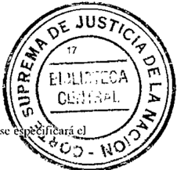

TOMO 313

Volumen 1

1990

## FALLOS DE LA CORTE SUPREMA DE JUSTICIA DE LA NACION

MARIA R do 48 de la OLIVERA Løtrada Secretatia

FALLOS

DE LA

## CORTE S U PR E MA

DE

## JUSTICIA DE LA NACION

PUBUCACION A CARGO DE LA SECRETARIA DE JURISPRUDENCIA DEL TRIBUNAl.-

TOMO 313 VOLUMEN I FEBRERO. AGO.::..S::T:..:O:

-.----

¡

Bjülioteca de la

\

;

Co~;~ Suorema ;e

\

N,' Orden

&amp;1 802

\_--------1

GRAneA SAN LO~~&amp;htijS •.•. -

é1'

f" ""\ \:22. '

Quilmcs 284 - BUfnos;J.A~irrscs~ 1990 ~-

Copyrigth (j) 1991 by Corte Suprema de Justicia de la Nación Queda hecho el depósito que previene la ley 11.723 Impreso en la Argentina

Pl"i"Jed il! fArg&lt;'tllilltl

. ,

## S U P R F M A CORTE L A DE ACUERDOS

## AÑO 1990

## FEBRERO. AGOSTO

## CUERPO DE PERITOS CONTADORES. RENUNCIA Y DESIGNACION.

\_NOJ 1-

En Buenos Aires. a los 15 días del mes de febrero del aiio mil novecientos noventa, reunidos en la Sala de Acuerdos del Tribunal. el se-ñorVicepresidente doctor don AugUSloCés&lt;lf Bclluscioy I\)s seíiores jueCes doctores don Carlos S. Fay! y don Jorge Antonio Bac4ué.

Consideraron:

JI!) Que medi,mlc Acordada 53 del 2 de noviemhre último este Tribunal efectuó tres designadoncs en el Cuerpo de Perito" Contadores. entre ellas, la del sciior Pedro Luis Santa María. quien ocupó el segundo lugar en el orden do.: mél;tos, en el concurso que al ('fc.clo ¡;c realizó.

- 2~) Que dicho proresional. por los fundamcnlm venidos en el csclito presentado ante la Secretaría de Superintendencia Judicial el 21 de noviembre ppdo. (fs. 141 del expte. S.433/87), declinó su nombramiento como pelito l.:Ontadof.
- }&lt;:') Que cn su virtud. es necesario prol.:cuer a In designación de un reemplaz.ante. con arreglo al .resultado del cilado COJlcurso.

Por ello .

Acordaron:

Aceptar la rcnuncia presentada porcl ConÚu:!orI\ .. dro Luis Santa María y uesignar en su lugar. como perito. en el Cucrp{lde Contadores Oficiales de la Justicia :\'aCi(lllal al sdi.or AlfrednR. PopJilkin (D.N.L n'-' 10.832.083), quien OCllIX) el l.:WLl10 ugar l en el orden de mérilOs.

TnJo .lo cua.l dispusieroll y mandaron. ordcnando (¡lIC ~e l'Olllll11icase y registrase en el libro 'correspondienle, por ante mí. que doy fe. ~ AUOll~T{)ÉSAR BEt.I.USClO-CARLOS. FAYT-JoRGE A:-&lt;TONIO C BAC(lUÉ -Clalltlio M(/rcl!!o Kipcr (ScI.Tera,-i(l./.-

6

## ACUERDOS DE LA CORTE SUPREMA 313

## CORTE SUPREMA DE JUSTIC£A. DESIGNAC£ON DE SECRETARIO LETRADO.

-Nº2-

13uenos Aires. a los 15 días del mes de fchrcrodel mlo mil novecientos noventa, reunidos en la Sala de Acuerdos del TribunaL el señor Vicepresidente doctor don Au!!uSIOCésar Belluscio y los señores jueces doctor~s don enrIos Santiago Fa)'! y don Jorge Antonio Bacqué.

## Consideraron:

Que mediante Acordada 34 del 7 de junio de 1984. aclarada por la 53 del 14 de agosto del mismo año. esta C0l1e estahleció que la ucsignación de funcionarios en los cargos que requieren título habilitante debe efectuarse por el régimen de concursos.

Que por resolución 719 de fecha 15 de agosto dc J 989. se llamó a concurso para cubrir un cargo de Sccrctalio Letrado y un cargo de Prosecrclario Letrado de la Corte Suprema.

Que la Comisión Asesora designada para dictaminar en el mencionado concurso procedió a la evaluación de los antecedentes de los po.~tulantes y el mérito de la plUeba esn;ta. para cubl;rc1 cargo de Secretario Lí.'tratlo.

Por dio.

Acordaron:

Efectuar In siguiente designación en la C0l1e Suprema de Justicia de la Nación: Secretario Letrado al dm ..or 1 Ricardo Manuel Rojas (D.N.\. n" 12.447.463 - clase 19SH). quien ocupó el primer .lugar en el orden de méritos.

Todo lo cual dispusieron y mandaron, ordenando que se comunicase y registrase en el libro correspondiente, por ante mí, que doy fe. AUGUS.TOÉSAR C BaLusao CARLOS S. FA YI'- JORGEANTONIO 13ACQUf::: -Clal/dio Moralo Kiper (sccrerar;o).-

## EMPLEADOS JUDICIALES. MEDIDAS DE FUERZA.

-Nº3-

Buenos Aires, a hlS 19 días dd mes de febrero del año mil novecientos novenla, reunidos en la Sala . de Acuertios del Tribunal. el señor Vicepresidente doclor doil Augusto César Belluscio y los sci'iorcs Jueces doctores don CIrIOS Santiago Fay! y don Jorge Antonio Bacqué.

Consideraron:

Que la 1'0l111a rregular i en '1ue han funcionado los Tribunales Nacionales y Federales, requiere lomar medida.~ que cvilcn perjuicio a los liliganles.

Por ello.

Acordaron:

Todo lo cual dispusieron y mandaron. ordenando que se comunicase y registrase eh el libro correspondiente, IX)!" ante mÍ, que doy fe. AUGUSTO CtSAR BELLU5(lO -CARLOS S. f-A'H -JORGEANTONIO BACQUÉ -C/audio M. Kiper (Secretario).

## EMPLEADOS JUDICIALES. MEDIDAS DE RJERZA.

-N'4-

Buenos Aires. a los 22 días del mes de febrero del mio mil novecientos noventa. reunidos en la Sala de Acuerdos del Tribunal. el selior Vicepresidente doctor don Augusto Cesar Belluscio y los señores Jueces doctores don Carlos ,Santiago Fayt y don Jorge Antonio Bacqué.

Consideraron:

Que la farola irregularen que han funcionado los Tribunales Nacionales y Federales. requiere tomar medidas que eviten perjuicio a los liligantes.

Por ello.

Acordaron:

Declarar los días 21 y 22 del comente mes. inhábiles para los tribunale.~ nacionales y federales del país. sin IX: rjuieiode la \'alidczde los actos procesales cumplidos. que no hubiesen sido actuados en reheldía. Todo lo cual dispusieron y mandaron. ordenando que se comunicase y registrase en el libro corrt.'spondicnle. por ante mí. t¡ue doy fe. AlJ(¡lJSTO CÉSARBELUISClO -CARLOS S. FAyr - JORGE ANTO:&gt;&lt;lO BACQUÉ -C1ol/dio M. Kiper (Secretario).

## CORTE SUPREMA DE JUSTICIA DE LA NACION. DESIGNACION DE PROSECRETARIA LETRADA.

En Buenos Aires. ¡¡ los 27 días del mes de febrero del ,11iomil novecientos noventa. reunidos en la Salade Acucrdosdel Tribunal. el seliorVicepresidentc doctor don AugustoCésar Bclluscioy los señores

## DE mSTICIA DE LA NACION 313

## ACUERDOS DELA CORTE SUPREMA

3D

Jueces doctores don Carlos Santiago Fay1 y don Jorge Anlnnio BacllUé.

Cnmidcraron:

Que mediante acordada 34 del? de junio de 1984, aclarada por la 53 del 14de agosto dclmismoailo\_ esta COJ1eestableció que la designación de funcionarios en los cargos que requieren título habilitan le debe cfcclllarse por el régimen tic concursos.

Que por resolución 485 de fecha 13 de junio de 19R9. se llamó a concurso para cuhrir un cargo de prosecret;uio letrado de la Corte Suprema.

Que la Comisión Asesora designada para dictaminar en el mencionado concursn procedió a la evaluación de los ¡mtccedenes de los poslUlanle~ y c1méritn (IL-laprueba escrita.

Por ello.

Acordaron:

Efectuarlasiguiellte designación en la C0l1c Suprenl1\de Justiciade la Nacil)n: Prosccretaria Lclrada ¡¡ la doctora María Sus;ma i\'ajuliela (D.N.I. n~ lO,664,9J~ clase 1952). qUit'll ocupó el primer lugar en el orden de mérítos

Todo lo cual dispusieron y mandaron, ordenando que se comunicase y registrase en el libro :orrespondiente. por ante mí, (lile doy fe. AUtltiSTO CÉ~,\RBELLUSCIOCA~LO$S. FAYT- JORGE ANTo;-.lm -BACQUÉ -C/(J/ulio M. Kil'l'r (Sc('rcwrioj,

## PROCURACJON GENERAL DE LA NACJON. ACEPTACION DE RENUNCIA.

-N'6-

En Buenos Aires, a los 27 días del mes dc fcbrcrodd mlo mil novécicnlos noventa, reunidos tnla Sala de Aeuerdo~ dd Trihuna!. c-Iseíklr Vicc-prcsidcllle de la COl1e Suprema lIl' Justicia de la Nación doelor don AUgUSl&lt;l CéSill Belluscio y los sellnres Jueces doctores don Carlos Sallliagn Fayt y don Jorge Antonio Bacqué.

Acordaron:

Aceptar -con cfet:tos a p·. u1irdel l~ de marzo de 1990- la renuncia presentada pore1 sellor Secretario Lclr,l(\o de la Procuración Gcneral de la Nación. doctor Juan C'arlns López.

Todo lo cual dispusieron y mandaron, ordenando {Ille se coúmnicase y registrase en el libro correspondiente ¡"Xx anle mí, que doy fe, AUGUSTO Ci::\_~AR FLLllS(JO - CARLOS S, FA B 'tI' -JOf(OE ANTONIO BACQUÉ -C/audio M. Kipcr (San'tario),

## DE mSTlClA DE LA NACION

.113

## REGLAMENTO PARA LA JUSTICIA NACIONAL. INCORPORACION DEL ART. 21 BIS.

Buenos Aires, a los 27 días del mes de fehrero del año mil novccienlos noventa. reunidos en la Sala de Acuerdos del Tribunal, el señor Vicepresidente doctor don Auguslo César Bel1llScio y los señores Jueces doclorcs don Carlos Santiago Fayt y llon Jorge Antonio Bacqué,

## Consideraron:

Que el régimen disciplinario aplicable a los agenles y funcionarios del Poder Judicial de la Nación \_artículos 13 a 19 del decreto - .ley .l2S5j:'iS y 21 a 23 dc1 Reglamento para la Justicia Nacional - carece de una disposición sohre el límite telnJXxal de las medidas preventivas que decidan imponerse en los sumarios adminisfralivos instruidos, situación que difiere del régimen vigenlc en el ámbito de la Administración Publica Nacional (cl)nfr. ley 22.140 y decreto 179RjlW).

Que se ha adver1ido la existencia de situaciones en las que, l)l)r la prolongación o extensa duración de las suspensiones prcvcnlivas -las que virtualmente configuran una situación sine die-. se producen erogaciones inadecuadas parael Poder Judicial. pues, conc1uidos.los sumarios, no se aplican cn definiliva medidas disciplirl&lt;u;as, éstas no se traducen en la privación de salarios. o la sanción de smpetlSiún resulta inferior al lapso de la medida provisional.

Que con el fin de reglamentarlos supuestos dest.:riptos,

Acordaron:

Incorporar como aníclllo 21 bis del Reglamento para la Justicia Nacional. la siguiente disposición: '"En caso de disponerse la insl11lcción de SUnli\l;OS adminislralivos. si la pel111anencia en funciones fuere inconveniente, la aUloridad de supcrinlendencia pel1inente podr¡i dis¡xmer el cambio de lan"as de los agentes y funcionario~.

De no resullar esto posible. o cuando la gravedad del hecho así lo aconseje. los sumariados podrán ser smpendidos preventivamente por un lénnino no mayor de 30 días. prorrogable por otro período de hasla 60 días. Amhos lérminos se computarán en días corridos.

El pago de haberes durante el período de 13 slIspC'llsión sólo Sl'f¡i procedente si en la causa administraliva no se aplican sanciones. () si éstas resultan ser infel;ores al plazo de la susIXnsión preventiva. en cuyo caso se reconocer¡i la lliferC'ncia si la sanción consislc en suspensión",

Todo 10 cual dispusieron y mandaron. onklMnJo yue se comunicase y registrase en el libro correspondiente, por ante mí.llue doy fe. AUGUSTO CÉSAR13ELLusno- CAJ.l.LOS . FAYT- JORGEANTOKIO S BA('Ql1É -Clow/io lv/arc£'!o Kil'C1" (.\'ccrctario)

•••

## ACUERDOS DE LA CORTE SUPREMA

313

## EMPLEADOS JUDICIALES. MEDIDAS DE FUERZA.

-Nº8-

En Buenos Aires. allº día del mes de marzo del año mil novecientos noventa. reunidos en la Sala de Acuerdos del TribunaL el sci'ior Presidente doctor don Enrique S. Pctracchi. el señor Vicepresidente doctor don Augusto César Belluscioy los señores Jueces doclores don Carlos Santiago Fayt y don Jorge Anlonio Bacqué,

## Consideraron:

Que la fonn&lt;l ¡rregularen que han funcionado.1os Tribunales Nacionales y Federales. requiere tornar medidas que eviten pcljuicio a los litigantes.

Por ello.

Acordaron:

Declarar los días 28 de fchrcro y 1" del corriente mes. inháhiles para .los Tribunales Nacionales y Federales d~l país, sin pCljuicio de la validez de los aelos procesales cumplidos que no hubiesen sido actuados en rehcldía.

Todo lo cual dispusieron y mandaron, ordenandcr que se comunicase y registrase en el libro correspondienle, por ante mí, que doy fe. ENRlQlIE SANTIAGO PETRACCJ1J -A¡¡GUSTO CÉSAR ilELUlSClO \_ CARLOS S. FA Yf -JORGE ANTONIU J3ACQUi: -Claudia Moreda Kiper (Secretario!.

## REGLAMENTO PARA LA ORGANIZACION y FUNCJONAMlENTO DE LA OFICINA DE NOTIFICACIONES PARA LA JUSTICIA NACIONAL Y FEDERAL. MODIFICACJON.

-Nº9-

En !lucnos Aires, al jQ día del mes de marzo del afio l1Iil novecientos noV\:'nta, reunidos en la Sala de Acuerdos del Tribunal. el seilor Presidente del Tribunal doctor don Elllique Santiago Petmcchi. el señor Vi('epre~identc doctor don Augusto César Bclluseio y los seilores Jueu::s doctores don Carlos Santiago Fayt y don Jorge Antonio Ibequé,

## Con.~ideraron:

Que este Tlibunal ha advcJ1ido la nccesidad de una urgente modificación de varias disposiciones contenidas en el Reglamento para la Organi 7~u:ióny Funcionamicnto de la Ofiei na de Notificaciones para la Justicia Nacional y Fedeml (ac. ]9/80), con el fin de adecuarlas a los principios que rigen la materia en los respectivos ordenamientos procesales.

Que. adcmás. se procura por este medio facilitar un mejor y más eficaz desempeño de los ofici,úes nolificaJores en el cumplimiento de SLt.~ funciones.

Por ello,

Acordaron:

- 2") Sustituir el citado capítulo pord que a continuación ~etranscribe como anexo 1y que fomla parte de la pre~ente.

Todo 10 cual di~pusieron y mandaron, ordenando que ~e comunicase y rcgistrase en el libro correspondiente, por ante mí. que doy fe. AUGUSTO CÉSAR BELLUSC10 -CARLOS S. FA yf -JORGE A~'TONIO BACQ\JÉ. Ante mí: Claudio M. Kipcr (Secretario).

## ANEXOI CAPITULO SEGUNDO

## Parte I :

## Oficial Notificador-Desempeño en la oficina

- 118 \_Presente el oficial notificadof, se dirigirá a la mesa de control que le corresponda a fin de recibir las órdenes juJiciale~ para diligenciar, y confornlc con la nómina y cantidades. que .moje la planilla de entrega y recibo. la finnará. En el mismo acto devolverá toda cédula que no corresponda a su zona.
- 119- En la citada mesa de control hará entrega, diariamente, de las cédu'las diligenciadas, procediendo de la siguiente forma:
- a) Pennanecer.i en la me~a de control hasta que el encargado de ella las verifique.
- h) Practicará la operación antes referida, por tumo; no se presentará hasta 4ue el encargado haya atendido al notificador anterior.
- e) L.1. entrega dc las c~dula~ diligenciadas la realizará de una sola ve7.y en la fonna dispuesta por el artículo 52.
- d) No podrá delegaren otros empleados la entrega de sus propias cédulas, ni ésta hacerse en ot ro lugar tJ"e en la mesa de control.
- 120- El oficial notificador Jebe concurrir diariamente a la oficina. obselVar con exactitud el horario establecido y:
- a) Entregar diariamcnte las cédulas con actas labradas de diligencia~ practicadas en el día de su devolución o en el día inmediato anterior (hábil o inháhil según el caso).
- b) Si fXJl" un motivo cxccpcional se viera impedidode llegara horanoa oficina, avisará telefónicamente

## DE llJSTICL.I,. DE LA NACION 313

12

a la jefatura

Cllll &lt;Íllle[aeiól11;1

hora ('n que se pn::sentar.í.

- c) En el caso del inc. b. al llegar juslificará su tardanza según se Ir¡¡felk dcmora ocasionada por una diligencia judicial o por motivos personales.
- ]21Lc est:í prohihido al oficial notificador aceplar o diligenciar cédula.~ llue no hayan sido oficialmente recibida.~ pur la oficina. delegar su.~funciones y practicar diligencias fuera de .~uzona, exccpto cuando cxi.~ta orden de la jefatura.
- L'l comprobación de que no conCUlTClli¡lriamellte a su zona pam cumplir con sus deheres deherá comunicarse de inmedialo a la Secretaría de Superintendencia Judicial de la Corte Suprema de Justicia.
- 122 -Sin plena comprobación y juslificalla causa, será considerado hecho grave del oficial IlL)tificat!or 110concurrir a las citas concedidas a los autorizados:
- a) Cuando el aUI~)I'ÍZado deJl\orase en conculTir a la cita convenida. 10esperará un cual10 de hora. :Si dentro de esle pla7ü no se presentara. labrará acra Je su lll) comparecencia. dl'hiendo devolver de inmediato la cédula a la oficina.
- b) Si cn el l'ua110 de hora de haberse e()n~titllidlJ en el lugar de la diligencia. el autorizado no presentare los medios con Ins cuale.~convino concurrir. labraní acta de esta circunstancia y devolverá la cédula a oficina.
- c} Con antelación:\ la llegada JcJ &lt;lUtOri7~1do l lugar a donde debe efectuarse la diligencia \_o aunque éstc nocorll:urric.~e a la cita convenidase ¡lhstendrií de todu acto lllle ponga en conocimientodcl requerido el motivo de su pr~seIlcia en el lugar.
- tl) Es su obligación dejar constancia en la cédula de todo cometidollue realice y que sea conducente al cumplimiento de eJla. se efectúe éste denlm del Tribunal o fuera de él.
- e) Sólo nlll causa plenamente justificada püdrá la jefatura rclcvilrlo de actuaren el diligenciamicnlo de una cédula.
- 12::1- Los Oril'iaIL'snol ificatlores obedecerán las indicaciones qu{'lcs fonlluleelencargadode];1 mesa dl'C0111rolcorresp()Il'!lenl(' a su seclOf.yue sean conducentes al cumplimientode lodispueslocncl rcscnle reglamCtlll1.
- 124- El jek o sub-jel'e administrativos comunicarán por escrito al pmsecrelario jefe de la oficina el nombre de los notificatlores (¡lIe incurran en demoras en el dilig{'nciamicnto o entrega de cédulas a la oficina; dará a cOllocer en cada UIlade estas comunicaciones el número de días en que el notificador se halle atrasado, y la cantiJad de Vl'ces en que haya reincidido en alrasos. procediéndose de COnfOnllidad con lo estahkcido en el artículo 54 in fine.
- 125- J .·as cédulas que se hallaren ~ill poder enlregar alnotificadorde la zona Clm'espondiente. serán. diligenciadas por los llolificadtll'es de las zonas linderas o. en sudcfccto. por los que lnjefatura dl.::tcrnline, si las circunstancias o el rnejordesenvolvimienlO de);1 oficina lo exigieren. Esta de.lcgación se efectuará dentro de las 24 horas de conocido l'! impedimento.
- 126El rcintcf:l'O lid notificador ausente no implicará In devolución de las cédulas IXlI" pane del reemplazante. 'Iuien deherá diligcnciarlasen lénnino. conjulllamente con las que correspondan a su zona.

## Partc I

## Di': JUSTICIA DE L'\ :-.'ACIO;-; .ll:1 C"mml de las cédulas

- a notilicar. domicilio de ésta. indicación dcl juicio. que toda

El incumplimienlo de alguno de Jos supueslos anteriores implicará la devolución de la cédula a la oficina cnel ac10dc recepción si se tmladc una cédula con car.Ít'terdc urgcn1l::,cn el día, OCOI1 habilitación de día y hom: y como máximo el día h,íbil siguiente. si 110fuera de diligenciamientn apremiante.

- 12R- Cuando en una cédula se adjuntaren 1mb duplicados de los necesarios. en todos los supetf1llos se eru7.A1l1iu texto ~ con la palabra "SOI3RAN". dejándolos adheridos a ~u respectivo original.

## Plazos para el diligcnciamicnto

- 129- Los ténníll()S para el diligenciamientode I¡¡scédulas se contanin IX1fdías luí.biles y COlllcnzanin a correr al día siguiente del indicado en el sel10 fe¡;hador de cnlmda estampado en aquéllas.
- 130- Ellénnill(l del diligenciamiento de las cédulas es de 48 horas. el que podrá ser prorrogado por 24 horas más, cuando mzones justificadas pam el mejoruiligendamiento de una cédula así lo requieran. De dio deherá dejarse cOllstanciacncl acta que se lahre. Se ohservará una lo1erancia de 2-4 homs de atraso para Jos casos excepcionales en los que un notificador preste servicios en dos ZOI\¡\S.
- IJ 1- La~ 1H)¡ifiCilclones con cariÍcter de "urgenle". "Ctlll habilitación de día y hora" o indicación "nolifíque~e en el día", senín practicadas en elll1is11l11díade su remisión a la oficina. Si se tmta de cédula a notificarse "con hahilitación dc día y hum" y la diligencia no puede ser cumplida dcntro de hurario hábil (al1ículo 152 del Código Proccsal Civil y Comercial dc la Nación) dchc praclicarsc fuera dc él. Si se ordena la notificación "cn el día" o "con carácter urgcntc", dehe cumplirsc en el horario comprendido entre las siete y las vcinte horas. ConfonllC con la 11011na citada en el párrafo anterior.
- 1.~2- Las cédulas diligenciada~ seriÍn dcvueltas en cl día () como tn¡íximo el día hábil siguicnte de practicada la diligencia.
- 133- Si un notificador no tiev{)lviera en clmist\1o licIo de la recc¡x:ión una cédula ajena a su zona, deberá diligcnciada cualquiera que sea la zona y dentro del ténnino reglamcntario.
- 134- Ni la lejanía de una 7.ona. su extensión o configuración. las ('ondiciol?cs dimáticas. el numero o calidad dc las diligcm:las, el enganche dc una cédula con otra ti su traspapclmnien(o -en atención a lo dispuesto fwrlos al1kulos.'í 1Y127-. ¡x1dnín invocan,e como atenuantes parad no l.ulllplimientoestricto de los lénninos.

## ACTAS

- 135Las aclas de las diligencias en un todo. o, en su caso, en la parte variahle de la plancha. f0ll1lulario. serán manust:rilils con lel ra hien legible por el propio oficial not ifie:luor: se dejará el illargen correspondiente, tanto en los costados de la hoja como en las pal1es superior C'inferior. y se observaní la

## mayor prolijidad.

- 136- Siempre que el oficial notificado]" f¡rnle en su carácter de tal. deberá hacerlo con aclaración de f¡Olla y mención del cargo que desempeña.
- 137- Cuando el acta que labre comprenda más de una foja. sobre los dobleces y uniones internas de sus márgenes. debe extender su finna entera con el sello ac1aratolio de ésta. en fa01la tal que una parte de la [¡rnla y sello queden estampado.~ en la hoja anterior y la otra parte en la foja siguiente.
- 138Cuando. por cualquier motivo. se devuelva una cédula junto con las copias de escritos. documentos. ele. que laacompaiiall al recibirla para su diligcnciamicnto. en el infomlcoaclaquc se labre en aquélla, se l.kjaní expresa constancia dc-(Juc se devuelve con las referidas piezas. .
- 139- Siempre guardando el margen debido. los sellos ser¡in estampados con todo esmero, de modo que sean perfectamente daros y legibles.
- 140- Los llamados en un domicilio serán insislentes y efeclllados en distintas oportunidades. dentro de los plazos reglamentarios para el diligenciamiento de las cédulas: se labraran aL""lase cada uno d de los inlenlos.-
- 141El oficial notificador. en el acta o aClas que confeccione al devolver las cédulas .~innotificar, deberá dejar constancia de todo lo acontecido. e infoll1wr detalladamente sohre las circunstancias que pida el diligenciamiento. a los efectos de que c1juez o trihllnaltengan el Tll¡bamplio conocimiento de los hechos.-
- 142En el margen del duplicado o de los duplicados de las cédulas que corresponde dejar, el notificador asentad con letra clara el día y hora en que fue cumplida la diligencia. suscribiéndola con su fimla. La falla de indicación de la fecha o su no coincidencia con la {Iue comte en el original, comprometerá su responsabilidad.-
- 143- En todas las actas que labren. los notificadores deberán dejar expresa constancia de la persona con quien practican las diligencias. individualizándolas y. en su casn. dellug:ar donde fueron alendidos. No es suficiente la mención ·....que dijo scrde la casa ...·., por no ser esta manifestación clara y concreta. Dcben expresar el motivo por el cual la persona que recibe la cédula no la filma.-
- 144- Acta circlln.~tancíada es la que contiene dctalJadmncnfe la infom1ación de los hechos acontecidos. persona o personas intcrvinientes. lugar. día y hora en (llIe se practica la diligencia.-
- 145- En el diligenciamicnto de una cédula dirigida a varias personas se dcbe requerir la presencia de todas ellas y:
- a) Si de e.~erequelimicnlo resultase un diJigenciamienlo entcramente concordante para todas ellas, el acta será labrada en plural.
- b) Los diligenciamientos cuyos rcsullados no sean concordantes se labrarán en aelas separadas.-
- 146El oficial notificador deberá utilizar los sellos para labrar aclas de diligencias cuyos textos en uso ser¡in provistos porcljefeo sub-jefe administrativos. En ningún caso podni disponer de los sellos de recepción y devolución.-

## NotificaciÓn personal

## 147Lm nOlificadores deberán:

- al Diligenciar dentro de los cinco días h&lt;í.bilcs, las cédulas que recihan para notificllr exclusiva y

personalmenle a sus deslinatarios. devolverlas a la oficina en el mismo tlia. o e practicada la noliriG1Ción; ni aun cuando sus cometidns den resultado ncgalivo prime

- c) Hacer como mínimo tres intentos para practicar esta clase de diligencia. si j10rcualquier causa se hubieran fruslrado los propósiloS de efeclUarla nOlificación.-

## Identificación de las personas:

## l..tRSon dOCUlllentm oficiales de nl)tificación:

- a) La libreta de enrolamiento. la librela cívica. el documenl('l nacional de idcnlidad. la cédula de idéntidad, nacional () provincial y L'i pasapol1e argentino.
- b) Excepcionalmente se admilirán como elemento idenlificatorio. documentos con fotografía del poseedor. comprobatorios de una dignidad. grado universil¡lIio. o cargo público. expedidos únicamente por aUIOlidades nacionales. provinciales n municipales de la República Argentina.-

## Acredilamiento del cargo:

149- Donde el oficial notificador se presente en carácter de laL aunque no se le pida que acredite su cargo. es su deber presenlar la creucncialllue otorga la Secretaría de SuperintcndclH.:ia de la Corte.

## Allanamiento:

150- Para ¡Kltlar compu\síValllCllle aun en lugar abierto al púhlico. se requerirán las facultades que c!elellllina el al1kulo 214 del Código Procesal Civil y Comercial de la i\':u.:íllll:

- a) La ordcll de allanamienlo de un domici\íouebe L'SlarCXpresamente consignada en el instrumento.
- h) El al1anamienlo de un domicilio se cumplid, siempre que en él haya ocupanles en el momento inicial de la diligencia y medie oposición ante la pre~encia del oficial notificadof.-
- 151Nunca se allanará lln d\ll11icilio don"dé no se responda a los l1amatll)s. excepto qlle:
- a) Sea visible la existencia de ocupantes en aquél.
- b) Se ordclIe su cumplimiento aulltlue no se rL'~pollllaa los l\amado~.
- c) Se auWrice a "ill1cnlar cerraduras.

## Concurso Policial

- 152Para lograr El cooperación policial se lIalllar&lt;Í lc1cfónicalllentc a la División Com,fnt!o Radioclél . .:trico de la Policía Federal. Excepcionalmente. se retlucrini el concurso dcl agente en servicio de calle y en este caso se t!ar&lt;Í.tckfónicuHente. inmediato cnllOt.:imicnto y llamado de cooperaciún a la seccional de Policia.-

## Parle III

## InsllUCcitlllCS para el dilígcnciamicnln:

- 153- L En una cédula con tlomicilin denunciado que no corresponda al fuero penal. remitida a una caSa finca -porcj: Corrientes 1515-:
- a) Si se responde ¡¡ los llamados y el requerido habita c¡lugar. se notifica a cualquier pel'son¡¡ de la casa.-

b) Si ~(' responde a los llamados y el nXluerido n~) vive allí. se devuelve sin notificar.-

- el Si no se responde a los llamatlos. dene intentarse una segunda vez; si nadie responde nuevamente. se consulta a vecinos linderos. Si los vccino.~ le indican (¡lIC el n'querido:
- I) Vive allí, se fija la cédula en el domicilio indicado. con las constancias de los pasos dados.-
- 11) Si de la eOlBulla a lns vecinos surge que el rc(¡uerido no vive en ese lugar o no lo conocen, se devul'lve la cédula sin notificar y se deja constancia de los pasos dados (acta cireunstanciada).-
- 11)Si la cédula se remitc 11 unafillca de varios pisos y departamentos pllrej: Corrientes 1515, 8\'piso. Dto. B-;
- a) El domicilio indicado dehc ser t~lIalmente coincidente. De no ser así. debe devolverse indicando la discordancia u omisión que se compruebe.-
- b) Si el domicilio no es completo por falta de indicación de piso () departamento. se podrú salvar alguna de las ~mlisiones, si el nombre del requerido se encuentra en un lablero indicador o visihlemente expuesto en el halJ del edificio. Una W7,(Iue se encuentre individualizado, se proceded a ~'fecluar el diligenciamienlo haciendo constar en el acta ti lugar preciso donde sc t'/'ectuó (acta circunstanciada).
- c) En caso de scr coincidente el domicilio indicado en la cédula pero que nadie responda a los llamados, de acuerdo {~onel ,Ulículo 14'1 del Código Procesal Civil y Comercial debení. consultarse al encargado y. si éste indica 'luC el requerido vive alli. se diljg~'ncj¡lf¡í.la cédula cn su pcrsona; de no querer recibirla. se procederá a fijar el dllplica~lo y copias -si las tuvieraen ]¡l pUl'lia de acceso al domicilio indicado. Si la aveliguaci{ln se hiciere a través de alglin vecino del departamento. se fija en la puerta de acceso citada (acta circunstanciada). Por ningún motivo debe dejarsc el duplicado al vecino,-
- d)Si se cn&lt;'Ontrarc ta chapa municipal uhicada en un poste,puelia tapiada, ventana, etc., se devolverá la cédula sin diligenciar y se dejad constancia de lo ~'ncontralb (acta circunstanciada).
- e) Si sc complUeha la inexistencia de chapa llwnicipal y en slllugarla numel1lción se halla pinlada o confeccionada de otra fonna. la diligencia se efecllía cn esc lugar.
- 154Cuando se trate"tle l10tificarcédulas en las cuales se dcha (lejar el previo avisolle ley, solamcnte se daní. cumplimiento al avisode{enninado en el art. 319 del Código Pmce~al Civil y Comercial cuando no se encuentre a la persona a notifil:ary se infonne que la mi~ma "vive" en ese domicilio. Dicho aviso se dejará por esnih) a persona de la casa o al encargado del edificio; y. en el acta {l"e se labre. constará su cumplimiento, con indicación de quién atendió, y del día y hora en que sc concUlTirá a practicar la diligenl:ia. Si el día fij¡¡do no se encontrase al requerido, se practicará la notificación de acuerdo con el arto 141 del Cúdigo Procesal Civil y ComerciaL-

155En ulla cédula de traslado {k demanda o citación a reconocer fimllls (arts, 339. 526 Y94 del

## DE nJSTj{:lA DE lANAC10N

## 3D

- Código Procet:al Civil y Come~cia1 y 68 lIl'la ley 18.345):
- a) Si sc encuentra al
- b) Si no se lo encuentra, pcro vive. se dejará aviso de ley
- 'podido diligenciarduranie c] horario hábil. sc debe practicar fucra del horario de 7 hs20. en cl día dc su encontrarse al requerido. se proccde comocn cl puntob) (An. 339 Cóligo Procesal Civily Comcrcial) haya
- d) Si la diligencia es "en el día" debe praclicar.;e en cl1H)nlrio comprendido entre las 7 hs. y las 20 hs. confonne con el artículo 152 del Código Procesal Civil y Comercial.

## 156- Casos esocciales:

- a) En una cédula de traslado JI.' demanda de divorcio dehe avcliguarsc si los cónyuges viVen en el mismo domicilio: de ser así c1traslaJo de demanda se notificar:í cn fOffila "ocrsonal" al dcmandado.-
- h) Si por orden del juez o tribunal el diligcneiamiento debe realizarse en farola pers(mal en un domicilio constiluído. prevalecerán las nOffilaSatinentes a la notificación" personal" con abstracción de las referentes a la notificación del domicilio constituído.
- e) En una cédula de citación para ahsolverposicionc". no se lomanín cn cuenta los plazos procesales para efectuare] diligellcill111iel11o. que sed "cumplido en todos los casos" .excepto que la fecha designada para laaudiencia sea anterior a la de recepción de la cédula en la oficina (al1. 409 - CÓlligo Proccsal Civil y Comercial-).
- d)Cuandolas cédula.~ van dirigidas a una elllhajadaot:onsuladooa per~otlas que pertenezcan a ellos. en caso de no qUC'reraceplar la cédula. se proceded a devolverla sin notificar. dchidamente infonnada (acta cireunst¡mciada).-
- L1S barcos de bandera eXlranjera no se encuentran t:omprendidos en este procedimiento. salvo que sean barcos de guerra.-
- e) Las cédulas bajo responsabilidad de la parte actora se tliligencian con ab"tracción de que el r:e(IUeridoviva o no viva en ese domicilio.
- En caso dt: qUl' el domicilio indicado en la cédula no esté comple\(1. se devuelven sin dil igenciar. por no ser domicilio cierto.
- 157En los juici()s de declaración de demencia las cédulas dirigidas al presunto insano (:1I1.626 Código Procesa] Civil y Comcrcial):
- a) Se notifican cn fOlllla personal. identificándolo con documento y fil111asi fuera posible (al1. 626. inciso .:i2).
- h) Si el presunto insalltl. p'x diversos motivos. no pudiera identificarse. se identifkar&lt;Í a la [X'rsona que indl\"'I.dualice al feljuericlo y se entrcgani el duplicado a aqurl.-
- d En caso de no p(xler realizarse la diligencia~ se devolvení la t:édula al juzgado sin notificar. y se dejará constancia de los motivos (acta circullstanciada).-
- 15R-Con relación a la, Ilotificllcíones de demandas enjuicios de desalojo. se deherá leer el confrato de lrlCación.con el fin dedetcnllinarsilacédula se hadirigidoaldolllicilioest?Cl'ial al rcal del demandado.

18

o al inlllueble cuyo desalojo se pretende.

- ¡\) En caso de estar dirigida al domicilio reaL o al especial del contrato, se aplican las nonnas gcncralc"cn maleJia lic notificaciones (djul'zh:l dctcnninado, scglÍn elart. 6H2del Código Procesa] Civil y Comercial, dónde diligc la t:édula).

h) En el snpucslocn el que lacéJulaal demandado esté dirigida al domicíliodcl inmucblea desalojar. el que no coincide con el rcal. con la orden de cumplimiento del a11. 683 del Código Procesal Civil y Comcn;ia1, pueden presentarse dos situaciones prcvi.slas:

1) ausencia de chapa jdcn!ificatoria.

2) falla o deficiente especificación de unidad (l piso.

En ambos supuestos dc deberá consultar a los vecinos, y en su caso al encargado o a los ocupantes, para hlgrar la it!entificadún y posterior notificaci.ún al demandado.

Si O() se ellcllenlra al demandado. dehe devolverse la cédula al juzgadó. y labrana.: acta circunstanciada para que sea cljucz quien decida si procede el libramien!ode nueva cédula confonnc con elart. 339 del Código Procesal Civil y Comercial de la Nacil'lIl.- e) Si cst,i ordenado el Clllllplilllicntode los ar1íclllm 683 y 6R4 del Código Procesal Civil y Comercial. se dehení proceder a diligenciar la cédula Jiligidll a suhinquilinos y ocupantes.

- 159- Elar1ÍL.:uJo6R4 del cilado código se cumple en cédula dirigida al inmueble reclamado y c.&lt;; la dilig.encia que continÚa generalmcntc al acto de localización. Ellw!ificador tiene el deher de idcntificar a 1m ocupantes. de notificarlos de la existencia del juicio. de prevenirlos acerca de los efectos de la sentencia y de inf~)mlar al juez acerca del car.ícter ~I"e invo(luen los presentes (acta circunstanciada).

Son sus derechos: exigir los documentos de identidad. requerir el auxilio dc la fUerz.1 pública y. eventualmente. Hllanardnl\licilio~.

160- El incumplimiento de las J111Il11aS:cedcllles pn hará incurrir en falta grave.11 oficial nolifieador (art. 6R4 "in fine").

- 161- Para el diligcllciallliclllo de las cédulas de nOlificaci('lll que se libren en el fuero penal deberá darse cumplimiento a lo dispueslo en el Título VI del Libro 1del C6digo de Procedimientos en MateJia Penal (arts. 123/142). La reglamcntación precedente regirá con car,ícter suplctori().

## CORTE SUPREMA DE JUSTICIA. CREACION DE LA SECRETARIA N° 6. DESIGNACION DE SECRETARIA LETRADA.

-N" IO~

En Buenos Aires. a I(ls 6 días del mes de marzo del año mi! llovecietl!os noventa, reunidos en la Sala de Acuerdos del TribunaL el señor Prcsidente de la Corte Suprema de Justicia de la f\ación doctor don EnJique Santiago Pretacchi. el sef\ilr Vicepresidente doctor don Augusto César Bclluscio y los. seJi(lfeS Jueces doctores don Carlos Sanliago Fayt y don Jorge Antonio Bacqué.

## DE JUSTICIA DE LA NACION 313

## Consideraron:

Que el incremento considerable de rceUNOSde hecho en materia laboral que se ha producido en los últimos ailos, hace aconsejable concentrar funcionalmente la distribución. examen y circulación de esos casos en una sola dependencia de esta Corte.

Que el cúmulo de tareas que soporta la Secretaria de Juicios Ol;ginarios y cada una de las Secretarías Generales especializadas de este Tribunal. justifica el criterio antes expuesto a fin de lograr un mejor reordenaOliento de sus funciones,

Que por 10 tanto, sin que ello implique modificación presupuestaria alguna -habida cuenta de la ret-tricción de gastos actualresulta razonable lacreacióndc una Secretaría que atienda ese tipo de causas;

Por ello,

## Acordaron:

Designarenla Secrctaríaque a esos efectos se crea, a la Dra. María Cristina Alvarez, L.e. 4.513.285, Secretalia Letrada de esta CU11e.quien a los efectos pertinentes tendrá!as atrihuciones y funciones de los Secretarios Generales.

Todo lo cual dispusieron y mandaron, ordenando que se comunicase y registrase en el libro correspondiente, por anle mí, que doy fe. ENRll)UE SAl\TIAGO Pf-TRACCHIAUGUSTO CÉSARBELLUSCIQ--CARLOS S. FA'ITJOR(iE ANTONIO BACQIJÉ Cla/fdi(l Marrelo Kiper (Secretario J.-

## EMPLEADOS JUDICIALES. MEDIDAS DE RJERZA.

## -Nº 11-

En Buenos Aires. a los 8 días del mes de marzo del año mil novecientos noventa, reunidos en la Sala de ACUl:nJosdel Tribunal, el scñor Presidente doctor Enrique Sant iago Petracchi, el sci'ior Vicepresidente doctor AugustoCésar Bdluscioy los señores Jueces (IOClorCar(os Santiago Fayt y doctor Jorge Antonio Bacqué,

## Consideraron:

Que la fomla irregular en que han funcionado los Tribunales Nacionales y Federales, requiere tomar medidas que eviten perjuicio a los litigantes.

Por ello,

## Acordaron:

Declarar los días 6, 7 Y8 del corriente mes. inháhiles para los Tribunales Nacionales y Federales del país, sin perjuicio de la validez de los aclos procesales cumplidos que no huh~sen sido actuado.~ en rebeldía.

Todo lo cual dispusieron y mandaron, ordenando que se comunicase y registrase en el libro

## ACUERDOS DE LA CORTE SUI'RE~1A

20 31~ cUlTe.~pondiente. por ante mi. que doy fe. ENR1VUE S,\NT[AL&gt;l) &gt;10'[ 1 RA("C1I1 Al:uusTo C('.SAR BF.J.L\!SC10 -CARLOS S. FA yr -JOIKOE AI'TOi\'JO BACQtl(, -e!alldio Marcero KipC'r(SclTc/arioJ.-

## DESIGNACION DE AGENTES COMISIONADOS. COMUNICACION A LA SUBSECRETARJA DE ADMINISTRACION DE LA NOMINA DEL PERSONAL AUSENTE.

-N" 12-

En Buenos Aires. a 1m ¡{ días del mes de marzo dd año mil novecientos n~1Vellta.reunidos en la Sala de Acuerdos del Tribunal. el sei'ior Presidente dd Tribuna! doctor ~on EnritlUC Santiagu Petracchi, el sei'ior Viccpn:sidentc doctor don Augmto Cesar Bclluscio y los seilores Juct:es doctores don Carlos Santiago Fayt y don Jorge Antonio Bat:yué.

Con~ideraron;

Que por proveído del 20 tlo.::icicmbre d de .19S8 (cxpte. S-13.'i/RX). el só'i(lr Presidente del Tribunal recordó la vigencia de las anmladas, 21.,22 y 56 de 19H5. y. en cunsecuencia, imtó ti las Címaras nacionales y federales para que cumplieran con la designaci6n de agentes comisionados para asegurar la prestación eficaz e inintcrl1lmpida del servicio de justicia: y con la comunicación ¡( la Suhsecrelaría de Administración de la nómina del personal ausente. 11 los fine.~dispuestos por la ¡¡cardada 21/85.

Que durante el mes de febrero y el que tfilnSCUlTe se han reiterado medidas de fuerza consistentes en la no t:Ollcurrcnci" del ¡x:r.;onal judicial.

PorcUo.

Acordaron:

Rccordar nuevamente a aqut:1las CiÍmaras nacionales y federales de apelaciones que no hayan cumplido con las comunicaciones de falla de prestación de servicios de 1m agentes a la Subsecretaría de Adminislrat:ión la plena vigencia dc las acordadas riladas en los considerandos de la presente y del proveído del 20 de diciembre de ll)HH,-

Tml(l ]0 cual dispusicron y mandaron. ordenando que se comunicase y registrase en el lihro t:urrespondienle. por antl' mí que doy fc.E,,'l{l()li¡:' SAN.IlAGO PETKM:C1I1.AU(iI1STIl C¡'=S,\R BELLU~GOCAKLOS S. fA YJ"JORGE A"TONIO BAO)lIf: -Clal/(Iio Maree/o Kipcr fSccretar¡o).-

## DE JliSTICLA. DE LA NACION

## ;1.'

## RECURSOS DE QUEJA. INTEGRACION DEL DEPOSITO. DOMICILIADOS EN EL EXTRANJERO.

~ N" 13 ~

En Buenos Aires. a los 13 días del Tllesde marzo del a¡lOmil novecientos noventa. l"CunidosenJa Sala de Acuerdos del Tribunal. el serlor Presiden le doctor don Enrique Santiago Pelracchi. l'1 sellor Vicepresidellledoctordol1 Augusto César Bel1uscioy los scñmcsJUt.'ct:'s dOcl¡)["donCarlos Santiago Fayt y doctor Jorge Antonio Bact¡ué,

Consideraron:

Quc la acordada!\~ 49/8\ publicada en Fallos: 305:12(X), no contempla la situación de los rccurrentes con domicilio real en el extranjero. por lo que se hace necesaria su modificación,

Acordaron:

SUstituir el texto de la acordada NC~49/S3 IXlrel siguiente:

a) Enlos recursos de queja por denegación del extraordinario en (Jue c{\Jlfonne con lo dispuesto por la ley 21.859, no se r(,tluiere el depósito previo de la suma a que se refiere el :\11Í&lt;.:uloH6 del 2 Código Prtxes~l Civil y ComerciaJ dc la Nación. pero cuya integración puede corresponder una vez resucito cJ recurso -arto 2'.1. incisos c). g) y k)-. debe~á con.signarse el nombre yapellidl) completos, el domicilio real y. si se tratara de per~ona física. elnúme¡'~l de dOCUlllentode identidad de! recurrente rcsponsahle del pago d~ dicha suma.

"

¡"I,t.\,.,'.;

,1,

.'.

b) Si lo~ n..'~pon~ablc~del pago de \:llsu!n:,: domiciJiados,cnxl cXlranjero, optanm pordiferircl pago del depthil() a las re~ultas de.la ljueja. J~h~I.:ír; l - i ~u dcccióndar caución rcal de la misma o constituir fiador. LC)

Mientras no se llenen estos rC(luisitlls no ~e ~j~i.i td;llile a la queja.

T(ld¡) 10 cual dispusit.'ron y nl&lt;lndaron. ordenando que se comunicase y registrase en el libro correspondiente, por ante mí que {loy fe. ENR10UE SANTIAGO PETK.-\CCH1 -AUGUSTO CtSAR BELLusno ~ CARLUS S. F,\Yr JORGEAI'TUl'lOl3AO)Ui; G/al/dio Mara/o Kipcr (ScrrcrarioJ.-

## EMPLEADOS JUDICIALES. MEDIDAS DE FUERZA.

-N~J 14-

En Buenos Aires, a los 15 días del mes de marLodel año mil novccienlos noventa. reunidos en laSala de Acuerdos del Tribunal. el señor Presidente doctor uon Enrique Santiago Petracchi. el sci10r Vit..q)l"e.~iucnlcdoclordon Augu~lnCésar Belluscio y los Setl(lreSJueces doctor don Carlos Santiago Fayt y doctor don Jorge Antonio Bacqué.

Consideraron:

Que la foon&lt;l irregular en (JuC' han funcionado 1mTrihtlnak.~ N¡lciomlk~ y federales. requiere lomar medidas que eviten ]X'rjuicio a los litigantes.

Por ello.

Acordaron:

Dcdamr los días 13, 14 Y 15 del corriente mes, inhábiles para los Tribunales Nacionales y Federales del país. sin perjuicio dc la validez de los actos procesales cumplidos que no hubiesen sido actuados en reheldía.

Todo lo cual dispusieron y mandaron, ordenanJo que se comunicase y registrase en el libro correspondiente, pur ante mí.quc doy fe.-ENRIQUE SANTIAGO I::TRMTHJ P -AUGUSTO C(,SAR BEl.LUSClOCARLOS S. FA Yr -JORGE ;\NTUNlIJ BACVUÉ -elOlulio Mm'celo Kiper (Secrelario).-

## CORTE SUPREMA DE JUSTICIA. DESIGNACION DE SECRETARIO LETRADO.

-NO 15-

En Buenos Aires, a los 15 días delmcs de mar lO del ailo mil novecientos novent¡¡. reunidos en laSala de At:uerdos del TribunaL el señor Presidente doctor don Enrique Santiago Petracchi. el sciior Vicepresidente doc1or don Augusto César Bclluscio y los scihwcs Jueces doctor don Carlos S¡¡ntiago Fay( y doclOr don Jorge Antoniu BaCtlué.

Acordaron:-

Designar. en los ténninos de 10 dispuesto en el punto J~ de la acordada n~JO/P.7 y en ejercicjode las facultades establecidas para la Justicia Nacional. Secretario Lclmdo en la COlte Suprema de Justicia de la Nación. encargocreadoporresolueiónN2 198190. aldoctorHemán VíclorGullco (D.N.!. N'212.766.824 - clase 1958-)

ToJo lo cual dispusieron y mandaron. ordenando se comunicase y registrJ.se en el libro correspondiente. por ante mi, que doy fe.ENRIQUE SAK'!1A(",() ETRACCIIl-AUGUSTOÉSAR BELUJ~(JO P C CARLOS S. fA 'lTJORGE ANTONIO BACQllÉ Claudio Maree/o Kipcr (Secretario}.-

## MEDIDAS NECESARIAS PARA EVITAR LA REALlZACION DE MANIFESTACIONES O CONCENTRACIONES EN LOS AMBITOS TRIBUNAL/ClOS.

- N' 16-

En Buenos Aires. a los 19 dí¡¡s del mes de marzo del año mil novecientos noventa. reunidos en la Sala de Acuerdos dd Tribunal. el sei'ior Presidente de la Corte Suprema de Juslicia de la Nación doctor

## DE ruSTIC!A DE u. NACJON

313

don Emique Santiago Petracchi, el sefinr Vicepresidente doctor don Augusto César Renu.~cio y los serlore~ Jueces doctores don Carlos Santiago Fayt y don Jorge Antonio Bacqué.

## Consideraron:

Que es de público y notorio la realización de manifestaciolle~ y concentracioncs en diferentes ¡ímbitns de los tnbunales nacionales. con el objeto de e.\tenonz:Jr planteamientos relativos al régimen salarial del Poder Judicial de la Nación.

Que. como esta Corte Jo ha puntualizado. tal proceder entorpece el Jesanollodcl servicio de justicia que se lleva a cabo en dichos lugares. de manera que. en definitiva. no traducc un váliJo ejercicio dc1 derecho a expresar las ideas odel de huelga. circunstancia que se ve particulannente agravada por ser sus actores precisamente los encargados de contribuir a tan elevada [unción estatal (Acordada n~47 del 25 de noviembre de 1988).

Por ello.

## Acordaron:

Hacer saher a las C&lt;Ímamsnacionales y federales de apelación y a los sellares jueces nacionales de plilllera instancia que deberán tomar las meJiJas necesarias para evitar la reali7~\ción de manifestaciones o concentraciones en los ¡ímbitos Inbunalicio~.

Todo 10 cu¡d dispusieron y mandaron. ordenando (Iue se comunicase y rcgíslmsc en el libro correspondienle, por ante mí,.que doy fe. ENRIVUE SANTIAGO PETRACCH[ AUGUSTO CÉSARBELLUSClO--

CARLOS S. FA'rT JORGEANTONIO BACQUÉ Clal/dio Mareelo Kiper (Secrcfllrio).-

## EMPLEADOS JUDICIALES. MEDIDAS DE FUERZA.

-N" 17 -

En Bucnos Aires. a Jos 22días dc1mes de mar,wdel aiiomilnovecientns novcnta, reunidos cnla SaJa de Acuerdos del Tribunal. el seiior Presidente doctor don Enrique Santiago Petracchi. el seijor Vicepresidente doctor don AugustoCésar Belluscioy lo~ señores Jueces doclordon Carlos SantiagoFayt y doctor don Jorge Anlnnl(l Bacl.jué.

Consideraron:

Que la fnnna irregular en que han fUllcionado lo,~Tribunales Nacionales y Fedemles. requiere tomar medidas que eviten ~rjuicio ¡¡los litigantes.

Por ello.

Acordaron:

Declarar Jm días 20. 21 y 22 del corriente mes. inh,íbi1es para los Tribunales Nacionales y Federales del país. sin peljuicin de la validez de lo~ actos procesales cumplidos 'luC no hnoiesen sido actuados en rebeldí¡l.

Todo lo cual dispusieron y mandaron, ordcnando que se comunicase y registrase en el libro correspondiente, por ante mí qlle doy 1'1.'.- Er-RH)UF S,\N'IlAGO PfiTRACClH AU(illSTO CÉSARBELLlJSClO--CARLOS S. FA YI" -JORGEANTOS'OBAC{)UÉ C{al/dio Marr£'/o Kil'l'r (Secrerario).-

## EMPLEADOS JUDICIALES MEDIDAS DE FUERZA.

~N° 18-

En Buenos Aires.a los 29días del mes de marzo de] año mil novecientos noventa. reunidos en la Sala de Acuerdos de] TrihunaL el seiior Presidente doctor don Enrillue Santiago Pelracchi, el señor Vicepresidente dnclordon AugustoCésar BcUuscioy 1m señores .Jueces doctor don Carlos Santiago Fayl y doctor don Jorge Antonio Bacque,

Con.~jderaron:

Que la fonna irregular en que han funcionado los Trihunales Nacionales y Federales. requiere tomar medidas que eviten perjuicio a los litigantes.

Por ello.

Aeordar0n;

l' . ,,1

Declarar Jos días 27, 28 y29 del corriente mes. inhábiles para los Tribunales Nacionales y Fedemles del pals, sin perjuicio de la validez de los actos procesales cumplidos que no hubiesen sido actuados en rebeldía.

Todo lo ellal dispusieron y mandaron. ordenando (jue se comunicase y registrase en el libro currespl)ndicllte, por anh:: mi. 'lue doy fe.ENRWlJE SANnAU) PETRACClII-Am1l)STO Cf:SARBELLlJSaO-

CARLOSS. FAYl'JORGEANTONIO BACQlJÉ elaudio Marre/o Kiper (Secrerario}.-

## EN1RADA EN VIGENCIA DE LA ACORDADA 9/90.

-N' 19-

En Bueno" Ai res.a los 29días del llles de mar7.odel añomilllovecientos novl'nta. n'unidos en la Sala de Acucrdos del Trihunal, el seiior Presidente doctor dl)n Enrique Santiago Petracchi. el señor Vicepresidel1te doctor don AugustoCésar llelluscio y los seijores Jueccs doclor don Carlos Santiago Fayt y doclor don Jorge Antonio Bacqué.

COllsidemron:

Que con el fin de log.rar la toma de conocimicntn cfc-etiva de las nuevas tlOlmaS reglamentarias aprobad.¡s por acordada 9/90 pllrparte de los jU7.gadm llue dehen obsetvarlas. y de los señores oficiales notificadores, este Tribunal estima procedente disponer su entrada en vigencia a partir del l" de abriL

Por dIo.

Acordaron:

Disponer que la acordada 9/90 regirá a pa11ir de 1" tic ahril próximo.

Todo lo cual dispusieron y lll;uH.1aron, ordenando que se comunicase y registrase en cllibro correspondiente, por ante mí que Joy fe. ENR¡~lIE SANTIA('~)ETRACCHI P -AUGUSTO CÉSARBELLUSClOCARLOS S. FA Yr -JOR{JE A"TO,,'IO BAO../U{, -C/audio Mar¡:do Kiper (Secretario J ..

## SERVICIO DE RECONOCIMIENTOS MEDfCOS DEL PODER JUDICIAL. DESIGNAC[ON DE FUNCIONARIOS.

-Nº20-

En Buenos Aires, a los 29 días dclllles de mar¡;~)dcl aiiomillHlvccienlos noventa. rt'unidosell la Sala de Acuerdos del Tlibunal, el señor President~' d\xlnr don Enrique Santiago Pctracchi. y el seilor Vicepresidentc doctor don AugustoCésar Belluscio y los señores .Jueces d{xtordoll Carlos SantiagoFayl y doctor don Jorge Antonio IbcLJué.

Consideraron:

Que mediante acordada 34dcl7 de junio de 1984. aclarada porla 5J dcl14 de agostodcl mismo ailo. esta Corte estilbleció qne la designación de funcionarios en los cargos que requiere título hahilit¡mlc dehe efectuarse por el régimen de concursos.

Que por resolución 17.1de fecha 30 dc Illarzo de 19X9. e.~taCorte lIamó:l concurso para cuhrir seis (6) cargos de médicos -prosecretariosadministralivosen el Servicio de Rceomximicntos Médicos del Poder Judicial de la Nación: a) un cspecialisla en clínica médica: h) un especialista en psiquiatría: e) un especialisla en traumatología y J) tres médicos con conocimientos de clínica médica y psiquiatría.

Quc la comisión asesora desigllilda para dictaminar en el mem.:i(lnat!o concurso procedió a la evaluación de los antecedentes de los poslul:lI1les y el mérito de la prueba escrita. De su an&lt;Í1isissurge yuc nocs posible cuhliruna de las vacantes del ,111. }"inc. d. de la resoluciúncitadaen elconsiderand(lanlerior. por III que en este sentido el concurso queda desiel10 y proceder,í llamar a uno nuevo, con arreglo a las disposiciones en vigor.

Por ello.

Acordaron:

1") Efectuar las ~igllielltes de~ignaciones en cl Servicio de Recollocimientos Médicos dc1 Poder Judicial de la ]\;'ación. Pr~)secrclari(ls Administrativos: a) clínica médica: al doctor Carlos Alherto AkkhaclLhcrian (D.~:.l. n~11.576.343 . clase 1955): b) p.~iquiatría: al doclor Enliquc Israel Kuper(D.N.L n" 6.15X.125 -clase 1949). cl lraumatología: al d(lclor Ricardo Carlesso (D.N.l. 11" 4.3R2.57R -clase 194J): d)clínÍt:alllédica y p~(luiatría: alas do{:loras Cclminia Guzman (D.N.l.n" 1 O.12Ó.141 -clase 195 J ) YSilvia l;racchia (.D.N.I. n'-'5.294.377 - cJa.~{'1946). quienes ocuparon los primeros lugares cn el orden de méritos.

2 2 ) Declararde.\ierto el llamado a concurso re-"pccto de uno de Jos car~os vacanles mencionados en el a11. 1 9 inc, d de la resolución n'2 173190 (especialista en clínica médica y psiyuiatria).

3") Dis(XIner. en virtud de]o decidido en el punto anterior. un nuevo llamado a concurso. que tendrá lugar en los plazos y con las condiciones que prÓXim¡mlentc se fijarán.-

Todo lo cual dispusieron y mandaron. ordenando que se comunicase y registrase en el libro correspondiente. por ante mí que doy fe, El\'R1QUE SANllAC,Q PE.TRACCH¡ AUGUSTO CÉSAR BELLt!SctO ~ CARLOS S. FA Yf -JORGE ANTOKIO BAl"{JUÉ -CI(//((lio Marcelo Kiper (Sl'ue/(/rio).-

## CORTE SUPREMA DE JUSTICIA. DESIGNACION DE SECRETARIA.

-N' 21 -

En Buen()s Airl's, a los 3 días del mes de abril del arlo mil novecientos noventa. reunidos en la Sala de Acuerdos del Trihunal, el seilor Presidente doctor don Enri4ue Santiago Petracchi. el señor V¡ceprcsidelllc u(lclordoll AugustllCóar Belluscioy los sciiores Jueces doclordoll Carlos SantiagoFayt y doclor don Jorge Antonio Bacqué.

## Consideraron:

Que mediante la acordada 11 9 10 del corriente ario. este Tribunal dispuso la creación de una nueva s('cretaría Cilla Corte Suprema ante el incremento con~iderablc de l"Cl'UrSOS e hecho d en maleria laboral.

Que. elllos fundamcnlos de dicha acordada se hizo referencia al criterio de restricción de gastos con que este Tribunalha encarado todas sus decisiones en materia de personal. Sin embargo. resultaneccsaria la equiparación jerárquica del funcionario a cuyo cargo se encuentra la secretaria recientemente creada.

Que. teniendo en cuenta que la transfomlUción del cargo de la funcionaria designada por acordada n 2 ] O, no representa un costo significativo que implit¡uc un apartamiento del criteno de restricción antes sefíalado.

Porelloycn cjcrciciodc las facultades establecidas en el arto 13 deldecrcto-ley 1285/58 (Ley 14.467) y Reglamento para la Justicia NacionaL

## Acordaron:

Designar Secretaria de la Corte Suprema de Justicia de la Nación. en cargo creado por resolución n Q 278190. a la Doctora Maria Alvarcz de Magliano.

Todo lo cual dispusieron y mandaron. ordenando que se comunicase y registrase en el libro correspondiente. por anle mí que doy fe.ENRIQUE SAN1lAGO PITRACCHIAUGUSTO CF.5AR BELLUSCIOCARLOS S. FA TI -JORGE ANTONJO BACQUÉ -Claudio Maree/o Kiper (Sccn'tario) ..

## DE JUSl1CLo\ DE lA NACION

313

## CORTE SUPREMA DE JUSTICIA. GRUPO DE INVESTIGAClON AD-HONOREM.

## -N°22-

En Buenos Aires, alm 5 días del mes de ahril dclaño mil novecicnlos noventa, reunidos en la Sala de Acuerdos dc'l TribunaL el seílor Presidente doctor don Enrique Santiago Pclracchi. el señor Vicepresidente doctor don Augusto César Belluscio y los sciiorcs Jueces doctor don Carlos Santiago Fay' y don Jorge Antonio Baequé,

## Considerawll:

Que podría resultar sumamente provechoso para las 1areas de investigación que se realiz.an en este Ttibuna! contar con la colaboración no remunerada de graduados en abogacía. que sean recién egresados, y ljue cumplan con detenninados requisitos.

Que ello, a su vez, constituiría un incentivo para los estudiantes de abogacía interesados en perfeccionarse en la investigación y en la práctica del ejercicio profesional. como así también un adecuado complemento de la instrucción académica que se imparte en las universidades del país, beneficio que repercutiría, en definitiva. en la sociedad.

Que establecer dicha colaboraci6n en fmUla ad honorem evitaría el obstáculo que representa la dificultad presupuestatia que atraviesa el P(xler Judicial de la Nación. ya señalada por esta Corte en otras 0poJ1unidadcs.

## Por ello,

## Acordaron:

- 1") Establecer un prograllW de eolalx)r¡¡cióll con Ja.~universidades nacionales y privadas consistente en pemlil ir a los egresndos con los m,ís altos ¡m,ll1H'diosde la canera de ahog.acía desempeñarse en la Corte Suprema. en fOlllla no remUllel ada, para realizar tareas de ínvcstiga¡,;jón.
- 22 ) Poonin illcoqx)["arsc a dicho programa lluienes acreditcnhaherobtenido ll110delos cincomejorcs promedios en el año de su graduación, el que deberá ser el inmediatamente anterior al de su solicitud de inscripción.
- 3 Q ) Fijar un cupo miÍximo de seis (6) persona.~ para realizar el progril111a.y la duración de sus tareas no podrá exceder el lapso de un (l ') año.
- 42 ) El Tribunal reali/llrá la selección de los ¡;andidatos para lo cual se tendrá en cuenta los antecedentes presentados, el conocimiento de idiomas extranjeros. indinaci,'in pol'la investigación, y ulla previa entrevista con el funcionario designado al efecto por esta Cone.
- 5~') Los graduados tille se incorpmen al programa que se instituye se descmpeiiarán b¡~o la supcrvi.~ión del funcionario o los fun¡,;jonarim de e~ta Corte que scan dcsignados al efecto, y deberán sometl':rse a las condiciones t¡ueen materia de horario y rendimientose les t'xija, l¡uedando entendido que la Corte podrá prescindir de sus servicios en el caso de [10 resultar ellos satisfactorios.
- 6~) A los fines de Jodispuestoenla presente acordada. crearun rcgistrode aspirantes que será Ilevauo por la Secretaria de Superintendencia Judicial.

~

- 7°) Acl.lfar (llIe el desarrollo del program.1 no implica ingreso en el POllt.'rJudicial de la Nación, ni I;cnemrií derecho alguno para lo~ beneficiarios a ser designados en fonlla permanente o interina como agentes del Poder Judicial dI.'la Nadón.
- R2) AUlorizar a los Drl's. Claudio \1. Kiper y Guido S, Tawilla organización y supenri~ión del programa adoptado en la presente acordada,
- 9\') Hacer saber el contenido de la presente .1 IOtI:ls las universidades nacionales o pri\'ada.~, reconocidas oficialmente, en las que se curse: la carrera de ahogada.

Todo lo cllal dispusinon y mandaron. ordenando que 'iC c01l1unicase y registrase en el libro corrcsl)ontiiente, por ante mí. que doy k. E~R1Q\!E SAS'tJ,\GI)PFrRM:C1l1AUGUSTO CÉSARBEU.lJsnOCM(LOS S. En"!" -JORGE AJ"T()NTI) BM'l)liÉ -C/m/(/i"o MUI"f:l'!o Kipcr (Sccrcrarini.-

## PODER JUDICIAL DE LA NACION -HORAS EXTRAS.

-N"23 -

En Buenos Aires. a los J Odias del mcs de ahril del ailOmil nOVl'cientos noventa. reunidos en la Sala de ACUl'TdllSdel Tribunal, el seilor Presidente doctor don Enrique Santiago Petracchi. el señor Vicepresidente doctor don Augusto César Belluscio y los seiiores JlH'ces doctor don Carlos Santiago Fayl y dOl:lor don Jorge Antonio Bac¡¡ué.

Consideranlll:

Que la grave situación económico financiera (Ille atraviesa el Poder Judicial aconseja adoptar mcdidas de contención dc gastos Cl1l1latel;a de personal sin qlle ello menoscabe la dignidad y dccoro de la funciún judicial sin po:rjuicio dc la~ tlUCeste Trihunal adopte en el fllturo en otras .ireas.

Por ello.

## Acordanln:

1'1)Dejar sin L'fectolas lIutorizaciones para realizar servicios ex.traordinarios (horas extms) en el ámhito del Poder Judicial de la Nación a paJ1ir del 1"tle mayo del corriente ¡lJ10.

- 2'~II'¡at:er saber a los t ribllna les y l)rgullísmos que las llueVas solit:itudes que se fOn1lUlen sólo scnin atendidas en t:asos absolutanll'nte impre"cinJihles y con canÍr.::lcrlransitorio y cxccpcional.

3") Autorizar a.la Sub'icuclaJÍa de Administración a efectuar .los "justes necesarios en las partidas pertinentes.

Todo lo clIal dispusieron y mandaron. ordenando que .~c comunicase y registrase en el libro correspondiente por ante mí. (llICdoy fe. EXl{l(ll'F. SANTIAGO PETkACClIl AUGUSTO Cf:\_~AR RH.I.tISOOCARI,OS S. FAYI"- JOl{GEA,"TONtO BAr'QuÉ -C/al/dio Mara/o Kiper (ScrI"efariol.-

## DE J1ISTlCJA DE l.A N.'\C'IO~ .w~

## COLEGIO PUBLlCO DE ABOGADOS DE LA CAPITAL FEDERAL. ELECCIONES.

## OlA DECLARADO INHABlL.

-N!!24-

En Buenos Aires. a los JOdías delllles tic ahril del año milllovecientns noventa. reunido." en la Sala de Acuerdos del Trihunal. el señor Presiden le doctor don Enriquc Santiago Petnwchi. el sciinr Vicepresidente doclordoll AugusltlCésar Belluscin y los scíhlresJueccs doctor don Carlos Santiago Fayt y doctor don Jorge Antonio Bacqué,

Consideraron:

Que el día 20 de abril próximo se cekhrarán las elecciones para designar las autoridildes del Colegio Ptíhlico de Ahogados de la Capital Federal. en el horario comprendido enlre las H y lR horas.

Por ello,

Acordaron:

DeclarareJ día 20 de ahril del con;enle. inhábil para lns trihunales de la Capilal Federal. sin perjuicio de la validez de los aelos rrocesaks que se cumplan, no actuados en rebeldía.

Todo 10 cual dispusieron y mandaron, ordenando que sc comunicase y registrase en el libro correspondiente, por anle mí. que doy fe.ESiRl!¿llF. S,\l"llAl,O PETRA('ClH -AlICWSTO C(,SARBEU.lISOOCWLOS S. FA YI" JORCiF ANTO,\l]O BACQll(; -Ct(Jl/dio Marce!o KipeI" (Secrclario).-

## MODIFICACION DEL REGLAMENTO PARA LA PROMOCION DE LOS OFICIALES NOTlFICADORES DE LA JUSTICIA NACIONAL Y FEDERAL.

N" 25

En Buenos Aire,. ¡¡ los IOdías Jel me~ dc aht;l del aúomil noveóenlos noventa, reunidos cn la Sala de Acuerdos del Trihunal. el ~ciior Presidente doclor don Enrique Sarlliago Pt:tracchi, el scijor Vicepresidente d()Clnr don AugUS1(1 César Bellust'io y el serior Juez dOt~lordOIlJorge Antonio Bacqué,-

Consideraron:

P) Que ¡XlI" acordada 31/H9 este Trihunal aprobó el nucvo Reglamento para la promoci6n de Jos oficiales nolificaJorcs de la Juslicia Nacional y Federal.

2"') Que. de acuerdo a la experiencia rccogidn dcsde su implantación, convil'llc rcfunnar algunas de sus normas con el fin de asegurar la igualdad de posibilidades en la carrera administrativa.

Por ello,

Acordaron:

Modificar el inciso D) dcl art. 4é'. el que (IHeda redactado de la sipJÍentc manera:

## 'D) TIIULO:

Se computará 1 punto por estudios universitarios con doce matcrias del plan oficial aprob..1das en las carreras de abogacía. notariado o procuración. y cinco puntos por título univcn;itario en dichas caITeras. Si el empleado efectuara cursos de capacitación específicos sobre notificaciones. dictados con el auspicio de la Asociación de Magistrados y Funcionario.~ de la Justicia Nacional o por universidades nacionales o privadas. reconocidos por la Secretaría dc Superintendencia Judicial de la Corte Suprema de Justicia de la Nación. anuahnenle. estos se computarán con tres puntos cn total. El puntaje obtenido en el curso de la Asociación de Magistrados será acorde al promedio logrado. El curw podrá repetirse cada tres años. en cuyo caso se sumarán los puntos logrados en amhos.

A quienes se les asignc cinco puntos por título universitario no se les otorgad puntaje alguno por su asistencia y aprobación de 1m referidos C\lI"smJe capacitación ....

Todo lo cual dispusieron y mandaron. ordenando que se comunicase y registrase en el libro corrcspol1lliente. por ante mí. (Jue doy fe. E~RIQur:SAl'o'11AGOTRACCHI- AUGUSTO CÉSAR BELl.IJSOOPE CARLOS S. FA~TJORGEA:--TONTO ACQUÉ B Gral/dio Maree/o Kiper (Secretario).-

## HONRAS DTSPUESTAS POR EL FALLECIMIENTO DEL EX MINISTRO Y EX PRESIDENTE DE LA CORTE SUPREMA DE JUSTICIA DE LA NACION. DR. ARISTOBULO DONATO ARAOZ DE LAMADRID.

-N!:126-

En Buellos Aires. a los 10 días del mes de ab.;l del año mil novecientos noventa. reunidos en la Sala de Acuerdos del Tribunal. l'l señor Presidente doctor don Enrique Santiago Pelracchi. cl sCllor Vicepresidente doctor tlon Augusto Cés¡lr Belluscio y el señor Juez doctor don Carlos Santiago Fayt.

## Consideraron:

Que en el día de la fecha ha ocurrido el sensible fallecimiento del Dr. AI;stóbulo Donato Aráoz de L1madrid. ex Ministro y ex Presidente de la Corte Suprema de Justicia de la Nación.

QUl' C~deher del Tribunal asociarse al duelo tjue provoca la, dcsaparición del distinguido ex magistrado.

Por ello.

Acordaron:

l~) Izaren el Palacio de Justiciay en !osdem¡ís edificios de los trihunales federales lahandera a media asta CI1 el día de la fecha.

2'") Dirigir nota de condolencia a la familia del extinto con transcripción de la presente acordada.

3~) Incluir su nombre el) las tablas de honor del Tribunal.

.ll.~

Todo lo cual di~pusicr()n y mandaron. ordenando que se c()munica~c y registrase en el libro correspondiente. por ante mÍ; que doy fc.ENRlOtII, SANTL\(;() PETRACClIJ AUGUSTO CroSAR BELLUS&lt;..1O--CARLOS S. FA ,"r -JORGE ANTü:'JIO !3A&lt;"VUÉ ·

## CORTE SUPREMA DE JUSTICIA. ELECCtON DE PRESIDENTE Y VICEPRESIDENTE.

-N" 27-

En Ruenos Aire-s, a los 26días del mes de abril del ailo mil novecientos noven la. reunidos en la Sala de Acuerdos del Tribunal. el señllr Pre~iJenle doctor don Enrique Sanliago Pelracchí. el señor Viceprcsidenit' doctor don Augusto César Bclluscio y los señ(Jre~ Jueces doctor don enrlos Santiago Fayi. doclo!' don Rodolfo Cadm Bami, doelór don Mariano Augusto Cav&lt;i~;na Mar1íncz. llodor don Ricardo Eugelllo Levene, doelor don Julio Salvador Nazareno y doctor J~ll1Julio César Oyhanarte. a los efectos dc proceder a la elección de Presidente y del Vicepresidente del Tribunal. con arreglo a Jo dispüestopord l\l1ículo 79 del Reglantento para laJmticia Nacional (segúnlexto de la Acordada de Fallos 249:212) y previo camhio de ideas, consignaron su voto como se expresa a continuación:

Los doctores Enrique Santiago Petmcchi. Augusto César Bel1uscio, Carlos Santiago Fayt. Rodolfo Carlos Barra. Mariano Augusto Cavagna Mal1ínez. Julio Salvador Nazareno y Julio César Oyhanarte propusieron al doctor Ricardo Eugenio Levene como Presidente del Tribunal y el doctor Ricardo Eugenio Levene votó por el doctor Enrique Santiago Pctrucchi para dicho cargo.

Los doctores EllIique Santiago Pelracchi. Auguslo César Belluscio. Carlos Santiago Fa)1. Rodolfo Carlos BalTa, Ricardo Eugenio Levcne. Julio Salvador Namreno y Julio César Oyhanartc propusieron al doctor Mariano Augusto Cavagna Mll11ínez corno Vkcpresidelltc ~leITribunal y d dCl\.1orMariano Augllsto Cavagna M:lltíncz votó ¡Xli' el doctor Rodolfo Carlos Barra para dicho cargo.

Por lo expuesto.

Acordaron:

Designar Presidente y Vicepresidente de la Coi1e Suprema de Ju~tida de la Nación a los doctores Ricardo Eugenio Levcnc y Mariano Augusto Cavagna Martíncz.

Todo 10 cual dispusieron y mlllHlaron. ordenando que se cOllumicase y registrase en el libro correspondic.ntc. por ante mí. ~IueJoy fe. RICARDO I.EvEI'E (H) MARIANO AUGUSTO CAVAGNA MARTiNEZ -CARLOS SANTlAnO FAY1'- AUGUSTOÉ~AR BELLUSLlO-El"RHJlTESAl"TIAGOPETRACCHl- DOLFOCARLOS C RO

BARRAJlIUO SALVADORAZARENO Juuo N -CÉSAROVHANARTE. C/(///(Jio M. Kil't'r (Secretario).

## EMPLEADOS JUDICIALES. MEDIDAS DE FUERZA.

-NO 28-

En Buenos Aires, H los 3 iJías de! l1les de mayo dd año mil novecientos noventa. reunidos en la Sala de Acuerdos del Tlihunal, el seíior Presidente uoctor don Ricardo Eugenio Levclle. el seíior Vicepre~

~jdente doctor don Mariano Augusto Cavagnil Manínez y los señores Jueces doctores don Carlos Santiago Fayt. Augusto César JklJuscio. Enrique Santiago Pctmcchi. Rodolfo Carlos BalTa. Julio Salvadol: NH7,areno y el doctor Julio César Oyhanal1c.

## Consideraron:

Que la fOlll1airregularen l¡Ueh;\l1funcionado los Trihunales Naciollaks y Federales. requiere lomar medidas que eviten perjuicio a los litigantes.

Por ello.

Acordaron:

Declararel día 30 de abril del corriente allO. inhábil para lns Tribunales Nacionales y Federales del país. sin peljuicio de la validez de los actos procesales cumplidos que no huhiesen sido actuados en rebeldía.

Todn lo cllal dispusieron y mandaron. ordenandn que se comunicase y registrase en el.libm correspondiente. por ante mí. llue doy fe.RICARDO LEVI,NE (ll) MARIANO AUGUSTO CAVAf,NA M,\RliNEI. -CARLOS SANl1AGO FAYrAl!GUSTO Cí'.SAR BELLUSCIOENRIQIIESANllAl"rt)PE'TRACCHlRO[)llLFOCARLOS BARRA JULIOS,\LV,\[)ORNA7.ARENOJUIJOC(:.sAR OYH,\I"ARTF.. -e/l/udio M. Kip('/" (Secref(;rioJ.

## EMPLEADOS JUDICIALES. MEDIDAS DE FUERZA.

N" 29

En BUL'no~Aires, a los Rdías de,lmcs de m:IYlldel allo mil Jlov('{'ientos noventa. reunidos en la Sala de AUlI.::rdosdel Tribunal. c1.'cllOr Presidcnte dllctm don Ricardo Levene (h). el sCI-lorVicepresidente doctOl' ;vlariano Augusto Cavagnil ~,'laI1ínez y los ScllOres Jueces doctol1.'s don Carlo.' Santj¡lgn Fayt. AUgUS!l1 César Belluscitl. Enrique Santiago Pelracchi, R(ldnlf\) Carios Barra, Julí\) Salvador Na7~'Hellll y d(x:h)r Julio César OyhanaJ1e.

Consideraron:

Que la f0I111a inq:ularellllue han funcionado I\l~Tribunales Naciollalc~ y Federales. requiere tomar medidas que eviten ¡x:rjuicio a los litigantes.

Por ello.

## Acordaron:

Declarar 1m día ..·3. 4 Y7 de mayo lid corrientc aflo. inhábiles para los Tribunales Nacionalc~ y Federales del país. ~in pCljuicio de la vaJitkz de lus ado, procesales cumplidos que no hubiesen sido actuados en relx-.1dfa.

Todo lo cual dispusieron y mandaron. ordenando que se conllmicase y registrase en el libro correspondiente. por anlc mí. ljllCdoy fe.RICARDO LEVEN'E 11'-( MARI~\l'O AUGUSTO"'¡\(,KA C MARTiNEZ -CARl..OSSANDAU() FA )~rAUGUSTOCí:SAR BELUJSl'JOEI"¡UQ1W S,\NTL\GO PEI"KM"CI1T -RODlJLFOCARLOS BARRA -JULiO SAI.VADOR NAI..AI{ENO -JlJllO Ct:SAR O'iI-lAN,\RTE . Claudio M. KipCl" (St'C1"crario).

## DE ]IJSTlCL,\ DE LA Nl\ClO:-; :~u

## REMUNERACIONES. MEDIDAS DE FUERZA.

## -N"30-

En Buenos Aires. a los ocho días del mes de mayo del año mil novecienios ntJvenla, reunidos en la Sala de- Acuerdos del TribunaJ.l'1 señor Presidente doctor don Ricardo Levene lh). el seilor Vicepresidente doctor don Mariano Augusto Cavagna Mal1ínei'. y los scñon's Jueces doctores don Carlos Santiag.o Fayt. Augusto César Belluscio. Enrique Santiago Petracchi. kodolfo Cado&lt;: Barra. Julio Salvador Nazareno y dodor Juliu César Oyhanarte.

## Consideraflln:

- 1'1)Que la C0l1c Suprema. cn ejercicio de la facultad de1q:ada por la ley 23.199. fijó por última vez la rctllUlleración total de sus miemhros en la acordada 43/X6 del JO de st'pticlllhre de ese aílO. Tal .:omo surge de sus témúllI)s, se procedió con espet'Í&lt;11 pl1ldenóa a1l11\)nizando fa ~arantfa establecida. por el al1ículo 96 de la Constilu.:ión ~acional, respecto de las retlihuciones de I,)s jne.:es. con las pal1iculares circunstancias económicas que atravesaba la Repúbli.:a. a las que la Cm'te, ;;omo cabeza de un ¡x)Jcr federal. no podía pennanecer ajcna.
- 2'l)Que.tcm1inaJa la vigencj¡l de la eil"lla ley 23.199.l'll\xlcr l.~jeL"utíV(l oll1enZóa c fijar los haheres de los Illagistrados, fUllcionarios y empleados. En este sentido, nn pílClle dejar de advel1irse el deterioro que se ha vellido produciendo en las remuneraciones por efecto de la realidad económica.
- 3º) Que la situación descripta atenta, olwiame,{te. contra ia~ condiciones materiales dentro de las cualc~ dchen desarrollar su fun.:ión los integrantes del ¡Joder judicial. Ello ohliga a e~te Trihunal a consider;.u'la necesidad de imi~lir ellla adccuadón dc la condkión salarial de sus agellte~.cualquiera sea ~ujerarquía, ante I()~prohlemas que afcl.-1anal ejercicio de la funciún judiciaL
- 4'::)Que, sin embargo. el Tribunal no puede pellnilir nillgún c'xceso qllc afecte la prestación dc lino dc los más asem::iales servicios a c;;rgo del Estado. com0 10es el de a,ITiiinhtrar justkia a los hahitantes de la K"al'iún,

Conviene recordar que a partir de la acordada del 21 dt, Julio de 1962 esta Corte ha sci'lalado reiteradamenle la inatlmislbilidad de medidas que perturhen el orden eli el fUlicionamiento de los tribunales. pues "La fundún judiciallienc como razón de ser la stilución pacífica de las controversias y la sanción de losde1ito.\, como lÍnicoimpedimelltodl'1 rc.:ur~odirecto a la fuerÍ.ijO&lt;. x)r loque I ",~U cesación constituye un evento de singular gravedad inslitur:i,)nal", eri/crío ók &lt;¡(lefue reiterado cn las acordaJa~ I del I g de fehrcro de 19X5, () del 19 de marzo y 9 del ij de ahtil dC:]i11isl1iO año.

- 5'=')Que recalcó asimi"lllo el Trihunal (juc el ejer.:icio del derecho tle hue1l!&lt;Ino puede areLlar suslancialmente la LI)ntinuiJad de l()s sen;i~'i,ls púhliCl1S.ni ei ortk"n social, jli la P¡¡zpúblka, val,lres cuya tutela ~c halla a cargo del Estado IXlrimpll.,ieión consl iILH::ioli,¡LUe sUfX)ilerecorWcer1e q las facllltadc\_~ ~lue fuesen neces,uias para asegurarla. pucs, al .:aho, selía cnnirilrio ai c1itc'ljL!imicriio':OJ)1únasignarle al derecho comtilueional de huclg¡¡ un rango .,uperior a la serie de de~res y correlativas facultades del Estado,tamhién de raíz &lt;.:nnslitucinnal, que ~e vincu)¡II1COl1 la adeni,ida t(lii~~'':lrdón dl'los fines antes expresados. ;\iiadió que Ill) cahe duda de que Jajusticia -quc' &lt;.:ontlicoii,jel ClJ!1lpJiIl1Ícnlodicaz. dl'la fUllción judi.:ialse vería grave y sustancialmente Illenoscahada si el t'jefckió dl'l derecho tll' huelga se desplegara el1 medidas lendienles a la paraliza.:iól1 total de tarC¡js pUf pai1C'de los agcnles del Poder Judicial. ya que el servicio de justicia. que dehe ser caracterizado como uno dt! l{l~fines c~pcdficos del Estado. requiere ~llleesta COl1eil.,egurc su prestaci{m eficaz e iniiilerl1illipíd;'1 ~¡n &lt;¡u~' el!,) impOJ1Cllegar, en Jos hechos. al Je~eol1ocil1lielllo L!elll1cllóo!1ado derecho (acordada 1-1 del 21 de mayo de 1985 y sus cila~),

.

~

61) Que mediante aeordada 21 del 21 de mayo de 19X5. se dispuso no dar curso a la liquidación de hlS haheres del personal currespondientes a cada jornada de lahordurante el cual éste se huhiese p1cgadn a movimientos de fm:r7,a,suspendiendo ¡a.~ actividades en todo o parte de e!la. ocn situaciones declaradas de "trahajo a desgano" o "trabajo a reglamento". "trabajo a código" o similares. sin [X'ljuicio de las s,uKiones 'lue pudieren corrl's¡xmder porviola¡;itÍn de lo.~deberes del personal. Ypor la acordada 22 del 21 de mayo de 1985, adarada mediante la 56 Jel27 de agosto del mismo ailo. se dispuso que en los días u horas de paro. las c:ímaras de apelaciones y los .~efioresjueces de primera instaneia comisionasen al número de empleados nece.~ario" para la atención de los asuntos que no admitiesen demora y para prestar su colaboración en las audiencias l¡Uedebieran celebrarse.

7')) Que desde el 1 S de fehrero último se vienen sucediendo numerosas jornadas de in1emlpci6n de la 1ahor judicial. pero la ·..c:ctividad f de los descuentos dispuestos por acordada i21¡85 se ha visto dificultada en razón de la omisión de los informes pertinente~, de su fCmisión t¡lrdía. o bien de su envío a dependencias diferentes; sin (Jue, por otra P¡lltC.conste el cumplimiento de las comisiones establecidas en las acordadas 22 y 56/85.

~~'} Que hechm de inusitada gravedad se han producido el viemes último. 4 del corriente. ya l]Ut.' una tUlllultuosa manifes1ación realizada frente al Palacio de Justicia, acompaiiada de amenazas. improperios y cal1to.~agraviantes, fue realizada precisamente en momentos en que tenía lugar la visi1a a esta Corte del seilor Presidente de la RepúbJica del Pamguay.

Como es de público conocimiento. esos hechos derivaron no sólo en un txlchomoso espéctaculo frente a visitantes extranjeros, sino también en la agresión física a agentes de la Policía Pedral. a varios de los cuales se ocasionaron lesiones que dieron lugar a la intervención de la justicia de instrucción. e inclusive al ataque al vehículo que transponaba al primer mandatario paraguayo. todo lo cual representa un cuadro de singular grawdad. ya tlue a la actitud desaforada. impropia de personal judicial. se ha sumado la comisilín de deli10s cOll1unes.y aun hechos capate~ de ponercn riesgo las relaciones amistosas de la Repúhlica eon una nación amiga.

Los hechos mencionados serán ohjeto de la pertinente investig¡lción.

9") Que lo acontecido excede el libre ejercicio del derecho de huelga. dado {lue las antes referidas decisiones de es1a Cor1e se han inspirado en el ¡Jlincipio de ~lue la lihcrtad dehc- ~er ejercida ordenadamente y denlro del mareo de Jas instituciones lX)!ílic&lt;ls creadas por la Constitución. reconociendo como función del grernialismo ];1 de encauzar las peticiones individuales en dicha órbita, cuyo respeto el Trib~Ulal a~egurar;í con la misma firmeza con que n:conoce otros deredlOs y principios derivados de la ley fundamental.

## Por ello.

## Acordaron:

1") Exhortar al personal al fiel cumplimiento de sus deberes, al desenvolvimiento nonnal de sus tareas. y a no incurrir en nuevas alteraciones del orden. fuera o en el interior de los edificios ocupados por dependencias judiciales. bajo apercihimiento de aplicar lns .~anciones correspondientes.

2~) Encomendar al sefior Pn'sidente de la Corte Suprema a llue convoque. con la mayor hrevedlld. a tos señores Presidentes de Jas Cámaras nacionaJes y federales -con excepción de al¡uellos que residen fuera de la Capital Federal y del gran Buenos Airesa los efectos de imtrumentarun sistema que evite la demora en los infollnes correspondientes, lJue indefectiblemente deberán ser elevados al Tribunal.

3':') Dirigirse al Poder Ejecutivo Nacional y allIonombJe Congreso de Ja Nación a fin de porter en su conOCimiento los témlinos de e.sta acordada. y de solicitarles que adopten en el ámbito de sus IX)l!eres constitucionales,las medidas ilecesarias a los efectos de asegurar el adecuado nivel de las remuneraciones de los maJistrados. funcionarios y empleados del Poder Judicial.

## DE JUSTICIA DE LA NACION

.'113

35

T0I10 lo cual gispusicron '1 mandaron, ordenando que se comunicase y registrase en el libro ~()rrt;spOl1djcnlct por ~lllle mí, que do)' fc,RIcARno LEVENEúl) -MARIAIW)AllGlISTO CAVAGNA MARTlNEZ -CARLOS ~,\NTIN:'¡() fA 'tT!\UGlrSTO CÉSAR RELLUSC10 ENRIQUE SAl'llA('¡() PETRACC11I Room FO CARLOS

llARRA -Juuo SALVADOR NAZARENO Juuo CéSAR OYHANARTE. C/audio M. Kil'cr (Secretario/.

## EMPLEADOS JUDICIALES ,MEDIDAS DE FUERZA,

-Nº 31 -

En Bwmos Aires, a los JOdías del mes de mayo del aiiomil novccientm noventa. reunidos en la Sala de Acuerdos ¡;telTribunal. el señor Prcsitlenle doctor Jon Ricardo Levene (h.). el señor Vi¡,;epresidcntc dnctQrdon Mariano Augusto Cavagna Martínez y los señores Jueces dodol'C's don Carlos Santiago l'ayt, Al\gusto C~s"r Belluscio, RoJolfo Carlos Ba01l. Julio Salvador Nazareno y Julio César Oyhanarte.

Consideraron:

Quela fom,a irregularen (¡ue han funcionado los Tribunales Nacionales y Federales. requiere tomar medida.s que eviten perjuicio a los litigantes.

Por ello.

Acordaron:

Declarar lo~ día~ R y 9 de mayo del corriente &lt;lilo.inh¡íbiles pam los TribUJlale~ Nacionales y Federales del país, sin perjuicio de la validez de los actos pro(;esa1cs cumplidos que no hubiesen ~ido actuados en rebc1díí\.

Todo lo cual dispusi~ron y mandaron. ordenando que se comunicase y registrase en el libro correspondiente. por ante mí. que doy fe,RICAIWO LE\'E~E (¡¡\ -\1ARTM.() AUGUSTO CAVAGNA MARTINEZ -C,\RLOS SAl'ITIAGI} FA yrAu()uSTO CéS,\R BELLUS(lll--R{)DOl,fOCARLOS

BARRA -JULIO SALVADOR NA7ARENO -JULIO CÉSAR OYHANARTE . e/al/dio M. Kiper (Sene/ario).

## EMPLEADOS JUDlC1ALES, MEDIDAS DE FUERZA,

-Nº32-

En Bucnos Aires. a los-15 días dc1mes de mayo del año mil novecientos noventa, rewlidos en la Sala de Acuerdos del Trib\1l1al, el señor Presidente doctor don Ricardo Levenc 01). el seiior Vicepresidente doctoruon Mariano AugustoCavagna Martínez y los señores Jueces doctores don Rodolfo Carlos Barra. Julio Salvador Nazareno y Julio César Oyhanarte,

Consideraron:

## ¡\CUERDOS DE L¡\ C.ORTE SUPREMA

~

313

Que la {onnll im'gularen que 'han funelt'madolcis Tribunales Nael\males y Federales. requiere tomar medidas que eviten perjuit:io a los liligantes.

Por dIo.

At:(lrdaron:

O~darar los días 10 y 11 de mayo del t:orriente ;tijo, inh,íhiles para los Tlihllllates N.lCionaks y Fl;!dcr,1IJes del país. sin perjuicio de la validez de Io.~.letos procesales cumplidos (Iue no huhiesen sido JII::I!J:I!JOS en rd:ddía.

1'01-10 l() ~uaJ dispusieron y mandaron. ordenando que se comunicase y registrase en el libro COfl"l.!spondicnle.por ante mí, que doy fe.~ R[CARDO LEVENE ([1)MARIA~O AUGUSTO CA VAG~A MMUJNEZ -CARtUSSA~'IlA(iO Fe, HAUGUSToC(óS,'RELLUSClO-ENRTr)IIESANTlA{30PETRACCHI- DOLFOCARLOS B RO

BA~I\ -JUliO SALVADOR NAZAREl\'l'IJuuo -CtSAROYlIANARTE. C{oudio M. Kiper (S&lt;'Crclario).

## EMPLEADOS JUDICIALES. MEDlDAS DE FUERZA.

-Nº 33 -

En Buenos Ajrcs,~ los 17 días del mes de mayo lId año mil novecientos noventa. reunidos en la Sala de Acuerdos d&lt;.&gt;j ri!)Ul1aLel T sl'iior Presidente doctor don Ricardo Lcvene (h). el señor Vicepresidente doctor (Ion Mariaw) A¡¡gusto Cavagna Martínez y lo~ sel'iores Jueces doctores don Carlos Santiago Fayl. ;\uguslnCésar BcJlusci~l, Rndnlfo Carlm ¡Jarra, Jul il)Salvador Nazarenoy doctor Julio CésarOyhanal1e,

Cnnsidemron:

Que la fonn¡¡ i.lTcgularen &lt;¡uehan funcionado Jos Tribunales Naei{lnales y Federales. requiere lomar lllediJa.~ (lue cvile.~ pCI)ljicio 11 los litigantes.

Por ello,

;\coruaf()n:

Declarar los Jías 15 .Y 16 de mayo del ú)rriente año, inh:ihiles para los Tribunales Nacionales y Fedl'rnlcs del raí,';, sin pCljuicio de la validez de 1m actos procesales cumplidos que no hubiesen sido lIcluados en reheldía.

Todo In cual di~pl,l~j~fOlly mandaron. ordenando quC' se conmnit:asc y registrase cn el lihro , cIlrrcspondicntc. por ante mi.. quc duy fe. Ra"AlI.nnIXV!'.NE (Jt) MART'\!'O AUl1USTI) e,VAnN,'M,.'RTL"EZ -CARLOSSi\NTIM10 F,\)"['- AUGl's1'O Cb,'H Bl'.TLUsOU-ENRlQUES""TIAGOETRACCHIROllol.FOC,\RLOS P ~ BARRA ~ Juuo SALVADOR NA1~Rló:-;OJULIO CbAR O'r'IlANAKTE. -Claudio M. Kipcr (Sl'rl"l'fario).

## DE JII.~TIC1A DE L&lt;\ "ACION

## :&lt;1.1

## FERIA JUDICIAL DE JULIO.

## -Nº 34-

En Buenos Aires. a los 22 día.~dell1les de lllay\)ud afio mil novecientos noventa, reunidos en la Sala de Acuerdos del Tlibunal, el señor Presidente doctor don Ricardo Levene (11),el señor Vicepresidente t!lx;lordoll ;\'1ariallll Augusll) Cavagna ;\'1artínezy los scrlofl.'s Jueces dlx;tores don Carlos Santiago Fayt. Augusl0 César BcllllScio. Rüt!I)II1.l Carlo.s llana y Julio Salvador Na7-l\J1:11I).

## Acordaron:

1 2 ) Dis(XlI1cren el corricnte aiio feriado judicial pafll J;)S Tribunales Naeionaks de la Capi¡al desde el día 16 hasla el 27 de Julitl, anlt)(lS inclusive.

2'~lHacer saber a las Cílllaras Fedl'r,l!cs de Apelaciones que con arreglo a In previsto en la Acordada n 2 5V73 -reslX'c1n de la coincidencia dc la feria Cllella l'slahlecida con las vac,lCioncs escolaresy 11 lo dispueslo Cilla presente. dehcr,ín detenninar para sus respectivas jurisdicciones un [eliado judicial de diez días h:íhiles (at:&lt;Ípite 2" de la Acordada nI! JO¡X.:l-).

Todo lo cual dispusieron y mandaron, ordenando (JlIe se comunicase y rq;istrase en el lihro correspondiente. por anle mí. que doy fe.RICARDO I,F.VFl\'[ (11)\1AHI ..'1()1\1;(,l.qll \ CAVA(i:-':,\ \RT1NEZ M -CARLOS SAN"nACiO FA 'n'AlltjllSTO Cf,s,w Ihl.1JiSClIj--RO])()LFOCARLOS

JuIo)

e/al/dio M. Kil'l'r (')(,("l"I:tario,l.

## RECURSOS DE QUEJA. INTEGRACION DEL DEPOS1TO. MODlFICACION DE LA ACORDADA Uj90.

-N' 35~

En Buenos Aires, a los cinco día, del mes de junio del año mil noveeienlos noventa, reunidos en la Sala de Acuerdos del Trihunal. el Sei10l" Presidenle doelor don Ricardo 1,evene (11),el señor Vicepresidente doctor don Mariano AU¡:!US10 Cavagna Martínez y los sei10res Jueces doctores don Carlos Sanliago Fayt. AuguslO César Bellll.~¡;io. Enri'lue Sanliago Pelra,~chi. RodoJfo Carlos Barra. Julio Salvador NaZal1:nO y Julio César Oyhanal1c.

## Consideraron:

Que !\)S,\I1iculos :2XIí del C)digo Procesal Civil y COlllercial de la Naci&lt;Íny 2 Y 10 de la ley 21.859 eximen de la tlhligacitÍll de l'onsliluircl depósilo¡;on la inlerposi¡;i&lt;Ín de la queja. y di rieren su integración haSla la desestimación por la C(l11e.

Que el trihunal ha dicladn diversas acordada.~ con el fin de evilar los inconvenientes que se suscitan en las ejecuci(Jnes pmlll()vidllS con lllolivo de la omisión de inlegrarel depósito después de la inlimación ordenada al deseslimar la queja (acordada, de Fallos: 277:~01; 305:1200 y la aetualmenle vigenle acordada 1'\1'13/90. del 13 de rnari'.o del eorrienle ai'ío). y ha exigido el cumplimienlo de recaudos de identidad y dnmicilio Slll los cuales no se d:u:í tl&lt;ímilc a la queja.

Que la ínt('ll)()si¡;iún de recursos de queja omitiendo cumplir esos rccaudm, y la omisión posterior

de subsanar esos defectos cuando se ha cfecluado la correspondiente intimación por el Secretario del Tribunlll. tiene (Xl]' efeelo paralizar cllr:irnite y mantenerpendielllc la decisión del recurso sine die. Y en muchos ca~os resulta imposible suhsanar de oficio la carencia porque en la apelación directa no se expresan datos suficientes para identificar al tribunal y causa en la que se la deduce,

Que. así como en Jos casos generales la falta de integración del depósito dentro del ténnino del arto 286 acarrea su rechazo de plano (Fallos: 305:1578,1 779 y 2016 Y307:1154 y causas F. 329 (1-JO-85) y A.327 (13~ 12~88). eon'es~)()nde adoptar una solución unifo11ne respecto de los casos comprendidos en el p¡irrafoprimerode la pn:scnte pues la volunlad discrecional de los apelantes no puede conslituirdc hecho un obstáculo'para que la Corte se vea impedida de resolver los recursos lJue han sido interpuestos, pues ello conspira contra la buena y efectiva administración de justicia.

Por ello.

Acordaron:

Su~tiluir el texto del inciso c) de la acordada 1:'/90 por el sjguiente:

"iIlC, c)Si se hubiera omitido cumplir con e~os recaudos. (lse!o huhicsehechocn fOffila insuficiente. el Secrelalio del Trib\U1al hará saber al recurrente que deberá .spbsanar el defecto en el téllnino de cinco días. bajo apercibimi~lllo de tener por no present¡¡do el recurso. El auto que así lo ordena lit' nolificará per¡;onalmepte o por céd\lla".

Todo lo cual dispusieron y mandaron. ordenando (lue se comunicase y registrase en el libro correspondiente. por ante mí que doy f~, MARIANO AUGUSTO CAVAGN,\ MARTINEZ-CARL.OS, FAYT (EN DISIDENCIA) -AUGUSTO Cf::SAR BELLlJSClq -ENRIQUE SAN'¡lt\(30 PE'I'RACCHJRorlOLFO -CARl,OSBARRA (EN D1SIDJ::lI'CiAIJUlJO S. NAZARE!"O -J uuo CéSAR OY¡j,~N,\InE.

## DISIDENCIA DE LOS SEÑORES MIN1STROS DOCTORES DON CARLqS SANTIAGO F'\ y r y DON RODOLFO CARLOS BARRA

## C¡)nsidcrando;

Qpe los artículqs 286 del Código Pr~esal Civil y COJl1crcinll!e!a Nación y 2 Y lO d~ la ley 21~859 ~ximen de la oblig~\ciól1de c911stituird depósitocol1 la interposición de 1&lt;, {luejn,y djfierefl su in1egr¡lCión hns1a la desestimación por]¡! Corte, -, ,

Que \:1Tribunal ha dict!\uod[ver.sas acordm.!as con el fin de ey!far los inconvcnientes que se susc¡~'1r en las ejccl!~h:ll1espromoY!2as con n1otivodc la¡:1Il1isióndI:'i!~tegrarel depósito de~pués de la infil1la~!ó!1 ordenada a~ !icseslima~ la queja (acordadas d~ Fallos: 277:301: 305:1200 y la.4cluatn~ente vig¥ntc ~c~rdada~!l 13/90. del 13 de 111arzq~C'1 corri~ntc afia) y !~aexigi~o el cun~p1imienlo de recaudos úe identidad y dOfl1ieilio sin los cmlles 11!) se d¡mí tnímite a la ~ul:'ja.

Que la ipt~rposic¡&lt;lll t1~r~cursos de quej¡~omiti~pdo cl!mplir e~os recaudos. y l~ omi~iÓf1posterior 9~subsanar esqs &lt;.!ef!"CIO!¡ ~ilJ1dose C 11adectuadq la corresflon~ien!c iJltimaci6n por c1'~ecreta~ü)'~e! Tribunal. ti~!le por er~ct(l p~tpllizar l.'1 tpímite y m¡tntcner p~11diente1~decisi{~pdel recurso sipí?dic, Que ~n 11luchos casós res!JHf!irpposihll:' s~bsanar de pficin la c,!l'encia porque en !a apelación di~cta no se e&gt;;p~san "f\~OS SUfiC!ellte~par,! identifi~ar allfib!Jllal y causa en las que se la d~dyc!?

Que si bien la volunlaJ di~crccional de lo~ apclaJite~ llopuctie ('omtÍluir. de hecho. un obstáculo para {Iue.la Corte se vea impedida de resolver lo~ recursos que han ~ido interpuestos. pues ello con.spira contra la bue/l.1 y efectiva adnl¡ni~lración de justicia. didlt) inconveniente puede ser .superadl) con la m&lt;xlificación del inciso e) de la ,K(lrdada N" 13190 en el ~cntido de que las omisiones a las que se refiere el inciso a) no ob.\lar;i a la resolución de la queja, sin pe/juicio de que poslerioJl11C'l1te se averig.üen por SecretalÍa lo~ datos necesarios,

Por ello,

Acordaron:

Sustituird texto del inciso el de la acordadü 13/90 por el siguiente:

"inc. c) Si .,e huhiesen omitido l:ollsignar esn~ dalo~, o se lo huhiese hecho en fonna insuricienle. de todas fonnas y para evitilr demoras. la queja se resolvení, No obstante cIJo, el Secretario del Tribunal oficiará a donde corresponda solicitando los datos necesarios".

Todo lo cu¡¡l dispusieron)' manllaron. ordenando que se comunicase y registrase en el libro c()lTespondiente. pnr ante mí que doy fe. CA!u.u:; S. FAYr -RO!)IJu-o CARI.OS BARRA. e/al/dio Mareclo Kipcr (Secretario).

## CORTE SUPREMA DE JUSTICIA. BIBLIOTECA CENTRAL. PRESTAMOS.

En Buenos Aires. a lo~ 5 días del mes de junio del aiio milnovecientns noventa. reunidos en la Sala de Acuerdos del Tl;bunal, el scijor Vicepresidente de la C0l1e Suprcma de Jmticia de la Nación doctor don Mariano Augusto Cavagna Martínez y los seijores Jueces doctores don Carlos Santiago Fayt,' AuguSL~lCésar Bdluscio. Enrique SanlÍago Petracchi. RüJolfo Carlo:; Baml. Julio Salvador Nazareno y Julio César Oyhanat1e.

COllsidemron:

I~) Que incumbe a esta Corte velar ~)r el cumplimiento d", las nonnas vigentcs cn punto a la devolución de los libros y obras jurídicas qu~ facilita en préslamo la biblioteca central del Tribunal (arts. 26 y ss. de la acordada 40/RO).

2 Q ) Que se toma neces,ll;o. en Vil1ud de ello. regl¡¡mentllf los plazos para la devolución de las obras entregadas en consulta. para lograr su mejor aprovechamiento y conservación.

Por cllo.

Acordaron:

Sustituir el ,1/1.U de la acordada 40/lW por el siguientc: "At1ículo 28: Reclamo: Vencido el plato del prcstamocstableciJo PC?relarto27.In obra deocr¡i ser rc{¡uerida al prestataritl. Hasta que tal devolución no se produzca no se le cfectuar,ín otros préstamos, Si pasado un período de 3 días la obra no es devuelta. el hecho deocrá sei' puesto el; cono('iniiento del señor director g.eneral de hihiíotec¡¡s. quien a su veZ impondrá de ello a la Secreta lÍa de Superintendencia Judicial. a los efectos de qlie ~ettm'ien las medidas que correspondan, La misma intimación tendrá lugar con relación a aquellos que iuvieren en su poder material bibliognífico de ia biblioteca y huhiefCn dejado de pe/1etlecer a la Corte Suprema o a otros tribunales del Poder Judidai de 1:1Nación",

40

Todo lo cual di~pusiernn y mandaron, ordenando tlue ~e comunicase y regislra~e en el libro corrt'spoll(lienlc. por anle mí. que doy fe. M,\RI,\:"OAU(iljS-1 oC\ VAli"'A MAR"l'~EZ CARI-nS SANTIAGOA"I'T F -AVGlíSro C(..sAI~ BEI,/..lISClOEN¡~lf)UESA:-:TIAtf!l "l'I{ACClllIJlJOLFO(' .. \RLOS BARRA --PE -R .!UlJOS,\LV,\])OR :\A7\_.ARENO .!IIIJUCfóSAR OYHANARTE. -e/al/dio M. KiflCl" (Secretario)

## CAMARA FEDERAL DE APELACIONES DE GENERAL ROCA. RIO NEGRO. JURAMENTO DE SUS lNTEGRANTES.

-N"37-

En Buenos Aires, a JI)S 5 día~ dl'1 me~ de junio del aijo mil Jloveciento~ noventa, reunidos eilla Sala de At:uerdos del TrihunaL el SCJ10r Pre~¡dcnlc dl)Ctor don Ricanlo LC\'l'Jle (h). el señor Vicepre~idt'nte doclnrdon ~\"IariannAuguSlO Cavagna MaI1inez y lo~ seliore\_~ Jueee.~dllclorcs don Carlos Sanliago Fayt. Augusto César Bclluscio. Enriquc SSlllisgo Pctracdli. Rodol!'n Carlos Barra. Julio Salvador Nazan'noy Julio César OyhanaI1c,

## Consideraron:

Que ¡x)r ley ~J.15~ Ysus modil"il'acinncs, se Crel)la Címara Federal de A¡X'lacíollcs con asiento en la ciudad de Gcneral Roca. Provincia de Río Ncgro.

Quc por cl decrcl0 NI!735/90 fueron designados los jucces de la Cúmara Pedcral de General Roca.

Que rl'stilta neeesal;o recihir juramento de ley a los integrantes del nuevoorgano jurisdiccional y en atención a [a tra~cendencia del aclo, se eslima convcnientc la com1Ítueión del selior MiniMro doctor don Julio Salvador Nazareno en el asicnto (le aquél.

Por ello,

Acordaron:

Que el seiior MínislnJde la COl1eSupremi'l de Ju~lici¡¡ de la Nación, doctor JulioSalvador Nazareno, aC(ll1lpa[ladt&gt; 1){)rl'lSecrelario de Superintendencia Judicial. doclor Claudio Marcelo Kipcr, sc constituya en la Ciudad de General R(X'ael día 25 de junio, para n.'cihir cljuranll'nlO de Ieya lo;.,scliores magistrados y funcionarios de la mencionada jurisdicción, lij;índllse C(lIlH) fcdl:! de habilitación el día 1 2 del mes de agoslo del corrienle a[lo.

Todo lo cml! dispusieron y mandaron, ordenando que se cOl1lunicase y registrasc en el libro correspondicnle. por ante mí. que doy fe. RICARDO LEVENE (11) MARIANO AU("HlSTO AVAG:&gt;JAARliNEZ C M -CARLOS SANTIM.() F,\YT- ;\¡!GI!SToCtS,\R BFLL.ITSCJO- :-.'R]()I¡"SA;"TIAC~) TRACCHIRr}l)OLmCARl.OS E PE -[l,-\RRA -Jl!I.IU SAL\"ADOK i\'AZARE~U -Jt.'lJU CtóS,\R OYIlANARTE. e/audio ¡\.f. Kiper (S(,crl'tario).

## DE JUSTICIA DE lA. NACIO:"

## 3\.1

## CORTE SUPREMA DE JUSTIClA. DIAS DE ACUERDO ORDINARIO.

-N" 3R-

En Buenos A;rc~. a h)~5 días del mes de junio del a¡10mil novecientos noventa. reunidos en la Sala de Acuerdos del Trihunal, el seilor Pn.'sidcnte doclor don Ricardo Levene (h). el señor Vicepn'sidcnte doctor don Mariano Augusto Cav::lgna Mar1ínez y los señores Jueces doctores don Carlos Santiago Fayl. Augusto César Belluscio. Enrique Santiago Pctracchi. R(xinlfo Carlm Barra. Julio Salvador Nazareno y Julio Ct~~arOyhanar1e.

Cnnsideran\l1:

Que corresponde a la Cor1e Suprema fijar los días enlm cuales se reunid en acuerdo ordinario (confr. ,111.70 R.J.N.)

I\,rdlo.

Acordawn:

Señalar los nlal1cs como días de acuerdo ordinario del Tl;buna1.

Todo lo cual dispusic]"()n y mandaron. ordenando que se comunicase y registrase en el libro corn:spondiente. por anll' mí. que doy fe.RlC,\I{[)O LEVE:'&lt;E (lj) -;V1ARI,\)\(} AUGUST(J CWAli)\A MARTI.NEZC\KI.OS SANTlNJll FA)T -A1IGlISTO C(,S,\I{ BEI.U!sau -ENRH)liE SAi'&gt;TlA&lt;",OPETRACCHIRODOLFO CARLOS

BARRA - Juuo $,\I..\',\llORNXZ.ARE:-;nJtiUO CÉ-&lt;;ARYHAN,\R'J'E -O -Chllldio M. Kil'cr (Secretario).

## FERIA JUDICIAL DE JULIO. DESIGNACION DE AUTORlDADES.

-N" 39-

En Buellos Aires. a los 5 días del mes de junio dd año mil novl;"ciento~ noventa. reunidos en la Sala de Acuerdos del Trihunal. el señnr Presidente Joc\()]" don Ricardo Levem: (h). el señor Vicepresidente Joctordoll Mariano Augusto Cavagna Mal1íncz y los señores Jueces doctores don Carlos Santiago 1'ayt. Augusto César Belluscio. Enrique Santiago Pclracchi. Rex!olfo Carlos Barra. Julio Salvador Na/,areno y .Julio César Oyhanane.

Remlvicrorl designar:

P') Al doctor Augusto Cé.~ar Belluscio como juez de feria de la Cor1e Suprema.

2~) Al Jodor Luis Sallliagn GOllz;ílcz Warcall1c -pJ;l11era semanay a la doctora María Gracicla Rciriz -se~lJnda sernallH- a cargo dc la Procuración (~eneral dc 1.\!\ación.

J'~) Al düctnr Fernando José Talon a cargo de la Defensoría ante la COl1eSuprema y dem&lt;Íslrihunales federales de la Capital.

4") A los doctores Jorge A. Migliore y ClauJio M. Kiper C(mlOSecretarios del Trihuna1.

5'-') Estahlecer el hOl"&lt;II;o de atención al púhlico de lunes a viemes. desde las 9 hasta las n horas.

6'.') 1:1 pe rsonallJue preste j'uncí(llleS dllfanlc la feria judicial debení. acreditarlo mediante certificación {)lorgatia pnr 1m sciíon::s Secretari(l~ de feria.

42 3D Todo Jo cual dispusieron y mandaron, ordenando que SI: 1:()lllullkase y registrase en el lihro correspondienle. por ante mÍ, que doy fe. RICARj)O LEVE",I' (11) -- MARl,\\"U All(il:STl)CAvAn:--rA \.t.\RTI:'&gt;'EZ I -CARLOS SAN'IlAGO;,1,Yf1 AUlil!ST0 CI~SAR B¡';l.Lmuo ~ E.'&gt;Rh.lIJE S,\:\'riM",{! PE"I'RN:CI1fROl)l)LHJCARI.OS -

B,\RRAJULIOSALVADOR NA/.\RENO Juuo Cí:5AROYIl,\:-iARTE -Clal/dio Pi/. Kipcr (Secn::lario).

## CORTE SUPREMA DE JUSTICIA. REMUNERACIONES. ACUERDO PERMANENTE.

-N' 40-

En l!uenos Aires. a los 7 días del mes de junio dcl año mil novecientos noventa, reunido.\ en la Sala de Acuerdos del Tribunal. el SCilOl" icepresidente V doclordon Mariano Augusto Cnvagna Martínezy los seilores Jueces dadores d(lIl Carlos Santiago Fa}1. Augus(nCésar Bclluscio. Enrique Santiago Pdracchi. Rodolfo Carhls Barra, Julio Salvador r-,'¡mm'no y Julio César OyhanaJte,

Cotlsidcralon:

Que con motivo de la grave situacilÍn (lUlO' afecta al Poder Judicial en lo que concicme a las remuncraciones de sus rnicmhms es mencster la reuni\ln del Tribunal en ut:uerdo extraordinario a partir del día de la fecha.

Que, en cllllseuleneia. reunido el Trihunal, se dCl'ide Icvalllar la sesión a las 11 hs.. en v¡11m\dc la prnnla realización de geslll)neS ante las más l\11a\_~ utoridades a del Plltler Ejecutivo a fin de obtener una urgente mlución al problema referido. sin perjuicio de declarar que la Corte se encuentra conslituída en acuerdo pCJ1l1anente.

Por dIo,

Resolieron:

I~) Con\lituir al Trihunal en aCllcldn Pt:nnilnentc.

2~) Hacer saher a la opinión púhlica lo decidido.

Todo lo cual tlispusicl"On y ll1andanJl1. ordenando que Stocomunicase y regiSlf&lt;lSe cn el libro correspondiente, pUl"ante mÍ, flllc doy fc. !',t\KI,\:-¡1) AII{,l)STO CWM,NA ~'tAl&lt;TrNF.ZC\RLOS SA~TIAGO -l:A,-r. -AI'lHls-¡OCL~S'\l&lt; ELLUS{'IO ROl)oLFU CARIos B -RA'~RA JULlOSALVADOR N,\lAIU:!',"O -Claudio klarcefo Kipcr (Sccletario)

## CORTE SUPREMA DE JUSTICIA. REGJMEN DE LlCENCIAS. NOMBRAMIENTOS. RENUNCIAS Y APLICACION DE MEDIDAS DISCIPLINARIAS.

-N" 41 ~

I':n Bucnos Ain.'s, a ],)S 12 días dellllCs de junio del alío mil novecientos Iloventa. reunidos en la Sala de AL'lIndos del Trihunal. d SellOr Presidentc do¡;¡or don R¡('ardo Lcvene (h). el sellO" Vict:prcsidcntc do,-'lor d&lt;ln ~'lariann Aug\l.\I() C¡\\'¡lgna ¡V!a11íI1L'Z los sefwres y JlIL'Ct:SIoclores ( don Carlos Sanliago Fayl, AuguslO C¡¿sal"BdlusClll, Enriqul' Sal1l¡a.;:oPetracchi, Rotiol!'!) Carll'~ Barra y Julio Salvador ~a7.arL'110,

Clmsideraron:

Que el al1ículo 99 de la C.N. faculta a I&lt;l C011CSuprema adictar su reglamento interior; ycl decreto -ley 1285/58 expresamente atrihuye al Tlibunalla facultad de reglamentar lo relativo al nombramiento y remoción de los funcionalios y empleados que dependan de la justicia de la Nación, y establecerlo concemiente a la decisión de cualquier otra cuestión vinculada con dicho personal (conf. alto 13 nonna cit.).

Que. en su actual composición. el Tribunal estima convenÍC'nte efectuar algunas modificaciones en c:l rcglamentn vigente, O)[) el nhjeto de delegar en el Sr, Presidente allibuciones referentes a los nombramicntm. renuncias y aplicación de ddemlinadas medidas disciplinarias. Además. el sensible aUl1lentode situaciones que dan origen a pedidos de licencias. motiva la nceesidaJde refomlarel régimcn establecido por la acordada 34n7. con el ()bjcto de lograr la celeridad en el trámite de concesión o denegación que tales solicitudes requieren.

Por lo expuesto.

Acordaron:

]'1) Suslituir el ¡utículo 11 dc1 Reglamento de Licencias para la Justicia Nacional. por el siguiente: "El Sr. Presidente de la Corte Suprema o el Ministro que designe. podrá conceder. en resolución fundada. hendicios en condiciones no previstas en el presente régimen de licencias y en el que resulta de aplicación supletoria en virtud dc lo prcscripto por el artículo 36. siempre que medien circunslancias excepcion¡tles. dehidamenle comprobadas. La denegación podrá ser objelo de recurso ante la Corte Suprema. que debed deducirse dentro del quinto dín de notificada In pertinente resolución".

## 2~) Agregar al artículo 31 del R.L.J.N,. el siguiente. p,írrafo:

'.Los magistrados deher¡ín solicitar esta licencia al Sr. Presidente de la Corte Suprema. quien resolverá en los ténninos del al1ículo 11. 1..;\ denegaci{)ll dad lugar a igual recurso que el previsto en este allículo ..,

## 32 ) AgregaT al artículo 34 del R.L.J.N. el siguiente párrafo:

"Cuando las licencias por motivos particulares debidamente fundados exe.edan el plazo previsto. deberán ser concedidas porci Sr. Presidcnle del Tribunal. opar el Ministroquc éste nombre. Asimismo. todas las licencias que tengan por origen designaciones dc agentes como interinos o contratados serán resuellas también Ix)r el Presidente de la Corte Suprema. o IXlrquien designe",

## 4'~) Sustituir el plimer p¡írrafo del arto 78 del R.J.N .· por.cJ siguiente:

"CorresIX)Jldc al Sr. Presidente o al señor jucz que seleccione. la facultad de designar y aceptar las fCnuncias de los fUllcionarios y empleados que dependen dc la Corle Suprema. previa propuesta de ésta. Las sanciones expulsivas -cesantía y cxoneraciúnserán resueltas por el TrihunaJ. El Sr. Presidente aplicará las medidas de suspensiún mayores de cinco días ...

## 5") Sustituir el arlículo 91 del R.J.N" por el siguiente:

"Los señores Secretarios del Trihunal están facultados para aplicnr las sanciones de prevención. apercihimiellto.multa y sus¡x'nsión no mayor de 5 días. y la de medidns más graves deberá ser solicitada al Sr. Presidente o al TrihunaL según se detennina en el artículo 78".

6~) Derogar, en cuanto se oponga a la presente. la acordada 27/87,

Todo 10 cual dispusieron y mandaron. ordenando que se comunicase y registrase en el libro correspondiente.lxlr ante mí. que doy fe. RICARlll) LEVF.NE (H) MARIANO AllGUSTO CAVAGNA MARTINEZ \_ CARLOSS. FA Y!"AIKilTST(JC¡".\_~'\R BEI.LUSC!llE.'\IW)l1ESA:'rnNOl) PETRACCHJ -Ronfll.FoCARLOS BARRA \_ JUI.lO SAI.VAnOR NAI'.M-U .. N(J --Clal/llio Marcel(! Kiper (Secretario).

.

## A( '\ !ERDOS DE LA CORTE Sl ¡['REMA

## CORTE SUPREMA DE JUSTlCIA. REMUNERACJONES.

## -N" 42-

En Buenos Aires, a In~21 días dc1mes dc jUllinJel ai'iomiJ nov('cjcllln.~ noventa, reunidos en laSala tic Al:ucrdo\_~del Tlihunal. el SCiHlfPresidente doctor llon Ríe,mlo LI'vt'llc (h), el se¡jor Vicepresidente doctor lioll Mariano Augusto Cavagna Martincz y Jos sciinrcs Jueces doctores don Carlos Santiago Fayt. Enri'jUC Santiago Pclracchi. Rodnlfo Carlm Barra. Julio Salvador Nazareno y Julio Oyhanartc.

Consideraron:

]2) Que el ,111.45 de la ley 23.697 ,tras suspender pore! plazo tic ciento ochcntll día.s la vigencia de los regímenes legales dc delclll1illaciún de las remuneraciones del personal de los p{xlcrcs Legislativo y Judicial de la Naci,ín. y cstabll.'ccr que los presidentes tic ¡as Cámaras Legislativas del Congresotiictarán las resoluciones y actm que fuerell pCl1incntes a fin de fij¡¡r las remuneraciones de su personal. y redacti\nín y someterán a alllbo.~cuerfXls h).~proyel'\O~ de reglamcntación de un lluevo escalafón y de los convenios co1cclivo$ de trabajo. invita a esta C0l1e a adoptar procedimientos análog.os COII relación a las rel1luneraciones del Poder Judicial de la 1\'¡¡ción.

- 2~) Que C!lllcncionado m1Í&lt;:1l1o ~ehalla . vigente en vil1l1(lde la prórroga establecida en el al1. gq del decreto 435190. sustituíJo por el al1. 1"del decreto óI2/90.
- 3~)Que un nucvoex&lt;Írnen de la cuestión lleva al Tribunal a concluir que se encuentra facultado para fijar la remuneración de sus miemhros.tanto de los magistrados y funcionarios. como la dc1 personal del Poder Judicial de la :"iacióll.
- 4") Que. si bien lOS cier10 (IHela atribución de fijar las remuneraciones de los integrantes del Poder Judicial de la Nación corresponde al Congreso de la Nación (ar1. 96 de la Constitución Nacional). nada impide (lile tal .facultad sea l'onfiaJa a esta Cor1e para tJue la ejerza por vía reg.lamentaria. C0l\10 ya aconteció durante la vigencia JI.' la ley 23.199 (arts. 3 y 6), sancionada por un gobierno constitucional.

Refu~rza esla interpretación la circunstancia advertible con claridad de que el ejercicio del poder reglamentario cn la f0I111a aquí pn'vi~ta. u otra similar. Duye de todo el lu1iculado de las leyes 23.696 y 23.697 (ver d~ ésta úllima ~us m1s. 24. 25. 26. 27. 2K 30. 31, 38. 41. 44. 45, 63. YRR).lo que se debe a la situación de emergencia económica reconocida y declarada por los ar1s. F' de cada una de ellas.

5'-') Que aun cuando la facultad reconocida por el Congreso a esta Corte no constituye un deber jurídico. que cOllstrijja a sus integrantes -tal el significado de la palahra invitar-o es evidente que la situación en la tlue se encuentra acluühllent~ el Poder Judicial. cuyo nivel de remuncn\ciones se ha ido d~(cri()riUld(l gravemente 11traves de los aílos. persuade sohre la 0¡X)11Unídady conveniencia de su ejercicio. pues es ohligación ineludible tic los jueces de la Cor1e Sl1pr~ml1pn::scrv&lt;lrb organización del Ptxler. la eficacia en la prestación de la función jllJicial. y asegurar la independencia de sus integrantes a travó dd dehido nivel. Je. sus remuneraciones. confonne con las presl'ntes circunstancias de emergencia económica.

6'") Que no se 0lx)ne a lo expuesto lo dispuesto por el ar1. 34 de la ley 23.763. pues esta nOlllla fue necesaria en Vil1ud de no haber aceplado ~ste Trihunal -en su anterior compmiciónla invitación efectuada por la ley 23.697 (V. acordada 57/S9). De no ser a~í. seguramente no habría autoridad constitucional facultada para fijar en fonna rápida. habida cuenta de la situación inllacionaria cxistenle. las remuneraciones del Poder Judicial de la Nación.

7'2) Que por el decreto NQ 1153190 el P(X[er Ejecutivo Nacional incrementó las remuneraciones de jos magistrados. funcionarios y empleados del Poder Judicial de la Nación.

Tal incremento. si hicll insuficienle en virtud de las adualcs condiciones dentro de las cuales debcn desarrollar su funóúlllos integranlcs del Poder Judicial -asi lo advirtió este Trihunal en la acordada NrI 30/90puet!e ser mejorado por la Corte en ejercicio de las rderidas facultades quc le han sido confiadas.

8\:!) Que. no obstante. Icniendo en cuenta la situación de emcrgencia económica que atraviesa la Repúhlica. sin perjuicio de lo estableciJocn el artículo96de la Comtituciún N.u:ional.la aludida mejora nopodf&lt;l salisfacer las aspiraciones de los magistmdos, funcitlOarios y empicados del Poder Judicial. Aún así, conviene precisar que el Poder Ejecutivo -en la persona del Minislro de Economíase comprometió con los integrantcs del Tribunal a cnearar una políliea de recuperación eonsistenle en adicionar mcnsualmenle un porcentaje por encima de los niveles de innación.

Por ello,

Acord.'\ron:

JI:) Derogada acordada NI' 57/89.

- 2"') Incremenlar a partir del l'.'! de mayo la fCmunemción de Jos magislrados. funcionarios y empleados. confonne surge de las planillas anexas.

:l'!) Comunicar, a fin de (Iue se le dé cumplimiento, la presenle acordad:l al Poder Ejecutivo Nacional por intennedio del Señor Ministro de Economía.

4'0) Dirigirse al Honorable Congreso de la Nación a fin de poncr en su cOIHx:inlicnto los ténninos de la presente acordada.

5'1)Hacer saber lo dispuesto a la Subsecretaría dc Administración.

RJCARno LEVEI"E (11). M,\R!ANQ AUGUSTO CAVAGN,\ MARTINF.Z -ENR!I)\lli SANTIAGO P!cTRACCHt -JULIO SALVADOK N,\/.AKENO -RO\)OL.I'O CARLOS B,\RKA -JlllJO OYHANARTE -CARLOS S. FAYr (POR SU VOTO). Clalldio Marccla Kipcr (Secrcl:uio)

VOTO DEL oonoR CARLOS $. FAyr.

Que si bien cn la acordada 57/89 consideró el suscriplo que era adecuado declinar la in~j¡ación contenida en el arto 45. quinw párrafo. Je la ley 23.697, a diferenci.l de lo hecho IXlr el Trihunal en ocasiones anleriorcs -la ültima dc ellas en la Acordada 4~/R6de confonllidad ti similares delegaciones dc tu pOleslad del Congreso Nacional contenida en el .\11. 9(í dc la Constitución Nacional. estima el préscnlc quc eahe rever tal crilerio. y adherir a 11) expueslo por la mayoría de los jueces del Tribunal.

Quc dio es así pl)Hlue cntre las disposiciones de la nonna conslilucional citada figura la ubicada en su P1ll1C finaL t.uya inclusión porel constituyente obedece a motivos que interes.m al eficaz funcionamiento del Poder Judicial que ella estahlccc.

Que este Poder tiene peculiaridades de las que aquellos motivos nacen. Su cjercicio no st"llodebe cumplirse al margen de toda posibilidad de ho.stigamielllo ('clln{¡niico por los otros l\)deres conslilllcionales.lema tlue no est¡¡ actualmente en cuestión. sino que só.1&lt;) pucde realizarse procurando a los jueccs las condiciones para que el ejercicil) sercno de su ministerio sea una realidad.

Que estas condiciones pueden ser difíciles de provcer en Illedio de una sociedad que se empobrece y de un Eslado que ve menguados sus recursos. pero tales difieuhadcs no deben desemh\xcar en un dclcrioro {al de las remuncraciones de i\\IU¿l1osque tome ilusoria la actividad judicial. Otras funciones del Eslado Nacional pueden reducirse .tr.lnsfcrirse a otras jlllisdieciones o aun a la aelividad privada. sca en lodo oen partc. Así. el Estado ha asegurado se [vicios púhlicos csenciales. cuya prestación le iL1cnmbc preselvar. mediante el olorgamiento de concesiones, o ha podido desprcnderse de la prestación de-

~

servÍl:ios no esenciall.'s. o también. cn diVersas ocasiones hu rcdUciJ(Í d número de ageiltes dc la adminis!r¡¡ción.ll1cúian(e una mci(malizaci6n de sUi.'mpleo, d Ininx/uclrcCt1nomf¡ls de diverso !i{Xl.

La administración de la justicia nacional no ¡u!¡iille en tanibio traitsfcrenda.~ hi concesiones. Debe cumplirse de modo indelcgablc por tI Estado, a li'avés tle l;us agCiltes p:ira ello; los jueces. Eljue7. es una pieza insustituible e irrcllllcibk del sistenll\ constitucional &lt;ll"gtntinó.

Que es por ello que cabe que el Triburl:\l t()1l1C las nlcdidils (tUl' I)()lie a su ¡¡Icancc b ley. en defensa de la propia prcselvación dell\xlerquc encaoc1,a como till iiloUOde preservación del orden constitucional cuya custodia es su mi~ión esencial.

Por ello.

Acord¡lHlIl;

1 '=') Derogar la acordada N\! 57/1N.

2\"')Incre1l1enlar a pallir del 1\! dl' mayo la rl'muncración de Jos magistrados. funcionarios y empleados. cOllfolme surge de la~ planillas ailexas.

3'.1) Comunicar. a fin de quc sc le dé l:umplimienln, la presenle acordada al Po&lt;k-rEjecutivo Nacional por intelmedio del Sciiol' Minislro de Educación y Justicia. Asimismo. h&lt;Íga~esaher al Seiior Ministro de Economía.

Todo 10 cual dispusieron y mandaron. ordenando que se comunicase y registrase en el libro corrcspondiente, por ante mí. que doy fe.CARLOS S. FA'r.TClaudio Maree/o Kiper (Secretario)

## SERV1C10 DE RECONOCIMIENTOS MEDICOS DEL PODER JUDICIAL. SE DEJA SIN EFECTO NOMBRAMIENTO.

-N"43-

En Buenos Aires. a los J días del mes dejulio del afio mil noveCientos noventa. reunidos en la Sala de Al7ucrdos del TribunaL el señor Presidente doctor don Ricardo Levene (h), el seiior Vicepresidentc doctor don Mariano AugustoCavagna Martínezy lo\_~ seiiores Jueccs doctores don Carlos Santiago FaYI, Augusto Cé.sar Bellllscio. Enrique Santiago Pctracchi. Rodolfo Carlos Ran'a. Julio Salvador Nazareno. Juiio Oyhanarte.

## Consideraron;

Que. producido el concurso dispuesto por resolución 173/89 por cargos 'va(;anleS en el Selvicio de RcC()nocimienlos Médicos. por Acordada 20190 el Tribunal designó al Dr. Carlos Albell0 Akkhactchcrian en el cargo de prosecretado administrativo.

Que. el sellor jefe Dr. Aníbal Osear AhaJos comunicó a esta Corte que a pesar de la notificación del nombramicnlo. el intercsado no concUlTi&lt;Ía prestar selvicio.

Por ello.

AC(lrdaron:

Dejar sin efecto el nombramiento efectuado por acordada 20190 con relación al DI'. Carlos Alberto

## Akkhactcherian (D.N.I. n') 11.576.343).

Todo lo cual dispusieron y mandaron. ordenando que se comunicase y registrase en el lihro correspondiente. por ante mí. tJue doy fe. RICARDO LEVENE (a) I\1ARIANO AUGUSTO CAVAO:'JA MAR"rfNEz -CARLOS S. FA YT -A\Jl~USTO Cí;S,\R BEJ..LUS(]()E:\Rlf,lUESA:-'TIAC;() PETRACCH! -RODOLFO CARLOS BARRA -JULIO SALVADOR NAZARE:-'O -JULIO Ct~Al&lt; OYJlANARTE -e/alU/io M{I/'(:elo Kip£'1" (Secrefario).

## OBRA SOCIAL DEL PODER JUDICIAL. REAJUSTE DE INGRESOS.

En Buenos Aires, a los 10 días del mes de julio del año mil novecientos novcnta. reunidos en la Sala de Acuerdos del Trihunal, el señor Presidente doctor (Ion Ricardo LL'vene (h). el señor Vicepresidente doctor don Mariano Augusto Cavagna Martille], y los sci'iores Jueces doctores don Carlos S.l1ltiago Fayt. Auguslo César BeUuscio. Enrique Santiago Petracchi. Rodolfo Clrlm Barra. Julio Salvador Nazareno.

## Comideraron:

- pi) Que la difícil situación económica por la que atraviesa la Obra Social del Poder Judicial de la Nación. t]llCpuede dar lug¡lr al consecuente desl'quil ibriofi nanciero y a provocard ificultadl's en la nOffilal prestación de los Sl'\_rvicios asistencialc~. impone la necesidad de prever mayores recursos para su desenvolvimiento.
- 2~) Que a fin de wperar la crítica situación financiera descripta este Tribunal estima conveni('nt(' elevar la contribución a cargo del empleador al 6(70. por resul!arc1 porcentaje actualmente percihido -4.5 (acordada 62/R6)insuficienle para su desenvolvimiento .
- . 3'-')Que con la misma finalidad debe llev¡¡rse al 1.51;;,la cuota de afiliación de los familiares a cargo comprendidos elllos ineisos g). j l. il, 1).m). y 1\) del art. (,e:' del Estatuto de la Obra Social (Acordada 43/ S\, Fallos '30'3:52 y sus modificaloria~).
- 4'.') Que COIlrespectn a los afiliadt)s extraordinal;Os (art. 6". inc. c) del Estatulo de la Ohra Social, en atención ala nalurale7a de la afiliación. corresrx:mde fijar lacuota social en la suma de A 500.(XlO respecto del titular y Sil g.11JPO familiar primario (art. 6'". incs. g, £. Y yen f /1. 250.mX) para cada uno de los demás soci~)s familiares (art. 6'". ines. g. a n.).

Dicha suma debení ser actualizada en la misma proporci¡'ln en la que varíe la remuneración del juez en la Corte Suprema de Justicia de la Naci6n.

Por ello,

Acordaron:

- 1") Dispoller tlue a pa,úrdel JI' de agosto de 1990. la contrihución para la Obra Social del Poder Judicial a cargo del empleador se eleve al 6'7/J.
- 2") Disponerqllc apal1irdc la fecha mencionada en el punto 1") se eleve al 1.5% la cuota de afiliación dc los familiares acargocomprcndidos en los incisos g), h). il.j). k), 1).111) Yn) del al1ícuJo 6'2 del Estatuto de la Ohra Sncial (acordada n" 43/81 -Fallos 303:56 y sus mndificatorias-)

32 ) Fijar la cuota de los ,lfiliados extraordinarios a pal1irdcl corriente mcs en la suma de A 500.000 respecto dc1titulary su grupo familiar primario (an. 6 2 , incs .. c, d. e y f)y cn la suma dlOA 250.000 para cada uno de los demás socios familiares (arl. 6". illcs. g, a. n).

48

31 ,

- 4") Aulorizar al Dircc!or de la Ohra Social del Poder Judicial de la Nación a que actualice dichas sumas de acuerdo a lo estahlecido en el t:onsiderandn 4".

Todo 10 cual dispusieroll y mandaron. ordenando que se comunicase y rcgistrnsc en el ¡¡l1ro l:(lI"rcspollJit.:ntc, por ante mí. (¡lIe doy fe. R1CAI{l)(J L1O\'I'NI': (H) ~ MARIANO AUGUSTO CWACiNA MARTL.··· EZ -C'Rl.O:; S. F,\ Y1'AI'(iVST(l C~:SAR BF.LUIscro -ENRI1)t!F. SMmAO) PETRACCH1Ro[)ou'O CARLOS BARRA -JtlLlO SAISAllUR NA7JWE",O Claudio Marcc/n Kipcr (Secretario).

## FERIA JUDICIAL DE JULIO. DES1GNAC10N DE AUTORlDADES. MODlFICACION DE LA ACORDADA 39/90

N" 45

En BIKll(lS Aires. a 111.,13 días dclmcs dcjuliodcl aún mil novecientos Iltwcnta. reUnidos en la Sala de Acuerdos del Tribunal. el sciior Prcsidcnh: Jodo]" don Ricardo Levt'nc (h)' el sejjnr Vicepresidente doctor don Maliano AuguSl{) Cavagna Mar1ínez y los sei'iores Jucccs doclores don Augusto César Bclluscio, R(')(:\olfoCarlos Barra y Julio Salvador Nazareno,

Con~idcrar{lll:

Que la Procuración Gelleral de la Nación por not;l dirigida a este Tribunal. solicita la modificación del punJO 2" de la acordada 39/90,

Por ello.

Acordaron:

Modificar-cl punlo 2~ de la Acordada 3W9()que qllcdaní rcdactadl) dc la siguicnte manera: "2o:!)A la doctora Mana Gracida Reiriz -primera semanay al tloclnr Luis Santiago GOJ1/¡í!ezWarcatde -segunda semanaa cargo de la Procuración General de la J\ación".

Todo lo cllal dispusieron y lI1and¡lwn. onlcnalldo que se cOlllunicase y registrase en el lihro corn.:spondiente. IXlfante mí. que doy fe. RJeARI)!) LEVf,SE (H) MARJ,.\NU AI¡()U~TO CA V,\GNA M.\RT1)\'EZ -AUGUSTOCf'SAR BELLlISClI) -RonfKv!) CARLuS BARRA Jl'UO S,\LVA[)OR N,\7ARF.NO-Clalldi" Maree/o Kiper (Sl'cretario).

## JUZGADO FEDERAL DE PRlMERA INSTANCIA N° 4 DE LA PLATA. HABILlTACION.

-N' 46-

En Buellos Airc~. a los 30 días del mes de Julio del ai'iomil novecienl()s novcnta. reunidos ellla Sala de Acuerdos del Trihunal. el Sci'iOf Presidcnte doctor don Ricardo I,evene (h). el scí'ior Vicepresidente doctor don MarianO Augusto Cavagna Martíncz y J()~ SellOrCS jueces dtx:torcs don Augusto Cesar BeJluscio, Julio S. Nazareno y Enrique Santiago Pclracchi.

Consideraron:

Que el Poder EjecLltivo Nacionalmedianle el tleuelo I040/9()de~ignóal doctor Vicente Luis Brclal. lilulardel Juzgado Federal de Primera Inslancia de La Plata N" 4. creado por la ley 14.291. magi~lrado llue se ha venidn desempeííilndo a cargo del jU/,gadll N'"3 de dicho asiento.

Que a fs. 14 la Sccrctalía de Superintendencia Administrativa infonll:\ tIlle el tribunal creado se cm;onlmní en condil.:iones de funcionar a fines del mes de julio del l.:orricntc año.

Que, como surge de las prcsenles acluacioncs. y como consecuencia de los sucesivos recot1es presupuc,slarios (lue ha dehido sopol1ar en lo.s últimos años el Poder Judicial. ¡¡ pesar de las reiteradas solicitudes efecllladas por este Tribunal. no han sido satisfechas las partidas presupuestarias necesarias para la provisión de los cargos que permitan la puesta en funcionamiento del trihunal creado por !&lt;.Ilcy antes cil¡ldn.

Quc, sin ¡X'ljuicin de lo eX¡lUcstl)precedentemente, es propósito de esta Corte Suprema proveer lo necesario pam asegurar 1acoITeela pn:staeión deIsl'lvicil1de justicia, por loque la puc.~ta l'n funcionamiento del nt1l:vo tribunal constituye \lna priol;dad insoslayahle. sin ¡xrjuicio de las diricultades pre~upueslarias que oh~t¡lClllicen su efecliva cnncreción.

Por ello,

## Acordaron:

]") Disponer la hahilililción llcl Juzgado Federal de Primera Instancia de UI Plata NO) 4, a partir del .11 de julio del con;ente al1o.

2\') Encomendar a la SuhsCcfetaría de Adminislradón a efectuar las gestiones necesarias anle las autoridades pel1inclltes, a fin de que se dé cumplimiento a lo dispuesto en el artículo 10 de la ley 14.291.

Todo lo cUill dispusieron y mandaron, ordenando que se cOlllunicase y registrase en el lihro correspondiente, por ante mí, que doy re.-RtC\Rl)o LEvENE (H) ~ MARIA:"O AUGUSTO CAVAGNA MARTfNEZ. ,\_ AUGUSTO CÉSARBELUISClO JUI.lOSALV,\l)lW. NAZAREr&gt;OEr&gt;RIQUE,\NTIACIÚcrRA("CHI. -S P

## JUZGADO FEDERAL DE PRIMERA INSTANCIA DE BAHIA BLANCA. N° 2 . HABILlTACION.

## -N° 47 -

En Bm'nos Aires. a los 30 días del mes de julio del año mil novecientos ll(lVenta. reunidos en la Sala de Acuerdos del Tribunal. el señor Presidente doctor don Ricardo Levenc (h), el scitor Vicepresidente doctor don Mariano Augusto Cavagna Martínez y los señores jueces doctores don Augusto César Bclluseio, Julio Salvador Nazareno y Enrique Sanli¡lgn Pctracchi,

## Consideraron:

Que medianle la ley 22.21}2 se crcóel Juzgado Federal N!l2 con asientoen la Ciudad de Bahía Blanca. Provinóa de Buenos Aires.

Que.la Corte Suprema asignó los cargos correspondientes a las respectivas dotat:Íollcs de personal de confolmidad a Jo dispuesto en el Anexo "A" de la cilada ley. por resolución n~ 1547/82.

Que a es. 64 la Secretaria de Superintcndelll.:ia Administrativa infOlllla sobre el lnilllile de las prC'visionc~ en maleria tic infraestnlclura a fin de posih;lilar el funcionamiento del trihunal creado con

Sildotación complela. Dl' dicho infomle se d~'sprcnde que no e:-¡ posihle precisare! tiempo que demand;trá la cul.l11inacilín de tales gesliones.

Que es propósilo de esta COMeSuprema provecrlo l1eces\lJ;n panl asegurar la correcta preslación del sClvicio dc jllstida. ¡Xli" lo que la puc:;la en fUl1cil)nal11ien!o de! nuevo 1ribunal CI)nsliluye una pliotidad insoslayable, sin perjuicio de las dificultades presupucsl,lJias que ohslaculicen SI!efectiva concreción.

Que. en consecucncia. y teniendo cn cuen1a &lt;lue el Poder Ejecutivo Nacilmall1lediante el decreto 1005/90. designó al doclor Luis Annando Halaguer litular del juzgado creado por la ley 22.292. estc' Trihunal cOllsidera ¡)c11inente la inmediala puesta en fllncionamiento de dicho 1rihuna! COI]una de las secretarías que actualrnen1edel)Cnden del juzgado n'"1deese asien1o.en los lénniJl(lS delal1. g de la cilada ley.

## Por cllo.

## Acnrdarnn:

11')DislXlller la hahililación del Juzgado Federal de Primera Instancia de Bahía {!lanq N'22. en.la fecha que la Cámara Federal de Apcl&lt;lciones de Bahía Blanca reciba el jUl"&lt;lTllenlO leley &lt; al doclor Luis Annando Balaguer. designado por decrdo del Poder .Ejeculivo N9 1005/90.

2\:') Dicho 1ribunal fUllcionará. transitoriamenle. con una de las secreta lÍas que actualmente dependen del juzgallo 11"'. según la detenninación que disponga la Címam dé acuerdo a lo dispuesto en el art. R de la ley 22.292.

J!!) Encomendar a la Secrelaría de Superintendencia Adminislrativa agiliz¡lr las gcsl iones pertincnles en matcJÍa de infraeSlmctura a fin de pcnllit¡r a la hrevedad el funcionamienln del juzgado creado. con su dotación completa.

Todo lo cual di.~pusiernn y mandaron. ordenando que se comunicase y registrase en el libro correspondiente. por ante mí. que doy fe.R1CAIWf) LE\'ENE(11) MAlUA~O A\jGUSTO CA\'AG:\AMARl'fNEz -A lIGUSToCf;SAR BELLlJscl{)-Juuo SAl.VA\)C)R NAZARENfJEI\R[()llf' S,\NllAGO P¡'TRACClI! -C{alldioMarcc{o Kipcr (Secretario).

## CORTE SUPREMA DE JUSTICIA. Y.ISITAS A LOS TRIBUNALES FEDERALES.

-NO 48-

En lluellns Aires. a los 7 días del mes de agosto del aii.omil novecientos noven la. fCunidos en]a Sala de Acuerdos del Tribunal. el scii.nr Presiden le doctor don Ricardo I.evene (h), el señor Vicepresidente doctordoll Mariano Augusto Cavagna Martínez y los seiinres Jueces d01.1oresdon Carlos Santiago Fayl, AugusII) César BeJ1uscío. Enrique Santiago Petracchi. Rodolro Carlos Bana. Julio Salvadnr Nazareno. Julio Oybanal1e y Eduardo José Moliné O'Connor.

## Consideraron:

QUl'mediante acordada :15. del9de sepliembre de 1986. se puso en vigencia con carácterpeml'lnente lo t[ue había eslablecido la acordada 78 del 7 de sepliemhre de 197:1 respecto de las visitas de los jueces de esta COlte a los trihunales rcJera!cs del interior del país.

Que el aumento &lt;le!número JI.' miembros dcllrihunal. así como la creación de nuevos trihU!lales kder;lk~. hace necesario ad¡¡plar las disposiciones de la primera de las 111l'ncionadas acordadas.

Acordaron:

- 1") M(xlificar el punto 2" Je la acordada 35 d('19 de ~t.:ptiembre de 191'6. el cual &lt;Juedará redactado así:
- 2") A los efectos de las visitas ¡¡ rcalizar~c. se considerar:i dividido el país en las siguientes llueve zonas:
- Zona 1: Cámaras Federales de La Plata y Bahía Blanca. y Juzgados Federales de La Plata. Lomas de Zamora. Azul. Mar del Plata. Bahía Blanca. Junín y Santa Rosa.
- Zona 2: Cámaras Fcdcrales de San Martín y Rosario. y Juzgados Fedcraics de San Martín. San Isidro. Men .. edes. -Mor{lIl. San Nicolás. Rosario y Santa Fe.

Zona 3: Cámara Federal de General Roca, y Juzgados Federales de Gcneral Roca. Viedma. San Carlos de Bariloche, Ncuquén y Zapala.

- Zona 4: Cámaras Federales de Par,Ulá y Posadas, y Juzgados Federales de Paran,í. Concepción del Umguay. Posadas y El Dorado.
- Zona 5: Cámaras Federales de Resistencia y Corrienles. y Juzgados Federales de Resislencia. Fonnosa. Conientes y Paso de los Libres.
- Zona 6: C:'mara Federal de Córdoha y Juzgados Fedemles de Cordoba. Bell Ville. RíoCuarto y La Rioja.
- /--Ona7:Cámara Federal de McnJoza.y Juzgados Federales de Mendoza.S;m RafacLSan Juan y San Luis.
- Zona 1': Címam Federal de Tucum:ín. y Juzgados Federales de Tucum¡ín. Salta. Jujuy. Catamarca y Santiago del Eslero.
- Zona 9: C:ímara Federal de Comodoro Rivadavia. y Juzgados de Comodoro Rivadavia. Rawson. Río Gallegos, Ushuaia y Río Grandc".

2") Distribuir el priml'r tumo de visitas de la siguiente manera:

Zona 1: Dr. Eduardo Moliné O'Connor; 2: Dr. Mariano Augusto Cavagna Martínez: Zona 3: Dr. Rndolfo Carlos Barra; Zona 4: Dr. Julio Oyhanat1e: Zona 5: Dr. Ricardo Levcne (h); Zona 6: Dr. Julio Salvador N:lzareno: Zona 7: Dr. Carlos Santiago Fayt: ZonaS: Dr. El1liqucSantiagoPctracchi: Zona 9: Dr. Augusto César Bcllu.~cio.

3\') La distribución dispuesta en el punlo anterior regirá hasta agosto de 1991. en que se procederá a efectuar Ulla nueva con arreglo a lo dispuesto en el punto 3!.! de la acordada 35/86.

Todo lo cual dispusieron y mandaron. ordenando que se comunicase y registrase en el libro correspondiente. por ante mí que doy fe.RICARDO LEVENE (11) MARIANO AUGUSTO CAVAGNA MARTfNEZ-CARLOS S. FATI AUGUSTO C!':SARBELLUSGO ENRIQUE SANTL\GO PEfRACCHI- R()DOLFO CARLOSBARRAJUIJO SALVADOR NA7ARENO-JUUOCf:.SAR OYHANARTE- EDUARDO OUNÉO'CONNOR M C/al/dio Marcclo Kiper (Secretario).

## RESOLUCIONES DE LA CORTE SUPREMA

## SUPERINTENDENCIA JUDICIAL

## CENTRO DE DETENCION JUDICIAL -REGISTRO DE FIRMAS.

-N° 177-

BUt'IlOS Aires. 13 de marzo de 1990.

Vi~ll\ el expediente N'" 92190 di: la Secrclaría dc Supcrinfcndem:ía JudiciaL caratulado "Centro de Detención Judi~ial soljt:"ila ruhricación de libros de fimlas de magistrados de distintos fue ros en clmismo" y

Considerando:

1") Que el Director del Centro de Detención Judicial solicita auloriz.1ción para confeccionar un registro de fimlas de magistrados pan¡ poder efectuar un control U"cntejo ct1un(\o se recib¡Ul oficios de los di~lintos juzgados penales.

20;»Que funda su pcdidoell la necesidad de extremar los recaudos de seguridad en materia de traslados y órdenes de libertad de detenidos.

J',') Que el Trihunal entiende que la medida cuya autorización se solicita rcsulta adccuada a los fines propucstos y t;ontribuye a estableccr IDI conccto marco de seg.uridad para el traslado y libertad de detenidos.

Por lo expuesto.

Se resuelve:

Autorizar al Ccntro de Detención Judicial a confeccionar un Registro de filmas de magistrados para efectuar los rcsl~ctivos controles dc cotejo.

Comuní':lue.~c al Centro de Detención Judicial y a los Ju;r,gad{lscorrespondiclltes por intennedio de las Cámaras Je Apelaciones, para que prl'sten la colaboración necesaria.

Regístrese, hága~e "aher y archívese. ENRIQUE SAJ','TIAC.o PI::TRACCHI- AUGUSTO CÉSAR BELLUSClO- C,\RLOS S. F,-\YT - JOR.GE A:&gt;ITOt\!O BACQUÉ.

## ACTUALIZACION DE MONTOS. LEY 22.434.

-Nº22I -

Buenos Aires. 20 dc Illarm de 1990.-

Vislo el cxpediente S. 232Jn8 y lo previsto por el art. 1 2 de la ley 22.434, Y

Considerando:

- 1 02 ) Que según surge de lo dispuesto por el artículo 3" dc la ley 22.434, corresponde a esta Corte actual izar semestralmente hJSmonlOs estahlecidos porel Cúdigo Procesal Civil y Comercial de la Nación. con arreglo a los índices de precios al por mayor. nivel general.
- 22 ) Que por resolución 931789 se efectuó el c()lllPUIOque r..:01Tcspondc al semestre y'ue eOlTCdesde el 26 de septiembre de 1989 al 25 de marzo de este ai'io (ver fs. 1()l)3).
- 3~) Que lo;; índices de aumelllode los precios scfialad()s para los meses de ilgosto de 1989 y febrero de 1990 SOH, respectivamente, de 93.311,311 ,XY444.135.802,1,
- El coeficierl1e que CDrTesponde aplicar para el scnu:stre l.jue va desde el 26 de m&lt;lrzo al 25 de septiembre de 1990 es, pues, dI.'4.75.
- 42) Que en el supuesto del artículo 242, el índice a aplicar es el de precios al ¡XlI' mayor no agropecuario total. lluC en el mes de agosto de 1989 asccndió a 94.005.794,8, en tanlo que en el mes de febrero del corrienle aflO alcanzó a 454.822.106.7: el coeficienle. en este caso. es de 4.83.
- 5~) Que multiplicando dichos coeficiente~ por lo~ monlo~ re!.pectiv()~. resultan las siguientes cantidades:

| ARTICULO 29                                         | A A   | 642.042.11 214.014,52   | Y   | A 9.27~.967,11             |
|-----------------------------------------------------|-------|-------------------------|-----|----------------------------|
| ARTICuLO 45 ARTICULO 128                            | A     | 5.706,17                | a   | A 214.014.52               |
| ARTICULO l~O                                        | A     | 57.070,15               | Y   | A 5.707.056.10             |
| ARTICULO 145                                        | A     | J07.007.28              | a   | A 10.70().7~O,9R           |
| ARTICULO 242 ARTICULO 2S6                           | A A   | 676.549.93 642.042.11   | Y   |                            |
| ARTICULO 320.                                       | A     | 570.704,42 570.704,42   |     | A 9.273.967.11             |
| ARTICULO 329, ler. p:irr. ARTICULO 329. 3cT. p,írr. | A     | 2K5J5,10                | a   | A 4.993.674.19             |
| ARTICULO 399                                        | A A   | 35.669,60 10.699.61     | a a | A 570.704,42 ;\ 6-lL042.11 |
| ARTICuLO 431                                        | A A   | 35.669,60 7UJ7,73       | a   |                            |
| ARTICULO 436 ARTICULO 446                           | A     | 35.669.60               |     | A 1.070.072.54             |
| ARTICULO 6-W. inc.                                  | A     | J07.007.2X              | y   | A 2.140.146.51             |
| ARTICUID 691                                        | A     | 2S.535.l O              | a   | ¡\ 49\).366,74             |

Por cI1o.

Se resuelve:

- 1e') Reajustar los montos establecidos en 1m artír..:ulos mencionados en d considerando 5~ de la presente. fij.índolos (&gt;nlas cantidades allí consign:ldas.

2") Dichos rnonlos reg.irán :1 partir del 26 de 1l1ar~m del corriente ai1.o.

Regístrese. hágase sabcry pubJíy'uese en el Boletín Ofidal. E~RlQl!ESANllAGO PETRACCtl1AllGlJSTO -Cf;SAR BE1.LUSCIO -CARLOS S. F,\YT -JOKl,E ANTONIO BACQuf;.

## JUBILACIONES Y PENSIONES. AGENTES DEL PODER JUDICIAL COMPRENDIDOS EN LA LEY 23.682.

-Nº 229-

Buenos Aires. 22 de marzo de 1990.~

Vistos Jos expedientes de la Suhsecretaría de Administración nº ¥lO.90S/89 y n~ 1680/89 de la Secretaría de Superintendencia Judicial. y

## Considerando:

Que el señor director de la Caja Nacional de Previsión para el Personal del Estado y Servicios Públicos se dirigió a la Corte Suprema, con motivo de la aplicación de la ley 23.682, Yrecomendó la [omlalizacióll de un convenio provisorio, con elfin de concretar el ajuste de Jos ingresos prcvisonales del ex personal del Poder Judicial, en un tiempo breve.

Que hasta tanto la entidad prestataria cuenle con el empadronamienlo de los heneficiarios, esla eOlte considera adecuado proveer la infoonución necesaria para lograr la rápida tnlluilación de las pn::staciones prcvisionalcs - y sus aclualizacionc.~de los agentes del Poder Judicial comprendidos en la ley 23.682, en Jo que a ella com;ieme.

Por dIo.

## Se resuelve:

1~)Ordenar a la Subsecretaría de Administración que deberá proveer a la Caja Nacional de Previsión para el Personal del Estado y Servicios Púhlicos la información relativa a los rulOSde antigüedad fotal y cantidad de ésto\_~inmediatamente anteriores al cese de los agentes del Poder Judicial: la equiparación del último cargo desempeñado durante un período mínimo de 12 meses conlinuos: la remuneración correspondiente al mes de agosto de 1989; como así también sus posteriores ac1ualizaciones: y t(xio otro dato conducente a la r,ípida aplicación de la ley 23.682.Atal fin, dicha infomlación deberlÍ ser producida en los fomltllarios que la mencionada caja proporcione.

2\!) Autolizar a la Suhsecretaría de Administmción a contratar a tres agentes con una cate gana presupuestaria eyuivaknte a la del cargo de auxiliar principal de 3a. y a un agenle con una categoría . equivalente a la del cargo de auxiliar principal de 6a., para deSempe¡larSe en el departamento de previsión de la Subsecretaría dc Administración.

Imputar el gasto rcsultante de lo precedentemente dispuesto a la t:uenla tic "personal no ncnnanentc" (P.A.T) para el corriente ejercicio financiero.

Regístrese, hlÍgase saber y. previa extracción de fotcx:opias que se remitirlÍn a la Subsecretaría de Administración para su cumplimiento. líbrese oficio a la caja respectiva. Resérvese las actuaciones. ENRlQUE SANTIAGO PETRACCllt -AUGUSTO CÉSAR BELLUSOO -CARLOS S. FAYT -JI,JRGEANTON10 llAcQuÉ.

## MEDIDAS DE FUERZA. DESCUENTOS.

-N' 285- nucnos Aires, 5 de abril de 1990.-

Vistas las actuaciones de Superintendencia S. 580 bi~/83, "Unión de Empleados del Poder Judicial de la Nación s/prt.'sclltacioncs varias", y

Considenuldo:

- 1 2 ) Que a [s. 748/9 la unión de Empleados dcla Justicia de la Nación solicita, por los fundamentos que expone. que no se efectúcnlos descuentos de haberes originados en la adhe.~ión a las medidas de fucr7~t cumplidas desde el mes de diciembre de 19R9 has1H.la .fecha. SUb5idiilliamentc, peticiona que aquéllos se realicen en [ol1na escalonada ya valores históricos.
- 2!:')Que Clm relación al primero de los pedidos, 110procede su &lt;lllmisión. pues 110cabe el pago de remuneración sin.la correspondiente contraprestación de servicios (res. 956/77; 210/84; 162/85: 287/86. 141/1\9. entre otras).
- 3~) Que la actualización de los descucnt().~ -tal como se expresó en la resolución 534/89-liende al mantenimiento del valor económico de la moneda [rente a su progresivo envilecimienhl; y no .~eríajuslo que el Estado no fuese resarcido en la verdadera magniluu en que hubiera sido daliado (con fe doctrina rcsolución 264/87 y su cita).

Al respecto. debe lenerse en cuenta que en lal 0po11unidad. con el fin de evitar la actualización de los descuentos. el Tribunal hizo saber a las cámanls de apelaciones la necesidad de la cOl11unicacitÍn a la Subsecretaría de Administración de la nomina de agentes que no concurrían a sus 1areas. dentro del plazo de dÍl'z días corridos posteriores al hecho.

Por lo expuesto,

Se resuelve;

Disponerque los descuentos a que hubiere lugar por adhesión a las medidas de f uewlllevadas a cabo desde el me.~de diciemhre, de '191\9ha5ta la fecha. se practiquen hastacl tope de emhargahilidad pcnni1ido parla legislación vigente. El saldorcsultante senidescontauo. en la mismafomla. en los meses siguientes.

Rl'gístrese, h¡ígase saber a la SubsecretaiÍa de Administración y a la Unión de Empleados de la Justicia de la Nación. Comuníquese a la Cámara Pederal de Apelaciones de Rosario. Er-:RIQUE SANllAOO PET&amp;\CCHjA1JGlJ~Tl) CÉSARBELLllSClO CARl.m S. FA Yf ~ JORGE AI\""I"o;.;'IO BAOJUÉ.

## ACTUALIZAClON DE MONTOS. LEY 22.383.

<!-- formula-not-decoded -->

Buenos Aires, 10 de ahril de 1990.-

Visto el expediente S-50) his/~l, y

Considerando:

- 1'2)Que por resolución nI' lOR7/R9 esle Tribunal efecluó la actualización ordenada por el artículo 7'2 de la ley 22.3RJ. (tUl' se aplicó desde noyjctllhre de 1989 ha~la abril de estc año.
- 2") Que corresponde ahora. confonne con la Ilomla citad,l, renlizar la que reg.iní para el semestre comprendido entre los meses de mayo y octuhre de [990.
- 3'~)Que de acucn:lo con los índices publicaum por el Instituto Nacional de Estadística y Censos. los de aumento de precios mayoristas nivel gcncml para los meses de septiembre de ]989 y marzo de 1990 son, resp·. ::ctiVatlll.'1I1l',e d 95.646.495.8 y 763.651.342.0. El coeficiente que corresponde aplicares. pues. 7.9~.
- 4"') Que multiplicando dicho coeficiente por los montos "]UC deben actualizarse, se obtienen los siguientes:

ARTICULO n

|                      | A   | 85.615,90   |    |                |
|----------------------|-----|-------------|----|----------------|
| ARTICUJ.0 2~Cine. 1, | A   | 5.4~9.60    |    |                |
| ARTICULO 130,        | A   | 11.56X.69.  | "  | A 70.475.05 .. |
| ARTICULO LB:         | A   | 11.56X.69   | "  | A 70.475.05.-  |
| ARTICULO 142:        | A   | 17.560,87   | "  | A 85.615,90.-  |
| ARTICULO 186,        | A   | 29.375,66   | "  | A 292.563.00.- |
| ARTICULO 291.:       | A   | 11.56R.69   | a  | A 70.475.05.-  |
| ARTICULO 70O,        | A   | 11.545.86   | "  | A 295.09K80.-  |

Por ello.

S, resuelve:

Rcaju~tar los monlos estahlecidos en las n¡)nnas mcncionadas en el cOllsideramlo 4!!en la fOnlla allí fijada. los que rcgir&lt;Ín a pal1ir ¡le la keha de ~u puhlicación en el Boletín Oficial.

Regí~trcsc, h¡ígasc sahcry puhtiquesc. E:--RIOIIF.Si\NTlACiO PFrR,\CCIJI -AUGUSTO Cl~SAR BFLL.USC10C\RI.OS S. FA n.

## ACTUALlZACION DE MONTOS. LEY 21.708.

-Nª 767-

Buenos Aires. 3 de julio de 1990.-

Visto el expediente S-2323nX y lo previsto por el art. 4'~de la ley 21.708. y

## Considerando:

- I(~)Que scgún surgc de 10 dispuesto por el articulo 4(' de la ley 21.708. corresponde a esta C0I1e actualizar semcslralmcntc 1m montos e.~tablcciJos en los artículos 2""y 3') de dicha ley. con arreglo a los índicc~ de prccio~ al por mayor. no agropecuario.
- 2(~lQUl'. dc acuerdo al inronnc suministrado por el Instiluto Naciof¡al de Estadística y Cell~os.los corrcspondil,.'ntl's a los meses Je noviembre de 1989 y mayode 1990 fuerná respectivamente. 9.t052.198.4 y 88.'i.7R7.1SIJ.

El coeficienle que cnrre~p()nde aplicar para el SC1l1e~tre que va desde e16 de julio de 1990 al5 de enero de 1991 es. puc~. de 9.4.

31')Que multiplicando dicho cocficicnle por 1m montos respeclivm rcsultan las siguientes cant¡dade~:

al alt. 16dd decreto-ley 12K5/5R

h) alt. 24. inc. h'" ap. a, de) mismo

el ley 17.J 16, art, h~\

Por ello.

A

A

A

306.455.04

:HJ64.594.0X7,44

306.-155.04

Se resuelve:

Ajustar los montos establecidos en los artículos mencionados en el considerando ~'-' de la presente, para el períodot.jue va dc~dc el6dc julio de )990 aI5 de enero de 1991.fij¡índolos en la f(lml&lt;lallí e~tahlecida.

Regístrese. hág,L'ie ..·her a y puh1í(luesc en el Boletín Oficial. Rieardo Levene (h) -M,uiano Augu~to Cavagna Marlíll(,z -Carlos S. FaytAugusto Cé~ar Bcllu~ci() Enrique Santiago PctJ"&lt;lcchiRodolfo Carlos Barf¡LJulio Salvador Na;f,arello Julio César OyhanaJ1e.

## SERVICIO PENITENCIARIO FEDERAL. SITUACION DE LOS INTERNOS.

-N"970-

Buenos Aires. 28 de agnsto dc 1990.-

Visto y cOllsider;lI1do:

- F) Que 1"Cámara Nacional ele Apelacion('~ elllo Criminal y ('oJT(xciona] eleva para ~'ono(:imienl() de c~ta Corle una copia de la re~oluciún dictada el ]R de abril último. a raíl, de graves dcficiel1cia~ constatada~ en la asi~tcnciadebidaalos intemo~ all)jado~ en in.,¡itutos del Sel'vicioPenitcnciario Federal. y peticiona su intervención para lograr una solUl,.:ión a la situación planleada (ver fs. 1/1).
- 2") Que t'n lo~ con~ilkrandos de la medida. la ('¡íl11ara pone él\fasi~ en la escasa alimentación de los detenidos. la carencia (k I11cdicamcl1tn~y adecuada a~istl'llcia médica lle lo~ enfcnno~. hechos que afe¡,;tan a personas que. por p,ldecerencierm cautelar, e~tiill il11po~ihilitadas de encontrar por su~ propios medios. solm.ión a dichas carencias (fs. cit.).
- 3~)Quc el Trihunal. como cabeza de uno de los p(xicres del Estado. nopucdc t}(".mlanccerindifcrctlle ante hechos de la naturaleza mencionada. violatorios de ekmcntale:dcrecho~ inhercntes al scr humano por su sola condición de tal, y del preceplO contenido en el arto 1 f( de la COl1stiluciún ;\Iaciona!.
- 4'~) Que en eslc ¡,;ontexto. la~ re~tri¡,;ciolle~ presupuestarias impllc~las por la actual coyuntura cnmórnic¡¡ no pueden c\\l1~litLJirúhice para adoptar. (Cm la premura del caso, las medidas &lt;luCpongan fin al hambre y Jesamparo médico de los delcnidos en los institutos penitenciados. pues con ..·ítuye l una función cid Estado proveer a sus nece~idades há~ic¡¡~.

s~') Que, por úllimo, como lo puntualiza la Cím:ml. la legislación que regula la actual emergencia económica otorga facultades para encarar situaciones de CX11\'llla gravedad como la descripta. Por ello.

Se resuelve:

- JI') Tomar conocimiento dd contenido de la resolución adoptada por la Cámara Naciollal de Apelaciones ('1110 Crimina] y Correccional, con fecha 18 de abril del corriente año.
- 2") Remitircopia de la presente al scrlor Minislrode Educación y Justicia de la Nación, para que. por su intC1ll1Cdio. el Poder Ejecutivo adople a la mayor brevedad. las medidas necesarias para conjurar la situación relaTada.

Regístrese. hága.~c saber y fecho. archívese. ENKJQlfESANl'rAGO PETRACClllCARLOS S. FAYr-Juuo SALVADOR N,V ..·. '1RENOR(JI)OLFO CARLOS BARR,\ -JULIO CtSAR OYIJANARTE -EDUARDO ÑIOUNt O'CONNOR,

## RESOLUCIONES DE SUPERINTENDENCIA ADMINISTRATIVA.

-N"I38-

Buenos Aires. 26 de junio de 1990,-

Vista la nece~iJad Je dar continuidud a las funciones que el Tribunal encomendara al entonces Mini~tro de (a COlle Suprema Dr. Jorge Antonio 13ac(lué con relación a la supetvisión de las cuestiones vinculadas con el de~r\lTollo infon11ático en el Poder Judicial de la Nación: y

Considerando;

Que mediante la creación de la Secretaría Letrada de infonll,ílica. por resolución N2 8S2/R8, el Tribunal asignó a una esfl1lctura organizativa pcnnanente la elaboración de los planes de incorporación gradual, al Poder Judicial de la Nación, de los modernos sistemas de procesamiento de la infom1ación, así como su implementación en el marco de la política administrativa glohal de esta Cor1e.-

Que para el mejor cumplimiento de las diversas fum'ioncs encomendadas a la llIencionadaSecretarÍa Letrada por la resolución lk referencia, resulta necesario mantener el procedimiento que facilite tanto la .tramitación previa de las actuaciones que finalmente debe re~olver el Tribunal. como la adopción de decisione,s cuyos alcances no requieren una evaluación p!cnaria.-

Por ello.

Se resuelve;

1") Asignar a los señores Ministros doctores don Rodolfo Bana y Mariano Cavagna Martínez:

a) La supl'rvisión de las actuaciones que (ramita!a Secretaría Letmda de Informática. dependiente de la Secretalífllie Supclintendencia Administrativa del Tribunal.- h) La resolución de aquellas cuestiones. Cjuehagan a su inlervellción. y que no re&lt;luicra la del señor Presidenle o del Tribuna'! en pleno. dc cunfonnidad con la.~nonnas legales y ádministJ"ativa.~ en vigencia.-

## 3]3

211 ) Rcgí~lre~c, l'omuníque~c y archívc~c. MARIANOC AVAGNA MARTL"JEZ-CARLOS , FA'lTS AUGUSTO CbAR llELUISGOENRIQUE SANTIAGO PETRACClll ROIJOLFO CARLOS BARRA JULIOCÉSAROYHANARTE.

## RESOLUClON DEL VICEPRESIDENTE DE LA CORTE SUPREMA, EN EJERCICIO DE LA PRESIDENCIA.

## PROYECTO DE AUTARQUIA.

-Nº 648-

Buenos Aires, 18 de ~cptiemhre de 1990.-

Que el Tribunal ha tomado conocimiento del texto del Proyecto de Autarquía pum el Poder Judicial de la Nación recientemente aprohado en las Comisiones de Justicia y Hacienda de la Honorable Cámara de Diputados de la Naci6n.-

Que de su lectura se advierte la exclusión del artículo 8 referido a la Obra Social del Poder Judicial de la Nación cOltlolme a la redacción que se consensuara en la reunión mantenida en la primera de esas Comisiones el día 6 del corriente mes por los señores Ministros del Tribunal, Doctores MarianoCavagna Martínez y Rex\olfo llana, pOI' lo que resulta necesario hacer llegar a esa Cámara el interés de esta Corte de mantener su alcance, en los ténninos que rezaba: "E'xc1úyesc del inciso c) del artículo]2 de la ley n 2 23.660 a la Obra Social del Poder Judicial de la Nación y del inciso a) el artículo 8&gt;!del mismo ordenamiento nonnativo a los trahajadores que prc~tan servicios en relación de dependencia en el ámbito de dicho Poder".-

Queen igual sentido ~eentiende oportuno ohservar igual temperamento con relación a los proyectos, sobre ''Tasa Judicial" que ohtuviera media .~anción en el Senado de la Nación y sobre "facultades cxpropiatorias 11favor de la Corte Suprema de Jusficia de la Nación.' con dictamen favorable en la mencionada Comisión de Justicia de la Cámara Baja.-

## Por el1o~el Trib!JP~~~ollSult~do ~n el A~ucrdo d~ la f~ch~,

~esuelve:

1'") Comunicl\rel interés &lt;!elTrihunal en mantener el artículo 81"! relativo a la Ohra Social del Poder J1.!~!icial de la Nación con los alcances que se acorduran en clteJi.to originario del Proyecto de Autarquía para el Pexler Judicial de la Nación, acompañando con oficio de c~tilo los antecedentes de dicha ~ependcncia.-

22) CO!"!1Un\Car ~sil11ismo s~ interés por el r4pido lrámite que se pueda imprimir ~ los proyectos relativos a "I~sa de Justicja" y "facuH11de~expropiati~)ras a favor de \~ C0rt~ Suprema de JusiiFj¡~ ~71a ~~ciól( act!JalJllFllte ~n tfl!mitc c~ll~ J-I0llorablc' Cámara qe Diputados ~~ la Nación.-

UhrcJ1se t~fic¡o~a los seill~f~s, Presiqente de la H. Cámara de Diputados de la Nación. Presidentes c!t~ los Blo~,ues y Presidentes de las Comisiones respectivamente .. MAR1A1':oUGUSTOAVAtiNA A C MARTíNEZ,

## HOJA COMPLEMENTARIA

Hoja incorporada a los efectos de permitir la búsqueda por página dentro del Volumen.

## FALLOS DE LA CORTE SUPREMA

## FEBRERO

## BREWDA CONS1RUCCIONES S.A.CJ.F. v. EMPRESA NACIONAL DE 1l,LECOMUNICAClONES (ENll,L.)

RECURSO EXTRAORDINARIO: Reqlli,l'ifOS propios. C,It'.\',hml'S 110 federa/es. Scntcncias lI,-IJirrari{fs. Procedencia del recurso, [)(:(,'cros en (ajimdofl!('Jllaf.'ÍólI flormaliv(I.

COlTcspondedejar sincfeclO la sentencia ¡¡Ilerevocó 1 ··c.kcisiónJcprimcra in.~lanciaquc, al rechazar el amparo. ordenó que se repusiera la diferencia de la tasa judicial. ya que al expresar que el arto 2. ine, e). de la ley 21.X59 declara exentos de dicho pago a lo,~recursos dc amparo. omitió aplicar la segunda parte del al1ículo cilado. que cslahlccc t¡lle cllllismocotTCspondc si la rcsoluci()Il definitiva fuere dcnegatOlia.

## FALLO DE LA CORTE SUPREMA

Buenos Aires. 6 de febrero de 1990.

Vislos los aUlos: "Brcwda Construcciones S.A.C.l.F. el Empresa Nacional de Telecomunicaciones (ENTcl.) s/amparo".

## Considerando:

Que una vez finnc la resolución que rechazó el amparo. el juez de primera instancia ordenó que se repusiera la diferencia de la lasa judicial confonne al monlo establecido porc1 art. 22 de la resolución 2893 de la Dirección General Impositiva. b~io apercibimiento de lo dispuesto por el arl. 13de la ley 21.859. El obligado al pago interpuso el recurso de apelación, a raíz del cual la Sala IV de la Cámara Nacional de Apelaciones en lo Contencioso Administrativo Federal revocó lo decidido. con fundmnento en el 3rt. 2º. ine. e. de la ley 21.859 que -según lo expresódeclara exentos del pagode lasas judiciales a los recursos de amparo. ContIn esta última decisión el representante del Fisco Nacional dedujo el recurso extmordinario. que fue concedido.

Que la prescindencia de In ley vigente es uno de los supuestos que configuran la m-bitraricdad y la consiguiente lesión al derecho de defensa enjuicio (Fallos: 297: 452: 29R: 2]4). En consecuencia. toda vez que el a quo omitió aplicar la segunda parte del artículo que cit(j, que establece que ·.....si la resolución definitiva fuere denegatoria. se pagará la tasa judkial correspondiente, luego de dictarse la resolución; ...:', cabe descalificm el pl:onuncimnicnto. sin que ello importe abrir juicio sobre la procedencia

de los agravios llevados por la aetora a conocimiento de la Cámara (fallos: 297:250; 298:317; 301:978).

Por ello. se declara admisihle el recurso extraordinario y se deja sin efecto la sentencia apelada.

AUGUSTO CESAR BELUJSCIO -CARLOS S. FAYT -JORGE Al'iTONlO BACQUÉ.

## LUIS RAMON DE l.A FUENTE v. BANCO DE l.A CtUDAD DE BUENOS AIRES

RECURSO EXTRAORDINARIO: Requisitos propio.~. Cllestiofles nojedl'raies.lnterprctaci6n de flO1"rl!(H y aclos locales en general.

Los agravios atinentes a la nulidad declarada porc1 a quo respecto del acto de la baja del ex-agente sólo suscitan el examen de una cuestión hklica y de derecho público local que fue resuelta con fundamentos suficientes de ese mismo carácter que, más allá de su acierto oerror, impiden invalidar lo resuelto con sustento en la tacha de arbitrariedad (1).

RECURSO EXTRAORDINARIO: Req//üitos propios. Cllestiones 110 fed('1'(lI~s. SClltfnc{1s wbi!rarias. Principias gel/erales.

La doctrina de la arbitrariedad no ha sido instituida para cOITCg:ir sent~~ci~s eHuivocadi\s o que el recurrente estime tales según su criterio. sino que atiende sólo a supp'estos l.legr;¡.yedaq e~~rema ~n los que M' verifica ullHpal1amicnto palmario de la solución prcy!sta ~rl¡l ~cyouna absoh.i!¡lcarcncia de fundmuenlaeión (2).

RECUI,?SO EX)'RA.0RDINARIO: Req!!(.I'!lO~prppios. rlle~tiol1es '!O f(jqcnile.~. St;nlel1c¡~(~wNtrarjas. Pmcedcl/ci(! (Ifl rCCl/rso. falla (Ú' j/oula,mellla.'cir.;' .\'lt[icie!'te.

j{csulta procedente el agravio relativo al reconocin'¡~nto al ~e¡o~~cl Pllgo q~ t~os los sªlmips faíqqs desde la fecha de la baja hasta su rcincolPoraciól1 si ~l prof\u.pcianl!~!110e¡lr\:~e de todo fUf\dil:Well!9 de orden jurídico y fáctico y se limil~ a una so1~afirnlación dO~Jn4!ica q¡: ~uienes lo susqib~!,!.

RECURSO EXTRAORPINARIO: ReqjlisilOS forn!a/~s.. f'!tro4!1~'fió,! (le la CI(eS{(ónffªpral. (JporrW!i{;Jqd. II/Irodilccián de ({! c//cs(f(~r!fl..'deralpor iq S£.'lIlellfifl.

~i la omi.~ión t'!'iclH::iHI ~l f!lllo flopudo ~ ser razonahlemc::n~ep~yist¡\ p{lrel a~!;¡,,*~., om:sponlje c qy~ spa examin¡ld~ por ~1Trjb!-!nal ¡lO()hstal1t~ el d~feC\q tIue.denunei~ el ape1,!:~qa~~rc¡\ 4~ hl ªusencill ~e mantenimien!~ ~n segqm1a ins~ancia de la eu~sW~nfcd~ra~ jnv?ll!cm~" P):

(1) 6 de febrero.

(2)

Fallos:

30H: 1041.

(3)

F&lt;úlo&lt;o 30R:I699.

## DI~jusT1Cl,\ ¡:lEL''- NAC¡ÜN 31;\

## ANaRES l;iLAR MORALES v. MUNICIPALiDAD DE COLONIA ELlSA

RECURSO EXJ'RAORi)INARtO: Rcql/isííó~' i)ro¡j¡o~;.CI/l,.\"timic.\' li6fedcmlcs. interpretación de normas foca/e.\" de jJl"océdi,i¡jeJ1fei.\. Costas.il hOl/orcir;lls.

Procede ci recurso cxtnltlrdll1ario si in (lclc1mi nación de la i-q!.uíüción de Honorarios se efeetúa en una cifra c1ej¡¡da de ia realidad ccont'lrhica de los intereses debatidos y con aÍ)artamicnto de las nOffilas &lt;\r:.II1cdai;asápiicabics, iti r¡lic rdiund¡i eh eVidente menostal'Xi úe hl.ganiiilía de la propiedad (aI1. 17 de la Constiiutióil Natioij¡¡l) (l),

RECURSO EXtRAORDINARiO: N(&gt;qlli.i"í/O-~ 0;;;(1.\', "" C¡¡esti(ihés no fMáúles. Sentl'flcias arhitrarias. Procedeilcia del r£'c/ll'so. l/aria.I'.

COIl"CspOlldedejar sli1 erédo la regulación de honorarios impugnada si la suma expresamente reclamada el} la tÍcnlllJitÍa in¡ís sU actuál1zi¡cióÍl arroja una base regui¡¡toria de la que. aun en la hi¡:&gt;óleslsue aplicar éi hiíltlmo de la cscála legal, se obtiene mi nl0nto que supera palmariamente al 'lite aghivia al n'curreiiic.

## MARCELo F. coLOMilo MURUA v. NAClON AiÜJENtlNÁ (Í'ODER i,JECUÚVO r-:ACIONAL)

RECURSO EXTRAORDINARio: Requisitos ¡i;'(ljJios. Cllcsiiá" federal, CUCSíiOf¡d federalá simlJ!es, IlIlelJl/"ctaciól/ de las ieyc'\"jcdc/"aie.\ .. Leyc,\"fed¡:;.aldel/ gel1d"ái.

Es foml:thmmlc prótcdcnle el recurso exihtbrdirlario ~i se cOJiirovierte la inlerpretacióil de leyes federales coino Id sl)n las NQ 20.957 Y 9.549. j así como tam1ijéii ia vaiidez de actos de autoridad iiacioital dictados en ~u virtud, y la occisión definitiv¡¡ del supéric&gt;ttrihunal de la causa es contraria al déh~cho tille la á¡ié1&lt;lnlefurid¡¡ en ellos (3rt. 14, inc. 32. dé Li ley 41\).

CONSTlTUCION NACIO.NAL. COl1lroide c(l!lstiitn:iol/aíidad. li,táés para impl/g/lOr la cOI,,~ti tllcionalidad.

SI el recurrcllle ilO iíhpughÓ eli su 1110l1lcbtl::i )\_~ úecretos h 325.V84 y 2089/R5 a trnvés de los cuales fue designadl) "di cOlhisiÓn" en lá categón" de ti}inislro plenipolenciario de segunda cláse. dichos ¡-¡tlO); aut.¡ultiel'dii ¡'¡Iilleza.

cONs'tttuct6N NACtON AL: C(¡¡¡{mietccohsl¡;'{ciaiiúlidad. ílllcrés para impu!! l/al' la cOlIstitllciollaridad.

El vohiiilariü somcllljlici1io a uri régilnenjuñdico ~ih reserva expresa. deleilnina la improcedencia ¡:le su impugii¡¡ción I)ó~it:rior coh b¡¡.~c constiiucionai.

(l) 6 dc febrero. iiaih:\s: 312:1864.

## NULIDAD D/!L Df:CRETO.

Corresponde. declarar la nulidad absoluta Jel uecreto 2239/85 que hizo cesar la de.~igllacióll en comisión del recurrente antes del vencimiento del período Ut' sesiones legislativas o d rechazo de ,~upliego t~,)rel Senado ya tlue, manifcslando los decretos J253/R4 y 2089/85 la voluntad expresa del Poder EjecutivnCollstitucional deconfínnar al apclan!l' en lacatcgnna de Ministro Plcnipo\CllCialio de ScgunJaClasc. a laque había sido ascendido por el dccrclo 1390/82 del gohicllwde facto, restaba tan solo el acuerdo senatorial, para lo cual rc.sultaba Ilc¡:csarío que el Poder Ejecutivo remitiese su pliego, hecho que no se efcclivízó en transgresión del imperativo (;onslitucional (&lt;111.6. 8 ine. 22).

## DWlSION DE LOS PODf;RES.

No puede admitirse lJue el órgano jurisdiccional obligue al Poder Ejccurivo a la rem;siún al Senado de un pliego para la promoción de un diplomático ya que se trata de un acto político del poder administrador a quien la Comlitución ha atribuido en [oona exclusiva y I.:xduyellle su dictado. en el cual su voluntad se vería suplantnda porla del órgano jurísdicl'Íonal con la consecuente lesión al principio de la divisi()11de poderes estahlccido en la Cal1a Fundamental.

DICI'A;\'!EN DE l.A PROCURADORA FISCAL DE LA COR"Il~ SUPREMA

-1-

## Suprema Cone:

A fs. 11/28. el doctor Marcelo F. Colombo Muróa inició demanda contra cl Estado Nacional con el objeto de que se declare la plena vigencia dcl decreto N' 1390/82 y. en consecuencia. se ordene su reposición en la categoría "e" -Ministro Plenipotenciario de Segunda Clasc-. con reconocimicntode la.mtigücdad acumulada: o. &lt;lItcmativamcnte. se declare la nulidad del decreto N' 2239/85. en lo que a él respecta. y se ordene que el Poder Ejecutivo N.lcional remita al 'Senado. el pliego solicitando el acuerdo para su confinnación en la mencionada categoría. Todo ello. con costas a cargo del dcmandado.

Relató que el P.E.. por decreto 1390 dcl2 de diciembre de 1982. dispuso promoverlo -entre otros funcionarios del cuadro permancnte del Servicio Exterior de la Naciónde consejero dc embajada a la categoría en cuestión.

Con el advenimiento del gobierno constitucional. se revisaron las designaciones y &lt;lsccnsosefectuados por el P.E. de racto, sin ncucrdo del Senado y. por dccreto N" 3253 dictado el l' de octubre de 1984. al finalizar el período ordinario de sesiones del Congreso. se nomhró en comisión a todos los funcionarios que h&lt;lbíllnaccedido a las catcgorias "A". "S" y"e" del escalafón, cntre marzo de 1976ydicicmbrede 1983. hasta t&lt;llltosus ascensos fueran considerados por el Honorable Senado de la Nación. conforme a lo prcseripto por el arl. R6. ine. lO. de la Constitución Nacional.

Al no haberse producido el referido acuerdo senatorial durante el período ordinai'ü) de sesiones de 1985. por decreto N.!2089. de fecha 28 dc octubre de ese ailo. se dispuso un nuevo nombramiento en comisión del actor. junto con otros siete funcionarios del Servicio Exterior. Pero casi sin solución de continuidad, el Poder Ejecutivo dictó el decreto Nº 2239. el día 21 de noviembre del mismo año. dando por terminado el nombramiento en comisión y estahlcciendo que el accionante volviera a revistar en la categoría anterior del escalarón. es decir. consejero de embajada y cónsul generaL

Todo este proceso -agrcgóse desarrolló sin que el Poder Ejecutivoenviam el pliego al Senado para su confirmación en la categoría de embajador. y sin que se explicitaran causas p~uajustificar que se lo retrotraiga al rango anterior a su ascenso.

En síntesis, el actor sostuvo sus pretensiones con los siguientes fundamentos:

a) la plena validez del decreto Nº 1390/R2. que dispuso su promoción.cumplimentando t(xías las condiciones y extrcmos requeridos por la ley 20.597 del Servicio Exterior de la-Nación (art. 16, 17 Y cancorct,mtes). puesto que contaba -para entoncescon la antigüedad de tres ailos ell la categoría de consejero: su promoci6n hnbín sido Jccomendada por la Junta Calificadora; había aprobado la tesis requerida y existían vacantes presupuestalias en la categoría de ministro de segunda clase:

- b) puesto que el mencionado decreto fue un aclo administrativo dictado por un gohiclllo de facto. no neccsitó requisito adicional alguno para tener plena fuerza legal y ejecutoria, toda vcz que el Poder Ejecutivo que lo dictó reunía entonces las facultades que le son propias y también las del Poder Legislativo. de donde dehe seguirse que el acuerdo senatoriul exigido por la Constitución Nacional para nombramientos de este tipo fue dado en el acto mismo de rubricarse el decreto;

c) restaurada la vigencia constitucional. el gobierno elegido en 1983 tuvo ahicrta l:.l opci6n para invalidar todo lo actuado por el Ejecutivo de faclo que lo precedió. pero no la utilizó respecto de los funcionurios del cuerpo permullcnte del Servicio Exterior de la Nución que hahían accedido a las tres categorías superiores del escalnfón. Por el contrario. el P.E. de jure dictó el decreto N' 3253. que implicó reconocer todas las promociones dispuestas, aunque sujctúndol3s al acuerdo del Senado. Esto significó desdohlar -sostuvotales actos. de manera no acorde a derecho. ya que jurídicamente correspondía, o hien reconocer la plena validez de los actos del gobierno de facto. considerando a cada uno como una unidad en sí mismo. o desconocerlos ell forma ahsoluta procediendo a su derogación conforme a derecho. Por ello. con apoyo en el principio de la continuidad jurídicu del Estado y en doctrina sohre el tema. pidió al tribunal declare la plena validez y vigencia del decreto l390/R2:

d) aún en el supuesto dejuzgarse insostenihle la vigencia del decreto 1390/82, afimló el actor que el Poder Ejecutivo. según su parecer. en lo que a él atañc. se apartó de los

66

crilerios de juridicidad y razonabilidad quc dehen regir los aclos de la Administración y que. por ende. se condujo en fonna arbitraria. Ello así por cuanto. por decreto 3253/ R4. el señor Presidente de la República ordenó.1a remisión del pliego para que se conrinnara la promociún del accionantc. pero el pedido nunca tuvo entrada en la Comisión de Acuerdos del H. Senado. 10cual significa que la orden presidencial no fue cumplida. El decreto 2089/85. que recondujo el nombramiento en comisión anterior, se fundó asimismo en el supuesto envío dcl pedido de acuerdo. De ahique el decreto 2239/ 85. que dispuso dar por tenninado el nombr:.unicllto almlido que niega virtualmente cl envío del pliego al H. Senado. resulta contradictorio -aseverófrente a los dccretos 3253/ 84. Y2089/85. que afirmmon que tal acuerdo había sido efectivamente solicitado;

e) asimismo. esa circunstancia inhibió - a su cntenderal P.E. de utilizar la facultad de revocar el nombramiento en comisión. Interpretó quc. conforme a lo prescripto por el art. 12de la ley 20.957. dicho órgano sólo podría haherlo revocado en caso de rechazo o dc faltadccxpcdición del acuerdo por el Senado. La omisión de envío del pliego. adujo también. afectó el principio de división de los poderes. que tielle jerarquía constituciOl13I, privando a ese cuerpo de ejercer una atribución constitucional (art. 86. inc. 10).

1')Señaló. por otra parte. los vicios que a su juicio invalidan el decreto 2239/85. nulo de nulidad ahsoluta. por omisión de formalidades esenciales (opinión de la Junta Calificadora y dictamen del Servicio Jurídico Permanente del Ministerio). falta de moLÍvación dc causa; violación del dehido proceso. del derecho de igúaldad y de su derecho de propiedad. al afectar su situación patrimonialmcnte consolidada.

A fs. 48/61. el actor amplió la demanda. Sostuvo que. a raíz de lo anteriormente expuesto en torno a la plena validez del decreto 1390/82. plantea expresamente la inconstitucionalidad de los decretos 3253/84. 2089/85 Y2239/85. AcI,u'éJ.empero. que no introdujo antes tal planteo pues. respecto de los dos primeros. no existía interés de su p,lrte en impugnarlos ya que. por sí. no afectaban sus derechos y pudienm interpretarse como enderezados a realzar el valor dc su promoción a la calegoría de Ministro Plenipotenciario. No obstante. luego del dictado del último. los tres aparecen como secuencias de un sólo proceso lesivo de sus derechos.

Ampliando la argumentación del escrito inicial relativa a que el acuerdo del Senado es una condición jurídicamente innecesaria en el caso del decreto que dispuso su promoción. sostuvo ia diferencia con la situación de los jueces que. por ser eUos poder del Estado u órgano de la Constitución (art. lOO. C.N.). necesitan inexcusablemcnte. como requisito Icgitimatorio. del acuerdo del Senado. En camhio. en el supuesto de otros funcionarios de la Administración que. por su jerarquía. requieren para su nombramiento tal acuerdo (v.g. diplomáticos y militares), el mismo no es Icgitimnlorio sino tan s610 inlegralorio del acto administrativo de la designación. ya que se trata de agentes subordinados de uno de los poderes del Estado. Por medio del acuerdo. el Congreso controla ciertas f;lcultades del P.E., en atención a la jerarquía de aquéllos a quienes las decisiones estan dirigidas.

El actual gobicrno constitucional-agregóno solicito el acuerdo del Scnado para los militares promovidos a los rangos superiores. en sus rcspcctiv3S armas. dentro del período 1976-1983. sino que les reconoció las categorías en las cuales revistaban al asumir las autoridades dejurc. Esta manera de actuar estahlece una clara diferenciación respectodcl Scrvicio Exlcriordc la Nación. en ahierta violación al principio de igualdad ante la ley.

Finalmente. solicitó el pago de las diferencias de haberes que dejó de percibir como consecuencia de su retrogradación de categoría, la actualización de las sumas no pcrcibidas y sus intereses.

-II-

Corrido e! traslado de rigor. la demandada lo contestó a fs. 188/191.

Dijo. en primer ténnino. que la legitimidad de los decretos 3253/84 y 2089/85 no podía plantearse en autos por haberlos consentido el &lt;Jctaren sede administrativa y hnber dejado vencer los plazos pma impugnmlos judicialmente: que. además. el primero de 'csas extremos fue expresamente reconocido cn la ampliación de la dcmanda.

Por otra parte. aún cuando no los hubiera conscntido. la acción tampoco POdÓll prosperar. por cuanto dichos decretos sólo efectuaron nombramientos transitorios "en comisión", para postclionnente poder resolver la confirmación o node los destinatarios.

Señllló después que el Poder Ejecuti vo ejerc ió facultades reiteradamente reconocidas por la Corte en sus pronunciamientos. de los cuales tamhién se desprende que la validez de los actos de los gobiernos de bcto está condicionada a que el gohierno constitucional que 10suceda la reconozca.

Surge así que el gobielllo constitucional no cstá obligado a convalidm actos del gobierno de racto. que tal convalidación no se efectuó -según las propias manifestaciones del actory que el decreto 2239/85 tan sólo deja sin efecto el transitorio nombramiento "en comisión" del actor. razón por lacual nunca puede implicar una mcdida disciplinaria, una descalificación del agente o una cc.santía encubierta. Por ende. se trata de una medida inevisable judieiahnente.

En tal caso. el 'actor debió limitar sus pretensiones y reclamos al marco patrimonial que le fija el arl. 17 de la ley 20.957 pues no existen. dentro de! régimen de aquélla. "ascensos automáticos por el mero transcurso del tiempo" y. por consiguiente. "derecllOs así adquiridos". de conformidad con doctrina de la Corte. Mucho menos. para la categoría de ministro que requiere'. por imperio constitucional (art. 86. ¡nc. 10). la

intervención de un órgano de otro poder.

Por tales motivos aseguró que. salvo el mencionado heneficio pecuniario del arto 17 de la ley 20.957. corresponde rechazar las prelendidas diferencias de haberes y el daño morul. depreciación monetaria e intereses.

-III-

La Sala 3º dc la Cámara Nacional de Apclncioncs en lo Contcnciosoadministrativo Federal de la Capilal revocó a fs. 295/298. la sentencia del señor Juez Federal que había hecbo lugar a la demanda y declarado la invalidez del decreto 2239/85 (fs. 253/257).

ConsideH) el a qua que no cabe reconocer. al decreto Nº 1390/82 del gobierno de faclo. una perfección que obligue al gohierno de jure a respetar sin más la promoción del actor al grado de ministro plenipotenciario. pues: a) se Irala de un cargo para cuya designación se requiere acuei"do del Scnmlo (3rt. 86. ine. 10. Constitución Nacionul ) y no es vnlido el argumento de tIue el 3rt. 12de la ley 20.957, al exigir ese requisito p[u'a funcionarios de categoría inferior a la de emhajador, desnaturaliza lu finalidad de ulla norma constitucional sancionada cuando aún no existía ese r~lIlgo.pues la calegoría de "cmbajndor" ya existía, al punto de estar prevista en el Reglamento sobre el rango de los agentes diplomáticos aprobado en Viena en .1 815 yen los propios arls. 97 y 98 de la ConstilUeión de 1853 (hoy. mts. lOOy 10 1). aunque hasta tiempo después no se regló que la Rcpúhlicacstuvicse representada por diplomáticos de categoría tan pomposa. Por otra parte, tanto los embajadores como los ministros plcnipotenci~lfios son jefes de misión potenciales y. al propio demandante, le tocó serlo en verdad por muchos meses. sin que entre losjcfes de misi6n corrcsrxmda distinguir niveles, salvo en lo referente a precedencia y etiqueta. Por último. tanto unos como otros han tenido siempre categoría superior a los encargados de negocios ordinarios. hoy suprimidos en la ley 20.957 pero tamhién comprendidos en el requisito del acuerdo senatorial; b) no viola el principio de jgualdad que\_ respecto de estos agentes diplomáticos. el Poder Ejecutivo de iure haya seguido una política diferente que In aplicada a los oficiales superiores de las fUCrl.3S armadas. que fueron mantenidos sin acuerdo del Senado en el grado 31que habían sido ascendidos por el gobiclllo de facto, pues 13propia Constitución discrimina entre ambos tipos de funcionarios. Mientras los diplomáticos requieren el aeucrdo senatori31 para su designación y remoción (mI. 86. inc. 10) los militares puedcn ser destituidos JX)rla sola decisión del Poder Ejecutivo (art. 86. ine. 16); diferencia razonahle pues la designación de represelltantes intcmacionalcs. propia de la jefatura del Estado. no es equiparable a las que el Presidente realiza como jefe de la administración militm; c) conforme a la doctrina de la Corte Suprema que citó, la continuidad de los efectos pendientes de los actos emanados del Poder Ejecutivo de facto, una vez constituídos los poderes de jure. está condicionada a que explícita o implícitamente sea reconocida por éstos, principio

que es nplicable a los funcionru-ios cuyo nombramiento r ue renlizado al l1lru-gendel procedimiento regulado por la Constitución Nacional. tal como el :lccionanle admite a [s. 16 vla. Al no estar previsto en ella un régimen sobre el punto. necesariamente ha quedadodefcridoa loquc en cada situación hist6Iica resuelvan los poderes legítimamente consl'ituídos. aquienes lesincumbeponderarsi cl/ymnno exdejl-f(:fu ti/u!i lo fue tambicn ex parte&gt; exércilii. así como todo lo que en razón de otms circunstancias concrctas mejor convengn al bien del puehlo. que es la suprema ley. Esas decisiones institucionales. de naluralezaeminentemente política. no pueden quedar ~porreglasometidas a la revisión de los jueces de grado: ti) de tal modo. la decisión del Poder Ejecutivo de encuadrar al actor en el inc. 22 del art. 86 de la Constitución Nacional no resulta ilegítima. lo que obliga a dcseslimnr la impugnación ronnuladH contra los decretos 32S3/H4 y 2089/85, sin ser nccesario exwninar las restantes cucstiolles que las partes controvierten sobre ellos.

No ohstante. entendió el a qua que. en cambio. es.igualmcnte clara la invalidez del decreto 2239/85. que hizo ceSrlr la comisión del demandante ~lIltesde pHxlucirsc cl término del perüxlo de sesiones legislativas de 1986 o el rechazo de su pliego por el Selwdo. toda vez que: a) Mediante los decretos 3253/84 y 2089/85 el Poder Ejecutivo de iure manifest6 su voluntad explícita de conrinnar al consejero Colomho Mur(¡;.¡en el c~u'gode ministro plenipotenciario de la segunda clase. al que había sido ascendido por el decreto 1390/82 del gobierno de racto. Se cumplió así. por parte del órg~lIlo ejecutivo. con el requisito de Fallos: 306:40.57.72 Y174. Restaha tan sólo el acuerdo senatoria1.IKlra locual era necesario que el Poder Ejecutivo remitiese el pliego del :lClor; b) el pliego no fue remitido al Senado ellninguno de los períodos transcurridos. hasta el cese. Se quebrantó así la previsión constitucional (urt. 86. ine, 22) que impone la pronta remisión del pliego -dentro del período inmcdiato. como lo estableció el mismo inciso de la Constitución de 1949. siguiendo el memorable informe de Joaquín V. Gonzálcz en la sesión del Senado del 15 de septiembre de 1917para evitar que se desvirtúe la finalidad perseguida por la ref0I111ade 1860. que fue prevenir posibles abusos del Poder Ejecutivo en detrimento de las facultades senatoriales: e) I:.llimitación del nombramiento. que no estuvo precedida de expediente o actuación alguna. se rundó exclusivamente en las facultades privativas del Podcr Ejecutivo. sin especificarse siquiera sucintamente las razones que lIev;m)ll a ejercerlas. violfindose de ese modo el requisito de una adecuada fundamentación (art. 7. inc. c.ley 19.549) y .lx)r ende, el de la necesaria razollabilidad dcl acto, cuya inexistencia obliga a los jueces a ejercer su potestad revisora ante el planteo concretodcl afectado. Los principios republicanos que imponell. a la Administración, dar cuenta de sus actos: Jos recaudos exigidos para pcnnitir que éstos puedan ser impugnados por quienes ven afectados sus derechos y la nccesidad de que los jueces cuenten con los datos indispensables para controlar su legitimidad y razonabilidad imponen que. en el ejercicio de facultadcs discrecionales. los órganos ejecutivos satisfagan con mayor razón aún el requisito de una motivación suficicnte y adecuada. especialmente cuando se pOlle fin a una sitU::.lCión creada: d) tampoco se remcdió el vicio mediante la oportunidad abierta por el recurso de

reconsideración que dedujo el actor. yaque el Poder Ejecutivo guardó silencio yomitió considerar los argumentos del recurrente, produciéndose en camhio dictámenes de la asesoría jurídica y de la junta de calificación en los que -con violación del 3ft. 73 del decreto 1759(72se aconsejó el rechazo del recurso sin examinar los fundamentos atinentes a la oportunidad, inérito y convenicllci&lt;.1 del decreto impugm.l(lo: e) el carácter precario o interino de la designación, condicionada a lo que resolviese el Senado. no disminuye la invalidez de la remoción dispuesta sin causa, por scrdc tal modo arbitrarin, y cabe n los tribunales resgumdar a los agentes públicos de las arhitrariedades que coloquen sus derechos al margeil de todo control.

Consideraron los jueces de la causa, en consecuencia, que por resultar inválido el decrcto 2239/85. que limitó las funciones propias del nomhramiento efectuado hasta finalizar el período legislativo de 1986. el actor sufrió un daño injusto que corresponde reparar, si bien no cahe ordenar la reposición en el cargo de ministro plenipotenciario, por haherseextinguido, porcltranscursodel tiempo, la vigencia deesa designación (ar1. 163. inc. 6''pürrafo 2". c.P. Civ.).

Por último. estimaron que el monto del resarcimiento está dado por el equivalente a la diferencia de los haberes del demandante. desde noviembre de 1985 hasta el 31 de octubre de 1986. monto que la accionada no cuestionó concreta y razonablemente.

## - IV ·

Contra tal decisión, el actor intcqmso rl~ ··· ül s()exlraordinario a 1's. 307/319, sosteniendo que la sentencia de cúmara viola los al1ículos 14. 14bis. 16. 17. Y 18 de la Constitución Nacional. y concordante's: todo ello, -arguycpor cuallto se habría quebrantado:

a) el principio de igu:llebd ante la ley. por haber recibido el actor un tratamiento diferente al de sus colegas diplomáticos que también habían sido promovidos por el decreto Nl1 l390j82. a quienes se les solicitó el acuerdo senatorial: así como también. la discriminación cl"ectuada entre los diplomáticos y los oficiales de las Fuerzas Armadas. que fueron promovidos durante el período 1976/83 a sus ,rangos superiores, sin rcqucrírsclcs el acuerdo senatorial UIlJvez reinstalado el gobierno de iure;

h) el dcrecho de propiedad, 31 haberse dispuesto UIl3 injusta retrogradación que privó al actor de continuar en la categoría presupuestaria adquirida, así como desconoció su antigüedad jubilatoria en la misma y los aJX)rtesrealizados:

c) el derecho de defensa adjetivo. £lIno hal~rsc expresado causa ni motivo para dis~x)[lcr tal retrogradación, lo que impidi6 al actor ejercer sus defensas:

d) el derecho a la estahilidad. reconocido en el art. 14his de la Contitueión Nacional y 22. inc. "a". de la ley 20.957.

Fundó el recurrcnte. la apelación fedcraL con los siguicntcs argumentos:

- 1.La Cámarn omiti6 considerar las marcadas diferencias que existen entre los magistrados judiciales, por una pmte. y los diplomáticos y militares por la otra. Por ello. estima. la cuesti6n medular del sub examine estriha en diferenciar lo político de 10 jurídico. pues los jueces -además de su competencia para administrnr justicin ticncn condici6n y calidadclc Poder Políticoen términos constitucionales: de ahí que los títulos de aquellos que fueron designados o confirmados por gobielllos de facto. sobre la base de una norma jurídica fundamental distinta de la Constitución Nacionnl. caducan cuando se instala un gobierno de jure. En c~lmbio, los actos ndministrativos dc designación de diplomáticos y militmes.en virtud de 1:.1 continuidadjurídic3 del Estado, dehen rnmllenerse vigentes en el tiempo. si cumplieron. con "c1 principio dc la lógica de los antecedentes". Insiste. por {&lt;tllío, en que es inaceptable desconocer la validez del decreto 1390/82, eon el pretexto de haher sido dictado por el gohierno de faeto, porque ello equivale a dar por tierra con el mencionado principio elela continuidad jurídica del Estado.

Sostiene así que la Cámmtl Íntervinienlc incurrió en un error fundamental. y abrió la puerta "a la comisi6n de toda clase de arhitrariedades y de abusos de podcr". pues si el Poder Ejecutivo de jure tuviese motivos v&lt;Ílidospara desconocer tales actos. cuenta con la posibilidad de demandar su nnulación a la justicia o alternativmnente, solicitar al Congreso la sanción de una ley que c1ispongu su derogación. Lo que no pueden los poderes de jure es desconocerlos. mediante procedimientos no reglados.

- 2.~ Del mismo modo. tampoco pudo justificar el a quo. -agrega el actor~ el distinto tratamientodadoporel PoderEjecutivon los militares y a los diplomáticos. promovidos sin &lt;tcuerdo por el gobierno de facto: discriminación que 110 alcanza ajustificarse con la explicación ensayada en torno al diferente sistema quc prevé la Constitución pam la remoción de unos y otros. en el 3rt. 86. incs., 10 Y J 6.
- 3.- Tampoco ha respondido satisfnctorüunente,el tribunaL -a criterio del rccurrentccómo es posible que los funcionarios diplomáticos que accedieron a las tres últimas categorías del escalafón en el período 1976/83 y que se acogieron a los beneficios de la jubilación. perciban hoy sus emolumentos inalterados. no habiéndoseles cuestionado sus nombramientos sin acuerdo: a diferencia de lo acontecido con los funcionarios en actividad. como el actor.
- 4.Incurre en error el juzgador -agregacuando se pronuncin por la legitimidad del encuadramiellto de su situación en el art. R6, inc. 22\_de la Constituci6n NacionaL pues no es legílimoconvel1ir una promocióll administrativa firme. dispuesta por el gohierno de [acto con el m(¡sestricto respeto de la ley 20.957. en un nomhramiento transitorio "en comisión". que después es utilizado para disponer ulla abiel1a retrogradación.
- 5.La decisión del a quo es autocontradictoria -afirma el reCUlTentc- por cuanto reconoce la existencia dc '.gravísimos antecedentes". confirmando en ese aspecto lo

declarado por el juez de primera instancia, pero en cambio en la parte dispositiva no remedia b situación creada. toda vez que cllo imponía reponerlo en la categoría de ministro plenipotenciario de segunda clase: o , en texlo caso. disponer que el Poder Ejecutivocnvíed rCSI~ctivopliegoal Scnado,cfl un plazo prudencial. bajoapcrcibimicllto ele hncerlo el juez ell ejecución de sentencia. Acordó el ~l quo una indemnización pecuni:uia por diferencias salariales que ni siLluierafue cuestionada por In demnndad3 pero. en cambio. Jo que verdaderamente interesa a su parte. cual es la reparación integral del daño reconocido por los jueces de la dmar~l, fue denegado +dice el actorcon "manifiesta irrazonabilid¡ur, aduciéndose que 110 cabe la relx).sición en el cargo de ministro plenipotenciario por haberse extinguido la vigencia de esa designación, por el transcurso del tiempo.

Afojas 320. amplía el recurso extraordinario y asevera, en lo substancial. que en caso de juzgarse improcedente la reposición ell la categoría de ministro y no ordenarse la remisión del pliego al Senado. quedaría yulnerado el principio de igualdad ante la ley. al twberse probado en aulOs L1ue el Poder Ejecutivo remitió Jos pliegos de los restantes 45 funcionarios promovidos en el mismo decreto 1390/R2. que involucró al actor.

A mi modo de VCL el recurso deducido es formalmente viahle pues se controvierte la interprctación de norma:; y principios constitucionales y de leyes federales. como lo son las N'"20.957 y 19.549. así como tambiéllla validez de actos de autoridud nacional diciadoscn su virtud: y la decisión definitiva del superior tribunal de la causa es contraria ,,1derecho que 1""pebnle funda en ellos (ine. 3". del "rl. 14. de lo ley 48).

En cuanto al fondo del asunto. cabe señalar que I:J. demanda deducida por el actor contiene una pretensión principal y una subsidiaria. La principaL esto es, la declaración de la plena vigencia del dccrcto N" 1390/82 Yla consecucnte reposición en la categoría de ministro plenipotenciario de 2da. clase, fue rechazada por el a quo. En cambio, la pretensión subsidiaria de L1uc se declare la nulidad del decreto N° 2239/85 Yse ordene. al Poder Ejecutivo. la remisión del pliego solicitando el acuerdo senatoria1. fue acogida parcüllmente. La ctimara decl~u.óla invalidez del decreto que limitó las funciones del actor y le reconoció derecho a una indemnización para reparar el daño injusto que se le derivó del acto administrativo ilegítimo. pero no ordenó su reposición en el GJrgo "'en comisión" ni la remisión del pliego al Honorable Senado.

Así planteadas bs cosas. como ya quedó expuesto. de los propios términos del escrito de recurso extraordinario surge quc. scgún afirma la parte que se dice agraviada. "no es lcgítimocollvertir una promoción admillistr:Jtiv~1firme dispuesta porel gobierno de (acto dentro del m~ísestricto respeto de la ley 20.957, en un nombr:lInicnto transitorio

'en comisión' que después es utilizado para disponer una arbitraria retrogradación" (ver fojas 3U/vta. último p:írrnfo).

Ello reviste importancia decisiva, en mi concepto, a fin dc pronunciaIllle sobre la suerte que debe correr la apelación ante V.E. respecto de la pretensión principal deducida por el actor, toda vez que él reconoció, también que no impugnó en su momento los decretos 3253/84 y 2089/85, a través de los cuales fue designado "en comisión" en la categorÍJ de ministro plcnipotencimio de segunda clase (conC, en especiaL ampliación de demanda. a fs. 48/(1). Estoasí. JXlrcu3lltosignifica, porun lado, que dichos aclos adquirieron firmeza y. por otro, que resulta aplicable al suh lite la doctrina de V.E. segím la cuaL el voluntario sometimiento a un régimen jurídico sin reserv&lt;.lexpresa, determina la improcedencia dc su impugnación posterior con base constitucional (conL Fallos: 285:410 y 293:221. enlre muchos otros).

No me parece atendible el ,u'gumento ensayado por el ahora reCUlTente.en torno a que el hecho de haberse dispuesto simultáneamente el envío del pliego al Senado para su conr¡rniación en dicha categoría "pudo interpretmsc como tendiente a favorecerlo y quc, porencic, el interés p~u.a impugnarlos se habría configtuadocon posterioridad. a raíz del dictado del decreto 22]9185, que puso fin a su nombramiento en comisión. Así 10 pienso pues, si bien en el supuesto de que el Senado lo hubiese confirnwdo su situación hubiera sido inmejorable. no puede dejarse de advenir que la decisión del Poder Ejecutivo fue sólo el inicio de un actocomplcjo, que requería de la voluntad concurrente de otro órgano del Estado, que podía estar o no de acuerdo con la propuesta, Ello no obstante, el propio interesado decidió correr ese ~ílca,con lo cual vino a consentir dicha designación en comisión. que no pudonpw'ejarlc otra consecuencia que la de limitar sus derechos alas propios de tal situación, incompatibles con los que actualmente reclama.

Opino, l~x tanto. que corresponde confirmar esa parte de la sentencia, en cuanto rechazó la pretensión principal deducida en la demanda,

Distinta solución catx:, a mi ver, en lo atinente a!J pretensión subsidiaria del actor, que el a quo sólo acogió parcialmente.

Se agravia el recurrente porque, luego de declarar la invalidez absoluta del decreto 2239/85,cn el marco normativo de la ley 19,549, así como el quebrantamiento-porpal1c del Poder Ejecutivode la previsión conslitucioll3! (art. 86, i!le. 22) que le impone la pronta remisión del pliego, la cámara no remedió, en la sentencia, el dafío injusto que se le infrigió, no resultando así -sostuvo-o la derivación razonada del derecho vigente.

En cuanto n la viabilidad formal del rccursoexlraordinario deducido. en punto a esta última cuestión. opino que corresponde asimismo declarar su procedencia. habida cllenta de quc. en rigor, la materia apelada remite a la inteligencia que cube asignar al régimen general de nulidades de los actos administrativos en el contexto de In ley 19.549: "1 específico de la ley 20.957 que. "1 e""blceer el régimen del person"1 del Servicio Exterior de 1" Nación. regl"menta los incisos 10 y 22 del arl. 86 de 1" Constitución Nacional. así como a la doctrina de V.E. sobre validez de actos del gobiemo de racto. aplicable a Jos actos complejos de designación de diplomáticos. Por tanto. al tratarse de la intcrprClación de norlllas federales. debo advertir que resulta insuhstancial b invocaci6n que el reCUITentehace de la doctrina de la arhitrariedad. motivo por el cual también deviene irrelevante la circunstancia ~e que el a quo no haya otorgado el recurso en cuanto se lo pretendió fundar en dicha doctrina y que. contr3 tal denegatoria. no se hubiera venido en queja.

Respecto del fondo de la cuestión. conviene comenzar por poner de relieve que el a qua. con acierto. deebró la nulidad absoluta del decreto 2239/85. que hizo cesar lo designación en comisión del demandante, antes del vencimientodcl período de sesiones legislativas de 1986 o cl rechazo de su pliego porel Senado. Para así resolver. encuadró este caso en la doctrina de V.E .. en su actual composición. sobre validez de los actos emanados dell~lcto. ulla vez reconocida esa validez. de modo explícito o implícito, por el gobierno de jure (Fallos: 306:40. 57.72 Y 174): interpretando que los clecretos 3253/ 84 Y2089/85 manifiestan la voluntad expresa. del Poder Ejecutivo constitucional. de confinnar al ahora recurrcnte en la categoría a la que había sido ascendido, parel decreto 1390/82 del gohierno de 1'acto. Restaba lan súlo el acuerdo senatorial, para lo cual resultaba necesario que el Poder Ejecutivo remitiese el pliego del actor. hecho que probadamcntc no se cfcctiviz6, en transgresión del imperativo constitucional (art. 86. inc.22).

Cahe destacar, asimismo. que este correcto encuadramiento del sub lite, porpmte del juzgador. dentro de la doctrina de los antecedentes citados. es un aspecto firme de la decisión en recurso. motivo por el cual procede extraer las consecuencias jurídicas a partir de dicho enfoque.

Con arreglo a lo dicho. queda dcspejadacualquierducla acerC~l de loscfeclos ex-tUlle que dehe producir la anulacjón de un aclo de lascaractcrísticnsdcl decreto 22~9/85.aclo nulo. de nulidad absoluta e insanable (art. 14. ine. b).ley 19.549): declaración de nuliclad que vuelve Ins cosas al estado en que se encontraban antes de dictarse el dccreto objetado (Fallos: 1&lt;)0:1OR). En consecucncia. asiste razón &lt;JI recurrente en cuanto sostiene que el fallo del a qua. en este punto. no resulta dcrivación razonada del derecho vigente. al establecer que "no cabe ordcl.wr la reposición al cargo de ministro plenipotenciario por haberse extinguido por el trnnscursouel tiempo la vigencia de esta dcsignación (arl. 163. inc. 6". pármfo 2'. c.P. Civ)".

En nombramicnto del actor. como ministro plenipotcnciario de segunda clase,

requelÍa de la concurrencia de dos voluntades de órganos distintos: la del Presidente de la Nación y la del Senado. La primera fue manifestada reiterada e inequívocamente y colocaba. al Poder Ejecutivo. en la obligación constitucional de solicitar. el acuerdo. al Senado. La no remisión del pliego importó. de parte del Poder Ejecutivo. ponerse en contradiccción con sus propios actos. ejerciendo ulla conducta incompatible con otra anterior deliherada. jurídicamente relevante y plenamente eficaz. lo que no resulta admisihle según conocida jurisprudencia de V.E. (Fallos: 307:1607: 300:480. entre muchos otros).

Con ello se frusuó. no sólo la lcúlimn expectativa del recunente a que se regularizara acahadamente su promoción de categoría. sujeta por el Ejecutivo de jure a la condición suspensiva del acuerdo senatorial, sino también se impidió -al Honorahle Senadoel ejercicio de sus propias competencias de control. en Jos actos complejos de nomhramientos de diplomáticos.

La declaración de nulidad absoluta del decreto 2239/85 y del quebrantamiento. por parte del Poder Ejecutivo. de la previsión constitucional (art. 86 inc. 22). con autoridad de cosa juzgudu. impone volvcr las cosas al estado cn que se encontraban antes de los actos y omisiones ilegítimas, esto es. reponer al actor en 1J categoría para la que fue designado -cn comisiónpor decreto 2089/85 y disponer que el Poder Ejecutivo envíe el pliego. al Senado, cn un plazo prudencial. para ser considerado en el próximo período legislati va.

Así lo pienso porque. la solución adoptada por el a qua. significaría admitir que el acto nulo e insanuble ha sido suhsanado o confinnado por el mero trunscurso del tiempo. en ahierla transgresión del ar!. 14. ley 19.549.

A lulul. de lo expuesto precedentemcntc. cstimoquc corresponde admitircl agravio del apelante en lo que rcspecta a su pretensión suhsidiaria. hacer lugar al recurso extraordinario en ese aspecto. dejando sin efecto parcialmente la sentencia npelada y devolver los autos al tribunal de origen para que. por medio de quien COlTCsponda.dicte una nucv;.lcon arreglo a lo expuesto. Buenos Aires. 7 de febrerode 1989.María Graciela Rei,.;;:;.

## FALLO DE LA CORTE SUPREMA

Buenos Aires. 6 de febrero de 1990.

Vistos losautos: "Colomho Murúa. M~u'cclo F.cl EstadoNacionalPoder Ejecutivo Nacional sI ordinario' ..

## Considerando:

- P) Que esta Corte comparte y hace suyos los fundamentos vertidos por la sci'iora Procuradora Fiscal en el dictamen qucantcccdc,cn cuanto a la nulidad del decreto 2239/ 85. aunque disiente con el alcance que cabe asignar i11asconsecuencias de dicha nulidad.
- 2') Que, en efecto. si hien ese acto se halla afectado de nulidad ahsoluta, no corresponde aplicar. en el caso. las reglas generales que gobicman dicho instituto de acuerdo al art. 1052 Y concordantcs del Código Civil. en raz6n del carácter ius publicístieo de los temas aquí dehatidos. Ello es así pues el sub lite se halla regido por el ar!. 86. inc. 22, de la Constitución Nacional. quc determina que vencido el término previsto para que se cumplicra con lo dispuesto en el decreto 2089/85, no puede admitirse que cJ órgmlO jurisdiccional obligue al Poder Ejecutivo a la remisión de un lluevo pliego con el mismo fin.
- 3º) Que tal hipótesis se verifica en autos pues el vcncimiento dc aquel plazo hace que el reenvío de la propuesta primitiva constituya una nucv¡¡ propuesta, acto político del p&lt;-xlcr adi'ilinistrador aquien laConstitución ha atribuido en forma exclusiva ycxcluyente su dictdo, en el cual su voluntad se vería suplantada por la del órgano jurisdiccional con la consecuente lesi6n al principio de Ja división de poderes establecido en la Carta Fundmnental.

Por ello. y lo concordementc dictaminado por la scñom Procuradora Fiscal. se confirma In sentencia rccUlTida.

AUGUSTO C,tSAR BELLUSCJO CARLOS S. FA 1''1' JORGE A~TON!O BACQUÍ:'.

OBRAS SANITARIAS DE LA NAClO;,\, v. CESAR ANTO;'l.:IO PELLI

COIIYE SUPREMA.

Teniendo en &lt;.:ucnlaque la nhsc¡vación rcferenle a la supucsla falta de atrihuc¡ón del S('crelario de la Corte para diclar una prov¡dcncia n::~ultalllilnific,tal11Cllte ¡mprocedente y de,colH"X:elo que el TribUIli11hizo saher a la Sala. corresponde: llamar la atención a los magistrados, a fin de que en lo sucesivo se ahstengan de: fOnllUlar l11anifc~tac¡olles inadccuadas que perturben el nOnlli11 descnvolvimiento del tr,ím¡tc. tmdui'.can un d"::ScolHx:imicllto de las reglas vigente~ y creen una ,~ituaciún de conllictn inneccsario entre qll¡ene~ deben cO;ldyuvar en la admin¡slraeiún de jusllc¡a.

## DE JUSTICiA DE L.. \ NM~IOl\' \_,13

## FALLO DE LA CORTE SUPREMA

Buenos Aires. 6 de febrero de 1990.-

Vistos los autos: "O.S.N. el Pclli. César Antonio si ejecución fiscal".

## Considerando:

Que atento a que In ohservación formulada a In providencia de fs. 52 referente a la supuesta falta de atribución del señor Secretario de la Corte para dictarla resulta ITInniriestamente improcedente y desconoce lo que cl Tribunal hizo saber a la Sala. según surge de los autos: D.478. XX. "Di Girolamo de Robbio. Delia Elisa el Olstein. Bernardo y otro si usucapión" de feeba II de noviembre de 1989.llámase la atención a los señores magistrados, a fin dc que cn lo succsivo se abstengan de formulnr m::mifestaciones inadecuadas que perturhen el normal desenvolvimiento del tnímite. traducen un desconocimiento de bs reglas VigClllCS y crcan Ulla situación de conflicto innecesario entre quienes c1ehencoadyuvm' en la administración de justicÜl.

AüGUSTO CÉSAR BELLüSCIO -CARIDS S. FA)'T JORGE ANTONIO BACQuL

COOPERAT1VA DE PROVÚ;ION I'Af{,\ ASOCJACION IlE CENTROS DE AI.MACENEROS I.lMITADA (CODAL).

R'ECU{?SO J:.:XTR/\ORI)IlVARIO: Requisitos pro/lioso Cuestiollc.l. 110 fedcrulc.I'. IlIlerprclaciún de normas loca/es dc I'rocei/imicllt(M'. Dohle in~tal/ciu y rC(:III"S(lS.

L.as decisiones que declaran la improcedencia de recursos dcducidos para ante los trihunales de la cm¡sa no juslifícan. en plincipio. dada su nalurakza proce~at. el otorgamiento de la apelaciún ex¡r;\ordinaria.

RECURSO EXJRAORDINARIO: Reqllisito.\ proJlio.I .. Cllestiones 110 federa/es. Il1tcrpr('{ució¡¡ de normas loca/es de procedimielltos. DoMe inst(lncia y 1"('1."11/ . .1'(1.\".

Es improcedcnte c'l recursb c:\traorJinario deducido respecto de la dcnegación de una aclaratoria por extemporánea:: ~.¡nla c causa cOllstil(Ille el recurrente conocía su devolución a primera instancia. sede donde reliró cOPlil ¡i~; tia cscrilo.

## r'ALLO,s DE I,A CORTE SUf'RHLo\

313

RECURSO EXTRAORDINARIO: Principios gel/l!ra/cs.

I.. a vía del al1. l.tde la ley 4Xno('s apta para dclenninarsi el rccursoextraordinanofuc onodcncgado con justa razón (a[t. 2R5 Jel Código Procesal Civil y Comercial de la Nación).

## FALLO DE LA CORTE SUPREMA.

Buenos Aires. 6 de febrero de 1990.

Vistos los autos: "Cooperativa de Provisión para Asociados de Centros de Almaceneros Limi13da (CODAL) s/ incidente de restitución (lSERCOM S.A.)".

## Considerando:

l º) Que contra la resolución de la Sala Bde la Cdmara Nacional de Apelaciones en lo Comercial de fs. 402 mediante la cual -al rechazar el pedido de reeonsideraeión de fS.400consideró inadmisibles por extempordneos los recursos de aclaratoria (fs. 383/ 385) Yextraordinario (fs. 388/397) interpuestos por ISERCOM S.A. contra el fallo de fs. 372. la apelante interpuso el recurso extraordinario de fs. 404/411. que fue concedido a fs. 421.

2"') Que. según conociclajurisprudencia de esta Cortc.las decisiones que declaran la improcedencia de recursos deducidos para ante los tribunales de la causa no justifican. en principio. dada su naturaleza procesaL el otorgamiento de la apelación extraordinaria (Fallos: 299:268: 300:436).

Desde esa óplic&lt;.l. y toda vez que no se adviel1e en el sub examine la existencia dc un caso de arbitrariedad que &lt;.lutoriceapart&lt;lfse de la regla mencionada, al recurso cxtn.lOrdin:nio intcrpueslo respecto de ladenegación de laaclaratoria debe ser desestim&lt;.ldo. Máxime cuando surge en forma induhitada de las constancias de la causa que el recurrente conocía desde por lo menos el 25 de julio de 1989 que aquélla hahía sido devuelt&lt;.la primera instanci&lt;.l,a punto de haber sido en dicha instancja donde retiró la copia del escrito que da cuenta la nota redactada en la citada fecha y obran te a fs. 373 vt&lt;.l.

V) Que a igunl solución cahe Jrrihm en lo concernicnte a la denegación del recurso extraordinario de fs. 388/397. toda vez que 110 es la del "rt. 14 de la ley 48.1a vía apta para determinar si aquél remedio fue o no denegado conjusla razón (art. 285 del Código Procesal Civil y Comercial de la Nación).

Por ello. se declara improcedente el rccurso extraordinario.

AUGliSTO C¡':S¡\R BELLUSClO -CARLOS S. FAYT JORGE Al\'TONIO BACQU'~.

## DE Jl.ISTICI.,\ 1)1, LA l\':\CJo;-,: 3)5

## DAéOlEL SAéOTIAGO PRADOS v. A.T.s.A. l'll.lAI. SAéOTIAGO DEI. ESTERO

JURISDICCIOtv' y COMPJiJHNCJA: Cuestiolll's de cOlllpl'll'wia. Jn/('/'I'l'l/ciríll de la Cnrle Suprema.

Si el magistrado nacional declaró su cOlllpetencia para cntcnder en Ullamparo pero un recurso de apelación cuestionó aquélla, al sostener que resultaría competente la Cám:lra del Trabajo y Minas y dicho rc¡;urso fue concedido y ('stá pendiente de resolución, (khe considerarse que el conflicto planteado por la il'hihitorialihraJa por la CAl11ara citada -rechazada por el juez fcderal-;loconfigura una corllienda Je competencia definitivamente trabada susceptihle de ser dirimida por el TribunaL dehiendo rl'mitírsc1a a la Cámara Federal de Apelaciones (I).

## RAMOr-: HORACIO RAMALLO

RECURSO EXTRAORIJfl'v'ARfO: Requisiros propios. Cuestiol/cs l/O fedcraft.s. Sel/fencias orhitrarias. Procedencia del 1"(,(,111',\'(1. Faloración de circunstancias de !techo y prueba.

Si no obstante encontrarse acreditado que el solicitante padecía -al mOlllentoen que cesú la relación laboral-. de etilíslllO crónico, el a quo sustentó su decisión en un dictamen médico que lÍnicamente hahía ponderado la invalidez originada por una sl'cuela de fradura, la omisión de apreciar la incidencia lit' aquella afección en la aptitud labnral dd pelicion:llin denota un l'xamen p&lt;lrcial y fragmentario de la prueba que descalifica el fa1Jo como acto judicial, m&lt;ixime cuando prescindió dcddenninar la incapacidall existenle dentro de los dos ailOSposteriores al cese de servicios (2).

## JlJB!LACIOlv' PON fNV JlL/Df:'Z.

La exigencia del 66% o miÍs de la incapacidad para eltrahajo necesaria para otorgar lajuhilación por invalil1cz ljlle requiere la ley IlOes un requisito ineludihle y puede ser dejado de lado sohre la hase de ponderar ranmahlcmellte la posibililLad de sustituir la actividad hahitual del afiliado pllr otra cl1lllpatible con SU}aptitudes profesionales, teniendo cn cucnta su edad, su espel~iali:l.ación en la actividad ejecutada, la jerarquía profesional (11]e hubiera alcanzado y la~ c(l/lc1usiones del dictamen médico respecto del grado y natura1cza de la invalidez O).

## JURlLACION y PENSION.

Teniendo la seguridad mcial como cometido propio la Cllbcltura integral de las consecuencias nq,ativas producidils por las contingencias sociales, el apego excesivo altexlo de las nonnas sin aprcciar las circunstancias IX\ltic\llare~ de cada caso IlOse aviene con la cautela con que los jUCCl'S dehen juzgar las peticiones vinculada ..· con la materia previsional.

(]) 6 de fehrero. Causa: "Jn~tiluto Forestal Nacional el Copcl1o, Mario Argentino", del 2 de septiemhre de 1986.

(2)

6 de fehrcro.

(3)

Fa1Jus:293:

511:

2t)4:t)..t.

## f'¡\U.{)S DE L.'\ CORTE SlJPREMA 31" CARLOS C11IAPPINI

CONSTlTUCfON NAC/ON,1L: DcrCl'hos.r [;ar(lmías. Derecho de propiedad.

Corrc~pnl1de dejar sin crcc!o la senlcl1cia que hiw lugar al reajuste del haber jubilalori() por 1m períodos JlO prcscripLos cuando la difen.::ncia en meno" lllotivada por el cambio del sistema de movilidad cxCt'dicra el 22% ya que si bien los montos dc los heneficios prcvisionalcs put:dcn sufrir una quila pala el fu(urn sill menoscaho del derecho de propiedad. esa reducción no dcl-n: ser l:onfiscatoria ni arbitrariamente desproporcionada (1 l.

DORA NAVUM Vda. de i\LVAREI'. y ()nws v. E\1BOTELLADORA ARGENTINA S.A.Le.

R/;'CURSO !:XJN;lORIJ/:V:IRlO: /?e&lt;jllisir(J.\ propios. ll/(',\Iirll/l',\ l/O ledc/(//es, SClllcllCÍI/S arhitrarim. Pro('('{/ellcia del rC1:I1Iso, Falla di' /t"U/(IIIIl'lItaáólI SI!/ir:iclI/c.

C,xn.'spulldl." dejar sin efecto la scntl'l1cia que rechazó la dCI1l;\lldade daiJos y peljuicios del;vauos dI."la re~r.:isiún injlLqjficada de un contrato de distrihuciol1, si. al juzgar que la resolución de un contrato IW,:ollstituye por sí misma una presunción de daijo ya que quien demanda debe acreditar el peljuicio sufrido, desestimó toda indcmnización sohre una ba~c por dcmás elllkhlc, sin efeCfuar un an;ilisis ponm:norizado de las pnH.'has producidas e incurriendo en simples aserciones.

RF.C(JRSO EXTRAORDINARIO: Rcquisitos pr(¡pios. Cllcs/iones 110federalcs. SCI/f('lIáas arbitrarias. PI"()('cdcllI'ia del !"{'("II/:\'(I. E\(,C50 rirll{¡{/IIal/ifiesto.

Aún cuando el alcance asignado a la pllJeha (le infOnlleS sea opinahle, se aprecia un cxce~iv() fonnalisJ1lO (.'nel pronunciamiento que lleva al extremo de ul.:sconoccrle cuando menos el valor de pnJeha indicialia. si Sl' trata de infoll11eScHmplid(l~ en fomla regular durantc d trámite y (Iue no fueron ('ohjetodi..'()h~ervación por la contraria cn tiempo y fon11&lt;1.

## FALLO DE LA CORTE SUPREMA

Buenos Aires. (j de febrero de 1990.

Vistos los autos; "Recurso de hecho deducido por 1&lt;1 clora a en l:.I GlUsa 'Navum vda. de Alvarcz. Dora y otros el Embotelladora Argentina S.A.l.C:", para decidir sohre su proccdcllcia.

( I ) 6dc fehrero. Fallos; 279::'.':9: 2.':0:424: 294:84;:105:2 J 191' Causas: '"Méndez. Enrique" y"Capri1c, Nélida Camlcn", del JOde julio de 1985 y 10 de ag.osl0 dI.:19R9

.

## Considerando:

- 1'-') Que contra el pronunciamiento de la Sala B de la C(¡mara Nacional de Apelaciones en lo Comercial. que al revocarcl de primera inswncia. rechazó b demanda de daños y peljuicios derivados de larescisión injustificada de un contrato de distribución. la actora interpuso el recurso exlraordinario cuya denegación origina esta queja.
- 2'-') Que los agravios del apelante suscitan cuestión federal bastante para su consideración en la vía intentada. pues aunque remiten al examen de cuestiones de hecho, prueba y derecho común y procesal. materia ajena -como regla y por su nalur"lezaal remedio federal del arl. 14 de la ley 48. tal circunstancia no constituye óbice decisivo para invalidar lo resuelto cuando el tribunal omitió tratar cuestiones oportunamente propuestas y decisivas para la solución del litigio. sustentóconc1usioncs en meras aserciones dogmáticas y desestimó pruebas pnxlucidas con fundamentación aparente.
- 3\1) Que. al respecto. corresponde señrlbr. previmnenle.que la cámara afirmó que el contrato de distrihución no tenía término de duración, por lo que las pat1cs no podían. razonablemente. considenu.sc indefinidamente ligadas sino queera rucultad de cualquiera de los contratantes dej~u. de operar como distribuidor o distribuidora. con el límite de que ninguno de ellos estaba autorizudo para cesar abruptamente la rclación. salvo que un ('(JSUS impusiera hncerlo.
- 4 ri ) Que. por ser ello así. el a qua estabu constreñido a arribar a una solución fundada Cilios hcchosde lacausa y cnlos elementos de prueha que cada una de las partcs hubiese aportado como sustcnto de bs distintas posiciones adoptadas en el pleito. pero la decisión apelada soslayó el examen CIl concreto de los distintos plantcos de aquellas y se suslentó en argumentos dogm:íticos quc llevan a la descnliricnción dcl fallo como acto jurisdiccional.
- 5") Que, en efecto. al juzgar que la rcsolución de un contmto no constituía por sí misma una presunción de daño y que quien dcmandaha dcbía acreditar el perjuicio sufrido. el a quo desestimó toda indemnización sobre una base por demás endeble. pues no efectuó un análisis pormenorizado de las pruehas producidas con el fin de acreditar los daños que integran la reparación reclamada e incunió. de tal manera. en simples aserciones que justifican el acogimiento del agravio invocado.
- 6'J) Que. si bien cs cicrto que la cámum estima que existía evidencia emanada de la prueha testifical de que la zona elela actorn hahía sido invadida por otros distribuidores. negó que ello hubicm sido propiciado por la demandada. afirmación que sustentó en términos genéricos y sin dehidorespaldo probatorio. circunstancia que hace procedente el recurso tamhién en este aspecto. mdxime cuando en cnusa penal se había hecho alusión a que la mendacidad de uno de los testigos - que se expidióal respecto y que hahia

sido acusado de falso testimoniodifícihnento podía llevar a error al magistmdo comercial (ver fs. 142/143).

- 7") Que. por otra pm1c, se advierte igual falencia de fundamentación en lo referente al valor probatorio asignado ti los informes de los supervisores de la demandada no solamente }x)rquc el a quo omitió expedirse acerca de los defectos y de la generalidad con que habían sido concebidos. hecho destacado por I:l actora y en la anterior instancia para desmerecer su cficncia. sino también porque allratarsc de un punto decisivo para la solución del pleito dehió ser vinculm!o con los plantcos referentes a esa cuestión.
- 8') Que. del mismo modo. al considerar que existe evidencia acerco. de la discon formidad de la clientcla con la distribuidora. como se desprendía de las actas de constatación ncompañadas. el trihunal omitió el examinar las impugnaciones oportunamente formulaclas por la demandante y que eran conducentes para la corree la decisión del caso, particularmente frellle al examen que la Sra. juez había efectuado sobre el punto y que hacía necesario fundamentar en forma adecuada una solución adversa. exigencia que la sentencia apelada no satisface tampoco en este aspecto (ver I's. 461/468 y 1073/1075).
- 9") Que aun cuando el alcance asignado a la prueba de informes producido por la dcmml(lantc sea opinahle. se aprecia un excesivo formalismo que lleva al extremo de desconocerle cuando menos el valor de prueha indiciaria. loda vez que se trata de informes cumplidos en forma regular durante el trámite y que no fueron ohjeto de ohservación por la conlrmia en tiempo y fOlma.
- 10) Que. en taics condiciones, se declara procedente el recurso extraordinario. pues media relación directa e inmediata entre lo decidido y Ins garantías constitucionales que se dicen vulneraclas (art. 15. ley 48).

Parella, corresponde admitir el recurso extraordinario y dejar sin efecto la sentencia.

AUGUSTO Ct'iAR BELl.USrlO -CARLOS S. FAYTJORGE Al\-ro~)[o BACQlJl~.

DIRECcrOÑ NACIONAL DE VIALIDAD v. OLGA I~STHER MATIU7.ZI

¡:;XPROPIACION: Indemnización. Determinacián dc! ralor real. GClIl'I"afidadcs.

Si bien el dictamen del Trihunal oe Tasaciones no ohliga de modo necesario a los jueces, reviste imponancia decisiva para detemlinar el valor objetivo del hien. y cuando se trata de una opinión técnica aprohada cnn la sola Jisconfollllidad del representanle dc la demandada. no cahe apartarse de ella sin que razones de grave entidad lojuslifiquen (l j.

RECURSO EXTRAORDINARIO: /?equüil(l.f ¡JI'opios CI/eslhlllcs 1/0 federales. Scfllencias arbitrarias. Procedencia del recurso, Palla de fundamcl1tación sl!(icicllte.

La aseveración del a quo referente a que el infOlllle Jel Tlibunal Je Tasaciones no tcnía '"contemporaneidad entre la fecha del dictamen y la época real en tlue ha sido practicada" carece -por ser irrelevante la distinción que cfcclúade la entidad y razonabilidad necesaria para erigirse cn fundamcnto v:ilido de una decisión judicial.

HXPROPIACION: IlIdcllllli;::aciólI. /)c[el"mi/1acúín del I'(lfor rcal, Gencralidades,

No cabe puner en tela de juicio la objetividad y seriedad del avalúo n:ali:t..do a por el Tribunal de Tasaciones, a mcnos quc existan elementos I.XlIlcretosque revdenla exi~tencia de error u omisión manifiesta en la detenninación de los v¡¡lores (1 l.

FERNANDO I-¡GRACIO SERRA yO"!'lw V. MUNICIPALIDAD DE LA CIUDAD DE BUENOS AIRES

RECURSO EXTRAORDINARIO: Requisitos propios. Cuestiolles no federalc!.\'. Senlcllcil,s arbirrarias. Pr(){:edencia dd recllrso. Contradicción.

Resulla contradictoria la sl.'nteneia (Ille aJinna que si bien el infollllc que "c adjuntó a la notificación no era recurrible (;\11.40, ord. 33.26~) si jo era la decisión del DirectorCicneral Adjunto de rechazar la fac1ura presentada por los actores ya llue, al reconoccr Sil irrecunibilidad, el sentenciador recnnm;ió (jue en el informe citado no hahía, cn rigor. decisión y mucho menos pudo haberla en una nota quc se limitó a adjuntar. al efecto de su notificación. la fotocopia de aquél(2).

CONSTlTUCION NACIONAL: Den'dlOs y garanría.\'. Defensa cnjllicio, Principios genera!cs.

En materia de acceso a la justicia el principio rector es el de in dubio pro (lc/io/1e, a fin dc no menoscabar el derecho de deft'n~a (3).

## SIX"I'O SUELDO v. ZERBONI

NECURSO HXJR:10RIJfNARIO: Reqllisitos propios. Clles/ioncs 110 fedl'l"ale,I'. 11I1l'!pretar;;ón de normas !OI;al£,.1 de proccdimicn/(ls. Casos rario.\.

Las cucstiones que sc vinculan cou la constitución e integración de los tribunales de la cmsa y el llllldo de emitir su voto son ajenas. por su naturaleza procesal. a la instancia de excepción,

(l). Fallos: 307: D06.

(2) 6 de febrero,

(3) FaUos: ~12: 1O 17: causa: '"Ninci. Carlos M. el Universidad Nacional de Córdoba" del 12 d~ oclllbre de 19~9,

SEN1ENCIA. h;nál'io., g",,,n"c.,.

No (:()llsliIUyc un claro apal1amicIllo dc lo dispuesto en Jos 11115. 26 del decreto -ley 12t1;5/5R y 109 del Reglamento para la Justicia Nacional, la circunstancia de que el fallo de la Cámara haya sido su.~crip[()solamcillc por dos dc los 11lagi~lradosque integran la sala, habida cuenta de que el tercero hahía renunciado con anterioridad a su cargo.

SENl'ENCIA: Principios gel/cra/es.

- Una sentencia judicial comliluyc un todo indivisible dehido a la reciproca integración de su parte dispositiva con los fundamentos que 1:1 sustentan.

RECURSO EXJRAORDINIJRIO; Rl'quisi/os propios. Clles/iones /10j£'dcra/es./lllcrpreración de normas locales de procedimielltos. Casos mrios.

La circunstancia de que los agravios remitan al examen de temas de hecho, prueba y derecho procesal. no constituyen óbice dcci.~ivo para invalidar lo resuelto cuando el tdhunnl ha prescindido 'tIe efectuar un tralamiento adecuado de la gestión de acuerdo con las constancins de la causa y con las disposiciones legales vigentes.

REClJl?SO ORDINARIO DE APELACION: Segunda instancia,

La reiteración en el e~crito de contc~tación de agravios de la~ defenslls inV(1caJas al trabarse la relación pH)Cesal. basta para su mantenimiento l'nJa lilis y rCl]uiere su decisión parla alzaJa. ya que. de otro modo. el triunfo en la instancia de mél;lo cl)JltrariaTÍa la defensa Jc1 ganador, imposibilitado en tales supuestos de apelar respecto de los fundamentos dc la sentencia &lt;¡uclo favorece.

## FALLO DE LA CORTE SUPREMA

Buenos Aires. 8 de febrero de 1990.

Vistos los autos: "lneidente de nulidad en incidente de regulación de honorarios en autos 'Sueldo, Sixto el Zerooni si ejecutivo' ".

## Considerando:

1 º) Que contra el pronunciamiento de la Sala A de la Cámara Federal de Apelaciones de Córdoba que, al revocar parcialmente el fallo de la instancia anterior, hizo lugar a la defensa de prescripción opuesta por el demandado. que había sido deelm'ado rehelde. clprofesional interesado interpuso recurso cxtraordilwrio que fue concedido a [s. 233/ 234.

- 2º) Que las cuestiones que se vinculan con la conslitución e integración de los tribunales de Ja causa y el modode emitir su voto son ajenas. pOJ'..su,naturalczaprocesal. a la ins1tlneia de excepción (Fallos: 273:289: 281:302: 304: 1699: 307:74. entre otros).

sin que cOlTcsponda apartarse de dicha doctrina por la circunstancia de que el fnllo de la Cúmara haya sido suscriplo solamcnte por dos de los magistrados que integran la sala, habida cuenta de que cllcrcero había renunciado. con anterioridad, a su cmgo -en abril de 1989-; pues de ese modo no media un claro apartamiento de lo dispuesto en los arts. 26 del decreto-ley 12R5/58 y 109 del Reglamento para la Justicia Nacional (confr. Fallos:295:849. entre otros).

- 3'-') Que a igual solución corresponde llegar con respecto al exceso de jurisdicción en que habría incurrido el a quo. toda vez que si bien es cierto que de la pm1e resolutiv&lt;) no surge cn forma clara el alcance de la revocación de la sentencia -de la instancia anterior. esa parte del f::JlIodehe ser inlerpretada de ucuerdo con los fundamenlos que lo integran. De ahí que se debe acudir. en el sub judice. al considerando 3" (ver fs. 17R). de cuyos términos surge que In revocación del pronunciamienlo apelado es sólo en 10 rc1nlivo a la prescripción ele i&lt;l pretensión regulatoria.

Enlal senlido, ha resucito este Tr ;)~llllal que una sentencia judicial constituye un todo indivisible debido a la recíproca integración de su parte dispositiva con los fundamentos que la sustentan (causa M. 751XXI. "Martínez, EloÍsae/Provincia de Córdoba". fallada c114 de abril de 19RR.entre otras).

- 4'-') Que. en cambio. la impugnación relativa a la omisión del a qua de considemr el m'1.346 del Código Procesal Civil y Comercial de la Nación y los diversos planteos formulados al contestar la expresión de agravios de la contrarin. suscitan cuestión federal bastante, pues aunque remiten al examen de temas de hecho, prueba y derecho procesal, materia ajena -como regla y por su naturulczaal remedio federnl del art. ]4 ele la ley 4X. (al circunst~lIlcia no conslituye óbice decisivo para invalidar lo resuelto cuando el tribunal ha prescindido de efectuar unlratamicnto mlccuado de la cuestión de acuerdo con las constancias de la causa y con las disposiciones legales vigentes.
- 51!) Que. en efeclo, el a quo revocó el fallo de la instancia anterior en mérito a que, de acuerdo a lo dispucsto por el arl. 4032. inc. 1'. del Código Civil. el crédito del abogado. que cesó en su ministerio, prescribió a los dos años del hecho determinante de la cesaci6n. sin que obstara a lo expresado que el expedienle se hubiese remitido a la jurisdicción comercial. ni que el profesional, al momento de cesar su mandato. hubiese pedido la regulación de sus emolumentos: poFhd t(mfigurar aquéllo impedimenlo para declarar presCl'iplO el crédito.
- 6") Que la fundamentación dada por la alzada no importa una adccuada apreciación de los temas planteados, ya que en oportunidad de conlestar la vista del incidente de nulidad. iniciado por el declarado rebelde (ver fs. 40/46), y los agravios de la deudora (ver fs. 165/171) -contra laresolución que había desestimado la nulidad y la preseripciónel reculTente sostuvo que al haberse desestimado el primero de aquéllos, el contumaz había perdido la facultad ele contestm" el traslado de la demanda y -por lo tantola

posibilidad de oponer en télmino la prescripción. pues aquél 110 justificó haber incurrido en rebeldía por causas que no hubieran cstado a su alcance superar.

- 7º) Que, ademñs. aun cuando la sentencia de primera inslancia hizo lugar a la pretensión del profesional, dioa unode losac:ípiles plameados un aleance distinto al que se perseguía: cuestión ésta. que por otra parte. n0'Pudo ser objeto de recurso en mérito a que aquél había resultado ganador. Empero. al contestar la expresión de agravios de la contraria, dejó expresa constancia de que su parte se había opuesto a la oportunidad en que la defensa había sido alegada (ver fs. 44 vta.). sin que tal argumento hubies merecido respuesta alguna por parte del a quo, a pesar de que rcsultaba conducent . había sidosometidoa su conocimiento en debida forma. y a que el rechazo del inciden e de nulidad había quedado firme,
- 8"')Que. sobre el particular, esta Corte ha resuelto que la reiteración en el escrito e contestación de agravios de las defensas invocadas al tra.barse la relación procesal. n el caso e1 incidente. basta para su mantenimiento en la litis y requiere su decisión por la alzada ya que. de airo modo. eltriunfoen la illstancia de mérido contrariaría la defensa del ganador. imposibilitado en tales supuestos de apelar respecto de los fundamentos de la sentencia que lo favorece (Fallos: 247: ¡JI y sus citas: causa F. 498.XX, "Fe in de Maggio. Alicia Rosa c/Delco. Julia". fallada el 5 de junio de 1986, entre otras).
- 9º) Quc, en atención al modo como se resuelve. no corresponde que el Tribunal se pmlluncie acerca de los restantes agmvios ni con respccto a la fnona en que fueron impuestas las costas del juicio, que. en su caso. deberán adecuarse en el nuevo fallo.
- 10) Que, en tales condiciones. corrcsponde admitir el remedio federal deducido en lo atinente al tema precedentemente tratado. pues las falencias que traduce la resolución ponen de manifiesto una lesión a las garantías constitucionales invocadas que justifica la descalificación del fallo en los términos de la doctrina de la arbitrariedad,

Por ello, se decl:u"a p,"'cialmente admisible el recurso extraordinario interpuesto a fs, 184/200 y se deja sin efecto la sentellcia eOIlel alcance indicado: con costas,

AUGUSTO CÉSAR BElLliSCTO -CARLOS S. FAYT.JORGE ANTONIO BACQUÉ.

## ROGELlO JESUS CIFUENTES.

JURISDICCION y COMPETEtv"Cll\: COlllpctcncia federal. Cal/sa.l' pella/es. C(/.\'(I.I" \'(//";0.1.

Correspondo.::c.xc[uirde la c(1lI1petcncia fedcral ¡¡ a(luellos delitos vinculados con la identificación de aU(0l111110rcsuando c los hechos carecell de entidad suficiente para producir un perjuicio al Registro Nacional de la Propiedad del Aulomotoro U!laobstlUcción 11 su l1om}"l fUllcionamiento ('1).

(l) ~ de febrero. Fallos: 300: 1059; 302: 185: 303: 1607: Causas: "Velllunni, Víctor" y .'Franco. Guillermo", del J 2 de abtil de 1988 y 16 de noviembre de 1989. respectivamente.

## DE ruSTierA Dio I.!\ l\'ACJON DANIEL TOMAS VILLA

R/:'CURSO EX1RAORIJIl"lAR;rJ: Requisitos propios. CI/es/iones l/O feder(/les. ScfllClláas arbitrarias. Procedel/cia del recurso. Fa/ra de[lIndamen/ación slIji'f:it'II/t'.

Corresplmde dejar sin efecto la sentencia tlue entenúió que no estaba prohada la agravante del robo constituida por duso de anna, pt1rque en la peritación practicada para establecer su idoneidad intc¡viJlO otro juez que el de la caUS:l.porlo tjue no se ajuslaría a los :lrts. 322 a .147 del Código de Procedimientos en Matel"Í&lt;l Penal. pues Sl' apoya en fundamentos sólo aparentes. porque ninguna de esas disposiciones aulnriza a restark valor a la prueha pericial rendida en extraña jurisdicción y, asimismo. importa un claro apartamiento de lo dispuCSIOpor el arto7 2 de la Constitución Nacional.

## DICTM ... 1EN DEL PROCURADOR GE!\I£RAL

## Suprema Corte:

El a qua a fs. 327/329 vta. confirmó el punto dispositivo de la sentencia de fs. 297/ 3CX) vta. en cuantoconden6a Daniel Tomás Villa. reformándola respecto a la calificación jurídica que lo decl,u'a autor del delito de robo calificado de automotor y a la pena impuesta de nueve años de prisión con h.laccesoria del art. 12de Código Penal. y costas, por la de rolx) simple dc automotor con una sanción de ulalro años y seis meses de prisión, accesoria del art. 12 C.P .. y costas.

Contra ese fallo el Sr. Fiscal de Cámara opuso el recurso extraordinario de fs. 331/ 334. cuya denegatoria motivó la queja en examen,

En ella expresa que la C[)mnru, al decidir que no corresponde aplicar la calificante del artículo 166, inc. 2°. del C.P .. incurre en arhitraricdad porque requiere exigencias ¡nacionales en cuanto hace ~l la prueha tendiente a acreditar los hechos, ignorando &lt;.Idemásevidencias decisivas para la correcta calificación de los mismos. mediante argumentos que nocollstituYCIl derivación lógica del derecho vigente. y finalmente por contrmiar lo expresamente estahlecido por el arto7 de la Constitución Nacional. en lo que se refiere a la cntera fé de que goz.an los actos públicos y los procedimientos judiciales de una provincia en otra.

~I-

Se &lt;.Itrihuyea Daniel Tomás Villa el hal~rse apoderado, conjuntamente con otra person&lt;.l no individualizada. del automóvil marca Fiat 1600. dominio B 500.178. propiedad de Juan Luis López. de la pistola reglamentaria y sus cargadores de poder del Cabo de la Policía Federal. Eduardo A. Chamhet. dentro del garage sito en calle Pichincha 729. luego de intimidar con dicha arma de fuego, y otra que no fué habida. a quienes se encontraban presentes: Alejandro Veiga. Julio G6mez Luna y el policía

Chambet. Tal oeUlTió el 23 de julio de 1985, o Ins 16.30.

## -11-

La sentencia del juez de la Causa valoró, a fin de imponer la agravante por el uso de arma, en el desapoderamiento violento, la constancia de fs. 58 y el informe pericial de fS.:2 16cfecluadopara COllstatar In aptitud y fUllcionamicnlodc la pistola, los proyectiles y un cargador. La pericia. positiva en estos aspectos, fue ordenada por el tribunal (Juzgado Federal de La Plata) que intervino en la aprehensión de Villn y ell el secuestro del arma y su munición. e incorporada al proceso en examen, mediante su remisión, previo oficio donde se rcquiJió copia de lo actuado.

En hase a tal circullst:mcia el a qua expresó en la scnlcllci&lt;l en C1isis. "que no obstante haber sido practicada con contralor de otro juzgado estimo que no puede ser tenida por pericia pendido ante el propio Juez eonfmmc a los aflíeulos 322 a 347 del Código de Procedimientos en Materia Peno!. en especial!os arts. 322, ine. 3', 333. 337 y 338", (fs. 332).

Por ello sost ¡ene. que dicho elemento probatorio 110 dche ser valorado. y por lo tanto. no corrcsponde aplicar la calificante por uso de arma.

Por su parte. el señor Fiscal de Cüm:ml afirma. como se viera. que el razonamiento expuesto :Jdolcce de una errónea "interpretación de la Icy procesal que lleva a contradecir" frontalmente una disposici6n constitucionaL a lo "que se le agrega la falta de rnzonahilidad que significa pretcnder que el arma reglamentaria que porta un funcionario rx)licial. no es "arma'"

## -IlI-

Comparto los claros argumentos vertidos por el recunYllte. al interponer el remedio extraordinario. por lo que sostengo la queja en todos sus puntos.

Conforme clictaminé en !:l causa"J uncal Górnez. Antonio s/mho -causa 17.617 Rec. de Hecho: s.eJ. 82, L. xxn". opino que resulta arhitrmio ignorar las circunslancÍ&lt;ls de hecho sobre las que se debe conformar el razonamiento jurídico. como ::lsí t::lmbién. incor¡x)rar "colTI0 exigencia "sine qua non' P&lt;lrJ la configuración del tipo pell:lL un rito procesal que en absoluto ha sido previsto como exclusivo para determinar qué es un arma".

No dejo de advcrtir que el acto cumplido cn otra jurisdicción. por un trihunal que investigab&lt;l un hecho distinto al que motiv:J el presente. puede ingresar v;'Ílid:lmente :lcs(e proceso Cilla medida en que se encuentre sujelo a las formas proces.alcs dcllugar

de su cumplimiento. y que las mismas no re~~iten violatoriasde principios fundamentales establecidos par:.! la forma ritual a que debe sujetarse el tribunal que sin haberlo cumplido. 10 valora. Esto dehe entendcrsc. dentro dc la previsión del artículo 7'1de la Constitución Nacion:.!l.

Pero adem&lt;ls de ello. no puede tampoco dejar de ev:.l1uarse.al menos como indicio. un peritaje que luce agregado v&lt;Ílidamcnte a la causa. so pretexto de haber sido practicado en extrañajw-isdicción. Con mayor razón. si el mismo se ve acompañado por ütrasevidencias de la causa que coherentemente indican en igual sentido. Así. analizado el controvertido peritaje. que determina la eficacia del arma y sus proyectiles, conjuntamente con la circunstancia de que dichos efectos eran portados con inmcdinta antelación al hecho. por un empleado policial en servicio. que resultó víctima del desap()(icramiento. y que los mismos eran los regularmente provistos por la reparticiólL es arbitrario sostener en cambio. que no existen evidencias que demuestren que el arma y sus cartuchos sean aptos para su función específica.

Adcmús de illcurriren arbitrmicdad por no valürarclcmcntos de juicio fundamentales para la resolución de la causa. el triblllwl a quo tamhién incurre en el vicio de no efectuar una adecuada derivación del derecho vigente aplicahle a los hechos en examen. Tal surge de las citas que cfect(la al respecto ("artículos 322 a 347 del Código de Procedimientos en Materia Penal. en especial los artículos 322. inc. 3'.].333.337 y 338"). toda vez que tal remisión no es vCllidapara sostener su afirmación en el sentido que no es posihle introducir al proceso elementos probatorios pracücados por otro Itibunal según las normas procesales vigentes en la jurisdicción donde se efectuaron. Afi1l11aciún.que por otra parte. contraviene también el dispositivoconstilucional citado por el recurrcnte.

-IV -

Por otra parte. no constituye ohstúculo rara el conocimiento de la causa. la circunst&lt;mcia eleQUccn principio aparezca el recurso como una cuestión de apreciación de pruebas y de derecho común, materia reservada a los jueces de]a causa. y por ello, no susccptlblc dc revisión en la instancia extraordinaria.)':l que en hase a la doctlina de arbitrariedad se procura asegurar la garantía de la defensa en juicio y del debido proceso. exigiendo que las sentencias sean fundadas y constituyan cieriv[lcián razonada del derecho vigente.

En cuanto al auto denegatorio del recurso cxtmordinario. su falta de argumentos. demuestra la irrazonabilidad del rechazo.

Sobre tales bases. mantengo la queja interpuesta y solicito se revoque la sentcncia rccurrida. mandando dictar otra acorde a derecho. Bucnos Aires. 20 de diciemhre de 19R9.Oscar Eduardo Roge!'.

## rALLOS DE LA CORTE SUPRE.\I .. \

.'1.1

## FALLO DE LA CORTE SUPREMA

Buenos Aires. 8 de febrero de 1990.-

Vistos los aulos: "Recurso de hecho deducido J~X Ricardo G. Rango -Fiscal ante la C:imara Nacional de Apelaciones en lo Criminul y CorrcccionalFiscalía N(J1 Cilla causa Villa. Daniel Tomás si robo agravado por el uso de arma - causa N° 594"~, paru decidir sobre su procedencü.l.

## Considemndo:

lº) Que el señor Juez de primera instancia había condenado a Daniel Tom:Js Yil1a -a quien declar6 reincidente por primera vcza la pena de nueve años de prisión. accesorias legales y costas. como autor responsable del delito de robo, ngravado por su comisión con arma y por tratarse de un automotor.

Dicho magistrado consideró prohado que Villa. junio con otro sujeto no individualizado. asalturon el garage de la calle Pichincha nº 729 de esta Capital, redujeron .mcdianle exhibición de revólveres. al encargado y a un agente de policía .al que sustrajcron el annJ reglamcntaria. y posteriormcnte intimidaron con CSJarma a un visitantc y huyeron con el vehículo de un cliente.

2") Que la Sola VI de la Cámara Nacional de Apelaciones en lo Criminol y Concccional confinn6 parcialmente el pronuncül1niento indicado pues. al modificar la calificación del hecho. redujo b pena a cuatro &lt;lñosy seis meses de prisión. Para operar ese cambio, el tribunal a quo entendió que no cstaba probuda la circunstJncia agravante del roho que constituye el uso de arma. lodo vez que en la peritación practicodo paro establecer su idoneidad intervino otro juez que el de la causa .en el caso el fcdeml de La Platapor lo que oquélla no se ojust,""ío o las disposiciones de los arts. 322 o 347 del Código de Procedimicntos en Materia Penal.

Y') Que contra dicha sentencü.I definitiva interpuso recurso extraordinario el señor Fiscal de Cámara y su denegación originó esta prescntación directa.

En dicho recurso se sostiene que el fundamento utilizado para descartar la calificante carece de sustento legaL ya que ninguna de las disposiciones citadas en el fallo permiten concluir en que la prueba rendida en cxtrañJ jurisdicción no pueda sustcntmlo. Tal defecto -se scñalaconviel1e a la sentencia en arhitraria y afecta directa e inmediatamente n las gamntíasde la defensaenjuicioyel debido proceso. además de infringirclaramenle el art. 7')de la Constitución Nacional. Además. igual tacha le es atrihuible en la medida en que resulta f&lt;lltode razonabilidud que pueda dudarse de que la pistola reglamentaria que porla un funcionario policial carece de idoneidad para ser considerada anna pues.

"salvoqueexisticsen indiciosciertosen contrario. la prcsunción lógica.ohligada.esquc se troto de un ormo opto. No es concebible lo ideo de que un policío porte un ormo inservible poniendo así CIl peligro su propia vida",

4!2) Quc los agravios expresndos en el recurso extraordinario denegado suscitan cuestión federal para scr examinada en la instancia.

En efecto. el trihunal inferior en grado ha desdeñado un elemento de juicio regulofmente odquirido P&lt;lfOel proceso. según el euol lo pistolo robodo 01 policío Chambet -utilizada de inmediato para amcdrentar a otra vÍctimaevidencia funcionamiento normal y aptitud para producir dispnros. es decir que se tmta de un arma cuyo uso agrava el rolx). Y ese apartamiento del peritaje realizado por el Laboratorio Balístico Forense de la Policía de la Provincia de Bucnos Aires.comunicadoporcl señor juez federo! de Lo Ploto o fs. 216. se opoyo en fundamentos sólo oporentes. Esto es así porquc ninguna de las disposiciones del Código de Procedimientos en Materia Penal invocadas por los jueces autOlizn nrestarle valor a la prueba pericial rendida en extraña jurisdicción. máxime cuando pudo ser reproducida en el p!en&lt;lfiopor lo defensa y ésta no solicitó esa medida. Además. el descarte de la prueba importo -como se señaló en el recurso y en el dictamen del Procurador Genernl que lo sostuvo. un claro apartamicnto de lo dispuesto por el mI. 7º de la Constitución Nacio,,"!. según el cual "los actos públicos y procedimícntos judiciales de una provincia gozan de entera fe en las demás ...".

En consecuencia. los gnlVcs defectos de fundamentnción que exhibe cl fallo apelado lo hacen descnlificable como acH)jurisdiccional con base cnla doctlina sohre arhitrariedad, pues afecta de manern directa e Inmediata las garantías constitucionales invocadas por el recurrcnte.

Por ello. se hace lugar a la queja y se deja sin efecto el pronunciamiento rccun'ido con el alcance indicado en la presente.

AUGUSTO CÉSAR BELLUSCIO CARLOS S. FAYT]ORnE A!\;'TOl\IO BACQut.

## ¡'AU.OS DE LA CORTE SllPRBH 313 y OTROS

## RAFAEL EDUARDO LANCIONI v. ROZAMAR SCA

## RECURSO DE QUEJA: Principios generales.

Frente a la denegación del recurso federal por parte de la Corte provincial, el apelante debe ocurrir en la forma prevista en el arto 285 del Código Procesal, ya que resulta ineficaz el empleo de una vía distinta a la contemplada en las normas vigentes (1).

## JUAN ALFREDO VILGRE LA MADRID

## AVOCACION.

La avocación de la Corte sólo procede en circunstancias excepcionales, y cuando se trata del ejercicio de la pOlestaddisciplínaria, su intervención se limita a los casos, en que media manifiesta extralimitación, o razones de superintendencia general lo hacen conveniente (2).

## SANCIONES DISCIPLINARIAS.

Corresponde avocar las actuaciones y dejar sin efecto la multa impuesta por una Cámara federal a un Secretario, si las expresiones que la originaron, a pesar del énfasis que revelan, y de mostrarse poco afortunadas, constituyen un juicio crítico ejercido en el marco del derecho de defensa del Secretario, sin ánimode menoscabare! decoro de los miembros de la Cámara o faltare) respeto a los superiores jerárquicos, pues no se advierte que hayan sido dirigidas a éstos (3).

DUMPEX SA v. NACION ARGENTINA (DIRECCION GENERAL IMPOSITIVA)

IMPUESTO: Principios generales.

La situación fiscal del contribuyente debe establecerse conforme a la ley tributaria vigente al momento de configurarse el hecho imponible.

(1) 8 de febrero.

(2) 13 de febrero. Fallos: 300:679; 301 :466,524; 303:554; 308251;

(3) Fallos: 303;1475; 308:252.

IMPUESTO: Principios generales.

Al v~rificarse el hecho imponible del impuesto interno a los vehículos automóviles y motores del gravamen Fondo Nacional de Autopistas creado por la ley 19.408 en oportunidad dc1libramiento aduanero dc la mercadería (arts. 2&lt;;' de la Ley de Impuestos Internos y 5" in fine de la ley 19.408) corresponde aplicarla nonntl vigente al momento de dicho libramiento, integrada, naturalmente. en su aspecto cuantitativo por la alícuota.

## CaD/Ca ADUANERO.

Los "dcm{ls trihutm quc gravaren la import;lción", mencionados en el arto639 del Código Aduanero son los cnumerados taxativamente en la Sección IX, Título Ldel código, entre los cuales ohviamente, no sc encuentran el impuesto interno a los vehículos automóviles y motores y el gravéUllcn Fondo Nacional de Autopistas creado por la ley 19.408.

## FALLO DE LA CORTE SUPREMA

Buenos Aircs, 13 de febrero dc 1990.

Vistos los autos: "Dumpex S.A. c/Estado Nacional (D.G.L) s¡rcpetición".

## Considerando:

1 º) Que la Cámara Nacional de Apelacioncs en lo Contencioso Administrativo Federal (Sala 1)revocó la sentencia de primcra instancia y, en consecuencia, rechazó la demanda de repetición interpuesta par Dumpex S.A. Contra dicho fallo, el apoderado de la citada cmprcsa interpuso recurso cxtraordinario, que fue concedido a fs. 166.

2º) Que la actara inició demanda contra la Dirceción Gcncral Impositiva con el objeto de obtener la devolución de las sumas pagadas, en su opinión. en exceso, con carácter de impuesto interno a los vehículos automóviles y motores y del gravamen Fondo Nacional de Autopistas creado por la ley 19.408. De acuerdo a los hcchos que el a qua ha dado por probados. la aetora documcntó, en el período que va de dicicmbre de 1980 hasta febrero de 1981, la importación dc automóviles con destino al mercado interno, cuyo dctalle figura en los despachos mencionados en el fallo apelado. A raíz de tales operaciones, la demandantc abonó el impucsto interno a los vehículos automóviles y motores y el gravamen al Fondo Nacional de Autopistas, lomando como pauta liquidatoria las tasas del 13% y 5%. respcctivamente,queregían en las fechas indicadas. Después de cl'ectuarse esos pagos. la D,G.L inició un procedimiento de determinación de oficio (arts. 23 y siguientes de la ley 11,683) por considcrar que el momento significativo pam delerminar los gravúmenes mencionados no cra el del registro de las

declaraciones de impol1ación parll consumo. sino el posterior dcllibramicnto aduanero de Ja mercadería. oportunidad ésta en que ya estaban vigentes otras alícuotas. atento que el decreto 212/81 elevó la tasa del primero de los tributos mencionados al 19.5 % y. respecto del segundo. la ley 22.408 lo fijó en 7%.

- 3º) Que la Cúmara resolvió en contra de las pretensiones de la aetora por entender que. al verificarse el hecho imponible de los tributos examinados al momento de efectuarse el libramiento aduanero de la mercadería. es dicha oportunidad la que debe considerarse para detelminar la cuantía de la deuda.
- 4') Que. en su recurso extraordinario. la actom desan'olló las siguientes críticas del fallo reseñado:

Si bien acepta que el hecho imponible de estos gmv{unenes se produce al momento del libramiento aduanero, sostiene que. por razones de técnica rccaudntoria y seguridad de la renla. en nuestro orde~lamiento siempre se ha exigido que los tributos que gravan la imporlaeión para consumo se liquiden y paguen con anterioridad al libramiento. Señala también que, conforme a lo dispuesto por los artículos 637 y 639 del Código Adunnero. el régimen tributario. la alícuota y el tipo de cambio deben calcularse y fijarse con relación a ]a rechn del registro de ]a solicitud de importación para consumo. Por lo tanto. concluye, no pill'ece una interpretación razonable la del fallo recurrido que conduce a que lodos esos elementos se fijen en la fecba de registro del despacho aduanero pero se liquide sobre ellos no la alíeuola que regía en esa fecha. sino la que entró a regir postetiormeÍltc en oportunidad del libramiento de la mercadería. sin que ninguna disposición leglll establezca tal irrazonable dicotomía.

- 5!!) Que la apelación extraordinaria es formalmcnte procedente pues los agravios reseñados atañen ala inteligencia de normas federales y la decisión delaquoes contraria al derecho fundado en ellas (arl. 14, inc. 3º. de la ley 48).
- 6º) Que esta Corle tiene dicho que la situación fiscal del contribuyente debe establecerse conforme a la ley tributaria vigente al momento de configumrse el hecho imponible (sentencia dictada en la causa "Sanatorio Otamendi y Miroli S,A. c/Fourget S.A.". S. 576'xXL, del 25 de agosto de 1988, considerando 7º y su cita).
- 7º) Que. en consecuencia. al verificarse el hecho imponible de los tributos examinados en oportunidad dcl libramiento aduanero de la mercadería (confr. arl. 2ºde la Ley de Impuestos Intemos y 5' , in fine. dc la ley 19.408) -lo cuaL por lo demús. no ha sido cOIlIrovcr(ido por la actora-.resuIla evidente que con.esponde aplicar al caso la norma tIibutaria vigente al momento de dicho librmnicnto. intcgrada. naturalmente. en su aspecto cuantitativo JX)rla alícuota.

8º) Que no es óbice para tal conclusión la circunstancia. scñalad.1 por la apelante. de que el artículo 639 del Código Aduanero declare aplicables las disposiciones de dicbo ordenamiento. referentes a la fijación temporal de la alícuota, a los "derechos de importación y dcmds tributos que gravaren la importación", Ello es así. pues los '''demás tJibutos que gravaren la importación" allí mencionados son. contrariamente a lo sostenido por la recurrcnte, los enumcmdos taxaLivamente en la Sccción IX. Título l. del Código Aduanero. entre los cuales. obviamente. no se cncucntranlos trihutos examinados en autos. Por tal razón. cahe concluir que no le son aplicables a estos últimos las disposicioncs aduaneras relativas a la configuración temporal de dicho aspecto cuantitativo. lo cual lleva al rechazo de los agravios de la actara.

Por ello. se declara admisible el recurso extraordinario y se confirma la sentencia apelada.

AUGUSTO CÉSAR BELLlJSCIO -CARLOS S, FAYTJORGE ANTOJ'.'JO BACQuL

PRONAR S.A.M.!. y C. v. PROVINCIA I)E BUENOS AIRES

DEPRECIACJON MONETARIA: J/1(Jice.~ ojicia/es.

Corresponde apartarse dc! criterio según el cual. publicados ya los índices pertinentes nose justifica acudir al de los meses previos, si como consecucncia del marcadodesnive I de los índices que reflejan la dcsvalol;zaciÓf1 Illonet¡uia CilIos úllimos meses, la aplicación de tal criterio conduce a un resultado inadmisible.

DEPRECJAClON MOll,¡ETARIA: JI/dices oficiales.

Conesponde computar exclusivamente los índices de los meses anteriores a la regulación, el p.,go y la liquidación, si habiendo percibido los bencfieimios la suma nominal regulada con nueve días de mora. aplicando 1m índices de los meses en que se efectuaron lales actos, el c:ílculopara delenllinar el saldo impago arroja como resullado una cifra mayor llue el monto actualizado del crédito sin descontar el pago efectuado.

DEPREC/ACION MONETARIA: Principios generales.

L, finalidad perseguida porel cómputo dela actllali 1Alción monetaria noe:; otra tille mantenerel valor económico de la moneda frente a su progresivuenvilccimiento, y no hacer a la deuda más onerosa.

:,

1

!

DEPRECJACION MONETARIA: Indices oficia/es.

Los índices publicados porcllndec son utilizados porla Corte a fin de obtener un resultado que se acerque, en la 11layormcdirla posible,;¡ ulla realidad económica dada; mas cuando por el método de su aplicución -t¡Ui7A'ÍS correcto para olras hipÓfcsis~ se arriba a resultados &lt;lilepueden ser calificados de absurdos frente:1 ('sn aludida realidad económica, ella debe privar por sohre abstractas fónnulas matemáticas.

## FALLO DE LA CORTE SUPREMA

Buenos Aires, 13 de febrero de 1990,

Autos y Vistos: Para resolvcr Inimpugnación de fs. 2977 a la liquidación defs, 2973/ 2974, cuyo traslado se contcsta precedentemente.

## Considerando:

I º) Que si bien esta Corte ha admitido el criterio de actualización indicado a fs. 2973 en los precedentes que allí se citan, su aplicación en la especie conduce a un resultado inadmisible como consecuencia del marcudo desnivel de los índices que reflejan la desvalorización monetaria en los últimos meses, lo que autoriza a apartarse de ese temperamento.

- 2") Que. en efecto, en autos se han regulado -con fecha 23 de mayo de 1989- los honorarios de los peticionarios en la suma de A. 6.320.000 (dr. fs. 2893), los que actualizados a la fecha de la liquidacióncon base en los índices de mayo y septiembre importan la suma de A 50.686.400. Si, en cambio, se los actualiza a idéntica fecha, mas ponderando los índices de los meses previos, se arriba a la suma de A 101.120.000. Ahora bien, los beneficiarios han percihido la suma nominnl regulada con nueve días de mora, por lo que en modo alguno el cáleulo para determinar el saldo impago puede nrrojar como resultado una cifra mayor que el monto actunlizado del crédito sin descontar el pago antes indicado.

3!2) Que, en consecuencia. corresponde computar exclusivamente los índices de los meses nnteriores a la regulación. el pago, y la liquidnción, únicn forma en que consigue la finalidad perseguida por el cómputo de la actualización monetaria, que no es otra que mantener el valor económico de In moncda frente a su progresivo envilecimiento. y no hacera ladeuda más onerosa, En definitiva, los índices publicados por el I.N.D.E.C. son utilizados por esta Corte ti fin de obtencr un resultndo que se acerque, en la mayormedida posible. a una realidad económica dada. Mas cuando por el método de su aplicación \_ quizás correclo pam otras hipótesis -se arriba a resultados que pueden ser calificados de absurdos frente a esa aludida realidad económica, ella debe privar por sobre abstractas

## rónnulas matemáticas.

Por ello. se rcsuelve: admitir la impugnación de fs. 2977 con el alcance que rcsulta de la presente. debiendo practicarsc nueva liquidaci6n de conformidad con las prtutas aquí indicadas. Con costas en el orden causado en atención a quc. por las razones apuntadas en la presentc. los acreedores pudieron fundadmnentc crecrse con derecho a resistir el planteo (mIs. 68. segund:t pw.te, y 69 del Código Procesal Civil y Comercial de la Nación).

AUGUSTO Cf~SAR BELLUSCJO -CARLOS S. FA YT JORGE ANTONIO BACQUÚ.

## BANCO ARGENFE S.A. v. PROVI!\,CIA DE BUENOS AIRES

CADUCIDAD DE LA INSTANCIA.

SóJo constituye actividad idónea para impulsarel procedimienlo la cumplida por los con len dientes, e!6rgallojurisdiccil)nal (l sus aLl."iliare.~, que resulte adecuada a III elapa procesaJ en que se realice y apta para hacer avanzar el proceso hacia la sentencia (l ).

## CADUCIDAD DE LA INSTANCIA

No revislen car;Íctcr imjlulsorio las actuaciones del cuadcl1lo de pnlcba actora vinculadas con la predicción de una pruehll agregada a la causa COIlanteli(ln&lt;iad.

N.N.

JURISD1CC10.l\! }" ('()MPI:Tl'.NCIA: Cnlll{J('(('/1( ¡aJáleral. C{{u.m.\' pella/cs. Por el 1111::01'.

El hecho de que la pmpíedad donde se 1~l'pelró el rol..··. el1eneZGl.a una ) p empresa estatal, no hahilita la cOIl1JX:leneiafederal, si se trala de un delito eOl1uín. que no ha entolvecido la lldministración de la empresa ni areclado el huen servicio de los empleados del ferrocarril. y los bienes sustraídos son de propiedad privada (2).

(1) 13 de febrero. Causa "Compañía Argentina de Teléfono S.A. c/Mendoza, Provincia de si anulación de actos y resarcimiento de daños y perjuicios" del7 de febrero de 1989.

(2) 13 de febrero. Fallos: 57:300: 81 :66: 113:150.330: 115:284,404; 11739; 135:88; 146:97; 18083.

## l'Al.LOS DE LA CORTE ~lII'RE,\L,\ JI3

## ('AS T.Y. S.A. y O:rR'\s.v. NACION ARGENTINA (PODER EJECUTIVO)

.rURISD1CCION y COMPE1ENCfA: Compc/cllciajederal. CompeTencia originaria dc /a Corre Suprema. Generalidades.

!....¡\ competencia origill&lt;lIia de la Corte, en razón de la materia procede en la medida en que la acción entablada se funde Ji recta y exclusivamente cn prescripciones constitucionales de carácter nacional. cnlcycs del Congreso o en [rataJos con las naciones extranjeras. de tal SUCI1c que la cuestión federal sea la predominante en la causa.

JURISDICCION y COMPE1'ENCf!J: Compe/cncia/ederar. Competencia originaria de la Corle Suprema. Cal/sas en 'lile es parle [{//(/ prol'illcia. COllsas ql/e \'t!rXl/1/ soh!"£,CIIf!,\"/iollcs/edcrah',\",

La causa es de la cOl1lpelencia originaria de la Co[1e si la demanda conlra la Nación y una provincia ha sido sustentada. en lo esencia\. en una ley de ine{luívoco carácter federal. COlllOla 22.285. y en ados del COlllilé Federal de Radiodiru~iól1.

JURlSDICCJON y COMPETHNC1A: COlllpef£'l/áaJedcral. Compelenria originaria dc la COrle Suprema. Causas en que es parle //lIa prol'incia. Generalidades.

Tralándose de una dcmanda conlrala Nación y una provincia. corresponde declararla competencia de la COI1c. sobre la hase del derecho de la Nación (o una elllidad nacional) al fuero federa! y el de la provincia al de la jmjsJicci6n originaria &lt;lt'\_la Cor1e: ar1s. 1(Xl Y 10 ¡ de la Conslitución Nacional.

DrcrAMEN DEI. PROCURADOR GE!\'ERAL

## Suprema Corte:

La parte actora, integrada por dLstintas sociedades comerciales titulares de estacioncs de televisión, alega la inconstitucionalidad de los decretos 1416/87 y 625/89 dictados por el Poder Ejecutivo Nacional. Mediante ellos se autoriza a las repetidoras de televisión. propiedad de 1::Isprovincias. en cuyo territorio no huhiera emisora de televisión dc origen, a emitir progrumacióll propia.

Ello atenta. a criterio de las accionantes. contra las disposicioncs de,la Ley de Radiodifusión 22.285 en cuanto. del juego armónico de sus normas. cabe concluir que las Provincias y las Municipalidades carecen dc facultades para la explotación de emisofus de televisión de origen.

Asimismo, tacha de inconstitucional el decreto provincial 3854/89 mediante el cual el Gobierno de la Provincia de Entre Ríos llamó a licitación para la adjudicación de Canal 9 de T. V. Entre Ríos. Por un lado. ya que reconoce su origen en los d~cfelos nacionales cuya inconstílucionalidad también propl}gna y. por el otro. porque dicha

frecuencia fue ineluída ell el PLANARA (decreto 462/8 1) para la explotación por un concesionm'io privado. apunto talde que existen actuaciones en el COMFER vinculadas con hJpresentación de un grupo de emisoras privadas solicitando la licitación de esa frecuencia de televisión, según el procedimiento de la ley 22.285.

Con tales antecedentes considero que V.E. resulta competente para conocer. en forma originaria, dc la presenle demanda entablada contra el Estado Nacional (fs. 15 1) Yla Provincia de Entre Rios (fs. 176). Ello, por un doble orden de razones.

En primer lugar. por tener la demanda un maniriesto contenido federal (conf. causa T. 245, L. XXI Originario "Telecor S.A.C. e I. c/Catamarea, Provincia dc s/ restitución de inmucble", resuelta el 8 de septiembre de 1988) al remitir al análisis, en lo esencial. de disposiciones de inequívoco car;,eter fedcral como lo son la ley 22.285 (con las reformas introducidas por la ley 23.696) y los distintos decretos del Poder Ejecutivo Nacional. que invoca lademandante. rcs~cto de los que el franco apartamiento de dicha ley alega.

No obsta a esta conclusión que la parte actora pretenda, también, la invalidez del decreto provincial 3854/59. ya que el caso deberá ser resuello, sustancialmcntc. en función de la legislación federal mencionada y, además, se ha impugnado ese decreto, al igual que los nacionales que le dan sustento. por vulnerar. justamente. el dcrecho federal que emana de la mcntada ley 22.285 (según el texto de la ley 23.696), como así también disposiciones dictadas por su órgano de uplicación, el Comité Federal de Radiodifusión (fs. 156).

En segundo término. i:.l acción ha sido entablada contra la Nación. a quien le asiste el derecho al fuero federal, y contra la Provincia de Entrc Ríos, con derecho a la jurisdicción originaria del Tribunal (artículos lOO y I() I de la Constitución Nacional), razón por la cual la única forma de conciliar amhas prerrogativas jurisdiccionales es sustanciando la causa en csta instancia (conf. Fallos: 305:441 y 308:2054). Buenos Aires. 6 de diciembrc de 1989.Osear Eduardo R(,,~,'I'.

## FALLO DE LA CORTE SUPREMA.

Buenos Aires. 13 de febrero de 1990.

Autos y Vistos: Considerando:

## 313

actoras han promovido dcmanda contra la Nación y la Provincia de Entre 6/87 . 625/89 (dcl Poder Ejccutivo Nacional) y 3854/89 (dcl gobcrnador

Que, eJe ucuenJo con reiteruda doctrina de esta Corte, su competencia originarü.l en razón de la materia procede cilla Illedida en que la acción entablJda se funde directa y exclusivamente en prescripciones constitucionales de carácter nacionaL ell leyes del Congreso, o en tratados con las naciones extranjeras, de tal suerte que la cuestión federal sea la predominante en la causa. Tal hip&lt;'&gt;tesis concurre ell el suh tire toda vez que la demanda, en lo esencial. ha sido sustentada en una ley de inequívoco carácter federal -como la 22.285y en actos del Comité Federal de Radiodifusión (eonf. sentencia del 8desctiembre de 1988,in re: T.245.XXI"'TELECOR S.A.C.e !.c/Caramarea,Provincia de s/restitución de inlllueble").

]0) Que. sin perjuicio de lo antedicho. resulta también aplicable la doctrina según la cual sobre la base del derecho de la Nación (o una entidad nacional) al fuero federal y el de la provincia ti la jurisdicción originariJ del Tribunal (arts. 100 y 101 de la Constitución Nacional), una solución que sutisfaga csus prerrogativas jurisdiccionales conduce a declarar la competencia de la Corte Suprema (scntencÜI del 28 de octubre de 1986 in re: Comp. N" 38.xXL "Torcivía de Navarro Nieto, Magna Rita y otras e/ Dirección Nacional de Vialidad s/ d:liíos y peljuicios", considcr. 51! y su cita: íd. del 27 de junio de 1989 in re: Comp. N\' 572.XXII "Ferrocarriles Argentinos e/ Provincia de Sama Fe s/ sumario": íd. de13 de octubre de 1989 in re: Comp. N' 295.XXII "'Acuña, Gbclys Liliana e/Limpia 2001 S.R.L. y otro s/ despido"', consider. 4").

Por ello. oído el señor Procurador General. se declara la competencia originaria de este Tribunal para seguir entendiendo ell la presente causa.

AUGUSTO CÉSAR BEI,LIjSCIO -CARLOS S. FAYTJORGE A,VI'ONJO BACQU1~.

jvlAXIMA COROi\'AC y Onw

JURISDICCfON}, COMPEfENC/!I: CO/llpclcllcil/ ordinaria. Por el territorio. Lllgur dc! domicilio de fas p"rle.\".

En el casodl' .~l'r poco dara o(:oJllradicloria la pmcha rcspedo del ú]¡inlDJomiólilldd de l~UjUS(que delennin:l la cOJ1lpelencia de confonnidaJ l'onlo esl;¡b1ecido en el arlo 32K4 del Código Civil). se

## DE JUSTICL.\ DE Lo\. NACIO,,"

.113

tendr&lt;Í pm cierto que aquél se domiciliaha en el Jugar donde acontcció su fallecimiento (l).

ABUD. JUAN ABRA HAN y OTROS v. MUNICIPALIDAD DEL PARTIDO [)foGI~NERAL PUEYRREDON.

RECURSO FXI'RAOR{){NARlO: Rcqlli.l'ilos propios. CIIC.l'liol1cS/lO federa/cs. Scntencias arhilraria.I'. Procedencia dd reCllr,I'O, Defectos cnla consideración de (.'XlrCIIJOS O!1dllu'lIlcs. (

Corresponde dejar sin efecto la sentencia que consideró que la acción contencíosoatll1linistraliva no era procedcnle ¡X)rtlOhaherse conl igu rudo Ullsupucsto de denegación túcita que habilitara la revisión judicial. omitiendo ponderar argumentos cOl\dlJcenlc~ para la adecuada SOlllCiólldel pleilo (2).

## VICTOR ANTONIO CARDUZO GALEANO v. NACION ARGENTINA (MINISTERIO DI".lNTER!OR)

RECURSO h'X'f1~/10R{){NARIO: Reqllisiros propios Cucs{iolll's l/O federalex. Il1tcrprcraáán de norma,l' loca/es de proccdimicnlo.l'. Casos rarios.

Lo atinen le al pcdidodc multa procesal pnrcollducla temeraria no habilita la instancia CXlnl(lrdinaria federal, pues conduce al examen' de Ulla cuestión f&lt;ÍcliGI y de derecho procesal. que e.~ facullad privativa de los jueces de la caUS;I:ajena ala vía del art. 14 de la ley 4X.

RECURSO {~XTRi\OR{)/NAR{O: RN/llisilO.\' propios. Ctlcslión fa/cra/. Cllcsrioncs federah's c(&gt;m/l/cjas. {lIcollsTituciollalidad de 1101'/11(1.1' y (lCI(lS naáol1a/cs.

El rC'cursocXlraordinarit)l's fOllnalml'n1l' procedente, si 1magravios ponen en tcladejuicio la validez de un acto dictado por una aUloridad nacional y la deci,ión impugnada es contraria al deredlO consliluciol1¡¡1 c~ que se fundó el recurrentc.

RECURSO EXTRAORDINARIO: Rcquisitos propios Cllcstión federal. CI/('s{iollcs federales complejas. IlIcol/s{iltlcimwlidad de l/orillas yacIOs !laciol/ales.

Procede el recurso extrMlrdinario con1ra la sen1encia &lt;..Jucesestimó d el amparo interpuesto COllt ra la resolución de la Dirección Nacional de Migraciones que denegó una ~olicilud de residencia precmia en el país.

(1) 13 de febrero. Causa: "Exhorto del Sr. Juez de Paz Letrado Sto. Tomé, Provincia de Corrientes, Dra. María Elena Marambío en autos 5.063/82 Píotrowski, Miguelina o Mijalina s/suc"del 13 de septiembre de 1988,

(2) 13 de febrero.

102

ACC{ON DE AMPARO: Ac/as Il omisi(IIICs de llwaridadcs plí!JIira,I'.Requisitos. {legalidad o arbifrariedad rllalli[iestas.

Es improcedellte la ¡lcción de amparo contra las resoluciones de la Dirección Nacional de Migraciones llue denegaron una solicitud de residencia precaria en el país, en lanlo ellas se sustcn1aron C/ll\onnas generales. por 10 que no existe ilegalidad manifiesta.

ACCJON DI:' AMPARO: !Irtos 11 omisioNes d" autoridades j)¡íhlicas. Requisitos. /legalidad (1 arbilrariedad malll/ies/(/.I'

No es Illatcl;a discutible ¡XX la vía del amparo (art. 2º, ine. d., de la ley 16,986) 10 relativo a la discriminación que ohstatÍa a la validez constitucional del arto 15 del decreto 1434/87, a menos que la lesión a los derechos y garantías sea palmaria,

ACCfON DE ~MPARO: AclOS Il omisiones de autoridades jní.hliC(js. Principios generales.

El Cont rol de comtilucionali¡jad de la polít ica estatal en materi a de migraciones. adoptada en función de las facultades propias del poder administrador de reglamentar el ingrc.so de los extranjeros. implica una ponderación lllle requiere un amplio margen de deba!e y prueha. ajeno a la vía excepcional del amparo.

## EXIRANJEROS.

El incuestionable dereclH) tle la Nación a regular y condicionar la admi sión de extranjeros en la fonlla y medida en que. con arregkl a los precepto~ con~ti!uciol1ales.lo requiera el bien común en cada circunstancia. no es incomplltihle con la~ garantías de los derechos individuales consagrados por la Ley Suprema.

ACCJON DE AMPARO: (1clos 11 omisiones de al/wridadc.t plíhlicas. Requüitos./nexi.ttenria de otras vías.

L'l acción de amparo no está destinada a reemplazar los medios ordinarios instituidos para la solución de las controversia.,. ni para obviar lo~ procedimientos administrativos o judiciales.

## FALLO DE LA CORTE SUPREMA

Buenos Aires. 13 de febrero de 1990.

Vistos los oulos: "Recurso de hecho deducido por Víctor Antonio Cordozo Goleono en la e~usa Cardozo G~lcano, VíclOr Antonio el Ministerio del Interior", para decidir sobre su procedencia.

## Considerando:

- P) Que la Sala IV de la Cámara Nacional de Apelaciones en lo ContenciosoadministratÍvo Federal. al confirmar lo rcsuelto en la primera instancia. desestimó la acción de amparo iniciada por un ciudadano paraguayo contra la resolución de la Dirccción Nacional de Migracioncs. confinnuda por el señor Ministro del ¡¡Herior. cn virtud de la cu·. 11 se denegó su solicitud de residencia precaria en el país. Contra tal pronunciamiento. el actor interpuso el recurso extraordinario. cuya denegación dio origcn a la presente queja.
- 2º) Que. para así decidir, el a quo ponderó que no se configuraba el presupuesto para habilitar la vía intentada toda vez que las resoluciones impugnadas se sustentaban en normas generales -cuales eran el arl. 21 de la ley 22.439 y el arl. 15 del decreto 14341 87y no cxhibían ilegalidad manifiesta. Destacó que no se advcrtía una palmaria violación de garantías constitucionales. que justificara hacer excepción a lo dispuesto en el arl. 2, inc. d), de la ley 16.986, y que el actor contaha con las vías ordinarias aptas para impugnar las decisiones administrativas.
- 3") Que el reCUlTentcaduce la irreparahilidad del agravio, hahida cuenta de que, por carecer de documentación. no puede trabajar legalmente ni obtener alojamiento. lo cual configura a su juicio. una suerte de expulsión encubiel1a.

Invoca la descalificación del fallo por vicio de arbitrariedad. que funda en la incompatihilidnd delar!. 15del decreto 1434/87 con el principio contenido en el art. 16 de la Constitución Nacional y alega omisión de pronunciamiento sobre el pedido de multa por conducta temermia de su contrari3.

- 4~)Que lo atinente al pedido de multa procesal no habilita la instancia extraordinaria federal pues conduce al examen de una cuestión fáctica y de derecho procesaL que es facultad privativa de los jueces de la causa, ajena a la vía del mI. 14 de la ley 48.
- 5º) Que. en cambio. los restantes agravios ponen en tela de juicio la validez de un acto dictado por una Jutoridad tlJcional y la decisión impugnada es contraria al derecho constitucional en qye se funcl.óel recurrente. lo cual hace formalnicnte procedente el recurso extraordinario fedcral (causa M.620.XXII."Mcrlo de Passennhein Bolonia Etelvina y otros el Universidad Nacional de Formosa y otro si acción de amparo", del 8.8.89).
- 6') Que, en cuanto al fondo. cabe señalar que la admi,sihilidad de la acción de amparo está condicionada a la presencia de arbitrariedad o ilegalidad manifiesta en el acto impugnado (art. l' de la ley 16.986) y a la demostración fehaciente a cargo de quien

demanda de ljue no existen recursos o remedios judiciales o administrativos que pennitan obtener la protección que pretende (Fallos: 306: 1253. consider,lIldo 5: causa D.52.XX 11. "Deledda. Francisco y otros cl Poder Ejecutivo Nacional sI acción de amparo". dc14.8.88).

7 Q ) Quees facultad conferida a la Dirección Nacional de Migraciones el otorgar una autoriz;]ción dc residencia prec&lt;lria a los extranjeros que se encuentren tramitando la regularización de su permanencia en la República (aI1. 21 de la Ley 22.4:\9). En el caso la administración llegó la residencia al actor por haber ingresado al país con posterioridad a In vigencia del decreto 1434/87 y no estar comprendido en ninguna de las circunstancias enumeradas en el arl. 15 de dicha reglamentación. Con la resolución 1211/88 del Ministerio del Interior se agotó 1;]vía ;ldministrativa y. si bien quedaba abierta la vía del control judicial. es razonable que la autoridad estimara no conveniente la concesión de un remedio tempor;u'Í() a quien no se encuadraba legalmente en las normas que penn ¡lían la residencia definitiva. En todo caso. rcsulta eviden(e que las resoluciones impugnadas se sustcntaron cnnormas generales. por lo que no cxiste ilegalidad manifiesta. requisito para la procedencia de i&lt;lacción de amparo.

8'--') Que Jo relativo a la discriminación que obstaría a la validezconstituciOf131 del art. 15 del decreto 1434/87 no constituye. como principio. materío discutible por 10vía del amparo (art, 2. ¡ne. ti). de laley ]6.986. a mcnos que i&lt;llesión a los dercchos y gamntías sea palmaria (Fallos: 307:747. entre olroS). silu[lción que no se advierte en el sub ('.wm;ne. Por lo demús. el control de constitucionalidad de la política estatal en materia de migraciones. adoptada en función de bs facultades propias del poder administrador de rcglamelllar el ingreso de los extranjeros. implica una IXJIlderacióll que requiere un amplio margen de debate y prueba. ajello a esa vía excepcional.

9'") Que. finalmente. el recurrente no niega la existencia de la vía ordinaria. sino que le resta eficacia para reparar el derecho que entiende vulnerado, Sin embargo. el actor no gozaba de un derecho absoluto a residir cn el país. sino en la medida en que así lo pcrmitiesen las normas reglamentarias. Ha dicho este tribunal que el incuestionable derecho de 1;]Nación [l regular y condicionar la admisión de extranjeros en la forma y medida en que. con arreglo a los preceptos constitucionales. lo requiera el bien común en cada circunstancia. no es incompatible c0l11as garantías de los derechos individuales consagrados por la ley suprema (Fallos: 200:99. considemndo 2'). Por tanto. no se configura el grave mcnoscabo constitucional que alega el actor y resulla plcnamente aplicable la doctrina que señala que la acción de amparo no está dcstinada a reemplazar los medios onlinarios inslit uitlos para la solución de las controversias (Fallos: 300: 1(33) ni para obviar los procedimientos administrativos o judiciales (Fallos: 307:1953:

308: 1726).

Por ello. se hace lugar a la queja. se dcclara formalmentc procedente el rccurso extraordinario y sc confirma la scntcncia apelada.

AU(ilJSTO CI~SI\R BELUJSCJO ~ CARLOS S. FA YT JORGE ANTON!O R\CQl;I::.

## ADOLFO FENDRIK v. RUllEN DANIEL ALLOCCO

## BENEFICiO DE LITIGAR SIN GASTOS.

Et 1rá111itc para ohlencrel beneficio dc litigar sin gastm hahi0ndose intcll)[lcsto recurso de hecho por dcnegación del extraordinario. cs c:\trailoa la competcncia originariadc la Corte y dehe su~tanci3rse ante. tus jueces de la causa (¡).

RECURSO DE QUEJA: Dcpósiro pr£'l'io.

Corresponde. no hacer lugar al n:cursl)directo en el que se omitió mmp]ir en t0nllino con el depósito previo, si no sc ha demostrado la 0p0l1una pronlOdón deltr&lt;Ímite p:lra ohtener el heneficio de litig,u sin gas loS, ni se ha alegad\.) exención legal alguna (2).

YAMILTEMI Y Otro.~ v. BANCO tllPOTECARtO NACIONAL

RF.CURS() Dh' QUEJA: P/a7.o

La mnplíación del plazlIen razón de la distalldn quc prevé el segundo párraflldl'l art, 2B2 del Código Procesal debe delellllinarse Cllll respectü al Jugar de asien10 deltribunalljue desestimó el recurso extraordinaril) (3).

RliC()USO [JI!,QUE.!!\: Plazu.

Si la Cámara Federal de Bahía Blanca de~estillll) el recurso extraordimuio. de confollllÍdad con el segundo párrafo del arl. 2X2del ü.-xligll Procesal el léllllino a compu1ar es de 9 días, con el plazo de grac.i,i de las dos primeras horas hühites del día siguiente.

(1) 13 de febrero.

(2) Fallos: 302:329: 307:761.

(3) 13 de febrero Fallos: 302:1520.

## FALLOS DE LA CORTE SUl'RElvIA 313

## MARTA XAVIER DE CULLEN

RECURSO ¡;XrR/~OR{)l/"-i;\N!O: Requisitos propios. Tribul/al slIperiar.

El superior tribunal dc justicia del que ha de pnwcnir la senlencia defini(iva según el art. 14 de la ley 4X es. en principio. el órgano judicial erigiJo COlllO supremo ¡XlI' la constitución de la provincia .

## .IUSJ'lCIA PR0I1INCI,1L.

LIS provincias s()!l]ihres para crl'ar las instancias judiciales que estimen apropiadas. pero no pueden veJara ningunadc ellas y menos alasm&lt;Ís alias. la aplicación preferente de la Constitución Nacional.

RECURSO !:'XTRAORDINARIO, Requisito.I' propios. Tri/mlla/ Sl/perior.

Es inadmisihle el recurso extraordinario inlerpucsto contra la decisión del JuradoJe Enjuiciamiento. sin intentar la utili7ación de la~ vía~ [()Cales que pennitieran la consideración del asunto ¡x)r el ~uJx::riortrihunal de la provincia.

DICTAME~ DE LA PROCURADORA FISCi\L DE LA CORTE SUPRE~"IA

Suprema Corte:

-1-

A fs. 106/108. el Superior Tribunal de Justicia de la Provincia de Entre Ríos. por el voto de la mayoría de sus integrantes, sobre la base de un informe producido en la insl~cción que se llevó a cahoen el J uzgadode Primera Inslnncia en lo Civil y Comercial N° 6 de Pamnti y el diclamcn del Señor Fiscal de dicho Tribunal Supcrior. que imputaron a la Doctora Ma11aXavierdeCullcn "reiteradas fallas graves", "violaciones grosemsdc procedimiento"', "morosidad manifiesta reiterada" y "parcialidad también manifiesta a favor de las parles", estim,.u-onprocedente disponer la remisión de los antecedentes "al Jurado de Enjuiciamientoa los fines que estime corresponder conforme con lo dispuesto por los artículos 16 y 23 de la ley 5.921".

Además. teniendo en cuenta que algunus de las irregularidades mencionadas correspondían a una cuusa en tdmitc. a fin de asegurar la actividad del Juzgado en concordancia con lo que se resolviera, entendieron conveniente otorgar liccncia a la sefíora J ueza a partir dcl 1'-' de abril de 1989 y sin pCljuicio de lo que pud iera disponer,

al respecto. el Jurado de Enjuiciamiento. (artículo 29 de la ley 5.921).

El Jurado de Enjuiciamiento. a fs. 196/207. también por mayoría. resolvió. cOIro primera cuestión. que. cn los prescntes obrados. no hubo formación de causa dispuesta por el Superior Tribunal.

Ello. por cuanto se resolvió el envío al Jurado de Enjuiciamiento "a los fines que estime corresponder". sin haberse concretado el supuesto del art. 23 párrafo primero. de la ley 5.921. ni efectuarse un análisis crítico de las actuaciones que dieron lugar al dictamen del Fiscal del Trihunal y. en su caso, si tales conductas podían tipificar alguna de las causales previstas en los diferentes incisos del arto 16 de dicha ley.

Tampoco se utilizó el camino previsto en el segundo párrafo del art. 23, pues ese procedimiento implicaba una resolución del Superior Tribunal de Justicia quc hiciera illérito dc las causales mcncionadas y una acusación del Fiscal ajustada a lus previsiones de la ley.

En deri nitiva. consideró qucel Superior Tribunal había establecido un procedim icnto "sui gcncris". cuya atipicidad no puede obligar al Jurado a que prosigJ el trámite previsto en el Título 111de la ley de Enjuiciamiento. sin haber completado la etapa previa de análisis y calificación de la conducta de la Mugistmda, sin menoscabo del principio constituciollul de legalidad. de observancia j¡lcludible en cualquier proceso judici&lt;ll y. con mayor mzón. en este juicio. que tielic una implic:mciJ institucional significativa. puesto que consiste en el enjuiciamiento de un magistrado del Poder Juicial

Finalizó señJlandoque. por lodem:ís.la garantía de legalidad estú l'( llll.:mplada. pam el caso, por el m1. 171 de la Constitución ProvinciJI.

Olro de los intcgmntes del Jurado (v. fs. 199) expresó -en lo suslancialque. conforme: al citado ar1. 23. el Superior Tribunal de Justicia "podrá" disponer de oficio la formación de causa. suspender al acusado y. asimismo. concederle licencia por el término del juicio. Dichn paiJbra. desde su punto de vista. indica la atribución o facultad decisoriu ul respecto ya que. de otro modo. el legislador habría empleado términos imperativos.

Tms citar jurisprudencia de la Corle Suprema sobre el punto. añadió que la formación de causa no puede ser inferida de una acordada. sino que dehe ser díspuestu expresamente parel órgano competente. Sostener lo contrario importa una interpretación

"in lllaJam partclll" dcl dccisorio perl incnle, vulnerada por la inconstitucionalidad. ya yue la inocencia es presumida lcgem (arl. 18CN.) y la duda debe resolverse a favor del enjuiciado, sin "rccl"r el derecho de defens" y la independencia de los magistrados judiciales. que comprometen el adecuado servicio de Justicia (ans. Iº, 5. 18,31,33 Y concs. ídem).

Agregó que, por otra p&lt;lrte. en ningún lugar del voto mayoritario del Superior Trjbun&lt;ll se cxpresa que haya formación de causa a la doctora de Cullen y. es más. a fs. J 07 se expresa que rcsulla convenicnte otorgurle liccnciu, ''sin perjuicio de lo que pudiera resolver al respecto elJ maelode Enjuiciamiento, an. 29 elela ley 5.921 ". De ello resulta -conslder6que. al guardm expreso y voluntario silencio el citado órgano jurisdiccional sohrc la forllluci6n de causa, absteniéndose de disponerla, ha remilido los obrados para ljuc -con arreglo a la atribución conferida por el [u.t.29 del orden&lt;.lInienlo aplicabledecida el jurado si hace o no lugar a la fOrJTl&lt;lcióne d causa y ~en su caso~ dislxlIlga la suspensi6n dc la magistrada.

Por último, expresó ljuc el juicio acerca de la formación de causa, aún provisional o apriorístico -por lu importancia que (ielle- no puede inferirse o considerarse tácito en el decisorio de un órgano jurisdiccionaL lanto más si es el de máximo grado de la Provincia. La formación de CJusa, para entenderla decidida, debió ser expresa, concreta y claramenle resuelta por el Superior TribunaL antes de desprenderse de los obrados para caer en la órbita decisoria excluyente del tribunal de Enjuiciumienlo.

Como segunda cuestión, entendió el Jurado de Enjuiciamiento que está habilitado para decidir la formación de causa. Ello así. toda vez que lo singular elelprocedimienlo utilizado por el Superior Tribunal lampoco puede inhabilitarlo para que efectúe un análisis crítico de las constancias remitidas a los fines de determinar si la conducta atribuída. a l;¡ magistrada. configura "prima facie" alguna de las causales previslas en el arl. 16de la ley 5921 y\_cn caso afirmativo, seguir con el procedimiento establecido cn su ·. H1. 29, corriéndole traslado al Fiscal para que fonnule acusación y. a la imputada, para que efectúe el correspondiente descargo, como paso previo de los lraslados mencionados.

Como lercera cuestión. concluyó el jurado que debe desecharse la formación de . causa.

Pm:l llegar a tal conclusión consideró que. si bien de la inspección re;.ilizada y del dictamen del Fisca Lsurge que se imputlll a la Dra. de Cullen irregularidades Cilla forma de llevar los libros de dep6sitos judiciales. atrasos en la fijación de audiencia.s, desajustes lógicos en la l'undament:lción de tres sentencias que fueron rcvocadas y dellloras e irregularidades en la lr:Jmitación de un juicio, que es la hase de la impulación del Sr. FiscaL las únicas causales que pueden ser comprendidas en la lipificación de la conducla atribuída a la magistrada, son las enumeradas en los incisos 2'1 y 3!!del aJ1. 16

\_w'

de la ley 5921. ralificada por ley 7504. es dccir. "ignorancia inexcusable del derecho o la legislación vigente" y "morosidad reiterada en el ejercicio de sus funciones",

Sobre la irregularidad dcteClac13 Cll la forma de llevar los libros de depósitos judiciales. estimó que no se han comprobado manejos indebidos de fondos, ni denuncia, queja o presentación de profesional al respecto y, sin peljuicio de que la responsabilidad en cuestión es de la esencül de la función actuaria!. señaló que la irregularidad debe m~recer un correctivo por vía de superintendencia y no tiene la gravedad que implica el enjuiciamiento previsto en la ley 5921.

Con relación a las tres sentencias revocadas por la c:.ímara, destacó que, adem:.ís de haber hallado, como es obvio, el adecuado remedio jurisdiccion&lt;.ll, ello obedeció a distintos criterios jurídicos por pmtc del tribunal revisor, respecto de los ut ilizados por la juez a quo. pero ello no significa que el razonamiento de la sentencia implique ignorancia inexcusable del derecho o de la legislación vigente, causales que el tIibunal "ad quem" no ohserva, así como tampoco lo hizo el Sr. Fiseal del Superior Tribunal. quien estima que est&lt;Ín dentro de lo opinahle. sin llegar a conrigur;u' causal de enjuiciamiento.

En lo atinente a la morosidad. la jucza imputada manifestó que se relaciona con el cúmulo de tmeas y la cantidad de causas que tramitan por su juzgado, agregando que lomó las providencias necesarias pam reducir los plazos de fijación de audiencias, que no hubo reclamos de los profesionales actuantes y que no h&lt;.lYonstancia c de que alguno de cllos haya procedido cOllforme al arto441 del c.P.c.c.

En lo relalivo al alraso de algunas resoluciones. la Dra. de Cul1en hizo referencia al número ele expedientes entrados a sentencia durante 1988 -hasta la fecha de la insl~ccióllseñalando que, de los veinticinco juicios resueltos. solmnente cuatro lo fueron en término vencido, acompañando dtadí'siicas cCHTespondientesa 1986/89, que totali,.an 985 sentencias.

Las deficiencias apuntadas en este ap;u1ado t3mhién deben merecer correctivo, a juiciodcl vocal opinante por medio del Superior Tribunal en el ámbito que emana de los arts. 166. ille. a). de la COllstilueióll Provillcial y 37. ille. 2". de la ley 6902. modificada por ley 8065.

El Fiscal del Jurado de Enjuiciam ielllOillslerpuso. a fs. 213/217. cl rccurso del arto

14 de la ley 48.

Ante lodo. seJ1aiJ que se trata en el caso de una sentencia definitiva pues. en la Provincia de Entre Ríos. no está previsto recurso alguno contra las decisiones de aquel organismo. que es independiente del Poder Judicial, legislado en forma autónoma en la Sección VII de la Constitución local. Ello significa. a su criterio. que se puede recurrir directamente ante la Corle Suprema, sin tener que transitar por el Superior Tribunal de Justicia de la Provincia. conforme lo estableciera V.E. en el caso "Strada".

Destaca luego que el Jurado, por resolución del 12 de abril de 1989. consideró necesario oir a la doctora Cullen previo a resolver conforme al art. 29 de la ley 5921. Y ohservó que "prima fucie" cra admisihle darcomicllzo al trámite respectivo. por lo cual, como medida p.U"&lt;.1 mcjorproveer.dió visla de las actuaciones a lu nombrada. manteniendo la situación de licencia con goce de h~lbercs en que se encontraba.

No obstante. una vez contestada dicha vista. dictó b sentencia recurrida. por la que no hizo lugar a la fOllllución de causa y orden6 restituir. en su cargo. a la magistrada en cuestión.

Sobre tal base. sostiene que se ha configurado un supuesto de gravedad institucional. pues se afectan la división de poderes. la buena marcha de la administración de justicia y la remoción o confinnnción de un magisLrado al prescindir. JXlrsimple mayoría. de una disrx)sición expresa del Superior Tribunal de Justicia. arrogándose facultades que no le corresponden. Ello así. por cuanto. a su entender. la remisión de los nctuados y licenciamiento de lajuezu importa que "ya se ha dispuesto la formación de causa por el Alto Cuerpo". Por otro lado. destacó que uno de los jur&lt;.ldos que integran la mayoría en el fallo apelado, manifiesta. de acuerdo COIl su tesis, que el trance reviste "gravedad institucional".

Analizado el tema. afirma. se advierte que el Superior Tribunnl no habría podido disponer ellicenci&lt;lIniento de la jueza si no hubiera ordenado In formación de causa, pues así lo establece el art. 23 de la ley 5921 y, en consecuencia. sólo le cabe aljurado darle curso y correrle vista al fiscal. sin eVailJID'si existe o no entidad suficiente para la formación de causa. pues ello cquivale a inmiscuirsc cn facultades que no le son prop.ias.

Vuel ve a señalar la contradicción en que. a su juicio. incurrió el Jurado y asegura que. si hubiera entendido que el Superior Tribunal debió remitir los antecedentes al Fiscal para que promueva la acusación (art. 23). debió devolver las aCluncioncs para que se obviara la iJTegul~u.idud. pero nunca pudo reemplazar "pcr se" IJs funciones que

competen al Superior Tribunal en los términos del citado art. 23.

A mi modo de vcr.1n cuestión aquí planteada nnes susceptible de ser resuelta cn esta instancia extraordinaria. al constil uirel contenido substancial de su materia un conOicto entre poderes públicos provinciales. expresamcnte sustraído de la competencia de la C0I1e luego de In rcformn constitucional de 1860.

En efecto. como esta Procuración General lo puntualizó en el caso de Fallos: 291 :384 (dictamen del doctor Enrique C. Petracchi) y en Ins causas "Sucldín. Ricardo N:' y "Fiseal de Estado DI".Luis Magin Suárez" (dictámenes del Doctor Juan O. Gauna. del 31 de marzo y 29 de mayo de 1987. respectivamcnte). si bien el texto original de la Constitución de 1853 incluía. en su art. 97. la autorización p,u'a que la Corte Suprema de Justicia de la Nación interviniera, en su carácter de supremo tribunal judicial de la Nación. a fin de solucionm conflictos entrc p(x!cres provinciales. tal disposición fue suprimida por la reforma de 1860. dc resultas de lo cual debe concluirse que nuestra Constitución no permite la intervcnción de V.E. en los diferendos que se susciten entre los poderes locales. pues de esa reforma. se deriva que aquellJ potestad no es una de las que los estados provinciales hayan delegado en Injurisdicción federal (eL doclrinn del ciwdo precedente de Fallos: 291 :384 y sus citas).

Es decir que. mus allá de la posición doctrinaria quc pueda adoptmse acerca de la justiciahilidud o injusticiabilidad de las denominadas "cuestiones políticas". cabe destacnr que pamIa procedencia del recurso extraordinario prcvisto en el arl. 14 de 13 ley 48. es un requisito esencial indispensahle -eomo se dijo en Fallos: 156:318 remontándose a Marshall-Ia prcexistencia del denominado "caso" o "causa" judicial. esto cs. la intervención anterior de un trihunal de justicia. que haya suhstanciudo un juicio y que en ese juicio haya resuelto una cuestión justiciable.

Como se puso de resalto en dichos precedentes. en casoscomoelsllb {ife nascconfigura el referido .'caso judicial". desde quc el planteo que se intenta acontece en el ámbito de una causa ventilada por ante un tribunal de reconocida naturaleza política y no judicial (Fallos: 270:240: 271 :69. 165: 277: 23: 285:43: 292:565: 620: 300:488: 301:1226: 302:254). De otro lado. la controversia se da en el marca dc un conOicto de podcr~s públicos provinciales. sustmído de lajurisdicción federal por la Constitución reformada en 1860. Esdccir~quc no estaríamos. dcacucrdoa la reiterada e invariablcjurisprudcncia del Tribunal, ni ante un tribunal dejusticia.ni ante un juicio o causajudiciaI. ni ante una

.

F.. \I.LOS

DE I.A cOlor

SliI'RE;\IA

cuestión justiciable. todo lo cual veda la procedencia de la vía intentada.

Sin perjuicio de remitirme a los fundados an:í1isis que. de esta cuestión. efectúan los dicl&lt;Ímencs de la Procuración General aludidos. opino que. por lo expuesto. corresponde desestimar la apelación federal deducida en autos.Buenos Aires. 6 de noviembre de 1989.- María Gradc!a Reir;:.

## FALLO DE LA CORTE SUPREMA

Buenos Aires, 15 de febrero de 1990.

Vistos los autos: "Superior Tribunal de Justicia eleva actuaciones sobre supuestas irregularidades advertidas en relación a la titular del Juzgado Civil y Comercial Nº 6Paramí-".

## Considerando:

J '-'} Queel Jurado de Enjuiciamientodc la Provincia de Entre Ríos resolvió 20n fecha 1:) dejunio de J9X9"no hacer Jugara la fonnación de causa respecto de la doctora Marta' Ligia Xavier de Cullen -titular del Juzgado Civil y Comercial N'-' 6 -Par:.lIlá-, a quien corresponde restituir inmediatamente a su cargo, sin perjuicio de la remisión de los :.lIllcccdenles al Superior Tribunal de Justicia J los fines que estime corresponder en ejercicio de sus facultades de Superintendencia" (fs. 207 vla.).

2~}Que contra dicha decisión, el doctor Javier María Mestres - en su carácter de Fiscal del Jurado de Enjuicimnicntodedujo el recurso cxtraordinJrio fcdernl previsto en el 'Ir!. 14 de la ley 48 (fs. 213/217 vla.). Fundó el remedio federal inlentado en la "gravedad institucional" que se habría configurado como consecuencia de l:Jresolución impugnada. la cual revelaría -según el apelanteque el Jorado de Enjuiciamiento "ha ocasionado una gravc confusi6n por intromisión indebida. dcsde que no le ha dado a la cues(i6n el tr;Ímitc que estahlece 1&lt;.1 propia ley, sino quc. arrog,índosc facultades que no le corrcsponden, se hJ tltribuído las que le son propias:..tl Superior TribunaL conforme así lo eSlablcce el art. 23 de la ley 5921" (fs. 215 vta.). Todo ello habría causado "mani fiesla alCctaci6n a las instil uciones fundamcntales del Est:Jdo Prov incia!. eseánd:Jlo para los justiciables y desprestigio dc los organismos quc tienen que administrar justicia y los que tienen que velar porque ésta se:Jadministrada por personas id6neas" (f". 217).

El recurso eXlraordinario fue conccdido por el Jurado de Enjuiciamiento (fs. 222 y

vta) y. previa vista al señor Procurador General. se pone ahora a consideración del Trihunal.

- 31 )) Que, por no dm.seen el suh e.rumÍ!/{! las circunstancias de excepción que presentaba la CJusa "Fiscal ele Estado Dr. Luis Magín Suúrez s/ formula denuncia-solicita jurado de enjuiciamiento y sus acumulados". F. 10 I.XXI (Resolución del 19 de diciembre de 1986). debe observarse la doctrina sentada a partir del caso "Strada" (Fallos: 308:493). según la cual el superior lrihunal de provincia del que ha de provenir la sentencia definitiva según el citado arl. 14de la ley 48 es. en principio. cl"órg:.lIlo judicial erigido como supremo por la constitución de la provincia" (considerando lO). Ello en debida consonancia con In regla por la cual "las provincias son libres para crear las instancias judiciales que estimen apropiadas, pero no pueden vedar a ninguna de ellas y menos a las m,ís altas, la aplicación preferentc de la Constitución Nacional" (conl".sentencia in ~: "Slrada. Juan Luis" cit.. considerando 9º).
- 4'-') Que. como consecuencia de lo scñaládo. resulta imprescindible transitar exhaustivamente las instancias existentes en cl orden local como unode los recaudos de admisibilidad del remedio federal intentado (sentencia del 19 de febrero de 1987. in re: "Cbristou. Hugo y otros e/Municipalidad de Tres de Febrero s/amparo". c. 109LXX. considerando 4Q ) · lo que no ha hecho el apelante. quien. (nI como se lo ha reseñado en el considerando 2º. interpuso contra 1:.1 decisión del Jurado de Enjuiciamiellto el recurso federal previsto en el mt. 14 cil.. sin intentar la utilización de las vías locales que permitieran la consideración del asunto por el Superior Trjhunal de la Provincia, lo que rcsuha suficiente p~u.a rechazar el presente recurso (con!".R. 437 .XXI. '''Retondo. María D. de Spaini s/dcllullcia e/Juez del Crimen de IV Nom. Dr. Remigio José Carol y acumulados". del 26 de mayo de 1988).
- 5") Que lo expuesto hace innecesario abordar el tratamiento de las argumentaciones des,"Tolladas en el capítulo IV del dictamen.

Por ello. y oída la señora Procurac.4.lI"&lt;] iscal. F se dcc13ra inadmisible el recurso extraordinario de fs. 213/217vla.

AUGUSTO CL&lt;;AR BELLUS(,[O -CARLOS S. FAYTJORGE ANTON[ü BACQlJf~.

## F'AlJ.OS DE LA CORTE SUJ'REIIl¡\ 3J3 CARLOS J. VIOLA y Orno

## I;.NJUlC//l .. A'11ENTO DE MAGISTRADOS JUDICIALES.

Los enjuiciamientos de magistrados no constituyen, en principio. :imbitos veJados al cOllocimicnlo de la Cor1C. en la medida en tIlle se acredite lesión a la garantía del debido proceso, hipótesis en la cual el ag.ravio ellcontrará su reparación en el ejercicio de lajunsdicción apelada del arto 14 de ,la ky 4R.

RECURSO EXTRilOHD/N,1RIO: Requis¡¡o,\' propio.I", Tribl/llal slIlu'río/".

El supcriortrihunal de justicia del tjUl.," ha de provenir [a sentencia definitiva según el a)1. 14 de la ley 4R es, en principio. el órgano judicial erigido como SllprC1l10 por la Constitución de la provincia .

## .rUS71CIA PROVINCIAL.

1..&lt;IS provincias son libres para crear las instancias juuiciales que estimen apropiauas, perono pueuen vedara ninguna de ella~ ymenos alas nllís altas, la aplicación preferente de la Constitución Nacional.

RECURSO EXtRAORDINARIO: RequisiTOS propios. Tribul/al SIIpcrior.

La sentellciadefini1ivadcl su¡x:rioftribunal de la caus:lcs ladic1ada por el Trihunal Superiorde Santa Cmz que desestimó los 'recursos de apelación, nulidad y de (jueja por recurso de incollsti1ucionalidad denegado y decl¡lró su incompetencia para fonllular el juicio de admisibilidad del recurso federal~ respeclo de la decisión del Tribunal de Enjuiciamiento de la provincia,

## FALLO DE LA CORTE SUPREMA

Buenos Aires. 15 de febrero de 1990.

Vistos los autos: "Recurso de hecho deducido por Carlos J. Viola en la causa Viola. Cmlos.J ,'y afro s/juicio político", para decidir sobre su procedencia,

## ConSldcrando:

1\1) Que el 'Tribunal de Enjuiciamiento de la Provincia de Santa Cruz resolvió con fecha 27 de abrih:lc 1989 desiituir al doctor Carlos Juan Viola del cargo de juez titular del Juzgado Provincia! de Primera Instancia en lo Laboral, Criminal y Correccional con asielllo en la localidad de~ico Truncado (fs. 4/26). El afectado interpuso -e18 de mayo de .1989- sendos recursos ante el Tribunal dc Enjuiciamiento y el Tribunal Superior de

Justicia de la Provincia. En ambos articuló conjuntamente. por un lado. "recurso de apelación y nulidad" por ante el Tribunal Superior dc Justicia local y. por el otro. en forma subsidiaria "recurso extraordinario por arbitrariedad ante la Corte Suprema de la Nación" (fs. 27/32 y 33/38). El Tribunal de Enjuiciamientoen resolución dell8 de junio de 1989 decidió no conceder los recursos interpuestos (fs. 40/41). A su vez. el TIibunal Superior de Justicia se pronunció ell Odeoctubre de 1989. desestimando "los deducidos recursos de apelación. nulidad y dequeja por recurso de inconstitucionalidaddenegado" y deelaqndo "La incompetencia del Tribunal SupcriordeJusticia para formular el juicio de admisibilidad del recurso federal extraordinario interpuesto" (fs.43). Esta resolución le fue notificada al doctor Viola el 13 de octubre de 1989 (Is. 43 y 46),10 que motiva el recurso de hecho de fs. 46/54. deducido ante esta Corte.

- 2') Que tal como resulta de la jurisprudencia del Tribunal -considerando 6º de la sentencia de fecha 19de junio de 1986. iu.!I;.: "Graffigna Latino. Carlos y otros si acción deamparo".G. 558.XX.yresolucióndelI9dedieiembrede 1986. in re:"Fiseal de Estado Dr. Luis Magín Suárez s/formula denuncia -solicita jurado de enjuiciamiento y sus acumulados". F.IOI.XXIlos enjuiciamientos de magistrados no constituyen. en principio. ámhitos vedados al conocimiento de la Corte. en la medida en que se acredite lesión a la garantía del debido proceso. hipótesis en la cual el agravio encontrará su reparación en el ejercicio de la jurisdicción apelada del art. 14 de la ley 48.
- 3º)Que, sin perjuicio de lo expuesto, y alnodarseen el sub examine las circunstancias de excepción que presentaba la segunda de las causas citadas precedentemente. debe ohservarse la doelrina sentada a partir del caso "Su'ada. Juan L. el ocupantes del perímetro ubicado entre ¡as eallcs Deán Funes. Saavedm. Barra y Cullen" (S.168.xX y S. 436.XX. sentencia del 8 de abril de 1986). según la cual el superior tribunal de provincia del que ha de provenir la sentencia definitiva susceptihle de recurso extraordinario CS, en principio. el "órgano judicial erigido como supremo por la . Constitución de la provincia" (considerando 10). Ello en debida consonancia con la regla por la cual"las provincias son libres p· .lIn crear las instancias judicialcs"que estimen apropiadas. pero no pueden vedar a ninguna de ellas y menos a las más altas, la aplicación preferente dc la Constitución Nacional" (confr. sentencia in re: "Strada. J uall L.... cit.. considerando 9').
- 4°) Que. como consecuencia de lo señalado, resulta imprescindihle tmnsitar exhauslivamcnle las instancias existentes en el orden local como recaudo de adm isibi ¡idad del remedio federal intentado (sentencia del 28 de febrero de 1989. in re: "Cantos. José. María si juicio político contra el Dr. Velloso Co]ombres. Pedro Alhcrto José". C. 574.XXIJ. considerando 4' y su cita). Esta jurispradeneia es no sólo conocida. sino "comp::lI1ida" por el recurrente (v. fs. 51 vtn.). Este. sin emhargo. no ha advertido que

.desdc la perspectiva apuntuda~ la sentencia definitiva del superior trihunal de la caus:!; contra lu cuuI dehió haber interpuesto el recurso extraordinario del mt. 14 de la ley 48, fue ladictadacl IOdeoctubrcde 1989¡x)rcl TribUlwISuperiordeJuslicinde luProvincia (conforme lo rescñado en el considerando 1"). En e/Ceto, el remedio federal intenlado el 8 de mayo de 1989 fue prematuro. a más de "subsidiario". condición que evidencia su inaclmisihilidad y, por ende, la de la tjueja relativa a su denegación.

Por ello, se desestima la queja.

AUGUSTO CÉSAR BELLUSCiO -CARLOS S. FAYT JORGE AKl'07\10 BACQUÉ.

## CESAR DIAl LYNCJ-l v. NACION ARGENTINA

'): "':.' RF.CURSO HXTRAOUlJINARIO: Requisitos propios. SCIiICllcia dljlllifil'a. Rcsoll/ciones a¡¡({'riores (1 la sel/felll:ia de/illiri\'(/, M~'di{Ítj~"lmxlllI/()rias.

Las rcstiuc¡t;il~S \_,~\b'r~J1Ies a medidas cautc1ares, Sl'a quc las decreten, levanten o modifiquen, no cons\iiuyen Sd\I'~I\cih~efinitivas d y son, como principio. imusccptihlcs del recur'so extraordinario,

RECURSO. Ó;1J?Ar/R}J¡,lv,ÚUO: Re'q/fisÍ/os propins. Sl'II1£,lIciadefillilil'a. Resoll/cioll£'s (l1I/eriores (1 1(1 s{'ntcllcia d(jl~iií¡l!ci. M'eilidas Im'cal/fOrias,

E11)í'ili(-,iJ:i~o'gún el mal ~l las resoluciones referentes a medidas cautelarcs no constituyen sentcncias dcfinilivas, reconoce eXl:l~pcitllll:Uando la medida dispueSI1\ causa un agravio que, IXlrsu magnitud y cilTunstancias de h~cho. pudicnL ~~r irreparable,

RECURSO EX"INAOUDINARIO: Requisitos forma/cs. IlItrodlU'ciáll de la CI/CSriÓII ederal. f Oportunidad. Plall/{'(lflliclI/o ('// segullda ills/allcia,

Para la pmc~d~ncia del recurso cxlruordinario federaL aún en los ca~os de decisiones equiparahlcs a s~ntel\cía~ definitivas, lId)c conculTir el rCtluisilll de planteo opOJ1UIlO de la cuestión (Voto del DI'. Diomedes Guillenno R. Rojas),

RECURSO HXTRAORDINARIO: R('({lIisito.I'propios. Sell/ellela d,:fillitil'({, Reso/llcionl',I' ll!llcrior¿'s (1 la sell/elleia d':finirim. Medidas prccal//oria.\'.

Si al fundar el recurso dc apelación no .~cintrtxiujo el argumento de la l'xisll'ncia d~ agravio d~ imposible reparación ulterior,.Io que impidió a la Cámara pronunciarse al respecto, sc ha ccrrado dcfinitivanll'llte la posibilidad de revi,iún extraordinaria de la medida cautelar (Voto del De Di(1111Cde, GuilkllllO R. Rojas).

## FALLO DE LA CORTE SUPREMA.

Buellos Aires. 19 de febrero de 1990.

Vistos los autos: "Recurso de hecho deducido por b demandada en la causa Díaz Lyneh. Césw' el Estado Nacional", para decidir sobre su procedencia.

## Considerando:

- 1~)) Que esta COl1C Suprema de J usticinlicne decidido que las resoluciones referentes a medidas cautebres. sea que las decreten, levantell {) i119difiquen, no constituyen scntencias definitivas, en los términos del a1"t.14 de la ley 48:.y son, como principio, ¡nsusccptibles del recurso eXlraordi;,ario (Fallos: 266:219: 267 :432 Y268: \ 32), por no constituir selltcnci~ls definitivas (Fallos: 265:2(5).
- 2'2)Que. en efecto, ellas no ponen fin al juicio ni impidcn su continuación y, salvo casos excepcionales, no ocasionan un agravio imposihle de reparar en las instancias ordinarias.
- 3º) Que es también jurisprudencia de la Corte que ese principio reconoce excepción cuando la I~cdida dispuesta causa un agravio que, por su magnitud y circunstancias de hecho, pudiera ser irreparable (Fallos: 251:162 y 257:301).
- 4 Q ) Que, aprcciudos lós demciltüs de juicio quc proporcionan lu queju y los recaudos con ella acompañddos, este Trihunal estima que cn los autos principales no existe agravio c"onslituclbnal que justifique su intervención actual en el proceso.

Por ello, se deseslinij la queja,

FRANCISCO G: G¡\RAY -ENRIQUE V. ROCA JULIO VícroR REBOREDOMARTíN DIEGO FARRELLDJOMEDES G. R. ROJAS (SEGÚN su VOTO).

VOTO DEL SENOR COi\1lJEZ DOCTOR DON DIO,"fEDl'.."l GUILLERMO ROJAS

## COIlsiderando:

1(1) Que la resolución de CÚlll:..lra glosada a fs. 20 det Plcscilte denegó el recurso

extmordinario interpuesto a fs. 68/75 del principal. Contra lo resuelto, deduce el demandado recurso de queja a fs. 22/30 solicitaodo la apertura de la instancia extraordinaria.

- 2º) Que esta Corte tiene decidido quc. como principio. las resoluciones que decretan o deniegan medidas cautelares. no son susceptibles del recurso extraordinario (Fallos: 249:682: 250:473; 256: 150: 257:147: 258:99; 262:376; eotre otros). Este criterio es igualmente aplicable tratándose de prohibicióo de innovar (Fallos: 239:244; 240:458 y 243: 179).
- 3') Que es tambiéo jurisprudeoeia de este Tribunal que ese prioeipio recoooce excepción cuando la medida dispuesta causa un agravio que. por su magnitud y circunstancias del hecho, pudiera ser inepamble (Fallos: 251:162 y 257:301).
- 4!1)Que de acuerdo con los antecedentes que a primera vista surgen de los autos. la mcdida cautelar decretada en primera instancia (en copia a fs. 33) ordena la suspensióo de los efectos de la resolución Nº 327 dictada por esta Corte Suprema de Justicia de la Nación (eonfr. fs. 1).

Tal resolución cautelar excede el marco del procedimiento civil y se inserta en el dcrecho administrativo. habida cucnta del contenido sustancial de lo dccidido por la Cone (limitación o reducción del haber previsional y (¡mbito de la actividad de la Corte Suprema de Justicia de la Nación).

Tcniendo en cuenta los argumcntos csgrimidos por quicn recurre directamente. el Estado Nacional. considero la cuestión de trascendencia suficiente para expedirme res~cto a la posible configuración en autos, de una situación jurídica relevante que pudiere haccrexcepcióll al principio general de la imposibilidad de acceder a la instancia extraordinaria, cu· .lIldo la rccaída en las instancias inferiores resuelva una medida cautelar por no ser sentencia definitiva: ya que la Cortc tiene compctcncia para revertir el pronunciamiento de la Cámara de apcluciones al ser a la vez. juez dc su propia competcncia.

- 5'1)Que las numerosas decisiones jurisdiccionales que establecen la equipnración de decisiones no definitivas a las que sí lo son imponcn que se analicen los restantes argumentos desarrollados en la queja. ya que este Trihunal con sus titulares exige que tanto la concesión del recurso extraordinario federal como su denegación constituya una decisión suficientemente motivada y por cllo la ausencia de consideración de una cuestión federal CIl el acto de interposición (fs. 68/75) cual es]a excepción al principio gencral (sentcncia definitiva) debió ser objeto de consideración.,.

Pero entiendo que ello no resulta suficiente para calificar de arbitraria la decisión dcnegmoria del 27 de marzo de 1989.

Para que ello se configure debe demostrarse que lo decidido no se adecua a las c-ircunstancias del hecho y de derecho que surgen del principal.

6 Q ) Unode los argumentos utilizados lo constituye el perjuicio irreparable que sufrirá el Eslado Nacional. En eslo comparto el criterio del volo que antecede en cuanto. p,rra la procedencia del recurso extraordinario federal. aun en los casos de decisiones equipmahles a sentencias definitivas debe concurrir el requisito de planteo oportuno de la cuestión.

El urgumento de la existencia de agravio de imposible reparación ulterior que eventualmente peljudicaría al Estado Nacional no fue introducido nI fundiu el recurso de apelación (con Ir. fs. 2/9) y por lo tanto impidió a la Cámara pronunciarse al respecto. y cerró definitivamente la posibilidad de revisión extraordinaria.

7º) En cuanto a la arbitrariedad que podría ahrir la instancia extraordinaria, sostiene el recurrente que se configura por la prescindencia del atributo de ejecutoriedad que tienen las decisiones administrativas invirtiendo la carga de la prueba. ya que el administrado es quien debe demostrar prima racie. la violación de la ley a fin de hacer caer la presunción de legalidad y ejccutoricdacl de~acto.

Agrega la recurrente que el trihunal a quo debía considerar si la resolución Nº 327 es o no contr::u:iaa la ley o si udolece clelvicio de incompetencia del órgano que la dictó.

Estos argumentos incursionan en el contenido material de la decisión (interpretación y aplicación dc las leyes 18.037.22.940. 18.464) Yserán objeto de pronunciamiento en el principal (D.L: c/Eslado Nacional s/ nulidad del aclo administrativo) y no corresponde su consideración a los fines de la cautelar decretada.

Por ello estimo que no obstante lo escueto de los fundamentos de la Cámara. no con:esponde hacer excepción al principio general del requisito de sentencia definitiva y adhiero al voto que antecede.

Asf VOTO. DIO~1EnES GUILLERMO ROJAS

## FALLOS IW LA CORTE SUPREMA 313

## ROBERTO CARLO MARTINELLI

J:X11?t\f)ICION: ErlmdiriólI C{III paísc.\' cXfra/!il'nu. Gelleralidade.\'.

Cmresponde confinnar la resolución que concedió In extradición solicitada y rechazar el agravio rl'!lllivo a la dudosa scrit'dad del proceso ¡ncnado en el c-'dranjero y a que aqm;1 no sería el dehido por J1() hahcrpndido ejercer el reclamado su derecho de defensa, si noexistc dato alguno que apuntale la duda sugerida: el n.:quclido no ha sido juzgado sino lJue scní sometido a proceso: y los cxlrcmos de los &lt;l11S,19. ¡ne. ;:IQ. y 3Ddel Tratado dc Derecho Pl'l1allnlemaciona] de Monteviden de lR89. se satisfacen con elleslil1l(ll1io de la ley penal aplicable: y el aulo de proccsamicrllo.

/;,X11?ADICION: Erlradicián ("(111 arse.\' p ('xtral~icro,I'\_ ProcedimimTo.

La procedcncia de la extradición, cuando cxiste tratado, está condicionada al cumplimiento de las exigencias 1"01111alesrequisitos y prescriptos en él. cnlanloque la reciprocidad y la ¡mí.ctica unifol111e de las naciom::s sólo son il\vocables - o disculiblcsa falta de tralado.

EXTRADICION: EXTradición (II/l paísc.I' extranjcros. GCII('l"alidadc.l'.

La drcunslancia de tlllC el reclamado 110,.ca argentino de origen ni ¡Xlr opción no ohsta a la exl1";.¡dición(a[1. 20 del Tratado de Derecho Penal Intemaciollal de Montevideo de 11\89),

D[crAMI~N DF.l. PROCURADOR GEl\'ERAL

Suprema Corte:

-1-

El lel",do defensor de Roberto Cario Martinelli, Dr. Víelor Mareelo Vliana, interpuso el presente recurso ordinario de apelación que prevé el artículo 24 inc. 6. apartado "b", del decrclo-Iey 1285/58, contra la senlencia de la Sala A en lo Penal de la Cámara Federal de Apclacioncsde Córdoba. que hizo Jugara Inextradición solicitada. respecto de su asistjdo, por la República del Pmaguay.

Funda la &lt;lpc!ación en un doble orden de razones.

Por un lado. alcga quc no se ha dado cumplimiento a la legalización que, por aplkac i&lt;lnde lo dispuesto por el artÍCulo 30 del Tratado de DcrccJlOPenal Inlelllacionnl de Montevidco de 1889, es dable exigir rcspeclo de la documentación que acompaña al pedido de extradición, al par que sostuvo que el aulo de prisión preventiva de fs, 99 no

ha sido dictado de acuerdo a la legislación del país reclamante, en franca oposición a lo dispuesto por el inciso 3'1 del artículo '19 del mismo Tratado.

Ello toda vez que el inciso 2~' ddartículo 337 del Código de Procedimientos Penales de ese país exige que para su dictado el detenido haya prestado declaración indagatoria o se haya negado a ello. extremo éste que en el caso de autos no fue cumplimentado al dictarse esa medida en rebeldía o contumacia. ([s. 98(99).

Por otro lado. invoca la ausencia de reciprocidad por parte del Estado requirente y el desconocimiento en que hahría incurrido de la garnntía del dchjdo proceso en el tr:lmite del expediente incoado CIlese país cn cont'ra de Martinelli. al tiempo que pone en duda la seriedad con que se ha sustanciado.

Si bien dichos agravios noconslituyen müsque una reiteración de los yaültroducidos desde el inicio de este trámite me permito agregar a((uí las siguientes consideraciones que avalan el criterio del Tribunal recurrido.

A IOdo evento, solicita en esta instancia que se otorgue a su defendido. como nacional. el derecho a ser juzgado por los tribunales de la República Argentina.

-11-

En lo que respecta;¡ las deficiencias formales que arguye el apelante para fundar su recurso, tal como fue invocado por el Juez de Primcra 1 Ilstancia a 1's.126/128 y reiterado por el Fiscal de Cámara a fs. 137. V.E. ha tenido oportunidad de pronunciarse sobre el punto en Fallos 306:67. Si bien en dicho precedente. comoasítamhién en los allí cilados de Fallos 296:600 y 298: 126. el país requirente era la República Oriental del Uruguay, el criterio sostenido en esa 0p0l1unidad por V.E. resulta aquí aplicable por ser la cuestión de derecho dehatida sustancialmente análoga a la de aulos.

En efecto. la ley4329 - que aprueba el Convenio suseripto con el Uruguaydispone, en similares términos a los de la 10.081 - que liga a nuestro país con el Paraguay-, que " ...las comisiones rogatorias en materia civil o criminal que se dirijan entre si los Tribunales de los países contratulltes no necesitarán de la legalización de las firmas para hacer fe cuando sean cursadas por intermedio de los ngenles 'diplomáticos. y. a falta de éstos. por los consulares" üu.t. 1).

Ello fue pactado, en ambos casos con el objeto de simplificar los requisitos establecidos ell el Título JI dcl Tratado de Derecho Proccsal sancionado cn el Congreso

.

'22

Sudamericano de Derecho Internacional Privado de Montevideo. el 11 de enero de 1889. en la parte que se reliere a la legalización de exhortos y cartas rogatorias ... ". Por endc. dichas Convcnciones. aplicubles por ser de fecha posteior. tmsuntanla voluntad de los gohiernos que las suscribieron. de prescindir de un requisito simplGmente formal (cons. 2' de Fallos 306:67).

Se apartó así el Tribunal de sujurisprudcnciu tradicional -sohre la cuul se npoya el apelanteen cuanto sosteníu que, existiendo trutado. la proccdenciu de la extmdición está condiciol1udu al cumplimiento de las exigencias formales y requisitos prescriptos por aquel y que no hahiendo cumplido el Estado requirente con las formalidades exigidas por el Tratado de Montevideo de 1889. al no acompañar copia legalizada de la documentación. según lo prescrihe e! m1Íeulo 30 del Tratado de Derecho Penal (ley 3192). correspondía nü hacer lugnr a la extradición solicitada. independientemente de que la requisitoria hubiera sido cursada con intervención de las nutoridades deplomática~ (Fallos: 296:6(0).

Esta nucva orientnción responde. como quedara expuesto en el considerando 2\1 de Fnllos 306:67. a la intcligenci:J de que el convenio posterior -en el caso de autos lu citada ley 10.081pone de relieve la voluntad de los que lo suscribieron de prescindir de un requisito simplemente formal. cual es el de la legalización.

No dcvirtúa el carácter [onTIal de ese recauclo el hecho de que esté insel10 en un cuerpo legal donde conlluyen disposiciones vinculadas con recaudos de fondo. como argumenta la defensa.

Corresponde. pues. rech:lz:,u. el agwvio introducido en cste sentido.

Igual conclusión propongo par:J el cucstionamiento del apelante. fundado en el citado inciso 2'-'del al1ículo 337 dcl Código de Procedimientos Penales de la República del Paraguay. Ello ya que la exigencia que intnxluce el tratado aplicable al caso lo cs. cuando no se trata de un sentenciado sino de presuntos delincuentes. respecto del . auto de detención y dem&lt;Ís antecedentes a que se refiere el inciso 3 del artículo 19 " (inciso I Q del art. 30). incluyendo éste último los documentos que. según las leyes de la Nación reclamante autoricen la prisión y el enjuiciamiento del reo .....·.

y toda vez quc. con alTeglon I:ljurisprudencia de la Corte Suprema. dichos extremos se satisfacen con el testimonio de la ley penal :Jplic:Jble y el auto de detención o el de procesamiento. en su caso (Fallos 130.200: 272:283: 306:67 y suscitas. entre otros). no advierto qué incidencia puede aC:Jfl'ear la invocada violación de la norma procesal paraguaya en la concesión del pedido de extradición de Martinelli.

Ello en virtud de que es el auto de detención obrante a [s. 66 el que resulta exigible a los efectos de dar curso favorable. sobre el punto. a este pedido. y no el de prisión preventiva de fs. 99 que aparece cuestionando la parte recurrente.

COITesponde, asimismo, a mi juicio, rechazar los restantes agravios de la defensa técnica del requerido.

En primer lugar, la reciprocidad y la pr¡]ctica uniforme de 13Sn3etones sólo son invocahlcs a ralta de tratados en virtud de que, existiendo éste último, la procedencia de la extradición está condicionada al cumplim iento de las exigencias fonnales y requisitos preseriptos por éL de conformidad con lo que establecen los artículos 646. inc. 2 y 648 del C.P.M.P. (Fallos: 261:94. y sus citas).

Ello toda vez que. siendo una atribución política del Poder Ejecutivo la apreciación del requisito de o[recimientode reciprocidad (Fallos: 303:389. cons. 3). eila se presume en aquellos C3S0Sen que existe un tmtndo entre el Est3do requirente y la Nación Argentina, en atención a la intervención que en su celebraci6n le cahe a ese Poder, extremo que en el resto de los casos exige una declaraci6n concreta en punto, entre otros, a tal recaudo. Circunstancia ésta que tiene lug3r en el procedimiento administrativo regulado por el artículo 652 del Código de Forma. dondc el Poder Ejecutivo Nacional se limita a comprobar la autenticidad y corrección de formas del pedido de extradición y dispone si da curso f3vorable al pedido con la consiguiente intervención del Poder Judicial o. de lo contrario. devuelve la requisitoria al solicitante (Fallos: 187:371).

En segundo ténnúlO. tampoco considero que constituya óbice para denegar la extradición del requerido la alegada violación de la garantía del debido proceso. sobre la hase de que en la tmmitaci6n del juicio seguido a Martinelli ante los trihunaJes p~m.lguayos no se hnbría respetado su derecho de defensa o se habrían verificado ilTcgularidndes. como genéricamentc manifiesta la recurrente.

Ello, ya que dicho proceso se cncuentra en trámite, razón por In cual el extraditado cuenta aún con posibilidades de ser oído y cfectu3f los planteos que considere oportunos. Este ha sido. por otra parte, el criterio tenido en cuenta por V.E. en aquellos supuestos en que negó la entrega del individuo requerido, con fundamento en esta garantía. por tratmse de un condenado en reheldía y en la medida en que la legislación del Estado requirente no permitiera reabrir allí el proceso y dictar una nueva sentencia, luego de haber sido oído el extraditado (Fallos: 90:421: 114:265.371 y 387: 158:250. entre muchos otros).

ESIa última jurisprudencia no resulta aplicable al sub examine. fundamentalmente. sobre la base de que no media ulla condena ell rcl~ldía que lorne irreparable la posibilidad de que el enjuiciado sea oído.

Adcm{¡s.excede al trnmilc de este pedido la consideración de cualquier irregularidad que pudiera existir en la sustanciación del proceso principal (Fallos: 181:51).

-UI-

Por último. no procede la opción de Marlincl1i pura ser juzgado por los tribunales de nuestro país en virtud de que. principalmente. el requerido no posee la nacionalidad argentina. sino que es italiano. conforme lo acreditan las constancias obran tes a 1'5.117. 120 Y 142/145. extremo que no cal~ tener por desvil1uado. &lt;.1 pesar de las extensas consideraciones efectuadas por el apelante en sus distintas prescntaciones, las tlue sólo contribuyen aacreditar años ele residencia de Martinellien cstc país m:.ísno la titul;:rridad de la nacionalidad argentina.

Por lo demós y de cont(lnnidad con lo dispuesto por el artículo 20 del aludido Tratado. esta circullst;lIlcia no puede en ningún caso impedir la extradición (Fallos: 305:725 y sus e¡¡as).

No resulta, pues, admisible el acogimiento del inculpado a la jurisdicción de los tribunales argentinos, rundado en el artículo 669 del Código dé Procedimientos en Materia Penal. ya que éste s()!o rige respecto de la cxtr&lt;.ldiciónsolicitada de acuerdo a la pr:.íctica de las naciones y no respecto del caso especial del cilado Tn:nado de Montevideo, cuyas disrx)sicioncs forman la ley de las partes contratantes (Fallos: 304: 1609. cons. 5. y sus cilns).

-IV -

Habida cuenta de lo expuesto, opino que.corresponde rechazar el recurso ordinario de apelación deducido IXlr la defensa técnica de Roberto Cmlo Mmtinelli y. en consecucllcüL conl~rmar la resolución de rs. 152/154 que hace lugm a la extradición solicitada, a su respecto. por la República del Pmaguay, con la salvedad efectuada'por el Tribunal recurrido en el punto VI del voto del vocal preopinante (1's. 154). Buenos Aires. 12 de diciembre de 1989.Oscar Eduardo Roger.

l

## FALLO DE LA CORTE SUPREMA

Buenos Aires. 20 de febrero de 1990.-

Vistos los autos: "MartineJli .Roberto Cario s/extradición solicitada por la República del Paraguay".

## Considerando:

l º) Que la Cámara Federal de Apelaciones de Córdoba. por su Sala A. confirmó la resolución por la que se concedió la extradición de Roberto CarIo MartineJli. solicitada por lajusticia de la República del Pm'aguay para ser sometido a proceso por hechos que constituirían los delitos de falsificación de instrumentos públicos y privados. eslafa, defraudación, falsedad ideológica. apropiación ilícita de bienes y sustracción (fs, 152/ 154).

Contra esa decisión interpuso el defensor particular el recurso ordinario que prevé el art. 24. inc. 6°. b). del decreto-ley 1285/58. que fue concedido (fs. 156).

- 2 Q ) Que al fund~u'se dicha apelación (fs. 161/164). se solicitó la revocación de lo decidido porque:

a) los recaudos remilidos en apoyo del pedido de extradición no han sido debidamente legalizados. razón por la cual es aplicable el criterio sentado por la Corte en el caso "Amor, Gustavo y Fontes. Júpiter";

b) los impecables antecedentes del reclamado hacen dudar de la seriedad del proceso incoado a su respecto en el extranjero; proceso que no sería el debiOó: ya que aquél. al haber sido citado por edictos. no pudo ejercer su derecho -d,c :defensa. La falta de notificación invalida el auto de prisión emitido por la justiC'iá paraguaya. ya que no se ha cumplido el requisito previsto por el ~u'l.337. inc. :zD. del código procesal respectivo;

c) la nota por l~l cual el tribunal extranjero remitió el exhorto conteniendo la solicitud de extradición carece de valor por tl~atarsede una fotocopia simple; y.

d) el Estado reclamante no ha actuado con reciprocidad en casos de extradiciones pedidas por la República Argentina; y sus instituciones no garantizan un debido proceso ni la aplicación de los principios fundamentales del derecho penal.

3 D ) Que ninguno de los agravios enunciados en el considerando anterior merece ser

## atendido por el Tribunal.

Ello es así en el caso del primero de ellos. porque la doctrina en la que se asienta aparece superada por la establecida a p~1I1ir del precedente de Fallos: 306:67. cuyos fundamentos y conclusiones fueron omitidos por el recunente, lo que advierte sobre lo insustancial del planteo.

En cuanto al segundo. su rechazo se impone pues no existe en el expediente dato algunoque apuntale la duda sugerida por la defensa; el requerido no ha sido juzgado sino que será sometido a proceso; y los extremos de los arts. 19, inc. 3º, y 30 del Tratado de Derecho Penal Internacional de Montevideo de 1889, se satisfacen con el testimonio de la ley penal aplicable y el auto de procesamiento (Fallos: 187: 371; 240: 115; 260: 174; 263:448; 306:67. entre otros). lo que aparece cumplido en el caso.

El último de los agravios también debe ser desestimado ya que. de conformidad con la jurisprudencia de esta Corte. la procedencia de la extradición, cuando existe tratado. está condicionada al cumplimiento de las exigencias formales y requisitos prescriptos en él. en tanto que la reciprocidad y la práctica uniforme de las naciones sólo son invocables - o discutiblesa falta de tratado (Fallos: 261:94, considerando 5(». Además, la vigencia entre el país solicitante y el nuestro del convenio más arriba citado. descarta la pertinencia de la protesta referente a las eventuales irregularidades del proceso al que será vinculado el requerido.

Por ello, lo dictaminado por el señor Procurador General y en atención a que el reclamado no es argentino de origcnni por opción -circunstancia que. por otra parte, no obstaría a la extradición (arL 20 del tTatado respectivo y Fallos: 305:725)-. se confirma la resolución de fs. 152/154.

AUGUSTO CÉSAR BELLUSClO -CARLOS S. FAYTJORGE ANTONIO BACQlJÉ.

NACION ARGENTINA (DIRECCION GENERAL IMPOSITIVA) v. TUBOS TRANS ELECTRIC S.A.

f)."C'~/!:SO I,XJRAORDINARIO: Reí/llisitos propios. C/lesriol/es l/O federa/es. Sel/tel/cias arhilrarias. Procc{}t'J/CÚ¡ del "L'Cllr~\;(). Defcctos en llijiouJamclltació/lllormlllh'o.

L~ sentencia que revocó la regulación adicional de honorarios afinnando que el derecho del profesional a solicitar ampliación Je la regulación cuanJo la sentencia no incluye la depreciación monetaria se refiere a aquellos casos en que el monto del juicio está sujeto a actualización y no se

aplica si las deudas no deben ajustarse por estar canceladas, omitió considerar que, según el arto 22 de la rey de arancel la depreciación monetaria integra clmonlo del juiCio a los efectos de la regulación de honorarios, lo que resulta indispensable para asegurar la adecuada contraprestación de los selvicios profesionales y dd derecho de propiedad (1).

OEPREC/AC/ON MONETARIA: Principio., generale.\'.

El reconocimiento de la depreciación monetaria sobreviniente no traduce la creación de una nucva prestación ni hace aladcuda l11ás onerosaljueen su origen. sinoquesólolllantiencel valore-conótnico real frente al paulatino envikcimiento de la moneda (2).

## COMODORO I{lVADAVIA T.V. S.e.e.

JURlSDICC/ON y COMPETENCIA: Competencia federal. Por la maleria. Causas regidas por normas jl'derales.

La causa en la que la empresa titular de la licencia de LV 83. Canal 9 de Comodoro Rivadavia promovió acción de amparo contra la Gobernación de la Provincia de Chubut a fin de obtenerel cese de ¡,xla actividad tendiente a la puesta en funcionamiento -en la citada ciudadde una repetidora de LV 90, Cimal 7 de Rawson. se cuenta entre las especialmente regidas por la Constitución,.a las que alude el all. 22, inc. )2. de la ley 48 y versa sobre la preservación delordenamienlo de las competencias entre las provincias argentinas y el gobiemo federal que deteTInina la Calla Magna, lo que hace competente a la justicia nacional para entender en ella.

## PROVINCIAS.

- Si al demandarse a la gobernación de una provincia es evidente que se lo hace como representante de ese Estado. corrcslx)lH.ie tener a éste t.Son10 parte en las actuaciones.

JURISD/CC/ON y COMPETENCIA: Competel1cia /áJerat. COTllpetencia originaria dc la Corte Suprema. Causa .... en ' que es par/e una prorincia. Cl/usas que versClI1.',.obrc CJll'sfioncslcl1crales.

Al ser una provincia pal1e en la causa y tener ésta un manifiesto contenido federal, el caso se revela como de aquellos reseJvados a la jurisdicción originaria de la C0I1e, cualquiera sea la vccindad o nacionalidad de la contraria.

JUR/SO/CC/ON y COMPETENCIA: ComfJetenciafedcral. Compelel1cia originaria de la Corte Suprema. Gel1eralidades.

- (1) 20 de febrero. Fallos: 297:152; 302:1220,1345.
- (2) Fallos:310:932.

La acción de amparo, de manera general. es procedente en los .Iitigios que caen dentro de la competencia originaria de la COIle, porque de otro nHxio quedarían sin protección los derechos fundamentales de lis parles en las hipótesis contempladas Ix)r la ley 16.9R6.

ACCION DE AMPARO: Actos u omisiones de autoridades públicas. Trámite.

Si cuando la cuestión cscncial ataik a la detenninación dc las órbitas de competencia entre los I"xleres de.1gobiell1o federal y los del estado provincial. parecen poco compatibles el régimen legal y los mecanismos procesales previstos en la ley 16.9X6. y admitiéndose que la tutela de los derechos y facultades constitucionales puede callali:,-,arse por las vías procesales que no se limitan a la específicamente reglada en la )ey citada. corresponde disponer que la caUsa se sustancie confonllc al tl'&lt;Ímiteprevisto para el juicio sumario en el Código Procesal Civil y Comercial de la Nación.

DlcrAMEN DEL PROCURADOR GENERAL

## Suprema Corte:

-1-

Comodoro Rivadavia TV S,e.e. interpone el presente recurso de amparo, en su carácter de Iicenciataria de LU 83 TV Canal 9 de la Ciudad de Comodoro Rivadavia. contra la Provincia del Chubut con el objeto de salvagum'dar sus derechos de propiedad. de trabajar y ejercer toda industria lícita y el principio constitucional de igualdad ante la ley.

Relata que el poder administrador provincial se encuentra instrumentando, a punto tal de haber instalado los elementos técnicos de que dan cuenta las vistas fotograficas de fs. 10/17. el funcionamiento de una red repetidora de Canal 7 deRawson, con asiento en Rada Tilly. Ello pese a la opinión vertida en sentido contrario, por el Comité Federal de Radiodifusión con fundamento en que se invadiría el área primaria de Canal 9 de Comodoro Rivadavia. adjudicado a la actora (fs, ':in).

Entiende que tal accionar resulta. además. violatorio de legislación nacional en la materia.

-II-

Con tales antecedentes, opino que V.E. resulta competente pma conocer. en forma" originaria, de la presente acción. .

/

Ello ya quc. por un lado. cahe asignarle el carácter de federal a la materia. Si hien es cierto que la nud~lviolación de garunlíasconstitucionules provenientes de purticulares o de autoridades de provincia no sujeta por sí sola las causas que así sUljan al fuero federal. procede en cambio la inlervención de dicho fuero cuando median ruzoncs vinculadas a la tutela y al resguardo de las competencias que la Constilución confiere al gobierno naciunal (causJ C. 863. L. XX "Compañía Entrerriana de Teléfonos S.A. s/ amparo'". resulta el 22 de abril de 1986. considerando 6V ).

Tal el GISO de autos donde de lo que se trata. en definitiva, es de determinar en qué medida la eventual actividad del poder provincial podría afectar. CII el caso concreto. el régimen de licencia asignado a la actora por el CÚlllite Federal dc Radiodifusión. 4ue actúa como au(()ridad de aplicación de la Ley Nacional de Radiodifusión 22.285. teniendo a su cargo la administración de las frecuencias y la,orientación, promoción y control de los servicios de radiodifusión que son de competencia exclusiva del Pooer Ejecutivo Nacional (aris. 2' y 3").

Habida cuenla de lo expuesto. el sl/h ¡¡re se revela como de aquellos casos reservados a la jurisdicción originaria de ese Tribunal ya que. por otro lado. reviste el carácter de parte. con el alcance asignado por V.E.. una provincia. extremo este último que resulta incuestionable en atención a que el Poder Ejecutivo Provincial tiene poder de representación respecto del Estado local (conL Fallos: 307:2249. considerando 7'2. último pürral'o).

Dada esas condiciones. carece de relevancia el tellla cOllccrniente a la vecindad de las partes (coni'. Fallos: 249: 165: 270:73: 280: 176: 302:63. entre muchos otros).

Por último yen cuantoa la'vía intentada por laaclora.escriterio de V.E, que laacción de amparo. de manera general. es procedente en los litigios que eaen delllro de la competencia originarirJ de ese Trihunal porque de otro modo quedarían sin protección los derechos de las partes en las hipótesis contempladas por la ley 16.986 (eonL Vv'. l. L XXII. Originario "Wilellsky. Pedro c/Salta. Provincia ele s/acción de am{x!w". resucito el 12 ele abril ele 1988. considerando 2'! y sus citas). sin que ello importe un pronullciamielllO sobre el rOIl~o.

\

J"

Opino. pues. que V.E. resulta competente para conocer. en esta instancia. de la prescntc. Buenos Aires. 2Xde dicicmbrc de 1989.Osear Eduardo Roge!'.

## FALLO DE LA CORTE SUPREMA.

Buenos Aires. 20 de febrero de 1990.

Autos y Vistos:

Considerando:

1 '1) Que la :lclora. en su C(u.úcterde empresa titular de la licencia de LU 83 Canal 9 de COIlHxloro Rivadavia. promovió acción de amparo contra la Gohernación de la Provincia del Chubut a fin de obtener el cese de toda (lctividad tendiente a la puesta en funcionamiento ~en b cilada ciudadde una repetidora de LV 90 Canal 7 de Rawson. En respaldo de su posición acompañó J la demanda ulla documentación emanada del Comité Federal de Radiodifusión. según la cual ..un hipotético pedido por pUlie del Gobierno de la Provincia del Chubu{ de instalnr una repetidora de su canal7 de Rawson en la localidad de COlllcxloro Rivadavia. dentro del área primaria de servicio del canal 9 de esta última ciudad ... sólo puede merecer una respuesta negativa por parte del organismo competente en 13 materia. con fundamento Cilio prescriplo rorel artículo 13 de In ley 22.2K5 y las aeluales previsiones del Plan Nacional de Radiodifusión" (fs. 5/ 7).

El señor jucz federal suhrogante a cargo del Juzgado Fcderal de Primera InsU.II1cia deCom(xlol"()Riv:lclavia-anle quien se inici:mm las aCluaciones-ciecl:u.ósu incompetencia y remitió aquéllas al Trihunul. por entender que correspondían u su jurisdicción originuria.

2Y) Que la prctensiún deducida cn autos exige. esencial e ineludiblemcnte. &lt;.!etenninar si la alegada actividad de las autoridades provinciales invade el úmbito que le es propio a la Naci(lIl ell m;llcria&lt;ie servicios de radiodifusión (conf. arts. 1.2 y:1dc la Ley 22.285).

3'-') Que ello demuestra l(uc la presente causa se cuenta entre las especialmente regidas por la Constitución a las que alude el art. 2'-'.¡ne. 1 Q · de la ley 48 Yversa sobre la prcservación del ordenamiento de las competencias entre las pl;ovincias argentinas y el gobierno federal que determina nuestra Carta Magna. lo que hace competente a la jusl;cia nacional para enteneleren ella (sentencia del30 de ahril ele 19H7,in re: L.125.XXI

"Lovolle, Coye,"no Alberto y Guliérrez de Lovolle, Juana C. sjreeurso de ampoJ"O". considcr. ]'1),

- 4(1) Que. por otra parle. al demandarse a la "Gobernación de la Provincia del ChuhuC (fs. 35/46) es evidente que se lo hace como representante de ese Estado. lo que lleva a tener a éste como lxu.te en las actuaciones, con los alcunces que tradicionalmente ha establecido la jurisprudencio del Tribunal en este tema (fallo eil. consideL 4' y su ei,").
- 5'1)Que, en consecuencia, al ser una provincia parte en la causa y tener ésta un manifiesto contenido federaL el caso se revela como de aquellos reservados a la jurisdicción originaria de esta Corte (fallo cit., eonsider. 5" y su cita), cualquiera que sea la vecindad o nacionalidad de la contraria (sentencia del 25 de octubre de 1988. in re: Competencia N' 36,XXll "Costro. Ramón Andrés e/provincia de Salta sjaceión de amparo", consider. )'1).
- 6") Que al quedar establecido que esta causa es de aquellas en que corresponde conocer al Tribunal según su compctcncia originaria (:lrt. 10 I de la Ley Fundamental), cabe recordar que esta Corte ha establccidoque la acción de amparo, de numera generaL es procedente en los litigios que caen dentro elel mencionado :ímbito jurisdiccionaL porque de otro modo quedaríun sin protección los derechos fundamentales de las parles en las hipótesis contemplados por lo ley 16,986 (sentencia "Castro" ciL. considcr. 9' y sus citns).
- 7'i) Que, por otro lado. el Trihunal ha decidido que cuando -como en el suh ('.raminela cuestión esencial atañe a In determinación de las órhitas de competencia entre los poderes del gobierno federal y los de un Estado provinci&lt;lL parecen poco compatihles el régimen legal y los mC:":,lIlismos procesales prcvistos clÍ la ley 16.986. Consiguientemente. como esta Corte admite que la tutela de los derechos y facultades constitucionales puede canalizarse por vías procesales que no se limitan a la específicamente reglada en la ley citada precedentemente, cabe disponcr que el presente se sustancie conforme altrúmite previsto para el juicio sumario ell el C6digo Procesal Civil y Comercial de la Nación (conf. sentcncia dictada en "Lavalle". considero 6'1 y su cita).

Por ello. oído el señor Procurador GeneraL se declma que la presente causa es de lu competencia originaria de la Corle Suprema de Justicia de lu Nación y que deherá seguir el trám ¡te eleljuicio sumario. Concéclese a la actora el plazo de diez días para que encauce su demanda por dicha vía.

AUGUSTO Cts,\R B[LUJSCIO ~ CARLOS S. FA)",TJORGE Al\TOl\'IO B¡\CQuÉ.

## F¡\L!J)S DE 1.,\ CORTES1IPREMA

## LIDIA OLGA OLIVERA v. I\'ACION ARGEi'\TINA (MfN1STERIO DE DEfENSAEJERCITO ARGENTINO)

RECUR.\'O !;XI7?AORDINtlRfO. Requisito,l' ,propios. CllcSliríll federal. CIIl'.\'fiOIlI'S jált&gt;ra/es Úlllflh&gt;.\". fl/lCIJJrcraciólI dl' la,\' ICYl'sjálcralc.\', Lcvcs/edcra{cs en gell£'ral.

Enla larca lit: eqahlecer la intclígenóa de las 1l01l11as fetleralcs la Cor1\.' no se encuentra limitada por las posiciones del tribunal apelado y del recurrenle. sino que le incumhe realizar una declaratoria sohre d punlo disputado, según la interpretación (Jlle reCIamente le olorga (J).

## N'NSIONn MIL/1M/e,.

Si sccnlcndina que la cxigcnciacI1111cnida en el ine. al del arto 8:1de la ley '9.101 consiste en carecer (lo.: todolllCdi,)dc suhsistencia, de tndo ingreso propio Ix)r mfnimn que fu('~e, elJoprivaría de ~entido lógicn al ¡nc. h) de dicha 11011na.pue~to que no hahría. por hipll!csi.". posibilidad de eslar "parcialmente a cargo" JeI militar falkcido,

## L!c"Y: IIIICI"{lI'('/aciáll.\ aplicacirÍlI.

- I.a inC{lllSeCllenciao la falla de prcvi~ióll IlOse "uponen en d 1cgi~lador. y ¡Xlrello se reconoce como principio ljUe las leyes dehcll inlerpretar~e Siclllpre evitando dar1e~ un sent ido que ¡x1llga en pugna sus di~posicione~. procurando adoptar (,.'O1ll0erdadero v el que las cOJlcilie y deje a tlxlas con valor (:2).

## PENSION/£S MfLlTARFS

El n::qllisitoconlcnidoen el ¡ne. a) del a11. xJ dc la ky 19.10 ¡ (modificada por!a ley ]9.5 13) (;ollsi~te en careccrde medios pmpim "suricicnk~s" de suhsislencia. comprellSión que vuelve inteligibles los registros -acumuladosdel illL:.h). es decir. que el derecho habientc huhiera estallo a cargo tolal o parcialllH.::nlcdclmilitar fal!eciJoy viera reducidos In;;medios con los que contaha en un 50% om;Ís.

## PENSfONE.\" MfU"I"M?ES.

Los Iímilcs 'lue los aI1s. X2 111 fine y 1-:5. inc. 4'~,de la ley 19.10) imponen al goce dcl hcneficio de la pensi()n, suponen la verificación de presupul'.st()~ de hecho cuyademostraeión c.st;ía cargo de quien pretende heneficiar~c con dichas Jis¡lt&gt;siciolles.

(1) 20 de febrero. Fallos: 307:1457: 308:647.

(2) Fallos: 304794: 307:518.

## DE JllSTlCIA DE lA NN~lON 3U

## MARIA PATRICIA SAA YEDRA KELLY

## SUPHRIN'n~"'A'f)ENClA.

No puede. eon1(lcondu\_~ión de UIlsurnarioadmÍn istralivo. reso!versl' la revocación de un llolllhmmicnlo por la sola circlJnstancia oe hah..:rselo pedido dentro dcllX'ríodn de plUcha. mcnos aún cuando el sumario fue decidido después de 2 ,\l1OS, sin 11101 \ltls i aparenlc.s pam jw,lifícar lal demora, pues de admitirsc ellu, hastaría con (jUl' se nrdcnaracste IÍ¡XIde llledidas anles de 1m 6lllesc~ que fija el &lt;ll1. ()2 de la acnrdada dc Fallos: 2~(J:107 y no se lo concluyera, parH suspender \_..,ine ie d la c()llfinl1ación de J{)S 1l0nlhral11icnlos de los agcnlesjudiciales.

## FALLO DE LA CORTE SUPREMA

Buenos Aires, 20 de febrero de 1990,

Visto el expediente S. lR74/R9 caratulado "Saavedra KcJly, María Patricia si avocación" y

## Considcralldo:

1'-') Que la eX~:1gcnteMaría Palricia Saavedra Kelly. por los fundamentos vertidos a fs. 15/20 pcticionJ al Trihunal que se avoque al conocimiento del sumario 837/87 que le instruyó la C:ímara Nacjonal de Apelaciones en lo Criminal y Correccional. y en su virtud. deje sin efecto la revocación de su nomhramicnto. dispuesta c16 dejulio de 1989 (ver Is. 1/2. 3/5, y 15/20).

## Explicó:

a) que desempefl6lareas en forma honoraria en el Poder Judici~ll desde fehrero ele 1985. primero en el Juzgado de Sentencia Ielra "V" y luego, sucesivamente. en la Defensoría Oficial n" 2 y cn el Juzgado de Scntencia letra "M", a cargo del DI'. Eduardo Albano.

b) que el juez propuso su designación en IOllna efectiva el 6/4/87 y el 7/4/R7 lue notificada de su nombramiento con ese car;ícler.

c) que el 1/6/87 comunicó al magistrado y a sus compaJ1eros su estado de de embarazo. hecho que informó a la Cdrnara el 28/6/87.

- el) que no obstante. el DI'. Albano pidió la revocación de su nombramiento el 29/6/ 87. medida que adoptó la Cúmara el 6/8/87 y que dio lugar al pedido de avocación formulado en el exple. 5J77/87.
- e) que por resolución X84/87 (rs. 1(2), esta COI1C hizo lugar al requerimiento y dispuso que el tribunal dc alzada dictara nueva resolución ..... previa audiencia y producción de las pruebas ofrecidas por la interesada",
- 1) que esa decisión suscitó la instrucción del sumario 837/87 reintegrándose a sus tareas en el Juzgado.
- g) que el 6/7/891a C:ímam revocó su nombramiento y el 1)/9/89 fue nOlificJda de la denegación del recurso dc !"cconsideración que il1\crpuso contra la medida.

En lo sustancial, cuestionó lo resucito en punto a: I. el marco jurídico en el cllalla Cúmnra adoptó la occisión, pues aprecia que. por el ticmpo transcurrido. adquirió 13 eSlahilidad en el empleo (arts. (, de la acordada de Fal!os:240: l 07 Y212 del reglamento del fuero), por lo cual el sumario debió concluir con una "sanción" y no con una "revocación": y 11.cn cuanto a la ponderación de su conducta. pues a su juicio hul"X)una "discriminación con motivo de sexo", ya que las irregularidades que el juez puntunlizó al pedir la revocación de su dcsign:1ciónluvicron origen en su "cst;ldo de embarazo" (ver fs. 1 del cxplc. S37/87 y fs. 16 vta .. 17 y vta. del exple. S.lS74/89).

- 2'-') Que en el considenmdo ¿¡O de la resolución 884/87 se expresó que las razones dadas por el magistrado fueron ele índo1c disciplin¡u.io e importaron una descalificación de I:l agente. con lo que la medida (no confinuación) aparecía materialmente como una sanción no precedida por un pronunciamiento que hubiera posibilitado el ejercicio del derecho de defensa. del cual el empleado que no tiene estabilidad no est~í privado reglamentariamente. En consecuencia. se dispuso que la Cámara dict:.ll"allueva resolucióll. previa audiencia y producción de las pruehas ofrecidas por la interesada (ver fs. 1/2).
- T') Que a fs. 48 del cxpte. 837/871a presidcncia de la C;jmara dispuso la instrucceión de sumario administrativo. y que se practicaran las medidas probatorias ofrecidas por 5aave&lt;ira Kelly.
- A f'l. 56, el 27/11/87 \_el juez reiteró la no confirmación y puso ell conocimiento de la C:ímara el contenido de una carla documento que la empicada le envió a su domicilio particular el 18/8/87 (ver fOlocopia de fs. 37).

A fs. 160/2 la Secretaria de la C{¡lllara elevó sus conclusiones: consider6 que debía

adoptarse una sanción scvcra.

A su vcz. a fs. 163/5 el señor fiscal produjo su dictamen: aconscjó la revocaci6n del nombramiento. medida que -por mayoríaadopt6 en definitiva la C:ímara (1's. 196/8).

- 4!') Que el sumario administrativo instruido por el ex ptc. 837 /R7. entonces. tendió a comprobar las faltas atribuidas por el jucz a S~lavcdra KeIly: por ende. si fueron acreditadas. debió aplic&lt;lrse una sanción (tal como sc expresó a rs. 160/2). En cste contexto. la conducta que sc imput6: reiteradas llegadas tarde. ralta de remisión de telegramas y otras (arcas encomendadas. unido a la irreverentc actitud de la remisi6n de una cana documcnto al dom iciliDparticular dcltilulardel Juzgado deben. ajuicio de esta Corte. dar lugar a ulla medida disciplinari:l conconlanlc con tales hechos; pero los incumplimicntos no lIe~an a ser suficientes como para motivar una cesantía.
- 5") Que el Trihunal :Iprecia. asimismo. que no puede. como conclusión dc un sumario administrativo. resolverse la revocación de un nombramiento. por la soliJ circunstancia de habérselo pedido dentro del período de prueba. Menos aun cuando ese sumario fue decidido después de 2 años. sin motivos aparentes parajust ificar tal demora. pues de admitirse ello. hastaría con que se ordenara este tipo de medidas antes de los 6 meses que fija el arto 6" ele la acordada de Fallos 240: 107 y no se lo concluyera. p;ml suspender sinc die l~lconrinn~lciún de los nombramientos de los agentes judiciales.
- 6")Que. en resumen. por medio de la rcsoluci6n RR4iR7(expie. S.]]7 iR7).esla Corte ohservó que si procedía la aplicación de medidas que tenían I;¡naturaleza dc una sanCÍún correspondía el tr~ímj le de un sumarioquediera la oportun id:H.1e defensa: d evidentemente. así lo consideró la C:mwra del fuero. pues ordenó su instrucción: consecucntemente. debía aplicu. un,l medida disciplinaria. o sobreseer administrativamcnte. pero no es coherente revocar el nombramiento después de 2~lfíosde iniciado: al efecto. hasta pensar que si las faltas eran de lal gravedad C0l110 para justificar la no confirmación. no se hubiera permitido a la empicada desempeñar tareas durante tan largo período: la decisión se habría adoptado rjpidamentc.

7") Que a juicio de la Cimara el tiempo de duración del sumario no puede ser computado a favor de la empleada ": sin cmbargo. esta Corlc aprecía quc tampoco puedc incidir l~nsu contra. En Imlo caso. corresponde determinar si se justificó el lapso que demandó la instrucción.

En este ,lspecto. procede inferir:

- a) la resolución 884/87 de este Tribunal se notificó en octubre de 1987; cl3/J 1/87 pasó a la secretaría especial de la Címara (fs. 47); el 10/11/87 se ordenó la J(lrInación del sumario (fs. 48); en diciembre/87 fueron recihidas las declaraciones de empleados y funcionarios del Juzgado y de pro1csionalcs médicos (1&lt; 58.70.71,72,77 n8, 79/80, 85,90,91.93); luego, e121/ J2/87 fue agregada la l1Jstoria clínica de la a1cctada (fs. 96).

h) por nola dcl 7/4/88 la Cámara decidi6 continuar la investigación hasta su tOlal conclusión y pronunciarse con respeclo a la carta documento -que no formaba parte dc las imputaciones(fs. 1(4).

e) en c1mislllo mes esta Corte solicitó un informe sobre el estado del sumario y la Cím,ml recibió nuevas declaraciones (fs. 109/112. 117 Y 120).

d) el 517/8X el presidente dc la Cümara informó que ..... se han cumplimcntndo las medidas de prueba ofrecidas por Saavcdra KclIy. cuya dcclaraciém se encuentra pendiente de concreción"' ..... :11 mismo tiempo se hace sabcrquca la Ilombrada se le ha concedido licencia sin goce de sueldo por decrclO de fecha 2~ dc junio ppc!o. por el término de 6 meses" (ver rs. 119 Y 121).

e) el 26/7/88 Saavedra Kelly rue citada par:¡ e1eclarar el 19/8188 Y dos tesligos propueslos por ella terminaron de deponer el 22/9/88 (ver rs. 123, 140 Y 146).

f) desde allí Iwsta fines de mnrzo de 19X9 (ver fs. 150). el sumario estuvo paralizado sin causa aparente quc lo justiriGml: el 28/3/R9 fueron fijadas nuevas audiencias para ampliar de oficio declaraciones ya recibidas (fs. cit.). A su vez. por proveído del 22/3/ 89 esta Corle solicit6 un nuevo informe sobre el cstado dc las actuacioncs (fs. 152).

g) recibidas 1&lt;.Jseclaraciones d amplialOrias (fs. 155. 157. YISX). fucron elevudas las conclusiones ell abril/~N: el riscal dictaminó ell el mes dc mayo y la C:ím:ml dictó resoluciÓn en julioj89 (ver rs. 160/161, 163/166 Y 196/197).

h) ínterin, Saaveelra Kelly I(¡rmuló un planleode nulidad. que rue rechazado (rs. 179/ 182 Y 183).

En síntesis: ellrümite impuesto a los autos insumió cnsi 2 años.lnpso excesivo si son cxam in:ldas las medidas dc prueha que se auoptaron.las yue. básicamcnte. consistieron en declaraciones teslimoni:lies que se reiteraron cn el ticmpo.

8") Que. ell puntoalos incum plim iClltos imputados porcl juez apareccobjetivamcnte

comprohado que tuvieron lugar a partir de abril de 1987 por la ampliación de las declaraciones. pero Saavedra Kelly va estaha cmharazada. a pesar tic que los sínlomns de su condición sólo incidieron cn el Juzgado dos mcses después. Sus faltas -como se puntualiz6no tenían entidad suficiente como parn concluir sumario con aplicación de cesantía: ell todo caso la medida disciplin:lria podría agravm-sc si se tiene en cuenta el envío de la carla documento.

- 9!.!) Que en defensa de la empicada. sin emh;¡r~w. debe ponderarse el hecho de que el embarazo podía provocarle reacciones como la citada. por ver disminuida su capacidad lahoral y tener que enfrentar la posibilidad de su no confirmación en el empleo. Sobre todo. si se tienen ell cLlentalos ténninos dc la nota que dirigió al Juez de la Cámara solicit:mdo su no designación.

También corresponde apreciar que -tal como lo sostuvo la arectadano faltó nunca a sus tareas durante el período que originó el sumario.

- 10) Que. por todo lo expuesto. esta Corte considera que concurren en el caso las circunstanci ·.· de s excepción que justifican su intervención por la vía intcntada (confr. elowina de Fallos: 306:80. 131.24'1 Y3'18: y 308: 176).

Por ello.

Se resuelve:

- 1',l) Avocar las actuaciones y ell consccuencia. dejnr sin efecto la revocación del nombramiento de la auxiliar principal de 6a. Marí·.· Patricia Saavcdra Kelly. dispuesta por la C:ímara Federal de Apelaciones en lo Criminal y Conecdon.ul por resolución de fecha 6 elejulio ele 1989.
- 2!.!) Imponer a esa empleada. en virtud de las constancias obrantes en el sumario que tramitó por expedicntes 837/87 un (1) mes de susl~nsión, sin goce dc sueldo (art. 16 del elecreto-ley 128'1/'18).
- 3") Dispoller.-cn atención a las circunstancias del caso. que la Cámara del fuero proceda a Iraslad~u.:J la agente n otro Juzgado o dependencül ele su jurisdicción. a la mayor brevedad posible.

AU(jLJSTO Cf:SAR BUJJJSCIO -CARLOS S. FA)""!'JORGE A~TONJ() BACQUÉ.

## ]' '\LLOS DE !.,\ COK"!'E,~\¡rj{J:~1:\ .\1.' LUIS B¡\LBINO GIMENEZ

## SUPI:'RINTHNDU,,IClA.

1-:11rilH.:ipin. p es facultad privativa de las Címaras dc apelaciones apreciar las condiciones (k los candidalus prnpul'Sl\)S para carg&lt;)sen los ¡Ut'ros () dislli[()s de ql'; rcs¡ll'clivas dependencias. por,tul' la pll'via dell'l1llinaci&lt;Ín de Ir.,s["equlsi!()s de idoneidad qlle dehell reunir Jos aspirantes a los efeclos de slIlloll1hralllicnln o pr~)¡l}()cj(ín. ["('"uilamalcria de sUI1t'ljnlcndcllcia directa. que no es rcvis:lbJc por la ('(lIle Supn:ll1a a menos (Iu\.' medie l1laniric .·· a l l:~lralilllilaci(ín () arbitrariedad. ¡) que razones de sup\.'rinlcndcncia gCIH,'ra11o hagan conveniente.

## su P/~'RINTHN'lJn\/( .. :111.

El nomhramiento dispuesto por la Cilllara Federal de ApeJaci()ne~ de Resistencia implicó una violal.:i(ll) a la acordada de la C011edc Fallos: 240:107 y a los principio~ emergentes de ella al recaer sohre una agente que. p()r su cOlldi(:iún de "relatora", no f()ll11ahap¡\I1edel escalafón y afecló. prima Licie, a los a;;el1le~ que. dentro de éste, ~e encontrahan en condiciones de ser promovidos\_

## FALLO DE LA CORTE SUPREMA

Buenos Aires, 20 de febrero de 1990.-

Vistos los expedientes S. I 9 I 9/89 Y 1920/89 por los que los agcmcs Luis Balbino Giméncz y María Gracieln Silva peticionan por vía de la avocación que esta Corle deje sin efecto el nombramiento de la doctora María Sierra Dcsimoni como prosccretaria administrntiva de la C:.ímara Federal de Apelacioncs de Resistcncia. dispuesto por ese tribunal de alzada en el acuerdo que formalizó por acta 564/89 de fecha 7 de septiembre de 1989 (ver fs. 17/19 y [s. 19/22 en los exptes. cit.). y

## Considerando:

1~') Que aj uicio dc los requirclllcscl acto admjnislrativo de designación fue arbitrario por violaci6n a los procedimientos y requisitos impuestos por el Reglamento para la JuslicÜI Nacional para la promoción y ascenso de los funcionarios y empleados del Poder .Judicial,

En puniD a ello, el auxili:ll"superior Luis Balhino Giménez explicó: a) que la agcntc promovida tielle menos de dos (2) aílos de antigüedad en el Poder Judicial; h) que por su condición de "relatora" no integraba el escabfón del fuero Ulrt.4~de la acordad n de Fallos: 240: 107); y e) que el 'Ir!. 15 in fine del R.J.N. es aplicable únicamente cuando los agcllIes quc deben preferirse -los del cargo inmediato ini'eriorno poseen título

habililanle O aptitud para cl asccnso, hechos quc no upareccll configurados en el subnamine (ver Is. 11/14 del exple. S.1920¡X9).

A su vez, la "relatora" Dra. María Graciela Silva, invocó su postcrgación en el asccnso. ~n func ión de sus condicioncs personales yantecedentes. y su mayor antigüedad con relación a la empleada nombrada (Is. 19/22 del exple. S.1920/X9).

- 2") Que al decidir el nombramiento de la Dra. Sierra Desimoni la C:.í.rnanlpuso énfasis en su" ....relevantes méritos, condiciones personales y extraordinaria capacidad prolCsional". Ellribunal destacó también su condición de "abogada", invocó el art. 15 del R.J.N., Ypuntualizó que lo resuelto !l0 significa demérito para los agentes que se encucntranl~lmbién ell condiciones de ascenso'" (fs. 1).
- Con posterioridad, al dcncgar los recursos dc reconsiderución interpuestos por los afectudos consignó: .... .Ia situación de revista (de la Dra. Sicrr~~ Dcsimoni), en rel3ción al ingreso y antigüedad, cede ante sus otras condiciones y por ello lo acordado el 7-989 no constituye una decisión arbitraria sino que por el contrario enmarca en la esfera de discrecionalidad que el sistema administrativo otorga al funcionario, CIl el caso concreto. el arL 15 del Reglamento para la Justicia NacionaL:' (ver fs. 7/9 del cxple. S.1919/X9 y I"s.15/16 del explc. S. 1920/X9).
- 3'1) Quc. en principio, es facultad privativa de las C:'l1l1aras de apelaciones apreciar las condic ioncs de los candidatos propuestos para cargos l;ll los fueros o distritos de sus rcspcctiV:lsdcpcndellcias. porque la previa tklCnnin:lción dc los requisilOsde idoneidad que dehen reunir los aspirantes a los efectos de su nomhramiento o promtxi6n, resulta materiu de superintendencia dirccta, que no es revisable por la Corte Suprema a meno:,: que medie manifiesta extralimitación o arbitrariedad. o que razones de superintendencia gcneral lo hagan conveniente (Conl ·..Fallos: 290: 16X:300:679: y 301:3X 1).
- 4'!) Que, asimismo, corresponde la avocación del Tribunal en caso de upartamiento dc lo dispuesto por la acordada de I"echa3 de Illarzo dc 195X.pues compete a esta Corte preservar la observancia de sus disposiciones reglamentarias (Fallos: 248:522 y 302:427).
- 5\') Que. en virtud dc los preceptos cOlltenidos en esa acordada, cOllstituye un presupuesto para cl ascens() dc los empicados y funcionarios su ubicac i6n en el escalafón del rLleroo jurisdicción. En este punto, los secretarios privados o "relalores" no forman parte de él y por ende, no les resultan aplicables las normas que aluden al personal escalal"onado (conl"·..docl ·..Fallos: 240: 10X:276:243 y 30X:)072).

140

- 6º) Que el nombramiento dispuesto por 1:1 Cámara implicó. por lo tanto. una violaciün a las disposiciones reglamentarias dictadas cn la materia por esta Corte. y a los principios clllcrgelltes de eIlas. quc arccló.¡)I"irJlofúcic: a los agentes que. dentro del escalafón. se cllcOIJlralxlJlen condiciones de scr promovidos.
- T') Que. por último. t.l.mp(Jc()aparecc Cll cl caso ohjetivamente acreditada In desc:Jlificaci6n de los empleados que podrían ser promovidos. circunstancü) que permitiría aplicar cl &lt;lrt. 15 ¡nfilie' del Reglamento para la Justicia Nadonal.

Por ello.

Se resuelve:

- 1'!) Avacar l:ISactuaciones al solo efeclo de revocar el nombramiento de la doctora María Sierra DcsinHlIli. dispuesto por aela 5h4/X9 de la Címm-:l Federal de Apelaciones de Resistcncia, por su f:l!l;lde ubicaci(¡n escalafonaria en el momelHOde producirse 1:1 vacalHc,
- 2 U ) Hacer saber &lt;.J. ese trihunal que deberá cubrir el cargo con alTeglo a los preceptos contenidos en la acordada de Fallos: 240: 107 y considerandos 5' y 6' de la presente .
- .. .3 Ll ) No hacer lugar al pedido de avocación efectuado por la relatora Muría Graciela Silva por no estar uhicada, por su condición, en el escalafón vigenle ell la jurisdicción.

AUGUSTO C(SAR BELLUSClO -CARI.oS S, FA \TJORGE Aj\TOX¡O 8ACQU(:.

## GUILI,ERMO ZARTMANN

s U['El? fN'fI:Nf)ENCI t1

COllstituye una gravísillla falla disciplinaria. lesiva de las prescripeinnes contenidas en los ar1s. 56, 57, ¡ 19 Y 120dcl Reglamenlo inll:l1ll'lde la Oficina de Notifieacil1111'S la conduela del agente que I'ein[egn), anle,~de viajar al exterior, 52 cédulas .~inlabrar l,ls adas correspondienles, lo que revela una tolal ausencia de responsabilidad rl'SpeC[o de la.~delicadas funcione.\ 'Ille comu fUI1l::ioll&lt;lrio plíblicl1 k son l'lleOJllendadas y que SUpl)l1enpeljuicin para 1m justiciables.

## DE JUSTICIA DE l." NACHJN 3lJ

## FALLO DE LA CORTE SUPREMA

Buenos Aires, 20 de fehrero de 1990.

Visto el expediente S. 2528/89 earatulado: "Oficina de Notificaciones s/eleva actuación relacionada con el oC notif. Guillermo Z¡¡rtmann". y

## Considerando:

1") Que por oficio suscripto c12R de diciembre último. el señor jefe de b oficina de notificaciones informó a la Secretaría de Superilllendencia Judicial del Tribunal que el oficial notiricadorGuillenno Zartmann. beneficiario de una licencia sin goce de sueldo de seis meses de extensión. reintegró. antes de viajar al exterior. 52 cédulas sin labrar actas correspondientes (ver rs. 1).

Explicó que la oficina intentó tomar COiHactocon el oficial por intermedio de su familia y que su hermano comunicó. previa averiguación telefónica. Llue"las diligencias habrían tenido lugar el 18/12/89" (fs. cit.).

- 2Q ) Que de acuerdo con las constancias obrantes en su legajo personal. el empleado fue designado el 10-9-87 (res. C.S.J.N. 707/87); no registró medidas disciplinarias y peticionó el 24-8-89 seis meses de licencia en los términos del arl. 34 del R.L.J.N .. contados a partir de febrero de este año. para viajar u la ciudud de Emdem. Alemania Federal. lugar de residencia de sus padres, la que le fue concedida el 30-8-89 (ver [s. 1. 10 Y 13).
- 3~) Que el hecho denunciado constituyó una grnvísima falta disciplinaria. lesivo de las prescripcioncs contenidas cn los artículos 56. 57. 119 Y 120 del rcgbmenLo interno de la oficina (acordada 19/80); adem:is. rcvela por pmle del agente tOLaIausencia de responsabilidad rcspecto dc las delicadas runciones 4ue con~o funcionario púhlico le son encomendadas y Lluesuponen perjuicio par;¡ los justiciables. ya que Zanmann no pm'cció advertir los graves trastonH)s que su comportamiento puede ocasionar en el correclo tnímiLc de los procesos:
- 4t!) Que para graduuI)a sanción aplicahle al caso dcl)C tenerse en cuenta que no registr~.lantecedentes desfavorables en su legajo p' ... ~rsollal.

Porello, y en ejercicio de las racuitadesconferidas porcl an. 16del decreto-ley 1285/ 58,

## Se resuelve:

.;1.\

Imponer al auxiliar superior de 7a. (oficial nolifieador) Guillernno Zartmann una suspensión de treinta (30) días sin goce de sueldo ('Ir!. 16 del decreto-ley 1285/58). cOlltados a partir de la fecha dc su rcintcgro.

AUGUSTO CCSAR BELU)SClO - CARLOS S. FA YT- JORGE A?,;TONIO BACQU(:.

FRIGORIF¡CO MORENO S.A. v. NACION ARGENTINA (SERVICIO DE SANIDAD ANIMAL)

JUNISJ)ICCION y COMPEtENCIA: C(llIIpc!(,lICia federal. Portas ¡)(~n-ona5,Naciltn.

Si contra la n::solUI:H.'lIl por la cual el dir('ctor gelleral del Servicio Nacional de Sanidad Animal le aplicóuna 111l1lfa,Ia demandantc no dedujo el recursnquc. de acuerdo al ,\11. 1\' de la ky22.401. puede intl'IV~lncJ' ante la utoridad administrativa que lo sancionó. único supue.~to ~lue detenllina la competencia dc la Cámara Federal ~Icl lugar"dolhle se hu hiere cometidocl hecho". corresponde que el juicio (Jul'de radil:ado ante la justicia del fuero contencioso administrativo federal de la C:lpital Fedeml por tratarse de una dcmanda pnllllovida eontra una allloridad nacional por un acto dictado en la ciudad d(?l1ue é~t¡¡ se ¡¡~ienl¡¡ (1).

## RESOLUCION IJ2NO

JUBlLAClON!JE i\tIAGlSJ'RADOS y f){PLOMATlCOS.

A Il)S magistrados y runcionaril)~ que n:ingre.~aron a la actividau en el Poder Judicial dl'lu Nación y que relluncial"llll a su n:Jllulleraciún paraC()lllillUarpereibiendo su haberjuhilatnrio (ar1. 2~de laJey 21.120) le.~ puede ~er Cl'lmputada su antigüedad en c1título, ya l/ue dicha retribución Cl'lnfig.urH un adicional y. COIl1l)tal. se encuentra exceptuado de la renuncia a la l¡Ue se refiere la nOlllla dtada.

## FALLO DE LA CORTE SUPREMA

Buenos Aires. 22 de fehrero de 1990.

Visto el presente expediente en clquc se plantca la situación de magistrados y

(1) 22 de febrero. Fallos: 308:1587.

funcionarios que gozan de un beneficio previsional y optan por percibir la bonificaciÓn por antigüedad desde la fecha dellílulo, de acuerdo a 10dispuesto por el decreto 1417/ 87 Yla acordada 25/78, Y

## Considerando:

I!') Que corresponde determinar en estas actuaciones si aquellas personas jubiladas que reingresan al Poder Judicial para ocupar cargos de magistrados o funcionarios y. a la vez. optan por la franquicia prevista en el mI. 2" de la ley 21.120, tienen derecho ¡] percihirdurante el desempeño de tales tarcas.la bonificación por antigüedad en el título establecida por el decreto 1417/87. cuyo sistellw reglamentó este Tribunal mediante la acordada 25/87,

2~~) Que dispone el ~U'L2'-' de la ley 21.120 que "Los jubilados con :uTeglo a los decrelosleyes 18.464/69, 19.841/72 Ycomplementarios, y leyes 20.572, 20.954 - art. 33y complement~u'ias,que reingresaren a la Administración Pública, podrán optnr por seguir percibiendo lajubilación sin limitación alguna, haciendo renuncia a la remuneración que corresponde al lluevo cargo, con excepción de los gastos de representación. protocolares u ()tros adicionales que les ser:ín liquidados mensualmente, confonTIe a 13 asignación prefijada".

)'!) Que ~uienes se desempeñan en el Poder Judicial de la Nación percihen. además del sueldo b{\sico. los adicionales correspondientes a la compensación jerúrquica. compensación funcionaL antigüedad y permanencia en la categoría. De tal modo. la retrihución por antigüedad configura un adicional y. enmotal. exceptuada de la renuncia a la que se refiere el art. 2') de la ley 21.120 (ver incluso la acordada 25/87, en la que expresamente se le da el ear:kler de adicional al rubro en cuestión).

4\') Quc Ilopuede ser aceptado el argumento esgrimido por el Trihunal de Cuentas. vinculado a la incompatihilidad en computar en concepto de antigüedad los años de servicios que Llieronorigcn al beneficio previsional a fin de evitar un doble cálculo por un mismo concepto. pues de ser así tampoco correspondería que quienes reingresan a la aC1ivid~ldperciban la compensación jerürquica. la compensación funciona!. ni la permanencia en 1:1 categoría. que se liquidan tanto en el haber juhilatorio como en el haber activo. A su ve'/. -como se-señala en el informe de 36/41-. elio implicaría desnaturalizar en su esencia el beneficio instituido por el mt. 2" de la ley 21.120, ya que eljubil:lclo reincorporado no podría percihir suma alguna por el desempeño del cargo. cuando es otra 1:.1inalidad f perseguida por la ley citada.

5(1) Que. adcm{¡s. aun cuando se aceptase la validez de dicho argumento -el que no encuentra apoyo en el texto de la ley aludida-. cahe señalar que cuando se pretende

comput:u'la antigüedad desde b fecha de expedición dellÍtulo profesional. se tr&lt;llJde un c(¡!culo no ICnido en cuenta a los ereClos de la obtcnción del haber previsionaL de modo que IlO hay superposición.

Por cllo. habiendo dictaminado el señor Procurador Fiscal.

Se resuelve:

Hacer saber ti la Subsecretaría de Adm inislración quca los m~lgistrados y funcionarios que reingresm.on &lt;Jla actividud en el Poder Judici&lt;J1de la Nación. y que renunciaron a su remuneración paru conlinuur percibiendo su haber jubilalorio (arl. 2'1. de h.i ley 21.120).lcs puede scrcoll1putada su antigüedad en el lítulo,

AUGUSTO Cr:sAk BELUJSCIO -CARLOS S. FA YTJORGL~ A.':TONIO BACQUr:.

## FRANCISCO SIMON v. POlJCIA DE lA PROVINCIA DE BUENOS AIRES

,1{jN.I,I,'lJI( 'C/I)N y C'(),H PCII:'NC/A:' Cr'Ill/J('/clI("io federal. C(!/IIj1c/ewia origillaria de /a Corte Slljlrnlla. Call.\'II,\ £'/1 qll("('S fllIl"/(' 111/(/ flun'incia. CCI{l'ralidm/es.

Cnrre,~pollde dl:clarar la eOlllpL:lencia originaria de la Corte en vil1ud de lo~ art.,. lOO y ]O} de la Con~li111cion \¡aciorlal y 24. ir]t'. .1",del decreto-ky 12X5/58. si la Provincia de Buerl()s Aif("s se el1cuent ra vjn~u.!ada a la liris no st'i!l)nominal sino tamhién sustancialrllcntc ya que el vehículo que hahria ',)Casi(lnado el aceide~lte eslaba afectado al Servicio de la policía dd referido Estado local.

}UR/SIJ/C('/ON y COMP/~TJ:NC/A: CJ)fllflCfClICiafederal. Competencia origillaria tic fa Corte Suprema. Cal/sus el/ ql/e cs por/e /llItI prorillr:ia. GCII('ralidadc,I'.

L.acompetencia origi naria de la Corte tiene caráe1e rexclusivo henrl' a los demás tribunales federales l'llando \lna provincia e~ p,lIte.

JfJN/SDI( 'e/o;\! }" C'OM PI:TLNC/¡\. COIII{lCIClICi(/ Jederal. COI!!}Jclc/I("ia origil/aria de !a Corle Suprema. Call.I'(/.\' ('1{(lile ('Sjlane 111/(/ ¡J/ol'il/cia. GCI/cn;/idadcs.

El hechn de (Jlle el &lt;leror -1.:"rranjeru o \ecill" d" otro Estado localhaya admitido ulla pnínoga irnplícira del fUl'ro dl:1 (IUC gozaba !lO puelk~(""nducir a que la provincia se Vl:aohligada a liligar anle los tribunaJes inferiores en d~.~llledro de la garantía que se le confiere en los arts. 100 y 101 de la ConsrirueilÍn Nacional de contar para sus redamaciones con trihunales librcs de loda .\ospccha en

\_'11:'

## cuanto a parcialidad () inJ1uencia .

.I(JRI,\'f)ICCION r COMP/:,'Jl;NCIA: ('¡llIIjl('[I'IIcialcdcral. COlllpc[cllcia originaria dI' la Corrí' Suprl'fll(l. CO/l.\'(/,I- ell que £'.\ jlorte 1111(/ r(ll'¡If(:io. p Gelleralidades.

La CO¡ll' Supn:l11aeje n:c su C(lllllx:tencia ()rigillaria cual1ll{iespal1e una provincia. independientemente de b l'ondiL:iúl1de aforados o 1111c otr(l~ litiscollsol1t:s. d ,

## TEl/eTIIOS.

Corre~p(lnde desestimar la opo~ición de la aclma a]a intervención solicitada por'Ja ascguradora del demandado -citada a su pedido en los tCllllinm del ,111. 11Xde la ley 17.41 X-ya que. en el supucsto de pn)sperar la demanda. la senlencia sería ejecutable Ctll1trala aseguradora eHvi rtud de dicha rl()nna. por lo qUl' le asiste la facnltaJ de citar al proce,~o a quien considere responsable: del ('vento dañoso. 111:íximcll:niendo en cucnta lo dispuesto por el a11,1\_.;0 e d la ley mencionada.

## DJCTA/lH:NI:S DEL PROCURADOR FISC\L DE LA COlnl~ SUPREMA

## Suprema Corte:

La parte &lt;-lctora dedujo demunda &lt;llltela Juslicia Especial Cilio Civil y Comcrcial de esta Capital FederaL por los daños y perjuicios devengados a raíz de un accidcnte dc tr:ínsito. contra la Policía elela Provincia de Bllenos Aires y/o contra quien eventualmente resultare titular del dominio del automóvil patrullero que causó dicho evento. Solicitó la citación cn garantía de la Ct.ljaNacional de Ahorro y Seguro (v. fs. 22/26).

Corrido el pertinente traslado de la acción al señorjcfc de la Policía de la Provjncin de Bucnos Aires (v. fs. 44). se presentó en el juicio este último estado Jocal y dedujo excepción ele falta ele legitimación pasiva respecto de la referida c(xlcmanclncla. por revestir aquella entidad el carácter de dependcncia centralizada de la citada provincia y no ser:consecuenlemenlC. persona jurídica habilitada por la ley para asumir la cal id&lt;ld dc partc demandada. s&lt;llvoautorizaciónlcgislativa expresa (v. fs. 69).

Asimismo. opuso excepción de incompetencia y demand61ajurisdicción originaria de esta COJ1epara cntendercn la litis. en razón de la calidad de ciudaclanocxtranjero que atribuyó al actor. Agregó que si se prctendiera demandar a ese estado provincial también correspondería aquclb jurisdicción (v. rs. 73). En subsidio contestó la demand&lt;l.

Lo Sala IJ de la Cím,u'a Noeionol de Apelaciones en lo Especial Civil y Comercial de esta C&lt;.lpitalFederal revocó la resolución de la anterior instancia. e hizo lugar a la excepción de incompetencia opuesta. rcm Hiendo los autos a la Corte para su tramitación en jurisdicción originaria (Y. fs. 154/155).

AIII lTIod()de ver. corresponde i admitircsajurisdicción en este juicio porcllcolllrarse reunidos los extremos requeridos por los artÍCulos 100 y IOJ de la Constitución Nacional. y 24. inciso 1". del decrelo-Iey 1285/58.

En efecto. m:ís allá de 4uc la demanda haya sido dirigida contrn "'a Policía de la Provincia de Buellos Aires ... y/o contra quien eventualmente resultare t¡tulm' del dominio resulta evidente que el rcfcridocstauo local sccllcucnlra vinculndoa la litis no sólo nominalmente -al haber actuado CIl el proceso con el alcance precedentemente ciladosino también sustancialmcnte, desde que el vehículo que habría ocasionado el accidente estaba afectado al servicio de la policía de esa provincia.

Desdc esta perspcctiva es reaL elltonces\_l\ue tiene en el litigio un interés directo. independieJ1\cmcntc de las expresiones fonnalcs usadas por la actora al dirigir su demanda (v. dictamen del doctor Mario Justo López in re C. 3RO, LXVII. Originario, "C.LF.E.N. elLa Avícola dc Gualeguaychú S.A. s/cobro dc pesos", con sentcncia del Tribunal del día 26 de febrero de 1980. Fallos: 302:571: 307:2249).

Cabe acot;u' que esta Cortc ha afirmado rcitcradamcnte el cadctcr exclusivo de su jurisdicción originaria frente a los dem{ls trihunales federales, cuando una provincia es parte (v.dictamen del doctor Enrique C. Pelracchi in re "Mayoraz de Arroyo, María Celia c!Nación Argcntina y otros" Fallos: 209: 132 y precedentes allí citados).

En tal circunstancia. el hecho de que el actor -extranjero o vecino de otro estado Jocalhaya admitido una prórrog&lt;J implícita del fuero dell\uc gozaba 110 puede conducir a que la provincia se vea obligada a litigar ante los trihunales inferiores en desmedro de la garantía que tam hién ti ella se Ic confiere en los citados preceptos constitucionales de contar para sus reclamaciones con trihunales, lihres de toda sospccha en cuanto a parcialidad () innuencia (v .. en cuanto al alcance dc las citadas normas. Gondra. Jurisdiccióll Federal. Buellos Aires. 1944. pág. 363. Fallos: 304:259 y senlencia del 9 de junio de 1987. S. 536. L.XX. Originario. ¡"Sedero de Cannona. Rulh el Buenos Aires, Pcia. de s/d:lfioS y pCljuicios" -considerando.primero-)

- '.No dejo de lener cn cuenta que también es parlc en el juicio la Caja Nacional de Ahorro y Seguro. como resullado de su citación en garantía. Pero picnso que basta pmn surtir lajurisdicción originaria loexpucsto precedentcmente, porque compele n In Corte ejercerla cuando una provincia es parte, independientemente de la condición de

arorados O no de otros litisconsortes (Fallos: 286: 198. entre otros): y ello. a mi juicio. (Dma innecesario delerminar la influencia que puede tencr aquel1u intervención, tanto más cuando CIl el caso, la mcncionada caja no ha formulado objeción alguna a la competencia dc la justicia ordin~.Ifiade csta Capital.

Por las razones expueslas, soy de opinión quc corresponde admitir que esta Corte continua entcndiendooriginariamcnte en esta causa, Buenos Aires, 29 de septiembre de 1988,Guillertllo Horado López.

## Suprem&lt;J Corte:

En atención a las cónsideracioncs vcrtidas por el suscriplo en oportunidad de dictaminar a fs, 1)9/16(;' ~lcreditada como ha sido, ademús, la distinta vecindad del actor respecto dc la Provinciü de Buenos Aires (1's, 192), y toda vc!. que cabe atribuirle a la materia del plcitoel cad¿t~r de "causa civi'" alcnto 4ue la acción dc aUlOspersigue, con apoyo en normas de dereclio común relativas a los hechos ilicitos, 1&lt;.1 indemnización de los duños derivados' de l&lt;-Í presunta ralU.Ide servicio de un órgano de la provincia demandada. V,E. rcsulta COJllpctente para conocer. del juicio, en forma originm'ia, Bucnos Aires. 5 dc diciembre ~e i989:Guillermo /-/oracio L6pez.

## FALLO DE LA CORTE SUPREMA

Buenos Aires. 22 de Idircro de 1990.

Autos YVistos:

Considerando:

Que de conformidad con los dictámenes del Sr. Procurador FiscaL se dehe declarar la competencia de esta Corte para entender en forma originaria Cll el presente proceso, lo que así se resuelve.

148

Que. ello eSlablecido. corresponde resolver la oposición de fs. 45/46 al pedido de intervención dc terceros de fs. 40. cuyo traslado se contesla a fs. 76/77.

La aclma se opone a la illlervcllción solicitada por la aseguradora del demandadoa quien se eitó a su pedido en los lénninos del art. 1J 8 de la ley J 7.4 18- con suslenlo en que no sc advierte el nexo que media entre la relación jurídica que vincularú.l alterccro con la peticionantc y los elemcntos de la pretensión ejercida en autos.

La oJX)sición de\)edcscstimarse a poco que se repare que. en el supuesto de prosperar la demanda. la sClltenci~1sería ejecutable contra el asegurador ell los términos de la norma legal antes citada. En consecucncia.le asistc la facultad de citmal proccso a quicn considere responsable del evento d&lt;.lñoso.m:íxime si se licllCen cuenta lo dispuesto por el ar\. 80 de la ley 17.4 18.

Porello.se resuelve: 1, Declarar que la prcsentecausa csdc lacompetcnciaoriginarin de esla Corle. 11.Rechazar. con costas (arls. 68 y 69 del Código Procesal) la oposición de rs. 45/46 y eilar como tercero en los lérminos del ar\. 94 del Código Procesal a José Osmar Soriano. Notifíqucsc. Igualmente. cítase en los términos del ar!. 118 de la ley 17.418 a Unión de Comerciantes. Cía de Seguros.

AUGUSTO C(~SAR BELLuscro -CARLOS S. FA'([JORGE Aj\;"roNlO BACQU¡':.

## CONSORCIO EDIFICIO CASAL! "f" v. NORMA B. LlNGENTTI

.TURI SDl cel () N Y C O MPf:'1'ENCl 1\: e om{lCI ¡' 1/(" ia urdí l/a ría. Por la 1//(/1 cría. CUl'.I.lioll C.\' áv ¡ /e.l. y ("OII/crcia /cs. Sl/ces/ólI. F/I(TO dc alrllcciáll

Si CI1 el Juicio eJet:ulivo se persiguc el cobm Je ohligaciones que no tuvieron por deudor al causante -c('myuge de la ejecutada. por lralanc dl' expel1sas correspondientes a un período posterior a su ["alIecilllienl().q tteda L':\cJui(l.\ la aplieació.n del a11.:l2X4. ine. 4'-'. dd Cúdigo Civil y. Cl1llsiguierllelllente. del fuero de al racclón previs!l) en dicha n0I111al J).

(1) 22 de lebrero Fallos: 308:863.

## DE JUSTICIA DE L\ NACrO,'l JU LUIS FERNANDO CIIARRO

## FUNClON/IRlOS JUlJIClllLHS

Los períndos C(}JTc.,pondiclIles:¡] desempeflO interino di.: cargos se computadn sólo a los efectos de la pelll1aneneia en la categoría en.la tlue el agente revistaba como litular únicamente en \()s supuestos de intl'rinatns ljue no concluyen con la designación dcl interesado en el cargo (1).

## ('AMARAS ¡;EDERAI,ES

## I:.MPLEAf)OS .I{jfJJClIILf:'S.

Nll pueden ser objetos de cueslioll:l111iellto los dl.:ScUel1losde haheres los días que no fueron tralxlj"dos. por adherir lo' agenll'-s a I11l.:didas de ruer:!.:¡dispuestas 0pol1ulHllllenle por.la entidad gremial que 1m represenla (2).

## HUELGA

Los dnechos conslitucionales -el de huelga. entre ellos (aI1. 14 bis de la Constitución Nacional)no se afect&lt;ln por la imposición de condiciones impuestas a su ejercicio, que guardan adecuada pro¡x1n.:ión con .la necesidad de salvaguardar el interés público comprometido: la correcta administraciún de justicia.

## GUSTA VO JOSE PERRAMO!" DAVALOS

## AYOCACION.

Es privativodc lasC&lt;Ílllaras de apcJaei\ll1es laadopcióndell1edidas enejerciciodc la superintendencia directa y sólo procede la avocación de la C0l1c cuando media extralimitación en el ejercicin de las pOlestades (Iue les ~on propias o cuando ra~.ones de superintendencia general la tOfllan conveniente.

Com.::sptlllde la avocación de la C0l1e para evitar la aplicación de una crrúnea interprelación, que privilegia -al de.sdeil.ar Cl)l1lputar la anligikdad (k los agentes en extrai'ia jurisdiccióna quienes cumplen ininterrumpidamente sus !arcas l.kntro de ella.

(1) 22 de febrero Fallos: 308:863.

(2) 27 de febrero.

## I:'MPLHAIJOS JUDIClAL!:'S.

Ll)S elllpleados que alTcdcn al ámbito JI.' una jurí~dicción federa! por tra~lado. en ningLÍn caso "rl'lllIllCian" a su i\nli~uedad -ell el Poder Judicial y ell el cargohechos ell sustancia irro.:vcrsihJes. ya qUl' la c.\J)l~ricllcia aCUlllulada CI1 la categoría le da. precisalllcntl\ el tiempo efectivamente traml'urriuo. Aceptado por la Cí.lllara e11rasJado de ¡¡gel1ll'~ a sus tribunales y dqx:mkncias.l1o puede desC\lll(x::cries dicha anligliL-daJ.

## FALLO DE LA CORTE SUPREMA

Buenos Aires. 27 de febrero de 1990.-

Vistos los expedientes de supcrinlcnclcllciajudicial 5.2001/89 "Perfumon Dávalos, Guslavo José s/ avocación" y S. 2073/89 "Rodriguez de Grossi (aux. ppa!. de 5".) s/ avocucián", y

## Considerando:

- 1 Q) Que los agentes Gustavo José Pcrramón Dúvalos y María Mónica Rodríguez de Grossi, auxilim'es principales de 6'! y 5: 1 respectivamente, del Juzgado Federal de Bahía Blanca. ocurren ante este Tribunal por vía de la "queja por apelación denegada" - en rigor por avocacióil (m"ts.22 y 23 del R.J.N.)-. a raíz de lus decisiones de naturaleza administrativ:.i adoptadas por la Cámara de la jurisdicción a los expedientes J 53 Y154. ambos del año 1989 (ver fs. 10/11).
- 2 U ) Que los empleados cueslionan el procedimiento adoptado por la C[¡m~u'apara COlllput~lr su unligüedad eh la justicia, pues discierne la trayectoria de los agentes en el [¡mbito de la jurisdiecióil y fuera de ella. confiriendo preeminencia a los primeros pma futuros ascensos (1's.eit);

## 3°) Que el eXa1l1Cn de las actuaciones ~nnite inferir:

- a) El :2 de agosto de 1989 ambos ~(icionaroll al presidente de la Cámara: 1) b inclusión del rubro "antigüedad en el Poder Judicial" en el escalafón del personal; 2) el restablecimiento del sistema de pUlltajes en las calificaciones: y 3) la derogación de los puntase. inc. ). y eh de la acordada dictada el 18-11-58. que reglamentócl procedimiento vigente en la jurisdicción para la confecci6n del escalafón del personal (ver fs. 2/3 y 18/ 19 del exple. S. 2001/89 y fs. I del 5.207:1/89).
- 11) Rodríguez Grossi reclamó que en el escalafón fuera consignada" ...141 antigüedad

real ell el Poder Judicial" al puntualizar la existencia de ulla vacante de prosecretario administrativo en la fiscalía del Juzgado federaL y con ella. la posibilidad de una "corrida" (I's. cit.).

- e) Ellribuna[ de alzada rechazó las peticiones por resoluciones dictadas el 12 de septiembre que. con iguales fundamentos. consignaron: .....se deja aclarado que esta C:ímara siempre luvo incOl1)Oradoel rubro -anligüed~ld en la justiciacomo uno de los par(¡metros p:lra evaluar las promociones. pero manteniendo invariable el criterio que no puede computarse la antigüedad en el empleo ni en el cargo que hubieren acreditado los agentes por haber cumplido lareas en otro asiento territorial djstinto del actuaL obtenido por permuta o adscripción. sin perjuicio de que la antigüedad rcgistrada sca computahle a los fines de otros hcncricios (ej. asignación por tal concepto) ..... "cste tribunal ha interpretado que el tiempo transcurrido en anteriores desempeños no es oponible ~Clllo que a ascensos se refiere - a los a~entes cuya situación de revista lo hn sido sin solución de continuidad ..:' (ver fs. 4 y fs. 2. exptes. cit.).
- d) Con relación al pedido de restablecimiento ele puntajes, aclaró la C:í.mma que nunca luvo vigencia ese procedimiento en el :ímbito de su jurisdicción. pues por "concepto" se valoran los rubros calificables contenidos ell la acordada de Fallos 240:107.
- e) En lo atinente a la derogación de disposicioncs reglamentarias. e1trihunal de alz:lda puntual izó las atribuc iones para dictarlas conferidas por el art. 2º de la acordada de esta Corte de fecha 3-3-58 Ypuso asimismo énfasis en el hecho de que Jos intercsados no aparecían titularizando ningún derecho subjetivo violado.
- f) Intcrpuestos sendos recursos de reconsideración. fueron desestimados el 29 de septiembre Us. )¡S y 9 del explc. S.200J¡S9 y fs. 7 del S. 2073¡S9).
- g) Por úllinHL Pcrramón Dúv:l!os acompañó fotocopias de resoluciones adoptadas por la Cúmar:l el 27 de octubre. que rechazaron ill1pug.nacioncs formuladas por él y Rodríguez Grossi a las promociones de dos empleados (ver fs. 23/24 del expte. S.20D t( S9).

Entre otras COllsideraciones. la Címara consignó: este tribunal se excusa de punt ual iz~u' -porohvios-Ios intensos efectos perturbadores que acarrearía en el escalafón el ingreso de personal en traslado desde otra jurisdicción. si dehiera reconocérsclc su antigüedad anterior: que -ineluso~ podría dar lugar a prúcticas amañadas. revestidas con el ropaje de un derecho a la C:lrrcra (como v.g. implementando un traslado en trance de producirse vacantes en el asiento del nuevo destino) (ver punto 4" res. cit.).

- 4!!) Quc es privativo de las Cümaras de apelacioncs la adopción de medidas en ejercicio de la superintendencia directa. y sólo procede la avocación de InCOl1ecuando media extnllimilación en el ejercicio de las potestades que les son propias o cuando fnzoncs de superintendencia gcneralla tornan conveniente (Fallos: 303:413 y 306:245).
- 5°) Que. examinados los fundamcntos transcriptos cn el ac:ípite c del considerando 3º y. en especial, los vertidos por la C:1rnara al rechazar el planteo concreto de los afectados por promociones producid~ls en la jurisdicción (padgrafo g). esta Corte aprecia que corresponde su intervención para evitar la aplicación de una errónea interpretación que privilegia -al desdeñar computar la antigüe(bd de los agentes en cxtrañu jurisdicción-o a quienes cumplen ininterrumpidamente sus tareas dentro de ella.
- 6'J) Que los empleados que acceden al ámbito de la jurisdicción feeleral de Bahía Blanca por traslado. en ningún caso '"rcnuncian" a su antigüedad -en el Poder Judicial y en el cargo-. hechos en sustancia irreversibles. ya que la experiencia acumulad~l en la categoría la da. precisamente. e1liempo efectivo transcurrido (collfr. doctr. res. 584/89 en exple. S. 589/89 ..Caeiro ..).

Aceptado por la C:ímara el traslado de agentes a sus trihunales y dependencias. no puede. pucs. desconocerles dicha anl igüedad (ine. e de la acordada de Fallos: 240: 107).

- 7'-')Que los .'erectos perturbadores" c¡tados en las resol uciones dictadas el 27 -10-89 (rs. 23/24 del cxplC. S. 2001/89). pueden. en lodo caso. soslay'u.sc por la implantación de un mecanismo que suspenda. por ejemplo. el ascenso dc los empleados trasladados por un lapso dcterminado. o imponiéndoles como rcquisilO para su promoci6n una antiguedad mínima enlajurisdicción: y las "pr[¡cticas nmañaei&lt;.ts revestidns con el ropaje de' un derecho a la carrera" pueden justificar una postergación en el ascenso -previa acreditación cn el caso. pero no originar normas reglamentarias contrarias a las establecidas por este TrihunaL

Por ello. por razoncs de superintendencia general.

Se rcsucl ve:

- I!.!) Avocw'!as actuaciones y dejar sin efecto las resoluciones dict:.ldas por la Cám:m¡ Federal de Apel&lt;.lcionesde Bahía Blanca e127 de octubre de 1989. en sus expedientes de superilliendencia 210 y 211, ambos del mismo año.
- 2") Hacer saber a ese tribunal que deher[¡ decidir las promociones planteadas en esos

autos computando íntc'}raIllClllc la ~llltigücdacl.dc los agentcs ubicados cn el escalafón. lempcramcnto quc c1cberúobservar en cl futuro para nuevos ascensos.

Al:OUS'I'O CI~Sf\R BEI.LUSClO -C-\RLOS S. Fi\YT J()RGI~ ANTO.'\'[O Bi\cQlJl~.

## DUClLO S.A.

R/,'CURSO /:'X'IR¡\ORJ)INMUO. Requisitos proflÍ(&gt;s. CI/csliol/Cs //(/ ¡á/crales. f:xcll/siólI de las wcsfioncs de hec{¡o. Varías,

Comliluye una cue~liún faíclica y pmb':Lloria, propiil de lo~juece~ de la causa y ajena a la instancia ext ranrdinaria, el agravio atinenle a la Ilccesi dad del cierre del eslablecim icnto para c1lllejof cu fSO de la invesligacíllll de la presunla infracciún a la ley de aba~leci11liellt() NI' 20.6~W.

## i\B,\SrHCI . .y¡ll~N1D.

La circunstancia tk que la administración (lbrase l'l1 ejercicio de facultades di~crecionales en la inve~tigacilÍll de Ul\;!pre~ull¡a inl"r,u,;ciúna la ley de aha~lecilllienl()'N" 20.6XO. en manera alguna puede dejar dl' latk&gt; el cuntrol judicial ~llfiLjellll' de I()~ aclos adlllilli~trativ()s de naturaleza. jur¡~dicci(1llal a que "h] ig;¡ e[ principill de la separaeióll de I)(x!en::sni lamp(x:n pueoe constiluir un jtJ.slificalivo de la c(llldul'Ia arhil raria. lanlo m¡Ís en ulIa causa de ~l1.',tallciapellal adminisl rativa.

## ,\CTOS tI!)/v/lNISTR,~T1\ros.

- -f.a' ra/.~ll;;ll~ildad con i que se eje rcell la.\ raeu 11des discreciona1es " de la adl11 inistraeián e~ el principio que otnr;,:a validc:! a Ins actos de los órganos del E~lado y que pelllJite a In~jueces, ante ptanlens C(lncrt:lo~ de paJ1e inleresada, verificar el cumplimiento de dicha exigencia.

## tlBASTECIMIFN'l'O.

La variación reg:lalllel\larÜ 0lx'rada. al Illodiricarse y aClualizarse la rl~sllllJciól1 NI' 11/89 de la Secretaria de Comercio lllleri(lr porla~ resoluci(llleS N' 2'2/'131))' :Vl!-.9.110 re1evar,í depenaaquién haya mlringido la ley ll1ientra.~~e halla ha \'igCllle.

ACCION 1)1: i\MP/IRO' 11('ros 11 omiúollcs dc {I//I(Jl'idode,l' plÍ!J/i('{/,I', Requisilos. Ilegalidad (1 arhilraricdm/ IIlalll/ic,I'{as.

Dehe nlllrinll;\t'~e la dl:ci~ióll que hizo Jugar al reClIr~(l t1l: amparo y ordenó a la Secretaria de COlllLTcio Inferinr qlll: en la investigación {Iuevenía praL'ricant!n por una pre~Ul1lainfran:;iún a la ley de aha\lL:cillliI:Illo J\': 20.6~O.~l' ahsluviera de Cbll~\lrar prewlllival11el1le por 24 hora~ la~ ofjcil1a~ de la empresa inve.~lif!alb. ~j no exi~tl: ", . ríl:~gll illtllinl:l1te de que ~e cOJltinúe cOllleticllllo la infracción ..... (;111.12. illc. 1:]de la ley 20.6XO),

## FALLO DE LA CORTE SUPREMA

Buellos Aires. 27 de feilrero de 1990.

Vistos los autos: "Ducilo S.A. s/rccurso de amparo (ley 20.6XO)"

COllsidcr~lndo:

r-') Que la Sala Tercera de la C,írnma Nacional de Apelaciones en lo Penal Económico conrirmó el pronunciamiento del juez de primera instancia. que hahía hecho lugar al recurso de amparo y ordenado a la Secreluría de Comercio Interior que en la investigaci6n que venía practicando por ullapresunta infracción a la ley de abastecimiento N'--' 20.680. se abstuviera de clausurar preventivamente por 24 horas las oficinas de la empresa solicitante. Contra ayuel fallo la apoderada del Estado Nacional interpuso el recurso extraordinario, que fue concedido.

2~')Que, para así decidir, el tribunal anterior ponderó que si bien el art. 12. inciso e), de la ley mencionada ~l1ribuye a los funcionarios la rae ultad de clausurarpreventivamente los locales en los que se huhiese constatado la IruJ1sgresióll.en la causa se había intentado ejercer arbitrariamenle dicho poder. pues 1:1 norma exige que el cierre sea indispensable para elmcjor curso de la invcstigación o que exista riesgo inminente de que se continúe cometiendo la infracción, y de lo actuado no surgía prueba de estas circunstancias, sino que la pretendidu clausura había sido buscada como una sanción anticipada. que iba a dcsn;lturalizarcl curso del sumario y lesionaría el derecho a comerciaroejercer industriu con:'iugrado Cllel arl. 14 de la Constitución Nacional.

3'-') Que, en tal scntido. el sentenciantc destacó bs razones invoc&lt;Jdaspor el juez de primera insl&lt;lnci~lpara hacer lugar al amparo. En su momento. dicho magistrado había valorado que la investigación podía rc;l!izarse sin necesidad de clausura -ya que ésta no ew imprescindible p;lra consultar la doculllentacióll~ y ljuc de cxistir resistencia a exhibir ckx::umclltos o Ilegativ;l ;¡ illronn~lr. tampoco era forzoso el cierrc. pues la Secretaría de Comercio Interior tcnÍ&lt;1 otras racuitacks para cumplir su cometido. tales como requerir el auxilio de la ruerza pública. :.JI anar l locales y secucstrar libros y elementos relativos :11:1 administración. o aÚlllognu' el éxito de la pesljuisa a través de

las Ilormas que sancionan con detención y multa a quienes obstruyan o dificulten su accionar o no cumplan sus requerimientos. Asimismo, el ;) quo luvo en cuenta que disponer la medida por 24 horas no aparecía como un remcdio eficaz para evitar quc conlinuase cometiénd()se la supuesta infracción.

4'-') Que la recurrente afirma que lo decidido convirtió ell letra muerta lo dispuesto en la ley 20.ÚX() sobre las facultades de los funcionarios actuantes,y que ha producido una intromisión del Poder Judicial en esferas reservadas al Poder Ejecutivo. Al mismo liempo, plantea su arbitrariedad, por haber efectuado una interpretación forzada e indebida sobre la aplicación ele la ley de abastecimiento.

Sostiene que la prueba producida demuestra que el organismo actuó juslifiC~id¡]Jnenle al dictm la medida de clausura por un día -que no pudo cfectivizaratento a que la empresa se resistió a exhibir la documcntación solicitada y se negó a suministrar información referente a la facturación: todo esto mientras vendía los productos que fahrica a precios superiores a los aulorií'.ados y facturaba con clúusula de ajuste dólar. c()brant1o rin~l1lciaci(m:lo que a su juicio demuestra que el precio del producto rue mayor que el declar;¡do en la lista preselll~ldJ cn cumplimiento de la resolución N'-'11/89 de la Secretaría de Comercio Inlerior. y que por lo tanto se cometió una infracción a aquélla, con lo que cedió el derecho constitucional de comerciar invocado por la C{¡marn.

5'-') Qucel agravio atinente a la necesidad del c¡erredel establecimiento para el mejor curso de la investigación no puede tener cabida. ya que no pone en tela de juicio la inteligencia de una ley federal. sino que se refiere al análisis de una cuestión fáctica y probatoria. propia de los jueces de la causa y ;üena a la instancia extraordinaria, que, por lo demás. fue decidida sohre la base de fundamentos suficientes de igual cadetee que bastan parasustentarcl pronunciamiento(Fallos: 29R:'i42: 3(X):R3.'i 11: causas P.273XX. "Pepsi Cola Argentina S.A.C.1. y Sierras del Mar S.A.C.l. si infl". ley 22.ROl"": A. 404.XX 1."Alparg,ltas S.A. si infl". ley 20.6RO"". falladas el 11 de febrero ele 19R6 y cl23 de febrero ele 19RR).

6'") Que, asimismo, el Tribunal lloadviertc que pueda haber mediado intromisión del Poder Judicial en úreas reservadas a otro Poder. En efecto, la circunstancia de que la administración obrase en ejercicio de facultaclcs discrecionales en manera alguna puede dejar de lado el conlrol judicial suficiente de los actos administrativos de naturaleza jurisdiccional a que obliga el principio de la separación de poderes, ni tampoco puede constituir un justificativo de la conduela arhitr~u.ia-Ianto más en una causa de suslancü.l penal administrativapucsto que es prccis;llllente la razonabilidad con que se ejercen tales facultades el principio que otorga validez a los actos de los órgan,Qs del Estado y que permite a los jueces. ante planteos concretos de p~u.te intercsada, verificar el cumplimiento de dich~l exigencia (Fallos: 29H: 223 -considerando 10-: Fallos: 299:~62 - cOllsidcr;l11do (j"-).

7'!)QUC. finalmcntc. corresponde analizar el alcance -en cuanto al caso j¡ltercsadel art. 12. inciso e). de la ley 20.680. que autoriza a los funcionarios actuantes a clausurar pre v enlivul1lcnte por hasta tres días los locales en los que se huhiese COnSl&lt;:llaclo a l inJhlcci6n .....si existiere riesgo inmincnte de que scconlinúccometicndo la infrucción ...". Al respeelo. dehe destacarse que la resolución n" II/R9 de la Secretaría de Comercio Interior. que dctcrminaba la imposibilidad de percihir por los hienes y servicios producidos un precio superior al efectivamente facturado a cada cliente a las cero horas dcl2 de mayo de 1989. fue actualizada y modir¡c~lda por las resoluciones n'-'22/89 y 11') 3/89 de dicha Secretaría, que establecieron la posibilidad de que las empresas comercializaran sus productos a los precios de venta derivudos del ajustc de mayores costos -previa autorización expresao bien que modificaran sus precios de acuerdo a la metodología allí prevista «1I1S. J" y 5". Y I~! y 4'-').De acucrdo con dichas reglas. Ducilo S.A. pidiú que se aproharan sus aumentos de precios (f'\. 26 Y J 16 del expediente administrativo agregado) y obtuvo la atuorización (fs. 139. 152 Y 153).

8") Que al ser ello asÍ, cabe aceptar que in infracción no se ha seguido cometiendo. en virtud de la modificación legal producida y la ~lcl uación de la finna investigada. que fuera autorizada para elevar sus precios. V~ldicho entonces con ello que :'11 tiempo de esta dccisión ya no existe .....riesgo inminente de que se continúe cometiendo la infracción ..:' en los términos de la ley analizada. y que el pronunciamienlo recurrido debe cOllrinn~u"se en cuanto -en cste aspecloresuelve que la clausura no dehe efectuarse: bien entcndidoque ello no importa concIuiren quc la variación reglamentaria opcr&lt;-ldarelev:.mí de pena a quien haya inJj"ingido la ley mientras se hallaba vigente. habida cuenta de que el Tribunal-en su actual integraciónha dejado de lado 1&lt;.1 octrina d de F&lt;-Illos: 295:730. y no ha aplicado indiscriminmbmenlecl principiode la retroactividad benigna del ano 2'.'del Código Penal. para evitar despojar a priori de toda eficacia a las leyes especiales sobre la Illnteria (causa C.893.XXI .. "Cer:.ímica San Lorenzo l.e.S.A. s/ apelación multa 20.6RO", 1"Oada el 1"de diciembre dc 19RR).

Por ello, se confirma la sClllcncia apeladn. con el alcance indicado"

Al:GUSTO Ci~S¡\R B!:I.UiSCIO -CARLOS S. FA 'rT10R()E A\TONIO BACQuf:.

## DE JUSTICIA Dl., 1..\ :-JACl()N

.'1.'

## JORGE OSCAR BRIZUELA y OTRO v. JUNTA ELECTORAL DEL SINDICATO DE OBREROS y EMPLEADOS DE LA INDUSTRIA DEL PAN.

JURISDfCCION y COMPETENCIA: Conflictos entre jueces.

Tratándose de un conflicto entre tribunales de distinta jurisdicción -federal y provincialdeben aplicarse. para solucionarlo. las norm?s nacionales de procedimientos.

JURISDICCION y COMPETENCIA: Cuestiones de competencia. Generalidades.

Salvo el caso de la Corte. cuando interviene en su instancia originaria, y el de los jueces federales con asiento en las provincias, que pueden declararse incompetentes en cualquier estado del proceso, los restantes tribunales han de ajustarse a las oportunidades procesales previstas en los arts. 4,10 Y352 del Código Procesal Civil y Comeryial de la Nación, a lo que no obsta el carácter improrrogable de la competencia de la justicia del trabajo. pues de ello no se sigue que el punto atinente a la jurisdicción pueda ser resuelto de afielo en cualquier estado del proceso.

## JURISDICCION y COMPETENCIA: Cuestiones de competencia. Generalidades.

Si lo actuado por el juez del trabajo importó una tácita admisión de su competencia, la Cámara no pudo, de oficio y fuera del marco del recurso en el que le competía entender, declarar la incompetencia de los tribunales del fuero.

JURISDICCION y COMPETENCIA: Cuestiones de competencia. (ntervenGÍón de la Corte Suprema.

No cabe que la Corte, al dirimir una contienda de competencia, abra juicio sobre la vía elegida por los actores para hacer valer su pretensión

D1CJ'A~dEN DEL PR.OCURADOR FISCAL DE LA COR.TE SUPREMA

Suprema Cnrte:

-1-

Los actores. invocando el carácter de Secretario General y Apoderado de la lista Celeste del Sindicato de la Industria del Pan y Afines de Tucumáll. dedujeron ante el Juzgado Federal N'--' 2 de San Miguel de Tucumán. ~llnparo 90ntra la Junta Electoral de la referida entidad y solicitaron. frente a la inm incncia de la fecha fijada para la elección de sus autoridades. la suspensión del acto respective).

Fundaron su requerimientó en el peligro de que se les cercenen derechos constitucionales y legales desde que. según invocan. la convocatoria pertinente no se ajustaría a los recaudos establecidos por el artículo 15del decreto 467/88. reglamentario de la ley 23.551. que individualizan.

Destacaron. asimismo, que hahían impugnado ante la Junta Electoral respectiva, en los términos del artículo 15 penúltimo p:írrafo del referido decreto, los actos de referencia sin lograr respuesta alguna que indicara la intención de suhsanar los vicios indicados. Enlíllcs condiciones, pusieron de manifiesto que si huhieren esperado agotar la instancia para recurrjr a 1:1protecci6n de sus garantías constitucionales, verían frustrados dcrechos consagrados por los artículos 14, 14 his y 17 de nuestra C:lJ1a Magna, dada la inminencia de 1" fecha fijada para la elección de autoridades.

El magistrado a cargo del citudoJuzgado dcc13ró su incompetcncia para clltcnderen el proceso, sohre la base de no reunirse en el suh life los recaudos exigidos por la ley 48, Yordenó la remisión dc los autos a la justicia loc:li de la provincia de Tucumán (v. 1's. 33).

Por su P&lt;1I1Cl seílor juez e a cargo del Juzgado de Primera InstanciJ en lo Civil y Comcrcialde la VIII Nominación deesa provincia tmnpoco admitió su jurisdicción para conocer en la acción de amparo ante él intentada. sobre la hase que el conocimiento del juicio competía, de acuerdo con el tenor de las cuestiones debatidas, :¡Iajusticia laboral (v. fs. 56/59).

A su turno, el señor magistrado titular del Juzgado dc Trahajo de la Primera Nominaci6n de la Provincia de Tucumán admitió su competencia y pasó los autos para resolvcr. decretando lalllcdida de no innovar peticionada (fs. 63/64).

Sin embargo. a estar a lo expuesto ti fojas 69. el acto cleccionario en cuestión se habría llevado a cabo. razón Ix)r la cual. entre otras medidas, los actores solicitaron b intervcncjónjudicial del gremio (v. fs. 77 y vta.).

Sin peljuicio de ello, y ell tales condiciones, la parle demandada apeló el pronunciamiento por el cual se suspcndía el aClo eleccionario. En 0p0rlunidad de estudiar los antecedentes del caso. la C::ímurade Apelaciones del Trabajo dc San Miguel de Tuculllán declaró ltl incompetencia de ese Tribunal para entender en los autos.

Sostuvo, entre otros aspectos. que la incompetencia por razón de la materia. por su improrrogahiJielad. puede ser declarada de oficio ell cualquier estado del proceso, incluso in ¡¡mine lilis.

Agregó. asimismo, que la nueva ley de As(X'i:lciones Profesionales eleTrahujadores sienta como regla la competencia dc la C:ímara Nacional de Apelaciones del Trabajo, mientr:ls que la atribución a los jueces o tribunales locales tiene c;mícter excepcional.

Sostuvo que en el suh file se ha recurrido a la vía del amparo sindicJl que contempla el artículo 47 de la mencionada ley. acción en la que. de acuerdo con lo dispuesto por el tlrtículo 63, inciso e), de clb, correspondería entender al juez local en lo lahoral.

Empero, :1c1virtió que, efectuando una intcrpretac iún armónica de lo preceptuado por los artículos 59 a 61 dc aquel cuerpo leg~lLpara que resultara admisible esta última jurisdicción. deberían configurarse las circunstancias especiales previstas en el citado artículo 47. relativas a impedimentos en el ejercicio rcgular de los derechos de la actividad sindical. circunstancias que, a su juicio, no cOllcurririan en el suh examin£'o

Puso de manifiesto que tocios los cuestlonamientos a los actos que conforman el proceso c1cccionario tienen dos ,ímbilos para su tratamiento: el administrativo. ante el Ministerio dc Trahajo y Seguridad Social. y el judiei&lt;:.ll &lt;:.Inle a l Cúmara Nacional cle Apelueioncs del Trubajo.

Concluyó así que la cuestión que dio origen a esta causa excedía del ámhito de competencia del fuero labor~l1provincial. por no ellcu:Hjr~u'scen lo previsto por el mcntado artículo 47.

Sostuvo. finalmcntc. que la presente acción cstuvo hicn inici:lda ante los tribunales federales. tanto por la materia objeto de dcbate COl1l0 por el lugar de ex teriorizacióll del '-lclOcuestionado.

En tales condiciones quedó planteado un conllicto que corresponde J esta Corte dirimir Cll los términos del artículo 24, inciso 7 Q · del decreto-ley I :?:85/58.

-Il-

A mi modo de ver. corresponde ante lodo examinar la op0rlunidad en que ha sido promovida la cuestión de competencia.

Sobre el particular es del caso seiía1:lrque tiene reiteradamente dicho esta Corte que la oportunidad procesal para el planteamiento de cuestiollcs de competencia reconoce b limiwción estahlecida por las correspondientes disposiciones procesales. pues sin pcrjuic io del car(¡ctcr de orden público de 1:1S normas que reglan aquellas. es pert inente recordar que la misma condición ticnen los preccplOs legales tIue tienden a lograr la pronta tcrminación de los procesos, cuando no se oponen:l ello principios fundamentales que pudieran impedirlo (v. F,i1los:307:069. y sentencia del30 de abril dc 1980. "Bravo. Cornclio Antolliocl Municipalidad de la Ciudad de Buenos Aires si arl. 1113 del Código Civil").

Dicha solución. adem:ís. no se ve modificada por la evelltual im'prorrogabilidad de la materia laboral en debate (v. sentencia del 18de octubre dc 1988. Comp. 203. L.XXII. "Munk. Tomüs Andrés el Estado Nacional (Ministerio de Obras y SClvicios Públicos) si indemnización)", que remile al dictamen del suscripto cuyos fundmncntos sohre cl particular doy por rcproduc idos por razón de brevedad. en especial. pues la solución aqui propuesta conduce a la intervención de dicho fuero en la litis.

.

Ese criterio es, a mi juicio, aplicable al su!J-examillc, sin que constituya óhice para ello la circunstancia elc haherse trabado la contienda entre tribunales ele distinta naturaleza -uno federal y otro Icx:al-desde que. lal como lo ha cSI&lt;.lblecido estn Corte. para dirimir cuestiones de competencia entre tribunales de distinta jurisdicción ha de estarse a las previsiones de las normas nacionales de procedimientos (v. sentencia del 16dc juniodc 19X7Comp. 250 B.V.c.1. el Bodegas y ViilcdosCaslro Hnos. SocoAnón. Jnd. Como PI"cido Caslro Gómez. Laura F. de Castro y Beatriz Castro dc Yanzón).

y" consecuentemente. cuando intervienen en el conflicto trihunales eleese car:lctcr cahe. en mi parecer. a los fines de la dilucidación de la OfX)rtunidad,procesal para la declaración eleincompetencia. otorgar preemincncia a lasdisposicioncs de los artículos 4. I() Y }52 del Código Procesal Civil y Comercial tle la Nación (v. doctrina de la sentcncia de esta Corte del 1) de septiemhre de 1988. iJl rc Competencia N° 10 -Lihro XXII"Oficio N(l 128 dcl.luzgado de la fnst:lIlcia en lo Civil Comercial y Lahoral Ni) I dc Oher" (Misiones) en aulOs -Exptc. N"62ailo 19X7W,u"CIlycia y Alldrudovich S.A. en aulos Exptc. 5907. Espontlo de Silva N. el Warenycia y Andrudovieh S.A. si pago porconsig. por ¡ne. de comp.") las cuales. aún de considerarse aplicahle la ley de amparo 16.986. resultan en el punlo supletorias de aquél (v. su arl. 17).

Asimislllo, cahe poner de relieve que el régimcn local rcspcctivoGU"ece. en los casos específicos de acciones de amparo. de normas sobre el tema en estudio (Y. Títulos III y IV ~:u"tíCllI()s09 4 a 420 del Código de Procedimientos en lo Civil y Comercial de la provincia de Tuculll~ín- Ley ~621 y sus modificatorias).

Adcmjs. a mi mociode ver el régimen procesal nacional difiere del Incal en el PUIlIO, Y:l que mientras el segundo gcnéric&lt;lJnCnlC:lcimitc el planteamiento por cualquier trihunal de cuestiones de competcncia por razón de la materia. de oficio en cualquier estado del proceso (v. arls. 4'" a 9'-'. J4 YcOllcord:lIltcs del ya citado código pnwülcial). el primero sólo atribuye esa facultad :llajuslici;¡ federal (al1. 3)2. 2~l p:llTafo).

Partiendo ele tales premisas creo que el pronunciamiento dictado a fojas 61/64 por el magistrado de primer:l insl:mcia importó ulla ¡{¡citaadmisión de la competencia de la justicia hx:al para ellLcndercn la materia. jurisdicción que ell definitiva fue admitida por la palle actonl. que también accptó posteriormente csa vÍajurisciiccional (v. fs. 56/58 Y 69).

Por consiguielllc. en ese eSlado del proceso y desde la perspectiva del sistema procesalnaci(lIwJ -aplicable p,u"adirimir la contienda-. el mencionado Irihunalloca! no se encontraba habilit¡tdo a declarar de oficio su incompetencia. por lo que dicho pronunciamiento resultó improcedente.

Autos y Vistos:

## Considerando:

l~) Que tanto el seilor juez a cargo del Juzgado Federal de Primera 1nSlancia de ,)all Miguel de Tucumán. como el señor juez a cargo del Juzgado de PJimera Instancia en lo Civil y Comercial de la VIll Nominación y la Cámara de Apelaciones del Trabajo de la misma ciudad. declararon su incompetencia p~u'aentender en estas actuaciones. En consecuencÜl. corresponde que el Trihunal dirima la contienda. de conformidad con lo prescriplo cn el mI. 24. inc. 7'-'. del dccrcto~lcy 1285/58.

2'1) Que la acción de amparo fue promovida por algunos candidatos a ocupar cargos en la comisión directiva del Sindicato de la Industria del Pan y Afines de Tucum:ín.

## -1lI-

El criterio ~lquí expuesto lo es sin perjuicio de la posición sustentada por esta Procuración General en el dictamen del día 2Kde dicicmbre de 1989 ill re J. 63, L. XXIJ. "]uürez. Rul"lénFauslino y olro e/Ministerio dc Trabajo y Seguridad Social s/ &lt;lcciónd(-; ampm'o" en orden a las vías idóneas para deducir rcclamos como el aquí intentado. y de las faculladesde la alzada local de pn)IlUnCi,lrscsobre el particular.todn vez que al haber llegado la causa a conocimiento del suscr¡~)IOpara opinar sobre una cuestión de competencia. no Ille cabe abrir.juiciosobrc In idoneidad de la vía elegida por los actores par&lt;.l hacer valer sus derechos (v. doctrina de las scntcncias de fechas 7 de agosto de 1986. Competencia Ni! 549. L. XX. "Lanccllolli. Guido Orcste c/C:.-\ia Nacion;]l de Previsión de la Industria. Comercio y Actividades Civiles"; 2 dc jalio de 1987. Competencia Nº 144, Libro XXI. "Fispa S.R.L. el Corporación Mercado::'cntral si daños y perjuicios" considerando primero: y 27 de julio de 1989. Competcncü, N" 527, L. XXII. "Bastos, Jorge Domingo e/ Estado Nacional (Ministerio de Economía ~Sec. Acc. Cooperativa) s/Ilul idad de acto adm inislrat ivo oo. quc remite al dictamcn de esta Procuración General).

Por las razones expuestas. soy de opinión que corresponde dcclarJf improcedentc la declinación dc cOI11~~lcncia efectuada por la Cámara de Apelaciones del Trabajo de la Ciudad dc San Miguel dc Tucumán. a la que dehcn devolverse las actuaciones para que continúe entendiendo en el recurso deducido a fojas R2. con el alcance indicado en el punto JI!. Buenos Aires. 29 de diciemhre de 1989.~ Guillermo I/oracio LÓjJe=..

## FALLO DE LA CORTE SUPREMA

Buenos Aires. 27 de febrero de 19~'O.

contra la Junta Electoral de éstc. Los actores alegaron ljue In elección -sohre cuya inminencia enfatizaronestaha viciada de nulidad. raz6n por la cual pidieron. adcmás. el dictado de una medida de no innovar.

- 3°) Que después de que el juez federal y el magistrado provincial en lo civil y comercial declararon su incompetencia. comenzó a conocer en la causa cljuez lahoral local. hasta que. clevados los autos a su alzadu para el tratamiento de un recurso de apelaci6n. ésta decluró -clcoficiola incompetencia de los lrihunalcsdel fuero y sostuvo que aquéllos debían lramitar ante la justicia federal.
- 4") Que por Iralmse de un cont1icto enlre tribunales de distintajurisdiccián -federal y provincialdeben aplicarse. para solucionarlo. las nonnas nacionalcsde procedimientos (sentencia del3 de marzo de 1987. in re: "Argellcard S.A. sI acción jnhihitoria". Comp. N" 42.XXI. enlre olras).
- 5") Que de esas nonnas surge que. salvo el caso de csta Corte (cuando interviene en su instancia originaria) y el de los jueces federales con asiento en las provincias -que pueden declararse incompetentes en cualquier esuldo del proceso -los rest · .lIltes tribunnlcs han de ajustarse a las oportunidades procesales previstas en los arts. 4. 10 Y 352 del Código Procesal en lo Civil y Comercia! de la Nación (Fallos: 307:569), aloque no obsla el caructer improrrogable de la competencia de la justici:.l dellrab~~jo. pues de dIo no se sigue que el punlo atinente a la jurisdicción pucda ser resuelto de oficio en cualquier es lado del proceso (I,dlo cit .. consider. 6").
- 6'-') Que lo actuado por el juez del trabajo importó una t&lt;ÍCitaadmisión de su compelencia (con 1'. Is. 61/64. 70 Yvla.. 73 vla .. 78 y 79 vt:l. y ~2 vla.). circunst:lncia que. a la luz de lo rccordado supra. determina la improcedencia de lo resucito por la Cámam. de oficio y fuera del marco del recurso en el que le compelí.l entender (confr. sentencia del 13 de diciemhre de 19~8. ill fe: Compelencj¡¡ N" Im.XXII "Di Rienzo. Mario Miguel cl Círculo Oficiales de Mar s/cobro de SUlllasde dinero").

7']) Que lo expuesto no signjfica que la Corte admita que la demanda interpuesta por los actores reúna las condiciones de admisibil'idad exigibles. En efecto. desde la perspectiva de la cuestión dc competencia que debe resolver. no cabe que este Trihunal abra juicio sobre la vía elegida por aquéllos para hacer valer su prelensión (sentellein del 2 de septiemhre de 19R6, in re: Competencia N" 764.XX. "Finexcor S.A. el Estado Nacional (Soc. Nac. dc Sanidad Animal) si nulidad de resolución", considcr. 4') y su eit:lj.

Por ello. oído el señor Procurador FiscaL se declara improcedente la dec1inJci6n de competencia efectu~lda por Ii.l C&lt;imara de Apelaciones del Trabajo de la ciudad de San

Miguel de Tucum{¡n, a la que se dcvolvcr{¡nlas actuaciones para que siga entendiendo en el recurso deducido a f s. 82.

AUGUS'I'O CtSAR BELLuscro - CARLOS S. FA1T- JORGE A~,n,()NlO BACQUr':.

## ELSA 1'1t\RTA IYINZEO DE AEBJ

.IURlSDlCC10N y COMPETENCIA: Competencia ortlh¡aria. Por eilcrrirorio, Lllgar de! dcfiro,

Si de la narraciún de los hechos efectuada lal\lo Ix)r la denuncianle C01110 por la imputada, puede concluirse que Jüs hienes retirados dd domicilio de la presentanle debieron ser restituidos allí, corresponde al juez de esa jurisdícciún continuar en la investig;'¡ción de la presunta retención indebid,l (1),

JURISDICC10N y COMPE1'l;'NC1A: Competencia ordillaria. Por el territorio, LlIgardcl delito,

El delilo de rclención indebida se presume consumado allí donde debió efectuarse la entrega o devolución (2),

## Al.DO RUBEN SlVERO

.IUR1SD1C('ION y COMPI:THNClI1: CI/£'SI;OII(,.\' de cOrllj1t,tcllcia, Generalidades,

Cuando Iajusli cia nacional se inhibe a raízde cOlTespollder la causa a los trihunales locales, no puede cstar obligada a cnviarla al jucz provincial compelente de acuerdc) con el derecho procesal del Esl&lt;ldo resl~ctivo, cuya intt:rpretaciún y aplicación t:s olwiamente ajena a la jurisdicción Ililcional. por lo que, al no exislir una concreta negativa por pal1e del magistrado provincial rcspcClo de que el hecho se hubiera cometido en el territorio de la provincia. corresponde qlle sca ésle quien remita el expediente al juez que considere c(mlpt'lenle (3),

(1) 27 de fehrero.

(2) Fallos: 300:231: 302:280, C'u,a: "Chavez, Alicia Beatriz si denuncia ", del 19 de dicicmhn: de 1986. (3) 27 de fehrero. FaIJos: 26R:20: 284:359: 297:16]; 300:8H..f: 307:99.

## FALLOS DE LA CORTE SlII'RE,\'¡'\ :,1.1

## COMPAÑIA FINANCIERA SALADILLO v. AMUR S.A.

RECURSO /,X7UAORDINARIO: Re!fllúitos propi(1s. CUl'slirJII('s Iwledera{cs.lntcrprctarióll de l/orillas {otales de procedimientos. Casns rarios.

La crítica atinente a la posihilidad dc revisar la procedencia de la Tllulta impuesta al Banco de la Provincia de Buellos Airc~ por rclardo en tlM respuesta a Ullpedido dc infnnncs. remite a cuesliones de dl're~ho procesal. ajenas. corno principio. a la instancia cxtraonJinaria federal.

R¡;CURSO EXTRAORDINARIO: RC(jllisiro.\" propios. CI/es/iones !lO federa/cs. Senlcm:ias a/"hifrarias. Improccdencia dc! recurso,

La amplitud tic la reJac&lt;:ión del al1. 399, 2~ p¡¡lTafo. del Código Procesal. faculfa a los jueces a disponer "olr¡lS Tllcdida~ a que huhiere lugar", I{)cllal excluye la arhitraricdad de la re~oluciún (lue illlpus{)una multa alllanco de:la Provincia dc Bucnm Aires por relanl(lcn dar respuesta a un pcdid() de infollllCS.

## BANCO DI: LA PROVINCIA DE BUENOS IJIRI:S.

La resolución {lue impuso \lila l1lulta al Banco de la Provincia de Buenm Aires por rctardo en dar respucsta a un pedido de il1folllleS no afecta ,su status juridico. dc mil. constitucional, (;01110 "institución autárquica de derecho (llíhlico" (art, Ié'del decreto -ley 9434n9to. decreto 9166/1'6) ni limila las exenciones de que gO/~len virtud de la reserva efectuada l'I1 el ;111. 104 de la Constitud6n Nacional. .

## FALLO DE LA CORTE SUPREMA

Buenos Aires. 27 de fehrero de 1990.

Vistos los :lutos: "Recurso de hecho deducido por el Banco de In Provincia de Buenos Aires cnla causa Compañía Financiera Saladillo el Amur S.A .... para decidir sobre su procedencia.

## Considerando:

1°)Que contra In scnlcncia de la Sala A de la C{¡mara Nacional de Apelaciones en lo Civil que. al dejur firme lo resuelto Cilla instancia anterior, impuso una multa al BUllco de la Provincia de Buenos Aires por retardo en dar rcspllcslu a un pedido de informes. la citada entidad bancaria interpuso el recurso extraordinario. cuya denegación dio origen a la presente queja.

2'1) Que. pam así resolver. el a quocstimóquc la resolución apelada cra consecuencia de un pronunciamicnlo anterior -el apercibim icnto de imponer sanciones conminatorias conlcnido en la resolución del 6.4.89que había sido consentido y. por tanto. aquéJla

devenía inccurrible.

3º) Que la crítica atinente a la posihilidad de revisar la procedcncia de la sanción. remite a cuestiones de derecho procesal. ajem.ls. como principio. a la instancia extraordinaria federal. sin que se ndvicrtan las circunstnncias exccpcionales que permitirían descalificar lo resuelto sobre la base de la doctrina de la arbitmriedad.

En efecto. resulta opinahle concluir -como lo hizo el a quoque consentido el npercibimiento decretado. en la primera resolución ello obsta. por el principio de preclusióll. a la posibilidnd de un nuevo juzgamicnto.

4º) Que tampoco corresponde admitir los agmvios presentados de modo subsidiario, quc son inconducentes e infundados. Por una parte. la amplitud de la redacción del artículo 399. segundo p:ílTafo. del Código Procesal Civil y Comercial de ]a Nación, faculta a los jueces a disponer "otras medidas a que hubiere lugar". lo cual. más allá del carácter opinable de la sanción ordenada. excluye el apartamiento de la solución legal que exige la descalificación por arbitrariedad.

5') Que. por lo demás. cabe destacar que lo decidido no afecta el status jurídico. de raíz constitucional. del Banco de la Provincia de Buenos Aires, como "institución autárquieadc derecho público" (al'\. l º del decreto-ley 9434n91.o. deeret(9166186). ni limita las exenciones de que goza en virtud de la rcscrva efectuada en cl art. 104 de la Constitución Nacional. Los privilegios invocados no guardan relación con el comportamiento del hanco respecto del cumplimicnto de una carga pública. como es responder un pedido judicial de informes.

Por ello. se desestima la queja.

AUGUSTO CI~SARBELLUSClO -CARLOS S. FAYTJORGE A,'JTONIO BACQUE.

o

oseAR ALBERTO PEDUILA

RF:;CURSO ORDINARIO D/:' APEL,\CION: Tcnl'r(/ ins/aIl6a. Causas crimifla!l:s.

Cuandl) se ¡rala del reCUrSl) Jo.' revisión del arto 551 del Código de Procedimientos en M¡¡leria Penal, el recurso ordinario de apelación sólo procede conlra las senlencias dicladas por las Cámaras federales de apelaciones (arl~. 4º de la ley 4955 y 24. inc. 3°. del decreto -ley 12R5/5R) y no conl ra la decisión de una sala de la Cámara Nacional d·.· Apelaciones en](l Criminal y COl1l:ccional.

Jl3

RECURSO EXTRAORDINARIO: Requisi(mjorm(l!c.I" .IIIfCllJOsición delreClfrso. Anfc qllien dehe interponerse.

E~improeedelllt' el reeunncxlraorJjllarjo interpuestodil1.'L1arnclllc ante la Corte y no ante el tribunal que dictó la resolución (JlIe lo motiva.

RFCUNSO EX"l.RAORDIl'./ARIO: Ret¡/fi.ú,osfol"lI/alcs.lnlc/jw.0I"iál/ del rC("l/".\,&lt;'. Fllrnw.

Es improcedente el recurso extraordinario inlClpucsto en forma ~ub~idiaria al recurso de &lt;I\leja por apelacillll nrdinalia denegada.

## FALLO DE LA CORTE SUPREMA

Buenos Aires. 27 de fehrero de 1990.

Vistos los autos: "Recurso de hecho deducido por Osear AlbeJ10 Pedulb en la causa Pcdulla. Osear Alberto sI falsificación de instrumento público -causa nQ 1145-". para decidir sobre su procedencia.

## Considerando:

- l Q) Que se interpuso recurso de queja conlra la decisión que no hizo lugar al recurso ordinario de apelación deducido contra la sentencia de la Sala V de la C:ímara Nacional de Apelaciones en lo Criminal y Correccional que hahíarechazado inlfmine un recurso de revisión sustenladoen los m1s. SS 1 Ysgtes. del C6digo de Procedimientos en Matclia PenaL Junlamenle con aquéL el rccurrente interpuso :lnte esta Corle el recurso cxtmordinario.previsto en el art. 14 dc la ley 48.
- 2~)) Que cuando se trala del rccurso dc revisión del art. SS 1 del C6digo de Proccdimicntos en M:lIcria Penal. cl recurso ordillariode apelación solo procede contra las sCllIencias dictudns por las Cámaras Federales de Apelacioncs (artículos 4 de la ley 4055 Y24. ine. 3". del decreto -ley 1285/58) por lo que debe considerarse que el deducido CIl esos términos conl1"ala decisi6n de la Sala de la C{¡mara Nacional de Apelacioncs en lo Criminal y Correccional ha sido hien dcnegado.
- 3 Q ) Que,~x)r otra partc, el recurso extraordinario no ha sido interpueslo anlc el trihunal que dicló la resoluci611 que lo motiva. sino direclmnente ante este TrihunaL y en forma suhsidi,:u-ia al recurso de queja por apelación ordinaria denegada. Ambas circunslancias ohstan a su procedencia de conformidad con la doctrina de esta Corte (Fallos: 306: 190: 307:2152 y 308:198 y 264 y causa B.359.xXII. "Bernuzzi. Edgardo O. s/su denuncia -causa n" 24.122-". resuella el 20 de diciembre de 1988).

Por ello. se deseslíman los recursos deducidos.

AUGUSTO CeSAR BELLUSClO -CARLOS S. FAYT ~ JOR(iE Al\TO~JO BACQIJi~.

## MARZO

## CARLOS GUILLERMO SUAREZ MASON

## OBEDIENCIA DERIIJA.

No se encuenl ran comprendidos en la ex imenk previsla en el art, l ". segundo p:'irrafo de la ley 2:\.5:21. 11lS individuos que. como el reCUITcnte.hubieran revislado como jefes de l.ona, En Cllllsl'cuencia. corresponde redlélzar el reclll"so de apelación incoad!) en los lénninos del &lt;111.1! de 5 la precitada ley.

## N£CURS'O EXTRAORDINARIO: Gral'cdad ill.l.rilllciol/u/.

La existencia de aspectos de gravedad institucional puede justificar la inlervcnci()n de la Corte Su¡m:ma superando los ápkes procesales fruslratorio.s del conlrol cOl.lslitucional confiado a ella. Se trala de condiciones pel1inen!cs para la eficiencia del control de eonstilUcionalidad y de la casación federal que la Corte dehc cumplir. cuya ellllsideraeión ha guiado lradicionalmente la inlelprctación de las 1l0ll11aSl¡Ue gobieman la jurisdicción del Tribunal (Disidencia del Dr. Enrique Santiago Pclraechi).

## OBEDIENCIA DEBIDA.

Frente al rechazo de la pretensión del rccurrenlC en el sentillode que se lo incluyese en la presunción de haber obrado en virtud de obedicncia debida. creada IX)rel art. 1~de la ley 23.521. dejándose sin c1"eclosu procesamicnto, yu quc -según el apc!anlc-. el u yuo no se pronunció. en el plazo dentrodcl cual la ¡luloriclad judicial debe expedirse. acerca de si en su Jcscmpeilo como Jefe de la 7..Áma de Defensa L tuvo capacidad decisoria (1 coparticipación en la elchoración de las órdenes. corresponde que el Trihunal asuma inmedi&lt;llamcnle el cllllocimienlo de la causa y la rc;;uelva definitivamente (Disidencia del Dr. Enrique Santiago Pelr,lcclli).

## DlcrMvlDl DEL PROCURADOR GENERAL

## Supremo Corte:

El proces:.ldo Carlos Guillermo Su:.írezMasan se encuentra procesado en autos a fin de establecer la responsabilidad que le cupo en .losdelitos previstos en el artÍCulo 10 de la Ley 23.049. cOlTletidos en lo Zona de Defensa I. mientras fué su comandante.

El nombrado solicilÓ se dejma sin efecto ese procesamiento alegando que por habcr omitido el:J qua. declarar cn [ormaexpresa.13 inaplicabilidad en favordcl encartado de la presunción establecida en el artículo Ir!,segundo pálTa[o. de la ley 23.52]. dentro del plazo allí establecido. se habrían operado de pleno derecho los efectos desincriminanles establecidos en el tercer párrafo de esa norma.

La C:imarJ Federal en lo Criminal y Correccional de esta ciudad rechazó ese pedido.

'68

hacicndo suyo el criterio del representante del Ministerio Púbhco en el que se ponía de resalto. la inexactitud del planteo. en cuanto existe a [s. 4168 de los autos principales una resolución que declaró expresamente excluídos del beneficio establecido en la ley 23.521, a una serie de pcrson£ls entre las cuales se incluía a Carlos Guillermo Suarez Masan. quien por entonces se encontraba prófugo.

Contra esa resolución, la defcnsa interpuso el recurso ordinario prcvisto en el arto5'? de la ley en cuestión. En csa oportunidad sólo agrega algunas citas doctrinarias y reglamentarias. tendientes a demostrar. CIlal)stracto y sin referencia a las constancias de la causa. 13supuest3 carencia de capacidad decisori3 de los Comandantes de Cuerpo de Ejército.

Sin perjuicio de entender que la sola existencia de la resolución de fs. 4168 citada priva de todo sustcnto a la articulación intentada, entiendo útil señalar. a lodo evento, que la pretensión desinclilllinante no puede tener cahida tl la luz de los conceptos vertidos por V.E, en los autos principHles -causa S.551, LXXI. considerando 13º -donde señaló .,...la condición de no punihilid(Jd previst(J en la ley resulta inaplicable a los que hubiesen revistado como com¡lIldantcs ele zona. o de subzona, o jefes de fuerztls de seguridad. Jx)iicia! () penitenciaria, lo que significa que el legislador ha entendido y mandado que la situación de estos últimos -&lt;1 menos que se estahlezca objetivmncnte y con certeza que no medió el desempeño efectivo de aquellas funciones en cuyo marco fueron cometidos los delitos imputadosno debe ser examinado en oportunidad de resolver sobre la aplicación de la ley ...."

Como única excepción. V.E. admitió en autos M.643. L.XXI. revisélf este principio de acuerdo con las circunst¡mcias objetivas que surgieran de lo actuado " ...y que demostraren la presencia de algún elemento relevante que pennita excluir a los que hayan revistado como jefes de suhzona del efectivo ejercicio de ese comando ...".

En t¡¡les condiciones. entiendo que la interpretación que la defensa pretende asignar a la ley 23.521 prescinde de su texto expreso y no consulta en modo alguno las conswncias de los autos principales. ni la doctrina de V.E. que cita, motivo por ei cual, su pretensión resulta inadmisible.

Amérito de lo expuesto, opino que V.E. debe confi.nnarcl auto apelado. BuenosAires. 24 de noviembre de 1989.Osear Eduardo Roga.

## FALLO DE LA CORTE SUPREMA

Buenos Aires. 1 de mm'zo de 1990.

Vistos los autos: ""SuárezMasan. CarlosGuillermos/homieidio. privación ilegal de la libertad. etc".

## Considerando:

1') Que la Cámara Nacional de Apelaciones en lo Criminal y Correccional Federal rechazó la pretensiónde Carlos Guillermo Suárez Masan en el sentido de que se lo incluyese en la presunción de haber obrado en virtud de obediencia dehida, creada por el artículo 1" de la ley 23.521. y se dejase sin efecto su procesamiento. Contra esa decisión su defensa inlerpuso el recurso ordinario de apelación que prevé el art. 51} de aquella ley. el que fue concedido (fs. 113 y 114).

- 29) Que la cuestión a resolver consiste en determinar si el apelante se encuentra comprendido en la eximente prevista en el art. ¡C', segundo párrafo de la ley 23.521.
- 3º) Que la respuesta negativa se impone toda vez que la citada norma, cuya validez constitucional -por otra parteno se encuentra discutida ante el Tribunal. excluye expresamenle de sus beneficios a los individuos que, como el recurrente, hubieran revistado como jefes de zona.

Por ellq, habiendo dictaminado el señor Procurador General, se resuelve confirmar la resolución de fs. 5849 y 5849 vta. de los autos ptineipalcs.

ENI/IQIJ[ SANJlAGO PETflACCHl (('1/ dishlcllcia) -AU(;UST() CÉSARBl:.'LLUSCIOCAl/LOS S. F AIT -.rOI/GE A./I¡TONIO B.KQUÉ.

DISTDENCIA DEL SEÑOR PRESIDE~J'E DocroR DON ENRIQUE SANTIAGO PETRACCHI

## Considerando:

Que la Cámara Nae;onol de Apelaciones en lo Criminal y Correccional Federol rechazó la pretensión de Carlos Guillermo Suárez Masan. en el sentido de que se lo incluyese en la presunción de haher obrado en virtud de obediencia debida. creada por el ar!. F de la ley 23.521. y se dejase sin efecto su procesamiento (fs. 112). Tal plonteo se hasó en que el a quo no se proÍlUnció, en el plazo dentro del cual la autoridad judicial debía expedirse. acerca de si en su desempeño tomolefe de la Zona de Defensa 1tuvo. de acuerdo con las nociones contenidas en el rcfelido texto legaL capacidad decisoria o participación en la elaboración de las órdenes (Conf. fs. 107/110).

Contra esa decisión su defensa interpuso el recurso ordinario de apelación que prevé

## DE nJST1CL&lt;\ DE l.A K&lt;\cro:-;,

el arto 5" de aquella ley. el que fue concedido (fs. ID y 114).

Enla instancia expresó agravios el defensor (1's.143/146) y mcjoraron fundamentos los apoderados de algunos de los particulares damnificados (fs. 139/141).

Que, de conformidad con los fundamentos expuestos al rcsolver la Competencia N&lt;:! 199.XXI.. "Investigación de hechos oCUlTidos el día 13/l2!76 en la localidad de Margaritn Belén durante cnfrentamiento entre fuerzas legales y elementos suhversivos" (vOIO del Juez Petracchi). fallada el Iº de septiembrc de 1988. corresponde que el Tribunal asuma el conocimiento de estos autos.

Por ello, h3biendo dictami Jladoel señor Pnx::uradorGcnemI. se asume el conocimiento de la causa.

ENRIQUE SANTIAGO PETR¡\CCHI.

## MUNICIPALIDAD DE PLAZA HUINCUL v. YACIMIENTOS PETROLIFEROS FISCALES

## ElECUCION FISCAL.

La defensa dI.'! derecho federal y constitucional no puede ser rcchazadacon hase en razones de mero orden fomlal ya que. de aIro, modo. los derechos o privilegios federales qtle pudieran asistir al recurrenle se verían postergados en su n::cono¡;imienlo. sin hase suficiente en las apreciaciones de su consistencia y alcance.

## ETECUClON FJSCM~.

Se impone la consideración de los argumenlos expuestos Ix)r la demandada. si ellos se encuentran vinculados con la propia existencia de la deuda. requisilo sin cuya concurrencia no existiría título h:íbil.

RECURSO EXTRAORDINARIO: Ret¡llisilOs propi(I.I'. CII~srione.\' !lOjedcra{l'.~. SCllr('lIcias arbitrarias. Pn)(:'clicllcia del recurso. Falra dc.fulldafllcllraciólI sujicicllrc.

Cahe descalificarse la ~entenciallue se funda cn una mera afinuación dogl11,ítica. sin suslenlo alguno en las constancias de la ¡;ausa. .

## E,JECUCJON FISCAL.

El art. 549 del Código Procesal no excluye la posihilidad de reali7A'1r diligencias prohatorias en las ejecuciones fi.~caIes.

## FALLOS DE LA CORTE SI rpREI','lA

313

## FALLO DE LA CORTE SUPREMA

Buenos Aires, 6 de marzo de 1990,

Vistos los autos: "Municipalidad de Plaza Huineul el Yacimientos Petrolíferos Fiscales si ejecución fiscal".

## Considerando:

1'1) Que contra la sentencia de la Cnmara Federal de Apelaciones de Bahía Blanca de fs. 76/78, confirmatoria -por mayoríade la dictada cn primera instancia (fs. 34) que desestimó el planteo de inconstitucionalidad formullldo por Yacimientos Petrolíferos Fiscales y mandó llevar adelante la ejecución Íncoada contra la citada empresa por la Municipalidad dc Plaza HuincuL la demandada dedujo el recurso extraordinario (fs. 861 90). que fue concedido a fs. 95/98.

2º) Que frente a la ejccuciún fiscal promovida por la actara para el cobro de las sumas supuestamente adeudadas por Y.P.F. en concepto de "tasa de prevención de riesgos y seguridad en el manipuleo de materiales inOnmnbles", instituida por la ordenanza municipal 015/85 (fs. 5), se opuso la demandada por entender que: a) la actoracareeerÍa de facultades para imponer tributos ell el lugar donde se encuentlJ ubicada la destilería de 1&lt;.1 Clllundada d pues la Provincia del Neuquén habría reconocido en el pasado la jurisdicción exclusiva de Y.P.F. sobre dicho sitio: b} la tasa municipal de prevención de riesgos y seguridad en el manipuleo de materiales Ínllamahlcs, cuyo cobro la Municipalidad de Plaza Huincul pretende de Y.P.F .. scrÍa contraria al art. 67. inc. 27. ~dc la Constitución Nacional toda vez que. al ser los yacimientos petrolíferos establecimientos de utilidad nacional. se encontrarían sometidos a la jurisdicción exclusiv3 del Congreso Nacional y. por lo t3nlo.excluidos de las facultades itnpositiv3s locales: e} la norma impugnada sería contraria a la ley nacional 13.660 y su decreto reglamentario 10.877 que designa a la Secretaría de Energía de la Nación como la autoridad de aplicación de las normas de seguridad en destilerías, lo cual impediría a la actora legislm. como lo hizo. sobre el punto: d} 13Municipalidad de Plaza Huinculno estaría facultada para imponer gm.vámencs a Y.P.P. en razón de que la Provincia del Ncuquén. al adherirse al régimcn de coparticipación previsto originariamente ell el decreto ;:)05/58 y reiterado en disposiciones posteriores. habría asumido la obligación de no gruvar las actividades de la demandada. y e) la tasa impugnada carecería de causa pues la actora no habría prestado servicio alguno a Y.P.F. como contn¡prestación de la suma requerida.

,

3'-') Que para resolver en la causa el a quo consideró -por mayoríaimprocedente el tratamiento de las defensas opuestas por Y.P.F.. dada la n:ltmalez(j del proceso incoado por la actora y la Ímposibilidad de pronunciarse sobre la inconstitucionalidad aludida

sin procederse a la apertura a prueba de tal excepción.

- 4\!) Que los agravios expuestos por la apelante hacen aplicable el criterio de esta eOlte conforme al cual la defensa del derecho federal y constitucional no puede ser rechazada con base en razones de mero orden formal ya que, de otro modo, los dercchos o privilegios federales que pudieran asistir al recurrente se verían postergados en su reconocimiento. sin base suficiente en las apreciaciones de su consistencia y alcance (conL M, 445 XXI "Municipalidad de la Ciudad de Buenos Aires c/ Agcncia Marítima Takis N. Contogcorgis S.R.L.", del9 de agosto de 1988).
- 5º) Que. en consecuencia. h.l consideración de los argumentos expuestos por la demandada se impone en supucstos como el prcsente en los quc los planteos descchados se encuentran estrechmnentc vinculados con 1&lt;.1 ropia p existencia de la deuda. requisito sin cuya concurrencia no existiría título hábil (Fallos: 295: 338. considerando 4P y sus citas) y que, por lo tanto, resulta apto para scr tratado en la cxccpción respectiva, no obstante que ella -en principiose refiera a las formas extrínsecas del título.
- 6') Que, sentado ello. el argumcnto principal dc la alwda -la improcedcncia de la defensa planteada por requerir su discusión 13producción de prueba .· debe calificarse. en el caso. como una mera afirmación dogmática, sin sustento alguno en bs constancias de la CJusa y que, como tal. torna descalificablc a la sentencia recUlTida como acto jurisdiccional. Basta obscrvar para cllo la índole del planteo formulado por la rccmrente a fs. 22/33, ccñido sustancialmente a cuestiones de derecho -mós allá de haberofrccido, ésta prueba en lacausJ-. Por otra parte, conviene recordar que el Código Procesal Civil" y Comercial de la Nación - de aplicación"al caso- en absoluto excluye la posibilidad de realizar diligencias probatorias en esta c13se de juicios (col1f. aIt. 549 de dicho texto legal), tal como lo ha sostenido csta Corte en pleitos anólogos (con!'. L. 23. XXI[ .'LaPampa, Provincia de e/ Yacimientos Petrolíferos Fiscales s/ ejecución", del 30 dc Agostode 1988 y su cita), al p&lt;u' que tam bién exige por medio de la norma antcs referida, en todo caso. una resolución fundada que desestime los elementos de juicio ofrecidos. exigencia que no satisface la dogmática afinn~.lcióndel a qua que se limita a sostener la incompatibilidad de aquéllos con el tipo de proceso por el que se encaminó el debate y con la defensa de inconst itucional articulada.

Por ello. se declara procedente el recurso extraordinario interpuesto y se deja sin efecto la sentencia recurrida.

ENRIQUE SANTIAGO PETRACCll1 · AUGUSTO Cf:St\f{ BELLUSCIOCARLOS S. FAYT - JORGE ANTONIO BACQUÉ.

.

## DE mSTIClA DE LA NACION

J13

## HELVIO ILDEFONSO BOTANA y OTROS V. CAD.E.P.SA y OTROS

## NULIDAD DE ACTOS lURIO/COS.

El Código Civil no contiene una enunciación de los casos en que debe entenderse que hay nulidad absoluta o nulidad relativa. pues se limita a poner de relieve quiénes pueden alegarla o declararla.

## NULIDAD DE ACTOS JURIIJ/COS.

Pueden existir actos nulos. o afectados de nulidad de pleno derecho y anulables. es decir, aquellos en que la declaración de nulidad depende dc juzgamiento.

## NULIDAD DE ACTOS lURIO/COS.

El Código Civi l admite una doble clasificación. con vigencia paralela. consislente en la nul idad absoluta o relativa de aquellos actos viciados, la cllal depende de cu,íl sea el fundamento de la sanción legal.

## NULIDAD DE ACTOS lURIO/COS.

Del texto del Código Civil se desprende que. eslando la fonna de los actos establecida en salvaguardia o seguridad del manejo de los intereses del Estado. su violación tiene que causar necesariamente una nulidad ahsoluta.

## NULIIJAD DE ACTOS JURIIJ/COS.

L, nulidad absoluta es aquella que "afecta el interés público: el de la moral o de la ley. en los ténninos del arto 1047 del Código Civil".

## NULIDAD DE ACTOS lURID/COS.

1..., nulidad relativa es aquella que afecta el interés particular.

## NULIDAD DE ACTOS JURID/COS.

La nulidad relativa sólo puede ser solicitada por los afectados.

## NULIDAD DE ACTOS JURlD/COS.

Si los vicios que padec.:e un acto jUlídico atentan contra Jos intereses generales o colectivos, la nulidad sení. absoluta.

## NULIDAD DE ACTOS JURIDICOS.

La lesión de los intereses privados o particulares sólo producirá una nulidad relativa.

## NULlD,W DE ACTOS .IURIDICOS.

En el supuesto de la nulídad relativa, lo que está en juego es la tutela de los sujetos dcternlinados que padecen el vicio y. en consecuencia, es el examen del fundamento y fin lk la disposicit'in legal el lJUCpeml¡tc diferenciar si el acto está afectado de nulidad absoluta o relativa.

## ACTOS JURIDICOS.

El arto 953 del Código CIvil se refiere al "ohjeto" de los actos jurídicos respeclo del cual rige el principio de la autonomía de la voluntad, en lanto las partes pueden crear la entidad material o inmaterial sobre la que recae el negocio que queda así jurídicamente tutelado.

## ACTOS JURIDICOS.

Ellímile impuesto a las partes del acto juríJico (art. 953 del Código Civil) es el respelo de la moral y lns buenas costUJnbres; límite de por sí iInprcl:íso y variable, pues se nutre en otras áreas de la realidad según ésta evoluciona.

## MORAL PUBLICA.

La realidad viviente de cada época perfecciona el espíritu remanente de las instituciones de cada país, odcscubrc nuevos aspectos no contemplados antes, sin que-pueda oponérscle el concepto medio de una época en que la sociedad actuaba de distinta manera, pues el control judicial no puede desentenderse de las transfOlUlaciones históricas y sociales.

## MORAL PUBLICA.

Las pautas que íija el Código Civil se refiefCn siempre a la moral "pública", entendida como la 11.."l11e la moral de que rcgla las acciones referentes al orden de la comunidad, pues si fuese posible anular cualquier acto que el individuo califique de inmoral según sus propias e individuales pautas. los juece.'&gt;estarian imponiendo una moral dctenninada, y podóan revisar así la actividad de todos '.os habitantes, sea ésta pública o privada.

## JUECES.

Si bien los jueces no puedcn cvilar la política en su amplio senlido dc teoría política, la ley no

313

es materia de política pt'Nmal o pal1idari&lt;l,y la clítica (01a aplicación) de la ley que noenlienda esta diferencia proveerá un pohre entendimiento y alÍn una más pobre guía para solucionar los casos sometidos a juzgrulliento.

## NULIDAD DE ACTOS .IURIDICOS.

Si los actos impugnados tuvieron como resultado la tmnsferencia del dominio de los bienes de los que los actores se sicntcn propietarios, parece obvio yue serían ellos lQS únicos afectados; pues lo que est¡í cnjuego es la tutela de quienes padecen los vicios sobre los que se discute, los yue no podrían dar lugar sino a una declaración de nulidad de canÍcter relativo.

## ACTOS .IURIDICOS.

Entre la confimlación de los actos jurídicos y 'la prescriplibilidad de la acción de nulidad hay una corrl.'1ación estrecha, ya que la confinnación y la prescripción extintiva dependen de la voluntad de la palie damnificada. pues si ésta deja correr el tiempo sin pedir la declaración de nulidad, se presume que tiene la voluntad de sancarlo.

## PRESCRIPC[ON: SIL~pell.\_\'¡ón.

No es admisible que la violencia o el miedo impongan la postergación del comienzo del curso de la presclipción hasta que haya ccsaJo cl orden institucional Jurante cuya vigencia actuaron I()~ funcionarios a quienes se imputan los actos, porquc la genérica posibilidad de abuso o arbiLrariedad dc las autoridades no basta a esos fines.

## PRESCRIPC[ON: Principios gcnerales.

El instituto de la dispensa de la prescripción cumplida. por reglar situaciones de carácter excepcional. es de intcll}fetaci6n restricliva y la facultad confcrida a los juece.~ (art. 3980 del Código Civil) debe scr ejercida con la máxima prudcncia.

## PRHSCRIPC[ON: Principios gcnero/es.

El legislador. al estable&lt;..'tll"na u directiva genérica centrada en las "dificultades o imposibilidades de hecho" (art. 39ROdel Código Civil) ha deferido a los jueces el ,Ulálisis de cada caso de taImado que aque]]as circunstancias dehen pondcrarsccon relación aja persona misma del demandantc.

PRESCRlPCfON: Principios generales.

Sería notoriamente inex.ado que en el lapso que transcurrió entre 1952 y 1955 estuvieran impedidas las posihilidades de interponer una demanda a fin de interrumpir la presClipción.

## FALLOS DE LA CORTE SUPREMA 313

PRESCRfPCfON: Principios generafl&gt;s.

La finaliJnd de la prescripción reside en la conveniencia general de concluir situaciones inestables y dar seguridad y finncza a los derechos, aclarando la situación de los patrimonios ante el abandono que la inacción del titular hace presumir.

## COSTAS: Derecho para litigar.

Corresponde imponer las costas por su orden si los apelantes pudieran considerarse con mejor derecho para recurrir (aI1. 68. 2'"párrafo, del Código Procesal).

COSTAS: Derecho para litigar.

Con-esponue imponerlas costas, si se declara admisible el recurso de apelación y se confirma la sentencia ap¡:lada (Disidencia parcial del Dr. Augusto César Bclluscio).

DICfAMEN DEL PROCURADOR GENERAL

## Suprema Corte;

Aun cuando seconsiderara no aplicable la dnetrina dcfallos 297; 190 y sus citas al presente caso. estimo que no ha mediado en autos por parte de la recuITCnte la demostración de que el valor discutido en el sub lite supera el mínimo establecido por el art. 24, inc. 6'), ap. A), del decreto-ley 1285/58.

Así lo considero. pues a tales fines no resulta suficiente la constancia obmnte a fs. 2454/5 en la que se toma p;u-aestablecer los valores en juego. el precio base mínimo para la venta CIl licitación púhlica de las unidades gráficas Nº 2 Diario Crítica y N' 6 Diario La Epoca. actualizados hasta julio de 1986. Por el contrario, estimo que el cálculo que debió efectuarse es el relativo a ¡as pretensiones y hechos expuestos cn la demanda de fs. 170/191, esto es la restitución de bienes y derechos. sus frutos e intereses y la indemnización de los daños y perjuicios sufridos. como consecuencia de los actos cuY&lt;.l realidad se persigue. computalldo a tales efectos. las sumas que se acreditan como percibidas.

En tales condiciones. opino que debe declararse mal concedido el recurso ordinario. Buenos Aires. 5 de fehrero de 1988. Osear Eduardo Rager.

## 313

## FALLO DE LA CORTE SUPREMA

Buenos Aires. 6 de marzo de 1990.

Vistos los autoS: '"Botana. Helvio Ildefonso y otros c/C.A.D.E.P.S.A. Yotros s/nulidad de actos jurídicos".

## Considerando:

1 º) Que contra la sentencia de la Sala B de la Cámara Nacional de Apelaciones en lo Comercial de la Capital Federal. que eonfiImó la de primera instancia e hizo lugar a la defensa de prescripción y rechazó la demanda. los actores dedujeron el recurso ordinario de apelación (fs. 2454/2457) que fue concedido (fs. 2458) y fundado a fs. 2466/2540. La parte demandada evacuó el respectivo traslado a fs. 2545/2551.

2') Que el recurso es fOllnalmcnte procedente toda vez que se trata de una sentencia definitiva. recaída en una causa en que es parte la Nación y el valor cuestionado. actualizado a la fecha de interposición del recurso. supera el mínimo establecido por el arl. 24, ine. 6', ap311ado a), del decreto-ley 1285/58 y sus modificaciones.

3") Que el30 de diciembre de 1955la Sra. Salvadora Medina Onrubia de Botana y sus hijos Helvio Ildcfonsoy Jaime Alberto Botana promovieron demanda contra la Compañía Argentina de Ediciones y Publicidad S.A. (C.A.D.E.P.S.A.), cuyo objeto fue la declaración de "nulidad de una selie de actos jurídicos, estrechamente conectados entre sí. que detenninaron ... la pérdida del diario 'Crítica' y de los inmuebles, muehles. máquinas, títulos, contratos, derechos y marcas que constituían ese acervo patrimoniaL del que eran legítimos titulares". Adujeron que aunque esos actos reunieran externamente 13s apariencias de actos legales, "están viciados de dolo y de fuewl intimidatoria por parle de los adquirentes y de falta de libertad en el consentimiento. (en cuanto a los demandantes) ya que hubieron de realizarlos por obra de la coacción y del temor" y. en ciertas fases. "se utilizó el engaño y el ahuso de confianza para lograr el despojo", Pidieron, en consecuencia, la restitución de bienes y de frutos. y daños yperjuicios. con fundamento en losarts. 936,937,938,942,943,1072.1081 y eoneordantes del Código Civil (fs.170y 170 vla. y 185/186). aunque dejaron a salvo su derecho-para el caso de que la prueba demoSU"ascque los representantes de la demandada conocieran o no la finalidad de los aelos producidos desde \946 basta el momento de la interposición de la demandade iniciar las acciones civiles o penales correspondientes (fs. 186/187).

- 4º) Que a fin de otorgar mayor tmnsparencüJ a las circunstancias de hecho ventiladas en la causa. así como a la forma en que se integró la litis. conviene relatarlas con sujeción a dos períodos: el primero de e!los correspondiente al referido en la demanda y, el segundo, a lo sucedido con posterioridad al año 1955.

a) Relatan los aclores que después del fallecimiento del Sr. Natalio Botana, el diario Crítica pasó a manos del Sr. Raúl Damonte Tahorda. de quien los actores adquirieron en agosto de 1946too05 los inmuebles. muehles. créditos y derechos que constituían el fondo de comercio y el patrimonio del diario (fs. 17l, copias de fs. 4/14 e instrumentos de ts. 1491/1534), el que consideran que --en la materia periodística y lilerarüJhabía ganado ya gran prestigio a nivel nacional e internacional (comentw'ios del capítulo JlI, puntos b a I del alegato, fs. 1985 vta./ 1991 vta. en relación a la prueba instrumental y testifical de fs. 1272/1276: 1469/ 1556 Y 1582/1583). A dicha notoriedad y a la orientación editorial del diario atrjhuyen los actores la sucesión de un sinnúmero de dificultades que califican de no casuales, cuya consecuencia final sería el despojo liso y llano de "Crítica" a quienes et'an sus legítimos propietarios. De los extensos rebtos contenidos en la demanda de fs. 170/19] .Ias diligcncias probatorias acumuladas cn varios cuerpos. comcntadas en el alegato de fs. 1979/2128 y reiterados en los memoriales presentados en segunda instancia y ante esta Corte. se desprende que. en síntesis. desde la posición de la parte aClara. el proceso que abarcó los años comprendidos entre 1946 y 1952 estuvo signado por los siguientes hechos:

]-El ahogo económico-fimmciero que sufrió la empresa fue consecuencia de las sucesivas clausuras dispuestas por la Administración. de severos incollvclúentes en el &lt;Írcade personaL lales como paros parciales. indisciplina provocada cn forma exterior a la empresa. secuestros de ediciones. del desconocimiento de la calidad de nsuw"ia de papel y la consecnentc necesidad de recurrir a mercados p,"",l!elos, el cierre de fuentes de crédito hancw'io y el retiro de publicidad en el diario.

2A fin de remediar la situación relatada. los titulares de la empresa se vieron obligados a &lt;lceptar la [orm&lt;lción dc una sociedad de capital e industria. acordando que la dirección periodística del diarü) quedaría a cargo de In Sra. de Botana. en tanto dos funcionarios del Banco Central. delegados de un "Consorcio de C3pi~ talislns". asumirían su administración. A partir de entonces desquiciaron la organización de la empresa y. a principios de 1948, mediante diversos ardidcs. lograron que Ü.I Sra. de Botana y sus hijos abandonaran la dirección. proponiendo que ocupara cse lugar su abogado. quien-tamhién mediante engaños-logró de los dem:lIldanle5 un mandato irrevocahle de administración y una innecesaria inhihición "voluntaria" de hienes. actos fonnalizados mediante escrituras públicas

del 14 de junio de 1948, de modo tal que '"perdieron, efectivamente, la dirección del diario y la libre administración y disposición de su patrimonio en Crítica'" (rs, 174 vta.),

3-Ln comprometida sociedad de capital e industria no llegó a constituirse en rorma definitiva: por el contrario, aprovechando las dificultades económicas crendas m1ificialmente a la familia, así como su desconocimiento de los problemas legales y con abuso de su buena re, se indujo al Sr. Jaime Botana a ceder sus derechos mediante escritura pública del 27 de septiembre de 1948 a favor de un tercero que en definitiva los cedió al consorcio; se obligó a la Sra. de Botana a suscribir la cesión de sus derecbos directamente a C.A,DEP,S,A, por escritura del 20 de setiembre de 1951: aunque ya alertada sobre la conducta de su abogado Yurrebiaso Viale, expuso su situación en una cartaque depositó en sobre cerrado ante escribano público: y Helvio Botana. a pesar de haber rormulado una protesta porescritum pública en rebrerode 1951 contra los componentes de C.A,DEP's.A., se vio forzadti también a ceder sus derecbos por acto público, el 13 de mayo de 1952.

Entre tanto, el denominado "consorcio" se constituyó definitivamente el 27 de setiembre de 1949 como sociedad anónima, Compañía Argentina de Ediciones y Publicidad S.A, -CA.D.E.P.S,A,-, obtuvo su personalidad jurídica el 7 de junio de 1950 y se protocolizaron sus estatutos el2 de octubre de 1950.

Cabe poner de relieve q~e las circunstancias que se han expuesto precedentemcntc CIl apretadasíntesis, fueronrcbtadas en forma minuciosa por las partcs duran le la no usualmente prolongada tramitación del pleito, del mismo modo en que h3!1 hecho hincapié en la frondosa documentación privada---que se integra con los más diversos intercambios de nows.telegramas. correspondencia epistolar. etc.-, e instrumcntos públicos agregados al expediente. así como en las declaraciones de los testigos y comentarios bibliográficos, reflejo de variadas opiniones vigentes en un largo pcríodo dc la vida nacional.

- b) Al momento de interponer la demanda (fs. 184 v13./185) los actores manjfestaron que, triunfante ya la revolución de septiembre de 1955. uno de los directores de CA.D.E.P.S,A., el Sr. Miguel Pilato, recibió las acciones de la sociedad. depositándolas después de ser intimado por su intervención (la demandada fue inlervenida c129 de septiembre de 1955) en una escribanía. que a su vez las entregó cn depósito en la Escribanía General de Gobierno.

La intervención se dispuso mediante decreto 128/55 y la entidad fue incluida en los términos del decreto 5148, del 9 de diciembre de 1955, de interdicción

general de bienes y sociedades, por el cual, a su vcz, se creó b Junta Nacional de Recuperación Patrimonial. ante la cual las personas alcanzadas por las disposiciones de esa norma legal podían justificur el dominio de los bienes objeto de las medidas precautorias (art. 3º). Aquellos bienes respecto de los cuales no se presentara reclamo alguno en término o cuyo domino no se hubiese acreditado, serian transferidos al patrimonio nacional; el pedido de restitución tramitaría en forma sumuria y podría resolverse su devolución (url. 4').

El 28 de murzo de 19561a Junta de Recuperación Pmrimonia1. con fundamento en el citado decreto. revolvió dar por perdido el derecho de C.A.D.E.P.S.A. a presentar rcclamos, disponiendo la transferencia de los bienes al patrimonio nacional "sin pe~iujcjodc los derechos que pudieren corrcspondera los accionistas", Ln sociedad subsistió entonces ccrca de un ml0 más, administrada por la comisión ad-hoc creada por decreto 7104/56, cntre cuyas funciones se incluía la de proponer las medidas para la liquidación de "las empresas periodísticas o editoriales cuyos bienes pasaran al patrimonio del Estado" (mts. 4' y 5º dee. eil., B.O. 30-4-56). La cancelación de la personalidad jurídica de C.A.D.E.P.S.A. se operó mediante el dccreto 3410 del Poder Ejecutivo Nacional del 27 de marzo de 1957 (fs. 2371, medida para mejor proveer solicitada por el a quo).

Se dispuso la iiquidación de los bienes ya incorporados al Estado. por decreto 5880/57 (ver!'s. 309 y sgts.). De tal modo. se reagruparon en conjuntoseconómicos a los fines de su venla mediante licitación pública. que. Cilla que interesa, fueron la Unidad Gráfica N' 2 (Diario Crítica) y la Unidad Gráfica Nº 6 (La Epoca).

c) A fs. 454/4631'1 actora pidió la inlegración de la litis con el Estado Nacional y las empresas "Pampa Editora Cooperativa Llda" y "1.'1 Editorial S.A.", en su carácter de adquirentes de los bienes cuya devolución, fundada en la declaración de nulidad pedida en la demanda. perseguían los Botana. Ambas empresas, parser adjudicatarias de la licitación pública. cilaron al Estado Nacional de evicción (fs. 483/485 y 493/495) Yéste opuso excepciones y contestó demanda a tenor de lo manifestado en su responde de fs. 499/509. Cooperativa Pampa se adhirió a la excepción de prescripción a fs. 555. no así La Editorial (eonfr. fs. 2428/2429). La adjudicación de la Unidad Gráfica Nº 2 fue rescindida por incumplimiento del conlrato; en cuanto a "La Editorial", adjudicataria de La Epoca. se encuentra en quiebra. en estado de liquidación (manifestaciones de fs. 2477 no controvertidas).

5º) Que al solicitar la integmción de la litis la actora sostuvo que ninguno de los adquirentes podía invocar la huena fe en la aparente adquisición de los bienes: con relación al Estado, porque la Junta de Recuperación Patrimonial-ante quienes se presentaron los actores haciendo conocer sus reclamos judicialesdejó a salvo

## 313

SUS derechos (los de los Botana, en opinión de éstos) en lo referente a las dos empresas, pucsconnllterioridad o durante la licitación. fueron notificndas también de la existencia del pleito (fs. 460/461). No fue modificado en esta etapa procesal el objeta de la demanda. que continuó siendo la declaración de nutidad de "los actos jurídicos que determinaron la pérdida del patrimonio de 'Crílica' por parte de los Sres. Botana en beneficio de C.A.D.E.P.S.A."la que habría de "tenercomo lógica consecuencia larestitución a los netores de los bienes en cuestión" (fs. 459 vta. con cita de los arts. 1050 y 1051 del Código Civil).

En re!ación a ello, a fs. 506 cl Estado Nacional negó la existencia de los vicios del consentimiento alegado en la demanda, así como la procedencia de la supuesta "lesión enorme" producida como consecuencia del bajo precio pagado por los adquirentes de los bienes a la familia Bolana. Señaló el carácter personal de las acciones entabladas y la inexistencia de una reivindicación de inmuebles. lo que conduciría al rechazo de las pretensiones de su contraria habida cuenta de que el Estado Nacional no fue continuador o sucesor de la personalidad jurídica de C.A,D.E.P.S.A., la que subsistió al solo efecto de su liquidación. Por ello, no pudo recibir las "obligaciones" o el"pasivo" de la sociedad por el solo hecho de haber adquitido determinados bienes por medio de disposiciones legales expresas (decretos del P.E.N. Ydecisiones de la Junta de Recupcración PaU'imonial).

Opuso al progreso de la demanda la defensa de prescripción. de dos años en virtud de 10 dispuesto porcl art. 4030 del Código Civil para las acciones de nulidad, y de un año, art. 4037. para la de daños y perjuicios. Desconoció la aplicabilidad al caso de la dispensa de la prescripción ya operada (,"'l. 3980 del Código Civil) en virtud de no haber existido impedimento para demandar, así como tampoco haberse hecho valer los derechos "inmediatamente" (redacción originalarl. cit.).

6º) Que la sentencia de primera instailtÍa, sohre la base de considerar que la nulidad puede ser de carácter absoluto o relaUvo "según que el interés público o privado haya sido vulnerado" y que la existencia de actos jurídicos presuntamente viciados por dolo y fuerza intimidatoria sólo afectan el interés particular de los actores. entendió que la nulidad invocada por los demandantes era relativa: luego. el plazo de prescripción de las acciones pertinentes era de dos años, contados desdc que la violencia o intimidación hubiesen cesado.

Sobrcel particular.tuvoen cuenta que si bien alcontcstareltraslado los actores adujeronque aquéllas sólo cesaron en 1955.cn su alcgatocircunscribieron el lapso de su duración al año 1952 y. en consecuencia, por aplicación de la doctrina de esta Cm'lCen Fallos: 250: 656 y 251:270 no cra procedentc la invocación de la dispensa establecida en clart. 3980 del Código Civil. Similares consideraciones mereció el

reclamo por daños y peljuicios. de modo tal que hizo lugar a las defensas opuestas por el Estado Nacional y Pampa Editora, y consideró que sus efectos eran aplicables a la restante eodemandada. pues la prescripción liberatoria extinguía la acción.

El tribunal de segunda instancia confirmó la decisión en-su sentencia de fs. 2428/2450. circunscribiéndose al examen de los agmvios que guardaban relación con el tratamienlode la excepción de prescripción. toda vez que el pronunciamienlo relacionado a esa cuestión debía ser previo.

Respecto de los argumeI1los de los apcl3ntes. en el sentido de que se había desechado la aplicación de normas relalivas a 13abdicación de la propiedad y a la renuncia de la prescripción ganada (basados en la circunstancia del depósito de las acciones de la demandada en la Escribanía Mayor de gobierno de la Nación a disposición "de quien cOITesponda'" sin que nadie las reclamara a lo largo de los trcinta años que demoró la tramitación del pleito). el a quo entendió quc los títulos accionarios no constituían títulos de crédito abandonados en sentido estricto, ya que]a condición a que se sujetó el depósito de las accioncs significó para los actores la necesidad de "haber accionado por reivindicación, cjrcunstancia que no se cumplió en estas actuaciones". No impugnaron la cancelación de la personalidad jurídica de C.A.D.E.P.S.A. y sus alegaciones acerca del carácter irregular de aquélla quedaron desvirtuadas por la agregación de los eslatulos sociales y las constancias. de su inscripción y otorgamicnto de personería. En conclusión, para el a quo. hubo un defecto en la proposición de la demanda y su ampliación. En cuanto a la impugnación de las escrituras porlas cuales se formula una sustitución de mandato a favor de los Dres. Policarpo A. Yurrebiaso Viale. Carlos J. Freijó y Raúl F. Gaucherón. hace notar que a la fecha en que se celebraron. los actores ya habían olorgado mandato irrevocable de administraci6n a favor de uno de ellos, por lo que el pretendido despojo hablÍa tenido origen en el propjo mandatario de los actores. Las escrituras públicas no fueron redargüidas de falsedad, sino que se han invocado vicios del cOllsentimielltoa1 comparecer a otorgardichós actos: parella. esos actos no son nulos sino anulables. Reiteró, asim iSlTIo, que la existencia de un sistema j¡Himidatorio durante el gobierno depuesto en septiembre de 1955 no aUloriza la suspensión del curso de la prescripción, de conformidad con la jurisprudencia de este Tribunal que cita. Por último en lo relacionado a los efectos de la sentcncia de primera instancia. entendió que se hacían extensivos a La Editorial S.A., ya que los actores no habían expresado agravios en relación a ello, sin perjuicio de señalar que los hechos en que se basó la prescripción en ningún . momento fueron imputados concretamente a dicha sociedad.

7'1) Que en el memorial prescntado por la actora en esta instancia. se agravia de

In sentencia dictada por el a quo con sustento en los siguientes argumentos. que expuestos en síntesis. se refieren a: 1) Se ha tratado la excepción de prescripción como si fuera de puro derecho, cuando, en su opinión, la cuestión en debate se centra en la configuración de la nulidad absoluta de la sucesión de hechos y actos narrados en la demanda, lo que conduce al análisis y valomción de la prueba: al verificar la ilicitud o inmoralidad del objeto de Jos actos impugnados -no solamente los vicios del consentim iento--se huhiese arribado a una conclusión distinta. talla declaración de la imprescriptibilidad de las acciones. pues se trata de nulidades no susceptibles de confirmación. Del mismo modo. el examen de la prueba rendida hubiese conducido a sostener la aplieahilidad de las disposiciones del art. 3980 de! Código Civil. Por lo demás. la excepción fue opuesta como defensa de fondo. es decir. sujeta y condicionada a la prueha. 2) El segundo agravio (que se subsume. en realidad. en el primero) se refiere a la omisión de tratamiento de los agravios planteados en la alzada en referencia a la prueba. lo que condujo a ignorar la teoría de las nulidades de los actos jurídicos y laclasificaci6n establecida en el Código Civil; señala en detalle las pruebas rendidas. y expone doctrina y jurisprudencia que entiende que avalan su posición. en el sentido de que se estaría en presencia de actos viciados de nulidad absoluta. 3) Reiteradamente han expresado los actores que e! ohjeto de la demanda versó sobre la declaración de nulidad; y por ello resulta equivocado el criterio del a quo acerca de que debió intentm"se la reivindicación de los bienes particulares, pues por imperio de ]0 dispuesto en el ru'\. 1050 del Código Civil. la totalidad de los bienes debían ser reintegrados a sus legítimos propietarios y no podrían ser ohjeto de 1&lt;1 acción reivindicatoria por tratarse de una "universalidad de hienes". Aclara que "jamás. directa ni indirectamente adujo ni pretendió arrogarse derecho o propiedad alguna sobre el total o parte de ¡as acciones de C.A.D.E.P.S.A .... El alegado hecho de la entrega de las acciones por parte del Sr. Pilato. con cargo de dejarlas depositadas en el diru'io "Crítica" a disposición de quienes correspondiera y el examen de las declaraciones testimoniales que COiTobornntal intención. lo fue a los erectos de la demostración de que sus directores y accionistas en.ll1"meros personeros" Yque el grupo Bolana fue despojado de sus bienes por "p~csta nomhrcs" de funcionarios públicos. circunstancias que se corroboran por la falta de presentación de C.A.D.E.P.S.A. ante la Junta de Reeupemción Patrimonial y de reelamo alguno respecto de las acciones durante los treinta años que duró el pleito. 4) El último argumento de los actores se refiere a la confirmación de la sentencia de primera instancia en cuanto hizo extensivos los alcances de la prescripción respecto de La Editorial S.A .. que no opuso la excepción. sobre la base de considerar que los actores no expresaron agravios. pues la sentencia fue apelada en su totalidad, ya que de hacerse lugru' a 1:1 demanda la codemandada quedaha obligada a cntregar la Unidad Gráfica Nº 6 por haberla adquirido con evidente mala fe.

8º) Que los dos primeros agravios de la actara deben tratarse conjuntamente, hahida cuenta de que atañen a las mismas cuestiones, esto es, la relación existente entre In teorín de los nulidodes, su closificoción, lo evo'uoción de los hechos ventilodos en lo couso y In defenso de prescripción,

En formo reiterodo tonlo In doctrino como lajurisprudencio l,"n señnlodo que el Código Civil no contiene una cIlunciaci6n de los casos en que debe entenderse que hny nulidad absoluta o nulidad relativo, pues se limitn a poner de relieve quiénes pueden 'llegarla o declararla. Sin embargo. una primera clasificación a efectuar sohre la base de las disposiciones de nuestro código, pennite afirmar que pueden existir ocios nulos, o afeclados de nulidod de pleno derecho, y onulohles, es decir, oquellos en que In declamción de su nulidod depende de juzgnmiento, A su vez, el sistemo del citodo cuerpo legnL odmile uno doble clnsificoción con vigencia paralela, consistente en .la nulidad nbsoluta o relativa de aquellos actos vicindos, lo cuol depende de cuál sco el fundamento de In s:mción legnL

Yoen Follas: 148: J l8,senlenciodel24dediciembrede 1926dictndoinre:"Ln Noción c(Thc Cotalinos Warehouses nnd Mole Ca. Llda, s/reivindicoción", eslo C011eadmitió el doble y paralelo orden de nulidades 01expresar que el actojurídico sobre cuya vo'idez discutían Ins partes em "no sólo de nulidod mnnifiesla ... sino también absoluta en cuanto (la sanción) ha sido estahlecida cn heneficio de la cOleClil'id{uL .... Posterionnentc,en Fallos: 179:249 (in re; "Empresa COllstructora F.H, Schmidt S.A, c/provincia de Menda,"", del 24 de noviembre de 1937) puntualizó que si bien nuestro código no ha hecho una enumeración o una caracterización precisa de nulidades absolutas, en contraposición con las relativas, de su texto se desprende que, estando lo formo (de los aClos) establecida en salvaguardia o seguridad del manejo de los intereses del Estado, su violación tiene que causar necesariamenle una nulidad absolutn, En Follas: 190: 142, se sentó, finalmente, el principio de la doble clasificación, al entender que a pesar de ser un aclo jurídico anulnble -y por consiguiente. no poder ser declarnda por el juez tal nulidod sino a petición de partepuede repulárselo de nulidad absolula. La necesidad de la investigación previa, para resolver acerca del verdadero carácter de la nulidad, no impide que una vez comprobada, resulte nbsoluta e insusceplible de confirmaci6n.

En su actual integración, es la Corle ha admitido el criterio enunciado y, al circunscribü'lo a la esfera del derecho civil. ha tenido en cuenta que la nulidad nhsoluta es aquélla que "afecla el interés público -el 'de lo moral o de la ley" en los términos del mI. 1947 del Código CiviJ-" y la relativa, "el interés particular de los afectados, .. ", como tamhién que "la consecuencia deesa distinción consiste en que la nulidod relativa sólo puede sersoliciwdn pareSias úllimos" (conlf, "Soso

313

de Basso. María Angélica y otros c/Buenos Aires. Provincia de y otro s/nulidad. cancelación de inscripción y daños y perjuicios", 5,875. XVIlI, semencia del18 de ngosto de 1987. considerandos 4\!y 5º)

De tal modo. si los vicios que padece un acto jurídico atenlan contm los intereses gencr:Jles o colectivos. la nulidad será absolut3: en cambio. la lesión de los intereses privados o particulares s610producirá la nulidad relativa. Ello es así. porque en este último supuesto. lo que está en juego es la tulela de los sujetos determinados que padccen el vicio, y, cn consecuencia, es el examcn del fundamento y fin de la disposición legal el que pennite diferenciar si el acto está afectado de nulidad absoluta o relativa.

9Q) Que, sobre la base de la distülción así formulada. corresponde examinar si los vicios que alegan los rcc UlTen tes afectan los intereses privados o particulares o. por el contrario. como sostienen en su memorial, al interés generala colectivo.

Insiste la pmle actora en señalar que los actos cuya nulidad impetra caen dentro de la prohibición del art. 953 del Código Civil. por "ilícitos, contrarios a las bucnas costumhres o prohibidos por h1s leyes", pues se deteclan: "ven lajas verificadas en beneficio exclusivo de los incauladorcs de 'Crítica'. el consentimienlo manifiestamente viciado". la "lesión enonTIe producida a la familia Botana mediante convenciones divorciadas tanto de la moral como del fin~l1ísimosocial yeconómico"; "actos contradcrecho.antifuncionales y abusivos que menoscaban las leyes de la moral y las buenas costumhres ... " (fs. 2505/2507).

En primer término. corresponde dejar en claro que la disposición legal citada se refiere al .'objeto" de los actos jurídicos. respecto del cual rige el principio de la autonomía de la voluntad en tanto las partes pueden crear la entidad material o inmaterial sohre la que recae el negocio que queda así jurídicamente tutelado. El límite impuesto a aquéllas es. entonces. el respeto de la moral y las buenas costumhres; límite de por sí impreciso y variable. pues se nutre en otras áreas de la rcalidad según éSla evoluciom.l. '.La realidad vivienle dc cada época perfecciona el espíritu remanente de las instituciones de cada país. o descubre nuevos aspectos no contemplados antes. sin que pueda oponérsele el concepto medio de unn época en que la sociedad aCluaba de distinta manera" pues el control judicial no puede desenlenderse de las transformaciones históricas y sociales (confr. Fallos: 211: 162 y 308: 2268), De tal modo, debe tenerse en cuenta quc las pautas que fija el Código Civil se refieren siempre a la moral "pública". entendida como la parte de la moral que regla las acciones referentes al orden de la comunidad. pues si fuese posible anular cualquier acto que el individuo califique de inmoral según sus propias e

individuales pautas. los jueces estarían imponiendo una moral determinada. y podrían revisar así la actividad de lodos los hahitantes. sea ésta pública o privada (confr. Fallos: 30S: 1392).

y es precisamente esto último lo que parecen pretender los npelantcs. pues en su opinión concurren varias circunstancias atinentes a la inmoralidad de los actos. qu6 fundan en f3zoncs subjetivas. poIílico-objctivas y lesiones pntrimoniales. En síntesis. su discurso señala que. al perseguir su contraria fines políticamente ilícitos. con aprovechamiento de la situación de inferioridad creada mtificialmclltc por esa conducta púhlico~política. se ohtuvo ulla ventaja patrimonial desproporcionada y sin justificación: de tal modo que como resultado de esa conducta. se estaría en presencia de aClos viciados no sólo por el cITor en el conselltimiento. sino por la inmoralidad de la causa final; luego. los móviles perseguidos justifican el carácter ahsoluto de las nulidades que alegan.

No puede ignoraresta Corte que lo que se ha cuestionado durante la tramitación de 1;)causa ~habida cucnt&lt;.l de las expresiones de la actora sobre la que se volverá después~ cs. en verdad. la conducta seguida por un grupo social durante un importante período histórico. Pero ese cucstionarniento no pertenece a la órbita de las funciones judiciales. pues si bien los jueces no pueden evitar la política en su amplio sentido ele teoría política, la ley no es materia de política personal o partidaria, y la crÍlica (o la aplicación) de la ley que no entienda esta diferencia proveed un pobrc cntendimiento y aún una más pobre guía para solucionar los casos sometidos &lt;l juzgam icnlo.

Pero incluso cuando no fuera así. el examen de la prueba rendida permite concluir que la invoCiJciún de razones de moralidad pública persigue explicaren su contexto social delermintldola actuación de Jos propios actores y. en definitiva. dm razón suficiente o justificaci6n de los invocados vicios del consen~ timiento. En cfCCIO. la argumentaci6n central parte de la descripción de graves dificultades económico-financieras de la empresa. que los Uclores pretendieron solucionar mediante la celebración de dislilllos negocios jurídicos -tales la formación de la sociedad de capital e industria, el mandato otorgado a dClerminadus personas para ejercer la conducción del diario. entre muchos otros-o que tuvieron lugar en el lapso transcurrido entre los años 1948 y 1952.

Es dable concluir entonces que si estos actos impugnados tuvieron como resultado !:ltr:lJlsfcrencia del dominio de los bienes de los que los actores se sienten propietarios. parece ohvio que serían ellos los únicos afectados; pues lo que está cnjuego es la tUlela de quienes padecen los vicios sohrc los que se discute. los que no podrían dar lugar sino a una declaración de nulidJd de carácter relativo (confr.

.113

sentencia dictada in re: "Sosa de Basso. M~uoía Angélica ..... cit.) y en consecuencia, susceptible de confirmación.

- 10) Que no obsta a esta conclusión lo manifestado en el memorial (fs. 2487/ 2504) en el sentido de que el Tribunal a qua ignoró los argumentos atinentes a los defectos de fonna de ciertas escrituras públicas. los que conducirían a la declaración de la nulidad ahsoluta de los actos así instrumentados. En plimer término. la aseveración queda desvirtuada por las considemciones del fallo (fs. 2447 vta.) en torno de que -3 la fecha de esas escrituraslos actores habínn otorgado ya mandato irrevocable y trnnsferido el fondo de comercio, así como que C.A.D.E.P.S.A. se constituyó como sociedad nnónima. En segundo término. el a quo ha puesto de relieve las reiteradas expresiones de la demandante en el sentido de que el pretendido despojo ha tenido origen en el propio mandatario "mediante el engañoso ardid utilizado. ocultando y/o simulando mañosamente la verdad y alegando dolosamente lo falso como verdadero ..... , de tal modo que queda claro que el reclamo de los reCUJTentesse fundamenta en los vicios de la voluntad. según lo ya expresado. y no en la fonTIa de las mencionadas escrituras ([s. 2108 vta.).
- 11) Que hay entre la confirmación de los actos jurídicos y la prescriptibilidad de la acción de nulidad una correlación estrecha. ya que la confiJmación y la preseripc ión extintiva dependen de la voluntad de la parte damnificada, pues si ésta deja cmier el tiempo sin pcdir la c1eclm-acióndc nulid:J&lt;.L se presume que tiene la voluntad de sancarlo (Fallos: 179: 249. considerando 7', pág. 279/280).

Por ser ello así. corresponde examinar los agravios refefCntes 3 la admisión de la defensa de prescripción.

De la cqntestación del traslado efectuada por los actores a fs. 252/254 se desprende que adujeron entonces. con cita de los arts. 4030 y 3980 del Código Civil. que "la violencia e intimidación ejercida por la demandada C.A.D.E. P.S.A., sus propietarios y sus pcrsoncros fueron constantes y penmmentes y tuvieron el apoyo de la inmensa m:'lquina totalit&lt;u'ia montada en todos los órdenes de la vida institucional del país. Mientras no desapnreciera ésta. inútil hubiera sido intentar ninguna acción ... "; ..... si algo demuestran los casos (de otros medios de prensa) ... es la efectividad del mal con que de hecho y de palahra. expresa y tácitamente, se amenazó a nuestra parte. se la forzó a otorgar los actos cuestionados, y se le impidió ejercer la acción de nulidad con probahilidades de é.rito. o o"

A pesar de sostcner. tanto en el alegato como en la expresión de agravios. la imprescriptibilidad de la acción. consideraron aplicable el art. 3980 del Código Civil. Adujeron pnra ello que la intimidación y la violencia no cesaron h:Jsta después de

septiembre de 1955. en especial. respecto de la Sra. de Botana (I.s.2285/2286). con cita expresa de la cana agregada a [s. 158/166. en la que manifestó la imposibilidad de efectuar C¡,a qué jueces. a qué policíuT) su reclamo, en fecha septiembre de 1951. Acl:.mmante esta instancia que-a pesar de ello"jJlnás sostuvieron que no habían recurrido a la justicia por falta de jueces independientes" (fs. 2514).

Como se dcsprende de loexpuesto. suargumentación resulta auí(x;ontradictoria. Pero aún atendiendo a la circunstancin dc que hubiese sido hecha a mayor abundamiento, sus agravios deben ser también desestimados.

En eICcto. quedó claro que los actores tuvieron pleno conocimiento de los alegados vicios de la voluntad ya en el año 1951. COlTcspondeexaminar entonces el alcance de los hechos ilícitos que alegan. según los presupuestos estahlecidos por los arts. 40:10 y 3980 del Código Civil (ambos invocados). pues en el primer caso el cómputo del ph.lzode prescriJx:ión sólo habrúl comenzndo a correren septiembre de 1955. o. de estar ya ese plazo cumplido. habrían tenido imposibilidad de demandm hasta esa misma fecha.

En relación al primer supuesto. cabe afirmar en el prcsente la doctrina de esta C0l1c (Fallos: 250: 676) de que no es admisible que la violencia o el miedo -aun aceptando su existenciaimponga la postergación del comienzo del curso de la prescripción hasta que haya cesado el orden institucional durante cuya vigencia actuaron los funcionarios a quicncs se imputan talcs actos (en el caso. hasta el 16 de scptiembre de 1955) porque la gcnéric~1 posihilidad de abuso o arbitrariedad de las autoridades no basta a esos fines (considerando }2). Por lo demás. las argumentaciones dc los actores relati vas al "cstado dc derecho". que fundan en los términos de los considcrandos de decretos y resoluciones posteriores al movimiento de 1955. encuentr::lIltamhién respuesta en el fallo citado, c0l1siderando4º. pues. como allí se dijo. conCUlTcn razones atinentes a la seguridad jurídica. ya que la estabilidad de los actos jurisdiccionales y jurídicos es igualmente exigencia propia de ese estado de derecho.

En cuanto a la dispensa de 1;] prescripción. el examen de la doctrina elaborada por esta Corte permite aITiba.ra idéntico resullado. Desde antiguo se admitió la liberación en favor del acreedor. cuando temporalmente se le había impedido el ejercido de una acción. si se ycrificnba la conculTencia de tres requisitos: la existencia de fuerza mayor. el cumplimiento del plazo durante el impedimento. y que el derecho se hubicf3 hecho valer inmediatamente de desaparecido el obstá~ culo. Se entendió también que los impedimentos no pueden quedar librados a la simple voluntad. desidia. o la ignorancia de las leyes. ni se admitió la invocación genérica eJeactos de arhitrariedad de las autoridades (confr. Fallos: 109: 403: 113:

:113

194: 115:395: 118:257:183:227:235:145:238:563:249: 114:254:259:256:87: 269: 51 y 55 Y293: 427, entre otros). Fácil es colegir entonces que el instituto de la dispensa de la prescripción cumplida. por reglar situacioncs de cnráctcr cxcepcional. es de interpretación restrictiva y que la facultad conferida a los jueces por la nonml en examen dehe ser ejercida con la máxima prudel.lCia.

Admitido que cllcgislador, al establecer una directiva genérica centrada en las "dificultades o imposibilidad de hecho", ha deferido a losjueccs el análisis de cada caso, de tul modo que aquellas cjrcunst&lt;lncias deben ponderarsc con relación a la persona misma del demandante. cabe poner de relieve que el examen de estas actuacíones permite afirm~irque los integrantes de la familia Botana se desempeñaron siempre como empresarios y conocedores de la realidad económica y financiera de su empresa. de modo que COlTcspondercchazar los argumenlos quc. en sentido contrario. efectuaron en su memorial. Por 10 demás. de los p:írrafosantcs Iranscriptos se deduce que más que en relacíón con personas determinadas. el argumento se centra en la invocación de la genérica posibilidad de abuso o mhilrariedad de las autoridades. aspeclO ya analizado precedentemente.

COITobora lo expuesto la circunstancia de que, para la interrupción de la prescripción. basta COIlque se interponga la demanda. aun con deficiencias formales. y. como esta Corte expresó en los casos ya citados y parece admitirlo tácitamente la apelante a fs. 2514. sería notoriamente inexacto que estas posibili. dades estuvieran impedidas durante el lapso que transcurrió entre 1952 y 1955 (Fallos: 250: 676, considerando 6' Ysus citas).

12) Que en relación al tercer agravio. los términos empleados por los recurrentes a 1's.2519/2533. importan desdecir la argumentación llevada a la alzada y expuesta con toda claridad a fs, 2293/2304, En efecto, dicen allí: "resaltemos una vez más la finalidad perseguida por la demanda ... que cs ... obtener la nulidad de actos jurídicos y daños y pCljuicios ... "; ·.... este juicio no es una acción reivindicatoria de inmuebles ... ", "es una acción personal ". "la universalidad de biellcsnopuede serohjcto de la acción de reivindicaci6n ". "jamás, ni directa IÚ indirectamente ... los Batalla adujerolll/i pretendieron arrogarse dererho aprojúeJad alguna sohre el tOlal o parte de fas acciones de CADEPSA ... ", "por 'irregularidad' quiso expresarse y significar que los fundadores. directores y accionistas de CADEPSA lo constituÍ&lt;.II1 meros 'hombres de paja' .. :'

Por su parte. al expresar su sexto agravio ante el a qua. la actora insistió en que la conducta del Sr. Pil:tto significó una renuncia unilateral a la propiedad de las acciones. cuya ..... titularidad ... reconoció únicamente en los Sres. Botana, tal como lo quiso y pretendió infructuosamente h3cer"', "La expresión utilizada por

Pilato de a 'quienes corrcsponua'. tenía dcstinatnrio cierto. consciente (sic) y voluntariamente determinado por él", "La naturaleza del reconocimiento así exprcs3do por Pilato ... importan una vcrdndera e irrefut:::l,blc confesión, sobre la subsistencia del derecho del legítimo propietario, ('/1 esle (aso los miembros de la familia ROIUI/O, actores en este juicio. sobre el paquete accionarlo de CADEPSA J', por cOflsiguienre J de la totalidad de los bienes ... que constituye su patrimonio, y que olrora constituyera el del diario Crftica".

Tal argumentación -planteada con anterioridad, por lo dcmásfue suficientemente nlcndida por el a qua en los considcrandos octavo y noveno de la sentencia en recurso. Sus sólidos fundamentos ------cuyaeseña r resulta del sexto considerando del presente rallo-no han sido rebatidos por la recurrente, quien no aportó ningún elcmentodeconvicci6n u otras razones que justifiquen una solución dislillla de la adoptada en la instancia anterior; antes bien, lejos de expresar una crítica concreta y razonada de las partes que considera err6neas, se redujo a intentar la demostración de que no hahía pretendido llquello que -----...como e s desprende indudablemente de lo transcript(}-expresamente solicitó ante las instancias anteriores. TnI circunstllncia, que este Trihunal pondera a los efectos de la determilmción del recurso y, consecuentemente, de su jurisdicción en III tercera instancia ordinaria. es suficiente para desestimar el agravio de los actores en este punto (confr. doctrina de Fallos; 288; 108 y 289; 329. entre muchos otros).

13) Que. respecto del cumto agravio. relativo a la extensión de los efectos de la prescripción liberatoria a La Editorial S.A.. las razones expuestas no son suficientes para desvirtuar los fundamentos de la sentencia apelnda, en tnnto no huho expresión de agravios ante el a quo (confr. Fallos: 284: 71, suscitas y muchos mtís). Cabe señ~llnr,asimismo. que el Estado Nacional es codcmandado en autos hahida cuenta de la solicitud de la actora de que integrara la litis. para lo cual adujo la existencia de un litisconsorcio necesario (conrr. manifestacioncs de [s, 2006 vra.; sentencia de primera instancia en fs. 2196: fs. 2232 vta. y 2305 en la expresión de agravios ante el a quo: y fs. 2476/2477 y explicitaeión de fs. 2466; "el Estado Nacional es parte codemandada directa en autos", en el memorial presentado ante esta Corte) por lo que no resultaría aplieahle en la especie la doctrina del Trihunal expuesta in fe: "Fortín Alvear S.A. e/Buenos Aires. Provincia de s/daños y peljuieios" (F. 366. XXI. sentencia del 14 de junio de 1988).

Por lo dcm:.ís.la finnlidarJ de la prescripción reside en la conveniencia general de concluir situaciones inestablcs y dar seguridad y firmeza a los derechos, aclarnndo la situación de los patrimonios nnle el abandono que la inacción del titular hace presumir. Hahida cuenta de ello y de que -como se desprende de lo expuesto por los mismos demandanteshan intentado una sola pretcnsión contra

el adquirente de los bienes y sus sucesores particulares (C.A.D.E.P.S.A .. Estado Nacional y La Editorial S.A.) resulta obvio que la extinción de la acción en la que aquélla se basó. ha operado en favor de todos ellos.

Por ello, oído el Sr. Procurador General. se declara admisihle el recurso ordin:u"io y se confirma la sentencia apelada: con costas por su orden en atención a que los (Ipelantes pudieron considerarse con mejor derecho para rccUlTir (art. 68, 2" párrafo. del Código Proccsal Civil y Comercial de la Nación).

ENRIQUE SANTIAGO PETRACCfTI -AUGUSTO CÉSAR BELLUSCIO (EN DISIDENCIA PARCIAL) -CARLOS S. FAYT -JORGE ANTONIO BACQUÉ.

DISIDENCIA PARCIAL DEL SEÑOR VICEPRESlDENTE DOCTOR DON AUGUSTO CÉSAR BEIJ.USCJO

Considerando:

l') Que colllra la sentencia de la Sala Bde la Cámara Nacional de Apelaciones en lo Comercial de la Capital Federal. que eonfimló la de primera instancia e hizo lugar a la defensa de prescripción y rechazó la demanda, los actores dedujeron el recurso ordinario de apelación (fs. 2454/2457) que fue concedido (fs. 2458) y fundado a fs. 2466/2540. La parte dcmandada evacuó el respectivo traslado a fs. 2545/2551.

- 2'-') Que el rccurso es fonnalrnente procedente toda vez que se trata de una sentencia definliva, recaída en una causa en que es parte la Nación y el valor cuestionado, actualizado a la fecha de inte'lJosición del recurso, supera el mínimo establecido por el art. 24, ine. 6'. apartado a). del decreto-ley 1285/58 y sus modificaciones.

3'!)QueeI30dediciemhrcde 19551a Sra. Salvadora MedinaOnrubiadc Botana y sus hijos Hclvio Ildcl"onso y Jaime Alberto Botana promovieron demanda contra la Compañía Argentina de Ediciones y Puhlicidad S.A. (C.A.D.E.P.S.A.), cuyo objeto fue la declaración de "nulidad de una serie de actos jurídicos, estrechamente conectados entre sí. que determinaron ... la pérdida del di:lrio 'Critica' y de los inmuebles, muebles. máquinas, títulos. contratos, dcrcchos y marcas que constituían ese acervo patrimoniaL del que eran legítimos titulares"". Adujeron que aunque esos aclos reunieran externamente las aparicncias de actos legales, "están viciados de dolo y de fuerza intimidatoria ¡xlr parte de los adquirentes y de falta de

libertad en el consentimiento. (en cuanto a los demandan les) ya que huhieron de rcaliz~u.los por obra dc la coacción y del temor" y. en ciertas fases, "se utilizó el engaño y el ahuso de confianza para lograrcl despojo". Pidieron. en consecuencia. la restitución de bienes y de frutos. daños y peljuicios, con fundamento en los mts. 936.937.938.942.943. 1072 Y !O81 Yeoncordantes del Código Civil (Is. 170 Y 170 vla. y 185/186). aunque dejaron a salvo su derecho -para el caso de que la prueha demostrase que los representantes de la demandada conociernn o no la finalidad de los aelos producidos desde 1946 hasta c1momento de la interposición de]a demandade iniciar las acciones civiles o penales correspondientes (fs. 186/ 187)

4º) Que a fin de otorgar mayor transparencia a las circunstancias de hecho vcntiladas en la caUSa, así como a ]a forma en quc se reintegró la litis, conviene rebtarlas con sujeción doS" períodos: el primero de ellos con-espondiente al referido en la dcmanda y, el scgundo, a lo sucedido con posterioridad al año ]955.

a) Relatan los actores que dcspués del fallecimiento del Sr. Natalio Botana. el diario Crítica pasó a manos del Sr. Raúl Damonte Taborda. de quien los &lt;Jctares adquirieron ell tlgosto de 1946 todos los inmuebles. muebles, créditos y derechos que constituían el fondo de comercio y el patrimonio del diario (fs. 17], copias de Is. 4/14 e instrumentos de fs. 1491/1534). el que consideran que -en la maleria periodística y literariahabía ganado ya gran prestigio ti nivel nacional e inlernaeional (comentarios del capítulo lll. puntos h a 1 del alegato. fs. 1985 vla. /1991 via. en relación a la prueha instrumental y testifical de fs. 1272/1276; 1469/ 1556 Y 1582/1583. A dicha noloriedad y a la orientación editorial del diario atribuyen los actores la sucesión de un sinnúmero de dificultades que califictlll de 110 casuales. cuya consecuencia final serí&lt;Jel despojo liso y llano de "Crítica" a quienes emn sus legítimos propietmios. De los extensos relatos contenidos en la delll~lIldade fs. .170/19] . las diligencias probatorias &lt;Jqllnuladas cn vmios cuerpos, comentadas en el alegalo de fs. 1979/2128 y reiterados en los memoriales presentados en segunda instancia y ante esta Corte, se desprende que, en síntesis, desde la posición de I&lt;J parte act{}f&lt;l, el proceso que abarcó los años comprendidos C!llre 1946 y 1952 estuvo signndo IX)rlos siguielltes hechos:

¡-El ahogo cconómico-fi!l&lt;Jllcieroquc sufrió la empresa fue consecuencia de las sucesivns clausuras dispuestas por la Actministrnci6n, de severos inconvenientes en el áren de personal, {;llcscomo paros pm.cinlcs, indisciplina provocnda en forma exterior a la empresa. secuestros de ediciones. del desconocimiento de la calidad de usuaria de papel y la consecuente necesidad de recurrir a mercados paralelos, el cierre de fuentes de crédito bancario y el retiro de publicidad ell el diarjo.

2A fin de remediar la situación relatada. los titulares de J:.¡ empresa se vieron obligados a aceptar la formación de una sociedad decapital e industria. acordando que la direcci6n periodística del diario quedaría a cargo de la Sra. de Botana. en lanto dos funcionarios del Banco Central. delegados de un "Consorcio de Capitalistas", asumirían su administración. A partir de entonces desquicinron la organización de la empresa y. a principios de 1948. mediante diversos ardides. lograron que la Sra. de Botana y sus hijos abandonaran la dirección. proponiendo que ocupara ese lugm su abogado. quien -también mediante engaños-logró de los demanclantes un mandato irrevocahle de administración y una innecesaria inhihición "voluntaria" de hienes. actos formalizados mecliante escrituras públicas del 14 de junio de 1948. de modo tal 4ue "perdieron. efeelivamenle. lo dirección del diario y la libre administración y disposición de su p:lIrimonio en Crítica" (fs. 174 vla.).

3-La comprometida sociedad de capit31 e industria no llegó n constituirse en formn definitiva: por el contrario. aprovechando las dificultades económicas creadas artificialmente a la ram ilia. así como su desconocimiento de los problemas legales y con 3buso de su huen:l re. se indujo :11Sr. Jaime Botnna a ceder sus derechos mediante escritura púhlica del 27 de septiemhre de 1948 a favor de un tercero que en definitiva los cedió :11consorcio: se ohligó a la Sra. de Botana a suscribir la cesión de sus derechos directamente a C.A.D.E.P.S.A. por escritum del 20 de septiembre de 1951: aun4ue ya alertada sobre la conduela de su abogado Yurrehias{) Vialc. expuso su situ:lciún en ulla carta que depositó en sohre cerrado anle escrihano público: y Helvio B&lt;ltana.a pesar de haher fonnulado una protesta porescrilum pública en febrero de 1951 contra los componentes de C.A.D.E.P.S.A .. se vio forlado lambién a ceder sus derechos por aclO público. el 13 de mayo de 1952.

Entre tanto. el denominado "consorcio" se constituyó definitivamente el 27 de sctiemhre de 1949 como sociedad :mónilll:.J.Compañía Argentina de Ediciones y Publicidad S.A. --(: .A.D.E.P.S.A.-. obluvo su personalidad jurídica el7 de junio de 1950 y se prolocolizaron sus estatutos el 2 de octuhre de 1950.

Cabe poner de relieve que las circunstancias que se han expuesto prec;cdentementc ell apretada síntesis, fueron rclatadascn forma minuciosa por las partes durante la no usualmente prolongada trnmitaci61l del pleito. del mismo Illodo en que han hecho hincapié en la frondosa documentación privada ---que se integra con los más diversos intercamhios de Ilotas. telegramas. correspondencia epistolar. etc.~. e instrumentos púhlicos agregados al expediente. así como en las declaraciones de los testigos y comentarios hibliogrdficos. reflejo de variadas opiniones vigentes en un largo período de la vida nacional.

- b) Al momento de interponer la demanda (fs. 184 vta./185) los actores manifestaron que. triunfante ya la revolución en septiembre de 1955. uno de los directores de C.A.D.E.P.S.A .. el Sr. Miguel Pilmo. recibió las acciones de la sociedad. dcpositándolas después de ser intimadoporsu intervención (la demandada fue intervenida el 29 de septiembre de 1955) en una escribanía. que a su vez las entregó en depósito en la Escribanía General de Gobierno.

La intervención se dispuso mediante decreto 128(55 y la enti&lt;tld fue incluida eo los términos del decreto 5148. del 9 de diciembre de 1955. de ioterdicción general de bienes y sociedades. por el cual. a su vez. se creó la Junta Nacional de Recuperación Patrimonial. ante la cual las personas alcanzadas por las disposiciones de csa norma legal podían justilic:u el domino de los bienes objeto de las medidas precautorias (art. 3'). Aquellos bienes respeeio de los cuales 00 se presentara reclamo &lt;.lIguno en término o c1..!yo dominio no se hubiese acreditado, serían transferidos al patrimonio nacional; el pedido de restitución tramitaría en forma sumaria y podría resolverse su devolución (art. 4º).

EI28 de marzo de 1956la Junta de Recuperación Patrimonial. con fundamento en cI citado decreto. resolvió d,", por perdido el derecho de C.A.D.E.P.S.A. a presentar reclamos. disponiendo la transferencia de los bienes al palrimonio nacional "sin pCljuicioclc los derechos que pudieren correspondera los accionistas". La sociedad suhsistió entonces cerca de un año más, adminislrada por la comisión ad-hoc creada por decreto 7104(56. entre cuyas funciones se incluía la de proponer las medidas para la liquidación de "las empresas periodísticas o editoriales cuyos bienes pasar:in al patrimonio del Estado" (arls. 4" y 5" dee. cit .. B.O. 30-4-56). La cancelación de la personalidad jurídica de C.A.D.E.P.S.A. se operó mediante el decreto 3410 del Poder Ejecutivo Nacional de 27 de marzo de 1957 (fs. 2371. medida ¡xu"amejor proveer solicitada por el a quo).

Se dispuso la liquidación de los bienes ya ineOl}lorados al Estado. por decreto 5880/57 (vecfs. 309 y sgts.). De tal modo. se reagruparonen conjuntos económicos a los fines de su venta mediante licilación pública, que, en lo que interesa, fueron la Unidad Gr:ifica NO2 (Diario Crítica) y la Unidad Gráfica N' 6 (La Epoca).

e) A fs. 454/463 la :letma pidió la integración dc la litis con el ESlado Nacional y las empresas "Pampa Editora Cooperativa Ltda:' y "La Editorial S.A:'. en su carácter de adquircl1lcs de los hicnes cuya devolución, fundada en la declaración dc nulidad pedida en la demanda, pcrscguúln los Botana. Ambas empresas. parser adjudicalarias de la Iicilación públie,l, cilaron al Estado Naciontil de evicción (fs. 483(485 y 493/495) Yéste opuso excepciones y contestó demanda a tenor de lo manifeswdo en su responde Je fs. 499(509. Cooperativa Pampa se adhirió a la

J13

excepción de prescripción a fs. 555, no así la Editorial (eonfr. fs. 2428/2429). La adjudicación de la Unidad Gráfica Nº 2 fue rescindida por incumplimiento del contrato: en cuanto a "'La Editoriar', adjudicataria de "La Epoca"", se encuentra en quiebra, en estado de liquidación (manifestaciones de fs. 2477 no controvertidas).

5(l) Que al solicitar la integración de la litis la actara sostuvo que ningunode los adquirentes podía invocar la bucna fe en la aparente adquisición de los bienes: con relación al Estado, porque la J unta de Recuperación Patrimonial-ante quienes se presentaron los aclores haciendo conocer sus reclnmos judicialesdejó n salvo sus derechos (los de los Botana, en opinión de éstos) en lo referente a las dos empresas. pues con anterioridad o durante la licitación. fueron notificadas también de la existencia del pleito (f". 460/461). No fuc modificado en esta etapa procesal el objetode la demanda. que continuó siendo la declaración de nulidad de "losaelOs jurídicos que determinaron la pérdida del pau'imonio de 'Crítica' por parte de los Sres. Botana en beneficio de C.A.D.E.P.S.A:'la que habría de "tener como lógica consecuencia la restilución a los actores de los biencscn cuestión" (fs. 459 vta. con cita de los arts. 1050 y 1051 del Código Civil).

En relación a ello. u fs. 506 el Estado Nacional negó la existencia de los vicios del conscntimicl1toalcgados Cillademanda. así como laprocedencia de la supuesta "lesión enorme" producida como consecuencia del hajo precio pagado por los adquirentes de los hienes ti la familia Botana. Señnló el caráctcr personnl de las acciones entablada y la inexistencia de unn reivindicación de inmuehles. lo que conduciría al rechazo de Ins pretensiones de su cOlllrmia.habida cuenta de que el Estado Nacional no fue continuador O sucesor de In personalidad jurídica de C.A.D.E.P.S.A.,la que subsistió al solo efecto de su liquidación. Por ello, no pudo recibir las "obligaciones" o el"pasivo" de la sociedad por el solo hecho de haher adquirido determinados bienes por medio de disposiciones legales expresas (decretos del P.E.N. y decisiones de la Junta de Recuperación Patrimonial).

Opuso al progreso de la dcmanclnla defensa de prescripción. de dos años en virtud de lo dispuesto ¡x)rel art. 40}0 del Código Civil para las acciones de nulidad, y de un año. art. 4037. para la de daños y perjuicios. Desconoció la aplicabilidad al caso de la dispensa de la prescripción ya operada (art. }9R0 del Código Civil) en virtud de no haber existido impedimento para demandar. usí como tampoco haberse hecho valer los derechos "inmcdialmnclllc" (redacci6n original art. cit.).

6º) Que la sentencia dc primera instnncia. sobre Inbase de considerar que la nulidad puede ser de c~u.:Jclcr absoluto o relativo "scgún que el interés público O privado hayu sido vulnerado" y que laexistencia de uctosjurídicos presuntamente viciados por dolo y fue'-I.nintimidatoriu sólo afectan el interés particular de los

actores. cntendi6 quc la nulidad invocada por los demandantes era relativa: luego. el plazo de prescripción de las accioncs pertinentcs era de dos Míos. contados desde que la vio1cncia o intimidación hubiesen cesado.

Sohre el particular. tuvo en cuenta que si bien al contestar el traslado los actores adujeron que aquéllas sólo cesaron en 1955, en su alcgatucircunscribieron el lapso de su duración al ml0 1952 y. en consecuencia. por aplicación de la doctrina de esta Coneen Fallos: 250: 676y 251: 270 nocm procedente la invocación de la dispensa estahlecida en el an. 3980 del Código Civil. Similares considemeiones mereció el reclamo por daños y perjuicios. de modo tal que hizo lugar a las defensas opuestas por el Estado Nacional y Pampa Editora. y consideró que sus efectos eran aplicables a la restante codemandacla. pues la prescripción liberatoria extinguía la acci6n.

El tribunal de scgunda instancia confirmó la decisión en su sentencia de fs. 242Rj2450. circunscribiéndose al examen de los agravios que guard&lt;lban relación con eltratamielltode la excepción de prescripción. toda vez que el pronunciamiento relacionado a csa cuestión dehú.l ser previo.

Respecto de los argumentos de los apelantes. en el sentido de que se había desechado la aplicación de nOllnas relaliva a la abdicación de la propiedad y a la renuncia de 1&lt;.1 prescripción ganada (basados en la circunstancia del dep6sito de las acciones de la demandada en la Escribanía Mayor de Gohiemo de la Nación a disposición "de quien cOlTesponda" sin que Iludie las reclamara a lo largo de los treinta años que demoró la tramitaci6n del pleito), el a quo entendió que los títulos accümarios no constituían títulos de crédito abandonados en sentido estricto. ya que la condición a que se sujetúcl depósito de las acciones significó para los actores la necesidad de "haber accionado por reivindicación. circunSlanci&lt;l que no se cumplió en estas actuaciones". No impugnaron la cancelación de la personahdud jurídica de C.A.D.E.P.S.A. y sus alegaciones acerca del cadcter irregular de aquélla quedaron desvirtuadas por la agregación de los estatutos sociales y las constancias de su inscripción y otorgamiento de personería. En conclusión. para el a quo. hubo un dcfectoen la proposición de la demanda y su mnplü.lción. En cuanto a la impugnación de las escrituras por las cuales se formula una sustitución de mandmo a favor de los Dres. Policarpo A. Yurrchiaso Vialc. CarlosJ. Freijó y Raúl F. Gaucherón. hace notar que a b fecha en que se celebraron. los actores ya hahían olorgado mandato irrevocable de administración a favor de uno deeHos. por loque el pretendido dCSIX)jo hahrÍa tenido origen en el propio mandatario de los actores. Las escrituras públ icas no fueron redmgüidas de falsedad. sino que se han invocado vicios del consentimiento al comparecer a otorgar dichos actos:por ello. esos actos no son nulos sino anulahles. Reiteró. asimismo. que la existencia de un sistema

intimidatorio durante el gobierno depuesto en septiembre de 1955 no autoriza la suspensión del curso de la prescripción. de conformidad con la jurisprudencia de este Trihunal que cita. Por último. en lo relacionado a los efectos de la sentencia de primera instancia, entendió que se hacían extensivos a La Editorial S.A., ya que los actores no habían expresado agravios en relación a ello. sin perjuicio de señalar que los hechos en que se basó la prescripción en ningún momento fueron imputados concretamente a dicha sociedad.

7'1) Que en el memorial presentado por la &lt;Jetaraen esta instancia. se agravia de la sentencia dictada por el a quo con sustento en los siguientes argumentos, que expuestos en síntesis. se refieren a: 1) Se ha tratado la excepción de prescripción como si fuera de puro derecho. cuando. en su opinión. la cuestión en debate se centra en la configuración de la nulidad absoluta de la sucesión de hechos yacIOs nanados en la demanda. lo que conduce al análisis y valoración de la prueba: al verificar la ilicitud o inmoralidad del objeto de los actos impugnados -no solamente los vicios del consentimientose hubiese arribndo a una conclusión distinta, talla declaración de la imprescriptibilidad de las acciones. pues se trata de nulidades no susceptihles de confinn3ción. Del mismo modo, el examen de la prueba rendida hubiese conducido a sostener la aplicabilidad de las disposiciones del arto 3980 del Código Civil. Por lo demás. la excepción fue opuesta como defensa de fondo, es decir. sujeta y condicionada a la prueba. 2) El segundo agravio (que se suhsume, en realidad, ell el primcro) se refiere a la omisión de tratamiento de los agravios planteados en In alzada en refcrencia a la pmcha. lo que condujo a ignorar la teoría de las nulidades de los aclos jurídicos y la clasificación establecida en el Código Civil; señala en detalle las pruebas rendidas. y expone doctrina y jurisprudencia que entiende que avalan su posición, en el sentido de que se estmía en presencia de 3etoS viciados de nulidad absoluta. 3) Reiteradamente han expresado los actores que el objeto de In demanda versÓ sobre la declaración de nulidad: y por ella resulta equivocado el criterio del a qua cel"C3de que debió intentarse la reivindicación de los hienes particulares, pues por imperio de lo dispuesto en el mI. 1050 del Código Civil. la totalidad de los bienes debían ser reintegmdos a sus legítimos propietarios y no podrían ser objeto de la acción reivindicatoria por tratarse de una "universalidad de bienes". AcI3ra que "jamás. directa ni indirectamente adujo ni pretendió arrogarse derecho o propied3d alguna sobre el total o parte de las acciones de C.A.D.E.P.S.A .... El alegado hecho de la entrega de las acciones por parte del Sr. Pilato, con cargo de dejarlas depositadas en el di&lt;u'io"Crítica" &lt;1 disposición de quienes cOITespondicra y el examen de las decIarnciom:s testimoniales que cOlToboran tal intención. lo fue a los efectos de la demostmción de que sus directores y accionistas ef3n "meros personeros" y que el grupo Botana [ue despojado de sus bienes por "prcstanombrcs" de funcionarios públicos, circunstancias que se corroboran por la falta de presentación de

C.A.D.E.P.S.A. ante la Junta de Recuperación Patrimonial y de reclamo alguno respecto de las acciones durante los treinta años que duró cl pleito. 4) El último argumento de los actores se refiere a la confirmación de la sentencia de primera instancia en cuanto hizo extcnsivos los alcanccs de I~p(escripción respecto de La Editorial S.A .. que no opuso la excepción. sob~e .la base de considerar que los actores no expresaron agravios, pues la sente¡l~~ fue apelada en su totalidad. ya que de haccrse lugar a la demanda la eodemandada quedaba obligada a entregar la Unidad GrMica N" 6 por haberla adquirido con evidente mala fe.

8') Que los dos primeros agravios de la actora deben tratarse conjuntamente. habida cuenta de que atañen a las mismas cuestiones. esto es, la relación existente entre la teoría de las nulidades. su clasificación. la evaluación de los hechos ventilados en la causa y la defensa de prescripción.

En fonna rciterada tanto la doctlina como la jurisprudencia han señalado que el Código CivH no contiene Ulla enunciación de los casos en que debe entenderse que hay nulidad absoluta o nulidad relativa. pues se limita a poner de relieve quiénes pueden alegarla o declararla. Sin embargo, una primera clasificación a efectuar sohre la base de las disposiciones de nuestro código. pemlite afirmar que pueden existir actos nulos. o afectados de nulidad de pleno derecho, yanulahles, es decir, aquellos en que la declaración de su nulidad depende de juzgamiento. A su vez. el sistema del citado cuerpo legal, admite una doble clasificación con vigencia pamlcla. consistente en la nulidad absoluta o relativa de aquellos actos viciados. la cual dcpende de cuál sea el fundamcnto de la sanción legal.

Ya en Fallos: 148:118,sentcnciadel24 de diciembre de 1926 dictada In re: "La Nación c{fbe Catalinas Warehouses and Mole Ca, Llda. s/reivindicación", esla Corte admitió el doble y paralelo orden de nulidades al expresar que el acto jurídico sobre cuya validez discutían las partes era "no sólo de nulidad manifiesta ... sino también ahsoluta en cuanto (la sanción) ha sido establecida en beneficio de la colectividad .. ,", Posteriormente, en Fallos: 179: 249 (1/1re: "Empresa Construc. tora F.H. Schmidt S.A. c/Provincia de Mendo7.a", del 24 de noviembre de 1937) puntualizó que si bien nuestro código no ha hecho una enumeración o una caracterización precisa de nulidades absolutas. cn contraposición con las relativas, de su texto se desprende que, estando la !"rma (de los actos) establecida en salvaguardia o seguridad del manejo de los intereses del Estado. su violación tiene que causar necesariamcnte una nulidad absoluta. En Fallos: 190: 142. se senló, finalmente, el principio de la doble clasificación, al enl'cJ:1derue;) pesar de ser un q acto jurídico anulahle -y por cons'iguientcno poder ser declarada por el juez tal nulidad sino a petición de partcpuede reputórselo de nulidad absoluta, La necesidad de la investigación prcvb. p&lt;u'a resolver acerca del verdadero carácter

de Ja nulidad. no impide que una vez comprobada. resulte absoluta e insusceptible de confinn3ción.

En su actual integración. esta Corte ha admitido el criterio enunciado y. al circunscribirlo a b esfera del derecho civil. ha tenido en cuenta que la nulidad absoluta es aquélla que "'afecta el interés público -d 'de la moral o de la ley" en los términos del art. 1047 del Código Civil-" y la relativa. "'el interés particular de los afectados, .. ", como también que "la consecuencia de esa distinción consiste en que la nulidad relativa sólo puede scrsoliciw.da poreslos últimos" (confr. "Sosa de B3SS0. Marín Angélica y otros e/ Buenos Aires, Provincia de y otro s/nulidad. cancelación de inscripción y daños y peljuicios". S. 875.XVllI. sentencia del18 de agosto de 1987. considerandos 4" y 5').

De tal modo, si los vicios que pndece un acto jurídico atentan contra los intereses generales o colectivos. la nulid3d será absolutn: en cambio, la lesión de los intereses privados o particulares sólo producirá la nulidad relativa. Ello es así. porque en este último supuesto. lo que está en juego es la tutela de los sujetos determinados que padecen el vicio. y. en consecuencia. es el examen del fundamento y fin de la disposición legal el quepennilediferenciarsi clactoestá afectado de nulidad absoluta o relativa.

9") Que. sobre la base de la distinción así formulada. concsponde examinar si los vicios que alegan los recurrentes afectan los intereses privados o particulares, o JX-'r el contrario. como sostienen en su memorial. al interés general o colectivo.

Insiste la parte actora en señalar que los actos cuya nulidad impetra caen dentro de la prohibición del m1. 953 del Código CiviL por"ilícitos. contrarios a las buenas costumbres o prohibidos por las leyes". pues se deteclan: "ventajas verificadas en beneficio exclusivo de los incautadorcs de 'Crítica', el consentimiento manifiestamente viciado", 14.1 "lesión enonne producida a la familia Botana mediante convenciones divorci~ldas tanto de la moral como del finalísimo social y económico", "actos cOlllraderecho antifuncion31es y abusivos que menoscaban las leyes de la moml y ¡as huenas costumhres ..... (fs. 2505/2507).

En primer término, corresponde dejar en claro que la disposición leg31 citada se refiere al "ohjeto" de los actos jurídicos. respecto del cual rige el principio de la autonomía de la voluntad ell tanto las partes pueden crear entidad material o inmaterial sohre la que recae el negocio que queda así jurídicamente tutelado. El límite impuesto a aquéllas cs. entonces, el respeto de la moral y las buenas costumbres: límite de por sí impreciso y variable. pues se Ilutre en otras áreas de la rcalidad según ésta evoluciona. "La realidad viviente de cada época perfecciona

el espíritu remanente de las instituciones de cada país, o descubre nuevos aspectos no contemplados antes. sin que pueda oponérsele el concepto medio de una época en quc In sociedad actuaha de distinta manera" pues el control judicial no puede desentenderse de los tmnslormociones históricos y sociolcs (conlr. Follas: 211: 162 y 308: 2268). De tal modo. debe tenerse en cuento que los poutas que lija el Código Civil se refieren siempre a la moral "púhlica". entendida como la parte de la moral que regla las acciones referentes al orden de la comunidad. pues si fuese posible anul::u cualquier acto que el individuo califique de inmoral según sus propias e individuales pautas. los jueces estarían imponiendo una mowl determinada. y podrían revisar así la actividad de todos los habitantes. sea ésta pública o privada (eonlr. Fallos: 308: 1392).

y es precisamente esto último lo que parecen pretender los apelantes. pues en su opinión concurren varias circunstancias atinentes a h.linmoralidad de los actos. que fundan en razones subjetivas. político-ohjetivas y lesiones patrimonü.lles. En síntesis. su discurso sefíala quc. al perseguir su contraria fines políticamente ilícitos. con aprovechamicl1tode la situJción de inferioridad creada artificialmente por esa conducta público-política. se obtuvo una ventaja patrimonial desproporcionada y sin justificación; de tal modo que como resultado de esa conducla. se estaría en presencia de aclos vicül(ios no sólo por el error en el consentimiento. sino por la inmoralidad de In causa final; luego. los móviles perseguidos justificnn el cnnícler absoluto de las nulidades que alegan.

No puede ignorar esta Corte que loque se ha cuestionado dumntc la tramitación de la causa -hahida cuenta de Inscxpresiones de la actora sohre las que se volverá después~ es. en verdad, la conducta seguida por un grupo social durante un importante período histórico. Pero ese cuestionamiento no pertenecc a la órbita de las funciones judiciales. pues si bicn los jueces no pueden evitm la política en su amplio scnlido de teoría política. la ley no es materia de política personal o p~u.tidaria. y la crítica (o la aplicación) de h.i ley que no cntienda esta diferencia proveerá un pohre entendimiento y aún una más pobre guía para solucionar los casos sometidos a juzgam icnto.

Pero incluso cuando no fuera así. el examen de la prueba rendida permite concluir que la invocación de razones de moralidad pública persigue explicar --en un contexto social delerminad(}--Ia actuación de los propios actores y, en definitiva. dar razón suficicnte o justificaci6n de los invocados vicios del consentimiento. En efecto. la argumentación central parte dc la descripción de graves dificultades económico-financieras de la emprcsa. que los actores pretendieron soluciona!' mediante la celchraci6n de distintos negocios jurídicos -tales la formación de la sociedad decapital e induslria.clmandatootorgado a determ ¡nadas

## 313

personos poro ejercer lo conducción del diorio, entre muchos otros-, que tuvieron lugor en el lapso transcurrido entre los oños 1948 y 1952.

Es dable concluir entonces que si esos actos impugnados tuvieron como resultado la transferencia del dominio de los bienes de los que los actores se sienten propietarios, parece obvio que serían ellos los únicos afectados~ pues lo que está enjucgo es la tutela de quienes padecen los vicios sobre los que se discute. los que no podrfan dar lugar sino a una declaración de nulidad de carácter relativo (confr. sentencia dictada in re: "Sossa de Basso. María Angélica ... " cit.), y en consecuencia. susceptihle de confirmación.

10) Que no obsta o esta conclusión lo manifcstodo en el memorial (fs. 2487/ 2504) en el sentido de que el Tribunnl a 'Iuo ignoró los argumentos atinentes a los defectos de forma de ciertas cscrit ur3s públ ieas.los qtieconducirían a la declaración de la nulidad absoluta de los actos así instl1Jlllentados. En primer término, la oseveroción quedo desvirtuado por las considerociones del follo ([s. 2447 vta.) en torno de que -a la fecha de esas escrituraslos 3ctores habían otorgado ya mandato irrevocable y transferido el fondo de comercio. así como que C.A.D.E.P.S.A. se constituyó como sociedad anónima. En segundo término. el a quo ha puesto de relieve las reiteradas expresiones de la demandante en el sentido de que el pretcndido despojo ha tenido origen en el propio mandatario "mediante el engañoso ru-didutilizado. ocultando y/o simulando mañosamente la verdad y alegando dolosamente lo falso como verdadero de tal modo que queda claro que el reclamo de los rCCUlTentes se fundamenta cnIos vicios de la voluntad. según lo yo expresado. y no en la fon"o de las mencionadas escrituras (fs. 2108 vta.).

11) Que hay entre la confirmación de los actos jurídicos y la prescriptibilidad de la acción de nulidad una correlación estrecha. ya que la confinnación y la prescripción extintiva dependcn dc la voluntnd de Inparte damnificada, pues si ésta deja correr el tiempo sin pedir la declaración dc nulidad. se presume que tiene la voluntad de sonearlo (Fallos: 179: 249. eOlJ'iderando 7º. p{¡g.279/280).

Por ser ello así. corresponde examinar los agravios referentes a la admisión de la defensa de prescripción.

De la contestación del traslado efectuada por los octores o fs. 252/254 se desprende que odujeron entonces. con cita de los orts. 4030 y 3980 del Código Civil,que "la violencia e intimidación ejereicla por lodemandoda CA.D.E.P. S.A., sus propietarios y sus perspneros fueron constantes y permanentes y tuvieron el apoyo de la inmensa máquina tota!it:uia montada en todos los órdenes de la vida institucional del país. Mientras no desapareciera ésta. inútil hubiera sido intentar

ninguIln ncción ... '";" ... si algo demuestran los casos (de otros medios de prensa) ... es la efectividad del mal con quc de hecho y de palabra, expresa y tácitamente, se · .IInenazóa nuestm parle. se la [arzóa otorgar losactoscUCSlionados.y se le impidió ejercer la acción de nulidad con prohahilidades de éxito .. ,"

A pesar de sostener. t~lIltoen el alegato como en la expresión de agravios. la imprescriptibilidad de ]&lt;-1 acción. consideraron aplicable el 311. 3980 del Código Civil. Adujeron para ello que la intimidación y la violencia no cesaron hasta después de septiem brc de 1955, en especial. respecto de la Sra. de Botana (fs. 2285/ 2286). con cita expresa de la carta agregada a fs. 158/166, en la que manifestó la imposibilidad de efectuar ("¡,a qué jueces. a qué policía?") su reelamo, en fecha septiembre de 1951. Aclarar ante esta instancia que -a pesar de ello"jamás sostuvieron que no habían recUITidoa Injusticia por falla de jueces independientes" (fs.2514).

Como se desprende de loexpuesto. su argumentac ión resul la autocontradictoria. Pero aún atendiendo a la circunstancia de que huhiese sido hecha a mayor abumbmiento. sus agravios deben ser también desestim:ldos.

En efecto. quedó claro que los actores tuvieron pleno conocimiento de los alegados vicios de l:l voluntad en el año 195]. Corresponde exnminar entonces el alcance los hechos ilícitos que alegan. según los presupuestos est:lblecidos por los a.rts. 4030 y 3980 del Código Civil (ambos invocados), pues en el primer caso el cómputo del plazo de prescripción sólo hnhría comenzado a correr en septiemhre 1955. o. de estar ya ese plazo cumplido. habrían tenido posibilidad de demandar hasta esa misma fecha.

En rclación al primer supuesto, cabe reafirmar el presente la doctrina de esta Cone (Fallos: 250: 676) que no es admisible que la violencia o el miedo -aun aceptado su exislencia~ imponga la postergación del comienzo del curso de la prescripción hasta quc h.lya cesado el orden institucional dumnte cuya vigencia actuaron los funcionarios ti quienes se imputan tales actos (en el caso, hasta el 16 de septiemhre de 1955) porque la genérica posihilidad de abuso o arbitrariedad de 1&lt;.Is utoridades a no basta a esos fines (considerando 3º). Por lo demás. las argumentaciones de los tlctores rel::ltivasal "estado de derecho". que fundan en los términos de Jos considcmndos de decretos y resoluciones posteriores al movimiento de J 955. cncucntrnn tamhién respuesla en el fallo citado. considerando 4(). pues, como allí se dijo, concurren razones atinentes a la seguridad jurídica. ya que la estabilidad de los aClos jurisdiccionales y jurídicos es igualmente exigencin propia de ese estado de derecho.

En cuanto a la dispensa de la prcscripci6n. el cxamen de la doctrina elaborada

por esta Corte permite arribar a idéntico resultado. Desde antiguo se admitió la liberación en favor del acreedor. cuando temporalmente se le había impedido el ejercicio de una acción. si se verificaba la concurrencia de tres requisitos: la existencia de fuerza mayor. el cumplimiento del plazo durante el impedimento. y que el derecho se hubiera hecho valer inmediatamente de desaparecido el obstáculo. Se entendió también que los impedimentos no pueden quedar librados a la simple voluntad. desidia. o la ignorancia de las leyes, ni se admitió la invocación genérica de actos de arbitrru'iedad de las autoridades (eonfr. Fallos: 109:403; 113:194; 115: 395: 118: 257; 183: 227; 235: 145; 238: 563: 249: 114; 254: 259; 256: 87; 269: 51 y 55 y 293: 427. entre otros). Fácil es colegir entonces que el instituto de la dispensa de la prescripción cumplida. por reglar situaciones de carácter excepcional, es de interpretación restrictiva y que la facultad conferida a los jueces por la norma en examen debe ser ejercida con la máxima prudencia.

Admitido que c1legislador. al cstablecer una directiva genérica centrada en las "difieultades o imposibilidad de becho" ha deferido a los jueces el análisis de cada caso. de tal modo que aquellas circunstancias deben ponderarse con relación a la persona misma del demandante. cabe poner de relieve que el examen de estas actuaciones permiteafinnarque los integrantesde lafmniliaBotanase desempeñaron siempre C0l110 empresarios y conocedores de la realidad económica y financiera de su empresa. de modo que corresponde rech&lt;lzarlos argumentos que. en sentido contmrio.creetuaronen sumemorial.Porlo demás. de los pán'afosantes transcriptos se deduce que más que en relación con personfls determinadas, el argumento se centra en la invocaci6n de la genérica posihilidad de abuso o arhitrariedadde las autoridades. aspecto ya analizado precedentemente.

Corrohora lo expuesto la circunstancia de que. para la interrupción dc la prescripción. basta con que se intcrponga la demanda, aún con deficiencias formales. y, como esta Corte expresó en los casos ya citados y parece admitirlo tácitamente la apelante a [s. 2514. sería notoriamente inexacto que estas posibilidades estuvieran impedidas durante el lapso que transcurrió entre 1952 y 1955 (Fallos: 250: 676. considerando 6" y sus citas).

12) Que en relación al tercer agravio. los términos empleados por los recurrentes a fs. 2519/2533. importan desdecir la argumentación llevada a la alzada y expuesta con toda claridad a fs. 2293/2304. En efeeto.dicen allí: "resaltemos una vez más la finalidad perseguida por la demanda que cs ... obtener la nulidad de actos jurídicos y daños y perjuicios .. .": " este juicio no es una acción reivindicatoria de inmuebles ... oo. "es unaacción personaL.. "."la universalidad de hienes no puede ser ohjeto de laacción de reivindicación ... oo. "jamás. n; directa l1i indirecuJn/l'lIle ... los Botana adujeron ni prefcndieron arrogarse derecho ()

propiedad alguna sohre el [otal o parte de las acciones de CADEPSA. .... "por 'irregularidad' quiso expresarse y significar que los fundadores. direclOres y accionistas de CADEPSA lo constituían meros 'hombres de paja', ....

Por su parle, al cxprcsnf su sexto agravio ante el a qua. la aclara insislió en que la conducta del Sr. Pilato significó una renuncia unilateral a la propiedad de las acciones, cuya ..... titularidad ... reconoció únicamente en los Sres. Botana. lal como lo quiso y pretendió in[J1Jctuosamentc hacer", "La expresión utilizada por Pi lato de a 'quienes corresponda', tenía destinatario cierto, consciente (sic) y voluntariamente determinado por "el". "La naturaleza del reconocimiento así expresado por Pilato ... importan una verdadera e irrefutable confesión, sobre la subsiSTencia del derecho det legítimo propietario, en este ('(/so los miembros de la familia Botana, actores en este juicio, sobre el paquete (/cciollario de CADEPSA y, por consiguiente, de la totalidad de los hienes ... que (onstituye su patrimonio, y (/ue otrora constituyera el ele! dior;,) Crftica".

Tal argumcntnción -plantcada con anlerioridnd, por lo delTI:Jsfue suficientemente atendida porel nquo en los considernndos octnvo y noveno de Insentencia cn recurso. Sus sólidos fundnmcntos --cuya reseña resulta del scxto considerando del presente 1'allo-l1o han sido rcbatidos por la recurrentc, quien no aportó ningún elemento de convicción u otras rnzones que justifiquen una solución distinta de la adoptada en In instancia anterior: antes bien, lejos de expresar una crítica concreta y razonada de las p~u.tesqueconsidera erróneas, se redujo a intentar la demostración de que no hohía pretendido aquello que --&lt;oomo se desprende indudablemente de lo tmnscript(}expresamente solicitó ante las instancias anteriores. Tal circunstancia, que este Tribunal-pondem a los efectos de la dctenninación del recurso y, consecuentemente. de sujurisdicción en la tercera instancia ordinaria, es suficiente para desestimar el agravio de los Jetares en este punto (confr. doctrina de Fallos: 288: 108 y 289:329, cutre muchos otros).

13) Que, respecto del cuarto agravio, relativo o la extensión de los efectos de la prescripción lil~raloria a LJ Editorial S.A.. las razones expuestas no son suficientes para desvirtuar los fundamentos de la sentencia apelada, en tanto no hubo expresi6n de agravios ante el a qua (confr. Fallos: 284: 71, suscitns y muchos más). Cabe señalar. asimismo, que el Estado Nacional es codemandado en autos habida cuenta de la solicitud de la actorade que integrara la litis, pura locual adujo la existencia de un Iitisconsarcio necesario (con fr. manifestaciones de 1's. 2006 vta,: sentenciJ de primera inslJncia en fs. 2196: 1's.2232 vta. y 2305 en lJ expresión de agravios ante el a qua; y fs. 2476/2477 y explicitaeión de fs. 2466: "el Estado Nacional es parte codemandada directa en aulaS", cn el memorial presentado ante esta Corte) por lo que no resultaría aplicable en la especie la doctrina del Tribunal

expucsta in re: "Fortín Alvear S.A. c/Bucnos Aircs. Provincia dc s/daños y pcrjuicios" (F. 366. XXI. scntcncia del 14 de junio dc 1988).

Por lo demás. la finalidad de la prescripción reside en la convenicncia general de concluir situaciones incstables y dar seguridad y firmeza a los derechos. achmmcto la situación de los patrimonios ante el ahandono que la inacción del titular hace presumir. Habida cuenta dc ello y de que --como se desprende de lo expuesto por los mismos dcmundantcshanintcntado una SOl3 pretensión contra el adquirente de los bienes y sus sucesores particulares (C.A.D.E.P.S.A.. Estado Nacional y La Editorial S.A.) resulta obvio que la extinción de la acción en la que aquélla se basó. ba operado en favor de todos ellos.

Por ello. oído el Sr. Procurudor Gencral. se declara admisible el recurso ordinm-io y se confirma ltl sentcncia apelada: con costas (art. 68 dcl Código Procesal Civil y Comercia! de la Nación).

AUGUSTO CÉSAR BELLUSCIO.

206

## FALLOS DE LA CORTE SUPREMA 313

## WALTER GUERRA v. BANCO DE LA PROVINCIA DE CORDOBA

RECURSO EXTRAORDINARIO: Requisitos propios. Tribunal .~l(perior.

No se ha satisfecho el requisito relativo allribunal del cual debe provenir la sentencia definitiva si la recurrente ha frustrado por una causa sólo a ella imputable una vía que estimó apala pnra reparar su gmvamen, al no deducir la pertinente queja anle la superior instancia provincial frente a la denegació~ del recurso local interpuesto.

RECURSO EXTRAORDINARIO: RequisiTos propios. Tribunal superior.

Noes admisible que 1:1limitaciones s impuestas porotrasnonnas procesales -nacionales oprovincialesparaapelaraspcL10s propios de las in.~tancias dcl proceso ajenas a la instancia cXlraordinariofederal que concluye &lt;tillela Corte. puedan alcanzar a esta última (Voto del Dr. Carlos S. Fayt).

RECURSO EXTRAORDINARIO: Requisitos propios. Trihul/ol.ntperim',

Si se ha aducido una cuestión fedeml de las que el arto 14 de la ley 48 contempla, y la relación direcla e inmediala a que se refiere el al1. ]5, Iloes admisihle que se conceda el reL'Uf'SOxtraordinario e para ante la Corte sin ucalarlo que la primera de (ales Il0n11asestablcce,ohligándolaa conocerde la causa ¡¡in que antes el Superior Tribunal de la Provincia se haya expedido sohrc aquellos temas (Voto del Dr. Carlos S. Fayt).

## FALLO DE LA CORTE SUPREMA

Buenos Aires, 6 de m:rrzo de 1990.

Vistos los autos: a Gucl1'a,Walterc/Bancodc la Provincia de Córdoba s/demanda".

## Considerando:

I º) Que contra el pronunciamiento de la Cámara Séptima del Trabajo de la Ciudad de Córdoba que condenó al Banco demandado a reubicar escalafonariamente al aclor, con el pago de las diferencias de haberes adeudadas. y le aplicó la sanción prevista en e¡artículo 275 de la Ley de Con troto de Trabajo. el vcncido dedujo el recurso local de casación y el extraordinario federal. El primero fue denegado (fs. 191), mientras que el segundo liJe concedido sólo en cuanto "bace a la aplicación del artículo 275 de la Ley de Contrato de Trabajo" (fs. 198/199).

2º) Que en el caso. es de aplicnción la doctrina establecida in re: "Strada. Juan Luis c/ocupanlcs del perímetro ubicado entre las calles Deán Funes. Saavedra, Barra y Cullen" (Fallos: 308:490). a la luz de lo resuelto en Fallos: 308:552 y la fecha de la nOlificación de la sentencia impugnada (£s. 175).

- 3') Que, por ser ello así y puesto que la recurrente ha frustrado por una causa sólo a ella imputable ulla vía que estimó apla pm-areparar su gravamen -al no deducir la pertinente queja ante la superior instancia provincial frente a la denegación del recurso local interpuesto (fs, 195 y an, 106, ley 4163)-, corresponde declarar inadmisible el remedio federal intentado por no estar satisfecho el requisito relativo al tribunal del cual debe provenir la sentencia definitiva (Fallos: 307: 1297: y sus citas).

Por ello. se deelara inadm isible el recurso extraordinario.

E1\RIQUE SA1'&lt;'TIAGO PETRACCllI -AUGUSTO CÉSAR BELLUSCIOCARLOS S. FAYT (según su \'oto) -JORGE ÁNl'ONJO BACQUÉ.

VOTO DEL SEÑOR MIl':lSTRO DOCTOR DON CARLOS S. FAYT

## Considerando:

- 1') Que la C:ímara Séptima del Trabajo de Córdoba hizo lugar a la demanda y condenó al Banco de esa provincia a equiparar el cargo de perfoverifieador en el que se desempeña el demandante con el de jefe de división segunda categoría: ya pagarle las diferencias de haberes. Asimismo. consideró que la conducta de la demandada había sido maliciosa y temeraria.por lo que la condenó a abonar un interés adicional del 15% anual a favor del actor, aplic:índole la sunción prevista en el mI. 275 de la Ley de Contrato de Trabajo.
- 2~) Que contra dicho pronunciamiento la parte vencida interpuso el recurso extraordinario. que fue concedido únicamente en 10relativo a la tacha de arbitrariedad que atribuyó a la calificación de su conducta. En cambio. el a quo denegó el remedio respecto de los restantes pl3nteos. vinculados sustancialmente con el análisis y ponderaci6n de la prueba producida y con la interpretación del convenio colectivo 18/ 75 para el personal bancario. sin que se dedujem queja.
- 3º) Que contra el rallo que dio motivo al recurso extraordinario. la parte vencida también interpuso el recurso local de casación. el que no fue concedido. sin que se dedujese queja, P",-a así resolver, el a quo entendió que puesto que era causa de la apelación la aplicación del mi\_275 del Régimen de Contrato de Trabajo, la decisión no era revisable por vía de casaci6n.
- 4º) Que si el recurrente entendió que sus agravios eran materia apropiada para ser atendida por esta Corte Suprema Nacionlll. dehió impugnar las restricciones que se

oponían al conocimiento de las cuestiones aducidas como federales anle el Superior Tribunal de Justicia provinciaL aun por vÍadc queja. toda vez que de darse tal situación. sus agravios se hallarían prima latie comprendidos en el ámhito cognoscitivo propio del Superior TribunalloeaI. en cuanto se halla investido del poder y sujeto al deber de aplicar con preeminencia la Constitución y las leyes de la Nación (eonf ·..art. 31 de la Constitución Nacional) lo que constituye el fin supremo de la actividad jurisdiccional (causas: A. 573.XXI. "Ascensores Valla". del 24 de diciembre de 1987; D. 357XXIl. "Diseianni. Antonio y García. Osear". dcl 31 de octubre de 1989 y V. 245.XXIl. "Volponi e/ CalTieabuw". del 5 de octuhre de 1989).

5º) Que ello es así. en tanto la doctrina que emana de los precedentes de Fallos: 308:490 y D 309.XXI. "Di Maseio. Juan R. interpone recurso de revisión en expte. Nº 40.779", dell º de diciembre de 1988, ha concluido por sentar una inteligencia literal del arl. 14 de la ley 48, en relación a cuál es el Superior Tribunal de la causa de quien debe emanar la sentencia objeto del recurso extraordinario. La exigencia de que ellas deben elllallar del Superior Tribull&lt;.l1 de la provincia es ndmisible en tanto es en dicho artículo - y en el 6' de la ley 4055donde está específicamente contenida la regulación procesal del recurso extraordinario. Esto sentado. no es admisible que las limitaciones impuestas por otras nonnas procesales -nacionales o provincinlcs- paraapelar aspectos propios de las instancias del proceso ajenas a la instancia extmordinaria federal que concluye ante esta Corte, puedan alcanzar a esta última. Esto porque la función de la Corte Suprema Federal no es revisar temas propios de las instancias primero referidas, sino asegurar el acatamiento de la supremacía de la Constitución y las leyes federales en los supuestos que prevé el referido art. 14 de la ley 48.

6') Que en conclusión. si se ha aducido una cuestión federal de las que el art. 14 referido contempla, y la relación directa e inmediata a que se refiere el art. 15de la misma ley, no es admisible que se conceda el recurso extraordinario para ante esta Corte, sin acatar lo que la primera de tales nonnas establece. obligándola a conocer de la causa, sin que antes el Superior Tribunal de la provincia se haya expedido sobre aquellos temas.

70]) Que el recurso. aunque se lo considerare al margende estas decisiv&lt;lsdiferencias. no sería admisible pues carece de ulla crítica concreta y razonada de los argumentos expuestos por el scntcnciante pnra anibar a conclusiones que motivan los agravios (Fallos: 297:440; 299:258; 302:884. entre muchos otros). verbigracia. aquellos cOllccrnientes .a la contradicción entre las negativas del banco y la recepción y reconocimiento de documentos hecha por sus funcionarios y la injustificada oposición y dilación para suministrar elementos a los peritos.

Por ello, se declara inadmisible el recurso extraordinario de fs. 185/190.

CARLOS S. FAYT.

## DE JUSTICIA DE LA NACION 313

## CARLOS ERNESTO URE

CONS71TUC10N NACIONAL: COItTrolde rOIlSlirllciol1(/lidad. Prillripios ~l'l1eral£'s,

Una ley puede ser atacada por inconslitucionalno sólo por su contenido sino por la interpretación con que fue aplicada por los jueces, en tanto se alega que se halla en conflicto con un precepto de la Ley Fundamental.

CONSl1TUCION NACIONAL: Control de Cflllstillláfl1/a/idad, Principios Refiera/e.".

Cuando se ataca de inconslitocionalla interpretación con que una ley fue aplicada. queda fuera de la jurisdicción de la Corte lo relativo a la exégesis de la nonna. pues debe aceptarse la otorgada por el tribunal competente en uso de facultades propias y exClusivas, circunscribiéndose únicamente m actuar al examen de si la interpretación impugnada se halla o no refiida mil las disposiciones constitucionales sobre las que descansa el recurso.

CONSTI1'[JC10N NACIONAL: Derechos y sarallf{as. Derecho de trabajar.

No ofende el derecho de trahajar o de ejercer cualquier aClividad lícita, la interpretación del arto 72 de la ordenanza municipal N!"39 .735 en el sentido de que el agente que pretenda valerse del beneficio de pooer (,;otnputar rcríodos de inactividad forzosa, debe indefectiblemente abonar los aportes prcvisionales correspondientes.

CONST1TUCION NACIONAL: Derechos y gara!llta,~. Derecho de prl1J1iedad.

No afecta la garantía dc la propiedad la interpretación del lut. ]!:1delaonlenanza municipalNl:' 39.735 en el sentido de que el agente que pretenda valerse del beneficio dc poder computar períodos de inactividad forzosa. debe indefectiblemente abonar los aportes previsionales correspondientes.

CONSflTUCION NACIONAL: Derec/¡as y gamnltas. Igualdad.

No afecta la garantía (Jue prescribe la igualdad ante la ley la interpretación del art. 7º de la ordenanza municipal N" 39,735 l:n el sentido de que el agente que pretende valerse del beneficio de poder computar períodos de inactividad forLOsa. debe indefectiblemente ahonar los aportes previsionales correspondientes, desde que todos Jos agentes municipales que intenten privilcgiarse con ese heneficio deberán indefectiblemente efectuar los aportes correspondientes al lapso a computar.

RECURSO EXTRAORDINARIO: Requisitos propios. Cuestiones no federalcs. Sentencias arbitrarias. Principios gel/era/es.

La dnctrina de la arhilrariedad es dc llplicación eXl..:epciona1, y no puede, por su intemledio, pretenderse el reexamen de cuesliones no Jicderales cuya solución es de resorte exclusivo de los magistrados de la causa, si no se demuestra un notorio desvío de las leyes aplicables o una total ausencia tic fundamentos. .

## FAllOS DE LA CORTE SUPREMA 313

## DICfAMEN DEL PROCURADOR FiSCAL DE LA CORTE SUPREMA

## Suprema Corte:

La Sala VIII de la Cámara Nacional de Apelaciones del Trabajo. confirmó las resoluciones municipales quc deseslimaronla solicitud del titular de estas actuaciones para que no se le efectúe cargo por los aporles cOITcspondicntes al lapso de inactividad forzosa cuyo cómputo. a su pedido, se le reconoció en los ténninos del artículo 7º de la Ordenanza Nº 39.735.

Para anibar a dicha solución, en lo que es maleria de recurso, sus integrantes. en principio y por las consideraciones que expusieron del pálTufo cuarto al noveno de la sentencia, desestimaron la tacha de invalidez que en contra del mencionado precepto municipal articuló el peticionario.

Expresaron. también, ya renglón seguido. que para formular una exégesis de esa norma debía señalarse que el decrelo 1645nS -que regula lo alinenle al régimen de prestaciones prcvisionales a otorgar en la órhita municipalen su artículo 9º preceptúa que no se computarán los períodos no renumcr:Jdos dehidos a interrupciones o suspensiones, salvo la existencia de disposici6n que establezca lo contrario, excepción ésta que el preccpto cn juego no prcscrjl)C respecto de los períodos a reconocer de manera ricta.razón por la cual dijeron, " ... la solución debe ser la misma que se sostiene en el decreto apelado lada vez que el arto 7º de la ordenanza mencionada. por ser una disposición de carácter excepcional debe ser interpretada con un criterio restJictivo!'.

Contra lo así resuelto. interpuso el interesado recurso extraordinario a fs. 131/133 vta. el que. previo traslado de ley. le fue concedido a fs. 139. yen el cual sosliene que el fallo. en cuanto se fundamenta en argumentos irrazonables que de ninguna manera pueden otorgw"lc respaldo jurídico. resulta arbitrario al menoscabar las garantías consagradas por los m1Ículos 14. 16. Y 17 de la Constitución Nacional.

A fin de demostrar su aserto. expresa quc los jucces omitieron hacerse cargo de cicl1as consideraciones en que fundó el derecho que cree le asiste a no ahonar aportes porellapso de inactividad forzosa que le fue computado para acceder al beneficio. entre ellas. su afirmación que como el texto de la ordenanza que pennite tal reconocimiento no establece una condición semejante. una exégesis de la misma que arrihase a que el pago resulta exigible. se encontraría reñida. no sólo con el espíritu que motivó el dictado de la norma sino, tamhién -yen cunnto por ese período no cobró sueldo algunocon el contenido del decrelo 1645nS. en cuanto dispone que los aportes equivalen a un porcentaje sobre la remuneración.

Mantiene. igualmente, y para finalizar. su postura respecto a que la interpretación efcct uada por losjueces del artíc ulo 7º de la Ordenanza Nº 39.735 resulta inconslitucional,

pues, según alega, implica imponerle una contribución cuyo monto es igual a la suma de los haberes que percihiría luego de trabajar un año, circunstancia que se muestra en pugna con las garantías COI1stilucionalesqueinvoca. yque aquéllos hubiesen comprobado claramente de haber ordenado se confeccione el informe numérico cuya producción pcticionó.

Señaló que, a mi juicio, el recurso debe admitirse respecto de la invalidez que se articula contra la interpretación asignada por la Cámara a quo al artículo 7º, de la Ordenanza Municipal NO39.735. en cuanto -según el interesadocolisiona con las garantías constitucionales que invoca. ya que, tiene dicho el Trihunal, que una ley puede ser atacada como inconstitucional no sólo por su contcnido.- sino por la interpretación con que fue aplicada por los jueces. en tanto se alega que se halla en conflicto con un precepto de la Ley Fundamental (Fallos 186:353- y los en el citados-: 307:973; 308:54. entre otros).

También sostuvo la Corte que, en tales casos. queda fuera de su jurisdicción lo relativo a la exégesis de la norma -pues debe aceptarse la otorgada por el tribunal competente en usos de facultades propias y exclusivas -circunscribiéndose únicamentc su actuar al examen de si la interpreweión impugnada se baila o no reñida con las disposiciones constituciona1cs sobre las que descansa el recurso (v. loe. cit). En virtud de wl doctrina. en el caso debe estimarse válida la interpretación efectuada por el a qua al artículo 7' de la Ordenanza municipal N' 39.735 cual cs. en definitiva, que el agente que pretenda valerse del beneficio de poder computar períodos de inaclividad forzosa, debe indefectiblemente abonar los ap0l1es previsionales correspondientes. Sólo cabe. entonces, examinar si con ese alcance resulla inconstitucionaL

Considero que no asiste razón al interesado. ya que no llego a vislumbrar que dicha interpretación evidencie. como alega. lesión :.J los principios superiores que invoca.

Ello es así. y con referencia a la sostenida vulneración de los principios consagrados por el artículo 14 de la Constitución Nacional -dado que del recurso resulta difícil desentrañar el objetivo tenido en mira por el interesado al fOlmularlapor que si tal aseveración es tomada en sus exactos términos debe deshechársela de plano, pues el contenido de la exégesis impugnadu no dá margen alguno para que ellu pueda predicarse que ofende el dereebo de trabajar o de ejercer cualquier actividad lícita.

Si, cn otro orden. dicho argumento tiende a demostrar la irrazonabilidad que, según el reCULTente,implica tener que abonar aportes por lapsos en los cuales no percibió renumeración, partiendo del hecbo que debe aceptarse como válida la postura de los jueces respecto u que el contenido auténtico de lu norma se relaciona con la posibilidad de computar servicios, a pesar de no baber sido ¡1restados, y siempre que se efectúen por ellos uportcs, tampoco es dable inferir, a mi juicio. la relación que pueda existir entre el optar por tal beneficio y los citados preceptos del texto constituciollal, pues si la

ilT3Z0nabilidad surgiese porque el período a computar es extenso y, por ende. la entidad del cargo a satisfacer clcvnda, tal circunstancia, cuando más. podría vincularse con una supuesta afcctnci6n del patrimonio de quien debe ahonarla.

Pero aún en tal aspecto, según pienso, tampoco puede sostenerse que la norma municipal. en cuanto prescribe la imposición solidaria de ingresar aportes a efeclos, en definitiva. de acceder a un beneficio previsional, afecta la garantía que protege la propiedad. Por el contrario. ella se muestra en un todo de aeuerdo con la directiva constitucional que implícitamente los impone (art. 14 nuevo). aun cuando. y como forma de cumplir con dicha carga, dehan efeeturse descuentos en los haberesjuhilatorios (ver. en este último sentido. Fallos: 171:203: 256:67; y causa C. 503, L.XXII "Carbone!. Bautista y otros c/Instituto de Seguridad Social de la Provincia de La Pampa s/ demanda contencioso-administrativa", sentencia del 26 de octubre de este año).

Queda. en fin. señalar que no se advierte violaci6n alguna a la gamntía que prescribe la igualdad ante la ley, desde que todos losagentes municipales que intenten privilegiarse con el beneficio que alarga el artículo 7' de la Ordenanza N' 39.735. deberán indefectiblemente efectuar los aporles correspondientes all[lpso a computar. es decir. que dicha norm[l-según ~ainterpretación de los jueces -trata de manera unifonne a todos los que tienen derecho a solicitar su aplicación (Fallos: 265:253: 271:124: 301:382 y 306: 195. entre muchos otros).

Respecto de la tacha de arhitrariedad que t:unbién se endilga al fallo. dehedestacarse que el Tribunal tjcnc est[lbleci&lt;io que tal doctrina es de aplicaci6n excepcional y no puede pretenderse. (X)rsu intermedio. el reexamen de cuestiones no federnles. cuya solución es de resorte exclusivo de los magistmdos de la causa. si no se demuestra un notorio desvío de las leyes aplicables o ulla total ausencia de fundamentos.

Considero. en contra de lo que se sostiene en el recurso. que ninguna de tales causales se dan en la especie. ya que la sentencia cuenta con suficientes fundamentos -de los que. vale decirlo. el apelante no se h[lcc debido cargo como es menesterdrcunstancia que la coloca a resguardo de la impugnación que contra ella se esgrime.

Opino. por todo lo expuesto. que corresponde confirmar el ¡¡lila recurrido en lo que fue matcria de la alegación extraordinario en lo relativo a la tacha de arbitrariedad. Buenos Aires, 15 de diciembre de 1989.Guillermo lf. López.

## DE JUSTICIA DE LA NACION 313

## FALLO DE LA CORTE SUPREMA

Buenos Aires. 6 de marzo de 1990.

Vistos los autos: "Ure.Carlos Ernesto si jubilación".

Considerando:

Que esta Corte comparte y hace suyos los fundamentos del dictamen del señor Procurador Fiscal a cuyas consideraciones se remite en razón de brevedad.

Por ello, se declara admisible el recurso extraordinario y se confirma la sentencia apelada.

AUGUSTO CtSAR BELLUSCJO - CARLOS S, FAYTJORGE ANTONIO BACQlj(~,

JOSE LUIS PARUOLO v. GOBIERNO DE LOS EST AOOS UNIDOS DE NORTEAMERIC A (F.B.I.)

JURISDICCION y COMPETENCIA: Competcllciafederal. Competencia originaria de la Corte Suprema: Estados CJ,1ranjeros.

Resultan ajenas a la jurisdicción originaria de la Corte Suprema las causas deducidas contra esi~dos extranjeros y sus representaciones diplomáticas, desde que éstos no revisten la calidad de aforados en los télminos de los arts. IOOy 101 de la Constitución Nacional, y24. inc. l\!, del decreto ley 1285/ 5R que los reglamenta.

JURISDICCION y COMPETENCIA: Compel('nciafederal. Competellcia orixinaria de la Corte Suprema. Agellle.~ diplómaticos y cOllSlllareJ'.

La competencia originaria de la Corte se encuentra taxativamente limitada aemb&lt;ljadores, ministros públicos y cónsules extranjeros. sin que pueda ser extendida ni limitada por las leyes que la reglamentan.

DlC'TA~IEN DEL PROCURADOR GENERAL

## Suprema Corte:

José Luis Pamolo inició, por representación, la presente demanda a fin de obtener la correspondiente indemnización por los daños y pcljuicios de que r uera

víctima con motivo de la privación de su Iihertad. Dirigi61a acción contra el Gobierno de los Estados Unidos de N0I1eamériea. la Federal Bureau of Investigation (F.BJ.), el Ministerio del Interior de la República Argentina y/o cualquier otro responsable.

Con tales antecedentes. opino que corresponde declarar la incompetencia de ese Tribunal para conocer de este juicio ya que es reiterada doctrina de la Corte Suprema que resultan ajenas a su jurisdicción. originaria las causas deducidas contra estados extranjeros y sus represcntaeiones diplomáticas, desde que éstos no revisten la calidad de aforados en los términos de los artículos 100 y 101 de la Constitución Nacional y 24, inciso 1 º, del decreto-ley 1285/58 que lo reglamenta (Fallos: 297: 167; 305: 1148 y 1872, entre muchos olros).

Ello ya que su competencia originaria se encuentra taxativamente limitada. por la Carta Fundamental y en lo que aquí concicrne. a embajadores. ministros públicos y cónsules extranjeros sin que pueda ser extendida ni limitada por las leyes que la reglamentan (in re E.97, LXXII, "Eduardo Salim Sad e/ Mohammed BoueeUa y/o Embajada del Reino de Marruecos s/ indemnización ... ".resuelta el27 deabril de 1988, y sus citas, entre muchos otros).

No inodifica lo expuesto la circunstancia de que la acción haya sido también dirigida contra el Esttldo Nacional ya que estc extremo surle, a lodo evento. la competencia reder::tl de primer grado. ratione personac. más no la originaria de V.E .. exclusiva para los supuestos del artículo .101de la Constitución Nacional.

Opino, pues. que V.E. resulta incompetente para conocer. en esta instancia, del presente juicio. Buenos Aires, 27 de diciembre de 1989.Osear Eduardo Roga.

## FALLO DE LA CORTE SUPREMA

Buenos Aires, 6 de marzo de 1990.

Autos y Vistos;

Considerando:

Que esta Corre comparte los argumentos y conclusiones expuestos en el dictamen del señor Procurador General. a los que corresponde rcmitir en razón de brcvedad. Parella. se declara que la presente demanda es ajena a la competencia originaria de esta Corte.

AUGUSTO CÉSAR BELLlJSCIO -CARLOS S. FA¥rJORGE A!\'TONJO BACQlJÉ.

## DE JUSTICIA DE LA NACION 313

## JULIO A13ASTEY YÜTROS \'. COMPAÑIA SWIFT DE LA PLATA S.A.

RECURSO l:-'XTRAORDINAR10: ReqllisiTos propios. CI/estiones 110 !ederales.1IlTeIJJreraciólJ de I/ormas {(leales de procedimiell1os. Doble illslancia y r£,cur.ws.

Aunque las decisiones que declaran la improcedencia de los recursos locales deducidos ante los tribunales de la causa no justifican -como reglael otorgamiento de la apelación extraordinaria. ello noes óbice para invalidarlo resuelto cuando la inteligencia asignada a las normas aplicahles traduce un excesivo fornlalismo que frustra una vía apta para el reconocimiento de los derechos. con menoscabo de la garantía de defensa en juicio (at1. 18 de la Constitución Nacional) (1).

RECURSO EXTRAORDINARIO: RequisiTos propios. Cuestiones no federales. Senrellcias arbitrarias. Procedencia del recurso. Falta de !ulldamclIIaciólI mj/cien/e.

Si el falJo que resolvió admitir la ejecuci6n de honorarios reviste carácter definitivo ya que las cuestiones propuestas fueron resucitas en fonna tal que no son susceptibles de ser discutidas en un juicio ordinal;o posterior, dado la amplitud del dcbalc y de prueba. corresponde descalificar como acto judicial vá!idola decisi6n (lue dedaró mal concedido el recurso de inaplicabilidad de ley contra él. pues vedó el acceso a la instancia superior local sin una apreciación razonada de los argumentos expuestos porcl reCUlTentetendientes a demostrar el carácter definitivo del agravio, c1ausurando,la vía utilizada ¡x)r el jusliciahle sin fundamentación idónea y suficiente con evidente lesión de las g.arantías constitucionales (2).

## GUILLERMO lIELFER E I-Il.Ios SR.L.

IMPUESTO: 11ll(,l"prelación de I/ormas irnposilil"ll.I'.

Para configurar la t:abal intención del contrihuyente. se atribuye preeminencia a la situación económica real, C&lt;1I1 prescindencia de las estructuras jurídicas litilizadas. que pueden ser inadecuadas ono responder a esa realidad económica, de modo tal que el propósito de la ley se cumpla. de acuerdo a los principios de una razonable y discreta interpretación.

## IMPUESTO A LAS GANANCIAS.

No obsta a la procedencia de la deducción estllhlecida fX'r el arto 111 de la ley 20.62R, modificada por el arto 28 de la ley 20.954, para las inversiones destinadas a incorporar a la producción agropecuaria tierras áridas o anegadas, la circunstancia de que se haya pactado la amortización o el reintegro de los fondos, con actualización monetaria e interés u otra fOffila de retribuir tales inversiones,

(1 ) 6

de marzo.

(2)

Fallos:

311; 1446

## FALLOS DE LA CORTE SUPREMA 313

## FALLO DE LA CORTE SUPREMA

Buenos Aires. 6 de marzo de 1990.

Vistos los autos: "Recurso de hecho deducido por la actora en la causa Guillermo Helrcr e Hijos S.R.L. si recurso de apelación -impuesto a las ganancias". para decidir sohre su procedencia.

## Considcmndo:

- l") Que la Sala IV de la Cámara Nacional de Apelaciones en lo Contencioso Administrativo Federal confirmó la decisión de la instancia anterior. que mantuvo la resolución apelada en cuanto al impuesto a las ganancias reclamado a la actara por los años 1976 y 1977. a la actualización monetaria y a los intereses previstos en el art.. 150 de la ley 11.683 (1.0. en 1978 y sus modificaciones).
- 2") Que para así resolver. el trihunal a quo interpretó que la deducción cuya procedcncia está controvcrtida, rue estahlecida por el arto 111 de la ley 20.628 modificada por el arl. 28 de la ley 20.954 para las invcrsiones "dcstinadas a incorporar a la producción ngropecuaria ticrras áridas o anegadas", las cuales ..... podmn realizarse en forma directa o a través de integración de &lt;leciones. hallas. certificados o cualquier oh"o tipo de valores destinados a financiar las inversiones",

Juzgó que el contrato celehrado por la actara. denominado de servicios. no reunía los elementos relativos a ellos. pucsto que se trataba de un mutuo -respecto de las surnas ingresadas-. y de promes&lt;ls de mutuo -respecto de las que se comprometieron a ingresar-.legislados por los arts. 2240 y 2244 del Código Civil. Ello en razón de que el objetivo tenido en cuenta por las partes rue el préstamo de dinero y su devolución con la actualización de intereses respectivos. tal como surge de la cláusula 11 del contrato agregado" a la causa. habida cuenta de que la tinalidad del préstamo no altera su naturaleza jurídica. Contra dicho pronunciamiento la actora interpuso recurso extraordinario. cuya dcnegación origina la prcscnte queja.

3º) Que de acuerdo al instnJmento privado de fs. 29/31 vla. de la causa principal. las partes convinieron, en lo que al caso atañe. en las cláusulas primera y segunda. la realización de trabajos de desmonte. nivclacjón. canulización. provisión e instalación de una bomba de agua. y todo cuanto sea menester para colocar la tierra en condiciones de producdón, ello mediante la aplicación del capital invertido por la actora, consistente en la entrega de sumas de dinero -, que se detallan en la c1áusul&lt;l tcrccfUlas cuales no

generan intereses ni indexación alguna. Adicha parte. se lc reconoce -cláusula 8º- en su exc lusi vo beneficio. las desgravaciones o deduce iones impositivas que concspondcn en razón de la incorporación de la tierra árida a la explotación agropecuaria por los trabajos encomendados.

Además. la propietaria. según lo convenido en la cláusula 11. efectuaria en dicho predio una explotación agrícola o pecuaria. y reintegraría a la actora en su carácter de inverso," la cantidad total recibida. actualizada y con interés simple.

- 4") Que al ser así. cl acuerdo celebrado entre la actom -en su carácter de inversora de capitaly la propietaria de las respectivas fracciones de tierra. revela que ambas partes pactaron derechos y obligaciones mutuas. inherentes a más de un acto jurídico. las cuales si bien guardnn relación de interdependencia entre sí, no ostentan un único objeto. toda vez que una de dichas partes asume las obligaciones de devolver el capilal recibido. con los frutos estipuludos: realizar los trabajos necesarios pam lograr el recupero de las ticITas asignadas para afectarlas a la producción agropecuaria. y además. reconocer a favor de la inversora el beneficio fiscal que en tal virtud otorga la ley 20.628.
- 5") Que los artículos II y 12 de la ley 11683 (I.c. 1978). prescriben que en la interprelación de las leyes impositivas. sujetas a su régimen. se atenderá al fin de las mismas y a su significación económica. y se dispone que "para determinar la verdadera naturaleza del hecho imponible se atenderá a los actos. situaciones y relaciones económicas que efectivamcnte rcalicen. ¡xrsigan o estahlezcan los contrihuyentes".

Pum configurar la cabal intención del contribuyente. se atribuye preemincncia a la situación económica real. con prescindencia de las estructuras jurídicas utilizadas. que pueden ser inadecuadas o no responder a esa realidad económica (Fallos: 237:246: 249:256 y 657 considerando 5': 251:379: 283:258: 307:118). de modo tal que cl propósito de la ley se cumpla. de acuerdo a los principios de una mzonable y discreta interpretación (Fallos: 302:661 y concordantes).

En consecuencia, la caracterización que resulle susceptible otorgar al convenio celebrado por las partcs de acuerdo a su naturalezajurídica, no ohsta a la exteriorización de la voluntad de los intcrvinientes aceren de la inversión de los trabajos de recuperación de tierras para la explotación agropecuaria. y el goce de la franquicia fiscal que conllevan. por una sola de ellas.

- 6") Que resulta necesmio. además. atender a la finalidad concreta que inspiró la modificación del precepto legal para instituir la deducción examinada. consistente en promover ' .... Ia modificación de la situación económica de las provincias que tienen limitadas sus posibilidadcs en razón de no contar con prec ipilaciones pluviales suficientes. como para poder ampliar sus zonns dc cultivo" (Diario de Sesioncs de la Cámara de Diputados. reunión dcl6de diciembre de 1973. páginas4 709/4 710). en cuya virtud cabe

concluir que. si los fondos integrados por In aclara en cumplimiento del acuerdo celebrado, se destinaron a financiar inversiones que tuvieron por objeto la recuperación de ticrras {¡riJas y su incorporación a la producción agropecuaria, resulta ndmisiblc el beneficio impositivo atribuible a tales integraciones, dada la ley vigente en los períodos fiscales comprendido~ en la litis.

- La circunstancia de que se pacte 1&lt;.1 monización a Del reintegro de dichos fondos,con actualizac,ión monetaria e interés. ti olra forma de fCtribuir tales inversiones. no obsta a ello. puesto que la literalidad del texto del precepto legal examinado, permite considerar que involucra tanto la inversión directa como la indirecta. la cual puede revestir la forma de una inversión en títulos de capital (acciones) o en títulos de deuda (bonos o debentures) que suponen el reintegro del capital con accesorios.
- 7') Que. en tales condiciones. teniendo en cuenta las mzones expuestas en el cOllsidcrando4º y que el Fisco Nacional no impugnó laconfigurnción de los presupuestos fdctieos requeridos por el mI. 111 de la ley 20.628 (texto según la ley 20.954) pam la viabilidad de la deducción por la inversión efectuada. los agravios expuestos deben prosperar.

Por ello. se hace lugm" la queja. se declara admisihlc el recurso extraordinario y se revoca la sentencia apelada en cuanto fue materia de recurso.

ENRIQUE SANnAGO PETRAccm · AUGUSTO CÉSAR BELLUSCIO \_ JORGE AVfOi\lO BACQUI~.

CREMER TELAIDE [)EGONZAf,EZ y Otra v. CAJA nE RETIROS. JUBILACIONES y PENSIONES DE LA POLleIA FEDERAL

RECURSO DE QUEJA: DCJ'lÍ.I'if(l prel'ú"

1..· 1 exención del uepásilo en el recurso de queja no comprende a los profesionales. no obstante las connotaciones alribuibles a su trahajo.,

.RECUNSO DE QUEJA: Deplísit(l prc\'io.

Al1nque las actu:lciollCS estén comprendidas en el art, 22 , inc. 1) de la ley 21.859. no se verifica la hipótesis de excepción contemplada en el SCgW1Joapartado del art. 286 del Código Proccsal si en la prescntacit'in directa no se venli]¡Ullos derechos debalidos en el proceso principal, sino aquellos correspondienles a los profesionales quc reprcsentaron y patrocinaron a la aclara. como 16 son los referentes a los honorarios por la labor cumplida en la causa.

## DE JUSTICIA DE LA NACION 313

## FALLO DE LA CORTE SUPREMA

Buenos Aires. 6 de marzo de 1990.

Vistos los Gutos:"Recurso de hecho deducido por Romeio Luis DGu,Luis OSVGldo CórdobG y MarÍGdel Pibr Gonzálcz Herno enlG eGuSG TelGide de Gonzalez. Cremer y otra el CGjGde Retiros. JubilGeiones y Pensiones de la PolieÍG Fedeml". pGmdecidir sobre su procedencia.

## Considemndo:

- I º) Que el presente recurso de quejGfue deducido por los letrados que representaron y pan'oeinaron GInpa,le Getom.con motivo de hGbersedenegado el extmordinario que ellos habfarl interpuesto contra IGresolución de la cámara que fijó sus honomrios por la actuación cumplida en el proceso p,ineipal.
- 2º) Que. ante la intimación cursada para que integraran el depósito contemplado por el ml. 286 del Código Procesal. los apelantes solicitaron que se los eonsiderarG exentos de l3 obligación aludida. petición que no encuentra fundamento válido que la sustente, ya que este Tribunal ha decidido que la exención del depósito en el recurso de queja no comprende a los profesionales. no obstante las connotaciones atrihuibles a su trabajo (FGllos: 293:468).

3º) Que. por lo demás. Gunqueestas GctuGcionesestén comprendidas en el :u1.2. ine. i). de la ley 21.859. no se verifieG la hipótesis de excepción contempbda en el segundo apartado del ar!. 286 del Código Procesal. ya que cn esta presentación directa no se ventilan los derechos dehntidos en el proceso principal sino aquellos correspondientes a los profesionales que han representado y patrocinado a la parte actora, como lo son los referentes a los honomrios por la IGboreumplidG en IGeaUSG (Fallos: 267:369).

Parella. se desestima la petición efectuada y por no haberse satisfecho la intimación ordenGda a fs. 17. se desestima la queja.

AUGUSTO CtSAR BELLUSCJO -CARLOS S. FAYTJORGE ANTONIO BACQUÉ.

## FALLOS DE LA CORTE SUPREMA 313

## JOSE MADRIL v. ARGENPEZ S.A.

RECURSO EXTRAORDINARIO: Requisitos propio.\", Cuestiones no fi'demles. Sentencias arbitrarias. Procedcr/cia del rCCl/rso. Falla defimdamel/laci6n slIjicicllfe.

Corresponde dejar sin declo la sentencia que estableció el monlode la indemnización por estabilidad gremial, si con.&lt;;liluyc una afinn¡}ción dogmática, sustentada tan solo en la voluntad de los jueces. no liene referencia concreta a las circunstancias comprobadas ('11 la causa y se aparta de constancias del expediente (l).

## DAVID LUCIANO GARCIA v. NACION ARGENTINA

RECURSO ORDINARIO DE APELACION: Tercera insTancia, .fuicios i'/l que la Nación es parte.

Es admisihlc el recurso ordinario de apelación. si se trata de una sentencia definitiva recaída en una causa en que es parte la Nación. y el valor cuestionado. actualizado a la fecha de la inferposición, supera el mínimo cst¡lbkcido por el arto 24. ine (P. apartado a), dcJ decreto-ley '1285/58. sus modificaciones y dem;Ís disposicl(lllCS concordantes.

## CONTRATOS AlJMINISTRAl1VOS.

No es arbitnuioel fundamento de la sentencia según el cual el contrato habría quedado vlÍlidamente cumplido si la provisión de a7llfnín hubiera alcanzado de un 75° Ir) a un 80% dcltotal de los 70 kgs. (Ju~debían ser provistos. si la misma demandante hahía previsto que podía no rcquerírscle ellotal licitado,

## FALLO DE LA CORTE SUPREMA

Buenos Aires. 8 de marzo de 1990.

Vistos los autos: "García. David Luciano elEstado Nacional si cobre de pesos (ordinario)".

## COllsidcrall(lo:

1 º) Que la S"la Nº 2 de la Cámara Nacional de Apelaciones en lo Civil y Comercial Federal -al modificar la sentencia de primera instanciacondenó al Estado Nacional a

(1) 8 de marzo. Fallos: 308:104; 265, 956, 1328, 1790.

pagar a la demandante la suma de A 88.910 (a valores de abril de 1988) con intereses y costas. Contra la decisión. la parte aelOra interpuso a fs. 303 la apelación ordinaria. concedida a fs. 311 y fundada a fs. 316/324.

2º) Que el recurso es admisible, pues se trata de una sentencia definitiva, recaída en una causa en que es pane la Nación. y el valor cuestionado. aclualizado a la fecha de la interposición. supera el mínimo establecido por el art. 24. inc. 6', apanado a). del decreto-ley 1285/58. sus modificaciones y demás disposiciones concordantes.

3') Que la ree lamante resultó adjudicata.iade la licitación privada3/84. para proveer al Comando Cuerpo Ejército 1de la cantidad de 70kg. de azafrón molido. durante el año 1984. Aquélla sostuvo que el contrato firmado entre ambas partes nunca fue cumplido, pues sólo pudo entregar 2.706 kg. del producto. Por esto. exige los daños y perjuicios.

4º) Que la juez de primera instancia hizo lugar parcialmente a la demanda. imponiendo las costas en un80% a la demandada y en un20% a su contraria. Estableció que nquélla había revocado implíc ilamente el contrato y. paru detenn inar el resarcimiento, consideró aplicahles 13sreglus de la expropiación. Por esto. excluyó el pago del lucro cesante. El tribunal aquocoincidió cn que se hahía producido lu revocación del contrato por voluntad injustificada del Ejército. pero entendió que la reparación debe ser plena, e incluyó el lucro cesante. Excluyó el costo del pliego y el sellado del contrato. Consideró que éstc hahría quedado vdlidumente cumplido si la provisión hubiese alcanzado del 75% al 80% de los 54 kg. efectivamente acopiados por la actora -éstos representahan el 77.14% del monto de la licitación. Pero. con base en el art. JJI dcl Código Civil, estableció que el demandante concuITi6 con su culpa a la producción de buena pmle de los daños. Ello fue así pues. según surgi6 de la prueba testimonial, el depósito en el que estaba almacenado el pnxIucto se hallaba en una zOIiamuy húmeda, y parcialmente ínundablc. y la mercadería de deterior6. Por esto, cI actores responsable por la pérdidaen un 75%. y elEstado. en el porcentajerestante. El importe de la condena sc actualiz:uía conforme los índices de precios mayoristas. Las costas de primera instnncia se impusieron en un 65% a la demandada y en un 35% a la actora: y las de la alzada. en un 85% a ésta y en un 15% a aquélla. en el recurso de la demandante; yen el del Estado, en un 65% a cargo de éste. y el resto a García.

Sº) Que la parte actonl califica de arbitrario al fundamento del a qua según el cual el contrato habría quedado válidamente cumplido si la provisi6n de azafrán hubiera alcanzado de un 75% a un 80?" del total de 70 kg. La crítica debe ser rechazada. La apelante omite considerar que ella misma había acopiado s610 54 kg. (conclusión de fs. 295 vta. no cuestionada) que constituían -como con acierto lo determinó la Cámara~ el 77.14% del tOlallicitado. O sea -se reiter&lt;l-, la misma recunente había previsto que el Ejército podía no requerirle el tOlal de 70 kg. EJlo era factible. precisamente, pues el punto 3 del pliego de c¡'¡usulas particulares N° 1/83 disponía que la cantidad era aproximadn y sujetu a las previsiones y necesidades emergentes de la incorporación,

distribución "y/o" redistribución y licenciamiento de los cOllsCliptos. El informe de fs. 181 no es útil para desvirtuar esta conclusión. Si hien de aquél surge que durante todo el año 1984 no se disminuyó la incorporación de soldados, ni se disolvía el Cue!]JO de Ejército 1, esto no se sabía en el momento de contratar (8 de febrero de 1984, ver fs. 15), y se previó que podía ocurrir lo contrario, lo que en definitiva sucedió.

- 6') Que tampoco asiste razón a la actora en cuanto se agravia de que la Cámara le atribuye la responsabilidad por la pérdida de un 75% del valor de la mercadería. En efecto. a fs. 154 vta. el testigo Oxman declaró que, en definitiva, la mercadería fue puesta en la vereda del depósito para ser llevada por el recolector de basura, pues aquélla no presentaba las condiciones mínimas para intentar su comercialización; la zona donde estaba ubicado el depósito se caracteriza por ser baja, próxima al Río de la Plata, muy liúmeda y, en ocasiones. inundable parcialmente. A fs. 156 dio testimonio Castronuovo: vio los envases del ~lza[r,ín con manchas tic óxido y el contenido apelmazado y "COIl pelusa encima". A fs. 160 y 160 vla. el perito contador informa acerca del estado del azafrán: los envases tenían manchas de óxido CIl la caja exterior y en las cápsulas mctrilicas que contenían el producfo, como tamhién en la f[¡.ia de seguridad; por esta razón, según la opinión del experto, no podía scrcomc[cializado. La úctora intenta. por mediode la parciaJización de las declaraciones testimoniales, asignar a éstas un sentido distinto del correcto. Pero sus argumentaciones ~básicamente genéricasno logrnn desvirtuar lo decidido, en este aspecto, por el a qua.
- 7º) Que se agmvia la interesnda pues, si bien la Cúmnra condenó el pago del lucro cesante, omitió incluirlo en la condena. Pese a los esfuerzos de la apelante, su pretendida crítica no va m:'is nllá de ulla n[¡rmación gcnérica y abstracta. No existe dcmostmción :llguna, con base en crllculos aritméticos o en constancias de la causa. que respalden lo sustentado y sean eficaces para rebatir lo decidido en este aspecto.
- 8') Que la apelallle at3ea el modo de actualización del importe de la condena y requiere que se la haga según la variación en plaza del precio del producto. Pero su cuestionamicnlo. en definitiva. se limita a una discrcpancia con el criterio tlcl a quo, y además no rebate el fundamell to esencial tic este aspecto de la sentencia: la indemnización derivada dc UI1 incumplimiento contractual tiellc curdcter pecuniarjo. y ¡x)[esto se debe pondcrare! demérito gcncral de la mOllcoa y no la mayor o menor variac ión del producto en pl3za.
- 9º) Que. con respecto a la imposición de costas.lampoco en viablecl recurso, ya que la apelante se limita a una mera discrepancia ron lo resuclto. y no forlllula una crílica concreta y mzonada de lo decidido.

Por ello, se declara desierto el recurso de apelación Cilla que se refiere a los agravios examinados en los consitlerandos 61,]. 7'\ 8º Y9º, Yse confirma la scntcncia rccurrida en lo restante.

ENRIQUE SANflAGO PETRACCIIl ~ AL'GUSTO CÍ~SAR BELLuscro -CARLOS S. FAYT ~ JORGE A;"T']'ONIO BACQUÚ.

## EDUVIJE ALVAREZ v, CAJA flEJUBILACIONES y PENSIONES DE LA PROVINCIA -MENDOZA-

RECURSO EXTRAORDINARIO: Requisitos prnpio,l', Cuestión federal, CUl',\'Tionesfederales simples. InrerpreTaci/m dí' oTra.I'I/ormas y aaos fedcl'lIl£'.\', l..a inlerpretación de las sentencias de la Cone en las causas en l{ue han recaído. constituye cuestión federal suficiente para la procedencia del recurso extraonlinario. en tanloel fallo odecisión atacada se apal1a inc'luívocamcntc del anlerior pronunciamienlo de la Corte (1).

RECURSO EXTRAORDINARIO: Requisitos propio.I'. Cl/c.I'lionés 1/0 federales. SenTencias arbilrarias. Proccd£'lIcia de/rccurso. Fa,.;as,

COlTCsponde dejar sin efecto la sentencia llLleordenó a una caja de jubilaciones que dicte un nuevo acto admi nistrativo otorg:mdo 1aju bi 1aci ón por invnIidcz lllx)rtunamen le denegada. diciendo basarse en un anterior pronunciamiento de la Corle Suprema cn la causa, si ésta no se pronunció en modo alguno respecto a la procedencia (l improcedencia del beneficio.

RECURSO EXTRAORDINARIO: Reqllisiro.v propios, CucsTiol/es 110 federares, SelltC!flcia.~arbiTrarias. Procedencia de! rt"Cllrso, Varias.

Corre~pollde dejar sin efccto la sentencia que ordenó a una caja de jubilaciones tlue dicte un nuevo actoadminislrativoolorgando lajubilación por inval idez 0IXlrlunamenle denegada. diciendo basarse en un antrior pmnuncimnienlo de la Corte Suprema en la causa. siendo que ésta. cuando dejó sin efecto la anterior seutcncia. lo hizo por entender que afcctaba los principios en que se .sustenta el sistema de recipnx:idad juhilatoria. pero en uingúm momenlo ordenó sin más que se concediera la juhilación JXlrinvalidez (VOIO de los Dres, Carlos S. Fayt)' Jorge Anlonio Bacqué).

## ANDRES NICOLAS FARIAS v, PERROCARRILES ARGENTINOS

RECURSO EX1RAORDINARIO: RcqllisilO-\' propios. CIIC.~riÓIl fcdcral. Cuesriones fedcrales simples, 11If{&gt;lpretaeiól/de I(/.\'leyes fl'{icrah's, Ll.'yesfedcrales el/ gCl/cral,

Ell la larca de eslahlecer la inleligencia de las lnll111aSfederales. la Corte no está limitada por las posiciOlles del a lJuo y del recurrenle. sino que le inwlllhc realizar una declaratoria sobre el punto dispulado. segLÍn la interprelación l{ue reL1amcnle le otorg.a.

## FERIIOCARRILES ,tRGENTINOS.

La aplicación de la ley 21.5HO dehc regirse por los prim:ipi{)s del derecho administrativo. aunque se invoque la naluralC7.a común de la relación lahoral.

## FALLO DE LA CORTE SUPREMA

Bllellos Aires. 8 de marzo de 1990.

Vistos los autos: "Farías. Alldrés Nicol:ísc/E.F .A. (Empresa Ferrocarriles Argentinos) si ordinario (18.345)".

## Considerando:

1') Que la Sala B de la C:ímara Fedeml de Apelaciones de Córdoba -al confirmar la decisión de primera instancia. que había admitido la dcmandadeclaró la inaplicabílidad del art. 25 de la ley 19.549 al reclamo IXlrhaberes y diferencias salariales deducido por el aclor. quien fue apartado de su cargo conforme la ley 21.580. Contra este aspecto del pronunciamiento. la vencida dedujo recurso extraordinario. que le fue concedido.

2') Que. al resolver. el a quo consideró que la limitación impuesta por el citado art. 25 no podía imponerse de modo absoluto y permanente cut-mdo se trataba de actos emanados de empresas del Estado .caso de la demandada-, Ferrocarriles Argentinos se agmvió. sosteniendo que la función que cumple es estatal.

3') Que en la tarca de establecer la inteligencia de ¡as normas federales que le asigna el inc. 3" del art. !4 de la ley 48. de conformidad con conocida jurisprudencia del Ilibullal. esta Corte no est()"limitada por las posiciones dcl n quo y del reCUlTcntc.sino que le incumhe realizar ulla declaratoria sobre el punto disputado. según la interpretación que él rectamente le otorga (Fallos: 307: 1457. considcrando 29 in fine. entre otros). Por lo tnnlo. con respecto a la procedencia formal del recurso. se dehe aplicar la doctrina de FaJlos: 307:321 (considerand04º). y suscitas: según ésta. dado que se trata de! ejercicio de una atribución reconocida por una ley federal (la 21.580. confr. Fallos: 305:955 y 306:] 946. entre otros) -que instn.llncntó un sistcma de reordenamiento según el cual el órgano cmpres;u'io tenía facultades exorbitantes del derecho privadola aplicación de esta norma. en el caso. dehc regirse por los principios de derecho administrativo, nunque se invoque la nnturalcza común de la relación lahoral.

4 9 ) Que. en el suh'/i(c.nose pcticion61arcincorporaci6n del actor. ni fue impugnada la legitimidad del acto administrativo que dispuso su npartamiento del servicio. sino el montade las sumas que dehía recibir conforme la ley 21.580. Por lo tanto. cabcremjtirse en razón de brevedad. a lo resuelto in re: G.579XXIl. "GiL Amoldo Vicente el

Ferrocarriles Argcntinos sI ordinario". sentcncia del 23 dc noviembre de 1989.

Por ello. se declara admisihle el recurso extraordüwrio y se confirma la sentencia apelada.

ENRIQUE SANTIAGO PETRACC¡ lJ -CARLOS S. FA YT JORG1~ANT00.'IO BACQuL

## 1~¡\RTOLINA ESTIIER MONTIVERO IJI, GONZAI.EZ

UI:'CURSO I:XI'R .. IORDINAI&lt;IO, /?crtllisilOs/aI"/!UI/cs, InterposióólI del rccursa FundaJliellto.

El escril0 de inlerposición dd re(:ur~()e"traonlin,lI io no cumple con el recaudo de !"undamentación. si la sell!eIKia qlle IOl11otiva~e integra (:on la res\)lut:Íón atacada y con su ¡¡cÍaratoria posterinr. y csta últilll;l dl.:ci,i/Jll no fuI.: ohjl'1Ode impugnación concreta (1 j.

RJ;'CURSO!~XJRM)Rf)JNMaO. R.cxO/II(irí,1. Líllli/cs lid /lJ"rlllllllCiallliclllo.

L1 jurj~di(:¡;j6l\ Jc la C011e ,C cncucntra limitada por los lénnino, del rClllcdio federal inicialmente pl,ll\leado (2).

RHCURSO /;'X"I'lMORDINARJO.Reqllisilo"1orma/c,I', Jllfélposiciáli del n'C1II~I"(). F//Ildomen/o.

Si no se inlerpuso lluevo recllr~o contra el auto aclaralorio (jue da ~u~lenlO allCllla de fondo y cuyas razones no pudieron impugnarse en el rel11cdio reJcral inicialmenle p1&lt;mleado. tal defecl0 no es -;uhsanable por via dc ];, ulterior prc~cnlación direeta (.1 j.

## ?-."lIGUEL ANGEl, MISSART

LHY.!IIICljll"£'IaC/{!/1 y opfi('(/ciólI.

Es principio dc h¡,;mlcnéuti(:a jurídica '1ue. en lo, casos no contemplados expresamcnte debe prefcrir,e la interpretaeión que ravorece y no la que diril.:ldla 1m fines perseguidos por 1&lt;1orma n (4 l.

ión U:'Y'/IIIC1'PI'('wciólI.\'i.lplimciólI.

El espíritu que infol1na a las leyes es lo que debe rastrearsc en pl'ocura de U¡laaplicaciúlI l'a¡,;ional, quc avenle el riesgo de un fonnalislllO paralizante (5).

- (1) 8 de marzo, Fallos: 302:271: 304:1953.
- (2) Fallos: 296291: 302:283.
- (3) Fallos: 289:133: 291396, 499.
- (4) 8 de marZO. Fallos' 298:180.
- (5) Fallos: 300417.

## ASIGNACIONES FAi.'vIIL1ARES.

La legislación en maleria de asignaciones bmiliares debe ser interpretada dem,U1era que se adecue a afjuclJas 01 ras tlue amparan las contingencias de vejez, invalidez y muerte.

CONSTlTlJCION NACIONAL: Dercchos y garamías. Protección integral de lafamilia.

Dentro del marcodcl aJ1. 14 bis de la CunslilUción Nacional y de los criterios legislativos imperantes en el ámhi¡ode la seguridad social, la protección wnstitucional de la familia no se limita a la surgida del matrimonio legítimo. JXlrque a la altura contemporánea del constitucionalismo social sería inicuo dl'samparar núcleos familiares no surgidos del matrimonio.

## LUIS GUSTAVO LOSADA

## SUPERINTENDENCIA.

Es privativa de las dmaras de apelaciones la adopción de medidas en ejercicio de la superintendencia directa. y sólo procede la avocación de la Corte cuando media extralimitación en el ejercicio de las potestades que le son propias o cuando razones de superintendencia general lo toman conveniente (1 j.

## SUPERINTENDENCIA.

No existe exceso o arhitr¡lriedad en la decisión de la Cámara de Apelaciones de designar un auxiliar superior en un Juzgado, si ta1 delenninación se tomó con el fin de dar cumplimiento a las pautas fijadas (X)rla C0l1C. que le encomendó la uhiCi¡ción en el escalafón de la cmpleada designada, ex secretaria privada de un juzgado.

## SUPERINTENDENCIA.

La faculiad otorgada al juez de profXlller a su personal (art. 1 de la Acordada de Fallos: 240:107) no cs ahsolula. y ~i razones de mejor servicio y fL'Ordenamiento de la labor en iá jurisdicción motivan su limitación. no procede que la Corte intervenga IX)rvía de avocación.

## DE JUSTICIA DE LA NACION 313

## JOSE GASSMAN V, SUPERIOR GOBIERNO DE lA PROVINCIA DE ENlRE RIOS

[?ECURSO EXTRAORDINARIO: Requisitos propios. Setellcía definitiva. COl/cepto y generalidades.

1-.aausencia de definitividad no puede suplirse aunque se invoque la violación de preceptos de la ConslilUción Nacional (1).

RECURSO EXTRAORDINARIO: RelJllisjto.~propios. Sentencia definitiva. Concepto y generalidades.

Es ilnposible el examen de la constitucionalidad del arto 16 de la ley 5.574 frenle a los derechos cOl1sagradosen 1m artículos I4nuevoy 17 de la Constitución Nacional por carecer de ladefinitividad neces~ria para ac\..'Cderal remedio federal intentado.

R{lCURSO EXTRAORDINARIO: Reqllisilos propios. CIIl'stió"federal. Generalidades.

No procede el recurso extraordinario contra el pronunciamiento ljue sostiene que los puntos vinculados con el derecho fede mi dehen ser di sculidos enjuicio ordinario. ante los jueces de primera instancia, con apelación anle la cámara correspondiente.

RECURSO EXTRAORDINARIO: R£'quisitos propios. Cllestióllfederal. Generalidades.

No pmctltle el recurso extraordinario contra el pronunciamiento del Superior Trihunal local que declaró que la acción intentada era iniJónea para plantear agravios federales y. en cambio. debía recurrin,e a aIra vía procesal, avocándose din::ctamcnte a considerar los presuntos vicios de inconstilucionalidad lncilI. excluyendo el examen dd derecho federal. sin devolver -previamente-los autos de la c¡ímara de apelaciones.

RECURSO EXTRAORDINARIO: ReqllisilOs propios. Trifmnal Superior.

En el supueslo de que se acceda a la vía procesal local apta para el tratamiento de las cuestiones feJerales cuya consideración se ha estimaJo ajena a la acción de inconstitucionalidad prevista en disposiciones provinciales. el SuperiorTribunal de Justicia local debe entender en definitiva en ellas con arreglo a la doctrina de la Corte Suprema (Voto del Dr. Carlos S. Payt) (2).

MARIA LUISA MA7Z0LA d, SAPIENZA v. CARDEN AS S.A. DE TRANSPORTES yOTRO

RECURSO EXTRAORDINARIO: Requisitos propim'. Cllestiones 1/0 federales. Sentencias arbitrarias. Procedencia del reCllrso. Falta de flll1damelltdción suficiente.

Com::sponde dejar sin efecto la sentencia de cámara que en lugar de elevar el monto asignado en primera instancia en concepto de resarcimiento del daño moral. confornle con los fundamentos

(1 )13 de marzo.

(2)Fallos:

308:490

y 311 :2478.

## "FALLOS DE LA CORTE SUPREMA 313

expuestos en ella. redujo sensihlemente la cuantía de este rubro al no contemplar en debida fanna la dcsvaloril'.Ación operada entre las Jos sentencias (l).

## RAFAEL COBEN v. INSTI11JTO NACIONAL DE CINEMATOGRAFIA

RECURSO EX7RAORDINARIO: Requisitos propios. Cuestiones no federales. Scllfellcias arbitrarias. Procedencia del recurso. Excesos Ii omisiones en el prollllflciamienro.

Corresponde dejar sin cfel-10 la sentencia que rechazó de oficio la habilitación de la instancia conlcnciosoadminislrativa. fundándose en que el actor dejó vencer los plazos para impugnaren sede administrativa la resolución cuya nulidad persigue. y que la intelJXlsieion de una denuncia de ilegitimidad y el posterior recurso de aI7~.dano resultaban eficaces para reabrir plazos fenecidos y posibilitar su revisión judicial. pues la actitud dcltrihunal ha implicado suplir la actividad de las partes con grave de.'imedro de la garanHa de la defensa no sólo del actor sino también de la demandada.

RECURSO EXTRAORD/NARfO: Requisitos propios. Cuestiones 1/0 fedcra!es.lntcrpret&lt;lción de normas localcs de procedimiento.\'. Casos varios.

T..osagravios del n'cunx:ntc contra la sentencia &lt;(uerechazó de oficio la hahililación de la instancia conlenciosoadministrativa suscitan cuestión federal suficiente para su examen en la instancia del arto 14 de la 1cy 48. si más allá de la aparente índole procesal de la cuestión a resolver. median causas graves que inciden en menoscabo de ]a ,garantía de la dcfcma en juicio.

RECURSO EXTRAORDINARIO: Requisitos propios. Cue.Hiol1es no federales. Se!/l(,flcim arbitrarias. Procedencia del n'('ur~"o, Excesos 11 omisiones l'1I el prnmfllciamiellto.

El pronunciamiento judicial que desconoce o acuerda derechos no dcbatidos en la causa es incompatible con las garantías de los arts. 17 y 18 de la Constitución Nacional, pues cljuzgador no puede convel1irse en intélprete de la voluntad implícita de una de las partes sin alterar, de tal modo, d equilibrio procesal de los litigmlles es desmedro de la parte contraria.

RECURSO EXTRAORDINARIO: Requisitos propios. Cuestiones no federales. Interpretación de normas Inalfes de proa:dimicllfo.\'. C{Hm"varios.

1,

,

I

Si bien la dclenninación del a1cllllcc de la~cuestiones comprendidas en la litis es materia privativa de Jos magistrados gue en ella entienden. tal principio reconoce excepción cuando lo decidido, eon mengua de la defensa en juicio, sigll ifique un apaJ1amicnlo dc las pretensiones enunciadas al trabarse el difercndo. incorporando lemas no introducidos por las partes en el pleito.

## DE JUSTICIA DE LA NACION 313

CON5;rlrUCION NACIONAL: Dcrcchox y garantías. De/el/sa enjuicio. Procedimiento y J'cntcncia.

Reconocer derecho~ no dehatidos e.~,como principio, incompatihle con el arto 18 de la Constitución Nacional.

## PODER JUDICIAL.

No compete al Poder Judicial la disposición, en fnona expresa o tácita, de hienes cuya gestión voluntaria corresponde a los restantes poderes; la adopción de una posición contraria puede implicar no sólo un menoscabo a los derechos de propiedad y defensa en juicio de las partes, sino también el principio de separación de poderes propio de nue~lrO sistema republicano de gobiemo.

## PODER JUDICIAL.

No ineumhe a los jueces, en ejercicio regular de su misión, sustituirse a los poderes del Estado en atrihuciones que le son propias, ya lJue la función más delicada del Poder Judicial es la de saherse manlenerdcntro de la ()rhita de su jUlisdicción sin menoscabar las facultades que incumhen a otros poderes o jurisdicciones.

## DEMANDA CONTtNCIOSOADMINIS7RATlFA.

La denegación dc la hahilitación (!l-la instancia contencimoadministraliva sólo resulta admisible en aquellos supuestos en que el incumplimiento de los reljuisitos exigidos para la admisihilidad de la acción sea planteado por 11, demandada, dentro de los lénninos y por la vía que a tal efecto dispone d ordenamiento fomlal.

RECURSO EXTRAORDINARIO: Requüi/os/orma/es. Intcl]Wsiárífl dd reClIHO. Fundamento.

Es inadmisible el recurso exlranrdillarin que no cumple con el requisito de fundamentación autónoma (Disidencia del Dr. Jorge Antonio Bacqué'l.

## FALLO DE LA CORTE SUPREMA

Buenos Aires, 13 de marzo de 1990"

Vistos los autos: "Coilen, Ralael c/lnslÍtutoNaeional de Cinematografía s/ nulidad de resolución".

## Considerando:

1 º) Que contra la sentencia de la Sala 1de la Cámara Nacional de Apelaciones en lo Contencioso Administrativo Federal de ls, 33/34, confirmatoria de la dictada cn primera instancia (fs, 26) que rcchaz6 de oficio la hahilitación de la instancia contenciosoadm inistralÍva, el actor dedujo el recurso extraordinm.io (ls, 37/39), que fue concedido a ls, 4 L

- 2") Que pam así resolver el a qua consideró que el actor dejó vencer los plazos para impugnar en sede administmliva la resolución LN.C. N' 727 cuya nulidad persigue. razón por la cual debe reputár.;ela consentida. Desde esa óptica expresó, además. que la interposición de una denuncia de ilegilimidad -rechazada por el ente administrntivoy el posterior recurso de alzada no resultan eficaces para reabrir plazos fenecidos y posibilitar así su revisión judicial.
- 3º) Que contra esa decisión se agravia la recurrente. Destaca, entre otras considemcioncs. que lasentencia dictadaporel a qualesiona sus garantías constitucionales de defensa enjuicio (art. 18 de la Constitución Nacional). publicación de ideas por la prensa sin censura previa. trabajar y ejercer industria lícita (art. 14). e igualdad ante la ley (mt. 16). Invoca en su favor -aunque mediante denominación crrónea- el principio ;n dubio pro aCI;one.
- 4") Que los agravios del recurrente suscitan cueslión federal suliciente pam su examen en lainstancia del ,U't.14delaley48. toda vez que. más allá de la aparente índole procesal de hl cuestión ti revolver. rncdimi causas graves que inciden en menoscabo de una de las garantías contitucionnlcs invocadas.
- S") Que. según conocida jurisprudencia de esta Corte, el pronunciamiento judicial que desconoce o acuerda derechos no dehatidos en lu causa es incompatihle con las garantías de los artículos 17 y 18 de '" Constitución Nacional (Fallos: 284:IIS). pues el juzgador no puede GonveI1irscen intérprete de la voluntad implícita dc una de las partes sin alterar. de tal modo. el equilibrio procesal de los litigantes en desmedro de la parte contraria (Fallos: 283:213: F. 12 XXI], "Franco. Canta licio e/Provincia del Chaco s/ demanda cOl1leneiosoadministrativa". del 26 de ubril de 1988: B. 706 XXI. "'Brea, Roberto Jesús el Administración Nacional de Aduanas". del 14 de junio de 1988).
- 6") Que en la causa C.302.XXI "'Caja Nacional de AholTo y Seguro cl N.C.R. Argcntina S.A.LC.", del 1 S dediciembrede 1987 el Trihunal se remitió al dictamen del Procurador Fiscal, quien afirmó que "si bien la determinación del alcance de las cuestiones comprendidas en la litis es materia privativa de los magistrados que en ella entienden (Fallos: 270: 162: 271 :402: 276: I1 l y muchos otros). tal principio reconoce excepción cuando lo decidido. con mengua de la defensa cn juicio. signifique un npartamicllto de las pretensiones enunciadas al traharse el difcrendo. incorporando temas 110 introducidos por ]as parles en el pleito ... Ello. porque reconocer derechos no debatidos. cs. como principio. incompatible con el artículo 18 de ]a Constitución Nacional (FulJas: 237:328: 239:442: 267:419: 284:47 y lIS: causa "Bromaq S.A. c/ Robles. Roheno Raúl". B.S67.XIX. sentencia del 30 de ugosto de 1984).

Dicho funcionario expresó. además. en la citada ocasión. que "el a qua no estaba habilitudo para introducir, como lo hizo. de oficio. el tema de la caducidad de lu impugnación que efectuó la accionada". que "si el derecho de fondo que se esgrime-

estrictamente patrimoniales renunciahlc. la Administración pudo. en cjercicio discrecional de sus defensas. aducir tcmporáncamente -o no hacerlo en absolutola caducidad que consagra el artículo 25 de la ley 19.549 ,en la que podía haberse amparado conforme al criterio scntado por la mayoría en el caso "Petracca", y que "dada la actitud de la Administración, consideró que el fallo, lejos de expresar la voluntad de aquélla en punto nun derecho funcionalmente dispon ¡hIc.invlldió su esfcm dc actuación adjudicando a su silencio un alcance que no surge dc norma alguna. sca de caráctGr administrativo o de derecho común".

7') Que laeitada doctrina es de plena aplicación en aqúellos supuestos en que -como el presentelos trihunales inferiores deniegan de oficio la habilitación de la instruleia judicial.

8') Que elloes así toda vez que la defensa adoptada de ofieiopor losjueces de la causa -que el acto se encontraha conscntido y que en consecuencia la interposición de una denuncia de ilegitim id~d no resultaba ~pt~para reabrir pl~zos fenecidos y posibilitar así su revisión judieialera susceptible de renuncia por parte de la demandada. La actitud del tribunal ha implicado. en consecuencia. suplir en el sub examine la actividad de las partes. con grave desmedro dc la gm:mtín de defensa no sólo del actor, sino también de la demandada, Cabe advertir en este aspecto -y sin que ello impiique emitir juicio sobre los efectos de la denuncia de ilegitimidad citada al no haher sido opuesta su inelicacia como defensa por el Estado dado el estado procesal de la causaque, por el contrario, tanto el Instituto Nacional de Cinematografía como el Minislerio de Educación y Justicia no considermon expresamente. para el rechazo de In petición del actor, que se cncontnlhnn excedidas rnzonnbles pautas temporales que pudieran dar n entender que medi6 abaildono voluntario del derecho del actor(art. 1º. ine. e).ap. 6 P .de ialey 19.549). Lo expucsto permite presumir -razonablcmenteque existía la posibiiidlld de que el Estado hubiera optado por renunciar n oponer la citada defcnsá. introducida de oficio por los magistrados actuantes.

9º) Que la citada concepción se ve reforzada con especiai éllfasi~ en supue~los -como el sub e.wmil/(Jen que el demundado es el Estado Nacional o uno de Sus entes descentralizados. toda vez que no compete al Poder JudicinI.la disposición. en forma exprcsa o t{¡cita.de hienes Cuya gestión voiuntmia corresponde a los restantes poderes~ hl adopción de una posición contraria puede implicar no sólo un meilOscabo ti los derechos de pmpiedad y defensa en juicio de las partes, sino también al principio de sepuración de poderes, propio de nuestro sistema republicano de gobierno. Debe recordarse. al respecto. "que no incumbe a tos jueces, en ejercicio regular de su misión. substituirse a los poderes del Estadoen atribuciones que le sol1propias, ya que la (unción m~s delicada del Poder Judicial es la de saberse mantener dentro de la órbita de su jurisdicción sin mcnoscubat las facultades que incumben aotros poderes ojurisdicciones (Fallos: 272: 23 i)" (c. 302.XXI. "Caja Nacional de Abono y Seguro el N.C.R, Argentina S.A.l.C:', citado),

lO) Que, a la luz de esta doctrina. la denegación de la habilitación de la instancia sólo resulla admisihle en aquellos supuestos en que el incumplimiento de Jos requisitos exigidos p,u'a la admisibilidad de la acción sea planteada por la demandada, dentro de Jos términos y JX)f la vía que a lal efecto dispone el ordenamiento formal.

- J1) Que. ell. tales condiciones, resulta improcedente pronuncinrsc respecto de los argumentos eslx)zados para declarar no habilitada la instancia. De asumircsle Tribunal una aclüud contraria inculTiría en un error similar al cometido ell el sub examine por los jueces de h.lcausn.

Por ello, se declara procedente el recurso extraordinario y se deja sin efecto la sentencia.

ENRJQUE SANI'JAGO PETRACCIO -AUGUSTO CÉSAR BELLUSCIO -CARLOS S. FAY"!' -JORGE AÑTONIO BACQUÉ (en disidencia).

DISIDE:-;'C1A DEL SEÑOR Ml~ISTRO DOCTOR DON JORGE ANTONIO BACQUt.

## Considerando:

Que -el recurso cxtraordinmio no cumple con el requisito de fundamentación aut6noma.

Por ello. se declara i"admisible el recur,iOinterpuesto a fs. 37/39.

JORGE A'lTor-:-lO BACQlJÉ,

## Al\'GELICA CAÑETE

REClJRSO EX'lRAORf)INAR10: Requisito.\" propios, Cllcstionl's no fcderale:.'. Senfellcias arbitrarias. Procedencia del H'n/r.\'o. Farias.

Corresponde dejar ~in cfeclo la sentencia (Jue consideró aplicable al caso la jurispmdeocia que i.:.~(abkcía que, si la vida marital de hedl(lcscausal dcextinclón del Ocneficioyaacordado, es tamhién ohstáculo para obtenerlo. siendo que la 001111a que castigaha con la pérdida dc la ¡xosión a los heneficiarios que hicieran vida marital de hecho se clKon!raba derogada at tiempo de ser dictada.

## JUB1LAClON y PENSfON.

Los jueces deben actuar con sunia cautela p:lra llegar al desconocimiento de los beneficios de la seguridad social.

## DE JUSTICIA DE LA NACION 313

## DICfAMEN DEL PROCURADOR FISCAL DE LA CORTE SUPREMA

## Suprema Corte:

Surge de lns actu&lt;.lcioncs quc las autoridades prcvisionnles, si hien luvieron por probado que su scpamción del causante fue por culp&lt;lexclusiva dc éstc, denegaron a la titular el beneficio que solicitó, al considerar que por mantcncr una relación de convivcncia con otra persona, se cncontraba comprcndida en la causal prevista por el inciso b), del artículo 2' de la ley 17.562 (v. dictamen de [s. 21 y Resoluciones de [s. 21 vta. y [s. 36).

Se desprende. igualmente. que la peticionaria. y por via del artículo 14. de la ley 14.236, rccurrió la denegatoria sosteniendo -en síntesisque a tenor de los hechos debatidos resul taha claro quc la disposición esgrimida por los organismos adm inistrativos para rechazar $U pedido no resultaba aplicable en la especie. como así también. que dicha norma rcsultaba inconstitucional al vulnerar los nrtículos 14. nuevo y 16 de la Ley FundamentaL y mostrmse reñida con principios que hacen a la scguridnd social y que fueron reiteradamente cnunciados por el Tribunal al resolver casos relacionados con esa materia.

La Sala VIll de la Cámara Nacional de Apelaciones del Trabajo. a cuyos estrados llegaron los aulas" confirmó, en definitiva. las rcsolucioncs.previsionales.

Para así resolver, sus integranlcs puntualizaron. en principio, que la norma aplicable de la ley 17.562 para resolver b especie no era cl inciso h) del artículo 2'\ como. se sostuvo en la órhitn administrativa. sino el inciso a) del artículo 1º. en cuanto disponía como causal de exclusión del bcncficio impetrado el supucsto en que el cónyuge supérstite, por su culpa o culpa de amhos, estuviere divorciado o scpmado de hecho al momento de la muerte del causante. razón por la cual-afirmaronse tornaha innecesario considerar el planteamiento de invnlidez, ya que resultaría meramentc teórico.

La norma aplicahle, continuaron diciendo. resalta como elemento que no permite acceder al heneficio la acreditación de la culpa. " ... sea exclusiva o concurrente del solicitante. en la separación de hecho. no a la época de la misma. sino por el contmrio. almomenlO de la muerte del '"de cujus". Entonces. como el examen de las constancias de la causa no patentizaha la ausencia total de culpa por parte de la peticionaria al momenlo dc falleccr el causante. su pedido no podía aceptarse.

En efeclo, sostuvicron para finalizar. la jurisprudencia de esa cámara laboral encuadraba en la causal prevista en el inciso a). del artículo 1".de la ley 17.562, a la mujer que. aunque atribuya culpa en la separación almurido, incurria en la suya propia -por

haber mantenido una unión de hecho con otm personaantes del fallecimiento de aquél ..... pues si la vida marital dc hccho cs causal de extinción del beneficio ya acordado. es también obstáculo para obtenerlo .. (fs. 51/52).

Contm lo así resuelto interpuso la interesada recurso extraordinm;o a fs. 55/56 vta. el que. previo traslado de ley .Ie fue concedido a fs. 60. Considero. aún cuando los temas (nltados en el fallo resultan. en principio. ajenos a la instancia. que concurren en el caso circunstancias que permiten subscribir a la postura de la peticionaria en cuanto lo tacha de arbilrario.

Ello es asi. pues si el a qua pam sustentarlo hizo mérito principal de dos pronunciamientos cuya doctrina establecía. en definitiva. que ,.... si la vida marital de hecho es causal de extinción del beneficio ya acordado. es también obstáculo para obtenerlo ... pese que a esa fecha (29 de marzo de 1989). se encontraba ya derogada la normn que castiga ha con la pérdida de la pensión a los beneficiarios que" ... hicieran vida marital de hecho" (v. ley 23.570 -B.O. 25/7/88). es licito predicar que. al considerar aplicable la jurisprudencia citada cnlas condiciones actuales. sin dar razón alguna que justifique la suhsistencia en derecho de aquellos precedentes. el fallo recurrido aparece huérfano del sustento exigihle a tal clase de actos (Fallos: 259: 121: 266:226; 297:452; 301:74 y 308:722).

Por la circunstancin antedicha. y recordando que V.E. exige de los jueces acluarcon suma cautela para llegar al.desconocimiento de los beneficios de la seguridad social (v. Fallos: 280:75; 294:94: 303:857 y causa B. 448. L. XIX '.Bolia. Amanda Emilia s/ jubilación' .. sentencia del 22 de mayo de 1984. entre muchos otros). pienso que corresponde revocar la sentencia apelada. Buenos Aires. ]J de diciembre de 1989.Guillermo Horado L6pez.

## FALLO DE LA CORTE SUPREMA

Buenos Aires. 13 de marzo de 1990.

Vistos los autos: "Cañete. Angélica si pensión derivada (suc. Chamarra, Pedro Alberto)"".

## Considemndo:

Que csta Corte comparte los f~ndamentos y conclusiones del diClamen del señor Procurador Fiséal, cuyos términos se dan por reproducidos en razón de brcvedad.

Parella. de conformidad con lo dictaminado por el señor Procurador Fiscal. se hace

## DE JUSTICIA DE LA NACION 313

lugar al recurso extraordinario y se revoca la sentencia apelada.

AUGUSTO CÉSAR BELLUSCIO - CARLOS S. FAYT- JORGE M'TONIO BACQUÉ.

## FISCAL v. SERGIO ALEJANDRO MOLINARI

RECURSO EXTRAORDINARIO: Requisito.\' propios. CuesTiones l/O federales. Sentencias arbitrarias. Proccdelll'ia del recllrso. Excesos 11 omisiones £'nel prollllnciamic/lto.

Corresponde dejar sin efecto la sentencia 4ue calific6 el hecho como introUucción de estupefacientes y contrabando en concurso ideal. omitiendo dar las razones por las cuales consideró mayor la penalidad fijada por el a11. 22 , inc. e) de la ley 20.771, llue la del art. 866 del Código Aduanero. máxime cuando este código establece otras pen:ls accesorias {IUC no contempla aqueUa ley. cuestión que había sido propuesta por el MinisteJin Público desde la acusación (1).

## SANDYS CONFEZIONI S.P.A. v. MARCOS FAERMAN

RECURSO EX1'RAORDINARIO: Requi.\'itos propios. Cllotión federal. Cuestiones federales simples. Inlerprcwcián de las Ic}'e.\'fcderales. Lt'yesfedcrales de carácter procesal.

El art. 39 de la ley 22.362. si hien reviste carácter federal. resulta ajeno a las cuesliones susceptibles de ser revisadas en la instancia exlr&lt;Hlrdinaria por regular una cuestión procesal.

CONSTI1VCfON NACIONAL: Derechos y garantías. Defcllsa enjuicio. Principios generales.

La existencia de presunciones legales de culpabilidad que no admiten prueba en contrario implica desconocer la preciosa garantía fundamental según la cual la culpabilidad del agente es presupuesto de su responsahilidad penal.

CONSTlTUCION NACIONAL: Derechos y garalllías.!Je!ell.wl el/juicio. Principios generales.

Admitir como úni(."'Os medios de exención de rcspoosahilidad la prueba de los extremos a los que se refiere el a11.39 dc la ley 22.362, resultaría fruslratorio de la gar,Ultía constitucional de la defensa en juicio. ya que haría ilusoria tlxla posihilidad de defensa o descargo.

RECURSO F-XTRAORDINARJO: Requisito,l' propias. O/l's/iollcs IW federales. Scllfcnáas arbitrarias. Procedencia del n'Cl/rso, COllrradi(;ci/in.

La sentencia (Iue admite la presunción legal tic conocimiento de la falsedad de la marca (art. 39 de la ley 22.362) pero neutraliza c.~apresunción porque duda sobre su concordancia con la real actitud subjetiva \Juc luvo el autor, t.s arhilraria por aUloconlradidoria.

## PRESUNCIONES.

Son v¡ílidas las presunciones legales sobre la existencia de un delito, en tanto las circunstancias f¡í.clicas contempladas por la ley la sustenten razonahlemente yen tanto se acuerde a los procesados 0p0J1unidad de defensa y prueha de llL'scargo.

## BENEFICIO DE LA DUDA.

No basta con la introducción de cualquier im:erlidull1nrc sonre la culpabilidad o nuena fe del imputado. sino que en e.~o~casos la prueha debe ser endente y no dehe arrojar ninguna duda de que con ella ha procedido aquél.

RECURSO EXTRAORDINARIO: Requisitos pl"Opim'. Cuestiones 110jedera!£'s. Selltencim; arhitrarias. Procedcncia del rccur.\'O. Faloración de circllnstancias de hecho y prueha.

Ll cámara ha valorado llrbilrarial11ente todas las eircunslancias en que fundó su duda sobre la existencia del 11010 en el imputado ..~i seJilllitó al examen parcial y aislado de ]osclcmenlos de juicio obranles en Ja causa. pero no Jos integró ni los i1mlOnizó en su conjunto.

DICl'AMEN DEL PROCURADOR GENERAL

## Suprema Corte:

La Cámara de Apelaciones en lo Crimina! y Correccional Federal de esta Capital. Sala I. en su sentencia del 27 de julio de 1988, revocó el fallo de primera instancia y absolvió a Marcos Fucrmal1 dc los delitos de falsificación e imitación de marca registrada y venta de productos con marca registrada falsificada e imitada.

Contra esc pronunciamiento la parte quer~J1ante interpuso rccurso extraordinario con sustcnto en la cnónca interpretación de norm3s de carácter federal y en la doctrina de la arbitrariedad. el que fue sólo concedido por el a qua en CU3ntose cueslion3 la inteligencia del artículo 39 de la ley 22.362 y dencgado en cuanto al resto, lo que originó la ~rtincnte queja, que con'c por cuerda.

] uzgó la Cámara que el procesado no obró dolosamente pues no tenía conocimiento de que la marca que ostentaban las prendas que vcndía era falsificada. Para llegar a esa conclusión luvo en cuenta la fonna en que las adquirió, el precio al que las ofrecía, la

clase de ropa a cuya comercialización hahitualmente se dedicaba y la circunstancia de que para la fecha de comisión del hecho esa marca no había adquirido aún la difusión que logró después. Consideró además que, [rente a esos c1ementos, la solución prevista por el artículo 39 de la ley 22.362 no era base suficiente para un pronunciamiento condenatorio.

Sostiene el recurrente que Inpresunción que establece esta últimn norma se apoya sobre ¡as circunstancias que ella misma enumera y no depende de la apreeiacióo de otros elementos de juicio distintos de aquéllas.

Afinna. además. que ese precepto sólo cede frente a pruebas que excluyan el dolo "especifico" que legalmente se presume en esas condiciones.

Así. sostiene que el artículo 39 de In ley citada contiene una presunción con rango suficiente y autónomo para la prueha de la participación en el delito que, según su parecer. el a qua ha desconocido al ponderarla como un indicio más a considerar entre t(xif.lslas circunstancias del caso.

Aún el recurso se vincula al examen de una norma de caráctcr fcderal (Fallos: 305:779). opino quc su intcligencia. en lo relativo al aspecto que interesa al apclante. constituye una materia ajena a la instancia extraordinaria. toda vez que la cuestión remite al análisis de la eficacia probatoria que debe asignarse a las circunstancias que ella enumera. frente a las demás que tuvo en cuenta el tribunal. El carJ.cter procesal que posee esta disposición constituye. a mi modo de ver, un obstáculo para que V .E. pueda conocer sobre su interpretación (Fallos: 301: 179: 306: 1626 y 308:864). salvo en el supuesto de arbitrariedad. doctrina sobre la cual. como dijera, también se fundamenta el recurso.

Si bien este último no fue concedido en cuanto se refiere aese vicio, la circunstancia deque se haya interpuesto la pretinente queja, de la que'Y .E. también corriera vista. me autoriza a pronunciarme sohre este aspecto.

No paso por a!lo que csta Corte tiene establecido que la apreciación de la prueba cs. en principio. facultad de los jueces de la causa. no susceptible de revisión en la instancia extraordinaria (Fallos: 306: 1325; 307:207 y 612. entre muchos otros). pero esa regla no es obstáculo para que el Tribunal conozca en aquellos casos como el presente. cuyas particularidades autoriz:m hacer excepción a ella con fundamento en la doclrina de la arhitrariedad.loda vez que con ésta se tiende a asegurar la garantía de defensa en juicio yel debido proceso. exigiendo que las sentencias sean fundadas yconstituyan derivación razonada del derecho vigente con aplicación a las circunstancias comprobadas de la causa (Fallos: 308:640 y 5.232. XXlJ "Scalzone. Albcrto si robo con armas" - causa nO 22.308. sentencia del I de diciembre de 1988).

Opino que el suh exami"e es uno de esos supuestos pues. a mi modo de ver, las constancias consideradas por el a qua no sólo result:m ¡napIas para tener por cicl1a la versión exculpatoria que intenta el encausado. en contra de lo prescripto por el artículo 39 de la ley 22.362. cuya incidencia paro establecer el cuadro fáctico admite la cámara. sino que porel contrario. a luz de esa norma, tienden afirmar la responsabilidad de aquél.

En este sentido. debo destacar, en primer lugar. que no aprecio que la ausencia de publicidad sea un cxtrcmoconduccnte para determinar el conocimiento que pudo hnbcr tenido el procesado sobre la exislencio y autenticidad de lo marca de las prendas que ofrecía en venia. Ello es así no s610porque. como se afirma en el propio fallo. es aquélla y no su propaganda el ohjeto de protección, sino porque csn circunstancia carece de locla relevancia frente al sislema de rcgistraCÍón que establece hlley. Es a través de este último y no de la publicidad que puede conocerse la existencia y titularidad de las marcas comerciales. yaque de lo contrnl'io la difusi6n públicn se convertiría cn un requisito que las nOllllas no exigen. Inrcgistmción se reduciría a una formalidad inútil y quedmían sin umparo (juiencs carecieran de medios pum llev&lt;1fba cabo.

A ello se agrega que. uún siguiendo el razonamiento del n quo. también es difícil admitir que el acusndo ignorasc la marca propiedad de la querellante toda vez quc. en ulla de las publicaciones periodísticas de fecha anterior a la de comisión del hecho. a la que la cánwra rcsl6 valor probatorio porcntenderque la marca resulta indistinguihle cn sus vistas fotog.ráficas. clnombre "Sergio Tacchini" aparece exprcsamente mencionado en el comentario como nuspicianlc del acontecimiento al que sc refiere (La Nación del I de dicicmbre de 1985. sccción 2da .. página 11. ver fs. 91).

Por otra parte. ante el régimen instituido por la ley 22.362. tampoco puede computarse como pruebn favornblc al acusado la fonna en que según alega adquirió las prendas cn cuestión.

En lo relativo a este nspecto considero que asiste razón al apelante cuando sostiene que Faennan no podía desconocer que esos artículos tenían una marca y que ésta dchia ha]larsc registrada. Sin emhargo. pese a ello. las compró sin exigir la documcntación que acreditara su origcn y la idcntidad del vendedor. actitud que. a lo mellOs. resulta indicativa de un asentimiento de su parte ante la posibilidad de que la marca coloc:JCla fuese falsa.

La cxcusn que en este sentido intenta el procesado cuando afinna que el vendedor promctió remitirle ln factura con posterioridad no justifica su conducta y·.· quc. además de no brindar razón satisfactoria alguna que explique los motivos que determinaron esa modalid~ld. confiesa haber realizado dos compras ulteriores sin cxigü' previamente los documentos relativos a la primera 0poJ1unidad.

Esa continuidad de operaciones que destruye la excusa ensayada por el acusado no

fue valon.lda como indicio de cargo. incurriéndose así en otra causal de arbitrariedad (C. 847. XXI "C{¡eeres. Julio César y oli"O si robo en grado de tentativa". del 28 de abril de 1988).

Sostiene el recurrente que la presunción que establece esta última nonna se aJx)ya sobre las circunstancias que ella misma enumera y nodependedc la apreciación de otros elementos de juicio distintos de aquéllas.

Tampoco el valor al que Faermnn ofrecía esos artículos cs. dadas las condiciones expuestas. prueba 'inequívoca de su hucna fe. toda vez que. tal como alega el recurrentc. puede asimismo ser ponderada en su contra ya quc. entre otros motivos. bien pudo obedecer a un interés en captar mayor clientela dehido al pre~1igjo de la marca y lo reducido de su precio.

Así advierto que la solución liberatoria adoptada por el tribunal a qua reposa sobre una consideración fragmentaria y aislada de los indicios tratados por los magistrados que 10 integran. que determina omisiones y falencias respecto de la verificación de hechos conducentes para ladecisión del litigio. especialmente en cuanto se ha prescindido de ulla visión de conjunto y de la necesaria correlación de los testimonios entre sÍ. y de ellos con otros elementos indiciarios. que desvirtúa la esencia del medio prohatorio de que se trala y presta al fallo un sustento sólo aparente (B. 168. XXII "Borthagaray. Carlos Rubén si robo en concurso real con violación - caus;) NQ::U.390". considerando 7~'.sentencia del 24 de noviembre de 1988).

Con el alcance antes est&lt;.lblecidoopino pues que V.E. dehe declarar procedente el recurso exlraordinario interpuesto y dejar sin efecto el fallo impugnado para que. por intermedio de quien conesponda. se dicte otro conforme a derecho. Buenos Aires. 22 de febrero de 1989.Andrés José D'Alcssio.

## FALLO DE LA CORTE SUPREMA

Buenos Aires. 13 de marzo de 1990.

Vistos los autos: "S:mdys Confezioni S.P.A. si querella el Faerman. Marcos por infracción arL 3 I de la Tey22.362".

## Considerando:

II.!) Que la CÓIllara Nucional de Apelaciones en lo Criminnl y Correccional Federal -Sala 1- ahsolvióal procesado Marcos Facrman de los delitos de I~llsificación e imitación de marca registrada y de venta de productos con marca registrad;] falsificada e imitada (arL 31. incs. a) y d) de la ley 22.362) por los que había sido acusado y condenado por

el juez de primera instancia (fs. 163/167. 189/196), Yrevocó el comiso y venta de la mer.cadería con marca falsificada (fs. 222/225 vta.). .

El a quo llegó al pronunciamiento absolutorio por no tener por suficientemenle acreditado que el imputado conoCÍa la falsedad e imitación de las marcas que ostentaban ¡as prendas de vestir que se secuestraron en su negocio, algunas de las cuales llegó a cnajenar. Al respecto tuvo en cuenta las explicaciones dadas por el procesado quien dijo haher comprado las prendas por su caUdad y bajo precio. que vendió algunas de esas prendas con un escaso margen de ganancia. que al momento del hecho la marca no poseía la difusión que actualmente revisle, y descartó la presunción que introduce el arto 39 de la ley de marcas pues ella no resultaba a su juicio "suficiente" para fundar un pronunciamiento condenatorio lcnicndocn cuenta la modalidad con que usualmente se manejaba el imputado con sus proveedores" y la ilTcgularidad que se verificó en su práctica comercial", pues no llevaba libros decorncrciocn legal forma ni las operaciones referentes a la compra y venta de rcmems figuraban en los registros requeridos por la Dirección General Impositiva.

2 12 ) Contra esa decisión inlerpuso recurso extr.:l.ordinario el acusador particular (£s. 228/251). En él se agravia el apelante de la interpretación que el a quo otorgó en contra de sus pretensiones al art. 39 de h.lley de mmcas -que calificó de norma federal-o Ajuicio del recuncnte el citado arlo 39 establece una presunción legal absoluta de que el tenedor (le los objetos en infracción es partícipe de la falsificación o imitación fraudulenta, y sólo se podrá demostrar la buena fe del tenedor por los medios que la ley establece (fs. 239/ 240). Subsidiariamente postula que, aunque seadmitiera que esta presunción fuese sólo de carácter relativo. el a quo habría aplicado arbitrariamente la norma pues en vez de dar c[eclo primero a la presunción legal y después invesligar si había pruebas eximentes de culpabilidad. empezó por esto último prescindiendo en realidad del efecto jurídico de la presunción (fs. 244). En este sentido expresa que la sentencia es derogatoria de la norma federal aplicable pues requiere la prueba del dolo por otras circunstancias de hecho distintas de las que autorizan la presunción legal del art. 39 de la ley 22.362 (fs. 249 y 249 vla.).

También se agravia con arreglo a la doctrina sobre arbitrariedad de sentencia. sostcniendo que ladas las circunstancias que tomócn cuenla para dudar de la existencia de dolo en el imput:ldo. valor3das elbs conjuntamente. confirman su existencia (ís. 244); porque el t'1110exige arbitrariamente para la demostración del dolo la notoriedad (J publicidad de la marca, agregando un requisito que la ley no pone: y porque arbitrariamente revocó el comiso y destrucción de las marcas impuestas en los ohjetos secuestJ"i)(los que hahía sido ordenado por el juez de primera instanciu. no ohstante tener por probado que esas marcas estaban en infracción (fs. 246 y 246 vta.).

3º) Que el recurso extraordinario fue concedido sólo cn cuanto se hallaha en cuestión la interpretación del art. 39 de la ley 22.362, al cual la Cámara calificó de norma federal,

y fue denegado en cmmto a la arbitrariedad atribuida a la valoración de la prueba. A raíz de ello. se interpuso recurso de hecho con el fin de obtener la concesión del recurso extraordinnrio tamhién respecto de aquel tema. y además respecto de la revocación del comiso y destrucción de las marcasen inffllcción. sobre el cual el a qua no se pronunció al resolver sobre su concesión.

4º) Que. de conformidad con lo dictaminado por el señor Procurador GeneraL debe considerarse mal concedido el recurso extraordinario en cuanto se vincula con la interpretación que cabe acordar al art. 39 de la ley 22.362. pues esa norma. si bien reviste carácter federal. resulta ajena a las cuestiones susceptibles de ser revisadas en la instancia extraordinaria por regular una cuestión procesal. Tal es el carácter que cabe asignar a la disposición señalada que detcnnina en qué circunstancias ln ley autorizará a presumir que el tenedor es partícipe cn la falsificación o imitación fraudulenta. Al respecto debe scñnlmse que no es exacta la interpretación contraria que el apelante pretende sustenl:lr en lo resuelto por el Tribunal en el precedente de Fallos: 259:291, pues en él la decisión no se fundó en In interpretación que cabía acordar al mI. 58 de la ley 3975 -antecedente directo del art. 39 de la actual ley de marcassino en la arbitrmiednd que se cometió la sentencin recurrida. que hnhía omitido todo pronunciamiento sobre una cuestión conducente planteada con invocación de esa normn.

Sin perjuicio de ello, por razoncs de economía procesal corresponde que esta Corte también se pronuncie respcctodcl rccursode hechoquc conjuntamente ha sido sometido a su decisión.

5fl ) Que el recurrente se queja de que la sentencia del aquoes derogatoria de la norma federal aplicable pues requiere la prueba del dolo por otras circunstancias de hecho distintas de las que autorizan la presundóll legal del art. 39 de la ley 22.362, lo que implica. según su juicio. un apartamiento de In regla que sólo permitiría excusar de responsabitidnd dando las explicaciones e informes a los que se refiere la ley. Subsidiariamente postula que aun cuando fuera legítimo admitir otras pruebas, correspondía p~rrtirde la presunción legal y después ver si existían otras evidencias que la enervaran.

6º) Que mediante el argumento de la prescindencia arhitraria de lo que dispone el mI. 39. sólo pretende re introducir la cuestión relativa al carácter de la presunción legal que surgiría de esa disposición. tema que ya se ha declarado ajeno al recurso extraordinario. Por lo dem:is.la tacha de arbitrariedad se fundamenta en una inteprctación que a su vez resulta insostenible. pues la existencia de presunciones legales de culpahilidad que no ndmiten prueba en contrario implica desconocer la preciosa ganllltía fundamental según la cual la culpabilidad del agente es presupuesto de su responsabi,lidad penal (Fallos: 271 :297: 274:487: 282: t93: 289:336: 293: 101: 301 :618: 302: 1123 y 303:267 entre muchos). Ello es en definitiva lo que postula la querella al admitir como únicos medios

de exención de responsabilidad la prueba de los extremos a los que se refiere el arto 39 citado. pues esto implicarín q\.lc en esos casos por ejemplo. la prueba satisfactoria de la huena fe por medios distintos de aquéllos, o de que los informes no pueden ser rendidos por causas no imputables al procesado. o la demostración del agente de que obró bajo coacción. carecería de efcclo cxcusanle y llevaría fatalmente a una condena asentada sólo en una responsabilidad ol)jetiva. por no haber producido el procesado los infonnes y explicaciones tasados por h.llcy. PorcslnS razones, y porque una aplicación automática de la pena en tales supuestos rcsultnría fruslratoria de la garnntía constitucional de la defensa en juicio. ya que haría ilusoria toda posibilidad de defensa o descargo (confr. mUlalis mUlan"i. Fallos: 284:355) resulta infundada la tacha de arbitrariedad sostenida en que el a quo habría desconocido una presunción legal absoluta establecida por la disposición aludida.

7º) Que. por el contrario. asiste rozón al quejoso en cuanto se agravia de que la Cámnra resolvió que el arl. 39 estatuía una presunción legal en contm del imputado que no satisface los informes enumerados por In ley. aunque de carácter relativo, y que no obstante omitió arbitrariamente partir de esta presunción sohre la base de que existían dudas sobre el conocimiento que pudo haber tenido el procesado de la falsedad de las marc&lt;.lS impuesl&lt;.lsen lns prendas de vestir que tenía en venta.

En efecto. la sentencia resulta autocontradietoria y por tal razón privada de sustento. pues si el a quo entendió que la ü¡lta de incumplimiento satisfactorio del emplazamiento a tenor del arl. 39 de la ley 22.362 autorizaba a presumir que el tcnedor de los objetos en infracción era partícipe en la falsificación o imitación fraudulenta. la duda sobre el dolo del encausado debi6 volverse en su contra, y no en su favor, como se decidió en la sentencia. En otras palabras. si el a qua ha reconocido que el arto 39 establece una presunción legal quc. ante la fall&lt;.lo insuficiencia de los infonnes, autoriza a inferir participación en la falsificación o imitación fraudulenta. debió entender que ante la falta de prueba de esos extremos el riesgo. en caso de duda. se vuelve sobre el inculpado. Existc una diferencia fundamental en sostener que ciertos hechos pueden constituir indicios suficielltes para fundar una presunción y afirmar que ciertos hechos son tomados en cuenta por el legislador para constituir una presunción legal relativa. En el primer caso. eljuez puede admit ir la suficiencia ()insuficiencia de los hechos para fundar una presunción o para descartw-Ia. según Su lihertad para valorar racionalmente la prueba. Por el contrm'io. si el juez admite que existe una presunción legal. y que se han ílcredilado los extremos en que esta presunción se funda, no alcanza la duda para destruir la presunción sino que será necesaria la prueba eficiente de su falta de certeza. Una sentcncia quc. como la de autos. admite una presunción legal de conocimicnto de la falsedad de la marca. pero neutraliza esa presunción porque duda sobre su concordancia con la real actilud subjetiva que tuvo el autor, es arbitraria por autoconlradictoria. y por tal razón debe ser dejada sin efecto.

En ese sentido. esta Corte ha admitido la validez de las presunciones legales sobre la existencia de un delito en tanto las circunstancias fácticas contempladas por la ley la

sustenten razonablemente (Fallos: 254:301; 255: 112 y 305: 1299 y causa C. 687.XXI., "Cosecba. Cooperativa dc Seguros Limitada c/Provincia de Buenos Aires", resllelta el 14 de febrero de 1989) y en tanto se acuerde a los procesados oportunidad de defensa y prueba de descargo (Fallos: 251:219. 209:317. 254:301. 255:112, 257:28. 272:30. 276:102 y 301:618). y ha señalado que no basta con la introducción de cualquier incertidumhre sobre la culpabilidad o buena fe del imputado. sino que en esos casos la prueba debe ser eficiente y no dche arrojar ninguna duda de que con ella ha procedido aquél (Fallos: 254:301; 266:44; 274:487; 292:17; 296:608: 300:680; y 303:1579).

8ª} Que, por otra parte. también asiste razón al recurrente en cuanto a que el a qua ha valorado arbitrariamente todas las circunstancias en que fundó su duda sobre la existencia de dolo en el imputado, pues se limita al examen parcial y aislado de los elementos de juicio obrantes en la causa. pero no los integra ni los armoniza en su conjunto (Fallos: 308:640 y causas I.I2.XXlI" "Irigoyen. Marcelo y otros s/ robo de automotor". B.168.XXII .. "Borthagaray. Carlos Rubén" y S.232.XXII., "Scalzone. Alherto", resueltas el 10 y 24 de novicmhre de 1988 y el 1 de diciembre de 1988. respectivamente). Al respecto. sólo mediante ese ilegítimo procedimiento pudo el a quo fundar su duda sobre el conoeim iento que pudo haher tenido el imputado acerca de la falscdad de las marcas de los objetos que tenía en venta. pues. valoradas conjuntamente la circunstancia dc que el procesado manifestó haber comprado la mercadería en infracción en tres oportunidades a un provedor no habitual, cuyos nombres y domicilios desconoce. que no le reclamó la expedición de las facturas correspondientes a las operaciones, que el precio unitario de las prendas fue muy inferior al de las prendas con marca legítima. que no lIevuhulibros en lcgul fonna. y que de los registros contables referentes al cumplimiento de sus ohligaciones trihutarias no surge constancia alguna de esas operaciones. elh.ls. más que introducir alguna sombra de duda sobre el conocimiento que el imputndo pudo tener de la falsificación, parecen reforzar la presunción legal de dolo que el a quo interpretó que surgiría del art. 39 de la ley 22.362. y por esas consideraciones, y las concordantes señaladas por el señor Procurador GeneraL es arbitraria la sentencia apelada también en este aspecto.

En atención a lo que aquí sc resuelve. rcsulta prematuro que esta Corte se pronuncie sobre el restante agravio relativo a 1&lt;.1 evocación r del comiso y destrucción de las marcas impuestas en los ohjetos sccuestrados.

Por ello. de conformidad con lo dictaminado en sentido concordante por el señor Procurador General. se declara improcedcnte el recurso cxtr3ordinario respecto del agravio por el que fue concedido a [s. 270, con costas por su orden; se hace lugar a la queja y se deja sin efecto la sentencia apelada.

ENRlQlJE SAt-..TIAGO PETRACCl-U -AUGUSTO C(~SAR BELLUSCIO -CARLOS S. FAYT. JORGE ANTONIO BACQUÉ.

## FALLOS DE LA CORTE SUPREMA 313

## JUAN CARLOS GUTIERREZ y 0rno

## UNIFlCACION DE PENAS.

Cuando a raíz de un hecho distinto deba juzgarse a una persona que ya está cwnpliendo pena por sentencia finnc, corresponde nI juez que pronuncie el último fallo dictar la scnlcncia única que establece el arto 58 del Código Penal.

## UNIPlCACION DE PENAS.

La. segunda P-'U1C del :111.58 del Código Penal no ¡ielle aIro objeto &lt;¡ue solucionar Jos casos en que no haya sido posible evitar que se dicten tlos sentencias condenatorias finnes.

## UNIFICACION DE PENAS.

Si el juez que dictó el último fallo no aplicó. como debió hacerlo. lo dispuesto en el arto 58. primera parte, del Código Penal el caso debe re~olverse de acuerdo con lo previsto en la sgunda parte del primer párrafo de dicha nonna, es decir que la pena única debe imponerla el trihunal que haya dictado la pena mayor.

DICTAM.EN DEL PROCURADOR GEN~RAL

## Suprema Corte:

Ul presente contienda negativa de competencia se ha trabado entre el Juez en lo Criminal a cargo delJuzgado N!.! 2 de Morón. Provincia de Buenos Aires. y el titulardcl Juzgado en lo Penal del Crimen de la la. Nominación de Tucumán.

A fs. 41. el primer magistrado de mención decide remitir a conocimiento del segundo. testimonios de la sentencia firme dictada contraJ uan Carlos Gutienez a Carlos Adrián Vcechio (v. fs. 2/38). por la cual se lo condena a la pena de once años de prisión. con el objeto de proceder a su unificación con la que posterionncnte se le impusiera el 19 de diciembre de 1988 a dos años de prisión efectiva por el delito robo simple (v. fs. 4619).

Por su purte. el senor Juez de Tucum:ill sostuvo la improcedencia del requerimiento sobre la base del criterio sentado por la Cám~u.aPcnallocal. en los autos: "Vásques. Jesús Venlum".cI2 de abril de 1980,en virtud del cual e1trihunal que aplicó la última sanción, no puede aplicar Iupena única si no impuso la pena mayor -arl. 58. última partc(v. fs. 44/5).

Con la insistencia por parte del titular del Juzgado Crüninal de Morón (Cs. 54). quedó trabado el conl1icto.

En mi 0pülión. asiste razón a éste último magistrado. pues ya tiene dicho V.E. que la segunda parte de la norma del art. 58 del Código Penal no tiene otro objeto que solucionar los casos en que no haya sido IX)sible evitar que se dicten dos sentencias condenatorias firmes. como sucedería en el supuesto de que el magistrado que pronunció la segunda lo huhiera hecho ignorando la primera (Fallos: 212:403).y que tal cosa no sucede si al dictar la segunda sentencia. el juez conocía la existencia de la condena anteriormente decretada en diferente causa por otro magistrado (Fallos: 224:1(06).

Precisamente. esta última circunstancia se encuentra debidamente acreditada en autos con la constancia obran te a [s. 55.

No dejo de advertir lo resuello por la Corte con posterioridad al precedente citado. al sostener que si bien corresponde al último ttibunal aplicar de oficio la primera regla del art. 58 del c.p., al dictar condena por el hecho que juzgaba, el caso es que al emitir el f3110sin cumplir con el imperativo legal señalado. se ha producido la hipótesis que prevé la segunda regla de la norma implicada, bien entendido que ahora existen dos condenas firmes dictadas en violación a las reglas del concurso de delitos y. en tal~s condiciones. es el juez que haya aplicado la pena mayor quien debe dictar, a pedido de parte, su única sentencia (Comp. n'44, LXXII, del 28 de junio de 1988. considerandos 4' y 5').

Sin embargo. en el presente caso, no existió razón alguna para que la situación jurídic&lt;.l de unificación no haya podido ser apreciada por el magistrado de Tucumán incluso antes de dictar su sentencia. puesto que la preexistencia de una condena firme surge del mismo pr&lt;x:eso. aspecto que pennitc concluir, según mi parecer y aplicando el criterio de V.E. en el precedente citado en primer término. que es cljuez de la última sentencia quien tiene que unificar. aunque sea en un acto posterior y la pena impuesta sea mellor.

Por lo expuesto. entiendo que dehe dirimirse la contienda declarando que el señor Juez en lo Pcnnl de la Provincia de Tucumán. debe dictar la resolución pertinente. Buenos Aires, 16 de febrero de 1990. Osear Eduardo Rager.

## FALLO DE LA CORTE SUPREMA

Buenos Aires, 13 de marzo de 1990.-

## Autos y Visto: Considerando:

1il) Que la presente contienda negativa de competencia se trabó entre el Juzgado en 10Criminal nº 2 del Departamento Judicial de Morón, Provincia de Buenos Aires, y el Juzgadocn lo Penal del Crimen de la primera nomill&lt;.lci6n del Centro Judicial Concepción

de la Provincia de Tucumán.

- 2º) Que el magistrado de la Provincia de Buenos Aires condenó a Juan Carlos Gutiérrez o Carlos Adrián Vecchio a la pena de once aJ10sde prisión, por senlencia del 31 de marzo de 1987. eonlirmada en diciembre del mismo aJ10 por la Cámara de Apelación respectiva. Por su parte. cljuez de Tucumán condenó al mismo Vecchio a la pena de dos años de prisión por sentencia del 19 de diciembre de 1988. que fue consentida por el condenado.
- 3º) Que ambos magistrados se atrihuyen recíprocamente la competencia para dictar la pena única prevista en el m"tículo 58 del Código Penal.
- 4') Que el Tribunal tiene dicho que cuando a raíz de un hecho distinto deba juzgarse a una persona que ya está cumpliendo pena por sentencia firme. corresponde al juez que pronuncie el último t',1I0 dictar la sentencia única que eSlahlece el artículo 58 del Código Penal (Fallos: 207:222; 209:342 y 212:403).

Al tiempo que selialó que la segunda pal1edel al1íeulocitado no tiene otro objeto que solucionar los casos en que 110 haya sido posihle evitar que se dicten dos sentencia') condenatorias firmes (Fallos: 212:403).

- 5º) Que. en consecuencia. ante el hecho cierto de que el juzgado de Tueumán no aplicó. como debió hacerlo, lo dispuesto en el artículo 58, primera parte, del Código Penal, el caso debe resolverse de acuerdo con lo previsto en la segunda parte del primer párrafo de dicha nonna~cs decir. que la pena única debe imponerla el Tribunal que haya aplicado la pena mayor (Fallos: 207:222; 237:537 y 292:378).

6') Que no escapa al Tribunal que el magistrado de la Provincia de Tucumán omitió injustificadamente la aplicación del mtículo 58 del Código Penal a pesar de haher tenido conocimiento de la existcncia de la condena dictada por el juez de la Provincia de Bucnos Aires. Tal circunstancia lo hacc pasible de un apercibimiento por parte del Tribunal toda vez que. con su actitud. ha omitido el cumplimiento de una obligación legal en detrimento del derecho de todo procesado a obtener una pronta y definitiva resolución acerca de la sanción que deberá purgar.

Por ello. oído el seilor ProcuradOl; General se declara que corresponde dictar la pena úniciJ al Juzgado en lo Criminaln .... 2 del DcpartamenloJudicial de Morón. Provincia de Buenos Aires. al que se remitirá.

ENRiQUE SANTIAGO PETRACClU -AUGUSTO CF~&lt;;AR BELLuscIOCARLOS S. FA YT - JORGE ANTONIO BACQUÉ.

## ALBERTO ANTONIO FRANCO v. MUNICIPALIDAD DE LA CIUDAD DE RUENOS AIRES

RECURSO EXTRAORDINARIO: Requiútos I'ropins. Cuestioncs 11() federales. Sentencias arbitrarias. Procedencia del rC('J(rso.Contradú .. riÓI/.

Debe descalificarse la sentencia ljue condena ala demandada a rcponeral actoren un cargo jerárquico de jefe de dcpartamente. desvirtuando la reglamentación de la estabilidad dispuesta en el art. 9 2 de la ordenanza 33.640 y violentando las facultades de que goza el intendente municipal de designara remover al personal en funciones de conducción. como previamente la sentencia había reconocido (1).

## PASCUALJESUS GAROFALO

## .TUBlLACION y PT:NSION.

La exigencia del 66% o más de la capacidad para el trabajo -necesaria para otorgar lajubilación por invalidez que requiere la lcyno es un requisito ineludible y puede ser dejada de lado sobre la hase de ponderar razonablemente la ¡x)sibilidad de sustituir la actividad hahitual del afiliado por otra compatible con sus aptitudes profesionales. habida cuenla de su edad, su especialización en la actividad ejecutada, lajerarc¡uía profesional que hubiera alcanzado y las conclusiones del dictamen médico respecto del grado y nalurale:m de la invalidez (2).

LEY: Interpretación)' aplicación.

Dadoque la seguridad social tiene eomo cometido propio la cobertura integral de las consecuencias negativas producidas por las contingencias sociales, el apego excesivo al texto de las nornlas sin apreciar las circunstancias particulares de cada caso, no se aviene con la caulela con que los jueces deben juzgar las peticiones vinculadas con la materia previsiona1.

## N"ESTOR LAICI v. ASORTE S.A. DE AHORRO PARA FINES DETERMINADOS

RECURSO EXTRAORDINARIO: RequisilOs propios. Cllestinnes /lO federalcs. Sclltencias arbitrarias. Procedencia del 1"('(lIr.\'O.alta F de flllldame1llaci6n suficiente.

Corresponde dejar sin efect6' la senlencia que consideró que la resolución N~ 8/1U de la 10J. no resullaha de aplicación al caso por haber acaecido con anterioridad a su vigencia, la renuncia del suscriptor al plan de ahorro previo para la adquisición de un automotor, lo que habría implicado la condusión de la rclaciónjurídica. si const ¡tuyó una afimlación dogmática. en tanto no se examinaron las cláusulas del contrato ni las cuestiones fácticas. como era necesario para decidir sohre el punto (3).

(1) 13 de marzo.

- (2) 13 de marzo. Fallos: 293: 511 .294:94.

(3) 13 de marzo.

## FALLOS DE LA CORTE SUPREMA 313

RECURSO I~XTRAORDINARro: RCljltiÚfos pr()pio.~. C{{c.~li{l!Ies /I(l Jederule.\". Sen/encías arbirraria.~. /'roccdeflria del recurso. Exceso ,.¡lItal manifiesto.

Incurre en cxcew ritualmani fic~10la sentencia ti"e desesl ima la a\..1ual i7 .· lCión del imrxmc reclamado sobre la hase de la falta de requerimiento explícito en la demanda. en tanto del contexto del escrito inicial surge dicha solicitud.

## LUIS HEC10R SIL! y Omos v. GAS DEL ESTADO

RECURSO £XTRAORD/N/lRIO: Requisitos propios. Cllestiones flofédcraf('.~. ""c'prelación de normas (ocah's de procedimicl/tos. Coslas y honorarios.

Lo alinente a Jos honorarios regulados en las instancias ordinarias constiluyc, como regla, materia ajena al recurso del a11. 14 de la ley 4X pues la deten11inaci6n del monto del litigio. Ja apreciación de los trabajos profesionales cumplidos y la aplicacit'ln dI.'las nom1aS arancelarias no son. a raíz de su car¡icter üíctico y procesal. cuesti(lTlcs ~usceptihles de tratamiento por la vía extraordinaria (1).

RECURSO EXTRAORDINARIO: Rcquiúto5 propios. Cuestiolles 110 federales. Interpretación de 1/{l/"lIIas locales de procedimicnto.\". Costas y IUJllal"Qrio.I'.

Pnx:ede el rccurm extraordinario respecto de los honorarios regulados en las instancias ordinarias. cuando la resolución respectiva utiliza pautas de t'xcesiva latitud y omite pronunciarse sohre argumentos serios yconuuccntcs para la decisión. fonnulados oport?Jlamente por el interesado (2).

RECURSO EXTRAORDINARIO: Rel/uiúrns propias. Cuestiones !lO federales. Scntenáas arhirrarias. Procedencia del recurso, Falta de fllndomclltarhín suficiellfe.

Prtx:edc el recurso extraordinario cuando lo decidido se suslenta en afinnaciones dogmáticas. que hrindan alo resuelto un fundamcnlo insuficiente para satisfacerla condición a laque está supeditado el ejercicio de la facultad excepcional contemplada en el segundo párrafo del arto 38 de la ley nº 18.345.

RECURSO EXTRAORDINARIO: Reqllú;ito.~ propio~'. Cllesliollt,s 110 federales. Sentencias arbitrarias. Procedencia dcll"l'clfl".\'o.D£/ceros Cilla cOllsidl'ración de extremos conduccntes.

Procede d recurso extraordinario cuando la Cámara no dio respuesta a los serios argumentos del perito con rcspcCIO a la cuantía ecnl\ómica del asunto ya la circunstancia de que la regulación de la primera instancia. confinnada por la alzada. fij610s honorarios en una suma muy inferior-casi nueve vecesal mínimo que corresponde según el decreto-ley N" J 6.638/57.

(1)

] 3 de marzo.

Fallos:

30R:85.

(2) Fallos: 300:1246; 308:941.

NECURSO EXTRAORDINARIO: Reqlli.l"irospropios. Cuestioncs IW!l'daales"/lIterprctaci6n de Il(lrmas l(lcales de..' rocedimie/lTOs. p Cm"tas y hOllorarios.

No procede el recurso e.xtraonlinaritl. fundado en la uot:lrina de la arhilrariedad. cuando el pronunciamiento apelado se refiere a malelias que. como la regulación de honomrios en las instancias oruinarias. son ajenas al recursodd ,111. J 4 de la ley 4R (Disidcnciadd DI".Carlos S. f'ayt).

## RUBEN EMILlO MAZA

R/::CURSO EXíRAORDINAR/O: Requisi/(ls propios. Scntcncia e..h{inilÍl'lI. Resoluciollcs anfe..'f"ioresa /a .\l'ntcllcia de..:!illirim.CUl'sliollc.\"dc competcncia.

Si bien e~te Tribunal tiene decidido que las resoluciones en materia de competencia no constituyen. p{lr regla, sentencia definitiva a los fines del rceursocxtraordinario. corresponde hacerexcepción de estc principio en los casos que. una Vl'Z agotada la posibilidad de promover la acción anle el juez competente. se Jcniegue el fuero federal.

JURISDICCION y COMPETENCIA: COflll'C'ft'lIria mi/ilar.

La ley 2.1.049. al inlroducir el art. 445 his al Código de Justicia Militar. ha nmstituido a las cámaras feuerales de apelación en lrihunales de alzada re~pecl() de las resoluciones de carácler definitivo dd Consl:jo Supremo de las Fucr"¡ls Annadas. en tiempo de paz.

## CODIC;O DE JUSTICIA MIUTIiR.

A los dedos {!l: uelellnínar si un pronunciamiento es definitivo en los lémtinos del a11.445 bis del Códi¡;o de Justicia Militar. habr&lt;Ílllle lener en cuenta las caractcríslicas del caso para velificar si se produce un agravio de insuscepliblc rep;.lración ulterior.

RECURSO f:.'XTRAORDIN/\RIO: Re..'qllisirosprol'io.I.. SClltcncia di.j"i"itim, Resoluciones anteriores a la sc/lfi.'I/{;ia (il1inilil'lI. Cucstiol/l'.\' de I'OIllI'£'ll'llf"ia.

ProceJe el recurso cxtraorJinario cuando el procesado se halla detenido a disposición de un org.anismo no judiciaL llue ha ncg.auo la prlll:edencia de la jurisdicción federal invocada. lo que importa un agravio de enlidad suficiente para e{luipar ese pronunciamiento a definitivo. pues un recurso contra la sentencia final no p(xhía subsan.1i"la eventual sustracción al fuero federal.

## PRIVAClON DUUSJlClA.

L"l Cámara Federal de Apelaciones Je Comodoro Riv:luavia está obligada a ejercer un control adecuadl) de las decisiones del órgano adlllini~tral ivo -en este caso el Consejo de Gue rra Pennanenle0)11 el objeto de evitar que se incurra en una efectiva privación tle justicia.

## FALLOS DE LA CORTE SUPREMA 313

## DICTAMEN" DEL PROCURADOR GENERAL

## Suprema Corte:

La Cámam Federal de Apelaciones de Comodoro Rivadavia, Provincia del Chubu!. rechazó el recurso de queja interpuesto contra lJ denegación del remedio previsto por el artículo 445 bis del Código de Justicia Militar, deducido contm la resolución del Consejo de Guerra Permanente que había desestimado la excepción de incompetencia opuesta opoftunamcnie por el procesado.

Para así decidir. sostuvo el trihunal a quo que tal denegatoria no constituye un pronunciumicnl0 definitivo en los términos de la norma citada y que la vía intentada para modificar tal resolución no cm la correcta. rcsult~.lIldo en cambio aplicables las disposiciones contenidas en los artículos 347,352 Y353 del Código mencionado,

ConO'adicho pronunciamiento el DcfcnsorOficial interpuso recurso extraordinario. cuya denegatoria dio origen a la presentc queja.

El recurrente Cil su escrito de tS, 8(12 da cuenia de que el a quo habría realizado una incorrecta interpretación de los artículos 108, 109 Y445 his del Código de Justicia Miljtarpcljudicando los iillcrescs dc su defendido. agregando füwlmente una crítica dci auto dcncgatodb.

La misma cuestión federaJ trae como sustcnto la tacha de m"bitrariedad. que plailtea como agravio indepcndiente.

Ambas cuestiones, de acuerdo con el criterio sustentado en Fallos: 295: 1005 (con s, 2º). que comparto. se reduccn a estahlecer la intcligencia que cabe asignar a las normas citaelas, de Indudahle c,".ácter feeleraL

No fe~ulta ocioso dcstacru', sin cmbargü. quc la decisión del a qua en iomo a la incptitud de la vía u(ilizad~l por el recurrente para modificar resoluciones en inateria de competencia.llo ha sido ohjeto de agravio en el remedio federal. Por tal razón. no he de emitir opinióil al respecto. sin que .10 expucsto accl"ca de las restantes pWlcstas deJ ,lpelante tinporte ahrir juicio alguno sohre aquclia cuestión.

En esa Intcligencia, y habida cuenta quc la docli'ína de V.E. Cll relación a quc las cuestiones de C()iTipctcncia IlOson revisablcs.primaj(¡cie. por la vía dci mliculo 14 de la ley 48 (Fallos: 298:218, 301 :615,303:802,305:502 entre otros) reCOÍloce excepcióÍl par" los casos que médie denegación e1el fuero federal (Fallos: 273: 16, 276:222, 302:436,303: 1542, 307: 183 i. entre otros) yquc el rechazo de lajurisdicción reclamada determinaría ei s6illctimicrHo del procesado a un régimen más gravoso que conlleva Su detención io cíJ~li podría configurar un petjuicio de íl1iposiblc reparaCión ultcriOi"

## DE JUSTICIA DE LA NACION 313

considero que el recurso intentado resulta formalmente procedente.

En cuanto al fondo del asunto. entiendo quc no le asiste razón al apelante.

En efecto, V,E. tiene reiterada y uniformemente dicho que la refonna introducida al artfculo 108 del Código de Justicia Militar por la ley 23.049 tiene como uno de sus fines substancialcs restringir la competencia castrensc. en tiempos de paz, a los delitos y faltas esencialmente militares. entendiéndose como tales. aquellas figuras cuyo contenido está imbuído por los objetivos de la preservación de la disciplina militar que sustentan el ordenamiento penal espccitico establecido por el citado Código (Fallos: 308: 1579. 1587).

Por otra parte. desde que la posible afectación o amenazas a los principios que hacen a la disciplina de las Fuerzas Armadas y comprometen su existencia. fue la circunstancip determinante del reconocimicnto de la validez constitucional de 1" ju~ticia militar (Fallos: 100:233; 236:588 y 307: 1590entreotros) la caracterización de la naturalczadel delito debe consultar. precisamente la afcctaci6n a aquella disciplina.

A mi juicio. la conducta reprochada encuadra dentro del título III -Delitos contra la disciplina. y específicamente en su Capítulo I-Vías de hecho contra el superioL

Toda vez que no existen dudas acerca de la calidad de militares en aetn de prestación de servicios del agresor y su víctima y que V.E. tiene establecido que el delito aI.lles mencionado es uno de los hechos esenciahncnte militares previsto en el artÍCulo 108. inc. 1".del Código de Justicia Militar (Fallos: 308:2522) entiendo que corresponde a tos tribunales castrenses conocer de la causa.

A mérito de lo expuesto. estimo que debe declararse formalmente pro¡,;:ed¡;nte la queja y confirmar por las razones expuestas antcrionnente 1&lt;1 scntencij) de fs. '213 ~11 cuanto declara la competencia de l&lt;lJusticia Militar para enú;ndcr ell la caus~. Buenos Aires. I de febrero de 1990.Osear Edu"rdo Roger.

## FALLO DE LA CORTE SUPREMA

Buenos Aires, 13 de marzo de 1990.

Vislos tos aulOS:"Recurso de hecho deducido por el defensor oficial ante la Cámar" Federal de Apelaciones de Comodoro Rivadavia en la e"usa Maza. Rubén Emilio s/vías de hecho contra el superior con muerte (art. 6:;8. 2do. par .. C.J.M.) - causa N° 3020", para decidir sobre su procedC!lCia.

Considcrundo:

1") Que el caho Iº enfermero de la Gendarmería Nacional Ruhén Emilio Maza se encuentra procesado ante el Consejo de Guerra Permanente. por la presunta comisión del delito de vías de hecho contra un superior de las que resultó su muerte.

- 2") Que. planteada la excepción de incompetencia por el defensor militar de Maza sobre la base deque la conducta que se le imputa excedc de la previsión del artículo 108 del Código de Justicia Militar. y. en consecuencia. solicitada !J intervención de la justicia fcdcml, el Consejo no hizo lugar a la cxcepeión a fs. 339/340 de los autos principales.
- 3º) Que csta resolución fue apclada a fs. 344/345. en. virtud del recurso previsto en cl artículo 445 bis del Código de Justicia Militar. ante la Cámam Federal de Apelaciones de Comodoro Rivadavia. al quc el órgano militar no hizo lugar (1S. 347/348).

Articulada la queja ante la eúmara federal (fs. 379/382), el a qua la rechazó a fs. 399/ 400. por considerar que la sentencia no tiene el cadcter de definitiva en los términos del art.445 bis. Contra esta resolución se interpusocl recurso extraordinario cuya denegación originó es la queja.

- 4~!)Que. si bien CSlu Corte tiene decidido reiteradamente que las resoluciones en materia de competencia no constituyen. IX)r regla. sentencia defínitiva a los fines del recurso extraordinario. de este principio corresponde hacer excepción en los casos en que, una vez agotada la posibilidad de promover la acción ante el juez competente (Fallos: 257: 187: 268:301: 288:95). se deniegue el fuero federal (Causa A.283.XXII. "Acuña. Carlos Manuel y G"inza. Máximo". resuelta el 29 de junio de 1989. considerando 3 Q · y sus citas. entre muchas otras): lo que ocune en este caso. en el que, al impedirle al interesilclo apelar la resolución militar. se ha cerrado definitlvamente la posibilidad de acceso a la jurisdicción fecleral.
- 5') Que la ley 23J149. al introducir el artículo 445 his al Código de Juslicia Militar. ha constituido a Iils ctimaras federales de apelación en tribunales de alzada respecto de las resoluciones de car[¡cter definitivo del Consejo Supremo de las Fuerzas Armad3s. en tiempo de paz (Fallos: 307: 1530: 308: 1960).
- 6\!) Que. a los efectos de determinar si un pronunciamiento es definitivo en los términos de esa ley, habrd que tener ell cuenla las can.lctc.rísticas del caso para verificar si se produce un agravio de insusceptible reparación ulterior (conf. causas: C.257.XXI. "Cardozo. Miguel Osc;u .... resucita el9 de enero de 1987: B. 370.XXIl. "Blanquet. José Luis", el S de agosto de 1989).
- 7D.)Que, ell el caso de autos. el procesado se halla detenido a disposición de un organismo no judicial, que ha negad{) la proccdcllciadc lajurisdicción'federal invocada. lo que impOlla un agravio de entielad suficiente para equiparar ese pronunciamiento a

## DE JUSTICIA DE LA NACION 313

definitivo. pues un recurso contra hl sentencia final no podría subsanar la eventual sustmcción al fuero federal.

Ello obliga al a qua a ejercer un control adecuado de las decisiones del órgano administmlivo (conf. causa D. 126.XXI. "Di Salvo. Oetavio si h{¡beas corpus", del 24 de marzo de 1988). con el objeto de evitar que se incurra en una efectiva privación de justicia. que es el objeto del recurso examinado (conf. causa "Cardozo", antes citada. considerando 8').

Por ello. oído el sellar Procurador General. se hace lugar a la queja y se revoca la resolución de fs. 399/400.

AUGUSTO CÉSAR BELLUSCIO -CARLDS S. FAYTJORGE ANTO~10 BACQUÉ.

CARLOS CLEMENTE Mi\RZOCCHIl'JI y OTRAv. AivfilARO COMPAÑIA ARGENTINA l1ESEGUROS S.A.

RECURSO EXTRAORDINARIO: Rcqllisri/osformales.lfI/rodl/cción de la cucstióllfcdcral. Oportunidad. Planfeamiento en el escrito de in/erposicián del recurso extraordinario.

No puedcn ser tralados por la C0I1c los agravios que rccién han sido introJw.:idos cn la in$;tancia extraordinaria, como sucede en el caso suh-examine, donde si hien la demandada sostiene que a la fecha del siniestro el importe asegurado excedía el valor del bien asegurado, pero el fundamento sustentado sobre la base de un alegado apartamiento por parte del a lJuo que de lo dispuesto por el arto65 de la ley 17.41 Kno fue sometido a la consiúemción de la Cámara al expresar agravios contra la sentencia de plimera instancia. por lo que su tratamiento se encuentra vedado al Trihunal (1).

RECURSO EXTRAORDINMUO: Requi.litos propios. Cuestiones II(} fl'derales. Sentendas arbitrarias. Improcedellcia dd recurso.

u\ fonna y oportunidad dispuestas para la convcrsión de la deuda en mOlleda de curso legal así como lambién la aplic;lción de Jos accesorios COlTcspondientcs son cucstiones que remiten a una maleria de derecho común. propia dc los jueces de la causa y ajena a la vía prevista por el arto 14 de la ley 48, cuando el fallo cuenta con suficiente fundamenlO que excluye la tacha de arbitrariedad.

(1) 13 de marzo, Fallos: 306:925: 301U 715.

## FALLOS DE LA CORTE SUPREMA 313

Rl;CURSO HXTRAORD1NI1R/O: Requisiros propios. Cue.\.riones 110federales. Senrencias arbitrarias. proce,kllcia del recurso. FaloraciólI de cirCltnstallcias de hecho y prueba.

Pf&lt;.x:ede el recur-;o extraordinario en 'lo relativo a la aplicación de medidas disciplinarias ya que si bien 19 atinente a la valoración d~ !~ conducta de las partes y sus letrados. ¡;onstituyen materia~ reservadas aJos jueces dela causa y ajenas a la instancia extraordinaria, en el caso mediail paI1icu!ar~s cir¡;unstancias que toman excesiva la sanción impuesta por el a quo y que autorizan a apartarse de dicha regla (l).

RECURSO EXIRI10RD/NARIO: Requisitos propios. Cuestiones no federales. Semencias arbitrarias, Procedencia del recur.W. DefecTos cilIo consideraci!"1 de extremos conducentes,

Es procedente el recurso extraordinario de~ucido contra el pronunciamiento del a qua que se limitó ¡l~1trihuir a la demandada la oposición de defensas meramente dilatorias, lo que descalifica el acto juri~diccional en esle llspecto. sin que el vieio resulte subsanado por la alusión genérica y caref!te de todfl especificaci(lIl a la conducta observada por la recurrente en otras actuaciones:

RECURSO EXTRAORDINARIO: Requisitos propios. Relación directa. Normas exlralia.~ al juicio. Disposiciones constitucionales. Generalidades.

Corresponde declarar procedente el recurso extmordinario respecto de la aplicación de medidas disciplinarias e invalid¡lf lo decidido. pues media relaeión directa e inmediata entre lo resueItoy las garanlías constitucionales ([ue se dicen vulneradas.

## FRANCISCO ANTONIO MAIORANO

RECURSO eXTRAORDINARIO: Rcquúitos propios. Clie.~ti611 federal. Cuesriones federales simples. /1I(elprctaciólI de las !e...·.federale~:. cs Lcy&lt;'sfedera!es cn gencral.

Prol,-:edcel recurso exlraon.1inario cuando se ha controvertido la inteligencia asigrgid&lt;!a un~ 1lOnnil. federal. C0l\10en el a11.49 de la ley 21.526. Yla decisión ha si&lt;)oc9ntr~ria al derecho fUll.c!adoen aquella (arl. 14. inc. 32 · ley 48) (2).

L!~Y:¡'!'~lprclaciól/ y aplicación.

La primera regla de intell-lretacjón de las leyes es dar pleno cfecto a la intc;:nci(jndel legislador y hi primcra fuent¡; para deteITllinar esa V01Unlqdes la lt;lra de la ley (3).

/:.YT!PA,P~S FINI1NC/~RAS.

~! ~rl. 1" de la ley 21.5~6 resulta c1a~oen CUi~T110 spone di que quedan compre!19itia¡; en el régimen de Jas entidades fjnanciems, las personas o entitL-ldesprivadas o públicas que f~ali~n int¡¡:nnedlncióQ h¡¡bitUlll entre la ofertO!y la dCll~:lIHla de rccurs9s fillancieros, ~!n distingllir ~,1!r~que hubiesen sida aUlorizados o no ¡Xlfel Banco C(..'lltmJpam OPt;raf, -.

(1) f~ll&lt;;Js:279:325: 304:1153: 305:53~.

(7)

13 t!e marzo.

(3)

fallos:

312:1098

DE JUSTICIA

DE LA NACION

## ENTIDADES HNANCIERAS,

La enumeración de las entidades comprendidas en el arto2o:'dcia ley 21.5261iües taxativa. según así expresamente se dispone en dicha noona.lo que se ve cOlToborado por lúprcvistoen el arto 3º tespecto de la posibilidad de la autoridad de cÓilirúl de aplicar el régimen a las pcrsonás no expresamenie comprendidas.

## F.NTlDADES PlNANCIF.RAS,

Si bien el recu~cnle no lenfa autorización del Banco Central para ópefur, resulta aÍcanzado por in prohibición legal eOlllenida en el art, 49 de la ley 21.526 para solicitar ia fornlaci6n de su concurso preventivo.

## LUIS ENRIQUE VELAZCO (JUEZ DE INS'IRUCCiON)

## SUPERINTENDENCIA,

En principio. es privativo de las cámaras de apelaciones la ndopció¡'¡ de medidas en ejercicio de su sUJX'lintcndencia inmediata. La avocación prevista por éÍ arto 22 del Reglamento para la Justicia Nacional sólo procede en supuestos de manifiesta extralimitación en ia potestad discipIlnaiia o cuando median circunsUlltcias que hagan Conveniente la intcIVci1ción de la C0I1C Suprehta por razones de supctilltci1del1cia ~cneral (1).

HORACIO MARTrNEZ v. MUNICIPALlI)AD DE l.A CIUDAD I1E BUENOS AIRES

RECURSO EXtRAORDINARIO: Rcqllixitos propins. CitestiOlks /In federales. St'lIlcncias arhitrarias. Pi"OCl'dcl1riadel r('(:/(rso. Falla dejlllldamc/ltaciólI si!ficie!1ll'.

COI'fcsponde dejar sin efecto la sentcjlCÜ\que declutó la ñülidatl Jel decreto municipal que Üini¡ó al aclor su funch'm de conducción como jefe dc sección y condenó a la municipalidad dClllailllada a abonar al actor las difCi'éncias salariales entre 10 percibiJo y el sueldo correspondienie a la fliilclórl de conducción en que fue lin\ilaJo. omitlcmio COJlsiderar 10 establecido en las orJt'llailzas Nros. 5782/58. 33.651, 33640 Yen el decrdo nacional N~ 1 624n7 • de lo lluC resulta que lo sostenido éJi el Jallo. eh el selltldo de que el adO!' fue retrogradado, consiituyc una afim1ación dogmática sólo fWidada de ll1ocloaparente ljue¡:ttcscinde ddjuegodc las nonnas aplicables. cuya inconstitucioria1idád no declara (2).

(1) 13de marZo. Fullos: 303:4 i 3: 306:245.

(2) 15 di,; ¡iiarzo.

## FALLOS DE LA CORTE SUPREMA 313

## JOSEF FRANZ LEO SCHW AMMBERGER

## ESTADO EXTRANJERO.

La Rt;pública Federal de Alcmania es succs()[a soberana del Rcich alemán soberano. y a ello noobsta el desmembramiento dd territorio del Reich alcnJ&lt;Ín. que ha quedado sometido a la potestad Icn;lorial de dos EslilJ().~ rccol1m:idos como súhCrantlSpor la comun ¡dad internacional: La República Feueral Alemana y la República Delllocrática Alemana.

## ESTADO EXTRANJERO.

El destllcmbr:1.I11lcnto del lerrilOl;o del Releh alem&lt;Ín. que ha quedado sometido a la potestad territorial de la Repúhlica Federal Alemana y la Repühlica DClllocr,ílica Alemana. podría dar lugar a que amhos Estados alemanes ejercieran la pretensión de enjuiciar delitos l/tiC caían bajo la jurisdicción lid Reídl alemán. pero llo.' ningún modo podría servir de base para negarles a ambos E~tados esa pOlestad.

## ESTA])O EXTRAN.lEIW.

La p·... s('cUci{)1l y r represión de los crímenes cometidos con anterioridad al cambio dc soberanía en un ten;lorio. pasa ¡¡ ser para el sucesor un acto discrecional y no una obligación. pero expresado el inleró. del succ~or en el ejercicio de la potestad penal respecto de esos hechos, la comunidad inlemacional no licne razón legítima para oponerse a dIo.

EXTRADICION: E:r:fradirión COII poí.w:s cxtral!jcros. Presrril'l'Íón.

La existencia dc diferencias en el modo de regular la prescripción de la acción penal o de la pena por las leyes eXlranjeras, no implica lH~cesariamellle que csta.s sllluciones diferentes sean contrarias al orden púhlico criminal de la Naciún,

EXTRADIC/ON: Exfradición ('011 países extranjeros. Gelll'ralidade.\'.

Postular que cnlodos los casos en que la ley e-"tmujera es diferente a la nacional ésta debe prevalecer sobre aquella, implica privar de todo declo al alt. 655, ine, 5\! del Código de Procedimientos en Maleria Penal.

EXTRAIJ¡C"¡Oi'i: I:,:.rlmdición CO/l paísc.\" extranjeros. Gel1emlid{/d('~'.

El arto 669 del Código de Procedimientos en Malcria Penal noderogúel1U1. 32, ¡ne. 1\1 de la ley 1612 &lt;'ncuanto pennitc la exlfildici6n dc un ciudad:mo argenlino natumlimdocon posterioridad al hecho que motiva &lt;'1JX'dido de extradición,

## DE JUSTICIA DE LA NACION 313

## DlcrAMEN DEL PROCURADOR GE!,;'ERAL

## Suprema Corte:

El letrado defensor de Josef Sehwammberger, Dr. Angel Siri, interpuso el presente recurso ordinario de apelación que prevé el art. 24, inc. 6', apartado b, del decreto-ley 1285/58, contra la sentencia de la Sala 111en lo penal de la Cámara Federal de Apelaciones de La Plata, que hizo lugar a la extmdieión solicitada. respecto de su asistido. por la República Federal de Alemania.

Funda In npclación en la ausencia de legitimación del país requirente para juzgar hechos cometidos antes de su existencia como tnl,por ser nnteriores a su orden jurídicoinstitucional yen el hecho de que se habríaoperado la prescripción de la acción penal nacidn de los delitos supuestamente cometidos por su defendido en el extranjero.

Si bien ambos agravios noconstituyen más que una reiteración de los ya introducidos desde el inicio de este trámite. y que han recibido debido tratamiento y respuesta en las instancias anteriores, me permito agregar aquí las siguientes consideraciones que avalan el criterio del Tribunal recun"ido.

-Il-

En lo que respecta a la primera cuestión, el apelante considera que los hechos atribuídos a Schwammbcrger habríanocurrido durante la Segunda GuerraMundial en territorio que hoy pertenece a la actual República de Polonia y que. por ende. por no tratarse de hechos ncaecidos en territorio del país requirente. resulta así de aplicación el art. 9' de la ley 1612. en cuanto dispone que cuando se pidiese la extradición de un extranjero. por delitos cometidos en tenilorio distinto del de la potencia requirente. no se concederá ésta sino en aquellos cnsos en que por las leyes argentinas sea permitida la persecución de infracciones cometidas fuera del territorio.

Coneluye qne por el juego mmónico de esa disposición y la correlativa del arto lº del Código Penal. esta extradición solamente sería procedente, si los hechos ocurridos en Polonia, hubieran producido sus efectos en la República Federal de Alemania o en lugares sometidos a la jurisdicción de ese país. o en casode queel requerido fuera agente o empleado de la República Federal de Alemania. hipótesis estas que considera no aplicables a las circunstancias de hecho de la causa. conforme las probanzas de autos.

Critica la solución dada al punto en las instancias anteriores, sobre la base de que la República Federal Alemana y cl III Reich son un mismo Estado y, por ende, el primero posce la potestad punitiva de este úllimo. Entiende que el III Reich se extinguió en 1945 y que recién en 1949 nacen las dos Rcpúblicas Alemanas, 'establecidas sobre las ruinas del III Reich.'

El experto que llevo a cabo la pericia obrante a fs. 1041/1059, Dr. Alberto Luis Zuppi, da cuenta de que en 1945 se originó una gran polémica doctrinaria en punto a si el Estado alemán había cesado de existir al extinguirse, con la capitulación de las tropas, toda forma de orden estatal formándose un condominio aliado; la mayoría de la doctrina se inclinó por negar que tal circunstancia diera lugar a la cesación del Estado alemán (puntos 5 a 7).

Principalmente, el hecho de que una vez superados los momentos siguientes al colapso total, como consecuencia de la derrota sufrida, comenzara el proceso de reorganización del Reich. unido a la circunstancia de que éste mantuvo su soberanía territorial, aunque sin el cjercicio del poder territorial (puntos 8, 14, Y 16), le permite. concluír que "la República Federal de Alemania no es sucesora del Reich alemán sino el Reich alemán mismo reorganizado políticamente" (punto lº de las conclusiones).

La sentencia apelada sigue. en líneas generales, el mismo criterio de identificación (fs. 1309/1310 y 1342 vta./1343).

Por su parte, la defensa considera que las dos Repúblicas Alemanas se han establecido sobre las ruinas delllI Reich, " ... pero ni son herederas ni son continuadoras del antiguo imperio, sino el resultado del desmembramiento de aquél. .. " (fs. 1364 vta./ 65).

Entiendo que la solución dada al punto en las instancias anteriores no es pasible de sufrir modificaciones aún cuando se aceptara la tesis defensista, que se enrola en el principio de sucesión de Estados, una de cuyas formas es aquella que tiene lugar como consecuencia del desmembramiento de un Estado que se fracciona en fragmentos y luego éstos devienen. a su vez.en Estados y Personas Internacionales (conf. Oppenheim, "Tratado de Derecho Internacional Público", Tomo 1, volumen 1,página 172, Bosoh casa Editorial, Barcelona, España, 1961).

En tales supuestos, la represión de crímenes y delitos cometidos con anterioridad al cambiode soberanía. pasaa ser para el sucesor, un acto discrecional y no una obligación, al no mediar tratados que rijan el punto (conf. Rousseau, Charles, "Droit International Public", Tomo lll, página 482,ltem 358, París, 1977 y Podestá Costa-Ruda, "Derecho Imernacional Público", Tomo 1,página 151, Buenos Aires TEA, 1979),

El presente pedido pone en evidencia, como dan cuenta también los innumerables procesos, de público y notorio conocimiento, que han sido entablados en la propia Alemania como consecuencia de delitos perpetrados en la época del III Reich, de la pretensión punitiva de la República Federal Alemana respecto de los mismos (fs. 1054).

Habida cuenta de lo expuesto, ya sea por el principio de identidad mencionado o por el de sucesión de Estados, cabe válidamente sostener que la RepúblicaFedernl de Alemania se encyentra plenAmente legitimada para solicitar esta extradición.

-I1I-

Toca ahora tratar el segundo agravio de la defensa vinculado con la prescripción de la acción penal nacida de los delitos atribuídos a Josef Schwammberger ..

Es principio básico del ordenamiento jurídico que rige la República, que tanto la organización social como política y económica del país, reposan en la ley: y que es consécuencia de ello, el que la función judicial debe cumplirse con sometimiento a las leyes válidas que estructuran sus instituciones, en el leal y total acatamiento de aquéllas y en los términos de la propia competencia constitucional y legal. Y que la invocación de razones extralegales genéricas, como son las atinentes a la conveniencia universal del enjuiciamiento y castigo de todos los delitos y que hacen al interes y a la seguridad de la Sociedad en su totalidad, no permiten, con arreglo a lo dicho, prescindir de la específica reglamen13ción legal de la materia sometida a decisión de los Jueces del país. Porque el servicio de Justicia, que es su Ministerio, debe cumplirse por medio del Derecho Argentino vigente y cuya institución excede sus atribuciones regulares (cons. 11 Q de la causa R. 284, L. XX " Ventum, Giovanni Hallista si su extradición", resuelta el 20 de agosto de 1988).

- Que, también, es antigua y no discutida mayoritariamente doctrina del Tribunal, que el procedimiento de extradición no reviste el carácter de un verdadero juicio criminal, " ... pues él no envuelve en el sistema de la legislación nacional sobre la materia, el conocimiento del proceso de fondo, ni implica decisión alguna sobre la culpabilidad o inculpabilidad del individuo reclamado, en los hechos que dan lugar al reclamo ... " (Fallos: 42:409: 150:316: 166: 173: 178:81, entre muchos otros, citados en el cons. 4' de la causa V. 284 mencionada),

Se trata simplemente de un procedimiento que sólo se propone conciliar las exigencias de la administración de justicia represiva en los países civilizados con los derechos del justiciable cuya extradición se requiere (Fallos 308:887), a quien debe asegurarse un debido proceso en el que pueda oponer las defensas que tuviere en cuanto a la procedencia del requerimiento (cons. 12' de la causa V. 284).

Que por tal circunstancia, no es de aplicación aquí la doctrina legal que manda estar a lo más fuvorablc al procesado, rcgln que debe neccsarinmentc observarse para regir el criterio de los Magistmdos que han de juzgar sobre el fondo de las causas criminales. Las nctunciones sobre extradición tienden a perseguir el juzgamiento de criminales o presuntos criminales, por los tribunales del país en que han delinquido; de ahí que el criterio judicial debe ser favorable a aquél propósito de beneficio universal y que por tal conccpto no admitc olros rcparos que los derivados dc la sobemnía de la Nación rcquerida y de las condicioncs fundamentales escritas en leyes o en tratados (Fallos: 156: 169) y. a falta de éstos, por la existencia de reciprocidad y el respeto de la práctica internacional. porquc es mediante los tratados o la práctica uniforme que los Estados expresan hasta que medida habran de ayudar a otro en el juzgamiento de delitos (cons. 12º de la causa V. 284).

Sobre la basede las consideraciones que anteceden COITcsponde,entonccs.establecer si se verifica cilla especie la exigencia contenida en el ine. 59del art. 655 del C6digo de Procedimientos en Materia Penal -aplicable al sub lite ante la ausencia de tratado-o con arreglo a la cual para que el pedido de extradición sea viable. la acción penal. o la pena respectiva. no deben estar prescriptas según las leyes de la Nnción requirente.

Ln cuestión se traslada a detcnninar cual es el alcance que cabe asignarle a esa remisión legal cuando. en supuestos como el de autos. conduciría, según invoca)a parte npelante. n que In acci6n pcnaln3cida de los delitos atribuídos a Schwammberger no estuviera prescripta. más no en vit1ud de la legislación alemana vigente en la materia al tiempo de cometerse el hecho -según sostiene-o sino por imperio de sucesivas leyes posteriores que fueron prorrogando y suspendiendo el plazo de prescripción originar'iamenle establecido por la norma (parágraf067, párrafo I º, del Código Penal del Reieh), a punto tal de consagrar su imprescriptibilidad (parágrafo 78, pfuTafo 2', del Código Penal Alemán actual).

Elloatenta, según sostiene la Defensa. con elnrt. 18de laConslitución NacionaI.que consagra. entre otr3S gamntíns. In prohibición de la ley "ex post fncto". garantí3 que, sobre la base de lo decidido por V.E. en Fallos 287:76. considera que incluye al instituto de la prescripci6n por integr3r éste el concepto de "ley penar' a que se refiere la Carta Magna. principio que por ser parte del derecho criminal o público actú3 como condicionante para la aplicación de la ley extnmjera (mt. 14. ine. l [) del Código Civil).

Adelanto mi opinión en sentido contrario al recién señalado. para sostener que de acuerdo a las leyes de la Nación requirente, o sea ¡as de la República Federal de Alemania, la prescripción de la acción penal correspondiente a los delitos ntribuídos a Schwarnmbcrgerno se ha verificado hasta el momento, según lodemucstraacabndarnente el fallo de la Cámara Federal de La Plata (fs. 1275/1348), como así lo ha sostenido también el dictamen emitido -en su oportunidadporel representante de este Ministerio Público en primera instancia (fs. 285/339).

La exprcsa rcmisión que la norma aplicablc al caso disponc a la legislación del país "requirente. en punto específicamcnte a la prescripc ión, responde -a mi juicioa un claro y firme propósito del Legislador cual es el de consagrar que el instituto en cuestión no esté supeditado al ordenamiento jurídico' argentino. sino que. por el contrario. quede libmdo a la legislación del Estado solicitante quien aparece como único y mejor legitimado. para manifestar si subsiste a su respecto la voluntad de ejercer la actividad punitiva con relación a aquellas conductas reputadas delictivas por su legislación. fundamcnto este último de la prescripción.

Tal circunstancia no pone en juego. a mi juicio. el derecho público o criminal de la República. como sostiene el vocal prcopinantc doctor Lcopoldo Héctor Schiffrin, en coincidencia con la tesis dcfensista. .

Ello en virtud de que. cn primer lugar,1os artículos 13 y 14delCódigo Civil rcgulan la forma en que ha de aplicarse la ley extranjcra cn aquellos casos que autoriza su normativa y sólo. suplctoriamente. para las situaciones previstas en el resto del ordenmnicnto jurídico argcntino en la medida en que éste no contenga una regulación específica en punto a la materia.

El régimen de extradición se encuentra regulado por In ley 1612 y el Código de Procedimientos en Mnteria Penal. En estos dos cuerpos legales confluyen. por un lado. normas vinculadas con rccaudos de fondo para la procedencia de pedidos de esa naturaleza formulados por gobiernos extranjeros y por el otro. disposiciones que establecen el procedimiento a seguir en estos casos. Dentro de las primeras está la concreta referencia nla ley extranjera que deberá regir el extremo de la prescripción de la acción o de la pena correspondicnte al hecho delictivo que motiva el pedido (inc. 5º de la ley 1612 e ine. 5' del arl. 655 elel C.P.M.P.).

Esa específica regulación en punto a la aplicación que los Jueces Federales dehen efectuar de la ley extranjera cn la discusión de un pedido de extradición (arl. 655 citado), desautoriza -a mi juicio. cualquier posible aplicación de las normas citadas del Código Civil.

No escapa al suscripto el carácter de norma de fondo que reviste el Código Civil, a diferencia del de forma que caracteriza al Procesal Penal. Empero, las disposiciones en materia de extradición insertas en cste último. rcvisten a mi juicio. el carácter de lcgislnción fcderal especinl que involucra. en el caso de tratarse de un extradición pasiva -como sucede en autos-o cuestioncs que interesan al orden público y son susceptibles de afectar las relaciones internacionales ..... (causa V. 284 ya citada. cons. lOº).

Esta no se encuentra, pues. sujeta a la aplicación supletoria del Código Civil por ser. por un laelo. legislación especial y, por el otro. federal cuya supremacía sobre la ley común es incuestionable y debe prevalecer. aún en supuestos de conflicto.

Atodo evento ypara el supuesto caso de que Y.E. no compartiera las consideraciones que anteceden. no advierto tampoco de qué modo el "derecho público y criminal" argentino podría verse afectado por la circunstancia de que un país extranjero. regule el instituto de la prescripción sobre la base de principios que no sean coincidentes con la legislación argentina, o que siendo así. sean interpretados por sus tribunales de justicia de modo diverso a los de la República, ni tampoco por la aplicación de esa legislación y jurisprudencia, por los jueces argentinos, en un trámite como el de autos.

Al respecto. cabe recordar las consideraciones que efectuó el Tribunal Constitucional Federal de la República Federal de Alemania en oportunidad de pronunciarse, el 26 de febrero de 1969, por la constitucionalidad de la ley relativa al cálculo de los plazos de prescripción penales, dictada el 13 de abril de 1965 (fs. 854/890).

Esta ley, una de las tantas normas incluídas por el país requirente para fundar el extremo de la no prescripción. disponía que: .·... en el cálculo del plazo de prescripción para la persecución de delitos amenazados con reclusión pcrpetua, no tendrá aplicación el período de tiempo desde el8 de mayo de 1945 hasta el 31 de diciembre de 1949. Durante este periodo de tiempo ha estado suspendida la prescripción de estos delitos ....·.

En lo que aquí concierne. ese Tribunal sostuvo que dicha ley actúa ..... como una prolongación de los plazos de prescripción corrientes ..... y que .·... no atenta contra el art. 103. apartado 2, de la Ley Fundamental ..... que prohíbe .·... tanto la aplicación retroactiva de figuras delictivas de nueva creación. como asimismo la fundamentación de la pena por la vía de analogía y exige también " .. .la previa amenaza en el caso de infringir aquella prohibición I',,,¡egiendo al ciudadano no sólo de .·... que un comportamiento hasta entonces permitido sea declarado punible retroactivamente, sino que lo protege también de que el disvalor delictivo de una infracción cometida por él contra la ley penal, sea considerado mayor que en el momento de cometerla ..... (fs. 875/ 876).

Continuó diciendo que dado que las normas sobre prescripción regulan la perseguibilidad -es decir. la duración con que debe perseguirse una acción declarada punibley .·... no afectan a la punibilidad, quedan fuera del ámbito de validez del arto 103. apartado 2 de la Ley Fundamental: una prolongación o anulación de plazos de prescripción no puede atentar. por consiguiente. contra este principio constitucional (también ya BY erfGE 1,418 (423))" (fs. 877).

Luego de efectuar un análisis de los antecedentes constitucionales sobre el punto, el Tribunal concluyó que ..... ni los precedentes del art. 103, apartado 2, de la Ley Fundamental ni los del art. 116de la citada Constitución de Weimar dan pie para suponer que con estas disposiciones constitucionales se pretendiese evitar también una prolongación ullerior de plazos de prescripción" (fs. 880).

Ha dicho V.E. que entre los criterios de interpretación posibles no debe prescindirse de las consecuencias que derivan de la adopción de cada uno, pues ellas constituyen uno de los índices más seguros para verificar su razonabilidad y su coherencia con el sistema en que está engarzada la norma (Fallos: 307:1018, cons. 6').

Por ello, resulta más adecuada la solución que aquí se propone, que contempla el respeto por la legislación extranjera en la medida en que una norma federal especial remite, sin más limitaciones, a aquélla a los fines de tener por acreditado el extremo de la prescripción del delito. Pretender su aplicación, sobre la base de las limitaciones establecidas por el art. 14 del Código Civil, a la luz de principios doctrinarios O jurisprudenciales de la República Argentina importa, a mijuicio, no sólo un apartamiento del orden de supremacía consagrado por el arto 31 de la Constitución Nacional sino además desnaturalizar el sentido del envío legal a punto tal de llegar al absurdo de exigir coincidencias legislativas yjurisprudencia les en materia opinable y que hace al ejercicio de la soberanía de cada Estado.

Por lo demás, como ya fué destacado por el representante de este Ministerio Público en primera instancia (fs. cit.), en oportunidad de pronunciarse V.E, en un caso de circunstancias sustancialmente análogas a las de autos, en que la República Federal de Alemania solicitaba la extradición de Gerhard Johannes Bernard Bohne, por hechos ilícitos cometidos durante elllI Reich, hizo lugar al pedido ateniéndose, en el punto referido a la prescripeión de la acción penal a ..... Ias disposiciones contendidas en las leyes de la Nación requirente"," (Fallos: 265:219).

Este ha sido, por otro lado, el criterio sostenido también por el Tribunal (Fallos 156:169; 259:231; 260:174, entre otros) en pedidos de extradición regidos por el Tratado de Derecho Penal Internacional de Montevideo 1889 (Ley 3192) que contiene, en materia de prescripción, la misma regulación que el inciso 5º del artículo 655 del C.P.M.P. (art. 19, inc. 4º).

En opotunidad de tratarse el proyecto de ese Tratado, presntado por la Comisión de Derecho Penal del Congreso de Montevideo de 1988-89, su miembro informante, el delegado argentino Roque Sáenz Peña. fundmncntóel principio finalmente aprobado en punto a que la prescripción debe reoirse en la materia por las leyes del país al cual corresponde el conocimiento de los delitos que motivan la solicitud.

Así dijo: ..... La comisión, al decidirse por la legislación del Estado requirente, guarda lógica con sus principios jurisdiccionales y con la unidad del juicio y del proceso. El Estado requirente es siempre el damnificado, tiene una jurisdicción indisputable sobre el reo que no debe ser obstruccionada por el país de asilo, a menos de romper con la solidaridad social, que en interés de la Justicia, niega el refugio a los delitos comunes; la comisión encuentra que la prescripción impuesta por el país requerido, crea en el fondo dos jurisdicciones para el mismo delito; la que tiene derecho a conocer del fondo del proceso y la que vendría a decidir de la prescriptibilidad de las acciones. ¿Qué fundamento jurídico puede llevarnos a consagrar esta coparticipación en el juicio de un

mismo criminal? La comisión no encuentra apoya a semejante doctrin&lt;l. a pesar de los autores y de los tratados que la consagran; observa si, que esle principio viene a llenar de incertidumbres todos los términos y las prescripciones del castigo ... ".

La solución que se propone en nada commdice lajurisprudencia de la Corte Suprema en cuanto no ha accedido al pedido de extradición, en aquellos casos en que el requerido había sido condenado en reheldía, si según In legislación del país requirente. no era posible reabrir allí el proceso y dictar una nueva sentencia luego de haber sido oído el extraditado (Fallos: 90:421: 114:265,27 I Y387; 158:250, entre otros).

El hecho de que. en esos pronunciamientos. V.E. no hubiese accedido a la entrega. invocando una de las gar·. Iltías l del proceso del ordenamiento jurídico argentino. cual es la de la defensa en juicio. no imJX&gt;rta que. necesariamente. deba arribarsc a igual conclusión en el caso de uutos. donde las circunstancias de derecho cuestionadas son sustancialmente distintas. principalmente dada la previsión legal específica sobre el punto.

La solución \_propuesta. reitcro. no desconoce así el derecho púhlico o criminal argentino. sino que procura verificar el sentido de la nonna interpretada. de modo que se le dé pleno efecto a la intención del legislador computando la totalidad de sus preceptos de mnnem que annonicen con el ordenamiento juódico restante y con los principios y garantías de la Constitución Nacional (conf. R, 397, L.XXI, "Ríos, Argentino y otros", resuelta cl9 de febrero dc 1989, cons, 9º).

Ello me pcnnitc concluir que aquél no puede verse afectado por el hechode que los Jueces argentinos estén obligados a 3plicar la legislación extranjera en mnteria de prescripción, nnte. reitero. lo dispuesto por el al1ículo 655. inc. 5º. del Código Procesal citado. que desplaza -por las consideraciones dectutldas Uf supracualquier limitaci6n emanada del artículo 14 del Código Civil. Ni tampoco por la circunstancia de que la República Federal Alemana considere jurisprudencialmente al instit ulo de la prescripción como ajeno al principio de irretroactividad de la ley penal.

Por último. creo del caso señalar. como lo hizo el señor Fiscal de Primera Instancia. que aún cuando se aplicara. a los efectos del cómputo de la prescripción. la legislación vigente al momento de cometerse los hechos que motivan este pedido, aquélla no se habría configurado a la fecha en atención a la causa de interrupci6n prevista por el parágrafo 68 del Código Penal del Reich (conr. fs. 317 vla/318),

El apelante insiste Cilla opción que le asiste a su defendido de ser juzgado por Jueces Argent inos. de confonn ¡dad a lo normado en el aJ1ícul0669 del Código de Procedimientos en Materia Penal. El trihunal de alzada a mi criterio con razón rechaza el planteo efectuado por el Sr. Defensor acogiendo así lo dispuesto por el juez "a qua" y dando la

razón a los cxtcnsos argumentos quc el Fiscal Federnl de Primera Instancia desarrolla en su prolijo escrito de fs. 318 vta. (apartado Vil).

Resulta cI,uo la vigencia para el suh Jire de lo Ilarmado en el inciso Iº. del artículo 3'. de la ley 1612 de plena vigencia para el caso.

En este aspecto. al igual que en los items desarrollados precedentemente. muy poco queda por decir. puesto quc virtualmente el señor Defensor. como el señor Representante del Ministerio Público han considerado y desarrollndo in extenso, con esfuerzo meritorio y no frecuentemente visto. todos los enfoques y plan leos técnicos posibles. Es así que el señor Juez de Primera Instancia y la Cámara han dado respuesta. a crilerio del suscripto. a todas ¡as posibilidades desde las cuales puede considerarse al caso sub examen annlizando escrupulosnmente. conforme a la mejor técnica jurídica. la solución correcta del caso. postura a la que me adhiero y que. reitero. me imponen el no insistir en el desarrollo innecesario de consideraciones juríd icas exhaustivamente ya examinadas y agotndas en el suh lire.

-v-

Brindada la solución jurídico-técnica al asulllo de marras. sobre la base de las consideraciones expuestas ellIos pármfos que [Inteccden, entiendo también ineludible señalar que. a la luz del Derecho de Gentes y ante el avance de l(lrmas criminales colectivas. dirigidas desde el propio Estado. que repugnan al sentir de la comunidad lada y por otm parte degradan al Hombre. bestial izándolo. es necesario que de una vez por todas y para siempre, crímenes alroces. el genocidio es uno de ellos. sean perseguidos y castigados. sin que por lo tremendo de sus cOllsecuencüls y lo brutal de sus motivaciones. quienes participaron en ellos. puedan reclamar el amparo que la ley de la colectividad civilizada otorga al delincuente común.

Es cierto que 13lucha entre Estados. cualquiera sea su orígen o motivo. discutible siempre ala luz de la paz que debe imperarcntre socicdades civilizadas. o al menos que pretendan serlo. gcnera consecucncias atroces y deplorables. Algún día el hombre dejará de ser lobo para su hennano. pero en tanto, la persecución y el exterminio de comunidades étnicas o religiosas, siempre indefensas. no puede ser tolerada, aceptada u olvidada. so riesgo de aceptar que en el siglo XX el homhre nada ha avanzado en su pcrmanente y no siempre lograda. aspiración de perfección.

El genocidio. sea quien sea su dcstinatario. es un delito contra la Humanidad, y los Estados que lo han vivido y sufrido, tienen a través de sus Leyes el derecho de medir y castigar. puniendo y juzgando. ello sÍ. ante Tribunales de Derecho, a quicnes son acusados de baber participado en tan repudiable y cruel conducta. Ni el tiempo. ¡as fronteras o la ley de determinado país. pueden impedir esta razonable avance del

Derecho punitivo ante actitudes tan repudiables y que tan hondamente degradan al hombre y socavan ]a convivencia civilizada.

- VI-

Por todo lo expuesto opino que cOITesponde rechazar el recurso de apelación ordinaria interpucsto por la defensa técnica de Josef Schwammberger y confirmar la sentencia apelada en cuanto hace lugar a su entrega a la República Federal de Alemania.Buenos Aires. 21 de noviembre de 1989. Oscar Eduardo Roger.

## FALLO DE LA CORTE SUPREMA

Buenos Aires. 20 de marzo de 1990.

Vistos los autos: "Sehwammberger, Josef Franz Leo s/ extradición"

## Considerando:

1') Que la Cámara Federal de Apelaciones de La Plata (Sala I1I) confilTllóparcialmeme la senlencia de la inslancia inferior y, en consecuencia, concedió la extradición de Josef Franz Leo Schwammberger. solicitada por la República Federal Alemana, para ser juzgado por los delitos enumerados en la orden de detención -asesinatoreiterado-, con excepción del delito de robo extorsivo reiterado, cuya prescripción se deelaró. Contra dicho pronunciamiento, el abogado defensor de Schwammberger interpuso recurso ordinario de apelación, que fue concedido en virtud de lo dispuesto por los art. 3º, inc. 4', de la ley 4055, 24 inciso 6', apartado b) del decreto 1285/58 y 244, 245, 249 y 254 del Código Procesal Civil y Comercial de la Nación.

2') Que, en su memorial de fs. 1366/1371, Clapelante plantea los siguientes agravios: a) la República Federal Alemana carecería de jurisdicción para someler a juicio a su defendido pues, al haberse solicitado la extradición por delitos que se habrían cometido entenilorio distinto al de la potencia requireme -esto es, en la República de Polonia-la extradición sólo procedería conforme a lo establecido por los arts. 9' de la ley 1612 y l' del Código Penalcuando Clhecho deba producir sus efectos en el teITitorio del país requirente o cuando sean cometidos en el extranjero por agentes o empicados de aquél. Para el apelante, ninguna de esas condiciones estaría configurada en autos pues, al no existir continuidad entre el Reich alemán y la República Federal Alemana, esta última carecería de la potestad punitiva que tenía el primero: b) los delitos atribuidos a

Schwammberger se encontrarían prescriptos. En este aspecto alega que no resulta aplicable al caso el régimen de la prescripción previsto por las leyes del país requirente vigente al momento de los hechos que motivaron el pedido de extradición. porque aquél preveía la secuela de juicio como causa interruptiva, 10 que según el apelante sería contrario al orden público argentino, pues esa causa de interrupción no estaba prevista en las leyes argentinas vigentes al momento de los hechos. Por otra parte, impugna también la aplicabilidad a los hechos contenidos en la solicitud, de las leyes posteriores a su comisión que modificaron el régimen legal de la prescripción y declararon imprescriptibles los hechos por los que el a quo concedió la ayuda internacional. Funda sú agravio en que la aplicación de esas reglas creadas ex post lacto repugna al principio de legalidad consagrado en el art. 18 de la Constitución de la Nación Argentina y viola el orden público interno: c) por último, el señor defcnsor reitera la decisión de hacer uso de la opción, en favor de su defendido, que el arto669 del Código Procesal Penal de la Nación confiere a todos los connacionales de someterse a la jurisdicción de los tribunales patrios.

3') Que el primero de los agravios reseñados parte del error conceptual del apelante de identificar la subsistencia de soberanía territorial con el ejercicio del poder territorial. La rendición incondicional del Reich alemán el 8 de mayo de 1945, la ocupación de su territorio por las fuerzas aliadas y la posterior división en zonas para el ejercicio de la jurisdicción territorial aliada, permiten sostener que el Reich alemán pero esto no es fundamento suficiente para deducir de allí que la ocupación y el establecimiento del poder de los aliados sobre el territorio del Reich alemán estaba impedido de hecho de ejerccr cualquier clase de potestad territorial. Esto es evidente si se toma en cuenta que la capitulación y laconsecuente ocupación hicieron de hecho desaparecer toda autoridad organizada por el Reich alemán. Pero esto no es fundamento suficiente para deducir de allí que la ocupación y el establecimiento del poder de los aliados sobre el territorio del Reich alemán acarrearon automáticamente la pérdida de su soberanía estatal, esto es, su desaparición como sujeto de dcrecho internacional. Al respecto resulta decisiva la "Declaración de Berlín" del 5 de junio de 1945, cuyo texto aporta el perito en derecho extranjero a fs. 1045 vta .. segúnla cual los Aliados declararon que" ... La asunción de los propósitos arriba enunciados, dc estas autoridades y poderes no importa la anexión de Alemania".

Que, en ese sentido, esta Corte compartc las razones dadas por el señor Procurador Gcneral en sustento de que la República Federal de Alemania es, desde el punto de vista que aquí interesa, sucesora soberana dcl Reich alemán soberano, y a ello no obsta el desmembramiento del territorio del Reich alemán, que ha quedado sometido a la potestad tetTitorial de dos Estados reconocidos como soberanos por la comunidad internacional, esto es la República Federal Alemana y la República Democrática Alemana. Esto último, podría dar lugar a que ambos estados alemanes ejercieran la pretensión de enjuiciar delitos que caían bajo la jurisdicción del Reich alemán. pero de ningún modo podrían servir de base para negarles a ambos estados esa potestad. Tamhién aquí hay que señalar que, conforme lo expresa cl Procurador General, la persecución y represión de los crímenes cometidos con anterioridad al cambio de soberanía. pasa a ser para el sucesor un acto discrecional y no una obligación. pero que

expresado el interés del sucesor en el ejercicio de la potestad penal respecto de esos hechos. la comunidad intcrnacioO&lt;.l1 no tiene razón legítima para oponerse a ello. La afirmación contraria llevada a sostener el absurdo jurídico de que todo crimen, delito o contravención cometidos antes del 8 de mayo de 1945 y que estaban sujetos a la jurisdicción -potestad penaldel Reieh alemán, se han vuelto impunes por la sóla sucesión en el ejercicio del poder estatal penal.

Por otra pane, no se puede dejar de mencionar que la República Federal de Alemania. desde el mismo momento en que se organizó hajo ulla nucvn fonnadc estado. al volar su Ley Fundamental. ha mmltcnido de manera expresa su vocación sucesoria del imperio alemán, en su preámbulo. y en sus disposiciones transitorias.

Así declara el Prdmbulo que el "pueblo alemán" de los Estados Federados (Ltinder) "con el propósito de dar un nuevo ordenamiento a la vida política durante un período de transición, en virtud de su poder constituyente" votó la Ley Fundamental de la República Federal de Alemania "animado de la voluntad de defender su unidad nacional y política" y "actuando también en nombre de aquellos alemanes a quienes estaba vedada la colaboración, y manteniendo en pie la invitación para que todo el pueblo alemán, en libre autodeterminación consume la unidad y libertad de Alemania (confr. Traducción publicada por el Departamcnto de Prensa e Infonnación del Gobierno Federal. Ostfildern, 1986).

Por su parte, el ar!. 116, párr. 1", de la Lcy Fundamental reconoce nacionalidad alemana "al que posca la nacionalidad ~.ilemanao haya sido acogido en el territorio del Reich alemán en los límites del 31 dc diciembre de 1937 con carncter de refugiado o expulsado étnicamente a1cmán o de cónyuge ()de descendiente de aqué)". A su vez el párrafo 2º regula la recuperación de la nacionulidad alemana respecto de quienes la habían perdido entre el30de enero de 1933 y el8 de mayo de 1945, por causas políticas, raciales o religiosas, y finalmente el artículo 123, párrafo }\)de la Ley Fundamental, estableció la ultraaetividad de la legislación del Reich alemán al declarar que "el derecho vigente desde antes de la reunión del Parlamento Federal continúa rigiendo, siempre que no esté en contradicción con la ... Ley Fundamental", El párrafo 2º reguló a su vez la subsistencia de los tmlados concluidos porel Reich alemán incluso respecto de malerias reservadas a los Estados Federados (Under). De allí se sigue que la República Federal Alemana ha sucedido al Reich alemán en parte de su territorio propio anterior al 31 de diciembre de 1937, que su orden jurídico considera alemanes a quienes tenían tal nacionalidad alemana dw'ante el Reich alemán o hayan sido recibidos como refugiados o expulsados, &lt;'étnicamente alemanes", dentro de los límites que el Reich alemán tenía al 31 de diciembre de 1937. y finalmente. que dentro de esos límites que impuso la diferente forma de estado plasmada en la Ley Fundamental, el orden jurídko interno del Rekh y los tratados intelllacionales que lo obligan con las otras naciones. conservan vigencia en la RepúblicaFederal Alemana. Con esto aparece suficientemente contestada la objeción de la defensa según la cual lo único que ésta tiene en común con el Reich

alemán ""esla ocupación del mismo territorio".

Todas estas consideraciones permiten reconocer jurisdicción ala República Federal de Alemana pnra juzgar los hechos que motivan la extradición.

4') Que tampoco cabe acordar razón al recurrentc. en lo relativo a las reglas aplicables para determill3r si la acción pell3l por los hechos que dieron lugar al pedido de extmdición se halla prescripta. Al respecto, ela qua ha señalado que aún en el caso de que se tomara en cuenta exclusivamente el texto dcl parágrafo 68 del Código Penal del Reich. vigente al momento de los hechos. cabía computar como actos interruptivos del curso de la prescripción las órdenes de arresto del Amtsgericht de la ciudad de Stuttgart, del6 de noviembre de 1963 y del 20 de setiembre de 1972 -cuyas traducciones corren n 1"s.66/73 y 22, rcspcctivnlllcntesin computar los actos de otros tribunales, dictados con anterioridad, que se refieren a un número menor de hechos (eonfr. fs. 1304); y que el plazo de prescripción originario de 20 "ños, recién sc h"bría opemdocn 1992 (confr. fs. 1346 y 1346 vta.). El recurrente no se hace cargo de refutar esa afirmación del a qua. de con forrnida con las circunstancias comprobadas en la causa y el derecho extmnjero que le es "plicablc. Por el contrario. con su silencio ha admitido tácitamente la corrección de la decisión de la Cámam. Al respecto, sólo postula la ill3plieabilidad al caso del parágmfo 68 del Código Penal del Reich, porque, según su juicio, ello violaría el "orden público criminal" (según elart. 14 del Código Civil), en la medida en que al momento de comisión de los hechos no eran admitidas por el ordenamiento interno de la Repúhlica Argentina las causales de intclTupción fundadas en actos de procedimiento. El agravio se halla en este punto infundado. y por tal razón debe ser desestimado. Ello es así, por una parte. porque según el arlo 655. inc. 5º del Código de Procedimientos en Mmeria PenaL 1"prescripeión de la acción penal o de la pena deherá juzgarse ""según las leyes de la Nación requirente". y por la otra. porque la existencia de diferencias en el modo de regular la prescripción por las leyes extranjeras. no implica necesariamente que estas soluciones difcrentes sean contrarias al orden público criminal de la Nación. Esto es especialmente claro si se tiene en cuenta que postular que en todos los casos en que la ley extmnjem es diferente ala nacionaL ésta debe prevalecer sobre aquéllo, implica privar de todo efeto "Iart. 655, ine. 5º del Código de Procedimientos en Materia Penal. De ser así la única legislación extranjera aplicable sería la que coincidiera exactamente con la legislación interna. Por 10 demás. la propia ley 13.569 del21 de octubre de 1949, que introdujo en el artículo 67 del Código Pel13l Argentino la "secuel3 de juicio" como C3usa intelTuptiva de la prescripción demuestra que, contrariamente a lo invocado por el apelante, esa institución no es contraria al orden público interno.

Lo señalado hasta aquí pennite sostener que el punlO ha sido resuelto por los jueces inferiores de forma ajustadu n derecho de modo quc. dcmostrado que según las reglas de prescripción del Código Penal del Reich vigentes al Illomenlode los hechos, la acción no puede considerarse prcscripla: resulta abstracto el trat3lnicnto de la cuestión relativa

a la aplicabilidad de las leyes posteriores que modificaron el régimen de prescripción y, en su caso, también lo es determinar si ello sería repugnante a la garantía del nulla poella sine lege pl'aevia consagrada en el art. 18 de la Constitución Nacional.

- 5') Que corresponde examinar el último de los agravios del recurrente. A ta! fin, resulta necesario decidir si el arto 3', inc. 1', de la ley 1612, en cuanto permite la extradición, de un ciudadano argentino naturalizado con posterioridad a! hecho que motiva el pedido de extradición. ha sido o no derogado por el arto669 del Código de Procedimientos en Materia Penal que otorga al reo, si fuese ciudadano argentino, la opción de ser juzgado por los tribunales nacionales.

Al respecto, el Tribuna! resolvió, en Fallos: 81: 176, en favor de la vigencia del art. 3', inc. 1', de la ley 1612, por lo cual hizo lugar al pedido de extradición de un ciudadano argentino que había obtenido su ciudadanía con posterioridad a! hecho objeto de extradición. Esta doctrina se mantuvo hasta Fallos: 266: 137, oportunidad en la cua! se arribó a la solución contraria.

Un examen detenido de la cuestión lleva a esta Corte, en su actual integración a abandonar la jurisprudencia contenida en el último fa!lo citado y retomar, así, a la solución de Fallos: 81:176, conforme a los fundamcntos que desarrolló el señor Procurador General Eduardo H. Marquardt en Fallos: 284:459. En su dictamen, el Procurador sostuvo que el art. 669 del rito no era aplicable a supuestos como el presente, pues los términos de la citada disposición a! expresar que la hipótesis a la cua! alude jugará "si el reo fuese ciudadano argentino" demostraban claramente que la condición de argentino debía ser anterior a la fccha en la cual se cometió el delito que da lugar a la solicitud, o, cuanto menos, a la iniciación de la persecución criminal que da lugar a! pedido de extradición. La calidad de reo, sostuvo, se adquiere en tales momentos puesto que el vocablo vale eomo "ineulpado" o "incriminado". El Procurador agregó que "., .si bien es eierto que el art. 3º, inc, Iº, en euanto dispone en qué momento debe haberse adquirido la ciudadanía argentina, siga teniendo validez como principio rector en la materia, porque es perfectamente separable de la parle modificada y no ha sido expresamente abrogada por el art. 669 .

Esta solución se ve fuertemente robustecida por los términos del dictamen del señor Procurador Gcneral Enrique C. Petmcchi en Fallos: 293:64 quien, al examinar si el art. 2 de la ley 1612 había sidoo no derogado por el Código Procesa! Pena!, concluyó,luego de un exhaustivo análisis de los antecedentes parlamentarios de ambas normas, que era dudoso otorgarle al código el carácter de ley "posterior" respecto de la 1612, si se tenía encuenta que los cOITespondientes proyectos legislativos habían sido tratados conlemporáneamente por el Congreso de la Nación,

Por 10expuesto, cabe concluir que, conforme alart. 3º, inc. l' de la ley 1612, no existe óbice para concedcr la extradición de Schwammberger, quien recibió la ciudadanía

argentina en 1965 y es requerido por delitos que habrían sido realizados entre 1941 y 1944.

Por ello, y oído el señor Procurador General, se confirma el pronunciamiento de fs. 1275/1348 en cuanto fue materia de apelación y, en consecuencia, se concede la extradición de Josef Franz Leo Schwammberger respecto de los delitos que se detallan en la parte dispositiva del citado pronunciamiento.

ENRIQUE SANTIAGO PETRACClll -CARWS S . FA YT JORGE ANTONIO BACQUÉ.

## EMILIO ALANIZ v. JUAN CARLOS CHACAMA

JURISDICCION y COMP ETENCI A: Competencia ordinaria. POI'la materia. Cuestiones civiles ycomerciales. Quiebra. Fuero de atracción.

Corresponde que eljuez que entiende en la liquidación de la aseguradora conozca en el juicio por daños y perjuicios, en que la compañia fue citada en garantía a solicitud del actor: arto 118 de la ley 17.418.

DICfAMEN DEL PROCURADOR FISCAL DE LA CORTE SUPREMA

Suprema Corte:

-1-

La parte actora dedujo demanda contra Juan Carlos Chaeama por indemnización de los daños y perjl1icios devengados a raíz del accidente de tránsito que relata. Solicitó, además, la citación de garantía de "Betania Cooperativa Limitada de Seguros Generales", en su carácter de aseguradora del vehículo del accionado (v. fs. 1O/l1).

A fojas 26, el señor juez a cargo del Juzgado Nacional de Primera Instancia en lo Civil Nº 45 de esta Capital, ante el cual se inició este juicio, dispuso la citación en los términos del artículo 118 de la ley 17.418 de la mencionada empresa.

Asimismo, con posterioridad, ordenó la remisión del proceso al Juzgado Nacional de Primera Instancia en lo Comercial Nº9, por sustanciarse ante dicho magistrado la liquidación de la referida compañía (v. fs. 32).

Por SU parte. el juez de comercio resolvió con fundamento en lo dispuesto por los artículos 22. inciso 2º. 33 Y 137 de la ley 19.551 -que prohiben a los acreedores la promoción de acciones de contenido patrimonial contra el deudor con posterioridad al decreto de falenciaque correspondía el rechazo liminar de la citación en garantía solicitada y, consecuentemente, devolver los autos al juzgado de origen a los fines de su ulterior tramitación (v. fs. 36).

Dicha decisión fue confirmada por la Sala "c' de la Cámara Nacional de Apelaciones en lo Comercial (v. fojas 50).

Recibidos los autos nuevamente por el magistrado civil, éste puso de manifiesto, centralmente. de un lado. la extemporaneidacJ..del pronunciamiento de fojas 36, al que atribuyó el carácter de una declaración de incompetencia; y de otro, la vigencia del contrato de seguros celebrado por el demandado, más allá de la liquidación de la empresa aseguradora.

Con fundamento en dicha argumentación sostuvo. otr.! vez, la competencia en la litis del juez de comercio.

-II-

A mi juicio, a los fines de dilucidar la cuestión resulta necesaJio determinar liminarmente a qué juez cabe atribuir jurisdicción a los fines de resolver en definitiva la procedencia de la citación en garantía de una empresa aseguradora. Si al juez civil ante el cual se inició una acción por daños y perjuicios. o al juez de comercio que entiende en el trámite de liquidación de aquella entidad.

En mi pw'ecer, resulta razonable que ese tema sea -como lo fuedilucidado sustancialmente por el magistrado mercantil. ya que él centraliza todas las acciones que pasivamente interesan a la aseguradora, con el fin de convertir a sus bienes en una masa única en vista de una liquidación rígida e igualitaria. considerando los privilegios de los acreedores (v. doctrina de la sentencia del 29 de marzo de 1988, Competencia Nº 630, L.XXI, "Soldimm' S.A. si concurso preventivo"),

Es por ello, además. que ese magistrado cuenta con los elementos de juicio idÓneos que le penniten determinar. con certeza¡ la viabilidad de las acciones y vías intentadas contra la sociedad en disolución desde la perspectiva de la etapa procesal en que se encuentre el trámite de liquidación.

-III-

En este orden de ideas, se sigue que la cuestionada resolución de fojas 36 -confilmada a fojas 50- fue adoptada por los magistrados comerciales con jurisdicción sustancial en la materia. conclusión que no se ve modificada por la citación que, prima facie. admitió el juez civil. con un aic::lIlce,en mi parecer. meramente formal.

- y desde que los primeros resolvieron en un pronunciamiento pasado en autoridad de cosa juzgada. y consecuentemente irrevisible ulteriormente por la jurisdicción civil, la improcedencia de la citación -antecedente que descarta la intervención de la ascguradom en este procesono se advierten razones ohjetivas ni de fondo, que. en el sub lite. conduzcan al desplazamiento del juicio al magistrado que entiende en la liquidación.

-IV -

No puedo dejar de advertir que las decisiones adoptadas en relación a "Betania Cooperativa de Seguros Generales", no importan a mi juicio, denegar a los interesados la vía judicial para dcrn:mdar a la citada sociedad. toda vez que. según resulta con claridad de la exposición de motivos de la ley 19.55 L en los supuestos contemplados en su artículo 22, incisos lº a 3 Q , todos los acreedores cuentan con el camino de la verificación concursaL único apto para admitir su participación en el juicio universal (Sección 11 -Efectos de la apertura. punto 19 apartado g); v. sentencia del 19 de septiembre de 1985. Competencia Nº 420. L. XX "Aguirre. Jorge Raúl c/Villaplana. Eliseo y otro s/simulación, cOllsidenmdo quinto),

Además dicho critClio predomina según tiene dicho V.E. también en el marco de la quiebra en tanto las acciones de contenido patrimonial son atraídas al concurso -art. 136, 2' páITafo ley 19.551con fundamento en que los acreedores deben incorporarse al proccdimicnto de ejecución colectiva y procurar el reconocimiento de sus derechos mediante la verificación de créditos (Fallos: 306:546).

Finalmente, pienso que el criterio expuesto no se ve modificado por la circunstancia de no tratarse en cl caso del concurso o quiebra de la aseguradora sino de su liquidación, porque este trámite. de acuerdo con lo previsto por el artículo 52 de la ley 20.091, hade ajustarse a las disposiciones de los concursos comerciales para las quiebras (v. doctrina de las sentencias del 23 de octubre de 1986, competencia Nª 39. Libro XXI. "V ázquez. Rugo Roracio y otro sI Sufuentes. NéstorGcmrdo sI daños y perjuicios"; y del 7 de abril de 1987. Competencia Nº 195. L. XXI, "SandovaL Roberto e/Varela. José Luis y otra

s/daños y perjuicios", que remiten al dictamen del entonces Procurador Fiscal, doctor José O. Casás).

Por ello soy de opinión, que corresponde que siga entendiendo en este juicio el señor juez a cargo del Juzgado Nacional de Primera Instancia en lo Civil Nº 45 con el alcance indicado en el punto IV, primero y segundo párrafo de mi dictamen. Buenos Aires, 29 de diciembre de 1989.Guillermo H. López.

## FALLO DE LA CORTE SUPREMA

Buenos Aires, 20 de marzo de 1990.

Autos y Vistos; Considerando:

1') Que en una demanda por cobro de daños y perjuicios derivados de un accidente de tránsito, el señor juez a cargo del actual Juzgado Nacional de Primera Instancia en lo Civil Nº.45 dispuso -una vez que aquella fue contestada-la citación en garantía de la aseguradora del dcmandado (Betania Coopertiva Limitada de Seguros Generales), que el actor le había solicitado en el escrito inicial (fs. 10/12, 13,21/22 y26). Posteriormente -ya raíz de un informe prestado por el señor juez a cargo del Juzgado Nacional de Primcf'd Instancia en lo Comercial Nº 9 - el magistrado civil remitió los presentes autos al juez comercial, con fundamento en que el estado de liquidación de la citada compañía hacía funcionar el fuero de atracción (fs. 32).

2') Que eljuez quc entiende en la liquidación resol vió el reehazo ¡II/imille de la citación en garantía. Lo hizo sobre la base de que ésta había sido solieitada en una fecha posterior a aquella en que fue dictado el "decreto de liquidación de la asegumdora" (fs. 36), CÍrcunstancia que, aunada a In prohibición de promover "acciones de contenido patrimonial contra el fallido", impedirían dar "curso a una citación de garantía luego de decretada la liquidación" (loc. cit.). Asimismo, ordenó "devolver la causa para su ullerior tramitación al tribunal de origen" (fs. 36 vta.), todo lo cual fue confirmado por la Sala C de la Cámara Nacional de Apelaciones en lo Comercial, al rechazar el recurso de apelación deducido por el demandante (fs. 50). Puesto que el juez del fuero civil insistió en su primitiva postura. quedó trahada una cOlltienda que corresponde dirimir a esta Corte, de conformidad con lo preceptuado en el arto 24, inc. 7', del decretoley 1285/58.

3º) Que el criterio adoptado por lajusticia comercial supone, implícitamente, lo que después se explicita en el dictamen del señor Procurador Fiscal (capítulo IV. fs. 62 vla.). O sea, que -por un lado- debería sustanciarse eljuicio contra el demandado en sede civil y -por el otroestaría ohligado el actor a verificar su crédito contra "Betania", en los términos de la ley 17.418, en el proceso de liquidación de dicha aseguradora, lrámite que, por imperio del arto52 de la ley 20.091, se ajustaa las disposiciones de los concursos

comerciales para las quiebras (conf. sentencia del 23 de octubre de 1986, in re: Competencia N' 39.xXI. "Vázquez. Rugo Roracio y aIro cl Sufuentes, Néstor Gerado s/danos y perjuicios").

- 4') Que tal desdoblamiento no se compadece con la forma en que la cilación es garantía del asegurador está legislada en el arto 118 de la ley 170418,pues de ésta resulta que sólo cabe ejercerla en el proceso en el cual se demanda también al deudor (asegurado), lo que, en otras palabras, significa que carece de autanomía. Por lo tanto. la "demanda de verificación" (art. 33 de la ley 19.551. t.O.por decrcto 2449/84) por la cual se canaliza la pretensión contra la aseguradora (en liquidación), no podrá ser escindida del reclamo contra el demandado (asegurado), lo que lleva a concluir que arnbos deben trami tar conjuntamente. perspectiva desde la que se hace evidente que sólo el juez de la liquidación será el competente para conocer en la causa.
- 5') Que tampoco desde el punto de vista funcional tendría sentido duplicar los procesos de cognición -juicio civil contra eldemandado y demanda verificadora contra la aseguradoraen los que se formularían argumentos, pruebas y conclusiones que, en el caso de ser idénticos. revelarían dispendio jurisdiccional y. de resultar disímiles, podrían traducirse en el escándalo jurídico de sentencias contradictorias.

Por ello. oído el señor Procuraoor Fiscal, se declara la competencia del señor juez a cargo del Juzgado Nacional de Primera Instancia en lo Comercial Nº 9 para seguir entendiendo en las presentes actuaciones, en su carácter de magistrado que conoce en la liquidación de "Betania Cooperativa Limitada de Seguros Generales".

ENR1QUE SANTIAGO PETRAcqn -AUGUSTO C£SAR BELLUSCIO -CARLOS S. FAYT - JORGE ANTONIO BACQUÉ.

## MARCELO RODRtGUEZ

JURISD1CCION y COMPETENCIA: Compelenciajcderaf. Causas pCfUlfcs. Casos varios.

La atribución de competencia en las causas relativas a estupefacientes, efectuada JXlrel al1. 34 de la ley 23.737, se refiere a las investigaciones promovidas por hechos ocurridos con posterioridad a la sanción de esta ley.

DICTAMEN DEL PROCURADOR GENERAL

Suprema Corte:

La presente contienda negativa de competencia suscitada entre el Juzgado Nacional

de Primera Instancia en lo Criminal de Instrucción Nº 25 Y la Cámara Federal de Apelaciones en lo Criminal y Correccional Federal de esta Capital. Sala n. ~e ha originado con motivo del rechazo por parte de este último tribunal de la declinatoria dispuesta por el primero para seguir conociendo de una presunta infracción a la ley 20.771.

Con la insistencia del Juzgado de Instrucción quedó trabado este contlicto.

Consideró el magistrado a cargo de este juzgado que luego de la sanción de la ley 23.737 carece de competencia para entender en las causas relativas a estupefacientes pues. a su juicio. el artículo 34 de dicha norma la asigna a la justicia federal.

La cám.u-a de eslc último fuero concluyó que esa atrihución de competencia se refiere a los hechos cometidos Ulla vez que esa disposición legal entró en vigencia, pero no a los anteriores.

Advierto que la situ3ción planteada resulta sustancialmente análoga a la que ya resolviera el Tribunal con motivo de la sanción de la ley 20.771 en el precedente que se registra en Fallos: 291:84.

En este sentido. estimo conveniente destacar que si bien la ley 23.737 presenta semejanzas con ciertas disposiciones de la derogada ley 20.771. en cuanto a la forma de preveer algunas figurns delictivas, ha instituído. sin embargo, un régimen con características propias que lo distinguen marcadamente del anterior, tal como surge fundamentalmente de sus artículos 7: I7 a 22; 24 a 27. Y39.

Por lo tanto. opino que debe interpretarse. al igual que lo hiciera V.E. en el precedente antes citado. que cuando el artículo 34 de la ley 23.737. mediante una redacción similar a la del artículo 11 de la ley 20.771. se refiere a "los delitos previstos y penados por esta ley"'pam asignar compctcncia a la justicia federaL sólo es aplicable a los hechos ocurridos desde que aquélla entró en vigencia.

Considero entonces quc, por no ser ése el caso de autos. conesponde dirimir este contlicto declarando la competencia del Juzgado Nacional de Primera Instancia en lo Criminal de InstrucciónNº25. BucnosAircs.l c1cmarzodc1990.Osear EduardoRoger.

## FALLO DE LA CORTE SUPREMA

Buenos Aires. 20 de marzo de 1990.

Autos y Vistos;

## Considemndo:

- I º) Que la presente contienda negativa de competencia se trabó entre el Juzgado Nacional de Primem Instancia en lo Criminal de Instrucción nº 25 y la Cámara Nacional de Apelaciones en lo Criminal y Correccional Federal.
- 2') Que con motivo dc la sanción de la ley 23.737. que asigna competencia a los trihunales federales en la investigación de los hechos vinculados a la producción. comercialización y tenencia de cstupefncientcs. el mngistrado de instrucción se inhibió de continunr el trnmite de In presente cnusn referente n una presuntn infracción a la ley 20.771.
- 3º) Que la contienda planteada resulla sustancialmente análoga a la resuelta por el Tribunal en Fallos: 291:84. por lo que corresponde señalar que la atribución de competencia efectuada por el art. 34 de la ley 23.737 se refiere a las investigaciones promovidas por hechos ocurridos con posterioridad a la sanción de esta ley. y en eonsecuencin. declnrar que la presente enusa dehe continuar su trámite ante la justicia de instrucción.

Por ello. oído el señor Procurador Gener&lt;.ll. .se declara que cOITesponde continuar entendiendo en In causa en la que se originó este incidente al Juzgado Nacional de Primera Instancia en lo Criminal de Instrucción Nº 25. al que se remitirán las actuaciones. Hágase saber a la Cámara Nacional de Apelaciones en lo Criminal y COlTeccional Federal y por su intermedio al ] uzgado Nacional de Primera Instancia en lo Criminal y Correccional Federal N96.

ENRIQUE SANTIAGO PETRACCHI - AUGUSTO CÉSAR BELLUSCIO -CARLOS S. FAYT - JORGE ~~TONIO BACQUÉ.

## NICOMEDES ELIZAGARAY

]URISOICCION y COMPETENCIA: Competcncia ordinario. Por la matcria. Cuestiones penales. Delitos enlX1rticll/ar. Cheque sinfolldos.

El libramiento de cheque en fOllnulario ajeno es la única hipótesis del arto 302 del Código Penal en la que debe estarse al lugar de la entrega del valor (l ).

## FALLOS DE LA CORTE SUPREMA 313

## CARLOS IIAGNUS TOPP

JURlSDICCION y COMPETENCIA: Competencia militar.

Corresponde resolver la tramitación conjunta ante el juzgado federal de la investigación de la falsedad de las constancias que confonnaron un sumario de prevención realizado por personal de la Gendam1ería Nacional y de las adulteraciones en los registros internos que deban apoyatura a los falsos asientos del sumario. pues ambas investigaciones se refieren a un único hecho que, por su naturaleza, resulta ajeno a la jurisdicción de los tribunales militares confonne a las nonnas establecidas en el arto 16 de la ley 19.349 (1).

## ROSA DEL CARMEN CORTES v, OBRAS SANITARIAS DE LA NACION

RECURSO h:XIRAORDINARIO: Requisitos propios. Cuestiones /lO federa/es. Sentencias arbitrarias. Procedencia del recurso. Defectos en la consideración de extremos conducentes.

Si al apelar la demandada los estipendios que le habían sido fijados al experto en primera instancia, se fommlaron agravios conducentes para la dilucidación del tema, relacionados en lo esencial con la base regulatoria que debía adoptarse,correslxmde invalidar lo resuelto por la cámara, por no tratar adecuadamente tales argmnentos, ya que a los fines del cálculo regulatorio se limitó a señalar de manera genérica que sehabí~ tomado en cuenta "el valor del reclamo", sin especificar, concretamente, cuál era el que debía entenderse como tal (2).

CIRILO A, PlEDRABUENA v, MUNICIPALIDAD DE LA CIUDAD DE BUENOS AIRES

RECURSO EXTRAORDINARIO: Requisitos propios. Cuestiones no federales. Sentencias arbitrarias. Procedencia dl'l recurso. Falta de fllndamemación suficiente.

Corresponde dejar sin efecto la sentencia que hizo lugar al reclamo de daños y perjuicios derivados de la disminución del valor de la propiedad del actor, remitiéndose al dictamen del perito, que se limitó a enunciar pautas genéricas de depreciación, sin apoyo en elemento técnico alguno que permita delenninar su cuantificación (3).

DAÑOS Y PERJUICIOS: Responsabilidad del Estado. Obras plíblicas.

Los jueces deben actuar con suma prudencia, verificando si efectivamete se han producido los perjuicios que se reclaman y en su caso, constatar si éstos fueron una consecuencia directa e inmediata de la obra pública, cuidando de no otorgar reparaciones que puedan derivar en soluciones manifiestamente irrazonables (4).

(1) 20 de marzo.

(2)

20 de marzo.

Causa:"

(3) 20 de marzo.

(4) 20 de marzo. Fallos:

Ibáñez,

308:90.

Rodolfo

Rosario y otros

el

Emegé

S.A.",

29 de junio de

1989.

## DE JUSTICIA DE LA NACION 313

ALOO ANTONIO TUSTANOSKI y 011&lt;0' v. EMPRESA NACIONAL DE CORREOS y TELEGRAFOS

RECURSO EXTRAORDINARIO: Requisitos propios. Cuestiones no federales. Sentencias arbitrarias. Procedencia del recurso. Excesos 11 omisiones en el pronunciamiento.

Corresponde dejar sin efecto el pronunciamiento que modificó los honorarios regulados al perito, si al desconocerle al proceso una base regulatoria, la alzada excedió los límites de su competencia apelada, habida cuenta,que no mediaban agravios sobre la existencia de un monto del proceso (1).

## HONORARIOS DE PERITOS.

No suple la omisión de aplicar al caso las disposiciones del arancel referentes al monto del juicio y a la proporción mínima obligatoria de la escala respectiva (art. 3 2 del decreto ley 16.638/57) la referencia a pautas de excesiva latitud, tales como la importancia y extensión de la labor cumplida, que no pennilen referir concretamente la regula¿ión al arancel correspondiente.

HONORARIOS: Regulación.

El art. 38 de lalcy 18.345 contempla una facultad de ejercicio excepcional que requiere apoyo en una resolución fundada.

UNJON ARGENTINA DE ARTISTAS DE VARIEDADES v. HECTOR MARIO SPINA y OTRos

RECURSO EXTRAORDINARIO: Requisitos propios. Sellte'Icia definitiva. Resoluciones anteriores a la sentencia definitiva. Medidlls precautorias.

Cuando las medidas precautorias causen un agravio que. por su magnitud y circunstancias de hecho, puede ser de tardía. insuficiente o imposible reparación ulterior, ello acuerda al fallo el carácter de definitivo (2).

RECURSO EXTRAORDINARIO: Requisitos propios. Sentencia definitiva. Resoluciones anteriores a fa sentencia definitiva. Medidas precautorias.

Procede el recurso extraordinario contra la resolución que no hizo lugar a la designación en una asociación profesional de interventor infonnante. inventario y prohibición de innovar, solicitada por los actores si se advierte un grave deterioro en la administración del sindicato evidenciado en la invocación de serias anomalías.

(1) 20 de marzo.

(2)

20 de marzo.

Fallos:

## RICARDO JUAN CAVALLERO (FISCAL PENAL ECONOMICO)

## MINISTERIO PUBLICO.

En principio. los tribunales inferiores ejercen facultades disciplinarias contra los fiscales cuando actúan como parte en el proceso penaL y no pueden ejercerlas cuando se trata de juzgar la idoneidad de su descmpcilo en tanto representan al Ministerio PtíhJico. facultad que en eslc último caso corresponde al Procurador General.

## MINISTERIO PUBLICO.

Corresponde que. por vía de avocación, la Corte deje sin cfccto la prevención aplicada por un juez y confinnada por la Cámam. ,,¡titular de una fiscalía, si no se traló de una aclilud que imlxH1ara un alzamiento contra la magistratura. sino de un presunto ex ceso en las atribuciones legales conferidas.

## DICTAMEN DEL PROCURADOR GEJ\.'ERAL

## Suprema CorIe:

-1-

A fs. 1/2 el selior Fiscalantc lo Cámara en lo Penal Económico soliciIala avocación de V.E. pora que revoque lo sanción impuesta alo Fiscal de Primera Instancia del fuero. Dra. FáIima Ruiz López. por la Sala I. mediante resolución dicIada ell5 de noviembre de 1989.

De acuerdo con las circunstancias obran tes en el expediente adjunto. el señor Juez de Primera Instancia. Dr. Jorge Pisarcnco. resolvió aplicar la sanción de "prevención" a la Fiscal. por intentar arrogarse funciones o atribuciones que le competían. afectando la autoridad y decoro del mogistrado. 01haber solicitado a la autoridad policial un informe socio-mn biental en ulla causa en la que debía expedirse. luego de haber sido rechazado su pedido para que así lo ordenara el juzgado. así como la reposición y apelación en subsidio que intentó contra la denegatoria (1'8.12).

Apelada la sanción ante la alzada. se pronunció la Sala 1 mediante la resolución ahora recurrida. Consideró el trihunal que correspondía confirmar el acto del juez de grado. pues una cuestión que no admite dehate es la dirección del proceso por el juez de la causa. quien a su criterio puede o no hacer lugar a las diligencias que le propongan los partes.

Al no haber acogido el pedido de la señora Fiscal y hober cen.ado el sumario.

corriéndole vista, no le con"cspondía a la Dra. Fátima Ruiz López realizar actos que esc"p"b"n" susbcult"desespccíric"s dentro del proceso. Agregócl tribu,,"l, finalmente, que "sin perjuicio de lo señ"l"do, c"be interpret"r que 1""ctitud de 1"represent"nte del Ministerio Público, más que un alzamiento contra la investidura del señor Juez de Primera Instancia. puede interpretarse como un exceso al marco de sus au'ibuciones que debe corregirse" .. " (fs. 48/49).

Me parece conveniente recordar que el Procurador General y los Fiscales ante las Cámanls son quienes, según la ley. deben cuidar de que los encargados de ejercer el Ministerio Fiscal promuevan bs gestiones que les correspondan y desempeñen fielmente los demás deberes a su cargo (art. 116. ¡ne. 3º. del Código de Procedimientos en Materia Pe,,"I).

Como lo sostuvo mi antecesor en el cargo, Dr. Andrés José D' Alessio. en dictamen dcl12 de "bril de 1989. en el expediente de supcrintendenci" 244/89, 1"ví" idóneo, ante el presunto incumplimiento de esas obligaciones. consiste en poner en conocimiento de tales funcionarios las falencias que se adviel1en. para que se pongan en marcha los mecanismos pertinentes para su corrección.

Los principios apuntados fueron acogidos por esta Corte. en la resolución Nº 927/ 87. habida cuenta que en la motivación se sostuvo "que en principio los tribunales inferiores ejercen facultades disciplinarias contra los fiscales en cuanto actúan como parte en el proceso penuL y no pueden ejercerlas cuando se tratu de juzgar la idoneidad de su desempeño en tanto representan al Ministerio Público, l~lcultad que en este último cuso es inherente al Procurador General" (conf. considerando lº).

-III-

Sobre la base de 13 doctrina así expuesta. encuentro que las atribuciones del magistrado para disponer el desglose de la documentación acompañada por la señora Fiscal estün fuera de toda duda. pero no es así las que hacen a la imposición de ulla sanción disciplinuria por hl conducta reprochada.

A In i modo de ver. los jueces de bs instancias inferiores.al sancionar al representante del Ministerio Público. exhorbitmon su competencia. toda vez que, como quedó muy claro en la resolución de la Cámara. no se trató de una actitud que importara un alzamiento contra la magistrntura. sino de un presunto exceso en las atribuciones

legalmente conferidas. Deeste modo. entendidos así los hechos sub examine. corresponde al suseripto meriluarlos y. de ser procedente, corregir disciplinariamente a su inferior.

Por lo expuesto. opino que V.E. debe avocar las actuaciones, revocar la sanción impuesta. y disponer el paso de lodo lo actuado a la Procuración General para que juzgue la conducta de la señora FiscaL Buenos Aires. 13 de febrero de 1990.Osear Eduardo Roger.

## FALLO DE LA CORTE SUPREMA

Buenos Aires. 20 de marzo de 1990.-

Visto el expediente S-2367/89 earatulado "Cavallero, Ricardo Juan (Fiscal Penal Eeon.) s/avocación (revocación de sanción a Ruíz LópezFátima)", yporcuerda lacausa 28.424 "Incidente de apelación de sanción impuesta a la Sra. Fiscal Dra. Fátima Ruíz López en causa nº 8.448 "Rosemberg, Alejandro s/art. 302 del C. Penal". y

## Considerando:

- 1') Que el doctor Ricardo luan Cavallero. Fiscal de la Cámara Nacional de Apelaciones en lo Penal Económico. por los fundamentos vertidos a fs. 1/2. peticiona por vía de avocación que esta Corte deje sin efecto la prevención que. aplicada por el juez de primera instancia doctor Jorge Pisarenco a la titular de la fiscalía nº 1 doctora Fátima Ruíz López en la causa "Rosemberg. Alejandro s/art. 302 del C. Penal", fue confinnada por la Sala I del tribunal de alzada por resolución de fecha 15 de noviembre último (ver. además. fs. 12 y 48/49 del incidcnte).

El requircnte, tras explicar sucintamente los hechos que originaron la medida disciplinaria. peticionó su revocación por los argumentos del dictamen que emitió sobre la cuestión (fs. 41) y por la doctrina que dimana de la resolución 927/87 (expte. S-532/ 86 "Guevara").

- 2') Que, de acuerdo con las constancias obran tes en autos. el señor jnez de primera instancia doctor Jorge Pisarenco sancionó a la fiscal por intentar arrogarse funciones o atribuciones que le competían. afectando así su autoridad y decoro. Concretamente, por su comportamiento en laca usa "Rosemberg" al requerir una medida sin suconsentimiento.

La Cámara confirmó la decisión pues apreció que la conducta de la doctora Ruíz. implicó una intromisión en la dirección del proceso propia del a-qua.

- 3') Que, remitidas las actuaciones al senor Procurador General de la Nación, consideró éste -con prescindencia de la cuestión de fondo- que eljuez no tenía facultades para aplicar la medida disciplinaria, y, entre otros argumentos consignó: ", . .los jueces dc las instancias inferiores, al sancionar al representante del Ministerio Público, exorbitaron su competencia, toda vez que, como quedó muy claro en la resolución de la Cámara, no se trató de una actitud que importara un alzamiento contra la magistratura, sino de un presunto exceso en las atribuciones legales conferidas,., entendidos así los hechos sub-examine,corresponde al suscriptomerituarlos y, de ser procedente. corregir disciplinariamente al inferior .. :'. (fs. 8/9).
- 4') Que en la resolución 927/87 esta Corte expresó que, "en principio, los tribunales inferiores ejercen facultades disciplinarias conlra los fiscales cuando actúan como parte en el proceso penal, y no pueden ejercerlas cuando se trata de juzgar la idoneidad de su desempeno ell tanlO representan al Ministerio PúbUco, facultad que en este último caso corresponde al Procurador General".

Por ello, teniendo en cuenta las circunstancias del caso y concordemente con lo dictaminado por el señor Procumdor Geneml a fs. 8/9,

Se resuelve:

- 1') Avocar las actuaciones, y dejar sin erecto la sanción impuesta a la señora fiscal Dra. Fátima Ruiz López en la causa nº 8448 "Rosemberg, Alejandro s/art. 302 del C. Penal".
- 2') Remitir los autos y sus agregados al senor Procurador General de la Nación, a fin de que evalúe la conducta observada en el caso por dicha funcionaria.

ENRIQUE SANTIAGO PETRACCIn -AUGUSTO CÉSAR BEu..USCIO · CARLOS S. FAVT - JORGE A~'TONIO BACQUÉ.

## FALLOS DE LA CORTE SUPREMA 313

## KASDORf S.A. v. PROVINCIA DEJUJUY y OTRO

DAÑOS Y PERJUICIOS: Resl'nflsabifidad del E.\"/ado.Casos varios.

La provincia debe reparar los perjuicios derivados de la falta y disminución de la venia del prcxlucto lácteo que fabrica la aclora. si sus dependientes. empleados de un hospitaL incurrieron en una conducta negligente al suministrar a laclanles el producto que se hahía contaminado con un plaguicida duranle su lransportc. si poslcriomlcnle excedió 1m límites razonables del ejercicio de su poder de policía cuando prohibió comercializar el produclo.

## DAÑOS Y PERJUICIOS: Clllpa. Extracol/fracll/al.

La empresa de lransporte.s debe reparar los perjuicios derivados de la falta y disminución de la venta del proouctolácteo yuc fqbrica la actora, resultando su responsahilidad de la absoluta desaprensión, rayana en el dolo. con que actuaron sus agentes al desentenderse de los riesgos que previsiblemente podía ocasionar la entrega a un hospital de un producto lácteo que durante el tmnsporte se había contaminado con un plaguicida, lo que ocasionó la muerte de laclantes.

## DEMANDA,

Si en la demanda se peticionó en fonna definitiva las sumas allí consignadas, sin subordinarlas "a lo que en más o en menos resulta de la prueha" el tribunal no puede superar ese límiLe cuantitativo,

DMiOS y PERJUICIOS: Determinación de /a indemnización. Daiio moral.

No cabe la reparación del daíio moral en favor de una sociedad comercial.

DAÑOS Y PERJUICIOS: Determinación de fa illdclIIlIí:aciáll. Dalio moral.

Las personas jurídicas, provistas de subjetividad jurídica. poseen atributos de naturaleza extrapatlimonia! (prestigio. crédito comerciaL derecho al nombre) los que le son reconocidos para el logro de sus fines específicos, y son Valorizados por la comunidad en que se desenvuelven. y su menoscaho genera un daño de earaclerísticas similares a la lesión de los bienes extrapalrimoniales caraclelÍsticos de las personas de existencia visible y que deben serohjdo de tutela aún al margen de la existencia de un peljuicio patrimonial actual y cierto (voto del Dr. Jorge Antonio Bacqué).

## TEMERIDAD.

Corresponde imponer al demandado y a sus letrados patrocinantes una multa equiva1t;nte al 20% de la condena. si la actitud de at.¡ud al absolver posiciones evidencia una utilización maliciosa de los aelos procesales y un deliberado y ostemihle ProlX)sito de obstruir el conocimiento de la verdad jurídica en evidente desprecio de los principios de huena fe y lealtad procesal que es deber de los magistrados mantener (Voto del DI". Jorge Antonio R1Cqué).

TEMERIDAD.

Los profesionales deben responder conjuntamente con su clicnlc. por la multa equivalente al 20% de la condena impuesta por la actilud de éste al absolver posiciones que evidenció una utilización maliciosa de los actos procesales. toda vez llue en su condición de asesores y conocedores del marco ético en que debe desenvolverse cl proceso. debieron desalentar conduela semejante (Voto del Dr. Jorge Anllmio Bacqué).

## FALLO DE LA CORTE SUPREMA

Buenos Aires. 22 de marzo de 1990.

Vistos los autos: "Kasdorf S.A. el Jujuy. Provinciade y otro si daños y perjuicios". de los que

Resulta:

1)A fs. 2/42 Kasdorf S.A. inicia demanda por daños y perjuicios contra la Provincia de Jujuy y la empresa individual denominada Mil Millas reclamando la reparación integral dddaño sufrido como consecuencia del accionar culposo de las codemandadas que ocasionó -sostiencla falta y disminución cn la vCllta del producto Bonalac de su fahricación.

Dice que su objeto social consiste en la producción. industrialización y comercüllización de la leche y sus derivados, alimentos y especialidades medicinales con exclusión de las preparaciones que requieran recela médica. Entre los productos elahorados se encuentra la fórmula láctea Bonalac dedicada a la alimentación de recién Ilncidos.

Exprcsn que en su momento resultó adjudicatmia de un pedido efectuado por la Secretaría de Salud Púhlica de la Provincül de J ujuy destinado a la provisión del Hospital Pahlo Soria uhicado en la capital de ese estado. El transporte de la mercadería. consistente en 110 latas de 1 kg.. fue efectuado por la empresa Mil Millas hajo carla de porte N° 30.918. Destaca las características del envase que contiene el producto y señala que para el envío se lo uhic6 en cnjas de cnrtón corrugndo.

El pedido fue recihido en el Hospital Pahlo Soria el 28 de diciembre de 1984 y el? de ellerode 1985. minutos después de haher ingerido la leche de mamaderas preparadas con Bonalnc, fallecieron tres be tantes prematuros que se encontrahan en la Sección Nconatología, mientras que otros once niños que sufrieron ulla intoxicación semejantc pudieron superaresc cundro medinnle tratamiento médico al que fucron sometidos. Para ese entonces. de Ins 110 latas que se cnconlrnban en el hospitnL 14 hahían sido consumidas, 2 se eSlnbnll consumiendo y 94 no hahían sido aún ahiertas.

Ante tal circullsI~lIlcia.cl Ministerio de Bienestar Social de la provincin se comunicó

telefónicamente con la empresa actora, la que inmediatamente dispuso colaborar en la investigación de los hechos para lo cual envió a los Ores. Horacio Belcuore y Rodolfo Moreno a la provincia, quienes participaron en las diligencias llevadas a cabo, Enrre éstas, señala las que se destacan en las actuaciones policiales asentadas en el expediente N° 374,

Paralelamente. los profesionales citados, conjuntamente con los Sres. Saravia y Fiad, visitadores de la zona, concurrieron al depósito de Mil Millas, donde un empleado de la firma, el Sr. Tolay, les hizo saber que el camión que había transportado el envío había llegado el 26 de diciembre y que parte de la mercadería se había mojado en el trayecto, entre ella, dos cajas que contenían Bonalac. razón por la cual los envases de cartón que las contenían furon arrojados al río, entregándose las latas sueltas al hospital el 28 de diciembre por la mañana. En esa visita comprobaron un fuerte olor a agentes químicos y la existencia de latas de herbicida.

En el mismo día concurrieron, autorizados por el juez interviniente, al Hospital Pablo Soria. Allí se reunieron con sus autoridades y otros funcionarios para realizar una verificación en el recinto de la farmacia donde comprobaron la ubicación de las latas de leche y los productos dietéticos en estanterías metálicas y detrás de la mesa escritorio del encargado de recepción. También se les indicó el lugar donde se había colocado el Banalac. que se encontraba vacío porque el magistrado había dispuesto su incautación. En esos estantes había manchas marrones y Un olor penetrante, razón por la cual se practicó un hisopado para analizar la cualidad de la sustancia respectiva. Acontinuación, visitaron la oficina del vicedirector del hospital. donde se había depositado el producto secuestrado. Al ingresar, todos los presentes percibieron de inmediato un fuerte olor pestilente similar al de los pesticidas fosforados al punto que varios de los asistentes, sufrieron, después de la inspección, dolor de garganta. de cabeza, ypicazón en los labios y lengua. Se pudo comprobaren esa visita la existencia de dos grupos de latas deBonalac de 1 kg. cada una, uno de los cuales sumaba alrededor de veinte, cuyo fondo estaba marcado con punteaduras pequeñas de color gris oscuro y muchas con la litografía identificatoria manchada de amarillo en la base. Estas latas presentaban chorreaduras y despedían un fuerte olor a pesticida. El restante, en cambio, de más de 60 o 70 latas no tenía manchas ni despedía olor.

Todas las latas, estuvieran o no manchadas, tenían en el fondo escrita con pintura oscura la sigla Fcia.,la que, según se les informó, es colocada por los empleados de la farmacia una vez aprobada la recepción del producto y con fines de control interno en el Servicio de Neonatología. En ese momento se comentó la conducta del personal hospitalario que había recibido el producto con fuerte olor sin devolverlo alrransportista y procedió a identificarlo de la manera ya indicada, lo que supone un contacto relativamente prolongado con los envases que les hubiera permitido advertir su condición irregular.

También comprobaron la existencia de unos ciento veinte biberones y una lechera con fórmula láctea todavía en su interior. como asimismo de dos lata, de Bonalac que. según se les refirió, habían servido para prepararesos biberones, una de la'i cuales tenía un fuerte olor interior a pesticida. Se les indicó, entonces. que de las dos latas en uso, una presentaba en su interior fuerte olor y material pegajoso contra la base y costura lateral, situación que no se daba respecto a la otra; que. analizada una lata cerrada en el laboratorio ccntral se había cncontrado concentración de pesticida, la que se agravaba hacia el fondo del envase y que se trataba de un elemento fosforado conocido como Parathion. En esa oportunidad se labró un acta en la cual se dejó constancia de la situación antes relatada.

Contemporáneamente a estos hechos, la actora recibió una carta documento en la que se le comunicaba el deceso por intoxicación de tres lactantes producido como consecuencia del consumo de Bonalac; que según los exámenes realizados, se había podido establecer que algunas latas estaban contaminadas con sustancias órganofosforadas; y que se había decretado la suspensión de su venta y medicación y ordenado el decomiso. A la vez se identificaba la partida pertinente, que había sido transportada por Mil Millas.

Ante el curso de los acontecimientos, ellng. Emesto Kasdorf viajó a Jujuy para ponerse a disposición de las autoridades. Entre sus actividades, figura una visita al Hospital Pablo Soria efectuada el 10 dc enero oportunidad en que uno de los médicos, el Dr. Quipildor, expresó que quien había preparado las mamaderas les informó que había apreciado un fuerte olor desusado en el producto. Ese mismo día, el Ministerio de Bienestar Social dio a conocer un comunicado de prensa en el que informaba que la contaminación se habría producido durante el transporte del producto efectuado por la empresa Mil Millas.

En esos momentos era ya evidente cuándo había acontecido la contaminación del producto, que la empresa transportadora lo había embarcado conjuntamente con un pesticida, y que una partida de ropa enviada en ese mismo viaje resultó igualmente afectada.

Para entonces .dicela opinión pública estaba conmovida por el suceso, que había sido comentado por el periodismo.

Agrega que en las actuaciones penales se comprobó la presencia de Parafhion, producto de alta toxicidad que había sido transportado en el mismo viaje por orden de Añatuya S.A. Se trataba. pudo saberse, de 3 tambores de 20 litros que presentaban en su exterior una etiqueta de gran tamaño en la cual se detallaban las precauciones a adoptar en lo que hace a su uso y el dibujo de una calavera con dos tibias cruzadas, convención gráfica de aplicación universal indicadora de peligró.

El producto se dcnamó en el camión y agredió. no sólo al Bonabc. sino también a otros elementos. entre ellos un envío de ropa de la empresa Etam que se había contaminado en grado tal que la firma dispuso su retiro de la venta. Este hecho, según denuncia, trató de disimulorsc. por el transportista cuando advirtió el fuerte olor mediante su limpieza en una tintorería. El episodio se repitió con los Laboratorios Ewe S.A.

Pasa luego a analizar la responsabilidad de ambas codemandadas. En lo atinente a Transportes Mil Millas destaca que operóen abierta contravención con las disposiciones vigentes en la materia. las que prohíben el traslado de plaguicidas conjuntamente con alimentos. conducta que se agruva con In asumida postcrionnente cuando advirtió el derrame. En este sentido, en lugar de haber adoptado la razonable decisión de devolver las encomiendas o hacer saber el hecho a sus propictarios. trntó de disimular el percance y, lo que es aún peor. entregó las latas de Bonalac al hospitaL algunas de ellas manchadas en el cxterior e impregnadas de un fuerte olor, sin advertir siguiera al receptor de su estado.

Por su parte. la actitud de la Provincia de Jujuy es también culposa cuando sus depcndicntes procedieron a la recepción sin observación del producto y luego Jo administrnron a lactantes prematuros. que requieren un cuidado cspecial, a pesar de advertircl fuerte e inusual olor de la Icche. tal como lo reconocen después de producido el lamenlable beeho y surge de las declaraciones de las actuaciones policiales.

Aquclla conducta. que califica de culpa grave. casi dolosa. le provocó un daría tremendo quc pudo haberse evitado dc no mediar una sucesión de actos irresponsables como los narrados.

En ese sentido. destaca que en el momento en que se produjo el falleeimienlo de los laelantes. la prensa propagó profusamente el episodio. que. debido a su propia naturaleza. conmovió a la opinión pública provocando el retiro de la venta de Bonalac no sólo en la Provincia deJujuy sino en casi todas las demás. Así fue como su Secretaría de Salud Púhlica lanzó una advertencia a la población acerca del consumo de la leche reproducida porel di~lfioPregón que. en Insustancial. comunicaba que debía suspenderse la alimentación con ese producto. y similares recomendaciones realizaron la autoridad nacional y las de otros puntos del interior. Como es de imaginar. expresa. la interdicción y el secuestro como la advcrtencia final de ahstención. le provocaron un quebranto económico importante ya que no vendió Bonalac hasta que después de reiteradas gestiones se dispuso levantar la .mcdida. la que en algunos departamentos de la provincia se mantuvo un tiempo más. Finalmente. por resolución 130 del28 de febrero de 19R5. se dejó sin efeclo la suspensión de venta. lo que se le notificó cl6 de marzo pero sin darse a conocer al público.

Como consecuencia de todo lo expuesto y a miz de los hechos culposos de ambas

codemandadas.vio cercenado el expendio de su producto. el quc. tras imponerse en el mercado. pasó ascr una marca rcpudiada por los consumidores. Basta señalar. en ese aspecto. la difusión periodística del caso que se ilustm a fs. 24 vta./25. A su vez. aun levantadas las restricciones sus efectos negativos subsistieron provocando una disminución considerable de la venta. A estos perjuicios. de orden patrimonial. corresponde agregar el daño moral que entiende reslli"cible a su respecto según las opiniones doctrinales y los antecedentes jurisprudencialcs que cita.

Alos fines de )aapreciación económica de los daños practicalaliquidación que corre de fs. 32/38. Pide. finalmente. que se haga lugar a su pretensión condenando solidariamente a las demandadas.

1I) A fs. 57/131 contesta la demanda la sociedad de hecho Mil Millas. Realiza extensas consideraciones sobre el caso. admite haber despachado 10 bultos el 21 de diciembre de 1984 pero niega hahcr recibido 110 latas toda vez que no es usual que los tmllsportistas verifiquen el contenido de los bultos transportados.máxime si la empresa cargadora se opone ala verificación. laque justifica la inserción de lacláusula de reserva que se reproduce a fs. 60 vta. Como consecuencia de ello. afitma que desconocía que las mercaderías tmnsportadas fueran leche y pcsticidas. En particullli". dice que estos últimos deben ostentar rótulos indicadores de esa condición que no se evidenciaban en el caso. Por lo demás. la aclara incun;ó en responsabilidad por no haber utilizado envases apropiados. Del conjunto -de estns circunstancias extrae como conclusión su falta de culpa. que en todo caso. cahc imputar a Kasdorf por un lado y a la despachante del herbicida. AñatuyaS.A .. por el otro. La conducta del personal de Mil Millas -afirmafue correcta por cuanto desconocía por completo la naturaleza del producto contaminante. como lo prueha el hecho de que lo manipuló como si se tratarade una sustancia inofensiva.

En otro orden de ideas. destaca la responsabilidad del personal del Hospital Pahlo Soria que comienza con la entregade las latasde Bonalac que el encargado de recepción hace a la enfermera Calderón y se proyecta hacia los acontecimientos posteriores. En esos momentos -dice- ya era perceptible la contaminación.

En cuanto al ámbito en que se desenvuelve la relación jurídicn, sostiene que su relación con la actora es de naturaleza contractual yen tal sentido el reclamo de aquélla excede ese mlli"CO egal. Tampoco l le son aplicables las reglas que rigen la responsabilidad extmcantractual en la que la actora pretende encuadrar el caso toda vez que se evidencian tas excepciones contenidas en el segundo párrafo dellli"t. 1113 del Código Civil. pues. a sujuicio. ha mediado culpa de la víctima y de un lerceroajeno a Mil Millas.

Por último y cen-ando su confuso escrito. cuestiona los alcances del resarcimiento pretendido.

III) A fs. 148/163 se presenta la Provincia de Jujuy. En primer lugar, realiza una negativa general de los hechos tal como se los presenta en la demanda y da su propia versión.

En este sentido. reconoce que adjudicó a Kasdorf S.A.la provisión de leche. lo que ponía a cargo de esta empresa el transporte y su entrega en destino. Ese traslado, continúa. se llevó a cabo por la empresa Mil Millas en un camión conducido por el Sr. Mariano HU/Te. en una descuidada acumulación de efectos de todo tipo. Iniciado el viaje y llegado el vehículo a la Provincia de Santiago del Estero, su conductor comprobó un olor penetrante que lo llevó a detenerse. Así pudo comprobar que provenía de 3 latas que perdían líquido y que. como allí constataron, tenían dibujada una calavera. El olor era intenso y cuando el vehículo llegó aJ ujuy se dejó constancia de la rotura indicándose que eran "tres latas herbicida veneno". En la descarga del camión, se noló que algunas latas de pesticida estaban vacías y buena parte de los bultos, mojados. entre ellos latas de Bonalac. El depósito de Mil Millas quedó impregnado en ese olor y sus encargados, en vez de denunciar el hecho, lo ocultaron, destruyeron los envases y. en lo que hace a una partida de ropas. procuraron limpiarlas y desodorizarlas en una tintorería.

No obstante estos anteccdentes. Transportes Mil Millas enlregó la mercadería al Hospital Pablo ~aria sin advertir al encargado de la recepción acerca desu estado; y, una vez recibida, se la individualizó para su depósito en la farmacia sin observarse ninguna anormalidad. Se llega así, continúa, al día 7 de enero en que se produce la muerte de los lactantes. Practicadas las investigaciones que provoca el hecho se revisaron las lalas de Bonalac comprobándose la presencia de un olor extraño. lo que llevó a adoptar otras medidas de control. En resumen. afirma. la contaminación de la leche sólo pudo advertirse después de suministrado el producto. Dcstaca luego la actuación del personal del hospital y de los funcionarios provinciales y justifica las medidas de gobierno adoptadas a raíz del episodio.

Sostiene su irresponsabilidad en los hechos y se Iaatribuye ala aclora en concurrencia con Mil Millas. A la primera. en cuanto no adoptó las precauciones necesarias para dotar de seguridad allransportc toda vez que contrató un servicio sin comprobar su idoneidad utilizando cnvases inadecuados; en cuanto a la segunda. por la absoluta desaprensión con que actuó en la emergencia. También imputa culpa a Aatuya S.A .. cargadora del herbicida, y pide la citación como terccro de Ardennes S.A.! .. fabricante del producto.

IV) A fs. 167 se incorpora a la litis como tercero a Añatuya S.A...tal como lo había solicitado la demandada Transportes Mil Millas. mas fue rechazada igual pretensión de Jujuy respecto de Ardennes S.A.

V) A fs. 183/197 se presenta el tercero. Niega el relato de los hechos que efectúan tanto la actora como las eodemandadas y da su propia versión. Expresa que el 19 de diciembre de 1984 Transportes Mil Millas retiró de su depósito. según remito, "ocho

latas de veinte litros agroquímieos. una carga agroquímicos". Entre esas latas. tres correspondían a un inseeticida-acaricida dcnominado Parathion Ardennes lOO,que se expende en tambores que llevan adheridas etiquetas con especificaciones muy concretas del contenido, entre ellas. la de que no deben ser transportadas conjuntamente con productos alimenticios. Asimismo. en rojo que resalta sobre el fondo blanco. se encuentra estampado el diseño de una calavera con dos tibias, indicación internacionalmente reconocida como demostración de peligro.

A estar a los dichos de actora y demandadas -sostienelas latas fueron cargadas el día 23 de diciembre conjuntamente con cajas de cartón que contenían latas de leche maternizada que ostentaban en su exterior la marca indicada de Bonalac, por lo que el transportador alega desconocer que se trataba de leche. extremo que a su juicio es impensable toda vez que todos los productos elaborados por Kasdorf son para consumo humano. Coincide en cl relato de los hechos ya efectuado por los restantes litigantes y se detiene a destacar la conducta de la transportadora a partir dcl momento en que se recibe la carga en sus depósitos. En ese momento, dice, advertido de que el producto transportado era un veneno, su actitud resulta injustificable. En efecto, ante el derrame y comprobado que por lo menos dos cajas de cartón que contenían "'Bonalac" se habían roto pcrmitiendo ver que las latas contienen la indicación "fórmula alimenticia para lactantes", debió dar intervención a la autoridad sanitaria o, al menos, no entregar el producto. Por el contrario, en conocimiento de que era leche, lo entregó en la farmacia del hospital sin ninguna prevención.

Esta conducta no disminuye la responsabilidad de la Proviocia de Jujuy. Parece increíble que su personal no hubiera considerado el estado de ¡as latas ni el olor que despedían, lo que. curiosamente, detectó después de la tragedia.

De tal manera. se produce a su juicio una concurrencia de responsabilidad que involucra tanto a la actora como a las demandadas ya la que resulta ajena. En ese sentido, se detiene a considerar la pretendida aplicación del arto1113 del Códigoquearguyenlas demandadas sobre la base de que el daño ha sido causado por el riesgo de la cosa.

Tal imputación legal es a su juicio errónea. Ambos codemandados hacen arrancar las consecuencias del hecho de la carga de la mercadería en el camión sin advertir que al producirse la rotura de los tambores el nexo causal se quiebra. En efecto. el envenenamiento de los niños no proviene del transporte simultáneo de alimentos y veneno, ni de la falla de los envases, sino de no haberse tomado las precauciones necesarias a partir dcl momento en que se rompen (arl. 901 del Código Civil) ..

Entonces. por aplicación del arl. 1109 del Código Civil, cabe concluir que el hecho dañoso consistió en no advertir que el líquido derramado era veneno Yno haber apartado la leche. la que no debió haber sido entregada. También, y en lo que hace a la provincia demandada. no haber advertido el estado de los envases y el olor de la leche, y haber

preparado biberones sin lOmar en cuenta esas circunstancias.

En ese sentido. debe Oolarse que no se persigue en este juicio la indemnización por la muerte de los niños sino los presuntos perjuicios causodos a la actora por los acontecimientos JX)sterioresa tan lamentable episodio. Una vez producida la rotura de los envases. los hechos y omisiones del pcrsonal de Mil Millos y del Hospital provocaron los doñas que se reclaman.

VI) Por su parte. Excelsior Cía . Argentino de Seguros S.A.. que fue citada en garontía. se presenta o fs. 236/243. Destaco que la pólizo emitida. Nº 31.628 no cubre los riesgos reclnmados. como tampoco b Nº 31.657. De tal manera. el asegurado carece de acción para citarla a comparecer.

y considerando:

1º) Que este juicio es de la competencia originaria de la Corte Suprema (arts. 1ÚOy 101 de la Constitución Nocional).

2') Que la p~u.teactom demanda o lo Provincio de Jujuy y a la empresa Tmnsportes Mil Millas. o quienes otribuyc responsobilidad por los daños sufridos. consistentes en los pérdidos derivodas de la interdicción y posterior disminución de ventas operada con reloción 01 producto Bona,"c o raíz de las conductas de ombas. que estima culposas. en los hechos generadores de su perjuicio. Esns conductas son denunciadas como gravitan tes en la muerte de Jos laCl~.IIltcs internados en el Hospital Pablo SOfia de la provincia y se exteriorizan en la negligencia. rayana en el dolo. de los dependientes de la empresa Mil Millas cuando. advertidos de 'o contaminación del Bonalac con un pesticida. producido durante el transporte, Jo entregan sin observaciones al personal hospitalario: y en igual actitud de éste. que. sin tener en cuento los condiciones en que se hallaha el producto. lo suministra a Jos niños con ellmncntablc resultado conocido. Corno es sabido-sostiene lo octorao raíz de ese episodio las autoridades provinciales suspendieron la venta de Bonalac en una medida que se extendió luego a otros estados y que fuerecogida con gran publicidad en los medios periodísticos.

3') Que se eneuentm ocrcditodo cltransporte del producto lácteo Bonaloc por parte. "de la empresa Mil MiJl:L'i,según surge de la guía de transporte en copia agregada a fs. 143 de la carpcta documcntal anexa. que indica que la carga consistió en 110 latas de Bonalac. contenidas en 10 bultos. para ser entregadas al Hospital Pablo Soria. Asimismo. medionte la declaración de Clemente Silva. copmaz del depósito de Mil Millas. según loexpresac1titularde la firma (verfs. 519 y 520 de lo causa penal agregoda por cuerdo). El mencionado empleado es claro en su exposici6n: "'Con fecha 23 de diciembre de 1984. pOl1ió dcl depósito sito en Los Patos 2579. el comión morco Mercedes Benz. dominio G.034.213. conducido por el Sr. Víctor M.1tune. con destino a la Provincia de Jujuy. que sabe que el mismo transportaba la leche marca Votmloe (sic) ya que había

visto cargarla en dicho vehículo el día anterior &lt;1 su partida". Asimismo. ratifican esa prueba lus deeluraciones de fs. 1088. 1090 Y 1092. sin que fu desmientun lus evusivas respuestas del absolvcnte Sr. Desimone a 1's.342 vta.

- 4º) Que igualmente está comprobado quccn ese mismo viajc se transportaron 8 latas de 20 litros de ugroquímieos por euentu de Añutuyu S.A. (ver fs. 80/81. 71On12. del expediente penul). Entre ellus 3 lutas que conteníun un insecticidu-acarieida lIumado Parutbion. En ese sentido. la demandada Mil Millas alega desconocer el contenido de los envases y su cond ición peligrosa. que, según sostiene. no se ex tcrioriza correctamente. Empero, su ufirmación aparece desmentida por la deelarución del Sr. !turre. conductor del camión que transportó la mercadería. y por la evidenciu gráfica que suponen las fotografías de fs. 182 cUY&lt;lngrcgnción en autos no fue cuestionada. En lo que hace a aquél. sus manifestaciones son concluyentcs~ el líquido dcnamadoen el camión. de olor desagradable y que motivó su detención y ulterior investigación. provenía de "unas latas de color verde. de veinte litros cada una" que "indicabnn un nomhre de herbicida y tenían dibujada una calavera". Por otra parte, afirmu que al recibirse la mercadería en el depósito de Mil Millas se le entregó la boja de ruta con la observación de "3 latus de herbicida veneno" referente a los envases rotos (1'5.209/211 expediente penal).
- 5º) Que de lo expuesto. se desprende con cCI1eza que. en ahierta contradicción con expresas normas legales que rigen la materia (art. 3º. decreto 2678/69. modificado por el decreto l417nO). la codcmandada Mil Millas transportó leche Bonalac y otros urtículos conjuntamente con el insecticida Parathion desoyendo las advertencias que ostentab&lt;lnlos envnses de este último prcxlucto. Asimismo. que tres de estos envases se rompicron. y que su contenido se denamó por todo el c3mión produciendo un olor fUCl1e y desagradable. Como consecuencia de ello. resulIaron contaminadas otras mercaderías transportadas. entre las cuales había una parlÍda de bicarbonato de sodio (ver fs. 430/ 433) Yotra de artículos de vestir (ver fs. 304/305). Estos últimos extremos resultan igualmente acreditados por lns declaraciones prestadas en el sumru'io policial a fs. 90 vta .. 101. 102. 104. Yperitaje dcfs. 307/309.

6º) Que también quedó comprohado quc la partida de Bonalac fonnaba parte de un pedido efectuado por la Secretaría de Salud Pública de Jujuy con destino al Hospital Pablo Soria. como surge de los documentos de fs. 92. 93 Y 94 de la carpeta de documentación adjunta y del reconocimiento efectuado por la provincia a fs. 150.

- 7º) Que. acreditados estos extremos. es necesario reconstruir los acontecimientos que. con atinencia a los 31cances de la litis. se produjeron a partir del ingreso de la mercndería transportada por Mil Millas en su depósito uhicado en la Ciudad de Jujuy. En ese sentido. asumen importancia las declarnciones del ya citado Iturre y de los Sres. Lazarte Cbacón. Vega y Tolay (fs. 90 vta.. 101, 102 Y 104 del expte. policial).

!turre declara que arribó a Jujuy "antes de las ocbo de la noche, directamente al

depósito de Mil Millas. procediendo a entregar la hoja de ruta al encargado y la bolsa con la guía. aclarándole que había llegado con inconvenientes por cuanto se habían roto las latas de herbicida y dañaron la mercadería que estaba cargada en el piso del camión". Al realizarse la descarga -eontinúaadvirtió que los empleados que participaban en la tarea se habían mojado las manos y los calzados con las cajas empapadas en herbicida" (fs.21O/211).

Chacón. gerente del centro de distribución de la empresa, informó que el camión había llegado a las 19.30, oportunidad en la cual advirtió que "habían bultos en esta remesa húmedos" y que se notaba un fuerte olor. parecido al que produce la emanación de gas. que "provenía de unas latas de color verde de fertilizante o algún elemento para el agro". Tras describir algunos de los efectos dañados y las medidas adoptadas para su recuperación. agrega que "entre toda lacarga había llegado un pedido del Hospital Pablo Soria. que se trataba de leche. ya que cuando lo descargaron se habían roto dos cajas y los envases en lata estaban sueltos. y que para ser entregados fueron puestos en cajas que no pertenecían al laboratorio" (se refiere. obviamente a Kasdorf) en razón de que las cajas en que habían llegado. debido a que se humedecieron con el producto derramado en eltranspm1e, se deterioraron y las tiraron a la basura". (fs. 101. 101 vta.).

8') Que. por su parte. Juan Carlos Vega, quien se desempeñaba como empleado de carga y descarga para Mil Millas. "recuerda que al abrirse el camión se sintió un fuerte olor, dándose cuenta ... de que se trataba de algún insecticida" y agrega que "todos los bultos, o la mayoría. que se encontraban próximos a la puerta de descarga, se encontraban humedecidos, no pudiendo precisar si es que se trataba del líquido que despedía olor". Hace notar, asimismo. que cuando el empleado Victorino Tolay "trató de levantar una caja. debido a la humedad que presentaba se desfondó, cayendo unas latas sobre el piso del camión" (fs. 102).

En cuanto a la declaración de otro dependiente de la codemandada, Victorino Tolay. también contiene elementos significativos. Tras señalar que cuando abrió las compuertas percibió "un mal olor que no se podía aguantar" manifiesta que al descargar unas latas de veinte litros cuyo destinatario era la firma Añatuya S.A. notó que dos de ellas estaban vacías "por cuanto su contenido se había derramado al parccer en el trayecto de Buenos Aires a Jujuy. notándose claramente que en la carrocería había líquido suelto". "Posteriormente -dice- procedió a descargar un total de diez cajas de leche destinadas al Hospital Pablo Soria. observando que dos de ellas estaban completamente mojadas en la base. a tal punto que al levantarlas se rompieron y se cayeron las latas". Agrega que ante tal situación se dispuso la devolución de la mercadería humedecida, lo que no aconteció con las prendas de vestir consignadas a la casa Korea. que fueron llevadas a una tintorería para su limpieza. En relación a las cajas que contenían la leche. el día 28 de diciembre -continúa"el declarante juntamente con el Sr. Chacón hicieron su entrega en el Hospital Pablo Soria aclarando que doce tarros de leche fueron entregados sueltos por cuanto las cajas que servían de embalaje se habían roto por la humedad. siendo

## DE JUSTICIA DE LA NAC!ON

recibidas por un señor de apellido Reyes. sin que en ningún momento se observara novedad alguna con respecto al olor u otra situación anormal, habiendo sido recibida~ de confonnidad" (fs. 104/105).

A su vez, el Sr. Jorge Ricardo Lazarte. encargado del depósito del Mil Millas, dice que "al bajar las cajas de leche se rompieron deb'ido a la humedad que tenían posiblemente dos cajas de cartón, motivo por el que las latas de leche sueltas las puso en otra caja que no era del laboratorio Kasdor[ para entregarlas como latas sueltas, pero la carga complcla, en el Hospital Pablo Soria" (fs. 90 vta.). Estas declaraciones vertidas en el expediente policial no se encuentran en modo alguno enervadas por las que los mismos testigos prestaron en esta causa. que evidencian -en generaluna notoria reticencia informativa (ver fs. 1088/1089, fs. 1090/1092).

9') Que aun varios días después del ingreso de la mercadería al depósito, el9 de enero de 1985 los testigos Saravia, Beleuore, Moreno y Fiad en sus declaraciones de fs. 444/ 445,456/458,463/464 Y466/467 de esta causa, pudieron comprobar que persistía un fuerte olor que el primero hace provenir de unos tarros con veneno (preg. 4' de fs. 444 y repreguntas), que Belcuore atribuye a la existencia de productos químicos (preg. 15'. fojas 456 vta.). al igual que Moreno (preg. 13'. [s. 462 vta.). Ambos coinciden en que el Sr. Tolay, cuyo testimonio ya ha sido evaluado, les informó que la partida de Bonalae había llegado mojada (preg. 16', y l3', respectivamente). Por su parte. el Sr. Fiad ratifica estas declaraciones y destaca el olor "profundo, nauseabundo" originado por latas de pesticida (fs. 466. preg. 4').

10) Que de estos antecedentes surge con clara certeza el estado del producto al ingresar en el depósito de Mil Millas. y cómo el olor a insecticida perduraba con intensidad 12 días después de la descarga. y, en particular. de la declaración de Tolay, cómo se realizó la entrega al hospital. Por todo ello, y si, como luego se considerará más específicamente. las latas de Bonalac. o algunas al menos. presentaban aún después de su uso ese mismo olor (ver declaraciones del personal hospitalario a fs. 41 vta., 55 y 65 del sumario policial), resulta poco creíble la afirmación del Sr. Reyes, encargado de la recepción. que dijo no advertir nada anormal (fs. 56, en igual sentido, Choqui a fs. 64).

11) Que corresponde ahora verificar el curso de los acontecimientos a partir de la recepción de la, latas de Bonalac en el Hospital Pablo Soria.

Está probado que el ingreso se hizo efectivo el día 28 de diciembre de 1984 y que el día 7 de enero se produjo la muerte de los lactantes, y ya se ha señalado la dudosa credibilidad del testimonio del encargado de la recepción, Sr. Reyes, y del empleado Choqui.

Según surge de fs. 3 del expedieme policial, en la fecha mencionada, el director del hospital denunció. que alrededorde las 17 de ese día habíanmuerto 2 niños prematuros,

y que otros, que también hnhían ingerido leche. presentahan síntomas similares a los que aquéllos habían manifestado. Más t~u.dese agregó un nuevo fallecimiento: y dispuestos los análisis toxicológicos. se determinó en el producto Bonalac suministrado la existencia de "pesticida órgano fosforado" en una de Ins muestras. Practicadas las primeras diligencias. que comprendían el secuestro de las partidas del producto en lugares de expendio público se procedió a obtener muestras por mandato del juez interviniente. separándose U.eslatas que presentaban connsión y otfas sincolltaminación aparente. Tres de los envases "se encontraban manebados de amarillo. en la base de la cara lateral y con manchas oscuras de alaque al estaño en la base. ulla de estas tres se encuentra con choncaduras amarillas. Estas tres latas despiden un fuerle olor a pesticida" (acta de fs. 39. del día 9 de enero de 1985).

12) Que en el mismo dín se procedió a tomar declaración al personal de enfermeras. Teresa Garda de Cruz dice que. después de producido un fallecimiento y manifestado otros síntomas parecidos en otros lactantes que sus compañeras denunciaron. "levantó un biherón con leche ... y al abrirlo sintió el mal olor de la leche. y que al sacar un tarro de Bonalac empezado", comprobó que tenía "un olor como si tuviese gamexane"loque hizo notar ala Dra. Solana. la que también pudo comprobarlo (fs. 41/41 vta.). A su vez, la médica Mirta Rosa Solana. que declara a fs. 55. expresa que "antes de comunicar a los jefes y directivos del hospital". comprobó cuando le '"Ilcv:u'on latas con reslos de leche utilízadas que Ius mislTInsdespedían un olorpmticular parecido a insecticida". Por su lado. María Domitila Espinosn. cnfermera dc la sección nconatología, dice que, producidos los hechos y evidenciadn la sintomatología en los lactantes. la jefa del servicio de enfermería y la Dra. Solano "le cnseñnron e hicieron oler un biberón que estaha preparado, del que salía un olor feo. a podrido. que le causó náuseas a la dicente. que también le mostrw"on una lala de leche Bonalac en polvo. de la cual prepamron los biherones y de la misma se sentía el mismo olor que del biberón" (f5. 65/65 vta.). Las lalas de Bona1::Jchahían sido retiradas de la farmacia el lunes 7 a la mañana según manifiesta a fs. 126 Aidé Calderón. quien dice no baber notado anormalidades.

13) Que al día siguiente del fallecimiento de los niños. se dispuso practicar una constatación en la Sala de Neonatología. F:umacia y Dirección del Hospital. a la que asistieron el Ministrodc Bienestar Social. Dr. Mario Humbcrto Martiarena,cl subdirector del hospital. Dr. David C;uTillo. y el Dr. Hugo César Pérez. director del Servicio de Bioquímica de aquella repartición. Según el acta agregada a ,"s. 2 del expediente policial. se pudo constatar en los depósitos de la farmacia. y de acuerdo a indicaciones del empicado Carlos Alberto Vale. que la leche estaba ubicada en estanterías y que. al acercarse, "se comenzó 3 percibir un olor similar al de un insecticida, y, al acortar la distancia. el olor aumenta en intensidad. detectándose que los tarros de donde proviene el olor de referencia son los que contienen lecha marca Bonalac", Asimismo. "se advierte que 23 de las 93 latas existentes. presentan pieadurJs de corrosión en la pm1e inferior y que son de las que emana con más nitidez el olor a insecticida'". El día II de enero, una diligencia de secuestro instrumentada en el acta que corre a fs. 92 del

expediente policial reveló que se retiró ..una caja vacía de' cartón con rótulos del laboratorio Bonalac ... y restos de dos cajas del mismo cargamento. haciéndose constar que de todos estos cartones se percibe el olor característico de las latas que se encuentran en la Subdirección del Hospital Pahlo Soria y adcmás prcsentan manchas amarillentas".

14) Que también constituye un impol1ante elemento prohatorio la deelaración de la bioquímica María Tcresita Moschcni de Maidana.jefa de la Unidad de Toxicología del LahoratorioCentral que corre a fs. 161. Expresa que fue citada de urgencia para realizar investigación de laboratorio una vez producidos los decesos. y que a esos fines recibió dos truTOS de leche abiertos. marca "Bonalac" de la firma Kasdorf. de un kilo cada una. pero que contenían solamente restos de leche en polvo. Se comprobó que una de ellas contenía compuestos orgánico-fosforado. Al día siguiente se analizaron muestras de lavado gástrico de los menores Cañnri. Almazán y Sánchez. que indicaron la presencia de aquellos elementos. Lo mismo aconteció con una lata cen'ada de Bonalac y con los biberones usados por otros lactantes.

Por su parte. el inl"rrne de fs. 595/598 del Labortorio de Toxicología indica la existencia de Parathion en los cuerpos de los niños fallecidos.

15) Que los recordados testimonios de los Sres. Beleuorc y Moreno. quienes pru1iciparon en una reunión llevada a cahoel9 dcenero en el hospital y de la inspección del depósito de la farmacia. coinciden en ratificar lo expuesto anteriormente acerca del olor a insecticida que hahía cn ellocnl y la cxistencia de manchas cnlas cstanterías y en las lalas. Asimismo. expresan que los envases tenían en su base la expresión "Feia.", utilizada para el control interno del hospital. Ambos afirman que el Dr. Quipildor. médico de esta institución. les informó que la persona que prepara los biberones había advertido el fuerte olor (preguntas 46 y 40. fs. 457 vla. y 463 bis).

16) Que los considerandos precedentes permiten tener por acreditado: 1) que el producto Bonalac fue transportado juntamcnte con insecticidas en abierta tmnsgresión del régimen legal vigente; 2) que el denamc del insecticida Parathion lo afectó. contaminándolo: 3) que los dependientes de Mil Millas que comprobaron que las lalas de Bonalac estahan humedecidas e impregnadas de olor a Parathion las entregaron al hospital sin advertencia alguna: 4) que. no obstante hallarse en esas condiciones. el encargado de la recepción dijo no haher notado ninguna anonnalidad; es más. se estampó en las latas la sigla que acreditaba su recepción. ohviamente. sin observaciones; 5) que los lactantes fallecidos el día 7 de enero ingirieron lechc Bonalac como. asimismo. lo hicieron otros niños intoxicados; 6) que las latas existentes en el depósito del hospital presentaban al día siguiente un fuerle olor a illsecticida y. algunas. evidencias de conosión; 7) que el personal del hospital reconoció. según los testimonios reproducidos. que las latas de Bonalac y los biberones utilizados el día de los decesos tenían ese olor penetrante.

De lo expuesto. resulta conclusión inevitable que el personal del hospital no pudo dejar de advertir. al preparar o al suministrar los biberones. el penetrante olor de que dan cuenta las declaraciones de testigos y demás constancias incorporadas a la causa. ya evidenciado al momento de ingresar el producto Bonalae al depósito de Mil Millas y subsistente después de producida la lamentable muerte de los lactantes. Esa actividad. intermedia entre una y otra oportunidad. no pudo llevarsc a cabo sino desatendiéndose de tal comprobación.

17) Que. en tales condiciones. corresponde decidir si las conductas de las codemandadas tuvieron la suficiente relación causal con el perjuicio denunciado por Kasdorf. consistente en la intelTupción y retracción de ventas producida como consecuencia de los episodios narrados y la interdicción -de carácter generaldispuesta por el gobierno provincial y extendida luego a otras provincias. del consumo del producto Bonalac.

18) Que. en ese sentido. parcce claro que el perjuicio es la consecuencia inmediata y necesaria de una actividad -la de la Provincia deJujuyque obró de manera idónea para producirlo (art. 901 del Código Civil) y que -en su casole resulta imput¡fble en los términos del arto 902 de ese texto legal. En efecto. sus dependientes. que intervinieron en la secuela de hechos que culminaron con la muerte de los lactantes. incurrieron en una conducla negligente -de modo alguno excusable como se pretende a [s. 1259al no advellir la contaminación del producto que resultaba notoria; y las autoridades provinciales. si bien debieron adoptar medidas inmediatas y necesarias. como el secuestro del producto de los lugares de expendio. no consideraron con la objetividad que era dable exigir las circunstancias que. apenas producida la lamentable muerte de los niños. ponían en evidencia el origen de la contaminación adoptando una medida que culminaría. previsiblemente, en los efectos dañosos quejustifican el reclamo. En efecto. la suspensión general de la venta fue dispuesta de inmediato y se le comunicó a Kasdorf mediante una carta documento y se basó en la contaminación de la leche con sustancias órgano-fosforadas. Al mismo tiempo se haCÍa saber tal circunstancia a la población mediante un comunicado de prensa. en el cual se afirmaba que la agresión al producto se había producido durante su transporte por la firma Mil Millas conjuntamente con pesticidas "cuyo sólo contacto epidérrnico produce intoxicación". Ambas piezas obran en la carpeta anexa documental (fs. 9 J Y97) Ylos hechos allí expuestos fueron admitidos expresamente por la provincia codemandada.

No obstante ello. la prohibición de comercialización se mantuvo hasta el4 de marzo de 1985. después de haber solicitado la actorael22 de enero. ante la autoridad respectiva y el juez de la causa. (ver fs. 177. carpeta y fs. 586) su levantamiento sobre la base de que aquélla se mantenía "sin Ilmitación de partida en todo el territorio provincial" y que se había esclarecido que la contaminación se debía a la acción de un factor externo. Parece evidente. entonces. que 13provincia asumió una actividad que excedió los límites razonables del ejercicio de su poder de policía sanitario y que. unida a la conducta

culposa de sus dependientes, obró en innecesario dctrimento de los intereses de la actora. En cfecto, circunscripta la contaminación a la partida transportada el 26 de diciembre de 1984 por la empresa Mil Millas y conocida tal circunstancia casi de inmediato, no parece justificada la prolongación temporal de una interdicción que, además, tenía un alcance general.

- 19) Que la responsabilidad atribuida a la provincia no excluye la que corresponde a transportes Mil Millas. La absoluta desaprensión ,rayana en el dolo, con que actuaron sus agentes y que ha sido señalada antes, desatendiéndose de los riesgos que previsiblemente podía ocasionar la entrega del producto Bonalae en las condiciones en que se la efectuó, la obliga a resarcir un daño que constituye consecuencia mediata de ese hecho y que guarda con ésta un adecuado nexO causal (arl. 901, 2' parte, Código Civil).
- 20) Que esta responsabilidad tiene fundamento legal en los arts. 1109 y 1113 del Código Civil sin que encuentre exención en la atribuida, y no demostrada, culpabilidad de la actora con base en el arl. 1111 de aquei cuerpo. En efecto.la alegada insuficiencia de los envases no parece fehacientemente demostrada como tampoco la evidencia de una actitud negligente que se pretende derivar de la fonnaen que atendió a su obligación de entrega. Por lo demás, aun admitida por vía dc hipótesis su culpa, no parece que esos hechos imputados constituyen condición adecuada del resultado que le haría soportar su propio daño.
- 21) Que en lo atinente al tercero citado, tampoco resulta de su accionar ninguna consecuencia reprochable. En efecto. la pretensión de la codemandada Mil Millas que dijo ignorar el contenido de su envío al igual que el de Kasdorf resulta inaceptable y ronda los límites de la mendacidad. si se tienen en cuenta las indicaciones exteriores que ostentaban los envases y la notoria ilustración de su condición peligrosa. Esa evidencia que surge de la documentación no controvertida de fs. 180fl82 y de las declaraciones del Sr. !turre basta para rechazar la defcnsa a la codemandada.
- 22) Que por último, cabe señalar que la transportista no ha invocado razón alguna que desvirtúe los términos de la presentación de Excelsior Cía. Argentina de Seguros S.A. obrante a fs. 236/243 como se desprende de su escrito de fs. 249 sin que. en palmaria demostración de su desinterés, haya cumplido la intimación pedida a fs. 266 y dispuesta a fs. 267.
- 23) Que a los fines de determinar el monto indemnizatorio es necesario tener en cuenta los alcances de la petición de la parteactora expresados en su escrito de demanda. Allí se denuncia como daños los efectos producidos por prohibición del uso y comercialización del producto. "es decir. el período de interdicción que ocurrió el? de enero de 1985, cuando se dictó la resolución NQ II bis,SP 85, hasta el6 de marzo del mismo, en que por resolución NQ 130 SP se notificó ellevantarniento de la interdición

(fs. 32) Ylos posteriorcsacselapsoeuando viocercenadosu mercado y la comercialización a tal punto que Bonalae muestra una tendencia a desaparecer del mercado" (fs. 32 vla.). Ese pCI:iuicio es m&lt;.lIcrializadoeconómicamente en las liquidaciones que corren de fs. 32 a 39. comprensivas para el primer caso. del primer trimestre de ese año 1985 y. en el segundo. desde el segundo trimestre de ese año hasta su similar del ano 1986.

24) Que tanto la actora como transportes Mil Millas han requerido al peritoeontador la delcnni nación de perjuicio sufrido. Aquélla. mediante las pautas periciales numemdas desde el 23),:1131) de su cuestionario (ver fs. 890/93) procuró comprobar la ganancia esperada y frustrada a raíz del episodio que da motivo al litigio. Por su parte la codemandada solicitó la verificación de los daños en el punto 27 obrante a fs. 590 vta. y pretendió la constatación de la procedencia de sus propias estimaciones efectuadas en el escrito de contestación de demanda.

Es precisamente este requerimiento el que pcmútió al experto dilucidar, con más precisión, el impacto económko soportado por Kasdorf a fnÍz de la caida de las ventas. para ¡oeual tuvo en cuenta "el comportamiento de la contribución marginal" que "'indica la diferencia entre el precio de venta de un producto y los costos variables" (ver fs. 594). Esa diferencia "en cada producto debe ser suficiente para absorber los gastos globales y pam que la operatividad de la empresa tenga resultados positivos". En otras palabras -continúa"la contribución marginal de cada producto multiplicado por el volumen de ventns constituye la contrihución marginal total que debe solventar los gastos de estructura de la empresa". "Toda drástica reducción en los volúmenes de venta disminuye la contribucj(m marginal total. que deberá continuar soportando los mismos gastos de estructuf&lt;.l".Sobre estas conclusiones y las restantes expuestas en su dictamen, finaliza señalando que "'cl menor volumen de ventas de Bonalac provrx::óuna detracción de los ingresos de Knsdorf S.A. eunntifiendos en A 365.096.67"" (fs. 594 vta.).

25) Que no obstante los resultndos del peritaje del contador Revuelta, los términos del escrito de la demanda en lo atinente a la precisión del reclamo pntrimoniaI. donde se peticionó en forma definitiva las sumas allí consignadas sin subordinarlas "3 Jo que en m&lt;Íso en menos resulta de la prueha" (ver fs. 2, 37/38). Yque son menores que la consignada cn el considcf&lt;.lndo precedente impiden al Tribunal superar ese límite cuantitativo. Por ello. el monto indcmnizatorio será fijado sobre las bases económicas sentadas en ese escrito actualizadas. desde luego. según los índices que elabora el Instituto Nacional de Estadística y Ccnsos para los precios mayoristas nivel general.

26) Queda por considerar ahora el reclamo por daño moral.

Si bien esta Corte ha tenido oportunidad de expedirse sobre este temn en el caso registrado en el tomo 298:223 de su colección de Fallos. existen en la especie condiciones particulares que aconsejan no tomar en consideración lo resuelto en aquellos precedentes. Como ha quedado en evidencia de lo ya expuesto y lo ilustran de

manera concluyente las piezas de fs. 304/20. 354/61. 393/415. 434/41. 447/52. 5 13/36. la situación creada como consecuencia de la mucrte de los lactantes. tuvo una enorme repercusión pública que obró en detrimento del prestigio comercü.l1de la empresa actora y produjo. consecuentemente. la disminución acreditada de las ventas de Bonalac. En ese sentido. expone el testigo Saravia. visitador médico de la zona. al contestar la pregunta 12del interrogatorio de fs. 443 y de manera más explícita. el asesor médico de la actora a fs. 463 bis vla. Allí declara que según información de colegas. "muchas madres de niños que tomahan el producto les solicitaron que no les recetara más el mismo y que pasara otra leche de la competencia". Estos colegas le expresaron que la presión de I3s madres era muy fuerte no obstante que se les hacía saber que la situadón no se dehía a un prohlema del produclo. En igual sentido. son demostrativas las manifestaciones del tcstigo Luis Oscar Kasdorf a fs. 365.

27) Queda por considerar el reclamo de indemnización por daño moral. A ese respecto. esta Corte - en su actual composicióncomparte el crilcrio de Fallos: 298:223. según el cual no cabe una reparación de esa índole en favor de una sociedad comercial, pues dado que su capacidad jurídica está limitada por el principio de especialidad (arts. 35. Código Civil y 2".Iey 19.550) y que su finalidad propia es laohtención de ganancias (art. 1".ley cit.). todo aquclloque pucda afcctar su prestigio o su huennombre comercial. o bien redunda en la disminución de sus beneficios o bien carece de trascendencia a los fines indemnií'.. .atorios. ya que se trata de entes que no son susceptibles de sufrir padecimientos espirituales.

Por ello y lo que disponen los arts. 901. 902. 1109, 1112. 1113. 1078 Yconcs. del Código Civil. se decide: Hacer lugar a la demanda y condenar solidariamente a Transportes Mil Millas y a la Provincia de Jujuy a pagar a la actora la suma que resulte de la liquidación a practicarsc según lo resucito en el considerando 25. Las costas se imponen en un 80 % a las demandadas y el 20 % restante a la actora. Las ocasionadas por la citación de terceros, a cargo de Transportes Mil Millas.

Teniendo en cuenta la labor desarrollada en el principal y de conformidad con lo dispuesto parlas arts. 6'. inc. a. b.c y d: 7': 9': 11: 22: 37 y 38de la ley 2 1.839. sc regulan los honorarios de los Dres. Gonzalo M.Cahrera Castilla y José María Ojea. en conjunto. en la suma de trescientos treinta y cinco millones de australes (A 335.000.000.-). los de los Dres.J orge Osear Mmkmann. Gracicla Mónica Monteros y Aída Anuncia Turiel, en conjunto. en la de cincuenta y seis millones de australes (A 56.000.000.-). los del Dr. Gemrdo Amadeo Conte Grand en la de noventa y cuatro millones de australes ( A 94.000.000.).los de los Dres. Orlando Adalherto Caprolta y Carlos Alberto Arroyo. en conjunto. en la de ciento cinco millones de australes (A 105.000.000.-) y los de los Dres. Horacio Alherto CarIen. Fernando Víctor Vinclli y Pedro Abemstury (h). en conjunto. en la de ciento cinco millones de austmles (A 105.000.000.-).

Por la tarea cumplida en el incidcnte resuelto a fs. 275. regúlanse los honorarios de

los Dres. Gonzalo M. Cabrera Castilla y José María Ojea. en conjunto. en la suma de treinta millones de australes (A 30.000.000.-) (art. 33 de la ley citada).

Asimismo. regúlanse los honorarios de los señores peritos. Contador Justo Daniel Revuella en la suma de ciento veinte millones de australes (A 120.000.000.-) Ylos del Ingeniero Químico Rodolfo José urosa en la de ochenta millones de australes (A 80.000.000.-) (arl. 3º del decreto-ley 16.638/57).

ENRIQUE SANTIAGO PETRACCHI - AUGUSTO CESAR BEllUSCIO -CARl1lS S. FAYT - JORGE ANTONIO BACQuE (según mi voto).

VOTO DEL SEÑOR MINISTRO DOCTOR DON JORGE ANTONIO BACQUÉ

## Resulta:

- 1) A fs. 2/42 Kasdorf S.A. inicia demanda por daños y perjuicios contra la Provincia de Jujuy y la empresa individual denominada Mil Millas reclamando la reparación integral del daño sufrido como consecuencia del accionar culposo de las codemandadas que ocasionó -sostiencla falla y disminución en la venta del producto Bonalac de su fabricación.

Dice que su objeto social consiste en la producción. industrialización y comercialización de la leche y sus derivados. alimentos y especialidades medicinales con exclusión de las preparaciones que requieran receta médica. Entre los productos elaborados se encuentra la fónnula láctea Bonalac dedicada a la alimentación de recién nacidos.

- Expresa'que en su momento resultó adjudicataria de un pedido efectuado por la Secretaría de Salud PÚblica de la Provincia de Jujuy destinado a la provisión del Hospital Pablo Soria ubicado en la capital de ese estado. El transporte de la mercadería, consistente en 11O lalas de I kg .. fue efectuado por la empresa Mil Millas bajo carta de parle Nº 30.918. Destaca las características del envase que contiene el producto y señala que para el envío se lo ubicó en cajas de cartón corrugado.

El pedido fue recibido en el Hospital Pablo Soria el28 de diciembre de 1984 y el 7 de enero de 1985. minutos después de haber ingerido la leche de mamaderas preparadas con Bonalac, fallecieron tres lactantes prematuros que se encontraban en la Sección Neonatología. mientras que otros once niños que sufrieron una intoxicación semejante pudieron superar ese cuadro mediante el tratamiento médico al que fucnlll som~lidl)s. Para ese entonces, de las 110 latas que se encontraban en el hospital. 14 habían sido consumidas. 2 se estaban consumiendo y 94 no habían sido aún abiertas.

Ante tal circunstancia. el Ministerio de Bienestar Sacial de la provincia se comunicó telefónicamente con la empresa actora, la que inmediatamente dispuso colaborar en la investigación de los hechos para lo cual envió a los Dres. Horacio Belcuore y Rodolfo Moreno a la provincia, quienes participaron en las diligencias llevadas a cabo. Entre éstas, señala las que se destacan en las actuaciones policiales asentadas en el expediente Nº 374.

Paralelamente. los profesionales citados. conjuntamente con los Sres. Saravia y Fiad, visitadores de la zona. concurrieron al depósito de Mil Millas. donde un empleado de la firma. el Sr. Tolay, le hizo saher que el camión que había transportado el envío hahía llegado el 26 de diciembre y que parte de la mercadería se hahía mojado en el tmyeclo, entre ella, dos cajas que contenían Bonalac, razón por la cual los envases de cartón que ¡as contenían fueron arrojados al río, entregándose las latas sueltas al hospital el28 de diciembre por la mañana. En esa visita comprobaron un fuerle olor a agentes químicos y la existencia de latas de herbicida.

En el mismo día concurrieron, autorizados por el juez interviniente. al Hospital Pablo SOfia. Allí se reunieron con sus autoridades y otros funcionarios para realizar una verificación en el recinto de la farmacia donde comprobaron la ubicación de las latas de leche ylos productos dietéticos en estanterías metálicas y detrás de la mesa escritorio del encargado de recepción. También se les indicó el lugar donde se hahía colocado el Bonalac. que se encontraha vacío porque el magistrado hahía dispuesto su incautación. En esos estantes había manchas manones y un olor penetrante, razón por la cual se practicó un hisopado para analizar la cualidad de la'sustancia respectiva. Acontinuación. visitaron la oficina del vicedirector del hospital. donde se hahía depositado el producto secuestrado. Al ingresar, todos los presentes percibieron de inmediato un fuerte olor pestilente similar al de los pesticidas fosfomdos al punto que varios de los asistentes, sufrieron. después de la inspección, dolor de garganta, de cabeza, y picazón en los lahios y lengua. Se pudo comprobaren esa visita la existencia de dos grupos de latas de Bonalac de 1 kg. cada una. uno de los cuales sumaba alrededor de veinte, cuyo fondo estaha marcado con punteaduras pequeñas de color gris acuro y muchas con la litografía identificatoria manchada de amarillo en la base. Estas lalas presentaban chorreaduras y despedían un fuerte olor a pesticida. El restante, en camhio. de más de 60 a 70 latas no tenía mnnchas ni despedía olor.

Todas las lalas, estuvieran o no manchadas. tenían en el fondo escrita con pintura oscura la sigla Fcia .· la que. según se les informó. es colocada por los empleados de la farmacia una vez aprohada la recepción del producto y con fines de control interno en el Servicio de Nconatología. En ese momento se comentó la conducta del personal hospitalario que había recibido el producto con fuerte olor sin devolverlo al transportista y procedió a identificarlo de la manera ya indicada. lo que supone un contacto relativamente prolongado con los envases que les hubiera permitido advertir su condición irregular.

También comprobaron la existencia de unos ciento veinte biocrones y una lechera con fórmula láctea todavía en su interior, como asimismo de dos latas de Bonalac que. según se les refirió. habían servido para preparar esos biberones. una de las cuales tenía un fuerte olor interior a pesticida. Sc les indicó. entonces. que de las dos latas en uso. una presentaba en su interior fuerte olor y material pegajoso contra la base y costura lateral. situación que no se daba respecto a la otra; que, analizada una lata cerrada en el laboratorio cenlral se hahía encontrado concentración de pesticida. la que se agravaba hacia el fondo del envase y que se trataba de un elemento fosforado conocido como Parathion. En esa 0pol1unidad se labró un acta en la cual se dejó constancia de la situación antes relatada.

Contemporáncamente a estos hechos. la actora recibió una carta documento en la que se le comunicaba el deceso por intoxicación de tres lactantes producido como consecuencia del consumo de Bonalac: que, según los ex:'imenes realizados. se había podido establecer que algunns latas estahan contaminadas con sustancias órganofosfomdas; y que se hahía decretado la suspensión de su venta y medicación y ordenado el decomiso. A la vez se identificaba la partida pertinente. que había sido transportada por Mil Millas.

Ante el curso de los acontecimientos. ellng. Ernesto Kasdorf viajó a Jujuy para ponerse a disposición de las autoridades. Entre sus actividades. figura una visita al Hospital Pablo Soria efectuada el 10 de enero oportunidad en que uno de los médicos. el Dr. Quipildor. expresó que quien hahía preparado las mamaderas les informó que había apreciado un fuerte olor desusado en el producto. Ese mismo día. el Ministerio de Bienestar Social dio a conocer un comunicado de prensa en el que informaba que la contaminación se habría producido durante el transporte del producto efectuado por la empresa Mil Millas.

En esos momentos era ya evidente cuándo había acontecido la contaminación del producto. que la empresa transportadora lo hahía embarcado conjuntamente con un pesticida. y que una partida dc ropa enviada cn ese mismo viaje resultó igualmente afectada.

Para entonces -dicela opinión pública estaba conmovida por el suceso. que había sido comentado por el periodismo.

Agrega que en las actuaciones penales se comprobó la presencia de Parathion. producto de alta toxicidad que hahía sido transportado en el mismo viaje por orden de Añatuya S.A. Se trataba. pudo saberse. de 3 tambores de 20 litros que presentaban en su exterior una etiqueta de gnm tamaño en la cual se detallaban las precauciones a adoptar en lo que hace a su uso y el dibujo de una calavera con dos tibias cruzadas. convención gráfica de aplicación universal indicadora de peligro.

El producto se derramó en el camión y agredió. no sólo al Bonalac. sino también a oU'os elementos. entre ellos un envío de ropa de la empresa Etam que se había contaminado en grado tal que la firma dispuso su retiro de la venta. Este hecho. según denuncia. trató de disimularse por el transportista cuando advirtió el fuerte olor mediante su limpieza en una tintorería. El episodio se repitió con los Laboratorios Ewe S.A ..

Pasa luego a analizar la responsabilidad de ambas codemandadas. En lo atinente a Transportes Mil Millas destaca queoperó en abiertacontravención con las disposiciones vigentes en la matcria. las que prohíl)en el traslado de plaguicidas conjuntamente con alimentos. conducta que se agmva con la asumida posteriormente cuando advirtió el derrame. En este sentido. en lugar de haber adoptado la razonable decisión de devolver las encomiendas o hacer saber el hecho a sus propictarios. tratóde disimular el percance y.loque es aún peor. entregó las latas de Bonalae al hospital. algunas de ellas manchadas en el exterior e impregnadas de un fuerte olor. sin advertir siquiera al receplor de su estado.

Por su parte. la actitud de la Provincia de Jujuy es también culposa cuando sus dependientes procedieron a la recepción sin observación del producto y luego lo administraron a lactantes prematuros. que requieren un cuidado especial. a pesar de advertir el fuerte e inusual olor de la leche, tal como Joreconocen después de producido ellamcntnble hecho y surge de las declaraciones de las actuaciones policiales.

Aquella conducta. que califica de culpa grave. casi dolosa. le provocó un daño tremendo que pudo haberse evitado de no mediar una sucesión de actos irresponsables como los narrados.

En ese sentido. destaca que en el momentO en que se produjo el fallecimiento de los lactantes. la prensa propagó profusamente el episodio. que. debido a su propia naturaleza, conmovió a la opinión pública provocando el retiro de la venta de Bonalac no sólo en la Provincia de Jujuy sino en casi todas las demás. Así fue como su Secretaría de Salud Pública lanzó una advertencia a la población acerca del consumode la leche reproducida por el diario Pregón que. en lo sust~H1ciaI. comunicaba que debía suspenderse la alimentación con ese producto. y similares recomendaciones realizaron la aUloridad nacional y las de otros puntos del interior. Como es de imaginar. expresa. la interdicción y el secuestro como la advertencia final de abstención. le provocaron un quebranto económico importante ya que no vendió Bonalac hasta que después de reiteradas gestiones se dispuso levantar la medida, la que en algunos departamentos de la provincia se rnantuvo un tiempo más. Finalmente, por resolución 130 del 28 de febrero de 1985, se dejó sin efecto la suspensión de venta. lo que se le notificó el6 de marlO pero sin darse a conocer al público.

Como consecuencia de todo lo expuesto y a raíz de los hechos culposos de ambas

codemandadas. vio ccrcenado el expendio de su producto. el que. tras imponerse en el mercado. pasó a ser una marca repudiada por los consumidores. Basta señalar, en ese aspecto. la difusión periodística del caso que se ilustra a fs. 24 vta./25. A su vez. aun levantadas las restricciones sus efectos negativos subsistieron provocando una disminución considerable de la venta. A estos perjuicios. de orden patrimonial. corresponde agregar el daño moral que entiende resarcible a su respecto segun las opiniones doctrinalcs y los alllecedellles jurisprudcnciales que cita.

Alos fines de laapreciación económica de los daños practica la liquidación que corre de fs. 32/38. Pide, linahnente. que se haga lugar a su pretensión condenando solidariamente a las demandadas.

Ir) A fs. 57/131 contcsta la demanda la sociedad de hecho Mil Millas. Realiza extensas consideraciones sobre el caso. admite haber despachado 10 bult'ls el 21 de diciembre de 1984 pero niega haber recibido 110 latas toda vez que no es usual quc los tmnsportistas verifiquen el contenido de los bultos transportados, máxime si la empresa cargadora se opone a la verificación, loque justifica la inserción de la cláusula de reserva que se reproduce a fs. 60 vta. Como consecuencia de ello. afirma que desconocía que las mercaderías transportadas fueran leche y pesticidas. En particular. dice que estos últimos deben ostentar rótulos indicadores de esa condición que no se evidenciaban en el caso. Por lo demás la actom incurrió en responsabilidad por no haber utilizado envases apropiados. Del conjunto de estas circunstancias extrae como conclusión su falta de culpa. que, en todo caso, cabe imputar a Kasdorf por un lado y a la despachante del herbicida. Añaluya S.A .. por el otro; La conducta del personal de Mil Millas -afirmafue correcta por cuanto desconoda por completo la natumleza del producto contaminante, como lo prueba el hecho de que lo manipuló como si se tratarade una sustancia inofensiva.

En otro orden de ideas. destaca la responsabitidad del personal del Hospital Pablo Soria que comienza con la entrega de las Illtas de Bonalac que el encargado de recepción hace a la enfermera Calderón y se proyecta hacia los acol1lecimiel1los posteriores. En esos momentos -dice. ya era perceptible la contaminación.

En cuanto al ámbito en que se desenvuelve la relación jurídica, sostiene que su relación con la aclara es de naturaleza contractual y en tal sentido el reclamo de aquélla excede ese marco legal. Tampocolc son aplicables las reglas que rigen laresponsabilidad extracontraclual en la que la aclara pretende encuadrar el caso toda vez que se evidencian las excepciones COl1lenidasen el segundo párrafo del arl. II J3 dcl Código Civil, pues, a su juicio. ha mediado culpa de la víctima y de un tercero ajeno a Mil Millas.

Por último y ccrrando su confuso escrito. cuestíona los alcances del resarcimiento pretendido.

I1I) A fs. 148/163 se presenta la Provincia de Jujuy. En primer lugar. realiza una negativa generol de los hechos tal como se los presenta en la demanda y da su propia versión.

En ese sentido, reconoce que adjudicó a Kasdorf S.A. la provisión de leche,loque ponía a cargo de esta empresa el transporte y su entrega en destino. Ese traslado, continúa, se llevó a cabo por la empresa Mil Millas en un camión conducido por el Sr. Mariano Iturre. en una descuidada acumulación de efectos de todo tipo. Iniciado el viaje y llegado el vehículo a la Provincia de Santiago del Estero, su conductor comprobó un olor penetrante que lo llevó a detenerse. Así pudo comprobar que provenía de 3 latas que perdían líquido y que. como allí constataron, tenían dibujada una calavera. El olor era intenso y cuando el vehículo llegó aJujuy se dejó constancia de la rotura indicándose que eran "tres latas herbicida veneno". En la descarga del camión, se notó que algunas latas del pesticida estaban vacías y buena parte de los bultos, mojados, entre ellos latas de Bonalac. El depósito de Mil Millas quedó impregnado en ese olor y sus encargados, en vez de denunciar el hecho. lo ocultaron, destruyeron los envases y. en lo que hace a una partida de ropas. procuraron limpiarlas y desodorizarlas en una tintorería.

No obstante estos antecedentes. Transportes Mil Millas entregó la mercadería a! Hospital Pablo Soria sin advertir al encargado de la recepción acerca de su estado; y, una vez recibida, se la individualizó para su depósito en la farmacia sin observarse ninguna anormalidad. Se llega así. continúa, al día 7 de enero en que se produce la muerte de los lactantes. Practicadas las investigaciones que provoca el hecho se revisaron las latas de Bonalac comprobándose la presencia de un olor extraño, lo que llevó a adoptar otras medidas de control. En resumen, afirma. la contaminación de la leche sólo pudo advertirse después de suministrado el producto. Destaca luego la actuación del personal del hospital y de los funcionarios provinciales y justifica las medidas de gobierno adoptadas a raíz del episodio.

Sostiene su irresponsabilidad en los hechos y se la atribuye a la actora en concurrencia con Mil Millas. A la primera, en cuanto no adoptó las precauciones necesarias para dOlarde seguridad al transporte toda vez que contrató un servicio sin comprobar su idoneidad utilizando envases inadecuados; en cuanto a la segunda. por la absoluta desaprensión que actuó en la emergencia. También imputa culpa a Añatuya S.A .. cargadora del herbicida. y pide la citación como tercero de Ardennes S.A.! .. fabricante del producto.

IV) A fs. 167 se incorpora a la litis como tercero a Añatuya S.A., tal como lo ha.bía solicitado la demandada Transportes Mil Millas, mas fue rechazada igual pretensión de Jujuy respecto de Ardennes S.A..

V) A fs. l8V 197 se presenta el tercero. Niega el relato de los hechos que efectúan

tanto la actora como las codcmandadas y da su propia versión. Expresa que el 19 de diciembre de 1984 Transpones Mil Millas retiró de su depósito, según remito, "ocho latas de veinte liu'os agroquímicos, una cru'ga agroquímicos", Entre esas latas. tres cOlTespondían a un insecticida-acaricida denominado Parathion Ardenncs 100. que se expende en tambores que llevan adheridas etiquetas con especificaciones muy concretas del contenido, entre ellas. ]a de que no deben ser transportadosconjuntamente con productos alimenticios. Asimismo, en rojo que resalla sobre el fondo blanco. se encuentra eslnmpado el diseño de una calavera con dos libias. indicación internacionalmente reconocida como demostración de peligro.

A estar a los dichos de actora y demandadas -sostiene-las latas fueron cargadas el día 23 de diciembre conjuntamente con cajas de cartón que contenían latas de leche maternizada que ostentaban en su extcrior la marca indicada de Bonalac. por lo que el transportador alega desconocer que se tmtaba de leche. extremo que a su juicio es impensable toda vez que todos los productos elaborados por Kasdorf son para consumo humano. Coincide en el relato de los hechos ya efectuado por los restantes litigantes y se detiene a destacar la conducla de la tn.lllsporladom a partir del momento en que se recibe la carga en sus depósitos. En ese momento, dice, advertido de que el producto trnnsportado cm un veneno, su actitud resulta injustificable. En efecto. antc el derrame y comprobado que por lo menos dos cajas de eanón que contenían "Bonalac" se habían roto permitiendo ver que las latas contienen la indicaión "fórmula alimenticia para lactantes", debió dar intervención a la autoridad sanitaria o, al menos, no entregar el producto. Por el contrario. en conocimiento de que era leche. lo entregó en la farmacia del hospital sin ninguna prevención.

Esta conducta no disminuye la responsabilidad de la Provincia de Jujuy. Parece increíble que su personal no hubiera considerado el estado de las latas ni el olor que despedían, lo que curiosamente. detectó después de la tragedia.

De tal manera, se produce a su juicio una concurrencia de responsabilidad que involucra lamo a la aetora como a las demandadas y a la que resulta ajena. En ese sentido. se detiene a considerar la pretendida aplicación del art. 1113 del Código que arguyen las demandadas sobre la base de que el daño ha sido causado por el riesgo de la cosa.

Tal imputación legal es a su juicio errónea. Ambos codemandados hacen arrancar las consecuencias del hecho de la carga de la mercadería en el camión sin advertir que al producirse la rotura de los tambores el nexo causal se quiebra. En efecto. el envenenamiento de los niños no proviene del transporte simulfáneo de alimentos y veneno, ni de la ralla de los envases, sino de no haberse tomado las precauciones necesarias a partir del momento en que se rompen (an. 901 del Código Civil).

Entonces, por aplicación del art. 1109 del Código Civit, cabe concluir que el hecho dañoso consistió en no advertir que ellíquidoderrnmado era veneno y no haber apartado

la leche. la que no debió haber sido entregada. También. y en lo que hace a la provincia demandada. no haber advertido cl estado de los envases y el olor de la leche, y haber preparado biberones sin tomar en cuenta esas circunstancias.

En ese sentido. debe flotarse que no se persigue en este juicio la indemnización por la muerle de los niños sino los presuntos perjuicios eausados a la actora por los acontecimientos posteriores a tan lamentable episodio. Una vez producida la rotura de los envases, los hechos y omisiones del personal de Mil Millas y del hospital provocaron los daños que se reclaman.

VI) Por su parte. Excclsior Cía. Argentina de Seguros S.A.. que fue citada en garantía, se presenta a fs. 236/243. Destaca que la póliza emitida, N' 31.628 no cubre los riesgos reclamados. como tampoco la Nº 31.657. De tal manera. cl asegurado earece de acción para citarla a comparecer.

## y considerando:

1') Que este juicio es de la competencia originaria de la Corte Suprema (arts. 100 y 101 de la Constitución Nacional).

2º)Que la parte actora demanda a la Provincia de Jujuy y a la empresa Transportes Mil Millas, a quienes atribuye responsabilidad por los daños sufridos, consistentes en las pérdidas derivadas de la interdictió.n y posterior disminuci6n de ventas operada con rclación al producto Bonalac a raíz de las conductas de ambas, que estima culposas, en los hechos generadores de su perjuicio. Ésas conduclas son denunciadas corno gravilantes en la muerte de los laclantcs internados en el Hospital Pablo Soria de la provincia y se exteriorizan en la negligencia, rayana en el dolo, de los dependientes de la empresa Mil Millas cuando. advertidos de la contaminación del Bonalac con un pesticida, producida durante el transporte, lo entregan sin obseI'Váciones al personal hospitalario: y en igual actitud de éste, que. sin tener en cuenta las condiciones en que se hallaba el producto, losuministra a los niños C011 ellamcntable resUltado conocido. Como es sabido -sostiene la actoraa raíz de ese episodio las autOlidades provinciales suspendieron la venta de BonaJac en una medida que se extendió luego a otros estados y que fue recogida con gran publicidad en los medios periodísticos.

3') Que se encuentra acreditado el transporte del producto lácteo Bonalac por parte de la empresa Mil Millas, según surge de la guía de transporte en copia agregada a fs. 143 de la carpeta documental anexa. que indica que la carga consistió en 110 latas de Bonalac.contenidas en 10bultos. para ser entregadas al Hospital Pablo Sana. Asimismo, mediante la declaración de Clemente Silva. capataz del depósito de Mil Millas. según lo expresa cI titularde la firma (verfs. 519 y 520 de la causa penal agregada porcuerda). El mencionado empleado es claro en su exposición: "Con fecha 23 de diciembre de 1984. partió del depósito sito en Los Patos 2579. el camión marca Mercedes Benz,

dominio G 034.213. conducido por e! Sr. Víctor M. Hurre, con destino a la Provincia de Jujuy. que sabe que el mismo transportaba la leche marca Vonalac (sic.) ya que había visto cargarla en dicho vehículo el día anterior a su partida". Asimismo. ratifican esa prueba las declaraciones de fs. 1088, 1090 Y 1092. sin que la desmientan las evasivas respuestas del absolvente. Sr. Desimane a fs. 342 vta.

- 4º) Que igualmente está comprobado queen ese mismo viaje se transportaron 8 latas de 20 litros de agroquímicos por cuenta de Añatuya S.A. (ver fs. 80/81, 7IOn 12, del expediente penal). Entre ellas 3 latas que contenían un insecticida-acaricida llamado Paralhion. En ese senlido. la demandada Mil Millas alega desconocer el contenido de los envases y su condición peligrosa. que. según sostiene. no se exterioriza correctamente. Empero, su afirmación aparece desmentida por la declaración del Sr. Hurre. conductor del camión que transportó la mercadería, y por la evidencia gráfica que suponen las fotografías de fs. 182 cuya agregación en autos no fue cuestionada. En lo que hace a aquél, sus manifestaciones son concluyentes: el líquido derramado en el camión, de olor desagradable y que motivó su detención y ulterior investigación, provenía de "una~ latas de color verde de veinte litros cada una" que "indicaban un nombre de herbicida y tenían dibujada una calavera". Por otra parte. afirma que al recibirse la mercadería en el depósito de Mil Millas se le entregó la hoja de ruta con la observación de "3 lalas de herbicida veneno" referente a los envases rotos (fs. 209/211 expediente penal).
- 5º) Que de lo expuesto, se desprende con certeza que, en abierta contradicción con expresas normas legales que rigen la materia (arl. 3º, decreto 2678/69, modificado por el decreto 1417nO), la codemandada Mil Millas transportó leche Bonalac y otros artículos conjuntamente con el inseclicida Parathion desoyendo las advertencias que ostentaban los envases de este último producto. Asimismo, que tres de estos envases se rompieron. y que su contenido se derramó por todocl camión produciendo unolor fuerte y desagradable. Como consecuencia decllo. resultaron contaminadas otras mercaderías transportadas, entre las cuales había una partida de bicarbonato de sodio (ver fs. 430/ 433) YOIra de artículos de vestir (ver fs. 304/305). Estos últimos extremos resultan igualmente acreditados por las declaraciones prestadas en el sumario policial a fs. 90 vta., 101. 102, 104 Yperitaje de fs. 307/309.
- 6º) Que también quedó comprobado que la partida de Bonalac formaba parte de un pedido efectuado por la Secretana de Salud Pública de Jujuy con destino al Hospital Pablo Soria, como surge de los documentos de fs. 92, 93 Y 94 de la carpeta de documentación adjunta y del reconocimiento efectuado [XX la provincia a fs. 150.
- 7º) Que, acreditados estos extremos, es necesario reconstruir los acontecimientos que, con atinencia a los aleances de la litis, se produjeron a partir del ingreso de la mercadería transportada por Mil Millas en su depósito ubicado en la Ciudad de Jujuy. En ese sentido, asumen importancia las declaraciones del ya citado Hurre y de los Sres. Laz:lrte Ch:león. Vega y Tolay (fs. 90 vta., 101, 102 y 104 del expte. policial).

ItUlTe declara que arribó a Jujuy "antes de las ocho de la noche. directamente al depósito de Mil Millas. procediendo a entrcgar la hoja de ruta al encargado y la bolsa con la guía, aclarándole que había llegado con inconvenientes por cuanto se habían roto las latas de herbicida y dañaron la mercadería quc estaba cargada en el piso del camión". "Al realizarse la dcscarga - continúaadvirtió quc los empleados que participaban en la tarea se habían mojado las manos y los calzados con las cajas empapadas en herbicida" (fs.21O/211).

Chacón, gercnte del ccntro de distribución de la empresa, informó quc el camión había llegado a las 19,30, oportunidad en la cual advirtió que "habían bultos en esta remcsa húmedos" y que se notaba un fuerte olor, parecido al que produce la emanación de gas, que "provenía de unas latas de color verde de fertilizante o algún elemento para el agro". Tras describir algunos de los cfectos dañados y las medidas adoptadas para su recuperación, agrega que "entre toda la carga hahía llcgado un pedido del Hospital Pablo Soria, que sc trataba de leche, ya quc cuando lo descargaron sc habían roto dos cajas y los envases enlata estaban sueltos, y que para ser entregados fueron pucstos en cajas que no pertcnecían al laboratorio" (se refiere, obviamente a Kasdorl) en razón de que las cajas en que habían llegado. debido a que se humedecieron con el producto derramado en el transporte, se deterioraron y las tiraron a la bas~ra" (fs. 101, 101 vta.).

8') Que. por su parte. Juan Carlos Vega. quien se desempeñaba como empleado de carga y descarga para Mil Millas. "recuerda que al ahrirse el camión se sintió un fuerte olor, dándose cuenta ... de que se trntuba de algún insecticida" y agrega que "todos los bultos. o la mayoría. que se encontraban próximos a la puerta de descarga. se encontrahan humedecidos. no pudiendo precisar si es que se trataha del líquido que despedía olor". Hace notar. asimismo, que cuando el empleado Victorino Tolay "trató de levantar una caja. debido a la humedad que presentaba se desfondó, cayendo unas latas sobre el piso del camión" (fs. 1(2).

En cuanto a la declaración de otro dependiente de la codemandada, Victorino Tolay, también contiene elcmcntos significativos. Tras señalar que cuando abrió las compuertas percibió "un mal olor que no se podía aguantar" manifiesta que al descargar unas latas de veinte litros cuyo destinatario era la filma Añatuya S.A. notó que dos de ellas estaban vacías "por cuanto su contenido se había derramado al parecer en el trayecto de Buenos Aires, a Jujuy. notándose claramente que en la carrocería había líquido suelto". ~'Posteriormente -diceprocedió a descargar un total de diez cajas de leche destinadas al Hospital Pablo Soria, observando que dos de ellas estaban completamente mojadas en la base. a tal punto que al levantarlas se rompieron y se cayeron la., latas". Agrega que ante tal situación se dispuso la devolución de la mercadería humedecida, lo que no aconteció con las prendas de vestir consignadas a la casa Korea, que fueron llevadas a una tintorería para su limpieza. En rclaeión a las cajas que contenían la lecbe, el día 28 de diciembre -continúa"el declarante juntamente con el Sr. Chacón hicieron su entrega en el Hospital Pablo Soria aclarando que doce tarros de leche fueron entregados sueltos

por cumUo las cajas que servían de embalaje se babían roto por la humedad. siendo recibidas por un señor de apellido Reyes. sin que en ningún momento se observara novedad alguna con respecto al olor u otra situación anoonaL hahiendo sido recibidas de confOlmidad" (fs. 104/105).

A su vez. cl Sr. Jorge Ricardo Lazm1e. encm'gado del depósito de Mil Millas. dice que "al bajar las cajas de leche se rompieron debido a la humedad que tenían posiblemente dos cajas de cartón. motivo por cl que las latas de leche sueltas las puso en otra caja que no era del laboratorio Kasdorf para entregarlas como latas sueltas. pero la carga completa. en el Hospital Pablo Soria" (1:,. 90 vta). Estas declaraciones vertidas en el expediente policial no se encuentran en modo alguno enervadas por las que los mismos testigos prestaron en esta cnusa. que evidencian -en generaJ- una notoria reticencia informativa (ver fs. 1088/1089. fs. 1090/1092).

9º) Que aun varios días después del ingreso de Inmercadería al depósito. cl9 de enero de 1985 los testigos Saravia. Belcuore. Morcno y Fiad en sus declamciones de fs. 444/ 445.456/458.463/464.466/467 de esta causa. pudieron comprobar que persistía un fuerte olor que el primero hace provenir de unos taffOScon veneno (preg. 4' de fs. 444 y repreguntas). que Belcuore atribuye a la existencia de productos químicos (preg. 15', fs. 456 vta.). al igual que Moreno (preg. 13', fs. 462 vta.). Ambos coinciden en que el Sr. Tolay. cuyo testimonio ya ha sido evaluado. les informó que la partida de Bonalac había llegado mojada (preg. 16' y 13'. respectivamente). Por su parte, cl Sr. Fiad ratifica estas declaraciones y dcstaca el olor "profundo. nauseabundo" originado por latas de pesticida (fs. 466, preg. 4').

10) Que de estos antecedentes surge con clara certeza el estado dcl producto al ingresar en el depósito de Mil Millus. y cómo el olor a insecticida perduraba con intensidad 12 días después de la descm'ga. Y. en particular. de la declaración de Tolay, cómo se realizó la entrega al hospital. Por todo ello. y si. como luego se considerará más específicamente. las la13s de Bonalac. o algUl13sal menos. prcsentnban nún después de su uso ese mismo olor (ver declaraciones del personal bospitalario a fs. 41 vta .. 55 y 65 del sumario policial), resulta poco creíble la afirmación del Sr. Reyes, encargado de la recepción, que dijo no advertir nada anormal (fs. 56. en igual sentido, Choqui a fs. 64).

11) Que eon-esponde abora verificar cl curso de los acontecimientos a partir de la recepción de las latas de Bonalac en el Hospital Pablo Soria.

Está probado que el ingreso se bizo efectivo el día 28 de diciembre de 1984 y que el día 7 de enero se produjo la muerte de los lactantes. y ya se ba señalado la dudosa credibilidad dcltestimonio del encargado de la recepción, Sr. Reyes, y del empicado Choqui.

Según surge de fs. 3 del expediente policial. en la fecha mencionada, el director del hospital denunció, que alredednr de las 17de ese día habían muerto 2 niños prematuros, y que otros, que también habían ingerido leche, presentaban síntomas similares a los que aquéllos habían manifestado. Más tarde se agregó un nuevo fallecimiento; y, dispuestos los análisis toxicológicos, se determinó en el producto Bonalac suministrado la existencia de "pesticida órgano 1'osforado" en una de las muestras. Practicadas las primeras diligencias, que comprendían el 'secuestro de las partidas del producto en lugares de expendio público se procedió a obtener muestras por mandato del juez intervinienle. separándose tres latas que presentaban cOITosión y otras si n contaminación aparente. Tres de los envases '"se encontraban manchados de amarillo, en la base de la cara Jateral y con manchas OSCUfnsde ntaque al estaño en la base. una de estas tres se encuentra con chorreaduras amarillas. Estas tres latas despiden un fuerte olor a pesticida'" (acta de fs. 39, dcl día 9 de enero de 1985).

12) Que en el mismo día se procedió a tomar declaración al personal de enfermeras. Teresa Garda de Cruz dice que, después de producida un fallecimiento y manifestado otros síntomas parecidos en otros lactantes que sus compañems denunciaron. "levantó un biberón con lechc ... y al abrirlo sintió el mal olor de la leche, y que al sacar un tarro de Bonalac emp~zado" .. comprobó que tenía "un olor como si tuviese gamexane .'loque hizo notar a la Dra. Solana, la que también pudo comprobarlo (fs 41/4Ivta.). A su vez, la médica Mirta Rosa Solana, que declara a fs. 55, expresa que '"antes de comunicar a los jefes y directivos del hospital", comprobó cuando le "llevaron latas con restos de leche ulilizadas que las mismas despedían un olor particular parecido a insecticida". Por su lado. María Domitila Espinosa. enfenncm de la sección neonatología, dice que, producidos los hechos y evidenciada la sintomatología en los lactantes, la jefa del servicio de enfermería y la Dra. Solano "le enseñaron e hicieron oler un biberón que estaba prepm.ado. del que salía un olor feo, a podrido, que le causó náuseas a la dicente, que también le mostraron una lata de leche Bonnlac en polvo, de la cual prepararon los biberones y de la misma se sentía el mismo olor que del biberón" (fs. 65/65 vta.). Las latas de Bonalac habían sido retiradas de la farmacia el lunes 7 a la mañana según manifiesta a [s. 126 Aidé Calderón. quien dice no haher notado anonnalidadcs.

13) Que al día siguiente dcl fallecimiento de los niños, se dispuso practicar una constatación en la Sala de Neonatología, Farmacia y Dirección dcl Hospital, a la que asistieroncl Ministrode Bienestar Social. Dr. MarioHumberto Martiarcna,el subdirector del hospital. Dr. David CmTillo, y el Dr. Hugo César Pérez, director del Servicio de Bioquímica de aquella repartición. Según el acta agregada a fs. 2 del expediente policial, se pudo constatar en los depósitos de la farmacia, y de acuerdo a indicaciones del empleado Carlos Alberto Vale. que la leche estaba ubicada en estanterías y que, al acercarse. "se comenzó a percibir un olor similar al de un insecticida, y. al acortar la distancia. el olor aumenta en intensidad. detectándose que los tarros de donde proviene el olor de referencia son los que contienen leche marca Bonalac". Asimismo, "se advierle que 23 de las 93 latas existentes, presentan picaduras de corrosión en la parte

inferior y que son de las que emana con más nitidez el olor a insecticida". El día 11 de cnero. una diligencia de secuestro instrumentada en el acta que corre a fs. 92 del expediente policial reveló que se rctiró "una caja vacía de cartón con rótulos del laboratorio Bonalac ... y reslOs de dos cajas del mismo cargamento. haciéndose constar que de todos estos cartones se percibe el olor característico de las latas que se encuentran en la Subdirección del Hospital Pablo Soria y además presentan manchas amarillentas".

14) Que también constituye un importante elemento probatorio la declaración de la bioquímica María Teresita Moschelli de Maidana.jefa de la Unidad de Toxicología del Labomtorio Central que corre a fs. 161. Expresa que fue citada de urgencia para realizar investigación de laboratorio una vez producidos los decesos. y que a esos fines recibió dos tarros de leche abiertos. marca "Bonalac" de la firma Kasdorf. de un kilo cada una. pero que contenían solamente restos de leche en polvo. Se comprobó que una de ellas contenía compuestos orgánico-fosforado. Al día siguiente se analizaron muestras de lavado gástrico de los menores Cañari. Almazán y Sánchez, que indicaron la presencia de aquellos elementos. Lo mismo aconteció con una lata cerrada de Bonalac y con los biberones usados por otros lactantes.

Por su parte. el informe de fs. 595/598 del Laboratorio de Toxicología indica la existencia de Parathion en los cucl]Jos de los niños fallecidos.

15) Que los recordados testimonios de los Sres. Belcuore y Moreno, quienes participaron en una reunión llevada a cabo el 9 de enero en el hospital y de la inspección del depósito de la frumacia. coinciden en ratificar lo expuesto anteriormente acerca del olor a insecticida que había en el local y la existencia de manchas en las estanterías y en las latas. Asimismo, expresan que los envases tenían en su base la expresión "Fcia." utilizada para control intemo del hospital. Ambos afirman que el Dr. Quipildor. médico de esta institución, les infonnó que la persona que prepara los biberones había advertido el fuerte olor (preguntas 46 y 40, fs. 457 vta. y 463 bis).

16) Que los eonsidef'Jndos precedentes permiten tener por acreditado: 1) que el producto Bonalac fue tmnsporiado juntamente con insecticidas en abierta transgresión del régimen legal vigente; 2) que el derrame del insecticida Parathion lo afectó. contaminándolo; 3) que los dependientes de Mil Millas que comprobaron que las latas de Bonalac estaban humedecidas e imprcganadas de olor a Parathion las entregaron al hospital sin advertencia alguna; 4) que, no obstante hallarse en esas condiciones. el encargado de la recepci6n dijo no haber nOlado ninguna anonnalidad; es más, se estampó en las latas la sigla queacreditahasu reccpción, ohviamente, sin observaciones; 5) que los lactantes fallecidos el día 7 de enero ingirieron leche Bonalac como, asimismo. lo hicieron otros niños intoxicados: 6) que las latas existentes en el depósito del hospital prcsentahan al día siguiente unolor a insecticida y. algunas. evidencia') de cOl1'osión:7) que el personal del hospital reconoció. según los testimonios reproducidos. que las latas de Bonalac y los biherones utilizados el día de los decesos tenían ese olor

penetrante.

De lo expuesto. resulta conclusión inevitable que el personal del hospital no pudo dejarde advertir. al preparar o al suministrar los biberones. el penetrante olor de que dan cuenta las declaraciones de testigos y demás constancias incorporadas a la causa. ya evidenciado al momento de ingresar el producto Bonalac al depósito de Mil Millas y subsistente después de producida la lamentable muerte de los lactantes. Esa actividad. intermedia entre una y otra oportunidad. no pudo llevarse a cabo sino desentendiéndose de tal comprobación.

- 17) Que. en tales condiciones. corresponde decidir si las conductas de las codcmandadas tuvieron la suficicnte relación causal con el perjuicio denunciado por Kasdorf. consistente en la interrupción y retracción de ventas producida como coa secuencia de los episodios narrados y la interdicción .de carácter generaldispuesta por el gobierno provincial y extendida luego a otras provincias. del consumo del producto Bonalac.

18) Que. en ese sentido. parece claro que el perjuicio es la consecuencia inmediata y necesaria de una actividad - la de la Provincia de Jujuyque obró de manera idónea para producirlo (art. 901 del Código Civil) y que -en su caso-le resulta imputable en los términos del art. 902 de ese texto legal. En efecto. sus dependientes. que intervinieron en la secucla de hechos que culminaron con la muerte de los lactantes, incurrieron en una conducta negligente -de modo alguno excusable como se pretende a fs. 1259al no advertir la contaminación del producto que resultaba notoria: y las autoridades provinciales, si bien debieron adoptar medidas inmediatas y necesarias. como el secuestro del producto de los lugares de expendio. no consideraron con la objetividad que em dable exigir las circunstancias que. apenas producida la lamentable muerte de los niños. ponían en evidencia el origen de la contaminación adoptando una medida que culminaría. previsihlemente. en los efectos dañosos que justifican el reclamo. En efecto, la suspensión general de la vcnta fue dispuesta de inmediato y se le comunicó a Kasdorf mediante una carta documento y se basó en la contaminación de la leche con sustancias órgano-fosforadas. Al mismo tiempo se hacía saber tal circunstancia a la población mediante un comunicado de prensa. en el cual se afirmaba que la agresión al producto se había producido durante su transporte por la firma Mil Millas conjuntamente con pesticidas "cuyo sólo contactoepidénnico produce intoxicación". Ambas piezas obran en la carpeta anexa documental (fs. 91 y 97) Ylos hechos allí expuestos fueron admitidos expresamente por la provincia codemandada.

No obstante ello, la prohibición de comercialización se mantuvo hasta el4 de marzo de 1985. después de haber solicitado la actorael 22 de enero. ante la autoridad respectiva y el juez de la causa. (ver fs. 177. carpeta y fs. 586) su levantamiento sobre la base de que aquélla se mantenía "sin limitación de partida en lodo el territorio provincial" y que se había exclarecido que la contaminación se debía a la acción de un factor externo.

Parece evidente. entonces. que laprovincia asumió unaactividad que excedió los límites razonables del ejercicio de su poder de policía sanitario y que. unida a la conducta culposa de sus dependientes. obró en innecesario detri mento de los intereses de la actara. En efecto. circunscripta la contaminación a la partida transportada el 26 de diciembre de 1984 por la empresa Mil Millas y conocida tal circunstancia casi de inmediato. no parece justificada la prolongación temporal de una interdicción que. además. tenía un alcance general.

- 19) Que la responsabilidad atribuida a la provincia no excluye In que corresponde a transportes Mil Millas. La absoluta desaprensión -rayana en el dolo- con queacluaron sus agentes y que ha sido señalada antes. desatendiéndose de los riesgos que previsiblemente podía ocasionar la entrega del producto Bonulac en tao; condiciones en que se la efectuó. la ohliga a resarcir un daño que constituye consecuencia mediata de ese hecho y que guarda con ésta un adecuado nexo causal (3ft. 90 l. 2º parle, Código Civil).

20) Que esta responsabilidad tiene fundamento legal en' los ;¡rts. 1109 y 1113 del Código Civil sin que encuentre exención en la atribuida - y no dcmostradaculpabilidad de la actora con base en el art. 1.111 de aquel cuerpo. En efecto. la alegada insuficiencia de los envases no purece fehacientemente demostrada como tampoco la evidencia de unaactitud negligcnte que se prctendc derivarde hlfonna en que atendió a su obligación de entrega. Por lo demás. aun adm¡tidapor vía de hipótesis su culpa. no parece que esos hechos imputados constituyen condición adecuada del resultado que le haría soportar su propio daño.

- 21) Quc cn Jo atinente al tercero citado. tampoco resulta dc su accionar ninguna consecuencia reprochable. En efecto. la pretensión de In codemandnda Mil Millas que dijo ignorar el contenido de su envío al igual que el de Kasdorf resulta inaceptable y ronda los límites',de la medacidad. si se tienen en cuenta las indicaciones extcriores que ostentaban los envases y hlllotorÜl ilustración de su condkión peligrosa. Esa evidencia que surge de In documentación no controvertida de fs. 180/182 y de las declaraciones del Sr. !turre basta para rechazar la dcCensa a In codemandada.
- 22) Que por último. cabe señalar que In transportista no ha invocado razón alguna que desvirtúe los términos de la prcscn~flción de Excclsior Cía. Argentina de Seguros S.A. obmnte a fs. 236/243 como se dcsprc!!de de su escrilode fs. 249 sin que. en palmaria demoslración de su desisterés. hayacumplido la intimación pedida a fs. 266 y dispuesta a fs. 267.
- 23) Que a los fines de determinar el monto indemnizatorio es necesario tener en cuenta los alcances de lapetición de lapal1caclora expresados en su escrito de demanda. Allí se denuncia como daños los efectos producidos por prohihición del uso y comercialización del producto. "cs decir. el período de interdicción que ocurrió el 7 de

enero de 1985. cuando se dictó la resolución Nº 11 bis-SP 85. hasta el6 de marzo del mismo. en que por resolución N" 130 SP se notificó el levantamiento de la interdicción (fs. 32) Ylos posteriores a ese lapso cuando vio cercenado su mercado y la comercialización a tal punto que Bonalac muestra unatendencia a desaparecer del mercado" (1's.32 vta). Ese perjuicio es malerializado económicamente en las liquidaciones que corren de fs. 32 a 39. comprensivas para el primer caso. del primer trimestre del año 1985 y. en el segundo. desde el segundo trimestre de ese año hasta su similar del año 1986.

24) Que tanto la aetora como transportes Mil Millas han requerido al perito contador la detenninación del pcrjuiciosufrido. Aquélla. mediante las pautas periciales numeradas desde e123) a131) de su cuestionario (ver fs. 890193) procuró comprobar la ganancia esperada y frustrada a raíz del episodio que da motivo al litigio. Por su parte. la codemandada solicitó la verificación de los daños en el punto 27 obranle a fs. 590 vta. y pretendió la constatación de la procedencia de sus propias estimaciones efectuadas en el escrito de contestación de demanda.

Es precisamente este rcquerimento el que permitió al experto dilucidar, con má~ precisión. el impacto cconómico soportado por Kasdorf a raíz de la caída de las ventas, parnlocual tuvo en cuenta"el comportamiento de la contribución marginal"que "indica la difercncia entre el precio de venIa de un producto y los costos variables" (ver fs. 594). Esa difcrencia "cn cada producto dcbe ser suficiente para absorber los gastos globales y para quc la operatividad de la cmpresa tenga resultados positivos". En otras palabras -continúa-"1:1contrihución margill31de cada producto multiplicado por el volumen de ventas constituye la contribución marginal total que debe solventar los gastos de estructura de la empresa". "'Toda drástica reducción en los volúmenes de venta disminuye la contribución marginal total.que deberá continuar soportando los mismos gastos de estructura". Sobre estas conclusiones y las restantesexpuestas en su dictamen, 1'inalií'..a eñalando que "el menor volumen de ventas de Bonalac provOCó unadetracción s de los ingresos de Kasdorf S.A. cuantificados en A 365.0%.67" (fs. 594 vla).

25) Que no ohstante los resultados del peritaje del contador Revuelta. los lérminos del escrito de la demanda en lo atinente a la precisión del reclamo patrimonial. donde se peticionó en formadefinitiva las sumas allí consignadas sin subordinarlas "a lo que en más o mellas resulta de la plUcha" (ver fs. 2, 37/38). Y que son menores que la consignada en el considcrnndo precedente impiden al Tribunal superar ese límite cuantitativo. Por ello. el monto indemnizatorio será fijado sobre las bases económicas sentadas en ese escrito actualizadas. desde luego. según los índices que elabora el Instituto Nacional de Estadística y Censos para los precios mayoristas nivel general.

## 26) Queda por considerar ahora el reclamo por daño moral.

Si bien esta Corte ha tenido oportunidad de expedirse sobre este tema en el caso registrado en el tomo 298:223 de su colección de Fallos, existen en la especie

condiciones particulares que aconsejan no tomar en consideración lo resuelto en aquellos precedentes. Como ha quedado en evidencia de lo ya expuesto y lo ilustran de manera cnncluyente las piezas de fs. 304/20, 354/61. 393/415,434/41,447/52,513/36, la situación creada como consecuencia de la muerte de los lactantes, tuvo una enorme repercusión púhliea que obró en detrimento del prestigio comercial de la empresa actora y produjo. consecuentemente, la disminución acreditada de las ventas de Bonalac. En ese sentido, expone el testigo Saravia. visitador médico de la zona, al contestar la pregunta 12del interrogatorio de fs, 443 y de mancra más explícita, el asesor médico de la actora a fs. 463 bis vta. Allí declara que según información de colegas. "muchas madres de niños quc tomaban el producto les solicitaron que no les recetara más el mismo y que pasara otra leche de la competencia". "Estos colegas le expresaron que la presión de las madres era muy fuerte no obstante que se les hacía saber que la situación no se debía a un problema del producto". En igual sentido, son demostrativas las manifestaciones dcl testigo Luis Osear Kasdorf a fs. 365.

27) Que si bien es cierto quc el concepto dc daño moral, en tanto se relaciona con la lesión a bienes jurídicos extrapatrimoniales, propios de las personas físicas como son sus afecciones legítimas. no resulta en tales términos, apropiado en el caso de las personas jurídicas, no lo es menos que éstas, provistas de subjetividad jurídica, poseen atributos de igual naturaleza extrapatrimonial que, si bien de manera indirecta, le son reconocidos para el logro de sus fines espccíficos. Estos atributos, como el prestigio, crédito comercial, o el dcrccho al nombre, son valorizados por la comunidad en que se desenvuelven y su menoscabo genera un daño de características similares a la lesión de los bienes cxtrapatrimoniales característicos de las personas de existencia visible y que deben ser objeto de tutela aun al margen de la existencia de un perjuicio patrimonial actual y cierto. Por lo demás, constituye prueba elocuente del amparo legal que aquellos atributos merecen lo dispuesto -bicn que cl ámbito del derecho penal- por el arl. 112 del código respectivo.

28) Que cs evidente que el lamentable episodio suscitado produjo, a más de las consecuencias materiales que ya fueron objeto de estudio. efectos que obraron en detrimcnto de la consideración empresaria de la actora, cimentada por una prolongada actuación en los ramos comerciales donde participaba activamente (ver punto 5 a 9, peritaje actora fs. 875/883) yquc sc ve lesionada ante los consumidores de sus productos y el público en general. En tales condiciones. corresponde reconocerle la existencia de un d"ñO moral quc se justiprecia en la sumo de A 389.000.000.

29)Que resta considerar el pcdidode sanciones efectuado por la aClOraen su alegato.

A fs. 256, el Tribunal, tras confirmar una providencia el Sr. Secretnrio, advirtió a los firmantes del escrito de fs. 57/131 acerca de las expresiones vertidas en esa pieza que consideró "partadas de la exigencia de lcaltad que debe guardarse durante la sustanciación del proceso.

Al absolver posicioncs el Sr. Mario Pedro Desimane, y requerírsele que precisara el término "bulto" al que había aludido anteriormente para indicar lo que era objeto de transporte, contestó que esa expresión "tiene el significado del diccionario de la Real Academia yque en esle momento no recuerda", y más adelante, ante similar requerimiento respecto de lo que entendía por funciones generales en relación a las que atribuir a su dependiente Sr. Tolay, tras remitir nuevamente a aquel diccionario,ante la instancia del letrado, manifestó que "funciones gencrales son funciones generales" para afirmar luego que no puede precisar en qué consisten (fs. 343). Ello, unido a la evidente reticencia que suponen las respuestas dadas a las posiciones 3' a 9' (fs. 342) configura una actitud que evidencia una utilización maliciosa de los actos procesales y un deliberado y ostensible propósito de obstruir el conocimiento de la verdad jurídica, en evidente desprecio de los principios de buena fe y !caltad procesal que es deber de los magistrados mantener.

Tal comportamiento del Dr. Desimone no excusa el de la Dra. Graciela Mónica Moneo yel Dr. Jorge Oscar Markman, toda vez que en su condición de asesores de su cliente y conocedores de los marcos éticos en que debe desenvolverse el proceso debieron desalentar conducta semejante. Este juicio que el Tribunal emite con notorio desagrado. no retacea el legítimo derecho a la defensa y el uso de los recurso apropiados para ello. sino que tiene por objeto salvaguardar el desenvolvimiento del trámite procesal evitando desbordes inapropiados a aquel derecho.

En ese sentido. fijase una multa equivalente al 20 % de la condena que deberán soportar el codemandado Desimone y sus letrados patrocinantes (art. 45. Código Procesal Civil y Comercial de la Nación).

Por ello y lo que disponen los arts. 901. 902.1109,1112. 1Il3. 1078 Yeoncs. del Código Civil. se decide: Hacer lugar a la demanda y condenar solidariamente a Transportes Mil Millas y la Provincia de Jujuy a pagar a la actora la suma que resulte de la liquidación a practicarse según lo resuelto en el considerando 25. Las costas se imponen cn un 80 % a las demandadas y el 20 % restante a la actora. Las ocasionadas por la citación de terceros, a cargo de Transportes Mil Millas.

Teniendo en cuenta la labor desarrollada.en el principal y de conformidad con lo dispuesto parlas arts. 6'. incs. a, b.c yd; 7'; 9'; 11;22; 37 y38delaley21.839.seregulan los honorarios de los Dres. Gonzalo M. Cabrera Castilla y José María Ojea. en conjunto. en la suma de trescientos treinta y cinco millones de australes (A 335.000.000), los de los Dres. Jorgc Oscar Markmann, Graciela Mónica Monteros y Aída Anuncia Turiel, en conjunto, en la de cincuenta y seis millones de australes (A 56.000.000), los del De. Gerardo Amadeo Cante Grand en la de noventa y cuatro millones de australes (A 94.000.000). los de los Dres. Orlando Adalberto Caprolta y Carlos Alberto Arroyo, en conjunto. en lade ciento cinco millones de austmles (A 105.000.000) y los de los Dres. Horacio AlbertoCarlen. Fernando Víctor Vinelli y Pedro Abemstury (h.), en conjunto,

en la de ciento cinco millones de australes (A 105.000.000).

Por la tarea cumplida en el incidente resuelto a fs. 275. rcgúlunsc los honorarios de los Dres. Gonzalo M. Cahrera Castilla y José María Ojca. en conjunto. en la suma de treinta millones de australes (A 30.000.000) (art. 33 de la ley citada).

Asimismo. rcgúlanse los honorarios de los señores peritos. Contador Justo Daniel Revuelta en la suma de ciento veinte millones de australcs (A 120.000.000) Ylos del Ingeniero Químico Rodolfo José Larosa en la de ochenta millones de australes (A 80.000.000) (art. 3º del decreto ley 16.638/57).

JORGE ANTONIO BACQUÉ.

## FALLO DE LA CORTE SUPREMA

Buenos Aires. 4 de setiemhre de 1990.

## Autos y Vistos: Considerando:

I º) Que con excepción de lo solicitado en el apartado cuarto del escrito que antecede. la aclaratoria interpuesta debe dcscslimarse pues no tiende a sub~nar error material u omisión alguna sino a modificar el pronunciamiento de fs. 1280/1320 -tal como la propia demandada parece reconocerlo en su apartado octavo- .10 que resulta improcedente.

- 2º) Que. en efecto. la sentencia es clara en cuanto atribuye la responsabilidad por los daños y perjuicios reclamados a las demandadas condenadas y descarta expresamente la de la actora (efe. considerando 20). por lo cual debe desestimarse la aclaratoria solicitada en el apartado terccro.
- 3º) Que. igualmente. lo pedido en el capítulo quinto constituye una pretensión revocatoria. pues la sClllcllcia no presenta oscuridad alguna en cuanto al alcance de la obligación de reparar los daños y pcljuicios, que no puede limitarse como se pretende (cfe. puntos 4 y 5).
- 4º) Que. en cuanto al monto de la condena. no existen las omisiones o errores que se señalan. por lo que la aclaratOlia solicitada respecto de este punto debe desestimarse. En efecto. la sentencia es clara en cuanto a que In demanda progresa por los rubros reclamados con exclusión del daño moral (cfr. considerandos 25 y 27. en cunnto a la numcrJción de este último. ver cOllsidernndo siguiente de este pronunciamiento), sin que sea obstáculo para ello que el perito haya arribado a fs. 893 a una suma menor a poco que se repare que. como lo señala a fs. 594 vta .. cl daño que se ha comprobado es mayor

que el reclamado y por el que progresa la demanda. La aclaración solicitada en cuanto al momento a partir del cual debe calcularse la actualización monetaria resulta igualmente innecesaria si se tiene en cuenta que de la demanda resulta claramente la fecha a la que han sido determinados los valores de la indemnización que prospera (cfr. fs.37).

- 5') Que, sin perjuicio de ello, corresponde aclarar que en el pronunciamiento de fs. 1280/1320 se ha incurrido en un error material de transcripción pues' se ha incluído como considerando 26 del voto mayoritario al de igual número perteneciente al voto del Dr. Bacqué. En consecuencia, donde se lee a fs. 1298, renglón decimosexto, parte inicial, "27)", debe leerse "26)".
- 6º) Que de lo hasta aquí expuesto resulta que no existe error material alguno que subsanaren punto a los honorarios regulados a fs. 1298 vta./1299, en los que se le tomó eu consideración el monto total del juicio y no los parciales a los que por vía de la improcedente aclaratoria pretende arrihar la provincia de Jujuy.
- 7º) Que, en cambio debe admitirse el pedido forruulado en el apartado cuarto. Ello es así por cuanto los elementos de juicio incorporados al proceso valorados en los considerandos 18 y 19 de fs. 1314 vta./1316 penniten determinar los porcentajes de culpabilidad atribuibles a cada partícipe. En consecuencia, procede aclarar la sentencia de fs. 1280/1320, dejando establecido a los efectos de las relaciones entre las dos condenadas que a una y otra le corresponde idéntica responsabilidad en la producción del daño.

Por ello, se resuelve: Admitir la aclaratoria interpuesta con cl alcance que resulla de los considerandos quinto y séptimo de la presente y. en lo demás, desestimarla.

RICARDO LEVENE (H) \_ MARIANO AUGUSTO CAVAGNA MARTINEZ -CARLOS S. FAYT (en disidencia) -AUGUSTO CÉSAR BELLUSCIO -ENRIQUE SANTIAGO PETRACCHI -RODOLFO C. BARRA (en disidencia) -JULIO S. NAZARENO (ell disidencia)JUIJO OYHANARTE (en disidencia) -EDUARDO MOLINÉ O' CONNOR.

DISIDENCIA PARCIAL DE LOS SEÑORES MlN1STROS DOCTORES DON CARLOS S. FAYT, DON RODOLFO, CARLOS BARRA. DON JULIO SALVADOR NAZARENO y DON JULIO QYHANARTE

## Considerando:

Iº) Que con excepción de lo solicitado en el apartado cuarto del escrito que antecede. la aclaratoria interpuesta debe desestimarse pues no tiende a subsanar error material u

omisión alguna sino a modificar el pronunciamiento de fs. 1280/1320 -tal como la propia demandada parece reconocerlo en su apanado octavo-, laque resulta improcedente.

- 2') Que, en efecto, la sentencia es clara en cuanto atribuye la responsabilidad de los dalias y perjuicios reclamados a las demandadas condenadas y descarta expresamente la de la actora (cfr. considerando 20), por lo. cual debe desestimarse la aclaratoria solicitada en el apartado tercero.
- 3') Que, igualmente, lo pedido en el capítulo quinto constituye una pretensión revocntoria, pues la sentencia no prcsenla oscuridad alguna en cuanto al alcance de la obligación de reparar los dalias y pe'juicio.s, que no.puede limitarse como se pretende (cfr. puntos 4 y 5).
- 4') Que, en cuanto al monto de la co.ndena, no.existen las omisiones o errores que se selialan, por lo que la acl~ratoria solicitada respecto de este punto debe desestimarse. En efecto, la sentencia es clara en cumuo. a que la demanda progresa par los rubros reclamados can exclusión del dalia moral (cff. consideran das 25 y 27, en cuanto a la numeración de este último, ver considerando siguiente de este pronunciamiento.), sin que sea obstáculo para ello. que el perito haya anibado a fs, 893 a suma menor a poco que se repare que, cama lo seliala a fs. 594 vta" el dalia que ha comprobado es mayor que el reclamado. y por el que progresa la demanda, La aclaración solicitada en cuanto al momento. a partir del cual debe calcularse la actualización mo.netaria resulta igualmente innecesaria si se tiene en cuenta que de la demanda resulta claramente la fecha a la que han sido determinadas los valores de la indemnización que prospera (cfr. fs. 37).
- 5') Que, sin perjuicio de ello, corresponde aclmar que en el pronunciamiento de fs, 1280/1320 se ha incurridoen un error material de transcripeión pues se ha incluído.co.mo co.nsiderando 26 del voto. mayoritario al de igual número perteneciente al voto. del Dr. Bacqué. En consecuencia, donde se lee a fs. 1298, renglón decimosexto., parte inicial, "27)", debe leerse "26)".
- 6') Que de lo hasta aquí expuesto resulta que no existe errar material alguno que subsanar en punto. a las honorarios regulados a fs. 1298 vta./1299, en los que se tomó en consideración el manto to.tal del juicio y no los parciales a los que por vía de la improcedente aelmatoria pretende arribm la Provincia de Jujuy.
- 7º) Que, en cambio debe admitirse el pedido formulado en el apmtado cuarto. Ello es así par cuanto los elementos de juicio incorporados al proceso valorados en los considerandos 18 y 19 de fs. 1314 vta./1316 permiten determinar los porcentajes de culpabilidad atribuibles a cada partícipe. En consecuencia, procede aclarar la sentencia de fs. 1280/1320, dejando establecido -a los efectos de las relaciones entre las das

condenadasque se atribuye en un 80% la cuota de contribución a cargo de Transportes Mil Millas y en un 20% la de la Provincia de Jujuy, según la importancia respectiva de las culpas que originaron el evento danoso.

Por ello, se resuelve: Admitir la aclaratoria interpuesta con el alcance que resulta de los considerandos quinto y séptimo de la presente y, en lo demás, desestimarla.

CARLOS S. FAYT -RODOLFO C. BARRA - JULIO S. NAZARENO -JULIO OYIlANARTE.

SILVINA l. CASCO DE SARAVI CISNEROS y Onws (SUC. DE ADOLFO SARA VI CISNEROS) v. PROVINCIA DE BUENOS AIRES (INSTITUTO DE PREVISION SOCIAL)

RECURSO J:.7ITRAORDINARIO: Requisitos propios. Cuestiones 110 federa/es. Sentencias arbitrarias. Procedencia del recurso. Varias.

Corresponde dejar \_sin efecto la resolución que declaró improcedente la demanda contcnciosoadministrativa contra la decisión dellnslituto de-Previsión Social-de Buenos Aires que rechazó los planteas tendientes a demostrar la improcedencia del cargo deudor practicado en perjuicio de la sucesión del titular de una'jubilación extmordinaria no móvil a quien, por error, se le habia liquidado un haber móvil. si el caso presenta particularidades que imponen su tratamiento a fin de que no se vean desnatumlizados los principios que infOJman la materia previsional.

RECURSO EXTRAORDINARfO: Requisitos propios. Cllestiones no federales. Senfencias arbitrarias. Procedencia de recurso. Defectos en la consideración de extremos conducentes.

Es procedente el recurso extraordinario. aunque los agravios del recurrente se vinlllen con la procedencia {ollual de la vía local elegida y con la aplicación de la ley en el tiempo. si la decisión omite tralar cuestiones propuestas y que resultan conducentes, ya que tal omisión podlÍa conducir a la frustración de derechos que cuentan con amparo constitucional.

RECURSO EXTRAORDINARIO: Requisitos propios. cl/esriones 110 federalcs. Sentencias arbitrarias. Procedencia del recurso. Varias.

Corresponde dejar sin efecto la resolución que declaró improcedente la demanda contenciosoodministrativa contra la decisión del Instituto de Previsión Social de Buenos Aires que rechazó los planteos tendientes a demostrar la improcedencia del cargo deudor practicado en perjuicio de la sucesión del titular de una jubilación extmordinaria no móvil a quién. por error. se le había liquidado un haber móvil, si fue percihido por el juhilado en concepto de haberes de naturaleza alimentaria y consumidos de buena fe y las diferencias reclamadas son consecuencia de la aplicación de una ley que dispuso la inamovilidad de las prestaciones en abierta violación del art. 14 bis de la Constitución Nacional.

## COSA JUZGADA ADMINISTRATW A.

A la cosa juzgada administrativa se le debe otorgar un alcance más restringido que a la judicial.

## FALLO DE LA CORTE SUPREMA

Buenos Aires. 22 de marzo de 1990.

Vistos los aulOs: "Recurso de hccho deducido por la actora en la causa Casco de Saraví Cisneros. Silvina Inés y otrosc/Provinciade Buenos Aires(lnstituto de Previsión Social)". para decidir sobre su procedencia.

## Considerando:

1') Queel causante del beneficio gozó durante catorce años de lajubilación otorgada por e¡lnstituto de Previsión Social de la provincia con un haber móvil. Ocurrido su fallecimiento. al solicitar la viuda la pensión derivada. la administración advirtió que los pagos que se le habían efectuado al titular de la jubilación contenían un error. dado que el beneficio que se le había concedido era la jubilación extraordinaria "no móvil" de la ley 5425.

2") Que contra la decisión del ente previsional que rechazó los plant~os tendientes a demostrar la improcedcncia del cargo dcudor practicado por la administración en perjuicio de la sucesión del titular. los hcrederos dedujeron demanda contcnciosoadministrativa para ante la Suprema Corte de Justicia de la Provincia de Buenos Aires. la cual fue declarada improcedente.

3') Que el a qua consideró que atento a que por resolución 64.736/60 y por decreto 9343/69 se había acordado al señor Saraví Cisneros la jubilación extraordinaria por cesantía desde ell7 de enero de 1959. con relación a la prestación de servicios hasta el 16 de ese mes y año. la pretensión ahora expuesta acerca del carácter del beneficio y el euestionamiento de la fecha del cese para determinar la ley aplicable que modificaría la inamovilidad de las prestaciones. resultaba extemporánea por atacarse resoluciones firmes.

- 4º) Que. contra ese pronunciamiento. los sucesores dedujeron el recurso extraordinario cuya denegación dio origen a la presente qucjn. en la cual se proponen agravios con entidad para habilitar la instancia de excepción, pues aun cuando se vinculen con la procedencia formal de la vía local elegida y con la aplicación de la ley en el tiempo. la decisión del a qua omite tratar cuestiones propuestas y que resullan conducentes, yaque tal omisión podría conducir a la frustración de derechos que cuentan con amparo constitucional.

- 5') Que. ello es así. dado que -conforme con lo que manifiestan los recurrentesde las constancias administrativas no surgc que el causante huhiera sido notificado de la decisión del ente prcvisional que consideró como fecha del cese. a los fines de determinar la ley que dcbía regir el bencfieio jubilatorio. la del cfeetivo apartamiento de las tareas y no la del dccreto nº 13.127/58 del Poder Ejecutivo de la Provincia de Buenos Aires, que dio por terminadas las funciones del titular en el Ministerio de Economía y de Hacienda el3l de dicicmbre de 1958 (ver expte. agregado por cuerda).
- 6º) Que el planteo de los hcrcdcros contra el cargo deudor que el Instituto practicó no rcsulta extemporáneo a la luz dc las razones que alegan y quc se encuentran probadas por las constancias del expcdicnte administrativo. ya que si se tienc cn cuenta la fccha del decreto que declaró la cesantía y el pago de la juhilación conforme con los términos de la ley vigente a esa fecha. no se advierten razones para que el titular hubiera impugnado la resolución de concesión del beneficio que no le causaba gravamen alguno. amén dc que es cierto que no le había sido notificada.
- 7º) Que. por otra parte. es necesario señalar que el monto -cuyo reintegro se pretendecorrespondc a lo percibido por el jubilado en concepto dc haberes de naturaleza alimcntaria y que fucron consumidos dc bucna fe: a lo quc cabe agregar. a mayor abundamiento. que las diferencias reelamadas son consecuencia de la aplicación de una lcy que dispuso la inamovilidad de las prestaciones en abierta violación al arl. 14 bis de la Constitución NacionaHFallos: 293:55 I: 295:674: 297: 146: 302:789).
- 8') Que. en consecuencia. sc advierte que el caso presenta particularidades que imponen su tratamiento n fin de que no se vean desnnturalizados los principios que informan la mateIia prcvisionnl. máxime si se considera que Innegativa del a quoa tratar el tema se fundó en cl hecho dc quc las rcso\ueioncsque habían cncasilladoel beneficio se encontraban finncs y este Tl;bunal ha destacado en conocida jurisprudencia que a la cosa juzgada administrativa se le debe otorgar un alcance más restringido que a la judicial (Fallos: 289: 185).
- 9º) Que. en tales condiciones. se declara procedente el recurso extraordinario y se deja sin efecto la sentencia apelada. dado que los agravios ponen de manifiesto que existe nexo directo entre lo decidido y las garantías constitucionales que se invocan como vuInemdas.

Por cllo. sc dcclara proccdentc el recurso extraordinario y se dcja sin efecto la sentencia apelada.

ENRIQUE SAt-.'TIAGO PETRACCHI -AUGUSTO CÉSAR BELLUSCIO -CARLOS S. FAYT JORGE ANTO~10 BACQUÉ.

## FALLOS DE LA CORTE SUPREMA 'lO

## ANGEL LUIS POZZI v. MUNICIPALIDAD DE CORDOBA

RECURSO EXTRAORDINARIO: Requisitos propios. Cuestiones nofederales. Sentencias arbitrarias. Procedencia del recurso. Varias.

Corresponde dejar sin efecto la sentencia que consideró fomlalmente improcedente la demanda contcnciosoadmin istrativa por no haberse interpuesto previamente el recurso de rccon sidcración, prescindiendo del criterio jurisprudencia! vigenle al tiempo de la promoción de la demanda. pues el abandono de tal criterio obligaba a un apreciación del carácter necesario del recurso de reconsideración que tuviera en cuenta las particularidades del caso. a fin de no descolocar al justiciable en cuanto a las reglas claras de juego.

## RECLAMO ADMINISTRATfIIO PREVIO.

La exigencia de la reclamación administrativa previa constituye una facultad que, porno afectar el orden público, puede scrrenunciada cuando se advierte la ineficacia cierta del procedimiento.

## RECLAMO ADMINISTRATfIIO PREVIO.

Si la municip;.llidad rechazó la pretensión del actor en cuanto al fondo de la cuestión planteada sin oponer la falta de reclamo administrativo previo como defensa o excepción, tal recaudo se convierte en un inoperante ritualismo.

CONSTTfUCION NACIONAL: Derechos y garantías. DefenslI ('n juicio. Procedimiento.v sentencia.

Si el juicio fue sustanciado sin que la demandada opusiera como excepción o como defensa la falta de ngotmniento en la vín administrativa, la resolución que consideró fomlalnlente improcedente la demanda cOJ1lenciosoadministmtiva por no h:lbcr interpuesto previamente el recurso de reconsideración dcsbarató una situación procesal ya consolidada al amparo de la preclusión, C11 de~medro del debido proceso de la recurrente, que vio clausurada la posibilidad de obtener una decisión sobre el fondo de la cuestión.

## FALLO DE LA CORTE SUPREMA

Buenos Aires, 22 de marzo de 1990,

ViS10S los aulos: "Recurso de hecho deducido por la actom en la causa Pozzi. Angel Luis cl Municipalidad de Córdoba", para decidir sobre su procedencia.

## Considernndo:

1') Que contm lasentencia del Tribunal Superior de luslicia de la Provincia de Córdoba. que rechazó la demanda conlenciosoadminislmliva deducida por Angel Luis Pozzi conlra la Municipalidad de Córdoba, el actor interpuso el recurso

## DE JUSTICIA DE LA NACION 313

extraordinario, cuya denegación dio origen a la presente queja.

2') Que, según consta en autos, el dcmandante solicitó la oulidad de los decretos N' 12.235/80 -que había dispuesto su baja por razones de servicioy N' 12.837/81 -que había transformado aquella medida en cesantía-o su reincorporación al cargo y funciones, el pago de los salarios y beoeficios sociales no percibidos yel resarcimiento del daño moral. La Municipalidad de Córdoba contesló la demanda. oponiéndose sustancialmente al progreso de la acción.

Los autos pasaron a sentencia eI4.10.84 (fs. 214). Con fecha 29 dejulio de 1988. el Tribunal Superior de Justicia de la provincia falló la causa y decidió, por mayoría, que era formalmente improcedente la demanda contenciosoadminislrativa, por no haber interpuesto el actor previamente el recurso de reconsideración contra los actos que impugnaba en sede judicial.

- 3') Que el rccunente tacha la sentencia por vicio de arbitrariedad. invocando Icsión de la garantía constitucional de defensa enjuicio (art. 18 de la Constitución Nacional).

Critica esencialmente: a) la aplicación de la doctrinajurisprudencial establecida pOI'el tribunal local en la causa "Corsini. Oscar c/Municipalidad de Río Tercero s/ contenciosoadministmtivo", del 19.3.85, posterior a la promoción de esta demanda e incluso al llamado de autos para sentencia; b) la aplicación retroactiva de la ley local 7180/84: c) la ruptura del equilihrio de las partes en la litis, por la introducción de oficio por el tribunal de una defensa no argüida por la comuna: d) excesivo formalismo, al imponer un requisito inútil. dado que la demandada se opuso sustancialmente al progreso de la demanda.

- 4') Que si bien. en principio, lo atinente al alcance dc la jurisdicción de los tribunales provinciales y a la forma en que ejercen su ministerio -regulado por normas de las constituciones y leyes localeses materia ajena a esta instancia extraordinaria en virtud del respeto debido a las atribuciones de las provincias de darse sus propias instituciones y regirse por ellas (Fallos: 305: 112, entre otros), lal regla reconoce excepción cuando, como en el caso, la resolución que es objeto del remedio federal incune en un injustificado rigor fomal, por lo que lesiona la gamntía constitucional invocada (causa R.520.XXI. "Rabinovich, Héctor c/ Municipalidad de Vicente Lópcz s/ demand:¡ contenciosoadministrativa" del 1.6.89),
- 5') Que la i111e1vretación que formula el a qua del conjunto de normas locales que regulan el t1'Ómileadministrativo municipal. prescinde del criterio jurisprudencial vigente al tiempo de la pmmoción de la demanda. En la eausa "Martellono, Oscar Martín el Municipalidad de Villa Mm'ías/contenciosoadministmtivo", porresolución del 8.7.76, el Tribunal Superior de Córdoba había establecido que los recursos previstos en la ordenanza municipal carecían de virtualidad para intenumpir los

## FALLOS DE LA CORTE SUPREMA

términos para promover la acción en sede judicial. Ello determinaba que el administrado tuviera que deducir su demanda en el breve plazo previsto. a tin de que no caducaran sus derechos.

Si bien nadie tiene, en principio. un derecho adquirido al mantenimiento de la doctrina jurisprudencial. el abandono del criterio señalado a partir de la causa "Corsini, Oscar c/ Municipalidad de Río Tercero", fallada por el Tribunal Superior de] usticia micntms estos autos se encontraban asentencia. obligaba a una apreciación del carácter necesario del recurso de reconsidcración que tuviese en cuenta las particularidades del caso, a fin de no descolocar al justiciable en cuanto a las reglas clarasde juego (causa C.851 'xXII, "Carena de Crippa, María Teresa c/Municipalidad de Córdoba", del 12.10.89).

6º) Que, como ha señalado en anteriores ocasiones este TribunaI.la exigencia de la reclamación administrativa previa constituye una facultad que. por no afectar el orden público. puede ser renunciada cuando se advierte la ineficacia cierta del procedimiento (causa G.31.XXll. "Guerrero, Luis Ramón c/Municipalidad de Córdoba", del 8.8.89 y sus citas). Tal situación es la que se presenta en autos toda vez que. al haber rechazado el municipio la pretensión del actor en cuanto al fondo de la cuestión planteada sin oponer la falta de reclamo como defensa o excepción, resulta evidente que tal recaudo se convierte en un inoperante ritualismo.

7º) Que. por lo demós, e¡juicio fue sustanciado sin que la demandada opusiera como excepción o como defensa la falta de agotamiento de la vía administrativa, por lo que la resolución objeto de recurso desbarató una situación procesal yaconsolidada al amparo de la preclusión, en desmedro del debido proceso de la recurrente. que vio clausurada la posibilidad de obtener una decisión sobre el fondo de la cuestión (causa F.12.XXlI. "Franco, Cantalicio c/Provincia del Chaco s/ demanda contenciosoadministrativa" del 26.4.88).

Por ello, se hace lugar a la queja. se declara procedente el recurso extraordinario y se deja sin efecto el fallo.

ENRIQUE SANl'IAGO PETRAccm -AUGUSTO CÉSAR BELLUSCIOJORGE ANTo:r-.TJO BACQUÉ.

~VA GITNACHT DE GRAIVER y OTROS

RECUSAClON

La causal de recusación enUnciada en el arto 17, jnc. 9º del Código Procesal se refiere a la relación del juez con el litigante y no con el abogado y apooerado de éste.

## DE JUSTICIA DE LA NACION 313

## FALLO DE LA CORTE SUPREMA

Buenos Aires, 22 de marzo de 1990.

Autos y Vistos; Considerando:

Que, como lo ha hecho constar el Tribunal en repetidas oportunidades, la causal de recusación enunciada en el arto 17, inc. 9'. del Código Procesal Civil y Comercial de la Nación se rcfiere a las relaciones del juez con el litigante y no con el abogado y apoderado de éste (Fallos: 30:497: 45:31: 72:199: 80:355: 130:182; 240:407 y muchos otros). -~

Que, también. adem;;s de reiterarse que nose ha dado cumplimiento íntegramente a 10 solicitado en las providencias de fs. 42, 107 Y 111. corresponde expresar que éstas han sido firmadas por el señor Secretario. de acuerdo con los arto 82 Y89 del Reglamento para la Justicia Nacional. Asimismo. según la jurisprudencia del Tribunal. correspondía que se efectuaran los dos depósitos requeridos (Fallos: 303: 1565, entre muchos otros).

Por ello, se rechaza la presentación de fs. 120/121 vta.

ENRIQUE SANTIAGO PETRACOllCARLOS S. FAYTJORGE ANrONlO BACQUÉ.

CIRO CRISTOBAL BOLO y OTROS

RECURSO DE QUEJA: Depósito p,.e.'io.

Con la traba de una inhibición geneml de bicnessomomedidacautelar subsidiaria, cuyo alcance territorial no se precisa. no puede darse porconcluída la labor encomendada al fiscal federal de ejecutar el depósito previsto en el arto 286 del Código Procesal, sino que deberá efectuar un seguimiento de las actuaciones, eventualmente obtener la reinscripción de la medida y. en general, agotar las diligencias tendientes a la percepción efectiva de lo adeudado.

## FALLOS DE LA CORTE SUPREMA 313

## FALLO DE LA CORTE SUPREMA

Buenos Aires. 22 de marzo de 1990.

Vista la comunicación efectuada a fs. 28 por el señor Fiscal Federal encargado de la ejecución del depósito previslo en el arl. 286 del Código Procesal Civil y Comercial de la Nación en eslos aulas "Bolo. Ciro Cristóbal y otros sI av. conlrabando". y

## Considerando:

Que de la mencionada comunicación no surge el estado actual de la ejecución promovida con el objelo de hacer efeclivo el cobro de las sumas que el recurrenle adeuda en razón del ar!. 286 del Código eilado y las acordadas complemenlarias.

Que. por aIra parte. la traba de una inhibición general de bienes. como medida cautelar subsidiaria -cuyo alcance territorial tampoco se precisa en el informe del Fiscnl actuantcno permite dnr por concluida la labor encomendada a éste. quien deberá efectuar un seguimiento de las actuaciones, eventualmente obtener la reinscripción de la medida y. en general. agotar las diligencias tendientes a la percepción efectiva de lo adeudado.

Por consiguiente, remítanse nuevamente las actuaciones a la Procuración General de la Nación a fin de que. por intermedio de quien corresponda. se recabe la infOlmación pertinente y se proceda en In forma indicada precedentemente.

ENRIQUE SANTIAGO PETRAccm -AUGUSTO CÉSAR BELLUSCIO \_ CARLOS S. FAYT -JORGE ANTONIO BACQUÉ.

## MIGUEL JUUAN DEL CASTILLO

## CORTE SUPREMA.

La C0l1e es competente para prooucir aquellos actos de gobierno que, como cabeza dc potlery órgano supremo de la organización judicial argentina, fuesen necesarios para garantizar la investidura de Josjueces mlcionaIes, incluido el juicio sobre la existencia de dicha investidura, en la medida en que ella ineludiblemente 10 requiera.

## JUECES.

No importa eldcsconocimicntode ninguna de las facultades sustanciales que cupiese reconocer

## JUECES.

## JUECES.

El acuerdo otorgado por el Senado al Poder Ejecutivo para designar a Ulla persona en detemlinado cargo de juez nacional. nopuede sino entenderse como circunscripto a los estrictos témlinos en que fue prestado (Disidencia del Dr. Jorge Antonio Bacqué).

## GOBIERNO NACIONAL.

El silencio por pnrte de un órgano en una cueslión que compete a sus exclusivas facultades constitucionales, no puede ser interpretado C0l110 una aprobación implícita de su parte de lo actuado en dicha cuestión por otro órgano (Disidencia del Dr. Jorge Antonio Bat.'l.Jué).

## FALLO DE LA CORTE SUPREMA

Buenos Aires. 22 de marzo de 1990.

Vistas las actuaciones 5-405/90 earatuladas "Cámara Nacional de Apelaciones en lo Criminal y Correccional s/necesidad de pronunciamiento con relación a situación del Juez Dr. Miguel Juli:ín del Castillo'", y

## Considemndo:

1') Que el Dr. Miguel 1. del Castillo fue designado. en febrero de 1984, Juez Nacional de Primera Instancia en lo Criminal y Correccional Federal de la Capital Federal. previo acuerdo del Senado Nacional (decreto 636/84). Posteriormente. en enero del corriente, con motivo de hallarse vacante uno de los juzgados nacionales de primera instancia en lo criminal y coneccional de instrucción de la Capital Federal. fue nombrado juez en ese ámbito, mediante decreto 136/90.

En éste último se expresa que, según jurisprudencia de la Corte (fallos 288; 386 y 387), el acuerdo senatorial otorgado permite designar o trasladar al inleresado en al Senado de la Nación, con base en la Constitución Nacional, el decreto 136190 por el cual el Poder Ejecutivo designó juez en un juzgado nacional a quien contaba con acuerdo del Senado para otro cargo de la misma jerarquía.

La inamovilidad de los jueces ha sido dispuesta parla Constitución Nacional en previsión de una alteración de sus funciones, lo que no parece presentarse en el caso en que se da, materialmente. un mero traslado dentro de la esfera del Poder Judicial de la Nación, del que no surge el ánimo de constreñir almag.istrat.lo. ni de colocarlo en funciones radicalmente diversas de aquellas para las que oportunamente recibió acuerdo pnra su designación del Senado de la Nación (Voto del Dr. Carlos S, Fayt),

otro cargo de igual jerarquía siempre que medie su consentimiento, circunstancia quc se da en la especie.

La Cámara Nacional de Apelaciones en lo Criminal y Correccional de la Capital Federal, ante ello y atento a que la designación producida por el decreto 136 ci!. no contaría con el respectivo acuerdo del senado, resolvió recabar el pronunciamiento de la Corte sobre la situación del mencionado juez.

2') Que, en numerosas oportunidades, esta Corte se ha declarado competente para producir aquellos actos de gobierno que, como cabeza de poder y órgano supremo de la organización judieial argentina. fuesen necesarios para garantizar la investidura de los jueces nacionales, incluido el juicio sobre la existencia de dicha investidura, en la medida en que ella ineludiblemente lo requiera (fallos 306:72 considerando 1º y sus citas).

3º) Que en ejercicio de las atribuciones aludidas en el considerando 2º, y ateDIo a las circunstancias que surgen de lo relatado en el considerando 1º, esta Corte juzga que el decreto l36/90consulta la doctrina de Fallos 288:386 y 387 y, en consecuencia, su dictado por el Poder Ejecutivo no importa el desconocimiento de ninguna de las facultades sustanciales que cupiese reconocer al Senado de la Nación, con base en la Constitución Nacional.

Por ello,

Se resuelve:

Hacer saber a la C¡jmara Nacional de Apelaciones en lo Criminal y Correccional de la Capital Federal que el Dr. Miguel J. del Castillo posee la investidura de Juez Nacional de Primera Instancia en lo Criminal de Instrucción de la Capital Federal.

ENRIQUE SANTIAGO PETRACO:ll -AUGUSTO CÉSAR BELLUSCIO \_ CARWS S. FA)T (por mi 1'010) JORGE ANTONIO BAcQUÉ (según mi 17010, en disidencia).

VOTO DEL SEÑOR MINISTRO DOCTOR DON CARLOS SANTIAGO FAYT

## Considerando:

I º) Que la Cámara Nacional de Apelaciones en lo Criminal y Coneccional de la Capital Federal recaba pronunciamiento de esta Corte sobre la situación del DI. Miguel Julián del Castillo, quien fue designado por el Sr. PresidcDlc de la Nación, mediaDle el Decreto 136/90, juez Nacional de Primera Instancia en lo Criminal de Instrucción Nº 16 de la Capital Federal (B. O. Nº 26808 del 24/1/90).

- 2') Que si bien la cuestión no excede de lo que el tribunal remitente puede resolver dentro de la órbita de sus poderes de superintendencia, cabe que en atención a la índole del tema esta Corte se avoque a su estudio, en ejercicio de los poderes que en tal sentido le asisten.
- 3º) Que, del estudio de las constancias pertinentes (diario de Sesiones del Honorable Senado de la Nación. 1983, tomo 11,página 1170, sesión del 15de febrero de 1984), resulta que el Senado de la Nación otorgó al Poder Ejercutivo Nacional acuerdo para designar al Dr. Miguel Julián del Castillo en el cargo de juez nacional de primera instancia en lo Criminal y Correccional Federal de la Capital Federal.
- 4º) Que concun'en en la especie un peculiar conjunto de circunstancias que' es necesario tener en cuenta. Ellas son a) que el cargo originariamente ocupado por el Dr. del Castillo, como aquel pam el que lo designa el decreto 136/90, se encuentran ambos en el ámbito de la justicia nacional; b) que el cumplimiento del decreto no implica un desplazamiento geográfico: e) que ambos se vinculan especialmente a una misma especialidad jurídica. el derecho penal; d) que no media oposición del Dr. del Castillo.
- 5') Que la inamovilidad de los jueces ha sido dispuesta por la Constitución Nacional en. previsión de una. alteración de sus funciones, lo que no parece presentarse en el caso. en que se da, materialmente, un mero traslado, dentro de la esfera del Poder Judicial de la Nación, del que no surge un ánimo de constreñir al magistrado, ni de colocarlo en funciones radicalmente diversas de aquellas para las que oportunamente recibió acuerdo para su designación del H. Senado de la Nación.
- 6º) Que trasladns semejantes se han producido, para citar ejemplos recientes, de la extinguida Justicia Nacional en lo Civil y Comercial Especial a la Justicia Nacional en lo Civil sin que el tema mereciera reparos.
- 7º) Que no median presentaciones que exhiban pretensiones o intereses de modo que la presente constituya una causa contenciosa, que obliguen al Tribunal más allá del ámbito de su superintendencia, ni, por las razones apuntadas se evidencia que la cuestión revista entidad suficiente como paracomprometer el funcionamiento del Poder Judicial de un modo tal que justifique la actuación -aun de oficiode esta Corte en su carácter de cabeza y órgano supremo de dicho Poder.
- 8º) Que con este alcance limitado, y sin que la presente implique ni decisión de carácter judicial ni institucional del Tribunal.no se halla mérito para no dar al decreto del Poder Ej~cutivo citado el tratamiento que normalmente corresponde.

Por lo expuesto.

Se resuelve:

Hacer saber a la Cámara Nacional de Apelaciones en lo Criminal y Correccional de la Capital Federal que el Dr. Miguel J. el Castillo posee la investidura de Juez Nacional de primera instancia en lo Criminal de Instrucción de la Capital Federal.

CARLOS SANTIAGO FAYT.

DISIDENCIA DEL SEÑOR Ml~lSTRO DOCTOR DON JOROE ANTONIO BACQt.rn

- 1°) Que el Dr. Miguel J. del Castillo fue designado. en febrero de 1984. juez nacional de primera instancia en lo criminal y correccional federal de la Capital Federal. previo acuerdo del Senado Nacional (decreto 636/84). Posteriormente. en enero de 1990. con motivo de hallarse vacante uno de los juzgados nacionales de primera instancia en lo criminal y correccional de instrucción de la Capital Federal. fue nombrado juez en ese ámbito. mediante decreto 136/90. En este último decreto. se expresa que. según jurisprudencia de la Corte (Fallos: 288:386 y 397), el acuerdo senatorial otorgado permite designar o trasladar al interesado en otro cargo de igual jerarquía siempre que medie su consentimiento, circunstancia que se daría en la especie.

La Cámara Nacional de Apelaciones en lo Criminal y Correccional de la Capital Federal. ante ello y atento a que la designación producida por el decreto 136 cil. no contaría con el respectivo acucrdodel Senado, resolvió recabarcl pronunciamiento de la Corte. sobre la situación del mencionado juez.

- 2º) Que esta Corte se halla facultada a emitir el pronunciamiento requerido pues. en numerosas oportunidades análogas a la presente, se ha declarado competente para producir aquellos actos de gobierno que, como cabeza de poder y órgano supremo de la organización judicial argentina. fuesen necesarios para garantizar la investidura de los jueces nacionales. incluido el juicio sobre la existencia de dicha investidura. en la medida en que ella lneludiblemcnte 10 requiera (Fallos: 306:72 considemndo lº y sus citas).
- 3º) Que el ürtlculo 86. inciso 5º. de la Constitución Nacional faculta al Presidente de la Nación a nomhrar a los magistrados de la Corte Suprema y de los demás tribunales federales inferiores "con acuerdo del Senado".
- 4º) Que cl citado sistema de designación encierra la búsqueda de un imprescindible equilibrio político pues el acuerdo del Senado ..... Constituirá un excelente freno sobre el posible favoritismo presidencial. .. " (Hamillon, "El Federalista", N° 76).

pero también entraña el propósito de obtener las designaciones mejor logradas: "El Senado -enseña Estf3da~ presta o no su acuerdo. según reconozca en la persona propuesta las cualidades y méritos requeridos para el fiel desempeño de las difíciles cuestiones que está llamado a resolver. .... ("Curso de Derecho Constitucional", pág. 302, Buenos Aires, 1927)

5') Que es más todavía. Resulta indudable que la participación del Senado ha sido enfáticamente reelamada por nuestros constituyentes, ni bien se atiende al Infonue de la Comisión Examinadora de la Constitución Federal: "Todas las constituciones, y muy especialmente las federales, han buscado un correctivo a la facultad peligrosa y corruptora depositada en manos de un solo hombre. de distribuir empleos honoríficos y lucrativos de un orden elevado. De aqui la necesidad de sujetar a un acuerdo previo el nombramiento de los ministros diplomáticos, los obispos, los altos empleos de la milicia y jueces superiores. sometiendo al Senado la facultad de prestar ese acuerdo. La Constitución federal ofrece aparentemente esa garantía, pero como sucede con las garantías constitucionales. ella desaparece totalmente por otro m.tÍCulo que la anula, lihrando a la buena voluntad o al antojo del Presidente, distrihuiresos empleos sin previo acuerdo ... ". De ahí que se propusiera, y con éxito, la reforma del m'tÍCulo83, inciso 23. del texto de 1853, lo cual daría lugar en 1860, al mI. 86. inc. 22, que desde entonces nos rige ("Asambleas Constituyentes Argentinas",edición al cuidado de EmilioRavignani,Buenos Aires, 1937, tomo IV, pág. 780).

6') Que las facultades reseñadas dehen ser interpretadas en forma amplia toda vez que la Constitución Nacional no ha condicionado al Senado en el ejercicio de aquéllas. Por tal razón. no existe óhice constitucional alguno paraque dicho cuerpo legislativo alargue su acuerdo al Poder Ejecutivo paradesignar a una persona en un cargo judicial determinado y no en otro.

7') Que ello. precisamente, es lo que ha ocurrido en el presente caso pues, en su oportunidad. el Senado de la Nación otorgó al Poder Ejecutivo Nacional acuerdo para designar al Dr. Miguel Julián del Castillo únicamente en el cargo de juez nacional de primera instancia en lo Criminal y Correccional Federal de la Capital Federal (confr. Dimio de Sesiones del H. Senado de la Nación, 1983, tomo 11,pág. 1170, sesión del 15 de febrero de 1984).

8') Que establecida la gravedad del proceso de designación de los jueces, la tarea derenexión y aquilatamiento depositada en el Senado y el especial énfasis dado por los constituyentes a la intervención de éste. cabe concluir. necesariamente, en que el acuerdo expedido por ese órgano no puede sino entenderse como circunscripto a los estrictos términos en que fue prestado. Una solución distinta sería contraria al principio de división de poderes. que rige nuestras instituciones. según el cual el silencio por partede unórgano -cn este caso el Senado- en unacuestión que compete a sus exclusivas facultades constitucionales no puedc ser interpretado como una

336

aprobación implícita de su parle de lo actuado en dicha cuestión por otro órgano (confr. TRIBE, Laurence. "American ConstitutionaILaw", 2ª edición. Nueva York, Páginas 239/241).

9º) Que esta conclusión no se ve contmdicha por los precedentes del Tribunal de Fallos: 288:386 y 387, en los que se resolvió que los traslados dispuestos porelPoder Ejecutivo Nacional de jueces nacionales no producían el cese de éstos en sus funciones. En tal sentido, conviene tener en cuenta que, al haberse dispuesto dichos traslados por un gobierno de facto, las conclusiones contenidas en aquellos precedentes no resultan dirimentes en situaciones en las, como la presente, el traslado en cuestión ha sido efectuado bajo la plena vigencia del sistema de gobierno previsto en la Constitución Nacional.

JO') Que el caso bajo examen ta:npoco es semejante a la designación en carácter de jueces en lo civil a los que eran jueces del fuero en lo civil y comercial especial, designación que no ha merecido objeciones, ya que se realizó porley del Congreso de la Nación, y por tanto con intervención de la Cámara de Senadores, en el marco de la unificación de los fueros civil y civil y comercial especial.

Por ello,

Se resuelve:

Hacer saber a la Cámara Nacional de Apelaciones en lo Criminal y Correccional de la Capital Federal que el Dr. Miguel Julián del Castillo no posee la investidum de juez nacional de primera instancia en lo Criminal de Instrucción en la Capital Federal -Juzgado n' 16-.

JORGE AmONIO BACQUÉ.

LUCIO R. GERNAERT WILLMAR v. NACION ARGENTINA (CORTE SUPREMA DE JUSTICIA DE lA NACION)

RECURSO EXTRAORDINARIO: Requisitos propios. Sentenciadejillitiva. Resoluciones anteriores a fa se1/leneia defillitim. Medidas precautorias.

Tiene alcance asimilable a una sentencia definitiva, al pronunciamiento que no hizo lugar a la prohibición de innovar contra la resolución de la Corte Suprema que revocó el beneficiode retiro prcvistoporelart. 16de la ley 18.464 (Lo. decreto 2700/83) y dispuso el reintegro de lo percibido por el actor, teniendo en cuenta que la medida impugnada priva al recurrente de su medio de subsistencia, a la que vez que lo obliga a restituir en fonna inmediata una cantidad percibida durante varios años.

337

RECURSO EXTRAORDINARIO: Requisitos propios. Cl/estiones Ilofederales. Sentencias arbitrarias. Procedencia del recurso. Contradicción.

Corresponde descalificar la resolución que no hiw lugar a la prohibición de innovar contra la resolución de la Corte Suprema que revocó el beneficio de retiro previsto por el arto 16 de la ley 18.464 (loO. decreto 2700/83) y ordenó el reintegro de 10 percibido por el actor, fyndada en que el derecho alegado no aparece como verosímil en los térnlinos del arto 230 del Código Procesal. 10 que aparece como contradictorio con la afirmación de que la cuestión planteada es por lo menos discutible.

## PREVISION SOCIAL.

En materia de previsión social no debe llegarse al desconocimientode derechos sino con extrema cautela.

RECURSO EXTRAORDINARIO: Requisitos propios. Cllestiones nofederales. Sentencias arbitrarias. Improcedencia del recurso.

No es descalificable el pronunciamiento que no hizo lugar ala prohibición de innovar contra la resolución dela Corte Suprema que revocó el heneficio de retiro previsto'por el arto 16 de la ley 18.464 (1.0. decreto 2700/83) y ordenó el reintegro de lo percibido por el actor si el juicio de apreciación sobre la insuficiencia de verosimilitud del derecho invocado no resulta pasible de la tacha de arbitrariedad (Disidencia del Dc. Endeiza).

RECURSO EXTRAORDINARIO: Requisitos propins. Cuestiones lIofederales. Selllencias arbitrarias. Improcedencia del recurso.

El hecho que la fundamentación de la resolución cuestionada admita críticas por cierta imprecisión conceptual, no le quita validez, si contiene sustento valorativo bastante dentro del margen de .pondcración propio de las inslancias ordinarias, sin que incurra en un disvalor incompatible con las constancias a que está referido (Disidencia del Dr. Endeiza).

## FALLO DE LA CORTE SUPREMA

Buenos Aires, 26 de marzo de 1990.

Vistos los autos: "Gemaert Willmar Lucio R. R. e/ Estado Nacional (Corte Suprema de Justicia) s/ nulidad de acto administrativo y medida cautelar".

## Considemndo:

1 º) Que contra la sentencia de la Sala IV de la Cámara Nacional de Apelaciones en lo Contencioso Administrativo Federal, revocatoria de la dictada en primera instancia, que no hizo lugar a la prohibición de innovar solicitada por el actor, éste dédujo el recurso extraordinario (fs. 50/67) que, previo traslado, fue concedido (fs.

94).

2') Que al Dr. Lucio Gernaert Willmar le fue concedido el haber de retiro previsto por el arto 16de la ley 18.464 (t.o. Decreto 2700183) con fecha 11de octubre de 1984 por la Subsecretaría de Administración de la Corte Suprema. en razón de haber sido dejado cesante como magistrado. Dicha resolución. por la cual se otorgó la prestación. fue revocada por la Corte Suprema por aplicación de la resolución nº 1023/86 (confillnada por resolución nO 1187187). recaída en el caso del Dr. Urrutigoyti Ramircz, cuya resolución se hizo extensiva a otros beneficiarios en virtud de lo dispuesto en la resolución nO327/88 de este Tribunal.

En lo que concierne al actor ell las resoluciones referidas se consideró que para el cómputo de los cinco años no cabía tener en cuenta el cargo desempeñado par el interesado en la justicia provincial. de modo que aquél no reunía a la fecha de concesión del beneficio los rccaudos exigidos por el art. l' de la ley 22.940. esto es haberse dcsempcñnJo durante cinco años en un cargo de la justicia nacional (ver considerando 6' de la resolución 1187/87).

Además de revocarse la conccsi6n del heneficio en cuestión, se dispuso el reintegro de lo percibido porcl aclorcn concepto de haberde reliro. previo descuento de la suma a la que tenía derecho por aplicación del art. 23 de la ley 18.464.

3°) Que aún cu~mdo las resoluciones que no hacen lugar a las medidas cautelares no revisten. por regla, el caráctcr de sentencia definitiva en los términos del art. 14 de la ley 48. teniendo en cuenta que las medidas impugnadas privan al recurrente de su medio de subsistencia. a la vez que lo obligan a restituir en forma inmediata una cantidad percihida durante varios años. puede eslimarse que le ocasionan un gravamen de insuficiente repnmci6n ulterior; de modo que la resolución del a qua. a pesar de sus términos, tiene alcnnces asimilables a los que exige el citado artículo como recaudo de admisibilidad del recurso federal (Fallos: 305:307. 301:941. 38:144,856. entre otros).

4º) Que. en cuanto nla procedencia de laprohibición de innovar requerida. si bien el tema remitc al examen de cuestiones de hecho y derecho procesal en principio ajenasa]a instancia extraordinaria, debe descalificarse el pronunciamiento recurrido pues no se encuentra suficientemente fundado con la afinnación del a quo de que no aparece el derecho alegado como verosímil. en los términos del art. 230 del Código Procesal (v. fs. 41).

En efecto. tal afinnación aparece como contradictoria pues se advierte también en la referidll resolución que la cuestión planteada es "'porlo menos discutible". En tales condiciones. teniendo en cuenta Jos serios argumentos desarrollados por el acial' en su escrito de demanda vinculados al régimen de reciprocidad jubi]atoria instituído por el decreto-ley N" 9316/46. el espíritu de la legislación aplicada. la

prescripción operada, y la existencia de cosa juzgada administrativa, a la que se suma la circunstancia de que en materia de previsión social no debe llegarse al desconocimiento de derechos sino con extrema cautela (Fallos: 308: 1104), la resolución apelada no puede reputarse como derivación razonada del derecho vigente y debe ser dejada sin efecto en los términos de la doctrina de la arbitrariedad.

Más aún, no puede desconocerse el peljuicio que ocasionaría al recurrente la eventualidad de tener que restituir las sumas percibidas ya que, aún cuando resultara vencedor en el presente litigio. la sentencia sería meramente ilusoria.

Por ello, se deja sin efecto el pronunciamiento recurrido, con costas, y por no ser necesario mayor debate, se hace lugar a la medida cautelar solicitada por la parte actora y, en consecuencia, se ordena la suspensión de los efectos de la resolución n' 327/88 dictada por la Corte Suprema.

DIOMEDF" G. R. ROJAS - JUAN PEORO CORTELEZll - MARIANO A. GONZÁLEZALAZZO - M'TONlOA. ENOElZA P (en disidencia) -GUILLERMO ANO.toS MOÑoz.

DISIDENCIA DEL SEÑOR CONJUEZ DOCTOR DON AI'.noNIo ALBERTO ENDEIZA

## Considerando:

1 º) Que habiéndose otorgado al Dr. Lucio Gemacrt Wilmarel beneficio de retiro previsto por el arl. 16delaLey 18.464(1.0. dccreI02700/83),con fecha 11 de octubre de 1984 por la Subsecretaría de Administración dc la Corte Suprema, tal resolución fue revocada por la Corte Suprema de Justicia de la Nación. haciendo aplicación de lo resuclto en el caso "Urrutigoyti Ramírez" (Rcs. n' 1023/86, confirmada por Res. nº 1187/87).

Que tal situación molivó ]a demanda de autos. en los que se decretó en primera instancia como medida de no innovar. la suspensión de los efectos de la Reso]ución Nº 327/88 de la Corte Suprema.

Que posteriormente, la Sala IV de la Cámara Nacional de Apelaciones en lo Contencioso-Administrativo Federa] revocó la referida cautelar, siendo a su vez este último pronunciamiento objeto del recurso extraordinario (fs. 50/67 y 94) que ahora corresponde examinar.

- 2º) Que como regla gcneml. las resoluciones sobre medidas cautelares no revisten el carácter de sentencia definitiva, en los términos del arl. 14 de la ley 48 (Fallos: 241:199; 240:440; 244:177).

340

## FALLOS DE LA CORTE SUPREMA 313

No obstnnte ello, en los cnsos -como en Inespecie-, en los que se ndvierte que el gravamen ocasionado resulta de insuficiente reparación ulterior, se ha entendido que tnles resoluciones tienen nlcnnces nsimilnbles n los que exige el mencionado artículo, pam la admisibilidnd del recurso federal (Fallos: 280:228; 301:941; 305:307).

Que aún siendo aceptado el tratamiento con alcance de sentencia definitiva, no cabe la revisión de lo aquí resuelto por el Tribunal n qua, dado que se circunscribe a una cuestión de derecho común, y nplicación de normas procesales, que no constituye materia de recurso extraordinario.

Este principio general ha sido constantemente reiterado (Fallos: 247:165; 205:468; 294:376; 296:82; 301:214), y en el cnso específico en examen no se dan las circunstancias extremas que descalifiquen a dicha resolución como acto jurisdiccional válido.

Se tratade unjuicio de apreciación. vertido sobre la insuficiencia de verosimilitud del derecho invocado porel actor para justificar la procedencia de la medida cautelar solicitada, el cual. expuesto a la luz de la situación subyacente que ofrece la causa, no resulta pasible de la tacha de arbitrariedad.

El hecho que la fundamentación de la resolución cuestionada ndmita críticas por cierta imprecisión conceptual, no le quita validez al pronunciamiento, dádo que en definitiva. contiene sustento valorativo bastante dentro del margen de ponderación propio de las insl:mcias ordinarias. sin que se incurra en un disvalor incompatible con las constancins n que está referido. (Básicnmcnte finca su npoyo en el texto expreso de In ley que no le es favomble nI actor peticionmlle de la medida cautelar).

Por ello.

Se resuelve:

No hacer lugar al recurso extraordinario intentado.

ANTONIO ALBERTO ENDEIZA.

CARLOS FEDERICO RUCKAUFv. NACION ARGENTtNA (pODER EJECUTIVO NACtONAL)

RECURSO ORDINARIO DE APELAC10N: Tercera instancia. J/licios en que la Nación es parte.

La interposición del recurso es la oportunidad idónea para acredilar que el valor disputado en último término excede el mínimo legal .

## DE JUSTICIA DE LA NACION 313

RECURSO ORDINARIO DEAPELACION: Tercera instancia. Juicios en que la Nación es parte.

Para la procedencia del recurso ordinario de apelación en tercera instancia. en causas en que la Nación, direcla o indirectamente reviste el caráclerde parte. resulta necesario demostrar que "el v,úor disputado en último ténnino" excede el mínimo legal a la fecha de su interposición.

## FALLO DE LA CORTE SUPREMA

Buenos Aires. 27 de marzo de 1990.

Vistos los autos: "Ruckouf. Carlos Federico e/ Estado Nacional (P.E.N.) s/ ordinario"

Consid',mndo:

- I º) Que contm el pronunciomiento de lo Sillo III de la Cámara Nacional de Apelaciones en lo Contencioso Administmtivo Federol que modificó el monto del resarcimiento fijado 01 actor por los daños y perjuicios que sufrió a raíz de la interdicción que se le impuso en el año 1976. dicha parte interpuso el recurso ordinario de apelación que fue concedido a fs. 987.
- 2') Que. según conocido jurisprudcncio de esta Corte. pam lo procedencia del recurso ordinnrio de apelación en tercera instancia, en causas en que la Nación. directa o indirectamente reviste el carácterde parte, resulta necesario dcmostr:arque "el valor displJtodo en último término" -o seo aquél por el que se pretende la modificación de la condena o "monto del agravio"- excede el mínimo legal a la fecha de su interposición (cousa: M.13.XXIIl "Mayo de Gondolfi. Cecilia Rosa y otra c/ Dirección Geneml de Fabricaciones Militares", fallado el6 de febrero de 1990. sus citas y otms).
- 3º) Que el opebnte no ha cumplido con la carga de acreditar tol recaudo en la oportunidad idónea, es decir. al interponer el remedio. En efecto. el actor se limitó a deducir el recurso sin justificar que el valordispulado en último término -en el caso la diferencia entre el monto Iijodo a su favor en la sentencia impugnada y el que aspira en su demandasuperaba el mínimo establecido en el art. 24, inc. 6º. ap. a), del decreto-Ley 1285/58. octuolizado por resolución 552/89 de esta Corte.
- 4') Que. en toles condiciones, y ante el incumplimiento de oquella exigencia, corresponde declarar la improcedencio de la apeloción intentada, dadas las facultades de que goza este Tribunol como juez del recurso.

Por ello, y no siendo neeesoria otro sustanciación. se declaro mal concedido el recurso ordinario interpuesto a Is. 984/986.

ENRIQUE SANTIAGO PETRACCHI -AUGUSTO CÉSAR BELLUSCIO -CARWS S. FAYT -JORGE ANTONIO BAcQUÉ.

## FALLOS DE LA CORTE SUPREMA 313

## TEODORO MADINELLI

RECURSO EXTRAORDINARIO. Requisitos propios. Cuestiones nofederales .llltelpretación de I/ormas y actos locales en general.

Es admisible el recursoexlraordinario contra la decisión de la Cámara que revocó el decreto del intendente municipal que desconció el derecho de la conviviente a compartir la pensión del causante, si e1lriblUla! se ha limitado a una mera afim1ación dogmática acerca de la existencia del derecho invocado y no efectuó un examen mínimo de las disposiciones de la ordenanza respectiva. lo cual redunda en menoscabo de las garantías constitucionales (1).

RECURSO EXTRAORDINARIO: Requisitos propio.~. Clles/iones nofederales. Sentencias arhitrarias. Proc~'de1/cia del recurso. Defectos en la jillldamelllaciólI flormatil'O.

Corresponde dejar sin efecto la decisión de la Cámara que revocó el decreto del intendente municip..'ll que descolloció el derecho de la conviviente a compartir la pensión del causante, si no satisface la exigencia de ser derivación razonada del derecho vigente.

## NORBERTO RICARDO MONTI y Onws v. SWWf ARMOUR S.A. ARGENTINA

RECURSO EXTRAORDINARIO: Requisitosjormah's.lntrodllcciónde la cltestión!ederal. Oportullidad. Planteallliemo en el escrito de illteJposjcián del recurso extraordinario.

Si las argumentaciones lJue desarrolla el recurrente no fueron oportuna y suficientemente propuestas a los jueces de grado, ello impide su consideración en la instancia extraordinaria (2).

CONTRATO DE TRABA/O.

La circunstancia de que el convenio no fuera homologado por la autoridad competente no es motivo para desconocer sin más sus consecuencias. cuando el principio de irrenunciabilidad establecido con car.íctergeneral en el arto 12 de la Ley de Contratade Trabajo. a cuya protección se dirige el requisito de homologación previsto en el arto 15 del mencionado régimen no se ve afectado en modo alguno.

(1) 27 de marzo.

## DE JUSTICIA DE LA NACION 313

## ARMANDO SALVADOR MOLLO

RECURSO EXTRAORDINARIO: Requisitos propios,ülCstiol/es l/oledera les. Sentl'lIcias arbitrarias. Procedencia de/ recurso. Fallll de fwuJame/ltación :mficiente.

Corresponde dejar sin efecto la sentencia que absolvió un delito de robo. si la fundamentación de la existencia de una silUaeión de duda es sólo aparente, pues no se advierte en virtud de qué n0011a. en un procedimiento en el que intelVicnen particulares, en las condiciones previstas en el al1. 3º del Código de Procedimientos en Materia Penal. éstos deban labrar el acta de secuestro de los bienes (al1. 211). no se percibe qué demérito existiría respecto de 10 declarado por un testigo por la circumtancia de no haber podido ratificar sus dichos ante el juez. cuando de lo actuado no surge inhabilidad alguna ni motivo para sospechar mendacidad y por fin. en presencia de la norn1a del al1. 32 citado. aparece insólita la pseudo fundamentación de la sentencia en el sentido de su dislXlsicióll adversa a las deposiciones que dejan sin chance al detenido para demostrar su posible inocencia (1).

RECURSO EXTRAORDINARIO: Requisitos propios. Clle.Sliones noledera/es. Selltencias arbitrarias. Improcedencia del recurso.

Es improcedente el recurso extraordinarioeoJ1lrala sentencia que absolvió del delito de robo por aplicación del beneficio de la duda. si no se advierte un C1SO de arbitrariedad que justifique la intervención de laCol1eenmaterias que son ajenas a su competencia extraordinaria (Disidencia del Dr. Jorge Antonio Bact¡ué).

## MARIA TERESA PRADO y OIROSv. SWIH ARMOUR S.A. ARGENTINA

RECURSO EXTRAORDINARIO: Requisitos propios. Cuestiones nofedera/cs. Sellfencios arbitrarios. Procedencia del recurso. Varia..,'.

Corresponde dejar sin efecto la sentencia que consideró que los pagos efectuados en concepto de "gratificaciones porcese" revestían "disúnil naturaleza jurídica rcspectode las indemniznciones acogidas" por lo '-lue estaba vedado lodo tipo de compensación, si ello importó contradecir abierti¡mente conceptos aceplados por los demanJ¡¡nles y margar a lales pagos el carácter de donación con desconocimiento de lo dispuesto por el al1. 260 de ,la Ley de Contrato de Trabajo (2).

VlCTOR OMAR PEREYRA y OTROS

RECURSO EXTRAORDINARIO: Requisitos propios, Cu('sfÍones 1/0 federales. Sentencias arbitrarias. Procedencia del recurso. Exc('..,'os 1/ omisiones el/ el prol1llllciamienio.

Si en el fallo Jeljuezde primera instancia se le reprochó al imputado haber impedido. mediante violencia. el acceso a (¡uien tuviese derecho a enlrar en el inmueble y no haherentrado a él con violencia. y si los jueces de cámara ciii.eron el examen del caso a esta última conducta y nada dijeron de la otra que también sería susceptible de constiluirc1 delito de usurpación. existe una omisión de tratamiento '-lue hace dcscalificahle la sentencia con base en la doctrina sobre arbitrariedad (3).

(l) 27 de marzo.

(2) 27 de marzo.

(3) 27 de marzo.

JUECES.

## JUECES.

## JUECES.

Es ilegal la reducción de las remuneraciones de los jueces y el retardo de su pago.

## PODER JUDICIAL.

Uno de los aSp.:'clas esenciales de la independencia del Poder Judicial consiste en el mantenimiento de una retrihución inalterahle de los jueces. En los tiempos actuales, ante la creciente inflación de los úll¡m~ años, ello significa que la remuneración debe mantener el mismo poder adl)uisitivo. el cual se mide en la actualidad por los índices que proporciona el Instituto Nacional de Estadística y Censos (INDEC), referentes al coslo de la vida o precios al consumidor.

DEPRECIACION MONETARIA: Indices oficialcs.

El poder adquisitivo de la remuneración de los jueces se mide actualmente por los índices que proporciona ellnsfituto Nacional de Estadística y Censos (INDEC). referentes al costo de vida o precios al consumidor.

DEPRECIACION MONETARIA: Principios generales.

Las variaciones del valor de la moneda, loque por otro lado es público y notorio y se refleja con asiduidad en los valores de las cosas, son valores venales que sufren, desde hace largo lapso. fuertes alteraciones. De ello resulta el gmve deterioro en la remwlemción real recibida por los señores jueces ya que el envilecimiento del signo monetario disminuye notablemente el poder adquisitivo de una cantidad; de aquí pues que para compensar el mayor valor de las cosas sea necesario recibir una ma~or retribución:

## FALLOS DE LA CORTE SUPREMA 313

## JORGE A. ALMElDA HANSEN v. NACION ARGENTINA (MINISTERIO DE EDUCACION V JUSTICIA)

La doble garantía de inamovilidad en las funciones de los magistrados y la intangibilidad de sus remuneraciones, a cubierto la independencia del Poder Judicial. y se encuentra establecida en Conna expresa en el artículo 96 de la Constitución Nacional.

LJ. irreductibilidad de los sueldos de los jueces. prescripta por el artículo 96 de la Constitución Nacional. es garantía de la independencia del Poder Judicial frente al Legislativo.

## DE JUSTICIA DE LA NACION 313

DEPRECIACION MONETARIA: Principios generales.

Es de público y notorio la desvalorización, mes tras mes, del dinero, o sea de la moneda argentina actualmente denominada "austral". Ocurre desde hace tiempo lo que se llama "inflación reptante" que ha llegado hasta la hiperinflación.

DEPRECIACJON MONETARIA: Principios generales.

L. hiperinJ1acióll es un fenómeno que no puede ser desconocido por los tribunales porque se manifiesta día a día en el costo de los diversos elementos quc-son necesarios pam la vida nannal. Por eso se vc una lucha pennanenle, en los ámbitos gremiales, para conseguir la suba del salario, de manera de seguir un equivalente a la suha del valor de las cosas que el hombre consume o utiliza. Esas subas se evidencian ~)fjcialmenle por las publicaciones mensuales dclINDEC.

## JUECES.

No escapa a la suba del valor de las cosas que el hombre consume o utiliza, la vida del juez nacional, que sufre también los efectos inflacionarios.

CONSTlTUCION NACIONAL: Derechos y garantías. Derecho a la jUS1a refribución.

Cabe refirnlar la cabal valiJa del artículo 96 de la Constitución Nacional y, en consecuencia, sostener que la compensación que dctemüna la ley -o, en su caso, un decreto del Poder Ejecutivo Nacional, o cuando se pernlitió, una Resolución de la Corte Supremadebe corresponderse rigurosamente con el principio de esa nonna.

ACCION DE AMPARO: Ano,\" lI.nmisiollcs de aUforidades públicas. Principios generales,

En los juicios dcamparndcbe atenderse ala situación del momento en que se dicta la sentencia,.

ACCION DE AMPARO: Actos u omisiones de autorid(/des púhlicas. Principios generales.

En los juicios de amparo debe fallarse con arreglo ala situación fáctica y jurídica existente a la fecha de la sentencia, teniendo en cuenta no sólo los factores iniciales sino también los sobrevinicntes. seall agravantes o no.

ACCION DE AMPARO: Actos lt omisiones de autoridades públicas. Principios generales.

La procedencia del amparo no requiere expresamente la existencia de Wla lesión actual al derecho constitucional del accionante, sino que basta que sea "inminente",

346

## PODER JUDICIAL.

Lnnecesidad de tulelar la g¡lranlía del funcionamiento e independencia del Poder Judicial,lleva. como consecuencia, al hcchode que el Estado Nacional también deba preservar la incolumnidad de las fCmuneraciones de los jueces, a partir de juliode 1987 y hasta el momento de dictar esta sentencia .

## .lUECES.

La preservación de la incolumnidad de las remuneraciones de los jueces debe extenderse a lo porvenir. o sca más allá de esle pronunciamiento, aunque a lo.~fines de esle proceso tal aserto entraña sólo una afinnación de certeza, que. por su índole. no acarrea ejecución.

ACCION DE AMPARO: Actos If omistolll's c1eolltori(/ades plíblicas. Requisitos.

Es evidente y dc públicoy notOlioquc dumnte el período que va de abril de 1987 hasta el presente se han producido .en diverso.~ lapsos. desfases salariales de entidad suficiente para entender menoscahada la garantía del artículo 96 de la Constitución Nacional. Es más. tal situación y su gravedad, sc obsclVan en el último tramo de dicho período, esto es: el que culmina con este pronunciamiento, de manera tal que la lesión constitucional enjuego exhibe tanto la actualidad como el carácter manifiesto que requiere el al1ículo ]ll de la ley 16.986.

## JUECES.

## JUECES.

Será la intensidad del agravamienfo. esto es, la magnitud notable y ostensible del deterioro sufrido por los salarios de los jueces, que en cada caso acontezca, en su proyección en la relación del desempeilo de la función judicial lo que justificn la procedencia del amparo.

ACCION DE AMPARO: Actos Il omisiolles de m/toridades públicas. Prillcipios gel/erales.

Alnom1utivizarla Constitución N:¡cionalla intangibilidad de las rcmuncracioncsjudiciales.los jueces a cuyo fnvor se reconoce son inlllediatamente y por el sólo imperio de la Constitución, tilu1:1res de ese derecho ..Si la Constitución. entonces. deparo operatividad "per se" a este derecho. la ley 16.986 no puede enervar su vigencia (Disidencia del Dr. Diomedes G. R. Rojas).

## FALLOS DE LA CORTE SUPREMA

La obligación constitucional de 111:lIltenerl significado e económico de las retribuciones de los jueces dehe llevarse a cabo cuando su desfase se produce con una intensidad deterioranle.

## DE JUSTICIA DE LA NACION 313

ACCION DE AMPARO: Actos ti omisiones de auroridades pub/icas. Principios generales.

Si se afimla que el artículo 96 de la Carta Magna goza de operatividad inmediata y que sus titulares, los jueces, disponen del derecho de acudir ante los órganos estatales en demanda de jurisdicción y de justicia, se quiere significar 4ue no puede el Tribunal, avocado ajuzgarel caso. negarse a administrarla en la fomla sumaria. apta e idónea que exige la naturaleza de la pretensión jurídica deducida en autos. por así establecerlo la ley 16.986. ya que el aspecto fundamental surge del pL'\no máximo de la "superlegalidad", con anterioridad a toda regulación legal (Disidencia del Dr. Diomedes a. R. Rojas).

ACCION DE AMPARO: Acros u omisiones de autoridades p,íblicas. Principios generales.

El comportamiento estatal que se analiza a través del amparo debe tener vigencia al tramitarse esta acción, ya que la misma no se da para juzgar hechos pasados. sino presentes (Disidencia del Dr. Diomedes R.a. Rojas).

ACCION DE AMPARO: Actos 11 omisiolles de autoridades plíblicas. Trámite.

La falta de alegación y prueba .~ohreel periodo regulado por los Decretos Nos. 1417/87, 1571/ 87 no puede ser suhsanilda porla C0l1e ni debió tampoco serlo por la Cámara sentencianle, afin de fallar el sub lite en fundón de actualidad; ya 4ue no puede el juzgador suplir la inactividad de una palte en desmedro de la contraria; máxime cuando tales decretos son de aplicación obligatoria porcomtituirdereeho positivo vigente en la materia sujeta ajuzgamiento y por haber sido ya ejccutados por la AdminiSlracián Pública Nacional (Disidencia del Dr. Diomedcs a.R. Rojas).

## JUECES.

Atentoquc en el sub lite se reclaman períodos en los cuales el Tribunal fijó. mediante acordadas. las fCmuneraciones. cn un porcentaje por debnjo del índice inflacionario -de precios al consumidory puesto que la Corte estima que la realidad económico-social vivida por nuestro pní~ en el lapso reclamado es diferente de la evaluada en "Bonorino Peró", no resulta lubitraria la decisión de adoptar la reducción fijada cilla acordada 18/86 (Disidencia del Dr. Diomedes a.R, Rojas).

DEPRECIACION MONETARIA: Principios generala.

La revalorización de h~ deuda debe efectuarse con sentido social y de adecuación n las circunstancias generales del pnís (IUC el momento exige (Disidencia del Dr. Diomedes G.R, Rojas).

## JUECES.

L'\ manifestaciÓl1 en el sentido de yue lns retribuciones actualizadas deban preselVarse en el futuro. es una afinnación de mcra certeza que, por su índole. no acarrea ejecución; no corresponde abrir juicio acerca de la posibilidad de proponer, en un proceso espec;:ial como es el de amparo y en ausencia de nonnas que reglamenten de un modo general la admisibilidad de

## FALLOS DE LA CORTE SUPREMA 313

la condena de futuro, si ello es admisible (Disidencia del Dr. Diolllcdes G.R. Rojas).

## FALLO DE LA CORTE SUPREMA

Buenos Aires, 28 de m[lfZOde 1990.

Vistos los autos: "Almeida Hansen, Jorge A. y otros c/ Estado Nacional (Ministerio de Educación y Justicia) s/mnp[lfo".

## Considerando:

1 º) Que a fs. 3/25 se presentan distintos jueces nacionales promoviendo demanda de ampm"O.en los términos de la ley 16.986, contra la omisión incurrida por el Estado Nacional (Ministerio de Educación y Justicia) con relación al mes de abril de 1987 yen [anna inminente respecto de los meses ülIncdiatos siguientes porque dicen que tal omisión lesiona, altera. restringe y mncn3za, con arbitrariedad. inazonabilidad. ilegalidad y/o subsidi[lfiamente inconstitucionalidad manifiesta los derechos y garantías que nuestra Carta Magna les reconoce en su caráclcrde jueces de la Nación.

Sostienen que al omitir el Estado el pago de las sumas faltan tes hasta completar la mayor que es la debida retribución, les adeuda el mencionado faltaote, conforme a lo establecido en el 311. 96 de la Constitución Nacional. que expresamente prevé que la compensación que recibirán por sus servicios no podrá ser disminuida '''en muncra alguna" mientras permaneciesen en sus funciones. Por ello. piden el restablecimiento pccunimio del orden constitucional conculcado. a través de la inmcdiata recomposición y completo pago de sus legítimas retribuciones.

Después de distintas exposiciones. los actores invocan como su amparo el derecho que nace del [1ft. 96 de la Constitución Nacional. Agregan a su favor distintos pronunciamientos tanto de primera y segunda instancia. como de la Corte Suprema de Justicia integrada por conjueces. en los que se ha sentado la doctrina sobre esta cuestión. mencionándose cspceinlrnente la enusa "Bonorino Peró".

Destacan la admisibilidad de la vía procesal que han elegido. sosteniendo que reciben sus emolumentos desde el mes de abril de 1987. sólo a cuenta de mayor cantidad y bajo reserva -del derecho a percibir la diferencia que corresponda. También sostienen que ese derecho corresponderá a las diferencias que en el futuro. es decir en los meses inmediatos siguientes al de abril mencionado, resulten por no corresponder la rem uneración que se rec iba con el monto que nace de la consideración del citado [1ft.96.

2') Que a fs. 35 y siguientes el representante del Estado Nacional evacua el informe pertinente. Sostiene que no es viable la vía del amparo y que tampoco existe

arbitrariedad o ilegalidad manifiesta. Agrega que la presentación de extemporánea pues pasaron más de quince días fijados por la ley de amparo. Dice que una eventual merma remuneratoria de los jueces de ninguna manera cercena la independencia del Poder Judicial. En cuanto a los meses siguicntes al de ahril de 1987. manifiesta su no procedencia porque se peticiona una sentencia ,~e futuro.

- 3') Que a fs. 49/55 corre la resolución de primera instancia y. finalmente, a fs. 103/112 con'e la scntencia de segunda instancia. que llega hasta esta Corte mediante los recursos extraordinarios presentados a fs. 131/144 por el Estado Nacional y a fs. 145/148 por el representante de los actores.
- 4') Que corresponde en primer término considerar admisible los rccursos, conformc con lo resuelto cnlos autos: B.478.xX. "Bonorino Peró, Abel y otros c/ Estado Nacional s/ amparo", cl15 de noviemhre de 1985, y de acuerdo con el inc. 3, del arto 14 de la ley 48.
- 5') Que respecto de la pertinencia de la vía de amparo, cabe también remitir a lo decidido en el precedente antes citado, máxime cuando. por los motivos que se expondrán. se encuentran reunidas las circunstancias de hecho requeridas por la ley 16.986.
- 6') Que el objeto principal de la acción promovida por los actores, como jueces de la Nación. consiste en que se les asegure la inalterabilidad de su retribución. a afectos de que ella mantenga su valor en moneda constante. Es. entonces. cuestión central del sub examine determinar el alcance de la garantía que estahlece el art. 96 de la Constitución Nacional.
- 7') Que el Preámbulo de nuestra Carta Magna determina que uno de sus grandes objetivos es afianzar Iajusticia. Como dice Montes de Oca (Derecho Constitucional. Tomo 11,p:íg. 397): "no se concihe una sociedad civilizada sin que el Estado se preocupe en dar a cada uno lo que es suyo, organizando los augustos tribunales encargados de desempeñar esa primordial atribución". De aquí, pues. que nuestros constituyentcs, tomando el ejemplo de los Estados Unidos de Norteamérica, conformaron como tcrccra fucrza de gobicmo al Poder Judicial. Podcr Judicial que necesit&lt;:thapam desenvolverse. con independencia absoluta. la doble gamntía de imuTIovilidaden sus empleos de los magistrados mientras durase su buena conducta. y una compensación. que dctcrminar:í la ley y que recibir:ín por sus servicios, la que no podrá ser disminuida "enmaneraalgun&lt;:t" ientras permanezcan en sus funciones. m

De esa lTI&lt;:tnera.l&lt;:t nstitución Co Nacional buscó poner a cubierto la independencia del Poder Judicial y lo estableció en forma expresa en el citado arto 96.

En tal sentido, Joaquín V. Gonz:ílez, en su "Manual", expresa: "establece imperativamente la Constitución que los jueces recibirán por sus servicios una

compcnsación que determinará la ley y que no podrá ser disminuida en manera alguna. mientras permaneciescn cn sus funciones. Esta cláusula se propone asegurar a los que ejercen el Poder Judicial, la subsistencia al abrigo de todos los cambios que el poder discrecional del Congreso pudiera introducir al dictar la ley de presupuesto ... ". Esta prohibición es absoluta, pues dice que "en manera alguna podrá ser disminuida por ningún medio",

González Calderón, en su "Derecho Constitucional Argentino" (Torno I1I), al tratar este punto. coincide totalmente con lo precedentemente expresado por el maestro Joaquín V. González; y repitiendo lo que dice Hamilton en "El Federalista", se explaya sobre el derecho a la inalterabilidad del sueldo de los jueces de la Nación. sosteniendo que "tener acción sobre la subsistencia de un hombre, importa tenerla sobre su voluntad". Lo que demuestra el valor de la garantía constitucional para mantener la independencia del Poder Judicial.

Por otro lado. la Corte Suprema ha sostenido en distintos casos la irreductibilidad de los sueldos de los jueces de la Nación como garantía del Poder Judicial (Fallos: 247:495) y ha dicho textualmente: "es ilegal la reducción de las remuneraciones de los jueces y el retardo de su pago" (Fallos: 256: 114).

8 9 ) Que. el art. 96 cit. es una disposición categórica. lTIucha más amplia incluso que su similar de la Constitucióo norteamericana, de donde fue tomada, ya que se agrega la frase "de manera alguna", lo que la hace aún más contundente que su antecedente. Su propósito, es el de estructurar un poder judicial independiente, calificado,jerarquizado y digno: de ahí que el ChicfJustrce Taney destacara el precepto como uno de los más importantes y esenciales de la Constitución.

A su vez. eljuez Van Devanter, que redactó la opinión de la mayoría en elleading case "Waller Evans v. J. Rogers Gorc" afinna que: "El Poder Ejecutivo tiene el mando dc la fuerza pública. el Podcr Legislativo dispone de los dineros públicos. mientras que el Poder Judicial sólo puede juzgar. pero si las funciones judiciales son las más débiles, son en cambio las más delicadas, por lo que es indispensable asegurarle la más completa independencia. El Poder Judicial penetra en el bogar de cada hombre, jUlga su propicdad, su reputación, su vida, todo. ¡,No es entonces importantísimo que sea perfecto y completmncnte independiente. sin que nadie lo influencie o lo controle a excepción de Dios o su conciencia'?". Y agregaba: "Que el propósito primordial dc la prohibición de disminuir los sueldos. no es beneficiar a los jueces, sino a semejanza de la cláusula que disponc la independencia de acción y juicio que es esencial para el mantenimiento de las garantía. limitaciones y principios de la Constitución y la administración de justicia, sin que se tenga en cuenta las personal y con igual dedicación al pobre y al rico. Siendo tal su propósito debe j;1tCrprelarsc no como un privilegio personal sino como una limitación impuesta al interés público", Ese supuesto privilegio puede aparecer odioso, pero el mismo no se acuerda con caníctcr personal a los magistmdos, sino al Poder Judicial.

a fin de asegurar su absoluta independencia y librarlo de toda presión de los otros dos poderes que tienen "la fuerza y el dinero".

En síntesis: uno de los aspectos esenciales de la i1idependencia del Poder Judicial consiste en el mantenimiento de una retribución inalterable de los jueces. En los tiempos actuales. ante la creciente inflación de los últimos años. ello significa que la remuneración debe mantener e! mismo poder adquisitivo. Ese poder adquisitivo. se mide en la actualidad por los índices que proporcional el Instituto Nacional de Estadística y Censos (lNDEC). referentes al costo de la vida o precios al consumidor.

9') Que los actores han acreditado en autos las variaciones del valor de la moneda. lo que por otro lado es público y notorio y se rctleja con asiduidad en los valorcs de las cosas. valores venales que sufren. desde hace largo lapso. fuertes alteraciones. de ello resulta el grave deterioro en la remuneración real recibida por los señores jueces ya que el envilecimiento del signo monetario disminuye notablemente el poder adquisilivode una cantidad. De aquí pues que para compensar el mayor valor de las cosas sea necesario recibir una mayor retribución.

Ello. en otras palabras. ha sido reconocido expresamente en el mencionado caso "Bonorino Peró" (consid. 12). por distinguidísimos abogados de la matrícula y maestros del derecho quc firman esa sentencia como eonjueccs.

10') Que es así que la pretensión de los actores respecto de sus retribuciones correspondientes a los meses de abril a julio de 1987. ya reconocida en segunda instancia (ver fs. 112). no es objeto de ningún agravio válido. y basta su reconocimiento por este Tribunal para darle proccdencia. ya que configura un daño cierto y concreto que debe ser reparado.

11) Que es público y notorio. como ya se ha dicho. la desvalorización. mes tras mes, del dinero, o sea de la monedu argentina actualmente denominnda "austral". OCUlTedesde hace tiempo lo que se llama "inflación reptante" que ha llegado hasta la hiperintlación. Este fenómeno no puede ser desconocido por los tribunales porque se manifiestu día a día en el costo dc los diversos elemcntos que son necesarios para la vida normal. Por eso se ve una lucha permanente. en los ámbitos gremiales. para conseguir la suba del salario. de manera de seguir un equivalente a la suba del valor de las cosas que el hombre consume o utiliza. Esas subas se evidencian oficialmente por las publicaciones mensuales dellNDEC. No escapa a ese lamentable hecho la vida del juez nacional. que sufre también los efectos inllacionarios.

De tal manera que es necesario poner en movimiento el principio y la disposición expresa que existe en el :U"l. 96 de la Constitución Nacional. No viene al caso destacar aquí la retribución muy inferior que recibe un juez nacional en nuestro país. en comparación con la que percibe el de otras naciones. Pero sí es el caso de refirmar la cabal validez del ar!. 96 citado y. en consccuencia. sostener que la compensación que determine la ley -o. en su caso. un decreto de! Poder Ejecutivo Nacional. o

cuando se permitió. ulla resolución de la Corte Supremadebe corresponderse rigurosamente con el principio de esa norma.

- 12) Que el aforismo romano dice: D(~llegare 11011 debe! jusjuste deprecantibus. Es decir, no debe denegarse el derecho al que justamente lo pide.

En la presente causa ese derecho se basa como ya se ha repetido en una disposición expresa de la Constilución Nacional (art. 96).

- 13) Que queda ahora por considerar si corresponde reconocer ese derecho a las remuneraciones respecto de los meses siguientes ajulio de 1987 y hasta el momento del pronunciamiento final de esta Corte.

Teniendo en cuenta que el presente constituye unjuicio de amparo corresponde atencrse a los principios ya fijados en la jurisprudencia de la Corte Suprema.

A tal efecto, se ha establecido que "en los juicios de amparo debe atenderse a la situación del momento en que se dicta la sentencia" (Fallos: 269:31: 295:269: 300:844. entre muchos otros).

Por ende, es doctrina de la Corte Suprema que en estos casos debe fallarse con arreglo a la situación fáctica yjurídica existente a la fecha de la sentencia. teniendo en cuenta no sólo los factores iniciales sino t::unbiénlos sobrevinientes. sean agravantes o no (en ese semido. Fallos: 304: 1020).

Esta doctrina encuentra sustento en la propia naturaleza del amparo regido por la ley 16.986. en el que se tutela la defensa de los derechos afectados por actos de autoridades y órganos administrativos. Así se lo ha reconocido en forma expresa en el mencionado caso "Banarina Peró"'.

Es más. si se considera la letra de la ley 16.986, vemos que la procedencia del amparo no requiere expresamente la existencia de una lesión actual al derecho constitucional del accionan te, sino que basta que sea "inminente".

Tal inminencia en autos aparece corroborada. como es público y notorio, por la Acordada de esta Corte Suprema emitida por sus jueces, con fechá 6 de noviembre de 1989, bajo el Nº 54. En ella se hace referencia a la actualización necesaria por el grave deterioro sufr.ido en las remuneraciones de los jueces de la Nación, allí mostrado. determinnndose también los distintos porcentuales con los que correspondería actualizarlas.

Como se ve. ante la propia Acordada Nº 54/89 la inminencia y relevancia del deterioro salarial aparecen evidenciadas hasta noviembre de 1989 por la propia COl1eSuprema.

Ese principio. y adem::ís 10 expuesto por los conjueces en el caso "Bonorino Peró" (considerando 14), donde se sostiene la necesidad de tutelar la garantía del funcionamiento e independencia del Podcr Judicial, lleva. como consecuencia. al hecho de que el Estado Nacional también debe preservar la incolumidad de las remuneraciones de los jueccs. a partir de julio de 1987 y hasta cl momento de dictar esta sentencia, como fue resuelto en el tantas veces citado caso "Bonorino Peró". Por otro lado. corresponde señalar. asimismo. que tal prcservación debe extenderse a lo porvenir. o sea más allá de este pronunciamiento. aunque -según lo también decidido en dicho cxpediente "Bonorino Peró" (resolución del 4 de abril de 1986)-.a los fines de este proceso tal aserto entrUliasólo una afirmación de certeza. qué por su índole, no acaITea ejecución.

Como antes se ha dicho. en concordancia con la jurisprudencia de la Corte Suprema. el Tribunal debe expedirse atendiendo a la situación fáctica que exista en el momento de sentenciar.

Y. en tal sentido, no cabe admitir que el caso trate sobre hechos inciertos. En efecto. incluso con prescindencia de los términos de la acordada antes citada, y como fue varias veces puesto de relieve. es evidente y de público y notorio que durante el período que va de abril de 1987 hasta el presente se han producido -en diversos lapsos- desfases salariales de entidad sullciente para entendermenoscabada la invocada garantía del al1. 96 ciL Es más. tal situación y su gravedad, se observan en el último tramo de dicho período, esto es: el que culmina con este pronunciamiento. de manera tal que la lesión constitucional en juego exhibe tanto la actualidad como el carácter manifiesto que requiere el arl. Iº de la ley 16.986.

14) Que. en consecuencia. 13situación de hecho sometida a pronunciamiento se adecua a la doctrina según la cual, a efectos de la procedencia de la acción de amparo. la obligación constitucional de mantener el significado económico de las retribuciones de los jueces debe llevarse a cabo cuando su desfase se produce con unu intensidad deterioran te. De modo tal que será la intensidad del agravamiento, esto es. In magnitud notable y ostensible deterioro sufrido por dichos salarios -circunstancias claramente advertidas en distintos lapsos objeto de esta acción, incluso en el últimoen su proyección en la relación del desempeño de la función judicial lo que justifica la procedencia del amparo (doctrina de la sentencia el 14 de octubre de 1986. in re: D.494.XX "Durañona y Vedia. Agustín y otros cl Poder Ejecutivo de la Nación sI amparo").

15) Que con aneglo al ar!. 280 del Código Procesal Civil y Comercial de la Nación. deben ser rechazados los hechos nuevos invocados.

Por ello. se confirma la sentencia apelada en cuanto resuelve condenar al Estado Nacionalul pago de las diferencias sulariales correspondientes a los meses de abril ajulio de 1987 inclusive. y se la modifica ampliando csa condena por las diferencias producidas hasta el dictado de la presente, debiendo calcularse todos

.

los desfases aludidos con arregloa los índices oficiales de precios al consumidor(an. 16. segunda parte. de la ley 48). Costas en todas las instancias a la demandada vencida (ar!. 68 del Código Procesal Civil y Comercial de la Nación).

E"RIQUE VlerOR ROCCA - FRA"CISCO C¡PRIANO GARAY - MARIANO GONZÁLEZ PALAZZO DlóMEDr,s G. R. ROJAS (en disidencia parcial).

DrSIDEl\CIA PARCIAL DEL SEÑOR CONJUEZ DOCTOR DON DrÓMEDES G. R. ROJAS

Considerando:

1') Que la sentencia de la Cdmam Nacional de Apelaciones en lo Contencioso AdministrUlivo Federal. Sala 1. modificando parcialmente la del juez de primera instancia de fs. 49/55. hizo lugar también parcialmente a la presente acción de amparo y condenó a la demandada a abonar a los actores con su actualización e intereses la diferencia de haberes. cOITespondientes a los meses de abril a julio de 1987. ambos inclusive. que resulle entre lo percibido en cada oportunidad y lo que debieron percibir si se hubiera proyectado a ese mes la remuneración que les fuera abonada en octubre de 1986 actualizada con el índice de prccios al consumidor publicado por eII.N.D.E.C. reducido en el porcentaje quc adoptó la Acordada 18/ 86. Imponiendo las costas en ambas instancias en un 60% a la demandada y un 40 % a la actora.

2º) Que el Estado Nacional. mediante cl recurso extraordinario obran te a fs. 131/ 144 impugna este pronunciamiento sosteniendo que la equívoca interpretación -o incorrecta aplicaciónque en cl mismo se hace del considcrando 4') de la sentencia de esta Corte recaída cn "Bonorino Peró" hace que se considere aplicable al caso de autos la vía excepcional del amparo admitida en aquella oportunidad pero en circunstancias de hecho y de derecho que no se dan en este caso.

Aduce que en el s/lb examine no existe lesión actual al derecho constitucional invocado. en razón de haberse dictado los decretos 1417. 1528 Y 1571 de 1987 mediante los cuales el Poder Ejecutivo implementó aumentos de remuncraciones. cesando por ello la lesión (de habcr existido) desde el 31 de julio de 1987.

Por lo mismo. expone. en esa oportunidad no hay daño cierto que reparar. basdndose en las expresiones del sentenciante "no hay daño que reparar más allá del 31 de julio de 1987".

AfiIma por otro lado que el presente caso no traseiende el interés particular de los actores. Se trata a su entender de un simple cobro de australes por lo que no hay agravio ¡rreparTIble.pues los montos que en autos se intentan cobrar bien pueden ser reconocidos en un juicio ordinario.

Reclama en síntesis que mediante la aplicación del art. 2'. ine. a). de la Ley de Amparo se rechace la acción intentada; precisándose el alcance de la jurisprudencia sentada en "Bonorino Peró". considerando 4'. en el semido de que no será aplicable a cualquier reclamo. sólo por fundarse en el art. 96 de la Constitución Nacional.

- 3') Que. a su vez. la aClOraa fs. 145/148 alega la gravedad institucional que reviste la incolumidad de la remuneración de los jueces de la Nación y reclama fundándose en el antecedente de los casos "Bonorino Peró" y "Grieben" que se revoque la sentencia de cámara en cuanto establece que por haber fijado esta Corte las remuneraciones de los jueces en un porcentaje por debajo del índice inflacionario, ese hecho debe ser tenido en cuenta para una actualización menor a la que corresponde.ía por aplicación de los índices de precios al consumidor. Se agravia además porque la Cámarndeterminó que al no haberalegaciones en relación a los decretos 1417. 1528 Y 1571 de 1987 no existía la posibilidad de pronunciarse sobre el período posterior a julio de 1987 y tnmbién la agravia la omisión en expedirse sobre la procedencia dcl derecho a la incolumidad futura por haberse tomado insustancial la cuestión.

Aentender del recurrente. la inexistencia de lesión constitucional a partir del mes de agosto de 1987 es asunto que debió ser averiguado por la Cámara pidiéndose informes a la Subsecretaria de Administración, antes de pronunciarse. a fin de hacerlo en función de actualidad.

- 4º) Que los agrnvios del Estado NacionaL según han sido reseñados, no se dirigen a atacar el fundamento central de la sentencia recUlTida.cual es que el arto 96 de la Constitución Nacional protege las remuneraciones judiciales contra el menoscabo derivado de la intlación y afirma el deber del legislador de prcservarlas de tal embate. limitándosc el recurrentc a cuestionar el apartamiento del a quo de las disposiciones del art. 2" de la ley 16.986 en un silogismo que viola las más elementales reglas de la lógica y que por lo mismo no merecc ser contestado.

Procedencia de la vía del amparo: La vía del amparo es procedente en el sub lite dada la inmediata operatividad del art. 96 de la Ley Fundamental (arg. del considerando 4' del fallo "Bonorino Peró''); ello significa que es suficiente lo que la Constitución consigna respecto de las remuneraciones judiciales para que el Estado le depare la garantía necesaria.

Siguiendo a Joaquín V. Gonzálcz, cabe considerar que el art. 96 cit. no es una simple fórmula teórica. sino que posee fucrza obligatoria para los individuos. para las autoridades y para el Estado.

En efecto. al normativizar la Constitución Nacional la intangibilidad de las remuncraciones judiciales. los jueces a cuyo favor se reconoce son inmediatamente y por el solo imperio de la Constitución. titulares de ese derecho. Si la Constitución.

entonccs, depara operatividad "per se" a este derecho, la ley 16,986 no puede enervar su vigencia, Precisamente. si se afirma que el art. 96 de la Carta Magna goza de operatividad inmediata y que sus titulares, los jueces. disponen del derecho a acudir ante "los órganos estatales en demanda de jurisdicción y de justicia, se quiere significar que no puede el Tribunal. avocado a juzgar el presente caso, negarse a administrarla en la forma sumalia. apta e idónea que exige la naturaleza de la pretensión jurídica deducida en autos. por así establecerlo la ley 16.986. ya que el aspecto fundamental surge del plano máximo de la "supcrlegalidad". con anterioridad a toda regulación legal. Lo dicho no es más que la consagración particularizada en el suh examine del deber judicial de aplicar las nonnas según su gradaciónjcnírquica en el orden jurídico.

- 5º) Lesión actual al derecho constitucional invocado: Que cierlo es. que el comportamiento estatal que se analiza a través del amparo debe tener vigencia al tramitarse esta acción. ya que la misma no se da para juzgar hechos pasados. sino presentes.

De acuerdo a ello. deberá examinarse en el caso si con los decretos 1417. 1528 Y 1571 de 1987 dictados durante el curso de este expediente de amparo. quedó cumplida la finalidad que perseguían los actores.

y se advierte que tales decretos. sobre los cuales no hay en autos alegaciones concretas de los actores, regulan y modifican sustancialmente las remuneraciones judiciales a partir del 1º de agosto de 1987.

La fnlta de alegnción y prueba sobre el período regulado por los decretos referidos. no puede ser subsanada por esta Corte ni debió tampoco ser subsanada por la Cámara scntcnciantc, como loaJlrmanlos actores. a fin de fallarel suh lite en función de actualidad; ya que no puede el juzgador suplir la inactividad de una parte en desmedro de la contraria; máxime cuando talcs decretos son de aplicación obligatoria por constituir derecho positivo vigente en la materia sujeta ajuzgamicnto y por haber sido ya ejecutados por la Administración Púhlica Nacional.

No es suficiente para npartar en la consideración de este caso la expresión de los actores de que tachaban de inconstitucional a todo decreto que se dictara con posterioridad a 1;) promoción de la acc~ón. puesto que la expresión nnalizada carece de toda fundamentación y en el particular los mismos actores reconocen la necesidad de un informe de la Suhsecretaria de Administración, el que, reitero. no era ni es necesario a fin de resolver el cuso en examen pues los decretos se presumen válidos y eficaces y todo argumento dcscalificatorio de los mismos debió sostenerse explícitamente. probarse fehacientemente por parte interesada y ser objeto de contradicción por la contraria.

Por tales fundnmentos, corresponde que sea confirmada la selltenciarecurridaen

cuanto limitn la co~dena por las diferencias devengadas sólo hasta el mes de julio de 1987 inclusive.

6') Actualización por desvalorización monetaria: Que se agravian los actores de que la Cámam sentenciante sostenga que "por haber fijado la C.S.J.N. mediante acordadas las remuneraciones en un porcentaje por debajo del índice inflacionario, ese hecho debe ser tenido en cuenta para una actiualización menor a la que correspondería por aplicación de los índices de precios al consumidor".

Invocan como única fundamentación de la queja que esta Corte deberá establecer si semejante criterio se compadece o no con el 3rt. 96 dé la Constitución Nacional y la doctrina delleadin" case "Bonorino Peró".

Adviértese que en lo que hace al criterio de actualización seguido por la Cámam, el mismo no es claramente rebatido por los apelantes. De todos modos, cabe indicar que lo decidido en autos se ajusta a la doctrina del precedente "Bonorino Peró" y al art. 96 de la Ley Fundamental. puesto que se traln de períodos distintos y esta Corte estima que la realidad económico-social vivida por nuestro país en el lapso que aquí se reclama esa diferente de la evaluada en el precedente citado. por laque no resulta arbitraria la decisión de adoptar la reducción fijada en la Acordada 18/86. En efecto, la revalorización de In deuda debe efectuarse con sentido social y de adecuación a las circunstancias generales del país que el momento exige.

Por lo tanto. debe rechazarse el recurso en este aspecto.

7º) Incolumidad futum de las remuneraciones: Que se agravian los actores porque los jueces sentenciantes resuelven no expedirse sobre la procedencia del derecho a la incolumidad futura por haberse tornado insustancial la cuestión.

Siguiendo In doctrina sentada en la resolución del 14 de marzo de 1988 de esta COl1eintegrada por conjueces en el recurso de hecho deducido en autos "Bonorino Peró", cabe señalar que, la manifestación en el sentido de que las retribuciones actualizadas deban preservarse en el futuro,es una afirmación de mera certeza que, por su Índole, no acarrea ejecución. Se trataen sí misma de ulla exhortación a los demás poderes del Estado a cumplir con ese deber.

En tal entendimiento, no corresponde abrir juicio acerca de la posibilidad de proponer. en un proceso especial como es el de amparo y en auseocia de normas que reglamenten de un modo genemlla admisibilidad de la condena de futuro, si ello es admisible, por lo que la Cámara no se encontraba obligada a efectuar tal declaraeióo complementaria.

Corresponde, en consecuencia, que se rechace el agravio analizado precedentemente.

Por ello, se confirma la sentencia apelada con el alcance indicado.

DI6MEDES G. R. ROJAS.

## FALLOS DE LA CORTE SUPREMA 313

## HECTOR RAMON GODOY ARAUJO y (}rno v. NATALIO PENNISI

RECURSO EXTRAORDfNARIO: Ret¡Jlisil(J.I' propios. Cucs/iones nofederales. Sellt£'ncias arbitrarias. Procedencia del recurso, Excesos 11 omisiones £'11 el prollunciamiellfo.

Corresponde dejar sin efecto la sentencia que negó a trabajadores de la industria pesquera la percepción del rubro denominado adicional por rescisión. si eHalla se encontraba controvertida entre las partes. sino que sólo se discutía la pauta a tener en cuenta para liquidarlo. por lo que modificó injustificadamente las mises fáctica.s de la causa, juzgando sobre un hecho fuera de discusión (1).

## JUNTA ELECTORAL NACIONAL

RECURSO EXTRAORDINARIO. Requisitos propios. Sentcnciade.finitiva. Resoluciones anteriores a la sentencia defillitim. Varias.

No es sentencia definitiva Indecisión de la Cúmam Nacional Electoral que dispuso la reapertura de urnas y un nuevoescru¡inio, pues no pone fin al plcitoni impide su continuación, ya que sólo ordena una medida preliminar para decidir posteriomlente lo que corresponda.

RECURSO EXTRAORDINARIO: Reqlli~'ifO.\' propios. CI/('sfi611 federal. ClIestiones federales simples. IlIle'pretación de las leyes fedl'1'ales. Leyesj'cdera/es de caráCler procesal.

- No procede el recurso extraordinario contra la decisión de la Cámara Nacional Electoral, que di~puso la reapel1ura de umas y un nuevo escrutinio, aduciendo el recurrente queno se tuvo en cuenta la prec!usión cn tanto la cuestión k'tieral planteada es de carácter procesaL

RECURSO EXIRAORDINARIO: Requisitos propios. Cuestión federal. Cuestiones federales simples. Interpretación de las /eyeJ,!ed£'ra/es. L£')'£'sjl'cicw/es de carácter procesal.

L\s cuestiones federales de carácler procesal se refieren al ordcnamiento de los procedimientos. de modo que no afectan el fondo de las instituciones fundamentales que el recurso extraordinario se propone salvaguardarmcdiante el afianzamiento de la supremacía de la Constitución yde las nomlas nacionales.

## ELECCIONES.

No cabe conceder relevancia a la prcclusión aducida en el recurso extraordinario interpuesto contra la decisión de la Cámara Nacional Electoral que dispuso la reapel1ura de urnas y un nuevo escrutinio. pues la interpretación de nomlas procesales no puede prevalecer sobre la primacía que cabe dar ala búsllueda del esclarecimiento de la ve rdad jurídica objetiva cuyo desconocim ¡ento consciente es incompntible con el adecuado servicio de justicia. que asegura el arto 18 de la Constitución Nacional.

## ELECCIONES.

Tmtándose de la resolución que dispuso la reaperturclde urnas y un nuevo escrutinio. no es admisihlc que el rCCU1TCIlte v()(lue la preclusión como in una suerte de derecho adquirido: un derecho de tal índole que podría ser admisible en un litigio de índole patrimonial, no lo e,s en lo que hace a la actividad electoral. en la que debe primar la defensa de la transparente manifestación de la voluntad de los ciudadanos.

## DICfAMEN DEL PROCURADOR GENERAL

Suprema Corte:

"1-

En el marco del acto eleccionario realizado en la Provincia de San Luis, en las catcgorías de senador provincial y diputado provincial. la apoderada dela Unión Cívica Radical objetó e impugnó los resultados en el Departamento Belgrano. Según constancia del Acta n' 9 (fs. 181). al ponerse en conocimiento de los representantes partidarios los cómputos finales del escrutinio. dicha apoderada expresó que las cifras de las actlls tenidas en cuenta en el recuento definitivo no eran concordantes con las de la documentación que oportunamente le había sido entregada a su partido. A raíz de ello. pidió al Tribunal Electoral la reapertura de todas las uroas del mencionado deparlamento. afin de que se practique un nuevo escrutinio. reservándose el derecho a efectuar una denuncia pública por falsificación ideológica en los términos del Código Penal, así como respecto del delito que prevé el arl. 139, inc. h), del Código Nacional Electoral, Adicha denuncia se adhirieron representantes de otras fuerzas políticas. a la par que. por el contrario. el apoderado del FREJUPO consideró que se la debía rechazar de plano. en virtud de hallarse precluída la oportunidad prevista al efecto por el citado Código Nacional Electoral (arl. 118), máxime cuando se encontraban presentes, al momento de analizarse las actas del Departamento Belgrano, dos fiscales de la Unión Cívica Radical.

Por mayoría de votos, la Junta Electoml Nacional de San Luis expresó que, si bien habría preeluído. de aeuerdo a la "estricta nOlmativa del Código Nacional Electoral", la 0p0l1unidad para protestar el escrutinio. y que "como bien lo apunta el señor Apoderado del FREJUPO" el partido impugnante contó con la presencia de dos fiscales al tiempo de la confección de las actas, no se puede por un rigorismo procesal, "por un exceso ritual y negación de la justicia objetiva", desconocer la expresión de la voluntad popular. A criterio del tribunal. la falta de coincidencia evidente entre los certiíicados de escrutinio, los telegramas y ¡as actas. en los circuitos 88. 90. 92. 94. 96 Y98. va más allá de un simple error numérico y hace poner

360

en duda seriamente la confección de las actas. Sobre todo -añadióporque la discordancia no se da solamente entre los telegramas y las actas sino cnlre éstas y los ~ertificados. q uc son asimismo documentos reconocidos por el Código Electoral. A su entender. el hecho de que hayan estado presentes dos fiscales del partido impugnan te en el momento de la confección de las actas. no obsta a que el tribunal se oponga a amparar el enoroel fraude teniendo en sus manos la legftima posibilidad de llegar a la verdad. Agregó que incluso de oficio. sin mediar impugnación alguua, estaría facultado para disponer un nuevo recuento de los votos de verificar una discordancia semcjnntc.

Aclaró el tribunal que la impugnación no podía ser admitida respecto de la elección para senadores provinciales, pues en tal caso no se ha dado ninguna diferencia entre los respectivos d(xurncntos. razón por la que limitó la orden de reapertum de las urnas al escrulinio correspondiente a la elección de diputados provinciales y sólo con relación a aquelh.is mesas en las cuales se verificó la discordancia aludida.

Por su parte, el vocal que votó en minoría. comenzó destacando que, al realizarse la apertura de los sobres cOllleniendo las actasde escrutinio de cada mesa, dicha tarea se hizo en presencia de los fiscales del partido impugnan te. respecto de los cuales cabe suponer que analizaron en ese momento las actas y prestaron su conformidad al volcarse los resultados en las planillas, esto es, no observaron enor alguno en el escrutinio consignado en la documentación de mesa, en los ténninos del art. 118 del Código Nacional Electoral. Asimismo -dijono fue ejercido el derecho que acuerda el arl. 110 de protestar evelllualmente dentro de las 48 horas siguientes a la elección de manera directa ante la Junta Electoral Nacional. En consecuencia. debe aplicarse el principio de la preclusión, porque ello hace a la estabilidad de los derechos y firmeza de los actos, sin que pueda interpretarse que aplicar dicho principio pueda significar un exceso ritual manifiesto.

Elevado el caso a la Cámara Nacional Electoral. ésta se expdió a fs. 319/328, confinnando. también, por mayoría de votos, la decisión del tribunal de San Luis.

Según el voto mayoritario. el"thema decidendum"' consiste en determinar si, una vez efectuadas las operaciones aritméticas del escrutinio definitivo sobre las bases de las actas aprobadas por los fiscales, la posterior presentación de documentos electorales discordmltes con dichas actas, pennite a la justicia efectuar el escrutinio de las mesas en cuestión, en los términos del art. 118 del Código Electoral, con el objeto de establecer el verdadero resultado.

A su criterio, de conformidad con la decisión del tribunal de San Luis, tal

conducta es posible. porque si bien tiene dicho que las impugnaciones deben plantearse en tiempo hábil. es decir, al momento de examinar las respectivas mesas, también dijo que "la notificación de los resultados finales de una elección no habilita por regla general para cuestionm actos de esa naturaleza", lo cual implica no haber establecido un principio absoluto, sino haber dejado abierta la posibilidad de que en detenninadas circunstancias se justificase hacer excepción a la regla general. Máxime cuando en el caso la protestn se formatizóantes de la audiencia del mt. 121 y de la elabomción de los rcsultados genemles y finales del distrito.

En el sub litc -remarcóse justifica hacer lugar a dicha excepción, ya que los documentos invocados por et pal1ido impugnantc levantan serias y fundadas dudas acerca de la veracidad dcl escrutinio, lo cual constituye uo vcrdadero "hecho nuevo", que no puede soslaymse.

En tales condiciones -dijo el a quoel principio dc preelusión nO puede scr entonces opuesto como valla. porque en el conflicto entre dicho principio y las instituciones jurídicas de fondo. -cuando se encuentra en juego el orden público deben siempre prevalecer éstas.. sohre todo cuando el asunto en debate tiene trascendencia institucional. cual es. en el sub judice, la genuina representación política del pueblo del Depmtmncnto Bclgrono de la Provincia de San Luis. De lo contrmio. podría configurarse la injuria de que la real voluntnd del electomdo del refe'rido Depmtamento fucro distinta a In reflejada en las actas.

Consideró. el tribunal. por último. queno surge de autos que lasurnascuestionadas hayan sido objeto de manipulaeiones fmudulentas yque no se tmta de dmprceminencia a los certificados sobre las actas, sino de determinar cuales de esos documentos refleja la realidad.

Et carnaristn que votó en disidencia. a fs. 324 vtn/329, opinó, cn cambio. que en autos no podía dejar de aplicarse cl principio dda prcelusión, al haber dejado pasm los fiscales las diversas oportunidades que tuvieron para impugnar el escrutinio, dadoque. en consonancia con los principiosprocesales en general."los términos que establece el Código Eleetoml Nacional dcben ser cumplidos como él los indica", pues como dijeron los fundadores del Derccho Romano -añadió- "el día último del término, es el último".

## .IlI-

Contra esa dccisión el apodemdo dct FREJUPO interpuso, a fs. 333/345, el recurso fcderol dcl art. t4 dc la lcy 48.

Luegodc reseñar los hechos de Incausa y fundm las mzoncs por las cuales estima que el recurso es admisiblc. exprcsa los siguientes agravios:

1) se equivoca el juzgador cuando circunscribe e¡"themadecidendum",pues ha omitido considerar el cuestionmnielllo efectuado por su parte respecto de la validez de los certificados que el impugnante introdujo en la causa, ni dejó producir prueba sobre el particular. Además ,añade- tuvo por válidos dichos documentos declarando auténtica la firma del presidente de mesa, sin atender a que, por virtud de los arts, 114, inc 1) y 102 del Código Nacional Electoral, se requiere además para su válidez la firma de por lo menos dos fiscales. Todo ello ha configurado una omisión injustificable. que constituye una clara causal de arbitrariedad.

2) el a qua invocó para justificar su apartamiento de la regla general de la preclusión. un precedente suyo del año 1983. sin mencionar que con posterioridad dictó numerosos fallos en lasque exaltó la preelusión como un instituto insoslayable.

3) eltrihunal ha inculTido en un inadmisible elTorjurídico al sostener que la denuncia efectuada en el sub lite. sohre la basc de los supHestos certificados de escrutinio. constituye un "hecho nuevo", ya que no existe diferencia alguna entre los fiscales del partido y el apoderado al efecto de presentación del hecho. pues la única persona jurídica en el caso resulta ser el partido político. En tal sentido, no se puede dejar de advertir que los certificados son de fecha 14de mayo de 1989. pudiendo los fiscales haberlos inVoc3cto en la audiencia dcll6 de muyo siguiente. en 0p0l1unidad en que se realizó el análisis de las actas del Departamento Belgrano ante la H. Junta.

4) la Cámara tampoco atendió la objeción del FREJUPO en lo referente a la pérdida de seguridad de lns unws una vez que concluyó el escrutinio definitivo y se retiraron todos los fiscales. Yde los términos del decisorio se desprende que el a qua ya ha dejado sentado su criterio "de la validez para el resultado del recuento de lo que se encuentre dentro de la urna. poniendo desde ya totalmente de lado las constancias del acta".

Estimo necesario comenzar por advertir que. en principio. la apelada no sería la sentencia definitiva &lt;.1 que se refiere el art. 14 de la ley 48. toda vez que ni puso fin al fondo de este pleito, ni impide su continuación. desde que sólo ordena una medida preliminar -la reapel1ura de las unwspara luego de ello decidir en consecuencia.

Empero. el propio trihunnl a qua, al concedcrcl recurso extraordinario a fs. 354, lo ha hecho por considerar que el asunto en debate reviste interés institucional.

La Corte. a lo largo de numerosos pronullcimnientos. ha consagrado el principio de que, mediando dicho interés excepcional. que trasciende la mera expectativa de

las partes paraproyectarse sobre labuena marchade las instituciones fundamentales, cabe apartarse de la cstrictez con quc deben ser analizados los presupuestos que posibilitan la admisibilidad fonnal del rccursoextraordiario,enordenal cumplimiento de sus diversos requisitos.

Para citar sólo algunos ejemplos. cabe recordar que en Fallos: 248:189, V.E. sostuvo que la existencia de aspectos de gravedad instituCional puede justificar su intervención superando los ápices procesales frustratorios de su control constitucionaL

Consecuentemente, en varios casos el Tribunal pasó por alto la inexistencia de un pronunciamiento definitivo (Fallos: 290:266: 295:95: 300:88: 300:417: entre otros muchos). accediendo, de manera expresa, a la revisión de decisiones interlocutorias que no ponían tin al pleito (Fallos: 248:651, etc.).

Creo que. en la cspecie. está en plenitud justificada la concesión del recurso en el marco del referido interés. porque de hecho. la doctrina que emana de la sentencia que sc apela, implica abrir un inaceptable lapso de inseguridad sobre los cargos electos. toda vez que por el tiempo en el que dicha doctrina se mantenga en pie, ha venido aquedarpotencialmente configuradalaviabilidad de reclamos impugnatorios procesalmente precluidos. lo cual le resta certcza a la validez institucional de las bancas ya oficialmente adjudicadas.

- V-

Aclarado, entonces. que corresponde considerar que el recurso ha sido bien concedido por ela qua. procede entraral análisis de la cuestión substancial de este litigio, cual es, en definitiva. si el principio de la preclusión debe obstar o no a la admisibilidad de la impugnación cfectunda fuera de téllnino.

Porque cuadra advertir que los jueces que se cxpidieron mayoritariamente en la causa, en ambns jurisdicciones, no han sostenido que se trataba en autos de un planteo temporáneo. sino que de manera expresa reconocieron que el partido impugnante. que fiscalizó en todos sus pasos el escrutinio, avaló sin controvertidas las actas que ahora cuestiona y sólo trajo sus quejas una vez vencidqs los términos que al efecto prevé el Código Nacional ElectoraL

En razón de este reconocimiento. me excuso de volver por mi parte. en esta oportunidad. a esclarecer, con arreglo a los distintos artículos del citado código en juego. las r&lt;.lzones que demuestran que al tiempo de deducirse la protesta actual ya hahía operado la preclusión. atento que ello no es mateia de controversia,

En el conciso marco de este enfoque. adelanto desde ya que no comparto la opinión del tribunal a qua. dado que el instituto de la prcclusión. pieza por dcmás

## FALLOS DE LA CORTE SUPREMA

valiosa en la teoría de la seguridad jurídica. debe lencren un conJlicto de esta Índole inconmovible respeto. pues de lo contrario se pulveriza dicha seguridad, que no es un valor adjetivo. sino sustantivo. del ordenamiento legal en el Estado de Derecho.

Los maestros del derecho procesal enseñan. al unísono. que la última razón de ser del proceso no es otra que la de obtener una declaración por la cual se decide de manera definitiva la certeza de un derecho. Como lo refiere Chiovenda. citado por Alsina. ya para los romanos se trataba de una necesidad práctica de tenerse por fin por verdadero aquello que era expresado en la sentencia. aspecto que según Couture. se ha ido consolidando en la evolución legislativa (ef. Chiovenda, Instituciones, citado por Hugo Alsina en el Tomo IV de su Tratado, nota (70), pág. 130, Buenos Aires. 1961; Eduardo J. Couture. "Fundamentos del Derecho Procesal Civil". Buenos Aires. 1976, págs. 407 y 408).

En ese espírítu, tanto la prcclusión, como la cosa juzgada, conllevan a obtener esa seguridad que aparece como la necesidad fundamental del orden jurídico, desde qup en la práctica. como lo presintieron los romanos. la incertidumbre, la inseguridad. son valores tan dañinos como. llegado el caso. la eventual injusticia, al hacer perder la estabilidad en las relaciones de derecho. según el decir de Savigny.

Si bien es diferente la preclusión de la cosa juzgada. ambos institutos configuran el principio esencial de la seguridad jurídica. Podría bien decirse que en un sistema procesal que seasienta en la vigencia de la preclusión, ésta es unasuerte de conquista parcial que va conformando paso apaso el contorno definitivo de lapreciada certeza, a obtenerse en el marco del acto jurisdiccional. Si en lo que está precluso, cerrado. se valoraron aspectos que hacen al problema de fondo, ya es ganado por la parte que se beneficia en su marcha ritual hacia la sentencia definitiva. adquiriendo de tal suel1e. valga decirlo así porciones de aquella certidumbre. El legislador, entonces, dispone los plazos dentro de los cuales se puede revisar cada acto, pero una vez vencidos sin que se utilicen, generan una declaración que no puede resquebrajarse sin peligro de desmoronar todo el edificio del ordenamiento juridico, premiando i1Tazonablcmente la negligencia de quien no pudo Ono supo, dentro de los plazos procesales. ejercer la defensa de sus eventuales derechos.

Este principio que, por regla general. no puede ser desatendido atento lo dañoso que su desatención implica, aparece aún más claramente insoslayable. a mi criterio, en el sub judice. pues se lo pretende desoir en el ámbito de un acto eleccionario donde. cuanto menos, lo que más resaltaría es la manifiesta negligencia del partido impugnante en el contralordel escrutinio. pues resulta obvio que lapieza documental de peso es el acta ahora cuestionada. la cual contó con el aval de los fiscales que no controvirtieron las cifms consignadas en el justo momento en que cualquier anomalía al respecto hubiese sido naturalmente detectable. Era ese el tiempo procesal en el que. estando las urnas bajo el control de las autoridades comiciales y la fiscaliz3ción de los partidos, era dable advertir las incongruencias con relación a

otros documentos y. sobre todo. verificar si las cifras volcadas en el acta eran el fiel renejo de los votos constantes en las urnas.

Al no haberse detectado nada de ello, el1el término que el legislador ha previsto a dicho efecto, la inevitable consecuencia jurídica es que los partidos actuantes han convalidado el resultado que se plasma y si éste, en el peor de los casos. ha contenido errores. ellos -no cabe otra manera. deben cargarse a la negligencia de las partes. Lo que no se puede es, pasando por alto ésta. permitir cuestionamientos tardíos que socaven la seguridad jurídica.

La solución que propugno. coincidente con los razonahles votos en minoría, torna innecesario considcrar los diversos agravios. que con apoyo en la doctrina de la arbitrariedad. expresó asimismo la recurrente. talcs como los endcr~zadosa señalar la omisión de tratamiento de las oportunas quejas tendientes a cuestionar que se hayan tenido por válidos los documentos invocados por el impugnante. así como lo atinente a la falta de seguridad que rodeó a las urnas luego de la elección y el manipuleo que algunas de las controvertidas presentan.

En síntesis. como lo refiere Clemente Díaz. "en la República Argentina. la regla (o máxima) de preclusión opera en toda su rigidez, sin atenuaciones" (Instituciones de Derecho Procesal", Tomo 1,pág. 378. Buenos Aires, 1968). Su plena aplicación al caso no importa, como con en.or lo indica el a quo. un excesivo rigorismo. sino el riguroso cumplimiento de la ley. La teoría del rigorismo excesivo no cubre el fiel e indefectible cumplimiento de la norma, sino su desnaturali:t..aciól1.

Estando la sentencia en recurso fundada substancialmente en lana aplicación del principio de la preclusión al caso. desde que se reconoce que el planteo acogido fue interpuesto fuera de los plazos legales, opino que. sin más. corresponde hacer lugar al recurso interpuesto. dejar sin efecto la sentencia apelada. y devolver los autos al tribunal de origen para que. por quien corresponda, dicte una nueva con arreglo a lo expuesto. Buenos Aires, 27 de diciemhre de 1989.Osear Eduardo Roger.

## FALLO DE LA CORTE SUPREMA

Buenos Aires, 29 de marzo de 1990.

Vistos los autos: "Actuaciones de la Junta Electoral Nacional". ~

## Consider.ll1do:

1 º) Que contra la semencia de la Cámara Nacional Electoral, que confirmó lo decidido por la Junta Electoral Nacional de San Luis. que dispuso la reapertura de

umas y un nuevo escrutinio, illlerpuso el apoderado del FREJUPO el recurso extraordinario concedido a fs. 354.

- 2') Que en Joescncial, el recurrente aduce quc no se tuvo en cuenta la preclusión operada, pues había pasado el momento procesal oportuno para solicitar una medida como la dispuesta. Añade que no se tuvieron en cuenta deficiencias en certificados contempladas por el juzgador. que ellos no debieron admitirse como heeho nuevo, pues pudieron ser invoc&lt;.Idoscon anterioridad. y que no se atendió a su argumento en relación a ]a inseguridad en que se hallaron las Ul1WS Iras el escrutinio.
- 3º) Que la apelada no es la sentencia definitiva que exigc el arl. 14 de la ley 48, pues no pone fin al pleito ni impide su continuación. ya que sólo ordena una medida preliminar -la reapertura referidapara decidir posteriormente lo que eorresponda.
- 4') Que al margen de esta deficicncia decisiva. el recurso extraordinario es inadmisible en tanto la cuestión federal planteada es de caráeter procesaL Ya ha dicho esta COl1C desde antiguo. que tales cuestiones se refieren al ordenamiento de los proccdi mientas de modo que noafectan el fondo de las instituciones fundamentales queel recursocxtraordinario se proponesalvaguardar(Fallos: 95: 133. 134: 104:284: 105: 183: 115: 11: 177:99: 307:2462) mediante el afianzmnientode la supremacía de la Constitución y h.ls normas nacionales.
- 5') Que no se dan en el caso los supuestos de excepción admitidos al respeclo por el TribunaL en ocasiones en que las eucstiones planteadas afectaban el fondo del instituto jurídico respectivo y podía resultar menoscabado el derecho de defensa (Fallos: 283:31: y sus citas). No eabe conceder tal relevancia a la preelusión aducida en casos como el sub Ji le, puesto que Ininterpretación de normas procesales no puede prevalecer sobre la primacía que cabe dar a la búsqueda del eselarecimiento de la verdad jurídicn objetiva. cuyo desconocimiento consciente es incompatible con el adecuado servicio dejuslicia.quc asegura prccisamcnlccl art. 18 de la Constitución Nacional (Fallos: 307: 1984: 308:90.435,667: causa: 1.41.XXll. "Imai S.A.Le. s/ quiehra s/incidente de calificación de eondueta", del 22 de septiembre de 1988).

6') Que en el caso no es admisible que el ree UlTente la invoque, como fundamento de ulla suerte de derecho adquitido. Un derecho de tal índole. que podría ser admisible en unliligio de Índole patrimonial. no lo es en lo que hace a la actividad electoral, en la que debe primar la defensa de la transparente manifestaeión de la voluntad de los ciudadanos (doCU". de la causa; e.942.XXL "Claro, Jorge Eduardo y otro si apelación interpuesta con respeclo al escrutinio definitivo de la elección imerna del Partido Intransigente de Gral. San Martín s/ apelación", del23 de agosto de 1988 y sus citas).

7") Que falta. por otra parle. la evidencia de que se haya causado de modo actual un pc~juicio claro a los derechos del recuncllle o daño a la vida democrática. que

justifique dejar sin efeelo lo resuello sin airo fundamenlo que uno meramente formal (causa: P.304.XX. "Parlido Dcmóerala Progresisla si personería". del 24 de sepliembre de 1985, cons. 8').

Por ello, oído el seliar Procurador General. se declara inadmisible el recurso extraordinario.

AUGUSTO CÉSAR BELLUSCIO (según SIl voto) - CARLOS S. FAYT - JORGE ANTO~lÓ BACQUÉ.

VOTO DEL SEÑOR VJCEPRESIDENTE DOC"TOR DON AUGUSTO CÉSAR BELLUSCIO

Considerando:

Que el recurso extraordinario no se ditigc contra una sentencia definitiva o equip:u'ablc a tal (arl. 14 de la ley 48).

Por ello. oído el señor Procurador General. se declara inudmisible cl recurso extraordinario.

AUGUSTO CÉSAR BELLUSClO.

## GERARDO DOMINGO SIBILO

JURISDICCION y COMPETENCIA: Competcllcia[edaal. Callsas penales. Delitos que oh.\"tmyen el flor",alftlllcinllalllicflto de las instituciolles f/aciollah'$.

Corresponde a la justicia nacional el conocimiento del sumario instl1lído con motivo de los apremios ilegales cometidos por empleados de la policía provincial, en los casos en que actúan como auxiliares de un juzgado federal (1).

ALFREDO JORGE DE MIGUEL y OTRos v. EMPRESA NACIONAL DE TELECOMUNICACIONES

RECURSO EXTRAORDINARIO: Rcq//Ú"itos propios. Cuestiolles I/Oledera/e.\". Sentencias arhitrarias. Procedencia del recurso. DefeclOs ell ({¡ COl/sideración de extremos conducentes.

(1) 29 de marzo. Fallos: 272:225: 278:171; 292:342.

Corresponde dejar sin efecto la sentencia que hizo lugar al reclamo IX'r diferencias de salarios fundado en que el acuerdo celebrado entre el sindicato y la empresa estatal demandada había importado un reconocimiento de ljuc los decretos invocados por los actores como fundamento de su pretensión, eran aplicables al caso, "confonne a la doctrina de los actos propios", pues ha extendido desmesuradamente los alcances de esa doctrina. habida cuenta que la conducta a la que se otorgan tales alcances difícilmente pueda considerarse un comportamiento incoherente o que implicara un obrar incompatihle con la confianza que, merced a sus aClos anteriores, se había suscitado en el otro contratante.

## ACTOS PROPIOS.

Si bien nadie puede ponerse en conlradicción con sus propios actos, ejerciendo una conducta incompal ible con ot ra anlerior, ese comportam ¡cnto debe ser del iberado, ju ridicam ente relevan! e y plenamenle eficaz.

DICfAMEN DEL PROCliRADOR GENERAL DE LA. CORTE SUPREMA

## Suprema Corte;

- 1-

La Sala VIII' de la Cámara Nacional de Apelaciones del Trabajo, en lo que aquí interesa. confirmó en lo principal el pronunciamiento de primera instancia que hizo lugar a la demanda que por diferencias salmiales -habían incoado los actores.

Para LJsí decidir. puntualizó primero el vocal preopinante -3 cuyo voto adhirieron los restantes integrantes del tribunalque el juez de grado, por aplicación del decreto 439/82, modificado por el artículo 12 del 688/82 y Resolución del Ministerio del Trabajo Nº 421, consideró que había quedado sin efecto lo normado en el decreto 1670/81, Yconcluyó que la empleadora aplicó en menos los aumentos dispuestos por el primero de los citados y el 1639/82.

Agregó que en virtud de dicho artículo 12. que extendió las disposiciones del decreto 439/82 a los organismos públicos, empresas y sociedades del Estado y sociedades con participación estalal mayoritaria -cualquiera fuera su forma jurídicaen los que su régimen salarial se encuentra sujeto a convenciones colectivas de trabajo, se produjo el desplazamiento del mentado decreto 1670/81.

Añadió que. por aplicación de la doctrina de los actos propios. la misma demandada reconoció el citado temperamento en el acuerdo celebrado con la representación gremial de los actores -agregado al expediente principalde cuyo texto deduce que aquellaLJdmitió que la aplicación de las normas fue incorrectamente

efectuado, lo cual importoreeonoeerque resultaban procedentes, "o punto tal que se dispuso lo cancelación de los diferencias" originados en ellos.

Por último, desestimó lo argüido por lo empleadora sobre el consentimiento de los trabajadores, en virtud de lo dispuesto en los artículos 12 y 260 del Régimen de Contrato de Tmbajo.

Contra esa decisión, interpuso la accionada rccurso extraordinario, cuya denegatoria motiva la presente queja.

Aduce el recunente que la aseveración del fallo referida al desplazamiento del decreto 1670181 evidencia una lectura pmcial de los nonnas en juego, toda vez que lo aplicación del decreto 439/82 a los empresas del Estodo no fue dispuesta por el decreto 688/82, sino en el artículo 12 del primero, destacando que este último sólo tiene cuatro arliculos.

Sostiene que no le es aplicable la mentada resolución ministerial, circunsta!,-eia que, a sujuieio, resulto de los considerandos de ello, en lasque se alude a lo actividad privada.

Argumento que en atención a lo preseripto en el artículo 12 del decreto 9/82 nunca invocó que éste no rigiera para su personaL pero pone de relieve que de ello no se sigue que los incrementos salariales en él dispuestos deban ser los que resultan de la resolución 421, sino los que surjande h.lsdisposiciones que dicten los ministros del área aquc pertenezca la empresa, de conformidad con lo estahlecido en el artÍCulo 13 del decreto 1670/81 que -señalalo Cámmo no consideró derogado.

Deslaca que el tribunol a qua no tuvo en cuenta los fundamentos que expuso al contestar la demanda en torno a que no se tratabade presumir renuncias a derechos no sucept ibles de ella, sino deestahleccrcomportam ientos inequívocos de aceptación, que "'configuranen forma insoslayable una novación plenamente admitda por el arto 58 de lo L.C.T.".

Expresa que el acta que se menciona en la sentencia no implica unreconocimiento de la aplicación de dicho resoluCión sino que. del contexto en que fue formulado la expresión aque se refiere aquella. resulta que sólo se tratade un párrafo introductorio de un acuerdo obrero empresario. que de ninguna manera puede tenerlas implicancias que se pretende asignar.

Por todo ello. considero que el pronuneiomicnto es arbitmrio y violotorio de la garantía del debido proceso. consagrada en el artÍCulo 18 de la Constitución Nacioll&lt;.I1.

Me parece necesario dejaren elaro que, a mi ver, el pronunciamiento atacado se apoya, centralmente, en dos órdenes de considemciones.

Por un lado, la inaplicabilidad de la resolución del Ministerio de Trabajo N' 421/ 82, sobre la base del alcance que los jueces de la causa otorgaron, fundamentalmente, al decreto 688/82 en relación con su antecedente 1670/81.

Por otro, en la interpretación del acuerdo agregado a fs. 46-1/46-11 de los autos principales. y la virtualidad que le atribuyeron comodemostmtivo del reconocimiento, por parte de la empleadom, del sustento de los rcclamos de los trabajadores.

Desde esta inteligencia, entiendo que la queja no puede recibir acogida.

Así lo pienso, ya que el sintético agravio que se formula respecto del segundo de los fundamentos mencionados no pasa de ser una aseveración dogmática en sentido contrario a lo expuesto por los jueces, que sólo evidencia la discrepancia del rccurrente con lo dccidido por éstos en una cuestión de naturaleza no federal-como lo es la interpretación del contenido de las mencionadas actas y las consecuencias que de él se derivany por ello es inidónca para respaldar la tacha que endilga al pronunciamiento (Fallos 297:117: 300:649. 836: 302:896. 1564. entre muchos otros).

Máxime, cuando el punto ha sido resuelto por aquellos sin exorbilar las atribuciones que les son propias, y con suficientes fundamentos que, más allá de su acicrto o CITar,obstan a la descalificación del fallo como acto jurisdiccional válido.

En tales condiciones. pienso que la qucja dcbc scr dcscstimada, toda vez que dicho basamento. que permanece incólume. es por si sólo suficiente para sustentar el pronunciamiento porque aunque sc admiticran 1:1" rest:mtes protcstas del apelante qucdariacn pie lo resucIto en virtud de aquel argumento, que no ha sido controvertido eficazmente (Fallos 301:651: 302:540: 308:2262, entre otros).

Por ello. opino que corresponde rechazar esta presentación directa. Buenos Aires, 27 de septiembre de 1989.Guillermo lloracio L6pez.

## DE JUSTICIA DE LA NACION 313

## FALLO DE LA CORTE SUPREMA

Buenos Aires. 29 de marzo de 1990.

Vistos los autos: "Recurso de hecho deducido por la demandada en la causa De Miguel. Alfredo Jorge y otros cl Empresa Nacional de Telecomunicaciones", para decidir sobre su procedencia.

## Considerando:

1') Que contra la sentencia de la Sala VIII de la Cámara Nacional de Apelaciones del Trabajo que, al confirmar parcialmente la de primera instancia. hizo lugar al reelamo por diferencias de salarios formulado en la demanda, la vencida dedujo el recurso extraordinario cuya denegación motivó la queja en examen.

Para arribar a esa eonelusión el a qua consideró, como argumento central de su fallo, que el acuerdo agregado a fs. 46-1 146-11 de los autos principales (celebrado entre el sindicato y la empresa estatal) había importado un reconocimiento de que los decretos invocados por los actores como fundamento de su pretensión eran aplicables al caso. según dijo, "conforme a la doctrina de los actos propios".

2º) Que las impugnaciones traídas a conocimiento de este Tribunal - en especial las relacionadas con los alcances del mentado acuerdosuscitan cuestión federal bastante para su examen por la vía elegida, sin que obste a ello que las cuestiones debatidas sean de hecho, prueba y derecho común, y, como regla. ajenas al recurso del arl. 14 de la ley 48, toda vez que lo resuelto sobre lemas de esa índole admite revisión en supuestos excepeionales cuando -como en el presentese ha prescindido de la consideración de argumentos conducentes para la correcta solución del litigio. lo que resultaba necesario en atención a la forma en que se trabó la litis.

3') Que, en efecto. mediante el pronunciamiento impugnado el a qua ha extendido desmesuradamente los alcances del prinicipio venire contra factumproprium nulli conceditur. Si bien es cierto que nadie puede ponerse en contradicción con sus propios actos ejerciendo una conducta incompatible con otraanterior -como desde antiguo ha sostenido esta Corteno lo es menos que ese comportamiento debe ser deliberado. jurídicamente relevante y plenamente eficaz (conf. Fallos: 275:235. 458; 294:220: 300:480 y 307: 1602, entre muchos otros). condiciones que no sólo no han sido analizadas por el a quo en su sentencia, sino que no parecen desprenderse del acta mencionada. en cuanto -como sostiene la demanda a fs. 139-la expresión a que se refiere el fallo bien pudo constituir solamente un párrafo introductorio de un acuerdo obrero-empresario sin las consecuencias jurídicas que se le atribuyen. Ello es así. habida cuenta de que la conducta a la que se otorgan los alcances señalados difícilmente pueda ser considerada uncomportamiento incoherente o que implicara un obrarincompaliblc con la confianza que -merced asus actos anterioresse había suscitado en el otro contratante (conf. doctrina de esta Corte. entre otros. en la causa "Juan María de Vida e Hijos S.C.A. cl Dirección Nacional de Vialidad". sentencia del 9 de junio de 1988) máxime por tratarse de un acuerdo de carácter global celebrado entre el sindicato y la empresa con posterioridad a la tmba de la litis.

372

## FALLOS DE LA CORTE SUPREMA 313

- 4") Que en tales condiciones corresponde dejur sin efecto la sentencia pues, en . desmedro de ulla adecuada hermenéutica de las normas en juego, el a qua ha sustentado su decisión con argumentos sólo aparentes con serio menoscabo de las garantías aseguradas por la Constitución Nacional.

Por ello, y oído el señor Procurador Fiscal, se declara procedente la queja y el recurso extraordinario interpuestos y se deja sin efecto la sentencia. Vuelvan los autos altribunnl de origen pura que por intermedio de quien corresponda se dicte una nueva con arreglo a lo expresado, Con costas (urt. 68 del Código Procesnl Civil y Comercial de la Nación).

ENRIQUE SANrIAGO PETRACCHI -AUGUSTO CÉSAR BELLUSCIO -CARLOS S. FAVT -JORGE ANTONIO BACQUÉ.

## FRANCISCO POCHIERO y OTROS v. SERVICIOS ELEC1RICOS DEL GRAN BUENOS AtRES S.A.

RECURSO EXTRAORDINARIO: Requisitos propios. CIICstiones lIo!ederales./lllerpreración de I/ormas yac/os coml/lles.

El apartamiento de un fallo plenario dictado por la Cámara de apelaciones constituye cuestión ajena al recurso extraordinario. cuando la sentencia exhibe fundamentos acorde con la índole y complejidad de las cuestiones debatidas en la causa.

RECURSO EXTRAORDINARIO: Requisitos propios. Cuestiones nofedera/es. Sen/ellcias arbitrarias. Procedencia del recurso. Falta de fundamentación suficiente.

Corresponde dejar sin efecto la sentencia que carece de fundamentos que pemlitan deternlinar el eriteno seguido para dejarde lado la doctrina plenaria que detennina que la resolución Nº 421/ 82 MT. noes aplicable al personal de las empresas del Estado sujetas a convenciones colectivas de trabajo.

RECURSO EXTRAORDINARIO: Requisitos propios. Cuestiones "ofederales. Sentencias arbitrarias. Procedencia del recurso. Falta de jJllldamenración slificiellte.

- La Cámara ha sustentado de modo sólo aparente su decisión. si haci~nd6 uso de pautas de excesiva latitud. ha condenado al pago de sumas que además de que no habían sido motivo de actividad procesal de las partes. deberían calcularse en el futuro sobre la base de porcentajes cuya corrección no se desprende en absoluto de las argumentaciones conleni4a~ en la sentencia.

## DE JUSTICIA DE LA NACION 313

## FALLO DE LA CORTE SUPREMA

Buenos Aires, 29 de marzo de 1990.

VislOS los autos: "Recurso de hecho deducido por la demandada en la causa Pochiero, Francisco y ntros e/ Servicios Elécu'icos del Gran Buenos Aires S.A.". para decidir sobre su procedencia.

## Considerando:

- 1º) Que contra la sentencia de la Sala VI de la Cámara Nacional de Apelaciones del Trabajo que, al modificar la de primera instancia, estableció que el monto de condena por diferencias de salru'ios resultru'Ía del informe que ordenó realizar al perito contador de acuerdo a las pautas fijadas en sus considerandos, la demandada dedujo el recurso extraordinru'io cuya denegación motivó la queja en examen.
- 2º) Que la apelante sostiene que la resolución del aqua es hIoitraria y lesiona los derechos constitucionales de propiedad y de la defensa en juicio, eh táoto si bien manifiesta hacerlo. no aplica la doctrina del fallo plenario nº 257 en lo referente a la rcsolució." nº 421/82 - vulnerando lo dispuesto por el arl. 303 del Código Procesal : sin dar razones para ello.
- 3º) Que asiSLC razón al recurrcnte. pues aun cuando se acepte e) criterio según el cual el apartamiento de un fallo plenario dictado por la Cámara Nacional de Apelaciones del Trabajo constituye cuestión ajena al recurso extraordinario. ello es así cuando la sentencia exhibe fundamentos acorde con la índole y complejidad de las cuestiones debatiJas en la causa (conf. doctiina de N.63.XXI1. "Nuñez. José y otros c/ Servicios Eléctronicos del Gran Buenos Aires S.A;". sentencia del 13 de abril de 1989 y sus citas).
- 4') Que en el sub examine cabe hacer excepción a la regla enunciada, en virtud de que la decisión carece de fund~Hnentos que permitan determinar el cllterio seguido por el a qua para dejar de lado la doctrina del plenario nº 257 en cuanto determina que la resolución 421/82 no es aplicable al personal de las empresas del es lado sujetas a convenciones colectivas de trabajo (conf. R. 358.xXIl. "Rossi, Néstor y otros e/ Servicios Eléctricos del Gran Buenos Aires S.A.", senlencia del 6 de junio de 1989). Ello es así, habida cuenta de que el a qua consideró que debían tomarse como pauta para fijar las diferencias de salarios "los aumentos que debieron otorgarse a inllujo del decreto 439/82, de la resolución 421/82 M.L .. " ,cuando la inaplicabilidad de esta última -precisamenteconstituyó motivo expreso del pronunciamiento de )a Cámara en pleno.
- 5º) Que, por lo demás, la sentencia impugnada extendió desmesuradamente los alcances del acuerdo celebrado entre los sindicatos y las empresas eslatales del

Autos y Vistos;

Considemlldo:

## FALLOS DE LA CORTE SUPREMA 313

sector al aplicarlos al sub examine (conf. D.14.xXII. "De Miguel Alfredo y otros el Empresa Nacional de Telecomunicaciones". sentencia de la fecha cuando de los propios términos de aquél se desprende que el reconocimiento de un cierto porcentaje tuvo por objeto poner fin a una situación connictiva de carácter global sin que estuviera fundado -o implicara consentimiento acerca de su aplicaciónen la mentada resolución 421/82.

De tal modo. el a quo ha sustentado de modo solo aparente su decisión. pues haciendo uso de pautas de excesiva latitud. ha condenado al pago de sumas que además de que no habían sido motivo de actitud procesal de las partes. debeóan calcularse en el futuro sobre la base de porcentajes cuya corrección no se desprende en absoluto de las argumentaciones contenidas en la sentencia.

6') Que. en tales condiciones. corresponde dejar sin efecto la sentencia apelada pues en desmedro de una adecuada hermenéutica de las normas en juego. se ha sustentado en argumentos solo aparentes con serio menoscabo de las garantías aseguradas por la Conslilución Nacional.

Por ello. se deelara procedente la queja y el recurso extraordinario interpuestos y se deja sin efecto la sentencia.

EI'RfQUE SA~J'JAGO PETRACOll -AUGUSTO CÉSAR BELLUSCIO -CARLOS S. FAvr - JORGE ANTo~,o BAcQut.

AMALIA A. RICARDES VDA. DE GONZALEZ y OTROS

RECURSO DE QUEJA: Depósiro prel'io.

Los profesionales [{UC representaron Y patrocinaron al trabajador y recurren en defensa de sus honorarios. deben efectuar el depósito previo.

## FALLO DE LA CORTE SUPREMA

Buenos Aires, 29 de marzo de 1990.

- 1') Que los letrados que representaron y patrocinaron a la actora deducen el presente recurso de queja contra el auto denegatorio del recurso extraordinario que interpusieron en defensa de sus honorarios. Ante la intimación de pago del depósito, lo efectúan y solicitan su devolución por considerarse comprendidos en el beneficio de gratuidad previsto en el art. 20 de la Ley de Contrato del Trabajo,
- 2')Que según elar\. 286 del Código Procesal Civil y Comercial de la Nación sólo quedan relevados de efectuar el depósito los que "estén exentos de pagar sellado o tasa judicial, confonne a las disposiciones de las leyes nacionales respectivas".
- 3') Que el art. 20 dc la Ley de Contrato dc Trabajo establecc que el trabajador o sus derechohabientes gozarán dcl beneficio de gratuidad en los procedimientos judiciales o administrativos dcrivados de la aplicación de esa ley, estatutos profesionales o convenciones colectivas de trabajo. Y el arL 2'. inc. h) de la ley 21.859 prcvé que estarán excntas del pago de tasas judiciales las actuaciones promovidas con motivo de las reclamaciones derivadas de las relaciones jurídicas vinculadas con cl trahajoen la partecon'cspondicntc a cmpleados u ohreros, o sus causahabicntes. Pero en esta queja no están en cuestión derechos de ellos sino derechos propios de los profcsionales quc los han representado o patrocinado, los que no se hallan comprendidos en la exención impositiva que. según criterio sentado, debe ser interpretadaen forma cstricla.

Por ello. no ha lugar a 13revocatoria dcduci(b.

AUGUSTO C(~SAR BELLUSCIO - CAIU..DS S. FAYT- JORGE Ar-.'TONIO BACQUÉ.

## FALLOS DE LA CORTE SUPREMA 313

## DULCAMARA S.A. v. EMPRESA NACIONAL DE TELECOMUNICACIONES

RECURSO EXTRAORDINARIO: Requisitos propios. Cuesrión!ederal. Cuestiones federales simples. Interpretación de las leyes federales. Leyesfederales en general.

Son normas de naturaleza federal. las contenidas en la ley 12.91 Oy los decretos 3772/64, 2875/ 75,2348/76 Y 1619/86. .

## CONTRATO DE OBRAS PUBUCAS.

Para que sea viable la adopción de una nueva metodología como la contemplada en el arto 12del decreto 287505 resulta imprescindible que las distorsiones en los sistemas de liquidación de variaciones decostos incluidos en los contratos, provengan dehechos sobrevinientes eimprevisibles y que éstas sean, además. significativas, es decir, que posean una especial importancia.

## CONTRATO DE OBRAS PUBUCAS.

Si la demandante no ha probado que la distorsión parella denunciada haya sido consecuencia de hechos imprcvi sibles al momento de celebrarse el contrato, debe desestimarse su pretensión de que se le reconozcan diferencias en concepto de variación de costos, sin que resulte necesario ponderar si la distorsión invocada encuadra en la categoria de "significativa" exi gi da por el arto IQdel decreto 287SnS.

## CONTRATOS ADMINISTRA17VOS.

Si la contratistá aceptó expresamente la fórmula de reajuste y plazos de pago contenida expresamente en las cláusulas contractuales. debe presumirse que, en la medida en que los pliegos se adecuaron a las exigencias de los decretos 2875/85 y 2348n6, calculó en sus precios las alteraciones que podrian suscitarse en el "precio del dinero" entre la presentación de los respectivos certificados y su correspondiente pago,

## CONTRATOS ADMINISTRATIVOS.

Los contratos administrativos constituyen una especie dentro del género de los contratos, caracterizados por elementos especiales, tales como que una de las partes intervinientes es una persona jurídica estatal, que su objeto está constituido IX"r un fin público o propio de la Administración, y que llevan insertas explícita o implícitamente cláusulas exorbitantes del derecho privado (Voto del Dr. Carlos S. Fayt).

## CONTRATOS ADMINISTRATIVOS.

Son aplicables a los contratos administrativos las normas que rigen los contratos en el Código Civil, pues estas últimas son respecto de aquéllos, principios generales de los que no cabe apartarse (Voto del Dr. Carlos S.Fayt).

## CONTRATOS ADMINISTRATIVOS.

El procedimiento que regla la manifestación de la voluntad contractual administrativa, es la adhesión del cocontratante a cláusulas prefijadas por el Estado. La fusión de voluntades se opera sin discusión porque el oferente debe aceptar las clausúlas contractuales preparadas y redactadas por el licitante. En caso contrario, la oferta resultaría inadmisible y cabría rechazarla, y la adjudicación que no respeta tales pautas estaría viciada de ilegitimidad (Voto del Dr. Carlos S. Fayt).

## CONTRATOS ADMINISTRATIVOS.

Los contratos deben celebrarse, interpretarse y ejecutarse de buena fe y de acuerdo con lo que verosímilmente las partes enle!1dieron o pudieron entender, obrando con cuidado y previsión. principios aplicables al ámbito de los contratos administrativos (Voto del Dr. Carlos S. Fayt).

## CONTRATOS ADMINISTRATIVOS.

La intangibilidad del acuerdo,\_ sobre la base de la propuesta seleccionada, es la garantía insoslayable para que los oferentes no vean frustrado su derecho de participar en la licitación en igualdad de condición (Voto del Dr. Carlos S. Fayt).

## CONTRATOS ADMINISTRATlI'OS.

El contrato administrativo queda subsumido en la definición contenida en el arto '1137 del Código Civil y se le aplican. en la medida que no sean incompatibles con sus características propias, las nomlUS del Libro Segundo, Sección lIJ, Título l. de dicho ordenamiento legal. (Voto del Dr. Carlos S. Fayt).

## CONTRATOS ADMINISTRATIVOS.

La oferta, más la cláusula de reajuste, son el precio del trabajo. que pactado de tal fonna representa para las partes un derecho de carácter patrimonial amparado por el arto 17 de la Constitución Nacional (Voto del Dr. Carlos S. Payt).

## CONTRATOS ADMINISTRAl1VOS.

El contrato administmtivo constituye una ley para las partes. por lo cual no es válido pretender su modificación sobre la base de los resultados más equitativos que se obtendrían aplicando una fónnula de reajuste diferente a la convenida (Voto del Dr. Garlos S. Fayt).

## CONTRATOS ADMINISTRATIVOS.

La ley de la licitación o ley del contrato está integrada por el pliego donde se especifican el

## FALLOS DE LA CORTE SUPREMA

objeto de la contratación y los derechos y obligaciones del licitante. y con las notas de aclaración o reserva aceptadas JXlrlas partes al petieccionar el acuerdo. La falta de esa reserva obsta a que se alteren por vía jurisdiccional Jos témlinos del contrato (Voto del Dr. Carlos S. Fayt).

## CONTRATO DE OBRAS PUBLICAS.

El desconocimiento de la metodología empleada por la comitente para la detenninaci6n de los índices de reajuste no es circunstancia suficiente para obtener un reconocimiento mayor que el originariamenle convenido. pues tal aspeclo pudo y debió subsanarse, si alguna duda tenía la contratisla respecto del método empleado. mediante la oportuna consulta a la autoridad competente: máxime cu:mdo. según práctica adminislmlivaunifomle(art. 17 de la ley 13.064) le asistía el derecho de pedir las aclaraciones que estimase pertinentes (Voto del Dr. Carlos S. Fayt).

## TEORIA DE LA IMPREVISION.

La lesión sobrevinienle. producto de un hecho extraordinario e imprevisible, hace aplicable la cláusula rebu ssic stanlibus, considerada impl ícila en todo contrato, aún en los admini strativos, por aplicación del arto 1198 del Código Civil (Voto del Dr. Carlos S, Fayt).

## TEORIA DE LA IMPREVISION.

La doctrina de la imprevisi&lt;ín exige un grave desequilibrio de las contraprestaciones sobrevenido por efecto de acontecimientos imprevisibles y extraordinarios posteriores al contrato (Voto del Dr. Carlós S. Payt).

## TEORIA DE LA IMPREVISION.

Es preciso que se trate de alteraciones de tal naturaleza que no se hayan podido prever por las partes, o bien de eventos que, de haberse conocido, huhieran detenninado la celebración del contrato en otras condiciones (Voto del Dr. Carlos S. Fayt).

## TEORIA DE LA IMPREI'/SION.

La teoría de la imprevisión no puede aplicarse para corregir agravaciones sustancialmente previsibles de aquello a que las partes se obligaron. ya que el principio sigue siendo siempre el cumplimiento estricto de lo pactado: pacta sunt servanda (Voto del Dr. Carlos S. Fayt).

## LEY: Interpretación y aplicación.

Es regla en la interpretación de las leyes dar pleno efecto a la intención del legislador,

313

.

computando la totalidad de sus preceptos de manera que annonicen con el orden jurídico restante y con los principios y garantías de la Constitución Nacional. Ese propósito no puede ser obviado\_por los magistrados con motivo de las posibles imperfecciones técnicas de su instrumentación legal, toda vez que ellos. en cuanto servidores del derecho para la realización de iajusticia. nodeben prescindirdela ratiolegis y del espíritu de la nonna (Votode1 Dr. Carlos S. Fayt).

## LEY: Inrerpretación y aplicación.

La exégesis de la ley requiere de la máxima prudencia, cuidando que la inteligencia que se le asigne no pueda llevar a la pérdida de un derecho, o que el excesivo rigor fonual de los razonamientos no desnaturalice el espíritu que ha inspirado su sanción (Voto del Dr. Carlos S. Fayt).

## LEY: Inteprcraci6n y aplicaci6n.

No siempre es recomendable atenerse estrictamente a las palabras de la ley, ya que el espíritu que la nutre ha de dctenllinarse en procura de una aplicación racional. que elimine el riesgo de un fonnalismo paralizante: por lo que es necesario buscaren todotiempo una interpretación valiosa deloque las nannas,jurídicamente han querido mandar (Voto del Dr. Carlos S. Fayt).

## CONTRATO DE OBRAS PUBLICAS.

No puede aceptarse que el Estado, a través del contralO. se convierta en garante de un detemlinado nivel de renta del contratista (Voto del Dr. Carlos S. Payt).

## CONTRATO DE OBRAS PUBLICAS.

La contratista. al fonnuJar su propuesta. dehe ohrarcon pleno conocimiento de las cosas (art. 902 del Código Civil) puesto que la magnitud de toda obra pública y de los intereses en eUas en juego, imponen actuar de modo de prcveer cualquier eventualidad que pudiese incidir negativamente en la ejecución de los trabajos. adoptando a ese efecto las diligencias apropiadas que exijan las circunstancias de persona, tiempo y lugar (Voto del Dr. Carlos S. Fayt).

## CONTRATO DE OBRAS PUBLICAS.

Si la oferente incurrió en erraren su previsión inflacionaria este provendría de una negligencia culpable que impide su invocación: arto 292 del Código Civil (Voto del Dr. Carlos. S. Payt).

## FALLOS DE LA CORTE SUPREMA 313

## FALLO DE LA CORTE SUPREMA

Buenos Aires, 29 de marzo de 1990,

Vistos los autos: "Dulcamara S.A. c/Empresa Nacional de Telecomunicaciones s/cobro de pesos".

## Considerando:

- 1")Que contra la sentencia de la Sala IV de la Cámara Nacional de Apelaciones en lo Contencioso Administralivo Federal de fs. 554/564 que -al revocar parcialmenleelfallo de primera instanciade fs. 510/513-rechazó, en su totalidad, la demanda instaurada por Dulcamara S.A. con el fin de obtener el reconocimiento de diferencias en concepto de variación de costos -por considerar que el índice utilizado resultaba irrepresentalivo de la evolución de los valores en el mercad(}y el mayor costo financiero presuntamente experimentado por ella con motivo de la exposición del capital a la inflación. la vencida interpuso el recurso extraordinario de fs. 567/594 que fue concedido en la medida en que en él se cuestiona la interpretación dc normas de naturaleza federal, y denegado en tanto se funda en la pretendida arbitrariedad de la sentencia, lo que dio motivo a la queja que corre por cuerda.

2º) Que el recurso extraordinario interpuesto resulta formalmente procedente, toda vez que se encuentra controvertido en el sub examine el alcance de normas de naturaleza fedcral, como las contenidas en la ley 12.910 y los decretos 3772/64. 2875/85,2348/76 Y1619/86 Yel fallo dcfinitivo del superior tribunal de la causa es contrario a las pretensiones que la recurrente sustenta en ellas (Fallos: 302: 1366, y L. 106.xXll. "Lo Iácono, Osvaldo José y otro c/Consejo Nacional de Educación Técnica". del 13 de octubré de 1988). ,&lt; · '

3") Que. en efecto, Dulcamara S.A. promovió la presente demanda -tendiente a obtener el resarcimiento corrcsIX}Ildiente a los rubros ya mencionadospor considerar, en primer lugar. que el régimen de variación de costos originariamente pactado por las partes sobre la base del denominado "índice telefónico" no representaba adecuadamente la evolución de los valores en el mercado, razón por la cual debía elaborarse un nuevo sistema de reajuste de costos que tuviera en cucnta los insumas efectivamente empleados en la obra de acuerdo con lo previsto en el art. 3º. apartado c), del decreto 3772/64.

Solicitó. además. que se le reconociera el mayor costo financiero en que -3 su entenderhabía incurridopor la exposición del capital a la inflación.

- 4º) Que, contestes ambas partes en que la actora conocía las cláusulas de variación de costos que regirían el contrato desde la presentación de su oferta. así

313

como que Dulcamara S.A. se sometió voluntariamente al régimen instituido sin formular reserva alguna. cabe determinar si -&lt;le acuerdo a lo dispuesto por el art. 1Q del decreto 2875n5corresponde acceder a la pretensión de la demandante.

El citado decreto ---&lt;:uya aplicación en el sub lite no ha sido discutida-, de fecha 10 de octubre de 1975, intentó solucionar las distorsiones sobrevinientes en los reajustes. Dictado en virtud de lo dispuesto por el artículo 6' de la ley 12.910, el decrcto 2875n5tuvo su origen -según lo expresan sus considerandos"en la situación económica internacional y su repercusión en el mercado interno, unido al mayor poder adquisitivo registrado en sectores mayoritarios de la población" que produjeron "desajustes en la relación antes existente entre los diversos elementos que hacen a la composición e integración de los costos, así como también en circunstanciales desabastecimientos de diversos materiales de construcción en plaza".

Estas situaciones motivaron la necesidad de modificar los métodos de liquidación de variaciones de costos adoptados contractualmente. dejándose a salvo "que tal procedimiento no afecta principios rectores en materia de licitación y contratación de obras. como son los que consagran la intangibilidad de los contratos y el respeto a la debida igualdad entre los oferentes, ya que sólo Iralall de evitar las consecuencias perniciosas de hechos sobJ:evinientes e imprevisibles, imposibles de ser resuellos de acuerdo a lo pactado y frente a los cuales todos los proponentes se hubieran encontrado en idéntica situación". De.sdeesa perspectiva. el legislador agregó que así se satisfacen "no sólo las disposiciones y finalidades de la ley 12.910. sino también las exigencias de una justicia conmutativa, de conformidad a lo prcscripto por el arto 1198 del Código Civil, mejorando equitativamente los efectos del contrato por haberse tomado excesivamente onerosa la prestación de una de las parles a raíz de circunstancias imprevistas".

El 3ft. l' dcl decreto 2875n5 dispuso. en consecuencia. que "las comisiones liquidadoras instituidas por el art. 3' del decreto 3772/64, en caso de comprobar distorsiones significativas en los sistemas de liquidación de variaciones de costos incluidos en los contratos de ejecución. deberán resolver. en base a antecedentes y conclusiones debidamente fundadas, la adopción de una nueva mecánica que se adecue a las condiciones existentes en el momento de la ejecución de los trabajos, reflejando equitativamente las verdaderas variaciones de casIos producidas durante dicho pcríodo".

De lo expuesto. cabe coneluir que para que sea viable la adopción de una llueva melodalogla como la contemplada en el art. l' antes citado-Ilo asl para el reconocimiento de la variación de costos en si-, resulta imprescindible que las

distorsiones provengan de hechos sobrevinientes e imprevisibles y que éstas sean, además, significativas, es decir. que posean una especial importancia, en tanto la conjunción de tales requisitos ----£oincidentes con los previstos en el ar!. 1198 del Código Civilconstituyen los presupuestos de hecho que hacen procedente la aplicación de la norma.

No obstaaello lo dispuesto en los arts. l' Y4' del decreto 2348n6. en tanto estas disposiciones se limitaron a "establecer en general las causas que provocaron la inequidad de los reconocimientos de las variaciones de costos. a fin de que la nueva mecánica permita efectuar las correcciones necesarias para alcanzar la finalidad perseguida por el decreto citado precedentemente (el 2875n5) y dejar también sentadas las bases. con arreglo a las cuales deban efectuarse las correspondientes liquidaciones de los contratos vigentes en la parte pendiente de ejecución" (consid. 4' del decreto 2348nó).

Desde esa óptica, y toda vez que la demandante no ha probado que la distorsión por ella denunciada haya sido consecuencia de hechos imprevisibles al momelllO de celebrarse el contrato. su pretensión al respecto debe ser desestimada, sin que resulte necesario ponderar si-la distorsión invocada encuadra en la calegolÍa de "significativa" exigida por la citada norma.

5') Que igual solución se impone r.especto a la pretensión de la aetora a fin de que se le reconozca el mayor costo financiero derivado de la exposición del capital a la inflación. Tal solicitud se funda en que -según el contratistael lapso transcurrido entre el momento de la inversión y la fecha de pago pactada generaría un mayor costo financiero indemnizable en tanto el adelanto de la inversión efectuada tiene un valor económico incluido en la oferta y equiparable al costo del dinero en el mercado.

En efecto. el decreto 1619/86 invocado por la actora no resulta de aplicación al caso. tal como lo reconoce expresamente ella a fs. 421 penúltimo párrafo. y fs. 584. punto b. segundo y tercer párrafo. Si a ello se suma que Dulcamara S.A. aceptó expresamente la fónnula de reajuste y plazos de pago contenidas expresamente en las cláusulas contractuales. debe presumirse que-en la medida en que los pliegos se adecuaron a las exigencias de los decretos 2875n5 y 2348n6-1a contratista calculó en sus precios las alteraciones que podrían suscitarse en el "precio del dinero" entre la presentación de los respectivos certificados y su correspondiente pago.

A ello cabe agregar que ~n tantoel reconocimiento de la variación de costos se efectuó de conformidad al procedimiento previsto en el decreto 2348n6el costo financiero fue incluido en él. como tal percibido por la contratista, con sus

respectivos reajustcs. El mayor reconocimiento pretendido llevaría. por el contrario a un resullado injusto en tanto importaría admitir -en el caso concretouna doble utilidad para la contratista: la calculada a! ofertar y un rendimiento adicional por la inmovilización del capital que -al encontrarse ya reconocida en el precio de la obrano resulla posible aceptar.

Por ello. se declara admisible el recurso extraordinario y se confirma la sentencia apelada. ENRIQUE SANTIAGO ETRAccmP AUGUSTO CÉSAR BELLUSCIOCARLOS S. FAn (por su voto) -JORGE A~'TONlO BACQUÉ.

## VOTO DEL SEÑOR MIl\1STRO DON CARLOS S. FAYT

## Considerando:

1 º) Que la Sala IV de la Cámara Nacional de Apelaciones en lo Contencioso Administrativo Federal (fs. 554/564). al revocar parcialmente la sentencia dictada en la instancia anterior. rechazó la acción deducida en su totalidad. con costas en ambas instancias. Contra esa decisión la actora interpuso recurso extraordinario (fs. 567/594) que. contestado (fs. 596/608). fue concedido en la medida en que en él se cuestiona la interpretación de normas de naturaleza federal y denegado en tanto se funda en la pretendida arbitrariedad de la sentencia. lo que dio motivo a la queja que corre por cuerda.

2') Que Dulcamara S.A. inició la presente demanda contra la Empresa Nacional de Telecomunicaciones con el fin de obtener la revisión del contrato de obra pública que unió a ambas partes y reclamó. en consecuencia. el cobro de la diferencia resultante de aplicara! régimen de variaciones de costosoriginariamente convenido. las modificaciones propuestas en los anexos agregados con el escrito inicial.

Sostuvo para ello que durante la ejecución de los trabajos. el régimen de variaciones de costos establecido se tornó manifiestamente Í1Tepresentativo de la evolución de los valores en el mercado. tanto en lo que hacía a la fórmula de ajuste en sí misma como en lo que se refería a la depreciación de los importes abonados como consecuencia de la inflación.

Manifestó que la fórmula de variación de costos estipulada se basó en la evolución del índice "del costo de la construcción de un edificio telefónico tipo de . Capital Federal". comúnmente denominado "índice telefónico". el cual es elaborado por ENTEL y cuya composición -según se afirma en el escrito de la demandano es comunicada por la empresa estatal a las contratistas. No obstante ello. la

actora expresó que comparó dicho indicador con otros representativos de aquellos insumas con mayor incidencia en la obra, arribando a la conclusión de que aquél era suficientemente demostrativo y adecuado en relación con las expectativas de evolución de los valores del opus.

Refirió que una vez que empezaron los trarojos la realidad desvirtuó la premisa enunciada, ya que los distintos índices de los insumos utilizados superaron al convencionalmente establecido. Para acreditar tal aserto tomó como parámetros de comparación los índices publicados por el Instituto Nacional de Estadística y Censos "constJUcción para instalación sanitmia general". "Mayoristas para derivados de petróleo" y el de la Cámara Argentina de la Construcción-UOCRA para la "mano de obra del oficial especializado".

Afirmó que tales diferencias determinan que corresponda elaborar un nuevo sistema de reajuste de costos que tenga en cuenta la realidad de los insumas efectivamente empleados en la obra de acuerdo con lo previsto en el arto 3', apartado e), del decreto 3772/64.

En cuanto a la depreciación monetaria del capital invertido por su exposición a la inOación, la demandante alegó que al ofertar tuvo en cuenta la incidencia de ese fenómeno durante el año anterior al momento de formular su propuesta. pero que a pm'tirdel comienzo de los trabajos. el ritmo de la depreciación monetaria se vio incrementado sustancialmente .

. Fundó su pretensión en los arts. l' del decreto 2875/75 ':-ratificado por ley 21.250y 1 º Y4' del decreto 2348/76 que. a su juicio. obligan a los comitentes' de obras públ icas aestablecer una nlleva mecánica de reconocimiento de variaciones de costos .que se ajuste a las verdaderas oscilaciones producidas durante la realización de las tm'eas.cuando se compruebe que lacontractual no es representativa de la realidad del mercado.

Por último. agregó que el art. 4º del decreto 2348/76 ordena reconocer los "gastos financieros" sufridos por las contratistas de obras públicas, loqueen el caso ~a su criterio--se manifiesta por la mayor incidencia de la depreciación del capital invertido, por efecto del incremento de la lasa de inOación.

3º) Que la empresa demandada se opuso al progreso de la acción sobre la base de los siguientes argumentos:

a) respecto de la reformulación del índice de reajuste sostuvo que la contratista -que con anterioridad había efectuado la ampliación del edificio Río lV-

3D

conocía el funcionamiento del "índice telefónico" y antes de la apertura de la licitación o de la firma del contrato no formul6 pedido de aclaración o reserva alguna respecto de las "cláusulas de vafÍución de precios", lo cual importó aceptación lisa y llana de aquéllas y obsta a su posterior impugnación.

AfiJmó que la oferta más la cláusula de reajuste constituyeron el precio del trabajo. que pactado de tal forma. representa para la comitente un derecho de car{¡cter patrimonial protegido por el art. 17 de lu Constitución Nacional: a lo que ugregó que el cambio de la fórmula de vmiación de costos ocasionaría una lesión al principio de igualdad que dehe presidir toda licitaci6n con el consecuente perjuicio para los restantes oferentes.

Señaló que no se hu invocado la aparición de situaciones imprevisibles y sohrevinientes a la firma del contrato que hagan viahle la solicitud efectuada.

Desde el pUnlOde vista legal indicó la intempestividad del reclamo por haber sido efectuado con posterioridad al plazo de caducidad establecido en el decreto 3772/64.

lmpugnó la pretensión de la actora de utilizm sólo dos rubros para confeccionar el nuevo índice que pretende que se le aplique y adjuntó gráficos tendientes a demostrar que el "índice telefónico" no sufrió distorsión alguna en los términos de los decretos 2875/75 y 2348/76. Estos últimos. señaló. no son aplicables para la cobertura de cualquier sobrecoslo que tenga el contratista. pues si así fuera constituirían verdaderos seguros contra eventuales déficit de explotación, desupareciendo. en consecuencia. el riesgo empresario ínsito en toda actividad comercial.

Por último. planteó como defensa de fondo la Üllta de acción de la actora para promover el presente juicio pues si bien aquélla estaba habilitada para pedir la renegociación del contrnto en sede administmtiva, s610 podía requerir su cumplimiento Oresoluci6n en la inst~lIlciujudicial.

b) en lo atinente u los mayores costos financieros pedidos expresó que, en realidad. la pretensión se dirige a proteger la integridad de la ganancia de la contratista. lo cual resulta inadmisible porque la faltude previsión en el cálculo s610 se debe a su propia torpeza e impugn610s índices utilizados por aquéIra para medir el quanfum del peljuicio sufrido por esa razón.

4º) Que la Cámara, para resolver como lo hizo, tuvo en cuenta los siguientes motivos:

- A.-Respecto de la pretensión de modificar el (ndice de reajuste:
- a) la libre aceptación de la actora, luego de analizar el convenido, impide que ésta requiera su cambio en la instancia judicial, pues ello importa una contradicción con sus propios actos;
- b) sólo es admisible la reformulación de la mecánica de ajuste cuando se comprueba la existencia de circunstancias sobrevinientes e imprevisibles al momento de la celebración del contrato que generan una significativa distorsión del resultado de la operación, de acuerdo a lo establecido en el decreto 287SnS;
- c) según surge del informe del perito, el "índice telefónico" no tuvo notables diferencias con el de la construcción nivel general elaborado por el INDEC y su similar preparado por la Cámara Argentina de la Construcción;
- d) el. intento de aplicar retroactivamente un índice sobre los valores de los insumas efectivamente utilizados cuando el contrato se rescindió por mutuo acuerdo y sin formularse reserva alguna, no es admisible;
- e) el índice propuesto por la actora no es válido para demostrar la distorsión del originalmente convenido, pues en aquel momento se tuvo en cuenta los insumas necesarios para la realización del 100% de los trabajos;
- 1)si hubo perjuicio porque no se cumplió la totalidad de las tareas sino una parte de ellas, la demandante debió haber evaluado esa circunstancia en el momento de la rescisión:
- g) lo relativo al desconocimiento de la composición del "índice telefónico" es inadmisible pues pese a tal circunstancia, la contratista lo aceptó sin reservas.
- B.£n cuanto a los mayores cosfosjinQncieros por exposici6n del capital a la inflación:
- a) la contratista previó en su propuesta la presunta inflación durante los sucesivos lapsos que mediaban entre la presentación de los respectivos certificados y su correspondiente pago. incrementando los precios cotizados en esa medida y sobre esa base lo adjudicó, por lo que la pretensión de obtener un nuevo cálculo de dichos costos, viola la igualdad de los oferentes;

b) el informe pericial no dern ucstra que haya existido unasituación excepcional

313

que hubiese generado una imprevisible pérdida a la empresa que obligase a la Administración a resarcir;

- e) el contratista asúme un riesgo empresario y el Estado no puede ser garante de su mejor negocio o de un determinado nivel de renta;
- d) el proceso innacionario durante la ejecución del contrato no presentó oscilaciones de ribetes excepcionales;
- e) no es aplicable al caso el decreto 1619/86;

f} no es posible actualizar el capital invertido que lleva implícita la utilidad de la contratista y otorgarle un plus como si se tratara de una actividad financiera, pues ello importaría reconocerle las ventajas por ambas actividades y sólo efectuó una; la obra,

- 5') Que la actora plantea en su extenso recurso extraordinario agravios de naturaleza diferente: los primeros vinculados a la inteligencia que el a quo ha asignado a las normas en juego que, a su juicio, resulta equivocada y los segundos vinculados a la apreciación de circunstancias fácticas y valoración de los informes periciales que harían descalificable lo resuelto con arreglo a la doctrina de esta Corte sobre arbitrariedad,
- 6') Que la apelación federal interpuesta es procedente toda vez que el tema debatido remite a la interpretación y aplicación de disposiciones de naturaleza federal (ley 12.910 y decretos 3772/64, 2875/75, 2348/76 Y 1619/86) Y la resolución del a qua es contraria a las pretensiones que el recurrente funda en esas normas (Fallos: 302: 1366 y sentencia del 13 de octubre de 1988, in re: L. 106. XXII "Lo ¡ácana, Osvaldo José y otro e/Consejo Nacional de Educación Técnica").
- 7') Que tal como ha sido planteado el debate en esta instmicia la solución a adoptar depende del alcance que se asigne a las consecuencias jurídicas del contrato de obra pública firmado entre las partes y de la interpretación que se efectúe de las normas federales supra citadas.
- 8') Que, ell'principio, cabe señalar que los contratos administrativos constituyen una especie dentro del género de los contratos, caracterizados por elementos especiales, tales como que una de las partes intervinientes es una persanajurídica estatal, que su objeto está constituido por un fin público o propio de la Administración y que llevan insertas explícita o implícitamente cláusulas exorbitantes del

## FALLOS DE LA CORTE SUPREMA

## derecho privado.

9') Que si bien ello es así. dicha circunstancia no obsta a que se apliqucn a los contratos administrativos las normasquc rigen tal instituto en el Código Civil, pues estas últimas son respecto de aquéllos, principios generales de los que no cabc apartarse.

10) Que, en consecuencia, se impone concluir en quc el contratoadministrativo queda subsumido en la definición contenida en el art. 1137 del Código Civil y en que. JX&gt;rende. se le aplican. en la medida que no sean incompatibles con sus características propias antes señaladas. las normas del Libro Segundo. Sección III. Título I. de dicho ordenamiento legal.

11) Que cn virtud de esos principios este Tribunal ha sostenido que la oferta más la cláusula de reajuste son el precio dellfabajo. que pactado de tal forma representa para las partes un dcrccho de carácter patrimonial amparado por el art. 17 de la Constitución Nacional (doctrina de Fallos: 137: 47: 145: 325: 184: 137). y que el comrato administrativo constituye una ley para las partes. por lo cual no es válido pretender su modificación sobre la base de los resultados más equitativos que se obtcndrínll aplicando una fónnula de reajuste diferente a la convenida (confr. sentencia del 9 de febrero de 1989. in re: M. 459.XX. "Marocco y Cía. S.A.C.I.F.I.C.A. e/Direceión Nacional de Vialidad s/ordinario").

Asimismo esta Corte ha expresado que la ley de la licitación o ley del contrato está integrada por el pliego, donde se especifican el objeto de la contratación y los derechos y obligaciones del licitante. y con las notas de aclaración o reserva aceptadas por las partes al perfeccion,u'sc el acuerdo. La falta de esa reserva obsta al intcnlo del apelnlllc de que se admita posteriormente su prctensión y se alteren por vía jurisdiccional los términos del contrato (confr. sentencia del 29 de diciembre de 1988, in re: R. 82. XXII. "Radeljak, Juan Carlos c/Administración General de Puenos s/ordinario")

A ello corresponde añadir que el procedimicnto que regla la manifestación de la voluntad contractual administrativa. es la adhesión del cocolltratantc a cláusulas prefijadas porc1 Estado. La fusión de voluntades se opera sin discusión porque el oferente dehe aceptar las cláusulas contractuales preparadas y redactadas por el licitantc. En caso contrario. la oferta resultaría inadmisible y cabría rechazarla, y la adjudicacióllque no respetara tules paulnsestaría viciada de ilegitimidad (Fallos: 308: 618),

Por último, es menester recordar que es reiterada jurisprudencia de esta Corte quc los contralos deben celehrarse. inICIl)[ctnrsc y ejecutarse de buena fe y de

acuerdo con lo que verosímilmente las partes entendieron o pudieron entender, obrando con cuidado y previsión. principios aplicahles al ámbito de los contratos "dministralivos (confr. sentencio del 9 de junio de 1988).;/1 re: J. 88 XXI. "Ju"n M"ría de Vida e hijos S.C.A. c/Dirección Nacional de Vialidad s/nulid"d de resolución" y sus cit;)s). Por ser ello así. es dahle exigir a las partes un comportamiento coherente. ajeno a los camhios de conductas perjudici"lcs. y debe dcsestimarse toda actuación que implique UI1 obrar incompatible con la confianzfI que ~mcrccd a sus actos anteriorcs~ se ha suscitado en el otro contratante.

- 12) Que tales principios poseen singular importancia en la reh.lción contractual administrativ3. pues la intangibilidad del acuerdo sobre la base de la propuesta seleccionada. es la garantía insoslayahle pam que los oferentes no ve;)n frustmdo su derecho de participar en la licitación en igualdad de condiciones.
- 13) Que en autos no se discute que 1"acto," sabía cuales eran las cláusulas de vmiabilidad dc costos que regirían el contrato desde el momento de la licitación y que. al estudiarlas. con pleno conocimiento de la realidad económica imperante en el país. se sometió voluntariamente a aquéllas sin formular rcselva o aclaración alguna.
- 14) Que debe dcsestimarsc el agravio referente a la ignomncia sobre la composición del"índice telefónico". Ello es así. pucs el alegado desconocimiento de la metodología empicada por la comitente pam la determinación de los índices dc rcajuste no es circunstancia suficicnte pnra obtener un reconocimicnto mayor que el originariamente convenido. pucs tal aspecto pudo y dehió subsanm.se -si alguna duda tenía 1&lt;.1 ontratista c respecto del método empleado-mediante la oportuna consult3 a la autoridad competente. Máxime. cuando según práctica administrativa uniforme (art. 17.lcy 13.064). asistí" a 1"actora el derecho de pedir las aclaraciones que estimase pC11incntes.En tales condiciones. la fultu de ejercicio de dicha faculwd sólo result" "tribuible a su propio conducw. lo que conduce" determinar la improcedencia de su invocación para apoyar su reclamo.
- 15) Quecon'cspondc an"liz"rsi cl decreto 2875n5 -cuy" aplicación en el sub life no ha sido discutidaconstituye una norma que obliga a la comitente a modificar la fórmula de reajuste de variación de costos en cualquier caso en que dicho sistem" no reneje la rc"lidad de los v"lorcs del mcrc"do. o si pma que se" procedente tal alteración. se requiere In existencia de hechos sobrevinientes e imprevisibles que rellejen ulla significativa distorsión de la ecuación económico financiera del contrato.

16) Que esta Corte ha establecido que la lesión sobreviniente. producto de un

hecho extraordinario e imprevisible. hace aplicable la cláusula rebus sic stantibus, considerada implícita en todo contrato -aún en los administrativospor aplicación del 3rt. 1198 del Código Civil. texto según ley 17.711; bien entendido que tal doctrina "exige un grave desequilibrio de las contraprestaciones sobrevenido por efecto de acontecimientos imprevisibles y extraordinarios posteriores al contrato" (Fallos: 266: 61). Ademá~. es preciso que se trate de alteraciones de tal naturaleza que no se hayan podido prever por las partes. o bien de eventos que. de haberse conocido, hubieran determinado la celebración del contrato en otras condiciones. Por ello. la teoría de la imprevisión no puedc aplicarse para corregir agravaciones sustancialmente previsibles de aquello a que las partes se obligaron. ya que el principio sigue siendo siempre el cumplimicnto estricto de lo pactado: pacta sU/1t servanda (Fallos: 301: 525).

17) Que. asimismo. debe tenerse presente que es regla en la interpretación de las leyes dar pleno efecto a la intención del legislador. computando la totalidad de sus preceptos de manera que armonicen con el orden juridico restante y con los principios y garantías de la Constitución Nacional. Ese propósito no puede ser obviado por los magistrados con motivode las posiblcs imperfecciones técnicas dc su instrumentación legal. toda vez que ellos. cn cuanto servidores dcl derecho para la realización de la justicia. no deben prescindir de la ratio legis y del espíritu de la norma. La exégesis de la ley requiere pues de la máxima prudencia. cuidando que la inteligencia que se le asigne no pueda llevar a la pérdida de un derecho, o que el excesivo rigor fOlmal de los razonamientos no desnaturalice d espíritu que ha inspirado su sanción. En esta tarea, no es slemp¡e recomendable atenerse estrictamente a las palabras de la ley. ya que et espíritu que la nutre ha de determinarse en procura de una aplicación racional, que elimine el riesgo de un formalismo paralizante; por lo que es necesario buscar en todo tiempo una interpretación valiosa de laque las normas.jurídicamente. han querido mandar (Fallos: 307: 1018 y sus citas, entre muchos otros).

18) Que el dccreto 2875n5, dictado en virtud de lo dispuesto por el artículo 6' de la ley 12.910. según se expresa en sus considerandos, tuvo su origen "en la situación económica inlcmacional y su repercusión en el mercado interno. unido al mayor poder adquisitivo registrado en sectores mayoritarios de la población" que produjeron "desajustes en la relación antes existente entre los diversos elementos que hacen a la composición e integración de los costos, así como también en circunstanciales desabastecimientos de diversos materiales de' construcción en plaza".

Estas situaciones motivaron la necesidad de modificar los métodos de liquidación de variaciones de costos adoptados contractualmente, dejándose a salvo "que

tal procedimiento no afecta principios rectores en materia de licitación y contratación de obras, como son los que consagran la intangibilidad de los contratos y el respeto a la debida igualdad entre los oferentes, ya que s6lo tratan de evitar las consecuencias perniciosas de hechos sobrevinientes e imprevisibles. imposibles de ser resueltos de acuerdo a lo pactado y frente a los cuales todos los proponentes se hubieran cncontrado en idéntica situación.

Agrega el legislador que así se satisfacen "no sólo las disposiciones y finalidades de la ley 12.910, sino también las exigencias de una justicia conmutativa, de conformidad a lo prescripto por el artículo 1198 del Código Civil, mejorando equitativamente los efectos del contrato por haberse tornado excesivamente onerosa la prestación de una de las partes a raíz de circunstancias imprevistas" .

En consecuencia, el art, lº del decreto 2875n5 dispuso: "Las comisiones liquidadoras instituidas por el art. 3' del decreto 3772/64, en caso de comprobar distorsioncs significativas en los sistcma~ de liquidación de variaciones de costos incluidos en los contratos en ejccución, deberán resolver, en base a antecedentes y conclusiones dcbidamente fundadas, la adopción de una nueva mecánica que se adecue a las condiciones existentes en el momento de ejecución de los trabajos, reflejando cquitativamente las verdaderas variaciones de costos producidas durante dicho período",

19) Que de lo expuesto y sobre la base de los criterios de interpretación ya enunciados, cabe concluir en que para que sea viable la adopción de una nueva metodología como la contemplada en el art. 1º antes citado, se requiere que las distorsiones provengan de hechos sobrcvinientes e imprevisibles y que sean signifjcativas, es decir que posean real importjnda.

Ello es así pues de los considerandos transcriptos se deduce que la conjunción de tales requisitos, coincidentes con los previ'tos en el art, 1198 del Código Civil, constituyen los presupuestos de hecho que hacen procedente la aplicación de la norma,

20) Quc podrá objetarse que si -&lt;:onforme se afirmó en el considcrando 14la cláusula rebus sic stal1tibus se encuentra implícita en todo contrato administrativo, la inteligencia efectuada carecería de sentido o constituiría la repetición de algo ya previsto.

Sin embargo ello no ocurrc, pues en la medida que se advierte que el referido decreto fue emitido en una coyuntura económica inédita hasta entonces en el país, en momentos en que los efectos del comúnmente denominado "rodrigazo" se

hacían presentes con todo su intensidad sobrc los controtos cclebmdos por el Estado. el interés gencrul compromctido en ellos y lu necesidad de evitar la paralización dc las obras emprendidas. hicieron imprescindihle el dictado de una norma que autOlizara a Iu Administración a poder alterar los contratos celebrados sin [ecunir a la instancia judicial.

21) Quc en nada modifican lo cxpuesto las disposicioncs contenidos en los &lt;trts. l' y 4' del dccreto 2348/76. pues cUas se limitaron a "establecer en general las causas que provocaron la inequidud de los reconocimientos de las variaciones de costO$, a fin &lt;Jeque la llueva mecünica permitu efectuar las correcciones necesarias para alcanzar la finalidad perseguida por el decreto citado precedentemente (el 2875/75) y dejar también sentadas las bases. con arreglo a los cuales deban efectuarse las correspondientes liquidaciones de los contratos vigentes en la parte pcndieme dc ejecución" (consid. 4' del decreto 2348/76).

Asimismo, en él se estahlecieron los elementos integrantes del precio que en lo sucesivo de herían considerarse Cilios sistemas de variaciones de costos adoptados y el procedimiento de liquidación de aquéUos (arts. 1º y 4' del citado decreto).

No existe pues en ese texto alguna norma que se contraponga a la interpretación efectuada precedentemente respecto de los límites de aplicación del decreto 2875/ 75. YcIJa es la que mejor armoniza con los principios supra enunciados que rigen en materia de contratos administrativos.

22) Que en virtud de lo ponderado no es procedente la pretensión de la actora de que se reform ule el sistema de reajuste de variaciones de costos originariamente convenido en el contrato que motivó la presente contienda.

En efecto. la demandante no ha probado y ni siquiera alegado que la distorsión que afirma que se produjo haya sido consecuencia de hechos sobrevinientes o imprevisibles al momento de la celebración del contrato, con lo cual su intento de ampararse en el referido decreto a los fines de obtener un resultado económico favorable en este proceso. deviene inadmisible.

A ello debe agregarse que tampoco ha demostrado la existencia de una distorsión significativa. ya que como surge del infOIme del perito contador (fs. 409 y 409 vla.) durante el período de licitación -febrero ajunio de 1983-el "índice telef6nico" mostró una evolución de 1.68 con un promedio mensual del 13.84%; el índice del costo de la construcción -nivel generalelaborado por el INDEC 1.69 y 14% respectivamente y el índice de la Cámara Argentina dc la Construcción -nivel gencral1.78 y 15.50%.

Además. p:rra el período de ejecución (septiembre I983-junio 1984). el experto detenninó para los índices antes cilados un cocllciente de 4.57: 4,70 y 3.87. respectivamente y un promedio mensual de 18.40%. 18.70% Y16.20%. en ese orden.

Sobre la base de esos datos el perito llegó a la conclusi6n -tras analizar el desarrollo de los índices, coeficientes y promedios transcriptosde que no hubo diferencias significativas entre ellos.

23) Que así las cosas cabe aclarar que la diferencia que prclende la demandante laobtiene de comparar la evolución del índice originarinmentc convenido. con uno que promedin vnlores de los insumas efectivamente utilizados en los trabajos cumplidos.

Tal criterio no es válido en la medida que se advierte que la obra fue paralizada por la propia contratista cuando se llevaha efectuado un 48% del total de ella. y que el contrato fue rescindido posteriormente de común acuerdo por ambas partes.

En esas condiciones. no se demuestra la irrepresentatividad del"índice telefónico" calculado sobre el 100% de la obra. pues obviamente el empico de ciertos materiales de mayor oscilaci6n en sus valores al principio de los trabajos. autorizaría siempre a un cambio de las cldusulas de variación de costos contractualmente pactadas.

Por otra parte. si la contratista juzgó que no ern conveniente n sus intereses patrimoniales continuar con los frabajos a su cargo y así lo manifestó sin formular reserva alguna. no es vdlido pretender que su cocontral3nte se haga cargo de los peljuicios que la propia conduela de la actara le ocasionó.

- 24) Que es necesario destacar que el reclamo de la demandante importa convertir al contrato de obra pública en un negocio sin riesgo empresario, lo cual obviamente constituye una contradicción en sí misma.

La reculTentc admite. sin embargo. que dkho riesgo está limitado al que provenga de su culpa o negligencia. pero niega i.J.UC la falta de previsión de lo previsible constituya alguna de esas dos hipótesis. con lo que destruye la validez de su propia premisa.

Por último. estn eOlie comparte el criterio del a quo acerca de que no puede accpt&lt;.lrse que el Estado. a través del contrato, se conviclia en garante de un

detenninado nivel de renta del contratista que es en definitiva lo que se intenta en el sub lile.

25) Que en .euanto al mayor costo financiero pedido -como ya se dijola diferencia cuyo cobro se intenta por tal concepto resulta del perjuicio que, según la actora, le ocasiona el incremento del índice inflacionario durante el período de ejecución del contrato en relación con aquél manifestado en el lapso anterior a la licitación; esto es lo que el demandante denomina "compensación por exposición a la inllación".

Tal solicitud se funda en que ajuicio del contratista el mayor costo financiero previstn en Ins decretos 2348{76 y su complcmentarin 1619/86 es el que se produce entre el mnmento de inversión según cada períodn de ejecución, de acuerdn al plan de trabajns y la fecha de pagn pactada, pues el adelanto de la inversión efectuada por la contratista tiene un valnreconómico,que él incluye en su oferta y que es igual al costo del dinero en el mercadn.

26) Que, en primer términn,el decretn 1619186no es de aplicación al caso comn expresamente In reconoce la actora (fs.421, penúltimn p:írrafo. y fs. 584, puntn b, segundo y tercer p:írrafo) y aquélla sóln pretende ampararse en los principios jurídicos contenidos en esa norma por estimar que ya estaban consagrados en los decretos 2875f75 especialmente, el 2348f76.

27) Que es del casn reiterar que la demandante aceptó expresamente la fórmula de reajuste y plazns de pago COl1lenidns en las cláusulas respectivas integrantes del contratn, In cual autoriza a suponer que. en la medida en que los pliegos se adecuamn a las exigencias de los decretos 2875{75 y 2348{76. aquélla calculó sus precios incrementándnlns snbre la base de la presunta inflación durante los sucesivos lapsos que median entre la presentación de los respectivos certificadns y su corres¡xmdicnte pago.

28) Que elln es así pues la cnntratista al formular su pmpuesta debe nbrar cnn plenn conocimientn de las cnsas (arg. arl. 902 del Código Civil), puesto que la magnitud de toda obra pública y de los intereses en ellas en juego, imponen ac'tuar de modo de prever cualquier eventualidad que pudiese incidir negativamente en la ejecución de Ins trabajns. adoptando a ese efecto las diligencias apropiadas que exijan las circunstancias de persnna, tiempo y lugar, (art. 512 del Código Civil; doctrina Fallos: 300:273) y si la ofereme incun'ió en error en su previsión inflacionaria. éste provendría de una negligencia eu Ipable que impide su invocación (arg. arto 929 del Código Civil; Fallos: 203: 323, cnnsiderandn 10).

29) Que. por lo demás, en el sub lile no se ha acreditado que los índices

313

inflacionarios hayan sufrido una variación tal que, por su entidad, justifiquen el resarcimiento que se pretende.

En efecto, si se observa el cuadro confeccionado por la actora (fs. 41),se advierte que al momento de la oferta efcctuada en marzo de 1983, se registraban índices del 16% y 13% para el bimestre enero-febrero de ese año. El intento de computar en el promedio del año anterior al acto licitario los índices de marzo, abril, mayo yjunio de 1982. resulta inadmisible loda vez que la política económica seguida en esos meses fue dejada de lado con el cambio de gobierno ocurrido y a partir de ese entonces, los índices se elevaron notablemente para luego fluctuar en forma constanle entre el 10% y el 17% mensual.

Por otra parte, a la firma del contrato, la evolución de la inflación alcanzó el 21,4% mensual. lo que autorizaba a la contratista a formular reserva respecto de la actual pretensión o a solicitar la desagregación del costo financiero y su estudio particularizado en los términos del arto4' del decreto 2348/76.

Si así no lo hizo, obviamente fue porque no existía motivo. ya que como se ha expresado en el lapso inmediatamente anterior a la licitación y a la firma del contrato, la evolución de los indicadores del costo de vida no tuvo diferencia apreciable con el verificado durante la época de la ejecución de los trabajos. meses en que dicho índice osciló entre el 21,4% y el 12,5% mensual.

30) Que, además. aún cuando se admitiera que hubo alguna diferencia entre el cálculo inflacionario efectuado y la efectiva evolución del índice de costo de vida comúnmente utilizado para medir laevolución de aquel fenómeno, ésta tampoco sería resarcible.

Debe tenerse en cuenta que como el contrato se celebró de acuerdo a lo previsto en el decreto 2348/76. el costo financiero fue incluido en el método de variaciones dc costos y, por tanto. aquél fue percibido por la contratista con su respectivo reajuste. La intención de cobrar una nueva renta por el lapso que va desde que se invirtió el capital hasta que efectivamenle se pagó el certificado, importaría tanto como reconocerle a la actora una doble utilidad: la calculada al ofertar y un rendimiento adicional por la inmovilización del capital.

Tal posición no es razonablc pues si se optó por construir una obra y percibir las ganancias por ese trabajo, no pucde luego reqnerirse el pago de una renta por hacer inversiones en la obra.

Por ello, se confirma la sentencia de fs. 554/564. Con costas a la vencida (art. 68 del Código Procesal Civil y Comercial de la Nación).

CARLOS S. FAYT.

## ABRIL

## S.A.D.E. S.A.C.C.I.F.I.M. v. FERROCARRILES ARGENTINOS

RECURSO ORDINARIO DE Af'ELACION: Terrera instancia . .I/{icio.~ el/ ({/le /a Nación es parte.

Proeedecl recurso ordinarioJc apelación :UUeel Trihunal cuando se dirige contm una senlencia definitiva recaída en una causa en que es parte la Nación, y el valor CUc.~ljon¡¡Jo, actualizado a la fecha de interposición del recurso, supera el mínimo estahlecido por el art. 24, ¡ne. 6'2), ap..111ado a). del decreto-ley 12R5/58. sus modificaciones y dClll:is disposiciones concordantes (1 ).

## LlCITACION PUBLICA.

ConfOllllC el arto SR de los Pliegos de Cl;íusulas Pal1iculares y Especificaciones Técnicas de Ferrocarriles Argentinos el precio de la ohra pública estaba sujeto a modificaciones por las diferencias dc costos producidas por las variaciolles de precios de mallOde obra,lal comparación debía efectuarse entre los vigentes al momento de la orerta, y los existentes a la fecha de ejecución de los trahajos.

## L1CITACION PUIJLlCA.

Si bien podía rcsultar con-ccto el procedimienlo establecido para licitaciones o contratos celebrados en motllel1los en que los salarios pagados eran eSlrictamente los de convenio. sólo a partirde la resolución 2500nX -de FelTocaJTiles Argenl inos- se dehe consiJerar la incidencia de la flexibilidad salarial para detel1l1inar los mayores, costos por variación de mano de obra.

!U'.:CURSO ORDINARIO lJE APJ:'LACION: Tercera instancia. Gelleralidade&lt;~.

La mera r('edición por las partes de los argumentos vertidos en las insfancias anteriores no constituye una críli.ca concreta y razonada de la decisión recurrida (2).

## LIClTACION PUBLICA.

Si Fl'rrOc¡;niJes Argentirlos aceptó la (lkr1a anticipada con base cn los costos fijados cn el pIiego. con.&lt;:idcralldo que era la más cOJlvl'llienle y \_se ajustaba c.'itlictamente a las bases de la licilación, no puede IUl'gO alegar el elTor en que incurrió el comitente acerca del verdadero precio cOllvenido, pues este pmvcndría de una negligencia culpahle.lo que impide su invoc¡lción (arg. ,111. 929 dd Código Civil) (3).

(I) 3 de abril.

(2) Fallos:

28H:lOX:

289:329.

(3) Fallos:

310:909.

/

)

## DE JUSTICIA DE LA NACION 313

## JORGE VAIJ)EZ (jOYENECHE y Onm v. Ui\IOr-: Df REPURlJCAS SOCIALISTAS SOVIETlCAS (U.R.S.S.) y Onws

.IURlSDICCION y COMPETENCIA: COJllpcrenr:iafederal. Competl'lIcia origillaria de /d Corre Suprellla. Agellll's dljJ!OllláticllS \_v ('oll.l'lI/arcs.

Los estados extranjeros y sus representaciones diplomálicas no revisten la calidad de aforados, en los tétminos de los artículos 100 y 101 Je la Comtitución Nacional y 24. inc. 1º. del dccretoley 1285/58. que In reglamenta (1) .

.IURISDICCION y COMPHTENCIA: COlllpelcllcia !l'l!cral. Competencia nrighulria de la Corte SlIprema. Agentl's diplnnllíticos y COlIsu/ares.

La competencia originaria del Tribunal se encuentra taxativamente limitada por la Calta Fundament:d y en 10 que concierne a embajadores. minislros públicos y cónsules extranjeros, sin tJue pueda ser ampliada ni reslringida porlas ]eye, que la reglamentan .

.IURISDICCION y COMPETENCIA: COlllpetencia ¡edí'ral. Compl'tclU:ia originaria de la Corte Suprema. Es/ados l'xml/(jC1'ns.

El Tribunal resulla incolllpetenle p:m\ conocer. en fOlllla Oliginaria. en una demanda donde se hace referencia a los contratos y negociaciones lJcvadasa cahoentre unos pal1icularesyla Unión de Repúblicas Socialistas Soviéticas para concretar la prestación de un servicio de consulloría y convenir los honorarios eXlranjeros.

JURISDlccrON y COMPETENCIA: Cml1petcllciafcdcral. Por las personas. Estados extranjeros.

Siendo p'1I1eun eslado extranjero (art. 100 de la Constituci{lIl Nacional), resulta competente la Justkia de Primera Instancia en lo Civil y Comercial Federal. para conocer los aulOS donde la Unión de Repúblicas Socialistas Soviéticas aparece como titular pasiva de la relación jurídica con los actores.

## T.A.L.E.S.A, v. ARNALDO E. ABALOS y OTRA

ACUMULJ\CJON Dli AUTOS.

No procede la :rcutllulaci6n de procesos q\le tramitan en distin\:ls jurisdicciones cuando ellos se encuentran en distintas etapas prtx:e~alcs. situación que no permite su sustanciación conjunta (2).

(1)

3 de ab,i!.

Fallos:

297: 167; 305: 114~ y 1872.

(2) 3 de Abril. Causus: "Comelsa S.A. dPrm:yk. Carlos Albe,1l.l" y "Mal1ítlC'z, Marta GracicIa e/ Vimlio, 1Ialo", del 20 de ahri¡ y 2R de noviembre de 1989. respectivamellte.

ACUMULACION DE AUTOS.

No procede la acumulación de procesos cuando los mismos versan sobre diferentes materias, como en el sub-tile donde en el juicio que tranlita en la Capital está en juego la responsabilidad contractual dellÍ'ansportista, aspecto que, en cambio, no está comprendido en el litigio radicado en la Provincia de Buenos Aires.

## APPLIANCE S.A. v. OSV ALDO DANIEL OTERO y OIROS

RECURSO EXTRAORDINARIO: Requisitos propios. Cuestiones nofederales. Sentencias arbitrarias. Procedencia del recurso. Faloraci6n de cirCllnstancias de hecho y prueba.

Es descalificable el pronunciamiento que sancionó a unafim1a por infracción al régimen penal cambiario cuando, más allá del equívoco inicial relativo a la enl idad bancaria.con la que operaba el acreedor del exterior, después aclarado y lJue no fue tÍlateria de específica imputación, no aparece suficientemente razonada en los hechos y las pruebas colectadas en la causa, la conclusión del a qua en tomo a la existencia de un hecl~o ilícito en el caso.

RECURSO EXTRAORDINARIO: Requisitos propios. Cuestiones nofederales. Sentencias arbitrarias. Procedencia del recurso. Faloración de circunstancias de hecho y prueba.

Deben dejarse sin efecto la sanción cuando, frcnte a diversas circunstancias que indujeron a la autoridad adminislrativa a sospechar que podría tratarse de una deuda "supuesta" o simulada con el propósito de permitir el egreso del país de bonos emilidos en dólares estadounidenses, los imputados articularon defensas y aportaron pruebas, tanlo en sede administrativa como judicial, tendientes a desvirtuar esa sospecha y demostrar su inidoneidad para basar en ella la aplicación. de W1asanción penal, y el fallo del a' qua no dio respuesta alguna acerca de cómo pudo configurarse Wla maniobra con aquel propósito, frente al dato cierto de que los dólares objeto del préstamo ingresaron efectivamente al país.

RECURSO EXTRAORDINARIO: Requisitos propios. Cuestiones nofederales. Sentencias arbitrarias. Procedencia del recurso. Valoraci6n de circunstancias de hecho y prueba.

Es desca1ificable la sentencia que no se ha hecho cargo de la circunstancia de que si bien para la cancelación de la deuda se acudió al mecanismo del seguro de cambio, el convenio por el cual se había concretado el préstamo y su consecuente ejecución medi~nte el giro de las divisas a nuestro país, tuvieron lugar en el momento en que dicho régimen aun no existía, pues comenzó a regir varios meses después, como así tampoco de Wla consecuencia inmediata de ella, consistente en que los imputados no pudieron "urdir" una maniobra para remitir dólares al exterior en fonna de bonos, en función de un régimen que fue concebido y puesto en práctica un tiempo después.

## S/MULACION.

En todo acuerdo simulatorio se insinúa una finalidad de ocullar la realidad, sea la verdadera naturaleza del negocio, sea su inexistencia: si esa finalidad es inocente. la simulación es lícita; más si tiende a violar laley o perjudicar a terceros. es ilícita (art. 957 y 958. in fine. Código Civil).

## SIMULACION.

Las diversas circunstancias que el a qua presentó en su sentencia como "indicios" inequívocos de haberse consumado una simulación. deben ser confrontadas con los hechos cuya omisión se ha señalado a los efectos de establecer si mantienen aquella condición.

RECURSO EXTRAORDINARIO: Reqllisitos propios. Cllcstiones llofederales. Sentencias arbitrarias. Procedencia del recurso. Valoración de cirCU/lstancias de !lCe/1O y prucba.

Es descalificable la sentencia que, necesariamente debió examinar la capacidad neutraliZ&lt;'lnte de los contraindicios y, al no hacerlo. carece de fundamento, para sustentar la existencia de una finalidad tendiente a transgredir o eludir disposiciones que no existían al momento en que se otorgó el acto jurídico que se pretende simularlo. Ello es así porque. en tales condiciones. ni la amistad entre las partes, ni su pertenencia a la misma comunidad religiosa. ni la abstención del acreedor de ejecutar la deuda ¡Xlrun saldo de interés. aparecen susceptibles, por sí solos, de apoyar un juicio concluyente acerca de una concertación ilícita.

## FALLO DE LA CORTE SUPREMA

Buenos Aires, 3 de abril de 1990.

Vistos los autos: "Recurso de hecho dcducido por los actores en la causa Appliance S.A. e!Otero, Osvaldo Daniel; Díaz, Héctor Rubén y Abeleira, Alberto". para decidir sobre su procedencia.

## Considerando:

l º) Que contra la sentencia dietada por la Cámara Nacional de Apelaciones en lo Penal Económico (Sala lIT),confinnatoria de una resolución por laeual el Banco Central de la República Argentina aplicó sendas multas a la firma Appliance S.A. ya tres de sus directores a mÍz del sumario instruido por infracción al régimen penal cambiario (ar!. Iº. inc. e, de la ley 19.359, textq según ley 22.338). los imputados dedujeron recurso extraordinario con base en la doctrina sobre arbitrariedad y en la interpretación que estiman correcta de la norma federal aplicada. La denegación de ese recurso dio origen a la presente queja.

2 D ) Que el sumario antes mencionado se inici6 como consecuencia de comprobaciones emprendidas por el DcpaJ1amCnlO de Operaciones de Cmnbio del Banco Central, acerca de los préstamos denunciados por los tomadores de seguro de cambio en nuestro país. préstamos para cuya cancclacióil se habían entregado títulos públicos que documentaron la transformación de la deuda externa privada en púhlica. En el marco de tales averiguaciones. se observó un equívoco en cuanto a]a persona del acreedor extemo de la firma Appliance S.A .. el cual. si bien quedó después aclarado en el curso del sumario (ver f. 256/257 Yfs. 261/262). dio lugar a que se indagaran las condiciones de la transacción cntre dicha firma y su acreedor. Pudo verificarse. así. que mediallle el contrato que lleva fecha 13 de febrero de 1981 e indicu como lugar de celebración Houston. Estados Unidos de Norteamerica (ver fs. I del anexo "D" y Nº 5 en cllegnjo de copias anexo a la queja). se convino entre el señor Albert Martin y Appliance S.A. -representada en la ocasión por su presidellte señor Osvaldo Daniel Otero-o que el primero efectuaría un préstamo a la segunda por un monte de hasta USS 600.0üO. con un interés anual del 18 %: la operación se efectuaría en tres etapas: una primera partida de USS 300.000 sería girada a la Argentina en mar/.o de i 981, ulla segunda de USS 100.000 en abril y el resto a requerimiento de la prestataria. La devolución debía efectuarse a los seis meses de recibida cada partida.

3') Que el primer tramo de USS 300.000. fue traosferido por un banco de Houston. Estados Unidos. a favor del Citibank (Sucursal Lanús). con fecha 13 de marzo de 1981. cncontrándose documentados tanto el ingreso de las divisas como los sucesivos pasos hasta la 3creditación en la cuenta corrientc de Appliance S.A. abicrta en el Banco Francés. del importe en moneda argelltina rcsultante dc la negociación de los dólares CIl el mercado cambiado. El scgundo tramo de U$S 100.000 siguió un itinerario similar. cncontrándose registrado el ingreso al país de esta remesa con fecha 15 de abril de 1981 (ver las con.,tancias respectivas en fs. 221 34 Y 36/40). Et último tramo previsto en el contrato no fue utilizado por la prestat:u"ia.

- 4'2) Quc los vencimientos originales pan! la rcstitución de las sumas ingresadas rm~ron prolTogados por 540días. pues el préstamo quedó encuadrado en los términos de Incomunicación A 31 del Banco Central. relativa &lt;l la instll1menlación de seguros de camhio en el marco del decreto 377/81 (del 4 dejunio de 1981). Conforme a este régimen y sus normas complemcntarias. al que se acogió Appliance S.A .. en 1983 se rcmitieron al señor Marlin bonos nominativos en dólares (BONOD). destinados a c::mcel::u. el importe de capit:ll de las operaciones mencionadas. Entre tanto. Appliance S.A. reintegró al Banco Central el costo dcl seguro de cambio tomado.

5") Que. tras verificar cada ulla de las secuencias relatadas precedentemente. la autoridad de aplicación entendió que concurrían en cl caso ciertos '.indicios" que podrían revelar .'la inexistencia del préstamo": con esa inteligencia concluyó el sumario administrativo y decidió la aplicación de las multas cuya impugnacjón originó esta causa. Los hechos considerados por el Banco Central fueron.

esencialmente. los siguientes:

- a) La fecha consignada en el conlrato de préstamo era el 13 de febrero de 1981. mientras que de las constancias del pasaporte del señor Otero -quien suscrihió el convenio en representación de Appliance S.A.surgía su ingreso en los Estados Unidos el día 14 de febrero de ese año (ver fs. 47/51).
- b) Según el reciho suseripto porcl señor Martin a su mandatario en Buenos Aires (señorLaffilte).laenlrega de los BONOD impOJ1abala cancelación tolal de ladeuda (fs. 349); pero ello no ohsHlllte, la firma prestataJia continuó denunciando una deuda por intereses en sus declaraciones juradas ante la D.G.T. Esa circunstancia fue interpretada porel Banco Central como una contradicción que no quedaba explicada por las invocadas "razones de amistad" entre Martin y Otero, ni cahía admitir una liberalidad del primero en cuanlo a los intereses de la deuda.
- c) El mencionado reciho expresa que se cancelan las deudas dc "Elcctron Plast. S.A .... en lugar de decir "Appliancc S.A."; este error fue explicado por los 'intervinientes en razón de que el Sr. Otero tenía purte en amhas sociedades, pero el Banco Central desech6 esa explkaci6n.
- d) A pesar de lu mora y la prórroga en el vencimiento para la devolución del capital y pago de intereses, no hahía constancias de"tnímiteso tratativas"telldientes a explicar esa "cxtraña concesión" por parte del acreedor externo. Los argumentos expuestos por ésle en una declaración jurada glosada a la causa (fs. 183/185) no fueron aceptados por la entidad sumarian le, por estimar que "no resulta del todo creil)le que el acreedor no adoptara los recaudos a su alcance para exigir el cumplimicntoentérmino" y que no haya exigido la constituci6n de una prenda sobre mercadería, prevista como opción en el contrato.
- 6'-') Que los funcionarios del B~lncoCentral. si bien admitieron que los indicios colectados carecían. en fOl1na aislada, dc suficicnte poder de convicción para utribuirresponsahilidad a los sumariados. considcraron que en su conjunto creahan un "cuadro presuncional" - en los términos del ml. 358 del Código de Procedimientos en Materia Penal~ que lIevaha a "Ilegar la genuinidad del préstamo", lo que implicaría la realización de "ralsas declaraciones" ell todo lo que a él se refiere. La autoridad de contralor entendió así configurado el hecho ilícito descripto en el arto 1". ine. e. de la ley 19.359. porlo que aplicó la sanci6n de multa contemplada en el 3rt. 2". ine. a. de la misma ley (rs. 290/299).

7'") Que. upelada esu decisión anle la Cámara Nacional en lo Penal Económico. tomó intervención la Sala 111 y cOllfirm6la sanción impuesta (fs. 377/382). Para así resolver. el citado trihunal se basó en los mismos indicios señalados en sede administrativa, valorándolos del siguiente modo:

402

- a) Con respecto a la fecha del contrato de préstamo. entendió que se había acreditado su falsedad y que las explicaciones sobre el punto no respondían a la importancia del contrato; añadió que pudo haber sido firmado "en la fecha que indica como en cualquier día. mes o año posterior hasta su presentación en juicio".
- b) El error en cuanto al nombre de la firma deudora. que se deslizó en el recibo suseriplo por el señor Martin, fue considerado como otro indicio contrario a la "seriedad de la deuda".
- e) La denuncia de una deuda por intereses, posterior al recibo del acreedor externo que había dado carta de pago totaL resultaría. a juicio de la Cámara, una ac(itud extraña y "difícil de explicar en una relación normal que no encubriera otros intereses".
- d) En cuanto a la inacción del acreedor ante el posible incumplimiento de la deudora, consideró el aquo que no podría justificarse por "razones de amistad", pues se trataba de un contrato comercial por título oneroso y tales razones responderían más bien a una liberalidad (citó el art. 5º, párrafo 2do., del Código de Comercio). Tampoco consideró explicable que no se hubiera adoptado las garantías para seguridad del crédito que estaban previstas en el mismo contrato, lo que haría presumir "la falta de real capital que garantir".
- e) Observó, también, que el señor Martin había usado pasaporte argentino no obtante la calidad de ciudadano norlcmncricnno, emergente de su dcclaraciónjurada ante el cónsul argentino en Houston (fs. 183/185).
- f) Consideró el a quo como otro indicio adverso el "incierto destino del crédito". Señalo que en un informe agregado sobre ese punto no constarían las fechas y la acreditación de la realidad de los pagos que se decían hechos con esos fondos. Citó luego los instrumentos de constitución de Appliance S.A. y sucesivas escrituras de aumento de capital, para coneluir en que había una falta de proporción entre el préstamo recibido y el capüal social en ese momento. "pudiéndose sostener -dijoque si dichos montos de deuda se pagaron según fs. 46 (constancia de la aplicación de fondos recibidos por Appliance S.A.), es evidente que la sociedad se encontraba en estado de falcncia. por lo que debe asimismo concluirse que acreedor alguno podía Olorgar crédito ante situación tan comprometida". Y agregó que advertía una SUCltC de contradicción entre las escrituras aludidas y la declaración de Otero referente a que la empresa había funcionado pocos meses debido a la situación económica del país.
- g) Por último, destacó especialmente el tribunal la "vinculación de amistad y espiritual" entre Martin y Otero. acreditada por manifestaciones de ambos, así como su común pertenencia a la Iglesia Cristiana Evangélica. Recordó. asimismo. que el contador del primero pertenece a la misma comunidad y había explicado la faHa de

promoción de nna demanda fonnal en.relación al crédito por "razones de trasfondo bíblico en casos de litigios entre cristianos". Consideró el a quo que estos eran "elementos a tomar en cuenta para apreciar la realidad del contrato".

- 8') Que una vez señaladas todas esas circunstancias a las que genéricamente llamó "indicios", la Cámara consideró que ellos generaban "presunciones", prueba admisible tratándose en el caso de una "simulación de deuda". Expresó que los indicios debían estar constatados por "pruebas directas" y para destruirlos se requería la existencia de "contraindicios" o la demostración dc su falta de gravedad, precisión o concordancia. En el caso estimó que las "presunciones de hecho" derivaban de: la amistad próxima entre las partes, .la cuantía considerable del préstamo, la inejecución de la garantía (prenda) y el comportamiento de las partes (incumplimiento y no ejec ución). Concluyó que los indicios enumerados concurrían a "fundar la opinión sobre la simulación invocada". Y con estos fundamentos confinnó la resolución sancionatoria del Banco Central.
- 9º) Que los recurrentes, en su extenso escrito de interposición del recurso extraordinario (388/433), cuyos términos reiteran en esta presentación directa, cuestionan prolijamcnte los argumentos de la sentcncia y enuncian como agravios de naturaleza federal: 1) la interpretación del arl. Iº, inc. c., de la ley 19.359, en cuanto sostienen que éste incrimina la "falsa declaración". figura que exige el "dolo" como elemento subjetivo del tipo, y no comprende, por tanto, una declaración "errónea"; y 2) la arbitrariedad que atribuyen al fallo, entre otros motivos, por incurrir en apartamiento de las reglas que rigen la prueba presuncional, haber omitido considerar pruebas y circunstancias relevantes, susceptibles de modificar el sentido de la decisión, y no haber descripto con certeza el hecho y el grado de participación que se atribuyó en él a cada imputado.
- 10) Que con respecto a las "presunciones" que la Cámara tomó en cuenta como elementos de cargo, los recurrentes las examinan una por una a fin de rebatir las conclusiones de aquélla. En síntesis, señalan:
- a) Que el error en la fecha del contrato no causa perjuicios a terceros y es irrelevante. No cabe inferir de él que el instrumento pueda haber sido firmado en cualquier fecha posterior, porque las remesas de dólares ingresaron en el país un mes después, en la forma y cantidades previstas' en aquel contrato. Tampoco resta seriedad a la operación, y en el supuesto que fuese un dato simulado, sería aplicable el arto 957 del Código Civil, porque no habría ilicitud alguna.
- b) Que la indicación de la finna "Electron - Plast S.A." en vez de "Appliance S.A.", en el recibo suscripto por Martin a su apoderado Laffitte, constituye un hecho ajeno a los imputados e inoponible a ellos. Además, el equívoco resulta explicable si se tiene en cuenta que esas dos firmas habían tenido el mismo dom icilio y en ambas era predominante la ligura de Otero, quien era el real destinatario de la confianza de

Mm1ín. Por otra p~u.lc.fue el propio Otcroquicn obtuvo una copia de ese documento para agregarlo a las actuaciones labradas porel Banco Central. lo que rcveln su buena fe.

- e) En cuanto a los intereses del préstamo. observan que no se tuvo en cuenta que Appliance S.A. ya había ahonado una p~u.tcdcelJos ell clmolllcntodc transformarse la deuda por eapilal en BONOD. El ,aldo de esos intereses (:;0.000 dólares) constituye -dicclluna deuda real y como tal ha sido declarada en sus registros contables. sin pCljuicio de lo que Martín hubiera insertado en el recibo dirigido a su representante (Lallittc) que. como es ohvio. no estaha destinado a la deudora. Además Martín no renunció a ese crédito y csliman inmoral prevalerse de un CJToe que pudicm haber cometido, quizüs inducido por la mcc;:ínica documental del trámite del seguro de cambio. Añaden que. aunque M::utin huhiese queridohacerunu donación, ella requeriría la aceptación del donatario Uu.t.1792. Código Civil). y ésta supone un acto voluntario que no puede imponerse. Por último. la conducta que la Cámara consideró sospechosa resultaría cxplicable llun haciendo abstracción de las consideraciones de cm-ácler religioso o ético que -añaden~ "pmecen estar excluidas del universo de motivaciones de los funcionarios".
- d) En lo que concierne a una supuesta inacción del acreedor, los recurrentes cuestionan el razonamicnto del rallo y expres~m que. al contrario de lo que en él se supone. es frecucnte en el mundo ele los negocios que el acreedor otorgue plazos o esperas al deudor. o que no accione judicialmente ni exija garantías que puedlln ser peljuelicialcs para éL siempre que confíe en su inlención de pagar la deuda. Añaden que las convicciones religiosas de las partes. en cuanto incidieron efectivamente en el comportamiento del &lt;lcreedor y explicaban su conducta. debieron ser tenidas en cuenta. pues no existe nOlllla alguna en el derecho argentino que ohligueal acreedor a ejecutar su crédito o exigir garantías.
- e) Consideran una trivialidad IIIobservación de la Cámara referente al uso de pasuporte argentino por paJ1c de Marlin. Recuerdan que, tal como surge del propio contrato de mutuo (ver Nº 5 dcllcgajo de copias anexo a la queja). dicho señor tiene dos pasaportes: uno argentino y otro norteamericano, pues se hallll radicado en los Estados Unidos desde hace m[¡s de veintinueve años.
- 1)En cuanto al destino de los fondos provenientes del crédito, señlllun que éste surge de los libros societarios y del informe certificado por comador público. Dicho informe -agrcganforma parte del halance al 30 de septiembre de 1981 y contiene referencias precisas a los registros contables cn los que constan las partidas de aplicación de los fondos. lodo locual fue oporlumuncnlcaceplado por las autoridades del Banco Central. lo que conviene en inLrascendenlc la objeción de la Cámara yen ¡ubitraria su sentencÜl por desconocer cOllstanci&lt;lsde la causa.
- g) Critican lambién las consecuencias que ellribunal pretendió extraer de una

comparación elllre el capital social y el monto del crédito. y sosliencn que lo que realmente interesa en estos casos en el patrimonio real y el giro de los negocios de la empresa. Así, dicen, tomando en cuenta el patrimonio neto y companmdo el activo y pasivo que surge de los balances de Appliance S.A .. antes y después del préstamo recibido, se advierte que no hay desproporción alguna que sirva como upoyo a unu presunción de inexistencia del crédito. Acl~u'anque las manifestaciones que el a quo atribuyó a Otero, referentes al tiempo de funcionamiento de la empresa, no eran exactas y fueron sacadas de contexto. ya que aquél habríase referido al pcríodo durante el cual fabricaron televisores pero no a la vida jurídica de la sociedad.

h) Análogos reparos fonnul&lt;lnlos recurrentesa lasrestmllesexpresiones contenidas en la sentencia. En particular, en cuanto a la amist&lt;ldentre Martin y Olero, advierten que sólo fue considerada como elemento de cargo. pero no p&lt;lracorrohorar las explicaciones dadas por los propjos protagonist&lt;ls. Y recalcan que no existió aquí un presunto "pcrjuicio a terceros". al que aludió el tribunal, sino, en todo cnso. a la invers&lt;l. La sentencia, observan, se apal1ó de los requisitos de v31idez de la prueha presuncional enumerados por el art. 358 del Código de Procedimientos en Materia Penal. pues tom6 como "indicios" a hechos posteriores al que se les imputa, o bien in.elevantcs para sustentar Inincriminación pretendida, equívocos o discordantes, en contravención a lo dispuesto por los incs. 2~l, 3"', 4 Q · 5\l Y 6"' del citado artículo.

11) Que. por último. sobre la bascdc la crítica hcchaa la sentencia. los apelantes concretan sus 3gravios ante la Corte. Exponen el alcance de la norma federal aplicada y sustel1\an la tacha de arbitrariedad en las falencias y omisiones que atrihuyen al fallo.lus que juzgan violalorias de las garantías constitucionales de la defensa en juicio y del dehido proceso. Reitcr:.lIlque t(xla la cuestión tuvo su origen en la sospecha generada a raíz de un télcx mal dirigido: cuando el "Interlirst Bank de Houslon" informó al Banco Central que Martin no era cliente suyo. se crcyó que el acreedor era ficticio: luego se descubrió el CITar y se comprobó que Martin existía. que tení3 solvencb y quc el Banco del cual era clicnte -y t3mbién dircctorera el "lntcrfirst Bank Post Oak de Houston". Ello no ohstal1\c. diccn. la sospecha pcrsistió, apoyada en los y3 examinados elementos que no tiencn entidad para sustentar la imputación, recalcan que la C{¡maf3 omitió considernr circunslancias relcvantes, tales como el ingreso efectivo de las divisas al país. las constancias de 13 aplicación ciel1a de esos fondos por Appliance S.A. y la solvencia cconómica dc MaI1in, quien declaró un p31rimnnio estimado cn seis millones de dól3res (ver fs. 183/J85. 186/189.263.265 Yss.). Sosticnen. cn fin. quc tales omisiones y otros defectos que puntualizan conduccn a dcsc3lificnr 13sentencia recurrida.

12) Quc, examinados los anteccdentes del caso, aparecen fundados los 3gravios de los recurrentes en pUlltoa la lacha de arbitr;:u'iedad que invocan. Sin embargo, sólo cabe atender a esta cuestión, porque la otra que se articu}¡j como interpretación de la norma federal aplicada (arL 1".inc. c. de la ley 19.359)se reducc. en rigor. a la primera. En efecto, la cOlltroversia no aparece ccntrada Cilla inteligencia que qucpa

dar al citado precepto legal, pues en ningún momento la Cámara expresó que éste alcanzaría a una declaración "errónea", o que el tipo delictual no requiera el "dolo" como elemento subjetivo. Laque se infiere del fallo esque, en el caso, habría habido "falsedad" (no error) y que el mencionadoelcmento subjetivo habría estado presente en el obrar de los imputados, conclusiones que estos últimos controvierten por e¡llender que carecen del neceslUio apoyo fáctico y probatorio. He aquí, pues, definida la cuestión propuesta a conocimiento de la Corte, que corresponde encarar dentro del marco de la doctrina sobre arbitrariedad, con el propósito de establecer si han sido afectadas las garantías constitucionales que invocan los recurrentes.

13) Que, con el 'alcance expuesto. la queja resulta admisible, toda vez que, más allá del equívoco inicial relativo a la entidad bancaria con la que operaba el acreedor del exterior (fs. 9). después aclarado y que no ha sido materia de específica imputación (ver: fs. 62, apartado 5º, 262, 329 y sentencia deIs. 377), lo cierto es que no aparece suficientemcnte razonada en los hechos y pruebas colectadas en la causa la conclusión del a qua en torno a la existencia de un hecho ilícito en este caso.

14) Que, en efecto, frente a las diversas circunstancias que indujeron a la autoridad administrativa a sospechar que podría tratarse de una deuda "supuesta" o simulada con el propósito de permitircl egreso del país de bonos emitidos en dólares estadounidenses (ver: informe Nº 432/131 que precedió a la resolución del Banco CentralNº200,dcfecha 15.4-1987,con laqueseencabezóelsumarioafs.117/123), los imputados articularon defensas yaportaron pruebas, tanto en sedeadministr.lliva como judicial, tendientes a desvirtuar esa sospecha y demostrar su inidoneidad para basaren ella la aplicación de una sanción penal. Sin embargo, no surge del fallo que el tribunal de alzada las hubiese exanlinado con la debida atención, ni expuesto fundamentos que justifiquen haberlas desechado. En particular, no dio respuesta alguna acerca de cómo pudo configurarse una maniobra con aquel propósito, frente al dato cierto de que los dólares objetodcl préstamo ingresaron efectivamente al país.

15) Que. asimismo, si bien para la clUlcelación de la deuda se accedió al mecanismo del seguro de cambio, el convenio por el'cual se había ~oncertado el préstamo y su consecuente ejecución mediante el giro de las divisas a nuestro país, tuvieron lugar en un momento en que dicho régimen aún no existía, pues comenzó a regir varios meses después. La sentencia no se ha hecho cargo de estacircunstancia. ni de una consecuencia inmediata de ella, consistente en que los imputados no pudieron "urdir"una maniobra para remitir dólares al exterior en forma de bonos, en función de un régimen que fue concebido y pueslO en práctica varios meses después. Desde luego. no pudo el a qua suponer que conocieran un futuro incierto, ni fundar en una suposición de esa naturaleza los cargos que.se les formuló.

16) Que. por otra parte, las diversas circunstancias que la Cámara presentó en su sentencia como "indicios" inequívocos de haberse consumado una simulación, debían ser confrontadas con los hechos cuya omisión se ha señalado a los efectos de

establecer si mantenían aquella condición. Es que en todo acuerdo simulatorio se insinúa una finalidad de ocultar la realidad. sea la verdadera naturaleza del negocio. sea su inexistencia; si esa finalidad es inocente. )a simulación es lícita: mas si tiende a violarla ley o perjudicar a terceros. es ilícita (arts. 957 y958. in fine, Código Civil). y entonces. necesariamente debió el a qua examinar la capacidad neutralizante de esos eontraindicios y. al no hacerlo. aparecen insuficientes las razones esgrimidas en el pronunciamiento para sustentar la existencia de una finalidad tendiente a trasgredir o eludir disposiciones que no existían al momento en el que se otorgó el acto jurídico que se pretende simulado. Ello es así porque, en tales condiciones. ni la amistad entre las partes. ni su pertenencia a la misma comunidad religiosa, ni la abstención del acreedor -fundada en esa misma rclaciónde ejecutar la deuda por un saldo de interés - ya que el capital lo recibió en bonos y parte de los intereses habían sido amortizados-, 3pareccn susceptibles. porsí solos. de apoyar un juicio concluyente 3cerca de una concertación ilícita. Otro tanto puede decirse de los restantes elementos de cnrgo que enunció el a quo y que aparecen rebatidos con acierto en el recurso.

17) Que las omisiones señaladas, configuran un defccto en la consideración de aspectos decisivos pam la solución de la causa que autoriza a descalificar la sentencia recurrida. toda vez que. conforme 3" reitemda doctrina de esta Corte. no pueden los jueces prescindir del examen de cuestiones oportunamente propuestas ni de apreciar extremos probatorios. en tanto fueren conducentes y susceptibles de incidir en una diversa solución final del pleito (confr. Fallos: 307:724. considerando 8' y sus citas, entre otros).

Parella, se declaran procedentes laqueja y el recurso extraordinario interpuestos y se deja sin efecto la sentencia apelada.

AUGUSTO CÉSAR BELLUSCIO -CARLOS S. FAYTJORGE ANTO,"O BACQUÉ.

## DAVID DOMINGO CAVANNA

RECURSO EXTRAORDINARIO: ResolI/ció/!. Umites del pronunciamiento.

Las sentencias de la Corte deben limitarse a los agravios que se expresan en el escrito de interposición del recurso extraordinario, no pudiendo considerarse los planteos efectuados sólo en oportunidad del recurso de queja deducido por denegatoria de aquél (1).

(1) 3"deabril. fallos: 274:139: 278:187; 302:346; 306:2166.

## FALLOS DE LA CORTE SUPREMA

## 313

RECURSO EXTRAORDINARIO: /?Cllllisir(Js propins. Cuestiones !lOfee/em/cs. SCIlfl'ndas arhi/rarim'. lmpro('cdcflria del 1"£'(,/11'.\'(1.

N(l procede el recurso extraordinario contra el pronullcimnielllo que descartó el agravio de la apclanlc referido a (JlIt' fue dcspnjada dl' la pcmióll con fundamento CIlUlla nom1a sancionada con Ix)slcnoliJau al momento en 'JlIt.' le cOllcedieron el beneficIo.

RECURSO EXrRAORDrNtV~[O: Requisitos propios. CIIC:JfioIlCS //0 federa/l's. S(,lIfcllcias arhirrarias. Improcedcncia del r('I;/lI"SO.

Lo referido a la sustanciación de la prueha remite al examen dc cxtrCJll().~ ajenos a la vía del recurw extraordinariolluí.xjlllc en el C&lt;I."On que, e a tcnorue l¡¡c1aridad del contcnidodc lanonna aplicahle. el n:sultado que hubic~cn podido arn~ar dichos elcmcnlos probatorios ninguna incidencia Icndría en su solución.

RECURSO EXTRAORDINARIO: Rcqllisili¡S propios. CIICStiOI/l'S l/O IN/cralcs. SCllfc/lcia.\' arhi(rarias. Improcedcncia del rccllrso.

No procede el recurso extraordinario contra el pronunciamiento que omilió considerar que .se hahía impugnado la decisilÍn adminislrativa que di.~puso la devoJución de las .sumas percibidas durante c11apso en que la recum~nle fue litular de la pensión. si la auloridad previsional no fOllnuló.cargos por dichos montos.

RECURSO EX1'RAORDINARIO: Rcqlliú/os propios. Cuc.tfiánfcdcral. Cl/c.I'/ioflc~fl'dcralcs compleja.t. II/consliturionalidad de !/orlllas yaC/os flllllliápa/cs y policialt'.~.

Procede el recurso extraordinario cuando se al1iculó la inconstilucionaJidad del al1ículo lº, inc. b). de la Ordenanza N~40.464. hajo la pretensión de ser conlraria a la Constilución Nacional y a las leye.s dicladas por cJ Congre'lI. y lo resuello por el supcriOrlribunal de la causa ha sido a favor de .~uvalitlez .

## .1UBILACION y PENSION.

Ante la ausencia de una disposición expre.'i¡¡(Iue pelluita aplicar las desclipciones de las Jcyc~ 23.226 o 23570 a los agentes municipales y su grupo convivienle. deben rechazarse los argumentos tendientes a delllostr¡lf la invalidez del ¡lit. 1'::,inc. b). de la OrdclUulza N~40.464 (( ).

CON!:JTITlJCION NACIONAL: /J('f'('c!I(/S y garantías. Igualdad.

I~l garantía dd aJ1. 16 de la Constitución Nacional no impone la unifonniJ..'ld de la legislación en materia de jubilación y pensián (2).

([ ) Fallos;

30S; 1780

(2) Fallos:

247:185: 263:545.

## DE JUSTICIA DE LA NACION 313

CONSTlTUCION NACIONAL: Derechos y garanria,\'. Igualdad.

La garantía del arto 16 dI' la COllstilUción Nacional no impide la existencia de rcgímencs jllhilatoril)~ llistinlos en lantollocxista unadí~criminación iIT&lt;\/ . nahle . o o propósitos persccutorios, extrcIllolJllC no cOIll.::urreI1 C el caso suh-examinc. puc~t(lllIlC todos los ~"Xlt('ncialcs beneficiarios dentro lk la órhita municipal se cncuenlran en la misma síluación (l).

## ANA Mf\R1A R. BRILLA DE SERRAT

## SUPERINTENDENCIA.

Cabe hacer sabl'r al Pmkr Ejecutivo y al Congreso de la Nación (lllCcorresponde convocar a un magislrado jubilado 1) relir:ldo para subrogar al titular. al que se le conccdió liccncia sin goce de h"hcfl'S (aI1. U. ley 1X4Ó. .J,. lo. l!eneto 2.700¡X3).

## FALLO DE LA CORTE SUPREMA

Buenos Aires. 3 de abril de 1990.

Vistas las actuaciones S. 15/90. "Corte Suprema s/ Conjueces designados para 1990". Y

Considerando:

Que la Cámara Nacional de Apelaciones en lo Civil solicita que se convoque a un magistrado jubilado o retirado en reemplazo de la Dra. Ana María R. BriBa de SelT&lt;lt.1 ilular ucljuzgado N\!6, J quien se concedió licencia sin goce de sueldo desde el 1" de febrero y hasta el 31 de diciembre de 1991.

Se resuelve:

1º}Conceder (X)f única vez J la doctora Ana Mmía R. Brilla de Serrat. titular del Juzgado Nacional de Primera Instancia en lo Civil N'J 6. licencia sin goce de haberes. a partir del 1"de febrero de 1990 y hasta el 31 de diciembre de 1991 (arl. I J del R.L.J.N.).

2') Haccr saber al Poder Ejecutivo y al Congreso de la Nación que corresponde convocar a un magistrado jubilado o retirado para subrogar al titular (art. 13 ley 18.464. t. o. decreto 2.700/83, ley que ha sido observada, desde su sanción hasta la fecha por el Estado. a través de sus organismos previsionales y no objetada por los particulares (confr. doctrina resolución Nº 801/89"Zapatero de Ruekauf'-).

Con las comunicaciones pertinentes, remítase copia de la lista de conjueces de Cs. 11.

ENRIQUE SANTIAGO PETRACCIIICARLOS S. FAYTJORGE ANTO~10 BACQUÉ.

CARLOS AUGUSTO COOK. VOCAL CAMARA DE APELACIONES DE CONCEPCION DEL URUGUAY.

CONSl'ITUCION NACIONAL: Derechos y garalltías, Igualdad.

No viola la garantía de la igualdad el art. 4 2 de la ley 8069 de Entre Ríos, en cuanto establece que la compensación compiemenl¡lIia a los magistrados por antigüedad debe calcularse computando los SCIVicios en la justicia, excluyendo los prestados desde la inscripción en 'la matrícula de abogados.

CONSTlTUCION NACIONAL: Derechos)' garantías. Igualdad.

No viola el Ul1. 16 de la Constilución el hecho de que el legislador contemple en fonna distinta situaciones que considera diferentes, en tanto la discriminación no sea arbitraria ni importe ilegítima persecución de personas o grupos de ellas.

CONSTITUCION NACIONAL: Derechos y garanrías.!gualdad.

La garantía del an. 16 de la Constitución entrega a la prudencia y sabiduría del Poder Legislativo una amplia libcnad pam ordenar y agrupar, distinguiendo y clasificando los objetos de la legislación. Empero, la validez constitucional de esas catalogaciones ,se halla subordinada aque emanen de causas objetivas o razones sustanciales, a efectos de que resulte excluida toda disparidad o asimilación injustas, a las que conducirían criterios arbitrarios. de indebido favor o disfavor, privilegio o inferioridad personal o de clase. o de ilegítima persecución.

## RAZONABILIDAD DE LA LEY,

La razonabilidad de las leyes depende de su arreglo a los fines que requiere su establecimiento y de la ausencia de iniquidad manifiesta.

.

## DE JUSTICIA DE LA NACION 313

CONSTfrUCION NACIONAL: Control de constirucionalidad. Principios generales.

El acierto o error, el mérito o la conveniencia de las soluciones legislativas no son puntos sobre los que al Poder Judicial quepa pronunciarse. Sólo casos que transcienden ese ámhito de apreciación, para internarse en el campo de lo irrazonable. inicuo o arbitrario. habilitan la intervención de los jueces.

RECURSO EXTRAORDINARIO: Requisitos propios. CIU'sfiolles nofederales. Sentencias arbitrarias. Procedcncia del n'curso. Defectos en la consideración de extremo.~ conducentes.

Debe descalificarse, con fundamento eli el derecho de defensa en juicio, el fallo que, respecto a la incol1stitucionalidad de la adualización trimestral de los haberes de los magistrados judiciales. dispuesta en la ley 8096 de Entre Ríos, abunda en generalidades. pero soslaya lo esencial: el detallado cOlejo. y eventual compatibilidad. entre la intangibilidad de base constitucional y el específico sistema de actualización previsto en los preceptos locales.

DIcrA~1EN DE LA PROCURADORA FISCAL DE LA CORTE SUPREMA

## Suprema Corte:

-1-

A fs. 13/20, el doctor Cru'los Augusto Cook, Vocal de la Cámara de Apelaciones de Concepción del Uruguay, promovió demrulda de amparo contra la Provincia de Entre Ríos, "respecto a la ley Nº 8069 y al decretaN' 2738/88 M.E.H. que establecen y aplican un nuevo régimen de remuneraciones para el Poder Judicial. porconsiderar que lesionan, con arbitrariedad. irrazonabilidnd e inconstitucionalidad manifiesta, las garantías de los arts. 1,5, 14, l4bis, 16, 17,31,33,96, 104, 108 Yconc. de la Constitución Nacional", y distintos artículos de la Constitución local.

Dijo -en síntesisque, con motivo de los juicios que numerosos magistrados promovieron al Poder Ejecutivo provincial en demanda de reajustes salariales, se llegó a una transacción, integrada con un proyecto de ley tendiente a la puesta en vigencia efectiva de la garantía del art. 156 de la Constitución local y que, en lo sustancial, contemplaba: a) la actualización trimestral de los sueldos de diciembre de 1987, conforme a la variación de los índices de precios a1consumidor; previéndose que, si ¡as remuneraciones así actualizadas superan en más de un 15% los haberes ordinru'ios del Gobernador de la Provincia, en tal supuesto deberían ajustarse trimestralmente, por el procedimiento previsto en el art. lº. también los sueldos de éste último. b) el incremento sustancial de las com~nsaciones por antigüedad, que asimilaba el ingreso a la justicia con la matriculación en e) Colegio de Abogados.

## FALLOS DE LA CORTE SUPREMA

Destacó que. no ohstante. el Senado local suprimió dos pármfos en sendos artículos claves, desnaturalizando .sOSluvo-los propósitos que inspiraron el proyecto de ley.

Ello así. en primer lugar. por cuanto la ley no prevé el cómputo del tiempo de desempeño profesional a los ereCIOS de la antigüedad y pravoc:l. así. ulla notoria desigualdad entre los jueces que. por ejemplo. antes de su designación. hubieren cjcrcidó lu profcsi6n de abogado respecto de aquellos que hubieren prestado tareas en el Poder Judicial. situación más notoria -afirmósi se compara su sueldo con el de los jueces no letrados que acumulan varios años de antigüedad en 1&lt;.1 justicia.

El segundo término. se suprimió de la ley la cláusula de ajuste relacionada con los haberes del Gobernador de la Provincia. de manera que se ha puesto un freno inconstitucional a los mecnnismos dc nClunlización pnrn mantencr la intangibilidad de las remuneracioncs de los magistrados.

ACI&lt;1 seguido. volcó UIlU serie de datos con el objeto de demostrar la caída de los s~llariosjudiciales. frente a la desvuJorización de tumoneda acaecidu entre noviem hre de 1987 y mayo de 1988: plallle6 el caso federal y señaló que el art. 9 de la ley 8069 prevé quc. dentro de los 365 días de su cntrada de vigencia. se dcl~ní evaluar el funcionamiento del sistcma de actualización inslituldo para los funcionarios y magistrados en los arls. J a 4.

Finalmente. solicitó que se haga lugar ul amparo y. en consecuenciu, que se declare arbitraria. irrazonable. discrim inaloria e inconstitucional su exclusión de los beneficios estahlecidos cn la ley 8069 respecto a los porcentuales de bonificaci6n por antigüedad. los que se deberían aplicar n partir de IIIfecha de su matriculación en el Colegio de Abogados de Entre Ríos. Subsidiariamente, peticionó que se le reconozcan los 23 años de antigüedad adquirida (mI. 17 C.N.), ell ambos casos iJ razón del2% anual. declarando igualmente inconstitucionales tus normas de los art. 2 y 3 de la citada ley y concordantes de los decretos 2738/88 y 2447/88. como ¡as dictadas en consccucncia. que disponcn ajustes trimestrales de las remuneraciones, las que dcbenín incremcnl~lrse mensualmente y sin tope nlguno.

Tnmhjén pidió c1pago de las diferencias correspondientes. con actualización e intereses.

El Fiscal de Estado de la Provincia de Entre Ríos evacuó el informe previsto por la ley de amparo a fs. 36/38.

En lo fundamental, reconoció la legitimidad del reclamo del actor. aunque sosluvo que la vía elegid&lt;.ldel mnparo no era procedente. ya que debió plantear la nceión de inconstitucionalidad que prevé cl Título [X. de libro IV del c.P.c..

E[ SupcriorTribunallocn[ rcvocó. a fs. 116/[22. el fallodc primero instaneiaquc había hecho lugar &lt;.lb acción de amparo y. por ende. la rechazó.

Expresaron los jueces intervinientes .cntre otros argumentos y por mayoríaque, si bien el amparo es procedente para decidirlacuestión.el principio de int&lt;.lngibilidad de lasremuneraciolles de los magistrados establecido por los m1.96de la Constitución Nacional y 156 de la Constituci6n Provincial no implica resguardarlos totalmente de la inflación. mediante la actualización peticionada por el actor. pues tiende tan sólo a asegurarles su independencia. prohibiendo una disminución de sus sueldos que los afecte discriminadamcnte.

Consideraron que no surge de autos que exista una notoria desproporción entre las remuneraciones de los funcionarios de los órganos legislativo. judicial y ejecutivo y que la adecuaci6n de sus respectivas remuneraciones. teniendo en cuenta las diferentes funciones.lus incompntibilidndes, la inamovihilidad o la tcmporalidnd de la permancncia cn el cargo. o la comparación con los sueldos de funcionarios dc otras instituciones o de otras Provincias o de la Nnción. debe ser matcrin de una criteriosa política lcgislativn y no de una C&lt;lUSft judicial.

Ello así. calificaron de "alomista"la solución que surgc del precedente de V.E. "8onorino Peró. Abel y otros". ya que las garnntíns constitucionales en juego no jmplic~lIl que los magistrados no puedan sufrir los inconvenientes que. como la inflación. atacnn a todos los sectores sociales.

Con respecto a 13bonificación por antigüedad, dijo el juez preopinante que. "si bien la cuest ión puede ser objeto de opiniones divergentes acerca del mayor o mellor acierto del sistema previsto en el at1, 4'1 de la ley 8096. dicho artículo fue sancionado dentro de las atrihuciones conferidas a la legislatura por el art. 81. inc. 8 y 9 de la Constitución Provincial y por ende. no es inconstitucional",

A lo que ngregó, otro de los magistrados intervinicnlcs. quc no se aprecia vulneración alguna a nonna constitucional. ya que lo expuesto por el actor es sólo una posiciún diferente a la del Poder Legislativo. cuya decisión de manera alguna podría ser caliricada de irrazonable o arbitraria. mucho menos de "ilegítima pcrsecución" de quienes voluntarinmcntc decidieron alguna vez ejerccrsu profesión y luego librcmente aceptaron integrar en forma estable el Poder Judicial. en cuanto

no plasma sino un sistema retributivo babitual, que por otra parle fue aplicado, incluso al aClor, 3I1Iesde la sanción de la ley 8069,

Contra tal decisión, el doctor Cookdedujo recurso extraordinario a Fs. 125/142.

Tras reseñar, en sus primeros capitulas, los antecedentes del caso, pasa en el capítulo IV. a efectuar las críticas del fallo.

Comienza porexprcsar que el a qua ha desconocido la-doctrina de esta Corte en .torno a la interprctnción del art. 96 de la Constitución Nacional. así como la aplicación en el sub judíee del principio operativo que de él dimana, en virtud de lo dispuesto por el artículo 5' de dicha Constitución y el I S6 de la Carta Provincial (casos "BonorinoPeró" y "Bruno" cmre otros), Al respecto, señala que de acuerdo a lo sustentado por la doctrina y la jurisprudencia, no cabe que los tribunales de inferior jerarquía desoigan lo interpretado por la Corte Suprema. Seguidamente, transcribe de manera literal diversos párrafos de los citndos precedentes "Banarina Peró" y "Bruno", en punto a la intangibilidad de los sueldos de los jueces, en especial aquellos conceptos que avalan la razonabilidad de mantener los valores nominales del desgaste inflacionario, tal como se lo ha reconocido invariablemente incluso en las transacciones comerciales. De igual modo, reproduce lo dicho en "Bonorino Peró" en el sentido de que sólo se trata de mantener el adecuado reajuste de los sueldos de los jueces, con arreglo al mentado arl. 96, y no de efectuar paralelismo alguno con otras remuneraciones. ajenas al Poder JudiciaL como 10pretende en el sub lile el vocal doctor Jozami. A lo cual agrega, entre olros argumentos de igual tenor referentes al mismo problema. que no vale confundir conceptos tan distintos como "mantener el poder adquisitivo" del salario y "aumentar" el mismo, y que, por ende. reiterando las conclusiones vertidas en el cons. 11 Q) del varias veces citado "Bruno", no se trata de que la Justicia legisle, en reemplazo de la Legislatura, sino de ejercer unode los roles basales del Poder Judicial, cual es el control constitucional de las leyes.

En consecuencia -aducerechazada la enónea actitud del a qua en el sentido de que. respetar el principio de la intangibilidad implica de modo necesario aumentar los sueldos de los magistrados del Poder Judicial, corresponde, con arreglo a la citada doctrina de la Corte. verificar ltl evolución e inoremento de los índices de precios al consumidor, de manera de demostrar que los aumentos de la ley 8069 y su decreto reglamentario traducen un fuerte debilitamiento de las remuneraciones.

Asimismo. si bien no lo hace en el citado capítulo IV. en los precedentes dedicados a reseñar los antecedentes de la causa, replantea (fs. 127 y sgls.) uno de sus reclamos fundamentales, que desarrolló en la demanda y que no fue aceptado por

el a qua. cual es el concerniente al tope que establece el art. 3º de la ley 8069. que, a su criterio. por los diversos argumentos que reitera. constituye un freno inconstitucional a los aumentos de los sueldos judiciales que. según los datos que aporta, concretamente 10agravian.

En cuanto a la cuestión suscitada en torno a la "bonificación complementaria" por antigüedad, critica el argumento del doctor Bonfils ya que -dice-la ley 8069 ha venido a innovar. de manera notoria, respecto del régimen anterior. pues en éste no existían diferencias significativns: en cambio. en el nuevo alcanzan en su caso a un "plus" sobre el sueldo del 56%. Asimismo. cuestiona el voto del doctor Jowmi, toda vez que -expresano estamos ante una cuestión meramente opinable. dado que la diferencia de que se tmta implica una "desigualdad chocante. grosera, irrazonable e inconstitucionnl", que se traduce en los hechos como una "ilegítima persecución de una clase de magistrados: los ex-ahogados".

-v-

Procede tener en cuenla. en primer ténnino. que V.E .. al expedirse en una causa sustancialmente análoga a la que ahora nos ocupa (conf. sentencia del 12 de abril de 1988. in re B. 26, XXI, "Bmno, Raúl Osvaldo s/amparo"). estableció algunos principios que es conveniente recordar.

Ante todo. que la invocación en litigios de esta índole del art. 96 de la Constitución Nacional, debe entcndérscla efectuada por vía del mandato que el arto 5º de la misma Carta Fundamental dirige a las constituciones provinciales. toda vez que aquella norma tiene como destinatarios directos a los jueces del Poder Judicial de la Nación.

Seguidamente. que no puede haber duda de que la intangibilidad de las retribuciones de los jueces es garantía de la independencia del Poder Judicial (Fallos: 176:73): ello, en virtud de los diversos argumentos que allí se citan y ¡osconeordantes vertidos por los conjueces en la causa B.478. XX, "Bonorino Peró Abel y otros e/ Estado Nacional s/amparo". sentencia del 15 de noviembre de 1985, que cabe dar por reproducidos en homenaje a la brevedad.

En lcrcer lugar. que si bien el principio de intangibilidad mencionado no podría ser desconocido en el :Jmbito provincial, este aserto no puede sigl~ificar que los alcances en la aplicación de dicho principio deban ser necesariamente iguales a los trazados. para la esfera nncional, en la mentada causa "Bollonno Peró". En la medida en que las normas locales -dijo la Cortepreserven la sustancia del principio, en la medida en que la ratio de éste no resulte frustf'Jda, la exigencia del arto 5' de la

Constitución Nacional resulta suficientemente cumplida.

A la luz, entonces, de tales premisas. pasemos a continuación al análisis de la materia en recurso.

~VI-

Advierto que. en sustancial síntesis. tres son las cuestiones que vino a plantear el actor en el sub judice: &lt;.1) la inconsliluciOlwlidad de la actualización trimestral dispuesta en la ley 8069; b) la inconstilucionalidad del freno a la actualización de su sueldo. con ancglo a los índices del costo de vida. derivado dellore que prevé el art. 3º de la ley referida; y e) la inconstitucionalidad del sistema legal de cómputo de la antigüedad. que no Icreconoce la liquidación pertinente por sus años de matriculación.

Creo que es conveniente empezar por atender este último planteo. pues su improcedencia resulta m;:mificsll.l. Ello asÍ, porque m:'Ísallá de lo muy mzonable que apJrecen las quejas del actor en razón de que el elevado porcentaje reconocido en concepto de dicha honificación -similaral aclunl sistema Iwcional- tiene un palpahle efecto remuneratorio que comprometerÜl primajacic la garantía de la igualdad. lo cicI10 es que la atención de su derecho no pasa por 13 vía jurisdiccionaL sino por la legjslativa. En efecto. V.E. tiene dicho que el control de conslilucionalidad que ejerce la Corte no autoriza a sustituir. ti otros poderes de gobierno. en funciones que le son propias y.en consecuencia, ulla impugnación de lal índole no procede cuando el objetü que se persigue no es la inaplicabilidad del texto objetado en la causa, sino el establecimiento de un régimen normativo distinto, lo tlue es de incumbencia legislativa (cont'. diclamelles del Procurador General en Fallos: 288:224 y sus citas y, más recientemente, en i:l causa M. 703 L. XXI. "Martínez, Marcelino Hilm'io el Estado Nacional -Ministerio de Defcnsas/cohro de pesos", sentencia del 14 de Diciembre de 1987).

En CUJntoa los restantes planteas. referidos a la inconstitucionalidad de la ley 8069 por vjolación del principio de intangibilidad. esto es. el que cuestiona la liquidación trimestral de la actu:llización de las remuneraciones y el que remite al tope del arto3º.consideroque, en virtud de las premisas quc antes reseñé. sustentadas por V.E. CIl la causa "Bruno", deben ser. uno desechado. y el otro aceptado. respcclivamente.

Rcspectodcl primero. pienso quecolTcsponde su rechazo dado que la concepción legal de reajust&lt;.lrlas rcmuneraciones trimestralmente conforme &lt;.llavariación que sufracl índicedc coslode vida. es ulla reglamentación posibJcdel tantas veces citado principio de intangibilidad, en el marco de la potestad Jcgisi;Jtivtl provincial. cuyo respeto se impone como consecuencia de los postulados del federalismo que

conforman nuestro sistema constitucional. tal como fue. asimismo, destacado en el caso "Bruno". Si hien. como lo apunta el recurrente. esta Corte en alguna ocasÍón interpretó que no era admisible una actualización cuatrimestral (caso "Brieha. Rodolfo J." ). tal conclusión no puede anteponerse a la mencionada premisa. que sostiene que la inteligencia atribuÍda al mI. 96 de la Constitución Nacional por esta C0l1e vale. de modo exclusivo. para los magistrados judiciales de la Nación. y sus alcances. por ende. no pueden ser sin más aplicados en su literal magnitud en el ámhito de las justicias provinciules (cons. Nº 19 del precedente "Bruno").

Por el contrario, con relación ni segundo de los reclamos. es decir, el referido al tope impuesto por el art. 3&lt;") de la ley locnl que se cuestionu. estimo que tiene plena ruzón el apelante.IJabidacuenta que 1&lt;1 era existencia m en sí de este t()PC.por el cual se vincula I&lt;revolución de las retrihucionesdc l(lSjueces al sueldo del titular de Poder Ejecutivo lesiona. por su sola atadura. la independencia del Poder Judicial. que es el valor esencial que subyace. como quedó dicho. en la ratio del principio de intangibilidad.

Tal defecto constitucional se configuró -ello parece clarocon motivo de la modificación que la Cámara de Diputndos locn1impuso al proyecto original enviado por el Ejecutivo (y que contJbJ con mediJ sanción del Senado). el cual preveíJ la c1evación del sueldo de! Gohernadorcacla vez que cI del vocal del Superior Trihunal de Justicia, por causa de la actualizaci6n legal. superara en un 15% al de aquel: en este último supuesto. deCÍa el proyecto. conespomlía automáticamente elevar los estipendios deltitularde laGohcmaci6n. Masen hlredacción final del correspondiente nrtÍculo de la ley. se dispone algo muy distinto: que el sueldo del Vocal del Superior Tribunal no puede. en ningún caso. supcrarcl 15%del percibido por el Gobernndor. con lo cual. es obvio. h3 venido a quedar desnaturalizado. no sólo el espíritu del proyecto original sino. en lo que aquí importa. el principio constitucional de la intangibilidad de los sueldos de los jueces tantas veces ya aludido.

Ello así desde que se impide. o condiciona. la actualización trimestral de los sueldos con arreglo al Índice del costo de vidn. que prevé la propia ley como m~lI1era de reglamentar el principio constitucional; y tal condicionamiento se efectúa de la manen.l más reprochable desde el punlo de vista de In Yllapuntndn razón de ser del principio. esto cs. anubndo la independencia del Poder Judicial. al dejarlo sujeto a la mecánica retributiva del Poder Ejecutivo. con 10cual. estil.llO.se frustra la ralio de aquél principio y. por tanto. 110 queda suficientemente cumplida la exigencia del art. 5~! de la Constitución Nacional. En el desarrollo del recurso extraordinario de [s. 125/142. considero que el recurrente ha demostrado. como lo hizo en su momento en las etapas pertinentes del pleito. en qué medida se ha conformado en el sub lire In lesión ciena a su derecho. atento a los diversos índices acumulativos que transcribe. al sueldo que efectivamente cobr6 en razón del tope dispuesto por el arto 3\1 de la ley. en consonancia con el sueldo rijado para el Gohernador por el Decreto 2447/R8. y a 1:..1 uma s que. en camhio. debió percibir de haberse aplicado sin dicha

cortapisa los referidos índices. según el mandato del aft. 2' dc la ley 8069.

- Como consecuencia de todo lo expuesto. opino que corresponde hacer lugar al recurso extraordinario deducido en autos. en lo referente a la inconslitucionalidad del tope establecido en el urt. 3' de lu ley 8069 y rech¡¡zurlo. en cumbio. en lo atinente a 10sres{¡lIltesugmvios vinculudos con la liquidueión de luantigüedaddel actor ycon lu liquidación trimestml de la actualización de su sueldo. Buenos aires. 28 de abril de 1989.Maria Graeiela Reiriz.

## FALLO DE LA CORTE SUPREMA

Buenos Aires. 5 de ubril de 1990.

Vistos los autos: "Cook. Cmlos Augusto - Vocal Cámaro de Apeluciones de C. del Uruguay sI amp¡jfo"

Considerando:

- 1 º) Que el diewmen de la señom Procumdom Fiscul reseñu udeell;]d;]fflente el presente amparo. por lo que c;)beremitirse. en razón de brevedad.,a sus capítulos I, n.m y IV (fs. 156/159 vtu.). los que se dun por reproducidos.
- 2º) Que con relación al planteo del apelante sobre lu inconstitueionalidud del sistemu legul que regula el udieionul por antigüedud (art. 4 de lu ley 8069 de Entre Ríos). el Tribunul -aunque eompurte lu conclusión del dictmnen -considem pertinente hacer algunas precisiones,

La citudu norma legul establece que "Ios Magistmdos y funcionurios percibirán unu remunemción complementariu por cudu uña de untigüedud. de ueuerdoal cuadro contenido en el Anexo II de lu presente ley. A wles fines se compul¡jfá como fecha de inieiueión del período correspondiente la del ingreso a la Justieiu. Dicha bonificación no podrá exceder el 60 % de los haberes correspondientes en cada caso",

- 3 Q ) Que, en su demanda. el actorhabía sostenido que "agregarunacompensación complementaria del 2% que únicamente compute los servicios en la justicia excluyendo los preswdos desde lu inscripción en lu mulríeula de ubogudos. no obedece a causas objetivas razonables... sino que responde a criterios arbitrariosde indebido disfavor" (fs. 19 vta.). Sobre esa buse. pidió que se declarara la ineonstitucionalidad del citado precepto que -según: sostuvolo excluía de los beneficios establecidos en el nuevo régimen de remuneraciones. al tiempo que

solicitó que se calcularan sus "porcentuales de bonificación por antigüedad" a partir de la fecha en que se matriculó en el Colegio de Abogados de Entre Ríos. Subsidiariamente. alegó que podrían tomarse en cuenta los años de antigüedad que se le venían abonando conforme al régimen anterior (ley provincial 7709).

4') Que en el recurso extraordinario repitió el euestionamiento. afirmando que el arto 4º de la ley 8069. al modificar el proyecto original -que para el cálculo de la antigüedad tenía en consideración la fecha de "'matriculacióno de ingreso a la Justicia según fuese mús favorable para el beneficiario", ver fs. 9 -consagró "criterios arbitrarios de indebido disfavor e ilegítima persecución de una clase de magistrados: los ex-abogados" (fs. 139).

5') Que. en este tema. el Tribunal no comparte el criterio del dictamen en cuanto expresa que la norma impugnada "compromctctía prima [acie la garantía de la igualdad" (rs. 160 vta.). A ese respecto cabe tener presente que es Torriente el beneficio que la Administmción Pública otorga a los funcionarios que de ella dependen, para recompensarles la permanencia y constancia en el trabajo. estableciendo así un incremento en laretribución por ciertos lapsos transcurridos.ya en la misma categoría. o en el mismo cuerpo. o simplemente al servicio del Estado, beneficio al cual se suele considerar el antecedente histórico de los denominados "premios por antigüedad" del derecho laboral privado (conL Núñez Samper "Los premios económicos a la antigüedad en el Derecho del Trahajo". en "Política Social". Madrid 1957. cuaderno 33. pág. 30). Lo expuesto ha llevado a afirmar que es "principio propio del empico público" aquél según el cual "la antigüedad en el servicio constituye un título" (Dcvcali. Mario L. "La antigüedad en el empleo". en Derecho del Trabajo. 1945. pág. 5).

6º) Que. por otro 13do.es doctrina reiteradamentesostenida que no viola el arto 16 de la Constitución Nacional el hecho de que cllcgislador contemple en forma distinta situaciones que considera diferentes. en tanto la discriminación no sea arbitrariani importe ilegítima ~rsccución de personas o grupos de ellas (sentencia del Tribunal. in re: "O'Gorman. Jorge Edgardo sI jubilación". O.IO.XX .. del 4 de diciembre de 1984, considerando 6' y sus citas). La garantía del ar!. 16 cit .. por (o que se ha señalado. entrega a la prudencia y sabiduría dcl Poder Legislativo una amplia libertad para ordenar y agrupar. distinguiendo y clasificando los objetos de la legislación (Fallos: 236:168: 238:60: 251:21. 53: 263:545: 264:185; 282: 230; 286: 187; 288:275; 289: 197; 290:245.356; 292: 160; 294:119; 295:585; 301: 1185; 306: 1560; entre otros).

Empero, la validez constitucional de esas cutalogllciones se halla subordinada a que emanen de causas objetivas o razones sustanci3les. a erectos de que resulta excluida toda disparidad o asimilación injustas. a las que conducirían criterios arbitrarios, de indebido favor o disfavor. privilegio o inferioridad personal o de

closc.odeilegítimoperseeueión (Folios: 181:203; 182:355; 199:268; 238:60;246:70. 350; 247:414; 249:596; 254:204; 263:545: 264: 185; 286:166. 187: 288:224. 275. 325: 289: 197; 294; 1199. 343: 295: 138. 455. 563. 585: 298:286; 299: 146. 181: 300: 1049. 1087: 301:1185; 302:192.457: 306: 195. 1560; entre muchos otros).

A su vez. la razonahilidad de las leyes depende de su an'cglo a los fines que requiere su establecimiento y de la uuscncia de iniquidad manifiesta (Fallos: 253:478; 262:265; 263:460; 290:245: 306: 1560: y otros).

- r) Que lo hasta aquí expuesto permite concluir que en el caso no se advierten elementos que resulten suficientes para tener por configurado el invocado propósito de .i1cgítimndiscriminación 4ue descalificaría la nor!na suh examine. Por 10demás. aun cuando sea dable imaginar regulaciones legales miís adecuadas o convcnicnles. es indudohleque lo selección de oquéllas noesdel reSOrle del Trihunal. Cahc reiterar lo ya especificado. en cuanto a que el acierto o error, el mérito o la conveniencia de las soluciones legislativas no son puntos sobre los que ill Póder Judicial quepu pronunciarse. Sólo casos que tr;]scienden ese :Jlllbito de aprech.lción. para internarse en el campo de lo irrazonable. inicuo o arhitrario habilitan la intervención de los jueces.
- 8'-') Que COII relación al agravio del actor referente a la invocada inconstitucionalidad de las normas provinciales que disponen que el ajuste de sus haberes sea trimeslr;]1 -en vez de mensual. como uquél pretendeel t'nllo del a quo abunda en generalidades. pero soslaya lo esencial de este punto: el detallado cotejo -y eventual compatihilidadentre la intangibilidad de base constitucional y el específico sistcmadc aClualizaci6n previsto en los preceptos locales como un intento de concretar aquélla. En consecuencia. la omisión señalada impone descalificar el pronunciamiento con fundamento en el derecho de defcnsil en juicio (alt. 18 de la Constitución Nacional) y reenviar la cnusa al Superior Tribunal de la provincia para que aborde y resuelva el tema.
- 9') Que en lo minente al tope fijado en el ar!. 3º de la ley 8069. cabe acoger favorablemente los agravios vertidos y remitirse al dictamen de la señora Procuradora Fiscal (fs. 161 vw./ 162) hrfl'italis causa.

Por cllo. y lo cOl1cordemcllle dictaminado por la señoru Procuradora Fiscal. se hace lugar parcialmellte al recurso extraordinario y se deja sin efecto el pronunciamiento apelado con los alcances de los considerandos 8º y 9º,

ENRIQUE SA:\'TIAGO PETRACCIIJ -AUGUSTO CtSAR BELUJSCJOCARI.OS S. FAyr -JORGE ANTONIO BACQlJl~.

;

## DE JUSTICIA DE LA NACION 313

## CARLOS RAUL SOTO v. NACION ARGENTINA (EJERCITO ARGENTINO)

## INDULTO.

El art. R6, de la Constitución Nacional autoriza al PresiucnlCde laNacióna indullarpenas sujetas a jurisdicción federal, lo cual de ningún modo resuba a~ill1ilablc a la actividad del P{)der Ejecutivo en materia disciplinaria militar.

## FUERZAS ARMADAS

La limitación al"primerpátTafo" delart. 478dei Código de Justicia Militar. que hace su arto 480, no pemtite concluir que el indulto tenga por efecto retrotraer la situación del beneficiario al estado anlerior a la comisión cid hecho.

## FUERZAS ARMADAS.

Si e1lcgislador no incluyú en el arto 52, ine. ~\.'.de la ley 19.101 los casos del indulto, es claro yue quiso diferenciarlos específicamente.

## INDULTO.

El sistema wnstilucional argentino otNga al Poder Ejecutivo Naciona.1la facultad de indultar oconl11utaqx::nas por delitos SUjl'tos ajurisdicción federal (art. 86, ine. 6~) pero deja eslablecido el caníelerindividual de lal aelo de graciat.:lIando establer;~~ la necesidad dcl"prcvio illfomle del Tribunal correslxlllL!iente" (Voto del Dr. Carlos S. Fay!).

## INDULTO.

La jurisdicción pcnalmililar se ellCLlcntracomprendida en el arto 86, inc. 6'2, de la ConstÍlución Nacional (Voto del Dr. Carlos S. Fayt).

## FALLO DE LA CORTE SUPREMA

Buenos Aires. 5 de abril de 1990.

Vistos los autos: "Sola. Carlos Raúl e/Ejército Argentino - Eslado Nacionals/ demanda ordinaria",

Considerando:

- I º) Que la Cámara Federal de Apelaciones de Comodoro Rivadavia confinnó la sentencia de primera instancia yrcchnzó, en consecuencia. el reclamo fonnuladopor el suboficial del Ejército Argentino Carlos Raúl Soto para que se lo ubicase en el grado escalafonario que entendía corresponderle conforme a su antigüedad y mérito, con más el pago de danos y perjuicios, incluyendo el dano moral. Contra esta decisión interpuso el actor recurso extraordinario, que fue concedido sólo respecto de la interpretación de normas federales y denegado en cuanto a los agravios fundados en la arbitrariedad de la sentencia, lo que dio origen a la interposición de un recurso de queja. que corre agregado por cuerda.

2') Que la apelación es procedente por hallarse en tela de juicio la interpretación de normas de naturaleza federal y ser la decisión del superior tribunal de la causa. adversa al derecho en que el apelante fundó su pedido (art. 14, inc. 3º, de la ley 48).

3º) Que en el recurso extraordinarioel actor consideróequi vacada la afirmacióndel a qua en el sentido de que el demandado está facultado para negarle a Soto su ascenso. máxime después del indulto de que fue objeto, toda vez que él contaba con los tres requisitos impuestos por la reglamentación militar -antigüedad, puntaje mínimo y mérilocomo para poder obtenerlo.

- 4º) Que, en primer lugar, cabe destacar que el tema por decidir se limita a determinar el alcance de las normas del Código de Justicia Militar acerca del indulto de sanciones disciplinarias, cuyo fundamento no debe buscarse en el art. 86, inciso 6', de la Constitución Nacional, toda vez que esta nonna autoriza al Presidente de la Nación a indultar penas sujetas a jurisdicción federal. lo cual de ningún modo resulta asimilable a la actividad del Poder Ejecutivo en materia disciplinaria militar (conf. doctrina del fallo dictado en la causa "Altamirano, Juan Carlos el Poder Ejecutivo Nacional (Ministerio de Defensa)", A. 370 XXIl, del 19de septiembre de 1989, voto de la mayoría, considerando 3º y voto concurrente del Dr. Bacqué, considerando 5º).
- 5º) Que, en consecuencia, las normas relevantes para determinar los efectos y alcances del instituto del indulto en el caso son los artículos 612 y 480 del Código de Justicia Militar. Este último remite al "primer párrafo" del art. 478, que dice: "la amnistía extingue la acción penal y la pena con todos sus efectos y aprovecha a todos los responsables del delito. aun cuando ya estuviesen condenados. sin perjuicio de las indemnizaciones que estuvieren obligados a satisfacer. Ello no implica la reincorporación del amnistiado. ni la restitución de los derechos perdidos. salvo cuando la ley expresamente así lo establezca". La Iimitnción a su "primer párrnfo" que hace la remisión cilada. no permite concluir que el indulto tenga (Xlrefecto relrotraer la situación del beneficiario al estado anterior a la comisión del hecho; y el texto del segundo pánafo del art. 478 se refiere a situaciones que no son las de autos, en tanto el actor nunca fue excluido de las filas del Ejército, o a cuestiones que como la restitución de los "derechos perdidos" se encuentran condicionadas a la

existencia de una expresa previsión legal, situación que no se ha dado en el caso.

- 6º) Que. por otra parte. el art. 52. inciso 3º, de la ley 19.101 contempla el caso dcl personal impedido de serpromovido al grado inmediato superior por encontrarse sumariado. Dicha norma determina que podrán ascender los sumariados -3 crileÍ"io de la autoridad competentcen la fecha que le hubiere correspondido, sicmpre y cuando la causa se hubiese resuelto por absolución, sobreseimiento o sanción disciplinaria. cosa que no ha sucedido con el actor. Por otra parte. si el legislador no incluyó en esta disposición los casos de indulto, es claro que quiso diferenciarlos específicamente. d:índole a dicho instituto el alcance señalado.

Parella. se declara admisible el recurso extraordinario interpuesto y se confirma la sentencia apcloda. Con costas (aI1. 68 del Código Procesal Civil y Comercial de la Nación).

ENRiQUE SAl'.'TIAGO PETRACClll -AUGUSTO CÉSAR BELLUSCIOCARLOS S. FAYT (por su 1'010) JORGE ANTONIO BACQUÉ.

VOTO DEL SEÑOR MINISTRO DOCTOR DON CARLOS S. FAYT

## Considerando:

1') Que la C:ímara Federal de Apelaciones de Comodoro Rivadavia confirmó la sentencia de primera instancia y rechazó, en consecuencia, el reclamo fonnuladopor el suboficial del Ejército Argentino Carlos Raúl Soto para que se lb ubicase en el grado escalafonarioqueentendía corresponderle conforme a su antigüedad y mérito, con más el pago de daños y perjuicios, incluyendo el daño moral. Contra esta decisión interpuso el actor recurso extraordinario, que fue concedido sólo respecto de la interpretación de normas federales y denegado en cuanto 3 los agravios fundados en la arbitrariedad de la scntcncia, lo que dio origen a la interposición de un recurso de queja. quc corrc agregado por cuerda.

- 2') Que la apelación es procedente por hallarse en tela de juicio la interpretación de normas de naturaleza federal y ser la decisión del superior Tribunal de la causa adversa al derecho en que el apelante fundó su pedido (art. 14. ine. 3", de la ley 48).
- 3&lt;¿) Que en el recurso extraordinario elnctor consideró equivocada la afirmnción dcl a qua en el sentido de que el demandado está facultado para negarle a Solo su ascenso. máxime después del indulto de que fue objeto. toda vez que él contaba con los tres requisitos impuestos por la reglamentación militar -antigüedad, puntaje mínimo y méritocomo para (X)dcrobtenerlo.

4") Que el lema por decidir cs. entonces. la delerminación de los alcances del indulto a la luz de las normas vigentes. En tal sentido, esta Corle ha sostenido que el sistema constitucional argclllinoolorgaal poder Ejecutivo Naciollil! in facultad de ,~\_J indultar o conmutar penas por delitos sujetos a jurisdicción fcdcníl (art. 86. ¡ne. 6!.!). pero deja cst&lt;.lblecido el carácter individual de tal aelo de gmcia cuando establece la necesidad del "previo infonnc del Tribunal correspondienle" (Fallos: 308: 1298).

5'!) Que la jurisdicción penal militar se encuentra comprendida en el precepto constitucional citado. El Código de Justicia Militardctcnnina los efectos y alcances del institulo del indullO. en los arts. 612 y 480. Este úllimo remile al "primer páITafo" del arlo 478. artículo que dice: "La l.lInnistía extingue la acción penal y Ja pena con todos sus efeelos y aprovecha a IOdos los responsables dcl delilo. aun cuando ya cstuvicscncondcnados, sin IJC(juiciodc las indcmnizaciollcsquccstuvicran obligados a salisü.lCcr. Ello no implica la reincorporación del amnistiado. ni la restitución de los derechos perdidos, salvo cuando la ley cxprcsmncl1tc así lo estahlezca". La limitación asu"primcrp[uTafo" que hace larcmisión citada. nopermitcconcluirque el indulto tenga por efeclo retrolraer la siluaci6n del beneficiario al estado anterior a la comisión del hecho: y el texto del segundo p{unllo del artículo 478 se refiere a situaciones que no son 1&lt;.1S de aUlOs. en lanto el actor nunca fue excluido de las fiJas del Ejército. o a cuestiones que como la restitución de los "derechos perdidos" se encuentran condicionadas a la existencia de una expresa previsión legal. situación que no se ha dado ep el caso.

6º) Que. pnrolra parte. las disposiciones del artículo 52. inciso 3". dela ley 19.10 ¡ y del artículo 158. incisos 3º y 4" del decrelo 10.885/61. conlemplan el caso del personal impedido de ser promovido al grado inmediato superior por encontrarse sumariado. Ellas determinan que podr.ín asccnder los sumariados -a criterio de la autoridau compctente en la fecha que le hubiere correspondidosiempre y cuando la causa se hubiese resucIto por absoluci6n. sobreseimicnto o sanción disciplinaria. cosa que no ha sucedido con el actor. Por otra parte. si el legislador no incluyó en esas normas los casos de jndulto. es clí:u-o que quiso diferenciurlos específicamente. dündosc a dicho instituto el alcance señ.llado.

Por ello. sc dechlra admisibIcel recurso extraordinario interpuesto y se confirma la senlencia apelada. Con eOSlas(al1. 68 del Códig(tProcesa¡ Civil y Comercial de la Nación). .

CARLOS S. FAYT

## DE JUSTICIA DE LA NACION 313

## MARIA M.S. AilAI.O

RECURSO EXTRAORDINARfO. Reqllisi/fll' pl"npios. CII¡,sli(l!l(,~' IInfc(1&lt;&gt;ra/es Intcrl'refaciólI de 110""'0.1' y actns cOTllunes.

Procede el recurso extraonJinalio contra el pronullciamiento que rechazó el planteo del ministerio fiscal atinente a la improcedencia de los intereses post falencialcs que habían sido Verificados, si eltribullal prescindió de un examen adel.:uado de la controversia su.~dlada con ¡¡poyo en un excesivo ritualismo (1).

RECURSO EXTRAORDINARIO: Reql/iúTos pl"tlpio.l'. Cllesiiolll'S lIo/l'licmlc.I'. St'/Ileudas arhitrarias. Procedencia del Y('rlfrso. H-rce.Wlrill/al f//allijlc.l'w.

Corresponde dejar sin efecto l'l pronunciami"llto de Cámara que rechazó el planteo del ministerio fiscal atinente a la improcedencia de los intereses pmt falendales verificados, fundaL!oclllluc su dicta1l1t'lle,Xtralimitanalll extensión del recurso (31t.277 del C{xligoProcesal) )' ta silHlicalura hahía desistido de su apelación. pues sobre la hase de una disposición procesal imridióelejercicioconcrctodc la facultad quc Ic asiste al MinisterioFiscal delatutela del orden plíhlico (arts. 117. incs. 1'"y 4~Y 119, ¡ne. 9º de la ley 18(3) configurado por la protección del aclivo cOllcursal yel adel.:uado tratamiento de l(1s eréJilos concursales.

## MARIA LAURA VALU~E

## OBRA SOCIAL DEL PODER JUDICIAL.

El arto 8"del Estatlltode laOhra Social.llue exige como fClJuisitoindispensable para la afiliación de los padres de un agenll', que "se encuentren a cargo Jcllitularque solicite su incor¡xtración", debe ser interprelado y llplicado el1 funcilÍn de circullslancias l.:jertas y actua1cs, sin ~ue re.~ulte v¡í.1idoconsiderar situaciones fuluras e hipotélicas. lerrcno sohre el cual no pueden extraerse conclusiones, pues las circunstancias futuras podrían ser favorables y no perjudiciales para el interesado.

## FALLO DE LA CORTE SUPREMA

Buenos Aires. 5 de abril de 1990.-

Visto drccurso de apelación i~ltcrpuesto por la agente María Laura Vallée contra la resolución del Sr. Direclor de la Obra Social del Poder Judicial de la Nación. que no admitió la nfiliaci6n de sus padres, y

## Considemndo:

- 1') Que el ar!. 8' del Estatuto de lo Obm Socbl (Follas: 303:56) exige como requisito indispensable paro lo afiliación de los podres de un agente, que "se encuentren a cargo del titular que solicite su incorporación",
- 2') Que los mzones tenidas en cuento en la resolución recurrida, que se comparten, demuestro n que no se encuentra acreditado el cumplimiento de dicho requisito. Por el contrario. el informe de [s. 4 pcnnilc descarlar dicha circunstancia. laque es incluso reconocido por la propia apelante, quien señala su intención de estar eti biena ante "una eventual e hipotética enfermedad" quc podría afectar "la cconom ía de su grupo familiar" (fs, 8 vta,).
- 3') Que el citado ar!. 8º debe ser interpretado y aplicado en función de circunslnTlcias ciertas y actuales. sin que resulte válido consipcrar situaciones f utliras e hipotéticas. terreno sohre el cual no pueden extraerse conclusiones pues las circunstoncias futuras podrían ser favombles y no perjudiciales para el interesado,
- 4') Que, por otm parte. cabe señoalar que los padres de la titular ejercen la profesión de ahogado. lo que les permite acceder a otros sistemas de cohertura médica. entre los que puede mencionarsc a las prcstaciones médicas quc"brinda el Colegio Público de Ahogados a sus colegiados.
- 5') Que, por último, tampoco es cxacta la afirmación de la afiliada en el sentido de que solo pueden afiliar a sus podres "quienes revisten en los cuadros superiores del escalafón judicial", dado que la oplicoci6n del citado arto8' depende de la prueba fehaciente dcl requisito allí exigido. y no de la catcgoría del agente. A lales fines, carece de virtualidad la invocación del principio de solidill'idod pues éste también exige una conecta y cuidadosa administración de las finanzas de la Obra Social. ya que. de no ser aSÍ, tal solidaridad sería ilusorio.

Por ello, se resuelve:

No hacer lugar el recurso interpuesto contra la decisión del Sr. Director de la Obro Social del Poder JudiciaÍ de lo Noción de fecha 20 de febrero de 1990.

ENRIQUE SAl\'TIAGO PETRAccm -AUGUSTO CÉSAR BELLUSCIO \_ CARLOS S, FAYT - JORGE AmONIO BACQUÉ.

## DE JUSTICIA DE LA NACION

## LUCIO EDUARDO HERRERA v. NACION ARGENTINA

## JUBILACION DE MAG/SIR,IDOS y DIPLOMATlCOS.

El adicional creado por el arto 1 Q del decreto 2474/85 debe integrar la base que servirá para deternlinar el haber jubilatorio. pues integra la remuneración intangible que el arto % de la Constitución Nacional protege (1). .

## CORTE SUPREMA.

Las acordadas 43/85 y 50/85 de la Corte Suprema, que establecen con carácter general y obligatorio las condiciones que deben reunir los magistrados y funcionarios jubilados para percibir el adicional creado por la ley 23.199. revisten el carácter de un acto administrativo de alcance general dictado en ejercicio de facultades que el Poder l..egislativo estimó conveniente dejar libradas al prudente arbi¡rio del Superior Tribunal. competencia delegada distinta de aquella que la Constitución en su art. 99le a~igna para dictar su reglamento intemo y económico y que le es privativa (2). '

## CORTE SUPREMA.

La.s acordadas 43/85 y 50/SS de la Corte son una extralimitación delas facultades que le fueron conferidas a ese cuerpo, y por dende resultan inaplicables, en tanto se avanzó sobre el alcance de la "compensación funcional" incorporando a los ex agentes, ahora en pasividad (Disidencia del Dr. Juan Antonio González Madas).

## JUBILACION DE MAGISTRADOS Y DIPLOMATlCOS.

Los magistrados y fWlcionarios jubilados no están vinculados o subordinados al poder de superintendencia de la Corte, desde el momento en que cesaron en sus funciones y su derecho a percibir el haber jubilatorio de retiro, que se fija sobre la base de la remuneración sujeta a aportes. donde se debe incluir la compensación funcional. está fuera de su poder de contratar. en tanto éstos. en razón de su inactividad, dejaron de pertenecer al Poder Judicial (Disidencia del Dr. Juan Antonio González Madas).

## CORTE SUPREMA.

La Corte ha excedido su facultad reglamentaria al dictar, a través de las acordadas 43/85 y 50/ 85. nornlas modificatorias del sistema previsional. con el argumento de hacer uso de las facullades delegadas por la ley 23.199. arto 3~. donde sólo se la autorizó a establecer una compensación funcional de hasta un 25% de la remuneración total sujeta a aportes, para magistrados y funcionarios judiciales en actividad (Disidencia del Dr. Juan Antonio González Madas).

428

COR71!

## FALLOS DE LA CORTE SUPREMA 313

SUPREMA.

La Corte acluó dentro del marco de ~us facultades delegadas al diclar la al:ordaJa 38/85 (Disidencia del Dr. Juan Antonio GOl1zález Madas) .

## ./UIJILACION y PENSION

Es un principio aceptado que cljubilaJomantcnga una situación patlinlOnial cquivalenlc ala que k hahría COl11:s¡xmdiJo gozar de haber continuado en actividad (Disidencia del Dr. Juan Antonio Gonz:ílez Macías) (l.l .

## ./U1J1LACION DE MAGISTRADOS Y DIPLOMATlCOS.

El adicional "creado" por1a acord¡¡d:l 38/85 de la Corte inlcgm o integró siempre larcmuncración de los tllil.gislrados en tanto&lt;juc las paulils que configuran la llamada "compensación funcional" siempre se exigieron a magistrados y ÍlUlcionarios judicii¡lcs. por lo que las limitaciones impuestas por las acordadas 4JjS5 y 50/85 afectan derechos ya adquiridos (lue. como tales. se encuenlran incorporados al patrimonio dd aclor al momento de su jubilación. lo que convierte a esos actos administrativos en inconslilUciollales por violación de los :lrts. 14 bis y 17 de la Constitución Nacional (Disidencia dd Dr. Juan Antonio Gonzálcz Madas).

## JUIiILAClON Dio. MAGlS1IIAIJOS y DIPLOMMICOS.

Un suplemento adicional como la compensación funcional. que reviste el carJcterdc pcnnanentc. más aún eU1mdoeslá sujcto a aplll1cs. encaja denlro dc la remuneración lolal (lue. confonnc al arto4\!dela ley J 8..t64. modificada por la 1cy22".9..l0.dehe sClvirdchuse paradetcnllinare1 haber de juhilación ordinaria (Disidencia del Dr. Juan Anlollio GOIl7~1.lcz Mudas).

JORGE A. ALMEIDA HANSEN y OrRos v. NACION ARGENTINA (MINISTERIO DE EDUCAC'ION y JUSTICIA).

## CaRIE SUPREMA.

Se se admitiese quc al fonnularse nulidades contra los faUos de la Corte Suprema. y reeusarse a sus integrantcs. por clara que fue:;c la improcedencia dc la impugnación y la falta de causa de 1.1recusación. el Tribunal debiera ser reemplazado por entero con conjueces Jesimaculados al cfecto. se vendría a establccerun procedimiento de revisión yucecharía porticrra la supremacía de la COI1c y el ómlcter final de sus decisiones.

## COIln" SUPlIfMJI.

La Corte Suprcma es d trihunal en último resolle para todos los asuntos contenciosos cn qUl'.se le ha dado jurisdic("ión. como pCl1enecicnles al Poder Judicial dI,'la Nación. Sus decisiones son finales. Ningún trihunal las puede reV(lCar. Representa en la esfera de sus alribuciones la soheranía nacionaL y es tan independiente en su ejercicio, C01\lO el Congreso en su potestad dc legislar. y C01110 el Podt:r Ejecutivo cn el deselllpeii.n de sus funciones. De sus Jallns no hay recurso alguno. a eXL"Cpción dd de revisión, inlerpuesto ante dla en los casos dc jurisdicción originaria'j exclusiva.

## RECURSO Dr,' NUUf)i\IJ.

Las sentencias de la C0I1e Supremn no S()ll susceptibles del recurso de nulidad.

## INC{f)ElvTr," DE NULIDAD.

Es inadmisible d incidente de nulidad respeelo de las sentencias de la ('lllle Suprema.

## RCCUSACION.

En el amparo no es procedente la recusación sin caUsa.

## UHCUSACION.

En el a111pnl"O la recusación cou causa debe ser clara, categórica. y no sólo insinuada. La vagucdad la toma maliciosa.

## IWCUStl(-{()N.

'\0 es procedente la recusación sobre la hase de una inV(lCación genérica del a11. 17 del Código Procesal. Dehe precisarse alguna de las causales y fundarla.

## IIECUSJlCION.

No es váliJa la prelensiún de 1" parte de crear artificial y unilateralmente una situación que aparentemenlc encuadre en una causal de recusación.

## Autos y Vistos:

## . Considerando:

1 º) Que se presenta el señor representante del Estado Nacional planteando la nulidad de la sentencia del 28 de marzo próximo pasado y solicitando subsidiariamente aclaratoria.

Se pretende la existencia de dicha nulidad -cuya inadmisibilidad se verá más adelantesosteniendo que la sentencia sería nula por cuanto no se habrían dado los requisitos que aseguren la imparcialidad en el proceso y porque. a su juicio. todos los Presidentes de Cámara debieron excusarse yaque podrían tener un interés futuro en el resultado del pleito.

2 2 ) Que atenta la recusación expuesta en el punto 3 del petitorio. corresponde advertir que esta integración se encuentra habilitada para tratar el planteo de nulidad, con arreglo a conocida doctrina del Tribunal. En efecto, si se admitiese que al formularse nulidades contra los fallos de la Corte Suprema y recusarse a sus integrantes. por clara que fuese la improcedencia de la impugnación y la falta de causa de larecusación, el Tribunal debiera serreemplazado por entero con conjueces desinsaculados al efecto, se vendría a establecer un procedimiento de revisión que echaría por tierra la supremacía de la Corte y el carácter final de sus decisiones (Fallos: 306:2070; sentencia del 4 de agosto de 1987, in re: V.175.XXI "Valotta, Marcelo Ricardo el M.C.B.S.", entre muchos otros).

Tal como fue definido en el comienzo de la actuación de la Corte (Fallos: 12: 134), con voto de los jueces Salvador María del Carril, Fraucisco Delgado, José Barros Pazos y Marcelino Ugarte: ,..... la Corte Suprema es el tribunal en último resorte para todos los asuntos contenciosos en que se le ha dado jurisdicción, como pertenecientes al Poder Judicial de la Nación. Sus decisiones son finales. Ningún tribunal las puede revocar. Representa en la esfera de sus á'tribuciones la so~efanía nacional, y es tan independiente en su ejercicio, como el Cong~eso en su potestad de legislar, yeamo el Poder Ejecutivo en el desempeña de sus funciones. De sus fallos no hay recurso alguno. a excepción del de revisión, interpuesto ante ella en los casos. de jurisdicción originaria y exclusiva".

Asimismo, en lo referente a la nulidad propuesta, se ha declarado desde los albores de la actuación del Tribunal (Fallos: 12:134,299: 24: 199; 25: 185), que las sentencias de la C0l1e Suprema no son susceptibles del recurso de nulidad. y que

## FALLOS DE LA CORTE SUPREMA 313

## FALLO DE LA CORTE SUPREMA

Buenos Aires. 9 de abril de 1990.

tampoco: por vía de principio y con fundamento en el carácter final de sus fallos, resulta admisihle el incidente de nulidad (Fallos: 247:285; v. asimismo. Fallos: 113:332; 162: 179: 178;308; 181:172: 182:557; 189:294;206:372; 241 :249; 244:43; 248:398; 252:21. 50: 255:46; 256:60 1;262:300: 265: 133: 280:347: 291 :80; 297:381. 543.558; 303:241).

3') Que por imperio de la ley 23.498 los Presidentes de Cámara fueron sorteados para integrar la Corte Suprema de Justicia de la Nación. La desinsaculación de los jueces que fallaron fue hecha saher como corresponde según derecho procesal, como consta en este expediente. sin presentarse recusación alguna en forma específica y detallada. La manifestación de fs. 254/255110 significa de ninguna mancmrecusación cn los términos de ley.

Por otra pUl1e.dehe tenerse presente que al iniciarse esta acción, a fs. 27 el Fiscal Federal opinó que el señor juez intervinicnte era competente para entender en la causa.

Además. el señor Secretario de Justicia (Dr. Idcler ToneIli) al contestar en nombre del Estado el amparo promovido, no recusó al juez intervinientc en primera instancia, lo cual lleva implícito el consentimiento hacia la decisión que adopten los jueces naturales en el ejcrcicio de sus funciones.

Pero es mús. el actual representante del Estado al acreditar personería y presentarse a fs. 13.1/144. de ninguna manera expresa causal alguna de recusación. no sólo para el futuro trámite ante la Corte Suprema. sino en cuanto a los mismos jueces de segunda instancia. con lo cual da por válido su pronunciamiento. aunque no se esté de acuerdo con el alcance del mismo.

4º) Que como la recusación sin causa no es procedente en el amparo (art. 16 de la ley 16.986) solomente rige la recusación con causa y ella, como dice Colombo ("Código Procesal Comentado", Tomo 1,pág. 81), "debe ser clara. categórica. y no sólo insinuada. La vagued&lt;ld la torna maliciosa':.

Sigue expresando Colomho: "no es procedente (la recusación) sobre la base de una invocación genérica del art. 17. Debe precisarse alguna de las causales y fundarla. No cs válida la prctensión de la parte de crear artificial y unilateralmente una situación que aparentemente encuadre en una causar'.

Se ha señalado anteri0lll1Cntc la extcmporaneidad de lo solicitado bajo el manto de "la nulidad", por tanto no sólo es inadmisihle el octual planteo que hace el representante del Estado ya que. como ha sido visto, no se hizo oportunamente, sino que fue repetidamente consentida la intervención de los jueces pertenecientes a la J~sticia Nacional. Además. el arl. 21 del Código Procesal Civil y Comercial de la Nación establece c1aramcnte que: "Si en el escrito mencionado en el arlÍculo

unlcrior. no se alegase concretamente alguna de Ins causas contenidas en el artículo 17..... o si-se presentase fuera de las oportunidades previstas en los UI1ículos 14 y ] 8. h.l recusación scr:í dcscchnda. sin d[u"Ic curso, por el trihunal competente para conocer de ella".

Como se ve. la nulidad en examen COITcsponde que sea rechazada inlimine.

S!'!) Que la illlJX)rtullciade esta acción hace IlcccsariJs &lt;llgunasaclnraciollcs por cuanto no es 'posible admitir. de ninguna forma. los conceptos vertidos por el representante del Estado.

Los señores jueces inlcrvinicntes han hecho un juramento al tomar posesión de sus cargos que sahen cumplirlo y lo cumplen. La insinuación que se hace. ultraja el honor de quienes 3quí han decidido.

Como bien dijo el DoclOr Laurencena al dar su voto en el recurso de hecho M. 709.XXl "Moras Mom, Jorge R. cl Estado Nacional (Poder Judicial de la Nación) s/ ordinario"", con fecha 29 de abril de 1988, este Tribunal no se guía por ningún interés personal en el pronunciamicnto y sólo ha huscadoel impcriode la Constitución y de la ley sin aceptar ni aspiraciollcs personales ni presiones externas. No se puede adm itirel agravio que se quiere hacer recaer sohre los integrantes de esta Corte, Debe saberse que el honor de cada nno y el sentido del cumplimiento del deber están por encima de las suspicacias que lamentablemente se vuelcan en el escrito en estudio.

En estos autos cOITe ya un anteccdente, pues u fs. 115/116 se pidió ludeclarución de nulidad. a la que se remite. que fue rechazada a fs. 201/202 en forma clara y concluyente.

6'1) Que no pueden admitirse las insinuuciones que resultan del pedido de nulidad de sentencia. por ser un ugravio moral ill(lisimulable.

Ello lleva a que este Tribunal efectúe un análisis de las causales del ar!. 17 del Código Procesal Civil y Comercial de la Nación. inciso por inciso. para dejar perfect:Ullcnte aclarado las razones por las que sus integrantes han aceptado ser jueces de la Corte Suprema en esta causa. Por ende. cabe señalar muy especialmente quc los aquí inlervinicntes:

1) No tienen parentesco de ninguna clase con ninguno de los señores jueces que inician la acción de amparo;

I.I) No tiellcn interés en estc pleito ni en otro semcjante; tampoco lo tienen las pcrsonus enumeradas en el inciso 2" del art. 17. Es mús. el sólo hecho de no haberse excu:-,-adoes muestra clara de su volulltad de no cntablar demanda alguna de las características de la aquí rallada:

## DE JUSTICIA DE LA NACION 313

lII) No tienen. tampoco. ningún pleito pendiente con la Secretaría de Justicia:

IV) No les comprenden. tampoco. las causales del inciso 4º del rlo 17 cil.;

V) YVI) Tampoco les comprende ninguna de las causales de los incisos 5~' y 6'2:

Vil) YVIII) No han emitido opinión ni dictamen ni recomendación. ni han recibido beneficio de ninguna de las pal1es;

IX) YX) No tienen amistad que se'manifieste por gran familiaridad o frecuencia de trato. y mucho menos enemistad. odio o resentimiento. con ninguna de las partes.

Por todo ello. no media ningún motivo para la excusaci6n. entendiendo el Tribunal. en camhio. que dehía cumplir honradamente con la elevada misión que corresponde al Poder Judicial. resolviendo la cuestión con toda objetividad e imparcialidad. sometiéndose solamente a las disposiciones de 13 Constitución Nacional y de las leyes aplicables.

7") Que en cuanto a la aclaratoria solicitada. cabe señalar que la parte resolutiva de la decisión del 28 de marzo de 1990. claramente indica que el pronunciamiento de segunda instancia quedó modificndo no sólo encuanto al lapso por el cual se condena al Estado Nacional - que se extendió hasta la fecha del fallo-. sino también con relación a la metodologítl ti aplicar p.m. el c:.ílculo de los desfases. la que deberá llevarse a cabo utilizando íntegramente las variaciones ocurridas en los valores de los índices oficiales de precios al consumidor.

Por ello. se dcscsti,Jna la rccustlci6n y los pedidos de nulidad y nclaratoria.

MARIANO GONZÁLEZ PALAZZO -ENRIQUE VíCTOR ROCCAFRANCISCO C1PRIANO GARAY.

RUBEN FAUSTINO JUAREZ y 011&lt;0v. NACION ARGENTINA (MINISTERIO DE TRABAJO y SEGURIDAD SOCIAL - DIRECCION NACIONAL DE ASOCIACIONES SINDICALES-)

ACC/ON DE AMPARO: Aclo.l' 11 (/I/IÚiOlll'S de autoridades pública,I".Req/li.l'itos.//£'safidad oarbitrariedad '1Il/I/ij/C'sws

La acción de amparo contra acto~ Je la aut0l"idad púhlica es inadmisibl~ cuando no media ¡1I1)itnlliedad (1 ilegalidad manifiestas y la ~1c({'l1ninación de la evenlual invalidez del aelo requiere una lllaY(lr amplitud de debate odc prueba () la Jcdaración Je inconstitucionalidad de leyes, decretos y lJI'denanzas (al1s. }', y 2" dc la ley 16.986).

## FALLOS DE LA CORTE SUPREMA 313

ACCION DE AMPARO: Actos 11 olllisiollcsdcoutoridades públicas. Requisitas. Ilegalidad oarhirrariedad manijicsra::;.

La circunstancia de que el caso planteado pueda implicar la impugnación de la competencia de la autoridad administrativa para dictar el aclo que se cuestiona. no supone que para la procedencia de la demanda de amparo pueda prescindirsc de exigir la demostración de la arbÍlrariedad o ilegalidad manifieslas.

ACCION DE AMPARO: Actos 11omisiolles de aUToridades públicas. Principios generales.

Li razón de ser de la vía excepcional del amparo no es someter a la vigilancia judicial el desempeño de los funcionarios y organismos administrativos ni el conlrol del acierto con que la administración desempeña sus funciones. .

ACC/ON DE AMPARO: Aetos 11 omisiones de auroridades ptíblicas. Requisitos./llcxistcllcia de otras vías.

Cabe exigir la demostn\l;ión de ,lacarencia de otras vías o procedimientos aptos para solucionar el conflicto. y, en su caso. su ineficacia pam contrarrestar el daño concreto y grave, pues el amparo es un remedio excepcional que no tiene por objeto obviarlos trámites legales ni allerar las jurisdicciones vigentes.

AcelON DE AMPARO Actos 1( omisiones dealfloridad£'splÍblicas. R£'qlliúlos. Ilegalidad oarbitrariedad manifiestas.

Es improcedente el amparo contra la decisión del Ministerio de Trabajo que hizo lugar a las impugnaciones d.cducidas contra las decisiones de las autoridades electorales de una asociación grt'miaI. pues se sustenta en las facultades establecidas por la ley 23.551 y el decreto 467/88 ya que no se ha demostrado el requisito de tratarse de un caso de "manifiesta" ilegalidad en la actuación de la autoridad nacional.

## ASOCIACIONES PROFESIONALES.

La competencia que la ley 23.551 y su decreto reglamentario otorgan al Ministerio de Trabajo para resolver las impugnaciones ¡¡ los actos producidos durante el proceso electoral de una asocilición gremial no viola. de por sí, los principios de libertad sindical y democracia interna de esa asociación.

## CONTRATO DE TRABA/O.

Ciertas nomJas laborales suelen screl resultado de compromiso entre pUnlOSde vista opuestos y encontrados debates que preceden a su sanción. circunstancia que se traduce en dificultades de intelprctación de su texto y que toma necesario recurrir a su historia legislativa y a los objetivos generales perseguidos porellegislador.

## ASOCIACIONES PROFESIONALES.

El fin perseguido por el legislador al sancionar la ley 23.551 estuvo centrado en resguardar un adecuado equilibrio entre la autononlía sindical y el necesario control que deben ejercer los poderes públicos.

## ASOCIACIONES PROFESIONALES.

La ley 23.551 no ha dado una respucsta única y definitiva en favor del Poder Judicial a los fines de la resolución de los diferendos que puedan plantearse durante los procesos electorales. sino pautas claras. como el agotamiento previo dc las vías intemas, y la prohibición de la intervención de la autoridad administrativa en la dirección dc los gremios.

## ASOCIACIONES PROFESIONALES.

Mediante sus arts, 61 y 62, la ley 23.551 ha respetado la doctrina que indica que la validez del otorgamiento de facultades jurisdiccionales a la administ ración está subordinada al reconocimiento del "controljudicia} suficiente",

## TRIBUNALES ADMINISTRATIVOS.

El "control judicial suficientc" no depende de reglas generalcs u omnicomprensivas, sino que su medida deberá ser la que resulta de un conjunto de factores y circunstancias variables o contingentes, entre los que podría mencionarse. a título de ejemplo. la naturaleza del derecho individual invocado, la magnitud de los intereses públicos comprometidos. etc., lo que obliga a examinar, en cada caso. los aspectos específicos que singulariza la concreta materia litigiosa,

## ASOCIACIONES PROFESIONALES.

Elart. 15, apartado IO)del decreto 467/R8, reglamentariodelaley23.551 reconoce al Ministerio de Trabajo la facultad de pronunciarse sobre las impugnaciones a un acto electoral, una vez agotada la vía interna de la asociación profesional; tratándose de un "diferendo" entre los miembros de la asociación y ésta (art. 60 de la ley) no caben dudas de que el arto 59 de la ley reglamentada le atribuye esa faL'Ultadsiempre que medie petición de parte.

## REGLAMENTACION DE LA LEY.

El órgano dotado de potestad reglamentaria está habilitado para establecer' condiciones. requisitos. limitaciones odistinciones que respeten el espíritudelanonna, sirvan razonablemente a su finalidad, y no rebasen el ¡ímbito en que la interpretación es opinable y posible la solución entre varias altemativas.

## FALLOS DE LA CORTE SUPREMA

## ASOClACfONI,S PROFESIONAU'S.

El arto 5Xde la lcy23.551 consagra el principio dd "control exclusivo"del Ministl'riol!e Trabajo sobre las asociaciones rmre.~ioll;¡lcs. aunque hubieran onlcnido personería jurídica en virtud de In.sdisposiciones del dcrl.'cho común (VOIOdel Dr. Augusto César llclluscio),

## ASOCIACIONES PROFESIONALHS.

El ano SR de la ley 23.551 liene por objeto excluir a las ascx:iaciollCs sindicales, del control promiscuo de 1:1 Inspección General dI.' Justicia porsu condición de asociaciones con pcn;oncría jurídic:l. y someterlas íntegramente al control dd Mini.&lt;;{crio dI.'Trabajo (VOlOdel Dr. Augusto César Bdluscio).

## ASOCIACIONES PROFESIONALES.

1,os alcances dI.'[os controles ordinarios, que la Ins¡X'cción General de Justicia ejecuta respecto de las asociaciones ,civiles en gencml. sirvcn de paula intcrprl'lativa dc Jas compclendas de control dd Ministerio dc Trabajo sobre las asociaciones sindicales (Votodcl Dr. Augusto César Belluscio).

## ASOCIACIONES PROFESIONALES.

No puede con.~jderarse excluido. del líl11bilopropio de las facultades dd Ministerio de Trabajo, el cjercici{)dd control de legalidad de los pr()ccsosel\.'t:lnralc.~ sindicales (Voto dd Dr. Augusto César Bclluscio).

## LEY: 'lIic/prelación y aplicación.

La inlcrprctaóón de la ley debe praclicarseCOl1lpUlandola lolatidad de sus preceptos, de manera que alTIHlnice con lodas las nOllllas del ordenamiento juríJit:o vigenle y dd modo que mejor concuerde t:on los principios y garantías de la Constilución Nacional (Voto,del Dr. Augusto C6ar BeIluscio).

## ASOCIACIONES PROFESIONALES.

El Minisll'riode Trabajo goza{le atribuciones para ejcrcerclconlrol de legalidl¡d dc los procesos declorilles .~il1dicalcs. y. cn consccuellcill. rcsolver los recursos que pudieren interponerse cotltraJlls dccisiones de la aUloridad electoral de 11lasociación profesional (Volodcl Dr. Augusto César Bclluscio).

## ASOCIACIONES PROFESIONALES.

Es procedcllll'l'! recurso directo ante la Cámara Nacional de Apelaciones del Trabajocontra los at:los adminislralivos dl'! Minislerio de Trahajo lJUl' Vl'rscn sohrc las malerias propias de su función de control exclusivo. que sean de cariÍctcr "dcfinilivo", o sea. que resuelvan sobre Ji!

## DE JUSTICIA DE LA NACION 313

cuestión lle fondo y lJue no se trate de cUl'stiolles prm.:edimentales. y que agoteo la instancia adminislrativa (Voto del Dr. Augu~to César BeJluscio).

## ASOCIACIONES PROFESIONALES.

El ar!. 15 del decreto 467/HH coll.';tiluye un verdadero estatuto electoral para las asociaciones regidas por la ley 23.551 y 110 puede intcll1l"t::'tarsen el sentido lJUC suponga el desconocimiento de la cOlll¡X'lencia administrativa de resolver impugnaciollcs por apdación de la autoridad ekclOml asociacional, sin perjuicio de la revisión judicial ul1erior (Voln del Dr. Augusto César Bclluscin).

## ASOCIACIONES PROFESIONALES.

Las limitaciones lllle en Vil1ud del a11.6" de la ley 23.551 se i1l1¡x.lI1elll Ministerio a de Trabajo se encuentran referidas a la imposihilidad de cancelar o suspender la pcrsonaria gremial. o intelvenir una asociaci6n. pero no se encuentran vinculadas con el control del proceso electoral de ellas (Voto del Dr. Augusto César Belluscio).

AcelON DE AMPARO: Actos 11 oll1isi~mes de alltoridade~' plÍhl¡ca.~. Principios gel/erales.

El amparo no COllslituye la ~ía,;lde~uada pam discutir la validez constilUcional de leyes y rcglament¡)s, a menos que la violación de derechos o garantías sea palmaria, caso en el cual puede ser dec1amda la inconstilucional¡dild en un proceso de tan-limilado conocimiento como el reglado en la ley 16.986 (Voto del Dr. Carlos S. Fayt).

## ASOCIACIONES PRO¡:HSroN¡\U~S.

LI actividad de l:ontrol que el Estado lkva a cabo respccln de las asociaciones en general. se encuentra pm1iculmmente justificada en relaciún a las sindicales. hahida cucnla del silio que ellas ocupan en la organización actual de la sociedad (Voto del Dr. Carlos. S. Fayt).

DlcrAME:\' DE LA PROCURADORA FISCAL DE LA CORTE SUPREMA

## Suprema Corte:

El candidato a Secretario Gcneral y el Apodcrado dc la "Lista Gris" de la Asociación Grcmial dc Sanidad Fcrrovimia, interpusicron "rccursode amparo en los ténninos del artículo 47 de la ley 23.551" contm la resolución de la Dirección

Nacional de Asociaciones Sindicales. que hahía dejado sin efecto una decisión de la Junta Electoral Central de esa asociación. que rigió los comicios eelehradosen ella el 18 de noviembre de 1988.

Sostuvieron. como base central de su planteo. que el "Ministerio de Trabajo no tiene competencia ni facultades jurisdiccionales en los actos de las asociaciones sindicales". y que "sí los tienen los propios órganos asociaeionales y los Tribunales del Trabajo".

Agregaron que aquel Ministerio "solamente tiene los atribulos que le confiere la ley 23.551 en su artículo 56. y él no lo faculta a decidir impugnaciones. sobre todo quién será el triunfante de las elecciones de un gremio".

La jueza de feria. por remisión al dictamen del Ministerio Público. habilitó aquélla. e imprimió a la causa el trámite previsto en la ley 16.986 y. posteriormente. hizo lugar a la medida de no innovar impetrada por la parte actora. ordenando al Ministerio de Trabajo se abstuviera de poner en posesión de los cargos a los miembros de la Lista Azul que dio por triunfadoraen los comicios anteriormente citados. mediante la resolución de fecha 22 de diciembre de 1988.

El Ministerio de Trabajo produjoel informeordenadoporelJuzgado sosteniendo, en primer lugar. la incompetencia del juez por razón del grado, toda vez que afirmó que -en síntesis-la vía cor~cspondienle para tramitar el reclamo es la del artículo 62, inciso b) de la ley 23.551y no lade su artículo 47.destacando que esta última norma no está pensada como .vía para cuestionar actos de la administración y, en cambio, para ello está previsto el recurso a que se refiere el mentado artículo 62, por tratarse de la revisión judicial de actos administrativos definitivos. A su vez. para los que no revislan tal carácter y para las omisiones de la Administración. es aplicable el procedimiento previsto en la ley 16.986, en los supuestos de arbitrariedad o ilegalidad manifiestas.

Tras formular el informe sobre los antecedentes fácticos de la resolución atacada, arguye que no se da ninguno de los presupuestos que exige la citada ley 16.986 para la procedencia del amparo, destacando que el propio actor fundamentó su derecho en lo normado en el artículo 47 de la ley 23.551, y no en las disposiciones de la ley de amparo, circunstancia "que nos eSlá diciendo de la improcedencia de la vía que de olicio pretende imprimir V.S. a estos obrados".

El 26 de enero de 1989. el juzgado acumuló a esta causa otra iniciada con el mismo objelo por otros inlegrantes de la Lista Gris, en su doble carácter de tales y de afiliados a la asociación profesional.

El 31 de enero del mismo año. el juez de primera instancia dictó sentencia haciendo lugar al amparo. Para así decidir, comenzó puntualizando que, la excepción

de incompetencia porrazón del grado, no era susceptible de articularseen el marco del proccdimiento previsto en In ley 16.986.

Agregó que lo lectura de la ley 23.551 arroja una conclusión que no coincide con la interpretación que de ella hace el organismo administrativo. Puso de relieve, en tal sentido, que los únicos supuestos que abren la competencia inmediata de la Cámara son los contemplados en los incs. b y c del art. 62, las acciones que interponga In autoridad administrativa y los recursos del art, 36 , inc. f.

Con respecto al fondo del asunlO.señaló que la resolución cuestionada concluye en "una suerte de declaración de nulidad (que) implica la solución de un conflicto de derecho y el cotejo de nonTIascon evaluación dc hechos, lo que evidencia que se trata de una facultad exclusiva del Poder Judicial y de su área de reserva, que no puede ser invadida por el Poder Ejecutivo sin violentar lo previsto expresamente por los arts. 95 y coneordantes de la Constitución Nacional".

Añadió que dicha resolución sería ineficaz "porque resultaría producto de un desvió de poder que no puede ser admitido", poniendo de relieve que implica "una ilegítima, inconstitucional e indebida asunción de facultades jurisdiccionales por el Poder Ejecutivo".

Concluyó que la ley 23.551 determina "con claridad -y siguiendo los lineamientos de la Constitución N3cion31- una restricción absoluta de intervención del Poder Administrador en el proceso electoral. que se limit3 a la suspensÍón de éste () a la puesta en posesión de los cmgos. y de ninguna manera puede inferirse que se le asigne competencia para revisar o dejar sin efecto lo resuelto por la autoridad electoral del Sindicato".

La Sala VI de la Cám,u"a Nacional de Apelaciones del Trabajo confirmó ese pronunciamiento. Decidió, de esa manera, sobre la hase fundamentalmente de -los conceptos de libertad y dcmoeracia sindical, y la restricción de facaltades -del Ministerio de Tr3bajo- en el marco de la ley 23.551, que extrae de distintas normas de ésta, además de referirse a los convenios 87 y 98 de la orT.

Los doctores Morando y Fcrnández Madrid 110 3dhirieron al voto del doctor Capón Filas, en cuanto a la declaración de inconstitueionalidad del artículo 15 del decreto reglamentario de la ley, del cual pretende el apelante -Ministerio de Trabajoextraer sus facultades par3 controlar los procesos electorales.

El segundo de los magistrados citados puntualizó que aquel artículo del Decreto 467/88, sólo da facultades al Ministerio para disponer medidas cautelares de urgencia, vinculadas con la suspensión de la ejecutoriedad de ciertos actos, pero que no establece que las impugnaciones las deha resolver aquel Departamento de Estado. ni tampoco que ante él deban efectuarse los cuestiona mientas que se

consideran pertinentes. lo qucrcmilca la ley lilllilatiyu de IasfacuItadese intervención de 13Autoridad de Aplicación. dcjando abierta la instaneiajuricial directa. sin previo pronunciamiento jurisdiccional -administrativo-o

-1I-

Contrn esa decisión. interpuso el Ministerio de Trabajo y Seguridad Social. por medio de npodcrado. recurso extraordinario a [s. 146/2] 2 que. previo trasbdo. fue concedido u 1'5.228.

En su escrito recursivo. tras efectuar un pormenorizado examen del contenido del párral() 10". del ,"'l. 15. del decreto 467/88 -reglamcntario de la ley 23.551manifiesta. CIl principio. que el juez que voló en segundo ténnina sostuvo que el Ministerio de Trabajo y Seguridad Social defendía su posicióo sobre la base de interpretar que la frase de dicha norma .·...hasta que se resuelva definitivamente la impugnaci6n".lc acordaba implícitamcntc competencia para dictar actos como el anulado en scde judicial, no pretendiendo que se la atribuycsc expresamente.

Más allá que lo aseverado no se compadece con lo sostenido por su parte -sigue diciendolo notable es el .....desarrollo conceptual que desencadcna esta primera afirmación", ya que cl juez. argumentando que los Convenios O.I.T. Nos. 87 y 98 privilcgü:m la libertnd y democracin sindicales,concluye que debe admitirse .....como regla válida de interpretaci6n de disposiciones amhiguas (sic). la elección del sentido que mejor contri huya a la realización de esos valores". y opta, finalmente, por la exégesis que niega competencia al órgano ministeIial que patrocina.

Resulta cl~u.o,continúa, que tal regla hermenéutica -surgida de confundir lo implícito con lo ambiguono es la más indicadn pam resolver el caso, y que cl magistrado dehió atenerse al principio que sentara la doctrina del Trihunal en numerosos precedentes, scgún el cual cn la función de interpretar una norma por encima de lo que parece desprenderse de su contenido liteml. es necesario indagar lo que dice jurídicamente en re!ación con las demás que integran el ordenamiento gencral dcl'país. pues si hien no cahe prescindirdc las palahras de la lcy.tampoco dehe el illtéll)l"elC-cuando una exégesis f&lt;.lzonahley sistemática así lo requiereajustarse rigurosamcnte a ella.

Atendiendo a dicha pauta orientadora, es que la interpretación del Ministerio de Trabajo y Seguridad Social de la Naci6n pone al artículo 15en concordancia. no sólo con los puntos 7" y lO" del decreto 1518/88 y con el artículo 23. inciso 3" de la Ley de Ministerios. sino tamhién con los artÍCulos 6º y 58 de la ley 23.551. En cambio. agrega Ia adecuación al principio de lihertad sindical en el cual el a qua husca apoym una elección entre lo que considera dos alternativas de intcrpre13ción litcral",

no puede ser realizada sin violentar el texto del mencionado artícul'o 15. dado que, aún cuando cupiese. admitir que la expresión ..... se resuelva" no se refiere necesariamente a que la solución deba tomarse en sede administrativa no cabe duda de que tamlx)co la excluye como hace la sentencia recunidaconlmdiciendocon ello e1texto del artículo".

El criterio sostenido por el Ministerio Público laboral y por los jueces de Cámara, que deja subsistente la facultad de su representado para suspender los comicios y asunción de nuevas autoridades. pero no la de resolver la impugnación que motiva dicha medida. omite aquilatar las ventajas emergentes del hecho que el órgano ministerial tenga tal competencia. entre elbs. la de dejar inmediatamente expedita la vía judicial a quien no compm'w lo resuello.

Además, expresa. la mzón de la frase" ...se rcsuelva". puede explicarse partiendo del hecho que. en nuestro idioma. el "se" permite dejar indeterminado el sujeto activo de la acción; y sea que se lrate de una indeterminación de quién es el que la ejecuta. o bien que signifique un modo de la voz pasiva. sustituible por "sea resueltn".lo cierto es que, en cualquiera de los dos casos. abarca el supuesto en que cI órgano ministerial resuelve la impugnación. aún cuando no excluye que lo haga la autoridad asociacional. Ello es así pues. analizandú gmmaticalmente la frase. vemos que quien puede ejecutar la acción es el Ministerio de Trabajo y Seguridad Social. pues la "impugnación" -sujeto pasivo 4 no .....se resuelve" a sí misma ,....sino que siendo sujeto en la sintaxis. hay otro que ejecuta la accióíl". Como también la autoridad asociucional es sujeto activo, dos son entonces los sujetos posibles y. dado que en C3lTI hio la autoridad judicial queda excluída en razón que un decreto no puede. como principio. establecer su cüm peten cia. cabe finalizar que es errado entender que el se resuelva". esté dirigido a las resoluciones judiciales.

La razón por la cual la norma contempla a las uutoridades electorales -prosiguees evidente. ya dc 13lectura del pÜJ"rafo surge que pone la atención en dos supuestos: el cuestionamiento de la decisión del organismo asociacional y la omisión por parte de éste de decidir la cueslión que le está sometida. En el primer caso, es obvio que debe decidir el Ministerio de Trabajo: en el segundo. puede éste intimar a que se resuelva la queja o, atendiendo a circunstancias que requieran ulla solución rápida del tema. puede hacerlo por sí, privilegiando de esa manera el desenvolvimiento regular de los procesos elccci&lt;marios. En ambas circunstanc ias, además, la suspensión decretada precautoriamellte sushistirá hasta .....que se resuelva" por aquél facultado para hacerlo, y el órgano ministerial habr..'iasegurado la correcta aplicación del derecho ..... inclusive en caso de renuencia de la Junta Electoral".

Señala. también. que el decreto 1518/88, que faculta a la Dirección Nacional de Asociaciones Sindicales a fiscalizmlos procesos eleccionarios y resolver las posibles impugnaciones que surgieran. viene a ratificar -dado que fue dictado posteriormente a la ley 23.551 Ysu decreto reglamentarioel criterio que sostiene

la p1ll1eque patrocina. Resalla. plll'afinalizar. que siendo claro cuál es el recto sentido de ambos decretos -los Nros. 467/88 y 1518/88otorgarles otro que no sea el que remata en el aSCI10 de que el Ministerio de Trabajo y Seguridad Social esté autorizado para resolver impugnaciones del tipo de la que se cuestiona en autos, equivaldría a una tácita e inválida declaración de oficio de inconstitucionalidad (hecho no admitido por nueslro ordenamiento jurídico) punto en el que confluyen los critcrios de los Dres. Bermúdcz. Morando y Femández Madrid. con el del Dr. Capón Filas.

Agrega el recuncnte que la Cámara a quo ha prescindido de un hecho relevante de la causa. dado que la lisia amparisla había arliculado. con anterioridad. recurso de reconsidcración y jerárquico en subsidio conLra la decisión anulada en autos, lo que implica al régimen de control administrntivo que luego impugnó judicialmente, perdiendo la posibilidad de cuestionarlo conforme reiterada doctrina del Tribunal.

En otro orden de ideas. expresa. cabe examinar el arl. 58 de la ley 23.551, en cuanto hace referencia a la autoridad federal a quien compete el control de las asociaciones sindicales, norma ésta que. según su criterio, reviste carácter federal ya que su contenido encuentra su fuenle última en el inciso 17. del artículo 67, de la Constitución Nacional y no en el inciso 1 L del mismo artículo, puesto que se trata de UIlU norma atributiva de competencia de un órgano de la Administración Nacional.

Del texlo de dicha norma. que reza que el conlrol de lal tipo de asociaciones "..estará a cargo exclusivo del MinisteIio de Trabajo y Seguridad Social de la Nación", se desprende ~afirma~ la prohibición respecto de las demás autoridades nacionales -incluidas las judicialcsde actuar de similar manera, y ello alcanza, igualmente. a quienes integran los poderes provinciales. Pero eso no significa -diceque los jueces no puedan pronunciarse sobre materias contempladas en la ley. sino únicamente que les está vedado .....el control directo de los actos de la asociación sindicar'. que compete al órgano ministerial citado. La referida exclusión de autoridades locales, continúa. alcanza también a las judiciales. pues el control del Minislerio de Trabajo y Seguridad Social de la Nación. como principio, "...no puede ratione personae recaer en jueces provinciales sino nacionales". como lo pone en evidencia el dispositivo del arlícul062 de la ley23.55l. Recordó que la federali7.ación del control de las asociaciones sindicales es tradicional en nuestro orden jurídico, como también lo es en la legislación de los EE.UU. En esta última. no existe control judicial directo de los procesos electorales sino que. el examen preliminar de tales cuestiones compete a la Administración federal, con revisión.judicial ulterior (ef. Ley Landum-Griffin en U.S. Code Title 29 Nº 481).

Pero esta federalización del control de asociaciones sindicales -arguyequedó también quebrada por el fallo reculTido, en cuanto frustró la intervención ejercida por la autoridad nacional con competencia, y admitió un conlroljudiciaJ de los actos

de las Juntas Electorales de los sindicatos, en el marco del art. 47 de la ley 23.551. Entonces, dicha lisealizaeión -por imperio de. la leyla desarrollarían los jueces locales, hecho que lleva a concluír que no habría jurisdicción federal ratione pcrsonae " ...por estar excluída de la litis, por hipótesis, precisamente, la autoridad administrativa" .

El criterio sostenido por los jueces en la sentencia, afirma, "desfederaliza" el control. torciendo de esta manera la voluntad del legislador, cuya intención fue, no sólo vedar tal camino a las autoridades provinciales sino, que, también, les prohibió expresamente -según surge del citado artículo 58- ejercer dicha facultad, aun en aquellos casos en que se vean involucradas asociaciones sindicales a las que esas autoridades locales hubiesen otorgado. la personería jurídica, en virtud de normas de derecho común.

Tras exponer. luego. una serie de consideraciones tendientes a definir el campo genérico del concepto de 'control'. que realiza como una forma de prologar el enunciado de su posición respecto de los alcances del artículo 58 de ley 23.551, enumera las fuentes normativas que le dan origen.

Menciona que la ley prevé expresamente facultades de control en los artículos 22, 24, 25, 26, 27, 28, 29, 56, 58, 59 Y concordantes, algunos de los cuales contemplan, además, facultades de intervención. Refiere, igualmente, que el artículo 64 impone al Poder Ejecutivo Nacional reglamentar la nonna, y que esta delegación fue conferida -según su criterioen términos amplios. es decir. que el Congreso estimó necesario completar la ley.

De ello puede seguirse que fue voluntad del Parlamento que el órgano ejecutivo vuelva operativas. mediante las pautas que disponga. las disposiciones de la ley "... que no lo son o que lo son con dificultad". como es el caso del artículo 58. que omite precisar en qué consiste el control reservado al Ministerio del Trabajo y Seguridad Social y cuál su medida suficiente para poder ejercerlo en la práctica.

Agrega que. si bien el control genéricamente mencionado por esa disposición reconoce diversos límites en otros artículos de la ley. como el único que tiene relación con el caso es el establecido por el artículo 57, según el cual el Ministerio no podrá intervenir en la dirección y administración de las asociaciones sindicales. ni limitar el manejo de los fondos de tales entes. estima necesario examinar especfficamente el contenido de este último.

El término "intervenir". que integra el texto de la nonna -dice~ supone más que "controlar"; significa ..... participar. sustituyendo total o parcialmente con decisiones propias". las que deberían ser dadas por los órganos de las asociaciones. e inclusive sustituir a dichos órganos. Controlar. en cambio, implica tener facultades para examinar y privar de efectos al acto ilegítimo. o sancionar una inconducta. pero

nunca sustituir al6rgano controlado emitiendo un &lt;lelo propio. snlvo que con él se venga a subsanm-Ia omisión de otorgar un aclo totalmente reglado, supuesto éste en que el órgano control,mte apmccc ..... C0l110 un ejecutor mecánico de un deber jurídico del controlado. sin volulllad poi ítica propia. ni eritcrio propio de oportunidad".

En la especie. cont ¡!lúa diciendo. el órgano min istcrial demandado. (X)rinteffilcdio de su Dirección Nacional de Asociaciones Sindicales. se limitó a impedir que la Junta Electoml de la Asociación de Tmbajadores de la Sanidad Ferroviaria privase. del dereehoal voto. a los afiliados de Rosru'io y Cruz del Eje. mediante la excuso de no otorgar validez a los emitidos y frustrar la elección complementaria que. originariamente. ellu misma dispusiera a efectos de sanear supuestos vicios en la recepción de los sufragios por p3rte de las nuloridades de las mesns.

Intervenir en el desenvolvimicnto de los comicios. en cambio. huhiese sido resolver cuestiones que incumhcn. discrccionnlmente. a la Junta Electoral. pues únicamente le está permitido sustituir. a dicho órgano. en la hipótesis extrema de inacción compIctn del organismo sindical. Por 10demás. añnde. la conducción del proceso elcctoralno importa en modoalguno "dirigir" ni "administmr"laasociación. aún cuando tal proceso coadyuve indirectamente mediante la individualización de aquellos afiliados que la dirigirán o administranín.

De las razones expresadas surge. entonces. que no resultn lógico eSlimar que el ¡:u-tícuJo 57 puedn elevarse corno un impedimenloal control ejercido para cumplir el manda!ode quedan cuenta los decretos Nros. 467 y 1518 del año 1988. dictados por el Poder Ejecutivo Nacional en función. tanto de faeullades reglamentarias (al1. 86. ine. 2" de la Constitución Nacional) eualllo delegadas (artículo 64. ley 23.551 Y9' de la Ley de Ministerios).

Por otra parte. aun cuando. primafacie. parecicraque la intervención. en aquello que no invada el campo de In dirección y administración. puede ser dispuesta con amplitud echando mano a la delegaci6n 1)I"escripta porcl mencionado artículo64 de la ley 23.55 L lo verdadero es que. a tenor de las pautas limitativas que fijan otros artículos -por ejemplo. 1º. 4!.!. 5º Y8'1 - el alcance de la facullad de inlervención será mínimo. aunque no necesru'ÜlI1lCllte inexistente.

A esa altura de su discurso, el ap(xienldo del órgano ministerial señal;! que \os miembros de la Cámara a quo -para &lt;UTibar a lu solución que impugmt·...tomaron en consideración la inteligencia tlue asigna a compromisos internacionales de la Nación recogidos en la propia ley 23.55r. Uno de ellos -dicepara pronunciar de oficio la invalidez constitucional del artículo 15 del decrcto 467/88: los restantes, para otorgar a dicha norma una interpretaci6n que. en definitiva. implica prescindir del recio sentido de su texto.

Lns citndas disposiciones internaciona1cs -agregason: los Convenios O.I.T. 87 Y98: el artículo 16de la Convención Americana de Derechos Humanos: el 20 de la Declaración Universal de Derechos Humanos y el 20 del ACIa Internacional de Derechos Civiles y Políticos.

Con relaci6n n las primeras.o sea las reglas de la Organización Internacional del Trahajo. señala que la protección que preceptúan -según como [uc-interprclacla por unode los Com ités de ese organismose dirige a prohibir ingercncü.ls (ldministrativas. por ejemplo. subordinar la valide/. de una candidatura o de las elecciones a previa aprobaci6n administrutiva. pero de ningún modo dichas garantías excluyen .....el control de legitimidad del proceso hecho por llutoridades administrativas con revisión final hecha por autoridad judicial".

En el caso en examcn. la "'revisión judicial ulterior de lo actuado por la Administraci6n no se discute". dado que estft contemplada en la ley y en el decreto reglamentario. sin que ello obste que prevean un mecanismo procedimental en la órhita administrativa. quc respela las prohibiciones nntedichas.

Lns restantes normas citadas. continúa expresando. no consugran derechos ahsolutos ni inmunidades. sino derechos pasibles de estar sujetos a un control que no suponga. su frustración. En la especie. agrega, esta última cireunstancin no fue articulada por la nclof&lt;lni puesta de relieve por la sentencia, que omitió considernr In cuestión de fondo.

En consccucncia de lo dicho. añade pam finaliz::u-.es claro que ninguna de lns mencionadas reglas intelll3Cionales cst{¡instrumentada comod irectamente opemtiva. sino C0l110 un debcr del Estado .....obligado de emitir la legislación pertinente para su cumplimiento". Por ello ..... .internamente. se dche interpretar la ley 23.551 y no direclamenle el tratado (doctrina de Fallos: 186:261)". siendo de aplicación. respecto de tales convenciones. la doctrinu sentllda por la Corte en el precedente "Martín y Cia. Ltda. cl Administración Gcneral de Pucrtos".

Pero es dc recordar quc. cn el caso de autos. agrega por otro lado, se cuestionó la validcz dcl mcncionado artículo 15 del decreto 467. por exceder el ámbito reglamcntmio del Poder Ejecutivo.

En redor de tal punto. tras señalar que la disposici6n impugnada encuentra respaldo en el inciso 2º, del artículo 86 de la Constitución Nacional y en el artÍCulo 64 de la ley 23.551. y de cnumerar ¡as condiciones que deben cumplir tal tipo de normas reglamcntarias para no vulncrarel imperativo constitucionaL expresa que el cuestionado artículo .....no hizo sino elegir un modo de actuación administmtivo que está incluído íntegramente en el concepto umplio de 'control' recogido en el arto 58 de la ley y precisado por el art. 15 del decrcto".

Si bien la norma se aparta de los términos de la ley, aduce, ya que los completa y precisa, no lo hace, en cambio, del campo estricto dcl "control", evitando la "intervención", El artículo 56, inciso 4'. por su parte, regula " ...un modo concreto de intervención que supone desplazar a las autoridades internas de la asociación". hecho por el cual, el siguiente, o sea el 57, lo limita. Es decir, concluye, el artículo 15 del decreto 457 no es incompatible con los términos de la ley ya que. por el contrario, "...entra en el concepto de control que ella prevé en cabeza exclusiva del Ministerio de Trabajo y Seguridad Social".

Los tres votos que sustentan el fallo. continúa diciendo, señwan que el control administrativo que originó la cuestión debatidase muestraréñido con los principios de libertad y democracia sindical que consagran. tanlo los artículos 1', 4', 8' y concordantes de la ley 23.551, cuanto los convenios Nros. 87 y 98 de la O.I.T.

Es que en una intelllretación extrema. la mentada libertad sindicw resultará incompatible con cualquier fanna de control externo. sea el exclusivamente judicial, o el dcl artículo 58 -más allá de la inte1llretación que se le acuerdepero. asimismo, se mostraría en oposición "...con el aseguramiento de la democracia interna en la asociación toda vez que. frente a los desbordes de los órganos asociacionales no habría tutela posible parn las minorías O aún para las mayorías recientes no consagmdas con cargos de los que otorgan poder dentro de la asociación".

Esta suerte de oposición cntre ambos preceptos -libertad sindicw y custodia de los principios democráticosaparece patentizada en el artículo 16. inciso 2', de la Convención Americana de Derechos Hum~mos, en cuanto establece que el ejercicio del dcrecho a la libertad de asociación "....sólo puede estar sujeto a las restricciones previstas por la ley que sen n necesarias en mmsociedad democrática...". concepto éste que. en similares términos. recoge el urtículo 22 del Pacto Internacional de Derechos Civiles y Políticos.

En aras de salvaguardar amhos principios. recalca. es decir, de buscar su equi lihrio, el sentenc iante lo encontró" ... en el control judicial directo autorizado por el legislador. a su entender en el art. 47 . El órgano ministeriw que patrocina \_ sostienesi bien está de acuerdo con los magistrados en que es necesaria alguna forma de control de legitimidad cn pos de proteger la democracia interna, discrepa, sin embargo, con las razones que expusieron para desconocer validez al control administrativo.

En efecto, como el primer voto califica de no democrática la resolución administrativa y. toda vez que no descarta la posibilidad de control judicial, cabe preguntarse si este último es más democrático que el que realiza el Ministerio de Trabajo; a lo que debe responderse -dicennegativamente, ya que el Presidente de la República, a quien en última instancia ineumhe el control de toda la Administración, es cJórgano más representativo y. por ello. el más democrático de cuantos prevé la

Ley Fundamental. Por otra parte, si acaso es " ...más democrática la sentencia. si no por sus autores. sí por sus efectos", también cabe inclinarse por la negativa ya que. en el caso, vino a dejar incólume el acto por el cual se torcieron los resultados de un com icio. privando de valor al voto de una masa de afiliadot

Queda entonces. añade, emprender el examen de congruencia del citado artículo 15 con el principio de libertad sindical. Una vez exceptuado. por el sentenciante. eJ control judicial de legitimidad de lo actuado por la Junta Electoral. y considerando que el ejecutado por el órgano ministerial no tiene una extensión disímil del que pudieron haber ejercido los jueces. queda claro -afirmaque lo que se estima lesivo de la citada gamnlía es el origen administrativo de control.

En el caso, enuncia. su patrocinado deficnde el decreto reglamentari0467/88 en cuanto estima que 3l1icula un sistema" ... consistentc en un control de legitimidad en sede administrativa y la ulterior revisión de los actos administrativos en sede judicial". La Cámara a qua. en cambio, se inclina por el control judicial directo. '

Pero la doctrina que emerge de la posición de los jueces -expresacomo es dable inferirlo de lo expuesto por el voto emitido en primer término. "...es un puro euestionamiento al Poder Administrador". Ello. tal vez, fruto de que aquellos no advirtieron que la tareajudicial no viene impuesta para reparar agravios conjeturales, sino para corregirlos sí.cuando llegan a ser actuales y son llevados a su conocimiento por quienes exhiban derecho subjetivo.

Lo expuesto. continúa diciendo. patentiza que encomendar. en una primera etapa. el control al Ministerio dc Trabajo y Seguridad Social. ni conlleva desmedro al principio de la libertad sindical. ni se muestra en pugna con el contenido del artículo 95 de la Lcy Fundamental. dado que la revisión judicial postel;or -no relaceada en el decreto 467- priva de aptitud a cualquier objeción que se dirija en tal sentido.

Es que el órgano ministerial no sólo centraliza todo el control de las asociaciones sindicales, sino que es quien conoce de todo lo re1Jtivo al desenvolvimiento de sus actividades y. por ende. el que mejor puede actuar en resguardo de los intereses de todos los trabajadores de un sector. estén o no afiliados a la asociación sindical respectiva ya que. por ejcmplo. puede oir los reclamos de aquél que carece de derecho subjetivo para obtener el control. pero exhibe razones de fondo relativas a la ilegitimidad del proceso electoral: modo de actuar éste que, obviamente. no pueden emprender los jueces.

Tales rezones muestran que el sistema establecido por la ley 23.551 Ysu decreto reglamentario 467/88, esto es. una primera etapa administrativa con conlrol de legitimidad -no sustitución de la Junta Electoral en criterio de oportunidadpero sin limitación a los exclusivos intereses de quienes ticnen derecho subjetivo al control,

## FALLOS DE LA CORTE SUPREMA

y luego revisión judicial de legitimidad de los Jetos administmtivos por jueces nacionales. revela una pcrfcctu unllonía.

Luego, a deetos de, demostrar la validez del decreto 467/88 como reglamento delegado. comienza recordando h.l doctrim.l del Tribunnl que estableció cuál es el alcance posible. en el marco de la Constitución N&lt;lcionaL de ulla delegación. Así señala que. según dicho criterio. no puede consistir en el desprendimiento de una atribución legislativa en términos de torn~u.la no rcasumihlc por el Congreso -delegación propia-o pero sí implicar una autorización -al órgano cjccutivopara ejercer unu facultad nornll.llivu en términos más amplios que los reglamentarios.

En lo que al caso de autos interesa -sigue dicicndodebc tcncrse cn cuenta que los artículos reglamentados son, esencialmente, el17 y el 58 de la ley 23.551. Este último, es claro" ...en cuanto allineam iento polílico: el control debe ser ejercido por el Ministerio de Trabajo y Seguridad Social",

Entonces, el Poder Ejecutivo Nacional -en el marco del artículo 64 de la ley cituda- decidió otorgm. a dicho 6rgano minislerial. divers3s facul tades. que encuadran ...... elaramente en el conceJ)lO 'contflli' cOlllcnidocn cl arto5S" y respetunla libcrtad y dcmoernein sindic3l ya que dicho control cs de legitimidad y no de oportunidad, es decü'. pcrsigue asegurar el cumplimicnto de In ley. no sustituír criterios discrecionales de b autoridad electoral. y sujetando su ejcrcicio a verificación judicial ulterior. cn los términos del artículo 62 de la ley.

Recuerda. pma finniizar con el punto. que tanto Ins normas promulgadas de ncuerdo al artículo 86. inciso 2'1.del texto constitucionaL cuanto las dictadas en mérito de la delegación legislativa contenida en el artículo 64 dc la ley 23,551. .... .integran la ley y. por tal1to. valen como ella misma" (Fallos 255:264. entre muchos otros)'.

Critica también al fallo recurrido. en cuanto sostiene que el a quo. sobre la base de .... .identificar como de naturaleza jurisdiccional" a la mencionada función de control. concluyú que compete a los jueces y sólo a ellos ejercerla. La conclusión. añade. no se sigue de In premisa.

Ello así. pues no basta moslrm que unu materia es jUlisdiccional" ...para exeluir una actuación administrativa como la que prevén los decretos 467 y 151S y que los jueccscucstionan". máxime cuando la doctrina de la Corte admitió la posibilidad de "despliegue efectivamcnte jurisdiccional de la administración. a condición de que exisr~lUJ1lJuficicnte s revisión judicial ulterior". Por otro lado, si bien la Constitución Nacional garantiza la defensa en juicio de los derechos. no rcsulta razonable admitir como correlato de tal amparo, .....el derecho de los jueces de apoderarse de un conllicto justiciable". ya que la jurisdjcción originaria o apelada de los lribumlles. en principio. cmnna de ulla decisión dellegisJador (eL voto Slory. in rc Martín v.

Hunter's lessee 1 Wheaton 304).

Señala. ademos. que aún cuando el Congreso no pucde ncgar el acceso a la justicia a quien vea disputado su derecho, tal garantía no esto impuesta para los jueces sino para el titular del derecho.

También resalta que es privativo del Congreso establecer cuondo los jueces pueden actuar pam resolver un conOieto, es decir. sólo pueden hacerlo cuando la " ...materia les es sometida bajo la forma de un caso y el caso surge sólo cuando una parte afirma sus derechos en una forma prescripta por la ley".

De ello surge -diceque es el Parlamento quien, dentro de los límites fijados por la Constitución, prescribe los procedimientos y las condiciones de legitimación para poder instar la labor de los jueces. Entonces, si bien es cierto que el legislador no puede privar a los particulares de la posibilidad de defender en juicio sus derechos, no es menos cierto que esto facultado para cstableccrcuondo un conOicto ha llegado a un grado de concreción suriciente para ser llevado a los estrados judiciales y quién se halla habilitado para hacerlo, como asítambién es verdad, que las prescripciones que en tal sentido determine, no pueden ser revisadas por aquellos magistrados. Nada obsta. entonces. agrega. a que exista una primera etapa administrativa; más aún. ella puedc resultar aconsejable por la especialidad de la cuestión.

En razón de todo ello, afirma que los jueces actuantes debieron, para sustentar válidamente el fallo, exponer algún argumento de más peso que su sola declaración relativa a la índole de la actividad para excluir el ejercicio de facultades propias de la Administración laboral, basadas en el tantas veces mencionado artículo 15 del decreto 467/88.

En cuanto a las vías judiciales prescriptas en la ley 23.551, resalta que una exégesis de las normas que las prevén privilegia. de modo ostensible, la interpretación que el Ministerio de Trabajo y Seguridad Social realiza del citado decreto. Tales normas resultan los artículos 62 y 63 que estatuyen, respectivamente, la competencia de la Comara Nacional de Apelaciones del Trabajo y la de los jueces de. primera instancia nacionales o locales.

El caso de especie. precisa. no puede ser encuadrado en los incisos a). cl, d) ni e) del artículo 62, ni en los incisos a) y b) del 63. Entre los no citados, cuales son el inciso b) del primcro y el c) del rcstante. quc remite al artículo 47, la Comara optó p&lt;1reste último.

Para demostrar, entonces. el aserto que enunciara, transcribe, en principio. el artículo 47 y expresa. luego, que resulta difícil encontrar en él " ...remedio para revisar actos de una Junta Electoral". Pero en autos. c"amolos jueces ciñeron su actuación a enervar el control administrativo, pero no efectuaron uno propio. sino

que sólo dejaron a salvo la facullad pru-acl caso en que su ejercicio fuese solicitado, no se puso de manifiesto el cru-ácter limitado de dicha norma, extremo que hubiese ocurrido de tmtru-seel fondo de lo cueslión.

Elru-lícul047 -conlinúasólo contempla como sujelos legitimados pru-apromover la acción, a los trabajadores y a la asociación sindical sin que, porel hecho de no est:lf menciomdas las lisIas, pueda seguirse que se halbn excluídas, pues ello no se conforma con una mzomble exégesis que, obviamente, debe incluir a los trabajadores afiliados y orgmlizados en listas. Pero en lo que hace al caso, sigue diciendo, merece destacme el contenido que, p:lfa la sentencia, prevé la última fmse de la norma que reza ..... cese inmediato del comportamiento antisindical". Dicha orden de cese inmediato mueslm las c:lfacteríslicas típicas de la acción de amparo, que de tal tipo de recurso se trata, dado que su finalidad 110 consiste en consolidar situaciones definitivas, sino buscar la inmediala remoción de obstáculos groseros que dificulten el normal desmallo de la libertad sindical, aun cuando no generen situaciones que causen estado.

Limitado de tal modo el contenido de la acción prevista en cl citado :lflículo 47, cabe preguntarse, entonces, cómO es que si la CáJn:lfa no pudo leer en el artículo 15 del decrel0467 la facultad adminislmtiva de revis:lf dichos actos y ello en razón que el "se" de su fmse final no menciona -según estimaronal Ministerio de Trabajo y Seguridad Social. pudo leer, en cambio, en el artículo 47 la facultad de revisar los actos de una Junta Electoral. cuando dicha atribución también debe ser deferida en forma expresa o implícita.

Más razonable cesulla sostener -concluye el recurrentc- que la revisión judicial provendrá de la aplicación del .ru-tículo 63, inciso b) cuando el acto del órgano ministerial sea definitivo, ya que la expresión "...de igual carácter", que conliene la norma, debe interpret:lfse como referida a aquellos aclos que participen de la naturaleza de definitivos y que conciernen a mnterias trascendentes. para la vida sindical, como lo son los electores.

-III-

Estimo que el recurso extraordinario es fonnalmentc procedente. toda vez que se ha cuestionado la validez de una autoridad ejercida en nombre de la ~ación. y la sentencia rccwTida resolvió en forma contr:lfia a dicha autoridad (dacl. de Fallos 307:1572).

En cuanto al fondo del asunto, me parece menester dej:lf en claro que se ha controvertido la competencia de la Administración del Trabajo p:lfa resolver la impugnación de los actos del proceso electoral de una asociación sindical. en caso

de silencio o cuestionamiento de la decisión de la autoridad electoral de dicha asociación. sobre la base de interpretar que la intervención del Ministeriode Trabajo. en los términos del artículo 15 del decreto 467/88, debe limitarse a la adopeión de una medida precautoria, interin se resuelve la impugnación por ante el órgano judicial. Se ha declarado que la interpretación de que la propia autoridad administrativa' es la que resuelve la impugnación. con sustento en dicha norma, la tornaría inconstitucional por exceso reglamentario, ya que alteraría el espíritu de la ley 23.551. en clara violación del imperativo del inciso 2' del arto86 de la Constitución Nacional.

No es ocioso recordar, para una mejor exégesis de las normas en juego, los antecedentes normativos nacionales más inmediatos vinculados al tema en cuestión que demuestran -a mi modo de vefla constante intervención de la autoridad administrativa del trabajo en la resolución de las impugnaciones y controversias derivadas de los actos electorales de las asociaciones profesionales. sin ~rjuicio de la revisión judicial postetior.

En este sentido, el decreto-ley 2024/55, preveía la constitución de una Junta Electoral Central. en el ámbitodel Ministerio de Trabajo y Previsión, con competencia para controlar el desarrollo del acto eleccionario y la aprobación de los comicios.

El decreto 5822/58, reglamentario de los artículos 57 y 58 de la ley 14.455, establecía un Tribunal Electoral. en el Ministerio de Trabajo y Seguridad Social, que entendía en las apelaciones de las decisiones adoptadas por los delegados electorales e impugnación de listas. y en los pronunciamientos sobre validez o nulidad de las elecciones, previo dictamen de las Juntas Electorales.

La ley 20.615, en su aI1Ícul047, autorizó la "intervención directa" del Ministerio de Trabajo, cuando comprobase la existencia de vicios que afectaran la validez de unproceso elcccionario o de decisiones de congresos o asambleas. De todos modos. la nOIlTI3 legal distinguía claramente las competencias de control y jurisdicción administrativa del Ministerio, que eran las atribuciones ordinarias de éste, de los supuestos excepcionales de intervención directa que implican la manifestación mayor del control administrativo.

La ley 22.105, por su parte. amplió las atribuciones de la Autoridad de Aplicación, autorizándola a suspender y cancelar la inscripción o la personería gremial de las asociaciones. ¡mponerinhabilitaciones alos representantes gremiales. e intervenir transitoriamente los organismos de aquéllas en los. supuestos de violación de disposiciones legales o estatutarias o incumplimiento de resoluciones dictadas por la autoridad competente. acentuando asfel intervencionismo estatal en la vida de las asociaciones profesionales de trabajadores.

En ese marco legal. el decreto 640/80 reglamentó, entre otras normas. las que se

referían a la elección del organismo directivo del sindicato. Cabe señalar que ese cuerpo reglamentario incluyó una disposición similar a la del artículo 15del decreto 467/88, en materia de impugnaciones de actoselectoral.es: la facultad del Ministerio de suspender el proceso electoral. o la puesta en posesión de los cargos de las nuevas autoridades, hasta que se resuelvan definitivamente las impugnaciones.

Por último, la ley 23.071 instituyó un régimen electoral, para la normalización sindical. que incluyó pautas eoncertadasentre el Ministeriode Trabajo y los sectores representativos de los trabajadores. Ese marco normativo concertado estableció una instancia de control novedosa en la materia: la opción. a favor de la asociación profesional, de hacer fiscalizar su proceso electoral por la Justicia Nacional Electoral o por el Ministerio de Trabajo y Seguridad Social. En materia de impugnaciones contra cualquiera de los actos del comicio o aquellos destinados a prepararlo, el Ministerio de Trabajo o eljuez nacional electoral conocían -de acuerdo con la opción efectuada por la asociación en la convocatoriade los recursos de apelación contra las decisiones de la junta electoral asociadona!.

Te'niendo presentes tales antecedentes, cabe examinar el sistema de control administrativo establecido mediante la ley 23.551 y su relación con las vías judiciales que prevé para las distintas materias que regula ..

En este sentido.en el esquema deaceiones y recursos previstos en la ley compete, a la Cámma Nacional de Apelaciones del Trabajo, por via de acción; las demandas de la autoridad administrativa del trabajo (art. 62, inc.a), y los supuestos de los incisos c, d y e del artículo 62; y, por vía de recurso, el conocimiento de aquéllos deducidos contra rcsoluciones administrativas definitivas que decidan sobre otorgamiento de personería gremial. encuadramiento sindical u otros actos actministrativos.de igual carácter, una vez agotada la instancia administrativa (art: 62 inc. b). Es decir, que el art. 62 de la ley 23.551 establece la competencia exclusiva de la Cámma Nacional de Apelaciones del Trabajo para conocer, en instancia única, de las acciones y recursos en que sea parte el Ministerio de Trahajo y Seguridad Social de la Nación,

En cambio, el art. 63 de la ley determina la competencia de los jueces o tribunales locales laborales en el conocimiento de las cuestiones entre trabajadores y empleadores. o las asociaciones profesionales que los representan. en materias excluídas de lajurisdicción administrativa: tutela sindical y prácticas desleales (art, 47 Y52 de la norma legal).

Por su parte. el Ministerio se encuentra facultado para inscribir asociaciones. otorgarles ¡x:rsonería gremial y llevar los registros respectivos (art. 56. inc. 1); para :ntervenir directamente en cuestiones electorales o de encuadramiento sindical. en. determinados supuestos (art. 56, inc, 4' y arto59) Yejercer el control de legalidad de los estatutos, actos v documentos de las asociaciones (art. 24),

No lo está, en cambio, para disponer por sí la suspensión o cancelación de una personería gremial, o 1&lt;¡ intervención de una asociación sindical, medidas que debe peticionar en sede judicial, en los supuestos previstos en el inciso 3 del artículo 56; ni tampoco para intervenir directamente en el dirección y administración de las asociaciones sindicales, ni restringir el manejo de fondos de tal naturaleza, sino en los casos contemplados en -el inciso 4 de dicho artículo. Del mismo modo, ha quedado excluido de todo control administrativo lo relativo a la tutela sindical y las prácticas desleales, tal como se dejara expuesto ut supra.

Sobre la base de lo expuesto, cabe examinar el alcance que corresponde otorgar a la norma del artículo 58 de la ley 23.551, que -a mi modo de ver- establece el marco general de las atribuciones que cabe reconocer a la Autoridad de Aplicación, en las materias no expresamente enunciadas en la ley. pero que corresponderían a su función de tutela de las asociaciones sindicales.

Dicha norma consagra el principio del "control exclusivo" del Ministerio de Trabajo sobre dichas asociaciones, aunque hubieran obtenido personería jurídica en virtud de las disposiciones del derecho común.

Ese principio aparece ell todos los regímenes legales de asociaciones profesionales de trabajadores que precedieron a la ley 23.551; así, en el art. 1del dto. ley 23.852/ 45; art. 11 del dto.ley 9270/56; art. 36de la ley 14.455; arto44 de la ley 20.615 y art. 64 de la ley 22.105. A mi criterio, tiene por objeto excluir, a las asociaciones sindicales, del control promíscuo de la Inspección General de Justicia por su condición de asociaciones con personería jurídica, y someterlas íntegramente al .control del Ministerio de Trabajo y Seguridad Social de la Nación. por ser la Autoridad de Aplicación del régimen legal de estas entidades, las que por la índole de la representación que invisten. y por los intereses profesionales que defienden, están sujetas a una tutela mús intensa que lal) asociaciones civiles de derecho común, sometidas a la fiscalización de aquella Inspección (arts. 3 y 10 de la ley 22.315).

.

Cabe poner de relieve que, en el control que esta última ejerce respecto de las asociaciones civiles y fundaciones. se incluyen actos de tutela como la aprobación de los estatutos y reformas; fiscalización pcnnanente de su funcionamiento, disol ución y liquidación; intervención -con facultades arbitralesen los conflictos entre las asociaciones y sus asociados; recepción y sustanciación de denuncias de los interesados. que promuevan el ejercicio de sus funciones de fiscalización; declaración de irregularidad e ineficacia, a los efectos administrativos, de los actos sometidos a su fiscalización. cuando sean contrarios a la ley. al estatuto o a los reglamentos; asistencia a las asambleas y convocatoria de éstas a pedido de cualquier miembro, cuando estime que la solicitud es pertinente y se hayan observado ciertos recaudos previos.

Pienso gue los alcances de tales controles ordinarios, que la Inspección General

de Justicia ejecuta respecto de las asociaciones civiles en general. sirven de pauta interpretativa de las competencias de control del Ministerio de Trabajo y Seguridad Social sobre las asociaciones sindicales, en la inteligencia que estas últimas -por la índole de sus funciones yatribuciones y por la naturaleza pública de su personalidadestán sujetas a una fiscalización de mayor intensidad.

En este sentido. las competencias comunes de control de la autoridad administrativa. respecto de las asociaciones sindicales, similares a las que ejerce la referida Inspección General de Justicia, son las correspondientes al "control de legalidad" de los actos de constitución (estatutos), funcionamiento administrativo (memoria. balance. libros de contabilidad y registros de afiliados). e integración de sus órganos directivos (asambleas y comicios). Por ello. el artículo 24 de la ley 23.551 impone. a las asociaciones, la obligación de remitir al Ministerio los documentos, o comunicarle la realización de los actos sometidos a fiscalización.

En consecuencia. creó que no puede considerarse excluído. del ámbito propio de las facultades ministeriales, el ejercicio del control de legalidad de los procesos electorales sindicales. conclusión que, en mi criterio, resulta tanto de los antecedentes legislativos antes examinados, como del juego armónico de distintos preceptos de la ley 23.551. en especial. los artículos 24 y 58.

No está de más recordar. a esta altura. que V.E. tiene dicho que la interpretación de la ley debe practicarse computando la totalidad de sus preceptos, de manera que armonice con todas las normas del ordenamiento jurídico vigente y del modo que mejor concuerden con los principios y garantías de la Constitución Nacional (Fallos 302: 1209, entre otros), razón por la cual pienso que. la exégesis de la mentada norma del artículo 58, no puede llevarse a cabo sin teneren cuenta las restantes disposiciones de la ley de asociaciones profesionales que. a mi criterio, autorizan la conclusión precedente.

Desde esta perspertiva. la referida ley reconoce a los trabajadores el derecho a participar en la vida interna de las asociaciones sindicales, elegir libremente a sus representantes, ser elegidos y postular candidatos (art. 4'. inc. e). así como a no ser discriminados por razones ideológicas. políticas, sociales, de credo, nacionalidad, raza o sexo (art. 7').

Para la protección de esos derechos, la ley exige que las asociaciones sindicales garanticen la efectiva democracia interna y que sus estatutos establezcan la elección directa de los cuerpos directivos, el voto secreto, la representación de las minorías en los cuerpos deliberativos y la no exigencia de avales que superen el 3% de sus afiliados para presentar listas de candidatos (art. 8, ine. e y d; 16inc. g y 17). También se impone, a las asociaciones sindicales. la obligación de comunicar al Ministerio la convocatoria a elecciones para la renovación de sus órganos en los plazos estatutarios (art. 24. inc. d).

Al mismo tiempo. se admite la "intervención directa" de la Autoridad de Aplicación paralaconvocatoria aelecciones, aasamblea o congreso de laasociación, cuando el órgano asociacional competente no lo hiciere. pese a haber sido intimado (art. 56. inc. 4').

Todas estas disposiciones. a mijuicio. son ineludible consecuencia del principio de libertad sindical que informa a este ordenamiento jurídico.

En efecto. su artículo 1 Q estatuye que "la libertad sindical será garantizada por todas las normas que se refieren a la organización y acción de las asociaciones sindicales". Una de las manifestaciones de dicho principio se revela. justamente. en los derechos sindicales que se reconocen a los trabajadores en el mentado artículo 4'. y en la obligación de las asociaciones de garantizar la efectiva democracia interna, asegurando -entre otros dcrechosla representación de las minorías, anteriormente aludida (art. 8' inc. d).

Todos los aspectos representativos de estos derechos de los trabajadores. que. por imperio legal. deben ser reconocidos en sus estatutos. vienen a ser objeto de verificación por la Autoridad de Aplicación que, como dije, ejerce el control de legali&lt;L1d a cuyo efecto las asociaciones deben comunicarle la convocatoria a elecciones para la renovación de órganos en los plazos estatutarios.

Esto así, sumado a la ya examinada facultad de intervención directa, me conduce a sostener que la Autoridad de Aplicación goza de atribuciones para ejercer el control de legalidad de los procesos electorales sindicales y, en consecuencia, resolver los recursos que pudieren interponerse contra las decisiones de la autoridad electoral de la asociación. toda vez que no puede prescindiese del interés público en juego. en orden a que el ejercicio de los derechos sindicales de los afiliados dentro de la asociación que los nuclee se cfcctivice en los actos concretos vinculados a la representación de aquellos en sus respectivas organizaciones.

Vale destacar. a esta altura. que no sólo avalan tal postura los precedentes normativos ya reseñados. sino el argumento lógico-jurídico de que, si la ley hubiese querido excluir de las competencias de control del Ministerio la de resolver las impugnaciones contra los actos de los procesos electorales, habría incluído algún mecanismo procesal sustitutivo, como lo hizo la ley 23.071. Sin embargo. no prevé entre las acciones y recursosjudicialcs de los artículos 62 y 63, el acceso directo de los impugnan les a la revisión judicial de pronunciamientos de las autoridades electorales sindicales.

Al respecto. pienso que ese acceso se encuentra garantizado en la norma del artículo 62, inciso b. de la tantas veces citada ley 23.551.

Así lo creo, porque entiendo que esa norma contempla los siguientes supuestos:

.

por un lado, recursos contra actos administrativos que expresamente deniegan el otorgamiento de una personería gremial oen materia de encuadramiento sindical, ya que en caso de silencio de la Administración se exige la promoción de una demanda (incs. c, d y edel arto62). Por otra parte, la ley alude a los "otros actos administrativos de igual carácter", además de los expresamente enunciados en el inc. b del arto 62.

A mi modo de ver y, en tanto se ha excluído la intervención administrativa en cuestiones relacionadas con prácticas desleales y tutela sindical, y se ha suprimido la facultad de la Autoridad de Aplicación para suspender o cancelar la personería gremial y para intervenir las asociaciones sindicales, sólo cabe concluir que aquellos "otros aclos administrativos de igual carácter" son los que el Ministerio de Trabajo y Seguridad Social dicta en ejercicio de sus atribuciones exclusivas de control y fiscalización de los actos de organización y funcionamiento de las urganizaciones sindicales, es decir: aprobación de estatutos y sus modificaciones; resolución de impugnaciones contra cualquiera de los actos del proceso elecloral, por apelación de lo decidido por la autoridad electoral; decisión sobre las retenciones que deben efectuar, los empleadores, de los importes por cuotas de afiliación u otros aportes exigibles a los trabajadores, como así también los excepcionales supuestos de "intervención directa" contemplados en el inciso 4º del artículo 56.

En suma, es procedente el recurso directo ante la Cámara Nacional de Apelaciones del Trabajo, según mi modo de ver, contra los actos administrativos de la Autoridad de Aplicación que versen sobre las materias propias de su función de control exclusivo; que sean de carácter "definitivo", o sea. que resuelvan sobre la cuestión de fondo y que no se trate de cuestiones procedime,ltales; y que agoten la instancia ádministrativa.

Esta interprelación, se aviene con el contenido del artículo 58, y se compadece con los términos del artículo 61. que reconoce la impugnabilidad ante lajusticia, de "todas las rcsoluciones definitivas de la autoridad administrativa del Trabajo en la materia regulada poresta ley, una vez agotada la instancia administrati va"; agregando que esa impugnación se hará "por vía de recurso de apelación o de acción sumaria, según los casos yen la forma establecida en los arts. 62 y63", aunque no corresponda la remisión a esta última norma respecto de la impugnación de actos administrativ,os de la Autoridad de Aplicación,por cuanto lus cuestiones deferidas al conocimiento de los jueces o tribunales locales del trabajo son aquéllas en que el Ministerio nacional no es parte.

Todo lo expuesto me lleva a pensar que el artÍCulo 15 del decreto 467/88, reglamentario de la ley vigente y redactado -como dijeen térmi~os prácticamente idénticos a su precedente, constituye un verdadero estatuto electoral para las asociaciones regidas por la ley 23.551. y no puede interpretarse en el sentido que suponga el desconocimiento de la competencia administrativa de resolver impugnaciones por apelación de la autoridad electoral asociacional, sin perjuicio de

la revisión judicial ulterior.

La posibilidad que expresa la nonna de "suspender el proceso electoral" o la "puesta en posesión de los cargos de los electos". modalidades de intervención directa del Ministerio, o de adopción de medidas cautelares. resultarían incongruentes fuera del marco cognoscitivo de un procedimiento administrativo de formación de un acto jurisdiccional de igual naturaleza.

Sin perjuicio de lo expresado precedentemente. me parece menester formular algunas consideraciones en torno a dos directivas de la ley de asociaciones sindicales vigente. cuyo contenido podría esgrimirse como argumento contrario a la exégesis que. de sus disposiciones, propongo.

La primera de ellas, el artículo 6º, constituye, a no dudarlo, la más importante aplicación del principio de libertad sindical receptado en este cuerpo nonnativo. en la medida que consagra el deber de los poderes públicos. y en especial la autoridad administrativa del trabajo, los empleadores y sus asociaciones y toda persona física o jurídica, de abstenerse de limitar la autonomía de las asociaciones sindicales, más allá de lo establecido en la legislación vigente.

A mi modo de ver, ese precepto no aparece por sí solo con aptitud para desconocer, a la Autoridad de Aplicación, las facultades de que se trata. Ello así, en la medida que el ejercicio de ellas no supone limitaCión alguna a las autonomías sindicales, sino el desarrollode un adecuado control del cumplimiento de las normas que garantizan la libertad sindical en su sentido intraasociacional, y en relación con los trabajadores que la integran. cuestión en la que. por la naturaleza yobjetodeestas entidades. cabe reconocer. como antes se destacó, particular interés público.

Además, no sólo por ello no parece que el reconocimiento de tal competencia a la autoridad administrativa. limitada al ejercicio de un control de legitimidad, pueda reputarse concu1cntorio de los convenios internacionales ratificados por nuestro país, sino que la propia ley reconoce limitaciones al principio, en función de lo establecido en la "legislación vigente". Aeste respecto, no está demás rccordarque, en oportunidad de discutirse en particular el proyecto de ley de asociaciones profesionales en la H. Cámara de Diputados de la Nación. el diputado Corzo - en nombre de su bnncadnpropuso eliminar el último párrafo del mencionado artículo 6º. El miembro informante de la Comisión de Legislación del Trabajo, Diputado Parente, respondió a esa inquietud enfatizando que "el artículo 6º revestía un caráctertuitivo - es decir protector. de las asociaciones sindicales y de su autonomía en cuanto se refiere a su vida internay externa", agregando que "de ninguna manera interpretamos que el último pálTafo del artícul06ºpueda afectar esta posición. ya que el proyecto que estamos tratandopone serios límites a la autoridad de aplicación. A título de ejemplo podemos mencionar el inciso 3º del nrtículo 56. que dispone que se debe recurrir a la justicia para intervenir una asociación sindical. Además. esto

ratilka lo que expresara en el sentido de que permanentemente se deja abierta la vía judicial.Así se han plasmado procedimientos sumarísimos que apuntan a asegurar a las partes ese derecho. Consecuentemente la Comisión interpreta que no existen inconvenientes cn dejarcl artículo 6' tal como está redactado" (Diario de Sesiones. Cámara de Diputados de la Nación. Reunión 26' del 15 y 16de julio de 1987. páginas 2651/2652).

Tales expresiones ratifican, a mi ver, que las limitaciones que en virtud de esa disposición se imponen a]a Autoridad de Aplicación. se encuentran referidas a la imposibilidad de cancelar o suspender la personería gremial. o intervenir una asociación, pero no se encuentran vinculadas con el control del proceso electoral de ellas. En especial teniendo en cuenta que, como ha quedado demostrado precedentemente. se encuentra expredita la vía judicial a través del recurso directo previsto en el artículo 62, inciso b. de la ley.

Por otra parte, y en lo relativo a lo dispuesto en'el artículo 47 de la ley 23.551. no creo que ello sea susceptible de alterar las conclusiones precedentes.

En efecto, pienso que si dicha norma se refiriera también a los actos de la autoridad pública no resultaría razonable la remisión al procedimiento sumarisimo establecido en el artículo 498 del Código Procesal Civil y Comcrcial de la Nación -o equivalente de los códigos de forma provincialcsque no resulta aplicable si se trJta de cueslionamientos de actos u omisiones de aquélla. Esta interpretación se abona. en mi opinión. por la circunstancia de que la competencia para entender en las acciones deducidas, de confonnidad con el citado artículo 47. está deferida a los jueces locales (mI. 63. inc. c), '10cual colisionaría con el carácter fcderal que cabe reconocer a las facultades del Ministerio en este aspecto.

No resulta ocioso recordar. respecto del propósito que animó a! legislador al sancionar la norma del artículo 47. que en el debate parlamentario que precedió a su sanción. el mencionado diputado Parente scñaló que las disposiciones de los artículos 47 a 52 asignan al dirigente sindical y al delegado de empresa. los beneficios de la estabilidad propiamcnte dicha. en la medida que les toque actuar para el cumplimiento de las obligaciones contraídas con sus representados. y, en alusión directa al artÍCulo 47. agregó: "Evidentemente esta norma protege la estabilidad de los dirigelltes sindicales" (Diario de Sesiones. Cámara de Diputados de la Nación. reunión del 1º de julio de 1987, pág. 2317).

Y. si bien entiendo que dichas expresiones se refieren exclusivamente a un aspecto de la tutela que trata de hacerse efectiva a través de la acción prescripta en la disposición citada, toda vez que ella ampara también a la asociación sindical que fuere impedida u obstaculizada en el ejercicio regular de los derechos de la libertad sindical que gamntiza la ley, me parecen demostrativas de que la intención legislativa no ha sido proteger. a traves de ella. a los trabajadores o los gremios de

los actos de la autoridad pública, para lo cual cuentan con las restantes acciones y recursos previstos en la ley y, en forma genérica, con la vía prevista en la ley 16.986.

Por todo ello, opino que corresponde revocar la sentencia apelada en cuanto'fue materia de recurso. Buenos Aires, 28 de diciembre de 1989.Maria Gracíela Reiriz.

## FALLO DE LA CORTE SUPREMA

Buenos Aires, 10 de abril de 1990.-

Vistos los autos: "Juárez, Rubén Faustino y otro e/ Ministerio de Trabajo y Seguridad Social (Dirección Nacional de Asociaciones Sindicales) s/ acción de amparo"

## Considerando:

1 º) Que contra la sentencia de la Sala VI de la Cámara Nacional de Apelaciones del Trabajo que. al confinnar la de primera instancia, hizo lugar al amparo deducido por miembros de la Lista Gris de la Asociación ,Gremial de Sanidad Ferroviaria y declaró la nulidad del acto administrativo que había acogido las impugnaciones efectuadas por la Lista Azul a la decisión de la Junta Electoral, el Ministerio de Trabajo y Seguridad Social interpuso el recurso extraordinario de fs. 146/212. concedido a fs. 228.

2º) Que para así resolver, el a qua consideró, por voto de dos de sus integrantes, que el Ministerio de Trabajo y Seguridad Social no está investido de competencia para resolver las impugnaciones que se fonnulen contra las decisiones de las autoridades electorales de la asociación gremial, Sostuvo uno de los jueces, que del texto coilstitucional, de los convenios de la O.I.T. Nros. 87 y 98, y de la ley sindical 23.551 y su decreto reglamentario, se infiere que se pretende privilegiar los valores de libertad y democracia sindical, por lo que "debe admitirse como regla válida de interpretaciónde disposiciones ambiguas, la eleción del sentido que mejor contribuya a larealizaciónde esos valores". circunstancia que a sujuicio excluye el reconocimiento de facultades que tradicionalmente fueron consideradas jurisdiccionales a la autoridad administrativa, y por ende, reservadas a los jueces. En volo concurrente. se sostuvo que si bien la ley cont,mpla en su artículo 56 ciertas facullades de intervención al Ministerio ,de Trabajo. éstas sólo pueden ejercerse ante la inercia del órgano asociacional. En relación al art. 15 del decreto reglamentario 467/88, apartado 10. entendió 'que las facultades que confiere a la autoridad de aplicación se limitan a disponer medidas precautorias de urgencia, pero que ello no implica que pueda

,

resolver sobre las impugnaciones que se formulen, sino que en todo caso. deja abierta la instancia judicial. Por último, el tercer voto, extenso en consideraciones acerca de los alcances de la democracia interna y libertad sindical en general, concluye en que el decreto mencionado "bajo la máscara de reglamentar" la ley, "ha sancionado un cuasi código electoral", y es inconstitucional porque reconoce "facultades electorales al Ministerio de Trabajo, por lo que excede los límites establecidos por la Constitución Nacional en su arl. 86, inc. 2'''. Esas facultades violentan la libertad sindical y alteran el esquema de los convenios 87 y 98 de la O.I.T. y, ~ún más, impiden "en una especie de medida cautelar sin acción, que asuman las autoridades electas". Por ello, propuso de oficio la declaración de inconstitucionalidad de la mencionada disposición reglamentaria (con£. selllencia de fs. 1361143). De tal modo, se declaró la nulidad de la resolución dictada el 22 de diciembre de 1988 por la cual se admitió la impugnación de la Lista Azul contra la decisión de la Junta Electoral y se ordenó al Ministerio de Trabajo la cesación de sus efectos.

- 3º) Que en atención a las circunstancias del caso y a las defensas articuladas, resulta útil recordar nuevamente que la acción de amparo contra actos de la autoridad pública es inadmisible cuando no media arbitráriedad o ilegalidad manifiestas y la determinación de la eventual invalidez del aclo requiere una mayor amplilud de debate o de prueba o la declaración de inconstitucionalidad de leyes, decretos y ordenanzas (arts. l' y 2º de la ley 16.986), extremos ni siquiera mencionados por el a quo a pesar de encontrarse firme el auto interloeutorio dictado por el juez de primera instancia que decidió imprimir dicho trámite a las presentes actuaciones.

4º) Que en relación con el primero de los requisitos mencionados, debe señalarse que si bien es cierto que el caso planteado puede implicar la impugnación de la competencia de la autoridad administrativa para dictar el acto que se cuesliona, ello no supone que para la procedencia de la demanda de amparo pueda prescindirse de exigir la demostración de las tachas mencionadas (Fallos: 302: 1440: "Deledda, Francisco y otros el Poder Ejecutivo Nacional si acción de amparo-medida cautelar innovativa", sentencia del 4 de agosto de 1988: B.72.xXIJ, "Binstok, Juan el Facultad de Ciencias Bioquímicas y Farmacéuticas de la U.N.R.", sentencia del 10 de noviembre de 1988, sus citas y muchos más) pues la razón de ser de la vía excepcional no es someter a la vigilancia judicial el desempeño de los funcionarios y organismos administrativos ni el control del acierto con que la administración desempeña sus funciones (D.13.XXll., "De León, Marcelo Isaac el Instituto Nacional de Servicios Sociales para Jubilados y Pensionados si amparo", sentencia del 27 de septiembre de 1988). Además, cabe exigir la demostración de la carencia de otras vías o procedimientos aptos para solucionar el conflicto y, en su caso, su ineficacia parJ contrarrestar el daño concreto y grave, pues se trata de un remedio excepcional que no tiene por objeto obviar los trámites legales ni alterar las jw'isdicciones vigentes (G. 473.XXI., "Giallonardo Hermanos S.R.L. el Provincia de Buenos Aires - Dirección de Comercio Interior si amparo", sentencia del 29 de

septiembre de 1987, entre muchas otras),

- 5') Que en el sub examine no se configura el supuesto de excepción a que se ha aludido. desde que -en principiola decisión del Ministerio de Trabajo se sustenta en las facultades establecidas por la ley 23.551 y el decreto 467/88 y, por ende, no se advierte que se haya demostrado el requisito de tratarse de un caso de "manifiesta" ilegalidad en la actuación de la autoridad nacional.

Tanto las constancias del expediente administrativo agregado por cuerda, como los términos en que se interpusieron las demandas y la extravagante construcción argumental que la sala a qua ha debido realizar a fin de sustentar su fallo, son demostrativos del aserto precedente.

6º) Que, en efecto, de las actuaciones administrativas que se sustanciaron ante el Ministerio de Trabajo se desprende que tras un largo proceso de normalización se llevaron acabo las elecciones convocadas por un delegado ad-hoc. Con posterioridad al escrutinio, la Junta Electoral anuló las votaciones efectuadas en algunas mesas. acto que acarreó la inversión del resultado de los comicios. La Lista Azul recurrió ante el mismo órgano asociacional y después impugnó la decisión ante el Ministerio de Trabajo. Corridas las vistas pertinentes, no fue cuestionada su competencia. aunque se formuló reserva de plantear recursos administrativos y acción judicial en caso de decisión contraria. La actual aclara interpuso entonces recurSo de rccOllsideración y vanos días después cuestionó en sede administrativa la competencia del Ministerio para decidir sobre la impugnación. Posterionnente, se interpusieron dos demandas, una basada en el art. 47 de la ley 23.551 y otra en la ley 16.986, en las que se cuestionó tanto la competencia como el fondo del asunto y en ambas se señaló que en el procedimiento administativo de la ley 19.549 no se contempla la suspensión de los efectos del acto por la interposición de recursos en ese ámbito, por lo que- resultaba procedente el amparo judicial. Ninguna de estas circunstancias fueron examinadas en las instancias anteriores, a pesar de que ello habría permitido evaluar si los interesados habían elegido la vía administrativa, privándose voluntariamente de la judicial, y de tal modo sometido a un específico régimen particular (confr. doctrina de Fallos: 247:646, considerando 19, ap. b) y Fallos: 305: 129. en especial dictamen del Procurador General) o. en su caso, si había recursos pendientes, y dar respuesta a las defensas de fs. 59 y 123 vta. en relación a la procedencia del amparo.

7') Que, como se desprende de lo expresado en el considerando segundo, la sentencia impugnada entendió que la ley 23.551 y su decreto reglamentario no otorgaban competencia al Ministerio de Trabajo para resolver las impugnaciones que se formularan respecto de los actos producidos durante el proceso electoral. Al respecto. cabe pUlltualizar que -como señala la reCUlTentcdicho criterio importó un apartamiento de la ley 16.986. pues implícitamente se deelaró la invalidez de las normas mencionadas mediante una intepretación para la cual se requería, en todo caso. una mayor profundiad de debate y sustanciación.

Ello es así, por dos razones. En primer término. pues importó desconocer las disposiciones de ambos cuerpos normativos y, ademi~. porque no puede sostenerse que la sola atribución de esas competencias viole -de por sí-los principios de libertad sindical y democracia interna de las asociaciones gremiales.

8º) Que, como punto dc partida. es preciso advertir que esta Corte no desconoce que ciertas normas laborales suelen ser el resultado de compromiso entre puntos de vista opuestos y encontrados debates que precede a su sanción. circunstancia que se traduce en dificultades de interpretación de su texto y que toma necesario reeurrir a su historia legislativa y a los objetivos generales perseguidos por el legislador. Así acontece inclusocn países como España yEstados Unidos, en especial en este último en relación a la atribución de facultades a las Cortes y al Secretario de Trabajo para la fiscalización de los procesos eleccionarios en los gremios (en la denominada ley Landrum-Griffin). Como expresó el Juez Brennan al resolver un caso que guarda cierta analogía con el presente, lo que sucede con el lenguaje llano de la mayoría de las leyes del trabajo, es que su simplicidad es más aparente que real ("Furniture Moving Drivers vs. Crowley",junio de 1984,467 U.S. 526). De ello dan euenta los antecedentes parlamentarios argentinos. pues por lo menos fueron discutidos y comparados tres proyectos de diferente origen, aunque es necesario puntualizar que los aspectos técnicos referentes a las vías recursivas administrativas y judiciales no fueron ventilados en el seno de los recintos de las dos cámaras del Congreso. En cambio. sí es claro que el fin perscguido por el legislador estuvo centrado en resguardar un adecuado equilibrio entre la autonomía sindical y el necesario control que deben ejercer los poderes públicos (confr. "Antecedentes Parlamentarios de la Ley 23.551", Servicio de Información Parlamentaria N' 244. Diarios de Sesiones de las Cámaras de Diputados y Senadores de la Nación. años 1987 y 1988).

9') Que ante pautas tan claras. a las que cabe agregar la jurisprudencia de este Tribunal ya mencionada, más los criterios que en reiterados y conocidos pronunciamientos ha sentado en materia de interpretación de las leyes. los que no pudieron pasar inadvertidos pam el a quo? resultan sorprendentes sus conclusiones. Ello es así. habida cucnta de que la ley 23.551 dispone que el Ministerio de Trabajo y Seguridad Social de la Nación será su autoridad de aplicación (arl. 56), a la que faculta para ejercer ciertos aclos por sí, como requerir a las asociaciones que dejen sin efecto medidas que importen la violación de disposiciones legales o estatutaria~ o el incumplimiento de disposiciones dictadas por Ia aUloridad competente, (inc. 2) o disponer la convocatoria a elecciones y, en su caso, designar un funcionario para regularizar la situación en los casos de inactividad de los órganos. de la sociación o de acefalía, eon sujeción al procedimiento establecido, (ine. 4); o mediante petición judicial en los supuestos del inciso 3º del citado artículo 56. A su vez, el artículo 57 establece que en tanto no se presente alguna de esas situaciones "no podrá intervenir en la dirección y administración de las asociaciones sindicales ... y en especial restringir el manejo de los fondos sindicales", aunque le atribuye su control exclusivo aun cuando no tuvieren personería gremial (art. 38).

A su vez. el ar!. 60 dispone que "sin perjuicio de lo que dispongan los estatutos. en los diferendos que pucdan plantearse entre los afiliados a una asociación sindical de trabajadores y ésta, o entJ"e una asociación de grado inferior a otra de grado superior". será de aplicación lo dispuesto en el art. 59. en el que se establece la necesidad de agotar las vías asociacionales antes de plantear la cuestión ante la autoridad administrativa. Estas disposiciones se complementan con el reconocimiento expreso de la facultad de impugnación ante lajusticia. por vía de acción o de recurso. de las resoluciones definitivas dictadas por la autoridad administrativa: ello está expresamente legislado en el arto 61 de la ley con carácter general ("todas las resoluciones definitivas ... son impugnahles ante la justicia ...") y con caráCter particular en el arto 62. inc. b) al otorgar competencia a la Cámara Nacional de Apelaciones del Trabajo para conocer en los recursos contra ... "actos administrativos de igual carc:ícter..:' obviamente en referencia a que se tratede actos "definitivos" (condición requerida en la frase anterior) pues resulta lógica y jurídicamente inadmisible que el "caráCter" a que alude la ley en este caso a los efectos de la admisibilidad del recurso. se refiera a la materia que se trata en dicho acto y no a la naturaleza del acto impugnado.

10) Que. como se advierte. la ley no ha dado una respuesta única y definitiva en favor del Poder Judicial a los fines de la resolución de los diferendos que puedan plnntearsedurantelos procesos electorales. sino pautasclaras. como el agotamiento previo de las vins intemas, y la prohibición de intervención de la autoridad administrativa en la dirección de los gremios. Del mismo modo. mediante sus arts. 61 y 62 ha respetado sin duda alguna la doctrina de esta Cone -de antigua dataque indica que la válidez del otorgamiento de facultades jurisdiccionales a la ndministración está subordinndaal reconocimiento del"controljudicial suficiente", el que no depende de reglas generales u omnicomprensivas sino que su medida deberá ser la que resulta de un conjunto de fnctores y circunstancias variables o contingenH;:s, entre los que podríamcncionnrse, atítulo de ejemplo, la naturaleza del derecho individual invocado. la magnitud de los interese públicos comprometidos. etc .. lo que obliga a examinar. ell cada caso, los aspectos específicos que singularizan la concreta materia litigiosa (Fallos: 244:548; 247:676; 301:1217; 305: 129; 308:976 y 2236. entre muchos otros).

11) Que. en ese marco. el decreto reglamcntario (art. 15. apartado 10) reconoce al Ministerio la facullad de pronuncimse sobre las impugnaciones unavez agotada la vía interna de la asex:iación. Y ello es así, pues si se está en presencia de un "diferendo" entre los miembros de la asociación y ésta (art. 60 de ta ley), no caben dudas de que el art. 59 de la ley reglamentada tc atribuye esa facultad siempre que medie petición de parte. A ello no empecc que el específico caso de los diferendos se produzca duranteunproceso elcctoral-como en el suh examine- pucs aun cuando el supuesto no haya sido contemplado por el legislador de manera expresa. es evidcnte que el género contiene a la especie. y el órgano dotado de poi estad reglamentaria está habililado paraestahlecer condiciones, requisitos. limitaciones o

distinciones que respeten el espíritu de la norma. sirvan razonablemente a su finalidad, no rebasen el ámbito en que la interpretación es opinable y posible la solución enlTevariasalteinativas(confr.Fallos: 202: 193; 249: 189; 250:456; 300: 1167; 308: 1897, cntre otros).

12) Que, por lo demás, contrariamente a lo afirmado por el a qua, de la sola atribución de estas competencias al órgano de aplicación deta ley no se sigue sin más que ello implica violentar el principio de autonomía sindical y el respeto de la democracia inlerna de las asociaciones. Por el contrario, ello dependerá tanto del contenido de la decisión administrativa como de las razones y particularidades que la motivaron. ejemplos éstos que excluyen la intervención de oficio en situaciones no previstas expresamente por la ley, o que impliquen asumir por sí la dirección o administración de una entidad. Ello conduce, inevitablemente, al examen de las particularidades de cada caso y del cumplimiento de los requisitos que, como en el presente. exige la admisibilidad del amparo.

En consecuencia y habida cuenta de que tales extremos no han sido examinados por el a qua. ni han sido demostradas las condiciones de procedencia de la vía excepcional a que se hizo rcferencin en los considerandos 3º y 4º de esta sentencia. cOlTesponde dejar sin efecto el fallo apelado y rechazar la demanda, sin perjuicio de que las partes hngan valer sus derechos por las vías que consideren pertinentes.

Por ello. oída la Sra. Procuradora Fiscal se declara procedente el recurso extraordinario interpuesto, se deja sin efecto la sentencia apelada y se rechaza la demanda.

ENRIQUE SANTIAGO PETRACCHI -AUGUSTO C{;;SAR BELLusao (según su V010) \_ CARLOS S. FAYT (por su 1'010) JOROE AmONIO BACQUÉ.

VOTO DEL SEÑOR VICEPRESIDENfE DOCTOR OON AUGUSTO CÉSAR BELLUSCIO

## Considerando:

Que esta C0l1e comparte los argumentos y conclusiones del dictamen de la señora Procumdora Fiscal. a los que se remite brevilalis causae.

Por ello se resuelve: Dcclnrar proccdcnlc el recurso extraordinario interpuesto. dejar sin efecto la scntcncin npc13da y rechazar la demanda.

AUGUSTO CÉSAl{ BELLUSCIO.

## VOTO DEL SEÑOR MINISTRO DOCTOR DON CARLOS S. FAYT

## Considerando:

1º) Que contra la sentcncia de la Sala VI de la Cámara Nacional de Apelaciones del Trabajo que, al confirmar la de primera instancia, hizo lugar al amparo deducido por miembros de la Lista Gris de la Asociación Gremial de Sanidad Ferroviaria y declaró la nulidad del acto administrativo que había acogido las impugnaciones efectuadas por la Lista Azul a la decisión de la Junta Electoral, el Ministerio de Trabajo y Seguridad Social interpuso el recurso extraordinario de fs. 146/212, concedido a fs. 228.

2º) Que para así resolver, el a quo consideró, por voto de dos de sus integrantes, que el Ministerio de Trabajo y Seguridad Social no está investido de competencia para resolver las impugnaciones que se formulen contra las decisiones de las autoridades electorales de la asociación gremial. Sostuvo uno de los jueces que del texto constitucional, como de los convenios de la O.I.T, Nros, 87 y 98, de la ley sindical 23.551 y su decreto reglamentario. se infiere que se pretende privilegiar los valores de libertad y democracia sindical, por lo que "debe admitirse como regla válida de interpretación de disposiciones ambiguas, la elección del sentido que mejor contribuya a la realización de esos valores", circunstancia que a su juicio excluye el reconocimiento de facultades que tradicionalmente fueron consideradas jurisdiccionales a la autoridad administrativa, y por ende reservadas a los jueces. En voto concurrente, se sostuvo que si bien la ley contempla en su artículo 56 ciertas facultades de intervención al Ministcrio de Tmbajo, éstas sólo pueden cjercerse ante la inercia del órgano asoeiaciona!. En relación al arto 15 del decreto reglamentario 467/88, apartado 10, entendió que las facultades que confiere a la autoridad de aplicación se limitan a disponer medidas precautorias de urgencia, pero que ello no implica que pueda resolver sobre las impugnaciones que se formulen, sino que en todo caso, deja abierta la instancia judicial. Por último. el tercer voto, extenso en consideraciones accrca de los alcanccs de la democracia interna y libertad sindical en generaI.concluye en que el decreto mencionado "bajola máscara de reglamentar" la ley, "ha sancionado un cuasi código electQral", y es inconstitucional porque recónoce "facultades electorales al Ministerio de Trabajo, por lo que excede los límites establecidos por la Constitución Nacional en su art. 86, inc. 2º". Esas facultades violentan la libertad sindical y alteran el esquema de los convenios 87 y 98 de la O.I.T. y, aún más, impiden "en una especie de medida cautelar sin acción, que asuman las autoridades electas". Por ello, propuso de oficio la declaración de inconstitucíonalidad de la mencionada disposición reglamentaria (conf. sentencia de fs. 136/143). De tal modo, se declaró la nulidad de la resolución dictada el22 de diciembre de 1988 por la cual se admitió la inipugnación de la Lista Azul contra la decisión de la Junta Electoral y se ordenó al Ministerio de Trabajo la cesación de sus c[cctos.

3º) Que en atención a las circunstancias del caso y a las defensas articuladas. resulta útil recordarnucvamenlc que. porunlado,la acción deamparocs inadmisible contra actos de la autoridad pública cuando no media arbitrariedad o ilegalidad manifiesta. y la determinación de la eventual invalidez del acto requiere una mayor amplitud de debate ode prueba (arts. Iº y 2' de la ley 16.986). Por otro. que lampoeo constituye, en principio, la vía adecuada para discutir la validez constitucional de leyes y reglamentos. a menos que la violación de derechos o garantías sea palmaria, caso en el cual -que, como después se dilucidará, no es el presentepuede ser declarada la ¡nconstitucionalidad en unproceso de tan limitado conocimiento como el reglado en la ley 16.986 (Fallos: 306:1253; 307:747; sentencia del 3 de diciembre de 1985, in re: B. 38l.XX "Boceia, Francisco O. y otros s/ amparo". y Comp. Nº 28.XXIl"Cugliari. Francisco E. c/ Provincia de Salta s/ amparo", pronunciamiento del 19 de mayo de 1988, entre otros).

Sentado ello, corresponde señalar que tales extremos no han sido siquiera mencionados por el a qua. a pesar de encontrarse tinne el auto intcrloculorio dictado por el juez de primera instancin que decidió imprimir dicho trámite a estas actunciones.

4') Que en relación con el primero de los requisitos mencionados. debe señalarse que si bien es cierto que el caso planteado puede implicar la impugnación de la competencia de la autoridad administrativa para dictar el acto que se cuestiona, ello no supone que para la procedencia de la demanda de amparo pueda prescindirse de exigir la demostración de las tachas mencionadas (Fallos: 302:1440; "Deledda, Francisco y otros c/ Poder Ejecutivo Nacional s/ acción de amparo-medida cautelar innovativa", sentencia del 4 de agosto de 1988; B.72.XXIl "Binstok, Juan c/ Facultad de Ciencias Bioquímicas y Farmacéuticas de la U.N.R.", sentencia del 10 de noviembre de 1988, sus citas y muchos más) pues la razón de ser de la vía excepcional no es someter a la vigilancia judicial el desempeño de los funcionarios y organismos administrativos ni el control del acierto con que la administración desempeña sus funciones (D.13.XXII "De León, Marcelo Isaac c/lnstiluloNaciona! de Servicios Sociales para Jubilados y Pensionados s/ amparo", sentencia del 27 de septiembre de 1988). Además, cabe exigir la demostración de la carencia de otras vías o procedimientos aptos para solucionar el connicto y, en su caso. su ineficacia para contrarrestar el daño concreto y grave, pues se trat~ de un remedio excepcional que no tiene por objeto obviar los tnímiles legales ni alterar las jurisdicciones vigentes (G.473.XXI "Giallonardo Hennanos S.R.L. c/ Provincia de Buenos Aires -Dirección de Comercio Interiors/ amparo", sentencia del 29 de septiembre de 1987, entre muchas otras).

5º) Que en el sub examine no se configura el supuesto de excepción a que se ha aludido. desde que -en principiola decisión del Ministerio de Trabajo se sustenta en las facultades establecidas por la ley 23.551 y el decreto 467/88 y, por ende, no se advierte que se haya demostrado el requisito de tratarsede uncaso de "manifiesta ,.

ilegalidad en la actuación de la autoridad nacional.

Tanto las constancias del expediente administrativo agregado por cuerda, como los términos en que se interpusieron las dcmandas y la irrazonable construcción argumental que la sala a qua ha debido realizar a fin de sustentar su fallo, son demostrativos del aserto precedente.

6') Que, en efecto, de las actuaciones administrativas que se suslltnciaron ante el Ministerio de Trabajo se desprende que tras un largo proceso de normalización se llevaron a cabo las elecciones convocadas por un delegado ad hoc. Con posterioridad al escrutinio, la Junta Electoral anuló las votaciones efecluadas en algunas mesas, acto que acarreó la inversión del resultado de los comicios. La Lisllt Azul recurrió ante el mismo órgano asociacional y después impugnó la decisión ante el Ministerio de Trabajo. Conidas las vistas pertinentes, no fue cuestionada su competencia, aunque se formuló reserva de plantear recursos administrativos y acción judicial en caso de decisión contraria. La actual actora interpuso entonces recurso de rcconsideración y vanos días despuéscucstionó en sede administrativa la competencia del Ministerio para decidir sobre la impugnación. Posteriormente, se interpusieron dos demandas, una basada en el art. 47 de la ley 23.551 y otra en la ley 16.986, en las que se cuestionó tanto la competencia como el fondo del asunto y en ambas se señaló que en el procedimiento administrativo de la ley 19.549 no se contempla la suspensión de los efectos dcl acto por la interposición de recursos en ese ámbito, pOr lo que resultaba procedente el amparo judicial. Ninguna de estas circunslltncias fueron examinadas en las instancias anteriores, a pesar de que ello habría permitido evaluar si los interesados habían elegido la vía administrativa, privándose voluntariamente de la judicial. y de tal modo sometido a un específico régimen particular (confr. doctrina de Fallos: 247:646, considerando 19, ap. b) y Fallos: 305: 129, en cspecial diclltmen del Procurador General) o, en su caso, si había recursos pendientes, y dar respuesta a las defensas de fs. 59 y 123 vllt. en relación a la procedencia del amparo.

7') Que, como también se desprende de lo expresado en el considerando 2', la sentencia impugnada entendió que la ley 23.551 y su decreto reglamentario 467/88 no otorgaban competencia al Ministerio de Trabajo para resolver las impugnaciones que se formulan respecto de los actos producidos durante el proceso electoral. Concretamente, se ha negado la com~tencia de la autoridad administrativa que ejerce el poder de policía en la materia, sobre la base de interpretar que, según el arto 15 del decreto 467/88, su intervención debe limitarse a la mera adopeión, en todo caso, de una medida precautoria, entre lltntoel órgano judicial resuelva la impugnación. Asimismo, se ha sostenido que si se interpretara que el art. 15 antes citado concede aquella facultad decisoria al ministerio aludido, dicha disposición sería inconstitucional, puesto que se estaria frente a un evidente exceso reglamentario vedado por el arto 86, inc. 2', de la Constitución Nacional.

En relación a ello, cabe recordar nuevamente que dicho criterio importó un apartamiento de la ley 16.986 y de la doctrina de este Tribunal mencionada en el considerando 3º. En efecto, en forma implícita se declaró equívocamente la invalidez de las normas mencionadas mediante una interpretación para la cual se requería, eventualmente, una mayor profundidad de debate y sustanciación, al par que de fundamento en la sentencia.

8º) Que en un diverso pero afín orden de ideas, las conclusiones del Tribunal apelado aludidas en el considerando anterior son asimismo irrazonables, en tanto desconocieron disposiciones vigentes y porque, además y especialmenle, no puede sostenerse que la. sola atribución de aquella competencia viole -de por sílos principios de libertad sindical y democracia inlema de las asociaciones gremiales. Por el contrario, la intervención de la autoridad estatal en esta hipótesis constituye una decuada garantía para la concreta vigencia práctica de esos principios de raigambre constitucional.

9') Que, como punto de partida, es preciso advertir que esta Corte no desconoce que ciertas normas laborales suelen ser el resultado de compromiso entre puntos de vista opuestos y encontrados debates que preceden a su sanción, circunstancia que se traduce en dificultades de interpretación de su texto y que torna necesario recurrir a su historia legislativa y a los objetivos generales perseguidos por el legislador. Así acontece incluso en países como España yEstados Unidos, en especial en este último en relación a la atribución de facuVades a las Cortes y al Secretario de Trabajo para la fiscalización de los prOCesoseleccionarios en los gremios (en la denominada ley Landrum-Griffin). Como expresó el Juez Brennan al resolver un caso que guarda cierta analogía con cl presente, lo que sucede con el lenguaje llano de la mayoría de las leyes del trabajo, es que su simplicidad es más aparenle que real ("Fumiture Moving Drivers vs. Crowley",junio de 1984,467 U.S. 526). De ello dan cuenta los antecedentes parlamentarios argentinos. pues por lo menos fueron discutidos y comparados tres proyectos de diferente origen. aUlique es necesario puntualizar que los aspectos técnicos referentes a las vías recursivas administrativas y judiciales no fueron ventilados en el seno de los recintos de las dos cámaras del Congreso. En cambio, sí es claro que el fin perseguido por el legislador estuvo centrado en resguardar un adecuado equilibrio entre la autonomía sindical y el necesario control que deben ejercer los poderes públicos (confr. "Antecedentes Parlamentarios de la ley 23.551", Servicio de Información Parlamentijria N' 244; Diarios de Sesiones de las Cámaras de Diputados y Senadores de la Nación, años 1987 y 1988).

10) Que ante pautas tan claras, a las que cabe agregar la jurisprudencia de este Tribunal ya mencionada, más los criterio~ que en reiterados y conocidos pronunciamientos ha sentado en materia de interpretación de las leyes, los que no pudieron pasar inadvertidos parael a qua. resultan sorprendentes sus conclusiones. Ello es así, habida cuenta de que la ley 23.551 dispone que cl Minislerio de Trabajo y Seguridad Social de la Nación será su autoridad de aplicación (arl. 56), a la que

faculta para ejercer ciertos actos por sí, como requerir a las asociaciones que dejen sin efecto medidas que importen la violación de disposiciones legales o estatutarias o el incumplimiento de disposiciones dictadas por la autoridad competente, (inc. 2) o disponer la convocatoria a elecciones y, en su caso, designar ,!n funcionario para regularizar la situación en los casos de inactividad de los órganos de la asociación o deacefalía. con sujeción al procedimiento establecido (inc. 4); omediante petición judicial en los supuestos del inciso 3' del citado artículo 56. A su vez, el artículo 57 establece que en tanto no se presente alguna de esas situaaciones "no podrá intervenir en la dirección y administración de las asociaciones sindicales .... y en especial restringir el manejo de los fondos sindicales", aunque le atribuye su control exclusivo aun cuando no tuviercn peronería gremial (art. 58).

A su vez, el art. 60 dispone que "sin perjuicio de lo que dispongan los estatutos, en los diferendos que puedan plantearse entre los afiliados a una asociación sindical de trabajadores y ésta, o cntre una asociación de grado inferior y otra de grado superior", será de aplicación lo dispuesto en el art. 59, en el que se establece la necesidad de agotar las vías asociacionales antes de plantear la cuestión illl!U autoridad administrativa. Estas disposiciones se complementan con el reconocimiento expreso de la facultad de impugnación ante la justicia, por vía de acción o de recurso, de las resoluciones definitivas dictadas por la autoridad administrativa; ello está expresamente legislado en el art. 61 de la ley con carácter general ("todas las resoluciones definitivas ...son impugnables ante la justicia ....") y con carácter particular en el art. 62, inc. b) al otorgar competencia a la Cámara Nacional de Apelaciones del Trabajo conocer en los recursos contra ... "actos administrativos de igual carácter..." obviamente en referencia aque se trate de actos "definit~os" (condición requerida en la frase anterior) pues resulta lógica y jurídicamente inadmisible que el "carácter" a que alude la ley en este caso a los efectos de la admisibilidad del recurso, se refiere a la materia que se trata en dicho acto y no a la naturalezadel acto impugnado.

.

11) Que, como se advierte, la ley no ha dado una respuesta única y definitiva en favor del Poder Judicial a los fines de la resolución de los diferendos que puedan plantearse durante los procesos electorales, sino pautas claras, como el agotamiento previo de las vías internas', y la prohibición de intervención de la autoridad administrativa en la dirección de los gremios. Del mismo modo, mediante sus arts. 61 Y62 ha respetado sin duda alguna la doctrina de esta Corte -de antigua dataque indica que la validez del otorgamiento de facultades jurisdiccionales a la administración está subordinada al reconocimiento del "controljudi,ial suficiente", el que no depende de reglas generales u omnicomprensivas sino que su medida deberá ser la que resulta de un conjunto de factores y circunstancias variables o contingentes, entre los que podría mencionarse, a título de ejemplo, la naturaleza del derecho individual invocado, la magnitud de los intereses públicos comprometidos, etc .. 10que obliga aexaminar,en cadacaso, los aspectos específicos quesingularizan la concreta materia litigiosa (Fallos: 244;548; 247:676; 30 1;1217;; 305; 129; 308:976

y 2236, entre muchos otros).

12) Que, en ese marco, el decreto reglamentario (arl. 15, apartado 10) reconoce al Ministerio la facultad de pronunciarsc sobre las impugnaciones una vez agotada la vía interna de la asociación. Y cllo es así, pues si se está en presencia de un "diferendo" entre los miembros de la asociación y ésta (arl. 60 de la ley), no caben dudas de que el arl. 59 de la ley rcglamentada le atribuye esa facultad.siempre que medie petición de parte. A ello no empece que el específico caso de los diferendos seproduzca durante unproceso electoral-como en el sub examinepues aun cuando el supuesto no haya sido contemplado por el legislador de manera expresa, en evidente que el género contiene a la especie, y el órgano dotado de potestad reglamentaria está habilitado parucSlableccrcondiciones, requisitos, limitaciones o . distinciones que respeten el espú°itu de la norma, sirvan razonablemente a su finalidad, no rebasen el ámbito en que la interpretación es opinable y posible la soluciónenlre vruiasaltemativas(eonfr. Fallos: 202: 193; 249: 189; 250:456;300: 1167; 308:1897. entre otros).

13) Que, asimismo. los antecedentes normativos relacionados con la controversia que motivó esle litigio, resultan demostrativos de la constante intervención de la autoridad administrativa en la resolución de las impugnaciones y disputas derivadas de los actos electorales de las asociaciones profesionales, sin perjuicio de la revisión judicial posterior.

En este sentido, el decreto-ley 2024/55, preveía la constitución de una Junta Electoral Central. en el ámbito del Ministerio de Trabajo y Previsión, con competencia para controlar el desarrollo del acto cleeeionario y la aprobación de los comicios.

El decreto 5822/58, reglamentario de los artículos 57 y 58 de la ley 14.455, establecía un Tribunal Electoral. en el Ministerio del Trabajo y Seguridad Social, que entendía en las apelaciones de las decisiones adoptadas por los delegados electorales e impugnación de listas. y en los pronunciamientos sobre validez o nulidad de las elecciones, previo dictamen de las Juntas Electorales.

La ley 20.615. en su artículo 47, autorizó la "intervención directa" del Ministerio de Tmbajo, cuando. comprobase la existencia de vicios que afectaran la validez de un proceso eleccionario o de decisiones de congresos o asambleas. De todos modos. la norma legal distinguía claramente las competencias de control y jurisdicción administrativa del Ministerio, que eran las atribuciones ordinarias de éste. de los impuestos excepcionales de intervención directa que implican la manifestación mayor del control administrativo.

La ley 22.105, por su parte, amplió las atribuciones de la Autoridad de Aplicación. autorizándola a suspender y cancelar la inscripción o la personería gremial de las asociaciones, im poner inhabili taciones a los representantes gremiales,

e intervcnir transitoriamente los organismos de aquéllas en los supuestos de violnción de disposiciones legales o estatutarias o incumplimiento de resoluciones dictadas por la autoridad competente. acentuando así el intervencionismo estatal en la vida de las asociaciones profesionales de trabajadores.

En ese marco legal. el decreto 640/80 reglamentó. cntre otras normas. las que se referían a la elección del organismo dircctivo del sindicato. Cabe scñalar que ese cuerpo reglamentario ineluyó una disposición similar a la del artículo 15del decreto 467/88. en materia de impugnaciones de actos electorales: la facultad del Ministerio de suspender el proceso electoral. o la puesta en posesión de los cargos de las nuevas autoridades. hasta que se resuelvan definitivamente las impugnaciones.

Por último. la ley 23.071 instituyó un régimen electoral. para la normalización sindical. que incluyó pautas concertadas entre el Ministeriode Trabajo y los sectores representativos de los trahajadores. Ese marco nonnativo concertado estableció una instancia de control novedosa cn la materia: la opción, a favor de la asociación profesional. dc hacer fi~calizar su proccso electoral por la Justicia Nacional Electoral o por el Ministcrio de Trabajo y Seguridad Social. En materia de impugnnciones contra cualquiera de los actos de comicio O aquellos destinados a prepararía. cI Ministerio de Trahajo o cI juez nacional electoral conocían -de acuerdo con la opción efectuada por la asociación en la convocatoriade los recursos de apclación contra las decisiones de la junta electoral asocincional.

Frente a tales antecedentes, elementales reglas de hermenéuticajurídica ratifican cI desarrollo que se ha efectuado respecto de lo que dehe entenderse por correcla exégesis de la ley 23.551 Y de su decreto reglamentario. maximc cuando un apnrtamiento tan claro de aquellos antecedentes por partc de la legislación vigente como el pretendido por los demandantes y aceptado por el a qua hubicra exigido una no menos clara disposición del legislador.

14) Que. por lo demás. " difcrencia de lo afirmado por el a qua. de la sola atribución de estas competenciJs al órgano de aplicación de la ley no se sigue sin más que ello implica violentar el principio de autonomía sindical y el respelo de la democracia interna de las asociaciones.

La intervención de la autoridad administrativa no se convierte en un obstáculo para el libre desanollo de la vida sindical. Por el contrario. el ejercicio de la actividad de policía por la administración -bien que, como en el caso, efectuado dentro de la') atribuciones constitucionales y legales de aquéllano está enderezado a coartar el ejercicio de lihertades de este tipo. sino a garantizar su existencia dentro de un marco ordenado que asegure una posibilidad real de coexistencia social. Se trata de una función de la administración, que halla sus últimas raíces en la razón de ser del Estado mismo. cuya acción. a través de los diversos poderes tiene. entre otras. como una de sus finalidades. esenciales. precisamente. posibilitar tal orden y convivencia.

472

Esta actividad de control que el Estado lleva a cabo, por lo demás, respecto de las asociaciones en general, se encuenlra particularmente justificada en relación a las sindicales, habida cuenta del sitio que ellas ocupan en la organización actual de la sociedad.

La violación de aquellos principios en todo caso, dependerá tanto del contenido de la decisión adminiSlrativa como de las razones y particularidades que la motivaron, ejemplos estos que excluyen la intervención de oficio en situaciones no previstas por la ley, o que impliquen asumir por sí la dirección o administración de una entidad. Ello conduce, inevitablemente, al examen de las particularidades de cada caso ydel cumplimiento de los requisitos que, como en el presente, exige la admisibilidad del amparo.

En consecuencia, y habida cuenta de que tales extremos no han sido examinados por el a quo, ni han sido demostradas las condiciones de procedencia del amparo, ni tampoco la intervención de la autoridad de aplicación vulnera en hipótesis como las de autos, el principio de autonomía sindical o el debido respeto de la democracia interna de las asociaciones, corresponde dejar sin efecto el fallo apelado y rechazar la demanda. Lo expuesto, sin perjuicio de que las partes hagan valer sus derechos \_ no ya respecto de la declarada válida intervención de la autoridad estatal, sino en cuanto al acierto de las decisiones de esa autoridadpor la vía que consideren pertinente.

Por ello, oída la Sra. Procuradora Fiscal, se declara procedente el recurso extraordinario interpuesto, se deja sin efecto la septencia apelada y se rechaza la demanda.

CARLOS S. FAYT

## DE JUSTICIA DE LA NACION 313

## MIGUEL BUSQUET v. NACION ARGENTINA

CONSTITUCION NACIONAL: Control de constituáonalidod. Principios generales.

La declaración de inconstituciona1idad del arto 4º de la ley 21.274 resulta abstracta, si mediante ella se pretende obtener el pagode una indemnización mayor a la permitida porese artículo, pero que requeriría como causa justificante, la existencia de un acto de prescindibilidad válido, lo que no acontece en la causa, pues dicho acto fue declarado nulo, por decisión firme (l).

RECURSO EXTRAORDINARIO: Requisitos propios. Cuestiones no federales. Sentencias arbitrarias. Improcedencia del recurso.

Debe descartarse la arbitrariedad invocada, si los reparos fOnTIulados porel apelante evidencian tan solo discrepancias con fundamentos no federales del decisorio, vinculados a cuestiones de hecho y prueba que, al margen de su acierto o error, bastan para acordarle validez (2).

RECURSO EXTRAORDINARIO: Requisitos propios. Cuestiones nofederales. Sentencias arbitrarias. Principios generales.

La doctrina de la arbitrariedad es de carácter excepcional y no tiende a sustituir a los jueces de la causa en cuestiones que les son privativas. ni a corregir en tercera instancia fallos equivocados o que se reputen tales.

RECURSO EXTRAORDINARIO: Requisitos propios. Cflestion federal. Cuestiones federales simples. Interpretación de las leyes federales. Leyes federales en general.

El agravio relacionado con la denegatoria de pago de los salarios caídos suscita cuestión federal, 'en tanto encierra la interpretación de normas de dicho carácter como lo son las pertinentes del decreto -ley 6666/57.

EMPLEADOS PUBliCaS: Re1?lUneración.

No procede el pago de sueldos por funciones no desempeiíadas, correspondientes al lapso que corre entre la separación del cargo del agente y su reincorporación.

## EMPLEADOS PUBliCOS: Remuneración.

El decreto-ley &amp;566/57, en cuanto establece el pago de sueldos por funciones no desempeñadas, se justifica sólo en el supuesto de que se haya optado por la vía del recurso especial que instituye, en razón de que impone un trámite sumario y rápido y un lapso limitado para interponer el recurso, lodo lo cual pennite una solución definitiva en un tiempo breve.

(1) 10 de abril.

(2)

Fallo."

297:117;

300:649.

890.

1I 12. 302:246.

474

EMPLEADOS PUBliCaS: Remuneración.

La deducción de W1 juicio ordinario no autoriza el pago indiscriminado de los sueldos dejados de percibir desde la fecha del cese, sin perjuicio de que se invoquen y prueben los daños ocasionados porla cesantía ilegitima (1).

## JUEZ FEDERAL DR. MANUEL HUMBERTO BLANCO

JURISDICCION y COMPETENCfA. Comperencia[ederal.Por la materia. Causas regidas por Ilormas federales.

Es competenle Iajusficia federal, para conocer en la causa en que se han denunciado presuntos delitos de acción pública si pudieron haber afectado las elecciones partidarias para autoridades nacionales (2).

## JELPA S.A.

RECURSO EXTRAORDINARIO: Requisitos propios. Cuestiones nofedcrales./nterpretaci6nde normas locales de procedimientos. Doble instancia y recursos.

Procede el recurso extraordinario contra el pronunciamiento que declaró mal concedido el recurso local de inaplicabilidad de leY,-si tal decisión frustra la vía inlentada por el justiciable sin fundamentación idónea suficiente, lo que se traduce en una violación de la garantía del debido proceso consagrada en el arto 18 de la Constitución Nacional (3).

RECURSO EXTRAORDINARIO: Requisitos propios. Cuestiones no!ederales.lmerprefació/I de normas locales de procediruientos. Doble instancia y recursos.

Procede el recurso extraordinario contra el pronunciamiento que declaró mal concedido el recurso local de inaplicabilidad de ley sobre la base del carácter no definitivo del fallo que hizo lugar al incidénle de revisión promovido por una supuesta acreedora, sin hacerse cargo de lo expuesto por el apelante en cuanto a que la decisión impugnada al no poder ser revisada por otra vía. produce los efectos de la cosa juzgada formal y material.

(1) Fallo", 29H27; 3020786.1544.

(2) 10 de abril. Fallos: 311:942

(3) 10 de abril.

## DE JUSTICIA DE LA NACION

## 313

475

RECURSO EXIRAORDfNARIO: Requisitos propios. Cuestiones nofederales. Sentencias arbitrarias. Proceencia del recurso. Varias.

Corresponde dejar sin efecto el pronunciamiento que declaró mal concedido el recurso local de inaplicabilidad de ley contra el faUoque hizo lugar al incidente de revisión promovido por una supuesta acreedora sobre la base de no tener carácter definitivo.

## ADALBERTO JULIO ROSSI MU~OZ v. AGENCIA NOTICIOSA SAPORITI S.A.

RECURSO EXTRAORDINARIO: Requisitos propios. Cuestiones nofederales. Sentencias arbitrarias. Procedencia del recurso. Varias.

Corresponde dejar sin efecto la sentencia de cámara por carecer de unidad lógico-jurídica. si el juez que se pronunció en primer ténnino declaró desierto el recurso y sin perjuicio de ello, propuso confinuar el fallo de la instancia anterior, y el segundo de los magistrados rechazó el recurso en mérito a que la apelante no había acreditado que los servicios prestados por el actor o su vinculación con la empresa fueran de carácter eventual.

SENTENCIA: Principios generales.

La sentencia constituye una unidad lógica-jurídica, cuya validez depende no sólo de que la mayoría convenga en lo atinente a la parte dispositiva, sino que también ostente una sustancial coincidencia en los fundamentos que pennitan llegara una conclusión adoptada por la mayoría~ absoluta de los miembros del tribunal.

RECURSO EXTRAORDINARIO: Requisitos propios. Cuestiones nofederales .lnterpretaciónde normas locales de procedimientos. Casos varios.

Cabe hacer excepción al principio seRún el cual el modo de emitir el voto de los tribunales colegiados y lo atinente a las formalidades de las sentencias, son materia extraña a la apelación del arto 14 de la ley 48, cuando no ha existido una mayoría real de sus integrantes que sustente las conclusiones del pronunciamiento.

## FALLO DE LA CORTE SUPREMA

Buenos Aires, 10 de abril de 1990.

Vistos los autos: "Recurso de hecho deducido por la demandada en lacausaRossi Muñoz, Adalberto Julio el Agencia Noticiosa Saporiti S.A.", para decidir sobre su procedencia.

.,.

## Considerando:

- 1') Que contra el pronunciamiento de la Sala VI de la Cámara Nacional de Apelaciones del Trabajo. que confinmó el fallo de la instancia anterior que había hecho lugar a lapretensión de cobm de indemnización por despido indirecto en los ténminos de la ley 12.908, la demandada interpuso el recurso extraordinario cuya denegación motivó la presente queja.
- 2') Que en su rccurso, la apelante planteó la violación del derecho de defensa en juicio en virtud de que se había omitido considerar una prueba esencial y que la prueba testifical había sido valorada inadecuadamente, sin haberse tenid" en cuenta que el demandante había reclamado la indemnización sobre la base de considerarse cronista profesional penmanente, cuando de las constancias de autos surge que sólo había cumplido la función de colaborador eventual.
- 3') Que al dictar la sentencia, la alzada procedió del siguiente modo: el juez que se pronunció en primer lugar declaró desierto el recurso y sin perjuicio de ello propuso confmnar el fallo de la instancia anterior: el segundo de los magistrados rechazó el recurso en mérito a que la apelante no había acreditado que los servicios prestados por el actor o su vinculación con la empresa fue de carácter eventual.
- 4') Que la circunstancia señalada priva a la resolución de aquello que debe constituir su esencüi;es decir una unidad lógica-jurídica, cuya validez depende no sólo de que la mayoría convenga en lo atinente a la parte dispositiva sino que también ostente una sustancial coincidencia en los fundamentos que penmitan llegar a una conclusión adoptada por la mayoría absoluta de los miembros del tribunal (confr. Fallos: 304:590; 308: 139, entre otros).

En efecto, del relato efectuado precedentemente surge, por un lado, la falta de coherencia del primer voto en sí mismo, en cuanto declara desierto el recurso y después propone confirmar el fallo de primera instancia; y, por el otro, la inexistencia de una mayoría válida de votos en sentido concordante. .

- 5') Que, por ser ello así, cabe hacer excepción al principio según el cual el modo de emitir el voto de los tribunales colegiados y lo atinente a las formalidades de las sentencias, son materias extrañas a la apelación del arto 14 de la ley 48 (Fallos: 273:289; 281 :306 y causa B.85.xXIlI"Brizuela, Gustavo Nicolás-casación (Autos: 'Brizuela, Gustavo Nicolás cl Antonio R. Karam y César R. Kararn -medidas preparatorias)''', fallada el7 de junio de 1988), habida cuenta de que no ha existido una mayoría real de sus integrantes que sustente las conclusiones del pronunciamiento respecto de las cuestiones supra indicada, lo que invalida la decisión adoptada (Fallos: 237:23; 302:320; 304:590; 305:2218).
- 6') Que, en tales condiciones, resulta admisible la tacha de arbitrariedad que se

apoya en las circunstancias señaladas, pues de este modo se verifica que la sentencia carece de .los requisitos indispensables para su validez y que los derechos constitucionales invocados guardan nexo directo e inmediato con lo resuelto, según lo exige el arto 15 de la ley 48, citada.

Por ello se hace lugar a la queja, se declara procedente el recurso extraordinario y se deja sin efecto el fallo impugnado.

ENRIQUE SA~'TIAGO PETRACCHI - AUGUSTO CÉSAR BELLUSCI9 -CARWS S. FATI -JORGE' ANTONIO BACQUÉ.

## CARLOS MARCELO CLARAMONTE v. GUILLERMO ENRIQUE MAYO (DIRECTOR NACIONAL DE ASOCIACIONES StNDICALES)

## ASOCIACIONES PROFESIONAU'.S.

De confomlidad a la ley 23.551. el Ministerio de Trabajo es competente para resolver sobre las impugnaciones respecto de la fonna en que se llevaron a cabo las elecciones en una as.ociación profesional.

RECURSO EXTRAORDINARIO: Requisitosformales./nterposición del recurso. Fundamento.

Es inadmisible el recurso extraordinario que ha omitido toda consideración acerca de los fundamentos del fallo en relación al fondo del asunto.

DICTAMEN DE LA PROCURAOORA FISCAL DE LA CORTE SUPREMA

Suprema Corte:

-1-

El actor, apoderado de la "Lista Rosa" de la Seccional Capital y Suburbios de la Unión Obrera Molinera Argentina (U.O.M.A.), promovió acción de amparo contra la Resolución de fecha 1 º de diciembre de 1988,del Director Nacional de Asociaciones Sindicales, Dr. Guillermo Enrique Mayo, que dejó sin 'efecto la votación realizada,

.

## FAllOS DE LA CORTE SUPREMA

478 313 el4 de noviembre del mismo año, en seis mesas electorales y ordenó la celebración de comicios complementarios. Asimismo solicitó una medida de no innovar, consistente en la suspensión de los comicios complementarios que, atento a lo dispuesto en la resolución impugnada, había fijado la Junta FiScalizadora Electoral de la asociación sindical para el día 21 de diciembre.de 1988.

Relató que, a los comicios celebrados para elegir autoridades de la Seccional Capital y Suburbios y Delegados Congresales de la U.O.MA, se presentaron tres listas, diferenciadas por los colores" Azul y Blanco", "Rosa" y "Celeste"; resultando triunfante la lista que representa, por cuatro votos sobre la lista Azul y Blanca.

Agregó que luego deconocidoslos resultados, el ? de noviembre de 1988,la lista Azul y Blanca impugnó el acto ante la Junta Fiscalizadora Electoral, órgano integrado por un representante de cada una de las listas participantes y elegido en Asamblea Extraordinaria de los afiliados de la seccional; impugnación que fundó en el hecho de haberse autorizado a votar, a afiliados no incluídos en los padrones.

Dos días después, el órgano electoral asociacional rechazó la impugnación en mérito a las siguientes circunstancias:

a) ninguno de los fiscales de las listas participantes, ni en particular el representanle de la lista Azul y Blanca, formularon observaciones en las actas levantadas en cada una de las mesas del comicio. como tampoco los presidentes de las mismas;

b) los apoderados de las tres listas y los integrantes de la JuntaElectoral, al labrar el Acta de cierre del Comicio, manifestaron "...que dicho evento se desarrolló con. absoluta normalidad, sin observaciones que formular al respecto".

- e) que los inspectores del Ministerio de Trabajo y Seguridad Social, que fiscalizaron el desarrollo del acto, suscribieron la misma acta, avalando lo expresado precedentemente;
- d) la lista Azul y Blanca carece de interés jurídico en la nulidad que impetra, porque en la mayor parte de las mesas objetadas por agregación de afiliados a los padrones. triunfó la agrupación impugnante. Es más, las sumas totales de sufragios de las seis mesas cuestionadas arrojan estos resultados: Lista "Azul y Blanca" 205 votos y Lista Rosa, 118 votos.

Dedujo, entonces, la lista "Azul y Blanca", impugnación del acto eleccionario ante la Dirección Nacional de Relaciones Sindicales del Ministerio de Trabajo y Seguridad Social, organismo que le hizo lugar parcialmente, mediante la resolución objeto del presente amparo. Para así resolver, la Autoridad de Aplicación de la ley 23.551 hizo mérito de la circunstancia probada de la efectiva agregación de afiliados, a los padrones de diversas mesas, autorizada por sus presidentes. Entendió, la

autoridad administrativa, que a falta de norma estatutaria que regule el punto, debía aplicarse el Código Electoral Nacional (t.o. decreto 2135/83), en su arto 87, que establece: "Ninguna autoridad, ni aún el Juez electoral, podrá ordenar al presidente de'mesa que admita el voto de un ciudadano que no figura inscripto en los ejemplares del padrón electoral, exceptoen los casos de los art. 58 y 74 (los fiscales y presidentes de mesa pueden votar en las mesas en que actúen, aunque no estén inscriptos en ellas), Por otra parte, con el mecanismo utilizado de la simple presentación personal del afiliado ante la mesa y la admisión de su voto en el transcurso del comicio, se dejaron de lado las prescripciones estatutarias que establecen plazos para la determinación de los padroncs definitivos y para su exhibición y control por los afiliados.

Sostuvo, en consecuencia. que la irregularidad examinada era de orden sustancial, por lo que la Autoridad de Aplicación no debía cohonestar la validez de un acto que adolecía de un vicio de nulidad, resultando indiferente el hecho de que los fiscales de las listas intervinientes no lo hubieran cuestionado.

-II-

En base a estos antecedentes, cl apoderado de la lista triunfante en los comicios parcialmente anulados por la autoridad administrativa fundó la acción de amparo, contra la resolución del Director Nacional de Asociaciones Sindicales, en las siguientes consideraciones:

a) la arbitrariedad del acto impugnado, pomo haber tomado en cuenta los hechos que sirvieron de antecedente ni los documentos incorporados a las actuaciones. ni las normas directamente aplicables al proceso electoral. En este último aspecto, agregó, ni la convocatoria elaborada por la Junta Fiscalizadora Electoral, ni los estatutos de la U.O.M.A., ni la ley de asociaciones sindicales vigente 23.551, ni su decreto reglamentario 467/88 contienen norma alguna que prohiba, durante el comicio, el agregado de personas no ineluídas en el padrón; máxime que no se cuestionó su carácter de afiliados, con derecho a emitir sufragio. Objetó, por ende, que la resolución administrativa haya aplicado el Código Nacional Electoral, que regula el modo &lt;\eelección de las autoridades nacionales y cuyas normas no han sido. previstas como supletorias en los cuerpos legales y reglamentarios quc se refieren a los comicios sindicales;

b) la violación de la libertad sindical, garantizada por el arto 14 bis de la Constitución Nacional, el art. I Q de la ley 23.551 y el Convenio de la OlT N' 87. Ello así, por cuanto al resolverse la cuestión por aplicación del Código Nacional Electoral no se respet6la "ausencia normativaespecítica", que no obedece a un d"escuidodel legislador, sino que está inspirada en las recomendaciones internacionales, que

480 313 advierten que" ...una legislación que reglamente minuciosamente los procedimientos de elección interna de los sindicatos es incompatible con los derechos reconocidos a ellos por el Convenio Nº 87".

c) la actitud de los impugnantcs -candidatos de la lista "Azul y Blanca" -que, en calidad de fiscales, actuaron en cl comico, consintiendo expresamente el procedimiento adoptado y rubricando un acta "sin observaciones", para luego cuestionar su legalidad una vez practicado el escrutinio que no les favoreció; comportamiento que les hace aplicable la doctrina de los "actos propios".

d) la inexistencia de otras vías aptas para la protección de la libertad sindical (art. 14 bis C.N.), dado que la resolución impugnada por vía del amparo' era sólo susceptible de ser recurrida por recurso jerárquico, y este remedio procedimental no resultaba idóneo para impedir el daño inminente e irreparable que se inferiría a los derechos del amparista, si se ralizasen los comicios complementarios convocados. Ello, en la inteligencia que la suspensión del acto administrativo, en ese ámbito, reviste carácter discrecional para el Administrador (art. 12 de la ley 19.549).

-III-

A fs. 44, el16 de diciembre de 1988, la Jueza Nacional de Primera Instancia del Trabajo, titular del Juzgado Nº 22, rechazó "in limine" el amparo, por entender que el acto impugnado no tiene arbitrariedad ni ilegalidad manifiestas, en cuanto la resolución administrativa se fundamenta en un hecho no controvertido en cuanto a su existencia. y que la magistrada estimó "palmariamente irrregular".

A fs. 58/59, el 20 de diciembre de 1988, la Sala VII de la Cámara Nacional de Apelaciones del Trabajo revocó la resolución precedende y declaró formalmente admisible la acción de amparo intentada, ordenando -con carácter de medida de no innovar-la suspensión de las elecciones complementarias que debían realizarse al día siguiente.

El Ministerio de Trabajo y Seguridad Social de la Nación produjo, a fs. 125/131, el informe circunstanciado que prevé el art. 8º de la ley 16.986. En el capítulo V del escrito, la autoridad administrativa sostuvo la "inviabilidad de la acción intentada", en base a los siguientes argumentos:

a) la inexistencia de arbitrariedad o ilegalidad manifiestas en el acto cuestionado (art. Iº de la ley 16.986), por cuanto fue dictado por la autoridad competente en el marco de sus atribuciones de control, con sustento en normas de indiscutible valor, destinadas a preservar la legitimidad del comicio en beneficio de la totalidad de los afiliados de la asociación, lo que equivale a salvaguardar, precisamente, la libertad

sindical;

b) cl principiv de la verdad objetiva, que rige el procedimiento administrativo, impone" la Administración velar por el pleno cumplimiento de las normas legales, ni bien toma conocimiento de posibles irrgularidades; de ahí que deba rechazarse la doctrina de los "actos propios" del impugnante, como valla para el ejercicio de las competencias de control de la Autoridad de Aplicación de la ley 23.551;

c) la existencia de vías paralelas para la protección del derecho supuestamente violado, que permitiesen una mayor amplitud de debate y prueba (art. 2', inc. a) y d de la ley 16.986). En el caso, no se agotó la vía administrativa con el recurso jerárquico ante el titular de la cartera laboral, ni se ejerció la acción ordinaria posterior, en la que pudo obtener, igualmente, la medida cautelar requerida.

-IV -

A fs. 195/196, el juez de primera instancia rechazó la intervención de la V.O.M.A., en calidad de tercero interesado en los términos del arto90, inciso l' del Código Procesal Civil y Comercial de la Nación, por cuanto su pretensión procesal resultaba -dijoincompatible con la de las partes originarias, configurando una intcrvención autónoma o "ad excludendum", no regulada en la ley ritual; máxime en un proceso. como el de amparo, en que se tolera muy excepcionalmente la incorporación de terceros, porque atentarían contra la celeridad de esta vía específica. Cabc señalar que la presentación aludida (fs. 160/162) pretendía se declarase inhábil la instancia judicial por no haberse agotado previamente la vía asociacional exigida por el estatuto de la U.O.M.A. y por el arto 60 de la ley 23.551.

A fs. 270{71 se dictó sentencia, haciendo lugar al amparo y dejando sin efecto laResolución dell º dedicicmbre de 1988, dela autoridad administrativa, con costas. Hizo mérito de la inaplicabilidad del arl. 87 del Código Electoral Nacional al supuesto de autos, ya que "acceder aque votasen afiliados no empadronados fue una decisión -aunque objctablede las autoridades de mesa que no mereciera observación de los fiscales de las correspondientes listas". Concluyó, la magistrada, que .·.., si bien ta resolución (acto) fue legal (lícito) devino falta de razonabilidad o arbitraria, conculcándose de tal forma el libre ejercicio de los derechos sindicales ..,".

Apelada la decisión por el Ministeriode Trabajo y Seguridad Social de la Nación, la Sala VII de la Cámara Nacional de Apelaciones del Trabajo confirmó la sentencia

482

de primera instancia, por dos órdenes de fundamentos:

- a) que el acto administrativo impugnado no gozaba -a criterio del a quode presunción de legitimidad ni de ejecutoriedad, como lo pretendía el apelante, toda vez que no fue dictado por autoridad competente (art. 7, inc. a de la ley 19.549). Ello así porque, conforme lo tiene decidido la Sala interviniente, la ley 23.551 no autoriza, a la Autoridad de Aplicación, a resolver las impugnaciones que eventualmente pudieren producirse en los procesos electorales de las asociaciones sindicales. Corrobora tal tesitura -agregóel hecho de que el arto 56 de la ley en examen no incluye esa competencia de la autoridad administrativa, pudiendo tan sólo convocar a elecciones de los cuerpos orgánicos cuando la asociación sindical, a través de su órgano respectivo, no lo hiciera (inc. 4' del arto 56, citado).

Asimismo señaló que, el arto 15 del decreto reglamentario 467/88, dispone que las impugnaciones que se deduzcan con motivo de los comicios deben ser decididas por la autoridad electoral asociacional y sólo en caso de que ésta omitiere pronunciarse en un plazo prudencial, o su decisión resultara cuestionada, el Ministerio de Trabajo podrá -previa comprobación de los extremos que exige la normasuspender el proceso electoral o la puesta en posesión de los cargos de las nuevas autoridades. hasta que se resuelva definitivamente la impugnación.

Entendió el a qua que, en la inteligencia dela norma reglamentaria que mejor se compadece con el principio de la autonomía sindical consagrado en los arts. 6 Y57 de la ley 23.551, debe admitirse que la Autoridad de Aplicación sólo puede adoptar las medidas precautorias que el arto 15 indica, hasta tanto la Justicia resuelva las impugnaciones.

- b) si bien la falta de competencia de la autoridad administrativa bastaría para rechazar el recurso, dijo el a qua, en atención a los términos en que se trabó la litis y, habida cuenta de las cuestiones traídas a conocimiento de la Alzada, procedió a examinar las impugnaciones formuladas por la lista perdedora, pese a que sus propios fiscales consintieron el procedimiento de admisión de votantes no incluídos en el padrón; admisión que, por otra parte, no está vedada por ninguna norma legal ni reglamentaria. Consideró, el a qua, inatendibles los tardíos cuestionamientos de la listaimpugnante y, por ende, infundada laResolución del I'de diciembre de 1988, objeto del presente amparo, en cuanto admitió sus objeciones, pese a que además no demostró que se hubiera concretado ninguna maniobra fraudulenta que frustrara sus expectativas.

Ministerio de Trabajo y Seguridad Social de la Nación, a fs. 299/323.

Sostiene, el recurrente, la naturaleza federal de las cuestiones planteadas, toda vez que se debate la validez de la Resolución DNAS de fecha 12 de diciembre de 1988, esto es, la de un acto de autoridad nacional y, con motivo de ello, la interpretación de los decretos 467/88 (reglamentación de la ley 23.551) y 1518/88 (reglamentario de la ley de Ministerios, Anexo Misión y Funciones de la D.N.A.S., puntos 7 y 10), la de convenciones internacionales (Convenios OlT 87 y 98), la del arto95 de la Constitución Nacional, el principio de división de poderes (arts. 28, 100 Y 101 C.N.) Ylos arts. 6, 56, 57, 58 Y64 de la ley 23.551.

El accionado, quien se agravia de la decisión del a quo en cuanto se pronunció sobre la incompetencia del órgano que dictó el acto impugnado, fundamenta las facultades expresas del Ministerio de Trabajo y Seguridad Social para resolver actos de la naturaleza del impugnado, en las siguientes normas:

a) el arto 15 del decreto 467/88, que autoriza a la Autoridad de Aplicación de la ley 23.551, a: 1) recibir impugnaciones y cuestionamientos relativos a los actos u omisiones de los órganos sindicales con competencia electoral; 2) resolverlos: 3) decretar medidas cautelares para asegurar el cumplimiento de sus decisiones de fondo. El decreto 467/88 ha sido dictado en ejercicio válido de facultades reglamentarias del Poder Ejecutivo (art. 86, inc. 2' C.N.) y de facultades delegadas expresamente por el Congreso (art. 64 de la ley 23.551);

b) el decreto 1518/88. reglamentario de la Ley de Ministerios (art. 24, inc, 3'), faculta a la Dirección Nacional de Asociaciones Sindicales a fiscalizar los procesos electorales y resolver impugnaciones (anexo Misión y Funciones de la D.N.A.S., puntos 7 y 10).

En el capítulo IX del recurso extraordinarin, el recurrente hace una minuciosa crítica. de la sentencia del a quo, en cuanto a la interpretación del arto 15 del decreto 467/88, ya que deja subsistente el poder de la autoridad administrativa de suspender los comicios y asunciones de nuevas autoridades y, en cambio, le niega la facultad de resolverlas impugnaciones. "Explícitamente -dice- el decreto faculta al Ministerio de Trabajo y Seguridad Social a realizar una evaluación acerca de la verosimilitud de la impugnación", antes de decidir las medidas precautorias. "Ello importarealizar' una apreciación idéntica o de igual naturaleza a la de analizar el fondo de la cuestión ... "Por ello, concluye, es evidente que la resolución definitiva de la impugnación tendrá que ser adoptada por la autoridad administrativa, por cuanto sería absurdo que solamente tuviera facuItad de suspender los comicios y no de resolver sobre su validez. Esa interpretación, sostiene, pone al arto 15 del decreto 467/88 en concordancia con los puntos 7 y la del decreto 1518/88 relativo a la D.N .A.S. y'con el arto24 inc. 3' de la Ley de Ministerios, así como también con los arts. 6' y 58 de la ley 23.551.

Analiza los preceptos del decreto 1518/88 que sustentan la competencia de la D.N.A.S. para fiscalizar procesos electorales y resolver impugnaciones en ese marco y recuerda, en tal sentido, que el citado decreto fue dictado con posterioridad a la promulgación de la ley 23.551 y del decreto 467, cuyo criterio viene a ratificar.

Se ocupa, a continuación, de los alcances del control que ejercita la Autoridad de Aplicación y al que se refiere el arto 58 de la ley 23.551. Critica la intel]Jretación restrictiva que hizo el a quo, de las atribuciones de control de la autoridad administrativa, ciñéndolas a las competencias expresamente enunciadas en el arto 56 de la misma ley. Considera que, si ése fuera el recto sentido del arto58, el legislador habría incurrido en una pura redundancia.

Con apoyo en citas de doctrina nacional y extranjera, el recurrente enuncia conceptos sobre "control" en el derecho público, sea que la Administración lo ejerza respecto de otros órganos de la propia esfera administrativa o con relación a los administrados; que se trate de control sobre actos o sobre personas; que atienda a razones de legitimidad o de oportunidad. En el que se ejerce por razones de oportunidad -advierteel controlan te viene a imponer su criterio -no sólo la ley- al controlado, con lo cual lo sustituye en la emisión del acto. Sobre estas bases, concluye que el control que ejcrce la Autoridad de Aplicación sobre los procesos electorales sindicales, de conformidad con el art. 15del decret0467/88, es solamente un control de legitimidad, que no sustituye a la Junta Electoral en sus decisiones discrecionales. .

Para afirmar su posición en el sentido de que las facultades de control, de la autoridad administrativa. no se agotan en las competencias enunciadas en el arto56 de la ley 23.551, el recurrente scñala otras previsiones legales de control incluídas en los arts. 22. 24. 25, 26, 27. 28, 29, 56. 58, 59 y concordantes. indicándose en algunos casos paralelamente "facultades de intervención" (art. 56, inc. 4').

Agrega que el control genéricamente mencionado por el arto 58 reconoce diversos límites en la propia ley (art. 1,4,5 Y8) y en los arts. 14 bis y 18 de la Constitución Nacional; pero. especialmente, analiza el supuesto límite previsto en el arto 57 de la ley, que establece que el Ministerio de Trabajo y Seguridad Social "... no podrá intervenir en la dirección y administración de las asociaciones sindicales 1.../ y en especial restringir el manejo de los fondos sindicales", salvo los casos del art. 56. Señala. a tal efecto. las diferencias entre "intervención" y "control". La intervención -diceimplica participar. sustituyendo total o parcialmente con decisiones propias, aquéllas que deberían emanar de los órganos de la asociación e inclusivc sustituir al órgano. esto es, reemplazarlo. En cambio. controlar sólo supone examinar y privar de efecto al acto ilegítimo. o sancionar la inconducta, pero jamás sustituir al órgano controlado emitiendo un acto propio, a menos que con ello se venga a subsanar la omisión de emitir un acto totalmente reglado.

En el caso sub examine, concluye el apelante, la actividad del Ministerio se limitó, ante el pedido de una de las listas participantes en la contienda electoral, a impedir que en los comicios votaran personas que no estaban incluídasen el padrón electoral; obrar que reconoce sustento en las normas del Código Electoral Nacional y que tiende a defender el derecho que tienen todos los afiliados a exigir elecciones que se realicen sin conculcarse las disposiciones estatutarias,Por ello, la actuación del Ministerio no constituyó intcrvención, por cuanto no decidió cuestiones que incumben, con algún grado más o menos relevante de discrecionalidad, a la Junta Electoral; ni menos intervención en la dirección ni en la administración de la asociación, aunque el prOceso electoral coadyuve de modo indirecto, mediante la individualización de las personas que tendrían a su cargo dicha dirección o administración. Por lo que el art. 57 de la ley no puede considerarse -a su criterioimpedimento al control ejercido por la Autoridad de Aplicación; en cumplimiento de los decretos 467/88 y)518/88, emitidos por el P.EJ. en ejercicio de facultades reglamentarias (art. 86, inc. 2º de la CN.) y delegadas (art. 64 ley 23.551 y arto 9' de la Ley de Ministerios).

Respecto de las facultades que eIP.E.N. ejerció, al reglamentar los art. l7 y 58 de la ley 23.551, el recurrente sostiene que se trata de facultades "delegadas", por el Congreso, a través del art. 64 de la misma ley. Dado que el art. 86. inc. 2º de la Constitución Nacional faculta, al Poder Ejecutivo, a dictar reglamentos destinados a poner en ejecución la ley en tanto ello depende de la Administración. la norma del art. 64 no puede significar una simple reiteración, sino una verdadera delegación en términos amplios. "La autorización expresa a reglamentar significa que es el Parlamento quien considera necesario completar la ley para tornarla operativa / .../ . Ello no puede aputar sino a lo voluntad legislativa de que el P.E.N. tome operativos, por medio de reglas que el mismo fije, normas de la ley que no lo son o que lo son con dificultad, tales como el arto 58, que no precisa en qué consiste el control que ejercerá el Ministerio de Trabajo y Seguridad Social en la medida de lo suficiente para que dicha autoridad administrativa, dependiente por otra parte del Poder que reglamenta, pueda llevarlo a la práctica con eficacia".

Por ello, según el apelante, el decreto 467/88 eS un reglamente "delegado", válido en los términos de jurisprudencia de la Corte que cita. por medio del cual el Poder Ejecutivo, en el marco del art. 64 de la ley 23.551, escogió otorgar a la Autoridad dc Aplicación facultades quc: 1) enmarcan claramente en el concepto de "control" contenido cn el art. 58; 2) respetan la libertad y democracia sindical, porque el control que instituyc es de legitimidad y no de oportunidad o mérito; 3) dejan expedita la revisión judicial posterior, de conformidad con el arto62 de la ley y 4) mantienen cl carácter federal del control.

Con referencia al principio de la "libertad y autonomía sindical", que la ley 23.551 consagra en sus arls. 6 y 57, dice el apelante que el régilT'en legal en examen

486

recoge, asimismo, compromisos internacionales consagrados en los Convenios O.I.T. 87 Y98. en el art. 16 de la Convención Americana de Derechos Humanos, en el arto 20 de la Declaración Universal de Derechos Humanos, y en el arto20 del Acta Internacional de Derechos Civiles y Políticos. Pero que la interpretación dada por el Comité de Libertad de la O.I.T., a las garantías contenidas en los Convenios 87 y 98, que prohiben ingerencias adminislTativas en la vida sindical, es tal.que no excluyen el control de legitimidad del proceso electoral por autoridades adminislTativas, con revisión final hecha por autoridad judicial.

Por último el recurrente califica, la función de controlar procesos electorales, como jurisdicCional administrativa. Con cita de fallos de V.E. sostiene la validez de tales facultades, a condición de que exista una suficiente revisión judicial ulterior, con lo cual no basta -agregamostrar que una materia es jurisdiccional para excluir una actuación administrativa como la que proveían los decretos 467 y 1518 Yque los jueces de la Cámara han cuestionado. En el mismo orden de ideas, sostiene que si bien el Congreso no puede privar de acceso a la Justicia a quien vea disputado su derecho, a él le incumbe establecer -dentro de los límites que marca la Constituciónlos procedimientos y las condiciones de legitimación para poder instar a los tribunales; determinar cuándo ha llegado el conflicto a un grado de conculcación suficiente para llevarlo a la justicia y, en consecuencia, fijar una primera etapa administrativa, que puede ser aconsejable por la especialidad de la cuestión.

Para afianzar sus conclusiones sobre la intervención previa de la autoridad administrativa en la resolución de las impugnaciones de actos electorales, el apelante ensaya -a la vezuna intemrp~~cjiÍn de las vías judiciales que prevé la ley 23.551, sea ante la Cámara Nacional de Apelaciones del Trabajo (art. 62) o ante los jueces de primera instancia, nacionales o locales (art. 63). Afirma que el caso sub examine no puede ser encuadrado en los incisos a), c), d) ni e) del arto62; ni tampoco en los incisos a). o b) del arto63. Entre el inciso b) del arto62 Yel inciso c) del arto 63, que remite al art. 47 de la ley, el tribunal a quo prefirió este último. Luego de transcribir el citado arto 47, señala el recurrente que "es difícil encontrar en esta norma remedio para revisar actos de una Junta Electoral". Sostiene, en cambio, que la revisión judicial provendra de la aplicación del recurso del art. 62, inc. b) (en el original, dice art. 63, inc. b), toda vez que el acto del Ministerio de Trabajo y Seguridad Social sea definitivo en sede administrativa, interpretando la expresión legal "de igual carácter" - que contiene dicho incisocomo referida a aquellos actos que participen de la naturaleza de definitivos y tengan por objeto materias transcendentes para la vida sindical como lo es la elección. Con lo que concluye su crítica a la sentencia recurrida afirmando que "...no se ve qué motivo razonable puede haber para evitar la vía rápida del recurso directo ante la Cámara en favor de un amparo que, por veloz trámite que tenga, será considerablemente más lento".

La Sala VII de la Cámara Nacional de Apelaciones del Trabajo denegó, a fs. 332, el recurso extraordinario interpuesto por el Ministerio de Trabajo y Seguridad Social de la Nación, lo que dio origen al presente recurso de hecho ante V.E.

El a qua denegó la apelación extraordinaria por aplicación del criterio receptado en reiterada jurisprudencia del Tribunal, en el sentido de que la discusión de normas de derecho común, como su interpretación y aplicación, son cuestiones ajenas a la vía excepcional del arto 14 de la ley 48; criterio que vale para el presente caso -declarópuesto que el fallo de fs. 295/296 decidió con aplicación de normas de tal índole.

Al deducir el recurso de queja, el accionado expresa que es inadmisible tal argumento, dada la naturaleza federal de las cuestiones planteadas, las que se resumen en la declaración de invalidez de un acto de autoridad nacional, cuestionándosc su competencia para disponer medidas de esa especie. Es decir, que se debate el alcance de las fácullades del Poder Ejecutivo Nacional. Por ello, estima aplicable el inc. 1º del arto 14 de la ley 48, ya que la invalidez decretada del acto de la autoridad nacional no se apoya en óbices que pudieran estar vinculados con decisiones acerca de los hechos o de la interpretación de normas procesales. sino en la Constitución y tratados internacionales. Asimismo argumentó sobre la naturaleza federal de laLey de Ministerios, de su decreto reglamentario Nº 1518/88 y de los arts. 6,56,57 y 58 de la ley 23.551 que se refieren a las funciones de control del Ministerio de Trabajo y Seguridad Social y que, por ende, corresponden a las competencias de los arts. 67, inc. 17 y 87 de la Constitución Nacional.

-VIII-

El primer aspecto que debe advertirse en el sub lite, al efecto de analizar la procedencia del remedio federal, es que la sentencia de cámara contra la cual se lo interpone se basa fundamentalmente, como surge de la reseña efectuada, en dos argumentaciones: a) que el Ministerio de Trabajo no es competente para resolver las impugnaciones relacionadas con el proceso electoral de las asociaciones sindicales: b) que si bien lo anterior ya bastaría para acoger el amparo y rechazar, por ende, la apelación del Ministerio, habida cuenta del tenor de las cuestiones traídas a consideración de la alzada, se declara la invalidez de la decisión administrativa impugnada, porque no se hizo cargo de la teoría de los propios actos, ya que el procedimiento de admisión de votantes no incluídos en el padrón de la elección se

488

llevó a cabo con el 'acuerdo de todos los fiscales y apoderados de las listas participantes y ello tornó inatendible el posterior cuestionamiento deducido por la lista perdedora.

-IX-

Frente a esta decisión, cabe advertir que el recurso extraordinario deducido por el Ministerio limita sus agravios a la primera de las argumentaciones, esto es, al declarado vicio de incompetencia del órgano emisor de la Resolución impugnada, desde que todos sus argumentos tienden a demostrar que, en su carácter de Autoridad de Aplicación de la ley 23.551 y su decreto reglamentario, estaba habilitado para resolver la cuestión que le llevo la lista perdedora.

Esta limitación del recurso implica un vicio de fundamentación que, de acuerdo al arto 15 de la ley 48, lo torno improcedente, porque cualquiera fuere la decisión a que se arribara sobre el tenia de la competencia, resultaba ineludible descalificar el fallo de la camaraen lo atinente al otro vicio que ésta le atribuyó al acto cuestionado, es decir, la irrazonabilidad de lo resuelto, en virtud de la doctrina de los propios actos. Al no haberse hecho cargo de esta tacha el recurrente, impide analizar lo primero, al tornar dicho análisis, en razón de tal defecto. en una mera cuestión abstracta, insusceptible de conformar una decisión jurisdiccional, ya que el acto cae -de todos modospor el peso autónomo de la otra causal de nulidad, que el a qua señalase.

En tal sentido, es del caso recordar que la Corte tiene dicho que el recurso federal carece de suficiente fundamentación si en' él se omitió hacer una crítica de todos y cada uno de los argumentos utilizados por el juzgador, dejando incólume alguno (Fallos: 302:1413 entre muchos). .

-X-

No me parece ocioso, por lo demás, señalar que los agravios enderezados a cuestionar la admisibilidad del amparo como vía procesal idónea, remiten al análisis de una cuestión de naturaleza ritual, la que por principio no configura una materia que pueda debatirse por la vía extraordinaria, máxime cuandoel apelante no acredita cuál es el perjuicio. de índole federal. que le irrogaría la sustitución de la vía paralela a la que alude, por la del amparo, como lo reputó procedente la cámara. A mayor abundamiento, cabe señalar que este mismo tribunal hubiera sido el competente en la hipótesis de un recurso directo y que, si bien el Ministerio planteó esta cuestión al contestar el informe de ley, no la mantuvo al expresar agravios contra el fallo de primera instancia que admitió el amparo mediante argumentos de fondo.

Por consiguiente, sin perjuicio de poner de resalto que, en lo referido a la competencia del Ministerio de Trabajo y Seguridad Social de la Nación para dictar actos como el cuestionado en autos, a éste le asiste razón, tal como en la fecha opino en la causa "J 63, L,XXIl, Juárez, Rubén Faustino y otro el Ministerio de Trabajo y Seguridad Social sI acción de amparo", a cuyos argumentos me remito, en la especie resulta abstracto atender a este planteo, en virtud de la subsistencia del restaote fuodamento de la seotencia apelada, con el señalado defecto de fundamentación del recurso extraordinario interpuesto.

.

## 313

Opino, por tanto. que corresponde desestimar esta presentación directa. Buenos Aires, 28 de diciembre de 1989. Maria Graciela Reiriz.

## FALLO'bE LA CORTE SUPREMA

Buenos Aires, 10 de abril de 1990.

Vistos los aulas: "Recurso de hecho deducido por el Estado N acionalMinisterio de Trabajo y Seguridad Social de la Nación en la causa Ciaramonte, Carlos Mareelo e/Mayo, Guillermo Enrique (Director Nacional de Asociaciones Sindicales)", para decidir sobre su procedencia.

## Considerando:

1 º) Que contra la senlencia de la Sala VII de la Cámara Nacional de Apelaciones del Trabajo que. al confirmar la de primera instancia, hiw lugar al amparo deducido por miembros de la lista Rosa de la Unión Obrera Molinera Argentina (U.O.M.A.) y declaró la nulidad del acto administrativo que había acogido las impugnaciones de la lista Azul y Blanca respecto de la forma en que se llevaron a cabo las elecciones. en dicho gremio, el Ministerio de Trabajo y Seguridad Social dedujo el recurso extraordinario cuya denegación motivó la queja en examen. .

2º) Que para así resolver. el a qua consideró -receptando argumentos del Procurador General del Trabajo en su dictamen de fs. 293/294 de los autos prineipalesdos cuestiones. Por la primera. ratificó la doctrina de la Sala senteneiante en el sentido de que la ley 23.551 y su decreto reglamentario no autorizan al Ministerio de Trabajo a resolver las impugnaciones que eventualmente pudieran producirse en el proceso electoral de las asociaciones sindicales, esto es, su criterio acerca de la falta de competencia de la autoridad administrativa para decidir cuestiones como las planteadas en el sub examine. Y. aunque putualizó que "ello bastaria para rechazar el recurso de apelación" deducido contra la sentencia de primera instancia, ahondó en el tema debatido en las actuaciones administrativas al manifestar que "la admisión como votantes de afiliados que no figuraban inscriptos en el respectivo padrón fue decidido por la autoridad comicial en cada una de las mesas donde se presentó tal situación, con consentimiento de los fiscales representantes de todas las listas participantes en el acto eleccionario .... por lo tanto los euestionamientos posteriores realizados por la lista perdedora resultan inatendibles". Agregó que por ello "deviene infundada la resolución atacada en cuanto admite la objeción de aquélla, aun cuando no demostró que se hubiera concretado ninguna maniobra fraudulenta".

490

3') Que es del caso señalar aquí que la competencia del Ministerio de Trabajo comprende la de resolver cuestiones como las aludidas, pues a esta conclusión conduce no sólo la exégesis de la ley, sino la consideración de que de la sola atribución de esa competencia no se sigue sin más que ello implique violentar el principio de autonomía sindical y el respeto de la democracia interna de las asociaciones, (doctrina del caso: "Juárez, Rubén Faustino y otros e / Ministerio de Trabajo y Seguridad Social (Dirección Nacional Asociaciones Sindicales) s/ amparo", J.63.XXll., sentencia del día de la fecha), máxime cuando puede estar en juego el respeto de las disposiciones estatutarias con prescindencia del resultado final del comicio, y en cuanto puede afectar el interés general la resolución que autorice o no la incorporación de votantes fuera del padrón electoral, aspecto de por sí relacionado a los mencionados principios (conf. expediente administrativo agregado por cuerda, en especial fs. 173/175),

4') Que pese a ello no resulta admisible la queja en examen. Esto es así, habida cuenta de que el recurso extraordinario de fs. 299/323 ha omitido toda consideración acerca de los fundamentos del fallo en relación al fondo del asunto.

En efeclo, resultaba necesario para su procedencia, conforme con conocida jurisprudencia de este Tribunal que la Sra. Procuradora Fiscal cita en su dictamen, que el recurrente se hiciera cargo de lodos y cada uno de los fundamentos de la resolución que se pretende impugnar, requisito imprescindible en la especie ya que aun cuando se admitiera -como ejemplo hizo la sentencia de primera instanciala facultad del Ministerio de Trabajo para pronunciarse como lo hizo, hada falta controvertir la aplicación al caso de la doctrina de los propios actos.

Tampoco resulta ocioso poner de relieve que, a pesar de que esta Corte ha señalado en innumerables precedentes que la vía excepcional del amparo es inadmisible cuando no media arbitr:uiedad o ilegalidad manifiestas y la determinación de la eventual invalidez del acto requiere una mayor amplitud de debate o de prueba o la declaración de inconstitucionalidad de leyes, decretos y ordenanzas (con£. "Juárez, Rubén F.", cil. y muchos más), las manifestaciones de la recurrente en el sentido de que no se advierte qué razones puede haber para evitar la vía rápida del recurso directo ante la Cámara en favor del amparo, no resultan Jampoco aptas para habilitar la vía extraordinaria, puesto que sus ya sintéticos argumentos ante la Cámara (fs. 278 vta., enreferencia a su informe de fs. 130/131) no fueron mantenidos al intentar la vía excepcional; circunstancia que impide considerar la existencia del gravamen que podría causarle la utilización de la opción que allí plantea.

Por ello, y oída la Sra. Procuradora Fiscal en su dictamen concordante con el presente, se desestima esta presentación directa.

ENRIQUE SANTIAGO PETRACCHI -AUGUSTO CÉSAR BELLUSCIO -CARLOS S. FAYT -JORGE ANTONIO BACQUÉ.

## DE JUSTICIA DE LA NACION 313

## GENARO HECfOR DI SARNO v. YACIMIENTOS.PElROLIFEROS FISCALES

RECURSO EXTRAORDINARIO: Requisitos propios. Cuestiones nofederales. Sentencias arbitrarias. Procedencia del recurso. Falta defundamentación suficiente.

Corresponde dejar sin efecto la sentencia que no hizo lugar a las indemnizaciones reclamadas con sustento en el arto 212 de la Ley de Contrato de Trabajo si el único considerando en que se pretende fundar la decisión no guarda vínculo alguno con las circunstancias de la causa ni con los argumentos que el apelante esgrimió en defensa de sus derechos (1).

RECURSO EXTRAORDINARIO: Requisitos propios. Cuestiones nofederales. Sentencias arbitrarias. Procedencia del recurso. Falta de fundamentació''1 suficiente.

Corresponde dejar sin efecto la resolución que no trasluce más que una simple convicción personal, la cual no aparece apoyada en ninguna consideración directamente referida a las razones jurídicas, de carácter objetivo, que pudieron orientar esa misma convicción (2).

## CAJA DE CREDITO VERSAILLESUMITADA

RECURSO EXTRAORDINARIO: Requisitos propios. Cuestiones nofederales. Sentencias arbitrarias. Procedencia del recurso. Valoración de circunstancias de hecho y prueba.

Corresponde dejar sin efecto el pronunciamiento que verificó un crédito, pues si bien la cámara consideró que la materia litigiosa quedaba circunscripta a detenninar si la aclara constituyó válidamente el depósito a pla7..0fijo en la caja fallida mediante el ingreso efectivo de los fondos, no se han examinado las pruebas producidas a tal fin, basándose el fallo en aspectos meramente fonnales de la operación bancaria (3).

LUIS GUSTAVO LOSADA (JUZGADO EN LO PENAL ECONOMICO)

## SUPERINTENDENCIA.

La facultad de los jueces de proponer al personal de su juzgado no es absoluta, y si razones de reordenamiento de la' labor en la jurisdicción motivan su limitación, y a ello se suma la circunstancia de resultar el candidato designado el primero ubicado en la categoría inmediata inferior del fuero, no procede la intelVención de la Corte por la vía de la avocación (4).

(1) 10 de abril.

(2) Fallo", 307:821; 308:54.

(3) 10 de abril.

(4)

10 de abril.

Fallos:

240: 107

## HOJA COMPLEMENTARIA

Hoja incorporada a los efectos de permitir la búsqueda por página dentro del Volumen.

## MAYO

## BERNARDINO ROLANDO OCHOA ZAMBRANO

JURlSDICCION y COMPETENCIA: Competencia federal. Competencia origÍlUlria de la Corte Suprema. Generalidades.

Los recursos de hábeas corpus son extraños a la competencia originaria de la Corte Suprema.

## FALLO DE LA CORTE SUPREMA

Buenos Aires, 10 de mayo de 1990.

Autos y Visto:

Que los recursos de hábeas corpus son extraños a la competencia originaria del Tribunal, reglada por el arl. 101 de la Constitución Nacional, lo que así se declarr (Fallos: 305:1931 y 2281; 306:515 y 308:719 y 1931). .

RICAflDO LEVENE (H) -CARLOS S. FAYT -AUGUSTO CIlsAR BELLUSCIORODOLFo C. BARRA - JULIO S. ~AZARENO -JULIOOYHANARTE.

ANGEL ARMANDO PEREZ y Ornos

RECURSO EJITRAORDINARIO: Requisitospropios. Cuestiones nofederales. Sentencias arbitrarias. Principios generales.

La aplicación de la doctrina de la arbitrariedades particularmente restringida cuando se tratade decisiones referentes al otorgamiento de los recursos locales por los superiores tribunales de provincia.

## FALLO DE LA CORTE SUPREMA

Buenos Aires, 15 de mayo de 1990.

Vistos los autos:

"Recurso de hecho deducido por Benjamín R. Sal Llargues, Defensor de Pobres y Ausentes - Titular de la Defensoría N' 6 del Departamento Judicial de La Plata en la causa Pérez, Angel Armando y otro sI robo de automotor agravado por el uso de armas. causa N' 12.295", para decidir sobre su procedencia.

## Cousiderando:

Que, ajuicio de esta Corte, no se advierte un caso de arbitrariedad que justifique su intervención, ya que la aplicación de esa doctrina, conforme con conocida jurisprudencia del Tribunal, es particularmente restringida cuando se trata de decisioncs referentes al otorgamiento de los recursos locales por los superiores tribunales de provincia.

Por ello, se desestima la queja, Intímese a la parte recurrente a que dentro del quinto día y, conforme a las pautas establecidas por la acordada N' 54/86, efectúe el depósito que dispone el arl. 286 del Código Procesal Civil y Comercial de la Nación, en el Banco de la Ciudad de Buenos Aires, a la orden de esta Corte y bajo apercibimiento de ejecución.

RICAROOLEVENE)- CARLOS S. FAYT - AUGUSTO~AR BELLUsCIo(H C ROOOLFO. BARRA - JULIoS. NAZARENO JULIoOYHANARTE, C -

## DE ruSTIClA DE LA NACION

## Jl3 FRANCISCO M.G. CIOFFI y OTROS

JURISDICCION y COMPETENCIA: Competencia federal. Competencia originaria de la Corte Suprema. Estados extranjeros.

Si bien la Corte ha hecho extensiva sujurisdicción originaria a los asuntos en que el trato con potencias extranjeras pudieraverse resentido frente a la circunstancia de que un jefe de Estado extranjero estuviese directamente involucrado como víctima o autor de un delito, ello no ocurre en el caso en que se investiga la conducta de un grupo de personas que habrían agredido al personal policial que custodiaba alPresidente del Paraguay, sin que éste sufriera ningún tipo de daño personal, ni la agresión estuviera dirigida a su persona.

JURISDICCION y COMPETENCIA: Competencia federal. Causas penales. Delitos contra el orden público, seguridad de la nación, poderes públicos y orden constitucional.

Si bien los delitos cometidos en perjuicio de agentes de la Policía Federal no surten la jurisdicción federal, en la medida en que estos agentes se hallan prestando servicio meramente local, las tareas de custodia del Presidente del Paraguay exceden ese seIVicio -y detenninan la competencia federalya que emanan de la convención sobre la prevención y el castigo de delitos contra personas internacionalmente protegidas, ratificada por ley 22.509.

DICTAMEN DE LA PROCURADORA GENERAL SUSTITIJTA

## Suprema Corte:

-1-

El señor Juez a cargo del Jugado Nacional de Primera Instancia en lo Criminal de Instrucción Nº 30 remite, a conocimiento del Tribunal, la causa N° 49.788, instruida en averiguación de los delitos de resistencia a la autoridad y lesiones, por considerar que, de la prevención sumarial, resulta que los presuntos hechos delictivos que se investigan, podrían afectar en grado sumo el desarrollo de las relaciones exteriores del gobierno nacional. A criterio del magistrado, si bien el acto de protesta en el marco del cual se originaron dichos hechos, noestabadirigido a mandatario extranjero que en esos momentos visitaba el Palacio de Justicia, lo cierto es que -aduce--"se han desarrollado actividades que, bajo laresponsabilidad de quien fuere, vulneraron de manera concreta e inmediata la seguridad otorgada al General Andrés Rodríguez". Por tanto -agregaa pesar de que, en principio, las actuaciones que se substanciaron no encuentran cabida dentro de la nonnativa que rige la competencia originaria de la Corte (arls. 100 y 101 de la Constitución Nacional y 24, inc. lO,del Decreto-Ley 1285/58), se da una excepeión de la, que ya han sido contempladas anteriormente por la Corte Suprema, que motiva que V.E. se avoque al conocimiento de estos autos (Fallos: 301: 312).

## -H-

Estimo que, con arreglo a la doctrina del Tribunal que invoca el magistrado de primera instancia al fundar su declaración de incompetencia, precedentemente reseñada. corresponde que el sub lile se dirima ante la jurisdicción originaria y exclusiva de esa Corte.

En efecto. la sentencia del 24 de abril de 1979, dictada con motivo de las actuaciones que se labraron por la desaparición de un chal de la Reina Doña Sofía, en una de las recepciones en ocasión de la visita de los Reyes de España (el citado caso de Fallos: 301: 312), V.E. puso de relieve que, más allá de que la Reina no se había constituido en parte querellante, ni que los hechos investigados afectaban los privilegiase inmunidades correspondientes a su rango, el supuesto debía interpretarse no como excluido de las normas legales y constitucionales pertinenies. sino como no previsto expresamente en éstas. Consideró el Tribunal que lo d.,.:isivo para generar la competencia originaria, radicaba en que el hecho a investigar afectase en grado sumo el buen ,gobierno de las relaciones exteriores del país. cuya responsabilidad incumbe a órganos políticos. Es decir que, en el supuesto de que el máximo representante de un gobierno extranjero. durante su permanencia en territorio argentino, fuera autor o víctima de un delito, no puede caber duda de que el suceso suscita la intervención de los órganos máximos del Gobierno Federal.

Este principio. como lo recordó en tal ocasión V.E., había sido sustentado en el precedente de Fallos: 194: 415. así como en el de Fallos: 244:255, en el cual se puso de resalto que las normas de los arts. 100 y 101 de la Constitución Nacional sobre la materia han sido acordadas con arreglo al derecho de gentes.

## -111-

A mi modo de ver, es esta la doctrina correcta y la acertada inteligencia con que deben intelpretarse las previsiones de los arts. 100 Y101 de la Constitución Nacional.

Es cierto que, como principio basal, lajurisdicción originaria de V.E. no puede ampliarse ni restringirse. precisamente por provenir de fuente constitucional. lo cual exige ulla interpretación estricta cuando se presentan dudas sobre los límites de su ámbito de competencia.

Pero, en el caso, parece muy razonable entender, como lo hizo el Tribunal en

313

el mentado precedente de Fallos: 301: 312, que la falta de mención expresa de los primeros mandatarios extranjeros, en el enunciado de los arts. 100 y 101 C.N., no es motivo válido para estimarlos excluidos del espíritu de tales preceptos, cuya razón de ser y sentido original, basado en el derecho de gentes, toma casi obvia su natural inclusión como sujetos principales de sus reglas, desde que lo tomado en cuenta -por el constituyentees la calidad de representantes de los gobiernos extranjeros; calidad que, cuando se encuentra de visita oficial en el país, asume en plenitud el propio mandatario. Absurdo sería que, mientras durase esa permanencia, sólo los embajadores y cónsules estuvieran alcanzados por normas específicas de inmunidades y jurisdicción y que, en cambio, no le fueran aplicables al principal representante de ese Estado.

Por otra parte es, asimismo, correcta la doctrina de Fallos: 301: 312, en cuanto ratifica el alcance dado por V.E. en Fallos 244: 255, al concepto de "causa concerniente", más acorde con el derecho de gentes y con la importancia y delicadeza de las relaciones y del trato con los estados extranjeros (canf. 269 U.S. 302), de tal modo que resulta superado el criterio restrictivo que sólo habilitaba la competencia originaria en los supuestos que el delito hubiese afectado los privilegios e inmunidades del representante del estado extranjero, o éste se hubiera presentado cama querellante en el proceso,

En esta línea interpretativa, cabe presumir, ante las circunstancias denunciadas, que prima Jade los hechos investigados podrían dar lugar a la eventual configuración de delitos que tuvieran por víctima, o damnificado, al señor Presidente de la República del Paraguay, en su reciente visita oficial a nuestro país, razón por la cual los principios antedichos imponen que la dirección sumarial esté a cargo de V.E.

Al respecto, procede puntualizar que en las primeras piezas sumariales consta que algunos manifestantes intentaron obstaculizar la cc;&gt;mitiva del mandatario paraguayo, tanto al ingreso como al egreso del Palacio de los Tribunales, e incluso llegaron hasta las puertas del vehículo que lo conducía (fs. 1, 3, 5, 7, 28, 29).

Si como consecuencia de la substanciación de la causa, V.E. concluyera que tales supuestos delitos no se configuraron, yquedasen de modo exclusivo subsistentes otros hipotéticos que tuvieran como sujeto pasivo a las autoridades policiales argentinas, o afectaren intereses estrictamente nacionales, en este caso habrían cesado las razones de su jurisdicción originaria y cabría la remisión de los autos, a sus efectos, a lajusticiaordiuaria para que reasuma la substanciación del proceso.

A mérito de lo expuesto, opino que V.E.es competente para eutender, en forma

## FALLOS DE LA CORTE SUPREMA 313

originaria y exclusiva, de la prcsente causa. Buenos Aires, 11 de mayo de 1990. Marta Graciela Reiriz

## FALLO DE LA CORTE SUPREMA

Autos y Vistos;

COIisiderando:

Buenos Aires, 15 de mayo de 1990.

1Q)Que a fs. 36 y vta..el Juzgado Nacional de Primera Instancia en 10Criminal de Instrucción NQ30, se declaró incompetente en la presente causa, en la que se investiga la presunta comisiónde los delitos de resistencia a la autoridad y lesiones, que se habrían cometido como consecuencia del enfrentamiento entre el personal policial que efectuaba la custodia y escolta del Presidente de la República del Paraguay y un grupo de manifestantes que interrumpieron el tránsito de la comitiva, ocurrido el3 de mayo del corriente año frente al Palacio de Justicia, sobre la calle Tucumán.

- 2 Q ) Que tal declaración de incompctencia se fundó en que, si bien en el caso no se.da ninguna de las hipótesis de competencia originaria de la Corte Suprema, se trata de un supuesto de exccpción en el que el hecho puede afectar en grado sumo el desarrollo de ¡as relaciones exteriores del gobierno nacional, tal como surge de la doctrina de Fallos: 301: 312.
- 3') Que si bien esta Corte ha hecho extensiva su jurisdicción originaria, establecida por los artículos 100y 101de la Constitución Nacional, a los casos que involucran a los jefes de estado extranjero, de conformidad con lo cxpuesto en el fallo que sustenta la sentencia deljucz de instrucción, tal circunstancia no excluye la neccsidad de que se verifiquen los restantes requisitos para la procedencia de tal jurisdicción excepcional, en especial, que dicho mandatario sea víctima o autor de un dclito.
- 4º) Que en el caso de autos se investiga la conducta de un grupo de personas que habrían agredido al personal policial que custodiaba al Presidente de la Rcpública del Paraguay, y de .acuerdo con las manifestaciones de todos los testigos que depusieron hasta el momento, el mandatario extranjero no sufrió ningún tipo de dailo personal, ni la agresión estaba dirigida a su persona (v. fs. 2, 3, 4/5, 6n, 28/ 29).

En tales condiciones, no se advierte similitud con el precedente de Fallos: 301:

- 312, en el que se investigaba el hurto de la capa de la Reina de Espafia, ya que la jurisdicción originaria fue conferida entonces con arreglo al derecho de gentes y atenta la importancia y delicadeza del trato con potencias extranjeras, que podría verse resentido frente a la circunstancia de que un jefe de estado extranjero estuviese directamente involucrado como víctima de un delito.
- 5') Que, una vez descartada la competencia originaria de está Corte, cabe advertir que si bien los delitos cometidos en perjuicio de ~gentes de la Policía Federal Argentina no surte lajurisdicción federal. en la medida en que estos agentes se hallen prestando servicio meramente local, en el caso de autos las tareas de custodia del Presidente de la República del Paraguay excedieron ese servicio local, y emanaron del compromiso internacional de custodia al que la República Argentina se ha sujetado de acuerdo a disposiciones de la convención sobre la prevención y el castigo de delitos contra personas internacionalmente protegidas (ratificada por la ley 22.509).
- 6') Que, en consecuencia toda vez que esta Corte deberá remitir las actuaciones al juez que en definitiva corresponda intervenir, resulta competente para continuar la sustanciación de esta causa la justicia federal a la que deberá remitirse aún cuando no haya intervenido en el expediente (Fallos: 302: 728; 302: 672; 303: 1763, entre muchos otros).

Por ello, habiendo dictaminado la señora Procuradora General sustituta se resuelve que deberá continuar entendiendo en estas actuaciones el Juzgado Nacional de Primera Instancia en lo Criminal y Correccional Federal que corresponda, al que se remitirán por intermedio de la Cámara respectiva. Hágase saber al Juzgado Nacional de Primera Instancia en 10 Criminal de Instrucción N' 30.

RICARDO LEVENE (H)MARIANO AUGUSTO CAVAGNA MARTINEZ -CARLOS S. FAYTAUGUSTO CÉSAR BEllUSCIO'--- Juuo S. NAZARENO Juuo -OYHANARTE.

## FALLOS DE LA CORTE SUPREMA 'lO

## RAFAEL GIUSTO

RECURSO EXIRAORDINARlO: Requisitosjormafes./nterposición del recurso. Fundamento.

Ha sido mal concedido el recurso extraordinario contra la sentencia que desestimó el hábeas corpus, si no se ha refutado adecuadamente su argumento referente a que el arresto del sargento de Gendarmería se produjo por decisiones tomadas por sus superiores jerárquicos en ejercicio de las atribuciones que en la esfera netamente castrence les confiere la reglamentación de la justicia militar, quedando abierta la vía recursiva administrativa y posteriormente la judicial para resguardar sus derechos.

## DICf AMEN DEL PROCURADOR GENERAL

## Suprema Corte:

La Cámara Federal de Apelaciones de Resistencia, Provincia del Chaco, resuelve confirmar la resolución de primera instancia por la que se desestima el habeas corpus interpuesto por Alicia Esther Giusto en favor del Sargento RAFAEL GIUSTO, motivado en la aplicación de la sanción de cuarenta y cinco días de arreslo dispuesta por el Comandante Mayor Germán Julio Vera, Jefe de Agrupación VI Formosa de Gendarmeria Nacional.

La Defensora de Pobres, Incapaces y Ausentes ante dicha Cámara interpone recurso extraordinario contra la resolución de ésta, so¡;teniendo que mediante el habeas corpus se ha puesto en tela de juicio no solo la actitud de las autoridades de Gendarmería Nacional al sancionar disciplinariamente a GIUSTO sino además la inteligencia que de la norma eonstitucional -arto 18- ha hecho el Juez Federal de Formosa.

En tal sentido más concreto indica que se ha limitado arbitrariamente la libertad ambulatoria de su defendido, planteando como "punto de discusión ... que consti tuye cuestión federal suficiente que habilitara la vía del recurso extraordinario" la posibilidad de dejar sin efecto por parle del Tribunal el acto administrativo de la sanción, atendiendo a "la aptitud para ello del habeas corpus" y la "falta de racionalidad" de la medida disciplinaria impuesta.

La Cámara Federal tras correr vista al Ministerio Público quien señala la improcedencia del recurso pretendido, concede el mismo y dispone su eievaeión a V.E.-

Sin perjuieio de señalar cierta confusión en la fundamentación del recurso extraordinario de la presentan te. en tanto no surge con la debida claridad la impugnación al fallo de segunda instancia, debe tenerse en cuenta que. formalmenté. se pone en juego la inteligencia del art. 18 de la Constitución Nacional y la ley de

habeas corpus en relación con un acto administrativo de índole disciplinaria.

Dado que V.E. ha sostenido que en los casos en que "estan en juego los alcances que la Constitución Nacional y la ley asignan al hábeas corpus como medio para garantizar el amparo otorgado por el art. 18 de la Carta Fundamental contra toda detención ilegítima, resulta procedente el recurso extraordinario y corresponde examinar la cuestión federal debatida" (Fallos 302:772 y 112 YG-20-XXI, Cnel. José Luis García y Cnel. Augusto Rattenbach ree. de habeas COlpuSen favor del Cnel. José Luis García, de fecha 29 de junio de 1989), en la especie debe habilitarse la competencia de esa Corte.

Sin perjuicio de ello y entrando en el contenido de la cuestión federal que enuncia la presentan te, esta seremite, a mi entender, a la arbitrariedad en que habría incurrido la autoridad de Gendarmería Nacional en la imposición del arresto que afecta a Giusto. En tal sentido, señala la falta de racionalidad de la medida, el bloqueo, absoluto para continuar la vía recursiva administrativa y su utilización como medio de retorsión contra Giusto por haber denunciado supuestos ilícitos. Todo ello, lo' vincula con las pruebas reunidas en estos autos.

El ru¡álisis de la exposición con que la Defensora pretende fundar la procedencia del recurso muestra que los temas planteados se refieren a cuestiones de hecho y prueba, como lo indican sus consideraciones sobre la denuncia efectuada por Giusto sobre irregularidades, su mención acerca de la reacción de sus superiores y la valoración de la foja de servicios de su defendido, sobre los que se explaya en el acápite respectivo .fs. 54/55-.

Tiene reiteradamente sostenido V.E. que dichas cuestiones facticas yprobatorias por regla general se encuentran excluídas de la vía extraordinaria si fueron resueltas con argumentos de igual carácter que descartan la tacha de arbitrariedad (Fallos: 306:262; 301:909 entre otros).

En este caso corresponde señalar que la decisión de la Cámara da cumplida, satisfacción a cada una oe las cuestiones planteadas por la Defensora. Ello así, por cuanto indica que la sanción impuesta por los superiores de Giusto lo fue en ejercicio de atribuciones que les confiere la Reglamentación de la Justicia Militar (Dec. 712/ .89), Yen la que se contempla la posibilidad de que el afectado recurra a la vía administrativa pertinente en resguardo de sus derechos; todo lo cual da fundamento para que se considere que el habeas corpus intentado no es la vía pertinente para cuestionar dicha decisión disciplinaria.

Además, la resolución pone de resalto que el Juez de primera instancia extrajo testimonio de la denuncia sobre presuntas irregularidades formuladas por Giusto y que motivan la extensa consideración de la Defensa en la presentación del recurso extraordinario.

De esta manera se hace evidente que el decisorio cuya arbiirariedad se pretende. ha desarrollado el fundamento de su conclusión -confirmatoria de la de primera instanciaa través de una derivación razonada del marco legal en que fue impuesta la sanción de arreslo -arls. 218,220,221,222 Y229 del Dec. 712/89 - que permite considerar que la disconformidad con la misma no encuentra remedio adecuado en la ley 23.098 (cfr. causa S.673;L.xX "Salort, Maria Cristina", 25 de noviembre de 1986 y causa C.257;LXXI "Cardozo, Miguel s/habeas corpus" del 9 de enero de 1987). Por lo demás, el hecho de que a la fecha de realizarse la audiencia de fs. 22/ 24 todavía corriera el plazo legal para la apelación de aquella medida inhibe lo alegado por la defensa en cuanto imposibilidad de atacar la sanción impuesta.

Por todo ello entiendo que V.E. no debe hacer lugar al.recurso extraordinario presentado. Buenos Aires, 17 de abril de 1990.0scar Eduardo Roger.

## FALLO DE LA CORTE SUPREMA

Buenos Aires, 22 de mayo de 1990.

Vistos.los autos:

"Giusto, Rafael s/recurso de hábeas corpus".

Considerando:

Que el recurso extraordinario no refuta adecuadamente el argumento de la sentencia apelada referente a que el arresto del Sargento de Gendarmería Rafael Giusto se produjo por decisiones tomadas por sus superiores jerárquicos, en ejercicio de las atribuciones que en la esfera netamente castrense les confiere la reglamentación de lajusticia militar; quedando abierta la vía recursiva administrativa y posteriormente la judicial para resguardar sus derechos.

Por ello, oído el señor Procurador General, se declara mal concedido el recurso.

RICARDO LEVENE (H) -CARLOS S. FAYf -AUGUSTO CÉSAR BELLUsCIO -RODOLFO C. BARRA - Juuo S. NAZARENO.

## DE JUSTICIA DE LA NACJON 313

## PEDRO EDUARDO DECLOUX

JURISDICCION y COMPETENCIA: Competencia ordinaria. Por la materia. Cuestiones peno/es. Pluralidad de delitos.

No se da ninguna de las circunstancias que prevé el arto 37 del Código de Procedimientos en Materia Penal, si la justicia de instrucción investiga la posible comisión de los delitos de administración fraudulenta y estelionato en perjuicio de un particular entre cuyos actos estaría la desaparición de una máquina. y en el fuero de excepción la presumible defraudación contra el Estado mediante declaraciones juradas en una de las que se incluye una máquina de la misma marca de la indicada como sustraída.

## DICTAMEN DEL PROCURADOR GENERAL

## Suprema Corte:

La presente contienda de competencia, suscitada entre el señor Juez Nacional de Primera Instancia en lo Criminal de Instrucción Nº 23 Yel señor Juez Federal a cargo del Juzgado Nº 2 de esta Capital, se inició con motivo de la acción penal intentada por el señor Eduardo Decloux en representación de la firma Eurobra S.A. contra el Grupo "Koner-Salgado" por la comisión de los delitos previstos en el arto 173, inc. 7ºy 9º del Código Penal.

Los hechos denunciados por el querellante consistirían en la desaparición fraudulenta de maquinaria de propiedad de Eurobra S.A., sU venta y posterior exportación a Tierra del Fuego por parte de las empresas que conforman el grupo "Koner-Salgado" con el objeto de obtener reembolsos indebidos o bien generar ilícitamente un crédito fiscal en favor de los mencionados.

La justicia de instrucción, al comprobar que Eurobra S.A. se encuentra dentro de las finnas denunciadas enel expediente iniciado por la D.G.!. ante \ajusticia Federal por el delito de defraudación a la administración pública, declinó competencia en favor de ésta pues, entendió que entre el hecho bajo análisis y el objeto procesal de la causa radicada ante el fuero de excepción media una clara conexidad objetiva que en virtud de lo dispuesto en el artículo 39 del Código de Procedimientos en Materia. Penal surte la incompetencia" del tribunal a su cargo.

Ante la apelación efectuada por la defensa, la Sala V de la Cámara Nacional de Apelaciones en lo Criminal y Correccional de la Capital Federal declaró la competencia de la Justicia Federal.

Por su parte el magistrado a cargo del Juzgado en lo Criminal y Correccional Federal Nº 2, no aceptó la declinación efectuada a su favor, sobre la base de que el objeto procesal de las actuaciones ante él radicadas consiste en la presunta defraudación al Estado y no a un particular como es el caso de autos.

Con la insistencia a fs. 39 por parte de la Cámara se da por trabada estaeontienda.

A mi juicio, aún cuando pudiera aceptarse, como lo pretende el señor Juez FederaL que los hechos investigados en una y otra causa no sean exactamente los

504

mismos, no cabe dudar que entre ellos media una relación de conexidad sobre cuya base el arto 37 del Código de Procedimientos en Materia Penal establece la competencia del magistrado federal que previniera (Fallos: 303:934 entre otros).

En efecto, de las constancias de autos surge que la maniobra dolosa llevada a cabo por los imputados constituye una de aquellas que tiene a su cargo investigar la justicia federal en un marco más amplio, que de analizarse en forma separada no sólo significaría un dispendio jurisdiccional, sino que podria interferir en la labor del magistrado federal e inclusive aún, dejar impune la conducta reprochable en que habrían incurrido los responsables del llamado "grupo Koner" al no acumular abinHio las causas.

Por lo expuesto, entiendo que no corresponde hacer jugar a la excepción que prevee el arto40 del Código de forma y declarar la competencia de la Justicia Federal para conocer de la causa. B,uenos Aires, 12 de marzo de 1990.Osear Eduardo Roger,

## FALLO DE LA CORTE SUPREMA

Buenos Aires, 22 de mayo de 1990.

Autos y Vistos;

Considerando:

1º) Que por ante el Juzgado Nacional de Primera Instancia en lo Criminal de. Instrucción Nº 23 de la Capital Federal, Pedro Eduardo Decloux promovió querella por la presunta comisión de los delitos previstos en los incisos 7º y 9º del arto 173 del Código Penal, contra Héctor Salgado, Wilfredo José Harrington y demás integrantes de la empresa Koner S.A.

Esa investigación tiene por objeto determ inar el carácter criminal de las conductas atribuidas a los nombrados, al no haber pagado éstos el precio estipulado por la adquisición del 84% de las acciones de Eurobra S.A.C.LF. y hacer desaparecer bienes de esa sociedad -entre ellos una máquina marca "Howial" - antes de proceder, conforme a una scntencia judicial que así lo ordenó, a la restitución de aquellos títulos al querellante, quien fue su original vendedor.

2º) Que el citado tribunal se declaró incompetente (fs. 15/17 de este incidente) y dispuso remitir las actuaciones al Juzgado Nacional de Primera Instancia en lo Criminal y Correccional Federal Nº 2, donde tramitaba una causa iniciada por denuncia de la Dirección GenemI Impositiva contra los directivos de Koner S.A. por una presunta defraudación al Estado Nacional, mediante la presentación de declaraciones juradas presumiblemente falsas -en una de ellas se incluía una máquina marca "Howial" igual a la indicada como sustraída ante el juzgado de instrucción-, con las cuales se habían obtenido fraudulentamente los reintegros fiscales por su venta a empresas establecidas en el Tcrritorio Nacional de Tierra del Fuego. .

Esa resolución fue confirmada por la Cámara Nacional de Apelaciones en lo Criminal y Correccional a fs. 32. La declinatoria no fue aceptada por el juez federal (fs. 35/37) y con la insistencia de fs. 39. por parte de la Sala V de la Cámara a la que pertenece el tribunal de origen. se dio por trabada la contienda negativa de competencia que csta Corte debe rcsolver con arreglo a lo prescripto en el art. 24,

inc. 7', dcl decreto-ley 1285/58.

3') Que de los ténninos de las respectivas resoluciones de incompetencia se desprende que los hechos objeto de las respectivas pesquisas son independientes. Ello es así, en la medida en que la justicia de instrucción investiga la posible comisión de los delitos de administración fraudulenta y estelionato en perjuicio de Eurobra S.A.C.I. F., entre cuyos actos estaría la desaparíción de la máquina "Howial", y cn el fuero de excepción la presumiblc defraudación contra el Estado mediante declaraciones juradas -en una de ellas se menciona un bien de la misma marca que el antes nombrado-, cuya falsedad habrá que determinar,

Es decir, que lo único que presentan en común ambos procesos es la mención de una máquina "Howial" de similares caracterísicas. Aunque se determinara que se trata del mismo bien, ello carecc de relevancia para fijar la competencia, pues los delitos contra la propiedad por los que querella el propietario original de la máquina .son independientes de Jos delitos que posteriormente a su consumación pudieron haberse cometido en perjuicio del fisco nacional. Por tal razón, no se advierte en el caso que se de alguna de las circunstancias que prevé el ar!. 37 del Código de Procedimientos en Materia Penal.

Por ello, habiendo dictaminado el señor Procurador General, se declara que corresponde seguir entendiendo en las actuaciones al Juzgado Nacional de Primera Instancia en lo Criminal de Instrucción N' 23 de la Capital Federal, al que se le remitirán.

RICARDO LEVENE (n) -CARLOS S. FAYT -AUGUSTO CÉSAR BELLUSClORODOLFO C. BARRA -JULIO S. NAZARENO.

## SILVtA MONICA COMESAÑA

## DESOBEDIENCIA.

El delito de desobediencia se consuma en el lugar donde se ha omitido el cumplimiento de la orden impartida por el funcionario público en ejercicio de sus funciones (1).

JURISDICCION y COMPETENCIA: Competencia ordinaria. Por el territorio. Lugar del delito.

Es competente el juez con jurisdicción en el domicilio donde debía cumplirse el régimen de visitas de un menor, para conoccren la presunta falta de acatamiento a dicho régimen dispuesto por el juez civil.

## FALLOS DE LA CORTE SUPREMA 313

JURISDICClON y COMPETENCIA: Cuestiones de competencia. Generalidades.

Corresponde decidir la competencia a favor de la justicia nacional en lo correccional de la Capital Federal. aún cuando no haya intervenido formalmente en la contienda (1).

## BANCO FEDERAL ARGENTINO

JUR1SD1CCION y COMPETENCIA: Competencia ordinaria. Por la materia. Cuestiones penales. Pluralidad de delitos.

Tanto la sustracción de la pieza postal como la falsificación de instrumentos pÓblicos. constituyen hechos diversos de los delitos que pudieran haberse cometido con su contenido o con su utilización (2). .

JURISDICCION YCOMPETEN.CfA: Competencia federal. Causas penales. Generalidades.

Cuando sea posible separar el juzgamiento de los delitos de naturaleza federal, de los de índole común, es conveniente hacer jugar la excepción que prevé el art. 40 del Código de Procedim ientos en Materia Penal, "aunque medie entre ellos la relación de conexidad establecida por el arto 37 de ese cuerpo legal (3).

## LEON PEDRO RIVERA SEGOVIA

JURISDICCION y COMPETENCIA: Competenciajederal. Causas penales. Casos varios.

No es de la competencia de la justicia federal la causa por sustracción de la correspondencia del domicilio del querellante, cuya autoría imputa a los locadores del inmueble, pues los hechos se habrían cometido una vez entregadas las piezas postales porel agente distribuidor de la Empresa Nacional de Correos y Telégrafos (4).

(1) Fallo" 207,290, 300,898, 303,1763, 308,1720.

(2) 22 de mayo. Fallos: 289:524; 293:287: 305:1499; 308:2522. Causas: "Cocchi, Roberto sI denuncia"y "Carranza. Edgardosl encubrimiento", del14 de noviembre de 1989 y 19 de octubre de 1989 respectivameJ;lte.

(3) Fallos: 300: 117; 302:1220 Causa: "Carranza, Edgardo 51encubrimiento", del 19 de octubre de 1989.

(4) 22 de mayo. Fallo" 17.,166,93,203, 145,406; 208,28; 261,215,426,300,885.

## DE JUSTICIA DE LA NACION 313

## CARLOS EDUARDO ROSAS y OiRo

RECURSO EXTRAORDINARIO: Requisitos propios. Cuestiones no/alerales. Sentencias arbitrarias. Procedencia del. recurso. Exceso ritual manifiesto.

Corresponde dejar sin efecto la sentencia que declarófonnalmente .improcedente el recurso de casación, por considerar que no se había vinculado la nulidad denunciada. "falta de fundamentación" a uno de los supuestos contenidos en el art, 171 del Código Procesal Penal de Córdoba pues revela un exceso de rigor fonna! que lesiona el derecho de defensa enjuicio.

## FALLO DE LA CORTE SUPREMA

Buenos Aires, 22 de mayo de 1990.

Vistos los autos:

"Recurso de hecho deducido por la defensa de Nonnando Claudino Sánchez en la causa Rosas, Carlos Eduardo y Sánchez, Nonnando Claudino s/ p.ss.aa. de secuestro extorsivo .Causa N' R.4/89.", para decidir sobre su procedencia.

## Considerando:

- 1 º) Que contra el auto del Tribunal Superior de Justicia de la Provincia de Córdoba, por el que se declaró fonnalmente improcedente el recurso de casación deducido por la defensa del procesado Nonnando Claudino Sánchez (fs. 2068/2069 de los autos principales), 'se interpuso el recurso extraordinario cuya denegación originó esta queja.
- 2') Que, para así decidir, el tribunal provincial consideró que "para satisfacer la exigencia de la debida motivación que esa nonna impone (C.P.P. 496), cuando la alegada sea una nulidad absoluta, en el recurso de casación se deberá especificar en cuál de los supuestos contemplados en el art. 171 del C.P.P. (que contiene previsiones genéricas de nulidad), queda comprendido el vicio que se denuncia. Asimismo, se deberá citar la nonna constitucional que se juzga viciada o la disposición que imponga declararla de oficio (C.P.P. arto 172, 2do. supuesto) ... ". Más adelante agregó: "En el caso, el recurrente citó como nonna violada (en dos oportunidades) el arto 18 de la C.N.,pero no vinculó la nulidad denunciada 'falta de fundamentación' a uno de los supuestos contenidos en el arto 171 C.P.P., lo que obsta ala admisibilidad formal del recurso planteado (C.P.P. arts. 496, 171,477 Y471)".
- 3') Que el recurso extraordinario se basa en la arbitrariedad de la sentencia, en tanto vincula la improcedencia del recurso de casación, con su falta de fundamentación en las nulidades genéricas previstas en el arto 171 del código procesal provincial.

Sostiene, en este sentido, que el fundamento del recurso consistía en la nulidad específica basada en la inobservancia de principios lógicos en el análisis de la prucba, prevista en el artículo 417, inciso 4', de ese cuerpo legal.

- 4') Que es doctrina del Tribunal que aunque las decisiones que declaran la improcedencia de recursos deducidos ante los tribunales locales no son, en principio, susceptibles de recurso extraordinario (Fallos: 290: 106:297 :227; causa: B.352.xXII., "Barraza, José Ramón y Santos, Ernesto Ricardo", del 20 de diciembre de 1988, y sus citas, entre muchos otraS) tal criterio no resulta aplicable cuando lo resuelto revela un exceso de rigor formal que redunda en menoscabo del dereho de defensa enjuicio (causas: M. 751.XXI., "Martínez, Eloísa": G.274.XXII., "Gutiérrez, José Alberto", resueltas el 14 de abril y el l' de diciembre de 1988, respectivamente, y sus citas).
- 5') Que de los términos del recurso de casación interpuesto ante el tribunal superior de provincia (fs. 2039/2052 de los autos principales) se desprende que el recurrente fundó su impugnación en la inobservancia de normas procesales prescriptas bajo pena de nulidad (art. 490, inc. 2', del código procesal local), vinculadas con la trasgresión de lo dispuesto por el artículo 417, inc. 4', en cuanto se invoca la existencia de vicios de razonamiento que restarían fundamentación a la sentencia. respecto de la participación atribuida al procesado. De este modo, de acuerdo con los términos del recurso de casación, se verificaría una fundamentación sólo aparente basada en indicios no necesarios y carentes de univocidad.
- 6') Que, en tales condiciones, el Tribunal advierte que el recurso se fundó en lo dispuesto por el art. 490 del Código Procesal Penal de la Provincia de Córdoba, en función de la causal de nulidad prevista porel artícul0417 del mismo código; motivo por el cual, el rechazo del recurso por las razones consignadas en el auto impugnado de fs. 2068/2069 revela. independientemente de lo que en definitiva corresponda resolver sobre lacuestión planteada, un exceso de rigor formal que lesiona al derecho de defensa enjuicio (Fallos: 299:268; 301:1149; 308:90).

Por ello, se hace lugar a la queja y se revoca el auto apelado.

RICARDO LEVENE (H) CARLDS S. FAYr- AUGUSTO~SAR BELLUSCIOC RODoLFo C. BARRA - JULIO S. NAZARENO.

DANIEL ARANGO

RECURSO DE NULIDAD.

Las sentencias de la Corte no son susceptibles de recurso de nulidad.

## DE JUSTICIA DE LA NACION 313 .

## ACCION DE NUliDAD.

Las. sentencias de la Col1e no son susceptibles de acción de nulidad.

## FALLO DE LA CORTE SUPREMA

Buenos Aires, 22 de mayo de 1990.

Vistos los autos: "Recurso de hecho deducido por Daniel Arango en la causa Arango, Daniel s/ arto 94 del Código PenalCausa N' 19.037", para decidir sobre su procedencia.

Considerando:

Que las sentencias de esta Corte no son susceptibles de recurso ni de acción de nulidad (Fallos: 262:34: 29t:80; 297:543 y 303:241, entre otros).

Por ello, no ha lugar a lo solicitado a fs. 10/10 vta.

RICARDO LEVENE (H) CARLOS S. FATI - AUGUSTOÉSAR BELLuSCIOC RODoLFoC. BARRA - JULIO S. NAZARENO.

## RAMON HORACIO TORRES MOLINA

RECURSO DE QUEJA: Trámite.

En la medida en que el tribunal de alzada debe circunscribir su decisión a apreciar si el recurso. fue bien o mal denegado. examinando si la resolución era recurrible?Jr el medio elegido y si éste fue deducido en el plazo de ley. no se adviel1e la necesidad de ampliar el ténnino previsto por el al1. 542 del Código de Procedimientos en Materia Penal.

## FALLO DE LA CORTE SUPREMA

Buenos Aires, 22 de mayo de 1990.-

Visto el expediente N' S-428/88 '.'Cámara de La Plata s¡prórroga de sentencia. Sala 111: ampliación del plazo legal en autos 10.577 'Doctor Ramón Horacio Torres

Malina s/interpone recurso de queja en causa nº 89.903, Alonso, Leonor Isabel sI denuncia". .

## Considerando:

1') Que el Presidente de la Sala 1IIPenal de la Cámara Federal de La Plata solicitó ampliación del plazo legal para resolver en el recurso de queja interpuesto por el abogado Ramón Horacio Torres Malina, en la causa Nº 89.903 "Alonso, Leonor Isabel sI denuncia".

2') Que la. petición obedece a la solicitud del vocal de ese tribunal doctor Leopoldo Héctor Schiffrin quien, entendiendo que "el exiguo término de cinco días en las quejas por apelaciones denegadas se funda en la idea de que la materia a examinar se refiere a la existencia de recaudos de forma", estima que debe ampliárselo a cuarenta días (arl. 538 del Código de Procedimientos en Materia Penal), porque en el caso "está en juego la legitimación para obrar del quejoso, que plantea la inconstitucionalidad de la norma en cuya virtud el juez le deniega el rol de parte" ydicha cuestión constitucional tiene "lratamientodoctrinario,es trascendente e involucra la interpretación de fallos de la Corte Suprema, y de esta Cámara".

3') Que en la medida en que el tribunal de alzada debe circunscribir su decisión a apreciar si el recurso fue bien o mal denegado, examinando si la resolución era recurrible por el medio elegido y si éste fue deducido en el plazo de ley, no se advierte la necesidad deampliarel término previsto par el arto542 del Código de Procedimientos en Materia Penal. Con lo que se dice que la cámara a qua debe decidir, en el plazo de cinco días, si es o no admisible el recurso de apelación deducido por el querellante contra lo resuelto en el incidente tutelar de un menor, sin perjuicio del debate que pudiera originar la propuesta inconstitncionalidad del arto 19 de la ley 10.903 en el caso de qne la queja fuese procedente.

Por ello, se rechaza lo solicitado a fs. 2.

RICARDO LEVENE (H) -CARLOS S. FAIT -AUGUSTO C~SAR BELLUSCIO -ROOOLFO C. BARRA - MARIANO AUGUSTO CAVAGNA MARTINEZ - Juuo S. NAZARENO.

PEPSI COl.A ARGENTINA S.A.C.l. y On&lt;As

RECURSO EXTRAORDINARIO: Requisitos propios. Cuestiones nofederales.Exclusi6nde losclIestiones de hecho. Varias. .

Los agravios dirigidos a cuestionar los criterios del tribWlal relativos a las circunstancias que

## DE JUSTICIA DE LA NACION 313

definen el carácter y el alcance de los actos desplegados y su aptitud para encuadrar la actividad com,o una de las previstas en los arts. 1 2 y 2 2 de la ley 22.262. no remiten, en rigor, a la interpretación de esas nonnas, sino al examen de cuestiones de hecho y prueba, ajenas, por su naturaleza, a la instancia del arto 14 de la ley 48 (1).

## ROBERTO VASCONCELLO y OIRAS

RECURSO EXTRAORDINARIO. Requisitos propios. Sellfencia definitiva. Resoluciones anteriores a la sentencia definitiva. Varias.

'El auto de prisión preventiva no constituye sentencia definitiva (art. 14 de la ley 48) ni es equiparable a ella, y la ausencia de tal requisito no puede ser suplida por la invocación de garantías constitucionñ1es supuestamente .vulneradas, ni por la pretendida arbitrariedad del pronunciamiento o la alegada interpretación errónea del derecho aplicable.

RECURSO EXTRAORDINARIO: Requisitos propios. Sentenc~a definitiva. Concepto y generalidades.

- Las inconstitucionalidades decididas por autos no definitivos son susceptibl~s de conocimiento por la Corte en ocasión del recurso extraordinariq que, en su caso, quepa deducir contra la sentencia final de la causa.

RECURSO EXTRAORDINARIO: Requisitos propios. Sentencia definitiva. Concepto y generalidades.

La cuestión federal resuelta en un aula que. como el de prisión preventiva, es esencialmente refomlable y revocable y no causa estado, en modo alguno puede impedir su ulterior debate, si es que la parte acusadora -oficiala particular-la hubiere introducido en el juicio propiamente dicho o plenario y mantenido en todas aquellas o¡x)rtwlidades que otorgue el procedimiento.

RECURSO EXTRAORDINARIO: Grqvedad institucional.

En los supuestos de gravedad institucional se prescinde de alguno de los.requisitos corrientes de la apelación federal en salvaguarda de los derechos fundamentales de la comunidad, ¡x)r encima del interés individual.

RECURSO EXTRAORDINARIO: R,equisitos propios. Sentenáa definitiva. Resoluciones anteriores a la sentencia definitiva. Varias.

El auto de prisión preventiva no es equiparable a sentencia definitiva, cuando la libertad ambulatoria no se halla comprometida (Voto de los Dres. Carlos S. Fayt y ROdolfo C. Barra).

## FALLOS DE LA CORTE SUPREMA 313

## FALLO DE LA CORTE SUPREMA

Buenos Aircs, 29 de mayo de 1990.

Vistos losautos: "Vasconcello, Roberto yotros s/apelación de prisión preventiva".

## Considerando:

1º) Quc contra la resolución de la Cámara Federal de Apelaciones de Bahía Blanca que confirmó el auto de prisión preventiva decretado contra los procesados, pero al declarar la inconstitucionalidad del art. 31 de la ley 19.640 modificó la calificación de contrabando agravado reiterado atribuida a los hechos delictivos por la dc defraudación calificada y reiterada contra una administración pública, interpusieron recursos extraordinarios el Fiscal de Cámara y el representante de la partequereWmte ,Administración Nacional de Aduanas" los que fueron concedidos (fs. 1623/1633; 1678/1697; 1743/1757 y 1765/1766).

2º) Que de acuerdo con conocida jurisprudencia del Tribunal, el auto de prisión preventiva no constituye sentencia definitiva en los términos del art. 14de la ley 48, ni es equiparable a clla (Fallos: 212: 104; 228:743; 238:394; 245:546; 265:336; 286:240; 301:1181; S.595.XX., "Saadcmo, Sclim s/robo", y sus citas; D.243.xXI., "Del Cerro, Juan Antonio s/causa Nº 450": L.428.xXI., "López Rega, José s/ testimonio de prisión preventiva ,causa Nº 4619,"; K.7.XXII., "Kohen, Roberto León s/ prisión preventiva ,causa Nº 5274"; H. 59.XXII., "Harguindeguy, Albano Eduardo s/delito de vejaciones", del 7 de agosto de 1986, 3 de febrero de 1987 y 8 de marzo, 2 de junio y 24 de noviembre de 1988), y la ausencia de tal requisito no puede ser suplida por la invocación de garantías constitucionales supuestamente vulneradas, ni por la pretendida arbitrariedad del pronunciamiento o la alegada interpretación errónea del derecho aplicable, desde que es la sentencia final la que, de ordinario, debe decidir tales aspectos, pues no incumbe a la Corte intervenir en las etapas del proceso. De manera. pues, que el tema de la inconstitucionalidad del art. 31 de la ley 19.640 no puede ser atendido en esta oportunidad, ya que a su tratamiento se opone la doctrina según la cual ese tipo de cuestiones decididas por autos no definitivos son susceptibles de conocimiento por la Corte en ocasión del recurso extraordinario que, en su caso, quepa deducir contra la sentencia final de la causa (M.457.xXI., "Manubens, Dolores sI escarcelación", del 3 de mayo de 1988, considerando 2º, y sus citas).

3') Que lo señalado en la última parte del considcrando anterior es nítidamente aplicable al caso, pucs la cucstión fedcral resuelta en un auto que, como el de prisión preventiva, es esencialmente reformable y revocable y no causa estado, en modo alguno puede impedir su ulterior debate, si es que la parte acusadora ,oficial o particular, la hubiere introducido en,el juicio propiamcnte dicho o plenario y mantenido en todas aquellas oportunidades que otorgue el procedimiento.

- 4') Que, ello establecido, parece evidente que tampoco puede obviarse, en el caso, el límite de la sentencia definitiva con base en la doctrina de lo que esta Corte, a partir del precedente de Fallos: 248: 189, hacalificadocomo supuestos de gravedad institucional, en los que se ha prescindido de alguno de los requisitos corrientes de la apelación federal en salvaguarda de los derechos fundamentales de la comunidad, por encima del interés individual.

Por ello, se declaran improcedentes los recursos extraordinarios intentados,

RICARDO LEVENE (H) -CARLOS S. FAYT (por su voto) -AUGUSTO CÉSAR BELLUSCIO ENRIQUE SANTIAGO PETRAccm -RODOLFO C. BARRA (por su. voto) -Juuo S. NAZARENO - JULIO OVHANARTE.

VOTO DE LOS SEÑORES MINISTROS DOCTORES DON CARLOS S. FA YT Y DON RODOLFO C. BARRA

## Considerando:

- 1') Que contra la resolución de la Cámara Federal de Apelaciones de Bahía Blanca que confirmó el auto de prisión preventiva decretado contra los procesados, pero al declarar la inconstitucionalidad del decreto del art. 31 de la ley 19.640 modificó la calificación de contrabando agravado reiterado atribuida a los hechos delictivos por la de defraudación calificada y reiterada contra una administración pública, interpusieron recursos extraordinarios el Fiscal de Cámara y el representante de la parte querellante -Administración Nacional de Aduanas-, los que fueron concedidos (fs. 1623/1633; 1743/1757 y 1765/1766).
- 2')'Que no es de aplicación al sub lite la fundamentación tenida en cuenta por esta Corte en la causa I.lOO.xXI, "Investigación de.supuestos ilícitos" para considerar equiparable a sentencia definitiva al auto que dispone la prisión preventiva, en tanto la libertad ambulatoria, frente a cuya privación no cabe una reparación eventual adecuada, no se alla comprometida en el caso.
- 3º) Que por no darse tal circunstancia, no media en la especie razón para prescindir de una inteligencia literal de las exigencias sobre el punto contenidas en el art. 14 de la ley 48.

Por ello, se declaran improcedentes los recursos extraord'inarios intentados.

CARLOS S. FAYT - RODOLFO C. BARRA

## FALLOS DE LA CORTE SUPREMA 313

## MARIO EDUARDO GORGAS CLERICI

JURISDICCION y COMPETENCIA: Competencia federal. Cnmpetencia originaria de /0 Corre Suprema. Agl'ntcs diplomáticos)' cOfl.wlares.

L1.competencia originaria de la Corte respeclo de los clmsulcs ex!ranjcros está reservada a las causas {lue versan sobre los privilegios y exenciones de aquéllos en .~ucarádcrpúblico, debiendo entenderse por lales las seguidas por hechos {)actos cumplidos en el ejercicio de las fUllciones propias. siempre que en ellas se cuestione su rcspomabiliJad civil {) criminal.

JURfSDICCION y COMPETENCIA: Compercncia federal. Competcncia originaria de la Corte Suprema. Agcfl/£'.~ dil'lornático.\' y cOI/SIllares.

La concurrencia de un vicecónsul a una seccional policial dirigida a interesarse por la suerte de tres ciudadanos de su país que se encontraban allí detenidos, encuadra dentro de sus funciones propias de asistencia y protección de sus connacionalcs.

JUR1SD1CC10N y COMPETENCIA: Competencia federal. Competencia originaria de la Corte Suprema. Agi'I/lCS diplomático.\' y consulares.

No pucde considerarse \11)1: la inl"ral.'Ción al edicto sobre ebriedad castigue conductas que puedan considerarse realizada.\&gt; en el ejercicio de funciones c(\Osulares.

DICTAMEN DEL PROCURADOR GEt-.'"ERAL

## Suprema Corte:

Se me corre vista de ¡as presentes actuaciones a fin de que me expida sobre la competencia originaria de V.E. para conocer de la contravención al edicto policial sobre "Ebriedad y otntS Intoxicaciones", en que habría incurrido don Mario Eduardo Gorgas ClericL Vice-Cónsul de la representación diplomática de la República de Panamá en nueslro país (fs. 23).

Esta Corte ha establecido reiteradamente, con ancgloa lo dispuesto en el artículo 24, inciso 1', del decreto-ley 1285/58, que la competencia originaria del Tribunal. 'respecto de Jos cónsules extranjeros, está reservada a las causas que versa sobre los privilegios y exenciones de aquéllos en su carácter público. debiendo entenderse por tales las seguidas por hechos o actos cumplidos en el ejercicio de las funciones propias. siempre que en ellas se cuestione su responsabilidad civil o criminal (con£. Comp. N' 79, L.XXII -, "Sotomayor Solar, Jaime Demetrio e/Consulado General de Chile s/labora''', resueUa el31 de mayo de 1988, y sus citas),

,

\

,

Asimismo. en supuestos de infracciones a ordenanzas municipales sobre estacionamiento de vehículos en que su autor ostentaba status diplomático en los términos del art. 101 de la Constitución Nacional y su reglamentación, sentó el criterio de que la naturnleza meramente contravencional que revisten este tipo de faltas aconsejaba el archivo de las actuaciones, lo que así dispuso, por tratarse" ... de un hecho sin importancia ... " (Fallos 217 .669). (conf. 241: 183 y 404, entre muchos otros, y más recientemente en las causas del 26 de marzo de 1985 y el 7 de abril de 1988,1. 33.L.XX. "Jaquen. Jean Michel s/ choque inf. municipal" y J.97,L,XXL "J uristaJan (Emb. de laRepúhlica Socialista deCheco~lovaquia) s/ inf. municipal").

En consecuencia, si bicn la infracción atrihuida al aforado en autos (fs. 23) lo fue, en principio. en ejercicio de funciones propias. la circunstancia de que posea naturaleza meramente contravcncional torna aplicable la doctrina reseñada en el párrafo que antecede. sin que medien circunslanciasque justifiquen unapartamiento. Ello ya que. si bien ese criterio fue sostenido en materinde infracciones aordenanzas municipales, resulta de aplicación al sub lile en atención a los principios que lo informan por compm1ir una y otra de las infracciones la misma naturaleza jurídica.

No modifica lo expuesto al precedente de Fallos: 244: I24. donde se acusaba al hijo del Primer Secretario de unaEmbajada extrnnjerade la presunta infracción al edicto policial sohre "Desórdenes". Allí, si bien el Trihunal declaró su incompetencia para conocer originariamcnte del asunto. lo hizo sohre la base de que el imputado no revestía el eamete)' de aforado, sin cmitir un pronunciamiento sobre la cuestión tratada en cste dictamen.

Por las razones expuestas. opino que corresponde archivar las presentes actuaciones. Buenos Aires, 6 de abril de 1990. Osear Eduardo Roger.

## FALLO DE LA CORTE SUPREMA

Buenos Aires. 29 de J1layode 1990.

Vistos los autos: "GorgasCleJici. MarioEduardos/ebriedad y olrnsintoxicaciones - Expediente N' 225-22-000301-1989".

## Considerando:

Que según surge de las actuaciones elevadas por el señor juez de faltas de la Policía Federal, a raíz de un procedimiento de identificaci6n de personas realizado en un local público de esta CapitaL se detuvo a siete personas imputadas de haber ocasionado lesiones al personal policial que procedía a la identificación, y se inició el correspondiente sumario deprevención con intervención deljuez en locorreccional

## FALLOS DE LA CORTE SUPREMA 313

por el delito de alentado y resistencia a la autoridad (fs. 1). En ese mismo lugar se enconlraba el vice-cónsul de la República de Panamá, Don Mario Eduardo Gorgas Clerici, quien se interesó ante el oficial que dirigía el procedimiento por la suerte de tres de los detenidos que eran de nacionalidad panameña (fs. 3/4) y fue invitado a presen"'rse en la seccional policial para recibir las informaciones precisas sobre los motivos de las detenciones. Con lal objeto se habría presentado el nombrado vicecónsul en la seccional policial en es"'do de alcoholización (confr. fs. 1/2,3/4, 5,6,7, 10 Y 14), lo que dio lugar a la formación de las presentes aCluaciones por infracción al arto I 'dcl edicto policial sobre ebriedad y otras intoxicaciones. Después de acreditado el status del supuesto contraventor con el informe del Ministerio de Relaciones Exteriores y Culto de la Nación (fs. 23), el juez de faltas se declaró incompetente y remitió la causa a esta Corte por considerar que resultaba de su competencia originaria reglada por el arto 101 de la Constitución Nacional.

Que la COmpelencia originaria de la Corte Suprema respecto de los cónsules extranjeros está reservada a las causas que versen sobre privilegios y exenciones de aquéllos en su carácter público, debiendo entenderse por tales las seguidas por hechos o actos cumplidos en ejercicio de sus funciones propias, siempre que en ellas se cuestione su responsabilidad civil o criminal (Fallos: 10:324; 12:437; 123:154; 127:105; 137:23 y 73; 151:209; 156:245; 178:433; 190:241; 208:121; 210:380; 217:693; 219:339; 222:393; 233:128; 235:720; 243:570; 245:63; 247:312; 250:9; 252:164; 263:367; 266:172; 284:90 y 178; 289:60 y 291:81). Si bien es cierto que en el caso la concurrencia del señor Gorgas Clerici a la seccional policial aparece dirigida a interesarse por la suerle de tres ciudadanos panameños que se encontraban allí delenidos, lo que encuadra dentro de sus funciones propias de asistencia y prolección de sus connacionales (Fallos: 268:140) el hecho que se le imputa es anterior e independiente de esa actividad pues no puede considerarse que la infracción al edicto sobre ebriedad castigue conduc"'s que eh el caso puedan considerarse realizadas en el ejercicio de funciones consulares.

Por ello, habiendo dictaminado el señor Procurador General, se declara que esla causa es ajena a la compelencia originaria de la Corte Suprema.

RICAROO LEVENE (H)- CARLOS S. FAYT - AUGUSTOÉSAR BELLUsCIOENRIQUE C -SANTIAGO ETMCCHI - RoooLFOC. BARRA - Juuo P S. NAZARENOJULIO -OYHANARTE.

## HECTOR COLAUm

RECURSO EXTRAORDINARIO: Requisitos!ormales.Introducciónde la cuestión!ederal. Oportunidad. Planteamiento en el escrito de interposición del recurso exrraordinario.

Si la cuestión relativa a la existencia o inexistencia de actos interroptivos de la prescripción de la acción penal fue invocada por el querellado al interponer la excepción del previo pronunciamiento, constituía un hecho previsible pa'ra el recurrente que el defensor repusiera tal planteo ante la cámara al expresar agravios, razóo por la cual se encontraba obligado a someter a los jueces de la alzada la presunta cuestión federal derivada de la aceptación de aquellos, en la oportunidad que dispuso para infonnar oralmente a dicho tribunal, por 10 que al no haber cumplido esa earga procesal, el sometimiento de la cuestión a la Corte mediante el escrito de interposición del recurso extraordinario resulta inoportuno (I).

## DOMtNGO M. NATALlO LE BOURGEOIS

RECURSO EXTRAORDINARIO: Requisitos comulles. Gravamell.

La'circunstancia de que el recuITCnte se encuentre prófugo obsta a la procedencia de la queja.

## FALLO DE LA CORTE SUPREMA

Buenos Aires, 29 de mayo de 1990.

Vistos los autos: "Recurso de hecho deducido por la defensa de Domingo María Natalio Le Bourgeois en la causa Le Bourgeois, Domingo María Natalio sI infracción ley 13.944 -delito de incumplimiento de los deberes de asistencia familiarcausa Nº 6065, para decidir sobre' su procedencia.

## Considerando:

Que, según resulta del informe obrante a fs. 30, Domingo María Natalio Le Bourgeois se encuentra prófugo, circunstancia que con arreglo a la jurisprudencia . del Tribunal obsta a la procedencia de la queja (causa: 1.9l.XX "Incidente de excarcelación promovido por el letrado defensor de Felipe César Melchiore en causa Nº7019, "Bums, Roberto Juan yotros s/contrabando", del 10de noviembre de 1987, y su cita).

(1) 29 de mayo. Causas:" AI~nso, Norberto Osvaldo c/Blotla, Osear E.", "Cabrera, Mauro Alfredo s/desbaratamiento de derechos acordados", del 17 de noviembre de 1988 y 4 de octubre de 1988, respeclivamenle. Fallos: 312: 1222,

Por ello, se desestima Jú Clucjn. H:.ígasc saber. líbrese oficio al Juzgado Nacional de Primera Instancü.l cnlo Correccional LCln.l"G" a fin eJe (Juc.-una vez habido. haga conocer dicha circUllstancia a este Tribunal. y. oportullwncnlc. inlímesc al rcculTcnlc a que denlro del quilllo día cfeclúe el depósito que dispone el arto 286 del Código Procesal Civil y COlllercia! de la Nación. en el Banco de la Ciudad de Buenos Aires. a la orden de esta Corle y lXljo apercibimiento de ejecución.

RIC,\RDO LEVENE (JI) -CARLOS S. FAYT -AUGUSTO CÉSAR BEI.LUSCIOROOOLFO C. BARRA -Ei\'RIQUE SA1\ T TTAGO PETRACCHJ -JULIO S. NAZARENO -JULIO OYHA1'\'ARTE.

DE JUSTICIA DE LA NACION 313

## J U N I O

## SANDRA MONICA GONZALEZ

JURISDICCION y COMPETENCIA: COl1lperencia ordinaria. Por el territorio. Lugar del delito.

Al no existir solución de continuidad entre la privación ilegítima de la libertad comenwda en una jurisdicción y transcurrida en otra u airas. si se hubiera consumado otro delito en perjuicio de la víctima en cualquiera de ellas, c-sa Jos tribunales que conocen de ésta última infracción a los que corresponde atribuir la investigación de ambos hechos ilícitos (1).

## RAMON BORDA y 011&lt;A5 v. UNION TRABAJADORES GASTRONOMICOS DE LA REPUBLICA ARGENTINA

CORTE SUPREMA.

No corresponde pronunciamiento alguno de la Corte Suprema en los supuestos en que las circunstancias sohrevinicntes han tomado inoficiosa la decisión pendiente (2).

CONSORCIO LAVALLE 1619 v. SILVIA MARTA GOLPE BASALDUA

## RECUSACION

L.,lrecusación de los jueces que integnUlla Corte, fommlada después de la decisión recaída en la queja. que se ha pronunciado sohre la procedencia del recurso extraordinario interpuesto contra la sentencia dictada en los autos plincipalcs, es inadmisible y debe ser desestimada de plano.

## RECURSO DE NULIDAD.

La sentencia dictada por la Corte no es susceptible de recurso de nulidad.

(1) 5 de junio. Fallos: 300:869. Causa: "Rubens, Ger¡¡rdo Acosta y Otros", del 18 de octubre de 1988. (2) 5 de junio. Fallos: 293:730: 307:2080.

.

520

## FALLOS DE LA CORTE SUPREMA 313

INCIDENTE DE NUUDAD.

La sentencia dictada por la Corte no es susceptible de incidente de nulidad.

## FALLO DE LA CORTE SUPREMA

Buenos Aires, 5 de junio de 1990.

Vistos los autos: "Recurso de hecho deducido por la demandada en la causa Consorcio Lavalle 1619 cl Golpe Basaldúa, Silvia Marta", para decidir sobre su procedencia.

## Considerando:

- 1º) Que es jurisprudencia de esta Corte que la recusación de los jueces que la integran, formulada después de la decisión recaída en la queja quese ha pronunciado sobre la procedencia del recurso extraordinario interpuesto contra la sentencia dictada en los autos principales, es inadmisible y debe ser desestimada de plano (Fallos: 280:347; 291 :80; 293:467; 308: 1347).
- 2') Que, con arreglo a reiterados precedentes de este Tribunal, la sentencia dictada a fs. 35 no es susceptible de recurso o incidente de nulidad (Fallos: 252:21 y 50; 256:601; 262:300; 286:50).
- 3º) Que, por último, el apartamiento de la causa que se pretende respecto del titular de la Secretaría en que aquélla fue radicada, constituye una forma oblicua de recusar con causa al citado funcionario que, más allá del informe de fs. 41 y de que la causal alegada no se haya tipificada en elartículo 17 del Código Procesal Civil y Comercial de la Nación; está expresamente vedada por el artículo 39 del mencionado ordenamiento.

Por lo expuesto, se Resuelve: 1º) Desestimar la recusación con causa; 2') rechazar la nulidad deducida y, 3º) no hacer lugar al apartamiento solicitado respecto del titular de la Sccretaria Nº 2 de este Tribunal.

CARLOS S. FAYT -AUGUSTO CÉSAR BELLUSClo -ENRIQUE SANTIAGO PETRACcmROOOLFo C. BARRA - JUIlO S. NAZARENO - JULIO OVHANARTE.

Aulas y Vislos:

## Considerando:

1º) Que la aclora solicila que se decrete la medida de no innovar a fin de impedir la modificación de la situación de hecho exislente. Sustenta su pedido en que la Provincia de Sanla Cruz -que inlerviene en autos en calidad de terceroha comenzado a realizar ope~aclones de relev~miento, rescate y remoción de los restos náufragos de la corbeta Swift sobre los que versa la resolución del Ministerio de Defensa de la Nación atacada en autos.

- 2º) Que esta Corte tiene establecido, como principio, que medidas como la aquí requerida no proceden respecto de actos administrativos o legislativos provinciales habida cuenta de la presunción de validez que ostentan, doctrina que sólo debe ceder cuando se los impugna sobre bases prima fade verosímiles, como contrarios a disposiciones emanadas de la autoridad y jurisdicción nacional (efr. causa C.1019.xXI, "Comité Federal de Radiodifusión el Río Negro, Provincia de sI Nulidad de ley provincial nº 2185", pronunciamiento del 18 de febrero de 1988 y sus citas), circunstancias que no se configuran en la especie.
- 3º) Que, por otra parte, la medida solicitada se pretende dirigir contra la provincia que no ha sido demandada en aulaS, sino solamente citada como tercero a pedido del

## DE JUSTICIA DE LA NACION 313

## DANIEL ESTEBAN GUILLEN v. NACION ARGENTINA '(MINISTERIO DE DEFENSA DE LA NACION)

## MEDIDA DE NO INNOVAR.

En principio, no proceden las medidas de no innovar respecto de actos administrativos o legislativos provinciales, habida cuenta la presunción de validez que ostentan, doctrina que sólo debe ceder cuando se -los impugna sobre bases prima facie verosímiles, como contrarios a disposiciones emanadas de la autoridad y jurisdicción nacional.

## MEDIDA DE NO INNOVAR.

Es improcedente la medida de no innovar dirigida contra una provincia que no ha sido demandada sino sólo citada como tercero a pedido del demandado y con oposición del actor, pues no se trata de la parte contraria.

## FALLO DE LA CORTE SUPREMA

Buenos Aires. 12 de junio de 1990.

522

## FALLOS DE LA CORTE SUPREMA 313

Estado Nacional y con oposición del actor, lo que hace improcedente el pedido por no tratarse de la parte contraria.

Por ello, se resuelve: Desestimar la medida cautelar solicitada.

RICARDO LEVENE (H) -MARIANO AUGUSTO CAVAGNA MARTÍI\'EZ -CARWS S. FA VI' -AUGUSTO CÉSAR BELUJSCIO -ENRIQUE SANrIAGO PETRACCHI.

## GEORGE EINSTON BERCZELY y OTRA

JURlSDICCION y COMP6TENC1A: CO/llIJl'ft!ncia fedaal. Por la materia, Causas excluidas de la competencia fú/eral.

Tml¡índosc de la venia de cursos de iJioma en versiones no autorizadas por la titular de sus derechos intelectuHles. los que no carecen de autenticidad. no existe infracción a la ley de marcas, sino que el hecho sólo queJaría aprehendido en al!!,una de las disposiciones de la ley 11.723. cuyo conocimiento corresponde a la justicia ordinaria.

DICTAMEN DEL PROCURADOR GENERAL

## Suprema Corle:

La prcsente contienda de compctencia se ha suscitado entre la Sala 11de la Cámara Nacional de Apelaeionescn 10Criminal y Correccional de la Capital Fedcral y el señor juez Federal a CW"go del Juzgado en lo Criminal y Correccional N° 3 de esta Capita!.

Reconoce como antecedente la denuncia efectuada por Gorge Bcrczely en la representación de la rinna "Linguaphone lnstitute Limited", en la que da cuenta de la delraudación de la que ha sido objeto la firma por parle de los responsables del Inslit uta de Lcngu&lt;.Ije y Fonetic&lt;.l, al comercializar cursos de idiom&lt;.l de su representada.

A fs. J el señor Juez NacionaJ-de Instrucción a cargo del Juzgado Nº 21 luego de calificar los hechos como constitutivos del delito tipificado en el art. 72, inc. a) de la ley 11723 resolvió decretar la prisión preventiva de Pedro Anibal Revoredo.

A fs. 6. como consecuencia del cambio que en 1&lt;.1 alificación c de los hecho:; efectuara el señor Fiscal de Cámara, la Sala II resolvió remitir la caus&lt;.l &lt;.1 a Justicia l Federo!.

Por SU parte, el magistrado nacional sobre la base de que los hechos bajo analisis no configuran infracciones a la ley de marca.~ (22.362) devolvia sus actuaciones a la Justicia de Instrucción.

Con la insistencia a fs. 13por parte de la Cámara se da por trabada esta contienda.

Toda vez que de las constancias de autos se desprende que se procedio a la' importación y venta de cursos Linguaphone. sin que para cllo se halla falsificado marca alguna, y que V.E. tiene reiteradamente establecido que la ley 11,723 reviste carácter común (conforme sentencia del 27 de febrero de 1990 in re "Pablo E. Bossi s/denuncia", Comp. 734; L.XXII), entiendo corresponde a la Justicia de Instrucción continuar con la investigación de la causa, BuenosAires, 17de mayo de I 990,-Oscar Eduardo Roger.

## FALLO DE LA CORTE SUPREMA

Buenos Aires, 12 de junio de 1990.

Autos y Vistos;

Considemndo:

Que la presente contienda negativa de competencia se trabó entre la Sala 2' de la Cámara Nacional de Apelaciones en lo Criminal y Correccional y el Juzgado Nacional de Primera Instancia en lo Criminal y Correccional Federal Nº 3, en la causa en la que se investiga la venta de cursos de idioma "Linguaphonc". en versiones no autorizadas por la titular de sus derechos intelectuales los que. además. presentarían adulteraciones respecto de su original.

Que de las constancias del incidente no se desprende que el material secuestrado carezca de autenticidad, por laque el hecho en cuestión -orientado a la reproducción y comercialización de la ohra-, de acreditarse Ins demás exigencias normativas. sólo quedaría aprehendido en alguna de las disposiciones de la ley 11.723, cuyo conocimiento cOITesponde a la justicia ordinaria.

Por ello. oído el señor Procur&lt;.ldor GenemL se declara que en la causa en la que se originó ese incidente deherá seguir entendiendo. por ahora. el Juzgado Nacional de Primera Instanci&lt;.l en 10 Criminal de Instrucción Nº 21. al que sc le remitirá. Hágase s&lt;.lhera 1&lt;.1ala S 2ª de la Cúmara Nacional de Apelacioncs en lo Criminal y Cotreccional y al Juzgado Nacional de Prim~ra Instancia en InCriminal y Correccional Federal N° 3.

RICARDO LEVENE (1-1) -CARLOS S. FAYT -AUGUSTO CÉSAR BELLUSCIO -ENRIQrn~ SANTIAGO PETRACClIl .Juuo S. NAZARENO -JULIO OYHANARTE.

524

## FALLOS DE LA CORTE SUPREMA 313

## CESAR MOYA v. HERSEC S.A.

JURlSD1CClON y COMPETENCIA: Compe/ellcia federal. Por las personas. Entidades autárquicas nacionales.

- Si la res¡xmsable ante el Banco Hipotecario Nacional es la cooperativa tomadora del mutuo hipotecario con el que se financió Wl complejo habitaciona!, el hecho consistente en el retiro de artefactos instalados en las unidades, de constituir delito, no afecta de modo efectivo y directo el patrimonio de dicho banc(), sino a la entidad civil, por lo que el caso debe excluirse de la competencia federal (1).

## CARMEN JACINTO ACOSTA

JURlSDICCION y COMPETENCIA: Competcncia ordinaria. Por el territorio. Lugar del delito.

- En las infracciones al arto 44 del decreto-ley 15.348. la conducla típica se desarrolla en el lugar en el que se dispone del bien gravado sustrayéndolo del conocimiento del acreedor'y de su esfera de control. debiendo presumirse por tal el domicilio del deudor (2).

## MARCELO D. SALVATORIv. MILLE~ICH DE AURE

JURISDICCION y COMPETENCIA: Compefencia federal. Por la materia. Causas excluidas de la competencia federal.

- ¡ C01Tcsponde exclui rde la competencia federal, a aquellos delitos vinculados con la identificación de automotores, cuando'los hechos carecen de entidad sUficiente para producir un perjuIcio al Registro Nacional de la Propiedad del Automotora una obslruccióna 'sunomlaI desenvolvimiento (3).

(l) 12 de junio. Fallos: 311:1995; 312:1311, 311: 1995; 311:1311.

(2) 12 de junio. Fallos: 310:2265.

(3) 12 de junio, Fallos: 300:1059; 302:185; 303:1607. Causas: "Ventura, Víctor"'. "Franco, GuiÍlemlO" y "Cifuentes, Rogelio", del 12 de abril de 1988, 16 de noviembre de 1989 y 8 de febrero de 1990, respectivamente.

J

## DE JUSTICIA DE LA NACION 313

JURISDICCION y COMPETENCIA: Competencia ordinaria. Por la materia. Cuestiones penales. Prevención en la causa.

La falsificación de documen.tos de un automotor cometida con el fin de su posterior venla, es independiente de la estafa perpetrada como consecuencia de aquélla. por lo que deberá entender. en el segundo delito, el iribunal del fuero ordinario que previno (1).

## FISCAL v. ROBERTO HUERTA ARAYA

RECURSO EXTRAORDINARIO: Requisitos propios. Cuestiones no federales. Interpretación de normas locales de procedimientos. Casos varios.

La apreciación de la prueb~ constituye, por vía de principio, facultad de los jueces de la causa y no es susceptible de revisión en la instancia extraordinaria. así se trate de la de presunciones.

RECURSO EXTRAORDINARIO: Requisitos propios. Cuestiones no federales. Sentencias arbitrarias. Principios generales:

Con la doctrina de la arbitrariedad se tiende a resguardar la garantía de la defensa en juicio y el debido proceso, exigiendo que las sentencias de los jueces sean fundadas y constituyan una derivación razonada del derecho vigente con aplicación a las circunstancias comprobadas de la causa.

RECURSO EXTRAORDINARIO: Rl!quisitos propios. Cuestiones nofederales. Sentencias arbitrarias. Procedencia del recurso. Falta de!ulIdamemocióll su[icieme.

Corresponde dejar sin efecto la sentencia que absolvió del delito de encubrimientode contrabando. si la sllPuesta falta de prueba concluy.ente respecto del cabal conocimiento del acusado acerca del origen ílicito 4e la mercadería que se disponía a transportar, se asienta enJa consideración fragmentaria y aislada de las circunstancias indiciarias reunidas sobre el extremo.

## PRESUNCIONES.

Cuando se trata de la prueba de presunciones a la que se refieren los arts. 357 y 3?"8del Código de Procedimientos en Materia Penal es presupuesto de ella que cada uno de los indicios. consid'erados aisladamente, no constituya por sí la plena prueba del hecho al que vinculan y en consecuencia es probable que individualmente considerados sean "ambivalentes".

(1) Causas: Fallos: 311 :333, "Actuaciones iniciadas de oficio pi supuesta adulteración de documentos", "Registro de la Propiedad del Automotor -Sec¡;:ión Zapala-" y "Pata, Omar E.··· dcl24 de marzo, 5 de abril, 4 de, agosto y 31 de octubre de 1989, respectivamente.

## FALLOS DE LA CORTE SUPREMA

RECURSO EXTRAORDINARIO: Requisitos propios. CUCStiOIlCj.' nofederales. Semencias arbitrarias. Procedencia del recurso, Falta dcJl/lldo/lll'lItacián suficiente.

La confrontación critica de lodos los indicios resulta inexcusable pant poder descartarlos. por lo lIllC el argumento de la supuesta ambivalencia individual de cada uno de ellos constituye un fundamento sólo aparente ljue convierte en arbitraria a la sentencia portadom de este vicio.

## FALLO DE LA CORTE SUPREMA

Buenos Aires. 12 de junio de 1990.

Vistos los nutos: "Recurso de hecho deducido por Otilo Roque Romano -Fiscal ante la Cúmara Federal de Mendozaen la causa Fiscal el Huerla Araya. Roberto". para decidir sobre su procedencia.

## Considerando:

1 º) Que contra la sentencia de la Sala A de la Cámara Federal de Apelaciones de Mendoza que. revocando la de primera instancia. absolvió al acusado del delito de encubrimiento de contrahando. intclpusO el señor Fiscal de Cámara el recurso cxtmordinario cuyo denegación motivó esta queja. mantenida por el señor Procurador General en la presentación que antecede.

- 2º) Que en el pronunciamiento que hahía condenado al procesado se entendió que éste. contratado para realizarun flete. debía presum ir. por las circunstancias que rodelÍron &lt;JI hecho. que las mercadelÍas transportadas eran de conlrabando. En tal sentidoel magistrado de primer grado invocó: a) que hubiera sido eoneerlado el flele . en plena Ciudad de Godoy Cruz. Mendoza. con un sujeto de acento chileno. el que lo esperaría en la pensión donde se alojaba. sitio del que partirían hacia otro donde tendría lugar el trasbordo de los bultos desde el ómnibus proveniente de Chile a la camioneta dellletero: b) que el traspaso de la mercadería se hubiese llevado a cabo en un lugar despoblado. poco transitado y de difícil acceso.
- Jº) Que al revocar esa semeneia de condem. el tribunal a qua estimó "que las circunstancias en que se produjeron los hechos no fueron lo suficienlemente indicativas para Angeloni de que la mercadería era contrabandeada. lal como lo exige la figura penal que se le enrostra". Ello sería así porque el procesado no sabía, &lt;JI momento de contratar el flete. el lugar de trnsbordo de la mercadería y el destino del viaje. Además. como en ese momento no estaba disponible. quedó en pasar por la pensión del COlllrntante y allí recjbi6la indicaci6n de seguir al micro. respecto del cual no cxistilían const&lt;Jllciasde que. con anterioridnd. hubiese advertido que aquél conduCÍa un vehículo de trnnsporte de personas intcrnncional.

4!') Que en el recurso [ederal denegado se sostuvo que la sentencia recurrida es arbitrario y por ello violatoria de la g3fontÍ3 del debido proceso penol (mt. 18 de la Constitución Nacional). Para sustentar ese userto se ha argumentado que exhibe el vicio de autocontradicción, pues si el fallo accpta que "cl procesado fue contratado porun sujeto de nacionalidad chilena, que conducía un micro-omnibus internacional" (sic. [s. 301) no puede luego desdecirse sin más. al expresar que no existen constancias en autos 'de que con anterioridad haya advertido que Huerta conducía un vehículo de transporte internacional' (sic. fs. 301 v13.)". Además. se ha sostenido que para llegar;) esta última conclusión se ha prescindido de prueba fundamental. cual sería lade que el procesado siguió con su automotor al ómnihus por más de diez kilómetros. vehículo que llevaba colocada patente de Chile: y de sus propios dichos en el sentido de que. cuando le indicaron el punto de reunión con los que requerían sus servicios. le hicieron saber"queallí iha a estarun colectivo de Chile" (fs. 23 vto. y 51vta.). Por fin. aparte de los vieiosseiíalados, laarbitr,u'iedad también se presento -dijoel apelantepor la forma fragmen13ria y aislada en la que fue valomda la prueba de cargo, valoración que rehasa los límites de razonahilidad a que debe estar suhordinada esta tarea y que contradice las regh.ls de la sana crítica.

5") Que. con arreglo a lajurisprudencia de esta Corte. la apreciación de la prueba constituyc, por vía de principio. facultad de los jueces de la causa y no es susceptible de revisión en la instancia extraordinaria, así se trate de la de presunciones (Fallos: 264:301: 269:43: 279: 171 y 312: 292:564: 294:331 y 425: 301:909: M.705.XXI. "Martínez, Saturnino y otras sI homicidio calificado", del 7 de junio de 1988, entre otros).

6º) Quc lo expuesto en el considerando anterior no es óhice para que el Tribunal pueda conocer en los casos cuyas particularidades hacen excepción a ese principio, con hase en la doctrina de la arbitrariedad, toda vez que con ésta se tiende a resguardar la garantía de la dcfensn en juicio y el debido proceso, exigiendo que las sentencias de los jueces sean fundadas y constituyan una derivación razonada del derecho vigente con aplicación a las circunstanciascomprohadas de la causa (causa "Martínez", cit., considerando 7°. Y sus citas).

70) Que. ell tal sentido, asiste razón al reCUlTellle pues. m{¡salládc la contradicción y de la omisión de prueha relevante señaladas en el recurso, la supuesta [alta de prueha concluyente respecto del c"bal conocimiento del ucusado acerca del origen ilícito de la mercadería que se disponía a tmnsportar, se asienta en la consideración fragmentaria y nish.ida de las circunstancias indiciarias reunidas sobre el extremo. Cuando se trata de la prueba de presunciones a la que se refieren los artículos 357 y 358 del Código de Procedimientos en Materia Penal. es presupuesto de ella que cada uno de los indicios, considerados aislndamente. no constituya por sí In plcna prueha del hecho al que se vinculan -en cuyo caso no cabría hablar con propiedad de este medio de pruebay en consecuencia es prohable que individualmente considerados sean "ambivalentes". por ello es que el legislador exige para que se

528

## FALLOS DE LA CORTE SUPREMA 313

configure esta prueba "que no sean equívocos, es decir. que todos reunidos no puedan conducir a conclusiones diversas" (art. 358, inc. 4' del código citado) y que "sean concordantes los unos con los otros" (inc. 6' del mismo artículo), de manera que la confrontación crítica de todos los indicios resulte inexcusable para poder descartarlos, por laque el argumentode la supuesta ambivalencia individual de cada uno de ellos constituye un fundamento sólo aparente, que convierte en arbitraria a la sentencia portadora de ese vicio (Z.3.XX. "Zarabozó, Luis sI eslafa': del 24 de abril de 1986, y sus citas).

Por ello, se hace lugar a la queja, se deja sin efecto la sentencia recurrida y se dispone que, 'por quien corresponda, se dicte otra con arreglo a derecho.

RICARDO LEVENE (H) -CARLOS S. FAYf -AUGUSTO C~SAR BELLUSCIOJULIO S. NAZARENO - Juuo OVHANARTE.

IRMA ROSA GUEVARA v. CARLOS A. CAMBACERES y Onw

RECURSO EXTRAORDINARIO: Requisitos propios. Cuestiones no[ederales./nterpretaciónde normas loca/es de procedimientos. Casos varios.

Los agravios atinenles a la omisión de la alzada de examinar los planteos relativos a la composición de la base regulatona, a'la imposición de las costas generadas por el incidente resuelto y al monto de los honorarios fijados por la litis principal y por una incidencia, no' justifican la apertura del recurso extraordinario.

RECURSO EXTRAORDINARIO: Requisitos propios. Cuesriones nofederales. Sentencws arbitrarias. Procedencia del recurso, Excesos ti omisiOlles en el prol/tlnciamiellto,

Corresponde dejar sin efecto]a st;ntencia de Cámara si, no obstante que los honorarios fueron apelados únicamente por quicnes los conside raron reducidos, disminuyó su cuantía, apartándose de los límites de su competencia.

## CAMARASNACIONALES DE APELACIONES.

El régimen del arto 277 del Código Procesal Civil y Comercial de la Nación sólo atribuye al tribunal de scgunda instancia lajurisdiccián que resulta de los recursos deducidos JX'rante ella, limitación ésta que tiene jerarquía constitucional.

HONORARIOS: Regulaci6n.

La facultad asignada a la cámara por el arto 279 del Código Procesal Civil y Comercial de la Nación para adecuar Jos honora~os fijados en primera instancia al nuevo pronunciamiento, en

función de la naturaleza accesoria de aquéllos, no puede llevar a reducir las~retribuciones recurridas solamente por los beneficiarios.

RECURSO EXTRAORDINARIO: Requisitos propios. Cuestiones nofederales. Sentencias arbitrarias. Procedehcia del recurso. Excesos 11 omisiones en el pronunciamiento. .

- La Cámara incurrió en una indebida refonnatio in pejus al coloear a los únicos apelantes en peor situación que la resultante de la regulación apelada, lo que constituye una violación en forma directa e inmediata de las garantías de defensa en juicio y de propiedad.

## FALLO DE LA CORTE SUPREMA

Buenos Aires, 12 de junio de 1990.

Vistos los autos: "Recurso de hecho deducido por Adrián Julio Figueroa y Federico Guillermo Domínguez en la causa Guevara, Irma Rosa el Cambaceres, Carlos A. y otros", para decidir sobre su procedencia.

## Considerando:

- 1 º) Que contra el pronunciamiento de la sala H de la Cámara Nacional .de Apelaciones en lo Civil que determinó el monto del proceso a los fines regulatorios y fijó las retribuciones correspondientes al letrado y al apoderado de la parte actora, éstos interpusieron el recurso extraordinario cuya denegación origina la presente -queja.
- 2') Que los agravios de los apelantes atinentes a la omisión de la alzada de examinar los planteas introducidos en el memorial, a la composición de la base regulatoria, a la imposición de las costas generadas por el incidente resuelto y al monto de los honorarios fijados por la litis principal y por la incidencia decidida a fs. 1165, no justifican la apertura del recurso extraordinario, pues remiten al examen de cuestiones de hecho y de derecho procesal que han sido resueltas con fundamentos de igual carácter que -más allá de su acierto o errorotorgan al fallo sustento suficiente para excluir la arbitrariedad alegada.
- 3') Que, en cambio, en lo que atal1e a las retribuciones fijadas por las tareas cumplidas por los apelantes en el trám ite de ejecución de sentencia, el agravio suscita cuestión federal bastante para su consideración en la vía del arto 14 de la ley 48, pues aunque se refiera al examen de materias de índole procesal, tal circunstancia no constituye óbice para invalidar lo resuelto cuando la alzada ha excedido el límite de su competencia con menoscabo de garantías constitucionales (arts. 17 y 18 de la Constitución Nacional).

- 4') Que. en efecto. no obstonte que los honomrios correspondientes o los recurrcntes por la nctuación aludida habían sido apelados línicamentc por éstos en razón de considerarlos reducidos. la alzada disminuyó la euontía de dichas retribuciones apm1ándosc de los límites de su competcncja. toda vez que el regfmcn del oct 277 del Código Procesol sólo otribuye 01 tribunal de segundo instonc;o la jurisdicción que resulta de los recursos deducidos por ante ella. limitación esta que tienejerorquíoconstilUciollJl (Fallos 229: 953: 230:478: 248:549: 302:263: 307:948).
- 5') Que. por otro lado. la resolución recurrida no encuentro fundomento válido en la mención del referido oct 279. toda vez que la facultod asignado 01 tribunal por esta disposición pnn.l adecuar los honorarios lijados en primera instancia al nuevo pronunciamicllIo -en función de naturaleza accesoria de aquéllos-, no puede llevar a reducir las rctJihucioncs rccUlTidas solamente por los beneficiarios. máxime cuando la modificación decidida consistió en incrementar en más de un 20% la base considerada en primcr ·.· instancia. pues tal interprctación dcsnatumliza su finalidad y la collereneio del sistema de recursos y focultades dellribunal de olzoda (cousa V.284XX .. "Ventura, Oiovanni BOllista sI Extradición". senlencio del 20 de setiembre de 1988).
- 6(1) Que, en ta1cs condiciones. el tribunal a quo Incurno en una indebida rc[onnatio in pejus al colocar ti los únicos apelantes en peor situación que la resultante de la regulación apelada. lo queconstiluye una violación en forma directa e inmediata de las garantías de defensa en juicio y de propiedod (Fallos 258:220: 268:323). extremo que hoce admisible lo quejo y juslifico dejor sin efeelo el fallo.

Por e!lo. con el alcance indicado, se declara procedente el recurso extraordiario y se deja sin efeclo la resolución recurrida.

CARLOS S. FAYT -AUGUSTO CI~SAR BELLUSCIO - RODOLfO C. BARRAJULIO S. NAZARENO -JULIO OYHANARTE.

MIGUEL ANGEL FERMANELLI v. EGIDIO SEVERO MANZONI

RECURSO DE QUEJA: Principios gl'lIcrales.

Es improcedente el recursu Je queja interpuesto contra el pronunciamiento que hizo lugar a un rccur~o de reposición (1).

## DE JUSTICIA DE LA NACION 313

RECURSO DE QUEJA: Principio,l" gel/erales.

La queja reglada en los al1s. 285 y siguientes del Código Procesal requiere que se haya interpuesto y denegado una apelación -ordinaria o extraorJinaria- por ante la Col1e (1).

## JORGE CLEMENTE BAYA CASAL

## EMPLEADOS JUDICIALES.

El arto 16 del Régimen de Licencias para la Justicia Nacional (acordada 34n7) que enerva el derecho al pago de haheres durante las ferias judiciales cuando queden comprendidas dentro de un periodo mayor de licencia sin goce de sueldo, no implica la negativa al potgo del tiempo proporcional de vacaciones cuando el agente cesa: arto 17 (2).

## CASANTO S.R.L.

## /lONORARIOS DE ABOGADOS Y PROCURADORES.

No ineumhe a la Corte dctenninar los honornrios correspondientes al escl;to medianle el cual se dedujo el recurso extraordinario (lue tramitó con arreglo a las disposiciones del Código PRlCesal Civil y Comercial de la Nación vigentes hasta el 24 de julio de 1981 (3).

(1) Fallos: 261:204: 269:405. Causa: "Orinov, Alicia Mabel" del3 de agosto de 1989.

(2) 12 de junio.

(3) 19 de junio. Fallos: 246:79; 268:280; 301 :211. Causas: "Arzamendi de Aivazian, Catalina el Aivazian, Pedro". "Gutiérrez Ba7A1.11, icardo R el Gobierno de la Provincia de San Luis", del 6 de scpticmhre de 1984 y 17 de scptiemhre de 1985, respectivamente.

r

¡

## FALLOS DE LA CORTE SUPREMA 3D

## PROVINCIADELNEUQUEN v. YACIMIENTOS PETROLIFEROS FISCALES

JURISDICCION y COMPETENCIA: Competencia federal. Competencia origifUJria de /0 Corre Suprema. Cau;as en que es parte una provincia. Generalidades.

Es de la competencia originaria de la Corte, la demanda de una provincia contra YPF y Gas del Estado. para que se las c0I19ene a la inmediata cancelación de las regalías adeudadas, por cuanto la cuestión planteada se inserta, formalmente, en el mismo marco del arto 101 de la Constitución Nacional.

## JUICIO SUMARISIMO.

El arto 498 del Código Procesal es imperativo para todos los jueces.

## JUICIO SUMARISIMO.

Las sociedades del Estado regladas por las leyes 20.705 Y complementarias no pueden considerarse personas "particulares"a los efectos del iut. 321, ine. 22 , del Código Procesal, especialmente cuando actúan como órganos del Estado en orden a obligaciones legales que a éste le incumben.

## SOCIEDAD DEL ESTADO.

Las sociedades del Estado Yacimiento's Petrolíferos Fiscales y Gas del Estado, son medios instrumentales de los que se vale el Estado y, más allá del amplio gradode su descentralización, integ~ la organización administrativa del Estado.

## JUICIO SUMAR/SIMO.

El presupuesto básico del proceso sumarísimo es la alegación, en la demanda de que ha medi ado vulneración --() amenaza de ellarespecto de un derecho de base constitucional que el actor haya invocado explícitamente.

## JUICIO SUMARISIMO.

La viabilidad del juicio sumarísimo requiere que se ad~zca agravio manifiesto a derechos humanos incorporados a la Constitución Nacional.

## JUICIO SUMARISIMO.

El hecho de que la actora reconozca que su única pretensión es la de hacer efectivo un crédito

.

313

en dinero, basta para decidir la improcedencia de la vía procesal del juicio sumarísimo.

## JUICIO SUMARISIMO.

Es improcedente la vía procesal del juicio sumarísimo para la demanda de una provincia contra YPP y Gas del Estado a fin de que se las condene a la inmediata cancelación de las regalía~ adeudadas.

## PODER JUDICIAL.

La custodia de las formas a que d~ben ajustarse los procesos, es deber inexcusable de los magistrados y tiene por fin último el eficaz y previsible afianzamiento de la justicia.

## JUICIO SUMARISIMO.

La angustia económica que pudiera derivar de la privación del derecho controvertido mientras . dure eljuicio pertinente, no es sino la situación común en que se ve colocada toda persona que peticiona el reconocimiento judicial de los derechos que afirm~ poseer contra otro particular o contra el Estado.

## PODER JUDICIAL.

Los jueces. al tiempo de dictar sus sentencias, detx:n pondera~ las consecuencias posibles de sus decisiones y --mientras la ley lo consientahan de prescindir de aquellas que verosímilmente' sean notoriamente disvaliosas .

## JUICIO SUMARISIMO.

Si se admitiese que la demora en el pago de una deud'a Implica arbitrariedad que vi61a garantías constitucionales y faculta a los jueces a conceder discrecionalmeltte el empleo del amparo o del proceso sumarísimo, se habría ("¡peradoun visible cambio de naturaleza en estas dos vías ultrasumarias.

## JUICIO ORDINARIO.

La demanda de una provincia contra YPP y G.as del Estarlo a fin de que se las condene a la inmediata cancelación de las regalías adeudadas, debe tramitar de conformidad a las reglas del juicio ordinario.

JURfSDICCfON y COMPETENCfA: Competencia federal. Competencia originaria de la Corte Suprema. Causas en que es parte una provincia. Generalidades.

S34

## FALLOS DE LA CORTE SUPREMA 313

Demandando una provincia a YrP y Gas del Estadoafin de que se las condene ala inmediata cancelación de las regalías adeudadas. la pal1icular naturaleza del contlicto requiere que el ejercicio de la jurisdicción de la Corte no se vea restringido por naTInas procesales cuya aplicación pudicm resultar frustratoria de la misión que la Constitución Nacional le asigna (Disidencia de los Dres. Augusto César Bclluscio y Enrique Santiago Pctracchi).

DICfAMEN DEL PROCURADOR GENERAL

## Suprema Corte:

V.E. es competente para conocer. en forma originaria. de la presente demnnda incoada por la Provincia del Neuquén contra el Estado Nacional (nrts. 100 y 101 de lo Constituci6n Nacion"l). Buenos Aires, 16 de abril de 1990, OseAR EDU.'Ú/DO ROGFR.

## FALLO DE LA CORTE SUPREMA

Buenos Aires, 19 de junio de 1990,

Vistos los aulos: "Neuquén, Provinci" del c¡Y"cimientos Petrolíferos Fiscales sI cobro de australes (sumarísimo)",

## Considerando:

1 9 ) Que la Provincia del Neuquén invoca su condición acreedora de "regalías gasíferds", en los términos de la ley 17,319, y demanda a Yacimientos Petrolíferos Fiscales y Gas del Estado, Pide se las condene" "la inmediat" cancel"ci6n de las regalías adeudadas", medianle depósito de "la suma demandada" en el Banco de la Provincia del Ncuquén. Manifiesta que si bien "por tratarse de una SUITIU de dinero", Inacreedora "podria haber inicindo una demanda ordinaria de cobro", hay de por medio dos circunstancias que hacen procedente 1"promoci6n del proceso sumarísimo que inicia. Ellas son: a) la deuda de que aquí se trata tiene fundamento legal: b) "los fondos" respectivos están destinados a "cubrir el presupuesto provincia''', lo cual hace "imperativo el ingreso de diebos fondos en el más breve plazo",

2 9 ) Que, como lo sostiene el Procurador Genef&lt;ll en su dictamen de [s. 21 es procedente la competencia originaria de estn Corte por cunnto la cuestión planteada se inserta. formalmente, en el marco del art. 101 de la Constitución

31:\

Nacional.

3!&lt;) Que. habiéndose promovido juicio sumarísimo. resulta ser de aplicación ineludible el art. 498 del Código de Procedimientos que, desde luego, es imperativo para todos los jueces, La primera providencia a dictar. "de oficio", deberá estar referida a la procedencia o improcedencia de la vía procesal elegida. El citado precepto impone ulla conducta similar 3 la que. con relación al amparo, ordena el art. 3º de la ley 16.986. según el cual si la acción fuese manifiestamente inadmisible, el juez la rechazará sin sustallciación.

4') Que esto es, precisamente, lo que ocurre en el suh lite, toda vez que del texto de los escritos de la actora se infierc. con plena certeza. quc en la especie no concurre ninguno de los requisitos que condicionan la excepcional viabilidad formal del proceso sumarísimo.

59) Que, por lo pronto. no es exacto que las sociedades del Estado regladas por las leyes 20.705. y complementarias, puedan considerarse personas "paI1iculares" a los efectos del mI. 321, inciso 2º. precitado. especialmente cuando actúan como órganos del Estado en orden a obligaciones legales que a éste le incumben. El dictamen del señor Procurador General es terminante en tal sentido y lo propio cabe decir del precedente de esta Corte publicado en Fallos: 308: 821. donde quedó establecido que los entes de la naturaleza de los aquí demandados son "medios insu-umentalcs de que se vale el Estado" y que "más allá del amplio grado de su descentralización, integf:lll hJ organizacióll administrativa del Estado" (considerando 6Q ). Por lo demás. hJ doctrina de Fallos: 252: 375 resulta ser confirmatoria de lo dicho: a lo cual cabe aiíodir que lo ley 23.696, sobre "reforma del Estodo", incluye en su régimen a las "sociedades del Estado" (mI. 1). ,

69) Que. asimismo. el presupuesto básico del proceso sumarísimo es la alegación en la demanda de que ha medi;\do vulneraci6n ---{)amenaza de ellarespecto de un derecho de hase constitucional que el actor haya invocado explícitamente. Con rclaci6n a situaciones equivalentes a la que aquí se examina. esta C0I1etiene declarado que la vÜlhilidad de la acción requiere que se aduzca "agravio manifiesto a derechos humanos incorporados a la Constitución Nacinnal" (Fallos: 263: 477. considerando 69 y en igual sentido: Fallos: 256: 227: 258:258: 306:788, enlre otros muchos). Ha de tenerse por decisivo. pues. el hecho de que en sus dos prescntaciones (fs. 18/20 y 38/ 40) la actora ni siquiera mencione derechos o garantías de jerarquía constitucional y se limite a hacer mérito de un crédito cuya satisfacción. dice. se hallm-ía demorada.

7º) Que el tercer requisito al que cahe considerar ausente es el que concierne a la necesidad de que medie "arbitrariedad O ilegalidad manifiesta" imputahle a las

demandadas. Del texto de los escrilos de la Provincia del Neuquén surge, sin que queden dudas, que no se afinna ni aún se insinúa la presencia de tales vicios y que la demanda se apoya tan sólo en la imputación de demora en el pago de la suma que se dice adeudada.

8') Que, de acuerdo con una jurisprudencia y una doctrina unifonnes, que encuentran fundamento incontestable en la confrontación del texto del arto321, inciso 2', del Código Procesal con el artol' de la ley 16.986, existe un indudable paralelismo entre el proceso sumansimo ylaacción de amparo. Interesa recordar, por ello, que este Tribunal tiene resuelto, desde antiguo, que la vía ultrasumaria del amparo no es utilizable para lograr la tutela de derechos de contenido exclusivamente patrimonial (Fallos: 263: 477, considerando 4', y suscitas; y también: Fallos: 269:307; 291: 453; 294: 154, etc.), ni para "obviar los trámites legales" (Fallos: 274: 365). El hecho de que la actora reconozca que su única pretensión es la de hacer efectivo un crédito en dinero, pues, basta para decidir la improcedencia de la vía procesal elegida.

9') Que de todo lo expuesto se infiere la manifiesta improcedencia -en las circunstancias del cas(}del proceso sumansimo iniciado por la Provincia del Neuquén. El precitado artículo 498 obliga a declararlo así a través de la primera providencia de este Tribunal. Se trata de la estricta observancia del principio de la legalidad de las fonnas sobre el que se apoya el íntegro sistema procesal vigente en el país. "La custndia de las fnnnas a que deben ajustarse los procesos" -ha deClarado esta Cortees deber inexcusable de los magistrados y tiene por fin último el eficaz y previsible afianzamiento de la justicia (Fallos: 306:738 y 306: 1609). En el caso"Maura y CoU" (Fallos: 249:95), donde se diScutió, entre el Estado Nacional y un particular, acerca del cobro de una suma de dinero, esta Corte declaró que este último debía hacer valer sus razones enjuicio ordinario o ejecutivo y agregó: "no ha podido prescindir de esos procedimientos ni los jneces están facultados para sustituirlos por otros que consideren más convenientes o expeditivos" (consid. 5'; véase también Fallos: 302: 503).

10) Que, cutal sentido, es criterio muchas veces reiterado el de que la "angustia económica" que pndiera derivar "de la privación del derecho controvertido mientras dure el juicio pertinente, no es sino la situación común en que se ve colocada toda persona que peticiona el reconocimiento judicial de los derechos que afoma poseer contra otro particular o contra el Estado" (Fallos: 249: 457, consid. 5'). Y eUo no obsta la circunstancia de que tales derechos nazcan de la ley -lo que no les otorga preferencia alguna sobre los que tienen por causa el contrat(}ni la de que versen sobre sumas afectadas al pago de deudas presupuestarias, toda vez que, por lo común, éste es el destino de la generalidad de los ingresos de los Estados provinciales.

313

11) Que a lo expuesto no obsta el precedente de Fallos: 307: 1379., donde la Corte resolvió que el error en el nomen juris cometido por el actor (quien calificó de amparo lo que en verdad era una acción declarativa de las que prevée el arl. 422 del Código Procesal) no impedía que el proceso tramitara con arreglo a la segunda de esas acciones. En la presente causa no hay error en el nomen juris. La actora quiso promover un proceso sumarísimo y lo promovió; y tal proceso es lisa y llanamente improcedente portal ausencia de los requisitos que le son propios. Para que la pretensión pudiera tramitar no habría que corregir el nombre de la acción sino que sería preciso cambiarla, con total desconocimiento de los principios que quedan expuestos.

12) Que una de las reglas jurisprudenciales recientes de mayor relevancia es la que se definió en el caso "Saguir y Dib" (Fallos: 302: 1284). Se dijo allí que los jueces, al tiempo de dictar sus sentencias, deben ponderar las consecuencias posibles de sus decisiones y -mientras la ley lo consientahan de prescindir de aquéllas que verosímilmente sean "notoriamente disvaliosas" (consids. 6º infine y 12). A este respecto, todo indica que si se admitiese que la demora en el pago de una deuda implica arbitrariedad que viola garantías constitucionales y faculta a los jueces a conceder discrecionalmente el empleo del amparo odel proceso sumarísimo, se habría operado un visible cambio de naturaleza en estas dos vías ultrasumarías. El amparo, cuya institución hace más de treinta años fue celebrada como una fundamental conquista del sistemajurídico-¡xilítico de la Argentina esto es, como el establecimiento de un esencial resguardo de las libertades de la persona humana, se habría convertido, respecto de la mayoría de los casos concretos,.en una.técnica para el cobro acelerado de sumas de dinero, con sensible reducción del debate y de la prueba, que funcionaría, por lo común, en desmedro del Estado. Yésta sería, sin duda, una '''consecuencia disvaliosa".

Por ello, se resuelve que no corresponde que la controversia se sustancie por la vía del proceso sumarísimo (arl. 498 precitado). En atenciÓn alo dispuesto eti el arto 321 infine de la ley de forma se resuelve que las presentes actuaciones deben' tramitar de conformidad con las reglas del juicio ordinario.

RICARDO LEVENE (H) MARIANO AUGUSTO CAVAGNA MARTINEZCARLOS S. FATI -AUGUSTO CÉSAR BELLUSCIO (EN DISIDENCIA) -ENRIQUE.SANIlAGO PETRACcm (EN DISIDENCIA) -ROI)oLFO C. BARRA ---.: JULIO S. NAZARENO JULIO OVHANARTE.

## FALLOS DE LA CORTE SUPREMA 313

DISIDENCIA DE LOS SEÑORL'5 MINISTROS DOCTORES DON AUGUSTO CÉSAR BELLUSCIO y DON ENRIQUE SANTIAGO PETRACCIII

## Considerando:

Que sin peljuicio de advertir que no resulta aplicable el trámite establecido por el art. 321, ine, 2º, del Código Procesal, esta Corte considem que la particular naturaleza del conflicto traído;)su conocimiento --en definitiva plmlleado entre unaprovincia y el Estado Naeionalrequiere que el ejercicio de su jurisdicción no se vea restringido por nolmas procesales cuya aplicación pudiera resultar frustratoria de la misión que la Constitución Nacional le asigna (causa L. 195. XVIII. "La Pampa, Provincia de el Mendoza, Provincia de s/acción posesoria de aguas y regulación de usos", pronunciamiento del 3 de diciembre de 1987), En efcclo, esas normas no están destinadas --en principioa regularsituaciones como la uquíplunteadaque ponen en juego nspectos instituciollnles y que -según ]0 sostiene la nctorapueden comprometer su nonnal desenvolvimiento económico (Fallos: 307: 1379).

Por ello, se resuelve: n Tener al peticionante por presentado, parte y con el domicilio eonstituielo. 2') De la elemanela interpuesta se confiere traslaelo a las elemandaelas por el plazo ele cinco elías, haciéneloseles saher que en su respuesta eleherán ofrecer la prueha eleque intenten valerse. 3') A efectos eledeterminar el trámite ulterior de la causn. conv6casc n las partes a unn nudiencin a la que sus representantes deberán concurrir con Insinstl1lcciones necesarias. Notifíquese.

AUGUSTO CÉSAR BELLUSCIO -ENRlQUE SANTIAGO PETRACCHI.

Autos y Vistos;

Considerando:

1 º) Que la provincia demandada opone a la ejecución de los honorarios regulados a fs. 481 la excepción de falsedad de la ejecutoria con sustento en que el Dr. Mario Jaime Kestolboim carece de derecho a percihir dicha retribución. de conformidad con lo dispuesto por el art. 2 de la ley 21.839.

2") Que. con independencia de la aptitud de los extremos en que se funda la defensa para configurar la prevista por el arto506. ¡nc. 1 º. del Código Procesal Civil y Comercial de la Nnción.lo cicrlo es que de conformidad con lo resuelto por esta Cone a fs. 518. la cuestión debe estudiarse en esta oportunidad. y su admisión determinaría el rechazo de la ejecución.

- 3') Que de la documentación acompañada por la Provincia de Santiago dcl Estero resulta que la relación de empleo público en que se funda la defensa comenzó el día 19de l'ebrerode 1986 (cfr. l's. 543). mientras que los trabajos que se retribuyen mediante la regulación de honorarios de fs. 481 son de fecha nnterior. En esas condiciones. no resulta de aplicación el a'1. 2 de la ley 21.389. que excluye la aplicación del arancel respecto de las tareas cumplidas para el cliente con asignación fija o en relación de dependencia. situaciones éstas que -obvio es decirlodeben presentarse cuando la labor es desarrol1ada y no al momento de regularsc cl hOllornrio.

Por e110. se resuelve: Rechazar la excepción opuesta a fs. 561/563 y mandar llevar adclante la ejecución hasta hacerse el acreedor Íntegro pago del capital reclamado y sus accesorios. con costas (art. 558 del Código Procesal Civil y Comercial de la Nación). Los honorarios serán regulados en su oportunidad. Del pedido de levantamiento de embargo de fs. 562 vta .· traslado.

MARIANO AUGUSTO CAVAGNA MAR11~'EZ CARLOS S. FAYTAUGUSTO CÉSAR BELLUSCIO -ENRIQUE SANTIAGO PETRACCHI RODOLFO C. BARRA -JULIO OYHANARTE.

## DE JUSTICIA DE LA NACION 313

## NACION ARGENTINA v. PROVINCIA DE SANTIAGO DEL ESTERO

## HONORARIOS DE ABOGADOS Y PROCURADORES.

L1. asignación fija o la relación de dependencia. que excluyen la aplicación del arancel (art. 22 de la ley 21.839) son situaciones que dehen presentarse cuando la labor es desarrollada y no al momento de rcgularsc el honorario.

## FALLO DE LA CORTE SUPREMA

Buenos Aires. 19 de junio de 1990.

540

## FALLOS DE LA CORTE SUPREMA 313

## ANDRES RUBEN GUTIERREZ

## JURlSDICC10N y COMPEfENCIA: Cuestiones de competencia. Generalidades.

No obstante que ni el autade incompetencia deljuzgadoprovincial, ni el rechazo del magistrado federal, contienen un mínimo"detallede los hechos que fundan sus resoluciones, la posibilidad de dirimir la contienda a partirde las constancias fotocopiadas ene! incidente. hace aconsejable, por razones de economía procesal, prescindir de los reparos procedimentales que merece el trámite impuest.o por quienes intervinieron en la contienda.

JUR1SDICC10N y COMPETENCIA: Competenáa federal. Causas pef1(lles. Casos varios.

Es competente el fuero federal para entender en la presunta comisión del delito de retención indebida, que tendría por autores a miembros del personal de la Empresa de Ferrocarriles Argentinos. '

## JURTSDICClON y COMPETENCTA: Principios generales.

En tanto la decisión de retenerla suma correspondiente habría sido emitida por la Gerencia de Asuntos Jurídicos de FerrocarrilesArgentinos desde la Capital Fed~ral, corresponde asignar el conocimiento de las actuaciones a la justicia federal de esta ciudad, aunque no haya intelVenido fonnalmente en la contienda.

DIcr AMEN DE LPROCURADOR GENERAL

## Suprema Corte:

La presente contienda de competencia se ha suscitado entre el señor Juez de Instrucción de la Ira. Nominación de Córdoba y el señor Juez Federal de aquella localidad.

Reconoce como antecedente la denuncia efectuada por Andrés Rubén Gutierrez en la qne da cuenta de que la empresa Ferrocarriles Argentinos a través del Departamento de Recursos Humanos habría retenido indebidamente dinero en efectivo que le correspondía en concepto de indemnización.

La justicia provincial declinó competencia en favor de la federal sobre la base de que la denunciada es una persona perteneciente al Estado Nacional.

El magistrado federal no aceptó la competencia que se le atribuyera por entender que el daño que podría sufrir el patrimonio del Estado no corresponde al resultado directo de la acción típica.

Con la insistencia a fs. 85 por parte de la justicia local se da por trabada esta contienda.

A mi juicio, toda vez que, de existir el delito, éste habria tenido como autores a personal dependiente de la Empresa Nacional de Ferrocarriles Argentinos -Departamento de Recursos Humanosentiendo corresponde a la Justicia Federal conocer de la causa (Conforme sentencia del 20 de marzo de 1990 in re "Schiro E. sI denuncia hurto" Comp. 11, L.XXIII).

Opino, pues, que en tal sentido cabe dirimir el presente conflicto. Buenos Aires, 5 de abril de 1990. Oscar Eduardo Roger.

## FALLO DE LA CORTE SUPREMA

Buenos Aires, 19 de junio de 1990.

Autos y Vistos;

Considerando:

1 º) Que la presente contienda negativa de competencia se trabó entre e!Juzgado de Instrucción de Primera Nominación y el Juzgado Federal N' 3, ambos de la Ciudad de Córdoba, en la causa iniciada por denuncia de Andrés Rubén Gutiérrez.

2') Que si bien es cierto que ni el auto de incompetencia del juzgado provincial, ni el rechazo del magistrado federal, contienen un mínimo detalle de los hechos que fundan sus resoluciones, la posibilidad de dirimir la contienda a partir de las constancias fotocopiada!; en el incidente hace aconsejable, por razones de economía procesal, prescindir de los reparos procedimentales que merece el trámite impuesto por quienes intervinieron en la contienda (Fallos: 276:89; 303:328; 307:1313 y Competencia N' 411. XXIl "Incidente de competencia en causa 26.565 del Registro del Juzgado en lo Ciminal N' 9 del Departamento Judicial de Morón", fallada el 9 de mayo de 1989).

3º) Que en el sumariase investiga la presunta comisión del delitodedefraudaeión por retención indebida en perjuicio del denunciante Gutiérrez, el que tendria por autores amiembros del personal de la empresa Ferrocarriles Argentinos, quienes se niegan a abonar la indemnización "estipuladaa su favor con motivo de la extinción de su vínculo laboral con tal ente.

- 4º) Que, cualquiera que sea en definitiva la decisión que pudiera recaer sobre la adecuación del hecho denunciado a alguna figura penal, lo relevante para determinar la competencia es que la orden de no pagar la indemnización ya liquidada es

542

## FALLOS DE LA CORTE SUPREMA 313

atribuida a empleados nacionales, circunstancia que con arreglo a la jurisprudencia del tribunal habilita la intervención del fuero federal (Falios: 295:595: 307:2418 y eompetenciasNº II'xXII "Schiro, Enriques/denuncia por supuesto hurto Mercedes" y N' 61.XXIIl "Manzano. Gregorio Rosario: Núilez, Víctor Hugo Daniel y Vaca, Carlos Alberto". faliadas el 20 de marzo de J990).

- 50} Que. en tanto la decisión de relener la suma correspondiente habría sido emitida por la Gerencia de AsuntosJ urídicos de la empresa estatal desde esta Capilal FederaL corresponde asignar el conocimic\_lllo de las actuaciones a Iajusticia federo! dc csta ciudad, aunque no haya intervenido formalmente en la contienda (Fallos: 227:278; 256;18; 300;898 y 301;728, entre muchos otros).

Porello. oído el seilor Procurador General. se declara que corresponde continuar entendiendo en la causa en la que se originó este incidente al Juzgado Nacional de Primera Instancia en lo Criminal y Correccional Federal de la Capital Federal que la respectiva cámara determine confonnc al procedimiento de estilo. Remítase el ineideote al Juzgado de Insu'ucción dc la 1a. Nominación de la Ciudad de Córdoba para que loenvíe.junto con las actuaciones principales. al tribunal de alzada de aquel cuya competencia se declara.

RICARDO LEVENE (H) -CARLOS S. FAYT - AUGUSTO CÉSAR BELLUSCJO -ENRIQUE SANTIAGO PETRAcon -RODOLFO C. BARRA - JULIO S. NAZARENO - JULIO OYIIANARTE.

## JUAN JOS E PEREYRA v. PARTICULARES

JUR1SDICCION y COMPETENCIA: Principios gel/erales.

Corresponde ,lplicar en Conna inmediata -por ser de orden público-las leyes modificatorias de la competencia. aun en el caso de que no contengan una previsión expresa en lal sentido (1).

JURfSDICCfON y COMPETENCIA: Principios gencrales.

Cabe atender a los preceptos de la ley 23.660, que modificó la Ley de Obras Sociales 22.269, a fin de dirimir la conlielllhl. si su aplicación. de prot.'Cdcr, en el actual eslauo del trámile de la causa. no puede afeclar la estabilidaJ o valiJez de actos procesales ya cumplidos (2).

(1)

19 de junio.

Fallos:

17;22;

163:231;

181:288;

213:290,

421;

233:62;

242:308;

274:64:

275:459;

2Rl:92:

(2)

Fallos:

310:2049:

312:251

312:251.

JURISDICCION y COMPETENCIA: Principio.l' gel/aa/cs.

- L'l~ nonnas que alribuyen coml~tcnci;l a delenninado~ tribunales pam entender en ciertas materias cuando de recursos se lrala. son indicativas de una especialización que el ordenamiento les reconoce y que constiluye una relevante circunsl&lt;mcia a tener en cuenta cuando esos mismos temas son objeto de una demanda. a falta de disposiciones legales que impongan una atribución distinta (1 ).

## MARIA ELENA MOLINA BURMEISTER

RECURSO EXTRAORDINARfO: Requisitos propios. Cuestiones nolederales. SenTencias arbitrarias. Procedencia del recurso. Excesos /( omisiones en el pronunciamiento.

Corresponde dejar sin efecto la sentencia, si la cámara omitió rc.solvercon relación al pedido de la beneficiaria de que se la reconociera el derecho a percibir sus haberes de éonfonnidad con lo que le hubiera correspondido cobrar al c.'lusante de haber continuadoen actividad. confonne con lo que di~ponían las leyes vigente.~ al tiempo de acceder al beneficio, y omitió solicitar los cuadros comparativos que, según la apelante, hubieran demostrado acabadamente la menna patrimonial sufrida. pues tales temas tienen entidad para decidir los aspectos discutitlos. habida cuenta que tanto la jubilación del causante como la pensión de la interesada fueron otorgadas con anterioridad al dictado de la ley 18.037.

## FALLO DE LA CORTE SUPREMA

Buenos Aires. 19 de junio de 1990.

ViSlos los autos: "Recurso de hecho deducido por Molina Bunneisler. María Elena en la causa Molina Burmeister. M,u"ÍaElena si jubilación". para decidir sobre su procedencia,

## Considerando:

- Iº) Que la Sala I de la Cámara Nacional de Apelaciones del Trabajo declaró la inconstitucionalidad de los arIs. 49 y 53 de la ley 18.037. revocó la resolución administrativa y ordenó al ente prcvisional que abonara las diferencias en más del 10% que resultaran de comparar el haber inicial del beneficio ea!Culado del modo que señala. actualizado mes a mes hasla la fecha de pago por el índice del salario del peón industrial y el efectivamente percihido durante ese lapso por la interesada,

- 2') Que, contra ese pronunciamiento, la beneficiaria, dedujo el recurso extraordinariosuya denegación motivó la presente queja, en la que se agravia por entender que la sentencia vulnera las garantías establecidas en los arts. 14 bis, 17 y 18 de la Constitución Nacional. al omitir el 'tratamiento de temas propuestos y conducentes a los fincs del litigio, ya que nada dice con relación al pedido de que se le reconocieracl derecho apercibir sus haberes de conformidad con laque le hubiera correspondido cobrar al causante de haber continuado en actividad, conforme con lo que disponían las leyes vigentes al tiempo de acceder al beneficio.
- 3') Que la apelante sostiene también que la cámara omitió solicitar los cuadros comparativos que hubieran dcmostrado acabadamente la merma patrimonial sufrida, por lo que tales omisiones importaron una vulneración al derecho de defensa, ya que le impidieron acreditar que en su caso era similar a los que motivaron la conocida jurisprudencia de este Tribunal sobre la materia y que, por lo tanto, le era aplicable.
- 4') Que los agravios 'propuestos justifican habilitar la instancia de excepción, pues los temas no tratados pOr cl a qua fueron planteados en todas las etapas procesales pertinentes y tienen entidad para decidir los aspectos discutidos, habida cuenta de que tanto lajubilación del causante como lapensión de la interesada fueron otorgadas con anterioridad al dictado de la ley 18.037.
- 5') Que, en consecuencia, la cámara debió considerareste aspecto para determinar si el cambio de sistema de movilidad perjudicó el haberprevisional con características de confiscatoriedad, y decidir, sobre esa base, cuál debía ser el mecánismo adecuado para restablecer el equilibrio de las prestaciones, (causas: E.316.XX "Echagüe Cullen, manuel sijubilación" y O.15.XX "OlmosZabala, Víctor Manuel sijubilación", falladas con fechas 4 y 11 de abril de 19,89,respectivamente).
- 6') Que, en tales condiciones, y sin,perjuicio de lo que pudiera resolverse una vez acreditados los puntos necesarios para decidir adecuadamente la cuestión propuesta, corresponde admitir el recurso, pues los agravios ponen de manifiesto que existe nexo directo e inmediato entre lo resuelto y las garantías constitucionales que se dicen vulneradas.
- Por ello, se declara procedente el recurso extraordinario y se deja sin efecto la sentencia apelada.

CARWS S. FAYT -AUGUSTO CÉSAR BELLUSCIO -ENRIQUE SANTIAGO PETRAConJULIO S. NAZARENO -JULIO OYHANARTE.

I

\

.1

',.

## DE JUSTICIA DE LA NACION 313

## EMILIO RICARDO ALFREDO NEUBAUM

RECURSO EXTRAORDINARIO: RequisiTOS propios. Cuestiones nofedaafes. Sentencias arbitrarias. Procedencia del recurso. Excesos u omisiones en el pronunciamiento.

Corresponde dejar sin efecto la sentencia que declaró la inconstitucionalidad del arto 49 de la ley 18037, que no había sido solicitada, y nada dijo sobre la falta de inclusión de los servicios autónomos por la caja otorgante al tiempo de calcular el haber ni posteriormente, aspecto que había sido planteado en lodas las etapas procesales.

## FALLO DE LA CORTE SUPREMA

Buenos Aires, 19 de junio de 1990.

Vistos los autos: "Recurso de hecho deducido por Emilio Ricardo Alfredo Neubaum en la causa Neubaum. Emilio Ricardo Alfredo sI Jubilación", para decidir sobre su procedencia.

## Considerando:

- 1º) Que contra el pronunciamiento de la Sala VI de la Cámara Nacional de Apelaciones del Trabajo que, al declarar la inconstitucionalidad de los arts. 49 Y53 de la ley 18.037 y 1y4 de la ley 21.864, revocó la resolución administrativa apelada y ordenó al ente previsional que pagara las diferencias resultantes de reajustar el haber previsional del modo y por el período que senala, el actor dedujo el recurso extraordinario cuya denegación dio origen a la presente queja.
- 2º) Que el apelante se agravia y tacha de arbitraria la sentencia por considerarla violaloria de expresas garantías constitucionales, habida cuenta de que se pronuncia sobre aspectos no planteados y omite decidir sobre cuestiones propuestas en tiempo oportuno y que eran conducentes a los fines perseguidos.
- 3º) Que de las constancias de la causa surge que el a quo declaró la inconstitucionalidad del arl. 49 de la ley 18.037, que no había sido solicitada, y nada dijo sobre la falta de inclusión de los servicios autónomos por la caja otorgante al tiempo de calcular el haber ni posteriormente, aspecto que había sido planteado en todas las etapas procesales.
- 4º) Que, en consecuencia, aun cuando la determinación de las cuestiones comprendidas en la litis sea materia ajena al ámbito del recurso federal, ello admite excepciones cuando -como en el caso- el a quo no examinó puntos que haCÍanal tema central de decisión, a la vez que excedió los límites de su competencia al declarar la

546

## FALLOS DE LA CORTE SUPREMA 313

inconstitucionalidad de normas quc no había sido solicitada. con perjuicio de los dcrechos del interesado.

- 5 Q ) Que, en tales condiciones. corresponde hacer lugar al recurso extraordinario y dejar sin efecto la sentencia apelada. habida cuenta de que la incongruencia de lo decidido afecta las garantías constitucionales consagradas por los arts. 17 y 18 de la Carla Magna (Fallos: 301:213.248: 302:674).

Por ello. se declara procedente el recurso extraordinario y se deja sin efecto la sentencia apelada.

CARLOS S. FAYT - AUGUSTO CÉSAR BU.LUSCIO -ENRIQUE SANTIAGO PETRACCHIJU110 S. NAZAREKO -JULIO QYHANARTE.

## L1L1A INES MARCHESI

## EMPLEADOS JUDICIALES.

La apli~acjón de slUlcioncs de plano se halla prcvi~taen el Reglamento para la Justicia Nacional para situaciones cnlas cuales se comprueba en fornla objetiva la falta (art. 21, 2º párrafo) y la graduación de la medida disciplinaria depende de la valoración del comportamiento anterior evidenciado por el empIcado.

## FALLO DE LA CORTE SUPREMA

Buenos Aires. 19 de junio de 1990.

Visto el expediente S-II02/90 earJlulado "Marehesi, Lilia Inés (prosee. adm.) sI avocación (suspensión)". y

Considcmndo:

lº) Que Lilia Inés Marchesi. prosecrelaria administrativa de la.,Secretaría Judicial nº 4 de la Corte Suprema. peticiona al Tribunal que deja sin efecto la medida disciplinaria que el 23 de abril último le impuso la señora Secretaria Dra. María Inés Garzón de Conte Grand. al retirarse de su lugar de trabajo a las 12.20 horas de ese día, sin la debida autorizaeiún (ver fs. 3/4 dcl expte. ppal. y fs.' 28 de su legajo personal). '

- 2') Que. en su descargo. la empleada explica que el 23/4/90 concurrió a una asamblea de la Unión de Empleados de la Justicia de la Nación: que dejó conslaneia del hecho en el libro de firmas y avisó a sus superiores: que, por ser delegada gremial del sector, se encuentra amparada por la prescripción contenida en el arto52 de la ley 23.551: y d) que fue designada con ese carácter por la entidad gremial el 28/1 1/89 (ver fs. 3/4).
- 3') Que. no ohstante. estos argumentos aparecen enervados por losfundarnentos vertidos en el expediente por la señora Secretaria, quien. sucintamente. manifestó: a) que no le dio autorización para retirarse: b) que la empleada no comunicó el motivo de su actitud y no cnnsta el permiso en ellihro de firmas: e) que la falta cometida tuvo lugílrdentrode un contexto de incumplimiento irregularde sus tareas, constantemente interrumpidas por comunicaciones telefónicas, visitas y salidas de la oficina: d) que las garantías gremiales prescriptas por la ley 23.551 surten eFecto cuando hay una comunicación Fehaciente al cmplcadorde la representación otorgada, hecho que en la especie no tuvo lugar y que la aFectada trata de subsanar con las constancias de fs. 1/2 y con el telegrama agregado a Fs. 6, expedido con fecha posterior a la del hecho que originó la sanción (ver fs. 7 y vta.).
- 4') Que asimismo. la aplicación de sanciones de plano se halla prevista en el ReglamentO para la Justicia Nacional, para situaciones en las cuales se comprueba en forma objetiva la Falta (ver art. 21. 2' párraFo). y la graduación de la medida disciplinaria depende de la valoración del comportamiento anterior evidenciado por el empleado (ver Fallos: 308:1791).

En el caso. la señora Secretaria eXpresó que efectuó "reiterados llamados de atención" a la agente durante los meses de fehrero, marzo y abril de este año, por su falta de dedicación a las tmeas. Por otra parte. de su planilla de calificaciones del año 1989. surge que en anexo 2 (idoneidad). en el rubro "contracción al cmgo" mereció la adjudicación de 6 puntos (aceptable).

Por ello,

Se resuelve:

No hacer lugar al recurso deducido.

RICARDO LEVEl"';'E (H) - MARIANO AUGUSTO CAVAGNA MARTÍNEZ - CARLOS S. FAYT- AUGUSTO C(\SAR BELLUSCIO - ENRIQUE SANTIAGO PETRACClll - JULIO S. NAZARENO- JULIO OYHANARTE.

/

SOLDIMAR S.A.

/

JUR/SDICeION Y/COMPETENCIA: Competencia federal. Competencia originaria de la Corte Suprema. GelleraWiades. I ,

La competencia originaria de la Corte por razón de la materia procede en la medida en que la acción ehtablada se funde directa y exclusivamente en prescripciones constitucionales de carácter .hacional,leyes del Congreso o en tratados, de.tal suerte que la cuestión federal sea la predominante en la causa.

JURISDICCfON y COMPETENCIA: Competencia federal. Competencia originaria de la -Corte Suprema. Generalidades.

No basta para surtir el fuero federal la única circunstancia de que los derechos que se dicen vulnerados se encuentren garantizados por la Constitución Nacional.

.fURISDICClON y COMPETENCIA: Competencia federal. Competencia originaria de la Corte Suprema. Generalidades.

Para surtir la jurisdicción originaria de la Corte ratione personae es dable exigir, además del requisito de distinta vecindad entre las partes, que la materia delpleitoasuma el carácterdecausa civil.

## FALLOS DE LA CORTE SUPREMA 313

OBRA SOCIAL PARA lA ACTIVIDAD DOCENTE v. PROVINCIA DE LA RIOJA

CADUCIDAD DE LA INSTANCIA.

No interrumpe la caducidad el escrito en el que se presentó el nuevo apoderado de la ejecutante (1).

CADUCIDAD DE LA INSTANCIA

Impulsa el procedimiento únicamente la actividad que, cumplida por las partes, el órgano jurisdiccional o sus auxiliares. resulte adecuada a la etapa procesal en la que se la realice para hacer avanzar el proceso hacia la sentencia (art. 311. primera parte, del Código Procesal) (2). ,

I

I

JURISDICCION y COMPETENCIA: Competencia federal. Competencia orig~naria de la Corte Suprema. Causas en que es parte una provincia. Causas civiles. Causas rtgidas porel derecho comlÍn.

El reclamo de daños originados en actos del poder judicial provincial no constituye "causa civil".

JURISDICCION y COMPETENCIA: Competencia federal. Competencia originaria de la Corte Suprema. Causas en que es parte una provincia. Generalidades.

El respeto de las autonomías provinciales requiere que se reselVe a sus jueces el conocimiento y decisión de las causas que, en lo sustancial, versan sobre aspectos.propios de las instituciones provinciales; sin perjuicio de que las cuestiones federales que también puedan comprender esos pleitos sean susceptibles de adecuada tutela por vía del recurso extraordinario.

## DICTAMEN DEL PROCURADOR GENERAL

## Suprema Corte:

- 1-

Soldimar S.A. -vecina de la Capital Federalinicia. por representante, la presente demanda contra la Provincia de Río Negro tendiente al cobro de los daños y perjuicios derivados del" ... grave eITorjudicial cometido por el Poder Judicial de la Provincia deRío Negro a través del titulardelJ uzgadoCivil, Comercial y de Minena JudiciaL GraL Roca, Nº 3.11 Circunscripción, Dr. Osear H. Gorbaran en lacausaNº 126/8 caratulada 'De Benedectis Hnos. S.A. si quiebra clSoldimar S.A. si ejecución hipotecaria' ... ., ([s. I vta. del escrito de iniciación).

Fundalacompetenciaoriginaria&lt;:le V.E. en su distinta vecindad con la demandada yen el carácter federal que le atribuye a la materia del pleito por tratarse de un asunto que versa sobre puntos regidos por la Constitución Nacional ya que el accionar de aquella afectó sus derechos de propiedad (art. 17) y de defensa en juicio (art. 18), como así también el orden de jerarquía normativa fijado por el arto 31 de la Ley Fundamental.

Con tales antecedentes cOITesponde analizar si V.E. resulta competente para conocer del juicio. en esta instancia. ratione materiae o ratione personae.

Respecto de lo primer hipótesis. cohe recordor que lo eompeteneio originorio del Tribunal por razón de la materia procede en la medida en que la acción entablada se funde directa y exclusivamente en prescripciones constitucionales de carácter nocional. leyes del Congreso. o en t,,"ados. de tal suerte que lo cuestión federal sea lo predominonte en la causo. No bosta. pues. paro surtir el fuero federal la única circunstancia. como se invoca en autos. de que los derechos que se dicen vulnerados se encuentren garantizodos por la Constitución Nacional (conf. S.98. L.XXll. Originario. "Solbingo S.A. el Provincia de Buenos Aires sI inconstitucionalidad decreto 690(88". eons. 4").

Resta examinar. entonces. si se verifica en autos la otra hipótesis invocada que surtiJía la jurisdicción originaria. esto es rafione personae, para lo cual es dable exigir. además del requisito de distinta vecindad entre las partes. que la materia del pleito asuma el carácter de c~usa civil.

En plincipio. V.E. ha atrihuído tal c~rácter a los cusos en que su decisión hacía sustancialmente aplicahles disposicioncs de derecho común, entcndiendo como tal el que se reludona con el régimen de legislación contenido en la facultad dclurtículo 67. inciso I J. de lo Constitución Nacional. quedondoexcluídos de tal concepto -por endelos supucstos que requieren para su solución la aplicación de norma~ de derecho público provincial o el examen y revisión, en sentido estricto, de actos odminiSlrotivos o legislativos de cadcter local (efr. S. 536. L. XX "Sedero de Cormona. Ruth e( Buenos Aires. Provineio de s(daños y perjuicios". del 9 de junio de 1987).

Empero h~ excluído de ese género aquellas causas en que a pesar de demandarse restiluciones, compcnsaciones o indemnizaciones de carácter civil, tienden al examen y revisión de actos adm inistrativos, legislativos ojudiciales de las provincias en que éstas procedieron dentro de lns facultndes propias reconocidas por los artículos 104 y siguientes de la Constitución Nacional (S. 619. L.XXI -Originorio"Sol Bingo S.A. c/Buenos Aires, Provincia de s/daños y peIjuicios", resuelta el23 de agosto de 1988. cons. 3'. y sus citas).

Habida cuenta. entonces. de que en autos la pretensión se fundo -como expresamente sostiene la actOr:len uno de estos últimos supuestos. esto es obtener una indemnización como consecuencia de daños originados en actos del Poder Judicial ProvinciaL cabe quitarle el carácter de "'causa civil". en los términos fijados por ese Tribunol. a la materia del dehate (con 1.G.275. L.XXII "Ghio. Andrés Carlos e( Choco. Provincia de s(daños y pe~iuicios". resuella el2 de febrero de 1989).

Ello encucntr,,' fundamento en la regla según la cual el respeto de las autonomías provinciales requiere que se resclve a sus jueces el conocimiento y decisión de las cnusas que. en 10 sust~nci31. versan sobre aspectos propios de las instituciones provinciales. Sin perjuicio. desde luego, de que las cuestiones federales que tambi~n pueden comprender esos pleitos sean susceptibles de adecuada tutela por vía del

recursocxtraordinario (conf. C. 887. L. XXI. "Casanova. Miguel Rodo1foc/Buenos Aires. Provincia de s/acción de amparo", sentencia del 24 de diciembre de 1987, y sus cilas, cons. 4!J).

Tal. por lo dcmás. el criterio que ha mantenido ese Tribunal en el precedente C.608, L.XXIL "Cascada SA e/ Río Negro. Provincia de s/daños y perjuicios". resuelto el2 de mayo de 1989, eon remisión al dictamen deesta Procuración General. donde la pretensión de la allí actora reconocía el mismo origen que la de autos.

Opino, pues. que la presente causa es ajena al conocimicnlO originario de V.E. Buenos Aires. 6 de abril de 1990.Osear Eduardo Roger.

## FALLO DE LA CORTE SUPREMA

Buenos Aires, 26 de junio de 1990.

Autos y Vistos;

Considemndo:

Que esta Corte comparte los argumentos y conclusiones expuestos en el dictamen del señor Procurador General. a los que cOITesponde remitir a fin de evitar repeticiones innecesarias,

Porcllo. se declara que la presente enusa es ajena a la competencia originaria de esta Corte.

CARLOS S. FAYT -AUGUSTO CÉSAR BELLUSCIO -ENRIQUE SANTIAGO PATRACCHIRODOLFO C. BARRA -JULIO OYIIANARTE.

OSCAR SEBASTIAN GUZMAN V. LOTERIA NACIONAL y CASINOS y OTROS .

.TURISDICCION y COMPETENCIA: Competl'ncia federal. Competcncia originaria de la Corte Suprellla, Cal/sil.\' ('1/ ql/e es parre WÚl prOl'iI,ria. Generalidades,

Si el vecino Je ulla provincia Jemanda a esa provincia y a un orgunismonacional, una solución que satisfaga el dercchoue la Nación (o una entidad nacional) al fuero federal yel de la provincia a la jurisdic'--.ión originaria de la C0l1e (arts. 100 y 101 de la Constitución Nacional) conduce a declarar la competencia de la Corte Suprema (l ).

(1) 26 de junio. Fallos: 30&amp;:2054: 312:1875. Causa: "Ferrocarriles Argentinos c/Provincia de Santa Fe"dcl27 de junio de 1989 '

## FALLOS DE LA CORTE SUPREMA

## NESTOR JOSE ROVALETrI v, CÁNDELARIA LAUREL y On&lt;os

JUR1SDICClON y COMPETENCIA: Competencia ordinaria. Por la materia. Cuestiones civiles y comerciales. Quiebra. Fuero de atracción.

La declaración de quiebra atrae al trámite universal todas las acciones judiciales contra el fallido por las que se reclamen derechos patrimoniales, ya que dicho trámite se dirige a convertir los bienes del deudor en una masa única constituida en vista de ooaliquidacióncolectiva. rígida e igualitaria, considerando los privilegios del patrimonio del deudor.

1URISDICCION y COMPEtENCIA: Competencia ordinaria. Por la materia. Cuestiones civiles y comerciales. Quiebra. Fuero de atracción.

El proceso no se encuentra comprendido en el fuero de alracción contemplado por los arts. 136, y concordantes de laley 19.551. si la entidad fallida actúa como un mero tercerista, enfrentando individualmente, prima facie. a los otros litigantes. convirtiéndose en aclora en esa incidencia en la que ejecutante y ejecutado adquieren el carácter de demandados.

JURISDICCION y COMPETENCIA: Competcncia ordinaria. Por la materia. Cuestiones civiles y comerciales. Quiebra. Fuero de atracción.

El fuero de atracción que ejerce la quiebra funciona en forma pasiva, es decir respecto de las acciones iniciadas contra el fallido y no respecto de las que éste pudiem promover.

DICTAMEN .DEL PROCURADOR GENERAL

Suprema CarIe:

- 1-

A fojas 4, Néstor José RovalcUi dedujo demanda por cobro de auslrales contra la firma Candelaria Laurel y lo Salvador María Rivadero y lo Juan Carlos Echazerreta.

Puso de manifieslo que de acuerdo con lo eSlipulado por las partes, los demandados adeudan al actor la cantidad de Ireinla y tres mil ciento veinte litros de gas-oil por las labores de aradas. raslm pesada, mslra liviana y siembm de cuatrocienlos veintiocho hectáreas, realizadas en el campo La Candelaria Laurel, de propiedad de los accionados.

- El codemandado señor Juan Carlos Echazerrela contesló la demanda, y dedujo excepciones de falla de legilimación pasiva para obrar manifiesIa, y de defecto legal

en e! modo de proponer aquélla.

- Desconoció, centralmente, revestir la calidad de obligado al pago de las sumas' reclamadas. Subsidiariamente contestó la acción, ypuso especialmente de manifiesto su calidad de "encargado" de la explotación agropecuaria de referencia. En tales circunstancias -señalódesconocía el tenor de las relaciones jurídicas que dieron nacimiento a esta demanda.

A fojas 30 el actor desistió de la acción intentada contra cste demandado.

A fojas 27 se había dispuesto la traba de un embargo sin monto sobre el ya mencionado inmueble rural.

En dicha situación, se presentó en autos como tercero el Banco del Oeste, en estado la liquidación dispuesta por el Banco Central de la República Argentina, solicitando el levantamiento de esa medida cautelar.

Reseñó los antecedentes de adquisición de la finca La Candelaria, destacando especialmente que el señor Guido Fernando Guelar, en su carácter de presidente de Candelaria Laurel SeA. -codemandada en autosfirmó con el Banco de! Oeste un convenio en virtud del cual canceló todas las deudas que mantenía con la institución entregando como dación en pago la fracción de ca!J1po de propiedad de dicha sociedad. Destacó que, por disposición de las autoridades liquidadoras, el inmueble fue escriturado a favor del Banco.

Puso de relieve la falta de vinculación de lacodemandada Candelaria Laurel S.A. con la relación litigiosa de autos. y alegó finalmente encontrarse en estado de liquidación dispuesta porel Banco Central en el marco de lo establecido por las leyes 19.551 y 21.526. Agregó que la quicbra deesa entidad bancaria había sido declarada ellO de mayo de 1988 por el Juzgado en lo Civil y Comercial Nº 4 de Mercedes -provincia de Buenos Aires-. Scñaló que, de pretender hacerse efectivo el pago de lo presuntamente adeudado mediante la ejecución de! bién embargado, serían de aplicación lasdisposicíones de los artículos 51 de la ley21.526y 22 de la ley 19.551, en la medida que prevén la suspensión del trámite de los juicios de contenido patrimonial contra e! concursado, una vez publicados los edictos.

-II-

Con-idos los autos en vista al ministerio fiscal a fin que se expidiera respecto de la competencia del Juzgado de Primera Instancia en lo Civil y Comercial, l' Nominación de Metán. Provincia de Salta. para seguir entendiendo en el juicio, sostuvo -con fundamento en los artículos 1,2,136 Yconcordantes de la ley 19.551que compete al juez de la quiehra del Banco del Oeste seguir conociendo en él. Ese

554

criterio fue compartido por clmagistrado a cargo del rcfelido juzgado de Salta. el que dcclm-ó su incompetencia para conocer en la causa. y dispuso su remisión al Juzgado Civil y Comercial N' 4 de Mercecles, Provincia de Buenos Aires, (v. fs, 69 y vla.)

Por su pal1c. éste no ndmitió sujmisdicción en la lit,iscon fundamento en que el Banco del Oeste no ha sido demandado ni tenido como parte en las presentes actuaciones (v. [s. 73).

En tales condiciones quedó planteado unconflicto dc competencia que corresponde a esta Corte dirimir en los léllTI inos del artículo 24, inc. 7'. del decreto-ley 1285/58.

-JI!-

Es re¡¡erada la jurisprudencia de V.E. que ha sostenido, de acuerdo con lo establecido por el artículo 136 de la ley 19.55 1,que la declaración de quiebra atrae al trámite universal todas las acciones judiciales contra el fallido por las que se reclamen derechos patrimoniales. ya que dicho trámite se dirige a convertir los bienes del deudor en una masn única constituída en vista de una liquidación co1cctiva. rígida e igualitaria *considenmdo los privilegios del patrimonio del deudor(v. Fallos: 166:236;290:283; 293:540; 305:609, lO84, v. asimismo sentencias del 12 de marzo de 1987, Competencia N' 57,L'xXI, "Yaccarino Eduardo Héctor e/Jaime Domingo y otro s/sumario" y del 29 de marzo de 1988, Competencia N'630, L.XXI, "Soldimar S.A. s/concurso preventivo", que remite al dictamen de esta Procuración General).

En el suh lile rcsulta a mi juicio concluyente. a los fines de dirimir la contienda, la circunstancia quc la demanda no se haya dirigido contra el fallido. En tales condiciones. éste no es parte integrante dc la litis. de lo que cabe concluir que la controversia central le rcsulta ajena. Opino entonces. que este proceso, no se encuentra comprendido en el fuero de atracción contemplado por los artículos 136 y cOllcordanles de la ley 19.551. (v. sobre el particular sentencia del 24 de mayo de 1988, Competencia N' 532, L.XXI, "Benap S.A. s/quiehra s/incidente de determinación de competencia"". que remite al dictamen de este Ministerio Púhlico. punto 111.párrafos primero y segundo).

El criterio establecido no se altera. a mi ver. en virtud de 10 dispuesto por el artículo 5 I de la ley 2l.526 -no modificado en este aspecto por la ley 22.529toda vez que csa norma legal sólo prohíbe la iniciación o prosecución de los actos de ejecución forzada contra la entidad fallida.

Ello. sin embargo no conlleva. de por sí. a un eventual desplazamiento del

'

organismo con jurisdicción en la litis, desde que en supuestos como el de autos en que la entidad fallida interviniente actúa en el juicio como un mero tercerista ella enfrenta individualmente -prima faciea los otros litigantes. convirtiéndose en aclara en csa incidencia, cl'i la que cjecutanLe y cjecutado adquieren el carácter dc demandados.

Consecucntemente. y atendiendo a que tiene rciteradamente dicho V.E. que el fuero de atracción que ejerce la quiebm funciona en forma pasiva. es decir respecto de las acciones iniciadas contra el fallido y no respecto de las que éste pudiere promover (ver sentencia del 4 de junio de 1987, Competencia Nº 190. LXXI. "Pusello. J J. s/quiebra s/incidcnte de restitución de local" que remite al dictamen de esta Procuración Gcneral. y prccedcntes allí citados) no cOlTesponde que este proceso sea atraído por el trámite universa.l.

Por ello. soy de opinión que corresponde dirimir la contienda planteada disponiendo que corresponde que siga entendiendo en el proceso el Juzgado de Primera Instancia en lo Civil y Comercial de la Primera Nominación de Metán. provincia de Salta. Buenos Aires. 17 de abril de 1990.Oscar Eduardo Roger.

## FALLO DE LA CORTE SUPREMA

Buenos Aires, 26 de junio de 1990.

## Autos y Vistos:

De conformidad con lo dictaminado precedentementc por el señor Procurador General y la jurisprudencia del TIibunal que cila, se declara la competcncia el señor juez a cargo del Juzgado de Primera Instancia en lo Civil y Comercial de la Primera Nominación de Mctán. Provincia de Salta. para seguir entendiendo en las presentes actuaciones, las que le serán remitidas, con copia de los precedentes citados. HiÍgase saber al señor juez n cargo del Juzgado de Primera Instancin en lo Civil y Comercial N94 de Mercedes. Provincia de Buenos Aires.

CARLOS S. FAVT -AUGUSTO CÉSAR BELLUSCIO -ENRIQUE SANfIAGO PATRACCHI -ROOOLFO C. BARRA -JULIO OVHANARTE.

## MIGUEL ANGEL BONATO v. CENTRO ASTURIANO DE BUENOS AIRES

RECURSO EXTRAORDINARIO: Requisitos propios. Cuestiones nojederales./nterpretaci6nde normas locales de procedimientos. Casos varios. '

Lo resuello respecto a una nulidad procesal adn~ile.revisión en supuestos excepcionales, cuando se han invocado argumentos no planleados por la\_pat1\_~.Y ~scindiendo p de la consideración de argumentos conducentes para la correcta solución del caso: ton seriomenoscab6de las garantías de la defensa en juicio. !

RECURSO EX'JRAORDINARIO: Requisitos propios. Cllestiones nofederales. Sentencias arbitrarias. Procedencia del recurso. Excesos 11 omisiones en el pronunciamiento.

Corresponde dejar sin efecto la sentencia que alexpresarque la apelante no habría cumplido con el arto 172 del Código Procesal y 58 de la ley 18.345, introdujo un fundamento referente a una cuestión no invocada oportunamente por los litigantes, que se encontraba finne y no estaba sometida ajuzg,amiento.

## FALLO DE LA CORTE SUPREMA

Buenos Áires, 26 de junio de 1990.

Vistos los aulas: "Recurso de hecho deducido por la demandada en la causa Bonato, Miguel Angel cl Centro Asluriano de Buenos Aires", para decidir sobre su procedencia.

## Considerando:

- I º) Que contra la sentencia de la Sala I de la Cámara Nacional de Apelaciones del Trabajo -dictada debido a que esle tribunal descalificó el anterior pronunciamiento de la Sala VllIque al confirmar la resolución de fs. 32, rechazó el incidente 'de nulidad promovido por la demandada, ésta interpuso el recurso extraordinario cuya denegación motivó la queja en examen.

Para arribar a esa conclusión, el a quo consideró que no se indicaron en el mencionado incidente las defensas que se habrían podido haeer valer, y esto "podría . devenir en el solo y exclusivo beneficio de la ley, lo que procesalmente es inadmisible".

- 2º) Que las impugnaciones traídas a eonocimiento. de este tribunal. suscitan cuestión federal para su examen por la vía elegida, sin que obste a ello que las cuesliones debalidas se refieran a una nulidad procesal, como regla, ajenas al recurso del art. 14 de la ley 48 (Fallos: 302: 131 y 1078, entre otros), loda vez que lo resuelto

sobre temas de esa índole admite revisión en supuestos exccpcionalcs cuando -como en el presentese han invocado argumentos no planteados por la parte, y prescindido de la consideración de argumentos conducentes para la correcta solución del caso, con serio menoscabo de las garantías de la defensa en juicio.

3º) Que, en efecto, el a qua, al expresar quela apelante no habría cumplido con el art. 172 del Código Procesal Civil y Comerci:iJ de la Nación y 58 de la ley 18.345, introdujo un fundamento referente a una cuestión no invocada oportunamente por los litigantes, que se encontraba firme y no estaba sometida a su juzgarniento, máxime cuando la expresión de agravios de la demandada no fue contestada por la contraparte, y el acto discutido se tradujo en la imposibilidad de contestar la demanda y demás actuacioues procesales posteriores (confr. fs. 27 y 38 de los autos principales).

Por lo demás, la Sala 1omitió pronunciarse con respecto a dos planteas esenciales formulados en la expresión de agravios: si de acuerdo con el informe del oficial notificador de fs. 6 vta., dicho tribunal consideraba que la incidentista había sido notificada, o no, del traslado de la demanda por medio de la cédula de fs. 6; y si el oficial notificador debió dejar, o no, el aviso previo de ley, de conformidad con lo dispuesto por el ordenamiento procesal citado.

- 4º) Que en tales condiciones corresponde dejar sin efecto la sentencia -sin que ello signifique emitir juicio sobre la solución que, en definitiva, corresponda' otorgar allitigio-, pues en desmedro de una adecuada respuesta a los planteas del apelante, el a qua ha sustentado su decisión sólo aparentemente, con serio menoscabo de las garantías aseguradas por la Constitución Nacional.

Por ello, se declaran procedentes la queja y el recurso extraordinario interpuestos, y se deja sin efecto la sentencia con el alcance indicado,

CARLOS S, FAYT -AUGUSTO CÉSAR BELLUSClO - ENRIQUE SANTIAGO PATRACCIDMARIANO AUGUSTO CAVAGNA MARllNEZ -JULIO OYHANARTE.

558

## FALLOS DE LA CORTE SUPREMA 313

## JV AN CARLOS CANO y Ol'ROS

RECURSO EXTRAORD/NNUO: Requú;ifos propios. CuC:','tirlllcs l/oledera/es. Selltc"cias arbitrarias. Procedencia del reClino, Falta dejillldalllclI/adlm sl/liciellt£'.

Es llrhitraria y violatoria de las garantías constitucionales de defensa en juicio y debido proceso, la sentencia que para excluir la figum de robo. argumentó que uno de los coautores no utilizó la réplica del amIa l/UCportaha con fines itltimidatorios. si no es concehible racionalmente que en las circwlstancias del caso las víctimas se desprendiesen voluntariamente de algunas de sus pertenencias para que los Olros pudieran apoderarse de ellas (1).

RECURSO EXTRAORDINARIO: Reql/i~'itos propios. CU('stiO!/c.\' nofederales. EXc!lfsióllde las cuestiones de !techo. Varias.

Es improcedcllle el recurso extraordinario contra la sentencia que modificó la calificación del delito. hurto por robo. en tanto ataile a cuestiones de hecho &lt;Disidencia del Dr. Enrique Santiago Pelracchi).

## RAMON FLORES

RECURSO EXTRAORDINARIO: Req/lisito.\' propím'. ClIcsriollt'~'flOfederales. Selltt'lIcias arbitrarias. ProCl'dt'lIcia del recurso. Falla de jiou:lamt'/lfación suficiellre.

Corresponde dejar sin efeclo la sentencia que desestimó el pedidode rehabilitación del beneficio de jubilación por invalidez. si dada la existencia de distintos elementos de juicio que ponían de manifiesto,la siluación del recurrente. el peritaje sobre cuya base la alzada negó el beneficio sin explicar la incidencia de los padecimienlos en las labores deilituiar, no constituye fundamento válido suficiente para decretar la pérdida del beneficio (2).

## CARLOS NORBERTO GLENON v. COSME MARANDO

RECURSO EXTRAORDINARIO: RtYluisirm' propios. Cuestiollcs nofederales. Sell1encias arbitrarias. Procedellcia del recurso, AparramÍl'I/To de cOllsla!lcim' de la cau.WI.

Con"Csponde dejar sin efecto la senlencia cuya afimHlción en el sentido de que el actor se limitó a interponer recurso de revocatoria sin deducir el de apelación en subsidio. constituyó un apartamiento pa1l11ariode las constancias de la causa (3).

(I) 26 de junio. Fallos: 311:948, 2402. 2547: 312:2507

(2) 26 de junio.

(3) 26 de junio.

.

## DE JUSTICIA DE LA NACION 313

## ROBERTO ROMERO y OnH!

RECURSO EXTRAORDINARIO: Req/lisi/os propios. Cuestioflcs l/oledera/es. St',úendas arbitrarias. Principios genera/cs.

- -Con la doctrina de la arbitrariedad .~etiende a resguardar la garantía de la defensa en juicio y el dehido proceso, exigiendo que las sentencias sean fUndadas y constituyan una derivación razonada del derecho vigente con aplicación a las circunslancias comprobadas de la causa (1).

RECURSO EXTRAORDINARIO: Req/lisi/os prnpim'. CllesTiol/es l/oledera/es. Selllcnr.ias arbitrarias, Procedencia del n:cur,w, Fa/ta de jimdllJ)]t'IItacióll .mfíciellte.

Corresponde dejar sin efeclo la sentencia que absolvió a los imputados del delito de robo agravado en concurso ideal con lesiones leves. si la conclusión liberatoria adoptada sólo fue posible JXlrhaber considerado los indicios en fonna fragmentaria y aislada, incurriendo en omisiones y falencias respecto de la verificación de hechos conducentes para la decisión del litigio, prescindiendo de una visión de conjunto y de la necesaria correlación de los testimonios entre sí y dc ellos con otros elementos indiciarios, lo que desvil1úa la esencia del medio probatorio de llue se trata y presta al fallo un smlento sólo aparente,

## BENEFICIO DE LA DUDA

El cslado de duua no puede reposar en una pura subjelividad ni se compadece con el convencimiento íntimo acerca de la culpabilidad del acusado, declarado por Jos jueces.

## BENEFICIO DE LA DUDA.

El estado de duda debe derivarse dc la racional y objetiva evaluación de las con.~lancias del proceso,

RECURSO EXTRAORDINARIO: Reqlfisi/os propios, Cuestiones l/oledera/cs. Sentencias arbitrarias. Procedencia de/recllrso, Fa/la eleJitndamel/Tacióll suficienTe.

El convencimiento íntimo de los jueces acerca de la culpabilidad del acusado, no puede abandonan-een aras de supueslas exigencias del sistema prohalorioque rigeencl orden nacional cuando ese fundamento no es I\l¡ís {Jueun aparente suslenlo de tal conclusión (2),

## FALLOS DE LA CORTE SUPREMA 313

## MARIA DEL CARMEN BRASESCO DE ARAGON

## JUBILACION y PENSION.

L1. limitación impuesta por la sentencia al cuestionamicnto de la parte, que omitió alegar la ¡nconstitucionalidad de los arts. 1" y 4º de la ley 21.864, no se aviene con la amplitud de criterio con que deben interpretarse las peticiones en materia previsional, particulamlcnle cuando resultaba manifiesto que la impugnación perseguía que el monto del haber fucm acorde con la naturaleza sustitutiva de las prestaciones.

## JUBILACION y PENSION.

La acluali7..ación por depreciación monetaria' responde a un daro imperativo de justicia y no modifica la obligación sino el quantum en que ella se traduce en épocas caracterizadas por la constante variación del poder adquisitivo de la moneda. pues elimina la perniciosa demora en el pago de las sumas que correspondería percibir aljubiladoy evita el deterioro pe una prestación que tiene carácter alimentario.

## DEPRECIAClON MONETARIA: Principios gl'neraJes.

La revalorización nonlinal de las sumas reconocidas por la sentencia al actores una consecuencia de la admisión del crédito, que con el transcurso del tiempo se dilata en su significación nunlérica, pero no adiciona nuevas y mayores obligaciones a cargodel deudor sino que persigue mantener en su valor real la obligación original.

## JUBILAClON y PENSION.

Más allá del rigor en el empleo de las palabras, en materia previsional ha de estarse a la sustancia de la pretensión y a su finalidad última, o sea a la adecuada recomposición de las sumas que -a favor del jubiladoreconoce la sentencia, a fin de mantenerla movilidad de las prestaciones, su integridad e irrenunciabilidad (art. 14 bis de la Constitución Nacional), por lo que procede declarar la inconstitucionalidad de los al1s. lº y 4º de la ley 21.864.

## FALLO DE LA CORTE SUPREMA

Buenos Aires, 26 de junio de 1990.

Vistos los autos: "Recurso de hecho deducido por María del Carmen Brasesco de Aragón en la causa Brasesco de Aragón, María del Carmen sI reajuste de haberes", para decidir sobre su procedencia.

## Considerando:

- 1') Que contra el pronunciamiento de la Sala 11 de la Cámara Nacional de Apelaciones del Trabajo que. al declarar la inconstitucionalidad de los arts. 49 y 53 de la ley 18.037. hizo lugar al reajuste del haber jubilatorio. con más sus intereses al 8 % anual. el actor dedujo el recurso extraordinario cuya denegación motivó la presente queja.
- 2') Que la apelante se agravia y tacha de arbitraria la sentencia porconsiderarque vulnera garantías constitucionales (art. 14 bis, 16. 17 Y18 de la Carta Magna), dado que aun cuando en el recurso ante la alzada no había citado de manera concreta la inconstitucionalidad de los arts. l' Y4' de la ley 21.864, resultaba claro que al haber manifestado en todas las etapas procesales que los reajustes debían abonarse actualizados desde que cada suma se devengó. su petición se encaminaba a obtener una declaración de invalidez que incluyera a todas las disposiciones que habían cercenado su haber jubila torio.
- 3') Que. al respecto. cabe señalar que este Tribunal, en Fallos: 305:311; 306:949, entre otros, hizo lugar a planteas sustanci¡¡lmente análogos a los que propone la recurrente porentender que la Umitación impuesta porla sentencia al cuestionamiento de la parte no se avenía con la amplitud de criterio con que deberían interpretarse las peticiones en materia previsional. particularmente cuando resultaba manifiesto que la impugnación perseguía que el monto del haber fuera acorde con la naturaleza sustitutiva de las prestaciones.
- 4') Que. por otra parte, conforme con conocida jurisprudencia de esta Corte, la actunUzación por deprecinción monetaria responde aun claro imperativo de justicia y no modifica la obligación sino el qUQlltum en que eHa se traduce en épocas caracterizadas por la constante v31iación del poder adquisitivo de la moneda, pues elimina la perniciosa demora en el pago de las sumas que correspondería percibir al jubilado y evita el deterioro de una prestación que tiene carácter alimentario.
- 5º) Que la revalorización nominal de las sumas reconocidas por la sentencia al actor es una consecuencia de la admisión del crédito, que con el transcurso del tiempo se dilata en su significación numérica. pero no adiciona nuevas y mayores obligaciones a cargo del deudor sino que persigue mantener en su valor real la obligación original (Fallos: 294:434), aspecto que debió ser considerado por el sentencian te.
- 6') Que. por lo tanto. más allá del rigor en el empleo de las palabras, en materia previsional ha de estarse a la sustancia de la pretensión y a su finalidad última, o sea a la adecuada recomposición de las sumas que -a favor del jubiladoreconoce la sentencia a fin de mantener la movilidad de las prestaciones. su integridad e irrenunciabilidad (art. 14 bis de la Constitución Nacional), por lo que procede declarar la inconstitucionalidad de los arts. 1º y 4º de la ley 21.864, de conformidad con los fundamentos expresados por esta Corte (Fallos: 299:365; 303:645; 303:651; 307: 1948: 308: 1848).

Por ello. se declara proccdenle el recurso exlraordinario y se revoca la scn[encia apelada en la forma y con el alcance indicado. El cnte previsiolial deherá aClUalizar las sum~ls dchidas que resulten de la scnlcncin de la Cámara, con "mas]a actualización monelaúa desde que cada suma fue devengada.

CARLOS S. FA \'1' A AUGUSTO CtSAR BELLUSCIO -ENRIQUE SANllAGO PATRACCJll \_ .ROIX)LFO C. BARRA -JULIO OYHANARTE.

## MARIA ELBA FOIX DE IGLESIAS v. LICEO I.RANCO ARGENTINO lEAN MERMOZ

RECURSO EXTRt10RD/NN?/O. Requiúlox propios. Cues,iones 1/(I/éd"I"o./('s. Sentencias ar/#trarias. Principios generales,

Es illlprnccJclllc el recurso cxlr¡\{mlinario. si la omisión de tratamiento del agmvio pudo ser suhsanado por medio de la solicilUJ de aclaratoria (art. 99 de la ley 18.345) medio apto que el recurren!\.' no utilizó (1).

## ELSO MIGUEL ALfREDO TARDITTI v. NELSO JOSE MARINI y Onw

## CORTE SUPREMA.

1..'-1 jurisdicción de la Corte Suprcmn no es de consulta ni tiene por objeto asesorar a los que acuden a ella acerca del alcance de sus decisiones o supli~ su desconocimiento del derecho.

## SANCIONES DISCIPUNARIAS.

CorrespOIlue nplicar la sanción de apercihimiento a la letrada patrocinante (art. J Rdel decretoley 1285/58) (Jue no ha cumpliído con la misión de suplirel desconocimiento del derecho de la parte.

## FALLO DE LA CORTE SUPREMA

Buenos Aires, 26 de junio de 1990.

Vislos los flulos: "Recurso de hecho deducido por Juan María Cruz Aparicio en la causa Tardilli. Eisa Miguel Alfredo el Nelso José Marini y Juan Mruú Cruz Aparicio"", para decidir sobre su procedencia.

(1) 26 ue junio. Fallos: 302:654. Causa: "Guerrero, Jacintü c/Yovanc, Luis Doménico", del 6 de abril de 1989.

## Considemndo:

Que la jurisdicción de la Corte Suprema no es de eonsulla ni tiene por objeto asesorar a los que acuden a ella acerca del alcance de sus decisiones o suplir su desconocimiento del derecho. misión esta úllima que. evidentemente. no ha cumplido en el caso la letrada patrocinante a la que. por ello. se aplica la sanción de apercibimiento (arl. 18 del decreto-ley 1285/58).

Por tanto. se rechaza lo pedido precedentemente. Hágase saber. comuníquese al Colegio Público de Abogados y estése a lo ordenado a fs. 75 y 91.

CARLOS S. FAYT (en disidencia) -JULIO S. NAZARENO -AUGUSTO CÉSAR BELLUSCIO -ENRIQUE SAr&gt;.iIAGO PATRACCHJ -ROI)OLFO C. BARRAJULIO OYHANARTE.

DISIDENCIA DEL SEÑOR MINISTRO DOCTOR DON CARLOS S. FAYT

Autos y Vistos;

Considerando:

Que no media recurso actu::ilmenteen trámite ::mte esta Corte en el que no haya recaído sentencia. atento a que 119fue idóncnmente apelada Inque fue la scntencia definitiva del Superior Tribunal de la causa.

Por cllo. no ha lugar a lo solicitado.

CARLOS S. FAYT.

## FALLOS DE LA CORTE SUPREMA 313

## DANIEL MARIO GONZALEZ VlDELA

RECURSO EXTRAORDINARIO: Requisitos propios. Gues/lOn federal. Cuestiones federales simples. Interpretación de las leyes federales. Leyesfederales en general.

Existe cuestión federal si los- agravios versan sobre la inteligencia que cabe asignar a las normas que establece el régimen de jubilaciones para magistrados y funcionarios del Poder Judicial de la Nación y la decisión ha sido adversa al otorgamiento del beneficio requerido.

## JUBILACION DE MAGISTRADOS Y DlPLOMATlCOS.

Con el régimen de retiro el legislador quiso proteger la situación de aquellos que, debiendo cesaren sus cargos por causas ajenas a su voluntad, no se encontraran en condiciones de recibir ningún, beneficio, ya sea en el sistema especial en los regímenes generales.

## DICf AMEN DEL PROCURADOR FISCAL DE LA CORTE SUPREMA

## Suprema Corte:

Los integrantes de la Sala VIII de la Cámara Nacional de Apelaciones del Trabajo, luego de reseñar los servicios que denunció el titular de estas actuaciones y puntualizar que al cesar contaba con 74 años, expresaron que no acreditaba la antigüedad requerida en alguno de los cargos del artículo 1Q de la ley 18.464 (t.o. 1983)-según loexigíael artículo 3', en sus incisos a) y b}y, porello,nocumplía los requisitos para obtener jubilación ordinaria bajo el régimen que ampara a los Magistrados y Funcionarios del Poder Judicial de la Nación.

De esa circunstancia, continuaron, no podía seguirse como pretendía, que tuviese derecho al retiro prescripto por el artículo 16 de la norma, toda vez que a ello se oponía el artículo 20, en cuanto prescribe la suspensión de ese beneficio cuando se cumplen 60 años de edad y acrcOilan 30 de servicios, sin que obstara a 10dicho que tal disposición hiciera referencia al magistrado o funcionario retirado, dado que de haber estado el peticionario gozándolo, su derecho al retiro hubiera caducado al cumplir los señalados requisitos -estuviera o no en condiciones de ampararse en los términos de la ley 18.464para transformarse en jubilación ordinaria, sea bajo el régimen general, fuera bajo el especial.

Entonces, dijeron. no era atendible otorgar a la especie un tratamiento diverso y destacaron que, aún cuando el mencionado artículo 20 sólo aludiera al sistema previsional para trabajadores dependientes, igualmente debía aplicarse en autos dado que, " .. .la inclusión en dicha norma de los magistrados y funcionarios cuya

caja otorgante del beneficio es la de autónomos resulta tácita, pues no hay razón valedera para excluir de tal régimen a quienes en lugar de trabajar en relación de dependencia lo hubieran hecho en forma autónoma".

Por otra parte teniendo en cuenta que' el artículo 20 reza, " ... si el haber jubilatorio fuera inferior al de retiro, continuará percibiendo del Poder Judicial." la diferencia", y agrega posteriormente que, " .. .igual derecho tiene el magistrado o funcionario que al tiempo de cesar en su cargo le corresponde jubilación ordinaria de acuerdo al régimen de la ley 18.037, cuyo monto no alcance al haber de retiro", era claro, sostuvieron, que no ¡Jodíaomitirse considerarlo, dado que la situación del titular era análoga a la que contempla la norma.

Por ello, dijeron para finalizar, y.sin perjuicio de que se le abone la aludida diferencia --&lt;¡ue, por lo demás, le fue reconocida-debía confirmarse laresolución administrativa (v. fs. 152/153 vta. del principal, foliatura a citar en adelante).

Contra lo así resuelto interpuso 'el interesado -por medio del apoderadOrecurso extraordinario a fs. 160/168 el que, previo trasiado de ley, le fue denegado a fs. 174, circunstancia que motivó la presente queja,

En dicho escrito recursivo, y a manera de prólogo, expresa que su representado se halla comprendido en las prescripciones del artículo 16 -con las implicancias que se derivan del 17de la ley 18.464 (1.0. 1983) pues, no sólo cumplía con los requisitos que impone sino que, cualquiera que fuese la duda que surgiera sobre el punto, ella quedaría despejada a tenor de las pautas que, expusieron los redactores de la norma, que privilegian su postura. Agrega, luego, que los argumentos emitidos para denegar la petición carecen de fuer13 convincente, ya que si bien es cierto que cuando tuvo que abandonar el cargo de magistrado no cumplía con los reqUIsitos para obtener jubilación ordinaria, también lo que si se le hubiera concedido en ese momento el retiro, en razón de lo establecido por el articulo 17 de la ley en juego, cubriría actualmente las mentadas exigencias.

Comienza entonces, según dice, la crítica de los fundamentos del fallo, y sobre la base de iguales argumentos a los que expuso para demostrar el derecho de su representado a la jubilación ordinaria confuta las afirmaciones del sentenciante referidas a que no obstaba, a efectos de la aplicación del articulo 20, el hecho que mencione a los magistrados retirados, como igualmente se queja que los jueces, esgrimiendo el contenido de una Resolución de la Subsecretaría de Administración dependiente del Tribunal de V.E" determinasen que la segund.a parte de dicho artículo alcanzaba a los jubilados bajo el régimen de trabajadorci autónomos, pues indica que la vigencia de lo que expresamente dice el artículo 16 de la ley" ... no

puede subordinarse o lo que puedo desprenderse de uno nOnTIO extraño y que sólo se considera aplicable por analogía". Continúa. resaltando una circunstancia que, o su juicio, demuestra lo contrad ietorio de I contenido del follo cual es que los jueces le reconozcan. si el haber autónomo fuese inferior su derecho a cobrar las diferencias respecto del importe del retiro. pero o lo vez le nieguen enfáticamente ese último beneficio. hecho que implica en lo práctico -dice-la imposibilidad de determinar dicho desproporción.

de Es que, persiste en explicar, del régimen instituido por los ya tantas veces mencionados artículos 16 y 17. no surgen como condiciones, ni el límite de edad 3 que hacen referencia los jueces. ni tope alguno a la posibilidad de computar servicios mediante el sistema de reciprocidad. y dado que el peticionario ejerció lo opción del artículo 25 de lo ley, es decir, se pronunció por lo aplicabilidad de dicho régimen. aún cuando al momento de cesar rigiese otro. no tiene que admitir una jubilación como trabajador autónomo, en desmedro del mejor derecho que le corresponde en vil1ud de aquellos artículos ya que, en In colisión entre éstos-de carácter específieo-: y el similar 20 -de naturaleza generaldeben prevalecer los primeros máxime cuando el último no prevée lo situación planteada en autos. Señala, para concluir. que la solución dispuesta por los jueces resulta vulneratoria, además, del prineipi~ sentado por V.E. respecto a cómo deben interpretarse los normas sobre la materia circunstancia que coadyuva para que deba admitirse que en el coso se han conculcado los garantías de los artículos 14nuevo. 16, 17 Y19 de la Constitución NocionaL

Cabe, ante todo, decir que discrepo con el auto de fs. 174 ya que, a mi juicio, el recurso debió concederse. por lo menos en cuanto el apelante controvirtió la interpretación de normas que V.E. considera como de carácter federal (Fallos: 304: 1445: causas S 90, L. XX "Jauregui. Oiga Esther s/jubilaeión" y G. 277. L. XXI "Git:u'd, Roberto H. s/pensión", sentencias del 2 de abril de 1987 y 15 de septiem bre del corriente, respectivamente) como violalOrias de diversas garantías constitucionales, y lo decisión ha sido contraria al derecho que fundó en estas últimas.

En cuanto al fondo del asunto. estimo correcta la solución a la que arriba el sentencian te. pucscompal10 su posición respecto a que el contenido del artículo 20. de lo ley 18.464 (Lo, 1983) se eleva como uno valla infranqueable plli"a el pedimento impetrado por el titular de autos.

Ello es así, ya que en forma clara y rotunda el texto de lo norma expreso que el derecho al haber de retiro "... cesad" cuando el retirado cumpla 60 años de edad

Yocredite 30 de servicios. y 101 poslu,," de los jueces. se ve ovo,"do. odemás. por los lérminos de la Nolo al Poder Ejecutivo acompañando el proyecto de lo ley 22.940 quc instituyó el sislema. de donde surge que .... .la situación de retiro se prolonga hasta que se reúnen los requisitos jubilatorios". Es decir. en definitiva. queel beneficio se defiere a aquellos magistrados o funcionarios que hayan cesado en sus cargos -por causas ajenas a su voluntady no estén en condiciones de acccdera lajuhilación ordinaria. sea en el régimen de esta ley, sea en las que regulan los llamados sistemos ordinarios. cireunstaneio de la que no puede hacer golo el peticionario que. al momenlO de su cesación. cumplía sohradomenle con las exigencias impuestas por 'o ley 18.038 (l.o. 1980).

Lo dicho priva de eficacia. según creo. a las impugnaciones de aquél. tanto las que tiendcn a prob:u' que la norma no le era aplicable. dado que vicne impucsta para los integrantes del Poder Judicial de la Nación quc cumplen los referidos requisitos de edad y scrvicio cstando cn el goce del ret iro, cuando las dirigidas a controvertir la afirmación de los jueces respecto a que también alcanza a aquéllos para quienes resulta otorganle la caja que ampara a los tmhajadores autónomos, máxime cunndo esta última se funda cn el contenido de una Resolución que considero resulta adccuada y plenamente razonable.

Por lo demás. el mentado razonomienlo respeclo de la no aplicación del régimen derctiros. pone de resalto que l~contradicción que cl interesado le imputa al fallo carece de sustento. ya que si no puede ---como vimosacceder a la jubilación ordinaria según los términos de la ley 18.464 (1.0. J983). pero sí puede hacerlo cnlos de otro régimen. rcsulta lógico que llegado el caso se privilegie con el cobro de las diferencias dc las que hace mérito el ya tantas veces mencionado artículo 20, pues clmonto a considerm' como el de retiro -según su edad y años de servicios almomcnto de ceSafresulta cl que como límite fija el artículo 17.

Resta. pw'a finalizar. tener prcsente el criterio señalado por la Corte conforme con el cual. la correcta inteligcncia que cahe asignar a las nOlmas que consagran beneficios especiales. no se aviene con las reglas nmplias de interpretación respecto de los sistemas jubilatorios ordinarios. pues median obvbs razones de justicia que impiden evalu~u.ambos regímenes por las mismas pautas (Fallos: 301: 1173; 307: 2461, enlre muchos otros).

Por lo expuesto. y dado que. según pienso. no cambia la suerte del pedimento dc autos la circunstancia que quien lo esgrimc haya ejercitado la opción del artículo 25 de la ley 18.464 ~I.o. 1983-. opino que corresponde hacer lugar a la queja y al recurso extraordinario y confirmar la sentencia apeluda. Buenos Aires. 12 de diciembre de 1989. Guillamo Horacio López.

## FALLOS DE LA CORTE SUPREMA 313

## FALLO DE LA CORTE SUPREMA

Buenos Aires, 27 de junio de 1990.

Vistos los autos: "Recurso de hecho deducido por Daniel Mario González Videlaen la causa González Videla, Daniel Mario s/jubilación", para decidir sobre su procedencia.

## Considerando:

- 1') Quc la Sala VIII de la Cámara Nacional de Apelaciones del Trabajo confinnó la resolución de la Comisión Nacional de Previsión Social que, a su vez, había mantenido la decisión de la Caja respectiva que concedió al titular la jubilación ordinaria en los términos de la ley 18.038 -1.0. 1980--Yreconoció el derecho a que se le abonaran las diferencias previstas por el arto20 infine de la ley 18.464 -1.0. 1983-.
- 2') Que. contra ese pronunciamiento. el jubilado dedujo el recurso extraordinario cuya denegación motiva esta presentación directa, en el que expresa agravios que suscitan cuestión federal bastante para su examen en la instancia del ar1. 14 de la ley 48. habida cuenta de que versan sobre la inteligencia que cabe asignar a las normas que establecen el régimen de jubilaciones para magistrados y funcionarios del Poder Judicial de la Nación y la decisión ha sido adversa al otorgamiento del beneficio requerido (Fallos: 305: 760; 306: 211; 307; 574; 308; 1775).
- 3') Que el solicitante del retiro que se discute computa 44 años, 2 meses y 8 días de servicios autónomos y 6 años, 5 meses y 3 días como juez nacional, contando a la fecha en que fue separado de su cargo 74 años de edad. circunstancia que impide que su caso sea encuadrado en lo que disponen los arts. 16 y 17 de la ley de fondo. según pretende.
- 4') Que ello es así pues el arto 20 de ese cuerpo legal establece expresamente que el derecho al habcr de retiro cesará cuando el magistrado o el funcionario cumpla 60 años de edad y 30 de servicio, momcnto a partir del cual podrá acceder a la jubilación ordinaria de acuerdo con el régimen general. Parece claro, frente a este texto. que con el régimen de retiro el legislador quiso proteger la situación de aquéllos que, debiendo cesar en sus cargos por causas ajenas a su voluntad. no se encontraron en condiciones de recibir ningún beneficio, ya sea en el sistema espcci31 ni en los regímenes generales.
- 5') Que no es talla situación del apelante, que ya ha accedido a la jubilación ordinaria, con una prestación mejorada en su moñto según lo establecido por el arto

## 313

20 citado. por lo que cabe declarar procedente el recurso extraordinario y confirmar la sentencia apelada. sin que las restantes objeciones propuestas tengan entidad para cambiar el resultado del litigio, máxime si se considera que el tema de fondo se vincula con un beneficio especial que debe ser interpretado con criterio estricto y riguroso (Fallos: 306: 211).

Por ello. y de conformidad con lo dictaminado por el Señor Procurador Fiscal, se declara procedente el recurso extraordinario y se confirma la sentencia apelada.

CARLOS S. FAYTENRIQUE SANTIAGOPF:fRACClDRODOLFO C. BARRA JULIO S. NAZARENO JULIO OYHANARTE.

570

## FALLOS DE LA CORTE SUPREMA 313

BANCO COMERCIAL DEL NORTE S.A. v. ROLANDO JOSE YAMIN NOZAR y OrRo

RECURSO EXTRAORDINARIO: Requisitos propios. CIft'Srioncs /lO federalcs. Senrencias arbitrarias. Improcedencia del recurso.

Conespontle desestimar la queja, si no se advierte un caso de arbitrariedaJ que justifi&lt;¡ue la intervención de (aCorte en materias que, según el arto 14de la ley 48, son ajenas a su competencia extraordinaria.

RECURSO EXl'RAORDINARJO: Requisitos propios. Cuestiones nofederales. /"re/prelación de normas loca/es de proccdimienros. Doble ill.Hancia y n'cursos.

Procede el recurso extmon.linario contra el pronunci:ullicnlo que a1desestimar fanualmente los recursos locales de inconslitucionaliJad. casación y revisión. dejó f¡role la sentencia dela alzada c.¡uehahía hecho lugar a la excepción de inhabilidad de tílulo y desestimado la ejecución promovida. si lodcddidocnnduce aUlla rcstl;cción sustancial de la vía utilizada por el apelante sin fundamentación idónea suficiente. lo que se traduce en una violación a la garantía del debido procesncunsagrada en el al1. 18 dc la Constitución Nacional (Disidencia del Dr. Carlos S. Fayt).

RECURSO HXTRAORf){NI1RIO: Requi.ú/os propios. ellestirmes nó federales. Sel/tencias arbÍ/rarias. Proredcncia del recurso. Aparlamiellfo de c(l1/sfanáas de la causa.

Corresponde dejar sin efecto el pronunciamiento que desestimó los recursos extraordinarios locales contra la sentencia que había hecho lugar a la excepción dc inhabilidad de título y dese SI imada la ejecuciól~ promovida. sobre la base dc que lo decidido no constituía una sentencia definitiva. sin repamr en que la sentencia recurrida era el resuhado d~ la decisión de cuestiones de fondo)' en la que se habia abonlad¡) elestudiode 1acuusa misma de la obligación (Disidencia del Dr. Carlos S. Fayt).

## FALLO DE LA CORTE SUPREMA

Buenos Aires. 28 de junio de 1990.

Vistos los autos: "Recurso de hecho deducido por la actora en la causa Banco Comercial del Norte S.A. c/Yamin Noz:u'. Rolando José y otro", para decidir sobre su procedencia.

## Considerando:

Que. a juicio de esta Carie. no se advierte un caso de arbitrariedad. que justifique su intervcnción cn matclias que. según el artículo 14 de la ley 48, son ajenas a su competencia extraordinaria.

Por ello. se desestima la queja.

CARLOS S. FAYT (en disidencia) -Juuo S. NAZARENO -AUGUSTO CÉSAR BELLUSCIO - ENRIQUE SANTIAGO PATRACCHIROJ)OLFO C. BARRA - lUJO OYI-lANARTE.

DISrDENCIA DEL SENOR :\lINlSTRO DOCTOR DON CARi.os S. FATI

Considcrando:

- 1') Que contra el pronuncio miento de In Supremo Corte de Justicio de lo Provincio de Mendozo que 01 desestimor fOflOolmcntc los recursos loeoles de inconstitucionalidad. casación y revisión, dejó firme la sentencia de la alzada que hobío hecho lugar oloexcepción de inhobilidad de título opuesto por los demondodos y descstimodo In ejecución promovido. el oetor interpuso el recurso extraordinnrio cuya denegación origina esta queja.
- 2º) Que si bien es cierto que. como regla, Ins decisiones que declnran la improcedencia de los recursos locales deducidos por ante los tribunales de la causa no justifican el otorgamiento de la apelación extraordinaria, en virtud del carácter fóetico y procesol de Ins cuestiones que suscitan, cabe hacer excepción o ese principio cuando lo decidido conduce a una restricción sustancial de la vía utilizada por el apelante sin fundamentución idónea o suficiente. lo que se traduce en una violación de la garantía del debido proceso consagrada en el 3ft. 18de la Constitución Nocionol (cousos: B.239'xXIl., "Banco de lo Provincia de Buenos Aires cl Hueste S.A." y M.30'xXII "Marozzi. Juan Césnr si quiebra .incidente de ac(unción de Síndico,". follodas el30 de marzo yel 19 de septiembre de 1989, respectivmnente, entre otras).
- 3º) Que tal situación se ha configurado en la especie, dado que al deseslimar el a qua los recursos extraordinarios locales sobre la base de que lo decidido no constituía una sentencia definitiva, en los términos de los arts. t5] Y160 de] Código Procesal Civil y Comercial de Mcndoza, no se ha hecho cargo del reparo fonnulado por el interesado en punto a que la sentencia recurrida era el resultado de la decisión de cuestiones de fondo y en la que se hahía ahordado el estudio de la causa mismo de la obligación, en In medida de que no se valoró en fonna adecuada el alcance del exnmCIl realizado por la cámara respecto de lns pruebas producidas y su incidencia decisiva ell un proceso ulterior.
- 4") Que. por ser ello así. el follo impugnado no traduce uno oprccioción crítica de los elementos conducentes para el examen de la procedencia formal de los remedios locales deducidos, con grave lesión al derecho de defensa del recurrente, por lo que cahe descalificarse como aClo.judicial válido.

Sº) Que. enlates condiciones. y sin pCljuicio de lo que en definitiva se resuelva sobre el particulnr. corresponde que el tCma sea exominodo por el o qua. desde el momento en que su falla de consideración pone de manifiesto que media relación di.recta e inmediata entre lo decidido y las garantías constitucionales que se dicen vulnemdos (01'1. 15, ley 48); circunstoncia que hace procedente el remedio federaL

Por ello. se hace lugor 01recurso extraordinnrio y se dejo sin efecto la sentencia opelada.

CARLOS S. FATI.

## FALLOS DE LA CORTE SUPREMA 313

## OSCAR MONTILLO

## SANCIONES DISCIPliNARIAS.

Corresponde imponer una suspensión de cinco días sin goce de sueldo (art. 16 del decreto-Iey 1285/58) con la advertencia de que en el caso de incurrir nuevamente en hechos similares, será pasible de la sanción de la cesantia, al agente que, cwnpliendo tareas de portero en el Palacio de Justicia. se retiró antes de la hora que correspondía, no pidió autorización a sus superiores e insertó una anotación inexacta en el libro de novedades, habiendo incurrido antes en conductas de la.misma naturaleza (1).

## CARMEN DIAZ FUNES DE MARTINEZ

## SANCIONES DISCIPliNARIAS.

Si cIlapso que insumió la suspensión preventiva del empleado superó el comprendido por la medida disciplinaria que se le aplicara. corresponde el pago de los haberes que dejó de percibir, en lo que excedió}a sanción, actualizados al momento de su efectivo pago, de acuerdo con las pautas fijadas ¡x&gt;r la resolución 356/85:

## FALLO DE LA CORTE SUPREMA

Buenos Aires, 29 de junio de 1990.

Visto el expediente S.2389/89 -Cde. 1- caratulado "Díaz Funes de Martínez, Carmen s/ reintegro", y

## Considemndo:

1') Que Carmen Díaz Funes de Martínez, prosecretaria administrativa del Tribunal, peticiona el reintegro de los haberes que se le retuvieron durante la instrucción del sumario administrativo que tramitó en el expediente principal, que concluyó con el dictado de la resolución nº 598/90 de fecha 5 de junio último (fs. 1 y 5/13).

- 2') Que por resolución 1329/89 del 5/12/89 fue suspendida en sus funciones, medida que se prorrogó. sucesivamente, por resoluciones 1460/89 y 152/90 (ver fs. 2,3 y4).

3') Que luego, por la resolución citada en el primer considerando de la presente, la Corte le impuso 30 días de suspensión, medida que se dio por cumplida "con la' suspensión preventiva sufrida" (ver punto 2', res. cita,).

4') Que, como el lapso que insumió su suspensión superó el comprendido por la medida disciplinaria y la falta de prestación de ser;vicios fue por razones ajenas a su voluntad, corresponde el pago de los haberes que dejó de percibir -en lo que excedió la sanción-, actualizados al momento de su efectivo pago (Confr. doctr. Fallos: 301:319 y 911, res. 231/81,1537/81,638/82,214/84, 165/85,252/87,729/9 Y896/ 89 entre otras), de acuerdo con las pautas fijadas por la resolución 356/85.

Por ello,

Se resuelve:

Comunicar lo expuesto a laProsecretaría del Tribunal.

MARIANO AUGUSTO CAVAGNA MARTÍNEZ.

## HOJA COMPLEMENTARIA

Hoja incorporada a los efectos de permitir la búsqueda por página dentro del Volumen.

## JULIO

## RICARDO JAIME DEL VAL (GOBERNADOR DE LA PROVINCIA DE SANTA CRUZ)

AI'OCACION.

Siendo un hecho público y notorio la destitución del presentanle como Gobernador de la Provincia de Santa Cruz. resulta abstracto pronunciarse sohre el pedido de avocación.

JURISDICCION y COMPETENCIA. Comperenciafederal. Competencia (Jri.ltillariade la Corte Suprema. Gelleralid{l(/c$.

Elt el art. 101 de la Constitución Nacional se estahlecen de modo lax.ativo los casos en que la Corte ejercerá wia juri.~diccióh originaria exclusiva. .

## A1!OCACION.

- La avocación pretendida por quien fuera destiluidocomo gobemadorde provincia implicarla omitir el requisito de apelación que surge de la Constitución Nacional de mooo q~e ampliaría. lambien contrariando a la I.cy Suprema, la extensión de la jurisdicción originaria del Tribunal.

## FALLO DE LA CORTE SUPREMA

Buenos Aires. 3 de julio de 1990.

VisIOS los aulas: "Dei Val. Ricardo Jaime. Gobcmador de la Provincia de SanIa Cruz".

Por ser un hecho público y nOIorio la destitución del Sr. RicardoJ aime Del Va] como Gobernador de la Provincia de Santa Cruz, resulta abstracIo pronunciarse sobre el pedido de avocación.

RICARDO LEVENE (H) -MARIANO AUGUSTO CAVAGNA MAR11NEZ - CARLOS S. FAYT (en disidencia) -AUGUSTO CÉSAR BEI.LU~CÍO ENRIQUE SANTIAGO PETRACCHIRoooLFO C. BARIU -JULIO S. NAZARENO -JULIO OYHANARTE.

## FALLOS OE LA CORTE SUPREMA 313

## DISIDENCIA DEL SEÑOR MINISlRO DOCTOR DON CARLOS S. FA YT

## Considerando:

1 º) Que el arto 101de la Constitución Nacional distingue dos modos del ejercicio de las funciones judiciales de la Corte Suprema. Uno el de su "jnrisdicción por apelación", otro el de su competencia originaria y exclusiva. Otra índole de funciones de la Corte, las previstas por el art. 109, exceden de lo judicial, y no es de interés en el caso analizarlas.

Es de aceptación pacífica y reiterada por esta Corte y la doctrina, y se adecua al claro texto de la parte final del art. 101 citado. que en dicha disposición se establecen de modo taxativo los casos en que este Tribunal ejercerá una jurisdicción originaria exclusiva.

- 2º) Que esto sentado, así como que no ha mediado en el caso error del presentante en el "nomen iuris" de su pedido, que en modo alguno puede confundirse con un recurso extraordinario, -como que precisamente se halla en trámite un recurso de esa índole en la causalo pretendido implicaría omitir el requisito de apelación que surge de la Constitución Nacional; de modo que ampliaría también contrariando a la Ley Suprema la extensión de la jurisdicción originaria del Tribunal.
- 3º) Qne así lo ha dispuesto el Tribunal ya en el precedente "Soja" (Fallos: 32: 120), en doctrina que se ha mantenido de manera invariable hasta la actualidad, aun cuando se haya invocado un supuesto de gravedad institucional (confr. causa 0.346.XXII. "Orden y Justicia c/Estado Nacional s/ recurso de amparo", sentencia del 9 deroayo de 1989, entre muchos otros).

Al respecto cabe añadir que no se presenta en el caso una situación de la que surja un grave menoscabo para la actuación del Poder Judiciallocal, que imponga la actuación de esta Corte, por encima de lo que es su regular incumbencia. como órgano supremo de la organización judicial argentina e intérprete final de la Constitución Nacional, llamada parella a señalar 10sUmites precisos de las potestades coexistentes bajo aquélla (Fallos: 246:237).

Por ello, se declara que lo solicitado es ajeno a la jurisdicción del Tribunal.

CARLOS S. FAYT.

## DE JUSTICIA DE LA NACION 313

## MARCELO SAMUEL FRYDLEWSKI v. ROBERTO JORGE CALANDRA

HONORARIOS DE ABOGADOS Y PROCURADORES.

La evaluación de las tareas desarrolladas ante la Corte es facultad propia de este Tribunal (1).

## RECURSO DE REWSION.

Las decisiones de la Corte no son susceptibles del recurso de revisión (2).

SENTENCIA DE LA CORTE SUPREMA.

Las decisiones de la Corte no son susceptibles de recurso alguno (3).

GLADYS MARIA CORONES v. MARVAL y O'FARRELL SOCIEDAD CIVIL

CONSTITUCION NACIONAL: Derechos y garantías. Defensa en juicio. Procedimiento y sentencia.

Los litigantes se han visto privados del debido proceso legal, si la demandada fue impedida de producir su prueba y la actora de fornmlar las alegaciones a que se creyera con derecho, sin que hubiese mediado petición en ese sentido (4).

CONsrrrUCION NACIONAL: Derechos y garantías. Defensa en juicio. Procedimiento y sentencia.

Ni aún en el supuesto de la aplicación al procedimiento laboral del principio in dubio pro operario corresponde al juzgador suplir la falta de acreditación de ciertos hechos o la negligencia de la representación letrada, sino, en todo caso, hacer uso adecuado de las facultades instructorias que la ley le confiere a fin de descubrir la verdad real sobre la fornla!.

(1)

3 de julio.

Fallos:

305:1534.

(2)

FaDos:

310:1387.

(3) Fallad

I 1,2351

(4)

3 de julio.

Causas:

"Márquez

Miranda,

Aníba!"

del

5 de febrero

de

1987.

## FALLOS DE LA CORTE SUPREMA 313

RECURSO EXTRAORDINARIO: Requisitos propios. Cuestiones no federales. Sentencias arbitrarias. Procedencia del recurso. Excesos IJ omisiones en el pronunciamiemo.

Corresponde dejar sin efecto la sentencia, si no correspondia que la Cámara se pronunciara sobre el fondo del asunto, debido a que la ausencia de una adecuada notificación de las distintas etapas fundamentales del procedimiento había impedido alas litigantes ejercer sus defensas con la amplitud que exige el debido proceso.

RECURSO EXTRAORDINARIO: Requisitos propios. Cuestiones 110 federales. Sentencias arbitrarias. Principios generales.

Por la vía de la doctrina de la arbitrariedad se tiende a resguardar las garantías de la defensa en juicio y el debido proceso, exigiendo que las sentencias sean fundadas y constituyan derivación razonada del derecho vigente con aplicación a las circunstancias comprobadas de la causa (1).

COSTAS: Principios generales.

Corresponde imponer las costas en el orden causado (art. 68, segundo párrafo, del Código procesal) si ambas partes vieron afectadas sucesivamente sus garantías de raigambre constitucional en el curso del proceso y una y otra, también defendieron en las respectivas instancias la solución que mejor convenía a sus intereses.

## NILDA IGNACIA ALBATEIRO

RECURSO EXIRAORDINARIO: Requisitos propios. Cuestiones 110 federales. Sentencias arbitrarias. Procedencia del recurso. Faloración de circllllstancias de hecho y prueba.

Corresponde dejar sin efecto la sentencia que denegó la rehabilitación del beneficio de pensión, si atento al planteo que había efectuado la parte respecto a la omisión de tratamiento de la prueba tcsti fical, que debió haberse producido con el objeto de probar la incapacidad de ganancia, se imponía que la alzada permitiera su producción por resultar conducente para decidir la viabilidad de la petición (2).

RECURSO EXTRAORDINARIO: Requisitos propios. Cuestiones no federales. Sentendas arbitrarias. Procedencia del recurso. Defectos en la [lIndamentación normativa.

Corresponde dejar sin efecto la sentencia que denegó la rehabilitación del beneficio de pensión, si

(1) Fallos:

308,1336.

(2) 3 de julio.

la Cámara no tuvo en cuenta que la nomla previsional no sólo ampara a la persona que sufre una incapacidad psicofísicasino que también está dirigida a aquellas que hubiesen perdido su capacidad de ganancia, y a los fines de apreciar dicha contingencia debió tener en cuenta el factor económicosocial referido a las características del ambiente que condicionaban la participación en el mercado de trabajo, puesto que se trataba de probar aquel supuesto que haría admisible el beneficio (1).

## JUBlLACION y PENSION.

Si los temas discutidos se vinculan con el otorgamiento de una prestación de naturaleza alimentaria, ello exige de los jueces la máxima prudencia en el examen de' los requisitos que hacen a su reconocimiento o denegación,

## HECTOR LAERTE FRANCHI

RECURSO EX7'RAORDINARIO: Requúitos propios. Cuestiones Iwjederales.lnterpretación de normas y actos comunes,

Es admisible el recurso extraordinario contra la sentencia que suspendió el pago del beneficio de jubilación por invalidez por mediar incompatibilidad entre la percepción de dicho beneficio y la vuelta a la actividad en relación de dependencia (art. 65, primera parte, de laley 18,037) y en virtud de considerar que el peticionante no estaba amparado por las disposic'iones de la ley 22.431, pues lo decidido conduce a la frustración de derechos que cuentan con amparo constitucional.

## INVAliDEZ.

La ley 22.431 instituyó un sistema de protección integral de las personas discapacitadas tendiente a abarcar todos los aspectos relativos a su situación dentro de la sociedad, tratando de establecer un régimen particular en relación con sus derechos, así como respecto de las obligaciones que se imponen a los órganos del Estado.

## INVALIDEZ.

El objetivo de la ley 22.341, se dirige fundamentalmente a tratar de conceder a quienes se encuentran discapacitados, franquicias y estímulos que les pemlitan. en 10posible, neutralizar la desventaja que la discapacidad les provoca, a la vez que otorgar oportunidades para que puedan desempeñar en la comunidad un rol equivalente al que ejercen las personas nonnales.

(1)Fallo,,,

286,93.

RECURSO EXTRAORDINARIO: Requisitos propios. Cuestiones no federales. Selltencias arbitrarias. Procedencia del recurso. Defectos en la/undamenlación normatú'Q.

Corresponde dejar sin cfecto la sentencia que suspendió el pago del beneficio de jubilación por ¡oval idez pormediar incompatibilidad entre la percepci ón de dicho beneficio y la vuelta a la actividad en relación de dependencia (arts. 65, primera parte, de la ley 18.037) y en virtud de considerar que el peticionario no estaba amparado por las disposiciones de laley 22.431, pues t.allimitaciÓJ1 crea una desigualdad entre las personas declaradas discapacitadas por diferentes organismos del Estado Nacional.

## FALLO DE LA CORTE SUPREMA

Buenos Aires, 3 de julio de 1990.

Vistos los autos: "Recurso de hecho deducido por la actora en la causa Franchi, Héctor Laertc s/ jubilación", para decidir sobre su procedencia.

## Considerando:

I º) Que la Sala 1I de la Cámara Nacional de Apelaciones del Trabajo confirmó la resolución administrativa que había suspendido el pago del beneficio de jubilación por invalidez por mediar incompatibilidad entre la percepción de dicho beneficio"y la vuelta a la actividad en relación dc dcpcndencia -arto65, Iª parte, de la ley 18.037- y en virtud dc considerar que el peticionario no estaba amparado por las disposiciones de la ley 22.431.

- 2º) Que contra ese pronunciamiento cl intcrcsado dedujo el recurso extraordinario cuya denegación dio origen a la presente queja, en la que plantea agravios que, aun cuando se vinculan con el examen de cucstiones de hccho yprueba y con la interpretación de nonnas de derecho común, tiencn entidad para habilitar la instancia, pucs lo decidido conduce a la frustración de derechos que cuentan con amparo constitucional.
- 3') Que el interesado objeta el alcance otorgado por el a quo a las disposiciones de la ley 22.431 -que cstableció un sistema de protección integral para discapacitadosy a las modificaciones cfectuadas como consecuencia de la implementación de dicho sistema a los arts. 15 y 65 dc la Icy 18.037, ya que afirma que conduce a la creación de dos tipos de jubilados por invalidez: los que accedieron al beneficio por el régimen común y los que fueron declarados discapacitados según la ley 22.431, sin que tal distinción surja de las disposiciones en juego.

4 2 ) Quc impugna también la omisión dc la sentencia de considerar lo dispuesto por el art. 19de la última ley citada, porque tal omisión resulta irrazonable atcnto a que dicha norma determina que, en materia de jubilaciones y pensiones. la discapacidad se acreditará con arreglo a lo que disponen las leyes de fondo: arts. 33 y 35 de la ley 18.037,

t.o. 1976, Y23 de la ley 18.038, t.o. 1980.

- 5º) Quc, lal como lo cxprcsa el art. l' y el mensaje de elevación, la ley 22.431 instituyó un sistema de protección integral de las personas discapacitadas tendiente a abarcar todos los aspectos relativos a su situación dentro de la sociedad, tratando de cstablecer un régimen particular cn relación con los derechos de los discapacitados -muchos de ellos reconocidos en legislaciones dispersas-, así como respccto dc las obligaciones que se imponen a los órganos dcl Estado.
- 6') Que el objetivo de la ley se dirige fundamentalmente a lratar de conceder a quienes se cncontraran en csas condiciones, franqnicias y estímulos que les permitan -en lo posibleneutralizar la desventaja que la discapacidad les provoca, a la vez que otorgar oportunidades para que puedan desempeñar en la comunidad un rol equivalente al que ejercen las personas normales, tal como se sigue de 10prescripto en su art. 1º.
- 7º) Que, alos llnes del amparo quc estalcy confiere, la Secretaría de Estado y Salud Pública',,, la encargada de certificar -en cada casola existcncia dc la discapacilación, su naluraleza. grado y posibilidades de rehabilitación dcl afcctado. Dicho certificado acredilará plenamcnte la disminución funcional cn todos los supuestos en que sea ncccsario invocarla, salvo 10dispucsto en el mencionado 311.19 (art. 3º).
- 8º) Que, frente a la claridad de los términos de estas disposiciones y a su inequívoca aplicación al caso, aspecto que es confirmado por la documentación del Ministerio de Salud yAcción Social (fs. nn7). que rcconoce qucclactorestá capacitado laboralmente para rcalizar las tareas asignadas en FelTocarriles del Estado dentro de su cuadro de discapacidad permanente (ley 22.431, arts. 17 y 18), no pudo la Cámara válidamente aceptar que la vuelta del interesado a la actividad se rcgía por la primera p3l1e del 311. 65 de la ley 18.037, dado que la jubilación sc lc había otorgado por el régimen de esta ley.
- 9º) Que tal limitación crea una desigualdad entre las personas declaradas discapacitadas por diferentes organismos del Estado Nacional, al otorgar a unas la posibilidad de percibir el haber jubilatorio y el dc actividad, cn los porcentajes establecidos por la reglamentación de la ley de discapacitados, y a otras una incompatibilidad que desvirtúa los fines de aquclla ley. qne no son otros que alcanzar un mayor nivel de bienestar de los que sufren una disminición física o intelectual.
- 10) Que, en tales condicioncs. corresponde declarar procedcnte el recurso extraordinario y dejar sin efecto la sentencia, pues los agravios ponen de manifiesto que existe relación directa entre lo decidido y las garantías constitucionales que se invocan. como vulneradas (art. 15 de la ley 48).

## FALLOS DE LA CORTE SUPREMA 313

Por ello, se declara procedente el recurso extraordinario y se deja sin efecto la sentencia apelada.

CARLOS S. FAYT - AUGUSTO CÉSAR BELLUSOO -ENRIQUE SANTIAGO PETRACCIDJULIO S. NAZARENO - Juuo OYHANARTE.

## PAULA CARtNA MORENO

RECURSO EXTRAORDINARIO: Requisitos propios. Cuestiones no federales. Sentencias arbitrarias. Procedencia del recurso. Defectos en la consideración de extremos conducentes.

Corresponde dejar sin efecto la sentencia que rechazó el beneficiarle pensión derivado de la muerte de la causante. si omitió el tratamiento de la cuestión relativa ala capacidad residual de ganancia de la causante y no perrnilió la producción de la prueba ofrecida.

RECURSO EXTRAORDINARIO: Requisitos propios. Cuestiones no federales. Sentencias árbitrarias. 'Procedencia del recurso. Defectos en la [lIndamentación normativa.

Corresponde dejar sin efectola sentencia quefundóla denegación del beneficiode pensión solicitado en la existencia de cosa juzgada e hizo aplicación del arto 3270 del Código Civil, sin advertir que al fundar la apelación se había solicitado el beneficio de pensión directa, razón por la cual tal derecho debió ser examinado con relación,ala muerte de la causante y no de.la fecha de solicitud del beneficio de jubilación por invalidez efectuado por ella.

## JUBILACION y PENSION.

Al ser el derecho a pensión de la recurrente diferente al debatido en el trámite de jubilación por invalidez de su madre, el efecto de cosa juzgada hecho valer con relación al beneficio cuestionado, importa una interpretación de las leyes previsionales que lleva injustificadamente a la pérdida de un derecho, con menoscabo de los fines tuitivos que las infonnan y con desconocimiento de la posibilidad de probar que la causanle habría conservado la posibilidad de ganancia y había cumplido con las exigencias propias para dejar latente el derecho en cabeza de su hija incapaz.

## FALLO DE LA CORTE SUPREMA

Buenos Aires, 3 de julio de 1990.

Vistos los autos: "Recurso de hcchodeducidopor laactoraen la causa Moreno,Paula Carina sI pensión", para decidir sobre su procedencia.

Considerando:

1') Que contra la sentencia de la Sala VII de la Cámara Nacional de Apelaciones del Trabajo que confirmó la resolución de la Comisión Nacional de Previsión Social que

había rechazado el beneficio de pensión derivada de la muerte de la causante, la solicitante dedujo el recurso extmordinario que. denegado. dio lugar a la presente queja.

- 2') Que aun cuando los agravios de la recurrente remiten al análisis de cuestiones de hecho, prueba y derecho común, ajenas por su naturaleza a la instancia extraordinaria, ello no impide la apertura de la vía intentada cuando lo decidido conduce a la frustrnción de derechos que cuentan con amparo constitucionaL
- 3') Que ello es así pues la alzada omitió el tratamiento de la cuestión relativa a la capacidad residual de ganancia de la causante y no permitió la producción de la prueba documental y testifical ofrecida por la recurrente, a pesar de que había sido motivo de agravios en el recurso de apelación, lo cual impone la descalificación del fallo por falta dc examen de una cuestión oportunamente propuesta y conducente para la solución del caso.
- 4') Que, en efecto. dado que desde el momento de su afiliación la causante continuó su desempeño laboral con efectiva contribución de aportes, su situación quedó comprendida dentro de aquéllos que, pese a su incapacidad física, conservan su capacidad de ganancia. se desempeñan en tareas retributivas y resultan aptos para contribuir al sistema previsional, de modo que al cumplir con los demás requisitos legales podrían hacerse acreedores a beneficios de índole previsionaL
- 5') Que, con respecto a la scntencia apelada, la alwda fundó la denegación del beneficio solicitado en la existencia de cosa juzgada e hizo aplicación de lo dispuesto por el art. 3270 del Código Civil, sin advertir que al fundar la apelación se había solicitado en autos el beneficio de pensión directa. razón por la cual el derecho solicitado debió ser examinado por la alwda con relación a la fecha de la muerte de la causante y no de la fecha de solicitud del beneficio de juhilación por invalidez efectuado por ella.
- 6') Que. por lo tanto. al ser el dcrecho de la recurrente diferente al debatido en el trámitc de jubilación por invalidez de su madre, el efecto de cosa juzgada hecha valer con relación al beneficio peticionado. importa una interpretación de las leyes previsionales que lleva injustificadamente a la pérdida de un derecho con menoscabo de los fines tuitivos que las informan y con desconocimiento de la posibilidad de probar que, a pesar de la situación personal de salud. la causante habría conservado la posibilidad de ganancia y había cumplido con las exigencias propias para dejar latente el derecho en cabeza de su hija incapaz.

Por ello. se declara procedcntc el recurso extraordinario y se deja sin efecto la sentencia.

CARLOS S. FA¥r -AUGUSTO CÉSAR BELLUSCIO - ENRIQUE SANTIAGO PETRACCIllRODOLFO C. BARRA - Jm.IO S. NAZARENO - Juuo OYHANARTE.

## f=ALLOS DE LA CORTE SUPREMA 313 ANTONIO MINICHIELLO

RECURSO EXTRAORDINARIO: Requisitos propios. etu',triones flO federa/es. Senlencias arbitrarias. Procedencia del rewrso. ApartamienTo de consTancias de la COI/Sli.

Corresponde dejar sin efecto la sentencia que dispusocl otorgamiento de lajubiJación por invalidez desde la fecha del infonllc del Cuerpo Médico Forense. pues por haber omitido valorar debiJ,.'lmentc los comprobantes acompañados en la causa, postergó en cinco años la fecha inicial de pago de la prestación a que tenía derecho el recurrente, incurriendo en violación de los arts. 18 y 14 bis de la Constitución Nacional (1).

RICARDO JAIME DEL VAL -GOBERNADOR DE lA PROVINCIA DE SANTA CRUZ

RECURSO EXTRAORDINARIO: Requisitos conllme.t, Subsistencia de los requisitos.

Las sentencias de la Corte deben atender a las circunstancias existentes al momento de la decisión ~unque ellas sean sobrcvinientcs a la interposición del recurso extraordinario.

SENTENCIA: Principios generales.

La existencia de los requisitos jurisdiccionales es comprobable de oficio.

SENTENCIA ..Principios generales.

La desaparición de los requisitos jurisdiccionales impOrta la del poder de juzgar.

RECURSO EXTRAORDINARIO: Requisitos comunes. Subsistencia de los requisitos.

Siendo un hecho público y notorio que el Gobemador de la Provincia de Santa Cruz fue destituido por la legislatura locaL carece de objeto que la Corte se pronuncie sobre la procedencia de la solicitud de suspensión del trámite del juicio político.

RECUSACfON.

Las cuestiones de recusación se vinculan con la mejor administración de justicia, cuyo ejercicio imparcial es uno de los elementos de la defensa en juicio (Disidencia del Dr. Carlos S. Fayt).

(1) 3 de julio.

## DE JUSTICIA DE LA NACION 313

RECURSO EXTRAORDINARIO: Requisitos coml/nes. Clle.stiónjllsticiable.

Los enjuiciamientos de magistmdos no constituyen, en principio. ámbitos vedados al conocimiento de la Corte en la medida en que se acredite lesión a la garantía del debido proceso. hipótesis en la cual clagravio encontraría su reparación en el ejercicio de la jurisdicción apelada del arto 14 de la ley 48. Tal doctrina es ap1icahle al enjuiciamiento político de miembros de los otros poderes públicos (Disidencia dc1 Dr. Carlos S. Fayt).

RECURSO EXTRAORDINARIO: Requisitos propios. Trihunal superior.

Las decisiones que. en razón dela naturaleza delas cuestiones debatidas. son aptas para ser resueltas por la Corte. no pueden resultar excluidas del previo juzgamiento por el superior tribunal de la provincia, de acucrdocon lo dispuesto por el arto31 de la Constitución Nacional y su reglamentación por la ley 4R (Disidencia del Dr. Carlos S. Fayt).

RECURSO EXTRAORDINARIO: Requisifos propios. Sentencia definitiva. Resoluciones anteriores a la senten.cia definitiva. l/arias.

Las decisiones sobre recusación son equiparables a sentencia definitiva. por cuanto el derecho en cuestión debe ser amparado en la o¡x)rtunidad procesal en que se lo invoca, pues de lo contrario la posterior revisión de lo decidido dejaría de ser eficaz (Disidencia del Dr. Carlos S. Fayt).

RECURSO EXTRAORDINARIO: Requisitos comunes. Subsistencia de los requisitos.

La posterior destitución del Gobernador de la Provincia de Santa Cruz no convierte en inoficioso el pronunciamiento de la Corte en el recurso extraordinario interpuesto contra la decisión que rechazó la medida de no innovar solicitada con el fin de que se suspenda el trámite del juicio político (Disidencia del Dr. Carlos S. Fayt).

## FALLO DE LA CORTE SUPREMA

Buenos Aires, 3 de julio de 1990.

Yistos los autos: "Recurso de hecho deducido por Nebli José Imperiale en la causa Del Yal, Ricardo Jaime -Gobcrnadorde lo Provincia de Santa Cruzs/pllll1tca conflicto de poderes", para decidir sobre su procedencia.

## Considerando:

1 º) Quc contra el pronunciamiento del Tribunal Superior de Justicia de SllI1taCruz, que rechazó la medida de no innovar solicitada por el gobernador de esa provincia con el fin de quc se suspenda eltrCimite del juicio político que le inició la legislatura, aquél interpuso el recurso extraordinario cuya denegación origina]a presente queja.

- 2') Que. según reiterada doctrina, las sentencias de la Corte deben atender a las circunstancias existentes al momento de la decisión aunque ellas sean sobrevinientes a la interposición del recurso extraordinario (Fallos: 301:947: 306: 1160: 307: 1263; causa C.927'xX "Centro de Empleados de Comercio convoca a elecciones internas (San Luis)" y B. 609'xXIl. "Bidart, Juan Bautista cl U.B.A. s/ordinario y medida de no innovar", del 5 de marzo de 1987 y 5 de diciembre de 1989,respcclivamente). También se ha subrayado que la existencia de los requisitos jurisdiccionales es comprobable de oficio y que su desaparición importa la del poder de juzgar (Fallos: 189:245; 248:51; 308: 1489 y sus citas).
- 3º) Que de acuerdo con tales precedentes y siendo un hecho público y notorio que el Gobernador de la Provincia de Santa Cruz señor Ricardo Jaime Del Val fue destituido por la legislatura local el 25 dejunio del corriente año, carece de objeto que la Corte se pronuncie sobre la procedencia de la solicitud de suspensión del trámite del juicio político.

Por ello, se declara abstracto el pronunciamiento en la presente queja.

RICARDO LEVENE (H) - MARIANO AUGUSTO CAVAGNA MARl1NEz -CARWS S. FAYT (en disidencia) -AUGUSTO CÉSAR BELLUSCIO -ENRIQUE SANTIAGO PETRACCHI -RODOLFO C. BARRA - JULIO S. NAZARENO -JUIJO OYHANARTE.

DISIDENCIA DEL SEÑOR MJNlSTRO DOCTOR DON CARLOS S. FATI

## Considerando:

1º) Que contra el pronunciamiento del Tribunal Superior de Juslicia de Santa Cruz, que rechazo la medida de no innovar solicitada por el gobernador de esa provincia con cl fin de que se susPenda el trámite del juicio político que le inició la legislatura. aquél interpuso el recurso extraordinario cuya denegación originó la presente queja.

- 2º) Que para así decidir, el tribunal sostuvo que la medida era improcedente porque implicaba una interferencia del Poder Judicial en una materia -el enjuiciamiento político-o que según la constitución local resultaba de exclusiva competencia del Poder Legislativo.
- 3º) Que el recurrente cuestiona el fallo por entender. en lo que aquí interesa. que la doctrina de las cuestiones políticas nojusticiables no es absoluta en el sentido de impedir la revisión judicial de los temas así calificados. pues halla ineludible excepción en aquellos casos en los que se afecte algún derecho constitucional de personas individua]mc¡úc consideradas. En la especie. destacó el recurrente, se planteó la violación de la garantía de defensa en juicio (ar!. 18 de la Constitución Nacional),

configurada por el hecho de que numerosos legisladores. integrantes tanto de la sala acusadora como de la juzgadora. habían anticipado su opinión demostrando una inequívoca.voluntad de destituirlo. y no encontrarse previsto en la ley reglamentaria del juicio político la causal de prejuzgamiento para proceder a su recusación. Agregó. asimismo, que como dicha ley tampoco establecía el procedimiento de sustitución de los legisladores que podían ser recusados por la única causal en ella contemplada -parentesco-o quedaba cerrada toda posible solución en el marco de la ley anterior al hecho del proceso.

- 49) Que al margen de falencias en su fundamentación, el recurso en examen es suficiente eu tanto señala que se halla en juego la cláusula del arl. 18 de la Constitución Nacional y el instituto de la recusación, cuya vinculación esta Corte ha reconocido como posible. Así, dijo en Fallos: 257:132, cons. 3' "no es dudoso que las cuestiones de recusación se vinculan con la mejoradministración de justicia, cuyo ejercicio imparcial es uno de los elementos de la defensa en juicio -Fallos: 198:78 y otros-".
- 5') Que, por otra parte. esta Corte ha señalado que los enjuiciamientos de magistrados no constituyen. en principio, ámbitos vedados a su conocimiento en la medida en que se acredite lesión a la garantía del debido proceso, hipótesis en la cual el agravio encontraría su reparación en el ejercicio de la jurisdicción apelada del arto 14 de la ley 48 (causa J.22.XXIl. "Jaef, Jorge Eduardo s/denuncia -causa Nº 695/86", del 10 de noviembre de 1988). Doctrina que es aplicable al enjuiciamiento político de miembros de los otros poderes públicos, ya que tal circunstancia no es relevante para impedir la intervención dcl Tribunal en aquellos asuntos en los que se invoque la violación de la garantía superior prevista en el arl. 18 de la Constitución Nacional, y hayan sido sometidos aconsidemción del órgano judicial erigido como supremo por la constitución de la provincia. Sobre este último aspecto es útil recordar que las decisiones que -en razón de la naturaleza de las cuestiones debatidas-, son aptas para ser resueltas por el Tribunal, no pueden resultar excluidas dcl previo juzgamienlo por el superior tribunal de la provincia, de acuerdo con lo dispuesto en el arto31 de la Constitución Nacional y su reglamentación por la ley 48 (con£. causas L.355.XXI. "Llamosas, Osear Francisco s/ solicita formación de jurado de enjuiciamiento al Juez en lo Penal N' 2 de la l' Circunscripción Judicial Dr. Rubén Langbart y a la Sra. Fiscal Penal Nº 1Dra. Demetria G. de Canteros". R. 437.XXI. "Retando, María D. de Spaini s/denuncia e/Juez del Crimen de IV Nom. Dr. RemigioJosé Carol y acumulados" y D.309.XXI "Di Mascio, Juan R. interpone recurso de revisión en expte. Nº 40.779", del 6 de octubre de 1987. 26 de mayo y Iº de diciembre de 1988. respcctivamente).
- 6') Que la Í1jdole del agravio reseñado en el considerando 4º es la de aquellos casos tenidos en cuenta por esta Cm1e para afirmar que pronunciamientos anteriores a la sentencia definitiva son empcro equiparables a ella por cuanto el derecho en cuestión debía ser amparado en la oportunidad procesal en que se lo invoca, pues de lo contrarío, la posterior revisión de lo decidido dejaría de ser eficaz (con£. Fallos: 98:309; 110; 190;

588

130:129; 164:5; 16';:68; 191:253; 193: 115; 307:1462; ver Esteban 1maz y RieardoRey, El Recurso Extmordinario, 2a. ed .. págs. 204 y sgtes).

7") Que la posterior destitución del señor Del Yal, de que esta Corte ha tomado conocimiento por ser hecho público y notorio, no convierte en inoficioso este pronunciamiento.

Tal circunstancia, en el supuesto de asistir razón al recurrente, no haría sino perfeccionar los efectos de los agravios que oportunamente adujo. Admitir lo contrario supondría que los jueces convaliden situaciones consolidadas por el mero transcurso del tiempo, reconociendo el imperio de los hechos consnmados, lo que es opuesto a lo que debe ser su ministerio. En efecto, en tanto ellos deben impedir o reparar la injusticia no es admisible que la indispensable demora que requiere su actuación se convierta en fuerza eonvalidatoria de la injusticia eventual.

8') Que no otm cosa podría afirmar esta Corte, qne ya ha tenido oportunidad de descalificar afirmaciones conforme a las enales el tmnscurso del tiempo. pendiente una causa de decisión judicial. pudiera, sin más, ante la impotencia del justiciable, frustrar la posibilidad de obtenerla (causa R.2.XX. "Ríos, Antonio Jesús" del 22 de abril de 1987. cons. 5º y 6' de los votos de la mayoría y concurrente). Tannbién ponderó la necesidad de una inmediata acción de los jueces cuando habían podido comprobar que una garantía constitucional había sido desconocida (Fallos: 239:459, cons. 9º), y tuvo negativamente en cuenta la excesiva dilación de trámites judiciales (Fallos: 300: 1102 y suscitas). En conclusión. la doctrina del tribunal ha reconocido el peso de la dimensión temporal en las causas sometidas a su conocimiento, a los efectos de evitar qne el juego de tal dimensión se use no para servir sino para burlar el mandato constitucional de afianzar la justicia.

9') Que todo lo .expuesto sólo debe entenderse como endefC71ldo a afirmar la improcedencia del rechazo liminar de la acción intentada, y en modo algnno importa pronnnciarse sobre el fondo del asnnto.

Por ello. se hace lngar al recnrso y se deja sin efecto la sentencia apelada.

CARLOS S. FAYT.

PABLO GONZALEZ BERGEZ y OTROS

CONSTITUCIONES PROVINCIALES.

Del arto 149. ¡ne. lQ,de la c&lt;:mstilución de Buenos Aires, como de las disposiciones procesales que 10 reglamcn[lm, no surge de modo expreso la posibilidad de impugnar una ley de la provincia en el exclusivo inlerés de su regularidad constitucional.

## DE JUSTICIA DE LA NACION 313

## CONSTrruCIONES PROVINCIALES.

La exigencia de demostrar. para poder demandar judicialmente la inconstitucionalidad de la ley 10.859 de Buenos Aires. por la que se dispone la reforma de la Constitución de ese Estado,la afectación concreta de un interés distinto al que tienen todos los ciudadanos electores sobre la regularidad constitucional de las leyes, no excede la inteligencia posible de los preceptos procesales considerados aplicables: art. 149, inc. 12, de la Constitución de Buenos Aires y arto 685 del Código Procesal Civil y Comercial.

## PODER JUDICIAL.

El Poder Judicial de la Nación. conferido a la Corte Suprema de Justicia y a los tribunales nacionales por los al1s. 94, 100 Y101 de la Constitución. se define corno el que se ejercita en las causas decarácter contencioso a las que se refiere el artoP de la ley 27. Dichas causas son aquellas en las que se persigue en concreto la determinación del derecho debatido entre partes adversas.

## PODER JUDICIAL.

No se da una causa o caso contencioso que pemüta el ejercicio del ¡xxler judicial conferido a los tribunales nacionales, cuando se procura la declaración general y directa de inconstitucionalidad de las normas o actos de los otros poderes.

CONSTlTUCION NACIONAL: Control de constitucionalidad. Principios generales.

Resulta condición para el examen judicial de constitucionalidad, que él ocurra como aspecto de un litigio común y como medicJa tendiente a superar el obstáculo que deriva de las leyes o actos impugnados para el reconocimiento del derecho invocado por el litigante.

RECURSO EXTRAORDINARIO: Requisitos jormales.lntroducción de la cuestiónjederal. Oportunidad. Planteamiento en el escrito de interposiciólI del recurso extraordinario.

Resultan ser inatendibles por la Corte todos los "agravios" que, por haber sido introducidos en el escrito de recurso extraordinario. implican una reflexión tardía y no fueron sometidos a los jueces de la causa (Voto de los Dres. Ricardo Levene (h) y Julio Oyhanarte).

RECURSO EXTRAORDINARIO: Requisitos comunes. Cuestión justiciable.

La imposibilidad de U1ilizar las vías judiciales genéricamente previstas es la situaciónJ.ípica que originan las llamadas political questions (Voto de los Ores. Ricardo Levene (h) y Julio Oyhanarte).

## JURISPRUDENCIA.

La existencia de un antiquísimo precedente jurisprudencia! de la Suprema Corte de Buenos Aires -dotado, a lo sumo, de autoridad institucional en .suesfera-no obligó en ningun sentido a aquel órgano judicial, que pudo apartarse libre y fundadamente del precedenle (Voto de los Dres. Ricardo Levene (h) y Julio Oyhanarte).

## FALLO DE LA CORTE SUPREMA

Buenos Aires, 6 de julio de 1990.

Vistos los autos: "Recurso de hecho deducido por los actores en la causa González Bergez, Pablo y otros s/inconstitucionalidad ley 10.859 (1-1457)", para decidir sobre su procedencia.

## Considerando:

1 º) Que contra la sentencia de la Suprema Corte de Justicia de la Provincia de Buenos Aires, que rechazó la demanda deducida con el findeque sedeclare la inconstitucionalidad de la ley 10.859, por la cual se había dispuesto reformar la Constitución de ese Estado y convocar a un plebiscito para que el pueblo de la provincia se pronuncie al respecto, los actores inte!pusieron el recurso extraordinario cuya denegación origina la presente queja.

Según surge de autos, el planteo de inconstitucionalidad se fundó en la alegada circunstancia de no haberse respetado el trámite previsto en la propia ley fundamental de la provincia para proceder a su reforma.

2º) Que para así decidir, el tribunal expresó que los demandantes carecían de legitimación procesal para promover la acción declarativa prevista en el arto 683 del Código Procesal Civil y Comercial. pues el carácter de ciudadanos electores con domicilio en territorio de la provincia no les confería la condición de "parte interesada" en los términos del art. 149, inc. I º, de la Constitución. Señaló que resulta insuficiente alegar que se tiene el interés del ciudadano, dada la excesiva generalidad de tal concepto, y recordó que es doctrina de esa Corte exigir la demostración de un interés legítimo lesionado para considerar satisfecho, en la ,vía procesal elegida, el requisito de la legilimación activa.

3') Que los recurrentes cuestionan'éi fallo invocando la doctrina de esta Corte sobre arbitrariedad, por estimar que el tribunal a quo ha omitido aplicar la disposición específica que rige el caso, esto es, el arto 685 del Código Procesal, sin dar razones suficientes para ello. Sostuvieron que el requisito de demostrar la existencia de un interés particular afectado sólo es exigible en aquellos supuestos en los que se alega un

derecho personalísimo o patrimonial. Pero no es necesario en hipótesis como las de autos. en las que se controvierten leyes de índole institucional. pues en estos casos la calidad de parte se configura suficicntemente con el hecho de probarse el carácter de electores domiciliados en la provincia. caráctcr que les confiere la titularidad de un indiscutible derecho público subjetivo: "el dc participar en la vida institucional de la com unidad. con obvio interés político en la preservación de sus instituciones". Indicaron que la posibilidad de impugnar leyes de aquella índole -como la 10.859-. se encuentra expresamente contemplada en el arto 685 mencionado. que distingue tales casos de aquellos otros en los que s610 se invocan derechos personalísimos o patrimoniales.

Señalaron. por último. que el arto 149. inc. 1'. de la Constitución de la Provincia de Buenos Aires. que cn el orden local establece este tipo de acciones. faculta a interponerlas. en términos muy amplios. a todo aquél que sea "parte interesada". por lo que parece indudable que pueden ejercerlas los ciudadanos electores frente a una norma que dispone una modificación sustancial del estatuto máximo de la provincia. El interés como parte .procesal-acotaronlos actorcs-. surge así evidente en la especie. a lo que cabe añadir que no sc advierte qué otras personas podrían hallarse legitimadas para controlar la regularidad de un trámite legislativo que. como en el caso, contó con la iniciativa y aprobación tanto del poder ejecutivo como del legislativo bonaerense. Esta última circunstancia demuestra, a entender de los recurrentes. que de seguirse la interpretación hccha en el pronunciamiento apelado se arribaria al absurdo de suponer quc la ley procesal de la provincia -reglamentaria del citado arto 149, inc. 1'-, creó una acción que en la práctica nadic podría ejercerla.

- 4') Que los agravios expuestos en el remcdio federal no son suficientes para dcmostrar la existencia de un caso de arbitrariedad que justifique la intervención de esta Corte. en materias quc, según el art. 14 de la ley 48. son ajcnas a su compctencia extraordinaria.
- 5') Que ello es así. pues dcl 311. 149. inc. l' de la Constitución local como de las disposiciones procesalcs que lo reglamentan, no surge de modo exprcso la posibilidad de impugnar unaley de la provinci~ enel exclusivo interés de su regularidadconstitucional. que es en definitiva el interés alegado por los recurrentes. yaque no puede atribuirse otro sentido al invocado dcrec ha de controlar O preservar las instituciones políticas provinciales fundado solamente en el carácter de ser ciudadanos electores.

El citado artículo 149. inc. Iº. detel1llina la posibilidad dc cuestionar la validez constitucional de leyes. decretos, ordenanzas o reglamentos que estatuyan sobre materias regidas por la ley fundamental de la Provincia de Buenos Aires, otorgando legitimación para ello a quien rcsulte "parte interesada". En tanto que el arto 685 del códi go de fonna distingue el supuesto de impugnación de normas de carácter institucional con el objeto de estahlecer una excepción al plazo para interponer la demanda.

En tales condiciones, la exigencia del a qua de demostrar la afectación concreta de un interés distinto al que tienen todos los ciudadanos electores sobre la regularidad constitucional de las leycs, no excedc la inteligencia posible dc los preceptos proccsales considerados aplicables,

6º) Que la interpretación efectuada en el "sub lite" por la Corte de la provincia no conduce en la práctica al resultado de impedir el cuestionamiento de leyes de índole institucional, expresamente aludidas en el texto del art. 685, pues nada hay en el pronunciamicnto apelado que indique que tales leyes no pueden ser objetadas desde el punto de vista constitucional cuando se demuestre que son susceptibles de menoscabar alguna situación jurídica concreta.

7º) Que, además, cabe señalar que cl criterio interpretativo contenido en la sentencia se ajusta al expuesto por este Trihunal en la causa: "Aníbal Roque Baeza c/Nación Argentina" (puhlicada en Fallos: 306: 1125). En ella se dijo que cl Poder judicial de la Nación conferido a la Corte Suprema deJ usticia ya los trihunales nacionales por los arts. 94, 100 Y 10 1 de la Constitución, se define como el que se ejercita en las causas de carácter contencioso a las que se refiere el art. 2º de la ley 27. Dichas causas -se expresó también-, son aquéllas en las que se persigue en concreto la determinación del derecho debatido entre partes adversas (doctrina de Fallos: 156:318, cons. 5'), parlo que no se da una causa o caso contencioso que permita el ejercicio del poder judicial conferido a los tribunales nacionales cuando se procura la declaración general y directa de inconstitucionalidad dc las normas o actos de los otros poderes (Fallos: 243: 176 y 256: 104, cons. 5º). Finalmente y con la intención de precisar aun más la idea, se dejó dicho que resulta condición para el examen judicial de constitucionalidad, que él ocurra como aspecto de un litigio común y como medida tendiente a superar el obstáculo que deriva de las leyes o aclos impugnados pam el reconocimiento del derecho invocado por cl litigante.

## Por ello, se desestima la queja,

RICARDO LEVENE (JI) (según su VOIO) -CARLOS S. FAYT (en disidencia) -AUGUSTO CÉSAR BELLUSCIO (según su voto) -ENRIQUE SANTIAGO PETRACCID - RODOLFO C. BARRA -JULIO S. NAZARENO -JULIO QYHANARTE (seglÍn su voto).

VOTO DEL SEÑOR PRESIDENTE DOCTOR DON RICARDO LEVENE (H) Y DEL SEÑOR MIt-.'lSTRODOCTOR OON JrnJO OYl-lANARTE

## Considcmndo:

I º) Que las circunstancias de la presente causa son iguales a las quc esta Corte examinó en el caso "Gascón Cotti, Alfredo y otros sI ¡nconstitucionalidad ley 10.859 y

decreto 5766/89", resuelta en la fecha mcdiante el rechazo de las pretensiones de los recurrentes, a mérito de consideraciones que cabe dar por reproducidas.

2') Que, a mayor abundamiento, interesa señalar que, en el "sub lite", los aelores, al ocuparsedc la única cuestión sobre Jaque versa eJ recurso de queja, se limitaron a afinnar en la demanda: ",. ,nuestra legitimación para promoverlaresultade ser todos ciudadanos electores de la provincia, afectado en consecuencia por las normas cuestionadas ... " (fs. 7). No se expuso. oportunamente. ninguna razón jurídica que pudiera considerarse como fundq.mento de la pretensión expuesta. Por consiguiente. resultan ser inatcndibles para esta Corte todos los "agravios" que, por haber sido introducidos en el escrito de recurso extraordinario, implican una reflexión tardía y no fueron sometidos a los jueces de la causa (Fallos: 302:955: 302: 1044, entre otros: yen igual sentido, Fallos: 308: 1775, dictamen del Procurador Fiscal -acogido por la Corteen pág. 1780).

3') Que, también a mayor abundamiento, no está demás recordar que la imposibilidad de utilizar las vías judiciales genéricamente previstas es la situación típica que originan las llamadas political questions: y que la existencia de un antiquísimo precedente jurisprudencial de la Suprema Corte de la Provincia de Buenos Aires -dotado, ala sumo, de autoridad institucional (doctrina de Fallos: 212:51: 240:424; 304: 1459), en su esfera110 obligó. en ningún sentido, a aquel órgano judicial. que pudo apartarse libre y fundadamente del precedente, como lo hizo.

Por lo expucsto, se desestima la queja.

RICARDO LEVENE (u) - Juuo OYHANARTE,

VOTO DEL SEÑOR r-.m,aSTRO DOCTOR DON AUGUSTO CÉSAR BELLUSOO

## Considerando:

Que las cuestiones planteadas en autos son sustancialmente similares a las que motiva la causa G.94.XXIll., "Gascón Cotti, Alfredo y otros s/inconstitucionalidad ley 10.859 y decreto 5766/89", resuelta en la fecha, a la cual cabe remitirse por razón de brevedad,

Por ello, se desestima la queja,

AUGUSTO CÉSAR BELLUSCIO.

## FALLOS DE LA CORTE SUPREMA 313

## DISIDENCIA DEL SEÑOR MIMSTRO DOCTOR DON CARLOS S. FA YT

## Considemndo:

Que son aplicables para la decisión de esta causa los argumentos y conclusiones expuestas en la causa: G.94.XXIIl., "GascónColti. Alfredo J. y otros s/ inconstitucionalidad ley 10.859 y decreto 5766/89", resuella en la fecha, cuyos términos cabe dar por reproducidos en razón de brevedad.

Por ello, se hace lugar al recurso y se deja sin efecto la sentencia apelada.

CARLOS S. FAYT.

## ALFREDO J. GASCON COTIl y OrRos

## CONSTITUCIONES PROVINCIALES.

Del arto 149. ine. 1 2 , de la Constitución de Buenos Aires, como de las disposiciones procesales que lo reglamentan. no surge de modo expreso la posihilidad de impugnar una ley de la provincia en el exclusivo inlerés de su regularidad constitucional.

## CONSTITUCIONES PROVINCIALES.

La exigencia de demostrar, para poder demandar judicialmente la ¡nconstitucionalidad de la ley 10.859 de Buenos Aires. que dispone la rcfoffila de la Constitución de ese estado, la afectación concreta de un interés distinto al que lienen todos los ciudadanos electores soore la regularidad constitucional de las leyes. no excede la inteligencia posible de los arts. 149, inc. 1º, de la Constitución de Buenos Aires y 685 del Código Procesal Civil y Comercial.

## PODER JUDICIAL.

El Poder Judicial de la Nación. conferido a la Corte Suprema de Justicia y alas tribunales nacionales por los arts. 94. 1OOy101 dela Constitución. se define comoel que se ejercita en las causas de carácter contencioso a las que se refiere el arto 2 de la ley 27. Dichas causas son aquellas en las que se persigue en concreto la detcnninación del derecho dehatido entre partes adversas.

## PODER JUDICIAL.

No se da una causa o caso contencioso que pcm1Íta el ejercicio del poder judicial conferido a los tribunales nacionales. cuando se procura la declaraeiéln general y directa de incollstitucionalidad de

## DE JUSTICIA DE LA NACION 313

las normas o actos de los otros poderes.

CONsnTUCION NACIONAL: Control de constitucionalidad. Principios generales.

Resulta condición para el examen judicial de constitucionalidad, que él ocurra como aspecto de un litigio y como medida tendiente a superar el obstáculo que deriva de las leyes o aclos impugnados para el reconocimiento del derecho invocado por el litigante.

## RECURSO DE QUEJA: Fwuiamentaci6n.

Resulta admisible que al deducir la queja, se hayan dado por reproducidos los argumentos del escrito de recurso extraordinario (Voto de los Ores, Ricardo Levene (h) y Julio Oyhanarte).

RECURSO DE QUEJA: Fundamentación.

Al deducir la queja, es inadmisible la remisión a pasajes de la demanda (Voto de los Ores. Ricardo Levene (h) y Julio Oyhanarte).

## GOBIERNO FEDERAL.

En el arto 105 de la Constitución Nacional, la palabra "Gobierno" incluye, desde luego, a la Corte Suprema (Voto de los Ores. Ricardo Levene (h) y Julio Oyhanarte).

## CORTE SUPREMA.

Uno de los deberes principales de la Corte consiste en esforzarse por armonizar el ejercicio de la autoridad nacional y de la provincial, evitando interferencias y roces que coarten o disminuyan a una en detrimento de la otra (Voto de los Ores. Ricardo Levene (h) y Julio Oyhanarte).

## CORTE SUPREMA.

El déberde no interrerencia de la Corte adquiere particularintensidad en el caso en el que el acto que se pretende impedir en sede federal. la refofila de la Constitución de una provincia, tiene en su favor una explícita manifestación de voluntad expresada por Jos poderes políticos locales, esto es, por más de las dos terceras partes deja Legislatura y porel poder Ejecutivo, que promulgó la ley respectiva (Voto de los Dres. Ricardo Levene (h) y Julio Oyhanarte).

## SOBERANIA.

La soberanía reside indivisiblemente en la Nación entera y nova dividida en cada persona ni mucho menos en ningún grupo de nacionales (Voto dc los Dres. Ricardo Levene (h) y Julio Oyhanarte).

## FALLOS DE LA CORTE SUPREMA 313

RECURSO EXTRAORDINARIO: Requisitos conUllles. Cuestión justiciable.

La compatibilidad de ,las constituciones provinciales con las "condiciones" del art. 5º de la Constitución Nacional, configura una cuestión política vedada a los tribunales de justicia (Voto de los Dres. Ricardo Levene (h) y Julio Oyhanarte).

## CONSTITUCIONES PROFlNCIALES.

Las disposiciones de una constitución provincial que contraríen lo prescripto por la Constitución Nacional o por leyes del Congreso pueden ser impugnadas conforme al art. ] 4 de la ley 48 y la Corte debe declarar la ¡nconstitucionalidad producida. a fin de asegurar el orden jerárquico del arto 31 (Voto de los Dres. Ricardo Levene (h) y Julio Oyhanarte).

## CONSTITUCIONES PROVINCIALES.

La Corte Suprema no tiene, en principio. facultades jurisdiccionales para examinar la validez de una de las etapas del procedimiento de refonna de una constitución provincial (Voto de los Dres. Ricardo Levene (h) y Julio Oyhanartc).

RECURSO EXTRAORDINARIO: Requisitos comunes. Cuestión justiciable.

La validez o invalidez del procedimiento de reforma de la Constitución debe ser considerada como una cuestión política que corresponde a los departamentos políticos y se halla sujeta a la autoridad final del Congreso y al ejercicio por éste de sus facultades de control de la promulgación de la enmienda aprohada (Voto de los Dres. Ricardo Levene (h) y Julio Oyhanarte).

## CONSTITUCION NACIONAL: Principios generales.

El proceso de refomla de la Constitución es JX)lílico en su totalidad, desde la iniciativa de reformar hasta que la enmienda llega a ser parte de la Constitución; y no está sujeto a guía, control ni interferencia de los jueces. en ningún sentido (Voto de los Dres. Ricardo Levene (h) y Julio Oyhanarte ).

RECURSO EXTRAORDINARIO: Requisitos comunes. Cuestión justiciable.

La regularidad del proceso de rcfomla de una constitución constituye una cuestiónjuridica de la cual los tribunales deben conocer en caso de planteársela por los legitimados para hacerlo y en la forma prevista en el ordenamiento procesal (Voto del Dr. Augusto César Belluscio).

RECURSO EXTRAORDINARIO. Requisitos propios. Cuestiones nofederales.lnterpretación de normas y actos locales el/ gel/eral.

No media agravio federal suficiente, si la decisión niega a los actores legitimación para plantear la

inconstilUcionalidad de la ley 10.859 de Buenos Aires por la que se dispone la reforma de la Constitución de ese Estado, pues resuelve, sin arbitrariedad, una cuestión de derecho público y procesal local (Voto del Dr. Augusto César Belluscio).

RECURSO EXTRAORDINARIO: Requisitos comunes. Cuestión justiciable,

La reforma de una Constitución provincial es una cuestión justiciable (Disidencia del Dr. Carlos S. Fayt),

## PROVlNClAS,

La intervención de la Corte Suprema, en la causa en que se cuestiona la regularidad del proceso de refornla de la Constitución de Buenos Aires. no avasalla la autonomía provincial, sino que procum la penección de su funcionamiento. asegurando el acatamiento a aquellos principios superiores que las provincias han acordado respetar al concurrir al establecimiento de la Constitución Nacional (Disidencia del Dr. Carlos S. Fayt).

## PROVlNCIAS,

El gobierno federal está obligado a amparar a las provincias cuando la forma republicana ha sido corrompida. es decir. cuando ha sido interrumpido el ejerciciorcgulardelas instituciones cuyo goce efectivo la Consfitución garantiza. De esta misión del gobierno Cc-deralno hay razón para excluir al Poder Judicial (Disidencia del Dr. Carlos S, Fayt).

## SUPREMAClA DE LA CONSTITUCION NAClONAL y LEYES NAClONALES,

No corresponde a la Corte indagar sobre el mérito. oportunidad o conveniencia de lo decidido por la Lcgislalura de Buenos Aires rcspectode la refornta de la Constitución provincial. pero sí es deber suyo, como lo es de todos los jueces del país, asegurarcl acafamiento del art, 31 de la Constitución nacional. en el caso de la Corte, mediante el instrumento que cllegisladorha establecido: el recurso extraordinario, que es reglamentación de aquella nonna constitucional (Disidencia del Dr. Carlos S. Payt),

## INTERPRETACION DE LA CONSTITUCION,

La interpretación conslÍlucional ha de tE;nder al desenvolvimiento annonioso de las autoridades federales y locales y no al choque y oposición de ellas (Disidencia del Dr. Carlos S, Fayt).

## CONSTITVClONES PROFINCIALES,

RigienJoen el Estadoprovincial una Con.&lt;;titución.cuya legitimidad y vigencia nohan sido en ningún momento puestas en tela de juicio. no hay obviamente lugar para el ejercicio de una suerte de poder originario, fundacional, re.&lt;;pcctodel cual se pueda hablar de actos preparatorios no encuadrables en las fonnatiJadcs de lUla organización jurídica desde que ellos estarían. precisamente. destinados a

## FALLOS DE LA CORTE SUPREMA 313

erigirla (Disidencia del Dr. Carlos S. Payt).

CONS11TUC/ON NACIONAL: Principios generales.

La facultad de alterar la Constitución es una competencia basada en el derecho constituido (Disidencia del Dr. Carlos S. Fayt).

RECURSO EXTRAORDINARIO: Requisitos propios. Cuestiones no federales. Sentencias arbitrarias. Principios generales.

La arbitrariedad de sentencias es de Índole "constitucional federal", en tanto constituye el medio idóneo para asegurar el reconocimiento de alguna de las garantías consagradas por la Constitución Nacional, y no un fW1damento autónomo del recurso extraordinario (Disidencia del Dr. Carlos S. Fay!).

RECURSO EXTRAORDlNARIO: Requisitos propios. Cuestiones no federales. Sentencias arbitrarias. Principios generales.

Cuando la deci~ión recae primariamente en aspectos no federales del pleito, pero mediante ella se desconocen derechos federales, el fundamento del recurso extraordinario aparece con la sentencia apelada y ('s inseparable de ella: en ese tipo de decisiones el recurso extraordinario no procede fonnalmente de manera automática, como en las "cuestiones federales corrientes", y el fracaso del apelante conduce no a la confinnación de la sentencia apelada sino al rechazo del recurso (Disidencia del Dr. Carlos S. Fayt).

RECURSO E)[FRAORDINARlO: Requüitos propios. Cue.~tiones no federales. Sentencias arbitrarias. Principios generales.

No basta invocarla inconstitucionalidad de una sentencia para el otorgamiento de la apelación. Se necesita además que la Corte Suprema encuentre serio y fUndado el agrav.io del recurrente, con lo que queda establecido que se excluye la automática concesión del recurso sobre la base de tal alegación (Disidencia del Dr. Carlos S. Fayt).

RECURSO EXTRAORDINARIO: Requisitos propios. Clle~'liones no federales. Senfellcias arbitrarias. Procedencia del recl/rso. Varias.

Corresponde dejar sin efecto, (Xlr ser contraria a los principios superiores de la Constitución Nacional, la sentencia que rechazó in limine lademanda dirigida contra leley 10.859 de Buenos Ai res que estableció el trámite de la reforma constitucional, considerando que no aparecía satisfecha la exigencia del arto 149, inc. IQ,de la Constitución de Buenos Aires. por no revestir los actores la condición de "parte interesada" (Disidencia del Dr. Carlos S. Payt).

## DE JUSTICIA DE LA NACION 313

## FALLO DE LA CORTE SUPREMA

Buenos Aires, 6 de julio de 1990.

Vistos los aulas: "J&lt;ecurso oe hecho deducido por AlfredoJ. Gascón Colti en la causa Gascón Colti. Alfredo J. y otros s/ inconstitucionalidad ley 10.859 y decreto 5766/89", para decidir sobre su procedencia.

## Considerando:

l º) Que contra la sentencia de la Suprema Corte de Justicia de la Provincia de Buenos Aires que. por mayoría, rechazó la demanda deducida con el fin de que se declare la inconstitucionalidad de la ley 10.859. por la cual se había dispuesto reformar la Constitución de ese Estado y convocar a un plebiscito para que el pueblo de la provincia se pronuncie al respecto, lo actores interpusieron el recurso extraordinario cuya denegación origina la presente queja.

Según surge de autos. el planteo de inconstitucionalidad de fundó en la alegada circunstancia de no haberse respetado el trámite previsto en la propia ley fundamental de la provincia para pro,eder a su reforma.

- 2º) Que para así decidir, el tribunal expresó que los demandantes carecían de legitimación procesal para promover la acción declarativa prevista en el ar!. 683 del Código Procesal Civil yComercial, pues el carácter de ciudadanos electores con domicilio en territorio de la provincia no les confería la condición de "parte interesada" en los términos del ar!. 149, inc. l º, de la Constitución. Señaló que resulta insuficiente alegar que se tiene el interés del ciudadano, dada la excesiva generalidad de tal concepto, y recordó que es doctrina de esa Corte exigir la demostración de un interés legítimo lesionado para considerar satisfecho, en la vía procesal elegida, el requisito de la legitimación activa,
- 3') Que los recurrentes cuestionan el fallo invocando la doctrina de esta Corte sobre arbitrariedad. por estimar que el tribunal a quo ha efectuado una tipificación limitativa en torno a la legilimnción procesnl. con desconocimiento de que el carácter institucional de la cuestión es el mnrco en el que cobra relevancia la condición de votante. como protagonista necesario y titular de un poder compartido. aunque de manifestación individual. lo que califica su "interés". Señalaron que no debe confundirse el interés alegado con el denominado "difuso". que es presumible en todo ciudadano responsable de evitar cualquier distorsión institucional, sino que se trata del interés concreto de quien será convocado a votar obl igatoriamentc en condiciones establecidas en forma arbitraria. Esta última circunstancia, destacaron los apelantes, demuestra el carácter de "parte interesada" exigida por el ar!. 149. ine. 1 º, de la ley fundamental de la provincia. para interponer la acción declarativa de ¡nconstitucionalidad,lo cual se ve corroborado por

el ano 685 del Código Procesal al admitir la impugnación de leyes de índole institucional.

- 4º) Que los agravios expuestos en el remedio federal no son suficientes para demostrar la existencia de un caso de arbitrariedad que justifique la intervención de esta C0I1e. en materias que. según el art. 14 de la ley 48, son ajenas a su competencia extraordinaria.
- 5') Que ello es así, pues del art. 149. ine. 1'. de la Constitución local como de las disposiciones procesales que lo reglamentan, no surge de modo expreso la posibilidad de impugnar una ley de la provincia en el exclusivo interés de su regularidad constitucional. y no excede el marco de lo estrictamente opinable la interpretación de los recurrentes en el sentido de que aquellos preceptos concedan legitimación activa a toda persona interesada en no convalidar con su voto una supuesta situación anómala.

El citado artículo 149, inc. lO, detennina la posibilidad de cuestionar la validez constitucional de leyes. decretos. ordenanzas o reglamentos que estatuyan sobre materias regidas por la ley fundamental de la Provincia de Buenos Aires, otorgando legitimación para ello a quien resulte "parte interesada". En tanto que el arto 685 del código de forma distingue el supuesto de impugnación de normas de carácter institucional con el objeto de establecer una excepción al plazo para interponer la demanda.

En tales condiciones, ]a exigencia del a qua de demostrar la afectación concreta de un interés distinto al que tienen todos los ciudadanos electores sobre la regularidad constitucionnI de las leyes. no excede la intcligencin posible de los preceptos procesales considerados aplicables.

- 6º) Que la interpretación efectuada en el "sub lite" por la Corte de la provincia no conduce en la práctica al resultado de impedir el cuestionamiento de leyes de índole institucional. expresamente aludidas en el texto del art. 685, pues nada hay en el pronunciamiento apelado que indique que tales leyes no pueden ser objetadas desde el punto de vista constitucional cuando se demuestre que son susceptibles de menoscabar alguna situación jurídica concreta.
- 7&lt;;]) ue. además. cabe señalar que el criterio interpretativo contenido Q en la sentencia se ajusta el expuesto por este Tribunal en la causa "Aníbal Roque Baeza e/Nación Argentina" (publicada en Fallos: 306: 1125). En ella se dijo que el Poder Judicial de la Nación conferido ala C0I1eSuprema de Justicia y alos tribunales nacionales por los arts. 94. 100 Y 101 de la Constitución, se define como el que se ejercita en las causas de carácter contencioso a las que se refiere el arto 2º de la ley 27. Dichas causas -se expresó tamhién-. son aquéllas en las que se persigue en concreto la detcnninación del derecho debatido entre partes adversas (doctrina de Fallos: 156:318, cons. 5'), por lo que no se da una causa o caso contencioso que permita el ejercicio del poder judicial conferido a

los tribunalcs nacionales cuando se procura la declaración general y directa de inconstitucionalidad de las normas o actos de los otros poderes (Fallos: 243: 176 y 256: I04. cons. 5'). Finalmeme y con la intención de precisar aun más la idea. se dejó dicho que resulta condición pam el examen judicial de constitucionalidad. que él ocurra como aspecto de un litigio común y como medida tendieme a superar el obstáculo que deriva de las leyes o actos impugnados para el reconocimiento del derecho invocado por el litigante.

## Por ello. se desestima la queja.

RICARDO LEVENE (11) (según su voto) -CARLOS S. FAYT (en disidencia) -AUGUSTO CÉSAR BELLUSCIO (según su \'010) -ENRIQUE SANTIAGO PETRACCHI -RODOLFO C. BARRA - JULIO S, NAZARENO - JULIO OYHANARTE (según su voto).

VOTO DEL SEÑOR PRESIDENTE DOCTOR DON RICARDO LEVENE (n) y DEL SEÑOR MIN1STRODOCTOR DON JULIO OYHANARTE

## Considerando:

I º) Que los actores promovieron demanda de inconstitueionalidad por ante la Suprema Corte de Justicü.I de la Provincia de Buenos Aires. La acción cstá dirigida contra la ley local 10.859 - Ysu promulgacióuque dispusieron seguir el trámite de la reforma constitucionaL con sometimiento a plebiscito de los puntos concretos de "cnmienda" que en su momento fijó la Legislatura.

- 2') Que la Suprema Corte Provincial. con disidencia de uno de sus miembros. rechazó in limine la demanda. Consideró que en la causa no aparece satisfecha la cxigencia del arl. 149. inciso ,1º.de la Constitución local. cuyo texto prescribe que la acción dc que aquí se lrata no es viahle si el actor o los actores no revistcn la condición de "parte interesada" .10 que no ocurre en autos por cuanto "el interés" invocado "posee una generalidad tal" que impide admitir la existencia de "un titular definido con legitimación suficiente",

3') Que los demandantes dedujeron recurso extraordinario y. ante su denegatoria. iniciaron la queja del art. 285 del Código Procesal. Respecto de esta última. interesa destacar que. si hien es admisible que haya dado por reproducidos los argumentos del escrito de recurso extraordinario (Fallos: 303: 1610. ent,re otros). no pudo en cambio remitirse a ciertos pasajes de la demanda (Fallos: 286: 133. 286:278; 288:448).de los que esta Corte debcní prescindir al tiempo de evaluar los agravios.

4') Que en el escrito de [s. 24 se sostiene que la que practicó la Legislatura al sancionar la ley 10.859 es "una interpretación absurda y antifuncional". ya que "la

magnitud de lo propuesta (98 artículos)" y In imposición de vOlar simultáneamente y en formo conjunta, por sí o por no, la admisión o el rechazo de todos, comporta un agravio a Insoberanía". Mientras tanto, lo lOchoreferente o lo oportunidad temporal del plebiscito. que figuró en la demanda. no ha sido incorporuda al recurso extraordinario, lo que excluye, lo competencia de esta Corte sobre el punto. (Fnllos: 298:354; 298:612; 299:142: 301:1103).

5')Que los singulnres modalidades del caso obligan o hacer uno primera observación, vinculada con la naturaleza institucional del problema suscitado. Este problema concierne nada menos que al procedimiento jurídico-político atinente a la cefonna de la Constitución de una provincia argentina. es decir, a un conjunto de actos conexos que. conforme o los bases de nuestro sistema de gobierno, dcben nocer, desarrollarse y, sobre todo, consumarse, de un modo u otro, dentro del ámbito estrictamente local. Las provincias se dan sus propias instituciones y se rigen por ellas. "sin intervención del Gobierno Federnl" (art. 105 de la Ley Supremo) con lo obvio salvedad de que en este precepto lo palabra "Gobierno" incluye. desde luego, o lo Corte Supremo. Con este fundamento, es aplicable en la presente causo lo doctrina que el Tribunal expuso en el precedente "Pablo Siganevich y otros", Fallos: 177:390. Se debatió nllí en torno o In validez o invalidez de la Constitución de Santa Fe de 1921 y In Corte omitió todo pronunciamiento, declarando que no le incumbía "discutir la formo en que los provincias organizan su vida autónoma" (consid. 5º). Uno de los deberes principnles de lo Corte consiste en esforzarse pam anTIonizar el ejercicio de In autoridad nocio,,"1 y de la provincial, "evitando interferencias o roces" que coarten o disminuyan a una "en detrimento" de In otra (Follas: 296:432, consid. 6'). Hoy, pues. "un deber de no interferencia" que lo Corte tiene sobre sí y que adquiere particular intensidad en el caso, hohido cuento de que el acto que se pretende impedir -en sede fedemltiene en su favor una explícito manifestación de vol untad expresado por los poderes políticos locales, esto es, por más de las dos tercems portes de lo Legislatura y por el Poder Ejecutivo, que promulgó la ley respectivo. Si lajusticia federal enlraro al examen de lo validez de la ley 10.859 - de la que depende la reforma objelada - desconocería límites que, si ha de haber efectiva autonomía provincial, tienen que ser infranqueables.

6º) Que. por lo demás, o mayor abundamiento, sólo con carácter subsidiario, cabe agregar que es correcta la decisión apelada. en cuanto niega la "legitimación" de los aclores. El art. 149, inciso Iº, de la Constitución aplicable, como se dijo, condiciona la viabilidad de la acción interpuesta al requisito de que sea promovido por "parte interesada". El alcance de t&lt;.ll requerimiento es similaral que esta Corte definiócn el caso "Aníhol Roque Boezo el Nación Argentino" (Folios: 306:1125). Uno tulela judicial como la que se pide no puede ser concedida "si no media un interés suficientemente concreto" que legitime al actoqmra reclamarla; esto es, si el acto objetado no afecta '"los intereses legales" del demandante "en forma suficientemente directa". con "inmediatez y realidad". Lo doctrina es clara y no deja margen paro la duda, ni mucho menos paro el error.

7º) Que este conjunto de exigcncias no aparece satisfecho en el "'sub lite". A fs. 28, los actores expresan que su "'agravio principal" es "'el desconocimiento del poder que se ha rescrvado el pueblo para dccidir ... la reforma constitucional". Coincidentemente, el éxito de la demanda se hace dcpender del principio de la soberanía dcl pueblo, enunciado en el art. 2' de la Constitución mcncionada. El sistema político provincial -afinnanha reconocido un "'podcr ciudadano" y. por consiguiente, tiene que haber reconocido también "el intcrés" que corresponde "'al titular de su ejercicio" (fs. 33 vta.). Estos pasajes del escrito de interposición del recurso, y de otros equivalentes, hacen cvidente que el que los actores aducen no es un "'intcrés" que tenga las modalidades que la Corte caracterizó en Fallos: 306: 1125. Es. en todo caso, uno de esos intereses indi viduales que no llegan a distinguirse de los intereses generales o com unitarios en que se diluyen y que, por tanto, no adquieren entidad específica y diferenciada (P. Biscaretli di Ruffía, Diriuo Costituzionale, 4' ed., pág.115). El asunto se agrava, aún, para los actores, en la mcdida en que supeditan su razonamiento -casi por enteroal principio de soberanía del pueblo. porquc, dentro de nuestro ordenamiento institucional rige el art. 22 in fine de la Constitución Nacional, que. sin perjuicio de lo que en particular dispone sobre el delito de sedición. enérgicamente establece la prohibición genérica de que personas individuales se atribuyan los derechos del pueblo y peticionen a su nombre. "La soberanía -escribe Duguitreside indivisiblemente en la nación entera y no va dividida en cada persona ni mucho menos en ningún grupo de nacionales (Traité. 1.1, p. 118).

8º) Que las situaciones jurídicas susceptibles de ser planteadas ante esta Corte con relación a las constituciones provinciales y sus nonnas son diversas. Una de ellas es la compatibilidad de esas constituciones con las "'condiciones" del art. 5ºdc la Constitución NacionaL tema a cuyo respecto una jurisprudencia tradicional tiene decidio que configura una "cuestión política ... vedada a los tribunales de justicia" (Fallos 308:961; en igual sentido, Fallos: 154:192; 187:79; 230:176; 230:270; 237:27; 238:320, entre otros). Otra hipótesis es la referente a las disposiciones de una constitución provincial que contrarían Jo prescripto por la Constitución Nacional o por leyes del Congreso, hipótesis en que la norma violatoria puede ser impugnada conforme al art. 14 de la ley 48 y la C0l1e debe declarar la inconstitucionalidad producida, a fin de asegurar el orden jer{u'quico del art. 31 (Fallos: 263:225 y sus citas, 284:458, y muchos otros). La tercera situación que puede suscitarse es la quc versa. precisamente, sobre el asunto planteado en la presente causa, que no atnñc a unaconstitución provincial en sí misma ni a alguno de sus preceptos sino al proccdimiento establecido para su reforma.

9º) Que estc aspecto tienc que scr especialmente contemplado. Los agravios que fundan el recurso están rcferidos, exclusivamente. a una de las elapas del procedimiento de reforma constitucional. Es aplicable, entonces. también a mayor abundamiento, la regla de que la Cone Suprema no tiene, en principio, facultades juridiccionales para examinar la validez del procedimiento seguido en la formación y sanción de las leyes nacionales o provinciales. ni la del procedimiento atinente a la rcfonna constitucional (Fallos: 256:556. consids. l' Y4'). Y si bicn es cierto que la mencionada regla se refirió a la reforma de la Costitueión Nacional, parece obvio que debe aplicarse, asimismo, a

la enmienda de las constituciones provinciales: ante todo. porque la no justiciabilidad depende tan sólo de la naturaleza del acto sobre el que recae; y. además. porque. en lo relativo a las constituciones provinciales. a las razones dadas en Fallos: 256:556 se suma la exigencia del debido respeto a las autonomías provinciales. Tal respeto -valga la insistenciaha de ser visto por esta Corte como una obligación de cumplimiento necesario. con apoyo en la idea de que. para ella. el de los arts. 104 y siguientes es un ámbito impenetrable (Fallos: 301:1226 y sus citas).

10) Coincidentemente. la Corte Suprema de EstadosUnidos ha declarado que la validez o invalidez del procedimiento de reforma de la Constitución"debe ser considerada como una cuestión política que corresponde a los departamentos políticos y se halla sujeta a la autoridad final del Congreso y al cjercicio por éste de sus facultades de control de la promulgación de la enmienda aprobada". Este principio. expuesto inicialmente en "Coleman vs. Miller". 307 U.S. 433. hace medio siglo. conserva plena autoridad y vigencia. como lo explican Nowak, Rotunda y Young, quienes enseñan que continúa siendo, cincuenta años después, el "leading case" en la materia (constitutionallaw, edición 1983, págs. 114 y siguientes). En el citado precedente de 1939. los jueces Black, Robel1s. Frankfurter y Douglas. en voto concurrente. sostuvieron: "El arto V atribuye el poder de enmienda de la constitución al Congreso, solamente ... El proceso de reforma es político en su totalidad, desde la iniciativa de reformar hasta que la enmienda llega a ser parte de la constitución; y no está sujeto n guía. control ni interferencia de los jueces, en ningún sentido". Esta síntesis es, sin duda. tlllnejorablc.

Por ello, se desestima la queja.

RICARDO LEVENE (lI) -JULIO OYHANARTE.

VOTO DEL SEÑOR MINlSTRO DOCTOR DON AUGUSTO CÉSAR BELLUSCIO

## Considerando:

Que la rcgu13ridaddel proceso de reforma de una constitución constituye una cuestión j~rídica de b cual los tribunales deben conocer en caso de planteársela por los legitimados parahacerlo y. en la formaprevista por el ordenamiento procesal.

Que, sin embargo, la decisión de la Suprema Corte de Justicia de la Provincia de Buenos Aires. que niega a los actores legitimación parael planteamiento formulado resuelve, sin arbitrariedad. una cuestión de derecho público y procesal local, lo que implica que no medie, en el caso, agravio federal suficiente que justifique el recurso deducido (arts. 280 y 285 del Código Procesal Civil y Comercial de la Nación).

Por ello, se desestima la queja.

AUGUSTO CÉSAR BELLUSCIO.

## DISIDENCIA DEL SEÑOR MINISTRO DOCfOR DON CARLOS S. FAYT

## Considerando:

- 1 º) Que los actores promovieron demanda de inconstitucionalidad por anle la Suprema Corte de Justicia de la Provincia de Buenos Aires. La acción está dirigida contra la ley local 10.859 -y su promulgaciónque dispusieron seguir el trámite de la reforma constitucional. con sometimiento a plebiscito de los puntos concretos de "enmienda" que en su momento fijó la Legislatura.
- 2') Que la Suprema Corte Provincial. con disidencia de uno de sus miembros. rechazó in limine la demanda. Consideró que en la causa no aparece satisfecha la exigencia del arl. 149. inciso 1°. de la Constitución local. cuyo texto prescribe que la acción de que aquí se trata no es viable si el actor o los actores no revisten la condición de "parte interesada", lo que no ocurre en aulos por cuanto "el interés" invocado "posee una generalidad tal" que impide admitir la existencia de "un titular definido con legitimación suficiente".
- 3º) Que la pretensión contenida en la queja. se refiere a la legitimación de los recurrentes en la causa. Su consideración solo podrá obviamente ser efectuada por esta Corte si se encontraran reunidos los requisitos de admisibilidad y procedencia del recurso intentado. Responder a estos interrogantes liminares impone regularmente indagar, como primera cuestión. si al margen de esa concreta pretensión, traída en el recurso extraordinario y en la queja originada en su desestimación. las actuaciones están enderezadas a presentar una cuestión justiciable. Si se responde afirmativamente. deberá luegodilucidarse unasegunda cuestión: si ellas presentan una"cuestión federal".
- 4º) Que a la primera cuestión. cabe responder que la materia de estas actuaciones es justiciable. La Corte Suprema Argentina rehusó conocer durante muchos afios toda la gama de las cuestiones que denominaba genéricamente políticas, así como las que significaban su actuación en controversias que involucraban a poderes provinciales en conflictos de aquella índole.

Esta postura no fue mantenida. La amplia y vaga extensión dada por el Tribunal al término '''cuestiones políticas" condujo a que el desmantelamiento de la doctrina anterior se hiciera a través de pronunciamientos dictados en temas muy diversos. Así ejemplos de la anterior doctrina. que la Corte debió dejar de lado. son el principio de que las decisiones de las juntas electorales no son justiciables (Fallos: 128:314: 148:215) como tampoco las de los jueces con competencia electoral (Fallos: 189: 115: 203:342) ni los conflictos internos de los partidos, aunque la ley encargue a los jueces conocerlos (Fallos: 257: 155: 263:246), entendiendo en estas materias que las funciones cumplidas

606

por jueces norcvestían el carácter de justiciables (Fallos: 248:61). Ya establecía la Corte excepciones, bajo el impcrio de su anterior doctrina, cuando la formulada era 'una controversia estrictamente jurídica que exigía una resolución en derecho (Fallos: 285:410), o. especialmente, cuando encontraba en estas materias actuaciones en que se había desconocido la supremacía sentada en el art. 31 de la Constitución Nacional (Fallos: 285:410; 287:31).

Mas adelante, en cambio, con una orientación de sustancial diferencia, lisa y llanamente entró a conocer en causas que se referían al desenvolvimiento de la vida de los partidos políticos (Fallos: 307:1774; causa "Claro, Jorge Eduardo y otro" del 3 de agosto de 1988), trató el tema de si era admisible la presentación de un candidato independiente para diputado nacional (causa "Ríos, Antonio Jesús", del 24 de abril de 1987), revisó resultados electorales y dejó sin efecto resoluciones de juntas electorales provinciales (Fallos; 308: 1747), rechazó recursos sobre esta materia, pero no por no ser ella justiciable, sino por faltar el requisito de "superior tribunal" del que debía emanar la sentencia apelada para ser admisible su revisión por la Cone (causa "Abuin, Alfredo Angel", del3 de mayo de 1989; "Albarracín, Rubén Héetor", del 13de febrero de 1990 y sus citas).

- 5º) Que análoga evolución puede observarse en la jurisprudencia de la Suprema Cone de los Estados Unidos. Ella comenzó también por no considerar justiciables una amplia variedad de temas por calificarlos como political questions. En relación al sub lite podría recordarse un hoy antigüo precedente (Coleman vs. Miller, 307 U.S. 433, 1939), en el cual se allibuyó la calidad de cuestión política al problema referente a la validez de la ratificación de una enmienda de la Constitución Federal por parte del Estado de Kansas. Se entendió, en suma. que tal decisión correspondía en todo caso al Congreso de la Unión.
- 6') Que, no obstante, es bien sabido que en los últimos tiempos ha prevalecido una tendencia en el mencionado tribunal inclinada a restringir el número de los asuntos calificados como political questions. Este criterio tuvo sin duda un apoyo determinante en el recordado leading case "Baker vs. Carr" (369 U.S. 186). En lo que interesa, el juez Brennan comenzó estableciendo en su voto la tesis de que el simple hecho de que en el juicio se buscara protección pum un derecho político, no implicaba que ello entrañara una cuestión política. Una objeción semejante, dijo, sería "un simple juego de palabras".

7º) Que como afirmó el Juez Brennan en "Baker vs. Carr", el tema aquí es el de la compatibilidad entre un acto estadual y el texto de la Constitución Federal". Lisa y llanamente se trata de una misma idea que ya había expuesto Madison ("El Federalista", Nº 78) cuando sostenía que: "la interpretación de las leyes es el dominio apropiado y peculiar de los tribunales. De hecho una Constitución es y debe ser considerada por los jueces como una ley fundamental. Por lo lanto a ellos les corresponde dilucidar su sentido así como el significado de determinada ley originada en el cuerpo legislativo,

yen caso de diferencia irreconciliable entre las dos, preferir la voluntad del pueblo declarada en la Constitución a la de la legislatura expresada en la ley".

8º) Que, continuando con el análisis de la cuestión en nuestro derecho, es en un tema como el que presenta el "sub lite", donde confluyen cuestiones políticas con otras susceptibles de rozar a instituciones provinciales, donde se produjeron las mayores innovaciones, Así, a partir de la causa "Sueldo de Posleman", del 22 de abril de 1987, la Corte admitió terciar en conflictos de poderes provinciales cuando de ellos resultaba afectada la garantía deljuez natural: en casos siguientes concluyó por sentar la teoría que se resumía en la cláusula "que los enjuiciamientos de magistrados provinciales no constituyen, en principio, ámbitos vedados al conocimiento de la Corte, en la medida en que se acredite lesión a la garantía del debido proceso, bipótesis en la cual el agravio encontrará su reparación en el ejercicio de la jurisdicción apelada del art 14 de la ley 48" (causa "Jaef, Jorge y otro", dcl 10 de noviembre de 1988 y sus citas),

9') Que esto es así porque si bien la Constitución Nacional garante a las provincias el establecimiento de sus instituciones, el ejercicio de ellas y la elección de sus autoridades (arts, 5' y 105) las sujeta a aquellas y a la Nación al sistema representativo y republicano de gobierno (art l' y 5'), impone su supremacía sobre las constituciones y leyes locales (art. 31) y encomienda a esta COIte el asegurarla (art. 100). De este modo, ante situaciones como la planteada en autos, la intervención de este Tribunal federal no avasalla las autonomías provinciales. sino queprocuralaperfección de su funcionamiento, asegurando el acatamiento a aquellos principios superiores que las provincias han acordado respetar al concurrir al estahlecimicnto de la Constitución Nacional (Fallos: 308: 1745, voto de la mayoría: 310:804, causa: "Sueldo de Posleman", del 22 de abril de 1987. Considerando ambos casos se concluye que esta postura doctrinaria fue compartida por la totalidad de los jueces que integraron el Tribunal).

1O) Que es del caso recordar que esta Corte ya habría señalado: "Que la interpretación del pensamiento que informa el art. 5º en cuanto a su contenido real, ha sido fonnulada por Estrada en los siguientes términos: 'la Constitución de los Estados Unidos sólo garantiza una forma republicana de gobierno. La Constitución Argentina garantiza dos cosas: una forma republicana de gobierno y el goce y ejercicio efectivo y regular de las instituciones. De suerte que si en Norte América solamente está obligado el gobierno federal a amparar a un estado cuando su fomla de gohierno ha sido invertida, en la República Argentina está ohl igado el gohierno federal a amparara las provine ias cuando la fonTIa republicana ha sido corrompida, es decir, cuando ha sido interrumpido el ejercicio regular de las instituciones cuyo goce efectivo ella garantiza' (Derecho constitucional. pág, 144, tomo 3'). Yes de toda evidencia que no puede ser de otro modo, ya que el sistema político adoptado y las garantías proclamadas en un estatuto, cuando no tienen en la práctica efectividad y realización ciertas, lejos de hacer la fclicidad del pueblo, lo sumen en la desgracia y en el oprobio" (Fallos: 154:192).

De esta misión del Gobierno Federal no bay razón para excluir al Poder Judicial, en la medida en que le cabe ejercer las funciones que las cláusulas constitucionales citadas le atribuyen.

- 11) Que es obvio que no corresponde al Tribunal indagar sobre el mérito, oportunidad o conveniencia de lo decidido por la Legislatura de Buenos Aires, pero sí es deber suyo. como lo es de todos los jueces del país, asegurar el acatamiento del arto 31 de la Constitución Nacional. en el caso de la Corte, mediante el instrumento que el legislador ha establecido: el recurso extraordinario. que es reglamentación de aquella norma constitucional (Fallos: 156:20) y cuya constitucionalidad ba sido admitida por el Tribunal (Fallos: 136:147; 177:390).
- 12) Que en apoyo de lo basta aquí afirmado resulta propicio recordar que la interpretación constitucional ha de tender al desenvolvimiento armonioso de las autoridades federales y locales y no al choque y oposición de ellas; en efecto. "nada obsta a la convivencia legal y material de los dos principios siguiendo en sus respectivos campos de acción. sin roces ni conflictos irrepnrables. que no los hay posihlesdcntrodc la Constitución, como quiera que no se han instruido en ella poderes discrepantes y f ae ullades en discordia, sino al contrario entidades legales armonizadas en la alinidad suprema de la organización social y dcl bien público. principio y fin de las instituciones políticas que nos rigen (Fallos: 137:212. cons. 9º; 181:343; 209:28; 286:301. cons. 9º y 307:360).
- 13) Que. en tal orden de ideas. bien se ha dicho que "Ia función más importante de esta Corte consisten en interpretar la Constitución de modo que el ejercicio de la autoridad nacional y provincial se desenvuelva annoniosarnente. evitando interferencias o roces susceptibles de acrecentar los poderes del gobierno central en detrimento de las facultades provinciales y viceversa. Del logro de ese equilibrio debe resultar la amalgama perfecta entre la.~ tendencias unitmia y federal, que Albcrdi propiciara mediante la coexistencia de dos órdenes de gobiernos cuyos órganos actuaron el órbitas distintas, debiendo encontrarse sólo para ayudarse pero nunca para destruirse (Fallos: 186: 170; 307:360). en definitiva, ante la posibilidad de colisiones normativas, coO'esponde hacer jugar la pauta de hermenéutica reiterada por esta Corte en el sentido de que la Constitución debe ser analizada como un conjunto armónico, dentro del cual cada una de sus disposiciones ha de interpretarse de acuerdo con el contenido de las demás (Fallos: 167:121: 190:571; 194:371: 240:31 1. entre otros), pues es misión del intérprete superar las antinomias frente al texto de la Ley Fundamental que no puede ser entendido sino como coherente (Fallos: 211 :1637).
- 14) Que por último y en relación a la primera cuestión. esto es el carácter justiciable de esta causa, tampoco es admisible que el acto escape al control judicial por revestir carácter prcconstituycnte. Falta para ello una condición de posibilidad. Ella es que rigiendo en el estado provincial una constitución, cuya legitimidad y

vigencia no han sido en ningún momento puestas en tela de juicio. no hay obviamente lugar pam el ejercicio de una suerte de poder originario. fundacional; respecto del cual se pueda hablar de actos preparatorios no encuadrables en las formalidades de una organización jurídica desde que ellos estarían. precisamente. destinados a erigirla.

La facultad de alterar la Constitución es una compeleneia basada en el derecho constituido. que este regula en el caso con la plenitud y detalle que caracterizan en la materia a las constituciones argentinas. nacional y provinciales.

15) Que en relación a la segunda cuestión. esto es si hay planteada en el caso una cuestión federal cahe también responder afirmativamente. Los recurrentes aducen estar amparados por el arl. 18 de la Constitución Nacional frente al desconocimiento de su legitimación para obtener una respuesta-judicial a su pretensión de fondo. Ello lo hacen ya en su presentación inicial. introduciendo tal argumento de modo oportuno y suficiente.

16) Que la decisión del a qua ha sido contraria al derecho fundado por los recurrentes en una cláusula de la Constitución Nacional. En tanto esa cláusula no rige directamente el caso. la cuestión federal se hallará configurada en la medida en que lo decidido concluya por afectarla. frustrando así a través del tratamiento de temas no federales. un derecho de Índole federal. No otra cosa sino esto ha dicho la Corte al sostener. frente a situaciones primeramente regidas por el derecho no federal. como es el derecho público provincial. en cl precedente "laer' referido y sus citas (cons. 8'). al afirmar que tales casos no constituyen en principio ámbitos vedados al conocimiento de la Corte, sino a partir de que se acredite lesión a la garantía del dehido proceso. Más genéricamente, frente a esa via de acceso -excepcional en su concepto pero harto transitada en la vida efectiva del tribunalque es la doctrina de la arbitrariedad. recordó esta Corte la índole "constitucional federal" que cabe asignar a la arbitrariedad de sentencias. como que constituye el medio idóneo para asegurar el reconocimiento de alguna de las garantías consagradas por la Constitución Nacional. y no un fundamento autónomo del recurso extraordinario (causa c'l 091.XX .. "Christou. Hugo y otros e/Municipalidad de Tres de Febrero". dcll9 de febrero de 1987. su cita y otros).

Es regla general. ante situ&lt;1ciones de 1&lt;1 Índole reseñada. que en lales casos. de cOllslatarse la efectiva existencia de una cuestión federal. ella acarrea. a un tiempo. la procedencia formal del recurso y la descalificación de la sentencia apelada.

17) Que esto ya fue observado por un autor especialmente calificado Cilla materia. Cuando la decisión recae primariamente en aspectos no federales del pleito pero mediante ella se desconocen derechos federales, el fundamento del recurso extraordinario aparece con la sentencia apelada y es inseparable de ella: en ese tipo de decisiones el recurso extraordinario no procede fOlmalmcnte de manera automática. como en las "cuestiones federales corrientes". y el fracaso del apelante conduce no a la confirmación

de la sentencia apelada sino al rechazo del recurso. Por ello "no basta invocar la inconstitucionalidad de una sentencia para el otorgamiento de la apelación. Se necesita además que la Corte Suprema encuentre serio y fundado el agravio del recurrente, con lo que queda establecido que se excluye la automática concesión del recurso sobre la base de tal alegación" (Erick Strom, "Sentencias inconstitucionales", Jurisprudencia Argentina, 1964 -IllDoctrina, pp. 12-15).

18) Que es por ello que, lo acreditado "prima facie", es sólo la posibilidad de la existencia en el caso de una cuestión federal. La acabada comprobación de su existencia obliga a un más pormenorizado análisis de la sentencia apelada, a los efeetos de determinar si mediante ella se afeetó o no un derecho federal.

19) Que sostiene el a quo, tras señalar que es su doetrinaque para promover la acción declarativa de inconstilucionalidad, el accionante debe demostrar la titularidad de un interés legítimo lesionado, que "El interes del ciudadano posee una generalidad tal, que diluye toda posibilidad de particularizar la situación para otorgarle un titular definido con legitimación suficiente ... ".

20) Que al margen de polémicas doctrinarias sobre el alcance de expresiones como la utilizada de "interés legítimo", yotrasque la situación sugiere, nacidas las más de ellas no en el campo del derecho eonstilucional -que es norte primordial del Tribunal por la vocación que la propia Ley S'uprema le imponesino en otros de jerarquía infraconstitucional, cabe que esta Corte se formule como tema a decidir si no basta ser ciudadano argentino vecino de una provincia, para tener derecho a reclamar de los jueces el cumplimiento de la Constitución de esa provincia si encuentra que ella se halla en trance de ser alterada de un modo que considera contrario a sus propias disposiciones.

No está en juego en tal petición," pretensión de utilizar al texto constitucional para fundamento de alguno de los derechos de los que de él derivan, sino el mismo derecho fundamental a que la Constitución se mantenga. No está en debate el resultado del juego de nO'111as constitucionales. sino las mismas reglas de ese juego.

Solo a partir de la existencia de esas reglas es que en el ámbito provincial tiene sentido comenzar a tmtar otros problemas que por su grado de concreción, sólo pueden ser derivados de aquéilas. Por ello entonces, de lo que en el caso se trata no es de un problema de legitimación corriente, en el que quepa hablar dé las exigencias regulares para la existencia de U1i "interés legítimo", sino de la afectación aducida de la fuente misma de toda legitimidad. El tema excede así de encasillamientos que pretendan minimizarlo, exigiéndole a los recurrentes algo que solo puede generarse a partir de lo que es sU pr~(cnsión preservar.

21) Que frente a tal situación fundante no eabe hablar de dilución de un derechoeon relación al ciudadano. cuando lo que el ciudadano pretende es la preservación de la

fuente -en el orden provincialde todo derecho. Así como todos los ciudadanos están a la misma distancia de la Constitución para atacarla, están también igualmente habilitados para defenderla cuando entienden que ella es desnaturalizada, colocándola bajo la amenaza cierta de ser allerada por maneras difcrentes de las que ella prevé. Este derecho es tan imposible de dilución como la obligación que establece el arto 21 de la Constitución Nacional.

- 22) Que tampoco puede disolverse el problema ante el acuerdo alcanzado por la mayoría de los illlegrantes de los cuerpos a través de los cuales se hace realidad en la provincia la fOlma representativa de gobierno. Esto porque tal representación halla su origen en el caso en el arto 5' de la Constitución Nacional, artículo que exige a las constituciones provinciales no solo un régimen representativo, sino también republicano. La representación no es una representación libérrima, sino sujeta a la ley. No es antojadizo afirmar que en esta sujeción puso el Constituyente nacional tanta confianza para constituir la unión nacional de un modo que afiance lajusticia y asegure el bienestar general como lo puso en forma representativa. Por algo la forma representativa de gobierno es siempre mencionada junto a la republicana (art. l' y 5' de la Constitución Nacional) y no es admisiblc represcntatividad que nazca al margen de la Constitución (confe. arl. 22).
- 23) Que, en un diverso pero afín orden de idea" es ya lugar común afirmar que ese acatamiento ala leyes el mediode preservar y no de amenazar las libertades cívicas. Por otraparte no es imaginable el Estado en geneml-nacional o provincial- sino como una comunidad jurídicamente organizada. El Derecho es un elemento esencial suyo. Cuando él falla. las comunidades retroceden a formas más primitivas de agrupación humana.

24) Que por razones expuestas la decisión del a qua resulla insostenible y contraria a los principios superiores de la Constitución Nacional que es función de esta Corte preservar. Está así plenamellle configurada una cuestión federal atendible, por cuya índole corresponde dejar sin efecto el pronunciamiento impugnado.

Por ello, se hace lugar al recurso y se deja sin efecto la sentencia apelada.

CARLOS S. FAYT.

## FALLOS DE LA CORTE SUPREMA 313

## FLORENTINO CLEMENTE FERRER

CONSTlTUCION NACIONAL: Derechos y garantías. Domicilio y correspondencia.

No cabe construir una regla abstracta que conduzca inevitablemente a tachar de nulidad el consentimiento dado para una inspección o requisa domiciliaria en lodos los casos en que quien lo haya prestado estuviese privado de su libertad; es preciso practicar un examen exhaustivo de todas las circunstancias que rodearon cada situación en concreto, para arribar a una conclusion acerca de la existencia de vicios que hayan podido afeclarla voluntad libre del detenido (1).

CONSTITUCION NACIONAL: Derechos y garanfías. Domicilio y correspondencia.

No es nula la diligencia de secuestro si el procesado reconoce habcrdado su consentimiento para el ingreso a su domicilio de los preven tares y noha invocado. ni cabe suponer, la existencia de ningún vicio en tal consentimiento prestado cuando se encontraba detenido,

## GUILLERMO SOSA

RECURSO EXTRAORDINARIO: Requisitos propios. Cuestiones no [ederales.lnterpreración de normas locales de procedimientos. Casos varios.

Es improcedente el recurso extraordinario contra la decisión que no hizo lugar al recurso de revisión interpuesto contra la sentencia que había condenado por robo de automotor a mano armada y fundado en la declaración de inconslitucionalidad por la Corte del arto 38 del decreto-ley 6582/58. por collsiderarque en el arto 551, inc. 4 2 , del Código de Procedimientos en Materia Penal. e1ténnino "ley" dehe interpretarse en el estricto sentido de "acto legislativo".

RECURSO EXTRAORDINARIO: Requisitos propios. Cuestiones no !ederafes.lnrelprelación de normas locales de procedimientos. Casos. \,(/,,;os.

La sentencia de Cámara que resolvió, sin arbitrariedad, la improcedencia del recurso de revisión ante cIJa .intentado por no darse en el caso los supuestos previstos en el arto 551 del Código de Procedimientos en Materia Penal. remite a la inteligencia de normas procesales y comunes. todo lo cual e.~ajeno a la jurisdicción extraordinaria de la Corte.

CONSTlTUCION NACIONAL: Derechos)' garantías. Igualdad.

El agravio a la igualdad sólo se configura si la desigualdad emana del texto mismo de la ley, no de la diversa interpretación que pudieren acordar los jueces a una nomla de derecho común.

(1) 10 de julio. Fallos: 306:1752; 311 :2507.

## Suprema Corte:

- 1-

La Sala 7' de la Cámara Nacional de Apelaciones en lo Criminal y Correccional de la Capital Federal, con fecha 27 de mayo de 1986, resolvió por unanimidad revocar la declaración de inconstitucionalidad efectuada por el Juez de Primera Instancia en la presente causa respecto del art, 38 del Decreto ley 6582(78, confirmando la condena impuesta a GUILLERMO SOSA, pero como autor responsable del delito de robo de automotor a mano armada, elevando el monto de la pena a nueve años y seis meses de prisión (v. fs. 193/204).

Transcurridos más de tres años desde tal pronunciamiento, el condenado interpuso recurso de revisión contra dicha sentencia y solicitó la reducción de la pena impuesta. Funda su petición en lo resuelto por V.E. in re "Martínez, José A. s/robo calificado", el 6 de junio de 1989, donde se declaró por el voto mayoritario de sus integrantes la inconslitucionalidad dc la agravante introducida por el mencionado Decreto ley 6582/ 58 respecto del ilícito aludido en el párrafo que antecede.

Por su parte, la Dcfensora Oficial, Marta L. Campanella, invocó además, para sostener la procedencia del recurso la "aplicación analógica" al caso de lo dispuesto en e! art. 551, inc. 4' del Código de Procedimientos en Materia Penal, en defensa de la garantía constitucional de igualdad.

Finalmente, el Tribunal aquo decidió rechazare! recurso de revisión deducido sobre la base de considerar que ia norma citada precedentemente es mero instrumento del arto 2 del Código Penal, en el que el término "ley" debe ¡ntemretarse en el estricto sentido de "acto legislativo" (fs. 289).

Contra este pronunciamiento el condenado Guillermo Sosa (fs. 301), con la asistencia técnica de la Defensora Oficial (fs. 323/325). interpusieron recurso extraordinario. quc fué concedido a fs. 327.

-II-

En su presentación. ésta última. además de compartir los argumentos vertidos por la minoría en el fallo recurrido. insistió en la necesidad de realizar una interpretación extensiva -ante la alegada inconstilucionalidad resuelta por la Corte Suprema en el

## DICTAMEN DEL PROCURADOR GENERAL

614

precedente ya citadodel art. 551. inc. 4º del C.P.M.P., que permita su aplicación analógica al"sub lite", debiéndose evitar formalismos extremos que en casos como el presente conducen a un tratodiscriminatoriode situaciones idénticas y, consecuentemente. lesionan a la garantía del art. 16 de la ley Fundamental.

-I1I-

Entiendo que el remedio fedeml deducido no puede prosperar. Ello así. pues advierto que el agravio en que se funda la defensa no va mas allá de una discrepancia entre lo sostenido por el apelante y lo decidido por el a qua en materia de derecho común y procesal -en el caso. referido a la interpretación del mencionado art. 551 del C.P.M.P. en relación con el art. 2 del Código Penaly cuya aplicación, independiente del acierto o error de los argumentos que se esgrimen en tal sentido. es facultad propia de los jueces de la causa y ajena, por lo tanto, a esta instancia de excepeión.

Tal conclusión cncuentra respaldo en la jurisprudencia elaborada por V.E .· al sostener que la selllencia de Cámam que resolvió. sin arbitrariedad. la improcedencia del recurso de revisión ante ella intentado por no darse en el caso los supuestos previstos en el art. 551 del Código de Procedimientos Criminal, remite a la inteligencia de normas procesales y comunes. todo lo cual es ajeno a lajurisdiceión extmordinaria de la Corte (Fallos: 284:82; 286:360; 300:534; 307:855).

- IV -

Por las razones expuestas, opino que corresponde declarar improcedente el recurso extraordinario ílllerpuesto contra el pronunciamiento de fs. 289. Buenos Aires, 4 de junio de 1990.Osear Eduardo Roger.

## FALLO DE LA CORTE SUPREMA

Buenos Aires, 10 de julio de 1990.-

Vistos los autos: "Sosa, Guillermo por robo calificado".

Considerando:

Que a los fundamentos y conclusiones del precedentedictarnen del señor Procurador General-queel Tribunal comparte y hace suyos por razón de brevedad-, cabe añadir que,

## DE JUSTICIA DE LA NACION 313

en el caso. no existe agravio a la igualdad. pues éste sólo se configura si la desigualdad emana del texto mismo de la ley y no de la diversa imefpretación que pudieren acordarle los jueces a una norma de derecho común (Fallos: 297:537; 300:475 y 564, entre muchos otros).

Por ello. se declara improcedente el recurso exlr'dordinario intefpuesto.

RICARDO LEVENE (11) CARLOS S. FAYT- AUGUSTOÉSARBELLUSCIOC RODOLFO C. BARRA - JULIOS. NAZARENO.

## SERGIO ROGELIO CASTRO

JURISDICCION y COMPETENCIA: Competellciafederaf. Competencia originaria de la Corte Suprema. Generalidades.

Los recursos de hábcas corpus son extraños a la competencia originaria de la Corte.

## FALLO DE LA CORTE SUPREMA

Buenos Aires. 10 de julio de 1990.

Vistos los aulos: "Castro. Sergio Rogclio s/hábeas COfpUS"

Considerando:

Que los recursos de hábeas cOfpus son extraños a la competencia originaria del Tribunal, reglada por el art. 10 I de la Constitución Nacional, lo que así se declara (Fallos: 305:1931 y 2281; 306:515; 308:719 y 1931). Hágase saber y remítase a la Suprema Corte de Justicia de Mendoza, para que determine el tribunal que deberá intervenir.

RICARDO LEVENE (11) - CARLOS S. FAYT- AUGUSTOÉSARBELLUSCIOC RODOLFO C. BARRA - JULIOS. NAZARENO.

## FALLOS DE LA CORTE SUPREMA 313

## CESAR G. ROSSO LASTRA y Qnws

JUR/SDfCCJON y COMPETENCIA: Competellciafederal. Causas pella/es. Generalidades.

No seda ninguna de las circunstancias que prevé el arto 37 del Código de Procedimientos en Materia Penal, si las pesquisas emprendidas por ambos tribunales se vinculan con hechos distintos, que lo único que tienen en común es la inclusión, en sus respectivos procesos, de dos buques.

## DICfAMEN DEL PROCURADOR GENERAL

## Suprema Corte:

La presente contienda de competencia, suscitada entre el señor Juez Nacional de Primera Instancia en lo Criminal de Instrucción a cargo delJ uzgadoNº I I Yel señor Juez Federal a cargo del Juzgado Nº 5 de esta Capital, se inició con motivo de la denuncia que por los delitos previstos en los arts. In, 173 inc. 9 y 11 efectuaran los representantes de Astilleros Puerto Deseado S.A.

La Justicia de Instrucción, al comprobar que los hechos denunciados son materia de investigación ante la Justicia Federal en la causa iniciada por los representantes del Banco de Crédito Rural Argentino, declinó competencia en favor de esta, pues entendió que entre el hecho bajo análisis y el objeto procesal de la causa radicada ante el fuero de excepción, media una clara conexid:ld objetiva que en virtud de lo dispuesto en el arto 39 del Código de Procedimientos en Materia Penal, surge la incompetencia del tribunal a su cargo.

Por su parte, la Justicia Federal en su resolución de fs. 30que fue confirmada por la Cámara a fs. 45, no aceptó la competencia que se le atribuyera sobre la base de que el objeto procesal de las actuaciones ante el mdicadas consiste en la presunta defraudación al Estado y no a un particular como es el caso de autos.

Con la insistencia a fs. 51 por parte de laJusticiade Instrucción se da por trabada esta contienda.

A mi juicio, si bien de las constancias de autos se podría inferir que la maniobra dolosa llevada a cabo por los imputados, constituiría una de aquellas que tiene a su cargo investigar la Justicia Federal, entiendo corresponde declarar la competencia de la Justicia de Instrucción para conocer de la causa.

Ello así, pues, V.E. tiene reiteradamente establecido que "cuando es posible separar el juzgarniento de los delitos de naturaleza federal, de los de índole común, es conveniente hacer jugar la excepción que prevee el arto40 del Código de forma, aunque

mediare enlre ellos la relación de conexidad establecida por el art. 37 de ese cuerpo legal (Conforme sentencia dcll9 de octubre de 1989 y del 3 de abril de 1990 in re "Carranza, Edgardo s/encubrimiento", Comp. 590, XXII Y"Patrono, Lidia s/ denuncia", Comp. 18, XXII, respectivamente).

Opino, pues, que en tal sentido cabe dirimir el presente conflicto. Buenos Aires, 17 de mayo de 1990. Osear Eduardo Raga.

## FALLO DE LA CORTE ~UPREMA

Buenos Aires, 10 de julio de 1990.

Autos y Vistos:

Considerando:

Iº) Que por ante el Juzgado Nacional de Primera Instancia en lo Criminal de Instrucción Nº 11 los representantes de Astilleros Puerto Deseado S.A. promovieron querella contra los responsables del Banco de Crédito Rural Argentino S.A. por el delito de defraudación. El hecho consistió en la venta a la querellante por parte de la citada entidad bancaria, mediante una subastaprivada celebrada por su cuenta y orden y como consccuencia de la ejecución del contrato de prcnda que ésla había suscriptocon la finna Astilsur S.A., de dos cascos navales cn construcción, de similares características a las que los buqucs "El Bagual" y "Los Reseros" asentados en los astilleros de la adquirente, cuya transferencia e inscripción aquélla no pudo formalizar ante su rechazo por el Registro Nacional de Buques. La decisión de ese organismo se basó en la falta de tracto sucesivo previo entre Pescasur S.A. y Astitsur S.A. -esta última fue quien los gravóy en la nulidad de la subasta porque, según lo expresamente eslablecido en el arto499 de la ley 20.094, respecto de esos bienes sólo podía haberse constituido una hipoteca naval y no aquel otro derecho real de prenda.

2') Que ese tribunal, con invocación del arto37, incisoe,del Código de Procedimientos en Materia Penal, remitió las actuaciones al Juzgado Nacional de Primera Instancia en lo Crim inal y Correccional Federal Nº 5, por encontrarse éste investigando el delito de defraudación en perjuicio de la administración pública que se habría cometido al otorgar el Banco de Crédito Rural Argentino S.A. a la firma Astilsur S.A. créditos para financiar la construcción, nunca iniciada según las 'Constanciasde la causa, de dos buques que, después, habrían sido reemplazados por aquellos que adquirió Astilleros Puerto Deseado S.A"

3') Que el juzgado federal no aceptó la competencia atribuida -decisión que

## FALLOS DE LA CORTE SUPREMA 313

confinnó la Sala I deese fuero en razón de que, a su juicio, la adquisición en subasta de los buques pesqueros, que eventualmente damnificaría a un particular, es un hecho posterior e independiente de aquel que es objeto de investigación ante ese Iribunal \_ concesión a la empresa Astilsur S.A, de prefinanciaciones de exportaciones promocionadas con fondos del Banco Central de la República Argentina, por intennedio del Banco de Crédito Rural Argentino S,A.-, en el que los bienes aludidos habrían sido denunciados para simular la aplicación debida del dinero recibido por la beneficiaria. Además, eljuez federal sostuvo que la subasta por ejecución prendaria no aparecía como un efecto directo y necesario de aquella maniobra,

- 4') Que con la insistencia del magislrado de inslrucción se dio por trabada la contienda negativa de competencia que esta Corte debe resolver con arreglo a lo prescripto en el arto 24, inc. 7º del decretO-ley 1285/58.
- 5') Que los ténninos de las respectivas resoluciones de incompetencia penniten sostener, al menos con el grado de certeza necesario para fijar la competencia, que las pesquisas emprendidas por ambos tribunales se vinculan con hechos distintos, que lo único que tienen en común es la inclusión, en sus respectivos procesos. de los buques referidos,

En efecto, como quedó sintetizado en el considerando 3º, el juez federal investiga el otorgamiento a la firma Astilsur S,A, de un crédito del Banco Central de la República Argentina, por intermedio del Banco de Crédito Rural Argentino S.A" cuyo importe habría destinado a un fin distinto del acordado. Allí, los buques en cuestión sólo babrían constituido la garantía del crédito, aunque, en verdad, no se tiene certeza de ello. Motiva razonablemente la duda acerca de la identidad enlre los buques prendados y los que fueron objeto de remate las diferencias que se advierten entre las fechas de constitución de la prenda -la querella a fs. 13 vta. indica que su inscripción data del4 de julio de 1983y de concesión del crédito -4de octubre de 1985, según fs. 32 último párrafo de la declaración de incompetencia del fuero federal-, a lo que se suma lo expresado a fs. 33 vta. en tal sentido por ese mismo magistrado. en cuanto a "que conforme a las pericias de Scalese las embarcaciones se estaban construyendo en el astillero de Astilsur, con excepeión del infonne de fecha 31 de mayo de 1986, donde consta que las unidades se encontraban físicamente en el astillero Puerto Deseado. Presuntamente se intentó reemplazar los dos barcos pesqueros que se encontraban en construcción y este último astillero desde el año 1979 ('El Bagua!' y 'Los Reseros'), por los 'Supply Vesse!', prefinanciados con fondos del Banco Central de la República Argentina".

Par el contrario. en el proceso ante Iajusticia de instrucción aquéllos aparecen como las cosas ajenas sohre las cuales, con perjuicio económico para Astilleros Puerto Deseado S,A .. se convino el 2 de junio de 1987 la aparente transmisión de derecbos patrimoniales.

Por tal razón, no se advierte en el caso que se dé alguna de las circunstancias que prevé el art. 37 del Código de Procedimientos en Materia Penal.

Por ello, habiendo dictaminado el señor Procurador General, se declara que corresponde seguir entendiendo en estas actuaciones al Juzgado Nacional de Primera Instancia en lo Criminal de Instrucción Nº 11, al que se le remitirán. Hágase saber a la Sala I de la Cámara Nacional de Apelaciones en lo Criminal y Correccional Federal y, porsu intermedio, alJ uzgado Nacional de Primera Instancia en 10Criminal y Correccional Federal Nº 5.

RICARDO LEVENE (H) - CARLOS S. FAYT - AUGUSTO CÉSAR BELLUSCIORODOLFO C. BARRA - JULIO S. NAZARENO.

FRANCISCO EDUARDO GONZALEZ y OTRos v. SERVICIOS ELECfRICOS OEL GRAN BUENOS AIRES S.A.

RECURSO EXTRAORDINARIO: Requisitos propios. Cuestiones no federales. Sentencias arbitrarias. Procedencia del recurso. Falta de fundamentación suficiente.

Corresponde dejar sin efecto la sentencia que estableció que el monto de la condena por diferencia de salarios resultaría del infonne que ordenó realizar al perilo conlador de acuerdo con las pautas en ella fijadas, si se ha sllstentadocon argumenlos sólo aparentes, se ha oosadoen una supuesta actividad procesal de la parte que es inexistenle y ha condenado al pago de sumas que deberían calcularse en el futu ro sobre la base de una melodol ogía cuya corrección y procedencia no se desprende en absoluto de las argumentaciones desarrolladas en abstracto, esto es, con total prescindencia de las constancias de la causa.

## FALLO DE LA CORTE SUPREMA

Buenos Aires, 10 de julio de 1990.

Vistos los autos: "Recurso de hecho deducido por la demandada en la causa González, Francisco Eduardo y otros c/Servicios Eléctricos del Gran Buenos Aires S.A.". para decidir sobre su procedencia.

## Considemndo:

1') Que conlra la sentencia de la Sala IV de la Cámara Nacional de Apelaciones del Trabajo que, al revocar la de primcra instancia, estableció que el monto de condena por diferencias de salarios rcsultaría del informe que ordenó realizar al perito contador de

acuerdo con las pautas fijadas en sus considerandos, la demandada dedujo el recurso extraordinario cuya denegación motivó la queja en examen.

2º) Que la apelante sostiene que la resolución del a quo es arbitraria y lesiona los derechos constitucionales de propiedad yde la defensa enjuicio, en tanto, a fin de fundar una sentcncia de condena, otorga el aumento básico de septiembre de 1982 una relevancia y derivación que no fue motivo de controversia entre las partes, y, además, toma un acuerdo conciliatorio, que no fue motivo de mención ni de prueba, con el propósito de justificar la resolución condenatoria con un piso mínimo del 3,77273% para todos los meses siguientes a noviembre de 1982.

3 2 ) Que las impugnaciones traídas aconocimienlo de este Tribunal suscitan cuestión federal bastantes para su examen por la vía elegida, sin que obste a ello que las cuestiones debatidas sean de hecho, prueba y derecho común, y como regla, ajenas al recurso del art. 14 de la ley 48. toda vez que lo resuelto sobre temas de esa índole admite revisión en supuestos excepcionales cuando, como en el presente. se ha prescindido de considerar las concretas circunstancia.;; de la causa para arribar a una correcta solución del caso. con grave lesión de los derechos y garantías establecidos por la Constitución Nacional.

4º) Que, en efecto, de acuerdo con lo que surge del escrito inicial, las diferencias salariales que reclaman los actores senan consecuencia de la no aplicación, por la demandada, de los coeficientes de aumento establecidos en la resolución 421/82 del Ministerio de Trabajo. La cuestión quedó resuelta -como lo especificó el juzgador de primera instanciamediante el plenario N°257 Ydicha doctrina resullaba de aplicación al caso en virtuddelodispuestoporelart. 303 del Código Procesal (confr. "Rossi, Néstor y otros cl Servicios Eléctricos del Gran Buenos Aires S.A." sentencia del 6 de junio de 1989 y sus cilas). No obstante ello. a pesar de afirmar que aplicaba la mencionada doctrina, el a qua incursionó en un tema ajeno al planteado en la demanda (adviértase que se reclamaron diferencias a partir del mes de noviembre de 1982) al examinar la composición salarial a partir del mes de julio de 1982; se refirió a constancias de "planillas de fs. 42/82" cuando en dichas fojas se han agregado la conformidad al desistimiento del derecho y de la acción por ciertos actores y una cédula de notificación; consideró inatendible "la metodología propiciada a fs. 286 vta.", cuando la sentencia motivo de este pronunciamiento consta agregada a fs. 139 y los autos principales, en total, se componen de 283 fojas: para concluir, finalmente, con queel porcentaje mínimo que debía calcular el perito contador en el futuro, sería del 3,77273, pues juzgaba "equitativo" reconocer judicialmente ese porcentaje ya que la demandada lo había admitido en un convenio que tuvo "3 la vista en varias causas análogas".

Al respecto, corresponde rcilerar en el presente las consideraciones efectuadas por esta Corte en las causas "Pochicro, Francisco y otros el Servicios Eléctricos del Gran Buenos Aires S.A." (P.558'xXIl) y "De Miguel, Alfredo Jorge y otros c/Empresa Nacional de Telecomunicaciones" (D.14.XXIl.), sentencias del 29 de marzo de 1990,

en el sentido de que se ha extendido desmesuradamente al alcance del acuerdo celebrado entre los sindicatos y las empresas estatales del sector al aplicarlo al "sub examine", cuando de los propios términos de aquél se desprende que el reconocimiento de un cierto porcentaje tuvo por objeto poner fin a una situación conOictiva de carácter global sin que estuviera fundado -o implicara consentimiento acerca de suaplieación- en las resoluciones en que se basó la demanda.

- 5') Que. en tales condiciones, corresponde dejar sin efecto la sentencia pues, en desmedro de una adecuada hermenéutica de las normas en juego, el a quo ha sustentado su decisión con argumentos sóln aparentes, se ha basado en una supuesta actividad procesal de la parte que es inexistente, y ha condenado al pago de sumas que deberían caleularse en el futuro sobre la base de una metodología cuya corrección y procedencia no se desprende en ahsolulo de las argumentaciones desarrolladas en abstracto. esto es. con total prescindencia de las constancias de la causa. De tal modo, debe admitirse el recurso extraordinario pues media relación directa e inmediata entre lo decidido y las garantías constitucionales que se dicen vulneradas en los términos del arl. 15de la citada ley 48.

Por ello, se declara procedente la queja y el recurso extraordinario deducidos y se deja sin efecto la sentencia.

MARIANO AUGUSTO CAVAGNA MARTINEZ - CARLOS S, FAYT -AUGUSTO CÉSAR BELLUSCIO -ENRIQUE SANTIAGO PETRACCHl -RODOLFO C. BARRA -Juuo S. NAZARENO.

VICfOR O. BLANCO)' OTROS v. ODRAS SANITARIAS OE LA NACION

CADUCIDAD DE LA INSTANCIA.

Sólo el cumplimiento ínlegro de la providencia que exige la presentación de diversos recaudos intenumpe el plazo de caducidad de la queja (1).

CADUCIDAD DE LA INSTANCIA.

L'\s alegaciones referentes a la imposibilidad de acompanar copia de la expresión de agravios. por no haber presentado dicha pieza la demandada, que no se'fonnularon durante el tiempó procesal oportuno. no obsta a ~aca~lucidad de la queja.

(1) 10 de julio. Fallos: ?OI:419; 312: 1863.

622

## FALLOS DE LA CORTE SUPREMA 313

JOSE BENJAMIN GOMEZ PAZ (JUEZ NACIONAL DE PRIMERA INSTANCIA DEL TRABAJO)

## LLAMADO DE ATENCION.

Los llamados de atención constituyen una sanción cuando implican una inv~ación al orden de carácter enérgico y conminatorio. aplicada a magistrados y funcionarios.

## LLAMADO DE ATENCION.

La circunstancia de que el llamado de atención no se halle previsto en el arto 16 del decreto-ley 1285/ 58. no significa que no tenga el carácter de una sanción disciplinaria cuando pretende corregir una conducta.

## AVOCACION.

Corresponde la intervención de la Corte por vía de avocación. si no puede inferirse un proceder incorrecto que justifique el llamado de atención aplicado.

## LLAMADO DE ATENCION.

El llamado de atención no constituye una sanción en los ténninos del arto 16 del decreto.ley 1285/ 58; implica sólo una observación o recomendación que no se anota en el legajo personal (Disidencia de los Ores. Mariano Augusto Cavagna Martínez y Augusto César Belluscio).

## AVOCACION.

Es inadmisible la avocación de la Corte. tratándose de un llamado de atención (Disidencia de los Dres. Mariano Augusto Cavaglla Martínez y Augusto César Belluscio).

## FALLO DE LA CORTE SUPREMA

Buenos aires, 10 de julio de 1990.-

Visto el expediente S-1751/89 cararulado "Gomez Paz, José Benjamín (Juez Nac. de l' InsIancia del Trabajo) sI avocación", y

## Considerando:

1°)Que el docIor José Benjamín GómezPaz. ritulardelJuzgado Nacional de Primera Instancia del Trabajo N° 11, por los fundamenIos vertidos a fs. 18/22, perieiona por vía de avocación que esta Corte deje sin erecto el llamado de atención que le impuso la sala

III de la cámara del fuero. en el expediente "Femández de Unsain. Juan Andrés c/ Sindicato de Vendedores de Diarios y Revistas de la Capital Federal y Gran Buenos Aires s/medida cautelar" (ver. además. copia de fs. 10).

La medida. aplicada a raíz de una decisión del juez en el incidente. constituyó a su juicio una "sanción encubierta", pues el tribunal de alzada: a) cuestionó su conducta, b) omitió considerar sus argumentos al decidir el recurso de reconsideración interpuesto, y c) asignó al llamado de atención el carácter de una medida disciplinaria (verfs. 11/15 y. en especia!, el contenido de los votos de la resolución de fs. 16/17).

- 2') Que los llamados de atención constituyen una sanción cuando implican una invocación a! orden de carácter enérgico y conminatorio aplicada a magistrados y funcionarios. y la circunstancia de que tal medida no se halle prevista en el arto 16 del decreto-ley 1285/58, no signilica que no lo tenga cuando, como en el caso, pretende cOlTegir una conduCla (Confr. doctr. reso. 736 y 1085. ambas de 1989, dictadas en los exptes. S-607/88 "Cárdenas" y S-I72I/89 "Mil/án").
- 3') Que el hecho de que este Tribunal haya admitido. en determinadas oportunidades, que los llamados de atención pueden ser sanciones (ver res. cit.), no implica que proceda su revisión, si ello no resulta justificado.
- 4') Que a juicio de esta Corte. corresponde su intervención en el "sub-examine", pues su lectura no permite inferir por parte del "a-quo" un proceder incorrecto que justifique la medida que dio lugar a estos autos:
- a) El juez. interinamente a cargo del juzgado N' 12. desestimó el 3/8/89 el pedido de la actora en el expediente "Fernández Unsain,Juan Andrésc/Sindicatode Vendedores de Diarios y Revistas de la Capital Federal yGran Buenos Aires s/medida cautelar", para que se librara un mandamiento que posibilitara su ingreso en la sede de la entidad gremial. asumiendo así sus funciones de delegado nonnalizador. cargo parael que había sido designado por res. M.T. 77/89.

En los considerandos de la medida, destacó la existencia de otras dos causas vinculadas con el mismo deferendo, de trámite por ante el juzgado N' 36 del fuero.

b) Interpuesto por el interesado el recurso de apelación, la sala 111 revocó la sentencia interlocutoria, con fundamento en la presunción de legitimidad y fuerza ejecutoria de los actos administrativos ..

- c) A las 13.15 hs. del 11/8/89 volvió el expediente al juzgado, el que a las 13.20 hs. del mismo día recibió un oficio del señor presidente de la sala V pidiendo su remisión "ad effectum videndi", en la causa "Cortés. Alberloc/Ministerio de Trabajo y Seguridad Social de la Nación s/ acción de amparo" (fs. 2).

- d) Tras examinar las dos C&lt;lusas individualizadas. y frente a un cuarto proceso (causa "Cortés"). en el que tramitaba un recurso de apelación, el Dr. Gómez paz dispuso el envío solicitado. para evitar pronunciamicntoscontradictorios o. como dijo, un "escándalo jurídico"". decisión que adoptó. según explicó ·.... Iuego del cierre dellrihunal. una vez confirmada la interposición del recurso en los actuados, en los que se había formado incidente respecto de la medida cautelar impetrada" (ver fs. 12 vta.).
- e) A raíz de una presentación del accionan te -reprochó al juez el incumplimiento de la sentencia de cdmara-,la salu IJI pidió al "u-quo" un informe sobre los h~hos. que fue respondido pormediode un oficio y eOIToboradoluego por otro, del presidente de la sala V. quien devolvió. el expediente el 15/8/89.
- f) El mismo día. se presentó en la causa el representante legal de la demandada. quien acompañó un testimonio certificado de la resolución adoptada por la titular del juzgado Nº 36. quien dispuso la suspensión de los efectos de la resolución M.T. Nº 77/89; el Dr. Gómez Paz, a su vez. dispuso en esa fecha el envío de la causa a la sala 1Il.
- g) Este tribunal, a raíz de la medida de no innovar dispuesta por el aIro juzgado. consideró que ella tenía efecto suspensivo con relación a la sentencia dictada en esa instancia en la causa "Fernández Unsain"~ sin embargo, entendió que al llegar las actuaciones al juzgado Nº 12 no existía impedimento alguno para su cumplimiento. razón por la cual llamó la atención del magistrado.
- 5º) Que no caben dudas acerca del carácter sancionalorio del llamado de atención impuesto. por los términos en que se expidió el Dr. Lasarte en ocasión de tratar el recurso de revocatoria interpuesto por el juez, y porque así lo consignó expresamente el Dr. Vázquez Viahu'd (fs. 16 vta.).
- 6') Que el Procurador General del Trabajo expresó en su dictamen; " ... no puede reprocharse al Dr. Gómez ningún tipo de alzamiento o infracción fX-lrque la ejccutoriedad del acto administmtivo se ve afectada por una decisión judicial dictada en distinta causa y por el magistrado competente" (ver fs. 9).
- 7º) Que, teniendo en cuenta el contexto en que se desarrollaron los acontecimientos que dieron lugar a la medida. este Tribunal estima que las explicaciones vertidas por el juez enervan toda intención de incumplimiento deliberado respecto de órdenes del superior, lo que torna procedente su inlervención para dejar sin efecto el llamado de atención impuesto como medida disciplinaria, ello. sin que este pronunciamiento implique inmiscuirse en la cuestión jurisdiccional.

8º) Que. por último, si bien aparece como excesiva la aplicación de un correctivo con relación a la conducla adoptada. también es procedente consignar que la Corte no comparte el crilerio del juez en tanto considera que la intervención de la cámara afecta la independencia de los magistrados (ver Cs.22).

Por ello. oído el señor Procurador General de la Nación a fs. 24.

Se resuelve:

Avocar las actuaciones y. en su virtud. dejar sin efecto el llamado de atención impuesto al Dr. José Benjamín Gómez Paz. titular del Juzgado Nacional de Primera Instancia del Trabajo Nº 11. por la sala III de la cámara del fuero. al dictar sentencia en la causa "Fernández Unsain. Juan Andrés e/ Sindicato de Vendedores de Diarios y Revistas de Capital Federal y Gran Buenos Aires s/medida cautelar", por importar su imposición una medida disciplinaria que aparece como excesiva frentea la conducta del magistrado.

Regístrese. hágase saher. comuníquese al señor Procurador General de la Nación con copia de la presente y de las resoluciones 736 y 1036 del año 1989.

RICARDO LEVENE (H) -MARIANO AUGUSTO CAVAGNA MARTINEZ (en disidencia)CARLOS S. FAYT - AUGUSTO CÉSAR BELLUSCIO (en disidencia) -ENRIQUE SANTIAGO PETRACCID - JmJo S. NAZARENO - RODOLFo C. BARRA.

DISIDENCIA OE LOS DOCTORES MARIANO AUGUSTO CAVAGNA MARTINEZ y AUGUSTO CÉSAR BELLUSCIO

## Considerando:

I º) Queel doctor José Benjamín Gómez Paz, titulardelJuzgado Nacional de Primera Instancia del Trabajo Nº 11, por los fundamentos vertidos a fs. 18/22. peticiona por vía de avocación que esta Corte deje sin efecto el llamado de atención que le impuso la sala JJJ de la cámara del fuero. en el expediente "Femández de Unsain, Juan Andrés e/ Sindicato de Vendedores de Diarios y Revistas de la Capital Federal y Gran Buenos Aires s/medida cautelar" (ver, además, copia de fs. 10).

La medida, aplicada a raíz de una decisión del juez en el incidente, constituyó a su juicio una "sanción encubierta". pues el tribunal de alzada: a)cuestionó su conducta, b) omitió considerar sus argumentos al decidir el recurso de reconsideración interpuesto. y e) asignó al llamado de atención el carácter de una medida disciplinaria (verfs. 1l/15 y. en especial. el contenido de los votos de la resolución de fs. 16/17).

2º) Que conocida jurisprudencia de esta Corte ha señalado que el "llamado de atención" no constituye sanción en los términos del art. 16 del decreto-ley 1285/58 y que

## FALLOS DE LA CORTE SUPREMA

626

313

implica sólo una observación o recomendación que no se anota en el legajo personal (Con fr. res. 927/87 y sus cilas). Ello hace inadmisible el pcdidode avocación formulado en los aulas.

Por ello. concordemenle con lo dictaminado por el señor Procurador General de la Nación a fs. 24.

Se resuelve:

No hacer lugar a lo solicitado.

MARIANO AUGUSTO CAVAGNA MARl1NEZ - AUGUSTO CÉSAR BELLUSCIO.

## LUCAS AON y Om.o

AVOCACION.

Las decisiones que recaen en cuesliones relativas a la contribución del mejor servicio de la justicia son privativas de las cámaras de apelaciones, y no revisables. en principio. por la vía de la avocación. salvo supuestos de manifiesta eXIral ¡m ilación o cuando medi an circunslanci as q nI,' hacen conveniente la intervención de la Corte por razones de superintendencia general.

AVOCACION.

Es procedente la revisión, porvía de avocación, de la decisión de la Cámara Nacional en lo Civil que denegó la autorización para instalar una cámara gessell en un juzgado para ser utilizada por los juzgados dedicados a asuntos de familia.

## DERECHO A LA INI1MIDAD.

Autorizada la utilización de una c¡ímara gessell por los juzgados dedicados a asuntos de familia, el "derecho a la intimidad" será debidamente rcsguanlado si ella no puede utilizarse sin la expresa. confornlidad de todos los participantes y el materia] obtenido sólo puede utiliz.arse con fines muy específicos y bajo ciertas nornlas de confidencialidad.

## AVOCACION.

COITCsponde avocar las actuaciones. dejar sin efecto la decisión de la Cámara Nacional en lo Civil y autorizar la instalación y funcionamiento de una cámara gessell para ser utilizada por los juzgados

dedicados a asuntos de familia.

FAMIUA.

La utilización de una cámara gcssell por los juzgados dedicados a asuntos de familia deberá someterse a la siguiente condición: a) cOlÚonnidad escrita de lafamilia y los abogados; b) se explique previamente que la reunión será filmada o presenciada por otras personas; c) se haga saber el propósito de la filmación: d) no se de a conocer los nombres de los miembros de la familia; e) el material fflmico se guarde en el archivo del curso de capacitación y no se entregue a terceros y f) no se la utilice cuando cualquiera de los miembros de la familia se niegue a su empleo.

## FALLO DE LA CORTE SUPREMA

Buenos Aires. 10 de julio de 1990.

Visto el expediente 5.722/90 caratulado "Aon, Lucas y Cárdenas, Eduardo (Jueces Nac.) s/avocación (instalación de una "cámara gessell" -asuntos de familia-)O&lt; .Y

## Considerando:

1 2 ) Que los doctores Lucas Aón y Eduardo José Cárdenas. jueccs nacionales en lo civil con competencia en asuntos de familia por los fundamentos vertidos en el escrito de fs. 25/27. peticionan la interversión dcl Tribunal por vía de la avocación. a fin de que deje sin efecto la decisión adoptada el2l de febrero último por la cámara del fuero. que les denegó. en lo pertinente. la autorización para instalar en dependencias del juzgado N29, una cámara gessell. para ser utilizada por todos los juzgados dedicados a asuntos de familia (ver texto de la acordada 857/90, obrante a fs. 1/3).

Expresan que, por mayoría de votos de sus miembros, la Cámara Nacional de Apelaciones en lo Civil desestimó la iniciativa. sobre la base de la privacidad y reserva que deben enmarcar las reuniones y audiencias de familia, sin tener en cuenta los recaudos que se adoptarán para resguardarlas. que sucintamente exponen (fs. 27).

2') Que la dencgación de la cámara. sc funda principalmente en que su uso, lesionaría el derecho a la intimidad amparado por el arto 1071 bis del Código Civil, y perturbaría el desarrollo de las audiencias, pues los intervinicntes no actuarían con espontaneidad al saberse observados.

3 2 ) Que las decisiones que recacn cn cuestiones relativas a la contribución del mejor servicio de la justicia son privativas de las cámaras de apelaciones, y no revisables, en principio, por la vía de la avocación, salvo supuestos de manifiesta extralimitación o cuando median circunstancias que hacen convcni&lt;mte la intervención del Tribunal por razones de superintendcncia general (Confr. doctr. de Fallos: 253:299; 300: 1231; 303:413 y 1110).

- 4') Que en el presente caso se encuentran reunidos los supuestos que toman procedente la intervención del Tribunal. ya que el "derecho a la intimidad" será debidamente resguardado, si se tiene en cuenta que no podrá emplearse la cámara gessell sin la expresa conformidad de todos los participantes. y que el material obtenido por su uso, podrá utilizarse con fines muy específicos y bajo ciertas normas de confidencialidad; así. por ejemplo, los nombres de los miembros de la familia no serán dados.a conocer, y la filmación realizada será archivada, no se entregará a tereeros, y se utilizará únicamente con fines científicos y didácticos. Ello, sin perjuicio de su exhibición a los propios miembros de la familia, para que puedan observarse y, eventualmente. reflexionar sobre su comportamiento.
- 5') Que para enervar el argumento referente a la falta de espontaneidad que puede producirse en el desarrollo de las audiencias, basta pensar que en ellas, participarán profesionales de las especialidades correspondientes, con capacidad suficiente como para interpretar. incluso. esta circunstancia.
- 6') Que tampoco puede soslayarse el hechade que el empleo de cámaras gessell en otros países del mundo ha redundado en un beneficioso aprendizaje sobre los conflictos de familia.

Por ello.

Se resuelve;

- 1')) Avocar las actuaciones. y en su virtud. dejar sin efecto la decisión que adoptó la Cámara Nacional de Apelaciones en lo Civil por acordada 857/90, con relación al pedido fOlmulado por los magistrados LUGUS AO/1 y Eduardo José Cárdenas.
- 2º) Autorizar, por lo tanto. la instalación y funcionamiento de una cámara gcssellen dependencias del juzgado N'9. con posibilidad de ser usada por todos los integrantes del fuero, con la condición de que: a) medie conformidad escrita de la familia y los abogados; b) se les explique previamente que la reunión será filmada o presenciada por otras personas; c) se les haga saber, asimismo. el propósito perseguido con esa filmación; d) no se den a conocer los nombres de los miembros de la familia; e) el material fílmico producido se guarde en el archivo del curso de capacitación y no se entregue a terceros; t) no se utilize la cámara gessell cuando cualquiera de los miembros de la familia se niegue a su empleo.
- 3') Hacer saber que las condiciones enumeradas en el punto anterior deberán consignarse por escrito, el que será firmado por las partes y por los abogados, y del cual se les expedirá una copia. firmada por el juez.

- 4º) Declarar de interés para el Tribunal el curso de capacitación para magistrados, funcionarios y empleados de los juzgados con competencia exclusiva en asuntos de familia, que se desarrolla en laasociacion de Magisírados y Funcionarios de la Justicia Nacional.
- 5') Hacer saber a la Cámara Nacional de Apelaciones en lo Ci vil que, a la finalización del citado programa, dcberá recabar un informe sobre sus resultados y conclusiones que, posteriormente, deberá ser elevado a esta Corte.

RICARDO LEVENE (1I)' MARIANO AUGUSTOAVAGNA ARl1NEZ'CARLOS SANTIAGO C M FAIT -AUGUSTO CÉSAR BELLUSCIO M ENRIQUE SANTIAUO PETRACCHI -RODOLFO C. BARRA'JULIOS. NAZARENO.

JOSE MARIA CANTOS v. PROVINCIA DE SANTIAGO DEL ESTERO y/o NACION ARGENTINA

## RECUSACION.

Es inadmisible la recusación de ~~i S~crelario de la Corte.

## FALLO DE LA CORTE SUPREMA

Buenos Aires, 11 de julio de 1990.

Autos y Vistos: Para resolver la recusación eon eausa (art. 17, ine. 7, del Código Procesal Civil y Comercial de la Nación) del señor Secretario de esta Corte, doctor Hugo Raúl Galmarini, y

## Considerando:

- 1 º) Que, en primer lugar, cabe señalar que dicha recusación es inadmisible tal como lo establece el art. 39 del Código citado (Fallos: 246:64; 261:420).
- 2') Que, por lo demás, los hechos en los que se basa el planteo no han sido objcto de acreditación alguna mediallle las pruebas ofrecidasporcl peticionario (cfr. Cs. 94 vta. y 85 vta.186).
- 3 Q ) Que, finalmente. cabe señalar que el escrito titulado "amplía recusación" merece un tenninante rechazo. Esto es así, en primerlugar. por cuanto carece de la fundamentación mínima que permita conocer cuál es el supuestodcl arto 17cita. en el que se basa, y cuáles

las concretas circunstancias que lo motivan (arts. 20 y 21. Código cit.). En segundo término. tal resultado se impone ni bicn se advierte que la prueba ofrecida consiste en las declaracioncs del propio recusante.

Por ello. se deseslima la recusación del doctor Hugo Raúl Galmarini. Hágase saber y. fecho. comuníquese al doctor Augusto César Belluscio las presentaciones de fs. 156 y 170/171 (art. 22 del Código Procesal Civil y Comercial de la Nación).

RICAROO LEvENE (H) -MARIANO AUGUSTO CAVAGNA MARTINEZ -CARWS S. FAYT AUGUSTO CÉSAR BELLUSCIO - ENRIQUE SANTIAGO PETRACCHI -RODOLFO C. BARRA -JULIO S. NAZARENO.

JOSE ROBERTO DROMI (MINISTRO DE OBRAS y SERVICtOS PUBLICaS DE u. NACION)

ACCION DE AMPARO: Actos u omisiolles de autoridades públicas. Trámite.

Si surge de un modo claro y manifiesto que las consecuencias de la resolución apelada. dictada en una acción de amparo, pueden traducir agravios de imposible o tardía reparación ulterior. si el objeto del proceso es de inequívoca susllmcia federal y. si por su trascendencia. exhibe gravedad instilucionaL corresponde que la Corte declare la suspensión de sus efectos.

## FALLO DE LA CORTE SUPREMA

Buenos Aires, 13 de julio de 1990.

Vistos los aut9S: "Dromi. José Roberto (Ministro de Obras y Servicios Públicos de la Nación) s/avocación en autos: 'Fontela, Moisés Eduardo c/ Estado Nacional s/ amparo''',

## Considerando:

1') Que el Ministro de Obras y Servicios Públicos de la Nación se presenta ante esta Corte apelando la sentencia dictada poreljuez a cargo del Juzgado Nacional de Primera Instancia en lo Contencioso Administrativo Federal Nº 2, rclativa a la impugnación del trámite administrativo que se está llevando a cabo respecto de la adjudicación de la Empresa" Aerolíneas Argentinas". En ese pronunciamiento, dicho magistrado resolvió: "ordenar a la demandada que encuadre la sociedad a crearse dentro de lo estipulado en el art. 6' de la ley 23.696".

- 2º) Que. sin perjuicio de diversos aspectos que oportunamente serán objeto de consideración par el Trihunal, surge de unmodocJaroy manifiesto que lascan secuencias de la resolución apelada pueden traducir agravios de imposible o tardía reparación ulterior. Súmase a esto que. en definitiva. el. objeto del proceso es de inequívoca sustancia federal y. por su trascendencia. exhibe gravedad institucional.
- 3º) Que. en tales condiciones. corresponde que esta Corte declare la suspensión de los efectos de la sentencia apelada (doctrina de Fallos: 308:249; sentencias del 20 de octubre de 1987. in re: B.592'xXI y B. 589'xXl "Barcesa\. Jaime Alberto cl Barcesat. Jorge Simón" y del 8 dejuliode 1988. in re: L.116.XXIl "Lara. Martín sI prevención").

Por ello. se suspenden los efectos de la sentencia apelada.

RICARDO LEVENE (11) ~ MARIANO AUGUSTO CAVAGNA MARTINEZ -AUGUSTO CÉSAR BELLUSCIO -ENRIQUE SANTIAGO PETRACClD - ROOOLFO C. BARRA -JULIO S. NAZARENO.

## GUILLERMO DIEGO 'íBAÑEZ

JUR1SD1CC10N y COMPETF:NCfA: Compelenciajederal. Causas penales. Casos yar¡os.

- La causa e.nla que se imputa la comisión de aIg~ de los delitos previstos en el arto 3-, inc. 5-. de la ley 4R, introducido por la ley 20,(,61, debe tramitar en primer lugar ante la justicia federal, sin perjuicio de la competencia ordinaria en los casos en que, del conocimiento prioritario de los trihunales federales. lo actuado revele inequívoca y fehacientemente que los hechos tienen estricta motivación particular.

DlcrAMEN DEL PROCURADOR GENERAL

## Suprema Corte:

A fs. 2 de este incidente. el magistrado a cargo del Juzgado Federal nº I de Mar del Plata. solicitó que el señor. Juez Titular del Juzgado en lo Criminal nº 3 de aquella localidad. declinara competencia en favor de la justicia federal. en la causa relativa al secuestro extorsivo del quc fuera víctima Guillel1110Daniellbáñez.

El magistrado local denegó ese pedido. tras considerar que de las investigaciones llevadas a caho hasta la fecha. no surge indicio alguno que permita atribuiral hecho ilícito una motivación distinta a la específica de delitos comunes; máxime si se tiene en

632

cuenta el contenido de los diálogos telefónicos transcriptos por la Delegación de Observaciones Judiciales de Ente!.

Con la insistencia a fs. 34 pnr parte de la justicia federal se da por trabada esta contienda.

A mijuicio. varias son las mzoncs que conducen a atribuir competencia a la justicia federal.

En primer lugar. el magistrado local. al rechazar el pedido solicitado por el juez federal. hace una clara mención a los diálogos telefónicos que los secuestradores tuvieron con el padre de la víctima (ver fs. 18. 19 Y23).

Tal circunstancia. demuestra no solamente la afectación directa de un servicio típicamente federal. sino también de los empleados nacionales que operan dicho sistema.

En segundo lugar, V.E. tiene reiteradamente establecido que en las causas en las que se imputa la comisión de alguno de los delitos previstos en el art. 3º, inc. 5º), de la ley 48. introducido por la ley 20.661, dehen tramitar siempre en primer lugar ante la Justicia Federal y que tal presunción sólo cabe dejarla de lado cuando, inequívoca y fehacientemente. se encuentre acreditado que no concurren circunstancias quejustifiquen la jurisdicción nacional (Fallos: 290:362; 293:483; 294:257; 300:940, 1194; 306:434, 1391: y sentencia del 20 de septiembre de 1988 in re "Fiscal cjFriedrich. Miguel y otros s/secuestro exlorsivo" Comp. 162, LXXII). excepción esta última que no se encuentra acreditada en autos.

Por lo expuesto, entiendo que la aplicación de lo dispuesto por el art. 3º de la ley 48, lleva a dirimir el presente connicto jurisdiccional. declarando que la Justicia Federal de MardelPlatadebeenlenderdel proceso. Buenos Aires. 13dejulio de 1990. Osear Eduardo Roga.

## FALLO DE LA CORTE SUPREMA

Buenos Aires, 13 de julio de 1990.

Autos y Vistos;

Considerando:

Que la presente contienda positiva dc competcncia se trabó entre el Juzgado Federal de Primera Instancia nº 1 de Mar del Plata, provincia de Buenos Aires, y el titular del

Juzgado en lo Penaln' 3 del mismo departamento judicial. con motivo de la inhibitoria planteada por el juez federal a este último para entender en la causa relativa al hecho que darunifica a Guillermo Daniellbáñez y que ambos tribunales califican como secuestro extorsivo.

Que esta Corte tiene dicho que las causas en las que se imputa la comisión de alguno de los delitos previstos en el artículo 3º. inciso 59. de la ley 48. introducido por la ley 20.661. deben lraruitar en primer lugar ante la justicia federal. sin perjuicio de la competencia ordinaria en los casos en que. del conocimiento prioritario de los tribunales federales. lo actuado revele inequívoca y fchacientemente que los hechos tienen estricta motivación particular (Fallos: 290:362: 293:483: 300:940 y 1194; 306: 1391 y Competencias Nros. 623. XXI. "Santander s/declinatoria de competencia"; nº 664. XXll. "Arra. Miguel s/denuncia desaparición"; nº 26. XXlll. "Hernández. José s/ secuestro y desaparición" y nº 575, XXII. "Gómez. Rubén Alberto y alTos s/secuestro extorsivo". falladas el 28 de junio dc 1988. el14 de noviembre de 1989. y el 27 de febrero y 19 de junio de 1990. respectivamente). Ello presupone que tal circunstancia se halla acreditada para que puedan conocer de los hechos los jueces locales. lo que no puede afirmarse en el estado en que se encuentran las actuaciones de acuerdo con los elementos fotocopiados remitidos por el juez provincial.

Por ello. de conformidad con lo dictaminado en sentido concordante por el señor Procurador Gcneral, se declara que cOlTesponde entender en la causa al Juez Federal a cargo del juzgado nº I de la Ciudad dc Mar del Plala. al quc se le remitirá este incidente.

RtCARDO LEVENE (H) -CARLOS S. FAYT - AUGUSTO CÉSAR BELLUSClO -ENRtQUE SA~TIAGO PETRACClIl -RODOLFO C. BARRA -JULIO S. NAZARENO.

## ELIDA 1. DEGESE DE SANCJlEZ BARROS

RECURSO EXTRAORDINARIO: Requisitos propios. Cues/iolles 110 federales. Sentellcias arbitrarias. Procedencia del recurso. Deft'cto.~ e/1 faful/damenlación normativa.

Corresponde dejar sin efecto la sentencia que ordenó reajustar el haber jubilatorio. si para paliar el deterioro que produjo en su monto el cambio del sistema de movilidad al que había sido sometido. la cámara adoptó una pauta exlrafia a las disposiciones legales que regían la situación y prescindió, sin razones que lo justifiquen. de la ley yue había regido la dctemlinación del haber del causante y su futura movilidad al tiempo de concederse el beneficio (1).

## FALLOS DE LA CORTE SUPREMA 313

## ESTEBAN UUSES CEPEDA y OlROS v. SERVICIOS ELEClRICOS DEL GRAN BUENOS AIRES S.A.

RECURSO EXTRAORDINARIO: Requisitos propios. Cllestiones no federales. Sentencias arbitrarias. Procedencia del recurso. Falta de fllndamentación sl/jiciente.

Corresponde dejar sin efecto la sentencia que estahleció que el monto de condena por diferencias de salarios resuharía del infornlc que ordenó realizar al perito conladorde acuerdo a las pautas fijadas en sus considerandos, si no es posible pcrcibircuales han sido los parámetros utilizados, o la actividad procesal de las partes tenida en consideración para eslablecerel monto al que en definitiva condena (1 j.

RECURSO EXTRAORDINARIO: Rl'quisilos propios. Cuestiones no federales. Sentencias arbitrarias. Principios generales.

La cin.'tmstaneia de juzgar "equitativo" o "rnzonable"la aplicación de un convenio, no constituye adecuado sustento de una decisión judicial (2).

RECURSO EXTRAORDINARIO: Requisitos propios. Cucstiol/('s no federales. Sentencias arbitrarias. Principios generalcs.

Es condición de validez de los fallos que ellos sean una derivación razonada del derecho vigente con aplicación a las circunstancias comprobadas de la causa, presupuesto que impide invocar meras razones de equidad afin de imponer una condena, máxime cuando la decisión se sustentó en la mera posibilidad de que hubiera diferencins de salarios y aún cuando no las hubiera (3).

RECURSO EXTRAORDINARIO: Requisitos propios. Cuestiones l/O federales. Sentencias arbitrarias. Procedencia del reCl/I'so. Falta de fllndamentación mficiellTc.

Corresponde dejl\f sin efecto In sentencia que, en desmedro de una adecuada hernlenéutica de las nornlas en juego, se ha sustentado con argumentos sólo aparentes y autocontradictorios, y ha condenado al pago de sumas que deberían calcularse en el futuro, sobre la base de una metodología cuya corrección y procedencia no se desprende en absoluto de las argumentaciones desarrolladas en abstmcto, esto cs. con total prescindencia de las constancias de la causa.

(I) 31 de julio.

(2) Causa: "Pochiero, Francisco y otros el Servicios Eléctricos del Gran Buenos Aires S.A." del 29 de marzo de 1990. (3) Fallos: 308:914.

## DE JUSTICIA DE LA NACION 313

## RODOLFO GASPAR y OlROS v. SERVICIOS ELEC1RICOS DEL GRAN BUENOS AIRES S.A.

RECURSO EXTRAORDINARIO. Requisitos propios. Cuestiones Ilofederales. Interpretación de normas y actos comunes.

Es admisible el recurso extraordinario contra la sentencia que se aParta de un fallo plenario, si carece de fUndamentos acordes con la índole y complejidad de las cuestiones debatidas en la causa.

RECURSO EXTRAORDINARIO: Rt'quisitos propios. Cuestiones no federales. Sentencias arbitrarias. Procedencia del recurso. Falta de [tmdamellfacióll suficiente.

Corresponde dejar sin efecto la sentencia de la Cámara Nacional del Trabajo que carece de fundamentos que pennilan detenllinar el criterio seguido para dejar de lado la doctrina del plenario 257 en cuanto determina que la resolución 421/82 no es aplicable al personal de las empresas del E.~lado sujetas a convenciones colectivas de trabajo.

## JUECES.

Es función del tribunal decir el derecho vigente aplicable alas supuestos fácticos alegados y probados en la causa con prescindencia de las afirmaciones o argumentos de orden legal formulados por las partes e independientemente del encuadre jurídico que ellas asignen a sus relaciones.

## FALLO DE LA CORTE SUPREMA

Buenos Aires, 31 de julio de 1990.

ViSIOSlos autos: "Recurso dc hecho deducido por la demandada en la causa Gaspar. Rodolfo.y otros c/Servicios Eléctricos del Gran Buenos Aires S.A.", para decidir sobre su procedencia.

## Considerando:

- 1') Que contra la sentencia de la Sala 11de la Cámara Nacional de Apelaciones del Trabajo, que, al confirmar la de primera instancia, hizo lugar a las diferencias salariales solicitadas por los actores con fundamento en los decretos 439/82, 1639/82 Yresolución 421/82 del Ministerio de Trabajo, la demandada interpuso el recurso extraordinario cuya denegación motivó la queja en examen.
- 2') Que la apelante sostiene que la resolución del a quo es arbitraria y lesiona los derechos constitucionales de propiedad y de la defensa en juicio en tanto no aplica la doctrina del fallo plenario Nº 257 en lo referente a la resolución Nº 421/82 -vulnerando lo dispuesto por el arl. 303 del Código Procesalsin dar razones suficientes para ello.

## FALLOS DE LA CORTE SUPREMA

- 3º) Que asiste razón al recurrente, pues aun cuando se acepte el criterio según el cual el apartamiento de un fallo plenario dictado por la Cámara Nacional de Apelaciones del Trabajo constituye cuestión ajena al recurso extraordinario, ello es así cuando la sentencia exhibe fundamentos acordes con la índole y complejidad de las cuestiones debatidas en la causa (eonfr, doctrina de N.63.xXIl "Núñez, José y otros e/Servicios Eléctricos del Gran Buenos Aires S.A.", sentencia del 13 de abril de 1989 y sus citas).
- 4') Que en el "sub examine" cabe hacerexcepeión a la regla enunciada toda vez que la decisión carece de fundamentos que permitan determinar el criterio seguido por el a qua para dejar de lado la doctrina del plenario 257 ,encuaJitodetermina que la resolución 421/82 no es aplicable al personal de las empresas del Estado sujetas a convenciones colectivas de trabajo (confr, R. 358.XXIl "Rossi, Néstor y otros e/Servicios Eléctricos del Gran Buenos Aires S.A." y P.558.xXIl "Pochiero, Francisco y otros e/Servicios Eléchieos del Gran Buenos Aires S.A.", sentencias del6 de juniode 1989 y 29 de marzo de 1990 respectivamente). Ello es así, habida cuenta de que es función del tribunal decir el derecho vigente aplicable a los supuestos fácticos alegados y probados en lacausa con prescindencia de las afirmaciones o argumentos de orden legal formulados por la, partes e independiente del encuadre jurídico que ellas asignen a sus relaciones (Fallos: 301:735 y sus citas), máxime cuando, en el éaso, el objeto del reclamo (confr, fs. 2) consistió en la aplicación de la resolución mencionada. "t'

Por cllo, se declara procedente la queja y el recurso extraordinario interpuesto y se deja sin efecto la sentencia.

MARIANO AUGUSTO CAVAGNA MARTINEZ -CARLOS S. FAYT -AUGUSTO CÉSAR BELLUSCIO ~ RODOl..FO C. BARRA -JULIO S. NAZARENO.

## RICARDO ERNESTO GASTAÑAGA

RECURSO EXTRAORDINARIO: Requisitos propios. Cuestiones no federales. Sentencias arbitrarias. Procedencia del re(:l/rS(l. Varias.

Es descalificablc la sentencia que hizo lugar al reajuste del haber previsional cuando la diferencia entre lopercihidoporcl titular y laque hubiera correspondido cobrar por aplicación de la ley 14.499. superara el 22%, pues aún cuando la intención de Ja Cámara haya sido otorgar al jubilado la reparación solicitada. el método propuesto no cumple con el cometido, dado que el monto del haber no tendrá la naturaleza sustitutiva que aconsejan los principios que rigen la materia.

## JUB/LACION y PENSION

Si la' sentencia ordenó. a los fines de dcteffi1inar el perjuicio patrimonial sufrido en el haber previsional.laconfección de un cuadro comparativosobre la base de lo que debió percibireljubilado si se hubicr.l mantenido el sistema que se le aplicó al tiempo de otorgarse el beneficio, no pudo válidamente prescindir de examinare1 resultado al que conducirían la Lotalidad de las disposiciones aplicables para uetemlinar la prestación.

## JUBILACION y PENSION.

- Si bien los montos de los beneficios previsionales pueden sufrir una quita para el futuro sin menoscabo del derecho de propiedad, cuando las circunstancias de interés general asílo aconsejen. esa reducción no debe ser confiscatoria ni arbitrariamente desproporcionada.

## FALLO DE LA CORTE SUPREMA

Buenos Aires. 31 de julio de 1990.

Vistos los autos: "Recurso de hecho deducido por Ricardo Ernesto Gastañaga. en la causa Gatañaga. Ricardo Ernesto s/jubilación". para decidir sobre su procedencia.

## Considerando:

- 1º) Que la Sala IV de la Cámara Nacional de Apelaciones del Trabajo declaró formalmente procedente el recurso del art. 14 de la ley 14.236 e hizo lugar al reajuste del haber previsional cuando la diferencia entre lo percibido por el titular y lo que le hubiem correspondido cobrar por aplicación de la ley 14.499 -sistema en virtud del cual se había determinado el haber inicialsuperara el22%. Contra estc pronunciamiento el actor dedujo el recurso extmordinurio cuya denegación dio origen a la presente queja.
- 2º) Que el apelante se agravia por entender que la sentencia omitió considerar cuestiones propuestas, a la vez que resolvió aspectos no planteados, prescindió del texto legal aplicable sin dar razones que lo justificaran, omitió examinar prueba decisiva y contradijo constancias de lacausa. Asimismo, afinna que la solución es aulocontradictoria, pues aun cuando hoce lugar al reajustc del haber. los términos en que debe realizarse la liquidoción dispucsta a cse fin. en lo pr,íctica no conducen a la reparación del perjuicio patrimonial denunciado.
- 3º) Que los agravios del titular que se dirigen a cuestionar)a decisión de la alzada que ordeno efcctuar un cálculo comparativo sobre la base del 82 % del hobcrcon relación al sueldo en actividad. conformc con lo dispuesto por el art. 2º de la ley citada y omite evaluar que al monto rcsultante de oplicar ese porcentajc sc le dcbía aplicar la escala de reducción quc cstablecía el ort. 4º y que conducía a resultodos confiscatorios. deben

tener recepción en esta instancia. dado que lo decidido podóa conducir a la frustración de garantías que cuentan C,?11 amparo constitucional.

- 4') Que. al respecto. cabe señalar que si la sentencia ordena -a los fines dedeterminar el perjuicio patrimonial sufrido en el haber previsionalla confección de un cuadro comparativo sobre la base de lo que debió percibir el jubilado si se hubiera mantenido el sistema que se le aplicó al tiempo de otorgarse el beneficio. no pudo válidamente prescindir de examinar el resultado al que conducirían la totalidad de las disposiciones aplicables para detenninar la prestación.
- 5') Que ello es así pues la solución que propone la alzada no conduce a la solución del conflicto. dado que. amén de que la eseala de reducción que ordenaba la ley 14A99 dejó de confeccionarse por la autoridad de aplicación en razón de que la ley 18.037 derogó aquel sistema. esa reducción importa la aplicación de una suerte de tope en el nivel de la prestación cuya incidencia debió ser evaluada por la Cámara. conforme con lo que ha señalado la doctrina de este Tribunal en conocida jurisprudencia (Fallos: 303:645: 304: 1069 y causas N.119XXI "Narvales. Ramiro Héctors/jubilación" fallada con fecha 27 de octubrc de 1989 y L. 15XXIl "Laciane. Carlos s/jubilación" fallada con fccha 6 de octubre de 1989. entre muchas otras).
- 6') Que. asimismo. deben prosperar las impugnaciones que se dirigen a cuestionar el porcentaje de disminución de la prestación aceptado por la alzada. ya que si bien es ciel10 que se ha admitido que los montos de los beneficios previsionales pueden sufrir una quita para el futuro sin menoseaho del derecho de propiedad cuando circunstancias de interés general asílo aconsejen. no lo es menos que se ha destacado también que esa reducción no debe ser confiscatoria ni arbitrariamente desproporcionada.
- 7') Que. en el caso. el porcentaje de quita es excesivo. según lo ha señalado el Tribunal en Fallos: 279:389: 280:424: 294:84 y causas P,493 XVIII "Praeger. Enrique Augusto s/jubilación" fallada con fecha 1º de diciembre de 1983: M.654X1X "Méndez. Enrique s/jubilación" fallada el30de juliode 1985: C.289 yC.312XX¡"Caprile.Nélida Carmen s/jubilación" fallada ellO de agosto de 1989 y CA09.XXIl "Chiappini. Carlos s/jubilaeión s/reajuste" de fecha 6de febrero de 1990. con fundamentos que cabe dar por reproducidos en razón de la brevcdad.
- 8') Que. en consecuencia. aun cuando la intcnción de la Cámara haya sido otorgar al jubilado la reparación solicitada. el método propuesto no cumple con el cometido. dado que el monto del haber no mantendrá la naturaleza sustitutiva que aconsejan los principios que rigen la materia, en virtud de la incidencia negativa que ocasionarán los factores señalados.
- 9') Que. en tales condiciones. corresponde declarar procedente el recurso extraordinario y dejar sin efecto la sentencia. habida cuenta de que los agravios ponen

de manifiesto la relación directa entre lo decidido y las garantías constitucionales que se invocan como vulneradas.

Por ello, se deelam procedente el recurso extraordinario y se deja sin efecto la sentencia.

CARLOS S. FAYT' AUGUSTOESAR BELLUSCIO' ENRIQUEANTIAGOETRACCIll' C S P RODOLFO C. BARRA'Juuo S. NAZARENO.

## ARACELIA ADELAlDA RODRIGUr,z DE GARCtA

RECURSO DE QUEJA: Depósito previo.

Las únicas excepciones admisibles a la obligación de efectuar el depósito previo (art.286del Código Procesal) son las que provienen de la ley y no de la decisión de unjuez. que sólo puede pronunciarse sobre las costas devengada.~ anle su instancia.

## FALLO DE LA CORTE SUPREMA

Buenos Aires, 31 de julio de 1990.

Autos y Vistos:

Considernndo:

Que el apelante solicita que se deje sin efecto la intimación a integrar el depósito que prevé el arto 286 del Código Procesal Civil y Comercial de la Nación ordenada por esta Corte al desestimar la queja (fs. 10) con fundamento en que el juez de primera instancia, al dictar el sobreseimiento, lo habría "liberndo" de costas, lo que, según su juicio, implica también haberlo eximido del pago de la tasa de justicia. Sobre tal base postula estar comprendido en las excepciones establecidas en el.citado arto 286 respecto a la integración del depósito.

Que el recurrente dio cumplimiento a la acordada del Tribunal nº 13(90 (fs. 9) sin formular reserva alguna en cuanto a la exigibilidad del depósito. lo que torna tardía su petición, y, además. no acredita que se lo haya eximido de costas en todas las instancias en las que intervino. Sin perjuicio de cllo cabe scñalar que el arto 286 dispone que "no efectuarán este depósito los que estén exentos de pagar sellado o tasa judicial, conforme a las disposiciones de las leyes nacionales respectivas". De allí se sigue que las únicas

640

excepciones admisibles son las que provienen de la ley y no de la decisión de un juez que sólo puede pronunciarse sobre las costas devengadas anle su instancia.

Por ello. no se hace lugar a lo solicitado a Is. 14. Hágase saber yestése a lo resuelto a Is. 10.

RICARDO LEVENE (JI) -CARLOS S. FAYT -AUGUSTO CÉSAR BELLUSCIOENRIQUE SAI\'TIAGO PETRACCHl -JULIO S. NAZARENO.

## ALEJANDRO SEBASTlAN LAURIA

AVOCACION.

La intervención de la Corte por vía de la avocación sólo procede en casos excepcionales, cuando media ex! ralimitacit'ln en el eje reícío de la potestad ti iscipl ¡nana o cmmdo razones de superintendencia general lo hacen pertinente.

## Al'OCACION.

Si Jos elementos de convicci6n reunidos pcnlliten excluir la arbitrariedad de la medida expulsiva. las discrepancias del interesado con el criterio empleado para valorar las pruebas reunidas. así como para juzgar su responsabilidad administrativa. en función de las reglamentaciones aplicables, no son suficientes para justificar la intcIVenei6n oc la Corte.

## EMPLEADOS JUDICIALES.

Teniendo en cuenta el contexto en e1t¡uc tuvo lugar la investigación. sus pel.'Uliaridadesy el hecho de que no fue probada la comisión de delito alguno por parte del empIcado. corresponde sustituir la medida de exoneración por la cesantía.

## FALLO DE LA CORTE SUPREMA

Buenos Aires. 31 de julio de 1990.-

Visto el expediente S-I726/89 caralulado "Lauría. Alejandro Sebaslián s/avocación". y por cuerda el exple. 1/89 "Cámara Nacional de Apelaciones en lo Penal Económico s/denuneia del dOClorAlberto Andrés Di Cío". y

## Considerando:

1º) Que, por los fundamentos vertidos en el escrito de fs. 10/15, Alejandro Sebaslián Lauría solícita la avocación del Tribunal para que revoque la resolución de fecha 22 de agosto de 1989, dictada parla Cámara Nacional de Apelaciones en lo Penal Económico en el sumario administralivo 1/89. que por mayoría dispuso: a) su exoneración en el cargo de auxiliar principal de 6a. del Juzgado nº 2, b) la imposición de una multa a su abogado patrocinante, y c) el envío de una copia de la decisión al Juzgado Nacional de Primera Instancia en lo Criminal dc Instrucción nº 2, que invesligó los hechos en la csfera de su competencia (ver fs. 151/159 del expte. 1/89).

- 2º) Que el sumario administrativo que instruyó a raíz de la prcsentación efectuada por el letrado Alberto Andrés Di Cío. quien. en la causa "N.N. s/contrabando", de trámite por ante el Juzgado nº 2 del fuero, denunció que un abogado de la matrícula, invocando supuestas "influencias" sobre el personal de ese tribunal, habría ofrecido sus scrvicios profesionales a presuntos implicados, a quienes habría asegurado un resultado "favorable" a sus intereses, a cambio de V$S 60.000.(ver fs. 7/14,17/21, 22, 28/31 y 32 del expte. 1/89).

El hecho, asimismo, fue investigado por el Juzgado de Instrucción nº 2, que dictó un sobreseimiento provisional el 13 de febrero último (ver fs. 32, 36, 92/93 y 94 del expte. 1/89 y fs. 44 del S-I726/89).

- 3º) Que la intervención de la Corte por vía de la avocación sólo procede en casos excepcionales, cuando media extralimitación en el ejercicio de la potestad disciplinaria o cuando razones de superintendencia general lo hacen pertinente (Confr. doctr. de Fallos: 306:1620; 307:1779 y 1809).
- 4º) Que ninguno de esos requisitos aparece configumdo en el caso '''sub-examine'', pues los elementos de convicción reunidos en el expte. 1/89 -cuyo trámite describió prolijnmente el señor Presidente de la Cámara nI emitir su voto en la resolución impugnada (fs. 1/7)penniten exeluir la arbitrariedad de la medida expulsiva, en la medida en que expuso serias consideraciones paraarribara la conclusión de que Lauría incurrió en las siguientes irregularidades:
- a) inobservancia a su obligación de guardar absoluta reserva de los asuntos vinculados con sus funciones, hecho que implicó una violación a las prescripciones contenidas en los arts. 8º. inc. b, del Reglamento para la Justicia Nacional y 30 del interno del fuero (fs. 41. 43 Y55 y dictamen del señor fiscal de fs. 114/115).

h) extracción c1andcslina de una fotocopia (ver dictamen cil. y votos de laresolución).

- c) abandono del Juzgado sin la autorización de sus superiores, el día en que fue citado para deelarar en el sumw-io, con fundada sospecha de que lo hizo para rcquerir "asesoramiento" (fs. 40/43, 59/60. 70 vta. y 78 vta.).

642

- 5º) Que, en tales condiciones, las discrepancias del interesado con el criterio empleado para valorar las pruebas rendidas, asrcomo para juzgar su responsabilidad administrativa en función de las reglamentaciones aplicables, no son suficientes para justificar la intervención del Tribunal.

En cambio, diferente es la conclusión a la que se arriba respecto de la sanción aplicada pues teniendo en cuenta el contexto en el que tuvo lugar la investigación, su~ peculiaridades y el hecho de que no fue probada, la comisión de delito alguno por parte del empleado, esta Cone aprecia que la medida disciplinaria aplicable debe ser la de cesantía.

Por ello,

Se resuelve:

Avocar las actuaciones al solo efecto de modificar la sanción de exoneración impuesta por la Cámara Nacional de Apelaciones en lo Penal Económico al agente Alejandro Sebastián Lauría, aplicando, en su lugar, la de cesantía (art. 16 del decretoley 1285/58).

MARIANO AUGUSTO CAVAGNA MAR11NEZ - CARLOS S. FAYT - AUGUSTO CÉSAR BELLUSCIO -ENRIQUE SANI'IAGO PETRAccm -RODOLFO C. BARRA -JULIO S. NAZARENO.

OSCAR GUIDO FtNKELBERG v. SALA "B" DE LA CAMARA COMERCtAL

Los magistrados en sus decisiones han decircunscribi"rse a valorar los elementos fácticos y jurídicos necesarios para la solución de la causa, omitiendo consideraciones extrañas a ella. o innecesarias para la decisión del caso concreto, y abstenerse de efectuar apreciaciones que puedan afectar a personas en aspectos no relacionados con el tema sometido a su conocimiento.

La prudencia y la justicia. virtudes ínsitas a la calidad de magistrados, exigen adecuada ponderación y ajustada medida en la apreciación de expresiones y juicios que requieren las circunstancias de cada causa.

## JUECES.

## JUECES.

JUECES.

## JUECES.

LaCámarade Apelaciones, al utilizar términos admonitorios, que implicaron un llamado de atención o un apercibimiento, sin dis~ner medida disciplinaria alguna, privó al letrado de impugnar la encubierta sanción que en swna se aplicó, afectando la consideración y respeto que se le debe.

Corresponde hacer saberala Cámarade Apelaciones que en sus decisiones debe limitarse a ponderar los elementos fácticos yjurídicos necesarios parala solución delas causas, omitiendo con sideraciones extrañas o innecesarias parala solución del caso concreto, y abstenerse de efectuar apreciaciones que puedan afectar la dignidad de quienes intervinieron en los procesos.

## FALLO DE LA CORTE SUPREMA

Buenos Aires, 31 de julio de 1990.

Visto el expediente S.254¡90, caratulado: "Finkelberg, Oscar Guido c/Sala "B" de la Cámara Comercial (intervención arto 5' de la ley 23.187)", y

## Considerando:

1 º) Que el abogado Oscar Guido Finkelberg, de conformidad con lo prescripto por el arto 5" de la ley 23.187, peticiona la intervención del Tribunal con el objeto de que, en ejercicio de sus facultades de superintendencia, arbitre las medidas correctivas que correspondan contra la Sala"B" de la Cámara Nacional de Apelaciones en lo Comercial, que lesionó la consideración yrespeto que mercce su labor profesional (fs. 1/2 y 6/8).

Explica que, como letrado apoderado de la parte actora, intervino en la causa "Redler, Paulina c/ SAoLa Razón Eefica s/despido", radicada cn el Juzgado n' 12 del fuero comercial con motivo de la atracción ejercida por el concurso de la demandada; que el juicio laboral, promovido en 1984, tuvo sentencia firme de segunda instancia en 1986; que en febrero de 1987 su parte pidió al síndico la verificación del crédito y que luego, homologado un concordato propuesto por la deudora y renacida la aptitud impulsoria, fue promovida la ejecución y se practicó la actualización de la liquidación.

Agrega que su parte solicitó el embargo de fondos a la demandada; que el juzgado proveyó de conformidad, y que se practicaron dos depósitos: uno, por A 12.513,74 (cargo del escrito: 29/7/88) y otro por escrito presentado eI5¡9f88; que, diligentemente, peticionó los giros: el primero, al día siguiente de su notificación por ministerio de la ley (3/8/88). y el segundo. al día siguiente de efectuado el depósito (6/9/88); que, respecto de este último. el juzgado libró giro hasta la concurrencia del monto de la

liquidación aprobada y su parte, de inmediato, formuló una liquidación actualizada, que -con resultado favorableimpugnó la contraria que en su virtud. apeló esa decisión y el juzgado concedió el recurso (18-11-88); que, producida la impugnación de la liquidación. ingresó un nuevo depósito y en esas condiciones fue remitido el expediente a la Cámara Comercial (Sala "B ").

Añade que la CámarJ, con fecha 2 de noviembre de 1989 resolvió el recurso; desestimó la queja y confirmó la resolución de primera instancia (fs. 1/2); sin embargo, incluyó en su decisión"admonieiones" al magistrado y a los letrados de las partes. hecho que suscitó su presentación. en la instancia inferior, del escrito cuya copia luce a fs. 3/ 5. que da por reproducido y resume su posición.

- 2º) Que el agravio dellctradn se circunscribe a un párrafo de la resolución que según considera arroja sombras sobre su conducta profesional y que dice; ..... adviértese también que la actitud dcl abogado apoderado de la incidentista ha sido, al menos renuente. Véase en tal aspecto, que se le ha hecho saber diversos depósitos obrantes en autos sin que solicitara con la correspondiente premura, el libramiento del giro correspondiente. Ello. ciertamente, ha provocado la licuación de parte de tales fondos, con los perjuicios imnginables atento los altos índices inflacionarios que asoJaron al país" (fs. 1 vta" último párrafo),

Por los fundamentos vertidos en el escrito de fs. 3/5 el doctor Finkelberg niega la imputación que le hace la sala, que no condice -manifiestacon las constancias de la causa y atribuye un valor ofensivo a la expresión ..... al menos, renuente" pues ..... ser renuente presupone ser dejado. flojo, remiso. Yal decir 'al menos' se está indicando que la imputación se presupone aun más grave. lo cual deviene sencillamente intolerable" (fs. 7 vta./8).

- 3') Que la Corte Suprema ha decidido que "los magistrados en sus decisiones han de circunscribirse a valorar loselementos fácticos yjurídicos necesarios para la solución de la causa, omitiendo consideraciones extrañas a ella, o innecesarias para la decisión del caso concreto, y absteniéndose de efectuar apreciaciones que puedan afectar a personas en aspectos no relacionados con el tema sometido a su conocimiento. La prudencia y la justicia. virludes ínsitas a la calidad de magistrados. exigen adecuada ponderación y ajustada medida en la apreciación de las expresiones y juicios que requieren las circunstancias de cada causa" (Confr. Fallos: 300;949 y res. 695/88 y 1222/ 89).
- 4º) Que a juicio del Tribunal. la sala "B" de la Cámara Nacional de Apelaciones en lo Comercial excedió en el caso "suh-examine" las pautas mencionadas. pues al utilizar términos admonitorios, que implicaron un llamado de atención o un apercibimiento. sin disponer medida disciplinaria alguna, privó al letrado de impugnar la encubierta sanción que en suma se aplicó afectando la consideración yrespeto que seledebe (ver, en senti10

## DE JUSTICIA DE LA NACION 313

concordante. el contenido del escrilo de fs. 41/42 del Colegio Público de Abogados. en el cual se presenta por parte y se suma al reclamo interpuesto por el interesado en estos autos. en los términos del arl. 5 de la ley 23.187).

Por ello.

Se resuelve:

- 1 º) Declarar que esta Corte Suprema. en ejercicio de las facultades que la ley 23.187 le reconoce. no considera pertinente el párrafo incluido en la resolución que. con fecha 2 de noviembre de 1989. dictó la Sala "B" de la Cámara Nacional de Apelaciones en lo Comercial cn el incidente promovido en la causa "Redler. Paulina e/ S.A. La Razón Eefica s/despido". referente a la conducta profesional del abogado Oscar Guido Finkelberg.
- 2') Hacer saber al citado tribunal que en sus decisiones debe Iimilarse a ponderar los elementos fácticos y jurídicos necesarios para la solución de las causas, omitiendo consideraciones extrañas o innecesarias para la solución del caso concreto, y abstenerse de efectuar apreciaciones que puedan afectar la dignidad de quienes intervienen en los procesos (confr. doctrina Fallos: 300:949).

RICARDO LEvENE (H) -MARIANO AUGUSTO CAVAGNA MARl1NEZ -CARLOS S. FAYTAUGUSTO CÉSAR BELLUSCIO -ENRIQUE SANTIAGO PETRACCHI.

## ALBERTO JIORACIO GEROME

## OBRA SOCIAL DEL PODER JUDICIAL.

- Teniendo en cuenta que excede las posibilidades económico-financieras de la Obra Social del Poder Judicial. ;Jebe rechazarse el requerimiento de un subsidio. efectuado por un agente. para afrontar la operación de tmsplante de médula ósea a que debe ser sometida su hija.

## EMPLEADOS JUDICIALES.

No resulta conveniente la implantación de un "código" para deducir eventuales donaciones de los agentes. con destino a afrontar la operación de trasplante de médula ósea a que debe ser sometida la hija de uno de ellos.

## EMPLEADOS JUDICIALES.

Corresponde autorizar la difusión, en el ámbito del Poder Judicial de la Nación, de la campaña iniciada por uno de sus agentes pararecaudar los fondos necesarios para la intervención quirúrgica de su hija.

## FALLO DE LA CORTE SUPREMA

BuenosAires, 31 de julio de 1990.-

Visto el expediente S-1258/90 caratulado "Gerome, Alberto Horacio s/cobertura médicase autorice a publicar problema y creación de un cód. p/recaudación"

## Considerando:

1') Que Alberto Horacio Gerome, afiliado nº 7138 de la Obra Social del Poder Judicial de la Nación, por los fundamentos vertidos en los escritos de fs. 18/19 y 25(26, solicita el auxilio económico necesario para afrontar la operación de transplante de médula ósea a que debe ser sometida su hija Geraldine, de 6 :jños de edad (ver fs. cit.).

El interesado, prosecretario administrativo de la r.scalía Criminal y Correccional nº 22, explica que la nina padece la enfermedad dc Gaucher "tipo adulto", cuyo tratamiento requiere con urgencia una intervención qLJirúrgica de esa naturaleza en el. "FredHutchinson Cancer Research Center", en Seattle,Washington, U.&lt;S.A.como única posibilidad de sobrevida, a un costo de aproximadamente V$S 200.000.(fs. cit.).

Adjunta fotocopias de su historia clínica, estudio neurometabólico, nota del presupuesto rem itido por ese centro asistencial extranjero, y un certificado expedido por la Dirección Nacional de Rehabilitación, dependiente de la Secretaria de Salud del Ministerio de Salud y "Acción Social de la Nación que acredita la condición de discapacitada de la afectada, y sus posibilidades de rehabilitación por medio del trasplante, documentación que individualiza como anexos "A", "B", "e", y "n", respectivamente (ver fs. 20/21, 22, 23, 24 Yademás fs. 4, 5/6, 7/8 y.9/17).

Afs. 2, comunica que el Gobierno Nacional autorizó la apertura de una caja de ahorro en el Banco de la Nación Argentina, con el objeto de que pueda recibir donaciones o subsidios para afrontar el mencionado tratamiento (gastos de viaje, estadía, internación, medicación, etc.) ypeticiona ¡¡esta Corte una autorización para extender la campana que inició, al ámbito del POl/er Judicial de la Nación.

Por último, solicita la creación de un código, que acredite las donaciones de los agentes que voluntariamente quieran hacer sus aportes, facilitando la recaudación para su posterior transferencia a la cuenta bancaria. (fs. 2vta.).

- 2') Que a fs. 28/29 el señor Director de la Obra Social del Poder Judicial pone en conocimiento del Tribunal que el requerimiento formulado excede las posibilidades económico-financieras del organismo, afectado por el marcado desequilibrio entre los ingresos genuinos y el elevado costo de las prestaciones, y que sus fondos de reserva se han agotado, razón por la cual, "cualquier contribución de carácter extraordinario colisionaría con los derechos de la masa de asociados, que con su aporte personal permiten el mantenimiento de la cobertura que les corresponde".
- 32 ) Que no es posible, en virtud de lo expuesto, acceder a las peticiones de fs. 18/19 y 28/29,ni aprecia conveniente el Tribunal la implantación de un "código" para deducir eventuales donaciones de los agentes, sin perjuicio de permitir al requirente, como lo solicita, la difusión, dentro del Poder Judicial, de la campaña que inició para recaudar los fondos que necesita.

Por ello,

Se resuelve:

- 1 º) Hacer saber al agente Alberto Horacio Gerome que no es posible, por rarones económicas, otorgar el subsidio solicitado.
- 2º) Autorizar la difusión, en el ámbito del Poder Judicial de la Nación, de la campaña iniciada por el nombrado para recaudar los fondos necesarios para la intervención quirúrgica de su hija, en el "Fred Hutchinson Cancer Research Center", Seattle, Washington. Estados Unidos de Norteamérica.

MARIANO AUGUSTO CAVAGNA MARTINEZ - AUGUSTO CÉSAR BELWSCIO -ENRIQUE SANTIAGO PETRACCIll -CARLOS S. FAYT JULIO S. NAZARENO.

## HOJA COMPLEMENTARIA

Hoja incorporada a los efectos de permitir la búsqueda por página dentro del Volumen.

## SIRSA SAN ISIDRO REFRESCOS S.A.!. y C.

RECURSO ORDINARIO DE APELACJON: Tercera instancia. Juicio,~ en que la Nación es parte.

Para la procedencia del recurso ordinario de apelación en tercera instancia, en causas en que la Nación, directa o indirectamente rev¡stc el carácter de parte, resulta necesario demostrarque "el valor disputado en último término" -o sea, aquél por el que se pretende la modificación del fallo o "monto del agravio" - excede el mínimo legal a la fecha de su interposición.

RECURSO ORDINARIO DE APELAClON: Tercera i,t~tancia. Juicios en que la Nación es parte.

Es improcedente el recurso ordinario de apelación en tercera instancia, si al interponer el remedio el apelante no demostró que el monto disputado en último ténnina superaba el mínimo establecido en el arto 24, inc. 62 , ap. a). del decreto 1285/58 actualizado por resolución 1458/89 de la Corte.

RECURSO ORDINARIO DE APELACION: Tercera instancia. Juicios en que la Naci6n es parte.

El valor disputado en úhimoténnino (art. 24, inc. 6 Q , ap. a] del decreto 1285/58 es la diferencia entre el importe de los emolumentos profesionales establecidos porla cámara y aquél que ajuicio de la recurrente debió fijarse.

## FALLO DE LA CORTE SUPREMA

Buenos Aires, 7 de agosto de 1990.

VislOS los aulos: "Sirsa San Isidro S.A.!. y C. s/apelación".

## Considerando:

- I º) Que la Cámara Nacional de Apelaciones en lo Conlencioso Administrativo Federal revocó el pronunciamienlo diclado por el Tribunal Fiscal de la Nación, en lo vinculado a la distribución de las coslas del proceso -imponiéndolas al Fisco Nacionaly lo confirmó en lo referente a los honorarios fijados a favor de los profesionales inlervinienles en el proceso. Contra esa decisión, la Dirección General Impositiva interpuso el recurso ordinario de apelación que fue concedido a fs. 580.
- 2º) Que, según conocida jurisprudencia de eSIa Corle, para la procedencia del recurso ordinario de apelación en tercera instancia, en causas en que la Nación, directa

- o indirectamente reviste el carácter de parte, resulta necesario demostrar que "el valor disputado en último término" -o sea, aquél por el que se pretende la modificación del fallo o "monto del agravio"-, excede el mínimo legal a la fecha de su interposición (causa: M.13.XXllI. "Mayo de Gandolfi, Cecilia Rosa y otra c/Dirección General de Fabricaciones Militares", fallada el6 de febrero de 1990, sus citas y muchas otras).
- 3º) Que el apelante no ha cumplido con la carga de acredilar tal recaudo en la oportunidad idónea, es decir, al interponer el remedio. En efecto, en dicha presentación -limitada exclusivamente al monto de los emolumentos profesionalesno demoslTó que el valor disputado en último término -en el caso, la diferencia enrre el importe establecido por la Cámara én tal concepto y aquél que a juicio de la recurrente debió fijarsesuperaba el mínimo establecido en el ar!. 24, inc. 6', ap. a) del decreto 1285/58, actualizado por resolución de esta Corte Nº 1458/89.
- 4º) Que, en tales condiciones, y ante el incumplimiento de aquella exigencia, corresponde declarar improcedente la apelación deducida, dadas las facultades de que goza este Tribunal como juez del recurso.

Por ello, y no siendo necesaria otra sustanciación, se declara mal concedido el recurso ordinario interpuesto a fs. 577.

RICARDO LEVENE (H) -CARLOS S. FAYT - AUGUSTO CÉSAR BELLUSCIOENRIQUE SANTIAGO PETRAccm -Juuo S. NAZARENO.

OBRA SOCIAL PARA lA ACTIVIDAD DOCENTE PROVINCIA DE CATAMARCA

EMBARGO PREVENTIVO.

Teniendo en cuenta la presunción de solvencia que ampara aJa provincia demandada, así como los perjuicios que invoca, parece razonable acceder al levantamiento del embargo preventivo.

COSTAS: Derecho para litigar.

Corresponde imponer las costas de la incidencia en el orden causado. si el ejecutanle pudo creerse con derecho a resistir el pedido de la demandada.

## EMBARGO PREVENTIVO.

Si bien en el proceso ejecutivo reslÍlta procedente tanto el embargo preventivo como, desde luego, el embargo ejecutivo, dichos trámites, ~adiferencia del embargo ejecutoria. no son esenciales o de cumplimiento ineludible para la prosecución de las actuaciones (Voto del Dr. Carlos S. Fayt).

## EMBARGO PREVENTIVO.

Considerando que en el juicio ejecutivo no es un trámite esencial el embargo preventivo, así como la presunción de solvencia que ampara a la',provincia demandada, corresponde dejar sin efecto el embargo decretado (Voto del Dr. Carlos S. Fayt).

## EMBARGO PREVENTIVO.

Las dificultades económicas por las que atraviesan tanto el Estado Nacional como los provinciales, si bien no deben cercenar los derechos como los que reclama la actora, justifican evitar decisiones prematuras que puedan afectar innecesariamente la ya gravqsa situación de los erarios provinciales y, consecuentemente, el normal desenvolvimiento de las funciones públicas que competen a la provincia demandada (Voto del Dr. Carlos S. Payt).

## EMBARGO PREVENTIVO.

El embargo preventivo resulta procedente en el juiCio ejecutivo (Disidencia del Dr. Augusto César Belluscio ).

## EMBARGO PREVENTIVO.

El embargo ejecutivo es un trámite subsidiario y posterior a la intimación de pago, por la cual no existe obstáculo para que antes de procederse a ésta. se disponga uno preventivo (Disidencia del Dr. Augusto César Belluscio).

## EMBARGO PREVENTIVO.

El embargo preventivo en unjuicio ejecutivo no se encuentra supeditado al cumplimiento de los tres requisitos clásicos de las medidas cautelares. esto es. la demostración de la verosimilitud del derecho. el peligro en la demora y la contra-cautela, desde que la certeza que emana del título que trae aparejada la ejecución permite obviarlos (Disidencia del Dr. Augusto César Belluscio).

## PROVINCIAS.

No pueden invocarse válidamente disposiciones locales tendientes.a sustraer o limitar la acción de los acreedores respecto de bienes o recursos del Estado. contrariando derechos y garantías que acuerda la ley civil.(Disidencia del Dr. Augusto César Belluscio).

Autos y Vistos:

Considerando:

- 1) Que, en atención a la existencia de hechos controvertidos, y de conformidad con lo dispuesto con el arto549 del Código Procesal, corresponde abrir a prueba la presente causa.
- 2) Que, en cuanto al pedido de levantamiento de embargo formulado por la demandada a fs. 49/51, cuyo traslado contestó la actora a fs. 68/69, corresponde señalar que, en atención al estado de estas actuaciones, el embargo cuestionado no reconoce otro alcance que el de una medida cautelar tendiente a asegurar el crédito exteriorizado por la ejecutante, con abstracción de la naturaleza del proceso de que se trata. Por eso, teniendo en cuenta la presunción de solvencia que ampara a la provincia demandada (cfr. doctr. de la causa U.19XXll., "Universidad Nacional de Tucumán c/Catamarea, Provincia de s/acción meramente declarativa", pronunciamiento del 6 de octubre de 1988 y sus citas), así como los perjuicios que aquélla invoca a fs. 49 vta. como sustento de su petición, parece razonable acceder a ésta, toda vez que el crédito reclamado encuentra suficiente resguardo con la presunción antedicha(cfr. arts. 535, 202, 204, 213 Yeones. del Código Procesal).

Por ello,

Se resuelve:

- 1)Abrir la causa a prueba, a cuyo fin se fija el plazo de treinta días. En consecuencia, y para que se expida sobre los p~ntos propuestos a fs. 51 y fs. 70, S!' designa perito contador único y de oficio a Mario Alejandro Marques, con domicilio en Talcahuano 464, 2', "D", quien previa aceptación del cargo dentro del tercer día, deberá dar cumplimiento a Su cometido en los veinte siguientes. Paraque absuelva posiciones el representantc legal de la ejecutante, fijase la audiencia del día 2de noviembre de 1990, a las 9.30 horas, a la que debcrá concurrir bajo apercibimiento de lo dispuesto por el arto 417 del Código Procesal.
- 2) Hacer lugar al levantamiento del embargo ordenado en autos, e imponer las costas de la incidencia suscitada a este respecto en el orden cansado, por cuanto la

## FALLOS DE LA CORTE SUPREMA 313

## FALLO DE LA CORTE SUPREMA

Buenos Aires, 7 de agosto de 1990.

ejecutante pudo creerse con derecho a resistir el pedido de la demandada (cfr. arts. 68, 2da. parle y 69, "in límine", del Código Procesal).

RICARDO LEVENE (H) -MARIANO AUGUSTO CAVAGNA MARTINEZ -CARLOS S. FAYT (por su voto) -AUGUSTO CÉSAR BELLUSCIO (en disidencia parcia/) -ENRIQUE SANTIAGO PETRACCIllROOOLFO C. BARRA - JlITJO S. NAZARENOJuuo OVHANARTE.

VOTO DEL SEÑOR M.lNISlRO DOCTOR DON CARLOS S. FA YT

## Autos y Vistos;

## Considerando:

1) Que, en atención a la existencia de hechos controvertidos, y de conformidad con lo dispuesto por el ar!. 549 del Código Procesal, corresponde abrir a prueba la presente causa.

- 2) Que, en consecuencia, debe resolverse el pedido de levantamiento de embargo de fs. 49/51, cuyo traslado se contesta a fs. 68/69. .
- Si bien en el proeeso ejecutivo resulta precedente tanto el embargo preventivo como, desde luego, el embargo ejecutivo, dichos trámites -a diferencia del embargo ejecutoriono son esenciales o de cumplimiento ineludible para la prosecución de las actuaciones.

Tal conelusión, de consuno con la presunción de solvencia que ampara a la provincia demandada (conf. doc!. de las causas: L.II8.xXll., "La Plata Remolques S.A. c/Buenos Aires, Provincia de s/acción meramente declarativa" y U.19.XXll., "Universidad Nacional de Tucumán c/Provincia de Catamarca s/acción declarativa", pronunciamiento del 13 de septiembre de 1988 y del 6 de octubre de 1988, respectivamente), conducen a que se deje sin efecto el embargo decretado en autos.

Por último. deben formularse dos observaciones finales. La primera, referente a que la doctrina sentada en el pronunciamiento del 6 de septiembre de 1988 recaído en la causa: S.3l.xX., "Salta, Provincia de e/Estado Nacional s/nulidad de decreto 2227/80", no es aplicable sin más al "sub lite", desde que en aquel expediente se trataba de un embargo ejecutorio. La segunda, haee alusión a las notorias dificultades económicas por las que atraviesan tanto el Estado Nacional como los provinciales, y que los jueces no. pueden ignorar so pretexto de un inaceptable idealismo jurídico; si bien con relación al "sub examine" esas dificultades no deber cercenar derechos como los aquí reclamados por la actora, si cuanto menos justifican evitar decisiones prematuras que puedan afectar

innecesariamente la ya gravosa situación de los erarios provinciales y, consecuentemente, el normal desenvolvimiento de las funciones públicas que competen a la demandada (cfr. voto en la causa: C.689.xXIl., "Chacofi S.A.C.I.F.l. c/I?irección Provincial de Vialidad de Corrientes", del 24 de agosto de 1989).

Por ello,

Se resuel ve:

1) Abrir a prueba la presente causa a cuyo fin se fija el plazo de treinta días 2) admitir el levantamiento de embargo de fs. 49/51, con costas en el orden causado por cuanto la ejecutante pudo creerse fundadarnente con derecho a solicitar el embargo y resistir posteriormente la pretensión de la provincia (art. 68 segunda parte del Código Procesal Civil y Comercial de la Nación). .

CARLOS S. FAYT.

DISIDENCIA PARCIAL DEL SEÑOR MINISlRO DOCTOR OON AUGUSTO C~SAR BELLUSClO

Autos y Vistos;

Considerando:

1) Que, en atención a la existencia de hechos controvertidos, y de conformidad con lo dispuesto por el art. 549 del Código Procesal, corresponde abrir a prueba la presente causa.

- 2) Que, en consecuencia, debe resolverse el pedido de levantamiento de embargo a fs. 49/51, cuyo traslado se contesta a fs. 68/69.

La provincia funda el pedido en dos órdenes de argumentos. Por un lado, en que no concurren en la especie los tres requisitos que hacen procedente decretar las medidas cautelares. Por el otro, en que la medida le ocasiona perjuicios, desde,que recae sobre recursos que le son indispensables y es contraria a lo dispuesto por el arto 41 de la Constitución local. .

Respecto del primer argumento, es preciso señalar que el embargo preventivo resulta procedente en el proceso ejecutivo. En efecto, el embargo ejecutivo es un trámite 'subsidiario y posterior a la intimación de pago, por lo cual no existe obstáculo para que, antes de procederse a ésta, se disponga uno preventivo. Ese embargo, por lo demás, no

.

se encuentra supeditado al cumplimiento de los tres requisitos clásicos de las medidas cautelares, esto es, la demostración de ia verosimilitud del derecho, el peligro en la demora y la contracautela, desde que la certeza que emana del título que trae aparejada la ejecución permite obviarlos (cfr. C.689XXIl., "Chacofi S.A.C.I.F.I. c/ Dirección Provincialde Vialidad de Corrientes s/ejecución", pronunciamiento del 24 de agosto de 1989).

Igualmente, y como lo señaló esta Corte en el precedente recién citado, los perjuicios que la medida pudiera ocasionar no son fundamento suficiente para disponer su levantamiento pues, en todo caso, autorizarían a solicitar la sustitución de confonnidad con lo dispuesto por el art. 203 del Código Procesal, a tenor de la remisión contenida en el arto 535 de ese cuerpo legal. Mas, como no se ofrece bien alguno a embargo, el planteo debe ser desestimado.

Finalmente, debe tenerse en cuenta que no pueden invocarse válidamente disposiciones locales tendientes a sustraer o limitar la acción de los acreedores respecto de bienes o recursos del Estado, contrariando derechos y garantías que acuerda la ley civil (cff. S.3l.XX., "Salta, Provincia de c/Estado Nacional s/nulidad de decreto 2227/ 80 del P.E.N.", pronunciamiento del 6 de septiembre de 1988 y sus citas).

Por ello, se resuclve: 1) Abrir a prueba la prescnte causa a cuyo fin se fija el plazo de treinta días 2) Desestimar, con costas (arts. 68 y 69 del Código Procesal Civil y Comercial de la Nación) el pedido de levantamiento de embargo de fs. 49/51.

AUGUSTO CÉSAR BELLUSClO.

## lUAN lESUS CERVANTES

JURISDICCION y COMPETENCIA: Cuestiones de competencia. Intervención de la Corte Suprema.

No obstante que la contienda ha quedado irregulamlcnte trabada. corresponde dirimir la cuestión pues cabe prescindir de reparos proceJimentalcs cuando así lo aconsejan razones de economía procesal (1).

## DEFRAUDACfON.

Resulta adecuado encuadrar en el arto173. inc. 72 del Código Penal la actitud del conductor de un colectivo que entregó boletos que ya habían sido vendidos con anterioridad.

(1) 7 de agosto. Fallos': 298:721; 30}:1313; 311:1388.

## FALLOS DE LA CORTE SUPREMA 313

JURlSDICCION y COMPETENCIA: Competencia ordinaria. Por el territorio. Lugar del deliro.

El delito de administración fraudulenta debe estimarse cometido en el lugar donde se ejecuta el acto infiel perjudicial en violación del deber (1).

## LUIS EDUARDO CHARRUTI CURBEW

RECURSO EXTRAORDINARIO: Requisitos propios. Cuestiones no federales. Senrencias arbitrarias. Principios generales.

Con la doctrina de la arbitrariedad se tiende a resguardar la garantía de la defensa enjuicio y el debido proceso. exigiendo que las sentencias sean fundadas y constÍluyan una derivación razonada del derecho vigente con aplicación a las circunstancias comprobadas de la causa.,

RECURSO EXTRAORDINARIO: Requisitos propios. Cuestiones no federales. Sentencias arbitrarias, Procedencia del recurso, Defectos en la consideracilJn de extremos conducentes,

Es descalificable la sentencia que, en el tratamiento de la cuestión relativa a la posible conexión ideológica entre el homicidio y robo, omitió la ponderación de todos aquellos elementos de juicio que el fiscal de cámara presentó en su expresión de agravios, recurriendo a la dogmática frase de que no se encontraban "argumentos que apuntalen la afinnación de que la muerte de la víctima estuviese decidida ab initio",

RECURSO EXTRAORDINARIO. Requisitos propios. Cuesfiol1f?s no federales. Interpretación de normas y actos comufles.

Es improcedente el recurso extraordinario contra la sentencia que condenó por el delito de roho calificado por honlicidio, si no se advierte un caso de arbitrariedad que justifique la intervención de la Corte en materias que son ajenas a su competencia extraordinaria (Disidencia de los Ores. Mariano Augusto Cavagna MartÍnez y Rodolfo C. Barra).

DlCI'AMEN DEL PROCURADOR GENERAL

## Suprema Corte:

La Cámara Nacional de Apelaciones en lo Criminal y Correccional de la Capital

(1) Fallos; 308;1372 y 2470; 311 :484.

Federal. Sala VI. en su sentencia del 9 de agosto de 1989, confirmó el fallo de primera instancia en cuanto condenó a Luis Eduardo Charruti Curbclo como autor penalmente responsable del delito de robo calificado por homicidio, y elevó el monto de la pena impuesta de diez a doce años de prisión, accesorias legales y costas.

Contra ese pronunciamiento el señor Fiscal de Cámara intepuso recurso extraordinario por arbitrariedad, cuya denegatoria dio origen a la presente queja.

Se imputa al procesado haber dado muerte a Maria Isabel Montenegro de Verde al asfixiarle mediante estrangulamiento, con el propósito de facilitar la consumación del robo de un televisor y una pequeña suma de dinero para lo cual, junto con otra persona, había concurrido a su domicilio sito en Martín Rodriguez 653, piso 2', departamento N' 10 de esta Capital. en horas de la mañana del 17 de diciembre de 1985.

Entendió el a qua que la distinción entre la conducta descripta por el artículo 80, inciso 7º, del Código Penal, y la que contempla la norma que en definitiva aplicó al caso, no se vincula al dolo y la culpa "sino a la conexión subjetiva que requiere la primera de esas disposiciones y la desvinculación subjetiva final que rige la tipieidad compleja del artículo 165".

Sobre esa base juzgó que el hecho debía ser calificado como robo agravado, pues consideró que no existen en la causa pruebasconcluyentes de que la muerte de la víctima hubiese sido decidida desde el comienzo. Aelaró, además, que si bien en lo relativo a este aspecto, las presunciones conducen. según su cirterio. a sostener que el acusado actuó con dolo eventual, en modo alguno penniten concluir en un homicidio con dolo directo, "deliberado y decidido en el momento y con el fin de consumar el robo".

En este sentido también expresó que la autopsia no constituye una prueba coneluyente acerca de la finalidad con que obró el imputado pues entendió que tampoco podía pasarse por alto que aquél debió actuar en "un momento de nerviosismo en que le asaltaba el temor de que la víctima continuase gritando" y "que no tenía ninguna experiencia delictiva".

Por esos fundamentos, a los que agregó la fragilidad de los tejidos que cabe suponer en una persona de la edad de la occisa, juzgó que no puede afirmarse que el acusado midiera con precisión la fuerza que realizó al estrangularla.

Coincide el recurrente con el juzgador en que el artículo 80, inciso 7º, del Código Penal requiere una conexión subjetiva entre el homicidio y el otro delito para cuya consumación aquel secomete. pero sostiene que en el fano se haomitido la consideración de extremos que conducen a la conelusión de que ése ha sido el supuesto de autos.

## FALLOS DE LA CORTE SUPREMA '"

En este sentido señala que la cámara entendió que no existían pruebas de que la muerte de Montenegro de Verde estuviera decidida "ab initio", sin tener en cuenta que ésta conocía a su copartícipe, conforme se desprende de la confesión del prevenido respecto a esta situación especial que explicitaría por sí sola esta brutal conducta, innecesaria frente a una anciana débil y solitaria, pues si ésta quedaba con vida podría denunciarlos.

A ello agrega que tampoco el a qua tuvo en cuenta que ni bien aquélla les abrió la puerta la arrojaron al suelo; que, inmediatamente después. el acusado le pasó la soga alrededor del cuello, y la estranguló con la fuerza necesaria para provocarle las lesiones de que da cuenta la autopsia.

Sostiene que concluir frente a esos elementos de juicio que el imputado pudo haber actuado con dolo eventual constituye un fundamento sólo aparente que invalida la decisión.

Estimo conveniente destacar que si bien las cuestiones que se suscitan acerca de la apreciación de las pruebas constituyen, en principio, una materia propia de los jueces de la causa y, por ende, no susceptibles de revisión en la instancia extraordinaria (Fallos: 297;24; 301;909; 306: 143 y45l).ellonoesóbice para que V.E. pueda conocer en casos como el presente, cuyas particularidades autoricen la excepción posible a esa regla, con base en la doctrina de la arbitrariedad, toda vez que con ésta se procura asegurar la garantía de la defensa en juicio y el debido proceso, exigiendo que las sentencias sean fundadas y constituyan derivación razonada del derecho vigente con aplicación de las circunstancias comprobadas de la causa (Fallos: 308:640; causas M. 705, L. XXI "Martínez, Saturnino y otras s/homicidio calificado", y B. 168, L. XXII "Borthagaray, Carlos R. s/robo en concurso real con violación", sentencias del 7 de junio de 1988, considerando 7mo. y 8vo.; y del 24 de noviembre de 1988,consid. 6º,respectivamente).

Tampoco paso por alto que la tacha de arbitrariedad resulta de aplicación particularmente restringida en aquellos supuestos en que la solución se apoya en el beneficio de la duda pues, como ha establecido el Tribunal. se trata de un estado de incertidumbre que se desarrolla en el fuero íntimo de los magistrados (doctrina de Fallos: 307: 1456; causa Y. 6.L. XXI "Yavícoli. Osear y otros s/causa 31129", sentencia del 14 de abril de 1988). Sin embargo, también debe lenerse en cuenta, tal como se señala en esos mismos precedentes. que laduda,si bien reconoce unorigen subjetivo. debe ser consecuencia necesaria de la apreciación de todos los elementos del proceso en su conjunto.

La aplicación del artículo 13 del Código de Procedimientos en Materia Penal deber ser por ello el resultado de un razonar conecto, que no surge "per se" de premisas arbitrarias que llevarían a dejar impunes conductas reprochables.

Así como la certeza acerca de una conclusión adversa al interés de la defensa es el

estado de tranquilidad, de reparo intelectual a que se llega, luego de analizar todos los elementos de prueba, la duda, en cambio, se encuentra cuando el juez acepta su impotencia para condenar, ante la fragilidad convictiva de las pruebas que en esas condiciones puedan llevarlo a la sanción de un inocente. Pero, certeza o duda, exigen por igual, seguir caminos lógicos correctos.

La invocación de la norma beneficiante en que se apoya e1fallo como fundamento del rechazo de la calificación propuesta por la fiscalía y, en ccn,~cuencia, de su mayor pretensión punitiva, no exime, por lo tanto, de una adecuada consideración de los argumentos introducidos por ella, así como de la debida valoración de todas las pruebas regularmente incorporadas al proceso, sino que, por el contrario, supone dicha actividad, la cual, a mi juicio, no se advierte desarrollada correctamente en el "sub examine".

Considero que ello es así pues el fallo impugnado se apoya sobre un análisis parcial y aislado de los elementos de juicio obran tes en la causa, sin integrarlos ni armonizarlos debidamente en su conjunto, defecto que lleva a desvirtuar la eficacia que, según las reglas de la sana crítica, corresponde a los distintos medios probatorios, que deja al descubierto el fundamento sólo aparente de la sentencia (1. 12, L. XXII "Irigoyen, Marcelo y otro s/robo de automotor -causa Nº 15305- sentencia del 1Ode noviembre de 1988, consid. 7', y sus citas). .

Y, aún más, se ha pretendido desvirtuar el recto sentido de esas pruebas mediante argumentos que no encuentran sustento en las demás constancias de la causa, o bien carentes tanto de objetividad como de razonabilidad.

En este sentido creo oportuno señalar, que la Cámara consideró que no puede sostenerse la existencia de dolo directo en la conducta del procesado, "deliberado y decidido en el momento y con el propósito de consumar y asegurar el robo", sobre la base, entre otras circunstancias, de que aquel "debió actuar en un momento de nerviosismo en que le asaltaba el temor a que la víctima continuase gritando", pero, obviamente, agrego, con dominio total del hecho criminoso imputado.

Ello importaria así en definitiva, para la Cámara, admitir la propia versión del encausado en cuanto afirma que ésa fue la finalidad de su comportamiento y no la de causar la muerte de la anciana, pero, a mi juicio, no se ha reparado en la contradicción lógica que encierra esa excusa teniendo en cuenta los medios que el imputado empleó para conseguir su 'alegado propósito.

En lo relativo a este aspecto debo destacar, aún a riesgo de reiterar lo obvio, que resulta muy difícil admitir que se pueda evitar que una anciana grite, oprimiendo su cuello y sin matarla. Ello es así toda vez que la asfixia, causa de la muerte, es la consecuencia inmediata de esa conducta. La autopsia demuestra la intensidad de las maniobras homicidas.

Por lo tanto, aún aceptando que Charruti Curbelo procedió de esa forma con el propósito de que Montenegro de Verde sólo se callara, ello no puede importar duda acerca de su intención de matarla pues, ajuzgar por el método empleado y las lesiones que provocó, ése resultado fue el medio idóneo y eficaz (si bien y esto es importante, no único) que aquél eligió para lograr el silencio necesario que le permitiría consumar el robo primero sin riesgo alguno, y asegurar su impunidad después.

Aello debe agregarse que tampoco la cámara ponderó otro indicio que conduce a la misma conclusión y que resulta de la propia versión del encausado cuando confiesa que después de ahorcar a la víctima, su cómplice le introdujo un pullover en la boca. Si se repara en que para entonces Charruti Curbelo ya le había ocasionado las lesiones que causaron la muerte y que, por lo tanto, aquélla ya no podía seguir gritando, forzoso es concluir que esa conducta confirma su propósito homicida, llevado al exceso,

Por otra parte, no pudo el a qua pasar por alto, tal como pone de relieve el recurrente, que si el imputado y quien lo acompañó sólo hubieran tenido por finalidad que la víctima guardara silencio sin provocarle para ello la muerte, les hubiera bastado con amordazarla de cualquier modo, (o tal vez, amenazarla) especialmente teniendoen cuenta su soledad, y la debilidad propia de su sexo y edad frente a la juventud y fortaleza de sus asaltantes, conducta ésta última que, según el relato del imputado, ni siquiera intentaron,

La fragilidad física de Montenegro de Verde no puede por ello ser computada, tal como lo hace el a qua, a favor de la situación del acusado, pues lejos de beneficiarlo demuestra que su comportamiento no guarda relación con la intención que alega en su descargo. En consecuencia, esa circunstancia constituye. a mi rnooo de ver, un indicio necesario más acerca de la mendacidad de la excusa que se recepta en el fallo, y cuya debida consideración también fue omitida,

Por otra parte, tampoco puedo dejar, de señalar que la Cámara consideró que el acusado actuó afectado por el temor de que la damnificada continuase gritando sin reparar en los dichos de la testigo que declaró a fs, 72, de cuyo relato se desprende que difícilmente la víctima haya tenido 0p0l1unidad de pedir auxilio alguno. En efecto, no se comprende que aquélla afirme haber podido escuchar, alrededor de la hora en que ocurrió el hecho. cómo su vecina contestó reiterados llamados por el portero eléctrico y conversó luego con quienllamaraa su puerta, y no haya oído luego los gritos que según el procesado lo determinaron a obrar. Por lo tanto, de ser cierta esa versión, la cual salvo en este último aspecto coincide con los dichos del acusado, forzoso es concluir que los asaltantes atacaron a su víctima sin darle siquiera oportunidad de reaccionar.

Por ello mantengo la queja interpuesta, Buenos Aires, 12 de diciembre de 1989,Osear Eduardo Roger.

## FALLO DE LA CORTE SUPREMA

Buenos Aires, 7 de agosto de 1990.

Vistos los autos: "Récurso de hecho deducido por Ricardo G. Rongo .Fiscal ante la Cámara Nacional de Apelaciones en lo Criminal y CorreccionalFiscalía I en la causa Charruti Curbelo, Luis Eduardo s/robo seguido de homicidio -causa n' 18.093.", para decidir sobre su procedencia.

## Considerando:

1 º) Que contra la sentencia de la Sala VI de la Cámara Nacional de Apelaciones en lo Criminal y Correccional, que confirmó la de la instancia anterior que había condenado a Luis Eduardo Charruti Curbelo como autor responsable del delito de robo calificado por homicidio (art. 45 Y165 del Código Penal), pero elevó la pena a doce años de prisión (fs. 1/4), el señor Fiscal de Cámara interpuso el recurso del artículo 14de la ley 48, cuya denegación dio motivo a esta presentación directa (fs. 18/19), mantenida por el señor Procurador General a fs. 23/27.

En el fallo de primera instancia se tuvo por probado que el día 17 de diciembre dé 1985, en horas de la mañana, Luis Eduardo Charruti Curbelo, en compañía de un tercero y debido al conocimiento de este último tenía de la moradora, accedieron a la finca sila en Martín Rodriguez 657,2' piso. departamento 10, Capital Federal, porque la víctima les franqueó la entrada, y en el interior del domicilio, después de empujar a aquélla y hacerla caer, para evitar que gritara uno le colocó un pullover en la boca y el otro -el procesado CharrutÍ Curbelole ató una soga de nylon en el cuello, lo que motivó la muerte posterior de Mana Isabel Montenegro de Verde. Tras ello, y después de revisar las dependencias de la vivienda, Charruti Curbelo obtuvo de la cartera de la occisa la cantidad de A 7, apoderándose ambos individuos, además, de un televisor de color (confr. fs. 469/479 de los autos principales).

2') Que el representante del Ministerio Público Fiscal se agravia por entender que tal decisión. en cuanto no hizo lugar a su pretensión de que el hecho fuese subsumido en la figura del artículo 80, inciso 7', del Código Penal en lugar de la más benigna del artículo 165 del mismo lexto legal, carecería de fundamentación. Ello sería así en tanto el a quo, para arribara las conclusiones que motivan su gravamen habría omitido valorar la prueba producida en los autos, como así también abría utilizado argumentos que no serían derivación razonada del derecho vigente con aplicación a las circunstancias comprobadas de la causa, todo lo cual afectana las garantías constitucionales de la defensa en juicio y del debido proceso.

En ese senlido expresó que el tribunal a quo, para descartar la conexión subjetiva

entre el homicidio y el robo -delito este último para cuya consumación aquél se habría cometidono habría valorado que el acusado confesó que la víctima conocía a su compañero, extremo del cual puede deducirse que, de quedar con vida, ésta los denunciaría; que no bien la señora Montenegro de Verde les franqueó el acceso a su domicilio la arrojaron al suelo y el acusado le pasó una soga alrededor de su cuello, estrangulándola, mientras su cómplice le introducía un pullover en la boca; y que para que no gritara -antecedente que habría motivado tal actitud de los delincuentesbastaba con taparle la boca y amordazarla, sin que fuese necesario que se le aplicara con la soga una fuerza suficiente para producirle las fracturas y el aplastamiento de los cartílagos que se detallan en el peritaje, sobre todo cuando los agresores eran dos individuos jóvenes y fuertes y la víctima, de 72 años, se encontraba en el suelo e indefensa.

Por último, también criticó las razones dadas por la alzada para sostener que, si bien las presunciones llevaban a la acreditación del dolo eventual, "es decir, a un homicidio doloso 'resultante' del robo", en modo alguno permitían "concluir en un homicidio con dolo directo, deliberado y decidido en el momento y con el fin de consumar o asegurar el robo", "al menos por imperio del artículo 13 del Código de procedimientos en Materia Penal". Expresó que considerar a ese fin, como lo ha hecho el a quo, que el resultado de la autopsia -que acredita las gravísimas lesiones que causaron la muerte de la víctimasólo es prueba del dolo eventual y sustentar su duda acerca del dolo directo en que el acusado debió actuar en un momento de nerviosismo, en que le asaltaba el temor de que la víctima continuase gritando, que además no tenía ninguna experiencia delictiva, y que no cabía pensar que éste midió con precisión el alcance de la fuerza que realizaba, más aún ante la fragilidad de los tejidos que puede suponerse en la víctima, constituirían sólo fundamentos aparentes de tal concluSión, la que calificó, además, de irrazonable, ante las circunstancias concretas de la causa que fueron anteriormente puestas de relieve.

3º) Que esta Corte tiene dicho reiteradamente que la apreciación de la prueba constituye, por vía de principio, facultad de los jueces de la causa y no es susceptible de revisión en la instancia extraordinaria, aun en el caso de las presunciones (Fallos: 264:301; 269:43; 279: 17l y 312; 292:564; 294:331 y 425; 301:909, entre otros).

Sin embargo, esta regla no es óbice para que el Tribunal conozca en los caSos cuyas particularidades hacen excepción a ella con base en la doctrina de la arbitrariedad, toda vez que con ésta se tiende a resguardar la garantía de la defensa en juicio y el debido proceso, exigiendo que las sentencias sean fundadas y constituyan una derivación razonada del derecho vigente con aplicación a las circunstancias comprobadas de la causa (M. 705.XXI. "Borthagaray, Carlos Rubén s/roboen concurso real con violación", del 24 de noviembre de 1988: S.232'xXIl. "Scalzone, Alberto s/robo con armas", del 1º de diciembre de 1988; D.317'xXIl. "Delano, Luis Alberto s/adulteración de documento de identidad (an. 292 del Código Pena!)", del 26 de diciembre de 1989).

4º) Que ello resulta particularmente aplicable al caso en tanto se advierte que el

tribunal inferior en grado, en el tratamiento de la cuestión relativa a la posible conexión ideológica entre el homicidio y el robo -ambos delitos comprobados-, omitió la ponderación de todos aquellos elementos de juicio que el señor Fiscal de Cámara presentó en su expresión de agravios (confr. fs. 486/488 de los autos principales), reseñados en el considerando 2' de la presente. Ello es así tanto más cuando, para desechar la posición del órgano acusador, recurrió a la dogmática frase de que no encontraba "argumentos que apuntalen la afirmación de que la muerte de la víctima estuviese decidida "ab initio"".

- 5') Que igualmente aparece desprovista de todo sustento la conclusión del tribunal a qua referente a la existencia de duda razonable acerca de la hipótesis de dolo directo, en la medida en que no se presenta como el resultado de la valoración del conjunto de las constancias dél expediente. que el propio recurrente puso de resalto ante la alzada y que acertada~ente se señalaron en el recurso extraordinario como omitidas.

Por ello, se hace lugar a la queja, se deja sin efecto la sentccia apelada y se dispone que, por quien corresponda, se dicte otra con arreglo a derecho.

RICARDO LEVENE (H) -MARIANO AUGUSTO CAVAGNA MARTINEZ (en disidencia)CARLOS S. FAYT - AUGUSTO CÉSAR BELLUsoo -RODOLFo C. BARRA (en disidencia) -Juuo S. NAZARENO - JULIO OYHANARTE.

DISIDENCIA DE LOS SEÑORES MINISTROS DOCTORES DON MARIANO AUGUSTO CAVAGNA MARTfNEZ y DON RODOLFO CARLOS BARRA

Considerando:

Que, ajuicio de esta Corte, no se advierte un caso de arbitrariedad que justifique su intervención en materias que, según el articulo 14 de la ley 48, son ajenas a su competencia extraordinaria.

Por ello, se desestima la queja.

MARIANO AUGUSTO CAVAGNA MARTfNEz -ROOOLFO C. BARRA.

## FALLOS DE LA CORTE SUPREMA 313

## MARTIN FELIX ELORTEGUl v. RENAULT ARGENTINA S.A. yOrRA

RECURSO EXTRAORDINARIO: Requisito .·· propios. Cuestiones lIo[edera/es./nterpretación de I/ormas y actos comunes.

E~ admisible el recursoexlmordinario contra la resolución que fijó los honorarios de los letrados, si carece de adecuada fundamentación y se aparta de las constancias de la causa. traduciéndose ello en un evidente mcnoscaoo de la integridad del crédito del acreedor garantizado por el arto 17 de la Constitución Nacional (1).

RECURSO EXTRAORDINARIO: Requisitos propios. Cuestiones no federales. Sentencias arbitrarias. Procedencia del recurso. Falta de fllndamcntación suficiente.

Corresponde dejar sin efecto la resolución que fijó los honorarios de los letrados, si a pesar de la modificación notoria que efectuó de los emolumentos establecidos por el juez de primer grado, no explicita de manera concreta cuál es la hase rcgulaloria adoptada, omisión que impide inferir cuáles han sido las pautas arancelarias tenidas en cuenla,

HECTOR RICARDO SOENGAS y OIRos v. FERROCARRILES ARGENTINOS

RECURSO EXTRAORDINARIO: Requisitos propios, Cuesriónfederal. Cuestiones federales complejas. II/constitucionalidad de I/ormas )' aclos nacionales.

Procede el recurso extraordinario si se ha planteado la inconstitucionalidad del arto P. inc. d). de la ley 21.476 y la decisión ha sido contraria a su validez.

RECURSO EXTRAORDINARIO: Resolución. Lfmites del pronunciamiento.

Corresponde efectuar el examen canjuntode las impugnaciones planteadas, si los agravios relativos a la alegada arbitrariedad y los atinentes a la interpretación del derecho federal en juego son dos aspectos que, en el caso en que se declaró la inconstitucionalidad del arto 2º. inc. d), de la ley 21.476 y condenó a Ferrocarriles Argentinos al pago de diferencias salariales según el cálculo establecido por la Convención Colectiva Nº 21 ns, aparecen inescindiblemente ligados entre sí.

LEY: Interpretación)' aplicación.

Para tratar la impugnación constitucional del inc. d) del arto2'1de la ley 21.476. no cabe recurrir a un precedente que versa sobre los alcances del inc. a). ya que cada norma está destinada a regular situaciones netamente diferenciables. cubriendo un espectro muy amplio de aplicación en cuanto a los ámbitos personal temporal y de malcrias vinculadas.

## CONTRATO DE TRABAIO.

La ley 21.307, que detenninó que los incrementos de carácter general de las remuneraciones solamente pudieran ser dispuestos por decreto del Poder Ejecutivo Nacional con intervención de los Ministros de Economía y Trabajo, tuvo por fin coadyuvar en un ordenado plan de acción para solucionar la emergencia económica que la Nación atravesaba.

## LEYES DE EMERGENCIA.

La ley 21.307, que dispuso 'que los incrementos de carácter general de las remuneraciones del personal del sector público solamente pudieran ser dispuestas por decreto del Poder Ejecutivo Nacional con la intervención de los Ministros de Trabajo y Economía (art. 5) tuvoporfin coadyuvar en un ordenado plan tic acción para solucionar la emergencia económica que la Nación atravesaba.

## LEYES DE EMERGENCIA.

La ley 21.307, tendió a desalentar los incrementos salariales acordados independientemente por algunos sectores al margen de lo que dispusiera la autoridad competente y suspender la vigencia de cláusulas y nonnas que así facultasen a los organismos ocornisiones con participación o integración de trabajadores y empresarios.

## LEYES DE EMERGENCIA.

El hecho de que el sistema de fijación de aumentos salariales generales porpartedelPEN. rigiera por más de una década -hasta la derogación de la ley 21.307 por la 23.546., evidencia hasta que punto se consideró persistente la crisis económica y la necesidad de controlar las remuneraciones como uno de los medios dc hacerle frente.

## CONVENCIONES COLECTIVAS DE TRABAIO.

Vigente la ley 21.307, y en ese contexto, la limitación de cláusulas convencionales de aumentos automálicos ligados a otros factores de la economía (art. 2 2 ; inc. d], de la ley 21.476) parece ajustarse a la doctrina de que en situaciones de emergencia social o económica, la facultad de regular los derechos personales (art. 14 de la Constitución Nacional) puede ser más enérgicamente ejercida que en los períodos de sosiego y norn131idad.

## LEYES DE EMERGENCIA.

El arto 2 2 , inc. d), de la ley 21.476 no sobrepasó los límites que circunscriben al poder de policía de emergencia. ya que se trató de la modificación del sistema de cálculo de una remuneración complementaria que de ninguna manera resultó abrogada. y los impugnantes no demostraron disminución en sus remuneraciones ni pueden invocar un derecho adquirido al aumento futuro de éste y ligado a otras variables de la economía.

## FALLOS DE LA CORTE SUPREMA 313

## LEY: Interpretaci6n y aplicación.

No cabe prescindir de las consecuencias que derivan de cada criterio, pues ellas constituyen uno de los Índices más seguros para verificar la razonabilidad de la solución y su coherencia con el sistema en que está engarzada la nonna.

## LEYES DE EMERGENCIA.

Corresponde revocar la sentencia que, al declararla ¡nconstitucionalidad del arto 2 2 inc. d), de la ley 21.476, no entendió que el ámbito de limitación impuesto por éste era el exclusivamente salarial y que el ejercicio de las facultades en ese marco de referencia había sido ya atribuido por otra ley al PEN.

## LEYES DE EMERGENCIA.

La cuestión referida a la invalidez constitucional del arto 22 , inc. d), de la ley 21.476 -en tanlo conduciría a desarticular una situación económica y de derecho ya consolidada para la empresa pública, pasible de ser extendida al ámbito privadono puede resolverse sin examinar las distintas cláusulas que integran un convenio colectivo que -ante gravísimo proceso inflacionariose vinculan con el orden público económico.

## CONVENCIONES COLECTIVAS DE TRABA/O.

El convenio colectivo de trabajo es un producto de la autonomía de un sector profesional o empresario. protagonistas de la bilateralidad del acto y no de los órganos legislativos del Estado, donde se expresan los representantes del pueblo como entidad política (Disidencia del Dr. Carlos S. Payt).

## CONVENCIONES COLECTIVAS DE TRABA/O.

Siempre el poder normativo es privado, no son normas públicas. y los intereses que regulan. aun siendo sectoriales o grupales. siguen siendo privados (Disidencia del Dr. Carlos S. Fayt).

## CONVENCIONES COLECnVAS DE TRABAJO.

Lahomologación. en esencia, implica. control de compatibilidad del convenio con el interes público. un medio de protección del interés general, de modo que la vigencia del convenio colectivo laboral no afecte la situación económica generala signifique un'detrimento en las condiciones de vida de la población consumidora: ley 14.250 y decreto reglamentario 6852/54 (Disidencia del Dr. Carlos S. Fayt).

## CONVENCIONES COLECTIVAS DE TRABA/O.

El derecho de las convenciones colectivas regula los aspectos fonuales y materiales de los acuerdos

celebrados entre las organizaciones profesionale~ de trabajadores, que representan genéricamente la oferta de trabajo, y las organizaciones de empresas o empleadores, que representan genéricamente la demanda de trabajo (Disidencia del Dr. Carlos S. F~yt).

## CONVENCIONES COLECTIVAS DE TRARA/O.

La convención colectiva constituye una unidad cuyocontenidononnativo adquiere efectos obligatorios que lo hacen. en este punto, equivalente a una ley. por delegación del Estado en 'su carácter de titular del poder de sancionar noonas de obligatoriedad general (Disidencia del Dr. Carlos S. Fayt).

## CONVENCIONES COLECTIVAS DE TRABA/O.

El Estado es quien dispone que los efectos del convenio colectivo se extiendan más allá de las partes contratantes (Disiden~ia del Dr. Car'os S. Fayt).

## CONVENCIONES COLECTIVAS DE TRABA/O.

Sujeta la convención colectiva al cumplimiento de los requisitos que la ley detennina. éstos no cambian la naturaleza de la convención sino sus efectos, que de este modo se conviert~n ~n obligatorios para los contratos individuales de trabajo (Disidencia del Dr. Carlos S. FayO.

## CONVENCIONES COLECTIVAS DE TRABA/O.

'

La regulación de una determinada actividad económica por la convención colectiva y su obligatoriedad se explican por su homologación. esto es. su igualación a nonnID! jurídicas en si. De ahí que dentro de este marco jurídico se reconozca a las convenciones colectivas el carácter de fuente material de derecho de origen extraestatal (Disidencia del Dr. Carlos S. Fayt).

## CONVENCIONES COLECTIVAS DE TRABA/O.

En su aspecto funcional, las convenciones colectivas constituyen un instrumento de adecuación de la política social a los requerimientos de los sectores del trabajo. con efectos en los ténninos de la ecuación económica general (Disidencia del Dr. Carlos S. Fayt).

## CONVENCIONES COLECTIVAS DE TRABA/O.

El reconocimiento de las c.onvenciones colectivas como fuente material de derecho implica que ¡;Uaª deben ajustarse al Q~cn jurídico general. con especial relación al orden público: ley 14.250, arto 7. t.o. 1988; ley 23.545, arto 3. (Disidencia del Dr. Carlos S. Fayt).

668

## FALLOS DE LA CORTE SUPREMA 313

## CONVENCIONES COI£CTlVAS DE TRABAJO.

Las cláusulas normativas de una convención colectiva, relacionadas con las instituciones del derecho de trabajo. serán válidas en cuanto no alteren o afecten las normas vigentes que amparan el interés general (Disidencia del Dr. Carlos S. Fayt).

## CONVENCIONES COI£CTIVAS DE TRABAJO.

Las cláusulas de un convenio colectivo no tienen eficacia formal legislativa, no son normas integradas en el orden constitucional del Estado y si bien tienen condición de legislación material, sus atribuciones están limitadas por el contralar y autorización del ordenamiento jurídico estatal (Disidencia del Dr. Carlos S. Fayt).

## CONVENCIONES COI£C17VAS DE TRABAJO.

La homologación de la convención colectiva exigida por la ley pafa su validez constituye un recaudo de poder de policía como expresión del ejercicio del control de legalidad sobre el instituto (Disidenci a del Dr. Carlos S. Fayt).

## CONVENCIONES COI£C7'lVAS DE TRABAJO.

La convención colectiva prevalece sobre la ley, si contiene beneficios más favorables para los trabajadores (Disidencia del Dr. Carlos S. Fayt).

## CONVENCIONES COLECTIVAS DE TRABAJO.

La ley puede suspendero derogar una convención colectiva, toda vez que el derecho concedido a Jos gremius de contratar convenios colectivos no es absoluto, ni significa alterar la relación nonnativa del arto31 de la Constitución Nacional, si ellegisladorno excedeellímite de lo razonable (Disidencia del Dr. Carlos S. Fayt).

## CONVENCIONES COI£C17VAS DE TRABAIO.

La convención colectiva prevalece sobre la ley en cuanto establezca mayores beneficios que los del derecho común laboral para los trabajadores, y no podrán ser dejados sin efecto por la ley, porque la Const itución Nacionallas protege como fuente de derecho autónoma sectorial y extraparlamentaria (Disidencia del Dr. Carlos S. Fayt).

## CONVENCIONES COI£CI1VAS DE TRABAJO.

Las convenciones colectivas se encuentran en un lugar diferente de la ley sancionada confonne las disposiciones constitucionales (Disidencia del Dr. Carlos S. Payt).

## DE JUSTICIA DE LA NACION 313

## CONVENCIONES COLECTIVAS DE TRABAJO.

Por razones de real emergencia la ley puede excepcionalmente suspender o limitar los beneficios otorgados por una convención colectiva de trabajo (Disidencia del Dr. Carlos S. Fayt).

## CONVENCIONES COLECTIVAS DE TRABAJO

Los derechos adquiridos por los trabajadores en virtud de una convención colectiva de trabajo -reflejados en la ocasión por la forn13 de cálculo de la bonificación de antigüedad establecida en el arto 37 de la convención colectiva NI! 21nSsólo podían verse limitados por una noona de jerarquía igual a la que reconoció tales derechos (Disidencias de los Dres. Carlos S. Fayt y Augusto César Belluscio ).

## CONVENCIONES COLECTIVAS DE TRABAJO.

Las convenciones colectivas de trabajo -cuya concertación se encuentra garantizada por el arto 14 bis de la Constitución Nacionalconstituyen una fuente de derecho de origen extraestatal pero incorporada al régimen nonnativolaboral después de su homologación (Disidencia del Dr. Augusto César Bclluscio).

## CONVENCIONES COLECI1VAS DE TRABAJO.

Si bienes indiscutible que cuando las convenciones colectivas otorguen condiciones más favorables para el trabajador que las comunes de la ley laboral, pueden ser derogadas por otras convenciones posteriores, una vezotorgada la homologación no pexhían serdejadas sin efecto por laley (Disidencia del Dr. Augusto César Bclluscio).

## CONVENCIONES COLECTIVAS DE TRABAJO.

La posibilidad de que se dejen de lado por la ley posterior las noonas de los convenios colectivos más favorables para los trabajadores excluirla en lugar de limitar o reglamentar la garantía en cuestión (Disidencia del Dr. Augusto César Belluscio).

## CONVENCIONES COLECTIVAS DE TRABAJO.

El arto 2\!. inc. d), de la ley 21.476 resulta violatorio del arto 14 bis de la Constitución Nacional (Disidencia del Dr. Augusto César Belluscio).

## FALLOS DE LA CORTE SUPREMA 313

## DICfAMEN DEL PROCURADOR FISCAL DE LA CORTE SUPREMA

## Suprema Corte:

- 1-

Los actores, agentes de Ferrocarriles Argentinos, plantearon la inconstitucionalidad del artículo 2', inciso d), de la ley 21.476, Yde la ley 23.126, y sobre esa base demandaron a aquella empresa las diferencias salariales resultantes del reemplazo del sistema de calculo de la bonificación por antigüedad prevista enel artículo 37, punto 1,del convenio colectivo de trabajo 21n5, que preveía el pago de un porcentaje del salario mínimo vital por cada año de servicio, por otro consistente en una suma (ija por cada uno de esos períodos, unilateralmente determinada por la empleadora.

La Sala VIII' de la Cámara Nacional de Apelaciones del Trabajo revocó el pronunciamiento de primera instancia, y condenó a la demandada a abonar dichas diferencias por el lapso que corre desde el 29 de mayo de 1984 hasta e12 de noviembre del mismo año, y desde el2 de noviembre de 1985 hasta el 7 de marzo de 1986.

Para asi decidir, el vocal preopinante -a cuyo voto adhirieron los restantes integrantes de la Salatras afirmar que a tenor de lo expresado por las partes correspondía examinar la constitucionalidad de la ley 21.476, destacó que para ello era menester acudir a la doctrina que surge del fallo de V.E. recaído en la causa "Nordensthol".

Sostuvo, entonces, que la magnitud del cercenamiento sufrido por los demandantes en la bonificación por antigüedad -que reputó acreditado con el peritaje contable"colisionaria con la razonabilidad de medio a fin" de que se hizo mérito en el citado precedentemente; razón por la cual consideró inconstitucional dicha ley, "por remisión a los argumentos del dictamen del señor Procurador Fiscal" que la Corte hizo suyos:

Puntualizó que no se había mantenido la impugnación de la ley 23.126, pese a lo cual manifestó su opinión favorable a su constitucionalidad.

Agregó, en cambio, que era objeto de su decisión la influencia que sobre lacuestión ejercía el acta N' 7/86, celebrada entre la demandada y la representación gremial de los actores ante el Ministerio de Trabajo, señalando que esta última había prestado su tácito consentimiento a lo manifestado por la empleadora:.

Por esas razones, limitó la condena a las diferencias salariales devengadas entre las fechp~ antes mencionadas.

Contra dicha decisión interpuso la demandada recurso extraordinario a fs. 134/138 vta. de los autos principales (a cuya foliatura me referiré en lo sucesivo), cuya

denegatoria motiva la presente queja.

Aduce el recurrente que el pronunciamiento es arbitrario por no constituir derivación razonada del derecho vigente con adecuación a las circunstancias fácticas acreditadas en el expediente.

Sostiene, para ello, que no se consideró una defensa fundamental de su parte, al no tomar en cuenta la ley 21.307 que autorizaba al Poder Ejecutivo Nacional a fijar por decreto la remuneración de los trabajadores públicos y privados.

Destaca que el proceso inflacionario, como factor individual más importante de la emergencia económica, es un hecho notorio, y resulta del contexto legislativo de la época; y que la ligazón de la bonificación por antigüedad con el salario mínimo sólo fue incorporada al convenio colectivo de trabajo 2ln5 en plena orgía inflacionaria, y en un marco de indexación de la economía.

Señala que cuando la demandada y los gremios ferroviarios celebraron nuevos acuerdos en virtud de la ley 23.126, no configuraron el articulo 37 del mentado convenio en la misma forma que lo habían hecho en 1975. Por el contrario -puntualizavolvieron a la modalidad tradicional de fijarlo en una suma de dinero deslindandolode la variación del costo de vida, lo que demuestra, a su juicio, que para las asociaciones profesionales de trabajadores el nuevo sistema de haberes por antigüedad no es irrazonable.

Expresa que la sentencia se encuentra mal fundada en cuanto a la aplicación de la doctrina del caso "Nordensthol", a la que atribuyó un alcance éxhorbitante, ya que en el caso de autos no se suprimió el bcneficioacordado alas trabajadores sino que se limitó su alcance futuro, dentro de nuevas pautas remuneratorias acordes con la emergencia económica padecida por el país.

Alega que, por ello, en el caso no se han traspuesto los límites del artículo 28 de la Constitución NacionaL ya que la derogación de normas convencionales como la que se trataen el "'sub lite", dentro del marco de unasituación de emergencia. guarda razonable proporción de medio a fin para mitigar los maJes que aquejaban a la sociedad en su economía.

Pone de relieve que la propia doctrina de la Corte en el citado precedente es la de admitir la alteración por ley de las cláusulas de convenios colectivos de trabajo, salvo que en concreto el medio empleado fuera irrazonable, por lo que la conclusión de aquél "no es monolítica ni puede aplicarse a todas las situaciones que se vinculen a lo expresado en la ley 21.476".

## -JI -

Ami modo de ver, ydejando de lado el agravio vinculado con la invocada ley 21.307, el recurso cxtfílordinario es procedente.

As; lo pienso, porque aun cuando el apelame afirma que ataca la sentencia que recurre por arbitrariedad, en el pleito se ha impugnado con base constitucional una ley nacional, y la decisión ha sido eomraria a su validez (art. 14, ine. lO,ley 48; y doctrina de Fallos: 295: 1005, eons. 2º).

Sin perjuicio de ello, y con relación a la única protesta relacionada con la invocada arbitrariedad, me parece necesario dejar en claro que. a mi ver, no puede recibir acogida.

Ello es así, porque la propia demandada admitió que al personal ferroviario se le abonó ulla bonificación por antigüedad que determinó en cada caso la misma empresa, luego de entrar en vigor la ley 21.476.

Consecuentemente, y cualquiera fuese mi opinión respecto del correcto alcance que cabe atribuir a la primera de las leyes citadas, creo que ambas partes están contestes en que el sistema de cálculo de la bonificación por antigüedad se modificó por aplicación de la ley 21.476, y no por la 21.307. Esta circunstancia hace que la omisión del tribunal a qua, en el caso. no aparezca suficiente como para sustentar la tacha articulada. Máxime cuando. al referirse a esta última ley, no se ha aseverado, concretamente, que haya incidido sobre cláusulas convencioll3lcs como la que se encuentra en juego en autos, salvo una afirmación dogmática acerca de que si el Poder Ejecutivo podia fijar salarios, también podía modificar beneficios convencionales, ¡nidonca ~en mi criteriopara demostrar la pretendida incidencia.

Delimitada entonces la cuestión al examen de validez constitucional de la ley 21.476. estimo menester destacar, de comienzo. que en el precedente de Fallos: 307: 326, sobre el cual se sustenta eentralmeme la decisión del a qua. V.E., por remisión al dictamen de este Ministerio Público, declaró la invalidez constitucional del inciso a) del artículo 2º de aquella ley. Mientras que, en el "sub examine", la impugnación se dirige contra el inciso d) de la misma norma.

Tal circunstancia adquiere, a mi juicio. particular relieve. porque supone la necesidad de llevar a cabo un lluevo examen de la cuestión.

En efecto. entiendo que asiste razón al recurrente cuando señala que el voto que en esa sentencia constituyó la mayoría del Tribunal consideró que no existe antinomia alguna entre el artículo 14 nuevo y el 31 de la Constitución Nacional, dehiendo res(w erse su hipotética oposición en una síntesis de sus respectivas cláusulas, y si alguna ha de privilegiarse debe ser esta última, por ser primera para determinar la

jerarquía de la normativajurídica global. Yen este orden de ideas, se puntualizó que una ley. a condición de haber sido sancionada en consecuencia de la Constitución, puede válidamente privar de efecto a una norma convencional; debiendo decidirse acerca de la razonabilidad dcl medio empleado para conjugar el estado que se invoque pretender solucionar.

En este sentido, se concluyó en ese pronunciamiento que la cláusula legal en el cuestionado (art. 2º, ine. a). no guardaba razonable proporción de medio a fin, ya que no impuso una limitación de derechos sino que, lisa y llanamente. los suprimió, privando asi de los correspondientes beneficios a los trabajadores del estado, o de empresas que le pertenecen.

Desde esa perspectiva. es mi parecer -entoncesque debe examinarse, en el "sub lite", si la impugnada norma del incisod) del artículo 2º de la ley 21,476afecta el derecho de propiedad de los trabajadores -como éstos lo invocaron al demandary. consecuentemente, vulnera el límite establecido en el artículo 28 de la Constitución Nacional, quedando de lado, por no haber sido materia de debate, el punto relativo a la legitimidad de origen de dicha disposición.

Estimo que no resuIta ocioso para ello. empezar por recordar los términos del dictamen emitido el 24 de diciembre de 1985 por el entonces Procurador General de la Nación, doctor JuanOctavioGauna, "inre" "AlmirónBismarkc/CooperativaEléctrica Ltda. de Pergamino s/cobro de subsidio" (Expte. A. 200, L.XX, fallado por V.E. el 14 de febrero de 1987), que doy aqui por reproducidos por razones de brevedad, en especial, en lo atinente al carácter y alcance que cabe reconocer a las convenciones colectivas de trabajo, el concepto de orden público y la noción de emergencia. y las circunstancias en que fueron celebradas -y posteriormente homologadas-las del año 1975, de lo que dan muestra acabada las diferentes normas, relativas a ellas, que por entonces se dictaron.

Sin perjuicio de ello, me permito recordar que en esa oportunidad se puso de relieve queen el.inciso 1)del artículo 1º del decret06582/54 -que reglamentaba el texto entonces vigente de la ley 14.250se dejaba en manos del Estado la ponderación de los efectos económicos particulares y generales de las convenciones colectivas de trabajo, circunstancia que se estimaba demostrativa de la relevancia de tales acuerdos como instrumentos de la política económica global, y su posible incidencia sobre los intcreses de la comunidad en general.

Dichas caracteristicas, parecen habersido especialmente tomada')en cuenta cuando se dictó la ley 23.545, modificatoria del régimen de convenciones colectivas de trabajo.

En el nuevo texto del artículo 4º de la ley 14.250 se dispone que "será presupuesto esencial para acceder a lahomolognción, que la convención no contenga cláusulas violatorias de normas de orden públ ico o dictadas en protección de interés general, como

así tampoco que la vigencia de la misma afecte significativamente la situación económica general o de dctermin~dos sectores de la actividad o bien produzca un deterioro grave en las condiciones de vida de los consumidores".

Si bien dicha disposición es analoga a su mentado antecedente, pienso que cabe destacar dos circunstancias. Por un l~do, que al exigir que la afectación que produzca el acuerdo colectivo sea significativa, ha calificado la influencia a que se refena la norma anterior como condicionante de la homologación por la autoridad administrativa. Por el otro, que ha incluído a la "situación económica genera]" como susceptible de ser afectada por cláusulas convencionales y, consecuentemente, como ámbito al cual el Estado debe atender para acceder a la mencionada homologación,

He estimado menester recordar las características de la nueva legislación, porque creo que sus características permiten afirmar que el legislador de 1988 ha venido a reconocer con mayor vigor la cl~ra relación existente entre los convenios colectivos de trabajo y el orden público económico, tanto al incluir expresamente la cuestión en la norma legal, como al ampliar el contenido de la prescripción, delineando claramente el alcance que cabe reconocer, en este tema, al interes de la comunidad.

No puede omitirse que la inclusión del nuevo párrafo en el texto de la ley 14.250 despertó resistencias y dudas en oportunidad de su tratamiento parlamentario. Empero, ellas parecen disipadas al declararse que la cláusula "resguarda el interés general, dándole primacía sobre el interés sectori~l y consagrando algo que es válido para el derecho del trabajo y también para los trabajadores: el principio de la solidaridad social", al tiempo que se ponía de relieve que la negativa a la homologación debía interpretarse restrictivamente (cfr. intervención del senador Solari Yrigoyen, Diario de Sesiones del H. Senado de la N~ción del 21 de diciembre de 1987, pág. 2286): lo cual, a mi juicio, contribuye a afinnar la estrecha relación ya aludida entre convenios coleclivos e interés general y el delicado equilibrio que debe procurarse alcanzar entre ese interés y el necesario desenvolvimiento de las autonomías colectivas.

Sobre la base de admitir, entonces, dicha vinculación es que puede sostenerse la posibilidad que una ley afecte cláusulas convencionales sin afectación constitucional, claro está que ello exige integrarese concepto, y el de orden público económico como parte del general, con la noción de "emergencia" para justificar la intervención estatal en un momento dado, ya que esta última circunstancia debe configurarse para convalidar el ensanch~miento del poder de legisl~ción general o de policía, vinculado a la razon~bilid~d de l~s medidas que se ~dopten,

En este orden de ideas, vale poner de rclieve que en Fallos 307:226 el Tribunal reiteró tanto su antiguo criterio de Fallos: 172:121 que afirma que la "cuestión no es si la acción legislativa afecta a los contratos, directao indirectamente, sino si la legislación está dirigida a un lin legítimo, y si l~s medidas adoptadas son razonables y apropiadas

para esa finalidad"; como lo expresado por los Dres. Aráoz de Lamadrid y Oyhanarte en Fallos: 243:467, sobre que cualquiera sea la gravedad de la situación a que respondan las leyes de excepción no deja de regir el límite puesto por el artículo 28 de la Constitución Nacional.

A partir de esas premisas, y el examen de las razones invocadas en el mensaje de elevación del proyecto luego con vertido en la ley 21.476, V.E. admitió que la emergencia fue el presupuesto que determinó la sanción de dicha ley, "y que fue también implícitamente el justificativo que se le quiso dar a esta última para convalidar sus disposiciones" .

Es en ese marco, donde se examinó en el citado precedente "Nordensthol" la razonabilidad del medio empleado para conjurar el alegado estado de necesidad colectiva. Y también sobre esa base creo que corresponde, en el caso, el análisis de la validez constitucional de la impugnada norma del inciso d, del artículo 2' de la ley 21.476.

Ello es así, además, porque la actividad que el poder político ejerza para lograr la obtención de los objetivos del Estado, no es revisable judicialmente, sino en la medida que ella se instrumente mediante el dictado de normas cuyo examen, en orden a la no vulneración de garantías y derechos constitucionalmente reconocidos, si es atribución exclusiva de los jueces, y conlleva el referido examen de razonabilidad de las medidas adoptadas como encaminadas al logro de su objetivo político.

A riesgo de reiterar conceptos ya contenidos en el tantas veces mencionado caso registrado en Fallos: 307:326, me parece necesario recordar que la ley 21.476, según se desprende del Mensaje de Elevación del Proyecto, se dirigió a mantener la vigencia de los convenios colectivos de trabajo y laudos con fuerza de tales, con limitaciones. Ello con el propósito de no variar la situación laboral existente a la fecha de su dictado -10 de diciembre de 1976y para reservar la estabilidad de las relaciones colectivas de trabajo, en un momento en que la coyuntura obligaba, ajuieio de quienes detentaban el poder legislativo, a ser excesivamente cauteloso en todo lo que podía incidir en la economía del país. Por ello. se adoptaron medidas pretendiendo amparar intereses superiores a los sectoriales, como lo es el supremo de la Nación.

En esta inteligencia, no parece irrazonable que uno de los medios por los cuales se pretendió dar respuesta a esa situación haya sido la eliminación de cláusulas convencionales a través de las cuales se fijaban las remuneraciones y otros ingresos "en función de coeficientes, porcentajes, índices o cualquier otro método de cálculo que tome como base el salario mínimo vital" (art. 2', ine. d, ley 21476).

Asi lo pienso, porque se trata, en el caso, de la modificación del sistema de cálculo de una remuneración complementaria, que de ninguna manera resultó abrogada y.que. por otra parte, no sufrió disminución alguna. En efecto, ni los demandantes invocaron

que haya habido desmedro en el momento en que se suplantó el método convencional de cálculo, ni ello hubiera sido posible porque la propia norma estableció que su aplicación no podría importar, en ningún caso, disminución de los ingresos actuales de los trabajadores ni significar la caducidad de las remuneraciones entonces existentes.

Por otra parte, y siempre sobre la base de admitir que el método de cálculo de la boniíicación poi antigüedad se modificó en virtud de la ley 2 l .476, vale destacar que el ajuste automático de salarios -si bien relacionado con el aumento del costo de vidaha sido considerado por la Organización Internacional del Trabajo como capaz de agravar los peligros de la inflación y producir perturbaciones económicas en épocas de rápida inflación (OIT. "Los Salarios", Manual de Educación Obrera. Ginebra, 1964, pág. 29;eitado por Jorge Rodríguez Maneini en "Tratado de Derecho del Trabajo". dirigido por Vázquez Vialard. Bs. As.. 1983, tom04, pág. 469), criterio que, a mi juicio, cabe tener en cuenta para ponderar la razonabilidad de la medida.

En este sentido. es del caso señalar que todo lo relativo a la estructura y nivel salarial del sector a que se refiere constituye, en general, el tema central de la negociación colectiva y es. a la vez, el que con mayor claridad aparece vinculado a la política económica general, en especial cuando esta reconoce prioritariamente un objetivo antiinflacionario. Por eso. no resulta arbitrario que temporalmente pueda sustraerse del marco de aquella negociación la fijación de los salarios, oel método de su determinación o. en su caso, dejar sin efecto lo pactado por las partes del contrato colectivo al respecto, si ello fuera considerado menester para el logro de un objetivo de esa naturaleza.

A esta altura, no está de más recordar otras precisiones que. sobre el tema, fueron formuladas en cI seno de la citada Organización Internacional del Trabajo.

No me parece ocioso destacar esta circunstancia. toda vez que dicha entidad ha dejado sentado que no es compatible con el artÍcul04 del ConvenioNº 98 -ratificado por nuestro país mediante el decreto ley 11.594(56excluir de la negociación colectiva ciertas cuestiones relativas a condiciones de trabajo, exigir la aprobación previa de un convenio para que pueda aplicarse, y permitir que sea declarado nulo por ser contrario a la política económica del gobierno. recordando que un sistema de homologación solo es admisible en la medida en que esta no pueda ser rehusada más que por cuestiones de fonna, o bien en el caso que las disposiciones del convenio colectivo no estuvieran de acuerdo con las normas mínimas establecidas en la legislación laboral ("Libertad Sindical y Negociación Colectiva", Estudio General de la Comisión de Expertos de Aplicnción de Convenios y Recomendnciones. Conferencia Internacional del Trabajo, 69' reunión 1983. Oficina Internacional de Trabajo, Ginebra parro 311).

Empero, esta postura tan valiosa y estricta respecto del marco de libertad en el que debcn des31ToIlarse y concretarse los convenios colectivos, no ha dejado de reconocer que "las autoridades públicas imponen a veces. por motivos económicos generales.

nonnas en materia de condiciones de empleo. duración del trabajo. vacaciones y. en particular. salarios. A este respecto, en un número creciente de países los gobiernos adoptan medidas destinadas ainfluir sobre la detenninación de los salarios. A menudo originadas por acciones concertadas. o arreglos tripartitos de carácter coercitivo, dichas medidas han tomado a veces el carácter de una verdadera regulación de salarios que limitan la autonomía de las organizaciones en materia de fijación de salarios (por ejemplo. prohibición de actualización sistematica de los salarios más elevados. congelación general de salarios. etc)". (Infonne eit., párr. 309).

y esta circunstancia ha conducido a admitir las restricciones fijadas a la libre negociación salarial en virtud de una política de estabilización aunque sólo excepcionalmente. limitada a lo indispensable, por un pcríodo razonable, y acompañadas por garantías apropiadas para proteger el nivel de vida de los trabajádores (lnfonne cit., parr. 315).

En este sentido, aun en países en los que se reconoce a los grupos representativos de los intereses del campo laboral un margen de libertad de contratación colectiva mucho mayor que en el nuestro. se ha adoptado, o al menos iotentado, en situaciones crílicas, medidas tendientes a limitarla, al menos en lo referente a la cuestión salarial.

Al respecto, cabe destacar que en el trabajo "La negociación colectiva en países industrializados con economía de mercado", publicado por la Oficina Internacional del Trabajo. se da cuenta de los numerosos intentos de esa índole en los países industrializados con posterioridad a la segunda guerra mundial y, en especial, en la década del óO y principios de la del 70. realizados siempre en procura de objetivos económicos antiinflacionarios y que se materializaron en tentativas de concertación, o en la intervención directa mediante organismos encargados de fijación de salarios, o que ostentaban la facultad de dejar sin efecto contratos colectivos vinculados alterna (cfr. el capítulo "Negociaciones salariales y el papel del Estado". en el mencionado trabajo, pago 165. y ss.), ejemplo que también puede encontrarse en la Ley de Estabilización Económica que rigió en los Estados Unidos entre 1970 y 1974, mediante la cual se autoriza al presidente, mediante una estructura procedimental previa. a estabilizar, entre otras variables, los salarios.

Me he permitido recordar aquel criterio. ypuntualizarestos hechos, en la inteligencia que contribuyen a demostrar que. disposiciones de índole de la mencionada. no pueden reputarse irrazonables sin un análisis del contexto en que fueron adoptada~,y a partir de las lantas veces referida vinculación entre el convenio colectivo y el orden público económico.

No se me escapa, sin embargo, que los criterios y las experiencias internacionales resultan, en general, más limitativos de la intervención estatal, y no se compadecen con una irrupción tan brusca en la negociación colectiva como la que representa la ley 21.476.

Por ello, no es posible soslayar dos argumentos que podrán esgrimirse para enervar la postura que afirma la razonabilidad del precepto legal cuestionado en el caso.

En primer lugar, puede sostenerse que, aunque se reconozca alguna posibilidad de intervención estatal en cuanto a la fijación de salarios de cualquier especie en las convenciones colectivas, ella no puede ir más allá de la homologación del convenio. Esto es, que tras dicho acto administrativo no queda al Estado ninguna facultad para revisar o abrogar las disposiciones convencionales que fueron objeto de él.

A su vez, "si bien tal afirmación es posible de aceptarse como regla no es -al mismo . tiempoinsusceptible de excepciones cuando circunstancias graves impongan anteponer el interés general al sectorial, sin que ello signifique, en modo alguno, abrir la puerta a un ejercicio arbilrario e irrazonable del poder, entendido ello en el casocomodesvinculado de razones objetivas graves que respaldcn la decisión, y en tanto no se pretenda encubrir propósitos subalternos o ajenos a la coyuntura" (del ya citado dictamen el caso "Almirón").

Además, entiendo que la doctrina consagrada por la mayoría de la Corte en el precedente "Nordensthol", descarta cualquier argumentación en este sentido.

Por otra parte, podría aducirse que a la ley 21.476 no puede atribuirsele carácter transitorio, desde que, lisa y llanamente, derogó las normas convencionales a que se refirió.

A mijuicio, esa circunstancia -que por cierto escapa a los requisitos a que conviene sujetar la utilización del poder estatal en materia salarial, y que parece lógico exigir a medidas de esa clase para que no vulneren garantías reconocidas en la Carta Magnano puede, sin embargo. erigirse en un obstáculo insalvable para la válidez constitucional de la norma bajo examen.

En primer lugar. porque el Congreso de la Nación, al sancionar la ley 23.126 que derogó a la 21.476 estableció un plazo de 365 días a partir de su promulgación para que recobraran sus efectos legales las convenciones colectivas de trabajo; prescribiendo también que en los organismos o empresas del Estado, de economía mixta, de propiedad de aquél o en las que tenga mayoría accionaria, las cláusulas convencionales que produzcan costas que no puedan ser afrontadas por el empleador, podrán ser suspendidas de común acuerdo por las partes. debiendo laudar el Ministerio de Trabajo en caso de discrepancia.

Esa cautelosa derogación demuestra, a mi ver. que el Poder Legislativo consideró que la emergencia subsistía aún en noviembre de 1984 y que, en cualquier caso, la estructura económica estatal no era capaz de asimilar las consecuencias de algunas cláusulas convencionales, allende al valor que quepa reconocerles como conducentes al mejoramiento del nivel de vida de los trabajadores.

En segundo término, y si bien la ley 21.307 ha resultado -como dijeajena al caso, no puede olvidarse que, en virtud de ella, desde mayo de 1976 sólo el Poder Ejecutivo pudo disponer aumentos de remuneraciones con carácter general. Esa facultad, la conservó hasta la derogación de la ley, que sólo se produjo en enero de 1988 por medio de la 23.546, lo cual también evidencia, en mi criterio: hasta que punto se juzgó persistente la emergencia y la necesidad de controlar las remuneraciones como medio de hacerle frente.

Por último, cabe agregar que el a qua limitó la condena en función de la validez que reconoció a las actas labradas entre la empleadora y los representantes gremiales ante el Ministerio de Trabajo. Es claro que esa decisión se encuentra firme y, por otro lado, su examen no constituye materia propia de esta instancia, pero no puede dejar de reconocerse que a través de' dichos instrumeiltos los propios trabajadores parecen haber aceptado la razonabilidad de desvincular el cálculo de la bonificación por antigüedad, al menos por razones coyunturales, de un mecanismo autómatico de ajuste como el previsto en el texto original del convenio colectivo.

- IV-

Por todo ello, opino que, con el alcance indicado, corresponde hacer lugar a la queja, declarar procedente el recurso extraordinario, y revocar la sentencia apelada en cuanto fue materia de aquel. Buenos Aires, 30 de agosto de 1989. Guillermo Horacio L6pez.

## FALLO DE LA CORTE SUPREMA

Buenos Aires, 7 de agosto de 1990.

Vistos los autos: "Recurso de hecho deducido por la demandada en la causa Soengas, Héctor Ricardo y otros c¡Ferrocarriles Argentinos", para decidir sobre su procedencia.

## Considerando:

1 º) Que contra la sentencia de la Sala VllI de la Cámara Nacional de Apelaciones del Trabajo que revocÓ la de primera instancia, y condenó a la demandada al pago de diferencias salariales en concepto de bonificación por año de antigüedad según la forma de cálculo contemplada en el art. 37 de la Convención Colectiva Nº 21175, la vencida interpuso el recurso extraordinario cuya denegación motivó la queja en examen.

Para arribar a esa conclusión, el a qua puso de relieve que, al haberse planteado la inconstitucionalidad del arl. 2º, inc. d), de la ley 21.476, correspondía examinar la cuestión a la luz de la doctrina de esta Corte sentada en la causa "Nordensthol" y, en consecuencia, declaró la invalidez constitucional de dicha disposición legal. Empero,

## FALLOS DE LA CORTE SUPREMA 313

cntcndió que la ley 23.126 -cuestionada asimismo en la demandano era pasible de la mencionada tacha, par lo que la condena debía limitarse al período comprendido entre los dos años anteriores a la fecha de interposición de la demanda hasta la promulgación de la ley 23. ¡ 26, Ydesde el vencimiento del plazo de suspensión dispuesto por esta última narma hasta la suscripción -como consecuencia de lo dispuesto en elladel acta 7/86 homologada después por el Ministerio de Trabajo (resolución J 4/86).

2') Que el recurrente sostiene la arbitrariedad del fallo, habida cuenta de que no se atendió a una defensa fundamental opuesta por su parte, consistente en que por ley 21.307 se autorizó al Poder Ejecutivo Nacional a fijar por decreto las remuneraciones de los trabajadores públicos y privados. Además, expresa que la sentencia recurrida ha aplicado incorrectamente la doctrina del caso "Nordensthol", ya que en el supuesto en examen no medió la supresión de la bonificación por antigüedad -en tanto el personal ferroviario nunca dejó de percibirlosino que se limitaron sus alcances r uturos, de modo tal que. contrariamente a lo afirmado en dicha sentencia, no se han traspuesto los límites del arto28 de la Constitución Nacional al guardarse la debida y razonable proporción de medio a fin para, dentro del marco de la situación de cmergcncia. mitigar los males que aquejaban a la sociedad en su economía.

3') Que la apelación extraordinaria resulta procedcnte toda vez que se ha impugnado con base constitucional una ley nacional y la decisión ha sido contraria a su validez (art. 14, inc. I º, ley 48), y que el sustento central de la sentencia en recurso es la aplicación de la doctlina de esta Corte mencionada precedentemente, fundamento que la demandada cuestiona pues, en su opinión, el a qua le haotargado un alcance exorbitante (fs. 136 vta.)

- 4º) Que asiste razón a la apelante, por lo que sus agravios deben tener favorable acogida en esta inslancia. Ello es así por un doble orden de razones, que implican el examen conjunto de las impugnaciones traídas a conocimiento de esta Corte, ya que los relativos a la alegada arbitrariedad y los atinentes a la interpretación del derecho federal en juego son dos aspectos que, en la especie, aparecen inescindiblemente ligados entre sí (canL doctrina de Fallos: 301: 1194; 307:493, entre otros).

Sobre el particular cabe advertir que, a fin de examinar la validez constitucional de la ley 21.476, el a qua se ha ceñido a la línea argumental desarrollada por la actara (ap. 2 de la sentencia de fs. 130/132), a punto tal, que estimó insoslayable recurrir a la doctrina de "Nordensthol", y concluyó, como se dijo en ese precedente, que aquella norma "colisionaria la razonabilidad de medio a fin", aunque dejó a salvo la opinión de sus integrantes.

5') Que si bien es cierto que en ambos supuestos la ley cuestionada es la N' 21.476, no lo es menos que en aquel caso la decisión de este Tribunal versó sobre los alcances del inciso a) de su segundo artículo, mientras que en el "sub examine" se discute acerca de la validez de su inciso d). Aunque obvia, la distinción es importante porque en sus

ocho artículos, de los euales el segundo contiene siete incisos, cada nonna está destinada a regular situaciones netamente difercnciables, cubriendo un espectro muy amplio de aplicación en cuanto a los ámbitos personal, temporal y de materias reguladas. Así, el inciso d) se refiere al régimen de remuneraciones u otros ingresos, con independencia de su índole, del personal de los sectores público o privado, que se hubiesen establecido en función de coeficientes, índices o cualquier otro método de cálculo que tome como base el salario mínimo o el costo de vida o retribuciones distintas del propio cargo, que establezcan la traslación automática de aumentos, y además ~grega: "La aplicación del presente inciso no podrá importar, en caso alguno, disminución de los ingresos actuales de los trabajadores ni significará caducidad de las remuneraciones existentes". En otras palabras, contrariamente al precedente cuya doctrina siguió el a qua (relacionado con la supresión de la mayor protección que la otorgada por la ley común contra el despido arbitmrio), el inciso impugnado modificó los sistemas deaumentos generales.automáticos y futuros de las remuneraciones. que significaran su indexación constante y relacionada con variables distintas de las del propio cargo o sector, supuestos no regulados específicamcnte por la Ley de Contrato de Trabajo.

6') Que, como se advierte, el tema guarda íntima relación con las disposiciones dc la ley 21.307 y. carece de toda significación en el caso. que la empresa estatal haya esperado a la sanción de la ley 21.476 para instrumentar el sistema de pagos de los adicionales ligados al salario mínimo. vital y móvil, habida cuenta de que las facultades del Poder Ejecutivo Nacional -en el punto en examenya le habían sido otorgadas por Japrimera.

Al respecto. esta Corte ha puesto de manifiesto que la ley 21.307, que determinó que los incrementos de carácter general de las remuneraciones solamente pudieran ser dispuestos por decreto del Poder Ejecutivo Nacional con intervención de los ministros de Economía y Trabajo, tuvo por fin coadyuvar en un ordenado plan de acción para solucionar la emergencia económica que la Nación atravesaba. según surge de la nota al Poder Ejecutivo Nacional acompañando el proyecto de ley. Allí se dijo que aunque en el plan económico aprobado por la Junta Militar se había dispuesto que fuese el Estado el que estableciera los aumentos a acordarse sobre las remuneraciones, algunos sectores habían acordado independientemente incrementos salariales. por lo que resultaba necesario desalentar ese tipo de aumentos concedidos al margen de lo que dispusiera la autoridad competente y asimismo suspender la vigencia de cláusulas y normas que así facultasen a los organismos o comisiones con participación o integración de trabajadores y empresarios. Agregó este Tribunal que parece posible inferir que la atribución de facultades fue con canícter general y dentro de las cspecialescircunstancias que se vivían, buscando evitar la injerencia de sectores privados (confr. F.349.XXII. "Firpo, Arnaldo Roberto c/Estado Nacional -Ministerio de EducaciónsI ordinario", sentencia del3l de agosto de 1989, considerandos 10 y 11). Cabe señalar que el sistema de fijación de aumentos salariales generales por parte del P.E.N. se mantuvo vigente por más de una década -desde mayo de 1976 hasta la derogación de la ley 21.307 por la

23.546 en enero de 1988- circunstnncia que evidencia hasta qué punto se consideró persistente la crisis económica y la necesidad de controlar las rcm uneraciones como uno de los medios de hacerle frente.

7') Que ello sentado, corresponde examinar si la norma cuya validez se ha puesto en tela de juicio. al responder a tales propósitos, sobrepasó, o no. los límites que circunscriben al poder de policía de emergencia. Según rcza el mensaje de elevación y el art. l' de la ley 21.476 su sanción tuvo por objeto mantener la vigencia de los convenios colectivos de trabajo, con limitaciones, a fin de no variar la situación laboral existente y preservar la estabilidad en las relaciones colectivas de trabajoen un momento en que la coyulllura obligaba a ser excesivamente cauteloso en todo lo que podía incidir en la economía del país. Vigente la ley 21.307 y en ese contexto -que se reitera; permaneció invariado por más de diez años-la limitación de claúsulas convencionales de aumentos automáticos ligados a otros factores de la economía parece ajusfarse a la doctrina de que en situaciones de emergencia social o económica. la facultad de regular los derechos personales (art. 14 de la Constitución Nacional) "puede ser más enérgicamellle ejercida que en los períodos de sosiego y normalidad" (Fallos: 200:450: 269:416, sus citas y otros muchos). Ante todo. porque se trató de la moqificación del sistema de cálculo de un remuncmción complementaria que de ninguna rnanem resultó abrogada y que. por lo demás, no sufrió disminución alguna. En efecto, ni los demandantes invocaron -mucho menos demostraronque hubiera habido disminución de sus remuneraciones, ni ello bubiese sido pOsible en atención al último párrafo del incisod) del art. 2º.que impidió expresamente la disminución ocaducidaddelos salarios existentes. No desconoce esta Corte que podrá argüirse que ello podría haber ocurrido en el futuro como consecuencia del proceso innacionario~ pero, en atención a las facultades de fijación de salarios contenidas en la ley 21.307. idéntico efecto se sucedería con el mantenimiento del monto del salario mínimo al que el adicional se rclacionaba o de las remuneraciones en general. En síntesis. no se advierte que los impugnantes pudicran invocar un derecho adquirido al aumento futuro de sus remuneraciones ligado a otras variables de la economía. máxime si se tiene en cuenta el ya mencionado contexto de crisis que motivó la sanción de la ley.

8') Que, como se desprende de lo expuesto, no es posible trasladar la doctrina del caso de Fallos: 307:325 a situaciones como la examinada precedentemente. pues ello conduce a prescindir de aspectos vinculados directamente con el espíritu que nutre a la norma particular y a la solución también particularque cada caso merece. e impide una aplicación racional de aquélla. Ello es así, más aún si se tiene en cuenta que la extensión indiscriminada del criterio que se adoptó en el citado caso "Nordensthor' conduce -como en el presente- a dejar de lado pautas interpretativas de larga dala en la jurisprudencia de este Tribunal. reseñadas en Fallos: 307:1018 (considerando 6' y sus citas), según las cuales no cabe prescindir de las consecuencias que derivan de cada criterio. pues ellas constituyen uno de los índices má.s seguros para verificar la razonabilid:¡d de la solución y su coherencia con e¡'si.tema en que está engarzada la

nOnTIa.En el caso, el a qua no considcró que el ámbito de limitación impuesto por la ley 21.476 (art. 2', inc. d) era el exclusivamente salarial, y que el ejercicio de las facultades en ese marco de referencia había sido ya atribuido por otra ley al P.E.N., cuya vigencia fue mantenida por el Congreso en total uso de sus atribuciones constitucionales. De tal modo, el razonamiento de la Cámara quedó juridicamente invertebrado, pues conduciría, en definitiva, a desarticular una situación económica y de derecho ya consolidada para la empresa pública, pasible de ser extendida al ámbito privado. La cuestión no pudo resolverse pues, sin un previo examen -implícito en el caso de Fallos: 307:326de las distintas' cláusulas que integran un convenio colectivo. Tales, las que establecen condiciones de trabajo, las obligacionales o las que fijan baremos salariales que pudieron haber perdido (como efectivamente sucedió) toda actualidad como consecuencia de un gravísimo proceso inflacionario, o frente a una situación de crisis generalizada, y que por ello se vinculan también con el orden público económico.

Por ello, y habiendo dictaminado el Sr. Procurador Fiscal, se resuelve declarar procedente el recurso extraordinario y la queja, revocar la sentencia y rechazar la demanda. Con costas (art. 68 del Código Procesal Civil y Comercial de la Nación).

RICARDO LEVENE (H) -MARIANO AUGUSTO CAVAGNA MARrtNEZ -CARLOS S. FAYT (en disidencia) -AUGUSTO CÉSAR BELLUSOO (en disidencia) ENRIQUE SANIlAGO PETRACCHI -RODou'o C. BARRA - JUIJO S. NAZARENO - JULIO OYHANARTE.

DISIDENCIA DEL SEÑOR MI~lSTRO DOCTOR OON CARLOS S. FA TI

## Considerando:

1º) Que contra la sentencia de la Sala VlII de la Cámara Nacional de Apelaciones del Trabajo que revocó la de primera instancia y condenó a la demandada al pago de las diferencias salariales en concepto de bonificación por año de antigüedad, de acuerdo a lo dispuesto en el lit. 37 de la Convención Colectiva Nº 21(75, ésta interpuso el recurso extraordinario cuya denegación motivó la queja en examen.

Que el a quo, al haberse planteado la inconstitucionalidad del arto 2º, inc. d), de la ley 21.476,examinó la cuestión según la doctrina de esta Corte en la causa "Nordensthol" y declaró la invalidez constitucional de dicha disposición legal. No admitió, en cambio, la tacha de inconstitucionalidad planteada contra la ley 23.126 y limitó la condena al período comprendido entre los 2 años antcriores a la fecha de interposición de la demanda hasta la promulgación de la ley 23.126 y desde el vencimiento del plazo de suspensión por ésta última norma hasta la firma del acta 7/86 homologada por resolución 14/86, por el Ministerio de Trabajo.

.

- 2º) Que el recurrente fund3 13ru-bitmriedad del filllo en: 3) no h3berse considerado los 3lemlCesde b ley 21.307 que 3utorizó31 Poder Ejecutivo N3cioml a fijar por decreto, 13sremuneraciones de los trabajadores del sector público y privado: b) haber efectuado inadecuada aplicación de la doctrina del caso "Nordensthol", toda vez que en este caso no medió la supresión dela bonificación por antigüedad yel personal ferroviru-iono dejó de percibirlos, sino que sólo se limitaron sus illcances futuros de modo que no se traspusieron los límites del art. 28 de la Constitución Nacional, y se guru-dódebida y razonable proporción de medio a fin para, dentro de la situación de emergencia, atenuar los males que afectaban a la sociedad en su economía.

3º) Que la apelación extraordinru-ia resulta procedente, toda vez que se ha impugnado con base constitucional una ley nacional, y la ley ha sido contmria a su validez, arto 1 º, inc. 14, de la ley 48. constituyendo el fundamento de la sentencia en recurso, sustento que la recurrente cuestiona, pues considera que el a quo le ha otorgado un illeance exorbitante (fs. 136 vta.).

4º) Que en consecuencia corresponde establecer el contenido y illcance de la doctrina del caso "Nordensthol", fallado por esta Corte el2 de abril de 1985 (pilllos: 307:326 y ss) en el que esta Corte, por el voto de la mayoría de sus miembros, estableció como doctrina la relatividad de la intangibilidad y de la autonomía de las convenciones colectivas y que una ley puede válidamente privar de efectos a una norma convencional, salvo que carezca de proporcionalidad de medio a fin o exceda los poderes de emergencia del Estado por transponer el límite que señilla el arto 18 de la Constitución Nacional.

La minoría. por su parte. sostuvo como regla de interpretación que las convenciones colectivas no podían ser dejadas sin efecto por la ley, porel reconocimiento constitucional de su valor como fuente de derecho autónomo. De ahí la necesidad de complementar el criterio minorit~U"io COIl el examen de la naturaleza jurídica propia de la convención colectiva de trabajo y su condición de ley profesional material, a la vez que, y con carácter excepcional, su subordinación o condicionamiento a leyes directa e inmediatamente vinculadas a situaciones de real emergencia, precisamente porque lo que la Constitución Nacionill protege es la fuente de derecho autónoma sectorial y cxlraparlamentaria.

52) Que en cuanto a la naturilleza del convenio colectivo de trabajo corresponde señillar que no es un tema pacífico en el ámbito de la doctrina. Se lo considera instituto de derecho público o de derecho privado y ya en esta zona si expresa la autonomía individual o la autonomía colectiva.

Se suman como elementos críticos la distinción entre el acto de convenir y lo convenido. entre el acto de contraer y 10 contraído. Cuando se' la considera derecho autónomo de origen extraestatal se quiere significar su carácter de acto bilateral

concertado entre sujetos que representan grupos sociales concretos con intereses opuestos, con el fin de establecer obligaciones de alcance general para los integrantes de tales grnpos. La fase de negociación entre las partes culmina en un acto normativo producto de la autonomía de la voluntad de las partes contratantes, que asume por el proceso de igualación, condición de ley profesional material. No se trata de una ley estatal,. de la que se distingue tanto cualitativa como cuantitativamente, orientada siempre al bien común o genera\. Es un producto de la autonomía de un sector profesional o empresario, protagonistas de la bilateralidad del acto y no de los órganos legislativos del Estado, donde se expresan los representantes del pueblo como entidad política. De ahí la referencia a su origen extraestata\. Pero siempre el poder normativo es privado, no son normas públicas, y los intereses que regulan, aún siendo sectoriales o grnpales, siguen siendo privados. La homologación, en esencia, implica control de compatibilidad del convenio con el interés público, un medio de protección del interés general, de modo qHe la vigcncia del convenio colectivo laboral no afecte la situación económica gcneral o signifique un detrimento en las condiciones de vida de la población consumidora (ley 14.250 y decreto reglamentario 6852/54).

6º) Que de este modo el derecho de las convenciones colectivas regula los aspectos formales y materiales de los acucrdoscelebrados entre las organizaciones profesionales de trabajadores,que representangenéricamente la oferta de trabajo,y las organizaciones de empresas o empleadores, que representan genéricamente la demanda de trabajo.

Que esa regulación legal comprende disposiciones que contienen los contratos individualcs de trabajo de todos los trabajadores y empleadores, afiliados o no a las organizaciones contratantes,en lasactividades yáreasde aplicación objeto del convenio.

Que la convención colectiva constituye una unidad cuyo contenido normativo adquiere efectos obligatorios que 10 hacen, en este punto, equivalente a una ley. por delegación del Estado en su carácter de titular del poder de sancionar normas de obligatoriedad geneml. Es a\)ícomo unconvenio colectivo se convierte en ley profesional por un acto del poder público. El Estado es quien dispone que los efectos del convenio colectivo se extiendan más allá de las partescontratantes.Sujeta laconvención colectiva al cumplimicnto de los rcquisitos que la ley detennina, éstos no cambian la naturaleza de la convención sino sus efectos, que de este modo se convierten en obligatorios para los contratos individuales de trabajo. Es decir, su regulación de una determinada actividad económica y su obligatoriedad se explican por su homologación, esto es, su igualación a normas jurídica\) en sí. De ahí que dentro de este marcd jurídico se reconozca a las convenciones colcctivas el carácter de fuente matcrial de derecho de origen extraestatal.

7º) Que en su aspccto funcional, las convencioncs colectivas constituyen un instrumento de adecuación de la política social a los rcquerimicntos de los sectores del trabajo. con efectos en los términos de la ecuación económica general. De ahí su

gravitación en la producción. en los precios, en el comercio y en la industria y en la política monetaria, generandoconnictosq ue tienen por protagonistas a las organizaciones de empleadores y obreros y a los poderes del Estado. Por otra parte, casi la totalidad de los trabajadores se rigen por convenciones colectivas.

8') Que. por último, el reconocimiento de las convenciones colectivas como fuente material de derecho implica que ellas deben ajustarse al orden jurídico general, con especialrelaciónalordenpúblico(Ley l4.250,art. 7'. t.o.1988; ley23.545,art. 3º).Esto es, que las cláusulas normativas de una convención colectiva, relacionadas con las instituciones del derecho de trabajo. serán válidas en cuanto no alteren o afecten las normas vigentes que amparan el interés general.

Las cláusulas de un convenio colectivo no tienen eficacia formal legislativa, no son normas integradas en el orden constitucional del Estado y si bien tienen condición de legislación material, sus atribuciones están limitadas por el contralor y autorización del ordenamiento jurídico estatal. La homologación de la convención colectiva exigida por la ley para su validez constituye un recaudo de poder de policía como expresión del ejercicio del control de legalidad sobre el instituto. Apartir de estos criterios. la relación entre ley y convenio colectivo se escinde cuando se trata de ley posterior. Los términos de esa relación se expresan en dos niveles. El primero, que la convención colectiva prevalece sobre la ley, si contiene beneficios más favorables para los trabajadores. El segundo. que la ley puede suspender o derogar una convención colectiva, toda vez que el derecho concedido a los gremios de contratar convenios colectivos no es absoluto, ni significa alterar la relación normativa del art. 31 de la Constitución Nacional, ni si el legislador no excede el límite de lo razonable.

9º) Que de lo expuesto surge que la minoría en el caso "Nordensthol" fundó su decisión en el principio básico del derecho del trabajo según el cual la convención colectiva prevalece sobre la ley en cuanto establezca mayores beneficios que los del derecho común laboral para los trabajadores; y que no podrán ser dejadas sin efecto por la ley. porque la Constitución Nacional las protege como fuente de derecho autónoma sectorial y extra-parlamentaria. Esto no significa alterar la prelación de normas establecida por el art. 31 de la Constitución Nacional ya que las convenciones colectivas se encuentran en un lugar diferente de la ley sancionada confonne las disposiciones constitucionales; ni negar que por razones de real emergencia la ley respectiva pudiera excepcionalmente suspender o limitar los beneficios otorgados por una convención colectiva de trabajo.

10) Que la citada doctrina resulta de aplicación en el "sub examine" no sólo frente al art. 2', inc. d). de la ley2lA 76. sino también respecto de aquellas disposiciones -como el arto 5' de la ley 21.307 - susceptibles de tornar ilusorias las garantías constitucionales expresadas en eI considerando anterior. Basta recordar al respecto que, como señaló esta Corte en la causa F.349.XXII "Firpo. Arnaldo Roberto c/Estado Nacional (Ministerio

de Educación) s/ ordinario (F. Pública), del 31 de agosto de 1989, la ley 21.307 -dcrogada mediante la sanción de la ley 23.546no resultaba apta para modificar situaciones ya consolidadas legalmente que habían generado derechos adquiridos en virtud de normas expresas. En esas condiciones, los derechos adquiridos por los tmbajadores en virtud de una convención colectiva de trabajo -reflejados en esta ocasión por la forma de cálculo de la bonificación de antigüedad establecida en el arto 37 de la convención colectiva nº 2ln5sólo podían verse limitados por una norma de jernrquía igual a la que reconoció tales dcrechos.

Por ello, oído el señor Procurador Fiscal. se hace lugar a la queja, se declara procedentc el recurso extraordinario y se confirma la sentencia recurrida,

CARLOS S. FAYT.

DISIDENCIA DEL SEÑOR MINISTRO DOCTOR DON AUGUSTO C~SAR BELLUSCIO

Considemndo:

1 º) Que contra la sentencia de la Sala VIll de la Cámara Nacional de Apelaciones del Trabajo que -al revocar la de primera instanciacondenó a la demandada al pago de diferencias salariales en concepto de bonificación por año de antigüedad según la forma de cálculo contemplada en el art. 37 de la Convención Colectiva nº 21n5, la vencida interpuso el recurso extraordinario cuya denegación dio lugar a esta queja.

- 2') Que los agravios dc la apelante suscitan cuestión federal suficiente para su examen por la vía intentada, toda vez que se ha impugnado la constitucionalidad de una ley nacional y la decisión recurrida ha sido contrnria a su validez (art. 14, inc. 1', ley 48), con sustento central en la aplicación de la doctrina sentada por esta Corte en Fallos: 307:326, fundamento que la demandada cuestiona pues, en su opinión, el a quo le ha otorgado un alcance desmedido (fs. 136 vla.).
- 3º) Que, a fin de resolver en la causa, el a quo declaró la inconstitucionalidad del arto 2', inc. d), de la ley 21.476 en talilo esta disposición habría lesionado irrazonablemente derechos consagrados por la Constitución Nacional al modificar el sistema de cálculo previsto en el art. 37 de la Convención Colectiva n' 2ln5 y reducir así, sensiblemente, los montos que habría correspondido percibir a los actores de baberse aplicado el método establecido en el mencionado convenio colectivo. Fundó su decisión, entre otros argumentos, en lo resuelto porla maYOIía de este Tribunalen lacausa "Nordensthol" (Fallos: 307:326, antes mencionado).

4º) Que los agravios de la recurrente-centrados en la presunta omisión en que habría incurrido el a quo al no baber tenido en consideración lo dispuesto por la ley 21.307 y en el error supuestamente cometido al otorgar al precedente citado un alcance no pretendidono aportan elemcntos de convicción suficientes para alternr la doctrina

sustentada en el voto concurrente suscripto por los jueccs Belluscio y Fayt en la mencionada causa.

- 5º) Que. en efecto, cabe recordar -como se expresó en aquella ocasiónque las convenciones colectivas de trabajo -cuya concertación se encuentra garantizada por el arto 14 bis de la Constitución Nacionalconstituyen una fucnte de derecho de origen extraestatal pero incorporada al régimen normativo laboral después de su homologación. Por tanto, si bien es indiscutible que aun cuando otorguen condiciones más favorables para el trabajador quc las comunes de la ley laboral, puedcn ser dcrogadas por otras convenciones posteriorcs, una vez otorgada la homologación no podrían ser dejadas sin efecto por la ley. De loconlrario, perdería toda eficacia el reconocimiento constitucional de su valor como fuente de derecho autónoma, ya que su vigencia estaría supeditada a lo que dispusiesc en contrario una norma de jerarquía inferior a la que otorga dicho reconocimicnto. No obsta a esa conclusión la circunstancia dc que las garantías constitucionales no scan absolutas, pues conforme a lo que resulta de los arts. 14 y 28 de la Constitución Nacional. las garantías y dcrechos reconocidos cn ella no pueden ser alterados por las leycs que reglamcntan su cjercicio; y la posibilidad de que se dejen de lado por ley posterior las normas dc los convcnios colcctivos más favorables para los trabajadores excluiría en lugar de limitar o reglamentar la garantía en cuestión (voto de los jucces Belluscio y Fayt en Fallos; 307:326).

6') Que la citada doctrina rcsulta de aplicación en el "sub examine" no sólofrente al art. 2', inc. d), de la ley 21.476, sino también respecto de aquellas disposiciones -como el arto 5' de la ley 21.307 - susccptiblcs de tornar ilusorias las garantías constitucionales expresadas en el considerandoanlcrior. Basta rccordar al respecto que, como señaló esta Corte en la causa F.349.XXII. "Firpo, ATnaldo Roberto c/Estado Nacional (Ministerio de Educación) sI ordinario (F. Pública)", del 31 de agosto de 1989, la ley 21.307 -derogada mediante la sanción dc la ley 23.546no resultaba apta para modificar situaciones ya consolidadas legalmente que habían generado derechos adquiridos en virtud de normas expresas. En esas condiciones. los derechos adquiridos por los trabajadores en virtud dc una convención colcctiva dc trabajo -reflejados en esta ocasión por la forma de cálculo de la bonificación por antigücdad establecida en el arto37 de la Convención Colectiva nº 21n5sólo podían versc limitados por una norma dejerarquía igual a la que reconoció tales derechos.

- 7') Que, en razón de lo expucsto, debe concluirse que el arto 2', inc. d), de la ley 21.476 resulta viol3l0rio del arl. 14 bis de la Constitución Nacional. Ello toma innccesarioexaminar los restantes arg~mentos del recurrente, en especial la razonabilidad o irr3zonabilidad de la disposición impugnada.

Por ello, oído el Sr. Procurador Fiscal, se hace lugar a la queja, se declara procedente el recurso extraordinario y se confirma la sentencia recurrida.

AUGUSTO CÉSAR BELLUSCIO.

## DE JUSTICIA DE LA NACION

313

## CARLOS A. ALLENDE y OTROv. EMPRESA NACIONAL DECORREOSyTELEGRAFOS

RECURSO EXTRAORDINARIO: Requisitos propios. Cuestiones nofederales. Sentencias arbitrarias. Procedencia del recurso. Defectos enlajllndamentaci6n normativa.

Corresponde dejar sin efecto la scntenciaque reguló los honorarios del perito contador, si no obstante que estableció que el pleito tcnía monto. no se aplicaron los importes y porcentajes mínimos que surgen de los artículos pertinentes del decreto-ley 16.638/57 y en consecuencia, se excedió el margen de discrecionalidad permitido por las disposiciones.

## FALLO DE LA CORTE SUPREMA

Buenos Aires. 7 de agosto de 1990.

Vistos los autos: "Recurso de hecho deducido por Jorge Sergio Klugeren la causa Allende. Carlos y otro c/Empresa Nacional de Correos y Telégrafos", para decidir sobre su procedencia.

## Considerando:

1 º) Que contra la sentencia de la Sala II1de la Cámara Nacional de Apelaciones del Trabajoque. al modificar la de primera instancia, elevó los honorarios del perito contador, éste dedujo el recurso extraordinario cuya denegación motivó la queja en examen.

Para determinar cl importe de la retribución profesional, el a quo consideró "las características que rodean a este tipo de proceso, donde el monto reclamado es estimati vo, ya que constituye el resultado de la liquidación practicada conforme las pautas indicadas por los mismos demandantes". Citó los arts. 3, 6 y eones. del decreto -ley 16.638/57 y el arto 38 de la ley de rito.

2') Que las impugnaciones traídas a conocimiento de este Tribunal suscitan cuestión federal bastante para su examen por la vía elegida, sin que obste a ello que

-

## FALLOS DE LA CORTE SUPREMA 313

las cuestiones debatidas sean referentes a una regulación de honorarios y, como regla, ajenas al recurso del arl. 14de la ley 48, toda vez que lo resuelto sobre temas de esa índole admite revisión en supuestos excepcionales cuando -&lt;:omo en el presentese ha omitido otorgar fundamentación adecuada para la correcta solución del caso, la que resultaba necesaria para rcsponder a los argumentos planteados por el recurren le,

3') Que aunque en el pronunciamiento apelado se estableció que el pleito tiene monto -si bien éste fue calificado, tal corno se expresó en el considerando 1 º-, no se aplicaron -pese" a las citas hechaslos importes y porcentajes mínimos que surgen de los artículos pertinentes del decreto-ley 16.638/57-en especial. la escala dcl capítulo 11,arl. 3', y los incisos b) y g) de este artículo-. En consecuencia, se excedió el margen de discrecionalidad permitido por las disposiciones (Fallos: 306: 1265).

- 4') Que, por lo demás, la sola mención del arl. 38 de la ley de rito, desprovista de fundamento referente a aquél, es inválida (T. 23 XXII ''Tejada, Julio Owen y otro c/Los Constituyentes S.A. T. s/cobro de australes", sentencia del 25 de agosto de 1988. cons. 7').

5') Que en tales condiciones corresponde dejar sin efecto la sentencia pues, en desmedro de una adecuada hermenéutica de las normas de juego, el a quo ha sustentado su decisión con argumentossólo aparentes.con serio menoscabo de las garantías a~cguradas por la Constitución Nacional.

Por ello, se declaran procedentes la queja y el recurso extraordinario interpuestos, y se deja sin efecto la senlencia con el alcance indicado.

MARIANO AUGUSTO CAVAGNA MARl1NEZ - AUGUSTO CÉSAR BELLUSCIO - ENRIQUE SANTIAGO PETRAccm - JULIO S. NAZARENO - JULIO OYHANARTE.

## DE JUSTICIA DE LA NACION 313

## FRANCISCO MARCELO COTO y OrRos

RECURSO EXTRAORDINARIO: Requisitos propios. Cuestiones no federales. Sentencias arbitrarias. Improcedencia del recurso.

No procede el recurso extraordinario cootra la sentencia que condenó por el delito de homicidio culposo, si no se obselVa que sea produclo de la sola volWltad de los jueces o que no tenga más base que la afinnación dogmática de quienes la suscriben.

RECURSO EXTRAORDINARIO: Requisitos propios. Cuestiones no federales. Sentencias arbitrarias. Improcedencia del recurso.

No es arbitraria la,sentencia que condenó por el delito de homicidio culposo, si ha existido suficiente acreditación del vínculo existente entre el resultado y la acción en concreto, y ello resulta el sustento lógico del examen acerca de la adecuación de una conducta a Ias particulares exigencias que los deberes a su cargo imponen a los profesionales del arte de curar.

## SECRETARIO DE JUZGADO.

Aparece como un aconlecim ¡ento trascendente que una Secretaria judicial que mantiene una relación Íntima de amistad con quien es querellante en una causa que tramita por ante su Secretaría, y que después se casa con él, no se excuse de oficio para cootinuar su ltamitación, porque constituiría una om isión del cumplimiento de las obligaciones impuestas por los arts. 109 del Códigode Procedimientos en Materia Penal y 39 del Código Procesal Civil y Comercial de la Nación, de aplicació~ supletoria.

RECURSO EXTRAORDINARIO: Requisitos propios. Cuestiones no federales. Sentencias arbitrarias. Procedencia del recurso. AfXJrtamiento de constancias de la causa.

Corresponde dejar sin efecto la sentencia que condenó por el delito de homicidio culposo, si omitió. el tratamiento de prueba esencial (Disidencia del Dr. Enrique Santiago Petracchi).

## FALLO DE LA CORTE SUPREMA

Buenos Aires, 7 de agosto de 1990.

Vistos los antos: "Recurso de hecho deducido por la defensa de Guillermo Brandi en la causa Coto, Francisco Marcelo y otros s/presunto delito de homicidio culposo (causa Nº 34.051)", para decidir sobre su procedencia.

## Considerando:

1') Que la Sala 111de la Cámara Nacional de Apelaciones en lo Criminal y Correccional revocó la sentencia de primera instancia y condenó a Guillermo Rubén

Brandi, por ser coautor penalmente responsable de homicidio culposo, a las penas de ocho meses de prisión de cumplimiento en suspenso y seis años y seis meses de inhabilitación especial para ejercer la medicina. Contra dicho fallo la abogada defensora intcq'Uso el recurso extraordinario que al ser denegado, motivó esta queja.

2') Que, conforme lo estableció el a qua, la causa se inició con motivo de la muerte de Noemí Maggi de Novillo, ocurrida en el Complejo Médico Policial "ChurrucaVisea", donde el condenado se desempeñaba como médico interno. La paciente ingresó el29 de diciem bre de 1983 alas 8.30 con rotura prematura de membranas y contracciones de parto, y fue sometida al día siguiente a las 17.50 a una operación cesárea, durante la cual hubo complicaciones para extraer el feto, que motivaron -debido a la manipulación de los órganos y a la tracción de la criaturaun desgarro en el útero, que debió ser suturado. El 3 de enero de 1984 a las 8.00, pudo constatarse que la paciente estaba fría y cianótica, que tenía el vientre muy hinchado, y que salían líquidos fétidos de la vagina y sangre oscura de la herida, por lo que el jefe de servicio decidió someterla a una nueva operación que comenzó a ¡as IOJO bajo anestesia raquídea- con diagnóstico presuntivo de sepsis anaeróbica y cuadro preoperatorio de shock séptico e íleo paralítico (ausencia de tránsito intestinal). Expuesta la cavidad abdominal, pudo observarse una gangrena uterina total y la presencia de líquido color marrón oscuro con intensa fetidez, y al rechazar la cirujana el intestino la enferma vomitó, aspirando parte del contenido gástrico, por lo que sufrió un paro cardiorespiratorio -del que fuereanimadarealizándosele anestesia total y la colocación de una sonda nasa gástrica. Así, continuó la extirpación sub total del útero y el imento de resecar tejido necrótico, lo que resultó imposible por la difícil detención del flujo sanguíneo, y debido a que no se encontraba plano en virtud de la gangrena y la fácil pulverización de los tejidos. Se produjo entonces un tercer paro cardiorespiratorio, se la reanimó nuevamente y fue tmsladada a la sala de terapia intensiva donde falleció por paro cardiorespiratorioa las 13.30.El estudio microbiológico del útero extraído reveló la existencia de flora bacteriana mixta compuesta por gérmenes facultativos tipo enterobacterias y anaerobios estrictos supuestamente contaminantes de Clostridiun sp.

3') Que el sentenciante consideró que la muerte se debió al shock séptico padecido a raíz de la gangrena uterina total, que tuvo su punto de partida en la operación cesárea y en una infección ginecológica que comenzó entre 48 y 72 horas antes de la segunda operación producida por gérmenes facultativos tipo entcrobacterias y anaerobios estrictos. Elloestablecido, imputó la causación del fallecimiento a los doctores Francisco Marcelo Coto y Guillermo Rubén Brandi, respecto de los cuales consideró probado que pesea ser médicos de guardia del serviciode obstetricia entre el31 de diciembre de 1983 y el 2 de enero de 1984 y entre esa fecha y el 3 de enero del mismo -respectivamenteno controlaron a la paciente, contribuyendo con su negligencia a la producción del resultado, toda vez que la infección fue detectada cuando ya era irremediable la suerte de la víctima.

4º) Que, pnra así decidir, la Cámara ponderó -entre otras pruebaslos dichos de quienes intervinieron en la ablación; el parte quirúrgico que refirió la existencia de necrosis en la pared abdominal, olor muy fétido durante toda laoperación, sangre oscura y espesa llenando toda la cavidad, útero necrótico y fácilmente desmenuzable, peritoneo necrótico y de color azul verdoso; y el informe suscripto por seis médicos forenses de la Justicia Nacional. Asimismo, evaluó los dichos de las enfermeras que no vieron que los procesados examinaran a la puérpera; los testimonios coincidentes sobre este punto de los médicos residentes; la manifestación del acusado Coto en cuanto a que conocía la gravedad del caso; la confesión del acusado Brandi de no haber revisado a la víctima; ¡as constancias que mencionaban los vómitos y los signos de hematoma en la herida (sangre negra que aparentemente provenía del tejido celular) y la distensión abdominal, que no fueron advertidos a tiempo ni completados con medidas simples, taJes como explorar la herida sacando un punto. Todo ello permitió aJ tribunal anterior afirmar, además que los días 1 y 2 de enero de 1984 hubo deficiencias en el control de una paciente con aJto riesgo de sepsis, que debió ser vigilada con la mayor meticulosidad, y que la negligencia de los encausados provocó eficientemente la muerte ocurrida, ya que su actuación se produjo en el ámbito temporal de contribución a la producción del resultado.

- 5') Que la recurrente aduce que ha existido violación de la defensa en juicio y del debido proceso legal, y que el fallo es arbitrario. En tal sentido, plantea que hubo ap311amientode las constancias de la causa al desconocerse el peritaje médico practicado a pedido de su barte, en cuanto se refiere a la constatación de una supuración ovárica que no incide a nivel de tiempo de una enfermedad, y que permitiría remontar la aparición de la infección a un período posterior a la intervención de los procesados. Asimismo, yen concordancia con lo dicho, afirma que la infección por Clostridium puede aparecer en horas, y que el útero extirpado fue abandonado por más de una hora antes de ser enviado al estudio microbiológico, por lo que los microbios que se hallaron en el órgano pudieron asentarse al quedar la pieza expuesta a cualquier faétor ambiental.

6') Que la apelante también refiere que las hematomas mencionados en el informe oficial sólo existieron en los miembros superiores, que la paciente no tuvo la fiebre propia de una infección como la que se dice que sufrió, que se erró al valorar el aJcance de los dichos de las enfermeras -quienes no presenciaron los vómitos sino que recibieron comentariosy las declaraciones de los médicos residentes, ya que considera que éstos dieron cuenta sobre el buen estado generaJ de la paciente, y que por ello es lógico concluir en que no pasaran novedades. Por otro lado, afirma que no hubo relación causal entre el obrar del procesado y la muerte, pues los médicos forenses estimaron que la causa final del fallecimiento fue laa'piraeión de un vómito; y, en otro orden, que durante la instrucción del sumario intervino una secretaria judieiaJ sospechosa de parciaJidad por haber sido, primero, novia y después, esposa del querellante, quien sin embargo no se excusó de actuar.

7') Que los planteas de la apelante respecto de la supuesta arbitrariedad en que habría incurrido la decisión impugnada al valorar la prueba tendieme a acreditar la causa de la muerte de la víctima y a dar por probada la autoría responsable del acusado por el delito de homicidio culposo, sé refieren a cuestiones de hecho y prueba y de derecho común y procesal, propias de los jueces de la causa y ajenas, por consiguiente, a la instancia del art. 14 de la ley 48 (Fallos: 276:9; 284: 189; 300:346, entre muchos otros). Por lo demás, no se observa del examen de la sentencia impugnada que ésta sea producto de la sola voluntad de los jueces o que no tenga más base que la afirmación dogmática de quienes suscriben el fallo; supuestos donde sí cabría tachar de arbitraria la decisión recurrida (Fallos: 295:417; 301:259; 304:583).

8º) Que las constancias de la causa sostienen lo expuesto. En efecto, el primero de los agravios plantea que la sentencia desconoció el peritaje médico practicado a pedido de parte, donde se afirmaba que en verdad en el protocolo original de anatomía patológica se había expresado "supuración ovárica" y no "supuración crónica" -como lo entendieron los médicos forensesque así suscribieron conclusiones equivocadas en lo concerniente al tiempo de evolución de la infección que ocasionó la muerte de la víctima, por no advertir que ésta pudo producirse en un período posterior a la intervención de los procesados, y ser irreprochable a ellos. Más allá de que el error en la lectura pudiera haber existido, no cabe de ningún modo sostener que haya recafdo sobre un elemento esencial o decisivo, cuyo defecto de consideración convierta a la sentencia en arbitraria (causa: Y.6. XXI., "Yavícoli Oscar y otro s/eausa Nº 31.129", fallada el 14 de abril de 1988); a poco que se advierta que la atribución de autoría y responsabilidad a los procesados por su intervención temporal en el hecho, encuentra sobrado apoyo en otros elementos de juicio -tomados incluso del mismo peritajeque no aparecen afectados y mantienen incólume su valor indiciario, ya que no dependen directa y necesariamente de las conclusiones impugnadas, ni son su consecuencia inmediata (doctrina de la causa R,524.XX., "Ruiz, Roque A. s/hurtos reiterados", fallada el 17 de septiembre de 1987).

9') Que, en efecto, además de haber referido que en base a la existencia de una supuración crónica en el estudio anátomo-patológico podía deducirse que el tiempo tmllscurrido desde el comienzo del proceso infeccioso hasta el momento en que fue rcintervenida la paciente superaría las 48{72 horas, los médicos forenses de la Justicia Nacional afinnaron que se podía inferir que ta necrosis apareció después de las 24n2 horas de comenzada la infección (fs. 609). Sí no hubo lugar a dudas frente a las constancias de autos -en especial la historia clínica y los dichos de quienes intervinieron en la operaciónde que al tiempo de la ablación del útero (3 de enero de 1984 a las 10:30) existía necrosis o gangrena; en base a tal no cuestionada e independiente conclusión de los peritos oficiales, es perfectamente posible afirmar que la necrosis -que aparece por lo menos 24 horas después de la infecciónse originó en una infección que tuvo por parámetros temporales de inicio, como mínimo, el día 2 de enero de 1984 antes de las 10.30, y como máximo, el día 31 de diciembre de 1983antes de las 10.30. Entonces, está

fundado el aserto del tribunal anterior referente a que la contaminación comenzó durante la guardia del médico Coto y continúo agrav:índosc en la del médico Bmndi, y aparece vacía de contenido la explicación de la apelante relativa a que la infección por C10stridium puede aparecer en horas, ya que tampoco explica cómo se produjo gangrena en el breve lapso -2 horas y mediaque transcurrió entre el momento en que el doctor Brandi dejó la guardia y la extirpación del útero.

10) Que, asismismo, el agravio relativo a la influencia en la relación causal del abandono del útero sobre una mesada resulta ineficaz, pues -a diferencia de la conelusión del a quo- prescinde de la prueba acumulada, que brinda sustento suficiente al fallo. Nótese que paraafirmarque los gérmenes Clostridium pudieron asentarse con posterioridad al período de intervención del procesado, la apelante mcnciona que la pieza extraída quedó por más de una hora -en verano y al mediodía- sin ser preparada en fOlmol. y que el médico que se encargó del estudio microbiológico dijo que debían tenerse en cuenta las condiciones en que fue recogida la muestra (fs. 176); pero omite valorar que antes de iniciarse la extirpación ya se habín comprobado la existencia de loquios sero hem:íticos hediondos (historia clínica.fs. 16), y que durante la histerectomía el olor fétido fue tremendo, como así también que el cuadro operatorio em de gangrena uterina total, sangre amanonada, necrosis de la pared abdominal que se deshacía f:ícilmente. útero necrótico blando del que emanaba gran fetidez y se pulverizaba o dcsmcnuzaba con facilidad -al igual que todos los tejidosy peritoneo necrótico de color nzul verdoso. de tal suerte que, por su extensión. iba a ser imposible remover todo el tejido gnngrenoso (historinclínica. fs. 16, decl~u'aciones teslimoninJesde las enfermeras Lugo y Amalo. [s. 72 y 74 del exptc. administrnlivo; de la médicn Pérez de la Fuente, fs. 156; declaración nojurada de la médica Bonucci. fs. 83/89 del sumanoadministrativo). Si a semejante pronóstico se agrega que se suponía lapresencin de gérmenes anaerobios por la rapidez del cuadro y la fetidez. y que la habitación que ocupó la paciente y el quirófano debieron ser desinfectados y cerrados (declaración infonnativa del Jefe de Scrvicio doctor Paz. fs. 172) parece demostrado de modo bastante -como lo puso de relieve el a quoque los microbios contaminantes que se haHaron en el órgano estuvieron allí alojados antes del período de depósito al que se refiere la parte quejosa ..

I .1)Que. adem:ís, los razonamientos que sustentan la sentencia no se apartan de la sana crítica ni hacen privar una solución manifiestamente contraria a las reglas de la lógica y la experiencia (doctrina de la causa A.572.xXI.. "Abelcnda. Eloy Felipe s/art. 84 del C.P. (homicidio culposo) -causa Nº 20.9J9". fallada el 8 de agosto de 1989). En lo que hace a las condicioncs físicas de 13pacicnte y de su herida. no se encuentra que tenga asidero lo sostenido en tomo a la inexistencia de hematoma. ya que el a qua ponderó las declaraciones de la médica residente Rcnelano,quien afirmó que otra había efectuado "cura plana y drenaje de hematoma de pared", lo que resulta concordante con la historia clínica en la que se reficre que "se comprueba a la compresión de ambos bordes la salida de sangre oscura que impresionaría estar acumulada en TCS" (fs . .16), sobre todo si se entiende que el hematoma es unahinchazón poracumulación de sangre.

Asimismo. de lo actuado se infiere que antes del desenlace existieron. además del hematoma, dolor, náusea y vómitos (declaración testimonial de Raúl Novillo, fs. 2/5). que son síntomas generales de una infección de útero y septicemia por "clostridium perftingens" (fs. 606, informe de los médicos forenses), y que autorizan a dejar de lado el agravio atinente a la ausencia de fiebre. Tampoco puede tacharse de arbitraria la valoración de losdichos de la enfermera Chávez (fs. 57 y 58 del expediente administrativo) pues aun cuando no hubiera presencindo los vómitos sino que se hubiese enterado de éstos por dichos de la fallccida.lo concreto en que dio testimonio sobre la existencia de ellos, a punto tal quc dijo (fs. 117 del sumario administrativo) haber registrado en el libro de enfermería un síntoma sobre cuya presencia no es posible creer que existiese mendacidad. Por lo demás, la enfermera Tello (fs. 76) expresó que el2 de enero recibió la guardia de la enfcrmera Chávez, la que la puso al tanto de que la paciente conlinuaba con vómitos, y que la rcsidente doctora Villabrille dispuso aplicarle Lisargil-Ioque fue confinnado por la médica(fs. 158); y la enfermera Tugnoli (fs. 77) manifestó que la señora de Novillo vomitó tres veces y que la doctora Rendano recomendó aplicarle Reliverán.

12) Que tampoco pueden tener cabida las alegaciones referentes a la valoración de los dichos de los médicos residentes. Es que además del recordado carácter fáctico y probatorio del punto, la apelante deja de lado que el a qua reprochó a su defendido la omisión de cumplir con sus obligaciones esenciales de médico de guardia. esto es, constatar personalmente a través de sus visitas el estado de'la paciente sobre la cual era exclusivo responsable. Ello no puede ser obviado por la causa de inculpabilidad -que no la vio porque los residentes !lo le pasaron novedadesque intenta traer y que equivale a reconocer su falta de acción, en tanto que no demuestra que resulte arbitraria la exigencia de control personal referida. Ya entonces dicho que el recurso carece de crítica concreta y razonada de los fundamcntos de la sentencia sobre este tema (Fallos; 302;884; 304: 1588).

13) Que. por otro lado, la queja vinculada con la falta de acreditación de la relación causal entre el obrar del procesado y la muerte aparece como una afirmación insuficientemente razónada. que no encuentra apoyo en los términos de la sentencia. En efecto, la impugnante dice que los médicos forenses estimaron que la causa final del fallccimiento fue la aspiración de un vómito, y ello es cierto (fs. 611); pero no lo es menos que sobre este punto los jueces que votaron en segundo y en tercer término y que hicieron mayoría se apartaron del peritaje, yendo más allá de la opinión de los expertos, para concluir, en base a la prueba producida, en que el shock séptico originado en la infección ginecológica con las características del que había sufrido la paciente, había sido un mecanismo fisiopatológico idóneo para producir la muerte, lo que en modo alguno era imprevisible, ni estaba fuera de lo ordinariamente posible; por lo que fue incuestionable la relación causal naturalentre la desatención de la interna y su deceso. ya que cuandola paciente fue llevada a la sala de opcmciones su suerte eSlaba sellada, en virtud del estado de gangrena en la pared abdominal. útero y peritoneo (votos de los

jueces Massoni y Ocampo, fs. 687 vta., 688, 688 vla., 689 vta., 691 y 692). Entonces, la protesta resulta inaceptable conforme a la jurisprudencia del Tribunal, pues de lo contrario se podría llegar a la invalidación de una sentencia por contener afinmaciones dogmáticas, sobre la base de aseveraciones también dogmáticas (causa: M.5l5.XXll., "Mallón Martínez, Amadeo y otro siesta fa procesal en grado de tentativa mediante uso de documento privado adulterado", fallada el 3 de agosto de 1989).

14) Que todo lo expuesto permite afirmar al Tribunal que la sentencia recurrida no es arbitraria, pues ha existido suficiente acreditación del vínculo existente entre el resultado y la acción en concreto, y ello resultael sustento lógico del examen acerca de la adecuación de una conducta a las particulares exigencias que los deberes a su cargo imponen a los profesionales del arte de curar (doctrina de la causa: A.238.XXll., "Ahuad, Alfredo H. si inf. art. 84 del Código Penal", fallada el4 de julio de 1989).Por ello, corresponde el rechazo de la queja. Por último, respecto de la imputación referente a la actuación sospechosa de parcialidad de la secretaria judicial que actuó en primera instancia, corresponde recordarque la cuestión fue resuelta por el a qua en el sentido de que no se habría configurndo agravio al derecho de defensa por el sólo hecho de que la funcionaria -que no se excusóhubiera sido primero novia y después esposa del querellante, ya que los secretarios de actuación se encuentran limitados a dar fe de las diligencias realizadas. A este respecto, la apelante no ha demostrado que en la causa se hayan producido actuaciones con la intervención de tal secretaria que pudieran tildarse de persecutorias o de interes:Jd:Js, ni que se haya configurado algún menoscabo de sus garantías constitucionales, y sus manifestaciones se reducen a levantar genéricamente una sospecha de parcialidad, que impide la procedencia del recurso. No obstante ello, aparece como unacontecimiento trascendente el que unsecretariojudicial que mantiene unarelación íntima de amistad con quien es querellante en una causa que tramitaporante su Secretaría, y que después se casa con él, no se excuse de oficio para continuar su tramitación, porque de ser ello cierto constituiría una omisión del cumplimiento de las obligaciones impuestas por los arts. 109 del Código de Procedimientos en MateriaPenal y 39 del Código Procesal Civil y Comercial de la Nación -de aplicación supletoria-o Por tal razón, deberá extrncrsetestimonio del recursoextrnordinariopresentado yremitírselo a la Cámara Nacional de Apelaciones en loCriminal y Correccional, a los efectos de que se instruya el c.orrespondiente sumario administrativo con él fin de establecer la exactitud de los hechos puestos en conocimiento por la recurrente. y eventunlmente, para que ejerza las facultades disciplinarias que por la ley correspondan.

Por ello, se rechaza la queja. lntÍmese a la parte reCUlTentea que dentro del quinto día, y conforme a las pautas establecidas por la acordada Nº 54/86, efectúe el depósilo que dispone el artículo 286 del Código Procesal Civil y Comercial de la Nación, en el

698

## FALLOS DE LA CORTE SUPREMA

Banco de la Ciudad de Bucnos Aires, a la orden dc esta Corte y bajo apercibimiento de ejecución.

RICARDO LEVENE (H) -MARIANO AUGUSTO CAVAGNA MARTINEZCARLOS S. FATI (Por su voto) -AUGUSTO CÉSAR BELLUSCtO (segú/1 su voto)ENRIQU£ SANTIAGO PETRAccm (e/1 diside/1cia) -RODOl.FO C. BARRA - JULtO S.NAZARENO (segú/1 mi voto) JULIO OYHANARTE.

VOTO DE LOS SEÑORES MINISTROS DOCTORES DON CARLOS S. FAYT. DON AUGUSTO CÉSAR BELLUSCIO y DON JULIO S. NAZARENO

## Considerando:

Que, ajuicio de esta Corte, no se adviertc un caso de arbitrariedad que justifique su intervención en materias que, según el artículo 14 de la ley 48, son ajenas a su competencia extraordinaria.

Que, sin perjuicio de ello, en el escrito de interposición del recurso extraordinario se ha señalado que la secretaria judicial que actuó en la causa en primera instancia mantenía una relación de amistad íntima con el querellante cn ella, y que después se casó con él. Si ello fuera así, la circunstancia de que esa funcionaria no se haya excusado de oficio para continuar en su tramitación, constituiría una omisión del cumplimiento de las obligaciones impuestas por los arts. 109 del Código de Procedimientos en Materia Penal y 39 del Código Procesal Civil y Comcrcial de la Nación -de aplicación supletoria-, que no han afectado según lo que resulta de las circunstancias de autos, las garamías de la defensa en juicio y debido proceso. Por tal razón. deberá extraerse testimonio del recurso extraordinario presentado y remitirse a la Cámara Nacional de Apelaciones en lo Criminal y Correccional junto con copia de la presente, a fin de que se instruya el pertinente sumario administrativo con el fin de determinar la exactitud de los hechos puestos en conocimiento por los recurrentes. y eventualmente para que ese tribunal ejena las facultades disciplinarias que por ley correspondan.

Por ello, se desestima la queja. Intímese a la parte recurrente a que dentro del quinto día, y conforme a las pautas establecidas por la acordada N' 54/86, efectúe el depósito que dispone el artÍCulo 286 del Código Procesal Civil y Comercial de la Nación, en el Banco de la Ciudad de Bucnos Aires, a la orden de esta Corte y bajo apercibimiento de ejecución.

CARLOS S. FAYT -AUGUSTO CESAR BELLUSCIO -JULIO S. NAZARENO

DISIDENCIA DEL SEÑOR MINISTRO DOCTÓR DON ENRIQUE SANTIAGO PETRACCHI

## Considerando:

- 1 º) Que contra la sentencia de la sala 1Il de la Cámara Nacional de Apelaciones en lo Criminal y Correccional, por la que se condenó a Guillermo'RuMn Brandi como coautor penalmente responsable del delito de homicidio culposo, a las penas de ocho meses de prisión, de cumplimiento en suspenso y seis años y seis meses de inhabilitación especial para ejercer la medicina, se interpuso el recurso extraordinario cuya denegación originó esta queja,
- 2') Que la presente causa sc inició como consecuencia de la mucrte de NoemíMaggi de Novillo en el Hospital Chunuca. en el que tanto Brandi como su coprocesado Francisco Marcelo Coto' se desempeñaban como médicos. La víctima había sido internada el 29 de diciembre de 1983 con contracciones de parto y rotura de bolsa. y se le practicó una cesárea el día siguiente.
- 3') Que de acuerdo con las constancias de la causa. el3 de enero de 1984 la paciente, debió ser sometida a una nueva intervención quirúrgica al detectarse una septicemia, que hizo necesario que se le extirpase el útero. Durante la operación sufrió un paro cardiorespiratorio, presumiblemente por la aspiración de un vómito y fue reanimada. Al sufrir un nuevo paro fue derivada a la Unidad de Terapia Intensiva. donde falleció a raíz de un tercer paro cardiorespiratorio.
- 4º) Que el juez de primera instancia absolvió a los procesados, toda vez que entendió que no está suficientemente acreditado en autos un actuar negligente de los médicos, así como tampoco el nexo cau~al entre su intervención y la muerte de la paciente.

El a qua por el contrario, consideró que la causa de la muerte fue el shock séptico originado en una gangrena uterina total, que imputó a los procesados, respecto de quienes consideró probado que, no ob~tante ser médicos de guardia entre el 31 de diciembre y el 3 de enero. no controlaron a la paciente. contribuyendo a la producción del resultado, pues la infección fue sólo tardíamente detectada y obligó a la segunda intervención quirúrgica de carácter"exploratorio, antes mencionada.

- 5º) Que el recurso extraordinario plantea la arbitrariedad de la sentencia, sosteniendo que ésta adolece de un apartamiento dc las constancias de lacausa, al haber desconocido el peritaje médico practicado a pedido de parte, en cuanto se refiere a la constatación de una supuración ovárica crónica que permitiría reemontar la aparición de la infección a un período anterior a la intervención de los procesados.

Por otra parte. se ha agraviado el recruTente por la violación del debido proceso. al

intervenir durante la instrucción de la causa una secretaria judicial sospechosa de parcialidad. por haber sido. primero novia y después esposa del querellante. y. no obstante. no haberse excusado de actuar en la causa.

6º) Que. respecto de los agravios referidos al fondo de la cuestión. cabe señalar que. en los términos de la peritación de fs. 619/661. el perito de parte pone de manifiesto que: '"Debe dejarse debidamente aclarado. que en la fotocopia del Protocolo Original de Anatomía Patológica (manuscrito) existente a fs. 261. firmado porel Prof. Dr. Grato Bur se expresa: '"supuración ovárica". circunstancia ésta debidamente aclarada a pedido de los médicos sumariados. por el Insu'uctor Sumariante Dr. Héctor Balbino Arriaga. en fs. 262 donde se lee: '"en la que se observa la palabra ovárica. que bien pudo haber sido confundida por la palabra crónica. CONSTE. Finnado Comisario mayor Dr. Héetor Balbino Arriaga .. :' (fs. 648).

A continuación agrega: '"Debe ser tenido en cuenta este lamentable error de confundir la palabra CRONICA con la palabra OYARICA. yaque origina conclusiones equivocadas en función delliempo de evolución de la infección".

7º) Que este elemento esencial para la comprensión del nexo causal de la muerte de Noemí Maggi de Novillo, no fue tenido en cuenta por el a qua en su sentencia, y sus conclusiones podrían alterar la solución de la causa. al llevar el inicio de la infección que produjo la muerte de la víctima a un período anterior a la intervención de los procesados. y no imputable a ellos.

8') Que. si bien en princlpw lo relativo a la apreciación de la prueba y la interpretación del derecho común no es revisable por vía extraordinaria (Fallos: 264:301: 279:171 y 312: 301:909. entre muchos otros). esta regla no es óbice para que el Tribunal conozca en los casos cuyas particularidades hacen excepción a ella con base en la doctrina de la arbitrariedad. toda vez que con ésta se tiende a resguardar la garantía de la defcnsa enjuicio y el debido proceso. exigiendo que las sentencias sean fundadas y constituyan una derivación razonada del derecho vigente con aplicación a las circunstancias comprobadas de la causa (M.705.XXII .. '"Martínez. Saturnino y otros s/ homicidio calificado". resuelto el 7 de junio de 1988. considerando 7º, y sus citas).

9º) Que en el caso de autos se ha omitido el tratamiento de prueba esencial. lo que justifica la intervención de esta Corte para anular la sentencia recurrida (Fallos: 308:1892,2805. y sus citas. entre muchos otros).

lO) Que respecto de la imputación que en el recurso extraordinario se hace de la actuación de la secretaria judicial que actuó en primen! instancia,deberá extraerse testimonio del recurso extraordinario presentado y remitirse a la Cámara Nacional de Apelaciones en lo Criminal y'Correccional. junto con copia de la presente. a fin de que se instruya el pertinente sumario administrativo con el fin de determinar la exactitud de

## DE JUSTICIA DE LA NACION 313

Jos hechos puestos en conocimiento por los recurrentes, y eventualmente para que ese tribunal ejerza las facultades disciplinarias que por ley correspondan.

Por ello, se hace lugar a la queja y se revoca la resolución apelada.

ENRIQUE SANTIAGO PETRACCIll.

OSCAR BALZA v. NACION ARGENTINA (pODER EJECUTIVO NACIONAL - COMITE FEDERAL DE RADIODIFUSION y SECRETARIA DE COMUNICACIONES DE LA NACION)

ACCION DE AMPARO: Actos 11 omisiOllcsde autoridades plíblicas. Principios generales.

Resulta inoficioso el pronunciamiento de la Corte, en el recurso de amparo promovido contra el Poder Ejecutivo Nacional, en el que se ordenó reglamentar el art, 62 de la ley 22.285, si mediante el decreto 1357189, dicho poder reglamentó el último párrafo del arto 65 de la ley 23.696, dictando disposiciones pertinentes al funcionamiento de estaciones de servicios de radiodifusión con modulación de frecuencia.

RECURSO EXTRAORDINARIO: Requisitos COn/l/nes. Subsistencia de los requisitos.

La Corte debe atender a las circunstancias existentes al momento de la decisión, aunque ellas sean sobrevinientes a la interposición del recurso cxtraordinario.

## CORTE SUPREMA.

La Corte sólo puede conocer en juicio. ejerciendo sus atribuciones jurisdiccionales, cuando se somete a .o:u decisión un caso concreto y no una cuestión abstracta.

ACCJON DE AMPARO: Actos u omisiones de autoridades públicas. Principios generales.

Si resulta inoficioso examinar la procedencia de la acción de .amparo promovida contra el Poder Ejecutivo Nacional, en la que se ordenó reglamentar el arto 62 de la ley 22.285, pues tal omisión ya habría sido subsanada por el poder administrador, corresponde devolver los autos a las instancias ordinarias a fin de que se decida sobre la aplicación y alcance. al caso de autos. del decreto 1357189 (Voto del Dr. Carlos S. Pay1).

## FALLOS DE LA CORTE SUPREMA 31'

## FALLO DE LA CORTE SUPREMA

Buenos Aires. 7 de agosto de 1990.

Vistos los autos: "Recurso dc hecho deducido por la Secretaría de Comunicaciones de la Nación en la causa Balza. Oscar c/Poder Ejecutivo Nacional (Comité Federal de Radiodifusión y Secretaría de Comunicaciones de la Nación)". para decidir sobre su procedencia.

## Considerando:

Que contra la sentencia de la Cámara Federal de Apelaciones de Posadas. que confinnó la de la instancia anterior en cuanto hizo lugar parcialmente a la acción de amparo promovida por Balza. Oscar contra el Estado Nacional y ordenó al Poder Ejecutivo de la Nación reglamentar el artículo 62 de la ley 22.285. la demandada interpuso el recursó extraordinario. cuya denegación motiva la presente queja.

Que mediante el decreto 1357/89 (B.O. 6.12.89) el Poder Ejecutivo reglamentó el último párrafo del artículo 65 de la ley 23.696. dictando las disposiciones pertinentes al funcionamiento de estaciones del servicio de radiodifusión con modulación de frecuencia, por lo que resulta inoficioso examinar la procedencia de la acción de amparo tendiente a poner fin a una omisión que ya ha sido subsanada por el poder administrador. Dado que la Corte debe atender a las circunstancias existentes al momento de la decisión aunque ellas sean sobrevinientes a la interposición del recurso extraordinario, es de aplicación la reiterada jurisprudencia del Tribunal en el sentido de que sólo puede conocer en juicio ejerciendo sus atribuciones jurisdiccionales, cuando se somete a su decisión un caso concreto y no una cuestión abstracta (Fallo: 266: 148; 308: 1489. entre otros).

Por ello, se declara que resulta inoficioso cl pronunciamicnto de esta Corte en la presente causa.

RICARDO LEVENE (H) . MARIANO UGUSTOAVAGNA AR'I1NEZ-ARLOS S. FAYT A C M C (por su voto) .AUGUSTO CÉSAR BELLUSCIOENRIQUE S"""fIAGO PETRACCIll RoDoLFo --C. BARRA' JULIOS. NAZARENO' JUI.IOOYHANARTE.

VOTO DEL SEÑOR MINISTRO DOCTOR DON CARLOS S. FATI

## Considerando:

1 º) Que contra la sentencia de la Cámara Federal de Apelaciones de Posadas, que confinnó la de la instancia anterior en cuanto hizo lugar parcialmente a la acción de

amparo promovida por Balza. Oscar contra el Estado Nacional y ordenó al Poder Ejecntivo de la Nación reglamentar el 3l1ículo 62 de la ley 22.285, la demandada interpuso el recurso exlraordinario, cuya denegación moliva la presenle queja.

2') Que mediallle el decreto 1357/89 (B.O. 6/12/89) el Poder Ejecutivo reglamentó el último párrafo del artículo 65 de la ley 23.696. dictando las disposiciones pertinentes al funcionamielllo de estaciones del servicio de radiodifusión con modulación de frecuencia, por lo que resultaría inoficioso examinar la procedencia de la acción de amparo tendiente a poner fin a una omisión que ya habría sido subs~nada por el poder administrador. Corresponde. en consecuencia, devolver los autos a las instancias ordinarias a fin de que se decida sobre la aplicación y alcance, al caso de autos, de la norma citada (Fallos: 306:414,1783 y 2029).

Por ello. se declara que no corresponde el pronunciamiento del Tribunal, y se devuelven los autos a las instancias ordinarias a los efectos indicados.

CARLOS S. FAYT.

## COLEGIO DE ESCRIBANOS

RECURSO EXTRAORDINARIO: Requisitos propios. Cuestiones no federales. Sentencias arbitrarias. Improcedencia del recurso.

Es improcedente el recurso extraordinario contra la decisión dcl Tribunal dc Superintendencia de la Cámara Nacional de Apelaciones en lo Civil que aplicó a una escribana la sanción de suspensión. si no se advierte un caso de arbitrariedad ljue justifique la intelVcnción de la Corte en una materia en la que, por tratarse de la inteligencia de nOffilas de derecho local que disciplinan el ejercicio del notariado resulta ajena a su competencia extraordinaria.

RECURSO EXTRAORDINARIO: Requisitos propios. Cuestiones no federales. Sentencias arbitrarias. Procedencia del recurso. Defectos en lafufldamentación 1I0rtlwtiva.

Corresponde dejar sin efecto la decisión del Tribunal de Superintendencia de la Cámara Nacional de Apelaciones en lo Civil que aplicó a una escribana la sanción de suspensión por cuatro años, atribuyendo a las nonnas legales que regulan el caso (aI1s. 52. incs. c y d y 57 de la ley 12.990) un alcance incompatible con sus tém1Ínos (Disidencia de los Ores. Carlos S. Payt y Augusto César Belluscio).

704

## JUECES.

El ingente papel que la elaboración del derecho incumbe a los jueces no llega hasta la facultad de instituir la ley misma, pues aquellos no pueden proceder, a sabiendas. con prescindencia de su carácter de órganos de aplicación del derecho vigente ni atribuirse facultades legislativas de que carecen (Disidencia de los Dres. Carlos S. Fayt y Augusto César Bclluscio).

## FALLO DE LA CORTE SUPREMA

Buenos Aires. 7 de agosto de 1990.

Vistos los autos: "Recurso de hecho deducido por el Colegio de Escribanos dc la Capital Federal en la causa Colegio de Escribanos s/verificación libros de requerimientos de firmas correspondientes a la escribana María Teresa Colla de Alassia". para decidir sobre su procedencia.

## Considerando:

Que ajuicio de esta Corte, no se advierte un caso de arbitrariedad que justifique su intervención en una materia en la que. por tratarse de la inteligencia de normas de derecho local que disciplinan el ejercicio del notariado. de conformidad con el ar!. 14 de la ley 48 resulta ajena a su competencia extraordinaria.

## Por ello. se desestima la queja.

MARIANO AUGUSTOAVAGNA ARTINEZ-ARLOS S. FAVT C M C (en disidencia) -AUGUSTO CÉSAR BELLUSCIO (en disidencia) -ENRIQUE SANTIAGOPETRACCIll- ODoLFoC. R BARRA -JULIO S. NAZARENO -JULIO OYIlANARTE.

DISIDENCIA DE LOS SEÑORES M1NISTROS DOCTORES DON CARWS S. FA TI y DON AUGUSTO CtSAR BELLUSOO

## Considerando:

1 º) Que el Tribunal de Superintendencia de la Cámara Nacional de Apelaciones en lo Civil aplicó a la escribana Maria T. Colla de Alassia la sanción de suspensión por cuatro años en el registro -ala quc no le serian aplicablcs las circunstancias previstas por el inc. c del ar!. 56 de la ley 12.990- dado que al haber certificado la autenticidad de 18 firmas no perienccicntes a quienes les cran atribuidas. dejó de lado las normas que rigen la función de los escribanos, y violó los principios de credibilidad. certeza y seguridad jurídica. que son propios de los actos que se llevan a cabo ante los notarios.

- 2º) Que, para así decidir, el a quo tuvo en cuenta que por la gravedad de la ralta cometida por la escribana la sanción disciplinaria aplicable debía superar la de suspensión por un afio: empero, en mérito al estado de alteración emocional que aquélla había vivido araÍzde la enfermcdad de su cónyuge en lugardc aplicar la suspensión por tiempo indeterminado. graduó la pena en un plazo superior al afio e inferior a los 5 afias, sobre la base de que debía realizal;;e una interpretación razonable delar!. 52, incs. e y d, de la ley citada de conl'lrmidad con las particularidades del "sub judice".
- 3\1) Que contra dicho pronunciamiento el Colegio de Escribanos dedujo el recurso extraordinario. que al ser denegado motivó la presente queja. Aduce que la decisión resulta arhitraria, pues mediante meras apreciaciones subjetivas el trihunal ha modificado el texto legal aplicable e incurre en contradicción. pues si bien es cierto que reconoce la gravedad de la falta. finalmente gradúa ilegalmcnte la sanción. sin ponderar la posibilidad que tenía la notaria de haber solicitado una licencia o evcntuahnente haber designado un adscripto quc la reemplazara.
- 4') Que los agravios del apclanle suscitan cuestión rederal bastante para habilitar la vía intentada, pues aunque remitcn al examen de cuestiones de hecho. prueba y derecho local. ajenas -como regla y por su Il~turalczaa la instancia del art. 14 de la ley 48. t31 circunstancia no constituyc óbice decisivo para la npertura del recurso cuando la decisi6n impugnnda traduce una comprensi6n inadecuada de la ley que implica fallar en contra o con prescindencia de sus términos (Conf. Fallos: 294:367: 295:606: 301: lOS. entre otros).
- 5") Que. en efecto. cItribunal atribuyó ~las nOIlTIaS legales que regulan el caso .arts. 52, incs. e y d. Y57 de la ley mencionada preccdentelTIenteun alcance ineompntihlecon sus términos, desdcclmomento en que de aquéllas s610puede in[erirsc que hay dos tipos de suspensiones. según la gravedad de la falta: las dc plazo fijo. graduables desde un mes a un año. y las por tiempo indeterminado. que eventualmente permitirán a la escribana ser reintegrada a la profesión después de los cinco años dcsde la fecha en que se pronunció el rallo (Conf. Fallos: 290:204. eons. 9º).
- 6\1) Que al respecto, este Tribunal ha decidido que "cs principio del ordenamiento jurídico que rige 1&lt;.1 República que tanto la organización social como política y económica del país reposan en la ley" y que "si bien es cierto que la exégesis de esa expresión no debe caracterizarse como un concepto exclusivamente [ormnl, no lo es menos que debe estimarse como excluycnte de la creación ex nihilo de la norma legal. por p~.lI1e de los órganos específicos de su aplicación como son. en ejercicio de su jurisdicción. los magistrados judiciales". De ahí que. ha sostenido también esla Corte, "el ingente papel que en la elaboración del derecho incumbe a los jucces no llega hasta la facultad de instituir la ley misma. pues aquéllos no pueden proceder, a sabiendas. con prescindencia de su carácter de órganos de aplicación del derecho vigente d atribuirse facultades legislativas de que carece,," (Fallos: 300:55S: 30S: 1745, entre otros).

## FALLOS DE LA CORTE SUPREMA

- 7") Que. además. para justificar el criterio interpretativo impuesto. el a qua no ha dado argumentos con idoneidad suficiente. pues no basta a tales fines el ámbito comparativo con el derecho penal -dado que se trata de sanciones diferentes-o ni la referencia a que el art. 52 ¡ne. d debe intcll:)I"ctarse como si dijera "suspensión hasta tiempo indeterminado -habida cuenta de que ello configura sólo una apreciación subjetiva del sClllcnciantc que no estaba incluida en la intención del Icgisladorni las circunstancins personales,y familiares de la interesada. que si bien es cierto que ha influido pam no aplicar la pena peticionada por el recurrente, no puede constituir sustento para crear ulla sanción de suspensión temporal superior a un año.

8") Que, en tales condicionos.la decisión apelada satisface sólo de manera aparente la exigencia de constituir ulla derivación razonada del derecho vigente con aplicación a los hechos comprobados de la causa, lo que impone su descalificación como acto judicial, con arreglo a la conocida j urisprudcllcia de esta Corte en materia de arbitrariedad.

- 9º) Que lo precedentemente expuesto no implica decisión del Tribunal sobre Jaque corresponda resolver acerca del fondo de la cuestión planteada.

Por ello. se hace lugar a la queja. se declara procedente el recurso extraordinario interpuesto. y se deja sin efecto la sentencia.

CARLOS S. FAYf -AUGUSTO CÉSAR BELLUSCIO.

RAMON ANTONIO PACIFICO MOLINA y OTROS v. SERVICIOS ELECIlHCOS nEL GRAN BUENOS AIRES

BENEFICIO DE LlTlGAB SIN GASTOS.

El tr¡Í,mile para obtener el benl;'ficio de litigar sin gastos no puede ser dedicado ni substanciado ante la Corte Suprema. a raíz de la illlcrpmicilÍn de un recurso de queja por apelación extraordinaria denegada.

## FALLO DE LA CORTE SUPREMA

Buellos Aires. 7 de agosto de 1990,

Vistos los autos; "Rccurso de hecho deducido porGuillermo Dieker(perito comador designado de oficío) en 1J causa Molina. Ramón Antonio Pacífico y olros e/Servicios Eléctricos del Gran Buellos Aires S.A .... para decidir sobre su pr(x:cdencia.

## Considerando:

- 1") Que el reeUlTente. con posterioridod o ser intimodo o cfeetuor el depósito eswbleeido en el 01'1. 286 del Código Procesol Civil y Comereiolde lo Noción. solicitó que se concediera el beneficio de litigar sin gastos.
- 2º) Que. según conocida jurisprudencia del TribunaL el trámite para ohtener dicho beneficio no puede ser radicado ni susttlllciado ante la Corte Suprema. ti raíz de la inteqJOsiciún de un rccurso de queja por tlpclación extraordinaria dencgada. pues importa un procedimicnto de índole cxtrañtl ti su competencia y propio de losjueees de lo eouso (Folios: 275:503: 299:41: 302:329: couso S.259.XXII. "Solomón. Julio si lesiones culposas si incidente -causa n" 50.392"".folbdaelll de moyo de 1989. suscitas y otros).
- 3 Q ) Que. en consecuencia. si -como en el caso- no se demostró la oportUlia promoción del trámitc respectivo. ni se alegó exención légal alguna. conesponde desestimar el recurso directo en el que se omitió cumplircntérmino con el depósito pertinente después de pmetieado la intimación de fs. 26.

Por ello. se desestima la queja.

CARLOS S. FA)"T -AUGUSTO CnSAR BEI.uJSCIO -ENRIQUE SANTIAGO PETRACCHIRODOLFO C. BARRA -JULIO S. NAZARENO

## JUAN MARIA I.ASALLE (JUEZ NACIO~AL)

## SANCIONES DISCIPLINARIAS.

L'l ausencia de previsión expresa en la reglamentación sohre la adjudicación de causas urgentes. loma inaplicable una medida disciplinaria aljl1t'z que asumió una presentaciÓn en día y hora inhábil.

## SANCIONES DISCIPLINARIAS.

Si bicn es delta quc la potestad disciplinaria constituye materia propia de la superinlcnden~ia de las C:imaras, ella tiene como límite la investidura de los magistrados.

SUPERINTENDENCiA.

Si de las circunstancias dd caso surge un exceso en el ejercicio de la potestad disciplinaria de las

C¡¡1l1¡¡ra~. procedo.:: la irllervcnción de la COI1c.

## CAMARAS NACJONALES DE API::LACIONfS.

Conespondc recomendar a .la C;ínlill"il Nacinnn] de Apelaciones del Trabajo que debe prever específicamente, en la n:glamcl1tación pCI1incnlc. el mecanismo que procede adoptar para la adjudicación de causas que se inicien fuera del horario de fUllcion:Ullicnto de los tribunales.

## SANCIONES DISCfPUNAflIAS.

La POlcS'¡¡It! disciplinalia de los magislf&lt;ldos. con las limitaciones (Jue impone su investidura. COllstjlUy~materia propia de la superintendencia {Illeejerce cada Címara. 11 la que incumbe apreciar las cin:uJistaúcias del caso: y. en principil), no es revisable por vía de avocación, salvo supuestos de manifiesta-extralimitación. () cuando raZOll&lt;:S de supcrint&lt;:nd&lt;:ncia general lo loman procedente (lJisidcilcia de los Dres. Carlos S. Fayt y Augusto C6ar Uelluscio).

## FALLO DE LA CORTE SUPREMA

Buenos Aires, 7 de agosto de 1990.

Visto el.cxpedienle S. 135/90, earatulado "Lasalle, Juan María Uuez nacional) s/ avoeaci6n (sanción)", y

## Considerando:

Que el doctor Juan María Lasallc.lilulardcI Juzgado Nacional de Primen.l Instancia del Trabajo nº 33. peticiona lJ intervención del Trihunal por vía de avocación. para que deje sin efecto la sanción de apercibimicnlo que por aela 1981 del 16 dc diciembre de 19881c aplicó la Címara del fuero en el expedieme 60/5/88 SO, medida que confirmó mediante acta 1990 del 16 de febrero de esle año (fs. 2, 3/7 Y8/9).

Que la medida disciplinaria tuvo lugar a raíz del comportamiento observado por el magistradoquiel1. según considcr61a Cámara. infringi61as disposiciones reglamentarias relativas a sorteo y adjudicación de demandas (ver acta 1981. Is. 28/30 del expte. agregado por cuerda).

Que con relación a la csponl[¡nea asullción de ulla prcscnt[lci6n cn día y hora 'inhábil. .el sefior Procurador Gencral del Trahajo cxpuso en el acuerdo del 16 de diciembre de

1988 que "los mecanismos tic distribución de litigios" tienden a asegurar una más equitativa distribución de tareas'", "., ,el turno sólo constituye una medida administrativa pm-ala dcfcnsa de los jueces. pero no modifica el imperium de los mismos", Y agregó que aun cuandodichas reglas -se reficrc a la reglamentación vigente"no hacen mención a la prohibición de admitir asuntos nuevos fuera de turno. veda que por ejemplo tenían las viejas acordadas de las Cámaras de apelaciones civil y comercial. es indudable que Ouye de la fórmulaomnicomprcllsiva del reglamento de adjudicación de demandas que los jueccs no puedcn por sí altcrmlo" (ver rs. 28 vta. exptc. cit.).

Que. al respecto. esta Corte coincide con la opinión disidente del Dr. VaccmÍ que fundó su opinión expresando que "cn el peor de los casos. se trata de un exceso de diligencia por parte del magistrado. quese sintió en I:.l obligación de intervenir en un caso que se pl:.lnte:.lba como de urgencia y gravedad ... "... , . .la supuesta violación del reglamento de adjudicación de causas no es motivo suficiente para sancionar. máxime si se tiene en cuenta que ni el señor Procurador Gcneral en su dictamen. ni ninguno de los señores camaristas, logran definir cuál es la norma específicamente violada. ni cuál es el daño producido. Las medidas dispuestas por cljuez no sólo no han perturbado los comicios. sino que han contribuido a la transparencia de los mismos al resultar complementarias de hlsque hahía dispuesto la autoridad administrativa" (ver fs. 30 exp. cit.).

Que también el señor Procurador General de la Nación. en su dictamen de fs. 16 de la causa principal juzga aconsejable que se haga saber a la Cámara Nacional de Apelaciones del Trabajo la conveniencia de prever en la reghlmentaci6n el mecanismo de adjudicilcióll de causas urgentes, iniciadas fuera del horario de funcionamiento de los tribunales.

Que la ausencia de previsión expresa de lu cuestión en la reglamentación dictada al efecto torna inaplicahle, a juicio de este Trihunal. una medida disciplinaria. Por otra parte. si la trasgresión automúticacollsüluía un hecho de tanta gravedad, la Cámam pudo haber actuado inmedialamente. al tomar conocimiento de la nota remitida por el magistrado (ver cargo de fs, 5).

Que si hien es cierto que la potestad disciplinaria constituye materia propia de la superintendencia de las Cámaras. ella tiene como límite la investidurn de los magistrados (Fallos: 304:1123 y 308:608). Si de las circunstancias dcl caso surge un exceso en el ejercicio de la facultad citada. procede la intervención de lu Corte.

En el caso examinado. ante la ausenciu de norma específica prohibitiva de una conducta como la asumida por el juez, de la que no se derivó daño .concreto, si el propósito de la Cámara era corregir o evitar situaciones futuras idénticas. hubiera hastado con exhort:.u"al juez a no reincidir en conductas de la clase de la examinada.

710

## FALLOS DE LA CORTE SUPREMA 313

Por lo expuesto. y oído el sclior Procurador de la Nación.

## Se resuelve:

Hacer lugar a la avocación peticionada por el señor juez Oc. Lasallc y dejar sin e[ccto el apercibimiento que le aplicó 13 Cámara Nacional de Apelaciones del Trabajo en el acta 1981 del 16 de diciembre de 1988.

Recomendar a la Cámara Nacional de Apelaciones del Trabajo qoe debe prever específicamente, en la reglamentaci6n pertinente. el mecanismo que procede adoptar para la adjudicación de causas que se inicien fuera del horario de funcionamiento de los tribunales.

MARIANO AUGUSTO CAVAGNA MAR.¡íNEZ -CARLOS S. FAYT (en disidencia) -AUGUSTO CÉSAR BELLUSCIO (en disidencia) -ENRIQUE SANTIAGOPETRACCIll. -ROOOLFO C. BARRA -JULIO OVHANARTE -JULIO S. NAZARENO.

DrSIDENCIA DE LOS DOCTORES nON CARLOS S. FA'ri y AUGUSTO CÉSAR BELLVSOO

## Considerando:

1") Que el Dr. Juan María Lasalle. titular del Juzgado Nacional de Primera Instancia del Trabajo nº 33, peticiona la intervención del Trihunal por vía de avocación a [jn de que deje sin efecto la sanción de apercibimiento que. por acta 1981 de fccha 16 de diciembre último. le aplicó la Címara del fuero en el expediente 6O/S/88-S0, medida que confirmó mediante aela 1990 del 16 de fehrero de esle alio (ver fs. 8/9, 2, 3/6. 7).

2 Q ) Que la medida disciplinari¡¡ tuvo lugar a raíz del comportmniento ohservado por el m~gistr&lt;.ldo. quien infringió las disposiciones reglamentarias de la Cámara sobre sorteos y adjudicación de las dCIllJlldas al adnlitir el conocimiento de una presentación -en día y hora inháhilcon prescindencia de aquéllas. Ello, por los motivos que sucintamente exp1ic9 en su escrito de [s. 8/9.

3º} Qyc la potestad disciplinaria dc los magislrados.conlas limitaciones que impone su investidura. constituye materia propia ele la superintendencia que ejerce cada Cámara, a la que incumbe aprccüu. las circunstancias del caso; y. en principio. no es revisable por vía de avocación. salvo supuestos de manifiesta extralimitación. acuando I':tzones de superintendencia general lo tornan procedente (Fallos: 304: 1123 y 308:608).

4º) Que por IQs fundamentos vertidos en c1 dictamcn del scñor Procurador General de la Nación 9bfante a fs. ] 4/16 -a cuyos términos cahe rcmitirsc por razón dc brcvedad-

## DE JUSTICIA DE LA NACION 313

este Tribunal aprecia que en el caso "sub-ex::lInine" no nparece configurado ninguno de esos requisitos.

Por ello.

Se resuelve:

No hacer lugar a la avocación solicilada por el señor Juez Dr. Juan Marín. Lasalle.

CARLOS S. FAYT' AUGUSTO CÉSAR BELLUSCIO.

## JaSE JUAN MOURAZOS

CONSTlTUCION NACIONAL: Deredws y garallfܡs. Df:fellsa enjuicio. Procedimiento)' sl'IIICllcio.

Si se admitiera que basla cambiar dc defensor para intentar impugnar indefinidamente decisiones que adlluirieron fimlcza mientras se gO:l,ahade la asistencia técnica garantizada por el arto 18 de la Constitución Nacional. se tomana imposible l1egar a una decisió!'l definitiva y con carácter de ceI1eza.

## FALLO DE LA CORTE SUPREMA

Buenos Aires. 14 de agosto de 1990.

Vistos los aulOs: "Mourazos. José Juan p/adulteración dc documento público".

Considerando:

Que IuSala 11dc la Cámara Federal dc Apelaciones deLa Plata condenó aJosé]uan Mourazos a la pena de cuatro años de prisión y accesorias legales. por considerarlo autor pcnalmente responsable del delito de adulteración de documento público (fs. 154/154 vta.). La scntencia definitiva fue notificada al procesado el 3 de julio de 1989 (fs. 178).

EI26 de julio de 1989 designó abogado defensor. quien aceptó el cargo .fs. 182/183. y planteó el recurso de revisión de fs. 18/20 del expte. n"9923 que corre por cuerda. que fue rechazado. Postcl;ormcntc. interpuso el recurso extraordinario de fs. 206/207 y a fs. 210 revocó la designación de ahogado defensor y solicitó ser asislido por el Defensor Oficial. quien el 2 de fehrero de 1990. lo fundamentó (fs. 213/225 vta. de los autos principales).

## FALLOS DE LA CORTE SUPREMA 313

Que. en esas condiciones. el recurso extraordinario intCI1JUcslO contra la condena dictada por la Cámara Federal de Apelaciones de La Plata es extemporáneo. En efecto, los precedentes de esta Corte citados porcl a qua en sustento de la concesión del remcdjo federal fueron pronunciados para atender a circunstancias de excepción en que no había mediado posibilidad de una efectiva asistencia del defensor técnico. PoreI contrario, esa asistencia ha existido en el caso. y se ha traducido en la interposición del recmso de revisión antes ci(&lt;.Ido. De tal manera, el frnc&lt;lso de esa estrategia defensiva no puede ahofn autorizar la interposici6n tardía del recurso cXlrJordinario contra la sentencia condenatoria. Aceptar lo contrario implicnría desconocer que los plazos procesales y el régimen de prcclusión anudado a cllos tiencn por fin rcglar la forma en que se llegará a una decisión definitiva y con cm:iclcr de certeza. lo que sería imposible si se admitiera que basta cambiar dc defensor pam intcntar impugnar indefinidamente decisiones que adquiIicron finneza mientras se gozaba de la asistencia técnica garantizada por el arto 18 de la Constitución Nacional.

Por ello. se declara mal concedido el recurso cxtraordinario interpuesto.

RICARDO LEVENE (11) - AUGUSTO CÉSAR BELLUSCIO - ROOOLFO C. BARRA \_ JULIO S. NAZARENO -JULlO OYHANARTE.

HSCAL DE K~TADO DR. LUIS MAGIN SUAREZ

## INEXISTENCIA DE ACTOS .lURIDICOS.

E~ inadJlli~ihle la pretcnsión de declararla inexistencia del auto (lile ~a su vczhabía rcchazadb el mismo planteamiento contra la sen1t'ncia dictada ¡Xlrla COJ1eSuprema sobre el fondo del asunto, si las razoncs &lt;Jucse alegan contra aquél no guardan relación alguna con la noción de inexistencia de los actos jurídicos. sino (lue apuntan a un pretendido desacierto total de la decisión del que, eventualmente. rcsultaría un fallt) arbitrario y no incxistente.

## COSA JUZGADA.

Si 1,1senlencia definitiva diclada por la COJ1een un caso e~ inalacahle JX1r haber sido mantenida en el aulo (¡ue rechazó el planteo de inexistencia -el cual se encuentra finllCinviste autoridad de cosa juzgada y escapa a toda posibilidad dc revisión judicial.

## DE JUSTICIA DE LA NACION 313

## FALLO DE LA CORTE SUPREMA

Buenos Aires. 14 de agosto de 1990.

Vistos los autos: "Fiscal de Estado De. Luis Magin Sunrez si formula denuncia -solicita jurado de enjuiciamiento y sus acumulados -'Incidente de inexistencia de sentencia"' .

## Considerando:

- 1 º) Que los peticionan tes. en estas actuaciones, pretc'nden que el Tribunal declare que las sentencias de fs. 697 y 736 de los autos principales son actos jurídicos incxistentes, y. en consecuencÜl de ello. dicte nuevo pronuncimniento sobre el fondo de la cuestión debatida.
- 2º) Que el mismo planteamiento fue formulado anteriormente. contra la senlencia de fs. 697. a través de los escritos de rs. 726 y 730. El Tribunal se pronunció a fs. 736 rech~zando la impugnación. y. de este modo. mantuvo la decisión de que da cuenta aquella sentencia.
- 3') Que la pretensi6i; de que dicho auto de fs. 736 sea declarado inexistente es inadmisible; toda vez que las rdzoncs que contm él sc alegan. de las que no cabe apartarse. no guardan rclación tilguna con la fl(~ción de inexistencia de los aclos jurídicos. y. en todo casC&gt;opi.ll1tnnhacia el pretendido a desacierto total de la decisión. del que. eventualmente. resultaría un rallo arbitrario y no un (nIlo inexistente.
- 4!J)Que, por consigUicllle. la sentencia tltJinitivn de fs. 697 cs inutncable en razón de que fue mantenida pór ci áiJtó de fs. 736. CI cual-descartnda la tacha de inexistenciaes obvio quc se ellcucntra firillc. inviste autdl-idad de cosa juzgada y, en virtud de ello. escapa a toda posibilidad de reviSión judicial. En tales condiciones. aún cuando la vía procesal elegida por los pcticionanlcs fuese admisible. sus reclamos han de scr, nccesariamente. rechnzados.

Por ello. se dcsestiman las peticiones de fs. 22 y siguientes.

RICARDO LEVENE (H) -MARIANO AUGUSTO CAVAGNA MARliNEZ -RODOLFO C. BARRA -JULlO S. NAZAI{ENO -JULIO OYHANARTE.

## FALLOS DE LA CORTE SUPREMA 313

## OSC/\R LUIS MAJJ)ANA v, FERROCARRILES ARGENTINOS

NIX'lJRSO EXTRAORDINARIO: Nc;soIIU:iáll. Límirc.I' dd ¡Jr(illllnáofllicll/O.

En la lare&lt;l de estableeer la ínlelígencia de las nonnas fl'derales, (Jucle asigna el ine. 3~dcl a11. 14 de la ley -t8. la Corte no se encuentra limitada por las posiciones del tribunal inrc-lior y del recurrente. sino que le in&lt;.:umbcrealizar una declaratoria sobre el punto disputado, según la interpretación que ella rectamente k otorga 11).

RECURSO EXTRAORDINARIO: Requi.l'ilos propios. Cuestión federa!' CI/l's"¡ione.\' fedcrall's úmp!l'.\", !1I/l'l"prelariáll de rm/eyesji'dcralc.I". Lcyc-I"lcdcralcs en general.

Es admisible el recurso extraordinario, en tanlo el cjcrcieio de las facultades otorgadas por Ja-1ey federal de pn.::scindíbífídad N~21,274 (Icbe regirse ¡XlI' Jos principi(l,~ del derecho administrativo, alÍn cuando se IllVO(juelil naturaleza de la relación laboral.

## PNOCEDIMII~NTO/lf)MINISIRAIWO,

Si no se solicita la rcincorporadón del demandante ni se cuestiona ni impugna la legitimidad del acto adminislrativ(lllue dispuso la prescinclibilidau, sino c1l11ontode b reparación patrimonial conferida según lo dispuesto por la ley 21.274. d aclorestaba hilbilitacln para promovcrdirectamclltela acción judicial (¡¡¡1. 32 de la ley 19.549) hahida cuenta que su pretensión es independiente de.la existencia de llll acto administrativo ucncgatoJin.

EM PU~'ilf)OS P [} nucos: NO/ilfmlfl/ iC/If o y ct'.I'OÓón ,P resci "di !JiIidad y Sllflresi ó" de carSos ,[lid l' Jltl/izo, ión,

Ll naturaleza de la indemnización cn favor dd ohrero ticnc contenido alimcntario y por ello no hay J1l(llivl)que justifique asignarle un distinto contenido cuando es una empresa uel ESr:luOquien dl'be pilgarlil a un empleado suyo: por j() que can:ce de re1cv;lIlcia d hecho de l[lJe dicho pago haya ~ido percibido sin reservas,

~

RfCURSO }:'XTRAORDJNARIO: Rcqlliút()s propios, Resolllción cOlltraria,

N(l procede el recurso e.\traordinario contra la sentencia .que declaró la iJlcon\_~tilucionalidau del primer)' tercer piÍrrafo dd art, 81 de la k'y 3100 del Chaco -texto según lcyc,~3359 y 3369-en cuanto extiende sus erectos alos jubilados que, reingrcsados ah\ función pública hajo la vigellCi¡1delas leyc~ 2222 o J 100, se cncuntrarelJ prestando selvici{)~ a la fecha de publicación dc aquélla, pues no media resolUCIón contraria en Jos télminos del :u1, [-l-,inc, 2~. de la lc-y 4R,

R E(' UR S O}:'XIUA ORDf NAN I O: Rel/l ti.\' i to.l'propi 0,1' , Nl'S(,/uá ón coI/! ra rill , Ct le s I i Ol/e,l'l/Ofedera Ics' SCI/If'!/II.-ia s (/l'hill'arill.l', IlIIpl'l/('CdcJI('ia dd /'('(.'III'.HI,

No procede el recurso l'xtnlordinario contra la ,~entellcía (llle dedal'l) la incomlitucionalidad dd primcry tercer párrafo del ;"(1,RJ de la ley 3100 del Chaco -texto sc¡;ún leyes 3359 y 3369en l:ual11o

('1) 14 de agosto, raIJos: 312:2254.

(2i 14 de agosto,

cxtiende ~u.~ efcctos a los jubillldos que. reingresados a la función púh1ica bajo la vigencia de las leye.&lt;i 2222 o 3100. Sl' enconlraren prestando setvicios a .la fecha de publicación de aquélla, pues no se advierte un C:l~O de arbilratiedad que justifique lainlervención de la Corte en materias que son ajenas '\ su competcncia cxtraordinaria.

## ALBERTO PETRt

RECURSO ORDINARIO DE APELACION: Tercera in\'tancia. Selllcncia definiril'a. Concepto.

No es sentencia definiliva (arts. 3'2. ¡ne. 4c~. de la ley 4055 y 24, ine. 6~. del decreto-ley 1285/58) la decisión eonfimlatorill de la que ordena la reiteración de los oficios de captura del requerido de extradición.

DICfAMEN DEL PROCURADOR GEl'.'ERAL

Suprema Cone:

-I-

Las presentes actuaciones tienen su odgen. el21 de febrero de 1985. en virtud de la orden de alTesto emitida por el Ministerio Púhlico de Suiza contra Alberto Petri, con miras a obtener. uml vez efcctivizada esa detención. su extradición (rs. 2).

En tales condiciones y encontrándose pendiente la captura del nombrado, el Dr. Arturo Félix Mendilaharl.u. invocando su calid~d de letrado defensor de Pelri. dedujo el presente recurso ordinario de nulidad y apclnción. en los términos del artículo 24, inciso 6'. aparlado "B", del decreto-ley 1285/58. respecto del decisorio de la Cámara Federal de San Miguel de Tucum:'ín en cuanto. al confirmarlo resueltoporoljucz a qua, reiteró la orden de detención que pesaba sohre este último (rs. 209).

El recurso rue concedido en virtud de lo dispuesto por el inciso 4º del artículo 3º de la ley 4055 (rs. 233).

-II-

Con t~les antecedentes y prescnIado el memorial obrante a fs. 238/241, V.h me corre vista a fin de que me expida respecto de la admisibilidad del recurso deducido en autos.

Adelanto mi opinión.en selltidocoincidenle con la del Sr. Fiscal de Cámara (fs. 212), en cuanto considero que la apelación fue mal concedida al no revestir la resolución rccun'ida el carácter de sentencia definitivn. Ello según lo exige el artículo 3º, inciso 4º, de la ley 4055 y, en iguales términos, el artículo 24. inciso 6º, del decreto-ley 1285/58; concepto que. según doctrina de V.E .. es incluso más estricto que el admitido en el ámbito del artículo J 4 de la ley 48 (Fallos: 303:870 y 308: 1636, y sus citas, entre muchos otros).

En efecto. la ley 8348, aplicable al "sub examine" ya que "prueba la Convcnción de extradición suscripta por la Rcpúblic3 Argentina con Suiza. autoriza la detención provisional del reclamado imponiéndole a b Nación requirente el envío de la petición diplomática de entrega ulla vez cfcctivizada esa detención (art. 14).

Ello en concordancia con la ley 1612. dictada para establecer criterios gcncmlcs para los ¡mtados que la República Argentina suscribiese (Fallos: 293:ó4). y el Código de Procedimientos en Materia Penal. Estas disposiciones legales, al par que reguhm la posibilidad de detenciones provisionales en igual sentido (arl. 25 y 26, Y 671 y 672. respectivamente), establecen el procedimiento que debe imprimirse a un pedido de extradición. Así consagran. en forma expresa. que Iu apCI¡ICión ante la Corte Suprema ún}camcntc lo será respecto dc la sCIHcnciadel juez interviniente que autorice o niegue la extradición (artículos 23 y 658 y 659, respectivamente).

Es por elJo que. en el marcodc esla normútiva y a In luz de las circunstancias del caso, no cabe asignarle canícter de sentencia definitiva al auto apelado sino. por el contrario. éste aparece vinculadocoll una etapu preliminurdel proceso eleextradición cual es la de la nprehensión del solicitudo. si,i cuyo extremo cualquierpetici6n de esta naturaleza no puede materializarse al c~u.ecerel Estado rcquerido de la disposición del extraditable.

## -I1I-

Opino. pues. que corresponde dcclur~u'mal concedido el recurso del que se me corre vista. Buenos Aires. 21 de junio de 1990. Osear Eduardo Roger.

## FALLO DE LA CORTE SUPREMA

Buenos Aires. 14 de agosto de 1990.

Vistos los autos: --Petri. Allx::no sI exlraclici6n solicita lntcrpol".

## Consideramlo:

Que en tanlo se recurre la decisión confirmatoria de la que ordena la reiteración de los oficios de captura del requerido de cxtr:J.dición.la apelación ordinaria de fs. 211 no se ha dirigido contra sentencia dcfinitjva. como lo exige la ley (arls ..3,º,ül,C.4º, de la ley 4055 y 24, inc. 6". del decreto-ley 1285/58) y la jurisprudencia del Tribunal (Fallos: 300:372. entre otros).

Por ello, y lo dictaminado por cl señor Procurador General. se declara mal concedido el recurso ordinmio de apelación deducido.

RICARDO LEVENE (11) -AUGUSTO CÉSAR BEJ.U1SCJO -~OI)OLFO C. BARRA \_ JULIO S. NAZARÉNO -JULlO OYHANi\RTE.

## DE JUSTICIA DE LA NACION 313

## PLAYAS OELFARO S.A. v. PROVINCIA DEllUENOS AIRES

DEPREClACION MONETARIA: l/Ollorarios.

Es improcedente la actualización de los honoraJios del abogado, si fueron abonados en término (l).

DEPRECIACION MONT:TARIA: lIollnrarios.

Para la procedencíade la actualización de los h(ll1(lf¡lriosdel abogado desde la fecha dela regulación, se requiere que exista mora del deudor: a11.61 de la ley 21.839 (2).

## LUIS GUIDO v. REPUBLICA DE ITALIA

JURISDICCION y COMPETENCtA: COIJI¡JcfellCia edera!. f Compe/cncia originaria de la Corte Suprema. ES{(ldos e-'"fraNJó'os.

No es de la competencia originaria tic la COllc la demanda por daños y pe¡juicios contra un Estado extranjero por fundones irregulannentc prestadas por quien .~edcsempeliara como agente consular de la reprcsenlación diplollHítica de ese. Estado (3),

## ELECCION S.R.L. v. JUANA FELlPA GODOY

JURISDICCION y COMPETENCIA: ClleslÍll/ICs ¡/(&gt; cOlllpetellcia. Gcneralidade~'.

Las cucslioncs dI.' competencia entre tribunales dI.' distinta jurisdicción deben sc-r resueltas por aplicacíón de las llonnas naciona1cs de procedimientos (4).

JURISDICCION y COMPE1ENClA: COlllflclCllI:iaordinaria. Por d tcrriTorio. Lugar de cump/fmienlo de la obligación.

\_\_\_\_

Tratándose de pretensiones fundadas en relaciones jurídicas de origen conlractual. el al1. 5\!, ine. 3º, del Código Procesa] Civil y Comercial de la Nación. establece, en materia de competencia ten'ilorial, que el fuero principal est;Í dctellninaJo ptll"d lugar en qUl' debe cumplirse la obligación (forum solutionis) en tanto surja expresamente Lid convenio o resulte implícitamente establecido (5).

(1) 14 de agosto.

- (2) Causa: "Estancias Vit!ania, S.A. cl Buenos Aires, Provincia de s/daiios y perjuicios", deI 5 de seplicmbrede 1989,
- (3) 14 de agoslo.
- (4) 14 de agosto. Fallos: 2R5:434: 2H9:30; 29R:4-t7; 302:13RO: 310:1122,
- (5) Causa: "Oficio Ni.' 12Rdel Juzgado de Primna Instancia en lo Civil. Comercial y L.boral Nº 1 de Ohení (Mi~iones) en autos expte. N" 62, alio 1987", del 15 de septiembre de 1988.

718

## FALLOS DE LA CORTE SUPREMA 313

JURISIJICCION y COMf'Eíl:NClA: f'ról"!"0Ka. COIII"('lúodc parte~;.

Por aplicación dc lo establecido Ix)r el arto 2", primera pane. del Código Procesal Civil y Comercial de la Nación, la jurisdicción tl'rritorial es escncialmcnte prorrogable por confonnidad de los intercsados, cuando se trata de asunto.~ exclusivamente pallimonia1cs O). .

JURISDICCION y COMPETENCIA: Prórroga. COlll"cnio de parles.

L.1. circunstancia de tratarse de un contrato de adhesión no afecta el crilerio según el cual la jurisdicción territorial es esencialmente prorrogable pt)r eonfonnidad de los interesados, si los matices de aleatOliedad en (jue se sustenta el cumplimiclltoy entrega de la cosa prometida pemliten sostener quc la cOllval idación dl'l paclo de prórroga ju lüdiccional no desvirtúa prima f¡¡de el objetofin social de la relación extracontractual.

## SALVADOR 1.. MATIENZO y On~os

lV/USDlceION y COMPETENCIA: Competcncia ordinaria. ['ore! territorio. Lucarde! delito.

- J Si el hecho que se investiga se habría consumado en el nwmento en (Jue, en lug;~ de hacer entrega del sumario n:quclidoofici¡l1Jm:llle la autoridad del hanco no lo hizo, y respondiót!e manera elusiva, circunstancia en que se exteriorizó la voluntad, eventualmcnte de ocultamiento, en desmedro de la aClividadde)a administración dejusI icia provincial, cabe alribuirei conocimiento de la causa aljuez con competencia en el lugar de cOllsuniacion de ese posihle delito (2).

## EUSA VlCrORIA TORRES

lURISDICCION y COMPETENCIA: Competencia ordinaria. Por el territorio. Lllgar d£'! delito.

- J Es cOlllpetente el juezdellupardnndc el imputad() puw en conocimicntoJe la sociedad administradora del plan de ahorro la snpuesla pénlida de la documentaci6n que ava1aha su conlinuidad como titular del contmtoy la cancelación de euolas,y d~\ndc pagó las restantes. ocultando su transferencia a favor dc la denunciante, Sl'a que tal cOJHluclacUllrigure el delilodc eslara oe1 desbaratamiento de derechos acordados (3).

(I)FalJos: 310:1122. Causa: "Oficio N'" 12XJelJuzgadode Primera lnslanCla en lo Civil, Comercial y Lahoral Nº 1de Oberá (Mi.~ioncs)en autos Exple. NQ62. año 1987", del 15 de septicmbre de 1988. (2) 14 de agoslo. (3) 14 de agosto.

## DE JUSTICIA DE LA NACION 313

JURISOICCION y COMPETENCIA: COIJIJ'£'fcllciaordinaria. Por el territorio. Lllgllrdel deliro.

- L1 simple exposición de extravíodc documentación ante la autoridad policial. al noarectar porsí sola los derechos del denum:iante. dehe rcputiÍrsela un meroactoprcparatoriode la dl'fraudación,carente de influjo para la rletenllinación de la competencia O).

## ACFOR S.A.e. v. MUNICIPALIDAD DEI.A CIUDAD llE BUENOS AIRES

DEPRECIAClON MONETARIA: ¡¡al/orarios.

Si la Corte dejó sin efecto la regulación Je honorarios practicada por la Cámara. la suma que deben reintegrar los ktrados dehc ser actualizada y no sólocl rcndimientode su inversión a plazo fijo (2).

## PAGO INDEBIDO.

Mediando un pago sin causa que autoriza la rqx:tición de lo abonado en "igual cantidad que la recibirla" (art. 186 del Código Civil) no resulta mzonable, por no cumplir COIl esa finalidad. autorizar al deudor a liberarse de su compromiso reintegrando una suma de dinero que no guarda equivalencia con aquella yue rccihió.

## ENRIQUE OLIVA

JVlJlLACION

· y PENSION.

Si la determinación de si concsponde o no el olorgamiento de la jubilación capaz de devengar los haberes que se reclaman, dC¡1I.'1Iuee actos d que dehe realizarel enle previsionul. no comienza el pla7.0 de la prescripción. ,mies del cumplimiento ue esa actividad administrativa.

RECURSO EXTRAORDINARIO: Rcquisitos propios. CJI('StiOIlCS//0 federales. SClltcncias arbitrarias. Procedl'lIcill del recllrso. Defl'(.to,~ ell la JimdalllentClcúíllllormati\'a.

Frente a los términos rle la ley 18.037, arto2º. cuarto párrafo. y a la nomla constitucional que impone otorgar y asegumr los heneficios de la seguridad social. que tendrán carácter de integral e ilTcnunciahle,la decisión de la Cámara de declarar la prescripción liberatoria en virtud de la fahade impulso procesal del interesado, configura una causal de arbitrariedad.

O) FalJos:

272:238.

(2) l-l de agosto.

## FALLOS DE LA CORTE SUPREMA 313

## FALLO DE LA CORTE SUPREMA

Buenos Aires. 14 de agosto de 1990.

Vistos los autos: "'Recurso de hecho deducido por Oliva, Enrique en la causa Oliva. Enrique s/jubilaci6n", para decidir sobre su proccdencÜl.

## Considerando:

- 1') Que la Sala 1Il de la Cámma Nacional de Apelaciones del Trabajo confirmó el decreto municipal N' 1673/88 que había reconocido el derecho a ¡ajubilación ordinmia solicitada desde la fecha del cese de servicios. pero limitó la percepción de los haberes al período no preseripto (art. 82, 3eL párrafo. de la ley 18.037). Asimismo, desestimó el planteo vinculado con la ineonstitueionalidad del sistema de topes máximos que se le había aplicado.
- 2º) Que contra ese pronunciamiento el interesado dedujo el recurso extraordinario cuya denegación dio origen n 13presente queja. en la que se agravia por entender que la decisión vulnera el carácter de integral e irrenunciable que el nrt. 14 bis de la Constitución Nacional otorga a los beneficios de la seguridad social y los derechos de propiedad y de defensa en juicio. pues al aplicarerróneamente lo dispuesto por el citado mtfculo de la ley de fOlldo~ lo priva de sumas de naturnlcza alimentaria a las que tenia derecho.
- 3º) Que el a qúo aceptó la decisión de la comuna en cuanto reconoció el derecho del actor a la jubilación desde la fecha del cese de servicios de confonnidad con las disposiciones vigentes a ese momento. pero limitó el crédito a percibir al período no prescripto, por"entender que el atraso en el cobro de Jos haberes que se pretendían se había debido ala conduela del actor, que se había mantenido inactivo durante un lapso prolongado. aun cunndo al afirmar que a la fecha de solicitar la jubilación había cumplido con todas las formalidades a su CW"go, había reconocido que aquel crédito estaha expedito.
- 4&lt;:0) Que, al rcspecto. cahe señal:u"que la dcterminación de si correspondía o no el otorgamicnto de lajuhilación capaz de devengar los habercs que se reclaman, dependía de actos quc debía realizar el entc previsional: antes de hacer efectiva esa actividad administmtiva que incluía el reconocimiento del derecho a Injubilación, la liquidación de laprestación y la notificación al interesado. el agente pasivo no estaba en condiciones de evaluar si tenía o no un crédito expedito. por lo que no hahía comenzado a correr el plazo de la prescripci6n.
- 5'1)Que esta conclusi6n, adem(¡s de ser la que se compadece con los principios que

informan la materia, es la que consagra el art. 82, 4º párrafo, de la ley 18.037 que es el que corresponde aplicaralcaso -y no el3er. párrafo como invoca la sentencia en sustento de su decisión-, en cuanto dispone "que la presentación de la solicitud ante la caja interrumpe el plazo de la prescripción, siempre que al momento de formularse el peticionanle fuere acreedor al beneficio solicitado".

6') Que, frente a los términos de la ley y a la norma constitucional que impone otorgar y asegurar los beneficios de la seguridad social que tendrán carácter de integral e irrenunciable, la decisión de la Cámara de declarar la prescripción liberatoria en virtud de la falta de impulso procesal del interesado, configura una causal de arbitrariedad con entidad para justificar la descalificación del fallo, pues impone en cabeza del agente pasivo una carga que no tiene sustento legal.

7') Que, en tales condiciones. se declara procedente el recurso extraordinario y se deja sin efecto el fallo, El nuevo pronunciamiento deberá considerar también la lacha de inconstitucionalidad del sislema de topes a la luzde la doctrina de este Tribunal sobre el tema (Causas: L.15.XXlI. "Laciana. Carlos s/jubilación"; N,119.XXI. "Narváez, Ramiro Héctor s/jubilación" y M.587.XXll, "Muro, Manuel Santiago s/jubilación", falladas el 6 de abriL 27 de abril y 3 de octubre de 1989, respectivamente),

Por ello, se declara procedente el recurso extraordinario y se deja sin efecto la sentencia apelada,

CARWS S. FAYT - AUGUSTO CÉSAR BELLUSCIO - ENRIQUE SAN'DAGO PETRACCHIRODoLFoC. BARRA - JULIO S, NAZARENO,

CECILIA AIDEE RODRIGUEZ LaURO DE LHERITIER v. PODER EJECUTIVO DE SANTA CRUZ y CAJA DE PREVISION SOCIAL DE LA PROVINCIA DE SANTA CRUZ

RECURSO EXTRAORDINARIO: Requisilos propios. Cuestiones no!ederales.lnlerpretaciólI de normas y act{lS locales en gencral.

l.·.S l impugnaciones que se vinculan con la aplicación de la ley en el tiempo -en el caso, el reclamo de transfOlmación de unajuhilación anticipaJano tienen entidad para habilitar la vía de excepción. habida cuenta de la naturaleza de derecho común y procesal local del tema.

RECIPROCIDAD J VBILATORIA.

El otorgamiento del beneficio fija definitivamente el carácter de caja otorgante que reviste el ente provincial. el cual está obligado a reconocer los nuevos servicios prestados. sin que corresponda solicitar otro beneficio a la Caja Nacional de Trab.."ljadoresAutónomos. como resultaría si tuviera que

aplicarse el alt. 119 de la ley 1782 de Santa Cruz, ya que esa nomla no puede intetpretar en fanna aislada, sino que debe compatibilizarse con el régimen de reciprocidad jubilaloria.

## RECIPROCIDAD JUBILATORIA.

La finalidad del decreto-ley 9316/46, no es otra que lograr el reconocimiento recíproco de los servicios nacionales, provinciales y mWlicipales, y de las remuneraciones respectivas para obtener una progresiva unifornlidad del sistema previsional argentino, como manera de salvaguardare;"cl principio de igualdad consagrado por la Constitución Nacional.

DICfAMEN DEL PROCURADOR FISCAL DE LA CORTE SUPREMA

## Suprema Corte:

- 1-

La titular de las presentes actuaciones, doctora Cecilia Aidée Rodríguez Lauro de Lheritier, solicitó ante la Caja de Previsión Social de la Provincia de Santa Cruz, la transformación en ordinaria de la jubilación anticipada que goza, como así también que el haber resullante fuese determinado según el cargo que senaló, acreditando a tal fin servicios reconocidos por la Caja Nacional de Previsión para Trabajadores Autónomos, El Directorio del organismo previsional rechazó su pedido, sosteniendo que no cumplía con el requisito fijado por el arto 119 de la ley local que resullaba aplicable 'la N0 1782cual era, acreditar un mínimo de tres anos de servicios con aportes al régimen de la Caja provincial.

Se alzó la interesada contra Ia negativa, alegando qlfe la norma invocada para rechazar su petición en cuanto disponía "... con aportes al régimen de esta Caja".", debía interpretarse en forma armónica con otras disposiciones de la ley en la cual se hallaba inserta, lo que permitía concluir que la exigencia estaba referida a servicios con aportes prestados ante cualquier organismo adherido al régimen de reciprocidad jubilatoria, pues de otra manera, senaló, la imposición de tal requisito, en cuanto sólo permitía lograr la transformación a quienes vuelven a trabajar bajo dependencia provincial, se mostraba en pugna con la garantía constitucional de la igualdad ante la ley.

El titular del Poder Ejecutivo provincial, luego de expresar que la norma no necesitaba interpretación alguna, "... por cuanto su literalidad y espíritu no dan margen para dicha tarea", afirmó que aun cuando se compartiese lajusticia del pedimento, como su viabilidad est;¡basupeditada a la previa declaración de inconstitucionalidad de la . disposición y tal acto no podía realizarse en sede administrativa, solo cabía, en definitiva, desestimar el recurso intelpuesto, y así lo hizo mediante decreto 1776/86.

.

## - Ir -

Contra lo resuelto, dedujo la nombrada doctora Rodríglfez Louro de Lheritier, demanda contencioso-administrativa persiguiendo la revocación de las resoluciones que habían denegado su pedido. Sostuvo -en sustancia- que la interpretación del arto 119 de la ley 1782 realizada por los funcionarios locales era parcial y aislada, y resultaba irrazonable al mostrarse en pugna, tanto con el contenido de otras disposiciones que integraban la misma ley, cuanto con los principios del decreto-ley 9316/46 -régimen de reciprocidad jubilatorioque resultaba de inexcusable observancia en la materia. Planteó, asimismo. y sobre la base que vulneraba los artículos 7, 14, 16, 17,28 y 31 de la Constitución Nacional, la invalidez de ese artículo y expuso, también, que el caso debió resolverse según los términos de la normativa vigente al momento de su anterior cesación en el servicio.

Los miembros del Superior Tribunal de Justicia Provincial, al conocer en las actuaciones, expresaron que la primera cuestión a dilucidar era establecer la ley que resultaba aplicable. Sobre el tema, y tras señalar que para resolverlo se atendrían a las pautas sentadas en la materia por el Tribunal de V.E., agregaron que resultaba equivocada la posición de la recurrente al afirmar que poseía un derecho adquirido aque se le aplique la normativa vigente al tieJilpode su primera cesación, pues tal derecho sólo amparaba su goce al beneficio que había logrado, pero no podía hacerse" ... extensivo de tal manera que se transforme en un derecho a la inmutabilidad de la legislación, ya que al tiempo de acogerse al sistema especial no reunía los requisitos legales para la jubilación ordinaria". por lo que, en el caso, finalizaron. resulta aplicable la ley 1782, vigente al momento de la nueva.solicitud.

Otro de los temas a considerar, continuaron diciendo, era el referido a las impugnaciones que articuló en contra del art. 119 de la mencionada norma local. A tal fin, señalaron que su texto era claro en cuanto exigía, a efectos de la transformación del beneficio mediante nuevas actividades, computar un mínimo de tres años con aportes al régimen de la Caja Local, y que por ello esa disposición no se apartaba de las pautas que sentó la Corte Suprema respecto de cómo deben ser interpretadas las normas previsionales, dado que el legislador, como también era jurisprudencia del Alto Tribunal, podía -sin incurriren lesión constitucionalimponer condiciones paraacceder a prestaciones a las que no se tenía derecho.

Lo dicho permitía sostener, dijeron para finalizar sobre el tema, que la interpretación de tal tipo de normas, no debe ser extensiva ni restrictiva, sino adecuarse a lo literal del precepto, considerando" ... el fin propio en que se fundamentó la normativa en su integridad, asPecto que resulta inescindible del principio de solidaridad social en que se basa", razón por la cual, a su juicio, resultaba atinada la posición que el Fiscal de Estado expresó respecto de la ley aplicable al contestar la demanda. que hada hincapié

en la preocupación legislativa depreservar el acervo de laCajacon miras al cumplimiento de las obligaciones a su cargo.

En otro orden de ideas. sostlfvieron a continuación, las referidas pautas respecto de la exégesis del artículo 119 de la ley 1782 debían correlacionarse con el régimen de reciprocidad jubilatoria, al que se encontraba adherida la provincia de Santa Cruz, dado que en la especie quien pretendía la transformación del beneficio efectuó, tanto en época anterior cuanto con posterioridad a acceder a él. aportes a una de las cajas del régimen nacional. En consecuencia. al serIe necesario acudir al mencionado sistema. no podía " ... dejarde cumplir con los requisitos establecidos para el régimen de la caja otorgante por la que optó, como derivación del principio que surge del arto7mo. del decreto-ley 9316/46, ratificado en el orden provincial por cl Decreto N' 312 del 22 de febrero de 1963".

Ello era así, ya que la incorporación al mencionado sistema no implicaba la adopción de ladas las normas contempladas en los otros regímenes, sino sólo la adecuación de principios que indefectiblemente deben existir entre ellos, pues lo contrario equivaldría admitir que las leyes nacionales incursionaron en materias reservadas a los estados provinciales. En virtud de dicha adecuación, afirmaron, es que el artículo 119 de la ley 1782 requiere los tres años de aportes a la caja provincial a fin de obtener la transformación de prestaciones, como así también lo exigen, tanto la ley 18.037, cuanto la ley 18.038 que, a iguales efectos, imponen un lapso semejante de actividad y sus aportes.

Abordaron los jueces, en fin, el examen del planteo de invalidez, y sobre el tema sostuvieron que, partiendo del hecho que la recurrente no tenía ningún derecho adquirido sobre la jubilación ordinaria cuya concesión perseguía, la circunstancia que con posterioridad al momento en que logró el beneficio que goza se hayan alterado las condiciones para transfonnarIo. no resultaba un argumento de peso jurídico bastante " ... que secompadezcacon la gravedad que implica la declaración de ineonstitucionalidad de la norma", máxime cuando el amparo que la garantía constitucional consagra como derecho fundamental, no alcanza a la mera expectativa de los derechos, en razón de las amplias facultades que le son reconocidas al legislador para introducir modificaciones en las leyes.

Por aIra parte, dijeron, laresolución que se recurría no plasmaba una denegación plena a obtener el beneficio, puesto que la quejosa podía lograrlo pidiéndolo en la Caja de Trabajadores Autónomos, hecho que desvirtuaba su aseveración respecto de que los aportes que realizó resultaban estériles. Como de lo expresado no surgían los extremos sobre los que basó la tacha de invalidez. sostuvieron para finalizar ~se imponía el rechazo de tal planteo (v. fs. 51/vta. del principal, foliatura a citar en adelante).'

## -III-

Contra lo así resuello interpuso la interesada -por medio de apoderadorecurso extraordinario a fs. 52/60 el que, previo traslado de ley. le fue denegado a fs. 79/81, circunstancia que motivó la presente queja.

En dicho escrito recursivo, señala que cuando su representada accedió a lajubilación anticipada -según los términos del artículo 69, de la ley local 1028su "status jubilatorio" quedó fijado de acuerdo, con esa nOnTIa,la que le otorgaba la posibilidad de tmnsformar tal prestación mediante el desempeño de tareas autónomas durante un lapso mínimo de tres años, y tal derecho no puede serie desconocido con fundaruento en trabas surgidas de otra disposición cuya vigencia es posterior.

Además, agrega, la postura que sostiene halla preciso fundamento en la pauta del artÍCulo 7ºdel decreto 9316/46, en tanto obliga, al afiliado que lo pone en juego a someterse a las disposiciones de la caja otorgante; y al organismo previsional, a aceptar todos los servicios y remuneraciones reconocidas por otra caja, como si hubiesen sido prestados y devengadas bajo su propio régimen. Si bien es cierto -diceque la adhesión .al sistema de reciprocidad no implica la adopcióli de la normativa de los otros regímenes, también lo es que tal compromiso conlleva el respetar ciertos principios que aparecen como puntuales para supervivencia, por ejemplo, el que obliga a las cajas provinciales a dar una respuesta plena a las tareas y aportes reconocidos en el orden nacional, como una forma de no quebrantar un aspecto esencial del sistema.

Para finalizar, sostiene que el fallo se muestra reñido con la razonabilidad en cuanto, a pesar que la cuestión fue alegada en la etapa procesal oportuna, los jueces omitieron considerar que el contenido de otras normas de la ley local 1782 privilegian su pedimento y, además, mantiene la tacha de invalidez respecto del mencionado artículo 119, pues, a su juicio. esa norma. at impedir de becho el cómputo de los servicios que cumpliera y por los que aportó, vino a crear de modo unilateral un derecho a favor del estado provincial. circunstancia que se muestra en pugna con los principios del régimen de reciprocidad jubilatoria yresulla, en dctinitiva, frustmtoria de las garantías consagradas porlos m1ículos 14 bis, 16 Y17Yvulneratoriode los similares 28 y 31 de la Constitución Nacional.

Entiendo que ayuda, a efectos de una mejor dilucidación del caso, examinar las cuestiones traídas a conocimiento de V.E. en el orden en que son expuestas en el recurso.

Cabe resaltar, en principio, que la referida a cuál era la nOnTIa aplicable en la especie y que halla fundamento en el menoscabo del "status jubilatorio" con que, según alega,

se halla investida la peticionaria. no puede tener. a mi juicio. acogida en la instancia, ya que remite al examen de temas irrevisables en ella, máxime cuando el criterio de los magistrados intervinientes, más allá de su acicrto o error, no vulnera el límite de lo opinable para asentarse en el terreno de la arbitrariedad (Fallos: 295: 165: 300:927 y 307: 1529, entre muchos otros),

Aello cabe agregar, que si bien VE en algunas oportunidades resolvió que el "status jubilatorio" de quien volvía a la actividad había quedado fijado en el momento en que accedió a la prestación. ello fue consecuencia. según estimo. que en esos casos a los beneficiarios se les suspendióo limitó la posibilidad de percibir los haberes, circunstancia esta última por la que no pasó la titular de autos quien cobró íntegramente la jubilación anticipada pese a desempeñar tareas como trabajadora autónoma con posterioridad a lograrla (v, en tal sentido, R. 327, L. XXI "Riccardi, Francisco Edgardo c( Caja de Jubilaciones, Subsidios y Pensiones del Banco de la Provincia de Buenos Aires" y C. 198, L. XX "Castro Huergo, Julio Argentino s(jubilación", sentencias del 5 de abril de 1988 y 4 de julio de 1989, respectivamente),

CC?nsidero. en cambio. que tiene razón el recurrente cuando afirma que la s.olicitante, vió menoscabados los derechos que le otorga el decreto-ley 9316(46,

Respecto al punto, cabe poner de resalto, para comenzar. que no puede discutirse en autos, ni que la interesada tiene la facultad de optar pam que el rol de caja otorgante lo asuma el organismo previsionallocal (cL art 80, ley 18,037 -t.o, 1976-), ni está en tela de juicio que intente hacer valer. en pos del beneficio qüe persigue, servicios mixtos, como tampoco que la Provincia de Santa Cruz se halla adherida al Régimen de Reciprocidad Jubilatorio por el convenio que firmaron, con fecha 27 de junio de 1962, sus autoridades y las del organismo previsionalnacional (ver Boletín del Instituto de Previsión Social, Año VI, Nº 49 -junio 1962- pág, 550),

Debe también señalarse que el mecanismo de reciprocidad tuvo en mira, como una de sus finalidades esenciales, beneficiar a los afiliados yno a los organismos previsionales, por ello, impone como obligación a la caja otorgante el computar los servicios prestados -sucesiva o simultáneamentebajo el régimen de otra u otras cajas adhcridas al sistema, prcvio conocimiento por éstas de dichos servicios (art 8' del Convenio citado, en. concordancia con el 7' dcl decreto-ley 9316(46).

De lo dicho se sigue. según estimo. que le asiste razón a la interesada cuando afirma que el requisito que impone la norma esgrimida por la caja provincial para denegarle el beneficio. al limitar las ventajas que el sistema de reciprocidad le reconoce, resuha frustratorio de los derechos que le asigna el mentado decreto-ley 9316(46 y que, por ende, la sentencia del a qua que ratificó la postura sostenida por aquél organismo, debe ser dejada sin efecto.

.

Tal postura nove disminuida su eficacia -corno luego se verápor lasconsideraciones expuestas' en el fallo. en tanto, como a mi juicio quedó claro. en autos nos encontramos con una decisión que afecta los principios básicos en los cuales se sustenta el sistema nacional de reciprocidad jubilatoria. cuyos efectos debieron ser tenidos en cuenta inexcusablemente si no han sido denunciados por la Provincia de Santa Cruz, en el sentido de considerarse dcsvineulada del régimen (v. entre otros, Fallos: 242:141; 256:218 y 225; 267:422; 295: 113. y causa A. 525, L.XXI." Alaniz. Raúl Antonio c/Caja de Retiros, Jubilaciones y Pensiones de la Policía de la Provincia de Buenos Aires su/ demanda contenciosoadministrativa". sentencia del 18 de abril de 1989).

Paso a contestar, entonces y como dije, los argumentos expuestos por los jueces provinciales. Con especial referencia a la supuesta vulnemción de las facultades que corresponden a los estados locales en la materia. debo traer a colación -como lo hice en el último de los precedentes eitadoslo manifestado por el ex Procurador Gcneral de la Nación. doctor don Sebastián Soler, en sn dictamen del3 de junio de 1957. en la causa A. 397. L. XII "Aguirre. Raúl Emilio c/provincia de Santa Fe s/contencioso administrativo".

Para confutar un argumento similar afirmó el citado magistrado que. "... Las características esenciales de cada régimen local son otros supuestos que el Instituto Nacional ha valorado para incorporar las cajas provinciales a su sistema", y agregó luego, que una vez incorporada al régimen" .. .la provincia no pierde por ello el derecho de modificar su régimen jubilatorio sin intervención de la autoridad nacional, pero las variaciones que introduzca en sus leyes de previsión no pucden alterar en lo esencial y por decisión suya unilateral. los términos de su adhesión al sistema nacional". Esta limitación juega. prosiguió diciendo. "... en el caso que las modificaciones afecten al régimen de las prestaciones por servicios mixtos. en el cual. si bien es la caja provincial el organismo otorgante. se computan. para la concesión del beneficio. servicios y remuneraciones prestadas y devengadas respectivamente. bajo el régimen de otras cajas adheridas al sistema nacional. circunstancia que faculta a la caja otorgante para requerir de las demás la transferencia de los aportes correspondientes".

Continuando con los fundamentos expuestos en la sentencia. cabe resaltar que si bien es cierto que bs leyes que regulan los llamados regímenes nacionales imponen al afiliado -como requisito para lagar la transformación del bcnetlcioacreditar un mínimo de tres años de servicios con aportes, también lo es que dichos servicios y aportes no tienen, necesariamente, que haber sido prestados y abonados bajo la misma caja que otorgó el beneficio que se pretende transformar. pues la exigencia se considera cumplida acreditando los prestados ante cualquier organismo adherido al sistema de reciprocidad jubilatoria (v. párrafo segundo de los ines. b) y c), del ano 64. de la ley 18.037 Lo. 1976y tercer párrafo del inc. e) del arL46 de la 18.0381.0. 1980). Además, y dicho sea al pasar, para dar respu"esta a circunstancias tales fue constituído el sistema de reciprocidad.

Como lo hasta aquí expuesto remata en la afirmación que el cumplimiento del requisito previsto en el artículo 119 dc la ley provincial 1782 no debe ser exigido cuándo se acreditan servicios prestados bajo un régimen diverso del local, pues lo contrario implicaría aceptar que el Gobierno Provincial-pese a que no se desvinculó del sistema de reciprocidadpueda exceder el ámbito de las atribuciones que, por estar adherido a él, le corresponden en la materia, cae el aIro argumento dado por los jucces sobre el tema, cual es, que la recurrente debía someterse a las exigencias impuestas por la caja otorgante.

Sobre el punto, entonces, las facultades que corresponden a la caja local-a! no estar en juego un régimen que por su especialidad, imponga exigencias diversas a! tiempo de servicios y a la edadquedan circunscriptas a comprobar si mediante los que le fueron reconocidos -3 cuyo cómputo, repito, no puede oponerse traba algunala doctora Rodríguez Lauro de Lheritier cumple con el lapso de servicios requerido, más allá, obviamente, de que cumpla la edad (v. causas G, 563, L. XX "GiménezZapiola, Alfredo s/pensión" y A. 288, "Alvarez, Eduvijes c/ Caja de Jubilaciones y Pensiones de la Provincia de Mendoza", sentencias del 25 de junio de 1987 y 10 de marzo de 1988, respectivamente),

Resta, en fin, señalar que si V.E. compartiere la solución que propugno, se torna innecesario un pronunciamiento sobre la alegada inconstitucionalidad del ya tantas veces citado artículo 119, de la ley local 1782, razón por la cual solicito acepte que no me pronuncie sobre el punto,

- Opino, por todo lo expuesto, que con'esponde hacer lugar a la queja y a! recurso extraordinario, y revocar la sentencia apclada. Buenos Aires, 6 de diciembre de 1989, Guillermo Horado L6pez.

## FALLO DE LA CORTE SUPREMA

Buenos Aires, 14 de agosto de 1990,

Vistos los autos; "Recurso de hecho deducido por Cecilia Aidée Rodríguez Lauro de Lhcritieren la causa Rodríguez louro de Lheritier, Cecilia Aidée e/Poder Ejecutivo de Santa Cruz y Caja de Previsión Social de la Provincia de Santa Cruz", para decidir sobre su procedencia.

## Considerando:

- I º) Que el Tribuna! Superior de Justicia de la Provincia de Santa Cruz rechazó la demandacontenciosoadminislrativa tendicntea que se revocaran el decreto 1767/86 del Poder Ejecutivo local y el acuerdo nº 030/86 de la Caja de Previsión Socia!, que habían

denegado la transformación de la jubilación anticipada de la cual gozaba la interesada cn ordinaria y el conespondiente reajuste.

- 2º) Que, contra esc pronunciamiento, la actora dedujo el recurso extraordinario cuya dcnegación dio origen a la presente queja. en la cual se agravia porque no se aplicó la ley local 1028 -vigente al ticmpo en que se le concedió la jubilación anticipada y que reconocía el derecho a transformarla en ordinaria cuando se acreditaran los requisitos que establecíay porque el a qua fundó su decisión en el arto 119 de la ley local 1782. sin examinar otras disposiciones quc le reconocían el derecho peticionado.
- 3º) Que, asimismo, tacha de inconstitucional la disposición citada por contradecir lo prescripto en el régimen de reciprocidadjubilatoria -decreto 9316(46. ratificado por la ley 12.291-. al quc se adbirió la Provincia dc Santa Cruz por decreto-ley 312(63 y también por vulnerar exprcsas garantías constitucionales -m'l. 14 bis. 16,28 Y31- al limitar el cómputo de las nuevas actividndes que se denunciaron a aquéllas con relación a las cuales se hubiesen efectuado aportcs a la caja provincial.
- 4º) Que. con relación a las impugnaciones que se vinculan con la aplicación de la ley en el tiempo. cabe destacar que no tienen entidad para habilitar la vía de excepción elegida, habida cuenta de la naturaleza dc dcrecho común y procesal local del tcma (Fallos: 304:568; 306:422 y 1689). lo quc lleva a la desestimación de la queja en ese punto.
- 5º) Que, en cambio, asiste razón nla recUlTente al afinnar que la decisión del a qua desconoce el derecho adquirido al tiempo del otorgamiento del beneficio. en el sentido de quc tal acto fijó definitivamcnte el cm'ácter de caja otorgante que revestía el ente provincial. el cual estaba obligado a reconocer los lluevas servicios prestados, sin que cOlTespondiera solicitar otro beneficio a la Caja Nacional de Trabajadores Autónomos, como resultaría si tuviera quc aplicmsc el art. 119 de la ley local cuestionado, pues dicha norma no puede ser interpretada en forma aisladn -como lo hace la sentenciasino que debe compatibilizarse su texto con las disposiciones del régimen de reciprocidad jubilatoria al que se adhirió la provincia.
- 6') Que, al ser ello así, parece claro que la caja demandada conservaba el carácter de otorgante en el supuesto de que se acreditasen prestaciones de servicios posteriores -reconocidas por otros organismos incluidos en el sistema de reciprocidady que tenía el deber de computarlos a los fines de mejorar la jubilación originaria. habida cuenta de que así lo imponen las disposiciones del citado decreto de reciprocidad (mis. 7º y 14). única manera de que el nuevo haberse revele como justo exponente del nivel de ingresos y apolies efectuados por el interesado al momento de cesar definilivamente en la actividad laboral.
- 7º) Que la solución propuesta no sólo pcrmite ese adecuado nivel de ingresos, sino

730

que cs la quc mejor sc compadcce con la finalidad del decreto-ley 9316/46, que no es otra que lograr el reconocimiento recíproco de los servicios nacionales, provinciales y municipales, y de las rcmunemcioncs respectivas paraobtener una progresiva unifonnidad del sistema previsional argentino. como manera de salvaguardar el principio de igualdad consagrado por la Constitución Nacional.

- 8º) Que lo expuesto no importa un menoscabo a las autonomías provinciales cuando resultaren cajns otorgantes sus organismos. toda vez que, conforme'a lo dispuesto por el arto 7' del dccreto citado. la caja que concedió el beneficio -en el caso de servicios comprendidos en distintos regímenes de previsiónaplicará las disposiciones orgánicas que la rigen a los efectos de la detenninación dcl monto de la prestación, considerando todos los servicios prestados y la totalidad de las remuneraciones percibidas ydevengadas bajo su propio régimcn.
- 9º) Que. por último. no se perjudica tampoco el patrimonio de los entes provinciales, ya que la sección o caja que hubiese reconocido los servicios transferirá a la sección o caja otorgante de la prestación. la totalidad dc los aportes cfectuados, según lo dispuesto porel art. 8º de la legislación quc estableció lareciprocidadjubilatoria, laque demuestra la falta dc razonabilidad de los argumentos expucstos por el a qua para negar la transformación de la jubilaci6n solicitada.
- 10) Que, en tales condiciones. corrcsponde admitir el recurso extraordinario, dado que los agravios ponen de manifiesto que existe nexo directo e inmediato entre lo resuelto y las garantías constitucionales que se dicen vulneradas.

Por ello, y oído el señor Procurador Fiscal se declara procedente el recurso extraordinario y se deja .sin efecto la sentencia apelada.

MARIANO AUGUSTO CAVAGNA MARrtNEZ -CARLOS S. FAYT -AUGUSTO CÉSAR BELLUSCIO -JlnJO S. NAZARENO - EDUAROO MOLINÉ O'CONNOR.

## HECTOR MtCHELI

## fUBILAcrON y PENSION.

Si el actor acceJióa lajubilación orJinariaen virtud deun sistema que le aseguraba e182% del haber de actividad (ordenanza 14.472). el olorgamiento de ese beneficio íntegro fijó de manera definitiva su status jubilalorio, por lo que el reingreso a la actividad y el reconocimiento de nuevos servicios podrían mejorar esa originaria situación. pero nunca empeorarla, pues ello importaría vulnerar derechos incorporados definitivamente al patrimonio del jubilado (1).

(1) 14 de agoslo.

731

## JVBILACION y PENSION.

La última parte del inc. 22 del ~rt. 42 del decreto 1645n8, rige para los casos en que, por mediar transfOffilación o reajuste del haber en virtud de nuevos servicios reconocidos, se pretendiera mejorar el porcentaje original.

## ROSA ARGENTINA SARMIENTO DE PELUFFO y OmD

RECURSO DE QUEJA: DepósitC?previo.

La obligación que impone el art. 286del Código Procesal sólo cede respectode quienes se encuentren comprendidos en los arts. 47 de la ley 18.524 (1.0.1986),2 2 , de la ley 21.859 y en las normas especiales que contemplen exenciones a la obligación de pagar sellado o tasajudicial, inclusión que debe ser expresa e interpretada con criterio restrictivo por tratarse de excepción a reglas generales.

RECURSO DE QUEJA: Depósito previo.

No está exento del depósito previo el recurso vinculado con los honorarios de los profesionales.

## FALLO DE LA CORTE SUPREMA

Buenos Aires, 14 de agosto de 1990.

Autos y Vistos: Para resolver el pedido de reposición deducido a fs. 30, y

## Considerando:

Que la obligación que impone el art. 286 del Código Procesal Civil y Comercial de la Nación sólo cede respecto de "quienes estén exentos de pagar sellado o tasa judicial, conforme a las disposiciones de las leyes nacionales respectivas", esto es, de quienes se encuentren comprendidos en los arts. 47 de la ley 18.524 (t.o. 1986), 2º de la ley 21.859 y en las normas especiales que contemplan exenciones a tales bibutos, inclusión que debe ser expresa (Fallos: 269: 180; 285:235) e interpretada con criterio restrictivo por tratarse de excepción a reglas generales (Fallos: 302: 1116; 305: 1875; 306:467).

Que el recurrente no se encuentra amparado por ninguna de tales exenciones. toda vez que la ley dispensa del depósito a empleados, obreros o sus causahabientes, con motivo de las reclamaciones vinculadas a su relación laboral (art. 2', inc. h, ley 21.859), pero no a los profesionales cuando se trata de los honorarios que les pertenecen (Fallos: 267:369), a pesar de las connotaciones atribuibles a su trabajo (Fallos: 293:468).

## FALLOS DE LA CORTE SUPREMA 313

Por ello se resuelve rechazar la revocatoria interpuesta.

CARLOS S. FATI - AUGUSTOÉSAR BELLUSCIO ENRIQUE C -SANITAGO PETRACCHIJUIlO S. NAZARENO JUl.IO OYlIANARTE. -

## MARIA ELENA RAGGl DE CASSIERI

## AVOCACION.

Las decisiones que recaen en cuestiones relativas a la contribución del mejor servicio de la justicia son privativas de las Cámaras de apelaciones yno revisables, en principio, por la vía de la avocación, salvo supue stas de manifiesta extralim ilación o cuando medien ei rcunstancias que hacen conveniente la intervención de la Corte por razones de superintendencia general.

## AVOCAClON.

Corresponde disfKlocr que la Cámara Nacional de Apelaciones en lo Civil ubique a una secretaria privada en un cargo presupuestario equivalente en remuneración en la primera vacante que se pnxluzca en el fuero. si ello fluye de sus antecedentes. del examen que a pedido de la Cámara rindió y de la inaplicabilidad del arto 17&amp; del reglamento del fuero, por ser posterior.

## FALLO DE LA CORTE SUPREMA

Buenos Aires. 14 de agosto de 1990.

Visto el expcdiente S-815/90 caratulado "Raggi de Cassieri, María Elena s/ avocación", y

## Considerando:

- 1') Que María Elena Raggi de Cassieri, auxiliar superior (secretaria privada) del Juzgado Nacional de Primera Inslancia en lo Civil ilº 70, solicita por vía de la avocación que el Tribunal deje sin efecto la decisión de la Cámara del fnero que, con fundamento en la prescripción del art. 178 de su reglamento interno, desestimó su pedido de reescalafonamiento (ver fs. 13/15).

Explica:

a) Que por motivos de índole económica, el 15/9/89 solicitó a la señora Juez Dra. B.eay;izLidia Corlelezzi su incorporación al escalafón (ver. fs. 1).

- b) Que la magistrada prestó su conformidad y elevó la petición a la Cámam. (fs ..2).
- c) Que, sobre la base de que no había sido examinada (art. 192 del reglamento del fuero). el tribunal de superintendcncia rechazó cl requerimiento el 20/10/89 (fs. 3 y 13 vta.).
- d) Que, a pesar de explicarse el hecho por provenir del ex-fuero especial civil y comercial, aceptó la decisión y cumplió el recaudo reglamentario: rindió el examen y fue calificada con 10 puntos (fs. 13 vta.).
- e) Que, en su virtud, formuló una nueva petición, que fue desestimada el 1/12/89 con fundamento en que no habían "variado sustancialmente las condiciones en que la agente prestó conformidad para acceder al cargo que desempeña" y que no se encontraban "suficientemente probadas las razones alegadas" (fs. 6). .
- f) Que consecuentemente, interpuso un recurso de reconsideración que, con arreglo al art. 178 del reglamento del fuero, la Cámara desestimó por acordada 857/90 (ver fs. 14 y 34).
- 2') Que a juicio de la interesada, la norma invocada no es aplicable al caso, por referirse a un hecho anterior a su aprobación (ver acordada 856/90 a fs. 125/136). Aprecia además que han variado las condiciones fácticas que justificaron su aceptación dcl cargo de secretaria privada y, consiguientemente, su separación del escalafón. Por último, invoca la vio13ción a la prescripción constitucional del art. 16, pues -explica"la situación ya se planteó co~ antmloridad en lo que hace a Ma~elo Vilaró, quien asumiera el cargo de secretario privado en la misma época que la suscripta (sic), en el juzgado nacional civil 80 y fue reescalufonado" (fs. 15).
- 3') Que las decisiones que recucn en cucstiones relativas a la contribución del mejor servicio de la justicia son privativas de las Cámaras de apelaciones, y no revisables, en principio. por la vía de la avocación, salvo supuestos de manifiesta extralimitación o cuando median circunstancias que hacen conveniente la interVención de esta Corte por razones de superintendencia geneml (Confr. Fallos: 253:299 y 289:508 entre otros).
- 4') Que, ajuicio del Tribunal, las particularidades del caso "sub-examine" justifican la intervención que se solicita, al sólo efecto de admitir la ubicación de la empleada en cl escalafón del fuero. en un cargo de jerarquía equivalente.

Esta conclusión fluye: a) de sus antecedentes (en especial, los que precedieron a su designación como "secretaria privuda"); b) el examen que a pedido de la propia Cámara rindió para estar en esus condiciones (fs. 3 y 13 vtu.); y e) la inaplicabilidad,en la especie, de una norma reglamentaria posterior -el art. 178 del reglamento del fuero- a un hecho que precedió la fecha de su uprobación (ver fs. 34 y 125/136 Yconstancias de su legajo personal agregado por cuerda).

734

- 5') Que además, el texto del pdmitivoartículo 178 del reglamento del fuero, permitía la incorporación escalafonaria de los secretarios privados o relatores cuando, indistintamente, acreditaban una antigüedad mínima de ocho afios en el seIVicio o cargo, tenían buenos antecedentes, y los magistrados prestaban su conformidad (ver fs. 138).

ElIo no aparece contradicho por la nueva redacción de la norma, que en lo pertinente prescribe: ··... el secretario privado o relator. .. que hubiere accedido a ese cargo siendo agente judicial y hubiere obtenido los ascensos correspndientes a categorías inferiores del escalafón ... podrá acceder al cargo de oficial superior de séptima aprobando el curso superior a que se refiere el art. 192... " (fs. 125 vta.).

- 6') Por último, no advierte esta Corte que la inserción escalafonaria que se pretende origine en las circunstancias enunciadas tra5to0108 funcionales, en la medida que se produzca sobre vacante futura y con arreglo a las necesidades del servicio.

Por todo ello,

Se resuelve:

Avocar las actuaciones al sólo efecto de disponer que la Cámara Nacional de Apelaciones en lo Civil ubique a la secretaria privada María Elena Raggi de Cassieri, en un cargo presupuestario equivalente en remuneración, en la primera vacante que se produzca en el fuero.

RICARDO LEVENE (H) -MARIANO AUGUSTO CAVAGNA MARTINEZ - CARWS S. FATIAUGUSTO CÉSAR BELLUSCIO - ENRIQUE SANTIAGO PETRAccm -JULIO S. NAZARENO \_ J uuo OYHANARTE.

## JUAN CARLOS ANDRETIA

EMPLEADOS JUDICIALES.

Es equitativo reconol!er de legítimo abono los haberes correspondientes al mes del fallecimiento del titular. solicitados por quien fuera designado y prestara servicios como suplente desde tres meses antes y como titular a partir de dicho fallecimiento.

## DE JUSTICIA DE LA NACION 313

## FALLO DE LA CORTE SUPREMA

Buenos Aires, 14 de agosto de 1990.

Visto el expediente S-1391/90 caT3tulado "Andretta, Juan Carlos s/haberes (no devengados entre el 1 y el 25/2/90)". y

ConsideT3ndo:

- 1 º) QueJuan Carlos Andretla. auxiliar principal de 7a. (P.S.) del Juzgado Nacional de Primera Instancia en lo Civil nº 57, por los fundamentos vertidos en los escritos de .. fs. 6 y 8/9. peticiona el reconocimiento de legítimo abono de haberes por el período comprendido entre el l' y el25 de fcbrero del corriente (ver fs. cit.).

El interesado. con arreglo a la autorización conferida porres. CSJN. n') 1203/89, fue designado el 23/11/89 suplente del agente Juan Carlos Férnandez "hasta el 3 de marzo. de 1990" y nombT3do con carácter definitivo el 26 de febrero último, a raíz del fallecimiento del titular, acaecido el 31/1/90 (ver fs. 1/2,3,4 Y 5).

- 2º) Que, teniendo en cuenta que el requirente prestó servicios enfonna ininterrumpida (vcr oficio de fs. 7) y lo manifestado en el segundo párrafo dc fs. 6, corresponde, por .razones de equidad, acceder a la peticjón.

Por ello,

-Se resuelve:

- I º) Declarar de legítimo abono los haberes comprendidos entre los días 1 al 25 de febrero del cOlTiente.a lavor del agente Juan Carlos Andretla, auxiliar principal de 7' (P.S.) del Juzgado Nacional de Primera Instancia en lo Civil nº 57.
- 2º) Imputar el gasto resultante de lo precedentemente dispuesto con arreglo a las partidas pertinentes del presupuesto.

RICARDO LEVENE (11) MARIANO AUGUSTOAVAGNAARTINEZCARLOS S. FAYTC M -AUGUSTO CÉSAR BELLUSCIO ENRIQUEANTIAGO ETRACCHI JUIlOS. -S P -NAZARENOJULIO OYHANARTE- DUARDOOLlNÉ O'CONNOR. -E M

## FALLOS DE LA CORTE SUPREMA 313

## PROVINCIA DEL NEUQUEN v. ADMINISTRACION DE PARQUES NACIONALES

## ENTIDADES AUTARQUlCAS.

Dehe rechazarse la demanda de reivindicación seguida contra la Administración de Parques Nacionales, ya que -aunque se discute si las tierras infegran el patrimonio de alguna repartición autárquica nacional, por estar afccladas al cumplimiento de fines que justifican su cstahlecimientoel verdadero interesado en la causa es el Gobiemo Nacional.

## FALLO DE LA CORTE SUPREMA

Buenos Aires, 21 de agosto de 1990,

Vistos los autos: "Neuquén, Provincia del c/ Administración de Parques Nacionales s/reivindicaeión", de los que,

## Resulta:

1) A fs, 286/88 se presenta la provincia del Neuquén e inicia demanda contra la Administración de Parques Nacionales a fin de lograr la reivindicación del inmueble cuyos &lt;latos catastrales transcribe, ubicado en el Departamento Lacar,

Dice que según surge del expediente administrativo que acompaña, el Sr, Ricardo José DaiIoff solicitó ante la Dirección General de Tiem]s y Colonización unaautorización de pastaje con relación al inmueble mencionado, la que tras los trámites administrativos de rigor y comprobado el dominio de la provincia mediante la pertinente certificación registraL le fue concedida con el carácter de un permiso precario de ocupación y con relación al sector que fonna parte de los lotes 1y4 de la Sección XXXIX, parte sudeste,

El Sr. Dailoff ocupó el predio a mediados de setiembre de 1985 y en esa oportunidad el Supctintcndente de Parques Nacionales le informó que las tierras pertenecían a ese orgnnismo nncionnl por lo que dcbín desocuparlns. Pam evitar conflictos -continúael Sr. Dniloff nccedió a rctimrse pero formuló unu protesta que resultó desestimada toda vez que se le informó que los lotes integraban el Parque Nacional Lanío. Frente a tal situnción lnFiscnlín de Estndo hizo una presentación ante la Administración de Parques alegando el dominio y la posesión -después perdidadel inmueble, Sostiene en derecho su pretensión y pide que se hnga lugar a la reivindicación.

11)A fs, 303/304 contesta la demanda el organismo nacional. Tras una negativa de carácter general, hace mérito de las conslancias del expedienle Nº 2220/38, De ellas se desprende que, según el decreto 22.740 del 21 de setiembre de 1928, los Sres. José Antonio. Enrique y Domingo Fcrnándcz Bcschtedt recibieron ellO de noviembre de

1927 un permiso precario de ocupación de 10.000 has. en la parte sudeste de los lotes I y 4 Yla parte noroeste de los lotes 2.3 y 5 de la Sección XXXIX del entonces territorio del Neuquén. de las que mantuvieron la posesión reconociendo la titularidad del dominio en favor del Estado NacionaL Ese permiso -agregales fue renovado con posterioridad y más tarde se rechazó su pretensión de que se les transmitiera en propiedad el inmueble.

Lo expuesto -afirmaindica que esas tierms no fueron ocupadas por la provincia y constituyen p311edel Parque Nacional Lanín creado pordeereto 105.433 de 1937. Sobre esa área el ESlado Nacional. por medio de la actual Administración de Parques. ejerció sus derechos desde antes de la creación de la Provincia del Neuquén. a la que. por lo demás. jamás le fue transferida.

## Considemndo:

- I º) Que esta causa es de la competencia originaria de la Corte Suprema (arts. 100 y 101 de la Constitución Nacional).
- 2º) Que en unacausa que guardanotoria analogía con la presente -por cuanto en ella una provincia había demandado por reivindicación a un ente autárquico. sobre la base de los efeclOs producidos por la ley de provineializaeión del que había sido territorio nacional- el Tribunal formuló consideraciones que son enteramente aplicables al "sub lite" (Fallos: 252:375. "Provincia de La Pampa el Consejo Nacional de Educación").
- 3') Que. desde esa perspectiva. cabe señalar que lo discutido en autos excede el ámbito de las funciones encomendadas a InAdministración de Parques Nacionales, en la medida en que lo controvertido son las respectivas obligaciones y derechos de la Nación y de la Provincia -en materia de las tierras que se afirma haber sido de propiedad nacionalen ocasión de dictarse la ley de provincialización del respectivo territorio (conf. fallo eil. considerando 6º).
- 4º) Que. como se dijo en el mencionado precedente. el hecho de que se discuta también si estas tierrasintegranel patrimonio de nlgunarcpartición autárquicanacional, por estar afectadas al cumplimiento de fines que justifican su establecimiento, no modifica los términos del prohlema. El verdadero interesado en esta causa, a quien además alcanzaría la conclusión aque en ella se llegue. es el Gobierno Nacional, al estar en litigio. por necesaria implicancia. la validez de la disposición de bienes nacionales (conf. considcrando 7').
- 5º) Que, por último también en el "sub examine" rcsulta necesario preservar la garantía constitucional de la defcnsa enjuicio a través de InintclVención en Incausa del Estado Nacional. lo que conduce al rechazo dc oficio de la dcmanda que la omite (conf. sentencin citada, considerando 8º).

738

- 6º) Que se sigue de lo expuesto que la pretensión de la Provincia del Neuquén, exclusivamente dirigida y tram itada con la Administración de Parques Nacionales, debe ser rechazada. Las costas se soportarán en el orden causado, en atención a los fundamentos de la sentencia y a la inexistencia de decisión sobre el derecho debatido rpor las parles (fallo cit., considemndo 9º).

Por ello, se rechaza la demanda.

RICARDOLEVENE (H) MARIANO AUGUSTO CAVAGNA MARl1NEZ -CARLOS S. FAYTRODOLFO C. BARRA -ENRIQUE SANIlAGO PETRACCHI -JULIO S. NAZARENO - JULIO OVIIANARTE -EDUARDO MOLlNÉ O'CONNOR.

## FISCO NACIONAL (DlRECCION GENERAL IMPOSITIVA) v. L.T. 17 RADIO PROVINCIA DE MtSIONES

JURISDICCION y COMPETENCIA: Competcnciafedera/. Competencia originaria de la Corte Suprema. Causas,en que es parte ulla provincia. Generalidades.

Es de la competencia originaria de la Corte la ejecución fiscal iniciada poruo organismo autárquico nacional -Fondo Nacional de las Artcscontra una ernrsora radial que integra la Administración Central de una Provincia.

DICfAMEN DEL PROCURADOR GENERAL

Suprema Corte:

La presenIe ejecución fiscal ha sido iniciada por el Fondo Nacionál de las Artes -organismo autárquico nacionalcontra L.T. 17 Radio Provincia de Misiones, emisora radial que, por integrar la Administración Central provinciai (conf. arto3' de la ley 821, publicada en el B.O. local dcl27 dejulio de 1977), resulta identificable con la Provincia de Misiones, a los efectos del artículo 101 de la Constitución Nacional.

Habida cuenta de ello y toda vez que concurren en autos un organismo autárquico nacional -con derecho al fuero federaly un estado local -con derecho a la jurisdicción originaria de la Corte Suprema, dada su imposibilidad de ser sometido a los tribunales federales inferiores-la única formade conciliar ambas prerrogativasjurisdiccionales de igual rango constitucional es sustanciando el juicio en esta instancia (conf. Comp. 295.L.XXIl. "Acuña, Gladys Liliana c/Limpia 200 1- S.R.L. Yotro s/despido", resuelta el 3 de octubre de 1989, cons. 4º). Buenos Aires,16 de mayo de 1990. Osear Eduardo Roger.

## DE JUSTICIA DE LA NACION 313

## FALLO DE LA CORTE SUPREMA

Buenos Aires, 21 de agosto de 1990.

Autos y Vistos:

De confonnidad con lo dictaminado precedentemente por el señor Procurador General y la jurisprudencia del Tribunal que cita, se declara la competencia originaria de esta Corte para entender en las presentes actuaciones.

RICARDO LEVENE (H) -MARlAN,? AUGU~TO C~~AGNA MARTINEZ -CARLOS S. FAYTJUIlO OYHANARTE - Ei5uARoo MOLINÉ O'CONNOR.

## RUBEN H(;~ACIO ROLDAN y Ornos Y. SERVICIOS E!.ECTRICOS DEL GRAN BUENOS AIRES S,A.

RECURSO EXTRAORDfNARJO: 'keqllisitos propios. Cuestiones no federales. Sentencias arbitrarias. Procedencia del recurso. Falta de /uru1a¡II~lltacióll sll/icieme.

- Es procedente el recurs~ extraordinario si los fundamentos dados para fundar el apartamiento de la doctrina plenaria no son congruel~tes con el objeto de la litis.(l).

ANA MARIA MENENDEZ DERICCIARDELLO v. MUNICIPALIDAD DE LA CIUDAD DE BUENOS AtRES

RECURSO EXTRAORDINARIO: Requisitos propios. Cuestiones no federales. Sentencias arbitrarias. Procedencia del recurso. Exceso ritllal mamliesto.

La exigencia de una específica motivación del acto administrativo de la Municipalidad de la Ciudad de Buenos Aires, que dispuso el cese dela actora en sus funciones de conducción, asignándoles tareas administrativas, además de la razón genérica de necesitar disponer del cargo frente a las amplias facultades concedidas al intendente y al régimen escalafonario vigente -ordenanza 40.402que ambas partes demostraron conocer, aparece oomo un ritualismo excesivo (2).

(1) 21 de agosto.

(2) 21 de agosto.

740

## FALLOS DE LA CORTE SUPREMA 313

## MARTHA PAULINA ITZIGSOHN OE MARQUEZ y 01RO

RECURSO EXTRAORDINARIO: Requisitos propios. ClIestiones l/O federales. Sentencias arbitrarias. Procedencia del recurso. Excesos 11 omúiones en el prol/llnciamiento.

Corresponde dejar sin efecto la sentencia que ha excedido su jurisdicción, al olorgar a una de las partes Wla indemnización que no requirió. En el caso, se condenó a la imputada por el delito de injurias al pago de una indemnización por daño moral, que no había sido pedida.

CONSTrruC/ON NACIONAL: Derechos y garantías. Defensa el/jl/icio. Procedimiento y sentencia.

Es incompatible con las garantías de los aI1S. 17 y 18 de la Constitución Nacional, que la sentencia introduzca de oficio una acción no planteada.

RECURSO EXTRAORDINAR[O: Requisitos propios. Relación directa. Concepto.

Es necesaria una relación directa e inmediata entre las nomlas de carácter federal y la cuestión materia del pleito (Disidencia del Dr. Carlos S. Fayt).

RECURSO EXTRAORDINARIO: Requisitos propios. Relación directa. Concepto.

La relación directa debe ser estrecha. en el sentido de que debe ser tal que la solución de la causa dependa de la interpretación oalcanceque quepa atribuir a la disposición federal (Disidencia del Dr. Carlos S. Fayt).

RECURSO EXTRAORDINARIO: Requisitos propios. Cuestión federal. Cuestiones federales simples. Interpretación de la Constitución Nacional.

Es admisible el recurso extraordinario. cuando el debate no versa simplemenle sobre la aplicación de la ley común, sino (Iue tiene por objeto el conf1iclo de esa ley con nonnas de la Constitución Nacional," en razón del alcance que le atribuyó la sentencia recurrida (Disidencia del Dr. Carlos S. Payt).

CONSTlTUCION NACIONAL: Den'ellOs y garantías. Libertad de prensa.

El derecho de crónica, esgrimido en cuanto a la difusión de noticias que conciernen a la comunidad como cuerpo social y culturaL requ'iere para su ejercicio que las restricciones, sanciones y limitaciones, deban inlerponcrse por razones definidas solamente por la ley (Disidencia del Dr. Carlos S. Fayl).

## DE JUSTICIA DE LA NACION 313

CONsrffUCION NACIONAL: Derechos y garamías. Libertad de prensa.

Cuando el órgano de prensa se limita a infoffitar sobre los hechos, tal cual como ellos ocurrieron,las dudas que pudieran generarse en la opinión pública sobre las conductas de sus protagonistas han de reputarse como consecuencias inmediatas y directas de lo ocurrido y no de la acción de infonnar (Disidencia del Dr. Carlos S. Fayt).

CONSTlTUCJON NACIONAL: Derechos y garantías. Libertad de prensa.

La acción de infornlar ha de ser preservada al máximo, a fin de garantizar el pleno ejercicio del derecho de infornlación, que constituye al periodismo escrito en reducto privilegiado para el pleno ejercicio de la libertad de expresión autónoma (Disidencia del Dr. Carlos S. Fayt).

CONSTlTUCION NACIONAL: Derechos y garamías. Libertad de prensa.

En principio, si la crónica debe ser veraz, la opinión es libre, en tanto de su ejercicio no resulle la comisión de delitos (Disidencia.Jel Dr. Carlos S. Fayt).

cONsrrrucloN NACIONAL: Derechos y garantías. Libertad de prensa.

-

El empleo del lémlino "cabecillas" posee un sentido fuertemente neg~livo, pero en tanto no contradice hechos ni conductas reales y comprobadas, sino que expresa una opinión sobre ellos y sus actores, se encuentra amparado por el expreso texto del arto 14 de la Constitución Nacional (Disidencia del Dr. Carlos S. Fayt).

CONSTITUCION NACIONAL; Derechos)' garamías. Libertad de prensa.

Las garantías que rodean el derecho de prensa impiden a las autoridades públicas controlarlas ideas antes de su impresión, como así toda acción u omisión que restrinja la publicación y la circulación de la prensa. Estas garantías se extienden tanto a las restricciones previas, como a aquellas otras encaminadas a castigar o reprimir la publicación una vez aparecida (Disidencia del Dr. Carlos S. Fay1).

CONSTlrUClON NACIONAL: Derechos y gara!ltías~ Libertad de prensa.

La libertad de prensa estaría gravemente comprometida y anulada en sus efectos, si después de reconocer y admitir en todo hombre el derecho de publicar libremente lo que crea conveniente, la autoridad pública pudiera reprimirlo y castigarlo por publicaciones de carácter inofensivo. Esa es el área irrestricta e incoercible del derecho de prensa en la Constitución Nacional, como dimensión política dela libertad de pensamientoy de la libertad de expresión (Disidencia del Dr. Carlos S. Fayt).

742

## FALLOS DE LA CORTE SUPREMA 313

## FALLO DE LA CORTE SUPREMA

Buenos Aires, 28 de agosto de 1990.

Vistos los autos: "1tzigsohn de Márquez, Martha Paulina y Cascioli, Andrés p/arts. 109 y 110 del Código Penal".

## Considerando:

- 1 º) Que la Sala 1 de la Cámara Nacional de Apelaciones en lo Criminal y Correccional de la Capilal Fedúal, al revocar el fallo de la inslancia anterior -punto ll. condenó a Martha Paulina Itzigsohn, por ser autora penalmente responsable del delito de injurias, a la pena de seis mescs de prisión, cuyo cumplimiento dejó en suspenso, y al pago de la suma de quince mil australes en concepto de indemnización por el daño moral causado aJosé Fiasche (arts. 26, 29, 45 YllOdel Código Penal), como así también a publicar la sentencia del modo en que allí se indicó (fs. 457/465 vla.).

Contra esa decisión los abogados defensores de la nombrada interpusieron el remedio del art. 14 de la ley 48 (fs. 472/481 vla.), que fue parcialmente concedido con relación a la impugnación dirigida al punto de la sentencia por el que se resuelve sobre la acción civil (fs. 496/496 vta.).

- 2º) Que el recurso extraordinario, en lo atingente a la cuestión por la cual los autos han venido á conocimiento de esta Corte, ha sido deducido con invocación de la doctrina del Tribunal sobre arbitrariedad de sentencias y se funda en que el a qua, al otorgar a una de las partes .tilia indemnización que no requirió, ha excedido su jurisdicción, lo que tornaría viabie la tacha mencionada y la descalificación del fallo como acto judicial válido.
- 3 2 ) Que asiste razón a la recurrcntc en cuanto a que José Fiasche no solicitó la indemnización acordada a su favor (fs. 34/37 vta.). En tales condiciones, la sentencia ha . introducido de oficio una acción no planteada, circunstancia que, con arreglo a la jurisprudencia de esta Corte, es incompatible con las garantías de los arts. 17 y 18 de la Constitución Nacional (Fallos: 237:328: 239:442; 249:484: 252:13: 298:642: 307:510, 563 y 2445, entre otros).

Por ello, se revoca el punto III dispositivo de la scntencia apelada.

RICARDO LEVENE (H) -MARIANO AUGUSTO CAVAGNA MAR11r-.'EZ -CARLOS S. FAYT (en .disidencia) ENRIQUE SANTIAGO PETRAccm -RODOLFO C. BARRAJuuoS. NAZARENO -JULIO QYHANARTE -EDUARDO MOUNE O'CONNOR.

## DISIDENCIA DEL SEÑOR MINISTRO DOCTOR DON CARLOS S. FAYT

Considerando:

I º) Que Ricardo Pereira (fs. 1/4) YJosé Fiasche (fs. 34/37 vta.) promovieron querella contra Marlha Paulina llzigsohn -cntre otrospor los delitos de calumnias e injurias (arts. 109 y 110 del Código Penal), con motivo del artfculo publicado en el nº 135 de la ReviSIa "Humor", en sus páginas 71 y 72, suscripto por la acusada con el nombre de Marta Bruno.

El tribunal de primera instancia. a través del punto 11de su sentencia de fs. 420/433, absolvió libremente a la nombrada, en tanto que la Sala I de la Cámara Nacional de Apelaciones en lo Criminal y COITeecional procedió a la revocación del fallo y a la condena de Martha Paulina llzigsohn, como autora del delito de injurias, a la pena de seis meses de prisión de cumplimiento en suspenso, con costas en ambas instancias. como así también al pago a José Fiasche de la suma de quince mil australes en concepto de indemnización por el daño moral causado y a la publicación del fallo (arts. 26, 29, 45, 110 Y 114 del Código Penal -fs. 457/465 vta., puntos 11y IlI-).

De esa decisión la defensa recurrió mediante la vía prevista en el arto 14 de la ley 48 (fs. 472/481 vta.), recurso que fue eoneediao parcialmente a fs. 496 vta., en lo atinente a la supremacia de los arts. 14 y 32 de la Constitución Nacional, (punto JI').

- 2') Que el trihunal a qua fundó su decisión en la aplicación del arl. 113 del Código Penal. Sostiene también que no existen en el caso causas que eliminen el injusto o la culpabilidad de la autora del artículo puhlicado en el número 135 de la revista "Humor". Se dice en el fallo que la consagración de la lihertad de imprenta por la Constitución Nacional no debe otorgar prenogativa algul1n n quienes la ejercen. Por último expresa que cumpliendo con el deher de informar la periodista podría haber narrado los hechos, de manera objetivn y sin mencionnr los nombres de los implicados.
- 3') Que la sentencia apelada se hasa en disposiciones de derecho común y la recurrente aduce derechos fundados en la Constitución Naeional-arts. 14y 32-. En tales condiciones queda acrcditadn "prim4! facie" Incuestión federal: resta determinar si ésta guru'da con lo que fue materia del pleitola relación directa e inmediata que exige el arto 15 de la ley 48.
- 4º) Que esta Corte ha interpretado el artículo 15 citado en el sentido de que es necesaria unn relación directa e inmediata entre lns normns de cnrácter federal y la cuestión materia del pleito (Fallos: 165:62: 181:29: 276:365: 278:271: 294:466). Esa relación dehe ser estrecha (Fallos: 275:551: 294:376), en el sentido de que debe ser tal que la solución de la causa dependa de la interpretación o aleance que quepa atrihuir a
- 5º) Que regulal1nente la Corte precisó que no cabía admitir recursos basados en cláusulas constitucionales, pero referidos a cuestiones no regidas de modo directo por normas fedcrales. pues entcndió que de tal modo se haría ilimitado el acceso a sus estrados. ya quc no hay dcrccho quc en dcfinitiva no tenga su raíz y fundamento en la Constitución Nacional. aunque esté directa o indirectamente regido por el derecho común o local (Fallos: 238:488: 268:247).
- 6º) Que excepcionalmente se admitió que otra era la situación cuando el debate no había versado simplemente sobre la aplicación de la ley común. sino que tuvo por objeto el conflicto de esa ley con normas dc la Constitución Nacional. en razón del alcance que leatribuyólasentenciareclllTida(Fallos: 125:580: 270: 124:304:471, 1164.1711, 1912: votos de la mayoría y minoría en la causa "PonzeUi de Balbín, Indalia c/Editorial Atlántida", delll de diciembre de 1984: voto de la minoría en "Campillay, Julio César cl La Razón, Crónica y Diario Popular", dcl 15 de mayo de 1986). Esta doctrina es de aplicación al caso.
- 7º) Que es necesario una vez más clarificar los alcances dcl derecho constitucionalmente consagrado aquí en cuestión. Nuestra ley fundamental se refiere a la prensa en el art. 14 donde reconoce a los habitantes el derecho de expresar sus ideas sin censura previa y en su art. 32. en el que dispone que el Congreso Federal no dictará leyes que restrinjan la libeliad de imprenta o establezcan sobre ella la jurisdicción federal. En anterior pronunciamiento esta Corte dijo: "Este es el derecho individual al que se suele denominar libertad de prensa o imprenta. yque en lenguaje legal comprende a toda publicación periódica o no, cuyo fin es informar, opinar y-dar noticias de asuntos o materias de interés general relacionados con el Estado, la política y 13administración. y las actividades religiosas. científicas y técnictls, cuhurales. educativas, literarias y cuantas más se relacionen con la vida social. De ahí que el derecho de prensa ampare la expresión del pensamiento por medio de la palabra impresa y comprenda a todos los productos de la imprenta" ("VerbiSlky. Horacio y otros sldenuncia apología del crimen", del 13 dc junio de 1989).

744

FALLOS DE LA CORTE SUPREMA 313

la disposición federal (Fallos: 187:624: 188:5: 248:848).

8º) Que la procesada sostuvo en el recurso extraordinario que no se configuraron los delitos reprochados desde que el artículo periodístico trató sobre un conflicto vigente entonces. que tomó gran notoriedad durante varios días, cuya publicación implicó sólo el regular y legítimo ejercicio de la actividad periodística. Aduce que lo relatado en la nota era cierto y que obtuvo la información de sus propias y confiables fuentes. Señala por lo demás la veracidad de lo relatado por ella en la publicación cuestionada.

- 99 ) Que asiste razón a la recurrente en estas al1nnaciones. Obran en la causa constancias suficientes que corroboran la efectiva realidad de los hechos narrados. Así la prueba pericial rendida -ver fs. 179: 245: 251: 253: 254: 256: 335 - y las actuaciones

judiciales cumplidas en el fuero contenciosoadministrativo, que corren anexas al presente. C'Procumción del Tesoro de la Nación s/otorgamiento de ejecutoriedad judicial de acto administrativo").

10) Que la actividad de la procesada constituyó elnOlmal desarrollo de su actividad periodística, argumento que el tribunal anterior en grado no acogiera como lo ha interpretado esta Corte. Ese concepto debe ser aprehendido como se lo ha expresado. en el sentido de reconocer el derecho de crónica el cual. esgrimido en cuanto a la difusión de noticias que conciernen a la comunidad como cuerpo social y cultural. requiere para su ejercicio que las restricciones, sanciones o limitaciones, deban interponerse por razones definidas solamente por la ley (disidencia del suscripto en Fallos: 308:789). El derecho de prensa -como todos los derechos de raíz constitucionalno puede seraltemdo por las leyes que reglamenten su ejercicio. Por lo tanto en lo que se refiere a la descripción de los hechos no se puede más que apreciar en el caso un apropiado ejercicio de la crónica, que se integra a la libertad de prensa.

11) Que cabe sostener como principio que cuando el órgano de prensa se limita a informar sobre los hechos tal cual como ellos ocurrieron, como acontece en el "sub examine" ,las dudas que pudiemn gener:u'se en la opinión pública sobre la conducta de sus protagonistas han de reputarse como consecuencias inmediatas y directas de lo ocurrido y no de la acción de informar, la que. por lo demás, ha de ser preservada al máximo a fin de garantirel pleno ejercicio del derecho de infoonación, que constituye al periodismo escrito en reducto privilegiado para el pleno ejercicio de la libertad de expresión autónoma.

12) Que lo antes señalado sólo deja subsistente como causa posible de agmvio alas querellantes las opiniones vertidas por la redactora acerca de éstas incluidas en el artículo en cuestión, opiniones que se ejercierana travésdel empleo de ciertos términos. En principio, si la crónica debe ser veraz, la opinión es libre, en tanto de su ejercicio no resulte la comisión de delitos. Ello supone pues indagar si el empleo de ciertas patabras. por su carga semántica. ha podido constituir tigura que reprima la ley penal. Así el empleo del término "cabecillas" posee un sentido fuertemente negativo, pero en tanto no contradice hechos ni conductas reales y comprobadas, sino que expresa unaopinión sobre ellos y sus actores. se encuentra amparado por el expreso texto del arto 14 de la Constitución Nacional. No parece justificado limitar un derecho tan expresamente protegido por aquélla como es el de la libertad de expresar las ideas por la prensa, que es propia de una sociedad libre.

13) Que en consecuencia y como principio fundamental del sistema constitucional argentino, las garantías que rodean el derecho de prensa impiden a las autoridades públicas controlar las ideas antes de su impresión, como así toda acción u omisión que restrinja la publicación y la circulación de la prensa. Estas garantías se extienden tanto a las restricciones previas, como a aquellas otras encam inadas a castigar o reprimir la

## FALLOS DE LA CORTE SUPREMA 313

publicación una vez aparecida. La libertad de prensa estaría gravementc comprometida y anulada en sus efectos si después de reconocer y admitir en todo hombre el derecho de publicar libremente lo que crea conveniente, la autoridad pública pudiera reprimirlo y castigarlo por publicaciones de carácter inofensivo (Fallos: 167: 136). Esa es el área irrestrieta e incoercible del derecho de prensa en la Constitución Nacional, como dimensión política de la libertad de pensamiento y de la de expresión.

Por ello, se hace lugar al recursoextraordjnario, y se deja sin efecto el fallo recurrido.

CARLOS S. FAYT.

## MARTHA PAULINA ITZIGSOHN

RECURSO EXTRAORDINARIO: Requisitos propios. Resolución contraria.

Si la inteligencia asignada por la defensa de la garantía constitucional de la libertad de prensa no ha sido distinta de la que efectuó la Cámara en su fallo, el recurso es improcedente ante la ausencia de una decisión contraria.

## FALLO DE LA CORTE SUPREMA

Buenos Aires. 28 de agosto de 1990.

Vistos los autos: "Recurso de hecho deducido por la defensa en la causa Itzigsohn. Marcela Paulina s/calumnias e injurias -causa n' 21.319-", para decidir sobre su procedencia.

## Considef'Jndo:

I º) Que RicardoPereira (fs. 1/4) YJosé Fiosche (fs. 34/37 vta.) promovieron querella contra Martha Paulina Itzigsohn -entre otropor los delitos de calumnias e injurias (arts. 109 y 110 del CódigoPenal),éon motivo del artículo publicado en eln' 135 de la Revista "Humor", en sus páginas 71 y 72. suscriplo por la acusada con el nombre de Marta Bruno.

El tribunal de primera instancia. a través del punto 11de sus sentencia de fs.420/433, absolvió libremente a la nombrada. en tanto que la Sala 1 de la Cámara Nacional de Apelaciones en lo Criminal y Correccional procedió a la revocación del fallo y a la condena de Martha Paulina Itzigsohn. como autora del delito de injurias, a la pena de

seis meses de prisión de cumplimiento en suspenso. con costas en ambas instancias, como así lambién al pago a José Fiaschc dc la suma de quince mil auslrales en concepto de indemnización por daJ10moral causado y a la publicación del fallo (arts. 26, 29, 45, 110 Y 114 del Código Penal -fs. 457/465 vla. punlos 11y 111-).

De esa decisión la defensa recurrió mediantc la vía prevista en el arto 14 de la ley 48 (fs. 472/481 vla.), cuyo rcchazo, en cuanto a algunos agravios (fs. 496/496 vta.), dio origen a esta presentación directa.

- 2') Que el recurso extraordinario. en loque no ha sido materia de concesión, se fundó en un doble orden de razones. La primcra, por entcnder los apelantes que. una condena en los términos en que ha sido dictada configuraría una inadmisible lesión al derecho constitucional de expresarse librcmcnte por medio de la prensa (arts. 14 y 32 de la Constitución Nacional). y. la segunda, por cuanto.el pronunciamiento adolecería de anomalías que lo tornarían arbitrario y, consecuentemente, impondrían la declaración de su invalidez como acto jurisdiccional.
- 3º) Quc la inteligencia asignada por la defensa a la garantía constitucional de la libertad de prensa no ha sido distinla de la que efccluó el a quo en su fallo, de modo que el recurso deducido no resulta procedcnle ante la ausencia de una decisión contraria en lal sentido (art. 14. inc. lO.de la ley 48).

En efeclo, la alzada. mediante el voto que fundó la decisión, no desconoció la interpretación de la defensa acerca del precepto constitucional en cuestión -alc~nce que por olra parte ratificó. de acucrdo a precedentes de este Tribunal, al sostener que no es admisible el castigo cuando en una publicación se narre lo sucedido de manera objetiva y no se ataque el honor dc los habitantes de un Estado sino que sustenló su condena justamente en el cadctcr ofensivo para el honor de los querellantes de las expresiones vertidas en el artículo, las que atribuyó subjetivamente a la acusada, y que a su criterio tipifican el delito del artículo 110 del Código Penal.

- 4º) Que, de acuerdo a lo expuesto en el considcrando anterior, la cuestión se reduce al examen de temas de hecho y prueba y de derecho común, acerca de los cuales el apelanle mueslra su discrepancia, sin que. por lo demás, a juicio de esta Corte, se advierta un caso de arbürariedadquejustifique su intervención de materias que, según' el art. 14 de la ley 48, son ajenas a su competencia extraordinaria.

Por ello, se desestima la queja. lntímese a la parte recurrente a que denlro del quinto día. y confonnc a las pautas cswhlccidas por la acordada nº 54/86, efectúe el depósito que dispone el anículo 286 dcl Código Procesal Civil y Comercial de la Nación, en el Banco de la Ciudad dc Buenos Aires. a la orden de esta Corle y bajo apercibimiento de

~

.

748

## FALLOS DE LA CORTE SUPREMA 313 .

## ejecución.

RICARDO LEVENE (H) -MARrANO AUGUSTO CAVAGNA MAR11NEZ - CARWS S. FAYT (en disidencia) -ENRIQUE SANTIAGO PETRAccm -Juuo S. NAZARENO -JULIO OVHANARTE - EDUARDO MOLL~É O'CONNOR.

DISIDENCIA DEL SEÑOR MINISTRO DOCTOR DON CARLOS S. FAYT

Considerando:

Que eu atención a lo resuelto en la fecha en la causa: I.186.xXll. "1tzigsohn, Martha Paulina s/ealumnias e injurias", corresponde declarar abstracta la presente cuestión.

Por ello. y con el alcance indicado. se desestima la queja.

CARWS S. FAYT.

EDUARDO ASCOVICH y On&lt;A v. MARIA PALOMARES DE ONORATO

RECURSO EXTRAORDINARIO: Requisitos propios. Cuestiones no federa/cs. Inrepreración de normas locales de procedimientos. Costas y hOllorarios.

Es admisible el recurso extraordinario contra la sentencia que desestimó el reajuste de los honorarios regulados. si carece de una adecuada fumlamcnlación que se traduce en un evidente menoscabo de la integridad del crédito de los letrados. garantizada por los arts. 14 nuevo y 17 de la Constitución Nacional.

DEPRECIACION MONETARIA: Honorarios.

Una vez que el condenado en costas ha incurrido en mora, nace para el acreedor el derecho a percibir sus honorarios actualizados en función de la depreciación de la moneda desde el momento de la regulación.

DEPRECIACION MONETARIA: Principios gel/erales.

La actualización del monto nominaino hace a la deuda más onerosa que en su origen, sino que sólo mantiene su valor económico rcal frente al paulatino envilecimiento de la moneda .

RECURSO EXTRAORDINARIO: Requisitos propios. Cuestiones no federa/es. Sentencias arbitrarias. Procedencia del recurso, Falta de jlmda1l/{'lItaciófl suficiente,

Corresponde dejar sin efecto la regulación de honorarios, si el tribunal ha aplicado en forma mecánica el método habitual de apreciar la desvalorización de la moneda en función de la variación operada entre los respectivos meses anteriores, sin atender a que, por haberse realizado el depósito en los últimos días del mes de julio de 1989, en que el fenómeno hiperinflacionario que por entonces padecía la economía había alcanzado su mayor gravedad, el criterio empleado conducía en el caso a una solución notoriamente injusta. en tanto llevaba a una quita substancial del crédito.

## DEPRECIAClON MONETARIA: JI/dices oficiales,

- Cuando el mecanismo de actualización basado en el empleo de los índices con un mes de retraso, por la diferencia irrazonahle entre el indicador del mes anterior al que nació el crédito y el de aquél en que se realizó el pago. vuelve objetivamente injusto el resultado de esa actualización frente a la realidad económica vivida durante el período señalado, debe ser dejado de lado en tanto ésta debe prevalecer sobre abstractas y genéricas fónnulas matemáticas.

## FALLO DE LA CORTE SUPREMA

Buenos Aires, 28 de agosto de 1990.

- Vistos los autos: "Recurso de hecho deducido por Jorge R. Laffont y Edgardo J. Zarlenga Solá en la causa Ascovich. Eduardo y otra c/Palomares de Onorato, María", para decidir sobre su proccdcnch¡.

## Considerando:

- 1 º) Que contra la resolución de la Sala H de la Cámara Nacional de Apelaciones en lo Civil que, por considerar que el pago efectuado por la obligada tenía efecto cancelatorio -en cuanto al capital actualizndode los honorarios adeudados, desestimó el reajuste que habían solicitado los leu'ados. estos profesionales interpusieron el recurso extraordinario cuya denegación origina la presente queja.
- 2º) Que, al respecto, la alzada destacó que los honorarios habían sido correclamente reajustados por la deudora en l~ liquidación que sirvió de antecedente al depósito efectuado, toda vez que en ella se había considerado la variación de la moneda desde la exigibilid~d del crédito hasta el pago en función de la evolución de los índices de los respectivos meses anteriores a los momentos indicados.

3') Que los agravios de los apelantes suscitan cuestión federal para su consideración en la vía intentada, pues aunque remiten al examen de temas extraños -como regla y por su naturalezaa la instancia del art. 14 de la ley 48, tal circunslancia no es óbice para invalidar lo resuelto cuando la decisión del tribunal carece de una adecuada fundamentación que se U'aduce en un evidente menoscabo de l~ integridad del crédito

4

de los letrados, garantizada por los arts. 14 nuevo y 17 de la Constitución Nacional (causa: V.174.XXll. "Valiante, Jorge Luis e/Delia Pena S.A.", del 13de junio de 1989).

4') Que esta Corte ha decidido -en casos que guardan una sustancial analogía con el presenteque una vez que el condenado en costas ha incurrido en mora, nace para el acreedor el derecho de percibir sus honorarios actualizados en función de la depreciación de la moneda desde el momento de la regulación (Fallos: 307:207; 308:89 y 1042; causa: T.283.XXlI. "Thorhauer S.A. c/Municipalidad de la Ciudad de Buenos Aires", de} 13 de febrero de 1990), sin que tal criterio de interpretación incida en desmedro patrimonial para el deudor, puesto que la actualización del monto nominal no hace a la deuda 'más onerosa que en su origen, sino que sólo mantiene su valor económico real frente al paulatino envilecimiento de la moneda (Fallos: 299:146; 300:844; entre otros).

5') Que. por otro lado y más allá de que el menor lapso ponderado resulta suficiente para descalificar lo resuelto, el tribunal a qua ha aplicado en forma mecánica el método habitual de apreciar la desvalorización de la moneda en función de la variación operada entre los respectivos meses anteriores, sin atender a que por haberse realizado el depósito en los últimos días del mes dejulio de 1989 -en que el fenómeno hiperinflacionario que por entonces padecía la economía había alcanzado su mayor gravedadel criterio empleado conducía en el caso a una solución notoriamente injusta en tanto llevaba a una quita substancial del crédito (Fallos: 302: 1284; 303:1150).

- 6º) Que ello es así, pues el mecanismo de actualización basado en el empleo de los índices con un mes de retraso sólo constituye un arbitrio tendiente a obtener un resultado que pondere objetivamente -en la mejor medida posibleuna realidad económica dada, mas cuando aquél, por la diferencia irrazonable entre el indicador del mes anterior al que nació el crédito y el de aquél en que se realizó el pago y que era desconocido al tiempo de practicarse la liquidación. vuelve objetivnmente injusto el resultado de esa actualización frente a la realidad económica vivida durante el período señalado, debe ser dejado de lado en tanto ésta debe prevalecer sobre abstractas y genéricas fórmulas matemáticas (Fallos: 308:815; causa: P.325.XXlI. "Pronar S.A.M.1. e/Buenos Aires, Provincia de s/ daños y perjuicios", del 13 de fehrero de 1990).

7') Que, en tales condiciones, la decisión de la alzada no constituye una derivación razonada del derecho vigente con arreglo a las circunstancias del caso, por lo que al afectar en fonna directa e inmediata las garantías constitucionales invocadas, corresponde admitir el recurso y descalificar el fallo con fundamento en la doctrina de esta Corte en materia de arbitrariedad.

Por ello, se declara procedente el recurso extraordinario y se deja sin efecto la sentencia apelada.

CARWS S. FAYT -ENRIQUE SANTIAGO PETRACcm -JULIO S. NAzARENOJULIO OYHANARTE -Em';A,RIlO MOLlNÉ O'CONNOR.

'

## DE JUSTICIA DE LA NACION 313

## S.K.S. S.A.C.C.I.F.A. y M. v. MUNICIPALIDAD DE OLAVARRIA

RECURSO EXTRAORDINARIO: Requisitos propios. Cuestiones no federa/es. Interpretación de normas locales de procedimientos. Casos varios. -----~-------.~ ..

- Procede el recurso extraordinario contra la sentencia que consideró innecesario homologar la transacción de las cuestiones en litigio a la que habían arribado ambas partes, si lo resuelto satisface sólo de manera aparente la exigencia de constituir una derivación razonada del derecho vigente con aplicación a los hechos comprobados de la causa (1).

R.ECURSO EXTRAORDINARIO: Requisitos propios. Cuestiones 1/0 federales. Se1ltencias arbitrarias. Procedencia dei reCllrso. Defectos elllaflllldamenración normatil'Q.

Corresponde dejar sin efecto la sentencia que consideró innecesario homologar la transacción de las cuestiones en litigio a la que habían arribado ambas partes, apartándose, sin dar razón valedera alguna, de la directiva contenida en el arto 308 del Código Procesal Civil y Comercisal de Buenos Aires, que impone a los jueces la obligación de pronunciarse homologando o no aquellas transacciones sobre los derechos en disputa que les sean presentadas por los litigantes.

## TRANSACCION.

Sin perjuicio de que la transacción, como negocio jurídico material, surta sus efectos propios desde el momento de la presentación del escrito o de la suscripción del acta ante eljuez, ella se integra, en el orden procesal de ~uenos Aires, mediante la homologación judicial.

## TRAliSACCION .

. La finalidad de la homologación judicial de la transacción (art. 308 del Código Procesal Civil y Coniercial de Buenos Aires) es pennitir el examen de la capacidad y personería de las partes, como así también de la transigibilidad de los derechos en litigio.

## JOSE ANTONIO MORUA

CONSTlTUCION NACIONAL: Derechos y garanrías. Protección integral de lafamiija.

Dentro del marco del arto 14 bis de la Constitución Nacional, y de los criterios legislativos imperantes en el ámbito de la seguridad social, la protección constitucional delafamilia no se limita a la surgida del matrimonio legítimo (2).

(1) 28 de agosto.

(2) 28 de agosto.

.,

752

## FALLOS DE LA CORTE SUPREMA 313

CONST/TUCION NACIONAL: Derechos y garall(ía.~. Protección imegral de lafamilia.

Ala altum contemporánea del constirucion:l.lismo social, sería inicuo desampararnúc1eos familiares no surgidos del matrimonio.

LEY: Inle/prefación yap/icación.

Es un principio de hennenéulica jurídica que, en los casos no contemplados expresamente. debe preferirse la interpretación que favorece y no la que dificulta los fines perseguidos por la nonna.

LEY: Interpretación y aplicación.

El espíritu que infonna a las leyes es 10 que debe raSlrearse en procura de una aplicación racional. que avente el riesgo de un fonnalisOlo paralizante.

'1 9 OCT'm~