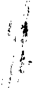
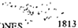

TOMO 313

Volumen 2

1990

## FALLOS DE LA CORTE SUPREMA DE JUSTICIA DE LA NACION

## REPUBLICA ARGENTINA

## FALLOS

DE LA

e OR TE SUPREMA

DE

## JUSTICIA DE LA NACION

PUBLlCACION A CARGO DE LA SECRETARIA DE JURISPRUDENCIA DEL TRIBUNAL

TOMO 313 -VOLUMEN 2 SEPTIEMBRE -DICIEMBRE

',l.;'

.,.\_....

GRAFlCA SAN LORENZO S.R.'"

Qllilmcs 2R4 -Buenos Aires

1990

';1

•.'.".'1'

.'

",l

'..

.'

.

i,

Copyright @ 1991 by Corte Suprema de Justiciu de la Nación Queda hecho el depósilO que previene la ley 1].723 Impreso en la Argemina

Prillled in Argentinrl loS. B.N. 950-9X25-12-3

## AÑO 1990

## SEPTIEMBRE -DICIEMBRE

## CUERPO MEDICO FORENSE. DESIGNACION DE MED1COS.

En BLlen(l~Aires, a los:) días dclmcs de septiembre del aoo mil11ovccientos noventa, reunidos . ci1 la 'Sala de Acuerdos del Tribunal. cí sciior Presidente dodor don Ricardo Lcvene (h), el senor Vicepresidente dOClOrdon Mariano Augu~l\' Cavugnll MaJ1íncz y los seii.orcs Jueces doctores don Ellriqw.: Santiago Petraechi. don RoJolJo Car!us Barra. oon I\ugusto César BCllllscio, don Julio Salvador Nazan:llo y Edu¡m.lo J. Moliné OTol1l1or,

Consideraron:

Que medianIl' acordada ~4 del 7 de junio de 1984, aclarada ¡XHla 53 del 14 de agosto del mismo hño, esta Co/1c estableció que la designación de funcionarios en, los' cargos que requieren título habililanle debe cfeclllar~c por' el régimell de co¡'¡cursos.

Que pór resolución I\º 137 de fecha 1£de marzo 'de 1990, se llamó a conClll'SOpara cubrir cinco cargos de páilos ~!ledic(ls en el Cucl1)O\1étlico Forense.

Que la Comisión Asesora (..lcsigllada para dielaminar ell el Jllellcionado concurso procedió a la i:valu';l&lt;.:I&lt;..ln'J~ls ,1lIIc&lt;.:edCIlle;, de d 7 los postulantes y el 'lilériln dc la pruc.ha e.~efila. .

Por ello,

Se n.'suelve:

Efectuar las siguientes óesignaciones en el Cueq)o Medico Forense de la Justicia Nacional: . PERiTO MElJlCO a 'lús doctores MiGUEL A.i'¡GIiL SAtiL MARQUHZ (Cl. N"'9.0:Z4,985 -.--.--..elase 1949-), N/COLA'S IULl~\N1 (CI. N\1:UnO.282 -clase '1937-,1. RICARDO ERlvESTO RISSO (Cl. [\''' 5.739.91O-.--.--..elase 1946-). GlJILLEÚMINA 7i1Yl:.'LLII DE RlU (CI. N" 8.609.687 -clase 1947) y JUAN CARLOS ROMI (el. N~5.015.897 ---clase 1942-), todos 1m cuales ocuparon los primeros llJgai"es en d orden de nlérito,

Toóo Jo cual dispusieron y ina:lt!aron, ofdenü¡';do'c¡ue se comunicase y registrase en el libro currespundi&lt;:Illt:, por allle mÍ, quc' doy ft.'. -~ RICAR[;(J 1..I:~'i,NE (1.1)MMÜIINU AUGlIs'ro CAVIIGNA M,\RTi."EZ~ E"R1QUE SANTlA(jI) PD'K!lCCllJ -RUDO!.!'!) C. B,\R/{,\ -AUGUSTO C!;SAR ilfóLLUSClO -JULIO S. NII7.ARENO -EDUARDO J. MOIJN¡~ O'CÚNt'OR, e/al/dio Marafo Kif'eI" (Secretario).

\_ 313

"

.,

## JUZ.GADO FEDERAL DE PRIMERAINSTANCIA ÉN LO CRIMINAL y CORRECCIONAL N' 2 DE MORON (Peia. de Bs. As.).

En Buenos Aires, ¡¡los 18 días del llles dc septiembre del ailo mil novecientos noventa, reunidos en la Sala de Acuerdos del Tribunal, el scijo!" Vicepresiúente de la COJ1cSuprema dc Justicia de la Nación. doctor don Mariano A'ugus\ü,Cavagíl¡1 MariíI1C7~':y'Jo~scilof\:s jueces docLores don Carlos S. Fayt, don AugusloCcsar Bdluscio, don RodolfoC. BalTa, don Julio Oyhalll1l1e. don JuJio S. Nazareno, don Eduardo Mo]jné O'Connor.

COllsic.kraron:

1 2 ) Que el señor juez a cargo del Juzgado Federal de Primera Instancia en lo Criminal y Correccional N~ 1 de Morón ¡X)IlC en conocimientQ la grave 8j¡uación (lile padece. en Vil1ud de hechos tales C()lllO~la,l'xislcneia de 7JXlO .causas ell trúmité: 600 detenidos a ~u:dispo~ición: 66 púsonas procesadas. algunas de las cuales aguardan scntcncia desde hace lll,b de dos ailos: llJl ingrcsopromcdiü de 500 a 600 caW;¡ts rncmuales: imposibilidad matc'rial. de guarda y custodia de los bienes bajo su responsabilidad. '

Elmagisl rado exprcsa que los datos que ap0l1a conslit UYCll sólo una reseña paróal ddas falencias que abnJlllall ¡lltribunaL

2\,')La Cümara Federal de Apc1aciones de San Mal1ín, tras consignarlluc la preocupación porta1cs hechos fue pennanente---cireunstllncia que motivó sus anteriores acordadas;---, teniendo en cuenta que hasta el presente no se ha obtenido respuesta al respecto, considera de su exclusiva responsabilidad agotar los medios a su alcance con el objeto de proveer llL.'{ medidas adecuadaS"CJuecontribuyan (mn la urgencia que el caso requiere a la mejor administración de jll.~ticia. A tal fin prOIX)llCla ,inmediata aplicación de la solución establecida por la ley 20.51'1.

3"'1Quc antc la ~Íluación expuesta el Trihunal considera necesario Jiriginc al titular del Poder Ejecutivo Nacional cOllelllbjeto de requerirle la Slllución del problema planteado.

Por cllo,

Acordaron:

.Poner de U1anifie.~toal Sel]l)rPresidente de la Naci(m la necesidad de-cubrir en [ofila urgente el cargo dc:jucz federal,dc, primera instancill en lo criminal y CMl"C'CC¡l)(llll" 2 con N :lsiento en Morón (Provincia de Buenos Airó). cn:ado pI)r la ley 23.574, dd 19 de julio de J9RR. .

Todo lo cual dispusicml\ y l11¡mduron, ordenando que se c()mUniCllse y registrase. en el libro cmresponJiente. IX)]" ante mí lluCdoy fe. ~ MAKlAl\'OlJ0ü~TOCAVAGNA \1ARTfNE7.~ A i CARLOS S. FA 'rT -AlJGlJSTOCÉ.~AK BELLtJ.SClOROIJ1)I,HJ C. BARRA-J,UlJOS. NAZARENo-JIIUOc. OYHA.",\RTEEDUARDOMouNt O'CnNNfJl~. e/audio Maree/o Kipa. (Secretario).

## PERITOS.INSCRIPCION.

EIÍ'RuCllllS Aires, a l()s ll.;"dínnleJ md de septicl11hl'e'del ajio mil ilOÍlccicntos noventa. reunidos en la Sala de Ac'Ueroos dd Tribunaf el Sei'iorVicc¡m:siJénte de la Carie Suprema de Justiciá de la Nación, doctor don Mal;mlO AuguslO Cavagna M¡útínez y los sciiores jueces doctores don 'Carlos S. Fayt. don Augusto Cesar l}clluseio, dun Rrxlolfo C. Barr:l. don Julio C. OyhanarlC, Julio S. Nazareno. y don. Eduardo !\!!~I¡lléO'Conno.r;

Considenaron:

Que corresponde establecer la.s fechas para el cumpliiniento de los trámites previstos en la Acordada 11~25 de IY85para la inscripción y leimcrilx.:ión de peritos en las especialidades detemlinadas en dicha acordadu. HrnpJíádas en las nQs.45/85. 5y/f,6. 24/87, 'J7¡R'¡I, Y 41/89;

## Acordaron:

- 1',1) ¡;(jase el plazo del 17 de uctubre al 16 de, novienlhre de 1990 inclusive, para que 1m profesionales de las especialidades cuyo registrn se lleva en esta COl1e procedan a su inscripción O reinscrlpción para el año 1991.
- 2") La lista a yue se refiere el punto S~de la Acordada n" 25/85 se cxhihiní por cinco días a pal1ir del día 27 de noviembre de 1990.
- '. Y') Los trÍl)llites rcfefÍd9s,en los PUlItos antefÍon::s se efecluarán en la Oficina de Ceremonial de esta COIle Jurante el plaz;n fija,d? ~}~;dusiva1llcnte en r;1hO;'~lriod"e 10; 12 h~.
- 4'') Dése la publicidad p~11incnle por intennedio de la Oficina de Prensa.

Todo lo cual Jis¡JUsienJn y llla;l$iarun.cJrdl'llanJ"('l(llle ~~, cOlllunie&lt;lsey registrase en cll~bro COJTe~p"ondiente. por anle nlÍ, que 'doy fe. MAKL\Nu AlIlóLJSTOCAAGNA AKTINEI: V M -CARLOS S, ¡;A nALJGUS1(~ CtoSAR13ELLUS{"j() ROl)OL[-() C. -13ARKA JU1.10 S. NAZARE..'&lt;O 1U1.10 C. OYHAMKTf3 --EDUARDU MOUNÉO'CnN,\'ORe/audio Maree/o Kit,{'/" (Secretario).

## CORTE SUPREMA DE JUST1CTA. REMUNERACIONES. SES ION PERMANENTE.

, li;~ Bllenl~s A.il:es~.a I~~ ) Rdías d~l mes de septi~tnhre del ;U10mil novecientos !lOV'etlla,reunidos . . en la Sala de Acuerdos del TrihunaL el serlO!" Vicepresidente doctor don Manano Augusto Cavagna MaJ1íncz y los sello!"e, Jueces doctores don Rodalfo C. B:\I"I"a,OIl Eduardo d 1. Mol iné O'ConniJr. don Carlos S. byt y don Julio Salvadot Nal-areno,

Consideraron:

## ACUERDOS DE LA CORTE SUPREMA 31~

JI!) Que con fecha 2] de julio dd corriente mlo esta Corte dictó la Acordada 42/90 ]XJrla cual. en uso de la facullad conferida por d a11.45 de la ley 23.697. fijó para el mes de mayo la remuneración de los magistrados. funcionarios y empleados del Pndsr Judicial de la Nación.

- 2 2 } Qut::cn dicha ocasión. este Tribunal prl'cisó tlue el incremento de las remuneraciones si bien era insuficiente. podía ser mejor¡ldo pUl" la COl1een ejercicio de la, referidas facultades. l:ircunslancia concrctada parcialllleJlt~ en las n:solucion~s K15Nü y 567/90.
- 3 é1 ) Que no obstailte la especial plUdeneia puesta de manifiesto en ]ós aumentos fijados para magistrados. funcionarios y empleados. es del caso destacar (lue hasta la fecha el Poder Ejecutivo no ha otorgado los fondos necesarios P¡lfa dar cumplimiento a lo dispuesto por esta Corte Suprema en la última resolución mencionada.

Teniendo en cuenta que el índice del costo de vida en clmes de agosto pasado fue de 15.3%. con una cstimación superior para el preseale mes. el pago de la citada ~uma cOllst.ituye apenas una recomposici/ln del capital, y no repre~enta aUlllento alguno.

- 4") Que esla situaci/lIl. tenicndo en cuenta quc hasta el presente no se ha obtenido respuesta salisf¡lCtoria. genera la profunda preocupaciún del TribunaL pues resiente &lt;11elVicio de:ldministraciún s de justicia.

Por ellu.

Acordaron:

Dcclararquecl Tribunal se halla nJllstituiJoen sesión pcnllanente ell l&lt;\7Ún de no hahcrsc recibido los fondos nCl:esarios para alcmler el aumento dispuesto por resolul:ión 567190.

Todo lo cual dispusieron y mandaron, ordenando que se comunicase y registrase en el libro c()rrcspolllliente, por ante mí. (Jlle doy fe. -MARIA",O AUC;lISl'O CAVAGNA MAI{"ff~EZ -Roouu:o C. B,\I{I{A -EDl!,WL)U ivlulJNI, O'C():'J~OR -CAJ{LOS S. FA Yr -JULJO S. NAZARENO. e/audio Marcclo Kipcr (Secretario).

## EQUIPOS DE ASISTENTES SOCIALES.

-N'J54-

En Bucno.~ Ain:s, a 1m 25 días dcllllcs de septiemhre del año mil novecientos noventa. rcunido.~ en la Sala de Acuerdo.~ del Tribunal. el sellar Vicepresidente, d("x.:tOl" on d Mariano Augusto Cavagna Martíne/ .. y los señores Jucces doctores don Carlos S. Fay!. don AugustoCesar Bdluscio. don RocJoJro C. Barra. don Julio C. Oyhanal1e. don Julio S. Nazareno y don Eduardo Moliné ()'Connor.

Consideraron:

]2) Que ¡x,r acordadas 37/86. 30/S?; y 47/89 c~ta COl1e hizo lugar a ,imi1ares solicilmks f(llllluLlJas por lllagi~tradlJs del fuero l"ivil.

,

## .DE JlJSTICrA DE [;A'NACION 3iJ

2º) Que idéntica petición a las que dieron origcl1'a tales'ilolmas. fonnula el seí'íorjliez a cargo dd Juzgado Nacional de Primera Instancia en lo Civi,¡,nI! H6 DI".Víctor R. Carrasco'Quintaná.

3") Que en VillUd de los antecedentes existentes. procede la autorización'en el presente'caso.

- 4º) Que con relación al pedido de excusación dc las renuncias que efectúen respecto de nomoramicntos en olros juzgados, en atención a que el reglamento de la Cámara contiene nOOllas al respecto, y tJuc a ella corrc:spü:nde su modificación, cn casp de considerarlo pCllincnte. no caoc pronul1ciamiclllo alguno.

Por dio,

Acordaron:

Hacer lugar a la petición fonllulada por el DI".Víctor R. CaITa:~coQuinlana. titular del Juzgado Nacional de "limera Instancia en lo Civil n~ 86. y permitir que. tle acuerdo con el sistema dc trabajo implantado por el magistrado. se descmpei'icn Jos asistentes sociales del equipo [0111111do. xceptuánc d(llo de cumplir con lo prescripto IXlrel all. 129 del Reglamento para la Justicia Nacional.

Todo lo cual dispusieron y 1l1andaron. ordenando (Iue se comunicase y registrase en el libro correspondiente, por ante mí. que doy fe. ~ M"'UANOAUGl1STOAVAG~A M\KrINEz~CARLOS C S. FATI ~ AUGUsTl) CÉSAR BEI.l.lISC10 ~ ROl)I)I.FO C. B;'RRA ~ JUIJO S. NAZ,\RENO ~ Juuú C. OYHANARTEEJ)lJ,wl)o MOUNÉO'CONNOR~ e/audiu Marceffl Kipl'!" (Secretario).

## EQUIPOS DE ASISTENTES SOCIALES.

-N"55-

En Buenos aires, a los 25 día." dd mes de septiembre del aiío mil novecientos noventa, reunidos el! 1;1 Sala de Acuerdos del Tribunal. el seiior Vicepreside!\Ie doctor dón Malialio Augusto Cavagna Martínezy los seiio]"('sJucce;; doctores, Carlos S. Fayt. RodolfoC. Barra. don Augusto Cesar Be1luscio, don Julio C. Oyhanalle. don Julio S. Na7.arello. don Eduardo Moliné O'Connor,

Consideraron:

12 ) Que por awrdada 47/1'19 el Tribunal hizo lugara la pclición fonnulada (lord Dr. Jorge L. Noro Villagm, y pennitió el deselllpeílo de la asistente social por él designada. de acuerdo con la fonna de trabajo espccialllue implantó en el juzgado, autorizándose,la exccpci6n al aIl. }29 del R.J:N ..

2 11 ) Que la nanna se hasóen antecedentes similares, que originaron el dictado(\c las acordadas 37-/ 86 Y JO/88,

3\l)Que en la actualidad. dmagistradoprclendc que la autórizaci&lt;-)nconcedida.sc extienda a todos los asistclltc~ soci.!les integrantcs'del equipo de trabajo yue ha constituido.

4"")Que la justificación de las I"cilllllciasa otros nombramientos debe pelicionarse a la ~ámará del

fuero. en alcnción a que se trala {lecllesl iones 'pJ'cvistas en sUTcglamcn[o. y ji, liJoJifi¿,ición de 'éste, de c(lIlsider&lt;lria pertinente. co'rrc'sfxHlde a ese ll"ibbl'íal.

- Que en -vi11uJ"dela cxjsltnci" de los aiJlcccdel\!c'S'seilalados.

## Acordaron:

Hacer lu;;ar a la petición fOlllllilada-port'1 1)1": Jorge Noro VilJagra y IXO'm1Ílirque. de acuerdo con el sistema de trahajo implantado en su juzgado. se descmpciiell 1m asislcnlés sociales deJ-elJui'po de lrabajo. cxceptuándose/o de cumplir con lo prescrip[(\ ¡x)r el arl. 129 del Regl:unelllo para la Juslicia Nacional.

Todo lo cual dispusieron y mandaron. ordenando que se comunicase y regislrase en el libro corrcspondicnlc. por anle mí. que doy fe. MARIANü AUGUSTOA\',\(,1\'A MART1"1EZ-CARJ.OS S. FA C '(f ----'-'---Glls'lb C(,SM( AU HELUJs(]()-.Roflol.J-oc. R\RRA-JULlO:S. NAJ...\]{E:"O-JIJI:]()c. OYlJANARTEEmlAKDoMOu¡.,'(, O'CONN()l{''-e/(ludio Maree/o f;,"iper (SecretaJio).

## PERITOS. IN$CRIPCION.

En Buenos Alres. a los 9 días del mcs dI.'octubn: dd aí'i,llllil nUVl:Cielltosnoventa, rcullidos cn la Sala de Acuerdos del 'l'rihuna1, el ~l:Ílor Presidcnte doctor don Ricardo Levenc (h). el scí'ior Vicepresidente doctor don Mariano Augusto. CaX&lt;Jí!-na M:lJ1ím"¥.. y 1(:-" ~ei'i&lt;:res,jusce.~doctores don Carlos S. Fayt, don Augusto Cesar lleJIlJ~cio. d(lI1Rodolfo C Barra. d(ll1Julio S. Naz:ircno. don JulinOybana11e, y don Eduardo Moliné O'Conllor.

## Considcraron:

- QUCptlr Acordada No,&gt;:'í2NOsefijóel piazodcl17 de octuh're al16de no'viemhre de 1990 iJiclusive. a lu~ ekclos de la iIlscripcióii y -reinsáipciún. para el all0 ¡ 991. de peritos en las -especialilladei de1ernlinadas en la Awrdada 'NO:: 25/1&lt;.5, ainpljada,: pOi" las \'r(ls. 45/lo:S. '59/1&lt;.6.24/87.' 37/HP.y 4]/89:

Que los pr()fesionalc\_~.cuyo registro lleva es!a C(ll1('e inscriptos en los léllninos' uc la !l:cohlada N" 4'1/89. pam poder aeluar durante d all0 en curso a,~cit'J1dena un lotal dc seiscientos noven!a y dos.

- Que en lalcs CiJ\:ull~¡aJl(;ia~ y a fin de pr&lt;)cedcJ',i un n.:orLi(:namieiJ\() administrativo (IUC mejore el servicio, corrcspollllc pton~gilr;Ja :vigeIlCi¡í'de-j.¡rs-iJjscripci(ille,~ k(:tuadas'cn c vil1ud de la mencionada' acordada. sin nen:sidad de J'l:jnscripciún y sin pe,juicio de lo dispuesto en el ¡Juuto 7'~de la Acordada 2"5/85-\_,oh re suspe-nsión () cailcclaciún de las i.IJSLJ'ipóollcS".

Que lo expueslo prccedentcmente 110exime a esos profesionales de la ohligación de manleJlI:f aduahzatla]¡¡ credencia'! del cl)lcgio~Jl que jlcl1cnCCI."Jl,on c d recilx) corrcsi)()r'Jt!jcnte al aíío eÍJ curso. dIo bajo apcrcibimien!o. pai-a el caq) de ~er desi&amp;-nadm por es[¡t Ct1l1e. de ~er e\_xcluidos dc las n.:."pectivas li~Ja,. 1,11 como In dispone el punto SO:. inc. c) de la Acordada 25/85 procediéndose a cOlllunicar esa C'ircunsl¡u\CÍ&lt;1 defl!ro del 'quidto dí¡¡ de ,h\lber sido nduído ¡I'las cámaras'que lleven registros similares y a tos colegios profesionales.

•

;

Por ello,

Acordaron:

'Pnlrrogar por un aij() la 'v,llido.:"I.e d lás inscl'ipciones' que ](lS profesionales de las distilltas especialidades, cuyo registro lleva esta '('&lt;.llle., efectuaron en los 10n11inos de la' Acordada 41/89, lkhiendo cumplimentar los requisitos estahlecidos en la presente y sin ¡~Ijuicio de las nuevas inseripcil)nl:s l[UI'se -cfect\ícn.

## Désl' la puhlicidad pertinellte por inll:nncdio de J¡-¡ ol"icina de Prensa.

Todo jo cual dispUSIeron y mandaron, ordenando que se comunicase y. registrase en'el lihro correspllndiente, por anle mí, (IUC doy [l:. -RICARDO LEVENE (¡¡) -MARlA:-iO AUGUSTO CAVAGN,\ MART1NEL-CAkW:;S. FAn-AuCitJsTuCtsAR BELl.l;SClO-Rol)ou'uc. RAKK,\ -Juuo S. NAZARENO -Juuo CbAR OYllANARTEEI1\JAI/.PU J. tviOlJNÉ O'CONNOt&lt;, e/audio Maree/o Kipcr (Secretario).

## SERVICIO DE RECONOCIMIENTOS MEDICOS DEL PODER JUDICIAL. DESIGNACION DE FUNCIONARIOS.

-

N" 57

-'-c

En Btienos Aires. a Jo~ \) dí&lt;ls'ílcl-mes de octuhre del aí\n mil Ilovecienios noventa. rcunidos en la Sala de Acuerdos del Trihunal, el sei'inr Prc.\i,knlc doclor.don Ricardo Lcvenc (h), el señm Vicepresidente doctnr don Mariano Augusto Cavagna M,tllínez y los seiíores juel:e.~'do&lt;.:lores don Carlos -s, hlYI. don Augusto C. BeJJuscio, ({¡)I]Rodolfo C. Barra, don Julio S. Nazareno, don Julio Ce~ar üy!l,lllallc y don Eduardo ~vlo1inéO'Connm,

## Consideraron:

Que mediante acorLlada :14 del 7 di.:junil) de 19R4. aclarada por la"53 del 14 de'l¡gostn de] mismo aijo, esta Cortel:slablcci6 ,¡ue la dl:signación de funcionarios en los carg()s tlUt requieren título habilit,mtc debe efectuarse por cll'égi1l1en de concur.\os.

QUé por re~oluciones-llros, 59.5/90 -----&lt;.'xp. n" 969190 Y763190~xp, nI! 1634'/90----,----, de fechas 5 de junio y 3 de julio del &lt;.:orrienteaño, respectivamente, esta Corte llamó a concurso para cubrir tres (3) cargos de lllédicI)s-prosccrctarios administrativos-en el Sl'rvicio de Reconocimienfos Médicos del Podcr Jndicial de 'la Nación: a)especial'ista en clínica méllica y psiqui:llrín, b) especialista en clínica médica y endocrinología y c) especial ista CI1 clínica médica y ncurología.

Quc la cOlnisión ase\ora destgnada para dictaminar l'n el lllCIlCiol1i\dol'nncursu ¡)l"(')(.:cdi6 a la evaluación de los anlccedentes de los ¡)!'&gt;stulanlesy el mérito Jc la prueba escri1a. .

POI' ello,

Se resudve:

1 2 ) Efectuar la~ siguiente~ designaciulles en el Servicio dc Recollocimiclltm Médicos lid Poder juJicial de la Nación, Prosccretarios aJl\Iinistralivos~ a) clínica médica y psiquiatría: al doclor GUSTAVO ALFREDO DONNES (D.N.!. nO' l1.52H.672 -clase 1955): h) clínica médica y endocrinología: a la doclora ROSARIO ALICIA SOTELO LAGO (D.N.1. 11 2 12.094.005 -clase 1955): y c)clínica méJica y ncunllogía: al doctorJAIME AlIlGELDE LAr ARRA (D.N.I. 09. 4.139.469 -clase 1935), quienes ocuparon los primeros lugares en el orden d~ méritos.

Todo lo cual dispusieron y mandaron, orJenando que se comunicase y regislrase en cllibro correspondiente. por ante mí, (Jue doy fe. -RICARDO LI,VI,,"E(11)MARIANO AunusTo CAVAGNA MARTlNEZ CARLOS S. FAYT AUGUST{)t,SAR UELLlI~CIO-El\RI{,)UESAr,TL-\("~) 'RA(''CllIC PEl ROIJOLFO C. BARRA -Juuo S. NAí'ARENO JULIO -O\.\&gt;.ROYJIANARTE-EnUARllO 1. MOI.INf: O'CONNOR. Claudia Ma/"(:l'lo Kiper (Secretario).

## REGLAMENTO PARA LA JUSTICIA NACIONAL. MODIFICACION DEL ARTICULO 2'.

-N'5S-

En BUCllosAires. a los nueve días del mes de octubre del ailo mil novecientos noventa. reunidos en la Sala de Acuerdos Jel Tribunal el seiior PresidenLe de la CO[le Suprema de Justicia de la Nación, Joctor J{)¡] Ricard{) ¡.l~venc (h), el seilor Vicepresidente doctor don Mariano Augusto Cavagnil Martínez. y los señores Ministros doctores Jon Carlos S. Fay!. don Augusto César Belluscio. don Ellrique Sanliag{) Petr,.lcchi. d{)JlJuli{lS. Nazarcno.don JulillC. Oyl1a[1a[le, don Rodolfo C. Barra y don Eduardo Moliné O'Collnor,

## Consideraml1:

Que esta COJlc Supn:ma ----\:11 ejercicio de las faL(ll[adl's establecidas en el Artículo 99 de la Constitución Nacionalestima conveniente efccluar algunas modificaciones regl:ulIentarias con el objeto de lograr una mayor celeridad CilIos respectivos trámites.

## Acordaron:

- I~')Sustituir el ;\[liculo:2 del Reglamento para la Justicia Nacional (Fallos: 224:575). por ci siguiente:
- "Los lrtbunalcs nacionales no funcionar.in durante el1l1e.~ de enero, la feria de julio. los (lías dOlllingo,:los (Juc por dis¡:x;;;icíón del Congreso,o del Poder Ejecutivo no seal; laho[,lblcs y los que el sellor Prc~idcllte de la Clnlt:\_Suprl'ma o el Ministro {1m:: 0stc designe (ledare feriados judiciales. Los h'ibullak~ federales del intcJior del país tampoco funcionar:in lus días scHalados no laborahles lx)r los respectivos gobiel1los. Tojos los demás días Jel aijo son háhiles".
- :2")Encomendar al SÓlor Presidente del Tribunal o al selior Mini~troqllc 0ste nomhre la resolución de las cuestiones atinen!es a la aplicación del Decreto -Ley 16.005/57, quedando modificada en tal sel1lidola Acurdada-dcl 14 de febrero do.'1958 (Fallos: :240:5).

Todo lo cual dispusiel'Oll y mandaron, ordenando se comunicase y registrase en el libro

&lt;.

l

•

correspondiente. por ante mí que doy fe. --RIí.. ARDULEVENE(11)-MARIANOAUGUSTO CAVAGNA MARTí"I,ZCARUlSS. FAYfAULilJS'rOtS,\I~ C BELLusaoENR10\.lI,ANTIAtJl)ETRACCfllS P Ron( &gt;I.ro C. UAI{I{A -JUIJO S. NA7.Wl'NO -.Iuuo CÉSAR OYIIAr-:AIHE EnllARI)O J. ;\'10UNÉO"CmmOI{. 1II/go L. M. PlaCl'ntino (Scerl'1ario).

## PODER JUDICIAL DE LA NACION. MEDIDAS DE AUSTERlDAD.

<!-- formula-not-decoded -->

En Buenos '¡\irl's, a los JO días dclmcs de octubre del aijo milllovecientos noventa. reunidos en laSalade Acuerdosdel Tribunal el señor Presidente de laCol1e Suprema deiusticia de la Naci6n. doctor don Ri¡,:ardo Levene (h), el sci'lor Vicepresidente doctor dOIlMariano AugustoCavagna Martínez y los Sel-}OreS Ministros doctores dOIl Carlos S. Fay!. don Augusto C~sar Belluscio. don Enl;tlue Santiago Petracchi. don Julio S. Nazareno, don Julio C. Oyhanm1e y don Eduardo Moliné O'Connor,

Consideraron:

Que esta Conc Suprema estima ncccsario insistiren recolllendara los tribunales y org:!nislllos del Poder Judicial de la Nación la adopcj()n de las máxilllas medidas de au~tcridad: a fin de contrihuir a aliviar la actual siluacilÍn financiera por la qUl" alraviesa el país.

Quc, en lal sentiuo, las cin.:utlstanóas sci'taladas impusieron -a todos los Poderes del Estauo-el deber de restringir los gastos. siluación a la que se ha vist() naturalmente también ¡,:onstrci}idoel Poder Judicial t\e-la Nación. .

Que lal estado de au.,leridad quc ha sido tenido en clIcnta pCI111llnclltemellteen los últimos mios pnrla CO¡1eSUprcl11aa] clahorar sus presupucstos rcdundar&lt;'¡cn beneficios para todos los quecompollen este Poder. loda ve/. que penllitirá UIl mejol aprovechamiento de h)s rccursos que ingresen en 0lx1I1unidau de instrumentarsc la Ley n~'2:1.XS3.

Por ello.

/\cl)rUar(1I1:

Exl1011ara Ins lrihunak,,, y nrganisJ]ll1."del Poder J\ldiclal de la l\aci&lt;.Ína contilllJilfCOn las n-\(¡ximlls mcdidas de austelidad tlue la situaciún financiera impllne.

Todo 10 cllal dispusieron y mandaron, ordenando w comunicase y re¡;istrasl' en el libro corrcspnndlcllle, por ante mí. que doy fe. -RlCARJ)() Ll:\,FNI'. (Il) -MARIAN()A1I(JUSTO CAVAGNA MAlUJNEI. ~ C\RLOS S. r:A Yr ~ AUGUSTO CLSAR BELUJSC10 ~ E:-;RI1)ljE SA:-i"I1,v"iO PETRACCJIlJIII.10 C. OYIlANARTE -JUllO S. NA7.ARE:"fJ ~ EIlUARDO J. i\1uuNf, O'COr-:NOR, 1IIIgo L.. M PillCl'lItino (Sc¡,:relario) .

## ACliERDOS DE ¡ACORTE SUPREMA 313

## 1l'JSTICIA ELECTORAL VACANTES.

-N'60-'

En Buenos Aires, a los 30 días delllles de octuhre del afio milnovecienl(}s noventa, reunidos en la Saja de Acuerdos dd Tribunal. el sciio! Presidente docl(lJ" don Ricardo Lcvcl1l: (h). el ,ciiol Vicepresidente dOCI9l'.(~OIl .M.arian(.JAugusto Cavagn&lt;l M~11Ü1CZy los sci\ores jueces doctores don Carlos Santiago Filyl. don Augusto Cesar IklJuscio, uon Enri(¡uc S,lnliago Pelracchi. R(xlolfo Carlos Barra. don Julio Salvador Nazareno, don Julio Oyl1illlanc y don Eduardo José M111in¿O'Connor.

Consideraron:

tU) Que pordccrelodcl Poder .I~jcClllivo.N0 394/R2 se instituyó un régimen transitorio dc servicios pcrsonalc.'i "no pcnnancnte", con el fin de alender las tarcas prc y post comiciales. en virtud del cual se incorporó a Ja.cámara Nacional. Elecwral y a los Juzgados 'con competencia electoml un número de personal impOl1ante en el carácter de adscriptos.

Sucesivamente. ta1cs designacioncs fucron rcnovadas y por el decreto N~ 2512/86 pasaron a revistar COllW"planta no pellllancn1l' de personal trallsj¡()rio adscripto al Podcr Judicial".

- 2:,1) Que dicha silUaciól1 motivó 1l1111H'roSOS didos pe del personal involucrado. en el scntido de obtener su incorporacilin all\xler Judicial. In cual no tuvo solueión hasta el.momcnto por distinlos motivos. fundamentalmente de índole presupucst,lIio.
- 3º)Que si,bien porcl momento subsisten tales impedimentos y. ¡Xlfotra parte, no puede soslayarse t¡ue la incolporaciólI al Poder JudiCial del personaladscriptollopuede ser masiva sinoqllcdebe sujetarse a la previa realización de estudios que detenninen las reales nccc,~idades. de por sí diferenles cn cada jurisdicción. pUl:dc adoptarsc ahora una solución que alivie el problema señalaúo.

Por elJo,

Acordaron:

I-Iaccr saber a Ja Cálllllt'a Nacional Electoral que debed instl1JJllCntarun sistema en viJ1Uddel cual las v;lcanles que se produzcan cn csa Cámara y en las secrctarías electorales de lodo el país. sean cubiel1as por el personal peneneciente al Ministerio dellnteriol'. que se encucntra adscripto al Pode] JudiciaL de acuerdo a las rcglamentaciones.vigentes.

Todo. lo cual dispusieron y mandaron. ordenando que se comunicase y registrase en e11ibro cOfl\'spondlentc. ¡XHanle mÍ,'''lue doy fe. -RICARDO LI~VENE (H) MARIANO AUGUSTO CAVAG:'-JA MARTiNEZCAI{LOSS. l;A)"TAUGUSTO C(,SAR BELUISC10 -ENRJQUESAN"IL\GOPETRACClIl"Juuo C. OYllANARIE ----,--luuo S. N,V.ARENO EDliARDO J. MOUN(:; O'CON~OR. e/audio Maree/o Kil'cr (secretario) ..

',o

"

## CORTE'SUPREMA DEJUSTICIA, DESIGNACION DE PROSECRETARiO LETRADO,

~NV61 ~

I311enús,Aires, a los 30 días dellllcs de q~lUbre del aJ10nlilllo:v~cicJltos n,OVen!:I,reunidos en la Sala de Acuerdos \ld TribunaL el sellor Pre,s,idt.:lllc, JOd()f don l~icardo ,Lcyenc: (h) ·. e! seilor Vicepresidente doctor don Mariano AllgUSl\l Cavagna Mallíncz y lo, sdimes jueces ,\)octores don Carlos S. Fayt, don Augusto César lkllllseio, don Ellliquc S~lI1tiago!'ctrat:chi. Jon RoJolfo C. Barra. don Julio S. Nazareno, don)ulio C. Oyhall,\I1e y;don Eduard{) 1. Molinl~ O'Connor.

Considcruron:

Que mediante acordada 34 del 7 de junio de 19R4', aclarada ¡úr.la 53 deI 14 de ,agosto del mismo aiío, esta COl1e estahJet:I{) que la designación de funcionarios en los cargos que requieren título IwbiJit&lt;lnw dehe declllarse IXlf el régilllclI d,e,t:;(,lIlcurso.~ , .

- .Quc por rcsolqción 7'19 ¡je fec:ha' 1 S d~ agoslll d~ ,1989, se l.l;~móa concurso para cubrir un cargo. de secrel:lJ;O lelrado y un carg.o de prosecrdario letrado '[le la c.)11e -S~lpiema.
- : Que la Comisión Asesora desigl.\i\da para (Ii(:lallliJ),.I.1" cn el menc,i()naQo eoncurSl) pr~)cedió a la e.valuación de los anlece~ent(', de los poslulanl(,;s y 1') mérito de la pl1Jcb·. 1escrita. para qlprir d,c?rgo de proseeretario letrado.' . '

Por ello,

- ,.Efectuar la sigu iente deSIgnación en la ('\lIte SUPITl]l&lt;l de J u~¡jci¡¡dc,\,¡ Nación: PROSE&lt;';:RETARIO LE'IJ{ADO ¡jI dQt'lOrGUSTA YO P AHLO VALLE ( l):N.!. l,l~' 12,97,ó.702 -~.Jase 1957), quien ocupó el primer lugar en el urden de méritos.

Todo lo cual dispusiclWl y mandaron, on)enand'J que se l;ülllunicase y registrase en el libro corn::.,pondienlc, jX)l:anle mi, que doy ,fe. -R1CAR.LJO LEVENE (11)MARIA:-IO. AUü.usTo CAVAGN,\ MART[NE7.CARLOS S.F,w:rAUOI)STO CéSA,R BELLUSClO -ENRH)UE SA"TW:;O PEI'RACCIll-JUUO C. OYJlANARl"E -JUl.lO S. NA7 ..· \RENO -EnUARDO 1. MOUN1~ O'CONNOR. C/alldio Marcero Kiper (Sccretario).

## CORTE SUPREMA DE JUSTICIA, PROMOCION DEL PERSONAL.

~N;)62~

En Buenos Ain~s, a Jos 30 días del mes de octubrl' del año milnoveeientos noventa, reunidos en la Sala de Acuerdos del Tlibullal. el señor Presidente doctor don Ricardo Levcne (h), el seiior Vicepresidente doctor dOI1Mariallo Augusto Cavagna i\-'lal1íncz y lus señores jueces doctorcs don

Carlos Santiago Fayt, don Augusto César Iktlust:io, ,.!l.1Il Enri,]tlc Santiago Pclraccl1i, don Rodolfo C. Barra, don Julio S. Nazareno. don Juliü Oyham1l1e yúon E,luaruo J. Moliné O'Collnor.

## Ctmsideraron:

Quc la ¡¡Cilla] confom¡¡¡cj¡'m dc [a dOlación del personal directamente ucpcndienlc de la Corte Suprema de luslicia dc la Nación comprende a oficinas que. Ix)r su diversidad dc funciones, hace ill:ol1scjablc un rcordenamiento para lograrun mcjoraprovcchamil'I110 de los recursos humano,s de que dispone el Tribunal.

Que, además. se adviene que cuando se trata de la promOl:ión de dicho personal. cualquiera que Sl:ala oficina 1:111a qlle se haya producido la vacante, al m) lener éslas cslnJctura.~ fijas sinovariahlcs. a~piran y cnmpilen por cubrirla l'mpkados qlll' hasla el momenl0 desarrollan lareas tOlalmenle di~ít1lik~ y IJue. cn Glsode ~erprulllOviIJ(l.~,contilllian en la misma uficina Jcsarrollando la misma larca \jUl' rl'ali/ ..b;\J1 ;mll's a dl' ~er as¡;enJidos.

Que no parc¡;e ulllllélmb razonabk que las Secn:lurías y dem;Ís ofi¡;jnas de e~ta Corte alleren sus tiol;¡¡;ioncs por aplicación del sislema aClual, COnfOlllll'al cual de resultar ascendido un agclllC'que no pertenezca al lugar en el que la vacante se produjo. el cargo ambula con el promovido cn lugar de permallec('r ('11 la e.qruclura originaria.

Que, por 01ro lado .. ~i hien Ikbc reCOll&lt;)Ccrsc el derecho de los agenlcs al ascenso y a la ¡;arrera, no e~ 11le1lO~ier10 fIue el .~istellla debe c aparejar l'OlllOfcsullado deseable que (luiclI asctt'llIk dc.~an.olle tareas de rnaY(lr re~pl)llsabilidaJ.

Por dJo,.

AC\lrdanll1:

P') EnenlllenJar a la Sl'Cfclafía de Superinlemknóa Judicial un esludio \IUC Jelellninc la t'stl1lctura que uwresponde asignar a t:ada Secretaría y oficina de.la Corte, en la medida en que las. posibilidades presLJpueslaria.~ lo pcnnilan ..

2") Disponer que Cilio .'iuccsivo las vacanlcs sean cuhicl1as en c1.lugar donde se pnxlujcron a fin de rlL)alterar.aún rmb las dolaciones e.xislenll's, salvo decisión funuada del Trihullal por la cual se considere.j¡¡ convcniencia dc lransferir ei C¡trgo vacanle a olra dependencia.

Todo In cllal lli~pusicrlln y mandaron, ordenando que se comunicase y rl'gi~trase en el libro '¡;orTc.~p(lndH:nle. por anJe mí. (JUl'doy fe. -Rrc.&gt;.I&lt;I1O '.VI,,'.E i.l (ll) -MARIANO AUGUSTO CAYAGNA MAI{Tit'EZ -CARU.lS S. F,\ yrAUC;USTO C(,SAH BEI.LUSLll) -E"Rll)llE SAI'&gt;TJN~¡ PETf{ACCllIJliLlO C. OYIIA;&gt;;Alnr -JliUO S. NA7... Wh--':f) EIl[j,\j&lt;J)() J. jVlou,--':I; ()'O),,:-UH. e/audio Mara{o Kiper (Sl'l.rclari().

1

## DE JUSTICIA DE LA NAClOl\'

## CORTE SUPREMA DE JUSTICIA. CONCURSOS. AMPUAClON DEL REGLAMENTO.

-N"63-

En Buenos Aires, a'los 3() díllS del mes de octubre dd aijo mil novecientos noventa. reunidos en la Sala de Acuerdos del TribunaL el seilor Presidente doctor don Ricardo Lcvcnc (h), el señor Vicepresidente doctor don, MarianoAugusto Cavagna Martínez.y los ,seilot"C:s juece¡; doctores Jan Carlos S. F¡lyt, don A~gllsto César BeUuseio, don Enrique Sallliag(; Pe,tracchi. tillll Rodolfo C. Haml. don Julio$, N¡mU"eno; don Julio Oyhanal1e y don Eduardo J. Müliné O'COIlIlor.

## ¡-\¡;\.lrdarün:

Ampliar la acordada, 30/H7 en el sentido tic que el régimen previsto por su inciso 3\!comprende también a lus pro .··crctarios e !cl·.··os d direel¡\ll1ente dependienles de los.ministros,de la Cone Suprema.

Todo lo cual dispusieron y mandaron. ordenando que se t:olllunit:a\\e y registrase ('n el libro correspondiente. por ante mí. que doy fe. -RICARDO LEVEN E (1I) MARL\NOAUGUSTO CAVAGNA MAKr/NEZ CAf~LOS. FAyrAU(JllSTO Cí.:SAR BEI.LUSCIO -ENRIQUE SA/'I'\1A(,OETRACCHI P -JULIO C. OYHANARTE -JULIO S. NAZJIRENO -EDUARDO J. MOUNt O'CONNOR. Claudi" Maree/o Kiper (secretario).

## EMPLEADOS JUDICIALES. MEDIDAS DE FUERZA.


En Buenos Aires, a los JO días del mes de tlctuhn: dd anolllil novecientos noventa. reunidos en la Sala oe Awcroos del Tribunal. el scíior Presidente dnetor don Ricardo Levenc (h), el seilor Vicepresidente doctor don Mariano Augusttl Cavagna Martíl;ez y los seiiores jueces d'actores don Carlos S. Fay!. don Augu!;to César BeUuseio. don Enrique Santiago Pc-\_lraechi,don Rodolfo C. Barra, Jon Julio S. Na7~\rCno.don Julio C. Oyhan¡U1C y don EdUllfJo J. Mt?liné O'Cl\llIlOr.

## Consideraron:

Que la fOlln&lt;lirregular en que han funcionado los Tribunales Naciol1alc~ y Federales. requiere lomar medidas que eviten pt:ljuieio n los litigantes.

Por dio.

Acoldartlll:

Declarard día 25 de octubre del corriente ail~l,i;¡h:ibil para los Tribunales Nacionales y Federales oel país, sin (X'ljuiel\l de la valiJe:l de los actos prot:esales cumplidos que no hubiesen sido ¡ictuados en rebeldía.

Todo lo cual' dis¡)usiemll y nlitnduroJl. r;rdenillldu (Jul' ~e eOlllunicasc' y rl'gislr¡I.~Cen el libro corrcspomlicllte. por anle mí que,doy ["t.'. -Rt(AIUlU LEVl'NE (11).:\'L\RIANU AUGUSTO CWAGN/\ MAR1'L"'EZC\]{L()S S. FA yr AUGUSTO C(~AI~ IlELLusClob~RIQU£SANTIM,O PFI'RACCIII \_ Juuo C. OYHAN¡\f{TE -Juuo S. NA7.ARENO -EnllARf)() J. ivlOLlNí; O"C(JI"NOR. C!(flfdiu Marcero Kipcr. (secrdario).

## JUZGADO FEDERAL DE PRIMERA INSTANCIA EN LOCRIMINALY CORRECCIONAL N" 2 DE MORON (pCIA. DE BS. AS. ).

-N"65-

En Buenos Aires. ados ]3 .día~ del mes de !1oviembn: del aoo.Jllilmwe&lt;:Ícnlos IHlvenl'a. r&lt;:unidos &lt;:11 .la-Sala de Actlenlus dd Tribunal. d ,'el-IUrVil'l'prcsidetJ1e dod()¡" don [Vlariallo AuguSlo Cavagna Martínez y lo., scfíorcs jlleccs doclores don ('ados S. hlyL don Augusto Cés;lr Bcllu~cio. don Rodolfo C. Barra.'doJ1 Julio C. Oyhan;ule y dOIlEduardo.). ¡-"-Ioliné O'Conn()r.

Consideraron:

Que mcdiante Ja ley 23.574 se creó c11uzgado h:deral de Primera Instancia cn 10 Criminal y Correccional N" 2 con asiento en la Ciudad Lll' Morón. Pf()vincia de Buenos Aires, y que por la resolución N" 155/R9 se asigllaron los cargos correspondiel11eS a la dOlación de personal.

Que. como'se pusO'de;manifiesto en distintas 0p0r!únilLtdes. es propósilO de esta Corte Suprema proveer Jo necesario para asegurar la correcla prcstilci(ln dd servicio de justic:i¡¡,.por Jo {Iue la puesla en funcionamiento del lluevo Irihunal COJlsliIU;';¡; una pnotidad imoslayablc. sin perjuicio de .las dificultades presupuestarias que ubstaculiccn su' dectiva concreción (Cl)llfr. acurdadas Nros. 46/90 y 47Nq).

Que. pOr()lnl j';al~e'¡'a'Cá;nara'j:ederal de l\p~lacil)lles d~'San tvl,lrllli sc hú dirigido rciteradamenlc ¡¡ eSla,C()l1e lll&lt;1niks:l&lt;tlldo ~1I pre(x'upa2ión ante Ja difíci I siluaci¡'lIl pur]a que.alra\' iesa esa jUl1sdicci6n. . . .

Que. en cOllsecuencia.)' IcI\iel1d(~ en n;CJlla ([lie éJ Poder l~jeCl.l1ivo't""aciona) lI1edianle el dc~r('t~ 2321/90. designóaJ doctor EduarJ() Ricardo César J"uraschi tilulardel juzgadocfl'aJ() por Ja ley cilada corresponde su inmediata puesta CilfUllcioll;ll1licnlo.

Pór dio:

## Acordaron:

Di~pollcr la habiJilaciÓIl del .1 uzgado ]"cdcfal de Primera lnstal1Cta en lo Crim ina) y Correccional de Morón N'"2. a p,lJlir de la fecha en l[ll': In Cámara F.:deral de Apdaciollcs ~lcSan Mal1ín. Pro,iincia de BUC'Ij()s Air.:s. rcciba el juralllCJll0 de ley ,al d(x.:lo]" Eduardo RtCard(l César ];.u]"a~,:!li. designa~]o por decr~l() {'\el-!\),.lt:rEjeculivo i\'" 2i21/?d. ' ..

Todo Ju cual dispu~icron y mandaroll. uldcn;lI1do (Jue ~e COIlHUlicasc y registrase en el lihro COlTeSp()Ilc!iellte. P(l]" ante lllí, que úoy fe. Mt\RIAi\O AUGUSTO CA VAUNA MARTl.'JEZC'RI.OS S. l'AY!'

\_ ÁllGlJ~TO Cí,$AR IhtLU.'&gt;C10:Ro[)()I.1'O 'c". nARKA Ju'uo C. OYljANAKTf' -, Enl¡Alwo"J. MOl1Nt O'CQNNOH. etalldio.Murr£'/o Kiflcr (Secrclalio):

## TASA DE JUSTICIA.

-Nº66.-

,

;'

,t

'.

"",'

En BuellOS Aires,.a los 20 días del mes de noviemhre dd al-ID mil nnveciClltus noventa, reunidos en la Sala de Acuerdos dci Trihunal el señor ])rcsidcntc d{)ctor llonlÚcardq I.K~'Clll':~hi, c(scilor Vicepresidente doctor don Mariano Augusto Cavagna Mal1ínez y los señores jueccs doctores don Carlos S. Fay!. d{~llAugusto César DeUuscio, don Enrique Santiago Pelracchi. don Rodolfo,c. Barra, don Julio S. Na:.'¡lrCnoy don Julio Oyhanal1e.

Consideranm:

1) Que cl a11, 13 de la ley 23.lNR no eximc del pag'Ode la t,lsa dc justicia al Estado Nacional ni a los entes autúnluicos o descentralizados, C0l110 sí ocurría duranlc la vigencia de la ley de facto 2 ¡ .859 (iI11.r.illc~j). I

- 2)Que,n,)obstiullecllo, de'acuenh,iJl ilr\'.50de la ky 23:696, se cncu'clltra.susp"ndidh la ejecuciól1 de las sentcncias y laudos arbitlaks quc c{)ndenell ill pagn JI..' Ullilsuma de dinercl dictadas contra'el Estado Nacional y los de,miÍs entes ,Jl',crip~os en su a11. [\!'-, Agrega dicha 1l011lla111.11.'cdan qu compr~ndida'i en csle r~¿!ir)1enlas cj,e~llciolJes ~jue'pudi0ran'pr('1Il1'()vcrse por "cohrq (\1..' honorarios y gast'us", conccpto quc.' a, su vcz, ill)iir~a a ,la lasa dc'jusiLcia (al\ .10. h;y 23:K9~). ' .

3) Que este Trihunallicnc amplias facuilddes para ',h';tcl1llÍna;' el r~gill1'cn de percepción de 'sus recursos (aI1. 8. ley 2J,K53), entrc los quc SeCIlCIll'ntra la tasa de justicia (1u1,3'1,inc. a',!9 ~ilada).

Por ello,

¡\cordanm:

1'"),\elararque CIII()sjUlcil)S en l()s que l'l Estado :'-ii\ciOJ1al dC1l1iÍSntes y e lllcneiOlwdos por el a11. '1'1, de la ley' 2~.69(, I'esultcn-:pm 'aplÍ'ci\ci(~'1lk' h.s (KmllilS',vi¿!(:"nt'es~hligadm-:¡l..!pago () de-.la Úsa de ju~¡jcia; regí rií 1 a suspcli si6n previ" alxw-lüs at1s. 50,1,56 de dit1h{)'(lI"I..lel~,lInicnkl gal': s'i el intercsado le 11..1licJla. sú

2") EstahJccer'luo.:: en aqucllos supuestos ('n1os quc I)&lt;..\i'h¡il;~¡ici(~l\ ::liiley'2~.8l)X. di ia Nili::iÓl1.ilte~ e aUlárquicos, las provlncí,ls y las J1lunicipalidalles dcban integrar la tasa antes de que queJe fíllue la sentencia de condena, el pago podrá ser diferido para el aj'íl~c,ll"Tespondicnte al siguiente ejercicio fínanciero, a fin de que pued&lt;l ~er previsto en cl proye,cln ,le presupuesto respectivo. En talc~ casos, el pago deberá hacerse debíd¡uncJllc aClualizado.' .

Todo lo cual di~pusierotl y m¡\Illlaron ordenando quc .sc comunicase, Publi'c¡i~e en el n"oletfn Oficial. y regi~trilse cn el libro o,lITesponJicllle, pnl: :lI1t('mí. tlut' doy re. -RICAJWO I.E\'ENE I-I)-( M,~KIM'(,J A unVSTO CA VAG:'&lt;A MAJ.&lt;.T,L"EI: -CA)&lt;JJJS S. FA YT """"":. .lIGVSTU A Cí,SAR BIU.lISClU E:'&lt;Rll)lJE .S,\NTIACó) Pl!TK,\('CIII \_ Ru[)ou-u C. HAI&lt;RAJ lJI.!1J e OYI-lAN,\RTE -JULIO S. NAZ,\RENu -EmJARD() J. Ml)Ll~ió O'CO:-&lt;NOR.

## CORTE SUPREMA DE JUSTrCrA. JUICIO POLITICO. JUEZ FEDERAL DE MERCEDES: DR. MIGUEL ANGEL ZITTO SOR lA.

N" 67

I::n BUCllOS AjrL'~,11 los 20 días dd mes dI,: noviembre del ailo mi/novecientos nownla, reunidos en la Sala de Acuerdos dd Tribunal. d scii.or Vicepresidente doctor don Mariano Augusto Cavagna Martíncz y los sciiofl:S jUt'(x.s dOCI(lrC~ don C¡¡rln, S. Faye don Augusto C. Bclluscio, don Enrique S¡Ultiago Pctracchi, don RoJo!!'o César Barra, don JUJitl S. Nazan:nn, don' Julio c: Oyhaúarte y don Eduardo 1. Molillé O'COllllOr.

Consideraron:

Que la Cámara Federal de Apelaciones de San Martín se dirige al Trihunal y .~olicita que porla vía que estime pel1inclltc, proponga al Poder Legislativo, por medio de la Cámara que corresponda. la sllsfx:nsión en sus funciones del sdior juez federal de Mercedes Dr. Miguel Angel Zitlo Soria. hasta lanlo se resuelva el juiciu político il tille sc decidió somelerlo.

Que, leniendo en cuenta que al magislrado mencionado se le imputan hechos de suma gmvedad. que se enCUenlr¡1enfrcntado con alguno de .~usempleados y con p:ute de los letrados intelvinientes en las causas en lrámite, es L'vitil'nte (lue la penllanencia del juez resulta perjudicial para una correcta administración de juslici~~. I() cual Clusa una.profunda preocupaci(ín en el '.l'ribullal.

Que, no obstante ello, cn atención a la naturalci'.a del juicio político que la ,.Constitución encomienda al Honorahlc Senado de la Nación. no COITcsponde que la Corte ~uprerna fOrinulc pelieionc.~ o sugen.'IH:ias corno la que lrammite la resolución de. la Cimara. aunque la situación que la l.nol,i,vareviste, gravedad (conf. antecedente de Fall(ls: 245:219).

Por ello.

Aconlaron:

Hacer saner ala Címara Federal de Apelaeioncs de San Maltín que. tomadodebidoconocimicnto de su petición, no procede la intervención de la Corte Suprema.

Todo,lo cual dispusicron y mandaron, ordl'nanJo ljue se FOllluni·..lse i y regislrase en cllihro C\llTesponJicllte, por anlc mí.l..jue dtlY fe, M,\f&lt;I,\Ntl AUGUSTO CAvAm'¡A MAI(Ti;..JEZNlJ!StllENCtA)(E C\){1.0S S. EH'[ (EI\' DlS[l)I'.J'WIAI: -Al!&lt;.,lJS'IU Cf::-),\l{ Iku.usClO -EI\'RH)l!E SAr--.iTI,\(,O Pt::rRACCl-llROllOU:O(', HAlt.[{,\ (EN 11ISlllEI'Cl,\)-JIJUUS. NXI. .ARI,NtJ EI)UARllUJ. MOIJNf.:O'CONNUI( -J\JIJOC. OYHANARTE. C/~II/(lio Maree/o Ki¡wr (Sccretario).

DISlDEN'CIA DE LOS [)OCt'ORES FA YT. C~~\'AüI\'A MARTJNEZ y B,\RRA

## Considl'ranJo:

P:')Que lil Cilllara Fcderal de Apelaciones de Sa~ll Martín se dirige :~lTribunal y solicita (¡Liepor la vla (¡ue eslimc pcrtincllte. proponga al-Poder Legisla!ivo. por medio de la Címara que corresponda. la suspensíún en .~usfunciones del scilllrjuc7. fcderal dc Mercedes ])r. Miguel Angel 2itto Soria. hasta tanlu ~c rnuclva el juicio políllcQ al que se decidió someterlo,

2") Que la Constitución t\'acional efet:lúa asignaciones de competencia en relación a cada uno d" los poJercs del Estado. cuyo rt'spdo esta Corte ha señalado desde temprano como vinculado a nuestra "fonna dc gobienm" (Fallos: 1:32).

3") Que taJes asignacioncs han sido enúneame"ntc interprelad¡lS por este mismo Trihunal en un sent ido del cual se desprende la imposibilidad de toda petición () sugl:renci&lt;l entre aquellos poderes, vinculada ¡¡dccisiones privativas de alguno dc dios,

- 4~) Que esta incolllul\it:ación tiMe lo.~ Ji,linlos órganlls Jt: gobicnlo de la República es inadmisihlc. pues nmlraría toda racinn"lidad en las relaciones cntre h)s podert:s y la necesaria amlOnía y colabllración t:,1I1 'IUCell{)s deban descn VI)1 wrSl:, sin peIjuicill que cada Ullllde ellos se&lt;lll"independicntes y soberanos cn su esk¡a", t:n d l1lülllenW lk tllmafla~ ,.!ecisiones que les in..:umha. Tal.lihe:l1ad de deLÍsión 1\0 se vc afectada. sino csdan:cíJa l,,)r la intcrcomunicación cntre e1hK
- ,)'C).Quc'parece absurdo que la facultad de pctit:ionar que se reconoce a cualquier habilanle se niegue a lJuiellcs cstÍln inve.~tidils de auloridad púhlica de un modo indiscriminado y ahsoluto. que t:olltraría por ()tra'paI1c, In 'I\le ha .,idn de pacíficllusn en las relacioncs entre los poderes del Estado.

Han sido así innumcrahles las declaraciones dc las Címaras Jd Congreso Nacional. que no constituycn leyes. csto e~ decisiones propias suyas. dirigidas a 01ro Pa.lcr LlllI eapat.:idad p¡Jra resolver en el casn ..Tambit:11el Congreso ha solicilado la opinión dC¡lgentcs dI: otrbs poderes n.'speelo de temas pr(lpiús ue él. de Jp t:ual es cJocllCl\le ejemplo lo dispueslo cn cl a11.3" ue In ley 340. que sc dirige a los Plxkres Ejcl'Ulivo y ludióa!'

JUCCI.:S JI.' esta eDlte.han colal10rado dl,t)wdo directo y,corporativ,,)-o)n.la larca legiferante'dc los p,,-xkre, Ejeculivll y \.&lt;.:glslativu en GIS')Slall eSL:];lfcciL!n..;OIlJl) el pruyecto C de las Icyes de jurisdicción y L:Olllp.:leno.:i,'1 ey (l 4H) y de prm:cdimil'lllu, fcdn,lk:s (ley .'i0). Tamhién esla Corte ha hecho COIl'JoCC'r en muy n:pdidas ocasioncs a los ot rns Poderes su.~parcl'cres y Ic~ ha infollllado lte las nccesidades de la COllHlI1id&lt;lJ cnmatena de .~crvil"iode justicia,

- 6") Que no {lIra co~a es lo que solióla l:1ll:sta (lca.'iión la Címara Fnkra\ dl' Sán Ma11ín: ha.:cr conocc.f,¡J'otnl poder dl'l Es!ad(\ una situación objetiva.

I.a utili¡.ación dd léllllilln "propon!!a" no lil'lle: sentido de Ulla inlrolllisiún inlolerahle ---{Iue e,ta C0l1e [l{)toleraría. PUl:Stanto a["{'"cla la relación {'"ntreIns órganos dd Escado la lnCt'llllUnieacióll como tales int¡n1l1isi011l::s.illllel (k S exh ibiruna silllaeiúll y llll:]"¡]IllCntccilalar s una allemal iva de solución para ella.lll que es l'speciallllente adlllisi-hlc si SI:lil'lll' en cuenta que nocxistc illa fecha.l'ndorden na':lnna'l. una rl'glalllclllación legal dc las chíusulas c{)llslilUcionak~"I,ue prevén clt:njuicíamiento dt: jueces.

7~)QlJl' ¡x&gt;r()lra pal1c \,1 pelici{)nad'llll) parl:cl' irra'lonahle l:!lcspecial si se Cicllecn .:ucnl,lla lensa si\Uaciúll que se lü 'plüduL:ido enlle l'1juez y el j,)["u IOGd por las aCluaciones LId n:spl'ctivo eokgio pro["l:~ional. que crean Ull clima cvidentclllenll: inconvcnicntc para ]¡l ordenada adminislraóón de justil:ia y quc, pl:ndicnll: 'cl juicio dd 11.S~nado afct:ta la confianza social en la imparcial actividad de un órg.ano del Podcr Judicial de la Nal:i{ll\.

f;") Quc la Corl{'".COlllO calxz&lt;l de cst: Pouer, no puede jKI111anCcerinsensible ante tal situación. por 10 qllC GIbe quc Iransmita su illljuíetud al Podcr Legislativo y.le propon~wuria f01111a de solución que es potestad indiscutida de éste cOllsi{\crar o no; pero l:sta pOiestad no anula el dehl:r de la Corte de vdar por el normal dl:~en\'olvilllienl(1 del Poder del EsI,ldn ¡Iue enC¡¡be:l~I.

Por ello,

Acurdaron:

- POllcrc,n conocimiento del Congreso(lc la Nacióne,sta acordad:.l, COll copia de las actuaciolles que la originaron.

Todo lo cual dispusieron y mandaron. ordenando quc se comunicase y registrase en el libro Lmrcspon~Jjc,nte, por :tIllC.lIIí, que doy fe. -,)\1ARIAt-'(¡ AUG1;lSTO A\'AGNA' C MART!:'\EZ \_ CARLOS S. I;A YI'-,]{Cll)I)LF(j C. 15,1,1\1&lt;'\, (Ialldiu Mar,'c{o Kipl'l' (Secrelario)..

## COMISION DE PREADJUDlCACIONES DEL PODER JUDICIAL. MIEMBROS TITULARES. REEMPLAZO.

'::"'N"68-

En Buel!os Aire:;. a)o,~ 27 días,~ld nw,sde noviembre d~l aijo mil no\:c'cicntos noventa. reunidos en la Sala de Acue~d~ls del Trib~lHlL el s.cllnr Yicepresidcntc doctor dOIl Mariano Augusto Cavagna Martín,e;-. y lo~ sl,¡'ilm,'sjueces doctores do,ll Carios S. F¡lyt. don Augusto C~.sar Bdluseio. don r::nrique Sa'ntiago'Petracchi, dO]l'Julio S. Nazareno, dllll Julio C. Oyh:mar1e y don EduardoJ, ~1()liné O'CoIlJl~r:

## Consideraron:

- .Q,uc ',1 cl:ect,osde un rllcj,ufuncillnamienlo de la Comisión dc,Vreac!judicacioncs del P~xler JlJd¡c.ial de III Naci{lll. crcad,a IX1r.1(:1 11,ícuJo a j\' dc la Acon\ada nº 2Xn9, rcsuil.a cOllven,ienlc lt.stablt;c.cr un régimen de recmplal.o de sus micmbros 1ilulares ti ue CUllICJ.1Jpk a~ aclu;lle~ llcccsiltadcs l opcralivas del organismo. g;lr,llllizando, dI.' esa manera, la celeridad y la eficiencia dc su intc["\'elle¡ón en los actos licitarios.

Que, en lal scntido, debe modificarse la inlegración peml,lllCJlte del eUClpo, integrando un !llicmbro auxiliar ,it!0neo,eo.1l dcdicacióll ~xd~siva y (!csignar, asimisIllO,,1ll!cmbn1s suplentes con aplituJcs y experiencia e,n actos licitarios equlvaknlC's a la~ que poseen lqs llliel\lhro~ ¡¡tulares.

Acordal'on:

I~) Rcemplazar el ll~xtn del ,\I1ícul,) 1~dc la Acordada n'e 2Xn9 por el siguientc:

- "CrearJa 'Comisión dc PreaJjudicaciones' dej Poder Judicial Jc.!a Nación, laque ~staní inlegrada p()r.ln~s (.1) miembros tilularcs.y un (I) sccrcl:ll:io --------&gt;:uni~at:ión ded cxclusivj~ a lal fin-de~ignado~,y rcmovido~ por la C011c.Suprema, l;on.las larcas quc oponllll~rm,e,lltedclt'nuinar:í el señor Se,cretario de Superin1cndencia del Trihunal",
- 2~')R-ecmplazar el texlo del ar1ículo 3" dc la Acordada n~ 2X/~2 por el, siguiente:

".La Comisión de Prcadjudicaciollcs cstará c91l1jluesla por trcs, micmbros pCn1lilllentcs: un Presidente -!unción que seó rotaliva y [lord período de un añocalendari()----.-,y dos Vocales Titulares,

Adem:1s. como miembro permanen1l', c:star,í integi,lJa por ún SeCl~I,l1io y. cr;mü 'miembros no pcrmanentes. por tre.~Vocales Suplelltes y uno o más Vocales Técnicos:

- Los Vócales Suplcbtcs Jc:benin poseer'conocimientos y exp&lt;-'riencia'eri maten:l de aCluaCione; &lt;lthnillistraiivas y actos licilarios\ s'ilni111res a la~ exigidas a los miembros pem~aneJ1les"; .
- 3º) Reemplazar el texto del artículo 7" de'1a Acoi-dada 11\!8{82 P&lt;lf 2 d siguiente:
- "En caso de ausencia. recusación o inhibición lcmporal;a de Jos miembros penllanentes. serán sustituidos:
- a)c1 Presidclllc; ¡X)I" el vocül titular de mayor antigüedad en la Comisión y. en caso de igualdad. por el de n'laY&lt;-Hntigüedad a eil'cl Poder Judicial:

b¡ los vocales titu1;Hes por el Secretario de la Comisión, o por los vocales suplenleS en ('aso de ausencia. l'ecllsadón u ,inhibición de dn, () Illiís lllicl11hl'úSpOllllanelltes".

- 4") InCOll)tnar a la AcorJaua nº 28/H2. como Pllllto 99 bis): Las funciones del Secretario subrogul1tc ser&lt;Ín las siguientcs:

a) asistir:L los Il'liemb,ros titulares en el dcsempeiio de sus cometidos. rcalizand(llns tareas que éstos le encomienden para la mejor tramitación de laS"1\cti.mcioncs; .

- b) ~uhrogar a los miembros titulares en taso dc ausencia. rccus'ación o ímpcdil1lcntode alguno de ellos.
- 'Todo lo cua\.,dispusierun y lll,mdarllll. ()n!o.:nando &lt;jue se (;olllunicase y rcgist,mse en el libro l"llITeSpondiclltc. p(lr,lIltc Ini. (IUC doy re. MA!ZlAi"O AUUUsTO CAYAUNA M,\RTíNf,Z-'CARLOS S. FAYT \_ AUliUS'1O Ct,SAk 13l:l.u);,("I1) -ENklQUE SAr-:TIAUÚ ¡'lf,l'kACClIl -111[.Jo S. NA/ARENO -lul!lo C. ()YHANAkTI: -L:IlI,:,\]WO J, !"vluu"t O'CIJi'i\'UR. C/audio iV/an'e/o Kipcr (Secretariu).

## PROCURADOR GENERAL. CUESTIONES EN QUE SE REQUIERE SU DICTAMEN .

.-N"69"

.

.

.

.

.

En Buc!lo~ Aires, a 1m '~9 días del mes de noviembre del ai'in mil nuvecientos nov,cnta, reunidos &lt;-;n la Sab de Acuerdps del Tribunal el sc.iior Presiden1e de laCor\eSuprcma de Justicia de In Nación. u\lctnrdol1 RicaldSl L~'\'cnc,(1]).,el sei'll)r Viccpr~sidcnle.Joctor don Mariano Augusto Cayagna Marlínl'z y los seijur"::',Ñ!inistms d()CIOl'cs,uol.l Carlos S. Fa}'!. don Augusto César Bclluscio. dOIl .. Enrique Salltiago P('lIacchi. don Julio S,. Na/.;¡n:Jlo y don Eduan,lof Moliné O'COI)11l)r,

Consideraron:

lll) Qu~ . .con arreglo al a)1. 192 dd,vigentc Reglamento pafa la Justicia ~aciollal del 17 dc

'

## ACUERDOS DE LA CORTE SUPREMA .,13

diciembre Jc 1952.1:ls funciones del Procurador Gencral se hallan regidas por los arts. X7 y sgtes., del anlerilll" ReglatlKlllo apn1bad\1 el .3 de 111:\17.0 de 194X (!,'al1os; 210: [\)X).

- 2;;»Que Jaulo el proecdimiclllo seguido pUl" el Poder Ejecutivo Nacional para la designación del sellO!"PrOl:uraJof Gencral {deCrcl\l J\'.' 757/X"J)"cu&lt;lntio la circullslancia dc que el t:UC1VO legal que aClllalllll'llle Jelennina la c(llllposiei¡'lll del TrihullalllO Jo índuy ··entre sus integrantes (conf. arto l!! de la ley 23.77"¡). hacen ¡H:onsl' jablt::prcl'i.sar -;\ la 1 uz del cIllplalli11l¡enlll vigente-los casos en Jos cuales corresponda dar vista a dicho fUllcillllar!{}de las actuaciones que Ir,unilcll anle esta COl1e y en las que aquél no sea parte.
- 3\') Que. a ese fin, rc,~ulla pertinente destacar quc, derogada la ley 50 por la ley 17.454, aparece el art, .117 de la ky 1893-si bien rclat.'ionado con los fiscales destacados ante 1mtribunales ordinarios de la Capilal Federal ~ con aptitud suficienle para ,~ertOlllado como nomla que revela lo's alcances de lo (1ue cllcg¡.~lador 1:11t ende i por ministerio ptlhlico.
- t'l) Que, cn lo que aquí inten:sa, dichu ¡1I1iculoeslablece que;d ministerio plíhliclIle corresponde "ddendlT J¡¡junsdieción de los Iribunales" (inc. 5'~, concepto que --en adecuada hennenéufie&lt;lcomprende tanlo la aclividad dirigida a ev itar 'JtlClos órganos judiciales t ranseielldan el campo {Jucles es prupiu, CUlllIItamhié!¡ que 1&lt;., n,:slrillpn indehidalllCllle.
- 5") Que, poi' otro lado, esc precept() dctcnnina, en sUill{:is()6~, qüe competl' allllinisterio púhlico "in!elvellir elll(xlns 11);; negocios cOllcemientes al, orden público'".
- 6\!) Que el cjerciciodc esas funeioncs-así.enlllarcaJlls~ sc traduce cilla emisión de dictámenes. por escncia no vincu!&lt;Ulles para los trihunales, Ello configura un sistema a través del cllal e11egislallor ha querido que en ciellos y uelellllinaullS a~unlos alinentes al interés general. alx1l1e del dccisorio propiamenle dicho. se escudle la voz de funcíDllarios qllC, no componiclldoc1 órgano jurisdiccional dc1 que eman;¡ el fallo, cstún' habililados para expresar opinilllles que puedan contribuir a ak¡lni',.ar los I)hjdivos Ix:rscguidos por el ()f{lelUllllientojurídico.
- T) Que. CIIconsecllt:ncj¡l. csta Col1C estima proccdenlc dar vist;l al Procurador General en las cuest ionc.~C\llIceIlljentes a tClllasdc Cl)lllpo.:lellcia o plivaciól1 de just icia, porconsiuerarios comprendidos en la ya mentada '\leknsa dc la jurisdicción", Por anúl()g;ls raZOlles, deherá dictaminaren las causas que sc pretendan eUlllprendiJa.~ en' .la'compeknda uriginaria y c .··lusiv&lt;l de! c Tribunal (;111.JO! de la Comtitución Nacionul j. En este últitl19 ,ímbito le corresponde'r;í ~aJenHísilltelvenir elllas causas penales COIllOreprescntante de! Ministerio Púhlico.

R'l) Que, asimismo. se le requcrirú Jidamen en a(luellos casos de ,~ucompetencia originaria y apelada. ell los llue. no inlervilliemio e! Procumdor Cit'neral como pallc, se adviel1a una notoria importancia. que ,,010 al TrihunM le comjX'te evaluar. que justifique considerar comprometidos aSIX'clos esenciales del ordenamienlo cOllStitucional, rdativüs a sus facetas institucionales. La mencionada in!l'lvellCiól1l1o telldni lugar cuando. cnjuieios cnllls que el E"tadoNaeionalsca parte, éste haya "ido rcprc"elltado Pl)[" In.~ procuradores fiscales crcadlls por la ley' J5.464, pl1rcuanloes de ~llpOner que eslos último" habnín dc atender, lll) sólo a la defensa del Estado stricto sellSll, sino al resguardo del llnlen plÍblico (jUl'pueda cst;H',:ol11prometido ell la causa. EI1cambio, no ohstar;l a la intelvcnción del Pnx:ural1ul General la ,'lrCUl1sl¡UlCiadI: quc el Esl;ldo Naciunal actúe por medio de ap(xlerados cSI~ciales, Todo dio, sin perjuicio dc la intcrvel1ción &lt;.Jue prevean110J1na" legales específicas.

I}'.') Que.lx)rotro laJo,talllhién cOlllpete al Procurador Gcncral pl:ndiJeir dib¡illlcnc's en las causas

en las que, el Tribunal entiende por rccursos'I)nlinarios de apelación, en los casos contemplados en el l\l1. 24~ ine. 6 2 · ap&lt;1I1ados h)y c), del decreto--1cy l2R'i/58.

- 10) Que, por otra parte. el mem.:ionado status actual dcl seííllr Pnx:urador Geneml detemlina que hayan desaparecido las razones que jl1stifkahan el 1lI1. 88 del anterior Reglamento eilado 1.'11 el cllllsideralldlll".
- ¡J',} Que l'a/,Olle~¡lIlúhlga~ a las expuestas supra. hat:en conveniente sustituire1 arto 89 dCl\quél por 'ulla,llllcv;l,nOOll;'l'que precise el canÍl:tercnllue desclIlpcíí.i1n sus tarcas los funciomlrios y empicados que trahajan Cl)llel Pnx:urador General.

Por ello.

Acordaron:

- 1. Rcfonn:ucl al1. 87 del Reglamento para la Jmtieia Federal del 3 de mayo de 1948, texto según la Acordada N" 34 dCJ25 de junió ,dI.' 1'985, el IJue'diní.: '

"1..;\Cortl.' Suprema requerirá dictamen del Pmcurador General sobre los siguientes asuntos:

- 1) Cuestiones de competencia civiles y penales.

'

- 2) Casos en que se ¡¡legue privación de justicia,
- 3) Causas en las tlue sl:'pretc'nde suscitar 'la comjx:tencla originaria y exclusiva del Trihunal. . .. . ,
- 4) Causas de l:ompetencia origin¡¡ria y alJCladli en la~ cuales resulle conveniente, a juicio de la COlte, escuchar la opinión tlcl Procurador General, por llparecercompromelidos i1spC.l-1OS' enciales cs del ordenamicnto cO;lstitueional. rehltivos a sus facetas iJlsiilUciona1es.
- 5) Call~as cn las ,jue el Tribunal clltíende. a raíz de recurso de al~laci6n OI"dinaria, en las maicrias . previstas en el al1. 24, inc. 6\l, apal1ados h)y e). del decreto-'ley 1285/58. '
- ó) Pruccsus,ell l{)slfue-su .jnh:r:vención resulte de\_-nomlas.lq;ak'S,eslxcí¡:¡-ca~ .
- . Asimismo el Pruéurad~ll: General íntl';vcndr;i en la~ causas penales ~Iue l:orrcspond:m ¡j !a eOlnpetcllcia originaria y cxdusiva del T;.ihun¡¡t~ i.'ti las cuales acluar,í C(lm~, representante del Minish:¡'i~) Público ¡¡iltc la Co'rié Suprcma", ' .
- 2. Derogar el arto KK del Reglalllclllo anteriomlCntc mencionado.
- 3. Dcrogar el :ul. R9,del citado }{eglalllenlO y suhsti.luirlo por el siguiente:
- "Los funciunarios y emplcilllos que se descmpcl-mn ci"trclaeiún con el Procurador GCI)crnl están --ccJn cxcC\Kión d~~ los' procuradores fiscales"":'"ilsignadlls por esta Corte para eumpliresas funciones. En consCl:ucncill, su régill1l:nlaborill)' disciplim\l;o y..eil general. lodo lo atinente a los serVicios (jüc prestan. cOIlHlasimislllo la aplicación de Illedida,; CllIlcretas en esos límbihls y otros an¡ilogos, compele al Tribuilal. El Procul'adpr General podni aumlar \j'celld:ls por un plazo no lllayo'r dc ocho (R) días y ilpÍicar sanciolles, salvo I:ls tic susllCílsiólI-por un l'énnillo eJcmás Jc Il.uince (15J días yexolll;mción

.. --que ' incumhen a,la C()rtcCOllJOasí también disp,Ql1cr lo referente a la OI'ga\lización dc sus oficinas" en In que no esté previsto en esle Reg-lamento.El Pnx;urauoiGcncn:d deherá comunicar sus rcsoluciunes a la Secrctarí¡¡ de Sllpcrintcndcllcia Judicial de esta Cnr1C",

Todo lu cu¡1I di'spll~il:mn y lll,md,lwn, ordenandu (jUl.::se CúllllJnicasc y registras\.' en.el libro correspondiente, por ill11l:mí, que doy k. -RlCAI{[)U LF\'l!.~)'(H) MARI,\NO Al.'GtISTO CW,\G:'&lt;A MAHTiNF./' AlIGU5TO C(;SAR BELl.lJsno -Ei\l{!Qt1E SAJ"TIAliO Pl.:TKACCIJICAKJ.lJS S. FA)"¡" Juuo S. NX/ARloNu -EI)l',\I{f)() J. MULlNf: OTO:-.i;\OR. e/audio Maree/o KIJler (Secretario).

## PODER JUDICIAL DE LA NAC[ON. CORRUPCION.

-N"70~

En BW.'I;OS Aires,;\ lo.,&gt; 2() dí;~s:'dd m'~~~k lluvicmblT dc'! ¡üiulllit IK;~~~cicnl()Soventa, n reunidos ell la Sala de Acucrdu.~ del TrihunaL el ~eilor Pfl::~i'dclllc duclur don 'Ricardo I.cvcnc (h;: el '~eiior Viceprcsidenlc doclor don Mari.LIlo AllguSlO Cav~wn;l ,'vLulínez y los seílore, Jueces doclOn:s don Carlos S. 1"ayl. don Augush; César Belh;~ci(), don I\nri'lue Sanl i'ago P~lracchi, don Ju'lio S-o Nazareno, don Julio C. Oyhal1&lt;1I1e y don Eduardo J. Moliné O'COllllOr.

Considcr¡lron:

- 1) Que en ~os l¡!timos días han cobrado c.slado público versio,nc., que, cn fOl1na generalizada. señalan la ex.i.~tellcia de corrupción en el Poder Judicial de la' NaCió;l: '
- 2) Que, en cad;l OPOl1lll1;JaJen la qlJe 'se ,;dviI1i':)la exislel~eia ~k hechos d~ ('sla i,J&lt;lturaJe'za, ya sc lrate de fallas () delilos. ha sido'e'sta Col1e Súprel\\,i'. ¡¡si como los 'rcstantes tribut1ale.~ nai.:ioúales y fcderales, los que han sabido acluar con el 'miÍxil1l()rigor, y con la rapídez llcec;;aria, a fin de erradicar, a través de los meeanisll1()s c{1n.,tiIlH.:ionaies pel1irlClllcs, a lluieJl~s no son dign.os dc Silinve;;lidura, JI.) que ~c seguir;í h¡¡ciendo L'ntod.;\~ja\_~ oJlOl1unidadl.'s l'nlas'(lue ,e.a llece:~a~ú). .
- J) Quc ..,in pe:J:ju iciu de cllu. eon slit uyc un dehe r illdlldi blc de e,le: Tribunal, cmllolitularue l Poder Judicial, y cn defensa de la auloriJad propia de: su I'unción illstilucionai. velar por la vigencia real de pJincipi.ns de r&lt;lngll eOllSlilucional y por d. logro ue !a plenitud del ..-:slauode dnecho (1'":301:771). pbtiga~ilín 'y alribución in'alien,~hlélJUC nadie ¡mi.::d..-:st'r&lt;lcrJ..-: 7:267:215). su (1 En o)ilsecuéncia, esla Corte f011l1ula su l1ui~l'n~rgíco J"CcÍLli'D;lle a pul:ilicacionc~ qué pOl1l'nen -duua la uigJli~lad.\_C'.l honor y' el pn;;;tigio dl: quienes ticncn la delicada y noble larca de adlllinislr¡¡rju~iicla'. ' .

Ello porque no es posible' ae~ptar en sjlen~i()' .~cll;~janlcs ma\li'festaeiones ~j¡rigiJas a la cOlHunidad, de cuyo.~ dnecho;; e.! Poder Jl!dicial C~.la ú.lJima garani(a, cu.ando sus miembros -desde (Illienc.s dcsclllpeiiall l"UJ1l:illOl';; dminislralÍvas a h;¡~l&lt;l quiencs oéupan los mas altos cargos en la magislr&lt;lturagozan de ht cOJ1fianza y del respcto de e~la COllc. y., cuando han sucedido hcchos qu\-'pusieron cn duda ~sa conl'ianza, se hall adopl!llio Ia~qlei.ihlas pi:cv¡:sla~ Cllla lq:ás1ación vi¥enlc pa'ra cxpuhar de su senp a lluienc.~ !lO sUJJieron mCl"ecerla. " .. ., ,'. ' 1

- .:j) Qu~,el de.~arrulJo y pe ri-ecciOIl;lIll icnto de las' in~litU~i();leS'replJblicatla~ 'no ~Qlorel~;)Saen su~ bOlldade.~;íianificslas, Si;lOlalllbi~l1 l'llla probidal¡ de 1{;;;'holl1h';'e~uc q las conducen, y cJlJa cÚllfi;II1i'.a que en ésios depnsi(cli los go~cm¡¡d().~. .. .,

- 5) Quc Jit:'l1ü.confi,uI7.a,cn el caso de los jucCld,dc la Nación. que ejercen UIlOde los atribulos m,ís relevantes de la sllberanía, l'S un bien pmliculannenle precioso cuyo cuidado se ,halla en manos de los prl)pi()~ magistrados, llledian!..: la honradez y ecuanimidad en el ejercicio de la!es &lt;lllibutn.~, y de la ciudadanía loda CIIl:uanto a la prudencia de su~ opiniolles sobre la conducta de aquéllos,

1\1]"dJo.,

'

## Acon!aroll:

Hacer saber a los olros Poderes del Gllbiemo Federal. y a la opinión pública, el contenido de la ,',,' .1 :' '. . I " '-, 1,1., ' .. ' presCrlle.

- E~hól1ara J¡~ciu(Jildanía púm (lue. com~ colll ribu¿ióiüesl'&lt;;)JJsahjc'.¡jam cÓmol idar e'~l:os ól:jeii\ros', fonllu1~ll, ante]a imioiidadjudícial colnpelente hl.sdér;uni.:ias t1ue pcmlitanobtener Illp'u'nficacióh de bú imtilu~'j()lles pLÍblíca~en que 'csdn cóhl\m)["ílclidos 1001os' h\s p0dcrcs del 'Esíado. '

Todo In cual dispusieron y mandaron, ordenando que se eUlIlullicase y regi~trase en el libro corresponJienlC'. por :11111..', mÍ que doy fe. ~ RI("ARllO LEVE,"I; (11)~ MMÚ&gt;\,'HJ 'AUt.iÚSTü C"VAGNA MARTt.'&lt;l/.-CARLOS S. F,\ Y"I -JI11JU c. OYlIANARTE-AU"ll~ToCr:SAR BELLUSCJOEnuARDo MOLlNt O'CON,"UR -J L!IJO S. ¡\'/\:t.AkENU -E,"RII)':IE 'SAr-TiN,O PET!{ACCHI. ('/({(((lío Mar("e/o í(ip~', (Secretario).

## CORTE SUPREMA bE JUSTICIA.

En Buenos Ain:s. a los 3 días del mes de diciembre de! ailo millHlVeeient()s noventa, reunidos en la SaJ¡¡ de Acuerdos .del, Tribunal, el sClior Presidente doctor don,. Ril:ardo Lcvclle' (bY" el seilar Vicepresidente doclof dun Mariano Auguslo Cavagnll Manínc/. y lu.~seliores jueces doclorcs don Carlüs S. I:ÜY.l, dun }\ugusluCt:s¡¡r11kllusciu: d(llj, Elldljl1l',Sanljag1) Petn(cchi,. d~m.Rodolfd C. Barra. 'don Julio $..'\al' ..rello, a don Juliu e Oyhanarte y d,il] r~duafdo J. {\']olint: O'Cullnm.

Acordaron:

.Expresar que la Corte Suprema de Justicia de la Nación. intérprélc último de la COilstilución.y de In ky, de la vigencia y n¡:lntcnimiento de las insliltlcioncs de la República, no ~c mantiene,en modo alguno aj~na a los graves llcont ccimicnl O~que vive el país. Preselvar el ordcn consl i!udonal y'llcl estadó de derecho eon~tituycn valores fUndamentales del progreso y la paz de los pueblos, objetivos con los cuales esta COI1cestá prorundanl~nle compr;lnlclida y hacen a Stlpropia razón de ser. . , .

,

En I¡d ~cnlido qlúeu;1.r;lIlsmil'ir .,a;Ja Cí\ld,l()anía cOllslilucional y asegurar la adminislración de justicia. SlLfínTlc prQP(lsitl\ ~lc respaldar el orden

Tndo lo cual dispusieron y mandaron, o;'den.t;ídl1 que sc cOlllunicase y registrasc Cll el libro concspondil'¡¡lc, por anle mí, que d(&gt;y re, -R)(""IW(J LEVb\iE (ll) -MAk]A;\O i\IJ(JllSTO C,\VAGNA ;\']~\I.d'I~~ I:~ E. C'\I(I.I.J~.S.:,., d. ---,-'/\ 1 -I:tjIISI'UC E~'\kUEU,'US('](.J--'- ENJ{lqUESANT1AGI) I}Ef'MCClll .:..c..:ROj)OLFU

CAf&lt;UJS IhRJ&lt;A -JlJunC. OYllA~ARTE,,-jlJIJOS. NA:lAI&lt;¡,N(l-EDIJAI&lt;l)Oj MOUNtO'CO,.NOR. C/al/dio .. Marr;c/(J KiJ'C'r (Secretario).

## FERIA JUDlC1AL DE ENERO. DESIGNAClON DE AUTORlDADES.

-NV72-

.

,

En Buenos Aires. a lo's 11 días dd Jlle~tle dicieJ11hn:del a¡10mil nnvccicntos novcnta. reunidos en la Sala de Acuerdos del Trihunal. el senor Presidclllc doclor don Ricardo Levcllc (h). el scJ10r Vicepresidcllle d.oclor don ,,\1ariann Augusto C¡lvagna Mal1ínez y los scijnrcs jucces dodorcs dlm Carlos S..byt. d~m .J"-l;lgusl~,c:'óar Hel1p~.~¡o. dOIl,Enritjue Santiago Pctracchi. don ROtlo1f(!,c.:,I~~rra. don Julio S. Nazareno. don lulioC. Oyhanal1c ydon Eduardo J. Mnliné O'COllllOl"COIlel objeto de nombrar las ilUIOrid¡¡dc.~ dI.' Feria para clmcs tle cnero de 1991.

Resolvieron designar:

- 2\') A la Dra. María Gracid¡¡ Reiriz (lid 11'al "20 de enero) y al ])r. Luis GllllZ:i1CZ W:lfcaldc (del 21 al ~Odclmisll1tl mes). como Procuradnrt's Fiscales.

3~'j 1\1 Dr. Carlos All)l'J10 Tavan:s :1 cargll de la Defellsol"Í·· anle 1·· COl1e Suprema y demás lribunalcs federales de J¡¡C¡¡j)ila!.

- 4'~)Al doctor Jorge Migliorc--prilllefa, segund ··y tercera !:'emanaya la Dra. Crislina Alvarez de Magliano ---tcn.:na. ¡;U&lt;\I1a y quinla scmana-l'úIllO secretarios Jd Tribunal.
- 51'iE$tablecer el hor.lrio de alenciún al plíhlico de lunes a viernes. desde las 9 hasta I··s 13 horas.
- 6").m penOl\¡11 que prcs(c, funcione.s tluranle la feria judicial dehl'.r¡í acreditarlo Illcdi:mlc cCrlifiC:lcián,otorgada-por ItlSSeñores Sccn:larios de -Fen,a,

Todo lo cual dispusil'ron y mllmlanm. onlenando que se cotllunicase'y registrilsc en el libro eorrespondil'l\lc, PUf anle mí llue doy fe. -R1C\IWO LEVENE (11) MARIANO AUGUSTO CAVAGNA MAI&lt;~rfNI,7.CARLOS $. FA\'1" AlIGUSl'OCÉSARBELl.usCJOEr-:Rl!)UESANTlAGO TRACClll- RODOLfO PE C. B/II{I&lt;,\ -JULlU C. OYHAI",\i&lt;TF -' JULIO S. 1\'"IJ\f(FNO ~ EnUAKDo J. MOIJ;'Ji: O'CONNOR: e/audio Mara/u Kil't.'I" (Secrc\¡¡rio).

## CUERPO DE CONTADORES OFlCJALES DE LA JUSTICJANACJONAL. \_'''o DESIGNACION DE PERITO CONTADOR.

-N'73-

En.Bucm)S Aires. a 10$ 11 días tlc.lmes de diciembre del ailo mil novecienlos noventa. reunidos

## DE JlJSTICIA J)I~ LA NACION

en la Sala.de J\cuo.::rdo;;dd Tribt,!Il:d. el scílllr Pn.'sidcnh:: lIoClOrdon Ricardo Le:vcne (h). el .~eilor Vil'cpn:side'lle t1oc!nr don M:lI'ial1o ¡\u¡':usl&lt;) Cava;;nil i'vlallílll-/. y los s~i¡ores jueces -doclOJ"Cs don Carlo.~ S. F"y'don Augustu C. Iklluscio. dlln Enrique Sanliago Pelracdli. don Rllúolfo C. Barra. don Julio S.' Na/.areno, don Julio.c. Oyhanal1e.y don l':duardo J. ¡V¡ohné O'Connof.

Consideraron:

1") Que por resolución ]}'-' [2 LO/89 de fecha 16 de noviemhrc de 1989, la Corte Suprema llamó a concurSll abicJ10 de :lnlcn::ucllles y oposición para cubrir un (1) cargo de perito contador en el CucqX) de Contadores O1'icialo.::se d la Justicia Nacional.

2º) Quc la comisión ascs~ra dcsigl~ada para dictaminar en el ~~lc.l\ci?n.ado concurso procedió a la evaluación tic los antecedentes de los aspirantes y el mérito dc la pl1Jeha escrita.

Por dIo.

"Al:&lt;lrdaron:

- Efecluar la siguienlc lksign:lciúll ell el Cucrpo de COllladolb Oficiales de la Juslicia Nacional: PERITO CONTADOR 'al Con!. ALFREDO IlNTONIO pi,,-'R/lLFA (D.N:!. N2 5.606.024": dase i936). quien OCUI)() el primer lug,ar en d orden de mérito.

Todo lo cual dj~pusieron y mandaron. ordeúando lJue se ellJl1l111icase y regislr1;~t:.en 'el libro corn,;~polldielllc. por ante mí. que doy fc. -RICAl-(I)f);-EVENE ! (In MAR1A1'lOUGUSTO C,\\'AGNA A MAKl'(~E7. -CAR1.nS S. FA n ~AlIÓ:STO CÉ.~AI{FI"LlJSUI) ---=--B -ENIW)IlI, SANTIM,O PlirRAccw-RoDoLFo C. g,\KH.i\Juuo S. NXIJ\RE;'&gt;.'O -JULIOC. OYlfANARTI, -ED\lARDO'j: MoiJNí: O'CONNOR. tlaildio Maree/o KiJlcr (Sccretario).

## PODER JUDICIAL DE LA NACION. SISTEMA DE CONCURSO.

-N"74~

En Bucnos Aires. a los 17 días del mes de diciemhre del ailo mil novecientos noventa. J"Cunidos cn.la Sala1dc Acuerdos ,del Trihunal, el scíinr Presidentc dnclor, don Ricardo Levcnc (h), el seiior Vicepresidente doctor don Mariano Augusto Cavagna M:ulínez y los scíion:s Jucces doctores don Carlos S. Fayt.doll Enrique Sanliago Petracehi. don RodolfoC. Barra. dtm Julio S. Na7J1J"Cno;donJulio C. Oyhan:llle y don Eduardo J. Moliné O'COllllOr.

Acord,Jron:

- F) Suspendcr por el téllnillo de un :liio d régimcn inslituido lx)r la acordada J4/g4 y sus llwdific:llnri,ls. para cubrir los cargos de sCl:rClario. prosccn:tarío o Ct¡uiva1cnles, en eualquiem de las tres ¡I\stilllcias de los,distinlmJuews y jurisdicciones. ministerios públicos)' défensmías oficiales.
- -2") Dispollcr que hastalanlo se dee.ida el régimen ruturo de dc.~ignaciól\ de dichos funcionarios. las vacantes cxistentes o tjue se pl\xlu"I.can en el fulul"(l podr:íll ser cubiertas. en fonna;dcfinitiva, con prescindencia del llamado a COl\¡;urso.

31') Declararlo ~LJhsi~lc-nlc ¡Xlfa lo~'carg()s que requieran ull,titulo habiliWnle diferente del dc alX1gado.

Todo lo eual Jispusic[(jll y milJldaron.' onJcn&lt;lndll que "se.co!llunicúsc y régístrase en el libro correspondiente, por alJle mí. que doy fe. -RICARDO Lr:\'E~E (H) MARIANO AIK~USTO CAVAGNA MART1"iEZ -CARLOS S. FAy[ -ENI~rQUE SANTIAGO PET/{ACCfIJ -Ronou:o C. BARR;\ -'.Juuo S. NA7~\RENO -JIJUO C. OYlIANARTE -EnlJAIWO J. MOLlNt O'CONNOR. Clal/dio Mando Kipcr (Secretario) ...

## EQUIPOS DE ASISTENTES SOCIALES.

-N"75

-

En llucnos Aires. 11 los] S días delmcs de diciembre dd año mil J1ovcci(:n\os noventa. reunidos en la Saja de Acuerdos del TribunaL el .~cí'iorVicepresidente doctor don Mariano AUgll~lo Cavagna Martínez y los se/lores juI.:Cl'~ doctorl'~ don Carlps S. Fayt, d~mAugu~to César Bclluscio. don Enrique Santiago Pc!racchi: donRodolfoC. Barra, d.ol1 JulioS. Nazarenq,donJulioC. OyÍJanal.1cy don Eduardo J. MoÍiné O'ConllOr. .'

## . C~)llSideraroJl:

- í"'~ Que por acordad.as ~7/86. 30/88, 47/~9 Y54190 c.~taC0l1e hizo lugar ~ solicitudes fonnuladas por l.l.lagisl.rados del fUl:l"O civil. p~Jll1iticndn.que desl'llIpci\c1l funóolll:s en los juzgados a su cargo. equipos de asislcl\tc~ ~()\.:ialcs y e.\cl'pl\l;ílldt1lu.~dc cumplir la prcsu-ipción conlenida cn el ar!. 129 del Reglamcl\to para la Juslicia N,lcillnal.
- 2"')QUl' d sl'llurjucl-a cargo del JUI-gad.oi\'a,'jonal dc Prjmcra In~tancia cnlllCiviln&gt;125 Dr. Lucas C. Aon, fOll11ulala núsma peiieión en clexpcdiCIlll' d~ supclintcndcncia S-3149190.
- 3") Quc, tenicndo en cuenla lo~ antecedellte.~ ellunciados y 1m fundamcntos vCl1ídos por el a quo en su presentación. corrc.~ponde acceder a su solicitud.
- 4\!)Que en punto al pedidod'e cxéusacióll por las evetltu&lt;ilcs rcnuncias de esos-profesionales a 'sus nombramientos 'en otro.~ Juzgados, 110cabe pronunciamienlo alguno de este TribunaL le'nicmlo en cuetita quc el reglamento' de la Cámara coÍllicne, n0I111aSal r.('spec\o: y llllc a ella incumbe su nllldificación en caso de considerarlo lX'rtinentc.

Por dIo.

Acordaron:

Hacer lugar a la pctición rOllllulada ,pOI" el DI'.;LucasT. I\OIl, titular del Juzgado Nacional J("' Primera Illstallcia en lo Civil 110:'25, y pl'lmilirllue. de acuerdo con el sistema de trahajo implantado por clmagisl rado. se JesempellcJl los asistentcs sociales iJel equipo fOllllado,c.\Cl'pl u;índolo de Cm)lplir con lo preser.ipto IJOI" el a11. 129 del Reglamento para.la Justicia Nacio!HÜ.

Todo lo cual dispusieron y m:Uldaron, ordenando que se comunicase y regislrase en el libro

corre~pUlldiel1le. P{l[" ante mi, que doy fe. MARlA."U AUGIJST() CA VAG:-A MARTíNEZCARLOS S. FAyr \_ AUGUSTO Cb,\K BELLUSClOENl&lt;.l\)lIl:. S. PETRACCllIRODOIYO C. IhKRA -Juuu C. OYHANARTE \_ JUl1(JS. NA:/~\KE:'JO \_ Enll,\RDU Muu)';(; O'CONNOt&lt;. e/al/dio ¡\t/aralo Kiper (Secrelario).

## PODER JUDICIAL. ARANCELAMIENTO DE SERVICIOS.

-N"76-

En Buenos Aires, a los 1 ¡.; días del mes de diciell1hre del año mil nuvecientos noventa, reunidos cilla Sala dI.:Acuerdos dd Tribunal. d seilor Prcsidcnle doclor don Ricardo LevC'llc (h). y los señores jueces d{lCillresdun Enrique Sanliagd Pelral..:chi.don RodolfnC. Harra. don JulioS. Nazareno. don Julio C. Oyhan,I11e y don Eduardo J. Molin~ O'Connor.

## Consideraron:

1"')Que. en vil1ud de lo dispuesto por el arl. 99 dc la Comli¡ución Nacional, la C011e Suprema es soberana en el diclado de su reglamelllo C'ctll1ómico. Adem,ís, de acucrd(.) al arto 8º de la ley 23.853 el Tribunal tiene amplias facultades para establecer aranceles y fijar sus montos y actualizaciones, disponer de su patrimonio, y detenllinar el régi111~nde percepción. admil1i~traeión y control de sus recursos y su ejecución (ver reslllución I{! 1441/90).

- 2") Que. cal "K: ~ejja1ar. ;lctualmenle el Poder Judidal dc la Nación se encuentra sobrecargñdo dc tareas.kl cual en parte se debe ,1la prestación de numerosos selvicios administrativos o vinculados con la función juJicial, .,in lltlC se perciba contrapreslaciún alguna el1 pago de tales lareas,
- J~) Que I,l cu·... llón s dcbe ~L'J' apr ·... iilda c c{}nl..:,lU1L'1aro pe cn fOlllla {lbjeliva pues la ley 23.853. si biell faculta;l b eOlk a prep¡¡rar d presupueslo de gastus y reUlrsos del Poder Judicial. también le impone la percepción de una scrie de recursos específicos afectados a dicho presupuesto.
- -l'-')Que. en consecuencia. es menester arancdarulla serie de servicios que pre~l¡\ el Poder Judicial para penllitir el ingreso de fondos que alivien su delicada situación financiera, así conw para mejorar la calidad y la eficiencia de Ins servicios que se pn.:stan a la comunid,ld.

Por ello.

## AC(lnlanm;

Encolllcnda r a la SecrclaI'ía de Su perinlellde ncia Adm inisImt¡va, a la Sec relaría de Supc.rintendc neia Judicial, a la~ reslanles oficinas de la Cune. así COIllU a las Címaras naeiona1&lt;:s y t"ederales. el estudio ~obn.;'1a pu;.ibiltdad de al;lJlu:lar y la preparacióll de proyectos respcclo de las sigUIentes ael ividade.~:

- --dl1igelll..:ialllicl1tu dt::c~dtlla~ ,k l1ulitícaóulles y de lll,mdamicl1tu.

-acceso a la nibliutee&lt;l.

--pericias.

## ACUERDOS DE LA CORTE SUPREMA 313

-expedición dI.' cCJ1irir.:adlls y testimonios para todos Jos fueros.

-Rcgi~lro de Juicios Univel"sak.s.

----cc¡1if¡cacjollcs de fOlo(,;(lpias.

-retiro de cxpcdil'IlICS del archivo.

-inronnacioncs sumarias.

-pedidos de habilitación de feria.

--credenciales.

-inscripciones de peritos y de síndicos.

-subastas públicas.

--(lricio~ ylo ICSlillHJllios lli..' inscripción del dominio cuando el comprador prescinda de la escritura pública (1111. 1 J 1-:4.Cúdi&amp;l) Civil,.

----collsullas a las oficinas de juri::-pruJcllcia.

I\d,¡rar {lile la enullleración precedcllte no es laxativa y que podrán ser incluidos otros sl'rvicios. y lllle lo es sin lX'rjuicio de !;ISexcepciones legales pcrtinenlc.s (vgr. arto 296, ¡ne. R. de la ley 19.551).

Todo lo cual dispu~ieron y mandaron, ordenando que ~e comunicase y regislrase en el libro correspondil'nle, por aJl1emí. tlUl' doy fe, -RJ(A!W!) LEVEl\'!; (11.) ENRIQUE SANTIAGO PETRACCllIROIJOLFO C. B,\RRA -Juuo C. OYIIANARTE -Ju[j(} S, NAZARENO -EnuARDO J, M(JUNÉ Ü'CONNOR. C/audio Alal"cdo Kipcr (SccJ'l'lario).

## RECURSO DE QUEJA. DEPOSITO PREVIO. MONTO.

-Nº77-

En Buenos Airl's, a los IR días del mes de Jit:iemhrc (11..'\ ¡¡¡lOmilnovccicnlns novenla, reunidos Cll la Sala de AcuerJos dd Tribunal, el seii()f Presidenle doclor don Ricardo Levenc (h). el seiíor Vicepn'sidcnle doclor don Mariano AuguslO Cav¡¡:;na ivtulínez y los l&gt;ellOn:sjueces doclorcs don Carlos S, Fay\, don Augu~l() César Belluscio, tlon Enrique Sanliago Petracchí, don Rodolfo C. Barm, Jon Julio S. Nal1m'llo, dOIlJulio C. Oyhanallc y don Eduardo J. Molillé O'Connor.

## Consideraron:

l") Que la suma que el1cunceplo de uqxisilo previo requiere el arto 2R6 del C{x!igo Procesal Civil y Ctlllll'reiaJ de la !\iaeiún ell lo." recursos de queja por dCJle~ación del exlraordinario cOllSIÍluyc un recul's(l,:speeii"i¡,;o prnpio del Poder Judicial si la (¡\leja fuese dcscslil11;lda,o si se declarase la c;lducidad de la inslanl,;ia (arl. 2R7, Clidigu cilado: ;111. 3 y ccules. de la ley 23.x.'í3 J.

## DE JUSTICIA DE LA NACION 313

- 2º) Que. cabe recordar, el1 virtud de lo dispuesto ¡x)r el ,\11.99 de la Constitución Nacional, que la C0I1e Suprema es soberana en el dictado de su reglamenlo económico. Además, de acuerdo al art, S" de la ley 23.853 el Trihunalliene amplias facultades para establecer aranceles y fijar sus montos y actualizaciones, disponer de su pallill1oni(), y dClel1l1inar el régimen de percepción. adminislración y control de sus recursos y su ejecución (ver resnlución 11~ 1441190).
- J") Que la ley 23.x9x sólo impone l'l pago de la tasa de justi(:ia a las actuaciones tlue tr:unitan ante h)S tribunales nacil)nalcs y kderales de In Capital Federal y dd resto del país (art. l~) .-No se encuenLran comprendidas en SIlS disposiciones las actuaciones iniciadas ante trihunales provinciales.
- 4\1)Que no puede ignorarse que de acuerdo a nuestra organización constitucional y procesaI.las causas iniciadas ante tribunales provinciales pueden también ser consideradas ¡X)fla Corte Suprema a través del fl'curso extraordinario, en los ténninos previstos ¡XlI'el art. 14 de la ley 48.
- 5~) Que, en dichos supucstos, se genera la actividad de este Tribunal. y por ende de la justicia federaL en fOlllla gratuita para ésta al n011lediar pago alguno del servicioJcjusticia al que se accede.Esto constiLuyc un injuslificadl) plivilegio para esta clase de recurrcntes, frente a 'luiencs iniciaf(lll el trámite Cilla justicia nacional c. incluso, respcdo de las causas originadas en jurisdicción provincial pero que arriban a la Col1\.' en Vil1Ud del recurso de queja IXlr habérsdes denegado el recurso extraordinariu (all. 16, ConstiLución Nacional; Fallm: 115: J 11: 1.32:402: l3X:313; 147:402; l53:23S).
- 6'C)QuC', cn razón de loe&gt;..puestu, en resguardo del patrimonio del Plxlcr Judicial de la Nación, y tcnicndo en cuenta que debe existir una necesaria propon::ionalidad entre dicho depósito y los valores en juegl), l'olTespIlllJe lIHxlifiear el régimen vigente.

DISIDEl\CIA DEI. DOCTOR CARLOS S. FA yr.

## COllsiJemnllo:

]2) Que el :\11.Rde la ley 23.R53 faculta al Tribunal a estahleeeraraneeles y fijar sus montos, mas no a crear nuevas ta.~as (l modificar los il11pnl1eSde las existentes, atribución eSla última que sólo compcle al Congre.~o de la Nación (arl. 67. ínes. 11 y 17 de la Cmlstitución Nacional).

- 2") Que d Jepósilo previslu p,))"el a11.2X6 del ('¡"¡digo Procesal Civil y Cutll\:rciaJ de la Nación, si bien rCCOl1OCl,' )JllO ohjl,'tivn n restringir el uso indebido de la presentación ante ('sta C0l1c: (Fallos: 302:t\5 ¡ J. revisl\.' naturalez;¡ ."imilar a la lasajudlCial. desde que ha ~ido creado ante la ausencia de una tasa espedfica (confr. nol;¡ de ekvacióll del proyecto, ley 17.116). Excede, en consecuencia, el COllCl'pt()de arallCl'l, por Jo IIUL' la fncultad antL'Saludida resulta insuficiente: para modificar el alcance de la ohligación prevista por el citado m1. 2g6 del Código ProcesaL () establecerla para supuestos diversos de los previstos por la ley.
- 3'') Que. fuera del caso contemplado por la nOll11alegal cilada, las actuaciones judiciales anle Jos tribunales nacionales se encuentran sujetas exclusivamente a las tasas fijadas por la ley 23.898 de confonnidaJ con 10 estahleeido por su 311.12, las tlue dclX'n considerarse comprensivas de tooas sus instanei,¡s.

D1SJDI,NClA DEL I)()(TOK AUGUS ro CtS,\R BELLUSCtO.

Consideramlo:

## ACUERDOS DE LA CORTE SUPREl'-IA

lº) Que es verdad que la suma que en concepto de depósito previo requiere el all. 286 del Código Procesal Civil y Comercial de la Nación en los recursos de queja Ix)r denegación del extraordinario constituye ----confonllc al arto 3 de la ley 23.R5~un recurso l'spedfico propio del Poder Judicial en Jos casos en lllle la l¡Ucja resulta deses(imada o se declara la caducidad de la instancia; como también lo es que el &lt;111.8 de la misma ley confiere a esta COIle "amplias faculLadcs para establecer arancclcs y fijar sus !llontos y actualizaciones",

2º) QUt'. sin embarg.o, la disposici(ín citada l'Jl üllilllllléllnil1() no implica que el Tribunal esté racullaJ() para lllodificar la.-; leyes que cslahlt:cen el dc¡xísiln plTvio CilIos fl'ClIrSllS de 'Iueja. Por arancel sólo puede entenderse aqud tlue implica la retrihución de un selvicio administrativo ajeno a lo específico de la función judicial -v.gr., la expedición de fOlOcopias. ceJ1ificaciones de registros () archivos. de.-mas no las tasas judiciales u otras ohligaciones pecuniarias de los litigantes ya fijadas por ley. cuya modificación implicaría una invasión dc las funcioncs del Congreso de la Nación. En consecuencia. ha de concluirse que no es atribución de esta Corte modificar el importe del dep{lsito eslabkcido por ley ni imponer una SIK'J1c de tasa a los rccursos deducidos en causas provenientes de tribunales provinciales.

3~) Que no obsta a esa COlH:lU,j("'!1dispucsto lo en el a11.99 de la Constitución, el cual no faculta 11 la Corte a dictar.lalegislacióllprocesalni la dc nrganizaciónde lostribulla1es nacillJ1alcs ni la tributaria, tndo 10 cual son atrihuciones dcl Congrcso (art. 67. incs. 11 y 17. de la Constitución).

Por ello,

Acordaron:

1'~)Establecer {lue en los juicios Sllsct~ptibJcsde apn.. 'ciación pecuniaria, el imp0l1e del tkpósito prcvioa tlue se refiere el &lt;111.86 del Código 2 Prot.:csal Civi] yComcrcial será el equivalenle al .1 ,5%..del monto involucrado en el recurso extraordinario. Ellningún caso, la suma a depositarpmlrá ser inferior a A 2.500.000, ni pl)dní ~er superior a A IO.(X)O.OOO. cantidades que se reajustarán mensualmente (v. resolución n" .1441/90).

A talcs efectos, el recurrente deberá acolllp¡uiar la correspondiente litjuiJacíón detallada del monto eCOlll"lJllicll involucrado en el recurso extraordinalio, la que será controlada por la Secretaría inteJviniente.

Si la queja fuese declarada admisible se devolved al interesado el total dd dc¡x1sito. excepto cuando se trate dc lJuej¡¡~ interpucstas en juicios radicado.s en ju r¡.'id icciones provinciales.

Si el recurso de hedJl) fuese desestimado. o si se declarase.la caducidad de la instancia el Jept'lsito se perded íntegramente.

2!.')Disponer que en los rCCLlrSOS xtraordinaril)s e ellncediJos por un superior tribunal provincial. dehení depositarse a la orden de la Col1e Suprema el equivalente del 0,5°;'1 del valor económico compromctido en la apelación, tlue. integrad .los recursos propios del Tribunal (arts. 3 y R Ley 23.853). Estc depúsitono ¡xxlrá superar la suma de A 1O.ooO.O(Xl.-. ni ser mcnor de A 2,500.000; a tales efeclos deberá acompañarse la .liquidación pCJ1inenlc, así como la boleta de depósito respectiva, al radican;e el expedienre en]a COl1C ,ttx[olo cual debed ser verificado [XH la Secretaría interviniente. Estas sumas ,serán reajustadas Illensualmente.

## DE JUSTICIA DE LA I\'AClON ~lJ

Si se t ralase de una (Jueja por haber denegado el recurso el superior tribunal provinciaJ, y ésta fuese declarada admisible, se devolvcnl al interesado la cantidad depositada por encima de A 2,500.000 .. los que indefectihlemente integrarán los recursos propios del Tribunal.

3Q) En todos los casos en los que el objeto litigioso no tenga valor pecuniario. dicho depósito se integrará con la suma de A 2.500.000, cantidad que s'enl ajustada mensualmente.

Lo dispuesto en la presente regir¡j a paltir de su pUblicación en el Boletín OficiaL

Todo lo cual dispusieron y mandaron, ordenando que se comunicase y registrase en el libro correspondiente, por ante mÍ, que doy fe. -RICARDU LEVEN!'. (H) MARIANO AUGUSTO CAVAGNA M"lni"óEzCARLUS S. FA)"'I" (EN DlSJDl:I':CIA) -AllGII~TU CÉSAR BELLUSGO (EN D1SlDU,CIA) -E"RlQUE SANTIAGO P¡.:rRAcc/H-RODOLFO C. UARI(A-JUL.llJ C. OYHANAKTE-JUUO S. NA7..ARS'&lt;UEDUARDO J. MOUNÉ O'CON:,/OR. C/al/dio M. Kiper (Secretario),

## EQUIPOS DE ASISTENTES SOCIALES. EVALUACION DE SU FUNCIONAMIENTO.

-Nº78-

En Buenos Aires, ¡¡'jos 18 días del mes de diciembre del año mil novecientos noventa, reunidos en la Sala de Acuerdos dd Tribunal, el señor Presidente doctor don Ricardo Levene (h), el seílor ViccpresidentL' doctor don Mari&lt;lno AugU$IOCavagna Ma¡1ínez y los seiiL)]"es jueces doctores don Carlos S, Fayt, don AuguSlU César Bdluscio, Jon Enrique Sanliugo Pelracchi, dOI1Rodolfo C. Barra, don Julio S. Na"~1l"eIlO,on d Julio C. Oyhan:1I1e y don Eduardo J. Moliné O'Connor.

Consideraron:

Que a partir de la acordada 37/86 esta Corte hizo lugar a lo solicitado por algunos jueces con eompeteneiaen asuntos de familia, al exceptuarlos de cumplir con lodispuesloporel arto 129 del R.J .N. ,y pcnnitir la actuación del equipo de asistentes sociales de$ignalJo por caJa magi$traJo,

Que, actualmente, cxi$ten presentaciones en las que se solicitan: a) integrar el equipo de trabajo interdiseiplinario con licenciadas en psicología: h) aumentar e I número de asistentes sociales existentes en caJa juzgado: y el jerarquizar la categoría escalafonaria de éstos últimos.

Que, con carácter previo, es menester conocer cómo funciona actualmente el sistema de trabajo propue~l() por dichos magistrados.

Por dio,

Acordaron:

Conslituír una comisión integrada por el Dr. CJaudio M. Kiper-Secrctario de Superintendencia Judicial-,la Dra, AliciaS. Mariani -Secret¡¡ria Letrada-, yporel DL Adolfo BagnascoProsecre-tario Letmtio--, a fin Je que evalúen e infomlen a esta COltc, previa constitución en algunos de los juzgados

## ACUERDOS DE LA ('ORTE SUPREMA 3D

CUITeSfX)l1diel1\e~, Cl:rca del a funciollamienlo del equipo inlL'nlisciplinario \Jue :lelualmcnlc des.uTo(la sus tareas.

Todo lo cual dispusieron y mandaron, ordenando que se comunicase y regislrase en eJ ..libro correspondiente, p,)r ante mí. que doy fe. ~ RICAIWO LI;VG\JE (l!) MARI,\NOAUGUSTO CAVAGNA MARTi,\'EZ-C.\KLOS S. FA\"1"Al!G\JSToCí;SAR lELl.USC10- EI\'RIQIJESAI\~I1AGORACCHl- RO[)OLfO l PET C. BARRA JULIOS. NA'lARE!\'ú JULIOC. OYII,\NARTf: -EDUAIWú 1. MOUNÉO'CONt'lOR, e/audio Maree/o Kipcr (Seeretalio).

## ASUETO JUDICIAL DEL 24 DE DICIEMBRE.


En Buenos Aires. a Jos 24 dia.s dclllles de dicielllhn:: del ¡¡ijo mil Ilovecienlos noventa, reunidos en la Sala de Acucnlos ud Tribunal, el seijor Presidcnte doctor don Ril:ardo Lcvcnl' (h) y los seijores jueces doelon:s don Carlos S. Fa)'!. don Enritlue Santiago Pelran:hi, don Augusto César Bdluscio y don Eduardo J. Moliné O'Connor.

## Acordaron:

Decretar asueto judicial. de acuerdo C()jJlos ténninos del all. 3':'deJ Reglamento para la Justicia Nacional. el día 24 del r.::on'ientemes -a pallir de las 13.30 hs.para los tribunales nacionales y federales COIlasiento en la capital e imenor dcl país.

Todo lo cual dispusieron y mandaron. ordenando que se comunlcasL' y registrase en el lihro correspond iente. por ante mí que doy fe. ~ RICARDO Lt:VENE (lJ"¡ -CARLOS S. FAYl'ENRI()IJEANTIAGO S PE1"RACCllI -AUGUSTO CÉSARBF.I.LIJ5C1U -EDUARDO 1. MOl.JNtO'CONNOR. Claudio Mando Kipcr (SecfClari(l).

## FERIADO JUDICIAL DEL 31 DE DICIEMBRE.


En Buenos Aires a los 27 días del llles de diciembre del ai'tomil novecientos noventa. reunidos en la Sala de Acuerdos dcl TribunaL el seilor Prcsidenle doctor don Ricardo Levene (h), el sCllor V¡cepresidt.'ntc dnelor don Mariano Augusto Cavagna M:1I1fnez y los señores jueces t1octores don AugustoCésar Belluscio. don Enrique Santiago PL'tnlcchi,don RoJolf'oC. llarra,don JulioS. Nazareno y de JuJin Oyhanal1l'.

Acordaron;

])ecrct1if feriado judicial el día 31 dd corriente mL'Spara los tribunales nacionales y fcdcmles con asienlo en la capital e interior del país. en las condiciones establt::cid¡\s en el 1111. 2'-' (R.J.N.).

Todo lo cual dispusieron y mandaron. ordellando llue se comunicase y registrase en e1libro correspondiente, por ante mí que doy fe. -RIC,\fWOLEVEt'E(H) rvtAR1ANOUGUSTO Ci\VAGNA A

## DEmSTICIA [)E LA NAClON 313

MARTL.'./EZ-AUGUSTO Cf,SAR BEU.USOO (EN I)[SID"'""CIA)E:-&lt;IUQUE S. PETRACClll-RoDOLFO C. BARRA -Juuo C. OYlIANt\KTE -Juuo S. Ni\ZARE."O. Claudia M. Kiper (Secretario).

## FERIA JUDICIAL DE ENERO. DESIGNACION DE AUTORIDADES. AMPLlAClON DE LA ACORDADA 72/90.

-Nº81-

En Buenos Aires, a los 27 días dclmcs de diciemhre Jd afio mil noVC'cientos noventa, reunidos en la Sala de Acuerdos del Tribunal. el señor Vicepresidente doctor don MalÍano Augusto Cavagna Martínez y los seilorcs jueces doctores Carlos S. Fayt, Augusto C. Belluscio, Enrique S. PClracchi, Rodolfo C. Barra, Julio S. Nazareno. Julio Oyhanalte y Eduardo Moliné O'Connor.

## ACl)fdaron:

Ampliar d punto 4'-' de la Acordada 72/90 y dcsignnr ni doctor Claudio Marcelo KipcrJurante las dos primeras sellUlJH1S de eJlew de 1 ~y l. a Largo de la Superintendencia JudiLial del Tribuna!.

Todo lo cual dj~pusieHlIl y mandaron. ordenando que se eUlllunicase y registrase en el libro correspondiente. pm anle 1I1í. 'lue doy fe. MARIANO AUGUSTO CA\'AGSA M\RT1NEZ-CARLOS S. FA Yf -AUUUSTOC. BELLUSClOENRI0UF.S.l)ETRACCH1~ RO[)OLFOC.BARKA-JULJU S. NALARE.:''¡O-Juuo C. ()YIlANARTEEnuARDu J. MOUNt: O.CONNOR.

## OFICIALES NOT1FICADORES. REQUISITOS PARA SU NOMBRAMIENTO.


En BUl,'nos Aires,;1 11I~ 27 d¡a~ dell11cs tk dici~'ll1bre del ;liio lllilnuvecienlos noventa. f("ullido.~ en la Sala Je Aeuerdo~ del Trihunal. el scilor Presidenle doCI~lrdun Ricardo Levene (h). el señor Vicepresidenle doclor don Mariallu AugUSlu Cav;\gna Mal1ínez y Ins señores jueces doctores don Carlos S. FaYI. d{)l)Augusto C~sar BeUll~ei{).don Enriqlle Santiago Pctraechi, don Rodolfo C. Barra, don Julio S. NaZ~lre[w. don Julio C. Oyhananc y don Eduard{) J. Moliné OTonnor.

## COllsideraron:

l~) Que en la acordada 51/85. con el objeto (le adecuar las disposiciones del Reglamento para la Justicia Nacional rcrcrcnle.~ alllülllbramiento de runciol1ari{).~y empleados del Poder Judicial con el requisito establecido por el ;1I1íl'ulo 16 de la Constitución Nacional. la C0I1C Suprema modificó el artículo 11 del rl'glaml'llto citado. y agl'cgú un segundo p¡ilTafo al artículo 78 de cse mismo texto.

2'-') Quc con relación a los oficiales púhlicos que cumplen con la larea de efectuar notificaciones pnx:csalcs. resulta lal11hí~11Ullvenil:llle c incluir delcllllínados rC'juisitos. que hacen al correclo desclllpeilo de la función.

## ACUERDOS DE LA COR.TE SUPREMA

Por :lwrdada 9/90 ~e efectuó la adecuación de las dis¡xlsiciones del reglamento de la Oficina de t\otifjcaciones, con el fin de facil itar el cumplimiento de las diligencias: este mismo propósito persiguió la inclusión en el altícu lo 4"" del Reglamento de Calificaó ones aprobado por acordada 31/89. del puntaje que los agentes obluvieran en el curso de capacitación previsto.

3") Que si bien las noonas citadas en el consiJer:mdo anterior han resultado de particular int1uencia en la mejor administración de la tarea de la oficina. el Tribunal estima que quienes ingresan como oficiales Ilotificadores deben tener, desde su ing.reso, un adecuado conocimiento teórico y práctico para el cumptimienloJe su específica misión: de ahí que resulte necesario la inclusión como requisito previo al nombramiento. de la aprohación de un curso tic capacitación que contenga nociones generales sobre el proceso judicial: la defensa en juicio: el t:onccpl\.l. naturaleza. tipos y nulidad de las nolificaciones: instnJlI1entm plíblit:os y privado:~: domicilio, y d capitulo segundo del reglamento vigente.

Por cllo.

Acordaron:

Agregar al,lltÍt:ulo 11 del Reglamento para la Justicia Nacional. el siguiente párrafo:

"Para la designación lle auxili¡H superior de séptima ---oficial notificadorse requiere ser argentino. mayor de 18 años. tcner estudios secundarios complelos. y haber aprobado el curso de capacitación que al efecto organice la Sccretalía de Superintendencia Judicial.

Hasla lanto se organice el sistema. en caso de ser necesario podd designarse a dichos agentes con carácter interino.

Todll lo cual dispusicron y mandaron. ordenando que se comunicase y regislrase en el libro correspondiente. 0)]" ante mí: que Joy fe. -Rlc,\R[)o LE\'ENE(t!) MARIAKO AUGUSTO CA\'AGNA MAKT1NEZ-CAR.LmS. f&lt;A YTAUGllSTOCÉSARELLUSCJO-ENRlQUESAN'llAGO ETRACCH1-RODOLfO B P C. BARRA -JULIO C. O'r"HA,'iARTE -Juuo S. N,\ZARENO -EDUARDO J. MOtll't O'CONNOR. e/al/dio Maree/o KipeJ". (secretario)

## CONTRATACIONES CONVOCADAS POR EL PODER JUDICIAL. VALOR DE VENTA DE LOS PLIEGOS DE BASE.


En Bucnos Aires. a los 27 días dcll1H:S de diciembre del aí10 mil novecienlos noventa. reunidos \.'n la Sala de AeuerdllS del Tribunal. el sei"iorPresidente de la Corte Suprema de Justicia de la Nación, doctor don Ric:trdo Levcnc (h), el seiior Vicepresidente doctor don Mariano Augusto Cavagna Martínez, y k,s señores Ministl"os ductores don Carlos S. Fayt, don Augusto César Belluseio, don Emiquc Sanliago Petracchi.donJulioS. Nazareno, don JulioC. Oyhallultc, uon RooolfoC. Barra y don Eduardo J. Moliné O'COnl1(lL

## Consideraron:

Que resulta conveniente establccerd valür de venta de lüs pliegos de bases y especificaciones en las contrataciones C\,lllvocadas por ell\xlcr Judicial dc la Nación.

## DE JUSTICIA DE LA NACION 313

Parella. en ejercicio de las facultades atribuidas IX)rla ley 23.353 Ycon arregloa Jo dispuesto por Acordada nº 76/90.

## Resolvieron:

Fijar el preciude venta de los pliegos de bases y condiciones cOlTCspondienles a las contrataciones realizadas por el Poder Judicial de la Naci6n. bajo el régimen de la Ley dc Contabilidad. en la suma equivalente a cinco décimos por mil (0,50/00) del costo estimudo de J¡¡respectiva contratación, salvo que por su naturaleza fuere conveniente detenninar un mayor valor.

Todo lo cual dispusieron y mandaron, ordenando se comunicase y registrase en el libro correspondiente, por ante mí, que doy fe. -RICARDO LEVENE (11)MARiANOAUGUSTO CAVAGNA MARTíNEZCARLOS S. FA yr AUGUSTO CtSAR 13ELLUSClOENRlQUE SANTIAGO P¡.TRACCHIJllUO S. NAZARENO \_ JUl.JO C. OYIIANARTE -RODOLFO C. BAI&lt;RA EDUARDO J. MOUI'É O'CONNOR. HlIgo L. M. Pia("('l/lillo (Secretario).

## CREACION DEL CUERPO DE AUDITORES JUDICIALES DE LA CORTE SUPREMA.

-N'84-

En Buenos Aires, a los :27 días del mes de diciembre del año mil novecientos noventa. reunidos en la Sala de Acuerdos del Tribunal. el señor Presidente doclor don Ricardo Levcne (h). el señor Vicepresidente doctor don Mm;ano Augusto C¡¡vagna Martínez y los señores jueces doctores don Carlos S. Fayt. don R(xiolfo C. Barra. don Julio C. Oyhanartc. don Julio S. i\'azareno. don Eduardo 1. Mllliné O'Co1Uwr. don AuguslO C. Belluscio y don Enlique Santiago Pe(mcc!li ..

## Considel1\ron:

1)Que d ejcrcicio de la Superintendencia porpal1C de la Clll1Crequiere disponerde un mecanismo auccuado a fin de cubrir toJo el &lt;Ímbitode la Naeión. tanto para las tareas de control que dicha función impone. como para obtener y 1 ransmiti r infonnación constante y directa sobre el funcionamiento de los organismos jU1isdiccionales y dem&lt;Ís dependencias del Pcxler Judicial.

- 2) Ello sugiere la conveniencia de la creación de un organismo. que penllita. a través de su cspecificidad.lJevar adelante esta función que por disposieión constitucional le corresponde.
- 3) Que asimismo. se hace cl)l1vcllientc dictar un ordenamiento que detem)ine en fomla precisa la nOllllativa (Iue regule su accionar.

## Por ello.

## Acordaron:

l~) Crear el Cuerpo dl.' AuditurI:' Judiciaks de la COlll.'Suprema.

2&lt;;') El CllClPOde audilores cumplid las dis¡x)siciones qUl.'cmanen di reciamente de la Presidencia

del Trihunal. debiendo cllmpl ir sus funciones en n:lución con la Secrclarí:l de Superintendencia Judicial del Tribunal y Secret:lfía de Superintendellcia Administrativa, las (.Iuearbitrar&lt;Ín los medios conducentes y neces,lrios a los cfeclns de concretar. con la mayor efectividad. las funciones propias del organismo.

3~) El eueq)o de audilores cstar&lt;l integrado por funcionarios I¡ue deber:in poseer título de abogado expcdidu por universidad na¡:jonal o equivalente. en númcro que detel1l1inaní el Tlibunal. con la jerarlluíu de sl'nclarios IL'lmdos y ~liri~¡da por un jd'c nlll Glr~(}de Secretario.

- 4~') Los auditores. en ejerciein de sus funciones ejeru~r:in el mandato conferido por la Corte Suprcma de Justieia anle los magistrados, funcionarios y empleadm del podt'r Judit:ial y detn;\s autoridades y organismos a los liue deban acudir para el debido cumplimiento de aqucllos, pudiendo, a tales fines. solicitar inf()[mes. librar oficios y efecluartodos Jos refluerimientos que estimen necesarios.
- 5~) El jefe del cueqx) de auditores tendrá a su cargo la distribuci6n e(luitaliva de las tare-as y supervisar:; a .los miembros del cuetpo. Sef:Í respomable del cumplimiento de las diligencias que se encomicndcn a.l organismo que preside, ImtlUini los sumarios que por lajerarquía de los inculpados y la gravcd:ld de lI)s hechos, así lo exijan.

Así tamhién sed respon.~ablc de la doculllcnt,lCión de la dependencia y de sU archivo. Deberá llevar un rcgislru de cllIrada de cxpl'dielllc~. y lllf!) dc c0111islones. donde se asenlar&lt;Ín las tareas asignadas a cada inSpCci(.ll" COllh)dcllr:ímite de lus sumarios (IUL' se inst!lJyenl'n la oficina.

- (,") Los auditores deberiÍn realizar las comisioncs que les cJKomicnde la COJll', en el tiellllxJ y fOlllliLque se deLcJll1ine. Cuando no se encuenlren eumpliendn aquéllas eoncurrir&lt;Ín ¡¡ su despacho.
- 7'.C.)as L funciones del cuelpo de auditores, ,in peIjuicio de las tareas que pueda asignarle el Alto TJibunal serán las siguientes:
- a) Practicar las ,luditorías de los órgunos de la administración de ju.sticia que dl'lCnlline la Corte.
- b) InslnJir las infollllaeiol1e.s sumarias que se disponga. a los cfeetllS de poder dctcnninar si . corresponde fOl1l1arsUl1\ario administrativo o desestillt:lr las actuaciones.
- c) [n~truir los sUlllarjo.s que ,e urdenell. hajo la~ l.oJ1l1alidades Lluese delelll\inan Ill&lt;lS adelante,
- d) Velificar cll"umplillliclllude las leyes. acordadas y I'c."O[u¡:iulles que rcgulanla actividad de las dependencias y profesiona1cs auxiliares de la justicia,
- e) Elevar a consideraci611 de la Presidencia. la pnleba ofrecida en Jos sumarios administrativos a los fines de detenninar su procedencia y consiguiente realizaeión.
- 8º) Todr.s los sumarios. como la\_~infolmaciones sumarias e inspecciones en general, serán ordenadas de oficio: así tambicn .~epodr:íll iniciar las actuaciones por denuncia de parte, dehidamente interesada. Al instruirlos. los auditores ohservanín en 1'0aplicable. las disposiciones del Código de Procedimientos en Maleria Penal, dehiendo:
- :1) Realizar todas las diligenCIas prohatoJias neeesarias para el debido esclarecimiento de los hedlO~ investigados:

## DE JUSTICIA DE LA NAC(ON 313

- b) Una vez finalizada la instrucccióll, correr visla de lo actuado al preswlto responsable por un plazo dc hasta diez día~ h:ibiles:
- e) Prol!Ul. .:irla plUeba prcviamellle declarada proceden le, y que fuera ofrecida junio con el escrito de. conleslación de vista por el SUl11aJiado(Alt. 7 ine. g),
- o) Allramitar las lllcdidas dispuesla.~ en los illcs. a), b) y c),el auditor aCluanleclcvará los obrados, a lravés del jcfl.' de audilorcs, con un inJ0I111ecircunslanciado en el que punlualizar;i las diligencias practicadas, los hechos 'Iu&lt;:a su juicio se encuentran probados y la nonnaliva aplicable al caso.

9\l) El CUClPO de audilores judj¡,;iales recibir,í en su despachoofi¡,;iaL o en ocasión de las visitas quc realicen a los diferenles organismos del Podcr Judicial las deIlundas que funcionarios o particulares deseen fonllalizar de eventuales irregularidades en la administración de justicia. denuncias que se dcvar&lt;Ín illlnedialamcnle. por inlcnnedio dd jde de la oficina, a cOllsiderJ.ción del Tribunal.

l(r) El cuerpo de audilores ullahorar;\: con las diferentes dmaras. cuando éstas lo requiriesen, en la instrucción de los sumarios que por su complejidad y extcllsión así se soliciten a esta Corte.

- Il!:') 1.a COlle Suprema dispondr&lt;Í las ¡lctuaciones. que por su im¡x)rtancia. dehan ser remitidas al cuerpo de auditores judiciales y que tramitan por ante la Sccrelada Penal y deSupcJintendenciaJudicial para conlinuar Clln su diligellciamienlo.
- Todo 10 cual dispusicron y m:Uldal"On.ürJenando que se comunicase y registrase en cllibro corrcsplllldi(,lIte.pul anl&lt;.: Illí. quc doy fe.-!{lcAIWO J ,EVJ::,'\I,(H). MAKIAlwAlIGUSTUCA VAGNAMAR"I1.. .·· f'Z. CAI{LUS S. rAno (El' 111SmENCl,\) AUGUSTO CÜSAR ilt,u.uS(1(). ENRIQUE SANTlA00 PErRACClll. RODOLFO C. B,\I{RA. JULlu OYll,\N,\KTE, JULIO S. NAZ,WENo. ElllJAIWU J. MuLlN¡', O'CONNOR. e/audio M. Kiper (Secrdario).

## DISIDENCIA DEL DuCTOR FA Yl"

## Considerando:

1I;!) Que. el nwdll de ejercicill de la supcrintendellcia de la Corte Suprema sobre los tribunales inferiores de la Naeión debc regirse alendiendo al principio cardinal de la organización del Poder Judicial en UlI régimen rcpublic:lno. como e.~el de que tlldos los jw.::cesesl¡Ín por igual revestidos del imperio que la Conslilución y las leyes les confieren para el ejercicio de su ministerio. requisi(oesencial de WH\ administración dejnslicia indcpendienle.

- 2!:')Que este principio sc proyecta nüs aU,i de las tareas eslriclalllente juJi¡,;ja1cs. e impone una l'spe¡,;iallllcsura cn las dc índole ¡ldlllinistrativa. COlllUsun las de supcrintendcncia.
- 3~)Que en el ¡imbilo de lajusti cia nacional la Co11eha delegado la superintendencia en las Cámaras de apelaciones. sin peJjuicio de relomarla en circunslancias graves oot: atender pedidos de avocación. Esto parece cOllvcnir a la índole dt: la ["unciónjudicial y al mareollue requiere el respclo de la investidura de magistrados y tribunales.
- 4l."!)ue Q en eslas condicion~s no parece adecuada la creación de un cuerpo de agentes subalternos de la Carie -par más que ella sea Tribunal SupreJlH)------deslinadoregularmente a ejerccren buella parte ¡¡'lucl1a superintendencia delegada.

796

## ACUERDOS DE LA CORTE SUPREMA 3D

- 50) Que la delegación de la superintendencia en las Cámaras no es gratuita, en el JllarCOde la generalidad de las cuestiones originadas en sus estrados yen las de los juzgados de primera instancia, pues estos tribunales tienen una inmediación que les asegura un acceso más directo en la invesligación y una mayor rapidez en la resolución de problel1las.
- 6',) Que existe por otra palte, la posibilidad de avocarse por la Corte ¡¡lo que ellas decidan, y aún la intelvención directa del Tribunal cuando de las ¡¡c1uaciones lahmdas surge la posibilidad de aplicar sanciones graves.

1 ...·Col1e \ 110 se desconecta de estos problemas -grandes opo.::qucílos-, pero actúa en el momento 0P0l1UIW y aprovecJlil los nH'di¡)s que previamente se han puesto en movimiento en las instancias inferiores. Con ello aLÍna. a un tiempo. respeto y economía.

- 7") Que en relación a las n::pal1icioncs y pcrsonal dc dependencia directa dc la Corte, ya actúan 1etrad()s tlUCcUlllplenla tarea de confeccionar sumarios en las Subsecretarías dl' Administración y dI." Arquitectura. y hay una suficiente l!l)taciÓIlde [ullcionaritls letrados en las secretarí:ls de supcrintendencia para atender los problemas producid¡ls en I:\S restantes dependencias del Tribunal.

gQ) Que finalmente. es de recordar. en relación a los jueces. que quienes son a su vczjueces -decUas, ¡;onl"onnc a la ConstituciÓn NacionaL son las Cámaras del Congreso Nacional, sobre cuyas funciones no cabe que esta COl1l' avance, al margen de la c¡)laboración tlue corresponda entre los Pod~res del ESladn en toda ocasión. colaboración que puede prestarse adecuadamente en la materia del modo que hasta ahora .~eha hecho.

9") QUL'dt: Lod¡)lo expuesto se c¡mduye en el carácter innecesario del cuerpo cuya creación se propone. así como de lo~ gastos que irrogan'i.

Por ello. el suscriplt) manifiesta su disidcl1ciacon la decisión que se toma en esLeacuerdo. CARLOS S. FAYJ'. e/al/dio },tI. Kifl['/" (Secrelario).

## RESOLUCIONES DE LA CORTE SUPREMA

## SUPERINTENDENCIA JUDICIAL

## SEPTIEMBRE. DICIEMBRE

## ACTUALlZACION DE MONTOS. LEY 21.708.

-N' 1099-

BuellOS Aires. 25 de ~eljl'mbrc de 1990.

Visto el expediente S-2323ng y lo previsto por el ¡111. 3~tic la ley 22.434, Y

Considerando:

- 1\l) Que según surge de 10dispuesto por el ill1ículo 3~Jc la ley 21.701'. corresponde a esta Cor1e actualizar scmcslrahncnle los montos establecidos por el Código Procesal Civil y Comercial de la Nación, con arreglo a los índices de precios al por mayor, ;livel general.
- 22) Que ¡Xlf resolución 221190 se efectuó el cómputol,jUC corrcsfK'lndc al sClIlcslrc que corre desde d 26 de marzo al 25 de septiembre de este ll11{) (ver fs. 1150).
- 3") Que los índices de aumenlodc los prccim seiiaJados para 1m meses de febrero y agosto de 1990 SOIl, n::speclivallll'lllc. de 445,X08.R61 A y 1.166.-t7~.9l\S.4.
- El coeficiente que corn::sponde aplicar para el selllcstn:: que va dcsde el 26 de septiembre-de ]990 al 25 de marzo de 1991 es. PUl:s. de 2.62.
- 42) Que el1 el supuesto del al1ículü 242. el índice a aplicar es el de precios al por mayor no agropecuario tola!, que en el mes de febrero último áseendió a 454.822.106.7, en tanlo que en el mes de agoslo alcanzó a 1.160.551.630,0: el coeficiente en este caso es 2.55.
- 52) Que multiplicando dichos coeficientes por los montos respectivos, resultan las siguientes cantidades:

ARTICULO 29.

ARTICULO 45 .

ARTICULO 128.

A

A

A

1.682.150 ..\3

5«J.71l\,04

14.950,17

y A 2.429.793.83

a A .560.718,04

79R

## ACUERDOS DE LA CORTE SUPREMA 313

| Artículo 130 .                       | A   | 149.523.79.    | y A 14.952.4R8.89    |
|--------------------------------------|-----|----------------|----------------------|
| Al1ículo 1-15                        | A   | 2¡m.359.07     | a A 28.035.915.17    |
| Artículo 242                         | A   | J.725.202.32   |                      |
| AJtículo286                          | A   | J .6R2.J 50.33 |                      |
| AJ1Íl:ulo 320. ¡ne. 1" ..            | A   | 1.495.245.5R   | y A 24.297.791,81    |
| Artículo 321. ¡nc. l'                | A   | 1.495.245.58   |                      |
| Al1Í<:ulo329. ler. párr              | A   | 74.761.96      | a A 13.083.426.38    |
| AnÍl..:ulo 329. 3er. P;lfT           | A   | 93.454,35      | a 1\ 1 A95.245.58    |
| Al1ículo 399 .                       | A   | 2R.032.98      |                      |
| AI1ículo 43 I .                      | A   | 93.45-1.35     | a A 1.682.150.:\::1, |
| Artículo 436 .                       | A   | 186.904.85     | a A 2.803.590.05     |
| AI1ículo 446 ....................... | A   | 93.454.35      |                      |
| Al1ículo 640. ine. 1'..........      | A   | 2KO.359.07     | y A 5.607.183.86     |
| AI1ículo 691 ..                      | A   | 74.761.96      | a A 1.308.340.86     |
| Por ello.                            |     |                |                      |

Se rc~llcJve:

¡,;') RL';¡jll~'L.n IIl~ 11l0Jltu~ c~tabkcjdo~ cilios artículos mencioJlados cn el cnns¡derando Y' de la presente. fij¡inJolos en las canlÍJaJes allí COllsigllauas.

2"') Dichos montos regirán a p.utir del 26 de septiembre del corrientc año.

Regí .. ,tll:se. hágase sabcry publiquese en el Boletín Oficial. MAKJANO AUGUSTO CA VAGNA MAR'rtNEZ -CARLOS S. FA n-A UGlISTOCí'SAI~ BELLusao -RonOlXO C. BARR,\ -J ULlO S. NI\ZARENO -J tJuo C. OYHAI\ARTE ED\!A!Wtd. MOjJN(~ O'CONNOR.

Bucnos Ai¡'cs. 11 dc octubre de 1990.

Visto el expediente S-'2323n8. y

Considerando;

Que en la resolución I09Y190 se dc~lizó un error llUlllélico en la con sigilación del monto corrcspondientc al al1. 45. (jUlO debe ser {;orrcg¡do.

Por cIJo,

Se re~udvc:

Rectificar. en el punto 52 de la re~olución 1099190. Ycon relación al monto del ;ll1Íl'ulo 45 del Código de Prm.'Cdimienlo~ Civil y Comercial dc la Nación la e,unidad establecida; y donde dice "y A 2.429.793.83", debe decir" A 24.297.793.82".

Regístrese. b¡ígasc .~aber y publíqucse en el Boletín Oficial. -RlCARDO LEVENE (H) RODoLFo C. BARRA -JUUl) S. NAí' .AREl',() Juuu C. OYH,\t\,\lnE -ENR.J()UESMJ"l1AGO PErRACCHJ.

## ACTUALlZACION DE MONTOS LEY 22.383.

N -N' 1228-

Bucnos Aires. 16 de octubre de 1990.

Visto el expediente S-505 bis/81 car:l1ulado "('OJ1e Suprema s/cumplillliento :\11.7" de la ley 22.3R?; (actualización montos Código Procc.;al Pcnal)". y

Considerando:

- 1") Que por resolución n"" 341;90 eslc Tr¡bunal cfce\Uó la actualización ordcnada par el atto 7P.de la ley 22.:~X3, quc ~c aplit:ó de,~de mayo hasta octuhrc del corril'llte ai'io.
- 2") Que corrcsp()ndc :lllora. cllnfoJlllC l'(lll la 11lll111a itada. c realizar la que regirá para el semestre comprendido cntre los meses de noviembre de 1990 y ahril de 1991.
- 3...·Que, ) de awerdo con los índices puhlicados por el Instituto Nacional de Estadística y Censos, los de aumento de precios mayoristas nivel general para Jos meses de marzo y septiembre de este año son. rcspcctiv:nnente. dc 763.608,756.0 y 1,273.129.799.2, El coeficiente que corresponde aplicar es, pues. 1.67 .
- ..J~) Que multiplicando dicho coeficiente por Jos montos que deben actualizarse, se obtienen los .~iguicl1les:

| AI1.27           | A   | 142.97X,55   |              |
|------------------|-----|--------------|--------------|
| 1\11.• 2X Ílll". | A   | ').[67.63    |              |
| A11. 130.        | A   | 1t).J 19.71  | A 117.693,33 |
| 1\11. 133.       | A   | 19.319.7t    | A 117.691.31 |
| AI1. 142,        | A   | 29.326.65    | A 142,978.55 |

800

## ACUERDOS DE LA CORTE SUPREMA

313

A,t. 186.

Art.29]

A11. 7CX) .

Por dio,

Se resuelve:

A

A

A

49.057,:15

19.319.71

19.21.0.59

a A 4R8.5R().~ I

1l A 117.693.33

a A 492.815,00

Reajustar los montos establecidos en las nonnils mencionadas en el considerando 4ºJe la presente. los que rcginin a ¡Autir de la fecha de su publicación en el Boletín OficiaL

Regístrese, h¡ígasc saber y publíqucsc. -M,\R1ANO AUGUSTO CAVAG~A MARTíNEZ -CARLOS S. FA'lT -Ef'iRlQUE SANTIAGO PETRM:cm -RODono C. BARRA Juuo C. OYHANARTE -JUliO S. NAZAREi'O -EDUARDO MOLlNt 1. O'CONI-;OR.

## SERVICIO PENITENCIARIO FEDERAL. ASIGNACION DE ALCAlDIAS.

-N' 1280-

Buenos Aires. 23 de octubre de 1990.

Visto el expediente de Supcrinlcndcncia Judicial nI! 804/90. caralulado: "Servicio Pcnitl'nciario Federal s/solicita asignación de alcaidías", y

Considerantlo:

l&gt;!)Que el Servicio Penitcnciario Federal solicita al Tribunall.jlJc se estudie la posibilidad de que ladas las alcaidías oe la justicia .federal del país, construidas y a c:nn~tl1lirse, le sean asignadas en su condUCCión.

2~) Que sin peljuiciu de la cOllsideraciún dd lema propuesto, el sc:oorjucz federal de la localidad de Pasode j{lS l.ibres solicita que el ScrvicioPellilenciario Federal se haga cargo de la alcaidíac:x.istente en el juzgado.

:1"') Que en la cláusula undécima del convcnio l."'CJebrado cntre e~ta COl1e Suprema y el Ministerio de Justicia de la Nación, y aprohado por resolución n~328/81 de la COJ1eSuprema de Justicia de la Nación (*) se prevé que los ~ervici()s de alojamiento y custodia a prestar por el Servicio Penilcnciano Federal podran hacerse exlen¡;ivos a los servicios de alc:aidías actualmente habilitadas en dependencias del Poder Judicial.

4 2 ) Que, teniendo en cuenta las solicitudes cxpuestas CilIos considerandos 1) y 2), correslxmde asignarla administración de la alcaidía existente en el Juzgado Federal de Paso de los Libres al SeIVicio Penitenciario Federal.

* rallos: 303:72.

Por ello.

## Se resuelve:

Hacercxtensivas las cl.íusulas tlel conveniocelehrado entre el Ministerio tic Justicia de la Nación y esta C01te Suprema tle Justicia aprobado por rewl~ción C.S.J.N. 328/81. referente a los se¡vicios de alojamiento y custlx!ia, administración y mantenimiento de la.alcaidía existente en el Juzgado Federal de Paso de Jos Librcs.

Regístrese. Hágase saber a la Subsecretaría de Justicia. SelVicio Penitencialio FederaL Cámara Feueralue Paraná y al Juzgado Federal de Paso de los Libres, remitiéndoseadjunlofotocopiacertificada del convenio mencionado. Cumplido, resélvese. -MARL\:-.'o AUGUSTOA\'AGl"A MARTINEZC CARLOS S. FA Y'!' \_ AlKiUsTOCr,SARilELl,USClO -ENKll)UE SANTL\GOETRACCHIP RODOLFO C. BARRA -JULIO S. NA7.AKEt'JO -JULIOC. OYHANARTE -EDUARDO J. MOUNÉ O'OWI\"OR.

## ACTUALIZACION MENSUAL DE MONTOS.

-N' 1413-

Buenos Aires, 13 de noviembre de 1990.

Vi~lo Jo dispuesto por la ley 23.898 y,

Considcranuo:

- 1 º) Que de confonllidad con lo establecido IXHla lay 23.898 de lasas judiciales. corresponde que la COlte Suprema detenlline el sistema de aetualiz&lt;\Ci¡)ll de la suma que ell concepto de monto fijo procede abonar en los juicios cuyo ohjeto litigioso no liene valor pecuniario y tampoco se encuentra c0111prcndido cxpresamentl' en las exenciones contempladas por ella, u otro cuerpononnativo (art. 61),
- 22) Quc a fin de cvitar la percepción de Ulla tasa judicial disminuida en térnlinos reales. circunstancia que a partir de la sanción de la ley de autarquía 23.853 significaría un perjuicio para el patrimonio del Poder Judicial de la Nación, resulla necesario establecer que la actualización debe hacersc mensualmenle.

3~}Que las pautas quc sc adoptcn deben adecuarse a ulrasdisposiciunesdc la ley que se reglamenta (.1J1S. 10 y II). En consecuencia, los índices que se tendrán en cuenta serán los de precios al por mayor, nivel generaL publicados por ellnstitulll Nacional Je Esladí~tica y Censos: y cuando se 1I,\te de juicios derivados de las relaciones jurídicas vinculadas CIlll el contrato de trabajo, se aplicarán los de'precios al conswnitlor. nivel general.

- 4") Que en viltue! de lo expresado por el artículo 6'1de la ley 23.898. el monto de doscientos cincuenta mil australes ha sido fijado a valores del mes de junio de este año, razón que detem1Ína que la primera actualización debe hacerse a.paltir de julio y hasta clmes de noviembre.

Por ello,

## DE JUSTIC1A DE LA NAClON 313

## ACUERDOS DE LA CORTE SlJPRH1A 31J

Se rt.'suelve:

- l~) Disponer que la ;lCtualizaci0n que corrcspondl: cfcl;\uar ,,1 Trihunal dc conronnidad con lo cstabkcillu por el .1J1Í\;ul,) 6'-'úe la ley 2:1.1:':91\ se haní en rOIll1&lt;l mensual y de acuerdo con los índices consignaúos en el considerando 3" dI.'J¡¡ presente,
- 2"') J\clUalizar el monto de doscientos cincuenta mil australes, en la suma de Australes cuatrocientos cincuenta y dos mil quinientos (A 452.500,OO); y para las relaciones juridic:\s vinculadas con el confrato de lrabajo. en la de Australes trescientos sesenla y siete mil quinientos (A 367.500.00).

Regístrese y comuníquese. Pl.lbliqucsc.RICARDO Lt;VE~E(H) ENRIQUE SAN'llAGi') PETRACClll -EDIi,\RllO J. Mou;-.;É O"CONNUi{ -MARIANO AIH,USTO C\VAGNA MARTfNEZCWLOS S. FATIAUGUSTO Ct~AR BELI.lJSClO -ROI)OLfl) C. BAkkA -Jl.ilJO S. NA/.ARENO.

## ACTUALlZACION MENSUAL DE MONTOS.

~Nº 1441-

Bt1en()~Aires. 13 de noviembre de 1990.

Visto el expediente S2323f7R.lo previsfo IXlrcl an. 3'2 de la ley 22.434. por el a11.79 de la ley 22.383. Ypor los al1s. 3'"y 4" de ,la ley 21.708. y

Considerando:

- 1'2) Que sl'gún ~urge de las nonllas citadas. le eorrespond¡; a esta C0l1e actualizar selllcstralmenle los mOlllo~ establecido~ I"loX el Código Procesal Civil y COlllereial de la Nación: los fijados por cl decreto-ley 121'.5/51'. (aI1s. 16 y 24. inl.:. 6C:. ap. a): por la ley 17.116 ('1[1.6'!) Ylos del Código Procesal Penal.
- 2 2 ) Que de acut!ruo con la ley 23.1'..'13 (B, O. 24/l 0/90). algunos de los montos cuya actualización praclicaesta Cor1e.constituyen recursm e.~pcdricos. propios del P(xler Judicial de la Nación. afedados al Pre~upucslO de Gastos e Inversiones (al1. 3~).
- 3") Que el att. 5" dc dicha ley faculta a este Tribunal a Ji~poncr las reestructuracionl's y compensaciones que considere necesarias. dentro deIa suma tolal correspondiente al Poder Judicial en el Prcsupueslo General de la Adminisln¡ción Nacional. Cabe rccordar-además-quc el presupuesto debe ser preparado por Ja Corte Suprema.

A ~u vez. de acucrdll al alt. X~. este Tribunalticne amplias facultad!.'s para eslablecer aranceles y fijar sus montos y aclualizacil1llcS: dislxlJler de su patrimollio: y delCtlllillar el régimcJl de pcrccpci6n. auminisl raei61l y 1.:0111 l dc sus reCUf~,)S y su cjecución. ro debictlL!{1 rcmiti rllletlSualnwnte a la Contaduría Gcneral de la ~aci()n el lllovimietl!O contable l/ue rcg.lstr!.'.

4~) QUI'. en razón de [o expucsto. rcsulta razonahle cslabl¡;cer (Jue la actualizaLÍón de los montos

## DE JUSTICIA DE LA NACJO!'-1 J13

previstos por las nOllnas procesales que constituyan recursos del Poder Judicial de la Nación, deberá hacerse mensualmente, pnra evitar su percepción disminuida en lénninos reales. así como el consecuente perjuidopara el patrimonio de aquél. y para cOlltribuira un mejor orden de la (arcade admini~trací6n. ejewcióll y control de los recursos.

- 5"') Que. por lo demás. procede recordar (Iue l'n vil1ud de In dispuesto por d al1. 99 de la COII~tituL'iún ,\'al:i(lIwl. t¡, eOll.: Suprema L'Ssoberana el}el Jictad(1 de su reglamento cconómico y qUl', por otro lado. la actualización de lo~ créditos por la desvalorización de lil mOlleJa no hace a la deuda m&lt;Ísoncrosa (Fallos: 306:1664 y 307::22(5).

6"') Que no constituye obstáculo a lo expue~lo lo dispucsto Ix&gt;rlas leyes procesales citadas, pues confonnc al &lt;111. 12 de la ky 23.853. han (¡ucdado sin efecto todas las disposiciones legales y reglamentarias que se opongan a su cumplimiellto.

## Por ello.

## Se resuelve:

1") Disponer que se ,ldualicen lllellSualmellle. de acuerdu con los índices aplicables en cada caso, los montos previstos en las nOl1uas procesales que constituyan recursos del Poder Judicial dc la Nación.

- y) Ajuslar los Illontm en la 1"01111a ue q se dctalla a continuación: A) Código Procesa) Civil y COIllCI.:ial de la Naóón -lnJice de precios al por mayor nivel general:

| Allículo 29 .               | A 1.715.793.34    |                   |
|-----------------------------|-------------------|-------------------|
| Artículo 45.                | A 57L(}32,40      | Y A 2.47iUX9,71   |
| Artículo 128                | A 15.249.17       | a A 571.932,40    |
| Artículo 130 ..             | A 152.5 J4.27     | y A J5.251.538,67 |
| AllícuJo 145.               | A 2¡';5.(}66.2.'i | a A 28.596.633,47 |
| Altículo '2~6 .             | A 1.715.793.34    |                   |
| ArtÍl:ulo 329. 1cr f.l,írr. | A 7&c2571il       | a A 13.345.094.91 |
| AllÍl:ul\) 329. 3er. pán    | A 9.'i.323,4';    | a A 1525.150.49   |
| Al1ículo 399.               | A 28.593.64       |                   |
| Al1ícuJo 431 .              | A 95323.4-t       | a A 1.715.793,34  |
| Artículo 436                | A J90.642.95      | a A 2.859.661.85  |
| AI1íeuJo 446.               | A 95.323.44       |                   |
| :\11ku10 ó40. In<:- lº ..   | A 285.966.25      | y A 5.719.32754   |

804

## ACUERDOS DE LA CORTE SUPREMA 313

Artículo 61} 1 ...

A

76.257,20 " 'A

1.334.507,68

B) Código de Procedimientos en Materia Penal- InJicc de precios al por mayor nivel gt'llcral:

Artículo 130.

,1 11).706.[0

" A 120.047.20

AllícuJo 133 .

A L9.706,1O

" A 120.047.20

Altículo 142 .

A 29.9B,18

" A 145,838.12

Artículo 186.

A 50.038.50

, A 498.351.81

Artículo 291

.

A 19.706.10

" A 120,047,20

Artículo 700

A 19,667,22

" A 502.67].30

C) Decreto ley 1285/58 - Ley [7.116. A11. 6&lt;.:. Indice - de precios mayoristas 110 agropecuario:

Jcy -Art.6 Jcy 2 17.116.

- Art. 16 del decreto

~ley 12SS/58.

A 416.7n.85

A 416.778.85

D) Art. 15 de la ley 13.512 - Indice de precios al p)r mayor nivel general:

An. 15 de la ley 13.512

A 196.500,00

Los montos reajustados regirán a partir de la publicación de l3 presente en el Boletín Oficial.

Regístrese. luígase sahcr y publíqucse. - MARIANO AUGUSTO CWAGNA MARTt"lEZ - CARLOS S. FAYT - ENRIQUE SANTIAGO Pr:TRACClll - RODOLFO C.HARRA - Juuo S. NAZARENO - EDUARDO J. MOLlNÉ O'CON:-JOR.

DISIDENCL\ DEL DR. AUGUSTO CbAR BEl.LlJSl1o.

Considerando:

1º)Que. según surge dc las nonnas citadas. com'sponde aesta Cor1c actualizar sernestralmente los monlos eslablecidos por e! Código Procesal Civil y Comercial de la Nación. los fijados porcl decrelo-ley 1285/58 (alls. 16 y 24. inc. 6º. ap. a). porla ley 17.116 (art. 6\"!) y ¡x)fel Código Procesal Penal.

- 2º) Que los mencionados montos corresponden a multas que en detemlinados casos pueden imponer Jos jueces y IribunaJes nacionales. y al depósito 'Iue debe realizarse por la deducción de queja por denegación del recurso extraordinario federal.
- 3 Q ) Que. salvo los casos en 'Iue Jaslllullas se eslab]c¡;en en favord¡; la pmle contraria encl proceso. sus impones, así como los de¡x)sitos pcrdidus por rechazo de las quejas, constituyen reCUNOS específicos, propios del Poder JudiCIal de la Nación, afeclados al presupuesto de gastos e inversiones (all. 3 de la ley 23.853 l,

## DE mSTICJA DE LA NAClON 313

4"') Que. sin embargo. las disposiciones legales que los est~lblecen Jetemlinan expresamente que la COl1e debe actualizar sus montos semestrales,

- S") Que ni el art. 5" ni el 1111.8" de la ley 23.853 per1lliten conc1uirtJul' la COl1e esté facultada para efectuar csa actualización en períodos diferentes de los establecidos en las respcctivas Ieycs. El arto 5. pues trata un tema enteramcntc ajeno. como lo son las reestructuraciones y compensaciones de partidas presupuestarias: y el art, 8. porque se refiere a los aranceles que fije en el futuro la Corte. concepto en el cual no pueden quedar comprendidas las multas ni el depósito aludidos en 110nnas legales ya vigentes, no sólo por su índole sino inclusive por eslar ya reglados por disposiciones que sólo compete al legislador modificar.
- 6&lt;;» Que no obsta a esa conclusión lo dispuesto en el art, 99 de la Constitución. el cual no faculta a la Corte a diclar la legislación procesal ni la de organización de los tribunales nacionales.
- 7~) Que. finalmente. la derogación dispucsta por el ¡I]1.12 de la ley 23.853 no u)mprende a las nonnas mcncionadas en el "visto" y en el considerando 1'"de esta resulución en virtud de quejas demás dispnsióones ciladas de aquélla versan sl)bre l\la!o:ria~diferentes de las cOlltcmpladas CilIos artículos cuyos montos deben wr actualizados.

Por dio,

Se resuelve:

Disponer que los montos previstos en las nonnas a que se refieren los al1s. 3'1 eJela ley 22.434. 7'1de laley 22.383. y 3'1y4'1de la ley 21.708 continúen ajustándose semestralmente. -AUGUSTO CÉSAR BELLUSc.TO. elaudio M. Kiper (Secretario).

Buenos Aires, 27 de novicmbre de 1990.

Vislo cl espedicnle S 2323/7x.y

COllsidel"anuo:

Que en la resolución 1441190 se dcslizcí un erwflIullléri-.:oenla consigria-.:ión de uno dc los montos correspondientes al 1\11.5. {luo: Jebe 4 sercorregido. de acuerdo con d monto fijadoen la resolución 1205/ 90.

Por ello.

Se resuelve:

Rectificar. en el punto 22 (A) deja resolución 1441/90, y con relación almoll(ode1 artículo 45 del Código de Procedimientos Civil y Comercial de la Nación la cantidad establecida; y donde dice: "y A 2.478.389.71", debe decir"A 24.783.749.70.-"

Regístrc~c .luigase sabery publ íl]uese l'llcl HoletínOficial. MARIANO AUGUSTOAVAGNA AX11NEZ C M \_ CAkLOSS. FAIT ENRIl)UE SANTlNIOPETRACCHt- JUIJOC. OYllANARTEJULiOS. NAZARENO-EDUARDO J. MOIJNÉO'CUNNOR.

## ACUERDOS DE LA CORTE SUPREMA 3n

## ACTUALIZACION DE MONTOS. LEY 23.898.

-Nº 1576-

BUENU~AIRES, 1J dc diciembre de 1990.

Visto el expediente S-2939/90 caralulaJo "Ley 23.89Ktasas judiciales (art. 6'1)-actualiz.lci6n", y

## Consil.!l:r.llldo:

- I~)Que dc acuerdo con Jo CS1.lhlecidoen la resolución 141:'/90 corresponde actualizar en fOfma mensual el 1ll011l0 del arl. 6'! de la ley 23.89&amp;. de acuerdo con [os índices de precios al pOfmayor. nivel general. publicados [)O.)[ el imlilutn i\acional de Estadistica y Censos. aplicando los de precios al cOllsumiJornivd general cuando SClrala dc juicios derivados dc las rclm.:ioncsjuríJicas vinculadas con el contrato de trahajo (ver cllnsiJcrantiu J~).
- 2\:) Que dicho in~li(u¡¡) infonna que los índi(:cs de precios al por mayor. nivel genera] para los meses de octubre ynovicmbredeeste mIasan. respcctiv¡unentt'.Je ].303.441.670,3 y de 1.320.860.396.R. El coeficiente en este caS{lcs 1.01.

A su vcz. los índices de precios al consumidor. nivel gellcral para los mcses citados son de 118.379.9 y de 125.696.5. El t:oefkiente es 1.06.

- ;\'.') Que multiplicando ambos cOt'ficientes pOI lo~ montos fijados en la resolución 1413190 surgirán los aplicables para diciembre de cste aiio.

## Por cIJo.

## Se resuelve:

]") Actualizar Ins montos fij;tdoscn la resolución \4\ J/90 dc la siguiclltc fOnlla: A 452.500.00en A 457.025.00 (Austra1cs cuatrn\'."ientos cincucnta y sietc mil veinticinco); y pamla.\&gt;relacioncs jurídicas vinculadas con el contrato de trabajo: A 367.500.00 en A 389.550.00 (Australes trescientos ochcnta y Ilucve mílljuinienlos cincucnta).

2"') Hacer saber que los l1lonto~ enunciados rcgir¡in Jurante diciembre de 1990 hasta la próxima actualizaCIón.

Regístrese. comuníquese y publíqucse. -RICAKDO LEVENE (B) MARIANO AlT(iUSTO CAVAGNA MARTJNEZ -CAIU.OS S. FA nENRlI)lJE SANTI,\(iU PETKACCIlI -RO[)OLfOC. BARRA -JULIOC. OYHr\¡';AIHE -EnUARDo J. ;\'IOUNt O'C(JNI'&gt;'OK.

## DE JUSTICIA DE LA NACION 313

## ACTUALlZACION DE MONTOS. LEY 21.708.

-NO 1577-

Buellos Aires. 1J de dicicmbre de 1990.

Visto d expediente S-2323nS y lo pr~vi~lo por el &lt;lrt.4 2 de la ley 21.701\. y

('¡ll1siJeranJn:

lQ) Que de acuerdo c{)n lo Jispuesto por el ,\11.4" de la ley 21.70X y la resolución 1441/90, corresponde efecluar la adualiz¡lción semestral del monto establecido por el arto 24. ine. 6º, ap. a del tk:crcto-lcy 1285/51\, de at:ucrdo con el índice de pr('eios al por mayor no agropct:uario.

2~) Que según surge del ini"onnc suministrado por el Inslituto :'\'aeional de EslaJística y Censos, los índices JI.' los meses dI.:IllilYU y nuviemhre de este aún stln SRS.7X7.IX 1.3 y 1.338.0DI.R49A.

El coeficiente que ,'oITesponde aplicar para el st.'l11cslre que corre desde el5 de encro al 5 de julio de 1991 es.pues.l.5l.

Que multiplicando dicho coeficiente purel último1\lonto actualizado (A 3.064.594.mn. 44-res. 767/90) resulta la (;antidat! de A 4.627.537.072.03.

Por ello.

Se resuelve:

Ajustarclmolltofijadoen la n:sul\ll.:ióll 767/90 p¡Ha el :111.24. inc. 6!~. ap. a. del Jecreto----ley 1285/ SX, en ¡\ 4.627.537.072.03.(Auslralcs cuatro mil seiscienfos veintisiete millones quinicntos Ireinta y siell~ mi.l sctenta y dos COIltres cl'llta\;u~).

Dicho monto regirú para el período entre el 5 tic &lt;.'nero y el 5 tic junio dc 1991.

Regístrese. h:ígase saber y publíqucsc en el Bolelín Oficial. -R1CARDO EVENE(H) L -MARIANO AlJGlISTO CAVALONAARTINEZ- CARLOS S. FAYT M AUGUSTU CÉSARBELLlISCJO -ENRIQUE S,\NllAGO PErRACCHI -RODOU'O C. B,-\RR,\ -JI!!jU C. OYII,\''',\KTE -EDLJAlmO J. MOLlNÉ O'CONNOR-.

## CORTE SUPREMA. CONTRATACIONES.


BUl.:llo." Aires. 11 de diciembre de 1990.

Vista la siluación exislente aclualmcnte a raíz de las contrataciones autori:r.¡¡das por esta Corte en diverso~ fueros. y

## Considerando;

I~)Que, en los últimos aíi.os. esta Corte autorizó la contratación de diversos agentes y funcionarios, para paliar las necesidades de personal Jcrivada.~ del incremento de las causas judiciales en algunas jurisJ iccinncs y. funtlallll::lltal y cspcciallllcllle. para atender en algunas ClÍmams la situación originada por los procesos judiciales que invo\ucralül1 a militares. Es uecir. pues. que se intentó dar una solución a una situal:ion e.\.cq~¡;iOllal.y de l'llll::rgcm:ia.

- 2") Que, sin embargo, con el lranscurso delticmpo. esta .~ilUaciólloriginó la radicación ante este Tlibunal de innulllcmblcs pedidos -fundados en lod" clase de lllolivosde contratación de personal para atender delcnninadas necesidades"
- Ello provocó una al1eración de las dotaciones asignaLlas por .ley a cada jurisdicción. y de la actividad administrativa de esle Tribunal. que debió abocarse al estudio de tales pedidos yque. incluso. en algunas situaciones debió contratar personal para sus dependencias al incrementarse su labor habitual.
- 32 ) Que la situación descripta provocó efectos no queridos, tales como la asignación a cieltos juzgados o c;Írnaras de personal con el tJue otros no cuentan, la inquietud de éstos últimos por obtener lo mismo que obtuvieron otros. y zllzobrn en Jos contralados por su situación inestable. dado que stllicitan la l-CnOV¡ll"ióne d ~u~c&lt;..Jnlratos cada VC/.LluCS~. upcra su vencimiento.
- 4\!) Que por tratarse. como sucede en esta cuestión, dc contratos celebrados por un tiempo detenninado de duración, lo nOllnal o 1l¡llural debió ser que cesen sus efeClos al expirar el tém1ino en ellos fijados. Sin embargo. la realidad demuestra que ello no aconteció en mi gran número de casos en los que fueflln renovados sw..:esivamenle al operarse su vencimiento. con lo cual el sislema se desnaturalizó en tanto se &lt;lITibóalejados de la finalización originariamente prevista.
- 5º) Que, en este sentido. corresponde señalar que en materia de contrataciones de personal debe obrarsc con sumo cuidado, a fin de prevenir consecuencias no deseadas. Vale la pena recordar la adverlcl1l:ia fommlada por Marienhoff con relación a lo ocunido en la Administración Pública: "La incorpxación de perSOnas -funcionarios o empleadosa la Administración Pública mcdiante el procedimiento de! contrato ad !loc, si bien teóricamente aparece como un medio ctlrrcclo y plausible, ellla ¡JHíctica se encuentra despre~tigiado dehido al abuso de que fue objeto." -Sc hace mCl1estcr(luc e! sistema de incu[:porar personas -funcionarios o empkadusa la Administración Púhlica mediante cOlllfataciolles ad hoc. se reduzca a lo inJispcnsable, es decira la incurporación de personas que posean una notoria ilustración. sca en su eal1ícter Je lécnicos o de especialistas. y cuya colaboración sca cfectivamenle necesaria par¡¡ el cumplimiento de la Administración Pública" (Tratado de Derecho Adminisl rativo.tomo Ill-\3. págs. 90/1; cita dichoautoren su apoyo los editoriales del Jiario La Nación: '"Sistema distorsionado" y '"Reiteración comprohada", de! 31 de enero de 1967 y del 7 de febrero de 1968. respectivamen"te),
- 6\1)Que advertencias tan sevc11Isfonlluladas re,spectoa la situación existentc en la Administración Pública. no pueden ser desoídas. pues ello encerraría el peligro de caer en una crisis similar. lo cual se encuentra distante del ánimo de este Tribunal.
- 7\1)Que. en esta línea de ideas. dd-..ctambién sl'ñala~e que la solución principal il muchos de los problemas tlue padecelllos tribunales ¡Xlrel cúmulo de 1areas tjue ddx'll afmnlar, debe buscarse en la creación de nuevos jUL.gaJos o en la adllpción de políticas que tiendan a evitar ()a prevenir el conOicto

## DE JUSTlCL\ DE LA NACJON 313

judicial, en lugar del notorio abuso que se observa actualmente cn el empleo de los rcmcdios prot:Csales con el único fin de dilatar en el tiempo la solución. con el consecuente recargo para Jos órganos encargados de administrar justicia,

Corrobora lo expuesto la circunstancia de que en Jos lugares críticos (vg.r. Juzgúdo Federal dc Morón) ha sido donde la COltc más contribuyó con su política de contr¡¡\¡Lciones, Sin embargo. y a I~sar del esfuerm realizado, no pucde decirse que la erisi." haya sido superada ."ino que, desgraciadamente, existe riesgo de que se agr¡¡ve cada vez lmis.

Por todo lo expuesto,

Se resuelve:

- l0) No aUlorizarpara el futuro nuevas contrataciones de personal ~n el Poder Judicialde la Nación.
- 2"') Elaborar un estudio que pcnnit.l dctenninar, en fOnlla progresiva, el critclio a adoptar con los contratos vigentes, sin perjuicinde sei'ialarque será de canicter restrictiva su renovación y que no serán atendidos ¡IlIUcllos pedidos que carezcan de la suriciente fundamentación.

Regístrese, comúnique~c y arcl1ívcs(',RICAIWOLEVEt'&gt;'E Ir) -( C\RUJS S. FAY1'AUGUSTO CÉSARBELLLJSCIOEKRH.,IlJE.S,' ·····. ilAGO PcrK!lCClllRlJLJUI.FOC.lhl{KA -JULIOS. NAZARENO-JUUO C. ÜYHMIARTE,

## INFORME SOBRE LA SITUACIÓN DEL HOSPITAL BRAULlO MOYANO.

-N" 1649-

Buenos Aires, 18 de diciembre de 1990.

Vistuel c.xpcdicnte S-1751J90caralulado"Asc~orde Menores de la Cámara Civil s/infonlHI sobre la actual situación Jel Hospital Moyano-fonnula pedido", y

(\Hlsidcrando:

l")Que el doctor i\lejandroC. Mulina, Asesorde Menores de la Cámara Nucional de Apelaciones en 10 Civil, por los fundamentos vel1idos en el oficio de 1's. 1/2, peticiona con carácter urgente la adopción de medidas tendientes a paliar las gmvísimas eondiciones de alimentación, asistencia médica, elc, de las pcrSlll1as intemadas Cllel Hospital DI', Braulio A. Moyano. '

Como representante promiscuo de los afectados infollna que con fecha reciente visitó el instituto y pudo constatar: .'., ,un cuadro lamentable respecto del estaJo de los pacientes Cilio que a nutrición se refiere ... mujcn:s harapientas que deambulan ¡x)]" los jllnlines a veco..'s nm escasa vo..'slimenta o sin ca}z.ldo algwlO.,. intemas que gran p¡1l1edel día pennanccen en callla y se parecen más a las víctimas de un campo de concentración de los que conocimos luego de la última guerra mundial que a personas con padecimientos psiqui1Üricos, son verd.lderos C's¡x'ctros o esqueletos vivientes (sic.)".

Comunú.:a 4ue recibió confillllación sobre el fallecimiento de 32 intemos afeclados por pipes, infecciones pulmonares, elc., lluiencs tenían et"mismo cuadro de desnutrición.

Explica llue los pacientes sólo reóben Ullllcomida diaria, de hajacalidad, que propende a cuadros diarreicos l¡UCconducen ¡¡ su r,ipid¡¡ deshidratación y concluye: "si a ello se agrega la falta de medicamentos específicos y .lJllibiólic(ls para la asislem:ia de los cuadros in1'eccio.~oscomunes parece que la muel1e l"Sla respuesta para estas paóentes que cOlúiahanllllc en la intemaci{lll se respetaría su derecho a la salud, allralalllielllo y. de alguna manera. a la vida" (1's.lvla.).

- 2~JQue porol"iciosdilÍgidos al."eiiuj"Pn;sidellll' de la Cimara Nacional de Apelaciollcs en loCiviL ekvadm ¡Xll'éste a la COI1l'Suprcma.la Comisión para la Prolección dc Incap.lCes que funciona en el ámbito de &lt;Illuéltrihunal soliciló: a) la adopeión de una serie de medidas dirigir.Lls a evitar la repetición de los hechos; y b) la remi."iún al jllllieradmjnistradordc ln~antecedentes ycolllprobaciooes efectuadas porll)s scfiores Jucl'es DI\.'s. Ad()llo María Repetto. GmcicJ" Adriana Var\.'la y Fernando Posse Saguicr. y de 1m A~cs(lres de Menores dd fuero (ver, respeclivalllente. fs. 3. 1 2120. 22. 23/48. 49. SO/51. 52, 53 Y54/55.

p,lr l¡ltimo. un inJolllle sHscripto por los jefes de seJvicio del Hospital Braulin Moyano ilustra .sobrc su "cstado dc cmergencia" (ver copias de fs. Sil O Y{s. ]1).

- Y) Que est" C0l1e, como cabeza lle uno de los poderes del Estado. no puede pcllnanccer indiferente ante episodio.~ de I:l naturaleza lIl~lH.:ionada,ljue revistl'l1 indudable gravedad inslitucional y SOl] violatorins de derecho." e1emenlales inherentes al ser humano por su sol.l condición de ral.
- 4 2 ) Quc a juicin del Trihunal, -las restricciolll'S ¡m..'supul'-."tariasimpuestas !,{)rla actual coyuntura eeonón¡ica rll) pueden nmstituir óbicc para adoplar. C')ll la prclllura del casO. las medidas que p(lllgan fin al hambre y desamparo I11l;dicodc las personas internadas en el Hospital Dr. Braulio A. Moyano. pues conslituyc una funl'ión del Estado proveer a sus Ilccesidades há."icas.
- 5!)\ Que la lcgislaciún que regula la actual cnlngencia económica olorga facullades para encarar situaciones de extrellla gravedad como la descripta

Por ello.

Se resuelve:

- (~J TOlHar eonl)Cilllienlo de Ja.\ prcsenlaciolles e1cctuadas por el scilor Asesor de ¡\:tenores de la C:imara Nacional de l\pelaciol1cs ·...1 lo 1 Civil doctor il!,,¡"al/dro ,'v/O/ill({ y miembros de la Comisión para la Protección de Incapao..:csde dicho Tlihul1aJ. y del infollne suscripto por los jefes lle selvicin del Huspital :\!m.:iollal Dr. Uraulio A ~'lllY,Ulu(1's. 1/2 Y .1/4 Y5/IU).

2\') Remitir copias de los l'scrillls de fs. 1/2.5/11, SO/51 Yde la presenle al seilor Ministro de Salud y }\cciún Sucial de la :\;acil'm para llue. eon carúctn Urgenfe. adopte las medidas necesarias para conjufilr la delicada situación suscilada en el Hmpital Dr. Bmulio A. Moyano.

- J'-') Dirigir al Poder Ejecutivo Nacional una copia del rcquerimiento ronnulado a fs. 3 y de los alllcccdentcs l11ellCinna(lnsen el considerando 2 2 haciendo saber ljlle el Trihunal comparte la adopción de las medidas (lue .se propician en los piirrafos tercero y l¡uinto de fs: 3 y fs. 53 vla.

## DE JUSTICIA DE LA NACION JIJ

Regís.lres.e y cúmplase. Fecho. archívesc. -RICA\{DO LEVENE (11) MARIANO AllGUSTOCAVAGNA MARTíNE:l. -CARLOS S. FA)T -ALJGll~,],O CbAR BELLll~CIO -ENRIQllE SANTIAGO PETRACClI1.

## ACTUALIZACIÓN DE MONTOS. LEYES 22.434. 22.383 Y 21.708.

-N" 1663-

Buenos Aires. 21 de diciembre de 1990.

Visto el expediente S-2323nR. lo prcvisto por el a11.3~dc la ley 22.434. por el al1. 7'1de la ley 22.383. y por los al1s. 3'" y 4~ de la ley 21.708. y

Considerando;

l"') Que de acuenlo "::01\ lo estahlecido en la resolución 1441,'Q0 corresponde :H::lualizar en forma lllell"uallns lllontos cstablceid(ls por el Cúdigo Procesal Civil y COlllercial de la Nación: los fijados por los arl.··. Ió del decn:;lo-ky 1285/51\ y 6~de la le)" 17.1 16: los del Código Pnx:esal Penal; y el arto 15 dc la ky 13.512. aplicando sl.:gún COlTI.:SPOlKb."" índices 1 de prel"i{ls al porlllaynr nivel general y de preci{l:'&gt; maY(lristas lHI¡¡grope(;uario~. puhlicadus pUl'ellnstiluto Nacional de Estadíslicas y Censos.

2~)Que dicho lnstitu\{) infollna que los índices de precios al por mayor nivel gelll.'ral para 1m meses de octubre y Iloviembre oe esle ,u'ios SOIl.respectivamente. dc 1.303.44'] .670,3 Yde 1.320.860.396.1\. El codicicnte cs en csle caso: 1,01.

A su vez. los índices de precios lllaY~Hislas 110 agropecuarios pam los meses ..::ilados son de 1.300.376.592.1 )' 1.3JH.00 1.849.4. El coeficlenle es 1,02.

- 3"') Que multiplicando ambos coeficicntes por I()s lllontn.~ fi.iado~ en la resolución 1441/90 ,';urgirán los aplicables hasta la !llK'Vaactualización.

Por ello.

Sl' Il.'SUelVl':

- l") Ajuslar los nH'lnlOs sL'i"ialados en la l'c.~olllcióll 1441190 l'll la f(lJ1ll:\ que se detalla a conlinuaci(lll:

A) Código PHx:c~al Civil y Comercial dc la Nat'iúll-lndicc de prl'cios nI por mayor nivel general:

| Al1íClllo 29 . A                    |                                 | 1.732.951.27                |
|-------------------------------------|---------------------------------|-----------------------------|
| Al1ículo 45 . . A                   | 577.651.72                      | YA 25.031.587 J9            |
| Anículo 128 A                       | 15.401.66                       | aA 577.651.72 15.404.054.05 |
| Anfculo 130 .. A                    | 154.039.41                      | )' A                        |
| Anfculn 145 . A                     | 2lHU~25.9J                      | a A 2R. 1\82.599 .RO        |
| At1ÍC'ulo28ó. .. A At1ÍC'ulo _~21). | Ver acordada i'\~ 77NO n.OIIJ}7 | a A 1J.41l\.545,H5          |

## ACUERDOS DE LA CORTE SUPREMA 313

| Artículo 329, 3eT. p¡írr . .........               | A   | 96.276.67            | oA   | 1.540.401,99   |
|----------------------------------------------------|-----|----------------------|------|----------------|
| Artículo 399 . .. ... Artículo ................. A | A   | 28.879,57 96.276.67  | ,A   | 1.732.95],27   |
| Artículo 436 . ... A .                             |     | 192.549.37           | aA   | 2.888.258,46   |
| Artículo 446 ........................ Artículo     | A A | 96.276.67 288.825.91 | yA   | 5.776.520.81   |
| Artículo 691                                       | A   | 77.1119.77           | aA   | 1.347.852,75   |

D) Código de Procedimientos en Materia Penal - InJice de precios al por mayor nivel general:

| Artículo 130 . ................... .. A   | 19.903.16   | <lA   | 121.247,67   |
|-------------------------------------------|-------------|-------|--------------|
| Artículo 133 . A                          | 19.903,16   | aA    | 121.247.67   |
| Artículo 142 o •• ........ A              | 30.212.31   | oA    | 147.296.50   |
| Artículo 186 ........................ A   | 50.538.88   | :lA   | 503.335.32   |
| Artículo 291 ....... A                    | 19.903.16   | oA    | 121.247,67   |
| At1ículo 700 ........ A                   | 19.863)<\9  | aA    | 507.698.01   |

C) Decreto ley 1285/51:\- Ley 17.116. AI1. 6'1 -Indio:' de precim mayori.~las no agropecuario:

-AI1. 16 Jd decreto-ley 1285/58

A

-Alt. 6ºJey 17.116

A

425.114,42

425. 114.42

D) Art. 15 de la ley 13.512 -lndicc de precios al por mayor nivel gencral:

Alt. 1"5de la ley 13.512

.... .... A

198.465.00

Lo;; montos reajustados regirán a p¡u1ir de la public~,ci,)n de la presente en el Boletín Oficial.

Regístrese. h&lt;igasc saber y publíqucsc. -MAR1ANO AUGUSTO CAVAGNA MARTÍNEZ -CARLOS S. FA yf -E¡';RIQUESAN11AGO PETKACCHI - RODOLFO C. BARR,\ -Juuo S. NAZARE!\'O -EDUARD01. MOLlNt,O'COI&lt;lNOR

## RESOLUCIONES DE SUPERINTENDENCIA ADMINISTRATIVA.

## CORTE SUPREMA DE JUSTICIA. GASTOS DE MINISTROS PROVENIENTES DEL INTERIOR DEL PAIS.

-Nº89I-

Bucllos Aires. 23 de noviembre de 1990.

Considerando:

Que para la inle~raciól1 de esla COI1c Suprema ~on nalural jurisdicción en toda la Repúhlicase consideran a ciudadanos residel1tl'~ el1 distintos puntos del país (artículo 21 del decrelo-ky 1285/58).

Que en consecuencia cesulta pertinente establecer un régimen para compensar los mayores gastos en (Iue incurren los Ministros de esle Tribunal, provenientes del interior del país, cuando su residencia de origen -almolllcnlode su designación-se encuentre a una distancia superior a los cien (lOO) kms, de esta Capit¡ll Federal.

Por ello y en ejercicio de la facultad otorgada por el artículo 99 de la Constitución NacionaL

## Se resuelve:

Conceder-a partir del próximo mespara los jueces de este Tribunal que se encuentran en las condiciones seilalaJas en el comiJcmndo segundo. los siguientes beneficios:

a) la liquidación de una suma rija equivalentc al 35% de la remuneración asignada a su cargo presupuestario.

b)el olorgamielHode un (1) pasaje porscmana. personal c intrunsferible. de ida y vuelta. cntreesta Capilal y su ciud:ld de residencia y hasta cualnl (4) p;lsajcs dI.'ida y vuelta porml's a favorde su cónyuge ylo hijos ml'nlll"CSdesde el lugar de su domicilio y hasta esta Capital. utili7,ablcs cuando el magislrado bendiciari~l nu hubiere heehu USlIdd pasaje semanal.

Reg.ístrese. hágase saber a la Subsecretaría de Administración ¡\ los fines del cumplimicnLo de la presente y archívese, - RiCARDoLEVE.NE ll) - MARlA~O AUGUSTO C\\',\GNA MARTfNEZ - CARLOS S. FATI ( \_ AUGUSTO CÉSAR BELLUSOO (en disidencia) -RODOLFO C. BARRA -Juuo C. OYHANARTE -EDUARDO J. MOUNÉ O'CO;'&gt;&lt;NOR.

DISIDENCIA DEL SEÑOR WNIST1W DE LA CORTE DOCTOR AUGUSTO CÉSAR BELLUSOO

## Considerando:

Que. confnnne ;llo que dispone el ,\]t. l Odel deerel(l!cY 1285/58, los jueces ~luCintegran el Poder judicial de la Nación deben n:sidirenla ciudad en ~jueejerzan sus funciolH:s oo.;n un radiade hasta setenta kilómetros; ohligación de la cualao están excnlllS los magistrados (Iue integran la Corte Suprema de Juslicia y ljUe rcsulta de ineludible cumplimienlo en tanto de olro modo no sería posible cumplir los arduos de.beres inherentes al cargo.

Que. en tales condiciones y habida cuenta de la estabilidad inherente a los cargos judiciales. resulta necesario que lluienes SOIl designados jueces de la COlle Suprema y tienen su domicilio en el interior del país. lo lf¡\sladen a la Capital Federal o a algún lugar situado dentro de la distancia indicada en la disposición kgal antes mencionada.

Que, por tanto, resulta improcedente la adopción de un régimen remunerativo propio de inlegrantes de los poderes políticos ---cuyas designaciones. sea que provengan de elección popular o de nomlmuniento de la autoridad compelente. son siempre limitadas en el tiempo. ¡¡diferencia de 10que ocurre con los juccesya que en su caso lo llonllal es el mantenimiento del asiento de sus familias en su lugar de origen.

QUl'.!lU obstanle. re~ulta justo reconocer en lak~ casos las ~'J'Llg¡¡cioncs que dcmanda el Iras lado a la Capilal Federal. así como los ga.'il(l~dc traslado con razonable periodicidad al lugar de su residencia

## ACUERDOS DE LA CORTE SUPRH1A

allterior, pues es presumible ~luehayan qucuado allí otros inlcgrimtcs de su familia (1t¡llCdehan prestar alguna atención a intereses l¡lIe no sean inl.:"Ornpalihlcs con el descmpciio del cargo judicial.

Por ello. se resuelve:

J") Disponer que la Cor1e Suprema se haga cargo de lodos los ga.~los de traslado de la residencia Je sus jueces. sus cónyuges l' hijos menores al radiu pn:visto en el &lt;l11.10 del decrelo-Iey 1285/SR. cuando al tiempo de su dcsigna&lt;.:illll la tengan fuera de radio.

- 2&gt;:!) Otorgar cuatro (4) pasajes anuales de ida y vudl;l. ¡x:rsonalcs e intransferibles. entre esta Capital y el lugar dl' su n:sidcnóa anterior. a los jueces de la Cllr1c yuc se CllCllcnlran en esa situat:ión. -AUGUSTO Cts,\R BELLUSCIl).

## INTENDENCIA DEL PALACIO. MEDIDAS DE SEGURIDAD.

-N' 129-

BUlCno.~ Aires. 27 de febrero de 1990.

Ví.,tl)clcxpedienlc S-l (¡-lX/Xl)caral ulad(I"lnll:JIJcllcia Jet Palacio s/comunica hUJ10ue matafucgl)S y piJe que so.: adopten medidas de sc,guriJatl", y

COllsidcr,lJldo:

- 1"') Que a ["s, 1J de esta, adu¡u.:iollcs. el sciior inll::mknlc dd Pa[¡leío de Justicia peticiona la llIodificacj(lll dd pU1110J~ de la rcsoluci¡')Jl 7J-I/S8,l[ue. L'nlo pcnín..:"Jllc. autoriz()al personal a su cargo a revisar los pOl1afolios, paquetes y bullo;; con que se ingrese (1 que sean retirados dcl Palacio fuera del horariohahitual de larcas. y los días feriados y fines de semana. COIlCH'lan1l'lllc.ycon el nbjctode lograr un mayor (:0111 ol de scg.urid¡HI,solicila r tJllCesa autori zación se extienda a las vcinlicuat ro horas. durante los días h;Íhiles.
- 2'.') Que el llolable incremenLo de dellLlllCi;IS por desapariciúl1 de cfeclos y valores en locales. dependellt:ias y pasi[[us del edificio. ha cUllsliluido molivo de ~'l"ecienlepl'eocupaciún para esta Cone, que. para remediar la .,ilunción, dicló la resolución citada y, rcdcnlcmcnte. la acordada 56/89 (ver fs. 11 Y 15116).
- 3"') Que, sin emhargo. el Tribunal no considera adecuada [a extensiúllljue se propone, pues ella implicaría la crcadón de dincul1adcs en el ingreso y egreso dd edificio en las horas de atención al i)líblico. a m¡Ís lle un posible vej;ullen a los profesionales. sin efeclos positivos para la solución del pmblema planleado. En cambio, juzga pr~)("edclllc [a n::visiún en toJo momento de la salida de bultos que puedan eVl'¡llualmente Clllllener efectos sustraídos,

Por ello, ;..eresuelve:

Autorizar];l revísm.:iúll de las valijas, ho[sos. pallueles \l olros bullos con los tille se egn::sc del

Palacio de Justicia, ~eall conducidos por extraños o por JX'rsonal judicial o policial. en las condiciones indicadas en el art. 3\1de la rcsn]ución 734/88.

RegíslrCSt' y comuníquese. -AUGUSTI) CÉSAR BELLIISClO -CAKLúS S. FA Yr -JORGE A!'iTUNIO BACQUÉ.


## HOJA COMPLEMENTARIA

Hoja incorporada a los efectos de permitir la búsqueda por página dentro del Volumen.

## FALLOS DE LA CORTE SUPREMA

## SEPTIEMBRE

## PETROSUR SALC. v. GAS DEL ESTADO

COSTAS: Resultado de/litigio.

Corresponde hacer lugar a la reposición y dejar sin efecto una anterior decisión de la Cortedictada por vía de acJaratoria-, que impone las costas en el orden causado. e imponerlas a la demandada vcncirJa, si las manifestaciones de la aclara pusieron de relieve la insuficiencia de la expresión de agravios de la demandada y por tanto, gravitaron en la decisión de la causa.

## RECURSO DE REPOSICION.

Los pronunciamientos de la Corte no son susceptibles del recurso de reposición, salvo en los casm en t¡ue se haya incurrido en un crror manifiesto (Disidencia de los Dres. Carlos S. Fayt y Julio S. Nazareno).

## FALLO DE LA CORTE SUPREMA

Buenos Aires, 4 de setiembre de 1990.

## Autos y vistos, considerando:

Que sin perjuicio del aciclto o error de la doctrina aplicada en el considerando 2' del auto de fs. 1219. sobre la cual no cabc abrir juicio en esta oportunidad. en atención al criterio excepcional que esta Corte ha admitido en Fallos: 295:753 y otros equivalentes. tiene importancia el hecho de que las manifestaciones de la actora de fs. 1151 pusieron de relieve la insuficiencia de la expresión de agravios de la demandada y. por tanto. gravitaron en la decisión de Ja.eausa.

Por ello, se deja sin efecto la aclaratoria del 15 de agosto de 1989 en cuanto a la imposición de costas en el orden causado y se resuelve que ellas han de ser satisfechas por la demandada vencida (art. 68, Código Procesal Civil y Comercial de la Nación). -

RICARDO LEVEt-.'E (H) -MARlANO AUGUSTO CAVAGNA MARTÍl\T&lt;.Z- CARLOS S. FA YT (en disido/(.'ia) -AUGUSTO CÉSAR BELLUSCIO - ENRIQUE SANTIAGO PETRACCIJI -JULIO S. NAZARENO (en disidencia) -JtJLIO C. OYHANARTE.

## FALLOS DE LA CORTE SUPREMA

DISIDENCIA DE LOS SENORES r.llNISTROS DOCTORES DON CARLOS S. FA YT Y DON JULIO S. NAZARENO

## Considerando:

Que los pronunciamientos de esta Corte no son susceptibles de recurso de reposición, salvo en los casos en que se haya incurrido en un error manifiesto. el cual no se encuentra configurado en autos.

Por ello. no ha lugar a lo peticionado a fs. 1222/1224. Notifíquese y cúmplase con lo ordenado a fs. 1219. -

CARIDS S. FAiT -JULIO S. NAZARENO.

## FRANCISCO CACIK E HIJOS S.A. v. DlRECCION NACIONAL DE VIALIDAD

RECURSO ORDINARIO DE APELACIÓN: Terrcra instancia. Juicios £'11 ql/e fa I-/ación C.I' parte.

Es fOlmalmenle improcedente el recurso contra la regulación de honoralim. si la parte contraria al Estallo ha sido condenada por resolución finne al pago de las l'oslas. y la Nación no n parle ya que la cuestión no es de su jnlcré~.

## FALLO DE LA CORTE SUPREMA

Buenos Aires. 4 de setiembre de 1990.

Vistos los autos: "Francisco Cacik e Hijos S.A\_c/ Dirección Nacional de Vialidad s/ revocación de resolución (Contrato Administrativo)".

## Considemndo:

Que impuestas con cadcter firme lus cost&lt;.ls a la empresa actara, la Sala IJI de b Cámarn Nacional de Apelaciones en lo Contencioso Administrativo Federal proccdió a regular los honorarios correspondientes a la dirección letrada y represcntación del Estado Nacional, así como a la actuación de los peritos designados en la causa (confr. fs.433/437.463/467 y 507). Contra esa decisión. la demandante interpuso a [s. 515/522 recurso ordinario de apelación -en cuanto entiende que resultan elevadas las retribuciones allí establecidasque fue

concedido a fs. 523. Los respectivos memoriales se encuentran agregados a fs. 533/ 541. 550/552 Y553/554.

Que el recurso imentado es formalmente inadmisible. Ello es así, pues como la parte contraria al Estado ha sido condenada por resolución firme al pago de las costas, en las cuestiones vinculadas con la regulación de honorarios practicada en el expedie'He la Nación no es parte ya que no son de su interés (Fallos: 203: 155: 217:97: 218:792: 219:337: 226:499: 227:307 y 552: 229:452: 237:579: 247:63: 253: 101: 274:440 y 301: 1050, entre muchos otros).

Por ello, se declara improcedente el recurso ordinario deducido: con costas (mI. 68, Código Procesal Civil y Comercial de la Nación). -RICARDO LEVENE (H) -MARIA.NO AUGUSTO CAVAGNA MAR'liNEZ -CARLOS S. FAYT -AUGUSTO CÉSAR BELLUSClO -JULIO S. NAZARENO - JULIO OYHANARTE.

## CAMAL S.A. v. P.ROVlj\CIA DE I3UENOS AIRES

## ACCION DECLARATflIA.

El procedimiento previsto por el arto 322 del Código Procesal no excluye necesariamente el cobro compulsivo que la provincia demandada estaría habilitada a intentar por las vfas procesales pCltinentes.

## MEDIDA DE NO INNOV/lI?

Las nu.'didas de no imlOvar en pJincipio. no resullan procedentes rcspecto de actos administrativos o lcgisllltivos provincillles. hnbi(1llcuenta de la presunción de validez que ostentan.

## MEDTDA DE NO /NNOFAR.

Las provincias se encuentran amparadas por una presunción de solvencia. que es suficiente para dcscal1ar la existencia de los requisitos exigidos por el arto 230 del Código ProcesaL

## MEDIDA DE NO INNOI'AR.

Las medidas de no innovar. cn plincipio. no resultan procedentes respecto de actos administrativos. o legislativos provinciales. habida cuenta de la presunción de validez que ostentan. conclusión que sólo debe ceder cuando se los impugna sobre bases prima [acie verosímiles como contrarios adisposicioncs emanadas de la autoridad y juJisdicción nacionales (Voto del Dr. Augu~'o Cesar Bclluscio).

## FALLOS DE LA CORTE SUPRE},{A JI3

## FALLO DE LA CORTE SUPREMA

Buenos Aires. 4 de setiembre de 1990.

## Autos y vistos; Considerando:

- Iº) Que como reiteradamente lo ha resuelto esta Corte. el procedimiento previsto por el art. 322 del CódigoProeesal Civil y Comercial de la Nación y al que ha apelado la parte actora no excluye necesariamente el cobro compulsivo que la demandada estaría habilitada a intentar por las vías procesales peltinentes (confr. causa: C.óI2.XXIl "Conarpesa Continental Armadores de Pesca S.A. c/ Chubut. Provincias del s/acción declarativa", pronunciamientodel7 de marzo de 1989 y sus citas).
- 2º) Que. por lo demás. es preciso señalar que. en principio. medidas como la aquí requerida no resultan procedentes respccto.de actos administrativos o legislativos provinciales habida cuenta de la presunción de validez que ostentan.
- 3º) Que, por último. es aplicable la doctrina de este TlibunaL de acuerdo con la cual la provincia demandada se encuentra amparada por una presunción de solvencia (confr. U.19.XXIl "Universidad Nacional de Tucumán c/Calamarea, Provincia de s/acción meramente declarativa". N.30.xXII "Nolti. Susana María y otros c/Dirección de Recaudación Prcvisional y otros (Provincia de Buenos Aires) s/determ. de reg. prev.". pronunciamiento del 6 de octubre de 1988 y del 29 de diciembre de 1988, respectivamente. cntre otros). que es suficiente para descartar la invocada existencia de los requisitos exigidos porel arl. 230 del Código Procesal Civil y Comercial de la Nación.

Por ello. se resuelve: Rechazar la prohibición de innovar pedida y correr traslado de la demanda interpuesta. que tramitará por la vía ordinruia, a la Provincia dc Buenos Aires por el plazo dc sesenta días (rut. 338 Código Procesal Civil y Comercial de la N3ción). -CARLOS S. FArT -AUGUSTO CÉ.,)AR BELLUSCIO (según su \'oto) -El\lUQUE SANTIAGO PETRAccm -RODOLFO C. BARRA ]ULTO S. NAZARENO -JULIO OYHANARTE.

VOTO DEL SEÑOR MJNfSTRO DOCTOR DON CI~SAR AUGUSTO BELLUSCIO

## Considerando:

Que como reiteradamentelo haresuelto esta Corte,el procedimiento previsto fXJr elrut. 322 del Código Procesal Civil y Comercial de la Nación y al quc ha apelado la

pJl1e actora no excluye necesmiamente el cobro compulsivo que la demandada estaría habilitada a intentar por las vías procesales pertinentes (confr. causa: C.612XXIl "Conarpesa'Continental Armadores de Pesca S.A. c/Chubut. Provincia del g/acción dcclarativa". pronunciamiento del 7 de marzo de 1989 y sus cilas).

Que. por lo demás. es preciso señal,"" que. en principio. medidas como ¡aaquí requerida no resultan procedentes respecto de actos administrativos o legislativos provinciales habida cuenta de la presunción de validez que ostentan. conclusión que sólo debe ceder cuando se los impugna sobre bases prima Jacie verosímiles comocontrnrios a disposiciones emanadas de la autoridad yjurisdicción nacionales (cfr. causa: C.IO 19.XX1"Comité Federal de Radiodifusión c/Río Negro.Provincia de s/nulidad de ley provincial nº 2189". resolución del 18defebrero de 1988 y sus citas). En la especie. no existen. por el momento, elementos que permiLan arribar a esa conclusión, por lo cual la medida cautclm solicüada debe descstimarse.

Por ello, se resuelve: Rechazar la prohibición de i'llllOvar pedida y correr Lmslado de la demanda inLerpuesta. que tramitará por la vía ordinaria, a la Provincia de Buenos Aires por el pluzo de sesenta días (arl. 338 dcl Código Procesal Civil y Comercial de la Nación). Pma su comunicación. líbrese el corrcspondicl,tc oficio (ar!. 341 del citado código).

AUGUSTO CÉSAR BELLUSCIO.

JUNCALAN FORESTAL AGROPECUARIA S.A. v. PROVINCIA nI.' BUENOS AIRES

DEPREClAClON MONE1'A/?IA: /ndiu:s oficialcs.

Si el cómputo de la depreciación se efectúa c129 de mayo de J 990. 'no puede dejarde pondcrarsc que 11 esa fecha ya había transcurrido casi ínlegramcnle el aludido mes. en el que el deterioro de la moneda alcanzó a171.3%, por Jo {lueno resulta adecuado aplicarc1 índice del mes anlenar.

## FALLO DE LA CORTE SUPREMA

Buenos Aires. 4 de setiembre de 1990.

Autos y vistos: para resolver las impugll3ciones de fs. 1667/1668; 1669; 1671/ 1672; 1673; 1675; 1677: 1679: 1681 y 1683 a las liquidaciones de fs. 1647/1657 cuyos truslados se contestan precedentemente.

## Considerando:

- P) Que sin peljuicio de otros cuestionamientos particulares, la provincia demandada objeta las liquidaciones indicadas por cuanto en ellas se utiliza para calcular la deuda a la fecha del pago de [s. 1593 cl índice del mes de marzo de 1990 y no el del mes anterior.
- 2') Que. como lo señaló esta Corte en la causaP. 325.XXll .. "Pronar S.A.M.!. y C. c/Buenos Aires. Prov. de s/daños y perjuicios". pronunciamiento del 13 de febrero de 1990. la finalidad perseguida por el cómputo de la actualización monetaria es mantener el valor económico de la moneda frente a su progresivo envilecimiento. para lo cual se recun'e a los índices puhlicados por el Instituto Nacional de Estadística y Censos. Ello tiende a obtener un resultado que se acerque. en la mayor medida posible, a una realidad económica dada. Mas cuando por su método de aplicación ---quizascorrecto parnotrashipótesis-se mTibaaresultados que pucden ser cnlificados de ahsurdos frente a esa aludida realidad económica, ella debe privar por sobre ahstmctas fórmulas matem&lt;Íticas.
- 3 Q ) Quc. en In especie. se trata de descontar del saldo de los honorarios regnlados a fs. 1495/1496. el importe del pago parcial de [s. t593 efectu::do el día 29 del mes de marzo del corriente año. y, a esc fin, no puede dejar de pündcrarse que a esa fecha ya había trnnscurridocasi íntegramente el aludido mes de marzo, en el que. de acuerdo al índice oficial aplicahle. el deterioro de la moneda alcanzó al 71.3'70. En consecuencia. no parece adecuado el resultado que se obtiene de la aplicación del criterio en el que la demandada sustenta su impugnación. que se traduciría en una merma del crédito de los beneficiarios de las regulaciones. amparado por el art. 17 de la Constitución Nacional.
- 4') Que. de todos modos. el cúlculo efectuado por los acreedores debe ser desestimado pues al tomar como término inicin! de la actualización monetaria el conesponcliente al mes antcriora Inregulaci6n y como final el del mes del pago. calculan ese accesorio por un pCIÍodomensual más del que corresponde.
- 50:!) Que. por ello y conocidos ya los índices de los meses cOITespondientesa los períodos a considerar. resulta de aplicación la doctrina de la causaP.325XIX., "Pronar S.A.M.l. y C. e/ Buenos Aires, Provincia de s/daños y perjuicios", pronunciamiento del 20 de diciembre de 1988. solución que satisface en lacspecie el objetivo perseguido por el reconocimiento de 13desvalorización monetaria a la par que sortea el obstáculo indicado en el considerando cuarto de la presente.
- 6') Que no es óbice para ello la existencia de anteriores liquidaciones

&lt;Jprob&lt;Jdas. a poco que se repare que &lt;JI no haber mediado pago íntegro. ellas no revestían el carácter de definitivas. Por lo dem,ís. cstll solución tiende a mantener la intangihilidnd de la decisión de cuya ejecución sc tmta.

- 7 rJ ) Que. en consecuencia. los honorarios dehenín &lt;Jclualizarse desde e123 de noviembre de 1989 y hasta el mes de febrero del corriente año, tomando los índices correspondientes a esas fechas. esto es. noviemhre y febrero. A las sumas resultantes deherán adicionarsc los intereses calculados desde la mora y hasta el día en que se ordenaron los respectivos giros, Del importe que resulte deberán descontarse las sumas percihiJas a cuenta. El saldo debed ser nuevamente actualizado hasta el mes de marzo. tomando para ello los índices de febrero y marzo. y adicion:use los ilHereses hasta la feclm en que se orden:uon los nuevos cheques, cuyo importe se descontar{¡ del resultado,
- 8') Que, finalmente, en lo que respecta a las liquidaciones de fs, 1655, 1657 Y 1649, debe tenerse en cuenta que el allanamiento de fs, 1587 impide computar los imereses (lel primer período m{¡sall{¡del día 7 de febrero de 1990, por lo que en este aspecto la impugnación dehe admitirse.

Por ello. se resucl ve: Admitir las impugnaciones en estudio. con el alcance que resulla de la presente. debiendo practicarsc nueva liquidación de confornliclad con las pautas :J4uí indicadas. COIl costas en el orden causado (¡U"t. 71 del Código Procesal Civil y Comercial de la Nación).

-MARIANO AUGUSTO CAVAGNA MARTÍi'\EZ. CARLOS S. FAYT -AUGUSTO CÉSAR BELLUSClO -E:'-lRIQLJE SANTIAGO PETRACCHl -RODOLFO C. BARRA.

## DOMI?,-'GO ALfREDO ESQUIVEL

.rURISDICC/ON y COMPE/ENe/!\: COlllpc{cncia ordinaria. Por el rcrrilOrio. Lugar del deliro.

La ~lJ,Lraceión d,;:la pieza p(l~lal ollbtituye un heehodiVl'r~odd uso ilícito que 1)(J~terionllenlc se realizó dc su eonlenidü. Pl)]" lo que eorre~I)I}t1dc'Jue cada uno JI.' ellos ~ea investigado ante eltribul1,ll con jurist1ic,;:ión en el lugar de su comisión (l).

JURISDICCION}, COlvlJ'ETENC/i1: C(llIIpCICllcia ordinaria. Por el (clTif(}rio. LlIg(/rdcf dcfifo.

En lo~ llamados delitos a distancia. el hecho punible se es1ima cometido en todas las

(1) 4 de septiembre. Fallos: 31 L 1386; 3] 2: 1949.

## ¡":ALLOS DE LA CORTE SUPRE!'IIA 313

jurisdicciones 11 través dc las cuales se ha desarrolladn la accit'lll. y también en cllugar de verificación del resultado. Dicha regla peJ1nile la elección de una de dichas jurisdicciones atendiendo a las exigencias planteadas por la et:onoll)ía procesal y la necesidad de favorecer, junto con el buen servicio de la justicia. la dercnsa dc los impulados (1).

JURISDICClON y COMPEIENCIA: Competel/cia ordinaria. Por el territorio. Lugar de! delifo.

Denunci&lt;índose la pe rpctración de una fals ificación sohre el ch eqliC. J a que concn rrc idealmente con la estafa qne habría sido cometida con su uso. con~spondc intervenir en la investigación de ambos delitos al juez del lugar donde el documento fue enlregaJo (2).

## MANUEL ALONSO LOPEZ

JURISD/CC/ON y COMPETENCIA: Cuestiol/es dc {"omp£'tcwia. Generalidades.

- No obstante que la eonlienda de competencia fue trabada erróneamente, razones de economía procesal autorizan a dejar de lado estos reparos para dirimir la cuestión y evitar mayores Jemoras (3J.

## PRtNDA CON REGlSTIIO

Ll omisión del deudor de poner el bien gravado a disposición del juez interviniente sólo configuraría. en principio. el delito de defraudación. ya (lue no obstante mediar una orden concreta y escrita. no incurre en él quien incumple órdenes relativas a intereses penonalcs de índole patrimonial (4).

## DESOIJ/!{)fENCIA

No incurre en el ddito de desoheJiencia (l\lien incumple órdenes relativas a intereses personales de índole patrimonial (5).

JUR/SD/CCION y COMPETRNCIA: Principios generalcs.

Para decidir la competencia el Tribunal debe alender a las circunstancias de hecho con prescindencia de las tipificaciones intenladas (6).

- (1) Faltos:

275:361: 305:]993.

- (2) Fallos: 305:71: 3OX:2470. Causas: "Clérici. AmadeoOmar"y "Mazzuz. Carlos Alberto". del 17 de octubre de 1989 y 22 de mayo de 1990. respectivamente.
- (3) 4 de septiembre. Fallos: 22]: 210: 276: 1\9: 289: 56: 30.1: 328.
- (4) Fallos: 306: J570.
- (5) Fallos: 306: 1570.
- (6) Fallos: 227: ¡{J: 242: 529: 244: 303: 310: 2755.

## DE nJSTICJA DE LA NACLON 313

JURlSDICCION y COMPETENCI¡\: COII/petcncia ordir¡aria. Por clterritorio. Lugardcl delito.

L. conduela descripta en el a11.44 del dc(;rClo-1ey 15.348/46, ratificado por la ley 12.962 se desarrolla en el lugar dondc se dis¡x)nc del bien gravado. sustrayéndolo. sin conocimiento del acreedor. dc su esfera de control (1).

JURISDICCfON y COMPETENCIA: Competencia ordinaria. Por el territorio. Lugar del delito.

Con"Csponde conocer en el delito pl"Cvisto por cl art. 44 del decreto-ley 15.348/46 ratificado por la ley 12.962. al juez del domicilio del deudor. en el que debió estar localizado el bien. en tanto tul solución aparece C01110 la más conveniente en atención a que allí seguramente se encontrarán los elementos de pmeba y porque. además. se facilita la defensa del imputado (2).

## SOCIEDAD COOPERA TIV A DE TRANSPORTE AUTOMOTOR LITORAL LIMITADA (S.T.A.L.L.) v. NACION ARGENTINA

JURISDlCCION y COMPETENCIA: Competencia federal. Competencia originaria de la Corte Suprema. Causas ('/1 q/fe es parte l/na prol'incia. Generalidades.

CuandoconcurJ"C en un pleito el Estado Nncional, con derecho al fuerofederaJ, y un estado local, con derecho a la jurisdicción origin:llia de la Corte Suprema ----dada su imposibilidad de ser sometida a los tribunales federales inferiores-.la única fonna de conciliar ambas prerrogalivasjurisdiccionales de igual rango constitucionaLes sustanciadocljuicioantc el Tribunal (3).

## JUAN ANTONIO CESAR GONZALEZ v. CAJA NACIONAL DE PREVISION PARA EL PERSONAL DEL ESTADO y SERVICIOS PUBLJCOS

.lURISDICCION y COMPETENCIA: Cllcstiones de competencia. Generalidades.

Teniendo en cuenta que los ttibunales nacionales han de ajustarse. para deelamrse incompetentes. a las oportunidades procesales previstas en los arts. 4º. 10 Y352 del Código Procesal Civil y Comercial de la Nación resulta extemp0l"&lt;Í.neala declaración de incompetencia de la Cámara Nacional de Apelaciones de la Seguridad Social Jictadacuando ya se hahía adoptado una decisión definitiva en la cuestión (4).

(1) Causa: "Acosta. Canncn Jacinto", lid 12 de junio de 1990.

(2) Fallos: 151: 67; 261: 20.

(3) 4 de septiembre. 312: 1875.

(4) 4 de septiembre. Fallos; 307: 569; 311 :2654. Causas; "Bravo, Comelio Antonio el Municipalidad de la Ciudad de Buenos Aires", del 30 de abril de 1985.

## FALLüS DE LA CüRTE SlJPRH.IA 313

## OMAR R. BACARREZZA CHAVEZ v. GENERAL TOMAS GUIDO S.A.

JURISDICCION y COMPETENCIA: COIl/pCTCI/c1a ordinaria. POI"la maTeria. Cuestiones civiles y comerciales. Q/lichm. Fllero de alracciólI.

- El fuero de atracción de lo~ juicios universales. sean de sucesión o concurso. opera aún tral:ínJose JI.' procesos que corre"pondicrcn al fuero federal y sea cual fuera la Cilusa que delennine esa jurisdicción (1).

## TERCEROS.

- La cilación ajuicio de una persona en los léllninos Jel arto 94 del Código Procesal no importa incolllorarla como sujeto pasivo de la prevención incoada (2).

JURISDICC{ON y COMPEtENCIA: COllljJ£'{('nciaordinaria. Por fa lIIalcrio. CI/cslioll('s ci,'ilc,\''y comerciales. QuicfJ/"{/.F/I(,/,o de afrau:iólI.

No (lpera el fuero de atracción (art. 136 de la ley 19.55]) si la fallida ha quedado citada exclUsivamente corno tercero en los lénllin(ls dc11111. 94 del Código Procesal.

## HECTOR OSCAR GUALA v. CLUB ATLETJCO RIVER PLATE A.c.

.lURISDICCION y COMPETENCIA: Principios gCllerales.

La compclencia se ddennina I~x la naluraleza d..:la demanda en sí y no por lo que se diga en materia de conl radicción por la par1e d":1llandada: razón por la cual debc eslarse únicamente a la pr":lcnsión esgrimida en la demanda y a las 1l0nnas que, con sujeción a los hechos que la suslellran y al dcr..:cho en (Iue ellos deocn ser cncuadrados, rig..:n [a cuestión (3) .

.lURfSDICCION y COMPT:TENCIA: Competencia ordinaria. Por la maleria. C/(CS{ÍOfU'S ci\'ilc.~ )' comerciales. Principios 1?cnerales.

Es eompclcnte la justicia en lo civil, si el ador individualizó la relación jurídica 1.'01110 un "contrato de rifa", ~omerido a las disposiciones de los ¡1l1s.600, 602. 2051. 1197, 1198, 574. 1277. 13]9 YcOllcordantes del Código Civil y decreto 7342/65.

(1) 4 de sepliembrc. Fallos: 306: %9.

(2) Fallos: 291\: ;14L 308: 52R.

&lt;Ji 4 de sepliembr..:. FaUo~: 306: 368. 1056,310, UXi.

## DE JUSTlClA DE LA NAClON 313

## IMPREGAR S.e. v. OBRAS SANITARIAS DE LA NACION

JURISDlCCION y COMPETENCIA: Compe/cnál/federal. Por las pcrsof/as.Nacúíll.

Obras Sanitarias de la Nación. cuando cjcrcit:l ~u actividad en la Capital Federal. constituye Ulla repattición administrativa local y por ello sometida a la jurisdicción de los trihunales ordinarios (1).

JURISDICCION y COMPETENCIA: CompelCflciufcderal, Por las personas. Nación.

Cuando Obras Sanitarias de la Nación actúa dentro del tCflitorio de alguna provincia. los juicios que se susciten serán de competencia de la justicia federal (2),

JURISDICCION y COMPETENCIA: COlllpetellciafedcral, Por las pcrsonos. Nación,

Es competente eljuez nacional de plimcra instancia en lo civil para conocer en una demanda contra Obras Sanitarias de la Nación. delivada de un contrato de suministros celehrado con ella. en la cual no se ha detellllinado que el contrato sea de aplicación fuera de la Capital Federal.

JURISDICCION y COMPEIENClA: Competencia rmlinari(l. P.or la materia. Clle.l'tiolles cil,¡fes y comerciales. Principios generalcs.

Es C01l1pclcntc el jucz nacional de primera inst,UlCia en lo civil 1\0 obstante el carácter d~ comerciante de la &lt;leIma. Ú la materia principal invocada conduce al estudio central de si concurren los presupuestos que tomarían viahle la resolución de un contrato de suministros. que por su nalurale¡r.&lt;1 uridica j excede clmcJ"Omarco exclusivamente comercia!. con fundamento en la teoría de la imprevisión. matcria reglada. plima [acle. por el art. 1198 del Código Civil.

## SANDRO DANIEL LAVIA

RECURSO EXTRAORDINARIO. Ret¡lIisi{(ls propim. O/es/iones 110 federales. SCfI{cl/cim' arbitraria.~, Principios ¡;cllerales.

Con la doctrina dc la arbitrariedad se tiende a resguardarla garantía de la defensa enjuicio y el debido proceso. exigiendo que las sentencias sean fundadas y constitnyan una (Iclivación

- razonada del derecho vigente con aplicacit'lI1 a las circullslaneías comprobadas de la causa.

(1) 4 de septiembre.Fallos: 311: 150.

(2) Fallos: 311: 150.

## FALLOS DE LA CORTE SUPRH1A

RECURSO EXTRAORDINARIO: R ('quisiTos propios. Cuestiones 110 federo/es. 'len/ellcías arbitrarias. Procedencia del ,"('('"r.l'O. Valoración de circul/stancias dc hecho.v prueba.

Corresponde dejar sin efecto la sentencia que absolvió el delito de roho con aflllas en grado de tentativa. ya que al reducir la solución del asunlo a una mera contrapl1sición entre las versiones antagónicas del autor del hecho y de la víctima, ignoró las presunciones e indicios que emanaban del material probatorio.

RECURSO EXTRAORDINARIO: Requisitos propios. Cuestiones /JO federa/es. Imcrprctación de normas)' aelos cmI/IllU:!&gt;'.

- Es improcedente el recurso cxtraorJinmio l.:ontra la sentencia que absolvió del delito de roix) con allllas en grado de tentativa, en tanto atane a cuestiones Je hecho (Disidencia de los Dres. Mariano Augusto Cavagna MaJ1ínez. Enrique Sanliago Petracchi y RoJol!"o C.13arra).

## DlcrAMEN DEL PROCURADOR GENERAL

## Suprema Corte:

La Cámara Nacional de Apelaciones en lo Criminal y Coneccional de la Capital. Sala VI. en su sentencia dell de agosto dc 1989, confirmó el fallo de fs. 140/4. que dispuso absolver libremente y sin costas, a Sandro Daniel Lavia por el delito de robo con armas en grado de tentativa.

Contm aquel pronunciamiento. el señor Fiscal de Cámam interpuso recurso extraordinario. cuya denegatoria dJo origen a la presente queja.


Se atribuye;) Lavia el haber intentado robar. munido de un arma de fuego, al encargado del garage de la calle Moreno N!!859, Nicolús Fed~niak. quien frustró su propósito delictivo. merced a su resistencia y huida. Su inmediato llamado de auxilio. encontró pronta respuesta. logrando los efectivos de un automóvil policial detener a Lavia y secueslr:J.r de cntre sus ropas un rcvólver calibre 22 cargado. y numerosa munición que llevaba en un bolso. Pcricias posteriores detenninaron el conecto funcionamiento, lanto del arma como de los cartuchos.

El a qua entendió, que a partir de los elementos de juicio acompañados al proceso. 110 podía afirmarse, con la certeza absoluta requerida para un pronun-

ciamicnlo condenatorio, que Lavia hubiera actuado con propósito delictivo.

Para ,m'ibar a tal conclusión. la Sala VI de la Cámara. atiende al dicho defensivo que expone Lavia en ocasión de ejercer su defensa materiaL cuando sostuvo que en el momento del hecho padecía de una profunda depresión psíquica concomitante con un estado de ebriedad. y que se aproximó a Felaniak, para explicarle sus problemas, buscando un interlocutor que lo ayudara; que si bien le exhibió el arma de fuego que tenía en su poder. fue con el sólo propósito de mostrársela. para que comprendiera que se encontraba en un estado límite de desesperación; que Fedaniakinterpretó mal su acción, y parella huyó atemorizado. pero que él no lo hizo, puesto quc entendía quc nada malo había realizado, lo que motivó también que al advertirla presencia poUcinLen vez de ocultarse, le hiciera señas para que se acercara.

Tal versión. la contrapone el a qua con la aportada par la víctima del hecho, Nicolás Fedaniak, quien narró, que vivió un vcrdadero intcnto de robo, en el que fue sorprendido por un individuo que no conocía, ..... que lo empujó al pasar frente al dicente, ingresándolo al interior del garage. Sacando un arma de fuego de sus ropas (revólver) tomando del cuello de la camisa. colocándole el revólver debajo de la tetilla lado derecho, manifestándole 'quedate quieto, esto es un asalto'. Que en momentos que lo apuntaba. el dicente rcnccionó empujándolo con la mano derecha. como si abriera los brazos y salió corriendo hasta b c:..llle ..."(declamción de Fedaniak, fs. 7 y 44)

En base a estas dos posiciones antagónicas. entendió el a quo "que más allá de la cuestión de la cmbriaguez alegada por Lavia y cuya falta de acreditación no puede imputársele a éste, sino a la incuria policial (adviértase que la presunta víctima había detectado una 'alteración'. que debió ser investigada por la prevención). el problema central se reduce a la diversa interpretación que se hnce de un acto que el propio imputado admite, Lo cierto es que aquí encontramos la versión de Lavia por un lado y la del damnificado par el otro, lo cual es notoriamente insuficiente a efectos de fundar la necesaria certeza que requiere un fallo condenatorio".

-1Il-

Sostiene el rCCUITcntc a l ~lfbitrariedad de la sentencia. cuya paI1emedular se transcribió, bas:índose en que la misma no se encuentra debidamente fundada ni constituye una derivación razonada del derecho vigente. con aplicación de las circunstancias comprobadas en 1:..1 causa, avalando su tesituracon precisas citas de numerosos precedentes.

Entiende además. que el decisorio recurrido ha vulnerado las garantías consti tucionales del debido proceso. ya que no ha considerado elementos esenciales pma la correcta decisión del litigio. omitiendo la consideración de la prueba conducente a la correcta solución de la causa.

## -IV-

Como se ha señalado. la escueta argumenlación con que el a qua pretende dar sustento al fallo cn ataque. partc de una supuesta nntinomia probatoria entre los dichos del encartado y damnificado. que a su entender. porno existir otro elemento de convicción que permita resolverb. Cfeael estado de incel1idumbre que conduce al 'in dubio pro reo según legisla el artículo 13 del C.P.M.P.

Este silogismo resolutorio de Iu sentencia eq crisis. enuncia una premisa falsa que además de acarre:u' también la falsedad de la conclusión ahsolut0l1a. hace notoria la ilogicidad del p1:.lnleoy su consecuente arbitnrriedad. toda vez que al omitirse el cómputo de toda la prueba independiente recahada en el proceso. excede los límites de razonabilidad en la valoración de la prueba. contraviniendo los principios dc la sana crítica.

Si bien. en principio. aparece la prescnte como una cuestión de apreciación de pruebas. materia reservada a los jueces de la caUS&lt;l y por endc. no susceptible de revisión en la instancia extraordinaria. en el cuso no existe ese obstáculo para que V.E. pueda conocerla. ya que en busc a la doclrilw de mbitrariedad se procura asegurar la gmamía de la dcfensa enjuicio y del debido proceso. exigiendo que las sentencias sean fundadas y que constituyan derivación razonada del derecho vigellte COIl aplicación de la circunstancia comprobadas en la causa.

Advicrto. como dije. que la sentencia apelada preselltu ese vicio, pues sus fundamentos son aparentes. al haberse valorado sólo parcialmente los elementos de juicio. con supresión de aquellos que revisten importancia fundamental para la conclusión condcnatoria a quc se hahrÍa mribado. dc tenerlos en consideració.n:

Por ello mantengo la queja. toda vez que las evidencias no consideradas. poseen el carácter de prueba fundamental y su importancia se pone ele relieve al aplicm' el método de inclusión hipotética en el razonamiento que bs ignoró. De tal forma. incluidas bs pruehas omilidas. además de quedar destruida la tesitura defensiva del imputado. la versión de la vÍCtinw se sitúa cómodamente en el estadio de la certidumbre racionaL

En ¡al orden de pensamiento. la mendacidad de la declaración deLaviu. se pone

.

de manifiesto, no tan solo por contravenir las normas extraídas de la experiencia en el sentido común. sino tamhién al cotejo con las evidencias de la causa: Esta afirma haber permanecido en el lugar del hecho hasta la llegada de la policía (" ... que por ello el dicente no huyó y se sentó en un umbral a pocos metros del lugar. en donde siguió llorando ..." -1's. 25 vlU.-): mientras. que por el contrario. conforme da cuenla la actuación policial y el dicho de los testigos presenciales. Lavia fue detenido cuando huía. a ,::,arias cuadras del garage de la calle Moreno Ni! 859. En efecto. el policía inlerviniente Méndez (fs. 1) relata que al llegar al garage encontró al damnificado, quien le seiialó que el asaltante "se había dirigido por José María Moreno hacia el sur, es por ello que el dicente se dirige como lo antes estipulado en su declaración. hacia el surdeJ.M. Moreno, lográndose la detención del caco, en cuestión. en la intersección de J.M. Morello y Autopista".

En el mismo sentido. y conforme lo señaló e! Sr. Fiscal de Cdm:u'a.la prolija y minuciosa evocación que de todas las circunstancias del hecho efectúa Lavin. resulta incompatible con el estado de ebriedad no preordenado en el que busca ampmarse ..Por otra parte, nada acompaña dichn tesitura desincriminatoria: ni el informe médico policial de 1's.18 vta: ni el dictamellmédico forense de 1's.41: ni lo que advierte el policfa Mendez respecto de la persona de Lavia ("" ... estaba lúcido al ser detenido ..." -fs. 46-). Tampoco puede interpretarse favorablemente para abonar la presunta ehriedad la circunstancia que Fedaniak relató en su declaración de fs. 44, en el sentido que al frustrado asaltante lo notó "alterado". toda vez que tal comentario dehe ser situado dentro del marco de su declaración, en la que previamente hahía expresado que no "puede determinar si el joven sc cncontraba lúcido. ebrio adrogado; sí lo notó cOllloalterado" (fs. 44). Es decir que si Fcdaniak afirmó que el ladrón violelllO no estaba -{) al menos él no lo notó"~ ni ehrio ni drogado, el estado de alteración que advirtió. forzosamente cahe referirlo a una circunstancia distinta de la producida por la ebriedad o las drogas. Cabe deducir por ello. que la "altcración" obedeció lógicamcnte al estado de violencia que Lavia desplegó. I

Tampoco es pertinente el reproche que efectúa el a quo a la prcvención, cuando expresa: ..... más allá1dela cucstión de la cmbriaguezalcgada por Lavia y cuya falta dc acreditación no pÓede imputarse a éste. sino a la incuria policial (adviértase que la presunta víctima IÚl.bía detectado una' alteración'. que dehió ser investigada por la prevención) ..,", ya que la manifestacjón de! testigo Fcdaniak fue prestada en sede judicial (fs. 44). con lo cual se ahuyenta tanto el reproche realizado respecto de la actuación poliCiaL como el cndilgamiento de la carga probatoria que se le efectúa, toda vez que no podía conocer lo que Fedaniak había dicho.

I

Conforme este desarrollo. la inclusión de la prueba independiente en el cotejo

entre las dos versiones que se estudian. demuestra la mendacidad de la proporcionada por Lavia. pero por aira parte. permite además. dotar de verosimilitud inconlrovcrtida a la expuesta por el damnificado.

Esto es así. porque toda posibilidad de confusión en que podría haber incurrido Nicolás Fedaniak frente al actuar del imputado. se dcsvancce si se atiende. en primer lugar. a la literalidad de sus propios dichos. En cfecto. no puedc resultar equívoca la interpretación de la ¡¡c{uación de una persona que al tiempo que apoya un revólver en el pecho de otra. le exprcsa "qucdate quieto. esto es un asalto" (fs. 7). y en segundo lugar. por resultm acomodada tal versión con el obrar inmediatamente seguido tanto por In víctima como por el imputado. Mientras éste último se dio a la fuga. conforme se viera. aquél buscó ínmedi:.lto auxilio. Es decir ambas conductas. en el contexto probatorio. resultan coherentes con el suceso delictívoquc nanaFedaniak. Y por el contrarío, incoherente resulta la coartada que intenta cslructurar Laviu.

Esto es también demostrativo de la arbitrariedad de la sentencia impugnada. ya que de acuerdo a reiteradajUlisprudencia de V.E .. ese vicio se conFigura. entre otros Ctlsos. "cuando se han considerado testimonios en forma fr&lt;.lgmentaria y aisladamente. incurrÍCndo en omisiones y falencias respecto de la verificación de hechos conducentes para la decisión del pleito. y especialmente en cuanto se ha prescindido de una visión de conjunto y de la necesaria correlación de los testimonios en~'e sí. y de ellos con otros elementns indiciarios" (Fallos: 308: 640 y M. 705. XXI "Martínez. Saturnino y otras s/homicidiocalificado". del7 dejunio de [988).

Por ello, mantengo la quej&lt;.l interpuesta y solicito se revoque la sentencia recun'ida. mandando dictar otra acorde a derecho. Buenos Aires. 14 dc diciembre de 1989. Osear Eduardo Roger.

## FALLO DE LA CORTE SUPREMA

Buenos Aires. 4 de septiembre de 1990.

Vistos los autos: "Recurso de hecho deducido por el Fiscal ante la Cámara Nacional de Apelaciones en lo Criminal y Correccional de la Capital Federal. Dr. Mario 1. Chichizola en la causa Lavia. Sandro Daniel s/tcntativa de robo con armas -causa N 18.210 .... para decidir sobre su proccdencia.

## Considerando:

1")Que contra la sentencia de la Sala VI de la Cámara Nacional de Apelaciones en lo Criminal y CorreccionaL que absolvió al acusado del delito de robo con arma en grado de tentativa, interpuso el señor Fiscal de Cámara el recurso extraordinario cuya denegación mótivó esta presentación directa. sostenida por el señor Procurador General. I .

2º) Que los jueces de la instancia anterior entendieron que era de estricta aplicación el pr;n~ipio beneficiante establecido por el art. 13 del Código de Procedimientos en Materia Penal. Ello sería así porque. sin perjuicio de "tu cuestión de la embriaguez alegada por el proces3do. cuya falla de acreditación atribuyeron a la "incuria policial". " ... el problema central se reduce a la diversa interpretación que se hace de un aCto que el propio imputado admite ..:' Tal acto fue descripto e interpretado de diversa manera por este último y por el denunciante, cuya versión incriminatoria serí~ "notoriamente insuficiente a erectos de fundar la necesaria certeza que requielle un fallo condenatorio". Conviene recordar que el acusado sostuvo que. padetiendo un estado de depresión anímica y una conc6mitante ebriedad. se aproximó al encargado del garage para explicarle sus problemas y conseguir su ayuda. exhibiéndole el arma para que comprendiese hasta qué limite se hallaba desesperado. accionar que fue mal entendido por el interlocutor. quien. atemorizado. salió len busca de auxilio. Por su parle. el damnificado dijo que el procesado lo empujó hacia el interior del local. extrajo un revólver con el que lo intimidó. diciéndole: "quedatc quieto, esto es un asalto"; para añadir enseguida: "'que en momentos que lo apuntaba. el dicente reaccionó empujándolo con la mano derecha. como si abriera los brazos y salió cOITiendo hasta la calle ..:'

3º) Que en el recurso extraordinario denegado sealegó la arbitrariedad del fallo \_y la consecuente vulneración de las garantías constitucionales de la defensa en juicio y el debido proceso (arts. 18 y 33 dc la Constitución Nacional) -pues al reducirse en aquélla cuestión a un enfrentamiento entre 13versión del imputado y la de la víctima. te dejó de lado el resto de la prueba habida en el proceso --oportunamente señalada por el Ministerio Públicoque concurre a la desestimación de l~l primera.

4º) Que esta Corte tiene dicho reiteradamente que la apreciaci6n de la prueba constituye. por vía de principio. facultad de los jueces de la causa y no es susceptible de rev'isión en la instancia extraordinaria. aún en el caso de las . , presuncIOnes (Fallos: 264: 301: 269: 43: 279: 171 y 312: 292:564: 294: 331 y 425: 301: 909. entre otrrs),

Sin emhmgo. esa regla no es óbice para que el Trihunal conozca en los casos cuyas pal1icularicladcs hacen exccpcj()f1 a ella con Ix.lsc en In doctrina de la mbitraricdad. toda vez que con ésta se tiende a resguardar la gru-antíade la defensa en juicio y el dehido proceso. exigiendo que 1a5 sentencias sean fundadas y constituynn una derivación razonada del derecho vigente con aplicación a las circunstancias comprobadus de la causa (M. 705. XXI. "Martíncz. Saturnino y otras s/homicidio calificado", del7 de junio de ]988. considerando 7. y sus cilas: B. 168. XXIl. .. Bortlwg","y. C"rlos Rubén s/roboen concursore"1 con violación", del 24 de noviembre de 1988; S. 232. XXII. '.Scalzone, Albertos/robo con armas", dcll dc diciembrc de J 98R; D. 317. XXII. '.Dclano. Luis Alberto s/adulteraeión de documento de idcntidad(~u.t. 292dcl Código Pcnal)",deI26de dicicmbrc ele 1989).

5~) Que éste cs airo de dichos casos, pues reducir la solución del asunto a unn mcra contraposición entre las versiones ant&lt;.lgánicas del autor del hecho y de la víctima imp0l1:l ignorar bs presunciones e indicios que emal1:ln del mnteriaJ prohatorio, tales como lo inverosímil del relato del procesado, la razonable y creOlle manifcstac ión del damnificado y la declaración de los lestigos José Antonio Guzm{Ul -taxista al que olra persona le comunicó que se estaba produciendo un asalto en el garage y que por ello reclamó la intcrvención policial-, Juan José Méndez -policía que detuvo &lt;.11 saltante a mientras se alcjnba del lugar del hecho y de acuerclo a las referencias obtenidas de 1a víctima-, y Anulal Pedro Roque Pégolo -quicn presenció el acto de la delcnci6n e incautación del arma empleada-; que resultaban de insoslayable consideración para evalu~u. la calificada confesión del reo, tanto en lo referente al desarrollo del suceso como cn lo atinente a su imputabilidad al momento de intervenir en él. Se trata. por 10 tanto, de la omisi6n de valorar prueba conducente regulanncnle incorporada al juicio que acarrea 13descalificación del pronunciamiento con alTeglo a la doctrina invocada por el recurrcntc.

Por cllo. se hace lugar n la queja. se deja sin efecto la sentcncia apelada y se disponc que, por quicn corresponda. se dicte otra con arreglo a dcrecho.

R1C/\RDÜ LEVE~E (11) MARrANO AUGUSTO CAVAGNA MARTÍNEZ (cn disidcJlcia) CARLOS s. FA)T -AUGUSTO CJ':SAR BELLUSClO -ENRJQUE SA;'\'TIAGO PETRACCHI (en disidencia) -RODOLFO C. BARRA (en (/;sidellcia¡JUl.IO S. NAZARENO -JlJLlO C. OYHAj\'ARTEEDUARDO J. MOLll\;É O'CONNOR

## DEJUSTICIADE LANACION 313

I

DISIDENCIA DEL SEÑbR VlCEPRESIDEl'\'TE DOCTOR DON MARIANO AUGUSTO CAVAGNA MAR'n:r...'EZ y LOS SEÑORES WN1STROS DOCTORES 00:'\' ENRIQUE SANTIAGO PETRACnn y DON RODOLFO C. BARRA.

## Considerando:

Que el recurso extraordinario cuya denegación origina esta queja atañe a cuestiones de hecho.

Por ello. se desestima la queja.

MARL\NO AUGUSTO CA VAGNA MARI1l\"'EZ ENRIQUE S;\!\"nAGO PETRACCm -RODOLFO c. BARRA

## BERTHA CANDELARIA VERGARA

RECURSO HXTUilORDfNARfO: Rcqllisitos propios. Clles/ioncs I/ofedera/es SCN/ellcim- arIJi/rari(ls. Procedencia del recurso. Apar/amiento de COI/sil/licias de la ('misa.

COlTl.'sponde dejar sill efeclo la sentencia qUl" denegó el beneficio de pensión. ()llliLicndo lomar en cuenta la infonllación sum,ll;a agregada y sin expedirse acerca dc la plUeba testifical complementaria ofrecida (1).

RECURSO EXTRAORDINARIO. Requisitos propios. Cilcstirm£'.\'lIofedcrales. Sentcnciasarbitrarias. Procedencia del recllr.\'o. Excesos 11 omisiolles en el pronllllcíallliellfo.

Corresponde dejar sin efecto la sentencia que denegó el beneficio de pensión. omitiendo c(lIlsíderarque 11 la fecha de la presenlaciónla pelicionante contaha con 53 ailos de edad y que nunca hahía lrabajad{) en fonna autónoma o en relación de dependencia (2).

RECURSO EXTRAORDINARIO.' ReqllisifOS propin.\'. CI/{'srion£'~. llofe,(cralc.1".SClltcneiasarbitrarias. Procedencia de! rCCllr.I'o. De/ceras en la c(ll!sideracil&gt;lI de ex/remo.\' condllcell/cs.

Corresponde dejar sin e,i'cclola sentencia (Juedenegó el heneficio de pensión. sin hacerse cargo de la;. impugnaciones fOl1m.iladas por la peticionaria en opol1unillaJ de contestar ell raslado del dictamen LId eUe!])!) M0diw Forense. a l:x:sar de que tendía al esc1arecilllieJi.lo de la real situación de aquélla y de los efectos que su incapacidad podría producir con relación a sus limitaciones de reinseróón en el mercado lahoral.

## JUBILACION y PENSION.

Los heneficios previsiona1cs deben examinarse y denegarse con extrema cautela.

(1) 4 de septiemhre. (2) t-:allos: 311: 2432.

## FALLOS DE LA CORIE SUPREMA

313

## ROLANDO JOSE SANTOIANNI

## JUBlLACION y PENSION.

El crilerio dellegis1a~ior, de bonificar en el monto de la jubilación a quienes pennanezcan trabajando a pesar de haher akanzado la edad mínima requerida pam acceder a la prestneión, no aparece como irrazonable por ofender la garantía constilucional de la igualdad. ya que el poder alca1l7~1.r lal beneficio só10 depende de la elección del afiliado.

CONSTITUCION NACIONAL: Derechos y garantías. Igual remul/eraciól/ por ¡gua/trabajo.

El principio de igual remuneración por igual tarea no opera cuando se debaten haberes de pasividad.

INTERESES: Relación jwídica enlre la.l'parres. Jubilaciolles y pensin/le.\'.

Hacer correr el curso de 10'&lt;; intereses sólo desde la fecha en que se articuló el redanlO administrativo de reajuste del haber jubilatnrio. comporta retacear el crédito por incumplimiento de una obligación accesoria a la obligación principal que debió ser satisfecha desde que cada suma fue devengada.

## JUB/LACION y PENSION.

Tral&lt;'indosc dc] cumplimiento de scnteJlcias de créditos de natu raleza prcvisional. su contenido alimentario exige Wl:I eonsidenKión pal1iculannentc cuidadosa. a fin dc (Iue en los hechos no se afecte el objetiv() prilH.:ipal del hcncfielo reconocido. (Jue no es \)trn que la cobertura de riesgos de subsistencia a quienes cuentan. en la mayoría de los casos, con edades avanzadas.

## JUB/LActON y PENSION.

Corresponde declarar que la municipalidad deberá ab.~tenerse dI.'aplicar topes que desvirtúen la resolución judicial que recon\)ció que el jubilado debía percibir un haber equivalente al 700/0 de lo que cobra un agente en actividad que ocupa el cargo que descmpeílaba al cese de se [vicios.

RECURSO EXl'RAORDINARIO: Reso/uciólI. Límites del pronunciamiellfo.

Aunque el tema no haya sido materia de apelación. pues el infonnc se confeccionó con posterioridad a h)s plazos legales establecidos a tal fin. conesponde declarar que la municipalidad deberá abstenerse de aplicartopcs que Jesvirtúenla rcsolueiónjudicial que rcconoció que el jubila\lo debía percibir un haber cljuivalelllc al 70% del (Jue cobra el a&amp;ente en actividad. pues lal proceder resulta hábil para evitar el dispendio jurisdiccional.

DICl'AMEN DEL PROCURADOR FISCAL DE LA CORIE SUPREMA

## Suprema Corte:

Los ¡nlegmntes de la Sala IV de la Cúmam Nacional de Apelaciones del

Trabajo, a tenor de los resullados que an"ojaban los informes que al efecto ordenaron confeccionar al organismo previsional, consideraron que hlS diferencias existentes, entre las sumas que le hubieran correspondido al solicitante de continuar en actividad y las que realmente percibió como juhilndo, por su magnitud, aparecían como confiscatOlias, y por ende, como violatorias de la garantía que protege la propiedad.

En consecuencia de ello, luego de dec13rar la inconstitucionalidad " ... del régimen de movilidad dispuesto por el decrcto 1645/78 y modificación introducida por el Dto, 434/81 que actualmellle se aplica al interesado", dispusieron, tanto que dehía rC&lt;ljustarse su haber jubilatorio ..... en base al porcentaje con el cual se determinó originariamente su prestación -70%-, teniendo en cuenta 10 que percibiría de h&lt;lllarse en actividad". cuanto que se le abomuan, por los períodos no alcanzados por la prescrjpcián, las diferencias resultantes, sumas estas que debía percibir actu&lt;llizadas por desvnlorizacián monetaria -3 raíz de lo cual decretaron la incollstitucionalidad de los artículos 1 y 4 dcl decreto 412/81y añadirse intereses a una tasa del 8% anual a partir del momento del reclamo.

Desestimaron, en cambio. el planteamiento de invalidez que. desde el punto de vista constitucional. articulara el titul,"' en contra del inciso b), del artículo 49, del decreto 1645/78, sosteniendo -en principio-que las atribuciones que le correspondían en su calidad de integrantes del Poder Judicial, se limitaban a deteminar si existía o no colisión entre ésta y alguna norma de la Ley Fundamental, pero no a examinar su conveniencia u oportunidad. dado que esa resulta una facultad propia deltegisladoL

Entonces. agregaron, la circunstunciu que este último. al dictar el régimen previsional que ampara al quejoso, hubiese privilegiado a la edad biológica del afiliado por sobre la cantich.idde años en que se hubiesen efectuado aportes y, en consecuencül, otorgarn un mayorlX)fCcntual a quien tuviese más edad al momento de cesar aunque sólo contara con el tiempo mínimo de aportes requerido, no denotaba violación de ningún tipo al contenido de los m"tíeulos 14 nuevo y 16 de la Constitución, ya que tal hecho se asentaba en pautas" ... de técnica legislativa y de pólítica social no pasible de ser modificada por los jueces",

Contra lo así re~ueltü, interpuso el interesado recurso extraordinario a fs. 83/ 87 el que, previo traslado de ley. le fue denegado a fs. 97 ,circunstancia que motivó la presente queja, (la cita de fojas correspondc al principal),

Si hien considero que el recurso debió concederse. JXJr lo menos en cuanto en la especie se tachó de inconstitucional al inciso b), del artícuto49, del decreto 1645/ 78, Yla decisión definitiva del superior tribunal de la causa fuc favorable a la validcz

de la mencionada Ilonna local. en cuanto al fondo del Jsunto. estimo que los argumentos esgrimidos por el interesado no resultan apios al fin que persigue.

Ello es así. pues tengo para mí que no puede predicarse que el criterio del legislador ~manadode facultades que cabe reconocerle íFallos: 257: 551: 258: 315: 307: 2376}de boni1icar en el monto de la jubilación a quienes permanezcan trabajando a pesar de haber aleanzado la edad mínima requeJida para acceder a la prestación, aparezca como irrazonable por ofender la garantía constitucional de la igualdad. ya que el poder alean"u' tal beneficio sólo depende de la elección del a¡¡¡iado.

Tampoco aparece como eficaz el argumento que el interesado hace descansar en uno de los derechos del artículo 14 lluevo de la Constitución Nacional cual CS, el que consagra la igualdad eleremuneración por igual larca. En efecto. PUCSCOlllOsostuvo lo el Tlibunal--cn doclrinaquc compat1o---dicho principio noopcracuando scdebatcn haberes de pasividad (Fallos: 295: 658).

Lo expuesto. y las consideraciones hcchas valer por la O:ím;U"íl a quo. poncn de relieve que en el suh lifc no sc llenan los extremos exigidos para la descalificación constitucional dela norma impugnada, razón por lacual opinoquc, en tal aspecto,cabc confinnar la sentencia apelada.

Estimo. en cambio. viable la queja que se relaciona con el momento a pmtir del cual el sCllIcnciante ordenó debían abonarse los intereses.

Así lo pienso. toda vez que ¡wcer correr su curso sólo desde la fechu en que se articuló el reclamo administrativo campana. a mi entender. retacear el crédito por incumplimiento de una ohligación accesoria a la obligación principal que dehió ser satisfecha desde que cada suma fue devengada (c.f. doctrina de Fallos: 303: 645. eonsid. 10 y su cita: 307: 1948. y causa B. 584. L.XX "Buezas, Tomás el Instituto Municipal de Previsión Social de la Ciudad de Buenos Aires s!jubilación". sentencia del 18 de febrero de 1988. entre muchas otras).

Sin perjuicio de lo dicho y cn razón de que e¡tcma se relaciona con nS¡K:ctos que infomw Ja lilis, creo necesm'io hacer presente a v.E. que, según se desprende de las tablas numéricas levantadas por el instituto previsional demandado (v. 1's. I03/J 04 Y 110), dicho organismo -3 pcsar queconsintió loresucito por la Cámara-no cumple, al aplicar los "topes máximos", con lo ordenado IX)rla scntencia en cu;mto a que el ülteresado tenía derecho que su haher serc¡üustc ..... en ba,e al porccntaje con el cual se determinó originahne1Hc su prcstación -70%-, teniendo en cuenta lo que percibiría ele hnll:u'se en actividnd", solución a la que arribó el tribunal luego de

## DE JUSTICIA DE LA NACJON 313

declarm la inconstitucionalidad ..... del régimcn de movilidad dispuesto porc1 decrcto 164Sn8 y modificación introducida por el Dto. 434/81" (v. fs. 80 vta. de los autos citados).

Me pennito exponer tal salvedad. desde que ella pone en evidencia que. como sucede casi con habitualidad. el mencionado instituto no adccúa su actuar a lo que clarnmente le es ordenado por sentencias judiciales finnes. y tal circunstancia provoca que quienes ven frustrados los derechos que les reconocieron los jueces. deban iniciar -pese a las dificultades que ello provoca y quc se magnifican por su avanzada edadnuevos reclamos. lo cuaL en definitiva. sólo ocasiona un innccesmio desgaste jurisdiccional.

Opino, por tanto. que con el alcance indicado corresponde hacer lugar a hl queja y al recurso extraordinario y. en igual medida. rcvocar la sentencia ape13da. Buenos Aires, 29 de dicicmhre de 1989. GUllJ1:RMO f-lOH.A.CIO Loí'EZ.

## FALLO DE LA CORTE SUPREMA

Buenos Aires. 4 de septiemhre de 1990.

Vistos los autos: "Recurso de hecho deducido por Santoianni. Rolando José en la causa Santoianni. Rolando José sfjubilación -reajuste", para decidir sobre su procedencia.

## Considerando:

- }'!) Que los agravios del a~bnte encuentran adecuada apreciación en los fundamentos del dictamen dcl señor Procurador fiscaL que esta emie comparte y a los que se remite por razón de brevedad. IX)rlo que corresponde declarar procedcnte el recurso extraordinario y dejar ~inefecto b sentencia con el alcance allí indicado.
- 2~) Que. asimismo, el dictamen señala que al liquidar el haber prcvisional la comuna se apm1óde lo dispuesto JX)rla sentencia con relación a la pauta que se debía aplicar para que la prcstación conservara su naturaleza sustitutiva. aspecto que se presenta con entidad suficiente pma que cste Tribunal se pronuncie al respecto.
- 3'.!) Que. cn efecto. dicha conclusión resulta avalada Ix)r evidcntes razones de economía procesaL pucs al tratm-sedel cumplimicnto de sentcncia." de créditos de naturaleza prcvisional, su contcnido alimentario cxige una consideración pru1icularmente cuidadosa. a fin de quc en los hechos no se afecte el objetivo principal del

beneficio reconocido. que no es otro que la colx:nura de rjesgos de subsistencia a quienes cuentan ---en la mayoría de los Cl.lsas- con cdndcs avanzadas.

- 4') Que. por aira parte. el tema no pudo ser materia de apelación ya que el informe se confeccionó con posterioridad a los plazos legales estahlecidos a tal fin, por Jo que tal proceder resulta hábil para evitar el dispendio jurisdiccional que ocasionaría el hecho de que el jubilado tuviera que recorrer nuevamente las instaIlcias administrativa y la judicial para ohtener la confinnación de un derecho que ya le fue reconocido.
- S&lt;:!) Que, por tales razones. se declara que la municipalidad deherá ahstenerse de aplicar topes que dcsvirtúcnla resolución del a quo ell cuanto reconoció que el juhilado debía percibir un haber equivalente al 70% de lo que cobra el agente en actividad que ocupa el cargo que desempeñaba al cese de servicios.

Por ello. y de conformidad con lo diclmninado por el señor Procurador Fiscal, se declara procedente el recurso extraordinario y se revoca la sentencia con el alcance indicado. El Instituto Municipal de Previsión Social deberá practicar nueva liquidación conforme a lo dispuesto en la sentencia de la Cúmara en cuanto al porcentaje atribuido y con m:ís sus intereses.

CARLOS S. FA YT AUGUSTO O~SAR BELLUSCIO -ENRIQUE SANTIAGO PETRACCI-II ~ JULIO S. NAZARENOJULIO C. OYHANARTE

## CAJA ADMINISTRADORA OEL FONDO ESPECIAL DEL SEGURO EN LlQUIDACION v. MINERVA SA

RECURSO EXTRAORDINARIO: Requisitos propios. Cuc,\'fianc.\' 110 j"alcra/cs. Sellfcllcias arhirrarias" Principios gcnera!e.1".

L1.SlllCrt'l ..· discrcpancias con aSJXctos no federales del fallo. no alcanzan para susfentar la tacha de arbitrariedad argüida.

DICfAMEN DE LA PROCURADORA FISCAL DE LA COR1E SUPREMA

Suprema Corte:

A fs. 4/5 de los autos principales (a los "que han de cOlresponder las siguientes

citas), la CajaAdministrodora de! Fondo Especial del Seguro en liquidación (CA.FES.) inició demanda ordimuia contra "'Minerva Compañía Argentina de Seguros S.A.". a fin de obtener el pago de una suma de dinero, con más desvalorización monetaria e intereses, en concepto de aportes para el Fondo de Ayuda paro la Vivienda, eOlTespondientes al tercer y eum10 trimestre del ejercicio 1978{79.

## 11

Corrido el traslado de ley, la demandada lo contestó a Is. 65/69. En síntesis, reconoció que no pagó los apoí1es en cuestión, pero sostuvo que su actitud no fue caprichosa pues la ley 12.235 dispuso la liquidación del Fondo Especial del Seguro y la disolución del enle actor.

Agregó que dicha ley limitó los efectos de.IJ Convención Colectiva de Trabajo N0 11/75 hasta el 31 de diciembre de 1979 reeha en la que dejm'on de devengarse las obligaciones de contribuir a los fondos creados por 135actas de compromiso y estableció que las contribuciones posteriores dcberÍ&lt;.II1 ser reintegradas a los aportan tes.

Señaló que el carúctcr de '-inversión" reintegrahle, de los aportes reclamados en autos. surge del Acta de Compromiso de la Actividad Aseguradora suscripta en 1974 entre las asociaciones respectivas y el Sindicato del Seguro, ratificada porel m1ÍCulo 31 del Convenio Co1cctivo de Trabajo Nro. 11/75. a su vez reafirmado ,por la Resolución N&lt;.! 11.886 de la Superintendencia de Seguros de laNación. según lacua! dicha inversión estaba incluida en cI inc.1) del artículo 15 del decreto Nro. 23.350/39, reglamentario del régimcnlegal de la Supcrintendencia de Seguros.

Afirmó que la C.A.F.E.S .. en igual sentido y medi&lt;.IIlte circular dirigida a las emprcsas aseguradoras ellO de ahril de 1975. sostuvo que cmiliría para cada una de ellas.un cC11ificado provisorio de invcrsión. que sería canjeado por uno definitivo al completarse la cuarta cuola.

Por todo ello, carecía de sentido -dij(}--hacer .efcctivas las CUOlas que vencieron cl30 de septiembre y el30 de dici~mbre de 1980, cuando habían dejado de tener efecto las disposiciolles que las sustentaban, porquc hahría causado un peljuicio económico i1l1leces~u.io pagarlas para luego obtener la devolución de sus importes que. además, 110 habrían tenido aplicación &lt;llguna ya que el liquidador no podía disponer de ellas.

Reconvino por el reintegro de todas las sumas aportadas. con actualización e intereses y. en caso de no haher sido ellos aplicados a sus fines específicos. los

acrecidos que se hubieren generado: ofreció prueba y fundó su dcrechocn todas las disposiciones citadas y en el urtículo 17 de la Constitución Nacional.

## /11

A fs. 155/] 56. la scñorajucz nacional eleprimera instancia. luego elereseñar las disposicjones aplicables y la prueba rendida. concluyó que no era JJC11incntc el rcclmno impetrado. por cuanto las contIibucioncs en cuestión lcnúm cllrJctcr reintegrable y. a su vencimiento, hahían perdido virtualidad las normas que las sustentaban.

En lo que nlJlle a la reconvención. la dcscstim6 sobre la hase de entender que la entidad aclora CSI:í ell liquidación y que es mera administradora de los fondos cuya devolución se persigue. A mayor ahundamiento. expresó que la propia lev 22.235 da pautas fijas en (orno a cómo dehe &lt;.Jjustarseel funcionamiento de la accionan te y que rcsultaría ahstracto considerar su incollstilucionalidad.

IV

A raíz de las apelaciones que amlKls partes dedujeron contra ese fallo. la Cámara Nacional de Apelaciones del Trabajo se pronunció a fs. 171/173.

Expresaron los jueces del trihunal, entre otros argumcntos. que el artículo 2(! de la ley 22.235 fija e131 de diciembre de 1979 como fecha a partir de la cual ..... han dejado de devengarse las ohligaciones de conlribuir..:' y dispone. además, el reintegro de los ingresos que pudieron haberse producido ..... por períodos posteriores aes(j fecha .....(L1isposición cit.. 2'-' púrrafo). Parece claro, en consccuencia, al recacr la reclamación dc autos sobre obligacioncs devengadas con anterioridad J esa lecha. esto es, el c¡clTe del balance de junio de 1979. que su viabi helad, cuando menos en este aspecto, debe ser aceptada.

Por olra pane. concluyeron que el rol de adminiSlradora adjudicado a la reclamante por el "Acta de Compromiso ..." y su obligación de emitir certificados de inversión a favor dc las empresas inversionistas (cone Resol. N° 11.886 de 13 Superintendencia de Seguros). canjeables al completarse la cuarta cuota por uno definitivo, con reconocimiento de un p()rccn(:~iede interés (1 (íf)) sobre las sum3S ingresadas. ponen de m~lJlifiesto que aquella" nunG¡ dejmoll de ser las titulares (propietarias) de las sumas así comprometidas.

Sj¡l emhargo. aclarmon que no debe seguirse de ello la sinr:lI.ón de la pretensi6n de la actora. toda vez que la ley 22.235 únicamcnte dispuso el reintegro de las contribuciones que pudieran haherse producido por peri'odos posteriores al

31 de diciembre de 1979 -fecha en que cesó la obligacióny no cOITcsponde. así. despojar a la accionan te dc aquello quc. conforme a las disposiciones que le dieron origen y a su finalidad. ingresó al ..Fondo ....'. o debió haher ingresado.

Concluyeron luego que la ley 22.235 convalida la facultad dc C.A.F.E.S. para ejercitar las medidas conducentes a lograr el ingreso de aquellas inversiones devengadas con anterioridad a su disolución (mis. 1\.1 y 2 l1 .1ey citada) y de resistir las recl3maciones de restitución de las que ya se habían ingresado a esa altura.

Ello selllado. exprcsaron que la declaración dc inconstitucionalidad de la Ley 22.235 sólo alcanzaría proyecciones teóric&lt;ls. toda vez que no se dirigió similar tacha contra el artículo 13 dc la ley 22.237 que dejó sin efecto los arts. 4 y 5 de la primera y que fijó. para los recursos remancntes del producido neto dc la liquidación dispuesta por la normativa ohjctada. un destino parejo al establecido originru'iamente por la ley 20.227 y el Acta de Compromiso de la Actividad Aseguradora (v. arl. I inc. a y h).

Por lo tanto. revocaron la senlencia apelada y admitieron la demanda. con costas de ambas instrlncias a cargo de la vencida. La confirmaron. en cambio. en cuanto al rechazo de In reconvención. con costas ell el orden c&lt;lusado.

v

Disconformc.la demandada illlcrpuso el recurso extraordinario de fs. 178/181 donde ~cn síntesissostuvo lo siguiente:

- a) la disolución del ente recaudador y el carácter de '"inversión reintegrable" de laobligación, convierten en ilógico y anticconómico efectuar unpago que puede ser repCl'idoen forma inmediata:
- b) La ley 22.235. cuando se refiere a "contribuciones". lo hace con relación a ¡nsno reintegrables (colltribuciones empresarias del 0.50% de las primas de seguro emitidas). y no a los alX)Itcs reintegrables sobre los que no había legislado. De lo contrario. sería inconstitucional por afectar el derecho de propiedad de las empresas aseguradoras. sobre las inversiones reintegrables que se debían disolver al liquidarse cl C.A.F.E.S.

Por ello. se agravia -la apclantede la decisión del a quo que declara abstracta la consideración de la inconstitucionalidad de la ley 22.235 y que. ala vez. rechaza la reconvención, por no haberse planteado la inconslitudonalidadde la ley 22.887:

e) no tenía por qué plantear la inconstitucionalidad de la ley 22.RR7(publicada en el Boletín Oficial el 5 de septiembre de 19R3. más de dos años después de la iniciación de la presente demanda) que sólo se refiere a los "recursos remanentes del producido neto de la liquidación dispuesta por la ley 22.235" y deroga sus artículos 4 D y 5º: en tales condiciones. reafirma su JX)sicióll, pues "nelo" es lo que debe quedar cuando se cumpla con las obligaciones pendientes -entre las que se encuentm la de reintegrar Ins inversiones que nos ocupany se reciba lo que se debe recihir:

el) no ohstante haber reconocido su pUI1e los montos reclamados por la aclara y señalar que. atento a ello. cm innecesario el peritaje contable solicitado. la Cám:u'a le impuso los honorarios del experto. a lo que no empece que. en la reconvención. se haya pedido tal peritaje. pues "la regulación" es sepamda.

Por todo ello. sostuyo que la sentencia es arbitraria y violatorin de su derecho de propiedad en cuanto, por un lado, la condena al pago de los aportes demandados y, por otro, deniega su derecho al reintegro de los fondos que aportó.

VI

Trae el asunto n conocimiento de V.E. la queja deducida, por "Minerva Compañía Argentina de Seguros S.A.", contra la denegatoria del recurso extr~lOrdinario dispuesta por el a quo, sobre la hase de considerar que no le corresponde pronunciarse acerca de lu arbitradedad de sus propias decisiones y "por no hallarse comprendida la cuestión pl:1nteada en los casos previstos en el artículo 14 de la ley 48 (Fallos: 215: 2(0)"

## VII

Como quedó expuesto, el centro de la argumentación de la recurrente consiste en sostener que la ley 22.235 no incluy6, en sus disposicioncs, a los aportes destinados al "Fondo de Ayuda para la Vivienda" creado mediante el Acta de Compromiso cuya copia se cncuentra glosada a rs. 134/141.

Deduce de allí quedichos aJxH1esdebieron devolverse, a quienes loscfectuaron, pues no integrahan "Ios recursos remanentes del producido de la liquidación dispuesta por la ley 22.235" que el artículo l º de la ley 22.887. a su vez. destinó a la creaci6n del "Fondo indcmnizalorio yde crédito para la vivienda para el personal de la actividad aseguradora, reascguradora, de capitalización y de nhorro y préstamo para la vivienda".

A mi modo de vcr, tal interprctnciónno es apta para demostrar la configuración de arbitrariedad cn cl caso. ya que no pasa de ser una mera discrepancia con respecto a la expucstn por el a quo. según la cunllas únicas contribuciones que ordenóreintcgrarlacitada Icy 22.235 son aquellas que pudieron habcrse producido por períodos posteriores al 31 elediciembre de 1979.

Esta última. por el contrario. comporta. a mi juicio. untl inteligencin posible y. porcnde no irrazonable. de las normas no fedcralcsquerigcn el suh lite y V.E.tiene muy dicho quc las meras discrepancias con aspectos no fcderulcs del ftlllo. vinculados a cuestiones de derecho común que. al margen de su acierto o clTor.lc confieren fundamentos del mismo orden suficientes para su valldez jurisdiccionaL no alcanzan para sustentar la mencionada laehade arhilraricdad (eonl".Fallos: 297: 117: 300: 649.890. lU2 y 302: 246. entre otros). elaeloel eW"áeterexcepcional ele esta doctrina.

La in"cvisibilldad en la instancia excepcional. dc la inteligencia propuesta por la apelante, torna inconmoviblc, además lo expuesto por los jueces de la Cámara en torno a la abstracción que conllevaría declarar b inconstitucionalidad de la ley 22.235. si no meelia similar planteo contra la 22.887. "que fijó para los reCUlTentes del producido neto de lJ liquidación dispuesta por la nonnativa aquí objetada un destino parejo al establecido originariamente para los mismos por la Icy 20.227 Y el Acta dc Compromiso de la Actividad Aseguradora".

Por otra pat1e. si hien es cierto que al tiempo de promoverse estas actuaciones la mencionada ley 22.887 aún no se había dictado. esto sucedió con anterioridad a que se pronunciara eljuezde primera instancia y, noobstantc.la parte interesada no introdujo cn momento alguno tal óbice constitucional. siendo que V.E. tiene declarado que la cuestión federal debc ser planteada en la primera oportunidad que hrindc el procedimiento. a fin de que los jueccs de la causa puedan considerarla y decidirla (conf. Fallos: 293: 374 y 300: 522. entre muchos otros).

En cuanlo altcma de los honorarios correspondientes al peritaje contable que la propia quejosa reconoce haber solicitado. cuadra decir que, según pienso. su introducción en el escritode recurso extraordinario resulta tardía, yaquc las costas de primera instancia fueron distribuidas por su orden y. si bien "Minerv3 Compañía Argentina de Seguros S.A." apeló la scntencia pidiendo que se imponga la totalidad de esa carga procesal a su contraria, ninguna salvedad hizo con relación a que habría sido esta quien insistió en la producción del peritaje -y. por lo tanto. que debía soportar los honorarios del expert(}---. como tampoco lo hizo en el escrito de fs. 168. donde contestó agravios que incluían la petición de que se la condenara en costas.

En efecto, es doctrina reiterada de la Corte que. tanto el acogimiento como el rechazo de las pretensiones de las pm-tcses contingencia previsible que obliga al oportuno planteo de los presuntos agmvios federales que puedan derivarse. para que los jueces de la causa puedan considerarlos y decidirlos (conL Fallos: 298: 321 y 302: 194, entre otros).

Opino, por tanto. al no guardar el invocado 3ft. 17 de la Constitución Nacional relación directa e inmediata con lo resuelto. que el recurso del 3ft. 14 de la ley 48 fue bien denegado por el tribunal interviniente y, por ende. que cOITesponde reehazw- esta presentación directa. Buenos Aires. 21 de diciembre de 1988. Marra Grac;e!a Reiriz.

## FALLO DE LA CORTE SUPREMA

## Buenos Aires. 4 de septiembre de 1990.

Vistos los autos: "Recurso de hecho deducido por Compañía Argentina de Seguros Minerva S.A. en la causa Caja Administradora del Fondo Especial del Seguro en Liquidación c/Minerva S.A .... para decidir sobre su procedencia.

## Considerando:

1') Que la Sala Vll1 de la Cúmara Nacional de Apelaciones del Tmbajo revocó la sentencia de primera instancia e hizo lugm al pago de los aportes ~reclamados por b Caja Administradora del fondo especial del seguro. en liquidnción. correspondientes al3' y 4º trimestre del ejercicio 1978n9-, con mús su reajuste por desvalorización monetaria conforme lo dispuesto por la ley 21.R64. imponiendo las costas en ambas instancias a cargo de la demandada; y la confirmó en cuanto desestimaba In reconvención deducida. con costas en el orden causado. Contra dicho pronunciamiento la demandada interpuso el recurso extraordinario cuya denegación motivó la presente queja.

2'-')Quc. para unibu.ra esa conclusión el a qua tuvo en cucnta: a) que si bien el art. 2' de la ley 22.235 determina el31 de diciembre de 1979 como fecha a pw-tir de la cual han dejado dc devcngarse las obligaciones de contribuir a los fondos creados por la ley 20.227. 10 reclamado por la nctora en autos. sobre obligaciones devengadas con anterioridad a esa fecha. resulta procedente: b) que la mencionada norma establece solamente el reintegro de las contribuciones que se hubieran percibido por períodos posteriores a la fecha "ut supra" señalada. lo que lleva a la

\

conclusión de que no son reintegrables con base en dicha disposición los ingresos provenientes de períodos ílllteriores: c) que el planteo de inconstitucionalidad formuhldo por el apelante respecto de la ley 22.235 sólo alcanzaría proyecciones teóricas, habida cuenta de que no se dirigió plnnteo similar contra la ley 22.887 -que dejó sin efecto los mts. 4° y 5!!de la ley 22.235-, fijó para los recursos remanentes del producido neto de la liquidación del fondo un destino similar al establecido originariamcntc para los mismos por la ley 20.227 Y el Acta de Compromiso de la Actividad Asegumdora.

- 3º) Que los agruvios del apelante dirigidos a cuestionar In operatividad de la ley 22.235 -por tratarse de los aportes reclamados de inversiones reintegrablesno bastan para dcscalificar el pronunciamiento, toda vez quc el hecho de responder n una inlcrprelación posible de las normas en juego, no basta p~u'a considerm. desacertad u la exégesis propuesw por el tribunal. En efecto. ello es usL pues la solución a la que arriba el a quo constituye una hipótesis razonable debidamente fundada de 13 mencionada disposición elederecho común. y conforme a reitcradu doctrina de esta Corte las meras discrepullcias con aspectos no federales del rallo, no alcanzan para sustentar la tacha de ,u'bitraricdad ,u'güída (Fallos: 306: 114. 262. 978).
- 4º) Que en lo rcfereme al planteo de inconstitucionalidad de la ley 22.887 que el apelante considera innecesario, cabe señalar que en el recurso en examen no se efectúa crítica alguna respecto al argumento central del tribunal, esto es: el dest ino que dicha norma legal establece par:! los fondos y su particular similitud con los fijados por la ley 20.227 y el Acta de Compromiso de la Actividad Aseguradora. Por lo que, en este aspecto. el recurso deviene insuficiente.
- 5º) Que, finalmente, resulta t:mlío el planteo atinente a los honorarios del peritaje contable. pues si bicn tus costas de primera instancia fueron distribuidas por su orden. al ser apelada esa resolución. la recurrente solicitó que se impusiera la totalidad de esa carga procesal a su contraria: sin efectuar ninguna salvedad con respecto a la insistencia de estu última en la producción de la prueba.

Por ello y habiendo dictaminado la señora Procuradora Fiscal se desestima la queja.

S.

MARIANO AUGUSTO CAYAG¡\'A MARTINEZ -CARLOS FA YT AUGUSTO CESAR BELLUSCJO -ENRIQUE SANTIAGO PETRACCHI -JULIO S. NAZARENOJULIO C. OYHANARTE.

## FALLOS DE LA CORTE SUPREMA 313

## FERNANDO EUSEBIO LOPEZ v. ACINDAR S.A.

RECURSO EXTRAORDINARIO. Requisitos propios. CuC.\'riOIlCS 1/(1 federalcs. SCIIICIIChlJ'l/rhifrarias. Improcedencia del recurso.

No procede el re¡;ursocxlraonlinall0contra la sentencia que rcchazóladC]llanua por accidente de trabajo basada en d [111. 1113 del Código CiviL si no se advicJ1c un caso de arbitrariedad que juslifique la intclvcnción de la COl1c en materias tIlle son ajenas a su compclclH;ia extraordinaria flj.

RECURSO EXTRAORDIN ARlO: Requisitos propios. CII('sli(l!lc~' l/O federales. Sentencias arbitrarias. Procedencia del I"£'CIII".I"O. D('feclO~' £'11 la consideración de ex(relllos COlldIICCl1le.~.

COITCsponde dejar sin efecto la sentencia que rechazó la demanda ¡XlI"accidente de trabajo basada en el art. 1] 13 de.1 Código CiviL si la Címara ha omilido considerar extremos conducentes que le fueron oportunamente planteados, de modo que su decisión contiene fundamenlos sólo aparentes YIlOsatisface la exigencia de ser derivación razonada del derecho vigente con aplí¡,;ación a las constancias de la causa (Disidencia de los Dres. RodolfoC. Barra y Julio S. Nazareno).

## LUIS ALBERTO CHAILE v. ISMAEL PIETRAFESA

RECURSO EXTRAORDINARIO: T,.ámife.

Corrc~pnnde suspender la lnunilación de la queja y devolver los autos principales al tribunal dI.'origen a fin de fjUese sustancie cllnimile dispucstoporcl art. 257 del Código Procesal, con intervención de las p,\l1es.

## N011F1CACION.

La adecuada notificación de Jas distintas etap:l~ fundamenlales del proceso.ll)¡ixirne tratándose del recurso extraordinario federal, tiene por objeto brindar a los litigantes la oportunidad de ejercer sus defensas con la alllplitudque exige el debido proceso y plantear las cuestiones que crean conducentes para la correcta solución del litigio.

(1) 4 de septiembre.

## DE JUST[C[A DE LA NACION ;1 [;1

## FALLO DE LA CORTE SUPREMA

Buenos Aires. 4 de septiembre de 1990.

Vistos los autos: "Recurso de hecho deducido por la demandada en la causa Chailc. Luis Alberto c/Pielrafesa. Ismaer'. para decidir sobre su procedencia.

## Considerando:

pi) Que según se desprende de las constancias agregadas a fs. 83/89 de los autos principales. el Tribunal dcl Trabajo de Tandil dictó veredicto y sentencia el 11 de mayo de 1988 e hizo lugar a la demanda por diferencias de salarios reclamados con sustento en el deerelO 3455/84. P,u'a así decidir consideró que resultaba procedente el planteo de inconslitucionali,lad del decreto 2175/86 formulado por cl actor (con1'r. primera cuesti6n de la sentcncia. fs. R6 y 88 vta.).

2") Que a fs. 95/99 la demandada dedujo recurso extraordinario federal contra tal pronunciamicnto. e invocó. en apoyo dc su derecho la doctrina sentada por esta COJ1een lascausas"D' Annam. Carlos Alberto y otrosc/SIAM Sociedad Industrial Americana de Maquinarias S.A. s/ cohrode pesos" D. 51O. XXI. y "Perrota, Beatriz y olros c/Caja de Subsidios Familiares para el Personal de la Industria (C.A.S.F.P.!.) P. 389.XXI.. sentencias del 17 ele marzo ele 1988. además de considerar que la decisión del a quo dchía ser descalificada con arreglo a la uocllina de la arbitrariedad dc sentencias.

El remedio federal intentado no fue concedido por clllender el trihuonl a quo que "sin pCljuicio dc que el monto dcljuicio no alcance el mínimo consagrado por losarts. 55 de la ley 7718 y 278 elcICódigo Procesal Civil y Comercial de la Nación. cl Trihunal Supremo en todos los casos ... siguc si£:ndo la Excma. Suprema Corte de Justicia", sentcncia intcrlocutoria que motivó la intcrposición dc la queja en examcn.

3(¡) Quc la (lccisiónmcnciollada -scgún se desprcndc dc fs. 95 a 100 de los autos principalesfuc adoptada sin habcr dado cumplimiento. cn fonna previa, nltf&lt;.lslado quc determina el art. 257, scgundo p&lt;Írrafo.del Código Procesal Civil y Comercial de IaNación. omisión que no puede considerarse subsanada mcdiante la actuación posterior de la aclOm de fs. 123, cn tanto se limitó a solicitar la inversión (le los fond()s dcposilados por la apchllltc Jcspués de que ésta dicra cuenta de la radicación dc la qucja ante csta Conc. Ello es asÍ. hahida Cllcnta dc que la adecuada notificación dc lasdistintasctapas fundamcntales del proccso-máxime tratándose del rccurso extraordinario rederaIticlle por ohjeto brindar a los

litigantes la oportunidad de ejercer susdcfcnsas con Inamplitud que exige el debido proceso y ph.llltcar las cuestiones que crean conducentes para la correcta solución del litigio. lo que no ha ocurrido en el sub examine.

En consccucnCIJ. corresponde suspender la tramitación de la presente queja. y devolver los autos principales al tribunal de origen a fin de que se sustancie el trámite dispuestoporel "rt. 257 del Código Proees"l Civil y Comercial de I"Nación con intervención de las partes.

PorcIIo. se rc:mclvc: suspender la tramitación de la presente queja. desagregar los aulos principales y devolverlos allribunal dc origen a los fines expresados en el considerando tercero. con copia de la presente resolución .

. M.AIUANO AUGUSTO CAVAG:\'A MARr[;\EZ -CARLOS S. FAYTAlic;US'I'O C/f.~AR BELUJSCJO -JULIO S. NAZARENO J U/JO OYHANARIL

## BARTOLO GROSSO v. SAN SEBASTIAN S.A.C.I.F.I.A.

RI'.:CURSO EX1'R,\()Rf)INIlRIO: Rcqllisi{os IJnlpi!).)'. Cf{l'.I',itÍn {áJeral. Cf(('sti!lIIcsji:rieralc.\" cO/1/plejas. /IICOII."TÍI/I('io//alidad de 1/0l"1/I[/.\" l' (/('{(I.\' I/(/{"iol/t/[c.\'.

Procede d n.:curso cXlraordinario.en tanto se ha puestoen tela d~juicio la validez del &lt;lrt.245 del Régimen de Contralo de Trahajo y (k' actos de autoridad nacional por considerarlos vioJalolills de Jos :u1s. 14. 14 nuevo. 16. 17. 2R. 3} Y~6. inc. l\'. de la Conslitución Nacional. y la dl'cisión ha ~ido contraria :tl derecho que el recurrenle fundó en esta.~d¡~posicioncs (::ut. 14. inc. 3", de la ley 48).

•

CONSTITUCION NACIONAL: Derechos y garal/tú/s. Protección i"Ol1Ira d despido arhilrario.

No resulta irrazonable loeslabk¡,;jdo en ~Ia11.245 del Régilllcnde Conlralo de Trabajo, porque cOlTespllIlde allegisladll!". en cllmplimienlo deIdeber c(lllstilucional de g:uanti71.r la protección contra el despido arbitrario. estahlecer la.'i ba.'ies jurídicas que reglamenlan las R'laciont:"s de tra[)¡¡jo y las consecuellcias 'Jlle derivan Je la ruptUl"iI del nllllral"laooral. sin que los jueces se hallen facultad(ls para decidir s(lbl'e eLmérito 1) cllnvenicncia de la legislación sllhrc la Illatelia.

## SALARIO /v!lN{MO. \""ITAL y MOJl/L.

El examen de la constitucionalidad del salario mínimo vital debe Ilevan;e 11 cabo teniend.o en cuenta principalmente, que Cll el caso opera como llllO de los elementos de dlculo de la jnd~mllización !Xlrel despido ali1ítl"1uio.

## SALARIO MINIMO. VITAL y MOVIL.

l .. a cirCUIlSl¡mciade qu~ el salario mínimo vital opere como uno de los elementos de cálculo de la índenlllización por el despido arbitrario, atenúa la importancia de &gt;;ucOl~jo con el incremento del costo dl' vida. porque desdl' esta pcrspl'ctiva no aparece directamente relacionado eon la subsistencia del óependil'nte.

## SALARIO MINIMO, FlTAL y MOVIL.

La validez del salaJiomínimo vital debe juzgarse teniendo en mira al resultado que se procura alcallzarcon el e~tahlecimíelltode una indemnización porla ruptur¡¡ incau."ada del cnnlratoue trabajo.

DICI'AMEN DEL PROClJRADOR FISCAL DE LA CORTE SUPRH!lA

## Suprema Corte:

La Sala [JIa, de In Cámara Nacional de Apelaciones del Trabajo. confirmó la senlencia de primera instancia que hahía reclUlzado la demanda que interpuso el actor por el cohro de diferencia de indemnización por antiguedad, percihida con motivo de su despido de la demandada,

Para así decidir. dcsestim6la impugnación constitucional que aquél formuló contra la norma dcl anículo 245 dcl Régimcn de Contrato de Trabajo ----cn cuanto establecía un tope de tres salarios mínimos por cada año de antigucdad o fracción mayor de tres meses"de la resolución 474/85 MTSS Ydel decreto que le dio origen", y de "todo el sistcmu legal o implemenluci6n jurídica del salario mínimo vital",

Sostuvo el vocal que voló en primer término, que la protección contra el despido arbitrario se halla sujeta el variaciones según las normas que en cada momento rijan pma reglamcntarb, que no pueden ser objeto dc agravio constitucional. a mcnos que incrcmenten la protección hasta la exorbitancia o la reduzcan hasta tomarla irrisoria,

Agregó que dcsde 1974, fecha de 1&lt;.1 sanción del mencionado Régimen, hasta 1985, el salario mínimo vital sufrió una grave disminución en términos de poder adquisitivo real. y se mantuvo lejos de las pautas del artículo 116 de aquél.

Empero. puntualizó, si el módulo del resarcimicnlono dehe serneccsariamente idéntico al salario, puede ohscrvarse que si cl máximo legal alcanza a la cum'ta pm'te de la retribución de los actores, aunque no se trate de una proporción muy ulta

--e incluso inferior ala descablces ulla proporción seria, y noadolcce del grado de irmzonabilidad que pueda descalificarla constitucionalmentc.

Por su parte, el otro integrante de la Sab sostuvo que el tope que se establecía en el mentado artículo 245 no es inconstitucional, pues de acuerdo a reiterado criterio dc la Corte se hu dejado en manos del legislador ordinario la determinación concreta del grado de protección contra la nrhitrariedad dc los despidos, poniendo de relieve que es tamhién rcsorte de aquél la fjjación del "quantum" del salario mínimo, vital y móvil. sin que cllacoITesponda a losjucces, por más fXmdcrahle y equitativa que fuese su intención en tal scntido,

Contr&lt;.lese pronunciamiento, interpuso la parte actora recurso extraordinario a fs, 76/82, que fue concedido ti fs. 90 -aunque con erróneo fundamento legaJpor considerar el a quo "que en el caso de autos se ha cuestionado la validez cOllstitucional del art. 245 de la L.e.T., y Jadecisión hasidocn favor de su validez".

Posterionnente, desestimó el pedido de aclaratoria efectuado por el dcmand::.II1te; que sostenía se había omitido decidir respecto de la aJegad3 inconstitucionalidad de los decretos que fijaron el salario mínimo vital. arinn3ndo que la valoración del citado artículo 245 había involucrado el tratamiento de la cuestión que se reputaba preferida. y denegó el remedio federal en cuanto se sustentaba en la tacha de arbitrariedad del pronunciamiento.

A mi modo de ver, el recurso extraordinario es procedente, en tanto se han puesto ell tela de juicio la validez del artículo 245 del Régimen de Contrato de Trahajo y de Jctos de autoridad nacional por considerarlos viola torios de los artículos 14, 14 nuevo. 16, 17,28, 31 Y86. inciso 2', de la Constitución Nacional. y la decisión ha sido contraria al derecho que el recurrente fundó en estas disposiciones (arL 14, inc. 3". ley 48).

Con respecto al fondo del asunto:y en lo relativo a la norma del tantas veccs citado ,,,1ículo 245. a mi juicio cabe remitirse a lo resuelto por V.E. al fallar el 13 de diciembre de 1984 in re "Paluri, Heino e/Establecimientos Metalúrgicos Santa Rosa S.A:' (cxp. P. 521. L. XIX), cuyo sumario esl" registrado en Fallos 306: 964, en el scntido que no rcsult:1ba in"azonable lo establecido en dicha norma, porque corresponde al legislador ----en cumplimiento del deber constitucional de ganmtJzar la protección contra el despido arbitrario-estahlecer las bases jurídicas que reglamentan las relaciones del trabajo y las consecuencias que derivan de la rupturn del contrato laboral. sin que los jueces se hallen facultados para decidir sohre el mélito {)conveniencia de la legislación sobre la materia,

A pm'tir de ese criterio. pienso que el tope indemnizatorio que el legislador habia establecido por cada afio de anligucdad o fracción mayor de lres meses no puede. por sí mismo. considerarsc irrazonable como concreción legislativa del mandato constitucional relativo a aquella tutela,

Ello es así. en primer lugar, porque tal C0l110 lo señala en su voto el DI'. Guibourg. mediante afirmación que no ha sido rebatida por el recurrente. el módulo del resarcimiento no debe nccesariamentc ser idéntico al salario. y, en segundo término, porque en todo caso la irrazonahilidad que pueda prediearse de la reparación será resultado de la inequidad de ella, derivada del importe del salario mínimo vital quc quepa tcncr cn cuenta, y que la lome manifiestamente insuficiente como adecuada protccción contra la segregación incausada del trahajador.

Tal circunstancia conduce, necesarülmenle, al cxamen de la segunda cuestión planteada. sin dejm de señalar que la impugnación conslitucional aparece gené~ ricamente formulada respecto del "sistema legal e implementución jurídica del salario mínimo vital", aunque no se ha ohjetado la validez de la ley 21.307 vigente en la época del distruClOque autorizaba al Poder Ejecutivo Nacional a fijar aquel salario. y, al mismo tiempo. que un correcto encuadre del tellla ohlignba a cuestionar, concretamente. el decreto488/85 y la resolución474/85 del Ministerio de Trabajo, dictado en consecuencia, Illediante los cuales se hahía determinado el importe de dicho salario a aquel momento.

Sin embargo. aunque se dejen de lado tales óbices, igualmente entiendo que los agravios del apelante no dcben recibir acogida.

No me parece ocioso pUlltualizar quc, cn casos cOlllocl presente, el examen de la constitucionalidad del salario mínimo v¡¡al debe llevarse a caho atendiendo a la función que desempcñu, Esto es, no estrictamente u la luz del artículo 116 del Régimen de Contrato de Trahajo. reglamentario del artículo 14 nuevo de la Constitución en este aspecto. sino teniendo en cuellta, principalmente, que aquí opera como uno de los elementos de cálculo de 13indemnización por el despido ~u'bitrario, Tal circunstancia, atenúa -a mi ver-la importancia de su cotejo con el incremento del costo de vida, porque desde esta perspectiva no aparece directamente relacionado con la subsistencia del dependiente, sin dejar de poner de relieve que. al modificarse en 1976 la Ley de Contrato de Trabajo por medio de la 21.297. se derogó el artículo 129 del.lexto original que establecía un nexo entre aquel costo y el salario mínimo vital.

Desdeestn faceta, entonces, valcreiterarque la validez del salario mínimovital

debe juzgarse teniendo en mira el resultaJo que se procura alcanzar con el establecimiento de una indemnización por la ruptura incausada del contrato de trabajo. Esto cs. resarcir al trabajador de los eventuales daños provocados por la decisión rescisoria injustifjcndn de su empleador. proporcionándole los medios de vida necesarios hasta que encuentre nueva ocupación. Yen esta inteligencia. no puede omitirse valornr quc se trata de una repmación tarifada. que exime n aquél de 3creditar la existencia y extensión del dmlo causado.

Esto así. no pm"ccc que. en el caso. el resarcimiento otorgado al trabajador pueda tacharse de irrazonable o insuficiellte. ni &lt;lparezca inadecuado en relación con la garantía que se pretende vulnerad&lt;J.

Sin peljuiciode t(xlo ello. en la sentencia dictada el 14de septiembre de 1984. in re "Ullman Miguel A. e/V.A.S.A.: s/despido" (Exp. U. 63 L. XIX: Fallos 306: 1311). V.E. destacó. en términos que creo conveniente recordar a esta altura. "que la fijación del salario mínimo vital. de acuerdo que el art. 117 del Régimen de Contrato de Trabajo (l.o.). corresponde al Poder Legislativo o. en su caso. a los organismos administrativos designados por Ley: a su vez. el art. 40:.&gt; de la ley 21.307 !"aculló al Poder Ejecutivo par¡¡ determinm'io".

Agregó el TrihunaL tras recordar reiterados conceptos acerca del carácter no absoluto de los derechos consagrados en la Carta Magna. y la facultad que cabe reconocer al poder político para restringir su ejercicio a fin de preservar otros bienes también ponderados en la Constitución. sólocontroI&lt;lble por los jueces para evitar que derive en soluciones manifiestamente inicuas o in"azonahles. que el monto que debe alcanzar el salario vital en los supuestos de la ley 21.307 "se cncuentra comprcndido en el ejercicio de facultades conferidas al Poder Ejecutivo pm'a detenninar la política económica y social. a las que corresponde rcconocer una razonahle amplitud de criterio en aras del hienesl&lt;.lrgcncral yen concordancia con los lineamientos generales que la inspiran". sin que pueda descalificarse la legislación impugnada si no se acredita que se ha configurado la supresión o desnaturalización del derecho que se pretendc asegurar. nj que el importe del salario de que se trata fuese establecido en forma ahsurda o arbitruria: conceptos estos últimos que luego reiteró ell el mentado caso "Paluri".

Por último. es mcnester dcjar en c1ou'o.para despejar cU&lt;llquicr duda que pudiera suscitarse al respecto. que si bien la Corte en Fallos 306: 940. considerando 59. sostuvo que "cl fin propuesto por 1&lt;l nOIll13 (el ~lJ1ículo245 antes citado) fue el de otorgar al trahajador una base para el cálculo indemnizatorjo que fuem suficientemente representativa de su nivel de ingresos en circunstancias en que éstos sufren \'a1iaciones. yn sea dc tipo renl o nominal" y que "su finalidad no fue

otra que ponder;u.la base de cúlculo de la indemnización sobre pautas reales", ello no enerva las conclusiones precedentemente expuesws.

Así lo pienso. porque dicho criterio se encuentra referido al caso que allí se dilucidó, donde se había acordado la indemnización en base a montos vigentcs ocho mcses antes del momento en que se produjo la disolución dcl vínculo, circunstancia que desvirtuaha la indemnización. especialmente por tratarsc de un lapso de aIla inl1ación. como expresamcnte sc destacó; y se refería a la remuneración a considerar para estahlecer la reparación, luego de lo cual recién entraban ajugar los topes eswblccidos entonces en el tantas veces mencionado artículo 245 del Régimen de Contrato de Trabajo: razón por la cual esa doctrin&lt;.l no parece idónea paradcsvirtuar lo expuesto anteriormente en torno a la vulidezconstitucional de topes de esa naturaleza. o al carácter que dehe revestir el resarcimiento para permanecer al abrigo de una impugnación con base cn la Carta Magna.

Por todo ello, opino que corresponde confirmar la sentencia apelada. Buenos Aires. 1 de noviembre de 1989. Guillan/O }forario Ldpe::..

## FALLO DE LA CORTE SUPREMA

Buenos Aires, 4 de septiembre de 1990.

Vistos los autos: "Grosso, Bartolo e/San Sehasti{¡n S.A.C.I.F.I.A. s/ cobro de pesos".

## Considerando:

Que esta Corte COIll parte los fundamentos y conclusiones del dictamen del señor Procurador Fiscal, cuyos ténnínos se dan por reproducidos en nlzón de brevedad.

Por ello. se confirma la sentencia apelada: con costas.

```
CARLOS S. FA YT AUGUSTO C(~SAR BELLUSCJO --:-RODOLFO C. BARRA -JULIO S. NAZARENO -EDUARDO J. MOI..JN(~ O' CONNOR.
```

## FALLOS DE LA COR"I"E SUPREMA 313

## HILARlO REBAUDI BASA VILBASO

## AVOCAC/ON.

La~ resoluciones que recaen en cuestiones rclaliv:1S a la contribución del mejor servicio de la justicia .~nllprivaliva.~ d..: [as C~l1laras de apelaciones y no revisahles, en principio. por la vía de la ¡¡vnClción. salvo supuestos de lllan i fiesta extralimitación ocuando median circunstancias que hacen conveniente la intervención de la C011e por razones dc supcrintcndcrH.:ia general (J ).

## ¡WOCr1CION.

No pr~x:cde [lacer lugar a la avocación ,nlicilaL!a. si la Cíl11ara. al expresar que la sanción disciplinaria aplicada PI)]"un juez ti un abogado .... fue prodUCID de la ill\cml~rancia. de subjcl ividadc.~ y conjeturas de ambas partes", se linúló, en el cl~nlcxlo de la causa, a fundar la revocación de la sanción impuesta por el juez al abogado. hecho que no penllile vislumbrar una le.~i()1l concreta a su investidura.

## MARIA CRISTINA BRAVO DE ORDOÑEZ POSSE

## SUPER!JV7"ENDENCfA.

I .. a previa delenninación de los rcquisitos dc idoneidad que dehen reunir 1m ¡lspirantes. a los efectos de su nomhramienlo o pr{lll1ociónen catla fuero. comtituye materia de supelintendencia dinx:ta de las Cámaras. pero en ViJ1Ud de lodispuesl() porel ,\11.104 dd R.JI .. debcn ¡l{[ecuar las IlOl1naSque dicten a [as disposicitlllt:s generalt:s cmanadas de [a Cm1e (concorde al1s. 102 de la ley 1893 y 22 de la ley 4055 l.

## 1\\lOCACION.

l.as cueslinllCs qu,;:se genercn por ¡lplicación de las facultades de las C,llllaras en maleria de nOmhramicnto ()promoción no pucdcn rcver.~e. en principio. por vía de avocación. salvo los sllIJUes!{)\de Illallifie.~ta eXlralirnit,K:ión o arbilrarietlau.

## CORTE S[)/~REMA.

Corresponde a la COlle Suprcllla prcsc Ivar.1a{)h~clvancia de ~lIS disposiciones reglamentarias: de ahí t[ue proceda su inte[vención cuand{)media U~l apallamienlodc at[uellas (a[l. 11 de la ley -1-055).

## DE JUSTICIA DE LA NAClON 3D

## EMPLEADOS JUDICIALES.

El derecho de lo~ agentes a la carrera se refiere en principio. a su ubicación escalaf(lIlMIH en . los casos de promocióll por se!Ccción, si bien no existe un derecho subjetivo el..::!gente a al ascenso. sí lo hay COI1relación a su posler~aciól1 fren'le a otros postulantes COI1menores antccedentes.

## EMPLJ'ADOS JUDICIALES.

A los fines de la promoción de elllpleados. aunque ello se justifique más con relación a los funcionarios. el criterio de la anliguedad no puede suplir por sí solo las condiciones de idoneidad técnica.

## EIv1PL!~ADOS JUDICIALES.

Con el objeto de estableccrcl"urdell de mérilus" que sirve de estímuloa lns agentes para Ir¡¡tar de aumentar su eficacia y también penllile el an:esu de los nliÍs idóncos a las calegorías supcrillres. se debcnlem'r en cuenta las calificaciones periódicas que se obticnen a través de la consideración de diferentes 11Jbros.

## EMPLEADOS JUDICIALES.

El cmpleado no está en condiciones de ascender sólo ¡x~r su antig.üedad. pero lampoco es acrcedor a la promoción por la posesión de un título. La idoneidad es la reunión de varias condicioncs objetivas y subjelivas que deben ser evaluadas por quien efectúa las propuestas. y por quien las acepta.

## EMPLEAf)O."'. JUDIClAL!:'S.

El títuiude abogado nnconslÍtu)'e un l"eqllísilollccesario para :\eccoer al eargode proseerelario adminislrativo.

## FALLO DE LA CORTE SUPREMA

Buenos Aires. 4 de septiembre de 1990.

Visto el expediente 5-1021/90 caratulado "Bravo de Ordóñez Posse. María Cristina s/avocación". y

Considerando:

1 º) Que Mmía Cristina Bravo de Ord6ñcz Posse. oficial superior de 5a. de la Secretaría Electora) del Juzgado Nacional de Primera Inslancia en lo Criminal y

## FALLOS DE '.A COR'll"\ SUPREMA 3D

Coneccional Fcdcf&lt;.:1Nº L solicita h.l intervención del Tribunal por vía de la avocación a fin de que deje sin efeclo el ascenso al cmgo dc prosecrclario administrativo del señor Horacio Albino Paschini. decidido J~)rla Cümara Nacional Electoral por acordada 15/90 de fecha 20 de marzo último (ver fs. 51/53).

Explica que el aclo administrativo de designación importó su injusta postergación en el ascenso, pues la Cánwra obvió su mejor ubicación cscJlafonaria. sus óptimas calificaciones -figuraba primera ell el ranking de la ca¡cgorú.I inmediata infcriory su notoria mayor antiguedad con relación a Pnschinj (cuarenta y un años. contra tres años y tres meses del agente designado).

Agrega que ese ascenso implicó lmnbién un "salto" de cinco categorías, hecho que privó de la promoción a quienes ocupan I:lScategorías intcnnedias: oficiales superiores de 7a.. 8va. y 911&lt;.1. spectivamente, re y auxiliares superiores de 3a. y 7a.

Destaca los informes agregados :l su legajo personal. que dan cuenta de sus méritos y aptitudes para realizar t:U"l~ase mayor d responsabilidad: puntualiza que para act ualizar sus conoci m¡Clltos,asisl ió y aprobó los cursos regulares organi zados por la AscK.:iación&lt;.le Magistrados y Funcionmios del Podcr JudiciaL y que cnlos últünos ac tos electora les dictó cursos de capac itación p&lt;U"autoridades a de com icios en la sala de audiencias de la C{¡mma Federal. hecho que dio lugar. el aJio último. a una felicitación escrita del señor Presidente de la Junta NaciOllJI Electoral Dr. Guillermo Andrés Muñoz (ver fs.4/5.6n. 15/22.34/43 .. y eonstanciasde su legajo personal).

Con relación a los argumentos vertidos para el nombramiento de Paschini. circunscriptos al "bien púhlico común a través de un mejor servicio de justicü.l", manifiesta que su título de abogado nopcrmite infcriren elcaso una mayor eficacia y experiencia, pues las t¡¡rcas del juzgado federal electoral son múltiples y de especinl naturaleza. "La Secretaría Electoral -agregarequiere no tanto conocimientos jurídicos en general, sino aquellos relativos a su tarea específica, adquiridos ell cursos especiales. laborcs ele compul:lcióll y por la experiencia ntcsorada en los mios de trnhajo.' (fs. 52 y vta.)

Por último. expresa que: ..... el c:u.gocn cuestión f!Stlf! J1£JlUrale::;aadministratil'(/ y l:.l secretaría electoral donde me dcsempeño cucntacoll un secretalio electoral y dos prosecretm'ios elcctorales letrados p:ll"a resolver los usuntos que sUl~ian dc los trámites jurídicos. además de un prosecretario administrativo quc colahom en esas tareas. que posee más dc veinte años de experiencia en diligenciamientos judiciales y que ha merecido cnlificaciones sohresalientes" (1"s. cit.)

2!1) Quecl mugistwdo propusoal cmpleudo cn función de 1:.1 especificidad técnica de sus actividades desde su ingreso a la justicia -acaecido el 20/10/86--. JX)rla eficiencia demostrada en sus tareas y por su condición dc a1x:lgado(1's.56 vtaJ 57).

El 13 de febrero último elevó un oficio ampliatorio y explicó ·.... el elevado número ele partidos reconocidos y en trámite de serlo es fuentc dc innumerables cuestiones juríelicas atinentes al derecho e1cctoral que sc plantcan ante este juzgado y tramitan en la oficina ele prosecretaría. y que hace indispensable que quien cumpla funcioncs ele prosccretario administwtivo tenga conocimientos legales suficicntes y necesarios" ..... ninguno de los tres agentes de la cutegoría inmediata inferior a la de prosecrctario administrativo en condiciones de ascender a la misma, resulta apto sustancialmente para cubrir el cargo que de hecho ostenta actualmente el Dr. Paschini. por la sencilla razón ele que la prosecretnría es una oficina especializada en materia jurídica. y los oficiales de quinta en cuestión no son abogudos o estudiantes de derecho. sino que realizan tareas de orden administrativo". Por último. dijo el jucz: ..... la jerarquizución que implica el ascenso que se propone. tendrá sin duda como rcsultado evitar un más dpido éxodo del Dr. Paschini en búsqueda de una responsabilielad y un salario más acorde con su especialidad profesional... .. (fs. 58/59).

3'-') Que en la especie. la Cámara acepló la propuesta ronTIuladapor el señor juez Dr. Juan Edgmdo Fégoli y. tras invoc~u'"el interés de la administración de justicia. misión sustancial del Poder Judicial. en mas del bien público común ". decidió aceptar la promoción con fundamenlncnla prescripción contenida en el ;:u1. 24 del reglamento de designacioncs. calificaciones y ascensos del fuero. que pcnnite "de modo cxtmordinario ".establccercxcepcioncsa susreglas cU~lIlcloello resultarei}ldispcnsab!c pura asegurar el eficaz funcionamiento de los organismos de la jurisdicción o por motivos de equidad" (ver res. agregada a fs. 60/61 Y1'5.II vta.).

4') Que a pedido de la Secretaría de Superintendencia Judicial (ver fs. 54). la Cámara agregó cl informe de fs. 65. del que surge que los candidatos en condiciones de ascender. ubicados ell la categoría inmediata inferior son tres. y acotnpafí.ó la fotocopia de la parle pertinentc del escalafón (ver fs. 62). y los legajos de la señora Bravo de Ord6ílez y Paschini (agregados por cuerda).

- 511 ) Que la previa dderminación de los rcquisitos de idoneidad que deben reunir los aspirantes. a los cfectosde su nombramiento o promoción en cada fuero. constituye materia de supcrintcndenciu directa de las Cámaras. Pero en virtud de lo dispuesto por el arl. 104 del R.J.N. deben adecuar las normas que dicten a las disposiciones 1!cneralcs emanadas del Tribunal (concorde arl. I02lcy 1893 Y22

de la ley 4055). Las cuestiones que se generen por aplicación de tales facultades no pueden rcvccrsc, en principio. por vía de aV(K:&lt;.Ición. salvo los supuestos de manifiesta extralimitación o arbitrariedad (conrr. doctrina Fallos 306:80. 131. 245 Y358; 308: 176. entre muchos otros).

- 6') Que corresponde a la Corte Suprema preservar la observancia de sus disposiciones reglamentarias; dcahí que procede su intervención cuando media un apartamiento de aquellas (confr. arto ll ley 4055 cil. y doctrina de Fallos: 248: 522 y 302: 427. entre otros).
- 7') Que el artículo 15 del decreto-ley 1285/58 disponc que la Corte Suprema dictará un cscal:lfón que asegure la estabilidad y el ascenso en la carrera de los funcionarios y empleados.

Consecuentemente con ello. el nrtículo 15 del R.J.N. prescribe que para las promociones serán preferidos los de la c(J(egoría inmediata inferior. teniendo en cuenta la aptitud. el título. la idoneidad y la conducta dcmostractus en los cargos ocupados. c/chh/an/{!lIfe regislradas y ca!Uicadas, y la antigüedad en la c&lt;llcgoría.

- A los fines de la confección del escalarón. cl anículo 13 de la &lt;.Icordada registrada en Fallos 240: 107, impone que las Cümur¡js, anualmente, actualicen las listas con las caliJieaciones que efectúen, teniendo cn cuenta los títulos, nntigüedad, conducta, asistencia. contracción ell el cargo y uptitud para el ascenso.
- 8') Quc el derecho de los agentes a la carrera se rcfierq. en principio. a su ubicación escalafonaria en los casos de promoción por selección. si bien no existe un derecho subjetivo del3gente al ascenso, sí lo hay con relación a su postergación frente a olros postulantes con menores antecedentes. De no ser así. de poco valdría imponer paulus objetivas con el fin de establecer un escalufón, pretender con las calificaciones contribuir a mejorar el servicio de la justicia, ya que. por otro lado, se hace lugar a excepciones frente a determinados casos. cuando ello no está previsto regiamentariamelltc. ni resulta de ahsoluta necesidad.

En el caso en estudio, las apliludcs de la pcticionante de la avocación aparecen como óptimas y superan objetivamente las de otros candidatos previa y debidamente calificados"":""según reconoce la propia C{¡mara-. razón que funda su expectativa.

- 9'1) Quea los fincsdc las promociollesdeemplcudos. aunque ello sejustifique más con relación a los funcionarios, el criterio de la antigüedad no puede suplir por sí solo las condiciones de idoneidad técnica. Por ello, y con el objeto de establccercl"orden de méritos". que sirve de estímulo a los agentes para tratar de :Hunentar su cficaci&lt;ly

también pcm1ite el acceso de los más id6neos a las catcgorías superiores. se deben tener en cuenta las calificaciones periódicas (conrr. acordada Fallos 240: 107 citada) que se obtienen ti través de la consideración de diferentes mhros.

El empleado no está en condiciones de ascender sólo por su antigüedad; pero tampoco es acreedor a la promoción por la posesión de un tílulo. La idoneidad es la reunión de varias condicionesohjctivas y subjetivas que deben ser evaluadas lx)r quien cfectú" I"s propuesWs. y por quien ,"s "CCpw.

Al respecto. resulw ilustrativo cit"r el voto del Dr. Levenc (h) en los considemndos de la acordada de Fallos 294: 185. Allí dijo: "... este Tribunal debe auspiciar con los hechos la carrera judicial. ....

- 10) Que en su contestación de fs. 65 el señor Seeret3fiode la Cámara Nacional Electoral reconoce que había tres agentes en la categoría inmediata inferior en condiciones de ser ascendidos. Yde la lista acompañada y agregada a [s. 62 surge claramente una larga enumeración de empleados. entre los que no figura el propuesto. A ello dehen agregarse lus coüstancias ohrantes a [s. 35 y 42. certificadas por b Cámara.
- 11) Que. en síntesis. la designación dispuesta por la Cám~u-a.que origina las aCLu~ciolles. dcsvirtú~ los preceptos de la ucordada de Fallos 240: 107 Y demás normas concordantcs citadas. pues. a pesar dc los argumcntos del magistrado. los antecedentes del empleado promocionado no aparecen como objetivamcnte superiores a los de la señora Bravo de Ordóñc7.. quien. por el contrario. acredita excelentes calificaciones. insuperable ubicación escalufonaria y una antigüedad muy superior (ver planilla de calificaciones a fs. 6/7; lisia dc fs. 62 ya Cil"da. y los legajos personales de amhos empicados agregados porcucrda). Lajurispmdcncia del Tribunal es unánime en este punto: Fallos: 276: 243: 261: 240; y resoL 985/84: 167/85; 733/88; 1165/89: j 211/89; 307/90: a cOIllr&lt;lfiosensu: resol. 609/85; 786/ 86; 591/88 por citar sólo las mus recientes.
- 12) Que el título de abogado que posee el propuesto por el sr. juez. no constituye un requisito necesario p:u-a acceder al cmgo de prosccretario administrativo; aceptarlo de este modo equivaldría a pcrlllÍlir la intnx1ucci6n de un recaudo 4ue el reglJlllento no contempla. y con posterioridad a la producción de In vacante. desdeñando. de estJ forma. sorpresiva e injustificadamente. las aspiraciones de quienes ohtuvieron huenas calificacioncs y sc hallan uhicados en el escalafón en mcjores condiciones. después de una lmga trayectoria en el Poder J udiciál (ver. al respecto. doctrina res. 233/84. especialmelllc eonsidcr&lt;lndo 7"). La concurrencia a cursos de capacitación da muestra de un afán de superación que

contrihuye también al mejoramiento del servicio de lajusticÜl. En el prcscnlc caso. la nota de agradecimiento y felicitación que obra agregada a fs. 4. constituye un elemento objetivo de valoración del desempeño de la empleada postergada.

- 13) Que los argumentos esgrimidos por el magistrado. aceptados por la Cámara. resullan enervados si se tiene en cucnta. que. adcmds.,coll la postergación de lodos los emple"dos del fuero que se h"lbh"n uhie"dos en el cse"bfón y que ven impedido su ascenso por el "salto" dc categorías producido. no se contribuye a mejorar la disposición de los empleados para el huen servicio común.

Por otra parte. la prosecrctaría elector~I1cuenla en su dotación con personal letrado -tres funcionariosque resulla suficiente para resolver las cuestiones jurídicas de ciena complejidad. que constituyen el fundamento principal del magistrado. De no ser ello así. la poslergación de clnpleados no parece ser la vía más acorde IXlraobtener Ullasolución equitativa.

Finalmcnte. si cs preciso atender las específicas necesidades que la prosecretaría elcclor&lt;ll plantea. por tratarse de ulla "ofkina especializada en materia jurídica. para lo cual se requieren ahogados o estudiantes de derecho" (ver argo fs. 59). la Cámara tiene a su alcance las facultades que le permitan arbitrm ulla solución que tenga carácter general (léase rcglamentmio). mediante la imposición de condiciones previas al acceso al cargo de prosecrelario administrativo.

Por lodo lo expuesto. se resuelve:

IlJ) Avocm las actuaciones. y en consecuencia. dejar sin efecto el ascenso del auxiliar superior de 7a. Horacio Albino Paschini al cargo de prosecretario adminiSlrativo en la Secretaría Elecloral del J uzgaJo Nacional de Primera Instancia en lo Crimi,,"! y C(lITcceional Federal N' L dispuesto por In Cám"m Nacio,,"] Electoml por acordad" 15/90 de fecha 20 de m;¡rzo último.

2"') Hacer saber a ese tribunal que la vacante producida deher:] cubrirse con ancglo a bs prcscripciones contenidas en la acordada de Fallos 240: 107: es decir. cOlHemplando la ubicación escalafonaria dequicncs se encuentren en condiciones de ser promovidos. sus calificaciones y Su antigüedad en la justicia y en el cargo inmediato inferior.

RICAlmo LEVENI: (11) MARIANO AUGUSTO CAVAGNA MAR'liNEZ -CARLOS S. FA YT ENRIQUE SAI\.'TIAGO PETRACCIJl -RODOI.FO C. BARRA -JULIO S. NAZARENO -EDUARDO J. MOUNf' O'COi\;;\lOR

## DE JlJSTJCIA DE LA NACJON 313

## JaSE ROBERTO DROMI (MINISTRO DE OBRAS y SERVICIOS PUBUCOS DE LA NACION)

RECURSO HXTRM)RDINMUO: Rcquisiros propim .. {ribl/lwl SlIperif&gt;r.

En el &lt;Ímhitnde las instancias federales, la admisihilidad de la apelación sc halla eOllllicionada a quc el prnnunciamienltlllue se pretende traer 11 juicio de la C0l1e no sea susceptihle de ser revisado p(lr otro órgano judicial o. inclusive, ¡Xlrel lllimlO que la dictó.

RECURSO EXTRAORDINARIO: RCI{Hisilos propios. TrilJII/wl supcrior.

Cuando las cuestiones federales exhiban inl'lluívocas y extraordinarias circunstancias dc gravedad. y demueslren cOlltotal evidenciaquc la necesidad de su liefillitiva solución expedita es requisito para la efectiva y adecuada tutda del inter~.\ general. las imp0l1antcs razones (lue fundan la exigencia de tribunal .~uperior deben amlOllizarse con los requerimientos antes enunciadt)s parayue c1111arCOllt)¡lllativI)ue pnx:ura lacficienciade¡lrihunaln()conspil~ q contra la eficiencia de MI servicio de justicia alt[ue. en rigor, debe tributar Indo on!cnamiento procesal.

RJiCURSO FXJ'R/l.ORD/NARIO: (j/"(/\'Ci/IIIJ insrill/ríO/wl.

Laexislencia de aspectos de gravedad institucional puede justificar la intelvención de la Corte superando Jos ápices procesales fruslratorios del contml constitucional confiado a ella.

RECURSO EXTRAORDINARIO: Gr{f\wJad institucional.

l.os aspet:l()s meramente prot:esalcs del rccurso extraordinario, no son necesariamente óhice al olorgamientn de la apelación en lo~ ~upuestos de existent:ia en la cama de interés instiLucional baslante al efecto.

RECURSO EXTRIIORDlNIJNlO: (J1"{1I'ci/(Jd iJlsliwcional.

La Ill'cesidad de una consideraeión inmC'diata. O¡XlI1Una y adecuada a la nal uralcza del derecho comprometido. autoriza la vía federal.

RECURSO I;XTRIJORDINARIO: Rcquisi{{ls propios. Tribul/o/superior.

1....1 xcepción e al requisito de tribunal superior en el orden de las instancias federales. no puede sino ser de alcances sumamente n::slringidos y de marcada eXL'Cpcionalidad.

RECURSO EXrRAORDllv.ARIO: Rel{lIí.l"i/os propio.I-\_ Tri/mllol slIperiur

Sólo causa~ de la competencia rederal en las que con manifiesta evidcncia sea dell10stradn por el recurrente (¡lle enlrailall cuestiones de gravedad inslilucional-----entendida ésta en el sentido mús fuel1c tlne le han recllnocido 1t)SanteeC'llentes de la Conc-y en las que, con igual grado

## ACCION.

La invocada "representación del pueblo" con hase en la calidad de diputado nacional. no COllCl'dclegitimación para reclamar la intelvención de los jueces.

RT:CURSO EXTRAORDINARIO: (jmretiati instituciol/al.

El exceso incurrido por cl.luez. al reconocer una legitimación inexislenle cnla persona del pelicionario. tlue se ha traducido en una inmotivada interferencia en la marcha de negocios plíhlll'\lS. de evidente importancia y rept:rcusián político-económica. configura un caso dc gravedad institucional.

## CORrE SUPRT:MA.

Unn de lll.~aspectos centrales de la función de gobil'rno de.la COJ1eSuprema reside en el manejo de los procedimicntos qut" el1calninan al seno de.! Tribunal las causas lJue poncn en juego la ('onstilución Nacional. el orden de las competencias emergentes de cUas y los derechos y garantías individuales,

RECURSO EXTRAORDINARIO: Principios gellí'm{es,

Las resoluciones relativas a la técnica de.! recurso extraordinario son. de acuerdo con .la autoridad llue la Ley Fundamental confirió a la Corte Suprema. verdaderas decisioncs de

## FALI.OS DE LA CORTE SUPRE~'lA .,U

de intensidad. sea acreditado que el recurso extraon.linilrio constituye e.IlÍnico medio cficaz para la protccción del derecho federal comprometido, autorizar&lt;Ín a prescindir del recaudo del trihunal superior. a los dedos de que la Corte hahilite la instancia promovida mediante aquel recurso para revisar In decidido en la sentencia apelada.

RECURSO I:'X"lUtlORDINARIO: Reqlli.l"il(J.I' fll/"llllllc.\ .. III/c"p(l.lici6n cid "1'(:11".\'0.Al/fe quién dche /1I/crp¡'II£'I"S(,.

E.xistiendo gravedad instituciollal, con el fin de evitar las demoras de consecuencias ilTeparahles, es viable el recurso extraordinario deducido ante la ('orte.

## ACCION.

## ACCION.

La condición de ciudadano es de una generalidad tal que JlO pennile tenerpor configurado el interés concreto. illl1lcdia!O y sustancial que lleve a consilkrar a la prcsl'nte C0l110una "causa", "caso" o "controvcrsi¡¡". uniclI supuesLo en que la fUllciónjulisdiceional puede ser ejercida.

La condiciónlle ciuJauanono es apta. en el orden federal. paraautorizarJa intervención de los jueces a fin de ejercer su juJisJicción.

## DEJLSnClA DE LA NAClON .'In

gllbielllO. cuya validez tieliva de su ajuste a la Comtitueiún y alas leyes y su acierto resultará de la pmdcncia y sabidllJÍa con quc hayan sido adoptadas.

## CORIE SUPRHMA.

Sillo competen a la COrlC,en punto a los actos vinculados a la administración de la hacienda y patrimonio públicos. y al diseiio de las políticas respectivas. decidir, en causas judiciales, acerca de su leg.alidad. no de su aciel10. 0pol1unidad y. conveniencia y hacerlo, en lo que al régimen pwcesal alaiic. de conf(}nnidad con las reglas sancionadas a ese efecto por el Congreso. perocoll cahal cOllcicnciadd senlidoy finalidad profundos que aquellas encierran.

## JUECfS.

Una de las misiones !luís delicadas del Poder Judicial es saher manlenerse en la esfera de sus funciones. llO invadiendo las atribuid;ls a los ütros depal1amentos.

## PODfR .lUIJICI,IL.

En la esfera tille le es exclusiva. la eOlllpcleneia del Poder Judicial debe ser ejercida con la profundidad y cllergia tlue Illej(lr respondan a los mandatos de la Constitución y de las leyes. ya la confi:1l1/,aqUl: el puchlo depnsile en este poJ~'r.

## CORTf SUPREMA

Com:spondc la intervcnción de la C0l1e.aUlHjUela cuestión noaparezcaconfiguradacomouna conlienda de las que, en condiciones nonnalcs, incuml'l(' a la Corte decidir en l'jcrcicio de la atribución que le confiere el a11. 24. ine. 7'1.del decreto-ley l2l:\5/5R, si tal COIllOha sido planteada, eneierm un vil1ual conflicto fundado en el desctmocimiento de la competencia de un magislrado (Voto de los J)res. Julio S. Nazareno y Eduardo J. Moliné O'Connor).

## CORTE SUPREMA.

Le correspolH.!c a la Clll1e. con abs\mcción dd modo y la forma en l¡Ue el punto le fuera propuesto. eslahlecer si J;ll1Hlleria de qllc se trala cwí fuera de toda potestad judicial (Voto de los Dres. Juli() S. Nazareno y Eduardo J. Molíné O'('onnor).

## PODER JUD/CIAL.

1..·· poIestad judiciallw puede ser ampliada porvolulllad de las partes. por más que éstas. lleven anle los jucces una controversia cuya decis.ión no les incumbe y és.tos la acojan y se pronuncien sobre ella a través de una senlencia (Voto de los Dres. Julio S. Nazarcnoy EduardoJ. Moliné O'Connor).

86

## FALLOS DE LA CORTE SUPRE:\1A .11.1

## CONGRESO NACIONAL.

Es el Congreso en su conjunto el 'Jue ejerce la representación del pueblo (:lIt. 37 de la Constitueiún Nacional) y no sus integrantcs cn fUnlla individual (Voto de los Dres. Julio S. Nazareno y Eduardo J. Moliné ü'C()lJnor).

## PODER JUDICIAL.

No e~ admisible que los magistrados exorbilen los límites de sus alrihucioncs y acllíen .~ll.~tituyend()::llluellos mee¡¡ni~mos parlamentarios oavanccn sobre las funciones (Iue han sido asignadas plimonlialmclItc a orgallÍsmos es¡xcializados de contralO!" int ra () inter org:inico (Voto de los Dres. Julio S. Nazarl'no y Eduardo J. Molillé ()'Connor).

ACCION IJE A,'v1P/\RO: A¡;fas f( omisiones de autoridades piÍIJlicas. PrincJj¡jos gel/erales.

La accitln de amparo no implica alterar las instituciones vigentes ni justifica la extensión de la juri~dicción legal y cnllstitucional de Ins jueces de la .Nación (Voto de los Dres. Julio S. NaZ¡lrenO y Eduardo J.Moliné OTol1l1or).

## PODER JUDICI 1L. 1

Si bien, en senlido lato, lo, denominados intereses colectivm o difusos se 1,'ncuentnUl involucrados en cada .I\:to de gobierno y en gran pal1e de la actividad administrativa.lal circunstancia no confiere de por si a los jueces la ¡xlteslad de juz~ar. sin más. snhre a'judlos actos o (11: intcrfcriren didla activld¡\d (Votode los ])res. JulioS. !\'azan~Jloy EduardoJ. Molino.? O'COIlI\Or),

## ACCIÓN.

Sólo pucden actuar los Iribunales a instancias de quien invoque una legitimación adecuada al o¡~jeto de la acción que inlenta promover. y siempre en la medida en que se tmle de cuestión justiciable. eSlo es. l.lUClos l11a~istrad()s estén en conuiciones de decidir sin alTogarsc cometidos cSlxcíficos de los otros poderes del Estado (VOIOde los Dres. Julio S. Nazareno y Eduardo J. Moliné OTOlUlor).

## PODER JUDICIAL

La tutela jurisdil:ciollal de los inll'reses difusos -salvo l:uamlo se sustenta l'll una regulación 'Iue instituye y delimita sus alcancl'ss,'llo puede resuhar admisible una vez agotadas las in.qancias adlllillistrativas o los llleeanismns propios de los úrganos cuya competencia específica es atender los requerimientos suprailldividuales de (IUl'se trale (Volo de los Drcs. Julio S. NaZarl'IlO y Eduardo J, Moliné ü'Connor).

JURISDICCIÓN Y C()MPHTl:.NCIA: CIU'.\'rj(IIIC.\' de competellcia. Gem'mlidadcs

Razones dl' economía procesal pCllllilen resolver las cueslioncs de competencia con un

## DE JUSTlC[A DE LA N¡\C10~ 313

inlllcdiatoprnnullciamiclltoy prcscilldirde eventuales defectus de planteamiento (Voto de los J)res. Julio S. NazarelHl y Eduardo J. Mo]iné UTonnor).

## NULIDAD DE SEN'rENe/A,

Si clmagislrado intervinicnte carecía de atribuciones para entender en la cuestión (¡ue le ha sido sometida, su decisión al respl.'cto. emitida sin admitir el planll'o previo fonnulado que, más allá del nOlHl'lIjuris, impor1aba dcnunciar la inexislencia de jurisdicción en la causa, sc encuenlra afectada de invalidez (Voto de los ])rcs. Julio S. Nazareno y Eduardo J. Moliné O'Connor),

## COK/E SUPREMA.

La esencial exigencia de "apelación", eOlltenidaCll el &lt;111. [01 de la Constitución Nacional es sciial de 'lue lIlH:slra l.xy Suprcma \:\igc tamhién regulallllelllc un camino recursivo a rCCOlTcr. conm cx.igelH.:iadc un n0l111:dservióo de just icia, almelllls. enlol)ue a la Cllt1e se refiere, dc donde no puede ser banal el tema de las escalas de lal camino (Disidcncia del DI. Carlos S. Fayl).

## PODEN JUDICIAL.

Elejercicindd Poder Judicial de laNación 1"Cl¡uierc para funl'Íonaradecuadamente del respeto por las leyes del Congreso que regulan el procedimicllto de los recursos no como un tema Illeralllen\l.' insln.ullcnlal y acccsorio sino como una exigencia lluC se funda en las nOOllas adoptadas por el cWlstituycnlt' para b pacífica y ordenada convivCllcia en la so¡;ieJad argentina (Oisidclleia del Dr. CurIos S. Fa}1 j.

## P()j)EN. JUj)jC/t\L

El saltear pasns proccsalc~ rcgulares cslablct:iJus pur la leyes gravc cucstión. quc lH) se acomoda alespírilu de nuestra Conslitución (Disidencia del DI. Carlos S. Fayl).

## RECURSO I:'X"I'I?/IORD/NARIO: Grtll'£'da(/ imtlllláol/al.

L. gravedad instituciollal ptivilegia la defensa del interés de la sociedad nacional como un todo. y de su organización jurídica glohalmcllte cOllsiderada tlue encabeza la O,)llstitución NaCionaL por sobre obstáculos nacidos de consideraciones parcializadas de ese ordcnamiento (Disidellcia del Dr. Carlos S. Fa}1).

## FALLO DE LA CORTE SUPREMA

Buenos Aires. 6 de sepliembre de 1990.

ViSlOS los autos: "Dromi, José Roberto (Ministro de Obras y Servicios

## FALLOS DE LA CORTE SUPREMA 313

Públicos de la Naci6n) s/avocaci6n en 'lUlas; 'Fontela, Moisés Eduardo e/ Estado Nacional"',

## Considemndo:

] º) Que el Sr. Moisés E. FOlllcla. "por sí y en el caníeter de representante de~puehlo". promovió un amparo a efectos de que se ordene al Estado Nacional que h.l forma societaria que deberá adoptar la empresa "Aerolíneas Argentinas". como consecuencia dcllr{¡mitc de adjudicación ell curso, se encuadre "dentro de los lipos vigenles tal cual reza el arl. 6 de la ley 23,696", El Ministro de Obras y Servicios Públicos. al evacuar el infonnc requerido. cucslionó la legitimación del actor. así como la consistencia de sus alegaciones. A su vez. el Juez Nacional de Primera Instancia en lo Contencioso Administrativo Federal-Juzgado Nº 2-, consideró legitimado al demandante. sobre la base de admitir la viabilidad de "acciones públicas o populares". e hizo lug~u':1la demanda. ordenando al Estado Nacional a que "cncuadre la sociedad a crearse dentro de lo estipulado en el arlo6 de la ley 23,696",

Este último pronunciamiento llevó a que el Estado dedujesc apelación directamente ante esta Corte. que resolvió suspender los efectos de ese rallo. con mTeglo a la existencia de cuestión federal. que. por su trascendencia. exhibía gravedad institucional, y surgir de modo clmo y manifiesto que las consecuencias de la resolución apelada podían traducir agravios de imposihle o insuficiente reparación ulterior.

Con posterioridad. le rue conido al actor un traslado. por diez días. que fue contestado.

2~) Que las circunstancias anteriormente expuestas. relativas a 1&lt;.1 modalidad con que esta causa ha llegado a conocimiento del Tribunal. exigen una cuidadosa ponderación. En electo. h{jllasc en juego. en primer lugar. el requisito relativo a] tribunal del que dche; provenir el fallo impugnado por recurso extraordinario. esto es: el recaudo de superior tribunal de la causa atincnte a esa apelación,

En tal sentido. la regla. cn lo que concierne al régimen procesal de la justicia federal. se encuentra expresada en el "'1, 6 de la ley 4055: "la Corte Suprema conocerá. por último, en grado de apelación. de las sentencias definitivas pronunciadas por I~IS Cámaras federales de apclación ... cn los casos previstos por el ,u'1. 14 de la ley 48,., ..,

3") Que esa ley 4055, del II de enero de 1902, produjo importan les reformas

en la organización de la justicia federal al crear las Cámaras de apclaciones. Los motivos expuestos en su momento por el legislador han sido, especialmente, los de establecer condiciones imprescindibles pm&lt;.lque cl Tribunal satisfaga al alto ministcrio que le ha sido confiado: propósito al que contribuye h.lexistcncia de los cilados órganos judiciales "intermedios". sea porque ante ellos podrían encontrar las partcs la reparación de los perjuicios irrogados en instancias anteriores. sin necesidad de recurrir a la Corte Suprema. sea porque el objcto a revisar por ésta ya sería un producto seguramente más elaborado (Fallos: 308:490, consid, S":"Diario de sesiones de la Cámara de Senadores", período de 1901, Congreso Nacional, Buenos Aires, 1961).

- 4 U ) Que. precisada la finalidad de la nonlla en examen. cuadra señalar que su aplicación rigurosa se impone a poco que se advierta que de ello dcpende. aunque no cxclusivamentc. cl buen funcionamiento de este Alto TJibunal. Luego. así como fue puntualizado respecto del recurso extraordinario vinculado con decisiones provcnkntcs de la justicia provincial. cabe reiterar para el ómbitodc las instancias federales, que la admisibilidad de la mencionada apelación se halla condicionada a que el pronunciamiento que se pretende tr3cr a juicio de la Corte no sea susceptible de ser revisado por otro órgano judicial o. inclusive. por el mismo que lo dictó (Fallos: 308:490, cOllsid. 4').
- 5~)Que.empero.los mismos propósitos y fundamentos que conducen a sentar la conclusión preccdente. nvalan con análoga consistencia un ómbitode cxcepción. aunque de cankter sumamente restringido. En efecto. la creación de las mencionadas Cámaras federales. como ha sido visto. persigue el explícito propósito de preservar el funcion3miento adecuado del Tribunal evitando cl ingreso dc causas quc. si bien por su naturaleza scrían propias de su competencia. podrían recihir soluGi6n en las otras instancias federales que esa ley estableció.

Síguesc de ello quc. cuando las cucstiones federales exhiban inequívocas y extraordinarias circunstancias de gravedad. y demuestren con total evidencia que la necesidad de su de/iJlifiwI solución expedita es requisito para la efectiva y adecuada tutela del interés general, las importantes razones que fundan la citada exigencia de tribunal superior deben mmonizarse con los requerimientos antes enunciados. para que el marco normativo que procura la eficiencia del Tribunal no conspire contra laeficiencia de su servicio dejusticia al que. en rigor. debe tributar todo ordenamiento procesal.

Lo contrario importmía sostcncrque en las mismas normas tcndientes a realzar la función jurisdiccional de la Conc. se hall&lt;.llafuclite que paraliza su intervención. precisamente en bs causas en t¡ue podrí3 ser requerida sin postergaciones y para

los asuntos que le son mds propios. Ha de ser desechada. pues. toda inteligencia que. con hasccncl estricto apego a las f0I1l13S procedimcnlales. tcmlinc produciendo In impotencia del propio órgano judicial a cuya mejor y m[¡sjusta lahor aquellas deben scrvir (doctrina de fallos: 24:1:467, p. 476).

Tal armonización, clcsdeJucgo mdua. es alcanzable mediante una hClmenéutica que allicmpo que resgu;u"dc celosamente los scílalados propósitos de la ley 4055. pm:libililc que. sin mengua de ello. no resulte tardía -y. por ende. ineficaz-la actuación del Tribunal.

En el esfuerzo por conciliar lo irreconciliahle. hallaba el juez Benjamín N. Cardozo una de las funcj(mcs más esenciales del Poder Judicial.

6'-')Que. IX)!" cierto. la jurisprudcncia del Tribunal no ha sido ajcna a planteas de parecidas características. ni refractaria dc su admisibilidad. En efecto. cuenta con hondo :uTaigo la doctrina según la cllalla existencia de aspectos de gravedad ülstitucional puede justificar la intervención de la Corte superando los ápices procesales i"rustratorios del control constitucional confiado a ella (Fallos: 197:426; 244:20:1,2:15,245: 245;216, :111,467: 248: 189, 503: 26:1:72, entre muchos otros). Sc trata. cn realidad. dc condicioncs pertinentcs para kl eficiencia del control de conslituciollulidad y de la casación federal quc csta Corte debe cumplir. cuya consideración ha guiado tradicionalmentc la interpretación de las normas que gobiernan 1&lt;.1risdicci6n ju que ha sido acordada al Tribunal por ley formal del Congrcso, los arls. 14de la ley 48 y 6 de la ley 4055. Por lo dcm;js, es una tendencia que se observa de la misma manera en la pr:ictic&lt;.lnorteamericana y que se mailifiesta en las normas procesales cxpedidas IXJrla Suprema Corte de los Estados Unidos de Norteamérica -U,S, SU¡Jl'cme Cn",., Digesf, 1.17, p.19 Ysigs. (Fallos: 248: 189, consid. :1').

Es así, que explícitanlcntc fue sostenido que"los aspectos meramente proces&lt;.llcs del recurso extraordinario ... no son nccesari:lIllCn(e óbice al otorgamiento de la apelación, ell los supuestos de cxistcncia en la causa de interés institucional bastante al efecto" (F,dlos: 262: 246).

En estc sentido, rcsulta por dcm:ís elocucnte In extensa serie de decisiones, dictadas en variadas fechas y COll diversas integracioncs del TrjbunaL en las que se resolvi6 que los supuestos de gravedad o interés institucionaL o circunstancias análogas, autorizaban a superar determinados recaudos de admisibilidad de la apelación cxtraordi n~u.ia. Valgan, como ejemplo. los siguientes precedentes relativos a: a) introducción de la cuestión federal: Fallos: 248:612; b) falta de agravios específicos sobre las normas federales aplicables: Fallos: 262:4; e) estar en debate

temas procesales: Fallos: 197:426: 243:496: 250:699: 251:218: 253:344: 256:62. 94 y 491: 257: 132: 261:36: 262: 168: 264:415: 292:229: d) sentencias no definitivas: Fallos: 167:423: 176:20: 182:293: 185: 188: 188:286: 194:284; 216:396: 248:664: 260:204; 265: 155: e) juicios de apremio y ejecutivos: Fallos: 247:601: 256:517: 266:81: 286:257: 295:95: 296:747). etcétera. Tamhién. ratilieando tal doctrina, aunque mediante decisiones que rechazaban los recursos por incxistencin de la excepcional hipótesis mencionada. cuadra recordar: 1) Fallos: 248:232 -apelación tard ín-; 259: 169-agravios inoportunamente introducidos-: 262:246 -apelación insuficientemente fundada-; 2) Fallos: 228: 539. 542; 238:391: 242:55: 244:235.425: 248:503. 633. 638. 641: 249:89: 250:426: 268:503. 546; 271 :31: 290:531 --cuestiones procesales-; 3) Fallos: 250: 108: 288: 159 -scntencias no defínilivas-: etcétera.

Súmase a ello, que la evidcncia eleuna situaci6n de gravedad institucional cn casos en que se admitió la irrcparabilidad del agravio producido por la sentencia apelada. dio lugar a la hahilitación eleesta instí.lncü.I si el recurso eXlraordinario, no obstante la existencia de obst[¡culos fOllllalcs. "constituye el único medio eficaz para la protección del derccJlOfederal inv{x:ado",comoen feliz expresión lo señaló en su momento el Tribunal (Fallos: 2] 0:396). La necesidad de una "consideración inmediata, oportuna y adecuada a la naturaleza tlel derecho comprometido", en supuestos como el antes indicuuo. autoriza la vía federal (Fallos:257: 132).

Existen casos. fue destacado en Fallos: 1R2:293, en los que es "preferihle adelantarse a exulllinar la cuestión federal",

7&lt;)) Que cabe poner de manifiesto que. la aplicación de la doctrina enunciada en controversia como la sub c,wmillc, no entraña la extensión de la ~ompclencia del Tribunal ti casos no previstos por las leyes reglamentarias de aquélla. Se trata. solamente, de la oportunidad en que ha de ser ejercitada la jurisdicción inequívocamente acordada que, con arreglo también a ÍlTccusablcs precedentes, debe ser la que requiera la efectiva lulela del dereehofcderal desconocido (Fallos: 210:396. pürral() tercero).

8") Que. en los Estados Unidos de Norte[.Jmérica, análogos propósitos a los que se han señabdo rcspectodc la ley40S) (collsid. y). fueron perseguidos por IaEI,(lrl Acl de 1R91. al crear las Cones de apelaciones de circuito a fin de dism inuir la carga de trabajo de la Suprema Corte de aquella nación, por medio del estahlecimiento dc esos órganos intermedios que conocerÍ&lt;.lnde los recursos anteriormente pl&lt;JIlM tea dos pa,", anle aquélla (\Vrighl. Ch,u.les A.. TI/(' La"" ofF fdaol COl/rts. 4a. ed .. \VeSI Publishing CO.. SL Paul-Minn.-, 1983. p. 725). Y. es oportuno recordar que. ell t&lt;lles circunstancias. esc Alto Trihunal ----con anterioridad u la reforma

legislativa de 1925 y. por lo tunto. sillllorma expresa que lo autorizara ordenó la elcvación del expedicll!e a sus estrados (cfI"tiorari) para pronunciarsc en litigios pendientes dc decisión en las mencionadas cortes de apelación de circuito. por lo cual la causa llegaba a esa Suprema Corte "como si huhiese sido traída directamente del tribunal de distrito" (esto es. tribunales de primera instancia) (Robertson. R. y Kirkham. Franeis R...!I/risdicliollllf de SI/preme COl/rtofllle Ulliled SIl/les. 1936. p. 204: el entrecomillado pertenece al caso The '(lIree Friellds. 166 U.S. 1.49: en sentido análogo: ForsYfh v.Han/moJld, 166 U.S. 5(6). Empero.advirtió dicho Alto Tribunal en esos t~lllos,se trata de un poder que no debe scrcjercicloorclinariamcnte.

Cahe agregar, respecto de cste último punto, que incluso con poslclioridad al recordado año 1925. 0p0l1unidad cn que la mencionada doctrina de la Cortc fue recibida en términos expresos en el Judicial C{)(le norteamericano. el Tribunal reglamentó y aplicó la aludida l:lcultad con especial rigor. poniendo de relieve su índole excepcionaL cuyo empleo sólo se justifica ante asuntos de "importancia pública perentoria" que deban ser resuellos "inmediatamente" (ver Ullifed Slates 1'. Ballker1i"l/sl Co.. 294 U.S. 240: Railroad Reliremelll Board 1'. AlIOliR. Co .. 295 U.S. 330: Rieken Rice Miils l'. FOllleilOl. 297 U.S. 110: Caner 1'. Caner Coal Co .. 298 U.S. 238: Ex parle Quirill. 317 U.S. 1: Ulliled Slale.\" 1'. Ullil"d Mille Workers. 330U.S. 258: YO/llIgsfO\1'1I Co. \'. Sml'yer, 343 U.S. 579: U"ired Srofes 1'. Nixon,418 U,S. 683. dI'.: Supreme COI/N Rulcs, The /980 R('l'isiolls. regla 18. al cuidado de Stern yGrcesman. Washington. 1980. p. 49/50. Asimismo: Wright. CharlesA .. op. cit.. p. 732: Robenson. R. y Kirkham. F. R.. op. cil.. ps. 204/2(6).

9º) Que este orden de ideas resulta particularmente fortalecido por la ref0l11l3 introducida al al1. 280 del Código Proccsal Civil y COlllercial de la Nación. por la ley 23.774, ya que. como lo ha señalado el mensaje que acompañó al entonces proyecto del Poder Ejecutivo. aquélla entraña una "innovación" que "se apoya en el Proyecto de Rcfonnas a la ley N' 48 elaborado por la Comisión creada por la resolución del Ministerio de Educación y Justicia N' 772. del 9 de abril de 1984" (Mensaje N" 771. p{UTafO pellúltimo).lo cual. por cnde, traduce "la incorporación al derecho positivo argentino del 'writ of certiorm.¡- del derecho nortcamericano" (ExJlosición de Motivos del Proyecto de Reformas cit.. VI. c. 2). conclusión. respecto de este instituto, que cOIToboran los debates parbmentarios.

10) Que se infiere de cuanto ha sido expuesto. quc la excepción al requisito de tlibunal superior en el orden de las instancüls federales no puede sino ser de alcanccs sumamente restringidos y de marcacla excepcionalidad. De lo contrario, se tergiversaría la regla que el legislador estableció en el citado art. 6 de la ley 4055 alterando, sin serias razones que lo justifiquen. el curso regular de los procesos, y trastornando la función judicial del Tribunal por 13que ha de velar el Congreso

mediante sus mand~tos. y la COl1CSuprema a través de una jurisprudencia acorde con el espú'ilu de ellos.

Luego. sólo causas de 13 competencia federaL en las que con ll1&lt;lnifieSla evidencia sea demostrado por el recurrcnte que entrañan cuestiones de gravedad institucional-entendida ésta en el sentido más fuerte que le han reconocido los antecedentes del Tribunaly en las que. COIl igual grado de illlensidad. sea acreditado que el recurso eXlfaon..Iinario constituye el único medio eficaz para la protección del derecho federal comprometido. autorizarán a prescindir del recaudo Jd tribunal superior. a los efeclOs de llue esta Cone habilitc la instancia promovida medü.IIlle Ullucl recurso para revisar lo decidido en lu sentencia apelada.

11) Que.con el fin de evitar las demoras. deconsecuenc;as irreparahles. de las que se ha hecho mérito. las mismas razoncs que abonun la exccpcjóll estudiada. juegan también respccto de la sede para la interposición del recurso extraordin&lt;.lrio que. en el suh tJxamiJlf!. fue deduddo ante esta Corte. Agrégase a esto. que el expediente fue elevado al Trihunal inmcdiatamcnte dcspués de pronunciada la sentencia apelada. por lo que el término para la deducción de ese remedio transcurrió hallándose la causa en la Corte.

12) Que esclarecidos los aspectos fOllllalcs de b apelación. corresponde el estudio de los agravios formulados en clla. En tal sentido, la condición de ciudad&lt;lno que esgrime el actor al deducir esta acción dc amparo. no es apta--en el orden federalpara autorizar la intervención de los jueces a fin de ejcl:ccr su jurjsdicción. Ello por cuanto dicho carácter es dc una generalidad tal que no permite, en el caso. tener por configurado el interés concreto. inmediato y sustancial que lleve a considerar a Iu presentc como una "causa'". "caso" o "controversia"". único supuesto cn que la mentada función puede ser ejercida. Eso es loque resulta de una pacíficujurisprudencia del Tribunal cluhorada en situuciones sustancialmente an:ílogas a las del sub tJ.wmilltJ.

Así. por ejemplo. en los autos: "Bacza. Aníbal Roque e/ Estado Nacional" (Fallos: 306: 1125. del 28 de agosto de 1984). se denegó al actor el derecho de impugnar constitucionalmente el decreto 2272/84. por cl cual el Poder Ejecutivo Nacional convocó a una consulta popular sobre los términos del u1Tcglode los límites con Chile en la zona del Canal de Bcagle.

Asimismo.en "Constantino, Lorenzo e/Nación Argentina" (Fallos: 307:2384, del 12 de diciemhre de 1985). se rechazó la pretensión de impugnar la aprobaci6n del Tratado de Paz y Amistad firmado con la República de Chile y la validez de dos

decretos nacionales, que el peticionario había rundallo en su derecho de defender las insLÜucioncs y In integridad de la N~H:ióll.

También en "Zaraticgui. Horacio y otros e/Estado Nacional s/nulidad de acto legislativo" (Z.27 XXII.. del6 de diciemhre de 1988). la Corte adoptó esa postura con relación al pedido de inCOllslitucionalidad de b ley aprobatoria del citado tralado. que los actores habían basado ell el interés que tenía todo ciudadano argentino a conservar la soberanía territoriaL

La delimitación del ~ímhil() propio dc la justicia nacional que surge de los citados l~lIIDS. fue la ralificación de una línca de doctrina que comenzó a elahorarse desde los inicios mismos dd funcionamiento dL:este Trihunal.

13) Que.de igu~lmodo. no confiere legilinwciónal señor Fontela. su invocnda "representación del pueblo" con hnse en la calidad de diputado nacional que inviste. Esto es así. pues el ejercicio de la mcnc ionada representación encuentra su quicio constitucional en el ümbito del Poder Legislativo. para cuya intcgmción en una de sus c&lt;Ímaras fue electo. y en el terreno de las atribuciones dadas a ese Poder y a sus componenles por la Constitución Nacional y los reglamentos del Congreso.

Tampoco la mencionada calidad parlamentaria lo legitima para actuar cn "rcsguardo de la divisi6n de poderes" ante un eventual conflicto eJ1lrc nonnns dictadas por el Poder Ejeculivo y leyes sancionadas por el Congreso toda vez que. con prescindencia de quc este último cuerpo pose~ ()no nqucl ntrihulo procesal. es indudable que el demandante no lo representa en juicio.

14) Que la decisión lOmada por el a quo repercutía. indudablemente. en el marco tic políticas cuya elecc ión corresponde a los poderes legislati vo y ejecutivo, Luego. sólo la invocación del mClloscaho dc derechos o garantías. e[ectunda por quienes resulten legitimados para rcquerir su amparo judicial, pudo autorizar la inlcf'\cnción de los jueces. De ahí. que el reconocimicnto por el a quo de una legitimación inexistente en la persona del peticionario. requisito indispensable para el acogimicnto que dio a sus plantcos. produjo una indehida y no justificada ampliación de las faculladcs del Podcr Judicial. En el presentc caso. tal exceso se Iw traducido en una inlllotivada illleri"crencia en la Illarcha de negocios públicos de evidentc importancia y rcpercusión político-ecollómica. que. de conformidnd con los nUlllerosos precedentes jurisprudcnciales que han sido recordados. configura un caso de gravedad institucional. y que. asimismo, generó. por la oportunidad cn que se produjo. agravios que serían de imposible o insuficiente rcpamción ulterior sin una pronta y definitiva lutela. sólo

posible por vía del recurso extraordinario directamente interpuesto ante este Tribunal.

15) Que la Constitución ha puesto el gobierno de lu Nación en manos de tres poderes; Legislativo. Ejecutivo y JudiciaL Dentro del campo de sus competencias. cada uno de ellos cumple con la aludida función de gobernar a la Nación. Toca a esta Corte Suprema. en tal orden de separación de funciones. conducir la administración de justiciu con aneglo a las leyes que la reglamentan. guiada. en todo trance. porel norte trazado en la Constitución. esto es; "afianzar lajusticia".

16) Que uno de los aspectos centrales de dicha función gubernativa reside en el manejo de los procedimientos que encaminan al seno del Tribunal las causas 4ue ponen en juego a la Constitución Nacional. al orden de las competencias cmergcntes de ella y a los derechos y garantías individuales. desde que tales cuestiones son. preciS&lt;lmCnle. bs que informan su ministerio más genuino. al ser la Corte el intérprcte final de aquélla y el custodio definitivo de éstos.

17) Quc por ser el recurso cxtr:lOrdinmio el instrumento por excelencia para el ejercicio de lalmisión. es indudable que las resoluciones relativas a su técnica son. de acuerdo con la autoridad LJuela Constitución confirió a esta Corte. verdaderas decisiones de gohierno. cuya validez deriva de su ajuste a esa Ley Fundamcntnl y a las normas que el Congreso dicte en consecuencia. Su acierto. resultar::í de la prudencia y sabiduría con que hayan sido adoptadas.

18) Que. desde luego. se trata del gobierno de lo LJuees propio del Poder Judicial. y dc la prudcncia y sabiduría aplicadas en y para ese ámbito. puesto 4ue. cahe advertirlo en la presente causa. lo vinculado con el gobierno. prudencia y sabiduría relativas a la administración de la hacicnda y patrimonio públicos. y al diseño de las políticas respectivas. es ya materia propia de los olros poderes. Sólo compele al Tribunal. en punto a los aelos dictados en esas materias. decidir. en causas juLliciales. acerca de su legalidad. no de su ¡jcicrto. oportunidad y convenicncia. Y. hacerlo. en lo que al régimcn procesal atañe, de conformidad con las reglas sancionadas a ese efecto por el Congreso. pero con cabal conciencia del scntido y finalidad profundos que aquellas encierran.

Tan cierto como que una de las misiones más delicadas del Poder Judicial es saber mantenerse cnla esfera de sus funciones. no invadiendo las atribuidas a los Olros depanumcl1loS (Fallos: 15) :24~Lentre otros). es afirmar que en la esfera que lees exclusiva. su competencia debe serejcrcida con la profundidad yenergíaquc mejor respondan a los mandatos de la Constitución y elclas leyes. y a la confianza que el pueblo deposite en estc Poder.

Luego. este Tribunal considera que es tan de su responsllbilid~d intervenir en la prcscnlccausa, como de los poderes políticos la relativa a los destinos econ6micos de la Nación y su pueblo. No resulta. por cicli0. el de los estrados judiciales. el lugar en que deban ser debatidas y juzgadas la bondad. acierto u oportunidad de decisiones políticas sobre esos asulllOs públicos. Nuestra sabia Constitución ha previsto. para ello. otros foros e instrumentos. Tales estrados. y el de esta Corte como cabeza del Poder JudiciaL configuran sí. en las causas de su competencia. el lugm destinado para garunliz&lt;lr lodo derecho. e incluso para prevenir su agravio. cualquiera fuese la autoridad o poder que pretendan desconocerlo.

Por ello. se deja sin efecto lo resuelto por el seiior juez federal interviniente, con costas a la vencida.

RICARDO LEVE"'E (H) -MARJANO AunusTo CAVAGNA MARlÍNEZ -CARLOS S. FAY"!' (£'11 disidencia)ENRIQUE SANT1AGO PETRACCI-Il -RODOLFO C. BARRA -JULIO S. NAZARE~O (según mi VOIO)EDlJ..\RDO MOLlNt O'CONNOR (según su voto).

Yerro DI' LOS SEÑORES MINISTROS OOCTORES DON JULIO S. NAZARENO y DON EDUARDO MOUNÉ O'CONNOR

## Considerando:

F) Que a raíz de la presentación efectuada por cl Ministerio de Obras y Servicios Púhlicos, teniendo en cuenta las especiales circunstancias del caso y con el propósito de preservar el interés púhlico comprometido en la causa, esta Corte dispuso suspender los efectos de la sentencia (Helada por el Juez a cargo del JU7..gadoNacional de Primera Instancia en lo Contencioso Administrativo Federal N~2, en cuanto hahía admitido la acción deducida por un legislador con el objeto de impugnar el tr{¡mitcde adjudicación de la Empresa "Aerolíneas Argentinas", En ese fallo. sobre labase de que el decreto 1024/90 del Poder Ejecutivo Nacional. al disponer In Ir::msformación de la citada empresa en una "sociedad unónima con participación cSlalal minorilari&lt;.l", forma societaria que estimó no prevista en los tipos o formas jurídicas conlempladas por la legislación vigcnte. el Juez ordenó a la demandada (Estado Nacional) "que cncuadre la Sociedad a crearse dentro de lo estipulado por el arto 6'-' de la ley 23.696", 4ue contiene aquella exigencia.

2'-') Que, sin emhargo, Cllel informe 4ue se le requiri6, el titul.u' del Mj¡listcrio de Ohras y Servicios Públicos, al cuestionar. entre otros aspectos, la legitimación

del dcmandalllc. objetó de un modo implícito pero inequívoco la jurisdicción del magistrado para intervenir en la cuestión que le había sido propuesta. la cual. a su entender. debía ser planteada en el seno del cuerpo legislativo al que pel1enece el actor. El juez se expidió sobre el primer punto. ¡u.gumentando acerca de la necesidad de dispensar tutela judicial a los llamados intereses colectivos o difusos que interpretó involucrndos en el suh lile. pero nada dijo sobre el segundo punto pronunciándose directamente sobre eHondo del asunto. Al proceder de este modo, omitió considcmf un planteo que ponía en tela de juicio la regularidad del procedimiento. toda vez que la cuestión ,u-ticulada por el titular de la repartición minislerial atacaba los alcances mismos de su jurisdicción en el caso. sobre la base de que carecía de ella frente al intento de utilizar una vía inidónca pura dar forma oc conticnda judicial a un aspecto que concicll1e a las relaciones cntre los otros poderes que la Constitución Nacional estatuyc.estoes el Legisl3tivo y el Ejecutivo.

3") Que dado el ca[(¡clcr de csa última cuestión, no podía el juez abordar el objeto de la pretensión 4uc le había sido sometida como un pedido de amparo. sin quecllo implicara prescindir de un recaudo esencial para habilitar su intervenci6n. Rem i!idas lasacluacjones a este Trihunal-al cual el dCJllandante requirió también su activid3d jurisdiccional soiici({mdolc la deserción del recurso-. el examcn de estas circunSl3ncias autorizan a pronuncim.se al respecto. toda vez que se han cuestionado los alcances y la existcncia misma de las atribuciones cxteriorizadas por el juez federal intervinienlc. Si bien 13cuestión no aparece configurada corno ulla contienda dc las que. en condiciones normales. incumbe a esta Corte decidir ClI cjen.:ieio Llcla alnhuci{)1l 4U~le confiere el ano 24. jlJe. 7'!. del decreto-ley -1285/ 58. lo cierto es que. tal como ha sido planteada. enckrra. en la re31idad de los hechos. un virtual conflicto fundado en el desconocimiento de la competencia de un magistrado. COIlesta perspectiva. sin perjuicio de los efeelOs implicados en la solución a que se ha de arrihar en definitiva. no resulta necesario examinar si concurrcnlos requisitos propios del recurso extraordinmio.toda vez que no es esa la vía por b cual esta Corte 3sume su intervención en la caUS3. Por otra parte. de acontecer una cuestión institucionalmente grave ---cuy3 existencia autorizaría al Trihuna13 superar. cxcepciOI13lmentc. recaudos procesales (v.g .. Fallos: 246:237). incluso para c1mcl1cionado recurso, como lo señala el voto de la mayoría. y que no existe en el prescnte casoella no residiría. aquí. en la naturaleza del asunto pl3nteado sino cnla intervcnción de ullmagistrado del Poder Judicial de la Nación quc. CH abierto ap,-u.l ·. niento u eh.:su compctcncia. ha &lt;Ii1eradoel equilibrio de funciones inherente a la forma republicana de gobierno.

4") Que así como este Tribunal. en ejercicio de una prerrogativa implícita que es inherente a su calidad de órgano suprcmo de la organización judicial e intérprcte final de la Constitución. ha intervenido para conjurar menoscabos 3l3s autoridades

judiciales o impedir posibles y excepcionales avances de otros poderes nacionales (con!'. Fallos: 20 I:245: 2:17:29:241 :50: 246:2:17y otros). así también le corresponde, como parte de su deher de seilatu'los límiles precisos en que han de ejercerse aquellas potestades. con abstracción del modo y la forma en que el PUI1\O le fuera propuesto. establecer si la materia de '1ue se trata está fuem de toda potestad judicial. la que no puede ser ampliada por voluntad de las partes. por más que éstas lleven ante los jueces una controversia cuya decisión no les incumhe y éstos la acojan y se pronuncien sobre ella a través de una sentencia (conf. Fallos: 215:492: 229:4(0).

5°) Que en lo concerniente a la cuestión a que se ha hecho referencia en los considerandos precedentes, corresponde señalar que en el suh t'xumell, el actor invocó espccíficumcnte su calidad de legislador (diputado nacional) y,como tal. se arrogó la representncióll del pueblo de la Nación para peticionar como lo hizo. En tales condiciones, la calidad invocada le habilita a actuar dentro del cuellm al cual pertenece, donde puede instar los remedios específicos que la Constitución Nacional prevé para hacer efectivo el contrulor del Congreso sobre los actos del Poder Ejecutivo (v.gr. artsA5. 52. 63. 67. ines. 7 yI6). Además.noes sinoel citado cuerpo en su conjunto el que ejerce la representación del puehlo (art. 37 de la Constitución Nacional), y no sus integruntcs en forma individual. Más nún, lrat:índose de malcrias, cuyo contratar ha sido confiado por la Constitución y por las leyes a otros poderes o a organismos específicos, esto es. al propio Congreso y los entes cn Jos cuales éste. a su vez, ha delegado aspectos p:.l.I1icularizadosde las funciones de esa índole (v. gr. la Inspección Gcneral de Justicia, lu Sindicatura General de Empresas Públicas, la Fiscalía N~cional de Investigaciones AdminisIrativ:1s, el Tribunal de CuelllUs y aún el Ministerio Público). la cuestión que ohviando tales installcias, sc intenta traer ~l los estrados judiciales result:.l. como principio y por su naturaleza, extrafla a ellos. ya que no cs admisihle que los magistrados cxorhiten los límites de sus atrihuciones y actúen sustituyendo a aquellos mec:lllismos parlamcnlmios o aV:lllccn sohre las funcioncs que han sido asignadas primordialmente a organismos especializados de contralor intm o inter org3nico.

De olro modo. la nClividad judicial podría ser utilizada para interferir los result:.ldos que en el marco p:.lri:.Jmelllario genere la voluntad de las mayorías cuyo predominio asegura la Constitución N:.Jciollal denlro del ordcn regular de su funcionamiento: lo que no resulta posible ~lclmjtiLsin quiebra del mismo orden constitucion~1 que esta Corte dehc prcscrv&lt;U',m:íximc cuando ---como en este casoexisten remedios :Idminislnllivos y judiciales susceptihles de cOITcgir defectos como los que se denuncian, si en rigor no armonizaran COIl las normas vigentes.

6") Que la solución señalada no varía por ser la deducidu una "acción de ~.IInparo". ya que. confonnereiteradajurisprudcncia del Triuullal. tal tipo de acción no implica alterar las insl ituciones vigentes njjustifica la extensión de lajurisclicción legal y constitucional de los jueces de la Nación (conf. Fallos: 259: 1J: 263: 15 y muchos otros).

T!) Que. cnlas circunstancias del caso. lumpoco constituye argumento id6neo que justifique tal exceso. la invocación de los denomill&lt;.ldosintereses colectivos o difusos. Es claro que. en un sentido 1&lt;.110. ellos se encuentran involucrados en cada acto dc gohierno yen gran p:u.tede laactividad administrativa. pero esta circunstancia no confiere de por sí a los jueces la potestad de juzgar. sin más. sobre aquellos actos o de interferir en dicha actividad. En primer lugar. sólo pueden actuar los Trihunales a instancias de quien invoque una Icgitimaci6n adecuada al ohjeto de la acción que intenta promover y siempre en la medida en que se trate de cuestión justiciable. esto es, que los magistrados estén en condiciones de decidir sin an'ogarse cometidos específicos de los otros poderes del Estado. Además. la prdellsióll debiera leller un car:tclcr resiLiual, vale decir que la tutc!:l jurisdiccional de los intereses difusos -salvo cuando se sustenta ell una regulación que la instituye y delimita sus alcances-. sólo puede resultar admisible una vezagotadas las instancias administrativas o los mecanismos propios dc los órganos cuya competencia específica es atender los requerimientos supraindividualcs de que se trate. Si de otro modo se entendicra. la competencia de los trihunales judiciales podría extcnderse ilimital!Jmcnte bajo la sola invocación de esla catcgoria de intereses. contrariando la letra y el espíritu ele la Constitución. sustcntada en el principio republicano dc la separación de los poJcres.

8") Que. ell estos aulos, la existencia de "otros mcdios a su al&lt;,:ancc"para haccr efectivo el cOlltralorde la actuación del Poder EjecutivotJue se cuestiona -lo cual obsla a la admisibilidad del amparo por expreso mandato legal (conr. mI. 2'-'. ine. a. ley 16.986)-. ha sido expresamente reconocida por el actor a fs. 66. aunque procuró justificar b vía judicial elegida por la "urgcnciu" que atribuyó a la cuestión planteadu. Asimismo. el dictamen del titular de 1:.1 Inspección General de Justicia que obra ti fs. 6/10. pone de manifiesto que en el ::imbito de la competencia de cse organismo corresponde efectuar el contralor previo ti la inscripción registral (fe la nueva entidad sociclariadc~uc se trata y cuya tipicidad suscita los rcparosdcl actor (ver arls. 3.4. ines. "c" y "d". 6 Y7 de la ley 22.315). La eventual decisión que en ese :Jmbito podría adoptarse. habría de contar luego con la revisión judicial suficiente que la ley respectiva prevé (mIS. 16 a 19 de la ley citada). De modo tal que si. aún haciendo abstracción de las circunstanciastlntcs señuladas. se interpretma la prelCnsión deducida como un planteo accesible a la vía judicial intentada. la resolución enlitída pord magistrado intel"vinielltc tendrÍ;l ademüs el sígnificadode

Ulladenegación implícita respecto de la declinatoria articulada por el titular de 13 reparticiólllllinisterial y habría frustrado prematuramentc 13nonn31 traba de una cuestión dc competencia que sería. igualmcnte. del resorte exclusivo de csta Corte lIefinir (art. 24. inc. 7. lIecrclO-ley 1285/58. ya c¡lallo). ya que es criterio lIc! Tribunal que razones de economía procesal permiten resolver con un inmediato pronunciamiento y prescindir de eventuales defectos de planteamiento de ese tipo lIe cuestiones (conLlIoctrina lIe Fallos: 298:721: 302:672: 307: 1842. entre otros). Todo ello. clam está. sin perjuicio de los mecanisulOs parlamentarios que el propio actor está habilitado P,U":l instar en el cuerpo quc integra.

9º) Que. en tales condiciones. cabe concluir que el magistrado intcrvinicntc carece de atribuciones para entender en la cuestión que le ha sido sometida. Su decisión al respecto. cmitidu sin atcnder el planteo previo.formulado por el organismo ministerüII que. mús all;:í del I/omen i[{ris. imlxmaha denunciar la inexistencia de jurisdicción en la causa, se: encuentra afectada de invnlidcz. conforme lo tiene resuelto b Corte en casos an:í1ogos (ver doctrin:J. dc Fallos: 294:25: 305: 1502. y sus citas y 307: 1779).

Por ello. se deja sin decto lo resuelto por el seiíol juez federal intervinientc, con costas a la vencida.

lULJO S. NAZARENO -EDUARDO J. MOLlNÉO'CmmOR.

DISll)EI\C1A DEL SEÑOR MINISTRO DOCTOR DON CARWS S. FAY"!'

## Considcrand{):

I º) Que Moisés Eduardo FOl'llcia,Diputado Nacional. inició acción de amparo ante la justicia nacional en lo conlenciosoadministrativo, origin[lIluosc la causa "'Fomcla. Moisés Eduardo e/Estado Nacional s/am P,Ul)" (in gresada posteriormente a esta Corte como agregado a la causa D. 104 1990).

El impctrante, en lo susl&lt;.lncia1. solicitaba que se modificase el decreto N'..! 1024/ 90 del Poder Ejecutivo Nacional y que se suspendiese el tdmite licitatorio a él vinculado, referellte a la Empresa Aerolíncas Argentinas.

2(1) Que el Juez de primera instancia admiti61a acción. Tuvo. para su decisión. espccialmcnlcen cuenta losargulllcntos vertidos por el Sr. Dircclorde la Inspección

•

General de Justicia. en el djctamen que le fucra requerido por una comisi6n bieameral del Congreso de la Nación al momento de la sanción de la ley 23.696. marco normativo ell el que sc inscribc cl proceso licitatorio cuestionado. En aquél se sostuvo que la tipicidad de las sociedades ticne su quid en la previsión legislativa. puesto que quienes las constituyen no pueden apnrtarsc de los tipos creados por ellcgislador. También se dijo que el principio de tipicidad ha sido adoptado por la ley dc sociedades como de orden público. consistiendo cn la adecuación de la constitución de ellus respecto a los tipos sociales o marcos jurídicos preestablecidos por la m iSlllaley. Porconsiguiente. expresó. o se está ante una sociedad típica. o por el conlrario. se da una sociClJad irregular con wdas las consecuencias que ello conlleva y que seguramente no fueron objetivos de la licitación en trámite.

Resolvió que lo demandado en aulos no era la nulidad del deerelo N' 1024. modificatorio de las bases de la licitación convocada con antcrioridad. sino la modificación del tipo societario a Jdoptar por la nueva cmpresa a crcarse. por lo que dispuso ordenar ti la demandada que encuadre la sociedad a crearse dentro de lo estipulado dentro del artículo 6' de la ley 23.696.

TI) Que alHes de la decisión del jucz. se presentó de modo directo ante esta Calle el Ministro de Obras y Servicios Públicos y solicitó la avocación del Tribunal. previa al dictado de resolución ;llguna en 1;1 causa por parte dcl jucz. Adujo la supuesta existencia de un connicto de poderes del Estado Federal originado en la actuación del magistraJo. que dada lugar a una situación de gravedad institucional. Entendió fundada su pretensión en la interpretación que hizo del arlÍeulo 280 del Código Procesal Civil y Comercial de la Nación. y manifestó que las consecuencias dc cualquier resolución Cilla causa podrían llegar a traducirse ell ;..¡graviosde imposible reparación ulterior.

4&gt;1) Que por resolución del 12 de julio del corriente año suscripla por uno de sus jueces. el Tribunal requirió el ellvío de los aulOs al juez. Llegados éstos, ya obraba en ellos la sentencia alltes referida. dictada el 13 de julio de 1990. A continuación la Corle resolvió suspender los efectos (le aquélla (decisión del mismo 13 de julio).

:r') Quc contra la sentencia del juez. el Sr. Ministro de Obras y Servicios Públicos de la Nación interpuso recurso de apelación. reiterando el pedido de avocación de este Tribullal a la causa. Agreg6 a las razones ya expucstas parn justific;ll' dicho procedimiento lo que calificó como una err6nea inteJvrctación de la legislación de las sociedades comerciales y empresas públicas. como así tamhién del régimen jurídico que rige las sociedades irregulares. Solicitó la revocación del

prolluncialllienlO apebdo y la suspensión de lOdos sus efectos jurídicos.

6'1) Que 1;1 onstitución C N:.J.cional ha conferido a esta Corte el Gu.{tctcrcic Tribunal Supremo de b República (art. 94). Yle ha asignado distintas atribuciones. Algumls de c!1&lt;.IS e diferencian s nítidamente de sus funciones judiciales principales y exclusivas. tnl el caso de las reglamentarias contempladas en el &lt;:u1.9. Otras acrecen 9 su esencial comelido. así su elevada reslxmsabilidad de dirimir las quejas intcrprovinciales (arL 1(9). Pero centrando el examen en sus primordiales funciones judiciales. adem:Js de establecer taxativamente los supuestos de competencia originmia.los constituyentes fueron terminantes en cuanto a que ellas dclx;n realizarse "por apelación según las reglas)' excepciones lJue IJl'c.w:ri!Jal Congreso". e

7'.!.) Qw.: la legislación del Congreso es por dem:ís clara en lo rcfcrclllc a que. en C¡¡SOSOIllO el presente. C el asunto debe ser resuelto por una C:Jmara Nacional de Apelaciones en forma previa a la intervención de la Corte Suprema. En tnl sentido, la rcghl. en Jo que concierne al régimen procesal dc bjusticia federal. se encuentra cxpresaJa en el arl. 6"-de la ley 4055: "Ia Conc Suprcma conocerá. por último. en grado de apelación, de las scnlencias definitivas pronunciadas por las C:ímarns fcdcmlcs de apelación ... ell los casos prcvistos rx)r el at1. 14 de la ley 48 ... ".

8') Que esa ley. del 11 de ellero de 1902, produjo impol1allles reformas Cilla organización de !ajusticia federal al crear lasCúmaras de apelaciones. Los motivos expucstos en su momcnto por el legislador han sido. especialmcnte. los de establccer condiciones imprescindibles para que el Tribunal satisfaga al alto ministerio que le ha sido confiado: propósito al que contribuye la existencia de los citados órganos judiciales "intermcdios". sea porque antc cIJos Jx)drían encontrar las pancs la reparación dc los perjuicios irrogados ell instancü.ls anteriores, sin necesidad dc recurrir '-'la Corle Suprema. sea porque el objeto a revisar por ésta ya sería un producto seguramentc más elaborado (Fallos: 30R: 490. cons. 5'2;"Diario de Sesioncs de la Cámara de Senadores". período de 1901. Congreso NfJciollaL Buellos Aires, 19(1).

9'1) Que. precisada la finalidad de la norma en examen. cuadra señalar que su aplicación rigurosa se impone a poco que s(:advierta que de ello dc¡x;nde, aunque no exclusivamente. el buen fUllcionamientode este Alto TribunaL Luego. así como fue pUlltualizado respecto del recurso extraordinario vinculado COIl decisiones provenientes de l&lt;.tjusticiaprovincial. ('(Ihe rl!ilcral" ¡Jara el ámhilo de las instancias federalcs, 4uc la admisibilidad de la mencionada &lt;Ipe!aciónse halla condicion&lt;.lda a que cl pronunciamiento 4uc se pretende trí1er a juicio dc la Corte no sea susceptible de ser revisado por otro órgano judicial o. inclusive, por c1mismo que lo dictó (Fallos: 308: 490. cons. 4").

10) Que dc Icgc da/a no puede exlraerse de la ley 4055 ningún tipo de excepción respecto de cual debe ser el Tribunal del que emane la sentencia susceptible ele ser recurritl3 por recurso extraordinario ante esta Corte. No 10 permite IÜ el texto de la ley. ni los debates que precedieron su sanción. ni la interpretación que ha merecido durante casi lOO años de vigencia. Ernpero. la cuestión se esclarece aún más si se repara cn los antecedentcs del jJ(!/' sa!fUm en el derecho comparado. en especial en las leyes y en la jurisprudencia de los Estados Unidos, cuya Constitución es fuente excluyente de nuestros artículos 100 y 101.

11) Que en el derecho conlinenlal europeo hallamos ejemplos de posibilidad de climintu. escalas procesales. pero siempre establecidas en/eyes.!úrnlClles: así el arto 1688 de la Ley de Enjuiciamiento Civil española. el párrafo 566 del ZPO alemán, el mt. 360 del epc italiano, normas que por otra parte condicionan tal omisión al acuerdo de las partes.

12) Que, en los Est;Jdos Unidos, anúlogos propósitos a los que se han seíí.alado respeelo de la ley 4055 (cons. 5'). fueron perseguidos por la E",1I'f Acr de 1891. al crear las cortes de ape1&lt;lcionesde circuito a fin de disminuir la carga de lrahajo de la Suprema Corte de esa nación, por medio del establecimiento de esos órganos intermedios LluCconocerÍJn de los recursos anteriormente p13ntcados para ante aquélla (Wrighl. Charles A.. The Law ofFcderal Courls. 4". ed .. Wesl Publishing Ca .. SI. Paul -Minn-. 1983. p. 725).

13) Que si bien la ley norteamericana de 1R91 es por lo antes expuesto anteceuente de la 4055. en uquélla existe una disposición que no aparece en la Argentina. Fue así que en los Estados Unidos se admitió el hy pass de tribunales intermedios pero a purtirde una expresa decisión del Congreso incorporada a la ley de 189 J 4ue literalmente establecb:

"En cualquiera de los casos antcriormcnte enunciados que vayan a concluir en la Corte de Apelaciones de Circuito. ser:1 compctenle la Corte Suprema paru requerir, por avocación u otra vía. que tales casos sean certificados por la Corte Suprema p~u'asu revisión y decisión con el mismo poder y autoridad en el caso como si hubiera sido traída por apelación o recurso de error" ("/11 on)! such rase as is IJereinfJefore moJe filial in ,he Circuir Cou}"( ofApjJ(!ols il sllO!I he COnIpeff!l¡( .!ór ,he Supr£'me COlfl'! !O recluirl'. hy ('erliol'ari orolherwise, any SI/eh case ro he c(!l'!ifieJIO the SlIpre/JIe COllri f{)}" ils rn'h'\1' ami c1e/crmil1o,;oll wi,h (he sam£' ¡JoweJ"mul uulllOr;l)' in tlle ((lse os ifit I/(/d heen (arded hy £lppeal or wri(c qj'er}"or (o rhe ,)'uprel1lf' Courl" J.

14) Que pese a la ambigüedad de la expresión "En cualquiera de los casos

anteriormellte que vayan a concluir en la C0I1c de Apelaciones de Circuito" ("/11 (111-'.'Ucll S case as is IICfcillhefore mude lil/o/ i!l lIJe C¡rcuil eOllrl ofAp]J('ols") fue interpretada por la Suprema Corte de ese país en el sentido de que el hy pass cra posible (I4H U.S. 372. 3H5 (IH93); 166 U.S. 506. 513 (IH97).

En otros lérlll ¡nos. la COflC norteamericana con taha con unlcxto expreso al que podía interpretar y aln&lt;UTar su doctrina ~ldrnisiva del per sa/[ufJl. Esa condición de posibiljdad no existe en la ley 4055 ni en ninguna otra dictadu por el Congreso Nacional.

15) Que en el país del norte la tcm[¡tica analizada luvo ulla interesante evolución. La llamada J udg:cs'Bill, sancionada el 13de fehrero de 1925. significó que el Congreso con directa inlervención de la Corte Suprema estableció, hace seseJ1la y cinco años. Ilormas explícitas sobre esle instituto --('eJ"/iofari hefore judgmelll ill lhc COllJ"/S (~l Appcols 01"CCI'liorari lo h)poss lhose inlermedia/e COIIJ"/Sfijando a la Corte Suprema. las hases. el marco y los límites jurisdiccionales actuales en la malCria.

Fue un Comité de jueces de la Corte Suprema. bajo la dirección del juez Van Devantcr. el que prepar6 el &lt;.lllteproyecto de la Judges'Bill. con el propósito de reducir el número de casos de jurisdicci6n ohlig:&lt;.ltoria que ingresaban a la Corle y que ésta debía resolver. Losjueees de la Con e no sóloprepar,n.on el anteproyecto de ley. sino que dieron testüllonio ante comisiones del Congreso e intervinicro~ activamente en procura de su s~.IIlción\_El Congreso de los Estados Unidos se convenció que la justicia y equidad estaban garantizadas con la intervención. en los litigios. de dos Cones. ulla de distrito y otra de circuito. reduciendo la actividad jurisdiccional tic la COrlc. tanlO la jurisdicción apelada como la de avocación. establee ¡cndo las formas procesales destinadas a materializar propósito y resultado.

16) Que en cuanto a la avocación antes de la sentencia de las Cortes de apelaciones. J:¡ley confirió jurisdicción a la Corte Suprema para revcr. por aquell:! vía. cualquier caso CIltr::imite allte la Corte de apelaciones de circuito cualesquiera sea el estado de sus procedimiclHos, La regla de la avocación antes de la sentencia fue objeto de revisión, y así la regla N" 18 decía: "Una petición de avocación para revisión de UIlC:.JSO pendiente ell U1W Corte federal de :lpclaciollcs. ¡mtes de que la sentencia sea dictada por esa Corte. podní ser concedida únicamcnte si sc dcmuestra que el casocs dc ud ímpcrati va import:lllcia pública como para justificar la desviación de 1;1 apelación normal y requerir el inmcdiato conocimicnto de esta Corte. Ver2H U.S.e. 21 ()1 (e); verlal1lbién Uniled Slalcs v. Bankers Trust Co .. 294 U.S. 240 (1935); Railroad Rctirelllenl Board v. Ahon R. Cn .. 295 U.S ..BO (1935);

Rickert Riee Milis v. Fon!genor. 297 U.S. 110 (1936): Carter v. Carter Coal Co .. 298 U.S. 238 (1936): Ex parte Quirin. 317 U.S. l (1942): Uni!cd Slalcs v. Mine Workers. 330 U.S. 258 (!947): YoungslOwn Sheet &amp; Tuhe Co. V. Sawyer. 343 U.S. 579 (1952): Wilson v. Girord. 354 U.S. 524 (1957): Uni!ed Slales v. Nixon. 418 U.S. 683 ( 1974)'" ("A pe/ifionfol" £ll1'rile ofcertior£lri /0 rn'icw u case pCl1ding ill a Vlli/cc/ Srales tourl ofajJpcals, hcforejlldgfllcl1l is giren in/hal ('ourl, wilf he granlcd Ol//Y l/POli a showil1g Ilw/llle case is (~(sllch ifllperalive ¡JI/!JIic impor!(/]u:e as 10juslU)' c/cI'iafionji'o!l/ J/orma! (J/)pe!a/c /)I'(J('(ic(' ulId ro requil"e il/Hlmedia/e sef//emenf ;I//{¡¡s COI1I"1.ce]8 S V.5;.c. *] 101 (e); seca/so; Vniled ,)"laleS\'. Bunkers Trusl Co., 294 U.S. ]40 (1935): Railroad Reliretllell/ Board \'. AlIOli R. Co .. ]95 U.S. 330 (1935): Rickerl Rice Milis r., F0I1Ie1lOr, ]97 U.S. 1 lO (1936); Carla r. Carler Coal Co., ]98 U.S. ]38 (1936): Ex fiarle QI/irill, 317 U.S. 1 (194]); Ulliled Slales 1'. Mille Workers, 330 U.S. ]58 (1947); YOl/lIgsl{)\I'11Sheel &amp; TI/he Co. \'. Sawya, 343 U.S. 579 (195]): Wilsol/ l'. Girard, 354 U.S. 5]4 (1957); Ul1ilf{lS/£/les r. Ni.rOIl, 418 U.S. 683 (/974)". Es decir. la avocaci6n de la COJ1CSuprema reconocía una sola categoría dc casos -aquellos de imperativa importancia púhlicay la norllla que la aUlOrizaha citaha. hasta el!" de enero de 1990. nueve casos célehres. Cuatro dirigidos a la decl~lración de inconstitucionalic!ad del Ncw Dcal: dos relacionados con las huelgas nacionales de las industrias h:.ísicas durante la guerra: lIllOcorrespondiente al caso dc los saboteadores nazis (Ex parte Quirin); el penúltimo, sohre el derecho del Japón de juzgar ¡¡ un ciudadano americano por la muerte de una mujer japoncs;l: y el .último. que provocó In renunci;l del presidente Nixoll. Estoscasos, illcluidosexcepci&lt;malmcntc como modelos, parecen Iwbcrsido seleccion:ldosdellibro "Jurisdiction oftlle SupremcCourt orthe Unitcd Slates" de Robertson y Kirkhalll.

) . 17)Quccl últimopuntodcestaevolucióll secncuclltraen lasru(es delaSuprcma C0I1Cnorteamericana actualmente vigentes y revisadas en 1990. AHí lo preven al tratar la avocación y reproducir el texto de la anterior regla 18 sin 13I"nención de los nueve casos. En efccto dice la ''Ru/c'' 11: "Una petición de avocación para revisión de un caso pendiente en una corte federal de apelaciones. antes de que la sen(cnc ia sea dictada por esa corte, podrtl ser cOllcedida únicamente si se dem ucstra que el caso es de 1~11 importancia p(¡blica como para justificar b desviación de la apelación normal y requcrir el inmediato conocimiento de esta Corte,.28 U.S.C. 210 I " ( "A /J£'f;(;OIlfor o \\'I";/e o/ (.'eI/l;orar; (Orev;cw a cose pelld;l'lIg in a U I/i led ,)'WICS courl ofopjJca/s, hefore judgmclI/;s giren;n Ihal cour!, H'ifl he granfed ollly UPOIIa sJlOw;ng Ihal (he case;8 ofsueh ;ml}('I"Of;l'e /JUh{;c iml)()rlallCC as 10jusfijY det'ial;oll jÚ)f}1110rrnal OPI}cfofCJ)raelice 011£/10 (equire iJJfl/.ed;Oleselllemenle in Ihis COI/U 28 U.S.C. ]10]").

En definitiva, cabe afirmar que en todo ese tiempo la CarIe de los Estados

Unidosadvirti6que se trat~lbade un poder que nodebía serejercidoordin~u.iall1ente (166 U.S. l. 49; 166 U.S. 5(6). Que juzgó y aplicó la aludida facultad con especial rigor. rxmiendo de relieve su índole excepcional. cuyo cmpico s610se justifica ante asuntos de "importancia púhlica imperativa" que dehían ser resueltos "inmediatamente ", Quc así se argumente que reduce drústicamente la dUnlción de ulla causa, pasando por &lt;.lito (by !JlIss;ng) a la Corte de apelaciones de circuito, lo cierto es que autoriza el directo ~ICCCSO a la Corte Suprema, con todas las consecucncins constitucionales y legales que e!lo significa y que se relacionan con el dehido proceso, el juez n&lt;.lturuL el superior ¡ribunal de la causa, cntre otras. Que aún la aceleración del lJ":Ímiteen casos en los que el ticm¡x) pudiera ser un elemellto crucial. trae a la Cortc Suprcm:l problcmus de variada naturalcza. La precipitación, el aumento del margen dc error en lu dccisión, la real imposibilidad de revisar importantes cucstiones en plazos angustiosos. como fuc reconocida por la COlle en '.O.Brie" v. Brow,," (409 U.S. J, 1972). E" ..New York Times v. United States.' (403 U.S. 713. /971 ).Iosjuecesquc hicieron d ¡siclenciadejaron explícita constancia dc haber c,¡reciclo de ticmpo necesario p~lraconsiderar adecuadamente el cuso. (Con[: Lindgren,James y MarshalJ, Williulll P.. .oTileSupremeCourt' extmordinury powcr to f!rant certiorari beforejudgclllclll in thccourtsofappeals", Ed. University ofChieago~pñgs. 259 a 279. Wright, Charles Alan .. "TheLaw of Federal Cour\s .., ed. SI. Pau!. Minn .. West Publishing Co., 1983. págs. 732 y ss).

1 R) Que lodo el desarrol1o referido lll)h,ltcnit1() hasta hoy recepción :.llguna en nuestro p:.lís, ya sea rx)r parte de las leyes formales del Congreso que regulan la "jurisdicción por apelaci6n" de este Tribunal. ° por la jurisprudencia de la Corte. Muypor el contrario, ree icntes an (ecedent es jurisprudenciales, pero espec ialmcnte legislativos, indican que el derecho argclltino ha transitado cn la materia un camino muy distinto al norteamericano.

19) Que, en cfeclO, el legislador argcllIino no admitió cllmatcriajudicial tal posibilidad de saltear ctapas CIlel trjmite de las causas. Antes hien, sometido a su consideración en 1987 un proyecto de ley que admitía una institución ::l.Iláloga,él no fue uprobado. Y~lo que pl.Irecetermjnante~ la ley 23.774 no la incluyó.

20) Que resuhu indudable la volulll~ldadversa al ¡JI!!" sa!/um dcllegislador dc la hace po&lt;.:o tiempo :-;ancionadaley 23.774. Esto Ix)r4uc nosóloadmitióel instituto a pesar eletomar como antecedente fundament:.J.Iun proyecto de ley que sí lo hacía, sino que resultl.l impensable que no haya tenido en cllcnta específicos pronunciamientos dc escasa data de esta Corte que lo habían rcchazado,

21) Que en cuanto ¡] aquellos precedentes jurisprudenciales, un caso fundamental lo constituyó la causa "Competencia N~ 199. XXL "Investigación dc los

hechos ocurridos el 13 de diciembre de 1976 en la localidad de Mmgarita Belén (Chaco) durante el enfren:nmiento produciJo entre fuerzas legales y elementos subversivos", scntencia del P! dc setiembrc de 19:'::':. Se trataba de una contienda negativa de competencia trabad&lt;.lentre la Cám;.lra Federal de Apelaciones de Resistencia y la C{unara Nacional de Apelaciones en lo Criminal y COlTcccional Federal. Llegado el caso ante el Tribunal se planteó la cuestión de si éste podía ;Jvocarse al fondo de la cuestión.

22) Que. si se quiere. desde el punto de vista del ejercicio de la "jurisdicción por apelación .. el caso citado presel1laha aristas aún m;ís graves que éste. Ello es así. pues de haherse resucito el fondo del asunlO en aquella causa. lisa y llanamente se hubiera ejercido competencia originaria CllUlla hipú(esis 110 contcmplada por el arlo 101 de la Consütución. y es sabido que '.no es dado a persona o poder alguno. ampliar o extender los casOs en que la Corte ejerce jurisdicción exclusiva y orjginaria por mandato im~rativo de la Constitución Nacional" (Fallos: 32: 120. caso "Sojo". cuya doctrina esl;l Corte aplicó hasta el presente en innumerables ocasioncs).

23) Que. no obstante. cn el precedente all..{ucse viene aludiendo se hicieron importantes afirmaciones de directa aplicación al suh lite. Es así que se señaló l..{ue no se podía "prescindir de las vías que determinan los artículos lOO y 101 de la Constitucillll Nacional, ni de las reglas y excepciones prcscriptas por el Congreso para el ejercicio de su jurisdicción por apelaci()n" (Voto de los doctores Caballero y Fa)'t). También se dijo que "la necesidad de resolver los graves problemas que entrañan causas como la presente" no "pucde justificar el descollocimjento de principios fundamentales de nuestro estado de derecho. como lo es el del dehirlo proceso" pues así como está vedado la intervención de los jueces. so color de inconveniencia. error o injusticia cuando los poderes púhlicos ejercitan facultades que les han sido conferidas ... t:nnpoco les es dadoa los Tribunales validarlos actos cometidos en violación de la Constitucióll. por causa de las miras perseguidas por quienes los cumplieron ..... (Fallos: 19H: n)"' (Voto del Dr. Bacqué).

24) Que la garantía cOllstitucional del dehidoIJl'Occso, en e1Cclo. pone de relieve un PUIlIOde capital im¡x)rtancia para la solución del suh !i/{'. El arl. 18 de la Ley Fundamenta! repudia que alguien sea '.jUl,gado por comisiones especiales. () s~lcado de los jueces designados por ley antes del hecho de la causa". Esta disposición. sin directo equivalente en la Constitución de los Estados Unidos. refleja una peculiar realidad argentina.

Es obvia experiencia de este Tribunal. y de 4uicnes hayan tenido vinculación con la vida jurídica del país. el celo con que vigilan justiciables y jueces el estricto

cumplimiento' de las n0ll11aSque regulan la jurisdicción y competcncü.l de los tJibun&lt;.lles. reglas en las yue reposa eH buena ¡KlIle la confianza en la labor imparcial de l~lS institucioncs judiciales.

- 25) Que este respeto, caracleristico del derecho argentino, se basa en la experiencü.l histórica negativa de las '"comisiones especiales", en la exigencia constitucional de "ley anterior al hechodcl proceso", en el reparto dc competencia en jurisdicciones nacional y provinciales, y cn general en la desconfianza que suscita la posihilidad de que se pueda, de algún modo, elegirjuezen detrimento de una de !Js partes. o detraer la causa de su "juez naturnl".

26) Que la esencial exigencia de '"apelación" contenida en el art. 101 de la Constitución Nacional es señal de que nuestra Ley Suprema exige también regularmente un camino recursivo a recorrer. COl1l0exigencia de un nonnal servicio de justicia, aimcllos, en lo lJue a esla COl1ese refiere. de donde no puede ser banal el tellla dc las esculas de (al camino.

- 27) Que no es entonces gratuito concluir que entre nosotros el ejercicio del Poder Judicial de la N&lt;.lci6n requicre para funcioJl&lt;.lr &lt;.ldccu:ldamcntedel respeto por his leyes del Congreso quc regulan el procedimiento de los recursos no como un tClllJ meramente instrumcntal y accesorio. sino como una exigcncia que se fundn en las nonl1as adoptadas porcl const ituyente para la pacífica yordenada convivencia en la sociedad w-gcntina.

19) Que cSI;íclaro que d sallc~lr pasos procesales regulares establecidos por b leyes ,grave cuesllón, que IlOse acomoda al espíritu de nuestra Constitución y "luc cn el derecho comparado atendible no es admitida sin ulla previa decisión Icgislativu, decisi6n que no se ha producido en cl derecho argentino.

- 29) Que, no' ohstante, estu C0I1e Supremu ha cncontrado supuestos que hubililan su actividad judiciaL al margcn de su competcncia OIiginaria, sin recurso. y sin quc mediara UIlconflicto de competencia (F~lllos: 246: 237). Lo hizo en In inteligencia de que conforme la funci6n quedireetamellte laConstitución Nacional misma le asigna, la Corte debía señalar los límites lJue aquélla atribuye a las potestades que reconoce, organiza y distribuye en esferas diferentes ---en el caso, unas nacionales, otms provinciales-. Pudo así la Corte en las cspecialísimas circunstancias de esa causa. al margen de ulla eomienda de competencia y de un recurso. admitir un /('rtiulII genus 4ue habi litase su actuaci6n, pues. de lo contrario, "se habría vulnerado la Ley Fundamelllal. lo tIue representa, en sí mismo, un peljuicio m&lt;íshondo y perdurable",

30) Que en ninguna de esas hipótesis de excepción cnbe el caso de autos. Al COnlnU"jo. de su propia descripción surge que cl"pcljuicio más hondo y perdurahle" emanaría de darle una importancia que no tiene. aherando a continuación el orden normal de las instituciollcs --con menosc~lho de la confianza en el Poder Judicial en gener:.!1yen la COl1eSuprema en p.lIlicular~quecl régimen republicano exige preservar a todo evento. Ytodo ello sin beneficio. a la postre. para los intereses del Estado NncionaL expuestos a la protección sólo aparente de una cohertura artificiosa.

31) Que estas razones. en conjunción con ladoctrin'-l de la gravedad institucional elahomda por esta Corte. confirman la orientación de los argumentos antes expuestos. La gravedad institucional privilegia la defensu del interés de la sociedad nacional como un todo. y de su organizuciónjurídica glohalmcntcconsiderada que cncaheza I'-l Const itución Nac ionaL por sobre obstác ulos nacidos de consideraciones purcia1izadas de ese ordenamiento.

En el caso es de interés mucho nwyor y perdurable. por los motivos señalados. asegurarel normal funcionamiento de las instituciones legales. con el consiguiente afianzamiento dc la confianz&lt;J pública cn ellas. así como la sólida defensa del interés estatal ---que requiere de una clara determinación de su dcrecho----. que destrabar con impaciencia una circunstancial dificultad de la autoridad administrativa. cuya solución dentro de la legislación vigente no se avizor&lt;len modo alguno como imposihle.

32) Que. en tal sentido. si de lo que se trata es de evitar una decisión tardía e ineficaz del TribunaL dcsdc 4uc el procedimiento impreso u esta causa constituiría "el único Illcdiocficaz para la protección dc1derecho fcderal invoc:ldo". tal tesitura es susceptible Lit: serios reproches.

33)Quc.ell primer Jugar.si loque sequcríacvitarera unexcesoque se traducía en una inmotivada interferencia judicial en la marcha de negocios púhlicos de evidente importancia y repercusión política-económica. el recurso inJerpuesto IX)!" la demandadu no era el único medio eficaz. En efecto. la suspensión de lu sentencia dispuesta a fs. 84 por estu Corte hubiera sido el lógico coro1Jrio del recurso de apelación deducido ante la C"m,u.a (att. 15 de la ley 16.986): luego si la simple iJljulIclioJl dictada por esta Corte a fs. 84 impidió aquellos indehidos efectos. la idéntica COl1s~cuenciude un normal recurso de apel:Jción también lo hubiera hecho. En segundo término. porque aún con las deficiencias formales que l-)uedan atribuirse u la presentación de la :lcloru. por su medio !ajusticia ha tenido ocasión de conocer en aspectos que hacen a la adccuución de la sociedad en cuestión a un tipo Legal previalllente eswhlecido. Y concluidos aparentemenle los singulares

~90

l.lVl.lt.U"cscCSlc d proccsoqucch.i irresoluto el principal problema de derecho: esto es. In adecuación o no de la nueva sociedad a aquella tipiricución y. lo que es más importante. la cxlcnsj()Il de la responsabilidad e1el EslUdo-plena o limitad3por su parlicipnción en aquélli.l. según se resuelva en el futuro si es parte de una sociedad anónima o de una irrcgulm.

34) Que COIllO conclusión de todo lo expuesto !lO cabe que cs(;J Corte admita la presentación directa clccluada por el señor Ministro de Obras y Servicios Públicos ni que considere su posterior apelación. también realizada mllc sus estrados.

Por ello. se desestima la presentaci6n dircctn. CARLOS S. FAYT.

## FISCALIA DE ESTADO v. JOSE MARIA CANTOS

## RJ:"CUSI1C"fON.

- La cin:ullSlancia de haber preslado declaraciónl.'onlra el juez recusado lj¡mHl1l.'-llr&lt;Ímile e de juicio JXllí1 ico que se sustanl.'ia anlc la Címara de Dipu1ados de la Nac¡(ín. no resulla rdev&lt;lnle a Jos fines de la causal del a11.75. ine. 9", del Cúdigo de Procedimientos en Materia PenaL

RECUSAC/ON.

Resulta inadmisihJc la consideración de manifestacioJles. denuncias y declaraciones del re(;u.~an1l.'- onlra c el recusado. posteriores a la jniciaciún del proceso (art. 17. incs. 5\' y 10. del Código Prucl.'sal Civil y COlnl.'rnal de la Nación).

## FALLO DE LA CORTE SUPREMA

Buenos Aires. 7 de septiembre de 1990.

AUlOS y Vistoso:

P:.:tnl resolver la recusaClO1l del señor Ministro d(K.;lor don Augusto César Belluscio. deducida a 1's.32

Considerando:

- F) Que el abogado defensor del procesado José María Call1os postuló el apartamicnto dcl nomhrado jucz de cstc Tribunal invocando las causales previstas cilIos incisos 4\1 y 9....el d art. 75 del Código de Proccdimientos en MtHCriaPenal.
- 2!.!) Quc de Itlse&lt;lIlsl3llciasdel incidente &lt;.juccncopitl corrc porcucrda separada. las que han sido ofrecidas como prueba de la pretensión aquí nrticulada. no surge en modo alguno quc el recus:.tdo haya "dado recomendaciones acerca de la causa antcs o dcspués dc comenzada". En eumlto a los restantes motivos del arl. 75. ¡ne. 4º. del código más arriba citado resultnll deseartables por obvias razones.
- 3\'» Que In cin:unst:.II1cia de haber prestado dcclnración contra el recusado durante cltrámile del juicio político que sc sustuncia ante la Cámara de Diputados de la Nación. no rcsulta relevante a los fines de la causal del urt. 75. ¡ne. 9~. del mismo código. Sin IJCljuicio dc ello, resulta inadmisible la considernción de manifestacioncs. dcnuncias y declaraciones del recusantc contra el recusado. posteriores a la iniciación del proceso (art. 17. ¡ncs. 5 lJ y 10. dcl Código Procesnl Civil y COIllcn.::ia.1e d la Nación).

Por ello, se rechaza la recusación del scñor jucz dc csta Corte. doctor don Augusto César Belluscio.

RICARDO LEVEJ\'E (u) -MARIANO AUGUSTO CAVAGNA M,\Rli;-"':lZ -ENRIQlJE SA!\;TIAGO PETRACCHIRODOLFO C. BARIV\ -JULIO S. NAZARENOJULIO OYIL\t\'ARTE -EDU,\RDü MOLlNÉ O'C()j\'~OR.

## MARIO EDUARDO FIRMENICH

UI:'CUUSO EXTRAORDINIIIUO: Rcqllisil()~'.Iómwlcs\_ jlllcrposiciáll del rccurso. FI/lldamenfo.

No procede d recurso eXlraordinario contra la senlencia llue condenó por el delito de IH)lllicitiincalirieado por d Cl,llll::urso de do~ o m,ís personas. en concurso real con lentaliva úe IHll1licidio calificado por la. misma razón. en tanln el recurso carece de fundamentación aulónorna en lanlo no específica cuáles S()ll los \.X11ll"rclos lemenlos e dt::pl1leha que considera viciadl)s (l inut::hidamcJlI..:utilizados, en qué cOl1si~tel1 Lalc~vicios ni de qu.: l1l0UUSU ex.dusión por!;l ('¡[mar,l 11lJhic~epelllliLido variar la soluciún dd caso.

DKTM\-'IE1'\ DEL PROCURADOR. GENERAL

Suprcma Corte:

## FALLOS DE LA CORlE SUPREf\.IA :\13

La Cámara Nacional de Apelaciones en lo Criminal y Correccional Fedeml de la Capital Federal. confirmó, en lo sustancial. la sentencia de fs. 3305/3371, en cuanlo ésta resolvió condenar a Mario Eduardo Firmenich por los delitos de homicidio calificado por el concurso prcmcdÜado de dos o más personas. cn concurso real con tcntaliva de homicidio igualmelllc .calificado. Illodifjcando el encuadramicIHo de su conducta como codeterminador -arl. 45 "in fine" del Código Penalpor considerarlo coautor. y manteniendo la pena de reclusión perpetua que limitnha a (reinla años de reclusión, con más la accesoria de inhabilü::ICÍón ahsolula por el tiempo de la condena.

Contra esta resolución se interpuso el recurso extraordinario de fs. 3540/3584, que fue concedido a 1's. 3591 y vta .. respecto de tres de sus agravios. Se refieren éstos. respectivamcnte. a b supuesta violación de las reglas de exclusión de la prueba: a la invocación relacionada con el derecho de resistencia a la opresión. según lo dispuesto por el mI. 21 de la Carta Fundamental; y a la presunta transgrcsión altrntado de cxtradición con la República Federativa del Brasil. por estimar 'lue se le imputaron conductas excluidas por la Sentencia del Supremo Trihunal Federal del país 'lU¡';concedió la cxtradición. cn cuanto Firmenich fue condenado ¡,;nsu Gu.ácter de jerc de la organi,.ación "Montoneros".

No se dedujo queja por los agravios restantes. por lo que los anteriores limitan los temas a decidir.

El recurrente se agravia. en primer lugar. de 1::1 violación. por parte de la sentencia. de la garantía del debido proceso. tUldada por el artÍCulo 18 de la Constitución Nacional. Ello sería ,lsí por 110 haber contemplado reglas de exclusión de la prueba. incorporando al juicio ¿llluella ljue le cSl&lt;u"ía vcJada. Tal surge de las manifeslacioncs contenidas en distintos párrafos del escrito de interposición de la apelación (principaJlllelllC, c/lbs cApuestas a fs. 3549.3557" 3560 Y3562/3), pero si bicn en todos cllos se invoca dicho agravio. no se menciona concretamente cuál sería la pruebu que se habría arrimado (y por cicrto. valorado) anómalamente. Como consecuencia de este silencio originario sohre UI1aspecto sustancial del agravio. tampoco siguió el apelante. obvimnent'e.cl itjneraIio lógico que permitiría demostrar que la prueba presuntamente ilegal posee en el razonamiento de la sentencia un valor de tal entidad. que suprülliéndolo hipotéticamente hubicm variado la conclusión a que se arribó.

Tampoco suple ese úbkc formal el argumento que tacha de arbitraria la scntencia pOHlueSupuCS(amCllIcse hahría "... invertido la c~u.gade b prueba ... La

carga de la prueba corresponde a la Fiscalía y no a la defens&lt;ly prctender desvirtuar este axioma resulta una arbitrariedad por lo que la defensa rcitera que se han violado las reglas de exclusión cstablecidas por la doctrina de la Corte Suprema ..," (rs. 3563). \Oda vez que el fallo señala tamhién que la defensa no dilucida ni a qué prueba en concreto sc refierc el embnlc. ni las razoncs por las que se arguye su obtenci6n como ilegítima. y de tal fonnacl señalamiento de la sentencia está dentro de toda lógica jurídica y no puede causar agruvio a lus partes.

Ciertamente no se puede considerar razonamielllo v(¡lido en tal sentido. el único efectuado por la defcnsa: "'... yue durante el gobierno militar de 1976 se realizaron innúmeros actos violalorios de garantíasconstilucionaics pero no acepta que la lOtalidad de lo 11&lt;.\l1i&lt;.lo ga ten origen ilegítimo ..... (fs. 3563). ya que ello significaría. por una parte. aceptar la pretensión de dejar sin efecto todos los actos jurídicos cumplidos durante dicho período. sin necesidad de ~u'güirde su falsedad o ilieüud. y por otro lado. aún cuando estn tesitura absolutista pudiera prospcmr. permanecería incólumc el basamento probatorio que surge dc hechos acreditados con anterioridad al mes de m~u.zode 1976. o que no se concatencn con decisiones del gobierno de I"acto. y cuya falta dc eficacia en lu fundamentación del 1'::.1110ha no sido invocada. lo que [orna inadmisihle el plalllco (Fallos: 299:258: 302:418 y 884).

Opino pOJ"elloquc la referida raltade mención de la prueba incluida que hubría provocado un gravamcn constitucional, y la no delllostraci6n de su carácter fundamental en el silogismo de condena. impiden que la cuestión pueda llegar al conocimiento dc V. E. (Fallos: 301:969: 302: 179: 306: 1698; :\08:923).

## 11

Invoca la defensa. en segundo lugar. el artículo 2l de la Constitución Nacional para justificar la conducta del procesado Firmenich. pero al nocxplicardehidamente cu:íl es la relación directa elltre el precepto constitucional y las cuestiones resueltas y juzgadas en la causa (Fallos: 188:5: 248: 129: 268:247: 270:233: 308:2632), se trasluce que la pretensi6n del apelantc al respecto. es lograr que se reexaminen cuestiones de hecho y prueba ajcnas a esta inst:mcia extraordinaria. bajo el pretexto de que estaría en juego la intcrpretación de una cláusula constitucional.

Es que si bien el recurrente oportunamente sostuvo que la garuntía del artículo 21 de la Constituci611 Nacional amparaba la conducta de Firrncnich. efectmmdo las cOITespolldientes reservas. no basta para integrar los requisitos de la hipótesis del inciso 3'1 del artículo 14 de la ley 4R. afirmar que " ... 110 confonna a la defensa las especulaciones intelectuales del Dr. Costa y está persuadida y así lo sostiene que

el derecho de resistencia a la opresi6n eSl&lt;íaIX)yado en el artículo 21 de la Constituci6n, que es violado por esle fallo de In Cám&lt;u-uque provoca la apertura del remedio federal" (Cs\_ 3569), si no se dcmuestra que el juez de la causa efectuó una inteligencia elel principio constitucional que puso cn discusión su alcance, y adcmúsde estahlecer porqué de esa forma se agl1lvianlos derechos de su defcndido, no sc proponc eutil es a su entender, la solución interpretativa (Fallos: 307: 1752),

Es vúlida también para éste caso. por otm parte, la reflexi6n efectuada por el Tribunal al tratar idéntico aspecto en el recurso intentado en "F.303.XXII. R,E. "Firmenich. Mario E. s/doblc homicidiocalific:.Jdo y secuestro extorsivo (causaN(! 26.094 del Juzgado Federal N" 1de San Martín)", en el sentido que no se encuentra vinculación cntre el supucsto móvil subjetivo de resistencia a la opresión que se invoca, y los delitos comuncs 4uc mutivaron!a sustanciación de la presente causa.

Queda por último pensar. que el recurrente finea su agravio en la omisión de la aplicación del ar!. 21 de la Constitución Nacional por la sentencia, pero en tal sentido tampoco se desarrollan ell el escrito de la interposición. fundamentos suficielltes para que encuentre sustento el embale extraordinario; lodo lo cual me permite opinar que no se ha seguido el itinerario v&lt;Ílielo para que V.E. conozca elel recurso cn cste aspecto.

Quien apela se agravia. por último. de una presunta violación al Tratado de extradición con la República Federativa del Brasil. aprobado por ley 17.272, en cuarHu St: habri;¡ tenido en cuclHa el liderazgo de Finncnich en la asociación ilícita "'Montoncros" para rUlld~ll' su responsabilidad por los dclitos investigados, contravinicndo así la SClllcllciadictada por el Supremo Tribunal Federal dcl país de la extradición. y lo dispuesto en el an.II1. apartado 3'!.del Tratado y el ano 91. punto Y. de la ley complemcntaria, que impiden tener en cuenla cualquier fin Omotivo político para agraVJr i:.J. pcna\_

No se advienc que la sentcncia bajo examen haya desconocido las g,mllltías que efectivamente tutelan al procesado, dcscuidado el respeto que se del~ al cumplimiento de las condiciones de la extradición.

Firmenich cs perseguido pcnalmenle por su participación criminal en delitos cOlltr;ll;l vida ck bs personas. y 110 por su Ijd~r&lt;lzgodc "Montoneros" y la sentcncia evitó cuidadosamcnte valorar la jefatura que ejerció de esa organizaci6n, cuando gr&lt;.lduóla pena que aplicó en definitiva. Por lo tanto, el encausado no fuc juzgado por aquellos delitos a los que alcanza la prohibición del acta de entrega.

Pcro si su condición de cabecilla fue uno de los indicios que concurrieron para

o

## DE JUSTICIA DE LA NAC¡ON 313

conformar el probatorio ljue acredila su partícipación cn los delitos comunes quc se le ~tribuyen, tal circunstancia constiluyc una cuestión ck hecho y prueba sin que se haya demostrado su dcpcllckncia L1ircclacon cl;íusul;l constilucional alguna, y no se advierte un caso de arbitrariedad que justifique la illtervcnciún de V.E. en lemas que según el D.rt.14 dI.: la ley 48, son ajenos a su compcLCllciaextraordinaria.

En síntesis. cSlimo que debe declararse improcedcnle el recurso en todos los aspectos molivode su concesión. Buellos Aires, 3 de julio de 1990. Osear Eduardo Roger.

## FALLO DE LA CORTE SUPREMA

BUl.:nosAires. 11 L1e setiembre de 1990.

Vistos los aulos: "Firlllenich, M~u.ioEduardo s/ homicidio doblemente D.gravado reÍlerado".

## Considera.ndo:

J!.!) Que la Sala 1 de la Cdmma.Nacional de Apelaciones en lo Criminal y Correccional Federal condenó a Mario Eduardo Finnenich a la pena de reclusión perpetua con mds la accesoria de inhabilitación ahsoluta por el liempo de la condena, con costas, al considerarlocoautorpenalmentc responsahle de los cielitos de homicidio calificado por el concurso de dos o m(¡s personas, cn concurso real con tentativa de homicidio calificado por la misma ra/.ón (I"s.3506/3535).

- 2") Que contra esta resolución se interpuso el recurso extraordinario de fs. 3540/3584. concedido a fs. 3591 y vla. ell orden a tres de sus agravios: la supuesta violación de las reglas de exclusión de prueba. que hahrían vulnerado las garantías al dehido proceso Ya la defensa en juicio: la invocación rclacioll:lc13con el derecho de resistencia a la opresión y la obligación de armarse en defensa de la patria (art. 21 de la Conslitución Nacional): y la alegada lransgresión al trntado con la República Federativa de Brasil. que habría consistido en imputar a Finnenich conduclas excluidas por 1;1 sentcncia del Superior Trihunal Federal de esc país (ley 17.272 y arl. 31 de ID. COllstitución Nacional).
- 3") Que. con relación al primero de los agravios mencion;\dos. el recurso extraordinario carece de fundamcntD.ción ;.IUlónoma.en tanto no especifica cuáles son los concretos elementos de prueba que considera viciados o indebidamente

utilizados, ell qué COllsistclllalcs vicios, ni de qué m(xlo su exclusión por el a quo hubiese permitido v,"ü' la solución del caso (Fallos: 271 :93: 276:40: 295:701: 302: 179; 306: 1698.

- 4'1) Que los rcstantes agravios del recurrcntc\_, se refieren a cuestiones suslanc iall1lClltcun:1logrlsa los considerados y resucltos por el Tribunal al fallar la causa F. 30.lXXII"Firmcnich, Mm'io E. si dohle homicidio calificado y Secuestro extorsivo", elS de agoslodc ]989, a cuyos fundamentos y conclusiones corresponde remitirse en ruzón de brevedad.

Por ello, y de acuerdo con lo dictllllinado por el scñor Procurador GeneraL.se confinna la sentcncia en cuanto fue materia de recurso.

MI\IUi\;,\o AUGUSTO CA VAGl\A MARTíNEZ -CARLOS S. FA Y'J- AliGUS'J'o CU;,"\RBEI.l.uscroRüDOLJ-O C. BARRA ~ JULIO S. NAZARENOJUI.lO C. OYIIM'ARTE -EDUARDO J, MOUNÉ O'CO~NOR.

## MOISES CUKIERMAN

RHCURSO LXTRAORDINARIO: Rcqllisitos!orl!lo{cs.lll!erpo.l'iriólI del r('('//r.l"O. lllldam('nto. F

El recurso l'xtraordinari(l careel: de fllnd¡¡¡nentacil'lIl. si Ia.~ar¡!ullli.:nlacioJles de la aclaratoria. que inll'¡!róel pnlllunciamien\() jUll\l)COllla n'solución ¡¡l¡¡cada,no fuc)"l)n (lhjetode impu!!nación mediante un nuevo rl:Jl)edio federal.

Rh"C.'URSO I:'XTRAORDINARIO: Trámite'.

Cuando el agravio es generado por la resl)!ución apelada. es innecesaria la in1erposieión de un nuevu recurso con1ra la aclaraloria.

RECURSO ¡~'XTRAORDINARIO: Reqlli.l-i/o.\'propios. eIlC.I'/irmC.\" l/Ofederales. ¡I/fe/prefación de normas loca/es di' procedilllie!llos, Costa,l' r hOllorarios.

Un Procede el renlrsn l:xtraordinario contra la ri.:so]ución que reguló los honorarios de los !errados. si c1trihun,¡] h:dllndado en fllf1lla insuficiellte \_~u decisión y ello se traduce en un evidenre mel1()SCabllde la inre¡!ndad del palrinlollill de .I(lSreCUITenll:s,garantizado por el ¡U1. 17 ,Ji.: la C')ll.~rjrllciól1 ¡\aciuna]

## DE JUSTICJA DE LA l'iACION 313

RECURSO EXTNiI OROfN IINfO. Reqllisilo.l' propio.\'. Clfc.\'liol1c.\' liojcdcra/t's. SCIl/(,lIcias (lrhitrariw:. Proccd(,IIL'ia del r('cl/r.l'o. !Jc{c('{{Js £'11 fa 1.'(llIsidl'l"tIciólI de ('XIl"l'II/OS COl/duC£'nl,'s.

Con-c~ponde Jejar sin efecto la l-csolución que reguló los hOIl\)f¡lrios de los ktrados. si para dctenninarel valor del acervo sUlxSOriO¡lctualizó los imp0l1es l"l'su1tantes de las e.~til1laciones efectuadas de acuerdo con la l'volución dd índice de precios mayoristas nivel generaL sin atender a que. por las cin:unstalll.:ia.\ del C&lt;ISl'. la aplicación de dicho método conducía a un resullaJo irrazonahle. en la medida en que prcscindía de toda apJ-cciación de la realidad cl'llllúlllicL.

DEPREClACIUN MONt.:"J';\/UA: JI(IIlOrario.\'.

El fenómeno hipcrinl1acionario ocurrido de agosto de 1999 hnsta octubre de 1989, con la consecuen1c distorsión en el incrcmcnto de los distintos prccios dei mercado. hizo necesario un examen circunstanciadtl de la realidad cconómica imperante al momento de la regulación de los honorarios de los letrados, en funcilÍn del valmpara dicha opOl1unidad de los inmuebles tjue integraban el haber sucesorio y tk su espccífica fonna de cotización en el mercado.

DEPRJ:CIAC/ON MONI:TARIA: Im/icc.\"oficiafe,I..

Elmcl'anisllll) dc al'luali/\_llción h¡¡saJoen el cmpleo de los índices oficiales sólo constituye UI\ arbitrill tClldicntl' a obtener un resultado que Ix)lltlere ohjetivamente. en la mejor medida pOSIble. una realidad econúmica. nuís cuando el resultado obtenido se vuelve ohjetivamente injuslll del)e .wr Jl'jadn de ladn, cn tanto dicha realidad dehe prevalecer sobre ahstractas rÓl1llulas lllatl'IlHític¡Ls. . '

## FALLO DE LA CORTE SUPREMA

Buenos Aires. 11 de septiembre dc 1990.

Vistos los aulos: "Recurso de hecho deducido por Claudia Cecilia Cukiennan y Gloria Estela CukicmwJl en la causa Cukicnnan. Moisés s/sucesión", .para decidir sobre su procedencia.

## Considerando:

1") Que contra la resolución de 1"S"la D de la üímaraNaeional de Apclaeiones en lo Civil que reguló los honorarios de los letrados que habían patrocinado a los herederos en este proceso sucesorio, los obligados al pago intclJ)usicron el recurso extraordinario cuya denegación origina la presente queja.

2"') Que el agr&lt;.lvio atinente a la participación que el causante tenía en la

sociedad "B. Zuckcrman &amp; Hermano" resulta ineficaz p&lt;u'asu consideración en la vÍ&lt;.l intcntada, habida cuenta de que el pronunciamiento que motiva este recurso quedó intcgrado por la resolución atacada y lJ aclaratoria de fs. 178, cuyas argumentaciones no fucron objeto de impugnación mediante un nucvo remedio federal, circunst::lIlcia que lleva a considerar que la presentación cn examcn carcce sobre el punto de la fundamentación requerida para 1&lt;.1 rocedencia p del recurso (Fallós: 302: 271: 304: 1953: 30S: 1200).

3&lt;1) Que, en cambio, el restante agravio ----queal ser generado p()r la resolución apelada h:lcí:1inncccs;J1'iala interposiciún de un nuevo n;curso contra la aclaratoria (Fallos: 30S: 64 y sus citas)suscila cuestión federal para la apertura de la instancia extraordinaria, pues aunque remite al examcn de cuestiones de índole r~íctica y de derecho procesal que son, como rcgla. ajenas a la vía del mtículo 14 de la ley 48. ello no es óbice para descalificar lo resucito cuando el tribunal a quo ha fundado en forma insuriciente"su decisión y ello se traduce en un evidente menoscabo de la integridad del patrimonio de los recurrentes garantizado por el ~u.lÍculo 17 de la Constitución Nacional.

4'2) Que. en efecto, para de(crminar el v~llordel acervo sucesorio, la alzada partió de los importes resuhantes de las estinwcioncs efectuadas a fs. 108 y 112 Y los actualizó de acuerdo con la evolución del índice de precios mayoristas nivel general. sin atender a (.JUC, por las circunsu.IIleias del caso, la aplicación de dicho método conduCÍa a un resultado irrazonable en la medida en que prescindía de toda apreciación de la realidad eeonómica que tuvo en mira detenninar y alteró la neces~u.iarelación dc proporcionalidad que debc mediarentrc los honorarios de los letrados yel valordcl patrimonio transmilicio (arts. 6", 7", 23 Y24 de la ley 21.839).

SU) Que ello es así. pues el fenómcno hiperinflaeionario ocurrido durante el bpso transcurrido desde la estimación de valores (agosto de 19RR) hasta In resolución dc l&lt;.l alzada (octubre de 1989). con la consecuente distorsión en el incremento de los distintos precios del mercado. haCÍa necesario un examcn circunstanciado de ti realidad económica imperante al momento del rallo----.--.-en función del valor para dicha oportunidad de los inmuebles que integraban el haber sucesorio y de su específica forma de cotización en el mercado-o ya que el mccanismo dc ac(ualizaci(¡n basado ell el empleo de los índices oficiales sólo constituye un arbitrio tendiente a obtener un resultado que pondere objetivamente. en la mejor medidu posible. ulla realidad económica, más cuando el resullado obtenido se vuelve objetivamente injusto debe ser dejado de lado en tanto dicha rcalidad elche prevalecer sobre abstract&lt;.lstürmulas malem,üicas (Fallos: 308: 8IS: Causa: P. 325. XXII .. "Proll"r S.A.M.!. c/Buellos Aires. provincia de s/ dmlos y perjuicios'. del 13 de febrero de 1990).

6(!) Que. en consecuencia. al sujet~u'se a un procedimiento genérico de actualización de valorcs y prescindir de la concreta valuación de los inmuehles.la alzada :.uTibóa una solución que no sólo desvirtúa el objetivo buscado porel arancel de mantener una razonable proporción entre el monto de los honorarios y el valor más próximo al fallo de los bienes en cuestión. sino que se desentiende de las consecuencias notoriamente incquitalivas que ocasiona (Fallos: 302: 1284; 303: 1150). y cunduce a que el patrimonio hcrcditario deba ser destinado en una alícuota de gran significución al pago de los honorurios correspondientes a los letrados que únicamente patrocinaron a los recurrentes cn purte del proceso sucesorio.

7'1) Que. en la mcdida exprcsada. la decisión vulncra en forma directa e inmediata las gmanlíasconstitucionalcs invocadas. por loquedebe ser descalificada como acto judicial sobre la base Lle la doctrina de esta Corte en maleria de arbitrariedad.

Por cllo. con el alcancc indicado. se declara procedente el recurso extraordinario y se deja sin efecto la sentencia apelada. Con costas en los términos del artículo 71 del'Código Procesal Civil y Comerci:J1 de la Nación.

Ci\I{LOS S. FAYT -AUGUSTO CÉSAR BELLUSClO -JULIO S. NAí'.ARU\O -JULIO OYlIANARTE -EDUARDO MOLlNJ~ O'CONNOR

SUPERINTENDENCIA DE SEGUROS I)E E,\ NACION Y. ADMINISTRACION ASEGURADORES 1)10 AERONA VEGACION SACo y M

REc.:URSO /'.:X1RAORD/NtVUO: Rellltisl/os propios, Scn/clleio dl.:fillilil'll. Resolucioncs (Interiorcs a /0 scntcllcIa definitiva. Juicio.I' dI.' aprclllio y ejecl/li\'1J

La circunstancia de que .lasdecisi,ll1l'S recaídas l'Jlj uic;()s ejecul iV,lS11(1:vislall n el carácter de sentencias dt.'fil\itiva~. nu rcsul1a óhice Jccisivl) pam invalidar lo resucito cuando el trihunal pwvocú COl] su de¡,;Ísi{ll} un agravio insuscepliblc de n:parill'iún ullerior.

RECURSO /;'X'/'RAORO/NtlR/()' NC'llli.,i/(,.\' pI'I,{'io.\. ('¡lcsli&lt;/IIcS 1111.!í'dcw/cs,Scnlclicias a,.hilrarias, PUJu'¡jellcid llel recurso, C(Jnfrat/iccilJII,

Corre~pollJe dejar sin dedo]a .'ienlellcia cuy() razonalllielllo cncierra una aull)colllradicci('Ín. luda vez que. por lUllado. detel11\ina la rcc.ha a patlí r de la cual rige el uecrcI ()50l:{/87para las ascguraJuras y. por el olm. adlllilc el progreso dc ulla cjecu¡,;Íóll que ctlcicrra un período antclior a su cnlrada en vigcm:ia.

## FALLOS DE LA CORTE SUPREMA 313

## FALLO DE LA CORTE SUPREMA

Buenos Aires. 11 de septiembre de 1990.

Vistos los aulas: "Recurso de hecho deducido por la demandada en la causa Superinlendencia de Seguros de la Nación c/Adminislración Aseguradores de Aeronavegaeión S.A.e. y M.", para decidir sobre su procedencia.

## Considerando:

- 1) Que contra el pronunciamiento de la Sala Nº 2 de la Cámara Nacional de Apelaciones en lo Civil y Comercial Federal que, al confirmar el rallo de primera inslancia, rechazó la excepción de inhabilidad de título y mandó llevar adelante la ejecución promovida, la demandada interpuso el recurso extraordinario cuya denegación origina esta queja.
- 2) Que si bien es cierto que conocida jurisprudencia de eSla Corte Suprema tiene establecido que las decisiones recaídas en los juicios ejecutivos no son. en principio, suscepIiblesde1 remedio intentado al no revestirel earácterde sentencias definitivas en los términos del art. 14de la ley 48 (Fallos: 276: 169: 278: 220: 295: 227; entre otros). 110 lo es menos:que ello no resulta óbice decisivo para invalidar lo resucIto. cuando el tribunal provocó con su decisión un agravio de insusccptible reparación ulterior.
- 3) Que ello ocurre sólo respecto del agravio que cuestionó la aplicación retroactiva del decrcto Nº 508. ya que al juzgar quc debía considerarse publicado en los lélminos del 3rt. 2º del Céxligo Civil. a partir de la notificación a las compañías aseguradoras mediante la com unicación Nº 2000 de la Superintendencia de Seguros de la Nación. fechada el21 de mayo de 1987 y que. en virtud de ello, se tomaba procedente el reclamo por diferencias correspondientes a la tasa uniforme por el segundo trimestre del mismo año. la alzada contrarió la nOlmativa legal vigente al consagrar un alcancc quc no estaba expresamente determinado en el cilado decreto (arg. art. 3', Código Civil).
- 4) Quc, en efecto. el razonamiento del aquocncicna unaautocontradicción, toda vez que, por un lado. detelmina la fecha a Pallir de la cual rige el decreto para las aseguradoras (21 de mayo de 1987)y, por el OIro.admite el progreso de una ejecución que encien-a un período :mtcriora su entrada en vigencia (meses de abril y mayo de 1987), máxime cuando el planteo fue opollunamellle introducido por el obligado al plantear la excepción y cuando fundó su recurso ante la segunda instancia.

5') Que. por ser ello así y con el alcance indicado. corresponde admitir el recurso extraordinario, pues media relación directa e inmediata entre lo decidido y las garantías constitucionales que se dicen vulncrudas.

Por ello, se declara procedente el recurso cxtraordinario y se deja sin efecto la sentcncia en lo pertinente,

CARLOS S. FA YT AUGUSTO CÍ~S¡\R BELLUSCIO --:::-JULIO s. NAZARENO JULIO C. OYIJANARTEEDUARDO J. MOLlNÉ O' COl\TNOR.

## RAQUEL BOLZICO DE UBEDA

## EMPLb'ADOS JUU/C/AU;"S.

1'\0 l'lll-ro.:~P{l¡)(k 0.:1 p;lgI) do.: I{,~ días 11~l1xljado~ PIlf IJuio.:ll ..:&lt;.uIlinu\) pfo.:slando ~O:lvio.:ilJSo.:omo inLerina despuo.:~ do.:haher l:o.:sad{l el illlerinal{l. sin haherso: sü]jcilado autoriJ'llCión previa a la COl1e (al:(mlada ~~' :20/XX).

## FALLO DE LA CORTE SUPREMA

Buenos Aires. II de septiemhre de 1990.

Visto el expediente 5-1171/90 "Bolzieo de Ubeda. Ruquel s/haberes (legítimo ahono)", y

## Considcrall(lo:

1') Que Raquel Bolzico de Ubcda. auxili,"' principal de 6a .. de la Fiscalía Federal N" 3 de Rosario. por notas de fechas 30/10/89 y 5/2/90. ratificadas por oficio dirigido a IuProsccretaría de la Cámara de lajurisdicción el 1/6/90. peticiona el legítimo ubono de días trahujados en octuhre del afio último, que le fueron descontados en su oportunidad (ver fs. 2.4 y 15).

Explica que, como "interina", prestó servicios en esa unidad funcionul a raíz del uscenso ---con el mismo car:íctcrde Adriana Torres: que el 28/9/89 la Procuración Fiscal recibió el oficio N!l 945/89 que notificaba el cese de los interinuloS,jJcro ('o1ltinuó (;'11 el ('argo alIJO ¡Jl"Odllcirs(;' la cobertura de la W/Can/e.

902

## FALLOS DE LA CORTE SUPREMA 3D

PosleriOlmcnle. almomcnto dc pen.::ibirsus habcrcs de octubre, le fueron descontados cuatro (4) días (l/J0/89 al 4/J0/89). hecho que concuerda con su nueva designación. dispuesta por acordada 225/89 (ver fs. 3 y vla .. 4 y 13).

- 2 11 ) Quc. sobrc la base de que la pelicionaria "cumplió efectivamcnte y dc modo inilllerrumpido las prcstacioncs inhcrcntcs a su cargo", el titular de la Fiscalía Federal N"3 elevó con opinión favorable la solicitud y pUllIualizó LJuela sefiara Bolzico de Ubeda pcrmaneció cn su cargo" ... por expreso pedido de quien suscribe luego de recibida la comunicación quc anticipaba su cesación de scrvicio" (1's.1 y vta.).
- 3") Que por acordada N' 20/88 eSla Cortc rciteró que en los casos de pedidos de designación de suplenles y sus prólTogas "es requisito indispcnsable la previa autorizaci6n del Tribunal. sin la cual el agente no podrá ser puesto cn funciones".
- 4") Que, en cl caso suh--cxaminc, el texto &lt;.lel ol"icio NI.! 94S/H9no abrigó dudas en cuanto al cese del intcrinato de la emplc:lda: "... al lOmar posesión de sus cargos los respectivos agentes, /'('SOII los interin:l1OSsiguientes: ... Dra. Raljucl Bolzico (aux. princ. lÍe 6a. imerilla)" (1s, 14).

Por lo tanto, dicha comunicación importó su cese y la continuidad en el S('1"ricio requería ul/a a/lfv,.;:::ación qu(' JIOse solidtó. Ademüs, la feCha del oficio (28/ 9/89) guarda cohercncia con h.i de su nuevo nombramiento. dispuesto por acordada 225/89 (5/1 0/89).

- Y) Que. por último. en 1"nola de fs. 2 la cmplcada reconoció: ..... c128/2/89 se mc comu nicó quc cesaría en el cw'go, pero coll1 i Jlué dcsCmIJCJ1{/IIc1o mi,\jill1cione s..

Por ello. sohre la base de que ~n la csp~ci~ no se han acatado las disposiciones dc la acordada N" 20/XX. y oídas las razones que se vienen a fs. 15.

Se resuelvc:

No hacer lugar a la liquidación de legítimo abono a favor de 1&lt;1 &lt;.lgclllc Raquel 8o/:::ico de U/)('c1a.

MARIANO A. C¡\VAGNA MARTíNEZ -CARLOS S. FA'l'TAUGus.l'ü C¡"~SARBEU.USClO -RO])ULFO C. BARRA -JULIO S, NAZAREt\O -JULIO C. OnlA'\'¡\RTE -EDUARDO J. Mou,\'I: O' CONNOR.

## DI: JUSTICIA I)E l.j\ 1\ACION 313

## ANTONIO RICARDO TULA y OTROS

## SUPhR IN"I'ENIJ/ .. 'NCI A.

No e~ procedenle tlue la CUl1e se prllllllllcie. purvía de superintendencia. enl'l pedido de los agentes del Poder Judicial de ljUe ~e les ahOl1L' una Jifcn:ncía salarial rl'lacíonada al adieit)l1al acaJo por el del.Tell) 2.:174/X5.lllle 110fue il1ú)rporado a ~us haheres en los lénnilhls Je la ley "22.969,

## FALLO DE LA CORTE SUPREMA

Buenos Aires, I1 de sepliembre de 1990,

Visto el expediente 5-1728190 earalulado "Tul a, Antonio Ricardo y olros s/ efeel"an reclamo administrativo previo (dee, 2474/85)", y

## Considerando:

- ll!) Que Angela Susana Adallloli. Mónica Joffré y Antonio Ricardo Tula. agclllcs del fucro criminal y cOlTeccion:.l1.se prcsentan y solicitan. por los fundamentos vertidos en los escritos de fs. 7/11. 13/17 Y 18/22 -idénticos en COIltC1Üd()----. ue este Tribunal q disponga quc sc les abollc la diferencia salarial que entienden adcudárselcs por todo clticmpo 110 prescripto. con relación al adicional creado porcl decreto 2474/85. que no fue incorporado a sus hahcres en los términos de la ley 22,969 (ver fs, eit.),
- 2"') Que esta Corte no considera procedente pronunciarse por vía de superintendencia. como lo hizo en la resolución 617/89 respecto de los jubilados y retirados del Poder Judicial. en virtud de que:
- a) No hay senlcnch.l jud(cial dictada en caso similar (v.g. "Piccirilli. Ricardo y otro e/Estado NaCIOnal"dd t5 de rnarzode J 989 Ycausas E-130 XXII. F-119 XII. M-287 XXII. R-B:i XXII. enlre otras, del 14 dejunio de ese año). Por lo wnto. no puede darse por ciertn que se evitar{¡ un dispcndio jurisdiccional que se traduzca cn mayores crogaciones para el Poder Judicial.
- h) La admisión de la petición por vía adminislraliva significaría crear una desigualdad respecto de quienes se sometieron al régimen de excepción instiluido por la acordada 4/86 para percibir cI beneficio de la dedicación exclusiva,

## h\LLOS DE LA CORll: SUPREMA ~lJ

Por ello y conforme con lo decidido en las resoluciones 875 y 1416. amhas de 1989.

Se resuelve:

No hacer lugar a lo solicitado.

MARIA]\;0 AUGUSTO CAVAGNA MARliNEZ -CARLOS S.

FA )'T -AI.iGUSTO CJ~SAR BE1LUSClO -RUDOLFO

C. BARRA-JULlOS.NAZ¡\RE;\¡OJULlOC. OYHAN¡\R'I'[ -EDUARDO MOLlNf: O'CONNOR.

## ISMAEL CABALLERO y O,,"OS

## JUECES.

Los jueu.:~ deben califi(;ar las pretensiones de las panes (;OlllOcorrespondiere por ley.

RLC'URS(J EX'I'R,IO RDIN MUO: RcqllisillJJ ¡lI'fl/Ji(J.I, ClIc,\'licílllcl!cral. ClIl'SIÍlJl/csJáll'ralcs simples. IIIICl'prc{lI(-ián de otras //01'1111/.\(/('tosJedcrale.\. y

Si la ¡ulll'rior ~ellll'llcia lk la ~¡¡nlal'a había lJuedadll filllle 1:11 (;U¡lllllla la nmdcl1a illlpuesla. y sólo fue n~vm:ada en cu:mlo a 1;1 unificación de penas, se ha afectado la cosa juzgada al habersc vuelto sobre aquella, con exceso de lo ordenado por la Cone,

COSA JUZGADA.

l ... L'slabilidad de las del.:isionesju a risJicl.:'Íonalcs Cilla medida cn que constituye un presupuesto indudible de la seguridad jul'Ídica, es exigencia de ordcn público y lielle jerarquía conslilu~ cional.

RECUJ&lt;,\'O '~'K[RAOJ&lt;DI¡',iAJ&lt;I(): ResoluciólI Ulllilc.\ lid PIUII/IWiallliclltu.

1~1l ,1Iellciúll ;1q¡¡~'l'I imputad\) CUl"lll,¡ (;011 l'I den:ellu a 'JUl' .\e defina de una vez nl;íl es la l'lllldena 'lue dehe ~opoI1ar. ell[TL:~pOlllkn:solvef sohre el fondo de (;ollfonnidad con la segunda I"1I1e del :111.16 de la ley 4X.

## DE Jl;STICIA DI: LA ;\i\CIOj\' :-13

## FALLO DE LA CORTE SUPREMA

Buenos Aires. 18 de septiembre de 1990.

v ¡stos los aulas: "Caballero.lsIllHel y otros s/dohle homicidio; resist. autoridad. etc"'.

## Considcltllldo:

1') Que la C&lt;ímaraFederal de Apelaciones de San Mm-tínconfirmó la sentencia que condenó a RohcI10 Santiago Pérez como partícipe nccesario en el delito de dohle homicidio calificado -arls. 45 y 80. ine. 7". del Código Penal-, pero modificó la pena impuesta que rijó cn la dc prisión perpctua. accesorias legales y costas. Asilllismo. unificó ésta pena y la de cuatro años de prisión que le había aplicado anteriormente la justicia de la Provincia de Buenos Aires. en la de reclusión perpetua (rs. 430/444).

- 2') Que el sefior Defensor Oricial del condenado dedujo recursoexu'aordinario por mbitrariedad dc sentencia. el que fue cOllcedido. únicamente. respecto del agravio referentc a la conculcaci6n del principio dc legalidad de la pena. la que se consumó &lt;JI haberse unificado. con violación de lodispuestoen el arto56 del Código Pen&lt;JI.en la de reclusión perpetua una pena de prisi6n temporal COIl otra de prisión perpetua. cuando la ley admite sólo esta úliima (Is. 472/76 y 489).
- 3'2)Que csta Cone. cn su anterior intervcnción en la caus&lt;J.revocó csu sentencia del :l quo. exc lusi valllellle ell d punlOpor el cual fue concedida la upelación federal y devolvió la causa para que se dictase lluevo pronunciamiellto acerca de la unificación de pena (rs. 493/94).
- 4!!)Que el lribunai de reenvío. compuesto por los subroganles legales. revisó íntegramcnte la scntencia de primera instancú.l y volvió a confirmarla. pero también lo hizo con relación a la pena. que fijó en la de reclusión perpctua. sanción que asimismo impuso como única (1'.'1. 49X/5(5).
- 5º) Que esta última scnlcncia fue rccurrida por la defcnsa oficial por la vía del arl. 14 de la ley 4X. en rrll,(lIlde que. sin recurso acusatorio. se fijó una pena más gravosa para el condenado que la aplicadJ en cl anterior pronunciamiento de la ('{¡mara. De tal lIlouo. se habrí";¡infringido la prohi bición de la n:/ol"lfJ(I{io in jJcjus, que es uno de los contenidos de la garantía de la defensa cn juicio consagrada por el an. 18 de la Constitución Nacional (rs. 507/5(9).

6'-')Que, aun cuando por otra razón jurídicu. que esta Corte está habilitada a expresar ya que según su propia jurisprudencia los jueces deben calificar las pretensioncs.de las panes como correspondiere por ley (Fallos: 296: 4Rl y 504; 29R: 55H;300: 1074. entre muchos o:ros), el planteo del recurrenle suscita cucstión ft.xkral bastallle para ser eXaJllill~ldaenl¡j instancia.

Ello es así. porque de acuerdo con lo expuesto en el considerando 3'-'). la sClllcncia dictada por la Cámara a fs. 430/444 había quedado firme en cuanto a la condena impuesta por el hecho de la causa y sólo fue revocada en lo atinente a la unificación de penas. En consecuencia. al haherse vuelto sobre aquélla en el nuevo pronunciamiento. con exceso de lo ordenado por este Trihunal a 1's.493/94. se ha afectado la cosa juzgada cnl&lt;.lnadadel primer fallo. 10que autoriza a la revocación de lo decidido. puesto que la eSI~lbilidadde las decisiones jurisdiccionales. en la medida en que constituye un presupuesto ineludible de la seguridad jurídica. es exigencia de orden públ iet) Y tielle jer:u'quí:1 cOllstitucion:IJ (Fallos: 299: 373: 301: 762: P. 209. XX. "Plaza. Osear Juan y otro s/inrr. an. ~64. ley 22.41 :;". del 1I de febrero dc ¡0~6).

7'-))Que. en atención a las particulares circunstancias del caso que han sido relat-adas y a que el imputado cuenta con el derecho a que se defina de una vez cuál es la condena que debe soportar. corresponde resol \'er sobre el fondo. de conformidad COllin segunda pw.tc del arto 16de la ley 48; Yen ese sentido. por aplicación de los arts. 56 y 58 del Código PenaL han de unificarse las penas impuestas a Roberto Santiago Pére"L.n la prisión e perpetua. accesorias leg:llcs y costas: pena única que comprende la de prisión perpetu&lt;.ldictada en esta causa por el delito de dohle homicic1io calincado. y la recaída en la causaN 91.83:; dclJuzgado en lo Penal N'!5 de La Plata. de cualro aflos de prisión. acccsori~ls legales y costas. por el delito de milo simple (conrr. Cs.404/411 l.

Por ello. se revoca la sentencia de [~.49R/:;05 y se condena a Roberto Santiago Pérez a la pena única de prisión pcrpelLJa.accesorias legales y costas. comprensiva de las impuestas en los pronunciamientos firmes citados en el considerando 7~).

e ARLO.'; S. FA YT AUGUSTO C[~SAR BELLUSC10 -RODOI.FO C. BARRA -JULIO S. NAZARENOlul.IO C. OYI-IA!\"ARTE -EDUARDO MOLlNr: O'CONNOR.

## DE JUSTICL\ DE LA NACION 313

## FISCAL v. ALDO HECTOR ALLlSIARDI SUAREZ

Rh'CURSO HXTRAORDINAIUO: Hcqllisí/os propios. CIICS¡jOI/CS/lOji!derales. Exclusi6n de las c/lcsliol/l'.\ de /I/:c!w. I!arias.

La clII.:stión nll pasa por la inteligcllcia de la ley feJeral. sinll que 1:1 discusión se centm en un asp·...to c de hccho. ~rueba y de ckredw común, si In nímara cOIH:luyúque la denUllciadc1 nnna de guerra pl)r cal1a d(lCllillenlo dirig.ida a la autoridad, pendiente una amnistía para declararla y el pedido de i'onllu1arios para rcguhllizar su tenencias. l)l)drían considerarse como circunstancias eliminalhmls del dolo (1).

RECURSO BXTI?AORDINARJO: Reqllísiros propios. Cucsrillllc.\' 110 federa/cs. !:xc!usión dl' las {'lIesri(llll's de h¡,chn. I:drú/s.

La existencia o la negacl{ín del dllio del imputado en causa criminal es. ¡Xli' su naturaleza. Clle~lión l)f{lpia de los jueces de la eausa y ajena a la instancia extraordinaria (1).

## BRUMECO S.A. v. PROVINCIA Ilte BUENOS AIRES

DAÑOS r P1iIUU¡CIOS: R"'p"".,,'¡'¡¡idod del E.""'¡". R'gr.""o d, lo propi,dod.

La responsabilidad extracolltractual del Estado.comprometida por laactividad de sus órg¡mos. gelH:ra un daii() indepcndiellte dc la antecedente relación cntre la pal1e actora y su rc.~pectivo deud(ll".

DAl\;OS y rF.RJI/IClOS: R('~'pllll.l'(/hilid(fdde! E.Hado. /?cSi.l'/ro de la propiedad

Si el dal-llI ind·... llllizable l lo \Collslituye la fJustración dc la g.amJllía 'Juc Cllllslituía el cmhargo prev ·...tivo. n la n,:spllnsilbilidad de la provincia dehe limitarse alm(lnto del cmhargo alliempo dc d'CclU,IJ"SC la venia sobre la basc JeI infllflllc erróm:o que expidió.

DAÑOS Y PERJUICIOS: RC~'Pol/sabilídad del E.\'/ado. Registro de la propiedad.

Si e1monwdc1 embargo reajustado y sus intercses, pClmite anibara una indemnización mayor 'lUlo' la que surgc de aelualizarellllonloc1e! crédilllcon l11,ís h)s interescs, la indemnizaciónJehc limilarso.: al impol1e originari() del crédito y sus accesorios momlorios.

(1) I S de septiembre.

(2.)

Fallos;

274:477.

DANO.\' y PERJUICIOS: Delcrmitlucil'/1 de la indL'flllli:aciáll. Dwio mora!.

No cabe la rcparación del dail.o moral en favor de una sociedad comercial.

## LUCRO CES,INTI,.

No procedc ellu¡;ro cesante eon cl4ue se (JCrsigue el resarcimiento de perjuicios (;(lIljetura1cs o hipotéticos.

## FALLO DE LA CORTE SUPREMA

Buenos Aires. 18 de septiembre de 1990.

Vistos los autos: "Brumeco S.A, c/Bucnos Aires, ~rovincia de s/cobro de australes", en estado de dictar sentencül, de los que;

## Resulta:

1) Que a fs. 60/67 se presenta. por medio de apoderado. "Brumeeo S.A:' y promueve demanda por indemnización de daños y perjuicios contra la Provincia de Buenos Aires, por la suma de A 17,275 con mús su actualización monetaria. los iIHercses y las costas, Jguallllclllc. reclama el daño moral. Indica quc el 26 de noviembre de 1086 inició unjuicio ejccul ¡vo contra Enio Alfio Cisterna por aquella suma. como consecuencia elel rechazo de los chequcs que individualiza, y que en esa oportunidad solici¡ó el embargo preventivo sobre un inmueblc presuntmncntc propiedad del ejecutado. sito en esta cimlad. Tal medida fue decretada y luego sustituida a su pedido rX-lrqucdicho inmueble no figuraba inscripto a nomhre de aquél. Recayóentollces-c()nlÍnúasohn::otro hien uhicadoen lacallc Corrientes 2037 en la Ciudad de Mar del Plata. Pal1ido de General PueY'Tedón, y fue anotada en formadcfinitivaclll de rebrcrode J987 .hajoel número 12.3R6. Posteriormente, se dictó scntencia Lic trance y remate por la suma reclnmada. con más su actu:IJización monetaria y los inlereses ,,16% alluaL fij;ínoose como fecha de la rnora el día 24 de llovicmbl'l: de I Y86. pcro allra!ar de ejecutarla se advirtió que la propicdad había sido enajenada con posterioridad ;1 la anotación de la medida caulelar. Manifiesta que, según rcsulta del expediente contencioso registral NI.! 2307-619'l)j87 ,&lt;-¡uen copia acompaña. cl notario que otorgó las escrituras de venta solicitó en su momento la inscripción definitiva. la que fue ordenada en virtud de que el certificado de dominio expedido por el registro inmobiliario de la demandada (N" 146.219 del 25 de febrero de 19R7) había informado tan sólo de la existencia dc un embargo provisorio (NI) 12.386/83), razón por la cual se procedió a la inscripción de los instrumen!os de venta. dcsplazdndose al embargo, no sin

advertir que el mencionado cenificado había sido expedido crróncamente. En consccuencia. reclama el daño emcrgentc. consistcnte cn la imposibilidad de obtcner la subasta dcl inmucble embargado debido a su enajcnación posterior. el lucro cesantc. esto CS. la frustración del cobro íntegro de su crédito. lo que impidió cualquier tipo de inversión o gasto, y. finalmentc. el daño moral a raíz de la angustiosa situación vivida y la incertidumbrc creada. Afirma en derecho su pretensión y ofrece prueba.

JI) Que. corrido el pertinente traslado de la demanda. la Provincia de Buenos Aires se presenta a fs. 79/81 y I~l contesta. Tras las Ilegativasde próctica. manifiesta que el aeLOrno acreditó huber agOlado las vías tendientes a ubicar y embargar otros bienes dc Cislcm;, con el fin de cobrar su nédito. lo que hace que la demanda deba ser rechazada. Para el supuesto contrario. solicita que la indemnización se limite al valor de los inmuebles sobre los que el actor había obtenido emlx.lfgo.

## Considcrand{):

l~) Que la presente causa es de lacompclencia originaria de esta CarIe (art. 100 y 101 de la Constitución Nacional).

2") Que. como resulta del informc del Registro de la Propicdad de la Provülcia de Buenos Aires agregado a fs. 107/166. sobre el inmuehle ~lllí individualizado recaía un embargo trabado el día 11 de fehrero de 19~n. bajo el N'J 12.3R6. No ubstante ello. con poslerioridaJ a esa fecha. el 25 de ese mismo mcs. el citado organismo cxpidió cerlificado de dOlllinio y gra;v[¡mcnesdel referido inmueble. en el que se informó crróneamcnlc la existencia. t;Í)lsolo. de un embargo provisorio trabado con fecha JI de febrero de 1083 y que. por tanto. había caducado de pleno derecho (art. &lt;)". inc. b. de la ley 17.8(1). Sobre la base de esa infollnación. el ejecutado transfirió por escritura pública de fecha 18 de mm"zode 1987. Nl.'93. p;lsatla allle el escribano Jorge Passantino.1a parte indivisa dcl inmueble de la que era propietario. 10 que en definiliva. y cn atención a lo dispuesto por el registro inmobiliario por resolución 17/X7 del día 20 de mayo de 1987. ocasionó el desplazamiento del embargo trabado en resguardo del crédito de la actora en los autos "Brumecn S.A. el Cistenw. Enio Alfio sI ejecutivo". en trúmite ante el Juzgado Nacional de Prilllera Instancia el! Jo Comercial No:! 17. Secretaría NQ 34.

3~}Que esas CÜ"CUIlSI&lt;lIlCi;ISrmin:lIl detc b responsabilidad de la demanda en los términos de la doctrina establecida por esta Corte en numerosos precedentes (Fallos: 306:20XO. entre otros).

No es óbice p~u-aesta solución la evcntual existencia de otros bienes del

dcudor, extremo que, por Olra parte, no ha sido demostrado. Esta circunstancia resulla irrelevante pma teller por configurada la existencia del daño pues. como esta Corte en su actual cOll1posiciólllo ha señalado, la responsabilidad eXlracontractual del Estado, comprometida por la actividad de sus órganos, genera un daño independiente de la antecedcnte relación entre la pmte actora y su respectivo deudor (Fallos: 307: 166R. 1942).

4') Quc toda vez que el daño indemnizahlc lo constituyc. en la especie. la indicada frustración de b ganllltía, la responsabilidad de la provincia dehe limitarse al momo del cmbargo al tiempo de efectuarse la venIa sobre la base del informe erróneo. Es que por ese importe habría respondido, a su vez. cl adquirente cn caso de que el certificado se hubiera librado con constancia del embargo subsislenle, con m;ís su correspondiente actualización, toda vez que esa circunstancia importó la matcrializaciún del daño (Fallos: 307: 1233). pero tal reajuste, efecluado de conforlllidad con ~l índic~ de depreciación indicado en el pronunciamiento dictado cn sede comCfcial y con los intereses calculados a la tasa allí establecida. p~f1nil~ arribar a una indemllización mayor que la que surge de actuali/,:u' elmolllO del crédito con más los illlereses desde la oportunidad indicada en lascnlencia dictada en eljuiciocjeculivo. Por tanto, y toda vez que aquél criterio importaría un enriquecimiento sin causa. la indemnización deberá limitarse al importe originario del crédito y sus accesorios moratorios computados de con~ fonnidad con las pautas fijadas en ese pronunciamiento.

5'!) Que, cn cuanto ¡¡lluero ccsante. tal pretcnsión resarcitoria no persigue sino reclal1wr pcduicios conjcturales o hipotéticos como el indicado a 1's.64. Por ello. 110 resulta procedente (Fallos: 30X: 1109 y sus citas).

A idéntica conclusión corresponde arribar en cuanto al daño moral. Esta Corte ----en su aClu31composicióneompal1e el criterio de Fallos: 29H:223. según el cual no cahe una reparación de esa Índole en favor de una sociedad comercial, pues dado 4UC su capacidad jurídica cstd limitada por el principio de la espccialidad (arls. 35 Código Civil y 2'ley 19.550) y su finalidad propia es lo ohtcnción de ganancias (al1. F.ley citada). IOdoaquello que pueda afectar su prestigio o buen nomhre comerciaL o bien redunda cn una disminuciún de sus beneficios o bien c:.m~cede lrnscemlcncia a los fines indcmnizatorios ya que se trata de entes que no son susceptibles dc sufrir pudecimicnlOs espiritualcs (causa: K.50.XX. "Kasdorf S.A. el Jujuy, Provincia de y otro s/daños y peljuicios", pronuncianliento dcl22 dc Illarzo oe 1990).

Por ello. se decide: Hacer lugar a lu demanda con el alcance que rcsulta de la prcsente. En consecucncia, se condena nla Provincia de Buenos Aires a abonar a

.1

,

"Brumeco S.A." 13suma que resulte de la liquidación a praclicarsc de conformidad con las pautas fijadas en el considerando cuarto de la presente, dentro de los treinta clías de aprobaJo el e&lt;ílculo correspondiente. Con costas en el HU?"a la delTIundada y el resto a la actora (afts. 68 y 71 del C(xligo Procesal Civil y Comercial de la Nación).

Teniendo en cuCllla la labor desarrollada en el principal y de confonnidad con lo dispuesto por los arts. 6CJ , ¡nes.:I. b, e y ti: 7'J: C)'!: 22: 37 y 38 de la ley 21.839. se rcgubn los honorarios de los Ores. Edgardo Hugo Rczzónico y Marcelo elel Corazún de Jesús Nieva Moreno (h). el1 conjunto, en la suma dc veintiséis millones quin~cntos mil australes (A 26.5(J(LOOO) y de los Dres. José TOlll;ís Llcrcna. Alejandro J. Fcmúlldcz Llanos. Héctor OSGu' Pcssolal1i. Cristian Diego Macchi Scmeria y Luisu Margarita PeleolL en conjulllo. en la de dieciséis miliones selccielllosmil aUs~.ales (A 16.700.cXlO).

En cuanto al trabajo realizado a 1's. 215/216 vta. por el Mmtillero Público Tasador Ricurdo Frusca. se fijan prudcncialmentc sus honorarios en la suma de tres millones cien mil australes (A 3.1 (X).(X)()). ,

MAI&lt;IO AUGUSTO C\vA(]I'\/\ MARTíNEZ -CARLOS S. " FAY'!' -AUC;USTOC¡;'SAR BELLUSCIORO])OI.l:() C. B¡\[{RA J uun S. N,\lARENOJULIO OYI.IN";'\KI'E -EDUARDO MOlJNt O"Cüi'."NOR.

## OFICINA DE ENCUESTAS PRELIMINARES

.IUJ&lt;ISIJICC/OjV y C()MP/;.T¡~'NC/!\: COlIIl'e/clf(;ia ordilloria. Por el larilorio. Luga}" dd deliro.

E~compdclllc la juslicia Ilaciollal CIllol\:naJ Econúlllicü. ~i la may,)ría dt' I()~Jabor¡¡loríos a lus ql.lC~c le impula b (:onduLta dC'icripta en L'1 inc. 1'-' del &lt;111. (Xldd 3 Ct'x\igo PCllallcndríall sus ¡¡d1llil1i~lraci()llc~ cn 1:\ Capilal h:dl'ntl. y d tkli¡{l ~Úhlplx.lría hah\"l".'il' COll~Ul\lado 11lcdí:Ultcla tkCJsjún dc la SCCI"claría dc CUllll'l't:iu llllcri'lj"(jul' acmdascd:anllenlodl' prccios procuradu (l).

## CARLOS ALBERTO VILLAFIL y OTROS

JURISD/CC/ON y CO,H[,IDENCfA: COlllpc/¡'IIcia ordinari(/. Po}" {a lIIa{e}"ia. CuesTiOlJes pClIales. Delito.l. cJi particlI/ar. J'elll:llóa de e,l.wpC¡áricnfes.

COITC~p(lI1dc a la juslicia de instlUcciúll continuar cnlClldicmll) \.'11l e hcdlll colllctido durante

(l) IlSdl'sepliel11ble.

## FALLO's m: LA CORTl:: SlJl't&lt;.EMA J IJ

la vigcn¡;ia de la ley 20,771 ,aulllluc ¡;un posh:rioridad a la sanción dc la ley 2~.7 37 (lue derogó a aquella (J.l.

## ESTEBAN DOMINGO DRAPICH

JURISDICCIO!V y COi'''¡P/~T/:NCIA: COlllpclcncia fed£'f"al. For la materia. Cal/su.\" excluida,\" de la l.'Ofllj1CICllcia /cderal.

b Ctllll[lclcnk I;¡ juslll.:ia provincial. para invcsligar el delito previslo CI1 d m1. 149 ler del Código PCl1al. si e! hecho 111V(lJllolivacj¡'lIl c'ilriclalllenle p,lllimlar y d mismo careció de l'lll id;ld .,uli¡;icll!L' par;¡ ai"l'.:tar 1" \_,egurid;lll de J l:slaJn ,\,(.:i, lnal o dI.' algulHI de sus insl il uciolles (2).

## MARCEL BACQUE v. MULTICAMBIO S.A.

RECURSO EXTRA ORf)lN ARIO: RClfllisi lOS propios \_ eI/C.I-tiII/lC.\' I/o/cdera'es. Senfcl/cias arbitrarias. Pro('('dellcia dl'f recurso. ErCC,I'O," 1/ omisiones en el prollunciamiellto.

CI)ITeSp{)Ill!c dejar sill decto la senlencia de C&lt;Ínlara que 110hizo 1ugar a la demanda promovida con la finalidad de que se levantara la llpo.'ii¡;iúl1 a la nego¡;iahilidad de I:íminas de bonos eXlerJ1llS. rumiada en que n()¡;Xislía kcha.:il'11;l de la ulxracilin de cOllll)("¡1de l,)s títulos. siendo \IU¡; cl jlK'/\_ d..: primel' gmdu hahría dc~cal'ladu [¡¡ cvelllllal f;¡]¡a de fecha cierta. lo que no mcreció impugnación alguna por la recurn:nlC cn su memorial.

## SECUND/lINSl'ANCI,1.

La jurisdicción de Jos trihunales de segunda inslancia eslá limilada por el alcance de los recursos concedidos. (lue determinan d ¡ímhilo de su competencia decisoria. y la prescindencia dc tal limilación causa agravio a las garantías constitucionales de la propiedad y de [;l defellsa en juicio.

## FALLO DE LA CORTE SUPREMA

BuellOS Aires. IXde septiembre de 1990.

Vistos y aulOs: "Recurso de hecho L1educidopor la ac(()ra Cilla causa Bucqué. Marccl c/Multicambio S.A .... para decidir sobre su pnx:edcnciu.

- (1) 1 ¡.; de septiembre. rallos; 291 ;1.-:4.Causa: "Rodríguez. Marcelo F. .·. de! 20 de marzo de 1990.
- (2) IX dc septiembre,

J IJ

## Considerando:

1'2) Que el recurrente. quc había adquirido dic/. láminas de BOllos Externos de la Scrie 1982, promovió dcmanda contra Mullicambio S.A.. con el fin de obtener el levantamiento de la oposición a b Ilcgociahilidad de los tÍlulos que ésta había plantcudo ante el Banco Central cn raz6n de haberle sido sustraídos.

- 2'2) Que en primcra instancia el jucz hizo lugar a la dcmanda al considerar. sobre la hase de lu prueba producidu. que el actor había formalizado la compra de 13sláminus con anterioridad no sólo a la publicación de la denuncia de sustracción sino también a la propia oposición y que la presunci6n de bucna fe que ello determinaba no había sido desvirtuada por la demandada.
- 1',)Que la Sab Bde la üÍlnara Naci()Jlal de Apelaci&lt;lIlcs ell lo Comercüll juzgó que no cxistí~l fecha ciena oponible a la dcmandada en la operación de compra de los títulos invocada porcl ac10ry. sin considerar la prueba producida con refcrencia a la eventual buena o mala re de éste. revoc6 lo resuelto en la instancia anterior.
- 4\1) Que contra estc pronunciamiento. el actor dedujo el recursoexlraordinario cuyo rechazo origina la prc~ente queja. En dicho planteo federal atribuye arhitrariedad al r~lll()al sostener que el a quo excedió sus facultades decisorias y. adcm::is. omitió ponderar prueba relevantc para la decisión de la causa.
- 5&gt;1) Que si bicn cs cierto que. ell principio. delerminar las cuestiones comprendidas en la litis es malcria ajena al ~mbilo del remedio federaL una conocida jurisprudencia de la Corte .tielle dicho que la jurisdicción de los tribunales de segunda instancia est¡í limitada por el alcancc de los rccursos concedidos. que determinan el [Ímbilo de su competencia decisoria y la prescindencia de tal limitación C&lt;lusaagravio a las garantías constitucionalcs de la propicdnd y de la defensa en juicio (Fallos: 23'i:l71 y 512: 237:328: 281:300: 301 :925: 304:355: causa B.5~3.XXl"Banco Sielesa sI quiebra - ine. de rev. prom. porel Banco Central de la RepLlblica Argentina" rallada el 23 de agosto de 1988: entre otros).

6'2)Que dicha doctrina cs ~lplicablc al caso eleautos. en tanto el juez de primcr grado resolvió -sobre la hasc dc lo demostrado por las pruebas documental e informativa-que la adquisición de los títulos se produjo antes de la últimn publicación dc los edicLos. dcscanando -de tal manerala alegación de la delllandada de Ulltll.'\'CllIu;11alt:] de r fcch;l cicn:l. y cllo no mercció impugnación alguna por parte de ésta (;11 el memorial de agravios quc se limitó a una alegada cxistencia dc mala re en el aclOr. por loque el ti quo no podía volver sobre un aspecto dc la cuestión l\uc había quedado resuello COll car:íclcr firmc.

7') Que. en tales condiCiones, corresponde dccl:u.ar procedente el recurso extraordinario e invalidar lo decidido. pues media relación directa e inmediata entre lo resucito y las garantías constitucionales que se dicen vulneradas (art. J 5. ley 48).

Por ello. se declara admisible el recurso cxlraordill~u'io y se deja sin efecto la scnlcnci ·.· con el alcance indicado.

CARWS S. FAYT AUGUSTO CÉSAR BELLUSCIORODOLFe) C. BARRA JULIO S. NAZAREl'OJ ULJO c. OYHANARTE -EDUARDO MOLlNÉ O'CONNOR.

## K.T.e. (S.R.L.)

RECURSO HXTNAOUIJI NARIO. Requislttl.l' pmpit),\". CI/£'slioll{,.\ l/O fl!dcrall'~'. SClllcfI(:ias arbitrarias. Procedencia del recurso. Erccwl rifl/al /I/(/!/!/ics{o.

Corresponde dejar sin cfccl~\ el pronunciamiento dc la cámara flue eonfim¡ó Ja resolución del Minislerio de Trabajo que hahía denegado la alx'lación deducida por la actora porque no se había ínlegrado el dl'pósitll previslO por los al1s, 15 de la ley J 8.820 Y 12 de la ley 21.1':64. si impO!1ú un excesivo rigor forllla] alcol1siderar [¡¡ documentación aCOlll¡Xu"lada para dClllostrar la desproporción dcll\1onto de la Illulta con relación a la concreta cap.\l::idad económica de. la apelante (1 l.

## ANA MARIA LOPEZ 1)1' DELLA PIAGGIA

JUBILACIÓN Y P/,"NSION.

COIl pmterioridad al ;lc!¡) administrativo tille otorgó el beneficio e itll:orporó al patrimonio del inlcresado el del'edw a la jubilaciún l:OIl dele11l1inadas catcgorías, no puede al:cptarse que, socolnrde efectuar fcest[ul:1Uraciollcs internas, se modificaran lo.s e1emcntos que inlcgran el status jubilatnrin, pues ello i'nlpona, cn la pniclica, una relrllgmllación de la cIllldición de pasividad, que resulta incompatihle con las garalltías eonstilucionales de los arts. J4 his. 16y 17 (2).

(1) l.s de septiembre,

(2) I g de so.'ptie1l1hre. Fallns: ~07:'J06. Causas: "Bo.'nzi. Rolando Alber1o" y "Magan. Manuel", del j 3 dc agusl(l de 1985 y 1I de septiL'mhn: de 1990. n::speclivamente.

## I)I~JUSTICIA DE LA N¡\('lON

## MAPUCHE COUNTRY CLUB ASOCIACION CIVIL v. HEBE EDlTH LOPEZ IlE MARSETTI y OrROS

RECURSO I:Xt'U/\ORDtNilHIO: RUll/isilOs propio,l, CucsTiones /10 fál¡'/"(//cs. tl/Te/pl"elación de /lOrl/las.\ lIclo.l' ("01/11/1/('.\'.

E.,i~l.: dJC,~tl,:lIl fedcral. aUIHltlc1(1~ agravio~ rClllilan a lCnl:lS\.11.' lllklk í fáctica y dc derecho común. si el tribunal .. ~obre la base de nOlll);\~ inaplicabks. ha efectuado una e1ahoración doglll¡ilica H('en:a de la naturaJezajurídica de los duhes de CalH¡)\1 y ha dado una solución que des:ltiende las cin.:unstancias concretas de la t:ama.

RECURSO EXIRAO/? DINAIUO: RCIll/isiros propios. Cuc.I"liolll'.I' /lo/edera{cs SClllcwi(ls arhitraril/S. Procedcllóll del 1"1'1.'/11".1'0.lla Va dejillldalllclllOóá/l SlllicieIIT£'.

Corresponde dejar sin efecto la scntencia. si resul1a dO?-l11&lt;Ít a su conclusión ic en el senlido de que In" lotes se adquirieron ab initio como ["olllwmlo pal1Cde un cluh de cam¡x) en el que los pn1piL'1arillsde las-parcelas adqu irían l'1cOIllI\llll ini(1 snhre los restantes hienes que confnl1nahan el country .

.IlJfCTS

Los jueces 110,~ecncuentnlll villcujadns pllr la c:llilicaciún Jurídica que las partes dan a sus pretensiones y pueden suplir ·· l deredlO mal invocado por aquel1a~ en tanlO nnaherell las bases fácticas dc1litigil) o la causa petellJi.

RECURSO EXTRAORDINARIO: R eqlli.l"iluJ fll"Oflio.I', C{(esfirllil's /lo/ederali's Scnlcllcias arhilrariw'. Procedel/cia Jet recllrso. VI/{Ol"aeió/I de cirCl/lISIl/JlclaS de hecho y prucba.

Se allcran las hase~ fácticas del líl igin y la causa petendi. ~í la pretensión. orig.inariamente deducida l:Olllll cobro de cuotas s()cia1c~.con fundamenl0 en los all~ . ..J-O y 1721 del Código Civil. fue transfOllllada en una ao.:ióll de cOlltribuciún C(1I1ustcrHo en un condominio s hasado sólo en el razonanliL'n!(ll!c la C¡\mara.

## FALLO DE LA CORTE SUPREMA

BU~IlOS Aires. 18 de setiembre de 1990.

ViSlÓSlos autos: '.Recurso de hecho deducido por Dante Omar Marsctti en la causa Mapuche Counlry Club Asociación Civil e/López de Marselli. Hebe Edith y otros", p~u':.l decidir sobre su procedencia.

Consic1eralldo:

10)Que la asociación civil "Mapuche Country Club" demandó a los propieta-

rios dc un lotc por el cobro de lus cuotas sociules y de las tusas municipules adeudadas. fundando su pretensión en el estaluto y en la aplicación analógica de las normas que rigen las sociedades civiles: cn subsidio, para el cuso de considerarsc extinguido o inexistente el vínculo estublecido entre las partes, invocó como sustento de la prctcnsión el enriquccimiento sin causa.

2") Que los demandados -sucesorcs universalcs del adquirente originario y socio fundudor de lacntidadse allanaron sólo al pago de los servicios municipales que gravaban el inmueble y. adcm:1s de otros planteas concernientes a su falt3 de lcgil imaciún. adujeron quc COIl mmi vo del atraso en el cumplimicnto de las cuolns sociales en que incurrieron. se les había decretado su cesantía en el mes de julio de 1981: fecha a partir de la cual dejaron de gozcu' de los beneficios derivados del carácter de socio y dejaron también de resultar exigibles -por carecer de causalus obligacioncs inherentes a esa cOIH.lición.

3~)Que la sentencia de primera instancia decidió la cuestión sohre la hasc del régimenlcg3:1 dc las asociaciones. yu que consideró que la cesantía decretuda por el club había importado lu extinción de los derechos y obligaciones emergentes del acto de incorporaci6n. lo cual hacía inadmisible el reclamo por cuotas sociales ordinarias y ~xtraordiJlarias dcvcngadas con posterioridad. Desestimó igualmente el fund:lI11clltosubsidiario dc la acción y r~ch:v.() la demanda instaurada.

4(1) Que la sala A dc la C:ímara N:.Icionald~ Apelaciones en lo Civil rcvocó el pronullciamieIHo yadmitió la demanda. Sostuvo quc la actora era un clubde campo en los términos del arto64 de la ley 8912 y del decreto 9404/86 de la Provincia de Butnos Aircs: quc. cómo taL constituía un todo y una unidad inescindihlc en la que los bicnes comunes y los servicios eran accesorios de los Jotes de propiedad individual; que tal relación de inlerdependenciu podíu calific:u'se como un condominio de indivisión forzosa, que tcndría fundamcntoenlas normas provinciales citadas.

La alzad¿l expresó que la figura asociativ;¡ adoptada p:lra regular lasrclaciones de las parles, consljluí~1una suerte de "simulación lícita" p¿mlyuc los bienes de propied:JlJ l'Olllún se CIICOIllr;lrafl ;¡ cubiertu de los inconvenientes propios del sistema de condominio, dc modo 4llC laelltidad civil actuaba COlllO un"rideicomisario de los propielarios" en cuanto a l;¡ titularidad de los hienes comuncs. y. como "mandalariu" de aquéllo"s en cuantO;1 su administr:.Jci6n.

De ahídcri vó que los propietarios de las parcclas crJIl. en realidad, "condóminos" de los bicnes atribuidos n la asociación y quc, en 1alcondición. debían contribuir a su conservación y mejor:JJnienlo; L¡uetal obligación era ajena a su efcctivo uso

y no cabí;llibermsc de ella por el abandono del derecho, pues sólo proccdíL.lpor la cnajenación dc los lotes con los derechos accesorios de copropiedad sobre el úrea común.

- 5') Que. contra esa decisión. los demandados dedujeron el recurso extraordinario cuya denegación originó la presente queja. Los agrL.lvios propuestos suscitan cuestión federal bastante parn su consideración en la vía intentada, pues aunque remiten a temasde índole fáctica y de derecho común que son ajenos a la instancia extraordinaria, ello no es óbice para invalidar lo resuelto cuando el trihunaL sobre la base de normas inaplicables, ha efectuado una elaboración dogmática acerca de la naturalczajurídica de los clubes de campo y ha dudo una solución quedesaticnde las circunstancias conCrCIJSde la causa.

6!l) Que, en efecto, la alzada adoptó como punlo de pan ida de su dcs¡uTollo el concepto de club de campo a que se refiere el 311. 64 de la ley 8912 de la Provincia de Buenos Aires, reglamelllJdo por el dccre(() local 9404/86, del cual resulta que, como calidad inherente a estoscomplcjos recreativos. existe una mutuac indisoluble relación funcional y jurídica entre sus sectores que los convierten en un todo inescindiblc. sin reparar que tal premisa era inconciliable con las características del "Mapuche Country Club.', cuyo régimcn admitía la posibilidad dc acceder a la propiedad de un fondo urbano sin requerir al mismo tiempo la incorporación a la entidad social.

Ademüs, el a quo incurrió ell un error de apreciación al sustentar su fallo en la referida kgislal:ión provincial. toda vez (jUC. por tratarse dc un régimen sancionado con posterioridad u la formación de b asociación, no cran las consecuencias en curso las que se afectaban con la aplicución de las nuevas disposiciones legales. sino el propio régimen constÍluti va bajoel cual se erigió el club de campo, situación jurídica consolidada por el oportuno reconocimiento de la autoridad competente (conf. decreto municipal 2359/70. fs. 24) Ya tenor de la cual se regulaban los derechos y obligaciones de quienes participaron en el complejo urbano: conclusión pal'ticularmente válida si se tiene en cuenta que las leyes citadas sólo tendrían vigencia para los proyectos que aún no hubieran tenido aprobación definitiva (arls. 103 ley 8912 y J Odel decreto 9404/86).

7'1) Que, por otra parte. la sentencia reconoció a los demandados un derecho real que jamús reclamaron o se atribuyeron ~el condominio de indivisión forzosa sobre el área recreativa cOITespondicnte al c1ub~. con lo que se obvi61a relación asociativa admitida entre las parles -que se calificó en forma dogmática como acto simul3do~ y el derecho de dominio exclusivo de la entidad sobre los bienes destinados al cumplimiento de sus actividades deportivas, sociales y recreativ&lt;.Js:

derechos y hienes que se encontraban sóloal servicio de sus asociados y no de tocios los propietarios de parcelas del ccntro urbano.

8'-')Que, ello es así. pues aunque el estatuto previera 13calidad de propietario de un lote como presupuesto para ser admitido como socio activo (art. 7º ¡ne. a). no imponía el ingreso ohligatorio a todo adquirente de parcelas: aseveración que se refuerza frente a la posihilidad de no aeeplar a los eventuales postubntes a la asociación y a la de hacer perder la condición de asociado (arl. 10): todo eJlo sin afectar la titularidad de dominio sobre los predios pm-ticultlrcs.

Adcmás. en el sub examine. los IOles fueron adquiridos con anleriOlidad a la constitución de la asociación civil y no surge del título acompañado la existencia de un derecho accesorio de copropiedud sobre otros bienes, ni consta en el rcspectivo instrumcI1\o la imposici6n del ingreso a entidad alguna ~existente o rutura~ corno rccaudo p~u"a el perfeccionamiento del dominio.

9 Y ) Que. por lo expueslO. resulta dogmjlica la conclusión de la alzada en el sentido de que los lotes se adquirieron (lb i/litio como formando pm"tcde un club de campo, en el que los propietarios de las parcelas adquirían el condominio sobre los restantes bienes que conformaban el couflrry. Igual reproche debe fOlmularse respecto a las consideraciones vinculadas con la existencia de un pretendido dominio fiduciario yde un mandato üTcvocablca la cntidad. pues dichas afinnaciones soslayan la existencia de relaciones jurídicas no controvertidas y de derechos pIenumen te acreditados en la causa. u la luz de los cuales correspondía resolver la controversia.

10) Que si bien es CiCliDque. conforme con el principio iUfo lIol'ir curia. los jueces no se encuentmn vinculados por la calificación jurídica que las partes dan a sus pretensiones y pueden suplir el derecho mal invocado por aquéllas. ello es así en lanlo no alteren las bases fáelieas del litigio (Fallos: 252: 183: 255:206: 256: 147: 261: 191 y 193: 300: 1015) o la causu pelelldi, todo lo cual ocurre en autos en que la pretensión. originariamentc dcducida como cobro de cuotas sociales (con fundamcnto cn los ~llis. 40 y 1721 del Código Civil). fue transformada en una acción de contribución con sustento en un condominio basado sólo en el razonamiento del a quo.

11) Que. en las condiciones expresadas. la sentencia recurrida se apoya en argumcllIos que dan fundamentación aparente e ineficaz para sostener la solución adoptada. lo l/uc SI.': traduce en forllla directa c inmediata cn mcnoscabo de las garantías constitucionales invocadas (mI. 15 de la ley 4R). por lo que cOlTesponde hncer lugar a esta presclll&lt;lción directa.

Por lo expucslo, se declara procedente el recurso extraordinario y se deja sin efecto el pronunciamiento apelado.

MARIANO AUG1.jSTO CAVACJ\'A MARTíNEZ -CARIDS S. FA Y'l' ---; AUGUSTO CÉSAR BELLUSCIOROUULH) C. BARRA -JULIO S. NAZARENOEDUARDO MOLlNÉ O'CONNOR.

## FRANCISCO RUNGA

RECURSO EXIRAORDIN ARIO: RequisilO.\'propios. CI/t.'StiOlIl'S 1/0 federa/es, Sell/e!lci(/.~arbitrarias. Procedencia del n'¡;¡/rso, t'xceso rimaf IIIlIIliji'£'sfo,

Corre,\ponde dejar sin efeclO la ~cJltcllcia que desestimó el beneficio de jubilación por invalidez súlicitaLlo. no obslante haber sidlloptll1un&lt;l la invocación del at1. 43 de la ley 18.037, refOnllad\) por la ley 22,976. ya \Iue el eXatlletl desaticnde una cuestión necesaria para deci¡Jir subrc la concc~iúll de un bcndiciu dc naluraki'..il alimenlaria (I).

## ESTABLECIMIENTOS TEXTILES SAN ANDRES SA

RECURSO EX'fRAORDIN ARfO: Rel{uÍ.\'itm propios, el/otiol/cs 110 federalcs. Sentel/cias arbitrarias, Procedencia del n'el/n'o, Dc:!cclO,\' C'I/ /a ¡'OIl.l"Ídcración de extremos cml('I/Cellre~',

Corresponde dejar sin efecto la sentencia que verificó el créJito Jc la actara en auslralc.&lt;; y no en d¡Ílare~ esladnullidel1se,. ;lpanálldl,lse de la literalidad de los términos del contrato de lllulu". y pt'csL'indiendu sllljtblificacióll L'xpre~ade las chíusulas llue esLablcdan.la obligación Je abunat la deuda l'Jl IlHllll'tl;l cxtranjera,

## FALLO DE LA CORTE SUPREMA

Buenos Aires, 18 de setiembre de 1990,

Vis los los aulos: "'Recurso de hecho deducido por Banco de Inlercambio Regional S.A. (en liquidación) en la causa Establecimientos Textiles San Andrés

(1 j 1Kde sepliembre,

S.A. s/ concurso preventivo s/incidente de impugnación del síndico promovido por Banco de Intercambio Regional S.A. (revisión)". para decidir sobre su procedenCIa.

## COllsidcnlndo:

1'-') Qw: la Sala B de la C~'llara Nacional LieApet.ICioncs en lo Comercini. al revocar lo resuelto en la ;1Ilt'~: ;,J¡ instancia. verificó el crédito de IJ &lt;Ictora en australes y 110 ell dóbrcs estadounidenses como ésta lo había solicitm10.

Para así decidir. consideró LJUC más all:í de LJuese trataba en el caso de una operación de prcfinanciación de exportaciones. se había configurado una relación bilateral y aUlónomu entre ellnlllco acreedor y la concursada en los términos del arl. 2242 y concs. del eúdigo Civil y al perfeccionarse el mutuo con la entrega de la mOlledu n:Jcional.la dcudoru sólo quedaba obligada u restituir la suma recihida en esa misma moneda con los frutos pertinentes. A mayor abundamiento remitió a lo dicho por la sala en la verificación del Ballco Di N:ípoli en este mismo concurso agrcgando copia certificada del fallo.

2Y) Quc cOl1tra esle pronunciamienlO. la aClora dedujo un primer recurso extraordinario cn el 4uc atribuye arbitr.u'ieJad a la decisión en lanto sostiene que la prefinanciación de export;JCiOlleS es UIl;J operaci6n compleja en la que interviene una entidad bancaria del exterior y afirma -fundamelltalmcntcque de la documentación agregada a la causa surge que la deudora se obligaba a restituir d6lmcsestadounidenses, lo que no fue JX-)Jlderadoor laCámarn. Plamea,nsimismo, p la cuestión federal al argument&lt;.lr4ue se ha fallado en contra de los derechos que hahía invocado sobre la base de lo dispuesto por la ley de entidades financieras y tic la circular del Banco Central R.e. 727 que regula este tipo de operaciones.

3'.') Que con posterioridad a este planteo. el a quo denegó un rectu.so de aclarutona sobre un aspecto accesorio de la decisión, lo que dio lugnr a la imerposil'ióll ti..: un segundo recurso extraordill~u'io al argumentar la aclara que a la fecha de la presenlación del primer planteo federal -y cOfltrarjamcnte a lo afirmado por la Cámara-Ilo se encontraba agregada;¡ la caasa Incopia certific&lt;..Ida dd fuBo dictado tI/re '"Banco Di Nápoli". la cual había sido incorporada postcriormcnte allcr&lt;Índose ell forma irregular la folbtura normal dcl expediente.

4 Q ) Que el rechazo de ambos recursos fedcr&lt;llcs en forma conjunta motivó la presente queja.

En tal sentido. cabe señalar limin:ull1ente que el segundo planteo resulta

manifiestamente inatendible (oda vez que lJ apelante no demuestra CUJI es el perjuicio que le ocasiona lJ supuesta anomalía que denuncia. Por otra parte. y de estar a su versión de los hechos. no ha utilizado los remedios procesales que estaban a su disposición. en tanto al comprobar que el rallo citado por la cñmara no se encontrabn ngregado al expediente como en el pronunciamiento se indicaba. no dedujo el recurso de aclaratoria pertinente y tampoco planteó la nulidad de las actuaciones cuando posteriormente advirtió In agregación irregul:lr que indica.

5") Que. descartado pues éste planteo, cabe consic!crm el primer recurso federal que es el que hace vcrdaderamente al meollo de la cuestión.

En tal sentido. surge de lu exposición de la actma un cnfoque diferente del negocio que dio origen al crédito vcrificado, del quc adoptó el a quo. lo que cn principio remite a una cuestión de derecho común propia de los jueces de la C&lt;lusa y ajena a la instancia prcvista por el :ul. 14 de la ley 48. sin que se configure en la oportunidad la cuestión federal invoc:Jda por la apelante en tanto la ley de entidades financieras y la R.e. 727 del Banco Central no ticne relación directa e inmedinta con 10debatido y resuelto en el pleito.

- 6&lt;,1) Que sin perjuicio de ello. resulta procedcnte admitir el recurso en cuanto al alegado ap:u"lamienlO del a quo de los términos del contrato. ell tanlo ha dicho este Tribunal que si bicn lo atincnte a la exégesis de la voluntad contractual es materia de derecho común. ajena al recurso extraonJin&lt;U"io.ello reconoce excepción cuando los jueccs asignan a las cIúusulas de UIl contrato un alcance reñido con la literalidad de sus términos y la cIma intención de las p:Jrles. y lo decidido no se basa en explícitas razones suficientes de derecho (Fallos: 306: 85 entre muchos otros).

7&lt;,1) Que cabe señalar en tal sentido que la cámara se apartó de la literalidad de los términos del contrato, prescindiendo sin justificación expresa de nquell:Js cláusulas que establecían la obligación de abonar la deuda en moneda extranjera. las cualcs :Jparecen reiteradas tanto en las solicitudes de crédito C0l110 en el texto de l:Js garantías prendarias. y su alcance corroborado por la propia deudora mediante la uocumentación suscript:.J con posterioridad a la acreditación de los fondos.

8!.!) Que. en tales condiciones. corresponde decl:Jrar procedente el primer rccurso extraordinario e invalidm" lo decidido. pues media relación directa e inmedi:Jl:J entre lo resuelto y las garantías constitucionales L(uese dicen vulneradas (arts. 15. ley 48).

## FALLOS DE LA CORTE SUPREMA 313

Por ello. se desestima la queja interpuesta contra el pronunciamiento que rechazó el planteo federal deducido respecto de lu resolución que no hizo lugar al recurso de achu'atoria. Asimismo. se declara admisible con costas el primer recurso extraordinario y se dej3 sin efecto la sentencia con el alcance indic3do.

CARLOS S. FA1T -AUGUSTO Ct:SAR BEU.USClORODOLFO C. BARRA JULIO S. NAZARENOJljLlO C. OYHANARTE -EOUAROO MOLlNÉ O'CONNOR

## TRANSPORTES AUTOMOTORES RIACHUELO S.A. v. MILLADJURI

RECURSO EXTRAOR1JINIlRIO: Requisitos propios. Clles.,i"lIes 1/0 federaft,s. IlIlcrprefación de nor/llas locales de procedimieIlfO::&gt;'. Doble instal/cia y reCllrJ'(H.

Loatinente a los reyuisitos que debe reunir la arda.::i61l.::nte los tribunales de la causa conduce al examen de cuestiones de hecho y d~ Jerccho p¡,,cesal que son --como reglaextrañas a la instancia del arto 14 d~ l~ !"y &lt;-{K.áxime m cual1do no se advierte t¡ue la al7..&lt;1l!¡¡ya ha efectuado "".,; ~t-'.&lt;:&lt;.;lacJOn xcesivamente e ritual (!lle justifique apaJ1arSe del mencionado principio.

RECURSO EXTRAORDINARIO: RCI{uisitos propios. Cue.\'Iiol/es nofederale.~. Sentencias arhifrarias. Procedencia del /"l'CllrSO, Excc.1"O ritual lJIal/ifiesto.

Corre~pllnde dejar sin efecto la sentencia .. ~j la alzada incurrió en un excesivo rigor f0n11al al afinnar que el escrito de expresión de agravios denotaba una conducta temeraJia en los lellllJllllS dd an. 45 Jel CóJigo Procesal pOI"lJue tenía la inlen&lt;.:iónde imposibilitar(l postergar d cumplimiento de la sentencia apelada.

RECURSO EXTRi\.ORDIN ARIO: Rct¡ltisitos propios. Cucstiones 110 federaics. Senfcncias arbitrarias. Procedencia del reCllrso, Falla de flll/damelltaclón slIjicicnte.

Carece dc fundamentación suficiente la decisión que consideró temeraria la conduela de la demandada. en tanto implica prácticamente el reproche por haber apelado la sentencia de primera instancia sobre [a base, en lo e~encia1. de la postura que .~eh¡lbía adoptado al tiempo de &lt;.:ontest;l]" la demanda.

## FALLO DE LA CORTE SUPREMA

Buenos Aires. 18 de septiembre de 1990.

V¡SlOS los aulos: "Recurso de hecho deducido por Ramón A. Castillo Carrillo y Millad Juri -y Juan Juri (codcmandado) en la causa Transportes Automotores Riachuelo S.A. c/Millad Juri". para decidir sobre su procedencia.

## Considcl1lndo:

I º) Que contra IusCllIencia de lu Sala B de lu C:imara Nacional de Apelaciones en lo Civil que declaró desicna la apelación de los demandados respecto del pronunciamiento dc primera instanc iay les impuso ulla multa -en forma solidariadel 30% del 11101110 de la condena, ambos arecwdos interpusieron el recurso extraordinario cuya denegación origina la presente queju.

- 2º) Que. en primer lugar. cabe desestimar el agravio villculado con la ~u"bitrariedad en que habría incurrido el a quo al declarar la deserción del rxurso en razó'l de la insuficicncia del memoriaL ya que lo atinente a los requisitos c.jue debe reunir la apelación ante los tribunales de 'la CJUSaconduce al eXJmen de cuestiones de hecho y de derecho procesal que son -como reglaextrañas a la instancia del an. 14 de la ley 48 (Fallos: 302: 237 y 573: 308: 1711). máxime cuando no se adviene que la alzada haya efectuado unaaprcciaciún excesivamente riLualllue justifique apartarse delmcncionado principio.
- 3"') Que, en cmnbio. el restante &lt;.lgr:,lViouscita s cuestión federal pma su consideración en la vía intentada, pues si bien es cierto que lo relativo a la aplicación de medidas disciplinarias y lo atincnte a la valoración de la conducta de las partes y de sus leh.ados constituyen matcrias reservadas a ¡os jueces de la causa. en el caso median p~u1iculares circunstancias que hacen excesiva la s&lt;.lnción y que autorizan a dejar de lado dicha regla en atención a la doctrina de Fallos: 279: 325 y más rccientcmentc de la causa S. 249 XXII. "Stigliani. Pascual c{forre Florida y Tucumán S.A .... fallada el 27 de abril de 1989. y sus citas.
- 40)Que. en efecto, al afinn:u"quc el escrito de expresión de agravios dela parte demandada denotaba una conducla telTler~u"ia nlos c térm inos del art. 45 del Código Procesal Civil y Comercial de la Nación porque tenía la intención de imposibilitar o postergar el cumplimiento de la sentencia apelada, la alzada incurrió en un excesivo rigor formal que POIlCen serio riesgo la garantía de defensa en juicio y justifictl descalifjcar el ftlllo como acto jurisdiccional.
- 5'-') Que ello es así porque. descartada la malicia como motivo de la multa aplicada. ya que la C:imara no ha dcmostrado la neccsaria con"clación entre la falta de seriedad de los agravios imputada yel &lt;Ínimosuhjctivoque tipifica dicha causal, la occisión impugnad;l carece de fundamentación suficiente en tanto implica pr:icticalllclllC el reprochc por haber apelado la sentencia dc primera instancia sobre la basc -"--enlo cscllcial-dc la postura que se había :.ldoptado al tiempo de contestar la demanda (fallos: 3u4: 1172: N. ti. XXII "Naya Publicidad S.R.L. el Niccmboim. Alberto Daniel". del 12 de mayo de 1988).

6~) Que, por otra paJ1e.las alegaciones efectuadas por los demandados en el memorial no demuestrnn por sí mismas la existencia de una conducta temeraria o maliciosa. pues la circunstancia de que no fueran consideradas suficientes por la C&lt;Ímara no conSliluyc un razonable sustento de la sanción impuesla, toda vez que J¡¡ aprec iación de las pruebas mencionadas ell dicha prescntación penn itia, bien que de una Ill;Hlcra opinable. llevar a un;¡ conclusión distinta respeclodel cumplim iellto de las exigencias prescriptas por el mI. 265 del Código Procesal Civil y Comercial dc la Nación.

7") Que. en las eondiciones expresadas. cabe atender a las objeciones señaladas porquc cn esa medida el pronunc;,ulIiento afecta en fonna directa e inmediata las garuntías constitucionales qu.:.:: Sp invocan vulneradas, de modo que corresponde descalificar la decisión sul)rc la hase de la doctrina de esta COI1C en materia de arbitrariedad.

Pnr dio. con el :.llcance indicado, se decl:u'a procedente el recurso cxtraordiIl.lnu y se deja sin cfcClo la sallción aplic~lda.

C,\i{LUS S. FA),T AUGUSTO O~SAR BELLUSCJO -JULIO S. N,\Z,\R.ENOJULlOC. OYHANARTEEDUARDO MOLlNI~ O'COi\'NOR.

## LUIS BARBUL y OTROSv. SERVICIOS ELECTRICOS DEL GRAN BUENOS AIRES SA

RFCURSO I:.... 'R/\ORIJINANIO, O /?CI{llisiru,1 propil'.\. ('IIl'Sfltlll£'.\ no federa/cs. IlIll''1)rclaciól1 de 1I0J"JIIiI,I' {(w(/ln dc /1I'(Jt.('C/illlicIIIOS.Doh/" ¡J/.I'IlIllr'i(/.\ /'('1-'111".\'(1,1'

El apal1al1lil'nto oe un rallo plenario eUl1sllluye cuestión ajena al recurso eXlraonjinano. cuando la senleneiaexhihe fundamentos acordes eonla índole y complejidad de las cuestiones debatidas

RL:'CU R,I,'() LX1RAORDINARIO: R eqlli,l'ifOSpropios. Cucstiol/es l/Ofcderares. Sen/encias arhifrarias, Pr(lccdcllt:ia del recurso. Falla de jillldofl/{,lIfaciól/ .\'/!liÓl'lIle.

Corresponde dejar sin efecto la sentencia que hizo lugar parcialmente a las diferencias salariaks solicitadas. por los actores. si carece de fundamentos que pemlitan justificar el ap.lJ1alllil'1l10 de una doc11;na plenaria.

JUECES.

E~fUIH.YIIl de los juece~ decidir el derecho vigelllc apJic¡lhle a lt)S supuestos f&lt;klicos alegados y prohados porlas panes.coll prescindencia de las afilll1&lt;lcioncs de orden legal fOl1l1uJadaspor ellas.

## Suprema Corte:

Con Ira \0 senleneia dicwdo lx,r la Sa!u lla. de la Cámlli&lt;lNocional de Apelaciones del Trabajo, llue confinnó en lo principal lade primera instancia 4ue había hecho lugar a la demanda que Jx)r diferencias salariales dedujeron los actores, interpuso la demandada recurso extmordinario cuya denegatoria motiva Iu presente queja.

Soslicnc el recurrente 4ue el tribunal a quo ha prescindido de la doctrina que emano del fallo plenario dicwdo por la Cámura del Fuero en los ou(os "Vázquez Ricardo Antonio y otros e/Gas del Estado". según la cual las disposiciones del decreto 165/82 y de la resolución del Ministerio de Trabajo 42\/82 no son aplicables al personal dc losclltescnumerados en el artículo 12del decreto439/82. modificado por el artículo :1"del decreto 688/82.

Tras reseñar el contenido de las disposiciones en juego. destaca que es en base al ciwdo decreto 165 y a la mentada resolución 421 que la Cámara hizo lugar a la demanda dc los actores.

Puntualizu 4ue el rullo condenatorio se ha sustcntado en el resultado de la medida para mejor proveer dispuesta por el a quo 4ue. para extraer los montos luego diferidos a condena. contempló b aplicación del decrcto y la resolución mencionadas.

Aduce que no se ha fundado cxprcsalllclltc el apartamicnto de la doctrina plenaria referida. y que lo afirmado en torno a que lo relativo a las normas que resuilan aplicables había Ilcgado firme a conocimienlO de la alzada no satisface en mínimo grado la exigencia de sustento suficiente pam dejar de lado aquel fallo.

Agrega que dicha aseveración atcnta contra el principioiurll I/ovi, curia, yomite totalmente lo dispuesto en el artículo 303 del Código Procesal Civil y Comercial de la Nación. cercenando a los juccesdc la causa la posibilidad de aplicar el derecho que rige el caso. privilegiando el consentimiento de la paties sobre el que corresponde a la cuestióll.

A mi modo de ver, las protestas del recurrente, no deben recibir acogida.

- Así lo pienso. lOda vez que. a mi juicio, no se ha hecho cargo del principal argumento esgrimido por el a quo para resolver como ]0 hizo. cual es que la decisión del juez de grado "referida a las normas que resultan aplicables a la cuestión" sometida a su conocimiento se encontrnba lirmc.

Antes bien, creo que del propio discurso del apelante resulta el acierto de esa aseveración y. en esta inteligcnciu. 110 parece irrazonable que los jueces, en uso de racultudcsque les son propias, no hayan aplicudocl fallo plenario que uqucl invoca. en virtud dc la forllla en quc había quedado delimitada la cuestión como rcsullado de la conducla procesal observada por las partes.

En tales condiciones, no resulta idóneo sustento del agrnvio sostener que dicha afirmación lesiona el principio ¡ura JlOFit curia. Ello es así. porque si bien es cierto que de conrorl11id:~dcon dicha regla los jueces lienen la J:lcultad y el deber de analizar los conJlictos litigiosos y dirimidos según el derecho vigente, calificando de modo autónomo la realidad f:íclica y subsumiéndola cnlas normasjurídicas que larigen con prescindencia ele los fundamentos que enunci~n las partes (Fallos: 308: 778: cntre otros). no lo es mcnos que no se encuelllran autorizados a exorbilar por ello los límites de su competcnciu que, para las C:ímaras de Apelaciones, vienen dados por los agravios de las panes y la extensión ele los recursos concedidos. toda vez 4uc su transgresión comporta agravio a las garantías constitucionales de la propiedad y la defensa enjuicio (Competencia N" 163.L. XXIL "Di Ricnzo,Mario Miguel e/Círculo Oficiales de Mar s/cobro dc sumas de dinero". sentencia del 13 de diciembre de 1988, Yfallos allí citados).

Por otra parte, no resulta ocioso destacar que. a mi juicio, y sin olvido del reiterado criterio de V.E. acerca de que la prescindencia de la doctrina emergente de un fallo. plenario constituye. en principio, una cuestión insusceptible de tralamicllIo en la instancia extraordinaria (Fallos: 304:1587 y precedentes allí citados: 305: 1977: 308:882. entre otros). no se ha configurado en el caso. 'cstrict:Jmentí.:. tal apartamiento, como lo invoca el quejoso. Es que, según creo, no se truta de que los jueces Iwyan dejado dc lado UlladOClrinade uqucl c[U':íctersino 4.ue, en G.IIllbio. no estuvo en discusión alHc b C:.ímara la aplicabilidad de las normas en que los demandantes sustentaron su reclamo, y a las que se refiere el plenario en cuestión.

Por todo ello. opino que corresponde dcscstimm esta presentación directa. Buenos Aires, 13 de diciembre de 1989. Guillermo Horado Lópe;;.

## DE JUSTICIA DE LA NACION .113

## FALLO DE LA CORTE SUPREMA

Buenos Aires. 18 de septiembre de 1990.

Vistos los aUlos: "Recurso de hecho deducido por la demandada en la causa Barbul. Luis y otros el Servicios Eléctricos del Gran Buenos Aires S.A:', para decidir sobre su procedencia.

## Considerando:

1') Que contra la sentencia de la Sala II de la Cámara Nacional de Apelacioncs del TralxJjo. cn cuanto hizo lugar pw"Cialmelltca las diferencias salariales solicitadas por los actores. la demandada dedujo el recurso extraordinario cuya denegación motivó la presente queja.

2') Que la apelante sostiene que la resolución del tribunal es arbitraria y lesiona los derechos constitucionales de propiedad y de la defensa en juicio en tanto no aplica," doctrina del fallo plenario 257 -vulnerando lo dispuesto en el arl. 303 del Código Procesal Civil y Comercial de la Nación~ sin dar fundamento alguno.

3~)Que asiste razón al recurrente pues aún cuando se acepte el criterio según el cual el :.¡partumicnto de un fallo plcnmio dictado por la Cúm~m:lNacional de Apel:.lcioncs del Trabajo constituye cuestión ajena al recurso extraordinario. ello es así cuando b sentcncia exhibe fundamcntos acordes con la índole y complejidad de las cuestiones debatidas (causa N. 63. XXII R.H. "Núficz, José y otros cl Servicios Eléctricosdcl Gran Buenos Aires S.A..'. scntcnciadcll3 de ahril de 1989 y sus citas).

4º) Que en el suh examine se d;] un supuesto de excepción a la regla enunciada toda vez que la decisión carece dc fundamentos que permitan justificar el apartamiento de la doctrina plenaria citada. máxime cuando la controversia gira en torno a la existcncia o no de diferencias salariales. El a qua condenó al pago dc sumas quc resultan de la aplicación del decreto 165/82 y resolución del Ministerio de Trabajo 42 1/82, normas que, de acuerdo al rallo plenario 257, no son aplicahles al pcrsonal de la empresa demandada. Al respecto. es conveniente reiterar en el. presente las consideraciones efectuadas por esta Corte en la causa R. 482. XXII "Rold{Ul. Rubén Horacio y olros c/Scgba S.A..', sentencia del2l de agosto de 1990 en el sentido de que es función de los jueces decir el derecho vigente aplicable a los supuestos fdctieos y alegados y probados por las p~u.tes.con preseindenciD de las afirmaciones de orden legal formuladas por ellas.

## FALLOS DE LA CORTE SUPREMA 3J.l.

Por ello y oído el señor Procurador Fiscal. se hace lugar a la queja y al recurso extraordinario y se deja sin efeclo la sentencia apclada &lt;.l fin de quc. por quien corrcsponda. se dicte un nuevo pronunciamicllto con ~uTcgloa1 presente. Con costas (arl. 6~ Código Proc~sal Civil y COlllcrcial de la Nación).

MAKIANO Auc,us']'o CA Vi\(Ji\'A MARTli'\EZ -CAKI.OS S. FA YT AGlJ."n'o CI~SAR BELIJJSCIO -Juuo S. NAZARENOEDUARDO M Ol.lNÉ O'COi\TNOR.

## REASEGURADORA ARGENTINA S.A. v. NACION ARGENTINA

HL( 'UN,";O I:XIRAUR/JINIVUO: Reqllisllos propio:;. ('lIcsriríll/edaa/. Cllc.\'fio/lcslcdl.'ra/e.\' sÍmples. IIIICI"¡WCi,l("ióJI dc 10,\ /eres ¡¡'dao/es, LClc,,)e(/cm/cs e/l gClfera!

E¡..i~te cll-e,~tióll federal. ~i ~l' ha puesto enteia de juicio el akallce del :lIt, 7"'-. jlJc. gl. de la ley 20.091 y. a la wz. ~e ha plantcado su invalidez c(lll~lillH.:ionaJ.

## SUPERINTENDENCIA DE SEGUROS DE LA NAClON.

L, SUpcliIHendcllcj¡¡ de Seguros de la Nación e~ una entidad aut,írqujca en jurisdicción del Ministerio de Economía. que tiene por función el conlrol de los aseguradores en toda la República. en lo relacionado Con.-:u régimen ecnnómjco y técnico. en salvaguarda. plimorJialmc'1l1e. de la fe púhliea.

## SUlURO

No re.~lIJta irr¡l/.onab1e por desprolxll-cionado al fin cstablecido cn la nonna. interpretar lJue dl:nlrodel COllc&lt;.:pl().'cllllwnit:ncia del mercado" cllnlellidoen el :111. 7~. inc. g). de la !ey20.091 debe contempiar:-&lt;:: 1 ··.incidencia que la autorización de Ulla nueva entidad p,xiría lener sobrc el equiljbrio económico de las empresa~ que ya o¡xrall en la actividad a.-:cguradora.

## SEGURO.

La l:xistem,;ja de un excesivo conlexto competitivo o la saturación dd mercado. como presupuesto para denegar la aulorización para comerciar en el ramo de seguro~ no excede el marco intelprelatívo dd arl. 7, inc. g). de la' ley 20.091,

CONSTn'UC/ON NACIONAL: Dc/celras y gllram{as, Igualdad.

Las distinciones normativas para supuestos que se estimen distintos son valederas en lantono sean arbitrarias. es decir. 110 ohedezcan a propósiloS dc injusta persecución o imlehido beneficio. sino a una causa ubjetiva par¡¡ discriminar. aunque su fundamento sea opinable.

## SLX;U/W.

La ley 20.091 no procura crear un privilegi() en ravorde los que se encuentran autorizados a cumercíar en segl!fOs. sino que ¡iende a evilar situaciones que puedan afectar uno de los elelllcntas considerados illlpn:scindiblcs para el 110l1ual desarrollo y adecuado crecimiento de dicha ac¡ividad. como es la confianza que d sistema debe inspirar a la comunidad.

## FALLO DE LA CORTE SUPREMA

## Buenos Aires. 18 de setiembre de 1990.

Vistos los autos: "Recurso de hecho deducido por la acton.l en la causa Reascguradora Argcntina S.A. cl Estado Nacional", para decidir sobre su procedencia.

## Considerando:

1 º) Que la Sala nI de la Cúmam Nacional eleAPelaciones en lo Contencioso Administrativo Federal. al desestimar el recurso de apelación deducido por la actora, dejó firme la sentencia de primera instancia que había rechazado la demanda de nulidad de la decisión administrativa que. rundada en el mlículo 7º. inciso "g" de la ley 20.091. le había denegado a aquella parte la autorización para operar en el mercado de seguros y coaseguros. Contra este pronunciamiento la vencida interpuso el recurso extraordinario cuya denegación ~rigina la presente queju.

29) Que para así decidir, y en lo que al caso interesa. el aquo expresó que dicha norma faculta a la Superintendencia de Seguros de la Nnción a denegar la autorización. si a su critcrio la actuación de la cntidad interesada no fuese conveniente para el mercado dc seguros. Dijo que el precepto tiene por objeto excluir la conveniencia de la autorización de cara a la situnción económico financiera de las empresas que operan en el mercado. Vale decir. indicó que el juicio de conveniencia no sc apoya cnla capacidad de la empresa pClicionante sino en la situación de las demás y en el grado de competencia existente.

En tales condiciones. agregó la Cámara. la denegación administrativa fundada en el excesivo contexto competitivo existente y en el juicio sobre la saturación del mercado, encuadra cilla hipótesis legul aludida y encuentra suficiente sustento en los antecedentes que cita y que obran en el expediente respectivo.

- 3'-') Que la recurrente objeta esa interpretación. pues a su entender. excede el l11;]fCOde una razOIlablc reglamentación del derecho a comcrcimprevisto en el ¡u"tículo 14 de la Constitución Nacional. y crea un injustificado privilegio en favor de aquellas clllpn . .:sas LjllC se encuentran autorizadas a operar en el mercado. Por otra parle. cuestiona desde el punlo de vista de la doctrina de la Jfbilrariedad los fundamentos dados por el a qua para sostener que la denegación admil1istrativa impugnada cuenta con suficiente sustento en los informes que la precedieron.
- 4º) Que los agravios de la apelante suscitan cuestión federal para su examen en esta inslUncia. pues en autos se ha puesto en tela de juicio el alcance del artículo 7º, inciso "g", de la ley 20.091 y, a la vez. se ha planteado su invalidez constitucional (Fallos: 193: 79).

5') Que el artículo aludido estahlecc que la autoridad encargada dcl control de la actividad aseguradora autorizarú a operar a aquellas entidades interesadas siempre 4ue el mercado de seguros "haga conveniellte su actuación".

6\!) Que conviene recordar que esta Corte hu declarado que la Superintendencia de Seguros de la Nación es una entidad autárquica en jurisdicción del Ministerio de Economía, que tiene por función el control de los aseguradores en toda la República. en lo relacionado con su régimen económico y técnico. en salvaguarda. primordialmente, de la fe púhlica (Fallos: 295: 552). Si hien tales apreciaciones fueron vertidas con relación al régimen legal que regía antes de la entrada en vigencia de la ley 20.091, cOlTesponde reproducirlas en el sub life frente al sistema de control estructurado en dicha ley. En efecto. la re pública ha sido p,Rticularrnenfe tenidu ell CUCIlIa 110 sólo al red:.¡ctarsc J:.¡ sección 111 del Capítulo 1. tÍtul:\Ja "Condiciones de la autorización para operar", sino también al reglarncntarse los planes y elementos técnicos y contractuales que deben observar las entidades (sección V del mismo título). El legislador ha estimudo necesario proteg~r tanto a los asegurados como a los [creeros beneficiarios de aquellns sill1aciones que puedan afectar al cobro de la indemnización respectiva. Así. entre 0tros recaudos, ha exigido la integración de un capital mínimo (m1. 7º. inc "c,o); una duración mínima de la entidad de acuerdo con lu índole delos seguros a explotar(art. 7'1, inc. "c"); y que se detalle,; ~:Jsbases para el cálculo de las reservas y.los fundamentos técnicos de las prima&gt;, destacando respecto de éstas que deben .ser suficientes para el cumplimiento de tJs obligaciones del asegurador y su permanente capacitación

económico financiera (art. 24. incs. "b" y "c". y m-t.26).

- 7') Que los preceptos mencionados demuestran la preocupación del legislador por resguardar la confianza del público en el sistema de seguros. pues ticnen la indudable finalidad de obtener un manejo comercial eficiente de las empresas encargadas de atender una actividad decisiva para el desm-róllo económico de la comunidad. Es que. dadas las características del mercado. su normal funcionamiento depende del grado de credibilidad pública que exista respecto de las aseguradoras. l&lt;xlavez que no es difícil advertir las graves consccucnci&lt;ls que podrían derivarse para el SiSlCllla en su conjunlo. si esa confianza inicial l\uc movilizó a los asegurados:l contratar sus coberturas quedase defraudada por incumplimientos o engaños.
- 8 U ) Que. en tales condiciones. no resulta irrazOIKlblepor desproporcionado al fin estahlecido en la norma. interpretar que dentro del concepto "conveniencia del mercado"", contenido en el arl. 7', inc. "g""de la ley 20.091. debe contcmplarse 13 incidencia que h.iautorización de una nueva entidad podría te-ncrsobre el equilibrio económico de las empresas que ya op~ran en la actividad aseguradora.
- l)'!) Que. en consccuencia. las razones dadas por la Superintendencia de Seguros de la Nación para dcncg~u'la autorizución reclamada por la actom.esto es. la existencia de un exccsivo contexlo competitivo o la satw-ación del mercado. no excedcn el marco interpretativo dc la norma pues rcsulta claro l\ue. cn el caso. el criterio que presidió el juicio de convcnicncia tuvo en miras. primordialmente. resguardar el cyuilibrio económico de las empresas autorizadas.
- 10) Que el sistema de control así cstructurado configura una razonable reglamentación del derecho a comerciar que reconoce la Constitución NacionaL y no vu.lnera la garantía constitucional de la igualdad ante la ley. ESlo último es así. toda vez que las distinciones normativas para supuestos que se estimen distintos son valederas cn tanto 110 sean arhitrarias. cs decir. no ohedczcan a propósitos de injusta persecución o indebido beneficio. sinoa una causa objetiva para discriminar. aUllyue su fundamento sea opinabk (causa V. 251. XXI. "Vega. Andrés Roberto y otroc/lns. Nacionalde Vilivinicullufas/ac. de incünst:-mcdidade no innovar", del 23 de agosto de Il)~~ y SLlS Citas). En el caso. la ley 20J)9l no procura crear un privilcgio cn ravor de los yuc se encuentran autorizados a comerciar en seguros --como soslÍene la rccurrentc-. sino yue tiende a evitar situaciones que puedan afectar uno de los elementos considerados imprescindibles para el normal desarrollo y adecuado crecimiento de dicha actividad, como es la confianza que el sistema debe inspirar en la comunidad.

11) Que WIllPOCO son eric~l'\:s para nwocm d f;:,¡1I0os ;:,¡graviosdirigidos J a cuestiollm la CXiSleih..:i;¡ del aludido eXceso ellla compctencia comcrciaL pucs wl apreciación se sustcnta cn un juicio valoralivo de los hechos económicos, efectuado por la AdmÍ!lis¡f;Jción dClltrodel marco dc l;ls amplias facultades discrecionales previstas en la ley -atl. 7'1, inc. "g""-. rcspeclodel cual no se advierte irrazonubilidad o falta de fundamentación. En efeclo, la Superintendencia de Seguros de la Nación estimó que la actividad económica sufre un proceso francmncnte rccesivo y, JXlr consiguiente de restricción a gastos, en el cual el incremento de doscientas a trescientas entidades que se verificó en un lapso de seis años, no provocó un aUIT.entosustanciaJ en IJ producción de primas. Ello aconsejaría -agregó---, la nutorización de nuevas entidades cuando se demuestre que se pretende operar en sectores del mercado insuficientemente atcndidos. o que se proponga la explotación de nuevas ramas o el otorgamiento de nuevas coberturus: características que no reúne la solicitud de la rec1amalHc, toda vez LJue"los elementos técnicos y contractuales presentados son los de uso habitual en la plaza, como no es nueva la habilitación de un plan de retiros ---clquc si bien se enuncia. ni siquiera ha sido prcsentado--. y cuya operatoria técnica en un marco económico de desmesurada inflación. debc ser apreciada con suma reserva" (1'."1. 591 del expte. administrativo Nº 24.(24).

Frente a estos argumentos, las principales objeciones de la recunente fundudas en que no se ha precisado la cantidad de entidades que pueden operar dadas las condiciones del mercado-índice de salurución-, como usí tmnhién lasrcferentes a que noes razonable establecer el grado de saturación de Iuactividad sobre lu base de la relación "volumcn de primas-operadores autorizados". y aqucllas mediante las que se Illlcnta rdx.llir el argulHl.:lltodel I.:SCLISOnwro nú dI.:capj¡~lcs a riesgo alegando LJueuna sostenida política de difusión puede motivar a la pohlación a cóntratw' seguros. sólo tf:lslucCIlmeras discrepancias que no llevan a lacontroversia m{¡salld del mmco de lo estrictamente opinable.

Por ello. se hace lugar parcialmente a la queja y al recurso extraordinurio, y se confjnna la sentencia.

MARJANO AUGUSTO CAVAGNA M"R'riNEZ -CARLOS S. FAYTAUGUSTO CÉSAR BELU;SCJO -JULIO S. NAZARENO -JULIo C. OYHANARTEEDU¡\I'.DO J. MOLII'\J~Ü'CONNOR.

## DE JUSTICIA DE LA NACION JI3

## BLANCA ROSA GATTl

## EMPLHAf)OS JUDICIALES

Corre~ponde a.:.:eder al pago .:ompensalorio d" la licell.:ia inherente a la feria judicial de una ex agente a su~ dcrechohabienles (1).

## CAMARA FEDERAL DE SAN MARTIN

## SUPERIN1'/~NDENClA .

La potestad disciplinaria respedo de los magistrados. con ];IS limitaciones que impone su illvestidura. nlllstilUye materia propia dc la ~upcrintendel1eia t]UI: ejercen las ('¡ímaras. a quienes incumbe apreciar las .:jrClJllstan.:ia~ de cada C,ISO (2).

## AVOCIJCION.

.··." ',,"'o La avocaci6n prevista pord &lt;111. 2 2 R.J:N., s6lop,l'ocede en ~npuestos de manilie~ta extralimitaci6n de la potestad disciplinaria. o c~¡:~,~(; ;i';cdian circunstancias (Jue hacen conveniente la intervención de la C~I1e Suprcml pOI' ~zones de supclintcndencia general (3).

## RECUSACION.

.

, , En los supúestos de ejerci(;io de las fat:ullades de ~uiJerinlenJencia no son aplicables las disposicl\)l1e~ sol;t'e ret:usaeiói; (4).

'

## GABRIEL MEHLMAN

## EMPLDlDOS JUDICIALES.

L\ liljuidación de la asignación por nacimiento de hijo debe efectuarse teniendo en cuenta el mOJltovigente en el momento dd pagoy no el de la fecha en que se pnxlujocl nacimiento (5).

(1) Igde~epliell1bre.

(2) 18 de septiembre. Fallos: 30H:60H.

(3) Fallos: 25?-:299: 30] :444: ?-02:98. 255: 308:608: Res. 254/87.

(4) Fallos: 30H:H14.

(5) I Hde septiembre.

## FALLOS DE LA CORTE SUPREMA J lJ

## CAR LOS ALBERTO TAJES

## EMPLEADOS JUDICIALES.

Com:spnllllc disponer la cl.:sanlía de un empIcado judicial que 110se presentó a cumplir rum:J()Il~'s sin dar ningún tipo de avisu, UJla vez finaliJ';\da la licenóa tlue se le concedió en vjJtuJ de lo dispw:sln por el all. 34 del R.L.J.N. \ 1).

## FISCAL v. CARLOS CARCAMO

RECURSO EXU?AORDINMUO: Rl'qlli.Úlo.\' propio.\'. Triblll/a! supajor.

Ellribunal superior de la causa dehe rcs~llver cin;ullslanciauamcnle, si la apelación federal. prima fal"je vaJ,Hada. cuml¡¡ respeclo de cada UIlO de los agravios que la originan con lumlallll'JllllS sul'icicnks para dar sustento;1 la inv(lGK:ión de un caso de inequívoco car.ícler exc..:pci{)llal nllll,l tI) o el tle arbitrariedad.

RECURSO hXl'RAORDINARfO: Trdmi/c.

Debe declararse la nulidaJ de la resolución que COJlu;Jió el recurso exlraordinario si no aparece debidamenle fundada.

## FALLO DE LACORTESUPREMA

Buenos Aires. 25 de setiembre de 1990.

Vistos los autos: "Fiscal el C:írcamo. Carlos sI averiguación contrahando de imporlación" ,

## Considerando:

lº) Que la C5m4U'aFederal de Apelaciones de Mcncioza. concedió el recurso extraordinario de fs. 282/286 vl3" que dedujo la defensa de Carlos Rogelio C:írcamo Ruiz. con fundamento en ladcx~lrinadccsle Tribunal sobre laarbitmriedad de sentencü.ls. sin considerar si esa razón era atendihle,

( 1) I K de -.;ep¡il'lllbrl.'.

.

- 2") Que. como este Tribunal señaló al resolver la causa S.345.XXI "Santillán. Juan E. y otros e/ C.G.Z." cl28 de mayo de 1987. si bien incumbe exclusivamente a esta Corte juzgar sobre la existencia o nade dicho supuesto (Fallos: 215: 199). no es menos cierto que ello 110exime 3 los órganos judiciales llamados a dictar pronunciamientos de la naturaleza antes indicada. de resol vercircunstanciadamente si la apelación federal. prima fw:it valorada. cuenta respecto de cada uno de los &lt;lgravios que Inorigin&lt;ln con fundmnentos suficientes pma dar sll&lt;.;lcnto, a la luz de cOllocid&lt;.J doclrillu de esta Corte. a lu invocución de un caso de inequívoco carácter excepcional. como lo es el de arbitrariedad.
- YJ) Que tanto en este último aspecto C0l110 en el unteriormente tratado. de ser seguida una orientación opuesta. el Trihunal debería admitir que su jurisdicción extraordinaria se viese. en principio. hahilitada o denegada sin razones que avalen uno y otro resultado. lo cual irroga un cluro peljuicio al derecho de defensa de los litigantes y al &lt;ldecuado servicio de justicia de la Corte.
- 4º) Que. en tales condiciones. la concesión del remedio federal no aparece debidamente fundada. por loquedebe ser declarada su nulidad al nodar satisfacción a los requisitos idóneos para la obtención de la finalidad a la que se hallaha destinada (causa S.487.XXl "Spada. Osear y otros e/Díaz Perera. E.A. y otros s/ ejce. de honurarios", dcl2ü d~ octubre Je 1987, y sus citas).

Por ello. se declara tu nulidad de la resolución Ix)r tu que se concedió el recurso cxtraordinario. de manera que las actuaciones deberán ser devueltas al tribunal de origen:J. fin de qucse dicte una Iluevudecisión sobre el punto con an'cgloa la presente.

R1CARDO LEVEi\:l; (H) ~ CARlDS S. FAYT AUGUSTO CÉSAR BELLlJSClO ~ JULIO S. NAZARENO JULIO C. OYHANARTE.

NACION ARGENTINA v. PROV ¡NCJA IlE SANTIAGO IlEL ESTERO

SEN1'J:.'NCIA: 1:.'jcClu:iólI.

La escasa cuantía del crédito --J~cuya ejecución se tratano consti1Uy~ un óbic~ para proceder a su ejecución. ya que no se adviel1e de 'Iué mallera el embargo que ha siJodecretado por el monlO del crédílo que la propia provincia seji.ala como ínfimo. pueda deteriorar su con labilidad (1).

(1) 25 de s~plie1l1bre.

## FALLOS DE LA CORTE SUPREM.A JlJ

## MANDINGA S.C.A. v. PROVINCIA DE BUENOS AIRES

CADUCIDAD Dé' LA INSTANCIA \_

El plazo de la caducidad de la instaneiu dcllC computarse desde la medianoche en que te,nnina el día del últimollcto impulsOlill (arl. 24dcl CódignCivill, y fenece a la mcdianochcdelmisIllO núnlt'ro de día del mes com:sjx)ndientc (l l.

## PATRICIA BEATRIZ TAPIA DE BRUNETy OTRAS v. PROVINCIA DE BUENOS AIRES

JURISDICCION y COMPETENCIA COlllpeh'lIclcl federal. COlII{lelCllcia orixillaria de fa Corte SuprclI)a, Causas ('1/ {lile cs parte 11//(/ prorillcia, Causas cil'ilc~', Dislillfa I'ccilld"d.

La compdencia de la Corte para conocer en fonna originaria en las causas civiles en las lJllC se demilnda a una provincia. surge a condición de que la parte cont mria tenga distinta vecindad.

JURISDICCION y COMPETENCIA: COII/petencia federal. Cmlll'cteflcia originaria de la Corte Suprema. Gelleralidades.

La ctllllpctencia oliginaria de la COl1e proviene de la Conslítm:ión Nacional. y no es susceptible de ampliarse. restringirse ni modificarse mediante nomlas legales, 10 que ocurrirÍit si se la adllliLlI.~ra con sustento en lo displleslo C:ll el al1. ISl5 del Código Procesal.

DICJ'AMEN f)1~LPROCURADOR GENERAL

## Suprema Corte:

La actom inicia. por sí y en rcpresclllación de sus hijas menores. la presente demanda contra la provincia de Buenos Aires, tendiente al cobro de los daños y pCljuicios de que fue víctima como consecuencia del deceso de su cónyuge. micntras cumplía una condena cn una unidad carcelaria de Olmos, dependiente de ese estado local.

L&lt;.J acción persigue, con &lt;.Jpoyoen normas de derecho común. la indemnización

('1) 25 de septiembre.

de los daños derivados de la presunta falt&lt;.l de servicio de un órgano de la provincia demandada.

Tal como surge del escrito de i.niciación de la demanda. como así también de la atestación ohranle en el acta de rs. 2. 13actOf&lt;) y sus hijas menores son vecinas de la provincia de Buenos Aires.

Habida cuenta de ello y. en atención a quc cuando una provincia es parte en una causa civil. como sucede en autos, la competcncia originaria y exclusiva de ese Tribunal ---que en estos casos lo es rationc pcrsonaesurte a condición de que tenga distinta vecindad la parte cOIllrm"ia(canf. Comp. Nº 295. L. XXII. "Acuña. G13dys Liliana e/Limpia 2001 S.R.L. y Olros/despido". resuella el3 dc octubre de 19R9. cons. V). opino quc V.E. resulta incompetcntc para conocer. en esta instancia. de este pleito. por domicilüu.se los &lt;.Iccionantes en jurisdicción de la misma provinciJ que dcmund;m. Buenos Aires. 3 de julio dc 1990. Osear Eduardo Roger.

## FALLO DE LA CORTE SUPREMA

Buenos Aires. 25 de setiembre de 1990.

Autos y Vistos: Considerando:

I'-!) Que la competencia de esta Corte para conocer en forma originaria en las causas civiles en las que se demanda a una provincia surge a condición dc que la pane conll"Jria lenga dis¡IIllJ vecindad (Fallos: 206: 2H5. 240. 279. 284. 287.313. 332).

La presente demanda resulta entonces. como se sellala en el dictamen del Sr. Procurador GeneraL ajena a csa competcncia (cfr. 1'5. 13).

2") Que la solución no puede verse alterada por h.iacumulación de procesos solicitada en el otro sí de fs. 2l vta.

En efecto. la competencia originaria del Trihunal proviene de la Constitución Nacional. y no es susceptihle dc ampliarsc. restringirse ni modificarse mediante normas legales (Fallos: 180: 176: 270: 78: 271: 145: 285: 209: 302: 63: 308: 2356), lo que ocurriría si Se IJ admilicra con suslento cn lo dispue'sto por el art. 188 del Código Proccsal Civil y Comercial de la Naci6n.

,

## FALLOS DE LA CORTE SUPREMA 31:'1

ldénl icos fundamentos, por otra palie, han pelmitido declarar ajenas a la competencia de la Corte las ejecucioncs de honorarios devengados en juicios seguidos ante ella cn virtud de su jurisdicción originarin contra una provincia cuando no se cUlIlpk d mcncionado relluisito, no obstante las normas procesales que impollllrían una solución contraria (Fallos: 278: 1(3), y pese a que también en esos supuestos concurrirían evidcntes razones de economía procesal y conexidad.

3") Que. por lo demás. debe tenerse pfCsentc que la acumulación de procesos constituye uno de los supuestos del proceso acumulativo. entre los cuales cabe mencionar tamhién el previsto poreI ru-t. 88 del Código Procesal Civil y Comercial de la Nación. En el caso regulado por esta última norma -que bien podría haberse utilizndo en la cs~cic en atención a que aparecen reunidos los requisitos allí exigidosigualmente se requeriría para la radicación de la causa ante el Tribunal la distinta vecindad de lodos los aclores (ar\. JOde la ley 48; Fallos: 254: 411; 272: 303). solución que no puede verse alterada en la especie por el arbitrio de recurrir a otra forma destinada a cOllseguirclmismocrccto, CSIOCs, la tramitación conjunta de distintas pretensiones.

Por ello y de conformidad con lo diclaminado por el Sr. Procurador General. se resuelve: dcclal'&lt;lrque la presente causa es ajena a la competencia originaria de es la Corte.

MARIANO AUGUSTO CAVAGNA MARliNEZ -CARLOS S. FAYT -AUOUSTO CÉSAR BELLUSCIO ~ JULIO S. NAZARENO -EDUARDO MOLlNÉ O'COl\TNOR.

## RODOLFO M. VARGAS AIGNASSE

JURISDICCION y C()MPEn~"NC[A: COlllpeTencia ordinaria. POI' tu materia. CU('sTiones penales. Plllralidad de ([etilos

CorresponJe entender il la justicia en lo penal cconónm.:u. ~~~clmta de delitos previstos por disposiciones cuyo juzgamiclIlo la ley expresamente asigna a ese fuero, alÍn cumlJo mediare conexidad con delitos de naturaleZi¡ federal.

JURlSDICCION y COMPHENClk Co"'p,.'a,á" onh"",.;o. p", 1" ",a,,,ia. Co,.&lt;,ioll" 1""01". Pluralidad de delitos.

Cuandu sca pu~ibk ~cparal.l'lju/.¡;¡u\liclllll de !l)S delitos Jl.: llalurah:¡t.&lt;I federal de los de índole

## DE HJSTICIA DE LA NACION 313

común es conveniente hacer jug.ar la excepción que prevé el al1. 40 del Código de Procedimientos eJl Matelia Penal.

JURISDICCIVN y COMPETENCIA: CIIl'.\.ti(llle~. de COIll¡Jl'f(,lIci(I.llIfervi:llciólI d" la Corte Suprema.

El pnmullciamíellln de la Cnr1e de¡;laralllln la compctcn¡;ía del juzgad{)cn lo penal económico Il{)ohsla para que ótc atribuya a los tribunah::s que l.onsí,1L:re¡;Ompclclltcs el ¡;()lIocímienltH.!t' aJ¡;:ul1ulk l{)~ hcd1U~ ¡;uyu jllzg¡lIl1ícntll se le asigna. de .~urgír del ¡;urso de la ínvesligación cín;ul1stallcia~ 'Jue así lo autoricen.

## DICl"AMEN DEL PROCURADOR GENERAL

## Suprema Corte:

La presente contienda de competencia se ha suscitado entre la Sala 1 de la Cámara Nacional de Apelaciones en lo Criminal y COlTcccional Fcderal de esta Capital y el señor Juez en lo Penal-Económico a cargo del Juzg&lt;.ldoN!!7.

Reconoce como unlCceuentc. la denuncia efectuada por Rodolfo Marco Vargus Aignassc. en su calidad de Diputado Nacional. en la que da cuenta de la comisión de diversos ilícitos relacionados con el control. desenvolvimiento comercial e incumplimiento de obligaciones tributarias al amparo de un régimen promoeional de la empresa Alto Paraná S.A. y otras. por parte de funcionmios del gobiemo y de los señores directores y síndicos de la finna Massuh S.A.

Afs. 21 el señor Juez a cargo del Juzgado en lo Criminal y COlTcccional Federal N!!6 &lt;.lceptóparcialmente la c.ompctencia en lo atinente a la responsabilidad de los funcionarios federales involucrados y declinó. el conocimiento de la presunta defraudación al fisco. al señor Juez en lo Penal-Económico.

ComoC(lIlsccUCllci,lde laapelación efcC(u:ldapor el representante del MinisteIio Público. la Sala I confirmó la resolución recurrida. declarando la competencia de la justicia en lo Penal Económico p~u.a entender de Jos hechos individmllizados en el punto b) del interloeutorio atacado.

Por su parle el magistrado nacional. sobre la base de que hasta el momento no surge en forma clara cual podría ser la calificación que conespondería a los hechos y que no es posible desc~lftar la conexidad entre los ilícitos a investigar, devolvió las actuaciones a la Justicia Federal.

Toda vez que V.E. tiene reitenld&lt;lmcnte establecido que "cu~lIldo es posible separ,"" el juzgamicnlo de los delitos de naturaleza federal. de los de índole común. es cO~lVenicnte hacer jugar la excepción que prevé el mlículo 40 del Código de Procedimientos en MateriaPcnaL aunque mediare entre ellos la relación de conexidad establecida por el m-tículo 37 de ese cuerpo legal (confonne sentencia del 19de octubre de 1989 ill re. "CUl-anz", Edg,u'dos/encubrimiento", Comp. :;90.L. XXIII y sentencia del3 de abril de 1990 ill re, "B"neo de la Ciudad de Buenos Aires s/denuncia", Comp. 28, L. XXIII). entiendo que corresponde" 1"justicia fedeml conocer de los hechos ilícitos atrihuidos a funcionarios federales y &lt;.1 &lt;Jjusticia l en lo Penal Económico de la presunt" defraudación fiscal (Fallos: 308: 760. y sentencia del 19 de octubre de 1989 in I"e, "Dirección General Impositiva s/denuncia". Comp. 635. L. XXII).

Opino. pues. que en tal sentido corresponde dirimir el presente con1licto. Buenos Aires. 1 de agosto de ] 990. Osear Eduardo Roger.

## FALLO DE LA CORTE SUPREMA

Buenos Aires. 2:; de septiembre de 1990.

## Autos y ViSIOS;Considerando;

1'") Que la presente contienda Ilcg~.ltiv:l de competencia se tn.lbó elllre la Sal&lt;ll de la C{un~u";.l Nacional de Apelaciones en lo Criminal y Correccional Federal y el Juzgado Nacional de Primem Instancia en lo Penal Económico N'-7 en la causa iniciada pur denuncia de Rodolfo Mario Vargas Aignasse. En ella el nombrado relató diversas conductas ljuc habrían rcalizado los directivos de Alto Paraná S.A .. tanloen jJCljuicio de algunos de sus accionislUs como del Estndo Nacional. que involucrarían lambién a quienes fueron funcionarios de las Secrewrías de Industria y Comercio Exterior, Comercio Interior y Hacienda. y del Banco Nacional de DesiUTollo.

2'2) Que la justicia federal admiti6 su competencia paru investigar los presuntos incumplimientos de dcl~rcs que se imputan a funcionw'ios fedcmles. pero la declinó respecto de los rCSlall\es hú.:hos.IX)r entender ljue constituirían delitos previstos por disJx)sicioncs cuyo juzgmniell\o la ley cxpresamente asigna &lt;llu justicia en lo penal económico (conf ·.. fs. 21/23). Ese criterio fue seguido por el juzgado de primera instancia de ese fuero y por su alzada. la que además expresóquc. aún cuando mediare conexidad entre esos hechos. debía prevalecer la regla del :tri. 40 del Código de Procedimientos en Materia PcnaL como así también que aquellos rxxirían constituir los delitos descriptos por el '''l. 300. incisos 1"Y3", del C(xligo Pen"l y por las leyes 20.680 y 22.262, t(xlos de competenci" de esos tribun"les (eonlr. fs. 30).

3'-')Que elJ uzgado Nacioll&lt;.ll dc Primer;] In:;lanciaen lo Penal Económicorcchazó tal &lt;.Itrihución para conocer en la causa y opuso como argumentos, en primer ténnino, que de las constancias del expediente no surgen elemcntos de juicio suficientes para detcmlinar la calificación que COlTcsponderínaplic3f a los hechos, los que tampoco estarí&lt;.lnnecesariamente individualizados cnla decisión que originó el conllicto. En segundo lugar. seilaló que no se descartó la posible conexidad de las accion~s delictivas clllas que podrí::lnestar involucrados los runciomu"josdel Poder Ejecutivo con aquellas por las cuales se le dio intervención (confr. fs. 35).

4'-')Que la mUTaciónde los hechos contenida cnla resolución de 1's.21/23, así como las calificaciones yue, según esa misma decisión y la dcl superior que 1&lt;:1 confilmó.lcs pueden ser atribuidas. denot&lt;.l quc los comportumientos a investigar SOII itlliepcndicll(CS y LJ.UC, CIIconscl"uencia. Cll cada uno de ellos dehan conocerlos lribun&lt;:llcsque rcsultan competentes por disposición de J:¡ ley.

- 5'-') Quc a tal conclusión no empece la circunstancia de que medie entre ellos la relación de conexidad estahlecida por el art. 'J7 del Código de Procedimientos en Materia Penal pues, de acuerdo al criterio expresado reiteradamente por esta COIleque rcsulta &lt;.Iplicahlc al caso. cuando sea posible sepm"arel juzgamiento de los delitos de nmuraleza federal de los de índole común, es conveniente haccrjug~u"lacxcepción que prevé el aJ1.40 de ese eue¡po legal (Fallos: 300: 1220 y Competencia N' 130. XXIII. "De Luca. Edumdo y otros sjasociación ilícita, etc.", del 29 de mayo de 1990).

6'!) Que. por otra parte. el (}reSenlcprollunciamicnlO no resulta óhiee para que eljuzg&lt;.ldoclllo pellal econónlico atrihuya ;11{)s trihunalcsqueconsidere competentes el cOIHx::imiclllO de alguno de los hechos cuyo juzgamiento ahora se le asigna. de surgir del curso de la investigación cirCUIlSlallCias que así)o autoricen.

Por ello. de confOllllidad con lo dictaminado por el señor Procurador General, se declara que corresponde entender en la causa en la tille se originó csle incidente al Juzgado Nacional de Primera Instancia en lo Penal Económico N(7, al que se le remitid. Hágase sa(x.;rala Sala Ide laC~ílllaraNacionul de Apclacionesen InCriminal y Correccional Federal y, por su intelll1cdio. al Juzgado N!:l 6 dependiente de esa alzad&lt;.l.

S.

RlC¡\RDO U;VI:,,¡; (1-1) ~ C\R.LOS FA',"'!" ~ AUGUSTO CI'.SAI{BF"I,I.USCI()~ JLrl,lo S" NAZAR.EI\'OJ ULLO C. O',"HANAR.TE.

## FALLOS DE LA CORTE SUPREMA 313

## JOSÉ A. TlSCORNIA

I'ALSIFlCAC/ON DH J)OCUMI:NfOS.

El testimonio del p(~.1er, aUllque haya sido una simpk fotocopia. reviste el carácler de instnul1cnto púhlico que. para resultarcficaz, debe llevar J,IaCluación nOlatlal que exprese su conc(lfdancia con la escritura malriz y, a su vez, la respectiva legalización por el Colegio de Escrihanos (1).

JURISDICCION y COMPETENCIA: COlllpt.'rl'náa ordinaria. Pnr el ferrirorio. Lllgar del delifo.

En tanto se desconoce cllugar de creación de los instlUlllcntos púhlieos falsos. ha de estarse al sitio cn el (lue fueron usados {2l,

JURISDICCION y ('OMPE"I'ENClA: C'(!lIIpl'ft.'l/('ia ordíllaJ"/a. Por ·. 1Territorio. LlIgardcl dl'lito.

EIlugardc crcación del insttlJlllCnlo público f"lsu porprincipioesdirimelllc de la competencia en Jos delilos de falsificación de documentos (3).

JURISDICCION y COMPEIENCfA: CI/cstioncs de U!IIIPl'ICllcia.llIlen'cllciáll de la Corte Suprcl//(/.

La COJ1eeS,táfacultada para asignar};1 competencia allribunal que realmente la tenga. aunque no haya sido p:u1e en la contienda (4) .

.lURISDICCION y COMPETENCIA: Compl'tcncia ordil/aria.&lt;Por la JIU/feria. CI/estio!ll's penales. Principios gt'lIcralcs.

Ellributlal al que SI.: le atribuyc la competencia. por haber ~iJo lajurisdicción d(ltlde se usó el I)(x!cr falsifíca(h" resulta habi litado para invc,tipn el delito que podría haberse comelido al pretenderse disminuirel acervo sucesorio con el empleo de aquel instrumento en perjuicio de 10:heredero, del t.:ausante.

(1) 25 de septil'lllbre.

(2) rallos: J05: 149iJ,

(;1) FalJlls: 277: 272: 300: 533: 306: l:lx7.

(4) Fallos: 2NO: 36; 2l.&lt;1: 374: 300: l.&lt;&lt;JH: 301: 72X; 307: 1523,

## DE JUSTICIA DE LA NACION 313

## BURMAR S.A. v. RODOLFO CARLOS MARINCOVICH y OTRO

RECURSO EXTRAORDINARIO: Rcq/fisitmpropios. Cl/esfiollt'S no/ee/emrc),'. Sell/cllciw'arbilrarias. P,.ocedClrl"ia dd rel'l/l",I(I.O£:{e('fos ell (a/illldalllcllfm:iól/l/ormafil'a.

Corn:.-:ponde dejar Sll1efeclo la .\enleneia 'lue rechazó la demanda de una sociedad anónima conlra dtls e,x din::cl\)n::s pUl' Ins dailos y pCljuicitl .;causados en ejercicio y con ocasión de sus I'unciones,l'unsiderando que el direclorio al aprobar las renuncias de los demandados había asumido la respollsahilidaJ dc lal accptaciún. lOmando improponible la demanda, pues tal arinnaciiín revela una inadecuada exégesis de las IlOllllas aplicables que desnaturaliza la eslructur:l del régimen legal sobre la materia, toda ve7.lIllC la consideración y decisión sonre la responsabilidad de aquellos era en el caso de competencia de la asamhlea ordinaria de accionistas: al1s. 234. inc. 5",259.275 ynó de la ley 19.550 (l).

RECURSO EXTRAORDINARIO: Reqlli),'itospropio.I', ellcs/iolleS l/O fedauh's SenTencias urbilrarias, Procedel/cia e/d rCCl/rso. Fafra dcJ/m£/alllcn/aciáll m/i"ciclI/c.

Corresponde dejar sin efeclo la sClllcllcia que rechazó la dt:'manda de una ~ocicdad anónima conlra dos cx direclore~ por los daíios y peljuicios causados cn cjercicio y con ocasión de sus funciones, pw.::sal ncgarse a examinar su responsabilidad. bajn la invocación de que los demanuados. comtltuÍiIll un;1 minoría en el ,j¡n::ctofio y de quc 110se les imputaban actos celebrados en contra de sus obligaciones COIllOdirectorcs. transgredió el principio de l'ongnlcncia, de raigambre eOl\Slilucional. ya que de la demanda surgía que la imputación de los demandados no se fundaba en la pal1icipaciún de los demandados en las resoluciones del directorio. ~illo Cilla índole de sus rCJluncias y ellla ejecución personal de actos en infracción al deher de lealtad (2).

RECURSO EXTRAORDINARIO. RequiúlOspropios, Cuestione.\" no/ederah's. Sellfencias arbitrarias. Procedencia del recllrso. Va{oración dc circuII.\'tancias de hcch" y prueba,

Corresponde dejar sill efecto la scntencia quc rechazó la demanda de una sociedad anónima contra dos ex dircctore~ por los dajlo..;y perjuicios causados en ejercicio y con ocasión de sus funciones, pues altralar la relación causal cntrc kh hechos impulados y la prescnlación en concurso pn:vcntivo oe la sociedad, al"innú quc la captación de clientela y de personal habían .\ido posteriure.~ al pediu,) de (;lIllv(lcalona, y lambién la disminución lid vulumen de ventas, y lJue noe.\i~líall i11lputacjone~ COllcretascontra lusdel1landados, si tale." eOllclusione~ exhilxn LJnagravc falencia en la ;lpreciaciún de lit prueba teslifical y revelan un tralamiento ilTazonable dc la cuestión examinada.

RECURSO EXTUAOR DIN ARIO: Ret¡lIi.I'i/(I.\'ropios. p CI/estíones noledera/es. Selltencias arbi/rarias. Procedcncia del r(,(,lIr.\'o.Defectos ellla cOllshÜ'racióll de extremos condllcentes,

Corresponde ,kjar sin cfeclO la sentencia IJue rechazó la demanda de una sociedad anónima conlra dos cx direclores por 10&lt;; daíios y perjuicios camados en ejcrcicio y con ocasión de sus funciones. si en lo I.lue alaík a la captación de clienlela y personal ya la realización de actos

(1) 25 de septiembre.

(2)

Fallos:

2:.7:

:12S: 2S4:

47:

.101:

104:

JO{;:

IOX7.

944

## FALLOS DE LA CORTI~ SUPREMA 31J

en Cl)l¡lpetcnciaconla sociedad. ha~oslayadollue 10sdcmandaJos no se limitaron a comunicar sus renuncias al comprador exclusivo de la adora. sino que le ofrecieron sus servicios personales Luando las renuncias aún /lOh¡¡bían sido aceptadas y, además. la decisión sobre el lema fue fundad" en paut¡lS de excesiva latitud.

## NORMA ESTER CABRAL v. RAUL BENITEZ y Otros

RECURSO EXrRAOI&lt;DINAIUO: Rcqlli.\'itos propia.\'. Cllestiones 110Iederu/cs. IlIrcl"wctación de lIorma.\' y (/(:10.\ (,"(11/111111'.1'

El agravi,l rdert'nle ab "incapacidad sobreviniente" remite al examen de cuesliones de hecho. plUt'ha y derecho común. matcJia ajena, C0l110 regla y por sUl1aturalcza. al remedio federal.

DAÑOS Y PERJUICIOS: Dc/crmin(JciólI de la indellini::ación. Dal/o lila/erial.

No puede imputarsc dcsatcneión u agravamiento dd daijo a quien. sohreponiéndosc al sufrimicnl\) provocado por las lesiones o.::ausada.'(lre! ao.::o.::idellle. bió p d asullli rpn::matllranWl1tc sus labores para L'ubrir sus re'llll'l"il1liclltos vila!e., mínimo.'.

RECURSO I:XrRAOIUJINAIUO: Rcqllisi/o.l' propios. CI/(:SriOIlCS lo/edaa/cs. ! SCII(en,iasarbirrarias. Procedencia del r('elll".l"(/. FaIfa de fUl/damen/ación sujicicl/tc.

COITespOlldedejar sin efecto la sentencia. si la suma fijada en cOllceplndedaí'ioIlH1ra! núcubrc mínimamente los requerimientos de la prudencia cnla Jctcnllinación del daño. habiéndose estahlecido su cuantía en lénninos quc sólo satisfncen en apariencia la cxigencia de adccuada fundamcntación y desvirtúan el principio de reparación integral.

## FALLO DE LA CORTE SUPREMA

Buenos Aires, 25 de setiembre de 1990.

Vistos los autos: ""Recursode hecho deducido por lu actora en la causu CubmI, Norma Esther c/Bcnítez, Raúl y otros", para decidir sobre su procedencia,

## Considerando:

P) Que contra el pronunciamiento de la Sala II de In C{¡nwra Nacionul de Apelaciones Especial en lo Civil y Comercial que, alll1odific~u-en forma parcial el de ptimcra instancia, redujo el monto de la condenu y rechazó el rubro

- "incapacidad sobreviniclllc", la actor;.¡ interpuso el recurso extraordinario cuya denegación motivó esta queja,
- 2~)Que el agravio del apelante referente a la "incapacidad sohreviniente" no suscita cuestión federal bastante para su consideración en la vía intentada, pues remite al examen de cuestiones dc hecho. prueba y derecho común, materia ajena. como regla y por su naturalczn, al remedio federal del art. 14de la ley 48. máxime cuando el tribunal expuso razones suficientes en apoyo de su decisión.
- 30) Que, en cmnbio. no ocun.c lo mismo respecto de los agravios que cuestionan la cuantía de las indemnizaciones por "lucro cesante" y "daño moral". ya que si bien es cierto que se trata de unn materia extrJl13 a esta jurisdicción. no lo es menos que tal circunst,:mcla no constituye óbice decisivo p::m.linvalidar lo resuello cuando el a quo no ha daclo un tratamiento adecuado a la controversia de acuerdo con las constancias de la C&lt;.lusa y las disposiciones legales aplicables.
- 4'1)Que ello es así. pues el reconocimiento de un limitado lucro no cubre el menoscabo patrimonial sufrido por tal concepto. hnhida cuenta de que el clesconocimienlodel rubro referente a la incapacidad sobrevinicntc presuponía, a su vez. b compensación elel lapso en que debió permanecer en reposo absoluto b demandante hasta ohtener su total curación.
- 5~!) Que aún cuando el perito médico dictaminó que el porcentaje de incapDcidad que tenía la aclara ascendía a un ]5 c /rJ y podíu disminuir o desaparecer cün un tratamiento adecuado ~que requería un reposo absoluto-------.firmación a que llevó al a quo a desestimar su repar:lción por no revestir el daño carácter definitivo. no es menos cierto que al eV;lluar la condición persunal de la víctima el tribunal omitió pondernr que el incumplimiento de prescripciones médicas obedeció a la extrema pobrezn de 13damnificada y al hecho de que si respetaba las directivas de los facultativos no habría podido procurarse ni siquiera su propio sustento.
- 61 !) Que, por las razones expresadas. es claro que al no haberse hecho efectiva la repar:.lción por lucro cesa1Hedurante el tiempo necesario para lograr la plena recuperación de la víctima -In cual no estaba en condiciones de dejar de trabajar para atender a sus necesidades primariasresulta evidente la insuficiencia de este renglón del resmcimiento. Ulllllle\'o tratamiento de la cuestión debe contemplar esa situación y evilar que su desatención pueda traducirse en la consolidación definitiva de la incapacidad actual dc la d:lmlliricad;¡ o en su agravamiento.
- 7º) Que. por lo ucmús.la condición Jx:rsonal de la víctima y su imposibilidad de atender a los requerimientos de su curaci6n. no ha sido dcsconocid;J por el

demandado ni por la aseguradora, ya que la calidad de empleada de servicio doméstico fue alegada en oportunidad de hacer el reclamo en la compañía de seguros con anterioridad a esta demanda, por lo que mul puede imputarse desatención o agr:Jvamiento del daño a quien. sobreponiéndose al sufrimiento provocado por las lesiones causadas porel accidente. debió asumirprematmamente sus labores para cubrir sus requerimientos vit:lles mínimos.

8º) Que, de igual mooo. con-esponde admitir el agrnvio referente .11 daño moral. pues la sum3 fijada por tal concepto no cubre mínimamente los requerimientos de la prudencia en la delclminación del daño en punto aloque dispone el at1. 165 del Código Procesal Civil y Comercial de la Nación, pues a pesar de reconocer el permanente sufrimiento por las lesiones de la víctima. el tribunal ha establecido su cuantía en télminos que sólo satisfacen en apariencia la exigencia de adecuada fundamentación y desvü1úan el principio de la reparación integral propio de la materia en examen.

Por ello, se declara procedente el recurso extraordinario y se deja sin efecto la sentencia en lo pertinente. Con costas en proporción al resultado de los recursos (an. 71. Código Procesal Civil y Comercial de la Nación).

RICARDO LEVENE (n) -MARIANO AUGUSTO CAVAGNA MAR]í,'\,TEZ -RODOLFO C. BARRA -JlJ1..IO S. NAZARENO -EDUARDO J. MOLJ!\.'É O' CON"NOR.

## FITAM S.A.l.CF.l. v. MA-CER S.A.Cl.F. El.

RECURSO I:XTNAORDJIv'ARIO: RaIUisi/o,\' propios, Clles/ion!'s 1/0 federalcs, Jmcrprctación de l/orillas yacios C(JIIII/I/(':';,

Los agravios rderentes a la Irascendencia de una 1I0lade pedido. a la reducción a la mitad del imp0l1c de Jos mayores cmlos, a la fOlllla en que se han valorado las diversas pruebas producidas y al rechazo del hecho nUl;vo. remilen al examen de cuestiones de hecho. prueba. derecho común y procesal, maleria propia de los jUCL'eS de la C¡IUSa y ajena. como regla y por su llatumleza, al remedio del arl. 14 de la ley 48,

.RECURSO EXTRAORDINARIO: Requisitos propios. Cllestiones l/O federales, Sentel/cias arbitrarias, Prillcipios gencralcs,

El recursü exlraordinario no liene por objelo sustituir a los jueces de la causa en la decisión de cuestiones {Jueles SOIl privativas, como así lampoco abrir una nueva inslaneia ordinaria IJ.1.fa debatir lemas ajenos a la competencia específica de la Cone cuando no se demueslra que el

## DE JUSTICIA DE LA NACION 313

pronunciamiento impugnado contenga t'l1 estos aspectos graves defectos de fundamentación o de razonamiento que lo hagan inválido como acto jurisdiccional.

## DEPRECIACION MONETARIA: Principios generales.

Se configura un mcnoscal~) a la integridad del crédito y al derecho de propiedad (art. 17 de la Constitución Nacional) si la Cámara, porcollsiderarque no corresponde actualizar el saldo de precio Ix)r no haller habido mora del deudor y ante la inexistencia de apelación del acreedor, mantuvo la limitación de! cómputü del reajuste desde la notificación de la resolución del contrato hasta la sentencia de primera instancia, con abstracción del lapso anterior y el lapso posterior nCL'esariü para la realización de una mátluina. lo que lleva a percibir la acreencia sensiblemente disminuida en su significación económica real.

## DEPRECIACION MONETARIA: Principios generales.

El reajustc de la deuda no im¡Xlt1&lt;1n beneficio u para el acreedor ni un perjuicio para el deudor. sino que sólo mantiene su valor económico real frente al paulatino envilecimiento de la moneda.

DEPREClACION MONEJARIA. PrinciplO.I' genera/cs.

AIIHl ~er el dinero un fin en sí mi~l1lo, sino un medio que, como denominador común, pennite medir cosas y acciones muy dispares en el intercambio, la equivalencia de las prestaciones debe responder a la realidad de sus valores y al fin de cada una de ellas.

## DEPRECIACION MONETARIA: Principios generales.

Cuando la equivalencia de las prestaciones se altera a causa del proceso inflacionario, que al menguar el poder adquisitivo de la moneda disminuye el valor real de las prestaciones, su restablecimiento exige el reajuste equitativo del saldo p.::ndienle. sólo así queda incólume el derecho de propiedad.

DEPRECIACION MONETARIA: Principios generalcs".

No es la 1110radel deudor la eircunslancia que habilita y condiciona el reconocimiento del reajuste, sino la valiación del valor dc la moneda que se da con independencia de aquélla y cuyo fundamento se encuentra en la inviolabilidad de la propiedad, garantizada por el arto 17 de la Constitución Nacional.

## DEPRECIAClON MONETARIA: IlIdices oJicialcs.

No corresponde la imposici()J1 de un sistema de reajuste detenninado. sino ql!C" se restahle7(",! en alguna medid¡¡. el equilibrio de las prestaciones Sllbrc la base de un enfoque equitativo y

seglÍn 1&lt;1\ características del caw. pues de esta fOlllla se logra preselVar la intangihilidad del crédito dado que el reajusle 1l1()nelario se desarrolla en la órhita del derecho monetario y no en la de la responsabilidad civil.

## FALLO DE LA CORTE SUPREMA

Buenos Aires. 25 de septiembre de 1990.

Vistos los autos: "Recurso de hecho deducido por la demandada en la causa Fitam SAICFI c/Ma-cer SACIF e r". para decidir sobre su procedencia.

## Considerando:

- 1 º) Que contra el pronunciamiento de la Sala B de la Cúmara Nacional de Apelaciones en lo Comercial. que confirmó el fallo de la instancia .mledor que había hecho Jugar a la pretensión de la actora de cumplimiento de contrato de compraventa comercial y dispuso el pago del saldo de precio actualizado desde la resolución del contrato y hasta la fecha de esa sentencia, la demandada dedujo el reCurso extraordiJlJrio cuyu dencgación origina la presente qucja.
- 2~) Que los agravios del apelante referentes a la trascendencia de la nota de pedido N' 24298 del 17 de'Junio de 1977." la reducción a la mitad del importe de los mayores costos, a la forma cn que el a yuo ha valor&lt;Jdolas diversas pruelx.ls producidas y al rechazo del hecho nuevo, remiten al examen de cuestiones de hecho, prueba, derecho COIll ún y procesal, malcril.l propia de los jueces de la causa y ajcna ~como regla y por su naturalcza~ al remedio del art. 14 de la ley 48.
- 3'1) Quc, por otra parlc, el tribunal ha expresado razones suficientes para justificar sus conclusioncs con relación a los diversos planteos propuestos, sin que la divergencia del recuncnte con rcl~lción a los alcances asignados en la sentencia a los documcntos de rs. 32, 37, Y42, o a la ausencia de prueba del conocimicnto dc las facluras en las que se habÚln liquidado los mayores coslos, en forma mensual. tcngan entidad para habiliwr la vía excepcional intentada.
- 4º) Que cllo es así pucs el recurso extraordillmio no ticne por objcto sustituir a los jueces de la causa cnlJ decisión de las cuestiones que le SOI1 privaUvas, como así tampoco abrir una nueva illsl~lIlcia ordinaria para debatir temas ajenos a la competencia específica de esta Corte cuando no se demuestra que el pronuneia-

miento impugnado contenga en estos aspectos graves defectos dc fundamentación o de razonamiento que lo hagan inválido como acto jurisdiccional.

- 5º) Que, además, IlO se advierte tampoco que el a qua haya ineunido en refornwlio iJl peius ni que haya lesionado la cosa juzgada emergente del pronunciamiento de primera instancia. pues si bien es cierto que en los considerandos del fallo rectificó un erraren la forma decunntificarel monto de los mayores costos y por ello llegó a In existencia de una deuda menor. en la parte dispositiva concluyó confinnando In sentencia anterior.
- 6~')Que. CIlcambio. la impugnación referente al reajuste del saldo del precio por depreciaciónlllollclariajustifica su tratamiento por la vía intentnda. puesto que si bien cs cierto que -ell principioaquella cueslión remite al examen de cuesliones f;íclicas y de derecho no federal. dio no constituye óbice para abrir el recurso cuando su ponderación traduce un evidente menoscabo 31a integridad del crédito de la demandada y al derecho de propiedad tutelado por el art. 17 de la Constitución Nacían;]l.
- 70) Que.cn efecto. tal situación se haconfiguradoell el suh lile. cuando la alzada. por considcf&lt;.lr que no correspondía actualizar el saldo de precio por 110 haher habido mora del deudor y anle la inexistencia de apelación de aquéL manluvo la limitación del cómputo del reajuste desde la fecha en que se había nOlifieado la resolución del contrato -14 de enero de 197Xhasla In sentencia del juez de primerJ instancia. con abstr;lcciún oel Japso alllerior iniciJdo con fecha diciembre de 1977 y el lapso posterior de 150 días necesarios para la realización de la máquina. lo que llevarla a la dcmandada a percibir su acreencia sensiblemente disminuida en su significación económica real.
- 8º) Que. al respecto. cabe recordar que esta Corte tiene decidido que el reajuste deJa deuda no importa un bencficio para el acreedor ni un perjuicio para el deudor. sino que s610 mmltiene su valor económico real frente al paulatino cnvilecimiento de la moneda (Fallos: lOO: 659: lO 1: 610, entre olros), pues al no ser el dinero un fin en sí mismo. sino un medio quc. como denominador común. permite medir cosas y acciones muy dispares en el intercambio, la equivalcnciu de las prestaciones debe responder a la realidad dc sus valores y al fin de cada ulla de ellas; cuando ese equilibrio se altera a causa del proceso inflacionario. que al menguar el poder adquisitivo de la moneda disminuye el valor real de las preslQciones. su restablecimicnto exige el rC&lt;.Jjustc equitativo del saldo pendiente. sólo así queda incólume el derecho de propiedad (conli', causa E,74, XXI. "Eirin, Alberto c/plan Ovalo S,A, de Ahorro para fines determinados" fallada el 2 de abril de 1987),

9º) Que. ;.¡dcmás ha reiterado este Tribunal, ell diversas 0poI1unidades. que 110

es la mora del deudor la circunstancia que Iwhilita y condiciona el reconocimiento del rc:~iuslc. sino lJ variación del valor de IJ moneda que se da con independencia de aquélla y cuyo fundamento se encuentra en la inviolabilidad de la propiedad. garantizada por el art. 17 ele la Constitución Nacional (conrr. Fallos: 307: 1264: eons. 4"; causa A. 272, XXI. "Antonio Panclla e Hijos S.A.LE. e/Compañía Emhotelladora Argentina S.A.Le. y otros"; e. 1024. XX, "Colomhres Posse, Arluro Ramón Climaco c/Río Negro. Provincia de s/cumplimicnto de contrato", falladas el II de junio de 1987 y 23 de fehrero de 1988, respectivamente).

10) Que lo expuesto no implica imponer un sistema de reajuste detcrmin3do. sino que se reslublczca en alguna medida el equilibrio de las prestaciones sohre la base de un enfoque equitativo y según las caractcristicas del sub jlIC/ice -P:l\ticularmcllte CIlquc cilla pago del saldo del precio obedeció al ejercicio abusivo por p:lrte del acreedor del paclo comisorio ¡[lcito--, pues de esta forma se logra preserv:u.la intangibilidad del crédilo. dado que el reajuste monetario se dcsmTolla Cilla órbita del derecho monetario y noen J~! dí..: responsabilidad civil. aspeclos éslos quc no han sido objeto de un debido examcn por parte de los jueces de las instancias anterjores -a pesar de haber sido planteado en Iu oportunidad dehidaJos que sólo se h:lIl limitado a incursionar en la existencia de mora del deudor o en la atribución de imputabilid:ld al acreedor.

- 11) Que. en consecuencia. corresponde hacer lugar a la queja y declarar procedente el recurso con el alcance indicado cnlos considcrandos que anteceden. pues en esu medida se aprecia una relación directa e inmediata entre lo resuelto y las garantías superiores invocadas de conformidad con lo dispuesto en el art. 15 de la citada ley 48.

Por ello se declara procedente el recurso extraordinario con el alcance expuesto y se deja sin efecto en esa medida la sentcncÜl apelada.

CARLOS S. FAYT AUGUSTO Cí~SAR BELLlJSClO -JULIO S. NAZARENO -JULIO C. OYHANARTEEDUARDO J. MOLINÉ O' CONNOR.

PEDRO ULlANA v. NACIÓN ARGENTINA (COMANDO E~ JEFE DF.L EJÉRCITO)

RLTIRO MILITAR

La :&lt;.cnh.:m:ia que ordenó 'lue ~eabonara el haber e.~tabkt:jdü en 1.'1al'\. 78. illc 2~.de la ley 14.777 sobre la lotalidad de los suplemenlll~ del grado de caho en ~us topes máximos. fijó

## DE JUSTICIA DE LA NACION 3D

definitivamente la legislación &lt;l¡llicable al caso. por lo que la decisión del Instituto de Ayuda Financiera de efectuar las deducciones del aJi. 74 de la ley citada importó un apart;'illlienlo de los télluinos del fallo.

SEl'.,ITENClt1. !:jccll('i/lII.

Corresponde dejar de lado el principio según el cual incumbe a los jueces detenninar Iafomla de hacer ekdív(IS su.~propios fallos. si la quita efectU¡lda porellnstitutode Ayuda Financiera en In indemnización reconocida por la sentencia a un ex conseripto impol1ó un cercenamiento de derechos incompatible con las garantías constitucionales &lt;juelos proteg.en.

RECURSO EXTRAORDINARIO.' RC(lltisi(()sprnflios. Clles/iones lIofederales. Selltencias arbi/rarias. Procedencia del H'rlll"So. Defectos en la comit!emciáll de ex/remos condllCl'lI/es.

COITcsponde dejar sin efecto la sentencia &lt;jueconsideró tille no le correspondía entender en una denuncia referida a que el Instituto de Ayuda Financiera no cumplía con lo dispuesto en una sentencia anterior (Iue lo condcnabu al pago del haber establccid(l por el ¡u1. 78. ine. 2", de la ley 14.777, t{da vezljUeeft:cluaba al aClOrdeuueciones inuebidus en vil1udde lo dispuesto por el 1111.4 de dicha 7 ley. p{lfcntenderque el tema plantl'ado resultaba ajeno a la traba de la litis, ya {Iueel proceder de la demandada --efectuar tales Jeduccionesen la etapa de ejecución de selllclICla uesviJ1úa parcialmente los derechos acordaJos en el pronunciamiento de fondo.

## FALLO DE LA CORTE SUPREMA

Buenos Aires, 25 de septiembre de 1990,

Vistos los autos: "Recurso de hecho deducido por la actora en la causa Uliaml. Pedro e/Estado Nacional (Cdo. en Jefe del Ejército)", para decidir sobre su procedencia.

## Considerando:

lº) Que el juez de primera instancia hizo lugar a la demanda y condenó al Estado Nacional (Cdo, en Jefe del Ejército Argentino) a pagar al actor -soldado ex conscripto incapacitado por actos del servicioel haber establecido por el art. 78, inc. 2', de la ley 14,777, calculado sobre la base del sueldo de cabo y los suplementos generales en su "escala máxima", conforme con la doctrina sentada poresle Tribunal a partir de laeausa: D, 20. XIX "De la Vega,Arluroc/La Nación", fallada con recha 8 de junio de 1982 (Fallos: 304: 806),

2º) Que esa decisión. CilIo que aquí interesa. fue consentida por ambas partes y se procedió a cfectwlf la correspondiente liquidación. A fs. 108 se presentó

nuevamente el actor y denunció que el Institulo de Ayuda Financiera para el pago de Retiros y Pensiones Militw'cs no cumplía con lo que había djspuesto la sentcncia, toda vez que le efcctuaba deducciones indebidas en virtud de lo dispuesto por el ar1.74 de la ley 14.777, disposición que regula situaciones ajenas a su caso.

3'-') Quc el jucz eleprimera instancia, cn decisión que fuc confirmada por hJ Sala Il de b Cümara Nacional de Apelaciones cn lo Contenl'ioso Adminislrativ{) Federal, rechazó la pretcnsión por entender que el tema planteado resultaba ajcno a la trabu de la litis que había dado lugar al pronunciamiento, pues en aquella oportunidad sólo se había decidido accrca del monto sobre el que se debían calcular los suplemcntos gcncrJlcs quc integraban el haber reconocido al Jctor. pcro nada se había dicho con relación al tema examinado.

- 4"') Que el interesado dedujo el rccurso extrnordinario cuya denegación dio origen a la presente queja. que es procedente pues si bien es ciello que el tema en discusión no fue expresamente incluido en la demanda, no lo es mcnos que tal circunstancia encuenlra fundamento en el hecho de que el Instituto de Ayuda Financiera liquidaba el haber sin aplicar las deducciones que ahora se cuestionan, según surge del informe agregado a fs. 114.
- 5'1) Que, cn consecuencia.lc asiste razón al apelante al afinnar que cuando la sentencia ordcnó que se le abonma el haber establecido en el art. 78, inc. 2\1, dc la ley 14.777. sobre la totalidad de los suplementos del grado de cabo en sus topes máximos, fijó definitivamcnte la legislación aplicable a su caso, por lo que lJ decisión del organismo prcvisional de efectuar las deducciones del arto74 de la ley citada illlPOllÓun apartamicnto de los términos del fallo en su pCljuicio.
- 6') Que la circunstancia señalada auloriza a eSla Corte a dejar de lado el principio según el cual incumbe ~llosjueces detenninar la forma de hacer efectivos sus propios fallos. pues al hallarse en cuest ión el uIcance de ladoctrina del TribunnL como asimismo iJ interpretación de disposicioncs de derecho federal que reconocen beneficios dc carácter alimentario a quienes -como el actorprestaron servicios a la patria con car:kter de carga pública y padecieron lesiones invnlidantes, la quita en la indemnización reconocida al ex conscripto--{lespués de haber tenido quedcmandural Estado Nacional en dos 0p0rlunidadesjmporta un cercenamiento de derechos incompatible con las garantías cOllstüucionalcs que los protegen.

7\1) Que, en tales condiciones. corresponde clecl:u'ar procedcnte el recurso cxtraordinario y dcjar sin efecto cl fallo de la Cámara, Y:.J que el proceder de la demandada en la elapa de ejecución de sClltcnci3 desvirtúa parcialmcnte los

derechos acordados en el pronunciamiento de fondo, en cuanto fijó que correspondía abonar al peticionan le un haber COnfOIlTIeon lo que dispone c el nrt. 78, inc, 2', de la ley 14.777, sobre los suplementos generales máximos. monto que aparece mcnguudo por aplicución de otra disposición ajena a la sÜu3ción resucita.

Parella. se declufU procedente el recurso extraordinario y se deja sin efecto la sentenciu apelada.

S.

MARIAl\'O AUGUSTO C\YAGNA MARliNEZ -CARWS FA '1"1'Auc.;us'I'O CI~SAR BEI.LUSCIO -JULIO S, NAZARENO -JULIO C, OYHANARTE.

## RICARDO MANOUKIAN

RECURSO EXTRAORDINARIO: ReqJlisilOs propios, Re,wlución col/lraria,

Habiéndose dedarado la incompetencia de la justicia federal. queda satisfecho el requisito de la sentencia dcfinitlv:l.

JURfSD/CC/O/V' y ('()¡HPEI'ENCliI. CO/llpcll'lIciafedeml. Causa.l' pellale.I'. Casos ¡'arios.

Las causas en la~ lluC se imputa la comisión de alguno de los delitos previstos en el aIt, 3º. ¡n e, 5º, de la ky 41':,introducido por la ley 20.661, dehen tramitar en primcr lugar ante lajusticia federaL sin perjuicio de la competencia ordinaria en los casos en {Iue, del conocimiento prioritariouc los tribunales federales. lo acluado revele inequívoca y fehacientcmente que los hechos lienen estricta motivación particular.

RECURSO EXTRAORDINARIO: RcquisilOS propios. Cllc~'liol1c~'110federales. Exclusión de las cucstiOI/CS de hed/o. \/arias.

La cuestión de si se encuenlra probado ineyuívoca y fehacienlelllemequecl hecho investigado en aulo~ liClle una estricta motivación p~\J1icular, rC.~ullaser de hecho y plucha, por regla y C(1ll1O principio, ajena a la il\~l¡¡ncia del &lt;111,14 de la ley 48.

## FALLO DE LA CORTE SUPREMA

Buenos Aires. 25 de septiembre de 1990,

Vistos los aulas: "Recurso de hecho deducido por el Fiscal ante la Cámara

Federal de ApckJcioncs de San Manín. Provincia de Buenos Aires. Dr. Raúl Ornar Pléc. en tu causa M,.lIloukian. Ricmdo sjviclima de secuestro cxtorsivo y homicidio calificado -incidente en aulos: "Puedo. A.R. y otro s/sccucstro extorsivo' -Causa N" 90 I", para decidir sobre su procedencia.

## Considerando:

- 1") Que contra la resolución de la Cámam Federal de Apelaciones de San Martín. quc declaró la incompcteneia de lajusticia federal para conocer de la causa instruida por los delitos de sccuestrocxtorsivo y homicidio calificado. interpuso el señor Fiscal de Cámara el rccursocxtraordinuriocuya denegación motivó la queja. mantenida por el señor Procurador General ti 1's.25/26.
- 2') Que el tribunal a quo ~con arrcglo a la jurisprudencia de esta Corte, que citóresolvió del modo indicado porque entendió que "del amilisis de los autos principales. no surge que Ins conductas llevadas a cabo por los procesados estén fundadas de algún modo en cuestiones que pongan ell juego la seguridad de la Nación o de las entidades que la forman. o en su caso se justifique la competencia federal en razón de la persona o del lugar", Además, consideró quc las actividades políticas dcclaradas por algunos de los imputados, cumplidas Cll el pasado, no alcanzan a demostrar que hubiesen obfJdo por móviles subversivos: en tanto que de la lectura del sumario "se trasluce que el hecho investigado h&lt;ltenido una motivación particular. sustcntada en la búsqueda de un beneficio económico para provecho propio".
- 3&gt;1) Que. pese a que el recurrente alega que existe una interpretación de la ley federal Nº 48~art. 3". ine. Y-o y de la jurisprudencia del Tribunal que precisa su alcance. contrarias a la pretensión que funda en cllas en realidad sostiene que arhitrarimnellte.1a Cámara ha dicho que los hechos tienen una estricta motivación particular -rcquisito exigido por dicha jurisprudencia para desplazar el conocimiento del delito de secuestro extorsivo a la justicia comúnen contraposición con algunas probanzas que indicw'ían posihles motiv&lt;lcioncs políticas concomitan. tes.
- 4") Que. de acuerdo con lo establecido por el art. 14 de la ley 48 Y la jurisprudencia del TribunaL las decisioncs dictadas en materia de competencia no aulorizun --en principio--la &lt;.lpCrlUrae la instancia d ordinaria. por no constituir sentencia definitiva (Fallos: 305: 502; G. 512. X1X. "Grau. Jaime Alberto si defraudación", del 10 de nnviembrc de 1983; M. 674 XIX. "Mercedes Benz Argentina S.A.F.r.C.l.M. el Vexina. José si desalojo", del 29 de marzo de 1984). Sin embargo. la Corte ha admitido que pcnnitc la excepción a dicha regla la

denegación del fuero federal (Fallos: 280: 304: 281: 311: 3m: 235 y 304: 1154; A. 252. XX. "Avellaneda, Arsinoe s/privación ilegítima de la lihert:ld", del 24 de diciembre de 1985: L. 410 XXI. "Lazarle. Mario Rafael y otros e/ Canteras Cerro Negro S.A. s/ordinmio" e l. 57. XXI. .'Incidentc de competencia en la causa CONADEP s/denuncia". ambas del 3 de febrero de 1987) por lo que al haberse declarado la incompetencia de esa justicia para entender cnla causa queda en ese punto s&lt;.ltisfecho el requisito dc la sentencia definitiva a que alude el referido precepto legal (S. 556. XXII. "Silenzi. Livio Juan s/lesiones leves culposas", del 28 de abril de 1988. considerando 3').

- 5º) Que esta C0l1e tiene dicho que CIl las causas CIl las que se imputa la comisión de alguno de los delitos previstos en el artículo 3 9 · inciso 5º. de la ley 48. introducido por la ley 20.661, dehen tramitaren primer lugar antc lajusticia federaL sin perjuicio dc b competencia ordinaria en los casos en 4ue. del conocimiento prioritmiode los tribunales federales. lo actuado revelc ine4uívocay fehacientemente 4. uc los hechos lienell estricta motivación jJ:.Irliculm(Fallos: 290: 362: 293: 483: 300: 940 y 1194; 306: 1391 yCompetencias N' 623. XXI. "Santander s/ declinatoria de competencia": 664. XXII. "Arra. Migucl s/denuncia desaparición". 26. XXIII; "Hernúndez. José s/secuestro extarsivo". falladas el 28 dc junio de 1988. el 14 de noviembre de 1989. y cl 27 de febrero. 19 de junio y 13 de julio de 1990, respectivamente).
- 6") Que :.1 la luzde la citada doctrinadcl Trihunal.la cuestión de si se encuentra probado inequívoca y fehacientcmente quecl hecho investigado en autos tiene una estricta motivación particular. rcsulta ser de hecho y prueba. por regla y como principio. ajena a la instancia del art. 14 de la ley 48. Y en el caso. hallándosc actualmente agotada la illvestigación (conl'r.las I)iczas fotocopiadas del expediente principal que corren por cuerda), la sola circunstancia -apuntada en el remedio federal denegadode que algunos de los procesados hayan tenido actuación política pretérita. que se haya invocado la actuación de un supuesto "comando revolucioll&lt;lrio" y las posibles conexiones -nunca dcmostradasde uno de aquéllos con el notorio Aníbal Gordon. ya fallecido. no es suficiente para evidenciar que lo resuello por la Cámara a quo sobre el punto sea irrazonable o se aparte de 13 circunstancias fúcticus comprobadas en la causa.

Por ello. se desestima la queja.

RIC,\RDO LEVEN E (H) -CARLOS S. FA)""!" -AUGUSTO CJ";SI\R Bu.u;sclo -JULIO S. NAZARENO -JULIO C. OYl-IANARTE.

## FALLOS DE LA CORTE SUPREMA 3D

## ARMANDO SPETER v. ALFREDO VICTORINO PIANO

## RECUSAClON.

Debe rc¡,:hazar~cde plallll la rl"cu~at:ióJl propuesta dc~pu0s dc la .~Clllcl1l:ía que resolvió la cucslióll.

## SENTENCIA DE LA CORTE SUPREMA

Contra las decisiones dc la Curle en el ejercicio de su jurisdicción no cabe recurso o acción alguna aMe los trihunalcs.

AcerON DE AMPARO: Actos 11 VIIÚÚOI/l'S de (Jllloridades pública.\". Principio.l" RCllcrales.

E~ ínadllli~ible la pn:tensión que se califica de acción de amparo, y (jllt: no constituye sino In prcllonsiún dc lograr la revisión dc decisiolles dictadas IXlr la Callc.

## SANCIONES DISCIPLlNilRIAS.

Corresponde imponerla sanción dc apercibimiento, con arreglo a las racullades otorgadas por los al1s. 35 tld CóJigo Procesa! y J ti del decreto-ley 12~5/5R a los abogados finnantes de un estrito de extensión desproporcinnada. t[ue en su mayor parte resuha ininteligible y desprovisto de tnda relación fUndada en nonnas legales. que evidencia desconocimiento del derecho ~ imp0l1a la reiteración dc plantcos porcol1lpleto inaumisihlcs,estorbandolaJabordela Corte.

## FALLO DE LA CORTE SUPREMA

Buellos Aires. 25 de septiemhre de 1990.

## Autos y Vistos: Considerando:

1') Que contra la decisión d., esta Corte ohrante a fs. 57, que desestimó el recurso de queja de fs. 48/54. el apelante interpuso la aclaratoria de fs. 60/112, que fue rechazada por el Tribunal a fs. 113. Ahora el apelante pretende revisar la decisión de esta Corte mediante la nueva articulaeiún de fs. 115/201 a la que califica de recurso de amparo, y Cilla quc promueve la recusación dc los jueces quc firmaron las dccjsioncs de [s. 57 y 113 por considerarlos incursos en la causal de prejuzgamicnto.

2 V ) Que la recusación propuesta d,:,spués de lu scntcncia que resolvió la

cuestión es inadmisible ydebereehazarsede plano (Fallos: 307: 1313 y 308: 1347). Por lo demás. la presentación que se califica de acción de amparo no constituye sino una pretensión inadmisible de lograr la revisión de deci~iones dictadas por este Tribunal en el ejercicio de su juri~dicción, contra las que no cahe recurso o ucción alguna ante los Tribunales.

3º) Que el escrito por elLjue sc prctende excitar nuevamente la jurisdicción de la COrle no ~ólo po~ce una extensión desproporcionada a las cuestiones Ljuese le someicn -X3 fojas y 3 ancxossino ljuc CIl su mayor parte resulta inteligible y lógicamente inconexo. y ell cuanto resulU.l inintc1igihlcaparece desprovisto de toda relación fundada cn normas legales y evidencia desconocimiento del derecho por parte de los letrados que lo patrocinan. En atención a ello, la insistencia en la reiteración de planleos porcomplcto inudmisibles. estorhando de ese modo la labor del Tribunal, dehe ser corregida con arreglo a las facultades otorgadas por los arts. 35 del Código Procesal Civil y Comercial de la Nación y 18 del decreto-ley 12851 58 (causas: M.1. XXI. "Marín Martínez. Sergio S. slcausa N'"30670"". del 17 de febrero de 19X7: N. 32. N. 41 YN, 42. XXII. "Nelson. Guillermo C. y otros si usurpación". resueltas el28 de febrero de 1989 y D. 23. XXII. "De Feo. Elías R:' del 20 de abril de 1989).

PoreUo. se rcchazade plano la recusación promovida. se declara improcedente Jodem:ís solicitado a fs. 115/20 I Yse impone a los ahogados Carlos A. Bedacarralz y Nicolás Chenncs la sanción de apercibimicnto. Hágase saber. comuníquese al Colegio Público de Ahogados de la Ciudad de Buenos Aires.

RICARDO LrVENE (11) AUGUSTO C(;SAR BELLUSCIORODOLFO C, BARRA ~ JULIO S. NAZARENOJULIO C. OYI-IANARTE ~ EDUARDO J. MOLl/'.í~ O'CONNOR.

## ROLANDO ALBERTO SCHNElDlR

CONSTl'l'UCtON N¡\CtONAL: C()lIlr{JI de cOI/sli/llcioll(lfidad. Illler.!:; {10m illlflll¿j!lOr la cOlIslÍfllcioll(llidati.

Si el recurrente no fonlluló ohjeción alguna cuando fue intimadp a dar cumplimiento a la Acordada N2 35190 de la CoJ1e Suprema-referida a la integración dd Jepó~ito enla quejae~ improcedente la posterior ímpugnHcílm dI.' inconstitucinnalidaJ.

## FALLOS DE LA CORTE SUI'REl'I1A JI3

RECURSO DE QUEJA: Depósito prel'io.

La Corte está facullada para establecer con ljué requisitos se admitirán las excepciones al depósito exigido por el a11. 286 del Código Procesal.

## FALLO DS LA CORTE SUPREMA

Buenos Aires, 25 de septiembre de 1990.

Vistos los ;¡UIOS: "Recurso de hecho deducido por la defensa en la causn Schneidec Rolando Alberto s/dclito de tenellcia de estupefucicntes ----causa N!.! 25.392-", para decidir sobre su proccdcnci&lt;l.

Considerando:

Iº) Que las sentencias de la C0I1e Suprema no son susceptibles de revocatoria (Fallos: 302: 1319: 306: 76: 30R: 1606 y 1636),

- 2&gt;1) Que. sin perjuicio de señalar que el reculTcnlc no fonTIul6objeción alguna cU&lt;Jlldo fue intimado a dar cumplimiento a la acordada del Tribunal N\! 35/90. resulta improcedellte la impugnación de incollstitucionalidnd que ahora formula contra ella, pues si se :..ldrnitc que la Corte se hnlla facultnda a establecer (X)r vía pretoriana excepciones rcglamcntarius al depósito exigido de modo general (X)r el m'l. 286 del Código Procesal Civil y Comercial de la Nación en beneficio de los recurrentes en causas penales, nada obsta n que la Corte establezcn con qué requisitos se admitir:11a excepción.
- 3\!) Que '.:;11 cuanto a la formulación de reserva del caso federal, y a la interposición de apelación en subsidio, por su manifiesta improcedencia nada cabe re:"olvef.

Por ello, se rechaza lo solicitado a fs. 11/12.

RICARDO LEVI~NE (H) - CARLOS S. F:,YT ~ AUGUSTO Cl~SAR BELLUSClO - JULIO S. NAZARENO - JULIO C.OVHAi\'ARTE.

## DE JlJSTICfA DE LA NACIOi\' 3D

## ALClDES RAMON YELOZO

## ASIGNACIONES FAMILIARES.

Corresponde abonarla asignación prenatal prevista par el arl. 3~de la ley 18.017. si la persona con la cual convive el agente desde hace más de cinco afias se encuentra embarazada (1).

## LEY: lnterprcwción y aplicación.

Los conceptos utili"...dos a por el legislador en ¡as leyes de seguridad social Jeben intcrpretarl'e confonne a la esencia y al sentido de la instilUción en juego.

## ASIGNACIONES FAMILIARES

La asignación prenatal prevista por el a11. 30;&gt; de la ley IlU) l 7 tiene por objeto impedir que se resienta el presupuesto del agente con motivo del embarazo.

## CONCUHlNA1'O.

En el sistema que cubre las contingencias sociales pueden admitirse la equiparación de la conviviente a la esposa, ,IÚll cuando eUo nOl'ea posible frente al derecho civil.


## HOJA COMPLEMENTARIA

Hoja incorporada a los efectos de permitir la búsqueda por página dentro del Volumen.

l

## OCTUBRE

## CHACO CHICO S.R.L. Y. SUCESORES IlE ABDON y ARYURA E HIJOS DE ABDON YARYURA

RECURSO EXTRAORD/NMUO.Requisitos/orilla/cs. /n/e'posicián del recurso. Forma.

InculTe en un excesivo rigor fonmd, la re~olución que declaró inadmisible el remedio federal porque el recurrente no acreditó su personería a¡momento de la intcrposidón, pues en el caso se imponía la previa' intimación para que se subsanara la deficiencia, lo que resultaba compatible con las atribuciones del tribunal: arto 10. inc. 2". del Código Proccsal de La Rioja (1).

PRUHIJA: Aprcciación

Resulta irrazonable. e incompatible con las regla.~ de la sana crítica. toda interpretación que desvir1úe la naruraleza del dereeho (Jue surge acredilad~) en fOllna inequívoca por escrituras públicas y corrolxlrado por un estudio notarial de títulos.

## CONDOMINIO.

La idea misma de condominio supone un derecho extendido a la totalidad de la cosa. aunque no se traduzca en la existencia de actos lllateriales sobre parte alguna de ella (,\l1s. 2680y 26R4 del Código Civil).

## DANTE GABRIEL ORTIZ

RI!f'!!.U RSO I:XTRAOR{){N ARIO: Reqlúsllo.\' propios. CI/c.\'fhínfederal. C/l£'~'liones/ed£'rales simples. Jnlcrpre/m:iól/ de las leyes ./úiera/es. Ley£'~'federa/es de {"aráe/er procesal.

Procede el recurso extraordinario contra la resolución de la Cámara Federal que declaró improcedente la apelación del fiscal castrense respecto de la decisión de un consejo de guerra que deelaró el cese de un proceso por aplicación del segundo párrafo del ar1. 576. del Código de JU.~ticiaMilitar, pues si bien se deball' la interpretación de una nonna de carácter procesal. la decisión alxlada impide de manera definitiva la revisión judicial de lo resuelto por un tribunal esencialmente admin istrati vo, ocasionando un agravio directo al derecho constitucional invocado ell favor de la intervención de la justicia federal.

962

## FALLOS DE LA CORTE SUPREr-.1A 313

## TRIBUNALES MILlTARt:S.

L1.ley 23.049, al inlroducirel art. 445 bis en el Código de Justicia Militar, ha constitui(lO a las CiÍmaras federales de apelación en tribunales deall'-,ada rcspectodc las resoluciones de carácter definitivo del Consejo Supremo de las Fuerzas Annadas en tiempo de paz.

## TRIBUNALES MILlTARt:S ..

A JO'i efeclm de ue\l.:nllinar si un pronunciamiellto es definitivo en los ténllinos del arto 445 bis del Código de Juslicia MiJilar (ley 23.04Y) habrá de tenerse en cuenta las camcteríslícas del caso para verificar si sc pwduce un agravio de insusccptible reparación ulterior.

## TRIBUNALES MIUTARI'S.

La expresión "pronuIlcirunicnlos definitivos" del arto 445 bis del Código de Justicia Militar (ley 23.(49) comprt'nde a los que producen efectos de tal carácter. ya sea que importen un modo nOlTIuu o uno anonnal de telminación del proceso.

## FALLO DE LA CORTE SUPREMA

Buenos Aires, 2 de octubre de 1990.

Vistos los autos; "Ortiz. Dante Gabriel p.s.a. de insubordinación".

## Considerando:

l º) Que contra la resolución de la Ca mara Federal de Apelaciones de Mendoza -Sala Bque declaró improcedente la apelación interpuesta por el fiscal castrense -sustentada en el ar!. 56 bis del Código de J uslieia Militar-respecto de la decisión del Consejo de Guerra Permanente para el Personal del Ejército "Buenos Aires" que Iwbia declarado, por aplicación del ar!. 576, segundo parmfo, de dicho código, el cese del proceso instruido contra el imputado por presunta insubordinación, dedujo el señor Fiscal de Cúmara el recurso extraordinario que. concedido. fue expresamente mantenido por el señor Procurador General (fs. 88/ 90,93, 114, 115/119, 123 Y 128/132).

2º)Quc el menc ¡ollado tribunal de alzada entendió que la resolución recunida por el ministeIio público caslrense y sostenida por el del Poder Judicial de la Nación, no crarccUlTible por la vía del art. 445 bis del Código de Justicia Militar. "a mérito de que no constituye UIlU sentencia absolutorb ni condenatolia". Además, la Cámara consideró que esa resolución ponía fin al sumario "en rnzón de una evaluación de cierta prueba aportada. sobre el mérito de la cuaL en sede judicial puede o no estarse

de acuerdo; pero que -se estimadebe quedar en la órbita militar". Y, finalmente, sostuvo que "la asimilación de una resolución que no es sentencü.lal caso del arto445 bis ¡nc. 1&lt;1. a juicio de estc Tribunal solamentc es procedente si tal interpretación extensiva rcsulta favorable al reo. lo cual es ajeno al caso".

3') Que en el remedio federal se aduce la arbitrariedad de la resolución apelada y. a la vez. la existencia de una interpretación de la ley federal 23.049 -de rc1(lrma del Código de Justicia Militarcontraria a las prctensioncs del Ministerio Público. en las que éste las babía sustentado.

Así. se sostiene en el cscrito respectivo que el rallo es portador de un vicio de razonamiento. puesto que el carácter dcfiniLivo de una decisión tiene que ver con los efectos que produce y no con el hecho de que sea o no favorable al reo.

También se argumenta que la sentencia no se adecúa al texto expreso ni al sentido contextual del art. 445 bis del Código de Justicia Militar. Este último establece un mecanismo de impugnación contra los "pronunciamientos definitivos" de los tribunales milit&lt;.lres. locución que incluye no sólo a las sentencias absolutorias o condenatorias -3 las que circunscribe la Cámara la aplicación de este mecanismosino .atoda otra resolución de carácter definitivo. inteligencia que aparece corroborada ~x)rla propia disposición legal cuando. más adelante y al definir qué constiluyc inobservancia de las formas previstas por la ley para el proceso. se refiere a "decisiones'" de los órganos custrenses. Caso contrario --expresa el recurrcnlC"se hurlarÍa el sentido de la reforma. al permitir que de es!a manera tan pm-ticular. se evite la revisión de los pronunciamientosodccisiones anteriores a la sentencia que contengan efectos irreparables".

Por otr&lt;.lparte. el impugnante se agravia de quc. al hacerse depender la condición de sentencia definitiva del hecho de que sea favof&lt;.lhlepara el procesado, se establecería una desigualdad procesal en desmedro del derecho de la sociedad para prolegerse del cielito. lo que afectm'í&lt;lno sólo la garantía de igualdad &lt;.lntc la ley sino también la del debido proceso. garantía est&lt;.l última que también mnpara la actuación del Ministerio Público en defensa de la comunidad pretensora, de acuerdo con el criterio del Tribunal en Fallos: 272: 188.

4'-') Que. si bien en la especie se debate b interpretación acordada a una norma de carácter procesaL corresponde atender el pbnteo del recurrente toda vez que la sentencia apelada impide de manera definitiva la revisión judicial de lo resuelto por un tribunal esencialmente administrativo. ocusionundo de ese modo un UbJfavio directo al derecho constitucional que el apelante invoca en favor de la intervención de la;üsticia federal en el caso (Fallos: 307: 1018. considerando 4' y sus citas).

5') Que, esla Corte tiene dicho que la ley 23,049, al introducir el art, 445 bis al Código de Justicia Militar. ha conslituido alas cám&lt;U"&lt;.ls ederalcs f de apclación en tribunales de alzada respecto de las resolucioncs de carácter definitivo del Consejo Supremo de las Fuerzas Armadas, en tiempo de paz (Fallos: 307: 1530: 30l'S: 1960): y quc. a los efectos de dclcrminar si un pronuncimniento es definitivo en los ténninos de esa ley. habrá que lcneren cuenla las características del caso para vcrificar si se produce un agr&lt;.lvio dc insusceptiblc rcparación ultcrio~- (B. 370. XXII., "Blanquet. José Luis s/infracción arts, 683 al 696 del Código de Justicia Militar", del 8 de agosto de 1989),

6'-') Que. con arreglo a lo expuesto en el considerando anterior. así como la doctrin&lt;.l que exige un cOlllrol judicial adecuado de las decisiones de organismos no judiciales (causa D. 126. XXI.. "Di Salvo. OClavio s/hábeas corpus". del 24 de marLO de j&lt;J8X y sus citas). corresponde hacer lugm. a los agravios expresados por el recurrente. En efecto -reconocido por la Cámara que b resolución rcculTida puso fin al sumario. con lo que causó un agravio definitivo al Minislerio Fiscal-. la inlerpretación escogida por el a quo 110 es sostenible ni literal ni sistemáticamente. Lo primero. porque como bien lo apuma el recurso. la ley se refiere -al dcfüürel ámbito de aplicación de la vía recursiva introducida (Xlrel citado at1. 445 bis -a "pronuncimnielllos definitivos" y con tal cxpresión comprende. obviamentc. &lt;.llos que producen efectos de tal c~u.ácter. ya sca que impol1en un modo nOlmal o uno anormal de tcnninación del pnx;cso. Y lo segundo, pueslo que si ellcgislador h&lt;lquerido dotar al procedimiento militm. de un recurso judicial amplio para 1J revisión de todas las dccisiones que l'm materia de delito se dicten en ese ámbito (FaBos: 307: 1018. considerando 8'-').no p;U.CCC raZOIKlblclilllitarlo a los casos dc culmilKlción Ilonnal de 1J causa cuando. desde el pumo dc vista de los cleClos y de los cvellluulcs agravios. ninguna difcrenciu apreciable existe entre aLJucllos casos y los otros cnlos cuales el proceso finaliza antes del dictado de la senlencia. Tamlxx;o se advicI1c por qué. en estos úllimoscasos. tendría inllujo paraadmitircl recursoel hecho de que cl fallo fuese favombie al procesado.m&lt;Íximc cuando tal exigcncia pucdcacarrcarcomoconsccuencia la absurda desigualdad procesal denunciada por el recurrente.

Porello.se rcvoca 1J decisión apelada. Hágasc saber y vuelva a su procedencia para que. por quien corresponda. se dicte otra con arreglo a la presente (art. 16. primera parte, de la ley 48),

RICARI)O LEVEN!: (H) -CARLOS S. FAYT AUGUSTO O:S/\R 8ELLlJSClO -RODOLFO C. BARRAJULIO S. NAZ'\RE,\'O -JULIO C. OYHANARTEEDUARDO J. MOLlNí: O'CONNOR.

## 1)1'JUSTICIA DE LA l'\AC]O!\ 3D

## ANTONIO GABRIEL GOMEZ

J&lt;ECUJ&lt;SO L'XTJ&lt;¡IOJ(J)JNtlN/O: IÚ'(/lllsi ros propíox, ('/le ~liol/es l/oledera/e.I'. SCII/eI/( 'ía,l' arbi lrarias, Improcedellcia del }"£'nlrso,

Es improcedente el recurso e:&gt;.lraordinario, si no se advielte un caso de arhitranedad que justifique la inlervención de la Cm1e en materias que, según el alto 14. de la ley 48, son ajenas a su competencia l'xtraorJinaria.

RECURSO EXTRAORDINARIO: ReqllísifllS propios. CI/eslíll!/es !i(//I'derafe~'. Jnleprcrariól/ de lIor11U1~' focalcs de pro{'(,llitllÍí'l)fuS. Casos I'lIrío.\'.

Procede el reeursu eXIraonlinario euandlllos defectos de nol ificaeíón haccn peligrare! derecho de L!I."Jt&gt;llsa n juicio e del procesado (Disidencia del DI'. RodoHo C. Barra),

RliCUI&lt;S O L'X'J 'NA 01&lt;lJ/N¡lN/ O: J&lt;£'({lIísÍlos pro/,íO.I' CIlí's/íOl/£,S l/O (edero/e.I'. Sell/encías arbitraria.I'. Procedencia del rl'l"lI".I'O. /;".1'('1.'.1'0 lirIUl//!Wlllj'iCS/O.

La sentencia (lue no consideró una cuestión opmlunamcnte inlrOllueida. en base a un injustificado rigor fOrlnal. deviene Hrbitraria con irremediable afectación del derecho de defl'nsa en juicio y dI,' las garantías del debido procl'~o: ,\lt. 1R de 1&lt;\ Cl)]1~tilución Nacional (Disidencia del DI'. Rodolfo C. BlllTa).

## FALLO DE LA CORTE SUPREMA

Buenos Aires. 2 de octubre de 1990.

Vistos los autos: "Gómcz, Antonio G~bricl s/4ucrclla por calumnias e injurÜJs"

## Considcrando:

Quc, a juicio de esta COI1C.no se advicl1c un caso dc arbitrariedad que justifique su intervcnción cn materias quc, según el artÍCulo 14 de la ley 48, son ajenas a su compelcnci&lt;J extftlordinaria.

Por ello. se declara improcedente el recurso extraordinario interpucsto, con costas (al1. 68. primera pane.del Código Procesa! Civil y Comercial de la Nación).

RICARDO LEVENl: (ll) -AUGUSTO Cl~SAR BELLUSCJOROl)üU'ü c. BARRA (t!1I disidencia) -JULIO S, NAZARENO -J ULlO c. OYHANARTE -EDUARDO J. MOLlNÉ O'CONNOR.

966

/

## FALLOS DE LA CORTE SUPREMA . 313

D1SlDENCIA DEL SEÑOR ~llNISTRO DOCTOR DON RODOLFO c. BARRA.

## Considerando:

1") Que la sentencia del Superior Tribunal de la causa (fs. 294/295 vta ..). cuando se refiere a las "Ilulidicenlcs de fs. 232", contempla sólo lino de los agravios invocados en el recurso extraordinario de nulidad local (fs. 282/285 vta): aquél que insiste en señalar que por defeclo en la confección de la cédula. ésta nunca llegó a notificar al representante legal de los querellados. En efecto. nada dice acerca de si la sentenciu condcn:Horia por un delito de calumnias e injurias ha de notificarse sólo en el domicilio constituido (art. 423. ille. 4!J. del Código de Procedimientos en Materia Penal de la Provincia de Buenos Aires) o debe invariablemente notificarse en forma personal a los procesados (arlo 448. ine. F. del código citado). Y esta es la cuestión esencial a resolver. toda vez que la subsannción que para "'evitar nulidades" practicara el juez de primera instancia a 1's.233 -notificando personalmente a los condcnadosy motivara los recursos dc nulidad y apelación cntablados por éstos contra l:J. sentcncia dc primera instancia (fs. 240 y 247 vtn.). quedó sin decto al hacer lugar la Cómara ti la revocatoria de los querellantes (fs. 265). en base a una eXlcmpor:meidad de aquellos recursos sólo justit1cada en la reafirmución del principio por el cual. aún tratándose de sentencia condenntoria y definiti va. basta col14ue sea notifieada a los representantes legales de los querellados (fs. 270/273). Tal principio contradice expresamente lo resucito por esta Corte in re "SalabeITY". S. 331. XXI (26 de noviembre de 1987) provocando que todos los esfuerzos de los condenados por disponer de una segunda instancia que controle la sentencia que los afligc. resullen infructuosos.

2\1)Que cn la primera oportunidad procesal que éstos tienen. es decir en 13 reposición que intenwll a fs. 274/275 contra la mcncionada resolución, más allá de incursionar acerca dc si las notificaciones en el domicilio constituido fueron bien o mal realizadas. se quejan de que esa Cámara siga el criterio de la Suprema Corte de la Provincia de Buenos Aires-en el caso Salabcrry -luego revrx.:ado por esta COl1e-: prioricc aquella notificación en desmedro dc la inviolabilidad de la defensa en juicio. consagrada en la especie por b garantí;] de la doble instancia (especialmente en fs. 275).

3!J) Que sin emhargo tal cuestión no es tratada en el nuevo fallo de la Cámara (fs. 276/277) que desestima la revocatoria. ni luego por el Supremo Tribunal de la provincia que considera "no sometida a decisión judicial la cuestión relacionada con la eficacia del medio de notificación empleado" y por lo tanto resuelve que "no media omisión de cuestión csencial" en la sentencia de fs. 270/273. cuando ciel1amentc el recursü extraordinario de nulidad quc lleva el asunto a sus estrados

argumenta contra la apuntada sentencia de fs. 276/277, es decir. contm la que tiene la primera oportunidad de trlltar y no lo hace, el agravio por primera vez interpuesto en la reposición de fs. 274/275. Antes no existe agravio; éste es precisamente originado por la Cámara a fs. 270/273.

4') Que asimismo razonan bien los querellados ante la Suprema Corte de Justicia de la Provinci&lt;.1 de Buenos Aires, cuando a ~'s. 285 injinc manifiestan que a pesar de que en sentido estricto la cuestión que en ese acto introducen sería materia de un recurso de inaplicabilidad de ley, dado que el mismo no podría en el caso prosperar porque no se lrata de una sentencia definitiva que revoca ulla absolutoria ni impone pena superior a 3 años de prisión (requisitos del artículo 350 del Código citado), consideran sin embargo que la aplicación de la doctrina "Strada" les permitiría satisfacer en sede provincial la queja de derecho constitucional federal que arguyen. Y llevan razón por cuanto la vía que eligen para llegar al Superior Tribunal de la causa es útil, idónea o apta: tal el denominado recurso extraordinario de nulidad entablado contra la sentencia de fs. 276/277.

5') Que en virtud de ello, y tal como lo decidiera esla Cm1e en el caso S.331.xXI, "Salabeny. Silvano Pedro y otros c/SOs:..l,osé María y Márquez J de Gigante, María M. s/querella por injurias y calumnias". del 26 de noviembre de 1987. concsponde destacar que si bien la fOll1w de efcctu~u'l3snotificaciones es materia 3jena al recurso extraordinario (Fallos: j(JO: 65: 301: 945: 302: 333 y 533. enU",olroS). cabe hacer excepción cuando los defectos de notificación hacen peligrar el derecho de defensa enjuicio del procesado, Consecuentemente con'esponde revocar la sentcnciaapelada por la vía extraordinaria fcdeml. toda vez que al no considerar una cuestión oportunamente introducida, en base a un injustificado rigor fonnal. dev.ienearbitraria con irremediable afectación del derecho de defensa en juicio y de las garantías del debido proceso (arl. 18 de la Constitución Nacional).

Por ello se revoca la resolución de fs. 294/295 vla. RODOLFO C. BARRA.

## PROVINCIA DE BUENOS AIRES v. NACION ARGENTINA

CADUCIDAD DE LA INSTANCIA.

- 1.1.1itación c de un Il:rcero en los téllninos de! arto 94 del CóJigo Procesal. así como su presentación son actos impuhorios dd procedimiento.

968

## FALLOS DE LA CORTE SUPREMA 313

COSTAS: Des(lrro/lo dd JI/icio. Caducidad de la ¡lIs/allCia.,

Rechazaua la caducidad de la instancia acusada pord EstadoNacional. corresponde imponer las costas en el orden causado.

CO,,,"1'IlS: Dcsarrollo del )úicio. Cad/l&lt;idmj de fa ¡m"/allc/II.

Rcchaz¡lua la caducidad de la il1~lal1cia acu~aJa por el Estado Nacional. corresponde impnnerk las ctl.~la\{Disidencia de los J)n:.~. Augusto César Bclluscio. Enrique Santiago Pctracchi y Julio OyhanaJ1c).

## FALLO DE LA CORTE SUPREMA

Buenos Aires. 2 de octuhre de 1990.

AUIOSy V istos: pan.! resolver In caducidud de la instancia &lt;.lcusada a fs. 82. cuyo lmslado se contesta precedentemente.

## Considerando:

JI,!) Que el Estado Nacional solicita que se dedare la perención de la instancia con sustento en que desde el dictado de la providencia de 1's.52. ha tmnscurrido el plazo previsto por el ar!. 310 del Código Procesal Civil y Comercial de la Nación, sin que las actuacioncs cumplidas con posterioridad en autos revistan carácter de impulsorjas. El pbnteoes resistido por b contraria. quien afinna que esa actividad procesal ulterior instó el curso del proceso.

2º) Que. en primer lugar. es preciso señalar que lacitación del Fiscal de Estado de la Provincia de Buenos Aires -requerida a fs. 46 en los términos del 311. 94 del Código Procesal Civil y Comercial de 13Nacióndispuesta y cumplida a 1'8.54 Y64 respectivamente, así como su presentación de 1's.57/61. deben considerarse actos impulsorios pues resultaban neccsmios para hacer avanzar el proceso hacia el dictado de la correspondiellte sentencia.

- 3º) Que. asimismo y aún con independencia de cOllsider&lt;.Jrclm[¡cter intcnuptivo c de las actuaciones de' fs. 66/74 no corresponde a los fines que aquí interesan, computarel tiempo transcun'ido cntre la presentación de fs. 66/70 y la providencia de fs. 7 L por lo que el pedido debe desestimarse (311. 313. ine. 3º. del Código Procesal Civil y Comercial de la Nación).

Por ello. se resuelve: Rechaz~u' la caducidad de la instancia acusada a fs. 82.

Con costas en el orden causado (causa M. 419 XXII. "Misiones. Provincia de e/ Estado Nacional (M. de Economía) s/coparticipación federal de impuestos'". pronunciamiento del 29 de junio de 1989.

RICARDO LEVENE (lJ) -MARIAr\O AUGUSTO CAVAGNA MARTíi\'EZ ~ CARLOS S. FAYT ~ AUGUSTO CÉSAR BELLlJSClO (('11 (¡;sidcnóa jJ{J/áa/) -Et-:RIQUE SAJVl'li\(j() PETRACCIII (£111 dishlcllclo jJardal) -ROI)OLlü C. BARR,\ ~ JULIO S. NAZARENOJ L:Li() C. OYIIAt-:ARTI'. (en disidencia J.

DISlDE!\"CIA PARCIAL DE LOS SE~()RES MIJ','ISTROS DOCTORES DO!\" AUGUSTO CÉSAR BELU~SCIO, DO'" ENRIQUE SANTIAGO PETRACCllI y DON J ULJO c. OYHAKARTE

## Considerando:

- l~) Que el Estado Nacional solicita 4ue se declare la perención eJela inst~l1lcia con sustento en que desde el dictado de la providencia de 1's.52. ha transcurrido el plazo previsto por el ~H1. 3lO del Código Procesal Civil y Comercial de la Nación. sin que las actuaciones cumpliebs con ¡x)sterioridad en autos revistan caracter de impulsorias. El planteo es resistido por la cü[ltraria. quien afirma que esa acti vidad procesal ulterior instó el curso e1elproceso.
- 2'.')Quc. en primer lugar. es preciso scflalarque la cilación del Fiscal de Estado de la Provincia de Buenos Aires ~re4ucrida a fs. 46 en los términos del a11.94 del Código Procesal Civil y Comercial de la Naciólldispuesta y cumplida a fs. 54 y 64. respectivamente. así como su presentación de fs. 57/6 L deben considerarse aclos impulsorios pues resultaban necesarios para hacer avanzar el proceso hacia el dictado de la correspondiente sentencia.
- 3")Que. &lt;.lsi ismo m y aún con indcpendellc iade cOllsidcrarcI.cu';íclcr interruptivo de las aCluaciolH':sde fs. 66/74. !lO corresponde ~a Jos fines 4uc aquí interesan-, computar el t ¡elll po transcurrido entre ¡~l pn:scIIIJción de fs. 66170 y la providencia de rs. 71. por lo que el peelido debe c!esestilllw'sc (an. 313. ¡nc. j~l. del Código Procesal Civil y Comercial de la Nación).

Por ello. se resuelve: Rechazar la c&lt;.lducidadde b inst· .lI1ciaacusada a fs. 82. CUIlcostas (~U'ls. óg y 69 del Código Procesal Civil y Comercial de la Nación).

AUGUSTO CESAR BI~LLUSc[o- ENRIQUE SANTIAGO PEIRACClil ~ J Gua C. OYllANARTE.

## FALLOS DE LA CORTE SUPREMA

## 3D

## ALDO DE LOS SANTOS VERGARA v. BANCO CENTRAL DE LA REPUBLlCA ARGENTINA

JURISDICCION y COMPETENCIA: COfJIpelcllcia!cderal. Por [(/~. persol/as. EIlLÍdades autárquicas nacio/lales.

Es compelente el fueroconlencíosoadminislralivl) federal de [a Capital Federal. para conocer en la demanda contra el Banco Central. fundada en la supuesta violación la ley 22.529. que hablÍ:l cometido al suspender parcialmente la operatoria de un banco cooperativo (l).

## MAHAMED CHEDDAD

JURISD1CClON y COMPt.TENCI,I: COIllPCICI1f;W ordil/aria. Por el terriTorio. LIIJ:ardef delito.

Ll presunta estafa que pudiera haberse cometido al enajenar UIl-&lt;lulomóvil sobre el cual no se tenía derecho alguno, por haber sido objeto de un desapoderamiento ilegítimo anterior, es de competencia de los tribunales donde se cOllcrelútanlo la acción supuestamenle engailosa como el acto de disposición patrimonial constitutivo del perjuicio (2).

JUR1SD1CC/ON y COMP/:."fENC/A: Competencia ordinaria. Por£'! territorio. Lllgar dd deliro.

Cual'Juiera sea el vínculo de úlllexión final que pUl':daexistir I':IHrc.heciJ(lsque se representan prilll,l racil."C()llllJindependientes. ellos dehen ser invcstigados por los jueces dcllugar en el IJue aparecen cometidos.

JURISDICC10N y COMPEn.NC/iI: Prillcipim" g('lIcrales~

Ll distribución de competencias entre las provincias o elltrc éstas y la Nacióll, materia regida por los ¡\l1s. 102 y 67. inc. 1l, de la Conslitución Nacional. escapa a las reguJacione.~ locales y no puede ser alterada por las razones de mero orden y economía procesal Illle inspiran las reglas de acumulación por conexidad. '[ue sólo pueden invocarsc en conflictos en los {lue panicipan únicamenle jueces nacionales (3).

( I) 2 de octubre. Causa "Casb S.A .. Call1bill y l'urisllloc/P. E.N. y B.C.R.A .... Jel2 de'octubre de ]990.

(2) 2 de octubre. Fallos: 296: 489.

(3) FallllS: 286: 224; 294: 462; .~02: 101\2: 305: 707; 312:2347.

## DE JUSTICIA DE LA NACION 313

## PEFOW S.A. v. YACIMIENTOS PETROLIFEROS FISCALES

JURISDICCION y COMPETENCIA, Principios gCl/cmlcs.

A fin de la dctCnllinaóón de la competcncia corresponde atender de modo principal a la exposición de los hechos que el actor hace en su acción y después, y sólo en la medida en que se adecue a ellos. al JeredlO que invoca como fundamento de su pretensión (1).

JURISDICCION y CO¡HPfJ'£NCII\: CompCtl!IIl.'Ía/('(1I.'ral. Por la JlllIwri(/. V(/,.im.

Es competente el fuero contellcioso administrativo federal de la Capital Federal para conocer en la demanda contra Yacimientos Petrolíferos Fiscales, por conro de SUlllas de dinero. si es necesario inlerprclar cláusula" y condiciones conlraelwl1cs y del pliego de condiciones gcncrak's (JUC lestilllonian UH reconocimienlo a la sociedad del Estado demandada de facul1ades más hien propia.~ de las convenciones del derecho público (1m; de las de] derecho privado (2).

JURISDICCION y COMP/;,T/:,¡VCIA: Pr';rroga. COIIl'clliode portes.

I,a ¡,;olllpclencia de los tribunales por razón de la materia no es susceplible de ser pron"Ogada por voluntad de los litigantes (3).

## MARCOS AURELJO MARTINEZ v. RAMON BORDA

JURISD/CCION y COMPETENCIA: C(J/!/¡Jf.'lellcia I.mliIlMi(/. Por/a materi(l. ClleS/iones cil'iles.v comerciale.\', Quiebm. FI/ero de (l/nll:t:Íáll.

La citación en garantía de la asegumdonl a instan¡,;ia del aseguradü implica el ejercicio de una ,\l'ción judicial ¡,;ol1traaquélla que se encuenlra comprcndída en el fuero de atracción del arto 136 de la ley 19.551 (4).

(1) 2 de octubre. 311 :2ffJ7.

(2) Fallos: 306: 889: 310: 1126 y causas: "Mayo Instalaciones S.A. ¡,;/Y.P.F. si cobro de Australes" y "GlauberS.A. c/Y.P.F:'. del 17 de marzo de 1987 y 14 de fehrero de 1989. respectivamenle.

(3) Fallos: 308: .193 y causa: "Zambrano. S.A. cl Y.P.F.". del 14 de febrero de 1989.

(4) 2 de octubre. Fallos: 308: 852 y causas: "V¡ízquez I-lugo Horacio y otro c/Sufuentes. Nestor GeranIo", "Luna. Juan C. c/Liaudal. María E" y "Calll¡xxlónico de Leggio, Calalina e/Expreso Angelica S. R.L y otros". del 23 de oelubre de 1986, 9 de febrero de 1988 y 16 de mayo de 1989, respectivamente.

## FALl.OS DE LA CORTE SUPRE!&gt;.1A -'U

JURISDICCION y COMPHTENCIA: (.'Olllp£'I£'lIcia ordinaria. Pnr /a malcria. Cllcsriol/c.l' ávi/£'s y comercia/e.I'. Quieln"(f, Fuero dc a(mcciÓII.

La .:ílaeión en gar:u::ía de la ase~urallnra se en.:ucntra comprendida en el a11. 136 de la ley j 9.55l. l1ooh~!antl'e1 desistillljelll\ldcdicha inlelvel1ción f\lllllUladoporelauof. si la petición ha sido manlenida por la demandada.

JURISDICCION y CO,1lPEn:NCIA. Compcl£'llcla ordinaria, Por fa materia. CIIC.I'ri(JIICS h'i/es e y cOlllcrcia/cs, Q/lichra. Fuero de atracción.

1.;1.:itaciún en ~aranlía de la aseg.ur¡,dora se encuel1\ra comprendida CIlel a11. 136 de la ley 19.551, sin que obs!e a cIJo que se CIlC,I"::lltren juc1:'0 la liquidación judicial de la empresa a.\egu radol a cilada en ganllllía. toda Vt":z qUt:este IniTllileha de ajustarse a las di sposicioncs para las l[lliebra.~: ,111. 52 de la ley 20.091.

## LUIS ALBERTO REYNOSO

JURIS/)fCCION y COMPI:TF.l'iClA. ('o/llp£'lcnciajcifcrul. Callsas pClUlles. Delilos el/ pCI:i"icio de 10.1' hiel/es y rentas de /a Naciáll y de SIISeNtidades (1IIIárqllicas.

No cs de la cOlllp('[cncia fcdcralla causa en la &lt;Juese jnvesligan lo, pre'iUlll0s delilos que habrí:u¡ comctido Jos directivos y funcionario, de un banco provincial al disponer el reintegro a sus dit:nte, dc sumas de dinCI"I) en circumtancias y cantidades mayores a las PCllllitidas por cl Banco Cenlral. CIlviolaóún a e.\presas dispmicjone.o.;.1'1I lanlono se at!viel1e que hayan sido apios para prodll1.:ir UlllJCljuicio directo a las rentas de la Nación (\ j.

## PABLO ENRIQUE BOSSJ

JURISf)ICCION y COMPI:;n~NClA: CO/llflC/clici(/ ordinaria. Por fall/a/cria. CUCSliOllC5 I'e!lale.~. Deliro", £'1/ panicular, Propied(/d illlelccluul.

Es cOlllpelellle la jUslit:la ordinaria para l'lH1ocer en la denuncia que da cuenta de la cOl1lcreialización de reproduccioncs de videocas.o.;el1essin la d..::bjd:l aulurij'.aóón de los 1q.~Ílil1l(ls distribuidoles en el país.

AulOS y Vistos:

## DE JUSTICIA DE LA NACION 31.3

## Dlel'AMEN DEL PROCURADOR GENERAL

## Suprcma Corte:

La presente contienda de competencia ha quedado definitivamente planteada entre el señor Jue/. Federal de San Isidro, provincia eleBuenos Aires, ycl señorJuez en lo Criminal a cargo del Ju/.~ado N"1 eleaquella localidad.

Reconoce como antecedente la denuncia efectuada por el Secretario de InUnión Argentina de Videos, en In que da cuenta de la comercialización de reprcxluceiones. sin la debida autorización de los legítimos distribuidores en el pnís.

El magistrado nacional declinó competencia en favor de lajusticia local, sobre la base de lo establecido en el art. 76 de la ley 11.723.

POJ: su parte, el Juez local no consintió el argumento esgrimido por la justicia federal basado, en que el patrimonio elel Estado Nacional no se Iwhría afectado, pues con tal accionar no fue posible recaudar los illlp0l1es provenientes de los sellados y aranceles correspondientes a las copias de los videocassetles incautados.

Con la insislencia a fs. 272 por parte dc lajusticia federal se da portraba&amp;l esta contienda.

Toéla vez quc los hechos dcnunciados por Pablo Enrique Bossi aparecen prima lacie calificables como constitutivos de los delitos previstos en los al1s. 71 y 72, inc. 3). de b ley 11.723, cuya investigación COlTcspondea la justicia ordinaria. entiendo que es la justicia local la que debe conocer de la causa, sin pCljuicio de In intervención que pueda darse a la justicia rederal en caso de vcrificarse la comisi6n de algún ilícito que así lo justifiquc (conf. scntencia del27 elefebrero de 1990 in 1'(;' "Incidente de COllllJctcnciaen causa N~'23.93:r, Comp. 734, XXll).

Por lo tanto, entiendo correspondc aljuc'l. en lo criminal de San Isidro conocer dc la causa. Buenos Aires, 11 de scptiembrc de 1990. Oscor Eduardo Roger.

## FALLO DE LA CORTE SUPREMA

Bucnos Aircs, 2 de octubre de 1990.

Por los fundamentos y conclusiones del dictamen del señor Procurndor Gcncrnl ti cuyos términos conviene remitirse en razón de brevedad, se declara que corresponde entender en la causa en la que se originó este incidente al Juzgado en lo CIimilwl NQ2 del Departamento Judicial de San Isidro, Provincia de Buenos Aires.:Jl que se remitirá. Hágase saber ni Juzgado Federal de Primera Instancia en lo Criminal y Correccional ele San Isielro.

RICARDO LEVEJ'{E (JI) -AUGUSTO CÉSAR BELUJSc(ORODOLFO C. BARRA JULIO S. NAZARENOJULIO c. OVIlANARTE -EDUARDO J. MOLll\rt. O'COI\'NOR.

## CASH S.A. CAMBIO y TURISMO Y. NACION ARGENTINA (PODER EJECUTIVO y BANCO CENTRAL I)E LA REPUBLlCA ARGENTINA)

JUR1SO/C'CIOlv' y COMPEJ'ENC'It1: ('oIllPl.'lcll(,iala/cral. Por/as pcrsol/o.\'. Nación.

Es competente d fuero contelH;im(ladll1ini~lralivo federal de la CapÍlal fedcral para conocer cn la demanda contra el Eslado Nacional y el Banco Central a fin de que se declare la nulidad del decreto 1pn/IO del Poder Ejecutivo ~acionaL por d cual se instituyó al Banco Central para que dispus iera.la revocación de las Hutorizaciones otorgadas para operar a casas. agencias y oficinas de camhio y de la resolución dd directorio del citado ente hancario que en cUl1lplimicíllo de aquella nonna. revocó la autorización concedida a la demandanle.

DICTA~lEt\ J)I~L PROCURADOR FISCAL DE LA CORTE SUPREMA

## Suprema Cone:

A fojas 19/20 Cash S.A. ele Cambio y Turismo eleelujo anle el J uzgaelo Feeleral N&lt;J2de Mcndoz&lt;.ldemanda contenciosoaciminislraliva y de daños y pCljuicios contra el Estado Nacional (Poder Ejecutivo Nacional y Banco Central de la República Argentina). solicilandose declare que el decreto 1187/87 Yla resolución 245/87 son nulos ele nulielael absoluta e inaplicables a su respeclo.

Fund6 su acci6n en la circunstancia que In actividad de "cmnbio" que realiza sccncuenlra sujeta a la competencia exclusiva del Poder Legislativo de la Naci6n.

Sohre esa base sosluvo que las norlllas que impugnll constituirían un exceso

\

de competencia de órganos administrativos con afectación de las previsiones constitucionales que estatuyen la división de poderes. y el reparto de competencias y la inviolabilidad de derechos adquiridos estables e irrevocables (Ol1ÍCulos14, 17, 19,28,67 Y86 de la' Constitución Nacional).

Poso de manifiesto. asimismo. qoe el dictado y aplicación de los actos impugnados vulnern la garantía del debido proceso y el derecho de defensa en juicio. pueslO que se habría impuesto de hecho a la prescntante la máxima sanción posible (revocación de 13autorización para funcionar). sin cumplir con el sumario previo a que alude el artículo 5' de la ley 18.924. incurriendo en irrazonabilidad, tanto en el orden cuantit:Hivo, cuanlocomocualilativoe instrumental (v. fs. 19/34).

El magistrado a cargo del citado Juzgado admitió su jurisdicción en In litis (v. fs. 38/39).

Afojas 182y 1881apOl.teactora amplió lodemanda y reseñó las modificaciones introducidas por el nuevo régimen cambiaria que. en definitiva. dejarían sin efecto el mencionado decreto 1187/87.

Por su pmte. el codemandado Banco Central de la Repúblic&lt;.lArgentina dedujo inhibilOria ante el Juzgndo Nacional de Primera Instancia en lo Contencioso AdmilüsLrativo Federal N~l. solicitando:! dicho mJgistrado scdeclare competente por razón del lugar para entender en el juicio.

Sostuvo que cuando se trata. como OCUlTe en el sub lite, de cuestiones que se suscit&lt;.lllentre la Administrnción pública y los administrados, pru'u determinar la competencia territorial deoc estarse ni lugar de Jsiento real del organismo y no a aquél en que se deben cumplir sus resoluciones (v. fs. 29/30 de la cnusa agregada N!J :14.535 "'BCRA solicita inhibitoria en autos "'Cash S.A .. Camhio y Turismo cl Poder Ejecutivo Nacional y B.C.R.A. s/daños y perjuicios").

Si bien el magistrado de primer grado desestimó el incidente de referencia. la inhibiloria fue admitida por la Sala I de la C:ímara Nacional de Apelncioncs en lo Contencioso Administrativo Federal. que revocó la sentencia de la anterior instancia con fund3lllento. centralmente en que las cuestiones que se formulen respecto del ejercicio de las potestades de la autoridad pública. resultan ajenas a las relaciones de derecho plívado únicas a las que se refieren las reglas de competencia estatuidas por el Código Procesal Civil y Comercial de la Nación.

Destacó que una inteligencia diversa obligaría a que la validez de los actos de imperio. munidos como están de presunción de legitimidad y de cjecutOlícdad,

976

deba ser defendida por la administración allle el juez dc cUJlquicr punto del territorio nacional en que tenga su domicilio el impugnan te, embarazándose de tal modo la defensa del interés público.

En ese orden de ideas, destacó que ni impugnarse en el subjudice el aclocmitido por un organismo que actúa como aUlori(bd de aplicación del decreto 1187/87 por el que se dispone revocar la autorización otorgada a casas. agencias y oficinas de cambio para realizar esa actividad en el territorio del país. para determinar la COIll pClcncia lcrriloriaL ha de estarse JI lugar dc asiento del org3llismo emisor del aelo impugnado (Y. rs. .:j.() de la ya citada causa agregada).

Por su parle. el mencionado juez federal de Mcndow 110 aceptó la inhibitoria plantcada con fundamcnto celllr~llen que los efectos del acto impugnado. han de producirse en ese territorio provincial.

En tales condiciones quedó planteado un conllicto que corresponde a esta COl1Cdirimir en los términos del artículo 24. inciso 7'1, del decreto-ley 1285/58.

II

Ami mmlode veLa los fines de dilucidm'13collticndac3be tener en cuenta que el objeto principal de la litis se encuentra cnla eventual ~u'hitruricdad e ilegitimidad de actos con pluralidad de destinatmios emanados del Poder Ejecutivo Nacional, y del Banco Central de la República Argclltina.

En tales condiciones, cabe a mijuicio tener ell cucnta que V.E. ha establecido. Cll supuestos análogos, que lo atinente a la revisión en sede contenciosa de actos administrativos adoptados por autoridades nacionales. debe tramitar ante los tribunales del lugar del asiento de la autoridad de la que cmana n (v. sentencia del 19 de noviem bre de 1987. Compelencia N'425. L. XXI "Unión Obrera Metalúrgica Rcp. Arg. s/inlcrposición de recurso jer;'ifquico c/Res. M.T. Né' 448/85).

y desde que en el sub lile se ataca un decreto del Poder Ejecutivo Nacional y UI1~ resolución del Banco Celltr:l1.con sede &lt;lmbosel1esta Capital, soy de parecer que: corresponde a esta jurisdicción. seguir entendiendo ,-(l/iOIl£' (£'J"rifOrio(! en la controvcrsi~.

Asimismo creo que coadyuvan a la solución razones de necesaria unidad territorial del órgano judicial pertinente llamado a conoceren proQlcmasjurídicos similares originados en un mismoümbitopero con efectos en lugares diferentes (v. doctrina de Fallos: 305: 2040, considerando 7'1. primera parte).

## III

Aclarando ese aspecto de la cuestión, no está dcm:ís poner de manifiesto dos circunstancias. La primera de elbs. que la dilucidación de 1:.1 controversia conduce. prima facic. al examen de normas y de principios de derecho público; vinculados a decisiones del Estado N:.lcional y de la autoridad udministrativa de aplicación.

La segunda. 1&lt;1 naturaleza administrativa de la actividad desmroll:.ld:.l por el B:.lnco CentraL generadora de la responsabilidad que se le :.ltribuye.

En tales condiciolles soy de p~u'cccr que este proceso puede consider:.lrsc razon:.lblcmcnte comprendido en las causas conlencioso:.ldministrativas contempladas en el artículo 45. inciso a). de la ley l3.99K (v. sobre el particular sentencia del 21 de abril de 1988, Competencia N' 8, LXXII. "lnte'1Jlat S.A, Compañía Finunciera y otros c/Banco Central de la República Argentina s/cobro de pesos": del 27 de oetubrede 1988, CompeteneiaN" 175, LXXII. "Zajurde Ariev, Gracicla Inés e/Banco Central de la República Argentina s/ cobro de australes": del n de abril de 1989, Competencia W 407, LXXII. "Brunnieardik Adriano Caredio e/ Estado Nacional -B:.lllcO Central de la República Argentina s/cobro de u$s 20.000"), por lo que pienso que compete a ese fuero intervenir en la litis.

Por todo 10expuesto. soy de opinión que corresponde dirimir la contienda planteada disponiendo que continúe entendiendo ell c1juicio la Justicia Nacional en lo Conlenciosoadminislrativo Federal de esta Capital por intermedio de su Juzgado N'o 1. Buenos Aires. 9 de marzo de 1990. Guillermo /lorario Lópe:::.

## FALLO DE LA CORTE SUPREMA

Bucnos Aires, 2 de octubre de 1990,

Autos y Vistos: Considerando:

1'1) Que la actora promovió demanda contra el Estado Nacional y contra el Banco Central de la República Argentina, a fin de que se declar~u'¡¡la nulidad del decreto 11-87/';)7 del PlxJer Ejecutivo Nacional-¡x)r d cual se instruy6 al B::.lIlco Celltral de la Repúhlica Argentina para que dispusicru la revocaci6n de las autorizaciones otorgadas para operar a casas. agencias y oficinas de cambio-y de la resolución del directorio del citado ente banc;u'io que. en cumplimiento de aquell:.l norma, revocó la autori;r,ación concedida a la demandante. Esta, además.

reclamó los daños y pCljuicios L1UC, a su juicio. cJcri\'w-í:lIl de esos aelos (1's. 19134 vla.).

2~) Que-el señor juez a cargo elel Juzgado Federal de Primera Instancia N'-'2 de Mendaza -t.JUC se declaró competente para entender en la dcmandarecibió. JI ('¡cm po. un oficio lihrado parel scfiorjuez a c:trgodcl Juzgado Nacional de Primera Instancia CilIo Contencioso Administrativo Federal N" 1, de la Capital Federal, en el que éstc solicitaba que. ante un pedido de inhibitoria presentado porel a.c.R.A. -acogidocll segunda instancia por la Sala 1dc InC:ílllara de Apelaciones del fuero (1's. 234/239 \'ta.)se inhibiera de conocer en la C&lt;.lusa. Puesto que el magistrado federal no aceptó el planteo (I's. 259/260 vla.). quedó trobada una eomienda que toca al TrihuIlt.l1 resolver. de conformidad con lo dispuesto cn cl art. 24. inc. TJ. del decrcto-Iey 1285/58.

3") Que la malcria sobrc la quc versa el suhJi/e y las demás circunstancias del caso -sc trata ele la impugll&lt;lción de actos de auloridudes nacionales dictuclos en la ciudad (Buenos Aires) donde ellas se usicntandetenninan la competencia del fuero contencioso administrativo federal de la Capital Federal (v. Competencia N'! 12. XXIII "Frigorífico Moreno S.A. e/ Estado Nacional (Servicio de Sanidad Animal) s/suspcnsión dcuctoadministrativo ", scntcllciadc122 de febrero de 1990.

Por ello, y lo conconlemcnle dictaminado por el señor Procurador Fiscal. se declara la competencia del señor juez a cargo del Juzgado Nacional de Primera Instancia Cilio Contcncioso Administr:llivo Federal N" I para seguir cntendicndo en las presentes actuaciones. las que le scr;in remitidas. Hágase saber a la Sala 1de la Cám:u'a Nac ional de Apc1acioncs de ese fuero y al señor juez a cargo del Juzgado Federal de Primera Instancia N'.' 2 de Mendoza.

MARIANO AUGUSTO CWACiNi\ MARTiNI~Z -CARLOS S. PI\ YT -AUGUSTO CI'~SAR BELLuscIOE'\RIC)lJE SAt\TIAGO PETRACCJ n RODOLFO C. BARRA.

## MARTIN DIEGO FARRELL v. FUNDACION UNIVERSlDAD DE BELGRANO

RECl lUSO J~XrRAORf)JN,\RJO: Ul'qllisi/o.l' propios. Cllc.I-lif¡'I(,.I' 11Oj"t:d(,l"a/cs.S('nICllcia.1 al"bilrari"s. Pl"occdclII-/a dcl 1"£'/'/11".1"&lt;1.o Fal/ ,11' JÚ/I({olll('/lltlcúí¡¡ sl!licielll£'.

Corn:spl Illde tlejar sin efeCl(l la \_'enlelleia que rechazó el recJalllll indcllllli zalorl(l de un docenle l!l 11 ;"l 0pnplll1.J o~,lIq~SJ;"IA!Un ;"IIU~;1()PUI1;"1P()~J(lll~Z~lIlU;'lPltl Ollll:¡:J;1,l p ~~Zl:\l:VoJ:mh e!::JU;1l l1 ;1S 111 'sns;1ndold ;11I1JL1I1111nlJOdO ~.l]lI!::J\I1n~nS ~;1un! I~JTl::J ,1 ~1~ uo.lod l '()P;'lp u~s .11:(,)PJP(l()dS;1J.!O.)

'OJiO/l/l/)!;!II/11w((f /,J 10 ,I",JII"(.\'IIIIO'i ,,'u,~,D.\3 "&gt;,\".III:',J.' /,Jr' 1I/'l!u{I,J.)¡).ld

.. m!.IIJ.I/./(f- m

.ml."Jll,JI/I,J~'

S,J//).l.1p,~rOIi

,,':J1IIJl/I',m.')

',w!do.l(/

,I'O}!,'!lIiJ.-JN

:

O/UlIN

/0

8r )\'u./,xa

()~'Hn:JYN

## '()¡WZllll:l[l1 F1A!U F'P

op;xb;"lJ 1I9!JnZ~nh.l\t1;1!S;1P llIU;'lnb!ldlU! ~u 1lI:¡(nll!tllS!p nI nu '\1~)I2l!s()(IHI(}:l m U;"I ~:l]qnU()ZII.l ~;"I110!JUJ;"1I¡t:l1;"1~I(){hll! O.lllln] l:l ll.n:d \I1:;1Z11])().llU!;lS ;"Inh ,;"ItlOl;ll:::J!.ll])()\\\ Sl!] ;"Inh Jldlll;ll" jSll q l)lF' 'JI:~.llllIIS [Wp!p:pOlll Ilpell!IUl:l¡;lP IlUI111 opU!nhpl1 OI¡:l:lJ::lp un .l~l"!';' :lp:lnd OUU:l!q!s

'1l1.l!U!PP

w,

';lpnj1:

:lllh

n

pep!ll12l

q

HjJl!Jn?lUlllD;l~

sr);Uu ll

'

:lnh

1:

U~'!::llq;l.l 11;"1 ¡\ so\s;"Indns :onb \1;"1 W.1Ilpl:!' 'np,ll!pU! (}])I{l~:lp ;"I'i.n:;bp: I:P;l[K] "nh l:.IIl( ;l11l:l!.:JI.lil" ,.]WP~ ltl;l., ;lU;"I!lnu OP[;"IllS [;l ;l.lqos ,:I]lnl Sl!lllln]l (l,ljl)f1:l;:&gt;[1 l:!\:q:u nun ,o/\110lu :,nhJ(x].n:,"1I[dx:l 0Pll,)~l~lUO °.lOPIl:J[dHl:J JI: ,:l[L]llJndIU! S;l,\II.ll1 SH~Jnrll!:lp l:!:l\I:J¡S!'X:J H\ l!:l O¡WPUIlJ O~ll'l~,.J:'I,\ltln :l¡U:J:)l)r un:lp O!JO]l:Z !Ulll:lPII~ Ol\l\:¡:l;lJ [\_1 9'L\~\P;l.1:'111 h l:!:lllJllI;lS 111 npJ,[ :l\I~S JI!!:lP :JpU(ld,:U.1o.J

',J}II:J!:¡!./iiX U!J!JIJJII,JlIIIlPllllj,J{lIJJ¡IJ:/'IJ.I"I/I.),J.1 /,7P /J/,7II,Jp,J.JO.ld

. ,W!.I/),/J

urlO

.l'1J!,"1I,7/II,JS

00:lItU~lll():lJ

,",Jln.I,Jp,~l¡)/I

o[

.'1$l:~JIl1IS.I:J,\!un

\l

~OU;lfl:

l:~:lU;l:l0P

011l1;1!IHUO °.lOPIlJldw:J

PI

:lnh;lp

.\',7IIO!IS,Jl1:J'

.\"()!do.j(f

,m)

,1."!'IIi'¡H

.- om\' NI080'rfHIX:J

O.)?!f1.')"illl

~O/l! l:l!l]r)

snJI()

,\

1I0];11:::JOA 11[11Op\1;llru()d~;11

O]~l,

:l:l.l:l!;l lH)I:xI;"l:l\lU:1

l:{ \l1U.llSl1

:J,

Sl::1lp!.lIlf

~:l.:l:q

:lnh

¡e

S:J[(]1:lndlll!

,;;A\:.I71 S11!.IU!'1I~;)P 1:1:1\1:ljQX:JU[ U.1O[WPUllJ

;lIUJ:)oP

un;"lp

OL1l111~1.!\I11l:lPlI~ l1l1TD.!

. ,I"IJ!.IO.I}

!q./I)

.I'/)!:)jOIIi,J~;

ll

S-,J/IJ.I.7/),?/0I1

:'I,It¡O&lt;; .I~:1Jp ll~.ll:¡\S.l;lA!lln

j;"ll.rfPlI:lJ.[

"nhUl:1U;llll;"l~

q

oP;lP

lI!s.lIlr:lp

:lplIoc1Q.lJo,)

',J}U,J./.)ljil." 11\)/ mlu,JI(lIJlnll~/;lp IJIIIJ:/'O.l".II!,),J.I pp 17.!-'JiOP,J.7U.ld

,\';)IIOI},I',JII,)'

.I'(l!d(ud

,\'O}.I,\'!lIfl.JH

:

O/NI '

N!U HOIlH, !X::!

().','UD.)::U/

## 'OlUOll~llnl: O:"l!PPll! 0ln::lll!A un

1111l:lS;lJd;).l S:llttn:J H:¡ :lp Ilun Il]W:l'SlllU11S!]1 s;"I[ll.!cxlllJ ~;luoI:Jl:I:u sop 11;):l)Jlld &lt;;JlI;l~nh l~I.l:l:lJ;1f:l Jp;)nd OllttCOZ !.;ll t:¡;)]1 '0'1 ["P ZtZ 'lJI~ \;lP Pl~l[Il:l\!J pI ;"Inh ,;l IllUJ\Sns ;lnh S~~;l¡III!S O.n:p U;:¡ J,)uod U!" °mpI:;l[chu;"1 III ~;¡[q¡:¡nc1l\I! s;')/\\:j!1 Sl:!.InrU! ;lP \1l:l\l:lIS!X;l1l\ ll:J 0]11:]1\111.1!Jlll!SJ;"IA~l1n O .J11:J:"I0p"n:1p O!.I0J\lZ!\lIlI:lPII! onn:p:l.l ¡:J(}ZI!lp.1J ;ll1he!:l\!;"III\;l~ ll] O¡:l;"lP lIls.l1:!:lP ;lpuods;"I.L1o.)

,JJII,nn/i,,' II!J(W}II,lIlWflll/l1 ,Jp 01/° .. 1 '''''-111 ',J.I ,,11' 1J./.-m')f M . 10 . l d

..'m!.IIJ./}

!(¡'IP

X/)!'-'lI,J¡lI,J!:;

,",JIIJ.op:JfOIl x,JIIm¡,~,m:)'

.m,ldo./(1

,\'(/l!SIIIIJ,JH

:

(J/NV N/(fHO

VU.I.Xa

09/i7."J:JU

## '()UlOll~)IIl1: O::l!pjJnf

O¡Il:Jllj/\ un :J1U::'l~:l.ltb.l S;)JllIl:l sq;lp \:UIl l:pe::l o":\llII~IP ~;lltl.1Oqel S:ltln~:lI:\;1.l sop,)p ;}¡.md \1\1;"1" S;'III;)!llb .iod 1:]1!:J.I:1!:J .l;'lS :l]1;1nd OU tt-CO¡&gt;\J\ q ;'lP "0"1F'P ZtZ ']111];1]1[lIlll11::JllJlit [1:n:HI \Il);;,)~; S!~;'I¡ Il[ 1~ pt:p![!qmloztl.l ÁOlll;llllepullJ UllJ,ll'ilJOIO ;lllb oq:J:J.l:Jp:lP S:JUO'ZII.l SI:! 11l1j.l;)S s;'I[~:nJ.l!:):lp 0PII:l!l!l\IO '.lOPI~;lldllJ.J ll! s;¡¡ql'lndlll~ ,;1AIl.l;; ~\:!.ll1rU!;"Ip 1l~;lll:,ll,!X:l n¡ll;l opllpun.l O!.IIl\!,J;l/\!UIl

## FALLOS DE LA COH.'!'I:Sl.iPREMA ]1.\

exi slellcia de il1juriH~ grave~ imputables ¡¡Icmpleador, sinl raer consideración alguna respeclo del principio de ¡nlangibilidad del salaJio, que el actor invocó con reiteración.

RECURSO EX"l'Rt\ ORDINARIO: Ret¡uisirox propios. Cucstiolles 1/(1 ¡,-,dera/l'.\" Sén/(,lIcias arbi/rarias. Procede licia dc/recllrso, Ern~s(/s 11 olllisiones ('1/ ('1 pUIlIllIIf'ÍtlllliclI!O

('¡lrre~pllllde d...: ar j sin efcCI(I,porolniti r cuestiones sustanciales oponunamenle prupucsl as. la .~cntenc¡a tIlle rl.:l'hazúel rel'!alllo indelllni zal un o dI.'UIldocente universitario sin hact'rse cargo de];¡ vinculación qUL' mediaría ('l1tre la viol,l('iún dd principio de illlangihilidad dd salario y la cOlllisi&lt;in dI.' injurias gr¡IVCS pOI P¡U1\: ddcl11ple¡ld(lr.

REClJ RSO J:XfR;\ORlJIN ARIO: Reqllisi/(I.I" propios. CllestiOl1es lIo/edera/e,l. SC!lfl'lIcia.\' al"hi (rarias. P,-occd£'llcia £/('/1"£'('111",\'(1. Fa//a dejill/l/lIl11l'll/aciáll .1'/((icil'lI!e.

Corn.:spunde d('jar Slll declo la .~el1lenciatlUI.:dcsestimó el reclamo ¡ndclllnizatoJio de un docente un¡vl'r.~itario que sostuvo llue se hahía desconocido el principio de intangibilidad del salario, si no ohstanle el dal11concrl'to de la tolal privaeiún del sueldo proveniente de la C( lIlulll'la tlISCJ'l.'ci\lllaIe la~ autoridades d un iVl'rsjt¡¡ria.~, l'l pftlllunci amiento rechazó el agravio sllIm&lt;is t"undamenlu (Jlll.: el rekrido:l la JXI.~ihjlidadmeramente hipolética, de un acucnloenfre las pa¡les posterior al acto uaiioso.

## COlv'7Ut1"fO 1JL TRABAJO.

La ley eomagra la obligaciún del plincipaJ de respelar Ja pl'l"sollalidad del trabajador. autorizando a aquél aejercers.us t"acultades de direcciún en forma tal que no le causc perjuicio mulerialni moral durante la ejecllciún del contrato,

## FALLO DE LA CORTE SUPREMA

Buenos Aires, 2 de octubre de 1990,

Vistos los autos: "Recurso de hecho deducido por Martín Diego Farrell en la causa FarrclL Martín Diego e/Universidad de Belgrano", para decidir sobre su procedencia.

## Considerando:

1n) Que. en la presente causa. cl actor reclama el pago de dctcrmilU.HJassumas de dinero. a lítulo indemniza(orio, con fundamcnto cn la cxistcncia de injurias gravcs imputables al cmplcador. cnlos términos de los arts, 242, 24.'1Y246 del Lo, de la ley 20.744. Adiciona la petición del pago dc otras cantidades de dinero a las quc prelcndc tCllcr dt:n::cho por clivl:rsos COIlCt:plos(fs, 6 y 7 vta. dc los autos

principales), El fallo de primera instancia hizo lugar parcialmente a la demanda. pero la rechazó en la parte relativa al alegado comportamienlo injurioso de 13 demondodo y al consiguiente deber resareilOrio de ella (fs. 142). Más tarde, el tribunal de alzada, por mayoría de votos, rechazó lo apelación del reclamonte, quien interpuso el recurso t;:xtraordinario (fs. 180) cuya denegatoria motiva In presente queja,

- 2'-')Que las cuestiones discutidas en la causa son. en principio. ajenas. por su natumleza, a la esfero de ese recurso (Fallos: 298: 24: 299: 104, y otros muchos). No obstonte. ho de tenerse en cuenta que el apelante aduce arbitrariedad del fallo de que se agravia e invoca la garantía del art. 17 de la Constitución Nacional. Formula. en suma. ¡res tachas de arbitrariedad. referidas a la "interpretación del intercambio telcgr~ifieo". a "la interpretación de la prueba" y a "Ia interpretación del principio de intangibilidad salmiai", Cada una de estas causales es autónoma. de forma que. por ejemplo. la sola aceptación de la tercera bastaría para decidir la apertura y el acogimiento del recurso deducido,
- 3") Que en ese punto. eslO es, en el que recae sobre lo reducción del sucldo dispuesta por la demandada. reside. a criterio del Trihunal. cl aspecto verdaderamente relevante del debate vinculado con la presente &lt;lpe!ación, En lal orden de cos&lt;-ls.las mZOllesque In sentencia de la C:ímara expone son las que siguen: la remuneración del actor COIllO profesor universitario no L::rJ su "única o principal" fuente de ingresos; la docencia universitaria tiene la particularidad de que responde a una "cvidcnte VOcilción"o a otros "objetivos", como el "prestigio" o la "figuración". los cualcs -díceseno son atrihuíblcs al apelante: el "perjuicio económico" sufrido notiene "entidad" que justifique la aplicación del citadom"1.242. Almmgcn dc estas considcraciones. se da por acreditada la circunstancia de que ell m:uzo de 1987 -fecha a que se refiere el reclamo de lademanda-Ia relribución a cargo de la demandada ascendió a A 266.95. en tanto que el monto efectivamente pagado se vio reducido en A 49,87 (fs. 129/132, informe pericial contable. o las fechas allí consignadas). o sea que hubo una disminución equivalente a las cuatro quintas pmtes del sueldo convenido.
- 4'-') Quc. en tales condiciones. la desestimación por el tribunal de segunda instancia del agravio sub examille no satisface las exigencias de fundamentación que esta COl1eespecificó en su clásico pronunciamiento del caso "Storaschcnco". Fullos: 236: 27, Ante IOdo. no pone en claro si la lesis sustentada por el aquo es la de que la facultad del art. 242 no puede ser ejercida por quiencs sean parte en dos relacioncs laborales distintas. cada una de las cuales represente un vínculo jurídico autónomo; y. en todo e3so.no dice cuálcs serían las razones de derecho que. si esa concepcjón negativa se accptara. le otorgarían fundamento y razonabilidad. ni

sobre qué bases jurídicas se asienta la concepción de que la docencia univcrsitmia sc ejerce sólo respondiendo a la vocación u otros objctivos ajcnosa lo económico. Tampoco explicu por lIué motivos una rebaja de cuatro quintas partes sobre un sueldo no tiene "cntielad" suficiellte para que pueda aJegmse despido indirecto. ni aclara en qué supuestos ni con relación a qué monlOs se configurmía la entidad () que la Cámill"a alude. sin dcl¡nirla.

Al respecto esta Corte ha expresado que si bien no puede existir un derecho adquirido a una determinada modalidad salariaL ello es así siempre que hls modificaciones que se introduzcan par;]el futuro importen ulteracioncs razonnbles en su composición, no lo disminuyan ni impliqucn hl dcsjcrarquizllción respecto del nivel alc:lIlzado ,condiciones que. si se licneen cuenta la proporción de la rehaja antes expresada, no parecen cumplidas Cilla especie (confr. doctrina de "Araya de Escalante. Yolanda del Carmen y (Jlrose/Poder Ejecuti \,0", A. 109, XXII, sentcncia del 27 de junio de 19X9. En el mismo sentido "Carol Haginian Washington y otros el La Prensa S.A"', C. 507. XXI. sentencia del I J de octubre de J 987. en alusión :11 perjuicio concretu LJue autorizaría a cOllsiderar vjolado el principio de intangibilidad salarial),

5º) Que a lo dicho COlTcspondeagregar. aún. que la sentencia de [s.. I68 no trae cOllsideración alguna respecto del principio de intangihilidlld del sal~u-io.que la actma invocó con reilcraciún: y tam~x)C() se hace cargo del argumento atinente n la vinculación que mediaría entre la violación de ese principio y la comisión de injuria grave IX)!" parte del emplc~ldor. Ello ha significado omisión de cuestiones sustanciales 0poJ1l1nameflle propuestas, lo que también configura arbitrnriedad (Fallos: 29X: 19:;: 299: 32: ]00: ]X6. entre olroS). Para médir la imp0l1&lt;Jnciade tal omisión es conveniellte tener en viSla que el aludido principio de iÍltangibilidad del salario. hasado en los requerimientos de la "justicia conmutativa". cOllstituye la premisa de la línea jurisprudencial que comprende. entre muchísimns otms. la sentencia de Fallos: 295: 9J7.

6(') Que hay de por medio otra circunstnncia confirmatoria. La actora sostuvo que el principio (le intangibilidad del saim'io fuc desconocido también. enllledida grave. por cuanto su n::trihuciún se calculaha según clnúmcro de horas de clase efectivamente "dictadas"" -como lo reconoce el escrito de contcstación a la demandade forma quc la Il,?adjudicación de la nuev;}catedra -después de la supresión de la que tcnÍa a su carg(}importó total privación del sucldo. El fnllo apelado admite. en lo esencial. la vcracidlld del hecho y declara que "In solución podrÍa haherse ohtenido de concertarse la entrevista orrccidn" por la dcmandadn (fs. 172 VUL in fine). Ante el dalO concreto de la privacióil. p¡:ovenientc de la conducta discrcciolwl de las autoridades U1livcrsilw'ias. el rechazo del agrnvio sin

más fundamento que el que aparece referido a la posibilidad, mcramcnte hipotética, de un acuerdo entre las partes, posterior al acto dañoso. adolece de la deficiencia que se calificó m(¡s arriba. en el considerando 4" de esta scntcncia.

Ello es así, máxime si se tielle ell cuenta que la ley consagra la obligación del principal de respetar la personalidad del trabajador. aUlOrizando a aquél a ejercer sus facullades de dirección en forma tal que no le cause perjuicio material ni moral durante la ejecución del contrato (confr. .'Alvmez Valdez. Jorge c/Scx::iedad Argentino de Autores y Compositores de Músico SADAIC", A. 231 XXI.. sentencia del 19 de marl.o de 1987. en especial considerando 6é'),

En ese contexto, el reconocimiento de las consecuencias que la supresión de la materü.I pudo haberle ocasionado al '-lctor("que no niego que existieran", [s. 173 vta.) no se compadece adecuadamente con la conclusión de que no pudieran imputársclc a la demandada, dehido al ejercicio del derecho de modificar lu organizución de su actividad y que. en texto caso. podrían haher encontrado solución medi&lt;uHehipotéticas "conversacipnes'. ofrecidas.

7º) Que. hahida cuenta dc lo expuesto. corresponde descalificar la scntcncia Illolivo de recurso con sustento Cll la mencionada doclrina de la arbitrariedad, pues media relación directa entre loresuelto y la~g¡u'antías cons¡i¡ucionaics ljuese dicen vulnerados ('u'l. 1:; de la ley 48),

Parella se hace lugar a laqueja y al recurso extraordinario interpuesto y se deja sin efecto 1&lt;.1 entencia s &lt;.Ipclada.

MARJANO Al;GUSTO CAVi\Gi\'A MARTíi\'EZ -El\RIQlW SA",-nAGO PETRACCHI -RODOLFO C. BARRA JULIO c. OYIIANARTl: -EDUARDO J. MOLl!\'f~ O. COi\'1\OR.

[RENE MELO y OTROS v. LABORATORIOS BERNABO y CIA, S.A. y NACION ARGENTINA (MINISTERIO DE AGRICULTURA y GANADERJA DIO LA NACION -SERVICIO DIO SANIDAD ANIMAL-)

.lUECHS.

La facuhad de decidir d dt'f\:dll1, lJUCautoriza a h)~ jueces a calificar autóllOl11amcnte lo~ hechos del caso y suhsumirllls en las nOlllJ:lSjuridicas lJue lo rijan (iura novit curia) reconoce exccpción respeell1de 1&lt;"1rihunales de al/.aJa. ell el &lt;Ílllbilllde j¡lS punlos resuellos C(lllcarácte r filllle cn primcra instancia. pues 110pueden exceder. ellmatcria civil. la Jurisdicción devuelta por l~ls rCl.:urSOSedllcidus d an1L: ellos.

984

## ¡'ALtOS D[ LA CORTE Sl)I'RE~lA 3D

RHCU NSO !:Xl1?/10RD1,VARIO: Reqlliú{(ls pmpio.\. C/I('.Hiollc.I' l/O j"cdl'l"lIlc.\'. Senlcl/I'ill,\' arbitrarias. Pro(."Nkllcia dd rccurso. Ex('c.\'(!J' 11 omisiones ell el prolllllláullliC'I/{(/.

Corresponde dejar sin efecto la sentencia de Cámara (Jue adoptó. sin agravin alguno de los interesados, un:' eslimación pericial de 1m montos indelllnizatorios acordados distinta de la adoptada en la preccdclllc instaneia. excediendo así el ¡ímhilo de su jurisdicción apelada: ar1s. '271, in finl' y 277 del Código PrO'.:esal.

## FALLO DE LA CORTE SUPREMA

Buenos Aires, 2 de octubre de 1990.

Vistos los autos: "Recurso de hecho dcoucido por los aClorcscnlacausa Mela, Irene y otros c/Lahorotorios Bernahó y Cía S.A. y Estado Nacional (Ministerio de Agricultura y Ganadería de la Nación -Servicio de Sanio3d Anim31-)", para decidir sobre su procedencia.

## Consider;wdo:

- ] 0) Que contra el pronunciumiento de Iu Cúmara Federal de Comodoro Rivaoavia que. al revocar parcialmente el rallo de la instJncia anterior. distribuyó la responsabilidad emergente de la utilización de un producto medicinal veterinario cntre los actorcs y los laboralorios codemandauos así como modi Ilcó el monto de la indcmnización otorgada los actores dedujeron el recurso extraordinario cuya denegación motiva la presente queja.
- 2\!) Que si bicn es exacto que la facultad de suplir el derecho autoriza a los jueces;¡ calificar autónomamente los hechos del caso y a subsumirlos cn las normas jurídicas que lo rijan (¡uro IIOvil curia), esa facultad reconoce cxcepción respccto de los tribunales de a¡zuda. en el :1mbitode los puntos resueltos con carácter firme en primera inst;mcia. Los tribunales de apelación no pueocn exceder-en materia civilla jurisdicción devuelta por los recursos deducidos ante ellos. limitación ésta que tiene jer"'.quía constitucional (Fallos: 302: 264: 30?: 948: P. 29. XXIII "ProJllosur S.R.L. e/Universidad Nacional de Mar del Plata y otra s/amparo", del 29 de marzo de 1990: entre otros).
- :r-') Que (al situución se ha configurado en el suh lite al adoptar 13alzada -sin ugravio alguno de Jos interesudosuna estimación pericial de los montos indemnizatorios acordados distinta de la adoptada cn la precedente instancia, excediendo así el ,Jmbito de su jurisdicción apelada (artículos 271 injine y 277 de] Código Procesal Civil y Comercial dc la Nación) con menoscabo de las

Q.wanlías constitucionales invocadas: cxtremo que hace procedente el remedio fcderal e imponc. en consecuencia. descalificar el fallo en este punlo.

- 4'-') Que. en lo demás. no se advierte un caso de arhitraric(bd que justifique su intervención en m¡]tcrias que -según el artículo 14 de In ley 48son ajenas a su competencia extraordinaria.

Por ello. y con el alcance que rcsulta del considerando 3'1. se declara procedente el recurso cxtr30n!inario y se dCj3 sin ereCIOla sentencia.

RICARDO LEYENE (1-1) CARLOS S. FA '1''1'AUGUSTO CÉSAR BELLUSCJOE:"JRJQUE Si\1'\TIAGO PETRi\CTlllEDüARDO J. MOUNI~ O'CONNOR.

## ORLANDO GARAFFA y CIA. S.C.e. v. COV]AR S.A.

RECURSO !:XTRAOUDIN ARIO. RC(}/lisiros propio,I'. e lIesrioncs noledera/es. Serl!cllcias arbi rrari(/.I'. Procedencia del recllrso. Varia,,".

(\ll"fe~pOllde dejar ~ill dedn la re~lllucióll del ~upcrior tribunal provincial 4ue comidcró ill~LdLHisiblel rccur~o de revisiúnexlraordinaria de la acreedora prendaria conlm la dcei~ión que dedarólllal concedida una apelación en el concur~o e~pecial de! a11.203 de la ley 19.551. ~i habiélldo~e aducido que la re~oluei,'lll illlpugllilda por 1&lt;1pelacióne~lab&lt;l a comprendida en la primera parle de! ano 301:'\ de la ley citada. el sllperinr trihunal ~e fundó eJlI()~ alcallce~ del al1. 296. jne, 3'-'.de e.sa ley siendo que e! planteo. sustentado en una nnl1na c.xpn'sa. impol1aba la c.\.cepción al plím:ipio aUí consagrado (1 l.

RHCURSO HXl'RAORDIN liRIO: R('qlli~'ilOs propio.I'. Cl/l'stirl/lCs I/oledera!es. Sellfcl1r-ios arhi Imrias. Proccd{'I/,';a rk! r£'("l/r.l"(l.Dc/i:cros l'11/ajúndolill'lltacióllllor/llotil'(I.

Vedó e! accesn a la superior instancia provincial sin una apreciación raz,)t1ada de una :\I1ículación ~el'ia,coL1grave lesión del derecllll de defensa. la resolUCIón del ~uperinrtrihunal provincial que ,!eel¡lrÚ ina,lmi.,jhle el recurs,' de revi~jól1 extraordinaria de la acreedora prendaria cOlllra la deci~iúll 'luC decl:lJú mal concedida una apclacióllell d concurso especial del al1\_lO.' dc J¡¡ ley 19.551. hJlldadaell lo~ alc,lllecs del al1. 296, inc. 3'-'. de dicha I~y.sicndo ,¡ue el planll'() de [¡lacrel'dOl'a prcndaria ~u'itenlado en una llonlla expresa (aI1. 301:'\. primera parle) illlpol1aha la exc:epci'ln ,11principio allí C\)¡}sagrad" (2).

(1) 2 de octuhrc.

t2l Causas: "Curcio. Horacio Franciscosfincidelllc de reducción decllotaen auto~' . Mcssina. Antonia c/Curcio.I-Ioracio FralH.:isco'" y" ¡\ha~ley, Juli,) y otn1s c/Cía. Swift dc 1,&lt;1 Plata S.A .... de fecha~ 16 de ilf-oSIO de 191:'\~ y 6 de marzo de 1990. rcspeclivamente.

986

## FALLOS DI: LA CORTE SUPRU ... 1A ,\1.'

RI:'CUH.SO I:X1'Hil OHD/ Nlila o 1&lt;('(/lIlxi,o.\' {¡ropio,I'. eucxliO/I/.'s 110(ederales. ,)'('l/Iellf'/a.l' arbi {ra,.i(l.~. IlIljll"oc('d(,llclcl del ¡('curso

I~simpwce:dcllle eJ fecu r.'i{lxl raordinario e l:\lnl ra la resol ución del superior lrihunal provincial que declaró inadmisihle el recurso de rcvisión exlraordinaria intell)ueSl0 por la acreedora prendaria C()Jllrala occisión yue dedaró1llalconcediJo un recur~o de apelación en el concurso ..:~pecial dd al1. 203 de ley 19.55]. fundada en lo~ alcances dd arL 296. inc. 32 , de dicha ley, en tan(o no se adviel1c un caso de arbilrariedad que justifique la intervención dc la Corte (Di~idencia de los Dres. Julio S. Nazareno y Julio C. Oyhanal1e).

## PABLO DANIEL FERNANDEZ

CA/JUClIJ/lf) VI:' LA Ill/S'lilNCltl

Si bien la ohli¿!aci('lIl de remitir la causa al tribunal ~uperinr es del oficial primero (arts. JI 1 Y.11 J. inc. Y", del Código Procesal), ello lJ(l(lbsta a que las pa[1e.~realicen lo~ actos necesarios pam urgir II Clllahurar en su cUlllplimienlo (]).

## DOMINGO JOSE CHA VEZ y OTROY. NACJON ARGENTINA (PODER EJECUTIVO y OTROS)

IU;:CURS() ORIJ/Nilfan DE APEL:\C/ON: Tcrt'cl"i/ íll.I"I(IIWÚ¡ . .luín'o.\' £'11 (/lIl' la Nación es parte.

La delll()~lraciól1 tic que "'c!111()1l10el a~~ravio" (a!1. 24. d inc. 6~. apal1ado a) del (kcrcto--ley 12XS/5R) excede el mínüllll1cgal a la fecha de su illlt"rposit:ión. está a cargo del recurrente.

H./::CUNSO ONIJ/'v/\RIO /JF, 1I/'1:.:LAClO/\': Terrera ills/al/cia. JIIÍ('jO,I" en ({l/e la Naci6n es par/e"

En I()ssUPUt'sh)Sde Iilisconsnrcio facultalivo, las pre1cl1S ione~ individuales lk'bt"1lalcanzar el límile del :1]1.24, inc. (,'!., apartado a), del decrelo-Icy 12RS/SR.

## FALLO DE LA CORTE SUPREMA

Buenos Aires, 2 de octubre de 1990.

Vistos Jos autos: .'Recurso de hecho deducido por Domingo José ChávC/, y

(1) '2 de: nCluhn.'. Fallu,s: 3lO: 928.

Francisco Miguel Gago enlu cuusa Ch{¡vczDomingoJosé y otro c/Estado N::lciona1 (Poder Ejecutivo y otros)". paru decidir sobre su procedencia.

## Considerando:

Que losaclOres DomingoJosé Chávez y Francisco Migud Gago interpusieron la presente queja contra la sentencia de la Sala 1 dc la Cámma Nacional de Ap~laciones del Trabajo que denegó el recurso ordinario deducido por aquéllos.

, Par:.iasí decidir. el u quo consideró qu.c tu apelación prevista e.nel arto254 del Código Procesal Civil y Comercial de la Nación cra manifiestamcnte improcedente en el caso. habida cuenta de lo estatuido por el art. 24. ine. 6". apartado a. del . decrelo-icy 12X5/5X.

Que conforme CO!l conocidaj urisprudcllcia de cs'tcTribunal. para laprocedencia del recUrso ordüí,rrio de apebción en lercci-a instancia',en causas en que b Nación directa o indjrectamente revista el carácter de parte. resulta necesario demostrar que "el 'valor.disputudo,cn último lérmino'\) sea aquél por CI que se pretende la modificúción del fallo. 'o "monto del agravio.'. excede el mínimo legal a lu fecha de su interposición. demostración que cst:í a cürgo del recurrente (entre mucho.'~ ou'os,G. 217 XXII. "Grand Santiago Holel S.e. c/BancoNacional de Desarrollo s!rcsolucióll de contrato". sentencia del2 tic febrero de 1989 y su's citas).

A ello cOITcspondc ugregar 4ue. también de confol1nidad con conocida jurispru~en~ia de esta"Corte. en los supuesios dc.litisconsorcio facultativo la procedencia del'recursó intentado se subordj¡lJ a que las pretensiones individuales alcancen cllímite legal ell cuanto al valor disputado Ctl últili10 término (Fallos: 289: .72; 289: 452: 300: 156). condicioúes que no se encuentran cumplidas en el sub examine, habida cuenta de que el intcrés de cadu uno de los actores no alcanza a los efectos de cumplir con el recaudo mencionado (cónfr. manifestaciones de fs. 44 vta. y montos indicados para cada actor u fs. 4. P~llto 3).

Por ello, se desestima la presente que)a.

MARIANO AUGUSTO c.J\ Y/\GNA MAI{TÍNEZ ~ CARLOS S. FAYT ~ AUGlJSTO G(~SAI{ B'ELLlJSC\O ~ ENRIQUI: SAi'.rnACiOPETRACCJJ1JULIO S. NAZ¡\RE;-...'OJULIO C. OVI.IANAI{TE.

## FALLOS DE LA CORTE SüPRU"'1A 313

## COMPAÑIA ARGENTINA DE SEGUROS VISION S.A. v. COMAC. S.A.

## SEGURO.

En d scgmo dI.:rl.:spnmabiJidad civil. la franquicia pactada cn la póliza es oponible ¡JItercero damnificado (1 J.

RECURSO 1'.:XTRA OR.DIN ARIO: RcqllisilOs J)/"()pios. CucstiOI/CS l/olcdcra/c,l' Sellll'l/(:ias lIrbi rmrias. Procedencia del recurso. De/ecros clI/aj/llldallll'lIfaci(ínlllll"ll/(/lil'U.

Corn:sponde dejar sin efecto la sentencia 'lue resolviú que la franljuicía estipulada por la a.'H'guradora citada en garantía con su ¡lsegurado no podía ser invocada frente al (ercero dalllnificado.ellt:ll1lo\jUL'. sohre la haselleuna Illeraasereiún dognHíticil.d tribunal prescindió de la disp\)sición legal aplicable al easo: Hll. ¡IR. ¡¡paludo tercero, de la ley 17,418.

## MANUEL SARMIENTO GÜEMES

## EMPLEADOS JUD/C/AU:'S.

Cllll el fin de liquidar el adicional por pemlal1CIH:iacn la categoría. la ley 22.738 no requiere en fonlla expresa (Iue la antigüedaJ en d Jescmpeiio del cargo lo haya sido en la justicia nacilmaJ, sino IX'llellccer a é~ta cn el mOl1lenl0 de rcyuerir ellxncficio (2).

## SUSANA PELLET LASTRA

## SUPER /NFDVD1:'N( '/1\

Cllrrespondc que la Cone, I.:nL'j ··.cióo r de sus facultao ··. de s superint ··.dcncia. n aplique a una magistrada la sanción de aperóbimiento (,111.16 del decrcI(}--ley 12R5/58) si, a pesar de que la gravedad de los hechos invesligados fue reconocioa por los jut'ce~ de la Cámara y por el fisnl1, no se lkgó¡¡ una decisión umínime sobre la medida disciplinaria que correslxmde aplicar ni t,Ull¡X)l:&lt;la una convic ··. ún illl.:e¡uíVOC¡ldc ac:&gt;.istenciadc i l unacollduCla e¡ucjustifjque remitir los anteCedentes a la Cámara Ol' Dipuladm ··. n vÍJluu de hl dispuesto IX)l" el ar1. 45 oc la Constitución Nacíonal (3).

(J) 2 de \)Clllbre

(2) :2 de uclubn.:.

(3) :2dl' nctubre.

## DE JUSTICIA iJE LA j\'¡\CION 313

## MIGUEL BRAGA MENENDEZ

## EMPLJ:"tlDOS JUDICIi\LE.\'\_

La~ cOllÚ.·· one~ de t'lllph:adus i ~n días Jl' huelga-que estabh:cenlas Cámaras Nacionales y hxlerah:s dl: apelaciones de Capital e interiordl'l país, de ;K:uerdo a lo onknado por la Carle. JehcriÍn ser notiri,'adm. a a,juéllos de mudo indubitable.

## EMPLl:'ADOS JUDIClAU!.S,

Para que las comisiones ordenadas adquieran eficacia. delxll ser notificadas personalmente 11 los inle resados. pues laque se persigue es que el empicado tenga plcno y acabado conocimiento del aelo. sin llue pueda ampararse cn situaciones que originen el menoscab{) de la prestación del selviclo de justicia,

## NOl'lFlCtlCION.

El fin de la mllit'icacil~1Il es la tOllla de conocimiento del acto: por dio. la il1lp011ancia de su "fol1na" depende de la trascendencia de ,\tluél. y de la evaluación de los perjuicios que su desclllll.x:imientl) pueJe aCillTear.

## SANCONES DISCIPLINARIAS.

En llna cueslión de lanta trascendencia como la aplicación de una suspensiún de 30 días a W1 empicado judiciaL dehen valürarse pruebas {lbjc:tivas,

## NOTlFlCACION

En ¡,;asodc duda. en lo., supuestos de notificaciones "verbaks". admitidas excepcionalmente. debe efectuarse una inlcrpreliLción restrictiva,

La Il\)tificaciúll verbal dada a un cmpleadll en Indo 11l.lueiloque sea relacioll&lt;\l.lo con sus funciones es apta para lograr el fin últinw de ell;l que no cs miÍs ni menos (Iue la toma de conocimicnto de una orden o aclo dctenllinaJ{) (Disidencia del Dr, Carlos S. Fayl).

## EMPLEADOS .fUDICI/1LES

Pn:tel1Jcl' 'Iue la Illllificm:ión de dClcnninadas órdenes de s\,.'rvicio dcha efe¡,;luarse de modo indubilabk. implicaría un exceso dc rigor maniricsto y sería atentatorio del principio de autoridad (])isidcllcia del])r. Carlos S. Fa)'\).

## SlJPERIN'J'/:'NOLNCI,.\ .

No ¡,;o!T¡,;sponde hacer lugar a la avocación si el agellte .~ancjonado no probó. como uebfa. que el pmsenclario ;ldllliJli.~lrativn no lo notificó de la resolución por la cual se lo comisionaba ¡¡ pn:slar servici().~en dfas de 'huelga. ni atacó kg¡¡lll1C1ltl.'.1atcstacitln(IUe a Ilicicra el funcionario. la cual da plella fe de aquella circunslancja (Disidencia del D1". Carlos S. Fayl).

## FALLO DE LA CORTE SUPREMA

Buenos Aires, 2 de octubre de 1990.

Vistas las actuaciones de superintendencia caratuladas "Braga Menéndez. Miguel s/ayocación"'. y

## Considemndó:

1")Quc el auxiliar principal de tercera de la Sala 1dc la Cnmara Nacional de Apelaciones en lo Civil. Miguel Braga Mcnéndez. solicita la avocnción del Tribunnl para que deje s.inefecto la resolución dictada por nquélla. que le impuso una medida disciplinaria de suspensión. por no hnbcrconcun'idoadesempeñar sus tareas los días 7 y 8 de marzo del corriente nño. Considera que se afectaron sus garantías constitucionales de defensa cn juicio y debido proceso, y que se violó su derecho de propiedad. pues de una sanción i1~tríllsecamellte irrazOI.lablc.devino la especifica confiscación de su salmio (ver fs. 29 vta.).

2\!) Que de los expedientes remitidos por la Cámí.U'a -----que se hallan agrcgados por cuerdasurge que con fecha 27 de marzo. al Irat;u' el planteo de nulidad y recurso de reconsideraCÍón planteados por el agente contra la resolución dictada el 9 de marzo (ver f5. 2 Y 16n), la sala decidió que "los fines teniclos en cuenta por la Corte -al disponer la comisión de emplcadosson de suficiente entidad y permiten cOllcluir ljuc el incumplimiento dc las acordadns constituye una falta grave. por Insconsecucllci;}s que podría acarrear. a saber, la falta de prestación del servicio de !ajusticia ..... "La COJlduct&lt;.l el señor d Braga Menéndez implicó un grave alzamiento contra el ordenjenírquico. siendo de destacarque no se trnta de una falta cometida por descuido ... no podía pensar que su ausencia no era importante pues seguramente otros empleados 110 se plegarían a la huelga. ya que de esto no tenía certeza ... una falta grave hace aplicable también una sanción grave. como es la suspensión dispuesta .....: ..... considera oportuno disminuir la sanción impuesta. teniendo en cuenta que su función L:jemplarizadora noquednrá por ello resentida, .. y aport;mí.n ulla mayor comprensióll de la gravedad de In falla y un estímulo para evitar reitcraciones y profundizar su compromiso con Ins funciones que debe descmpeft;u'-- (ver fs. 17. exptc. agregado).

3'-') Que, de lo expuesto. se deduce LJueliJ sanción impuesta en definitiva al empleado -18 dÍJs de suspensiónse funcló en la falta grave que se le imputó: no haber COllcurrido el 8 y 9 de marzo a cumplir la comisión 4uc para esos dÚ1S dispuso la presidente ele la sala. y que notificó verbalmentc el prosecretario udminislrulivo (f5. 1.4 Y 19/22).

40) Que el agel1le sostiene que al no habérsele notificado la resolución. y al desconocer su obligación de concurrencia. la aplicación de la sanción "de plano" viola su derecho de defensa y es nula.

:)'-') Que sin que ello impliljue desautorizar I&lt;1s normas de organización interna de la Cámara. este Tribunal considera conveniente intervenir en el presente caso. debido a la necesidad de aclarar la cuestión referente al cumplimiento de una acordada tiue tiene especial tr:lSCClldCllcia por el tema que reglamenta.

6") Que. tal como lo recolloce l:J. Cállwra. habida clIcnta de que las c()nsecuen~ cias que pueden derivarse del incumplimiellto de una c()Illisión en día de huelga afectan la prestación del servicio de !ajusticia. quien las dispone debe arbitrar los medios conducentes para que tanto los empicados "comisionados" como el resto del personal. así como las autoridades que ejerccn la superinlelHJcncia y los justiciables. tengan la seguridad de que las labores no se interrumpirán. Esto impone la necesidad de que la notificación de la resoluciún que decide la "comisión" eSlé rodeada de las fonll~l!idadcs que dcn la m:íxima certeza.

El fin de la notificaciún es la toma de conocimiento del acto: por ello. la importancia de su "forma" depende de la trascendencia de aquéL y de la evaluación de los perjuicios que su desconocimiento puede acarrear.

En el caso ell estudio. la notificación personal o por un medio fehaciente al comisionado es la que satisface plenamellle J:.¡ finalidad de certeza pretendida.

La manifestación del empleado acerCl del desconocimiento de la resolución. no puede Cllcrv~u'scpor el argumento de que el prosecrelario administrativo {/(tsrc5 su comunicación verhal. con alusión a la aplicación analógica e1elartículo 142 Código Procesal Civil y Comcrcial; m{¡ximccuando en dicha nota puesta al pie de la rcsolución. no figura la negativa del interesado a fiml:U"la.Si bien es cicI10 que la jcrarquíu del prosecretario administrativo cs superior a la del empleado. en un&lt;.l cuestión de tanta trascendcncia C0l110 b aplicación de una suspensión de 30 días. deben valorarse prUCI)aS objelivJs (nótese. al respecto. que el funcionm-io citado mereció una sanción el 21 de febrero de esle afio y que reconoció el .5de ese Illes no haher dado cumplimiento a un compromiso asulll ido con los vocales de Cámara:

fS.2 Y::;carpe(:J agregada por cuerda "Resoluciones Administrativas inherentes al desempeño de tarcas por parte del personal").

En caso de duda. cn los supuestos dc notificacioncs .'vcrbales" -admitidas exccpcionahnelltc-debc efectuarse ulla inteq)rctacÍ()1lrestrictiva. También procede lener en cucnta que la sala sancionadora. cuando pretende que sus decisiones lleguen a conocimiento de los empleados sin dejar lugar a interpretacjones. procede a notlficarlos en forma personal (ver dos últimas fojas de 1:l carpeta "resoluciones administrativas'., ciL y notir. del 13 de febrero).

7'l) Que con relaci()n a ulla cuestión referente a las comisiones de empleados ¡Xlralos días de huelga, el Tribunal decidió que el aviso no poclía ser intempestivo. y dejó sin efecto un:l sanción impuesta (ver. res. 826/88 "Frois").

8'1)Que. en síntesis. para que las comisiones ordenadas adq uieran eficacia. deben ser notificadas personalmcnte a los intercsados, pues lo que sc ¡:x:rsiguces que el empleado tenga pleno y acahado conocimiento del acto. sin que pueda ampararse en situaciones que originen el menoscabo de la prestación del servicio de justicia.

- 9')) Que en las presentes ;Jct'uaciones no sc probó que el Sr. Braga Mcnéndez cstuviera notificado fehacientemente de la resolución del::; de marzo: consccuetllelllentc. no existc incumplimiento de la orden cnwnada del presidente de la salu. y desaparece la GIUSaque origina la aplicación de la sanción.

10) Que, no obstante. el Tribunal adviene la nccesidad de imponer a las C~Ill~mlSprocedimientos uniformcs, con el fin de evitar situacioncs como la presentc, que se traducen en la manifestación de conflictos jenírquicos internos, impropios de los tribunales de justicia. A tales efectos. cabe hacer saber que las comisioncs deben ser notificadas de modo fehaciente u los agentes, quienes dchcr~n firmar para constancia.

## Por lo expuesto, se resuelve:

1 '1) Hacer lugar a la avocación ~~dida por el auxili~u. principal dc tercera. Miguel Braga Mcnéndez y, en con:-iccucnciu. dejar sin efeclo la sanción que le impuso la Sala 1 de la C&lt;.ímaraNaciolw! de Apelaciones en lo Civil.

2'!) Librar oficio a las C\ílllaras Nacionales y Federales de apelaciones de C;lpi tal e ifltcrior del país. para comunicarles que las com isioncs lIe empicados quc efcctúcn dt~ acuerdo a lo ordenado por el Tribunal. deher:ín ser notificadas a aquéllos de modo induhitable.

RICARDO LEVE:\E (H) -MARIANO AUGUSTO CAVAGNA MARTíNEZ CARLOS S. FA Y"!,ROl)oLFO C. B,\RRA -]Ul.lO c. OYIIANARTE -EDUARDO J. MOl.lt\'E O' CONNOR. e/oudio Maree/o Kiper (5;ecretario).

## DISIDENCIA [JEL DOCTOR CARLOS S. FA)T

1") Que el auxiliar principal de tercera de 1"s"'a J de la Cámara Nacional de Apelaciones en lo Civil. Miguel Braga Menéndez. solicita la avocación del Trihun"l para 4uc deje sin efeelo la resolución dictad" por a4uélla. que le impuso una medida disciplinaria de suspensión. por no huberconculTidoa desempeñar sus tareas los días 7 y 8 de marzo del COITienteufio; cOllsidera que se afectm'On sus garulltías constitucionales de defensa en juicio y dehido proceso. y que se violó su derecho de propiedad, pues como consecuencia de una sanci6n intrínsecumente ilTúzonablc. se produjo la confiscación de su salario (ver fs. 29 vta.).

2'2)Que de las actuaciones agregadas por cuerdu-surge que con fcchu27 de marzo. al tratar el pbntco de nulidad y recurso de recollsidcración planteados por el agenteconlra la resolución dictadael9de marzo (verfs. 2 y 16/7).13 sala actuante decidió que "los fines tenidos en cucntu por la Corte -~l disponer l~ comisión de empleadosson de suficiente elllidad y permiten concluir que el incumplimiento dc lus acordadas constituye una f[j\ta grave. por las consecuencias que podría acarrear. a saher. la falta de preslución del servicio dc la justicia" ... "La conducta del sefior BmgaMenéndez implicó un grave alzamiento contracl ordenjer:írquico. sicndo de destacar que no se trala de una ralta cometida por descuido ... no podí&lt;:l pensar que su ausencia no era importante pues seguramente otros empleados no se plegarían a lu hue.1ga.ya que de esto 110 tcnÍa ccrteza ... una ralta grave hace aplicable también una sanción grave. como es la suspensión dispuesta .....; ..... considera oportuno dismil~uir la sanción impuesta. teniendo en cuenta que su [unción cjemplarizadora 110 quedará por ello rcscntidu ... y ap011aránuna mayor comprensión de la gmvedad de la ralta y, un estímulo para evitar reiteraciones y profundizar su compromiso con las funciones que debe desempeñar" (vcr 1"s. 17,cxpte. agregndo).

3'-') Que. de lo expuesto, se deducc que la sanción impuesta ell definitiva al cmpleado -lB días de suspellsiúllse fundó en 13falta grave que se le imputó: no haber concurrido el H y 9 de marzo a cumplir la comisión LJuepura esos días dispuso la presidente de la sala. y que notificó verbalmente el prosecretario adminislrativo (fs. 1. 4 Y19/22).

- 4!l) Que el agente sostiene que al no habérsclc notificado la resolución. y al desconocer su obligación de concurrencia. la aplicación de b sanción "de pl::.IIlo" viola su derecho de defensa y es nula.
- S'.!)Que. tal como lo reconoce la Oí mara. habida cuenta de que las consecuellcias que pueden derivarse del incumplimiento de ulla comisión en día ele huelga afectan la prestación del servicio de la justicia. quien las dispone dehe arbitrar los medios conducentes para que tanto los empicados "comisionados" como el resto del personal. así COIllO las aUlOridadcs que ejercen la superintendencia y los justici&lt;lblcs. tengan la scguridud Llcque las labores no se intcrrumpir5n. Por esta razón cabe ti esIn Corte dClcrmillar si los medios idóneos para Ilotíficar este lipo de resoluciones a los cmplc;ldos comisionados deben estm rodeados de todas las formulidades de una notificación judicial, () se S;llisfuce el requisito de la notificación con la comunicación verbal que un superior jerárquico hace al empleado.
- 6º) Que evidentemente la notificación verbal dada a un empicado en todo aquello que sea relacionado con sus funciones es apta para lograr el fin último de ella que no es ni m:ís ni mcnos que la toma de conocimiento de ulla orden o acto detcrminado.

Pretender lo contrario. so pretexto de que la no¡ificación de detcnnina&lt;.i;.ls órdenes de servicio deben efectuarse de modo indubitable. no sólo implicaría un exceso de rigorn13nificsto. sino que sería atentatorio del principio de autoridad que esta Corte está empeñada eIl muntener.

- 7'1) Que. por otra parle. el agente sancionado no probó como debía. que el prosecrelario administrativo no lo notificó de la resolución de fecha 5 de marzo de ]990 por la cu:..!1e lo comisionaba s a preslar servicios los días 7 y íoS de este mes del mismo año. ni tampoco &lt;IlaCÓ Icg:..!lmentela atestación que hiciera dicho funcion:u'io. la cual da plena re de aquella circunstancia.
- X") Que 110 es óbice para restarle validcz a la notificación cucs¡ionada. el hecho de quc la sala sancionadora en algunos casos procedió a notificar por escrito:1 sus empleados.loda vez que esa es ulla forma que usa para Ilotificar. seadccisioncsquc involucren a la totalidad de la sala. o bien llamados de atención a delerminado personal (ver tres últimas fojas de la carpela "resoluciolles administrativas"). y no una simple orden de trabajo que obliga a unos pocos.

9'2) Que a mayor abundamiento. cabe destacar que lo decidido por este Tribunal en el exptc. S-260/R8 de Superintendencia "Frois. Serafín .'l/solicita avocación (suspensión)". resuelto el 30 de agoslo de 1988. no guarda relación con c1mismo.

En efecto, allí se dijo que el aviso a los empleados comisionudos no puede ser intempestivo ni sohrevenir sobre el horario de finaliz:.lción de las tareas, pero se tr~taha de una orden quc el Secretario General de la C{¡mtlra Ntlcional de Apelaciones del Trabajo había dado a un agenle, el mismo día de un movimiento de fuerza, p~u'aque éste permaneciera en su lugarde trabajo, de loque se desprende que en aquéL la C:ímara del Trabajo no había adoptado los recaudos necesarios para convocar con suficiente tiempo al personal cosa que difierc sustancialmente con la actitud de la sala que sancionó a Braga Mcnéndcí'..

10) Que. por último, esta Corte ticnc rcsuelto que la t1vocnción de ella sólo procede en supuestos cxcepcionales, en los que se advierte una extralimitación en el ejercicio de In potestad disciplinaria, o existen razones de superintendencia general que la lOman conveniente (conf. Fallos: 276: 297: 303: 554. entre otros). lo ljue no se ha configurado en 1&lt;.1rcsent~. p

Por lo expuesto, se resuelvc:

No hacer lugar a la avocación solicitada por el auxiliar principal de tercera. Miguel Braga Mcnéndcz.

CARLOS S. FA YT Claudio Morcelo Kipcr (Secretario).

## ARIEL A. LOBOS v. ALCJDES GONZALEZ

RHCURSO ONlJ/NilR/O O/:' I\PI;'Li1CION: "!'rfl:au illsl(lllcia. (icllaulid¡;¡(ü:s.

Ctlrrl?SpOlldcdeclararlksil'110 d recurso (lrdinaritl conccdido, (aI1.280. ap.ll1ado segundo. del Código PI-(l('c~alJ. ~i l?ln1Clll()ri~d no ha apol1ado ningún argulIIclllO llUCVllllulras ra.l.ones que juslifillllcn una $ülllCión Jistinla a la adoptada por lo.' jucce~ anteriores.

## /lCClDl;'NT/:.'S FUUW\'IAR/OS.

Los Jarlm Call';aJo~ por ]o~ tn:llc~ elllllovimielllo ~e rigen por las previsiones del arto 11]3. segundo p;írrafo. parte final. dd Código Civil sobre daiios causados por el riesgo de la cosa (Disidencia de los Drcs. AlIgll~IOCésar BelJuscio y EduanJo J. Moliné OTonnor).

f),1/VOS y f'LR./UIC/OS': CII!¡}(I. LrlI'lIC(lllil"(l(/IIU/.

I... a culpa de la víctilll,¡ COI1 aplitlld para clII1ar lotalmente el nexo de cau~alidad cnlre el hecho

9%

## FALLOS I)E LA CORTE SUPREMA 3lJ

y el pCljuicio a que alude el ¡1I1. J 1IJ. segundo piÍrrafo, parte -final, lid Códig.o Civil debe aparecer como la única causa del daño y f('vcslir las caraclcrislj¡;&lt;\s dc imprcvisibilit.4ul e incvilabilidad propias del caso f0l1uito o de fUC17A mayor (Disidencia de los Drcs. Augusto César Bcllust:io y Eduardo Moliné O'Collnor).

## 1'RANSPOIITE n;RRHS1RE

El an. 11S4 del CódigndcComcrcio prevé la responsabilidad del pOItadorpOf los daños sufridos purel viajcrocll su persona,)' C&lt;llllpn:ndcel lX'riot.lt.lprevio al Iras lado de la personadc un lugar a olro. es dcdr el ascenso al vchículn, como asi lambién su dCSCL'mo(Disidencia de los J)I~S. Augústo CéSar Bcllust:io y Edu¡ln.!n M{)!iné OTonnor).

## DAÑOS Y PL'RJUIClOS: C/llpa. t:.nHlC(llIIrar:fl/a/.

Aún aceptada (a illlprudeneia de la víclima. es menester preci.sar en yué medida las circunstancias &lt;¡ue detenninaron el accidente habrían podido ser llloligeradas si ambas partes hubiesen obselvadoel compol1amiento upropiado, pues la l'esJX)llsabilidad sólo puede surgir de la adecuada valoración del reproche de las conductas en orden a la prcvi.sihilidao oc sus consecu~ncias (Disidencia dc los Dres. AugusloCésaf BcUuscio y EduanJo Moliné O'Connor).

## bAÑOS y PERJUICIOS: Culpa. E.rlra(,olllrac{ual.

La empresa de ferrocaniJcs tuvo a su alcallce la posihilidad de evitar el a&lt;.;cidenlesufrido por un menor ,Iltratarde subir cuandü el convoy ya había arrancado. si su pcrs(lllalno adopt~i las diligellci¡ls del caso. tales UllllÚcOlltrolarque las puclla.s del tren estuviesen hien cerradas antes de ~luCSl' pusiera en marcha: el hatll.."r tenido Ulladut,lCión de personal para controlar y evitar lJUo.: os niiios l lluC" go.:neralmentejuegan ellesa plataforma. sufran accidentes cOlllud uClllillTas, como asimismo la inadvellcncia de ,\lludlos de la caída del menor (Disidencia de los Dl'eS. Augusto Cé~ar Belluscio y Eduardo Moliné O'Connor).

## DAÑOS Y PERJUICIOS: Culpa. EXll"llCOlllractual.

A fin do:e.~tabiL'cerla responsabilidad de la empresa de ferrocarriles en el accidente no puede dejardl' tenerse en consideración la ollli.~ión de proVl'l'r a los coches de medios modemos llue impidan L'! ascenso (l dcscell.'o clllllarcha, tales ClllllOpuellas que no puedan ser ahiertas por los pasajeros una VI'Ziniciada esta (Disidellciade los Dres. AugustoCcsar Belluscioy Eduardo J. MoJine O'COllnOr).

## FALLO DE LA CORTE SUPREMA

Buenos Aires, 9 de octubre de 1990.

Vistos los autos; "Lobos, Aricl A. c/Gollzálcz, Alcidcs si sumario".

Considerando:

1") Que la Sala M de la Cámara Nacional de Apelaciones en lo Civil hizo lugar a la demand&lt;) por daños y perjuicios derivados de un accidente fen-oviario. confinnó el fallo de primera instuncia en lo concerniente al grado de responsabilidad LJuehabía sido asignado a la Empresa Ferroc3lTiles Argentinos y al menor lesionudo. y lo modificó elevando el monto de la indemnización. Contra dicho pronunciamiento la parte aCIOfainterpuso el recurso ordinario de apelación. que fue concedido.

2") Que. en principio. el recurso deducid.e; es f0n11almcnte viable. en cuanto fue articulado contra una scntcllciu definitiva. el~~;~ proccso en que la Nación es parte. y el valor disputado en último ténninü supera c1límite eswblecido por el art. 24. ine. 6". aparlado a). del decreto-ley 1285/58. ajustado por resolución 1242/88 de esta Corte Suprcma.

la 3') Que el hecho que dio origen a esla causa se produjo el4 de noviembre de 1984 en la estación Rafael Calzada del Ferrocarril Roca. cwmdo el menor Ariel Alejandro Lohos. cayó dellren.loque le produjo -además de airas lesiones-la amputación de sus piernas. El tribunal ant~rior atribuyó e180% de la culpa al menor y el 2OCh¡ a la empresa. enlendiendo LJucaquél trató de subir cuando el convoy ya había ,"Tancado. sil) que ello fuera advertido por los empleados del ferrocarril.

4") Que, para así decidir. el sentenciante ponderó principalmente los dichos injcialcsde los padres del menor vel1idos en la causaJ~nal, referentes a que el niño había cscapado del hogw' junto con su hermano, y a LJue supieroil que cayó a las vías cuando intcntaha subir corriendo al"\Jltimo vagón de la fonnación, que ya estaba en movimicnto. Del mismo modo, restó fuerza de convicción a las manifestaciones del causante y de su hermano y a la~ rcctificaciones posteriores de sus padres cn el sentido de LJueel menor se hallaBa dentro del tren circulando de un vagón a otro. por lo que al arrancar bruscamenie el convoy s~ precipitó a través de una puerta abierta. Ello fue así. pues ---conforii1c liuedó adarado-------todasesas declaraciones fueron brindadas cuando la víctima y su i"amilia ya estaban asistidos profesionalmente, y su padre. conslituido en querellante dentro del proceso criminuL lo que lo llevó u concluir en que habían apuntudo a colocar a dicha pmte en mejor posición en la causa. Por otro lado. tuvo en cuenta que el guarda. el pcrsonalLJuc conducía la locomotora y el cncargado de la estución dijeron no haber viSlO el accidente ni a los mcnores corriendo para ascender al tren. y que así pusieron de manifiesto no habercumplidoacahaebmclllc con el dcherde vigilancia impuesto por el w"liculo li de la ley 2873 pw"aevilar accidenles.

5~)Que el recurrenle se agravül de la forma en que se distribuyó la responsabilidad. Criljca la apreciación de la prueba efectuada por el a 4uo, loda vez que a su juicio el argumento del ascenso de! menor al tren en movimielHo era meramente conjetural y noencuentrn apoyo en lJs declm"acionesprestndns. y h3ce hincapié en In respOl~sabilidad objetiva de Ferrocarriles Argentinos y en 4ue la causa del accidente fue la ausencill de puertas tlutomátictls en el vagón. Al mismo li~mpo. menciona que sedejmon de Indo los conceptos de imprevisibilidad e incvitabilidad. y que el raJlo contradijo 1:'IS. cOl1slanci.as del juicio. pues no se acreditó la culpa del nino.

6'J) Que el memorial de [~.520/526 no ha aIX)11ado ningún mgumento nuevo u otra, razones que justifiquen una solución distinta a la adoptada por los jueces anteriores. Tal circunstancia. que cste Tribunal ha pondcmdo a los efectos de la dClennin:.lciónde la suficiencill de,"recurso y. consccuentcmCl1Ie,del alcance de su jw'isdicci6n cn.hltercera inslancia ordinm"i:.l.s suficientc para desestimar los'planteos e de la aclora. pues sus consideraciones sólo impol1anreiteración de las formuladas con anterioridad o ---en el mejor de los casosmeras discrepancias con el criterio del a quo en la malcría examinada. y no conslituyen una crítica concreta y razonada de lo d.ccidido en el pronunciamiento apelado. por lo que resultan ineficaces al fin perseguido (causas: S.440. XXI. "S.A.L.P.E. e/ Ministerio de Bienestar Social s/ expropiación in-egular"; y R. 381. XXI. "Riera. Marinac/O.S.N. s/daños y petjuicios". talladas el8 de octubre y el 29 de diciembre de 1987).

Por ello. se declaro desierto el recurso ordinario concedido (art. 280, ap. 2'. del Código Pnx:esal Civil y Comerci:.ll de la Nación). Con costas a la recurrente vencida (art. 68 del Código Procesal Civil y Comercial de la Nación).

RIC'¡\RDO LEVENE (H) -MARIANO AUGUSTO CAVAGN.A MAR"ríNEZ:AUGUSTO CÉSAR BELLUSCIO (en disidencia) -ENRIQUI: SANTIAGO PETRACCJ-H --= ROJ)OLFO C. BARRA -JULIO C. OYHANARTEEDUARDO J" MOLlNÉ O'CONNOR (en disidencia).

DISIDENCIA DE LOS SEt:;ORE,'\ MINISTROS DOCTORES DON AUGU,STO CESAR BELLUSCIO y DON EDUARDO J. MOLiJ"JE O'CONNOR

COllsidemndo:

I!!) Que la Sala M. de l:.l CámmaNacionalde Apelaciones en lo Civil hizo lugar n la demand:.l por daños y perjuicios derivados de un accidente ferroviario,

.

conrilll1undo el rallo de primera instancia en lo conccmiente al grado de responsabilidad que había asignado a la Empresa Fenocarriles Argcntinos y al menor lesionado. Contra dicho pronunciamiento la parte actora inlerpuso el recurso ordin:u'io dc apelación. que fue concedido.

- 2'!)Que el recurso interpuesto es fonnalmenle procedente t&lt;xlavez que se trata de ulla sentcncia definitiva. recaída en una causa Cllque es parte indirectamente la Nación Argentina y Cilla cual el valor cuestionado. actualizado a la recha de interposición del recurso. supera el mínimo previsto por e!art. 24, inc. 6'1. apuI1ado a). del decrel(}-Iey 1285/58. ajustado por resolución 1242/88 de esta Corte Suprema.

Y-') Que el hecho que dio origen a esta causa se produjo el4 de noviembre de 1984 en la estación Rafael Calzada del Ferrocanil Roca, cuando el menor Aricl Alejandro Lohos -de ocho años de edadcayó deliren, lo que le produjoademns de otras Icsioncsla amputación de sus piernas. El tribunal anterior atribuyó e180'/r; de la culpa al menor o a su guurd3dor y el20 c /c¡a la empres3. sohre la hase de que 3quél trató de subir cuando el convoy ya había arrancado. sin que cllo fuera :1dvC11ido por los empleados del ferrocarril.

4'-')Que. para así decidir. el scnlcncialllc ponderó principalmcnte los dichos iniciales de los JJ:1drcsdel menorvel1idos en la causa penal. referentes a quc el niño había escapado dcl hog:1rjunIO con su hermano -de 1I años-. y a que aquél les informó que Adcl se había caído al intentar subir al tren en movimiento. y le restó fuerza de convicción u las manifeswcioncs de la víctima y de su hermano. y a las rccLificaciones posleriorcs de sus padres, en el sentido de que el menor se hallaba dentro del trcn circubndo de un vagón a otro, por lo que al lliTancar bruscamente el convoy se precipitó a través de una puerta ahierta. Ello fue así. pucs todas esas declaraciones fueron brillllaJas cuando la vÍClima y su familia ya estaban asistidos profesionalmente. y su padre constituido en querellante dentro del proceso penaL lo que lo llevó a concluir en que habrían apuntado a colocar a dicha parte cn mejor posición cn la causa.

Por otro lado. el a quo luvOen cuenla que el guarda. el personal que conducía la locomotora y el enc:u'gado oc la estación dijeron no haber viSlOel accidentc ni a los menores corriendo para ascender al tren, y que así pusjeron de manifiesto no haber cumplido acabadalllente con el dcl~r de vigiluncia impuesto por el artículo 11 de la ley 2873 para evilar accidenles,

- 5'1)Que el recurrente se agravia de la forma en que se distribuyó la responsabilidad. Critica la aprcciación de la prueba efectuada por el a qU().toda vez que a su juicio el argumento del ascenso del menor al tren en movimiento es meramente

conjetural y no encuentra apoyo clllas declaraciones prestadas, y hace hincapié en !a responsabilidad objetiva de Ferrocarriles Argentinos y en que la causa del accidente fue la ausencia de puertas autolll&lt;Íücas en el vagóll. Almislllo tiempo. menciona que se dejaron de lado los conceptos de imprcvisibilidad e incvitabilidad, y que el fallo contradijo las constancias del juicio. pues no se acreditó la culpa del niño.

- 6"') Que este Tribunal ha sostenido que los daños causados por los trenes en movimiento se rigen por las previsiones del art. 1113. segundo párrafo. parte final. del Código Civil sobre daños eausados por el riesgo de !acosa (0.449. XXI. "Ortiz, Eduardo Adolfo (menor) y olro e/Empresa Ferrocarriles Argentinos s/daños y pCljuieios". del 12de diciembre de 1989). y 4ue la culpa de la víctima con aptitud para COl1artotalmente el nexo de causalidad entre el hecho y el perjuicio a quc aludc aquella disposición debe aparecer como la única causa del daño y revcstir las características dc imprcvisibjfidad e incvitahilidad propias del caso fortuÜo o de fuerza mayor (Fallos: 308: 1597).
- 7º) Que. ya sea que se apli4ue el ari. 1113 del Código Civil. citado uf supra, o el ari. 184 del Código de Comercio -{]uc prevé la responsabilidad del porteador por los dJJ10s sufridos por el viajero en su persona. y que comprende el período prcvio al trasbdo de la ~rsonJ de un lugar a otro. es dccir cl asccnso al vehículo. como así también su descenso-o en cuanto ambos establecen una responsabilidad objeliva y autoriza u que aquél se exima de tal responsabilidad s610 en el caso de acreditar la culpa de la víctima. la de un tercero. el caso fortuito o fuerza mayor. se lIeg~ a un:llll iSlllaconcl usión eIl materia de responsabilidad: no así en lo atinente a los efectos del resarcímiC!lIO y a la prescripción. pero estos aspectos no son ohjeto de discusión.

W,) Que cxpuesto lo que antecede corresponde determinar si cl transportista acreditó debidamente la culpa de la víctima. y al respecto. esta Corte comparte los fundamentos dados Cll las instancias anteriores. puesto que de las divers3s constancias agregadas a la causa. v3loradas a la luz de las reglas de la sana crítica (ari. 386 de'! Código Procesal Civil y Comercial de la Nación) se infiere que el mCllor lesionado actuó cn forma imprudente a! pretender suhir al convoy cuando ayuél ya esulba en movimiento. Ello es así. toda vez que frente a las declaraciones contradictorias de los padres del mellor. resultan de mayor vcracidad aquéllas que surgen de [s. 7 vta .. y J6de la causa penal. pues nos61oseda cuelltu. inmediatamente de producido el evenlo dañoso. dc lo ~nfollll:ldo por el hijo dc 11 años, que había presenciado el hecho. sinoque tales manifestaciones est:Jn corroboradas con lo que surge del informe médico de rs. J6 y 120 Yp:u1icularmcntc las conclusiones obtenidus con la reconstrucción del hecho-fs. 142 de la causa penal-. en cuanto

puesto en marcha el tren y uhicado ell ellug:u' 4ue supuestamente hubiese estado el menor. no se aprecian movimielllOs hruscos que hagan oscilar el vagón. y la marcha es sin desplazamienlOs laterales. lo cuaL por otro lado. coincide eDil lo declarado por los cmpleados rerroviarios (ver fs. 365 vta. y 366 vt:I.).

9\!)Que. entalcs condiciones. la conduela asumida por la víctima tiene aptitud pw'acorlarel nexo de causalidad entre el hecl10y el pCljuicioaqucaludeel al1. 1113 del Código Civil. o la cadena causal entre el transporte y el dano sufrido por el pasajero. en los términos del mL 184 del Código de COlllercio. y aparece como la principal causa del daño. con cw'actcres de imprevisibilidad e incvitabilidad.

10) Que. aún aceptada la imprudencia dc la víctim3. es menester precisar en qué medida las circunstancias que determin:u-on el accidente habrían podido ser morigeradas si ambas partes hubiesen ohservado el comportamiento apropiado. pues la responsabilidad sólo puede surgir de la adecuada valoración del reproche de las conductas en ordeIl a la previsibilidad de sus consecuencias (arg. ::uls. 512 y 902 del Código Civil: eonfr. "'lusa D. 3 J. XXI1 "Díal. Esiay de Salerno, Lucía el Empresa Ferrocarrilcs ArgclHinos". del 26 de julio dc 1988).

11) Que en función de lo expresudo. la empresa estatal luvo también a su alcance la posibilidud de evitar las consecuencias dañosas cuya reparación se persigue. toda vez que el personal de aquélla no adoptó las diligencias del caso. tales como controlar que las puertas del tren estuviesen bien cerradas antes que se pusiera en marcha; el haber tenido una dotación de personal para controlar y evitm que los niflos. que generalmcnte juegull cn esa plataforma ~según surge de la declaración de rs. 102 de la causa penal~ sufran aecidcntcs como el de marras: como asimismo la inadvertencia de aquéllos de la caída dclmcnor -ver fs. 365 vta .. 366vta., y 379-. omisiones eslas claramente violatorias de lo dispuesto por el art. 11 de la ley 2873 y de diversos artículos del Reglamento Interno Técnico Opemti vo-arls. 207 y 280. cntrc otros-o PorOlra parte. no puede dejar de tenerse en considcrución. asimismo. la omisión dc provecr a los coches de medios modelllos que impidan el ascenso o el descenso ellmarcha, ta1cs como las puertas que no puedan scr abiertas por los pasajeros una vcz ini.ciada ésta.

12) Que en tales condiciones. el hecho dcltr:J.nsporte sigue siendo la causa presunta del perjuicio. según el régimen establecido por el arlículo lIB. última purtc. del Código Civil (considcrandoó\!) yel art. Ig4 del Código de Comercio. los cuales rceonocen así dos causas: la culpa de la víctima y lu del responsable del riesgo. Procede. entonces. una división de 1&lt;.1 esponsabilidad r en función de la concurrcncia de culpas que autorizan aquellas 1l001llascuando disponen que el dueño o gU:Jrdián de la cosa podr~ eximjrse parcialmente de responsabilidad

acreditando la culpa dc la vÍCtima o hJde un tercero por quien no dehe responder.

Esta Cone juzga prudente -;\ la luz de los antecedentes mencionados precedentcmentemodificar la dislribuciún de 1&lt;.1 csponsahilidad r por el hecho dañoso en un 60(k; p~u.ala víctima y ell un 40% p~u.&lt;.I los codemandados.

Porcllo. se resuelve modificar la sentencia apelada de fs. 4~5/486. dechu"ando que J;j responsabilidad porel accidente de marras es atribuible en un 60% a la actara yen un 40% a los codem~lIldados. proporción en la 4ue se distrihuinín el importe de los daños ya cst&lt;.lblccidos ell b sentencia recurrida. Con COSlasde todas las instancias. en un 40 c k! a cargo de los codcmandados y en un 60% de los demandantes (an. 71 del Código Procesal Civil y Comercial de la Nación).

AUGUSTO CJ.'~SARBELUJSCIO -EmJARI)U J. MOLlNI? O" C()~XOR.

## SUPERCEMENTO SAl.e. y OIRA v. COMPAÑIA MIXTA ARGENTINA BRASILERA -RIO IGUAZU ..COMIX"

RECUN.\.O ONUINARIO DI:. ilPHL/\.CION: Tcrn'nt ill.l'fal/cia, Juicios en ql/£' la Nación cs POI"f!'.

El valor dí~putad,,) el1 úhimo lénnino (:111. 24. ine. 6'::.ap. al del decn:ln--!cy 1285/58. ley 21. 70¡':l. e~ a¡lul.;1 PUf d llue ~c pretende la nlOdífícación lle la ~enlencia Ulllonto dd agravio.

RECURSO ONDINMUO DE APELleIUN: TacCl"o ill.I'/(/l/{:i(/ . .luicio,\' CII ql/£' f(/ NaciólI C.I"par/£'.

El valor dl~puladu en último ¡t5Il\1inn dehe exceder el mínimo legal a 1,1kcha de ~u illtefpo~¡cíón, de al:uerdo l:on lo dispueslo pOfd iLl1. 24. ine. (,'!, ap. al, dd decretn--Icy 12'651 58. ky 21.708.

RECURSO ORDINARIO DE tIPELt1CION: Terc('l"(/im.ral/cia . .llIi("Ífl.l. CII q//e la Nación C.l. parrc.

CUandl) el valor l:uesli¡)nado se encuenlra indefiniúo por haber sírJ()diferida su detcnninación, se sali .·· "aeccJ 1"Cl:audoddi\l1.2..·. ine. 6'&lt;. ap. al. del decrell,-Iey l 12K5/5K.ley2l.70R.mcdianlc la flllllluJación puf d rel:urrcnle de un \"'.ílcu!oeslimatlvo en lérm¡no~ nlllcrl~l()s y l.:in;unslaneiados. con fUI1l!;l111enlo n e los eJelllelllo~ de juil .. ío producidos en la cau~a.

RliCURSO ORDINARIO VE ilPI:"LACION: Teranl il/.Hal/cia. ll1iu(J.\" ('1/ qlle /a Naciáll e.\'púrre.

- Si el v.dor ct:nnólllil.:o nllllrovcllido se hall;¡ ind&lt;..:lcllninado. el l.:úku[o fonnulatl() ]X)f el

.

r~CU1TCnl~ s~lbrc la base de la eslimaóón dclmonlo del pleito dectuada por los letrados de la demandada rcsulla meramente conjetural y no CUil1ple con el recaudo del arto 24. ine. f/l-. ap a) .. dd dl'cretu--!Cy 12R5/.'iR.ley 21.70R (Disidencia dI: los Dres. Ricardo Levenc (h.) y Carlos S. Fayl).

## FALLO DE LA CORTE SUPREMA

Buenos Aires. 9 de oelubre de 1990.

Vistos losaulos: "Supcrcemenlo S.A.I.C. y Sociedade Brasileira deEneenharia e Comercio 'Sobrcnco S.A: c/Comisión Mixta ArgcntilH}-Brasilera para la cmistrucción de un pucnte sobre el río Iguazú 'Comix' s/juicio arhitral'"

## Considerando:

1'2) Que b Cámara Federal de Apelaciones de Posadas modificó la regulación de hononu'ios practicada f;or el juez de primer grado a favor de los profesionales que represent[u'oll a la demandada. rijúndulos en un porcentaje "del monto que resultare de la valoración que deber:'! hacerse en primera instancia dc los reclamos que la actora pretendió rueron objeto de anúlisis por el tribunal ,u'bitral cuya conslitución se le denegara" (1's.562 vta.).

Contra ese pronunci:.lIniento.la parte demandante dedujo recurso ordinario de apelación (fs. 569/573). que fue concedido" fs. 589.

2(1) Que. según conocida jurisprudencia de esta Corte. para la pnx:cdencia del recurso ordinario de apelación en tercera instancia. en causas en que la Nación. directa o indircC(:lmente revis!C el c;u"Úcterde parte. resulta necesario demostrar que"eI valor disputado en último término. o sea. aquél por el que se pretende la modificacióll de la selllcllcia o Illontodel agravio.cxcede el mínimo legal a la fecha de su interposición. de acuerdo con lo dispuesto por el art. 24. inc. 6!:!. o.p. a). del decrcto-'-Iey 1285/58. según ley 21.708 (causa: T.141. XXI.. "TECSA S.A. e/ Entidad Binacionai Yaci,.el:J s/daños y perjuicios". fallada el 20 de diciembre de 1988. sus cilas y muchas otros) .

. 3!:!)Quc.en supuestos corno el suh file ,en (jueel valor cuestionado se encuentra indefinido por haher sido diferida su deterininación. esta C0l1e ha tenido por satisfecho el recaudo Illcndonado en el considerando precedente mediante la formulación por el recunenle de un cñleulo estimativo en términos concretos y circunstanciados con rúnd:lmCIlI()en los clcnlclllosde juicio producidos en la causa

- (G. 217. XXII. "Grand Sanliago Holel S.C. e/Banco Nacional de Desarrollo s/ resolución de ~Olltr::ltO e indcmnizución por daños y pcljuicios (ordinario)", del 2 de febrero de 1989. considerando 4").
- 4º) Que en tales condiciones. corresponde dar trámite a la apclación ordinaria concedida a fs. 589 y de la fundamentación del recurso contenida a [s. 569/573. COITertraslado (UfIS. 244 y 280 del Código Procesal Civil y Comercial de la N&lt;lci6n), lo que así se resuelve.

RICARDO LEVENE (1-1) (en disidencia) -CARLOS S. FAYT (ell disidencia) -AUGUSTO CÉSAR. BELLUSClO -ENRIQUE SANTIAGO PETRACCIJJRO[)OLFO C. BARRA -JULIO S. N;\ZARENO -JULlO C. OYIIANARTE -EJ)UAIWO J. MOLlj\,t O'CONKOR.

DISIDENCIA DEL SEN()R PRESIDENTE DOCTOR DON RICARDO LEVE:-"E (ll) y DEL SEÑOR MINISTRO DOCroR DON CARLOS S. FA YT

## Considerando:

1") Que la Címara Fede!'al de Apelaciones de Posadas modificó la regulación de honorarios pnJ.clical!a por el juez de primer grado a favor de los profesionales que representaron a la dem ·. lI1dada.rijúndolos . cn un porccntual "del monto que resultare de la valoración que dcber:í hacerse en primera instancia dc los reclamos que la &lt;lctma pretendió fueron objeto de anúlisis por el tribunal ·. "bÍlral cuyu u constitución se le denegara" (fs. 562 vta.).

Contra ese pronunciamiento. la parte demandante dedujo recurso ordinario de apelación (fs. 569/573). que fue concedido a fs. 589.

- 2~')Que. según conocidajurisprudellcia de esta Corle. para tu procedencia del recurso ordinario de apelación en tercera instancia. en causas en que la Nnción, directa o indirectamente reviste el car{íctcr de-p~lrte. rcsulta neccsmio demostrar que "cl valor disputado en último término. o sea. aquél por el que se pretende la modificación de la sentcncia omonto dd agravio.exccde el mínimo legal a la fecha de su interposición. de acuerdo con Jo dispuesto por el arl. 24. inc. 6'.1. ap. a). del decrelO-ley 1285/58. según ley 21.708 (causa T. 141. XXI.. "TECSA S.A. e/ Elúidad Binaeional Yacirctá sjdaflos y pCljuicios". fallada el 20 dc diciemhre' de 1988. sus citas y mucllas airas).

3 D ) Que en autos. no se ha demostrado claramcnre y sobre la base de las constancias de la causa. el cumplimiento del citado requisito. ya que como fue reseñado en el considerando I!! dc esta sentencia. el v&lt;Jloreconómico controvertido se halla indeterminado. por lo cual. el cálculo formulado por el recurrente sobre la base de la estimación del monto del pleito efectuada por los letrados de la demandada resulta meramente conjetural y nocumplc con el mencionado recaudo (Fallos: 264: 24: 289: 72: causa: G. 492. XXI.. "Geltas, José Roberto y Fiad, Elías e/Eslado Nacional s/rcivindicación de acciones dellng. Bella Visla S.A. ", rallada el 21 de abril de 1988, y olras).

4~)Que. en tales condiciones. y ante el incumplimiento de aquella exigcllcja. C(HTesp,?ndc declarar la improcedencia de la apelación intentada. dadas las facultades de que goza este Tribunal como juez del recurso.

Por ello. y 110 s'¡endo lleces~u.iaolra sustanciación se declara mal concedido el rccurso ordinario interpucsto a fs. 569/573.

RICARDO LEVE ···.. E (ll) -CARLOS S. FAYT.

## CONSULTORA OSCAR G. GRlMAUX y ASOCIADOS S.A.T. v. DlRECCION NACIONAL 010 VIALIDAD

CADUClDA/) {JI:. LA INst/\NCf/1.

PnX:o.'Jo.' hacC"r ju~ar;¡ la caJucidad del n:cuI'S(1 nrdinarilllk a¡:lI,'lación illlo:rpue~to ..si do.'sde quo.' fuo.' con\xJiJollan\ClIrril) o:J pla/\_ll cswbko.'iJo 0.'11 el arl. J lO. i!le. 2'-'. tIc! üídigo Proco.'sal sin que la apo.'lante dcctuara prcsentación alguna lo.::ndienle a su sustanciación tI}.

## LUClANO PAPPALARDO v. NACION ARGENTINA (M1N1STERIO DE DEFENSA)

LEY: Imerprt'/ar:iún y (/plicacilíll, l\'oo.'s sio.'mpro.' Illétndll recoll1o.'ndable para la inlerprl'laciún de la ley. el all'no:rso.' cslriclamcnto.' a la~ palahra.\. )'&lt;Illuo.' el l'spírillllluC las illfollna es lo que Jeho.' dclellllinarse o.'n procurado.' su aplicación racilll1al. quo.' a la vel, quo.' elimino.' el rio.'sgll de un fOllnalisl11() paralizanto.'. PCllllila

(1) t) Jo.' octuhre.

'LXL:ZI£S0l1\l;J':uqnl;10:lpñ (1)

## '~f\'.l,l7n1/ OHl.lWf

.( :lUt:umlÁO 'Ju![n[ '\l11l?H 'Jo.l1upu~ 'np::1\l.lI:ld ()&lt;lIl!\llllS :lnh!.Iu3 'Z;lUj tJllW \?U'tl\?Atl,J o\snilnv OUl?!lCJt\ 'S:l.l(¡ SO[ .;IP \?!:'!\I:lp!S~(¡) 10['61 ,\:;11 \l¡;)P '(1: '~ll! '",1 nrl?tJ1?dll '9L '~Jl? Fl :l¡C[I!::&gt;!\dc r..I;] jlU.;Iu:;1E :l:llW:"Jll .;IP' O\U.;llll:lrdns un :l]1 :WII:¡H.l1 Jod ;)nh 0PU:l!1I:l1S()S 'P\:P!A]P\l U:l JI!I!I!Hl ¡t:uos.l;xl r;lI1J1~d II!UOI':;1\:N I:Sll:lpCl ::'Ip ()~.I;o¡SHI!I"\ pp ~l'!/(X)!': lI~l!:;1nr()S:lJ ,( ~i\IL6X1 O101.1;o;op p u;o SI?P!;);l[lI\?¡S.:'l S.:'l\l(l!.:'lIPlIO,l Sll[ll.:'l 'llllllIS~.fd.lln ,1]1 (111l,111111';t.!(1](1]1:(lll,l;l.l,'lP [.:'l \l.l'!.()l!O.l,'1.1 ;""I[ ;1S :m!&gt; 1? t:p!~!.lIP 0lmJI\JJ .l1?1!Plll un .!"tI \:]s.:'lnd.¡,'I1UI \?pm:w;op q .I1?'!.I:\P:'U ;¡PUOc\S:l.UO,)

## IWJ.nm 011lJ311

'U~l!:l\:Stl;1du]():'! mm () ,Il?¡n:lp.md Olu:;1l1l:;1]dns un ;ls:&gt;nJ ou ;lnh 1:'lqnq

1:l!nhJl?!1:1;op u~.!:ld.;l:l.l:;1d 1!!:l]1 SJlI!J mi \!OA!P.:'lJ:l O!:'!!t\JJS U;O OlIlO:l SOp\!.r;or~'lIO:l.l;oS t!mp:;1.1:;1]1 P [01'61 ,.(;I¡ e[.rod m!)UJ\ s:luJ!llh HJI!J:lI\!:;1P: lI?!lIUI1?] Jtpp 'P!UO!:'!I!N I!SU:lpCl ;'Ip O!.I:l¡S!U!JA.: I.;IP ~R/OO~U9!:'JIl¡OS;ol \?j .IOd opnu,ll11e¡;b.1 ,( ~i\/L6Rl OpJ:"l.;lP (:l.lOd 0p!Il\!\SlI~ "oUJlqs~.Id., El

## 'l/'éII7lW 01/1./31/

. [O r '6¡ !Í:;1[ q ,.pnl': ,1nh \! "U~11:"l\!U;'1!S\? . . 11..J'Xl\!l[ .. :lp (1Id:l:'1I10:'l l:l 11;1\?P!PU:lJetHl(l:"l .11!1~,1 ;1Q;¡P :;1nb 11~)!:'JH:'!lJIIlU~ mtn 0:"l~J!U;;1S '[I?UO!.11!,\J HSlI;)PCl Jp O!J,'I¡SlIlW..: r;¡]1 ~R/OO~1I~1r:"lnl()s;l.r Á ~g/Ló81 O\;'lJ:)::lP P! PI?P!llLl0.lllO:'l ;1P IWP!A!PI? U:J JH\!I!lll p!lImJ:x1 p! 1:rl!~J010 Imr~IIlID Ir¡

## 'HV.l,I7IW OHl.I.iIH

'.l;lAIOI\;¡P :lp 119!:l1!J3Hqu t:[ l~IS!X;¡

opucn::&gt; U¡;l\! Olll\!¡;;~Jd Ull:lP 1:,'IP! el !:nU!As:Jp pmJ O¡'I!P!q!,1Pc\ 1:11: :Jlun~,'Illl:lS o Il:lli1! \:1:lS ou .l!lll!¡S::l.ll? I!lllm I!J ;:lnh \?P.\:J.I .stlLJI! SO.l:llllUd sOl :l¡lll:.lI1p l!~.ll!PUOlU U~l!:"l\?"l.qHnpH:Jp mpq \q

## oninw

'l?1:'lU:lISlsqm

.;Ir sonS;:1!J .l!JqrD Jp 1:] S:l ]I:Il:'! ';on;3~sJ:ld ;os SI?\P lIO.1 Jnh 1"!:'l1l,1S:l pl!p!P!U!.j \!J II .;IUlI0.lun:,! ofl;¡n~ U.;I SJllO!:'JISOdslP S.'?\ .m1..·. ldl.1111~ :luodUI! :JS 'IPUO!S!A:l.ld 1l~1~¡S:"ln:"l:Im ::lp :l,OPU1!lt:J.l,

,( [,) .ror\l[S!;1:"l1 PP 1I9!;lU:J\1I! \?I': OP:lP OU:Jld

Jl?P Á Il:t1;l¡ tl9!:"lI!¡U.;IlllfU¡SII! l!\ :JP S\!;l!II:'J;'l1 S:lUO!:'l:l:lp:xhu! S:llq!md SI?I .ll:.J:xins S::l:"l::ln~SO[ I!

f If vr'r:HldOS ~1.uIOJ V'} 30 SOTIV:J

900 [

pn:visionales pueden ser disminuidos sin menoscabo ue la g&lt;lr:mlía del art, 17 de la Constitución Nacional pnr razones de orden público o de bien general, siempre que la reducción no resulte confi"catoria ni arbitrariamente desproporcionada (Disidencia de los Drcs. Enrique Sanli&lt;lgn Petran:hi. Rodolfo C. Barra y Julio C. Oyhanar1C j.

CO¡VSTrI'UCIO/v' NilClON/1L: Dcrcc/ws y !!II/wlfía.l'.!gllaldat/.

La garantía de kl igualdad udx: aplicilrse a 'luil:nc., ~l'enCW:111 ell en iguale~ circunstancias,ue r maner;l qm', cuandu é.,la~ SUll distintas. nada impide un trato también diferenle. sicmpre que l'I distingo no sea arbitrano II fx'rscculorio (DisidL'IlL:ia de los Drcs. Mari:lllll AugustoCavagna Martínez, I~nrjqul' Sanliago Pell'¡¡u:hi. Rodlllfu C. Barra y Juho C. Oyhanal1t"),

CO/V'STlTUCfON NACIONAL: Den'('IIO.I' y ~(/l'iIl/f(a.l'.i~II(/!d{/d.

Es vúlida la distinción estabk¡;ida por el decrelo 1897/85 y resolución S(X)/RSdel Ministerio de Dcfema Nacional que otorgó préstamos especiales reintegrables al personal militar y ue 'l:gurídad en actividad. ell tanto se ['unda en clara, y llbjelÍvas razone, de una organización militar. y excluye propósiloS de injusta persecución o indehido heneficio. aunque su fundallWl1lo 'iea opinahle (Disidencia de lo, DI"\:" Mariano Augusto Cavagllil Martínez, Enri{Jue Sanliag.ll Pell";lcchi. R')(!l1l['u e Ihna y JuJill C. Oyhanalld.

Ri~'CURSO I:XFI&lt;AOUDINAUlO: Reqwsilos pl'OpilJ.\. Clle,\./itlllt'.I' /iO .I&lt;:dcr&lt;l!c,\", III{CrprClllción de /101"111(1.1' ¡oc(llcs de pI"ocl'dilllll'lJ/(}S. ('(lsla,,".I' Iril/loj"aj"ios

Pnll'ede el recurso extr;ll)rdinario reSpeCI()de la imp,).'iición de cm las. si lo decididl) se funda ~:)!l' '.':11 a inexislencia de mol ivos para eximir al vencido de sOlxmarlas.lo (lue no se compadece C\)Il lo Il\WeUllsud.: la C11estiún pl.lntcada que pudo hacer cree l'al demandante (Iue se encontrah:l asistido de mejor dcrecho para demandar (Disidencia de los Dres, Mariano Augmto Cavagna Mallínez. Enrique Santiago PetraL:dli. Rodollo C. Barra y Julio C. Oyhanarte).

COSTAS.Der('Cho para ¡¡Iigal".

Cone~pollde 'luL' hh Cll,tas de 1mbs las inslancias del proCL'so sean impuestas en el orden cau~ad,) {H¡l.6S del Código Proccsal) si lo llovednsode la cue,lión planteada pudo hacer creer al dClllandan\e 'lue se ellL:,lIll raba a~islido de nlej(l('deredlO para litigar (DisiJenci a de \,)S Dres. \1ariall(l Augusto C'avagna :'\'\allíllL''I.,~nri\jue Santiago I Petracdli. R,)d,)l['o C. Barra y JulioC. Oyhallalle j.

## HORACIO JORGE BALLVE v. ADMINISTRAClON NACIONAL DE ADUANAS

RECURSO L'á'UAOHDINAI&lt;.IO, Ucqlli,l"ito.l' IJI"I'pios. Cllcsliól/!cl!cral. Cl/e~'/i(/l/{'sIcda(lir's s/lIIpir',\'. ill/('I'Pl"c{(I("i611 (j¿fi/.\' /n'cs/cd("J"(I/c.I'. L('.r('~lálcri/lc,\' ('11 ,'-:('1/('1"(11.

El remedio l"cJeral es fonnalnJentc proeedent!.', si ~e halla en debate la inteligencia acordada a la ley 22.'[40, en la cual el apelant!.' ha I"undado su derecho y lo resuelto ha sido contrario a esa pretensión.

LEY: InlCljll"cwciól/ -"aplicación.

No cabe a la COJtc all&lt;lltarse dd principio primario de la sujeci(ín de los jueces a la ley ni atribuirse el rol dellcgislau¡)r para en:ar cxeepCi(llleS no admitidas por éste, pues de hacerlo ,\sí olvidaría quc la primera fucntc de c:\égc,is dc la ley cs su ktra y que cuando ésta no l:xige esfuerzu de interpretación la rWllna dehe ser aplicada directamente con prc,"cinueneia de considcracJ()l1es que excedan las circunstancia., del ca."o e.'\preSal11enle contl.'l11pladas en aquélla. De otro modo podría arriharsl' a una intcrpretaciún que, sin declarar la im:ollstillH;ionalidau de la disposición kl!aJ. equivaliese a pn:~seinJir de su texto.

EMPLEADOS PUBLICaS: NOI/Jhwmiclllo y ccs({ci(!II. F:slahilidad .·

El pe ríodo de suspells Ión prcvent iva al quc fue s()metido el agente por estar iIlvo\ucrado en una causa penal en la quc, finalmentc. sc lo.sobreseyó en fon1Hrdefinitiva, no debe computarse ,1 los el"cl"!{&gt;,el clll11plimiel1llldel plazo d de doce llH.'ses(Iue el &lt;l11. 10 ue la ley 22.140 cxígl.' para tlUCc1l.'llIpleaJo al!(¡uil.'fa i:l estabilidad contcmplada cn d ,111, 15. ine. a). dc esa nOJ1n&lt;l legal.

## FALLO DE LA CORTE SUPREMA

Buellos Aires. 9 de octubre de 1990.

Vistos los aulos: "B311vé.HoraeioJorge e/Administración Nacional de Aduanas s/nulidad de resolución",

## Considerando:

ID) Que contra la .sentencia de la C:imara Nacional de Apelaciones en lo Contencioso Adminislrativo Federal. que confirmó la dictada en la instancia anterior ---.----.-{:nto cuan había rechazado la nulidad de la resolución 353/86 'del Administrador Nacional de Aduanas que canceló el nOlllbrarnientodel aclorcomo agente de csa rcpanici6néste dedujo el recurso cXlraordinario, que fue concedido.

2 D ) Que el remedio federal es fOllllalmente procedente pues se halb en dehate la inteligencia acordada a una ley de esa nJtum!cza, en la cual el apelante ha fundado su derecho y lo r~suelto por el a quo ha sido contr&lt;.lrioa esa pretensión (causa M. 732 XXII "M"ekluL ln"n Domingo s/"pel. resol. N" 1087/86 -Ley 22.140. "rl. 40-". r"¡¡,,da el 16 de noviemhre de 1989. y sus citas).

- ~!2) Quc. tal como han qucdado plantcadas y resueltas las pretensiones deducidas cn autos por cl actor. el tema a decidir es si el período de suspensión prcvcntiva al que fue somctido el agente por cslm involucrado en una causa penal cn la que. finalmente. se lo sobreseyó en forma definitiva. dehe computarsc o no "los efectos del cumplimiento del plazo de doce meses que el al1ículo la de la ley 22.140 exige para que el empleado adquiera la estabilidad contemplada en el artÍCulo 15. inc. a), de esa norma legaL
- 4') Que el citado artículo 10 dispone que "el personal que ingrese como permanente lo hará en los niveles cscalafonarios que establczcan los respectivos regímenes. adquiriendo la estabilidad prcscript:l por el :u'" 15. ine. a). luego de hahercumplido doce meses de servicio efectivo y siempre llue haya satisfecho las condiciones que estahlo,ca la reglamentación. Caso contrario se cancelará la designación", A su vcz. el (kCrdO rcglamentario fija LJucpara alcanzar la estabilidad el cmpleado debe cumplir un período de dex.:e meses de servicio efectivo (ar!. lO. :..Ip. 1) Yque por mes de servicio efectivo (an. 10. último párrafo) debe entenderse aquel en el cual el agente haya cumplido con las jOrJl:!das de labor quc le corres~x)Ilden. de acuerdo a la naturaleza de su prestación. incluyendo en dicho lapso la licencia allu:!l complementaria.
- 5'.!) Que con mTcglo a la jurisprudencia de .esta Corte. no cabe al Tribunal apartarse del principio primario de la sujeci.&lt;l11e los jueces d a la ley ni atribuirse el rol de legislador para cre:u. excepciones no admitidas por éste. pues de hacerlo así olvid:u'ía quc la primera fuente de exégesis de la leyes su letra, y que cuando ést~l no exige esfuerzo de intcrpretación la norma debe scr aplicada dircctamcnte. con prcscindencia de consideraciones que cxcedan las circunstancias del caso expresalllente contempladas CIl alluélla (Fallos: 218: 56: 299: 167), De otro modo IX)dría ~uTibar a una interpretación que -sin declarar la inconslitucionalidad de In disposición 1cgalequivaliese a prescindir de su texto (Fallos: 279: 128: ~OO: 687: 301: 958). Sobre la basc de estos principios ha de analizarse la situación planteada en el sl/b file.
- 6~!) Que no hay duda de que la ley exige el cumplimiento de un determinado período para l/uc se pr&lt;xluzca la incOlvoración definitiva del empleado a los cuadros de la administración y que durantc dicho lapso aljuél debe desempeñar en forma real y efectiva sus tar~as. con la sola excepción oc la licencia anual ordinaria. y ello es asÍ, pues el legislador juzgó necesario cllranscurso de cieno tiempo para que la aOlninistración pudicr:l cvaluar las condicioncs de idoneidad del ingrcsantc con el fin eleque no se viera obligada a tolcr:Jr entre su personal a aljuéllos que no demostraban aptitud para las tareas encomendadas.

7") Que, como es obvio. si no se exigiera esa prestaci6n efcctivtl del servicio la norma carecería de finalidad. pues nada podría valorar el organismo estatal acerca de la c~lpacidad del empicado si éste no desempeñara turcas. La excepción tlela licencia anual noconlradicc lal conclusión, sinoquccncucntm su fund&lt;.llllcnto en que aquélla importa UIl lapso hreve que no obsta a la evaluación del agente durante el resto del año. Distinta es la suspensión cuando se somete ti un sumarjo penal al cmplcudo. pues C0l110 aquélla se condiciona a ¡a cOllciusión de éste. el período eje suspensión puede abarcar buena parte o la totalidad del año de prueha. y lal circunstancia priva a la adlllinislr;lción dc v~llorar las aptillldcs proPÜ.lS del :.J.gcnle incorporado.

8") Que la ill1crpretacióll efectuada no colisiona con la circunstancia de que se hayan pagado al reCUITcntc sus sal~u'iosdural1lccltiempoque r~llnaneciósuspcndido. pues esto último obedece a la suhsistencia del vínculo de empleo púhlico y de las incompatibilidades que de él se derivan p~mlel agente. pero en nada se vinculan COIl la lX)sihilidad de evaluar sus condiciones pm"Jel cargo en que ha sido designado.

Por ello. se declara procedente el recurso extraordinario y se confirma la sentencia, con costas (art. 6X ~primcra rarle~ del Código Procesal Civil y Comercial de la Nación).

RJCARDO LLVENE (1-1) ~ MARIANO AUGUSTO CAVAGNA MARTL'JEZ ~ CARLOS S. FAyr ~ AUGUSTO Cr:SAR BElLIJSCIO ~ ENRIQUE SANTIAGO PETRACCII[ ~ ROI)OLFO C. BARRA -JULIO S. NAZARE~O ~ JULIO C. OYIIANARTE -EDUARDO J. Mol.I'''' O'CONNOR.

## JUAN CARLOS VILLADA Y afROS

UHC{JRSO EX'JNAONj)JNARJ(): Neqllisi/osjr!nJla/cs, JIIIClpIJ.l'iciólI dd 1'1'('//1".1"0.lllu/a!l/el/[(I. F

La dudosa funuallleulaciún de la upclacilín kderal no pueue gravitar en desmeuro del conuenado'lue se halla privado de ~uliberlad. pues no sena más que el resu1tadouc un defccto de la asislencia prorc~il1l1al mínima 'Iue d Eslado dehe proveer para que el juicio penal y sus Ir:ll11les pn~leri(lres i se de~arr(lllen cn paridad de condicilllll'S respecto de quicn ejcrce la acción plíblicl y lluien dehe ~op')Jlar la impulación.

## RECURSO lJ/; REVISiÓN.

Es improcedente el recurso de revisión (all. 551, inc. 4~, del Código de procedimienlos l'n Materia Penal) contra la senlencia tlue cllndcnó por el delilo de rnl"'l() de aulomotor agravado por el uso de alm¡l (an. 38 del dcncto--ky 6582/58) fundado ¡:'nla doclrina de la COlle que declaró la inconstiwcionalidaJ de esta 1l01111a.

RECURSO EXTRAORDINARIO: Reqllisito.\"fll"opio.l. CIll'.I'tióllfcdcral, Cllcsriollcsfcticra/cs .\"imples. Inrcrprewciól/ de OIras l/ul"lllllSy uUos federalt's.

Sólo cn los SupUCSIOS en que se descnnOl.ca. Cll lu e.scnciaL In dccidido en el anlcrior pronullcialllielllO de la Corle eu la misma causa, la inll'rprelacil1n oe las scnlencias de la COI1(' eonfi~ura eueslión federal bastan le paru suslelltar el recursn cXlnwnlinarin.

CONSTlTUC/ON N/I('/ONAL: EfcdllS dc la declaración de incol/slilllcil¡/wlidad.

La decbraciún tk iJ\clln~litucinl\alidad de la ley súlo produce dectn denlrn dc la causa y con vincula¡,;ión a la ley y a las rc\acion¡,;s jurídicas tlUCla molivaron. pt1r cuya consecucncia no tiene cfeclo dcmgalorio genérico. como 10 lendría cn el proces,1 penal tina ley po~tcrior que dcclarase no punible cl aclll quc anles se l:on~idcraha talo que dí~minuyesc la pena,

CONsrrrUC/ON ¡\I¡\CfONAL: Derechos \' ganllllíos. igualdad.

El principio segLÍn el cual la garantía de igualdad impolla el dcredl&lt;) de todos a que no se establezcan privilegios ()l'.\,ccpcioIlCSque excluyan a UllllSdc lo que ~c les cnn,;edc a olrl)~ en iguak~ L'irl'lJllSlaIlCi¡¡~10[llledi.' alcanzar 1 a la variacitlll dc jurisprudencia.

## RECURSO DE RJ:"\'/SfON.

Es proccdcnlccl recurso de revisión (a11,551. inc. 4"".dclCódigo de Procedimientnsell Materia Pcnal) conlra la sl'ntcncia quc condenó p,)rel,lclilo dc rOI"'l(l e aulomolor d agravallo por el uso dc allHa (ar1. 3X del dcneto---ley 65X2/5};) rlllldadoell la dodrina de la C0l1c lluC declaró la il1cOIlSlitucionalidaJ de esta llOllna (Di~¡dencia de los Dres. Carlo~ S. Fay!. Enrique Sanliago Pcl ral'chi y R,xloJ1'o C. 13ana).

## FALLO DE LA CORTE SUPREMA

Buenos Aires. 9 de octubre de 1990.

Vistos los autos: "Villada. Juan Carlos y otros simbo calificado",

## Considerando:

1")Quc con Ira la decisión dc la Sala VI de la CámafaNacional de Apelaciones en lo Criminal y Correccional que rechazú los recursos de revisión inlerpuestos por los condenados Juan Carlos Villada (rs. 732 y 739) YAna Delia Ríos (rs. 759).

fundados por los defensores o1'kiales a fs. 742 y 762. se interpusieron recursos extraordinarios que fueron concedidos a fs. 767 y 773.

2°) Los procesados Villlad&lt;.l y Ríos ~condellados junto con un tercero por el delito de roho de automotor agravudo por el uso de ~lI1na a la pena de nueve años de prisión y accesorias legales (1's. 571 )-. interpusieron recursos de revisión hasadosen la aplicación poranalogíadcl artículo 551 del Código de Procedimientos en M~lteri¡¡Penal. a raíz de la doctrina de esle Trihunal recaída en la causa M. 896. XXI. "'Martínez. José Agustín slrobo calificado". de feclw 6 de junio de 1989. donde por mayoría se declaró la inconstilucionalidad dcl ;U'1. 3Hdel deeret(}-Iey 65H2/5H.

3!.!) Que. rechazados porel a quo los recursos de revisión. se dedujeron recursos extraordinarios a fs. 747 y 755 por el condenado Villadu. fundado por la defensora oficial a 1'.'1.58. 7 quien a fs. 769 planteó el mismo recurso en representación de la condcnada Ríos. los que rueron concedidos a rs. 767 y 773.

4°) Que la dudos~l fundamentación de las apelaciones federales. en especial la de 1's.758, !lO puedc gravitar Cllclcsmt.::dro de los condenados que se hallan privaLios de su lihenad. pues no sería m:ís'Ljuc el resullado de UIldefecto de la asistencia profesional mínim:l que el Estado debe proveer para que el juicio ~Ilal y sus lI~ímites postcriores se desarrollen ell paridad de condiciones respecto de quien ejerce la acción pública y quien debe soportar la imputación (doctrill&lt;lde lu causa M..163. XXI. "Manínez. José Agustín". de recha 8 de octubre de 19H7).

Y) De la lectura de los recursos eXlraordillmios surge que lo que se pretende es incluir. ell las previsiones del recurso de revisión del artículo 551. inc. 4~, dcl Código de Procedimienlos en Material Penal-que se refiere:.J una ley posterior que dccbre no punible el acto que antes se conS'ideraba como talo que disminuya la pella~. la doctrina de la Corte recaída ell otra causa. con posterioridad a la sentencia de autos. A tal fin la recurrente sosluvo que por :.Jnalogía el recurso de revisión debe abmcar la doctrina de este Tribunal recaída en la GlUS&lt;.I. 896. XXI, M "'Martíncz. José Agustín". donde. por mayoría, se decl3ró la inconstitucionalidad del arl. 3Hdel decrcto-Iey 65H2/5H.

Agregó la apel:lIlle que de no hacerse lugar a los recursos de fCvisión se vulneraría la g3f:mtía constitucional de igualdad ante la ley. pues de haberse aplicado únjcamente el &lt;.Irt. J66. inc. 2~.del C6digo Penal. la pena impuesta a los condenados huhiera sido significativamente menor.

(í(J) Que sí bien la interpretación de las sentencias de la Corte configura cuestión

federal hnstunte P:U":..l sustcntar d recurso extraordinario, ello sólo es exacto en los supuestos en quc se desconozca, en lo esencial. lo decidido en el anterior pronunciamiento del Tribun:.ll cn la misma causa (Fallos: 299: 287).

- 7') Que las resoluciones de la Corte Suprellla sólo deciden el caso concreto somcLido a su 1~\lloy no obligan legalmente sino ell él. en lo que consiste pW1iculanncntcladifercnciaentre la función legislativa y lajudicjal (Fallos: 25: 368).
- 8&lt;,1) Que, por otra parte, la uccl:u.ación de inconstitucionalidad de la ley, como la efectuada por este Tribunal en la mencionada causa "Martínel., José Agustín", sólo produce efecto dcntro de la causa y con vinculación a la ley y a las relucioncs jurídicas que lJ motivaron (Fallos: 247: 325), por cuya consccucncia no tiene efecto d(~rogatorio genérico, como lo tendría CIlel proceso penal una ley posterior que declarase IlOpunible el acto que antes se consideraba talo que disminuyese la pena.
- 9') Que desde antiguo esta C0I1e tiene establecido que la garantía de igualdad importa el derecho de todos a que no se establezcan privilegios o excepciones que excluyan a unos de lo que se concede a otroscn igualescircullstancias (Fallos: 101: 401; 124: 122: 126: 280: 127: 167: 137: 105: 151: 359: 157: 28. entre Illuchos otros), principio que es aplicable a una 1I::y que contempla en formn distinla situaciones iguales: pero no puede alcanzar por analogía a la variación de jurisprudencia, que no constituye cuestión federal alguna.

Por cllo se declaran improccdcntes los recursos extraonJinarios deducidos a .fs. 758 y 769.

RICARDO LI~vE.\fE,(lI) -CI\RLOS S. FA)""!" (('JI disidencia) AUGUSTO C(~SAR BELLUSCIO -E~'R1QUE SAÑTIA(JO PI:TRACCIII -ROl)oLl.o C. BARRA (eJl disideJl(:'ia) -JU1JO S. NAZARENO -JULIO C. OY¡'¡A;\ARTE -EDUARDO J. M()LlI\'I~ O'CON"NOR.

D1SIDI:I'Ci}\ DE l.OS SJ.::;\:I)RI:S\1l~lSTROS 1)()('rURI'.S DO;': C..\lH.OS S. FAYT. J)O~ ENRIQUE SAl':TIAGO PE."{At.'CIlJ y DO" RODOI.l'O C. BARRA

COllsidcr:Imlo:

1 º) Que contra la decisión de la SJla VJ de la Cúmara Nacional de Apelaciones en lo Criminal y Correccional que rechazó los recursos de revisión interpuestos por

los condenados Juan Carlos Villada (rs. 732 y 739) YAna Delia Ríos (rs. 759), fundados por los defensores oficiales a 1'5.742 Y762. se interpusieron recursos extraordinarios que fueron concedidos a fs. 767 y 773.

2'-')Los procesados Villada y Ríos -condenados junio con un tercero por el delito de robo dc aUIOlllO[{)rgrayado a por el uso de &lt;11111&lt;1 a la pena de nueve años de prisión y accesorias legales (1's. 571 )-. interpusieron recursos de revisión basados en la aplicación por analogía del mi. 551 del Código de Procedimientos en Mntcria Penal. a raíz de In doctrina de este Tribunal recaída en la causa M. 896. XXI, ""Martínez, José Aguslín slroho calil"icado"".de recha 6 de junio de 1989, donde por mayoría se declaró la inconslilucionalídad del mt. 38 del decreto-ley 6582/58.

- 3~!) Que. rechazados por el a quo los rec ursos de revisi(m, se dedujeron recursos cxtraonlinarios a !'s.747 Y755 por el condcnado Villada. rundado por la defensora oficial a rs. 75K quicn a fs. 769 planleó el mismo nxurso ell representación de la condcnada Ríos. los que fueron com:edidos a fs. 767 y 773.
- 4°) Que considerada la cuestión en su mcra materialidad. al mw'gen de diferencias de carácter ronnaL la situación planteada en autos no se dislinguc de las que se prescntan ante modificaciones normativas.
- 5'.) Que esla Corte ya tuvo oportunidad de señalar que dccisiones suyas que alteran sustancinlmentc la inteligencin de la legislación deben equipararse a cambios en ésta a fin de asegurar que la defcnsa en juicio sea una realidad en la República (Fallos: lOS: 552).
- ó~') Que de lo cOlllfarío se daría una gravL:violación suslancial al privilegio de igualdad anle la ley y al derecho ue dcrellsa. an:ílog:l a la que procuró cvit:.u'esta Corte cuando admitió que :.lprovccll:.ls~na los apelantes recursos interpuestos por tcrceros. a los efectos de cvit~u'c1escándalo jurídico que supondría que quienes son autore~ de hechos de similar Iwturalcza. recihan un tratamiento por completo diferente. por virtud de alternativas proce~ales no imputables a los interesados.

T') Quc cabe recordar que esta Corte sostuvo que mcdiando cntre la situación de dos personas ulla sustancial similitud ell lo que al caso interesa. parecería contradictoria un;l deCisión del Tribunal quc. por imperio de ohstáculos procesales llevaba ;lIu inadmisible circunstanci;l de quc. existiendo respecto de ambas ugravio federal atendihle. la queja de sólo uno de :H.luéllos sea atendida, lo cual no solamcntc lesiona la defcnsa cn juicio y el dehido proceso legal que les COlTcspon&lt;.ic aamhos.sinoque vulncra.además.laconcícllciadc Jacomunidad (Fallos: 307: 2236).

8") Que en tales condiciones. debió admitirse la revisión que el a quo denegó.

Por ello. se declaran admisihles los recursos extraordinarios de Cs. 758 y 769 Yse deja sin efecto la sentencia apeluda. Vuelvan al tribuIKtl de procedencia para que dicte ulla llueva.

CARl.OS S. p;\y"!" --El'\RIQlJl: S¡\,'&gt;;TIACiOPETRNTlll ~ ROI)OLFO C. BARRA.

## ESTANCIA EL JABALI v. PROVINCIA DE BUENOS AIRES

JlJR/SlJ/CCIOl','; y COMPli'!'t.1vTIA: cOr)l¡Jclcll{:iafedaal. COlllpe/clláa originaria dc {a Corle SI/{II'C I /W. ('allsm('11 l/l/e cs palIe IIIIO/l/'ol"illcid. C(/IIS(/~' ciriles, /)is/in/(I \'cci/tdad.

Tral:índo~e de una 'i(lcicdad Cllnllllandila l'{lI\~li\lliJaen.1a Capilal Feder.d, con estahlecimien\0 ¡)l'111l~1I1ellle d ~lISnegocills eilwrri\llrio prllvincial. IHlcahe delenninar su vecindad en alenciún allugal dt: ~u dllllljcilio t:slalularjo a fin de t'slablcct'l" la compc1cncia originaria de la CUJ1c (1 j.

## ALBERTO GARCIA DE LEONARDO v, PROVINCIA DE FORMOSA

## BENEFICIO DE LITIGAR SIN G/IS'I'OS.

I.. a conccsión del ht'ucriciodc 1itig;\f.~jngas\o~ qucda lihratlaa la pl1ldcnte apreciacíónjuJicial. en tal110los medios pr()ha101i~)~ ilHxll"porat!osal incidcnlc fcúllanlos requisiloS suficientes para llt'var al ,ínimo del jUi'.gador la \'Cfll~¡lll¡lituJ dc las cundiciunes de pl)l)["czaa1cgada~ (2).

## IJEN'EFlC/O 1)1:'UFf(;,.\H SIN GA)'i"OS.

l..n : cada ~iluacjón concrCla. el ¡rihullal ocher&lt;Í efcctuar un examcn particuhuizado a fin de dctcllllinm la earcncla de reCllrso~ o la illlP:1Sihi\iJad de obtcnerlll~ de 'Iuien invoque el bcneficio para afronlar la~ crogacillllc~ que demandc el proc,:sn en cuestión (3).

## BENEFICIO /)/: UTlGAR S{N GASTOS.

El hcneficio

Je litigar

sill gaslos

~c encucnlra

- (1) 9 dt' octuhrc. Fallos: 306:539.
- (2) 9 de \x1ubre. Causa:Fallos:310: 1927.
- (3) Cau~a: "SihCIl11all. Jo~é y ulms e/Nación Argclltina y Provincia de Tuculllán ". del 9 de agosll) de I\jX9.

suslentado en

dos preccptos

de raigambre

## 1',\1.1.0;.; DE I.A COR:J'I: SliPR,I::,vtA JIJ

cOllsli¡w:ional: la garantia de la defensa en juicio y la de igualdad ,mIl' la ky (arts. J 6 Y 1g de la Constitución !\acional}.

## BI..:.'NEFlClO I)L' U"I'lGAR SIN GASTOS.

No dehe olv idarse 'IUl:frente a los inle reses llel pc!icionarin del beneficio de Iiligar sin ga.~los. se hallan los de su l:{lnlraria. tan respclahlt's C\)t]]()los de aquél. los 'Iue plxhían verse complicados si ,1 un JilllilaJn beneficio se Jo lransfonnara en indebido privilcgi\l (1).

## IJ1,NI:'FlCf() DJ'.' UJ'/(;AR SIN (,',IStO.')'.

Ser pnlpictaril)dc la casa-habitación y dc un autolllóvillHldescar1aría. sin l1l;Ís.la pn"ICcdeneia del bencficio, en alención a que no es necesario p¡lfa ello demostrar una Situación de indigencia.

## BENHFlCIO DE U"I'lGAR SIN GASTOS.

No cabe plivar de 'lodo valor econól11íco a una fraceíiin de campo por el sólo hecho de que se encucntre ocupada por terceros, mucho nd.s si csa ocupación es de fecha anlerior a .la adquisición de estc hien.

## MAR10 SALYADOR DE MARCO v. ALBERTO DEIMIRO ZAIN y Omos

JU~/SDlCCf()N y COMPl:..Tl:.'NClA: Principios sellcr~('s,

Debe alenderse a hlS téJlllinos de la demanda para delerminar la cOll1pl'lencia (2),

JUHISDICC/ON y COMPE1J::NClA: COlI}pelencia j('t/cml. C(IIlIpc!cllcia originaria dc /0 Corrl' SlIpremo, Cal/sas en (/111' C.I' parle 1/11(1 prm'incia. CaIiS&lt;lS áriles

J)Cbl' alribuirse la condieiún de causa civil a a(juélla~ en las cuales la del.:isi6n hace su~\al\cjallllellle aplicables disposicil)Jles dc dcreclHl común, enlendiendo como tal el que se relaciona VlI1 el rég.illll:ll de Icg.lsJaciú.n ClllltCllido en la facullud del all. 67, i!le. 11, de la Ol1lSlllucilÍn I\'acIllnaJ (3).

(1) Causa: "Sidennan, Jü~é y otros e/Nación Argelllina y Provincia de Tucumán", del 9 dc agosto de 1989.

(2) l) de udubre.

- (\) Fallm311: 1791:312: JH75,

## DEJUSTICJAIW LA t\;\C10N 313

JU/USDICCION }' COlv1PH1ENCIA. COlllpe/encia federal. Competencia originaria de la Corte Suprema. Ca[{.\'as ('1/ que ('.1' parte 1/11(1 (ll"ol'illcia. C(llIsas eh'ilcs. !Jisrinla n'cimjad.

Cuando Ulla provincia es palle en una causa civiL la com¡x:tcncia originaria y exclusiva de la Cnrle sUllCa condición que teng.a distinta veóndad la parle contraria, En esos supuestos, el requisito de la distinla veóndad es "esencial" (1).

JURlSfJlCCION y COMPEJENCIA: COl/lpl'ICllcia .IedeJ"(lI. COlllpe/encia originaria de la C0/1e Suprcma. Gel/eralidadcs.

El ,1J1. 50;. ¡ne. -,+"'. de! Código PmCl:salticnc por fin olorgarvarias posihilidades al demandante respct:to dcllribunal en el t:ualradicarú su pretensión. pero no puede 1 raducir,;e en una indehida ampli:lCión de lajurisdit:cióll originaria de la Corte (2).

JURISfJICCIÓN y COIHPltJ'J::NCfA: ('olllpe/cllcio /cdcJ"(I/. Compc/cllcia originaria de la Corte SlIprc/!Ja. GCI/eralidadcs.

Ll alternativa prevista en el alt, 5º, ilH.:, -l': del Código Procesal halla su lógica )ir'llilaeión en e! ámbito constitucional de la competencia originaria. de la Corte,

JURISDICCION y COMP[JHNCIA: COlllpelclI('Ía fcderal. Compe/ellcia originaria de la Corle Suprema. Cau,ms el/ que es parle 111/(/ prol'illcia. Callsa.\' ('¡¡'ilesoDistinta recindad.

Cuanc\{) el vecin&lt;) de una provincia dcmanda a cse E,tadu y cita cn g.arantía a una ascguradora dOllllciliada en la Capital Federal. reclamando daiios y pelJtlicios de nrigell extracontrac\Ual derivados de un at:ódenle de tnínsitn. no pucde admilirse la opción por el lugar del domicilio dc la citada Cllgarantía (all. 5", ino.:. 4"',del Código Procesal) puc,,;sc c{)nc1uiría en qlll.:: la causa debe tramitar antc la C0I1C, lo que illlpoltaría .,;Ubvcltirprincipios tlue cuentan con raignmhrc constitucional.

## INSTITUTO DE LA VIVIENDA DE LA PROVINCIA DE BUENOS AIRES

.fllRISDI('CION y COA'IPE"l'/:'NCli\: ('(lIIII)(:lcllciafederal. Cal/sa.\ [lclloles. fJdi/os ("(I/Ifrael ordell plÍhfico. se,l'lII'wml tic fo Nación, puc/('I'('.\' /l/í/JIicos y ordCIJ nJ/l,l'liwciollal.

Es ClllnpelcntL' el JUCY, provilll:ial para UlIlOel'l-en la causa insl ruida a raíz de la ot:upat'ión por un grul)(l de personas de viviendas currespnlldientes a UIIcomplejo hahitacj{)tlal, en tanto la

(1) FaJlos:31O:697;:.II: 1812:312:1875.

(2) Fallos 312: nos,

i()l~

## FALLOS DE LA CORTE SUPRE!\.fA J1J

aclivjdad imputada IllJ ha a!L'c1ad() &lt;l algullll de lo~ IXll!cn:s nacionales c(lllsliluidm. circunstancia qw: debe (lcurrir para habilitalla intervellción del fuero federal.

DICJ'¡\i\:jE,,\; IJEL PiWCUR,\j)()f{ GI~;,\ERAL

## Suprema Cone:

La presente eomienda de compctcncü.I se ha suscitado. entre el señor juez en lo corrccciollni a cargodcljuzgadoN'12 del Dcpartamcnto]udicüt! de San Nicolás. Provincia de Buenos Aires y el señor juez federal de aquella localidad.

Reconoce como antecedentes. la ocupación masiva por P;U"(c de familias. de viviendas pertenecielltes al complejo h~lbitaciollal "1.V.B.A. Il".

A fs. 17:\ el magistrado local declinó competencias en favor de la justicia fcdcf&lt;JLpor considerar 4uc los hechos dcscrirtos configurarían el tipo penal previsto por el arlo 231 ine. 1 del Códi£o Pen&lt;.ll. . "

Por su parte.lajusticia no acept61a competencia atribuida. tras considerar que el hecho no vulneró el orden constitucional. requisito exigido pma el delito de sedición: calificando la conducla como típica del ~1I1. 181 del Código de fondo.

Con la insistencia a rs. 179. por pW'ledel juez local se da por trabada esta contienda.

Toda vez que de la constancia de aulOs no surgen indicios que permitan suponer que. la actividad estimada sediciosa. afectara alguno dc Jos poderes Iwcionales constituidos (Fallos: 2X9:493: 290:419) elHiendo corresponde a la justicia local conocer de la c· .lUsa.

Opino. pues. que ell tal sentido cOITcsponde dirimir la presente conticndn. Bucnos Aires. 30 de agosto de 1990. Osear Eduardo Ro,¡:'£'r.

## FALLO DE LA CORTE SUPREMA

Buenos Aires. 9 de octubre de 1990.

Autos y vislos: Considerando:

## DI', JUSTICIA DE LA NACION ]}3

Que la presente contienda negativa de competencia se trabó entre el Juzgado en lo Corrcccional Nº 2 de San Nicolás y el Juzgudo Federal con :lsientoen aquella ciudad, en la causa instruida con motivo de la ocupación por un grupo de personas de las vivicndas COlTcspondicntes al complejo habitacional denominado 1.V.B.A. 11. Eljuez iocaL pma fundar su incompctencia.calificó el hecho como conslitutivo del delito previsto por el ~u.tículo 230, inciso (él. del Código PenuL en t;.mto el magistwdo federal entendió que no era aplicable esa norma legal sino los artículos 181 y 149 bis de aquellexlO. por lo que no acepló la atribución de competencia.

Que las constancias del incidente --en espcci&lt;.lllas piez&lt;.lsprocesales fotocopiadas a fs. 1/2.7/8.9/9 vla. y 12 vla./13 vla.no ponen en evidencia que la actividad realizada por las personas impul&lt;.ldashaya afectado &lt;.1 alguno de los poderes nacionales constituidos. circunstancia que de acuerdo con los precedentes de estc Tribunal debe concurrir en el caso IJ&lt;uahahilitar la intervención del fuero federal (Fallos: 289:493: 290:439).

Por ello, de conformidad con lo dictaminadO por el señor Procurador GeneraL se declara que del~rá scguir entendiendo en la causa en la que se originó este incidente cl Juzgado en lo Correccional N~2 del Departamento Judicial de San NicoI{¡s. Provincia de BUCI.loS Aircs, al quc se le remitirá. Hágase saber al otro tIibunal intervinicntc cn la contienda.

RICAR.DO LEVENE (11) -AUGUSTO CÉSAR BELLUSCIORO!)üLFO C. BAR.RA JULIO S. NAZARENOJULIO C. OYHANARTE.

## CARMELO BARBERA Y. DlRECCION DE HIDRAULlCAS

JUJ&lt;ISDICCI()N r COMI'ElhVCliI' ('OIllPCICII'./(/ federal. COlllpC{t'lICia originaria dc fa Corlc Sllprcllw. ('ollsas ('1/ qllL' ,'s ¡WI"/(, IIJUIpl"I)\'iJlt:io. Cal/.I'as (11'i1&lt;'.I'. CallS1IS regidas po}"," derecho COllllíll.

E~ causa "civil" aquella cuya deci.'ii{m hace su~tallcialmente aplicables disposicionc~ dd derecho común, entendida eOlllO el que se relaciona con el régimen de legislación contenido Cilla facultad dd arlo 67. inc. 1 J. de la Constitución Nacional.

JURISDICCION y COMPtTI:NCIi\: COlllpetclIlio federal. COl!Jpcrem:ia origillaria de fa Corrc Suprel//o. COlIsa.l' CI! que es f)(lrrc 1/110 ¡Jl"orincia. Genel"alidades.

Cuando una.pnlViucia es pal1e en Ulla eaus¡¡ civil 1;1Clll1\petc'lcia originaria y exclusiva de la .C('11C 1(1cs rali{lllC pl'r~(Hlac.

## FAlLOS DE 1.1\ COIfI'¡: SUPf{E/o,'lA JIJ

JURlSDICCION y COlvlPE"I1~NCJA: Compell'flcia j'ed{'f"a{. Compel£'lIcia originaria de la eNte :úI{Jr(,l//a. Ca{{.l'Us £'11 {{I//! ('.1' parle /lila provillcia. Cl/I/sas cirilcs. Di.willla \"C('illdad,

Cuando una provincia es pal1c en una causa civiJ,la com¡X.'lcncia originaria y exclusiva de la COl1e sU11ea condiCión de que tenga distinta vecindad la pal1e contraria.

JURISDICCION y COMP/:.:tENCIA: COJllpl'l£'lIáa jálcral. COfllpl'li'lIl"Ía origillaria de la Cortc Supr£'mo,CaIlM/.\' ('11 qm',e.\' fiarle l/na prnl'Íllcia. Ca//,I"lI,\' h.iles. Dis/il/la e Vecindad,

Tml:índo~e de UJ1¡1 ausa c civil I:n que es palll.;una provim..:ia,el requisilodc la distinta vecindad es "csencial",

JUR1SD/CCION y COMPE1ENCIA: COlllpcl(,lláa federal. COlllpetencia originaria di' la Cort£' SlIprem{/. Ca lisas ('11 C{lIe ('.\' par/e /I//a p,.orillcio, (,'('lIcrafidude.l'.

f .a.~ opciolles que l'slabJcce el a11.5"', ¡ne. 4'-', del Código Prueesalno pueden traducirsc en una indebida ampliación de lajurisdicción originaria de la Corle.

JURISDICCIUN }' COMPH"I1;NCIII: C(lIIII'C'/Cllcitl ¡i:d('ml. CO/IJPC(l'I/("iClrigillaria o dc la Cor((' Suprcllla. GCI/cralidadcs.

La jurisdicción llriginaria de la COl1e prnvicne de la COllSlilución Nacional, es de naturaleza reslriuiva y I}() cs SllscCPlihlc Je arnpliMse, reslringirse ni lJ1(xlificar~c lllcdiantc nonnas lcgalcs.

JURISDICCION y COMPETENCIA: Competencia /£'(leral. Compe/ellcia originaria de fa Corte Suprema, Geller(lfid"dl'.I',

La allcl11ativa prevista cn el ¡1l1.5'.1, inc. 4", dd C(xligoProccsal halla su lógica limitación en el úmbiln conslilUcional de la compdcncia originaria Je la COI1e.

DICJ'i\MEN DEI. PROCUI{AJ)OI{ GE!\'EI{i\L

## Suprema Corte;

La presente litis ljuedó trabada entre Jos dcnwndantes de fs. 66, vecinos de lu provincia de Buenos Aires y, como demandados, dicho Estado local (Is. 138/139) y la firma "'Dragados y Obras Portuarias S.A:', con domicilio en Capital Federal (Is.I04/III),

La acción procura obtener una reparación pecuniaria como consecuencia de . los daños de que habría sido víctima la pmlc :.Jetara.:.J raíz de la presunta actividad ilícita llevada a cabo ¡x)r la sociedad dCJll&lt;Jndadacn la ejecuci6n dc una abra

pública. en el :ímbito de la Provincia de Buenos Aires. Hace extensiva esa rcsponsubilidad cxtracolltractual al Estado ProvinciaL invoc&lt;llldo ralla de servicio por parle de la otorgante de la concesión. la Dirección de Hidráulica del Ministerio de Obras y Servicios Públicos. organismo que integra la administración central del estado local (Is. 120 y 138/1:\9). Cabe asignarle. dentro del limitado marco cognoscitivo que es propio de las cuestioncs dc competencÜL canicIe!" civil a la materia del pleito.

Lu demanda fue presentada ante la Justicia Nacional Especial de Primera Inslancia en lo Civil y Comercial de la Capital Federal y, en oportunidad de pronunciarsc. en punto a la competencia, la Sala "A" dc la C:ímara Civil decidió. con fundamellto en lo dispuesto ell el W"tículo 10 l de la Constitución Nacional. declararse incompetente y remitir las actuaciones a esta COl1e (fs. 218). Para así decidir. tomó en cuenta que la actora había optado por promover su demanda ante los tribunales nacionales de la Capital Federal por tener aquí su domicilio social una de las demandadas. "Dragados Obras Porluari&lt;ls S.A .... Ello. sohrc la hase de lo dispuesto por el inciso 5'! del mtÍCulo S" del C6digo Proccsal Civil y Comcrcin! de la Nación. que &lt;lutoriza a que en las accioncs personales. cuando sean varios los demandados y se trate de obligaciones indivisibles o solidarias, sea juez compelente el del domicilio de cualquiera de dios. &lt;l elección del &lt;lctor.

II

En ocasión de pronullci~u.se V.E .. el] de octubre L1e 19X9. en Comp\_ 295. L.XXII. "Acuña. Gladys Lilial1a e/Limpia 2001 S.R.L. y otro s/despido" sostuvo. si bien rcfiriéndoseal al1ículo 24 L1c la ley l X.345 -----deorganización y funcionamiento de la Justicia Nacional del Trabajo~ pero aplicable en lo que aquí conciernc en :ltcnción a los principios que informan la doclrilw a11í scntada. ljuc las opciones que esa norma Ic aeuerd:i al demandante respeclo del tribunal ante el cual radic&lt;u.a su reclamo. no pueden traducirsc en una indebida ampliación de la jurisdicción origill&lt;U'ia del Tribunal quc. como reiter:J(Jamcnte. ha declarado. proviene de la Constitución NaCÍc)llal. esdc nalura!ezarestrictiva YIH)cssusceplibledc ampliarse, restringirse ni modificmse mediante normales legales .. 'Eso es lo que sucedería si se hiciera prevalecer lo dispuesto en un precepto pn.x::csal/ .. ./ sobre las características que osten(¡j Iajurisdicei6n originaria de la Corte Suprema .. (considerando 6'l y sus citas).

En ntenci6n a las cOllsideraciones cxPUCSIaS 1/( SIII)I"(1 y. al igual que en el precedente citado. si se admitiese la opción pnx::esal ejercida por los actores (mI. S". ine. S'), dt..:1 C.P.N.). st..:concluiría que ~atcnto a la imposibilidad dc que el Estado provincial litigue ante un tribunal nacional illferiorla causa deherí:l

tramitar ante la Cone. Pero "ello importaría hacer compelente al tribunal en una causa civil en la que falta el requisito de la distinta vecindad. por el solo imperio de una norma legal que --Je hechoprimaría sobre la Ley Fundamentar" (considerando 7'~de la causa citada).

Habida cuenta. pues. que en la presente demanda no se verifica el requisito de la distinta vecindad entre los act()fCS y la Provincia de Buenos Aires. opinoque V.E. resulta incompetente para conocer. en forma originaria. en estas actuaciones. Buenos Aires. 22 de marzo de 1990. Oscal' Eduardo Rogcr.

## FALLO DE LA CORTE SUPREMA

Buenos Aires. 9 de octuhre de 1990.

Autos y Vistos: Considerando:

1') Que. tal como resulta de los términos de la demanda -a la cual cabe atenerse p~u'adetcnn inar la competencia-o los aclores. vecinos de la Provincia de BUC:lOSAires. demandaron :l dicho Estado y :l la fijma "Dragados y Obras Portuarias S.A:' -con domicilio en la Capital Fedcralreclamando daños y perjuicios de origen exrracolllractual. La demanda fue presentada ante la Justicia Nacional Especial en lo Civil y Comercial de la Capital Federal (hoy justicia civil) y la S~J!aA de la Cámar;l Nacional de Apelaciones en lo Civil decidió con fundamento en lo dispuesto en el ano 101 de la Constitución NacionaL admitir la excepción de inCOlllpetelleü.l opuesta por la Provincia de Buenos Aires y remitir las actuaciones a esta Corte (1',. 218 Yvta.).

2(1) Que de lo reseñado surge que la causa debe ser encuadrad&lt;l. prima/acie. como "civil" ----encllimitado marco cognoscitivo que es propio de las cuestiones de compctenciapues tal condición le es atribuida &lt;laquéllas en las cuales la decisión hace "sus(anci&lt;llmentc aplicables dis~x)siciones del derecho .común. entendido como tal el que se relaciona COI1 el régimen de legislacj(}Il contenido en la facultad del art. 67. inc. 11. de la Constitución Nacio"al" (O.SO.-XXII. "Diarios y Noticias S.A. el Formosa. Provincia úe sI cobro úe australes y devolución de equipos", scntencia dd 6 de scpticmbre de llJXX.cons. 2°; cOIlLCompelencia N!&gt; 2lJ).XXil. "Acuña. Gladys Liliana el Limpia 200 I S.R.L. y Olro si despido". f3110 del 3 de oCiubre de 19~9. cons. 2'--').

3'2) Que cuando una provincia es parte en una causa civil, la competencia originaria y exclusiva del Tribunal-que ell estos casos lo es I'Olioll£'persona£'-

surte a condición de que tenga distint~ vecindad la parte contraria (conf. Compelencia N~'127.XXI. "Asociación Trahajadores del Estado ele la Provincia de Entre Ríos s/laboral", resolución del 26 de marzo de 1987, cons. 5", y T. 245.XXI. "Tclccor S.A.C. e 1. el Catamarca, Provincia de sI restitución de inmuehle", rallo del8 de septiembre de 1988, cons. T'). En esos supuestos. el requisito de lrI distinta vecindad es "escncial"' (coni'. rallos precitados y sentencia in re: "Acuña'", cons. 3').

- 4[') Que en el sub cxam;,w la elección efectuada por los actores (al promover su demanda ante los tribullales nacionales de la C¡lpital Federal) sólo encuentra sustcnto en el arl. 5'-',inc. 4'-',del Código Procesal Civil y Comercial de la Nación. precepto que --como es ohvioha sido exclusivamente conccdido a fin de otorgar varias posibilidades al demandante respecto del trihunal ante el cual radicará su reclamo (con!'. "Aculla'", cons. 5'!).
- 5'-') Que las opciones que la citada norma establece --cuyo ejercicio está expedito ell la generalidad dc los casosno pucden, sill emhargo, traducirse en ulla indchida ampliación de la jurisdicción originaria del Trihunal que. C01110 se lo ha reiterado dcsde untiguo, proviene de la Constitución Nacional. es de naturaleza restrictiva y no es susceptihle de ampliarse, restringirse ni modificarse mediante normas legales (Fallos: 302:63 y sus citas: 308:2356. entre otros). Tal lo que sucedería si se hiciera prevalecer lo dispuesto en un precepto procesal (el cit;.¡doarto 5'-'del Código Procesal Civil y Comercial de la Nación). sohre las características que ostenta la jurisdicción originaria de la Corte Suprema (v. "Acuña". canso 6~).
- 6'-') Que, en tales condiciones, la alternativa prevista en la norma procesal citada en el considerando 4'! halla su lógica limitación en el :ímhilo constitucional de la competencia originaria de esta COrle, por lo ljue la presente c:.lusa dehió ser iniciada ante los trihunales locales de la provincia demandada que resulten competentes en razón de la materia dehatida. Por lo tanto, en su oportunidad, dcberád3rse cumplirnicnto a lo dispuesto en el art. 354, i!lc, l~ infine!. del Código Procesal Civil y Comercial de la Nación.

Por ello y lo concordalllemente dictaminado por el señor Procurador General se declara quc la presente causa cs ajena a la competcncia origin~u'ia del Tribunal.

RJCMW() LI~VE~I~(1 J) -MARI¡\i\O AU(ilJSTü CA V¡\GNA MARTlKEZ -CARl.OS S. FAY'!' -AL:GUSTO Ci:SAR BELH;SClO -EJ)u,\RJ)o J. MOUNf~ O'CO"NOR.

## FALLOS m: LA CORTE SUPREMA 313

## AGENCIA DE INVESTIGACIONES PRIV ADAS MASTER SEGURIDAD INTEGRAL S.A. v. EXPRESO LANIN y OrROS

JURlSDICCION y COMPEI'tNCIIl. PrillCipios gCllna!t'.1".

La operalividad del principiú gencral según el cual las leyes Illnuificalorias de la jurisdicción y c&lt;llllpelenci:l\_se aplican de inllll'uialo a las causas ¡K'nUienles. Sl' l'lleucnlra cnndicionada a que la llOIllJacorrespondiellte no cOlllenga precepto algulHl relativo a su vigencia en el tiell1¡Xl (1).

JURISDICC!Olv" y COMPHTFJVC!A: Prillcipio.l' gCllera/c.\".

La ley 2.1.6:17 no exige la radicación del pleilO a los efeclos de ,su pCllnanencia en el fuero provenienlc. sino que súl(l aludl' a .sumera tralllit ación. incluso antes de que se huhieral rabado la ¡ilis.

## PASCUAL ALCARAZ y OTRAv. BERTONCINI CONSTRUCCIONES S.A.

RECURSO FXTRIlORDINiIRIO: Neqllisifos propios. SCII!cl/(:iadl1illiril'O. Rcsolllciolll',\' posreriort,s, ti /a .\Cllfcllcla

Procede el recurso extraordinario contra una decisión recaída en un proceso de ejecución de s~'111ellc¡auando c se configura un daro apar1alllicnlode las eOllStancias de la causa. en especial si las cifras consignadas no guard:lI1 proporci('m alguna con las e.slimadas en el infonne pericial al cual el falJo hace referencia.

## COS,l JUZGA/)A.

I'~IclI!nplil11il'llt(l de ulla "enll.'llcia IIlfollnada por l'ITOj"I'S arilmélicos o dI.' nílnJ10 lcjo~ de prC'serva!'. C()Il~plra } de~lllJYI.:la instilueióll dI.: la cosa juzgada de ine'IUív()ca raigalllhre Clln"tituciollal,

## COS/1.1U7.GAIJA.

La cosa juzgada bU~t'aamparar. Imís quC'el texto fOJlnal de! fallo. la resoluci(ín real provista en ~l.

(1) 9 dC'()clubrl'. hdl()s; 17: 22; 163: 231: IR1:2l':l'::213: 290 y 421: 2JJ: 62: 242; 308: 274: 64: 275: 45~: 2~1:92: ~12:251.

SEN/'ENe/A: Principios gel/crales,

Si 1m jueces. al descubrir un error lll;tm¿licoode dlculo en una sClllCl1cia.no lo modificascn. incurrirían con la omisión en falta grave, pues estarían tolerando quc sc generara () lesionara un Jercch0'lue sólo reconocería COl11ocausael error, pues Ij{l puedcn prescindir del uso de los llledios a su alcance para detenninar la verdad jurídica nhjctiva y evitar que el proceso sc convic[1a cn una sucesión de ritos caprichosos,

RECURSO F'xTRAORf)f¡VARIO: RNfllisiru.l' propios, ('/les/io/lco\' I/o.(('d('/'(//es, Scn/('/lciw' arbi rl"arills, Proced('lI( ia de! /,('cl/l"so./:'.\"(:('s(l rirl/o/lllwIIJi('SIO.

Cllrfe.'pllnde dejar ,in ekclu la decisióll que nll hizo luga! a la redificación de un error numérico contcnido cn la ,cntenl~ia definitiva. obligando a abonar una dcuda mcdiante ulla doble actualización, en tllnto no parecc razonable quc el cXIX'rtono hubiera estim&lt;ldo el valor del fnndo de de,cmpko a la fecha establecida cn aquella dccisión.

## FALLO DE LA CORTE SUPREMA

Buenos Aires. 9 de octubre de 1990.

Vistos los autos: "Recurso de hecho deducido por la demandada en In causa Alearaz. Pascual y otra c/Bertollcini Construccioncs S.A"', pma decidir sobre su procedencia.

## Considerando:

- 1') Que contro 'a sentencia de la Sala Vil de la Cámara Nacional de Apelaciones del Trabajo que no hizo lugm a la rcctificación numérica pretendida por la demandada, la vencida dedujo el recurso extraordinario cuya denegación dio origen a la presente queja.

Pura así decidir. el a quo invocó en apoyo de sus conclusiones. el cOllceptoque -ncerca de la cosa juzgadaha elaborado esta Corle en conocida y antigua jurisprudencia. al4uc agregó que. mediante la impugnación. se pretendió corrcgir un:J sentencia consentida nüs que subsanar un supuCSIOerror material.

En su opinión. no se trata de errores ;u'itmélicos o de cálculo. "sino del argumel1lo utilizado paru arribm a los guarismos de condena. lo que se observa claramente. excede el marco de las normas invocadas porel recun.cnte" (conrr. fs. 416/416 vta. de los autos principales, a los que se hará referencia en lo sucesivo).

- 2º) Que si bien las decisiones recaídas en los procesos de ejecución de sentencia no son. ell principio. susceptibles de revisión en esta instancia extraor-

dinaria. pucs 110 rcvistcn el car:ktcr dc scntcnc ias definitivas cilios términos del arto 14 de la ley 48. cabc hacer excepción a dicha regla cuando se configura un claro apartamiento de 1:J.s constancÜls de la causa, en especial si las cifras consignadas no gu:mlan proporción alguna COI1las estimadas en el informe rx:ricial al cual el fallo hizo referencia (confr. doctrina de e" 388. XXI. "Consorcio de Propietarios Edificio Montes de Oca 1797 e/Municipalidad dc la Ciudad de Buenos Aires", sentencia del 7 de abril de 1987, entre olras).

3'-') Que. cn efecto. el rubro "rondo dc desempleo" (único aspecto que motivó los agravios de la demandada) fue incluido en la liquidación practicada en la dem:.lIlda por un total de A I.H70. cOllsign:'índose expresamente '"actualizado e intereses", al quc posteriormente se le restaron A473.56. redondeando de tal modo A 1.396.44 al mes de agosto de 1986 (conf ·.. fs. 8 y cargo del 28 de julio de 1986: fs. 11 y su cargo respeclivo). A su vez.cll el informe del pcritocontadorde fs. 124. en clara rcfcrenci:lal período juliode J 984-:lbril de 1986. saldos no pagados. m[¡s actualización lllonelmia e intereses. el total del mencionado rubro ascendió a A 130.67. El escueto agravio de fs. 189 vta. no puclo, de t:Il modo, dar lugar -como prctende la actor:J.-:l UIla condena por A 1.267.77. pero actualizable desdc el año 1983. pues las referencias al informe contable y lo pedido en la demanda -ya mCllcionadoSOn cI:.Jras en cuanto a que en el reclamo de esos importes estaba comprcndida su actualización monetaria al año 1986.

Decllod:J cucntaacabadamcllte la liquidación practicada por laactora a fs. 25l -impugnada, en cscrito no proveído. a fs. 290/297pues dicho rubro supera en c&lt;.lsisiete veces el imponc lotal de la indemnización integral por muerte con m:'ís los intereses respectivos (A 987.712 poresle último y A 6.847.009 porc! primero).

M:'ís grave aún resulta el grueso error numérico. si se atiende a las cantidadcs de la llueva liquidación practicada {X)I' la actora a [". 436. pues los rubros mcncionados ascienden,en la misma COlllp'"",leióIL a A 441.107.984 YA 2.904.690.261 (suma esta últüna. superior a los quinicntos mil dólares estadounidenses a csa fecha).

4') Que tanto e] art. 104 de la ley ]8.345 cOlllocll66, ine. 1",del Código Procesal Civil y Comercial de la Nación (arl. l55 ley org:'ínica) han receptado el principio jurídico según el cual los errores aritméticos o de GÍ1culo en que inCUlTauna decisión dclx:n ser Ilccesariamclltc rcctificauos IX)I'los jueces. sea a pedido de parte o de oficio.

Tal principio se sustenta en el hecho de que el cumplimiento de una sentencia informada por vicios semcjanles. lejos de preserv:u". conspira y destruye la institución de la cosa juzgada. de inequívoca raigambre constitucional. pues aquélla busca amp&lt;Jrar. müs que el lexto formal del fallo, la solución real prevista

en él (doclrino de Fallos: 308: 755 y E. 16. XXII. "Estado Nocional (MiniSleliode Economía) c/C(xJperativa Poligrúfica Editora Mariano Moreno Ltda .... sentencia del 20 de abril de 1989).

Al respecto. esto Corte ha precisado que si los jueces. al descubrir un error de eso naturaleza. no lo modificasen. incUlTilíancon la omisión en grave falta. pues eslmían tolerando que se gener..t.ra o 1csionm--an derecho que sólo reconocería u como causa el error (doctrino de Follas: 286: 291. considerando 18). pues no pueden prescindir del liSO de los medios a su alcance para delenninar la verdadjurídica objetiva y evitar que el proceso se convie-11aen una sucesión de titos caprichosos (conti'. B. 443. XX] "Ballante. María Nilda s(pcnsión". sentencia del 11de febrero de 1988).

5'l) Que. en el caso. de no aplicarse este criterio se obligaría a la dcmalllJada a abonar una deuda rcpotenciada mediante un;1doble actualización. pues consideramIo los lénllinos del informe pericial ya citado. no parece razonable sostenercomo pretende la actara y ha decidido el a quoque el experto hubiera estimado el valor del fondo de desempleo a 1983. del mismo modo que no pudo hacerlo la actora en su demanda. según se desprende de lo expuesto en el considerando 3~'.

A ello no obsta que la demandada no hubiese formulado esos agravios en el primer recurso extraordinario que dedujo. toda vez que no fue concedido (aunque sí impugnó la liquidación practicada y agregó las piezas de 1's.255/289) yque dicha circunstancia no obligaba al magistrado a obrar en un sentido determinado. m{¡ximc cuando tal criterio condujo a la inicua desproporción ya apuntada.

- 6'-') Que cn csa~ condiciones, corrc~pondc dcscaliric~u' el rallo impugnado en cuanto fuc materia de agravios. COIl sustento en la doctrina de 13 mhitraricdad de sentcncias. habida cuenta de que no constituye una derivación razonada del derecho vigente con apl ¡cación a las circunstancias probadas de la causa. con grave lesión de las garantías constilUcionales invocadas por el recurrente.

Por ello. se hace lugar a la queja y al recurso extraordinario deducidos y se deja sin efecto la sentencia con el alcance indicado. Vuelvan los autos ¡JItribunal de origen lxu'a que. por quien corresponda. se dicte nuevo pronunciamiento con arreglo a derecho.

MARI,\i •••. O AlJGI!STO C;\V;\Gl\',\ MARTíNEZ - AUGUSTO C(S,\R B ELLUSClO - E~RIQUF. SANTIAGO P[TRACCllI - J ULLU C. OYIIA1"'i\RTE - EDUARDO J. MOLlNÉ O' CONNOR.

## FAlLOS DE LA CORTE SUPRH1A

## NIEVES TERESA BUSTO DE VIDAL y O"'OS V, EMPRESA NACIONAL DE TELECOMUNICACIONES

Rt:CURSO HXn&lt;AORDINIINlO RC(/IIÍ-\'i/ox propio,\". e//£'SI101/(:,\' !1O federa/es. III(Clprf.'wáólI di' l/orillas \'(/('/0.1' COIIII/l/C.I'.

Las impugnaciolles rdcn:nlcs al akUllce del acucnl0 celebrado entre una 1'11lprcsaestalal y la aplicación parcial UL' un fallo plenario suscitan cuestión federal. si el tribunal ha prescindido. sin dar fundamentos suficientes, JI.' la consideración de argumentos conducentes pan¡ la correcta s¡)!ución dd caso y de la llonnativa legal aplicahle (1).

RECURSO EX1'RAORlJ/N liRIO: Ret¡lIi."irospropios. Cl/esliollc.I" 1/(1 federales. Sc!lfcllcia.\' (/rbilrarias. Proc&lt;'dcllr"ia del l"l'clIl"so.I)(:lcc{oS Cilla c(!lIsidcraciáll de ex/remo,\' UJlldllCCllfcs.

Corn:~pondc dejar sin efecl0 la sel1tenci a que al considerar que las actas agreg.ldas irnpl icab,Ul un n,:collocillliml(l de lo.' ilH.."I"ellll'l1tos orgado l ., pnr el deerelo 439(1:'2 y el ;\11. J\', illes. a), b) y cl. ,k la resulución del ~1il1islt:rill ut: Tra!l;ljo 42 l 1¡';2, extendió desmesumdamentt' Jos a\c¡lIH.:es del ,Kuerdo celcbl'ado enlre un sjnuieato y la t:ll1presa eslalal demandada. ya que de Jos propios tl'llllinos dd cn!\vcnio se desprende que los porcentajes otorgados tuvieron sólo por objetu poner fíl] a una situación cont1ictiva de cariÍcter global. sin que importara un consentimienlo respecto de la nOllllativ&lt;lcitada (2).

RECURSO EXTRAORDINARIO: Reqlli.l"iros propios. CII£'sriollcs lIoj"ederafes. Selllcllcia.l' arhitrarias. Procedencia dd recurso. O(leclos ('1/ !a./lllldulllclltaciól/ !/orlllalil'(l.

Corresponde dejar sin efecto la sentencia 'lue restringió indebidamente la docttina del fallo plenario 257 de la Cámara Naciullal .Id Trabajo al considerarqut' sóJo la adecuación dispuesta por el arto p:,. ine. d), dc la resolución -i21/X2 del Ministcrio de Trabajo quedó excluida Jel l"égilllen r&lt;.'lllull&lt;.'ratoriodels&lt;.'&lt;.'loreslalal. si&lt;.'ndo'Iu&lt;.' la illilpl icabilidad lntal .1&lt;.' a Il0[111a citada l cOllStituyú motivll &lt;.'xpreso del prollunci,lllliento dt' la Cílllaru &lt;.'npleno.

## CARLOS JOS E GARcrA y OTROS v, OBRAS SANITARIAS DE LA NACION

RECURSO EXTRIIORlJINARIO: Reqlli.l"iros propios. Clle.l'liolll'.I' /lO federa/c.\'. IlIf£'lpr£'Tacióll tI(' 1I01"/II(lS loca/es de pr(l(xdilllieIlTo.\'. CO.I'ra.l' y hOl/orarios.

E., adlll i~ibl&lt;.' el recurso &lt;.'xt raurdinuri,) COIlIr;¡ la ."clllell,'ia (1 Ul' redujo los hOllorarios regulados

(1) \j de oclUhrl'.

(2) Cau.,a.': .'Pochiclo, ]-"¡allciscoy utnl." l"/S&lt;.'¡vieius¡':l0clrico., del Grall HuellllS Aires, S.A:' y "1)..: :vl¡guel. Alt"rl'do:¡¡Irus c/bnpr..:sa ,'\aeiOllal d..: TeI&lt;.'clllllunicaciollt's", del 29 de marzo de I\j\j(J.

## DE JUSTIClA DE LA }-."ACIOr\ 3D

a la perito contadora uliliz;mdo pautas de excesiva lalitud y omiticndo pronunciarse sobre articulaci,lnes serias YlXlnducenle~ para ladecisión re~pccliv¡¡, fonlluladas (lp0l1Unamenlc por la interesada (1)"

RECURSO !:'.'(I'RilORDINARIO: Re({lIisilOSpropios, Cucstiones I/olederalcs. Sellf£'nciasarhirrarias. Prol c:dCII(.:ia dd re(((rso. De/cclos CIIla I,"OII.I'uicr,u:úíl/e d ('Xln'IIIO.I' (:(!IU/I/cell/e.\'.

Currespondc dejar sin dcdo ];1sl:nll'ncia que reduju los hOllurarios regulados a la perito &lt;.:onladnra, ;t&lt;.:urdanJo di&lt;.:aeia vin&lt;.:ulanle para ella a un 1X1Ilvenioprocesal CI1el cual no luvO inte[Vellcióll. en de~l11cdrode la aplícaci()n de 1101l1HlS xpres;ls c ud dcredlO smtancial (¡¡rts. 851. 1195. Y 1199 del Código Civil) y IXIllmenoscabo lkl derecho a In justa relrihución cunsagrado en el a[1, 14 his de la CII1a FUlldalllen\a1 (2).

RECUR.",'O HXTRAORDINARfO: Reqllisi{{I.\' propios. CII£'.I'[;OI/£'.\ 110 federa/es. In/crprelaciáll de norn¡as (ocales dl' procedimielltos. Cosfas y hOllorarios.

Es inadmisible el recurs{) extraordinario contra la sentellcla que redujo los honorarios rl'gulaJos a la perito contadora. en lan10 no se advierte un caso de arbitnlliedad ljue juslifilluC la intervención de la Corte en malerias ajenas a su C()lllllCtcncia exlraonlin;llia (Disidcncia de lus Dn:~. Ricardo Levene (11). Mariano Auguslü Cavagna Ma[1ínez, Enrique Santiago Pelracchi y Julio C. Oyh&lt;llla[1ei.

## MARIA C. SENILLOSA DE GIRIBONE

RE('URSO /;"X'J'UtlORDIN/\.RJO. Rl'qlli~'i{()spropiu.I. Sentencia dl1i nitim. Res(l/llciones posteriores a la scntencia,

Es sentencia definitiva d prol1Um:ialllieilto que en el trámite de ejecudón de sentencia, se expidió sobre la responsahilidad que asisle aun letradoen el pago de los lH)nomriosdc un perito con argllllll'1l1o, qUl' irrogan al apelante un agravio de imposible reparación ulterior, toda vez que es1e no pudrú volver eficazmente ~ohre lo rl.'suc!to ellesas actuaciones ni en un proceso ,k cUI1()cimient() jXI\_sterior(:)).

RECURSO tXI'RAORDINARIO. RC(/lúsir(l~-propios. Cucsfiones 110 ledl'l"o/e.I-. InterpretaciólI de norlllelS 10ulle.l' dl' procedim;cllfos. Costos y /uJllorarim.

Es admisible el rel.:urso eX1raordinario C()lllra la decisión lluC mdl:nó llevar adelante la

(1"1 9 de {){;tubre. Fallos: 300: 1246; 303: 578: 308: l:\l:\4.

(2) Fallos: 310: 566, 2X29: 3l']: 926.

(.~) ') dc (letllbre. Fallos: ,~II: .'i60.

1030

## I:ALLO.s l)1~ LA ('ORTE Sl1JlRE~'lf\ JU

l'jecución de honorarios promovida por el perito ingeniero contra un letrado. si e~tá iJlsuficjen~ temente fundada en afinnaciunes ab~lractas que no condicen con las constancias de la causa (1 l.

RI!.CURSO HX'lRA ORD1N lIRIO: R£,(/llÍsi{{!~' propias. Cue.I.¡io!les /lofedera/e.l' Senlencias arhilrarúl.\;. Procedencia del rccurso. Defcclos el! /(1 jilJldmllcli/{/(:iól/ lIorlllaliwl,

COITeSp(llIdedejar ~illefecto la sentencia que ordenó llevar adelante la ejecución de honorarios promovida por el perito ingeniero contra un letrado .. ~oslayaJld() llue. al haber desistido el letr¡Jdo de la estimación de valllres inicialmenle efcetuada y haherse allanado a lo (Iue n:solviera el juzgado sobre el lema. no hahía mediado una controversia sohre la base n:gulal()riaque,diera lugar a la vía reglada porel a11.23, segundop,írrafo. de la ley 2] .839. sino que la t¡l.~aciónera a l()s fines del m1. 634 del Código Procesal.

## SOCIEDAD ARGENTINA DE AUTORES y COMPOSITORES DE MUSICA v. CONFITERIA BAILABLE KAMASUTRA y OrRO

RECURSO L:"XJ"RAORf)INARIO: Reqlliú/o.1 propios, Tri/mm" wperiol".

El recursu de inaplicahilidad de ley ante la Suprema COJ1ede Buenus Aires ha sido Illal dellegado, si /lO fueron tratadm los agravios ti..:índole kderaJ intruducidos cn fonHa opoJ1una. en razón de la limitación por el mOlltu que eOlltlCne el ,tl1. 27X del Clxligu Procc.~al Civil y Comercia] de Bueno.~ Aires. (2),

RECURSO EXTRI\ORIJ/N liRIO: Reqlliúlos propios. Cl(e.l'lÍolles /lOfedera/es. S,'IlICllcias arbilrarias. Procedencia dd l"eCIII"SO, Exceso.I'/1 ollli.I"Í(Jlles£'11'f £ pronullciamiento.

Corresponde dejar sin erecto el pronunciamicnto de la Suprema CoJ1e de Buenos Aires que declaró lllal concl'dido el recurso de inaplicabilidaJ de ley Ix)rque el valor del ¡iligio no superaha el 1l1ll11to ínimo m establecido por eJ a11.27X dcJ Código Procesa!. omitiendo tralar el agravio upoJ1unmnente irllr(lducido por el recurrenle y conducente para la valoración de la pro..::eu"'flciadellcClHsO vinculadu a que una pal1c de la contlena era de Illonto indl'lenninado (3 ).

(1) Fallos;311:~Ol:\.

(2) 9 de octuhl'e. Causas. "Mignone. Francisco c/Nafor S.A."' y "Tempcr&lt;Ín, Luis Mmía y otros cllnafor S.A.C.l. '. del 16 de fehrero de 19S9. Fallos: 312:IX5.

(~) ¡:allos; J 11: 1446.

## I)I~JUSTICIA DE j A NAnO;\' JjJ

## JOSE MANUEL MARTINEZ y OTROS

CONSTlTUCION Nt~CIONAL: DC!"ec{¡os y g(/WII1ÚI.I". DefclI.I"{/ cl/juicio. Pl"{lccdilllicn/o y scntencia.

Enlllateria criminal la g,lI'antía consagrada por el ,\11.1Rde la Constitncíún Nacional exige la ohservancia de las fonnas su~tanciales del juicio relativas ala acusaciún, defensa. prueba y sentencia dictada por los jueces naturales.

CONSTlTU( 'ION N¡ICIONAL' /)('/'('I'/¡os y ~{/IWI/I(/.\' Lh/clIs(/ ('11 jllicio. Prucedimiclllo y .H'lIft'llcia.

1.-&lt;1 im)hservancia de la, f\lJ1lW,,ustalKia!cs del juicin en maleria uiminal pUl'de deberse a que I1Ll se haya dado al illlpuladu \)plll111l1idadde ser \lídn. LlqUl' se haya privado al defensor designado de luda upo'1unidad de actuar y tamhién en los casos L'n tlue la intl'l"vcl1ción conferida sólo lo haya sido fOllllahm:nte, porque en estus casos no se garantiza un verdadero juicio conl radictoriu.

CONSTlTUCION NACIONAL: Derechos v garw¡{Il/.I'. ()(/cllsa ('11 jllitio. ProrcdillliCII10 y .,'c!I/el/cia.

La garanlÍa de defensa en juiciu enlllateria pel1alno se redllce a] otorga111iel\10de facultades para e! ejercicio del poder de defensa, sino que se c.\.Iícnde. según los casos, a la provisión por e! Estado de los mediOS necc~arins para que e! juicio al que ,e refiere el art. 1R de la Con,liltll:ión l\aclonal se desarrulle el1 paridad de C(llldiciones respecto dc quien ejerce la acci{lll l)líbliea y 1I1Jll'ndehe sopol1ar la imputación mediante la decliva intervención de! dei'cns(ll.

Es nula la sentellcia dictada sin audiencia efectiva de la defensa. máxime tratándose de una asistcncia técnica Ill"tlvista porel Estadt).

CONsnTUCION NilCION/\L: {)crcr!lOs y gamll/íos. {),:(cnsa el! juicio. Pl"accdill1iclI!O v scl/fcllcía,

El abogado IXI11icularque ejl'ITe la defensa oficial por excusación del ¡itular. no puede ser \lbligad\l:1 ejercerc1 cargo Wlllo ell la ciudad de Salta C01110 el1la de San :\1igue! dc Tucum:ín, por lo quc la llotificaeilÍn a did](l letradu cnllls es! rados dc la ('¡imara con asiento en la última ciudad. lIu e, m,í, qUL'UIl1\lodll de pl\lvce[ d..:lllera tl"f"IIS:l t'ullllal al illlpntadll. IIlcotnpatiblc con la g.aranlí&lt;lde la defensa el1juiciu.

Ri:CUNSO ';XJ"RAORfJ'NM?{O: NC(/lIisilos./(&gt;rIl/(//cs. III/Cl"fltl.licióll dcln'clll".I"O. Forma.

COlTesp\lude tIlle la Címara de apc1aeinnes dé el trámite de ley al recurs\) extraordinario in 1'0I111a panperis C(~l\trauna sentencia dictada por e\la, inteqmesto ante el jucz de primera instancia. si Sl' configuró un agravio a la garantía de ddellsa enjuicio, Cl1tantn la Cámara no

## FALLOS DE LA CORTE SUPRE.MA 313

advil1iú 'lue el abogado pal1icular ,¡ut:'ejercía la defensa oficial pOI" excusación delt¡lular, no pndía Sl'l" obligadl) a ejercer el cargo talllo ell la ciudad de Salta COl1l0 ell la de San Miguel de TUC1l1ll&lt;in.

## FALLO DE LA CORTE SUPREMA

## Buenos Aires. 9 de octubre de 1990.

Vistos los autos; "'Recurso de hecho deducido por el defensor oficial del Juzgado Federal de Salta y por Rosario Tol&lt;1ba en la caUS&lt;1 artínez, M José Manuel: Tolaba. Rosario y otros s/infracción a la ley 20.771 -expediente N' 29.223-", para decidir sobre su procedencia,

## Considerando:

1') Que el senor Juez Federal de Salia condenó a Rosario Tol&lt;lhaa la pena de tres años de prisión y mulla de ochenta australes. por considerarlo autor respon. sable de los delitos de transporte y tentativa de comercio de estupefacientes. en concurso ideal (fs. 208/213 de los autos principales. foliatura a la que se ajustarán las futuras citas). Este pronunciamiento fue apelado por el Procurador Fiscal (fs. 214) y por el defensor oficial "d ¡/Oc de Tolaba (rs. 216 vta.). Sin repararse en el cadcter público de la carga impuesta a este último, se lo intimó a constituir domicilio ante la C&lt;Ílll&lt;lra ederal F de Apelacionesde Tueum&lt;Ínffs. 217) y se lo tuvo por constituido en los eSlr;¡uos de ese tribunal ,.lIlte la falta de respuesta a la intinwción (fs. 220 vta.). De tal modo, en la alzada no compareció para sostener la ape!aciún y la C:ímara. recogiendo los agravios del Ministerio Público. modificú la calificación y devú la pena ¡] cuatro años y seis meses de prisiún (fs. 221 vta./ 226), Vueltos los autos aljuzgadodc origen yoblcnida la detención de ToI3ba,éste. con el patrocinio del defensor oficial ud IIOC, inlclVUSO recurso extraordinario ante el propio tribunal de primera instancia (rs. 255) con invocación del preceden le de esta Corte in re: M.361. XXII. "Magui Agüero, Ciriaco", del Iº de diciemhre de 1988. Elevada la causa a la C(¡mara Federal ele Tucumán. lo rechazó por extempor(¡neo. dado que no fue preselltado ante sus estrados y cuando I1egó a ellos había expirado el plazo legal respcctivq. Devuelto el expediente &lt;.11 Juzgado Federal de Salta, el defensor oficial ante ese tribunal interpuso, en esa sede, el recurso de queja de fs. 302. que dicho juez elevó a esta Corte,

2'-')Que el Tribunal tiene dicho que cnlllateria criminal la garantía consagrada por el ur!. 18 dc la Conslitución Nacional exige la observancia de las formas sustanciales ueljuicio relativas a la acusación, defensa. prueba y sentencia dictada

por los jueces nalurales (Fallos: 125: 10: 127: 36 y 189: 34. enlre otros). Y que la inobservancül de esas formas sustanciales puede dcbersc a quc no se haya d&lt;.ldo al imputado oportunidad de ser oído. o quc se haya privado al defensor designado de toda oportunidad de actuar (Fallos: 296: 65: 298: 578: :1fl4:830). y también en los casos en quc la intervención conferida sólo lo ha sido formalmente (Fallos: 304: 1 HH6).porque en estos casos no se garantiza un vcrdadcro juicio contradictorio. Ello es así porque la gan.lIltíade defcnsa enjuicio -:-en materia penalno se reduce al otorgamiento de facultadcs para cl cjercicio del poder de defensa. sino que se extiende -según los casosa la provisión porcl Estado de los mcdios necesarios paraquecljuicioal que sc refierc el art. 18de laConslituci61l Nacional se dcsaITollc en paridad de condiciones respecto de quien ejerce la acción pública y quien debe soportar la imputación mediante la efectiva intervención del defcnsor (doctrina de Fallos: 237: 158).

3") Quc. a la luz de tales principios. recordados por el Tribunal en Fallos: 308: 1557. no culx: duda de que ell el sub e.wmiJle sc ha configurado el agravio a In garantía de defensa denunciado en el recurso eXlraordinario denegado. Ello es así porque. como resulta de la reseña de ;.¡nlecedcntes efectuada ell el considerando 1'-'). la Cámara a quo 110 advirtió que el proccsado Tolalx.l era asistido por un abogtldo particular que ejercía la defensa ofici&lt;ll por excusación del Titulnr de ese Minis~ tcrio: y quc. por 10 tanto, no podía ser obligado a ejercerel cargo tallto en la ciudad de Salta como Cilla de San Miguel de Tuculll(¡n. lugar este último donde tiene su :lsienlO eltrihull:l1 de alzada que sustanció la apelación del fiscal y la suya propia. Si esto es indiscutible. parece cvidcnte que la notificaci6n a dicho letrado en los estrados de esa Cámmu no es más que un modo de proveer de una mera defensa formal al imputado. incompatihle. como se ha visto. con el cardctcr de ltl garantía de que se trJta. Ello tanto m,ís cuando el tribullal hizo lugar al progreso de la pretensión acusadora oficial que illlportó una grave Illodificación de la condcna impuesta al procesado(GlUsa: M. 361. XXII. "Magui Agüero. Ciriacos/asociación ilícita y contrahando"". del 1"de diciembre uc 198X y sus citas). Dicha situación. como se dijo en este úllimo precedente. con cita de Fallos: 189: 34 y la doctrina de Fallos: 304: 1886: F. 543. XX. "Fcrn:ílldcz. Jorgc". del 28 de agosto de 1987. Y Fallos: 308: 1557. trae aparejada la nulidad de b sentencia dictada sin audiencia cfectjva de la defcnsa. m:iximc cuando se trata de una asistencia técnica provista por el Estado.

Por ello. se deja sin efeclo la sentencia de fs. 225/226 del principal cn cuanto se relaciona con la condena impuesta a Rosario Tolaba y se dispone que sc dicte otra después de otorgarle efectiva intervención a su defensa.

En virtud de que en el presente caso se repiten parecidas deficiencias a las

observadas ell el citado caso "Magui Agüero"' y teniendo en cuenta que no ha surtido efecto la exhoJ1ación allí formulada. adviértcse a los señores jueces de la C:ímara Fedcral de Apelacioncs dc Tucum::ín finllall1es del pronunciamicnto anulado.

Hágase saber. incorpórese al principal y devuélvase para su cumplimiento. así como para que se dé el trámite de ley al recurso extraordinario quc. in J}(luperis, dedujo José Manuel MarlÍncz a 1's.264.

RICARDO LEVEi'\E (/-1) -MARIA;,\O AUGUSTO Ci\VAGNA Mf\RTí~¡:z -CARLOS S, F/\ YT AUGUSTO Cr-~S,\R BELu;sCJO -ROJ)OLFO C. BARRAJULIO S. NAZi\RE'\!O JULIO C. OYIIANARTEEJ)(;¡\I{I)O J. MOLIN(: O'CONNOIC

## ANTONIO RIZZO

CONsrnVCION i',1i\CIONilL: Derecho.' y ,~{/ml/([l/.\'. /,t,ua{,-/ati

La violación de la garanlía del a11. J (j de la Conslitución Nacional súlo puede invocarse frcntc a un lrat()discrilllinalOriolnoVclllcllte ,le la nOlllla ll'gal,lll&lt;Í.sno ue la inlnpn:tación que de ella hubieran hecho los trihunalcs (J J.

CONSTlTUCION NAC'[()NilL: IJCI"cdlO.\' .r gUI"{/III{o.\-. Iglud(/ud.

E~ impmcedente el re(:ur~o extranrdinario ell el (¡lIe el agravio se suslenta en la distinla interpretación lJue soslienell distintas salas de ulllllislllO tribunal rcspeelo de qué :lelos dehcn entenderse eOllln interrupliyos dd curso de Ja pre,script:iún por secuela del juicio.

## ANTONIO RIZZO

I&lt;liCUI&lt;SO !JI:' (JULIA: 1JL'ptÍsi/o pl"£'I'/(I

Corresponde inlee:rar l' I depúsito cuando I &lt;l lJul'ja e~ recha/ada pOHlueel recurso ext raordinario fue intelpue~to e.\lcmpor;íneamcnle. Ello es aSl, pues el a11.2XÓdel Códi¡!o Procesal Civil y CUlllercial de la Nación eSlabll'ce una sanción pl'OcesaJ unifonlle para (Juienes dislraen la atellción de la COl1e Suprema con plantl'os illlproc&lt;.:dentes (2l.

(1) 1) de octuhre. l;allos: ~'.\05: 2221; 301\: 2650; :3 2: I 461. (2) 9 de oelunre

## DE JliST1ClA DE LA NAC10N 313

## PEDRO MAXIMO DE LOS RIOS

RI:"CUH.SOHxrR;IONDlN/IRIO: J'rlÍIIIII£'.

Sin que ello impol1e abrir juicio mhre la admisibilidad de la apclaci6n. corre~pünde devolver el expediente a la Cor1e de Justicia provincial a fin de que se pronuncie sohre la nulidad planlo:ada por el hseal de Eslado respecto de la resolución que n)necdió el recurso extmordinario y reslxdo de la medida de no innovar dictada por la coJ1e local.

## FALLO DE LA CORTE SUPREMA

Buenos Aires, 10 de oClubre de 1990,

Vistos los ¡julOS: "De Los Ríos, Pedro Máximo s!accióll de inconsütucionnlidad conlra Resolución W 149/90 de 1"Unn"r" de Diputados de Salt,,",

Consider&lt;Jndo:

r-') Que esta causa fue recihida por el Trihunal con motivo del recurso extraordinario de Iu actora, concedido por la Corte de J usticin de Salta, El 1 del corriente, a raíz de lo peticionado por esa parte, el Tribunal dispuso hacerle saher que lu apelación poseía de acuerdo con el mt. 258 del Código Procesal Civil y Comercial de la Nación, dccto suspcnsivo respccto del pronunciamiento impug~ nudo, esto cs, el Licsestimalorio de lademanda de inconslit ucionalidad: y. asimismo. 4uc cn cuanto a la suspensión del juiciu políticu. dio constituía una materia que debía ser objcto cle decisión por la Corte provinciaL a cuyo fin1e fue remitido el expcdicntc.

2'-') Que dcvuelta la causa a esta CC)l1c. que la solicitó a efectos de proveer a una petición dc la apelante, se advierte tlue ha sido agregado porel a qua un planteo de nulidad introducido por el Fiscal dcl Estado de dicha provj¡lcia, rcspecto de la resolución que concedió el recurso extraordinario arriha mcncionado. con apoyo en la violación de diversas disposiciones de la ley local dc organización del Poder Judicial. La incidencia había sido m-ticulada el 1 e1elcorriente y fue reservada por cste tribunal "para su oporlunidad" ~por no hallarsc cn posesión de las actuacionesy, en resolución posterior, "tenida prcscntc" cuando, no obstante estar &lt;lLjuéllasante sus estrados, debió elevarlas nuevalllcnte ti esta Corte.

## FALLOS DE LA CORTE SUJlRE!\'tA JIJ

- 3°) Que. en tales condiciones. cOlTcspondc, previo a todo trámite. remitir la causa al a quoa fin de que resuelva la nulidad precedentemente señalada. talcomo, por otro Jado. lo solicita el representanle de la Provincia.
- 4º) Que en cuanto a la nulidad pcticiomJ.da por la actora de lo actuado por el Senado de la Provincia de Salta con posterioridad a la notificación, efectuada por el a quo. de la resolución de esta Corte del día 1. caben las siguientes consideraciones. En primer Jugar. y como ha sido visto. esa decisión señaló claramcl11c, con base en el ano 258 cit.. que el recurso extJ"aordinario concedido tcnÍa efectos suspensivos respecto de la "sentencia" udvcrsa a I:.J.emanda. d Adem:.ís. y dado que la invocada suspensión del juicio político se basaba en la argüid&lt;.lvigencia de la medida de no innovar dictada por la Corle local en el curso del pnx::eso, también fue resuelto en la recordada 0poI1unidad, que tal aspcctodehía ser decidido por ese órgano de justicia. para lo cual se le envió el proceso.

Por ello, y sin que impone abrir juicio sobre la admisibilidad de la apelación. se devuelve el expediente a la Corte deJusticü.l de la Provincia de Salta a fin Jeque s&lt;.: pronunci&lt;.:sobr&lt;.: la nulidad alegada por d Sr. Fiscnl de Estado y respecto de la vigencia de la medida de no innovar.

R1CA/{DO LEVENE (JI) -MARIA;-':ü AUGUSTO Ci\VAGNA MAKJíN"EJI -AUGUSTO CÉSAR BELUJSCIOENRIQUE SAr-TIAGO PETRACCfIf -RODOLFO C. BARRA JULIO S. NAI'. .ARENO -EDUARDO J. Mou;""É O'C01'.TNOR.

## ROBERTO FRANCISCO CAUTELlER v, UN1VERSlDAD NAC10NAL IJE TUCUMAN

REClJRSO EXJ'R,\OR D/N ARIO: Ue({lIisiws propios. ('lIeslÍ(llI('s I/oledaa/es. SClI/ellcías arhi (rarias. Proccdencia de! I"ecUI"so. 1:'-1"('(\1'(1.1' 1/ omisiolles ('11 c/¡)/"o/lllllcÍ(/lIIiNIIV.

Corresponde dejar sin efecto la sentellcia tlue omitió considerar un planteo relevante para la adecua&amp;l.\olución delliligio: que la acción de darlOS y perjuit:ios derivados de la baja del actor, se hallaba prescrípta por aplicaciún del arto 4037 cid C&amp;Jif:o Civil (1),

(1) J 6 de octubre.

## DE JUSTICIA DE LA NACION 313

## INMAR S.A. v. PROVINCIA IlE BUENOS AIRES

RECUR.&lt;""{) FX'1'NAORDINARIO: Reqllisil(Js propios. CI/cslió¡¡fcdcraf. C,lesl¡ollcsjcdcrales ÚfIIl"C.\'. fl/le/prelación de las levc.I'fcdaales. Leyesfederalcs ell general.

Son nonn&lt;ls fdclakslasquecl\ ddccrcto 1096/85 detcnllinanJas condicionesdeaplícahilidad de la escala de conversión mondal1a aludida en su arl. 4º (1).

## DESAGIO.

Laescala de Cl)l1vcrsión pn.'vislaen el al1. 4"deJ decrelo J096/K'i es aplicable a las obligaciones a plazo cuyo eurso comenzó con llnterioridad a la entrada en vigcncia del citado decn:W y venció de~pués, siemprc y cuandu las CXIK'ctalivas iJ1naci~marias estuvicran cíeltalllcnte implícitas al convenirse la relación credilllria.

## DESAGlO.

No cabe la aplicación inJiscl1ll1inada de la escala de conversión del 'lIt. 4'1dc1 decreto 1096/ 85 en todos los supuestos. dado que la concreta cxisteneia de una expectativa inl1acionaria es un presupuesto fáclí('x1llue condiciona la aplicacrón del des agio y que dehení eonstalarse en cada caso (:2).

## D¡;SAGIO.

Tral;índose dl.' sumas ~JUl.'Hlrl'COlllll.'Ían UIlsistl.'llla ¡Jc e.,l¡\hili¡.aciónl1lús I alb de la admisión del gasto finallciero (mts. 43, 45, 55 Y 56 de la ky 6021. dencto lJ~9nl:\ y nonllas ulJllpkl1lcJll¡lri;I~. de 13uo.'llos Aires) l.'Sl'az&lt;)nahk pre~¡mltr quc es~'ondíall una expectativa inflacionaria nj.

## ARMANDO ROGELIO.RENELLA

JUBlLilCION OE TRABAfADORES AurONOMOS.

Sedchen recomponer los haheres jubiJatorios de los trahajadores independil.'lllcs para respetar

(1) 16 de octubre.

(2)

Fallos:

312:

1960.

(3)

Fallos:

312:

2394.

1038

## FALLOS DE LA CORTE SUPREMA 313

la intención pUl'Sla de manifiesto pnr el legislador al crear las calcgl)rías (JUl'. con canicter opcional pCI111ílírían a :\l¡uéllos obteller m¡¡yorcs ingresos si efectuaban mayores aportes (1).

## JUBILACION D/;" fU/ViAJADORES AUTONOMOS.

El desdoblamicl1ltl del haber básico efectuado Cilla resolución de la Secretaría de Estado y Seguridad Social90/89frustra la adecuación de categoría dispuesta cnla ley 18.03.': (Lo. 19RO) ya que el monfo a percibir por el jubilado resulta sensiblemente menor a laque correspondelía en función de las previsiolles legales y Jd demento lomado en cuenta para dctcrnlinar la catcgona G de la legislación antclior l:Omo pauta de reajuste, según surge de la citada resolución.

## ]UBILAClON y PENSION

El enle prcvísional debe abstenerse de aplicar resoluciones 'lile conduzcan a desvirtuar la inkglidad dd haber juhilatoriu, ya sea por vía de efectuar dc,~dohlalllicnlos en el haber o de la crcaciún de adicionales. sin justificación aparente (2).

## EDUARDO RICARDO CESAR LURASCHI

## CORTE SUPREMA.

l .. a COl1ces competente para proJw.:ir aquellos aclos de gobierno (jue. C01110 callCza del poder y (-)rgano supremo de la organizal:ióil judicial argenlina. l'uescn necesarios para garmJliz&lt;'lrla investidura de los jueces nacionales. in'c!uido l'ljuiciosohre la cxislcnciadc dicha investidura. en la medida en que ella ineludiblemente la requier,L

## PODER JUDICIAL.

Conesponde consic!cr¡Ul]llC ,¡ujen se dCSC111pciiócomo Secretario Tutelar sin ser abogado. ha cumpliuo con el reqlli~ito equivalente del desempeflO ue la función judieial (an: l!:' de la ley 14.480) p¡lra ser juez de primera instancia.

## FALLO DE LA CORTE SUPREMA

Buenos Aires. 16 de octubre de 1990.

ViSlO: la comunicación de la Cámnm Nncional de Apcl&lt;Jcioncs cnlo Criminal

(1) 16dc \)L::!ubrc.

(2) Fallos: 312: 20g\).

## y Correccional de la Capital Federal. y

## Considerando:

- l!'!)Que en ella informa a este Tlibunal que en el acuerdo general celebrado el día 11 de sepüembre del corriente resolvió no tomar juramento al doctor Eduardo Ricardo César Lurasehi. designado por decreto N" 1660/90 del Poder Ejecutivo NacionaL J uo. Nacional de Primera InstancÚI en lo Criminal dc Scntencia letra "R".
- 2º) Que, en numerosas opOflunidadcs. esta Corte se ha declarado competente para producir aquellos aelos de gobierno que. como eabeza de poder y órgano supremo de la organización judicial argenlina. fuesen necesarios para garantizar la investidura de los jueces nacionales. incluido el juicio sobre la cxislencia de dicha investidura. en la medida en que ella ineludiblemente la requiera (Fallos: 306: 72. considerando 1" y sus cilas).
- 3'-')Que el anículo 86. ¡nc. 5\'. de la Constitución Nacional raCUll~l;tl Presidente de la Nación a nombrar a los magistrados de la Corte Supreina y (l'l~ los demás tribunales federales inferiores COIlacuen.1o del Senado e incluso lo faculta para cfectum- nombramienlos en comisión durante el período de receso de aquél.
- 4~!)Que el citado sistema de designación encierra la búsqueda de un imprescindihle equilibrio político pues el acuerdo del Senado" ... constituirá un excelente freno sobre el posible favoritismo presidencial... "(Hamilton, "El Fcdcralista". N~ 76). pero también clllraña el propósito de obtener las designaciones mejor logradas: " ... el Senado -enseña Estradapresta o no su acuerdo, según conozca en 1&lt;.1 ersona p propucsta las cualidades y méritos requeridos para el fiel desempeño de las difíciles cuestiones quc eSlá llamado a resolver.. ... ("Curso dc Derecho Constituci.onal", Buenos Aires, 1927. pág. 3(2).
- 5'-') Qu~ tal como afirma la C~íll1ara. la cxigcncia de la antigüedad es un denominador constante que responde a la necesidad de que los jueces estén dotados de la experiencia necesm;a a través del ejercicio profesional o judicial continuado. permiticndo a la comunidad conocer las condiciones de quienes pueden ser elegidos en cargos judiciales (leyes 27. 4055.13.998 y 14.480).
- 6') Que. de acuerdo al art. 70 de la ley 1893. p,u'a ser juez de primera instancia se requiere haber ejercido la profesión de abogado durante 4 años o desempeñado por igual término ulla magistratura o empico judicial. Después de algunas modificaciones. rige la situación la ley 14.4XO cuyo ~u.t.I!.! dispone que "la antigüedad

en el desempeño de la función judicial, csequivalcnle a la untigüedad en el ejercicio de la profesión de ubogado ..."

7') Que, si bien es cierto que el DI. Eduardo K Lumsehi no tiene los 4 años de antigüedad en el título de abogado. sin el cual no puede ser designado juez. pues recién lo obtuvo el31 de julio de 19R7,no puede desconocerse que en el caso sub-examine presenta pal1iculures característicus pues se descmpeñó como Secretario Tutel,"'a p,"ú'dell 'deoetuhre de 19R4,ydesde el4dcahril de 19RRse dcsempeña como Secretario de Actuación,

En estas condicioncs. aparece eumplidocl requisito equivalentc del desempeilo de la función judicial. el que. indudablemente. &lt;..Ipunta al cmgo de Secretario -o superiorpues. aún cuando no siempre sea así. cabe suponer que cllegisludor tuvo en mira a este tipo de cargos como &lt;..lIltccedentcs valiosos para ocupm el de juez; circunstancia reconocida por la propia Cámara. quescñuló que la derogación del art 81 de la ley 13,998 hahío creado una evidente desigualdad para quienes cumplían 13s funciones de FiscaL defensor oficial o Secretario de primera O segunda instancia.

- 8'-') Quc distinta sería lu solución si se tratu-c de quicn fue cmpleado durante 4 años y sin ser alxlgado durante idéntico lapso. pero no puede eljuipmarse a tal situación la de quien viene descrnpefí{mdose duranle un perÍ&lt;xlo superior en el cargo de Secrctario aún cuando duranle cl mayor ticmpo lo haya hecho sin ser aoogado.
- 9'-') Que. si bien actualmcnte se requiere el título de abogado para ocupar el cargo de Secrelario de cualquiera dc las instancias -lo que seguramente evitará que en el fUluro se planteen este tipo de situaciones-o no puede soslayarse que en el momento de ser designado Secretario Tutelar ~l Dr. Luraschi. 1&lt;.11 exigencia no era requeridn. en tanto se privilegiaba la "vocación y lw-gaexperiencia en materia tuitiva ..... paru culminar así un curso esc,llafonw-io verdaderamente especializado" (Acordada 29n7). de modo que (al equip,u-ación le generó un derecho adquirido que no puede ser desconocido por leyes o reglamelltaciones ~x)steriorcs.

En consecucncia. nocabc comp ·. u-lirel crilcrio de la Cámara.GIlel selltido de que el c,u.go de Secretario de Actuación sea el único ,mteccdentc computable para la equip,u'ación prevista en la ley 14.480. cuando el intcresado se descmpeñó como Secretario Tutelar no letrado. cargo equivalente al primero en jerarquía y remuneración.

10) Que, adcm:ís de los antecede mes reseñados, el DL Eduardo Ricardo César

Luraschi ticnc UlKI trayectoria ininterrumpida cn cl Poder Judici&lt;ll y cn cl fuero dc m:ís de 27 afios. circunstancia que torna justificable su dcsignación por quienes ticnclI las f;lcultadcs constitucionales para llacerlo.

Por ello. y no advirtiéndose. prima racic. una violación al artículo 253 del Código Penal.

## Se resuelve:

Hacersabera la CámuraNacional de ApelaciollcscnloCriminal yCorrcccional que deberá dar al decrelo N' 1660/90 del Poder Ejeeulivo Nacional el (ralamiento que normalmente correspolH..Ic.

MARIANO AUGUSTO C\VACiNA MARTlt\¡;Z -RO])OLFO C. B,\kk,\ -CARLUS S, FAYT JULIO C. OYI-lr\,'\ARIE -ElJU,\IWü J. MOLlNE O' CONNOR.

## ELENA ZATI v. PAMI (11)

UECUUSO ¡;:X"lRAORDINARIO: Ue({lIisiIO.1 propio,I', RC.I'u/I¡ÓÓI/ (&gt;nll"(lria.

El recurso ex!ranrdinario es fnnnahncnle admisible. si ~e ha dellc¡!adú L'l fuero fL'deral fL'dalllado por el apdante.

JURISf)ICCION }' C(}.'HP1:TLNCI;\: COill(lI'I(,l/cut(cdcU,/.I'ul" la 1II,I{erio. lIo,-ias.

Es competL'nle la justicia federal para entender L'n la dL'lllanda laboral contra d Instituto Nat:iollal de Servicios Sociales para Juhilado~ y PenSil)n¡IJ(lS (all. 14 dc la ley 19.032) .

./lJRISDICCION y COMI'ID'HNCIA. COIII{l('Il'ncia/edcral. Por/a /Ilateria. \"arim.

Toda vez que el ('nngreso de la Nación Cl'ea un cnte dcstinado a cumplir finalidades de la política sucial o ct:onó1l1ica que el kgi.~lad(lr fl.:deral est&lt;l allt()ri7~ldo a trazar. se halla pre~lIpucsto el derecho de reservar para la justicia nacional el conocimiento de las causas que dcriven de su funcionamiento.

## Suprema Corte:


Contra la decisión de laCámrm.lFederal de Apelaciollcsde Rosario, confirmatoria de la resolución de la anterior instancia ljuc declaró la incompetencia uc la justicia federal paro entender en el juicio (v. fs. 14/15 y fs. 29/30). la actoru dedujo el recurso extraordinario de fojas 41/49, el que fue concedido a fojas 51.

Se agravió bflsicamcnle en lanto, según invoca, el tribunal a qua interpretó eITÓneamellte los alcunces de los artÍCulos 100 de la Constitución Nacionul y 2'J inciso 6". de la ley 48. privando de la jW'isdicción federal a una causa en la que es parte el InstitUlo Nacional de Servicios Sociales para Jubilados y Pensionados.

-11-

En .mi criterio el recurso extraordinario deducido es procedente al haberse denegado el fuero federal oportunamente invocado (v. selllcncia del 13de abril de 1989. P. 224. L. XX1I.'"Pe"alva. Néstore/Propulsora Siderúrgica s/indemnizaeiónenfermedad ;lccidcllle (Ley 96~Hs)"que remite sobre el p;wicuhu' al dictamcn del suscripto. punto 11).

-111-

En cuanto al fondo del asunto. cabe poner de resalto que en autos la parte aclüra dedujo demanda anle el Juzgado Feder~1 N'! 1 de Rosario contra el Instituto Nacional de Servicios Sociales para Jubilados y Pensionados (PAM111). solicitando el pago de la indemnización prevista porel artículo 8. incisos b) y e), de la Ley de Accidentes de Trabajo -9688, modificada por la ley 23.643-. a raíz de la incapacidad parcial- que sufre a consecuencia elesu desempeño como mucarnu en el organismo demandado (v. fs. 8/13).

En el sub lile el organismo empleador encuadraen locstab1ccielo porel articulo 12, inciso b). de la ley 23.660. Ello es así. por cuanto al haber sido creado por normas especüllcs al efecto, vigentes ,-Ila sanción de aquélla, continúa desanollando sus funciones conforme a las dis¡:x)siciollcs leg:llcs que le dieron origen (v. doctrina de las sentencias elel 15 de junio de 1989, Competencia N° 259, L. xxn, "Centro Quirúrgico Cardiovasculm' e/Obra Social del Personal de Estaciones de Servicio, Garages y Playas de Estacionamicr1!O s/ordin;lriocobro de austrulcs", del22 de agosto dc 1989. Competcncia N" 609. L. XXII. "Lucero. María Amalia el I.S.S.P.I.C.A. s/inclemnizaeión por accidente (ley 9688)"').

En esa jlllc1jgCllCj;¡, cabe recordar que la entidad demandada fue creada por ley

19.032, cuyo al1ÍCu]o 14 somete a ese Instituto cxclusivamente a la jurisdicción nacional. pudiendo optar por la justicia ordinaria de las provincias cuando fuere actor, norma que no ha sido objcto de reforma cnlos textos posteriores a las leyes 19.465 y 22.954

Tiene dicho V,E. sobre el pW'licuiar que tmb vez que el Congreso de la Nación crea un ente destinado a cumplir finalil1adcs de la política social o económica que el legislador federal est{¡ autorizado a trazar, se halla presupuesto el derecho de preservar a la justicia nacional el conocimiento Lielas causas que deriven de su funcionamiento (v. sentencias del2 dc septiembrede 1986, P. 277, L. XX, "Peralta, Robcno Aldo c/[nslituto Nacional dc Servicios Sociales paI:! Jubilados y Pcnsionados s/daño moral"", considerando cuano, y del 29 de septiembre de 1987, Compelencia N" 426. L XXI. "Oficio del Juez Fcderal de Paso de [os Libres De. Juan Angel Oliva en ;mtos: "Instituto de Servicios Sociales para el Personal de la Industria de la Carne y Afines s/dcclaracióll de competencia"),

Atento a ello, y daLioque a mijuicio I~l solución propuestJ por V.E. en materia de jurisdicción en supuestos como el de autos en que es demandado el P.A,M.I. no se ve, en este contexto, modificada por la naturaleza jurídica que la Corte atribuyó aese ente ya los actos que él otorga (v. sentcncia dcl2gde febrero de 1989, F. 142, L. XXII. "Farmacia ROC~1S.C.S. c/Jnstitu(o Nacional de Seguridad Social para Jubilados y Pensionados s/contencioso administrativo", considerandos 5'" y 7°), es mi parecer que corresponde decimal' la competencia de la justicia federal para intervenir en la litis.

-IV-

No dejo de advertir que según ha admitido gelJéricUlllcnte V.E. el derecho a la jurisdicción federal ratione-personae es renunciable por el aforado (v. sentencia del 13de ahril de 19~9.1. 50. L. XXII. Recurso de Hecho "Instituto eleObra Social para el Personal de los Ministerios de Salud y Acción Social y de Trabajo y Seg.uridad Social cl. .L\lvarado Narv~ícz, Raúl y otros", que remite al dictamen del suscriplO, punto 11).

Sin embargo, en el sub tire la entidad beneficiaria de dicho fuero -la cual uún no hu lomado intervención en la litissolo podría opt~u'por la justicia ordinaria de las provincitls cuando fuese aclara en el juicio (al1Ículo 14 ley 19.032). Alllo configurarse ese supucslO ell el caso, resulta razonable la deducción y continuación del pleito en el ámhito federal.

Por ello, soy de opiniún que cabe hacer lugar al recurso extraordinario

deducido. revocar el pronullciamic.l1to atacado y devolver los autos al tribunal de origen para su ulterior tramitación. Buellos Aires. 15 de marzo de 1990. Guillermo H L6pe:.

## FALLO DELA CORTESUPREMA

Buenos Aires, 23 de octubre de 1990.

Vistos los autos: "Zat!. Elena c/PAMI (11)s/cobro aUSI.-Iaboral"

## Considerando:

- 1 l.!) Que 1:1 Cámara Federal de Apelaciones de Rosario confirmó la sentencia de primera instancia por la cual se dcclm-ó 1&lt;.1 ncompctcncü.I i de Injusticia federal para entender en la demanda lahoral promovida por la actom. Contra esa decisión fue ültcrpucsto el recurso cxtraordin~u'io de fs. 41/49 vta .. que fue concedido a [s. 51 y vta.
- 2") Que wl recurso es formalmente admisible. por haberse denegado el fuero federal reclamado por la apelante.
- ,jL!) Que el Instituto Nac ionaJ de Servicios S(x:ialcs p~u'aJubilados y Pensionados fue creado por la ley 19.0~2. norma legal conforme ti la cual ~y a sus modificacionescontinúa desanullando sus funciones (conL art. 12, inc. b, de la Icy 23.660).
- 4') Que el m"l. 14 de la ley 19.032 disJlone que "cllnstituto estaró sometido exclusivamente a la jurisdicción nacional. pudiendo optar por la jurisdicción ordinaria de las provincias cuando fuere actor".
- 5º) Que, con especial referencia a ese precepto esta Corte ha recordado que toda vez que el Congreso de la Nación "crC&lt;.In ente destinado u a cumplir finalidades de la política social o económica que c1legisl:ldor federal eSI:íautorizado a trazar. se halla presupuesto el derecho de reservar para la justicia nacional el conocimiento de bs causas que deriven de su funcionamiento" (sentencia dcl2 de setiembre de 1986. iJl re: P. 277. XX "Peralta. Roherto Aldo e/Instituto Nacional dc Servicios Sociales para Jubilados y Pensionados s/daño moral. cte.").
- 6~)Que a la competencia federal que surge de lo expuesto supra no empece lo resuelto por el Tribunal en rck.Jcióna la naturaleza del Instituto y de los actos que

de él proceden (conI. senlencia del 28 de febrero de 1989. in re: F. 142. XXI£. "Farmacia Roca S.CS. el Insl. Nac. de Seguridad Social p,m, Jubilados y Pension~dos s/conlencioso adminislralivo~).

Por ello, oído el señor Procurador Fisc~l, se revoca el pronunciam ienlOapelado.

R](,ARDO LEVrl\E (H) -MARIANO AUGUSTO CAVAGNA Mt\RT1NEZ -CARLOS S. FAY'I' -AliGLJSTO O~SAR BEIJ,USCIO -ENRIQlJ[ SANTIAGO PETRi\CCI-IJ -JL'UO S. NAZARENO -JlJ1.IO C. OYI1AN/\RTE -EDUARDO J. MOUNÉ O'CON1'.'OR.

## BANCO MUNICIPAL DE PARAN A S.E.M. v. ADOLFO ALEJANDRO WENCK y 0rRA

RECURSO EXTRAORDfNARfO: Requisitos propios. tri/ml/ol Sl/pcriol"

Si contra la sentencia de C¡Ímara .~eiJ1teq)u~icron cOlltclllponíneal1len!e el n:curso extraordinario federal y el rccurso local de inaplicabilidad de ley. el que fue rechazado por el superior tribunal provincial, esla decisión es la sentencia definitiva del superior llibunal de la causa contra la que se debió intctV0ner el recurso extraordir13rio (1).

RECURSO EXTRAORDINARIO: Reqllisirus propius. {rihllllol superior.

El superior tribunal de provincia del que ha de provenir la sentencia definitiva stl~ceptibJe de recurso extraordinario es. en principio. el órgallo judicial erigido como supremo por la constiluci6n de la provincia.

RECURSO EXJRAORDIN/iR/O: RC({lIisiIO.l pro/NOS. J"ribl{IlU/ SU¡JCf"/or

1 ,os e.;tados provincJaks son lihres para crcar las inslancia~ judjciak~ que eslimcn apropiada~, pcro I1U pllcdell vt:Jar a ninguna de ellas y mCllus a las l11;í~ altas. la aplicación pn:ferenlc de la Constitución Nacipnal.

## ARGENTINO RADOV ANCICH

RECURSO EXTRAORDINARIO: Requisírns propios. Cuestiones !lofederal£'.,. SClllcnr:iasarbitrarias. Principio.,. gel/era/es.

(J) 2~ dt.' octubre.

## h\U.OS DE LA CORTE SUPRE,\'IA J IJ

L.adoctrina ue la arbitrarieuad no ¡iene por ohjeto conveltir a la C{l11e en untrihunal de tercera instancia ordinaria, ni corregir rallos equivocados o que se repulen de lales, sino tlue atiende a cuhrircasos de carácterexcepcionaJ en lns que:ddiciencias lógicasdcl razonamienloouna lotal ausencia de fundamento 1l011nativo, impiden considerar el pronunciamiento de los jueces ordinarios cOillo.la "sentencia fUndada en ley" a !.juehacen referencia los al1s. 17 y 18 de .la Constitución Nacional (.l).

RHCUHSO EXTRAORDINARIO: He(jllisiros prOflIOJ'. Cllcstione,l' 110federa/cs. Interpretación de llOrlllO.l' locales de flI"OL"l,,/illliellto.l", !Job/e III.I'{Ollcio J recurso.\'.

hl principiu, mil l'x!l'aíias a la ajX'laeióll federal, las decisiol1e~ por las cuales los ,superiores lrihunaks de provllJ(;ia resudven sohl'e los n::cursosexlraordinarios de carácter local inlelpuestos por ante ellos.

## ANA MARIA CAMPOS v. PROVINCIA DE SANTA CRUZ

.fURfSDfCClON y COMPETENCfA: COlllpelcncia federal. COII/petellcia originaria de lo Corte S/I. premo. Callso.\' ('11 qlle e.1 porre de 1111(1 rorillcia. p Call.m.\' cil'i/c.I". Cal/s(/.\' r('guias por el derecho corlllín.

No se lral;) de una causa civil. si la cueslión l[";lí,b a conocimiento de la COlle l'.stlÍdirecla e inlllct.li;ltamente rclacionada Cllll la aplicaci()¡] e il1teq.m:laciÓIlde nonnas de derecho público lncal. C(lIllUSOIl ~)qul'llas que rt:gbllll'lllan Ll.' Jt:lacilllles jurídicas lkrivadas dd empleo público, a las cllale,s no le SOIlaplic¡lbles, COlllOregla, disposiciones propias dd derecho del lrabajo (2).

JURfSDfCCfON y COMPETENCfA: COl/lpctcncia federal. COl/lpell'ncia originaria de la Corte Slfprel/lá. Cal/sas ('/1 q/le esparte /lila prol'incia. Callsas civilcs. Callsas n:gidas por el dl'1'CC{¡OC(lIllIÍII.

No basta para C011verliren e¡;usa civil a la materia del debate, Iaeventual aplicación de 1l0nn(\S del derecho del trabajo ton car;íctc[ supletorio (3) .

.fURfSDICCfON y COkIPLTHNCfA. COlllpetcncia /edem!. Compl'tcncia originaria dc la Corre Suprcl.llo, Cal Isa.\' £'11 qlle es parl£' 1111(1 r(ll'i'l(.¡a. p Ca/l.l'u.I' q/le VerS(/11 ,I"(I/)re clI£'stione.I'/cdera{cs,

- '.1::1 pn:supuesto Ih:tcsario de la cOlllpt:tellci;¡ ft:ueral reposa cI1c¡l.lc el derecho que se pn~lende haccrvakresté directa e inmediatamente fundado ell un ¡1l1iculode la Constitución Nacional, dI.:Wla ley federal o de un tratado.

(1) 23 dL'octubre. palIos: 307: 257.

(2) 23 de octubre, Fallos: 311: 1428.

(3) Fallo~: 311: 1791.

## DE JUSTICIA DI: 1";\J~ACJ()N JU

JURISIJICC/UlV y CU/vIFEl'J:.'NC!/\ COI!J{JCICIICW Iedcml. COl!!jJclcncia (Jrigilloria dc /a Corte Suprema. Cal/sa.l' cn que es parle l/Ila f)/'OI'iJ¡cill. CO//.I"(I.I' qlli' \'£'I".I'allsohre clIes/iones federa/c.I'.

La mera violación Jc las garantías conslllucíonale" relativas a la propieJad.libcltad y vida de los habitantes de la República no sujeta. por sí sola. las causa~ qLi~ de ella surjan. al fucro federal (1).

## LUISA MABEL ETCHEVERRY y OTROS Y. PROVINCIA I)E BUENOS AIRES

P;\j{l'lc.'S.

La presentación de quiellllo ha sido paJ1e, cuando el proccso se encuentra ya concluido. no halla fundamento en disposición legal alguna.

CONSTll'UCION NACIONAL: f)crec!l¡)S y !::a/"{/I/¡(as. f)&lt;/ellwl ('11 .Illicio. Proadimicn/o y sClIlellcia.

La ausencia de citación aljuicio no puede comlituirvio1¡¡ción alguna de la garantía dd debido proceso. para quien Illl ha sido condenado.

## RECUSACfON

SóJu nlll'e~pomk ;1l[uicll i.:' panc 0.:1 &lt;.:jcrciClu dc la lacultad de rc&lt;.:umr.

## FALLO DE LA CORTE SUPREMA

Buenos Aires. 23 de octubre de 1990.

## Autos y Vistos: Considerando:

- 1 º) Que por medio de la prcsent.lción que antecede. el doctor César Buedo solicita que se declare que la sentencia de autos carecc de efectos jurídicos a su respecto y recusa con fundmnento en las caus~lsprevistas lXlrel art. 17. ¡ncs. 5º y 7'}. del Código Procesal Civil y Comcrcial de la Nación, a los ministros que suscribieron el pronunciamiento que en copia obra a fs. l/6.

1048

- 2!.!) Que en sustento de la primera de esas peticiones. alega no haber sido parte en autos como actor, demandado o tercero. no obstante lo cual cilIos considerando."! del referido pronuncü.llllicnlo se emite errónea opinión de su conducla como magistrado, lo qlJé le produce un daño cicrlo en violación a la g~u.anlíaconstitucional de la defensa en ju:cio.
- 3') Que el pedido en e,l ¡dio resullo improcedente, por lo que debe ser desestimado in ¡¡mil/e.

En efecto. la prcsenlución de quien no ha sido parte en autos ---como el propio interesado se encarga de scñulm.lo---.... cuandocl -proceso se encuentra ya concluido. no encuentra fundamento en disposición legal alguna.

Así por lo demás. debió entenderlo el pelicionario pues omite CIl su escrito encauzar su petición por alguna de las vías procesales quc. cn Olras circunstancias. hubieran. cn su caso. rcsultado procedcnles.

- 4'") Que a idéntica conclusión correspondc arrihm cn cuanto a la procedencia sustancial dcl pedido en estudio.

En efccto.la auscncia de citación al juicio -&lt;.1 la vez sustento dc su pretensión y motivo de las quejas que se formulanno pucde constituir violación alguna de la garantía dcl debido proceso para quien no ha sido condenado en autos.

Fuera de ello. los daños l{uc se aleg:.tll no pueden encontrar remedio en esta ClUS~l. que se ha agotado con el dictado del pronunciamicnto de fs. 1/6. sin petjuicio de la compclcneia 4ue corresponde reconocer al Tribunal para entender en las cuestiones a que se refiere el m.t. 166 del Código Procesal Civil y Comercial de la Nación. cntre bs que 110 cabe incluir a la presente.

:Y.l) ue Q igualmente improccdente resulta b recusación ccmcausa deducida en el "otrosí" de fs. 7 vta. toda vez que sólo cOITesponde a quien es parte el ejercicio de esa faculwd.

Parella. se resuelve: desestimar el pedido formulado en el escrito quc antecede.

RICARDO LEVI~NE (1-1) MARiANO AUGuSTO CAVAGNA MAR'liNEZ -RODOl.fO C. BARRA JULIO S. NALAI&lt;Ei\O -EDl!l-\KDO J. MOUNI: O'CO:\'NOR.

## DELFOR ARIEL GIMENEZ v. PROVINCIA DE SANT1AGO DEL ESTERO

## LEY: ViSl:'lIcia.

Aún cuando la ky 5R68 de Santiago dd E.~tc¡"()ispone d que entrani eHvigencia al dí,l siguicHte de.'iU promulgación (art. (7) debe intcrpre\;írs&lt;.'1ade cOJlfol1llídad Cillllo dispuesto por el :lf1. 21"!el d Código Civil, lo que auloriza a considerarla vigente lan sólo a p,lJ1ir de su puhlicación oficial.

LEY: Sal/ci611. Pl"orIJlI/,¡;({ci/JII y I'lIhficaciól1.

Es juslo y razonahle 'lue 110pueda imputarse el incumplimiento de debere.~ legales a quicncs ignoran la e"istcncia de las 11l)nnaS que los illlpnnen.las que sólo se reputan conocidas cuando se h¡lcen plíblicas oficialmente

## HMBtIRGO.

Debe mantcnerse el embargo hecho efectivo COI1 antl..'ripriuad a la puhlieaeiúll "fieia] de la ley 5X68 de Santiago del Eslero.

## EMBARGO.

El (.xmtl"oladminislrativo sobre el mnvimientn de los fondos públicos 1111 111pol1a eOllvel1ir a i éstos en hienes incmharg.ables.

## EMBARGO.

Alcanzando la suspcnsión de las ejecuciom::s de senlencia di"puesta pUl"el m1. 50 de la ley 23.696 a aql1l'lla~ que se encontraban en curso de l'jecucilin a la fecha de entrada en vigencia de la ley. resulta indiferente que la lr,lha del cl11hargu se Il\ateri;llizara CUllanh::rioridad o 110 a la publicación oficial de la ley SR6R de Sal11iagu del Eslero (Disidencia Je 1m Dres. Carlos S. Fayt y Rodolfo C. llarra}.

## FALLO DE LA CORTE SUPREMA

Buenos Aires, 2) de octubre de 1990.

Autos y Vistos: Para resolver la cuestión planteada a fs. l22/ l25, cuyo lraslado se contesta precedentemente.

COllsidcrallllo:

1'-')Que la Provincia de SUlltiago del Estero solicita que se levante el embargo O~X)11Ullalllcnlcccrctadocn d autos y q uc recayó sobre los fondos ljuc por coparticipación redcralle COITCSJX)[lc!CIl. con sustento ell lo dispuesto por el m-L :=i() de la ley 23.696.

de 2'J) Que la citada provincia se adhirió al régimen de la ley mencionada--de conformidad con lo dispuesto ~x)rsus artÍCulos 50 y ógmediante el dictado de la ley local 5868, que establece (an, 48) la suspensión de las ejecuciones de sentencia en idénticos términos que la ley nacional.

- 3º) Que aún cuando aquella dis~xHlcque cntrnr:l en vigencia al día siguiente de su promulgación (mL 67). dicha norma debe interpretarse de confonnidad con lo dispuesto por el urt. 2" del Código Civil. lo que autoriza a considerarla vigente tan sólo a partir de su puhlicación oficial. esto es. el 10 de mayo del corriente año (confr. Boletín Ofic ¡al Provincial N" /4.221).

En efecto. si bien este tribunal ha admitido una solución contraria en los supuestos cn que el mismo órgano procluclOr del dcrecho pretendía prcvalerse de la falta de publicidad de la ley para desconocer su existenciu y eximirse de las consecuencias que ele ella se derivan, tam hién ha seílaludo que es justo y razonable que no pueda imputarse el incumplimiento de dcl")cres legales a quienes ignoran la cxistcnciade las normas que los imponen. lasque sólo se reputan conocidascuando se hacen públicas oficialmente (Fallos: 308: 1861 y sus citos). ESlo último es lo que ocurre en autos, por lo qm~el embargo hcchocfcctivo el día 9 de mayo.csto cs, con anterioriebd a la puhlic:::.:ióll OfiCÜ11 de la ley provincial, dehe mantenerse (confr. causa: F. 1~6. XIX --fiscalía dc la Provincia de Buenos Aires e/Dirección General de Fabricaciones Militares s/cobro", pronunciamicnto dcl 16 de Noviembre de 1989). solución que sc corrobora sí se tielle cn cuenta que. por lo dem[¡s. la ley locnl importa una adhesión al régimen nacional quc expresamcnte dispone que su \'igencin se hace efectiva a partir de su publicación oficial (arl. 69. ley 23.696).

- 4~) Que, finalmente. el control administrativo sobre el movimiento de los fondos publlcos no importa convertir a éstos CIl hienes inembargables, por lo que el planteo en estudio debe rechazarse.

Por ello, se resuelvc: desestimar el pedido de fs. 122/125.

CARLOS S, FAYT (ell disidencia) -AUGUSTO CÉSAR BELLUSCj() -ENRIQUE S¡\~T1AGO PETRACCHI \_ ROI)OLFO C. BARRA (en disidencia) -JULIO S. NAZARE:\'O -Juuo C. OYHANARTE EDUARDO J. MOLl1'\I~O'CONNOR.

## DE JUSTICIA DE LA NACION 3lJ

DlSlDENC1A ))Ii LOS SG~()RI~S :"ll;-,'ISTROS [)O(TORIiS DON CARU-¡S S. FA YT Y DON RODOLFi) C. BAHJ{I\

## Considerando:

1\1) Que la provincia de Santiago del Estero solicita que'se levante el embargo oportunamente decretado en autos y que recayó sobre los fondos que por coparticipación federal le corresponden. con sustento Cilla dispuesto por el art. 50 de la ley 23.696.

- 2 Q ) Que la citada provincia se adhirió al régimen de la ley mencionada de conformidad con lo dispuesto por sus a11ÍCulos50 y 68 Illcdianle el dictado de la ley local 5868. que establece (ur1.48) la suspensión de las ejecuciones de sentencia en idénticos términos que la ley nacional.
- 3'1)Que aún cuando aquélla dispone que entrará cn vigcncia al día siguiente de su promulgación (art. 67), dichn norma debe interpretarse de confollllidad con lo dispuesto por el art. 2&lt;,1 el d C6digo Civil. lo que autoriza a considerarla vigente tan sólo a partir de su publicación oficial. esto cs. ellO de mayo del corriente afío (confr. Boletín Oficial Provincial N' 14.221).
- 4!1) Que para establecer el alcWlCede la suspensión de las ejecuciones de las sentencias con sustento en la dec!;u.acÍón de emergencia administrativa. deben tenerse en cuenta las distintas pautas de interpretación de la ley lJ.uc han sido reiteradamcnte señaladas por el tribunaL

La primera de ellas es dar pleno efecto a la voluntad dcllegislador. cuya primera fuente es la letra de la ley (Fallos: 297: 142: 299: 93: 30 l: 460: 302: 16(0). En esta tarea resulta válido recurrir a la norma reglal1lcIH~u.ia. en la medida en que respete el espíritu de la ley (Fallos: 292: 162 y sus citas: 300: 516).

- oS\!) Quc alcanzando la suspensión de las ejecuciones de sentencia dispuesta por el art. 50 de la ley 23.696 a llquéllas que se encontraban en curso de ejecución a la fecha de entrada cn vigencia de la ley (conli'. causa: F. 136. XXII. "Fiscalía de la Provincia de Buenos Aires c/Dirección Gencral de Fabricacioncs Militares s/ cobro"'. pronunciamiento del 16dc noviembre de 1989). resulta indiferente que la traba del embargo se materializ:.ll-:'l con anterioridad o no a la publicación oficial ele la ley provincial. ya que el emb~u.gorecaído -aún ell el caso de no tralarse de uno ejecutorio como en el suh f.wmill(,no modifica la naturaleza de dichos bienes ni altera la titularidad del dominio sobrc ellos, la que se mantienc cn caheza del propietario (Fallos: 300: 214). Solución que se corrobora si se tiene en cuenta los

## FALLOS DE LA CORTE SUPREMA 313

términos del ,"'1. 50 del decreto 1105/89 reglament,"'io a nivel nacional de la ley 23.696.

Esta interpretación condice con la pauta expresamente señalada por el art. 69 que exige que "Todo conflicto normativo relativo a su aplicación deberá resolverse en beneficio de la presente ley".

Por ello, se resuelve: hacer lugar al levantamiento del embargo solicitado a fs. J22/125.

CARLOS S. FA YT ROJ)OLFO C. BARRA.

## AGUA Y ENERGIA ELECTRICA SOCIEDAD DEL ESTADO v. PROVINCIA ,,1: MENDOZA

## TERCEROS.

Tral,í.lldo~o.::e obto.::no.::ra d un ueciaral:itÍn de celleza en pUnJo a (lué pnwincia reviste la calidad de ¡tcfCL'dol";\ de las regalías que ClllTcsponde abonar por e! aprovechamiento hidroeléctrico de un río. corresponde dar illtervo.::neióll, cn los ténninos del all. l':9 dd Código Procesal. a aquella pmvincia a la que b controversia le resulta común (1).

## TO/CEROS.

El límite e~t¡¡bkcidoen el alto X9del Códi~o Proccsal no ll'sulta illfraJl(¡ueablc CIlios supuestos cn los quc, de omitirse la llltervcnciÓn Jcltercl'ro. ~e impediría d pronunciamiento de una sentencia dI' mérilu.

## PROVINCIA "E BUENOS AIRES v. NACION ARGENTINA

## CM)UCJJ)/lf) DE LA JNSTANCJA.

.La cjtac¡ón do.::n tercero u en los téllll¡Il()~ dd :lJt. 94 del CódjgoProce~ales acto írnpulsorio (2).

(1) 23 de octubre.

(2) :!J tk \lclllbn.::.

## DE JUSTICIA DE LA NAClON 313

COSTA.';: Dc.mrro/{o dc/ jllicio. Caducidad de /a il1sr(/lI/:ia.

Rechazada la caducidad de la instancia acusada pnrel Estado i\:acional, corrcsponde imponer las cu~tas en el ordcn causado (1 j.

COSTAS: Desarrollo del jllicio, Cadut"idod de la i¡¡s{(lllcia.

Rechazada la caducidad de la inSlallci.1 acusada por el Es\&lt;lJo Nacional. corresponde illlpulll:r1e las costas (Disidl.'ncl&lt;\ dI.: los Dn:s. i\Ugustll César Belluscio, En1ique Santiago Petracchi. Julio C. Oyh:l1larle y Eduardo J. Moliné O'Connor).

## GIMENEZ ZAPIOLA VIVIENDA S.A. v. PROVINCIA DE BUENOS AIRES

## 7EIICUIOS.

Proc...:de la &lt;:ilación solicitada por In provincia demandada. dc los nutarios que autorizaron iüs actos que culminaron conJa hi¡x)tcca invocadalxlrla aclora, a quienl.'.\ considera respOllsabll;'s de los dail0s cuyo resarcimiento se persigue (2).

## TEIICEIIOS.

Es un supuesto típico tille habilita la citación de terceros la posihilidad de cncontrarse sOl1ldidos a una eventual accIón regresiva (3'¡.

## TEIICEIIOS.

Sohn: qUien soliCita la citaeión dcl tercero pesa la carga dc acreditar'lue se lrata dc alguno de los supuestos que aulOl;zan a disponcrla (4 J.

## rUiCUIOS

La citación de terceros al prnceso no implica obligar a la pal1e ;Lclora a litigar contra éstos. que no pasan a scrdemandados, sino sülamcnte darles la in(l.~Jveneiónimprescindible para que las actuaciones puedan serIes opucslascnlacvelltual acción n:grcsiva que anuncie ladelllandada.

(1) Causa: "Iluenns Aires. provincia de cfEstauo Nacional". dcl 4 de septiembre de 1990.

(2) 23 de octubrc.

(:1) Causa: "Vaca. Emilio y otra elLa Rioja, provincia de". del 4 de julill de 1989.

(4) (";lusa: "Magar. Sociedad l'l1ConUlI1diWpor Accioncs c/Hue[lo~ Aircs. prnvincia dc", del :\U de mayo de 19H9.

## FAl.LOS DF L/\ CUKJ"I: SUI'R.J:lvl¡\ \_'U

## MARTHA TERESA RUMI v. PROVINCJA DE BUENOS AIRES

CONSTlTUCfON NACIONAL: Con/ro! de cOlIsrirucioll(lfid"d. In/erés ,:Jara impugnar la COII.\' ti (l/á O/la 1¡dad,

Subsiste el interés úe la aclora en la declaración Je ínCcJlSlitucionalic!ad de la ley 10.542 de Buenüs Aires. aún cuando la inlcrvcllcilm de un escriban') de la provincia 1\0 ;;Crcqu¡~ra ya que para la lramÍlación ~cl cer1ificado de duminio. sí resulta necesaria para la insnipción de la vt.:l\la del inmueble. bit:1l que con la alegada finalidad dl: verificar el cUlllplimienle. de obligaciones fiscales.

CONsnfUC/ON NACIONi\L: COImirllciollafic!ad £' ill(oll.llill{C/o/lalidad. Leyes prorillciale,I',

Es incollstitucional la ley 10.542 de BUt'IlOs aires en cuanlocxigc la inlclvcllción de un notario local para la inscripción de la venIa de un inmueble.

DICTAMI-:N DEL PROCURADOR FISCAL DE LA COR"m SUPREMA

## Suprema Corle:

-1-

En autos se prCS~rHa la escribana Marlha Teresa Rumi.litul~u.del Registro 675 de Capital Federal. y solicita la nulidad del acto administrativo obrantc a fs. 27/28. Mediante su dictado --diceel Registro de Ja Propiedad Inmueble de la Provincia de Buenos Aires observó .el celtiricado de dominio solicitado. por no haber dado cumplimiento al decreto local 406/87.

Requiere no sólo la declaración de inconslitucionalidad de la Ilorma citada sino también la de los leyes 10.19J Y 10.446 que lo sustentan ya que. mediante ellas y tras una pretendida defensa de intereses profesionales y "fiscal iSlas", estima que la Provincia de Buenos Aires consagró un sistema de "b;uTerajurisdiccional" al exigir que, en solicitudes de ccnifieac!o eledominio n:speclo-de inmuehles ubicados en esa jurisdicciull. ddx::r:í indicarse el notario provincial que intervendrá en el acto (J otorgarse.

Se violan así. sostiene, los principios constitucionales acogidos por V.E. en la causa M. 267, L. XIX "Molina.lsaac Raúle/Buenos Aires. provincia de s/nulidadacto administr:ltivo" y P. 2)2 L. XJX "PeñaRohirosa, Fernando e/Buenos Aires, provincia de s/nu'lidad acto administrativo", del 19 y 23 de diciembre de J986 respectivamente.

Asimismo, considera que el sistema normativo que cuestiona atenta contra su

derecho de propiedad, ya que el régimen arancelario de los escribanos de la Capital Federal obliga. en los C1SOS cn que para la inscripción de documentos se requiriese el auxilio dc escribanos de otra jurisdicción, a reducir los honorarios de los otorgantes en un SO%.

En su posterior presentación de fs. 49/5l. la actma amplía la demanda y hace extensivo el planteo de inconstitucionalidad a la ley provincial 10.542 por adolecer de los mismos vicios.

## -11-

La Provincia de Buenos A¡res, al contestar la demanda, fundó la COI 1stilucionalidad de las IlOll1l&lt;.1S bjetadas, o en tanto que la organización y régimen del notariado, como así también el registro inl1lobíli~u'io. constituycllmaleria propia dcllx){!cr no delegado al gobierno federal (al1ícul0 104 de la Constitución Nacional: 2505 del Código Civil y su ley reglamentaria 17.80]). Sin ]JCI:iuiciode ello. consideró que el dictado de la ley 10.542, derogatoria de las restantes normas provinciales que impugna el actor y. en consecuencia, únicu legislnción vigcntc Cilla materia, habría convcI1ido cn abstracta la cuestión en debate. Dcnhí la ausencia -a su juicio--de un "caso" o "controversia'que impide que v.E. conozca del pleito.

Sostuvo. ell atcnción al planteo de la aClOra. la constitucionalidad de la ley provincial recién citada afirmando. CilIo sustancial. que la prevista intervención de los notarios locales es al sólo efecto de dClcmlÍnar y controlar las obhgaciollcs fiscales. su determinación y vcrificación de pago, en razón del car~ícler de agentes de liquidación y retención dc ganancÍ&lt;.ls que ellos revisten. por aplicación de los ~u1ículos IS y 24 del Código Fiscal. ley 10.397/86. Tal interveneilÍn no excede. a su juicio. el ámbito de las facultades reglamentarias propias de las provincias yencuentra sustento en el m~lrco del poder de policía registral que compete a los estados locales.

Aclaró que la legislación atacada no desconoce cn fonna alguna la clltera fe y qédito. ni la autenticidad de que gozan -en la provincialas cscJituras públicas otorgadas cnla Capital Federal ti otros estados locales. Ello. ya que la única exigencia que contiene se refiere a los recaudos a que debe a.iust~u.se la solicitud ele inscripción. confonTIe n0l111aS legales y reglamentarias que regulan el ejcrcicio de la función, m~.lteria que según lo resucito l~)r el Tribunal ell Fallos: :2.3): ) 15; 244: )7; 296: 416; 297: 36R; 301: 661. no viobría la norllla constilucional.

Por último. el Estado Provincial analizó la fuente del artículo 7'.! de la Ley Fundamental. con copiosa cita de jurisprudencia norte:llllericana y de la legislación de distintas provincias argentinas que, a su critcrio, consagraron igual sistema que el

aquí cuestionado. Hizo hincapié ell el dictado de I~ resolución del Ministerio de Educación yJuslicia de laNaeión Nro. 2604/86. dcl19 deoclubrede 1986.porla cual se resuelve aplicar el :u"lÍeulo8" de 1:1 ley 21.212 -apanados 1. 11Y111a lodos los actos nOI~lriales que, L1ebiclldo producircfcctosell el territorio regido rx)rla ley 12.990, han sido instrumentados Cilla Provincia de Buellos Aires (:1I1ículoPi,inciso F'). En consecuenci3, recíprocamente, los escrihanos de la provincia no podían realizar la gestión aquí cuestionada, en los Registros de la Capital Federal. sin la intervención de un escrilx.IIlode este distrito,

-1lJ-

En oportunidad de pronunciarse V.E. en la causa "Molina" ya cit;lda --en donde los presupuestos de hecho eran sustancialmente anúlogos a los de autos yn que se trataba del rechazo de un certificado de dominio-entre otras cuesliones declaró la inconSlilueionalidad de la ley 10.191.

Esta norma local. al derogar el artículo 190 de la ley 9020, puso en vigor los :111ículos186. 187. 188 Y 189 de eSle úllimo ordenamicnlo legal. En lo que aquí concierne, ese &lt;l11ículo186 decía que 'Tod&lt;.l vez que se trate de actos notariales instl11lTIentados fuera de 1JProvincia p:u.&lt;.l urtircfccto s en su territorio fa gl'stir5n de fas c('ft~¡;caciofl(!s exigidas ¡Jam Sil otorgamiento, In detcllllinJción y visación de las obligaciones fisc&lt;.lles y su pago y, en su caso la inscripción de los documentos en los registros públicos que cOITesJXmdan, estarán c\_ycfusi\'(Jmcllte(Jcargo de flofarios de la Provinci~;" (el subrayado me pertenece).

Al respecto V.E. señaló, en ese precedente, que" ... la exigencia de que sólo un notario prov ineial gestione los CCI1 IJeadosdc dominiocorrespondielltes i a los fines del otorgamiento de la escritura pública y efectúe la inscripción correspondiente, previa inco'l}()raci6n a su protocolo de la copia ceI1ificada por el escribmlO aulorizJnte del título ¡XlI' medio de un "acta protocolar" ell la que se individualizarán los datos fundJlllentalcs del instrumcnto y l&lt;.ls menciones de orden administr:.Itivo, fiscal y regiSlral exigidas por las leyes (:l11s. 186. 187. 188 de la ley 9020 y 'U"l.1"de la ley 1O, 191) impol1a crear. prcrisamente, una rcv:ílida notnrial local del instrumento de extraña jurisdicción desconociendo 1.1 plena re que cabe Jlrihuirlc en función de lo preceptuado porcl art. 7'!de b Constitución Nacional y de las normas dictadas ell su consecueJlcia" (cons. 9'!).

De ahí que, y según da cuenla el cOllsider&lt;.lndo sexto del decreto 406 (A,D.LA, XLVII -A. P R6Xj9), el 21 de enero de 1987el gobielllo de a Provinci&lt;.l de Buenos Aires dispuso-..... hasta tJnto la Legislatura Provincial convier!J en ley, el proyeclO,.." que "La so!i('irud de los eert{ficodos f(}/mafi;ados ¡Jor notarios de

cx(roíiu jurisdicción hajo su sola firma, conrendrá la indicación de/notario de la provincia de Buellos Aires que aCfilorá en la detenninación de bs obligaciones fiscales. su visación y pago y, en su caso. en el proceso y gestión inscriptoria ..:' (art. 1\1)(el subrayado twnbién me pertenece).

Finalmentc. cl30 de julio de 1987 .la legislatura provincial s,llleion6 b ley 10.542 (A.D.L.A. I987--C. p:íg. 3644) que. en su artículo 1",sustituyó los ans. 185 a 188 del decreto 9020n8. Mientras que en el nuevo anicnlo 185 mantuvo la intervención de un notario provincial para la "inscri pe ión registral de los documentos correspondientes a actos not:u'iJles que se otorguen fuera de la provincia para surtir efectos en su territorio ..:', en su actual W1ículo 186 modificó el criterio que en igual sentido venía sosteniendo respccto de solicitudes de certificados y consagró que tales pedidos podrán sercfcctuados ..... di(eC[(Imenle porcl escribano que autorice el drx:umento" (el subrayado me peI1enece).

-Iv-

Con tales antecedentes. y sin que ello impone desconocer el pronunciamiento de v.E. en la causa P. 426. L. XXI. Origin,u'io "Pinto. Ernesto H. e/Buenos Aires. Peia .. de s(inconstitucionalidad, daños y perjuicios", del6 de diciembre de 1988. opino que. siendo los presupuestos fácticos que sustentaban esa demanda distintos a los de esta causa. donde no se cuestiona la intervención de un notario provincial para la inscripción de una escritura sino para la gestión de un cCl1ificado de dominio, no COITcspondc la declaración de inconstitucionalid3d que se pretende. Ello es así tcxla vez que este último supuesto recibe. en la nOllnativa actual. y a diferencia de lo que succde con las inscripciones de actos notoriales, un tratamiento diferenciado al que le dispensaban las dislX)siciolles legales anteriores.

Vm'jas son las tadlíJ.s sobre las que se funda la prescnte demanda: la dc las leyes 10.191. 10.446 Y t0.542. y del decreto 406(87 . todos ellos de la Provincia de Buenos Aires.

Con relación a las leyes 10.191 Y10.446. éstas han sido vÍl1ualmente modificadas IXlr la actual ley 10.542. razón por la cual entiendo que las tachas de invalidez que de aquéllas pretende l3 :lelora han devenido abstractas ell lo que hace a la solicitud de expedición de certificados dominialcs. Ello en cuunto la ley 10.542 sustituye. en su ru1iculo 1".Ios al1ículos 185. 186. 187 Y 188 deldecreto.---Iey 9020n8-Ley Notarj,d de la Provincia de Buenos Aires-que en su op0l1unidad habían recobrado vigencia por la ley 10.191 y, ell su artículo 4\!, modifica el último p::llTalü del ;U1ículo.4\1 del deCido-ley 11.643;63 -Ley Orgúllica dd Rcgislro de la Propiedadque había sido introducido por la ley 10.446.

La cuestión se centra, pues, en el decreto 406/87 y la ley J 0.542 que actualmente se encuentra vigente. aún cuando la p~u1C aclora alegue que la circunstancia de que no haya sido reglamentada no nuloriza a tenerla como tal. Al respecto me pelmito señalar quc, aún cuando no hahía sido dictado para la lecha en que la demandada presentó el escrito donde efectúa esa consideración (Is. 108/111). el decreto provincial 142/89 (B.o. del25 de encrode 1989) suple en la actualidad ese vacío legal. Por!o demás no se adviene de qué modo esa reglamentación alaik a la vigencia de la ley ya que en atención &lt;.J laque dispone su ~U1ículo5'-',aquella hace a su operatividad mús nada indica que sea condicionante para su cllIrada c¡'l vigor. Dc ahí que. no fijando la norma plazo para este úhimo extremo. rige el del at1ículo 2'-'del C(xl. Civil. vale decir. ocho días desde su publicación.

TamlXXO se advicl1e. en lo que aquí conCÍcmc y dada la claridad del texto legal, que esa reglmncntación sea nccesmia a los efectos de detenninar la persona legitimada para solicitar la expedición de CCl1ificados de dominio. hipótesis que se verifica en autos.

Por otro lado. si bien la ley 10.542 no deroga expresamente el decreto 406/87. sí lo haceel decreto 142/89 en su :lnículo 7'1. En consecuencia, y en atenci6n a la doctrina dc V.E. -si bien ell materia de recurso extraordinario, pero aplicable cnlo que aquí concierne I~.&gt;rlos principios que la in!'ormallen el sCllIido de que sus sentencias deben atender a las circunstancias existentes al momento de Iu decisión (Fallos: 307: 2483,-entre muchosou.os, y sus citas), un pronunciamiento sobre la validezclel decreto 406/87 deviene, en la actualidad, abstracto (conl'. MIlO. L. XXIl "Macie!, Norberto s/jubilación", del n de septiembre de 1988).

y CilIo que respecta a In inconstitucionalidad de la ley 10.542, I:J.lcgitimación en cabeza del "escribano que autorice el documento" para solicitar "directamente" certificados de dominio, con la consiguiente eliminación de la p&lt;U1icipación de escribanos locales -a todo eventoen estos supuestos. PCI1l1itC tencr por superados los excesos que. en el úmbitode las facultades reglamentarias propülsdc las provincias en muteriade podercJe policía registral y seguridad de trMicode bienes. motivaron las decl:.u";'lcionesde inconslitucionalidad de las causas "Molin&lt;l" y "Pinlo" ya invocadas. lo cual deja carente de t(xia substancia a la delicada acción que se pretende.

Ellosin petjuicio que. de incUlTir la ProvinciiJ en un nuevo exceso de sus facultades al reglamcntm' la ley. el accionanle pudiera exigir un lluevo pronunciamiento jurisdiccional respecto de la validez de esa reglamentaci6n. ya sea que conlrm"ic legislación provincial o federaL pero ninguna consideración a este respecto ha venido a integrar la litis.

-V-


Por último y en lo refcrente ~lla validez constitucional del apartado Vdel mtículo 4º del decreto ley 351 On6. modificodo por el decreto 410/80. en euonlo eonsogm um rebaja del 50% de los honorarios cn escrituras pma cuya inscripción en olras demarcaciones se requiera la intervención de un escribano local.,no cabe pronunciamiento alguno sobre el punto. puesto que si bien 13existencia de esa nOlma confiere legitimación suficiente a la actora ante la concurrencia de ,un interés económico y jurídico susceptible de ser tutelado, no se verifica un agravio efectivo que sustente la declarnción de inconstilucionalidad. dada la inexistencia del presupuesto fáctico condicionante de la aplicación de la nOlllla objetada, cual es la escritura pública otorgada con intervención del Ilot:.u'iolocal (col1s. 15 de la causa M. 267. L. XIX eiwdo).


Por las razones expuestas, opino, que COI1'cs¡xmderechazar. con el alcance scñal3do.los planlcos de incol1stituciolla~idadintroducidos por el actor respecto de las leyes 10.191. 10.446.10.542. yel deerelo 406/87, lodos ellos de lo Provincio de Buenos Aires. Bucnos Aires, 22 dc noviembre de 1989. Gl/il/ermo lloracio L6pez.

## FALLO DE LA CORTE SUPREMA

Buellos Aires. 23 de oclubre de 1990.

Vistos los autos; "Rumi, MartJw Teresa e/Buenos Aires. provincia de sI inconstitucionalidad". de los quc

## Resulta:

1) Que a fs. 1/18 se prescnta. por medio dc apoderado, la escrihana Marta Teresa Rumi y promueve demanda contra la Provincia de Buenos Aires por ineonslitueionalidad del Decreto 406/87 y las leyes 10.191 y 10.446. Relato que requirió el certificado de dominio Liueadjunta, relativo a una opcración de compraventa de un departamelllosito en el pí.u'lidodeLa Malanza. Provincia de Buenos Aires. recibiendo como respuesta del Registro de la Propiedad cl l'ormul:.u'io el25 de febrero de 1987. ell el que se requiere d"J'cumplimiento 01wt. 1" del dccrelo406/87. Por ello -prosigueinsistió que debía diligenciarse el certificado con fundamento en la uoctrina de esta Corte en la causa "Molina. Isaac e/Buenos Aires. provincia de". sin que, pese a ello, se diera trámite;¡ su ~lición, Seiíala que las citadas disposiciones legales son inconstitucionales COlTIO ya lo resolvió el trihunal en la causa indicada,

conclusión que por los mismos fundamentos corresponde hacer extensiva al decreto 406/87.

Funda en derecho su pretensión y solicita que. en definitiva. se anule el acto que rechazó el certificado de dominio de fecha 25 de IChrero de 1987 del Registro de la Propiedad de la Provincia de Buenos Aires, declarándose la inconstitucionalidad de las leyes 10.191. 9020 -ans. 186. 187 Y t89Y 10.446. como así también del deereiO 406/87. A fs. 49152. la aclora amplía la demanda solicitando que se declare también la inconstitucionalidad de la ley local 10.542. por idénticas razones.

11)Que corridoellrasladode la demanda a fs. 67/82 la Provincia de Buenos Aires se presenta y la cunlesta. Sostiene que las disposiciones legales cuestionadas en la demanda original han sido derogadas por la ley 10542. que resulta concordante con la jurisprudencia del Tribunal en la causa "Mulina, Isaac e/Buenos Aires, provincia de", desde que la intervención del notario local-quc no se exige para la obtención de los certificados de domini~ está solo prcvistn para la detelminación de las obligaciones fiscales y la verificación de su pago. lo que no impoI1a desconocer la e¡¡c~cia dcl ~cto público en los témJinos del :lI1. 7" de t~ Constitución Nacional. Cita los prccedellles en que apoya su posición y solicita que. ell definitiva. se rechace la demanda.

## Considerando:

1U) Que lo.presente CJusa es de la competencia originaria de esta Corte ÚUiS. 100 y 101 de la Constitución N~cional).

2'-') Que. si bien es cieno que las dis¡:xJsiciones.Iegales alacadas de inconstitucionales en el escrito inicial yen las que se sustentó el caso administrativo que da Oligcn al reclamo han sido derogadas --como se indica en el dictamen del Procurador Fiscalello no es obstáculo para que. en la especie. pueda considerarse subsistente la existencia de interés de la aetora que requiera el pronunciamiento del Tribunal.

: En efecto. según lo alegu dicha palie, el certificado de dominio cuya obtención perseguÍ;] est;]ba destinado a instrumentar un;] operación de vellla del inmueble sito en In Provincia de Buenos Aires tIue indica. Por ello, y aún cuando la intervención de un escribano de lo.citada provincia no se requiera ya para la tramitación de ese recaudo previo, sí rcsulta nCCCSaI'Ül para la inscripción del acto en cucstión, bien que con la alegad~l finalidad dc verificar cl cumplimiento de obligaciones fiscales. En consecucncia, y limitada a la solicitud contcnida cn el escrito dc ampliación de demanda, subsiste la exigencia de pronunciamiento sobre el caso concreto traído a cOTl(x:imicnto del Tribunal.

3') Que esln Cone ya ha tcnido oportunidad dc pronunciarse respecto de la ineonstitucionalidad de la ley 10.542 en la causa "Pinto. Eme5to H. e/Buenos Aires. provincia de sjjnconstitucionalidad y daños y pCljuicios". pronunciamiento dcl6 de dicicmbre de 1988. a cuyas consideraciones cOITesponde remitirse a fin de evitar repeticiones innecesarias.

Por ello y oído el señor Procurador FiscaL se decide: H3ccr lugar a la demanda,y declmar la inconstilucionalidad de la ley 10.542 de la Provincia de Buenos Alres. con costas (art. 68 del Código Procesal Civil y Comercial de la Nación).

Teniendo en cuenta 1313lxJr desanollada cn el principal y de confonnidad con lo dispuesto por los ,"15. 6'. ines. by d; 9' 37 y 38. se regulan los honorarios de los doctores David Andrés Halpcrin. Lino Enriquc Palacio. J U:1n Carlos Cassagnc y Oscar Alv¡mldo Uriburu (h) en conjunto en la suma de ocho millones trcsdcntos mil austmles (A 8.300.000). En cuanto a la wea cumplida en el incidente resuelto a fs. 92 vta. regúlansc los honorarios de los doctores Osc,". Alvarado Uriburu (h). Lino Enrique Palueio y JU;jU Cmlos Cassagne. en conjunto. en la suma de dos millones ciento cincuenta mil ausü.ales (A 2.150-llOO)(,"1. 33 de la ley "itada).

RJCi\k.J)O LEVh'\E (l-I) -CAlZLüS S: FA)''!' -AUGUSTO O':.SAl{ BELLLSCIO -Ej\;RIQUE SA",TIA(JO PETRACCHI -RODOUO C. BARRA -JULIO S. NAZARENOEDUAROO J. MüUNt O'CONNOR.

## BLANCA ARGENTINA ESPECHE v. CAJA DE PREVIS10N UE LA PRoviNCIA UE SANTA CRUZ

JURISDICCION y COMPI~TENCfA CUl)JpclL'lIcia ordill(lri(l. Por fu JIId Icria, Cllesliones /H{,l'isiuu,dc.,' .

Es cOlHpdcntc la jUStiCi;1del trabajo para conocer en la infollnación sumaria tendiente a dClllOstrar la situación juridica de inactividad cn el plano ¡ahoral de la peticionantc (1).

(l) 23 de octubre.

## FALLOS DE LA CORTE SUPRE~lA 313

## ACOHOFAR y OTROV. NACION ARGENTINA

JURISDICCION y COMPETENCIA: Competencia federal. Competencia originaria de la Corre SúprenUl, Cl'l/('/"alidades.

Si la demanJ¡\ de amparo se dedujo contra el Est¡ldo Nacional. la provincia de Buenos Aires .y la Municipalidad de la Ciudad de Buenos Aires, In única (onnn de conciliar la pn?ITogativa jurisJicl'ionatqueasiste al Estado Na~i()nal y a la Municipalidad de la Ciudad de Uuenos Aires de 110serjuzgados por los tribunales de las provincias, sobre la base licio ltwrdaJo por el alt, 100 de la Constitución Nacional. con a{luclla de igual rango constitucional que le asiste a la Provincia de Buenos Aires a lajurisdicción originaria de la COllc Suprema (art, 1DI de la Ley FWldamcntal) es sustanciar]¡l ¡¡¡:cióq ¡mte la COlte.

ACCION /JI; AMPARO: Actos 1/ ollli.l'iolie.', de a/lforidade.I' ¡Jlíblims, Principio.\" gl'IU'}"(t!CS.

Las acciones de amparo son procedentes. de manera gcneral, en las (:ausas de competencia originaria de la Corte.

ACCION DE AMPARO: A(.'/oJ ti omisiO!/l'.\' de (/1I/oridadcJ' plíhli,{[s. Trdmite.

De confoollidad con lo dispuesto por e! ;111. 2". illC~.a) y b), de la ley 16.91\6 corresponde imprimir el tnímite ()rdinario a la demanda de mnparo planteada (:ontra el convenio suscripto por el Estado Nacil1llal, la provincia lJe Buenos Aires y la Municipalidad de la Ciudad de Buenns Aires por el cual se h¡¡bfÍan modificado los alcances del lX'rílllelfO de protección eslabJcódo para el Mercado CcntraJ de .Buel1o.~ Aires scgún el régimcn dc la ley 19.227 Yel nmvenio previsto en el arto 34 de la citada IlOllna legal.

ACCION DE AMPARO: A,/ox 11oll/is/ol/c,l' de autoridad!'.I' públicas. PrillcipioJ' ,1il'l/cralc.\'.

Los usuarios del Mercado Central de Buenú.~ Aires eareccn de legitimación para intelponer accíón de alllpanl (:úntra el convenio SUSCI;pto¡Jorel Estado Nacional. la provincia de Buenos Aircs y la Municipali'dad de la Ciudad de HuellOSAires por el cual sc habrían modificado los alcanccs del perímetmde pro¡ec(:iún estableciJopara JichnmcrcaJo según el régimen de la ley 19.227 Yc1cOllwnio previslo en el ;u1. 34 de la ótada nonna legal, ya yue el perímetro de protección es un derecho del (:oncesionario y no de! usuario (1)i.sic!cncia del Dr. Rodolf{) C, IJarra),

D¡CTAMEi\" DEL PROCURI\DOR GE,\'ERI\L

Suprcma Cortc:

La Asociación de Cooperativas Hortícolas y Frutíeolas Argenlinas -ACOHOFARy la Asociación de Operadores del Mercado Central entahlaron. ante el Juzgado Nacional de Primera Instancia en lo Contencioso Adminis~

## DE JlJSTJC1A DE LA N¡\CJON 3D

trativo Federal n\14, la presente acción de amparo contra el Estado Nacional. la Provincia dc Buenos Aires y la Municipalidad de hi Ciudad dc Bucllos Aires.

Rclatan que lus demandadas suscribicron. cn el año 1967, un convenio -ratificado mcdiante la ley nacional n" 17.422, su ,igual provinciul N" 7310 Yla Ordenanza Municipal N" 22.817- con el ohjeto de proyectar. construir y administrar un mcrcado ccntral. cuyo conccsionario pasó a ser la Corporación dcl Mercado Central de Buenos Aires.

Señalan que. con motivo dc la sanción de la ley nacional N" 19.227. se instituy6 un régimen pma promover y perfeccionar una red de mercados mayoristas. organiz{mdose su activid~ld bajo el régimen de servicio público. y se dispuso el cstablecimiento. para su adecuado funcionamicnto. de un perímetro de protección para sendos mcrcados.

Dich;.¡ ley declaró de interés nacional al Mercado Central de Buenos Aires. dejando Iihrado a la Nación, la Provincia de Buenos Aircs y la Municipalidad de la Ciudad de Buenos Aires el fijar la amplitud quc en esc caso revestiría su perímetro de protccción. u cuyos efcctos se dictó un Convenio Adicional al de creación mencionado. suscriplo el 25 de febrero de 1972.

Alegan las accionan tes que. con fecha 22 dc diciembre de 19H9 .Ias acciol1udas suscribieron un nuevo Convenio que permite que quienes hasta ese momento venían usufructuando "mercados clandestinos" en el perímetro de protección del Mercado Central de Buenos Aires. puedan legitimar su situaci6n obteniendo una hubilitación provisoria hasta tanto se cumplimentcn los requisitos para su habilitación dcl'initiva.

Este acto. emanado de las demandadas. importa. a su juicio. dejar sin efecto. la protección del perímetro en cuestión. razón por la cual le atrihuyen urbitrariedad e ilegalidad manifiesta por lesionar. restringir. alterar y amenazar. en forma aClual e inm incnte.los derechos y garantías d~\_queresultan .titulares las accionantcs. sobre la base de los artículos 14 y 17 de la Constitución Nacional.

Fundun su legitimación en autos por ser usu~u:iosdel servj~io público del Mercado Central de Buenos Aires. inscriptos y registrados como tal por su concesionaria.

El Juez intervinientc dcclaró su incompetencia. COIl sustento en los m'lículas 100 y 101 de la Constitución Nacional (fs. 58).

Con tales antecedentes cube recordar que es criterio de 13COl1eSuprema que la acción de ampmo, de manera general. es proccdcllIc en los litigios que caen dentro de su compctcncia originmia, porque de otro modo quedarían sin protección los derechos de las partes en las hipótesis contempladas por la ley 16.986 (Fallos: 307: 1379). sin que ello impone un pronunciamiento sobre la admisibilidad de la vía intentada.

Habida cuenta de ello y teniendo en cuenta las partes que concurren, como accionadas. en autos, la única forma de conciliar la prerrogativa jurisdiccional que asiste al Estado Nacional y a la Municipalidad de la Ciudad de Buenos Aires de no ser juzg~.J(Jos por los tribunales de las provincias, sobre la lx.lsede lo acordado por el artículo J00 de la Constitución Nacional. con aquella de igual rungo constitucional Ljuele ~lsistea la Provincia de Buenos Aires a la jurisdicción origiJwria de la Conc Suprema (artículo 101 de la Ley Fundamental) --&lt;lada su imposibilidad de ser sometida a los tribunales federales inrerioreses sustanciando la acción en esta instancia (conf. Comp. 295 L.XXII. "Acuña. Gladys Liliana el Limpia 2001 S.R.L. y airo si despido". resuelta e13 de octubre de 1989. cons. 3').

Opino. pues. que V.E. debe aceptar la declinación de competencia de Is. 58 y conocer. en forma originaria, de la presente acción de amparo. Buenos Aires. 24 de mayo de 1990. Osear Eduardo Raga.

## FALLO DE LA CORTE SUPREMA

Buenos Aires. 2:1 de octubre de 1990.

- Autos y. Vistos: Considerando:
- ,1 º) Que esta Corte comparte los argumentos y conclusiones del dictamen del Sr. Procur&lt;.ldorGeneruL &lt;.11 ue q se rcm1tc a fin de evitar repeticiones innecesarias.

Sólo corresponde. agregar que las acciones de amparo son procedentes----de manera generalen .Ias causas de competencia originaria del Tribunal (Fallos: 307: 1379), por lo quc esa circunstancia no rcsulta obs¡&lt;Jculopara la conclusión antes indicada.

- 2 9 ) Que. ello 110 ohstallle, es necesario dcsl~lcar.que las cuestiones planteadas en autos requieren una mayor amplitud de debute y prueba que la que permite el

limitado dmbito cognoscitivo del juicio de amparo. En cfCClO,el objeto de la pretensión, que consiste en la decluración de nulidad de los actos cuestionados, encuentra entonces en el procedimiento ordinario un medio plenamente eficaz y suficiente para satisfacer el interés de la parle 3ctora que se agota Cil"eSa mera declaración. En tales condiciones. y de conformidad con 10dispuesto por el art. 2°, inc. a y d, de la ley 16.986, corresponde imprimir a la presente causa el trámite antedicho.

- 3\J) Que en CU3nto a la prohihición de innov&lt;lr solicitada, ella no resulta procedente, en principio, cuando se impugnan actos administrativos o legislativos, hahida cucnla de la presunción de validez que ostentan (con1'r.causa: C. 1()19.XXI. "Comité Federal de Radiodifusión c/Río Negro, Provincia de s/nulidad de la ley provincial 11'-'2185", pronunciamielltodel18 de f¡:hrerode 1988 y sus citas). Si bien esa doctrina no es absoluta pues debe ceder cuando se los impugna sobre bases I)rimafacie vcrosímiles, esa circunstancia no se configura en la especie, por lo que la medida cautelar solicitada dehe desestimarse.

Por ello. se resuelve: 1) Imprimir a la presente C&lt;.lusa el tr::ímite del juicio ordinario y 2) Rechazar la medida caulelar solicitada a fs. 52.

MARL\l\O AUGUSTO CAVAGNA MAR'¡íNEZ -CARLOS S. FA Yl' -AU(;USTO C1::SAR BELUJSCIO -ENRIQUE SANTJ¡\(¡U PI~TRACC¡¡¡RODOLFO C. BARRA (en disidencia) ~ EDUARDO J. MOLlNE O'CONNOK.

D¡SIJ)I~NC]A DEL SEi:;:OR ¡..m-1ISTRO DOCTOK DON RODOLFO C. BARRA

## Considerando:

1 º) Que esta Corle comparte los argumentos y cOllclusiones del dictamen del Sr. Procurador General, al que se remite a fin de evitar repeticiones innecesarias.

Sólo cOlTesponde agregar que las acciones de amparo son proccdentes-de manera gcneralen las causas de competencia origin~u'ia del Tribunal (Fallos: 307: 1]79) por lo que esa circunstancia no rcsult3 obst:ículo para la conclusión untes indicuda, admitiendo. en consecuencia. la competencia de esta Corte. '

- 29) Que las actoras plantean acción de amparo contra el convenio suscripto por el Estado Nacional, la Provincia de Bucnos Aires y la Municipalidad de la Ciudad de Buenos Aires, de fecha 22 de diciembre de 1989, por el cual se hahrían modilicado

los alcanccs del perímetro de protccción establecido para el Mercado Central de Bucnos Aires. según el régimen de la ley 19.227 Yel convenio previsto en el 311. 34 de la citada llonnalleg;JI. PmajustifiGu' su 1cgitimación, las accionan tes aluden a su condición de usuarios del servicio público que corr{;spond{; a los mcrcadosdc interés nacional, según el art. 3'.!de la ley 19.227, calidad que ostenta cl Mercado Central de Buenos Aires ..

3') Que de acuerdo con el al1.5'de la ley 19.227. el concesiOllal'iodc un mercado de interés nacional se encuentra autorizado a solicitar "'los siguientes heneficios ... e) Perímetro de protección, de confonnidad con las prcvisiones de esta ley",

El Mercado Central de Buenos Aires fue dedal'ado de interés nacional por el al1. 34 de la ley antes cilada. nonn[l que t:U11bién dispone lJUC el c:mícter de concesionario le COITCSPOlldc a la COl1xlración del McrcadoCcntral de Buenos Aires, entidad creada por la Nación. la Provincia de Buenos Aires y la Municipalidad de la Ciudad de Buenos Aires según convenio del 10 de agosto de 1967, raiificado por las con'espondientes norm:.lS de cada una de aquellas jurisdicciones.

El citado ano 34 de la ley 19.227 establece que. pal'a el caso del Mercado Central de Buellos Aires, el perímetro de protecci6n "tendrá los trumiles y amplitud que delelminen .. ," l:.Issignat~u'ias del convenio original de creación de la Corporación. mediante la suscripción de un nuevo acuerdo según las prescripciones de In ley.

- 4 g ) Que en talcs condiciones. es de advertencia inmediata ~ue. en el caso. el perímctro de protección es un ucrecho del concesionario -!:J COIporación del Mercado Central de Buenos Airesy que su "'tramitación" (dcl~ entenderse todo lo relativo a la lónllalii',ación y modificación) y "amplitud" (dehe entenderse todo lo relativo a su contenido, en lo que no contradiga a la ley) le corresponde a las paI1es constitutivas de la CoqXJración, quiencs, como surgc de la disposición legal antes citad:.l. pueden modific:u' j)()r un acuerdo ¡x)sterior lo establecido cn el convenio originm'io.
- Y) Que en consecuencia no correSI)()Il(le considerar que los actores gocen de un derecho subjetivo que los habilite a inlentw'la vía del all1p~u,(). ya que el perímetro de protección es un derecho del concesionario y no del usuario, máxime cuando los accionantcs no han inv(x:ado que se les hubiese concedido derecho de exclusividad alguno que no surgiera del mismo perímetro de protección,

ó g ) Que la vía excepcioll:.J1 del amparo sólo puede ser ejercida porcl titularde un derecho subjelivo agraviado en 1'onna m:.mificsta porcl acto que se cuestiona a través de dicha acción, lo que no ocurre en el caso: según las razones antes expuestas. En

consecuencia la acción resulta mmüncstumcntc inadmisible. lo que autOl;za al Tribunal al rechazo in {imine de 1&lt;.1 demanda. cOjlformc con lo prcsclipto porcl at1. 3!,J de la ley 16.986.

Por ello se resuelve: 1) DecIat.Ufla competencia originaria de esta C0l1e para entender en bs presentes actuaciones. 2) Rechazar in !imine la demanda.

RODOLFO C. BARRA.

## PINILLA lBAÑEZ y OTRO

JURISDICCION r COMPETENCIA: Principios ~clI('}"(/h's.

La compctcncia dc lo~ tribunales de gradu se h;ÍUalimitada al cOl)ocimicl1{¡1 de las causas en quc han inlclvcllído prcviamcntc sus 11lagislrados inferiores (J j.

## AUTOMOV1L CLUB ARGENTINO VIEDMA

JURI.\DIC'CION y COMPETENCIA: Compct£'lU:hl/i:dcra!. Cal/sas 1'(,lIa!£'.~. ClI.WS varios.

[,m hcchos comiSlentes cn haber rccibidu Ullafactura IX)!" el servicio telcfónico que consigna una cantidad dc pulsos quc no se eorn.:sponde t;l1l1su uso. y en que la líllea penmUlcda en algunas ocasiones sin tonu y cn otras sin po~ibilidad de recibir llamadas. pe.,e a su aparente nOJmal funcionamiento. pucdcll ser calificado, eomo de aquellos l/ue ent~)lpeCen el buen de,emp":llo de una cmpresa c:,latal afectad;l a servicios inteljurisdiccionales. pnr lo que, de acuerdo al arto 311 · ine 3~'dc la ley 4H cs t:OJlllx'tl:nte la juslicia rederal (2).

## JUAN CARLOS REY

JURISDICCION y COMPEn~NCIA: COII/flcrcnáa ordillaria. Por la materia. Cucstiones penales. Deliros ('I! /ltIrrinl/ar. De.l"(/tYl!o.

Cuando SL'investiga la conducla de quien hizo las declaraciones. debe considerarse como momento y lugar de su exteriorización aquel CIlque fuerlln hechas (3).

(1) 23 de udubre. Fallos: 294:40:;. Causa: ..Savid GarLÍiI. Eduan.lo y ülros" del 12 de septiemhre do.: 19H9.

(2) 23 de nctubro.:.Fallos: J(XJ:456: 306:420. Causas: "Rulilli, Ernesto Luis" y "Angela. Estela B.", del 3 y.ld de oClubre de 19l:\9.rc~peL'lival1l~l\te.

(1) 23 de nClUbre. Fallos: 294: 177: .103:145H: .10H:2621.

## JUAN CARLOS EVANGELISTA v. SERVICIOS ELECTRICOS DEL GRAN BUENOS AIRES S.A.

N/:'('()RS'O f:').,:]'R,10J(fJIN/IRIO' Reqllisi,os propill.I'. ('/{cstimlcs 1/0 federa/cs. Interpretación de IIOrllW.I' Yilclos ClJfllllliCS.

E~ adlllisihle el recurso l'xlra())"tlillari() 1,;()Jllrala sentellcia que hizo lugar al redamo de diferencias de salarlos, si el pronunciamiento se apaJ1a sin \~ar razones suficientes de los fundamentos del plenario 257 de la C&lt;Ímar;¡Nacional de Apelaciones del Trabajo. con grave lesión dc lns derechm y garantías establecidos en la COllstilución Nacional.

EMPLJ-:ADOS PUBLlCOS: Rell1l1lll'raáólI.

Seglín el plenario 257 de la Cámara Nacional de Apelaciones del Trabajo. la ¡uJecuaciún de las remuneraciones del persona] vinculado con la.~ Empresas del Estado, dispue~t() por el decrelo 439/R2. debe efectuarse de cllnfoJlnidad cnn lo que di~lx)]Jgan r('~nlucjone~ conjuntas Jelministerin n::~pcclivo y 1m de Trahajo y Ecn!1ol1lía,

I&lt;ECUUSO L'CI'UtlOUIJINARIO: Uequisi/{I,\ propiOs, CllcstlOl/eS I/(J Já/cmlc.l'. SelHcl/cias arhi. Il'al'ia.\', Pr!/,'edl.'l/cia del r('l'lIrSII Jjc(Cl'to.\' el! la.lillld&lt;llI}CIII(lUÚIIIIUI"II/(/lil'a

COlTesponJe Jejar sin efeclo la sentencia que hizo Jugar al reclamo de JiferL'llcias de ~alarios. has&lt;Índose elllo~ índices de precio~ al consumidor. con lolal presrilldencia de las resoluciones l1linisleriale~ conjuntas que integran la nOJ1naliva aplicable al caso.

## FALLO DE LA CORTE SUPREMA

Buenos Aires. 23 de octubre de 1990.

Vistos los aulos: "Rccurso de hccho deducido Ix)r la demandad ·.· en la e·.·sa u Evangelista. Juan Culos e/Servicios Eléctricos del Gwn Bucnos Aires S.A.", para decidir sobre su procedencia.

## Considerando:

1') Que con1l"a la sentencia de la Sala VII de la Cámara Nacional de Apelacioncs del Twbajo que. al confitmar la de primcra instancia, hizo lugar al reclamo de diferencias de salarios formulado en la demanda, la vcncida intclpuso el recurso cxtraordinario cuya dcnegación motivó 1&lt;.1 resente p queja.

Para aJTihar a esa conclusión el a quo consideró que, aun prescindiendo de la resoluci6n 421/82 Ministerio del Trabajo -de acuerdo a la doctrina del plenario N' 257-.el reajuste de lasremuneracioneseslablecidoen el art. 4 del deCl-elo439/ 82 resulta del simple cotejo de los índices basados en la evolución de los precios al consumidor en el período conlemplado en ella -noviembre-diciembre de 1982y que dicha operación arroja resultados coincidentes con los porcentajes fijados en la resolución ministerial.

- 2\.l)Que las impugnaciones traídas a conocimiento de esta Corte suscitan cuesti6n federal para su examen por la vía elegida, sin 4ue obste a ello que las cuest iones debatidas sean de hec110, prueba y derecho común, y como regla, ¡üenas al recurso del ar1. 14de la ley 4X, toda vez 4ue lo resuelto sobre lemas de esa índole admite revisión en supuestos excepcionales cuando -como en el suhexamineel pronunciamiento se aparta sin dar razones suficientes de los fundamentos del plenario 257, con grave lesi6n de los derechos y g¡m.llltías establecidos en la Constitución Nacional.
- 3!.!) Que es conveniente señalar que la doctrina plenaria en cuesti6n, no puede considerarse sol:lmellte circunscripla a la inopemtividad de la resolución 421/82 del M¡nisterio eleTrabajo y decreto 165/82 respeclO de los entes enumerados en el art. 12 del decreto 439/82 reformado por el "rt. 3 del decreto 688/82.1oda vez que de los fundamentos dados para arrib:u' a esa conclusión surge claramente cudIes son las normas aplicables al régimen remuncratorio del sector estatal.
- 4\.l)Quc,en efecto, según el plcnariocitado la adecuación de las remuneraciones del personal vinculado con las Empresas del Estado, dispuesto por el decreto 4~9/ X2, dehe efectuarse de conformidad con lo que dispongan resoluciones conjuntas del ministerio respectivo y los de Trabajo y Economía. No obstante ello. pan.! efectuar el cálculo de las diferencias salariales solicitadas. con fundamento en el mencionado decreto. el a quo se basó en los índices de precios al consumidor pam el período noviembre-diciemhre de 1982 con total prescindencia de las resoluciones ministeriales conjuntas invocadas por la demandada (confr. 1's. 157/159 esp. 157 vla. punto c) las que, conforme a la doctrina señalada. illlegran la normativa aplicable al caso.
- 5'!) Que cnlules condiciones, corresponde dejar sin efecto la sentencia apelada habida cuenta ck que en desmedro de una adecuada hennenéutica de las normas en juego. el a quo ha sustentado su pronunciamiento sólo en fundamentos ap:lrentes con serio menoscabo de las garanlÍas constitucionales que se elicen vulneradas.

Par ello. se hace lugar a la queja y al recurso extraordinario y se deja sin efecto

1070

## FALLOS DE LA CORTE SUPREMA

## 313

la sentencia apelada a fin de que. por 4uien corresponda. se dicte un nuevo pronunciamiento eDil arreglo al presenle. Reintégrese el depósito de fs. 20. Con costas (~11. 68 del Código Proces~1 Civil y COlllerci~1de la Nación).

MAI\Ji\t\"O AUGUSTO CAVAGNA MAKlll\TZ -AUGUSTO CÉSAR BELLUSCJO -E:\'R1QUE SANTIAGO PETRACCHI -JULIO S. NAZARENO -EDUARDO J. M01JNt O'CONNOR.

## JORGE HORACIO GRANADA v. DIARIOS y NOTICIAS S.A. (DYN)

RI:'C'UN,'iO /;X1'l&lt;iIOI&lt;IJ/l'vAI&lt;/O: Rl'{IIIi.I'I/(lx IJI'U¡J/os, '- "I/cslionc.l' 110/('(/('/'(//('.1' SCIIIt'lIcia,\'(ll'lJilrarius. Proced{'lIcia del 1"('(:111",1"(1, "par/amiel/to d" C(JI/.I"WII("ÍW' de {a cmlSiI,

Corresponde dejar sin efecto la sentencia que rechazó la demanda de daoo$ y perjuicios ul'rivaJ()s d··. la difusión de un despadl\l pcrilldíslicn, omitiendo examinar la cuestión fút:lica l'scllcial acerca de la cual las pal1es habían pnxhn:idú pruebas cuya valoraci(ín resultaha illl':\(:usahJe para la determinación de las cirnmstancias cOl11probadas Je la causa y para la pn~lcrior apl icación del derecho vigente.

RECURSO EXTRAORlJ/ NAR/O: Re({lIisilos propios. CIII'Sli(l/l(',1' no/edera/es. S{~II{l.'llcias arhirmria.Y" Proccdencia dd recurso. \'O!OrociÓII de circlIlB'{wwiIlS de J¡ecJ¡u y /m/cha.

Corresponde dejar sin efecto la scntcnóa que rechazó la demanda de dailo, y perjuicios derivados de la difusión de un despacho periot1í,tico, ,i con referencia al tema de la volulltaried¡ld del acto. amén de tratarse de una cuestión no invücada como eximente de responsahilidad, la apn:ciación del tribunal traduce una suhjetiva comprensión de la realidad )' d:;o las circunstancias histárieus en las que el país vivía en ese momento, apal1e de evidenciar una impUl·· c;()q in iustificada respecto del C011lp(1I1amiellto de un tercero. t¡lK no fue materia específica del pleito entre las partes.

RECURSO I~XTRAORDfNAR/(): R eqlli.l'ilos pl"Oflim. CIIC.I'¡icIllC,I" l/oledero!es. S¡'I/{¡,wios ar!Jilrorills. Proccd;'lIcia dd l"eCIII",I'O. COl/fradicción.

Si en la causaY:l se había n:suehullegativalllente el pedi(lüde int~rv~Jlción del Eswdo Nacional pmlllovidupOl' la demandada. pues la pretensión resarcitoria del demal1d¡1Il1e se hahía fundado en expresiones propias de la agencialHlticiosa y no en lns actos d",aquel. mal pudo la Cámara. si11 iIlcurri r en autocontradiccilÍn y ap,lJ1:\Il1jenlode los lénn i!lOS de In decidido, hacer mérito del COmp0l1¡1lllielllodel terceroy conduirque hahría una menglJa dc la voluntariedad dd acto de la elllpre.~a peri()dí.~lica demandada l'n los téJlllinos a (liJe se refiere el al1. 1066 del Código Civil.

## DE JUSTICIA DI; LA NACION JlJ

## FALLO DE LA CORTE SUPREMA

Buenos Aires. 23 de oetuhre de 1990.

Vistos los aulos: "Rccurso de hecho deducido por la actora en In causa Granada. Jorge Horacio e/Diarios y Noticias S.A. (DYNr. p,u'a decidir sobre su procedencia.

## Considerando:

- 1 º) Que contra el pronunciamiento de la Sala B de la Cümara Nacional de Apelaciolles en lo Civil que revocó el fallo de primef&lt;l instancia que habítl hecho lugar a la dem~lI1dade daños y pCljuicios derivados de la difusión de un desptlcho periodístico de la Agencia Di~u.iosy Noticius, el actor dedujo el recurso extraordin&lt;Jriocuya denegación origina la presente queja.
- 2°) Que el demandante tacha de mbitfuriu la sentenciu porque. según sostiene, prescinde de aplicar el derecho vigente y se fundamenta en pautas genéricas; contradice lJs constancias de autos y omite el tratamiento de pruelx.ls dccisivas~ formula apreciaciones personales y carentes de lógica que constituyen un ahsurdo irritante. amén de ser uu[()contradictoria y de dejar sin efecto resoluciones firmes dictadas con anterioridad en la causa.
- 3'-') Que los agravios del recurrente suscitan cueslión federal para su consideración Cilla vía intentada, pues aunque las impugnaciones propuestas pasan por el examcn de lemas fúcticos y de derecho no federal. 13sentencia contiene defectos serios de fundamentación y de razonamiento que. ~X)r causar unmcnoscabo a las g~u'í.lI1tías constitucionalcs invocadas. justifican su descalificación como acto jurisdiccional.
- 4') Qnc, en efecto. el a quo sostuvo que "el despacho 157 emitido por la demandada (conl". fs. 229r había anticipado al conocimiento púhlico "las imputaciones pretendidas cnlos Decretos 2049, 2069 Y 2070", Y que la calumnia y la injuria invocnd3s por cl dcmand31lte lucirían si dichos decretos no hubiesen sido dktados. mas su emisión haCÍaque "la responsabilidad de la prensa" se beneficiara COIl b libc11adde infollllación que. como principio, no concedía "en trasladar desde el Estado almcdio informante, 1~1 ilicitud civil que los arIs. 1066 y 1089 contemplan".
- 5") Que al haber tomado dogm{¡ticamclHc la constancia de [s. 229 como despacho indubitable emanado dc la agencia, a pesar de que configuraba un tema

medular para la solución de la controversia y de que mediaban agmvios concretos de la demandada sobre lo resuelto en la instancia antcrior y contestación exprcsa de la contrap~U"leal respecto. el tribunal ha omitido examinar la cuestión fáctica esencial acerca de la cual las partes habían producido pruebas cuya valoración resultaba inexcusable para la determinación de las "circunstancias comprolxldas de la causa" y pan.! la ~x)s(crior aplicación del derecho vigellte.

6'-')Que, por lo (anto, al no medi:.u' UII auccuado tratamiellto en lo refcrente al alcance del hecho principal, resulta objclabk también la aserción dogmática del a quo en cuanto a que el despacho 157 había anticipado al conocimiento público las imputacionés contenidas en los decretos posteriores. asevcr{jción que -sin abrir juicio sobre la re{jlidad de los hechos ulincptes a esta cuestión-lleva igualmente a la descalificación dc la sentencia,

1") Que las refcrencias precedcntes bastarían para admitir el recurso, pero la formulación dc ulla serie de afirmaciones subjetivas y confusas acerel de una posible "responsabilidad concurrcnte del periodismo" para el caso de que I:Jnoticia respondiera:l una "publ icación ordinaria o currielllc ".lejos de dar mayor precisión &lt;.1 lo resuelto lo haccn incomprensible e impidcn cntender el ulcance de lo ljuc se quiso decir a renglón seguido. al expresar que, en "la unidad final del análisis". resultuba "que el contexlo y finalidad se habían organizado en el Estado". que parecía haber "incluido en sus designios a la empresa periodística". con mengua para ésta de la "voluntariedad del aelo".

gl.!) Que. con particular referencia al temu de In voluntmiedad del acto. cabe señular que. amén de t.ratarse dc una cuestión no invocada como eximente de resJX&gt;Jlsabilidad, la apreciación del tribunal traduce una suhjetiva comprensión de la realidad y de las circunstancias históricas que el país vivía en aqucl momento: aparte de que evidencia ulla imputación injustificada respecto del comportamiento de un tercero, que no es materia cspecífica del plcito cntre las partes.

9~)Que, por lo demás. no resulta ocioso señalar que en esta causa ya se había resuello negativamente el pedido de intervención del Estado Nacional promovido por la demandada. pues la pretensión rcs:.ll'citoriadcl demandantc se había rundado en expresiones propias de b agcncia noticiosa y no en los actos de aquél (conl'. 1's. 62 del incidcnte del art. 250 del Código ProcesaL agregado por cuerda): por lo que mal pudo el a quo -sin incurrir en autocontradicción y apartamiento de los términos de lo decidid(}-hacer mérito del comportamiento del tercero y concluir que habríJ una mengun- de la voluntariedad del aClo de la empresa periodística en los términos a 4uc se refiere el arl. 1066 del Código Civil.

10) Que no alteran bs conclusiones precedentes las &lt;.Isercionesde la alz&lt;.Ida vinculad&lt;.lscon la v~llidez legal dc los restantcs criterios enunciados, ya que ellas configuran argumentos de excesiva latitud para sustent~u' una decisión sobre un lema que requería tratar la situación del país alticmpo del dictado de los decretos y el contenido del despacho tachado de deliclUosO. así como los límites de la libertad de información y de prensa en clmatco de bs instituciones vigentes, pues sólo precisando los hechos y examinando el derecho aplicable podría fOljarse el juicio sobre su licitud y sobre la viabilidad de la pretensión.

11) Que. en tales condiciones. se advierte que la configuración de los vicios enunciados justifica la apertura del remedio federal. toda vez que la sentencia no configura derivación razonada del derecho vigente con arreglo a las circunstancias comprobadas en la caus:.l.lo que pone de manifiesto la relación directa e inmediata que existe entre loresuclto y las garantías constitucionales que sc dicen vulneradas (Urls. 15 . ley 48. Y17. 18.33 Yeonconluntes de la Constitución Nacional).

Por ello, se declma procedente el recurso extraordinario y se deja sin efecto la sentencia apelada. Con costas. Vuelvan los autos al tribunal de origen a fin de que. por medio de quien COITcsponda.proceda a dictar lluevo rallo con 3lTcgloa lo expresado.

MARIANO AUGUSTO CA'\IAGl'\A MARTiNEZ -AUGUSTO C(;SAR BE1.l-lJSCIO -Ej\'RIQUE SANTIAGO Pl:TRACCIIlJULIO S. NAZARENO JULIO C. OY1'li\NARTE -EDUARDO J. MOLli\'É O'CONi\'OR.

## EMILIO MANCE v. JORGE OMAR BIEBER y Omos

RECURSO HXTRAORD1N¡\R10: /?eqllisiros ¡I!"opio.', ClIl.'sriOI/CS lIojt'l!cro!es. Sen!ellóas arhilwrias. Pnw£'dencia de! rI'CI/I".I"(). [)(:(CC/(IS ell !aJilJlda/llen!{I('ióllllomwfil'a.

Corresponde dejar sin t.'recto la .~el1lencia'l\Je rt.'chazó el pediJo lit.'actualización nlollt.'taria de algunos rubros Jd n~sarcilllicnt()con relación a fecha ,llllerilll"a la rwtificación de lademanda. si apalte dI: haber invl)cado un fundamento erróneo y desligado de la siluación de hecho sometida a decisión. no ~e expidió especil'icaJ11Cllle ~nbrc el agravin deducido respcdo del modo dc cálculo de la desvalorización monetaria y del illlt.'rés cOlllpenS¡Il\lrio en relación ¡¡ alguno de l(l~dai1()s redalllado~ (1 ).

(1) 2~ de oCluhre. Cau~a: "S,l\. La Razón E.IO:. r.l.c. y A .. del 22 de junio de 19WJ.

## FALLOS DI: LA CORTE SUl'KE~-IA JlJ

## FULGENCIO NAVARRO v. CAJA D"JUBILACIONES y PENSIONES DE LA PROVINCIA DESAN JUAN

RI:'CURSO /:'XIRAORDI,VARIO: RCqllisilo.I' propios, Cllestiollc.I' 1/(1 já!cra/es, Ilo'lcrpreta'¡ón de l/orillas y (lCIOs' COI/IIIII('S

Es admisible el r~LUr~t) extraordinario contra la scnll'nóa que ,kc!:lní la nulidad absoluta de la fcsoJucíllll que nmccJió lajubilacitÍn si lodecidit!uculldu¡;e a lafnlstfm;iÓIl dedcfecnos que cuentan con amparo constitucional (1 J.

## JUBlLACION y PJ:'NSION.

En t'l sistema prcvisj(lllaJ argcrl¡illO 110liene cabida la pérJida del derecho a la jubilación por el sólo hecho de no haberse realizado ap0l1es l'll tiempo 0pOJ1UnO (2).

RECURSO t:XTRAORDINAR/O./?cqllisifos propios. elle.lr/al/e.\' l/oledera/cs. Sellfl'lIr:iaS(lI"!Jilraria.\". Procedencia det recurso. D'lectos en la jillldlllllf.'lIwciólI !wmlalil'll.

Corresponde dejar sin efecto la sentelH.:ia"quedeclaró la nulidad absoluta dI.'la rcsolucióri que había cuncedidolajubilacióll, ¡"Xlr considerarqul' tral¡¡ndll.~": J..: selvicius mi.\.tos. los 72meses Jc &lt;I¡XlJ1eS ebían d serlo en servicio. siendo que e~te requisito Jl()est&lt;Íconlenido cn el alto 61 de la ley 2205 de San Juan.

NECU RS O HX]'RAOJ&lt; DINARIO ..Reqllisiro.l' limpio.\'. Cuesriollc.\' 110 jáJcralc.I' SCII/Cllcia.\' ar/Ji Imria.I .. PrOl'l."tlcllria Je:! recurso. J)'lecros ell /CljlllJ(l(/!//elll(/("Íáll I/O/"!Iw(il'(/.

Corresponde Jejar sin efecto la senlenci;\ que decJan') la llulidaJ ahsoluta de la resolución que había cOllcedido la juhilación, privando al actor de un bcndicio de naturaleza alimentaria sobre la base de un requisilnJegal inexistente y pr..:scindiendode la doctrina relativa a tlue en la intt:rpretnciól1 de las leyes dche darse pleno efecto a la irliem:ión del legislador y tomar en cuenta la totalidad de sus pn:t:I.'plo.~de manera que annollicen con el onlcn;unienlojUlídico rc.~tal1te y con los principios y garantías cU'hlituciona!cs (3).

(1) 2J Je octuhre.

(2) Fallos: 269:45: 2~7:466: 30X:I6K

(J) Fallos: 297: 142: 299:93: 301 :--160: 302:16(X).

## l)E JüSTICIA DE l.A i'\¡\CIOl'\ 3D

## VICENTE AMERICO ANTONIO EMILIO PRJORE v. CAJA DE PREVISION SOCIAL PARA MARTILLEROS y CORREDORES PUBLICOS !lE l.A PROVINCIA I)E BUENOS AIRES

RECURSO I:XTRAORDINARIO: RC(/lIisifOS propios. CI/c.\.,io/l('.\ Ilo.fedcralc.I'. III(cljWCfaóiÍlI dc nOl"mas y I/er(/.\' locales £'11 gellcI"al.

Fs admisihle el rccursocxlraorL!inariol.:uJllra 1:\senlcncia qUl:rechazó la dcmanda conlencioso ¡IdminisIraliva tcndicnte a qu~'sc dejara sin do.:clola ro.:sulUClón de 1Comejo Supcriordo.: Ia Caja Jo.:Previsión Social paril Mal1illeros y Cnnnjul\.'s l\íhlicus de la Provincia de Buenos 1\ ires, que hahía denegado la juhilación eXll'aordinaría por cnlcnder que el s\lJicilante no había acredilaJo ejercicio rrofesional de cnnfol1nidaJ c{)nlo disPllcstopor los al1S. 15 y 19 de la ley 7014 de Bllcno.s Aires, pues en tanto la decisión requiere H los fines del olOrg.alllicnlO o denq~ación de un bcnefieio exigencias que cXl:edcnlos t0nninns dc la ley, vulnem derechos que l..'uenlan con garantías C\)Jls(Ílucionaics (1).

## }UBILACION y PENSION.

Si las disposicioncs re~peuivas (arl.:I~ de la ley 7014 de BucllOs Aires) aulnrizan a realizar una l..'olltriblKiün mínima. sin efecluar ninguna al'1;¡raciün al l'especlO. Illal puede la caja. al lie111pode acreditarse los rcsl;lI1IC~ requisitos, llegar el bcneficio. máxime si sc csl:i privando de la pro(eco..:ióllprevisiullal a quieJl. por su o.:~tad{) de salud. ya 1)(\ eSlú 0.:11 Cllllllicinllcs lle reill~cl1arsc en elmercallo labnral y de CUlllribllir a ulm sislcma que le pennita un rcsguar\lo para ~u vcJez.

## RODOLFO GUIDO EIBEN y OI'RO v. COMPAÑIA AZUCARERA CONCEPCION S.A.

RECURSO EX"lRAORDINARIO: RcqllisilO.l' .forma/c.\'. Introducción de 1(1Cl/csúál/ federa!. Ofl orfl !-nidad. P/al/!t.'(IIllií,'II!O £'11 el (,~.Cl"ilo de inICI"{IOsici(íll del 1"('("1/1".\(1 í'.l'/ruordinario.

E~iJl,tdmisih1c e I recur~{lexl raurd mariu. ,i 1a Cllesliún federal alegada no ha sid\, decid ilja por la (',¡mara. ni cabo.:clllCnLkr ¡¡u\.'mcdie n:soluclún cOlllrari,1 illlplicila al re~pcclo. pues no fue npol1unamenll:: inlnxjucida CI1cl procesu (2)

RECURSO EX"I'NAORDINAIUO. ReqllÍsilOS propios. CllcstiollC.I' l/oIedera/l'.\'. Selllcllcias lIr/Jilrari(ls. Impra,cdclI,ia del recurso

Es inadmisible el recurso extranrdinario, si 110 se adviel1e un caso de arhilrariedad que

(l) 23 de octuhre.

(2) 23 de octubre.

1076

## FALLOS DE LA CORTE SUPREMA ~lJ

jU~ljrjqlJl' la illll:rVenl:i\ín de la (\Jrle elllnalefia~ tlue, ~eglíll el al1, 14 de la ley..Ji\, Stlll ajo.::na.~ a su eomlX:lo.::ncia o.::xlraordinaria (Voto do.::u.~Drl'~, Julio l S. Nazareno y Eduardo J. Moliné O'ClIlJlnr).

RECUR,)'() I:'X'I'RAORDINARIO: Req,ú.\"Ífo.l" propios, Clles/ilmes l/O /et1cmit's, IlIte/prefaciólI de lIormas y ljOOS ('01111111('.1".

J ..a regla según la cual lo relativo 11 la apro.::ciacil'm e d la pl1ld1&lt;\ y a la interprelación del derecho cOIlHín y procesal noes rl'visabk por vía exlraorJimu"ia no es óbice para que la Corte conozca en los casos cuyas particularidades hacen l'xcl'pción a ella con hase en la doctrina de la arbilrariedad (DiSidencia del Dr. Cados S, Fayl).

RHCUN,\'O I:X'I'R,\ORDINARIO R('qlli.ú{(!,I' 11I'(Jf,io.,', ("II('.I(iol/('.I' /lO já/l'Ia!l',I'. SCII(clIi:iasar!JiTmria.l'. Principios ,~CII ·. i"(lh'.I'

Con la doct rina de la arbitrariedad se tiende a resguardar la garanlía de la defensa en juicio y del debido PI"l)CCSO. xigicndo e que las sClllencia~ Sl:an rlllldada~ y constituyan una delivación razonada dd defeehovigente con aplieaei6n de las eireull~lal1eias del caso (Disidencia del DI". ('adllS S. Fa)'l).

RECURSO EXTRAORDINARIO: Requisifos(omwll'.I'.III/rodllo'itin de la ('lIcsrióllledcral. 0p0l'lIIl1idad. P/(/IIIC(/IlIiell1o ell el eseriro de ill/C/posiciólI det recurso e-,"f'-(lordil/ario.

La omisión de aplicar nllnlla~ vif:entes por pal1e (iL'¡ trihunal nD pudo ~er r;lzunahll'lllent(~ previ~la por l'! recurrente. ttindo~e un ~upuest() de ~urf:imienlo del C¡¡~O l('dera'! do.:: anera m ,'(lrpre~iva (Di.,idellcia del DI'. Cario., S. hlyll (1).

RECURSO J:.:XTRilOIUJltv'ARlO. Reqllisiroslorl//a/cs.llllroduccifíll de la i:llc.\'fitil/lcdcml. 0p0rTIlllidad GCllcra!id"dcs.

L.acxigencia del planteamiel\w 0P0l1UIH) de la cue~tión federal sc vincula con el requisilO de la resolución conlr;uia implícila ~referenle al derecho federal invocado-y no al tema de la sel1tcncia arbitraria (I)i.~idencia del DI".Cado, S, Fa}'ll.

RECURSO EXJ'R/\ORDINARIO. Reqllisilus/orllla/c.l'.lnlfot!uc('/(ín de la cl/csliól/lcdcraf. 0POrl/{I/Í. dad. GCI/£'ullidadcs.

Tral&lt;Í.ndosl' de una selJlencia arhitraria. la eucsti(Ín federal sólo puede nacer l'n la sentencia Ini,ma ¡Iue 'c alaca y no ,mIes dc ella (Di.,il!l::ncja del Dr. Carlos S. hl)'IJ.

## DE JL"STIClA DE LA NACION JU

RECURSO L"XTRI\OH.J){NARIO: Reqllisllos 1Jr()!lios. CII(,.I'I;o/1('.I' /io/edcmfc.l'. 'ú'I1/Cl/ciOS(lrhilmrias. Procedcllcia del 1"(":111",1"0. /)&lt;/('("10,\ 01 iaji{lu/(llIIcJllacirJIIJloJ"I/Wlil'(l

C\nn:-pol1dc d..:jarsin ekcl0 la scntcncia ¡IUc.pur l'~liJllar la ~eslión infructuosa. desechó el pedido de rcgulación de hOn'H;\I"i¡l~, pues ha ol1lilid¡) la 1l01111aliva vi~ellle: ley 21.X:W (Disidencia dc! Dr. Carh, S. Fa)"t) (1 l.

## CARLOS GUILLERMO SUAREZ MASON

REClJR,&lt;';O EX"!'N;\ORDINilRlO \_Nqllisi/os/o}"llla!c,I'.!III(,lposiciólI de! r('el/r.H!, FIIIUloIllCIIIO.

r~silllprncl'denlc cl rel'ur~o extl";Hlrllin:lrio, ,i la apelación fedel'allll1 refula lodos y cada uno de los fUl1lla1l1cl1to~pllcsl0S por ex la Cámara para denegar la libellad provisional.

## DrCTA:-"IEN Dr~L PROCURADOR GENERAL

## Suprema Corte:

Contra la rcsoluciún de fecha 18 dc abril dc 1990 de la Cámara Nacion~ll de Apelaciones en lo Criminal y Correccional Federal. que denegó el pedido de excarcelación solicitado en favor de Carlos Guillcnno SuMe? Mason, el defensor oficial interpuso recurso cxtraordin~u'io, cuya denegatoria dio origcn a la presente queja.

Suárez Masoll se encuentra sometido a proceso bajo la imputaci6n de homicidio agravado por alevosía, reiterado, 39 hechos, en concurso real (arts. 2,45,55, 79 Y XO inc. 2') del Código Penal), habiéndose dictado cn su contra prisión preventiva con kcha 13 ue mayo de 1988 (a fs. 4.825/4.848).

Permaneció rebelde desde que se lihró ordcn de captura en su contra, el 3 de julio de 1986 Us. 9v.). s¡enuo hahido en el ex¡r¡¡njero el 24 de enero de 1.987 y ohtenida su extradición desde los Estados Unidos de Norteamérica eI6 de mayo UC 198X, no recuperando desde entonces su lilx;rtad.

## 11

Al denegar la soltura peticionada. el tribunal fund6 su decisorio realizando un meduloso an:í1isis de las distintas circunstancias computables. Rccord6. en primer lugar. que cllímitc temporal que establece el ano 379. ¡ne. 6~.del e.p.M.p., nodcbc juzgarse de un modo mecánico. sino atendiendo a un criterio de razonabilidad acorde con las características del ilícito atribuido. las condiciones personales del encartado y la pena prevista p:!ra la represión del delito. y que éstas deben guru'dar relación con la posibilidad de que se intente burlar la acción de la justicia impidiendo la concreci6n del derecho material. Por ello entiende. que "la prolongac ¡ón de la detención debe relacionarse conbs circunst;.mcias concrelas del caso".

Porolra parte. sosliene que el mencionadodispositivo legal debe ser inlerpretado dentro del contexto nornwtivo ljue integra. y así. concordarse con el art. 70 l. a fin de verificar si no han mediado prdcticas dilatorias qU(; puedan ser utrihuid&lt;.ls&lt;.1 a l parte que invocu como excesivamente prolongada la privación ele su libertad ambulatoria. Por ello señala que Jd)e atenderse. en el C~ISO cOllcreto. a dos circunstancias: que Su~írez Mason. eludiendo los requerimientos judiciales. permanccú) rebelde por un largo lapso. lográndose su sujeción al proceso. pese a su oposici(¡n. luego de IramÍlarse su extradición: y que!Js gravísim:ls imputaciones que pesan en su contra esUn reprimidns con bs sanciones mál.)severas que prevé el ordenamiento penal.

Comp;u.te también. por último. los argurnentos venidos en el dictamen fiscal (fs.4/5).

## IJI

Partiendo del cuadro mgumental reseñado. la defensa cnsaya su tesis de arbitrariedad. pero lo hace desconociéndolo cn su conjunto. y por ello estimo que su empeño recursivo adem&lt;1sde no adecuarse a los requerimientos que lo harían viable en la inslancia, no logra cOllmover el s(¡lido edificio lógico que configura la resolución de que se ~lgravia.

En efecto. aceptado que la excarcelación liene raigambre constitucional. y las normas procesales dicladas por el Congreso de la Nación en esa materia son inmcdiatamclHe reglamentarias de un derccho consagrado por el arl. 18 de In Constifución No.cional (L 339. L.XXII. "Los;¡sso. Nicolás s/excarcehlción -causa N~) 2763-"; I 0---1 O-X9). razón que abre la posibilidad de acceder por dicho Illotivo a esta inswllcia extraordinaria. es del caso analiz:u' si el qucjoso ha observado una crític;l COllcrc/a y razonada de ((xJos los argulllentos en que el

## DE JUSTICIA DE LA [\iAClüN

decisorio se apoya pma arribar a las conclusiones que motivan los agravios (Fallos: 302: 884).

Desde este punto de vista. entiendo que la queja no puede prosperm ..

Así opino porque en dla sólo sc inlclltu refutar lo concernientc a la señalada actitud dc rcbeldía que en el proceso registra Su;'¡rcz Mason (defendiendo adem,ls su derecho a oponerse uI pedido de extrudición). y a Ius causas de la demora en la tramitación judiciaL 4ue entiende son ajenas a la defensa.

Dej&lt;l entonces fuera de su embate e incólumes, los otros argumentos del decisorio, que hacen a las canlCterísticas de los delitos atribuidos a Suárez Mason. a sus condiciones personales y a la pena con que aquellos pueden ser reprimidos.

Señalo esta falencia, sin que cIlo signifique que los argumentos que sí se expresaron hayan dehilitado la resolución en ese sentido: principalmente teniendo ell cuenta que si bien le asistió a Su:írez Mason el derecho a oponerse a su extradición (y eolos hechos lo ejerció dando lugar a un trabajoso requcúmiento). tal conduct,l sólo puede signiric:Jrquc efectivamentc trat(¡ de eludir su sometimiento a la jurisdicción: vehemcnte indicio quc hoy no puede quedar excluido de consideración al analizarse su soltura. so pretcxto de que el imputado. al querer impedir su juzgamiento, ejerció un derecho legítimamente tutelado; y por otra parte. porque es innegable también. que dentro del régimen procesal a quc se ajusta esta causa. con la brcvedad incita a su previsión de oralidad.l3s dilaciones que pudo haber sufrido en la sustanciación. encucntran motivo originario en la lihrc elección de un concreto despliegue de distintas estrategias defensivas.

En consecuencia. además de encontrar que los sólidos argumcntos en que se funda la denegatoria de la exc~u'celación solicitada en favor de Su{¡rczMason ticncn ordenada razón en las constancias de la causa. se advierte quc el incompleto discurso recursivo rcsulta improcedente, tanto por su parcial enro~ue de 1&lt;.1 motivación del rallo. ya quc no contesta todas y cada una de las premisas resolutorias. como Por4ue las invocadas. no alcanzan a deslucir su vigor lógico.

Estimo. por lo tanto. que V.E. no debe hacer lugar a la queja. Buenos Aires. 30 de agosto de 1990. Oscar Eduardo Roga.

## FALLOS DE LA CORTE SlJPREI'l'lA 31.3

## FALLO DE LA CORTE SUPREMA

Buenos Aires. 23 de octubre de 1990.

Vistos los aulos: "Recurso de hecho deducido por Hugo Jerónimo M~u.tín V~lcrga -Defensor Oficial en lo Criminal y Correccionalen la caus&lt;.l Su(U"CZ Masoll. Carlos Guillermo s/causa N~)450 (incidente de excarcelación)", para decidir sobre su procedencia.

## Considerando:

Que contra la resolución de la C(¡mara Nacional de Apelaciones en lo Criminal y Corrcccioll~\_l!Federal que denegó la excarcelación de Carlos Guillermo Suárcz Mason. suslcnladu en los arts. 379, ¡ne. 6" y 70 I del Código de Procedimientos en Jo Criminal yen lo dispuesto porel ar!. Ti, apartado 5. de la Convención Americana de Derechos Humanos. ratificada por la ley 23.054. la defensa oficial interpuso el recurso extraordinario cuya dcncgución motivó lu presentc queja.

Que IJJpclación federal dellegaeb no refula todos y caua uno ue los fundamentos expuestos por el tribunal a quo para dcnegar la lil~rtad provisional. defecto que la priva dc sustcnto y obsta ell ese aspecto a su procedencia. Ello es así ~xm.l11c i bien s controvierte. con base CIl la doctrina de la arbilrariedad. las conclusiones ele 13 decisión relativas a la duración del proceso y a la imputabilidad de su demora, no se hace cargo de otrus argumentaciones de aquél quc son decisivas a Jos fines de exalllin~u' la razonabilidad dcltiempo sufrido en detcnción, tules como el c:uúcler noau(om:Ítico del límite temporal establecido porcl al1, 371.). ¡nc, 6'!. del ordenamiento procesal interno. las características de los delitos investigados. las penas con las que se encuentran reprimidos y la relación entre aquéll3s y éstas con la posibilidad de que se intcnte burlar la &lt;.lcción de la justicia e impedir la aplicación de la pena.

Por ello, de conformidad con lo dictaminado por el señor Pre'"X:urador eneral. G se desestima la ljucja. Intírnese a la parte recurrentc a quc dentro del quinto día. y conforme a las pautas eswhleciebs por la ;lconlaua N'-' S4/g6, ~rectúe: el depósito que dispone: el artículo 286 del Código Procesal Civil y Comercial de la Nación. en el Banco de la Ciudad de Buenos Aires. a la orden de esta COl1e y bajo apercibimiento de ejecución.

RICARDO L!:VI::\'E (11) -MARIA:\O ALCiusTO C,\V.'\GNA MARTiXEí': -C..\RLOS S. FA YT Al;(JUSTO CnSAR 8EI.LUSC]O -ENRIQUE SANTIAGO PETRACCI[I -ROJ)OLFO C. BARRA -JULIO S. NAl,\RU\'ü -JULIO C. OYHANARTI~EDUARDO J. MOLli\J:: O'CO~:'\OR.

## JORGE ISMAEL PEYROT v. LA PRIMERA DI' GRAND BOURG S.A.F.C.I.F.

Rlé'CURSO EXTRAORDINARIO: Reqllisitos ('{lI/Jllm'S. SlIh.l"is/l'Iu;i(/ de los re(//li.liros

Si al hacer lugHr a la ac\aralnlia. la Cí11lara fijó el jmpork dd resareimienlo en la suma propuesta por quien inleqmso l'l recurso l'xtraor,iinario el tema se ha lomadn ahstracto (l).

RECURSO I,-'XTRAORD/NARlO: IÚ:{{llisi/o.l' ('On/l/I/CS. SI//)sislcliC/(/ de {os 1'£'{{/lisi{u.l.

Nocorresponde pronunciamientoHlgullode la COlle en los supuestos en que las l'jrcunstancias sohreviniclltcs han lomado inoficiosa la decisión pendienlc (2).

## JUAN CASTRO y OTROS v. L1L1ANA RENATA DEL LA SANTA

CADUC!!JAD DF LA INSTANCIA.

Sól(}cJ ctl11lplillliento ínteg.ro de la providencia quc cxige la pre~cnlal:iúll de diversos recaudos inkrnllnpe el plazo de l:aducidad de la queja.

## CM)[JC!f)i\D DI:.'LiI f!\/STANCIA.

En Jos días Cl} que j()S tri bunalcs naci(lIla1cs y federales rllncinna['(ll\ de manera iITegular y que la COlle declaró días inhábiles, corren lns plazos para el cómputo dc la caducidad de la inslancia y \]() se ('onsiJcran como feria judicial.

## FALLO DE LA CORTE SUPREMA

BUCllOS Aires, 23 de octubrc de 1990.

Autos y Vistos: Considerando:

Que contra el pronunciamiento del Tribunal que deClaró la percnción de la instancia en la presente queja. la recurrente planteó rcposición.

(1) nde ocluhl"l .. '.

(2) ¡:alltls; 2&lt;}3;]JO: ~07; 20XO.

Que tal remedio resulta improcedente toda vez que s610 el cumplimiento Integro de la providencia que exige Inpresentación de diversos recaudos interrumpe el plazo de caducidad de la queja (Fallos: 30 1:419: causa R. 295. XXII "Ríos. Salvador Mateo e/FerroeUlTiles Argentinos .., fallada el 28 de septiembre dc 1989, cntre otros). En cste mismo sentido corresponde scñabrlJ.ue resulta inadmisihlc el argumento vcrtido en el escrito suh cxamiflc, vinculado a quc debe considerarse como feri,ljudicial el tiempoen que los tribunales nncionales y federales funcionaron de manera irregular. toda vez que clllas acordndas que allí se mencionan. la Corte declaró esos dí,lS inhábiles. por lo que el cómputo del plazo efectuado en los términos del art. 311 del cilado cuerpo legal fue correcto.

Por ello. se desestima el pedido de fs. 61/62.

RICARDO LEVE"'E

(ti)

-

CARLOS

S. FA YT -

AUGUSTO

C(~SAR

BELLUSCJO

-

ENRIQUE

SANTIAGO

PElRACCHT

-

ROJ)OLFO

C.

BARRA

-

JULIO

S.

NAZARENO.

## EMPAC CEREALES ARGENTINOS S.A.

## BENiiFlClO DHUTIC{IR SIN GIt'rros..

La petición del bencficiode liligarslIl gaslll.~ rHlpucde ~ef radicada y ~uslal1ciada anle la Col1e a raíz de la intervosición de un fe(.;urso de queja por apelación extraordinaria denegada.

## BENEFICIO DI:' LIT/CAN. SiN GASTOS.

l .. il pClición del heneficio de 111i&amp;arsin gaSlos es lardía cuando ~e fonnuló después de (liclada la !"eso!ucil1ll denegatoria de la queja.

## FALLO DE LA CORTE SUPREMA

Buenos Aires, 23 de octubre de 1990.

Autos y Vistos: Considerando:

Que sin peljuicio de señalar lJ.uelu petición del beneficio de litigar sin gastos Ilopuede ser radicada y sustanciada ante la Carie Suprema ti raíz de la interposición de un recurso eJequeja por apelación extraordinaria denegada. pues importa un trámite eJe índole extraña a su compctencü.l y propio de los jueces de la causa

## DE JUSTICIA DE LA NACION .~D

(Fallos: 275: 5m: 299: 41: 302: 329): tal pretensión es de IOdos modos tardía cuando. C0l110 en el caso. se formuló después de dicwda la resolución denegatoria de la queja (Fallos: 279: 327).

Por ello. no se hace lugar a lo solicitado a ,"s.18 y estése a lo dispuesto a ,"s.16.

CARLOS S. FAY"!' -AUGUSTO CÉSAR BELLUSCIOENRIQUE SANTIAGO PETRACCllI -JULIO S. NAZARENOEDUARDO J. MOLINÉ O'CONNOR.

## CARLOS DOMINGO BASSANETTI

## ¡;;MPLHAf)()S JUIJ/C/ALES.

Las liquidacilllles de haberes por anligüedad a quien se desempeiló en cll\xler Judicial como "meritorio" corresponden a p¡utirdel reconocimienlo de sClvicít)Sefec1uado por la caja. siendo improcedente el pago retroactivo (1 j.

## HECTOR JOAQUIN NEYRA

SUPERINTEND/:NCIA

l~~ inherente ¡¡ las l"acult:lues dI' ~upel'il1tclldcnci.1 gennal y Jin;cta lJuc n;spcclivame111e inculllbe a la Corle Suprema y a las C¡¡maras. adoptar las meJida.,: l/uc resulten adecuadas para examinar la ac\Ua·... ón i JI: los funcionarius y I:lllpleaJth de Jos juzgados y org¡mismos depl:nc!ielltcs y aplicar las sanciones peltillcntcs: y {allCmpCl"a111clltoes también aplicable a los jueces. C&lt;.llllasli11litaóolles quc impone su inveslidura (2).

AVOCi\CION.

Tratándose d~' la inlclvenc¡úll de las Címaras. la avocación de la Cm1e procede sólo en los casos cn lluC 111ediamanificsl¡l ~'xlralill1ilaeióll de la pOKstad disciplinaria. o razoncs de supennlclldcllcia ~ellel"al1a Inl1lan cunvt.'llientc O).

(1) 2:1de ocltlhn:.

(2) 23 dc oclubrc. Fal1o~: 263: J5J: 2X7: 15.

(3) Fallos: 253: '299: 276: 160: 273: 347: 2X4: 22: 2Y5: 455: 296: 331: 302: 255. 767: Resolución 19J/86.

## FALLO~ DJ: tl\ CORTJ: SUPREMA )13

## MINISTERIO DE SALUD y ACCION SOCIAL DIO FA NACION

JUNIS/)ICCfO}V VCOMPI:T/:"NCltI: COlllf"'{ctUi,, ¡lldilllllía, Por la !llt/laia. Clles/iolles cil'i/c,l' y ¡"(I/I/CI'I'It,/{'s, "¡ '!'ill/splu lile de (Írgal/(is

¡~s COlllpe1L'llle djuel. provincial para l:llll:llder en la causa donde se m!it:ita autorización para un lralhplanll' de riilón en!r ··· cOIKuhínos.

JUR1SDICC{Oi\' y COMPEtENCIA: C'OIlIPCI('/i("ill Milillaria Por la IIW/('iÚI. Clles/iolles (il'iles y C(ltll('rrw/cs. '/'¡-allsp/allll'.\' de tÍrga¡¡(ls.

Es de caníclcr común la nOJ1na del an. J 3 de la ley 21.541 modificada por la iC'y 23.464.

DICTAMEN DEI. PROCURADOR GEj\,'ERAL

Suprema Corte:

A fs. n¡¡5, el Procurador Fiscal Federal. de acuerdo con instrucciones imp.u'üdas por el Ministerio dc Salud y Acción S{x:iai de la Nación, se presentó ante el Juzgado Peder:}1 de Sun Carlos de Bariloche y planteó la inhibitoria del Juzgado de Prünera Instancia en lo CiviL Comercial y Minería N~I 1, lIJa. Circunscripción Judicial de San Carlos de Bm'iloehe para entender en la causa N° 359 6-90. donde dicho tribunal. por aplicación de la ley 21.24 L modificad" por la ley 23.464. autorizó un transplante ele riñón de la Sra. Verónica Elizuheth Olivera a su concubino. el Sr. Alejandro Víctor Gifforel.

Asimismo, solicitó tIue se dicte una medida de no innovar (art. 230 del Código Procesal) a fin de cvil:u' quc. a través del cumplimiento de una orden judicial pr;n¡o lode nula por incompetencia y violación del 41ft. 18 de la Constitución Nacional, se lesione la gmantía constilucional de la defensa en juicio de su mandantc. quien debió ser oído como pi.U'te necesaria en un proceso tramitado ante la justicia nacionaL por tral:lfse de una ley Ilacional y ser el organismo sanitario Il&lt;.lcional de aplicación y control.

A rs. 16/19. el señor Juez Fcucral se declarú competente para entender en 13 citada causa N!.!359--6-90.

EnlClldió que, de lus leyes en cuestión, surge duramente la voluntad dd legislador de centralizar todo lo atinente al contralor y regulación de la particular actividad en la autoridad saniwia nacional (ans. 1.6/10.25,26,27 inc, d, 31,39 Yeones. de la ley 2 l.54 I y su modificatoria, ley 23.4(4).

Sobre tal hase. concluyó que. con rebciún a la persona. no exisle duda que cs cOlnpe!ente el fuero fcdef&lt;..lL poco a que se udvierta que. en caso de haher existido un ;Jcto admiJlistralivo de la aUloridad sunilaria llucionuL ésta hubiese sido parte necesmia en el recurso que se interpusiera contra dicha decisión (conf. art. 36. ley cit.).

Tras ello, denegó la mcdida cautelar por estar dirigid&lt;.lcontra una decisión judicial firme, sin perjuicio, aclaró, de las otras vías que pueda ejercitar el peticionario para hacerla caer.

## 111

A su turno. oficiado que fue eljuez local, m&lt;.llltuvo l&lt;.lcompelencia que asumió con motivo de la autorización cuestionada.

Expresó. en síntesis. que los artículos citados por el juez ofici&lt;.lllte sólo refieren a las potestades de organización. reglamentarias y de superintendencia de la autoridad sanitaria nacional. a las que se agregan las penales para sancionar las infracciones administrativas que detecte ell los establecimientos () servicios privados, valiéndose. para su investigación. de los autorizados por el m-L39.

Todo ello lo llevó &lt;.11 onvencimiento c de que no existe en la ley disposición algull;J, expresa o implícila que exija la inlervención de la autoridad sanitaria nacional en un requerimiento de venia judicial como el presenle y, por ello, excluido el Est(ldo Nacional como P:U.lC,no resulta atraído el caso por ly competencia federal.

IV

Así planteada b cuestión dc competencia l{uetr&lt;lC el asunto aconocimiento de b eort\;, cabe destacar. ante todo, queel prcsentante de fs. 13/15 no explicitacu&lt;Ílcs son las defensas que se vio privado de oponer el Ministerio de Salud y Acción Social de la Nación al no haber intervenido en las actuaciones donde se autorizó el transphinte cuya realización pretende paralizar y, por ende. que omite demostrar cuúl es la l~lCultadque. como aUloridad de control. se habría visto impedido de cjercer.

Sin perjuicio de ello, campano el criterio del magistrado local. por cuanto el arto 13 de la ley 21.541 -sustituido por ley 23.464estahlece que. enlre otras personas mayores de 18 años, el cónyuge del receptor podr::ídisponer la ablación en vida de algún órgano y, cl1111ioncepto, c ello tiende agarantizarel cumplimiento del fin no querido por ellegisladoL entre otros, de que b voluntad del dmior se halle vicbda allte la presencia de algún motivo económico que, presumiblemente. no existe cuando se Iral.J de personas íntimamcntc unidas Ix)r vínculos ülllliliares y afectivos.

En t:iks condiciones. no advierto que c1m&lt;tgistrado 10c&lt;.ll haya desvinuado la I'inalidad de la ley cuando interpretó -sobre la b.ISC de teneren cuenta que se trata de dos personas que m:mtieneIl una unión estable desde hace varios años. y quc. adelll&lt;ís, han tenido un hij(}que la ralta de unión parental a que se refiere dicho artÍCulo puede sustituirsc por la autorización judiciaL

No me parece, ell efecto, que el citado Ministcrio deba intervcnir para validar la interprctación judicial de la norllla que establcce cudIes son las personas legitimadas p&lt;lratIisponer en vida la ablación de un órgano.

Mjxillle. cuando también es dable destacar. como lo hizo el juez provincial. que V.E" ell el caso :.IIlj1ogo tic Fallos: 302: 1288. tramitado ante la justicia nacional en lo Civil, autorizó a disponcr Ullaablación similar a una mcnor;¡ la que faltaban pocos meses para cumplir los dieciocho afios de edad tam bién requeridos por la ley de lransplantes.

Por último, debo scfialar que, a mi juicio, el mantenimiento de la competencia local en este asunto no obsta a que el Ministerio de Salud y Acción Sociá! de la Nación ejercite las funciones de conlralor sanitario que le confiere la ley cn todo lo atillcllIc a la realización del transplante de aulos.

Opino, por tanto, tenicndo CII cuclHa el citado prcccdenLc de V.E. que 110 tramitó aillc la Justicia FcdcraL quc Jo ya decidido ell aulos es un aspecto estriclamclHe de interpretación jurídica y 110 lécnico-médico y, de su lado, las invocadas y muy atendibles urgencias del caso, que el presente conJlicto debe resolversc cn favor de la COIll pe!cncia del Juzgado de Primera Instancia en lo Civil. Comcrciuj y Mincría N'-' L 111&lt;1. ircunscripción C Judicial de San Carlos de B:u.ilochc. BueIlos Aires, 12de octubre de 1990. Osear Eduardo Roge,..

## DE JUSTICIA DE l.A ¡\ACJ00J ."\1.\

## FALLO DE LA CORTE SUPREMA

Buenos Aires, 24 de ocrubre dc 1990,

## Autos y Vistos; Considerando:

Que l:.1s circunstancias del caso, sCÍ1:.l!adasor el Sr. Procurador p General de la Nación en el diclmnell que-antecede, ponen de manifiesto que lo medular de la cuestión remite, clircClae inmediatamcnte . a deselltrailar la naturaleza de la ilOlma del aI1, 13 de la Icy 21541, modificada por la ley 23.464. Dicha norma, de aplicación a todo el territorio de la República. está referida a relaciolles del derecho privado. como son las relativas a la capacidad de lílSpersoníls para disponer la ablación CIl vida de un órgano dc su propio cucrrX)con fin de trasplante y la capacidad pam aceptarlo.

Esta Corte. ha sefialíldocn reiterados rallos. que las leyes que cstatuycn sohre tales vínculos de las persollns. son del dominio de Icgislnci6n civil o comercial y cstán comprendidas. por regla. dentro de las facultades de dictar los códigos fundamentales que la Constitución Nacional atribuye exclusivamente al Congreso. De ahí que, en cuanto regula el precepto legal sub examine relaciones entre particulares, no aparece manifiesto la existencia de ulla específica finalidad federal. hastante p~ra prescindir de la regla enunciad~. esto es: que las disposiciones de esa índole son de earúe1cr común (Fallos: 156: 20: 248: 781, Ysus citas).

Que. por otro lado. Cilio atinente a la intcq)retaci6n judicial que el magistrado el'eclú:.Jrespecto del ar\. 13de la ley 21.541-modificada por ley 2~t464-. a raíz de la aUlOri/.&lt;.lciónue se le solicita.llo q debe Illlc;vcnir como parle el Ministerio de Salud y Acción Social de la Nación. por lo que tampoco. desde esta perspectiva. el caso resulta ntraído por la competencia fcJera!.

Por lo &lt;.lcmds, el hecho de que la autoridad sallil~lna [;,Il'iOllaLno integre la litis. no obsta a que ejercite las funciones de cOlltrol sanitario preVJ::1:1Sor la ley. p

Por ello, y lo concordementc dictaminado por el sefior ProcuradorG(~ncr~l, se declara que no corresponde hacer lugar a la inhibitoria promovida porel sefiorjuez federal de primera instancia de San Carlos de Bari loehe, dec larándose la competencia del Juzgado de Primera Instancia eIl lo Civil. Comercial y Minería NQ 1. flIa. Circunscripción Judicial de San Cu'los de Barilocile, para seguir elltl~lldicndo en las presentes actuaciolles.las que se le remitir:'lIl. H:ígase s~her al Sr. Juez a cargo del JU/.gado Federal de S~Ul Carlos de Barilochc.

CutlDS S. F!\YT AUC;USTO CESAR BELLUScrOENRIQUE SANTIA(JO PETRACClJlJULIO S. NAZARENOEDUI\IWO J. MOl.lN(~ O'CONNOR.

## FALLOS DE LA CORTE SUPREMA 3D

## CAJA DI' JUBILACIONES, SUBSIDIOS y PENSIONES DEL PERSONAL DEL BANCO DE LA PROVINCIA DL BUENOS AIRES v. ANA RAQUEL SANDOV AL DE SALA ESPIELL

RFCURSO LXIRAO/?IJ/NiIRIO' !?eq/liúlns/ol"lIIo/c.\'.llIlrodllr("/'ól/ de /0 C/1l'.I-¡i&lt;Ín {('(/eral. Mantel/ilIIi{,IIIn,

:-.io procede la apdilt:ión extraordinaria rl'.~peclo a las cuestiones federales tille, aunque 0pollluw1llcnlc introducidas el1el juicio, no fucrolllllanlcnidas durante el curso suh~iguicnle LId proceso ( I l.

IU:"CURSO I;",V'tRiIO!?fJfN¡lN/O: Ncquisi{(islill"l/I(/{c,\. !nlrndllcciÓII de /0 ('/les/Ión fedcral. Mal/ten¡1111('100.

Es inadmisihk el recurso l'Xlr:lol-Liinarin. si ..:1 :lpcl:\I1ll' 11() hizo u.~ndc la o¡xJl1unidad que le oll)rgaha el al1. 2X4 del Código Procesal Civil y CllJnl'n;iai de Buellos Aires a Jos fines de fe ile far el pi anlC(l Lit, la.scuest iunes redcralc~ qllL' hahía int roducido cn las instancias inferiores, de fnnna tal dc pennilir al superior trihunal dc prU\~incia pmllunciarse snhn:: aquellas,

## ASOCIACION EMPLEADOS DE l.A DlRECCION GENERAL IMPOSITIVA v. DIRECCION GENERAL IMPOSITIVA

1R1IJUtv'AL !JL' CC/:'NJ&gt;\S DI;' LA NAC/Ol",i

Si hit:n la ky dI: Ctllltahilidad 11(J ,1lrihuYl' hlcul!;¡dc, al {lr~anislllo dt: contralor para ohsclvar ~ent:ricamellle un convenio colectivo, de ello no se sigw:: sin m¡ISquc [lOpueda pronunciarsc respccto de aquellos aelos (IUC compmlllct¡\Illos fondos dcl Estado, máximc cuando sc trata de su disposición a favor de lInlcrcero sin nllltrapn:stacillll que lo jllslifique,

('O¡\-' \ 'LV( '/(JiV/:'S cOLlxnv.\S DI:' '/J(AI1/l10,

1\] h:nn las ohlig&lt;lciollcS clllcrgentes dc las r.::!úu,sulasdc un cOllvenin colcctivn l'f'edo cxclusivo mtrc lus contratante,,,\_ ,.,ulegitimidad se rigc por las 1l01111aS e derecho d común o del dcrcclHJ púhlico. dc acuerdo al ,ílllhit(} y naturaleza dc los "ujct(\S que la suscriban. y no exclusivamcnte ¡XII' la ley 14,250 Yll1odific,llorias,

## CON\:8¡"¡('IONL~' COLECTIVAS ()/~'TRAllA/O.

El cf,.:cln erg.a ontncs que la hOlllulogaót'lIl por el Milli~lerio de Trahajo otorg.a a las convenciones colectivas ;,e reriere fundanlt.'lltalmenk a las c]¡íll.~ulas nonnalivas, esto es las quc regulan las condicioncs geilerales de trahaju. pero no a las ohligacionales.

LHY: In(('/"prclOcián." aplicacián.

l.&lt;lley ha sido concebida porellegisladorpara regir una multiplicidad de siluacioll('s y es larca del inléJvrete dete Iminar sus akances, sin presci ndi r de las restantes nonnas del ordenamiento jurídico.

## TRIBUNAL IJJ~'CUJ:'/',rJ'AS DE LA NACION.

- No pucdc exigirse a los funcionarios públicos el cumplimicnto de compromisos crinvcneionaks que fueronlachad~)s tk ilegalidad por el Tribunal dc"Cuentas.

## TRIBUNAL {)!: CUEN't{I."; DE L/\ NIICfOlv'

Habiendo sido cueslionada en la órhita priJpia del orgal1ismo de control la disposición de fondüs estatales dehido a la ralla dc competencia atribuida a la administración, las paJtes tkherún encontrar la solución de su conrticto en el txmll'xto del derecllO-plÍblico que resulle aplicable.

## 'tRIBUNAL !JI; CUFN'tAS DE LA NAClON.

Habiendo cueslionado el Tribunal de Cuentas las contribucioncs a las que se obligó un nrgallislllo estatal en una c()nvenciún cülcetiva. IlO c.~ irrazonahle que baya suspendido su pago hasla tanto la eucslión se resuelva por las vías correspondientes. quc IH) consisten en la pmnlUción de un juicill ejecutivo lahoral.

## FALLO DE LA CORTE SUPREMA

Buenos Aires. 30 de octubre de 1990.

Vistos los 'lutos: "Recurso de hecho deducido por la- dell13lldndn en In causa Asociación Empicados de In Dirección General Impositiva e/Dirección General ImposilÍva". para decidir sobre su procedencia.

## Considerando:

1') Que, contra la sentencia de la Sala IV de la C:ímara Nacional de Apelaciones del Tralntjo que. al revocar la de primera instancia. hizo lugar a la demanda ejecutiva interpuesta por l:1 Asociación de Empleados de la Dirección General Impositiva contru la D.G.I.. la vencida dedujo el recurso cxtraordinmio cuya dCllcgución motivó la queja en examen,

2º) Que l:.l actort.l reclamó el pago de "dos contribuciones palrollules. ulla dcstiJwdu a turismo social y colonia de vacaciones y la v¡r~ a vivienda", que "equivalen all % (uno por ciento) de la masa salarial cada unu, png3deras en forma mensual" (fs. 20/21 de los aulos principales agregados por cuerda. foliatura que se mcncionaní en lo sucesivo). LlS referidas contribuciones fueron pactadas COIlvencionalmente, por sendas actas acuerdo homologadas por el Ministerio de Trabajo, La demandada admitió haber pagado tres cuotas (fs, 37), pero manifestó que suspendió tales pagos como consecuencia de las impugnaciones formuladas por el Tribunal de Cuentas de la Nación mediante resolución Nº 681/89. Alegó en su responde que las observaciones del organismo de contralor le son de cumplimiento obligatorio. ya que carece de cualquier tipo de competencia sobre los actos emanados de dicho tribunaL ni tiene injerencia en sus decisiones. por lo que mal podría imputársele incumplimicnto del convenio dada la imposibilidad jurídica planteada, de conocimiento de la actora,

3 g ) Que el Tribunal sustentó su decisión en dos clases de consideraciones quc. en sentido concordante. fueron expucstas en los votos de los miembros que lo integran. En primer término sostuvo que la atribución de ohservar actos administrativos por parte del Tribunal de Cuelllas. no lo faculta para oponer reparos a una convención colectiva. que "aunque sea celebrada por una repal1ición de la admillistración pública. no es un acto administrativo sino un acto jurídico inserto en el llamado derecho colectivo del Trabajo". El convenio que dio origen a los aporles que se demandan. agregó. no es una liberalidad n:scrvada a la competencia legislali va. sino una prestación derivada de una negociación coleCliva en la cual las partes contratantes solucjonan conflictos de intereses. estableciendo cláusulas que actúan como fuente de derecho. Mediante la homologación -en el caso. apoyada por la autorización de la Comisión Técnica de Política Salarial~ se evalúa su incidencia sobre intereses particulares y colectivos que puedan resultar afectados. más allá de lo que constituyen los intereses concrelos de las partes.

En segundo ténnino. el a quo sostuvo (con cita de los arls. 116 a 129 de la Ley de Conlabiliebd). 4ue la resolución del Tribunal de Cuelltas no constituyó una impugnación ni observación de lo paclado. sino que implemenló "un procedimiento

administrativo que la ley aULOriza.denominado juicio de responsabilidad. con el objeto de detcnninw.la que pudiera corresponder a los funcionarios intervinientcs. como representantes de la D.G.I.. el que concluirá con su absolución o condena. con cmgo al responsable por el perjuicio y eventual sanción disciplinaria o toma de intervención de la Justicia Criminal".

Al examinar los alcances de la resolución mencionada tuvo en cuenta que el Tribunal de Cuentas estimó que .'cn principio" la subvención implicaba una liberalidad reservada exclusivumente a la competcncia legislativa. y que la iniciación del mentado sum~u'i()sólo implicó U1W presunción en tal sentido y que, en modo alguno. la figura de la suspensión del cumplimiento del acto se correspondía con esta etapa del procedimiento. "Dicho de otra manera, el sumario en sí no suspende la cjccntoriedad del acto" (eonf ·..Is. 71(12. voto del D·..Leseano).

4') Que. como se advierte. por lo dicho. y ha planteado la demandada en los agravios que expresó en su recurso extraordinario. las cuestiones traídas a conocimiento de esta emie concicI1len a la aplicación del dcrecho que hizo el a quo en tutela de los convenios colectivos y la articulada por el Tribunal de Cuentas en IUlelade la hacienda pública. Soslicne la recurrente que sólo se ha pondemdo parte del plexo normativo soslayúndosc la impcratividad de las normas que legitiman la suspensión del pago de las conlribuciones. por lo que tacha de arbitraria la sentencia, que ha resuello el caso con prescindencia de lo expresamente dispuesto por la ley, COIl apartamiento del huen sl:lltido y la sana crítica en la apreciación de hechos y prueba agregados en la causa. tallos alcances de la resolución 681/89 y las constancias ucl3cta agregada a fs. 46, denunciada como hecho nuevo en tiempo oportuno.

Y) Que. entre diciembre de 1988 y enero de 1989, se acordó entre las parles la creación de dos fondos específicos "para necesidades sociales preexistentes". tales como el acceso a In vivienda. turismo social y colonia de vacaciones. que serían solventadas mediante contribuciones mensuales de la D.G.I.. .'a la Asociación de Empleados de la Dirección General Imposiliv&lt;.l", (conl"'1'. 1's. 12/18). De acuerdo a los términos de las actas-acuerdo y u las formalidudcs seguidas pam su celebración. resulta claro que. si bien se insertaron en el marco de la negociación colectiva. las cijusuJus mcncionadas tenían por destinatario directo a la asociación gremial. que seiÍa la encw'gada de laadminislración de los fondos. con fiscalií'.llción del "sector oficial".

Esta Corte se hn pronunciado yn acerca de ItI impOIiallcia creciente que el ordenamiento jurídico actual confiere a los convenios colectivos como fuente de derecho de origen extmeslalal (con!'·..L. 149. XXII "Luna. Juan Carlos y otro el

Pércz Companc S.A.C.I .... scntencia del2 eJe agosto de 1989). entre otras razones. debido a que constituyen una manifestación típica y cualificlIHe de la función auloreguladora de las organizaciones sindicales y de empleadores frente a la realidad din:ímica. Dicha larca. mediante el ejercicio del consenso. y m&lt;ÍsalW de los mecanismos del mercado económico. debe upoyarse en principios de cooperación. solidaridad y justicia social. i.lfin de promover el manlenimiento de la paz y el orden (conf ·..doctrina de Fallos: 250: 48 y sus citas). Pero la recia observación de esos principios no significa dej~u'de lado el punto de equilibrio que concilie el grado de justicia social. el acceso a la tecnología y el &lt;Jumentode productividad. con el contexto de la crisis económica. tal como se puso de manifiesto ell el decreto 183/88. que fijó las pautas a tener en cuenta para las negociaciones colectivas del scclor público.

Desde esa óptica. y dada la complejidad del negocio jurídico colectivo actual. advierte esta Corte 4ue las contribuciones cuyo pago persigue la asociación gremial se sustent:J.nen típicas cl&lt;Íusulasobligacionales del convenio. en tanto su alcance se limitu a las p~u.tesque lo concertaron y no a los sujetos de los contratos individuales dé lrahajo (confr. ;U"l. 3" ley 23.545. 4" Y6" ley 14.2501.0.). con el destino ya indicado: indirectamente a los afiliados al sindicato que cumplan ciertas condiciones de acceso al beneficio. Tanto es ello así. que resulta impcnsable que algún dependiente de la demandada pudiera exigir su cumplimiento (confr. dOétrina de "Casnso. Gustavo Alfreclo y olros c/S.A.D.A.I.C.". C. 490. XXII. setllcncia dcl21 de noviembre 19X9.en especial considerando )!!).

COll\rariamente a lo que sostuvo el &lt;.luo.lejos q de no ser motivo de debate. esta diferenciación constituyó la b&lt;.lse de la excepción opucsta por la demandad&lt;.len su responde de fs. 27/29. en especial fs. 28 vtu., cuyos términos no pueden entenderse sinocn el sentido indicado. al referirse a que un tercero a la D.G.l.lw privado a "esa obligación de su supuesto b1Ísico. esto cs. la legalidad del acto generador de la misma"

En ese contexto. la afirmación cOlltenida ell J&lt;.¡ sentencia acerca de que el TribunaLde Cuentas no est&lt;jülcultado para observar una convcnción colcctiva de trabajo" que no es un acto administrativo'. (sic) es una afirmación que carece de todo apoyo lógico y jurídico, adem~ís de apartarse dc las constancias de Incausu. En efeclo, es obvio (juela ley de cOll\abilidad no ~lIrihuye facultades al organismo de control para observ¡u' genéricamente un convenio colectivo. pero de ello no se sigue sin m1Ísque no pueda pronunciarse respccto dc la legalidad dc ciertos actos (en el caso. las subvencioncs cuestionadas): que comprometan los fondos del Estado. máxime cU~lIldose trata de su disposición ;J favor de un tercero sin contraprestaciÓ-'l que lajustifi(jue. Con ese alc~lllcedel~ difcrcllcüu'se la naturaleza

de las cláusulas en cuestión, pues al tener sus obligacioncs efecto cxclusivo entre los contratantes, su legitimidad se rige por las normas de derecho común o del derecho público, de acuerdo al úmbito y naturaleza de los sujetos que las suscrihan y 110 exclusivamentc por la ley 14.250 Ymodificatorias.

6'!) Que no empece a lo dicho la circunstancia de que las actas acuerdo hayan sido homologadas por el Ministerio de Trabajo y que para ello se haya tenido en cuenta que la Comisión Técnica Asesora de Política Salarial del Sector Público no formul6 ohservacioncs. Ello es asr. habida cuenta dc quc, según los arts. 4º de la ley 14.250 (LO.) Y 3" del decrelO 199/X8. el ac10 de homologación eSlableee los ámbitos personal. territorial y temporul de aplicación de la convención, al mismo ticmpo que extiende sus efectos a todos los trabajadores de la actividad o categoría, abstracción hecha cleque tanto ellos como los empleadores invistan onoe1 GU';J,cter de afiliados a las asociaciones p;]Clantcs: pero. sin perjuicio de que se puedan crear derechos y obligaciones de alcance limitado a sus signatarios. como acontece en el sul) t'.I'wl/illc. Es &lt;.lsí que el efecto aga oI1lI/t's que la homologación otorga a dichas convenciones -previa evaluación acerca de la no violación de normas de orden público o dictadas en protccción del interés general y de su mérito o conveniencia (al1. 4º, 31.' párrafo ley citada)-, se refiere fundamentalmentc a las cláusulas nonnativas. esto cS,las quc regulan las condiciones generales de trabajo. pero no a las obligacionales.

En el examcn y solución del caso, no puede perdcrse de vista que la ley ha sido concebida por el legislador p.ml rcgir una multiplicidad de situ&lt;.lcioncs. y que es tarea del intérprete detcnnin,u. sus alcances sin prescindir de las restantes normas del ordenamientojuríclico. De tal modo, también en este aspecto deviene dogmática la afinnación del a quo que. basada en la circunstancia de que cl convenio había sido homologado. sostuvo que los aportes no constituían una liberalidad. sino una prestación derivada de un convenio colectivo (confr. 1's.70 vta.). Por lo demás, la falta de observaciones por parte de la Comisión Técnic&lt;.lAsesora de Política Salarial del Sector Púhlico no pudo tener los efectos que se le attibuyeron en la sentencia apelada. hahida cuenta de que su cometido no se relaciona con las contribuciones como la aquí cuestionada. sino con la polílica salarial del sector público (ley 1X.7S3) "afectada por (a escasez de recursos", según se considcm en el ya citaclo decreto IX3jX8.

7'!) Que, por último, resta examinar si las observaciones fonnulad&lt;..lspor el Tribunal de Cuentas (resolución 6XJ/R9, en copia agreg;lc1aa fs. 32¡:n) justifican la excepción opuesta por la dcmanclad'-l.

En el primer término. cabe señalar que no es de '-Iplicación &lt;..11 presente lo

resuelto por csl:l Corte en la causa W. 21. XXII "Wilkinson. Enrique E. cl AdminiSlración Nacional de Aduanas". sentencia deló de abril de 1989. ya que en dicho caso se trató el supuesto de un simple dictamen emitido porcl organismo de control ante UIlU consulta. Por l:I contrario. en el sub JI/dice la decisión fue :Jdoptuda en acuerdo plenario. sobre la hase de que "la subvención implica ulla liberalidad rcservad&lt;.l sólo a la competencia legislativa. cuya decisión excede las atribuciones de los funcionarios acordar", y comunicada al orgunismo eleorigen, a los Ministerios de Trabajo y Economía, ti la SccrelmÍa de la Función Pública. ya la Comisión Técnica Asesora de Política Salarial del Sector Público. Sostener. como lo hizo el a quo. que tal impugnación "no hace referencia alguna a la fucultacl de observar" y que sólo puso en funciónamicnto un juicio de responsabilidad para los funcionarios. minimiza las atrj()uciones del organismo de control y constituye un contrasentido. A similar conclusi6n habían arribado I3s partcs. según lus explicaciones que dieron el 30 de junio de 1989, que constan a fs. 46, ul aludir "'a las observaciones formuladas por el Tribullul de Cucntas en expediente 10:1. 103/89"". En definitiva. cualquiera sea la calificación que quicm otorgarse:1 b Resolución del Tribunal de Cuenlas obrante a fs. 32/33 de los autos principales. lo cierto es que no puede exigirse de los funcionarios públkos el cumplimiento de compromisos convencionales que fueron tachados de ilegalidad por el mJximo órgano de contraJor de la Administración Pública dando lugar a la promoción del juicio de responsabilidad previsto cn la ley de Contabilidad.

En scgundo término. habida cuenta de lo expuesto. esla Corte encuentr&lt;.l que no es irrazonable que la Dirección General Impositiva haya suspendido el pago de las contribuciones hasta tanto la cuesti6n se resuelva por las vías cOITes¡x)lH.iicIltcs (arg. arL 12 de la ley 19.549) 4ue no consisten -preciso es ponerl.o de relieveen la promoci6n de un juicio ejccuti vo laboral. AIlICSbicll.al halx:r sido cucstionada en la órbita propia elel organismo de control la disposición de fondos estatales debido a la f&lt;llta de compctcncia atribuida ~l la administración. las partes deberán enCOllwu"la solución de su confiiclo en el contexto del derecho público que resulte aplicable.

S') Que todo lo antedicbo concluce a la clescalific"ción de la selllencia apelacl". pues IlOcumple con los recaudos de validez exigidos por la Constitución NaciomlL al no hallarse debidamcnte fundad;] ni ser una derivación razonada del derecho vigcllte con aplicación a las circunstancias probadas de la causa; por lo que media relación directa c inmediata entre lo dccidido y las garantías constitucionales que se diccn vulneradas (;U"[. 15 de la ley 4X).

Asimismo, en atcnción a la índole de I:ls cUl':stioncs debatidas corresponde

hacer uso de las racult~des que el art. 16.2" parte. de la ley 48. otorga a esle TribunaL pronuncinrsc sobre el fondo del nsunto y rcchnzar la dcmnnda.

Las costas se distribuirán cn el orden causado en atención a que la aparcnte colisión de normas de derecho público y privado pudo inducir a la aClorn a considerarse con mejor derecho pura litigar (~U'L 68. 2° p;u.te, del Código Procesal Civil y Comercial de la Nación).

Por dIo, se declara proCedente el recurso extmordinario y lu queja. se deja sin efecto la sentencia y se rechaza la demanda.

MAklANO AUGUSTO CAVAGNA MAR'I'fNEZ -CARLOS S. FA YT AUGUSTO CÉSAR BELLUSCIO ENRIQL.iE SANI"lAGOPETRACCIIIJUl.10 S. NAZARENOJULIO C. OYJIANARTE -EmJARDO J. MOLINÉ O'CONNOR.

## COMPAÑIA DI' TRANSPORTE VECINAL S.A.

RJ::CU uso 1:"X"IRAORlJINAR1 O: Ucqllúi!os f""OP'US, CIII!~¡iOl/es lIufedcrafe.\". SCII/('I/I:ia,\' arbitraria.I'. Procedencia del I'crllrs(I.IJt/ec!os ('11 fu :'ollsid('mciólI de ex/rclllos conducentes.

Cmrespollde dejar sin efecto el prollun.:iamiento que dedaní mal concedido el recurso dc inapli.:abilidad de ley contra la sentencia que había re.:hazado un inódente de vcrifieaóón tardía. sohre la hase del carácter no definitivo del faUo. sill hacerse cargo de lo expuesto por el apdanleen eU¡Ultoaquc la decisitlll impugnada. alnopodo.::rser revisada lx)rotnl vía, produce los cfe.:tos de la .:osa foollal y materia!'

## FALLO DE LA CORTE SUPREMA

Buenos Aires. 30 de octubre de 1990.

Vistos los Julos: "Recurso de hecho deducido por b incidenlista en la causa Compañía de Transpone Vecinal S.A. s/pedido de quiebra -incidente de verificación por A.P.S,". para decidir sobre su procedencia.

## Considerando:

1'-') Que contra el pronunciamiento de la Suprema Corte de Justicia de la

Provincia de Buenos Aires que. al declarar mal concedido el recurso de ¡naplicahilidad de ley. dejó firme la senleneia de la Sala 11 de la Cámara de ApcInción cilio Civil y Comercial del Dcpartmncnlo Judicial de Morón. que hahía rechazado un incidClltcdc verificación tardía. el acreedor dedujo el rcmediofedcml cUY&lt;.l denegación originó la prcscllIc queja.

2\1)Que si bien. como regln. las decisiones que declaran la improcedcncül de los recursos planteados porante los trihunales locales no justifican el olorgamiento de la apelación extraordinaria -en virtud del carácter f:ktico y procesal de las cuestiones que suscil · .lIl-. cabe hacer excepción a ese principio cuando la decisión frustra la vb utilizada por el justiciable sin fundamentación idónea suficiente, lo lIue se traduce en una violación de la garantía del debido proceso consagrada en el ar\. 18 de la Constitución NacionaL

3") Que tal situación se ha configurado en el suh lile cuando la corte provincial desestimó el recurso local sobre la base del carácter no definitivo del fallo sin hacerse cargo de lo expuesto por la apelante ell cuanto a que la decisión impugnadn, al no poder ser revisada por otra vía. produce los efectos de la cosa juzgada formal y maleriaL

4'-')Que. sobre el particular. cabe recordar que esta Corte atribuy6 el carácter de sentencias definitivas a decisiones recuídas en incidentes de revisión y de verificación de créditos en los procesos concursales, cuando se dcmuestra que lo decidido causa un agravio de imposible Odifícil reparación ulterior (causas: A. 573. XXI. "Ascensores Volta-José G. Muggeri S.A.I.C.1. s/concursoprcvcntivo" y C. 826.XIX. "Casa Palel1a S.A. s/quiehra" lalladas el 24 de diciembre de 1987 y el 27 de junio de 1985 respectivamente. y en ronna m&lt;-Ís reciente en J.85.XXII. "Jclpa S.A. s/concurso preventivo s/incidente de revisión por TJlnburrini. Aurora", fallada ellO de abJiI del corriente año). Cabe agregm. en tal sentido, que el Tribunal. por remisión al dictamcn del señor Procurador General. señaló en la causa E. 1lO. XX. "Escm-ain. Pedro s/eoneurso civil" fallada el 19 de agoslo de 1986 que "cm.ece de significación la circunstancia de que se trata de un incidente tramitadoen el contexto de un proccsoconcursal. pues ello no priva de singularidad a la cOllticndu cuya resolución produce los efectos de la cosa juzgada en lo concerniente al crédito cn discusión (art. ~8.ley 19.551). con prcscindencia de las alternativas del proceso universal".

- 5º) Que, en tales condicioncs. corresponde decl~u.ar procedelllc el recurso extraordinario e invalidm lo decidido, pues media relación directa e inmediata elllre lo resuelto y las garantías constitucionales que se dicen vulneradas (aI1. 15. ley 48).

Por ello. se hace lugnra la queja. se declara admisible el recurso extraordinario y se deja sin efecto la sentencia con el alc~.1Ilce ndicado. i

CARLOS S. FArT -AUGUSTO Ct'SAR BEI.LUSClO -JULIO S. NAZAREA'ü -JULIO C. OYHANARTEEDlll\IWO J. MOLlNÉ O'CO:"JNOR.

## FRANCISCO OMAR O'A VANZO y OTROSv. EMPRESA NACIONAL DE TELECOMUNICACIONES

N!:'CUHSO 1:'X,[,UAOUDI1\/,IUIO: UI'(IIII'úllJ,l' propios, Clle,lliol/es I/('/L',jcru/cs, S('I/Icllciosar!&gt;ilrarias Procedc/lcia del rccurso, 1)£/1" 'lOS ('11 la c(JI/SII/crm.iáll dI! exln'liJo,\ i'llIIdlll'('llIe.\'

Cürres¡xmde dejar sin cfl'l'IO la scntcncia que hizlllugara las diferl'lleias salariales reclamadas pllr 1,1liquidaóón de las horas l'xtras)' a la,~n::sullante,,,de la no aplicación de los incrementos Jispllcstos por el dcen:lo 439/82 ,.,ohre los nlhros vacaciones. aguinaldo y premio anual por productividad, cl)Jlsideran¡j() que un acta incurpnraJa implicaha un reconocimiento de los illerell1entl1,~ prcvistos CIlIos dl.::n'etos4.19jg2 y 16:.W/g2.pues haextenJido desmesuradamente los ~lkallces ( 1J,

## JAIME LEVI HARA v. VICENTE JOSE A. CASSARA

UECUHSO /:"XTHAOR O/N !lHIO: ReqllÍ.I'iros PI"I,/Jio.\'. eIICsl;('IIC.\' /lOfederalcs SCIII(,III:ias (Ir!&gt;i lrari(l.l', P'-or.cdcl/('ia dd rC(:[lr.\'II, ,l{'arll/miel/lo de ('O/lslalláas de /a ('(//{.I'(/.

Corn.:sponde dejar sin erccto la sentencia que se hizo eco dI.:: la invocación de una supucsta d,iusula penal que IlOsurge dI.:: las eundieiones fijadas por los contralantes en el 'respectivo holeto de eompraV&lt;:111a, (2),

## CLAUSUL;\ f'bVAL.

Su1alllenle cuando la clúusula penal sur~c de la, t'unJlcinllcs I'ijadas ¡Xli' los Cl)¡}1 atantes r cn cl holclll de l'(}J1\praVl'llIapw:d,; &lt;.::x,lIninarsc su pl'Oe,;denci,1. att::n\l1su carúcl&lt;:r de estipulación &lt;lCl:L'soríadI.::una ohligaclón principal. que imp.-1I1;luna Jiquidaciún convcncionaL pUl anticipado. de los daiíns y peljuicio, l[lll' pudil'ra aeanear,;1 incumplimiento.

(1) ;lO de octuhre. Causa: .'De l\'1iguel. ,\ll'n,::do y otrns clEmpresa N~lCj{)nalde Telecomunicaciones"', dcl29 dI.:: marzo de 1990,

(2) JO dI.:: ocluhre

1098

## FALLOS DE LA CORTE SUPREMA 313

## PEDRO PANETH

RECURSO EXTRAORDINARIO.' Requisitos propios. Cuestiones !lO federales. SelllCllcias arbitrarias. Pmcedencia del r('curso. Falta de fundamentación sl/ficiell/e.

COITcsponde dejar sin efecto la sentencia que sobreseyó definitivamente en la causa iniciada como consecuencia de la querella deducida contra los directores y síndicos de una sociedad anónima por infracción al arto 301 de! Código Penal y administración infiel, sosteniendo que los hechos eran idénticos a los resucltos en la misma causa y en otra anterior, sin fundar tal afimlación en la existencia de identidad de objeto. loda vez que las querellas se dirigieron a la investigación de distintas conduclas.

## FALLO DE LA CORTE SUPREMA

Buenos Aires, 30 de octubre de 1990.

ViSIOS10SauIOS: "Recurso de hecho deducido por PedroJ. Panelh en la causa Panetb, Pedro en representación de Paneth Elwin s/querella", para decidir sobre su procedencia.

## Considel1lndo:

I º) Que contl1lla resolución de la Sala I de la Cámara Nacional de Apelaciones en lo Criminal y Correccional Federal, por la que se sobreseyó definilivamenle en la causa, la parte querellante interpuso el recurso extraordinario cuya denegación originó esta queja.

- 2 9 ) Que la presente causa tuvo su origen como consecuencia de la querella deducida por Erwin Paneth conlra los directores y síndicos dc la firma B.O.M. S.A., por infracción al artículo 301 del Código Penal y administración infiel. que babl"fa sido cometida con la participación o encubrimiento de las autoridades de la Comisión Nacional de Valores, quienes a su vez habrían cometido el delito de incumplimiento de los deberes de funcionario público.

3 2 ) Que el a qua confirmó el sobreseimiento definitivo en la causa dictado por el juez de primen! instancia sosteniendo que los hechos de esta querella son idénticos a los resueltos en la misma causa y en otra anterior, ambas concluidas por sobreseimiento definitivo. Respecto del argumento referente a la falta de identidad de personas requerido para la cosa juzgada. la Cámara sostuvo que los pronunciamientos señalados se basaron en la inexistencia. fáctica ojurídica. de los delitos de que se tmta. caso en el cual la sentencia hace cosa juzgada erga omnes.

4~} Que el recurso extraordinario se funda en la arbitrariedad de la sentencia, y sostiene que en este caso bs resoluciones en lJS CJusas anteriores no pueden impedir la prosecución de ésta. pues. de acuerdo con el recurrente. las scntcnci()s se refirieron a lo resuelto en las asambleas cuestionadas en aquella oportunidad. pero la conducta uc la sociedad querellada se repite año tras afio. razón por la cual la scntencia dictada cnla causa antcrior no puede hacer cosa juzgada con respecto a lo dceidido en asambleas posteriores.

51!} Que asiste razón al apelante. cn el sentido de que el a quo no se hizo cargo del argumcnto mencionado ell el considerando · .IIlterior, pues no ha fundado su afirmación de que exista tal idcntidad de ohjeto.lOca vez que las querellas se han dirigido a la investigación de distintas conductas. En cstas condiciones. independientemente de la solución que en definitiva corresponda adoptar. ha habido un defecto en la fundamcntación de la sentcncia que justifica la intervcnción de esta Corte de acucrdo con la doctrina de la arhitrariedad (Fallos: 297: 322; 298: 71 y 158; 299: 17 y 101: 3(XI: 1114; 302: 'i41: enlre muehos otros).

Por ello. se hace lugar a la queja y sc revOUl la resolución apelada.

RICARDO LEVF,NE (J[) -CARLOS S. FA YT AUGUSTO CC'iAR BELU)SClO JULIO S. NAZARENOEDUARDO J. MOLlNi\_~ O'COl"NOR.

BANCO DE LONDRES y AMERICA nEI. SUD v. TUBOCAÑO S.A.

RHCUNSO lJJ~' QUEI!\: FnílllilC.

Es ill1proo.::d ·... lle ·... r.:L:ur~odI::'1u ·...a J 1 j planteado direcl:U1ll'nte respecto de la re~olucióll de la alzada que no hizl.1lugar a UIlrl::cursu de hl'cho por apelación deseslimada.

## FALLO DE LA CORTE SUPREMA

Buenos Aires. 30 de octuhre de 1990.

Vistos los autos: "Recurso de hecho deducido por la demandada ellla causa Banco de Londres y América del Sud crrubocJflO S.A. ". Ixml decidir sobre su procedencia.

## Considerando:

- Que esta Cmic tielle decidido que si el recurso de queja deducido no se refierc:1 un remedio federal dencgado. sino que ha sido plantcado directamente respecto de la resolución de la alzada que no hizo lugar a un recurso de hecho por apelación desestimada, resulta improccdeJl\e (Eulos: 261: 2()4: 269: 405: 297: 482: 306: 1124: 308: 24()4),
- Por cIJo. se rechaza la queja y se da por perdido el depósito.

AUGUSTO Ct~SAR BEIJJjSClO -E",'RIQUE SAN"I'JAGO PI:TRACCJJ1 -JULIO 5. NAZARU\O -JULIO C. OYHANARTE -EDUARDO J. MOLlN(~ O'CONNOR.

## CORA GIORGIIlIC BOTTINELLI

## OBRA SOCIAL I)J:'L f!ODHN JUDICIAL.

Quien e~ dohle litu!;lI de los 1:x.:llcficiosde jllbilaciún y ¡:x.:nsi(ín,no debe ckctuar una duplicidad lk apolics ¡¡ la Ohra Social del Puder Judicial de la ,\;acitín,

## OBRAS SOCIALES

En el ;ímbilu de la previsión H1cial. la exigencia dcl ¡¡polie .~e justi!'ica no súlo poreielllelllales principills de solidaridad. quc req uieren la nel'esa ria con1ribución para el lllan1enilllienlo de la es1abilidad l'con(íl\lic()~f'inancil'ra dl' las respectivas insl itlJl'i('ncs sociale~, sinot:lmhién por la e:.;istencia de ulla relación jurídica justificante enlre los beneficiarios del régimen y los obligadm a (;ol1\rihuir.

## FALLO DE LA CORTE SUPREMA

Buenos Aires, 30 de octuhre de 1990,

Visto el expediente 5-2173/90 "'Giorgi De BOllinelli. Cora sIse deje SlIl efecto descuento cn su pensión (C&lt;l(Jigo (20)", y

## Considerando:

1'-')Que la señora Cma René Giorgi de Bouinclli. afiliada N" 20.417 de la Obra

-\

Social del Podcr Judicial de la Nación. en su condición de doble titular de los beneficios de jubilación y pensión, peticiona al Tribunal que disponga el cese del descuento 4ue. bajo código ó20 y por efecto de la acordada 40/87. se "mctica de su pensión (ver fs. 1/2 y 4 j.

Invoca los alcances de la resolución N" 659/89. dictada por la Corte el 27/7/ 89 en el expte. S-550/88 "Bosch de Andino". que luce a fs. 2,

- 2(1) Que el señor Director General dc la Obra Social-organismo bcncliciado con el apor\,&gt;eleva el rcquerimicllw, con 1:1 aclarución de que el precedente no es igual al dcl sub ('x(JlJli l/e -que versa sobre dos haberes de pasi vidad de ullmismo titular(ls. 5),

Pide instrucciones y que se indique el criterio aplicable a casos similnres.

3'1) Que en el :ímhilo de la previsión social. la exigencia del aporte se justifica no sólo por elementales principios de solidaridad. que requieren la necesaria contribución para el mantenimiento de la est:Jbilidad económico-financiera de las respectivas instituciones sociales .(conL F: 2)6: 67), sino también por la existencia de una relación jurídica justific:mtc entre los beneficiarios del régimen y los obligados a contrihuir (conf. F: 250: 610: 258: 315: 300: 836).

- 4") Que el '1I1ÍGulo 13det ESl"lUIO de la Obra Soci"t dcl Podcr Judicial. aprobado por acordada 44{74, cSlableccque la afili:..¡ción tendrá fin por fallccimicntodel afiliado titular: los "afiliados familiares" podr~íncontinuar como (ales, manifestándolo expresamente y contri huyendo con una cuota igual tolal a la que abonaba el titular.
- 5 V ) La señora Cara Giorgi de Bottinclli es ella mismu afili:lda titular. en su car:lcler de jubilada del Poder Judicial. razón por la cual se le efectúan los descuentos correspondientes (confr. ano 6'-!, ine. b) del estatuto citado).
- 6"') Que si biell en sentido estricto llOexiste superposición de aportes. por no cfcctu~u'se los descuentos en virtud dcllllislllo car:kter-jlibilada y pcnsionadano existe relación jurídica justiric;lIlte entre la beneficiaria y su oblig3ción de contrihuir como pensionada, pues la afiliación de su esposo cesó por su muerte, y ell" cs "filiada titular.
- 7'.1.) Que. en las condiciones descriptas. existe una duplicidad de aportes que resulta arbitraria: y debe ces,"' (con Ji'. anteco res. 659/89).

1102

## FALLOS DE LA CORTE SUPREMA

313

Por ello. se resuelve:

Hacer saber a la Obra Socia! del Poder Judicial de lo Nación que corresponde acceder a lo solicitado.

R¡CARDO LEVI~I\'I: (11)- M,\RIAi\O AUGUSTO CAVAGNA

MMI.TINE7. - CARLOS S. FA '1'1' - AUGUSTO CÍ::SAR BEIJ.USClo - ENRIQUE SANTIAGO PETRACC¡'¡¡ - JULIO S. N,\ZARENO - JULIO C. OYHAN!\RTE - EDUARDO J. MOLlI\I~ O'CONNOR.

## CAMARA FEDERAL DE APELACIONES DE MENDOZA

SUPERINTFNO/;,NCIA.

I~l.:jl'n:ícjo de la pnlestatl dis.:iplinaria es pl\}pi() de los trjhul1alt:.~()rdinarios. y sólo procede la inlervem:i()11de la COlte Supn:ma (¡1J1. 22 del Reglamento para la Justicia Nacional) cuando media 111:mifiesta e.\tralimitaciCm o razones de superintendencia gcnerallo toman conveniente.

## SUPERINTENDENCIA.

I.. a pn:sullta responsabilidad atrihuible Hun prosecretario administralivo en la percepción de la honificación instituida pon:1 decreto 2474/85 debe serdeteJ1ninauay resuelta por la Cámara ti.: Apdacioncs en ejercicio de la superilllL'IHlencia directa t¡ue t¡.:ne sohre los funcionarios y empleadus de .,ujurisdicción. sin que conslituya lílm:e el hecho de que la eOlte haya recibido la dOt:ulllentación que se cuestiúmí.

## MINlsrnao l'UBLlCO.

El Prncurador General de la Nación. COIllO ór~¡¡no suprclllO dcl ministerio público. es quien debe evaluar la idoneidad de un defensor ufit:¡al.

## FALLO DE LA CORTE SUPREMA

Buenos Aires, 30 de oc[ubre de 1990,

Visto el expediente S-2082/90c,":llulado "C{¡maraFederal de Apelaciones de Mendoza s/clcva denuncia (declara su incompetencia)", y

## Considerando:

1 º) QUC por los fundamentos vertidos en la resolución adoptada el 4 de abril último. la Cámara Federal de Apelaciones de Mcndoza. porcl voto mayoritario de sus miembros. declinó como tribun~l de supcrintendcncia su competcncia para inl~rvenircll estas actuaciones ydecidió clcvarlas a csl&lt;.l orte C para su conocimiento y decisión. Ello. sobre la base del dictamen que luce a fs. 19{23del señor Fiscal DI'. Otilio R04ue Romano (ver !"S. 24/25).

2'2) Que el expediente se inició a raíz de la misiva recibida por cl señor Fiscal. escrita por una persona que dijo llamarse Carlos Quiroga Falcón. cuya identidad no pudo constatarse con posterioridad (ver fs. 10/12).

La carta poníu de manifiesto que el Defensor Oricial 3111e la Cámara y juzgndos federales de Mendoza Dr. Raúl Antonio Pinto hablía falseado la certificación expedida con relo.ción ul prosecretario administrativo Joi.ge Aníbal Simoni. que permitió a éste la I~rcepción de la bonificación instituida por el decreto 2474/85 (dedicación exclusiva).

Según el dcnuncianlc Simoni no trabajaba en la defcnsoría a la fecha de la certificación acompañando las fotocopias dc rs. 1/6 para avalar el ascl10.

A su vez. advcrtÚJ que por carta certificada dirigida al Juez Petra Recabarren "se ha denunciado un hecho dc corrupci6n ocurridó en los tribunales federales y no ha pasado nada (sic)" (fs. 8/9).

Agregados los antecedentes de fs. 15 y 16/17 -----que estaban archivados~ el presidellte de la Cámarn corrió vista elelo &lt;Jctuadoal Fiscal. quien se expidió a fs. 19/23: recomendó el archivo del expedicnte por el carácter anónimo de 1&lt;1 enuncia. d forrnulada por alguien que ..... esconde su idcntidad detl'á,s de personas fallecidas o de nombres inventados". Ello sin perjuicio de que las investigaciones llevadas a cabo porel señor Juez Federal-hubo denuncia penal (fs, 9 vla.}--una vez concluidas ... pudieran incidir en la situación ".

Sin perjuicio de ello. opinó que la investig&lt;Jci6n administrativa --.....e corres-d ponder-caía bajo la órhita de competencia de esta COl1epor haberse cuestionado "la certificación realizada por un miembro del Ministerio Público" y dirigido al Tribunal la documentación que originó la percepción ele la bonificación por el agente Jorge Aníbal Simoni. En la hipótesis. recomendó a la C{un·. mlla adopción de medidas preliminares (ver. I"s.22 vta./23).

Al pronunciarse. la Cámara decidió: a) no hacer lugar -a pesar del carácter unónimo de b denuncia-al &lt;u'chivosolicitado. con fundamento en la trascendencia y gravedad del hecho. lajer~mluía del funcionario comprometido y la eventual participación de un agente elela Justicia cilla confección de la cart&lt;-l: b) declarar su incompctcncia ..... cn favor dc la originw'ia de la Corte Supremu", clcvundo los autos: y c) realizar las medidas preliminares recomendadas (fs. 24/25).

- 3 lJ ) Que el ejercicio de la fX)testad disciplinaria cs propio de los trihunales ordillm-ios. y sólo procede la intervención de la COile Suprema -~ul. 22 del Reglamento para la JuSlicia Nacionalcuando Inedia manifiesta extralimitación, o razones de superintendencia general lo tornan convenientc (Fallos: 308: 251 y 17(9).
- 4º) Quc no concurren en la especie los recaudos aludidos, pues 1:1 presunta responsabilidad atribuible al prosecrctario administrativo, en definitiva, dehe ser determinada y resuelta por la Cámara, en ejercicio de la superintendencia directa que tiene sobre los funcionarios y empleados de su jurisdicción, sin que cOllstituyn óbice d hecho de que la Corte haya recibido la documentación que se cuestionó.
- S'J) Que la idoneidad del señor Defensor Oficial DI'. Raúl Antonio Pinto, en cambio, dehe ser evaluada por el señor Procurador General de la Nación, como órgano supremo del Ministerio Público (confr. doctr. res. 927/87 y 216/90).

Por ello. y cOllconicmcntc eOIl lo diClalllinado a fs. 68/69,

## Se resuelve:

- 1") Remitir cn devolución estas actuaciones a la Cámara Federal dc Apelaciones deMendoza. para que en ejercicio de sus facultades de superintendencia directa investigue el hecho dcnunciado con relación al desempeño del señor prosecrelario administrativo Jorge Aníbul Simoni.
- 2'-') Extraer fotocopias del expediente y remitirlas a la Procuración General de la Nación. para que evalúe en la especie el comportamiento del señor Defensor Oficial DI'. Raúl Antonio Pinto.

RICARDO LEVLNE (J-I) -M/\RIA1\O AUGUSTO CAVAGNA r-.-t\RTixEZ -CARLOS S. F/\YT -AUGUSTO CESAR. BELUJSCJO -E:'-IRIQlJE SANTIAGO PETRACCl-ll -JULIO S. NAZARE:'\O -JULIO C. OYIJA;,\AR.TE -EDUARDO J. MOLlI':,L O'CONNOR

## DEJUSTI(.'I¡\ I)I~ 1 '\ \',\Cl(J~ ."11 J

## NOVIEMBRE

## ALFREDO PASTORE v. CAJA 1)' RETIROS. JUBILACIONES y PENSIONES DE LA POLICIA FEDERAL

IUX'UR.&lt;.,'O J:'XJR¡\ONDJNtlRlO.Ncqllisitos propio,I'. SCIi/('lwí(/ de/illilira. Resoluciones alilerio!"es a la s('/HCII, .. ia d':/ínilil'iI. Varia,\".

\i,1 l"L'vi';[l: carilClcrdc lkfl11ilivo l:J prolllJJlcial1liclllo!.k la (';imara qUl: dispuso qw,::la solicitud del lK'licioll:lIl!&lt;.: s~' ju:rgarú llUC\'¡1l1lL'1l1C cn 'L'd~' ;¡dminislr:lli\'a a la Iu/. de la modificación inlruducida L'11 su régl111L'1ljllbilalorio ¡XlI' la aplicaciúll dc la ky '2."3.62:1.

COlvS"I'ITU( "lO/v' ,V¡IC/uN/IL. COl/fUlI de ("(ll/slituciol1&lt;1/I(/a(/, FaclI/tades de! Podel Judicial

Si se ha PUL'SIOl:Ill.:lJL'sliúnduralllL' L'Ilr&lt;Ímitc del PWl.:CSOla cOllSllluóol1alidaJdc la k:y J9.490, l.:OITL'Sp(mJc qu&lt;.:la COI1L' !.kje en clarn su ¡xhici('ll1 sobre el tcma.1l0 ohslante ser inaJrni,ibk el rL'l.:urSll L'xlraordinario (l)i,iLienl.:ia parcial dL'1 Dr. Carlos S. r:ayt).

CONS1'J"J'UCfON N/\CJONAL: Prillcipios gellera/ex.

L~s fUIH;i('m d~' lo~ jlll'CCS la aplicación del ordL'lI legal \'igenlc. ordcn cuya v~llidez está condiciunada a la cnhcrel1cia JL' las nUl1nas infmconsliluciunales cunla Conslllución Nacional (Disidencia parcial dd Dr. Carlus S. FaYl).

## COJUL SU PNJ:'Ali\.

Es funcilín dc la eDllc Cllll1ribui r a la s~guridad cn la aell\' idad jurídica. qUl' rcquicre 4ue lemas que puc!.hlll akClarla Se~1l1 esclarecidos con].l cxtel1sión ,ldccuada (DisidellCla parcial del DI". Carlos S. Fayl) .

## .JUBlLi\CJON ¡r P1:NSJON.

Sí c! .,isle111a d..: la prcvi"i('lIl social Cll ~i nllS111UellCtlcnlra una dc sus b¡¡se~ primordiales CI1cl principio dL' b "ulidandad sucial. IIU es irra¡,llnab!c quc con esa s\llldaridaJ dehan cOlllrihuir al'm los miL'1l1brus cun quiellL's el ,')['ganu, L'1l la bllSl.jul'da dc l:¡les prup")SiLllS. adoplú una dL'ci.'¡Úll ":ITún.ca quc Illotin', el P\,sl&lt;:l'Iur pmcc,,' judicial i.DisidcllCi;¡ parcial del Dr. Carlus S. FaYl l.

CONSn"l'lJC'JON N¡\CJON/IL: COII.l'tÚII( iOIU.did(/d (' iI¡('(llIs¡j(uci(//wlidad. Leye,\ IICI,'ÚIII(i/C.l'.

:'\0 es inCl.1I1SlilllcillllaJ la ley 1').-l90 que dc,.'lara exenla de cuslas a la l\acióll y a la Caja de

## I:ALIDS J)I~1.1\COlfl'E SUPRI~;\'IA 31 J

Rl'lirus, Juhilaciolll's y Pl'llsi(llll::s de [;1j\)iiL'Ía Fed~'ral (J)i~jdl'llcia parcial del Dr. Carlos S. FaY1),

## FALLO DE LA CORTE SUPREMA

Buenos Aires. 6 de noviembre de 1990.

Vistos los autos: "Pastore. Alrredoc/Caja de Retiros.Juhilaciones y Pensiones de la Policía Federal s/solicitud ley 23.278 (amnistía)".

## Considerando:

Que el pronunciamiento de la Sala IV de la C:lI1JaraNucional de Apelaciones ell lo COlllencioso Administrativo Federal. al dejar sin erecto la resolución SX3/H8 del MÜlisteriodcllntcrior así como la pcninellle de la Caja de Retiros.Jubilaciones y Pensiones de la Policía Federal. dispuso que la solicitud se juzgara nuevamente en sede administrativa a la luz de la modificación intn.x.Jucida en el régimen jubilatorio del peticionante por la aplicación de lulcy 23.623. COlllra aquéL el ente previsional arectado interpuso el recurso extraordinario que fue concedido a fs. 89.

Que la sentencia impugnada no revis(e car:ícter definitivo toda vez que 1:.1 procedencia sustancial del pedido en función dc las nuevas disposiciones legales scr:í Objl~tode lluevo examen por la ~lutoridad concedente CIlsede udminis(rativa. De ahí que el remedio federal resulte improcedente (Fallos: 30:2: 10 13: 305: 1962: cntre Olros) sin que b invocación de arbitrariedad o violación de garantías constitucionales pueda suplir I;t ausencia del mencionado requisito.

Por ello. se declara inadmisible el recurso cxtraordinario.

R1CAfWO LEVLNE (H) ~ M¡\f{fANO AUGUSTO CAVAGNA M¡\frriNEZ -CAKI.OS S. FAY'!' (('11 disit/(,lIcia ¡J{frcia!) -AUGUSTO CESAR BELUJSCIOE",'RI()lJJ: S,\i'.Tli\C;O PETRACCfllRODOLro C. BAKKA -J LiUO S. NAZARENO -J Uuo c. QYIlANARTI:.

DISWE;\C1:\ P.-\RClf\l j)l~I, sl,i\OR ,\ll",IST[W DUCTOR DON CARLOS S, FAYT

C()11sidcr;1 [\(.10:

1") QUl:el recurso extraordinario no sc dirige contra una sentencia definitiva o

## DE JUSTICJi\ DE 1.A NAClON .'ID

equip,u'able a lal (arl. 14de la ley 48). razón ¡XlI" la cual debe declarárselo inadmisible.

- 2!.!)Que por haberse puesto en cuestión duranle el tr:'lIllite del proceso la constitucionalidad de la ley 19.490. cabe que esta Corte deje en claro su posición sobre el lema. En primer lugar. Por4uc L::S función de los jueces la aplicación del orden legal vigente. orden cuY&lt;.l validez. estú condicionada a la coherencia de las normas infracollstitucionales con i:..l Constitución Nucional (Fallos: 33: 162: 149: 122: 267: 215: 302: 1325). En segundo lugar. por4ue es función de la Corte cOlltribuir a la seguridad en la actividad jurídica. que requiere que temas que puedan afeclarla sean esdmccidos cOllia cxtensión adecuada (sentcncia dcl26 de junio de 1984 ¡JI rf.' C. 44. XX. "Can seco. Humbcflo y Olros c/ELMA S.A.").
- 3'.')Que para rechazar la inconstitucionalidad de esa norma es suficiente con remitir a los fundamcntoscxpueslOs por esta Corte en Fallos: 288: 433. por guardar analogía hast:lllte con el suh lile el supueslo allí resuelto.
- 4'.') Que. empero. precisando la doctrina desarrollada por el Trihunal en ese prccedclltl" cabe señalar que los órganos ck la previsión social defienden ----con mayor () mellor aci~rlo. o incluso. de manera equiyocadaa la comunidad que COIl forma sus beneficiarios y al funcionamiento regular del sistema de juhilaciones y pensioncs con el que se relacionan. Luego. si el sistema en sí mismo encuentra una de sus bases primordiales ell el principio de la solidaridad sociaL no es irrazonable, entonces. que con esa solidaridad deban contribuir aún los miembros con quienes el órgano, en la bllsljueda de tales propósitos. adoptó una decisión errónca quc motivó el posterior proceso judicial.

Por ello. se declara inadmisible el recurso cxlraonJinario y se rechaza el planteo de illcollstiluciollalidad de la ley }9.490.

CARl.OS S. FAYT.

## HECTOR R. CHEVILLAR

JURIS{)ICCION y ('OA.fPETF.NCI/l: c'JIIlpcl1'wia/c{/cral. Cmlsas pCIW/CS. Casos I"arios.

C()ne.~ponde ¡Lla justicia federal cOllocer en la cama donde ~e investiga la coJisillll ocurrida en un paso a nivel entre un tren y un aUll1111Óvil aJ1íeular. p ~ia raíz del accídcnlt'la fonnación fcrnwiaria estuvo detenida ¡Xli. un lapso de quim::el11il1ulo~prnximadamellll' a (l).

## F,\I,LOS f)l~ L,\ COk,!,!, Sl~PRI:",H .'U

## RAUL ENRIQUE LOSADA

JUR.!SIJ!('( '!ON y ('{),HPF!J:'N( '!t\: COlllpele//( ia jáfeml, ('ollsas ¡J1'/ltI/C.\. ('(ISO.\'m!ios.

E~ L\llllpelcnte la justIcia kdel';il p;¡ra cUllocer l'J1 la causa por los delilu~ de calul1lnias c injuria", sj el i1l1pUlalloc~ d dckt.";¡d(l nOllll;lll/,ador dc ulla O[1r&lt;l lló¡¡1 S desi~nado ¡x)r d \1inislnin do.:Salud y I\CCi(')[lSucial y ~u., lllanik.,lnci(}llo.:s ¡cuardarían relación con su,, hJl1ci()Ill'~plíbljca~ (1).

## JORGE SILVESTRE FERNANDEZ DELLEPfANE

R!~'C(JR.SO J:'XFR.¡\oJ&lt;f)!Ni\!U(): /?eqIÚ,\'iIOS comul/es. Gra1'l1l!11'11

El pron'sad',l pur l'1 dell!ll dl' o.:.,lafa pr(}c~'~alcarece de ~!.I"aval1lenara p apelar la decisiúll que ,)['dl'llo tille cOITi,'"c por cunda l'! e,\lx'dicllll' cn el qlH: se lramita el pedido dc quichr;l del l[lJcrl'llaJ11el'IL'l:luat!o pur01.

## FALLO DE LA CORTE SUPREMA

Buenos Aires. 6 de noviembre de 1990.

Vistos los autos: "Recurso de hecho deuucido por los dcl"ensores ele Jorge Silv&lt;:stre Fernündel. DclJcpianc en I~l causa Fern&lt;-Índel. Dellcpianc. Jorge Silvestre s/lentativa de estara procesal -causa N!! 14.400incidente de medidas precautorias-"', para decidir sobre su procedencia.

## Considerando:

1")Que contra la resolución de la Sala IIde la Címara Nacional de Apelaciones en lo Criminal y Correccional que, revocando lo decidido en primera instancia. orden6quc corriese porcuerdacl expediente en el que tramita el pedido de quiebra del querellante cfeclu;luO por el procesado -a quien se le dictó auto de prisión prevel11iV~l por el presunto del ilO{leestara p1'{)cesal que se estaría intentando en el referido expediclltela defensa particulm interpuso el recurso extraordinario cuya denegación motivó la presente queja.

(11 6 de IH,\'il'l1lhn:

2~) Que en el remedio excepcional dencgado se afirma que la medida cuestionada -tomada con el alegado propósito de evitar la consumación del fraudeimpide arbitrariamcnte a su pmte continuar con la pretensión ejercitada ante el fuero comercial. privándola dejusticia y afcctnndo la cosn juzgndn emanada de la sentencia que reconoció el crédito cuya insatisl~lcción motivó la solicitud de quiebra. con directa e inmediata vulneración de los arts. 16 y 17 de la Constitución NacionaL

:V-') Que, en las condiciones señaladas en el considerando 1'" se advierte que In parle recurrellte no tiene carúcter de tal en la incidencia dc que se trata ni, por lo I&lt;Jn(o. gravamen para apclm. lo decidido en este proceso pen:1Lpues a los fines de su defensa material y técnica tanto da que las actuaciones referentes al procedimiento concursal se encuentren constituidas por el expediente principal o por copias certificadas de éste. Y como nada excluye que los agravios que intenta someter a la Cnrteen esta oportunidad pucdan ser expresados anleeltribunal ordinario donde tiene pleito pendiente con el querellante de autos y en ese :.ímhito L:ilcontrar el amparo que pudiere merccer su dereeho f{¡cilmente se deduce que dichos agravios no son irreparables. lo que obsta a la procedencia del remedio intentado (doctrina de Fallos: 186: 74; 187: 460; 190: 202; 194: 99: 242: 523).

Por ello. se desestima la queja.

S.

RICARDOLI~VENI:(I!)CARLOS FAY'l' -AU(,lJSTO CI~Si\1{ BELLUSCIO ROI)OLFO C. BARRAJl;UO S. NAZAREi\'O,

## lOSE RAMON FLEITA v. JUAN BAHR S.A.

CADUCIDAD IJl:' L/I INSFANCIA.

Lu~ día~ dl' hlll:lgi\ dl.'c1aradu'i inh;'lhill:s pm la Corte, se nl111putan ¡XHa calntlar los plazos I.''ilahlccido'i por el ,111. ;l] O lid Código Procesal.

## FALLO DE LA CORTE SUPREMA

Buenos Aires, 6 de noviembre de 1990,

Autos y Vistos:

En atcnción a que paracakular los plazosestablccidoscn el art. 310del Código Proccsal Civil y Comercial de la Nación debell compul~u'se los días inhábiles ~ como así declaró el Tribunal los días de huclgu señaludos en el cscrHo que antecedc~ corresponde nc) hucer lug::u' al recurso interpuesto (arl. 311. primer párrali&gt;. del Código cilado). (Fallos: 294: 184: y sus cilas).

Por ello. se rechaza el recurso de reposición.

RICARDO LI~VENI~(11) ~ CARLOS S. FAYT -AUGUSTO Cf~SAR BELUJSCIO -ENRIQUI: SANTIAGO PI~TI{¡\CCIJI JULIO S. NAZARENO.

## PATRICIO CLA YPOLE

## NOTlnCACJON.

ris nula la diligencia. si nI) se agrq!.ócllpia (le la resoluciól1 tlue se Iw¡jficaba. i;inode la dictada en 01ro recurso.

Depósito previo.

l)che ICllene ¡XlI"salisfeclla enl iellllx}op{lI1111l,l.la inlilllaciúll a inlegrarel dCjx)siludc1 a11. 2R6 .Iv! Código Prlll.l.'sal, .,i al PI,(l.¡ic,lrse 1;lllOlific;¡,..:illll la copi,1 de la resülución aClllllpailada nu conh.:nía lal inli111acjÓl1.

/V"OTlF{CACION.

Cnrresponde llamar la alclIción al ujier que fillllÓ las cédulas si al efectuarse la notificación no se agregó copia de la resolución quc se nOlÍficaba. sino la dictada en nlro recurso.

## FALLO DE LA CORTE SUPREMA

Buenos Aires, 6 de noviembre de 1990.

AUlaS y Vistos: Considerando:

Que el recurrcnte ha acreditudo que no ha sido correctamente Ilolineado de la decisión de esta Corte que corre a fs. 16. En efecto. conformc a lo que sedesprcnde

de la cédula acompañada a fs. 56/57, no se agregó copia de esa decisión sino de In dictada en otro recurso promovido cn la misma causa, pero que no contenía la intimación a .integrar el depósiLO.En esa copia constaba también incorrectamente que eSd decisión cra idéntica a la de la C~lusa cn la que se efectuaba la diligencia. Esto exime oe responsabilidad por mora al recurrenle y, puesto que sc ha ajustado a las pautas prcvistas por la acordada N'--'4/86. 5 cabe computar C01110 satisfecho en ténninoci depósito de 1\. 27 efcctuadodentrode los cinco días de intimado de pago y embargo y de citado a rcmate por el oficial de justicia según surge de fs. 31.

Por ello. declárase nula la notificación dc fs. 56/57. Ytiéncse por satisfecha en tiempo opol1uno la intim3ción 3 reintegrar el depósito previsto por el arto286 del Código Procesal Civil y Comercial de la Nación. Llámase laatenCÍón pOfcl defecto señalado 31ujier que fillllÓ las cédulas.

RICAI&lt;DO LJ;VENE (11) -AUGUSTO Cr~S¡\1&lt; BELU1SCIUROJ)ou'o C. BARRA -JULIO S. NAZAR.J::NOh.J1JO C. OYIlAN/\RTE.

## LUIS GONZALEZ WARCALDE

## PODE!? JUDICIAL

De COllfolllliJad a lo establecido en el ,\11. 2'" del Ol'cl"&lt;.'IO 14 J 7/X7 l'S i111pmcedenh: el cóllllmtl) aCUlllulaliv\l d.: "¡il'lllPO dl' servicio"'. y dt.: "lielllpo de pI)~esión de tílulo". para calcular la I't.:lrihución 1l1l'll.,ual adici{)l1al.

## FALLO DE LA CORTE SUPREMA

Buenos Aires, 6 de noviembre de 1990.

Visla el exple. S1702/90 ear'llulado "Gonzúlcz Warcalde. Luis S. sise abonc antigüedad por años en el Poder Judicial"' y.

## Considerando:

Que en las resoluciones N'--' 1097/X7 Y 1098/87 d Tribunal expresó que el ~ut. 2º del (h.x::rclO1417/87 establece una opción entre las variantes "tiempo de servicios" y "tiempo de posesión del título", que el mI. 99 de la Constitución

Nacional no faculta a la Corte Suprema a incorporm sistemas mixtos de c6mputo que se traduzcan ellla acumulación de ambas antigüedades. y que cuando se trata del reconocimiellto de los años de ejercicio profesional posteriores. no media ulla acumulacioll.

Que cn el prese1l\c case se pretende el cómputo acumulativo de mlos de scrvlctos prt:slados cn el Poun Judicial, (/IIleI"lO/"(',\ al título habililante.

Que el !x:ücion¡ul[c reconoce que la aumuJación de las previsiones legales vúlidas para cICctuarcl c~ílculode antigücdad "cstaría indudahlementc contrmiando eltextonorm31ivo" (fs. 1)Yargulllclltaqucsu pretensión pcrsiguecl reconocimiento de la formaci(ln y experiencia derivJdas de anteriores desempeños en servicios y actividades an{¡logas y afines. Sostit:nc 4ue la interpretaci6n adversa pone en situación desventajosa a quien cumplió ulla actividadjudicü.tl antes de la obtención del título. frellte al q ue con idéIllica antigüedad total pcllllaneció siempre cumpliendo u,rcas dcml"Ode la justicia.

Que según los considerandos del decreto se tr;lta de establecer un incentivo especial ;Hlual progresivo cn función ue la &lt;lntiglicdacLm;ís eficaz que el vigente. capaz de inducir el ingreso y j}('I"III(lJI(,IICÚ' en el Jmhito del Poder Judicial de la Nación.

Que el reconocimiento de antigüedad en eItítulo permite incentivar la deseable incorjJomci/J1I ue profesionales acrcdit;.¡dos ;.¡la justicia; y el de la formación y expericncia derivadas de anteriores desempeños en servicios y actividades afines, tiende a jerarquizar y estimular la función judicial.

Que la r~lcu!laddelegada a la Cortc Suprema es (xu.aambas alternativus: en un caso, le corresponde determinar cllllodo de acredit.lr servicios anteriores FlUidos, así como su naturalez~l; en el otro. la forma de ~lcreditar el/íru/o vúlido. Así. la acordada 25/87 reglamenta por separado cadil una de las situaciones.

Que de admitirse el sistema acumulativo propuesto por el pcticiollanlc, la situación de desvt:nl:lja se crearía para quicnes han permanecido .invariablemente prcstando funciones en el servicio ele justicia. Además, la ley ya ha previsto la elccción por el hencfici;.¡rio del sistema que le resulte mús favorable,

Que el argumento de "autolimitación" 4ue se desarrolla (1's.2) es irrelevunte si se piensa quc. ele admitir que la Corte Suprcma tiene la fucultad irrcstrictn de aceptar cualquicr antecedente que considere válido ;1 los fines de la antigüedad, podría. por ejemplo, ampliar también su {¡mbito de aplicación.

## DEJUSTICIA j)1~LA j'\AClO~ JI J

Que por último. so pretexto de evitar un rigorismo 1'Ollnal paralizante (conL F: .,08: 54.1664 Yolros). no se debe sustituü' "1 legislador (conL F: 308: 1745).

Por lo expuesto.

Se resuelve:

No hacer lugar a lo peticionado por el Sr, Procurador Fiscal de la Corte Suprema.

RICARDO LEVENE (11)-CARLOS S. FAYT-AUGUSTO Ct"AR BELLI,jSCIO ENRIQUE SAl\'TIAGO PI2TRACClIIRODOLFO C, BARRA.

## JORGE MULLER

IU:"('UUSO j;"X'IRIIOUfJj¡\¡AUlO: U{'(luísilo.\ propios. Sc/llowi" (/(:I;ní¡iI'(I. Resollleiullcs (infNiorcs (1 la scn/cneia (/ejillifíl'&lt;I. l/arias

1)..::1)1.: eqlliparar~(' a ~('nteut'i;l definitiva la 1\'~Ollll;i("n 'IUl' declara irrecurrible la mcdida djspuc~ta plH cl jucz de b caU~:leu cuya vi 1111de habría ~ de practicar COrllf)ulsiv;UlH::tltClla u extracción dc ~angre a UIlmenor !lOi1\lpUladucll el proceso .

## .IUj:'eLS

l.a~ 11l1l111a~ le ql cOllfieren at rihuciolles alllpl ia~ a los jucces para di spoller lllcdida~ dc prueba. deben enlcl1lkr~c razonahlemente dirigidas a la averiguación de ln~ hedJl)~ prc~unlaIl1Cl1tl' dellctivosquc cOl1~lituycncl objel\lsuJI1&lt;llial (vgr. aI1~.17:-1 y 1l{OdelCódíg()de PnH.:edilllicllt(lS ell Malcría Penal) y uo otros cuale~(lui('ra.

## ¡\D()N'ION.

~u p;w.:ce ad1l1i~ihle'lIJe lIna investigaeiúll sobre la verdadera filiación dc un Illenor adoptado bajo el régimell de la aJ{lpeiÓll plena. pueda leHer lugare{lIl hase Cilla sola aplicación medlllica de regla~ pl"(}cedilllentak~ del fuern penal. cxn['hitando sn sentidu y poniéndolas en contradicción con n()lma~'d(' r(}IlJoc()m(lla.~ contenidas elllo~ al1s. 14 a 19 de la ley de adupción N'-' 1l).I?&gt;q, {¡lIe regulan ~u situaci011jurídica en f(llllla e~lx:círica.

## AIJOPCI()N.

La finalidad dc la ley 19,1?&gt;4 ha sido protegcr a la infancia ahandonada y prcsclvar

## FALLOS DI': LA CORTE StJPREi\lA 31J

pnnlllrdiallllcnte d ínleró del mel1ur ,1 de.~afmlJar~l- en d sel1\) de una f¡ll1lilia donde sea dcslmalario de vínculos afcuivos (Voto de la mayoría. al lJUl"llll adhirió el Dr. Eduardo J. ~'I(lljllé O'Cunllllr).

## ADOPCION.

La ruptura del vínculo de sangre tJlle los regímenes dI.: adopción prevén. aparece como cOllsecuencia dClcl111inllda por la voluntad 1egislativadc tLJldar. por Indos los medios pminles. tanto al ¡ldnp~ad(l.sUJclndc la asislcllCia. cOlllua ¡¡quellos (Jlle loasislcll y qlll' lienen el derecho de asi .· [irio ; y t:ducarlu t.:.\cJUSiVilIllCIlIC. in s la pdigrusa inler!"cn::ncj¡¡de quicll abandonó al Illenor y Ij(l &lt;.:uidl)de él por largol iCl11I)1) (VOlll dI: la mayuria. allJuc nu adhirió el DI". Eduardo J. ivlujillé OTOllllofj,

## Af)OPC/ON.

Nn e~l;lI1tloen lela de juit:io la validez d~ la aUllptión. rige enloda ~u plenilud lo estab1cddo por d arto [9 Je la ley 19.13-L que veda Inda act:ión que liend;¡ al restahlecimiento ;l la avel;guación Jel vínculo de sangre dd adoptado (VOIOde la mayoría. al que no adhirió el Dr. Eduardo 1. Moliné ü"CorulOr).

## ADope/ON

El ano 19de la ley 19.134110 puedc .,er ign('radu ni poslergatl(, hajoprete\_'\lode la investigación (le un ddilo ¡X.lI" la ju.-ticia dd crilllen. si éste JIU pone en cueslión ni está Jirecta e imlledialamcnle ligado a la validez dd lítuh, ,[tiCsuslenla la adopción (V{~tode la mayoría al 'ltle n&lt;&gt; ,¡tlllirio cl Dr. l~duard() J. ;vjulilH:O. COllJ10r).

## ADOPC/ON

No cs dahle ;\dlllilir que, de~de una situación de ["al sedad documental pn:t!)aJa en el juicio y a b qut: ,on :ljCllo, l()s adoptantc~. st: procure n.'nlllVer lllla sentencia civil sustentada en los prillClpios de la adolKit'lII plena, máxime cuando sielllpn: queda ahiel1a la posibilidad de (1ctllalldar su nulidad cnla sl'dc dcbida. si cxistieren Jm presupuestos de hecho para dIo (Vnto de la mayorí'-l. allJue no adhiriú el Dr. hluanJo J. Moliné OTonnor).

## F!LlAClt)N

1,:1pru ·...a b 111.:Il1.llut,\:ic,1lspu ·... ta d s 1.:11 'l l pnlCl.:s&lt;,penal ilK'(laJl) 1)0.'1' bl, ·...ad d documental ex(;ct1c su ubjeto propio, p&lt;.ll"llue11;\, allú 1 de que la dili~encia probatoria resulte inalingcntc a la Íl1Vl'sligación. admitirla ·... n d caso implica cOl1culcar nomlllS esenciales (ltlC rigen la adopción plena. Ella afecta In, d·....:dlOs personal n ísimos del menor a quien va dirigida ¡¡ una lJ";msgrcsión de las nllllnas l[uc cst¡¡luyen y tute lan los sllpuestns jurídicos de la peThonal idaJ.

## DE JUSTICJA I)E LA NACION .\1 J

CONSJTI'UCIO/v'/liACIONAL: Derecf¡o,\'.\ S(//'(//I/((/j' Derecho (1 la intimidad

SOllll:t~'r;1un lllel1llrde edad, que 11(1~ víctillla c del hedll) dc la caLJ~a, y ;11 'Iue no ~c le imputa aCll) antijurídico alguno, aUlla exl racción cUlllpulsiva tk sangre. vale decir. aUlla pl1lcba que presupone ejercer eieJ11.l gl1ldo dc vil)lt'neia, por mínima tlue sea, sohre ~u cuerpo, invade su esl'cra í nti ma, resl ringc su lihertad l'n euantu m¡is1ielle ellade esencia\, esl0 eS,la disponibil idad dd propio cuerpo, y comporta una lesión a su into.::gridad física (Voto de la mayona, al que no adhiri" el Dr. Eduardo 1. Moliné OTollnor).

CONSTlTUCION NACIONAL: Dcredrus y gaJ'(/l/Iías. Derecho a la ill/imidad.

Si bicn el pn'lc~'so pcnal nfl'l~CC características pwpias, por la incidencia dd interés de la sociedad en la invcstigación y casligü de los del itos. ese interés no justí!'iGl que, para c~)lectar pruebas incrirninatorias, pueda perpetrarse un alenlado a la inlegridad lísica de una persona ~IUl'!lOO impulada ni vklima del hecho ll!.'la causa (Votn dl' la mayoría, al quc no adhirió el DI'. I~duardo J . .\tll)liné O'Connor)

## FlLlACJON.

El :111. 4\1de la ley 23,511 indir.:a la facultad del inleresado de negar~c a que se le practiyucn I;l~pruebas hemalológir.:as a las que alude la ley, Yporneccsaria implicación, la illllxlsibilidad de pnlCl'dercompulsivamente con cse propósito (V()Wde la mayoría, al l/uc no adhirió el Dr. Eduardo 1. Moliné O'Collnor).

## FlLlACIUN.

Tr;ltú.ndllse de un menor jlllplíber, la ,!l'cisión de neg.¡Il'Sl'a que se le praeti(luen las plUebas IlClllalnlólicas (;\1'1.4'~de la ley 23511), cOffcspondl' a su repres!';l\tante legal (Voto de la Illayuría al qu~' no adhirió el DI'. l~du¡¡fdo J. Moliné O'Connor).

## FILlAC/()N.

- El adoplanle cst&lt;Ílegilimado para manifestar su conformidad (HlisconfomliJaJ con el acto de extracción dl' sangre ljue se pretende llevar a cabo respecto dclmellor adoptado (aI1. 4 2 de)a ley 23.51]) pues ~e halla en cjert:icio de la patria potestad sobre él. pt)r haocrsele concedido su adolxión pll'na llll'diante sentencia firme (Voto de la mayoría al tlue no adhirió el Dr. Eduardo J. Moliné O'Collnor).

## FILlACION

l,a suprl'Si()ll. en la ley 23511, dd p:irraflJ dd pruyectn qUl' ~'slahlecía la obligatoriedad del ,¡¡n;i.lisi.' para Ins nH:nures, alladiendo que rq!.Ía;1 ~'S'-' l'l'sjll.'l'l" el art. 14 de lal!,;y 10.903, pone en evidelH,:ia qUl' el legislador estimó inapl'Opiadas tanlo la coercibili,bJ dcll'x:ll11l'll enmola rl'misión a la mencionada nOlllla legal (V(llll de la mayoría. al que no adhirió el Dr. Eduardo 1. ¡vlo1iné O'ConJ1or).

## h\LLOS DE LA CORTE SUPREMA .'\ 1 J

Rl::CU USOHX'l'UtlON j)lN/I/UO: Nei{lIi.l"ilos propios. CIlf!.\'liollC.I" l/Ulcdera/es Senlellcias'ar!JÍll"arias. ProcedclI¡'ia del 1"1.'( uI"so.j)£/er:fus en ,,, jlllulalllellfa,'iríll /iol"l1I£1fÍl'a

No COlblituyc una derivaciún razonada del derechu vigellte con aplicación a las peculiares circul1s¡anL'ia~ que d caso ,,[rece. la deci~iÓll de Cúll1;¡ra que dejó susbsi~tL'IHc la del juez de prinwra inslancia que di~puso practicar ctllllpulsival11l.:nte una pruL'ba hematológiea sobre un Illellur no imputado en el pn..lCC~o. haciendu cas\) lllllis(l de la oposiciónll1;lnifestada por .,u repre~clltante legal. areetando de unlllodudirecto las garantías tuteladas por los arts. IX y 19 ,k la COllsti¡ucillll Na-.:ionaJ.

CONSTlTUCION NrIC10NtlL: !Jaec/¡o.l' y S,lIwllías. Del"echo de I"culi:wr lo IIU prohibido,

Si SI.: tien..:: en cuenta la primcra parte del arto 19 de la Constitución Naci'll1al. puede afilTllarSe que su sentido geI1l'ral es el respeto por la esfera d..:: ueei.sióll dd individuo. sólo coercible por la ley (1)isidclKia ti..::1 Dr. Carlos S, Fayt),

## ;'v/HNOf( DI:' el)"'),

L{)~I1¡¡';JlUle~ ~l~)lo pu..::den."::Jl .,elltH.loe~triL'I().sel Utulal"::\ de d&lt;'I,'L'lhlS.¡l cuya protección cuncurren ~u~reprt:~cllt,II11L:~. l lllillisleriu e pLJbli-.:u y lo., jUL:CL'.,."JlllllC;l ohjdo ~ dL:derechos de l..::reeros, seall é~los ~1I~ paJre~ o Slb atillpt,II11"::S Di.,jdellei" ( Lld])1'. Carlm S, Fayt).

## MENON!JI:' F.Di\!).

Los der..::chosde los padres adoplant..::s. ext"::llso~ y respetable~, 'Iut' van d..::sdela elección del nl.ll1lbre llasta decisioIl"::,ssobre la ..::dueación. hallan sil.:lllpr..:: n u límite cuando el interés del menor aparec!.: afcctado (Disid..::neia dd Dr. Carl()~ S. Fay!).

CVNSTI"IVCION NACIONrlL: !Jel"t'c!IU.I' y gill"illIIÚIS. C;¡"/(emlid(/({es

Ilay dL:rechll~ y preJTogaliva.s eSL'nciaks e inlramf..::nhks del humbre y de la ~()cieJad 'Iue. aUJllluCIlocstén eXpreS&lt;llllL'lltconsagrad, c lSl'llla Cllllst ilu-.:iúnNacillnaJ. deben s"::l"eollsiucrad(lS )J.arantía~implícitas. comprcndidas en el ;1l1. 33 de la Constitución Nacional y mereceduras dd re~gllardll y proteeeiúll que aqudla dl'para a las L'xplícilalllcntc cOll~ignadas (Disiu('n-.:ia dd DI'. Enrj'lue Santiago PctracdlÍ).

CONS"I"I"IUCION NACIONAL: Uel"echo.l'y :;arallr[a.l'. Gelleralidades.

Enlre 1a~garanlías implícitas, cOll1prl:l\dida~ L:nel ,111. 3] de la COIl~lituciúll Nacional. debe incllljr~e ,,1 dClú'ho de tuda per~()na a C,lJ10Ct:1 .'U ldcllliJ¡¡J de ürigen (Disid"::llcia del Dr. L\nriqUl:S;lI,ltiagu Petra-.:chi)

CONsn IVCION NACIONAL: /Jera/¡(ls l' ,~aral1/í(/s. GCNcralidadcs,

El den:el1o a la idenlÍdad personales tillOde esos derechos fUl1dmnenlalcs quc comprende en .~u 1l1:IfCO tutelar el ,1I1. :n de la Ix)' Fundamcntal (Disiden¡,;ia del Dr. Enrique San¡jago Pl'lracchi J.

## nUAClON.

En tanto nada Lluradcroparcl".'Cpnder fundarse a p,1I1irde b ignoranóa consciente de la verdad. cabe valorar positivamentc la produn;ión de Ullcxamen de hislOU1t11patíbilidad a un menor. PUl:Ssólo l:n el intl:r0s del mismo punle resultar 1(1 que haga a la ddellllina¡,;"iún de su identidad (Disidcncla del Dr. Enrique Santiago Pdracchi).

## INCi\Pi\CHS.

Surgl: de la propia razón de ser l.k la repn:scnt,Kión de los incapaces. que no eOllstituye un fin l:n sí misma. sinll un instrumento que el kgislador ha jn.,litllído para el stílo bl:neficio de los lIle:lpa¡,;es,a los que SUPOlll: protegidos, :ll1lparadus ,lulc \adl)S.por la an::iún dI: lus representantcs que. por hipótesis. buscanin lo más a¡,;ordl:con el inlerés en CLIYO 10mbre acttÍan l (Disidencia del DI'. Enrique Sanliago Pelracchi),

## i\[)OPCION.

l"opruhibido ¡:Xlr laky 19.134 son j¡)SactosjurídicllS o las acciom's Je emplazamientnfamili&lt;u illCl.\_llllpaliblescon los efectos que la senle[\l::ia de adopción proUUCl', lns que implican el desplaz:\111iento del eSladu dell::nninado por la filiación consanguínea: en cambio, el derecho a CI.)nocer la identidad d", urigen opera en un nivel superior, de rangl1 conslituciunal. que lrascil:ntlc !l) cOllcernienle al "estado de familia" (Disidencia lh::l DI". Enriquc S;ultiago l)clracdli).

## AIJOPClON.

La postura del padre adoplÍvo. que se niega a que al incapaz k .~e¡1 extraída sangre p:lfa la n.::alización de una prueb ·· de hisll.lCU1l11J:I\ihilidaJ (compatibilidad inmunogenetica) con re!;tt'lón a per~onas \_lUl' podrían ser su~ abuelos bioltÍgil'os, se revela desviada de las finalidades elllas que la rcprcsl:Jltaciún \_lúeejercl: cncuenlra fundamento (Disidencia del DI". Enrique Santiag() Petraechi).

## FALLO DE LA CORTE SUPREMA

Buenos Aires, 13 de noviemhre de 1990.

Vistos iosau(os: "Recurso de qucj&lt;Jpor apelación dcncgadacll causa: "Muller. Jorge :-¡/dcnllllcia",

## Considerando:

1°) Que la presente causa llega a conocimiento del Tribull&lt;.l1 a raíz del recurso extraordinario que interpuso Domingo G. Maggiotti contra la resolución de la Cámara Nacional dc ApclacioncsenloCriminal y Correccional Fcdcral (Sala 11), que desestimó su qucj&lt;l por denegación de los recursos de apelación y nulidad mediante los cuales hahía impugnado ulla decisión del juez de primera instancia que le ordenaba llevar a su hijo adoptivo -el menor J uall Pablo Maggiottia UH serviciu hospitat.lfio a fin de extraerle sangre y rculizar un examen de histocolllpalihiliclad tendiente a establecer si existiría o no correspondencia genética COIl personas que podrían ser ahuclos del s:.lI1grc del menor.

2!!)Que después de relatar los antecedentes de éste y otros procesos conexos, sostiene el recurrente que la medida dispucst&lt;.lpor la resolución contra 13cual recurre causa un grav&lt;.lmenirreparahle, en tanto su ejecución importaría exponer al niño a daños psicológicos. compeliéndolo a someterse a una prueha en contra de su voluntad y generando en él una situación altamente "nnsiógena" y de importantes consecuencias para su equilibrio cmociollni. afirm&lt;.lcióllque apoya ell un dictamen suscripto por U11 médido psí&lt;.juiatra y un psicólogo &lt;.jueadjulllil con su recurso. Esas y otras rai'ünes vinculadas a la preeminencia quc ca he acordar al interés del mcnor justifican,en su parecer, que se atribuya al pronunciamiento el car~k:ter definiLivo rCLjucriúoa los fines del art. 14 de la ley 48.

Expone m:ís adelante el recurrente diversas críticas a la resolución que apela, con buse en la doctrina sobre arbitraricebd y en la violación de garuntías constitucionales. Señala que la Cámara ha incun'idoen ull&lt;.lafinnación dogmáticn que s610 constituye un fundamento aparente, &lt;.11 dmitir a que la medida dispuesta por el juez se encontraba enmmcada dentro del objeto procesal de estas actuu. ciones. Obs~rvu que de acuerdo con la providencia de fs. 153 del expediente principaL acorde con el dictamen del Ministerio Público Fiscal de ,"s. 152. el único hecho cuya investigación se reservó el fuero federal y que fonm.l el objeto de estas Jctuaciocns fue la presunta falsificación de documento nacional de identidad. origifl~.\(j&lt;.l n e que se habría expedido en virtud de un certificado de nacimienlO apócrifo. Y advierte la desconcxión entre esa supucsta falsedad ideológica y la medida que se ordenó respecto del menor. Señala también que se tuvo por parte querellante a Juan Alberto Castro sin que se sepa respecto de qué delito pudo éste acreditar la cnlidad exigida por el art. 170 del Código de Procedimientos en M~ltcria Penal.

Cuestiona. asimismo la afirmación hecha en el pronunciamiento recurrido

acerca de que las facultades que confiere a los jueces el ano I XO del CúJigo citaclo no resullan rcvisables por la alzada. Sostienc que tal interpretaciún no se adecua al selHido de la norma y que carece de toda lógicu porque COll{.!uciría a admitir la posibilidad de aniquilamiento de derechos de raigambre constitucional por la sola circunst&lt;lnci:l de que la medida concu\catoria se huhiese ordenado durante la instrucción de un sumario crimina!.

Expresa ademüs el recurrente que. al dejar suhsistente la medida que había dispuesto el juez, la ('{¡mara ha prescindido de un tcxto legal cl;¡m y directamente aplicable al caso. cual es el ar!. 4" de la ley 23.) 11. en lanto consagra el derecho del interesado a neg:arsc a que se le dcctúcnlas pruebas o cx:ímcnes de sangre a los que alude la ley. por ID que -obscrvuinJiscutiblclllentc consagra también la imposibilicJ:¡d de proceder en forma compulsiva COIl ese propósito. Cita numerosa doctrina y jurisprudencia en apoyo de su :lgravio. y recalca la diferencia entre el proyecto del Poder Ejecutivo y e¡texto que en definitiva resultó aprohado por el Congreso como ley 2:'.511. Destaca. igualmente. que b medida impugnada fue solicitada por el Ministerio Fiscal y ordenada porcljuezcon apoyo explícito en esa misma ley. específicamente aplicublc, lo que pone en evidencia lu causul de m'bitraricdau que invoC:l.

Explica cn seguida la incidencia de las garantías constitucionales que estima involucradas ell el caso. concernientes a la igualdad. el debido proccso.l:t defensa en juicio y la privacidad, y cOllcluye en que someter a un ser humallo COIlel prop()sito L1c extraerle sangre contra su volUlHacll~sclaramellte lesivo del :ímhito individual y privado que tiende &lt;l resguardarel ano 19de la Constitución Nacional. Por último. llama la atención sohre la necesidad. dice, de preservar la adopción y el rol que ella cumple en 1:..1 ociedad. s

3'-') Que d recurso extraordinario fue cOllcedido por el tribunal a quo por entender que se hallaban en juego garantías constitucionales. en especial la consagrada por el :1I1. 19 de la Constitución Nacional. en función directa e inmedü.lla --expresócon el alcance del arto4'.'de la ley 23.511. a lo que añadi6 que el agrav io invocado se tornarí;l de imposible o insuficiente reparación ulterior (ver fs. 6ó del expediente por el que tr:lI11ilú el rccurso anle la alzada).

4") Que. :l juício de esta Corte, cl recurso de quc se trata rcsu Ita admisihle y ha sido bien cOllcedido porel a quo.loda vez que la resolución que declara irrecurrible la medida dispuesta por e¡juez de la causa. en cuya virtud se hahría de practicar cOlllpulsivamcntc ulla extracción de sangre a unlllCllor no imputado en el proceso. por su naturaleza y consecuencias pone fin a la cuestión federal articulada sohre el punto por quien ejerce la reprcscntaciónlcgal del menor y causa un gravamen de

insusceptihlc reparación uilerior. por lo que reviste entidad suficiell\e paw ser equiparada a sentencia dcfinitiv:t a los fines del arl. 14 de la ley 4H,

5°) Que, a fin de cX&lt;.lIllinHr os aspectos l sustanciales de la cuestión en debate. p;u'cce necesario precisar Iiminarmente el objeto sobre el cual este Trihunal ha sido llamado a pronullciarse ell el suh !ife. Para cllo. cabe tener presente los alllecedentcs del caso, reconstruidos a través de las diversas causas (jue han sido requeridJs y agregadas ;1 la presente.

6') Que según resulta de la causa n" R90 (fs. 1/11). el hecho inicialmente investigado fue el abandono de ullmenor de poeqs meses hallado en la VÚl púhlica a fines de marzo de 1977. el cuaL mientras se efectuaban las averiguaciones pertinellles. fue trasladado al Hospital de Pcdialría "Pedro de Elizalde" (ex "Casa Cuna"). donde se advirtió al magistrado inlervinielllc sobre la necesidad de disponer con prontitud su salida para evitar el riesgo de contagio por otros niños enfcrnlOs allí internados. Ello dio Iug;lr;] que, pocos días después, ell el expediente de disposición tutelar (fs. 3 y VI,l.) se haya autorizado la enlrega provisoria del nwnor alnl~lIrimonio Maggiotti. a la que sucedió -informe amhiental mediante (l"s.6)-. la entrega formal de la gu~u'dacon fecha 29 de abril de 1977 (fs. 9). En esa misma fecha, frustradas las diligencias tendientes a individualizar a los autores del hecho. el juez en lo correccional de menores dictó sobreseimiento provisional en Iu causa por ahandono (rs. 19 de la causa n' R90).

Dos meses después se presentó en esa C¡IUsa el señor Pedro Pablo Tortrino (fs. 21/'27» y relató Ullaserie de circunstancias que lo inducÍ&lt;lna suponer que cl menor alxmdonado podría haber sido un nieto suyo nacido cn julio de 1976 al que hahía vislO una sola vez ell septiembre de ese año, debido a la ausencia de una relación regular con su hiju -nlUdre cielniño-.lo lJue atribuyú a una actividad de ésta que calificó como de '"tipo criminal" (ver fs. 21 vta.), Añadió que había recibido i"o«)grafías y UIl documento de identidad. presuntamente de su 11ieto, los que fueron agregados a la causa. Ante esas manifestacioness. el jucz ordenó inmediatamente diversas medidas tendientes a recabar información al respecto (fs. 24); entre ellas. fue remitido un testimonio de nacimiento de Emiliano Carlos Tortrino y duplicado ele un certificado médico que sirvió de antecedente para la inscripción. donde constaba como fecha de nacimicIllocl21 de ellero de 1977 (fs. 29 y ~O), Asimismo. a fs. 32. se tcstimonió un informc pericial de los médicos forenses fechado el n de abril de 1977 (cuyo original se encuentra:1 fs, 10del expediente tutelar). dondc se expresaba que el eX:llllenpract icado allllCllDrde cuyo abandollo se trata pcnTIitía atribuirle una edad de seis IIlcses.

A esa ahura, el juez ell lo cOITccciolwl de menores considcró que los nuevos

elcmClllOS aportados con posterioridad al sohreseimicllto provisional quc había dictado carecían de entidad para hacer variar el criterio all í sustentado, fundamentalmellte por no haberse acredilado que el menor Jlqüe se referían esas actuaciones fuesc el mismo a¡"cual se mencionaba en la partida de nacimiento recibida en la causa (resolución de fs. 57, del :11 de agosto de 1977). Sin embargo. como el juez cntendió que de los referidos elementos. podría resultar la comisión de delitos ajenos a su competencia. dispuso remitir copia de las actuaciones al juez en lo criminal y cOITecl'ional federnl de turno (1's. 58). Más tarde. en diciembre de 1977, ante una presentación deJuan Alberto Castro,que decía ser abuelo p::ncrnodcl niño Emiliano Carlos Tortrino y solicitaba que se le diera vista de las actuaciones, indicall(lo presuntas probanzas depositadas en una escribanía. cuya exteriorización -dij(}-se reservmía para cuando lo cstim;)se oportuno, el juez de menores -tms requerir dichas c()nst~nci:.ls con result~do ncg~livo---. declaró su incompetencia P~U'il seguir cntcndiendo en la C;jlJsa y la remitió al juez ICderül que ya había intervenido (rs. X2),

7 V ) Que. entrct:1Il10. con las constallci~ls recibidas del juzgado de menores. se hahía forlllado el expedienle N' 178 (hoy N' 9784) anle ¡ajusticia federal. Allí se dispusieron diversas diligencias probatorias (resolución del 12 de setiembre de 1977, fs. 123). Se requirió información sobre las actividades de María C:umcn Tonrino y C;u'los Enrique Castro. a quienes se aludía en las presentaciones antes mencionadas y que habían motivado la remisión de actuaciones, ordenCmdosc también su detención: se dispuso tom;)r declaración testimonial al director de la clínica y al médico quc figur;¡b~n en el ce11ificado de nacimiento que se había incoqxmldo a las actuaciones -presentado por el Sr. Pedro Pablo Tortrinoy se solicitó informe sobre la ;lutcnticidad del documento nacional de idcnlidad agregado [;lmhién a los autos por la misma persona. Dc los testimonios surgió que d certiricado médico 110 era aUlélHico (I"s. 145 y 147). ell tanto que el Registro NaCional dc las Personas informó que el doeumento de identidad sí lo era (1'.'1. 146), en ohvia referencia a su aspeclO extrínseco. ya que sus constancias se vinculaban con el aludido ce11ificado.

8 t ') Que. sohre la base de tales antecedentes, el magistrado federal arrih~ a UIl;l conclusión análoga a la que primitivamente hahía señalado su par. el juez de menores. en cuanto a la inexistenda de pruebas indicativas de identidad entre "el menor cuyo ahandono se hahía investigado y aquél a quien se me,ncionaha c'n el documento il!enlifiC:lIorio que aparecía falsificado: de manera tal ljue, de conformidad con el dicl&lt;lllH.:n ele! procur;ldor fiscal federal (1"s. 152). consideró que se trataha de !lechos claramente escindihlcs: por una parte el ahandOJ~o: como infracciún a l¡l ley 1~,l.)44. en el que corres~xmdía continuar entendiendo al.juez correccional de IllCII(lres. a quien dispu:-:&gt;D devolver la causa respectiva; y por la otra,

la falsedad ideológica del documento nacional de identidad. que era propiamente de su competencia (ver resolución del 18 de agosto de 1978. fs. 153).

9'-') Que las causas hasta a4uí mencionadas no registraron modificaciones siglliricati\'~ls COIlposterioridad. En la causa por abandono, después de su devolución, se mantuvo el sobreseimiellto provisional dictado inicialmcntc (ver resolución del 13 de septiembre de 197X. fs. 101 Vla.): el cuaL tras U1WS diligencias que liada aportaron. de conformidad con el dictamen del fiscal illtcrviniente (rs. 136), fue lluevamenlC ratificado por resolución del 14 de junio de 1983 (fs. 137). A su vez. Cilla causa concerniente a la falsedad ideológica de documento de identidad, se citó a una persona del mismo nombre que aparecía en el cerlificnclo de nacimiento, pero que result6 no ser médico (rs. 160): también se decretó el procesamiento de María Cmmen Tortrino y Carlos Enrique Castro (11 de octubre de 1978. fs. 162). a quienes sc citó porediclOs para que comparecieran"cnln causa que se les sigue por infracción al :111. 292 del Código Penal" (fs. J78). y ante el resultado negativode esa citación se declaró su rebeldía (22 ele noviembre de 1978, fs. 179). Esta causa pCllll:mcciú inactiva dur ·. lllte diez mlos. hast&lt;.lque en octubre de J 988 (fs. 2~7 /238) se presentaron dos fiscales solici!ando una serie de mcdidas de prueba que eljueí'. ordenó (I"s.240): es en el curso de esta etapa reciente dd proceso en la cual se suscitó. como se ved. la cuestión qw.: ahora se trae a conocimiento de es la Corte.

10) Que corresponde recordar. todavía, que ante la Justicia Nacional cn lo Civil tramitó el juicio ele adopción del menor Juan Pablo por el matrimonio MaggiollÍ. al que se le había adjudicado la guarda. juicio ell el cual se concedió la adopción plena por selllelleia del 13 de octubre de 1977 (fs. 47 del exped iellle respectivo) que se encuentra firme y rue inscripta ell marzo de 1978. Mucho después. el :2de junio de 1983. a rs. 65 de este expedicnte. el sccrelmio actuante insertó una lIola haciendo constar LJue /wbía rccibiLlo un llamado telefónico al1(¡nilllo diciéndole que el menor adoptado sería "hijo de sangre de doña Susana Tortrillo"y que a su resp(x(() existían otras CIUS ·. IS en l¡-:'Im ite. Ello dio origen a que sc recabara información sobre eslas últimas y se diese vistiJ a los ministcrios públicos (fs. XO vla.). La asesor,) de menores entendi6 que la dcnuncia debía tramitar por la vía LJue correspondiera y que, al no existir petición alguna concerniellte ala adopción, nada [enía que dictaminar (I"s. 82). El fiscal. por su partc. dijo que lo denunciado podría estar comprendido en el mI. 138 del Código Pcnal. por lo que sugería el pase dc actuaciones al fuero penal (fs. 82 vta.). El magistrado interviniente, en cambio, entendió LJue ante las vías penales abiertas y la (":lIta de petición concret:l ele parle interesada que dier:l fundamellto a la denuncia ~ln6nima, sólo cabía "tener presente lo actuado". sin perjuicio de quc el fiscal efectuara la denuncia penal si 10 estimaba pertinente (fs. H3). Apelada esa

providcncü.l. de conformidad con la opinión vcrtida por los ministerios púhlicos ante la alzada -que estimaron que aunquc no se dahan en el caso las exigencias de uno "denuncio" en el scntido del orl. 156 del Código de ProeedimienlOS en Materia Penal. con'espondía remitir las actuaciones o su copia a la Justicia en lo Criminal y Correccional a los fines del arto 164 del mismo código-l3 Cámara así lo dispuso. revocondo poreiallllenie la providencia del juez infcrior (fs. 89). Cumplido cl mundato u 1's.90. tuvo comienzo de ese modo. en noviembre de 198~.la causa N'; 2868. que tramitó ante el Juzgudo cn lo Criminal de Instrucción Né' 1, por infracción al arto 138 del Código Penul.

11) Que. en esta última causa. aparecen como destacahles dos diligencias de prueba. Una consiste en 1:1 obtcnción. por intcrmcdio del Colcgio de Escrihanosdc la Provincia de Buenos Aires. del testimonio de un acta notalial Iahrada en noviembre dc 1977 a requenmicllto dc Juan Alherto Castro -la misma que éste había señalado. sin exteriorizarla, en la causa N'; 890--en la cual efectuó un relato sohrc el matrimonio de su hijo Carlos Enrique Balbinu Castro con María Carmen Torlrino. que ésta hobío dodo a luz un hijo de ambos el 22 de julio de 1976. con dClerminad&lt;.lscaracterísticas físicas, al que habría visto UI13 vez. y cuyo nacimiento habría sido inscripto tardíamente como sucedido el21 de enero de 1977. sólo con el apellido materno: indicaba, ademús. una serie de pasos procesales para establecer la idelltidad delnii1o. que revelan haber contado con asesoramicnto letrado (ver !'s. 39/41 de la causa NI! 2X6K). El otro elemento de prueba es el original del ccrtificado médico con elquc se obtuvo la inscripción del nacimiento de Emiliano Carlos Torlrino en enero de 1977 (ver 1'5.47. de la causa citada). sohre el cual se efectuó un peritaje culigrúfico para verificar la autenticidad de la firma de quien aparecía CUIllO médico intcrvinielllc (1's.53). comprobándose que no pertenecía al profesional allí mcncion3do- (1's.61). Sobrc esta base, el fiscal opinió que cabía sobreseer provisionalmente en esta causa (fs. 67), temperamento que adoptó lajuez intervinientc al no haber podido establccer ----dijoquién hahría intervenido en 13confección del certificado cuestionado, y de ese modo. en la comisión del delilo previsto en el art. i 38 del Código Penal. dejando constancia que "no se procesó a persono olguno" (fs. 68/69).

12) Que. por último. cabe (ener presente quc cl26 de octubre de 1982. Miguel Angel Tortrino inició sendos procesos IX)!' presunción de fallecimiento basados en la ley 22.068 respecto de su hermana. María Cmmen Tortrino. el hijo de ésta, Emiliano Carlos TOririno, y su cuñado. Carlos Enrique B3lhino Castro. Por disposición del jucz cn lo Civil yComcrcial Federal interviniclltc, tales pretensiones fueron acumuladas (fs. 59 de los autos "Tortrino. María Carmen s/prcsunción de fallecimiento"). y la deducida en relación al menor fue desestimada inicialmente por fa!lor lo denuncio exigido en el 311. 1" de lo ley 22.068 como presupuesto de lo

acción,circunstanci;lque motivó d posleriordcscstimiento de ella porel actor(vcr fs. 78 y 133 de la ei(ada causa).

13} Que, al cxaminar los antcccdcntes relatados, cs dable advertir que la investigación acerca de la falsedad ideológica del documento nacional de idcntidud -único hecho que ha dado origen a las recientes actuacioncs ante la justicia federalse concibe vinculada con diligencias probatorias tcndientes a estableccr la autoría del certificado médico adulterado, sobre cuya base se obtuvo una purtida de nacimiento que no correspondía a la realidad, y, con ella, el aludido documento identific;.Ilorio con igual falencia. En ese selltido parecen orielltadas las diversas diligencias sumariales dispuestas en el inicio dc la causa y aún después. Pero, cjeJ1amcntc parcce exccder el objcto de esa investigación la medida que tiende a indagar la filiación verdadera de un menor. que no es imputado ni vÍCtima en la causa -tampoco lo son sus padres adoptantes-, y cuyo result~ldo no IX)dría arrojar ningún elemento conducentc para el curso de aquélla. En cfecto, aún comprobada la falsedad ideológica. producida en b forma sefía!a(!:.ly con las características que el caso ofrece, ni la falsedad dejaría de ser taL ni varimía su lipicidad o su autoría, por cl resultado de la prueba biol6gica dispuesta.

14}Que, por otra parle, tampoco parece factible inferir una presunta concxión entre el documento incierto y alguna pcrsona, toda vez quc al ser Üllsala constancia médica ell que :.tquél se fundó, no cs posible estableccr siquiera si existió o no alguicn a quien ella correspondie.'ic y mCllos aún suponer su identidad. De hecho, los antecedentes concretos del suh judic/! ll1uestran que el mCllor hallado ell estado de abandono habría nacido ell octubre de 1976 (ver peritaje de los médicos forenses glosado a fs. 10 del expedicntc tutclar),elltanto que elnifío a quien presuntamente aluden las declaraciones testimoniales reunidas en la causa ell trámite ante el juez federal (ver (s. 267. 274. 276. 338. de la causa Nro. 9784) y al que se supone destinatario del documento falsificado, habría nacido en julio de 1976. No menos indicativo es d resultado al que se arribó en la causa donde se investigó el delito previsto en el ar!. 138 del Código Penal (ver causa Nro. 2X68, donde recayó sobreseimiento provisional a (s. 68/69). Es claro. en lodo caso. que el obje(o de averiguación posible en la causa que tramita ante la justicia federal -falsedad ideológica de documctno de identidad-, es separable LIc las otras circunstancias hacia las cuales se ha procur ·. ll.1o or¡cnt:u. la investigación, esto es, un hipotético parentesco de sangre entre el menor abandOll:ldo -luego adoptado por el recurrentey el sefíor Juan Albc110Castro y su esposa. Tr:ítase de hechos diversos, y el resultado probatorio respecto del último no ap:u.ece relevante en relación al primero, que es, en rigor. el único ohjeto del sumario.

I S} Quc las normas que confieren atribuciones ampli:.Js a los jueces para

disponer medidas de prueha. dchen entcnderse razonablementc dirigidas a la averiguación de los hechos presuntamente delictivos ltue constituyen el objclO sumarial (vgr. ,-u.t.17g y 180 del Código de Procedimientos CIl Materia Pcnal), y no otros cualcsL}uiera. Así lo corroborad art. )22 delmisIDocódigo ritual,al exigir que el hecho o circunstancia sobre el que ha de recaer el examen pericial sea "pertinente a la causa". Las normas antedichas, tampoco admiten una interpretación aislada, sino sistcm,ítica, dentro del contexto del orden jurídico vigente. Por eso, no pm-ecc admisible que una investigación sobre la verdadera filiación de un menor adoptado bajo el régimen de la adopcióll plena, puedn tener lugar con base en la sola aplicación mecánica de reglas procedimentales del fuero pcnal---como sugiere la resolución del a quo-, exorbilando su scntido y poniéndolas en conlradicción COllll0I111aSe fondo como d las contenidas Cilios arIs. 14 a 19 de la ley deadopción Nro. 19.134,qllc reguh.lnesasilll&lt;.lciónjurídicaen fOllnaespecífica.

16) Que Ulla intcligenciJ ele esa índole tornaría ineficaces las directivas del legislador en materia de adopción plena, precisamente en un punto que aquél P&lt;.l~.~'tc aber h estim&lt;.ldocomo esencial para preservm la virtualidad del instituto. Este hU sido ll1oldc&lt;.Ido con perfiles semejantes &lt;.1 os l que exhiben otf:JS figuras conocldasch el derecho comparado: la llamada "legitimación adoptiva", introducida en Fr~~i(:1h IX)f un decrcto-lcy dcl29 de julio de 1939, cuyn característica esencial fue la iil~ei-ción del hijo adoptivo en la familia de sus padres y la ruptura de los vínculos ~on ~u familia de s~mgre(ver: Georges Ripert y lean Boulangcr, "Trutado de Dcrcchü tl~il" -según cl tratado de Planiol-: La Ley, Buenos Aires, 1963: tomollLnúni. ¡96l)cnp.127YllÚm.,2020yss.eJlps.I~9a 168),riguraqueapartir de la ley 6Ú.)()Ode] I 1de julio de 1966 dio P~lS{)a la "adopción plena" incorporada en los ans. 34:1 y ss. del Código CiviL por la cual se (,;onficrc al adoptado una rjliaciún que suslituyc a la de origen (arl. 356: Petits eodes Dalloa. París. edic. 1976-1977): régimen similar {)frece la "adopción plena" legislada en los nrts. 1979 y ss, del Código Civil de POrlugal (Edición actualizada y anotada por Rabindranath Capelo de Sousa y José AntoniodeFranc&lt;.l Pitno, Livraria Almedina, Coimbra, 1979). que una vez decretada impide establecer o probar la vcrdadera filiación del adoptado (lli'1. 1987. conf ·..decrct(}-Iey 496 dcl25 de noviembre de 1977): y la misma orientación legislativa se concretó en Italia por la ley 431 del :) de junio de 1967 que modificó el al1. 314 del Código Civil de 1942 (Edición del "Codicc Civilc" comentada con jurisprudencia a cargo de Mario Abate, Pietro Dubolino. Gualticro Mariani, Editrice La Tribuna, Piaccllza, 19XO) y dispuso que por efecto de la adopción especial el adoptado adquiere el estado de hijo legítimo de los adoptanlcs y cesan sus vínculos con la familia de origen, salvo loconcemiente a los impedimentos matrimoniales y las normas penales que se fundan en la relación de parentesco ('U'1.314/26).

La legislación civil española. mediante lus reformas introducidas por sucesivus leyes en 19:)8. 1970 Y1981.consagra también la "adopción plena". conefcctos simi1&lt;.lres a los señalados (ver: Luis Diéz-Picazo y Antonio Gullón. "Sistema de Dcrecho Civil". vJll.IV -Derecho de Familia y Sucesioncs-, 3ra. edic., Tccnos. Madrid, 1986: cap. 36, p. 302).

17) Que el rusgo común cn esa corricnte Icgislativa --Cilla que cal~ incluir a nueSlra ley 19.134ha sido la finalidad de proteger a la infancia abandonada y preservar primordialmente el interés del menor a desarrollarse en el seno de una familia dondc scn destinatario de vínculos afectivos, como señaló la Corte de Casación italiana en sentencia deiS de enero de 1972 (nota de jurisprudencia al art. 3"14/2en la edición antes citada del "Codice Civile", p, 152): la ley, añadió, no reconoce un derecho intangible de los padrcs respeclo de su propia prole cuundo el interés de ésta resulta claramente comprometido en relación a otras alternativas más satisfactorias. Dentro de cse contexto, la ruptura del vínculo de sangre que estos regímenes pn,:v~ll, apurecc como una consecuencia determinada por la voluntad legislativa de tutelar. por Hxlos los medios posibles. tal1lo al udoptado, sujeto de tu asistencia. como a 3(jucllos que lo asisten y que tienen el derecho de asistir10 y educarlo exclusivamente. sin la peligrosu interferencia de quien abandonó al menor y no cuidó de él por largo tiempo (ver: Giuseppe Tnmhunino, "Lineamenti dclnuovo dirillodi famiglia italiano", UnioneTipográfico-Editrice Torinese, Torino, 1978, par:lg. 122, p. 387).

un Que una interpretación adecuada a' los principios que informnn csle instrumento Icgal--de similar alcance en los diversos ordenamienlos que lo han incorporacJoexige mantener inalterada la consecuencia untedicha. Proceder de otro modo significaríu devalw..lr, en su profundo sentido ético y en su eficacia social. el instituto de la adopción, dcsulcIlt3ndo a quienes estén dispuestos u recurrir a él como UIlJ forma acabada de solidaridad y amor al pr6jimo que les permite legur plenamente al niño Ljueacogen en su hogar esa vuliosa herencia formuda porcl patrimonio ufectivo.moral e intelectual de que lo hacen partícipe, Por eso. toda vez queen autos no se halla cntcla de juicio la validez de la adopción. preciso es concluir que rige en toda su plenitud lo establecido por el m1, 19 de la ley 19.134. que veda toda acción que liendaal restablecimiento o a tu averigunción del vínculo de sangre del adoptado. Esa disposiciónlcgal no puede ser ignorada ni postergada bnjo pretexto de la investigación de un delito por Injusticia del crimen, si éste no pone en cuesti6n ni estd directa e inmediatamente ligado a 13validez del título que sustel1la la adopcióll. Y no es dable admitir que. desde una situaci6n de falscdad documental -probuda cn el juicio y a la que son ajenos los adoptantes~. se procure remover una scntcncia civil sustcntada en los principios de la adopción plena, Illúxime cuando sicmpre i.ju~daabierta la posibilidad de dcmalH.hu'

su nulidad en la sede debida, si existieren los presupuestos de hecho pma ello (mnlr. doelr;na de '" causa S. 496. XXII. "Ine;dellle lutelar de Ramina Paola SicilimlO", sentencia deIS eleseptiembre de 1989, voto de la mayoría, considerando 9'. último p{¡rralo).

19) Que, en consecuencia. asiste razón al recurrente en cuanto sostiene que la prueba admitida por el juez y convalidada por la alzada, cxcede el ohjeto propio del proceso cn el que fue dispuesla. Esta cuestión. no obstalltc la incidencia de reglas procesales,debe ser atendida en esta instancia, porque músall{l de que la diligencia prohatoria resulte inatingellte a la investigación. admitirla en el caso implica conculcar normas esenciales que rigcnla adopción plcna. M{¡saún. ella entraña. en el caso. una afectación de los derechos personalísimos del menor a quien va dirigida o. si se prefiere. una transgresión de las normas que estatuyen y tutelan los presupuestos jurídicos de la personalidad (ver Alfredo Orgaz. "Personas Individuales". Depalma. Buenos Aires. 1946. ps. 130 y 140). lo que eonsliluye olro valladar que obsta a su admisibilidad.

20) Que. en este orden de ide~s. resulta neces~u'iode~tacar que b cuestionada diligencia imp0rla someter ~ un menorete edad que no es víctima del hecho de esta caus~, y a L1UiCllllU e s í Illputa aclOalltijurídicu alguno. a una extracción compulsi va de sangre, vale decir. a una prueba que presupone ejercercierlo grado de violencia -por mínima lIue scasobre su cuerpo. lo que de por sí invade su esfera íntima, restringe su libertad en cuanto miís tiene ell:lde esencial-estocs la disponibilidad del propio cucrpo-. y comporta una lesión a la integridad física del niño. hien jurídico este último que b doctrin~ del Tribunal-en PUllto al resarcimiento del daño causado-estima susceptible en sí mismo de tutela (col1rr. Fallos: 308: 1109; scntencia dcl23 de mayo de 1989, iJl re: "Levaton, David c/Sindicato de Encargados y Apuntadores Marítimos", L. 264. XXfl.).

21) Que wn gravcs consecuencias no ellcucntran. sin embargo. un respaldo legal que bs legitime. Porel contrario. es posible extraer del orden jurídico vigente principios diversos que conducen adcscalificmlas. En ese sentido. como una pauta derivable del ;:U'1. 19 de la Constitución Nacional. el ~rt. 910 del Código Civil expresa: "Nadie puede obligar a otro a hacer alguna cosa, o restringir su libertad. sin haberse constituido un derecho especial al efecto". regla ésta que se complcmenta con otra directiva genérica contenida en el art. 629 del mismo Código que. cuando se trata del deberjurídieo de realizar un hecho. excluye b ejecución forzada cuando '.fuese neccs;u'ia violencia contra la persona del dcudor". En cl marco de Ins pruchi1s ndmisihlcs dentro de un proceso judicial. el ~U't. 37R del C6digo Procesal Civil y Comercial de la Nación excluye aquellos medios susceptibles de afectar la moral y la libcrw.d person;:¡l de los litig;:¡nteso dc terceros; asimismo. el

Código de Procedimicntos en Materia Pcnal exige. para admitir la confesión del procesado. que no medie violencia. intimidación ni otras deficicncius quc afecten la volul1!ariedild dcl acto (mI. 316) y. al rcglm' el procedimiento en materia de falsificaci6n de documentos públicos y privados. admite la negativa del requerido a rubricar o rccollocerel documento argüido de falsooa formar cuerpo de escritura (ans. 607 y 608). Si bien el proceso penal ofrece características propias. por la incidencia del inlerés de la sociedad Cilla investigación y castigo ejelos delitos. ese interés nojustil'ica que, para colcclw' pruebas incriminalorias, pueda perpetr~u'sc un alcntado a la integridad física de ulla persona. que /lO es imputada ni víctima del hecho de esta causa.

22) Que. con mayor especificidad. cl an. 4"de la ley 23.511. precepto en el cual se basaron en autos tanto el ministerio fiscal p&lt;lra solicitar la prueba de histocompatibilidad. como el juez. para ordenarla. expresa textuahnente que: "La negativa a someterse a los ex{¡melles y análisis necesarios constituirá indicio contrario a la posición sustentada porcl renucllte". Este p[uTafo,como bicn scñala el apelante. indica J:¡ facullad tIcl interesado de negarse a quc se le practiquen las pruebas hematolúgicas a 1:ISlJUC alude la ley y, por necesaria implicación. la imposibilidad eleproceder compulsivamente con ese propósito; En el caso. puesto que se trata de un menor impúber. la decisión corrcsponde a su represent,:lIltc legal (confr. arts. 56. 57. ine. 2'-'. 62del Código Civil: conc. al'1.44. inc. h.deJa ley 22.990; ver: AlfredoOrgaz. op.cit .. p. 140. apartado 'a '),condición que reúneel rceun.Cllte. Este se encuentra legitimado para manifestar su conronllidad o disconformidad con el acto de extracción de sangre que se pretende llevar a cabo respecto del menor. pues se halla en ejercicio de la patria potestad sohre él. por habérsele concedido su adopción plena mediante sentencia filme, con los alcances previstos cn los recordados arts. 14a 19de la ley 19.134 Ylos 3r1S. 240. 264 Yss. del Código Civil. conforme a la redaeci6n cstablcciu&lt;l ~x)rla ley 23.264.

23) Que esa inteligencia de la ley 23.511110 s610resulta de su expresión literal. sino lJuc parece ser la que mejor se adecua al propósito que el legislador tuvo en mira al sancionarla. según cabe inferir de una simple confrolllación entre el proyecto originario y el tcxto aprobado ell dcrinitiv:.J..No otro significudo puedc tena el hecho de que en este último se haya suprimido un pjlTafo -contenido en el art. ]') del proyec!&lt;}4ue establecía la obligatoriedad de estos an:.ílisis para los menores. mlaclicndo que regía a ese respecto el al1. 14 de la ley 10.903. Tal supresión pone eIl evidencia que el Icgisl:lclor estimó inapropiaclas tanto la coercibilidad del examen como la remisión a la mencionada norma legal. Y es dable advertir que. en cuanto concierne al sub li/(' , tampoco concurrcn las cir+ cunstancias f[¡cticas prcvistas en aquélla ni en el arto310dcl Código CiviL de modo que no sería apropiado razonar aquí con base Clltales preceptos. Por lo demás. la

señabda interprel~lción de la lcy23.5 JI coincidcconlascollclusiones deculificada doctrina sobre el punto. En particular. Luis Díez-Picazo y Antonio Gullón. en la obra ya eHada. con referencia a las pruebas heredo biológicas y antropomorfológicas para determinar la filiación,expresnn: "En la medida en que pmala pníctica de estas pruebas tenga que procederse a una limiwción de los derechos de la personalidnd del sujeto pasivo de la prueba (par ej. extracción de sangre). debemos entender que sólo serán posibles con el consentimiento del mismo y que si éste se niega a someterse a ellas el juez lo único que podní hacer es valorar la Ilegativa como ilH.licio.pero natla m::is"(p. 345); en scntidoconcordanteopinan los Mazcaud (obra citad;.!. p::igs.273 y 274) con base en la jurisprudencia francesa en est3 materia.

24) Que, por las r3zoncs pre~cdcntemente expuestas. la decisión del ti qua. en tanto deja subsistente la medida ordenada por el juez de la causa que consiste ell praclicarcompulsivamcJlte un;.! prueba hemalológica sobre un menor no impuwdo en el pnx::eso. haciendo caso omisode la oposición manifestada por su representante legal. debc ser revocada por no constituir una derivación razonada del derecho vjgentc con aplicación a las peculiares circunstallcias 4ue el caso oü'ece, lo que afecta de un modo directo Ins garantías tuteiJclas por los arts. 18 y 19 de la Constitución Nacional que el recurren le invoca.

Por ello, se declara procedente el recurso extraordinario interpuesto y se deja sin efecto la sentencia apelada.

RICARDO LI~VENE (Il) -MARJANO AUGUSTO CAVAONA MARTIKI;Z -CARLOS S. FAYT (('1/ disidellcia)AUGUSTO CiisAR BE.LLUSC10 -ENRlüUE SANTIAGO PETRACClIJ ((JI disideJlcia) -RODOLFO C. BARRA -JULIO S. NAZARE""O -JULIO C. OYILANARTEEDUARDO J. MOLL'H:~ O'CO:"JNOR (según su FOfO).

VOTO DEL SERoR MIN1STIW DOcrOR DON EDUARDO.J. MOUNÉ O'CO;-"NOR

## Considerando:

1!J) Que la presente causa llega a conocimiento del Tribunal a rníz del recurso extraordinario que imcllJUSUDomingo G. Maggiolli contra la resolución de la Cámara Nacional de Apelaciones en In Criminal y Correccional Federal (Sala 11). que desestimó su queja por denegación de los recursos de apelación y nulidad mediante los cuales había impugnado una decisión del juez de primera instancia que le ordenaba llevar a su hijo adoptivo -el menor Juan Pablo Maggiottia un

servicio hospitalario a fin de extraerle sangre y rc:.dizur un examen de histocompatihi Helad tendiente a estahlecer si e xisliría o no cOITcsponclcncia gc nélica con personas que podrían ser abuelos de sangre dclmcllor.

2~) Que después de relatar los antecedentes de éste y otros procesos conexos. sostiene el recurrente que 13medida dispuesta por l;:¡resolución contra la cual recurre causa un gravamen i.rrcp&lt;.Irablc. en tanto su ejecución importaría exponer al niño a daños psicológicos. compcliéndolo a SOlllclcrsca una prueba en contra de su voluntad y generando en él una situación altamente ":.lllsiógcna" y de importantes consecuencias para su cquilihriocmocional, afinnaci6n que apoya en un diclwncll suscripto por un médico psiquiat ·.· .1 y un psicólogo que adjunta con su recurso. Estas y otras razones vinculadas a la preclll incllcia que GIbe acordar &lt;.11 interés del menor justifican. en su parecer. que se atribuya al pronunciam ¡enlo el carácter definitivo requerido a los fines del arI. 14 de la ley 4H.

Exponc más adclame cl recurrcme diversas críticas a la resolución que apela. con base en la doctrina sobre m'bitrariedad y cn la violación de garantú.ls constitucionales. Señala que la C:Jlllma h:1 incurrido en una afirnUlción dogmática que sólo constituye un fundamento aparente. al admitir que la medida dispucsta por el juez se encontraba cnmarcada dentro del objeto procesal de estas actuaciones. Observa quc de acuerdo con la providencia de fs. 153 del expedicnte principal. acorde con el dictamen del Minjstcrio Público Fiscal dc fs. 152. el único hecho cuya investigación se reservócl fuero federal y que forma el objeto de estas actuaciones fue la presunta falsificación dc documento nacional de identid:.H.1.originada en que se habría expedido en virtud de un certificado de nacimiento apócrifo. Y advierte la desconcxión cntrc esa supuesta falsedad ideológica y la medida 4ue se ordenó respcl'w del Inennr. Seílala t~llllbiéll4uC se luvo por parte querellante aJ U&lt;.lll Albcrto Castro sin que se scpa respecto dc qué delito pudo éste acreditar la Gllidad cxigida por el ar!. 170 del Código de Procedimientos en Materia Penal.

Cuestiona. asimismo. la afinnación hecha en el pronunciamiento recurrido acerca de que las rucultades que confiere u los jueces el :ut. 180 del Código citado no resultan revisablcs por la al, .. da. a Sostiene que tal intelpretación no se adecua al sentido dc la nOlln:l y (jue carece de toda lógic~l porque conduciría a admitir la posibilidad de &lt;lniquil:uniento de dercchos de raigambre constitucioll:ll por la sohl circullslancia de quc la medida cOllculcatoria se hubicse ordenado durante la instrucción de un sumario crÍlllinai.

Expresa ademús el rccurn:nte quc. al dejar subsistclllc la medida que había dispucst() el jucr.. la C&lt;Ímara ha prescindido de un texto legal clara y directamente aplicable al caso. cual ese) al1. 4!!de la ley 23.511, en tanto consagra el derecho del

interesado a negarse a que se le efectúen las pruebas o exámenes de sangre a los que alude la ley, por 10 que ---ohscrvaindiscutihlemcntc consagra también la imposihilidad de procedercn forma compulsiva con ese propósito. Cita numerosa doctrina y jurisprudencia en apoyo de su agravio, y recalca la diferencia entre el proyecto del Poder Ejecutivo y ciwxlo que en definitiva resultó aprobado por el Congreso como ley 23.511. Dcstac~t igualmente, que la medida impugnada fue solicitada por el Ministerio Fiscal y ordenada poreljuel. con alx)yo explícitoen esa misma ley, cspccíficmnente aplicahle. lo que pone en evidencia In ct.lusal de arbitrariedad que invoca.

Explict.l en seguida la incidencit.l de las garantías constitucionales que estima involucradas en el caso, concernientes a la igualdad, el dehido proceso. In defensa en juicio y la privacidad. y concluye en que someter a un ser humano con el propósito de extraerle sangre cOIllra su voluntad es claramente lesivo del ámbito individual y privad() que tiende a resgunrdarel arto 19de la C()Ilstitución Nacional. Por último. llama la atención sobre la necesidad, dice. de preservar la adopción y el rol que ella cumple en hi sociedad.

- 3'-') Que el recurso extnlOrdinario fue concedido por el tribunal a quo por entender que se hallaban en juego garantías constitucionales. en especial la consagrada por el :1I1. 19 de la Constitución Nacion:lL en función directa e inmcdit.lta -cxpres6-con el alcance del art. 4'-' de la ley 23.5 JI, a lo que añadió que el agravio invocado se torn:u'ía de imposihle o-lnsuficiente reparación ulterior (ver rs. 66 del expediente por el que tramitó el recurso ante la alzada).
- 4'-') Que, njuicio de esta Corte, el recurso de que se trata resulta admisible y ha sido bien concedido ¡:xJrcla quo, toda vez que la resolución que declaru ¡rrecurrible la medida dispuesta por c1juez de la causa, en cuya virtud se habría de practicar compulsivamcnte una extracción de sangrc a un menor no imputado en el proceso, por su naturakza y consecucncias ponc fin a la cuestión federal :u"ticulada sobre el punto por quien ejerce la representación legal delmcnOl" y causa un g:rnv:uncn de insusceptihle reparación ulterior. por lo quc reviste entidad suficiente p&lt;.lraser equiparada a scntencia dct"initiva a los fines del arl. 14 de la ley 48.
- 5"') Que, a fin de examinar los aspectos sustanciales de la cuestión en debate, pw"ecenecesario precisar Iiminnrmentecl objeto sohre cl cual este Tribunal ht.lsido llamado &lt;1 pronunciarse en el suh lile" Para ello, cahe tener presente los antecedentes del caso. reconstruidos &lt;1 través de las diversas causas que han sido requeridas y agregaebs a la presente.
- 6'-') Que según resulta dc la causa N'J R90 (fs. 1/11), el hccho inicialmente

investigado fue el ah~.IIldono de un menor de pocos meses hallado en la vía pública a fines de marzo de, 1977, el cuaL micntras se efectuaban las averiguaciones pertinentes, fue trasladado al Hospital de Pediatría "Pedro de Elizalde" (ex "Casa Cun;)"), donde se advirtió al mugistrado intcrviniente sobre la necesidad de disfx)Iler con prontitud su salida para evitar el riesgo de contagio por otros niños enfermos allí illlernados. Ello dio lugar a 4ue, pocos días después, en el expediente de disposición tutelar (fs, 3 Yvta.), se hayn autorizado la entrega provisoria del menor al matrimonio Maggiotti, a la que sucedió -informe ambiental mediante (fs, 6)-, la entrega formal de la gu,u'da con fecha 29 de abril de 1977 (fs, 9), En esa misma fecha, frustradas las diligencias tendientes a individualizar n los autores del hecho. el juez en lo correccional de menores dictó sobreseimiento provisional en la causa por abandono (fs, 19 de la causa N" 890),

Dos meses después se presentó en esa causa el señor Pedro Pablo Tortrino ([s. 21/23) y rebtó una serie de circunstancias que lo inducían a suponer que el menor ubandonado podría haber sido un Ilieto suyo nacido en julio de 1976 al que había visto una sob vez en sepliembre de ese año, debido a la ausencia de una relación regubr con su hija -madre dclniflo-Io ljue ~ltribuyú a una actividad de ésta ljue calificó como ele "tipo criminal" (ver fs. 21 vla.). Añadió que había recibido fotografías y un documento de identidad, presuntamente de su nieto, los que fueron agregados a la causa. Ante esas manifestacioncs, el jue/, ordenó inmediatamente diversas medidas tendientes a recabar información al respecto (1's.24): entre ellas, fue remitido un testimonio de nacimiento de Erniliano Carlos Tortrino y duplicado de un certificado médico que sirvió de antecedente para la inscripción, donde constaba como fecha de naeimientocl21 de enero de 1977 (1's.29 y 30). Asimismo, a fs. 32. se testimonió un informe pericial de los médicos forenses fechado el 13 de abril de 1977 (cuyo original se encuentra a rs, lOdel expediente tutelar), donde se expresaba que el examen practicado almcnor dc cuyo abandono se trata pelm itía atribuirle ulla edad de seis meses.

A esa altura. el juez en lo correccional eJemenores consideró que los nuevos elementos aportados con posterioridad al sobreseimiento provisional que había dictado careCÍull de entidad para hacer variar el criterio allí sustentado, fundamentalmente por no haberse acreditado que el mcnor al que se referían esas actuaciones fuese cl mismo al cual se mencionaba en la partida de nacimiento recibida en la causa (resolución de fs. 57, del31 de agosto de 1977). Sin embargo. como el juez entendió que de los referidos elementos, podría resultnr la comisión de delitos ajenos a su competcncia, dispuso remitir copia de las actuaciones al juez en lo criminal y correccional federal de turno (fs, 5X). M{¡slarde, en diciembre de 1977, ante una presentación de Juan Alberto C:IStro, que c!eeúlser abuclo patemo del niíio Elllili;lIlu Carlos Tortrino y solicitaba 4ue se le diera vista de bs

actuaciones. indicando presuntas prohanzas depositadas en una escrihanÍa. cuya extcriorización-dijose rcscrv¡u'ía para cuando loestimase oportuno,eljuez de mcnores ~Iras rCLlucrirdichas constancias con resultado Ilegativo-. declaró su incompetencia para seguir entendiendo en la causa y la remitió al juez fcderal que ya hahía intervenido (rs. X2).

7~')Que. cnln.::lall(().con las constancias recihidas del juzgado de menores. se había formado el expcdielllc N,' 17'i)(hoy N" (784) ante la Justicia Federal. Allí se dispusieron diversas diligencias probatorias (resoluciún del 12 de setiembrc de 1077. rs. I]J). Sc requirió inrornwción spbre ¡as actividades de M·. u-b Carmen Torlrino Y'Carlos Enrique Castru. a quienes se aludía en las prescnt&lt;.lciones antes mencionadas y quc hahían mOlivado la remisión dc actuacioncs. ordcIl3ndosc lamhién su detención: se dispuso tomar declaración testimonial al director de la clíll~ca y al médico que figuraban en el certificado ele nacimiento que se había inc(iqx)rado a las actuaciones -presentado ¡:xJr el Sr. Pedro Pablo Tortrino~ y se solicitó informe sobre la autenticidad del documento nacional (le identidnd agregado también alos autos por la misma persona. De los testimonios surgió que cl certificado médico no era auténtico (fs. 145 y 147). ell tanto que el Registro Nacional de las Personas informó que el documento de identidad sí lo era (fs. 146). ell obvia referencia;¡ su aspecto cxtrínseco. ya que sus constancias se vinculaban con el aludido CCl1ificado.

¡-j") QUl~,sobre la base de LalesanteccdenLes. cl magislral10 federal arribó a una conclusión an:'tloga a la que primitivamcllte había sefíalado su par. el juez de mCllores. en cuanto a la inexistencia de pruebas indicalÍvas de identidad entre cl menor cuyo ~lbandono sc había investigado y aquél a quien se mencionaba en el documento idelltificatorio que ap:u'ccía falsificado: de manera tal que, de conformidad con el dictamcn del procurador riscal rederal (rs. 152), consideró quc se trataba de hechos claramclltc escindibks: por una parte el abandono. como infracción a la ley 13.944. en el que cOITeslxmdía continuar entendiendo al juez correccional de menores, a quien l1ispusn devolver la causa respectiva: y l:XX I:.l otra. la falsedad idcológic;l del dOClllllClllO nacional de idclltidad. que cra propi:unenle de su compctcncia (ver rcsolución del IX dc ·. lgoslo dc 197X.rs. 15]).

9") Que bs Clusas h,ISL,1 aquí mencionadas no rcgistrmoll modificaciones signiricativas con posterioridad. En la causa por ·. lbandono. después de su devolución. se mantuvo el sohreseimiento provisional dictado inicialmente (ver resolución del 1] de scptiembre de 197¡-j. fs. 10 I vta.): el cuaL tras unas diligencias que nada aportaron. de conformidad eon el dictalllen del riscal intcrvinicnte (rs. 136). fue nuevamente ratiricado por resolución del 14de junio de 19X3(1'.'1. 137). A su vc/., en la causa concerniente a la falsc(bd ideológica de documento de identidad.

se citó a una persona del mismo nombre que aparecía cn el certificado de nacimiento. pero que resultó no ser médico (fs. 160): también se decretó el procesamiento de María Carmen TOl1rillo y Carlos Enrique Castro (1] dc octubre de 1978. fs. l(2).a quienes se citó por edictos para quc comparecieran ..cn la causa que se les sigue por infrncción al art. 292 del Código Penal" (fs. 178). y ante el resultado ncgativode esa citación se declaró su rebeldía (22 de noviembre de 1978. [s. 179). Est&lt;lcausa pelTIlaneció inactiva durante diez años. hasta que en octubre de 1988 (fs. 237/238) se presentaron dos fiscalcs solicitando una seric de medidas de prueha que diuez ordenó (fs. 240); es en el curso de esta elapa reciente del proceso en la cual se suscitó. como se verá, la Cl.~estión que ahora se trae a conocimiento de esta Corte.

10) Que corresponde recordar.todavfa. que ante la Justicia Nacional en lo Civil tramitó el juicio de adopción del mellor Juan Pablo por el matrimonio Maggiotti. al 4ue se le habÜJadjudicado la guardJ. juicio en el cual se concedió la adopción plena por sentencia del l3 de oetuhre de 1977 (fs. 47 del expediente respectivo) que se encuentrn !'irme y fue inscriptu en marzo de ]978. Mucho después. el 2 de junio de 1983. a fs. 65 de este expediente. el secretario aetuanle insertó una Ilota haciendo COllstar que había recibido un llamado telefónico an6nimo diciéndole que el mellor adoptado sería .'hijo de sangre de dofia Susana Tortrino" y que a su respecto existían otras causas en trámite. Ello dio origen a que se recabara información sobre estas últimas y se diese vist;) a (os ministerios públicos (fs. 8U v(a.). La asesora de mcnores entendió que 1&lt;.1 cnuncia d debía tramitar por la vía que correspondiera y 4uc. al no existir petición alguna concerniente a 1&lt;1ldopción. nada tenía ~ que dictamilwr (fs. 82). El fiscal. por su parte. dijo que lo denunciado podría estar comprendido cn el art. 138 dcl Código Penal. por lo que sugería el pase de actuaciones al fuero penal (fs. 82 vtu.). El magistrado interviniente. en cambio. entendió que ante las vías penales abiertas y falta de petición concreta de parte interesada quc diera fundamento a la dcnuncia anónima, s6lo cabía '.tcnerpresente lo actuado". sin perjuicio de que el fiscal cfectuma la denuncia penal si lo cslimaba pertinente (fs. X3). Apelada esa providencia. de conformidad con la opinión vertida por los ministerios públicos ante la alzadn. que estimaron que aunque no se daban en el caso las exigencias de una ..denuncia" en el sentido del art. 156 del Código de Procedimienlos en Malerj¡.l Penal. correspondía rcmj¡ir las l.lcluaciolles () su copia a la Justicia en lo Criminal y Correccional a los fines del ~H't. 164 del mismo Código. i:I Cámara así lo dispuso. revocando parcialmclllc la providenci;:.¡ del juez inferior (1's. 89). Cumplido el mandato a 1's. 90. tuvo comienzo de ese modo. en noviembre de J 9X3.la causa N~'2X6g. que Iramil6;mtc el Juzgado en lo Criminal de Instrucción Né' 1. por infracción al arto 138 dd Código Pen:tl.

.

ti) Que, en esta últim~ causa, ~p:ueccn como destacables dos diligencias de prueha. Una consiste en la obtención, por inlermediodcl Colegio de Escrihanosde la Provincia ele Buenos Aires, del testimonio de un actu notarial labrada en lloviembre de 1977 a requerimicnto de Juan Alberto Castro -la misma que éste había sefialacio, sin extcriorizarla, ell la causa N'-'890-- í,;nla cual efectuó un relato sobre el matrimonio de su-hijo C~u'losEnrique Balhino Castro con Marí&lt;J Carmen Tortrino, que ésta había dado u luz un hijo de ambos el 22 de julio de 1976. con determinadas características físicas, alquc hahría visto una vez, y cuyo nacimiento habría sido inscripto t:udíamente como sucedido cl21 de enero de 1977, sólo con el apellido ll1atcfllo~indicaba, ademús una serie de pasos procesales para establecer la identidad del niño. que revelan haber contado con asesoramiento letrado (ver fs. 39/41 de la causa N' 2868). El olro elcmenlO de prueha es el original del eenifieado médico con el que se obtuvo la inscripción del nacimiento de Emiliano Carlos Tortrino en enero de 1977 (vcr fs. 47 de la causa cilada). sobre el cual se efectuó un peritaje caligráfico pma verificar la autenticidad de la firma de quicn nparecía como médico illtervinientc (fs, 53). comprob:'lllt!ose quc no pertenecía al profesiollal allí mencionado (fs. 61). Sobrc esta base. el fiscnl opin(¡ que cabía sobreseer provisionalmente en esta causa (fs. 67). temperamento que adoptó Iu juez intcrviniellle al no haber podido establecer -.....ij(}-d quién habría intervenido en k.lconfección dd certificudo cuestiolludo y, de ese modo. Cilla comisión del delito previsto en el arto 138 del Código Penal. dejando constancia que "no se procesó a persona alguna" (rs. 68/69).

12) QUC.IXH' último. cabe tener presente l(ue cl26 de octubre de 1982. Miguel Angel Tortrino inició sendos procesos por presunción de fallecimiento basados en la ley 22.06X respecto de su hermana. María Carmen Tortrino. el hijo de ésta. Emiliano Carlos Tortrino. y su cufiado, Carlos EnriLluc Balhillo Castro. Por disposición dcljuczcn loCivil yComcrcial Federal inlervinicntc, tales pretensiones fueron acumuladas Us. 5t) de los ;mlos "Tonrino. María Carmen s/presunción de fallecimiento"), y la deducida en r(:lación al menor fue desestimada inicialmente por faltar la dcnuncia exigida por el ;lrt. 1"de la ley 22.06K como presupuesto de la acción. circunstancia que motivó el posterior desestimiellto de ella por el actor (ver fs. 78 y 133 de la cilada causa).

13) Que, al examinar los all\ecCdenles relalados, es dahle advenir que la invcstigaci6n acerca de ~al'nlsedad ideológica del documento nacional de identidad -único hecho que ha dado origen a las recientes actuaciones ante la justicia federalse concibe vinculada COIl diligencias prohatorias tendientes n establecer la autoría del certificado médico adulterado. sohre cuya base se ohtuvo una partida dc.: nacimiento que no cOITcsponL!ía a la rcaliLiady, con ella, d aludido documento identificalorio con igual falencia. En ese sentido parecen orientadas las diversas

diligencias sunl:lrirlies dispuestas en el inicio de la causa y aún después. Pero. cicJ1amente. parece exceder el objeto de esa invcstigílcióll la medida que tiende a indagar la filiación verdadera de un menor. que no es imputado ni víctima en la causa -lampocD lo son sus padres :ldoptallles-. y cuyo resultado no podría arrojar ningún elemento conducente para el curso de aquélla. En efecto. aún comprobada la 1"alsedadideológica. producida en la forma señabda y COIl las características que el caso o1"rece,ni la falsedad dejaría de ser tal. ni véu'iaría su tipicidad o su autoría. por el resultado de la prueba biológica dispuesta.

14)Que es claro. en todo cuso. ljue el objeto de averiguac iÓIlIXJsible en la causa que tramita ante la justicia federal -falsedad ideológica de documento de identidad-, es scpmable de las otras circunstancias hacia las cuales se ha procurado oriellt~u' la investigación, esto es. un hipotético parelltesco de sangre entre eJ menor abandonado -luego adoplado por el recurrentey el señor Juan Alberto Castro y su esposa. Trátase de !lecllos diversos, y el resultado prolx.llorio respecto dcl último IlO;lparece rek;vante en relación al primero. que cs. en rigor. el único objeto del sumario.

15) Que las norlllas que confieren t.ltribuciolles amplias a los jueces para disponer medidas de prueba. deben entenderse razonablemente dirigidas a la avcriguación de los hechos presuntamente delictivos que constituyen el objeto sumarial (vgr. arts. 178 y 180 del Código de Procedimicntos en Materia Penal), y no otros cU;Jlesquicra. Así lo corrobora el art.122 del mismo Código ritual. al exigir que el hecho o circunstancia sobre el que ha de recaer el examen periciJI sea "pertinente a la causa". Las normas antedichas, tampoco admiten una interpretación aislada, sino sistemática. dentro del contexto del orden jurídico vigente. Por eso, no p~u-eceadmisible que una investigación sobre la verdadera filiación de un menor adoptado baj() el régimen de la adopc ión plena, pueda tcncr lugar con base en la sol;.¡aplicación mec[¡nica ue reglas procedilllcntales del fucro penal-como sugiere la resolución del a quo-. exorbiwndo su scntido y porüéndolas cn contradicción con normas de 1"ondo como las contenidas en los arts. '14 a 19de la ley de adopción Nro. 19.134, que reguIJn esa siluac iónjuríuica en forma específica.

16) Que. en consecuencia, usisle razón al recurrcnte en cuanto sostiene quc la prueba admitida ~x)reljuez y cónvalidada por la alzada, exceuc el objeto propio del proccso en cllJ.ue 1"u~ dispuesta. Esta cuestión, no obstante la incidencia de reglas procesales, debe ser atCÍldida en esta instancia, porque mús allá de que la di!¡gcllcia probatoria resulte inalingente a la investigaci6n, :ldmitirla en el caso implica conculcar normas esenciales que rigen la adopción plena. M[¡saún. ella entraña. en el caso, una afecl&lt;.lción de los derechos personalísimos del menor a quk:n va dirigida o, si se prefiere, una transgresión de las normas que estatuyen y tutelan los

presupuestos jurídicos dc la pcrsonalidad (vcr Alfrcdo Orgaz. "Personas Individuales", Dcpalma, Buenos Aires, 1946, ps, ¡30 y 140), lo que constituye otro valladar que obsta a su admisibilidad.

17) Que, por las razones precedentemente.expucstas, la decisión del a qua. en tanto deja subsistente la medida ordenada por el juez ele la causa que consistc en practicarcompulsivamcntc una prucba hcmatológica sobre un mcnor no imputado en el proccso.ll:Jciendo caso omiso de la oposición manifestada por su representante legaL debe ser revocada por no constituir una derivación razonada del derecho vigente con aplicación a las peculiares circunstancias 4ue el caso ofrece, lo que afecta de un modo directo las garantías tuteladas ¡x)r los arts. 18 y 19 de la Conslitución Nacional que cl recuncnte invoc&lt;l.

Por cIlo. se declara procedente el rccurso extr&lt;lordinario interpuesto y se deja sin efecto la scntcnci&lt;l apelada.

El)lJi\I{[)O J. MOLlNÉ O'CON),;,OR

## Considerando:

1(1) Quc la presente causa llega a conocimicnto del Trihunal a r&lt;.lÍz del recurso extf&lt;.lordinario que interpuso Domingo G. Maggiotti contra la resolución de la Cdmaro Nacional de Apelaciones en lo Criminat y Correccional Federol (Sala 11), que desestimó su queja por denegación de los rccmsos de apelación y nulidad mcdiante los cuales había impugnado una decisión del juez de primera instancia que le ordenalxl llevar a su hijo adoptivo --d menor Juan Pahlo Maggiottia un servicio hospitalario a fin de extraerle sangre y realizar un examen de histocom patibilidad tendiente a establecer si existiría o no com~spondcnc ia genél ka (;on ¡x:rsonas que podrían scr abuclos de sangre del mcnor.

- 2'") Quc el recurso exlraordinario fue concedido por el trihunal a 4uo por entender que se hallahan en juego gar~lJ1tíasconstitucionales. en especial 1&lt;.1 consagrada por el m1. 19 de la Constitución Nacional. cn función directa e inlllediat&lt;.l---cxpresócon el alcancc del art. 4'-'de la ley 23.511" a lo que ai'íaclió que el agravio invocado se tornaría de imposible o insuficiente reparación ulterior (ver fs. 66 del expediente por el que tramitó el recurso ante la alzada).

3'-')Que. ajuicio de esta Corte. el recurso de que se trata resulta admisible y ha

sido bien concedido porcl a quo, toda vczque la resolución que declara irrecurrible la medida dispuesta rXJrel juez de la caUS~L en cuya virtud se hahría dc practicar compulsiv:JlllCIlICunaexlracción de sangre a un menor no impul&lt;J.doenel proceso, por su naturalcz&lt;.Jy cOllsecuencias pone fin a la cuestión federal articulada sobre el punto por quien ejerce la representación legal del menor y causa un gravamen de insusceptih1e reparación ulterior, por lo que rcviste entidad suficiente para ser equiparada a sentencia definitiva a los fines del 'In. 14 de la ley 48.

4'--') Que, en 10quc resu!laalcIH.Jihlc dClltrode los Iímitesde1 aUlode concesión del recurso extraordinario, después de rc1atar los antecedentes de éste y otros procesos conexos, sostiene el recurrentc que la medida dispuesta por la resolución contra la cual recurre causa un gravamcn irrepmable. en tanto su cjecución importaría exponer al niño a daños psicológicos, compcliéndolo a someterse a una prueh:l en contra de su voluntad y generando cn él U1W situación altamente "ansiúgcna" y de imponantes consecuencias para su equilibrio emocional, afirmación que apoya en un dictamen suscriplO por un médico psiquiatra y un psicólogo que adjunta con su recurso, Estas y otras razones vinculadas a la preeminencia que cabe acordar al interés del menor justifican, en su parecer, que se atribuya al pron unciamicnto el carácter definitivo requerido a los fines del 3rt. 14de la lcy4R, Explica además hl incidencia de las garantías constitucionales que estima involucradas en el caso, concernicntes a la igualdad. el debido proceso, 13defensa en juicio y la privacidad, y concluye en que someter a un ser humano con el propósito de extraerle sangre contra su VOIUIlI:ld es claramcllIc lesivo del ümbitu individual y privado que tiende a resguardar el arto 19 de la Con~titución N:lcionai.

5'--') Que lo dispuesto por el art. 19de lu Constitución Nacional en el sentido de que '"ningún habitante de la Nación ser:í obligado a hacer lo que no manda la ley. ní privado dc lo que ella no prohibc", presenta para su interpretación y aplicación una especial dificultad en el caso de los incapaces dc hecho. Esto porque su voluntad propiu norcsulta decisiva en la producción de actos jurídicos, para lo cual la ley los provee de representalltes,

Si se tiene en cuCnta la primera parte del citado artículo, puede :Jfirmarse que su SCllIído general es el respeto por la csfera de decisión del individuo, sólo coercible por b ley. Cuando por mandato de la misma ley e~ imjividuo no se gobicrna a sí mismo cs difícil determinar. atendicndo a la razón de ser de la cldusula constitucional. cutíl es el valor concretamente tutelado por ella.

6'--') Que es dable prcsumir que en talcs situaciones se atienda a la partición que ella hace entre lo que está bajo la autoridad de los magistrados y las acciones

privadas dc los homhres. reservadas a Dios. cntre lo que la lcy impone y lo que el hombre decide. No cs avcnturado afirmar -al menos en lo que a la solución del caso intcresuque h:.lY unn zona de intimidad y OIra púhlica.

Abrir juicio sobre dónde reside '" mn" de intimidad de quicn no puede decidireficllzmclHe según su propia volu!1tad lleva incvÍtablcmentca indllgarpor las normas legales que dan origen a lal restricción y su sentido.

En el caso. en que está dc por medio un mcnor de edll{.Llo que ello procura es evitar los efectos que de 10 contrario tendría 13 falta de un adecuado discernimiento en la producción de actos jurídicos. Esta falencia es suplida mediante la institución de representantes. como lo es el adoptante. y la intervención del ministerio público y de los jueces en determinadas circunstancias. También prevé la ley la posibilidad de que en cicrtns circullswncias. cuando los intereses del representantc y los dclmcnor sean divergentes. se aparte al representante a los efectos de determinados actos jurídicos.

T') Que es claro entonces que lo que la ley privilegia es el interés del menor. De ninguna manera confunde este interés con el del representante cuyas atribuciones no lIcgan por otra pw.te u suplir 1~ volunlad del menor en la producción de aclOS tales como los personalísimos.

De allí que cahe concluir que los menores sólo pueden. en un sClltidoestricto. ser titulares de derechos. a cuya protección concurren sus representantes. el ministerio púhlico y los jueces. y nunca ohjetode dercchosde terceros. sean estos sus padres o sus adoptan les. Los derechos de estos últimos. extensos y respetables. que vall desde la elección del nombre hasta decisiones sobre la educación. hallan siempre un límite cuando el interés del menor aparece afectado. Este interés entonces. por el que vellln la sociedad y il.lley es el norte que debe guiar 10 que se decida en relación a ellos.

Xl,!) Que en el caso concreto no parece que la ohtención de la prueba cuestionada sea lrllumatizante de por sí. T·. llnhién es evidente que sólo ell el interés del menor puede resultar lo que hagn a il.ldelenninación de su identidad. Cnhe afirmar como principio que nada duradero p;:.¡recepoder fundarse a partir de la ignor~.IIlciaconsciente de la verdad. por lo que Glhe valorar positivamente la producción de la prueba en cuestión que puede conducir. en el caso. a aquélla.

9'-')Que en tales condiciones no se advierte l¡ue el art. 4'! de la ley 2:\.5 1I sea inconstitucional. por lo que no cabe sino confirmar lo decidido por el a quo.

Por ello, se dcclaw admisible cl rccurso extraordinario interpuesto y se conrinna la scntencia apelada.

CARLOS S, FAYT.

DISIDE;\CiA DEi. SE.'iUj{ :&gt;'ll:\IS'j')W DOCTUR DON ENR](.)lfE SM\T1AGO PETR/\CCHI.

## Considerando:

1")Que la presente causa llega a conocimiento del Tribuntll ti raíz del recurso extraordinario que intcq)Uso Domingo G. Maggiotti contra la resolución dc la Cámara Nacional de Apelaciones en lo Crimina! y Correccional Federal (Sala I1). 4uc desestimó su queja por denegación de los recursos de apelación y nulidad mediante los cuales había impugnado una decisión del juez de primera insl&lt;.lncia que le ordenaba llevar a su hijo adoptivo -clmcnor Juan Pablo Maggiottia un servicio hospiuliario a fin de extr;lerle sangre y realizar un examen de hislOCOlllpatibilidad gcnétic~l con personas que podían ser abuclos biológicos del menor.

- 2") Que el rccurso extraordinario rue concedido Ix)r el trihunal a quo por cntcnder que se hallaban en juego "garuntías constitucionales -en especial la consagr;l&lt;1a por el mI. 19 de la Constitución Nacionalen función directa e inmcdiata con el alcance del [Ir!.4 de In ley 23,51''', a lo que úf1adióque el agravio invocado sc tomaría dc imposihle o insuficiente reparación ulterior (ver fs. 66 y 66 vta. del expedientc por cl que tramitó el rccurso antc la alzada),
- ]'J)Quc cl rccursocxtraordinario de que se trala resulta formalmcntcadmisible y ha sido hicn cOllcediJo porcl ti quo, pues el apel:Ullc cuestiona l&lt;..l tcligencia in dada a cláusulas constitucionalcs y la decisión ha sido conlrari;.¡ al dcrecho fundado ell aquéllas (arl. 14. ine. 3". de la ley 48).
- 4(1) Que.IX)r la forma en quecl recurso ha sido concedido. no le compete a esla ,C011e uhordar lo concerniente a la relación que la medida ordclwda por el juez de primera instancia pueda tcncrcon el objeto del proceso que ante aquél se sust;mcia. razón\por la cual el tcma al que sc ccñirá el TribUlwl scrá el relativo a las gmantías constitucionales -"cn espcciar', como consigna el a quo, '"la consagrada cn el mI. 19de la Constitución Nacional'" (1".'1. 6 6 vta.)que el apelante dice violadas por la decisiófl impugnada,
- :)!.!) Que, dcsde esla perspectiva. el argumcnto central del recurrenle se orienta a rCS;¡JI~u'la improcedcncia de la resol UCiÓl1 udiejallJue j ordena extraer sangre a un

ser humano ----en el caso. el hijo adoptivo de quien hace el plantco"contra su voluntad" (con1'r. 1's. 37). La postura obliga. por lo tanto. como paso previo e insoslaynhle, a determinar si la exteriorizada ncgativa del representante legal (padre adoptivo) ~lla realización elcla prueba. importa un adecuado ejercicio de la rcprcscntaci(m quc ejerce. de modo t~llquc su voluntad PUCd~1 ser considerada vinculante para su represcntado (menor). Sólo una respuesta afirmativa a la cuestión pbntcaLia obligaría :1 evaluar la sit!uiente. a saber: si t.l voluntad de UIl sujcto 110 prol'csaLio. rcnucnte a l'ollsclHir 1;1 pruL.:ba t.::n cuestión. prevalece o no sobrL.: el imperio judicial dclmagistrado que la ordenó. a la luz de los principios que informan nuestra Ley Fundamental.

(-j'!) Que la rcpreselllacióll es el medio ror cl cual el ordenamiento positivo pernüte suplir la situación dc inferioridad de los incapaces. autorizando a otros a ejercer los derechos y facuhades de cuyo ejercicio-con finalidad exclusivamente tuitivase los priva.

Surge. cnlOnces. de su propia razón de ser. que no constituye un fin en sí IIIiSllla. sino un inst rumcnto que ellcgislador lw illslituido par;l el solu bcneficio de los incapaces. a los que supone prolcgidos. amparados. lutelados por la acción de los -reprcscntantes qUl\ por hipútesis. buscar;inlo m;ís acorde con el interés en cuyo nombre actúan. Prueba de dio es que la ley los apmla cuando sus intereses entran en oposición con los de los representados. situación para la cual se prevé la designación de tutores o curadores especiales (:.Irts.61 y 397 del Código Civil).

7'J) Que. por (o dicho. d~ld;¡slas características del sllh e.wminc. sería insuficienle lilllit:u.se :1 conslalar que el padre adortivo es el representante legal del Illenor y que ha entendido -al oponerse a la prueha de hislocomp:llibilidaJ;lctuar cklllro del :'llllbiw de las atribucioncs que le confiere ese car:íclcr. La finalidad que justiric;l y da scmido a UIl:! representación de eSla especic. úbliga a superar los aspectos lller:lInerlle extrínsecos para poder :lpreciar los escnciales. aL!lentes a los derecl1us h;ísicos. de raíl. UHlSI i ¡tueion;\l. de los quc es titular el mellor y que SUJI puestos en .luego por l~j cuestión pl:lIllc;lda.

R") Que. cn este punto. conviene recordar que el art. 33 de la Cana Magna dispone ljuc: "Las ciec\;¡r:leiolles. derechos y garantías quc cnumera la Constitución. no serún entcndidos como negación de otros derechos y garantías no enumcrados. pero quc nacen del principiodc la soheraníadel pueblo y de \n:-; formas republicanas de gobierno". Los redactores de la norma (fruto de la reforma de I RóO) quisieron que no quedara dlld~len cuanto aque los derechos constituciona1cs no eran un:¡ enunciación cerrada. La cOlllisiónque dio raz6n deltexlo que en esta parte se proycct:lba agrcgar( Mitre. Vélc"l. S;'irsfield. M&lt;irlllol.Ohligado y Sarmiclltl))

destacó que: "Los derechos de los homhres que nacen de su propia naturaleza. como los derechos de los pueblos que conservando su independencia se federan con otros. no puedcn scr enumcrados dc una manera precisa. No ohstantc csa ddieiencio de la lelra de lo ley. eUns forman el derecho natural de los individuos y dc las sociedadcs. porque fluycn dc la razón dcl géncro humano. del objeto mismo dc la reunión de los hombres en una comuni6n polílicn y del fin que cuda individuo tienc derecho a alcanzar". Más adelullte se agregaba que: "Una declamción de los dcrechos intransmisihles de los puehlos y dc los homhres cn un gohierno que consiste en determinados poderes limitados por su na¡uralel.u, no podía ni dehía ser ulla perfecta enumeración de los poderes y derechos reservados. Bastaha cn todas \,.:osas algún ejemplo.1u enumeración de determ inados derechos reservados. sin que por esto. todos los derechos de los hombres y de los puehlos. quednsen menos asegurados que si estuviesen terlllin:mtementedesign~dos en la Constitución: larca imposihle de llenarse Ix)r los variacios actos que pueden hacer aparecer derechos nalurales. así en los individuos como en la comunidad".

Allralarse el punlO en la sesión del l' de mayo de IR60. al refulor a Estevcs SaguÍ --que consideró superlluo nuestro actual w.tículo 33-dijo Vélez Sársficld: --Se crec suplirlo por el artículo que dice: Nadie ser[¡ obligado a no hacer lo que In lcy no prohibe. Entrclanto. el anículo en discusión dice otra cosa muy distinta. refiriéndose a los derechos individuales. Esos derechos son superiores u todn Constitución. superiores a toda ley ya todo c.L. y ¡an extensos que no pueden estar cscrilOS ell la COllstitución y para determinarlos de una manera general el al'lículo de la reforma dice: No solamente esos derechos, sino todos los derechos naturales. de los hombres o de los pueblos aunquc no estén enumerados en la Constitución se juzgan reservados. como que no se pueden enumerar todos los derechos que nacen de la naluraleza del hombre y del fin y objelO de la Sociedad y de la soberanía del pueblo. El señor Dipulado que acaba de hablar dice; Nadie está ohligado n hacer lo que la ley no manda: pero la reforma de la Comisión dice m~s. que los hombres no solo tienen los derechos que determina la Constitución sino todos los derechos naturales aunque no se hallen consignados ell la Constitución" (col1rr. Ravignani, Emilio "Asambleas Constituyentcs Argentinas". Bs. As. 1937. Tomo IV. p{¡gs.772 y R43/R44. eilaclo in re.' S. 4:\4. XXI. "S{¡nchez Aheknda. Raúi el Ediciones de La Urraca S.A. y otro". sentencia del F de diciemhre de 19H?), voto del juez PClracchi J.

Esta concepción de las garalHÍas implícitas o innominadas ha sido aplicada lanto para la Corte Suprema de los Estados Unidos cuanto por este Tribunal en tClllas decisivos como el del derecho a la privacid:ld (confr. Fallos: 306: 1892. voto del juez Pctracchi. espccialmcllIe considcrandos 1:) Y 18 Ysus cilas).

En suma, que hay derechos y prerrogalivas esenciales e in\l,lIlsfcribles del hombre y de la sociedad Ljue,aunque no estén expresamente consagrados en la Constitución Nacional, deben scrcollsiderados garantías implícitas. comprendidas en el urt.:n CiL y merecedoras del rcsguíudo y protección que aquélla depara a las explícitamente consignadas &lt;fallo y voto citados. in fe: "Súnchcl. Ahelenda". considerando 13),

9'!) Que. cntre ellas, debe -sin dudaincluirse el derecho de toda persona a conocer su identidad de origen. En efecto, poder conocer su propia génesis. su procedencia, es ;.¡spiración cOllnalUralal ser humano. que. incluyendo lo biológico. lo trasciende. Tender a encontrm las raíces que den raz6n del presente a la luz de un pasadoquc-;.¡prehendido-¡:&gt;ennitan.:encontl&lt;uuna historia única e irrClx.~tible (Ianio individual como grupal). es 1110vimicIlIo esencial. de dinúmica particular w mente intensa elllas elapas de la vida en las cuales la personalidad se consolida y estructura.

El normal desarrollo psicofísicoexige que no se trabe la ohtenci6n de respuesta a esos interrogantes vitales. La digni(bJ de la persona est:l en juego. porque es la específica "verdad personal". es la cognición de aquello quese es realmente. lo que el sujeto nat uralmente anhela poseer, como vía irremplazablc que le permita optar por proyectos de vida. elegidos desde la libertad, Pues ésta es -finalmcntcla que resulta milncilladacuandocl aCCCS():l a verdad es ()bstruido. l L~\capacidad para definir independientemellte la propia identidad es central para cualquier concepción de la Iihertad (468 U.S, 609, püg. (19). Resulta significativo como en este pumo coinciden los aportes de 1" experiellcia cotidiana. de las ciencias y de h.ls fuentes más relevantes que nutren nuestro patrimonio cultural. en Wllto ellas proclam&lt;lnlos efectos liheradores que la búsqueda de la verdad sohre el propio ser producell sobre I~lC()llcrela realidad existencial.

Dichas coincidencias van desarrollJndosc gradualmente hasta la toma de cunciencia de!;¡s necesidades que revelan y.Iuego, se mantienen con tal fuerza que com iCllzan a ser absorbidas y cxpresadas por los juristas en su tarea de interpretar las 1l0nn:lS.

10) Que. justamcnte. por el car:ícter mcdular de la aspiración del ser humano a conocer quiénes lo han engendrado. son tan devastadoras las consecuencias de las vallas puestas en el camino de acceso a esa verdad: Cahe recordar que. con relaci6n a este lema. se subrayó la .'capital importancia"' que rcviste "h.l situaci6n traumülica que se genera en los procesos de ocultamiento al niño de su verdadera identidad"' (sentencia dcl29 de octubre de 19R7. in re: S. 706.XX, "Scaccheri de López. María s/denuncia". voto del JuczPclracchi. considerando 13 e informe

allí (r&lt;lnscripto). Por d cOlltrario, cOllocer la verdad pcnnitc elaborar un proceso de crecimiento y estructuración del psiquislllo (loe. ('il.. considerando 14).

Una de las voces IllÚS aUlorizadas de nuestro tiempo. ha dicho: "También espero que quede bien aclarada i:J. illlporlancia de decir/a I'at/ad, esa vcrdJd que los ~ldllIt()S comunican a los niños. quienes 110 solamentel:J. desean en forma inconsciCJ1IC. sino que la necesitan y tienen derecho a conocerla ... La verdad puede ser dolorosa a menudo pero. si se dice. permite al sujeto rcconstruj)'sc y humanizarse" (Dol1o. Francoisc. "Los niños y su derecho a la verdad", Bs. As. 19~{L pág. ~).

11) Que. ell eslc orden de ideas. la COJlvcnciúll sobre los Derechos del Niíio. adoptada por la Asamblea General de la O.N.U. el 20 de noviembre de 19H9 y remitida por d Poder Ejecutivo Nacional al Congreso para su aprobación. por mensaje N° 167Hdel ~()de agosto de 1990. eSlableee que el niño tielle derecho. en la medida de lo posibk. a cOllocer ~lsus padres (arl. 7. punto 1). Asimismo. dispone el arto H": "l. Los Estados Partes se comprometen a respetar el derecho del niño a prcserv:u. su identidad. incluidos la nacionalidad. el nombrc y las relaciones fam ¡liares de conformidad con la ley sin injerencias ilícitas. 2, Cuando un niño sea privado ilegalmente de alguno de los elementos de su identidad o todos ellos. los Estados Partes de!ler{]n preslar li.l asislellcia y protección apro~ piadas con miras a restablecer dpiJamclHc su idcntidad",

12) Que resulta úti! teller presell te el desarrollo doctrinario y jurisprudcncial que el "derecho a la Idelltidad personal"' ha tenido en ltalia. Así. por ejemplo se ha sosteniLlo que oOLI idelltidad es representada como un venladereo y propio derecho personalísÍtllo cuyo conlenido (:Sl:í delimitado ... por tener el sujeto caracteres propios. que lo hacen diverso a los otros e idéntico sólo a sí mismo" (Bavetta, Giuscppe, ell "Enciclopedia del Dirillo", Giuffré, Italia 1970. Tomo xrx, p:íg, 953. voz "ldellliltí" (diritto all:l). o sea ljue J:¡ persona tiene "la titularidad de un derecho. que es propiamcnte el de ser ella misma, csto es. tcner ulla propia vcrdad individual" (or. y loco cit.).

Si hien cs cieno ljue hay una segunda acepción del derecho a la identidad que se refiere a la "proyección social" que tiene la persona (su "patrimonio intelectual. poJitico. socia!' religioso, profcsional. etc.'. en la Icrminologí:t de la Cortc de Casación italiana). proxccción '~Iue -~se soslienc~ no podría ser alterada o ralse¡Jl.J:¡ (ver De Cupis 001 dirilLj dcHa personalit:¡-. en c1°'Traltato Di Diriuo Civ¡1e e COllllllcrciale' .. C:;iuJlré. JVliblll) ¡ 9X2. p;í~s. JlJ9 y sgtes.; rallo de la Corte de Casación del 22 tic .junio (k 10H5el! '"Nuova giurisprudelll.a civ¡1e comment:lla". püg. (j47), faceta esta última que despierta algunas polémicas. IlO puede cucs-

tionarse --en cambioque el aspecto aludido en el párrafo precedente sea uno dc esos derechos fundamentales a los quc. como se vio en el considerando 8'1. comprende cn su flHlI"((J lute/or el art. :r~ de la Ley Fundamental (la expresión subrayada sc utilizó en Fallos: 307: (46. considerando l~ inf/I/e) "aunque no se hallen COllsignados" (loc. ciL) y tlue. en lo 4 uc aq uí intcrcs;.l. exige dejiJf expedito el acceso a la propia idclltidad de origcn.

13) Que en forma alguna obsta a lo expuesto el régimen de "adopción plena" consagrado en b ley 19.134 Ysegún el cual"EI adoptado deja de pertenecer a su familia de sangre y sc extingue el parentesco con los integrantes de ésta. así como todos sus efectos jurídicos. con la sola excepción de que subsisten los impedimentos matrimoniales" (an. 14). con la consiguiente imposibilidad de que el ndoptado sea reconocido por sus padres de sangre () que ejerza la acción de filiación respecto de aquéllos (mI. 19). En efecto. en el sistema regulado en In citada ky. lo prohibido son los actos jurídicos o las acciones de empbzamiento familiar incompatibles con los efectos que la scntencia de adopción plena produce. los quc implican el dcspia/,amiento dd estado determinado por la filiación consangulnca. En cambio. d derccho a C01locer la identidad de origen opera en otro nivel -superior. en tanlO que de rango cOllstilucional~ que trasciende lo concerniente al '.estado dc familia" y revela el derecho de todo individuo a conocer su verdad personal. su irrepetible historia. que no le puede ser amputada o escamoteada.

A este respecto resulta muy sugestivo que. CIl nuestro régimen legal. a diferencia de los vigentes en países como Uruguay. Chile y Bolivia. la partida dc nacimiento original no se destruye. lo quc muestra que el legislador ha querido respetar el derecho del aLloptado ,l conocer sus vínculos consanguíneos.

También procede destacar quc. en d proyecto dc nueva ley de adopción al que el Senado de la Nación ha dado rccielltemcnte media sanción. se reconoce el derecho del adoptado a conocer su identidad de origen (arl. 11). sin perjuicio de que la "adopción plena" se siga regulando -en relación a la substitución de la filiación biológica. a la inserción en la r~1I11ilia el d adoptante y a la imposihilidad del reconocimiento ()dc la acción de riliación~ en términos muy similares a los de la ley 19.134 (confr. arts. 9 y 13 del mencionado proyecto. ver orden del día N~344. impreso cl3 de setiembrc d~ 1990 por la Dirección de Puhlicaciones del Congreso). Iodo lo cual evidencia que los efectos de cste tipo ele adopción para nada interfieran en la garantía constitucional suh exomin£'.

Por fin. no tutelar adecuaJamcnte el derecho del tlLlC se trala. haría incurrir al Tribunal -y CIl alguna medie\;¡ al Podcr JudiciallOdo-~ cn un inadmisihle

doble discurso n. peor aún, en un discurso cOl\tradictorio, Por un lado. diariamenw jueces. asesores dc incapaces y prolcsionalcs especializados, exhortan a los padres adoptivos a dar a conocer sus orígenes al adoptado, aportando toda clase de pruebas sobre las negativas consccucnci:ls que, en este tcrreno.trae ~lparcjada la falta del debido esclarecimiento, y, por el otro, al momcnto de reconoccr el derecho del sujC(()a acceder a su verdadera idelltidad. éste ir sería desconocido.

14) Que un aspecto vinculado con la prerrogativa que se cstd analizando. sc refleja ell d derecho (¡ue ~ellla 1l:f1nilll)logíaC(lIlstiluciorwl alcm:uw (art. 2. inc, 1. de la ley fundamcntal dc csc pais)tienc el individuo al "libre desenvolvimiento de su persona". el cual, en lo que respecla al tema específico que ocupa a esta Corte, se materializa ell la facultad dc ejercer un control cn lo referente ti la búsqueda. nlnwcen:lmiento, utili:r.ación y difusión de sus datos personales (ver en tal sentido sentencia del Trihullal Constitucional de la República Federal Alemana. de fecha 15 de diciembre de 19W1(BVcrfGE 65.1 ).tr:lnscripto en la obra de Martín Kriele "ES] Grulldrecbtc". MUllich. 19X6. págs. 482/521). Ese control ~que halla fundamento en el valor y la dignidad de la persona (op. y loe. CiL)~ SUPOIlC llecesariamcnlC que cxiste el derecho (prioritario en un orden lógico) de acceder a esos datos persollales, de entre los cuales el concernienlc a 1&lt;.1 scendencia a biológic:l se advierte relevanlc, por su esencial relación con la propia idelltidad del sujeto.

Pues lo que la base constitucional es semejante -l:nnhién de nuestro ordenamienlO fUlldamental puede con toda autoridad decirse que tiene en su "centro" el "valor y la dignidad de la persona" (f;llJo cit.), conforme la recta hermenéutica del arl. ~n de la Carta Magnael desarrollo efectuado slljJra es enteramenle aplicable a Iluestro úlllbito.

15) Que al ser el Dlcnor de autos titularde un derecho cscncial como el referido. la poslura det padre adoptivo ~que se niega a que al inc:lpaz le sea extraída sangre para la reali:r.ación de Ulla prueba de histocolllpalibilidad (compatibilidad illIllUll()genéticu)con relación a perS(lIlasque podrían ser sus ahuelos biológicos~ se revela &lt;ksviada de las fin;llid:ldes en las que la represen¡ación que ejerce encuentr:l fundamcnto. En efeclO, no puctle reconocerse a la ncgativa a la cxtracción -es inJl(xcs::u'iodes!:lcarelcar:k'ler 11 imi()eleésta últillla~ unavinualidaclqllecom prometa al incapaz. pues nada autoriz:l a suponer que el titular dcl derecho a conocer su idelltid:ld dc origen exteriorizaría, a su respccto, una voluntad ahdicativa. En tales condicioncs. la represcntación Jeja de surtir efeclos. pues lejos de resguarcl·. u' los uerechos para cuya tutcla fue instituida, sc desinteresa de ellos clesnaturaJi/.ado su raz6n de ser y causando grave detrimento al representado. circunstancias -todas ésta-,frente a las cuales el Trihunal no puede pCllll:lnCCerinsensihle, Tanto Ill{¡s

## DE jl;STICIA DE I.A j\'AC[ON JI.1

cmUldo. como en el sub lite, no se alega que la tutela del derecho a la identidad del incapaz intcrficm los derechos sustanciales de algún tercero.

16) Que en consecuencia. la negativa del represent::mle queda privada de efectos vinculantes para el representado, lo que hace innecesario abordar el tema enunciado en la última parle del considerando 5'-'.

Razones sustancialmente análogas llevan a desestimar las alegadas violaciones a las gmanlÍ&lt;.ls consagradas en los :uts. 16 y l g de la Constitución NacionaI.las que no resultan lesionadas por una medida de prueba que -C0I110 queda dicho-tiende a esclarecer la identidad de origen del menor. -

Por ello, se confirma la resolución a~~lada.

Ei\RIQUE SANI'lAGO PETRACCW,

## SUPERLANA SAI.e.

R /;'CUR.";O LXTRiI ORO! N ¡iR/O: Rel{lIisi 10.1'ropios, p Cuestio/les Ilo/I.'tiem!es. ~'£'/Ilellci(/s arf¡itrarills. Procl'dclI/'i(/ de! n'I,"//D'O, ¡lpllr/(//IIú'IIl0 de COILI'lUIICÚI.\' de la ('(/11.1'(/.

C\Jrrespülltk tlL:J'1r~ill "feel\) d prollllJKiallw:nto que fijó [O~ hOllorario~ de todos los profe~ioJlak~ y pl'rito~ il11ervinienLI'~en un incidente oc rcvi"¡ón. fundado en un cálculo erróneo para la actualización de la ba~(' computahle.lo l[Ue condujo a fijar n:trihudones en val mes notoriamente ~upcriorc~ a \I)S reales.

RECURSO J:Xt'RAORDINARIO: R('(ll/isilo~Iol"llwh&gt;s. tmroducci(JIl dc la cucsritÍllfederal, Oportlllli. d(ld, PI(fIl{('(llIIicl/I(I ell el ('scrilo de intcrposici611 de! r('cuno extraordinario.

La alegación con motivo del n.'curso eXlraonlinario federal 110 nmstítuye óbice para su acügimielllO, ~i l:l notoria de~propurcióll de los hOI\l)rario~ regulados ha sidl) fnlto de un error nUIl,10ricoillsll.~ceplible de configurar por ~í fuente de derechos.

## FALLO DE LA CORTE SUPREMA

Buenos Aires. 13 de noviembre de 1990.

Vistos los autos: "Superlana S.A.I.C. si concurso preventivo s/incidentc de impugnación por Cía. Financiera de Automotores y Servicios S.A."

## Considerando:

1'-')Quc Conlril el pronunCÍ:lllliClllOdc la Sala E dc la C¡Ím~u'aNucional de Apelaciones cn lo Comcrci:.ll quc proccdió a fijar los honormü)s de todos los pro1Csionales y pcritos inlcrvinicntcs cn un incidente de revisión, la inciden lista y la perito calígrafa público intcrpusieron scndos recursos extm,ordinarios que fueron concedidos a 1's.385.

2°) Que si bien lo atincnte a las regulaciones ue honorarios es materia extraña, como regla, al n.:mcdio previsto por el al1ículo 14 de la ley 4!.L ello no es óhice para que este Tribunal pueda conocercn unplallleode esa naturaleza cu;mdo ladetcllllinación de la regulación se efectúa en una cifra alejada de la reJlidad de los intereses efectivamcnte dcbatidos Cllel pleito o incidelllc (causas: 0.280. XX JI"Otero. Marta Bautista y otros e/Servicios Eléclricos del Gran Buenos Aires S.A:'. del 10de agosto de 1989: P.42:'i. XXII YP. 37:'i.XXII "PaIociodc Pacheeo. Franciscac/LlIlín San Luis S.A. ~incidcntc dc rcgulación de honorarios~",dcl28 de septiembreuc 1989: cntre otros), lo L1uc se traducc en evidellle mcnoscabo de la garantía dc la propiedad de Jos iusticiablcs (;111. 17 de la Constitución Nacional).

3") Quc tal siluaci6n ha tcnido lugar-como lo admitcel propio tribunal a quo y los letrados y panes intervinicntes en cl incidcntca raíz de un c.Uculo erróneo que emerge de los autos "Superlana s/COllcursoprevcntivo" (fs. 902/903) para la actualización de la IXISC compuwblc a los fines rcgulatorios y que ha conducido a fijar retribuciones en \,;¡Iores notoriamellte superiorcs a los re:lies.

4~») Que. en wles condiciones. los emolumclltos aparecen así como el fruto de una apreciación apartada de 1:1 sustancia económica comprometida cn c1liligio, sin que la circunstancia de su alegación con mOlivo del rccurso cxtraordill~u.io federal pueda constituirse en óbice para su acogimiento, loda vez quc la notoria desproporción quc cllo importa ha sido fruto dc un crror numérico insusceptible de configurar por sí fuente de derechos, conforme a la doctrina de Fallos: 284: 402.

- 5(1) Quc. por scr ello así y en función de lo c?,presudo precedentemente, corresponde invalidar lo resuelto por mcuiar flexo dirccto e inmcdiato con bs garaIHías superiores invocadas. circunstancia que IlUceinoficioso el examen del res(;]l1lcrecurso interpueslo por la perito calígrafa público a fs. 276/28 J , pueslo que la nucva selltcncia &lt;.l diclarsc uebcrJ pronunciarse t'.\" IIOVO sobre todos los honorarios dc\'cngauos en el prescntc inciderllc.

Por ello. sc declar&lt;.linoficiosa la consiJcración del recurso interpuesto a 1's. 276/281, proccdclllc el deducido a 1"s. 2X3/289, y con el alcance quc resulta de los

pn:ccJclllCS cOllsidcr·.. llJos l se deja ~illefeclo la sentellcia de rs. 264. (un costas del primer recurso ¡Xlr su orden cn virtud de los fundamcntos que informan la decisión (art. 68. segunda p'U'IC. del Código Proccsal Civil y Comcrcial de la Nación) y del segundo a cargo de los oponentes de fs. 319/329. Yfs. 349/351. Vuclvan los autos ~Il'ribunal de origen a fin de que, por medio de quien corresponda, proceda adicl;:u' nucvo pronullcimniento.

RICARDO LEVEj\[ (l-l) -MARIANO AUGUSTO CAVAGNA MARTlj\I]. -CARLOS S. FAYI' -AUGUSTO Cf:~AR BU.l.uSCIO -ENRIQUE SA;'-:TIAGO PI~TR¡\CClll -ROJ)oLFO C. BAKRA -JlJl.10 S. NAZARU";O JULIO C. OYIJANAKTE -EDUARDO J. MOLE'!': O'C()~NOR.

## PROVINCJA DE SANTIAGO DI'l, ESTERO v. NACION ARGENTINA vio YACIMIENTOS PETROLlFEROS FISCALES

l':JHCUCION DE 5;D\''j'í:,VCfA.

1.1IshOll{)rarill~pl'Of('si()lla1c~se em.;uelltl'an akal1zad()~ por la suspell~iún de las ejet.;uciolles dispuestas ClllllUprincipio por el art. 50 de la ley :::'.6')6.

Ll:.:Y: 111/(,l'pl'c/aL'Í1Í1I yt.lp/u:aci&lt;ÍlI.

La plil1lera pauta dc interprelación de la leyes dar pleno declo a la voluntad del1egi,lador. cuya primera fuente es la letra de la ley; en e~la larca no pueden Jescal1arse los antecedenles parlarnentario~ que re~ullan útiles para Cllnoeer su ~entid() y alcallce.

LEY: /lIlCrprc/lIciáll y (lpli('(lciáll.

l.a inconsecuencia II la faha dL.:pll::vi~ióll del legisladllr 1\0 ~e sup{)Jlen. por 11)que la inle rprclación debe evitar asignara la ley un ~l'Jll ido que evite ponercl1 pugna ~m djsp{)sicione~. d~'slruyend{l la, UI1:1Sor la, p {ltras y ad{)ptanLi'lC{ll1lti verdadenl el criterio que la~ concilie y supnng:l la intq;.ral alllH)nizaciún de su., preCl'pl,l~,

A ['inde ílltelpll::tar la ley resulta vúlid,l rl'curnr a la 11('nnareglal11clltaria. en la medida en que re,pc!l' su espíritu.

## EJECUCION DE SENI'J::NClA.

L.tlejecución de honorarios contra una provincia ~ecncuentra ilk ·· nzada IXlrcl ¡lit. 50de In ley 23.696. si cn el juici() son parle de c~a pwviucia el l~~tadl) :-&lt;.L&lt; ~lal y una empresa eSlalal.

## LEY: Il/lf.'lpr('((lcúín y ojlticat"iúlI.

No resul!a adll1i.~ihJeasignar a Wlaley la inteligencia (jue impolte prescindir de su texto si no mcdia dchate y declaración de im.:onstitueiona1iJad, pues su exégesis, aún con el fin de adecuación a los principios y garantías constitucionales, Jebe practicarse sin violación de su letra () oc ~u espíritu.

## FALLO DE LA CORTE SUPREMA

Buenos Aires, n de noviemhre de J 990.

AUlaSy Vistos: Para resolver la impugnación de fs. 190 a la liquidación de fs. 175, cuyo traslndo se contesta precedentemcnte.

## Considerando:

1') Que la Provincia de Santiago del ESlero. sin eueslionar el dleulo de fs. 175. indica que no puede aprobarse en virtud de lo dispuesto por el arto 10 de su ConSlilución y los arts. 50 y 68 de la ley 23.696.

2") Que el primer aspecto del plantco debe l1esestimarsc de conformidad con lo resucito por esta COl1ecn I&lt;..lS ausas c S.ll.XX "S¡jlta, Provincia de e/Estado Nacional s/nulidad de deerelo" y F. 578. XIX. "Frutíeola Búfalo S.A.A.~ C!.F.!. c/ Río Negro. provincia dc s/ daños y pCljuicios", pronunciamientos elcl 6 ele septiembre de 1988 y del 29 de septiembre de 1987. a cuyas consideraciones corresponde remitir a fin de evit;:u" repeticiones innecesarias,

3é') Que respecto de lu suspensión de laejecución COIl sustento en lo dispuesto por la ley 23.696. elebeseñalarse que en la especie resulla inlrasccndcllle considerar si la provincia se ha adherido o no a su régimen (w.ts, 50 y 68). l(xla vez que el cobro de los honor~u-iosde que se lrata se encuentra alcanzado por la citada disposición. Ello es así por cuanto. confonne n lo que expresamcnte dispone el apanado final del arl. 50 de esa ley. yuedan comprendidas en sus disposicio~1CSla totalidad de las ejecuciones por cobro de honorarios contra cualquiera de las p~U1es en los juicios contempl&lt;.ldosen es&lt;..lónna, n entre los que cOITcsJxmde incluir ¡JIprescnte en atención a que son parte la Provincia de Santiago del Estero. el Estado Nncional y la empresa

estatal Yacimientos Petrolíferos Fiscales (mts. l' Y50' de la ley 23.696).

- 4'.!) Que la nnturaleza a1imenlmia del crédito por honorarios no autoriza a considerarlo comprendido en el supuesto de cxcepción contenido en el art. 54 ine. e de la ley 23.696. pues no obstantc ese carácter. el legislador ha incluido a las ejecuciones de esos créditos cntre aqucllas que dehen ser suspendidas (caus&lt;.l: F. 136. XXII, "Fiscalíade la Provincia deBuenosAiresc/Dirección General de Fabricaciones Militares s/cobro de australes", pronunciamiento del 16 de noviembre de 1989).
- S'.!) Que para establecer el alcance de la mención que al respecto contiene el arto 50 de la ley 23.696 deben tenerse en cuenta las distintas pautas de interpretación de la ley que han sido rcitcradllmente señaladas por el Trihunlll.

Lll primera de cIlJs es d'-lr pleno efecto a la voluntad del legislador. cuya primera fuente es la letra de la ley (Fallos: 297: 142: 299: 93: 301: 460: 302: 16(0). En esta t~u.ea.no pueden descartarse los antccedentes parlamcntarios que resultan útiles para conocer su sentido y alcance (Fallos: 182: 486: 296: 253: 306: 1(47).

Por lo demás dcbe ponderarse que la jnconsecucnci&lt;.l o falta de previsión del legislador no se suponen. por lo tlue la intcrpretación debe cvitar :..Isignm' a la ley un sentido que ponga cn pugna sus disposiciones. destruyendo las unas por las otf:..lS y adoptado como verdadero el ctiterio que las concilie y suponga la integral armonización de sus preceptos (Fallos: 306: 721; 307: 518: 307: 993).

- Y, finalmente. resulta válido recurrir a esc fin a la nonna reglamentaria. en la medida en que respete el espíritu de la ley (Fallos: 292: 162 y sus citas; 300: 516).
- 6'-') Que. a la luz de esos principios. en la especie nOpuede sino concluirse en que los honorarios profesionales se encucntran alcanzados por la suspensión de 1:..Is ejecuciones uispucslas como principio por el arto 50 de la ley 23.696.

En efeclo, esa nonn:..l incluye a los honorarios regulados en los juicios :..Ilcanzados por la suspensión entre las disposiciones del capítulo pel1incntc (art. 50). Por su parlc. cl :u.L 54 -del mismo capítuloprevé las excepciones entre las que contempla a las deudas ele naturaleza nlimentmia sin mencionar en forma expresa a los honorarios profesionales. Si el principio es. enlonces.la suspensión dc las ejecuciones, f()cil resulta concluir que la previsÍón respecto de los créditos de la naturaleza del que nos ocupa no pucde tener otro alc:mectjue el antcs indicado\_

A idéntica conclusión se arriba. porolra pat1C.dc la lectura de los antcccdentes pm-Iamelltmios de la ley. que ticncn cn esc aspeclo particular relevancia si se tiene en cuenta LJucel p[uTafo en cucstión fue incorporado en cllCXIOcOlllllolivo ue su

tratamiento por la Cámara de Senadores de la Nación. ya que no se encontraba incluido en el proyecto del Poder Ejecutivo Nacional (confr. Diariodc Sesiones del día 26/27 de julio de 19R9.pág. 1296 Ysgles.).

LJ interpretación contraria importaría. por otrn partc. priv&lt;U" de todo sentido a la previsión legal pues Glreccría de razón de ser la inclusión ya que huhicru bastado la prcvisi6n del arl. 54. inc. 3. p;m..l excluir del régimen de suspensión a lus ejecuciones de las retribuciones profesionales.

Sólo corresponde agregar que la reglamentación del art. 51 de la ley 23.696 dispone que b suspensión alcanza a las costas, sin exclusión de los honorarios regulados en calidad de tales y. por su partc.la previsión regbmcntaria del arto 54 exceptúa a la suspcnsión tan solo dc los honormios fijados cnlos procesos cuyos pronunciamientos --en lo principal-Jlo resullan alcanzados por la suspellsi6n de las ejecucíones.-disposición ésta última que carecería dc todo sentido en el sUPUCSIO de que lodos los hOllormios se enCOlllrnranexcluidos de la suspcnsión mcncionada.

7'!) Que. en csas condiciones, y 1(xlavez que no rcsulta admisihle asignar a la ley una intelígencia quc imIX)ftcprescindir dc su Icxto si no mcdia debate y declaración de incons¡j¡ucionalidad pues su cxégesis aún con cl fin de adecuación a los principios y g.mmlías constitucionales, del~ pr&lt;lclicarscsin violación de su letra o dc su espÍlitu (Fallos: 307: 928: 308: 1873). el pedido de [s. 190 dehe admitirse.

Por ello. se resuelve: Admitir, con el alcancc que resulte dc la presente. el plantco de fs. 190. con costas cn el ordcn causado por tratarse de una cuestión novedosa dc derecho.

RJCARDO LEVEi\'I: (l!) -MARIANO AUGUSTO CAVAGNA Mr\RTINEZ -CARLOS S. FAYI' -AUGUSTO Cr:SAK BELLUSClO RODOLFO C. BARRAJULIO S. NAZARENO JULIO C. OYHANARTEEDUARDO J. MOLJÑ1~ O'CONNOR.

## PROVINCIA DE MENDOZA V. COMPAÑIA ARGENTINA DE TELEFONOS S.A. y OTRO

## MI:'DIDA.)' CtIUl'l:'L¡\U¡:;S

El inventario de biene.~ efH;uenlra sustento en la facullad "Jue acuerda el arl. 232 del Código PJ"DCt.:salara p la adopción de cautelas distin1ils de las IJue la ley tipirica.

## I)E JUSTJCJA I)E LA NACIO;-'" 313

PRUEBA: Principios ge/1era/cs.

El inventario de bienes resulta ¡¡similable 11 Jos supuestos pn.::vi.~tos por el mi. 326 del Código Procesal.

PRUEBA: Principios gel/era/es.

Los casos previstos por el &lt;111. 326 del Código Pnx:esal constituyen una manircstación del dcnominado proceso caulelar.

## MU)fDAS CM/I'I:LilRES.

La s{)la cin.:unslancia de tralarsc de Ulla aeclón declarativa no excluye la procedGncla tle meJidas pn:caulorias.

COSTAS: Resultada del litigio.

Rechazado el recurso interpuesto por el Estado, corresponde imponer las costas en el orden causado.

COS'IAS: Remlrado dclliiÍ!jio.

Rcchazadllel recurso intcrpuestoporcl Estado. corresponde imponerle las costas (Disidencia parcial de lo.~l)rcs. Augusto César Belluscio, Enrique Santiago Pdracchi. Julio C. Oylumar1c y Eduardo J. Molíné O'eOJlllor).

## FALLO DE LA CORTE SUPREMA

Buenos Aires. 13 de noviembre de 1990.

Autos y Vistos: para resolver el recursodereposici6n intcrpuestoa fS.144/145. cuyo traslado se contcsta precedentemente.

## Considcrando:

j '-') Que el ESl&lt;.ldu Nacional solicita que sedcjc sin cfectocl jnventariode bienes decretado a fs. 141. con sustcnto en que esa medida no constituyc una de car;:ícter cautelar sino un medio de prueba que. por haber sido ofrecido fuera de la oportunidad procesal correspondiente. resulta improcedcnte. Igualmente. alega que la diligcncia excede el objeto dcl presente proceso declarativo. y niega la existencia de verosimilitud del derccho.

- 2\!)Que con relación a la primera cuestióll. corresponde señalar que la medida dispuesta a fs. 141 encuentra sustcnto cilla facultad que le acuerda ni Trihunal el mt. 232 del C6digo Procesal CivH y Comercial de la Nación para b adopción de cautelas distinta.'i de las que la ley tipifica. la que resulta asimilable a los supuestos previstos por el art. 326 del Código citado no porque constituye un medio de prueha. sino porque los casos previstos por esta última norma constituyen una manifesiación del denominado proceso cautelar.
- 3'i) Que. por lo demús. la sola circunstancia de tratarse de una aCClOn declarativa no excluye la procedencia de medidas pree~.Illtorias.En efecto. éstas tienen por finalidad evitar el riesgo de que, durante el transcurso del proceso. el pronuneÜ.lmiCll1O 4ue pudiera reconocer o actuar el derecho. pierda virtualidad, Y ese riesgo puede existir no sólo en el supuesto de las acciones de condena sino también elllas declmaciones de certeza. en la medida CIl que se afecte de cualquier mancra aquél cuyo reconocimiento sc persigue.
- 4'-') Que. sin perjuicio de la v&lt;lloraciónoportuna de los argumentos y clclllcnlos probatorios incorporados al proceso. el Tribunal estima. con la provisionalidad propia de la valoraci6n que a este fin correspondc fonnular. que se encuentra prima jáóe acreditada la verosimilitud del derecho que justifica la l.Idopción de una 111edidacomo la decrctada a fs. 141. insuseeptihle -por otra partedc causar pCI:juicio alguno en atención a su naturaleza y efectos.

Por ello se resuelve: Rechazar el recurso interpuesto a fs. 144/145 con costas en el orden causado (causa: B, 684. XXI "Buenos Aires. provincia de c/ Estado Nacional s/cobro de australes". pronunciamiento del 4 dc septiembre de 1990).

RICARDO LEVENE (H) -MARIANO AUGUSTO CAVAGNA MAKIlr'a;ZCARLOS S, FA\TAUGUSTO O~"AK BELLUSC.l0 (eJldishlencio parciol) -ENRIQUE SA!,;TIAl,O PETRACCIH (ell disidencia parcial)ROIX)lH) C. BARRA JULIO S. NAZARI:NO -JULIO OYUA;"';ARTE (en disidmdo parcia!) EDUARrx) J, MOUNÉ O 'CONNOR (en disidencia parcia!)

DISu)EJ'C1A !'¡\R(]A!. DE I.OS SEÑORE:SMINlSTI~f)SDOCTORES DON.AUGUSTO CESAR Bf:LU1SCIO, DON ENRIQUE SANTIN¡O PETGRACCHJ, DO;-;'.lITUO OYIl:\Ni\RTE ) DO); EDUARDO MOLINE O'CONNOR

Considerando:

1'J) Que el Estado NacionJI solicita que se deje sin dectoel inventario de bienes

decret&lt;ldo a fs. 141. con sustento en que esa medida no constituye unade carácter cautelar sino un medio de prueba que. por haber sido ofrecido fuera de la oportunidad procesal conespondiente, resulta improcedente. Igualmente. alegil que la diligencia excede el objeto del. presente proceso declarativo, y niega la existencia de verosimilitud del derecho.

2º) Que con relación n In primem cuestión, corresponde señnlar que la medida dispuesto a fs. 141 encuentra sustento en la facultad que le acuerda al Tribunal el arl. 232 del Código Procesal Civil y Comcrcial de la Nación para la adopción de cautelas distintas de las que la ley tipifica. la que resulta asimilable a los supuestos previstos por el art. 326 del Código citado no porque constituy&lt;.l un medio de prueba, sino porque los casos previstos por esta última norma constituyen una manifestación del denominado proceso cautelar.

- 3'!) Que, por lo demás, la sola circunst~.IIlcia de trntarse de una acción declarativa no excluye la procedencia de medidas precautorias. En efecto. éstas tienen por finalitl&lt;.idevitar el riesgo de que. durante el transcurso del proceso, el pwnunci&lt;lllllenlO que pudiera reconocer o nctuar el derecho. pierda virtualidad. Y ese riesgo puede existir no sólo en el supuesto de las acciones de condena sino tamhién en las declarativas de certeza, en la medida en que se nfecte de cunlquicr manera aquél cuyo reconocimiento se persigue.

4'-')Que, sin pCljuiciode la valoración op0rlunade los argumcntos y elementos probatorios incorporados al pr&lt;xcso. el Tribunal estima. con la provisionalidad propia de la valoración qucaeste fin cOlTesponde formular. quesc encuentra prima fucie acreditada la verosimilitud del derecho que justifica la adopción de una medido como la decretado a fs. 141. insusceptible -por otm partede causar perjuicio nlguna en atención a su naturaleza y efectos.

Parella se resuelve: Rechazar el recurso interpuesto a fs. 144/145. Con costos (arts. 68 y 69 del CódigoProcesol. Civil y Comercial de la Noción). Los honorarios serán regulados ulla vez que se determine el interés económico comprometido en el proceso.

AUGUS'I:O C(~SAR BELLUSClO -ENRIQUE SANT1AGO PElRACCl-[J -Juuo C. OYI.IANf\RTE -EDUARDO J. MOl.JNI, O"CONNOR

## FALLOS DE LA CORTE SUPREMA JI.'

## MAGAR SOCIEDAD E~ COMANDITA I&lt;JR ACCIONES v. PROVINCIA DE BUENOS AIRES

CAIJUCIIJAD W;" VI INSTA¡'iCfA.

Una vcztrahada la litis, la p¡lIte demandada paJ1i¡.:ipade un interés equivalente aja prosecución de Ulluélla aUl1llue en sentido opuesto: obtl'ner la sentencia ah~olutmia o de dcc!amción lIegalÍva de ceJ1eza.

## CADUCIDAD DE LA INSTANCIA,

La caducidad de la instancia sólo halla justific&lt;I¡.:ión en la necesidad de conferir un imll1Jlllenlu al E.~tado para evitar la indefinida prolung¡Lci{lIl de los juicius, pero no un arliricin tendiente ¡¡impedir un pronuneiamienlo sobre el fondo del plcilo o prolongar las situ¡u.;iolles de confliclo.

## CADIJCI/)AIJ DE LA INSTANCIA.

Si el pedido de apertura a prueba quedó sulxmlinado. en fOllna t¡ícita y consentida por las dos partes, a la previa delcnnin¡¡ción de la lasa de justicia, las actu¡¡ciones efectuadas con csla finalidad deben considerarse intcrruptivas del plazo de caducidad.

## CADUCIDAD DE LI\ INSTANCIA.

Dcben excluirse dd lielllpocomputable para quc .,e opere la caducidad de la instancia. los días en que la Cl)lle decretó la SllSPCIlS ón de los lénlli IlllS judiciales i (Y lltodc 1Dr. Mariano Augusto CaV¡(~lla M:lItíncz).

## FALLO DE LA CORTE SUPREMA

Buenos Aires, 13 de noviembre de 1990.

Autos y Vistos: Para resolver la caducidad de la ins!aneia acusada a fs. 134/ 136 cuyo traslJdo se ha contestado a fs, 137:

## Considerando:

I º) Que la dcmand;:¡d;:¡solicita que esta Corte decrete la caducidad de la instancia en el sub ¡ilf: con sustcnto en que desde el pedido de apertura a prueba (fs. 132) hasta la fecha que scñala ~al1teriora su preselltación~ ya h&lt;l transcurrido

el pInzo del ~1I1ículo :110, inciso 2\!,del Código Procesal Cjvil y Comercial de la Nación para tencr por configurada la extinción del proceso.

- 2") Que, según afirma, las actuaciones poslerioresal punto de panida indicado. cumplidas porel tribunal y por su conu'aria referentes a la determinación de In tasa de justicia. carecen de eficacia interrupliv&lt;.lo suspensiva del pIuzo, pues cupo a la actora reiterar la solicitud y, en su caso, requerir la formación del incidente previsto en la ley respectiva con el objeto dc evitar que el cx~dicnte fuera susceptible de cuer en la perención que debe ser declarada,
- 3!l)Que aún aceptado que quien puso ell movimiento el aparato jurisdiccional fue el actor con la promoción de la dem~.lI1da. tal circunstancia no lo constituye cn dueño absoluto de la instancia, toda vez que, m:is allá del impulso de oficio o a pedido de parte a cargo del juez o trihunal (artículo 36. inciso 1'. del cód. cit.) --extensivo a sus auxiliares-, una vez trabada la litis, la parte demandada participa de un interés equivalente a la prosecución de aquélla aunque en sentido opuesto: oblener la sentcncia absolutoria (1 de declaración negativa de certeza.
- 4") Que lo expuesto se ha verificado CIl cl caso, En cuanto al tribunal por corrcr vista al representante del Fisco y dar paso a un procedimiento tendiente a determinar la lasa de jus1icia a ahonarse por el pleito y. de parte de la incidenlista. en tanto consintió que en el estado procesul referido la petición inlcrruptiva fuera sometida por eI.Tribunal a ese recaudo prcvio.
- 59)Quc b caducidad de la instancia sólo halla justificación en la necesidad de confel;r un instrumento al Estado para evitar la indefinida prolongación de los juicios (Clüovenda. Exposición de Motivos del Proyeclo de 13 Comisión de Post Gucrra, en "Ensayos.,,", tomo 11,p:ig, 323, traducción de SClltis Melendo) pero [lO un w.tillcio tendiente a impedir un pronunciamiento sobre el fondo del pleito o a prolongar las situaciones de conllicto.
- 6\!)Que admitir el incidente importaría frustrar la finalidud expresada y aplicar al actor una sanción -la extinción de la litiscU&lt;.lndo éste se limitó a cumplir el procedimiento impuesto a su pedido inexcusablemente impulsor deltr:imite y. por esta vía, obviar elemcntales reglas de IcJItad en el debate y buena fe procesal (artículo 34. inciso 5'. apartado d). del Código Procesal Civil y Comercial de la Nación) que dehe respetar, ante todo. el órgano jurisdiccional en su función de director del proceso,
- 79) Que el pedido de apertura a prueba quedú subordinado ":""-CIl orma f tácita y cOllsenüda por las dos partesa la previa determinación de la tasa dc justicia.

por loque conesponde considerar ocios intelTuptivos del plazo de caducidad de la instancia a las actuaciones de fs. 132 vta .. fs. 133 y fs. 133 vta.

- 8º) Que. en lales condiciones y como desde esta última providencia no ha transcurrido el plazo previsto por el ,".ticulo 310 ya citado. el pl,"ueo debe ser rechazado.

Por ello se resuelve: Desestimar la caducidad de la instancia acusada a fs. 134/ 136. Con costas por su orden en mérilO a las peculiW"idades del caso y a los motivos que fundan la decisión (arts. 68. segunda p,"'le. y 69 del Código Procesal Civil y Comercial de la Nación).

MARlAl'\O AUGUSTO CAV¡\GNA MARTINEZ (por su \'(10) -CARLOS S. FA YT AUGUSTO CÉSAR BELLUSCIO -ENRIQUE Sf\ÑTrAGO PETRACCHI -Juuo S. NAZARENO -JULIO C. OYIJANARTE.

VOTO (JEL SEÑOR VICEPRESIDENTE DocrOR DON MARlAJ'.;o AUGUSTO CAVAGNA MARTI!,;1'Z

## Considerando:

J ') Que la accionada solicita que esta Corte decrete la caducidad de la instancia en el suh lile con fundamento en quedesdeelescritoobrantea fs. 132. hasta la fecha que señala -anterior a su prcsenlaci6nya ha transcurrido el plazoquedctermina el art. 310. inc. 2º, del Código Procesal Civil y Comercial de la Nación.

- 2') Que en el escrilO-agregado a fs. 134/136-la demandada expresa que el último acto dirigido al descnvolvimicnlocfcctivo de la relación procesal se produjo con fecha 26 de diciembre de 1989 y que por consiguiente se encuentra cumplido el plazo de 3 meses que dispone la norma que nos ocupa.

Para el cómputo del plazo no se cOlltabilizaron los días que esta Corte decretó como inháhiles a los efectos de poder cfcctu,"' el tl,islado de la Secret'"ú de demandas originarias: ellos son el 22/23 y 26 de febrero último (1'8. 135). Téngase presente que la accionante presentó su escrito el 10 de mayo de 1990.

- 3º) Que en su escIito de responde. la actma hace referencia a que en el lapso de tiempo que se toma a los efectos de la perención de instancia. existen una c¿Ultidad de días "que han sido" deci,"'ados inhábiles por esta Cone (fs. 137 vta.) hecho este que produce -el decir dc la acCiOIlJIlIC"cl trámite i1Tcgular dc la vida judicial".

4') Que. en efeclo. dc conformidad con el art. 2' del Reglamento de la Justicia Nacional se decretaron inh:íbiles. en su mayoría por adopci6n de medidas de fuerza. 18 días hasta el 30 de abriL fecha csta tomada por la demandada para la caducidad (fs. 134 ¡lIjille) (Acordadas 3--4-8-11-14-17-18-24 Y28). Así también se resolvió de igual modo cn :)dÍ&lt;.ls correspondientes a mayo. que es cuando se presenta el escrito solicitando la perención -10 de mayo de 1990-~ esto último fue dispuesto en las acordadas 29 y 31 del corriente año.

En rcsumcn hubo 23 días ClIlrC cl26 dc diciembre dc 1989 y ellO de mayo de 1990 en que esta Corte decretó la suspensión de los términos procesales.

- 5'-') Que en consecuencia, si bien en el tiempo computable para que se opere la caducidad de la instancia se incluyen aún los días inhábiles, cn el caso, deben excluirse de tal sumatoria los días que fueron específicamente señalados por las suspensiones de referencia.
- 6'-') Que ponderando el deber de dcscol1t~u' clticmpo en que el proceso hubiere estado suspendido por disposiciún dcljucz (art. 311 ¡nfill£' Código Procesal Civil y Comercial de la Nación), resulta congrucnte adoptar similar criterio cuando la disposición emana de esta Corte Suprema con alcancc gcnérico. Dicho de otro modo, cn la susl1Cnsión del proceso por "disposición del juez" cst{¡comprendida la emanada de resoluciones de la Curtc.
- 71J.) Que, en sustancia, la suspensión de los términos procesales importa la reccpción por parte del tribunal de circunstancias que, r~JI" su carácter cxccpcio. nalmcnte anómalo, obligan a separar los días viciados dc aquéllos durante los cuales el proceso es impubado con normalidad, sin peljuicio de los actos proccsales aceptados.
- W') Que, consecuentemcntc. no sc aclvierte importante mérito de razón o dc justicia para distinguir los supuestos, sol1i'C lOdo porque los litigantes resultan en ahsoluto ajcnos a tales excepcionales circunstancias y ambos sufren o aprovechan de ellas.por su imprevisibilitbd.

9'-') Que la caducidad de la instancia sólo halla justificación en la necesidad de conferir un instrumento al Estado para evitar la indefinida prolongación de los juicios (Chiovcnda, Exposición de Motivos del Proyecto de la Comisión de Post Guerra, en ..Ensayos ....., tomo 11. p:íg. 323. traducción de Sentis Melendo) y de tal modo resulta razonable admitir que cuando es el propio Estadoquien los suspende, el instrumento deja de operm- en el estricto sentido buscado.

## FALLOS DI: LA CORTE SLJPRLMA 313

10) Que. elllales condiciones y como aún 110 ha transcurrido el plazo previsto por el arl. 310. ine. 2". del Código de rito e] planteo debe ser rechazado.

Por ello. se resuelve desestimar la caducidad de IJ instancia peticionadu a fs. 134/136. Con costas por su orden en mérito a las p~1I1icularidadcsdel caso y a los motivos que fundan la decisión (uns. 68. segunda parle. y 6'1del Código Procesal Civil y Comercia] de ]a Nación).

M,\RI¡\1\O AUGUSTO CAV¡\(¡NA MARTÍNEZ.

## DIEGO ANTONIO FLORENTIN y OTROSv. PROVINCIA DE BUENOS ArRES

COSTAS: Dcsarro/l(l del juicio. i\/Iall(/lIIic/IIo.

Ante el allanamiento de la actora a la excepción de la Ji:i~IJl:lldcncia corrc.&lt;.ptlllde imponerle las cos!a~ (1).

ACCIDENTES DEL TRA/JAIO.

Si la adora optó pOI la indcmnización dd J..::rechn común. c.~ inaplicablc el régimcn contemplaL!() en el a11.27 dc la ley 96KX.

SANA TORIO SANTA FE S.R.L. v. INSTITUTO DE SERVICIOS SOCIALES PARA EL PERSONAL DI' SEGUROS. REASEGUROS. CAPITALlZACIÓN y AHORRO YPRESTAMO PARA LA VIVIENDA

JURISDICCION y COMPEtENCIA: CUlIJflcfl'lIcía (cdcl'lll. Pw-f(/ 1¡/tI/ería\_ I-'arias.

Es COl11pClcnte la jusI ieia federal p:\fa C(lI1(lCCI' n e la demanda conlra cl In~tilul0 de Servicios Sociales para el Personal do." S&lt;.::gllro~. &lt;.::a~eguHls, apitalizacitlll R C y Ahorro y Prl;~taIl10 para la Vivíl"l1da por L'I)hn)de servicitl~ 1l1édic()spl't'stadt1s: a11.21 de la Icy 1~.5J8.

( 1) 13 de noviemhre.

## I)E JUSTICIA DE l..-\ NAC]ON 313

.IUR[Sf)[C(,[O,N y COMPF1'ENC1¡\: C(IIII¡Jcl('m:ia/cdemf, Por fa /iI(/lcria, lIaria,l

Toua \'0, quoo: d Cnllgn:~o oe la Ni.lóóll crea Ull ente destilladu a cumplir finalidades de la polítiea social (} o.:conólllic¡l l,lue d lcglslmlor kdcral o.:slúaulnri/lldo a trazar. se halla pro.:~upllesloel dC:fceho de n:servar para Jajusticia na\.'illllal el conocimiento do.: las causas tlue deriven dc su fUIKjOl1allliclllo.

## DJCI'AMEN DEL PROCURADOR GENERAL

## Suprema Cone:

A fojas 26 elela causa agregada ""Sanatorio Santa Fe S.R.L. Int. Serv. Sociales Personal de Seguros s/quiebra s/cobro de australes". Expte. N'-' 1981/88 el señor Juez a cargo del Juzgado de Primera Installcia de Circuito de la Segunda Nominación de la Ciuti;H1 de Rosario. provinciadc Santa Fe se declaró incompetente para conocer en este juicio en el que la sociedad actora dedujo dem;ll1da contra el Instituto de Servicios Sociales Para el Personal de Seguros. Reaseguros. Capitalización y Ahorro y Préswlllo para b Vivienda por cobro de servicios médicos prestados y dispuso su remisión a la justicia federal (vs. fs. 28).

En ese estado el actor dedujo este lluevo proceso ante el Juzgado Federal N'-' 1en la ciudad de Rosmio. magistrado que tampoco acltnilió en esa oportunidad su jurisdicción en la litis (v. fs. 11 y vta.).

En tales condiciones quedó planteado un l"i.JIlnicIO que corresponde a esta Corte dirimir en los términos del artículo 24. inc. 7'.!.. el d decreto-ley 1285/58.

JI

En primer lugar debo señalar que el instituto demandado ha sido creado por una norllla especial-la ley 19.518que dispone que éste se encuentra sometido exclusivamente a la jurisdicción nacional (v. art. 21).

Frente iJ dichos antecedentes soy de parecer que en el sub {ile resulta de aplicación el criterio que emana de las sentencias de este Tribunal publicadas en Fallos: 307: 2199 y del 29 de septiembre de 1987. CompelCneia N" 426. L. XXI. --Oficio del Juez Federal de Paso de los Libres doctor Juan Angel Oliva en autos "Instituto de Servicios Sociales p.lr:Iel Personal de la Industria de la Carne y Afines s/ dec. de comp. por inhibitoria '''o que a su vez relllite al precedente del 2 de sepliembre de 1986. P. 277. L. XX "Peralla. Robeno Aldo c/lnslilulO Nacional de

Servicios Sociales para Jubilados y Pcnsion.ldos s/daño moral", cuyos fundmncn~ lOSdoy por rcpnxJucidos por razones de brcvedad y cilios LJue V.E. dcjócstablccida la competencia de la justicia federal para enlender CIl procesos análogos al aquí iniciado.

No pucdo dejar de indiGu' en segundo lugar. LJueen lales circunstancias. el instituto accionado encuadra en lo dispuesto por el artículo 12, inc. b), de la ley 23.660.1()(1" vez que al h"her sido cre"do según lo dicho por norm"s espeei"lcs ,,1 efecto, vigcnles a la sanción de aquélla, continúa dcs:1ITollando sus funciones conformc a las disposiciones que le dieron origen (v. doctrina de la senlencia del v.E. del 22 de "goslo de 1989-Compelcncia N" 609. L. XXII "Lucero María Amalia e/ I.S.S.P.I.C.A. s/indemniz"eión por aeeid. (ley 9(88)" que remile al dictamen de esta Procuración Gcner~.iIpárrafo segundo).

Parella soy de opinión que correslxmde declarar lacompetencia del scñor Juez a cargo del Juzgado Federal N'-' 1 de Rosario, provincia de Sanla Fe pma seguir conociendo enb litis. Buenos Aires, 13 de julio de 1990. Oscar Eduardo Raga.

## FALLO DE LA CORTE SUPREMA

Buenos Aires, 13 dc noviembre de 1990.

AulOS y Vistos:

Considerando:

- 1 0 ) Que el dictamen del señor PruCur.KJorGeneral reseikl adecuadamenle los antecedentes del SlIh ('.Wfl/ill(" de los 4uc rcsuJla 411e tanlo la justicia provincial de Ros~u-io.Provincia de Santa Fc, COIllO la federal con asiento en dicha ciudad, se han considerado incompetentes para entender en las presentes actuaciones, conflicto que corresponde al Tribunal resolver. de conformidad con lo prescripto en elllrt. 24. ine. 7". del dccrelO-ley 1285/58.
- 2(1) Que tal como lo expresó esla Corle in re: P. 227. XX. "Perall!\, Roberto Aldo c/lnstiluto Nacional de Servicios Sociales para Juhil;:¡dos y Pensionados si daño moral. etc ..'., sentencia del2 de seliembre de 19R6, considerando 3~,tooa vez que el Congreso de la Nación crea un entc destinado a cumplir finalidades de la política socjal o cconómica que el legislador federal está autorizado a Irazar. se halla presupueslo el derecho de reservar para la justicia Ill.lcionalel conocimiento de las ca~sas que deriven de su funcionamiento. Este es el caso del Instituto de Servicios Sociales para el Personal de Seguros. Reaseguros, Capitnlizacióll y

Ahorro y Préstamo para la Vivienda. creado por la ley 19.518. cuyo art. 21 eslablece que "cl InstilulO estaró sometido cxclusivamente a la jurisdicción nacional. ...' .

3") Que la citada norma legal sigue rigiendo a la dcmanda. pues. por un lado. el art. F. ine. b). de la ley 23.660 establece: "Qucdan comprendidas en las disposiciones dc la presente ley: ... h) Los institutos de administración mixta. las obras socialcs y las rcparlicioncs u organismos que teniendo como fines los establecidos en la presente ley hayan sido creados por leyes de la Nación" y. por el otro. el mt. 12. inc. b). de la mencionada ley dispone que: "Las obras sociales e inslitulosde administración mixla. creados por leyes especiales al efecto. vigenles a la sanción de la presente ley, continuarón dcs&lt;.llTollandosus funciones conforme a lasdisposicioncs legales que le dieron origen ..... (cone doclrina del considerando 2'-' de la scntencia del 15de junio de 1989. dictada ¡l/fe: Compctcncia Nº 259. XXIL "Centro Quirúrgico Cm'diovascuim c/Obra Social del Personal de Estaciones de Servicio. Garages y Playas de EstacionumielllO s/ ordin;:u'io-cobro de australes"). Cabe agregar que la nueva ley de obras sociales (23.660) se limitó -con rclación a la eilada ley 19.518-asustituir los lexlosde los W"IS. 5"y 7"dees!e último cuerpo legal (arl. 40).

4") Que. en consecuencia. el mentado arto21 elela ley 19.518. resulta decisivo. en el sub ¡¡fe, para determinar la competencia de la justicia fcderal.

Por ello, dc confonnidad con lo dictaminndo por el señor ProcuradorGencrnl, se declara la competcncia del scñor jucz a cargo del Juzgado Fedcral de Primcra Inslancia N'.' I de Ros~u'io.Provillciadc Santa Fe. para continuarclltcndicndocnlas prescntes actuaciones. las que lc scdn remitidas.

RICARDO LI~YI:NF (r-I) -Mi\R,IAl\'O AUGUSTO CAVAGNA MAR,'Ili'\I:Z -CARIJ)S S. FAY']' -AUGUSTO CÉSAR BELLUSCI0 -EDUARDO J. MOLlNI~ O'CONNOR.

## SANATORIO SANTA FE S.R.L. v. DlRECCION GENERAL DE OBRA SOCIAL ENCOTEL

.fURISf)ICCfON Y" CrJMPl:.THl .· 'C/;\: COIII(lI'Il'wiafeti{'I'O/. PoFfa lII(I{críu. I'wm.\'.

Debe enlender Jajus(icja feueral en el juicio en qlll~ ('sl,in cnjuego las "pn::staciotlcs de salud" previstas en la le)' h:dcraI23.661 ¡¡ut' cSlablen~el Sistema ;-..'acional ti..:: Seguro de Salud.

## DICTAMEN DEL PROCURADOR GENERAl.

## Suprema Corte:

A fojas 12del expediellle ~grcgacJoN'-'69.499. la parte ~lC[ora dedujo demanda contra la "Dirección Gener;)l de Obra Social Encole! Argentina" por cobro de servicios médicos prcsl3dos. El scfíor juez a cargo del Juzgado oc Primera 1nstancia en lo Civil y Comercial de la Decimocuarta Nominación de la Ciudad de Rosario, provincia de Santa Fe. ante el cual se dedujo la acción se declaró, a requerimiento de la Empresa Nacional de Correos y Teiégral()s (ENCOTEL) -que invocó con fundamento en el :u1Ículo 100 de la Constitución Nacional su derecho a la jurisdicci(¡n fcdcralincompetente para entender en el juicio y dispuso su remisión a la justicia federal (\'S. fs. 24). Recibidos los autos por el magistrado a cargo del Juzgado Federal Nº 1 de Rosario, este sOS(UV() juc, l por ,lplicacióll de lo dispuesto por el artículo 3)4, inciso ll' del Códígo Procesal Civil y Comercial de la Nución correspondía el w'chivo de las actuacioncs y la deducción de un lluevo proceso ante los tribunales compctentes (v. fs. 32 ele la causa 69.499).

Ello así cl actorueuucc este nuevo juicio. ante el ya citauoJuzgauo Federal Nº 1 de la cimlad de Rosario. magistrado ljuc tampoco ;:ldmitió en esa oportunidad su jurisdicción CIl la litis (v. fs. 24 y vt;:1. de este proccso).

En tales condiciones ljucdó plan lent!o un conflicto que cOI1'esponclcdirimir a esta Corte en los lérminos del anículo 24, inciso 7", del dccrcl(}--icy 1285/58,

11

En primer lénnino debo seílalarquc de las constancias del juicio no surge que la demandada /wya aportado elemcntos de convicción que me permitan determinar con cerlcz'-.tlu naturaleza jurídica f:ícticu de esu entidad y consecuentemente si se trata en el su/; ¡¡,e de un usuntoen que la N;:lcióno una de sus entidades autárquicas revista el cadeter de parte -&lt;lrl. lOO de la Constitución Nacional-.

En segundo término advierto í.Jucla mencionada obra social accionada no fue creada por una ley a cuya luz pueda darse solución al conflicto.

En tal situación para determinar el fuero competente procede atender a la materia sobre la que versa el proceso.

En este punto el Tribunal aplicó reiteradamente ell supuestos análogos. el criterio sgún el cual dehíu entender la justicia federal en los juicios. en que como en el sub lite, estaba en juego la prestación de los servicios médico-asistenciales reglados por la ley especial de la Nación NU22.269; sin que V.E. se aparttlra de dicha p3uta con motivo ele las "prestaciones de salud" previstas en la ley 23.661 -fcdcmlque establece el Sistema Nacional de Seguro de Salud. llamado a sustituir al anterior régimen (ver sobre el particular sentencias elel 15 de junio de 1989 -Competencia Nº 259"Centro Quirúrgico Cardiovascular e/Obra Social del Personal de Estaciones de Servicio. Garages y Playas de Estacionmnie111o si ordin;:u'io -cobro de austw.les" considcrandos 2" a 4~. Competcllcü.I Nt' 282. L XXII "Centro Quirúrgico Cardiovasculm e/Obra Social del Personal de Edificios de Rentas y Hurizolltal s/cobro de australes", entre muchos otros y precedentes allí citados).

Porello soy de opinión que corresponde declarar la competencin elelsci'ior Juez II cargo del Juzgado Federal N° 1 de Rosario provincia de Santa Fe p,ml seguir conociendo en la litis. Buenos Aires, 12de julio de 1990. Osear Eduardo Roger.

## FALLO DE LA CORTE SUPREMA

Buellos Aires, 1:1 de Iloviemhre de 1990.

Autos y Vistos:

De conformidad con lo dictaminado por el sei'ior Procurador General. se decl~ra la competencia del señor Juez a cargo del Juzgado Federal de Primera Installcia N" 1 de Rosllrio, Provincia de Santa Fe, para seguir entendiendo en las presentes actuaciones, las que le scrún remitidas. .

RICAfWO LEVENF. (I.l) -MARIANO AlKilJSTO CAVAGNA MARTINEZ -CARLOS S. FA)T -AUGUSTO CI~S¡\R BELUJSC!O -EDlj¡\l{J)O J . .MOLlNI~ O'COj\jNOR.

## DlNA RENDE y Oreos v. NACION ARGENTINA (MINISTERIO DE EDUCACION y JUSTICIA)

JURtS{)tCCtON y COMPF.J'LNC{i\: ClI&lt;'.I'IiOllc.\' dc ("ulI/pe/cllcio, {l/lnTCllciól/ dc la eor/e Suprellla,

:\'0 ~(' adviere la configuración de un ca~o de privación de juslicia en el (¡ue deh" inlerv('nir la C.111cSuprema por aplicaCÍ&lt;)n del &lt;111. 24. inc. 7°. in fine del decrelo---lcy 12KS/5R. ~i los

## FAL!,OS DE 1,;\ CORTE SlJPR~¡\'l;\ 313

integranTes de una de las salas de una Cümara de apelaciones se cl)l1sideraroll habilitados. de cl)l1fllllllidad COIl el alto 31 del decrel\}--Iey citado. para C{llwccren la cueslión derivada de la t'xcusacióll de todos los jueces de primera íllst;ulCia.

DlcrA:-'lEN DEL PROCURADOR GENERAL

## Suprema Corte:

Los actores en el carácter de jueces de la Nación dedujeron demanda contm el Estado Nacional por cobro de diferencias salariales adeudadas. con fundamento en la intangibilidad de sus remuneraciones guranlizada por el artÍCulo 96 de la Constitución Nacional (Y. fojas 9/13).

El señor juez &lt;1cargo del Juzgado Nacional de Primera Instancia en lo Contencioso Administrativo Federal NV 6, allle el cual se dedujo la acci6n se excusódc seguirentcndiendoen cljuiciocon fundamenlocn lacausal contemplada por el artÍCulo 17. inciso 4". del C6digo Procesal Civil y Comercial de la Nación y lo remitió al magislrado quc scguÍa en orden de turno. Lo propio hicieron los sucesivos jueces intervinientes. si bien algunos de ellos sobre la base de lo estahlecido por el inciso 2'-' del ya citado código de forma. (v. fs. 14. 15. 16. 17. 19).

Asimismo una vez elcvados los autos a b Cúmara Nacional dc Apelaciones en lo Contcncioso Administrativo Federal. para que por vía de Superintendencia decidiera sobre b procedencia de esas alegaciones, sus integnllltes también se excusaron de conocer en la litis (v. fs. 19 in fine 20 y 21). En tales condicioncs se remitieron los autos a la Cámara Nacional en lo Civil y Comercial Federal a fin de la integración del tribunal que dirimiera la cuestión (v. fs. 22).

Porsu parle. la Sala Primera de esta última consideró que "la excusación de los señores jueces de la Cdm&lt;U'3Nacional de Apelacioncs CIl lo Contencioso Administrativo Federal resulló improcedente pues en la espccic no se trala de decidir sobre el fondo de 1&lt;.1 uestión c (supucsto para el cual sí resuhmían aptas las razones invocadas), sino de establecer quién es el magistrado llamado a inteIV'cnir. No obstante ello. por razones de economía procesal. esta Sala 110 encuentra adecuado rechazar dicha cxcusación sino resolver dircctmnenle el tema plnnteado" (v. 1's. 25).

Sin embargo. en ese contexto. consideró que el ordenamicl1lo legal vigente no

contenía disposiciones legales para casos en que se trate de establecer el juez que habrá de intervenir ante la excusación de lodos los magistrados de Primera InS!:lncia del fuero Contencioso AdministralÍvo Federal (v. fs. 23 y v!:l.).

1I

En primer ténnino debo señalar que toda vez que la cuestión que llega a conocim icnto del suscripto es de exclusiva naturaleza juridiCcional. no me considero comprendido en las causales de la excusación contempladas por los artículos 17 y 30 del Código Procesal-Civil y Comercial de la Nación. -

## III

En segundo téllnino es del caso poner de manifiesto que el tribunal competente p~m¡entenderen una recusación -yen su caso de la correspondiente excusaCÍóncuando ellas provinieren de jueces de primera instancia. es la cámara de apelaciones respectiva (v. artículo 19 del Código Procesal Civil y Comercial de la Nación. segundo párrafo).

En el sub lite se da la circunstancia que todos los integrantes de la Cámara de Apelaciones en lo Contencioso Administrativo Federal. tribunal de alzada de los excusados. también se han inhihido por iguales motivos de conocer en el jucio. En tal situación el tribunal conespondiente ha de integrarse en la forma prescripta por la ley orgánica y el Reglamento para la Justicia Nacional (v. artículo 19. primer párrafo, in fine del Código Procesal Civil y Comercial de la Nación).

Sobre el particular, resulta conducente poner de manifiesto que el arlículo 31 del dccreto-Icy 12H5/5Hde Organización de la Justicia Nacional -(. o. ley 23.637establece que ..Ias Cámaras de Apelaciones en lo Civil y Comercial Federal y en lo Contencioso Administrativo Federal de la Capital Federal. se integrarán por sorteo entre los demás micmbros de aquellas. luego del mismo modo con los jueces de la otra ..."

En tales condiciones y desde por lo mcnos tres de los ~ntcgr~ntesde la Cámara Civil y Comercial Federal-a cuyos miembros corresponde. en la actual situación, en orden a la solución legal reseñada. integrar el u'ihunal de alzada que dehe pronunciarse sobre la cuestión referida-, consideran encontrarse habilitados para sentenciar cnla cuestión, no advieno la posiblc configuración de una denegatoria de justicia ni de Jos restuJl1essupuestos cOJl1empladospor el ~u1ículo24, inciso 7'1, del decreto-ley 1285/58 que tornen necesaria la intervención del Trihunal en el tema.

## FALLOS DE LA CORTE SUPREMA

Por ello soy de opinión que no corresponde que V.E. dilucide la materia, debiendo devolverse los autos a la Cámara Nacional de Apelaciones en lo Civil y Comercial Federal a fin de la integración. en la forma prevista por el artÍCulo 31 del decreto-ley 1285/58 -l.o.ley 23.637del tribunal de alzada que determine la procedencia de la excusación fOl1TIulada por los jueces de primera instancia en lo contencioso udministrativo fcdcml. Buenos Aires. 28 de agosto de 1990. Osear Eduardo Ruga:

## FALLO DE LA CORTE SUPREMA

Buenos Aires. 13 de noviembre de 1990.

Autos y Vistos: Considerando:

1 L') Que varios magistrados y el magistrado de primera y segunda instancia de la justicia IW.cional de la Capital Federal han cntabludo dem:.mda ordinaria tendiente a que se condene al ESludo Nacionul a actu&lt;Jlizar el monlo de sus retribuciones. por entender que las rem ullcracjon~s mensuales que perciben desde la fecha de sus respectivos juramentos y en virtud del deterioro monetario. son menores a las que tendrían que haber cobrado en función de la intangibilidad garantiznda por el aI1. 96 de la Constitución Nacional que veda la disminución de sus hnbcres.

2!.»Que los jueces nacionales de primera instancia en lo cont~ncioso administrativo federal se han excusado de intervenir. con hase en lascausales de los incs. 2º y 4' del arto 17 del Código Procesal Civil y Comercial de la Nación.

3"')Que elevada la causa a la CúmaraNacional dcApelaciones cn lo Contencioso Administ.rati vo Feder~ú. sus intcgr:.lntcs también se excusaron de conocer en la litis. lo que motivó que se cnviara el expediellte a la Cámara Nacional de Apelaciones Cilio Civil y Comerei"1 Federal. Asu vez. la Sala Primera. después de admitiresta última excusación, decidió elevar las actuaciones a la C0I1e Suprema -por analogía de lo dispuesto en el 'U"1. 24. ine. 7º. del decret(}-Icy 1285/58en razón de considerar que el ordenamiento legal vigente no contenía djsposicioncs legnlcs para establecer el juez competente en casos de excusación de todos los jueces de primera instancia, circunstancia que determinaría la intervención del Tribunal para evitar una efectiva privación de justicia. Ello impol1ó Inimplícita aceptación de las excusaciones de los jueces de primer.} instancia.

4º) Que. en tales condiciones, toda vez que los integrantes de dicha Sala 1se

consideraron habilitados para conocer en bs actuaciones de conformidad al art. 31 del decrcto-lcy 1285/58, no se advierte la configuración de un caso de privación de justicia ell el que deba intervcnir est3 Corte Suprema por aplicJción del art. 24. ¡nc. 7. i¡¡}fne, del dccreto-!cy mencionado.

Consecuentemente. es a aquella Sab a quien corresponde resolver la cuestión por la que remitió las presentes actuaciones.

Por ello, habiendo dictaminado el señor Procurador General. se declara que no corresponde que esta Corte Suprema resuelva el conllicto. pues tal función compele a la Sala i de la Cámara Nacionul de Apelaciones clllo Civil y Comercial Federal a la cual se le remitirán las actuaciones.

MARIA1\'O AUGUSTO CAVAGNA MAIHINEZ -CARLOS S. FA Y.l' -AUGUSTO CESAR BELlJJSCIO -ENRIQUE SAJ\T1AGO PETRACCHI -RODOLFO C. BARRA JULIO S. NAZARENO -JULIO C. OYHANARTEEDUARDO J. MOLIN(~ O'CONI\'OR.

## CURTIEMBRE "LA FAVORITA" S.R.L.

JUUfSIJICCION y CVlvIPEJ'l:'NCIII. OI{'s/ioIlCS d{' (IJllIl'ctl.'lII'ia. In/en'£,lIciólI de 1(/ Corte Supr£'l/Ia

Corn:sponJe a la COIte Jiriníir los conlliclos llue se susciten entre jueces y funcionarios aJlllillistralivll.'; con facultades jurisdiccillna1e~. C()Jlmolivo del ejercicio de éstas. pues son equiparables a las CllntienJas cuya wlución le enaría el a11.24. i[le. 7". del JecrcID--ley 12X5/ 58.

.lURISDICCION y COMPEtENCIA: COlllpetencia ordinaria. Por la JlU//eria. Clles/lOlles penales. Delitos 1.'/1articular. p Falsijíc(I,iólI de dou/IIu:l1/os.

COlTesponde al Poder Judicial y no al Bant:o Ccntral. t:onoo.:r t:n las actuaciones en las que se invest iga la falsifit:at:i\)1\ de ueciar;lciones de regularización de o[)l'raciones Je expOltación. ~i no sólo se asentaron datos ltlt'Xactos. sino LJUC tamhién se imputó el tenor de éstos a personas do: la.'; cuaks no había emanado ninguna lllanire~lacil:Jl\ CDneficacia jurídica. por lo que resultaría cUlllrari" ;1 las reglas básicas dI.' h.cl111enéutiea hacer prevalecer las figuras colltravenciollales 1.1('. la ky 19.JS9 sobre las ddicluaks incluiJas en el Códi~o Penal.

JURI.'&gt;'DICCIOrv" y C,'Oivl PI:T/':NCIA: CUl!Jpl.'lCllciajálerul, Callsa:, penales Dc/Ílos que ohs/1"IIyell eil/orlllal ¡¡/IIciollol/liell/o de las instituciones 1I(1(:jollllles

Es competente la justicia feJeral para ClltlOCeren las actuaciones l'nlas que se investiga

## FALLOS DE LA CORTE SLJPRE~'J¡\ 313

la falsificación de declaraciones de rcgulari7,ación de operaciones de cxpol1ación, si la presentación de t¡¡!es documentos ante el Banco Central pudiera obstruir el buen servjcio de .~uselllpleados o el norma] desenvolvimiento del organismo: &lt;1[1. 3\', ine. 3º. de la ley 4~.

## D1CTAMEN DEL PROCURADOR GENERAL

## Suprema Corte:

A IS.l del presente incidente. Francisco Gcneroso Bello y Carlos María POrlumltc, en su carácter de representantes del Banco Central, denuncian ante el scí'ior Juez Nacional de Primera Instancia en lo Criminal de Instrucción a cargo del Juzgado N() 11 la posible configuración de ciertos ilícitos por parle de la empresa "Curticmbrc La Favorita S.R.L" al regularizar el ingreso y egreso de divisas.

El señor Juez NacionaL por considerar que la maniobra defraudatorül cometida por lCJ empresa antes mencionada tcndría como sujeto pasjvo al órgano de control estatal, desestimó la denuncia por incompetencia y envió las actuucit",es a la justicia rederal (Is. 9).

A [s. 13 c.l señor Juez Federal a cargo del Juzgado Nº 5, remitió la causa a la Justicia en lo Penal Económico. sobre la base de quc la conducta desplegada por la empresa tuvo por cfecto evitur las sanciones previstas por la ley de Régimen Penal Cambiario N" 19.359, de compelencia en la Justicia en lo Penal Económico.

A fs. 16. el magistrndo tÜular del juzgudo N" S en lo Penal Económico, en virtud de lo nUrInado por el artículo 8 de la cilada ley. no acepló la compctencia atribuida y remitió las actuaciones al Banco C~ntral.

El órgano estatuI a fs. 17/24. puso de manifiesto que corresponde a Injusticia investigar las presuntus falsificacjones realizadas por la sociedad uI acreditaren forma ilícita la regularización de divisas.

Vueltas las actuaciones a la justicia de instrucción. el magistrado nacional a fs. 37. no reconoció jurisdicción y devolvió las actuaciones al Banco Central. quien insisü6 en su postura (fs. 44/46).

Si bien no existe un verdadero planteo de incompetencia. nos encontramos ante un conflicto que corresponde a V.E. resolver en virtud de lo estahlecido

## DE JUSTICIA DE LA NACION 3D

por el arlÍculo 24, inciso 7'. del decreto-ley 1285/58 (Fallos: 303: 1506 entre otros).

A mi juicio. el hecho denunciado constituye un caso de infracl"¡(JIlal Régimen Penal Cambiano.

Ello así pues, "Curtiembre La Favorita S.R.L." con el fin dc regularizar la negociación dc divisas, falseó decbraciones, situación especialmente prevista ¡:K)r el artículo F inciso e) de la ley 19.359.

Toda vez que, las falsedades antes apuntadas y a las cuales hace referencia el denunciante a fs. 17/24, conslituycroncl medioatravésdel cual se configuró el tipo penal antcs mencionado y que, cn el artículo 8 é ' del ordenamiento citado se establece la compelenciadel Banco Central para inslruircl sumnriocorrespondiellte, entiendo corresponde a ese órgano conocer de b causa, sin perjuicio de que avanzado aquél, corresponda al fuero en lo Penal Económico proseguir con las actuaciones, conforme sc desprende del artículo 9!!de la ley.

Opino, pues, que en tal sentido corresponde resolver el presente conllicto. Buenos Aires. 11 de octubrc de 1990. Osear Eduardo Roger.

## FALLO DE LA CORTE SUPREMA

Bucnos Aires, 13 de noviembre de J 990,

Autos y Vistos: Considerando:

IV) Que tanto el Banco Cenlr;,.ilde la Repúhlica Argentin;,.¡como el Juzgado Nacional de Primera Instancia en lo Criminal de Inslrucción N" 11 han declinado conocer en las prescntes actuaciones. en las que correspondc investigar la falsificación de declaraciones de regularización de opcraci()Ilcs dc exportaci()Il insertas en la fórmula N! 1519 dc aquel organismo, que dan cuenta del ingreso de divisas y del cumplimiento de los respectivos aspectos cambiados, conducta que se verificó en 53 formularios,

2') Que. de eonfol1llidad con la doctrina del Tribunal que se rcgislra en Fallos: 302: 691: 303: 1506 y 306: 20 1,cOlTesponde a eSIaC()I1edirimir 10seonl1ictos que se susciten entre jueces y funcionarios administrativos con facultades jurisdiccionales, con motivo del ejercicio de éstas, pues son equiparables a las contiendas cuya solución le confía el art. 24, inc, 7º, del decreto-ley 1285/58.

3(1) Que si bien los hechos denunciados podrían considerarse comprendidos en el anículo 1'1. inciso e. de lalcy 19.359. motivoporel cual las autoridJdes del Banco Central de la República Argentina dispusieron la iniciación de un sumario administrativo (confr. lo expuesto 31'S. 2 vta.). sus características adviel1en dc la posibilidad de su inclusión ell un delito del Código Penal.

En efecto. las fórmulas así presclltadas ante la aUloridad de aplicación del régimen de cambios. además de pCl:iudic~lr el correcto control de ti exislcncia de divisas. así como el eventual uso de J¡lSdisponihilidades de moneda extranjera. hahrían afectado otro bien jurídico, en el caso la fc pública, en razón de la supuesta ralla de autenticidad de las firmas de los funcionarios de la entidad intervinientc en la operación -Banco de Crédito Argcntino--, a quiencs se les atribuye lo comunicado allí.

- 4'-')Que en tales documentos no sólo sc ascntmon datos inexactos sino que también se imputó el tcnor de éstos a personas de IJS cuales no habíJ emanado ninguna manifestación con eficacia juriclica. por lo que rcsulu.lría cOlHrario a las reglas bjsicas dc hermcnéutica hacer prevalecer las figuras contravcllcionales de la ley 19.359 sobre las delictua!es incluidas en el Código Penal.
- 5'!) Que toda vez que la prcsentación de los indicados documentos ante el Banco Central de la Repúhlica Argcntina podría obstruir el huen servicio de sus empleados o el nonnal desenvolvimiento del organismo-UJ1. ]'-',inc. 39, de la ley 48resulta competente la justicia federal (Fallos: 308: 487 y Competencias Nº 519. XXII. "Banco Central de la República Argentina s(denuneia" y Nº706. XXII. ..Sierms Bayas S.A:.: Dal Mal S.A. s(contrabando". falladas el 27 de junio y cl19 de octubre dc 19R9, respectivamente), aunquc no ha sido punc en esta incidencia.

Por ello, habiendo diclaminado el señor ProcufJdor GeneraL se declara que corresponde intervcnir en eS(JS actuaciones a la justiciJ federal. Remítanse las prescntes al Juzgado N~lciollalde Primera Instancia en Jo Criminal y COITcccjonal Federal N" 5, que ya intervino, y h:ígase saber lo resuello al Banco Central de la República Argentina y alJul.gado Nacional de Primera lnstanciJ Cilio Criminal de f Ilslrucción N'1 11.

RICARDO LEVENJ; (11) -AUOUS"J"O CtSAR BEILUSCJOENRIQUE SANTIAGO PETRACCHIJULIO S. NAZARENO -JULIO C. OYHANARTE.

## DF JUSTICIA DE LA NACION JIJ

## SILVIA AGOSTINI y OTROv. MEDICaR S.A.

RECURSO EXTRAORDINARIO: Requisitos pr(lpios. C¡¡estiO/les 110 fcderales. Sen/cllcias arhi {rarias. Procedencia del rccurso. Apartamí~lIfo de constal/cias de la callsa,

Corresponde Jejar sin efecto la decisión quc- desestimó el reajuste solicitado por el pelito. mediante una intelprelaciól~ notoriamente errónea de las constancias de la causa. ya que con el proccdimientohabitua] de revalorización según los índices anteriores era posible llegar a la justa decisión dd caso ..

REClJ RSO EXTRAORDINARIO: Requisilos propios, Cues/iO/u!:,'/lO federales, Sentel/cíos arbitrarias, Procedcncia del reclIrso. Defecros cn la considertlcif&gt;/I dc extrcmos conducen/es,

Corn::sponJe descalificar la decisión que aplicó en fonna lllec¡Ínica el método de apreciación de la pérdida del valor de la moneda en función de las variaciones entre los meses anledorcs respectivos, ~in atender a que por haberse realizado el depósito en pleno proceso hipcrinflacil)JUlrio. el criterio empicado conducía a una solución notoriamente injusta que llevaba a una quila sustancial del crédito.

## DI":PREClACION MONETARIA: .lndices o/icialcs.

,

Cuando elmcGulislIlo de aClllalización basaJo en el cmpleo de los índices COI1 un mes de retraso. por la Jifcrencia entre Id indicaJordcl Jl1t'~ anterior alllue nació el crédiloy el de ¡¡(Iuél el1el &lt;¡ut.: se realizó el pago y &lt;Iut:' eradcscomx:ido al tiempo de practicarsc lali(juidación. frente a la realidad económica vivida durante el período sólalado vuelve objetivamente injusto el resultado de esa actu¡¡li7;lciún. Jebe scr dejado de lado en tanto ésta debe prevalecer sohre abst ractas y genéricas fÓI1l1ulasmatemáticas.

## FALLO DE LA CORTE SUPREMA

Buenos Aires. 13 de noviembre de 1990.

Vistos los autos: .'Recurso de hecho deducido por Raúl Jorge Máximo Dichl en la causa Agostini. Silvia y otro c/Medicor S.A:', para decidir sobre su procedencia.

## Considerando:

l U) Que conLrala resolución de la sala H de la Cámara Nacional de Apelaciones en lo Civil que, al revocar la de primera instancia. desestimó el reajuste que había solicitado el perilo arquitecto. este profesional interpuso el recurso extraordinario cuya dcnegación origina la prescnte queja.

- 2 9 ) Que los agravios del apelante suscitnll cuestión federal pura su consideración en la vía intcllwda. pues aunque remiten al examell de lemas extraños -como regla y por su naturalezaa la ins!ancia del arto 14 de la ley 48. tal circunstancia no es óbice para invalidar lo resuelto cuando la falta de adecuada fundamentación se traduce en un menoscabo de la integridad del crédito del acreedor (Ufl. 17 de la Constitución Nacional: causa W.20. XXI. "Williams, Adrián y otro el Banco Hipotecario Nacional" del 10 de setiembre de 1987).
- 3") Que. por su parte. se adviel1e que la Cámara ha llevado a cabo una interpretación notoriamente enónea de las constancias de la causa, puesto que el depósito efectuado por la deudora el día 24 de julio de 1989 sólo pudo ser cobrado por el acreedor -que actuó con razonable diligcnciael día 1 del mes siguiente. º por lo que con el procedimiento hahitual de rcvalorizución según los índices anteriores era posible llcgnr a la justa solución del caso.
- 4") Que. por otro lado. y más allá de que dicho argumento resulta suficiente para descalificar lo decidido. el a quo ha aplicado en forma mecánica el método de apreciaci6n de la pérdida de valor de la moneda en función de las variaciones entre los meses anteriores respectivos. sin atender a que por haberse realizado el depósito en los últimos días del mes de julio de 1989 -pleno proceso hiperinllaeionarioel criterio empleado conuucü.l en el caso a una solución notoriamente injusta que llevaba a una quita suslancial del crédito (Fallos; 302; 1284; 303; 1150).
- 5") Que ello es así porque el mecanismo de actualización basado en el empleo de los índices con un mes de retraso sólo constituye un arbitrio tendiente a obtener un resultado que pondere objelivamente --en la mejor medida posible~ una realidad económica dada. más cuando aquél. por la diferencia iJTazonahle entre el üldicador del mes anterior al que nació el crédito y el de aquél en que se realizó el pago y que era desconocido al tiempo de practicw'se la liquidación. vuelve objetivamente injusto el resultado de esa actualización frente a la realidad económica vivida dumnte el período seJ1alado.debe ser dejado de lado en tanto ésta debe prevalecer sobrc abstractas y genéricas fórmulas matemáticas (Fallos 308: 815: causas P. 325. XXII. "Pron,u. S.A.M.I. e/Buenos Aires. Provincia de s/daños y peljuicios". del 13 de febrero de 1990; A. 75. XXn"Ascovich. Eduardo y aira e/ Palomares de Onorato. María" del 28 de agosto de 1990 y J.4I.XX "Iuncalán Forestal Agropecuaria S.A. c/Buenos Aires. Provincia de s/daños y petjuicios". del 4 de septiembre de 1990) en quc se decidieron cuestioncs sustancialemente análogas a la ventilada en la presente quej&lt;..l.
- 61.1) Que. en tales condjciolles. la decisión de la &lt;..llzada no constituye una derivación razonada del derecho vigente con arreglo alas circunstancias del caso,

## DE JUSTICIA DE LA NACION 313

por lo que al afectar en forma directa e inmediata las garantías constitucionales invocadas, corresponde admitir el recurso y descalificar el fallo.

Por ello, se declara proccdcme el recurso extraordinario y se deja sin efecto la semenc;a apelada.

CARLOS S. FAYT -AUGUSTO CÉSAR BELLusao -JULIO S. NAZARENO JULIO C. OYllANARTEEDUARDO]. MOLlNÉ O'CO:'&gt;.'NOR.

## RAMON BORDA y 0 ·· 0 v. UNJON TRABAJADORES GASTRONOMICOS J)E LA REPUBLlCA ARGENTINA

LEY: Interpretación:v aplicación.

Ciel1as nonllas laborales ofrcccn dificulwdcs de interpretación de su texto. y ello toma necesario rccurrir a su historia legislativa y a los objctivos generales perseguidos POf el legislador.

## ASOCIACIONES PROPESIONALES.

En el caso del an. 47 de la ley 23.551 los objetivos gencralcs perseguidos por el legislador cSlUvienm ccntrado~ en rcsguardar un adecuado equilibJio cntre la ;\utonolllí ·· sindical y et necesario control 'Iue dcbcn ejercer los podcres públicos.

## ASOCIACIONES PIIOFESIONALES.

Los límiles del pronunciamicnto judicial están lletcllninados por cltcxto expreso del arto 47 de la ley 23.551. esto es. la cesación inmcdiata de un comportamiento quc sejuzgue arbitrario.

## ASOCIAClO!','ES PROFESIONALES.

No con.csponde que los jucces. ¡Xli" la vía del &lt;111.7 de la ley 4 23.551. ordenen la realización de comicios u la ofic;alización de lisIas impugnadas.

FALLO DE LA CORTE SUPREMA

Buenos Aires, 13 de noviembre de 1990.

Vistos los autos: "Recurso de hecho deducido por la demandada en la causa Borda. Ramón y otro c!Unión Trabajadores Gastronómicos de la República Argentina". para decidir sobre su procedencia.

## Corlsiderando:

1")Que eOnlm la sentene::' de la Sala V de la Cámara Nacional de Apelaciones del Trabajo que. al reVOcarla rI,~in ¡mera instancia. hizo lugar a la demanda basada en el m'l. 47 de la ley 23,551. y por consiguiente dejó sin efecto las resoluciones de la] unta Electoral de la Seceional Capital Federal y de la] unta Electoral Central del siJldicado demandado. declaró la nulidad de las elecciones celebradas en el mes de marzo de 1990 y ordenó la oficialización de la lista que integran los actores y la convocatoria a nuevas elecciones. la demandada dedujo el recurso extraordinario cuya denegación motivó la queja en examen.

2º) Que. para así decidir. el a qua tuvo en cuenta que en un amparo &lt;ulterior tramitado entre Ins mismas p[u"tes.se había decidido que la Junta Electoral debía computar los avales complement~u-ios así como los que hahían sido impugnados por falsos. Entendi6 la Ctim:Jra:J qua que el sindicato. al desestimar estos últimos, había :Jctuado con mbilIariedad e ilegalidad manifiestas. con lesión a los derechos constitucionales de los actores y citó el art. 14 bis de la Constitución Nacional. Según el voto emitido en primer ténnino. en los argumentos expuestos en la sentencia de primera instancia se incurrió en el error de considerar que esa Sala nada había dicho sobre los avales impugnados por falsos. así como el de no tener en cuenta que la negativa de los demandantes a participar en el cotejo de firmas obcdecióa que el peritaje caligráfico había sido descalificado prevÍamente. El volo emitido en segundo término abundó en similares consideraciones. aunque propuso no sólo revocm la sentencia de grado. sino también oficializar la liSIa y convocar a elecciones: critelio que fue admitido en la uccisión final reafirmada mediante la aclaratoria dictada a 1's.231 de los autos principales.

3 lJ ) Que la rccUlTcnte impugna tal pronuncÜUTIeinlO, ya que. en su opinión. la Ctimw"aa quo ha desconocido los alcances de la sentencia de esta Corte dictada en uno de los amparos antcJ;orcs y, además, decidió con &lt;.Iulocontradiccióll. pues al interpretar su propio fallo le otorgó un alcance que no tuvo. máxime cuando ello implicó convalidm' avales falsos y los presentados fuera de todo término legal. con notahle apartamiento de las constancias de la causa.

Tales agravios deben tener favorable acogida en est&lt;.l instancia. Ello es así. por un doble orden de razones que implican cl examen conjunto de las impugnaciones traídas a conocimicnto de este Tribunal. ya que los relativos a la alegada arbilra-

riedad y los alinemes a la inlerpreJación del fallo dictado el 5 de junio de 1990 in re: B. 767. XXII. "Borda, Ramón y otro e/Unión Trahajadores Gastronómicos de la República Argentina", son dos aspectos que. en la especie. aparecen inescindiblcmente ligados entrc sí (confr. cntre otros. doctrina de Fallos: 30]: 1194 y 307: 493).

4') Que, en efecto. al fallar laqueja B. 767. XXIJ esta Corle no se expidió sohre la procedencia del recurso deducido por la demandada: ya que "con posterioridad a 13presentación directa ante este TribunaL el sccrct~u'iado nacional del gremio resolvió prorrogm'los mandatos .... acto también impugnado ..." y "entre las mismas partes se sustanció otro pleito de igual naturaleza. motivado por una nueva y postcrior resolución del sindicato demandado -lalTIhién relacionad;] a la oficialización de las listas-" radicado ante la Sala V de la Cámara Nacional de Apelaciones del Trabajo "a fin de que se dicte scntencia acerca de la validez--{) no-de los mcncio11ados nueros actos de la J unta Electoral". hechos que tornaban "inoficiosa 13clecisión pendiente" en el ámbito de csta Corte. pues el gravamen no suhsistÍa al momento en que dehía adoptm"se aquélla.

5lJ ) Que sentado ello, se adviene que en la fundamentación del fallo cuestionado no se tuvieron en cuenta las circunstancias sohrevinicntes. sino que por el contrario. sus argumentos encontraron único sostén en el alcance que se otorgó a la sentencia antcrior en relación a los avales impugnados por falsos (confr. fs. 90/ 91 expte. 36.236/89 agregado por cuerda). El aquodcseal1óasí. por improcedente. la circunstancia de que ell esta nueva oportunidad los aclOrcs se negaron 11 pmticipar en el cotejo de firmas. De tal modo. por un I3do atrihuyó falta de cumplimiento del requisito de citación de los supuestos avalistas. pero. porel otro. estimó sobreabundan te su presentación y justificada su ncgativa pues ya había descalificado la prueba pericial cnligr:.íJica en la decisión del pleito anterior. Además de que cllo no fue así (hahida cuenta de que según las constancias de [s. 90 vta. del ya mencionado expediente agregado por cuerda. aquel13 decisión versó sobre la ausencia de citación. no de la forma Ix:ricial adoplada) el a qua no tuvo ell CUClllaque precisamenlc a fin de cumplir con lo dispucsto por el art. 23 del reglamento y lo ordenado por la Cámara. la demandada dispuso efectuar el cotejo con posterioridad a la mencionada sentencia.

6'-') Que. asimislllo. en atención a las particu1Jridadcs y trascendencia de las cuestiones traídas a conocimiento de esta C0I1e, corresponde formular algunas precisiones acerca de los alcanccs del rallo en cuesti6n. Según se exprcsó en el considerando segundo de la prescntc. el a qua ordenó 13oficialización de 1&lt;.1 ista l y la rcalización de nuevos comicios. decisión que agnwia a la apelante. pues la obliga a aceptar avales presell(ados fuera de término y a considerar como verda-

deros los falsos (confr. fs. 246). Más allá del juicio que en definitiva merezcan dichos instrumentos. lo cierto es que el a qua ha excedido de tal modo el marco fijado por el art. 47 de la ley 23.551. en el que ambas partes consintieron la sustanciación del pleito. En efeclo,la citada norma autoriza a los particulares que fueren impedidos u obstaculizados en el ejercicio regular de los derechos de libertad sindical garantizados por la ley. a recabar el amparo de tales derechos mediante el procedimiento sumarísimo. a fin de que los jueces dispongan "si correspondiere. el cese inmediato del comportamiento antisindical". Como esta Corte puso de manifiesto en los votos concurrentes;,/ re: J. 63. XXII, "Juárez. Ruben Faustino y otros e/Ministerio de Trabajo y Seguridad Social s/ acción de ~.II11pmü". scntcncü.l del 10 de abril de 1990. no se desconoce que ciertas normas laborales ofrecen dificultades de intell'rctación de su texto, y que ello loma necesario reeunir a su historia legislativa y a los objetivos generales perseguidos por ellcgisladoL que, cn el caso. estuvieron ccntrados en resguardar un adecuado equilibrio cntre la aUlOnomía sindical y el necesario control que deben ejercer los pacieres públicos (confr. sentencia citada. considerando 8'1). En ese sentido. los límites del pronunciamiento judicial est:ín detenninados por el texto expreso de la Horllla ya citada. esto es, solamente la cesaci6n inmediata de un comportamiento que se juzgue arbitrario, Esta intcrpretación se robustet:e si se atiende a los antet:cdcntes p;:u.bmentarios. pues ell tanto el art. 47 se sancionó siguiendo el proyecto de la Cámara de Diputados y lo reprodujo textualmente, se descartó el llgrcgado propuesto por la Cámara de Senadores en el sentido de que dicha acción podía comprender también "la reparación de sus consecuencias ilícitas" (con fr. págs. 1937/2291/2301. ... Dialio de Sesiones: Antecedentes Parlamentarios de la ley 23.551. Servicio de Información Parlamentaria N" 244). De tal modo. par esta vía y en el sub f.wmillf no corrspondía a los jueces ordenar la realización de comicios o la oficializaci6n de listns impugnadas. máxime cuando ello pudo significar la uceptación de avales falsos. con gr;:lVe menoscabo de las garnlltíns que. prccisnmente. se pretendió resguardar. A lo dicho no obsta que las pmtcs puedan cncontrar solución adecuada u su conllicto en el ámbito interno de la asociación o por las vías judiciales que estimen pertinentes. que permitan la amplia discusión y prueba dc las circunstancias de hecho y derecho alegadas. ajenus de por sí a la vía del art. 498 del Código Procesal Civil y Comercial de la Nación.

7'1) Que. como consecuencia de lo expuesto. corresponde ndmitir el recurso extraordinurio y dejar sin efecto la sentencia impugnada pues mcdin relación directa e inmediata entre lo decidido y las garantías constitucionales que se dicen vulneradas en los términos del an. 15de la ley 48. y remitir los autos ul tribunal de origen para que. por quien corresponda. se dicte nuevo pronunciamiento conforme a lo expresado.

Por ello, se declaran procedentes la queja y el recurso extraordinario deducidos y se deja sin efeclo la sentencia apelada.

RICARDO LEVENE (ll) -MARIAl'\O AUGUSTO CAVAGNA MAKlíNEZ ~ CARLOS S. FAYT -AUGUSTO CÉSAR BELLUSCIO ROOOLFO C. BARRAJULIO S. NAZARENO -JULIO C. OYI-IANARTE ~ E])UARDO J. MOLlr-.r£ O'CON!'\OR.

## LUISA JUANA S. OTTENHAUSEN

RECURSO EXTRAORDINARIO: Requisitos propios, e IlCsriolles l/O[edera/es. Sel1/encias arbitrarias. Procedencia di'! reclino. De[eelOs en la COl/sÍi:/eJ"llci/w de extremo.\' conducentes.

Conesponde Jej¡lf sin ekcl0 la senlencia de Cámara que consideró que la omisión dd ente administralivo de pronunciarse sohre temas propuestos por la pensionada. conducentes para la correela decisión del caso, le impedía expedirse sobre aspectos del fondo Jcl asunto. si de la lectura de la causa surge inequívocamente el Clilerio de la administración sohrc ellos.

## FALLO DE LA CORTE SUPREMA

Buenos Aires. 13 de noviembre de 1990.

Vistos los autos: "Recurso de hecho deducido por Luisa Juana S. Ollenhausen en la causa Ottenhausen. Luisa JU;JllaS. s/pcnsión", pal1ldecidir sohre su procedencia.

## Considerando:

I º) Que la Sala VI de lo Cámara Nacional de Apelaciones del Tmbajo declaró la procedencia fonnal del recurso de inaplicabjlidad de ley y doctrina legal y revocó la resolución administrativa apelada por entender que al haber omitido la administración pronunciarse sobre temas que le habían sido propuestos y que resultaban conducentes para la conecta decisión del caso, hahía violado el derecho de defensa y de la peticionaria.

2") Que. sin peljuicio de lo señalado. el a qua estimó qoe lal omisión le impedía expedirse sobre los aspectos vinculados con el fondo del asunto y el monto del hat~r inicial, así como con1a falta de inclusión de los servicios autónomos pan.!mcjor~u'el

hnl~r y COI1 la movilidad de Ius prestaciones. habida cuenla de que su competencia estaba limilada a la revisión de lo expresamente t.nuudo por InComisión.

- y.') Que la pensionada dedujo el recurso extraordinario cuya denegación motivó la presente queja. en b que tacha de arbitraria la sentencia porque sobre la base de fundamentos fOflnales posterga en ellicmpo In solución que corresponde adoptar en una causa en la que se debate el alcance que corresponde asignar a un beneficio de mlluralezaalimcntariu. sin lCBefen cuenta los años que lleva en trámite el reclamo y la edad de la beneficiaria.
- 4") Que, en declo, aún cuando en la resolución de fs. 148 --que habilitó la vía del arl. 14 de la ley 14.236-el en le previsionalno trató todos los aspectos que integraban el reclamo. de la lectura de la causa surge inequívocamente el criterio de la administración sobre ellos. dado que durante el trámite se han dictado decisiones parci:lles que autorizan a declarar la ineficacia cierta de requerir un nuevo pronunciamiento que sólo importaría un dispendio jurisdiccional injustificado.
- 5') Que tal conclusión surge también del informe de [s. 160, en el cual la Caja ratificó lo sostenido anteriormente en cuanto a que el haber que percibe la interesada es el que le corresponde. conforme con la evaluación de la situación que describe, en la que se insiste en negar la posibilidad de considerar los 22 años de aportes al sistema de autónomos -ya que no benefician económicamente el monto de la preslacióny confjrmu que el c:1Jculodel haber inicial fue correcto. y que se le aplicaron todos los aumentos debidos en virtud de la movilidad.
- 6°) Que. por ello ser así, y frente u los datos proporcionados por el "Deutsche Bank" a fs. 107 de la queja. corresponde &lt;.lccptarque las impugnaciones de la parte deben prosperar pues. amén de lo expresado, encuentran sustento en la desproporcionada reducción del haber previsional que torna insostenible la decisión que no contempla el perjuicio económico sufrido en el monto de la pensión respecto de lo que hubiera percibido el causante de haber continuado en actividad.

7º) Que, por último. corresponde aceptar también el agravio que cuestina la falla de consideración de lodas las actividadcs descmpeñadas por el cónyuge de la peticion~lJlte -con sus respectivos aportes al sistemahabida cuenta de que el arto23 de la ley 14.370eslableccque "... losariliados que hubieren desempeñado servicios en los distintos regímenes comprendidos en el decreto-ley 9316/46. sólo podrán obtcner una prest&lt;.lción única. cOllsider:mdo la totalidad de los servicios prestados y remuneraciolles percibidas".

8º) Que. en consecuencia. se advierte que los agravios ponen de manifiesto el nexo directo e inmediato entre lo decidido y las garantías constitucionales que se dicen vulneradas. La nueva sentencia que se dicte dcber:1 expedirse sobre la totalidad de los temas propuestos, conforme con las constancias agregadas &lt;) la causa.

Por ello. se declara procedente el recurso extraordinario y se deja sin efecto la sentencia apelada.

AUqUSTO Cf:SAR BELLUSClO -ENRIQUE SANTIAGO PI~TR¡\CCIII -JULIO S. NAZARENO -JULIO C. OYHANARTE EDUARDO J. MOLJNI~ O'CONNOR.

## FRIEDERICKE CAROLlNE MINNA MARGARETE STOFFREGEN DE SCHREYER v. EDGARDO JOSE GONZALEZ DAZZOR! y OTROS

RECURSO EXTR AORlJlN ARIO: Requisiros propios Se IIlem:ia deJi ni ti \'(1. R('soluciones alllerion'.\. ({ {a sCIl(cl1ci" d£Jlnitil'(l. Mcdidas prcwlIlVri(ls.

Rcviste el cadcter de definitivo cl pronunciamiento que no accedió a eximir a la aclora de la obligación de satisfacer la I;olltracaulela l)rdenada en garantía dc un embargo. si la frustración de la meJida precautoria. por la imposibilidad de pago de la caución. haría ilusoria la t:jecución de una eventual senteJlcia favorable y causaría un gravamen de insusceptible rl'paración ulterior.

## BENEPlC/O DE LITIGAR S/N GASTOS.

De la Convención sobre Procedimiento Civil adoptada el 1 9 de mayo de 1954 por la Conferencia de La Haya de Derecho iJltclllacional Privado, resulta que el certificado de pobreza expedido por la autoridad judicial de Ha111burgo constituye un e1cmento de illlpn:scinJibil: ponderacióll p¡lI"adefinir Jos alcances del bl:llcficio provisional de litigar sin gastos.

## BHNEFICIO 1)/.',: LlTlGi\I~ SIN GASTOS.

Cuandn no existen presunciones que indinen a pensar que sed delll'gado, el benl'ficio previ~i(lllal dc liligar sin gas los comprendc el derecho a obtener la traba de medidas cautelares sin el previo otorgamiento de la caución. si de las circun~\¡\l\cias fácticas se desprende que tal medida no puede esperar el dictado de la resolución dcfinitivll sin grave peligro para la efectividad de la defensa.

## FALLOS DE LA CORTE SUPREMA 3lJ

RECURSO 1 .· XJ'RAORDIN ' ARIO: Requisitos propio.~, CI/f!~'liolles 110 federales, Sentt'lIcias arlJitraria,\', Procedencia del reOfD'O, Exceso ritual f1wllific.~to,

Corn:spondl;' dejar sin dedo el pronunciamiento que no accl;'dió a eximir a quien gozaba del hendiciü previsionaJ de litigar sin gas tus de satisfacer la contracautcJa ordenada en garantía de wll'lllhargo. si constituyó un rigorismo procesal irrazonabll',

## FALLO DE LA CORTE SUPREMA

Buenos Aires. 13 de noviembre de 1990.

Vistos los autos: "Recurso de hecho deducido por la actara en la causa Sloffregen de Sehreyer, Frieclericke Caroline Minna Margarete cjGonzález Dazzori, Edgardo José y otros", para decidir sobre su procedencia.

## Considerando:

1") Que contra la sentenciade la Sala G de la Cón"u"aNacional de Apelaciones en lo Civil que, al confirmar lo resuelto en la instancia :lIllerior, desestimó eximir a la actora de 1&lt;.1 bligación o de satisfacer la contracaulcla ordenada en los autos principales en garantía de un embargo. esta parte intcrpusocl recurso extraordinario cuya denegación dio origen a la presente queja.

2~)Que, a lal efecto, ellribunal estimó que la exención establecida cn el arto 200. inc. 2&lt;1, del Código Procesal Civil y Comercial de la Nación, favorecía a quien había obtenido In cm'la de pobreza, pero no alcanzaba al litigante que sólo gozaba del beneficio provisional contemplado en el mol.83 del citado cuerpo legal, aparte de,quc destacó que el proccso caulelm constituía un aseguramiento excepcional que no comprometía neecsariamente el derecho de acceso a lajusticül ni justificaba el otorgamicnto de bcneficios extraordinm-ios"

Jº) Que si bien es cierto que csjurisprudcllcia de esta Corte que las resoluciones adoptadas en un proceso cautelar no revisten el carácter de definitivo a los fines del recurso del arl. 14 de la ley 48 (Fallos: 267: 432; 301: 947). cOlTespondc dar por satisfecho el requisito cuando, de las concretas ci.rcunstancias de la causa resulta que la frustració~l de la medida precautoria por la imposibilidad de pago de la caución haría ilusioria la ejecución de una eventual sentencia favorable y causaría un gravamen de insusceplible rep~mlciún ulterior.

4º) Que, cn cuanto al fondo del asunlo, los agravios de 1:lrecunente suscitan cuestión fedcral suficiente para su examcn en la instancia extraordinaria federaL t(Xhl vez que, más allá de la índole proccsal de la cuestión a resolver. median

circunstancias excepcionales que detenninan que la decisión impugnada se halle viciada de excesi vo dt uaIismo y redunde en menoscabo de la garantía const itucional de defensa en juicio (causa: C. 721. XX. "Cepeda de Pcíialba. Alicia T. e/peíialba Orlando". del6 de marzo de 1986).

5º) Que. al respecto. interesa señalar que la vigencia de la Convenci6n sobre Procedimiento Civil adoptadacll!.l ele mayo de 1954 por la Confercnciu de La Haya de Derecho Internacional Privado. 4ue rige en las relaciones entre la República Argentina y la República Federal Alemana. lleva a no restar eficacia al certificado de pobreza expedido por la autoridad judicial de Hnmburgo. puesto que constituye un elemento de imprescindible ponderación al ticmpo de definir los alcances del beneficio provisional de 4ue goza la recurrente. a fin de no tmnsformar el instituto en una formalidad inoperante.

6!.l) Que es sabido que el beneficio de litigar sin gastos tiende a poner en situaci6n simibr a las personas que deben intervenir en un proceso concreto. a fin de que quien cm'ezca de recurSOs suficientes ¡xml ,úrontar las cmgas económicas que impone el juicio. pueda atender COIl amplitud cuanto demande el reconocimiento judicial de su derecho. Ello comprende no sólo la exccncióll etc ciertos impuestos. sellados de actuación y costas desde el iniciodeltrámitc. sino también el derecho aobtcner la trJba de medidas cautelares sin el previo otorgamiento de la caución. cuando de las circunstanci3s fáclicas se desprende que tal medida no puede espcrm el dictndo de la resolución definitiva sin grave peligro p,mlla efectividad de la defensa.

Ti) Que tal interprctJción noestá excluida del texto ni del espíritu de la norma quc regula el beneficio provisional (art. 83 del C6digo Procesal Civil y Comercial de la Nación) y se justifica cuando no existen presunciones que inclinen a pensar que el beneficio será denegado. Tal supuesto se configura en tlutos. en que la recurrente ha demoslrudo que gozaría dc la ayuda en costas procesales en su país de origen. que se halla vinculado a la República por los compromisos emergentes de la convención aprobada por ley 23.502.

8º) Que del artículo 22 de dicha ley surge claramente la voluntad de limitar las r3cuHadcs de la aulOridJd ante quien se reclama el bcneficio. que sólo conserva el derecho a controlar el cellilkado respectivo y a procurar información complementarja si la documentación no fuese suficientc. Ello significa que el juez argentino deber dar fe a las constataciones de hecho sobre la situnción económica del requirente proporcionadas por la autoridad de su residencia habitual y debe asegurar al extwnjero el goce del beneficio en un pie de igu:lldad con el nacional que. según el derecho de fucnte interna. hubiese demostrado cnjuiciouna carencia de medios equivalente.

9 V ) Que, en consecuencia, como desde el inicio del incidente. se hallaba satisfecho el principal presupuesto eJe su procedencia -lJ prueba total o parcial de la preexistente situación de escasez de recursos-o se justifica anticipar uno de los efectos de la concesión del beneficio. m:íximc si se considcf&lt;.l que 13liberación de la caución no hace desaparecer la responsabilidad que le cahe al peticionario de una medida cautelar obtenida con abuso o sin derecho.

10) Que. en tales condiciones. la negativa a relevar tmllsiloriamcnlc a la aclora de la cmga de la contra-cautela constituye un rigorismo procesal irrazonable. que pone de manifiesto la relación directa e inmediata que existe cfllrc lo resuclto y la garantía constitucional invocada por la recurrente (art. 18 de la Ley Fundamental), por lo que se justifica privar a lo resuelto de su carácter de aclo jurisdiccional.

Por ello, se declara procedente el recurso extraordinario y se deja sin efeclo el rallo apelado.

MARJAi'&lt;O AUGUSTO CAVAONA MARTiNEZ -CARLOS S. FAYTRODOLFOC. BARRA -JULJOS. NAZARE""O -Juuo C. QYHANARTE -EDUARDO J. MOLlNÚ O'COr...í',1()R.

## MARIA DEI. CARMEN SANTAMARIÑA v. FERROCARRILES ARGENTINOS

D/1¡\'OS y PElUUICIOS: Ca,l'Ojm"lllito

Ll mera invocación del hecho del tercero IL'sulta ineficaz para lograr la exención de responsabilidad cotllcmplada en el ,111, I S4 del Código de Comercio. si no se configuran los extremos propios del caso {OJ1uilotlue alaiiell a la imprev¡siblidad e inevilabilidad del hecho (a11,514 del Código Civil),

## TRANSPORTE OH PASAJEROS,

La obligaciClIl de seguridad del ll'anspOJ1ador en materia ferroviaria impone adoplar las medidas conduccnles para cvit¡¡r (jllC pucdan perpdr¡lr~C hcdlOS deliduosllS durante el viaje. en la Illcdida l'n quc. supuesto d adccuado Cl)llUcimil.'nloJc las condiciollcs cn quc se rcaliza el Iranspl)¡1e.lales hcdll}s pudil.'ran scr llhjclo de previsión y prevención,

HECt j HSO /;Xl'N.A OHDINAR/O.tÚ'(Jlli.I"ÍIO.l' proPÚ¡.I', CII(,SlioIlC,I' lIofedl'mle,l', SC/lfClláa,I' arhitrarias, Pr"c('dcllri(l del /'('cursu, J)[/CCI(!S CI1fajl/lldm!/clllar'úín 1I0nllaúl'(/,

Corrc~polldc dejar ,~il1 crce/o la scnlencia que rcchaz61a dcmanda dc imkllllliznción de daii()s

y peljuicio~ cnlllra la empresa de fcrroearrile~. ~in ~iquiera mencionar la~ nonnas de los ,lIts. 65, tíltimo p¡írrafo. ~5. segundo p:írmfo y 11 de la ley 2873 y 10 del dccrelo 90.325/36 pese a su inocultahle incidencia en la d¡;cisión del caso (VOIOde los Drcs. RodoU'o C. I3arra. Julio S. Nazarenn y Eduardo J. Moliné OTOlUlor).

RECURSO EXTRAORDINARIO. Reqllisitos propios. Cuestiol/es Iwfedcmlt':s. Scnll'lIcias arbitrarias. IIII/lrO(edellcia del rC('lIrso.

Es improcedt'l\le el recurso nlraordianril1 contra la ~entencia qUl' rechazó la demanda de indcl1\nización de daños y pe,juicins conlra la empresa de ferrocaniles,'si no se advierte un ca~o de arhilrarieuad que juslifique la intervención de la Corte en l\1aleria~ ajena" a su competencia extraordinaria (Disidencia de los Dres. Mari:Ulo Auguslo Cavag.na MaJ1ínez y Enrique Sanliago Petracchi),

RECURSO EXTRIJORDINMU O. Requisitos propios. C[I('sliml(,s !1O federales. Sellt(,lIcia~' arbi (rarias. IlIlprocedell(:ia del r('("III"So.

Dehe desca[tar~e la tacha de arbitrariedad contra la sentencia 4ue rechazó la dcmanda de daños y peljuicios derivado~ del incumplimiento del contrato de transporte de personas por la empresa de ft'lTocan-iles. si clllibunal se limiló a aplicar un típico supuesto interroptivo del ne.\.o casual. esto cs. el hecho de un tercero por el cual no deoc válidamente rcspolíderse (art. J f:"; del Códign de Comercio y 513 y 514 del Código Civil) fundando su imprevisibilidad con argumentos suficientes (Disidcncia del Dr. Carlos S. Fayt).

## tRANSPORTE De PASil,/E/WS.

No cabe extender la responsabilidad del lr,Ulspoltadnr, cn relación a la garantía de la integridad dd pasajero. a eXlremo" tales que loohligucn a un control de seguridad social (Disidencia del Dr. Carlo~ S. FaYI).

## LlJ1SCONTESJ'AClON.

Debe serde~echada, ~in más, la aserción de lJUC es ajena a la relación procesal una nOlllla yue ha sillo invocada y cuya aplicación se pide en d pJinlL'rescrito de laJemandante. La demanda. principalmente, es uno de l()~actos procesales que dctclminan las cuestiones comprendidas en las litis (Disillencia del Dr. Julio C. Oyhanarle).

## FALLO DE LA CORTE SUPREMA

Buenos Aires. 13 de noviembre de 1990.

Vistos los autos: "Recurso de hecho deducido por la actora en la causa Santmnariña. María del C~ulllcn c/FelTocuJTilcs Argentinos", para decidir sobre su procedencia.

## Considemndo:

- 1") Que contra el pronunciamiento de la Sala J de la Cámara Nacional de Apelaciones en lo Civil. que confirmó el fallo de primera instancia que había rechazado la demanda de indemnización de daños y pCljuicios.la actora dedujo el recurso extr&lt;lordinario cuya denegación origina la presente queja.

2 )Quc Q los agravios de la u¡:x;lnnlc suscitan cuestión federal parasuconsiderdción en la vía intentada. pues aunque remiten al examen de temas fácticos y de derecho común. tal circunstancia no constituye óbice dccjsivo para abrir el recurso cuando el tribunal ha hecho valer una circunstancia no invocJda por la demandada con apartamiento del principio de congruencja y mengua del derecho de defensa en juicio de la aclora.

- 3") Que. en efecto. a pesar de que la defensa de la empresa de ferrocarriles se basó en una negación de los hechos. In alzada consideró que no había habido relación de causalidad entre el transporte y el daño causado a la pasajera pues ésta había reconocido que el JJCljuicio había sido obra de dos delincuentes. por lo que se configuraba la situación contemplada en el mi. 184 del C6digo de Comercio; aseveración con la cual no se suplía la falencia de la parte en la invocación del eximente legal de responsabilidad.
- 4º) Que. al margen de señalar que el hecho del tercero que configura la hipótesis prevista en el aludido ~u-t.184 no fue alegado por la defensa, se advierte que su mera invocación resulta ineficaz pm-alograr la exención de responsabilidad si no se configuran los extremos propios del caso f0l1uito que atañen a la imprevisibilidJd y la inevitabilidad del hecho (,Irl.:'i 14 Código Civil). más aJIá de que tales aspeclos debieron ser ohjeto de dehate dumnte el curso del proceso.
- 5'2) Que la obligación de seguridad dcltranspoJlador, quc cn materia ferroviaria lIev6 a la creación de una policía especializada. exigía trasladar sano y salvo al pasajero al lugar de destino. deber que también imponía adoptar las medidas conclucentes para evitar que pudieran perpetrarse hechos delictuosos durante el viaje, en la medida en que. supuesto el adecuado cOIl&lt;x:imiellto de las condiciones en que se realiza el transpoI1e. tales hechos pudieran ser objeto de previsión y prevenci6n.

6'1) Que la relación de causalidad no pasa s610porel reconocimiento del hecho del tercero. pues la causa de cxención legal aducida en la sentencia presupone que ésta revista los caracteres del casus, 'por lo que resultaba necesario que la cuestión fuera oportunamente alegada en términos que Jx)sibiljtaran una adecuada controversia sobrc las circunstancias en que se produjo. ya que la discusión sobre tales

aspectos podría tener incidencia en la caracterización del hecho eximente de responsobilidod.

- 7º) Que, en tales condiciones, las g~mu1tías constitucionulcs quc se dicen vulneradus guardun nexo dirccto e inmcdiuto con lo resuelto, según lo exige el arto 14 de la ley 48. por lo que cOITesponde hocer lugor o esta presentoción directa.

Por ello. se dcelom procedente el recurso extmordinorio y se dejo sin c[eeto la sentencia.

RICARDO LEVENE (1-1) ~ MARIANO AUGUSTO CAVAGNA MARTINEZ (en disidencia) -CARLOS S, FAYT (en disidencia) -AUGUSTO Cf:...":lARBELLtJSCIOEi'.'R.lQUE SAN'I1AGO PETRACCHl (en disidencia)RODOLFO C. BARRA (según su voto) -JULIO S. NAZARI;.NO (según su l'Oto) JULIO C. OYI'IAt-.:ARTE (en disidencia) -EDUARDO J. MOLli'\É O'CO:--rNOR (según su voto).

VOTO DE LOS SEÑORES MII'."'lSTlWS DOCI'ORES DON RODOLFO C. BARRA, DON JULlO S. NAZARENO y DON EDUARDO J. MOLlNÉ O.COl'.'NOR

## Considerando:

F) Que contra el pronunciomicnto de lo Solo J de lo Cámom Nocionol de Apelaciones en lo CiviL que confirmó el fallo de primera instancia que había rechazado la demanda de indemnización de daños y pCljuicios, 13 aclara dedujo el recurso extraordinal .. io cuya dcnegación origina la presente queja.

2'2) Que los agravios de la apelante suscitan cuestión federal para su consideración en la vía intenttlda, pues auilque remiten al examen de temas fácticos y de derecho común, tal circunstancia no constituye óbice decisivo para abrir el recurso cuando el tribunal ha hecho valer una circunstancia no invocada por la demandada con apartamienlO del principio de congruencia y mengua del derecho dc defensa en juicio de la actoJ'U.

3º) Que, en efecto, a pesar de que la defcnsa de la empresa de ferrocalTiles se basó en una negación dc los hechos, la alzada consideró que no había habido relacion de causalidad entre el transporte y el daño causado a la pasajera pues ésta había reconocido que el perjuicio había sido obra de dos dclincuentes, por lo que ,

se configuraba la situación coJltempladacn la parte final del art. 184 del Código de Comercio. Sin embargo. esta aseveración no pudo suplir la falencia de la parte en la invocación del eximente legal de responsabilidad.

4º) Que. al margen de sei'ialar que el hecho del tercero que confjgura la hipótesis prevista en el aludido art. 184 no fue alegado por la defensa. se advierte que su mera inv(xación resulta ineficaz para logn.u'llJexención de responsabilidad si no se configuran los extremos propios del caso fortuito que 3tañen a 13 imprevisibilidad y la inevitahilidad del hecho (art. 514 Código Civil). m;,s a¡¡;, de que tales aspeclos debieron ser ohjeto de debate durante el curso del proceso.

5º) Que la obligación de seguridad del transpol1ador, que en materia ferroviaria llevó a la creación de ulla policía especializada. exigía llTIsladarsano y salvo al pasajero al lugar de destino, deber que también imponía adoptar las medidas conducentes para evitar que pudieran perpetrarse hechos dclictuosos dur3ntc el viaje. en la medida en que. supuesto el adecuado conocimiento de las condiciones en que se realiza el transp0l1e. tales hechos pudieran ser objeto de previsión y prevención.

6") Que. en este sentido. la ley 2873 de ferrocarriles contiene directivas precisas. no. sólo en cuanlo reitera el principio general de que "en C3S0Sde accidentes. incumbe a las empresas probar que el daño rcsult3 de caso f0l1uito o de fuerza mayor" (art. 65. último párrafo). sino en tanto exige quc "Ioda emprcsa deberá teneren las estaciones. en los trencs y en todo eltmyecto del camino. de día y de noche. desde que empiece hastlJ que termine el movimicnto diario. el número de empleados que fuese necesario para que el servicio se haga con regularidad y Si~ltropiezos ni pedido de accidentes. Estos empicados estarán provistos de las instrucciones y medios rcqueridos paracl buen funcion~lInienlode sus obligacioncs" (arl. Il). Asimismo. el art. 35. segundo párrafo. de la cilada ley. dice que "las empresas tendrán el deber de no aceptar en los trelles y estaciones, o expulsar de ellos. a las personas que !X)I' su estado molestasen al público. llevasen armas de fuego Gu"gadas o no quieran sujetarse a los reglamentos ...". Y correlalivamente. el reglamento general de ferrocarriles establece que "todo tren en marcha estará bajo el mando y la responsabilidad de un jefe. el que tendní ti su cargo la seguridad. policía y vigilancia del tren ..... (art. 10. decreto 90.325 del 12 de septiembre de 1936). responsabilidad que se traslada a los "jefes de estaciones" durante el tiempo que el convoy permanezca en ellas. Todas estas normas específicas no nparcccn siquiera mencionadas en la sentencia recurrida. pese a su inocultable incidencia en la decisión del caso.

7'-!) Que. por último. la relación de causalidad no pasa sólo por el reconocimiento del hecho del tercero. pues la cuusa de exención Icgul aducida en la

sentencia presupone que ésta revista los caractcrs del casas, por lo que resultaba necesario que la cuestión fucra oportunamente alcgada en lérminos que posibilitaran una adecuada conU"oversia sobre las circunstancias en que se produjo. ya que la discusión sohre tales aspectos podría tener incidcncia cn la caracterización del hecho eximente de responsahilidad.

- 8º) Que. en tales condiciones. las garantías constitucionales que se dicen vulneradas guardan nexo directo e inmediato por lo resuelto. según lo exige el art. 14 de la ley 48. por lo que corresponde hacer lugar a esla presenlación direcla.

Por ello. se declara procedente el recurso extraordinario y se deja sin efecto la sentencia.

RÓDOLFO C. BARIZA JULJO S. NAZARENO -EDUARDO J. MOLlNÉ O'COl','NOR.

DISlD;~~'CI~ DEi. ~EÑOR VICEPRESIIJENTEDonOR DON DON MARL~O AUGUSTO CAVAGNA MARTINEZ y DEL SEÑOR MINISTRO DocroR DON E¡"WQUE SA.!"'11AGO PETRACCHI

## Considerando:

Que, a juicio de esta Corte. no se advierte un caso de arbitrariedad que justifique su intervención en materias que, según el artículo 14 de la ley 48., son ajenas a su competencia extraordinaria.

Por ello. se desestima la queja.

MARIANO AUGUSTO CAYAGNA MAR"liNEZ -ENRIQUE SANTIAGO PETRJ.'cbn.

DISIDENCIA DEL SEÑOR J\UNISTRO DOCTOR DON CARLOS S. FAYT

## Considerando:

- 1 º) Que cont1'a el pronunciamiento de la Sala J de la Cámara Nacional de ApeIaGiones en lo Civil. que CünfinI~ó el fallo de primera instancia que había rechazado la demanda de daños y peljuicios derivados del incumplimienlo del coiHrato de transporte de personas por la Cl'npresa Ferrocarriles Argentinos, la actara vencida interpuso el recurso extraordinario que, al ser denegado. motivó la presente queja.

- 2') Que. para así resolver. el a qua consideró que del propio relato de los hechos formulado por 13demandante. así como los medios de convicción allegados a la causa, resultaba que eluccidenlc ilivocado se había producido por el accionar de delincuentes que en un intento de robo empujaron a la víctima fuera del tren, provocándole las. lesiones por las que reclama.
- 3º) Que. en tales condiciones el tribunal apelado se limitó a aplicar un típico supuesto inlcrruptivo dclncxo causal. esto cs. el hecho de un tercero porel cual no debe válidamente responderse (,Uls. 184 del Código de Comercio y 513 Y514 del Código Civil), fundando su imprcvisibilidad con argumentos suficientes. Ello, desearla la arbitrariedad invocada.
- 4º) Que. por lo demás. la pretensión de extender el deber de seguridad en el transporte a hipótesis como las del caso y. dcesta forma. en definitiva, responsabilizar al Estado, constituye ulla indebida extralimitación de aquella obligación de seguridad que. en cuanto tal. no puede ser aceptada.
- S(') Que, cn efecto, no cabe extender la responsabilidad del transportador. en relación a la g~u'antía de la integridad del pasajero, a extremos tales que lo obliguen a un control de seguridad social. Esto es así, especialmente, en situaciones como las aclualescn que la vida en las graneles &lt;Jgrupacioncs hum~lIwsque se han fOlmado ha incrementado la cantidad y Ü"ecuencia de hechos de violencia. " propósito de múltiples [actores sociales y económicos, cuya solución no es &lt;Jdecuada, en el caso, suponer que corresponda a la empresa felToviari&lt;J.

Por ello, se desestima la queja.

CARLOS S. FAYT.

DISIDENCIA DEL SENOR M1NISTRO DOcrOR DON JULIO C. OYHA.l'iARTE

## Considerando:

- 1") Que ¡as que se debaten en la presente causa son cuestiones de hecho y de derecho común ajenas a la esfera del recurso extraordinm;o y no se advierte que la sentencia apelada inCUlTa en transgresioncs que generen su arbitrariedad',
- 2 Q ) Que según pretende la recurrente mcdÜlrí:.t en el caso violación del derecho de defensa causada por la circunstancia de que los jueces de la causa fundan sus sentencü.ls en ulla disposición legal-el a11. 184 del Código de Comercio--que no

es "'contemplada"' por la "relación proccsal" dada en els/lh lile (fs. 25 vta. y 27 vta. del expediente de recurso de hecho). El agnlvio no es atendible, toda vez que ese precepto y el régimen jurídico que le es propio fueron introducidos en el proceso por la propia aetora. en su demanda. donde puede leerse: "La responsabilidad del portador es objetiva, atento los términos del art. 184 del Código de Comercio. aplicable en la especie" (fs. 3 de los autos principalcs). Antc esta comprobación. cabe declarar que debe ser desechada. sin mas. la aserCión de que es ajena a la relación procesal una nOl1naque ha sido invocada y cuya aplicación se pide en el primer escrito de la demandante. La demanda. princ ipalmcnte. es uno de los actos proces&lt;.lles que detennin&lt;.lll las cuestiones comprendidas en la litis (doctrina de Fallos: 307: 476 y 510. entre otros).

3') Quc. por lo demás. la recurrente reconoce quc el daño sobre el que versa cllitigjo fuc causado por un "grupo de delincuentes", quienes. obvi&lt;.lmcnle. eran terccros por los cuales la empresa demandad&lt;.lno es civilmente respons&lt;.lblc. (fs. 2 vln. del mismo expediente). Ignorar este r&lt;.lctor decisivo, n mérito de una razón formal, y resolver 1&lt;.1 aus&lt;.lcomo c si el hecho confesado no hubiera existido, imp0l1;:u'Í3 gr&lt;lvedesconocimientode la verdadjurídica objetiva cuya determinación es el "norte" de la justicia. conforme a lo dicho en el clásico precedente dc Fallos: 238: 550.

Por ello. se desestima 1&lt;1ueja. q

JULIO C. OYHANARTE.

## ALBERTO RUBEN RACOSTA y OrRos

Rt:CURSO EXTHAORDINAlUO: Relll¡j.lil{ls propios. Tri/n/lla! slIperior.

El criterio según el cu·. lllas decisiones yue son aptas para ser resueltas por la Cor1e no pueden resultar excluidas del previo juzgallliento por el órgall() superior de esa provilll'ia (a11.31 d~ la Constitución t\acional) exige que se haya sometido al conocimienlo del alto l["ibunal provincial una cuestión federal suficicntemcnte fundada (l).

## FAUDS DE LA CORTE SUPREMA JI3

## NORMA S. MARATEA

COLEGIO PUIiLlCO DE ABOGADOS DE LA CAPITAL FEDERAL.

El arlo sg de la ley 23.187 no confiere al Colegio Público de Abogados de la Capital Federal el Car¡~ClerJc rcprcscnlanle legal de los abogados matriculados (JlIC actúan ante los tribunale.~ de dicha ciudad. sino t[ue solamente lo autoriza a tomar intervención en las actuaciones de superintendencia que se sustancien contra empicados del Pouer Judicial por las fallas de consideración y respeto que éstos cometieren contra aquellos.

## FALLO DE LA CORTE SUPREMA

BuenosAires. 13 de noviembre de 1990.

Autos y Vistos; Considerando;

1") Que atento a lo que surge del informe de fs. 37/38 evacuado por el jefe de la Mesa de Entradas del Tribunal, dando cuenta del traspapclamiento del escrito original de la queja. corresponde acceder a lo pe(iciom.ldo a fs. 3 ]/35 Yrevocar lo resuelto por esta Corte a fs. 17.

2º) Que el recurso extraordinario cuya denegación origina esta queja se interpuso por quien invoca ser apoderado del Colegio Público de Abogados de la Capital Federal contra la decisión de la Cámara Nacional de Apelaciones en lo Criminal y COITcccional Fedeml que aplicó una sanción disciplinaria a una abogada de la matrícula. El presentante postula que la citada asociación profesional tiene capacidad de representación de sus colegiados en los términos del art. 5º de la ley 23.187.

3") Que el art. 5' de la ley 23. t87 no confiere al Colegio Público de Abogados de In Capital Federal el carácter de representante legal de los abogados matriculados que actú:m ante los tribunales de esta ciudad. sino que solamente lo a~toriza a tomar ¡illervención en las actuaciones de superintendencia que se sustancien contra empicados del Poder Judicial por las raltas de consideración y respeto que éstos cometieren contra nquéllos. Porelio, y loda vez que tampocose acredita obrar en c:mícter de representante convencional de la alXlgnda a la que se aplicó la sanción disciplinaria, la queja debe ser rechazada de plano pur falw de legitimación dclletrado que la interpuso.

Por ello, se deja sin efecto lo resuelto a fs. 17, Yse desestima la queja. Hágase

saber. intímcsc al Colegio Público de Abogados de la Capital Federal a que dentro del quimo día y conforme a las pautas csrablecidas en la acordada 54/86 efectúe el depósilO que dispone el a11.286 del Código Procesal Civil y Comercial de la Nación. a la orden de esta Corle y bajo apercibimiento de ejecución. Llámase la atención al señor jefe de la Mesa de Entradas del Tribunal para que situaciones como las constatadas a fs. 37/38 no se reiteren en el futuro.

RICARJ.)O LEVENE (H) -AUGUSTO CÉSAR BELLUSOOJULIO S. NA/-ARENO -JULIO C. OYHANARTEEDUARDO J. MOLlNú O'CONNOR.

## MARTHA TABERNERO VARGAS y OTROS

RECURSO EXJ'RAORDINARIO: R('ql/i~'i{osfol'lII(/f('s,l¡¡(crflo.l'ición de! ,-6'/11',1'0, Forma.

Es il1lpro¡;cdente el recurso extraordinario dedlll:ido en fonna condicionada o subsidiaria al resultado de otros (1).

RECURSO EXTRAORDINARIO: Reqltisirosfor/IJ{/!es,llI(clpoúciólI del recurso, FI/ndamenro,

El escrilo en d que se deduce el recurso extraordinario debe cumplir el reyuisito de fundamenlación autónoma.

## ESTABLECIMIENTOS TEXTILES SAN ANDRES S.A.C.1.F.

## CADUCIDAD DE LA INSTANCIA.

Para calcular los plazos establecidos en el arto 310 del Código Procesal deben computarse los días declarados inhábiles fXlrla Corte,

## FALLO DE LA CORTE SUPREMA

Buenos Aires, 13 de noviembre de 1990.

## Autos y Vistos:

(1) ]3 ek novicmbre Fallos: 307: 2152; 308: J98, 264; Camas: "¡rizaga. Anuro c/BelIucci y Cía S,A.eLf&lt;. e I." Y"Bel'lluzzi, Edgardo O.", dd8 de mayo de 1986y 20 de noviembre de 1988, respectivamente.

## FALLOS DE LA CORTE SUPREMA 313

En atención a que pam calcular los plazos establecidoscn cl art. 31 O del Código Procesal Civil y Comercial de la Nación deben computarse los días inhábiles -----comoasí declaró el Tribunal los días señalados en el escrito que antecedccorresponde no l13cer lugm"al recurso interpuesto (art. 311, primer párrafo. del código citado: Fallos: 298: 184 y sus citas). .

Por ello. se rechaza el recurso de reposición.

RICARDO LEVENE (H) CARLOS S. FAYT AUGUSTO CÚSAR BELLUSCIO -ENRIQUE SANTIAGO PETRACCHI -JULIO S. NAZARENO.

## MEDICOS HOSPITAL BRIT ANICO

RECURSO DE QU};.'JA:Plazo.

Si el pediJo de !cgilimación como lJuerellantc Jel padre de la recurrente fallecida no se hizo denfro del plazo para la interposición de la queja, la resolución denegatoria del remediofederal ha quedado finne.

## FALLO DE LA CORTE SUPREMA

Buenos Aires. 13 de noviembre de 1990.

Vistos los autos; "Recurso de hecho deducido por EIsa G. Stanganelli (querellante) en la causa Médicos Hospital Británico s/lcsiones art. 94 dcl Código Penal--causa NI¿ 18.854-, para decidir sobre su procedencia.

Considemndo:

Que toda vez que a r,. 23 se acreditó la defunción de EIsa Graciela Stanganclli, resulta inoficioso todo pronunciamiento respecto de la presente queja (Fallos: 293: 374 y recurso de queja N. 83. XXI "Naz", Anchorena.EzequiclJ uanp/estafa" resuelta ell de diciembre de 1988).No cmpecc a cllo la presentación posterior formulada por el padre de la nomhruda, mediante la cual ucrcdila halx:r sido tenido por parte querellante en la causa y ratifica el escrito de queja presentado por los entonces apoderados de la querellante muerta (fs. 38/41) pues la queja fue articulada después dcllallccimicnto de aquélla, cuando los prcscnlanlcs no podúm invocar poder válido ni subsistcnci;] de b acción penal. Esa presentación es 1m-díapues el pedido de

legitimación como querellante no sc hizo dentro del plazo para la interposición de la queja por denegación del recurso extraordinario. En esas condicioncs. la resolución dencgatoJia del remedio federal ha quedado finTIe.lo que así se declara.

RICARDO LEVENE (11)AUGUSTO CÉSARBELLUSCloJULIOS. NAZARENO -JULIO C. OYIIANARTEEDUARDO J. MOLll\'"É O'CONNOR.

## ALEJANDRO C. MaLINA

## PODER JUDICIAL.

- Los magistrados. en sus oecisiones.han de circunscribirse al examcnde h)s elementos fácticos y juridicos necesarios para la solución de la causa. omitienoo consideraciones cxtraiías a ella o innecesarias para la decisión del caso concreto, y ahstenerse de efectuar apreciaciones quc puedan afectar a personas en aspcclOs no relacionados eOI1 el tema sometido a su conocimiento.

## PODER JUDICIAL

Correspomle recomendar a Jos miembros de una sala de una Cámamde apdaciol1C5 y al asesor oe menores oe la misma que eviten la presentación de situaciones conl1ictivas que rcsultan innecesarias para la labor jurisdiccillnal.

## FALLO DE LA CORTE SUPREMA

Buenos Aires. 13 dc noviembre de 1990.

Vistas las actuaciones de superilllendcncia S. 2346/90. earmuladas: "Molina. Alejandro C. en los autos Conti. Haroldo s/ausyncia c/pres. de fallecimiento s/ avocación", y

## Considerando:

Que el senar Asesor de Menores de la Cámma Nacional de Apelaciones en lo Civil solicita la avocación del Tribunal pma que deje sin efecto el severo llamado de atención que le aplicó la Sala "B" de la Cámara citada. en el expediente "Conti H.P. s/aus. c/pres. de fallecimiento". por exceder sus facultades: que "observe la actuación del tribunal infcrioren orden a lareiterada persecución deque haccobjetoal suscripto"

(sic) y por la "publicación realizada en un periódico a menos de 24 hs. de haberse dictado un fallo que manda testar piezas que son inmediutamcntc testadas, sin emhargo aparecen al día siguientes IranscJiptas en el diario" (ver fs. 15).

Que en el fallo en cuestión (ver fs. 9 vla.) se Ice: ..... y advirtiendo que la subaltcrnización que. a juicio del asesor de menores ... singulizaría la actividad política. llámasele severamente la aleneión y se le scJiala que para el futuro debe abstenerse de expresiones impropias y ajenas all'csguanlo de los intereses que el ministerio pupilar custodia ..,", Y el voto de [&lt;:;.--.10 onsigna: c ..... si bien no se compw"ten sus referencias (se refiere a las del asesor) a la clase política. ello no justifica que se proceda allestado de la frase subrayada en rojo".

Que por no obrar en aulas otra prueba snbre el con len ido del párrafo lestado. salvo que se diera crédito a la versión incluida en el periódico (ver fs. 1), y que precisamente es una de las causas fundamentales del agravio del señor asesor. no parece prudente pronunciarse sobre la arbitrariedad de su exclusión.

Que, no obstante, del contenido de ambos votos surgiría que el dictamen contenía referencias a cuestiones ajenas a la estricta solución de la causa. sin guardar la circunspección expectable de un magistrado o un funcionario. De la lectura de la copia de fs. 8. el p£u"rafosubsistente aparece como autónomo y con remisión a los fundamentos del dictamen del señor fiscal de Cámara. lo que. en principio. convalid~u'ía la manifestación de l(ue lo testado era sobreabundan te en la formulación que le correspondía al asesor.

Que al respeclo. en F: 300: 949, SOSluvola Carie que los magistrados. en sus decisiones. han de circunscribirse al examen de los elementos fácticos y jurídicos necesarios para la solución de la causa. omitiendo considerase iones extrañas a ella o innecesarias para la decisión del caso concreto. y abstenerse de efectuar npreciaciones que puedan afectar a personas en aspectos no relacionados con el tema sometido a su conocimiento. La prudencia y la justicia exigen' adecuada ponderación y ajustada medida en el valorar las expresiones y los juicios que requieren las circúnstancias de cada causa.

Que también ha manifestado el Tribunal que aún cuall(10 falte el sentido agraviante de bs exprcsiQnes ---circunstancia que también debe presumirse. en virtud del desconocimiento sohre lo testado-. la impropiedad del lenguaje determiml!a necesidad de adccuarbs a la elevada jerarquía del autor y destinatario (confr. F: 305: 78).

Que de todas formas, de acuerdo con los elementos aportados. se advierte la

configuraci6n de una cuestión que no justifica la intervención del Tribunal para dejar sin efecto lo resuelto por la mayoría de la sala.

Que la imposición de sanciones no implica necesariamente una "reiterada persecución", como pretende el señor asesor. De admitirlo. se cuestionaría sin fundamentos el principio de autoridad y se menoscabaría la idoneidad del Tribunal cn la resolución de casos en los cuales se plantea. a través de la vía intentada por el propio interesado. la conculcación de derechos.

Que no corresponde u la Corte Suprema efectuar la investigación rclacionda con la puhlicidad del fallo de una de las salas de una Cámara. por no hallarse afectado el interés genernl.

Que. por último. corresponde señalar que lo que sí se advierte es la existencia de una situación conJlictiva entre los miembros de la Sala "B" y el señor Asesor de Menores de la Cámara. que comicnza a exceder In función jurisdiccional.

Por todo lo expuesto. concordemcntc con lo dictaminado porel Sr. Procurador General con relación al Humado de atención.

Se resuelve:

No hacer lugar a la avocación planteada por el Dr. Alejandro Malina.

Recomendar a los señores miembros de la Sala "B" dc la Cámara Nacional de ApclacionescnloCivil y al Señor Ascsordc Mcnores de la Cámara par;] que eviten la presentación de situaciones conflictivas llnálogas a la que moti va este expedientc, quc resultan innecesarias para la lalX)J' jurisdiccjonal.

MARIANO AUGUSTO CAVAGNA MAR'TINEZCARLOS S. FA YT AUGUSTO C(:SAR BELLUSC[O -ENRIQUE SANTIAGO PETRACClll -RO])OLFO C. BARRAJULIO S. NAZARENO.

## MARGARITA OLGA CAUSSAT 1)[' ACUÑA

RHCURSO I"X11VIORDINAHIO: Reqllisilos propios. Cllcslión[ederal. Cllcsliol/e.\I£'dcralc~; simple.I', fmerprelación dc olras 1I0r/ll(/Sy aeros {cderales.

1..1intcrpret¡Kión de las scntencins del Tribunal, ro las causas en que ellas han sido dictadas.

## 1198

## FALLOS DE LA CORTE SUPREMA 313

constituye eueslión federal para su consideración en esla inslall(:ia excepciona\, en la medida en tlue medie, en lo esencia\, deseonocill1ienlo de lo decidido en el anlerior pronunciamiento de la eOlte.

PRESCRIPClON: Tielllpo de la prescripciáll. Matcria prel'i.l'iollal.

El alcance limitallo otorgado por el a quo al fallo de la COttc pone de manifiesto que aquél se apartó del verdadero sentido lJUCcorresponde atribuir a lo decidido, loda vez que al haberse dejado sin efecto la senlencia recurrida se incluyó, el tema referente a la declaración de la prescri pción, máxime cuando esa defensa no fue opuesta, en sede adminislraliva, por los enles prcvisi~lllalcs.

RECURSO EXTRAORDINARIO: Reqllúi/o.l' propios Cllcs(iállj£'derai. CIICSriOIlC.I'/ederale.\'imples. s IllIerpn&gt;/ac/ón de 0(1'0.1' l/orillas yacios federa/cs.

Es procedente el recurso eXlraordinaJ;o cuando tanto la naturaleza alimentaria de la cuestión contmveJ1ida y la imp0J111llciaque la interpretm.:ióll wbre lo decidido por la Corte en maleria de prescJipciónliene sobre la entidad del crdito, no se iljusla 1\ lo ordenado parel Tribunal.

FRESCR/pe/ON: Pril/cipio.l' gellcrales.

El a quo esllí impedido de aplicar la prescripción de oficio (alt. 3964, Código Civil), toda vez que ello implicaría un apl1l1amiellto de la relación procesal existenl". impidiendo al aClor disculir su procedencia (Disidencia del Dr. Carlos S. Fay\).

## JUECES.

L. prescripción de oficio 110 constituye ulla correcta aplicación del principio jura novit curia, por Plll1e del a qno. ya que excede su ámbito pwpio y lesiona garantías constitucionales pues lo tlue en definitiva deben rcsolVl..'r[os juece.~ no se extiende a la admisión de defensas no esgrimidas ni auttll;Za a apartarse de lo llue resulte de los téllllinos de la litis (Disidencia del Dr. Carlos S. Fayt),

RECURSO EXTRAORD/NARIO: Resolución. Lími(esd£'l pronlll1(Í(llllieJlfo.

Procede el recurso exlmordinario deducrJo contra la sentencia del a quo. cuando, frente a W13 denegatoria que quedó finne y, ¡Une la falta de n:curso concedido por la demandada. la Corte no podrá privar al recurrente de lo otorgado en el fallo de la C.unara, puesto que su jurisdicción estiÍ limilada por la cxlemión del recurso concedido (Disidencia del Dr. Carlos S. Fayt).

CONSTI'lVC/ON NAC/ON'AL: Derec{¡os y garall/ías. Derecho de propiedad.

Lo atinente a los límites tle la jurisdicción de los lribullales de alzada, son cuestiones llue

••

## DE JUSTICIA DE LA NACION 313

interesan al orden público y que. además. revisten jerarquía constitucional (Disidencia Jel Dr. Carlos S. FaYI).

CONS7TfUCION NACIONAL: Del"l.'cJlOs y garantías. D£jel/sl/ t'lljúicio. Prm'('(JillliclIlO YSI.'IIl(,lIcia.

L\ jurisdicción de apelaci{lll de los IJibunalcs de alzada l'sl¡í limitada por la t:xlcnsión de los recursos concedidos para anle ellos y su extralimitación illlpol1a un agravio a las garantías de la defensa en juicio y de la propiedad.

## FALLO DE LA CORTE SUPREMA

Buenos Aires, 20 dc noviembre de 1990,

Vistos los autos: "Acuña. Margarita Oiga Caussat de s/juhilación".

Considemndo:

1 º) Que contro el pránunciamiento de la Sala VIII de la Cámara Nacional dc Apelaciones del Trabajo, que declaró la inconstitucionalidad de los ar(s, 53 y 55 dc la ley 18,037 y ordcnó confeccionar un cuadro comparativo sobre la base dc la ley vigente a la fcchn del cese. la peticioJU.u-ja dedujo el recurso extraordinario que fue concedido a 1'5,208, .

- 2º) Que los agravios de la apelante justifican habilitar la vía intentada, pues la interpretación de las sentencias del Trihunal en las causas en que ellas han sido dictadas constituye cuestión federal pam su consideración en esta instancia excepcional (Fallos: 297: 149: 298: 584: 302: 83: 308: 1740) en la medida en que medie en lo esenc ial. dcsconocim icnlo de lodec idido en el antcrior pronunciamiento de la Corte (Fallos: 300: 938: 305: 824: 308: 1740),
- 3") Que, ,,1 respeclo, en el fallo de fs. 178/179 este Tribunal dejó sin efeclo la sentencia apelada en virtud dequc los agravios de la reCUITcnteremitían al examen de cuestiones sustancialmente análogas ti las resueltas en la causa: A. 491. XXI "Acbával. Carmen Rosa s/jubilación", fallada el 19 dc abril de 1988, a cuyas consideraciones se remitió: preccdentc éste cn el que también se había revocado la sentencia del a qua en lodo lo que hnbía sido objeto de impugnación.
- 4º) Que al dictar nuevn decisión sobre los temas lJ.ucdebían fallarse en función de lo resuelto, la Sala VIIl dispuso la confección dc una planilla de cuatro columnas, mes a mes. desdc cl período dos años inmediatamcnte antcrior al reclamo administrativo y hasta la fecha cnlJ.uc~c confeccione cl informe, y aclaró

que ello debía ser así pues lo decidido en materia de prescripción en la sentencia de la Sab VII no habúl sido modificado IX)f Jo resuelto por esta Corte.

- 5") Que el alcance limitudo otorgado por el a quo al Jallo de este Tribunal pone de manifiesto que aquél se apat1Ódel verdadero sentido que cOITesJx)Ilde atribuir a lo decidido. toda vez que al haberse dejado sin efecto la sentencia recurrida se incluyó eltcma referente a la declaración de hl prescripción. m:1ximecU~.lIldosa defensa e no fue opuesta. en sede administraliva, por los entes prcvisionalcs, pues la presentación de [s. 163 resulta tardía en mérito a los télminos del arto3962 del Código Civil.
- 6'-') Que atento a la naturaleza alimentaria de la cuestión contnJvertida ya la importancia que aquella interpretación tiene sobre la entidad del crédito. que no se ajusta a lo ordenado por esta Corte. corresponde dejar sin efecto nuevamente la sentencia pero sólo en lo que ha sido objeto de agravio.

Por ello. se declara procedente el recurso extraordianrio y se deja sin efecto la sentencia de [s. 187 con el alcance indicado. Con costas. Vuelvan Jos autos al tribunal de origen para. que por quien corresponda. se dicte una nueva.

RrCAIWO LEVENI: (ti) -MARIANO AUGUSTO CAVAGl'\A MARTINEZCARIDS S. FAY'/' (en disidelU;'io) -AUGUSTO CtSAR BELLUSCIO -ENRIQUE SANTIAGO PETRACCIII -RODOLFO C. BARRA \_ JUJ.IO S. NAZARE1\'O -JULlO C. OYHANARTEEDUARDO J. MOLINÉ O'C01\"NOR.

DISIDENCL'\ DEL SEÑOR ;'"IINIS1'RO DocroR DON C\RLüS S. FAYT

## Considerando:

- 1') Que esta Corte dejó sin efeclo la sentencia de la Sala VII de la C{¡mara Nacional de Apelaciones del Trabajo de fs. 122/124. mandando a dictar nuevo pronunciamiento de acuerdo a la doctrina sentada por este Tribunal en la causa A. 491. XXI ..AcMva!' Cu.men Rosa s/jubilación". fallada c119 de abril de 1988.
- 2") Que a raíz de ello. la Sala VIII de la misma Cámara emiti6 nuevo pronullciamiento en donde resolvió: T- Dcclarat'la incüllstitucionalidad de los arts. 53 y 55 de la Ley 18om7: !IOrdcnar a la caja de origen quc. dentro del plazo de 45 días. reaUce Jas siguientes ol~raciones: :1) confeccionar una planilla de cuatro columnus. mes a mes. desde el período illmcdü.HamenlCanterior en dos aflos al reclamu

## DE JUSTICIA DE LA NACJON 313

administrativo y hasta la fecha en que se confecciona el infonne. aclarando que ello debe ser así. por cuanto lo decidido en materia de prescripción en la sentencia de la Sala VII. no fue modificado por lo resuefto por esta Corte Suprema de J uslieia de la Nación; b) abonar al beneficiario confonne lo dispuesto por la ley 23.568. art. 2º.las diferencias resultlntes de 13comparaci6n entre bs columnas segunda y tercera en lo que exceda el 10%. con más la actualización monetmia e intereses conforme lo decidido en la recordadasentencü.I de laSalaquc previno. ¡:x:&gt;rentenderqueese aspecto tampoco fue modificado por el anterior fallo de este Tribunal; 1IIDisponer que en el período posterior al reclamado. los baberes del titular deberán reajustarse en la fonna indicada cada vez que se verifique idéntica situución fáctica.

- 3º) Que contra dicha resolución. lu pelkionante interpuso recurso extraordinario. tendiente a que se modifique solamente lo dispuesto ell punto a la fecha de "alTunquc" de lu retroactividud adeudada ell la sentenciu. En tul sentido expresó que dicho fallo le genera evidente daño patrimonial. por djspoller el pago de las retroactividades pertinentes desde el 1" de junio de 1980 y no, como hubiese eonespondido. desde el lº de julio de 1967. fecha en que el primer crédito se devengó. Agregó que el falloen cuestión carece de sustento normativo. impoáando un alzamiento contra lo dispuesto por los arts. 3962 y 3964 del Código Civil. y que si bien es cierto que las dos !lonnas señalad&lt;.lsson de derecho común. no por ello deja de ser federal la cuestión planteada. toda vez que lo decidido por el a qua implicó un &lt;.lgr&lt;.lvio irecto d a la gar~.IIltía del derecho de propiedad consagrado en el art. 17 de la Constitución Nacional y la garantía de defensa en juicio -3rt. 18 del mismo cuerpo legal-.
- 4º) Que asiste razón al recurrente al sostener que el a quo est:J impedido ~e aplicm' ]a prescripción de oficio (mt. 3964 cit.). toda vez que ello implic&lt;u"íaun apartamiento de la relación procesal existente. impidiendo al actor discutir su procedencia.
- 5(1) Que tal decisión no constituye una correcta aplicación del principio iura f10vil curia por ptu"te del a quo, yu que excede su ámbito propio y lesiona 13s garantías constitucionales invocadas. pues lo que en definitiva deben resolver los jueces no se extiende a la admisión de defensas no esgrimidas ni autorizu a apartarse de lo que resulte de los términos de la litis.
- 6&lt;1) Que no obstante ello. de las constancias de la causa surge que la reCUlTenle efectuó un primer pedido de reajuste jubilatorio en junio de 1980 (rs. 35). el que fue denegado en diciembre del mismo año ([s. 37). sin que se h&lt;.lya intcllJuesto recurso alguno; consecuentemente dicha denegatoria quedó rinne. En tules condiciones y u pcsm del segundo pedido de reajuste efectuado en junio de ]982. no cabría volver a

revisar la detcm1inación del haber percibido por la reclamante con anterioridad a la fecha de la primera dcneg:llOlia. por tratarse como se dijo de una resolución filme.

7') Que a pesar de ello y ante la falla de recurso concedido por parte de la demandada, esta Corte no podrá privar al recurrente de lo otorgndo en el fallo de la Cámara puesto que su jurisdicción está limitada por la extensión del recurso conccdido, Prescindir de esos límitcs. importaría agravio a la garantía de la propiedad -,"'1. 17 de la Constitución Nacional(Fallos: 247: 1(9) y de la defensa en juicio -art. 18 del mismo CUCIVO lcgal(Fallos: 244:409). como así también desconocer derechos adguiridos (Fallos: 251: 268).

Por ello, se dec13ra procedente el rccurso extraordinario y se confirma la sentencia apelada en lo que fue objeto del recurso,

CARLOS S, FAYI'.

## EMIGILlO MIERES Y. NACION ARGENTINA (GENDARMERIA NACIONAL)

RECURSO EXTRAORDINARIO: Resolución. Límitc,\" del prollllllcialllicllfo.

Si la Cíl11ara rl'chazó el remedio fl'der¡¡J. ell cuan tI) se ha1Jaba fUndado cilla arhitranedad del pronunCi¡Ul1iCilto, -y la parte aclora l'ominlió tal decisión judicial ya t.¡ue no dedujo la respectiva queja-, la jlll;sdicción de la Cone ha quedado abierta --en principio-en la medida que la ha otorgado e¡tribunal a quo, es decir, "en cllanlo controviel1e la inteligencia de nOllllas de carácter federal" (1,.

RECURSO EXTRAORDINARIO: Requisitos propios. CI/£'Sliólljedeml. C//esriollc.\Iedcrales simples. IfllcrP/"(~{(JciólI dc las leyes federalc.1". Lcyesjederal('~. £'11 gCl/eral.

Es improcedente el recurso extral1nJinario concedido ~}su 1cctura pone de manifiesto que la cuestión por decidir no remite a la interpretación de la Ilonna federal en cuest ión, --en estc caso. el arto 96, i]le. b), apartado F, de la ley 19.349, modificada por la ley 22.534~ ni a la inteligencia de UlI caso decidido poresta C0l1e, sino a la valoración de circunstancias de hecho que no pueden ser revisadas por la Corte (2,.

(I) 20 de noviembre. Fallos: 3(X): 130. Causa "Dorsay, Industria Fanuacéutiea Ltda, el Disprovent S.A.Cl.F. y M, Yotras", dcl26 de diciembre de 1989,

(2) Causa: "Burgueño, Robel10 Adolfo clGobicmo de la Nación (Comando en Jefe del Ejército), del 3 de marzo de 1987.

## DE JUSTICIA DE LA NACIO:'\' 313

RECURSO EXtRAORDINARIO: Reqlli,l"iwJ' COIIII/I/('.I'. Gramil/en.

Es improcedente el recursoextmordinario (Iue no refuta todos y cada uno de los fundamentos de la sentem.:iu apelada (Voto del Dr. Carlos S. Fayt).

,

## PROVlNC[A DE FORMOSA v. NACION ARGENTINA (COPARTICIPACION FEDERAL -AFECTACIÓN DE SUS FONDOS)

IMPUESTO: Facultades impasirív(lS de la Nación, prol'illcias y f1Jullicipalidad£'J'

Tanto el texto de la ley 22.916. Wl1l0 el mensaje del Poder Ejecutivo Nacional -que acompailó el proyecto----. eviJencí¡¡n que el carácter del impuesto quc se crea cn el ámbito de competencia que es propio del Congreso Nacional (art. 67. inc. 2 Q ).que tiene como propósito provecr al Fisco Nacional de los medios necesarios para satisfacer las erogaciones extraordinarias que requil'rc la atcnción de las zonas de las pr~wincias afectadas I~)r las inundaciones ocunidas cn el ail(l 1983 (ley 22.916; at1. 4 2 , la. palie), máxime cuando la nota del Poder Ejecutivo Nacional es bien explícita al seilalar que "los impuestos quc se propician ticnden a dotar dI.":ecursos r al Fisco", que no puede ser otro qul.": el nacional.

IMPUESTO: FaclI/radc), impositivíls de la Nacirín. pI"OI'illcia." y IIIllllicipalidat1es.

Si los rccursos110 han sido otorgados a la~ provincias sino provistos al tesoro nacional para que atienda. en el marcodc una política decmcrgencia.las necesidades de zonas perjudicadas ¡Xlr las inundaciones del aijo 19R3 en las provincias de Corri.::ntes, Chaco, Enfre Ríos, FomlOsa, Misiones y Santa Fe. los fondos 110 cstiÍn afectados a los fiscos de esas provincias. cuya mención liene por objeto acotar el marco geognifico donde se han producido los hechos que justifican las medidas adoptadas.

IMPUESTO: FaculladCs impositims de la Nací/m, provincias y I/IlIlIicípalidadl's.

El al1. 5º de la ley 22.916 autori'l..:lal Podcr Ejecutivo Nacional "a interrumpir la aplicación de los tributos que establece dicha ley, si antes del vellcilllicnto de los mismos considera cumplido el objeto de su creación".

IMPUESTO: Facultades impositiv(/s de la Nacián, prol'incias y II1ll11icipalid",lcs.

Corresponde rechazar la demanda de rl.":ndiciónde cuentas, deducida por la Provincia de Fonnosa contra el Estado Nacional. sohre la recaudaci6n de los impuestos establecidos por la ley 22.916.

## FALLOS DE LA CORTE SUPRE~'1A 313

fMPUESTO: Facullade,l' impositivas de la Nación, provincias y III1/11icipalidades.

Los mecanismos constitucionales imponen que sea enel {Ullbitodel Congreso Nacional donde la Administración Nacional, como autoridad de aplicación, rinda cuentas del producto y destino de los fondos (art. 67, inc. 7~). Es frente a aquel poder donde las provincias podrían requerir, por mediode sus respresentantes.eJ conocimienlo de la implementación material del régimen establecido en la ley 22.916 Ylas disposiciones complementarias.

COSTAS: Principios genera/eJ'.

Procede aplicar el segundo p:írrafo del arto 68 del Código Procesal Civil y Comercial de la Nación. en los juicios seguidos entre Eslados provinciales y la Nación. en el senlido de que en tales casos corresponde imponer las costas en el orden causado.

IMPUESTO: Facultades i¡¡¡positiras de la Nación, provillcim y municipalidades.

Conesponde rechazar la. demanda por rendición de cuentas. deducida por la Provincia de FOl1nosa contra el Estado Naci~)nal. sobre la recaudación de los impuestos establecidos por la ley 22.916. COIl costas (Disidencia parcial dc lus Dres. Augusto César Bclluscio. Enrique Santiago PetmccJ¡i. Julio Oyhan,u1e y Eduardo J. Moliné O'Connor).

DICfA/I1EN DE LA PROCURADORA FISCAL DE LA CORm SUPREMA

## Suprema Corte:

A fs. 40/54 la Provincia de Formosa inició demanda de rendición de cuentas. contra el Estado Nacional, respeclO del total de los ingresos percibidos en concepto de impuestos de la ley 22.916 y sus modificatorias. y cl modo de distribución de los mismos entre las provincias afectadas por las inundaciones de 1983. Solicitó, a la vez, que de quedar saldo exigible cn la aprobación de dicha rendición, se ordene su ejecuci6n de acuerdo al art. 652 y sgtes. y ce. de la ley ritual. En la resolución a dictarse por V.E. -dijo--debe sentarse el principio de que. en caso de leyes especiales como la que nos ocupa, es obligación de los funcionarios nacionales rendir cuentas a los beneficiarios, toda vez que la publieidad de los actos de gobicmo -adujo-constituye uno de los principios más elementales del sistema republicano.

Luego de fundar la competencia originaria de V.E. en los art5. 100 y 101 de la C.N. y concordanle doctrina de divcrsos fallos que cita, relató que desde que entró en vigencia la ley 22.916 y hasta diciembre de 1986, el Estado Nacional recaudó la suma de A 148.209.537,70 (australes ciento cuarenta yocho millones, doseientos

nueve mil quinientos treinta y siete, con setenta centavos). ---{;onforme surge de lns planillns de la Tesorería General Naeionalde la que sólo rueron transferidos a csn provincia, en igual período. 9.275.000 australes no reajuswbles. Destacó, asimismo. que en virtud de la maniresla diferencia entre lo recaudado y lo lmllsfcrido. inició una serie de reclamos administrativos. mediante los que fueron agotadas todas las instancias extrajudiciales con resultado negativo, lo cual torna indispensable y procedcnte esta demanda judicial.

Tras señalar las graves dificultadcs cconómicas que padece la provincia. agravadas por los Jlagclos climáticos de que ha sido y es víctima. pasó a analizar Inmencionada ley 22.916. destacando que. nsí como sus modificatorias. abarca de modo expreso el problema de las inundaciones litoralcñas, creando recursos destinados a atender las erogaciones de carácter extraordinario que dem3ndaronlas zonas afectadas por dichas inundaciones durante el afio 1983, cn seis provincias (art. 4'. primer párrafo. de la ley 22.196). Sostuvo el dcrecho subjetivo de dichas provincüls,que encuentra fundamento en la mismn ley. por tratarse de un impuesto excluido del sistema de coparticipación federal (ídem. segundo p[UTafo. y art. 7'. segundo párrafo, de la ley 20.221). (oda vez que su finalidad es satisfacer una necesidad específica, y lo recaudado en tal concepto forma un "presupuesto aparle"", que no puede fundirse con los demás ingresos del Estado para hacer frente a la totalidnd de sus gastos, pues en ese caso transgrediría c13l1. 67, ¡ne. 2º, de la Constitución Nacional.

En el suh lile -dijo-el Estado reconoció el crédito que tenía I:.l Provincia nctora. porcl producido de In ley 22.916, rcmesándole nrhitrariamcntc, con fecha 29/4/86. la suma de 9.0ü0.OOOde nustrales. con lo cual pretendió cancelar el derecho mues de finaliz~u' la vigencia de dicha ley, transgrediendo su rinalidad específica.

Destacó que,ante esta conducta gubernamental, sumada aInscguidacn el tema de Incoparticipación que demuestra el somctim ¡cnlo de lns provincias afectadas ni gobielllo central, el 2.1/11/86 éstas firmaron un acuerdo en la provincia de COITientcs, donde reiteraron en forma conjullta sus rcclumos y previeron accionar judicialmente ell cuso de no obtener respuesta satisfncloria del Poder Ejecutivo Nacional: acordando, a su vez. que los fondos deberían distribuirsccn proporciones iguales entre las provincias en cuestión.

Seguidamente, luego de reseñar la conducla seguida por el Congreso de la Nación en la materia, consideró que la pretendida acción de rendición de cuentns, regulada por el arto652 y ss. del Código ProcesaL es el único medio que restablecerá in totum el conlmlor de la gestión del monto recaudado y destino otorgado a los

1206

fondos; y procede. en el cnso. "por cumUo el Gobielllo Fedeml actuó como verdndero mnndmario de las provincias para el cobro de un tributo por un tiempo determ inado. todn vez que In lacultnd de dictar leyes impositivns como las que motivaron este pleito proviene, en definitiva. de un pacto realizado entre el Estado y las provincias. Invocó. en apoyo dc su planteo, diverslls nOfrnllS dcl Código Civil y distintos precedentes jw-isprudencinles.

Finalmente solicitó que, de resultar snldo fnvorable de Inrendición de cuentas, se ordene la pertinente actualización por desvalorización monetaria, con más sus intercses por haber incurrido el Estado NaciOlmlen mora.

11

- . A fs. 66n2 contestó la demanda el Estado Nacional y solicitó su rechazo por improcedente, en base II las siguientes consideraciones:
- &lt;.1) a accj(m de rendición de cuentas es L una institución de derecho privado, tanto en su aspecto formal cuanto en el materia!. en tanto que la ley 22.916 Ysus modificatorias son de carácter impositivo e integran la actividad financiera del Estado, que está íntimamente vinculado a la organización y subsistencia del mismo. por lo que debe aplicársele el derecho público;

b) El control de la actividad administradora del Estado está a cargo del Poder Legislativo, conforme loestablecc clllrt. 67, inciso 7º. de]a Constitución Nacional, siendo de la competencia del Poder Ejecutivo la recnudación de las rentas de la Nación y la determinación de su inversión. (art. 86. inc. 13, CN.) por lo que la actora no puede satisfacer su inquietud por el medio judicin!. toda vez que dicho control compete únicamentc al Congreso. Del proyccto de modificación del m1ículo 4" de la ley 22.916 y del debate parlamentario que se suscitó surge la intención de los legisladores de rellfinnar su competencia en el control del destino de los fondos rccaudndos;

- el Los impuestos creados por la mencionada ley 22.916 y sus similares ingresan a la Tesorería de la Nllción, integrando 11lS rentas genemles destinadas a satisfacer las necesidl.ldes globllles dc la comunidad. Consiguientemente, la provincia de FOImosano es titularde un derecho subjetivo que la faculte a exigir la rendición de cuentas de los recursos derivados de dichas normas, ni la entrega proporcional de los mismos. conclusión a la que no obsta el hecho de que las normas legales asignaran el destino de dichos grllvámcllcs.

el) Lajurisprudcncia tiene establecido que resulla improcedente la declaración

de un principio geneml para el futuro. por parte del Podcr JudiciaL cn tanto ella exceda el límite del "caso" o "controversia litigiosa", pues tal procedimiento menoscabaría 1&lt;.1 rmonía a constitucional, afectando la división de poderes.

## III

Clausurado el período probatorio a fs. 255 vta. y agregado el alegato de fs. 258/ 272 vienen los autos a esta Procumción GeneraL en virtud de la vista conferida a fs. 276.

Estimo que lo primero quc cabe efectuar en el suh-judice es el análisis de la ley 22.916. creadora del tributo de que aquí se tmta. a fin de precisar la naturaleza de éste.

A mi mo~o de ver. la Provincia accionantc carece de derecho subjetivo y de legitimación procesal para demandar. al Estado Nacional. por rendición de cuentas, con motivo de las recaudaciones efectuadas del impuesto creado por la ley 22.916.

La actora. para fundar su requerimiento. parte del error de considerar que el tributo en cuestión está afectado. de modo directo. a los fiscos de las provincias que se mencionan en. el artículo 4º de la ley citada, respecto de los cuales, en consecuencia. el Poder Ejecutivo NacionaL por medio de la Dirección General Impositiva, actuaría como una suel1e de mandatario o gestor al solo efecto de la pertinente recaudación y distribución.

Sin embargo. del texto de la ley 22.916 Yde la nota al Poder Ejecutivo acompañando el correspondiente proyecto, surge el carácter nacional del impuesto que se crea, en el marco de In competencia que la Constitución Nacional atribuye al Congreso (ar1.67. inc. 2) y tiene como destinatal;o al propio Fisco Nacional. con la finalidad de proveerlo de recursos especiales para satisfacer las erogaciones extraord inarias "que demanden las zonas afectadas por las inundaciones producidas durante el año 1983 en las provincias de Corrientes. Chaco, Entre Ríos, Formosa, Misioncs y Santa Fc" (ar!. 4". F parte. ley 22.916).

Es decir. que no se trata de sumas destinadas a las provincit.ls en cuestión ----cuya enunciación en el texto legal tiene por objeto, la mcra connotación gcográfica-. sino provistas al Tesoro Nacional, para que el Poder Ejecutivo atienda, en el marco de una política nacional de emergencia. los gaslos que demanden lns zonas inundadas, a las que. por leyes posteriores, se sumaron las afecladas por los movimientos sísmicos en la provincia de Mendoza.

Esta inteligencia de la naturaleza y destino del tributo surge claramente no sólo de la nota al Poder Ejecutivo Nacional aeomp,"lando el proyecto de la ley 22.916. sino que de manera expresa eslá asentado en el 3rt. 3\1 del texto nonnativo, que faculta a la Dirección Nacional Impositiva, "organismo que tendrá a su cargo su aplicación. percepción y fiscalización. a dictar normas, complementarias que estime pertinentes", y en ~l segundo párrafo del art. 4\1 que alude a "las erogaciones que efectúe el Poder Ejecutivo Nacional" en cumplimiento del objetivo que justifica la creación del impuesto, las que senín consider3das "inversiones, servicios. obms y fomento de 3ctividadcs de interés naciona!", esto último a los efectos del segundo párrafo del arlo7'1 de la ley 20.221 y sus modifiC&lt;.lciones,esto es. la exclusión del régimen de coparticipación federal de impuestos nacionales.

También ahona esta interpretación la faeuliad acordada al Poder Ejecutivo Nacional. sin ningún otro tipo de consulta a las provincias, de inlclTUmpir la aplicación de los tributos, si considera cumplido el ohjetivo legal, antes del vencimiento del plazo (urt. 5\1 "in finc").

De allí que. cn mi criterio. la pretensión de la provincia accionanle no constituye materia justiciahle, sino esencialmente política. Más allá del lógico interés de lJs provincias afectadas en la marcha de la política nacional de emergencias, c&lt;u'ccende todo derecho subjetivo para exigirle al Estado NacionaL en juicio. rendición de cuentas sobre la recaudación del impuesto. Respecto de talcs recaudaciones y de su inversión, la Administración Pública rinde cuentns al Congreso Nacional. interviniendo en el proceso de contralor la Contaduría General de la Nación y el Tribunal de Cuentas. Es en el ámbito del Congreso donde. en todo caso, por medio de sus representantes. lns provincias afectadas por la emcrgcncín podrán indagar acerca del desenvolvimiento de la menladn política implementada por el Poder Ejecutivo.

En tal scntiqo, las manifestaciones que vierte la actora en torno a la imposibilidad de desafect'"' hacia otras áreas lo que la ley creadora del tributo expresamente afectó a las zonas inundadas. dadoel carácterespecífíco de l~s tributaciones directas, resultan, en la especie, especulaciones abstractas. desde que, eventualmente, sólo cahe hacerlas valer en el ámbito de los controles parlamentarios.

Tampoco tienen entidad, a mi juicio, las quejas vcrtidns sobre la supuesta invasión del gobiclllO federal sobre las autonombs provinciales, a raíz del dictado de los sistemas legislativos de coparticipación federaL toda vez que, en la especie, se trata de un impuesto estrictamcnte nacional, de manera expresa excluido de los mecanismos del régimen legal de coparticipación.

En razón de lo expuesto. opino que corresponde rechazar, sin más, esta demanda por rendición de cuentas. Buenos Aires. 5 de febrero de 1990. María Gradela Reíriz.

## FALLO DE LA CORTE SUPREMA

Buenos Aires. 20 de noviembre de 1990.

Vistos los autos: "Formosa. Provincia de c/Estado Nacional s/rendición de cuentas (coparticipación fedcralafectación de fondos)". de los que.

Resulta:

1) A fs. 40/54 la Provincia de Formosa inicia demanda contra el Estado Nacional por rendición de cuentas respccto de los ingresos percibidos en concepto de impuestos de la ley 22.916 Ysus modificatorias y del sistema de la distribución cntre las provincias afectadas por las inundaciones producidas en el año 1983.

Dice que a partir dc la entrnda en vigencia del citado texto legal y hasta el mes de diciembre de 1986. la dcmandada recaudó la suma de A 148.209.537.70. como lo ilustran las planillas de la Tesorería General de la Nación, cantidad de la que sólo se le transfirieron A 9.275.000. Ante tales diferencias, inició una serie de reclamos administrativos con resultado negativo.

Hace referencia a las graves dificultades cconómic&lt;ls que soporta la provincia y pasa a estudiar los alcances de la ley 22.91ó. En ese sentido. afirma que abarca específicamente la situación de las provincias del litoraL a cuyo fin creó recursos destinados a .Hender las erogaciones de carácter extraordinario quc demandaron las zonas afectadas. Este tcxto legal-afirma-lcs acuerda un derecho subjetivo por tratarse de un gravamcn excluido del sistema dc coparticipación federal toda vez que su finalidad es satisfacer un:J necesidad específica y lo recaudado no puede fundirse con los demás ingresos del Estado porque se violaría así el art. 67, inc. 2º, de In Constitución.

Cuestiona la decisión del Gobierno Nacional al remesar una suma arbitrariamente determinada con la que pretcndió cancelar el derecho antcs de finalizar la vigcnciade la Lcy 22,916 y expresa que ante esta conducta sumada a la seguida en el tema de la coparticipación, las provincias afcct:Jdns reiteraron sus reclamos acordando, asimismo, el régimen de distribución de los fondos.

Hace referencia a la acción intentada. que consliluye ~a sujuicio--el único medio que determinad el control del monto recaudado y su destino y sostiene que el gobierno federal actuó como un verdadero mandatario de las provincias.

1I)A fs. 66(72 contesta el Estado Nacional. Cuestiona la procedencia dc laacci6n intentada tanto en su aspecto fonnal cuanto en el material y destaea que el conuul de la actividad udministrativa del Estado está a cargo del Poder Legislativo según lo establece el arto67. inc. 7º. de la Constituci6n. siendo de la competencia del Poder Ejecutivo la recaudación de las rentas de la Nación y la dctcnninación de su inversión.

Porolro Jado -continúa-los impuestos creados por la ley 22.916 ingresan a la TcsoreIÍa de la Nación e integran las rcntus generales. Por lo tanto, la aclara no escomo pretendctitular de derechos subjetivos que le permitan exigir la rendición de cuentas ni b entrega proporcional de los recursos. Por lo demás, sostiene. la jurisprudcncia ha establccido la improcedcncia de. la dcelaración de un princjpio general para el futLU'O que excedn el marco de la cuestión litigiosa.

## Considerando:

1 º) Que este juicio es de la competencia originaria de la COIte Suprema (aJts. 100 y 101 de la Constitución Nacional).

2º) Que los antecedentes legales que rigen el caso. no autorizan la interpretación en que se apoya la pretensión de In pmte act()ra toda vez que no surgen de ellos el derecho subjetivo y la legüimaci6n procesal que se atribuye.

En efeeto. tanto el texto de la ley 22.9 I 6 como el del mensaje del Poder Ejecutivo que acompañó el proyecto, evidencian el cmácter dcl impuesto que se crea en el ámhito de competencia que es propio del Congreso Nacional (ar!. 67. inc. 2'). que tiene como prop6sito proveer al Fisco Nacional de los medios necesarios para satisfacer las erogaciones extraordinarias que rcquiere la atención de las zonas de las provincias de Corrientes, Chaco. Entre Ríos. FOl"lllOsa. Misiones y S::mta Fe afectadas por las inundaciones ocurrjdas en el año l 9X:1 (ver ley 22.916.::u1. 4º. la. parte). Por lo demás. la nota del Poder Ejecutivo es bien explícita en el punto cuando señala que "los impuestos que se propician tienden a dotmde reCillSOS al Fisco", que no puede ser otro que el nacional.

3&lt;1) Que de ello se infiere c1::U"aJncnlc -----como lo destaca el dictamen de la Sra. Procuradora Fiscal~ que no se lrata de recursos otorgados a las provincias sino provistos al tesoro n3cionaI pma que atienda. en el m:rreo de una política de emergencia. las necesidades de zonas perjudicadas por las inundaciones del año 1983

en las provincias de Corrientes. Chaco. Enu'e Ríos. Formosa, Misiones y Santa Fe. Los fondos no están, {Xlrlo tanto, afectados a los fiscos de esas provincias, cuya mención tiene como ohjeto acotar el marco geográfico donde se han producido los hechos que justitican las medidas adoptadas.

Ratifican ta! aserto lo que dispone la segunda parte del art. 4º citado que dispone que "las erogaciones que efectúe el Poder Ejecutivo Nacional en cumplimiento del objetivo establecido en el primer párrafo se considerarán, según COlTes{Xlnda, inversiones. servicios,ohras y fomelllodeaclividades de interés nacional a los efectos del segundo páIT'dfo del arl. 7" de la ley 20.221 Ysus moditicaciones" y la hlcultad otorgada por el arl. 2º a la Dirección General Impositiva, para dictar nonnas complementarias. organismo al que se pone a cargo de la aplicación, percepción y fiscalización de los gravámenes instituídos.

Por último. y en lo que atañen laexégesis legal. conviene señalar ---como lo hace el dictamen ya mencionadoque el arto 5º autoriza al Poder Ejecutivo Nacional "'a intelTumpif la aplicación de los trihutosde la presente, si antes del vencimiento de los mismos considera cumplido el objetivo de su creación ".

4') Qne lo hasta aquí expuesto es suliciente pma poner en evidencia que no asiste razón a la Provincia de FOImosa pnraexigir. en juicio, una rendición de cuentas al Estado Nacional sobre la recaudación del impuesto. En-efecto, los mccanismos constitucionales imponen que sca en el ámhito del Congreso Nacional donde la Administración Nacional. como autoridadde aplicación. linda cuentas del producto y deslino de los fondos (mI. 67. inc. 7"). Es 11'cntca aquel poder donde las provincias podrí::m requerir,pormcdiode susrepresentanles.elconocimiento delaimplementación materialdelrégimen establecido en l? ley 22.916, y bsdisposicionescomplementaria'i.

Por todo ello, se decide: Rechazar la demanda. Con costas en el orden causado (confr. B. 684. XXI. "Buenos Aires, provincia de c/Estado Nacional s/cobro de australes". pronunciamiento del 4 de setiembre de 1990).

RICARDO LEVENE (H) -MARIANO AUGUSTO CAVAGNA MARTINEZ -CARLOS S. FAYT -AUGUSTO CÉSAR BELLUSCIO (en disidencia parcial)ENRIQUE SANTIAGO PETRACCIU (ell disidencia parcial) -ROlJOLFO C. BARRA \_ JULIO S. NAZARENO -JULIO C. OYHANARTE (en disidencia parcia/) -EDUARDO J. MOLlNÉ O 'CONNOR (en disidencia parcial).

DISIDENCIA PARCIAL DE LOS SG,,"ORES ",m.,'lSTROS ])OClüRES DON AUGUSTO Cr~SAR BELLUSCIO, DON ENRlQlJE SAN'llAGO PETRACCHI, DON JULIO C. OYlIANARTE y DON EDUARDO J. MOLINÉ O'COm-OR

## Considcmndo:

1 º) Que este juicio es de la competcncia originaria de la Cortc Suprcma (arts. 100 y 101 dc la Constitución Nacional).

2!2) Que los antecedentes legales que rigen el caso, no autorizan la interpretación en que se nJX&gt;yn la pretensión de la parte &lt;Jetoratoda vez que no surgen de ellos el derecho subjetivo y la legitimación procesal que se atribuye.

En efecto. tanto cl texto de la ley 22.916 como el mcnsaje del Poder Ejecutivo que acompañó el proyccto evidencian el carácter del impuesto quc se crea en el ámbito de competcncia que es propio del Congreso Nacional (art. 67 inc. 2º). que tiene como propósito proveer al Fisco Nacional de los medios necesarios para satisfacer las erogaciones extraordinarias que requiere la atención de las zonas de las provincias dc Conicntes, Chnco. Entrc Ríos. Formosa. Misiones y Santa Fe afectadas por las inundaciones ocurridas en el ano 1983 (ver ley 22.916. arto4º. la. parte). Por lo demás. la nota del Poder Ejecutivo cs hien explícita cn el punto cuando señala que "los impuestos que se propician tienden a dotar de recursos al Fisco". que no puede ser otro que el nacional.

3º) Que de ello se infiere claramente --&lt;:omo lo destaeacl dictamen de la Sra. Procuradora Fiscalque no se trala de recursos otorgados a las provincias sino provistos nI tesoro nacional para que atienda. en el marco de una política de emergencia. las necesidades de zonas peljudieadas por IJs inundaciones del año 1983 en las provincias de CÓITientes. Chaco. Entre Ríos. Formosa. Misiones y Santa Fc. Los fondos noestán. por lo tanto. arectados a los fiscos de esas provincias. cuya mención tiene como objeto acotar el marco geográfico donde se han producido los hechos que justifican las medidas adoptadas.

Ratifican tal aserto lo que dispone la segunda parte del art. 4º citndo que dispone que "las erogaciónes que efectúe el Poder Ejecutivo N3cional en CUITIpJimicnlo del objetivo establecido ell el primer ¡xÍlTufo se considerarán. según corresponda. inversiones. servicios, obras y fomento de actividades de inlerés nncional a los efeclos del segundo ptírrafo del ~U't. 7') de la ley 20.221 y sus modificaciones" y la fncultad otorgnda por el art. 2P a la Dirección General Impositiva. para diclar normas complementarias. organismo al que se pone a cargo de la aplicación. percepción y fiscalización de los grav{jmenes instituidos.

"~o

Por último, y en lo que atañe a la exégesis legal. conviene señalar ---como lo hace el dictamen ya mencionadoque el ar!. 5" autoriza al Poder Ejecutivo Nacional "a inten'umpir la aplicación de los tributos de la presente. si antes del vencimiento de los mismos considera cumplido el objetivo de su crc¡:¡ción".

- 4º) Que lo hasta aquí expuesto es suficiente para poner en evidencia que no asiste razón a la Provincia de Formosa para exigir. en juicio, una rendición de cuentas al Estado Nacional sobre la recaudación del impuesto. En efecto. los mecanismos constitucionales imponen que sea en el6mbito del Congreso Nacional donde la Administración NacionaL como autoridad de aplicación, rinda cuentas del producto y destino de los fondos (ar!. 67. inc. 7'). Es frente a aquel poder donde las provincü.ls pcxlrán requerir, por medio de sus representilntes. el conocimiento de la implementación material del régimen establecido en la ley 22.916 Y las disposiciones complementarias.

Por todo ello, se decide: Rechazar la demanda.

AUGUSTO CÉSAR BfLLUSCIO -ENRIQUE SANTIAGO PETRACCHI JULIO C. OYHANARTE -EDUARDO J. MOLlNÉ O'CONNOR.

## PROVINCIA DE FORMOSA v. CAJA NACIONAL DE AHORRO y SEGURO

REND/CION DE CUENTAS.

La ley 22.749 no dispone la cancelación de las deudas allí indicadas sino que faculta al Poder Ejecutivo Nacional a emitir un título denominado "Bono de Consolidación de Deudas' .. cuyo proouct() se destinará a cancelar los créditos del sistema financiero.

## REND/ClON DE CUENTAS

ConfOlme lo establecido por la ley 22.749. con-csponde al POller Ejecutivo Nacional determinar los entes no financieros -gobicmos provinciales, municipales, organismos dcsccntralil'.. Jos. a empresas, sociedades y olros entcs eslatalesque scr:ín beneficiarios dc1 Bono Nacional de Consolidación de Deudas. COlllO así también los montos por los cuales se cancelará cada WlO de los crédito.,.

## RENDlCION DE CUENIAS.

L\ ley 22.749 no impOltaba la cancelación dd crédito que se había otorgado a la Provincia de

1214

## FALLOS DE LA CORTE SUPREMA 31:\

foonos" pues para ello era llccesmia, en primer lugar. la cOITC.~polllliente reglamentación.

## REND/ClON DE CUEN/IIS.

El decreto N&lt;;&gt; 467/83 1 incluye. entre los créditos a cancelaren virtud de lo dispuesto por la ley 22.749, que estableció el Bono de Comolidación de Deudas, el que se le hahía otorgado a la Provincia de ramIOsa, hasta el importe allí indicado peroomile fijar la fecha en la cual dicho crédilosc cancelaría: a tales fines, autorizaa] Banco Central de la República Argcntinaa ¡¡mIar la inlcl\fcnción que le corresponde.

## RENDICION DE CUENTAS.

- El Banco Central de la República Argentina. mediante circular n. 755. dispuso que las deudas emergentes de la ley 22.749 --{¡UC cslableció el Bono Nacional de Consolidación de Deudas parac1UlCclar créditos del sistema financiero íntemootorgauos a entes estatales no comprendidos en el régimen de entidades financierasdarían de baja a valores del 1" de agosto de 1983.

## RENDlCION DE CUENJ/lS.

C'OlTCsponderechazar la impugnación deducida contra una rcndición de cuentas realizada de conformidad con la nonna emanada de la autoridad de aplicación ---en este caso. la Circular B. 755 del BancoCentral de la RcplÍhlica Argentina-, si dicha nonna no fue cuestionada por la interesada.

## COSTAS: Principios generales.

- Procede aplicar el ,111.6H, scgundo pámlfo, dd Código Procesal Civil y Comcrcial de la .Nación, en los juicios seguidos entre estados provinciales y la Nación, en el sentido de que en tales ca~os corresponde imponer las costas en el orden causado.

## REND/ClON DE CUENTA,.

COITcsponde rechazar, con costas (arts. 68 y 6(}del Código Procesal Civil y Comcrcial de la Nación), la impugnación deducida contra una rendición de cuentas realizada de confomúdad con la nOll1la emanada de la autoridad de aplicación ---en este caso, la Circular B. 755 del Banco Central de la ReplÍblica Argenlina-si dicha llonna Bofue cuestionada ¡x)r la inlercsada (Disidencia parcial de los Dres. Augusto César Belluscio, Enrique Santiago Petracchi, Julio C. Oyhanalte, y Eduardo 1. Moliné O'Connor).

FALLO DE LA CORTE SUPREMA

Buenos Aires, 20 de noviembre de 1990.

Autos y Vistos: Para resolver la impugnación de fs. 247/249 a la rendición de cuentas de fs. 234/236. cuyo tmslado se contcsta precedentemente.

## Considemndo:

1 º) Que la Provincia de Formosa impugna lacuenta de fs. 234/236 por entender que el importe del bono de cancelación de la deuda debió descontw'se a partir de la vigencia de la ley de su creación o. subsidiariamente. al momento de dictarse el decreto 1467/83.

- 2º) Que la objeción debe desestim,n'se. En efecto, la ley 22.749 no dispone la cancelación aulom::ítica de las deudas que indica. sino que faculta al Poder Ejecutivo Nacional a emitir un título denominado "Bono de Consolidación de deudas" cuyo producto se destinará a cancelar los créditos del sistema financiero (art. l º) a quien corresponde determinar los heneficiarios de ese sistema. como así tamhién los montos por los cuales se cancelará cada uno de los créditos. En consecuencia. la ley no importa la cancelación del crédito pues para ello era necesaria. en primer lug,u-Ia correspondiente reglamentación.

3') Que el deerelO 1467 incluye entre los créditos a cancelar el que se había otorgado a la actora, hasta el importe que allí se indica. Mas omite fijar la fecha en la cual dicho crédito se cancelaría. No obstante. a esos fines. autoriza al Banco Central de la Repúhhca Argentina a tomm la intervención que le COlTcsponde(art. lºy 3º). Y dichoorganisl1lo. mediante CircularB 755,dispusoquc las mencionadas deudas se dw"Ían de baja a valores del l' de agosto de 1983 (art. 1'). Esta última norma. dictada por la autoridad de aplicación. no ha sido cuestionada en autos por la interesada. quien. no .obstante. pretende que tal operación se efectúe a una fecha distinta. temperamento que ante esa omisión no resulta procedente.

Parella. se resuelve: Rechazar la impugnación de fs. 247/249 y, en consecuencia. aprobar la cuenta de fs. 234/236. Con costas en el orden causado (dr. causa B. 684. XXI "Buenos Aires, Provincia de c/Estado Nacional s/cobro de australes", pronunciamiento del 4 de septiembre de 1990). Notil'íquese.

RICARDO LEVEN E (u) ~ MARIANO AUGUSTO CAVAGNA MART[i'.'"EZ ~ CARLOS S. FAYT -AUGUSTO CÉSAR BE!.LUSClO (en disidencia parcial) -ENRIQUE SANTIAGO PETRACCI-JI ( en disidencia parcial) ~ Juuo S. NAZARENO -JULIO C. OYIlANARTE (en disidencia) -EDUARDO J. MOLll\'¡"~O'CONNOR (('n disidencia ]Jarcial).

## 3D 1

DISIDENCIA PARCIAL DE LOS SEÑORES MINISTROS DOCI'ORES DON AUGUSTO CÉSAR BELLUSOO. DO},' El\'RIQUE SANTIAGO PETRACCHI, DON JULIO C. OYHANARTE y DOl" EDUARDO J. MoW\'É O'CONNOR

## Considerando:

IV)Que la Provincia de Formo~'m impugna la cucnt&lt;Jde fs. 234/236 por entender que el importe del hono de cancelación de la deuda dehió descontarse a partir de la vigencia de la ley de su creación, o. subsidiariamente. al momento de dictarse el decre10 1467/83.

2') Que la objeción debe desestimar"e. En efecto, la ley 22,749 no dispone la cancelación automática de las deudas que indica. sino que faculta al Poder Ejecutivo Nacional a emitir un título denominado "Bono de Consolidación de deudas" cuyo producto se destinará a cancelar los créditos del sistema financiero (i:u-I. 1º) a quien corresponde dctermin:u-los beneficiarios de.ese sistema. como así tan1bién los montos por los cuales se cancelará cada uno de los créditos. En consecuencia. Iu ley no importa la cancelación del crédito pues para cIlo era necesuria. en primer lugar. la corrcspOlldicnlc rcglamentación.

3º) Que el decreto 1467 incluye entre los créditos a cancelar el que se había otorgado a la act01"&lt;.l. asta h el importe que allí se indicn. Mas omite fijar la fecha en la cual dicho crédito se cnneclaría. No obstante, a esos fincs. autoriza al Banco Ccntral de la República Argentina a tomar la intervención que le corresponde (art. I ºy 3º). Y dicho organismo, mediante CircularB 755.dispusoque 13s mencionadas deudas se darían de lXl.ja a valores del Iº de agosto de 1983 (art. j!)). Esta última norma. dictada por la autoridad de aplicación, no ha sido cuestionada en nutos por la interesnda. quien, noohstante, pretende que tal operación se efectúe a una fechn distinta, temperamellto que mUeesa omisión no resulta procedenle.

Por ello, sercsuelve: Rechazar laimpugnación de fs. 247/249 y. en consecuencia. aprobar la cuenta de fs. 234/236. Con costas (mIs. 68 y 69 dcl Código Procesal Civil y Comercial de la Nación),

AUGUSTO CÉSAR BELLUSClO -ENRIQUE SANTIAGO PETRACCH1 JULIO C. OYHANARTE EDUARDO J. MOLlNÉ O' CONNOR.

## DE JUSTICIA DE LA NACION 313

## CIRCULO DE INVERSORES S.A. v. MIGUEL A. TRIPOLI y OTRO

JUR/SDICCION y COMPETENCIA: Competencia ordinaria. Por la materia. Cllestiolles civile.t y comerciales. Quiehra. FI/ero de atracción.

El arto 22, inc. 2º), de la ley 19.551 (1.0. según decreto Nº 2449/84) cstablece un fuero de atfl\cción a favor del juzgado del concurso, limitado a los juicios de conlenido patrimonial deducidos contra el concursado que esluvienm ya iniciados al tiempo de apertura de aquél y que Iramiten en la misma jurisdicción judicial en la (Jue se suslallcia tal procedimiento. Ello no ocurre con la ejecución prendaria iniciada ante otm jurisdicción judicial (1).

## SIMY LESLIE PINTO v. DIRECCION DE ENERGIA DE LA PROVINCIA DE BUENOS AIRES (D.E.BA)

JURISDICCIÓN Y COMPEfENCIA: CI/estiol/cs de compelencia. Gencralidades.

Es inconcebible un conflicto de competencia entrc un tribunal y Sil alzada (2).

## JOS E RAUL RODRIGUEZ MORIARTY y OTROv. LEANDRO CESAR AL/BERTO (HOY su HEREDERO) y OTROS

JURISDICCION y COMPE11'.NCII\: Competencia jálemf. Competencia originaria de la Corte SlIprelJUI. Callsas ell qlll' es parte IIIWprovillcia. Cal/sas ci\'iles, /)i.\'¡iI¡ta \'ecind{ld.

La c{)mpelencia de la C011c Suprema para conocer "rationc personae" sólo procede cllando, sicndo demandada una provincia, a la condición de vecino de extmña jurisdicción territorial se une el requisilo de que e11i(igio asuma car:ícter civil (3).

JURISDICCION y COMPETENCIA: Competencia federal. Competencia originaria de la Corte Suprema, COl/SOSen qllees parte IOWpr(/I'illr:ia. Call.l'{I.\'iviles. c COIIS(I.\'egidas r por el derec/¡ocomlÍlI.

Se ha reconocido el canícter de "cama civil"' a los casos en los que su decisión tomaba sustancialmente aplicables disposiciones del derecho común, entendido como tal el que se

(1) 20 de noviemhre.

(2) 20 dc noviembre. Causa "$olaJi, Mal1a Gracida y Cofreces, Norberto Cirio", del 6 de fc-brcro de 1990.

(3) 20 de noviembre.

## FALLOS DE LA CORTE SUPREMA 313

relaciona con el régimen de legislación contenido en la facultad del art. 67, ¡ne. llº de la ConslilUción (l).

JURISDICCfON y COMPETENCIA: Competencia federal. Competencia originaria dl' la Corte Suprema. Causas CII quecs parle 1111(/ provincia. Callsas eil'iles. Causas regidas por e! derechoconuín.

Las provincias revisten el canícler de parte. nominal y sustancial, cuando Jos demandantes pretenden la intervención dejas mismas en lali¡is para debatir su pretensión principal y. a lodo evento, rcsponsabiliznrlas de los dailos y perjuicios tIlle habrían sufrido como consecuencia de la presunta falta dc sClvicio de uno de sus órganos.

## FRIEDA KASSIERER v. REPUBLICA FEDERAL DE ALEMANIA

EXHORTO: CllesTione~;de competencia.

En el CXhOI10-111Cdiode comunicación entre órganos judü.:iales-debe existir, como regla, identidad o analogía entre la competencia por razón de la materia del cxh0l1rulte y del exhortado.

JURISDICCJON y COMPETENCIA: Compclellcia/edcral. Principios generales.

La competencia federal es limitada y tic excepción, y su aplicación es de carácter restrictivo.

JURISDICCION y COMPETJ:'NClil: Competencia/edcral. Prillcipiu.\' gel/crales.

Es competente el Juzgado Nacional dePrilllera Instancia en lo Civil para diligenciar la prueba testimonial requerida voluntariamente por un gobierno extranjero, .~in que obste a ello el an:ílisis de la Vecindad de la aClora ni el carácter de la demanda.

DrcrAMEN DEL PROCURADOR GENERAL

Suprema Corte:

I

Las presentes actuaciones se iniciaron anle IuJuslicia Nacional en loCivil,con motivo del exhorto librado por la República Federal de Alemania, a los efectos de

que se reciba declaración testimonial a Eisa Wol~rg. domiciliada en la Capital FederaL con motivo de ulla acción por daños y perjuicios que Frieda Kassiercr, vecina de la provincia de Buenos Aires, entablara en ese estado extranjero contra un estado federudo de la República Federul de Alemania.

La jueza interviniente declinó su competencia en favor de V.E., sobre la base de lo dispuesto por el artículo 100 dc la Constitución. por trutarse de una demanda entablada entre un vecino y un estado extrunjero (fs. 20).

II

Es pacífica y reiterada doctrina de ese Tribunal que los estados extranjcros Y sus representaciones diplomáticas no revistel] la calidad de afomdos, en los términos de los artículos 100 y 10] de la Constitución Nacional y 24, ine. 1º. del decreto-ley ]285/58. que los reglamenta (Fallos: 297: 167: 305: 1148 y 1872. entre muchos otros).

Elloyaquc su competencia originarü.l se encuentra taxativamente limitada. por la Carta Fundamental Yen laque aquí concierne,;} embajadores. ministros públicos y cónsules extranjeros. sin que pucda ser ampliada ni restringida por las leyes que la reglamentan (in re E. 97, L. XXIl. "Eduardo Salim Sad c/Mohammed Boucetta y/o Embajada del Reino de MaITUeCOS s/indemnización ... ". resuelta el 27 de abril de 1988. y sus citas. entre muchos otros).

Habida cuenta de ello y toda vez que en autos es un gobierno extranjero el que se present3 volunt~u.iamcnte y solicita. por exhorto. la prueba testimonial a sustanciarse en csta sede (fs. 2). opino quc V.E. resulta incompctente para dar curso. en esta instanci3. a lo requerido (illl'C L.478. L. XXII, Originario. '"Lirnmer, Herhert s/solicita oficio". resuelta el 15 de febrero de 1990). debiendo darse intervención a la Justicia de Primera Instancia en lo Civil y Comercial Federal. en la medida en que ésta es competente cuando un país extranjero demanda o es demandado (Fallos: 123:58).

Creo conveniente. por lo demos. seilalar. dado que rcpasando los antccedentes de autos advierto que a casi un año de iniciadas estas actuaciones la prueba testimonial requerida por el exhortan te no se ha aún sustanciado. que el criterio tenido en cuenta por lajueza intervinicntc para fundm su declinatoria no guarda la mínima correspondencia con lus circunstancias de hecho de la causa.

Ello ya que no advierto las razones por las que la vecindad de la actora en el juicio por daños y perjuicios radicado ante el tribunal extranjero y el carácter del

allí demandado deban incidirpara detenninareljuezcompetente en la sustanciación de la medida requerida en este exhorto. Buenos Aires. 1I de junio de 1990. Osear Eduardo Roga.

## FALLO DE LA CORTE SUPREMA

Buenos Aires, 20 de noviembre de 1990.

Autos y Vistos; Considerando:

Iº) Que las actuaciones se iniciaron ante la Justicia Nacional en lo Civil con motivo del exhorto librado porel Tribunal de Primera Instancia de Trier. República Federal de Alemania, a los efectos de que se reciba declaración testimonial a EIsa Wollbcrg. domiciliada en esta Capital Federal.

La prueba a producirse en nuestro país. se relaciona con un juicio por indemnización iniciado parla señora Frieda Kassicrer. vecina de "Buenos Aires" (fs. 8). contra un estado federado alemán. en trámite anle ellribunal exhortantc.

2'l) Que para decidir la competencia en cl sub Jite, no se advierte que el análisis de la vecindad de la actara cn el juicio radicado ante el tribunal extranjero. ni el eafÓeler de la demandada. puedan incidir en la decisión. tal como lo señala el Sr. Procurador General en el último pármfo de su dictamen.

3º) Que el diligenciamiellto de la rog3toria fue iniciado por el Ministerio de Relaciones Exteriores. a pedido de la Embajada de la República Fedeml de Alemania. de conformidad al trámite previsto por la ley 23.502 (aprobatoria de la Convención sobre procedimienlo civil adoptada por la Conferencia de La Haya de Derecho Internacional Privado) y cl art. 132 del Código Procesal Civil y Comercial de la Nación.

En el exhorto -medio de comunicación cntre órganos judicialesdebe existir. como regla. identidad o an~.liogía entre la compclcncb por raz6n de la materia del exhortante y del exhol1ado.

La competencia federal es limitada y de excepción y su aplicación es de carácter restrictivo (Fallos: 283: 429; 302: 1209). y al no darse en el caso causal específica que ladelermine.la diligencia del exhorto queda librada al conocimiento de la justiciu ordinm'ia.

Por ello, oído el señor Procurador GeneraL se declara que no corresponde la competencia originaria de esta Corte para entender en las presentes actuaciones. declarándose la competencia de la señora juez a cargo del Juzgado Nacional de Primem Instancia en lo Civil N' 70 para seguir entendiendo en aquéllas, las que le serán remitidas.

MARJANO AUGUSTO CAVAGNA MAKIíNEZ -CARLOS S. FArT -AUGUSTO CÉSAR BELLUSCIO ENRIQUE SANTIAGO PETRACClIl -EDUARDO J. MOLlNÉ O'CONNOR,

## UNION OBRERA METALURGICA DE LA REPUBLlCA ARGENTINA Y, MINISTERIO DE TRABAJO y SEGURIDAD SOCIAL

JURISDICCION y COMPETENCIA: Compe/encía ordinaria. Por la materia. Cuestiones laborales.

Resulta t:ompdente la Címara Nat:ionalde Apelat:iones del Trabajo de la Capital Federal para enlenderel recurso judicial que estableced :u1. 200 de la ley de Contrato de Trabajo respecto de resoluciones del Ministerio úe Trabajo, que resuelven cuestiones vinculadas con el régimen de salubridad ambiental. ya que como el acto administrativo impugnado emana de autoridades nacionales debe ser revisado l~x los órganos con jurisdicción en el lugar de asiento de la autoridad cuyo acto se objeta (1).

## FELlClANO REINALDO FLORES y OrRA Y. PROVINCIA DE BUENOS AIRES y OrRA

JURISDICCION y COMPETENCIA: COlJlpelcm:ia fedeml. CompeTcncia originaria de la Corte Suprcma. Causas en quc es par/e /lila prol'illria. Cat/sm' ciriles. Distinta vccindad.

Cuando una provincia es p&lt;llteen una causa civil. su competencia originaria y exclusiva --que, en estos casos. lo es "ratione personae"-surge a condición de tlue tenga distinta vccindad la parte contraria. En eslos supuestos el re4uisito de la distinta vecindad es "csencial" (2).

(1) 20denoviembre.

(2) 20 dl' noviembre.

## FALLOS DE LA CORTE SUPREMA 313

## JAIME LlEBLlNG S.A. v. SAN FRANCISCO AGROF. FORESTAL C.I. S.R.L. y OJ',os

RECURSO EXTRAORDINARIO: Requisitos propios. CI/esliol/es 110 federales, Intel])retación de flormas focales de procedimientos, Ca,tos varios,

Es improcedentc el recursoexlraordinario cuando íos únicos agravios dcl apelantc ---en el caso referenles al alcance otorg:ldo a 1"prueba confesional-. remilen allratamienlodc cuestiones de hecho. prueba y derecho proL'esal, materia propia de los jueces de la causa y. ajena. ---como regla, y por su naturaleza-. al arto 14 de la ley 48 (l),

RECURSO EXTRAORDINARIO. Requisitos propios. Cuestiones flO federales, Sentencias arbitrarias. Improcedencia del n'curso.

No corresponde aplicar la doctrina de la arbitrariedad cuando el tribunal ha expresado fundamentos fácticos que, más allá de su acierto o error, resultan suficientes para suslentarsus conclusiones y, si las impugnaciones propuestas sólo traducen discrepancias con el critenodc selección y valoración de las pru'ebas aplicado por la alzada.

RECURSO EXTRAORDINARIO: Requüitos propios. Clle:)tiolle~' 110 federa!l&gt;,~ Sentencias arhitraria,\'. Procedencia del recurso. Exceso.~ 11 omisiolle.s cn el pronunciamiento.

Corresponde aplicar la doctrina de la arbilr:lried:Hj si el a qua omitió resolver la excepción de prescripción opuesta como defenslt de fondo, ya (Jue ello suscita cuestión federal por tratarse de un planleo cuyo análisi.~ pudo incidir en el resultado del proceso y su preterición se traduce en un menoscaho al derecho de defensa en juicio (alt. 18 de la Constitución Nacional) (2).

RECURSO EXTRAORDINARIO: Requisitos propios. Cuestione.\' l/oledera/es Sentcncias arbitrarias. Proccd¿'ncia del recllrso. Exce.w~' 1/ omisiones en el prollllflciamll'llto.

Las resoluciones judiciales que omiten considerar cuestiones oportunamente propuestas por las partes y conducentes para la decisión del juicio, carecen de fundamenlo suficiente y deben ser dejadas sin efc(:to. En el caso, al considerar acreditado el presupuesto fáctico de la prelensión cuasidelictual era meneSler que la Cámara lralara previamente la defensa de la prescripción, puesto que al tribunal se le revillió la plenitud de la jurisdicción sobre el lema y estaba obligada a tralar lodas las alegaciones conducentes que, por la diversa solución de la ins,lancia anlerior, no fueron resueltas (3).

(1) 20 de noviembre. Fallos: 307: 162: 308: 2475.

(2) F"llm, 308, 1336 Y 1662.

(3) Fallos: 299: 167:3Il:1113.

## DE JUSTICIA DE LA NACION J13

## LUIS GERONIMO GINOCCHIO v. FUNDACION UNIVERSIDAD DE BELGRANO

RECURSO EXTRAORDINARIO: Reqúisiros propios. Cuestionc.', 110 federales. Sel1tencias arbitrarias. Procedencia del recurso. Falta de f¡lIIdal//elllllción SII[iciente.

Si hien las decisiones &lt;.Jue dedaran la improcedencia de los recursos deducidos por ante los trihunales de la causano son revisables ---como rcgla~por la vía del art. 14 de la ley 48. cabe hacer excepción a este principio cumIllo la dcei sión frustra la vía utilizada por el justiciable sin fundamental:ión idónea o suficiente, lo que traduce una violación a la t-:anUltía del debido proceso adjetivo consagrado por el arto ll{ de la Constitución Naeion¡\l (l).

RECURSO EXTRAORDINMUO: Requisiffls propios. el/estíO/les I/ofederales SClItellciasarhirrarias. Procedencia del ,-ecur.\'O.Defectos £'1/ la !lIl1daJ1/('JI(aóón 1I0l"lIIalil'(l,

Procede el recurso extraordinario cuando el a quo, mediantc una comprensión fOllnalista de los ténninos del arto 109 de la ley de proccdimientolaboral--que prevé, cntre las excepciones a la regla de la in-ccurrihilidad.lo atinente a las regulaciones de honorarios~ dilucidó la cuestión en contra y con prescindencia de ¡¡'lucHa 1l0nna, a la par que omitió integrarla con otr.as disposiciones que tienden justamenlc a paliar los efectos negativos de tal limitación en los supuestos en que se haya menoscabado la g.arantía de la defensa enjuicio (art. J 05. ine. h). de la ley citada). pues el apelante no tuvo posibilidad de intervenir en oportunidad de detenninarsc la hase computable a los fines regulatorios.

LEY: Interpretación)' aj,/icaciólI.

1..· exégesis 1 de la ley requiere la m:íxima pnJdencia. cuidando lJue la inteligencia que se le asigna no pueda llevar a la pérdida de un derecho. o que el excesivo rigor fOffil¡Üde los ral.Onamientos no desnaturalice el espíritu que ha inspirado su sanción y traduzca una renuncia consciente a la verdad jurídica objetiva (2).

LEY: Interpretación)' aplicación.

La hennenéutica de la ley no se agota con la remisión a su texto, sino ljue debe indagarse lo que ella dice jurídicamente. debiendo darse pleno efect{) a la intención del legislador, compulando la totalidad de sus preceptos de manera tJoe annoniceIl con los plincipios y gar:Ultías dc la Ley Suprema (3).

(I) 20 de noviemhre.

(2) Fallo", J07, 19R4: J08, 435.667.

(3) Fallos: 310: 933.

## FALLOS DE LA CORTE SUPREMA

RECU HSO EXTRAORlJl NARIO. Requisi los propios. CIICSliollCS//0jedcrafl'.\' \_Sentencias arbitrarias. Procedellcio del 1"CCllr;so.efeclos D £'1/ fa consideración de cxt1"l'mo,~ cOlldl/("cntc~'.

Es arbitrario, y COITCspondchacer lugar al nx:ursn extraordinalio el pronunciamiento. que resulta ser el fn.llo de una inadecuada valoración de las circunst,Ulcias f¡ícticas y de una sohrcdimensión del instituto de la prcclusión procesal. cuando no se dio al apelante la posibilidad de intervenir en oportunidad de detenninarse la base computable a los fines rcgulalorios.

RECURSO EXTRAORDTNARTO: Requisitos propios. Cuestiones l/O federales. Sentencias arbitrarias. Procedencia del rcr:urS(I. Defectos ell lafundamemoción flornwli¡'a.

Procede el recurso extraordinario frenle a los fundamentos ~ados por el a qua para dencgaruna vía eventuabncnlc apta para obtelll:r el&lt;Teconocimiento de la real magnitud de los emolumentos del apelante. porcUimloresuha serel frutode una exégesis inadecuada de las reglas procesales y. habilila esla vía excepcional, pues media nexo directo e inmediato entre lo resuello y las garanlías supcliores que se dicen vulnemdas (m1. 15 de la ley 48).

## JaSE MAGARJO y OTRA

PRESCRIPCIÓN: Tiempo de la prcscnj)(.:iólI. Mafaia pellal.

La prescripción puede ser declarada de oficio en cualquier illSlancia del juicio penal. por tratarse de una instilución de orden público, lJue se produce de pleno rJerccho por el sólo lranscurso del plazo peJ1inenle legislado por el Código Penal O).

PRESCRlPCTON: Principios genero/es.

L1. circunstancia de que no se haya conferido traslado de la prcsclipción al querellante, no configura agravio al aJ1. 18 de la Constitución Nacional (2).

RECURSO L"XTRAORDIN ARIO: Requisitos propios. CIICSIÍOJ/{'s /10 federales Sentencias ol'brirarias. Procedencia del n'curso. Defectos en lajill1dllmelllaciól/ normativa.

Procede el recurso extraordinalio cuando el sentido asignado al arto 468 del Código de Procedimientos en Matelia Penal conlleva la alteración indebida del ordcn establecido para la realización de actos procesales. lo ¡Iue se ha¡,;em,ls evidente en el caso. en la medida en que se exige ¡¡ la a¡,;usación "la plUeba de los hl.'chos parajuslificar la climinalidad del procesado"

O) 20 de noviembre. Fallos: 186: 396. 275, 241; 300: 716; 301: 339 y 303: 164.

(2) Fallos: 305: 990.

## DE JUSTICIA DE LA NAC10N 313

-texto defartículo citado-antes de que se hubicr¡m pcxlido producir todas las diligellcins en las que pcxlría ~ustentar su pretensión.

RECURSO EXTRAORIJINARI O: Requisiros propios. elle.I'/iolles /lO federales. Sell/ellcias arbitrarias. Procedellcia del rec/(I'.I"O. efec/os D ell !afwuiamclIlaciállllormalil'Q.

Com::sponde hacer lugar al recurso extraordinario cuando, conlrariando los principios de In lógica, se funda una decisión favorable al imputado en la circunstancia de no haber probado el fiscal los hechos. según lo establece el nrt. 468 del Código de Procedimientos en Materia Penal, cuando previamente no se le ha acordado la posihilidad de hacerlo en la instancia del debate, l¡Ue necesariamente debe prel-'Cderle.

## BANCO NUEVA ERA COOPERATIVO LlMIT ADO v. EMPRESA CENTRAL EL RAPIDO S.A.T.A.

RECURSO DE QUEJA: Depósito previo.

Corresponde deseslimar la queja anle la falta de cumplimiento respecto a la intimación prevista en el último párrafo del art. 2R6 del Código Procesal Civil y Comercial de la Nación (1).

## RECURSO DE QUEJA: Depósito previo.

Corresponde deseslimar la queja cuando la boleta de depósito no ha sido agregada en témlino, toda vez {¡UC no procede atrihuirpara ello un plazo propio e inde¡:.w:ndienledel establecido para la rcali7~"1ción dd depósito (2).

## CORTE SUPREMA.

Las decisiones de la Corte Suprema lIO son susceptibles de recurso alguno (3).

## ALEJANDRO MOLINA

## SANCIONIiS DlSCIPUNARIAS.

Incluir en las sentencias conminaciones dirigidas al asesor de menores, con advertencia de

(1) 20 de noviembre.

(2) Fallos: 289: 196..causa: "Noliblos, Susana y LifschilZ. Mario y otra", dd 8 de marzo de '977.

(3) Fallos: 286: SO: 294: 33: 304: 1921. 311 :927,2351.

## FALLOS DE LA CORTE SUPREMA 313

aplicación de sanciones -pam el caso de persistir aquél en su actitudimplica coartar la preocupación y celo puestos en el cumplimicntode sus funciones, por parte de quien las ejerce en representación del interés particular de los menores, en concordancia con el de la colectividad,

## f1)ONEIDAD.

El juzgamicnto de la idoneidad del representante pupilar corresponde al Procurador General de la Nación, titular dd Ministlnio Público.

## SANCIONES D/SC/PUNAR/AS.

Si el reproche, sobre la idoneidad del asesor de menores, se origina en la actuación que le cane a éste C(mlOparte en los procesos, la sala, en ejercicio de su fUllciónjurisdiccional, tiene a su alcance los medios conducentes para rechazar las conclmiones tlue resultan improcedentes.

## LLAMADO DE ATENClON.

El llamado de alenciún configura una sanción cuando implicil una llamada al orden de Citriícter enérgico y conminatorio, aplicada a los magistrados y funcionarios, y procede, por ende, la inlelvcnción de la Col1e Suprema para uclellllinar su procedencia.

## AVOCACION.

Con~sponde avocarse al estudio de las aCluaciones y dejar sin efecto el severo llamado de atención impuesto por la Cámara Nacional de Apelaciones elllo Civil, al asesor de menores en el caso en que la calificación de "irregular" de la actividad de éste no condicc con las nOOllas que fijan la actividad debida.

## LLAMADO DE ATENC/ON.

- El llamado de atención, de conformidad con lajulisplUdencia de la COJ1C, no constituye una sanción en los télminos del :111. 16 del deereto--Iey 1285/58, y sólo implica una ohselvaciún o recomendación (Ille no se anota en cllegajo personal (Disidenci:1 del DI'. Augusto César Belluscio).

## A\!OCACION.

Es inadmisible la avocación de la Corte, tratándose de un llmnadouc atención (Disidencia del DI'. Augusto César Belluscio).

## AVOCACJON.

COI1"Cspondcla intervención de la COlle por vía de avocación al sólo efecto dc recomcndar a

la Cámara Nacional de Apelaciones en loCivilquc debe abstenerse de fOffi1Ularconminaciones al Se;10r Asesllrde Menores. que coal1all el correcto desempcñode sus funciones (Disidencia del Dr. Augusto César Bclluscio).

## FALLO DE LA CORTE SUPREMA

Buenos Aires, 20 de novicmbre de 1990,

Vistas las actuacioncs de superintendcncia S, 1820190, caratuladas "Molina Alejandro s/avocación", y

## Considerando:

- 1") Que, por los fundamentos que exponc a fs. 12/19, el señor Asesor de Menores de la Cámara Nacional de Apelaciones en lo CiviL solicita la intervención de la Corte, a raíz de las medidas adoptadas por la Sala B de aquel tribunaL A fs. 21/22 obra el dictamen del Sr. Procurador Gencral dc la Nación.
- 2º) Que la inclusión en las sentencias de conminaciones dirigidas al asesor de menores, con advertencia de aplicación de sanciones para el caso de persistir aquél en su actitud. implica coartar la preocupación y celo puestos en el cumplimiento de sus funciones. por parte de quien las ejerce en representación de) interes parlicular de los menores. en concorduncia con el de la colectividad.
- 3') Que la calificación de "irregular" dc la actividad dcl asesor no condice con las normas previamente establecidas que fijan 13actividad debida. Al respecto, el arl. 138 dc la Icy 1893 (texto según dccreto 5286/57), citado con ocasión de la aplicación de la medida disciplinaria, se refiere n las condiciones exigidas para ocupar el cargo: el art. 137 de la misma ley sólo consigna principios generales de la intervención. y tampoco el reglamento de la Cámara contiene disposiciones que resuelvan la cuestión. Porolra p.u.te. el intcresasdo no ha manifestado que se hayan planteado situaciones similares ante Olr&lt;lS salas.
- 4º) Que el juzgamicnto de'!a idoneidad dcl representantc pupilar corresponde al Procurador General de la Nación, titular del Ministcrio Público; y si el reproche se origina en la actuación que le cahe al ascsm como parte en los procesos,)a saja. en ejercicio de su función jurisdiccional. tienea su alcance los medios conducentes para rechazar las conclusiones que resulten improcedentes (confr. doctrina res. 927/87 y res. 216 dcl 20 de marzo de 1990).
- 5') Que, dc acuerdo con la doctrina expuesta cnla resolución 736/89, el llamado

\_

de atención configum una sanción cuando implica una llamada al orden de carJcter enérgico y conminatorio aplicada a los magistrados y funcionarios. y procede. por ende. la intervención de la COl1eSuprema para detcrminill"su proccdcncin.

Por todo lo expuesto. y de conformidad con lo dictaminado por el Señor Procurador Gcnernl de la N;:¡ción.

Se resuelve:

1") Hacer lugar a la avocación pedida por cl Dr. Alejandro Molino. Asesor de Menores de la Címma Nacional cn lo Civil y. en consecuencia. dcjar sin efecto el severo llamado de atención que le impuso la Sala B Cilla cnusa "Pcrcira Gíménez De Paseiro c/Paseiro s/tenencia de hijos".

2º) Recomendar a dicha sala quc deberá abstenerse de formu lar conm ¡naciones al señor asesor. que co;:¡rtenel correcto desempeño de sus funciones.

MARlt\¡';O AUGUSTO CAVAGNA MAR.[iNEZ -CARLOS S. FAY'l' -AUGUSTO CÉSAR BELLUSCJO (en disidencia) ENR1QUE SAi\'TlAGO PETRACCIIf -RODOLFO C. BARRt\ -EDUARDO J. MOUNÉ Q'CONNOR.

DISIDENCIA DEL DOCTOR AUGUSTO CI~SAR B EI.UJSCIO.

## ConsideITIndo.

1') Que. por los fundamentos que expone a fs. 12/19. el señor Asesor de Menores de la Cámma Nacional de Apelaciones en lo Civil. solicita la intervención de la Corle. a raíz ele las medidas aelopWelaspor la Sala B de aqucluibunaL A [s. 21/22 obra el dictamen del Sr. Procurador General de la Nación.

2\!)Que la inclusión en las sentencias de conminaciones dirigidas al asesor de menores. con advertencia de aplic&lt;.lciónde sanciones para el caso de persistir aquél en su actüud. implica coartar la preocupación y cejo puestos en el cumplimiento de sus funciones. por p&lt;lrte de quien las ejerce en representación del interés particular de los menores, en concordanci;:¡ con el de la colectividad.

3") Que la calific;:¡ción de "irregular" de la actividad del asesor no condice con las normas previamente establecidas que lijan la actividad debida. Al respecto, el mI. 138 de la ley 1893 (texlo según decreto 5286/57). citado con ocasión de la

aplicación de la medida disciplinaria. se refiere a las condiciones exigidas para ocupar el cnrgo: el arto 137 de In mismnley sólo consignn principios genernles de la intervención. y tmnpoco el reglamento de la Cámara contiene disposiciones que resuelvan la cuestión. Por otra parte. el interesado no ha manifestado que se hayan planteado situaciones similares ante otras salas.

4') Que el juzgnmienlo de Inidoneidnd dcl represen13nte pupilar corresponde nI Procurndor Geneml de 1"Nnción. lilubr del Ministerio Público: y si el rcproche se origina en la &lt;.lctuaciónque le cabe al asesor C0l110 parte en los procesos. la sala. en ejercicio de su función jurisdiccional. tiene a su alcance los medios conducentes para rechazar las conclusiones que resulten improcedentes (conrr. doctrina res. 927/87 Yres. 216 del 20 de m3\"zode 1990).

5') Que. con rel"ción nI Ilnm"do de ntención eonocidn jurisprudencin de In Corte ha señalado que no constituye sanción en los términos del artículo 16 del decreto-ley 1285/58. y que implic" sólo un" observnción o reeomendnción que no se anol" en ellcg"jo personal (conf ·..res. 927/87 cit.). Ello h"ce in"dmisiblc el pedido de avocación en este aspecto: no así en lo q'ue al fondo del asunto se refiere.

Por lo expuesto, se resuelve:

Hacer lugarp:u'cialmentea la avocación requerida, al solo efecto de recomendar a la Sala B de la Cámara Nacional de Apelaciones en lo Civil que debe abstenerse de formular conminaciones al señor asesor de menores. que coarten el cOlTecto desempeño de sus funciones.

AUGUSTO CÉSAR BELLUSClO.

## HORAC10 ENRIQUE PRACK

## JUECES.

No corresponde la liquidación dd lOOc/r, del haber inherente al cargo de juez nacional de primera inslancia cuando. por aplicación dd decreto N" 5.046/51, se ~ubroga otro juez.

## SUBROGACION.

Por el recargo de !arcas (lue la subrogación supone, la ley estableció una gratificación para quienes la cumplen. según se trate de un reemplazo en cargo de similar () superior jerarquía. sin que por vía de superintendencia el Tribunal pueda modificar tal monlo. máxime cuando

1230

## FALLOS DE LA CORTE SUPREMA 313

éste no resulta i1Tazonable o arbitr¡}]iamenle dcspropon.:íonado.

## SUPERINTENDENCIA.

- I..¡\ Corte Suprema aclaró. mediante el dictado de varias resoluciones --entre ellas, la Acordada 8/8R-, los alcances del Decreto Nº 5046/51, sin sustituir los requisitos allí fijados.

## SUBROGACION.

El argulllcnto de que las situaciones de subrogación 'se prolongan "sine die" resulta incompatible con la naturaleza de reemplazo transitorio, por ausencia tcmporalia o momentáneo impedimento. que la institución tiene.

## FALLO DE LA CORTE SUPREMA

Buenos Aires, 20 de noviembre de 1990,

Visto el expediente S-2526/90 carat ulado "Prac k, Horacio Enrique s/haberes por subrogaucia (solicita la percepción del 100% del sueldo del cargo que reemplaza), y

## Considerando:

Iº) Que el DI'. HoracioEnrique Prack,lilulardel Juzgado Nacional de Primera Instancia en lo Criminal de Sentencia Letra "E" peticiona que le sea liquidado el 100% del haber inherente al cargo que, por aplicación del decreto 5046/51, suhroga desde agosto en el Juzgado de Sentencia Letra "RO, (£s. 2).

El interesado, intctinamcnte a cargo de ese tribunaL funda el requerimiento en "raZones de estricta equidad", sobre la hase de que " ... debe reconocerse el pago de una retribución equivalente total de lo que deba percihirun magistrado en funciones". " .. , se ha mantenido el normal funcionamiento del tribunal, garantiznndose el servicio de justicia con la consecuente responsabilidad que genera y la existencia de precedentes anteriores. donde la Corte reconoció el pago'de la bonificación,

Agrega que de mantenerse sine die la situación. "se lograría unn prestación de servicios mediante cl pago de un hal~r equivalente a la tercera parte de 10 que en vcrdad COlTcspondcría abonar". irrogando ello. a su juicio. un "enriquecimiento sin causa",

Por último, maniliesta que las disposiciones del decreto 5046/51 han sido

implícitamente modificadas por la refollna constitucional de 1957. que incorporó el 311.14bis. consagrando la garantía de "igual remuneración JXlrigual tarea" (fs. cit.).

- 2º) Que, precisml1ente por el recargo de tareas que la subrogación su¡xme, la ley estableci6una gratificación JXlf3 quienes la cumplen, fij.mdocl montocolTesJxmdiente. según se trate de un reemplazo en cargo de similar o superior jerarquías, sin que por vía de superintendencia el Tribunal pueda moclifjcar tal monto, máxime cuando éste no resulta irrazonable o arbitrariamente desproporcionado.
- 3&lt;:!) Que en las resoluciones citad3s por el peticionante. así como en hl acordada 8/88, la Corte aclaró los alcances del decreto. sin sustituir los requisitos que él fijaba. Por lo demás, en los supuestos de pago de SUITI3S por " razones de equidad". el organismo cncmgado del control de la hacienda pública aconsejó cllempcramcnto.
- 4º) Que el argumento de que las situ3ciones de subrogación se prolongan "sine die" resulta incompatible con la naturaleza de reemplazo transitorio. por ausencia temporaria. o momentáneo impedimento. que la institución tiene. De no ser así. la ley 18.464 (LO.decreto 2700/83) prevé la designación de magistrados y funcionariosjubilados y retirados (ver. arts. 13.19 Y24 ley cit.).

Por ello,

Se resuelve:

No hacer lugar al requerimiento fonnulado por el señor juez Dr. H oracio Enrique Prack.

MARIAl\'ü AUGUSTO CAVAGNA MARTÍNEZ CARWS S. FAYT AUGUSTO Cl~SAR BEI.LUSCIO ENRIQUE SANTIAGO PETRACCIII RODOLfO C. BARRAEDUARDO J. MOLINÉ O'CO]\¡"NOR.

CARLOS MADARIAGA ANCHORENA v. NACIÓN ARGENTINA y OTROS

RECURSO EXTRAORDINARIO: Requisitos/orma/es. In7erposicióII del recurso. FUI/dan/cflfo.

La íntelposición dd recurso extraon.lin¡lI;o 110 requiere d empico de rómlulas solemnes, con tal que su fundamento demuestre la relación directa entre los hechos controvertidos y la cuestión que. como federal, se pretende someter a la dccisión dc la Corte (1).

(I) 23 Je noviembre

## JlJECES.

Es competencia de la Corte pronunciarse sobre la designación "en comisión" de jueces ----dispuesta por Poder Ejecutivo, con invocación del a11. 86, inc. 22 de la Comtitución Nacionalell razón de que las vacantei cubiertas se prudujeron Jurante el período ordinario de sesiones del Senado, ya que la C¡ímara Nacional de Apelaciones en lo Criminal y Correccional tomó juramento a dos de ellos y elevó al Tribunal "la consideración" de los restantes nombramientos.

## CORTE SUPREMA.

Compete a la eOl1e Suprema expedirse sobre la observancia o inobselvancia del arto 86, ine. 22, de la Constitucion Nacional, Ilxla vez 'lue, como órgano supIT'mo de la organizaci6n judicial argentina, le incumbe conocer en lodo aquello 'lue concierne a la investidura de los jueces nacionales. y. desdc luego, a la propia existencia de dicha investidura.

## LEY: IlItcrprcraciólI y aplicación.

Cuando la n0n11ade que se trate --en el caso. el arto 86, inc. 22, de la Constitución Nacionalofrece un "amplio marco de decisión" es prcciso que los jueces /la se atengan a sus propios "valores personales" sino que ponderen '"los 'lue apoyan la doctrina y jurisprudencia de su época"

## LEY: IfllClprCla&lt;Íáll y aplicación.

Para interpretar l'] a11.86 de la COllstitunún Nacional, IO'lue irnpo11anoes el mOlllentoen 'l ue la vacante sucede sino el momento en llue el Presidente debe actuar.

## LEY: IlItelpretaciúlI y aplicación.

No es recomendable, para la exégesis de las noonas jurídicas, el método que se atiene estriclalllcnte a las palabras, ya que lo 'Iue dehe índagarse, en procura de una aplicación racional, es el espíritu que las infonna.

## FALLOS DE LA CORTE SUPRH1A

RECURSO EXTRAORDINARIO: Requisitos propios. Cuesti&lt;ÍlI!edcral. Cllestiolle.\Iederales simples. Interpretación de las leyc~,.!ederalcs. Lcyes!cdcralt'.\' en gcneral.

Es procedente el recurso extraofÚinariocuando el debate versa sobre la inteligencia de normas federales ---en el caso, la ley 23.696--, y la decisión ha sido contraria a la pretensión de la parte apelante (l).

## JUECES EN COMIS10N (SU JURAMENTO)

## DE JUSTICIA DE LA NACION 313

## LEY: JlIlc/prelación y aplicación.

- La primc'm regla dc intcrpretat:ión de la Le)' Fundamental e.~dar pleno efecto a la intención dellegi~lador. a t:uyo pleno efecto los juece~ tienen el ueber ue contribuir.

## SENTENCIA: Principio.\' generales.

En materia jurídica ha de haber siempre una salida que llevc al resgui\rdo del bien común, es así como los jueces tienen el deber de ponderar las consecuencias sociales de su decisión.

## LEY: Imcrprelacián y aplicación,

L\ aceptación de soluciones di~valiosas e~ incompatible con la nli~ión de los jueces, y en lal sentido. entender que lo que el inc. 22de1 ·. 1l1.R6de laConslilución Nacional dice, porejemplo, eSljUe si la vacanteocumócl15 de septiemhre ynoel l""deoclubre. el inc., no rigey la vac;Ulcia debc prolongurse durante un considerable espacio ue ticmpo. con ~crio deterioro de lafunción o servicio de que se trate, sería "como volvl:f a la ley (lato sensu) contra sí 11Ji~ma".

## LEY: IlI1c/pl"£'laciáll y aplicaci()Il.

El debido crill'flo para la exégesis de la leyes el que pondera las cnn~ecuencias sociales de la decisión y tiende a poner a salvo el espíritu y .1o~ obvios fines a que ella tiende.

## JUECES.

L1S designaciones de jueces en comisión efectuadas por el Poder Ejecutivo Nacional, mediante la~ cuales ~e cubrieron cargos que (lllcdaron vacantes en pleno período de ~eúones ordinarias del Congreso. no ~e aju'itan a lo dispuesto porcl att. R6. inc. 22, de la ConstilUción Nacional (Dj~id ·· ncia del Dr. Augusto César Beiluscio).

## LEY: IlIfClprcluciólI y aplh:acilÍlI.

No cabe admitir ---en principio-la interpletación correctora del a11. R6, ine. 22. de la Comli¡ución i\'aciona!' en cuanto establece que tal facultad cubre también los casOs de vacantes &lt;llIehubieran tenido lugar uurantc el período de ~esioncs y que por cualquier causa no se hubiesen cuhierto 0pOltunamenle (Disidencia del Dr. AuguslO César Belluscio).

## LEY: JIITe/prelación y (/plicarión.

Una interpretación dinámica ul'ltexto con~titueional. acorde con la evolución de los tiempos, aconseja apreciar restrictivamente la atribut:ióll presidencial. de ¡Xli" sí excepcional (Disidencia del Dr. Augusto César 13elluscio).

## LEY: In{£'Iprc/{{ciólI yaplicaciúlI,

Si de los decretos de nombramienlo cuestionado~ no surge que se hubieran daJo situaciones de e\_'i.cepción. no cabe la intcrpretación amplia de la atlibución presidencial que considera que la

frase del ine. 22 Jel art, 86 de la Constitución, que dice "y que ocurran duranle su receso, debe enlendcrse que existan durante su receso, cuando, porulla causa de imposibilidad o de evidente interés público, no hubieran sido provistas cOllstilucioJlahllenle duran!e el período de srsiones en que las vacantes hubiesen tenido principio" (Disidencia del Dr. Augusto César llellusc!f)'

## FALLO DE LA CORTE SUPREMA

Buenos Aires. 23 de noviembre de 1990.

Vistos la consulta formulada por la Cámara Nacional de Apelaciones en lo Criminal y Correcional, en virtud de las designaciones efectuadas por el Poder Ejecutivo Nacional en los Decretos Nros, 2297/90,2300/90 Y2305/90, Y

## Considerando:

Iº) Que ante la designación "en comisión" de siete jueces, dispuesta por el Poder Ejccutivo con invocación del aI1. 86 inciso 22 de la Constitución Nacional. la Cámara Nacional de Apelaciones en lo Criminal y Correccional resolvió tomar el jw-amcnto de práctica a dos de ellos y elevar a esta COIte "la consideración" de los restantes nombramientos, en razón de que las vacantes cubiertas se produjeron durante el período ordinario de sesiones del Senado.

Asimismo, difirió los respectivos juramentos "a la resulta de lo que decida la COJ1cSuprema" respecto de la observancia o inobservancia, en el caso, del referido precepto constitucional.

2º) Que el Tribunal tiene competencia para pronunciarse sobre el punto, toda vez que, como órgano supremo de la organización judicial ¡:u'gcntina,le incumbe conocer enlodo aquello que concierna a la investidura de los jueces nacionales, y, desde lucgo. a la propia existcncia de dicha investidura (véase, Resolución NQ 1230/90 de este Tribunal. exped. 2583/90. "Eduw'do Ricardo César Luraschi" y su cita de Fallos 306-72. consid. 1").

3º) Que, como se dijo, la cuestión suscüada gira en torno a la debida inteligencia del citado mI. 86 inciso 22, Esta clúusula fue incorporada en ocasión de la reforma de 1860 y las ruzones que se expusieron parajuslificar su inserción de ningún modo ilustnm acerca de los alcances que cabe atribuirle. El miembro informante de la comisión señaló que el texto del nuevo inciso "es literalmente el de la Constitución de los Estados Unidos ... de la de Chile y de lodos los países del mundo", formuló la advertencia de que la "rcdacción" de 1853 -sobre todo por el uso de la palabra "aprobación "-parecía anular "las facultades atribui,'as al

Congreso"; y no hizo ninguna referencia a peligros políticos o riesgos de exceso que pudieran derivar de la potestad dcl Poder Ejecutivo tal como había sido originariamente definida (RefOlma Constitucional de 1860, ed. de la Univ, Ni/cional de la Plata, 196 L pág. 248).

4') Que. efectivamente, la disposición sub examine coincide al pie de la letra con el arl. n. seco2a., clñus. 3a. de la Constitución de los Estados Unidos, de la que es una traducción. Interesa recordw', por tanto, que en ese país. más allá del texto escrito, la totalidad de los gobernames y procuradores generales que intervinieron en el asunto, y opinaron acercadeél,a partir del dictamen de William Witt,de 1823, dio por cierto que las palabras "que ocw-ran" ("Ihat may happen") debían ser interpretadas como "que existan" ("that may happen to exist"). Lo que importa, sostuvo Witt. no es el momento en que la vacante sucede sino el momento en que el Presidente debe aetuw' (véase la cita hecha en el dictamen redactado por LV. González. que será examinado más adelante). A su turno. el attorney general Charles Devens destacó el hecho de que, entre 1823 y 1880, la doctrina de Witt fue esu'icta e invariablemente aplicada (idem), como siguió ocurriendo hasta hoy. El antecedente es valioso y constituye unesencial e insustituible punto de referencia, dado que no existen decisiones de la Corte Suprema norteamericana en la materia. Debe recordarse. sin embargo. que la Corte norteamericana denegó el recurso interpuesto comra un Fallo de la Corte Federal de Apelaciones por cl Segundo Circuito que sostuvo la interpretación seguida en los precedentes w-gentínos: que el Presidente puede llenar las vacantes que existan -no sólo las que ocurrierendurante el receso parlamentw-io (U.S. vs. Alloco. 395 F. 2d. 704 -1962-; ccrtiormi dencgado, U.S. 964 -1963-).

5º) Que por la misma razón. la doctrina de los autores reviste mayor importancia quc la que es habitual. Todos los expositores del derecho constitucional de Estados Unidos. unifonnemcntc. aceptan el criterio y las directivas que provienen del dictamen inicial de Witl. Así. v. gr.. W.W. Willoughby. uno de los tratadistas clásicos más leídos y respetados por los jueces argentinos. ha escrito: se discute si los nombramientos en comisión del Presidente pueden referirse a "vacantes producidas cuando el Senado está en sesiones" y "la práctica de una larga lista de presidentes y alfomey gel/erais sustcnta una respuestD.afirmativa. basada en la idea de que no es preciso que las vacantes sucedan durante el receso" ("The Constitutional Law ol"the United Sta tes". 2a. ed. 1.JII, págs. 1509 y sigs.). Con este aserto coincide la obra prolongada y dirigida por E,S. Corwin ("The Constitution ofthe United States 01" America", ed. 1987, pág. 545), que tiene especial relevancia, porque. en verdad. es unapuhlicación ordenada porresolución conjunta de ambas cámaras del Congreso y la edición de 1987 trae la indicación de que la efectuó el Senado, "'documentoNº 99-16",10 cual pareceríaimplicar que. en cierta medida.

cuenta con el respaldo oficial de cse cuerpo. que cs. precisamelllc. el órgano que posee atribuciones vinculadas con los nombramientos en comisión.

I

6") Que al tiempo de producirse la reforma de 1860. la interpretación que que'da explic&lt;.lda llevaba. en Estados Unidos. casi cuarenta años de vigencia ininterrumpida. comocomplemcnlo de la norma constitucioanl respectiva: y como noes imaginable que losautoresde aquella reforma hayan ignoradoeslc hecho. hade presumirsequc cU&lt;.Indo transcribieron en el inciso 22 el texto del referido precepto. sin reserva ni corrección alguna. expresaron su voluntad de incoq1orar.también, la doctrina que formaba y forma con él ulla unidad incscindiblc.

7") Que. según lo tiene resuelto la COI1C Argelltina (Fallos: 306: 1472. consid. 13), cuando h.l norma de que se trate ofrece "un amplio marco de decisión", es preciso que los jueces no se atengan a sus propios "valores personales" sino que ponderen "los que apoyan la doctrina y la jurisprudencia de su época". En tal sentido. interesa destacm que la gran mayoría de los [lUlores nacionales admite In tesis que el Senado nacional adoptó, hace más de setenta afíos como conclusión de un episodio memorable. Dicha tesis, por su antigüedad y permanencia. tiene. desde luego, elevada significación hist6rica e institucional y merece respetuosa cOl1sic!ernción.

8'-') Que el episodio de referencia comenzó en 1916. En setiembre de ese año, durante las sesiones ordinarias del Congreso, quedaron vacantes las embajadas de laArgclltinaen Francia y Uruguay: ante ese hecho,el Presidente Hipólito Yrigoyen dictó el decreto del 22 de noviembre de 1916, dcsjgn~lIldo Enviados Extr:lOrdinarios y Ministros Plenipotenciarios en csos países a los Drcs. Marcelo T. de Alvear y Carlos de Estrada (Boletín Oficial. 2 de diciembre de 1916. p~g. 1).Poco después. el 29 de mayo de 1917. el senador Ignacio D. Irigoyen, sostuvo, en el recinto de la C:nnara que integraba. que, por (ratarse, de dos vacantes producidas duranle el período de sesiones ordinarias y cubiertas en el receso, los mencionados nombramientos vi()lab~.m el arl. X6, inciso 22. y tcnÍan un ricio de nulidad (Diario de Sesiones del Senado. año 1917.1. 11.p,íg. 715). En consecuencia de ello. pidió que el asunto fuesc estudiado por la Comisión de Negocios Constitucionales del cuerpo legislativo. Así oCUlTió.La Comisión presentó su dictamen en i&lt;lsesión del 24 de agosto de 1917 y el pertinente infonne, que lleva la firma de Joaquín V. González. remató en la enunciación de tres declaraciones que -se propusodebían ser adoptadas como "reglas permancntes de conducta y procedimiento". La primera de ellas cs la siguiente: "La frase del inciso 22 del mI. 86 de la Constitucjón, que dice: 'y que OCUlTan dura1Hcel receso', debe entenderse 'que existan durante su receso', cuando por causa de imposibilidad o de evidente interés público no hubieran sido provistos constitucionalmente ..... (ob. cil., 1. TI. pó.g. 713). Este

despacho fue sometido a votación de la Cámara. el 18de setiembre del referido año. la cual lo aprobó sin disidencias. y resolvió incorporarlo a su reglamento (loc. cit.. lo Il. pág. 957). Entre quienes votaron afirmativamente se encontraba el entonces. senador Luis Linares. quien luego sería Ministro de esta Corte. Además. los fundamentos sustanciales del despacho. en lo que aquí interesa. se apoyaron. esencialmente. en los precedentes del derecho norteamericano. En suma. la impugnación del senador Irigoyen fue rechazada y los Dres. Alvear y Estrada siguieron siendo embajadores.

9º) Que las circunstancias descriptas en el considcnmdo anterior tienen una fuerza difícilmente superable y una altísima autoridad institucional-de la que no cabeprescindir-. por lajerarquía de los personajes intervinientes. por la naturaleza de los actos estatales producidos y por 13antigüedad de las decisiones adoptadas. En cuanto a la condición de que para que la regla se aplique han elemediar causas de "evidente intcrés público", parece claro que ella se cumple en el caso. por cuanto es obvio que toda demora en la cobcl1ura de vacantes judicialcs pCljudica al servicio de la justicia. Por lo demás. en el despacho de comisión a que se hizo referencia. se admite "la posibilidad de muchos casos en los cuales. de buena fe y por motivos ajenos a la voluntad e intención del presidente. no se enviasen al Senado los proyectos de nombramientos" (Ioc. eil.. pág. 698); y es claro que los jueces no pueden ponerse a presumir. JXlrpropia iniciativa. cuáles fueron las causales decsa no remisión. La C0I1e Suprcma. por ejemplo. carece de atribuciones para decidir. sin petición de nadie ni pruehas. que no medió la "biJena fe". de la que hablaba Joaquín V. González. En "Marbnry vs. Madison". 1 Ce. 137. John Marshall dijo que "no cs función de los tribunales ... inquirir cómo (ni por qué) el Poder Ejecutivo .... cumple deberes librados a su discreción".

10) Que entre los precedentes nacionales significativos corresponde incluir el que surge del decreto 3255/84. dictado el l' de octubre de 1984 (B.O. del 4 de octubre de ese año. pág. 3). A través de él. el Presidente Raúl R. Alfonsín. para cubrir vacantes judiciales producidas durante el período de sesioncs ordinarias y respecto de las cuales había enviado pliegos al Senado. ejcrció explícitamente la facultad del ar1. 86. inciso 22. y nombró en comisión a miembros de las Cámaras Federales de Bahía Blanca. Comodoro Rivadavia y La Plata y a jueccs federales cnlos departamcntos de San Martín. Mercedes y San Nicolás: asimismo. anticipó que convocaría a sesiones cxu"aordinarias a fin de obtencr los corrcslxmdicntes acuerdos. La doctrina mayoritaria. que esta Corte acepta. tuvo así. mediante este acto. plena confirmación.

11) Que la interpret&lt;.lción restrictiva del arto 86. inciso 22. según la cual no proceden los nombramientos cn comisión para llenar vacantes que se hayan

## FALLOS DE LA CORTE SUPREMA

producido durante el período de sesiones ordinarias, se apoya en el significado literal de la palabra "acunan" incluida en ellexlo. A este respecto, ha de tenerse presente que uno de los principios de hermenéuticajurídica, aplicado por esta Corte de manera uniforme y reiterada. es el que formula la advertencia de que no es recomendable para la exégesis de las normas jurídicas el método que se atiene estrictamente a las palabras. ya que lo que debe indagarse, en procura de una aplicación racional, es el espíritu que las informa (Fallos: 300: 417 y sus citas de 281: 146; 283: 239; 284: 9 y 284: 293). En lo que concierne al referido inciso 22, no hay duda acerca de cuál fne el espíritu que el legislador constituyente qniso darle. Pudo haber dicho que, en la hipótesis prevista, el Presidente debía convocar con urgencia a sesiones extmordinarias para obtener el respectivo acuerdo. Pero no lo hizo. Al contrario, incorporó una disposición que crea la posibilidad de la cobertura inmediata de la vacante y elimina las inevitables dilaciones que aún el trámite del acuerdo senatorial -en sesiones extraordinariastrae consigo: y actuó de este modo, por supuesto, con el objelo de evitar la prolongación de la vacancia que, siempre. fatalmente. afecta el desempeño de la función judicial. Llenar el vacío con máxima celeridad y sin demoras evitables: he aquí la inequívoca "intención del legisludor" a cuyo "pleno efecto" los jueces tienen el deber de contribuir (Fallos: 297: 142; 299: 93; 301: 460; 302: 1000). La antedicha tesis restrictiva no favorece sino que contraría los objetivos que los constituyentes quisieron alcanzar. Así resulta de las observaciones del creador de la doctrina norteamericana más 3lTibaexplicada. William Witl. en su hora. hizo notar que hay dos criterios para interpretar la norma en estudio: el primero. dijo. es gramatical y "nos parece más concordante con la letra de la Constitución, en tonto que el segundo (que es conceptual) resulta más concordante con su espíritu y su razón" (Diario de Sesiones del Senado, loco cit.). La frase es oclaratoria. Los juristas norteamericanos. guiados JX&gt;r u excepcional s sentido pragmático. dieron preferencia al espíritu y a la razón. antes que a la letra; y la misma actitud asumieron y asumen. en la Argentina. quienes tuvieron y tienen por válida la ideajuridica que inspira al histórico despacho de comisión de 1917.

12) Que la tesis res~'ictivo, además de ser frustratoria de los fines de la norma, no intenta siquiera la propuesta de fundamentos jurídicos yracionales justificantes, como no sea el de que las palabras suponen. cn toda hipótesis. un mandamiento inflexible y sin salida. En materiajuridica ha de haber siempre una salida que lleve al resguardo del bien común. Oliver Wendell Holmes escribió una vez que los jueces tienen el deber de ponderar las consecuencias socioles de su decisión ('The path of law", Harvard Law Review. vol. 10, págs 457 y sig.) y el mismo concepto fue incorporado a la jurisprudencia argentina por la sentencia del caso "Saguir y Dib" (Follos: 302: 1284. considerandos 2, 6 y 16). La aceptación de soluciones disvaliosas es incompatible con la misión de los jueces; y en tal sentido. entender

que lo que el inciso 22 &lt;liceopor ejemplo. es que si la vacante ocurrió el 15 de setiembre y no ell' de octubre. el inciso no rige y aquélla debe prolongarse dumnte un considemble espacio de tiempo. con serio deterioro de la función o servicio de que se tmte. sería "como volver a la ley (lato sensu) contra sí misma" (Fallos: 213: 239. consid. 6' in fine).

13) Que si se practicara el método de la interpretación gramaticaL también se lo podría hacer jugar, sin demasiado esfuerzo. en favor de la tesis extensiva que la minoría de la Cámara propone. Porque la segunda acepción del verbo oeUlTir es acaecer y acaecer también quiere decir "hallarse presente". Pero el debido cliterio para la exégesis no es éste. claro está. sino el que pondera las consecuencias sociales de la decisión y tiende a poner a salvo el espíritu y la mzón de la norma y los obvios fines a que ella tiende (Fallos: 302: 1284. cit" consid. 12).

14) Que en el eonsid. 8 del voto de la mayoría del tribunal a qua dícese que la circunstancia que podría obstar a la procedencia de los nombramientos sub examine es que. por las fechas de las respectivas vacantes. "no existía impedimento formal para requerir el Acuerdo del Senado". Este'pasaje insinúa dos ideas. clmamente. Ante todo. la de que si hubiese existido "impedimento fonnar' para la remisión del pliego en tiempo oportuno, la facultad del inciso 22 podría emplearse aunque la vacante fuese anterior al receso: y. asimismo. la de que si los pliegos fueron enviados dumnte el preríodo de sesiones extraordinarias y el Senado no los consideró antes del 30 de setiembre. es válido el nombmmiento "en comisión". después de esa fecha. Ambas reflexiones debilitan considemblemente a la tesis restrictiva, pues le quitan la rigidez -sin exepcionesque su sola enunciación implica. Por lo demás. la segunda idea mencionada posee importancia decisiva en el caso. porque ocurre que el pliego relativo al nombramiento del DI. Carlos Osva!do Gemme fue remitido al Sen3do cuando éste se hallaba aún en sesiones ordinarias y no hubo acuerdo sólo porque. debido a una demora seguramente,' involuntaria. la Comisión respectiva no produjo dictamen. Si se entendiese que también en supuestos de esta naturaleza queda excluida la potestad del inciso 22. se eSl~u'í3 haciendo una intcl1Jretación notoriamente arbitraria de la cláusula constitucional y se llevaría a extremos de iniquidad manifiesta la exégesis gramatical que esta Corte dcsechn.

Por ello.

Se resuelve:

En razón de que sus nombramientos se ajustan a lo prescripto por el arl. 86. inciso 22. de la Constitución Nacional. la Cámara Nacional de Apelaciones en lo

Criminal y Correccional debe tomareljuwmenlo de ley a los jueces aque se refiere el pronunciamiento sometido a decisión de esta Corte.

R1CARDO LEVENE (H) -MARIANO AUGUSTO CAVAGNA MAR'JiNEZ -AUGUSTO CÉSAR BELLUSCIO (en disidencia) -ENRIQUESANTIAGOPETRACCHIJULIO S. NAZARENO -Jt.JLlO C. OYHANARTERODOLFO C. BARRA -EDUARDO J. MOLlI\'É Ü'CONNOR.

DISlDENClt\ DEL DR. AUGUSTO C(;.~A.R BELLUSCIO

## Considerando:

- Que la Cámara Nacional de Apelaciones en lo Criminal y Coneccional eleva en consulta estas actuaciones a fin de que se considere si las designaciones de jueces en comisión efectuadas por el Poder Ejecutivo Nacional mediante los decretos 2297,2300 Y2305. por las que se cubrieron cargos ya vacantes durante el período de sesiones ordinarias del Congreso, son correctas.
- Que el art. 86. inc. 22, de la Constitución atribuye al Presidente de la Nación la .facultad de "llenar las vacantes de los empicas que requicwn el acuerdo del S~nado, y que ocurran durante su receso, por medio de nombramientos en comisión que expirarán al fin de la próxima legislatura".
- Que las dcsigmlciones puestas en tela de juicio corresponden a juzgados nacionales de primew instancia que qued,u'on vacantes el 1º dejulio y el Iº de agosto dél año en CW'SO. vme decir. en pleno período de sesiones ordinarias del Congreso.
- Que. en tales condiciones. los mencionados nomhramientos no se ajustan a la disposición constitucional antes IranscripIa, ya que las vacantes no se han producido durantc cl receso del Congreso.
- Que. si hien es cierto que la doctrina controvicl1e la corrección de la interpretación expuesta, ya que pane decHa se pronuncia en el sentido de que la facultad cubre también los casos de vacantes que huhieran tenido lugar durante el período de sesiones y que por cuah.luier causa no se hubiesen cubierto oportunamente, esa interpretación correctora del claro texto constitucional no puede -al menos en principio---ser admitida.
- Que ello es así no sólo en viI1udde la chu'idad de la disposición --que, por otra palle, concuerda con el propósito expresado por la Comisión examinadora de la

ConsJilución de 1853. nombrada por la convención provincial de 1860. que fue clde poner límites a la laJitud de! originario ano 83. inc. 23. redactando el precepto "de manera que sólo se acuerde al presidente la facultad de proveer las vacantes que ocurran durante el receso {Xlr nombramiento en comisión"sino tamhién porque una interpretación dinámica del texto consJitucional. acorde con la evolución de los tiemJXls. aconseja apreciar restrictivamente la atribución presidencial, de JXlr sí excepcional.

Que. en efecto. la Constitución fue sancionada en tiempos en que los viajes de la mayor paI1ede los representantes de las provincias y de los pueblos de éstas hasta la Capital Federal eran largos y penosos. loque implicaba una seria dificultad para volver a reunirlos una vez que el período ordinario de sesiones hubiese finalizado y hubieran ellos retomado a sus lugares de residencia habitual. En ese aspecto. las circunstancias haIl cambiado notablemente. pues la actual facilidad de las comunicaciones y del lranspol1e aéreo motivan que no constituya una gmve dificultad el volver a reunir a los legisladores. Por tanto. nada impide quc cuando las necesidades IcgislaJivas lo aconsejen al Poder Ejecuti va convoque a sesiones extraordinarias. lo que de hecho ya ha ocurrido en el momento actual, aún cuando fuese solamente para requerir del Senado los acuerdos constitucionalmente necesmios.

Que. por otra parte. inclusive la interpretación amplia de la atribución presidencial que fue aceptada por el Sen"do de la Nación en su declaración del 15 de septiembre de 1917 le pone límites y no alcanza a cubrir los casos que motivan la consulta de la cámara de apelaciones. En efecto. el punto 1 de la mencionada declaración expresa textualmente: "U.lfrase del ¡nc.22 del arto86de la Constitución, que djce y que OCiUTWl durante su recesu, debe entenderse que existan durante su receso, cuando. por una causa de imposibilidad o de evidente interés público. no hubieran sido provistas constitucjonalmente durante el pcríodo de sesiones en que las vacantes hubiesen tenido principio", Y de los decretos de nombramiento cuestionados no surge que se hubieran dado dichas situaciones de excepción. habida cuenta además de las fechas en que se produjeron las vacantes.

## Por todo ello. se resuelve:

DeclaI'al' que no cOITcspondc que la C:ímaI'a Nacional de Apclaciones en lo Criminal y Correccional tome el juramenlO de ley a los Dres. Alcjandro MaI'lín Beccna, Carlos Osvaldo Gerolllc y Cm-losAlberto Nicolás Rengel Mirat en razón de ser constitucionalmente inválidos los decretos que los designan jueces nacionales de primera instancia.

AUGUSTO CÉSAR BELLUSCIO.

## FALLOS DE LA CORTE SUPREMA 313

## NACION ARGENTINA (COMANDO EN JEFE DEL EJERCITO) v. KOERTING EMPRESA INDUSTRIAL y COMERCIAL S.R.L.

RECURSO ORDINARIO iJE APELACION: Tercaa im/ancia. G(,II('}"alidade~'.

L1.omisión de erílica puniun! de los fundamcnlos de la sentencia apelaJa produce la deserción del recurso (1).

RECURSO ORDINARIO DE APELACION: Tercera ¡lIslallcia. Cem'ralidades.

Los .lgravios que no se refieren a lemas que la Corte juzgue principales, ni se muestran conducentes par.! modificar por SIsolm lo decidido, deben ser rechazados (2).

RECURSO ORDINARIO DE APELACION: Tercera ins/(lncia. Generalidades.

Deben ucsestilllarse las impugnaciones que Ctlllstituyen una reilemción de las fommluJas con anterioridad y que no ¡¡pOllan ningún ekm&lt;:Jlto nuevo de convicción u otras razones que juslifil]ucn ulla solución distinla a la adoptaua (3),

RECURSO ORDINARIO DE APELACION: Tercera instancia. Generalidades.

Rcsolta un planteoextcmporáneo por tardío, el tema tlue no fue propuesto en forma concreta como agmvio independiente ante la al7..da a y sólo se lo introdujo de ese modo al momento de. presentar d memorial previslo en el ¡tl1.280 dé! Código Procesal (4).

## ANTONIO ERMAN GONZALEZ y OrROS

RECURSO EXTRAORDINARIO: Requisitos propim'. Tribuf/al superior,

Sólo causas de la competencia fedeml, en las que con manifiesta evidencia sea demostmdo por el reCliffcnte que entraiian cuestiones de gravedad institucional, entendida ésta en el sentido más fuerte que le han reconocido los antecedentes de la Corte, y en las que COll igual gradode intensidad sea acreditado que el recurso extraordinario constituye el único medio eficaz para la protección dd derecho federal comprolllclido, autorizan a prescindir del recaudo del tribunal superior.

(1) 27 de noviembre.FaUos: 311:1989. 2148.

(2) Fallos: 312:1026.

- (3) Fa[]os: 308: 693.
- t4) fallos: 310: 1945.

## DE JUSTICIA DE LA NACION

## 313

RECURSO EXTRAORDINARIO: Requisito~. propio::¡. Tribunal sl/perior.

Corresponde que sea deseslimada la presentación efectuada ante la Corte por el Ministro de Economía y autoridades del Banco Central. peticionando que se dejen sin efecto medidas cautelares dictadas por un juez federal consistentes en ordenar al Banco Central que dé cumplimiento a detenninadas obligaciones dinerarias a favor de una entidad financiera, que la rehabiliten en los servicios de la Cámara Compensadora y que se abstenga de tomar medidas que anulen o restlinjan su desenvolvimiento.

## CORTE SUPREMA.

La presenlación del Ministrode Economía y auturidades del BancoCentral, peticionando a la COl1e que se dejen sin efecto medidas cautelares dictadas por un juez federal consistentes en ordenaral BancoCentrallJue dé cumplimiento a delem\inadas obligaciones dinerarias a favor de una enlidad financiera. que la rehabiliten en los seJVicios de la Cámara Compensadora y a que se abstenga de lomar medidas que lUlUleno restrinjan su desenvolvimi~nto, no constituye ninguno de los casos que ~on arreglo a lodi~puesto en los arts. 100 y 101 de la Constitución y las leyes que los I1"glamenlan~hahilitan lajurisdicción de la Corte Suprema (Voto del Dr. Auguslo César Bdlusclo).

¡URISDICCION y COMPETENCIA: Cuestiones de cOlllpe/encia.lntervención de la Corte Suprema.

Nocorrcspondc la intervención de la COlle por la vía del arto24. inc. 7 2 · del decreto--Iey 1285/ 58. si se encuentra en pleno trámite un proceso en el que se atienden las pretensiones de las partes. entre ellas la petición de inc\)mpetencia (Voto dd Dr. Luis Alberto Cotter).

## ACTOS PROPIOS.

La conducta de quien al presentarse no 0IXlne como defensa la existencia de un proceso significa un sometimiento a las decisiones parciales o definitivas que dentro de la vía ordinaria judicial se produjeran (Voto del Dr. Luis Alberto Cotter).

## ACTOS PROPIOS.

Quien aceptó un camino como adecuado para encontrar respuesta al conflicto planteado. no puede luego modificar arbitrariamente laltemperamento. no sólo cambiando la vía elegida, sinotransfOlmundo la calidad tlue revestía originariamente (Votodd Dr. Luis AlbertoCotter).

## RECURSO EXTRAORDINARIO: Gravedad i'lSlÍlIIciOlwl.

Ll gravedad institucional es una calificación de por sí imprecisa. pues la aceptación de su existencia estú gcneralmente delenninada por circwlstancias, que además de cambiantes, son difíciles de evaluar con cliteri\) exclusivamente ohjetivo.es decir. con abstracción de aspectos suhjetivos que connuyen definitoriamente a la conclusión alayue se aniba (Voto del Dr. Luis Alberto Cotter).

## FALLOS DE LA CORTE SUPREMA JJ3

## JURlSDICCION y COMPETENCIA: Principios generales.

- A los fines de eslablecer la competencia, cabe alender de modo principal, a los lémlinos de las fl\l.xlidas caulelares solicitadas y de la demanda ordinaria que luego se ¡¡¡1icuJó(Disidencias de los Dres. Carlos S. Fayt,JulioS. Nazareno, EduardoJ. MolinéO'ConlloryGuillernlOQuintana Terán).

## ENTIDADES FINANCIERAS.

La actividad bancaria ticne ulIa naturaleza pcculair que la diferencia de airas de carácter comercial y se caracteriza especialmente por la necesidad de ajustarse a las disposiciones y al contraJor del Banco Central (Disidencia de los Drcs. Car1o~ S. Fayt. Julio S. Nazareno, Eduardo J. Moiiné O'Cannor y Guillenno Quintana Tcrán).

## ENYlDADE, FlN,WCIERAS.

Las facultades procedimenlales y sanciolU\lorias yue atribuyen al Banco Central los arls. 34 y 4S de la ley '21.526. no se hallan dirigidas a individuos cualeslJuicra. sino a cierta clase de personas jUlídieas (arl. 9", ley 21.526) &lt;Juo.::esarrollan d una actividad específica: inlo.::nnediación habitual entro.:: la oferta y la demanda de recursos financieros (Disidencia de los Dres. Carlos S. Fayl, Julio S. Nazan:no, Eduanlo J, Moliné O'Connor y Guillem10 Quintana Ter&lt;Ín j.

## ENTIDADES FINANCIERAS.

Al dictar la resolución que tuvo por íncumplidoel plan de s,Ulcamientofonnulado por un banco y dispuso su IÍlluidación, el Banco Central ejerció la potestad n1&lt;Íximat¡ue la ley le asigna en cll\larcodelllalllado "podcrde ¡x)licía bancario" al puntoquc puede decirsel.jueesa resolución comprende, por implicación lógica, a las medjda.~ cautelares consistentes en la suspensióndel servicio de clearing, la abstención de acreditar ciel10s fondos pmvistos con car;teter de "facilidades adicionales" y la f('vocación de la autorización para funcionar como banco comercial, al par yue n::prcscnla la culminación de sus funciones de tipo jUlisdiccional en el álllbit{) adminíslrativo (Disidencia de los Dres. Carlos S. Fayt, Julio S. Nazareno. Eduardo J, Moliné O'Cunllnr y Guillermo Quintana Tenín).

## EN"[fDADES FINIlNCIERAS.

El accionar de un banco que tiende a poner cn tela de juciola legitimidad, oportunidad o conveniencia del proceder del BancoCentral en ejercicio de sus atribuciones como "poder dc policía bancario" debe encauzarse a través de la vía contemplada por los arts. 42 y 46 de la lcy 21.526 Y32 de la ley 22.529 con el alcance y efeclos allí previstos (Disidencia dc los Dres. Carlm S. Fayt, Julio S. Nazareno, Eduardo 1. Moliné O'Connor y Guillcnno Quintana Ter&lt;Ín j.

Tra(¡indose del accionar de un balll':o que liende a poner en tela rle juicio la legitimidad, 0p0l1unidad o convcniencia dcl proceder delllanco Central en ejercicio de sus atnouciones l:omo "poder de policía bancario", el órgano judicial con l:ompctencia específica para r,;solvl'r es la Címara Nadollal de Apeladones en lo Contenciosoadministrativo Federal (Disid~'ncia de los Dres. Carlos S. Faye Julio S. Nazareno. Eduardo J. Moliné O'Connor y GuiUcmlO Quintana Te"ín),

## l:."Nl1DADl:".) FINANCIERAS.

/

Aún cuando l:ls diversas prcsenlacioncs cfecluaJas por un banco ante un juez federal no aparezcan [ommiadas como un recurso de apelación ante la C,imara Nacional de Apelaciones en lo Contencioslxldministralivo Federal. en la medida en que tienden a oblener un pronunciamiento judicial acerca de las det:isioncs adoptadas por el llaneo Central en la órbita de sus funciones de ínJole jurisdiccional. caoc atribuirles aquel efecto, superando óbices fonnalcs a fin de no frustrar su acceso a la justicia (Disidencia de los Dres, Carlos S. Fayt, Julio S. Nazareno, Eduardo J, Moliné OTonnor y Guillenno Quint&lt;ma TeriÍn).

## PlIOCEDIMIENTO JUDICIAL.

Las fOllllas a las que deben ajustarse los procesos Jeben de ser sopesadas en relación con el fin último a que éstos se ellJereZ¡Ul, o sca contribuir a la mús decliva realización del derecho (Disidencia de los Ores. Carlos S. Fay\. Julio S. Nazareno. Eduardo 1. Moliné O'Connor y Guillenno Quintana Tcnín) .

.IURISDICC/ON' y COMPI:'TENCII\: Clles/iones dI! cOlllpe/clicill./II/CI"I'Cllcián de la Corte Suprcma.

Le cOITesponde a la Corte resolver las cuestiones (jue se susciten entre jueces y funcionarios adminislrativos l:on facultades jllrisrliccionalcs COJllllotivo del ejercicio de éstas, pues dichas cue.~tiOJles son c(juiparables a las contiendas cuya solución le confía el ,\11.24, inc, 7"'. del dccrclO--lcy 12HS/S8 (Disidencia Je hh Dres, Carlos S. Fay!. Julio S, Nazareno, Eduardo Moliné O'COJlnOl"y Guilkrmo Quinlana Terán).

## ENTIDADES FINANCIERAS.

'I'oda vez tlue el juez federal carece Je cOl\I¡xtellcia para intervcnir en la cuestión, y el Banco Ct:l\lral agotó sus atrihuciones de naturaleza jurisdiccional al dictar la resolución que dispuso la liqu idación Je la actora comoenlíduJ financlcra, sólo cabe COIIsiderarabicl1 a [uvía recursiva previsla por las leyes especiales y declarar la competencia de la Cámara Nacional de Apelaciones en 10COlllcnciosoadminislrativ(l Federal (DisiJencia de los Dres. Carlos S, Fayt, Julio S, Nazareno, Eduardo J. Moliné O'Connor y GuillellllO Quintana Terán).

## PALLOS DE LA CORTE SUPREMA 313

JURISD/CCION y COMPETENCJA: Cucsriol/cs de competcncia. !nrcrl'cllción de la CorTe SI/prema.

Es ueber de la COJ1C,en sU&lt;,;arácler de Tribunal Supremo, ejercer [as atribuciones que le conficl'\.' el art. 24. ¡ne. 7º, dd decITto--ky 12S5/58 loda vez que se advierte en las actuaciones que .~c hu plalllcaJo una cuestión de competencia que priva a un órgano del l':~latlll Nacional de lajurisJicción de los mugislrados que la ley designa como competenles en asuntos vinculados con el cjen;icio del poocr de policía confiado a ese órgano (Disidencia de los Dres. Carlos S. Fayl. Julio S. Nazareno, EduardoJ. Moliné O'Connor y Guillermo Quintana Tcnín).

"-

JURISDICCION y COMPETENCIA: CI/l'.I"ljolle~'de eompe/encia. Imervcnción de la Corte Supremll.

AUl\(lue no se cumplan rilualmen1e las previsiones del al1. 24, inc. 7". del decreto--ley 1285/58. corresponde que la Corlt: remita directamente las actuaciones al juez o tribunal cumpl:tentc. por razones de eCüllllmía procesal y atendiendo a la necesidad de dar pronto fin a la cuestión (DisidellCi,¡ de klS Dres. Carlos S. Fayt. Julio S. Nazareno, Eduardo J. Moliné O'Cnnnor y Guillermo Quintana Terán).

JURISD/CClON y COMPETENCIA: Cuesriollcs de competencia. /,,'ern'lIcióll de la Corte Suprema.

La Corte no sólo est:¡ habilitada para declarar cuál es el juez () autoridad efectivamente competente, sino también para confim1ar o dejar sin efecfo lo anteriomlcnte resuelto en las actuacionc~ (Disidencia de Jos Dres. Carlos S. Fayt. Julio S. Nazareno, Eduardo J. Moliné O'Connor y GuillemlO Quintana Terán).

JlJRISD/CCION y COMPETENCIA: Ci/e~'liOlu:s de compclcm:ia.lntavel/cián de fa Corte SIIprema.

La COlte está ()bJigada a velar pord desenvolvimiento ordenado y annónico de las causas que tramitan Cilla órbita de lajusticia federal. desde que se han producido actuaciones en jurisdicciones diferenlcs. pero tJue materialmente procuran resultados .~ustancialmente an:ilogos (Disidencia de los Dres. Carlos S. Fayt. Julio S. Nazareno. Eduardo J. Moliné O'Collllor y Guillcnno Quintana Tenín).

RECURSO EXTRAORDINARIO: Requisitos propio.\'. Tribul/af superior.

Nocs aplicable al "persaltum". almenos cn tanloésle 110 resulte admitido legislativamcnte; las vías judiciales 1l00malcs pueden proveer soluciones adecuadas, aún en supuestos de urgencia (Disidencia del Dr. GuillemlO Quinlanta Terán).

## DE JUSTlC1A DE LA NAC10N J13

## FALLO DE LA CORTE SUPREMA

Buenos Aires, 27 de noviembre de 1990.

Vistos los autos: "Gonz:Hez. Antonio Erm:m y otros s/su presentación en autos: . Banco del Interior y Bucnos Aires (B.l.B.A.) s/medida cautelar ....

## Considerando:

I º) Que 13S presentes actuaciones se iniciaron con motivo de la presentación efectuada ante esta Corte por el Ministro de Economía de la Nación ~señor Antonio Erman Gonzálezy los señores Presidente y Vicepresidente I º del Banco Central de la República Argentina -señores Juvicr A. Gonzálcz Fraga y Alberto J. Di Iorio. Impugnaron la actividad jurisdicciollalllevada a calXl por el señor juez a cargo del Juzgado Federal Nº 2 de la Ciudad de Santa Fc. cn el expediente "Banco del Interior y Buenos Aires S.A. (BlEA) s/medida cautelar". y peticionaron que sean dejadas sin efecto las medidas cautel~u'es dictadas por ese magistrado. consistentes, principalmente. en ordenar al Banco Centrnl que dé cumplimiento a determinud1ls obligaciones dinerarias previstas en la resolución Nº 387 S.C.R.A. a favor del Banco del Interior. que rehabilite a éste en los servicios de la Cámara Compensadora. y que se abstenga de tomar medidas que anulen o restrinjan el desenvolvimiento de esta última institución. Sostuvicron. al respecto, que tal intervención judicial configuru un conllictode poderes por importar una violación de diversas nOlmas legales que citan. y una invasión al ámbito de competencia que la Constitución Nacional. y las leyes 20.539 y 21.526 (modificada por la ley 22.529) atribuyen al Banco Central como autoridad de control del sistema financiero y titular del poder de policía bancario. en su carácter de entidad autúrquica e integmnte del Poder Ejecutivo de la Nación.

2~') Que el Tribull:J1 requirió el expediente y, recibido, inició el estudio sohre la admisibilidad de la presentación. Asimismo, duranle el lapso dedicado a ello. a fines de un mejor conocimiento del problema y de inlentar una conciliación. llamó a las partes a cuatro audiencias públicas. Finalmente, atento a que aquéllas no alcanzaron la autocomposición de sus diferencias, corresponde que la Corte se pronuncie respecto de la procedencia formal de lo peticionado por el BancoCentral de la República Argcntina.

3º) Que, como se desprende del considerando 1º. la impugnación atañe a decisiones judiciales emanadus de unjuez federnl de primera instancin.las cuales, habida cuenta del régimen procesal aplicable. eran susceptibles de ser revisadas por la Cámara Federal de Apelaciones respectiva y. sólo después de la actuación

de ésta y de hallarse reunidos los requisitos del recurso extraordinm-io, ante esta C0i1e, según lo dispone el arl, 6 de la ley 4055.

- 4") Que es cieno que en fecha cercana, el Tribunal ha admitido excepciones al recaudo de admisibilidad allles aluelido. esto es: el de Tribunal Superior (D. 104. XXIII. "Dromi ..,", elel 6 de setiembre de 1990). Empero. no lo es menos que la aplicación de esa doctrina ha sido sometida, claramente, a supuestos de marcada excepcionalidad. Resulta, así, P,1l1icularmcntcoportuno recordar lo expuesto en esa decisión. en cuanto a que "sólo causa.s de la competencia federal. en la.\)que con manifiesta evidencia sea demostrado por el recurrente que entrañan cuestiones de gravedad institucional-emcndida ésta en el scntido más fueJ1equc le han reconocido los antecedelltes del Ttibunaly en las que. con igual grado de intensidad, sea acreditado que el recurso extraordinm-io constituye el único medio eficaz para la protecci6n del derecho federal comprometido. autorizarán a prescindir del recaudo del Tribunal Supctior. a los efectos de que esta Corte hahilite la instancia promovida mediante aquel recurso para revis3f lo decidido en la sentencia apelada".
- 5") Que. en este orden de ideas. cabe advertir que tanto la presentación sub examine y los elementos de juicio obran tes ell este expediente y en el principal. así como las manifestaciones de las partes en bs audiencias aludidas. resultan insuficientes para demostrar, "con manifiesta evidencia", que se encuentran reunidas las singulares condiciones antes señaladas, lo cual dctcnnina que la petición no deha ser admitida.
- 6º) Que, con todo. el Tribunal estima pertinente suhray;:u.1aya mentada índole excepcional de la doctrina del citado precedente. fruto de una ardua tarca de armoniztlción de los fines perseguidos por el art. 6 de la ley 4055. acrectos que esa norma, tendiente a realizar y prcservar la función de la Corte, 110 constituyese la fuente que paralizara su intervención cnlas cuestiones en que podría ser requerida sin postergaciones y para los asuntos que le son más propios.

No ha tenido tal doctrina. desde luego.el propósitodcarhilrarcaminos procesales transitables por todo litigantc que pretenda. sin más obtener una rápida definición de su litigio mediante un pronunciamiento del tribunal más alto de la República.

Tampoco ha sido su objeto elaborar un medio adjetivo para superar las dificultades. angustias o trastornos. aún serios. que puedan producirse en el curso de un proccso hasta su definitivo juzgamiento. incluso cuando en ello esté interesada\_ dirccta o indirectamente. la Nación. Son esos riesgos que entraña todo pleito y que. por lo demás. no han escapado a las previsioncs del legislador, quc ha establecido para su conjuro diversos instrumentos procesales.

El fundamento concreto Ypreciso que sí ha sustentado al precedente. es el de proveer a ulla custodia expeditiva de los derechos federales. únicamente cuando que se hallm-en comprometidos en términos de una rigurosa gravedad institucional y si. sólo si. el recurso extraordinario se exhih(a como único medio eficaz para esa protección. Fuera de esos casos. ausentes dichas sustancias. cualquier intento de modificar el curso regular de los procesos. no merece sino el más terminante rechazo por esta Corte.

Por ello. se desestima la presentación.

RICARDO LEVENE (H) MARIANO AUGUSTO CAVAGNA MARlíNEZ -CARLOS S. FA YT (en disidencia) \_ AUGUSTO CÉSAR BELLUSCIO (según su 1-'010}-ENRIQUE SAi',,crtAGOPETRAccm -J ULJO S. NA/.ARENO (el1 disidencia) -EDUARDO J. MOLlNI~ O'CONNOR (en disidellcia)LUJS ALBERTO COlTER (según su \-'0(0)GUJLLERMO QUJ1'&gt;&lt;'TANAERAN T (en disidencia).

VOTO DEL SE¡\;OR rvnNlSTRO DocrOR DON AUGUSTO CÉSAR BELLUSC[O

## Considerando:

Quc 1"cuestión plantead" a fs. 38/43 no constituye ninguno de los casos que, con "rreglo a lo dispuesto en los arts. IDOy 101 de la Constitución y en ¡as leyes que los rcglamcnWIl. habilitan la jurisdicción de esta Corte.

Que. por el contrario. ella tiene su curso procesal regular en el recurso de apelación que ha sido concedido a I"s.292 vla .. y. eventualmente. en la vía extraordinaria regulada en el urt. 14 de la ley 48.

Por ello, se desestima la presentación.

AUGUSTO CÉSAR BELLUSCJO.

VOTO DEL SEÑOR JUEZ DOCl'OR DON LUIS ALBERTO COTTER

## Considerando:

l!!) Que las actuaciones del expediente principal se iniciaron con la presentación del apoderado del Banco del Interior y Buenos Aires S.A .. DI'. Artmo Pem.

ante el juez federal con asiento en la Ciudad de Santa Fe. peticionando medida cautelar contra actos dcl Banco Central que perjudicarían a su representada (fs. 95/ 102 del expediente cit.. agregado por cuerda; 14 de junio de 1990).

- 2º) Que tal medida fue acogida por el Magistrado decretando por resolución de fecha 15dejunio de 1990. el sin cfecto de las restricciones para que dicho Banco del Interior operase ell el circuito bancario (punto b); y que dé cumplimiento por partc del Banco Central a la resolución N' 387. dictada porcl Directoriodelmismo. como así tam bién rehubilitase la ayuda financiera al accionanlc (punto e). Criterio cautebr ampliado el día 20 de junio de igual año, con ulla medida de no innovar ante la decisión del B.C.R.A. de proceder a la liquidación del B.I.B.A.
- 3°) Que son apelados ambos decisorios por el accionado a 1'5. 292, recurso que se concede por ante la Cumara Federal de Apelaciones de Rosario (fs. 292 vta .. ídem). todo con fecha 3 de julio dc 1990.
- 4') Que ante la presentación dcl Ministerio de Economía de la Nación y del Presidente del Banco CentraL aduciendo la configuración de un con11icto de poderes. se rcquiere con fecha 6 de julio de 1990. la remisión del expediente principal que sobre aquellas medidas se estaba tramitando (fs. 44 de estas actuaciones -D. 146-).
- 5~)Que queda por agregar. previo entrar 31a esencin de la cuestión planteada. dos puntualizaciones: a) el B.C.R.A. cuestionabn --entre otmsante el juez federal de Santa Fe su competencia; y b) se encontraba interpuesto y concedido el recurso por ante la nlzada con jurisdicción, es dccirel debido proceso se encontraba en pleno funcionamiento, sin más límite que la observnncin de los requisitos formales. es decir. se abría un amplio campo para el debate y resolución de todas las cuestiones que se reiteran en el supuesto conflicto de poderes introducido por el B.C.R.A .. con petición expresa de que senn resucItas por esta Corte.
- 6") Que lo precedente estu indicando el marco dentro del cual se debe decidir si para lo requerido se halla habilitada esta instancia. al no habertenido previamente la debida intervención el tribunal de grado inmediato inferior. con competencia para ello. a la que habían comparecido los ahora quejosos. con recurso concedido.
- 7"-) Que es bien sabido y está clnramenle establecido en nuestra Constitución Nacional. que la jurisdicción de este Alto Tribunal se ejercerá por apelación. señalándose también cuándo lo hará en forma originaria (mt. 101); asimismo, aún cuando dicha competencia apelada puede ser ampliada por ley. hasta tanto ello ocurrn hnbrá que ajustarse a la legislación vigente.

8º) Que súmase a ello que tampoco corresponde la imerveneión de la Corte por vía del arl. 24, inc. 7º, del deereto-ley 1285/58. En efecto, no se da ninguno de los supuestos allí eomenidos, en especial su última parte, pues no debe olvidarse que se encuentra en pleno trámite un proceso cn el que se atendían las pretensiones de las partes, entre ellas la petición de incompetencia, debiéndose descartar todo tipo de privación de justicia, o de contienda alguna de competencia planteada, desde el momento que falta el pronunciamiento de la Cámara de Rosario y eventualmente la eorrespondieme traba de la misma. Tampoco se debe aceptar como viable el conflicto de poderes introducido por el B.CRA., por cuanto y más allá de los argumentos que se vierten sobre la imposibilidad legal de dar cumplimiento a una orden judicial está el hecho cierto que en la presentación efectuada por la aludida institución bancaria no se opone como defensa la existencia de un tal conflicto. significando un sometimiento a las decisiones parciales o definitivas que dentro de la vía ordinaria judicial se produjeran. Tnl conducta encuadra en Inllamada "teoría de los actos propios", es decir. que quien aceptó un camino como adecuado para encontrm respuesta al contlicto planleado. nopuede luego modificar arbitrariamente tal temperamento. no sólo cambiando la vía elegida. sino tnmsfonnando la calidad que revestía originariamente.

Si ello es así como lo es. esta Carie no está habilitada procesalmente para entender en forma OIiginaria en la puja planteada por las partes. resolviendo las cuestiones sometidas, que no está demás decir que son resoluciones referentes a medidas cautelares, que muy lejos se hallan de cumplir con los requisitos exigidos para la procedencia de un recurso ante este cuerpo. ya sea por vía extraordinaria, y mucho menos por la ordinaria (art. ]º y 14 de la ley 48. 2' y 6' de la ley 4055, y 254 Yce. del Código Procesal Civil y Comercial de la Nación, eOlTespondiendo, por consiguiente. que se devuelvan las actuaciones al juzgado de origen.

10) Que. por último. se debe expresar que la gravedad institucional es una calificación de por sí imprecisa. pues laaceptación de su existencia está generalmente determinada por circunstancias. que ndemás de c3lnbiantes, son difíciles de evaluar con criterio exclusivamente objetivo, es decir. con abstmcción de aspectos subjetivos que confluyen definitoriamente a la conclusión a la que se arribe.

Además. la compleja y seria situación que vive el país. sin entrar al examen de los factores que la provocaron. no sólo no encontrarían solución vulnerando valores de profunda raigambre -------como l principio e del debido procesosino que además debilitaría la conciencia social sobre la imp0l1ancia que tiene para una convivencia pacífica la vigencia irrcstricla del estado de derecho; uno de cuyos componentes esenciales es el respeto de aquel requisito.

## FALLOS DE LA CORTE SUPRUv1i\ 313

Por ello. se desestima la presentación.

Lms ALBERTO COTrER.

DISIDENCIA DE LOS sEimREs MIN1Sl'ROS DOnORES DON CARLOS S. FAn'. DON Jlfl.lO S. NAZARENO y DON EDUARDO J. MOLlNÉ O'CONNOR

## Considerando:

1 º) Que en el expediente N' 249/90, caratulado "Banco del Interior y Buenos Aires s/solicita medida prccautOlia", en tnímitc unte el Juzgado Federal NQ 2 de Rosario, Provincia de SantaFe.la mencionadu entidad financiera requirió una serie de medidas cautelares concernientes a una resolución emitida con unterioridad JXJr el Banco Centml de la República Argentina (Resolución N' 387/89 del 23 de junio de 1989). que consistían. en síntesis. en una orden de acreditar ciertos fondos en la cuenta corriente que la entidad tcnÍu en el Banco Central, en concederle hubilitación para utilizar los servicios de la Cámara Compcnsudora de la Capital Fedeml y en emitir un mandato para que el Banco Central se abstuviera de intervenir o liquidar a la peticionante. El pedido se efectuó con miras a la promoción de una demanda de condena contra el Estudo Nucional y el Banco Central con relación al cumplimiento de la citada Resolución N' 387/89 Ya la habilitación paru el uso de la Cámam Compensadora; tmnhién anunció la peticionaria que accionaría por daños y peljuicios (ver fs. 95/100 de la causa N'249j90), Al día siguiente de esa presentación, el 15 de junio de 1990, el juez hizo lugar a las medidas solicittldJs, con sujeción a ciertos recaudos de cumplimiento previo (fs. 103/ I(4): días después, el20 de junio, acccdió a un pedido adicional dcl Banco del Interior y Buenos Aires y decretó una "medida de no innovar" contra el Banco Central "con respecto a la situación institucional de la actara, sin perjuicio de las cautelares en trámite" (1's. 121). La adopción de esas medidas fue comunicada al Banco Central mediante un "télc,' transmitido el mismo día 20 de junio (rs. 124), al que sucedió otro --enviado al día siguiellte~ por el cual se requirió a la mencionuda autoridad de contralor que confirmara la recepción del primero e informase si había dictado alguna resolución vincul:Jda con el ohjeto de la medida cautclar (fs. 130 y 135).

- 2 fJ ) Que, en la misma causa anlcs referida, el Banco Central puso en conocimiento del juez que con fecha 19 de junio había emitido la Resolución Nº 212/90, por la cual se decidió revocar 13autorización para funcionar como banco comercial otorgada al Banco del Interior y Buenos Aires. a la vez que se ordenó su liquidación administrativa, de conformidad con las normas pertinentes de la

ley 21.526 (ver documentación de fs. 168/187. escrito de fs. 198 y "télex" de fs. 248). Asimismo, en la comunicación cablegráfica antes citada, las autoridades del Banco Central dejaron constancia de que no consentían la competencia del magistrado (fs. 248. último páITafo). En presentaciones ulteriores efectuadas ante el mismo juez y ante esta Corte(verexpedienteG. 146., fs. 38/43 y 152/163; también fs. 72/73 del agregado al mismo) mantuvieron -entre otros planleosla señalada incompetencia, con base en que, por aplicación de las normas específicas que regulan la actividad monetaria y fin;:mciera, las decisiones que adopte el Banco Central como órgano de contralor sobre esa materia deben ser impugnadas por la vía recursiva ante la Cámara Nacional en lo Contencioso Administrativo Federal.

3º) Que. por otra parte. corresponde señalar que en la resolución de fs. 288/290. apartado "k" (expediente 249/90), sin requerir dictamen previo del ministerio público fiscal. el juez federal de Ros3rio insistió CIl su competencia para entender en la causa. con fundamento en que la resolución del Banco Cenlral que había dispuesto la liquidación del Banco del Interior y Buenos Aires no era una "decisión autónoma", quc obedeciera a "causales desvinculad3s del objeto de dicho juicio", sino que se U"ataría de una "consecuencia del propio incumplimiento de sus compromisos funcionales que se atribuye al Banco y se quieren subsunar con esa acción". Agregó el juez que "si la decisión del B3nco Central tuviera motivación o hubiere precedido al planteo jurisdiccional radicado aquí o en eatamarea, la actora huhiem tenido exclusivamente el recurso parJ.ante la Cámara de Apelaciones en lo Contencioso Adminsiu'ativo Federal. por imperio de la Ley de Bancos" (fs. 289 vta.).

4Q) Que el examen de los antecedentes del caso permite determinar que las medidas cautelares solicitadas, así como la demanda ordinariu que luego se articuló (ver fs. 46/89 del expediente respectivo). presentaciones a cuyos términos cabe atender de modo principal a los fines de establecer la competencia (Fallos: 306: 1056; Comp. N' 502. XXII., "Caputo. Antonio L. e/Corp. Mercado Central de Buenos Aires s/cobro". 6 de junio de 1989; entre otros), estaban destinadas a detener o impedir ciCl10S actos del Banco Central emitidos en ejercicio de facultades que le conesponden como órgano de contra lar de la actividad financiera y. asimismo, obtener una declaración judicial de nulidad de las resoluciones concomitantes dictadas en ese carácter. En efecto, la suspensión del servicio de cleari"g (ver Resolución N° 156190 del 24 de mayo de 1990). la abstención de acreditar ciel10s fondos previstos con el carácter de "fncilidadcs adicion3Ies" por la Resolución Nº 387/89 y. con muyor razón, la revocación de la autorización para funcionar como banco comcrcinl (Resolución N&lt;:!12/90), 2 constituyen actos de la naturaleza indicada. vale decir, no h3n tenido otro alc3ncc o significación que el

de medidas instrumentales o decisorias autorizadas por las normas vigentes. cuya constitucionalidad no se ha cuestionado y ha sido rcconocida por la CarIe en numerosos precedentes (Fallos: 303: 1776 y sus citas).

5º) Que, en tal sentido. dcbe destacarse quc cn la propia Resolución 387/89, invocada por el Banco pClicionanle una y aIra vez como base de su acceso a la vía judicial, el Banco Central se reservó expresamente el ejercicio pleno de sus atribuciones legales como órgano de contralor (ver considerando 11 y los puntos 8' y 9' de la Resolución citada). No podía ser de otro modo, pues si se examina la naturaleza de 13 mencionada resolución, emitida en el contexto de un plan de regularización y saneamiento del Banco del Interior y Buenos Aires (ver considerando 1, apartado 'b'), fácil es colegir que ella no puede ser asimilada a una suerte de figura contractual de carácter privado. ya que las prestaciones que el Banco Cemral tomó a su cargo fueron definidas como "facilidades adicionales" (ver considerando s 6º y ss.). concedidas en el mJfCOde hJsatribuciones aludidas (arl. 25 de la ley 22.529) y en miras a preservar la confianza pública, en virtud de las especiales condiciones imperaJ1!es en el mercado financiero (ver considerando 8').

La Corte ha dicho a este respeclO que "... cabe concluir que la actividad bancaria ticlle ulla natw"aleza peculiar que la diferencia de otras de carácter comercial y se caracteriza especialmente 'por la necesidad de ajustarse a las disposiciones y al contralor del Banco Central..." (Fallos: 275: 265, considerando 10), A lo que cabe añadir que: "Las facultades proeedimemales y sancionatorias que atribuyen al Banco Central los arts. 34 y 45 de la ley 21.526, no se hallan dirigidas a individuos cualesquiera, sino a cierta clase de person3sjurídicas (art. 9º, ley 21.526) que desarrollan una actividad específica (intennediación habitual entre la oferta y la demanda de recursos linancicros). Esa actividad afecta en forma directa e inmediata todo el espectro de la política monetaria y crediticia en el que se hallan involucrados vastos intereses económicos y sociales, en razón de los cuales se ha instituido este sistema de contra lar permanente, que comprende desde la autorización para operar hasta la cancelación de la misma" (dictamen del Procurador General acogido por el Tribunal en Fallos: 303: 1776); ver también Fallos: 307: 2153, considerando 5º y otros).

En el caso, tales conceptos ndquieren especial relevancia si se tiene en cuenta que, al dictar la Resolución 212/90de119 de junio de 1990que tuvo por incumplido el plan de saneamiento formulado por el Banco del Interior y Buenos Aires y dispuso su liquidación (ver fs. 169/186), el Banco Central ejerció la potestad máxima que la ley le asigna en el mm'ca del llamado "poder de policía bancario", plasmado, entre otros, en los arts. 4',7', 15,29,33, 37,41 Yss. de la ley 21.516 Y

arts. Iº, 3º.4' Yss., 24, 25, 26 Yss. de la ley 22.529 (conc. Fallos: 256: 241 y 366, ver en ambos el considerando 5'), al punto que puede decirse que aquella resolución comprende, JXlrimplicación lógica. a las medidas precedentes, al par que representa la culminación de sus funciones de tipo jurisdiccional en el ámbito administrativo.

6º) Que. bajo la óptica descripta. resulta claro que el accionar del Banco del Interior y Buenos Aires tiende a poner en tela de juicio la legitimidad: oportunidad o concordancia del proceder del Banco Central en ejercicio de las atribuciones antes indicadas. Más allá de la calificación que se haya intentado o delllomell illris que se haya dado a las pretensiones deducidas. esa es In causa petendi que surge con claridad del objeto expuesto al solicitar las medidas precautorias y al concretar luego su demanda. Por lo tanto. tal cuestionamiento debe encauzarsc a través de la vÍOcontemplada por los artículos 42 y 46 de la ley 21.526 Y32 de la ley 22.529, con el alcance y efectos allí previslOs. Esta conclusión no importa anticipar juicio sobre la eficacia o legitimidad de las decisiones del Banco Central que se impugnan. En esta etapa liminar sólo se trata de precisar el órgano judicial con competencia específica para resolver sobre las cuestiones planteadas, el cual no puede ser otro que la Cámara Nacional de Apelaciones en lo Contencioso Administrativo FederaL pues en dicho tribunal ha delegado la ley la revisión judicial de lo actuado por el Banco Central en el ejercicio de sus facultades de fiscalización sobre las entídndes finuncieltls (arts. 41 -ver cspecinhnente incs. 4º y 6º-, 42, 45 Y46 de la ley 21.526; arl. 32 de la ley 22.529).

7º) Que aún cuando las diversas presentacioncs efectuadas JXlrel Banco del Interior y Buenos Aires ante el juez federal de Rosario no aparecen formulndas como un recurso de apelación ante cl tribunal antes mencionado. en la medida en que ticnden a obtcner un pronunciamiento judicial accrca de las decisiones adoptadas por el BancoCcntral cnla órbita de sus funciones de índolejurisdiccionaL cabe atribuirles aquel efecto. superando óbices formales a fin de no frustrar su acceso a la justicia, ya que le indicada es la única vía susceptible de habilitar la revisión judicial de las medidas que se impugnan y es criterio de esta Corte. reiterado en situaciones anólogas, que "las formas a las que deben Lljustarse los procesos han de ser sopesadas en relación con el fin último a queéslOs se enderezan, o sea. contribuir a la m:ís efectiva realización del derecho" (causa: M. 87. XXII. "Molledo, Eduardo Guillermo c/M unieipalidad de Pinamar s/cuestión de competencia ---demanda contencioso-administrativa", sentencia del 29 de septiembre de J 988, considerandos 5º y 89 ; ver también dictamen del Procurador Fiscal en la Competencia N"527.XXII ...Bastos.] orge Domingo c/Estado Nacional-Ministerio de EconomíaSeee. Aec. Cooperativa-s/nulidad de acto administrativo", sentencia del 27 de julio de 1989).

En particular, esta conclusión se dcsprende sin esfuerzo de los términos de la demanda, toda vez que las diversas peticiones que conformaban su objeto -mantenimiento de la posesión de la scdc social,cumplimicntode laRes. 387/89, nulidad dc tas Res. 128/90, 155/90 Y 156/90se encontraban ordenadas al restablecimiento del Banco del Interior y Buenos Aires en la situación existente "con anterioridad al dictado de J&lt;.¡sormas que se impugnan n en estos actuados" (ver fs. 46 vta.), pretensión principal que -según lo señaladodebía encanilarse necesariamente por J&lt;.¡ía v recursiva contemplada en la normativa específica. No empece a ello el reclamo por los daños y pCljuicios emergentes de tales disposiciones, pues resulta claro que éste es accesorio dc aquel objeto central al asentarse de un modo inescindiblc en el presupuesto de In ineficacia de las medidas impugnadas.

8º) Que, por otra parte, aunque la cuestión de competencia no aparezca explicitada en términos formales y con todos los requisitos (vgr. intervención del fiscal), preciso es tenerla por configumda en el caso, en mérito al explícito planteo del Banco Central (véase considerando 2'-' de este faIlo) y a razones de economía procesal y de celeridad en los trámites, con el propósito de que Insactuaciones, que se hallan en plena sustanciación, puedan seguir el curso que conesponde (con£. Faltos: 233: 144: 239: 196: 243: 257 Ymuchos otros).

Los mismos principios habilitan a esta Corte a remitir las actuaciones al tribunal competcnte, aunque no hubiese intervenido en la contienda (Competencia NO216, XXII, "Pinza y Piana S.A.I.C.I.A.F. y Rimoldi S.A.C.I.C.F. c/Instituto de In Vivienda s/demanda contenciosoadministrativa", 20 de diciembre de 1988, y muchos otros),

También es del caso recordar que, según conocida doctrina de esta Corte, a ella le cOlTesponde resolver las cuestiones que se suscitan entre jueces y funcionarios administrativos con facultades jurisdiccionales, con motivo del ejercicio de éstas. pues dichas cuestiones son equiparables a las contiendas cuya solución le confía el arl. 24, inc. 7º, del decret(}-/cy 1285/58 (Competencia Nº 674. XIX. "Biondi, Rodolfo Agustín s/denuncia", sentencia del 3 de abril de 1984, considel'3ndo 2' y sus citas, entre muchos otros).

En aulos, toda vez que el juez fedel'31de Rosario carece de compelencia para intervenir en este tipo de cuestiones, y puesto que el Banco Central ya agotó sus &lt;1tribuciones de naturaleza jurisdiccional al dictar la Resolución 212/90 que dispuso la liquidación de la actora como entidad financiera, sólo cabe considerar abierta la vía recursiva prevista por las leyes especiales y, en consecuencia. el conflicto planteado que corresponde a csta Corte resolver en los términos de la

norma antes eilada (an. 24, ine. 7'. del decreto-Icy 1285/58). debe ser resuelto declarando la competencia. para entender en aulOS. de la Cámara Nacional de Apelaciones en lo Contencioso Administrativo FederaL

9'¡) Que las conclusiones expuestas no se ven en modo alguno alteradas por el hecho circunstancial de que se hayan desarrollado ante este Tribunal cicrtas tratativas entre lus autoridades del Banco Cenu"al y el Banco dcllnterior y Buenos Airescon el propósito deexaminar las modalidades del ejercicio de las atribuciones de aquél en el cuso. a fin de procurm" un mejorresgumdo a los intereses de terceros que podríun resultar alcanzGdos por las medidas adoptndas por la autoridad de contralor. La mera geslión de buenos oficios en el sentido indicado, que ante el lapso transculTido COlTcsponde ya considerar agmada -sin pCljuicio de su consideración por los estrados quc deban enlender en la causa-, no hace variar la naturaleza de la intervención que le cabe a este Tribullul en el caso.

Ello así. por cuanto es deber de esta Cone, en su carácter de tribunal Supremo. ejercer nuevamente las atribuciones que lcconfiere el mt. 24, inc. 7º. del decret(}--ley 1285/58. toda vez que advierta en las actuaciones que se ha planteado una cuestión de compctencia que priva a un órgano del Estado Nacional de la jurisdicción de los magistrados que la ley designa como competentes en asuntos vinculados con el ejercicio del poder de policín confiado a ese órgano (ver Fallos: 301: 1042 Ysus citas). Se trata, en rigor,del debcr de actuar sin demora en resguardo de uno de los uspcctos esenciales del régimcnjurídico del referido poder. Aunque no se cumplan rituulmeIlte las previsioncs del precepto mencionado. conesponde que esta Corte remita directamelllc las atuaciones al juez o tribunal compctcnte. "por razones de cconomía procesal y atendicndo a la neccsidud de dm pronto fin a la cuestión" (Fallos: 286: 155 y 293: 542).

10) Que la solución a que se arriba precedcntementc, por la necesaria aplicación de las disposiciones legales que rigen la vía recursiva ante el tribunal indic&lt;ldo, conduce a dejw' sin efecto todas las disposiciones cautelares adoptadas por el juez federal de Rosario, pues ellas son incompatibles con el régimen que dichas disposiciones eSLablecen(eonf. ar\. 202. primera parte. y canes. del Código Procesal Civil y Comercial de la Nación), en (unto declaran apelables las decisiones del Banco Central al sólo efeelo devolutivo (m1s. 42 y 46 de la ley 21.526 y ",1. 32 de la ley 22.529: ver sentencias dictadas en las causas: C. 250. XXII. "Carlés de Ahorro y Préstamo para la Vivienda S.A. y Banco Comercial Hipotecario y Edificador de Córdoba S.A. e/ Banco Central de la República Argentina". del 28 de mm'lO de 1989 y C. 692" XXII. "Compañia Financiera San Martín S.A. s/apcL resolución N' 389 del Banco Central de la República Argentina", del 8 de agosto de 1989).

- 11) Que las afirmaciones doctrinarias efectuadas por el Tribunal en los considerandos que anteceden. distan por otra parte de ser novedosas y encuentran asidero en jurisprudencia suya hace largo tiempo elaborada.

Así. en 1929, en Fallos: 154: 31, estableció que. si bien no se habían cumplido en el caso los trámites formales propios de una "contienda de competencia", "el hecho es que las actuaciones del sub-judice determinan una cuestión de carácter jurisdiccional que requiere imperiosa solución"; actuando en tales condiciones. esta Corte entendió que impedía lo que calificaba como una "denegación efectiva de justicia" (ver también Fallos: 178: 304 y 333 de 1937; 188: 71, 82, de 1940).

Ante cont1ictos entre jueces de distinta jurisdicción, que no asumían los detlnidos caracteres de una contienda de competencia, la Corte fundó su intervención en la finalidad legislativa contenida en el art. 9 de la ley 4055, que la autorizaba a dirimir tales contiendas formalmente trabadas. De este modo lo hizo ya en 1924 y 1925, en Fallos: 141: 365,420; 143: 187; 144: 143. Además lo hizo en 1954, en Fallos: 230: 466. por razones de economía procesal.

La jurisprudencia de la Corte inspiró las diferencias entre las nonnas antes citadas y los arts. 24, inc. 8º, de la ley 13.998 y 24, inc. 7', del decreto-ley 1285/ 58.

En virtud de tales normas -y anteriormente, de la jurisprudencia-, en ausencia de disposiciones expresas que contemplen la forma por la cual puede provocarse el ejercicio de la mentada facultad de intervención de la Corte, según puede inferirse de los pronunciamientos de ésta. ella ha sido llevada a cabo por las más diversas vías procesales: decidiendo cuestiones de competencia (Fallos: 154: 31; 178: 304; 188: 71, 82), atribuyendo en tales contiendas el conocimiento de la causa ajueces que no habían intervenido en ellas (Fallos; 233: 121; 236; 650; 250; 604). mediante presentaciones directas ante sus estrados (así el caso de Fallos: 179: 202, de 1937. donde el interesado se presentó tres meses después de que le fuera denegado unrecurso cxtraordin~u'iocon la misma finalidad y sin haber promovido queja por tal denegación; (Fallos: 250: 202). a través del recurso extraordinario (Fallos: 204: 653; 244: 236; 245: 435: 246: 87), bajo la forma del "recurso". del art. 24. inc. 8'. última parte, de la ley 13.998, o del art. 24. inc. 7º, injine, del decretoley 1285/58 (Fallos: 237; 285; 253: 25), ante la elevación de oficio de las actuaciones (Fallos: 238: 403). en casos en que no mediaba petición concreta de parte (Fallos: 178: 333; 246: 87). En estos casos. por otra parte, declaró la Corte que su intervención no podía ser ti.ustrada por consideraciones de orden procesal (Fallos: 246: 87; 250: 690).

Tales decisiones no implican el ejercicio de una suerte de jurisdicción originaria por parte de la Corte, en expresa conU'avención del art. 101 de la Constitución Nacional, sino que el Tribunal ha ejercido una actividad que no es jtrrisdiccional en sentido estricto. en tanto le es impuesta al juzgador -como destinatario directopor la ley -en el caso concrcto. como claramente se desprende del texto de las normas citadas. a la Cortc y sólo a ella-o al modo de una facultad administrativa (PieroCalamandrei. "Estudios sobre el proceso civil". trad. esp .. 1945. págs. 37 ss.) o de las facultades de superintendcncia (confr. Fallos: 178: 278), aunque, lafU sel/su. vinculados al imperativo constitucional de afianzar la justicia que involucra. a la postre. el respclo por los fundamentales principios contenidos en el art. 18 de la Ley Fundamental.

12) Que ello es así. pues en estos autos la intervención de la Corte implica un cabal acatamiento de la legislación del Congreso. n 1&lt;1 vez que tampoco importa saltear paso procesal regular alguno. Obsérvcse que la intervención mentada tiene como fundamento al artículo 24. inc. 7'. del decreto-ley 1285/58. ratificado por ley 14,467. además de los numerosos precedentes dcl Tribunal ya citados. En tal contexto. lo que resultaría completamente irregularsería la decisión prcvia de la Cámill'a Federal de Rosario incitada con el recursode apelación concedido a fs. 292 vta .. ya que la competencia por razón de la materia. gobelllada por reglas de orden público. no es prorrogable (art. 1º del Código Procesal Civil y Comercial de la Nación: conf. asimismo. Comp. 249. XXIl. "Manliba S.A. c/CEAMSE". sentencia del 6 de diciembre de 1988) y el Banco Central no dejó de cuestionar en todo momento la que se hubo ::UTogadol magistrado intervinicnte. Por otro lado. y esto a es de capital importancia. su presentación directa ante esta Corte -vía que como ya se examinó dista de ser novedosa cn las cuestiones de competcnciarcsulta atendible por no existir un órgano su~rior común que pueda dirimir el cont1icto planteado. toda vez que claramente norevis(c csa condición unacámara federal en hipótesis como las del sub examine.

Con el mismo alcance la Cm1e ha resuelto múltiples eontlictos que vincularon a jucces con órganos administrativos en ejercicio de facultades jurisdiccionales; por ejemplo: entre unjuez federal y el interventor en la Aduana de Córdoba (Fallos: 275: 447); enU'eunjuez civil y un juez del tribunal del Mercado de Abasto (Fallos: 264: 217 y 283: 241); entre unjuez y la autoridad militar con función j urisdiccional (Fallos: 261: 421); enU'eel Tribunal FiscaL unjuez en lo contencioso administrativo y otro en lo penal económico (Fallos: 264: 63 y también 275: 331): entre un juez en lo penal económico y la autoridad aduanera (Fallos: 265: 321 y 281: 277), o entre aquél y el Instituto Nacional de Vitivinicultura (Fallos: 268: 302 y 269: 410): entre la justicia federal y la Procuración del Tesoro (Fallos: 295: 65 t). Ymuchos otros.

13) Que lo resolución aquí adoptada por la Corte traduce un profundo respeto del art. 18 de la Constitución Nacional. El art. 18 de la Ley Fundamental repudia que alguien sea '"juzgado por comisiones especiales. o sacado de los jueces designados por ley antes del heehu de la causa". Esta disposición. sin directo equivalente en la Constitución de los Estados Unidos.relleja una peculiar realidad argentina.

Es obvia experiencia de este Tribunal. y de quienes hayan tenido vinculación con la vida jurídica del país. el celo con que vigilan justiciables yjueces el estricto cumplimiento de las nonnas que regulan la jurisdicción y competencia de los tribunales, reglas en las que reposa ell buella parte la confianza en la labor imparcial de las instituciones judiciales.

Este respeto, característico del derecho argentino. se basa en la experiencia histórica negal ¡vade las "comisiones especiales ". en la exigencia constitucion~l1 de "ley anterior al hecho del proceso": en el reparto de competencia en jurisdicciones nacional y provinciales.

14) Que, en tal semido. no pucde dej~u'de ponderarse los singulares antecedentes del caso que ponen de manifiesto distintos caminos procesales seguidos a veces contemporáneamcnte por la aclara. pero que en ningún momento se encauzaron en definitiva por medio d8: "juez natural" de la controversia. En un principio. un rccmso de amparo triunfante en primera instancia pero desistido por la vencedora pendiente la decisión de la cámara. Después, un juicio ordinario en el que se asignó al Banco Central un carácter de "parte" demandada que resulta extraño como regla a esa institución cuando aClúa en uso de facultades propias ejercidas como órgano de aplic~lción del "poder de policía bancario", Y lo mús grave. la solicitud de medidas cautelares en el marco de ese juicio ordinario, cuya concesión no sólo importaba disponer del patrimonio de la comunidad, sino que hacía de cumplimiento inmediato decisiones provisionales por aplicación de efectos recursivos de incompatibilidad manifiesta con el atinente a la controversia (conf. eons. 10 de la sentencia).

15) Que esas circunstancias justifican aún más la intervención de csLeTribunal, a efectos de que no se desnaturalice un orden regular mínimo en la marcha de procesos que se han iniciado en la órbita de la justicia federal. cuya cabeza reside en esta COI1e,que purello está obligada a velar por el desenvolvimiento ordenado y armónico de las causas que CIl ellas Iramit::I.I1. desde que se h,m producido actuaciones en jurisdicciones difcrentes. pero que materialmente procuran resultados sustancialmente anúlogos. En suma, esta suerte de saneamiento realizado por la Corte en esta oportunidad aleja cualquier posibilidad. con independencia de su

grado, de que se vulneren los principios fundamentales vinculados al art. 18 de la Conslitución Nacional a que sc ha hecho relcrencia en el considerando 13.

Por ello. se declara que cOITcsponde conocer en las presentes actuaciones a la Cámara Nacional de Apelaciones en lo Contencioso Administrativo FedernI de la Cupital Federal. u la que le serán rcmitidas. Déjansc sin cfecto las medidas cautelares dispuestas. Hágase saher al juez a cargo dcl Juzgndo Fedcrnl Nº 2 de Rosario. Provincia de Santa Fe. y al Presidente del Banco Central de la República Argentina.

CARLOS S. FA YT JULIO S. NAZAIZENO -EDUARDO J" MOLlNt O'CONNOR

DISlDEN"('IA DEI. SEÑOR JUEZ DOCl"OR DON GUll.LERMO QUINTANA TERAN

Por razoncsanálogasa lns aducidas porcl Dr.Fayten la causa "Dromi". nosoy pmtidario de Inaplicación del per salflun, al menos en 13ntoéste no resulte admitido lcgish.lÜvamente. Creo que las vías judicialcs nonn31es pueden proveer soluciones 3decuadas. aún en supuestos de urgencia. sin que quepa desconfiar del resultado de su aplicación en la medida en que los otros Poderes del Estado hayan ejercido con discreción y prudencia la facullad de des¡gn~u'a los jueces.

De todas maneras. y como ha sido explicitado en el voto de los Dres. Nazareno. Moliné O'Connory Fayl.la situación aquí pl:ulIeadaes susceptible de seraprehendida como un supuesto de conllicto jurisdiccionaL asimilahle a los contemplados en el art. 24, inc. 7'). del decreto-lcy 1285/58. Tal comprensi6n dista de constituir un hallazgo ocasional para este caso. comportando, por el contrario. la reiteración de una línea jurisprudencial aplicada en muchas situaciones anfílogas a la presente (con1":r.on sic dewndo 11 de los votos de los Drcs. Nazareno. Moliné O'Connor y Fayt) y aún cuando. inicialmente. el requerimiento de los autos nI Juez Federal de Rosario DI'. Dalla Fontana pueda haber quedado indefinielo en sus alcances. la adopción e1el temperamento al que adhiero resulta P~1I1icuI;:Ull1enteudente pr y proccsalmente económica si se atiende al lapso transcurrido dcsde la llegada del expediente. y a la importancia jurídica, social y económica de las cuestioncs planteadas.

Haciendo rcmisi6n lisa y llana a las consideraciones vertidas y citas legales efectuadas en los capítulos J'.! a 9º y 1I del voto de los Drcs. Nazareno, Moliné O'Connor y Fayt. propicio también el envío de las actuaciones al tribunal competcnte, es decir a la Cfímara Nacional de Apelaciones en lo Contencioso Administrativo Federal.

## FAUOS DE LA CORTE SUPREMA .~13

Con exclusión de algunas referencias valoralivus vinculadas con el voto de la mayoría en la causa "Dromi" -que a mí me resulla innecesario hacer por no haber. obviamente. intervenido en dicha causa ni conocer sus pormenoresadhiero asimiso ulus reflexiones que se formulun en los cupítulos 12, 13, 14 Y 15 del voto de lu minoríu.

Puesto que entiendo que lu intervención de lu Corte debe qued3f limitnda a la decisión del connieto jurisdiccional. sin subrogar al Tribunal que deberá conocer en la causu en lus fucultades decisorias que como talle corresponden. estimo que nada cabe decir-por exceder los podcres de esta Corte (urg. 3ft. 101,Constitución Nacional)sobre la suerte de las medidus cautelill'es adoptadas por el Dr. Dalla Fontnna. Su evcntual improcedenciu deberá ser oportunamente decidida por el tribunal competente. quien debcrá pronunciarse liminarmente sobre la limitación de efectos con que fue concedido el recurso contra djchas medidas.

Por ello. se declara que corresponde conocer en las presentes actuaciones a la Cám3fa Nacional de Apelaciones en lo Contencioso Administrativo Fcdcral de la Capital Federal,a laque le serán remitidas. Hágase saber aljuez a cargo del Juzgado Federal Nº 2 de Rosru'io. Provincia de Santa Fe y al Prcsidente del Banco Central de la República Argentina.

GUILLERMO QUINfANA TERÁN.

## DANIEL EDUARDO TORTORA y OTROS

## HABEAS CORPUS.

Como principio, el hábeas corpus no autoriza ¡\ sustituir a 1mjueces propios de la causa en las decisiones que les incumben. ya que en caw de existir a~ravjo conslitucional, cabe la intclposición de Jos recursos de ley.

RECURSO EXTRAORDINARIO: Reqllisito~' propio~'. Rl'laóóll t1in'cta. Norllll/S l'xlrmías al juicio. lIarias.

Si al fundarse las apc1aciu!leS federales se ha admitido la posibilidad de que las agravaciones de las condiciones de detención denunciadas por los beneficiados del hábeas corpus encuentren remedio por la vía establecida IXlrcl alt. 683 del Código de Procedimientos en Materia Penal, no existe relación directa e inmediata entre lo resuelto y las garantías constitucionales invocadas.

"~I


## HABEAS CORPUS,

Si las pretensiones de quiens interpusieron el hábcas calVus no apuntan ti cuestionar el sistema carcelario en forma genérica, sino a obtener soluciones concretas a lesiones en sus derechos más esenciales. que varían en mucho de un caso a otro, no con'esponde el dictado de una única decisión, que englobe las diversas situaciones planteadas (Disidencia del Dr. Carlos S. Fayt).

## ¡J,WEAS CORPUS,

El olorgamiento de asistencia médica y odontológica adecuada a internos en unidades carcelarias, no parece ser ulla petición desmedida ni de cOIHenido genérico. ni de remedio imposible ni difícil. aún para Jos menguados recursos públicos (Disidencia de Carlos S. Fayt).

## CARCELES.

Ningún habitanlr de la Nación pucde ser privado de su dignidad humana. aunque su conduela haya sido reprobada y se encucntre cumpliendo una pena privativa de libertad (Disidencia del Dr. Carlos S. Fayt).

## DICfAMEN DEL PROCURADOR GENERAL

## Suprema Corte:

En atención a que según ha llegado a conocimiento del suseripto se habrían mejorado las condiciones de alimcntacíon. alojamiento y asistencia médica en las Unidades NO "1" Y"2" del Servicio Penilenciario Federal que dieran lugar a la presente acción de hábeas corpus. a la vez que se estarían adoptando aIras medidas conducentes para quc. dentro de lo posible. pudieran cumplirse con mús eficiencia dichas prestaciones a los ¡nlemas. pido a V.E .. que previo a mi dictamen, solicite de la autoridad requerida los informes pertinentes en el sentido antes señalado. dada la posibilidad de que la si!uación actual ya no sea la misma que la existenle al tiempo de pronunciarse el rallo impugnado. Buenos Aires. 3 de septiembre de 1990. Osear Eduardo Roga,

## FALLO DE LA CORTE SUPREMA

Buenos Aires. 27 de noviembre de 1990,

Vislos los aulOs: .Tonora. Daniel Eduardo y olros s/hábeas corpus"

## Considerando:

Que, en la medida en que esta Corte ha tenido ocasión de establecer, como principio. que el hábeas corpw; no autoriza a sustituir a los jueces propios de la causa en las decisiones que le incumben, respecto de cuyas decisiones, ell caso de existir agravio constitucional. cabe la interposición de los recursos de ley (F31Ios: 219: 111: 220: 35. 1224: 231: 106: 237: 8: 308: 2236): y puesto que al fundarse las apcl::lcioncs federales se ha admitido la posibilidud de ~uc las agravaciones ell las condiciones de detención dcnunciudas por los beneficiarios del h:.íbcJScorpus encuentren remedio por la vía establecida por el ano 683 del Código de Proccdimiemos en Materia Penal (conf ·.. fs. 178 vta/179). no existe relación directa e inmediata entre lo resucito y las garalllías constitucionales invoc&lt;.Idas.

Por ello, se declamn improcedentes los recursos cxtmordinmios concedidos a fs.200.

RICARDO LEVENE (H) -MARrANO AUGUSTO CAVAGNA MARTiNEZ CARLOS S. FAYT (endisidencia)AUGUSTO C(.:SAR BELLUSCJO -ENRIQUE SANTIAGO PETKACCJ1.1 JULIO S. N/\ZARENO -JULIO C. OYIIANARTE.

DISIDENCIA DEL SENOR MINISTRO DOCroJ{ DON CARl.OS S. FAYT

## Considcmndo:

¡o) Que la Sala IV de la Cám'll'a Nacional de Apelaciones en lo Criminal y COlTcccional dc 1&lt;.1&lt;.IpitalFcdcral C revocó la sentencia dicl&lt;.ld&lt;.lor p la instancia anterior que haCÍa lugm a los recursos de hábeas corpus intenlados por los detenidos en las unidades carcclarüls N" I Y2 de la Cupital Federal. Estos úllimos sc agmvian de las condicioncs bajo las cualcs se hallan detenidos. Contra ese pronunciamiento. la &lt;lctoraintcrpuso recurso extraordinario, el que fue concedido a fs. 200. ·

- 2º) Que pmu usÍ decidir. el a quo. ul resolver de modo conjunto todas las presentaciones intentadas, sostuvo que la solución a las situaciones que reconoce ilTitalivus y husta vcjatorü.ls que viven los pClicionantes.llo puedcn hallar su cauce de solución en el recurso de hábeas corpus intentado. En el mismo sentido, se expresa en el pronunciamiento recurrido que el Juez de Primera Instancia, ha excedido sus alribuciones al exigir, por vla de este medio, al Sr. Subsecretario de

Justicia de la Nación, el cumplimiento de medidas globales cuya 'implementación gravita dentro de las facultades conferidas al Podcr Ejecutivo Nacional.

- 3º) Que cabe en primer término cuestionar la procedencia de una única decisión del a quo que englobe las diversas situacioncs planteadas. toda vez que del análisis de ellas surge de modo evidente una pluralidad de objetivos perseguidos, aunque estén de algún modo referidos a un problema común. Esto es así, visto que las pretensiones de los .recurrentes no apuntan en modo alguno a cuestionar el sistema carcelario en fonna genérica. sino a obtener soluciones concretas a lesiones en sus derechos más esenciules. que varÍun en mucho de un caso a otro.
- 4!l) Que de las situaciones descriptas, a más de encontrarse en un cuadro general de crisis no remediable por medio de 1:1vía intentada. pueden hallar reparación medümte la adopción de medidas ,específicas y particulares. En tal sentido. por ejemplo. el otorgamiento de una asistenc~a médica y odontológica adecuada, a determinados pelicionarios. lo cual no parece ser una petición desmedida ni de contenido genérico. ni de remedio imposible ni difícil, aún paTa los menguados recursos públicos.
- 5º) Que lo que se pretende por medio de la interposición de los recursos que generan estos autos, es la defensa de In dignidad humann de la cual no puede ser privado ningún habitante de la Nación. aunque su conducta haya sido reprobada y se encuentre cumplicndo una pena privativa de libertad. En otros términos, scexige la aplicación de derechos constitucionales. cuya pretensión agravia a la conciencia social.
- Por ello, oído el Sr. Procurador Gcneral de la Nación, se declara admisible el recurso extraordinario intentado y se deja sin efecto la scntencia apelnda. para que quien cOITcsponda dicte otra con los alcances antes scñalados.

CARLOS S. FAYT.

## IDEAR PUBLICIDAD S.RL v. PROVINCIA DE SANTA CRUZ

CONTRATOS ADMINIStRATIVOS.

Si no obstante la negativa f0I111Ulad.1 eH la contestación de la demanda, la provincia ha reconocido la emisión de las ón.knes de puhlicidad. debe lencrse por cicI10 csle extremo (1),

(1) 27 de noviembre. FaUos: :l05: 925.

1266

## FALLOS DE LA CORTE SUPREMA 313

## CONTRATOS ADMINISTRATIVOS.

Con-csponde admitir la demanda si no se ha demostrado la incompetencia -l.\legada por la provinciadel funcionario fimlante de [as órdenes de publicidad (1).

## CONTRATOS ADMINISTRATIVOS.

La pro\' incia quc pretende ampamrse en el incumplimiento de la s 110nUa5 locales administrativas por la adora, para eximirse de la responsabilidad emergente de su incumplimiento, debe alTeditar el curso que habría dado a los expedientes fonnados con las facturus que remitió la empresa aclara.

## DAÑOS Y PERJUICIOS: Principios generales.

Los pCljuicios sufridos como consecuencia de la falta de pago ocurrida en la "temporada baja" de la actividad publicitaria. que se tradujeron en la ncccsidud de lomar fondos para hacer frente a los pagos de ¡as obligaciones asumidas con terceros por cuenta y en beneficio de la provincia demandada, constituyen una consecuenc iamediata de la falta de cobro, que sólo es indemni7.able cuando el responsable la ha previsto o ha podido preverla (ans. 901 y 197 del Código Civil) lo que no es el caso de la administración pública provincial (2).

## ASTILLEROS ARGENTINOS RIO DE LA PLATA SA (ASTARSA)

RECURSO EXTRAORDINARIO: Requisitos propios. Cuestiolles /lO federa/es. Interpretación de normaJ' locales de proCl'dimiellfos. Doble im'/allcía y recursos.

Es admisible el recurso extraordinario contra la decisión que desestimó el recurso local contra la sel\lcncia que hizo lugar al recurso de revisión promovido por una acreedora. sobre la base del carácter no definitivo del faUo, sin hacerse cargo de lo expuesto por la apelante en cuanto a que la decisión impugnada, al no poder ser revisada por otra vía, produce los efectos de la cosa juzgada fonual y material (3 j.

RECURSO EXTRAORDINARIO: Requisitos propios. Sentencia definitiva. Resoluciones (Interiores a fa selltellcia definitiva. VarIas.

Constituyen "enICIH.:iasdefinilivas las decisiunes recaídas en incidentes de revisión y de verificación de créditos en los procesos concursales. cuando se demuestra que lo decidido causa un agravio de imposible o difícil repamción ulteriur (4),

- (1) Fallos: 303: 1317,
- (2) Fallos: 311: 2683.
- (3) 27 de noviembre.

(4) Fallos: 31o: 2833. Causas: "Casa Palena, S.A. s/t(uiebra" y "JELPA S,A.". del 27 de junio de ~985 y 10 de abril de 1990. respectivamente.

## DE JUSTICIA DE LA NACION 313

## MANUEL RICARDO FIGUEROA Y. CAJA DE JUBILACIONES, SUBSIDIOS y PENSIONES DEL PERSONAL DEL BANCO DE LA PROVINCIA DE BUENOS AIRES

## PREVlSION SOCIAL.

Los organismos previsionales no son partes contrarias. sino que deben brindar a los administrados el asesoramiento necesario para yue obtengan los beneficios previsionales reconocidos por las leyes (l).

## PREVISION SOCIAL.

Por medio del régimen de la seguridad social y por sobre todo exceso de fonnalismo. ha de tenderse a que llegue. en tiempo oportuno y dentro dc los límites a los que se tiene derecho, la asistencia en favor de quienes se ha estllblecido (2).

RECURSO EXTRAORDINARIO: Requi.úlos propios. Cuestiolle!&gt;' 110 jt.'derales. Sentencias arbitl'orias. Procede/lcia del recl/Tso. Palta de [lIl1dalll£'lItación suficiente.

Corresponde dejar sin efecto la decisión que declaró improcedente el recurso de revisión (art. 71, ¡nc. 3º, del Código de Procedimientos en lo Contenciosoadministrativo de Buenos Aires). si la negativa del tribunal a considerar el nuevo cómputo realizado por un organismo previsional nacional, sobre la base de documentación que era desconocida por el interesado al tiempo de iniciar el reclamo. carece de fundamentación válida y se presenta como un acto de mera voluntad de los jueces.

## RUTH ANTONIA LANZA PEÑARANDA Y. TRANSPORTES QUIRNO COSTA SACo E 1. y OTROS

## SEGURO.

Al reconocer el damnificado la facultad de "citaren garantía" a la aseguradora del demandado. el art. 118 de la ley 17.41810 ha legitimado para acumular a la pretensión deducida contra el responsable, otro reclamo de idéntico objeto contra el asegurador.

(l) 27 de noviembre.

(2)

Fal1os:2~9: 1~5;306:

1715.

1268

## FALLOS DE LA CORTE SUPREMA JI]

## SEGURO.

1..· 1aseguradora citada en garantía está legitimada para recurrir un pronunciamienlo adverso con aUlonolllía de la actitud seguida por el asegurado.

RECURSO L'XTRAORD/N AH/O: Rcqllisiros propios. Cuesriones l/U federales. SClltellcia.\.arbitrarias, Procedencia dd rC{'lIn.o. Dc!c{'(OS ('11 1(1 jillldwl!ell(aciól/ IlOlmatiV&lt;I.

(~orresp\)llde Jejar sin d\'cln el pWllunciamiento Je la Cámara(lue~j.ealiz¡U1do una exégesis inadecuada Jc IllStextos It::g&lt;lks aplicahles-consideró inadmisibkla apelación deducida por la aseguradora citada en garantía cuando el ¡lsegurado ha cOllscntido la sentencia,

## FALLO DE LA CORTE SUPREMA

Buenos Aires, 27 de noviembre de 1990.

Vistos los autos: "Recurso de hecho deducido por Belgrano Sociedad Cooperativa Limitada dc Seguros (citada en garantía) en la C&lt;lusaLanza Peñaranda, Ruth AllIonia c/Transportes Quimo Costa S.A.e. e l. y otros". para decidir sobre su procedcncia.

## Considerando:

- 1 º) Que contra el pronuneiamielllo de la Sala C de la Cámara Nacional de Apelaciones en lo Civil que. al considerar inadmisible la apelación que había deducido la aseguradora citada en garantía. dcjó firme la sentencin de primera instancin. dicha parte interpuso el recurso extraordinario cuya denegación origina la presente queja.
- 2 9 ) Que, al respeclo, la alzada destacó que por la naturalez" de la relación jurídica que vincu!:l al asegurado y su garante, al haber consentido aquél la responsabilidad y la deuda establecidas en el J~lJlO, sólo correspondía &lt;lla aseguradora el cumplimicnto de la condena Cilios ténninos del art. 118 de la ley 17.418 para preservar la indivisibilidad de la Cosajuzgada y la responsabilidad sin límite prevista en el contrato de seguro.
- 3º) Que los agravjos de la apelante suscitan cuestión federal para su consideración en la vía intentada, pues aunque remiten al examen de temas de derecho proces:..I1 y común que no justifican ~como regla-el otorgamiento del recurso extraordinario. ello no es óbice p::rra invalidar lo resuelto cuando el tribunal ha efectuado ulla interpretación inadecuada de las normas legales

aplicables con menoscabo de la garantía de defensa en juicio ('Ir!. j 8 de la Constitución Nacional).

- 4') Que. en efecto. al reconocer al damnificado la facultad de "citar en garantía" a la aseguradora del demandado y, como consecuencia, propagar respecto de la citnda los efectos de la cosa juzgadn y establecer que la sentencia condenatoria será ejecutable contra dicha parte. el arto lIS de la ley 17.418 no se ha limitado a instituir un mero llamado a la causn del asegurador. sino que, con abstracción del nomen juris utilizado. ha legitimado al nctor p&lt;:U"&lt;.lmular acu a la pretensión deducida contrn el respolls:Jblc otro reclamo de idéntico objeto contra el asegmador (Fallos: 308: 852).
- 5!!} Que. por otro lado. la accesoriedad de la obligación de garantía asumida por la rCCUlTCllle es¡~cto r de 13 prestación adeudada por el asegurado no constituye un fundamento encaz para restringir las facultades procesales de la aseguradora, pues el eventual débito de responsahilidad ell cabeza del demandado repercutiría en forma directa e inmediata sobre un intcrés personal y originario de laasegumdora, que deocrá afrontar con su patrimonio la obligación estructural del seguro de res~x)l1sabilidad civil consistente en mantener indemne al asegurado (an. 109 de la ley 17.418).
- 6~) Que, además. el carácter personal del interés defcndido por la aseguradora es objeto de una l,;special protección dentro del sistema de la ley de seguros, pues no sólo el asegurado tiene deberes en relación con su defensa en juicio, sino que se le veda la realización de actos de disposición del objeto procesal en tanto cucntu conlu expresa prohibición legal de reconocer su responsabilidad y de transar (art. 116). lo cualllev3 a considcr~n que dentro de la estructura del régimen legal asiste a la aseguradora todo el conjunto de cargas. deberes y facultades procesales cOlHemplados por el ordenamiento ritual pJI-::¡ las parles.
- 7\1) Que. hJjo tal comprensión. IJ rclJciún constituida por el demandado y su asegurndora genera en favor de ésta una legitimaci6n procesal que la faculta ---con autonomía de la actitud seguida por aquélpara recurrir un pronunciamiento adverso. toda vez que el gravamen que. como presupuesto. requiere dicha vía de impugnación, cstú dado desde el punto de vista subjetivo p~u'atodos aquellos a quienes alcanzan los efectos de cosa juzgada de la sentencia. situación que se presenta en el caso en tanto la apelante fue incluida en cl rallo como sujeto pasivo de la condena.
- 8!!} Que, por último. el m'gumcllto atinente a la divisibilidad de la cosa juzgada no es suficiente para denegar la apelación deducida únicamente por el asegurador. pues la alzada no ha apreciado que aquella consecuencia tiene como causa

1270

## FALLOS DE LA CORTE SUPREMA 313

exclusiva un acto pcrsonal del asegurado, el que cm'ecc de efectos para aniquilar las facultades de su litisconsorte, a la par que ---en todo casosólo obligaría a soportar las consecuencias desvcntnjosas causadas a quien consintió el pronunciamiento.

9') Que. en las condiciones expresadas. al haber efectuado el tribunal a qua una exégesis inadecuada de los textos legales aplicables y. en consecuencia. vedar el acceso a la segunda instancia prevista por cl a1'1. 242 del Código Procesal Civil y Comercial de la Nación. la sentencia impugnada clausuró la vía utilizada por el justiciable sin fundamentación idónea suficiente conlcsión de la gmantía constitucional invocada (Fallos: 303: 1929: 307: 966). deficiencia que justifica su descalificación como acto judicial.

Por ello. se declara procedente el recurso extraordinario y se deja sin efecto la sentencia. Con costas (art. 68 del Código Procesal Civil y Comercial de la Nación).

CARLOS S. FAYT~ AUGUSTO CÉSAR BELLVSCIO JULIO S. NA7J\RENO JULIO C. OYlIANARTEEDUARDO J. MOLIi\'É O'CONNOR.

## PILAR BEATRIZ MANEN DE OLMOS y OTROS v. FERROCARRILES ARGENTINOS

RECURSO EXTRAORDINARIO: Rcq/(i~'ilOspropios. CllcsriollCS lIofederales, Sentencias arbitrarias, Procedencia del recurso. Apartamiento de cOllstancias de la causa,

Corresponde dejar sin efeclo la sentencia lIue hizo lugar ala acción por indemnización de dalios y perjuicios contra la empresa de ferrocaniles. derivados de la muerte de un pasajero, omitiendo examinar COnSlallCiasde la causa penal, de las que resultaría que la víctima habría manifestado que se había tirado del tren, sin exponer argumentos suficientes para desestimarlas.

RECURSO EXTRAORDINARIO: R"'I,Ii;sirM propios, C11(':&gt;,rione~'federales. /lO Sen/Cllcias arbitrarias. Procedencia del reCl/n'o, AparromiclIlo d,' ('ol1s/{¡lIciasde la ('al/sa.

Si bicnlosjueccs lweslán obligados a pondcmrcxhaustivamcrlle todas las plUebas agregadas, no pueden prescindir de eX¡Ull inar atjlletlas OfXll1namenle u propuestas y conducen tes susceptibles de incidir en unn diversa decisión final del pleito.

## DE JUSTICJA DE LA NACION 313

## FALLO DE LA CORTE SUPREMA

Buenos Aires, 27 de noviembre de 1990,

Vislos los aulas: "Recurso de hecho deducido por la demandada en la causa Manem de Olmos, Pilar Beatriz y otros e/Ferrocarriles Argcntinos", para decidir sobre su procedencia,

## Considerando:

1') Que contra la sentencia de la Sala D dc la Cámara Nacional de Apelaciones en lo Civil que, al revocar la de primera instancia, hizo lugar a la acción por indemnización de daños y perjuicios, la demandada interpuso el recurso extraordinario cuya denegación origina la presente queja.

2') Que la alzada consideró 4ue el accidenle sufrido por la víctima -que fue hallada a la vera de la vía con heridas que le ocasion;uon posteriormente su fallecimiento-luvO por caUSala caída deliren en el que aquélla viajaba desde San Miguel de Tucumán a esta ciudad, sin que existiera hecho del difunto o de sus familiares que pudieran haber interferido en la relación causaL

3 Q) Que,asimismo. imputó el suceso a la demandaadaa título de responsabilidad cxlmcontractual. al considerar que había permitido que las puertas del tren estuvieran abiertus, con lo que se había creado una condición de peligro ante la ausenciu de mecunismos que las cerrm-any que estuvieran enclavados en los respectivos vagones.

4~) Que los agravios del apelantesuscitancuestión federalparasu consideración en la vía intentada, pues aunque remiten al examen de cuestiones fácticas y de derecho común y procesal, tal circunstancia no constituye óbice decisivo a tal efecto cuando, con menoscabo de los derechos de defensa enjuicio y de propiedad, el tribunal omitió el lratamicnto dc argumentos oportunamente propuestos y conducentes para la correcta solución del caso.

5º) Que, al respecto cabe señalar que -según resultade las propias constancias de la causa penal, reservada-la hija del fallecido y aclara también en autos declaró ante autoridad policial que su pi.idrcle había manifestado, en sus momentos lúcidos, que se había tirado del tren en B~u.adero para llegar más rápido a esta Capital y 4ue al ser consultado por a4uélla si había sido empujado o tenido problemas, señaló que lo había hecho solo, sin ayudu de terceros.

6º) Que ese elemento probatorio~accptado por lajuez de grado como uno de los argumentos relevantes para el rechazo de la prctensión~ no fue objeto de examen en la sentencia. sin que al efecto se expusieran fundamentos suficientes para desestimar eSJ declaración. a pesJr de que daba una nueva perspectiva a la situación fáctica 8sludiada en el pronunciamiento.

7') Que wl omisión configura un defecto en el trotamiento de aspectos conducentes para la solución del lüigio. lada vez que si bien los juces no est{m obligados a ponderar exahustivmnentc todas las pruebas agregadas (Fallos: 294: 261: 30 1:970), nopuedcn prcseindirde examinaraquéllasOlXlJ1Unamente propuestas y conducentes. susceptibles de incidir en una diversa decisión final del pleito (Fallos: 290: 249: 293: 37: 307: 724),

8'-') Quc. por consiguiclHc. corresponde admitir el recurso extraordinario e invalidar el rallo. pues mcdia relación dirccl&lt;.le inmediata entre lo resuelto y las garantías constitucionales que se dicen vulneradas. lo que conduce a privarlo de su condición de acto jurisdiccional (causa: S, 369.xXIL "S,A. La Razón E£FLC yA. s/concurso preventivo"", del22 de junio de 1989), conclusión que no adelanta opinión sobre el resultado final del pleito en estc aspecto.

Por ello. se declara procedente el recurso extraordinario y se deja sin efecto el faJlo con el alcance indicado,

CARLOS s. FAY'!' ~ AUGUSTO CÉSAR BELLUSCJO ~ JULIO s. NAZARENO ~ JULIO C. OYHANARTE ~ EI)UARDO J. MOLl!\'É O'CONNOR.

## JOSE CIPRIANO PONCE v. NACION ARGENTINA

RECUNSO EX'I'RAONIJINilRIO, Reqlllsi{(I.I' propio.\', C/lcstión!cdcraf. Cllcs'riOIlCslcd£'l'(J{cs simplcs. /merprc/aci(Ín de arras Ilomws y ac/o.\,/cderalcs.

Es procedente el recurso cxtraordin:lrio cuando está en debalc la esllUctura institucional del fue ro de la ,cgu ridad stlcial. cuyos juecl' s 1 ienl'n carácler nacional, y la decisión yuc atribuye a la jusLicia reJeral CUJllpcLl'llcia para enlender en el caso sc ap:1l1aJe las disposiciones legales aplic¡\b¡e~ y nu aJllliLc Olra 'lía dc revisió¡I,

JUR/SDlceION YCOM PETENCI;\: e OlllpCfCl/cia ordinaria. Por la matcria. CI/esfÍ(ll/cs I".cvisio!/alt'~',

Las causa" jubilatolias deben ventilarse ante el fuero especialmente crcadopor la ley 23.473, que delellllin¡¡ e,"presalllcJlle la competencia en razón de la matclia en su arto S~.

## DE JUSTICIA DE LA NACrON 313

JURISDICCION y COMPE11'.'NCf 11: COIIIPC{CIlc/(1ordinaria .Por la ma/eria. elles/iones ¡lrel'isíollales.

Ll úllima paJ1l' del :u1. Roe de la ley 23.473 Sl' refiere 11 supuestos en que la caja o el instiluto SOI1 dl'lIlandauos a raíz de clleslionesajenas a 11lcspccíficallleJlle previsional y están investidos de la calidad de partes ell conlliclo.

## DICfAMEN DEL PROCURADOR GENERAL

## Suprema Corte:

Del contenido de estas actuaciones. y en lo que ahora interesa. surge que su titular, don José Cipriano Ponce, promovió demanda ante el Juzgado Federal de Primera Instancia NI! I de la ciudad de Córdoba contra la Caja Previsional que, en su momento, le babía otorgado jubilación por invalidez, con el objeto que se recomponga el haber de su beneficio de manera tal que mantenga pma el futuro unn proporcionalidad de170% respecto de las sumas que resultaran de actualizar. según el método quc describió. el monto del último sueldo que percibió en actividad.

Para fundar la viabilidad de su pedido planteó, tanto la inconstitucionalidad de los artículos 49 y 53 de la ley 18.037 ~t.o. 1976-norma bajo la cual accedio al beneficio. cuanto la del inciso a). del artículo Iº de la similar N° 21.864, pues pretendía que el solicitado comprendiera. también en cllapso anterior no prescripto y que las sumas devcngadas se actualicen por desvalorización monetaria (ver Cs. 1/6 del principal. foliatura a citar en adelante).

Se desprende igualmente de autos -y obviamente. scñalo únicamente las circunstancias relevantes para su solución4ue corrido el traslado de ley. cl apoderado del organismo que representaba en ese momento a la Caj3 accionada en la provincia de Córdoba le contestó a fs. 12/20. y que en él sostuvo la incompetencia del tribunal actuante para conocer respecto ele acciones como la deducida en la especie. Expresó. para fundamentar tal aserto y en síntesis, que el interesado debió. como paso previo e indispensable. plantear la solicitud de reajuste ante la caja otorgante del beneficio y recién luego. si lo consideraha ~rtinente, llevar sus quejas a los estrados del tribunal al que la ley expresamente otorga competencia como alzad n judicial y que no es. se apuró en aclarar. el que eligió.

El referido planteo de incompetencia fue rechazado por el titular del Juzgado Federal citado. en mérito a las consideraciones que ilustran el auto dc fs. 28/29. Esta circunstancia motivó la apelación deducida por el mencionado representante (fs. 31/33 y quc. luego dc contestado el tl1lslado, las actuaciones fueran elevadas a la Cámara respectiva. cuyos miembros concluyeron declarando que el criterio dc

aqucl juez era correcto y. por ello. confirmaron. en definitiva. la sentencia apelada en cuanto rechazó la excepción (v. I's. 42/43 vin.).

Contra lo así resuelto interpuso el organismo previsional recurso extraordinario a I's.48/53 el que. previo traslado de ley. le fue denegado a I's.58/59, circunstancia que motivó la presente queja.

En relación con la viabilidad del mencionado recurso. quiero señalar al Tribunal. ante todo, que si bien no dejodc tener en cuenta su doctrina según lacual. no corresponde admitir la procedencia del remedio federal cuando, como sucede en la especie. no se advier1e denegatoria del I'uero I'ederal (Fallos: 302: 417; 305: 230: 306: 172, y sentencia del 28 de abril de 1988 en la causa L. 374. L.XXI, "Laurens, Héctor s!cuestión de competencia". cons. segundo). tengo para mí que surgen del caso razoncs quc permiten hacer excepción a tal principio.

Ello es asÍ, pues considero que lo resuelto va más allá de la mera dilucidación de una cuestión de competencia. en cuanto impol1a aceptar. siquiera implícitamente. la idoneidad de la vía judicial como punto de p~u.tidapara que un jubilado inicie reclamo por reajuste de sus halx:res. permitiéndole así saltearelapas procedimentales cuya ineludible observancia viene impuesta concretamcnte por las leyes de la materia que regulan. pam casos como el de aulas y como paso previo. la necesaria intervención de b CJja otorgante. con el posterior y eventual recurso a los tribunales de justicia.

Es que. esa víaadministraliva preliminar. como lo señala el apelante. aparece como indispcnsable en tanto conlleva la participación del organismo .....ejecutivo de administración" del Régimen Nacional de Previsión Social. autoridad a quien Inley específica confirió facultades. entre otras. para otorgar los beneficios que se difieren a fin de amparar las llamadas contingencias sociales de vejez. invalidez y muerte; para permitir su transformación. y paru conceder reajustes o mejoras de los haberes respectivos (v. arts. 8". inc. a) y 12de la ley 17.575, y. en lo que hace al caso. art. 75 de la N" 18,037 -1.0. 1976-. Sin perjuicio del nr1. 2" dc la recientemente dictada ley 23.769, como. asimismo. art. 59 de In similar Nº 18.030 -1.0. 1980-: 30 y concordantes de la 19.549, y sus modificntorias).

Rcsulta clJfo. cnlonces. que la sentencia en recurso patentiza, o una omisión por parte de Iosjueces de considerar la nonnativa predichJ o. en su defecto. un obrar con manifiesto apartamiento de lo prescripto por ella. circunstancias ambas que permiten afirmar. según pienso. que el decisorio sólo salisface en forma aparente la necesidad. de raíz constitucional. de ser derivación razonada del derecho vigente con adecuada referencia a los hechos de la causn y que. en consccuellcü.I. debe ser

descalificado como acto judicial (Fallos: 302: 264: 308: 914, entre muchos otros), máxime cuando el argumento cardinal en que en definitiva se funda: el que hace hincapié en lo dispuesto por la última parte del artículo 8' de la ley 23,473, aparece como carente de aptitud apenas se lo examina.

En efecto, pues la inteligencia que los jueces acordaron a esa norma no aparece, a mi juicio, como correcta, en tanto le atribuye una finalidad distinta cuando es claro, y bicn lo resalta el apelantc, que su contenido viene impuesto --con salvedades que nada hacen al cuso----- para c01Hcmplar supuestos en que la caja, o ahora el Instituto. son demandados a raíz de causas ajenas a 10 específicamente previsional. Esta afirmación se vc úvalada -scgún piensopor el hecho que en tales situaciones los organismos invisten la calidad de parte en la contienda, circunstancia que no ocurre cuando su participación, aúnen la órbita judicial, halla motivo en la defensa dc los intereses que, como administrador del sistema previsionalles encomienda la ley, (v, Fallos: 243: 398, página 414),

Considero, también, y por las razones que expondré, que cabría afirmar que la sentencia aquí recurrida ticne carácter definitivo, en tanto mantenerla incólume conllevaría. a mi juicio, a comprometcr la estructura funcional del fuero de la Seguridad Social y mcnoscabar así. cn definitiva. el dcrecho de dcfensa de los bcneficiarios.

En efecto, el criterio que ella infonna. es decir. el de permitir que distintos ttibunales resuelvan sobre temns como los en juego en la especie. traería aparejado, la posibilidad que ante casos análogos aquellos sostuvieran criterios jurisprudenciales diversos, comprometiendo de ese modo la actividad reclara que en ht materia corresponde, dada la notoria versación que sobre ella poseen sus jueces, a la Cámara Nacional de Apelaciones de la Seguridad Social, y perjudicando de modo ostensible a los amparaaos por el sistema previsional como consecuencia de la inevitable y dispendiosa actividad jurisdiccional a las que se verían sometidos, situación que se mostraría reñida con lo sostenido por V.E. en la causa R. 586. L. XXI "Rolón Zappa, Víetor Francisco s/queja" (sentencia dcl25 de agosto de ! 988, considerando 6'1).

Opino. ponodo lo expuesto, que COiTcspondehacer lugara la queja y al recurso extraordinario, y revocar el pronunciamiento de la Cámara Federal de Córdoba, en cuanto admite la posibilidad que intervenga esa jurisdicción cn cucstiones como la articulada en la especie, Buenos Aires, 2 de octubre de 1990, Osear Eduardo Roger.

## FALLOS DE LA CORTE SUPREMA 313

## FALLO DE LA CORTE SUPREMA

Buenos Aires. 27 de noviembre de 1990.

Vistos los autos: "Recurso de hecho deducido por la demandada en la causa POllce. José Cipriano c/Estado Nacional", para decidir sobre su procedencia.

## Considerando:

1 º) Que el actor prescindió de la instancia udministruliva y promovió demanda ordinaria contra el Estado Nacional -Caja Nacional de Jubilaciones de la Industrü.l. Comercio y Actividades Civilesante los tribunales federales de la Provincia de Córdoba. a fin de que -previa declaración de inconstitucionalidad de los arts. 49. 53 Y55 de la lcy 18.037 y 1 Y4 de la lcy 2L864~ se ordenara el reajuste de su haber jubilalorio, con más la actualización monelmia y los intereses.

- 2") Quc la Sala A de la Cámara Federal de Apelaciones confirmó la sentencia de primera inslanda que habíJ rechazado la excepción opuesta por In demandada, por entender -por los fundamentos legales y jurisprudenciales que examinaque la justicia federal estaba habilitada para conocer en la pretensión deducida por el apelante. tal como lo había declarado el señor Fiscal de Cámara en su dictamen.
- 3º) Que. asimismo, consideró el a quo que no se oponía tampoco a ello lo dispuesto por la ley 23.473 de creación del fuero de la seguridad social. ya que, precisamente. la última parte del art. 8 (39 bis del decret(}-Iey 1285/58). establecía que "Lacompeteneia atribuida por la presente a la Cámara Nacional de Apelaciones de la Seguridad Social no excluye In de los respectivos tribunales competentes. para conocer en procesos ordinarios o especiales contra los organismos nacionales de previsión social. las cajas de subsidios familiares o el Instituto Municipal de Previsión Social".
- 4') Que. conU"aese pronunciamiento. la Caja demandada dedujo el reClli"SO extraordinario cuya denegación dio origen a la presente queja. en la que se agravia y tacha de arbitrario el fallo en cuanto -según manifiest3se ap::U1a de lo dispuesto ellla ley citada en último ténnino y se apoya en afinnaciones dogmáticas y pautas de excesiva latitud. sustcntadas sólo en la voluntad de los jueces que la dictaron.
- 5') Que esta Corte ha sostenido que no corresponde habilitar la vía del art. 14 de la ley 48 cuando la resolución impugnada no deniega el fuero federal; empero. la decisión quc aquí se cuestiona presenta particul:1ridades que justifican hacer excepción de dicha postura. pues está en debate la estructura institucional del fuero

de la seguridad sociaL cuyos jueces tienen el carácter nacional, y la decisión que atribuye a la justicia federal competencül para entender en el caso se aparta de las disposiciones legales aplicables y no admite otra vía de revisión (Fallos: 308: 976).

- 6º) Que ello es así dado que las causas jubilatorias deben ventilarse ante el fuero especialmente creado por la ley 23.473. que determina expresamente la competencia en razón de la materia en el citado art. 8º, sin que se advierta razonabilidad en la interpretación que realiza el a quo a fin de sustmer el tema debatido del ámbito específico en el cual debe resolverse.
- 7') Que. como lo destaca el apelante. el comenidode la última parte del artÍCulo citado -en el que se fundamenta el fallo~ se reliere a supuestos en los cuales la Caja o el Instituto son demandados a raíz de cuestiones ajenas a lo específicamente previsional y están investidos de l::I calidad de parle en el con11icto, circunstancia que no OCUlTe cuando su participación va dirigida a defender los intereses que, como administrador del sistema. le son encomendados por ley.
- 8º) Que. en tales condiciones, los agravios ponen de manifiesto que existe relación directa entre lo decidido y la cuestión constitucional propuesta Yel fallo no constituye derivación razonada del derecho vigente con aplicación a las circunstancias prob&lt;.ldasde la causa.

Por ello, y oído el señor Procurador GenerJI, se declara procedente el recurso extraordinario y se deja sin erecto la sentencia apelada.

```
AUGUSTO CÉS,\R BELLUSCIO -ENRIQUE SANTIAGO PETRACCI-llJULIO S. NAZARENO -JULIO C. OYHANARTE -EDUARDO J. MOLlNÉ ü'CONNOR.
```

## PROVINCIA DEL NEUQUEN v. NACION ARGENTINA

## RECUSACION.

El prejuzgamienlo consisle en revelar con illlucípación almOlllcnto de la senlencia, una dechLración de ciencia en fOlllla precisa y fundada sobre el mérito del proceso. o bien que sus expresiones pcmlÍtan deducir la actuación futura de un magistrado por haber anticipado su criterio. de manera tal que las partes alcanzwl el conocimiento de la solución quedará al litigio por una vía que no es la prevista por la ley en garantía de los derechos comprometidos (VOIO de los Dres. Ricardo Levene (h), Mariano Augusto Cavagna Manínez, Carlos S. Fayt y Augusto César Belluscio).

1278

## FALLOS DE LA CORTE SUPREMA 313

## RECUSACION.

No constituye prejuzgamientola proposición de fóm1Ulas conciliatorias por un Ministro de la Corte, si no puede razonablemente infcrirse que hubiere insinuado un criteno desfavorable a las pretensiones de alguna de las p¡U1eS, sino que, porclcontrario, denotan su disposición para hacer avanzar el trámite conciliatorio procurnndo que aquellas acuerden entre sí una rápida solución del contlicto (Voto de los Dres. Julio S, Nazareno, Julio C. Oyhanarte y Eduardo 1. Moliné O'COImor).

## RECUSACION.

Nocabe intetpretar las expresiones de la propuesta de Wla fónnula conciliatoria de un Ministro de la Corte más allá del marco en que fueron pronunciadas, es decir. en el contexto de una audiencia conciliatoria en las que se procuraba arribar a una solución negociada dentro de los límites que las propias partes fijaron en un acta, en la cual expresamente establecieron que los acuerdos a que pudieran llegaren el proceso de negociación no importaba un reconocimiento de derechos (Voto de Jos Dres. Julio S. Nazareno, Julio C. Oyhanarte y Eduardo J. Moliné O'Connor).

## ESCRITO.

Corresponde ordenar testear por secrelaña el párrafo de un escrito del Procumdor del Tesoro de la Nación que, excediendo manifiestamente lo que exige el adecuado ejercicio del derecho de defensa en juicio, ataca la honorabilidad e investidura de un miembro de la Corte (Disidencia de los Ores. Ricardo Lcvene (h), Mariano Augusto Cavagna Martínez, Carlos S. Fayt y Augusto César Belluscio).

## LLAMADO DE ATENClON.

Corresponde advertir al Pre)l,,;uradordel Tesoro de la Nación, haciéndole saber que en virtud de su investidura, y en relación a quienes se dirige, debe abstenerse de efectuar o transcribir apreciaciones (lile exceden el marco del al1. 18 de la Constitución Nacional (Disidencia de los Dres. Ricardo Lcvene (h), Mariano Augusto Cavagna Mal1ínez, Carlos S. Pay! y Augusto César Bclluscio).

## FALLO DE LA CORTE SUPREMA

Buenos Aires, 29 de noviembre de 1990.

VOTO DEL SEt~OR PRESlDEJ.'iTE DOCTOR DON RICARDO LEVENE (H) y DE LOS SEÑORES MINISTROS DOCfORES DON MARIANO AUGUSTO CAVAGNA MARTf",'EZ, DON CARLOS S. FAYT y DON AUGUSTO CÉ.&lt;JAR BELLUSCIO

Autos y Vistos; Considerando:

- 1 º) Que el Sr. Procurador del Tesoro de la Nación, en virtud de "expresas y precisas instrucciones del Sr. Presidente de la República" conforme sostiene en el escrito a despacho, plantea recusación contra el Sr. Ministro Dr. Petraeehi, miembro de este Tribunal.
- 2') Que se funda en el planteo en la causal prevista en el inciso 7', del artículo 17, del Código Procesal Civil y Comercial de la Nación.
- 3º) Que las circunstancias descriptas en dicho inciso configuran la causal corrientemente llamada prejuzgamiento, en cuya virtud es admisible apartar del conocimiento del proceso al juez que haya exteriorizado su opinión acerca de la forma de resolver las cuestiones debatidas. Como la palabra lo indica, dicha conducta consiste en revelar con anticipación al momento de la sentencia una declaración de ciencia en forma precisa y fundada sobre el mérito del proceso, o bien que sus expresiones permitandeducir laactuación futurade un magistrado por haber anticipado su criterio. de manera lal que las partes alcanzan el conocimiento de la solución quc dará al litigio por una vía que no es la prevista por la ley en garantía de los derechos comprometidos.
- 4') Que en virtud de que el representante del Poder Ejecutivo Nacional no desconoce. que la mera proposición de fórmulas conciliatorias no importa prejuzgamiento. ya que expresamente lo recuerda en el escrito a despacho haciéndose eco de lo dispuesto en el artículo 36, inciso 2º, apartado a), del Código de forma, es necesario que esta Corte analice las expresiones de las que da cuenta el acta obran te a fs. 127/129 para dilucidar la delicada cuestión planteada.
- 5º) Que agregado el informe por el Df. Petracchi -en virtud de lo dispuesto por el artículo 22 del Código Proe~sal Civil y Comercial de la Nacióncorresponde expedirse.
- 6') Que dc sus palabras no puede ni siquiera inferirse que el Sr. Ministro haya insinuado un criterio desfavorable a la postura que el Estado Nacional sustenta en este expediente.
- 7') Que de conformidad con los antecedentes obrantes en autos, las partes establecieron una instancia negocial previa a la prosecución del trámite, en la que se comprometían a revisar de común acuerdo la liquidación de regalías (ver fs. 96/ 99, punto 2º del instrumento confeccionado ante la Procuración del Tesoro de la Nación). Ello neccsariamente incluía la carga de que cadnpm1epresentase la suya.

para así poder cotejarlas y determinar las diferencias. si las habfa. a favor de una u otra parte.

8') Que de las expresiones vertidas por el Sr. Ministro recusado -de las que da cuenta el acta ya aludidasólo puede inferirse el espíritu de hacer avanzar el trám i te cone iliatOlio, porque ningún aIro alcance puede otorgársele al requerimiento de que el Estado Naeionallleve a cabo el paso previo y necesario -para facilitar un posible acuerd(}---....- determinm de cuáles son los montos. Dicha manifestación no es más que la que expusieron los interesados en cl instrumento confeccionado el 18de abril de 1990. De sus cl:íusulas segunda y tercera surgen expresamente los pasos que las partes establecieron.

9') Que el requerimiento del Dr. Petraeebi est:í animado -&lt;:Dma se puso de resalto en el aetaen el espíritu -que guía a esta Cortede evitar el dispendio jmisdiccional y los elevados costos que supone la tramitación de procesos de la significación económica de los presentes.

la) Que al no mediarde pm1edel recusado una dec!m'ación de ciencia aplicable al caso -la que expresiunente fue dejada de ladoni expresiones que permitan deducir su actuación futura la recusación resulta manifiestamente improcedente. En estas circunstancias ---como lo ha sostcnido en forma rciterada la COlteel planteo debe ser rechazado de plano (Fallos: 240: 123; 246: 159:doctlina deFallos: 300: 380).

11) Que en atención a que en el primer p:írraro -{lel escrito en que se plantea la rccusaci6nse insta a lJ cxcusación -utilizando el plural"de los señores Ministros",los firmantes consideran necesario -3 fin de disipar toda duda sobre el p:u-liculardestacar que no se encuentran comprendidos en ninguna de las causales previstas. en el :u1Ículo 17 del Código Procesal Civil y Comercial de la Nación por lo que, en esta instancia procesaL no se excusan.

VOTO DE LOS SEÑORES r"umSTROS DOCl'ORES IJON JULIO S. NAZARENO, DON JULIO C. OYHANARTE y DON EDUARDO .J. MOLlNÉ O'CONNOR

Autos y Vistos; Considerando:

1') Que el Sr. Procurador del Tesoro de la Nación insta la excusación y subsididariamente recusa al Sr. Ministro Dr. Enrique Santiago Petracchi -Illicm bro de este Tribunalinvocando la rausal prevista en el artículo 17. inciso 7'. del Código Procesal Civil y Comercial de la Nació",

- 2º) Que hnbida cuenta de que los términos de la mencionada presentación puede inferirse que también se procura la excusación de otros Ministros, ella estaría referida, en todo caso, a quienes hubieren tomado determinada "decisión"; por tanto, dado que tal "decisión" no ha existido, ha de entenderse que respecto de los restantes miembros del Tribunal no se plantea cuestión alguna,
- 3º) Que en cuanto a las circunstancias puestas de manifiesto JX&gt;rel Sr. Procurador del Tesoro, acerca de las expresiones vertidas por el De Petracchi -según dan cuenta las constancias del acta de fs. 127/129-. de su examen no puede razonablemente inferirse que se hayu insinuado un criterio desfavorable a las pretensiones de &lt;lIguna de las partes sino que, por el contrario, denotan su disposición para hacer avanzar el trámite conciliatorio procmando que aquéllas acuerden entre sí una rápídu solución del contlicto.
- 4º) Que. por lo demás, no cabe interpretar IU5expresiones cuestionadas más allá del marco en el que fueron pronunciadas; es decir, en el contexto de una audiencia conciliatioria en la que se procUfuha arribar a una solución negociada dentro de los límites que las propias partes fijaron en el acta de fs. 96/99. en la cual expresamente establecieron que los acuerdos a que pudieran llegar en el proceso de negociación no importaban un reconocimiento de derechos (punto 1del acta de fs. 96199), por lo que mal puede interpretarse la voluntad del magistrado como dirigida a tal fin. Ello se ve confirmado por las manifestaciones que el Ministro recusado formula a fs. 135.

Por locxpucstocn los votos que unlecedcn.se resuelve: Rechazar la recusación formulada contra el Sr. Ministro de esta Corte Dr. Enrique Santiago Petracchi.

RICARDO LEVENE (JI) (disidencia parcial) -MARIANO AUGUSTO CAVAGNA MARTINEZ (disidencia parcia/) -CARIDS S. FAYT (disidencia parcia/) -AUGUSTO CÉSAR BELLUSCIO (en disidencia parcia/) -JULIO S. NA7.ARENO JULIO C. OYHANARTE -EDUARDO J. MOUNÉ O'CONNOR.

DISIDENCIA DEL SEj;,'OR PRESIDENTE DOCTOR DON RICARDO LEVENE (H) Y DE LOS SEÑORi":S Mli'&lt;'ISTROS DOCTORES DON MAR.lA.t"'iOAUGUSTO CAVAGNA MARTÍi\'EZ. DON CARLOS S. FAYT y DON AUGUSTO CÉSAR BELLUSCIO

Considemndo:

## FALLOS DE LA CORTE SUPREMA JI3

Que los términos utilizados en el último párrafo del eserilo a despacho, aún cuando se lmta de la opinión doctrinaria de un autor extranjero, exceden manifiestamente, de lo que exige el adecuado ejercicio del derecho de defensa enjuicio. Este derecho es incocrcible, pero su ejercicio debe acomodarse a la corrección necesaria yal mutuo respeto de trato entre los abogados y los magistrados, con el que no se compadece la cila de párrafos que son no sólo claramente inaplicables al caso -de ahí su falta de relación con el derecho constitucional aludido-sino que. veladamente, atacan la honorabilidad e investidum de un rrliembro de este Tribunal, afee landa el referido clima. en el que sólo puede alegarse y debatirse en los estrados de un tribunal de justicia.

Que corresponde advertir al señor Procurador del Tesoro del apartamiento en que ha incurrido de la debida mesura en el trato que partes y jueces se deben, loque adquiere mayor significación, en Ulntoactúa. a más de la representación que le corresponde. como patrocinante. ya que en 131 función el abogado es el primerjuez de las cxpre~iones que articula y elementos que empIca.

Tales expresiones. por otra parte. como ya se señaló. exceden el marco del art. 18 de la Constitución Nacional, por lo que cabe que el Tribunal disponga que sean testadas por Secretaría.

Por ello. se resuelve: 1. Ordenar testar por Secretaría el último párrafo del escrito a despacho: 11. Advertir al aseñor Procurador del Tesoro de la Nación, haciéndole saber que en virtud de su investidura y en relación a quienes se dirige debe abstenerse de efectuar o transcribir apreciaciones que exceden el marco del art. 18 de la Constitución Nacional.

RICARDO LE'v'ENE(H) - MARIANO AUGUSTO CAVAGNA MARTÍNEZ- CARWS S. FAYT - AUGUSTO CÉSAR BELLUSCIO.

## DErusTlelA DELANACION 313

## DICIEMBRE

## HUGO NESTOR RICKERT y OTROS v. FERROCARRILES ARGENTINOS

## CONVENCIONES COLECI1VAS DE TRABAJO.

L, ley 23.126constituye una fuente autónoma de suspensión de cláusulas de las convenciones colectivas. no sólo en razón de haber sido dictada por el Congreso de la Nación y derogar expresamente a la ley 21.476. sino también porque fijó el plazo de un aii.o para que aquéllas recobraran su vigor. dejando a salvo --para el sector público-Ias posibles postergaciones o modificaciones que las partes pudieran acordaren el marco de la negociación colectiva y con la intervención del Ministerio de Tmbajo.

## LEYES DE EMERGENCIA.

En condiciones de emergencia social o econcmúca. la facultad de regular los derechos personales puede ser más enérgicamente ejercida que en los períodos de sosiego y nonnalidad y el gnbiemo esllí facultado para eslablecer la legislación pertinente con c1límite de que tal 1egislaeil)]l sea razonahle y no desconozca las garantías individuales ()1ns restricciones que la misma Constitución contiene en salvaguarda de las instituciones libres.

CONSTI'fUCION NACIONAL: COllSlilucionalidud e il1roll.l"lilllciollalidad. Leyes nacionales.

Corres¡xmde rechazar el cuestionamiento de validez constitucional Je la ley 23.126 si la suspt'llsión uispuesta por su arto }2 lo ha sido por un lapso razonable. con tanta mayor razón si se tiene en cuenta tIlle no importó negar el derecho a las negociaciones colectivas. sino uemomrlo por 365 días al cabo de los cuales las c1líusulas no renegociadas recobrarían íntegramente sus efectos, con los alcances fijados en el articulo segundo.

## LEYES DE EMERGENCIA.

LIS convenciones colectivas de lrabajo -fuente material de derecho de origen pamestataltambién se encuentran alcanZ&lt;ldas. en su contenido y efectos. por las siluilciones de emergencia económica, que pudieran aconleccrdunmtc su vigencia (Voto de los Dres. Rodolfo C. Barra. Julio S. Nazareno y Eduardo J. Moliné O'Connor).

## CONSTITUCION NIICIONAL: Derechos y garamías.lgualdad.

Si se considerase a las convenciones colectivas de trabajo a cubierto de toda restricción de origen legal aún en circunstancias y condiciones excepcionales -tlue juslificanla adopción de remedios cxtraordinarios extensivos a toda la sociedadse consagraría una situación de privilegio para los sectores comprendidos en estas fonnas de contratación. exentos por esta vía

## FALLOS DE LA CORTE SUPREr-·. 1A 313

del e~ruerzo solidal;o que dcmanda la gravedad de la cri~i~. y se vulneraría por consiguiente la garantía de la igualdad ante la ley (:\11. 16 de la Constitución Nacional) (Voto de los Drcs. Rodolfo C. Rana. Julio S. Nazarcno y Eduardo J. Moliné O'Conllor).

DICTAMEN DEL PROCURADOR FISCAL DE LA CORTE SUPREMA

Suprema Corte:

La Sala lIla. de la Cámara Nacional de Apelaciones del Trabajo. confirmó la sentencia de primera instancia que había rechazado la demanda que interpusieron los actores por el cobro de las diferencias salmiulcs derivadus de la modificación del sistema de cálculo de la bonificación por antigüedad prevista en el artículo 37. punto I. del convenio colectivo 21/75.

Para así decidir, si bien los votos que constituyeron la mayoría del tribunal expresaron que la ley 21.476 era inconstitucional. admitieron la validez de la ley 23. J 26. que ya había sido dictada en el momento que principia el peliodo ohjeto del reclamo. .

Ademús. pusieron de relieve que, de conformidad con lo preceptuado en el arlÍCulo 2 1t de esln última. "cl sindicuto que inviste la reprcscntación de los actores" celebró con la demandada dos actas "por las que sc udmitió que In referida bonificación porantigüednd se liquidnra en la suma fija que a pnrtirdell º de fcbrero de 1986 (o sca parte dcl período reclamado en autos) sería dc australes 0.835 por año de servicio". Y, sobre esa bnsc, consideraron que la entidad grcmial aceptó dicha rcfonna y convino valores fijos en un acuerdo homologado por la autoridad laboral.

Contra dicha decisión. interpuso la parle aclora recurso extraordinario a fs. 125/134. que fue concedido a fs. 154.

A mi modo de ver. el remcdio federal no debe tencr acogida.

Así lo pienso. porque ya he tenido oportunidad de expedirme cn el día dc la fecha. al dictaminar iJl re S. 101. L.XXII. "Soengas. Héctor Ricmdo y otros el Ferrocarriles Argentinos" acerca de la vnlidez constitucional que cabe reconocer n la ley 21.476, con mgu1l1cntos y conclusioncs que doy aquí por reproducidos por razones de brevcdad.

Esto así. creo que. ya se considcre que la ley 23.126 prorrogó la vigencia de

la citada 21.476, o constituyó una suspensión autónoma de las cláusulas de los convenios colectivos. las mismas razonesqucsuslcnlan el rcchazode la impugnación formulada a esta última son aplicables p:ml reputar conslitucional también a la primera.

Por otra parte, yen cuanto a los agravios relacionados cDnla validez de lus actas celebradas ante la autoridad de aplicación. doy también por reproducidos los fundamentos expuestos en mi dictamen del día de la fecha en la causa G. 243. L. XXII. "Gohelli. Sebastián Mario y otros e/Ferrocarriles Argentinos". y consecuentemente entiendo que deben ser desestimados.

Por todo ello. opino que cOITcspondeconfirmar la senlcnciu apclndn en cuanto fue materia de recurso cxtraordinario. Buenos Aires. 30de agoslode 1989. Guillermo lJorado Lópe:.

## FALLO DE LA CORTE S1)pREMA

Buenos Aires. 4 de diciembre de 1990.

Vistos los autos: "Riekert. Hugo Néstor y otros c/Fen'ocarriles Argentinos sI cobro de pesos".

## Considerando:

1") Que contra la sentencia de la Sala IH de la Cámara Nacional de Apelaciones del Tralx.ljo que. por mayoríu de votos, confinnó la de primera instancia que había rechazado la demanda. los actores dedujeron el recurso extraordinario que fue concedido a [s. 154.

Para así decidir, el a quo tuvo en cuenta que las diferencias .de salarios reclamadas--derivadas de la modificación del sistema de c:ílculo de la bonificación por antigüedad prevista en el convenio colectivo 21nS-correspondían a períodos no prcscriptos. En consecuencia. no er:.lIlaplicables las disposiciones de la ley 21.476. sino lasde la 23.126. euyaconstitucionalidad también habíasidocuestionada. Al respecto. cnla sentcncia apcladn se sostuvo que dicha disposición legal no era pasihle de lti tucha mencionada. en tanto el Poder Legislativo. "a diferencia de lo ocurrido en 1976. transformó la supresión de heneficios en una mera suspensión por un año". de modo tal que en el estado de emergencia, "al hacer frente con mayor moderación a una situación más grave, exhibe la razonahlc proporción de medio a fin necesaria para sustentar... la suspensión de las cl:iusulas convencionales

## FAU~OS DE LA CORTE SUPREMA

cuestionadas ..... (confr. votosconCUITentesde los Dres. Vázquez Vialard yGuibourg. fs. 108/111).

2º) Que. respecto de los agravios planteados por los actores en relación a Jos alcances de los convenios celebrados entre las parles ell 1986. ajuicio de esta Corte no se ndvicrte un caso de arbitrariedad que justifique su intervención en materias que. según el m1. 14 de la ley 48. son ajenas a su competencia cxtraordinaria. por lo que corresponde su desestimación.

3º) Que, en cuanto a las impugnaciones que formulan los recurrentes acerca de la concordallcia entre las disposiciones de las leyes 21.476 y 23.126 quc, en su opinión. necesariamente debió tener en cucnta el a qua con motivo del pronunciamiento de esta Corte en la causa "Nordensthol"'. corresponde ---en primer término--remitir a los fundamentos de la sentencia dictada el? de agosto de 1990. en la causa S. 101. XXII. "Soengas. Héctor Ricardo c/Fcrrocunilcs Argentinos". en especial sus considcrandos quinto a octavo. por razones de brevedad.

En segundo lérmino, cabe poner de relieve que. contrariamente a lo sostenido en el recurso examinado, 'a ley 23.126. constituye una fuente autónoma de suspensión de cláusulas de las convenciones colectivas. Ello es así, no sólo en razón de haber sido dictada por el Congreso de la Nación y derogar expresamente a la ley 21.476. sino también porque fijó el plazo de un año para que aquéllas recobraran su vigor. dejando a salvo -para el sector públicolas posibles postergaciones o modificaciones que las partes pudieran acordar en el marco de la negociación colectiva y con la intervención del Minisleriode Trnbajo. De tal lTI(xlo la menladn ley respetó Indoctrina de esta Corte en el sentido de que. en condiciones de emergencia social o económica. la facultad de regular los derechos personnlcs puede ser más enérgicamente ejercida que en los períodos de sosiego y nonnnlidad. En estos casos. ha dicho. "el gobierno eslá facultado parn establecer la legislacjón pertinente con ellímile de que tal legislación sea razonable y no desconozca las garantías individuales o las restricciones que la misma Constitución contiene en salvaguarda de las instituciones libres" (Fallos: 269: 416 y sus cÜas).

En este orden de ideas. el Trihunaljuzga que la suspensión dispuesta porel art. lQde la ley 23.12610 ha sido por un lapso razonable. con tanta mayor raz6n si se tiene en cuenta que no importó negar el derecho a las negociaciones colectivas. sino demol1lrlo por 365 días al cabo de los cuales las cláusulas no rcncgociadas recobrarían íntegramente sus efectos. con los alcanccs fijados en el artÍCulo segundo. En esas condicioncs. el cucstionmnienlo de su validez constitucional debe ser rcchazado.

Por ello, oído el Sr. Procurador Fiscal, se declara procedente el recurso extrnordinario y se confirmn In sentencia npeladn.

RICARDO LEVE]\.'E (H) -MARIANO AUGUSTO CAVAGNA MAR11NEZ -ENRIQUE SANTIAGO PETRACCHI -RODOLFO C. BARRA (según su VOIO) -Juuo S. NAZARENO (según su mIO) -EDUARDO J. MouNÉ O'CONNOR

VOTO DE LOS SEÑORES Ml~lSTROS DOCTORES DON RODOLFO C. BARRA, DON JULIO S. NAZARENO y DON EDUARDO J. MOLlNÉ O'CONNOR

## Considerando;

1 º) Que contra la sentencia de la Sala 111 de la Cámara Nacional de Apelaciones del Trabajo que. por mayoría de v010S,coníirmó la de primera instancia que había rechazado la demanda, los actores dedujeron el recurso extmordinario que fue concedido a fs. 154.

Parn así decidir, el a quo tuvo en cuenta que lns diferencins de snlmios reclnmadas--derivndns de la modificación del sistemn de cálculo de la bonificación por antigüedad prevista en el convenio colectivo 2lnS-correspondían a períodos no preseriptos. En consecuencia, no eran aplicables las disposiciones de la ley 21.476. sino las de la 23.126. cuya constitucionalidad tarnbién había sido cuestionada. Al respecto, en la sentcncin apelada se sostuvo que dicha disposición legal no era pasible de la tacha mencionnda, en tanto el Poder Legislntivo. "a diferencia de 10 ocurrido en 1976, transformó la supresión de beneficios en una mera suspensión porun año". de modo tal que en el estado de emergencia. "al hacer frente con mayor moderación a una situación más grave, exhibe la razonnble proporción de medio a fin necesaria para sustentar ... 13 suspensión de las cláusulas convencionales cuestionadas ..." (confr. votos concurrentes delos Dres. Vázquez Vialard y Guibourg, fs.108/111).

2º) Que, respecto de los agravios planteados por los actores en relación a los alcances de los convenios celebrados entre las parles en 1986, ajuicio de esta Corte no se advierte un cnso de arbitrariedad que justifique su intervención en materias que, según el alt. 14 de la ley 48. son ajenas a su competencia extraordinaria, por lo que cOlTesponde su desestimación.

3") Que. con especial referencia al sub lile, cabe destacar que las convenciones

colectivas de tmbajo-fucnte material de derecho de origen paracstataltambién se encuentran alcan,.. adas, en su contenido y efectos, por las situacioncs de emergencia cconómica que pudieran acontecer durante su vigcncia. De otro modo. si se las considerase a cubiel10 de toda restricción de origen legal aún en circunstancias y condiciones excepcionales -que justifican la adopción de remedios extraordinarios extensivos a lod3 la sociedadse consagraría ulla situación de privilegio para los sectores comprendidos en estas fonnas de contratación, cxentos por esta vía del esfucrl.o solidarioque demanda lagravcdml de lacrisis. y se vulneraría porconsiguicnte la garmHía de la igualdad ante la ley (311. 16 de la Constitución Nacional), al relevar -injustificadamentca una p31'cialidadde los habitantes de la Nación del saclificio proporcional exigible en la emergencia que debe incidir, JX)reso mismo, sobre la totalidad del cuerpo social sin exclusiones.

4'-') Que. en cuanto a las impugnaciones que formulJnlos recurrentes acercn de 13 concordancia entre las disposiciones de las leycs 21.476 y 23.126 quc. en su opinión, necesariamcnte debi6 tencren cuenta el a quo con motivo del pronunciamiento de esta Corte cn la causa "Nordensthol", corresponde -ell primer término-remitir a los fundamentos de la sentencia dictada el 7 de agosto de 1990, en la causa S. 101. XXII. "Soengas. Héctor Ricardo c/Ferrocarriles Argentinos", en especial sus considerandos quilllo a octavo, por razones de brevedad.

En segundo término. cuhe poner de relieve que, contrariamente a lo sostenido en el recurso examinado. la ley 23.126 constituye una fuente autónoma de suspensión de cláusulas de las convenciones colectivas. Ello es así. no sólo en razón de haber sido dictada por el Congreso de la Nación y derogar cxpresamente a la ley 21.476. sino también porqnc fijó el plazo de un año para que aquéllas recobraran su vigor, dejando a salvo -para el sector público---las posibles postergaciones o modificaciones yue las plli"tespudieran acordar en cl mmco de la negociación colectiva y con la intervención del Ministcriodc Trahajo. De tal modo la mentada ley respetó la doctrina de esta Corte cn el sentido de que. en condiciones de emergencia social () económicn, la facultad de regular los derechos personales puede ser m{¡senérgicamente ejercida que en los períodos de sosiego y nonnalidad. en estos casos, ha dicho. "el gobierno est[¡ facultado para estahlecer la legislación pertinente con cllímite de que tallcgislacióll sea razonahle y no desconozca las garantías individuales o las restricciones que la misma Constitución contiene en s'alvaguarda de las instituciones libres" (Fallos: 269: 416 y sus citas).

En este oi-dellde ideas. el Tribuna] juzga que la suspensión dispuesta por el rul. ]0de la ley 23.12610 ha sido por un lapso razonahle, con tanta mayor razón si se tiene en cuenta que no importó negar el derecho a las negociaciones colectivas, sino demorarlo por 365 díasal'cabo de los cuales lascJ{¡usulasno rcncg(x:iadas recobrarían

íntegramente sus efectos. con los alcances fijados en el m1ículo segundo. En esas condiciones. el cucstionamiento de su validez constitucional debe ser reclwzado.

Por ello. oído el Sr. Procurador Fiscal. se declara procedente el recurso extraordinario y se confirma la sentencia apelada.

RO[)OLFO C. BARRA JULIO S. NAZI\RE:\'ü -EDUARDO J. MOLlNf: O'CONNOR.

## LUCIA D1NATALI v. BANCO DEL IGUAZU S.A. (SUCURSAL CORRIENTES) y OIROS

RECURSO HXTRAORDINARIO: Ret¡lIisilo.I-¡.'OIllIIllCS. GI"U\WIIl'II.

Las objeciones Cl\n fundamento Cilla ilH.xmqilw.;ionalidad de las nOllnas del arancel local, referentes a la illl:ompe1l'lIl:ia del mal1ilkro para ekduar tasa¡;iones y a la consecuente invasión dc las illl:Ulllhencias propias de otras proksiones reglamclllallas no pueden ser atendidas ya (l"e tienell su origen ell la propia l:Ollllueta de la recurrcntc. que fue quicn CIKIllm;ndó lihrclllcnlc tal larca a la adora (1 j.

CONSl'ITUCION NACIONAL: f)acr{¡o.l' y gOl"Unlíil.1". Derecho de propiedad.

No resullan atendibles los agravios referidos a la presunla afedación del derecho de propiedad si sólo traducell simples disl"l"cpaJ1l.:ia~ :\ln t la decisión impugnada. cxpn;~adas elJ témúnos vag.os e imprecisos. sin justifit:ar la alegada exorhilancia por la relal:ión comparativa ent re la tarca realí~\_aday el imp011e regulado. o bien entre la base regulaloria y ese monto a la luz del araneel aplit:ahlc.

## LUISA MABEL ETCHEVERRY y OTROS v. PROVINCIA DE BUENOS AIRES y NACION ARGENTINA y OI'ROS

## EMBARGO.

No puede t:ollstituir fundamcnll) para la revot:aeión de un e111bargolo dispuesto por la ley 2:1.696 si la providcncia fue dictada el día 11 de agosto de 19X9. micntras que dicha.ley entró en vigencia el día 23 del mismo mes.

## FALLOS DE LA CORTE SUPREMA 31J

## FALLO DE LA CORTE SUPREMA

Buenos Aires. 4 de diciembre de 1990.

Aotos y Vistos: Para resolver el plonteo de fs. 12/13 y fs. 14. cuyo traslado se contesta preeedentememe.

## Considerando:

1") Que el Estado Nacional solicita. con fundamento en lo dispuesto por el arl. 50 de la ley 23.696. que se levante el embargo ordenado a fs. 4. y que se suspenda la presente ejecución.

Elpedido es resistido ¡:xJf el ejecutante quien. sinplantearla inconst itucional idad de esa norma. sostiene en primer término que el planteo es cxlcmponínco. y además. que al no ser aplicable la suspensión mencionada a la ejecución de la condena principal. tampoco lo es en cuanto a los honorarios. que deben seguir idéntica suerte.

- 2º) Que. en primer lugar. es preciso scñalm'que mal puede constituir fundamento para la revocación del embargo ordenado a fs. 4 lo dispuesto por la ley 23.696 si se repara en que dicha providencia fuedictadael día 11deagostode 1989. mientras que la ley 23.696 entró en vigencia el día 23 del mismo mes (arl. 69).

Cucstión distinta es si ese emhargo pudo hacerse efectivo con posterioridad a esa última fecha. Y. en ese aspecto. la procedencia del plantco se encuentra obviamente subordinada a la suerle del pedido de fS.13. apanado "e".

- 3') Que de acuerdo a lo previsto por el decreto 1105/89 (conforme reglamentación anl. s/Iey 23.696). y lo resuelto en la fecha en los autos principales. el pedido de suspensión de la presente ejecución debe admitirse.

Por ello. se resuelve: Admitir el planteo de fs. 12/13. con costos en el orden causado. suspendiendo la vigencia dcl emhargo ordenado a fs. 4. para 10 cual W)I'eseoficio a fin de levantar la medida trabada 0p0l1unamente (fs. 8 y fs. 26/28).

RICARDO LEVENE (11) ~ MARIANO AUGUSTO CAVAGNA MARTÍNEZ ~ ROJ)OLFO C. BARRA ~ JULIO S. NAZARENO ~ EDUARDO J. MOLli'\l: O'CON;\IOR.

## LUISA MABEL ETCHEVERRY y OrRos v. PROVINCIA DE BUENOS AIRES y NACION ARGENTINA y OTROS

PAGO.

L'\ accptnci6n del pago parciall importa la liberación, también parcial, del deudor, conclusión que no puede modificarse por d sólo hecho lle que el acreedor no haya podido percibir el impol1e del pago ~i ello obedeció a la oposición de un terceroextrailo a la relación del crédito.

## HONORARIOS DE ABOGADOS Y PROCURADORES.

El sólo depósito judicial de los hOJlor¡¡rio~ no re~ulta suficiente pafa detener el curso de los accesorios moratorios ya que es necesario. además, que los fondos se encuentren en condiciones de ser extraídos,

## HONORARIOS DE AIJOGAI)OS y PIIOCUIIADORI,S.

El plincipio que establece que el sólo depósito judicial de los honorarios no resulta suficicnle panl detener el curso de los llcccsorios moratorios tiende a evitar que se le asignen efeclos liberatorios ni depósito efectuado cn 0pol1unidad que haga imposible su percepción antcs del vcncimiento del plazo de la obligación o, en general. en circunstancias tales que impidan ---1)01' d non11:11desenvolvimiento dd procesn-el cobro en tiempo propio.

## FALLO DE LA CORTE SUPREMA

Buenos Aires. 4 de diciembrc de 1990.

Autos y Vistos: Para resolver la impugnación de fs. 854/857 a la liquidación de fs. 842. cuyo traslado se contesta a fs. 860/863.

## Considerando:

1') Que el Estado Nacional cuestiona el cálculo de fs. 842 pues sostiene que allí se ha omitido descontar el pago del que dan cuenta las constancias de fs. 809/ 810. aceptado por el acreedor según resulta de fs. 812. sin que le sean imputables las circunstancias por las cuales, en definitiva, no pudo percibir esa suma.

2') Que a fs. 779/780 el acreedor practicó liquidación de su crédito a valores del mes de enero de 1989. la que fue aprobada a fs. 789 vta. El Estado Nacional depositó en pago dicha suma ---con más un plus por la desvalorización monetaria

postcriorel día 5 del mes de mayo de ese afio. El mismo día el acreedor solicitó cheque porel importe deJXlsitado, JTI:JS haciendo reserva de reclamar los acccsoI;os moratorios que no resullab:m cubiertos con ese importe. El giro. no obstante, no pudo ordenarse en atención a la oposición deducida ell la misma fccha. por el letrado de la eooemandada Provincia de Buenos Aires (conrr. rs. 813/814). de cuyos honorarios el interesado resultaha deudor. Esa opDsición fue admitida con el alcance que surge de la resolución de fs. H21.

- ]'1) Que para resolver este punto debe tenerse presente que la aceptación del pago parcial de la que da cuenta la presentación de rs. 812 imp0l1Ó lo liberación. t:lI11bién p:u-cialdel deudor,conclusión que nopuede modificarse por el sólo hecho deque el acreedor no haya podido percihirel importe del pago. a poco que se repare que ello ohedeció a la oposición de un tercero extraño a la relación de crédito que aquí interesa.

4'J) Que como esta Corte lo ha sostenido el solo depósito judicial de los honorarios no resulla suficiente para detener el curso de los accesorios moratorios ya que es necesario, adem:ís. que los fondos se encucntren CIlcondiciones dc ser extraídos (col11'r.causa: S. 292. XX .'Santiago del Estero, Provincia de c/Estado NaciOJwl y/o Yacimientos Petrolíferos Fiscales s/ncción declarativa", pronuncinmiento dcl4 de nbril de 1989 y sus cilns) y si bien es cierto que. en Inespecie. ello no fue posible sino con postcrioridad a la resolución de fs. R21. esn clrcunslancia no puede hacerse pesar sobre el deudor. parcialmente Iiherado frente a la acepta. ción del pago parcial. Es que el principio antes señalado tiende a evitar que se le asignen efectos liberatorios al depósito efectuado en oportunidad que haga imposible su percepción antes del vencimiento del plazo de la obligación o, en general. en circullstancias t~llcsquc impidan-porel nonnal desenvolvimiento del procesoel cobro en tiempo propio. Pero IlOpuede extenderse a situaciones en que, como la presente. el cobro del crédito se difirió ell virtud de la oposición del acreedor del interesado, asimilable al embargo sobre esos fondos, medida que en definitiva se decretó y que sólo resultó procedcnte porque ellos eran ya de propiedad del interesado obligado al pago frente al tercero oponcnte.

5º)Quc. ello no ohstante, elebe señalarse que el Estado Nacional no impugna el sistema de actualización del crédito CIl punto a los índices a considerar. El utilizadoa fs. H42se ajusta, en este aspecto, al criterio del Tribunal puesa esa fecha ya se conocían los correspondientcs a los meses a considerar por los que no sc justificaha reculTir a los de los meses previos (confr. causa: P. 325. XXI. "Pronar S.A.M.l y C.c/Buenos Aires, Provincia de s/daños y pel~iuicios", pronunciamiento del 20 ele diciembre de 1988).

6'1)Que, en consccucncb. el crédito debe actualizarse tomando como punto de paI1ida el índice delmcs de enero y. como lénnino final. el del mes de mayo de 1989 -fecha a la que corresponde dcscontor el pago de fs. 809/810. A ello deben sumarse los interescs. caIculndos hasta la 0p0l1unidad en que. de no hnocr mediado la oposición de fs. 821. el acreedor hu hiera podido percihir su importe. esto cs. cl 8 de mayo de 1989. por un (otal de 97 días. A la suma así rcsultante debe descontarse el pago en cuestión. lo que mTOjaun saldo de A 30.922.951.86 lA 16.249.418 x (603.04 -Ind. May(}--: 197.54-lnd. Enero-)= A49.605.39 1.47: Intereses al 6% anual x 97 días: (6: 365) x 97= 1.5945 % = A 790.957.97: Capital Actualizado +' Intereses = A 50.396.349.43: descontado el pago dc A 19.473.398.25 = A 30.922.951.86]. que llueV&lt;.lmenteactualizmio hasta la fecha contemplada en el cálculo impugnado. arroja la suma de A 66.318.408.02 [-Ind. Juni(}-1293.3: 603.04 -Ind. Mayo-) x A 30.922.951.86]; que COIl mjs sus intereses IX)r 52 días impoI1an un total de A 66.885.297.77 [(6 y 3(5) x 52= 0.8548 %: A 66.318.408.02 x 0.8548 % = A 566.889.75: lotcrescs+ Capital = A 66.885.297 .77)l.aI30dejuniode 1989. suma que deberá incrcmellt~u'se con los accesorios moratorios hasta el efectivo pago.

Por ello. se resuelve: Admitir con el alcance que resulta de la presente la impugnación de fs. 854/857 y aprohar lo liquidación de fs. 852. hasta la suma de A 66.885.297.77 australes.a valoresdel30dejuniodc 1989. Con costascncl orden causado (art. 71 dcl Código Procesal Civil y Comercial dc la Nación).

RICARDO LEYF.0iE (1-1) MARIANO AUGUSTO CAVAGNA Mi\RTíNI~Z -RODOLFO C. BARRA -JULTO S. NAZARENO JULJO C. OYIl!\;,\ARTE -EDUARDO J. MOLlNÉ O'CONNOR.

## LUISA MABEL ETCHEVERRY y OIROS v. PROVINCIA DE BUENOS AIRES y NACION ARGENTINA y OI"OS

LEY: /lIIcrpn'{acián y lIplicaóÚII.

La mísiónjl1dicial no se ag.ota eonla remísión a la Idradc la k-y. cn atcncí¡&lt;lIla que losjucccs. cn tanto sCl'lidorcs llel derecho para la rcalízaeión de la juslil'ia. no pucden prescindir de.la "ralÍtl lcgís" y dd cspíritu de la n0I111a.

LHY: [file/prefación yaplicaciólI.

La ley debe íntcll)retarsl.' evitando darle un scnlit1n que ponga en pugna sus disposiciones.

## fALLOS DE LA CORTE SUPREMA 313

destruyendo las unas por las aIras. y adoptando como verdadero el que las concilie y deje a todas con valor y efecto en una anllónica integración.

## LEYES DE EMERGENCIA.

No puede acordarse al ¡ne. j) del a11. 54 de la ley 23.696 un alcance que importe desvirtuar el principio general contenido en el arto 50, admitiendo como excepción a dicho régimen a la totalidad de los supuestos de responsabilidad pn!rimania] del Estado por su actividad ilegílima, ya que abarcaría LUl campo de situaciones tan amplio que neutralizana el propósito perseguido por cl1cgislador.

## LEYES DE EMERGENCIA.

El sentido (¡lle cahe acord¡¡r a lo di~puc.~lo por el 1u1. 54. ine. j), uc la ley 23.696 no puede ser aIro que el de excluir dd régimen previsto porcl a11.50 a la recuperación, en sentido estricto, es decir, la rc~liluc¡ón en especie del bien de tlue se trate.

## FALLO DE LA CORTE SUPREMA

Buenos Aires. 4 de diciem1:lre de 1:990.

Autos y Vistos: Para resolver el pedido de fs. 910/914. cuyo traslado se contesta a fs. 927/932.

## Considerando:

1") Que la parte aelOra solicita que se declare la inaplicabilidad en la espccie del régimen de suspensión de ejecución de sentencias contra el Estado (ley 23.696). con fundamento en que. en primer lugar. el trámite de la presente ejecución de sentencia se encuentra agotado y que. por lo demás. resultan de aplicación ¡as disposiciones del arl. 54. incs. d) y j). de la ley citada.

El Estado Nacional se opone al planteo pues indica que el procesare guIado por los m.ts. 499 y siguientes del Código Procesal Civil y Comercia! de la Nación no ha concluido aún y que. por lo demás. la condena pronunciada en autos no se cncucntrn comprendida dentro de las excepciones previstas por la norma legal en que se sustenta el planteo. las que dcbcn interpretarse restrictivamente.

- 2º) Que asiste razón a la codemand[lda en punto a que el proceso de ejecución de sentencia no se encuentra concluido pues ello sólo ocurre cuando el crédito reconocido en la sentencia ha sido totalmente satisfecho. por lo que corresponde

IÍ

,

,

-1 , analizar las restantes cucstiones introducidas por la actora. es decir. si el caso de autos se encuentra comprendido en los supuestos de los incs. d) yj) dc la ley 2:'.696.

3") Que a fin de resolver sobre la procedencia dc tal planteo. deben estudiarse en forma separada las disposiciones legales invocadas como sustento de la pretensión. esto es. los incisos d) y j) del arto 54 de la ley 23.696.

Por el primero. se exceptúa de la suspensión de las ejecuciones previstas por el arl. 50 de esa ley a los créditos por daños. entre otros. en las cosas que constituyan elementos de trabajo o vivienda del damnilicado. Esos extremos. cuya aplicación al caso hu sido especialmente negada por el Estado Nacional en su presentación de fs. 927/932. no han sido. por lo demós acreditados. lo que resulta suficiente para desestimar el planteo.

En cuanto al segundo. si bien una interpretación literal y aislada de la disposición legal podría conducir a entender que la allí aludida "recuperación patrimonial de bienes ilegítimamente desposeídos" comprende al supuesto en estudio pues\_ en definitiva. se trata de la indemnización por la privación del goce de un derecho reconocido por sentencia judiciul firme y resultante del obrar ilegítimo del Estado. esa conclusión no puede ser vülidamentc sostenida.

En efecto, la misión judicial no se agota con la remisión a la letra de la ley, en atención a que los jueces. en tanto servidores del derecho para la realizacjón de la justicia. no pueden prescindir de la "rutio legis" y del espíritu de la norma (Fnllos: 308: 54).

En la especie. no puede dudarse que esa intención no tia sido la de excluir del régimen del mI. 50 de la ley 23.696 a la totalidad de los supuestos eleresponsabilidad patrimonial del Estado por su actividad i1cgítima, conclusión que necesariamente se derivaría dcl criterio que sostiene la palie aetma. Es que de haber sido ello así. hubiere bastado con indicar. en forma cxpresa. esa solución. Por ello. y toda vez que hl inconsecuencia o falta de previsión del legislador no se suponen. y porque, como ha dicho el tribunal. la ley debe interpretarse evitando darle un sentido que ponga en pugna sus disposiciones. destruyendo las unas por las otras. y adoptando como verdadero el que las concilie y deje a todas con valor y efecto en una almónica integración (Fallos: 307: 993 y sus cilas). nopuede acordm'sc a la norma en estudio un alcance que imp0l1c. desviJiuar el principio general contenido en el m-L50. admitiendo una excepción que ----deentenderse como se pretendeaharcaría un cnmpo de situaciones tan amplio que neutrnlizaría el propósito perseguido por el legislador.

En esas condiciones, el sentido que cabe tlcordar a lo dispuesto por el art. 54, ine.j) de In ley 23.696 no puede ser airo que el de excluir del régimen previsto por el mI. 50 a la recuperación. en sentido estricto. esto CS, la restitución en especie del hien de que se 1mle. supuesto diverso del que nos ocupa que. por ello. dehc quedar comprendido en el principio general contemplado en b última norma citada.

Por ello. se resuelve: Reehazarel pedido de fs. 9101914. con costas en el orden causado ~x)rtratarse de ulla cuesti6n jurídica novedosa.

RICARDO LEYENE (lJ) -MARIANO AUGUSTO CAVAGNA MARTiNEZ -RODOLFO C. BARRA -JULIO S. NAZARENO -EDUARDO J. MOLl!\.1:. O'CONNOR.

## HECTOR ALBERTO DESCALZI y OTROS

RECURSO HXIRAORIJIN IIRfO. R ('({lIiú/o.I. propio.I..CllestiollCS 110 cdcrale.~. f Sell/ellcias arhitrarias. Prillnj)io.l' J;cl/cralcs.

Si bien las cuc~tioncs que se suscitan en tomo a los hechos, p11leb¡¡ y derecho proccs1l1. S()!l ajcnas. como regla. a la vía dd a11. 14 de la ley 4l&lt;:.ello IlO es óbice paras que la C;orte pueda conocer en los casos cuyas pani.:ularidades hacen exccpción al principio. con hase en la doctrina de la arhitrariedad. toda vez t¡uc con ésta se t¡clldc a rcsguardar la garanlía de la defellsa elljuicioy el debido proceso, exigielldoquc las sCll\cncias delosjueces sean fundadas y constiluyan una dcrivaci6n razonada del dcrechovigcnle con aplicación a las circumlRncias wlllprohadas dc la causa (l).

RHCllRSO HX"IRAOR DINARI 0.Rcqllisi{os propios. CIIl'.I"ÚOIll'Jofederales. lI SClltellcias arhitrarias. Pnwedellcia del rccurso. Excesos 11 omisiolles £'11 el pronullriamiclI{u.

Corre~pondc dejar sin cfecto la sentcJlcia que ollliti(í pronun.:iarsc sobre una cuestión esencial para la snlución dd ca.\o C0l110 crala referente a la validez--en un prOl.;eso ¡XH calumnias e injurias iniciado con anterioridad a la vigencia de la ley 2:1.269. es decir. cuando regía la rCfOl1l1a de la ley 22.3l&lt;:3-dc la acusación privada fonllulada en los Icnninos del arf. 457 del Código de Procedimientos en Malcria Penal. cuando se integra mediantc una rcmisión al escrito dc iniciación de la querella. d tlue conticlle Ixmnenorizadamente los requisitos de la acw:ación (2).

(1)

4

de diciembre.

Fallos:

:lOR: 640.

(2)

Fallt)..;:

301:

591.

## DE JUSTICIA DE LA NACION 3D

## BANCO REG lONAL DEL NORTE ARGENTINO S.A. v. BANCO CENTRAL DE LA REPUBLICA ARGENTINA

ReCURSO EXTRAORDINARIO: RCqllisi/M propi,I.ICucs/ián[cdcral. Cues/io!/csfcdcralcs simplc,~. Inlt:lpr('/aci(Í1l tic OIras normas y aclus já1craics.

Las sentencias requeridas a un tribunal a lluOen las causas en que la COl1eya intcJVinodejando ~in efec10 un anterior pronunciamiento deoen acatar lcalmente la decisión que in1erprclan. ya que el ''dest:011ocimicnto'' de ella implica serio "agravin al nrden constilucinnal" y abre la vía

- del ,1l1. 14 de la ley 48.

Rt;CURSO L'&lt;"fRAORDINARIO: Resolución. LílJlill\I del proIllIlU:iulIJicll!O.

Las decisiones Jcl lrioullal a quo que no hayan sido objeto ue ag.ravio expreso por parte dc1 n:t:urrcnl,: han de considerarse firmcs c imusceptih1cs de revisión e11la instancia exlraordinana.

## COSA JUZGA/)A.

La cosa juzgada está ín1imamenle ligada a la seguridad jurídica, representa una exigencia vital dd urden púhlico. ticne jcrarquía Cl)Jlsl ilucinnaJ y cs UllO de los pn:sllplleslos del ordt'llamientu social. cuya ausencia {)debilitamienlo pondría en cri~is a la íntegra juridicidad del sislema.

## ENTlJ)MJh',",' FlNANClERI'.\'.

CorTc~ponde conr¡Il11at"la ~entcncia (IUC revoclÍ una resolución del Banco Central. ~í aquélla ---dictada lucgode la dc~calificaei{lIl de una an1erímse a¡x)ya en el rechazo del mi~mo plan de sancamiento. derívadcJ mi~1l1oprocedi11l¡cntoadTllil1i~tr¡¡tivoy rematacn partes resolutivas suslancialmente equivalentcs o similares, ~in que la autllridad administrativa, con pmtcrioriJad a la primera scntencia. haya produt:ido aclo~ cncaminados a corregir o de algún moJo suhsanar las ilicitudcs que la Címara denunció COlllllarcada cncrgía.

## FALLO DE LA CORTE SUPREMA

Buenos Aires, 4 de diciembre de 1990.

Vistos los autos: "Recurso de hecho deducido por la demandada en la causa Banco Regional del Norte Argentino S.A. e/Banco Central de la República Argentina", para decidir sobre su procedencia.

Considerando:

1") Que. en estos autos. la Sala 1de la Cámara Nacional de Apelaciones en lo Contencioso Administrativo Federal dejó sin efecto la Resolución 580/85 del Banco Central (fs. 767) y con lal motivo este órgano estatal interpuso recurso extraordinario --{Ienegadoy luego recurso de queja: esta Corte acogió el segundo de ellos, dejó sin efecto el pronunciamiento apelado y devolvió los autos al tribunal de origen. a fin de que su Sala Il dictase nueva sentencia (fs. 837). Así lo hizo dicha Sala y dado que su decisión fue también revocatoria del aeta administrativo impugnado. el Banco Central promovió nuevo recurso extn.lOrdinmio (que también fue denegado) y el consiguiente recurso de queja. Sobre este último debe pronunciarse el Tribunal.

- 2') Que la procedencia de la instancia de excepción es indudable. en razón de que los principales agravios de In recurrente versan sobre la inteligencia de una anterior sentencia de esta Corlc dictada en el suh lile y agregada. como se dijo. a fs. 837. Se halla cnjucgo. pucs. el principio según el cual pronunciamientos como el que se requirió a la Sala JI deben acatar lealmente la decisión que interpretan, de fOfma que el "desconocimiento" de ella implica serio "agravio al orden constitucional" y abre la vía del arl. ]4 de la ley 48 (Fallos: 300: 1144. yen igual sentido: Fallos: 301: ]69: 302: 296 y 748, Yotros muchos).
- 3') Que las particularidades y limilaciones que presentan asuntos de esta especie concicmcn nI fondo de la cuestión debatida. pero no inl1uyen en la generalidad elelos aspectos procesalcsdcl recurso extraordinario. que. en principio. no varían. Así sucede. v.gr.. con la regla de que las decisiones del trihunal a qua que no hayan sido objeto de agravio expreso por parte del recurrente han de considerarse firmes e insusccptihlcs de revisión ell la instancia extraordinaria (Fallos: 299: ]42: 302: 283 y 306: 849: y doctrina de Fallos: 297: 184 y 304: 1482).
- 4") Que para la lIl,ís clara comprensión del tema, conviene tener ell cuenta un antecedente decisivo que se encuentra incOIvorado al proceso y lo integra. Con anterioridad al acto aquí discutido. el Banco Central dictó su Resolución 46/81. cuyo contenido sustancial y parte resolutiva son cquivalentes a los de la Resolución 580/85. y ocurre que contra aquella Resolución. de nueve años atrás. la entidad particular aICctada apeló pma ante la C{¡mma premencionacla. cuya Sala 1 hizo lugar al recurso y revocó el aClo impugnado (fs. 592).
- 5'!) Que los fundamentos expuestos por esa Sala fueron, principalmente. los que siguen:
- a) ..... el ritmo impreso al procedimiento ... no hace más que revelar la ligereza con que se condujeron los funcionarios" y ello "impidió la consideración seria y

responsable" de los hechos (fs. 599. consid. VIII):

- b) ..... no se ha rcspetodo el dehido proceso legaL ... por cuanto. entre otras cosas. la Resolución no respondió a "motivación suficientc" ni resultó "derivación razonada de los antecedentcs allcgados" (I"s.601):

e) no han sido satisfechas las garantías de los arts. 16. 17Y18de la Constitución Nacional (I"s.6(1):

- d) ..... resulta pertinente declarar la ilegitimidad de la medida cuestionada ..... (Is. 601 vto.):
- e) esa medida "adolcce de arhitrariedad" (I"s.601 vta.):
- 1) ..... el trámite en sede administrativa no hizo müs que configurar una inadmisible ligerez3 y precipitación en los funcionarios actuantes que sirvi6 p~Ha despojar de legitimidad a la solución alcanzada"; así, "el único estudio que atendió en detalle los alcances y extensión del plan. arrihó a conclusiones distintas. que no fueron ohjeto del imprescindihle análisis que permitiera desvirtuar sus razones"; y. adem&lt;Ís."toda esa sucesión de pareceres vertidos en una sola jornnda carecieron de la razonabilidad que debe rodem a todo acto administrativo de la trascendencia del aquí dehatido" (Is. 6(2).

En suma. la Saln 1 resolvió que en el caso conculTían diversas y muy graves transgresiones. cuya presencia l13da obligatorio revocar el acto que el Banco Celllral produjo en 1981.

- 6!!)Quccontra el rallo de fs. 592 se interpusieron recursos extraordinurio y de queja que resultaron. cn definitiva, denegados. lo que quiere decir que 13 decisión de la Sala l. descripta en el considerando precedente. quedó firme y tiene autoridad de cosa juzgada. Esta es la circunstancin condicionante a la que debe supeditarse el examen del problema actualmente planteado.
- 7fJ) Que. por tanto. las cuestiones que el Trihunal tiene ante sí y sohre las que ha de pronunciarse son. en verdad. dos. Por un lado. Inque plantea el recurso. esto cs. el leal acatamiento a la sentencia de [s. 837. atinente a la Resolución 580(85. y. porotro.laestahilidad inconmovible que posee lo resuelto a I"s. 592. Tal estabilidad proviene. obviamente. de b cosajuzgada. que. de acuerdo con una jurisprudencia invariahle,está íntimamente ligada a la seguridadjurídicn. representa una exigencia vital del orden púhlico.ticne jerarquía constitucional y es uno de los presupuestos del ordenamiento sociaL cuya ausencia o dehilitamiento pondría en crisis a la

íntcgrajuridicid&lt;ld del sistema. No es concebible que entre aquel acatamiento y esta estahilidad pueda mediar conflicto. En I(xlo caso. el deher de esla Corte es annonizm'los.

~n Que de las constancias de la causa surge la comprobaci6n de que el Banco Central. luego de que qucdó firme la revocación judiciaJ de la Resolución 46/81. dictó. casi inmediatamellle después. la Resolución 580/85. suh cJ.-amine. sin producir en el ínterin diligencias o tdmites de corrección aptos para legitim:u' el procedimiento seguido. Este hecho ha sido especialmente subrayado por el lIibunal a quo. En su eonsid. 6". en efeclo. la Sala 11destaca que el que el Banco Central rechazó mediante la Reso!ución 580/85 es el mismo plan de saneamiento que la entidad privada presenló en enero de 1981 y que la Resolución 46/81 desechó. Al respecto. la senlencia apelada dice: "Fue anle tal eslado de cosas que el Banco Centml, sin sustanciación alguna ni otros lr;ímites que la ülIervcnción de órganos internos de su estruelura. emitió la Resolución 580/85" (fs. 1046 vta.); y en el consid. 8!!agrega que aquel órgano del Estado no quiso "ir más all:í del esttldo de cosas y normativo previo" a la Resolución 46/81 y sólo aprovechó "parte"' de ésta. para dictar la Resolución 580/85. Estas dos declaraciones de la Cámara. que revisten fundamcntal significación en orden al andlisisdclasuntocontrovertido. no han sido impugnadas en la queja de la recurrellte. quien no se agravia de ellas. de donde se sigue que debe cOllsider¡írseJas ajenas al ámbito del recurso y.como se dijo. insusccptibles de revisión por el Tribunal (véase consid. 3'2. supra).

9°) Que. en otras palabras. los considerandos 6') y 8o:! del fallo en recurso declaran que las Resoluciones 46/81 y 580/85 se apoyaron en el rechazo del mismo plan de saneamiento. deriv;lI"()Ilel mismo procedimiento d administrativo y remataron en partes resolutivas que fueron sustancialmcnte cLjuivalcntes o similares. Es decir que IaResolución 580/85 fue dictada bajo las condiciones y según los términos que la sentencia de t:~. 92 -de 5 manera irrevocahle-declaró fatalmente invalidan tes; y el c:.;crilode queja no demuestra ni pretende que la autoridad administrativa. con posterioridad a aquella sentencia. huya producido actos encaminados a corregir o de algún modo subsanar las ilicitudes que la Sal;.¡l denunció con marcada energía (véase consid. 5" de cste fallo) y tuvo por anulativas.

10) Que a méritode ello. y teniendo en cuenta lo expresado en el consid. 7!!del raiJo de esta Corte agregado a fs. 837. dehe m~mtenerse 1&lt;.1 evocación r del acto administrativo impugnado por el Banco Region~¡J del Norte Argcntino. Ello en atención a que. de acuerdo con las consideraciones que :mteceden. ese acto no podría subsislir sin palmario desconocimiento del fallo firme de fs. 592 (ya que ni siquicr:l se aduce que hayan sido purgados los vicios que 1&lt;1ala I tuvo existentes) S en dccisión que escapa a las facultades revisoras de esta COrlc.

## DE JUSTICJA DE LA NACION .113

Por ello, se hace lugar a la qucju. se declara proccdente el recurso cxtraordinario y se confirma la sentcncia.

RICARDO LEVENE (Ir) -MARIANO AUGUSTO CAVAGNA MARTí:-.lEZ -CARLOS S. FA'rT ~ RODOLfO C. BARRA JUl.IO S. N,\ZAREi\'O -JULIO C. OYfJANARTE -EDUARDO J. M()Ltt\¡'~ O'COt\NOR.

## ENRIQUE ANGEL DE RENZIS v. AEROLlNEAS ARGENTINAS -SOCIEDAD DEI. ESTADO

NECURSO ORDINARIO DE APELACION: Tercera illslonál/. Juicios ell qlle la Naci6n es pan".

- 1~1 valor di~putado en úllimllll;mlino es aqu~l por el que se pn:lendl' la lllodifícaciún.

RI:'CURSO ORDINtl/?lO DL' APELilCfON: 1'£'1"1"('1"(1 illslalwio. Juicios e/l ql/£' ((1 Nat1(Í1I es parte.

El monto dd a~ravio dehe exceder el mínimo legal a la rech" de su inll'r¡X)sieión.

RECURSO ORDINARIO DE APfLtlCION: Terrera ili.\-{(/IIr"ÚI.iáos Ju ell que la N(/(:illll es parte.

El valordisput:ldo en último I~nnino est:í repn:sclltado por la diferencia de la suma rcsultante de apl icar d si~lema indexatorio que pretende d recurrente. del adoptado por la Cámara. y no d resultante de actuali/.ar el monto demandado.

RECURSO ORDINARIO DE APEL,lCION: '['erara illstal/cia. Juiejo.\' £'/1 qllc la Naciól/ £'.1' parlc.

i'\o cabl' extremar la exigl'ncia de la tkll1()~lraciún dd lllonto dl~pulalldn en la causa al lI\omenlo de la inlerpmicitln dd recurso. l'lwl1do la \_,urna l'n cUl'sli()Il, tjue supera el tope mínimo, emana c()¡¡ claridad de hlS elementos llhjClivus que obran en el prOl..'('so(Disidencia de bs 1)res. A\J~U~I{) C~sar Iklluscio. Enriqw: Sanliago Petracchi y Fduardo J. Molin0 O'Cmn(lr),

RECURSO ORDI.NARIO DE API,'LACION: Tercera il/s/al/cia. Jllirios £,11 que la NaciólI c,\" parl£'.

El valor di~pulado en último lénnino est,í repn:~entaJo por la diferencia enlrc la suma reclamada y c1monl() de la condena contra la tJuc recurre la aClora (Disidencia de los Drcs. AlIgu~'o César Bellnscio. Enrique Santiago Pdracchi y Eduardt) J. Moliné O'Conllor).

## FA1,LOS DE LA CORTE SUPREMA 313

## FALLO DE LA CORTE SUPREMA

Buenos Aires, II de diciembre de 1990.

Vistos los autos: "De Renzi. Enriquc Angel c/Acrolíncns Argentinas Sociednd del Estado s/cobro de pesos".

Considerando:

- 1') Que contra el pronunciamiento de la Sala IV de la Cámara Nacional de Apelacioncs del Trahajo. que al modificar el de primera instancia. admitió-en forma parcial-la dcmanda y sentó nuevas pautas para repotenciar el monto de la condena. la actara interpuso el recurso ordinario de apelación quc fuc concedido.
- 2~)Quc. según conocida doctrina. para laprocedcncia dc Inapelación ordinaria en tercera instancia cn causa en que 1: 1 !'~al'ión.directa o indirectmnente, reviste el car&lt;Ícter de palie, resulta neccsario demostrar que el valor disputado en último térmlno. () sea aquél por el que se prctende la modificución del fallo a monto del agravio. excede el mínimo legal a la fecha de su interposición (causa L. 424. XXIL "'Lti lacono. Osvaldo 1.Titular Emprcsa Osvaldo 1.Lo lacono Cons!. Civiles e Ind. Lo laeono Cons!. S.A. c/Conscjo Nae."Educ. Técnica -CONET s/cobro de pesos". rallada el 26 de octubre de 1989. su cita y otros).
- 3~)Que. en el caso. el recurrente no ha dado satisülcción a csa carga. toda vez que se ha limitado a la intcll10sicióIl del recurso y no justificó la sustancia económica que comprcnde su agravio. la cual cstaría representada por la diferencia de la suma resu!tante de aplicar el sistcma inciexalorio que él pretende del adoptado por el a qua. dado que éste sería el valor disputado cn esta etapa y no. el resu!tante de actualizar el monto demandado. según se desprende dcl cscrito de interposición del recurso en tratamiento: circunstancia que permite decImar su inadmisibilidad. atento las amplias facultades que goza este Tribunal como juez del recurso.

Por ello. se declara mal concedido el recurso de apelación interpuesto a fs. 271.

RICARDO LEVENE (H) - MARIANO AUGUSTO CAVAGNA MARTfNEZ -CARLOS S. FAYT - AUGUSTO CÉSAR BELUJSCrO (('11 disidcNcia) - ENRIQUE SANrJAGO PETRACCI-IJ ((lf1 disidencia) - JlnJO S. NAZARENO - JULIO C. OYlI¡\NARTE - EDUARDO J. MOLlNÉ

O'Cm .. 'NOR ((JI disidencia J.

D¡SIDENClA DE LOS SEÑORES MINISTROS DOCTORES DON AUGUSTO CÜSAR BELLUSCIO. DO1\' ENRIQUE SANTT'\GO PETRACCI-ll y DON EDUARDO J. MOLTNÉ O'CONNOR

## Considerando:

1") Que contra el pronunciamiento de la Sala IV de la Cámara Nacional de Apclaciones del Trabajo que, al modificar el de primcra instancia, admitió----en fOfma parcialla demanda y estableció nuevas pautas p:Jra repotcncim el monto de la condena. la actora interpuso el recurso ordinario dc apelación. que fue concedido.

- 2') Que con respecto a la admisihilidad del recurso, la providencia del a quo que se pronunció cn favor de su procedencin ronnal se ajustn a lo resuclto en la causa: T. 263. XX] "Tarsa. Tamborcs Argentinos S.A. c/Nación Argentina (Ministerio de Economía) sjJañns y pel:juicios", rallada el 9 de fehrero de 1989 -voto de los señores ministros Ores. Augusto Césnr Belluscio y Enrique Santiago Pctracchi-en cuanto no cabe extrcm,u la exigencia de la demostración del monto disputado en la causa [11 momento de su interposición cuando la suma en cuestión -que supera ellope mínimo establecido por la resolución de csta Cortcemana con claridad de los elementos ohjetivos que ohran en el proceso.
- 3'-') Que ello acontece en el suh ji/dice, toda vez que si bien es cierto que el apelante se limit() a actualizar el monto reclamado en la demanda, con las demás constancias agrcgadas al proceso se puede verificar que el monlo disputado est[¡ representado por la direrencia entre la suma reclamada -{Iólares 154.003y el monlo de la condena -{Iólares 5.8(X)-, el cual supera la suma de A 36.000.000 al mes de noviemhre de 1989.

Por ello. ~edeclm'a hien concedidocl recursode apelación ordinario interpuesto a fs. 271 (m'1. 280 del Código Procesal).

AUGUSTO C(~SAR BEI.Ll;SClO - ENRIQUE SANTIAGO PETRACClll - EDUARDO J. MOLlNn O'COJ\Jl\OR.

## FRANCISCO RUBEN GERV ASia y Omos

RECURSO hXTR;\O/WINMUO: 1'nímilc.

Ellribunal &gt;;ulwrior de la causa dehe resolver cin:nllSlanciadalllenle si la apelación federal.

## FALLOS DE LA COf{'I'E SUPREMA J13

prima facic valorada. ('UI.'Il1&lt;\ n:spcclo dc &lt;.:adalUlO de los agravios tille la originan con fundamentos suficientes para dar -,lIs1enlo a la invocación de un caso de arhitranedad.

RHCURSO EXTRAORDINARIO: l'rál/lirc.

Si no aparece debidamente fundada. Jehe declararse la nulidad de la resolución por ]JI que se cOllcedió el 1\:('urS(l L:xlraun.linari(l.

## FALLO DE LA CORTE SUPREMA

Buenos Aires. II de diciembre de 1990.

Vistos los autos: "Gcrv&lt;lsio. Francisco Rubén y otros s/robo calificado".

## Considerando:

- 1") Que la Suprema Cnrle de Juslicia de la Provincia de Buenos Aires. concedió el recurso cXlnlordinario de fs. 232/249 que dedujo la defensa del proccsadoJulioRohcno Gcrvasio. con fundamcntocn la doctrina de este Trü)unal sobre la arbitrariedad de SCIlICIlCÜIS, sin cOllsiderar si esa razón era ;Hcndiblc.
- 2') Que.comoesle Tribunal señaleíal resolverla causa: S. 345. XXI. "Sanlillán Juan E. y otros c/C.G.Z:' el28 de mayo de 19R7, si bicn incumhe exclusivamente a csta Corte juzgar sohre la existcncia () no ue dicho supuesto (Fallos: 215: 199). ello 110 exime a los órganos judiciales llamados a dictar pronunciamientos de la naturaleza antcs indicada, de resolver circunst:lIlcialmentc si la apclacúln federal. ]Jrimafacie valorada. cuenta respecto de cada UIlO de los agravios que la originan con fundamentos suficientes para dar sustcnto. a la luz de conocida doctrina de esta Corte. a la invocaci6n de un caso de inequívoco cadctcr exce¡x:ioll:lL como lo cs el de arhilr,u"iedad.
- 3\!)Que tanto ell este último aspecto como en el anteriormelllc tratado. de ser seguida Ullaorientaci6n opuesta, el Trihunal debería admitir que su jurisdicción extraordinaria se viese. en principio, habilitada o denegada sin razones que avalen uno y otro resultado. lo cual irroga un claro pCljuicio al derecho de defensa de los litigantes y al adecuado servicio de justici ·. de l b Corte.
- 4\1) Que. en tales condiciones. la concesión del remedio fedcr:ll no aparece debidamente fundada. por loque debe scrdeclarada su nulidad &lt;lInod~lrsatisl~lcción a los requisitos id6neos para la obtención de la finalidad a la quc se hallaba

## DE JUSTICIA DE LA N¡\(~ION '.113

destinada (causa: S. 487. XXI. "Spada. Osear y otros e/Díaz Pcrcr&lt;!.E.A. y otros s/ejec. de honorarios"". del 20 de octubrc de 1987. y sus citas).

Por ello. se declara la nulidad de la resolución por la que se concedió el recurso extmordin;:u-io, de manera que las actuaciones dchcnín ser dcvueltas al tribunal dc origen a fin de que se dicte una nueva decisión sohre el punto con aIrcglo a la presente.

RIC/\RDO LEVENI~ (11) CARLOS S. FAYT AUGUSTO Cf:SAR BEIJ.USCJO -JUIJO S. NAZARENOJULIO C. OYIIANARTEEDUARDO J. MOLJNÉ O"CONNOR.

## FISCAL v. VICTOR HUOO FERNANDEZ

RECURSO fXJRi\ORDINARIO: /?eqllisir()s propios" Cllesriríll/el1cral. CII£'slim/csjederalc.l. simples. !lItc/prelación de la Cnllsri/llciól1 Naciollal.

Su~citan cuestión federal ba~tante los phl11teos que. aunque alaíkn a leJlla~ de hecho y de derecho procesal. sustanóalmentc conducen a (\ctel1llinar el alcance de la garantía dc la inviolahilidad del domicilio.

CONSTlTUCION NACIONAL: /)ere("/Ios y san/n/íos. Domicilia y correspondcllcia.

l"ucra de los supuestos de neccsidad pl'evist~ls por el ¡u1. 1X9del Código de Procedimientos en lo Criminal. (l dc la existencia de eO!lsenlimient{) para el ingreso. expresado sin vicio algullo de la voluntad, resulta necesaria l¡l orden de allanal1licl1toexpedida poreljueZCtlmpetentc para el acceso al domicilio {}morada pur pal1e de los funciollarios de la autoridad púhliea em.:argados de su visita y ulteriM pesquisa.

CONSTlTUC/ON NACIONAL.f)crecf/(I.~ v !Jarallrías. Domicilio y ¡"OITcspondl'II,ia.

No cabe construir \lIJa regla abstracta quc conduzca inevitablemente a tachar de nulidad el conscntimiento dado para una inspección o requisa dt)tlliciliaria en todos los casos en que lluien lo haya prestado estuviese privadode su libel1ad. sino que es preciso practicar un examen exhaustivo de todas las cjrcun~tancias que rodearon cada siluaciónl,'ll concreto, para arribar a una cOIlc1usi()llacerca de la existencia de vicios que hayan podido arcctar la voluntad libre del detenido.

CONSJ"lTUCION NACIONAL: /JcI"I.'(,ho.l" gllranlías. y Domicilio y C()lTcsf'(llldelleio.

N"o se advjcl1e intclferencia ilegítima Jd Estallo CllUI1ámbito en el quc, como el domicilio.

## FALLOS DE LA (,ORTE SUPREMA 313

una persona puede lener la l11ayorexpeclaliva de intimidad y prívaódad. si no ohstanlc que el ingreso de un coprncL'sauo y del oficial que lo acompaii.aha encubría un procedimiento ¡x)]iciai. se pnldujo por la amistad existente enl re el procesado y su cómplin~. no existiendo engaño alguno que vióar;¡ la \'nluntad dd imputado. no fue practicada pesqui.sa. fl'gistro. inspección .) requisa. y el paquete {llle contenía el cslupcfac¡clIlc fue on1enido por entrega voluntalia del procesado a su c{¡mplie\.'.

## CONSTlTUC{ON NACIONAL: f)crcdlOS y ~arall{í(/s. [)orll;('i!io y correspondencia.

Si el titular del derecho de exclusión pcnnilió el ¡H;CeS(l a su casa de dos pcrson:!s, una de jas cuales desconocía y era un oficial de ¡x)licía. sin indagar los motivos del acompanamienlo ni cerciorarse debidamente de la identidad del dcsconodJo ycon cnlera libel1ad y desprecio (X)r las eventuales consecucncias de su proceder. descornó el velo dc prr&gt;leccióll de la intimidad de su hogar y realizó at.tos que pellllitieron cn"mprohar el grave delilo que cstaha cometiendo. no puede ser posterinllncllle amparado por la cLi.usula del &lt;111. R I de la Constitución Nacional.

## CONSTIJVCION NACIONAL: {){'reclw.I' y garall/(a.l'. (;{,lIeralidadc.l'.

- El cmpleo de un agentc encubic110 para la averiguación de los delitos no es ¡Xlr sí mismo contrario a garantías constitucionales.

## CONSTlTUCION NACIONAL: DerccJ¡o.l.y garantías. Gcneralidades.

La eonfonnidad con el orden jurídico dcl empleo de agentes encubiertos ret¡uiere que el compor1amiento de ese agente se mantenga dentro de los principios del Estado de Derecho. lo que no sucede cuando el agcnte ellcuhicl10 se involucra de tal manera que hubiesc creado o instigado la ofensa criminal el1 la cahcza del delincuente.

## CONSTlTUClON NACfONAL: Derechos y ga/'(/nf(a.I.. Dcrec!w ({ fa intimidad.

No sc ha violado el derecho Cl)llstitucional a la intimidad. si el ocultamiento de la identidad policial ~ólo ha tcnid(l por objeto tOlllar cOll(lCimiento dc un hecho que fue realizadol ibremcnle y sin coacciones por p¡\I1e del imputado. tille tenía el derecho constitucional de excluir del acceso a su morada al desconocido e inclu~o. al no haherlo hecho. dccidiólibremente realizar anle sus ojos la transacción criminal con desprecio del riesgo de delaci6n que ello podría involucrar.

## CONSTITUCION NACIONAL: DC/"echos y sarall/ías. Dcrec1w ([ la intimidad.

Hay t¡UCdistinguir los casos en quc el agente cncubierto o colaborador sólo se limita a rcproducir para el procl'~oaqueUo de 10que fue testigo por la actitud voluntaria de quielltcnía el derecho de exclusión sohre su ámbitll constitucionalmcnte protegido. deaquclloscn los que se configura una verdadera intr1Jsión a la intimidad. c:\cediendo los límites de lo que el tilular de l'SCderecho de cxclusión admitía l¡Uefucra conocido por el extraiío.

## DE JUSTICIA DE LA NACION ~D

## JUICIO CRIMINAL

En el pmcedim¡ento penal tiene excepcional relevancia y debe ser siempre tutelado el interés púhlicoque reclama la determinacióndela verdaLicneljllicio, yatluc aquél noes sinoelmedio para alcanzar los valorcsm&lt;Ís altos: la verdad y lajustit:ia (Votode la mayoría, alquenoadhirió el Dr. Carlos S. Fayt).

RECURSO 1,'XTRAOI?J)IN ,1RIO: /?eqlli.l'irosI'r(ll'ios. Cllestioncs 1I0/edera/cs. '1cnlcllóas ariJilrarias. Proccdcncia (/e! rccl/l".WJ. Exceso ,.illla! manifiesto.

El deber de dejar establecida la verdad jurídica objetiva clllllatcria de cnjuiciamienlo penaL sólo autoriza a prescindir, por ilít:ita. de Ulla prul'ha cuanLio ella. en sí misma, haya sitio ohtenidaa través tic medios inconstitucionales ()ilegales (Votodc la.mayoría. al que noadhirió el Dr. Carlos S. Fayt).

DICrAl\'1EJ\' DEL PROCURAlX)R GENERAL

## Suprema Corle:

La Sala B de la Cámara Federal de Apelaciones de Mendoza. revocó a fs. 962/ 978 el fallo de primera inst::mcia por el cual se condenó 3 Eduardo Ricmdo Rivas Graña por considerarlo autor criminalmente responsable de los delitos contemplados en el art. 2", ¡nc. e). de la ley 20.77] cn concurso ideal con el del inc, e) en grado de tentativa: en concurso real con el del mismo artículo, inc. c). ambos con el agravante del art. 8. inc. c). siempre de aquel13 ley.

-1-

El decisorio de tribunul de alzada tuvo en cuentu. para ahsolver a Rivas Graña. que la diligencü.l policial merced a la cual se logr6 secuestrar nueve kilogramos de cocaína en la ciudad de Mendozu. estaría viciada de nulidad por carecer el funcionario actuante de orden de allanamiento y ocultar su calielnd de tal al ingresar al domicilio elcRivas Grañaacompañado del detenido incomunicado. VíctorHugo Fcrn{¡ndez. Dc allí. concluyó el a LJUO. se hahría conculcado la garantía del alt. 18 de la Constitución Nacional. motivo por el cual anuló la consecuencia inmediata de esa supuesta violación domiciliaria. cual es el secuestro de la cocaína antes indicada.

Por otra parte, el fallo atacado consideró que los restantes elementos de juicio reunidos en relación con la conducta reprochada a Rivas Graña, eran insuficientes para sustcntm' la condena impuesta en primera instancia.

El Fiscal de Cámara interpuso a [s. 98 1/997 recurso extraordinario -que el a qua otorgó a [s. 1018/1027eonlra el ¡¡,1I0 de mención. atendiendo en primer lugar a lo que señala como una inadecuada inlcrpretación de la gan.llltía de inviolabilidad del domicilio prevista en el art. IR de la Constitución Nacional.

En segundo ténnino. adujoquc lusentcllciaen cuestión es arbitr¡u-ja.sosteniendo que sus razonamientos cst,ín preñados de sul~ictividad y basados ell suposiciones y prejuicios. por lo que sostuvo que se ha apartado de la smw crítica. desconociendo mlem&lt;Ís.los hechos de la causa.

Cada uno de los &lt;.Jgravios sení sometido n continuaci6n.a tratamiento yesludio individuaL adelantando la coincidcncia con el correcto tratamiento del lema examinado en el sub lite por el DI".Romano.

-II -

El examcn de los elcmentos de convicción reunidos respecto del primero de los puntos en an:.ílisis. obliga a reflexionar sobre el canícter del procedimiento policial que conduce al secuestro de la caja que contenía nueve kilogramos de cocaína. desplegado. en su inicio. en el interior de I~ vivienda del por enlonces Cónsul de la República de Bolivia en la ciudad de Mendaz,!.

Cabe advertir. respect,o,a dicho procedimicllIO. que la presencia del miemhro de I~ Policía Federal Comis¡u.io Armcnlano. acompañado del detenido Fernández. en la casa de Rivas Graña. no se adecua n las formas establecidas por el art. 188 CPMPN. ni encuentra acogimiento en las excepciones previstas en el art. 189 del mismo código.

Es por ello. que tal actividad polici~1no puede ser considcracln evidentemenle el allanamiento de domicilio previsto por la normativa rituúl.

Así establecido y no pudiendo ampararse por lo lanto líl conducta examinada delllro de los supuestos legales referidos. cabe preguntmse si la misma contiene ingredientes que lesionen o que hubieren afectado el precepto de la illviolnbilidnd del domicilio tutelado en el art. IR de la Constitución Nacional.

P~ra encontrar adecuada respuesta al interrogante planleado. debc destacm-se. CIlprimer Jugar. quc el policía Armclllano ingresó al domkilio njcno ocultando. tanto su condición de p&lt;?licía.como la circunstancia del apresamiento que sufría Fermíndez. quien era conducido en car:.íctcr de detenido e incomunicado.

Esta simulación originaria. anterior a serIes permitida la entrada por Rivas Gr:.~ñaa ambos. adquiere singular valor en el estudio de la cuestión. puesto que en definitiva. tal c~rcullstancia será ulla de las que pennitirá dilucidar si cllcgítimo derecho a la reserva domiciliaria de Rivas Graña ha resultado lesionado o no.

El correcto entendimiento de la previsión constitucional señalada y de la legislación consecuente. permite determinar que la tutela a la reserva domiciliaria. puede ceder ante el interés social de la represión delictivn. sólo en la fonna y medios establecidos legalmente. Fuera de estos casos. únicamente es la volunt:..lddel titular del derecho la que puede franquear el ingreso de terceros a su domicilio.

Si esta voluntad se ve impedida de pronunciarse libremente. por encontrarse doblegad:.! por cualquier medio. es indudable que el derecho ampartldo constitu~ cionalmente. se verú afectado.

En el caso. Rivas Graña permitió la entrada a su residencia a su amigo Fernández y a quien lo acompañaba. pero desconociendo que aquél estaba somet ido a detención. y que éste era un policía que adem:ís de ocultar su condición. lo llevaba aprehendido.

Conforme a este ordcn de ideas. y por el modo en que Anncntano logró entrar al domicilio de Rivas Graña, podría llegar a suponcrsc que oeurrió un concreto desprecio de la voluntad del ex-cónsuL único que podí:.lo no autorizm el ingreso. habida cucnta quc tanto se puede contrariar la delenn in:lciónde quicn expresamente prohibe la entrad:.! a su vivienda. como la de quien no pucde manifestarse Iibremcnte. por ser víctima de una situación cngañosa.

Al respecto señal:.!Carrara ("Programa T. IV. p:íg. 455. Dcpalma. 1945): ..... CLlall(lola introducL:ión sea clandestina o insidiosa. la misma pone en cl:.m)que el invas()r. al usar de artificios o malicia para introducirsc subrepticiamente en la casa ajena. debió tener la conciencia de que contradecía la voluntad del habitante de la casa. y vanamente alegaría luego. que no había recihido la prohihición. Para esto valdría la regla de sentido común por la cual el im/)('t!imcJlfo para hacer fa prohihición ('quil'(l!e (/ /a pro/liNdón; y hien podría decirse que ha impedido la prohihición el queha buscado introducirse en la casa ajena de modoqueel inquilino no adquiriese conocimiento de ello".

De allí es que sc pucdc afirmar. que la violación de domicilio es "invito domino ". y quicn incurre cn clla. dehe C()Iloeerla voluntad contraria del titular del domicilio ()bicn presumirla. por la circullsl:lIlcia que en el caso domina. empica o aprovecha. (Daniel P. Carrera. nota en J.A .. 198811. abril-junio. púg. 21).

Se podrb concluir por lo tanto. que si Armentano pudo impedir la libre exteriorización de la voluntad de Rivas Gwña cuando ingresq a su domicilio. por hacerlo ardidosamcnlc, dis1i'azando su condición de policía en acto de servicio y ocultando adcm&lt;Ísque Fcrnñndcz estaba detenido. habría violado la intimidad de la morada en la que se introdujo, puesto que la admisión que logró. habría resultado truto de ulla voluntad viciada por el error al que él mismo indujo con su conducta.

Pero a IX1I1ir de esta conclusión primitiva. válida según 10contemplado en este primer estadio del itinerario racional que se sigue para el estudio de esta cuestión. cabe continuar analizando el resto de los ingredientes que componen el hecho en su conjunto.

Tres de ellos contienen un alto valor convictivo. que harán que en definitiva. vista la conducta en an:Hisis en su integridad. conformen un cuadro al que le confjeren juridicidad.

- 1) Armentano. si bien ocultó su profesión de policín --o al menos no la exteriorizóno fingió ser otr:J persona distinta. que por tal condición. tuviera expedito el ncceso al domicilio de Rivas Grml:J;
- 2) Este. por su parte. no se interesó cllmodo alguno en averiguar sobre quién cm el desconocido a quien invitó a entrar, confonn::índose ell que lo hiciera cn compañía de su conocido Fernández. a quien acompañaha. sin preguntar. siquiera. su nomhre, ni mucho menos, su profesión: dejándose constancia de que como lo reconoce Rivas en su indagatoria. Fcrn::índez le preanunció su visita ("que iba a retirar la caja que le dejara") lo que aceptó sin problema alguno (fs. 108 vta.). lo que también recepta el fallo impugnado (fs. 968).
- 3) El compoI1amienlode Anncntano fue totalmente pasivo. tanto dentro como fuera del &lt;ímbito privado. sin realizar ninglÍII aCfo que pueda sell:.darse como de activa lurlx.lción de la reserva domiciliaria ague Rivas GmJ1atiene derecho. ya que se limitó a presenciar la entrega de la caja con estupefacientes de uno a otro cómplice. durante el breve lapso en que accedió -solamcnlchasta la sala dc recibo. en la entrevista previamente concertada telefónicamente por Rivas y Fern::índcí'..

Por ello. Rivas Grana tuvo absoluta libertad de movimiento dentro de su morada, alcjfíndose inclusive haci·.· sus depcndencias internas. sin ningún control de Armcntuno. lugar dcsde el cual regresó con los estupefacientes.

Es decir. si hien podría n:prochárselc al comisionado policial. su originario

silencio sobre su profesión y sobre el estado de su acompañante. como ingrediente que pueda haber conducido a error a Rivas Graña. no aparece el mismo como determinante de la decisión permisiva de éste. quien despreció. posiblemente por haberse convencido de una supuesta seguridad e impunidad que le brindaba su cargo consular. inquirir sobre la personalidad y motivos que traían hasta su domicilio a sus dos visitantes noctu1110S.

Tampoco empece a este razonamiento que conduce a legitimar el resultado del obrar policial. la circunstancia de la privación de lihert&lt;.lde incomunicación de Femúndez. puesto que al meriturar tal condición. no debe perderse de vista que el ohjcto del instituto de la incomunicación de un detenido. encuentra su razón de ser en impedir que sea obstaculizada la acción de la justicia. entorpeciéndose la tarea de hl investig&lt;.lción de un hecho ilícito. por el contacto que el aprehendido pueda efectu:u' con sus cómplices. En el caso. y por el contrario. la actividad de Fern::índez (que de t(xl&lt;lsformas nunca puede ser considerada como agraviante de los derechos de Rivas Graña. por haherla desarrollado durante su incomunicación) permitió la continuidad exitosa de la pesquisa. Se resalta aquí, que Fernández en ningún momento procesal dice haher actuado presionado. sino que su actividad fue fruto de una personal decisión. no motivada por terceros. siendo totalmente aventurado presumir tal cosa. o sea. repítcse. que Fernández. en una conducta procesal ilTeprochable. actúaen plena voluntad. contri huyendo a la obtención de elementos que. sin ~rjuicio de involucrar a Rivas. también constituyen prohanzas en su contra. Su decisión de colaborar con la investigación no se ve perturbada por elemento conviccionai sospechoso alguno.

Es por todo ello que la voluntmiaconductadc Rivas Graña.cuando Iihrcnlcl1le decidió entregar a su cómplice la mercadería ilícita que almacenaha. según espúreos acuerdos preestablecidos. no fue en forma alguna condicionada por la presencia de un policía &lt;.1 quien él mismo invitó a mgresar a su morada. sin intcresarlc en absoluto de quién se trataha.

Concluyó. por consiguiente en que la supresión de la prueba de que se trata. en el razonam ¡ento del decisorio recurrido, se ha efectuado merced a un erróneo entendimiento del principio plasmado en el art. 18 de la Constilución Nacional y &lt;.1 una equivocada adecuación a la norma. de los hechos comprobados en la causa. La fundamcntal import:lIlcia de la evidencia así ignorada. en cuanto hace a la atribución de rcsponsalSilidad criminal al encartado Rivas Graña. se destaca con su inclusión hipotética en cl cuadro prohatorio. circunstancia que se menciona en el mismo rallo en crisis.

Deho señalar que para arribar a lal conclusión. no he dejado de sopesar

cuidadosamentc, quc el instituto que se pretendió violado, ha visto la luz normativa en los días precursores de Iu organizacjón de la Nación, adquiriendo progresivamentc su tutela, una de las más significativas exteriorizaciones de la sana y limitada exaltnción de los dcrechos individuales, razón esta por la cual cfJInparto totalmente y sin reserva alguna la tesitura que invalida la adquisición de cualquier medio de conocimientoai que se hubierealTibadD merced al desconocimicntodeéste u otros derechos fundamcntales. Pero. también estimo que cn el caso, esa concreta violación no ha ocurrido. puesto que en definitiva quien pudo ejercerlo, no lo considcró neccsario, cxhibiendo voluntariamente su delincuencia a la visión pasiva de aquél a quien había invitado &lt;l ingrcs::u'a su ámbito tutelado.

La consecuencia inmediata de la entrega dolosa de Rivas Graña a Fernández. fue la obtención por parte de la comisión policial. de manos de éste y ya en la vía púhliea. del paqucte que encerraba la cocaína.

De esta tradición, constatada al nrribar los empleados a su sede porel secretario de! Tribunal interviniente, no existc ulla evidencin que se reneje en un act::J. de secuestro labrada ell el mismo lugnr en que ocurrió. lo que ap,:ll"ccecomo natural scgún I::J.ecuencia s de los hechos: No podían dctenerse los policías. frente mismo a la vivienda del cómplice de Ferndndcz. en la calle y en horas de la noche, &lt;l redactar y cumplir las formalid:ldes p¡u';¡conformar el acta respectiva la que se podía llcnar una vez a buen recaudo y alejada la posibilidad de alertar a quienes aún no habían sido aprehendidos. Tampoco se les puede exigir -...{:omo lo hace In resolución recurrida-, que soliciten la presencia y rúbrica en el acta del excónsul, porque ést~ cstahn CIl el interior de su domicilio. y el secuestro se efcctuó cuando Fern[¡ndez y Armcntano. ya se cncOlllraban cn el exterior de la vivienda.

Dentro del razonmn ¡cnto seguido y sin descuidar la visión del plexo probatorio en su conjunto --defecto que si se pude señalar en la sentencja en crjsiscabe observar que el itinernrio seguido por la prevendón, estaba originnriamente dirigido al desbaratamiento del plan delictuoso que llevaban a cabo Fern.&lt;Índez y Chanl'. guiado por sus insos~chadas confesiones y afianzado por la incontestable obtención de los elcm~ntos propios del delito. Se observaron respecto a los confesos. las p:;uantÍas estatuidas en tulcla .. de sus derechos como judiciablcs y cuande po~:eriorlllente ingresa en el ámbito de sospecha el ex-cónsul. aquellos aclos originarios cumplidos antes de su sindicación. deben lambién. sin cortapisa alguna. integrar cl cuadro probatorio apto pmajuzg::u. su cDnducta. No encuentro que ello obre en desmedro de su defensa en juicio.

La adquisición dc esta pruebn resulta. por lo tanto. legítima. quedando sujeta a valoración dentro del conjl'!Ho probatorio colectado. ya que la falta de acta de

DE JIJSTICIA

DE LA l\'A('ION

secuestro del objeto del delito. no constituye un vicio en el procedimiento cuando fue imposible su redacción en el lugar donde aquél se produjo.

En síntesis: al margen de lainexistellcia del requisito formal del acta inmediata. sc demuestra por vía testimonial induhilahlc. la realidad del procedimiento que ingresa a autos. la caja que contenía cocaína. Lo acepta Rivas. lo testimonia personal policial y lo ratifica el codelincuente Fernández. Sc truta Il&lt;.lda ás. m ni nada menos. quc de nueve kilos de droga. es induhituhlc que un supuesto celo policial por involucrar a Rivas. sería algo exagerado y en modo alguno surge de autos animosidad procesallwcia el cncartado.

Por lo expuesto. y las sólidas razones esgrimidas por el Sr. Fiscal de Cámara Cll su escrito de interposición sostengo así el recurso.

## -111-

Además de la firme apoyatura que logra el sClltenciante de primera instancia. cuando. estudia acahadamente el prohatorio reunido en la causa. --considerandos VI a VJI1(fs. 837(851 )-. Yla medulosa valoración del mismocfectuada porcl DI'. Romano. se puede agregar lo siguiente:

- 1. Ha quedado categóricamente demostrada la vinculación delictiva que unió a los condenados Femández y Pérez. y ello lo ha sido en virtud de sentencia firme. No se puede olvidar la condena de Fcrnández y Chnar, fallo donde los excusados de intervcnir. Dres. Enclciza y Meslre. aclclant:m opinión sobre la coparticipación en el delito investigado por parte de .Riv&lt;ls.El único medio por el que Pérez y Fernández pudieron entablar su relación delictiva. fue &lt;:l través de la presentación mutua que efectuara Rivas Graña. cuando viajó. en compañía de Fernández hasta la ciudad ele San Juan. donde se domicilia Pérez. El hecho dc la nula actividad comercial de Felll(mdez. y los pésimos antecedentes de Pérez en ese mercado. desvanecen la excusa en que intenta situarse Rivas Graña en el sentido de que la presentación ohedeció a lales razones.
- 2. Tamhién estájudicinlmente aceptado. por esta sentencia fitme anterior. que tanto Fcrnández como el también condenado Chaar. efectuaron ell conjunto actividades reprimidas por la Ley 20.771. En este caso. como en el anterior. incuestionablcmente su conocimiento recíproco provino de la gestión de Rivas Graña. conforme lo reconocen amhos: ell el caso de Chaae con sindicación delictuosa directa del ex-cónsul, ya que afinna que fue huscado cxpresamcnte para participar en la vcnta de estupefacientes.

- 3. Rivas Grañu pertrecha a su cómplice Fernández. extranjero y trunsitoriamente en la Argentina. de un arma de fuego con una caja completa de proyectiles, que éste, que obviamente carece de cualquier permiso o autorización de guarda o portación de armas. esconde enlre sus ropas ell el hotel donde se aloja.

Tal entrega encuentra lógica razón en bs actividades vincul:Jdas al narcotráfico que amhos realizaban. y por el contrario, no se justifica dentro del cuadro de normalidad comercial en que se escuda el ex-eónsul.

- 4. Rivas Graña acepta. según refiere al ejercer su defensa material. el depósito de una Glja. pensando primero. que contiene valiosas artesanías, para luego sospechar que puede contener oro. Para dejarseln. Fcrnandez le habría hahlado de la inseguridad de su hospedaje y del alto valor de la mercadería (cada pieza podía costar quinientos dólares estadoull ¡denses. y la caj:l cOlltendría muchas). A fs. 108 menciona que ab-inilio tuvo sospechas respecto al contenido de esa c:.Jjaque tan generosamente recepta en depósito de un cOllnacional virtualmente desconocido. Cahe ayuí rel1exionar sobre la realidad de la existencia de esa caja con nueve kilogramos de cocaína. No proporciona el fallo elemento descalificatorio ,alguno que pueda hacer presumir con licitud que el contenido se introdujo con posterioridad a su entrega voluntari:.J y probada por Rivas. Esto unido a la valoración corrccl:l del lIam:.Jdocn codelincuencia de Chaar y Fernándcz. (que en nada se benefician trayendo a proceso a Rivas) conduce neces~u'iamente a la realidad de una prueha sufidente para condenar como pretende el Sr. Fiscal. No es en modo alguno ciello lo sostenido por el defensor de que cn el sulr-.judic(! hay una carencia total de pmena.
- 5. La Cámara ha asignado singular valor al dicho del ahogado Cornejo Stewarl, cuando depone ell otro proceso -seguido en su conlr;)-, como sospechoso de haberquehmntado la incomunicación a que se hallaba sujeto su cliente Fernándcz, En efecto. a fs. 33 del expediente N('74.581 A. realiza una serie de consideraciones relativas a la persona de su ex----defcndido, que pueden ser atrihuid:.Jsa la necesidad de ejercer su defensa material respecto de la acusación de que era ohjeto, pero que constituyen revelación de secretos adquitidos en el ejercicio dc su profesión de ahogadO. Lo que rcsulta incomprensible -y que es precisamente a 10 que la sentcncia del recurso adjudic:.J rclcvanciaes que. so pretexto de proteger derechos afectados .. el nombrado profesional afirme que su ex-cliente mentí&lt;.l cuando sindic&lt;.Ihaa Rivas Graña como partícipe en los hechos de la causa. puesto queeslaafirmnción, no tan sólo resulta indifercnle para el objeto de su declaración, sino que obm en directo peljuicio de la persona que había depositado su confianza en lu obligación de silencio de su abogado defensor. y finalmente, obr3 en sospechoso beneficio de Rivas Gn.llla.

Aun cuando la conducta del letrado pudiese encontrar resguardo y justificación CIlel campo jurídico. sólo lo sería respecto a su autodefensa. y aún así resulta reprochable en el más amplio continente que rige la ética del ahogado. pero la valoración de sus dichos. fuera de su necesidad de dar respuesta a ulla acusación, repugna totalmellte a las garantías de la defensa en juicio.

Encuentro. por todo lo expuesto. razones suficientes para sostener el recurso en todos sus aspectos. ya que la presente no puede tenerse como una mera cuestión de apreciación de pruehas. materia reservada a losjueccs de la causa. y parella no susceptihle de revisión en este estadio procesaL sino que no existe obstáculo para que V.E. pueda conocerla. toda vez que sobre la base de la doellina de la arbitrariedad se procura asegurar la garantía de la defensa en juicio y del debido proceso. exigiendo que las sentencins sean fundadas. sin incurrir en omisión de valorar pruclXl fundamental. y constituyan derivación razonnda del derecho vigente según 13Scircunstancias comprohadns.

Advierto. como ya se expresó. que la sentencia apelada presenta este vicio. pues sus fundamentos son aparentes. al h3hcrse vulorado sólo parcialmente elementos de juicio'. con supresión de aquellos que revisten importancia fundamental pm'a la conclusión condenatoria a que se hahría alTihaJo de lenerlos cOlTcctamentc en considcrnCÍón. prescindiendo. además. de la necesarin visión de conjunto y de la correlación de los testimonios e indag · .ltorins entre sí, y fundamentalmente. con elementos indiciarios que tienen aquí. cnrácter necesnrio.

A mérito de lo expuesto. opino que dehe revocarse el fallo apelado. Buenos Aires. 3 de ahril de 1990. Osear Eduardo Ro¿;er.

## FALLO DE LA CORTE SUPREMA

Buenos Aires. ll de diciembre de .1990.

Vistos los autos: "Fiscal cjFernándcz, Víctor Hugo sI av. infracción ley 20.771" ..

## Considerando:

1")Que contra la sentencia de la Cám,u.a Federal de Mendoza -Sala Bque. al revocar 13dictada en primera instancia, absolvió al acusado Ricardo Eduardo Rivas Graña de los delitos de introducción. almacenamiento y tr:Jfico de cstupcfa-

cientes -agravados por el concurso de más de tres personaspor los que había sido condenado a siete años de prisión. mult:l de ciento veinte australes. accesorias legales y cost[lS. interpuso el señor Fiscal de Cüm[lra recurso extraordinario. que fue concedido (fs. 862n8. 981/97 y 1018/27).

## 2"')Que de las constancias del proceso surge:

a) que personal de la Policía Federal. anoticiado por información confidencial. llevó a caho un procedimiento en el bar del hotel '"Huelltala" en cuyo transcurso detuvo al ciud:ldano de origen boliviano Víctor Hugo Fern:índez y secuestró 380 gramos de cocaína que tenía dispuesta p:U":.lla venta y procedía dl~su p&lt;lísnatal;

b)quc. pormanifcstaciollcsdcl detenido. pudo saherse queenlas inmediaciones del lugar se hallaba cstacion[lc!o el automóvil de su amigo Fuhad Carmclo Chaad. a cuya detención también se procedió al hubérseIc encontrado otros dos paquetes conteniendo 300 gramos de cocaína y una halanza para pesar esa sustancia;

c) que ante los dichos de Fernflndez. en el sentido de que en UJl&lt;lasa de la zona c de Godoy Cruz se gumdaba el resto de la droga traída de Bolivia -otros nueve paquetes de un kilogramouno de los policías se trasladó. en compañía dc) nombrudo. hasta la mencionada vivienda. cn cuya rachada IUCÍ&lt;ln cartcl u yescudo que la identificaba como la sede del Consulado de la Repúblicn de Bolivia. Ya en el lugar. Fernández llamó a la puerta y fue atendido por su conocido. el cónsul Ricardo Eduardo Riv:Js Grafía. quien lo hizo pas~l.f junto con el policía. que no se presentó como tal y. a requerimiento del primero. el funcionario eXlmnjero le entregó una caja con el contenido ya especificado. la que fue trasladada al asiento policial donde se confeccion6 el acta ele estilo:

d) que el sospechoso Rivas GrJñJ fue llamado a concurrir a un lugar público. so pretexto de asistir al connacional Ch;¡ad. y en esas circunstancias detenido.

3'--') Que el Tribunal a quo entendi6. con hase presunta en la jurisprudencia de eslo Corte (Fallos: 46: 36; 303: 193X:306: 17:;2: 30X: 733: y causas R. :;24. XX. "Ruiz. Roque A. s/hurtos reiterados"; F. liB. XIX. YF. 477. XIX. "Franeomano, Alberto José y otros si inf.ley 20.840". del17 eleseptiemhre y del 19de noviemhre de 1987). que la incautación de nueve kilogramos de cocaína. extraídos de la morada eleRivas GraJ1:J.-a la vez caSa habitación de él y su familia y sede de la oficina consular de Bolivia en Mendozadebía ser excluida del proceso como prueba por habérsela ohtenido en infracción a la garantía de )¡j inviolahilidad del domicilio (art. 18de)¡j Constitución Nacional). Estimaron los jueces l}ueello cm así porque el coprocesado Fern:índez y el oficial de policía ingresaron en el

domicilio del acusado sin orden de allanamiento y en circunstancÜ1S tales que no hacían excepción a la necesidad de ohtenerla; y en cuanto al consentimiento prestado por Rivas Grañ~Llo consideraron viciado al hacérsele crccr quc el acompañante de su conocido Fernández era un amigo de éste y ocult,írscle que en verdad Fernündez estaba privado de su lihertad y que quien lo acompailaba cra un policía que fingía Por esta razón y porque. adem:ís.la C:ím,ml destacó la falta de cumplimiento de normas procesales vinculadas con la forma en la quc debe documentarse un secuestro con fines prohatorios. declaró nulo el practicado en la vivienda del cónsul e indica/. su resultado.

Por otra palie. los magistrados de la instancia anterior concluyeron en que. apartada la prueba obtenida -a su juiciode mancra ilegal. la remnnente no alcanzaba. sin hesitaci6n para responsabilizar al procesado. Para sostener tal conclusión señalaron que la prevención policial hn incurrido en ..... incxactitudes o desprolijidadcs que. a la postre. han quedado en dcscubicl10 y restan veracidad a los asertos de los funcionarios policiales ...". Así aludieron los jueces al origen anónimo de la denuncia que determinó la actuación policiaL el que encubriría la actividad de confidentes: la huid:.l del "comprador" de a cocaína que portaba Fern:í.ndez sin explicación valedera. lo que permitiría harruntar que aquél fue nada más que un señuelo: la no común colaboración supuestamente espontánea de Fern:í.ndez para lograr cl decomiso del cstupefaciente almacenado en la casa de Rivas Graña: In forma incompleta y }X)CO veraz en la que fue documentada c:,a diligencia durante el sumario dc prevención: la manera en la que se logró la delenciún del imputado. quien salió dc su casa hasta el lugar donde lo espernba la policía creyendo que iba a prestar :.Isislencia a un cOllnacional. Adem~ís. pese a reconocer que contra la negativa de Rivas Graña se a(zanlas imput~lcioncs de los coprocesados Fernández y Chaad, losjueccs dieron razones, mnYOJmente:.Ipoyadas en conjeturas. para rcst~lrlcmérito. Respecto de FCIl1:índez~porqlle aparece como colahorador de la policía en la incautación de la droga que tenían tanto Chaad como Rivas Graña-: y de Chnad -porque intervino para facilitar la detención del cónsul-. dijeron los magistrados que "apareccn pues estos dos personajes delinquiendo,.colaborando y disimulando su decisión de involucrar:.ll prójimo. No son. por lo expuesto, doscoprocesados cuya versión por lo es¡xmt{¡nea. coincidente y desintcresada pueda merecer especial connanz:.!. sino que se cuenta con expresiones de quienes han delinquido en infracciones gravemente penadas y ayudan a la policía. traicionando asus sospechados cómplices. Si a ello agregamos las dudas que surgcn de lo actuado por algunos policías que auxiliaron a la justicia en la prcvencj()Il. no es descartahle que hayan declarado a!lle ella bnjo presión o instados por alguna promesa de mejorar su situación si colahoraran ..." Finalmente. los jueces desecharon el valor probatorio de la mcndacidad con la que se produjo el procesado Rivas Grafia. según el magistrado de primera instancia. porque. nún

CiCl13, no deja de ser una indicaci6n equívoca: y declararon que aunque la íntima convicción les pudiera indicar lo contrario. el sistema de la prueba tasnda y de la sana Crític3 rJcional al que debían sujctmse les imponía adoptar la solución liberatoria. de conformidad con el mI. 13del Código de Procedimientos en Materia Penal.

- 4º) Que el recurrente sostiene que b sentencia es arhilraria por contener dos vicios fundamentales: el primero. vinculado con la presunta violación de la garmllía de la inviolahilidad del domicilio (31'1. 18 de lo Constitución Nacional): y el segundo. que atañe a la irrazonabilidad cnla interpretación de los hechos de la causa.

En cuanto al tema de la exclusión del secuestro de llueve kilos de cocaína porque se las habría incautado en el curso de un allanamiento ilegal. el apelante señala que al procedimiento realizado en 13 casa del cónsul boliviano se lo consideró como pesquisa domiciliaria o allanamicllto cuando. en rcalidad. no tuvo esc alcancc. Dc acuerdo con lo prohado. el acceso a la vivienda y 13entrega de la droga se obtuvo como consecuencia de la amistad preexistente entre el morador y su coprocesadoFernández. sin otra intervención del policía que no fuese meramente pasiva y que. por lo tanto. "no conmocionó. alteró o siquiera rozó la intimidad de la vivienda del cónsul". que es lo que protege la garantía constitucional. Conse~ cuentcmenle ---dice el fiscalsi no hubo pesquisa o visita domiciliaria. no son exigibles los requisitos de los m'ts,211.407 .408 y409 del CódigodeProcedimientos en Materia Penal. Y la posibilidad admitida por la Cámam de que entre el momento en el que fue entregada la droga ¡x)r Rivas Graña. y aquel otro en el que se documentó el hecho en la sede policial se hubiese camhiado el contenido de lacaja respectiva. no reviste la más mínima confrontación con la realidad. Ello es así. porque lo revela imposihle el millonario valor de la mercadería y el hecho dc que no pudo haberla obtenido la policía en otros procedimientos. puesto quc una de las circunstancias probadas en el proceso es la de que en la provincia de Mendoza no había mercado suficiente como para ubicar sin dificultades tamaña cuntidad de droga.

En lo atinente a la arhitrariedad en la valoración de la prueba independicnte de 13 obtenida en el domicilio de Rivas Graña. se puntualizull en el recurso los siguientes vicios:

a) la sentencia se sustenta -a critcrio del apclunteen "una serie de juicios crr:íticos que nada tienen que ver con la prueba incorporada a la causa y con el análisis tIue rcnliza el señor juez federal de primera instancia". Así -se diccel tribunal dedica su esfuerzo en resaltm presuntas irregularidades policialcs en

aspectos "pueriles y h&lt;.lstn microbi&lt;.lIlOS" p~mlteñir con cIl&lt;.Js un&lt;.l supuesta falta de seriedad en todo el acciomu. de los preventores que compromete al cónsul procesado. Se "suponc" quc la policía trató de proteger su fuente de inl"onnación y se "sospecha" de complaciente la huida de uno de los inlervinientes en el primer canje de cocaína comprobado. toJo lo cual se califica de "incxnctitudes o desprolijidades ... que restan veracidad a los asertos de los funcionarios policiales". por lo que "pareciera ... que aquí se hajuzgadoa la policía yno al cónsul que entregó los nueve kilos de cocaína". afirma cl fiscal.

b) con igual método hipotético --existencia de posibles promesas policiales de ayudael fallo resta valor a las imputaciones en codelincuencia de Ferndlldez o Chaad.

e) omisión de tratamiento de las serias contradicciones en que incurrió el procesado Rivas Grañu al declarar. las que constituyen indicios gruves de su mcndacidad. En tal sentido. señala el recurrente que no ha extrañado a los jueces: I U) que el imputado abriese las pucrtas de la oficina consulm- a hom intempestiva para entrcgar:1 un connacional lo que. SCglJll éL cm una mercadería desconocida: 2Q) que haya interrumpido la iniciación dc la cenu con el alegado propósito de asistir al coproccsado Chaad para otorgarle asilo por razones políticas, función ajena a la propia de su cargo: 3") que si el acusado sospechaha del contenido de la caja. como lo dice. no se impusiera de su contenido. máxime cuando aquélla estaba abierta: 4º) que si Rivas Graña creía. como también lo afirma. que se trataba de aJ1csanía holiviann que negociaría con Fernández. menos se explica que no revisase lo que contenía el paquete; y, S\!)que si con el último de los nomhrados sólo lo ligaba unn relación comercial. no se explica por qué le prestó un televisor para que no se aburriese en su estudía en el hotel. y una pistola valiosu porque se la había obsequiado el presidente de su país: y

- d) descalificación de los dichos imputalivos de los coprocesados Chaad y Fcrn:índez sobre la base de nfinnacioncs subjetivas carentes de respaldo legal. tales como el udir eIvalor objetivo de sus versioncs porq ue provendtían de "delincuentes". o empañar su colahoración.cn el esclarecimiento judicial del caso con el insólito argumento de la traición a sus cómplices. en abiel1n oposición con el art. 26 del Código Penal que manda observar '.la actitud del condenado posterior nI delito". comprensivu de la espontánea confesión de su responsabilidad y la cooperación en la investigación de la verdad.
- 5') Que. a partir del caso registrado en Fallos: 306: 1752 y con cita a los precedentes de Fallos: 46: 317 y 177: :WO. esta Corte estableció el criterio según el cual suscitan cuestión federal bastante planteoscomo los sOllletidosa su decisión

en el recurso que se examina pucs aun cuando atañen por lo gcneral a temas de hecho y de derecho procesal, sustancialmente conducen a determinar el alcance de la garanlía de la inviolabilidad del domicjJio.

6(') Quc ya en el recordado caso de Diego Enriquc Fiorentino se dejó eSlablecido que. fuera elelos supuestos elenecesielaelprevistos por el art. 189 elel Código de Procedimicntos en lo Criminal. o dc ];1 existencia de consentimiento para el ingreso expresado sin vicio alguno de la voluntad. rcsulta necesaria la orden de allanamiento expedida por el juez compctente para el acceso al domicilio o morada por parte de los funcionarios dc la autorid~ldpública cncmgados de su visita y ulterior pcsquisu. Esta doctrina rue rcarillnacla Cll lus sentencias dictadus en las causas L. 105. XXI. "López. Eeluardo Adolfo s/encubrimiento de contrabanelo". elel 10 ele eliciembre de 1987. y F. 305. XXJ. "Fato. Juan José y otro s/infr. ley 20.771". elel24 elemayo ele1988: y prccisaela aún más en el fallo recaíelo en la causa R. 1.XXII. "Romero. Héctor Hugo y otros s/infr. Ley 20.771" elel l' eleeliciembre de 1988 -criterio recientemente reiterado al resolver in re: F. 65. XXIII. "FeITer, FlorentinoCiemente s/i n 1". art. 189biselel CóeligoPenal". elel 10elcjuliodc 1990donde el Tribunal detcnninó que no c~lheconstruir una regla ahstracta. u partir del precedente de Fallos: 306: l752.queconduzca inevitablemente a tachar de nulidad el consentimiento dado p~lra una inspecci6n o rcquis~l domiciliaria cn lodos los casos en quc quien lo haya prestado estuviese privauo de su libertad. sino que es preciso practicar un examen exhaustivo de todas las circunstancias que rodearon cada situación en concreto, para arribar a una conclusión acerca de la exjstencia de vicios que hayan podido afectar la voluntad lihre del detenido.

7 L ') Que en el suh examCN, al no darse ninguna de las cxcepeioncs del citado arto IX9 del C6digo Procesal. ni scrjuríclicamente posible la ohtención de orden de allan31niento en virtud de la inviolahilidad del local consular. donde tamhién se domiciliaba el imputado (&lt;111. 31 ele la Convención de Viena ele 1963. sobre relaciones consulares. aprohada por la ley 17J)81. que admitc 1" visita con el conscntimiento del jefe de la oficina consular pero IlO su requisa). la situación es difercnte a la contemplada Cilios precedclltes dc esta COJ1een los que se apoyó la sentencia recurrida. A lo que c~lbe añ;]dir que. como se ved en lo quc sigue. el procedimicnto fue resuelto por la aUloridad policial sin afectación de la garantía de la inviolabilidad del domicilio. como se verá en lo que sigue.

8~)Que si bien es verdad que el ingreso del coprocesado Fernándcz y del oficial que lo acompaña encubría un procedimiento policial. no es menos cierto que aquél se produjo por la amistad existente entrecl procesado y su cómplice, circunstancÜ1 Ülvorecida por el ilícito negocio en el que estaban embarcudos. No hubo engaño alguno que viciara la voluntad del t imputado. ya que ninguna maquinación.

ocultamiento o fr~ude fue utilizado para ~cceder a su vivienda. Bastó con que uno de los visitantes fuese su conocido. y que se le presentase al acompañante como un amigo para que se les franquease la entrada. Y. después de esta última. no fue practicada pesquisa. registro. inspección o requisa. ni el paquete que contenía el estupefaciente fue obtenido mediante ardid o aprovechamiento del descuido del morador, sino por entrega voluntaria del procesado a su cómplice. En condiciones tales. no se advierte interferencia ilegítima del Estado ell un ámbito en el que. como el domicilio. una persona puede tener la mayor expectativa de intimidad y privacidad.

9") Que. además. si est(¡ probado que el imputado y titular del derecho de exclusión. permitió el acceso a su casa de dos personas -una de las cuales dcsconocí~lsin indagar los Illotivos del acompañamiento ni cerciorarse debidmnellte de la identidad del descoJlocido: y. pese a ello. con entera libertad y desprecio por las eventuales consecuencias de su proceder. descorrió el velo de protección de la intimidad de su hogar y realizó actos que permitieron comprobar el grave delito que cstaba cometiendo, no puede ser posteriormente amparado por la c1:íusula del ar!. I g de la Constitución Nacjonal cuando fue su propia conducta discrecional la que posibilitó la presencia del agente prcventoren el recinto privado y aquel];t comprobación.

10) Que es criterio de esta COJ1eque el empico de un agente encuhierto para la averiguación ele los delitos no es por sí mismo contrario a garantías constitucionales. Una cuidadosa comprensión de la realidad de nuestra vjdn social común. y ell especial el hecho comprobado de que cierlos delitos de gr&lt;lvedad se preparan e incluso ejecutan en la csfera de intimídad de los involucrados ell ellos. como sucede particularmente con el ¡r:ífíco de estupefacientes, impone recollocer que esos delitos sólo son susceptibles de ser descubiertos y probados si los órganos encargados de l;:¡ prevención logran ser admitidos en el círculo de íntimidad en el que ellos ticnenlugar. Por tal razón. una interpretación prudencial de las garantías proccs:lles contenidas en la Constitución Nacional pellllite aceptar. bajo ciertas restricciones.el empico de agentes encuhiertos de modo similar al que se lo admite en otros países en los que las reglas del Estado de Derecho prescriben garantías análogas a las que rigen en la República Argentina; entre los cuales cabe citar a los Estados Unidos (con!"r. ..Lcwis v. U.S .. :lX5 US 21l6) y a la República Fcderal de Alemania (con!"r.BGH Gr. S. SI. :l2. 115. J 22; Bver!"GE57. 251l.284. Yla decisi6n del GBH ell NStZ. 1982,40).

11) Que laconformidad enel orden jurídico del cmpleo de :lgentes encubiertos requiere que el cOlllportalll ¡cnlo de ese agente se mantenga dentro de los principios del Estaclode Derecho (así lo sostuvo en A1clllaniael BGH.confr. decisión en NStZ

1984. 7R), lo que no sucede cuando el agcnte encubierto sc involucra de tal m· .lIlera que hubiese creado o instigado laofellsa criminal en lacahcza del delincuente,pues la función de quienes ejecutan la ley cs la prevenci6n del crimen y la aprehensión de los crimin:lles. pero esa función no incluye I::I de producir el crimen lenl,.IIldoa personas inocenles a cometer esas violaciones (conr ·.."Sorrels v. U.S:'. 2R7 US 435). De t:ll modo, cal~ distinguir los casos en que los agentes del gobierno simplemente aprovechan las oportunidades o facilidades que otorg&lt;.iel acusado predispuesto a cometer el delito, de los que son "producto de b actividad creativa" de los oficiales que ejecutan la ley (conf ·..además del caso cilado de 287 US 435. "Sherman v. U.S. ", 356 US 369 y "Hamplon v. U.S"', 425 US 484) en los que procede desechar las pruebas obtenidas por la actividad "crimin6gena" de la policía hajo laque en el derecho americana secolloce como defensa de enfra/Jnlclll (conf ·.."Woo Wai v. U.S.", 223 US 412 y "U.S. v. Russell". 4 jI US 423, además del ya citado caso de 287 US 435).

12) Que J&lt;.¡s constancias de la causa reseñadas en los considerandos de la presente permiten descartar que la policía haya tenido ulla actitud creadora del crimen que motiva estas actuaciones. Al contrario. el ocultamiento de la identidad policial sólo ha tenido por objcto tomar conocimiento de un hccho que fue realizado libremcnte. y sin coacciones por parte del impUlado Rivas Graña, que tenía el derecho constitucional de excluir del acceso a su morada al desconocido. e incluso, al no haherlo hecho. decidió libremente realizar ante sus ojos la transacción criminal con desprecio del riesgo de delación queello podría involucrar. En esas condicioncs no puede sostenerse seriamente quc la prcsencia pasiva del policía encubierlo en el domicilio del imputado haya violado su derecho consti. tucional a la intimidad. Aquí son totalmente &lt;lplicablcs las consideraciones efectuadas por la Corte Suprema de los Estados Unidos in re "Hoffa v. U.S"', 385 US 293. En efecto. lo sostenido por ese supremo trihunal con relación a b Cu:u.ta Enmienda es plenamente aplicable a la garantía de la inviolabilidad del domicilio consagrada en el art. 18de ,laConstitución Nacional. Al decirde esta Corte. "lo que protege la Cual1a Enmienda es la seguridad en la que descansa un hombre cuando se coloca a sí mismo oa su propiedad en un timbito protegido constitucionalmente". Pero ello suponc una actitud del individuo celosa de su intimidad. y hay que distinguir entre los aelOs de una persona que se realizan en la seguridad constitucionalmente protegida contra intrusiones indeseadas en el ámhito del domicilio, de los realizados vol unl.lriamente ante terceros en la clTúnea confianza de que estos no rcvclartin su delito.

13) Que. en consecuencia. hay que distinguir lamhién los casos en que el agente encuhiertoo colaborador sólo se limita a reproducir para el procesoaqucllo de lo que fue testigo por la actilud voluntaria dc quién tenía el derecho de exclusión

sobre su :ímbito constitucionalmente protegido. de aquéllos en los que se configura una vcrdadera intrusión a la intimidad exccdiendo los límites de lo que el titular de ese derecho de exclusión admitía 4ue fuera conocido por el extr:J.Jlo.Tal scría el caso en que con ocasión de un ingreso autorizado por el intcresado. el agente encuhiel10 realizara pesquisas. inspecciones. registros. secuestros. etc .. de manera subrepticia y más allá de 10 que pueda considcrmse comprendido dentro de la renuncia a la intimidad del interesado. Este es el modo en que también h:l sido entendida la garantía constitucional de la intimidad del domicilio por la Corte Suprema de los Estados Unidos de Norteamérica. ell un caso en el que un agente federal de narcóticos, haciéndose pasar por un consumidor de drogas. expresó &lt;.11 sospechoso su interés en comprar esas sustancias, y en tales circunswncias fue invitado por el imputado a su casa, donde tuvo lug:u' la transacción ("Lewis v. U.S:'. 3R'i US 206). Allí la Cnrte admitió la validez del testimonio incrimin3lorio en cljuicio que se siguió al traficante sobre la hase de que el imputado "i!l\'itó" al agente encubierto a su domicilio con el propósito de ejecutar Ullaventa ilícita de drog:IS. "y que en ninguna de sus visitas el agente vio o tom6 algo distinto de lo considerado y de hecho 4ucricio por el imput:.Jdo como pal1e necesaria de su ncgocio ilegal".

En definitiva. este modo de entcndcr el alcance de la protección constitucional de la intimidad reposa en la premisa de que el riesgo tomado a cmgo por un individuo que voluntm-iamente propollC a otro la comisión de un delito o que voluntari:.Jmente permite a otro tomar conocimiento de t:.Jlpropuesta o hechos que son relevantes para la pl1Jcha de un delito ya cometido. incluye el riesgo de que la oferta o los hechos puedan ser reproducidos ante los tribunales por quien. de esta forma, tomó conocimiento de ellos (confr. mut{/tis nwtondi "López v. U.S:'. 373 US 427).

14) Que. en síntesis. en el suh ¡¡Ji! se ha demostrado que al imputado nada se le ocultó porque nada indagó. no se hizo un despliegue de medios engañosos para ingresm- a su morada. estn úllima no fue objeto de requisa y que. en definitiva. la presencia de terceros en su hogar se debió a la forma en que discrecionalmente ejerció su derecho como titular dcl domicilio. Si esto es así. no parece ciertamente razonable ni menos compatible con el scntido común entender que, en las circunstancias comprohacias cn cste proceso. se hubiese visto comprometida la garantía de la inviolabilidad dcl domicilio. Esas mismas circunstancias evidencian que el ingreso descalific:Jdo por el tribunal a quo -realizado en un domicilio jurídicamente imposible dc allanar, pero con el consentimiento del jefc de la oficina consularfuc ejecutado con el múximo respeto de tan emincnte garantía individual y de las obligacioncs internacionales. conccrtúndolas con el intcrés social en la averiguación del delito y el ejercicio adecuado de las potestades

estatales respectivas. que. al fin y al cabo. es el logro del delicado equilibrio entre tan preciados valores que esta Cmie siempre ha procurado resguardar.

Acste respecto. ha de recordarse que los jueces ticnen el deber de rcsguardar, dentro del mm-coconstitucional estricto. "la razón dejuslicia queexigequccl deljlo compro boda no rindo beneficios" (coso "José Tihold", rallos: 254: 320, consid. 13). Asimismo. tampoco es posible olvidar que en el procedimiento penal tiene excepcional relevancia y debe ser siempre tutelado "el interés público que reclama la determin:lción de la verdad en el juicio", ya que aquél no es sino clmedio para alcanzar los valores m[ls a!los: la verdad y la justicia (CS. de EE.UU .. "Stonc vs. Powell", 42R U.S. 465. 1976, en pág. 4RR. Yla cita de D.H. Oaks en nota 30. pág. 491). De mancra. pues,quccl deberdc clejm'cstablecida la vcrdadjurídicaobjctiva. en maleria de enjuic;~1I11icnlo penal. .'1610 autoriza J prescindir. por ilícita. dc una prueba cuando ella, ell sí misma, haya sido obtcnida a través de medios inconstitucionales () ilegales.

15) Que la soluci6n alcanzada cn lo que antecede hace innccesaria la con sideraci(m de los restantes agravios traídos a la instancia con base en la doctrina sohre arhitrariedad de sentencias.

Por ello. se revoca la sentencia apelada.

```
RICARDO LEVI:;\,I~ (ll) ~ CARl.OS S. FAYT (por Sil mto)AlX;¡;STO CESI\R BEI.LUSClO -RODOLFO C. BARRA -JULIO S. NA/ARENO -JULIO C. OV!IANARTh ~ EDUARDO J. MOLlN(: O'CONNOR.
```

V (rro DI~L SU~OR )'vllN1STRODOCTOR DO~ CARLOS S. FA YT

## Considerando:

1 .!) Que conlra la sentcncia de la C:ínwra Federal dc Mendoza -Sala B-que, al rcvocar la dicwda en primera instancia. ahsolvió al acusado Ricardo Eduardo Rivas Grana de los delitos de inlroducción. almacenamielllo y trMico de estupcfacicntes -agravados por el concurso de m:ís de Ires pcrsonaspor los que había sido condenado a siete años de prisi6n. multa de ciento veinte austrulcs. accesorias legales y costas. interpuso el señor Fiscal de Cámara recurso extraordinario. que fue concedido (I"s. R62nS. 9R1/97 Y 10l R/27).

2(1) Que de las constancias del proceso surge:

...

a) que personal de la Policía FederaL anoticiado por infornwción confidenciaL llevó a cuho un procedimiento CIl el bar del hotel "Hucntala" en cuyo transcurso detuvo al ciudadano de origen boliviano Víctor Hugo Fcrnándcz y secuestró 380 gramos de cocaína que tenía dispuesta para la venta y proccdia de su país natal:

h) que. por manifestaciones del detenido, pudo saberse que en las inmediaciones del lugar se hallaba estacionado el automóvil de su amigo Fuhad Cannelo Chaad, a cuya detención también se procedió al hahérsclc encontrado otros dos paquetes conteniendo 300 gramos de cocaína y ulla balanza para pcs:u. esa sustancia:

e) que ante los dichos de Fcrnánde7.. en cl sentido de que en una casa de la zona de Godoy Cruz se guardaba el reslo de la droga traída de Bolivia --{)tros nuevc paquctes de un kilogramouno dc los policías se trasladó. en compañía del nombrado. hasta la mencionada vivienda. en cuya fachada lucía un cartel y escudo que la iclentificaba como la sede del Consulado de la República de Bolivia. Yu ell el lugar. Fern:.índcz llamó a la puerta y fue atendido por su conocido. el c6nsul Ricardo Eduardo Rivas Grañu. quicnlo hizo pnsar junto con el policía. que no sc presentó como tal y, a requerimiento del primero. el funcionario extranjero le entregó una caja con el contenido ya especificado. la que fue trasladada al asicnto policial donde se confeccionó el acta de estilo;

d) que el sospechoso Rivas Graña fue llamado a concurrir a un lugar público. so pretexto de asistir al connacional Chaad, y en esas circunstancias detenido.

]0) Que el Tribunal a quo cntendió. con base presunta cn la jurisprudencia de esW Corte (Fallos: 46: 36: 3m: 1938: 306: 1752: 308: 733. y causas R. 524. XX. "Ruiz. Roque A. s/hurtos reilerados": F. 1m. XIX. y F. 477. XIX. "Francomano. Alberto José y olros siinL ley 20.840". del 17de septiembre y del 19de noviembre de 1987). que la incaulación de nucve kilogramos de cocaína. extraídos de la morada de Rivas Graña -a la vez casa habitación de él y su familia y sede de la oficina consular de Bolivia en Mendozadebía ser excluida del proceso como prueba por habérsela obtenido en infracción a la garantía de la inviol3bilidad del domicilio (art. IRdc la Constitución Nacional). Estimaron los jucces quc ello era así porque el coprocesado Felll&lt;Índez y el oficial de policía ingres[lron en el domicilio del acusado sin orden de allanamiento y en circunstancias tales que no hacían excepción a la necesidad de obtenerla: y en cuanto al consentimiento prestado por Rivas Graña. lo cOllsideraron viciado al hacérselc creer que el acompañante de su conocido Fcrn:índez era un amigo de éste y ocultársclc que en vcrdad Fernándcz estaba privado de su libertad y ljue quien lo acomrwñaba era un policb que fingía ..... Por esta razón y porque. adcm:ís. la C&lt;Ím:U'&lt;lestacó d la falta

de cumplimiento de normas procesales vinculadas con 13forma en la que dehe documentarse un secuestro con fines prohatorios. declaró nulo el practicado en la vivienda del C(H.lsule ineficaz su resultado.

Por otra parte. los magistrados de la instancia anterior concluyeron en que. apartada la prucha obtenida -a su juiciode manera ilegaL 1&lt;1 remanente no alcanzalx.l. sin hesitación. para responsabilizar al procesado. Para sostener tal conclusión señalmon que la prevención policial ha incurrido en ..... inexactitudes o dcsprolijidadcs que. a la postre han quedado en descuhierto y restan veracidad a los ascI10s de los funcionarios policiales ..:', Así. aludieron los jueces al origen anónimo dc la denuncia quc determin6 la actuación policial. el que encubrilía la actividad de confidelHes: la huida del "comprador" de lu cocaína que portaba Fermíndez sin explicación valedera. lo que permitiría barruntar que aquél fue nada más que un señuelo: la 110 común colaboraci6n supuestamente espontánea de Fermíndc7. para lograr el decomiso del estupefaciente ulmacenauo en la casa de Rivas Graña: la forma incompleta y IX)cO veraz en la que fue documentada esa diligencia durante el sumario de prevención: la mancra en la que se logró la detención del imputado. quien sali6 de su casa hasta el lugar donde lo esperaba la policÚl creyendo que iha a prestar asistencia a un cOllnacional. Además. pese a reconocer que contra la negativa de Rivas Graña se alzHn l;]s imputaciones de los coprocesados Fern::í.ndczy Chaad. los jueces dieron razoncs. mayormente apoyadas en conjcturas. pma restarle mérito. Respecto de Fernández -porque aparece como colaborador de la policía en la incautación de la droga que tenían tanto Chaad como Rivas Graña-: y deChaad-porque intervino para facilitar la detención del cónsul-o dijeron los magistrados que "apareccn pues estos dos personajes delinquiendo, colahorando y disimulando su decisión de involucrar al prójimo. No son. por lo expuesto. doscoprocesadoscuya versi6n por lo espontánea. coincidente y desinteresada pueda merecer eSfX:cialconfianza. sino que se cuenta con expresiones de quienes han delinquido en infracciones gruvemcnte penadas y ayudan a la policía. traicionando a sus sospechados cómplices. Si a ello agregamos las dudas que surgen de lo actuado por algunos policías que nuxiliaron a la justicia en la prevenci6n. noesdescartahle que hayan declarado ante ella bajo presión o instados por alguna promesa de mejorar su situación si colaboraran ..:'. Finalmente. los jueces desecharon el valor probatorio de la mendacidad con la que se produjo el procesado Rivas Grañu. según el magistrado de primera instancia. porque. aún ciel1a, 110 deja de ser UJl&lt;l indicación equívoca: y declararon que aunque la íntima convicción ¡es pudiera indicur lo cOlltr~u'~o. el sistema de la prueba tasada / de la salla crítica racional al quc dehían sujetarse les imponía adoptar la solución liberatoria. de conformidad con el ~u.t. 13 del Código de Procedimientos en Maleria Penal.

••

4") Que el recurrente sostiene que la sentencia es arbitraria por contener dos vicios fundamentales: el plimero. vinculado con la presunta violación de la gamnlÍ&lt;.! de la inviolabilidad del domicilio (a1'1. IX de la Constitución Nacional); y el segundo. que 31añc a la irrazonahilidad en la intcqJrctacióll de los hechos de la causa.

En cuanto al tcma de la exclusión del secuestro de nueve kilos de cocaína porque se los habría incautado en el curso de un allanamiento ilegal. el apelante señala que al procedimiento realizado en la casa del cónsul boliviano se lo consideró como pesquisa domiciliariu o allanamiento cuando, en realidad. no tuvo ese alcance. De acuerdo con lo probado. el acceso a la vivienda y b entrega de la droga se obtuvo como consecuencia de la amistad preexistente entre el morador y su coprocesado Fern{mdez. sin otra intervención del policía que no fuese meramente pasiva y que. por lo tanto, "no conmocionó, alteró o siquiera roz61a intimidad de la vivienda del c6nsul", que es lo que protege la garantía constitucional. Consecuentemente ---dice el fiscalsi no hubo pesquisa o visita domiciliaria, no son exigihles los requisilOsdc los ,U'IS. 211.407.408 Y409 del Códigodc Proccdimiclllos en MateriaPenal. y la posibilidad admitida por la Cúmara de que entre el momento en el que fue entregada la droga ¡x)r Rivas Grafla. y aquel otro en el que se documentó el hecho en la sede policial se hubiese cambiado el contenido de b caja respectiva. no reviste la m&lt;Ísmínima confrontación con la realidad. Ello es así. porque lo revela imposihle el millonnrio valor de la mercadería y el hecho de que no pudo haberla obtenido la policín en otros procedimientos, puesto que una de las circunstancias probadas en el proceso es la de que en la provincia de Mendoza no había mercado suficiente como para ubicar sin dificultades tamalla cantidad de droga.

En lo atinente a la arbitrariedad en la valoración de 1:1 prueba independiente de (a obtenida en el domicilio de RiV&lt;lS Graña, se puntualizan en el recurso los siguientes vicios:

a) la sentencia se sustenta ~a criterio del 3pelanteen .'una serie de juicios crr:íticos que nada tiencn quc ver con la prueba inCOll)()radaa la causa y con el an:ílisis que realiza el sellar juez federal de primera instanci&lt;l". Así ~se dice~ el tribunal dedica su esfuerzo en resaltar presuntas irregularidades policiales en aspectos "pueriles y hasta microbianos" para teñir con ellas una supuesta faltn de seriedad en todo el accionar de los prevenlores que compromete al cónsul procesado. Se "supone" que la policía tmtó dc proteger su fuente de infonnación y se "sospccha" de compl&lt;.lcientcla huida de uno de los intervinientes en el primer canje de cocaína comprobado. todo lo cual se califica de "inexactitudes () des prolijidades". que restan veracidad alos asertos de los funcionarios policiales".

por loque "parcciert.l ... que aquí se hajuzgndoa la policía y noal cónsul que entregó los nueve kilos de cocaína". afirma el fiscal.

b) con igual método hipotético -existencia de posibles promesas policiales de ayuda-el rallo resta valor a las imputaciones en codelincuencia de Fernánclez o Chaad.

- c) omisión de tratamiento de 1&lt;.Iserias contradicciones en que incurrió el procesado Rivas Graña al declarar. las que constituyen indicios graves de su mendacidad. En tal selllido. señ~llael recurrente que no ha extrañado a los jueces: I~) que el imputado abriese las puertas de la oficina cOllsular a hora intempestiva P~U"&lt;1 entregar a un connacional lo que, según él. era ulla mercadería desconocida: 2º) que haya interrumpido la iniciación de la cena con el :llegado propósilode asistir al coprocesado Cha~ldpara olorgm-Ic asilo por razoncs polúic&lt;.ls.función ajena a la propia de su cargo: J-') que si el acusado sospechaha del contenido de la caja, como lo dice. no se impusiera de su contenido. m{¡ximecuando aquélla estaba abierta: 4º) que si Rivas Graña creía. como también lo afirma. que se tmtaba de al1esanía boliviana que negociaría con Fern~índez. menos se cxplicu que no revisase lo que contenía el paquete: y. 5'-')quc si con el último de los nombrados sólo lo ligahu una relación comercial. no se explica por qué le prestó un televisor para que no se aburriese en su estadía en el hotel. y una pistola valiosa pon.jue se la había ohsequiado el presidente de su país: y
- d) descalificación de los dichos imputativos de los coprocesados Chaad y Pern{¡ndez sobre la hase de afirmaciones subjetivas carcntes de respaldo legal. tales como eludirel valorohjelivo elesus versiones porque provendrían de "delincuentes". o empaiíar su colaboración en el esclarecimiento judicial del caso con el insólito argumento de la traición a sus cómplices\_ en ahicl1a oposición con el art. 26 del Código Penal que manda observar"la actitud del condenudo posterior al delito". comprensiva de la espontánea confesión de su responsabilidad y lu cooperación en la investigación de la verdad.
- 5") Que. a partir del caso rcgistmdo en Fallos: 306: 1752 y con cita de los precedentes de Fallos: 4ó: 317 y 177: 390, esta Corte eslableció el criterio según el cual suscitan cuestión federal bastante piantcoscomo los sometidos a sudecisión en el recurso que se examina pues aún cuando atañen por lo general a lemas de hecho y de derecho procesal. sustancialmente conducen a determinar el &lt;.llcanccde la garantía de la inviolahilidad del domicilio.
- 6 01 ) Que ya en el recordado caso de Diego Enrique Fiorcnlino se dejó establecido que, fuera de los supuestos de necesidad previstos por el ~u.t.189 del

Código de Procedilllicntos en 10 Criminal, o de la existcncia de conscntimiento pma cl ingreso cxpresado sin vicio alguno de la voluntad. resulla necesaria la orden de allanamiento expedida por el juez competente para el acceso al domicilio o morada por parte de los funcionarios de L autoridad púhlica encargados de su visita y ulterior pesquisa. Esta doctrina fue reafitmada en las sentencias dictadas en las causas L. 105. XXl. "López, Edum-do Adolfo s/encuhrimiento de eontrahando", del 10 de diciemhre de 1987, y F. 305. XXI. "Fato, Juao José y olro s/infe Ley 20.77 I",del 24 &lt;lemayodc 1988: y precisadaalm másenel fallo recaído en la causa R, LXXII. "Romero, Héetor Hugo y otros s/infr. Ley, 20.771" del I Q de dieiemhre de 1988 --criterio recientemente reiterado al resolver in re: F. 65. XXIII. "Ferrer. Florentino Clemente s/ioC art. IR9 hisdel Código Penal", del 1Odejulio de 1990donde el Trihunal detcnninó que no cal"X) construir una regla ahstracta, a partir del precedente de Fallos: 306: 1752.quc conduzca incvitablemcnte ti tacharde nulidad el consentimiento dado para una inspección () requisa domiciliaria en todos los cnsos en que quien lo haya prestado estuviese privado de su libertad, sino que es preciso prncticar un examen exhaustivo de todas las circunstancias que rodearon cada situaci6n en concrcto, para ~uTibara una conclusión acerca de la existencia de vicios que hayan podido afeet'u' la voluntad libre del detenido.

r) Que en el suh examen, al no darse ninguna de las excepciones del citado arto IR9 del código procesal, ni ser jurídicamente posible 13obtencióll de orden de allanamiento en virlud de la inviolahilidad del l(x;al consular. donde también se domiciliaba el imputado (al1. 31 de la Convención de Viena de 1963. sobre relaciones consulares. aprolxlda por la ley 17.OH 1, que admite la visita con el consentimiento del jde de la oficina consular pero no su requisa). la situación es diferente a la contemplada en los precedentes de esta COl1een los que se apoyó la sentencia recurrida. y el procedimiento fue resucito por la autoridad policial sin afectación de la garantía de la inviolahilidad del domicilio. como se verá en lo que sigue.

X'l) Que si bien es verdad que cl ingreso del coprocesado Fernández y del oficial que lo acompañaha encubrí&lt;.lun procedimiento policial. no es menos ciel10 que aquél se produjo por la amistad existente entre el procesado y su cómplice. circunstancia favorecida por el ilícito negocio en el que estaban embarcados. No huho engaño alguno que viciara la voluntad del imputado, ya que ninguna m3quinación, ocultamiento o fraude fue utilizado para acceder a su vivienda. Bastó con que uno de los visitantes fuese su conocido. y que se le presentase al acompañ~~nte como un amigo para que les franquease la entrada. Y. después de esta última, no fue practicada pesquisa. registro. inspección orcquisa, ni el paquete que contenía el estupefaciente fue obtenido mediante ardid o aprovech3miento del descuido del morador. sino por entrega voluntaria del procesado a su cómplice. En

condiciones tales. no se adviertc interferencia ilegítima del Esladoen un ámhito en el que. como el domicilio. una persona puede tener la mayor expectativa de intimidad y privacidad.

9'1) Que. adem::ís. si está probado que el imputado y titul,u del derecho de exclusión. permitió el acceso a su casa de dos personas ~una dc las cuales desconocíasin indag:u" los motivos del acompañamiento ni cerciorarse dchid:unente de la idenlidad del desconocido: y pese a ello. con entera libertad y desprecio por las eventuales consecuencias de su proceder. descorrió el velo de protección de la intimidad de su hogar y realizó actos lJue permitieron comprobar el grave delito que estJha cometiendo. no puede ser posteriormente amparndo por la cláusula del ar!. 18 de la Constitución N::lcional cuando fue su propia conductn discrecional la que posihilitó la presencia del agente prevcntorcn el recinto privado y al}uclla comprobación.

10) Que es criterio de esta COJ1eque el empleo de un agente encuhierto para la averiguación de los delitos no es por sí mismo contrario a gar::mlúlsconstitucionales. Un&lt;.l cuidadosa comprensión de la realidad de nuestr&lt;.l vida social común. y en espccinl el hecho comprohado de que ciertos delitos de gravedad se preparan e incluso ejecut&lt;.ln en Inesfer&lt;.l de intim idad de los involucrados en ellos. como sucede particularmente con el tráfico de estupefacientes. impone reconocer que esos delitos sólo son susceptibles de ser descubiertos y probados si los órganos encargados de la prevención logran ser admitidos en el círculo dc intimidad en el que ellos tienen lug::u-.Por tal razón. una interpretación prudente de las garantías procesales contenidas en la Constitución Nacional pellllite tlceptar. bajo ciert::ls restricciones. el empico de agentes encuhiertos de modo similm al que se lo admite en olros países en los que las reglas del Estndo de Derecho prescri!)en gar:.lIltías análogas a las que rigen en la Repúhlica Argentina: entre los cuales cahe citar &lt;.1 os l Estados Unidos (confr. '"Lewis v. U.S .. 385 US 206) y a la República Fedeml de Alemania (confr. BGH Gr. S. SI. 32. 115. 122: BvcrfGE 57.250.284 Yla decisión del BGH en NStZ, 1982.40).

11)Que Inconformidad con el ordenjurídicodel empleüde &lt;.Igentes encubiertos requiere que el comportamielllo provocador del delito de ese agellle se mantenga dentro de los principios del Estadode Derecho (así lo sostuvo en Alemania el BG H. confr. decisión en NStZ 1984.78). lo que no sucede cuando el agente encuhierto se involucra de lal manera que hubiese creado o instigado la ofensa crimin&lt;.llen la cabeza del delincuentc. pues la función de quienes ejecutan la ley cs In prevención del crimcn y la aprehensión de los criminales. pero esa función no incluye I:l de producir el crimen tcnlandoa personas inocentes ac()metcrcsas violaciones (confr. "Sorrels v. U.S:'. 287 US 435). Dc tal modo. cabe distinguir los casos en que los

.

## DE JUSTICIA DE LA N¡\CION ~,13

agentes del gohierno simplemente uprovechan lus oportunidudes o facilidades que otorga el acusado predispuesto a cometer el delito. de los que son "producto de la actividad creativa" de los oficiales que ejecutan la ley (confl". además del caso citado de 287 US 435, "S herma n v, U,S:', 356 US 369 y "Hampton v, U,S:', 425 US 484) en los que procede desechar' las pruebas obtenidas por la actividad "criminógena" de la policía hajo lo que en cl derecho americano se conoce como defensa de elllrapmelll (confr. "Woo Wai v, U,S:', 223 US 412 y "U,S, v, Russell", 411 US 423, además del ya citado caso de 2R7 US 435),

12) Que las constancius de la eausu reseñadas en los considerandos de la presente ¡JCnniten descartar que la policía haya tenido una actitud creadom del crimen que motiva est~ll;j actuaciones, Al contrario. el ocultamiento de la identidad policial sólo ha tcnido por ohjeto tomar cOllOcimiento de un hecho que fue realizado lihremente. y sin coacciones por p:.J.J1eel imputado d Rivas Gruña, que tenía el derecho constitucional de excluir del acceso a su morada al desconocido. e incluso. al no haherlo hecho. decidió lihremente reali:¡.ar ante sus ojos la transacción criminal con desprecio del riesgo de delación que ello p(xlría involucrm, En esas cond ¡ciones no puede sostenerse seriamente que la presencia pasiva del policía cncuhicrtoell el domicilio del imputado haya violado su derecho constitucional a la intimidad, Aquí son totalmenteaplicah1cs 13s consideraciones efcctuadas por la Corte Suprcma de los Estados Unidos in re "Horra v, U.s:', 385 US 293, En efecto, lo sostenido por ese supremo trihunal con relación a la Cum1a Enm ¡enda es plcnwnellte aplicahle a la garantía de la inviolahilidad del domicilio consagrada cn el arto 18 de la Constitución Nacional. Al decir de esta Cortc. "lo que protege la Cuarta Enmicnda es la seguridad en la que descansn un homhre cuando se coloca a sí mismo o a su propiedad cn un ámhito protcgido constitucionalmcntc", Pero ello supone una actitud del individuo celosa de su intimidad. y hay que distinguir entre los actos dc una persona que se realizan cn la seguridad cOllstitucionalmente protegida contra intrusiones indeseadas en el ámhito del domicilio. de los realizados voluntariamente antc terceros en la errónea confiunza de que estos no revelar{m su delito,

13) Quc. en consecuencia. hay que distinguir también los casos en que el agente encubierto o colaborador sólo se lim ita a reproducir para el proccso aquello de lo que fue testigo por la actitud volulltariadequien tenía el derecho de exclusión sobrc su dmhitoconstilucionalmenle protegido. de uquéllosen los que se configura una verdadera intrusión a la intimidad excediendo los límites de lo que el titular de ese derecho de exclusión admitía que fuera conocül0 por el extraño. Tal sería el caso en que con ocasión de un ingreso autorizado por el interesado. el agente encubierto realizara pesquisas. inspecciones. registros. secuestros. etc .. de manem subrepticia y más allá dc lo quc pueda considerarse comprendido dentro de la renuncia a la intimidad del interesado, Este es el modo cn que tamhién ha sido

enlcndida la garanlía conslitucional de la inlimidad del domicilio por la Corle Suprema de los Estados Unidos de Nor(c~mérica. en un caso en el que un agente federal de narcóticos. haciéndose pasar por un consumidor de drogas. expresó al sospechoso su inlerés en comprar esas sustancias. y en tales circunstancÜls fue invitado por el imputado a su casa. donde luvo lugar la transacci6n ("Lcwis v. U.S:'.lR5 US2(6). Allí la COrle admitió la validez del testimonio incriminalorio en el juicio que se siguió al traficante sobre la base de que el imputado "¡l/rilÓ" al agente cllcuhicno a su domicilio con el propósito de ejecutar ulla venta ilícita de drogas. "y que en ninguna de sus visitas el agente vio o lom6 algo distinto de lo considerado y de hecho ljucrido por el imputado como paJ1c necesaria de su negocio ilegal". En esto se distingue nítidamcnte del caso en el que ese tribunal extranjero excluyó doculllentos incriminatorios obtenidos por un conocido de negocios del imputado quc. actuando a las 6rdcnes de oficiales federales. simuló hacerle una visita social. y en ausencia del acusado registró su oficina (confr. "Gouled v. U.S:'. 255 US 29R).

En definitiva. este modo de entender el alcance de la protección constitucional de la intimidad reposa en lapremisa deque el riesgo tomado;¡ cargo por un individuo que volulltmiamcnte propone a otro la comisión ele un delito o que \'oluntari~unellte JXnnite a otro tomar conocimicllto de tul propuesw o hechos que son relevantes paru la prueba ele un delito ya cometido. incluye el ricsgo de que la ol'cI1ao los hechos puedan serrepnxJucidosantc los tribunales ¡xll"quientieesa fonna.tomócnnocimiento de ellos (con!"r. mUfa/is mil/al/di "L&lt;ípcz v. U.S:'.l7l US427).

14) Que. en síntesis. ell el suh life se ha demostrado que al imputado nada se le (x:ult6 porque nuda indag6. no se hizo UIldespliegue de medios engañosos para ingrcs&lt;u' a su morada. esta última no fue objeto de requisa y quc. en definitiva. la presencia de terceros en su hog;u' se debió a la forma en que discrecion~lImente ejercitó su derecho como t¡lular del dOIll¡cilio. Si esto es así. no parece ciertamente razonable ni mcnos compatible con el sentido común entender que, ell las circunstancias comprobadas en este proceso. se hubiese visto comprometida la gar;lntía de la inviolabil id:H.I del domicilio. ES~ISmismas circullstancias evidencian que el ingreso descalificado por el tribunal &lt;l qllO -realizado en UIldomicilio jurídicamente imposible dc allanar. pero con el consentimiento del jefe de la orjcinu consularfue ejecutado con el ndximo rcspeto de tan eminente g~mllltín individual y de las ohligaciolles internacionales. conccwíndolas COIlel interés social en la averiguución del delito y el ejcrcicio adecuado del poder de policía estatal. que. al fin y al cabo, es el logro del delicado equilibrio entre tan prcciados vulores que esta Corte siempre ha procurado resguardar.

J 5) Que la solución alcanzada Cilio que antecede hace innecesaria la conside-

## DE JUSTICIA DE LA NAC10N 313

ración de los restantes ngrl.lviostraídos a la instancia con bl.lseen la doctrina sobre arbitrariedad de sentencias.

Por ello. se revoca la sentencia apelada.

CARIDS S. FAYT.

## ERNESTO ALFREDO MONTALVO

CONsrrrUCfON NACIONAL: D('I"£'t/¡M y gaHlII/ías. Igl/aldad.

La ~aranlía de igualdad ante la ley impolta el derecho de todos a ~Iue no se eslablezcan privilegios o excepciones que excluyan a unos de los que se. concede a olros en iguales condiciones.

CONSffTUCION NACIONAL: DC1't'Chos y gaHln/ías.IYl/aldad.

El principio dc igualdad anle la leyes aplicable a una ley que contempla en fOlllla distinta siluaciones iguales. pero no puede alcanzar por analogía a un cambio de jurisprudencia qllc. por otm parte. no constituye cuestión federal alguna.

## RAZONAIJILlDAD DI; LA LIT

La cuestión $\)[,re la razonahilidad de una ley que dispone la incriminación penal de una conducta. no puede llevar a &lt;lue la Cor1e tenga qUl' examinar la mayor o menor utilidad real que la pena puede proporcionar para cOlllbatir el tlag,elo de la droga.

## JUECES.

## JUIXTS.

Los jueces deben inclinarse 11 aceptar la 1cg.ilimidad si tienen la cer1eza de que expresan. con fidelidad. la conciencia jurídica y moral de la comunidad.

CONS11TUCfON NACIONAL: Derechos y sa/"allf{as. Dc!"c('11O de realiza/" 'o 110 proj¡ihido.

Carece de sustento el agravio según el cual la nonlla que reprime la leneneia de estupefacientes

Los jueces tienen el deberde fonnular juicios de val idez constitucional. pero les eslá prohibido basarse en juicios de conveniencia.

## FALLOS DE LA CORTE SUPREMA 313

para uso personal alenta l:onlra el principio dc rcSCIV;L consagrado en el arto 19 de la Ctlllstitución Nacional.

CONSTlTUCION NACIONAL: D('rnl/(!,\' y gal"(lllrías. Dan/loa la illrilllidad.

- 'Par¡; tJlle queden fucrn dd iÍmhitodel arlo 19 dc la COl1slitución Nacional no es necesario que las acciones privadas sean ofensivas n perjudiciales en Inda hipótesis o en la generalidad de 10&lt;;casos. Basta que "de algún modo", cierto y pondcrahJc tengan ese carácter.

## TENENCIA DE ESTUPEFAClENlES.

El efecto "contagioso" de la drogadicción y la tendencia a "contagiar" de los drogadiclos son un hecho público y notorio, o sea un elCI11Clllo tle la verdad jurídica ohjctíva que los juece.~ no pueden ignorar.

CONSTlTUC10N NACIONAL: Derec/¡O.I" y gamllLÍas. /)cl"l'cl/{l(l la ill!¡midali,

No hay "intimidad" ni "pliva-:idad" si hay exteriorización y si esa exteriorización es apta para afectar, de algún modo. el orden o la nHlral plíblica. () los derechos de un tercero.

CONSl'ITUCION NACIONAL: Derechos y garallfías. Dereclloa la ill/imidad.

- Entre las a-:ciones t¡llCofenden el nrdcn. la moral y la salud ]llíhlica se encuentran sin duda la tencn-:ia de estupefacientes para uso personal.

## TliNENClA m: ESTUPEFAClENH,S.

No debe exigirsc cn {'aJa caso. la pl1lcba de trascendcncia ¡¡ terceros con la consecuente ·· Ii;ctación de la salud púhlica, de la tenencia de estupefacierllcs para uso personal.

## TENENCIA DE ESTlJPEFAClEN71!.S.

La imlxHtancia dc los hienes tulc!&lt;Idos por el arto 6~de la ley 20.771 detennina tlue interesen a la comunidad en general.

## lENENCIA DE ESTUPEI'ACIEN1ES.

El e1emcnto subjetivo de la figura del al1. 6º de la ley 20.771 se ~asti.~face con la voluntat' comcicnle del sujeto de tener la droga.

## DE JUSTICIA DE LA NACION 313

## TENENCIA DE ESTUPEFACIENTES.

Al tipificar como delito \a tenencia de estupefacientes para uw persona\, el legislador lo hizo sin distinciones en cuanto a la cnntidall.

## TENENCI,1 DE ESTUPEFACIENTES.

La teoría de la "insignificancia" atenta contra el verdadero fin querido por el legislador: proteger a la comunidad del flagelo de la droga y lenuinarcon el traficante.

## LEY: 11I1('rpretaci(1/ly aplicación.

- Los debates parlamentarios constiluyen la interpretación auténtica de la ley.

## TENENCIA DE ESTUPEFACIENTES

La tenencia de cstulxfacielltes cuallluiera que fuese su cantidad, es conducta punible en los ténninos del ,111. 14. segunda pal1e. lle la ley 23.737. Ytal punición razonahle no afecla ningún deredlO reconocido por la Ley Fundamental.

CONSTlTlJCION NACIONAL: COlI.l"lÍtltciullalídad l' illcolIstilllciolllllidad. Le.res lIaC/Olla(c.\'.

Dehc rechazarse la inconstitucionalidn(\ del arl. 6(!de la ley 20.771 Ydel ar1. 14. segunda parte. de la ley 23.737. teniendo en cuenta que la tenencia de estupefacientes para usopcn;onall¡ueda fuem del ámhito de inmunidad del arl. 19 de la Constitución Nacional. toda vez que dicha conducta es proclive a ofender el orden y la moral púhlica o causar perjuicio (Voto del Or. Carlos S. Fay\).

CONSTI"JVCION NACIONAL: COlIslitllóollalidad e illcolIslitllcifJlla!idad. Leves I/{/ciollall's.

La prohihición constitucional de interferir con la conduela privada do.:: os l hombres basta para invalidar el arl. 6de la ley 20.771 yel 14. segunda parle. de la ley 23.737, cuya incollstitucitmalidad ~ededara en cuanto incrimina la simple tenencia de eSlupefacicntes para uso personal (Disidencia lid Dr. Augusw César Bellusóo).

CONSTITUCION NACIONAL: DC!"l'C{¡os y gl/I'l/lItítlS\_Derecho {/ la illtimidad.

El ml. 19 de laConslitucióll NacionaLal referirse a hlS cnnductas llue de ningún mex\oofendan derechos de terl."eros o al orden ()a la llloral púhlica. no deja fuera de su ;Ílllbito de protección a &lt;llluellas acciones que tengan algún tipo de repcrcusiún en el medio social (DisidenciadeJ Dr. Enrique Santiago Petracchi).

1336

## FALLOS DE LA CORTE SUPREMA 3]3

## DELITOS.

No es cualquier efecto sobre el mundo cxtl'rior 10que autoriza la intervención estatal, .~inoel dml0 o el peligro concreto respecto de derechos o hienes privados o públicos, los cuales también dehen ser daranwnlc c¡lradcrizados por el legislador (Disidcncill del Dr. Enrique Sanliag.o Pctnu..:chi).

## THNI!NCIA DE I!SlUPEFACII,NTES.

El argumento según el cual el castigo de la tenencia de estupefacientes para uso personal sería justiricauo como un medio indirecto para c01llhatir el nan,;olráfico, es violatorio de la escala de valores plasmad:! en nuestra Ley Fundamental. que prohíbe utilizar a las personas corno lllCIUSinstlUmcnlos para alcanzar ohjetivos públicos que se repUlan socialmente valiosos, dcscoO(x::icndo así que ellas constituyen fincs en sí mismas (Disidencía del Dr. Enrique Santiago Petracchi).

## Ti 1'1 C ID Al).

No cs wnciliahJe t:on lo~ principios hásicos de Nuestra Constílución estahlecer un sislema represivo tlue fOJ1l1uletipos pcnales que no estén fUndados en la descripción de conductas punible.~, .~inoen características persol\ale.~, como lo sería. ohviamcllIe.la calidad de drogadicto (Disidencia del Dr. Enrique Santiago Petrau;hi j.

## TENHNCIIl DE ESTUPEFAClHNn'S.

Es la afectat:ión de dcredlOs de lcn;eros porlJUiCll ticlle ('.~tupefacicntcs para u.sopersonal, aún cuando laconducta en cuestiÓJlllOConfigure un delitopcnal.lo(juc justificacon.~titucionaIJllente la eventual adopción por parte dclleg.isladorde las medidas de rehahilitación y de rcinsercil'Ín laboral, lllcJiJas que. de IHl darse aquella afeetaciún. serían violatonas del arto 19 de la Constitución Nacional (l)isidencia del Dr. Enrique Santiago PClracchi).

## TENENCIA DE ESTUPEFAClEl'.,rTES.

El &lt;l11.14. segunda p¡1l1e.de la jey 23.7?t7 es inconstitucional en lanto surge daramenle la intenciún dellegisladordl' castigar la mera tl'llencia d(' cstupefacientes para uso personaL aún en auscn12iade un dailo (}peligro nmcreto a dercdlOs o hielle.s de terceros (Disidencia del Dr. Enrique Santiago Petracdli).

## CORTE SUPREMA.

La Corte Jehe, como regla fundamental para su funcionamiento. adecuar sus decisiones a los precedl.'ntes dj¡.:lado.~¡XII" ella en la l\Ii.~1l1a cuestión (Disidencia del Dr. EllIillue Santiago Petracchi).

## DE JUSTICIA DE LA NACION 313

## JURISPRUDENCIA.

Cuando de las l1lrxlalidades del supueslo a fallarse. no resulla de manen! clar.a el error y la inconveniencia de las decisiones ya recaídas sobre la cuestión legal objeto del pleito, la solución dc1llJismo debe buscarse Cilla doctrina de los rcferidos precedentes (Di.~idencia del Dr. Enrique Santiagcl Petr:lcchi).

## JUIIISPRUDENCIA.

Si bien es cierto que la autoridad dc la jurisprudencia no es siempre decisiva, no lo es menos la evidente conveniencia de MI estahilidad en tanlo no se alleguen fundamentos () medien razones que hagan ineludible slllllmli fi¡;;ación(Disidencia del Dr. Enrique Santiago Petracchi).

## CORlE SUPREMA.

Una vez recupcrada la plena vigencia de nuestras instituciones dcmocráticas, se hacc imperiosa. de ahora en mús. la necesid¡ld de asegurar la permanencia y estabilidad de las decisiones de la C0l1e Suprema, lll,ís all,í de los cambios cin.:unstancia1cs de su integración, con el objelo de mantener la fe púhlica en el Poder Judicial como fuente de decisiones ill1per.~onalcs y razonadas (Disidcncia del DI'. Enrique Santiago Petracchi).

DICJ'AMEN DEL PROCURADOR GENERAL

## Suprema Corle:

La Cámara Federal de Córdoba, en su senleneia del 27 de febrero del presenle año, no hizo lugar a la declaración de inconstitucionalidad del artículo 6 de la ley 20.771, planteada por la defensa del procesado Ernesto Alfredo Montalvo y, por aplicación del nrtículo 2 del Código PenaL '10condenó a la pcnu de tres meses de prisión en suspenso, como nutor del delito previsto y reprimido por el artículo J 4, 2da. parle, de la ley 23.737.

Contra ese pronunciamiento su letrado defensor interpuso recurso extraordinario, el que fue concedido a fs. 114.

Según tuvo por pt:ohado el n quo. Ernesto Alfredo Montalvo tenía en su poder 2.7 gramos de marihuana en circunslancias en que CnI conducido detenido junto con Jorge Alberto Monteagudo' como sospechosos del delito de hurto. El hecho ocurrió el8 de junio de 1986 en las adyacencias de la Unidad Policial de Carlos Paz, provincia de Córdoba.

131X

## FALLOS DE LA CORTE SlJPRI~MA 313

Sostiene el rCCUlTcntc que la incriminación de la simple tenencia de estupefacientes p:u'a consumo personal en lus condiciones en que la llevó a caho su asistido, tal como se encuentra prevista en los artículos 6 de la ley 20.771 y 14. 2da. parte. de la actualmente vigente ley 23.737. afecta la garantía constitucional que consagra el artículo 19 de la Constitución Nacional en cuanto ampara todas aquellas conductas que no trascienden al mundo exterior y que. por ende. no ofenden al orden ni a la moral pública.

Para llegar a esa conclusión se apoya esencialmente el apelante en los fundamentos expuestos por la mayoría de los illtcgranlc~; del Tribunal en el precedente que se rcgistra en Fallos: 308: 1392.

No paso por alto que el rCCUlTcnte tacha al pronunciamiento de arbitrario. por cuanlo entiende que la C;ímara lloconsiucr6 sus agravios contra el fallo de prirnem instancia, pero teniendo en cuenta quc aquéllos también se refieren a la inconstitucionalidad del anículo6 de la ley 20.771. no corresponde otorgarlcaeste aspecto de la apelación un tratamiento por separado.

El remedio fedcral intentado resulta pnx::edentc pues la decisión impugnada es contraria a la garantía constitucional que invoca el recurrente. según la inteligcncia que éste le asigna.

El problema relativo a la constitucionalidad de la incriminación dc la tenencia de estupefacientes que clurante su vigencia plantcó el artículo 6 de la ley 20.771, fue abordado en numerosas ocasiones por el Tribunal.

En el prccedente que se registra en Fallos: 300: 254 y aquellos posteriores que siguieron su línea argumental (Fallos: 301: 673: 303' J 205: 304: 1678 y 305: 137). V.E. entendió que ante la creciente difusión de la toxicomanía en cl mundo entcro y las consecuencias perjudiciales para la sociedad que ello importa, resultaría una responsabilidad inaceptable que los gohiernos de los estados civilizados no instrumentaran todos los m~dios idóneos, conducentes a erradicar ese malo, por ]0 menos. a circunscribirlo a sus expresiones mínimas.

Tuvo ndemús en consideración que el fin primordial de aquella nonnn era b rcpresiún del suministro de las sustancias que. Illas ul1,íde su empleo legítimo JX)r la medicina, pueden transformarse en materia de un comercio favorecedor del vicio, y que intencllcia por el usuario constituía I:~ úllima etapa de ese tráfico.

Sohre esa base concluyó entonces que el hecho de tener drogas, por los antecedentes y efectos que tal conducta supone. excede los límites del derecho a

## DE JUSTICIA DE LA NACION 313

la intimidad para adquirir trascendencia social y qUC.por cnde. era susccptible de cas~igo.

Posterionnenle y con nueva integf3ción. esa Corte declaró en los casos de Fallos: 308: 1392. de acuerdo con el voto mayoritmio de tres de sus miembros. la inconstitucionalidad del artículo 6 de la ley 20.771. por cuanto consideró que el artÍCulo 19 de la nontla fundamental impone límite a Ú. actividad legislativa, consislente en exigir que no se prohiha una conducta que se desarrolla dentro de la esfera privnda. entendida .ésta no como las acciones que se realizan en la intimidad. protegidas por su m'tículo 18. sino como llquéllas que no ofenden al orden y a la moralidad pública. esto cs. que no perjudiquen a terceros.

Aello agregó que según su criterio no se encuentra prohadoquela incriminación de la simple tenencia de cSlu~facielltcs cvite consecuencias negativas concretas para el bienestar y In seguridad general.

Sobre esas bases concluyó e¡llonees que la construcción lcgnl de la norma impugnada. al prever una pena aplicable a un estado de cosas. y al castigar la mera creación de un riesgo. permite al intérprete hacer alusión a pCI:iuicios potenciales ya peligros abstraclos y no a daños concrelos a terceros y a la comunidad. a lo que nñadió que la circunstancia de no establecer unncxo razonable entre una conducta yel perjuicio que cnusa. implica no distinguir his accioncs que ofenden a la moral pública de 39yellas que pertenecen [11 campo estrictamente individuaL con mengua delnrtículo /9 de la Constitución Nacional qt.Jcohlign a efectuar dicha distinción.

Tuvo además en consideración que lampoco se encuentm probndo que la prevención penal de la tencncia sea remedio eficiente pum el problema que plantean I::1s drogas. sino que. por el contrario. destacó la necesidad de poner n prueha otms medidas que sustituyan las sanciones criminales por un enfoque terapéutico de la cuesti6n.

Los señores Jueces que en aquella ocasión voturon en disidencia. interpreturon que la citada garantía constitucional circunscribe el campo de inmunidnd de las ucciones privadns. estubleciendo su límite en el orden y la moml pública, y en los dercchos de terceros. lo cual es precisado porobradellcgislador. quien, en materia penal. es el que crea los instrumentos ndecuados para proteger los intereses que la sociedad estima relcvnntes. Consideraron tnmhién que la extensión de ese área de defensa puede ser m::íso mcnos amplia según la impol1· .IIlcinasignada n cnda uno de los hienes. razón por la cual en ~\Igulloscasos hastarú lu mera probabilidad, con base en la experiencia. clequc una conducta pueda ponerlos en peligro. para que ella resulte incriminad:l. A partir de ese fundamento concluyeron que el artículo 6 de

la ley 20.771. al tipificar como delito de peligro abstmcto la tenencia de estupefacientes. uunque estuvieran destinados a consumo personal. se sustenta en unjuicio de valor efectuado por el órgano constitucionalmente legitimado pam ello y que. por lo tanto. resulta en principio inevisable. Afirmaron enlonces que sólo podría ser cuestiona&lt;i1 dicha disposición si la presunción de peligro subyacente en dicho juicio resultara absolutamenle irrazonable. situución que según su cliterio no se presenta en el caso.

Tales son, en muy apretadu síntesis. los fundamentos que han orientado la jurisprudencia del Tribunal tunto a favor como en contra de la validez constitucional de la incriminación de la tenencia de estupefacientes para consumo personal prevista en el artículo 6 de la ley 20.771.

Poco restaría agregar. pues. a esos sólidos argumentos en que se han sustentado los fallos de V.E., tanloen uno como en otro sentido. Sin embargo. la reciente sanción de la ley 23.737. euyo m1ículo 14. segunda parle. también impugnado por el recurrente. contiene unu figura en buena medida similar al aJ1ÍCulo6de la ya derogada ley 20.771. :.lsÍcomo la incOIporación al Tribunal elenuevos iTllegrantesquienes no han tenido aún oportunidad de emitir juicio sobre este tema. dctclminan, a mi modo de vcr. la necesidad de exponer nuevamente laopinión de este Ministerio que. en parte. ya fucra adelantada al dictaminar con fecha 19 de diciembre de 1989. en los aUlas R. 487. XXII. "Rossi. Emilio Fabiún s/infracción a la ley 20.771".

A ese fin creo oportuno recordar, en primer lugar. cuál es el alcance que V.E. ha asignado en el precedenle de tallos: 306: 1892 a la garantía constitucional cuya afeCI&lt;.lciónse invoc3. En el considerando 8 0J de aquel pronunciamiento quedó \ establecido que. en relación directa con la libertad individual. el artículo 19 de nuestra norma fund3m.ental. protege jurídicamente un ámbito de autonomía' p,u.ticu13r constituida por los scnlimicntos. hábitos y costumbres. las relaciones familiares, la siluación econ6mica.las creencias religiosas. la salud mental y física y. en suma. las acciones. hechos o datos que. teniendo en cuenta las formas de vida aceptadas por la comunidad están reservadas al propio individuo, a lo que agregó 4uc nadie puede inmiscuirse en la vida privada de una persona. y que sólo JX)drÍa ello justificarse por ley. siempre que medie un interés superior en resguardo de la libertad de los otros. la defensa de la sociedad. las buenas eostumhres o la persecución del crimen.

En coincidencia con ese cJilerio el frihunal también dejó establecido en el considerando 4' del caso de Fallos: 308: L\92. que la inmunidad ele las acciones privudas cllcucrllra su Iímife en el orden y en la moral pública y en los derechos de Icreeros.

Dehe pues determinarse si la actividad dellcgislador al incriminar In lenencia de eS1upcfacicntes. aún cuando ésta obedezca a las necesidades del propio consumo, se ajusta a dichas pautas o si. por el contrario, las excede.

Creo oportuno recordm que ese c/elilo hu sic/o tipifh:ado como de peligro uhslrm'/o, lo cual demuestra lacspecialjerarquía&lt;.lsignadaal bien jurídico tutelado por la norma, pues de ese modo se ha extcndido pcnalmente su defensa hasta aquellas situaciones que sólo imp0l1an, a juicio del legislador. la nrl!l'a prohabilidad de 11/1 riesgo pU/'(J la sallld ')lihliea.

El pmlicular interés en el cumplimiento de ese fin que importa la sanción de una norm&lt;.l de tules características se ve rellejado en el mensaje del Poder Ejecutivo que acompailó al proyecto que luego de sus modificaciones por el Congreso, dio origen a la sanción de la ley 20.771. en cuanto all í se eru"aelerizó al problema de la drogadicción como "un fenómeno de características multifacéticas" que constituye "un verdadero tlage10 social".

Además,en el dehate parlamentario que preccdióa su sanción. tamhién se tuvo en cuenta que el consumo de estupefacientes se ha difundido por todas las naciones del orhe. especialmente cntre los sectores j6vcnes dc la población y que medianle cste proyecto se intent6 impedir"la desmoralización y la destrucción de 1ajuvcntud argentina, que constituye el futuro dc nuestra patria" (Diario de Sesiones de la Cámara de DipUl3dos. 19de septiembre de 1974. p;.íg. 2R62j3). A ello se agregó. que esos tipos pcnales estaban "dcstinados a la protccción de la salud pública" (pág. 2869). que cl problema de la drogadicción constituía "una seria amenaza pam la snlud moral. no sólo de nuestro país sino tamhién (.Iemuchas naciones ..:' (pág. 2875), por lo que resultahn imprescindible "proteger de nwnera primordiaL la salud de nuestra adolescencia y nuestra juventud" (pág. 2877) ..

Similar preocupación revelan las constancias del trámite previo a la sanción de la actualmente vigente ley 23.737. especialmcnte en cuanto sc refiere a la pcnalización de la mera tenencia cuando por su escasa cantidad y demás circunstancias. surgiere incquívocamcnte que aquélla es para el consumo per~ sOlla!. Así se advierte en el informe del Dictamen de Mayoría (Diario de Sesiones de la Cámara de Diputados. febrero 22 de 1989. págs. 7726 y sgtes.). cuando lucgo de hacerse referencia a los pronunciamientos de V.E. en los ya citados caso' "Bazterrica"" y ""Capalbo"". se afirmó que ""el dereebo a la intimidad. no puede ser sostenido como valor ahsoluto", para luego ailadir que "la condición de droga ilícita no puede ncutrnlizarse en ninguna de las etapas. más allá de su cuantía, sino a riesgo de desproteger otro valorjurídico que en esta interpretación se privilegia: el de IJ salud pública". Se expresó adcnúí.s en esa oportunidad quc

\

"dicha incriminación se manticnc como protección social a fin de que la norma. operando como prevcnlora general. disuadJ nuevas conductas". También tuvieran en cuenta los legisladores quc suscrihicron esa tesis: "los daños personales. familiares y sociJles que genera el consumo de drogas. afectando un valor que debe jurídicamente protegerse. cual es 'a salud pública. máxime cuando en los medios de uso sc encuentra una de las causas de contagio de nuevas cnfermedades".

También el Tribunal seJial6 en el precedente de Fallos: 300: 254. consid. 5'. la deletérca inJluencia dc la creciente difusión actual de la toxicomanía en el mundo y. en Fallos: 308: 1392. consid. 6~l destacó IJ vigcncia de las razones quc habían informado aquella aprcciación.

Especial énfasis puso cn este aspecto el doctor Pctracchi, cuando JI emitir su ilustrado voto en aquel pronunciamiento. cxpresó que "la droga es. indudablemente. una lacra que produce atroces consccucnciascnias sociedades modernas" yquc una de ellas "es la de que la diseminaci6n y desborde dcltráfico y consumo de estupefacientes ha adquirido un volumen tal y tan descomunal. que ha facilitado la conformación de un ncgocio económico administrudo por consorcios internacionales que cucntan a veces con recursos que superan las posibilidades de los propios Esludos". También recordó que "una creciente cJntidad de víctimas de la adicción y narcodepcndcllcia ven sus vidas limitad.:ls en múltiples sentidos. se encucntran con su salud física y psicológica seriamente afcctada y. por tanto. su existencia. sumamente cIllIX)l1recida".

La gravedad del problcma justifica así. a mi modo de ver. la uctividad del legislador. al extender la protección pcnal hasta conduclas que. sin provocar un dañocollcreto al inlerés jurídico prolegid() ni ulla situación efcctiva de peligro para éL puedan eventualmente. derivar en ese resultado.

La incriminación de la tencncia decslupcfacicntes. aún cuando ésta fuera para consumo personal. se halla pues dirigida a evitar las consecuencias negativas quc pm.a la ,alud pública pudieran surgir de ese hecho (Fallos: 301: 673: 303: 1275: 304: 1678 Y305: 137).

No paso por alto que según la opinión mayoritaria del Tribunal. en el ya Wntas veces citado caso "Baztcrrica". la inconstitucionalidad ahora alegnda por el recurrente. rcsulta de la circunstancia de no cncontrarse demostrado que la incriminación de la simple tenencia evite consecuencias negativas para el bienestar y seguridad gcncral (consid. 9 V ). lo cual impide, scgún ese criterio, establccer un nexo razonablc entre esa conducta y el daño que causa. Ello implica, a su juicio,

no dislinguirentre las acciones que ofenden a la moral pública y aqnellas otras quc no escapan del campo estrictamente individual.

Sin embargo. y no obstantc los extensos fundamentos dcsalTollados a partirdcl considerando lO'! de dicho pronunciamiento. acerca de la utilidad de la prevención penal de la tenencia como remedio para el problema que plantean las drogas. considero que 1JO puedc sostcnersc lo il/existcncio de UII ncxo fo;ollabie entre la incriminación de que oquf se tfofo y la protección de lo salud púhlica sobre 1:l base de su mayor o mcnoreficacia como medio para amparar ese bicnjurídico. pues ello conduce. en definitiva. &lt;JI a/lúlisis de cuesfiones de oportunidad, mérito (} COll\'elIiell('ia, que por ser de carúcter eminenteml'nle político, se encuentran reserru.das a lo l'om¡Jetl'Jlria de los órgal/os ellcar,~ados de lo sul1ch'5J1e la ley, d cuyo criterio en este sentido no puede. por ende. ser revisado por V.E. (Fallos: 308: 1631).

Ello no importa. cl&lt;JJOestá. desconocer las facultades del Tribunal para declmar la invalidez constitucional de las normas en casos de manifiesta ic.ra;ollubilidod pero éste no es. a mi juicio. el caso de autos. donde la cuestión no va más allú de los distintos criterios que informan t1cerc&lt;Je las ventajas d o perjuicios que para la Sociedad pueda imponar la represión de la tenencia de drogas. y que por cicI10 no son unifonnes cn la legislación comparada.

En lo relativo a este aspecto estimo oportuno destacar que si hien el consumo de estupefacientes constituye un prohlema universaL lasdistintas características de cada nación. así como bs posibilidades y recursos con que se cuente para arronturlo. determinarán en cada caso una solución diversa de acuerdo con aquellas condiciones. El extenso dehate parlmnentario. particularmente durante el trámite en la C(¡mara de Diputados que precedió a la sanción de la ley 23.737. demuestra. acahadamente. el cadcter polémico del tema e importa. además. una ratificación de las razones que. mtis &lt;Jlláde su acierto o elTor. detenninaron a nuestros legisladores a incriminar la tenencia de drogas.

Por otra parle entiendo que no puede desconocerse, tal como se ha destacado durante aquel debate parlamenturio. que el adicto sude Sl'r "UI1 medio de dijúsiól1 de/ricio" (Diario de Sesiones de b C{¡m:mlde Diputados de la Nación. marzo 8 de 1989. p(¡g. 7782) "a quien no se le pueden dar ventajas" (Marzo 9 de ]989. p,íg. 78(X)): que "la propia aelividad del consumo es por esencia colecliva": que "El &lt;JdiclObusca a quienes compartan sus cxpeJiencias". y que "muchas veces en su necesidad de tener dinero para comprar droga. él mismo se convierte en cómplice del trMico" (marzo 15 de 1989. p(¡g. 7835).

Frente a tales fundamentos no puede afinnarse. a mi modo de ver. que la

## 1344

incriminaci6n de la tenencia de estupefacielltes, aún CUJuelo ésta sea para el consumo personaL no constituya un medio razonable para amparar la salud pública. pues m&lt;lsalió ele su acierto o error como herramienta de política criminaL los motivos antes reseñados dan suficiente sustento racional a la decisión del legislador dirigida a lograr una "prevención general ~uc para muchos se va a constituir una valla psicológica importante para no ingresar en un ámbito del cual muchas veces cuesta salir airoso ... en la seguridad de que la salud individual contribuye a la mejor salud colectiva y. por ende. al eficaz desarrollo de ulla nación". (Diario de Sesiones de la C:ímara de Diputados, marzo 29 de 1989, p:íg. 7878).

Considero entonces que no puede afirmarse que no exista un nexo razonable entre las figuras previstas tanto por el artículo 6 de la ley 20.771. como por el artículo 14 segunda parte, de la ley 23.737, y la afectación de la salud pública ni, mucho menos. hacerlo sobre la hase del mayor o menor éxito que aquellas normas puedan tener respecto de Iu protección del interés jurídico Intelado.

Por lo tanto ambas normas no han ido m:ís allá del marco estahlecido por la dis~x)sicióll COIlSl'ilucionalque se inv(x::a para declarar ahslractamellte punible un comportamiento pues.lal como lo destacara mi anleccsoren el cargo. doctor Juan OctavioGauna.en su dictamen de Fallos: 308: 1412, aquél límite '"noest:ídado por el hecho concreto de su trascendencia de 1&lt;.1 sfera e personaL sino por la relevante posibilidad de que ello oculTa". siguiendo así la línea técnica que ilustres predecesores fijaran (dictámenes de los doctores Guaslavinot!e Fullas: 300: 254 y Muria Justo López de Fallos: 301: 673: 3m: 1205: 304: 1678 y 305: 137).

Puede afin",,,,;c entonecsquc tanto el arl. 6°de la ley 20.771, cuanto el ,""tículo 14. 2da. p,u.te, de la ley 23.737. se sustcntan '"en eljuicio de valor efectuado por el órgano constitucionalmente legitimado al efecto. y desde este punto de vista rcsulla ('11prilldJJ/O irrcI,'isabJc, Solo podría ser cuestionada si la presunción de peligro que suhyace en dicho juicio resultara absolutamente irrazonahle ..... (disidencia (Jo los doctores José Severo Caballero y Cm'los Santiago Fayt en Fallos: 308: 1392). circunstancia esta última que. en virtud de las razones expuestas, no se verifica en el sub judice.

En lo relativo a este aspecto. creo oporluno recordar que. según ha establecido V.E. en los casos de Fallos 308: 1848. eonsid. 6' y 2268, consid. 15', la misión mús delicada de la jusficia es sahase mantener dCJ1fro del ámbito de su jurisdicción, sin menoscabar las funciones que incumben a otros poderes. y ha reconocido el cúmulo de facultades que constituyen la competencia del Congreso de la Nación, como()rgano investido de poder de reglamentar los derechos y garantías reconocidos

por la Constitución Nacional con el objeto de lograr la coordinación entre el interés privado y el inlerés público".

La declmación de inconstitucionalidad de una disposición legal constituye, pues, un acto de suma gravedad institucionul, pues las nonnas dictadas de acuerdo al procedimiento previsto en la nOfmu fundamcntal gozan dc unn presunción de legitimidad que opera plenamente y obliga a ejercer dicha atribución con sobriedad y prudencia. únicamente cuando la repugnancia de la ley con la cláusula constitucional sea manifiesta. cima e indudahle (Fallos: 226: 688: 242: 73: 300: 241 y 1087: y senlencia del8 de septiemhre de 1987. dictada en 'a causa E. 73. XXII "Ente1. e/Municipalidad de Córdoha s/sum,u'io".

Por lo tan lO, acertadas o no como instlUmentos de política criminal, no se a(II'iert e que ninguna de esas normos, se haya l'isto inspirada en otro propósito que no sea la prevención contra los riesgos que para la sociedad trae aparejado el fenómeno de la toxicomanía. No existe pues, ni tampoco el recurrente lo alega, tras de nquellas intenciones otras que transfonnan en nbusiva la actividad del poder político, ni que por ende, revelcn que esas figuras penales sean el medio pam una i"justificada opresiólI.

No dejo de advenir. sin embargo, que ese tempcrumcnlo adopwdo a través de la sanción de las leyes 20,771 y 23,737, puede en cicrt&lt;is casos, importar la afectación de otros valores como el dcrechoa la autodctcnninaci(m de la conciencia. n disponer de la salud individual o, incluso, de la propia vida, pero en tanto esas normas persiguen la defensa de 1111 n fi supe,.;or cual es la protección de la salud pública, aquellos intereses particulares deben ceder antc el cnrácter general de este último (doelr. de Fallos: 306: 1892. eons. 8º).

Tampoco paso pOI' alto que l/O siempre el ;,lIerés indiridua! dehe ceder alife el ('oledil'o, ni que existcfI cierros derechos p";l'odos que de ningún modo el res/o de la sociedad puede qjá.'/ar,plIes (}sa es una de las ('aracter[sticas/iJlldamentales que distingue (/ /lIJest/'()sistema re¡JUhlic(/110 de lasjórmas fOwlirarias de gohierno, pe/'() 110 temo eqt;il'()carme al qjil'nwr que el cOI/sumo de estupefacientes de /lill,~Úllmodo ]Juede ser (,ollsideroda como lo nW!I{{estaciólI de 11110e d esos derechos, y especialme"te de la garant[o que consagro el arr[culo 19 de la Constitución Nacional.

Es que el sometimiento del homhre a situaciolles qUf ferminan por conducirlo al Ficio y, fl1 definitiva, a su autodegrodacián, !lO puede, a mi modo de l'er, ser eJ1fene/ido como IJn derecho jundamelltalno susccptihle de ceder allte el interés genera!, toda vez que tales conduelas no son propias de la dignidnd ni de la condicjón humanas, sino todo lo contrario.

## 1-'1\1.1-0S DE LA CORTE SUPREMA 31.'

Coincido totalmente con los conceptos h.ísicos (pcro equivocados en lo que hace a su apljci.lción en el supuesto de consumo o tenencia de drogas pam uso personal) del doetor Petracehi en el voto antes eilado. Aceplo la peligrosidad tremenda que para la vigencia de ulla saludahle democracia suponc sicmpre el uso de las palabras prohibir o castigar, en ámhitos de tan difícil delimitación y donde tan f.kil es supel])Oner indehidamente conceptos, pero en este lema. no tengo la más mínima duda, que es ahOl13da m&lt;Ísquc por una humilde pretensión técnica, por ulla larga, extensa experiencia ahogadil.

Creo oportuno aclarar que tal conclusión no signi ficajustificar la legitimidad de las nOl1TIasimpugnadas, sobre la base de queapar.tan al hombre de los actos que pudiera cometer contra sí mismo. a partir de un cOllccptoético que le es impuesto, sino que conduce a demostrm" por qué razón no dehe temerse que el sacrificio de intereses individuales frente al fin colectivo perseguido pueda importar. en este caso, la afectación de c1erech()s fund:lJllclltales.

No se (rala pucs dc sancionar allencdor dc cSfU/Jl1llcientcspor consumir/os ni por su posih/e condición de lIdiuo, ni de im/wnerle una forma de vida l/ue responda a ;deales de terccros, sino de am/wrar a estos tíllimos de las consecuencias lIoc;ms que 1(/ condueta de aquel pueda prol'OClIl". si n que para ello sea nccesario. reitero. la violaci6n de derechos que. de acuerdo con el texto constitucional. no puedan ser sacrificados en funciún del interés general. Esto implica la cxacta y correcta adecuación a la realidad vital social actual.

Ese también es el sentido, entiendo. del tratamiento previsto por los artículos , 9 de la ley'20.77I y 16 de la ley 23.737. así como de las medidas que. con criterio más moderno, prevé en reemplazo de la pena el nuevo ordenamicnto en la mnteria «u'líeulo 17 y ¡8 de la ley 23.737). adoptando de ese modo un enfoque terapéutico para el problema de la drogadicción. cuya necesidad fue ya señaladn por e] Tribunal en el considerando 10"de su pronunciamiento de Fallos: 308: 1392, de acuerdo con las sugerencias de la Convención Unica de Estupefaeienles (30/3/61).

Quicro por último dcstacar que Ilocxistiendo la inconstiluci&lt;malidad alegada por el recurrente, la situación del proccs:.Jdo en cuanto al encuadramiento legal de la conducta que se tuvo por demostrada. ha sido bien resucita por el a quo al aplicar en el ,u1ículo 2 dcl Código Penal. toda vez que el ,"lÍeulo 14. 2da. pane. de la ley 23.737 establece una escala penal mucho m&lt;Ísbenigna quc el al1Ículo 6 de la ley 20.771.

En virtud de los fundamentos antes expuestos opino, pues, que corresponde confilln~u" el fallo impugnado. Buenos Aires, 12 de julio de 1990. Osear Eduardo Roger.

## DE JUSTlCIA DE LA NACION ~13

## FALLO DE LA CORTE SUPREMA

Buenos Aires. 11 de diciembre de 1990.

Vistos los autos: "Montalvo. Ernesto Alfredo p.s.a. inf. ley 20.771".

## Considemndo:

1")Que contra la sentencia de la Sala B de la Cámara Federal de Apelaciones de Córdoba. que rechazó el planteo de inconstitucionalidad del arto 6' de la ley 20.771 y eondenó a Ernesto Alfredo Montalvo a la pena de tres meses de prisión de ejecución condicion&lt;.lL por considerarlo autor del delito de tenencia de estupefacientes. interpuso la dcfens&lt;.l recurso extraordinario a fs. 97. que fue concedido a fs. 114.

2(1) Que el hecho que dio origen a esta causa fue comprobado el8 de junio de 1986 cuando el proecsado. junto con otra persona. era llevado detenido en un automóvil de alquiler. por presum irse que podría estar vinculado a la sustracción de dólares. Al llegar a la dependencia policial y descender del vehículo. Montalvo arrojó una bolsita que contenía 2.7 grs. de marihuana. hecho que reconoció al prestar declaración indagatoria a fs. 26.

En primcr&lt;l instancia Montalvo había sido condenado a la pena de un año de prisi6n de ejecución condicional y un mil australes de multa. por considerársclo 3utordel delito de tenencia deestupef3cientes. en los términos del arto6'1 de la ley 20.771.

La Cámara. ante la vigencia de la ley 23.737 pendiente la apelación del procesado. modificó la tipil'icaeión legal tic la conducta a él atribuída. por aplicación del arto 2'1 del C6digo Penal y la subsumió en el ar!. 14. segunda parte. dc la ley 23.737. al tiempo que disminuyó la pena. que fijó en tres mcses de prisión de ejecución en suspenso.

Asimismo. señaló el u quo que no correspondía pronunciarse sobre la inconstitucionalidad tlel arl. 6 de la ley 20.771. por haber sido virtualmente desconocida por el Poder Legislativo. al incriminar la ley 23.737 la tenencia de estupefacicntes en gcneral y para uso personal cn el art. l4. primera y segunda parte. respectivamente.

:V-') Que la defensa fundó 13upclación extraordinaria en la doctrina de la arhitrariedad. gravedad instilucioll&lt;-ll y en In inconstitucionalidad de la normn

legal que reprime la tenencia de estupefacientes para uso personal-sea el arI. 6 de la ley 20.771. o el art. 14. segunda parte. de la ley 23.737-. aspecto sobrc el que fue concedido el recurso federal.

Sostuvo el apelante que la resoluci6n recurrida afecta la garantía ampmada por el art. 19 dc la Constilución Nacional. dado que aquella reprcsíón ataca la intimidad y privacidad de las personas.

Estim6 que el procesado tenía la droga únicnlTIcntepara consumo personal. sin que hubieran existido aclos de ostentación o cxhihici6n que pusieran en peligro bienes () derechos de terceros.

Aíiadió que bajo el preíexto de heneficiarlo con la aplicación de la ley m"s henigna. se lo pc.judicó. al no habérsele posibilitado el ejercicio del derecho de defensa sohre el particular. especialmente en punto a la constitucionalidad O inconstitucionalidad de la nueva norma -pese &lt;.1 que no demostró que a tal fino no fuese suficiente la crítica ensayada respecto de la norma vigente al tiempo del hccho-; múxime cuundo no existe pronunciamiellto de la Corte Suprema al respecto. como sí ocurrió con igunllacha dirigida al art.6 de la ley 20.771. nOrJna que había sido declarada inconstitucional por la mayoría del Trihunal en causas tramitadas durante su anterior intcgración.

- 4') Que procede hahilitar la instancia pll1'aconocer respecto de la tacha de inconstitucionalidad mediante la cual se impugnan el art. 6º de la ley 20.771 yel art. 14. segunda parte. de la ley 23.737. Yexaminar con prioridad la dirigida respecto del primcro. por ser el que regía en la época del hecho y porque. si prosperase el planteo defensivo. sería innecesario el tratamiento de inconstitucionalidad de la segunda de las normas implicadas.
- 5'1) Que. aunque parezca obvio decirlo. el tema no es novedoso en la legislación y en la jurisprudencia. En el campo legislativo. apmcce por primera vez eo el derecho penal argentino en el aíio 1926. al introducir la ley 11.331 una enmienda al texto original del Código Penal. por la cual se reprimía la conducta de quienes sin estar autorizados para la venta. tuviesen en su poder las drogas mencionadas por la ley y no justifictlsen la razón legítimn de su poscsión o tenencia (arl. 204. párrafo 3'). Aíios más tarde se dictó la ley 17.567. vigentc desde 1968. que sancionaba la tenencia de estupefacientes en cantidade.s que excediesen las correspondientes a un l.!so personal (art. 204 ter. ¡nc. T!). ley que fuc derogada en 1973 por la 20.509. la cual restableció el texto de la ley 11.331. hasta que cn 1974 sc sancionó la ley 20.771. actualmcnte recmplazad&lt;.4 por1a ley 23.737.

6') Que cn el terreno de la jurisprudencia. cabe destacar que este Tribunal fue llamado a examinar la constitucionalidad del arl. 6" de la ley 20.771. Así. en el caso "Colavini" del año 1978 (Fallos: 300: 254) dijo la Corte que no puede sostenerse con ribetes de razonahilidad que el hecho de tener drogas. por los amecedentes y efectos que supone tal conducta. no trasciende de los límites del derecho a la intimidad. protegido por el arl. 19del texto constitucional. En J 979. en los autos "Roldán" (Fallos: 30 I: 673). con rcmisión a la doctrina de Fallos: 300: 254. se estableció el alcance del arl. 6' dc la ley 20.771. expresándose que su letra y su espíritu trascienden los límites del derecho a la intimidad. por lo que es lícita toda actividad estatal enderezada a evitar las consecuencias que para la éqca colectiva y el bienestar y In seguridad general pudieran derivar de lu. tenencia ilegítima de drogas purauso pcrsonnl salvo. obviamente. las destinadas a un empico Icgítimo justificado por la medicina. En el caso "Valerio" de 1981 (Fallos 303: 1205). el Tribunal sostuvo que el arl. 6" de la ley 20.771. en cuanto sanciona una conducta de las denominadas de "peligro abstracto". encuentra su fundamento constitucional en que. una vez determinada por los poderes públicos la potencialidad dañosa de determinadas sustancias respecto de la salud pública. su tenencia conslituyc una acción que trusciende la intimidad. susceptible de ser castigada. Ycnlos años 1982 y t983. en los casos "Jury" y "Maldonado" (Fallos: 304: 1678 y 305: 137 respectivamente). hizo nuevamente remisión a la doctrina recaída en "Colavini".

Sin desconocer ql'Cun criterio contrurio al sustentado en los fallos reseñados precedentemente fue sentado por mayoría estricta in re "Bazterrica" y "Capalbo" (Fallos: 308: 1392). donde se dcC!:u'óla inconstitueionalidad del mI. 6' dc la ley 20.771 en cuanto incriminaba la tenencia de estupefacientes para uso personal que se realíznnl en condiciones tales que no trajeran apurcjado un peligro concreto o un daño ¡j derechos a hienes de terceros: c:;ta Corte. cn su actual composición, decide retomar la doctri\ül estat&gt;iecida a partir del citado caso "Colavini". conscienle de que tni.vaÍ'iaCiónjurisprudencial no afecta la garantía de igualdad allle la ley. pues. desde antiguo. tkne dicho que esa garantía importa el derecho de todos a que no se eslahlezcan privilegios o excepciones que cxcluyan a unos de lo que se concede a otros en iguales condiciones (Fallos: 101: 401: 124: 122: 126: 280: 127: 167: 137: lOS: 151: 359: entre muchos otros). principio quc es aplicable a una lcy que contcmpla en forma distinta situaciones iguales. pero no puede alcanzar por analogía a un cambio de jurisprudencia que. pOfotra partc, no constituye cucstión fcderal alguna (V. 77. XXIH. "Villada. Juan Carlos y otros" si robo calificado. del 9 de octubre de 1990).

7") Que diversas razones llevaron al legislador de la ley 20.771 a reprimir la tenencia de estupef3cientes. aunque estuviesen destinados a uso personal. entre

las que figura la necesidad de proteger a la comunidad ante uno de los más tenebrosos azotes que atenta contra la salud humana. En especial se adujo que no se trata de la represión del usuario que tiene la droga para uso personal y que no ha cometido delito contra las personas, sino de reprimir el delito contra la salud pública, porq ue lo que se quiere proteger no es el interés partieulardcl adicto. sino el interés general que estn por encima deél y que aquél. como suele suceder. trata de nlguna manera de resquehrajar, dado que su conduela también constituye un medio eleelifusión de la droga o de los estupefacientes (Diario eleSesiones ele la Cámara ele Diputaelos ele la Nación, septiemhre 19 ele 1974, pug. 2871).

8 U ) Que esos motivos dados por el legislador para incriminar la tenencia de estupefacientes remiten a cuestiones de política criminal que involucran razones de oportunidad. mérito o cOllvenieilCÜ¡. sohre las cuales está vedado a esta Corte inmiscuirse so riesgo de arrogarse ilegítimamente la [unción Iegisbtiva, La cuestión sohre la razonabilidad de una ley que dispone!&lt;l incriminación penal de una conducta no puede llevar a que la Corte tenga que examinar la mayoro menor uOlidad real que la pena puede proporcionar para comhatirelllagelo de la droga, como no lo podría hacer para analizar si las penas conminadas para cualquier otro delito del catálogo penal resultan útiles ()contraproducentes para la abolición del elelito en sí (Fallos: 308: 1392, voto ele la minoría), salvo que las razones elaelas por el legislador consagren una norllla que atente contra las garantías constitucionales que, como se verá. no es el caso: o mediase una manifiesta desproporción entre los fines tenidos en mira por el legislador y los medios arbitrados para alcanzarlos.

9") Que ¡osjueces tienen el deber de t(¡flnul··.juicios eleval idez constitucional. pero les estn prohibido basarse en juicios de conveniencia: si el más alto trihunal hace esto último. desplaza a los poderes polílicos y se convierte en una "superlegislatura". como alguna vez se dijo en la Corte Suprema de Estados Unielos (voto concurrcnte en el caso "Dennis vs. U.S:', 341 U.S. 494). Además, los jueces deben inclinarse a aceptar la legitimidad si tienen la certeza de que expresan. con fidelidad. "Ia cOllciencia jurídica y Illoral de la comunidad" (Fallos: 24R: 291, consiel. 24").

10) Que a las razones invocadas precedeJHcmente dehe añadirse que el agravio según el cual la norma tIue reprime la tenerlcia de estupefacientes para uso personal atenta contra el principio de reserva consagrado en el art. 19 de la Constitución Nacionnl cm-cee de sustenlo. a poco que se examine el texto en su integridad. Esta conclusión de la Corte debe estar precedida de algunos principios rectores que surgen de su propia jurisprudencia y de otros que es menester incorporar a ella.

11) Quc. conformc al ar!. 19 de la Constitución Nacional. };}s"acciones privadas'" est:ín excntas de la autoridad de los magistrados cuundo "de ninglÍn modo" ofendan al orden y a la moral pública ni pCljudiquen a terceros. La expresión subrayada tiene alcance inequívoco y no es lícito soslayarla. Pnra que queden fuera del ámbito de aquel precepto no es necesario que las acciones privadas sean ofcnsivas o pCljudicialcs -en el scntido indicado ..... -en toda hipótcsis o cn la genernlidad de los CUSOS. Basta quc "de algún modo". cierto y ponderable. tengan ese canícter. Lo que "de algún modo" trae consigo los efcctos aludidos en el art. 19 está sujelo a al autoridad de los magistrados y. por tanto. se subordina a las formas de control social que el Estado, como agente insustituible del bien común. pueda empicar lícita y discrecionalmente. No es computible, pues. el criterio expuesto en el primer voto de Fallos 308: 1392 (consid. 8"). donde sc sostuvo que la norma constitucional suh e.romine sólo es inaplicablc si "debe presumirsc" que las acciones privadas afectarán a la ética colectiva "en IOc/oS los casos". Lo que eltcxto dice es lo opuesto. El art. .19queda excluido si las accioncs privadas originan esas "consecuencias" (!JI algunos casos, que es lo que, con toda evidcncia. sucede cnlas situaciones a que se refiere esta cuusa. Los drogadictos ofrecen su ejemplo. su instigación () su convite a quiencs no lo son, al mcnos en muchísimos supuestos reales. El cfecto."contagioso" de la drogadicción y la tendencia a "contagiar': de los drogadictos son un hecho púhlico y notorio. o sea un elemento de la verdad jurídica objetiva (Fallos: 238: 550 y los que en esta sentencia 'se inspiran) que los jueces no pueden ignorar. En Ulla gran cantidad de casos, las consecuencias de la conduela de un drogadicto no quedan encerradas en su "intimidad" (véase Fallos: 30R: 1392, consid. CiL segundo p:írrafo) sino que "se exteriorizan cn acciones". como dijo alguna vez la Corte Suprema (Fallos: 171: 103. cn pág. 114) para definir los actos que son extraños al art. 19. Porque es claro que no hay "intimidad" ni "privacidad" si hay cxtetiorización Ysi esa exteriorización es apta para afectar. de algún modo. el orden o la moral pública, o los derechos de un tercero. Pretender que el comportamiento dc los drogadictos no se exterioriza "de algún modo" es apartarse de los datos más obvios. penosos Y Gún dramáticos de la realidud cotidiana.

12) Que.entonces, entre las accioncs queofendcn el orden, la moral y la salud pública se encuentra sin duda la tencncia de estupefacientes para uso personaL porque al tratarse de una figura de peligro abstracto está Ínsita 13trascendencia a terceros. pues detrús del tenedor está el pasador o tr3ficantc "hormiga" y el vcrdadero tr~lricallte, así como el que siembra o cultiva, sin que-la presunción de peligro que emana del urI. 6'--' de la ley 20.771 sea irrazonahle. en atención a la reIne ión entre los bienes jurídicamente protegidos y la conduct:l incriminada. Y tampoco debe exigirse en cada caso la prueba de la tras6endencia a terceros con

la consecuentc afectación de h.isalud pública. pucs de ser así sc agregaría un requisito incxistente que altera el régimen de la ley. con el peligro de que tal inteligcnci&lt;l la torne ineficaz para la consccución de los fines que persigue (Fallos: 300: 254).

1j) Que en cuanto a h.irelación de causalidad cntre la figurn descripta por el tipo penal y el perjuicio ocasionado. si bien se ha tratado de resguardar la salud pública cn sentido material C0l110 objetivo inmedü.llo. el amparo se extiende a un conjunto de biencs jurídicos de relevante jerarquía que trasciende con amplitud aquella finalidad. abarcando la protección de los valores morales. de la familia. de la sociedad. de la juventud. de la niñez. y en última instancia. la subsistencia misma de la nación y haslade la humanidad toda (Fallos: 308: 1392. considerando 13 del voto de la minoría).

Es que la importancia de los bienes tutelados por el an. ó" de la ley 20.77 J determini1 que interescn a la comunidad en general. Si no fuera así. la sociedad toda y la juventud Cllparticular. podría creer que consumir estupefacientes no es conducta disvalíosa y que al Estado no le interesa que los miembros de la comunidad se destruyan a sí mismos y a los demás. argumentos que son válidos para demostrar que no se pena al tenedor de drogas por su condición de t&lt;)l.ni se reprime la autolesión.

14) Que el elemento subjetivo de 1" figuro se satisface con la voluntad consciente del sujeto de tener la droga. Así. poco importa la finalidad de la tenencia. ya sea pm'a satisfacer un interés patológico. o para poder a su vez venderla. o donarla a otro y, fuera de los casos de autorización legítima. quien . tiene drogas cumple con la acci6n típica y con los elementos de la figurn. sin que los motivos en virtud de los cuales entró en la tenencia de la sustancia. con conocimiento de su naturaleza. tengan rclevancin para resolver la cuestión en examen. toda vez que al resultar sancionada esa conducta como de peligro ahstracto. dicho peligro existe en tanto la sustancia conserve sus cualidades y sea aptl.l pam ser consumida por cualquier persona con o sin el consentimiento de su tenedor y es por ello susceptible de ser eastig"da (Fallos: 305: 137).

15) Que al tipificar como delito la tenencia de estupefacientes para uso personal. el legislador lo hizo sin distinciones en cuanto a la cantidad, dado que allratarse de un dclito de peligro abstracto. cualquier actividad relacionada con el consumo de drogas pone en peligro la moral. salud pública y hasta la misma supervivencja de Innación. cuyo potencial humanoes quizá su mayorp3trimonio. Dcl modo como sc tipific61a conducta. se quisieron abarcar todos los casos no autorizados. con independencia de la filwlidad de la tenencia, pues partiendo del presupuesto de que se trata de regular la tenencia de sustancias peligrosas para

la salud pública. cl legislador ha qucrido someter a conminación penal a todo aquél que se sustraiga al poder de policía de salubridad que ejerce el Estado.

16) Quc. por tanto. no es la cantidad lo que debe ponderarse. sino la naturalez(j y efectos de los estupefacientes. m;]ximc que cllcgislador no pudo dejar de tener en cuenta que. por lo generaL el tenedor. pnra comprar la droga. oficia de traficante y éste lleva consigo cantidades pequeñas para pasar por consumidor. con lo cual se asegura su propio abastecimiento. y después. al ser detenido. declara que la droga es para uso personal y así la relación entre el tenedor y citraficante se consolida y hasta lo hace aparecer exclusivnmente como "víctima del mal" cuando ello es sólo parcialmente cierto. Se advierte así que la teoría de la "insignificancia" -sostenida a veces por doctrinarios y sustento de algunos pronunciamientos judicialesatenta contra el verdadero fin querido por cllegislador: proteger a 13comunidad del flagelo de la droga y terminar con el traficante.

17) Que aun cuando lo expuesto baste para declarar la constitucionalidad del arl. 6' de la ley 20.771. conviene señalar que no puede en tenderse la penalización de la tenencia de estupefacientes para uso personal como una consecuencia del autoritarismo. sino porcl contrario traduce la voluntad del legislador de reprimir todas las actividades relacionadas con cl mu"C(ltráfico por scr conduc tas atentatorias de la propia supervivencia dcl Estado y de sus instituciones. tema que ha sido constante preocupación de la República Argelllinn, la que se reneja también en los tratados internacionales suscrjptos. entre los que figuran la Convención Unica sobre EstupeÜleientes adoptada por la Conferencia de las Naciones Unidas (decreto-Iey7672/63. ratificado por ley 16.478); el Protocolo de modificación de la Convención Uniea sobre estupefacientes de 1961. adoptado en Ginebra el 25 de marzo de 1972 (ley 20.449); el convenio sohre sustancias psicotrópieas adoptado en Viena cl 21 de febrero de 1971 por la Conferencia de las Naciones Unidas para la adopción de un protocolo sobre sustancias psicotrópicas (ley 21.704); acuerdo sudamericano sobre estupefacicntes y psicotrópicos suscripto en Buenos Aires. c127 de ahril de 1973 y sus protocolos adicionales (ley 21.422); acuerdo de sedc entre la República Argcntina y el acuerdo sudamcricano sobre estupefacientes y psicotrópicos, suscripto en Buenos Aires. el 16 de octubre de 1981 (ley 23.206) y el Convenio suscripto con cl gohierno de la República de Venezuela sobre prevención y control del consumo y represión del tdfico ilícito de estupefacientes y de sustancias psieotrópicas (ley 23.865).

18) Que. por lo demás. sostener que las contempladas por dicha norma son accioncs comprendidas dentro del régimen del art. 19 y agregar en seguida que serían legítimas medidas de "tratamiento obligatorio", es decir. el uso de

"facultades jurisdiccionales pm3 ordenar y supervisar tratamientos" (véase el citado pronunciamiento de Fallos: 308: 1392. primer vol o consid. 10 Ysegundo voto en págs. 1439 y sigs. y 1458 in fine y sig.) implica auto-contradicción. porque si la premisa fuera exacta. eso. si de veras estuviéramos an~acciones de las previstas en el art. 19, también esas "medidas" o "tratamientos obligatorios" serían inconstitucionales. en tanto y en cuanto someterían a las personas a "la autoridad de los magistrados" bajo la forma del poder de policía; y sólo importarían proponer que éste sea cmplcndocn reemplazo del poder represivo pellal. y parece innecesario demostrar que 1&lt;.1 pción o entre uno y otro poder corresponde privat,ivamclltc al legislador y no puede ser asumida por los jueces sin que se incurra cn ulla "gravc nllomalía cOllstilucional y axiológicn" (caso "Partido Justicialista". Fallos 263: 267, consid. 9).

- 19) Que. declarada la inconstitucionalidad del artículo 6" de la ley 20.77 L cOlTcsponde asumir ahora el tema de la validez constitucional del vigente art. 14. segunda parte. de la ley 23.737 .cllla medida en quc su aplicación viene impuesta por el arl. 2' del Código Penal. Si bien incumbe a esta Corte el control de constitucionalidad de las leyes del Congreso. que incluye el de su racionalidad, no puede dejnr de valorar adecuadamente la insistencia dellcgislador en renovar un régimen Icgal an&lt;'ílogo.Esto implica sostener que. según la llueva norlTI.l, se sigue considerando peligrosa loda conducta vinculada con la tenencia de estupefacientes ell la medida ell que ello implica sustraerse al control propio del Estado en el ejercicio de su poder de policía de salubridad.

20) Que los años transcurridos desde la sanción de la ley 20.77 Len 1974, y un devastador avance de la drogadicción. con la captación yn no sólo de la juventud. sino de niños. determinóallegislaclor a dictarla ley 23.737. sancionada en 1989, que lTI&lt;.lntiene la incriminación cuestionada.

- 21) Que las razones de política crimÍlwl que determinaron allcgislador de la ley 23.737. a reprimir ell el ar!. 14. segunda partc.la tenencia de estupefacientes. cuando por su escasa cantidad y dem&lt;'íscircunstancias surgiere inequívocamente que es p~u'auso personal. aparecen fundadas en los debates parlamentarios, cuya transcripción en lo que tienen de sustancial. resulta pertinente por constituir la interpretación auténtica de la llueva ley.
- 22) Que en la Cámara de Diputados se dijo: "El art. 14 introduce una innovación al establecer en su segundo p~ílTafouna diferencin cuando se refiere a la tenencia para consumo propio. pcro tcnencia al fin. Eso es laque tenemos que clllcnder. La tenencia para uso propio es tenencia lisa y llana. Se trata dc tenencia para drogarse. y no podemos quedar impasibles ante ese hecho. No le podemos

decir a ese individuo que se siga drogando, que a la ley no le importa. porque no lo entiende (Diario de Sesiones del 22 de febrero de 1989. pág. 7746); "son tremendas las consecuencias de esta plaga tanto en lo que se refiere a la práctica aniquilación del individuo como a su gravitación en la moral y economía de los pueblos. traducidas en la delincuencia común y subversiva, la incapacidad para realizaciones que requieren una fuerte voluntad de superación y la destrucción de la familia, que es la base fundamental de nuestra civilización ... Hay quienes piensan que somos libres de envenenarnos como nos place y que por consiguiente todo esfuerzo que haga la sociedad para impedir a un toxicómano que se entregue a su vicio constituye un atentado contra la libertad individual. Se trata de una idea insostenible en una sociedad modema, pues el toxicómano no sólo se destruye a sí mismo sino que al hacerlo así causa perjuicio a quienes lo rodean" (Diario de sesiones del 8 de marzo de 1989. pág. 7781).

23) Que. por su parte. en la Cámara de Senadores se sostuvo: "este es un problema que afecta fundamentalmente no sólo la vida del país sino la de todo el mundo. Evidentemente la producción. el tráfico y el consumodeestupefacientes ha logrado cambiar la fisonomía política. social y ética de numerosos países. Avanza inconteniblemente como una lacra que se expande por encima de las fronteras. resistiendo de modo fundamental la personalidad de los individuos y de los Estados ... Se estima que en el mundo más del 20% de la población consume drogas que provocan dependencia y grave daño físico y moral. Más de 300 millones consumen marihmma. 250 millones consumen derivados del opio y la cocaína, y el resto. alucinantes. estimulantes. sedantes. tranquilizantes e hipnóticos ... En nuestro país la situación ha repercutido de tal manera y se ha expandido en tal forma. que la información de los diarios señala que está ganando, inclusive. a los niños de las escuelas, quienes han adoptado el hábito de drogarse en lavía pública. casi inconscientemente. con lainhalación de pegamento recalentado ... En cuanto a los consumidores, la cadena tiene tres eslabones fundamentales. de los cuales ellos constituyen el último. los dos primeros cOITespondenal productor y al traficante. Desde luego. cuando los consumidores son muchos atracn al tráfico ... La realidad demuestra que en tanto existan consumidores hay tráfico. y que cuando hay consumidores también está la droga clandestina. Y si se tiene droga clandestina es porque los consumidores, de alguna manera, estimulan su tránsito hacia el país afectado (Diario de sesiones del 21 de agosto de 1986. pág. 1868 Ysgtes).

24) Que. según se desprende de esas expresiones. el legislador ha tifipicado nuevamente como delito de peligro abstracto la tenencia de estupefacientes. pero con unagregado esencial que no contenía la ley 20.771. referente a la tipificación del delito cuando por su "escasa cantidad" y demás circunstancias surgiere

inequívocamente que la tenencia es para uso personal. Huelga entonces decir que todas las razones dadas en apoyo de la constitucionalidad del arto 6º de aquella ley se mantienen incólumes parasostener la incriminación prevista por la actual.

25) Que la norma -art. 14. segunda parte. de la ley 23.737contiene un juicio &lt;.le valor para incriminar la conducta cuestionada de inconstitucionál'por el recurrente. sin que se advierta el mellor atisbo de irrazonabilidad o injusticia que justifiquen la revisión judicial. Antes. al contrario. ese juicio de valor emana de un mandato clamoroso de la comunidad. -cabalmente entendido por sus representantes-, que desea terminar con el flagelo de la drogadependcncia, sobre todo cuando ba advertido que su país ha dejado de serun lugar de paso para el tráfico internacional pam convertirse en uno de crecienfe e intenso consumo. y que en los estudios de mcrcado que efectúa la delincuencia internacional para evaluar la conveniencia de su establecimiento se tiene especialmente en cuenta la 00 punición de la tenencia. Al respecto. conviene recordar una vel más que si no existicrun usuarios o consumidores. no habría interés económico en producir, elaborar y traficar con el product6 ..porque claro está que nada de eso se realila gratuitamente. 10 cual conduce-a que si no hubiera interesados en drogarse. no babría trMico ilegítimo de eSlupeíacientes (Fallos: 300: 254).

26) Que en époea de la vigencia de la ley 20.771 yen especial a partir de los fallos de este Tribunal in re "BallelTica" y "Capalbo" (Fallos: 308: 1392) se dijo que no estaba probado que reprimir penal mente la tenencia de estupefacientes fuese un arhitrio eficiente para conjurar el problema de las drogas: pero lo cierto es que la actitud permisiva de los últimos tiempos. lejos de disminuir el consumo. el tráfico y la actividad delictiva. ha coincidido con su preocupante incremento. Por lo que la dcsincriminaci6n del tenedor de drogas que las tuviere en escasa cantidad facilitaría la actividad de los traficantes. los que en los tiempos actuales utilizan un nuevo sistema de expansión del comercio. que consiste en "regalar" dosis extras a los consumidores a cambio de la captación de nuevos clientes. Y los medios utilizados hasta el momento para contrarrestar el avance de la drogadicción -propaganda en medios gráficos, radiales y televisivos, confcren. das. ctcno lu.lll logrado contenerlo. sino sólo parcialmente.

27) Que la diversa interpretación efectuada por los fallos dictados durante la vigencia de la ley 20.771. provocaron inseguridadjurídica y fue esacircunstancia. junto con el avance de la drogadicción. lo que determinó al legislador de la ley 23.737 a establecer como conducta delictiva. la tenencia de estupefacientes en escasa actividad, inequívocamente destinada al uso personal, con lo cual ya no corresponde realizar evaluaciones sobre el tema y llegar a un casuismo. no querido por la ley ni por la sociedad. la que espera la protección de sus dereebos

que alañen a la moral. salud y seguridad públicas. La tenencia de estupefacientes. cualquiera que fuese su cantidad, es conducta punible cnlos términos del arto 14. segunda parte de la ley 23.737 y tal punición razonable no afecta ningún derecho reconocido por la Ley Fundamental. como no lo afecta tampoco la que reprime la tenencia de armas y explosivos y. en gcneral.las disposiciones que sancionan los demás delitos de tenencia.

Por ello. se rechaza la inconstitucionalidad del art. 6º de la ley 20.771 y del art. 14. segunda parte. de la ley 23.737 y se eonfÍlma la sentencia apelada.

RICARDO LEVENE (1I) -MARIANO AUGUSTO CAVAGNA MART(NEZ -CARLOS S. FAYT (por su voto)AUGl1STO CI:S,\R BEI.LUSOO (en disidencia)ENRIQUE SANTIAGO PETRACCI-II (en disidencia) -RODOLFO C. BARRA -JULIO S. NAZARENO JULlO C. OYHANARTE -EDUARDO J. MOLlNÉ O'CONNOR.

VOTO DEL SEl\10R MINISTRO DOCTOR DON CARLOS S. FAYT

## Considerando:

Que las cucstiones planteadas son sustancialmente análogas a las tratadasen las disidcncias del suseripto en Fallos: 30H: 1392 y 1463. a las que conesponde remitirse en razón de brevedad.

Por ello. se rechaza la inconstitucionalidad del arto 6' de la ley 20.771 Ydel arl. 14. segunda parlc. de la ley 23.737 y se confinnn la sentencia apelada.

CA"LOS S. FAYT

DISIDENCIA DEL SEÑOR MIN1STRO DOCTOR DON AUGUSTO CÉSAR BELLUSCJO

## Considerando:

Que la sentencia de la Sala B de la Cümara Federal de Apelaciones de Córdoba rechazó el planteo de inconstitucionalidad del arto 6" de la ley 20.771 Y condenó a Ernesto Alfredo Montalvo a la pena de tres meses de prisión de ejecución condicionaL porconsiderarlo autor del delito de tenencia de estupefacientes cn su forma atenuada por el mt. 14. segundo párrafo. dc la ley 23.737.

sancionada durante la sustanciación del proceso. Contra ella la defensa interpuso el recurso extraordinario de fs. 97. el cual fue concedido a fs. 114 en cuanto a la alegada inconstitucionalidad de una y otra norma legal.

Que la cuestión planteada es similar a la decidida por esta Corte en Fallos: 308: 1392. cuya doctrina es igualmente aplicable al ar!. 14, segundo párrafo. de la ley 23.737.

Por ello. oído el señor Procurador GeneraL se declara la incollstitucionalidad de In mencionada norma legal y se revoca la scnlcncin npclada.

AUGUSTO C(~SAR BELLUSCIO.

## DISIDENCIA DEL SEÑOR MINISTRO DOCTOR. DON ENRIQUE SANTIAGO PETRACCI-II

## Considerando:

1') Que contra la sentencia de la Sala Bde la Cámara Federal de Apelaciones de Córdoba. que rechazó el plantco de inconstitucionalidad del ar!. 6' de la ley 20.771 y condenó a Ernesto Alfredo Montalvo a la pena de tres meses de prisión de ejecución condicional. por considerarlo autor del delito de tenencia de estupefacientes. interpuso la defensa recurso extraordinario a fs. 97. que fue concedido a fs. 114.

2º) Que el hecho que dio origen a esta causa fue comprobado el8 dejunio de 1986 cuando el procesado. jUlllO con otra persona. era llevado detenido en un automóvil de alquiler. por presum irse que podría estm vinculado a la sustracción de dólares. Al llegar a la dependencia policíaca y desccnder del vehículo. Montalvo arrojó una bolsita que tenía 2.7 grs de marihuana. hecho que reconoció nI prcstar declaración indngatoria n fs. 26.

En primera instancia Montalvo había sido condenado a la pena de un año de prisión de ejecución condicional y un mil australes de multa. por considernrselo autor del delito de tenencia de estupefacientes. en los términos del arto6º de la ley 20.771.

La Cámara. ante la vigencia de la ley 23.737 pendiente la apelación del procesado. modificó la tipificación legal de la conducta a él atribuida. por aplicación del arl. 2\'&gt;el Código d Penal y la suhsumió en el arlo 14. segunda parte.

-\

de la ley 23.737. al tiempo que disminuyó la pena. que fijó en tres meses de prisión de ejecución en suspenso.

Asimismo. señaló el a quo que no concspondía pronunciarse sobre la inconstitucionalidad del art. 6 de la ley 20.77 l.. por haber sido virtualmente dcseonocida por cl Poder Legislalivo.la incriminar la ley 23.737 la tenencia de estupefacientes en general y para uso pcrsonnl en el arlo 14, primera y segunda parte. respectivamente.

- 3~)Que la defensa fundó la apelación extraordinaria en la doctrina de la arbitrariedad, graved&lt;.ld institucional y en la inconstitucionalidad de la norma kg31 que reprime la tenencia de estupefacientes para uso pcrsonal-sea-el art. 6' de la ley 20.771 o el arto 14. segunda parte. de la ley 23.737-. aspecto sobre el que fue concedido el recurso federal.

Sostuvo el apelan le que la resolución recunida afecta la garantín ampm'ada por el art. 19 de la Constitución Nacional. dado que aquella represión ataca la intimidad y privacidad de las personas.

Estimó que el procesado tenía la droga únicamente para consumo personal, sin que hubieran existido actos de ostentación o exhihición que pusieran en peligro hienes o derechos de terceros.

Añadió que bajo el pretexto de beneficiarlo con la aplicación de la ley más henigna. se lo pCljudicó. al no habérselc posibilitado el ejercicio del derecho de defensa sobre el particular. especialmcnte en punto a la constitucionalidad o inconstitucionalidad de la nueva norma: máxime cuando no existe pronuncinmiento de la Corte Suprema al respecto. como sí ocurri6 con igual tacha dirigidn al arl. 6'--' de la ley 20.77 L norma que habúl sido declarada inconstitucional por la mayoría del Trihunal en causas tramitadas durante su anterior integración.

- 4'--') Que el planteo reseñado es idóneo para habilitar b instancia cxtr~.IOrdinaria toda vez que el apelante ha cuestionado la inteligencia de una cláusula constitucional-arto 19Yla decisión ha sido conlraria al dcrecho fundado en ella (art. 14. inc. 3. de la ley 48).
- 5') Que. al resolver el caso "Bazterrica" (Fallos: 308: 1392). la mayoría del Tribunal decidió que el art. 6' de la ley 20.771 er~ violatorio del art. 19 de la Constitución. en tanto castigaba I:J tenencia de estupefacientes para uso personal aun cuando aquélla no constüuyera un daño o peligro concreto para derechos o bienes de terceros.

Para llegar a tul conclusión. la Corte p:.J.rtió de la comprobnción de que el citado arlo 19 no sólo garantizaba un ámhito de libertad limitado al fuero íntimo de la conciencia. sino que lnmhién alcanzaba en su tutela a las conduclas que lfi..lsccndíun al mundo exterior, pero que no afectahan derechos de terceros ni ofcll(líun ni orden o la lTI(m.ll púhlica. Ello implicaba. necesariamente. distinguir entre acciones que alCclnhan sólo a la éticn privad3 -las cUllles estahan sólo rcser-"'adas ti Dios y exentas de la autoridud de los Magistradosy aquellas otras que trascendían ese úmbilo.jusUficando así la injerencia estatal en la libertad de los individuos.

Desde esta perspectiva. el Trihunal señaló que la incriminación de la mera tenencia, al crcar una presunción gcnérica y absoluta de peligro abstracto. no susceptihle de ser destruida por la prueba cn contrario del ~Icusado o por la apreciación judicial dc las circunstancias concretas dcl cuso, no satisfacía los rcquisitos del art. 19 que exige -como condición del reprochc penalel daño o el peligro concreto a derechos de terceros o ul orden o a la moral pública,

Ello es así. pues la citada norma constitucional. al referirse a las conductns quc de ningún modo (~tendal1 derechos de terceros o al orden o 1J moral pública. no deja fucra desu dmbilode protección a aquellas acciones que tengan algún tipo de repercusión en el medio social. pues rcsulta difícil imaginar una conducta humana. de alguna relevancia. quc carezca de esa virtualidad.

En realidad. no es cualquier efecto sobre el mundo exterior lo que autoriza la intervención eslutal. sino el daño o el peligro concreto respecto de derechos o bicnes privados o públicos. los cuales también deben ser claramente caracterizados por el legislador.

Una solución contraria llevaría a considerar amparado por la primera parlc del mI. 19, únicamente al puro acto interno de conciencia. lo que. al despojar a dicha norma de todo contenido tutelar signific~llivo. otorgaría a los poderes públicos facultades omnímodas para regular las conduelas dc las personas, instaurando así cl más crudo totalitarismo,

6\') Que. por otrn pmte, abonan en fnvor de la irnlzonabilidad -art, 28 de la Constitución NacionaJ(Jc'la presunción absoluta. contcnida cn la norma en examen . .los argumentos dcsaiTollados en el voto concurrente del] ucz Petracchi en la citada causa "Bazlcll'ica", al que cabe remitirse Íntegramente en el sentido de que la sanción penal de la mera tenencia parn usoperson~.lI se ha revelado como no idónea para combatir el terrible azote que constituye la drogadicción en la sociedad contemporánen,

Dichos argumentos se ven reforzados con nuevos datos aportados por recientes investigacioncs rcnlizadas accrca de esta cuestión. Así. los resultados de un estudio efectuado cn California muestran que el intento de control del uso de la marihuana a través de la incriminación de su consumo, en lugar de disminuirlo, 10 aumentaron considerablemente, llegando incluso a involucrar a los simples consumidores en el tráfico.

Refuerza este argumento el testimonio de los principales funcionarios a cargo de la Drug Enforcement Administration de los Estados Unidos (según "Beyond Ihe W"r on Drugs" by Sleven Wisotsky. Prometens Books. N.Y. 1986) cuya experiencia los lleva a sostener que: " ... para que la guerra contra las drogas triunfe, los traficantes deberían advertir una elevación dnística del nivel de riesgos ..." "un determinado distribuidor generalmente se pone en la situación de vender directamente a extraños .. :' " ... la estructura de la industrin de la cocaína y la estructura legal de persecución se comhinan de tal m~.IIleraque los peces chicos son los m&lt;Ís fáciles dc atrapar. mientras que los grandes traficantes disfrutan de un sustancial porcentaje de inmunidad legal .....

70.) Que. vinculada a esta cuestión, cabe agregar que el argumento, scgún el cual el castigo de la tenencia de estupefacicntes para uso personal scría justificado como un medio indirecto para comhatir el narcotráfico, es violatoria de la escala de valores plasmada en nuestra Ley Fundamental -receptora, cn este aspecto. de los aportes m&lt;Ís esenciales de nuestra tradición cultural-, que prohibe utilizar a las personas como meros instrumentos para alcanzar objetivos públicos que se reputan socialmente valiosos. desconociendo así que ellas constituyen fines en sí mismas.

- 8º) Que, sin perjuicio de que el voto al que se ha hecho remisión supra (considerando 6(') abordó el tema. la reiterada alegación -por pmte de los partidarios de la incriminación de la mera tenencia de droga para uso personalsobre las características "peligrosas" que presentaría el drogadicto, hace necesario subrayar un doble orden de consideraclones sobre el punto:
- a) que es aventurado calificar como "drogadicta'" a toda persona que se le encuentra una cantidad de estupefacientes destinada al uso personal;

b) que no es conciliable con los principios bítsicos de nuestra Constitución establecer un sistema represivo que formule tipos penales que no cstén fundados en ladescripción de conductas punibles, sinocn características personales. como lo sería. obviamcnte. la calidad de drogadicto. Un derecho penal. ccntrado exclusivamente en las características del sujeto y desintercsado de sus conductas,

abriría el camino de la arbitrariedad estatal al punir a categorías de personas por el solo hecho de pertenecer a ellas.

En este orden de ideas, cabe señalar que la Corte Suprema de los Estados Unidos en el caso "Robinson VS. California" (370 U.S. 660) declaró la inconstitucionalidad de una ley estadual que castigaba "el ser adicto a los narcóticos". El trihunal estimó que, al haberse reconocido por parte del propio Estado de California que esa adicción constituía una enfermedad, dicha sanción configuraba una pena "cruel e ¡nusua!", en razón de que era incompatible con las pautas actuales de civilización punir un estado patológico, que no se había traducido en conducta alguna lesiva de tcrceros.

Precisamentc, es la circunstancia señalada en último lugar --esto es, la afectación de derechos de terceros, aun cuando la conducta en cuestión no configure un delito penallo que justifica constitucionalmente la eventual adopción por parte del legislador de las medidas de rehabilitnción y reinserción sociaL a que se refiere el Juez Petrncchi en los considerandos 16 y 23 de su voto concuuente en el caso "Bazterricn". medidas que. de no darse aquella afectación. serían igualmente violatorias del art. 19 de la Constitución.

9 11 ) Que lo hasta aquí enunciado -a lo que se debe agregar las remisiones cfcctuadasbastaría para concluir que el art. 14, segunda parte, de la ley 23.737 es inconstitucionaL en razón de su sustancial identidad con el art. 6º de la ley 20.771. máxime cuando, de los antecedentes parlamentarios de la norma citada en primer lugnr. surge claramente la intención del legislador de castigar la mera tenencia de estupefacientes para uso personal, aun en ausencia de un daño o peligro concreto a derechos o bienes de terceros.

10) Que, sin perjuicio de lo que se acaba de señalar, además de los argumentos expuestos precedentemente. existe otra razón muy importante para mantener el criterio mayoritario sentado en "Baztcrrica". como lo es el principio según el cual la Corte debe. como regla fundamental para su funcionamiento. adecuar sus decisiones a los precedentes dictados por ella en la misma cuestión.

11) Que, sohre este punto, el Trihunal ha desarrollado principios esclarecedores. que son de gn.ll1 utilidad en el caso. Así. en la causa "Miguel Baretta c/Provincia de Córdoba", la Corte dijo lo siguiente sobre el punto: " ... En tales condiciones. la sentencia a recaer en esta causa. finiquitnda antes de fallo del antecedente recordado .... debe ajustarse a las conclusiones de aquél, porque no podría el Tribunal apartarse de su doctrina. sino sobre la base de causas suficientemente graves. como para ser ineludihle tal cambio de criterio.

'Sería ... en extremo inconveniente para la comunidad -dice COOLEY citando al 'Canciller" KENT, COllstitutional Limitations, 1.I.. pág. 11i&gt;---- si los precedentes no fuerandebidamente considerados y consecuentemente seguidos' .

y aun cuando ello no signifique que la autoridad de los antecedentes sea decisiva en todos los supuestos. ni que pueda en materia constitucionaL aplicarse el principio de 'stare decisis', sin dar las debidas reservas -Conf. WILLOUHGBY,On the COllstitutioll, 1. I. pág. 74no es menos cierto. que cuando de las modalidades del supuesto a fallarse. no resulta de manera elara. el error y la inconveniencia de las decisiones ya recaídas sobre la cuestión legal objeto del pleito, la solución del mismo debe buscarse en la doctrina de los referidos precedentes ..... (Fallos: 183: 409: criterio reiterado en Fallos: 192: 414). Por su parte, en el caso "Mario B. Gabiña c/provincia de Buenos Aires" (Fallos: 209: 431), elcitadoprincipio fue reafirmado con los siguientes argumentos: " ... Que la doctrina de los precedentes citados basta para la solución del caso de autos e impone el acogimiento de la demanda. No se han planteado en efecto, en el curso del juicio cuestiones diferentes a las analizadas por el Tribunal en los recordados antecedentes. y si bien es cierto que la autoridad de lajurispructencia no es siempre decisiva. no lo es menos la evidente conveniencia de su estabilidad en tnnto no se alleguen fundamentos o medien razones que hagan ineludible su modificación .....

12) Que. tal como lo señaló la Corte Suprema estadounidense, existen ..... razones de mucho peso que subyacen al principio de que los tribunales no deberían apartarse ligeramente de sus decisiones anteriores. Entre ellas. se encuentran la conveniencia de que el derecho brinde una guía clara para la conducta de los individuos. de forma tal de poder planear sus asuntos, asegurados contrasorpresasdesagradables;laimportanciadepromover unasolución equitativa y rápi&lt;la. eliminando la necesidad de volver a discutir todos los aspectos relevantes en todos los casos: y la necesidad de mantener la fe pública en el Poder Judicial como fuente de decisiones impersonales y razonadas. Los motivos para rechazar cualquier reglu establecida deben ser sopesados a la luz de estos factores ... " ("Moragne v. Stales Marine Lines", 398 U.S. 375, pág. 403),

Los principios reseñados mantienen gran vitalidad en la doctrina estadounidense contemporánea. Así. el profesor Henry Paul Monaghan, de la Universidad de Columbia, se muestra contrario a que la Corte actual de su país modifique la jurisprudencia "liberal" anterior, a pesar de considerar que gran parte de ella es equivocada, En tal sentido, considera el citado autor que aun cuando "". la resolución anterior parezca claramente errónea a ulla mayoría de la Corte actual. la adhesión al precedente puede contribuir a la importante concepción de que la

leyes impersonaL de que la Corte considere estar siguiendo a un precedente que la vincula a ella. de la misma munera que vincula a los litigantes ..." ("Slare Decisisand Constitutional Adjudication", ColumbiaLaw Review, Volumen 88, pág, 723, especialmente pág, 752).

13) Que. por razones idénlic3s. esta Corte ha desestimado, a lo largo de su historia. numerosos phmtcos de mHuralcza federal como "insustanciales". cuando una reiterada y clara jurisprudencia del Trihunal impedía cualquier controversia seria.rc,"&gt;pcctode su solución. En este supuesto, siempre que no fuerll dudosa la aplicacióndc ..... la doctrina sentada por la Corte en precedentes reiterados, ni se adelantaban argumentos que podían -inducir seriamente b conveniencia de modificarlJ. el recurso extraordinario era considerado inadmisible (Fallos: 194: 220, considerando 4º y sus citas; 256; 259; 266; 208 y 308; 1260; entre muchos otros).

14) Que la doctrina enunciada resulta de especial importancia para nuestro p~ís en este período histórico en el cual aquel ,.... está resurgiendo de cincuenta años de vaivenes políticos, durante la mayoría de los cuales primó el autoritarismo y la intolerancia en las fonnas de organización social. que han puesto en serio riesgo la posihilidad de volver a colocarnos como Nación cn el marco de los ideales que le dieron fundamcnto ....' (caso "Bazterrica", cit., voto concurrente del Juez Petracchi, cons. 25).

Por tal razón. una vez recuperada la plena vigencia de nuestras instituciones democr{¡ticas. se hace imperiosa. de ahora en más. la necesidad de asegurar la permanencia y estahilidad de las decisiones de la Corte Suprema, más allá de los camhios circunstancinles en su integración. con el objeto de mantener "la fe púhlica en el Poder Judicial como fuente de decisiones impersonales y razonadas" (caso "Moragnc". cit.).

15) Que, por cierto, el principio formulado no dche ser considerado como una regla ahsoluta ni rígida. que impida toda modificación en la jurisprudencia de la Corte, pues los tribunales ..... noson omniscientes. Comocualquierotw institución humana. también pueden aprovechar del ensayo y del error. de la experiencia y de la reflexión ..... (voto en disidencia del juez Black;l1 re "Grecn vs. U.S.", 356 U.S. 165, pág. 195). Sin embargo. tal como lo señaló esta Corte en el mencionado caso "Baretla", tienen que existir "causas suficientemente graves. como para hacer ineludible tal cmnhio de criterio"".

16) Que. entre Inscitadas causas "suficientemente graves". la Corte Suprcma estndounidcnse ha señalado dos de particular relevancia. En primcr.lugar. ha

considerado que no existcn razones importantes para mantener un precedente que se considera erróneo, cuando el posterior desarrollo jurisprudencia} del tribunal ha convcrtido a aquél en una mcra expresión aislada que no forma parte de lo corriente doclrinaria dominante (confr. "North Dakoto Pharmacy Bd. vs. Snydcr's Stores". 414 U.S. 156. págs. 164/167). Tomhién se ha sostenido que corresponde apartarse de determinada jurisprudencia cuando las "lecciones de la experiencia" o las "camhiantes circunslt.\llcias históricas", han demostrndo lo enónco de la solución contenida allí (confr. voto en disidencia del juez Brandeis ;11 re "Burnel vs. Coronado Gil and Gas Co.... 285 U.S. 393. págs. 405/408 y el voto en disidencia del juez Slewarlill re "Mitehell VS. W.T. Granl CO.".416 U.S. 600. págs. 634;635).

- 17) Que, dado que esta Corte considera que las citadas pautas son idóneas a los fines eledcterminar si corresponde o no mantener la doctrina destlrrollada en el caso "Btlztcrricu", resulta necesario determinar,en primer lugar, si el principio fundamental allí expresado es coincidente con la doctrina actual del Tribunal.
- 18) Que un aspecto central de la decisión mayoritaria en el eitado caso consistió, como ya se ha visto. en que 13tutela del mI. 19. primera parte. de la Constitución Nacional no sólo abarca el fuero íntimo individual. sino que tamhién alcnnza la conducta externa de las personas.
- 19) Que la doctrina que suhyace a esta solución. lejos de ser una expresión ..uislada", ajena a la corriente jurisprudencia! dominante del Trihunal. ha sido re&lt;lfirmada recientemente en la causa M. 537 .XXII. '"Muller, Jorge .'l/denuncia". de! 13 de noviemhre de 1990. en la cual la mayoría resolvió que era contraria al art. 19de la Constitución Nacional la decisión que había ordenado extraer sangre a un menor de edad con el objeto de estahlecer su identidad. Se dijo allí que la decisión cuestionad&lt;l invadía la '"esfera íntima" del menor. "restringía su libertad en cuanto Huís tenía ella de esenci&lt;ll ~eslo es 1&lt;.1 disponihilidad del propio cuerpo-.' y comportaba '"una lesión a la integridad físiC&lt;ldel niño" (cons. 20). sin que existiera algún interés público lo suficientemente relevante que justificara dicha intrusión.

Resulta claro, entonces, que la Corte acaha de ratificar expresamente la doctrina sentada en '"Bazterricu". según la cual el art. 19 de la Ley Fundamental otorga una protección mucho m::is amplia que la limitada a las acciones que arraigan y permanecen en el interior de la conciencia de las personas y que sólo u ellas conciernen. sin concretarse en actos cxteriores.

Por tal razón. al mantenerse incólumc uno dc los fundamcntos centrales de

1366

## FALLOS DE LA CORTE SUPREMA 313

"Bazterrica", cabe concluir que no se da en autos una de las rozones excepcionales, mencionadas en el cons. 16, que justificarlan el apartamiento de dicho precedente.

20) Que, conforme a lo señalado en el cons. 6 de este voto, tampoco se observa que existan nuevos elementos fácticos. esto es "las lecciones de las experiencias" o "las cambiantes circunstancias históricas", que permitan apartarse de lo resuelto porel Tribunal en "Bazterriea", en el sentido de que los datos de la realidad indicaban la ineficacia de aplicar sanciones penales a la mera tenencia, con el objeto de combatir el flagelo de la drogadicción.

- 21) Que, en consecuencia, cabe concluir que no existen en el caso "causas suficientemente graves" que determinen la necesidad de apartarse de lo resuelto anteriormente. En tal sentido, conviene tener en cuenta que Jos argumentos formulados en autos para propiciar el citado apartamiento constituyen. en lo esencial, sólo ulla reiteración de los ya expresados en casos anteriores, lo cual es una excelente razón para mantener l~ uoctrina vigente.

22) Que. al haber incriminado el art. 14. segundo párrafo. de la ley 23.737, la tenencia de estupefacientes para uso personal. con independencia del daño o peligro concreto que aquella pudiera ocasionar a terceros, y al no ser posible una interpretación de dicha norma que. sin forzar su texto, la haga compatible con la Constitución (doctrina de Fallos: 308: 647, considerando 8 y sus citas). resultan aplicables los principios enumerados preeedcntemente a los fines de declarar su inconslitucionalidad.

Por ello, habiendo dictaminado el Sr. Procurador General, se deja sin efecto la sentencia apelada. Notifíquese y devuélvase a fin de que. por quien cOlTesponda, se dicte un pronunciamiento con prescindencia de la norma declarada inconstitucional.

ENRIQUE SANTIAGO PETRAccm.

OBRAS SANITARIAS DE LA NACION v. AQUILINO COLOMBO

A la tasa retributiva de servicios que percibe Obras Sanitarias de la Nación debe aplicársele el plazo de prescripción quinquenal.

TASAS.

## DE JUSTICIA DE LA NACION 313

RECURSO HXTRAORDINAR!(): ReqllisilOs propios. Cuc.\'tiálljederal. Cllcsliollesjedera!cs simples. llIlerpretacióf/ de las /cyesf¿'dl'l"(/!l's. L('yc~1ederal('s ell gCl/crar.

Es ,"anualmente procedente el recurso exl raordinario si la controversia se ha suscitado en punto al ténnino de prescripción de la acción para ¡x:rseguir el cobro de la tasa que percibe Obras Sanitarias de la Nación. y se funda en la ley 11.5g5.

RF:CURSO EXTRAORDINARIO: Reqllisitos propios. Sentencia definitiva. Resoll/dolle.l' anteriores (/ la scntel/cIa dejillirim. Varias.

Es sentencia definitiva la decisión l/ue declaró prescripta la act:ión tendiente a per:legu.ir el cobro de la tasa que persigue Obras Sanitarias de la Nación, si la pretensión articulada fue rechazada en fomla talquc no puede scr objeto de tratamiento ultcJior en juicio.

LF:Y: Interpretación y aplicación.

1.",'1 exégesis Lie jas leyes tributarias dche efectuarse a través de una razonable y discreta interpretación de Jos preeeptos propios del régimen impositivo y de las razones que los infonllan con miras a detellniilar la voluntad legislativa: dchiendo recumrse a los principios del derecho común. con carácter supletorio posterior. cuando aquellas fuentes no resulten decisivas.

## TASAS.

El téllnin() de prescripción decena] contenido en el ;111. F' de la ky 1I.SRS, es aplicable a la acción tendiente a procurar el cobro de la lasa retributiva de servicios que percibe Obras Sanitarias de la Nación (Disidencia de los Dres, Enrique S,mtiago Petl"acc:hi y Rod01fo C. Barra).

## FALLO DE LA CORTE SUPREMA

Buenos Aires. 11 de diciembre de 1990.

Vistos los autos: "Obras Sanitarias de la Nución e/Colombo, Aquilino s/ ejecución fiscal".

## Considerando:

1") Que contra el pronunciumiento de lu Sula''j'' de lu Cámara Naeionul de Apelaciones en lo Civil que, con fundamento en la doctrina plenaria estnblecida en los autos "Obras Sanitarias de la Nación c/Galvalisi,José y olros s/cjecución fiscal" confinnó la decisión de la instancia anterior que había declarado prcscripta h:.

acci6n tendiente a perseguir el cobro de la lasa que percihe la aclora. dedujo ésta el recurso extraordinario que fue concedido a fs. 86.

- 2')) Que sobre el particular, esta Corte --en su actual composiciÓIlno comparte el criterio expuesto por la mayoría en Fallos 307: 412 en cuanto al régimen ilegal uplicablc a la prescripci6n de la tasa retributiva de servicios que percibe Obras Sanitarias de la Nación.
- 3") Que en efecto. las ::utoridadcs competentes del Gobierno Federal. en ejercicio de divcrs&lt;.lsatrihuciones conferidas por la Ley Fundamental. en particular las establecidas por el arto 67. j¡lcisos. 16.27 Y28. instituyeron u Obras Sanitarias de la Naci6n como una persona de existencia ideal: específicamente. una persona jurídica de cartictcr público. con autarquía para los fines de su creación (arts. 1Q Y 3" de la ley 13.577, según eltexlo aprobado por la ley 20.324: conl".arts. 31. 32 Y :-)3. primera parle. inc. 2!.! del Código Civil). que se desenvuelve dentro de la órbita del Poder Ejecutivo Nacional. del cual depende (Fallos: 302: 273).
- 4'~)Que. por consiguiente. la controversia suscitada en punto al término de prescripción de la acción para perseguir el cobro de 1&lt;.1 referidn tasa. que la recurrente fundó enlu ley 11.58:;.lOrna formalmente proceden le la vía excepcional que se intenta. toda vez que lo resuelto por el tribunal n que implicó asignar a las normas federnles en juego. una inteligencia diversa de la que en ellas sustenta la apelante (Fallos: 212: 393: 276: 230: 278: 46: 297: 21:;). y la sentencia impugnada reviste el cnr[¡cter de definitiva. pues la pretensión articulada en el sub lite fue rechazada en forma tal que no puede ser objeto de tratamiento ulterior en juicio (Fallos: 301: 1029: 302: 110. 181).
- 5l!) Que en 1:1 causa corresponde decidir cu[¡1es el término de prescripción aplicable a la acción emergente de la facultad para cobrm-Ia tasa estahlecida en los arts. 4". inc. h) y 19. inc. a) de la ley org:íniGI de Ohras Sanitarias de la Nación. cuyo monto es fijado por el Poder Ejecutivo a propuesta de L1icha entidad. con el fin de que se retribuya la prestación del respectivo servicio.
- 6!.!)Que resulta previo sena lar que la inteligencia que cabe acordar a la vinculación que en la actualidad se instaura entre la actora y los contribuyentes. no puede :;cr otra que la que corresponde a ulla relación L1e derecho público, como derivación de los propios términos de la ley 20.3:::4. en cuanto faculta a Obras Sanitarias de la Nación a percibir un recurso cuya naturaleza tributaria no se controvierte en la c:msa.
- 7'-!)Que en materia de interpretación de las leyes trihutarias puede decirse

--COIl palahras de esta Cortcque su exégesis dehe efectuarse a través de ulla razollnhle y discreta interpretación de los preceptos propios del régimen impositivo y de las razones que los informan con miras a determinar la voluntad legislativa: debiendo rceurrirse a los principios del derecho común. con caníctcr supletorio posterior. cuando aquellas fuentes no resulten decisivas (Fallos: 258: 149).

Talla regla metodológicareeonocidaen el ,,,1. II de la ley J 1.68:1 (1.0. en 1978) al consagnu"la primacía en dicho terreno jurídico de los textos que le son propios. de su espiritu y de los principios de la legislación especiaL y con carácter supletorio O secund,u'iO.de los que pertenecen al derecho privado (Fallos: 2:17:452: 249: 189; 280: 82; 290: 97; 295: 755: :104: 1059).

8") Que en distinta"!opOliunidadcs esta emie examin6 el recurso fiscal de que se trata en relaci6n con la prescrirx.:i6n deccllal establecida ell el artículo 1º de la ley 115R5 -precepto generoI de indudable carácter impositivoa fin de detclminar si su texto comprende a las tasas retributivas de servicios. Aún cuando los tétminos en que qued6 redactada aquella norma se refieren a la percepción de impuestos y a las de multas por infracciones a las leycs de impuestos. de modo que pueden considerarse excluidasotrns n1nnifcstacionesdel poder de imposición. tales como las tasas-laque parece encontrar apoyo en el debute parlamcnt::u-io (conr. Diario de Sesiones del Senado, 1932. t.I. páginos 556 y 557)-el eritcrioodoptado fue el de que al ser las tasos una especie dentro de la categoría más ampliadc los tributos.ellopcnnitía su inclusión en el precepto mencionodo (Folios: 171: :190: 212: :193: 259: 166: 262: 85). No obslante en la inlerpretación y aplicación de olras disposiciones legales, se distinguió netamente entre los conceptos de '"impuestos" y "losas" (Folios: 192: 20 y 5:1:234: 66:1:251: 222; 267: 176: 269: :J3:1; 270: 427: 272: 45; 279: 76: :102: 1425): inclusive se excluyó a otras tosas de lo aplicación de la ley 11.585 (Folios: 195: 458).

9'-') Quep::u"a dilucidar lacueslión resulta necesario en primer lugmestahlccercuúl es la naturaleza del recurso fiscal él que se alude. En tal sentido. cabe afinnar que la tasa se refiere a un servicio determinado y con ella se cubre el gasto que ocusiona la prcst[lción de dicho servicio. y el impuesto. en cambio. se paga en proporción a la capacidad contributiva del sujeto pasivo y su cmacteríslicu es la generalidad. pues tiende a costear las funciones y servicios del Estado. sin referencia a los contribuycntes. Cicli0 es que [llgunas autores sostienen que desde el punto de vistajmídico no existe difercncia estructural entre la lasa y el impuesto. por lener ambos su fundamento en cI poder tributario del Estado. el que a su vez reposo en el poder de imperio, por lo que niegan la existencia de un verdadero criterio de diferenciación sustancial entre impuestos. tasas y contribuciones especiales: sin emhargo. quienes así piensan reconocen que el Estado aplica tasas porque ejercita su potestad trihutaria. sólo que vinculúndolas a un presupuesto de hecho especial cual es la prestación de un servicio

detenninm10. es decir. tomando como elemento determinante del grnvamen la realización de una circunstancin diferente de aquellas que nonnalmenle adopta para el impuesto y para otras categorías l1ibutarias.

10) Que. determinada esa diferencia. resulta evidente que las tasas retributivas de servicios prestados per la actora son de índole y finalidad diferente de los impuestos a que alude el art. I'de la ley 1l.585. por lo queel plazo de prescripción de la acción tendiente a obtener su cobro no puede eslar directamente regido por esa disposición legal. Su determinación ha de hacerse, confonne a lo expuesto en el precedente considerando 7. en primer lugar por aplicación analógica de otras norm&lt;.lS de derecho tribulario. y sólo en segundo ténnino por las del Código CiviL recurriendo entonces a éste en razón de que 3quella disciplina no está al margen de la unidad gencml del derecho. ni es incompatible con los principios del derecho privado. y en especial del derecho civil. gencmlmcnte con vigencia cnlodo el orden jurídico (Fallos: 190: 142; 205: 200: 297: 500).

11 )Que las reglas de derecho tributario no permiten dar una solución cIara al prohlema. pues si hien el arl. Iº de la ley 11.585 estahlece la prescripción de diez años pam los impuestos. el arl. 59 de la ley 11.683.1.0. en 1978 ~siguiendo el criterio ya fijado en el mI. 23 del texto originarioadopta como principio la prescripción quinquenal. reservando la de cliez años para los contribuyentes que violen laobligacióll de inscribirse Cilla Dirección Gencral Impositiva. Aun cuando la segunda de esas leyes. por su referencia a tribulos determinados. parecería constituir la excepción a la regla cstablecida en la primera. en rigor de verdad In aplicación de ésta ha quedado limitada aeasos residuales. puestoquc laenunciaeión del arl. 110 de la ley ll.683 cubre la gran mayoría de los impuestos nacionales.

12) Que. en tal situnción. vienc acoincidirel plazo de prescripci()Jl quinquenal con]a norma que regula la gencmlidad de los recursos impositivos y en]a que en derecho privado comprende todo lo que dehe pagarse por años o por plazos periódicos más breves ("'1. 4027. ine. 3º. del Código Civil). por lo que la aplicación de igual plazo a las tasas reu'ibutivas de servicios reprcsenta una solución annónica con la aplicable a h.lmayor parle de las rclaciones jui'ídicas de derecho tributario ya las de derecf.o privado.

13) Que dicha solución concuerda también con los principios que [undan la prescripción abreviada en los créditos de vencimientos periódicos que el deudor debe afrontar con sus recursos ordinarios. ya que dicha abreviación tiende a evitar que In desidia del acreedor ocasione trustomos económicos al deudor por la acumulación de un número crecido de cuotas. No se adviel1c. por otra p::u1e.laimposibilidad del ente prestatario de los servicios de obrar con adecuada diligencia dentro de un plazo como

el de cinco aI1os, ya bastante prolongado, puesto que los modemos sistemas de computación pueden ser utilizados en momento oporluno para detectar la nómina de los deudores y promover lasacciones legales peI1inenle.-;n resguardo de sus intereses. e

Por ello, se declara procedente el recurso extraordinario inlerpuesto y se confinna la sentencia. Con costas por su ordcll en atención a la existencia del precedente de la Corte anlerior en sentido contrario al de 13 presente decisión.

RICARDO LEVENE (n) MARIANO AUGUSTO CAVAGNA MAR1íNEZ -CARI.DS S. FAYI' -AUGUSTO CÉSAR BELLUSCIO -ENRIQUE SANTIAGO PETRACC¡n (en disidencia) -RODOLFO C. BARRA (en disidencia) -JULIO S. NAZARENO -C. JULIO OYHANARTE -EDUARDO J. MOLIr..'f~ O'CONNOR.

DISrDENCIA DE LOS SEÑORJir.¡ MINISTROS DOCTORES DON ENRIQUE SANTIAGO PETRACCI-H y RC)l)OLFO C. BARRA

## COllsiderando:

Que la cuestión quc se suscita en el sub examine guardQ. sustancial analogía con la tratada por esta Corte en la sentencio dcl2 de abril de 1985. in re: 0.182. XIX "Ohras Sanitarias de la Nación c/Castiglione y Lissi. Jorge A.L:', a cuyas consideraciones -voto de los doctores Genaro R. C:lITió,José Severo Cahallcro y Enrique S3ntiago Pelracchi-. debe remitirse en mzón de brevedad.

Por ello, se declara procedente el recurso extraordinario interpuesto y se deja sin efecto la sentencia apeladn cn lo que ha sido miJteria de recurso.

ENRIQUE SANTlAGO PETRACCI-Il -RODOLFO C. BARRA.

## JUUO VILELA y OrROS v. NAClON ARGENTINA (MINISTERIO DE EDUCAClON y JUSTICIA)

RECURSO EXTRAORDINARIO: Rcquisj(os propios. Relación directa. Conccpto.

Si los agravios guartb.n rdación directa con la interpretaóón del art. 96 de la Constitución Naciork'll, el recurso extraordinario resulta a(hnisihle, de acuerdo eon el art. 14, i!lc. 3"',de la ley 48.

1372

## FAllOS DE LA CORTE SUPREMA 313

ACC{{)N DI;' AMPARO: Actos If omisioncs dc allforidadcs públicas. Principio.\. gCl/cralcs.

Es admisiblc la vía del amparo. ~i su cmpleo no ha reducilln las posibilidades dc defensa de la demandada l'n cuanto a la amplitud de dist:usión y prueba referente a las cuesliones p[anfeauas y decididas.

ACCION!J1:' AMPARO: AClo,\' /1 omisioncs de (JlIloridadc.l'IJlíh!icos. Principios gencrales.

Es preciso evitar que el curso de los procedimientos ordinarins lom(' abstracta. o tardía. la declividad de las garantías constilucionales.

ACCION DE AMPARO: Ac/os u ollli.l"i(lllCSc d autoridadcs I'líhlicas. Principios gel/cralcs.

Es necesario l('ner en cucnta las profundas ,¡Iteraciones de carácter extraordinario que detelll1inan la admisihiJidad de un remedio e.'i.ccpcional como es la vía del amparo.

ACCION DE AMPARO: Aclo.l. 1/ ollli.I"/(II/e.l.dc autoridades Iltíbfiw.\'. Principios gcncrales.

No es óbice a la aceptación {anual de la vía del amparo 10dispuesto en el arto 2\:!. inc. d, de la ley J6.9R6llue impidc declarar la inconslitucionalidad de Ilunuas. si no se lrata de dedarar la ilH':ollslitucionalidad de los aclosque fijaron las n::l1luneraCillllesde los juec('s. ~ino tan sólo de considerar su insuficiencia.

ACCION DE AM~ ANO: Actos ti omi.siOfl£'sde (/lIlorid(/dcs IlIíblira.l".Principios gcncralcs.

Si los ¡¡CIOreS sólo en [onua subsidi¡¡¡ia dejaron planteada la inconqitucionalidad dcl arto 2!2, inc. d) de la ley 16.986. para el SU~)Ucsto'Juese cOllsiJemse un impedimento para que prospere la acción, ello habilitó ¡¡Itribunal a considerar fOllu¡¡lmenle la inconstitucionalidad de las normas cuestionadas.

## PODE/I.lUDlClAL.

La garanlía de lus sueldos de lo.~ jueces es garantía de la independencia del Poder JlIllicial. de f0l11la'Ille cabe eonsiderarJa.juntalJlellt~. con la innlOvilídaJ, C0l110 garanlía de funcionamiento de un poder del Estado.

## PODE/I.lUDICIAL.

Ll garantía de ilTCduClihilillad de los sueldos está confelida en común al "órgano-instilución" y al"órgllno-individllo".110 para exclusivo hC"lcficio personal o palrimonial de [os magistrados, sino para resguardar su función en el equilihrio lrip¡U1ito de los poderes del Estado.

## DE JUSTICIA DE LA NACION 3D

## I'ODloR ./UIJICIAL.

La intangibilidad de ];\ remuneración de los jueces ha sido establecida no por razón de la persona de los magistrados, sino en mira de la institución del Poder JurJiciaJ de la Nación, a la que los constituyentes han querido liherar de toda presión de parte dejos otros poderes. para presetvar su absoluta indepemlencia.

## PODER ,IIJDICIAL.

Sustancialmente. la garantía establecida en el .\11.96 de la Constitución Nacional. en lo que hat:e a la intangibilidad de la remuneración lle los jueces. 110 es estlictamenk una garantía en favor de ta1cs magistrados. sino un seguro de su independencia efecliva: en tales condit:iones. dicha cláusula vmstitut:ional beneficia tanto a hlS jueces como a la misma sociedad.

## I'ODI!R JUDICIAL,

LllScfet:tos generales causados por la inO.ICióllllO son ajenos tampl'lCOa los jueces. tlue tienen por ello el deber de asumirlos solidariamente mientras su independencia que. como valor preferente asegura el :lIt. 96 de la Constitución Nacional. no se vea menoscabada: de modo tal que seni la intensidad del aguamiento. esto cs. la magnitud nowble y el ostensihle deterioro sufrido por las remuneraciones de los magistrados. que en cada caso acontczca. en su proyección en la relación del dcsempcñode la funCIón judicial, la que justi fícaní la proccucm:ia de:! amparo.

## POlJER JUDICIAL.

La garantía del arto 96 de la Conslitucióll Nacional. dada su finalidad que tiende a proteger la independencia del Poder Judicial. no implica desligar a \L1S jueces del deber solidariodc sufrir ll)s embates de la inflación, en tanto la erosión salarial 1]L) sea tan significativa quc pueda impedir el logro de la finalidad perseguida por la e.\presada n0I111a.

## PODEII./UDIClAL

Si se aplican en f0I111amatem&lt;Ítica los índices de costo de vida, debe1&lt;Íefectuarse una quita sobre lns montos tlue resulten de tal aplicación 11latem¡ítica que refleje de algún modocl deber tk solidaridad de los jueces y la necesidad de compartir con el resto de la comunidad los embates de la inflación,pern sin que dio ponga en peligro la independencia lid Poder Judicial.

## PODt:R .lUDICIAL

No resulla posible que los jueces de la Nación. porque fueron de.~ignados l'n épocas distintas, o porque efectuaron distintos reclamos. perciban, en víltud del alto 96 de la Constitución Nacional. remlllJerat~iones significativamente diferentes, por lo que es necesario prever detel1ninada reducción para compalihilii'1\l" la garantía de dicho artículo con la igualdad y la

1374

## FALLOS DE LA CORTE SUPREMA 313

garanlía de igual fCmuneración [X)rigua! turca (&lt;lltS. 16 y 14 bis úe la Constitución Nacional),

## PODER JUDICIAL.

El art. 96 de la Constitución Nacional impide en uefinitiva deterioros significativos del poder adquisitivo de la remuneración dc1 juez en fonna tal (¡ue no se vea comprometida su independencia, razón por la cual resulta indiferente cuál es ellítulo por el tlue se paga la remuneración siempre que aquel título sea otorgado en condiciones de generalidad.

## PODER JUDICIAL.

El incremento de la bonificación porantigücdaJ significa. a los efectos de la aplicación delalt. 96 de la Constitución Nacional. Wl incremento de la remuneración del magistrado.

ACCION DE AMPARO: Actos lf (llllúiollCS de autoridades públicas. Principios gel/erales.

En .1osjuicio~ de amparo debe atenderse a la situación al momento en que ~edicta la sentencia.

## PODER JUDICIAL

Para la delemlinación conceptual y llumérica de las diferencias salariales reclamadas por los jueces. corresponde eslarse al método de cómputos y cálculo con que pmctica m liquidación la SubsecfCtaría de Administración de la Corte.

RJ'.:CURSO EXTRAORDINARIO: Requisito:&gt;, propios. Selltencia cüfinitíva. ConcepTO y gcncralidadcs.

Exislen pronunciamientos que pueden y deben ser equiparados a sentencias definitivas. aWl cuando se dictcn en causas de naturaleza sumaria o sumarísima. cual cs la acción de amparo (Disidencia dc .los 1)l"cs.Enrique V. Rcx:ca. Mariano A. GOlmílez Palazzo.FranciscoCipriano Gamy y Alberto A. Spota).

## PODER JUDICIAL

El arto 96 de la Constitución Naciona.1tiene calidad de c.1áusula operativa. desde que la misma hace. tanto por sus orígenes COl1stiluciona.1es.cuanto por sus evidentes consecuencias. a la efectiva cumplimentación de la exigencia esencia.! del estado de derecho que prescribe la Constitución Nacional y que afinlla su Preámbulo cuando enuncia como razón de cxistencia del E.~lado. "afianzar la juslicia" (Disidcncia de los Dres. Enriquc V. Rocca. Mariano A. (;onz1Í1ez Palaz7;O. Francisco Cipriano Gal1lYy Albel10 A. Spota).

## PODER JUDICIAL.

El esquema de garantías a los magistrados. que describe el arto 96 de la Constitución

## DE JUSTICIA DE LA NACION 313

Nacional. no tiene por ohjetivo crear privilegios en una estructura política, donde la igualdad ante la ley, e.s supuesto hásico del sj.~tema político institucional (Disidencia de los Ores. Enrique V. Rocca. Mariano A. Gonzálcz Palazzo, Francisco Cipriano Garay y Alberto A. Spota).

## PODER .lUDICML.

No es posible "afianzar la justicia" sin magistrados que estén realmente garantizados en función de las dos cláusulas dl'1 arto 96 de la Constitución Nacional (Disidencia de los Dres. EllIique V. Rocca, Mariano A. Gonúlcz Palazzo, Francisco Cipriano Garay y Alberto A. Spota).

ACCION DE AMPARO: Actos 1/ omüiOl1es de aUTOridadesIJlíblicas. Principios generales.

En los juicios de amp¡¡ro dene fallarse con arreglo 11 la situación fáctica y jurídica existente a la fecha de la sentencia, teniendo en cuenta no sólo los factores iniciales sino tamhién los sobrevinientes, sean agr,w&lt;u)tes o no (Disidencia de los Dres. Enrique V. Rocca, Mariano A. González Palazzo, Francisco Cipriano Garay y Alhcl10 A. Spota).

## FALLO DE LA CORTE SUPREMA

Buenos Aires, 11 de diciembre de 1990.

Vistos los autos: "Vilela, Julio y otros c/Estado Nacional (Ministerio de Educación y Justicia) s/amparo".

## Considerando:

- 1') Que contra la sentencia de la Sala de Conjueees, Sala C, de la Cámara Nacional de Apelaciones en lo Contencioso Administrativo Federal la demandada dedujo recurso extraordinario que fue concedido por considerarse que la cuestión a debatir implica la interpretación del artículo 96 de la Constitución Nacional y su aplicación por parte de la Administración Pública, en ejercicio de atribuciones delegadas por el Congreso de la Nación.
- 2º) Que la sentencia apelada dispuso confinnar. con costas, la sentencia dictada en la instancia anterior por la cual se hizo lugar al amparo promovido JX&gt;r los magistrados Dres. Julia Aurora Sancbis Ferrero, Mario Alejandro Peres Lerca y Osvaldo Antonio Rappa, declarando que cl Estado Nacional deberá, por aplicación del art. 96 de la Constitución NacionaL abonar a los actores la diferencia de sueldos desde cl mes de abril de 1988 que resulten, debidamente actualizadas

y con costas. Asimismo. dispuso que la bonificación por antigüedad no será tenida en cuenta para la determinación del deterioro salarial.

3l') Que la parte rCCUlTcnle.o sea el Estado NacionaL sostiene que la vía procesal del amparo nocs procedente para resolver el alcance de la garantía del art. 96 de b Constitución Nucional y que su aplicación significad desconocer otras gnrantías constitucionales de similm relevancia. no siendo posible illlcrpretm las normas constitucionales en forma aislada. Agrega que conforme al fallo apelado podrían realizarse por la vía del amparo reclamos purumentc económicos. Destaca, en tal se¡Hido. que la COIte Suprema sólo habilitó la vía excepcional del amparo en oportunidnd que se suscitaron circunstancias de gravedad.

También sostiene que la garantía del citado artículo 96 sólo significa que no pueden efectuarse tratamientos discriminatorios y diferenciados del resto de la comunidad a fin de asegurar el lihre ejercicio de la función jurisdiccionnl, no pudiéndose desnnturalizar el instituto y jcmrquizw-Io respecto a otras normas constitucionales.

Agrega que se ha omitido considerar. en el caso, que la propia Corte Suprema de Justicia al actualizar las remuneraciones ha aceptado o tolerado desfases. respecto del índice de precios. durante el tiempo cn que fijó las remuneraciones de los magistrados. Ello significa -sostienedesechar un criterio de actualización mecúnica y aceptar que una pmtc de la capacidad adquisitiva perdida debe ser tolerada por los jueces. en !Unto su independencia no se vea menoscabada y su agravamiento no revista una intensidad deteriorante. En tal sentido expresa que los jueces 110 estnn exentos de asumir solidariamente los efectos generales causados por la in Ilación yque en momentos de penurias económicas no puede acordárseles preferencias respecto de otros seclores.

Asimismo expresa que la Corte Suprema de Justicia al fijar. para oc1ubre de 1986.la8 remuneraciones de los magistrados en un nivel adquisitivo inferior al de noviemhre de 1983. o sca al fijar ulla remuneración infcrior en moneda constante. dejó claramcnte sentado tal criterio.

Dcstaca. por último. que es manifiestamente arbitrario el tratamiento del heneficio por antigüedad. al cxcluirlo del cálculo de la remuneración, ya que el significativo incrcmento acordado desde julio del año 1987 implicn una disminución. al menos indirecta. de Ins remuneraciones.

4\!) Que los agravios rcscñados guardan relación directa con la interpretación del artículo 96de la Constitución Nacional. por locual resulta admisible el recurso

extraordinario intcrpuesto. de acucrdo con el m"l. 14. inciso 3º de In ley 48. En consecuencia dicho recurso ha sido bien conccdido por el a quo.

5º) Que los agravios referidos a la utilización de la vía del amparo. reglada por la ley N" 16.986. deben ser desestimados. toda vez que en el presente caso el empleo de dicha vía no ha reducido las posibilidades de defensa de la demandada en cuanto a la amplitud de discusión y prueba referente a las cuestiones planteadas y decididas. Las p:u"lcs han contado con la efectiva oportunidad de fonnul:ulas alegaciones y ofrccer y producir las prucb3s pertinentes. Por ello. tal como 10 destacó esta Corte en el precedente "Bonorino Peró. Abel y otros e/Estado Nacional". (sentenciadel15 de noviembre de 1985l.elmarcotécnicofuncionaldel procedimiento de amparo sc ha mostrado idóneo. para que con observancia plena de la defensa en juicio. se dilucidcnlns pretensiones que en el caso deben ser ohjeto de urgente tutela para evitar su frustración. Como cl Tribunal lo resolvió en el precedente recordado y en Fallos: 239: 459: 241: 291. es preciso evitarque el curso de los procedimientos ordinarios torne abstracta, o tardía. la efectividad de las g.mllltías constitucionales. También es necesm'io tener en cuenta las profundas alteraciones de carácter extraordinario que determinan la admisihilidad de un remedio excepcional como es la vía del amparo. procedente en casos especiales como el presentc.

Por lo dcm3s. es necesario tener en cuenta que. cn el caso. la sentencia sólo incluyó en la condena la &lt;.Ictualizaciónde los haheres correspondientes a mayo de 1987. en atención a lo previsto en el mtículo 2. inciso e). de la ley 16.986. sobre la base de considerar que la omisión respecto del ajuste de los s&lt;.Ilnriosse ha ido registrando mes por mes. En consccuencia se ha dado no una sola. única y continuada omisión. sino una serie de omisiones diferentes. Cada una de ellas debe valorarse -tal como lo hizo el a quapara detenninm si se configuró o no In lesión constitucional y si ha transcurrido el plazo para promover In acción de ampm'o.

También es necesario considerar que no es óhice a la aceptación formal de la vía del amp:u"[)lo dispuesto en el arl. 2. inc. d). de la ley 16.986 que impide declar:ula inu)Ilstituc"ionalidad de normas.

No se trata. en el caso, de declarar 1&lt;.1 nconstitucionalidad i de los actos que fijaron las remuneraciones. sino tan sólo de considerar su insuficiencia. Por lo demús. en el caso los actores s610 en forma subsidiaria dejaron plantcada In inconstitucionalidad de dichu norma. para el supuesto que se considerase un impedimento para que prospere la acción lo dispuesto en el citado art. 2. inc. d). conforme a los precedentes de Fallos: 267: 215 y 269: 393. lo cual bahilitaba al

Tribunal a considerar formalmente la inconstitucionalidad de las nOtroas cuestionadus.

Por último. es necesario destacar que el Jrgumento consistente en que no existen, en el caso, perjuicios que no puedan ser repamdos por la vía ordinaria, no puede ser considemdo si se tiene en cuenta la finalidad de la gamntía del artículo 96 de la Constitución Nacional y la necesidad de asegurar, en forma inmediata. la independencia del Poder Judicial.

6') Que, empero, lo expuesto no comprende al actor De. Mario Alejandro Peres Lcrea pues, como]o señala el infOlmc que corre por cuerda. aquél renunció a partir del I de ahril de 1986, por lo que no percibió retrihución alguna dumnte el lapso que abarca esta demanda. Luego. la condena dispuestn a su favor careció de fundamento.

7') Que el a¡lÍGulo 96 de la Constitución Nacional dispone: los Jueces de la COl1cSuprema y de los Tribunales Inferiores de la Nación conservan sus emplcos mientras dure su buenn conductn y rccibinín por sus servicios una compensación que delelm inará In ley Yque no podrá ser disminuida en manera alguna, mientras permanezcan en sus funciones.

Como lo interpretara esta CUIlecn los precedentes de Fallos: 176: 73: 247: 495: 254: 184 y más recientemente elllas causas "'Bonorino Peró", del 15 de noviemhre de 1985: "Pcrugini", del8 de julio de 1986: "Durañona y Yedia", del t4 de octubre de 1986; "Bricha", det 28 de octubre de 1987: "Grieben", del 14 de mayo de 1988: y "Almeida Hansen", del 28 de marzo de 1990, la intangibilidad de tos sueldos dc los jueces es garantía de la independencia del Poder Judicial, de forma que cabe considerarla, juntamente con la inamovihilidad, como garantía de funcionamiento de un poder del Estado,

La garantía de irreductibilidad dc los sueldos está conferida en común al "órgano-institución" y al "órgano-individuo", no para exclusivo bcneficiopersollal o patrimonial de los magistrados sino para resguardar su función en el equilibrio tripm'tito de los poderes del Estado, de forma que la vía ahierta cn esta causa no tiende tanto a defender un derecho de propiedad de los actores como particulares, ya título privado. sino la ya referida garantía de funcionamiento independiente del Poder JudiciaL cuya pe11urbación la ley Suprema ha querido evitar al consagrar rotund:lmente la incolumidad de las remuneraciones judiciales.

En Fallos: 176: 73,esta Corte sostuvo que la intangibilidad de la remuneración de los jueces ha sido establecida no por razón de la persona de los magistrados. sino

## DE JUSTICIA DE LA NACJON

en mira de la institución del Poder Judicial de la Nación, a la que los constituyentes han querido liberar de toda presión de parle de los otros poderes, para preservar su absoluta independencia.

Sustancialmente -en consecuencia-la garantía establecida por el artículo 96 de la Constitución Nacional. en lo que hace a la intangibilidad de la remuneración de los jueces. no es estrictamente una garantía en favor de tales magistrados. sino un seguro de su independencia efectiva. En tales condiciones, dicha cláusula constitucional beneficia tanto a los jueces como a la misma sociedad. Es decir. que otorgando a los jueces una situución jmidica sin duda peculiar -inamovibilidad. intangibilidad de la remuneraciónse le asegura a la sociedad. al pueblo. la estricta vigencia del Estado de Derecho y del sistema republicano de gobierno,

Esta suerte de bivalencia de la citada disposición constitucional supone yexige un juego armónico en sus efectos. Así. de ninguna manera la garantía de la intangihilidad de la remuneración judicial podríajugaren forma que trnicionase la finalidad que el constituyente previó para ella. o recibir una aplicación de tal suerte inazonablc que condujera a resultudos no queridos frente al contexto de la situación general.

En los recordados precedentes "'Bonorino Peró"' y "'Durañona y Vedia", puso la Corte de manifiesto que los efectos generales causados por In inflación no son ajenos lampoco a los jueces, que tienen por ello el deber de asumirlos solidariamente mientras su independencia que. como vulor preferente asegum el citado art. 96. no se ven menoscahuda. De modo tal que scrá la intensidad del aguamiento, esto es. la magnitud notable y el ostensihle deterioro sufrido por bs remunemciones de los magistrados que en cuda cuso acontezca. en su proyección en la relación del desempeño de b función judicial. la que justificará la procedencia del amparo.

En consecuencia sólo el menoscabo significativo de la remuneración es merecedor de la lulela que se recaba.

En tal orden de ideas cabe señalar que. preservada la finalidad superior que contempla el art. 96 cit.. la sola circunstnncia de un debilitamiento en 61 vnlor intrínseco de las remunernciones --que no llegue a los extremos evidenciados en la causa "Bonarino Peró"no basta pam que. en momentos de gmves penurias. se acuerde preferencia a un régimen que. con respecto a los restantes sectores sociales. importaría estableccr un trato desigual cuando. como lo puntualizó el Tribunal. debe privm'ia convicción de la pertinencia de la participución solidaria en la necesidad común (doctrina de Fallos: 254: 286: noviembre 19 de 1962. en la causa "Arius. César vs. GobiclllO Nucional". considcmndos 6º y 8'").

Si bien es cierto que el poder adquisitivo se mide en la actualidad por los índices que proporciona el Instituto Nacional de Estadísticas y Censos (lNDEC) referidos al costo de la vida o precios al consumidor, tal como lo señaló esta Corte en la causa ..Almeida Hansen. Jorge A. y olros c/Estado Nacional s/amparo ... resuclta cl28 de marzo de 1990. es Ilcccsm"ioconsidcrarquc la garantí&lt;.t del artículo 96 de la Constitución Nacioll~.II. dada su r¡nulidad que tiende a proteger la independencia del Poder J udicia!' no implica desligar a los jueces del deber solidario de sufrir loscmhatcs dc la inflación. en tanto la erosión s· .l1ariuIIlO sea tan signi ficativa que pucda impcdircllogro de la finalidad perseguida por la expresada nonnn.

Por ello. sólo el alea anormal y de una dClclminada magnitud da lugar a que opere la garantía del artículo 96 de la Constitución Nacional. o sea que debe tratarse de alteraciones que excedan las tluctuaciones comunes o corrientes. Sólo cuando el deterioro salarial excede ciel10 umbral puede considerarse que opera la garantía constitucional. no resultando posihle contemplar que cualquier Ouctuación. medidn según la vuriación de índices oficiales de costo de vida. puede determinar la necesidad de corregir la remuneración de los jueces.

En consecuencia. si se aplican en forma matem:.ítÍCaJos índices de costo de vida. deberá efectuarse una quita sohre los montos que resulten de tal aplicación matemática que refleje de algún modo el deber de solidaridad de los jueces y la oeccsidad de compartir con el resto de la comunidad los embates de la inllaeión. pero sin que ello pongn en peligro la independencia del Poder Judicial.

Por lo expuesto. esta Corte considera que sohre los montos que resulten de Ja liquidación que se practicará deberá efectuarse una quita del 8% sobre cada diferencia mcnsunL 1;] que debed ser calculada conforme a la misma metodologín que la utilizada a los efectos de la liquidación de los créditos. que significa la medida de sacrificio que los jueces deben comp:utir. No desconoce el Tribunal que la fijación de tal por cien lo puede considerarse discrecional y por lo tanto ajeno a las funciones del Poder Judicial que s610 puede controlar la legitimidad del accion) ·.de la Administración y no su oportunidad. mérüo o convcniencia. pero entiende esta Corte que JX)!' aplicación del artículo 165 del Código Procesul Civil y Comercial de la Nación. resulta posible que al scntcnciarse se fije cl monlode los créditos o de los ¡X:ljuiciosreclamados. siempre que estén legalmente comprobados, aunque no resuJte acreditado su monto. Trutaríase de una absorción por los jueces de los efectos del "a]ctl normal" a considerar cn la especic.

Por lo demás. una pauta orientadora del sacrificio que. frente al interés común.

los paniculares deben lolerar, lo da el régimen de la Ley de Obras Públicas Nº 13.064, arIS. 30 y 53, inc. a), cuando obliga al contratista a absorber los mayores costos derivados de la reducción de las obras contratadas en un 20% en más o en menos. Esta pren'ogati vaestatal denominada ills varial/di resulta aplicable. al menos por analogía. a la relación de empleo o función pública y en cualquier otro contrato administrativo, en la medida que no sc traduzca. como ya quedó expresado. en una reducción sustancial de las remuneraciones.

También es necesario prever determinada reducción para compatibilizar la garantía del art. 96 de la Constitución Nacional con la garantía de igualdad y la garantía de igual remuneración por igual tarea (ans. 16y 14bis de la Constitución Nacional) toda vez que no resulta posible que los jueces de la Nación. porque fueron designados en épocas distintas o porque efectuaron distintos reclarnos, perciban, en virtud del citado art. 96 de la Constitución Nacional, remuneraciones significativamente diferentes. ya que ello lesionaría la garantía de igualdad.

- 8º) Que resulta necesario considerar también el agravio concerniente a que no pudo tomarse como base la remuneración de diciembre de 1983. sino la de octubre de 1986. que fue incluso fijada por esta Cone, máxime que conforme a precedentes que se citan deben aceptarse pequeños desfases.

El mes remunerativo -basede referencia. como término a que para el cálculo de la variación de los sueldos cuyo reajustc se pide en esta demanda, ha de ser el mes de octubre de 1986 y no el de noviembre de 1983. como quiera que ha sido decidido por esta Cone -integrada con otros conjuecesque no ha existido deterioro en los salarios de los jueces -digno de amparopor cl tiempo posterior a junio de 1985 y hasta dicho mes de octubre de 1986 (caso "Durañona y Vedia", Fallos: 308: 1932).

- 9º) Que en lo concerniente a la antigüedad considera esta Corte que, en atención a la finalidad de la garantíadel artículo 96,105 agravios deben prosperar. ya que más allá de resolver si la antigüedad integra o no la remuneración y en qué forma incide en condiciones normales. es necesario tener presente que dicho artículo impide en definitiva deterioros significativos del poder adquisitivo de la remuneración delJ UCZ, en formatalque no se vcacompromctida su indcpendencia. razón por la cual resulta indiferente cuál es el título por el que se paga la remuneración siempre que aquel título sea otorgado en condiciones de generalidad: la Ley Suprema dispone que la compensación no puede ser reducida "en manera alguna". Tal disposición trasunta un concepto absoluto. comprensivo de todos los supuestos.

En consecuencia el incremento dc la bonificación por antigüedad debe ser tenido en cuenta cuando se efectúe la liquidación del deterioro salarial, significando. a los efectos de la aplicación dcl art. 96. un incremento que debe scrconsiderado y que por lo tanto reduce el monto de la condena.

10) Que en los juicios de amparo se ha resuelto que debe atenderse a la situación al momento en que se dicte la sentencia (Fallos: 269: 31: 295: 269: 300: 844. etc.). Por ende es doctrina de la Corte Suprema que debe fallarse con an'eglo a la situación jurídica y fáctica existente a la fecha de la sentencia. lo cual no ohsta a los alcances o extensión temporal que en lo sucesivo le c()O"espondea dicho fallo.

En consecuencia. y en atcnción a que estando la causa a sentcncia de este Tribunal. se ha dictado la ley Nº 23.853 denominada de autarquía del Poder Judicial. que en su artículo 7'..&lt; encomienda a la Corte Suprema de Justicia la fijación de los sueldos del Poder Judicial. se considera queal estar debidamente reglamentada la cuestión aquí debatida. la condena debe limitarse hasta la fecha de la vigencia de la citada ley. Lo resuelto no implica condena de futuro. desde que se trata de una dccisión judicial que traduce la manera cn que debc considerarse. interpretarse o tr.Jt&lt;:U"sc ahitualmente h una relación jurídica ya existente.

I 1) Que. en tal orden de ideas. para la dclellninación conceptual y numérica de las diferencias salariales reclamadas por los jueces aclares, cOlTesponde estarse al método dc cómputos y cálculo con que prJctica su liquidación la Subsecret:uia de Administración de esta Corte (en el expediente administrativo 3890/87. ngrcgado por cuerda), pero con la corrección indicada en el considerando 7 y con las siguientes especificaciones aclar~llorias y cOlTcctivas: a) que el ténnino inicial o a que de comparación. para la cuenla de liquidación. ha de ser el sueldo -hasedel mes de octuhre de 1986 y sin la corrección efectuada por la Subsecretaría en el rubro antigüedud a paJ1irdel mesclc agosto de 1987. en que se incrcmenta-indehidamcntela bonificacióo por antigüedad del sueldo o retribución hase (llevándolo del 6% al2% del decreto 1417/87); b) que el término final ha de ser el 31 de octubre del corriente (ley 23.853; v. considerando anterior): c) y por lin. que las áiferencias mensuales resultantes deberán ser actualizadas desde la fecha en que se produjeron y hasta su pago. según el Índice de costo de vida y con un interés del 6% anuaL

12) Que en atención a la forma cn que se decide ya la complejidad de las cuestiones debatidas. las costas deben ser impuestas en el orden causado y Ins comunes por mitades (arI. 68 del Código Procesal Civil y Comercial de la Naci6n),

Por ello. se declura admisible el recurso extraordinario y se confirma en lo principulla sentencia apelada. modificándosela en cuanto a la forma de determi-

nación de los desfases remunerativos objeto de condena, con los alcances indicados en los considerandos 6' a 11, y revoeándosela respecto del actor Oc. Mario Alejandro Peres Lerea,

RODoLFo C. BARRA MIGUEL S, MARIENHOFFALBERm M. FONROUGE IGNACIO LARRAZA -ARTURO PEREZ PEur -MARIANO A. GONZÁLEZ PALAZZO (en disidencia) -ALBERTO ANTONIO SPOTA (en disidencia) -FRANOSCO ClPRIANO GARAY (en disidencia) -ENRIQUE VICTOR ROCCA (en disidencia).

DISIDENCIA DE LOS SEÑORES JUECES DOCTORES DON ENRIQUE V. ROCCA, DON MARIANO A. GON7..ALEZ PALAZZO y DON FRANCISCO CIPRlANO GARA y y DEL SEÑOR CONJUEZ DOCTOR DON ALBERTO A. SPOTA

## Considerando:

lº) Que an'ibanlas presentes actuaciones para resolver el recurso extraordinario interpuesto por el Estado Nacional a fs. 134/151 contra la sentencia que luce a fs, 121/131, dictada por la Cámara Nacional de Apelaciones integrada por conjueces, que hizo lugar a la acción de amparo incoada por los actores Julia Aurora Sanchis FeITero, Mario Alejandro Peres Lerea y Osvaldo Antonio Rappa.

La parte recurrente fundamenta los agravios en primer lugar, negando la viabilidad de la acción de amparo para dilucidar cuestiones como la que en autos se debate. Se agravia además la apelante sobre el alcance del arto 96 de la Constitución Nacional que le ha dado el Tribunal a qua, por considerar que carece de la operatividad que se le asigna e importa un desconocimiento de la realidad socio-económica contemporánea de nueslro país.

Prosiguiendo con los agravios, la sentencia de Cámara se ha apartado, según el criterio de la reCUITente,de los antecedentes de esta Corte, al afirmar que no es posible diferenciar desajustes grandes y pequefíos en las remuneraciones de los jueces, al contrario de lo que decidió en los casos "Bonarino Peró" y "Durañona y Vedia". y por último que resuelve que la bonificación por antigüedad no integra dicha remuneración, porque depende de una condición particular del magistrado.

2º) Que con'esponde en plimer lugar analizar la admisibilidad del recurso

extmordinaJio interpuesto así como la vÜlbiliclad del amparo. En autos se controvierten los alcances de In garantía constitucional consagrada en J:¡ scgundJ parte del art. 96 de la Conslitución Nacional, por lo que resulta viable en los lénninos de la ley 48. en su arl. 14. La habilitación del recurso que autoriza la norma enunciada, cuando requiere existencia de sentencia definitiva, ha sido intclvretadu, en condición de jurisprudencia pacíficJ por esta Corte, entendiendo que existen pronunciam ¡cntos que pueden y dehen ser equiparados a sentencias definitivas. aun cuando se dicten en causas de nntura]cza sumaria o sumarísima. cual es la acción de mnparo.

En ese sentido. la evaluación de agn.IVio irreparable o de imposible o insuficiente reparación posterior. significa evaluación suficicnte y b&lt;lst,.II1te.&lt;lradar por p cumplimentada la exigencia aludida de sentencia definitiva.

En el caso de autos. por lo demfJs se trata de alegación de derecho federal afectado. y teniendo presente que el mI. 96 de la Constituci6n Nacional, tiene calidad dc cláusula operativa. desde que la misma ¡mce. tanto por sus orígencs constitucionales. cuanto por sus evidcntes consecuencias. a la efcctiva cuínplimcntación de la exigencia esencial del cstnclo de derecho que descrihe la Constitución Nacional. y que afirma su Preümhulo cuando enuncia como razón dc existencia del Estado "afianzar la justicia".

Es del caso destacar. ndem~ís. que el art. 96 es claramente afinnativo en las gar,mtías que descrihe. cuando expresa COn contundencia que "cn manera nlguna. mientras permanecicsen en sus funciones" se puede agredir la compensación que los magistrados recihen por sus servicios.

El art. 96de la Constitución Nacional. en consecuencia. tiene el claro propósito de estructurar un Poder J udicitli indcpendientc. calificado,jcrarquiz&lt;.ldo y digno. de &lt;.lhí que en su hora el ChiejJusfice Tanncy. dcstucma qué precepto scmejante dc la Constitución Amcricana. origen de nuestra norma. es uno de los más importantes y esenciales de la Constitución.

El juez Van Devanter. que redactó la opinión de la m&lt;.lyoría en el leading case "Walter Evans W.J. Rogers Gore" afirma que: "EI P(xJcr EjeClltivo tienc el mando de l&lt;lfuerza pública. el Poder Legislativo dispone de los dineros públicos, mientras que cl Poder Judicial sólo puede juzgar.pero si las funciones judiciales son las más débiles. son en camhio las más delicadas. por lo que es indispensable asegurarle la mús completa independencia. El Poder Judicial penetra en el hogar de cada hombrc. juzga su propiedad. su reputación. su vida. todo. ¡,No es entonces importantísimo que sea perfecta y completamente independiente, sin 4ue nadie lo influcncie o lo controle a excepción de Dios o su concicncia?

y agregaba: "Quc el propósito primordial de la prohibición de disminuir los sueldos. no es beneficiar a los jueces, sino a semejanza de la cláusula que dispone la independencia de acción y juicio que es esencial para el mantenimiento de las garantías. limitacioncs y principios de la Constitución y la administración de justicia, sin que se tengan en cuenta las personas y con igual dedicación al pohre yal rico. Siendo tal su prop6sito debe intcrpretmse no como un privilegio personal sino como una limitaci6n impuesta al interés púhlico".

y con relación a la vía de amparo intentada. adcmás, resulta que la garantía del arlo96 elela Constitución Nacional. en su segunda parte, tema central de esta causa, hace al orden público constitucional. y consecuentcmcntc, la acción de amparo es medio procesal viable Inml garantir la efectiva vigencia dc la relacionada norma constitucional.

Resulta también cvidente que el servicio de justicia requiere regularidad. conlinuidael yeficacia, yes una actividad pública hásica. esenc ial y Iloprescindihlc. por lo que se hace necesmio oír y decidir en el prcsente ampmo en los términos del arto 1" de la ley 16.986. En el mismo sentido se ha expedido esta Corte en los precedentes "Bollorino Peró", "Almeida Hansen" y otros.

Por tanto. se debe admitir el recurso extraordinario y declarar viable la acción de amlnm) en estos actuados.

- T!) Que en cuanto al alcance y operatividad elel art. 96 de la Constitución Nacional. debemos tener presente que el Preámbulo de nuestra Carta Magna determina que uno de sus grandes objetivos es "afianzar la justicia".

COIllOelice Monles de Oca "Derecho Constitucional", Tomo 11.pág. 397: "No se concibe una sociedad civilizada sin que el Estado se preocupe en dar a cada uno lo que es suyo, organ izando los augustos tribunales encargados de descmpeñar esa primordial atribución". De allí. pues. que nuestros constituyentes. tomando el ejemplo de los Estados Unidos de Norteamérica, conformaron como tercera fuerza de gobierno al Poder Judicbl. Poder Judicial que necesitaha pnra desenvolverse, con independencia absoluta. la doble garantía de inamovilidad de los magistrados mientras durase su huenn. conducta y una compensación que determinar;] la ley y que recibirán por sus servicios. la que no podrá ser disminuida "en manera alguna" mientras permanezcan en sus funciones.

De esa manera. la Constituci6n Nacional husc6 poner a cubielio la independencia del Poder Judicial y lo estableció en forma expresn. en el citado mi. 96.

## FALLOS DE LA CORTE SUPREMA :113

Igualmente Joaquín V. Gonz:ílez. en su "Manual", expresa: "establece imperafil'Umellle la Constituci6n que los jueces recihir:ín por sus servicios una compensación que determinar{¡ la ley y que no podrá ser disminuida en manera alguna. mientras permaneciesen en sus funciones. Esta cldusula se propone asegurur a los que ejercen el Poder J udicial.la subsistencia al abrigo de todos los cambios que el poder discrecional del Congreso pudiera introducir al dictar la ley de presupuesto ..:', Esta prohibición es absoluta. pues dice que "ell maJJera alguna podrá ser disminuida por ningún medio" (Edición Estmda. 1983. pág. 579).

González Calderón. ell su "Derecho Constitucional Argentino" (Tomo III. P"i', 403). al tratar este punto. coincide totalmellle con lo precedentemente expresado por el muestro Joaquín V. Gonzálcz: y repitiendo a Hamilton en "El Federalista". se explaya sobre el derecho a la inalterabilidad del sueldo de los jueces de la Nación. sosteniendo que "tener acción sobre subsistencia de un hombre. importa tenerla sobre su voluntad", Lo que demucslru el valor de la garantía constitucional pru'u mantener la indcpendencja del Poder Judicial.

Por olro lado. la COl1CSuprema ha sosten idocn distin!Os casos, b iITcductihilidad de los sueldos de los jueces de la Nación como garanlía del Poder Judicial (Fallos: 247: 495) y ha dicho textualmente: "es ilegal la reduccjón de las remuneraciones de los jueces y el retardo de su pago" (Fallos: 256: 114).

Luego. 110 procede reducción alguna, cualquiera sea l;l forma que se adopte. o la argumentación en que pretenda hasarse.

Funcbmentalmcntc, dehe destacarse que cl verdadero y efectivo destinatario de las garantías enunciadas en el art. 96 de lu Constitución Nacional, no son los magistrados, sino el puehlo todo de la Nación, desde que esas garantías hacen a que la comunidad goce de justiciu eficaz y que bien merezca esc nombre,

Resulta esencial. por ende, entender que el esquema de gar::tl~tías a los magistrados, que describe el art. 96 de la Constitución Nacional. no tiene por objetivo crear privilegios en una estructura IXJIítica,donde la igualdad ante la ley, es supuesto básico del sistema político institucional.

No deben verse en su consecuencia ventajas ilegítimas cn el art. 96 de la Constitución Nacional, sino instrumentos eficientes para "afjanzar la justicia", en beneficio de la comunidad toda.

Si ese objetivo esencial de "afianzar lajusticia", para ser logradodcbe en algún momento importar una cierta discriminación a favor de los instrumentos necesa-

rios para aquella finalidad. esto es los magistrados. esa circunstancia no puede ni dehe impedir el cumplimiento del fin último. que es que la comunidad argentina tenga la justicia que merece y a la que todos esperan digna e independiente.

Innumerables son las exigencias y requerimientos que la ley y la costumbre prclenden y exigen de los lTIogistrodos.por lo que las garontíos del m1. 96 de la Constitución NacionaL deben ser visualizadas como lo que son. Esto es. garantías para la sociedad y no parulos magistrados. aunque ésos reciban. en determinado momento. algún tratumientoque desde una visión simplista podría ser considerado discriminatorio a su favor.

La discriminación en el estado de derecho. no es mala en sí. La última parte del art. 16 de la Constitución Nacional. cuando señala que la idoneidad es una condición pma luadmisibilidad CilIosempleos. también desde un ángulo simplista. podría ser vista como violalOria de ulla pretendida igualdad aritmética. Lo mismo si se analiza el art. 14 bis de la Constitución Nacional. También cuando otorga inmunidades a los legisladores. que el resto de los habitantes no posee. La discriminación que el estado dc derecho rechaza. es la arbitraria.

Por ello es menester el cumplimiento estricto por parte de los poderes políticos de las garantías a la comunidad. para que el fin que llev6 a la creación del Estado Argentino. cuando el Preámbulo se refiere a "afianzar la justicia". tenga la prevulcncia debida. sobre cualquier otra evaluación.

A 13 sociedad argentina le importa y le interesa esencialmente. que se cumplan los fines de su existencia enunciados claramente cn el Preámbulo. entre los que. el '''afianzar la justicia" es primario. fundamental. y no opcional.

y comod tema no O-anscurreporaspectos discursivos. sinoquedebe serrcalidad. las consec uencias crematísticas de la aplicación del 311. 96 de la Constitución Nacional dehen tener prioridad y vigencia innegable. en las obligaciones a cumplir. sin excepción. por los poderes políticos del Estado y con destino al Poder Judicial.

Otras vinculaciones que por ley se pueden haber efectuado o tengan vigencia con respecto a la segunda p3l1e del 311.96. en lo relacionado con los magistrados. no puede ser óbice paro lo aplicación efectivo de esa norma.

En una comunidad donde se exagera el valor del discurso y no se aprecia suficientemente la acci6n efectiva. rcsulta imprescindible comprender que no es posible "afianzar la justicia" sin magistrados que estén realmente garantizados en función de las dos cláusulas del art. 96 de la Constitución Nacional.

En los gobiernos humanos. nos dice StOlY. hay dos poderes de control: las afinas y las leyes. Si éstns no pueden cumplirse por un Poder Judicial independiente. prevalecerán !;:¡s primeras. pero si las leyes son aplicadasadccuadamcntc por sus órganos naturales. prevalecerá el estado de derecho.

Se expresa en el caso "Evans vs. Oore" de la Suprema COl1c de los ESlados Unidos. que es InConstitución es la protección que tiene el pobre contra el rico: el salvaguardia del puchlocolllra las poderosas &lt;.lInbicioncsde los intereses egoístas: el baluarte contra la anarquía y la corrupci6n, pero careced de fuerza y eficacia si no existe un Poder Judicirl! que la custodie y la mantenga.

En consecuencia. debe ser confinnada la scntencia de segunda instancia en lo principal.

4(1) Que es doctrina pacífica. que Iloadmitc dehatc.que el salario o retribución está integrado por todos los ruhros que reúnen las condiciones de hahitualidad. regularidad y permanencia. Así lo señala con claridad la ley lR.037. en su art. 10 y cOllcordantes y toda la jurisprudencia que lo aplica e interpreta.

En consecuencia, la retribución por antigüedad. que goza de aquellas características, integra nccesariamcnte la retribución o salario de los m.lgistrados cilios términos del art. 96 de la Constitución Nacional.

El cómputo o la evaluación de la antigüedad de los mugistrados, se ha modificado en estos últimos años, a purlir del decreto N'2 14l7/R7.

Es principio esencial de derecho. que admite excepciones. pero no en el caso ell análisis. 4uc Ins normas valen en su vigencia para lo futuro. Así lo dice el 3rt. 3º del Código Civil. señalando que no tienen efecto retroactivo.

Consecuentemente. el cómputo de la ant igüednd debe :uustarse de acuerdo con la nonnaliva vigentc hasta el día 26 de julio de 1987. inclusive. y a partir de enlonces. por el dccrclo N" 1417 del 27 de julio dc I9R7.

Desde que no corresponde decidir los efectos de esta sentencia para 10futuro, resulta que la gmantía del arto96 de 1:1 Constil ución Nacional. no es equiparable eDil otros institutos vigentes cn difercntes ámbitos del derccho. pero no en el constitucional. Es así que la estricta aplicación y respeto a la Constitución NacionaL no impide. sino que exhorla a una prudente aplicación que no ate al fuiuro. sino que dé a quienes mañana deban decidir. 1&lt;.1 misma libertad que tienen hoy quienes deciden.

Dc esta sucrte se limita la vigencia temporal de cstc pronunciamicnto en sus efectos i'cparadorcs, a lo acontccido al momento en que sc lo pronuncia.

Esta Corte ha dicho que "cnlos juicios dc amparo dcbe atendcrse a la situación del momento en que se dicta la sentencia" (Fallos: 269: 31: 295: 269: 300: 844. entre muchos otros).

Por ende. es doctrina pacíric;] que debe fallarse con arreglo a la situación fnctica y jurídica existente a la fecha de la sentcncia.teniendo en cuenta no sólo los factores iniciales sino también los sobrcvinientes. sean agmvantes o no (en ese sentido. Fallos: 304: 1020).

Esta doctrina encuentra sustcnto en la propin naturaleza del ampnro regido por la ley 16.986. en el que se tutela la defensa de los derechos ai"ectados por actos de autoridndcs y órganos administrativos. Así se lo hu reconocido en forma expresa en los mencionados casos "Bonorino Peró" y "Almeida Hansen".

- 5') Que la actualización de las remuneraciones se hará a partir de abril de 1987 tomando como hase las compens3ciones rijadas por est3 Corte pam octubre de 1986. conformc está dicho;" re: "Almcida Hanscn".
- 6\.') Que corresponde acl:.m\fque la presentc sentcnci3 no 31canzual accionantc Mario Alejandro Peres Lerea, cn razón que el mismo rcnunció a su cargo con fecha 1º de abril de 1986 (ver ini"ollne expte. administrativo N" 3890/87). Yno percibió retribución alguna durante el lapso que abarca esta demanda. por lo que debe ser rechazada su pretensión y cesar su cadcter de parte en autos.

Por ello:

- 1. Se dedara admisihle el rccursO extraordinario deducido por la parle demandada.
- 2. Se confirma la sentencia de segunda instancia cn lo principal quc decide. modificándosela en cuanto a que la antigüedad integra la remuneración otorgada a los Jueces y que la liquidación deberá practicarse tomando como hase el sueldo fijado para octubre de 1986 y según los índices de precios al consumidor. a partir de Infecha de la demandn hasta la de esta sentencia. El accionan te Mario Alejandro Peres Lereu qucda excluido de los efectos de la prcsent'c.

Las costas de esta instancia, por la forma en que sc resuelve Incuestión. serán

1390

## FALLOS DE LA CORTE SUPREMA 313

a cargo de la parte demandada. confirmándose las imposiciones de la sentencia recurrida.

ENRIQUE VICroR ROCCA -FRANCISCO CIPRIANO GARAY -MARIANO A.GONZÁLEZ PALAZZO -ALRERTO ANTONIO SroTA.

## EDUARDO ALFREDO DAGUO

RECURSO ORDINARIO DE APELACION: Tercera il/stancia. Juicios en que la Nación es parTe,

El valor disputado l'n último témlillo (alt, 24. inc. 6&lt;;1. p. a). a del decreto-ley 12R5/58) es aquél por el &lt;luCse prt:tcndc la modificación de la condena.

RECURSO ORDINARIO DE APELACION: Tl'I"CL'ra illsrllnria. JI/icim" ell (fue la Nación es parte.

No cumple con el recaudo dL'1arto 24. inc. ((!, ap. a). del decreto-ley 1285/58 el escrito en el que sólo se consigna &lt;Jue"e!mo]}to del proceso supera ampliamcntc los mínimos legales",

## FALLO DE LA CORTE SUPREMA

Buenos Aires. 11 de diciembre de 1990.

Vistos los aulOs; "Daglio. Eduardo Alfredo s/rccurso de apelación".

## Considerando:

1 º) Que la Sala la. de la Cámara Nacional de Apelaciones en 10 Contencioso Administrativo Federal confirmó parcialmente el pronunciamiento del Tribunal Fiscal relativo a algunos de los ajustes practicados por la Dirección General Impositiva en los impuestos a Ins ganancias y al patrimonio neto. revocando los restantes y mnnteniendo las multas impuestas. limitadas a los rubros cuyos ajustes no fueron modificados. Las costas fueron distribuidas en el orden causado. Contra este último aspecto de la sentencia. la actora interpuso el recurso ordinario de apelación. que fue concedido a 1'5.831.

2º) Que. según conocida jLlrispllldencia de esta Corte. para la procedencia del recurso ordinario de apelación en tercera instancia. en causas en que la Nación

directa o indireClamcntc revista el cmácter dc parte. resulta neccsario demostrar que el "valor dispUlado en último ténnino" -{) sea, aquél por el que se pretende la modificaCÍón de la condcna o "monto del agravio"excede el mínimo legnl a la fecha de su interposición (Fallos: 245: 46: 297: 393: 302: 502: entre Oll'OS),

3") Que en el suh lile, la apelante no ha dado cumplimiento al citado recaudo. En efecto. en el escrito en que la actom dcdujo su apelación. sólo consignó que "cl monto del proceso supera ampliamente los mínimos legales" (fs. 830), lo cual es insuficiente para ten,cr por cumplida. en debida forma. aquella exigencin.

Por ello. se declara mal concedido el recurso de apclnción interpuesto.

MARIAl'\O AUGUSTO C¡\VAGNA MARTfNEZ -CARLOS S. FA YT ENR1QUE SAr'rnAGO PETRACCHI -J ULlO C. OYHANARTE -EDUARDO J. MOLlNÉ O'CONNOR

## LABORATORIOS FUNKEN S.A. v. EMPRESA NACIONAL DE CORREOS y TELEGRAFOS

RECURSO EXTRAORDINARIO: Resoll/(:iólI. Límilcs del prO/lIIl/damiclllo.

Si la Cámara rcputó no configuradas las causalcs dc arhitnlJiedad invocadas CI1 el remedio .federal y la recurrente consintió lal decisión judicial, ya que no dedujo !u respectiva queja. la jurisdicción de la Cone ha (Juedado abicl1a. cn principio. ClIl:l mcdida en quc la ha olorgado la alzada. l'~ decir. en cuanto ~epone cntela de juicio la vigencia del art. 25 de la ley 19.79R (1).

RECURSO EXTRAORDINARIO: Requisito.l. forma/n. IlIlrodllrcúíl/ de {a CIIcsliónlcderal. Oportunidad. Plontl'omiel/lo en el escrito dc intc/posición dd recurso extraordinario,

Si el apelante sostuvo antc la alzada la aplicación del ordenamiento tegal cuya vigencia cuesliona ante la Corte. tal planteo constituye el fmlo de una reflexión lardía y no puede fomullmenle ser considerado (2).

(1) 11 dc.diciembre. Fallos: 300: 130. Causa: "Dorsay Industria Falmac0utica Ltda. el DísprovCll\ S.A.C.LF. y M. Yotros", dd 26 de diciembre dc 1989.

(2) Fallos: 302: ]264; 306: 911.

1392

## FALLOS DE LA CORTE SUPREMA 3D

## SANTIAGO aMAR RIVERaS y GIROS

## COD/GO DE JUSTICIA MILITAR,

La inslÍlución del qucrdlallll' es ajena al Código de Justicia Militar.

## COlJ/(JO I)E JUStiCiA MIUTI1R,

En una causa en laque .~l' aplica el pmccdimiclllodcl Códigodc Juslicia Militar Jos particulares damnificados carecen de la potestad de deducir el recurso cxlraordinaTÍ() contra la resolución de la Cámara tJlle rechazó Jos planteos dc-nulidad l' inconslitucionaliJad del decreto 1002/89. c hizo lugar a la cx¡;cpcióll del indulto.

## CaD/Ca DI: JUSTICIA MILITAR,

El reconocimiento al pan ¡cular damnificado. en el procedimiento reglado por el Código de Justicia Militar.del dcrcdmu n::currirpor la vía del ar1.6'2dc la Icy4055. "Jclllediarmzón para ello", SI.' refiere a lodos aljUcJlos n.:quisilOScOlllunes y pmpios que la hacen procedente, entre los cuales SI.:'ncuentra e el de que la sentencia definitiva haya sido recurrida, también, por el representante del único titular dd derecho punitivo, que e.sel fiscal.

## RH'URSO EXTRAORDINARIO: Gravedad inl'filwjullal.

El principio scgúllel cual el recurso extraordinario con miras a la obtención de una condena, no debe serC&lt;ll1ceJido a tos querellantes o particulares danlllificados, admite excepción en los SU¡lUeSIOs en (jue media gravedad institucional (Voto de los Drcs. Enrique Santiago Petracchi y Julio C. Oyhallarte),

## RI:'CUR,'.;o EXTRAORDINARIO: Gral'edad ill.l"lituriollof.

Media gravedad insl ilueional, que hace aum isihle d recurso extraordinario inteq1ueslo por los ljuerellantes n particulares damnificados con miras a la obtención de una condena, si la pretensión de los apelantes cs la declaración dc inconsLituclonalidad de Jos indultosolorgados a trav0s del decreto 1002/X9. cuyo pw¡xlsito fundamental, seglÍnloexprcsan sus cOllsidef¡'!ldos, l'S "crear las condiciones de la pacificación nacional" y lograr '"la paz espiritual que nos devuelva a la hcnnandad" a "la reconciliaci{lll", al "mutuo perdón" y a la "unión nacional"' (Voto de los Dres. Enri(ju(' Sanliago Pe!racchi y Julio C. Oyhanarte).

## ¡\MNfSTlA.

Que la amnistía se caracterice por su generalidad y el indulto por su p,u1icularidad, nada tiene que ver con las finalidadcs del acto y ~u relación excluycnte .con la delcrnlinacián o



'.

## DE JUSTICIA DE LA NAClON ,'111

indeterminación de ~us beneficiarios (Voto del Dr. Enrique Santiago Pclraedli y Julio C. Oyhalli1l1e).

## INDULTO.

El indulto cs tic cnráclerpal1icular porque individualiza. conlllcnción literal dc sus nombres. a la persona o las personas (Iue son sus destinalarias y aún requiere la agreg:lción tIe un infonllC judicial :ltinenle a cada una de ellas (Voto de los Dres. Enrique Santiago Pelracchi y Julio C. OyhanaJ1c).

## ¡1MN1ST/A.

1.· 1 amnislía noconliencpersol1alizaciónalguna e incluso]ocomún ha sido que se la concediera illlpcr.;onallnente: ..Ix)r'. o "para .. los delilm ljUeel le~isladnr mcnciona o dcscribe (Voto de los Dres. Enrique Sanliago Pelracchi y Julio C. OyhanaJ1l' l.

## AMNISTlA.

Toda pcrslllla {Juese cncuenlre uelllrode Ja situaciónjuríuicadescripla por una ley de alllni.,lía licne derecho a n::c1amar el n:conncimiento del heneficio, promoviendo ante la juslicia el pel1incnte "incidente de ¡llllnislia .. (Vola de los 1)rcs. Enrique Santiago Pelracchi y Julio C. Oyhananel.

## INDULTO.

El indulto confiere dereclltl subjetivo nada Ill,is llue a lluiell(,s aparezcan incluidos en c11cxto del de(:rc!o presidencial (Voto de los ])res. r':nrillue Santiago Pelnlcehi y Julio C. OyhanaI1e).

## INDULTO.

El heeho de que el indu!t,) se extienda ¡¡ varias persona~, individualmenle determinadas y Jiteralmenle designadas. 11\1 lo desnaluraliza ni 1,) dl'sl'ulifica (Voto de los Drcs, Enrique Santiago Petra(:ehi y Julio C. OyhanaI1e).

## INDULTO.

El ordenalllielllo inslilucional se vería gl'avl'mClllC suhver1ido si los jueee.s se lomaran para si el poder admitir o rccha/.al' las finalidades de ese trihuto dc la sohenmia que cs el induho e invadil'ran. así. una esh:ra en que la Conslitución quiso que imperara la discreción razonahle del Pl'e~idenle de la Naá'ín (Voto de los Drcs. Enrique Sanliago Pctraedli y Julio C. OY~lanaI1c),

])94

## FALLOS DE LA CORTE SUPREMA 3D

## CUESTlON POUl1CA,

A los tribunales no les está pcnnilido rundar sus pronunciamientos en la evaluación del "¡¡cieno o conveniencia" de lo resucito por los ór¿!anos poií¡iCl)S del gohierno (Voto de los Drcs. Enrique S¡lllliago Pclracchi y Julio C. Oyhan&lt;lrtc).

## INDULTO.

La Conslitución no exige que Jos jucces examinen el contenido del infonnc requerido por el al1..86, ine. 6". el cual no ¡iene otro ohjeto que ilustrar el juicio del Presidente. para impedir C¡Ul.' el indullo se;¡ ohtenido COIl engaño (Voto de los Drcs. Enrique Santiago Pctracchi y Julio C. üyhan1ll1e).

## INDULTO.

El arto 86. ¡ne. 6° de la Constitución sólo exige &lt;luC el Prc.~idcnlc haya dispuesto de los elc1l1cnlos de juicio remitidos por cltribunal corrcspondienlc: ninguna otra inf01lllaÓÓn documental es pcllinentc ni mllchomel1os imprescindihlc (Volode los Drcs. Ellliquc Santiago Pelracchi y Julio C. Oyhanal1c).

## INDULTO.

Las "penas" a que el ine. 6~dcl art. 86 de la Cllnslitución alude ~on las que la ley prevé y no las llue los jueces aplican (Volode los Ores. Enrique Sanliago Pelracchi y JulioC. OyhanaI1c).

RECURSO EXTRAORDINARIO: Rcquisir(ls./imlla/c.I'.I'lterposiciáll del rccur.w. Forma.

El recurso extraordinario ha de bastar.~e a sí mismo y la COl1e Suprema debe limitarse a la consideración de los agravios que hayan sido expresamenle planleados y debidamente fUndados (Voto de lo~ Dres.Enrique Santiago Pdracchi y Julío C. O~hanaI1e).

CONS1'fIVCION NACIONAL: Control de colIstitucionalidad. F(/('f{fradcs del Poder Judicial.

Apartarse del principio según el cual los jucces no pueden ejercer de ()ficio el control de conslitucionalidad dc leyes y decretos. cs desconocer la autoridad institucional de los precedentes de la COltc (Voto de los Dres. Enriquc Santiago Pelracchi y Juljo C. OyhanaI1e).

## INDULTO.

El Presidenle que indulta no se :UTogael conocimiento de la causa de que sc trate ni abre juicio s(lbn.:: la culpahilidad del inclultad(l o la falla de ella: al contrarío. se apalla de ll)jurisdiccional y pone en vigencia una '.pn.::rrogativa" soberana ¡xlr r:u;OIlCSy con fines exclusivamente políticos (Voto de los Dres. Enrique Santiago Petracch¡ y Julio C. OyhanaI1c).

## DE JUSTlcrA DE LA NACION 313

## INDULTO.

El inJulto precede n la condena. esto es, si la condena no existe, ello quiere decir que subsiste cOlltolal plenitud la presunción de inocencia (Voto de los Dres. Enrique Sanliago Petracchi y Julio C. Oyhana[1e).

RECURSO EX.TRAORDINARTO: RCqllÍsilos r.omlllll'S. GraWIIIWI1.

La apelación exlraordinaria de la ley 4R no es viable si el gravamen que se alega no es CiCI10 y adual sino meramente hipotélico (Voto de los Ores. Enrique Santiago Pelracchi y Julio C. Oyhanarte).

RECURSO llXTRAORDINARTO: Re(}lIisiros COI/I/Illes. Gramll/ell.

El argumento qllc sus propios autorcs dc~califjcan no constituyc agravio propiamente dicho a los rimes l1clos al1s. 14 y 15 de la ley 4R (VOlo de los Dres. Enrilluc Santiago Pelracchi y Julio C. Oyhan,1l1e) .

## ./URISPRUDENCIA.

No fonnan parle de un precedente que sea invocnhle como lal y que posea autoridad institucional, las opiniones "orhilcr dicla". que no inlegmnla "unidad lógico-jurídica" que es la sentencia. pues no son "ll1otivuciolles" que hayan selviJo de hnse a la decisión (Volade los Dres. Enrique Santiago Pelmcchi y Julio C. Oyhall,u1l').

## TNDULTO.

El a11. 86. ¡nc. 6'1. de la Conslituciún no niega la posibilidad jurídica de que sc indulte a "procesados" (Voto de los J)rcs. Enrique Santiago Pelracchi y Julio C. Oyhanal1c).

## ¡\MNISTlA.

La interpretación de las leyes de amnistía no dc!x ser restrictiva (Voto de los Ores. Enrique Santiago Pctrncchi y Julio C. Oyhan¡¡l1e j.

## TNDULTO

L.aintclprelación dc los indultos no debe ser restrictiva (VOIOde los Dres. Enrique Santiago Petraechi y Julio C. OyhanaI1e).

J396

## FALLOS DE LA CORTE SUPREMA JIJ

## DICrAl\'¡EN DEL PROCURADOR GE~T:RAL

## Suprema Corte:

La scntcncia de fs. 1533/1575. en lo sustancial. dispuso hacer lugar a la excepción dc indulto planteada en favor de Santiago Omar Riveros. incluido en el decreto N° 1.002/89. sobreseyendo definitivamente la causa a su respecto.

Contra esta resolución de la Cámara Federal de Apelaciones de San Martín. interpusieron recurso cxtmordül:uio. a tnlvés de sus representantes letrados, los particulures que habllan resultado damnificados en los hechos investigados (fs. 1.590/1.625. 1.626/1.661 YJ .662/1.697). Estas apelaciones fueron concedidas por el tribunal. según resolución de fs. 1.725/1.726.

-1-

A quienes recurren se les ha otorgaJo participación en la causa ..--de -oligcn castrcnse&lt;Hendiendo a su c.l.rúcter de presuntos particulares damnificados (en los términos del '11'1. lOObis del Códigode JUSlieiaMilitar-ley 23.049-). ycomo tales. debcn ser tenidos por sujetos eventuales del proceso, cuya actividad ritual sólo puede estar dirigida a la salvaguarda de sus pretendidos derechos resarcitorios.

Por otra pmie. si bien el sobreseimiento dictado cierra total y definitivamente la causa, ello ocurre en sus aspcctos penales, y no significa pronunciamiento en otro sentido ajeno ala actividnd represiva, quedando así expeditas las vías pcl1inenlcs para hacer efectivos los derechos patJimoniales que se estimen conculcados por la aClividad del proces:.ldo.Tal es tamhién. porotra p:lliecl espíritu que anima al instituto del indulto, causa del sobreseimiento, ya que sus efectos no se hacen extensivos "u las indemnizaciones debidas a los paliiculares" (Código Penal. mi. 68 y en idéntico sentido. Código de Justicia Militar. m'l. 480. en función del m1.478).

-11-

Cabe por ello ceñir la cuestión a la existencia de interés que legitime la actividad recursiva de estos sujetos eventuales del proceso. Desde esle punto de vista. tiene dicho V.E" que la institución del querellante es ajena al Código de Justicia Militar. ya que aún después de la reforma de la ley 23.049. mediante la que se amplian las facultades del pmiicular ofendido. éstas resultan limitadas a lo dispuesto cnlos arts. 100 bis y 146. ésto es, efcctU&lt;.lf la denuncio. y prestar auxilio a la justicia con los límites y formas que el Código prescribe. con exclusión de la posihilidad de acusur (Fallos: 307: 1.458).

En consecuencia. la acción penal pertenece en este reglmen legal, excluycntemente a quien cumple el rol del Ministerio Púhlico. según los distintos eSladios procesales. y por ello. los particulares no poseen poteslad pm'a sostener el reclamo de imposición de pena. pues al no ser querellantes -institución excluida del régimen pmcesal castrense-sus facultades noalcanz&lt;.Inhasta el mantenimiento de la persecusión penal.

Por ello. si bien V.E. h&lt;.lseñalado que el particular ofendido podn:í ser notificado de la sentencia a dict&lt;.lrsc.lo que imp0l1a su legitimación para recurrir ante la Corte Suprema por la vía del art. 6" de la ley 4055. ello OCUlTe siempre que medie ru=ÓI1para ella (Fallos: 307: 1464). por lo que dicho recurso sólo será procedente en la medida que exista el interés personal exigido para que se encuentre legitimado en la instancia (Fallos: 309: 16), Y en lal sentido. los recurrentes carecen de legitimación para impugnar el sobreseimiento. pues no pueden alegar el interés personal. específico y no genérico que V.E. en forma pacífica ha requerido al impugnanle (Fallos: 258: 255: 290: 502: 302: 1666: entre otros). No son ni los destinatarios de la medida liheratoria dispuesta. ni las consecuencias de la sentencia afectan el objeto establecido por la ley 23.049, cuando regula su presencia en el proceso ("'e .547. XXI. causa incoada en virtud del decreto 280/84 del Poder Ejecutivo Nacional". 22 de junio dc 1987),

De~de este punto de vista. reitero. tengo en cuenta que quiencs recurrcn actúan en la causa cn orden a obtencr las reparaciones jurídico-civiles que puedan derivarse de la imputación. y por ello no se justifica lcgítimmnente su pretensión relativa a mantener la continuidnd o supervivencia de la acción púhlica ya extinguida. &lt;.1 a que l resultan &lt;.Ijenos. en auscncia de similar rcclamo por partc dc quien sí In puede impulsarel Ministcrio Públic(}--.

Resulta claro. en cOllsecucnciu. tlue el ejercicio de la acción represiva en el ordenamiento castrense -tal C0l110 tamhién lo regul:m los modemos códigos de procedimiclltosestá reservado al tlscal -:UI. 146 del ordenamiento militar citado------. Por ello. cn auscncia de pretensi6n fiscal respccto a 1&lt;.1 continuidad de la acción penaL estimo que los recurrentes carecen de legitimncióll para exigir la apertura de la vía extraordinaria.

Entiendo pues. que V.E. dehe declarar improcedentes. por dicho motivo. los recursos extraordinmios intcrpuestos por los particulares damnificados. Buenos Aires. 6 de agosto de 1990. Osear Eduardo Roger.

## FALl.OS DE LA CORTE SUPREMA Jl3

## FALLO DE LA CORTE SUPREMA

Buenos Aires, 11 de diciembre de 1990,

Vistos los autos: "'Riveros, Santiago Omar y otros s/privaeión ilegal de la libertad, tormentos, homicidios, cte."'

## Considerando:

- 1") Que contra la resolución de la Cámara Federal de Apelaciones de San M&lt;1I1ín. que rechnzó los planteas de nulidnd e inconstitucionnlidnd del dccreto NQ 1002/89 e hizo lugar a la excepción de indulto, sobreseyendo definitivamente en lacausn y respecto de Santiago OmarRiveros. interpusieron recurso extraordinario los representantes de los pmticulares damnificados. que fueron concedidos (1'.'1. 1533/1575,1540/1625, l626/l661. 1662/1627 Y1725/1726).
- 2'2)Que. como lo ha señalndo el señor Procurador Geneml en su dictamen. es prioritario c1elenninar si concurre respecto de los apclnntes el requisito común de gravamen. es decir. si tienen interés personal e interés jurídico de que 1&lt;.1orte dicte C la decisión que peticionan.
- 3º) Que esta Corte se hn expedido en el sentido de que la institución del querellante es ajcna al Código de J usticin Militar. el que. aún después de lareforma introducida por la ley 23.049 --{jue amplió las faculLadesdel particular ofendidoconfiere a éste las atribuciones que regulan los arts. 100 bis y 146. Esta última norma establece la regla general que excluye su facultad de acusar y limita su actuadón a la denuncia y a prestar auxilio a Jajusticia con Jos límites y fOlmas que el Código prescribe: en tanto que la primera define al particular ofendido y sus facultades en la instancia originaria y remite al art. 445 his respecto de la revisión judicial.

Asimismo. ha dicho el Tribunal que el examen de la discusión parlamentaria de la ley 23.049 corrobora la tesis indicada, ya que la posibilidad de asignarle las facultades que el art. 170 del Código de Procedimientos en Materia Penal contempla para el querellante !Cmnaparle del proyecto desechado en el Senado -Diario de Sesiones de la Cámara de Senadores, 31 de enero y 10 de febrero de 1984, pág. 316-(Fallos: 307: 1457).

4')Que al resolver el 22 dejunio de 19871osautos C547XXI, "Causa incoada en virtud del decreto 280/84 del Poder Ejecutivo Nacional"", esta Corte, con cita de los precedentes de Fallos: 307: 1457 -&lt;:onsiderandos 8' y 9' del voto de la

## DE JUSTICIA DELA NAClON 313

maYOlíay 309: 5 -{;onsiderandos 62 y 63 del voto del doctor Caballero. 60 y 61 del voto del doctor Belluscio--dejó sentado que los particulares damnificados, aún cuando intervenga en el proceso un tribunal civil por imperio de las reglas del Código de Justicia Militar. se encuentran sometidos a las normas de procedimiento que tal ordenamiento impone. Por ello, conforme a los :u.tículos lOO bis y 146 de ese cuerpo legal. pueden indicar medidas de prueba, solicitar que se les notifique la sentencia o la radicación de la causa en la Cámara Federal y. en la medida en que cumplieran con este último requerimiento. iliterponcrcl recurso previsto por el arto 445 bis ante la Cámara Federal. Esta Corte. asimismo. consideró que podrían pedir que se los nolificase de la sentencia a dictarse, lo que importaría su legitimación para recuo'ir ante ésta por la vía del art. 6' de la ley4055. de mediar razón para ello. También señaló que el poder de acción en el ordenamiento castrense se halla a cargo del Fiscal.

5º) Que de las disposiciones legales citadas yde la interpretación efectuada por este Tribunal. la definición sobre el punto indicado en el considerando 2') no puede ser otra que la negación a los particulares damnificados de la potestad de deducir el recurso de que se trata. ya que los efectos del indulto no se extienden "a las indemnizaciones debidas a los particulares" (arts. 68 del Código Penal y 478 Y480 del Código de Justicia Militar).

Tal conclusión es la que mejor concuerda con el espíritu de la reforma del Código de Justicia Militar que produjo la ley 23.049, que admitió la figura del parliculardamnificadocon el objeto de preservar el debido proceso penal en cuanto a la realización de pruebas con relación al delito investigado y a asegurarle el derecho de controlar su prexlucci6n. hipótesis distintas de las controvertidas en auLas.

Esta j¡lteligencia de la cuestión no se opone a la raculLad recursiva que le confiere al panicular damnificado el art. 445 bis del Código de Justicia Militnr, ni a aquella otra reconocida por esta Corte de apelar por la vía del art. 6" de la ley 4055.

En efecto. de acuerdo con el moto 146 deese texto legal "en los juicios militares se procede. únicamente. por acusación del fiscal y no se admite acción privada. salvo lo dispuesto en el arl. 130. inciso 2 Q , según el cual a los comisarios de polieía de las fuerzas armadas les compete conocer de las reclamaciones por daños y perjuicios sujetas a su jurisdicción cuando no excedieran el valor rijado en esa norma. Además ella dispone que "la intervención de los perjudkados por la infracción se reduce a presentar la denuncia y auxiliar a la justicia dentro de los límites y en la forma prescripta por este Código".

Oc munen.! pues que la limitnda autonomía de gestión procesal que lareda.cción originarin 'del Código mencionado le asignaba al particular damnificado -participación autónoma circunscripta al ejercicio de la acción civil en cierlos easosno se ha visto alterada sustancialmente por la reforma de la ley 23.049. en la medida en que. a los fines del impulso de la pretensión punitiva (facultad de acusación y de recurrir resoluciones adversas al progreso de esa pretensión). su intervención no supera la del tercero ndhcrcntc simple. ya que no puede acusar ni rccUlTirsi el ministerio fiscal se abstiene de huccrlo. No hace excepción a ello lo dispuesto por el lluevo arto 100 bis. en cuanto lo faculta a interponer el recurso previsto porel urt. 445 bis, desde que en este caso siempre lo articulará en presencia de hJapelación obligatoria que estahlece el arlo 56 bis para los representantes de aquel ministerio. Por fin. cuando el Tribunal le ha reconocido el derecho de recurrir por la vía del ar1.6' de la ley 4055 "de mediar razón para ello". ha querido referirse. obviamente. a todos aquellos requisitos comunes y propios que la hacen procedente. entre los cuales se encuentra el de quc la scntencia definitiva haya sido reclllTida, tamhién. por el representante del único titular del derecho punitivo que es el fiscal.

Por ello. de conformidad con lo dictaminado por el señor Procurador General. se resuelve declarar mal concedidos los recursos extraordinarios interpuestos.

RICARDO LEVENE (1I) -MARIANO AUGUSTO CAVAGNA MARTINEZ -AUGUSTO C{~S¡\R BELUJSCIOENRIQUE SANTIAGO PETRACCHI (segúnmivoto)RODOLFO C. BARRA JULIO S. NAZARENOJULIO C. OYHANARTE (según su VOlo).

VOTO DE LOS SEÑORES MINISTROS DOCTORES DON E1\'RIQUE SANTIAGO PETRACCHJ y DON JULIO C. OYHANARTE

## Considerando:

1") Que contra la resolución de la C:ímara Federal de Apelaciones de San Martín. que rechazó los plan leos de nulidad e inconstitucionalidad del decreto N!:! 1002/89 e hizo lugar a la excepción de indulto. sobreseyendo definitivamente en la causa y rcspeclodc SantiagoOmar Riveros. interpusieron recurso extraordinario los representantes de los particulares damnificados. que fueron concedidos.

- 2') Que la jurisprodeneia de esta Corte tiene estahleeido que el recurso extraordinario "con miras a la ohtención de una condena" no debe ser concedido a los (jucrellantcs o particulares damllificados. Pero ello es llsí sólo en principio y

admite excepción en los supuestos en que media gravedad institucional (Fallos: 260: 114 y 262: 144). Tallo que sucede en la especie. sin duda. habida cuenta de que la pretensión de los apelantes es la declaración de inconstitucionalidad de los indultos otorgados a través del decreto 1002/89. cuyo propósito fundamental. según lo expresan sus considcrandos. es "crear las condiciones de la pacificación nacional"" y lograr "la puz espiritual que nos devuelva a la hennandad". a "la reconciliación". al "mutuo perdón" y a"Ia unión nacional". Lospropios impugnantes de la sentencia reconocen que el referido decreto responde a "la nobilísima intención de pacificar a la Nación. procurar la unidad de todos los argentinos y cicatrizar las heridas de las luchas fratricidas" (fs. 1695). Por tanto. si el debate planteado en la causa se proyecta sobre tales objetivos. directamente vinculados con el interés comunitario. resulta ser obvh.lla presencia de una manifiesta cuestión de gravedad institucional (Fallos: 308: 2060 y sus citas). de m:íxima significación histórica y social; y ello basto para poner en juego la doctrina excepcional de los precedentes citados.

- 3º) Que. en consecuencia. corresponde admitir la procedencia de los recursos extTaorditiarios agregados a fs. 1590. 1626 Y 1662. Dichos recursos son tres y los respectivos escritos. tienen. literalmente, la misma redacción en atención a lo cual por ohvias razones de simplificación. las citas de esta sentencia se referirán a uno solo de ellos: el de fs. 1662.
- 4º) Que los agmvios y el reclamo de los apelantes están dirigidos no sólo contra el decreto 1002/89 sino también contra el ort. 443. inciso 50. del Código de Procedimientos en lo Criminal pam la justicia federal (punto 5.3. del petitorio. fs. 1697).
- 5º) Que el primer agravio traído a esta Corte supone la aserción de que el decreto 1002/89 no implica el otorgamiento de indultos propiamente dichos sino que confiere a sus heneficiarios una verdadera amnistía. El indulto. díccse. es "una gracia para un acto pm.ticular" y tiende a reparar "una situación de inequidad individual". en tanto que lo que surge del acto estatal impugnado es un "colectivo dc indultadas". "una generalidad de bcncficim"ios" y "U1W decisión generalizada de pacificar", esto es, una amnistía (fs. 1666 y sigs. Y fs. 1688). El mencionado decreto. pues. llevaría dentro de sí el vicio de usurpación de facultades legislativas. a mérito de lo dispuesto en el arl. 67. inciso 17. de la Constitución Nacional.
- 6º) Que la tacha no es atendible. Es exacto que la amnistía se caracteriza por su generalidad y el indulto por su particularidad. pero ambas modalidades poseen un sentido jurídico por completo distinto al que se les atrihuye. Nada tienen que ver con las finalidades del aclo y se relacionan. excluycTltementc. con la determinación

o indeterminación de sus beneficiarios. El indulto es de carácter particular porque individualizu, con mención literal de sus nombres. a la persona o las personas que son sus destinatarias. y aún requiere la agregación de un informe judicial atinente a cada una de ellas. La amnistía. mientras tanto. nocontiene personaliznción nIguna e incluso. como se infiere del texto corrientc de las leyes más significativas que sobre ella se dichmm.lo común ha sido que se Inconcediera -impersonalmentc"por" O"para" los delitos quc ellcgislador menciona o describe (p. ej.. lcyes 714. 2713. 3223. 14.926. etc.). Las cOIlsecuencias diferenciales son obvias. Toda persona que se encuentre dentro de la situnción jurídica descripta por una ley de amnistía tiene derecho a rcclnmar cl reconocimiento del beneficio promoviendo ante la justicia el pertinente "incidente de amnistía" (Fallos: 254: 282). El indulto. al contrario. confiere derecho subjetivo nada m{¡s que a quienes aparezcan incluidos en el texto del decreto presidencial. En la alllnistín hay un derecho al acogimiento que cn el indulto nocxistc. En el indulto nadic que no sea mencionado puede reclamar nada. Esta primaria noción. que. desde luego. hasta pnra desechar el agravio sub examine, fue inequívocamente expuesta en el precedente de Fallos: 165: 199. que los apelantes invocan como principal apoyó de sus agravios centrales. Efcctivmnentc. cn la sentencia del caso "Hipólito Yrigoyen" estn Corte declaró: "El indulto es Jxu.ticular y se refiere a determinada o determhlOdas perSOllaS, la amnistía es esencialmente general y abarca n todos los sujetos comprometidos en ulla clase de delitos" (consid, 5\1). He aquí la circunstancia distintiva que sep,u"aa la potestad del 311. 86. inciso 6'. de la prevista en el mI. 67. inciso 17. y que obliga a rechazar el agrnvio analizndo. El hecho de que el indulto se extiendn n varias personns. individualmente determinadas y literalmente designadas no ]0 desnaturaliza ni lo descnlifica. como resultn dc la definición transcripta. y del decreto 17.7X2/S0 que será más abajo examinado. Pretender la invalidación del decreto por 13circunstancia de que bendicia a determinadas personas, en pluraL es agregarle al precepto en cxamen una 'restricción que no figura en él y que pone a quienes lo hacen en contradicción con .la jurisprudcncin que invocan. La Constitución no dice -quc el indulto deba tcner un solo beneficiario.

7º) Que cualquiera sea el modelo en que se inspiraron los constituyentes. no hay duda de que el indulto cs un privilegiado ntrihuto gu~rnamental de alta jerarquía política. Pm""explicm'io. Joaquín V. GOIl7.álcz(""Manual".pm&lt;Íg.547 y sig.) repro. ducc unafrasede Blackstone: el indulto "esel actodcl gohiclllo que le es máspcrsonal. que es más enteramente suyo". No cabe rcducirlo. entonces. a las estrechas dimensiones que los reclamantes le asignan. En el antedicho pronunciamiento de Fnllos: 165: 199.el TJihunal declaró que el indulto "scaplica a cualquier crimen" (consid. 5º); y. más tarde. en el caso "Amorchicta" (Fallos: 220: 730). el Sr. Pn)Cw"adorGenerol perfeccionó el concepto: "la facultad de indulto ---dijoes por su naturaleza de carácter discrecional y est{¡librada al prudente arbitrio que de ella hnga el Poder

Ejccutivo, sino quc al respecto exista derecho alguno invocablc por partc de los ciudadanos"; y. concordantemente. est:.l Corte. en el último considerando de su sentencia. afirmó que se tmta de ulla utrihuciún "privativa" del Poder Ejecutivo. cuyo "cjcrcicio discrecional" no puede 1csionm la gmantía constitucional invocada (la de igualdad en el caso). ""nipuede ser objeto de revisión judicial sobre esa base". El ordenamiento institucional se vería gruvemente subvcI1ido si los jueces tomaran para sí el poder admitir o rechazar las finalidades de este atributo de la soberanía que es el indulto c invadieran. usí. una esferu en que la Constitución quiso que imperara la discreción razonable del Presidente de la Nación,

8º) Que los impugnan tes se agravian del pasaje de la sentencia en que el tribunal a qua dicc que "la oportunidad, conveniencia y alcancc de la medida (de indulto) son ajenos a la rcvisión judicial" (fs. lóó8), El agravio es infundado, Lo que se imputa al fallo de la Cámara como un vicio no es otra cosa que uno de los efectos necesarios de la división de JX)dcres.En virtud de este requisito del sistema político en vigor. es cierto que a los tribunales no les est5 permitido fundar sus pronunciamientos en la evaluación del ""acicrlo o conveniencia" de lo resuelto por los órganos políticos del gobierno (Fallos: 300: 700 y su cita),

9') Que a fs. 1671 se denuncia. como si implicase una irregularidad. el hecho de que en la sentencia recurrida "no se expresa ni recoge nada" en cuanto al informe requerido por el arto 86. inciso 6 fJ · La pretendida transgresión no existe. La Constitución no exige que los jueces examinen el contenido del aludido informe. el cual no tiene otro objeto que "'ilustrar" el juicio del Presidente. para impedir que el indultoseaobtenido"coll engaño" yasegurarquc'"laprcrrogativa" sca usada con "prudencia y justicia" (Fallos: 136:244. en pág, 257), Los recursos interpuestos no pretenden ni siquiera insinúan que este valor ilustrativo haya rallado en el caso. Lo que impugnan no es el informe. sino la voluntad misma de indultar.

10) Que tampoco puede prosperar el agravio basado en que la Cámara desoyó la petición de que se solicitara el envío de las actuaciones administrativas vinculadas con el asunto (fs. 1671). La norma aplicable s610exige que-el Prcsidente haya dispuesto de los elementos de juicio remitidos por el "tribunal correspondientc". a los que se refiere cl auto de 1's.1378. Ninguna otra informaci6n documental es pertinente ni mucho menos imprescindible.

11) Que es sabido que la palabra indulto no tiene una acepción incquívoca: al contrario. en la legislación compurnda se la emplea con diversos significados. Así. en lajurisprudcnci3 norteamericana se ha admitido. desde larguísimo tiempo atrás. quc el poder de otorgar indulto ('"pardon") puede ser utilizada "antes. durante o después del proceso seguido para el castigo" (Col1e Suprema. caso "'Ex parte

Gmland".4 WalI. 333: W.W. Willoghby. ConsJilulional Law. 2a. ed" l. III. pág. 1492: también Corwin. E.S. "'The Presidenl, Orfiee and powers", N.Y. 1940, pág. 136), en lanto que en otros paises se acepta únicamente el indulto de quienes hayan sido condenados porscntcncia firme. Porconsiguicnte. éste es uno de los supuestos en que, por encima de lo que "las palabras dicen literalmente". se hace preciso averigu;u'lo que en verdad "dicen jurídicamente" (Fallos: 300: 417 y sus citas). En eslC sl..:lllido. 11&lt;.1 de tenerse por insuslanciallu discusión gramatical que se intenta plalltc~u' a rs. 1672 en lomo a Ius conjunciones "y" o bien "0",10 cual no aparece conducente a los fines de loquc en Fallos: 283: 239--cntrcolros pronunciamientosse llamó '"interpretación sistem&lt;Ílicu" de la Ilonna. Por lodem:ís. en el mismo orden de cosas, aún cunndo se reconociera importancia a la palabra "penas" inserta en el mI. 86. inciso6º. seguiría siendo pcrsuasivoclcritcrioexpucstoen Fallos: 136; 244. consid. 11. donde esta CarIe reprodujo una frase de John MarshaIl, según quien el indulto () "pardon" exime "del castigo (o pena) que la ley intlige". Se entendi6 entonces que las "penas" a que el inciso 6 fJ alude son las que la ley prevé y no las que los jueces aplican y esta inteligencia de la cláusula conserva la aceptabilidad que tuvo cuando por primera vez se la expuso. Aunque, como se explicará más adelante. la naturalczajurídica y los alcances del indulto surgen de consideraciones de otro tipo. cicl1amente no semánticas.

12) Que en los escritos examinados (fs. 1672 injllle y sig.) se afirma que el decreto 1002/89 otorga "impunidad" a "criminales y responsables de delitos de lesa humanidad" y desconoce "las Ilormas y principios del derccho internacional penal contemporáneo", La insuficiencia de bs apelaciones. en este punto. es palmaria y no puede ser suplida porel Tribunal. De acuerdo con lo dispuesto en la ley 48 y por una jurisprudencia secul3r. el recurso extraordinario ha de bastarse a sí mismo y la Corte Suprema debe limitarse a la consideración de los agravios que hayan siclo expresamente planteados y debidamente fundados. Para resolver la desestimación de esta tacha. por consiguiente. basta comprobm que ellcnguaje de los escritos presentados ante el Tribunal es genérico e impersonal y no trae ningún cargo específico que pueda entenderse dirigido concreta y directamente contra la persona aquí procesada. Todo se diluye en la calificación de un conjunto de hechos indeterminados. sin que se intente siquiera la caracterización de Ulla conducta individual delictiva atribuida particularmente al indultado. Tampoco se explica cuúles serían los Tratados cuya prescindencia se denuncia. y ello. por supuesto, configura un vacío de argumcntución que es igualmcnte insalvable.

13) Que en lo que respecta a sus principales agravios. los escritos de fs. l590, 1626 Yl 662 reproducen textualmente el voto en disidencia de dos de los miemhros de la Cúmara Nacional de Apelaciones en lo Criminal y COlTcccional Federal emilido en las causas mas. 450 y 761 (rs. 1674 y sigs.). Las primeras nueve carillas

dc esa trmlsclipción desarrollan la idcajurídica de que ¡os jueces tienen la facultad de ejercer de oficio el control de constitucionalidad de leyes y decretos. La cuestión. es claro. ha sido tratada en gran cantidad de pronunciamientos. que. invariablemente. desde hace décadas. resolvieron exactamente 10 contrario y negaron la improcedencia del control de oficio. con fundamento en "el equilibrio de los poderes" (Fallos: 310: 1090: 310: 1402 y sus citas). Apartarse en este principio es desconocer la autoridad institucional de los precedentes del Tribunal (Fallos: 183:409: 192: 414: 212: 325: 307: 1094: 310: 1110). que así debe ser decl:.lrado. sobre todo en razón de que las consideraciones desenvueltas en el referido voto disidente en los tres recursos del sub lite no alcanzlln a conmover sólida fundamentación de la doctrina tradicion31. El agravio. adem{¡s. se evidencia a sí mismo como insustanciaL dehido a que la instancia de excepción ha sido abierta por la Corte y ésta. según 10 acredita el presente fallo. actúa a petición de los interesados.

14) Que tampoco es aceptable la pretensión de que el decreto 1002/89 viola el 'U"\. 95 de la Constitución Nacional y revela usurpación de facultadesjudiciales por parte del Poder Ejecutivo (fs. 1690 y sigs.l. En efecto. no resulta fácilmente admisible que la Corte Suprema de Estados Unidos haya legitimado una uSUll'aeión de esa especie a lo largo del dilatadísimo espacio de tiempo transcurrido desde el caso "ex parte Garland". citudo. A lo que cabe añadir. sobre todo. que este agravio presupone la admisión del aserto indefendible de que la amnistía --que. con toda evidencia extingue laacción penal y heneficia aprocesados-conngura usurpación de facultades judiciales por el Congreso; deberá llegmse nsí. a la conclusión. conceptual y técnicamente insostenible (Fallos: 297: 142: 300: 1080: 301: 460). de que el art. 67, inciso 17. de la Constitución es inconstitucional porque viola el art. 95. A mayor abundamiento. resulta ser también indudable que 1" de producir la extinción de la acción penal en ningún caso es una facultad judicial. En la materia. la venh.idera facultad judicial es el "juzgamiento" ell sentido estricto del acto ilícito imputado. para la averiguación de la culpabilidad o inocencia de la persona aquien se procesa y la consiguiente condena o absolución (aI1.495. inciso 5". del Código de procedimientos precitado). El Presidente que indulta no se arroga el C(}}jocimienro de la causa de que se trate ni abre juicio sobre la culpabilidad del indultado o la falta de ella; al contrmio. se aparta de lo jurisdiccional y pone en vigencia una "prerrogativa" soberana. por razones y con fines exclusivamente políticos.

15) Que el argumento de que el indulto de un procesado viola su derecho de defensa porque le impide demostrar en juicio su inculpabilidad. no merece mejor sUCI1eque los unteriores (I"s. 1692). Efectivamente. si el indulto precede a la condena. esto es. si la condena no existe. ello quiere decir que subsiste con total plenitud. la presunción de ill(x.:cllciaque, de acuerdo con la jurisprudencia de esta

Corte (Fallos: 300: 1102. consid. 3"). nace justamente de la garantía constituciom.ll que los recurrcntes consideran violada.

16) Que parecida reflexión corresponde hacer accrca de la objeción eoncernicnteal régimen de la reincidencia (fs. 1694), dado que ésta sólo puedeconfigurarse con relación a quienes han sido condenados por sentencia firme. Los escritos que el Tribunal tiene a la vista reconocen que esto es así en cl derecho positivo actual, pero de todas formns se agravian, porque. dicen, bastaría una reforma legal para cambiar las cosas. Ante semejante rcl1exión. se hace forzosa la desestimación de los recursos, puesto que la apel:Jción eXIr:lordinaria de la ley 48 no es viable si el gravamen que se alega noescierto y actual sino meramente hipotético (Fallos: 297: lO8: 299: 368 y otros),

17) Que idéntico rechazo deben recibir las aseveraciones referentes a la "reparación civiroa la que evenl ualmen tepudieran tener derecho los "damnificados" (1's,1694 vta,). Tamhién en esta panees notoria la ausencia de gravamen,conforme a la norma según la cual el indulto no excluye "h1s indemnizaciones debidas a particulares", cuestión ésta que, de lodos modos, debería ser planteada anle otros jueces y en otras instancias. Los impugnantes recuerdan y reproducen una frase de Rodol 1'0 Moreno yenseguida agregan que. en realidad, ella es eue sti mwble (fs. 1695). de modo tal que la objeción queda automáticamente invalidada. pues el argumento que sus propios autores descalifican no constituye agravio propiamente dicho a los fines de los arts. 14 y 15 de la ley 48.

18) Que las manifestaciones vertidas por integrantes de este Tribunal en Fallos: 308: 1298 -reproducidas a fs. 1688tienen, como se infiere de la construcción lógica de la respectiva sentencia. el obvio cardeter de opiniones "obiter dicta", o sea que no integran la "unidad lógico-jurídica" que es la sentencia, pues no son "motivaciones" que hayan servido de base a la decisión (Fallos: 304: 590 y Fallos: 242: 280, consid. 9': A. y S. Tune. "El derecho de los Estados Unidos de América", cd, 1957, pugs. 252 y sigs. y R. J. Tresolini, "American constitutionallaw", ed. 1959, pug. 41), No forman parte, por ello, de un precedente que sea invocnhle como tal y que posea autOlidad institucionaL

t 9) Que. finalmente. el principal agravio de los particulares damnificados es queel al1. 86, inciso6'.!. niega lJ posibilidad jurídica de quese indulte a "procesados" (1's. 1682 y sigs.). La argumentación expuesta para demostrar que ello es así se apoya en la doctrina de Fallos: 165: 199. en la opinión de numerosos autores nacionales y en la reiterada afirmación de que entender lo contrurio implica aceptar que el Presidente de la Nación asuma poderes que la Constitución reserva al Congreso y a los jueces.

20) Que esta Corte. con su actual integración. decide apaJ1arsc de lo resuelto en la mencionada sentencia de Fallos: 165: 199 y restablecer la jurisprudencia de Fullos: 136: 244. a la que se remitc. En ocasión de este último pronunciamiento. produjo dictamen el entonces Procurador General. José Nicolás Matienzo, quien hizo suya la opinión dc su predecesor Edumdo Cost[L expresada en el caso "Juana Damiana Zelarrayán". Ambos sostuvieron que el inoulto puede ser concedido "antes de la convicción del reo" (Ioc. cil.. p(¡g.255). El Tribunal. a su tumo. siguió la misma línea conceptual. Negó que la palabra "penas" usada en el inciso 6º estuviese referida exclusivamente a las que resultan de condenns judiciales (véase eonsid. 10 de este fallo). Demostró que. cualquiera haya sido el antecedente tomado en consideración porcllcgislndorde 1853.1a solución no varía: ya que. de un lado. el criterio básico del derecho anglosajón fue y es el que la Corte Suprema de Estados Unidos definió en el caso "Ex pm1eGmland". citado: en tanto que. de otro lado. "las leyes de la época colonia'''. vigentes aquí hasta que entró a regir el derecho patrio. incorporaron la regl3 nonnativa de la ley 27. título 3º.libro 3&lt;J de la Recopilación de Indias. que facultó a "las autoridades ejecutivas" a "perdonar cualquier dclito" y a ordcllar que "las justicias ... no procedan contra los culpados a fa aFcriguaciólI )' castigo ... en cuanto a lo criminal". Hizo notar. también. el hecho revelador de que los redaclores del arto86. inciso 6'. prescindieron dellexto de las constituciones de 1819 Y 1826 que.en sus mis. 89 y 99. respectivamente. sólo permitían "indultar de fa pena capital". El cambio de redacción probahlemente no fue casual ni impensado. como tampoco. con seguridad. lo haya sido la circunstancia de que el precepto en vigor no "sefí.ale" un "cstad'jo detenninado del proceso" para el otorgamiento dcl indulto (pág. 264).

Por estas consideraciones y las que se exponen en lo que sigue. esta Corte declara que la potestad de indultar puede ser ejercida en beneficio de quienes se encuentran sujetos aún ¡] proceso y no hayan sido condenados.

21) Que. a título confirmatorio. interesa recordar que. al menos en cuatro oportunidades. el Poder Ejecutivo Nacional indultó a procesados, Así lo hizo el Presidente Hipólito Yrigoyen en favor de José Ibáñez procesado por hurto ante la justicia ordinaria de la Capilal Federal. mediante decreto de 1921. Años más tarde. el 19 de febrero de 1932. el Presidente de f:teto José F. Uriburu indultó a Hipólito Yrigoycn. a quien procesaban tribunales federales también de la Capital FederaL Se dicló después. el 2 de enero de 1951. el decreto 1/5L que lleva firma del Gral. Juan D. Perón y cuyo art. l' dispone: "lndúltase al ciudadano Ricardo Balbín sometido a proceso por desacato". El cuarto indulto aludido emanó. asimismo. del Presidente Perón. quien 10 otorgó mediante el decreto 17.782/50 Y en favor de comerciantes minoristas -numerosoS. desde luego-que se hallahan '"detenidos preventivamente". y aún sin procesamiento judicial. por infracción a bs leyes

140X

## FALLOS DE LA CORTE SUPREMA JD

12.830 Y 12.983. En los fundamentos del decreto l/51 se sosluvo que el problema suscitado por el uso de la "magn&lt;Ínima ülcultad" de indullar tiene una "rigurosa solución jurídica y lógica"'. que es la adoptada en Fallos: 136: 244.

22) Que. por encima de todo lo dicho. juegan en el presente caso valores y principios jurídico-políticos que poseen cxtrnordinaria relevancia y certifican el acicrtodc la conclusión adoptada. Ocurre. en efecto. que ante la tramitación. desde hace años. de causas penalcs-------&lt;":olllo las del suh'ilcque conmovieron hondamente a la opinión púhlica. el Presidente de la Nación ha exteriorizado su decisión de indultur. en términos que obligan a tenerla por irrcvocllblc. En viJ1udde ello. dado que la "'morosidad judicial"' (Fallos: 302: 1333) cs. lamentahlemente. uno de los rasgos característicos del sistema procesal argentino y ha llegado a generar cuestiones de extrema gravedad inslilucional (Fallos: 300: 110: 302: 299). el debate sustanciado en autos rcvela aspectos del indulto de los que se infiere que la tesis de los recurrentes provocaría. verosímilmcnte. consecuencias inicuas. Efectivamente. si se admite la hip6tesis realista de que el enjuiciamiento de los imputados a que sc rcfiere el decreto I002/R9 se prolongaría -en auscncia de éste-dunlllte años. antes de que se llegara a su conclusión por sentencia firme. la aplicación de la regla deque sólo cabe indultar ti condenados originaría. fatalmente. estos efectos:

- a) El indullo es una prerrogativa inherente a la 'lila política del Estado. no obstantc lo cual su titulm. que tiene ya la decisi6n de cjercerla. dcbcría aguardar. para hacerlo. Jos años que requeriría la tramitación de los respectivos procesos penales. Esta dilación sería incomprcnsible y desprovista de sentido jurídico. pues desde ya se s~lhcque aquellos proccsos. cntodo caso. hipotéticamente concluirían COl'l una condena que de tal sólo tendría las fonnas externas. por cuanto se extinguiría -}XlI' indultoinmcdiatÍsimamente después de haber sido dictada.

h) A lo largo de los años de esa ilTazonahle dilación. el o los imputados permanecerían privados de su libertad. en virtud de un régimen --el de la prisión preventiv3que ha sido instituido pam "garantizar a la sociedad" que "no se frustre la ejecución de una eventual condena" (Fallos: 301: 1181). La iniquidad consistiría. en situaciones como la aquí juzgada. en que esa "evcntual condena". con motivo de lo cual debería soportarsc prisión durante años. no constituiría un acto efectivo y real. pues sc dictaría para desaparecer al día siguiente o en el cere:lJ1ísimo instanle en que se materialice la anticipada voluntad de indultar.

- e) y loquees todavía más importante: clacogimientode la tesis que se rechaza importaría consagrar ulla solución notoriamente "disvaliosa" (Fallos: 302: 1284. consids. 6~'in fine y 12). La dccisión presidcncial cncaminada a lograr la pacifiea-

ción social y la reconciliación de los argenlinos se verín postergada durante anos con motivo de la pretendida necesidad de sustancinr. previamente. cnusas penales que no conducirían a nada. por cuanto. a lo sumo. conjetural mente llevarían a pronunciamientos nominnlcs. destinados n extinción inmediata. carentes de vida jurídica material y efectiva. Esta dilación. impeditiva de los fines sociales del decreto I002/R9. representa la m"s elocuente demostración de antijuridicidad de 13tesis que funda al agravio en análisis. Para comprenderlo así ha de tenerse en mente la excelente definición duda por esta Corte en el caso "Arturo Sampay" (Fallos: 252: 232): ..... la interpretación de tas leyes de amnistía (y de los indultos. claro está) no debe scrrestrictivu"; 10que quiere decir que "no dehen convalidarse interpretaciones susceptibles de traer consigo el riesgo cierto de frustrar el ohjetivo perseguido y retardar. con grave daño común. el definitivo encauzamiento de la :u-mónica convivencia colectiva".

23) Que. ante la posibilidad objetiva de que renazcan los factores de división y enfrentamiento que perturbaron al país en el pasado inmediato. la solución vnliosa es la que. dentro del marco constitucional. elimine esa amenaza. A ello tiende cl decreto 1002/R9. que calificado por sus fincsconstituye. para decirlo con el lenguaje de Facundo Zuviría en su nota a Urquiza de 9 de mayo de 1853, "una enseña de concordia y de fratcmidad". Así lo reconocen los propios particulares damnificados cuando. como se dijo, aceptan que las motivucioncs del decreto traducen "la nohilísima intención de pacificar".

Por ello. habiendo dictaminado el señor Procurador General. se confirma la scntencia apelada.

ENRIQUE SANTIAGO PETRAccm -JlnJO c. OYHANARTE.

## PROVINCIA DE BUENOS AIRES v. ARTURO JULIO SALA

SENTENCIA: EjcCl/ciólI.

Si la sentencia e!; clara en cuanto dispone que la suma por la que prospera el reclamo debe ser ohjetode actualización desde la fecha del pago efectuado al damnificado de confonnidad con las mismas pautas de reajusle estahlecidas en la senlencia. volver sobre esle aspecto importana la modificación del pronunci¡lmienlo.lo que resulta improcedente (1).

1410

## FALLOS DE LA CORTE SUPREMA 313

SENTENCIA: Ejecucián.

La liquidación, en la ejecución de sentencias ha dc practicarsc. siempre. necesariamente, de confúlmidad con las hases en que aquellas se hubiesen fijado. sin desconocerlas, ni modificarlas de ningún modo. y. sobre todo. ampliar los mbros que induyen ni el quantuf11 que l'stablcccn.

## COSA JUZ(;ADA.

1..&lt;1utoridad a de la cosa juzgada. una vez consentido el fallo, ohliga incluso a quienes 10 Jiclaron.

SF;Nrt.iVClI\: Ej£'wóólI.

UIlOde Jos principios fundamentales del ordenamiento procesal en vigor es el que prohíbe a los jueces caer en apal1amicnlo palm,llio respecto de la scnlcn¡,;ja que hacen cumplir. L. ohservancia dc la liL'cisiún judicial ha de ser fiel y estricta, o sea que ha dc importar leal acatamienlo (1).

SHNl'ENC/I): t)eCl/r:ión.

El juez de la ejecución, por ser un órgano jl1Jisdiccional, tiene la facullad de intclprtt;¡r la sentencia, puede examinar los motivos y el modo de cumplimil'llto de su p¡\l1e dispositiva. No se trata de acatar mcCiÍnicamente una ordell SiIH)de cumplir rucionalmente una decisión (Disidencia de los Dre~. Carlos S. Fayt y Augusto César Belluscio).

SE/VTHNC1A: EjcwG"Íón.

Si los considerandos del fallo indican que el demandadodebcr&lt;Í pal1iciparell un tercio dcllotal de la condena diclada en otra causa, tal expresión autoriza a concluir que ha quedado comprendida la condena accesoria de las COSl,lSgeneradas en el trámite de ese juicio (Disidencia de los Dres. Carlos S. Fayt y Augusto César Belluscio).

## VALERTA CRODO POSSE DE DAIREAUX v. PROVINCJA DE BUENOS AIRES

COSTAS: LiquidaciólI.

El hecho de que el gasto sea anterior a la iniciación del proceso no impide considerarlo comprendido en el concepto de eoslas.

## DE JUSTICIA DE LA NACION 313

COS1'A5': Liquidación.

El gasto realizadn para dar ellllsislencia al derecho lJUc se redama no es necesario que se reclame al demandar.

PRESCRIPCfON: Tiempo dc {a prescripciáll. MaTeria ál'il.

El derecho a rcclamarel reemholsode un ga~to realizado par¡¡ dar consistencia al derecho que se reclama prescribe a los diez mios.

COSTAS: Liquidaóón.

Si las aelas de l-'Otlstatación confeccionadas una vez puestos los autos para alegar. no fucron prcscntad:ls en el cxpcdicllle. al no ser elementos útiles para la dilucidaeil~m de la causa 110 corresponde admitir el gasto.

## COSTAS: Liqllidación.

Dehen ser recmbolsados los gastns portraslad'li\ findeconcunira audicncias celebradas fuera dc jurisdicción.

COSTAS: Liquidacián.

La~ erogacioncs por extracción dc fotocopias. si bicn se trata de gástos hechos por el letrado. han sido practicadas en beneficio de ~u poderdante.

## FALLO DE LA CORTE SUPREMA

Buenos Aires. II de diciembre de 1990.

Autos y Vistos: Pum resolver la impugnación de fs. 8/12. planteada contra la liquidación de fs. 1/9. cuyo traslado se contesta en el escrito que antecede y;

## Considerando:

1º) Que la Provincia de Buenos Aires impugna la cuenta de gastos obr:1I1lC a 1's. 1/9. pOI' considerar que rcsulta improcedenle cl reinlegro de los efectuados con anterioridad a la inicÜlción del proceso. Sostiene que serían perjuicios resarcibles. que dehieron ser reclam3dos en la demanda.

La objeción no puede ser admitida. En efeclo. el hecho de que el gasto sea

anterior a la inidaci6n del proceso no impide considerarlo comprendido en el concepto de costas. La innecesariedad de reclamarlo al demandar lo demuestra la existencia del artículo 77 del Código Procesal Civil y Comercial de la Nación. que involucra dentro del concepto de costas los gastos hechos para evitare! pleito. Estos son anteriores a su promoción y aún así la ley ritual pennite incluirlos en el instituto referido.

Por lo demás. una cosa es el "gasto" que se realiza para dar consistencia al derecho que se reclama y otra e! derecho en sí mismo. basado en el dal10que se dice ocasionado. Este sí debe ser recbmadoal interponer la demanda. pero no los costos del juicio que sólo serán reembolsables en e! caso de resultar ganador quien los efectu&lt;Í.

- 2') Que ante la conclusión precedente no puede prospemr la prescripción opuesta. ,El reclamo es consecuencia de la condena en costns recaída en este proceso e integra su ejecución. Sólo se trata del derecho de exigir el cumplimiento del fallo definitivo, derecho que es común a todo litigante vencedor y al que es aplicable el plazo de prescripción decenal previsto en e! m.tículo 4023 del Código Civil. En efecto. se tratn de la ejecutoriajudicial--actio judicatiyel derecho de recbmnr lo que manda cumplir la sentencia prescrilx: en el plazo de diez años.
- 3") Que al desestimarse la prescripción acusada. deben ser analizadas las diversas impugnaciones que formula la Provincin de Buenos Aires.
- 4") Que a !al fin debe tenerse en cuenta que las actas de comprobación que ahora se atacnn. fueron oporlunamentc agregndns al expediente y tuvieron Ix)r finalidad acreditar las distintas alternativas que suJi"Ínnlas J¡'acciones de campos de la uctora. o las modificaciones que se producían en el arroyo El Hu,ísctlf y otras. relacionadas directamente con el derecho esgrimido al interponer la acción. Su agregación a medida que avanza el expediente no fue impugnada por la demandada y resultaron útiles para npreciar -al momento de dictar sentenciulos daíios producidos (I's. elel expediente principal: 100. 108. 122. 168. 169. 171. 177. 194. 210,260 Y295: y I's.del ¡ncideme de medidaeautc!m-: 142.151.360.363.410.414 Y 818).
- 5º) Que se haya rcaliwdo la peritación hidráulica. no impedía la presentación de aquellas. porque a la fecha de conl'eccionm-se el examen pericial. no habrían finalizado las consecuencias dañosas de la inundación. Demostración de ello. es la medida ptu'a mejor proveer dictada a I's. 1917. que tenía por finalidad contar con información actualizada al respecto.

- 6!'!} Que las actas confeccionadas una vez puestos los autos para alegar no fueron presentadas en el expediente. por lo que al no ser elementos útiles para la dilucidación de lacausa no corresponde admitirlos. En este aspecto la impugnación será aceplada. solución que se extiende a las faeluras emitidas tantoporel ingeniero hidráulico Adrián M. Ginesle!. como por el escrihano Hugo A. González Boada. Ello con relación a las expedidas en los meses de noviemhre de 1987 y marzo de 1988.
- 7\1) Que a la misma conclusión debe llegarse en lo referente a las facturas para lras1ados -hechos para realizar los lrabajos referidos en el punto anterior-o ya que al no ser admitidos aquellos gastos. no corresponde aceptarlos.
- 8\1) Que los demás gastos. consecuencia de las diligencias llevadas a caho por el Jng. Gincstel. deben ser admitidos. La sola circunstancia de que el u'abajo lo pudiese haber hecho el consultor técnico de la parte. no exeluye la procedencia del reintegro de los honorarios abonados por la parte actora a dicho profesional. Llevó a cabo una larea que -{;omo queda dicho en los párrafos preeedentcsresultó útil para la resolución dcllitigio. Dicha actividad no se traduce en un costo excesivo oadicional a ser soportado por la vencida. Si tales tareas-neces::u'ias-las hubiese cumplido el consultor técnico. o los peritos designados por el Trihunal ---como sostienc la demandada-o habría que haber regulado los pertinentes honorarios. los que tamhién hubiesen estado a cargo de la impugnantc cnla proporción a que fue condenuda.
- 9\1) Que los gastos hechos por traslado a fin de concunir a audiencias celehradas fuera de jurisdicción. deben ser reembolsados. La designación de un letrado del lugar para evitar el gasto ---como propone la impugnantc-. hubiese importado un aumento de las costas. más que una disminución. ya quc la pertinente regulación de honorarios hubiese recaído en la demandada.
- 10) Que a la misma conclusión y por iguules fundamentos debe llegarse. con relación al pago hecho por el diligenciamiento del oficio dirigido a Bahía Blanca.
- 11) Que no resulta procedente lu impugnación general que se inlerpone a fs. 11. baJOel número 32. Además de ser individualizadas las cartas documentos en el escrito a despacho. obraban agregadas en autos al momento de impugnar el ílem. por lo que el maque vago que se formula no puede ser atendido.
- 12) Que las eroguciones afrontadas en fotografías son atendihles si se tiene en cucnta el volumen de las que fueron oportunamente acompañadas (21 fotos a fs. 180/191 y fs. 195/203; 19 a [,o 214/232; 24 a fs. 235: 14 a fs. 438/444 y en el

## FALLOS DE LA CORTE SUPREMA

incidente de medidas cautelm'es. 25 fotos a fs. 365/373: 28 a fs. 416/426; 17 a fs. 821/826):Por lo dem"s resultaron útiles y necesarias para poder apreciar el daño reclamado.

- 13) Que tampoco cOlTcspondc admitir la impugnación formulada a los pagos hechos 31 Jng. Pórfido --experto designado por este Trihunalen concepto de gastos por la pcritución. En efecto. no se trJta de una supef}X)sición de entregas (depósito en el Baneode la Ciudad de Buenos Aires del25 de abril de 1985 y recibo otorgado. en el mismo mes. obr:mtcs en el sobre adjunto), sino de la sumatoria de los pagos purcialcs. que debieron efectuurse para cubrir la totalidad de la rendición de cuenlas obran te a fs. 1022.
- 14) Que. con relación a las erogaciones por extracción de fotocopias. el Tribunal no advierte que el quuntllm liquidado exceda un gasto normal en el dcsmTollo del proceso. frente a la voluminosidad del expedieote. No existe razón para que sean excluidos de la liquidación. Si bien se trata de gastos hechos por el letrado. han sido practicados en beneficio de su poderdante. De seguirse el criterio de la demandada --cu~ndo sostiene que no pucden ser admitidosse obligaría a la actara a reemholsarlos y ello imJXlrtaría una mengua en la indemnización reconocida. Dehe ser afrontado por quien con su accionar obligó a iniciar y llevar el expediente al estado de dictar sentencia. Un crileriodislinto importaría apartarse de la condena CIlcostas recafd~1.

Por ello se resuelvc: aprobar la liqu:dación olm.llltc a fs. 1/5, con exclusión de los ítems liquidados bajo los números 23. 24. 25. 26. 27 Y 28/29. En atención al resultado ohtenido se distrihuyen las costas en un ochenta por ciento ti cargo de la demandada y en un veinte por ciento a cargo de la actora (artículo 7 L Código Procesal Civil y Comercial de la Nación).

Teniendo en cuenta la labor desarrollada en el incidente que se resuelve y de conformidad con lo dispuesto por los 'U'ls. 6.7.33.39 Yconoe. de la ley 21.839. se regulan los honormios del DI".Alejandro Arauz Castex en la suma de ochocientos treinta mil australes (A 830.000) Ylos de los Ores. Cristian Diego Maechi Semería y Luisa Margarita PetcoJT. CIl conjunto. ell la de quinientos setenta mil australes (A 570.000).

MARIANO AUGUSTO CAVACiNA MARTINEZ -CARLOS S. FA )"1' -AUGUSTO CÉSAR BELLUSCIO -Er-;RIQUE SANTIAGO PETRI\CCHIJULIO C. OYHANARTE.

## DE JUSTICIA DE LA NAClü~ 313

## JOSE MARIA ROMERO DUARTE Y. E.S.L.A. S.R.L.

CAD()CfI)A[) DE LA INSTANCIA.

A los prtK'CSOS en tf&lt;Ímite ante la Ci)J1eSuprema, en virtud de su com¡xtencia originaria (art. 101 de la Constitución Nacional) les son aplicables los plazos de caducidad que correspnndan de t:onfnnnidad allrámitc procesal dado al expediente (l),

## ISMAEL VENCIANO

JURlSJ)ICCION y COMPEI'HNCI¡\; COllljlC/('Ilcia ordinaria. Por la materia. Cuestione.l' cil,iles y l."omcrciaks. Qttidml. Domicilio del dClujor.

De acuerdo al cadcter puolicísticn del procedimiento concursa!. cuando se pretende la declaración en concurso mercanlil de personas de existencia visible. corresponde conocer al juez del lugar tk la sede de la ndminislraci6n de sus negocios y. a falta de éste, al del lugardc1 domicilio (2).

JURISDICCION y COMPETENCIA: Competcncia ordinaria. Por la malcría. CI/cstioncs cil"iles y comcn:ialcs. Quiebra. Domicilio del dcudor.

La Ley de Concursos es de orden público y no admite ia prórroga de jutisJicción por parte del tribunal que debe ,:nlender en ella (3).

## SIR T.V. S.R.L. Y. COOPERATIVA ELECTRICA DE CONSUMO y VIVIENDA LTDA.DE TRELEW

JURISDICCION y COMPETENCIA: COlllpetcncia [t&gt;dcral. Por la materia. Causas regidas por 1I01"II/us.fcdcralcs.

Es competente \ajusticia federal para entender en la demanda cuya finalidad.es que se declare la nulidad de las decisiones y ados de la demandada tendientes a instalar una estación de

(\) 11 de diciembre.

(2) 11 de diciembre.

(3) Causa: "racio. Estehan Pedro e/Ignacio AC'luarnnc COllsLy 011"0", dcl26 de mayo de 1983.

## FALLOS DE LA CORTE SUPREMA 313

televisión fundada en que fueron adoptados en infracción del derecho federal que emann de la ley 22.285 (1 ).

## LEONOR KOLKER y OTRO

.IlJRISDICCION y COMPETJ:..'NCIA: Competellcia ordinaria. Por la materia. Cuestiones penales. D£'litos £'11 particl/lar. Cheque! sin/mufos.

Dado (Iue la posihle fipificación del hecho como delito contra la fe pública -falsificación del elK'{JUL"-habilita la intervención de la justicia común, corresponde a ella pro.~eguir con el li,ímite de la causa. por ser.su competencia l1lá.~ amplia que la del fuero penal económico (2).

## SANDRA NOEMI NAVARRO y aIRO

jURISDICCION y COMPETENCIA: Compci£'lIciaji..'dl'l"al. Cau,WlsI'£'I/(/{es.Delitos que obstruyclI el I/ormal/uncionamicllio de la.\'insrifl/('iol/l'-I'lIaciollales,

Corresponde ala justicia federal conocer en lacausa en que se investigala conducta de quienes. en su condición de alumnos del ciclo h;Ísico común de la Universidad de Buenos Aires, ofrecieron a un empleado de la Secretaría de Coordinación de aquél una d,ídiva con el fin de que St' alterasen los respectivos registros para (Iue figuraran como aprob..1.dasmaterias que dehían cursar. pues el hecho ha tendido a corrolllpcrcl buen servicio de un elllplcadonacional (.1).

## ORLANDO ALBERTO OLMOS

.lURISIJICCION YCOMPE1ENCIA: Competencia ordinaria. Por e! territorio. LlIgarde cumplimiel/to d!' la obligación.

El delito previsto por el mi. 173. ine. 2\!,del Código Penal se consuma en c11ugardonde debía efectuarse la entrega o devolución de 1;1 cosa (4).

(J) 11 de diciembre.

- (2) JI de diciembre. Fallos: 295: 358, 114; 304: 316; 308: 487. 705.

(3) 11 de diciembre.

(4) 11 de diciembre. Fallos: 3(X): 231: 302: 280. Causa: "Correu. Nilda Delia". del 2 de o1.1ubre de 1990.

## DE JUSTICIA DE LA NACION 313

## JORGE ECHA VARRIA COLL

## PREI'lSION SOCIAL.

u,)s urganismos prcvisionales no son pal1cs ellnlrariascon intereses contmpuestns alos de los administrados, sino órganos de control y aplic¡lciún pnktica de la legislación dc la seguridad social para el cumplimicnto de cuyos fincs est,ín ohligados a coadyuvar al esclarecimiento de la verdad material en cada CilSO p¡1I1icular.

## .IUIJILACION y PENSION.

El Instituto Municipal de Previsión Social debió coosidcnlf la situación dC'!titular dc la jubilación confol1lle con las disposiciones vigcntes tlue le eml1 más favorahles. aún cuando no las huhiera incluido en su pctit'ión, por aplicación del principio ium novit CUIla,

## FALLO DE LA CORTE SUPREMA

Buenos Aires. 11 de diciemhre de 1990.

Vistos los aulos: "Recurso de hecho deducido por Echavan'Ía ColUorge en la causa Echavarría Coll. Jorge s/jubilación-reajuste". para decidir sobre su procedencia,

## Considcl1lndo:

1'1) Quc cl actor ingresó como agente municipal en el año 1949 y después de sucesivos asccnsos durante sucarrera administrativa alcanzó el cargo de director "C". Posterionnente. en el año 1969 pasó a revistar como juez en el Tribunal Municipal de Faltas. cargo que ocupó hasta 1972cn que renunció y fue reincorporado al escalafón municipal. hien que cn una categoría inferior a la que anles había tenido. A partir de cntonces su situación sufriúdiversas altcmativasdcsfavorahles. incluso limitación de funciones y dc rcmuneración que dieron origcn a reclamos. cuyos rcsultados no siempre rcpararon los gravámenes que los hahían motivado,

2!.')Que en el año 1976 el peticionario solicitó la jubilación hajo el régimen dispuesto por la ordenanza 30.062. a la vez que demandó -a todo evento-que sc le otorgara la jubilación conforme con las disposiciones de la ordenanza29.214 (ver fs. 9). alenlo al desempeño que l,"bía lenidoen el Tribunal de Faltas. peliciones que le fueron denegadas después dc largas tr::unilacioncs. Con relación a la primera. la solución se sustentó en la doctrina scntud3 por la Corte en la causa "Niglio"

(Folios: 302: 363); respecto de lo segundo. en sede odministrotivo se lo desestimó en razón de que no se encontraba en el desempeño de aquel cargo cuando formuló el pedido (mI. 1 de l:.J.rdenanza o citada en segundo término).

- T-') Que. a pesar de tales decisiones. el actor continuó con la reclamación tendiente a que se le reconociera el derecho ajubilarse considerando su desempeño C0l110 juez. habida cuenta de que desde su primera presentación así lo había solicitado bien que con error ell la cita legal. CITor en el cual había incurrido ~scgún afirmaa raíz de la Illala inrom1Jción que le proporcionó el propio Instituto de Previsión al indicarle como legislación aplicahle la ordenanza 29.214, en vczdc las ordenanzas 29.531 y 32.8J). que estaban vigentes y eran hábiles a los fines perseguidos.
- 4') Que 'o Sala JI de lo C(¡maro Nacional de Apelociones del Trobojo confirmó el decreto municipal N' 05795/87 que hobío dencgodo lo pretensión de tronsformmla jubilación ordinaria docente -que finalmente se le otorgó en los términos del decreto 1645(78pues consideró que los disposiciones de los ordellonws 29.531 y 32.815 no alcanzaban a la situación del interesado. toda vez que aún no habían sido dietadas a la fecha de su rcnuncia como juez municipal de faltas y. adcmás. ya habían sido derogadas al tiempo dc cesar definitivamcnte en su relación laboral con la comuna. Contra este pronunciamiento se dedujo el recurso cxtraordinario cuya denegación dio origcn a la presente queja.
- 5'..!) Que el recurrente se agravia y tacha de mbitraria la sentencia porque. según manifiest3. resolvió su situación con estricto apego a las disposiciones que entendi6 aplicables y omitió examinar todas las constancias de la causa y los planteos efectuados sobre los diferentes 3spectos de la discusión que hahrÍan puesto de manifiesto la injusticia de la soluci6n admitida. que lo privaba de un beneficio de carácter alimentario y desatendía las garantías constitucionales del art. 14 bis y las que protcgen el derecho de propiedad y el debido proceso (MtS. 17 y 18).
- 6'-') Que aún cuando las impugnaciones propuestus se vinculan con el examen de cuestiones de hecho y prueba y con el alcance que corresponde otorgar a normas de derccho previsionallocal. tcmas ajcnos ---como regla y por su naturalcza~ a la instancia del ,.'1. 14 de lo ley 48. tal conclusión no resuito óbice poro hobilitm lo vía inlcntacln cuando lo decjdid&lt;yseapal1a de los principios quc informan la materia de seguridad social. en cuanto aconsejan que en la denegación de los heneficios demandados se debe extremar la cautela a fin de no privar a los aclministrados de dercchosq'uc protegen la subsistencia yque cuentan con amparo en la Carta Magna.

7") Que no ohstante la complejidad de la situacióo resulta claro que el actor se desempeñó como agente municipal durante gran parle de su vida útil y que ocupó cargos de jerarquín: que posteriormente y por circunstancins njenas a su voluntad fue desplazado de esas fonciones sin razones aparentes que lo justificaran: y que se hizo incidir tal desplazamiento en el beneficio jubilatorio concedido. el cual no guardn relnción con los nportes efectuados al sistema. lo que autoriza a examinar el tcma a la luz del criterio amplio de interpretación sostenido por este Tribunal en conocida y reiterada doctrina.

8') Que. a tal fin. se impone señalar que la ordenanza 29.531 reconoCÍa a los afiliados al Instituto Municipal de Previsión Social que cumplieran las funciones que detallnha y que acreditaran un año de afiliación contÍnua o disconHnua y cualquiera que fuese su edad y la causa de la cesación en el cargo. una jubilación ordinaria equivalente al 82% móvil. sin tope limitativo. de la remuneración asignada por todo concepto al cargo en actividad. si a la fecha de solicitar el bcneficio el afiliado satisfacía el reconocimiento de un mínimo de veinticinco años de servicios dentro del régimen de reciprocidad jubilatorio.

9') Que por ordenanza N° 32.815 los heneficios señalados se extendieron a los funcionarios comprendidos en los arts.:;1. 57. 69 Y85 de la ley 19.987 -Ley Org:ínica de la Municipalidad~. lo que conduce a afirmar que esos sistemas alG.IIlzaban la situación del peticionario, pues estd demostrado que estaban vigentes al tiempo en que solicitó su jubilación y que había renunciado como juez de faltas. es decir que había cesado en esa función y reunía el requisito de antigüedad. pucs cOlltaba con 23 años de lahor en la municipalidad y con 8 en Obras Sanitarias de la Nación (ver fs. 76).

10) Que no constituye obstáculo a lo expresado la circunstancia destacada por el Instituto en el sentido de que el interesado no podía acceder al heneficio en los términos pretendidos. dado que al efectuar la solicitud no habría cesado definitivamente en su relación laboral. toda vez que. amén de no ser un punto exigido por las dis¡x)sicioncs aplicables. carece de sustento atento a que sí hahía concluido su labor como juez de faltas. tal como se señaló precedentemente.

Il) Que. por último. y si se ¡ielle en cuenta que los organismos prcvisionalcs no son partes contrari3s con intereses contrapuestos a los de los administrados. sino órganos de control y aplicación práctica de la legislación de la seguIidad social para el cumplimiento de cuyos fines están obligados a coadyuvar al esclarecimiento de la verdad material en cada caso particular. se impone declarar que el Instituto Municipal de Previsi6n Social debió--cn su oportunidad-considerar la situación del tltular conforme con 13sdisposiciones vigentes que le eran mds favorables. aún

## FALLOS DE LA CORTE SUPREMA 31'3

cuando no las hubiera incluido en su petición por aplicación del principio de ¡lira curiul1ovif.

- 12) Que. en tales condiciones. se declara procedente el recurso extraordinario. pues los ugravios ponen de manifiesto la relación directa entre lo resuelto y las g.:u-antíasconstitucionales que se dicen vulneradas.

Por ello. se declara procedente el recurso extraordinario y se deja sin efecto la sentencia apelada.

MARIANO AUGUSTO CAVAGNA MAKIlNEZ -CARLOS 'S. FAYT AUGUSTO CÉSAR BELLuscro -ENRIQUE SAl\'TIAGO PETRAccm -JULIO S. NAZARENOJULIO e. OYHANARTE -EDUARDD J. MOLlNÉ O'CONNDR.

## FlRESTONE DE LA ARGENTINASALe.

RECURSO l:XTRAORD/NARIO: Requisitos propio\_I'. S/'lI1clIl'ia definiTiva. Re.solucione.\' al1ferion~s el la s£'II/£'/I(:io dt:/illitil'{l. Medidas pn'l.'aJ/foria.I'.

Si hien la decisión que hizo lug¡¡r a l;l medida cautelar no reviste. en principio. carácter de sentencia dcfiniliva ·. ~e configura un supuesto de excepción llue toma viable el recurso eXlraordianrio. tOOllvez tJue la cuestión debatida excede el interés individual de las partes y afedade maneradirecla alde la comunidad. en razón de que incideenla percepción de la renta púhlica y puede pt1stergarla considerahlemente.

RECURSO EXTRAORDINARIO: Reqlllsi/ox propios. Cuestióllfn/eral. CllestiOIll'Sfedcrales .úmp/es. IIItt'rprt'laciáll de las leyo:le:demlcs. Leyes Iec/eruteJ' de carártt'/" procesal.

Procede el recurso extraordinario. pese a que el dcl')¿lteverse sobre los &lt;111". 176 Y 149 de la ley 11.óR3 que son normas rederale.~ de índole proásal. si]o decidido compromete instituciones hásicas de la Nación. lo cual sucede cuando median cuestinnc.~ de gravedad institucional.

IMPUESTO: Principios gl'lIt'ra!t's.

Si en lugar de liquidación administrativa del tributo. media detemlinación sohre la base de declaraciones juradas (aI1:&gt;. 20 y 23 de ¡¡lley 11.683) el recurso ante el Tribunal Fiscal que la C&lt;ímam de Ape laci ones haya podi Jo concede r. no origi na e I efecto suspens ivo de la obligaci ón trihutaria.

## DE JUSTICIA DE LA NACION 3D

IMPUESTO: Principios gcncrah's.

El régimen de l1ledida~ cautdures suspensivas en matcría de reclamos y cobros fiscales debe ser examinado con particular cstrictcz.

IMPUESTO: Principios g('lIcra/cs.

En la medida en que su competencia lo aUlorice.los jueces tienen el deber de contrihuir a la eliminación o cn IOdo caso la aminoración del gravísimo perjuicio social causado por la ilegitima afectación del régimen de los ingrcsos públicos que provicne de la evasión o bien de ia extensa demora cn el cumplimiento de l¡¡s obligacioncs tribllt¡lIias.

## FALLO DE LA CORTE SUPREMA

Buenos Aires, lI de diciembre de 1990.

ViSlos los autos: "Recurso de hecho deducido por el Fisco Nacional (Dirección General Tmpositivu) en la causa Firestone de 13 Argcntina S.A.l.C. s/ recurso de apelación -I.V .A.medida de no innovar"', para decidir sobre su procedencia.

## Considerando:

1') Que la Sala IV de la Cdmara Nacional de Apelaciones en lo Contencioso Administrativo FedemL al hacer lugara la medida cautelar requerida por la acton.l. dispuso librar oficio a la Dirección General Impositiva haciéndole saber que debería abstenerse de iniciar aclo alguno de ejecución de las sumas discutidas en la causa 10.121-1 de la nomenclatura del Tribunal Fiscal. hasta tanto recayese sentencia de esa Cámara en el recurso deducido contra el pronunciamiento dictado por el organismo jurisdiccional. en el que se declmó incompetente.

2&lt;) Que eltrihunal a quodio porestahlccido que se encontraba suficientemente acreditada la existencia de la causa ante el Tribunal Fiscnl. así como las circunstancias de que ese trihunal declaró su incompetencia y la actora interpuso recurso para ante la Cámara. Sostuvo. asimismo. con exclusivo fundamento en la inl~ligeneia que atrihuyó al arl. 176 de la ley 11.683 (1.0.1978 Ysus modificatorias), que el recurso de apelación contra pronunciamientos del Tribunal Fiscal se concede en alll hos efectos. salvo cuando se condenare al pago de lrihutos y accesorios. en cuyo caso lo es al solo efecto devolutivo: señalando. empero, que no era éste el caso dc autos. ya que el organismo adminislrativo solo declaró su incompetencia. no mediando condena alguna. Concluyó entonces que "mientras dure su trámite ante

esta Alzada. subsiste el (efecto) suspensivo previsto en el arto 149 de la ley 11.683 (1.0.1978 y modi!'.)".

3º) Que aún cuando lo decidido en la causa no reviste. en principio. carácter de sentencia delinitiva que haga viahlccl recurso eXIr:1ordinario (Fallos: 297: 339: 298: 409: 300: 1036. entre otros). se configura en el suh lile un supuesto de excepción. toda vez que la cuestión dehatida excede el interés individual de las partes y afecta de manera directa al de la comunidad. en razón de que incide en la percepción de la renta púhlica y puede postergarla considernblemente (causa: T. 171. XXII. "Trebas S.A. s/prohibición de innovar". sentencia del 22 de junio de 1989 y Fallos: 268: 126 y sus citas: 297: 227: 298: 626 y otros). Procede. pues. declarm la apertura de la instancia de excepción y entrar a considerar el recurso del Fisco Nacional.

4\1) Que por la misma razón ha de considerarse viable la apelación del art. 14 de la ley 48. pese a que el debate de autos versa sobre los arts. 176 y 149 de la ley 11.683. que son nOllllas federales de índole procesal. por cuanto la regla de que éstas son ajenas a dicha apelación reconoce excepción cuando lo decidid(\ compromete instituciones b&lt;Ísicas de la Nación (Fallos: 287: 67: 297: 301: 300: 762). lo cual sucede cuando median cuestioncs de gravedad institucional de la naturaleza de la planteada en el suh lite.

- 5'1) Quc existe cierta imprccisión conceptual en cuanto a la naturaleza y los alcances del auto de fs. 131, Por un lado. pareccría quc el tribunal n quo se limitó a aplicar los arts. 147 y 176 ele la ley 11.683. Lo. ele 1978 y sus modificatorias. y los efectos suspensivos que -díccscprevén esas disposicioncs: por otro lado. mientras tanto: a) la parte resolutiva de cse auto dispone '"hdg::lse lugar a lo peticionado", que fue el otorgamiento de la medida de prohibición de innovar en los términos del ar!. 230 del Código Proccsal Civil y Comercial de la N&lt;lción (fs. 120): h) el tribuoal a quo. en su decisión. se remite a la doctrina del caso "Mickey S.A:'. que versó precisamente sobre la procedencia de la medida de no innovar (véase la transcripción de la ~lctoraa 1's,122): e) a fs, 166. en su aula dcnegntorio del recurso extraordinario. la Cállwra. con referencia a In suspensión ordenada a fs. 13L la califica de "medida cautelar dispuesta por el Tribunal",

6'1)Que. en tales circunstancias. cahe expresar que si lo dispuesto a Cs. 131 fue cn verd[l{l una medida cnutclar. sujeta a los estrictos requisitos del art. 230 del citado código. el tribunal de segunda instancia, al hacer lugar a lo pelkionndo. como mnnifestó haberlo hecho, se apartó de la norma legal pertinente y de las exigencias que ella prescribe. No mcncion&lt;l siquiera el art. 230; 110 demostró ni adujo la "verosimilitud" del derccho alegado y tampoco la existencia de peligro en

la demora: e incluso concedió la prohibición que le había sido pedida con total prescindencia elela contracautela a que se refiere el art. 199 del Código respectivo. Sin peljuiciode todo ello, ante lo preseripto por c! &lt;u'1. 86. inciso b. de la ley 11.683. del que se desprende que los recursos de revisión y apelación limitada que confieren competencia a aquella C:.ímara han de versar. sólo, sobre "tributos o sanciones". resultaría que al actuar de la mancra en que lo hizo el tribunal a qua habría excedido la esfera elecompetencia que el mencionado precepto le reconoce.

7')Quc.al margen de lodicho.es igualmente inatendible la aserción de [s. 166, en el sentido de que la concesión a la actora del recurso que deberá tramitar ante el Tribunal Fiscal supone "la intcITupción de la ejecutividad de los actos admi. nistrativos cuestionados", esto es, suspende el ejercicio de las facultades de la D.G.I. para la percepción del trihuto. Esta declaración de la Cámara. producida de oficio y fuera del :.ímhito que correspondía al recurso en virtud del cual intervenía en la causa. fue impugnada por la recurrente en su recurso de queja. a fs. 38. Tal impugnación debe prosperar (doctrina dc Fallos: 250: 437: consid. 5 Q ). en atención a que el criterio interpretativo ele rs. 166 importa gravísimo error. Como surge de los fundamentos de la Comisión Rcc13ctora de 13 ley 15.265. así como de la jurisprudcncia establecida cn el caso "Trehas S.A..'. precitado. el efecto suspensivo de la obligación tributaria "mjcntras pendcn los procedimientos ante el Tribunnl (Fiscal)" tiene por exclusivo objeto garantizar al contribuyente "que la determinación dcl gravamen se ajusta ti la ley trihutaria". lo que quiere decir quc. en el plano jurídico. cse dectp suspensivo opera siempre quc concurra la circunstancin que lo funda. esto cs. siempre que haya "determinación de oficio' .. Si ello no sucede yen lugar de "liquidación administrativa del tributo" media dclenninación "sobre la hase de declaraciones juradas" (mts. 20 y 23 de la ley 11.68.3), el recurso ante el Trihunal Fiscal que la C¡ímara eJeApelaciones haya podido conceder no origina aquel erecto suspensivo por ausencia de la causal que lo justifica y legitima. Así dehe ser declarado en la presente causa.

R(!) Que. finalmente. es importante afirmar que el régimen de medidas cautelares suspensivas en materia de rcclamos y cohros fiscales debe ser examinado con parlicular estrictez. Uno de los peores males que el país soporta -como es notorio y ha sido enérgicamente denunciado por los órgrmos políticos del Estadocs el gravísimo peljuicio social causado por la ilegítima afectación del régimen de los ingresos públicos que proviene de la evasión o hien de la extensa demora en el cumplimiento de las obligaciones tributarias. Enla medida en que su competencia lo autorice, los jueces ticnen el deber de contribuir a la eliminación o en todo caso a la aminoración de esos dañosos factores y comprender que son "disvaliosas" (Fallos: 302: 1284) las soluciones que involuntari:lmentc los favorecell.

## FAIJ'oS DE [,A CORTE SUPREMA 313

Por ello. se declara procedente el recurso extraordinario y se deja sin efecto la sentencia.

RICARDO LEVEN E (11)MARIANO AUGUSTO CAvAGNA MARTINI~Z CARLOS S. FA)'T -AUGUSTO Cf~SARBELLUSClORODoLFo C, BARRAJULIO S, NAZARENO JULIO C. OYHANARTE EDUARDO J. MOLlNÉO.CONNOR.

## MARIO AUGUSTO IBARRA S.A. YOTROV. DlRECC[ON PROVINCIAL DE VIALlDAD

## CONlUATO DE (JURAS PUBLlC/I.S.

En los contnttm dc ohra plíblica el plazo de pago es en favor de la comitente. Por lo tan 10, .~i la le)' 110 In impide. la admillislrati{'m pública puede reducirlo.

## CONTRA ro DE OBRAS PUBLICAS.

ConfonllC a lo establecido en el aJ1.57 de la ley 3079 dc COITientes.la administntción pública está facultada para .~aldar sus obligaciones en un plazo menor al establecido tomo ll1¡lximo para el cumplimiento de la ohlig:lCión contraída,

## C(JNnlATO DE OBRAS PUBLICAS.

De ctmformidad al al1, 57 de la ley J079de Corricntes.la Dirección Provincial de VialidadcstlÍ aulorizada para paclar en cada contrato plaZl)S infeliorc,~ de pago, no pudiendo luego desl'lll1{lCertal ohligación.

RECURSO EXTRAORDINARIO: Requisitos propio.\', Cllesliólljcderaf. Cueslionc,\Iederale.\' mil/pI£'jas,!nconsfiltlciolla!iciad de lIorlJ/(/.\ y a(:{(Jspr(JI'illcia(cs.

Existe cuestión federal. si los m:tos administrativos de un ente provincia!, al llHxliricar un contralo de obra pública 1ll¡ísall¡j de ll) aulori/ado por el ius variandi de la administraCión, violan en fonna sU,"[¡¡llci¡¡1 l derecho e de prnpiedau cOllsagrauoporcl m1. 17 dc la Constitución !\acional.

RHCURSO EX1'RAORDfNARfO: R£'qllisil(ls propio,l', Cllestiol/es I/olederales Sentelicia.\' arbitrarias, Proc,'del/áa del I'{'(:lfrso, D£iec((Is (,11/i1jillujawel!l£Iciól/ lIorlllatil'o.

Es arbitraria la sentencia que rechazó la d(,lllallda de nulidad de una resolución. y de los actos

adminislrativos diUados en ~1I consecuencia. que estahlecieron plazo., ,k pago dc los cCl1ificado:. de ohra y ll1ayore~ costo, provisorios y la revisión de los cCI1ifi&lt;.:ados de interescs qw: se hubicscn liquidado tlllllando como hase UI1plazo difcrente. rund:Hla en una intcqlre[ación alejada del :111.57 de la ley 3079 de Corriente". conlradiciendo su finalidad que c., ülorg¡lr lle¡..ibi lidad en el régimen cC{)IlúnliCll-fillan,:ief"(l del contrato de ohra pública.

## FALLO DE LA CORTE SUPREMA

Buellos Aires. 11 de diciembre de 1990.

Vistos los autos: '.Recuso de hecho deducido por Mario Augusto IbalTa. Manuel Bernardino Valdez y Mm'io Augusto I1xura S.A. en la causa Mario Augusto [harra S.A. y Manuel Bern~u'din() Valdez e/Dirección Provincial de Vialidad". para decidir sohre su procedencia.

## Considcrando:

1 ~») Que contra l&lt;.lentcncia s del SUl~riorTribunal de Justicia de Corrientes que rcchazó la dcmandadc nulidaddc la resolución N'.! 79n9 de la Dirección Provincial de Vialidmf, y la dc aqucllos actos administrutivos dictados en su consecuencia y que afectaron la rclaciún contraclUal mal1lcnida entre las partes. la actora interpuso el rccurso extraordinario cuya denegación origina la presente queja.

- 2") Que según surge de autos. mediante la citada resoluciún. del 23 de enero de 1979, se estahleció en noventa días el plazo de pago de los cel1iricados de obr&lt;l y mayores costos provisorios -a partir de cuyo vencimiento se reconocerían los il1lereses por la Illora de acucrdo con lo previsto en la ley 3079-. el quc sería aplicahlc a lodos los colllralOSde ohra pública cnlos que la apertura de la licitación se hubicra cfectuado hasta el27 de marzo de 1977. Se dispuso tnmbiénlu revisión de los certificados de intereses que se hubiesen liquidado tomando como base un plazo difercnte al de noventa días mencionado y. por consiguiente se ordenó el descuento de aquellos que se huhieran pagado de mCls.
- 3~) Que en cumplimiento de tal resolución se le dcscontaron a la actora -contratista de una obra púhlica-. las sumas pagados en concepto dc intereses calculados sohre la base del plazo de sesenla días que se había previsto en el pliego de condic iones generales de su contrato.
- 4'..!) Quc en los contratos de Obra Pública el plazo de pugo es en l:lvor de la comitcnte. Por lo tanto. si la ley no lo impide. la Administración Pública. en el caso de la Dirección Provincial de Vialidad. puede reducirlo. sin que aclloobstcel on:en

de prelación al cual alude el artículo 24 del decret04800/72, ya que sólo puede tener efectos sobre los aspectos no dispositivos de la ley.

Confirma lo expuesto el texto expreso del arto 57 de la ley 3079: "el pago de los certificados se efectuarú dentro de los 90 días corridos". En consecuencia, la Administración Pública está facultada para saldar sus obligaciones en un plazo menor al establecido como máximo para el cumplimiento de la obligación contraída.

Por lo tanto. si de bccbo, según lo expresado por la norma citada. la Administración puede pagar válidamente dentro de los 90 días. la Dirección Provincial de Vialidad está autorizada para pactar en cada contrato plazos inferiores de pago, no pudiendo luego desconocer tal obligación.

- 5º) Que la cuestión debatida reviste el carácterde federaltada vez que los actos administrativos del ente provincial al modificar el coniraio más allá de lo autorizado porel ius varia l/di de la Adminislración, violan en forma sustancial el derecho de propiedad consagrado por el art. 17 de nuestra Constitución Nacional.
- 6º) Que. en consecuencia. la sentencia recuITida merece la calificación de arbitraria ya que se funda en una interpretación alejada dcltexto legal aplicable al caso, contradiciendo la finalidad de la ley que es otorgar /lcxibi!idad en el régimen económico-financiero del contrato de obra pública. Por lo demás. la conducta de la comitente relativa al pago de numerosos y consecutivos cCl1ificados contbnnc el plazo de scscntadías. es suficientemente indicativa de los alcanccs de la voluntad de las partes al contratar, quienes teniendo en cuenta el plazo de pago fijado por la documentación contractual. elahoraron así la ecuación económico-financiera del contrato.

Por ello. se hace lugar a la queja. se declara ndmisihlc el recurso extraordinario y se deja sin efccto la sentencia de fs. 359/366 con costas. Vuelvan los autos al tribunnl de origen a fin de que. por quien corresponda. se dicle lluevo fallo de acuerdo a lo que surge de los considerandos precedentes. Reintégrese el depósito de fs. 100.

RICARDO LEVENE (JI) -MAR1ANO AUGUSTO CAVAGNA MARTI~l~Z CARLOS S. FAYT (en disidencia)AUGUSTO CÉSAR BELLusclO (en disidencia)ENRIQUE SANTIAGO PETRACCHI (en disidcncia)RODoLFo C. BARRA-Juuo S. NAZARENOEDUARDO J. MOLlNÚ O'Cm.. 'NOR.

DrsrDI:,~(,Ii\ DE LOS SE;\;ORr.~&lt;j i\lI:'\ISTROS DOCTORES DO!\' C,\RLOS S . FA YT. DON AUGUSTO Cf~SAR BELUJSClllO y DON ENRIQuE SANTIAGO PETRACCI-Il

## Considerando:

Que no media relación directa e inmediata entre lo resucito y las garantías constitucionales invocadas. y no se advierte un caso de arhitrariedad que justifique la intervención de esta Corte Clll11atcrias quc. según el att. 14de la ley 48. son njenas a su competencia extraordinaria.

Por ello, se desestima la queja. Dee!úrase perdido el depósito de rs. 100.

CARLOS S. FA YT AUGUSTO CU;,\R BELl.USClO -ExRIQlJE SA~TIAG() PETRAccm.

## LUIS ALBERTO MANNARINO y OTROS v. SERVICIOS ELECTRICOS OEl.GRAN BUENOS AIRES S.A.

RH("URSO J:"XTRAORIJfNARfO: Rl'ql(isitosl'l'Opios. CuestiQnes 110 (edera/es. Sentellcias arhilmria.\'. Pr(ll"cdclI,'ia de! recurso. !)efectos en {o cOllsideracilÍn de ertrCJJIOJ' conducen/es.

Corresponde lkjar sin clec10 la SC1l1l'lIciauc hizo lugar a las difer':IKias q salariales n::da111adas. consideranuo que la n:~olución conjunta no podia e"tahkccr en 1"lI.-.ljuicio c d los trabajadores. ulla fOI1llade tiquidacil)n Jel nlhnl .'¡)l"(ll"rale&lt;'l.' istinta d a la quc resulta del declTto ] 933/XO. omiti.:ndo tratar lo refercnte al alcalice que cahe atribuir al decreto ..l39/X2modificado por el decr"(.'\{1XX/82, con 6 re!aci()n ,d dccreto 1933fiW.

RECURSO EX1R,IORDff\lillUO: Ueqllisilos propios. CuestioNcx /lO¡('''aa/es. !llfcrprewcióll di' l/onllOs y actos ('O!/lI/llCS.

Lo resuelto sohre lema~ de h.:dlO. pnJcba y derecho cOl1Hínadmite revisión en supuestos excepcionales cuando d trihunal ha prc"cinL!idu, sin dar fUlHlamclltos suficientes. de la cOllsideraciúndcarg:ulllentlls cOllduccn1es para la adecuada solución dd litigio, !ollue redunda cn cvidentc lllcrlllScaho de la" t:aran1ías cnn~tituciollaks Invocadas.

RHCURSO !:"XTRtlORDfNtIIUO: NC(llIisilOS propios. el/ex/iolles I/o./cdcra/e.l".Sentencias arhilmrias. Procedencia d!'! recurso. Falra dc jlllldO/llClllación .I'I!/i'rien/c,

ClllTcsponde dej¡¡r sin dedo la sentcncia qu.: no da adecuada respuesta a los argumentos expuestos por d recurren1c en defensa de su~ Jerechos. ni constilllye derivación ralonada del uerecho vigente con referencia a las circunstancias concretas de la causa.

## FALLOS DE LA CORTE SUPREMA .1]J

## FALLO DELA CORTESUPREMA

Buenos Aires. 11de diciembre de 1990.

Vistos los autos: "Recurso de beeho deducido por la demandada en la causa Mannarino. Luis Alberto y otros e/Servicios Eléctricos del Gran Buenos Aires S.A,", para decidir sobre su procedencia.

## Considerando:

1") Que contra la sentencia de la Sala IV de la Cámara Nacional de Apelaciones dcl Trabajo que hizo lugar a las diferencias salarialcs reclamadas por la incorrecta liquidación del rubro "prorrateo ".Ia demall(lada interpuso el recurso extraordinario cuya dcnegación motivó la qucja en examen. Parn arribar a esa conclusión el tribunal consideró que la causa fuente del derecho de los actores es el decreto 1933/ 80 Y que la resolución conjunta del Ministerio de Trabajo 311/83. 304/83. Ministerio de Obms y Servicios Públicos 376/83.364/83 y Ministerio de Economía 481/83. 479/83. no puede ir más allá del tema para el que fue prevista -reglamentar la aplicación de los aumcntos que sobre los adicionales convencionales otorgó el decreto 439/82 modificado por el decreto 688/82y establecer. en pCI:iuicio de los trabajadores, una fonna de liquidación del rubro "prorrateo" distinta a la que resulta del decreto 1933/80.

2") Que la apelante sostiene que la decisión es arbitraria y lesiona los derechos constitucionales dc propiedad y de defensa cnjuicio, cn tnnto omitc eltratamicnto dc argumentos conducentes para la corrccta solución dcl caso. Manifiesta cn !nI sentido que result~lba imprescindible analizar: a) cl marco normativo que dio origen a la rcsolución ministerial conjunta para determinar si el decreto 439/R2 -en virtud de sus fund",nenlos~ resulló modificatorio del decreto 1933/80: b) los resullados a los que anibó el experto en el peritaje contable pues en él se tienen en cuenta aumentos establecidos por disposiciones no aplicables al suh examille.

3!~) Que las impugnaciones traídas a conocimiento de esta Corte suscitan cuestión federal para su examen por la vía elcgid[l, sin que ti ello ohste que las cuestiones debatidas sean de hecho. prueha y derecho común, y como regla, ajenas al recurso del arto 14de In ley 48, toda vez que lo resuelto sobre temas eleesa índole admite revisión en supuestos excepcionales cuando, como en el suh e.-ramllle. el tribunal ha prescindido, sin dar fundwllentos suficientes, de la consideración de argumcntos conducentes para 1&lt;..1 adecuada solución dcllitigio, lo que redunda en cvideJllC menoscabo de las garantías cOllstituciollnles invocadas por la recurrente y de la correcta fundamentación exigible a los fallos judiciales.

4') Que. en efecto. asiste razón a la apelanle. habida cuenta de que el a qua no ha tratado lo referente al alcance que cabe atribuir al decreto 439/82 modificado por el decreto 688/82 --en tanto reconoce como sustento la ley 21.307con relación al decreto 1933/80 cuando. de la interpretación que se atribuya al tema. depende el marco normativo aplicable al caso. Ello es así toda vez que. de considerarse el decreto 439182 modificatorio del 1933(80. las resoluciones ministeriales a las cuales ajustó la empresa su proceder en lo referente al cálculo del beneficio solicitado resultarían válidas, Al respecto cabe advertir: a) que el decreto 439/82 fue dictado con base en un ordenado plan de aeción. destinado a solucionar la emergencia económica que la Nación atravesaba (ley 21.307) y. para establecer un sistema de política salarial orgálüco dirigido &lt;.11antenimiento m y recuperación del sah.lrio real-según surge de sus considerandos-; b) que el modo de liquidar el rubro prorrateo a partir de la resolución conjunta no implicó rebaja en las remuneraciones reales de los aclores y e) que l&lt;.ls dos normas en juego ---decretos 1933/80 y 439/82tienen igual jerarquía,

5'1) Que &lt;.Isimismoel trihunal no da respuesta alguna a las objeciones formuladas en In. expresión de ngrtlvios (confr. fs. 252/259 especialmente fs. 257) dirigidas a cuestionar la recomposición de los salarios básicos con los aumentos establecidos por la resolueión del Ministerio de Trabajo 421(82 -norma no aplicable al suh examine en virtud de lo resuelto en el fallo plenario 257~ a pesar de quc el experto reconoció haber tOITI&lt;.Idomo base para efectuar c los cálculos de las diferencias solicitadas los porcentajes determinados por la resoluci6n uf supra citada (conli'. fs. 151/57 especialmente respuesta al punto 9 fs. 156 vla./157).

6 ' !) Que. en tales condiciones. cOlTcspondedcj.u sin efecto la sentencia apelada pues no da adecuada respuesta a los argumcntos cxpucstos por el recurrente en defensa de sus derechos. ni constituye derivación razonada dc) derecho vigenle con refercncia a las circunstancias concretas de la causa.

Por ello. se hace lugar a In queja y ni recurso extraordinario interpuestos y se deja sin efecto el pronunciamiento. Vuelvan los aut(lS al tribunnl de origen parn que. por quien corresponda. se dicte uno nuevo con arreglo al presentc. Con costas (arl. 68 del Código Procesal Civil y Comercial de la Nación). Reintégrese el depósito de fs. L

MARIANO AUGUSTO CAVAONA MARllNEZ -CARLOS S. FAYT AUGUSTO Cl~SAR BEU.USCI0 -JULIO S. NAZARENO -EDUARDO]. MOIJ;,\'É O'CO!\'NOR.

## FAIH)') DE LA C()R:J'E SUPREMA JD

## CARLOS GERARDO RIVERO

RHCURSO EXTRAORDINARIO: ReqllisifO,\' propios. CI/Ofión j('deral. CI/(.. sfioll('s ' federo/e.l' ("o/1/pfejas.IlIron.nifllciol/afid(/(l de I/On//(/.\" y anos l/a60Il(lI£'s.

La queja es fonnalmente procedente si se ha declarad() la invalidez de una ky del Congreso (aI1. 61! tk la ley 20.771) en la que el lllini~lerio fiscal sustentó su prclensión punitiva.

CONST/TUCION NACiONAL: COl/stitllc/(IIUllidad (' ill('ollslitllciolwfidad. Leyes !laciolla!t's.

El arto 6'"de la ley 20.?71 es consli!(lcionaJ.

CONST/HJCION NACIONAL: 1)('red/os y ga/"{/lIlías.!Jl're()1O a/a il/limidad.

La conduela descripta por el a11. n" de la ley 20.771 queda fuera dd ámhito de inmunidad del 1111. J 9 de la Conslitución Nacional pues es prnclive a ofender el orden y la moral pública o causar un peljuicio (Voto del Dr. Carlus S. Fayt).

## THNf.NClA !J1:'l:"STUPHFACIFN"ES.

El art. 6'"de la ley 20.771 nu hace difererH:iac¡orH:s n::,~pedode la canlidad oc e.~tupcfacicnlcs tlueulnfígurael tipo. ni conliene esl ipulación algur},)que pernlll" infclirque ~ ha desincrirninad(l la lenencia de cantidades pequeiías (VolO del Dr. Carlos S. Fayt).

CONsrnVCJON NACIONAL: Derecho,l'y garalltía.I.. Dcrcr!w a fa intimidad.

La tenencia de estllpcfacientl'~ elllas inmediaciones de Unestahlecimiento dc cnseiíanza está fuera de la esfera de intimidad preselvada pord ar1. 19 de la Constitución Nacional (VOIOSde los Da's. l\uguSl0 Cé,~ar Bdlusci(l y Enrique Sanliago Pelracehi j.

## FALLO DE LA CORTE SUPREMA

Buenos Aires, II de diciembre de 1990,

VÜ;(OS los &lt;Jutas:"Recurso de hcchodcducidopor M&lt;Jriol. Chichizola-Fiscal de la C:Jmara Nacional de Apebcioncs en lo Criminal y Correccionalen l&lt;J causa P~:vcro, Carlos Gerardo s/inf.lcy 20.771", para decidir sobre su procedencia.

## ConsidcITlndo:

I")Quecontra la senteneiade la Sala VI de la Cámm'aNacional de Apelaciones en lo Criminal y Correccional. que ahsolvió al acusado del delito de tenencia de

cSlUpefacientes. ugravada por haberse comctido en lus inmediuciones de un estublccimiento de enseñanza. intcrpuso recurso cxtraordinario el señor Fiscal de Cúmara y su denegación dio origen a la presente queja.

- 2º) Que en autos se encuentra probado que el procesado Rivero fue sorprendido. en compañía de un condiscípulo. cuando fumaba un cigarrillo de marihuana en la vía pública ~junto al muro del colegio nocturno al que a'mbos concwTían y que ahandonaron durante un recreo~ y tenían en su poder cierta cantidad del mismo vegctal de uso prohibido.
- 3") Que el tribunal u quo revocó la eondenu impucstn en primern instancia entendiendo que, por uplicaeión de la dominu sentada por la Corte Suprema en Fallos: 308: 1392 y por la ínfima eantidud de estupefueientes secuestrada -&lt;¡ue "no permite demostrar la existencia dc un riesgo para la salud pública. ni suponer que fuera u tener otro destino quc el de consumisi6n propia"-. el hecho debía quedar en la esfera de reserva protegida por el urt. 19 de la Constitución NacionaL
- 4'J)Que en el remedio federal denegudo expresó el representunte del Ministerio Público ante la alzada que la sentencia recurrida ha vulnerado las garantías constitucionales de la defensa en juicio y el dehido proceso. ya que prescindió de la consideración de circunstancias quc. como el fumar en la vía pública. y en las inmediaciones de un colegio. son las que tornan punihle el comportamiento, dada su posible trascendencia a terceros y consiguiente afectación del hienjurídicamente protegido.
- 5º) Que la queja es f0I111almellteprocedcnte. cn la medida en quc se ha declarado la invalidez de una ley dcl Congreso Cll la que el Ministerio Fiscal sustentó su pretensión punitiva (art. 14. ley 48. ¡nc, 1").
- 6')) Quc en cuanto al fondo del asunto. tamhién ha de prosperar el recurso, pues de acuerdo con la doctrina del precedente M. 114. XXIII. "Montalvo, Ernesto Alfredo p.s.a. infr. ley 20.771 ". resuelto en la fecha y al que eube remilirse, esta Corte se apartó elel criterio establecido en Fallos: j08: 1392 y decl:u.ó la vulidez constitucional del arl. 6" de la ley 20,771.

Por dio. se hace lugar a la queja y al recurso exlnlordinario y se revoca la sentencia apelada. con el alcance indicado en el considerando 6°.

RICARDO LEVENI~ (H) -MARIANO AUGUSTO CAVAGNA MARTIKEZCARLOS S. FA)'"!' (¡)(JI" Sil \'(10) -AUGUSTO C(~S¡\R 8ELLlJS(]O (seglÍn Sil rolO) -ENRIQUE SAI\TIAGO PETRACCllI (según mi \'0(0) -ROI)OLFO C. BARRA -JULlO S. NAZARENO ~ Juuo C. OYlIANARTE -EDUARDO J. MOLlNI:. O'CONNOR.

## VOTO DEL SENOR MINISTRO DOCTOR DON CARLOS S. FA YT

## Considerando:

1") Que contra la sentencia de la Sala V I de la C{¡maraNacional de Apelaciones en lo Criminal y Correccional. que ~lhsolvió al acusado del delito de tellellcIa de estupefacientes. agravadu por haberse cometido en las inmediaciones de un establecimiento de enseñanza. interpuso recurso extraordinario el señor Fiscal de Cáll1&lt;lruy su denegación dio origen J la presente queja.

- 2'-')Que en autos se encucntra probado que el procesado Rivero fue sorprclldido. cn compafiía de un condiscípulo, cuando fumnba un cigarrillo de marihuana en la vía pública -junto al muro del colegio nocturno al que ambos concurrían y que abandonaron durante un recrco-y Icnía en su poder cierta cantidad del mismo vegetal de uso prohibido.
- 3'1)Quc el trihunal a quo revocó la condcn~l impuesta en primera instancia entcndiendo que. por aplicación de la doctrina sentada por la Corte Suprema en Fallos: :l()R: 1392 y por la Ínfima camidad de estupefacientes secuestrada -que "no permite dcmostrar la existencia de un riesgo pam la s¡llud púhlicu, ni suponer quc fucru a tener Olro destino que el de consumisión propia"-, el hccho dehíu quedar en 1&lt;.1 esfera de rcserva protegida por el art. 19 de la Constitución Nacional.
- 4!')Que en el remedio federal denegado cxpresóel representante del Ministerio Público ante la alzada que la sentencia recurrida ha vulnerado las garantías constitucionales de la defensa en juicio y el dehido proceso. ya que prescindió de la consideración de circunst.mcias que. como el fumar en la vía pública yen las inmediaciones de un colegio. son las que tornan puniblc el comportamiento, dada su posihle trascendencia a tcrceros y consiguicnte afectación del bicnjurídicamente protegido.
- 5") Que la queja es fonnalmeme proeedeme. en la medida en que se ha declarado la invnlidez de una lcy e1el Congreso en la quc el Ministerio Fiscal sustent6 su pretcnsión punitiva (aft. 14. ley 48. inc. J!)).

En cuanto al fondo del ¡¡sunto, también hu de prosperar el recurso pues. de conformidad con la disidencia formulada al fall:u' la causa C. R21. XIX. "Capalho. Alejandro Carlos s/tenencia de estupefacientes". del 29 de agosto de ¡986. la conducta descripla por el anÍculo 6' de la ley 20.771 queda fuera del ámhilo de inlllunidad del are 19 de la Constitución Nacional. pues es proclive a ofender el orden y la moral pública o causar un perjuicio.

6') Que el precepto en cuestión no hace diferenciaciones respecto de la cantidad de estupefacientes que configura el tipo. ni contiene estipulación alguna que permita inferir que se ha desincriminado la tenencia de cantidades pequeñas, por lo que. teniendo en cuenta que se trata de una conducta de peligro abstracto. debe entenderse que dicho peligro existe en tanto la sustancia sea apta para ser consumida por cualquier persona. con o sin el consentimiento de su tenedor, independientemente de su calidad (confr. voto de la minoría en las causas: N. 25. XXI, "Noguera, María Marta" y G. 42. XXI. "Gonzáles. AlbertoFabián", resueltas el 17 de febrero y el19 de noviembre de 1987, respectivamente).

Por ello, se hace lugar a la queja y al recurso extraordinario interpuesto, se deja sin efecto el fallo apelado y sedisponequc, por quien corresponda, se dicte otro con arreglo a la presentc.

CARLOS S. FAVT.

VOTO DEL SEÑOR MINISTRO DOcroR DON AUGUSTO CÉSAR BELLUSCIO

## Considerando:

- 1') Que contra la senteneiadc la Sala VI de la Cámara Nacional de Apelaciones en lo Criminal y Correccional. que ahsolvió al acusado del delito de tenencia de estupefacientes. agravada por haberse cometido en las inmediaciones de un establecimiento de enseñanza, interpuso recurso extf'dordinario el señor Fiscal de Cámara y su denegación dio origen a la presente queja.
- 2') Que en autos se encuentra probado que el procesado Rivero fue sorprendido, en compañía de un condiscípulo, cuando fumaba un cigarrillo de marihuana en la vía pública -junto al muro del colegio nocturno al que ambos concurrían y que abandonaron durante un recreoy tenía en su poder cierta cantidad del mismo vegetal de uso prohibido. .
- 3º) Que el tribunal a quo revocó la condena impuesta en primer~ instancia entendiendo que, por aplicación de la doctrina sentada por la Corte Suprema en Fallos: 308: 1392 y por la ínfima cantidad de estupefacientes secuestrada --&lt;Iue "no pennite demostrar la existencia de un riesgo para la salud pública, ni suponer que fuera a tener otro destino que el de con sumisión propia"-, el hecho debía quedar en la csfera de reserva protegida por el arto 19 de la Constitución Nacional.
- 4') Que en el remedio federal denegado expresó el representante del Ministerio Público ante la alzada que la sentencia recurrida ha vulnerado las garantías constitucionales de la defensa en juicio y el debido proceso. ya que prescindió de

la consideración de circunstancias que, como el fumar en la vía pública y en las inmediaciones de un colegio, son las que tornan punible el comportamiento, dada su posible trascendencia a terceros y consiguiente afectación del bienjurídicamente protegido.

- 5') Que la queja es fonnalmente procedente, en la medida en la que se ha declarado la invalidez de una ley del Congreso en la que el Ministerio Fiscal sustentó su pretensión punitiva (art. 14, ley 48, inc. 1').

En cuanto al fondo del asunto, también ha de prosperar el recurso pues, en las circunstancias en las que fue comprobado el hecho -vid. considerando 2'-, no resulta aplicable la doctrina establecida por la mayoría de esta Corte en las causas B. 85, XX "Bazterrica, Guslavo Mario s/tenencia de estupefacientes" y C. 821, XIX, "Capalbo, Alejandro Carlos s/tenencia de estupefacientes", falladas el 29 de agosto de 1986, ya que dicha conducla no puede ser considerada como restringida a la esfera de intimidad preservada por el art. 19, de la Constitución Nacional (V. 197, XXI, "Van Wemich, Gustavo Adolfo s/inf. al art. 6' de la ley 20.771", del 24 de diciembre de 1987).

Parella. se hace lugar a la queja y al recurso extraordinario interpuesto, se deja sin efecto el fallo apelado y se dispone que, por quien corresponda, se dicte otro, con arreglo a la presente.

AUGUSTO CÉSAR BElLUSCIO.

VOTO DEL SEÑOR MINISTRO DOCTOR DON ENRIQUE SANTIAGO PETRACcm

## Considerando:

- 1') Que contra la sentencia dela Sala VI de la Cámara Nacional de Apelaciones en lo Criminal y Correccional, que absolvió al acusado del delito de tenencia de estupefacientes, agravada por haberse cometido en las inmediaciones de un eSlablecimiento de ensefianza, interpuso recurso extradrdinario el sefior Fiscal de Cámara y su denegación dio origen a la presente queja.
- 2') Que en autos se encuentra probado que el procesado Rivero fue sorprendido, en compmiía de un condiscípulo, cuando fumaba un cigarrillo de marihuana en la vía pública -junto al muro del colegio noctumo al que ambos concurrían y que abandonaron durante un recreoy tenía en su poder cierta cantidad del mismo vegelal de uso prohibido.

3'!) Que el tribunal a quo revocó la condena impuesta en primera instancia entendiendo que, por aplicación de la doctrin&lt;.lsentada por la Corte Suprema en Falios: 308: 1392 y por la ínfima cantidad de cSJupefacienles seeueslrada --{jue "no permite demostrar la existencia de un riesgo para la salud pública, ni suponer quc fuef&lt;.la tener otro destino que el de consumisión propia"'-, el hecho debía quedar en la esfera de rcserva protegida por el &lt;.1ft. 9 de la Constilución 1 Nacional.

4") Que en el remedio feder~Jldenegadoexpresócl representanle del Ministerio Público ante la alzadu que la sentencia recurrida ha vulnerado las garantías conslilucionales de la defensa en juicio y el debido proceso, ya que prescindió de la considcración de circunstancil1s que, como el fumar en la vía pública y en las inmediaciollcs dc un colegio. son las que tornan punible el comportamiellto, dud&lt;.l su posible trasccndencia a terceros y consiguiente afectación del bienjurídicamcnte protegido.

5") Que la queja es fOIlllalmente procedente, en la medida en que se ha declarado la invalidcz de una ley del Congreso en la que el Ministerio Fiscal sustentó su pretensión punitiva (&lt;.1ft. 14, ley 48. inc. P').

En cuanto al fondo del asunto, también ha de prosperar el recurso pues. en las circunstancias en las que fue comprobado el hccho -vid. considerundo 2'2-. no resulta aplicable la docllilla establecida por la mayoría de esta Corte en};:¡scawms B. 85, XX, "Bozte,,.ica, GUSlaVO Mario s/lenencia de eSlupefacienlcs", falladas cl29 de agosto de 1986, ni Cilla disidencia del Juez Petracchi en la causa M. 114. XXl1L "Montalvo, Emesto Alfredo p.s.a. infr. ley 20.771", resuelta cnla fecha, ya que dicha conducta no puede ser considerada como rl.~slringiclaa la esfera de intimidad preservada por el al1. 19 de la Constitución Nacional (V. 197. XXI, "Von Wemich, Gustavo Adolfo s/inf. al ,u1,6" de 1"ley 20,771", del 24 de diciemhre de 1987).

Por ello, se hace lugar a la qucju y al recurso exlruordinmio intcl1JUesto,se deja sin efecto el fallo apelado y se dispone que, por quicn corresponda, se dicte otro, con mTeglo a la presente,

ENRIQUE SANTIAGO PETRACCHL

## FALLOS DE LA CORTE SUPRH1A J13

## MARIO ANIBAL FALCON OLIVERA

RECURSO (JH QlJI.. :JA: Trámift'.

Si micnfras c~laha en tnimite In preSenl:lÓÚn directa, el procesado dejó de encontrarse a d('red1\) ('11 la .:ausa, corres¡x)llde paralizar la~¡lctuaciollcs hasta tanto se presente o sea habido.

## FALLO DE LA CORTE SUPREMA

Buenos Aires. I1 de diciembre de 1990.

ViSlos los aulos: "Recurso de hecho deducido por Mario Aníbal Falcon Olivera en la causa Falcon Olivera. Mario Aníbal s/infraeeión art. 286 del Código Pen~l-causa NlJ 14.221-", para decidir sohre su procedencia.

## Considerando:

Que según resulta del informe de Is. 79. Mw'io Aníbal Falcon Olivera no se encuentra a derecho en la causa en la cual se interpuso la apelación extraordinaria. cuya denegación motivó la presente queja.

Que la circunstancia apuntada se produjo cuando la presentación directa se hallaba ya en trámite, razón por la cual corresponde paralizar las actuaciones hasta lamo el nombrado se presemc o sea habido (L. 312. XVIll. "Laboureau, Gabriel s/tencncia de munición de guerra", dcl2 de marzo de 1982).

Por ello. seresuclvc: reservarlas actuacioncs hasta que el procesado comparezca a cstar a derecho. H:ígase saher al Juzgado Nucional de Primcm Instancia en lo Criminol y Correccional Federal N' 2 para que. en el caso de que Mario Aníbal Fa!con Olivera comporezea o sea hohido. lo comunique al Tribuno!. Asimismo. extráigase testimonio del expediente y remÍtuselo u la Cámara Nacional de Apelaciones en lo Criminnl y Concccional Fedeml a fin de que se averigüen administrativamente las circunstancias por las cuales recuperó su libertad el nomhrado Fa]con Olivera.

RICARDO LEVEr\E (J-l) -AUGUSTO CÉSAR BELUJSCIOJULIO S. NAZARENO-JULIO C. OYIlANARTEEDUARDO J. MOLTN(; O'COt-."NOR.

## DE mSTIC1A DE LA NAClON 3D

## OBRA SOCIAL DEL PODER JUDICIAL

## TRIBUNAL DE CUENTAS DE LA NACION.

Los at:tos sujetos a control por p:u1Cuel Trihunal ul: ('ul:ntas Ul:la Nación son alluellos que inll:f\'san:l la hal'ienua púhlit:a y ¡XHsu llalurak/,a comprollll:tell su actividad financiera y patrimonial.

## OBRA SOCIAL DEL PODER JUDICIAL

Los ap011es que por la acordada 44/90 SI:exigen a los afiliados exiraonlinarios de la Obra Social del Poder Judicial de la Naci{lll no resultan observables por el Tribunal de ('uentas de la Nación con fundamenfo cilio dispuesto por el arto X5. ine a). dI: la Ley de Contabilidad.

## COlaH SUPReMA.

El :lit. 99 de la Calta Fundamental. al C~lahlct:er la facultad de la ('olte Suprl:ma de dictar su reglamento interno y N:onómico le confiere la dc rc~ular la ()rganiznóón de las dependencias ~ometidas a su autoridad. entrc las quc ~e cl\l:ucnlra la Ohra Social.

## OBRA SOCIAL DEL PODER JUDICIAL

El régimen de recursos que para el funeiollamielltode la Obra S{)Cialse obtienen delos aportes de los:\filiados, por 110incídirenla actividad patrimonial de la hacienda pública. es del resorte exclUsivo de la C(llte y no pueue caer en la órbita de otro p(xler. sin atentar contra expresas disposiciones constituciona1cs.

## FALLO DE LA CORTE SUPREMA

Buenos Aires, II de diciembre de 1990.

Visto el expediente de SuperintendeneiaJ udieial N" 1735/90caratulado "Obra Social del Poder Judicial s/solicita adopción de medidas"', en el que el Tribunal de Cuentas de la Nación, por resolución del 15 de agosto del con;cntc año y en ejercicio de la facultad conferida por el mI. 85, lIle. a), de la ley de Contabilidad, ob,ervó la acordada 44/90 de esta Corte Suprema y suspell'Jió el cumplimiento del acto. conforme con lo prcscriplO por el art. 87 de dicho cuerpo legal. y

## Considerando:

1U)Que el reparo formulado se fundamenta en que el punto 3""' de la parte'

dispositiva de la referida acordada. al establecer la cuota correspondiente a los "afiliados extraordinarios" en la suma de quinientos mil australes (A 500.000) a ingresar porel titularde la prestación y su grupo familiar primario, mJS el importe de doscientos cincuenta mil australes (A 250.(00) por cada uno de los demás socios posibles a su cargo detallados en el ar!. 69 , incs. g) a n), del estatuto aprobado por acordadu 43/81 y sus modificatorias: vulnera las disposiciones de la ley 2}.660.

- 2'.!)Que pam arrihar a tal conclusión el organismo consideró que la Obra Social del Poder Judicial &lt;..le:1 Nación 1 ill\cgra el sistema establecido por la ley referida y que. dentro de ese esquema, todos los ~lfiliados en actividad deben ingresar un único aporte porcentual. quedando las excepciones limitadas a aquellas previstas en el arto 10". para las situacioncs particulares que taxativamentc se dcterminan, y a lo prescriplO por el mI. 16 en lo concerniente a los aportes a cargo de Jos jubilados y pensionados. En consecuencia. la regulación de la prestación que adeudan los afiliados extraordinarios. en la forllla contemplada por el punto }' de la acordada 44j90. no encuentra aval en la legislación aplicable.
- T') Quc los actos sujelOs a control por parte del Trihunal de Cuentas de la Nación son aquellos que interesan :1 la hacicnd3 pública y por su naturaleza comprometen su actividad financiera y patrimonial.

Los aportes que por acordada 44/90 se exigen ti los afiliados extraordinarios de la Obra Social del Poder Judicial ele la Nación sc encuentran fuera del ámbito consignado y, por ende, no resultan observables con fundamclHo en lo dispuesto por el an. 85 inc. a) de la ley de Contahilidad.

- 4'.!)Que la referida acordad:.! cmana del ejercicio de atribuciones constitucionales. establecidas por el an. 99 de la Cana fund:llnental que. al establecer la facultad de la Corte Suprema de dictar su reglamento interno y económico. le confiere. por ende, la de regular la organización dc Ius dependencias sometidas a su autoridad, entre las que se encucntra la Obra SOCi:11.
- 5'-')Que. asimismo. el régimen de recursos que para e! funcionamienlo de la Ohra Social se ohtienede los aportes de los afiliados. por no incidiren laactivjdad patrimonial de la hacienda pública. es de resorte exclusivo de este Tribunal y no puede caer en la órhita de otro poder. sin atentar contra cxpres[ls disposiciones constitucionales.
- 6'!) Que, por último. corresponde agregar que los "afjliados extraordinarios"

no prestan servicios en relación de dependencia y por lo lanto su afiliación no es ohligatoria.

Por las razones expuestas:

Se resuelve:

- 1") Hacer uso de la raculiad conferida por el 'Ir!. 87 in fine del decreto-ley 23.3'i4/'i6. ralificado por 1"ley 14.467 y. por lo tan lO.insistir en el cumplimiento de la Acordada 44/90.
- 2") Regístrese. hágase saher al Trihunal de Cuentas de la Nación y a la Ohra Social del Poder Judicial de la Nación.

RICARDO LEVENE (JI) -MARIANO AUGUSTO CAVAGNA MAR'I'íj\I~Z -AUGUSTO CJ~SAR BELLUSClOENRIQUI~ SANTIAGO PETRACCI-ll -RODOl.FO C. BARRA -EDUARDO J. MOL!J\¡l': O"CONNOR.

## CIPRIANO BARBOSA y OTRO

## SANCIONHS DISCIPLINARIAS.

Si los jlleee~!lO pudiesen :lpliear ll1edida~ disciplinarias 11 sus cmpleados -porque nunca son teKcros a.ieno~ a Jos probkllla~ ljlle illvesligan-. resultaría una mera decl¡¡ra&lt;.:Íón el deher de velar por la prestaci\'m del correcto servicio de ju~ticia dentro de ~u propio juzgado.

## REClJS¡I,C/ON.

Las di~p()sicil)l1es sobrc recusación contenidas en Jos códigos de procedimientos para el tr:imite ordinario de Ins causas, no son aplicabl~s cual1l1o sc trata de facultades de superintendencia que se han ejercido conformc a las respeclivas n01111&lt;1Sgales le en virtud de los pl:im:ipios de continuidaJ y ejccutoriedad que rigcn la actividad administrativa.

## S/\NCI()N/~S DISCIPLINARIAS

El conser.ll imiento del procedílllicntOtlue cullllinúCl111la sanción impue.,ta a los empleados judiciales. con plena intervcncióllelll;¡.torna tardíoel planteo efectuado con posterioridad a la adopción de la resolución desfavorable.

!440

## FALLOS DE LA CORTE SUPRE:-'1A .113

## SANCJnNES DISCIPLINARIAS.

La proccdencia de la sanción Jlollccl.'sarialllelllc reconoce C0l110antecedente la existencia de (¡aitos l'\lJH:rclos,

## E'VIPLHADOS }Uf)/C"IALES.

Pucdl:J1existir rallas que impliquen J¡¡ilOpotencial al sctvicio. y actos dallosOs «UCno generan responsabilidad administrativa.

## SANcrONES DISCfPLlNMUAS.

No resulta arbitraria ni desproporciollada la cesantía con (lile la Címara de ,¡pelaciones sancitllló la discriminación de tralo que da lugar a la smpccha de favoritismo. conducta ilH:ompalihle con los principios (lile dehen obsclVar los L'luplcaJos judiciales.

## SANCIONI,-'S DISCIPLINARIAS.

I,a ('¡ímam dI.' ,,¡x'laciones no pudo dispollcrcl cese de funciones dd empicado judicial cuando se hallaha pClldil'[11e el recurso de recons¡deraciún.

## FALLO DE LA CORTE SUPREMA

Buenos Aires. Il de diciembre de 1990.

Vis!o el expedien!e 5.2304/90 camlulado "Barboso. CiprimlO y Callaneo. Adrüín s/nvocación (cesnntía: arbitrariedad.violación del derecho de defensa)". y

## Considerando:

1") Que los agentes Cipriano L. Bm'bosa y Adrián E. Callaneo solicitan la avocación del Tribunal en el sumario 1/90. que tramitó ante la Cámara Nacional de Apelaciones del Trabajo, para quescdcjc sin efccto la sanción que se les impuso, por rcsulJar ,uh!"u'ia y desproporcionada (ver I's. l/l O). Expresan que los vicios que avalan la intervención están constituidos por la violación del dehido proceso. la nrhitrm'iedad y la desviación de poder. Cuestionan el heGhode quc la instructora del summ-io fue juez y p~u-te:que omitió la producción de prueba esencial y que modificó las iniciales imputaciones (fs. 4 vta. y 5{7 vta.). Argumcntan que la auscncia de daño n terceros y de deterioro del sClvicio judicial tornan injusta la cesantía (I's. 7 vla./8).

## DE JUSTICIA DE LA NACJON .'ID

- 2") Que el 26/9 -ver acta 2049 agregada a fs. 15/17-la Cámara resolvió: a) no hacer lugar a la suspensión de los dectos de la medida: y b) rechazar los recursos de nulidad y de reconsideración interpuestos.
- 3Q ) Que a 1's.2 los pcticionantcs' expresan ·.... luego de ejercido el derecho de d(fensa por esla porre. la sumariante formula sus conclusiones ..."", ·.... desde ya no podemos evitar resaltar la celeridad con que se resolvió la medida expulsiva, que contrasta con la morosidad, desinterés, indiferencia y ahulia que caracterizan la llctUllción de la C:ímllrll en todo el tr:ímile de los recursos ..:'

A fs. 4. en el punto IV "Violación del debido proceso", sin embargo, se quejan porque nose respetó la garantíadedefel1sa el/juicio. y aducen que esta inobservancia "hll ac:,uTeadouna doble vertiente de peljuicios: la sanción expulsiva y la denegación dc justicia".

Precisamente la C{¡mara señala que el reparo resulla "harto extemporáneo" pues los peticionanles tuvieron intervención en todas las etapas del sumario. sin cuestionar en ningún momento la imparcialidad de la instructol1l. 10que importa la aceptación de su aptitud para entender en la causa.

Con relación a este punto. corresponde seña hu.que no se advierten motivos que justifiquen modificar lo resuelto por la Cámara. Además. si se tiene en cuenta que los arts. 19del decreto-ley 12S5/5S y 21 y 22 del R.J .N. autorizan la aplicación de sanciones por pm-lc dc los magistrados. de admitir los argumentos de los intercsados. se llegaría a la conclusión de que los jueces 110 pueden aplicar medidas disciplinarias a sus empleados, porque nunca son terceros ajenos a los problemas que invesligan y resullaría una mera declaración el deber de velar por la prestación del correcto servicio de justicia dentro úe su propio ju:gado.

La Corte ha decidido que las disposiciones sobre recusación con len idas en los códigos de procedimientos para el trámite ordinario de las causas 110 son aplicables cuando se trata de facultades de superintendencia que se han ejercido conforme a la, respectivas normas legales (confr. Fallos: 265: 377: 245: 26) en virtud de lo, principios de connnuidad y ejecutoriedad que rigen la actividad administrativa (Fallos: 302: 272).

Pero aún admitiendo la existencia de alguna circunstancia que impidiera una decisión objetiva. el cOJlsentimielllOdel procedimiento con plena illlen~encióll ell ti torna tardío el planteo efectuado con posterioridad a la adopción de la resolución desfavorable.

- El art. 9 del decrelO 1798/80 (Reglamento de Investigaciones para el Personal de la administraci6n pública) establece que el sumario sení siempre instruido en la jurisdicci6n donde sc produzca el hecho: y el 15 del mismo texto dispone que la recusación debe ser deducida en el primer (1((0 procesa! en que se inlervcng.l.
- 4~) Que a fs. S "punlo B" pretendcn que huho omisión de prueha esencial e ignorancia de la vcrdad objetiva. Ello no rcslIlt:1cuc~,tionado en Jos alegatos quc obran a fs. 161/3 y 164/8 0p0rlllllidad en la cual hicieron refcrcncia a Ins medidas probatorias producidas.
- Y) Que en el punto ('de fs. .5vta. in fine y 6 manifiestan que se han modificado las imputaciones iniciales. pero no expresan cuúlcs son los nucvos GU'goscontra los que se vicron impedidos de cjercer cl derecho de dcfcns:l. Sólo se hace una referencia general a "hechos inocuos inofensivos que no perjudican a persona alguna", En consecuencia lo único quc procuran cs fundar la desproporcionaliclad de la s&lt;lnción aplicada.

GOl) Que a fs. 7 vta. "punto V" introducen como defensa la ausencia de daño a terceros y al scrvicio judicial.

La procedencia de la sanción no necesariamcnte rCCOJloce como antecedente la existencia dc daños concretos. Según Delcau ("La Evolución del poder disciplin~u.iosohre los funcionarios civiles del Estado", citado por Daisy Baró en "La Relación de Empico Público" cd. Fundación de Dcho. Adm. 1982-p.50). "falta es todo acto realizado por un funcionario susceptihle de causnr daño directa o indirect:unente &lt;11 funcionamicnto del servicio púhlico".

Puedcn, pues, existir ül1tas que impliquen daño potencinl al servicio, y actos dañosos que no generen responsabilidad administrativa.

El art. 32 inc. n de la ley 22.140 (Régimen Jurídico Básico de la Fundación Púhlica) estahlece como causas de la cesantía el incumplimiento de los deberes detcrminados en los arts. 27 y 28,

Ent re eslas ohligacioncs se hallan las de observar una conducta correcta. digna y decorosa, acorde con la jer:lrquía y la función: )-'de no intervenir cn lodo aquello Clll[ue su actuación pucda originar interpretaciones de parcialidad: y las prohihiciones de efectuar o patrocinar paru tcrceros tr:Jmites o gestiones administrutivas, se encuentren o n(nlirectamente a su cargo.

La C:ílllara observó ellllodo y forma en que se practicaron las notificaciones

en las causas scflalad.\s a fs. 12 del sumario. porque trasuntaron una actitud de transgresión al régimen normal de realizaci6n de los actos de comunicación procesal. sin motivación y sin aUiOrización del ¡itular del juzgado. hecho que implicó una asunción de funciones ajenas. Este proceder comprometió seriamente la imparcialidad en el ejercicio de la función. circunstancia que resultaba inexcusable teniendo en cuenta b antigüedad en la carrera y la condición de abogados de los cesanleados.

El Tribunal de 2a. instancia sancionó I¡¡"discriminación de tralo que da lugar a la sospecha de favoritismo. conducta incompatible con los principios que dehen ohservar los empicados judiciales" (con1'r. art. 8 R.J.N.).

7\!)Que en definitiva, esta Corle Suprenw entiende que la resolución adoptada por la Cámw-a Nacional de Apelaciones del Trabajo no resulta arbitraria ni desproporcionada con relación a las raltaSíprobadas en el sumario 1/90 y que todos los argumentos introducidos en el escrito de fs\_ 1110 resultan enervados. al haber ejercido los interesados su derecho de defensa en forma acahada.

Por tanto. con relación a ella no se cncuentran reunidos los requisitos que tornan procedente la avocación (vgr. exceso en el ejercicio de la potestad disciplinaria o arbitrariedad. () raí'.olles de superintendencia general que así lo justifiquen: Folios: 103: 554; 104: 1211; 105: 1474 y otros).

R'!)Que no obstante, como sc ejecutó la medida disciplinaria cuando no se hallaba firme (vcr informe de fs. 14). resulta procedente intervenir e1/ este seJJfhlo, con el objeto de establecer que no podía disponerse el cese de funciones, pendiente el recurso de reconsidcración. Múxime, si los empleados no se hallaban suspendidos preventivamente.

En consecuencia. la Cúmara del fuero--que ordcnú el cese en las condiciones citadasdebe adoptar una dec isión con relación a los haberes que no hayan sido pagados entre cl315190 y el ']()/9!YO, pues la üllta de prestación de servicios no fue imputable a los agentes (Conlr. dOClr.res 21ljX i. 1094jX i.91OjX4. 252jR7 y 7X5j 90. entre otras).

Por ello.

Se resuelve:

1'-') No hacer lugar al pedido de revocación de cesantía solicitado por los agentes Cipriano L. Barbosa y Adrian E. Cawmeo.

- 2') Haccr saber a la Cámara Nacional de Apelacioncs del Trahajo que debe adoptm" una decisión con relación a los haheres no percibidos por los afectados entre el 3/5/90 Yel 26/9/90. en los términos del considerando 8" de la presente.

CAKLOS S. FAYT ~ AUGUSTO CÉSAR BEUJJSCIOENRIQUE SANTIAGO PETRACClll -RODOLFO c. BARRA JULIO C. OYHANAR1E -JULIO S. NAZARENO EDUARDO J. MOJ.lNÉ O'CONNOR.

## JUAN CARLOS lJRSI

SECRETARIO DE LA CORTE SUPNEMtt

La designación de un Secretario Letrado de la Cnrle Jebe repularse definitiva, si desempeñó un cargo judicial con anterioridad. dclquc fue dcjadocesanlc con fundamento en lo prcscripto por el PUnlO 2.4 del Acta Fijando el Propósito y Jos Objetivos Básicos para el Proceso de Reorganización NacionaL ('11 el :111. 3\!de la ley 21.258 y en cl arto 11. ¡ne. Y', de la ley 20.524.

## FALLO DE LA CORTE SUPREMA

Buenos Aires. II de diciembre de 1990.

Vistas las actuaciones de superintendencia S-3077 /90. caratuladas "Ursi. Juan Carlos s/solicitud". y

## COllsidcmndo:

- 1") Que el punto 3" de la acordada 30/87 dispone que para proceder a la designación de sus secretarios letrados los Sres. Ministros del Tribunal pueden optarcnlrc la aplicación del régimen de concursos, o el nombramiento a propuesta. En este caso. y sal vo que se tmtc de designaciones de quienes hubiesen desempeñado cargo ocmpleo judicinl, al tiempo de su nombramiento. los nombrados cesarán en sus funciones en caso de cesar el magistrado que los propuso.
- 2") Que según surge de las constancias del expediente. el Dr. J U3n Carlos Ursi fue designado Defensor de Pobres. Incapaces y Ausentes ante el Juzgado Federal de Primera Instancia dc Mercedes -Pda. de Buenos Aircs~ el 17 de setiemhre de 1975.porresolución del Ministerio de Justicia Nro. 196. Por resolución 647 del 8 de octubre de 1976. se dispuso su cese. con fundamento en lo prcscripto por el

Punto 2.4 del Acta Fijando el Propósito y los Objetivos básicos para el Proceso de Reorganización Nacional. en el artículo 3" de la ley 21.258. Yen el ar\. 11. ine. 5". de la ley 20.52~ (ver fs. 2/3).

- 3") Que el art. 3" de la ley 21.258 declaró en comisión a la totalidad de los magistrados y funcionarios del Poder Judicial de Iu Nación y de las provincias.

La resolución que ordenó el cese no indició causa específica de separación: se dictó dentro del marco de una reorganización general de la administración de justicia. De ella no puede derivarse una imputación de mal desempeño. y tampoco atribuirle un carácter sancionatorio.

Queda entonces claro que la scpmación del cmgo resultó contraria a la voluntad del interesado. y no imputable a falta alguna.

- 4") Que en la resolución 1567/81. en ocasión de resolver un caso en el cual se aplicaba la ley 20.508. su decreto reglament,"'io 1543n4. y la acordada 15n4. la Presidencia del Tribunal dispuso que cOlTcspondía computar la anrigücdad del agente reincorporado. a lós fines de su promoción.
- 5") Que por resoludón nro. 471/85 la Corte Suprema aceptó el reingreso de un secretario de unjuzgado dc pí-inicra instancia. quien había sido declarado prescindible por razones que resultaron scr exciusivamcnte políticas. Al efecto. ordenó In creación de un cargo de igual categoría a aquel del cual había sido separado.

Por otra parle. en todas las resoluciones en las cuales ndmiti6 el reingreso de agentes declarados prescindibles por razones políticas o gremiales tuvo en cuenta a los fines del escalafonamiento. el cargo anterior descmpeí'índo por los peticionan tes.

- 6') Que. lal como afirma el DI'. Ursi. la ley 23.278 permitió el cómputo del período de inactividad de quienes fueron dejados cesantes por los motivos citados en el considerando anterior. o declarados prescindihles. u obligados rtrenunciar. para obtener la juhilación correspondiente.
- 7') Que. en eonsecueneia.y p,"'tiendo de la base de que el cese dispuesto privó al funcionario de su cru'go. sin expresión de causa. corresponde que. al producirse su reingreso a Injusticia. se reconozca su desempeño en el cargo inmediatamente anterior. con el único fin de dmle a su actual designación el ear:íctcr de efectiva.

Ademús de ser razonable tal intepretaci6n con el rcconocimiento no se afectan los intereses del Estado. ni se altera el espíritu de la acordada 30/87. El Tribunal.

1446

## FALLOS DE J A CORTE SUI'REMI\ .11.'1

en ejercicio de las mismas atribuciones utilizadas para fijl.lr el requisito. puede v&lt;Ílidamente interpretar hlS modalidades y condiciones de su aplicación.

Por 10 expuesto. se resuelve:

Hacer lugar a la petición formulada por el doctor Juan Carlos Ursi y. en consecuencia. declarar que su designación como Secretario Letrado de la Corte crccluad~ por la resolución nro. 416/90. dehe reputarse definitiva.

RICARDO LEVI:NE (H) - MARIANO AUGUSTO CWAGNA MARTINEZ - Ei\RIC,&gt;lJE SAr-rr'fAGO PEIRACCIII - ROJ)oJ.r-o C. BARRA - JULIO C. OYllANARTE- JULIO S. NAZARENO - EDUARDO J. MOIJNÉ O'CONNOR,

## SERVICIO NACIONAL "E PARQUES NACIONALES -FISCO NACIONAL -v. AMELlA GARCJA "1-1. RIO DE CALERO y OTROS

EXPROPII\CION: I fI(/cfl/l/iz([('iríll. J){'lcl"lllil/{/rián dc/mlo!" !"cal. Gcneralidadcs.

Si bien COnfUtlllC al &lt;lJ1.14de la ley 1:1.:2(,4 el jue'l-----&lt;.:nastl dc no existir e avenimiento--ddx' ["ijarelll1onto tI..: la indcnmií'.,ll:ión con base elllas acluaciones y dictámenes del Tribunal de Tasaciones. el dic1amen de dicho (Jrganislllo 11O es obligalorio P:ln\ los jueces y ll11excluye las dem:ís prnhallí'~ISque los inlnc.'.ados puedan producir para acreditare] valor real de los hienes expropiados,

¡:XPNOPIACION: IJld£'lI1l1i:ari611. f)c/erillilla('Íóll de' \'Olor real. Gell/!ralidadc,\'.

Los magistrados pueden corregirla LlL'fecluosaapreciación del Tribunal ~leTasaciones con respecto a los clelllelllos dejuicio aculllulaL!{ls.1(xla \'czque concu rmn circunstancias demostmtivas de elTor u olllisión y restllla jus1ificado el ap:\I1amienlo de su dictamen con base en una clasifiGlción topográfica más ;¡jusWd,¡a la realidad. si a lo decidido se llegó con numerosas disidencias y si la prueba pericial producidil en los autos presenta mayor fuerza de convicción,

E'XPROP/AC/ON: '1I(/clllllizaciólI. G(,lIemlidad(',\'.

J--:IS nOllllas (Jue predelenninan elmonlo indemnizalorio y deciden acerca de su plenitud e inlegralidau son siempre legales. es decir,quC' carecen de cntidad constilucional: por lo lanto el legislador. en vil1ud de su p{xler de legislar sobrc expropiaciolles. puede e~lab1ccer restricciones al plillCipio de la indcllluización plena e integral. consagrando l1om)as que la disminuyan. como el 1111. II de la ley I 3.264 cn lo referente al valor panonímico.

## DE JUSTICIA DE LA NACION 313

EXPROPlACION: Indemnización. Determinación del valor real. Generalidades.

Los intereses deben calcularse a partirdel momento de la desposesión del bien y no de su indisponibilidad ya que sóloa raíz de este hecho el expropiado pierde Loda posibilidad de uso y goce.

EXPROPlACION: Indemnización. Determinación del valor real. Depreciación monetaria.

El expropiado no debe experimentar lesión alguna en su patrimonio que no sea objeto de cumplida y oportuna reparación. lo que exige --por aplicación del principio de la "justa indemni7..ación"establecer un valor actualizado a la fecha del pronunciamiento y también desde la sentencia hasta el efectivo pago. por medio del reconocimiento de la depreciación monetaria sobreviniente en el período de ejecución. pues esto no importa establecer una indemnización mayor a la acordada, sino únicamente mantenerconstante su valor adquisitivo real.

## FALLODELACORTESUPREMA

Buenos Aires, 18 de diciembre de 1990.

ViSIOS los aulas: "Servicio Nacional de Parques Nacionales Fisco Nacional c/ Amelia García del Río de Calero y olros s!expropiación (finca 'El Porongal' o 'San Marlín ')".

## Considerando:

1")Que la Cámara Federal de Apelaciones de Tucumán confirmó la sentencia de primera instancia --que había admitido la demanda, ordenado transferir a la actora el dominio de la propiedad denominada "El Porongal" o "San Martín" (del DepartamenlO de Sanla Victoria, provincia de SalIa) y eslablecido la indemnización, con coslas a la expropiante-, e impuso las coslas de la alzada en un 70% a la demandante y el reslo a sus contrarios.

Contra lo resuelto, la actoradedujo (fs. 1049) y fundó (fs. 1085/1114) el recurso ordinario de apelación. Los demandados Hemán García del Río, Gloria García del Río y Juan Manuel García del Río lo hicieron -por inlermedio de su apoderado, el Dr. Alejandro M. Ferraria fs. 1047 Y 1069/1084; Adrián Manuel García del Río, Sergio Manuel Garcíadel Río, Amelia Beatriz García del Río de Calero y Julia Elcira García del Río de Grandi -por inlermedio del Dr. Carlos R. González Lópeza fs. 1048 y 1062/1065; Carmen Oiga Alfonso de Navarro, Yolanda Emilia Alfonso de Bonofina, Julia Eisa Alfonso de Fascio. Berta SIella Alfonso de Calsina y Alberto Antonio Alfonso -por intermedio de la Dra. Silvia M. E. Navarro-, a fs. 1050 y 1066/1068. Todos los recursos fueron concedidos a fs. 1052.

2') Que las apelaciones son fOImalmente procedentes. pues se tmta de una sentencia definitiva, recaída en una causa en que cs parte la Nación, y el valor cuestionado. actualizado a la fecha de interposición del recurso. supera el mínimo establecido por el art. 24. inc. 6'. aparlado a. del decreto-ley 1285/58 y sus modilicaciones. El monlodispUlado en lacausa surge con claridad de !oselementos objetivos del proceso. y por lo tanto no cabe extremar la exigencia de su demoslración en el momento en que los reeursos fueron inlerpueslos (confr. voto de los Dres. Petracchi y Belluscio in re: "Tarsa. Tambores Argentinos S.A. c/ Naeión Argentina s/daños y perjuicios", T. 264. XXI., senteneia del 9 de febrero de 1989).

3') Que la actora se agmvia de! valor asignado por el a quo al inmueble cuya expropiación se demandó. pues 1) la estimación se hizo con apartamiento de lo dictaminado por el Tribunal de Tasaciones; 2) de la inclusión en el monto indemnizalorio del valor panorámico del bien. pese a lo dispuesto por e! arto II de la ley 13.264; 3) del aumento de la valuación de la finca. debido a la proyectada prolongación de la Ruta Nacional 50; 4) del cómputo de los intereses a partir de la fecha en que se dispuso la indisponibilidad del inmueble, y no desde el momenlo de la desposesión; 5) de la inclusión de los intereses en la base del cálculo para la regulación de honorarios; 6) de la imposición a su parle de las coslas de primera instancia. Los demandados también cuestionan el valor asignado al bien objeto de la expropiación; el cómputo de la actualización monetaria a partir del I de enero de 1983, pues la prueba pericial estableció los valores all de noviembre de 1982; la aplicación de intereses desde ellO de diciembre de 1975. debido aqueel reajuste debe hacerse calculando la desvalorización monetaria; la exclusión de los honorarios del ingeniero Boden -a quien los demandados encomendaron la tas~ción del inmueble-. del importe de la indemnización. pues es irrelevante que esos trabajos se hayan realizado fuera del proceso; la imposición de las costas de segunda instancia en un 70% a la actora y en un 30% a los demandados.

4') Que en la sentencia de primera instancia -confirmada por la alzadase dieron razones válida~ y suficientes para justificar el apartamiento de la valuación realizada por el Tribunal de Tasaciones. tales eomo la existencia de encontradas y muy diferentes opiniones técnicas de Jos integrantes del tribunal; la ausencia de unanimidad en el dictamen -se alcanzó una mayoría de siete votos contra cinc{}y, por lo tanto. la autoridad técnica del órgano tasador resultaba disminuida; el método de comparación directa empleado por aquél no fue útil para determinar el valor del bien expropiado: la comparación se hizo con el precio del inmueble "Las Pavas", surgido de un remate judicial --circunstancia que puede impedir la fijación de un valor real, debido al carácter compulsivo de la vema-; y con el de '"Aguas Blancas", establecido en un remate particular; además, no se apreciaron las

presuntas scmcjanzas que podrían existir entre el hien cuya exprOp13ClOn se pretende en el sub examine y las dos propiedades citadas: es más; con respecto a la riqueza forestal ~aspccto ccntral a tener cn cuent3-. no sc hizo compartición con la de "Las Pavas", y con respecto a "Aguas Blancas", ni se dijo que aquélla existió; en lo atinentc a la posibilidad dc explotación forcstaL ningún miembro del organj~mo -salvo el reprcscntante de los dcmandadosse expidió con base en un rcconocimiento hecho en el terrcno -sino por la auscncia de caminos de acceSl}--; en la inspección oculm efectuada porel magistrado de primera instancia. se comprobó que había plantas de café, cuya reproducción era espontánea, debido al clima y topografía propicios, motivo por el cual quedmon desvirtuadas las dudas del Tribunal de Tasaciones con respecto a este tem&lt;l-se hahía desestimado la existencia de estas plantas para la valuaeión(confL fs, 895 y 903),

Los csfuerzos de la apelantc no logran desvirtuar este aspecto del pronunciamiento, En efecto: si bien es cierto que, con!(mne cl art 14 dc la ley 13264, el juez federal ---&lt;::n caso ele no existir avenimiento-. dehería fijar el monto de ]a indemnización con huse en las actuaciones y dictámcnes del citado órgano administmtivo, no lo es menos que esta Corte ha expresado desde antiguo que el dictamen de dicho organismo no es obligatorio para los jueces (Fallos: 297: ]94. considerando 7'"), y no excluye las dcm:.ís probanzas que los interesados puedan próducir para acreditar el valor real de los bienes expropiados (Fallos: 235: 706; 237: 230: 240: 286), También ha declarado el Trihunalque los magistrados pueden corregir la defectuosa apreciucióll de aquél con respecto 310s elementos de juicio acumulados. toda vez que concurran circunstancias demostrativas de error u omisión (Fallos: 247: 155); que resulta justificado el alx.lft · .lInielltodcl dictamendcI tribunal con hase en una clasificación topogriÍfica más ajustada a la realidad (Fallos: 248: 678): que cabe apartarse de sus conclusiones. si a lo decidido se llegó con numerosas disidencias. y por lo tanto la opinión cmece del valor prohatorio que en otras circunstancias le ha atribuido el Tribull&lt;.ll; y si b prueba pericial producida en los autos presenta mayor fuerza de convicción (Fallos: 250: 738). Resulta l13rto cvidente quc. con h&lt;Jsecnla aludida doctrina el magistrado de primera inst&lt;lllcia(y también la Cámara. al confirmar la decisión de aquél). encontró mzones suficientes p;:mlno aplicar el principio generul: hubo opiniones francamente divididas en el seno del organismo -mayoría de siete votos (incluyendo al representante de la actora) contra cinc(}-; y el dictamen contenía omisiones-rectificadas y salvadas con la inspección ocular y el informe del experto que acomp&lt;.Iñónljuzg&lt;.ldor-. Adends. contrmiamcnte a lo afirmado por la actora. no se incurrió en una afirmación dogmática. al desestimarse ---&lt;::11 b sentencia recurridael modo en que se empleó el método de comp;:U"&lt;lciún irecta: d los motivos-ya mcncionadosse expresaron con claridad. Por otra parte. la valuación determinad;] en el pronunciamiento apelado no está fundada tan solo en el criterio aislado de un

perito. cuyo método de trahajo fue un arbitrario sistcma de muestreo, sino que aquélla surgió de la inspección ocular practicada por el juez ---&lt;le la que también participó el cxpeJ10 designado de oficio~ durante ocho días (fs. 736(153). Esta medida se llevó a cabo tanto por tierra como desde el uire. por medio de un helicóptero; por este motivo. el scntencianle luvo distintas visiones del inmueble. Ll valuación efectuada no tuvo como única base el dictamcn del perito (a punto tul esto es así. que ~para la determinación rinal~ el juez se apartó parcialmente del informe del expeflo, En las condiciones rehHadas. tanto el perito como el juzgador tuvieron un mejor conocimiento directo del bien que los integrantes del tribunal adm inistrativo. El método de muestreo no fue el único utilizado para establecer el valor del bien inmueble. sino que tanto el magistrado como su asesor tuvieron una visión glohal ydelenidaque lcs'pennitióalcanzarsusconclusiones. La única crítica tIue la demandante concreta contr~leste aspecto del pronunciamiento cs la adopción. por el juez. del jn!"ormc del perito designado de oficio ~basado, según ayuélla. sólo en el sistema de muestreo (calificado de arhitrario)-. Pero ya se ha establecido que esto no fue así. En consecuencia. cabe el rechazo de este agravio de la actora. pues nada m&lt;Ísse ha dicho para dcmoslrar por qué las conclusiones mencionadas de la scntencia apelada (y dc la inspección ocular y el informe pericial que le sirvieron de hase) serían equivocadas.

)L!) Que al formular la crítica examinada en el considerando anterior. la actora también sc qucja pues. ~II considerarse la posibilidad de explotación forestal. se lOmó en cuenta la prolongación de una rula proyectada por el Estado. Pretende la ílplicación analógica del arl.-II in jille dc la ley 13.264.

En la sentcncia de fs. 892/909 ~collsiderando 13~ se dieron numerosos motivos p&lt;U"a intent~u'justificar un incremento de la indemnización. dehido a los beneficios que la prolong:ación de la Ruta N:lcional50 proporcionaría al inmueble expropiado. Inclusive se mencionan argulllclltos utilizados para justificar la creación del pí.lrque nacional. eJe los cualcs surgiría que la actora, para llevar adelante la expropiación. tuvo en cuellla la futura construcción de dicho camino. Pero también se dijocn aquel pronunciamiellloque en el momclllode Iuexpropiac ión de la ruta en cuestión constituía una posibilidad cierta de superare! aislamiento de la finca objeto del silh life, y por lo tanto .'110 es justo dejarla de lado por remota que se presente en !a actualidad". En consecuencia. d camino ljue hipotéticamente produciría ulla revalorización del inmueble. no sólo no estaba construido cuando se dispuso la expropiación. sino que años mús tarde su realizaci6n parecía mucho müs improbable (J. al !llenos. lejana.

No cabe una interpret~lción anal6gica del arto 11 injine de la ley 13.264. como pretende la actora. pues la obra dc la carretera nada tielle que ver con la del parque

nacional: pero es obvio que la sola posihilidJd de construcción elelJ ruta ~ue. sin duda. facilitaría el acceso a la finca-o por muy concreta que le hubiese pnrecido a los magistrados de las instancias anteriores -aunque. se repite. cu~mdo se dictó la sentencia de primera instancia se veía como mucho nuís remotano puede ser considerada como integrante del valor objetivo indemnizahle del bien a expropüu. (3rt. !I.ley 13.264). De acuerdo con lo expresado. cahe modificar este aspecto de la decisi6n apelada.

6Q ) Que la dcmand:mtc se agravia pues en los pronunciamientos de los trihunales inferiores se incrementó la indemnizaci6n en raz6n del valor panorámico del hien. El art. II de la ley 13.264 contiene una exclusión clara de este rubro: el Tribunal ya ha expresadoljue las normas que predeterminan e¡monto indemnizatorio y deciden acerca de su plenitud e integralidad son siempre legales; es decir. que carecen de entidad constitucional; por lo tanto. el legislador. ell vi rtud de su poder de legislar sobre expropiaciones. puede establecer restricciones al principio de la indemnizaci6n plena e integral. consagrando normas que la disminuyan. tales como el cilado :lrt. 11 de la ley n.264 --en lo referente al valor panorámicn-(Fallos: 242: 73: voto de la mayoría). Por lo tanto. se lIlodifica este aspecto de la decisión impugnada. y se declara la improcedencia del rubro cuestionado.

70.) Que la actora también se agravia pues en las instancias anteriores se resolvió que los intereses se calculan.in a partirdcll0de diciemhrede 197:1-fecha dc b anotación de 1:linclisponibiliclad del bien--. y no a panir del momento de la c1esposesi6n. En distintos precedentes el Tribunal ha expresado que a partir eleesta última fecha deben calcularse los intereses (Fallos: 224: 234: 263: 342: 277: 7:1; entre otros); y este criterio cs. en principio. acertado. pues s610a raíz de este hecho el expropiado pierde toda posibilidad de uso y goce. La ley 13.264 110 definió el tcma. pero sí la 21.499: por lo tanto. debe aplicarse lo establecido en esta última norma, pues la solución contraria implicaría una desigualdad jurídica -sin justificaciónentre los expropiados. que puede resultar lesiva de la garantía consagrada por el al1. 16de la COllstituciún Nacional (citKtrina de la causa: E. 33. XXII. "Estado Nacional crrextil Escalad;] S.A. s/expropiaciúll' .. considerando 12. sentencia del 19 de diciembre de 19R9). En consecuencia, cahe admitir el agravio y. por lo tanto. los intereses se calcularjll a partirdcl20de agosto dc 1976 ([s. 435).

R'.!) Que. a continuaci6n. cabe examinar los agravios tiC los expropiados que surgen delmcmorial de fs. I069/10Rl.tal como se enuncian ell dicho escrito.

Los cOllg/omenu/os: Con respecto a esta zona, la apebnte sostiene que fue valuada en un monto mínimo por d perito designado de oficio: pese a esto. el magistrado la excluyó de la indemnización. pues entendió ljue carecía de riqueza

forestnl explotahle. Lu interesada ~eagmvia sosteniendo que no se puede aceptar la expropiación de un bien. y que nada se pague por éste. pero su críti~a debe rechaz&lt;lJse. En efecto: el inmueble objeto del suh lile no está subdividido. fraccionado o loteado; la división cn zonas hecha por el magistrado fue al solo efecto de un mejor examen de los valores en juego. En la indemnización total establecida están incluidas todos los sectores de la fincu. Sucede. simplemente. que el juez consideró quc. por la ausencia del valor forestal explotable. este sector no puede incrementar la estimación final.

Con respecto ti la compensación del valor panorámico. cahe remitirse a lo resuelto en el considerando 6(!.

Los cedro/es: Después de todo un desmTollo. la demandada sinteliza su agravio sosteniendo que los tribunales anteriores cn gmdo indemnizaron, de las mil hectáreas de cedro y de las nueve mil ochocientos de madera fina. sólo doscientas. Este planteo no debe prosper¡u'. pues de la decisión de primera instancia --confirmada IX&gt;rla alzadasurge con nitidez que el método de valuación empleado tiene su base en la riqueza forestal e.rp/orahfe, no en In sola riqueza forestal; y para así calificarla se luvieron en cuenta 13s posibilidades ciertas y concretas de extracción de la madera. Sólo de este modo se puede medir la rentabilidad del hien. y así se hizo en la sentencia recunida.

La arlua/i:ación nlOllelOria: La queja obedece a que. el juzgador. para establecer los valores de la indemnización. empleó los del informe de fs. 778/792; este fue presentado en aulos el28 de diciemhre de 1982 (vcrcargo de fs. 792). pero está fechado el 1"de noviemhrc de 1982(verfs. 778). Por lo tanlo. las estimaciones se hicieron a esta última fecha. Sin embargo. en lu sentencia de fs. 892/909 se dispuso la actualización del importe a p,u"tirdc enero de 1983 (considerando 17. [s. 9mn. Este agravio dehe admitirse. Ohviamente. el magistrado confundió el día de presentación del informe en el expediente. con el de la realización de aquél; en consecuencia. cahe la modificación de este aspecto de la senlencia. y disponer que la aclualización calculada a partir de enero de 1983 -según lo establecido en el considerando 17 de ¡'s.908-. se computará desde el 1"de noviembre de 1982.

Tiempo de la aCluali:m:iáll: La recurrente se ngravia pues en el pronunciamiento apelado se estahlece que. a partir de la feeha de aquélla. el monto de la incielTIll'ización devenganí los illlereses fijados porel Banco de la Nación "para las operaciones comunes de descuento"; requiere quc el importe se actualiceconforme la depreciación monet,:u-ia. m:ís los intereses corrcs(X&gt;lldientes. Este Trihunal estableció que el expropiado no dehe experimentar lesión alguna en su patrimonio que no sea ohjeto de cumplida y oportuna reparación (Fallos: 268: 112; 295: 157).

En el caso. esto exige-por aplicación del principio de la "justa indemnización"esloblecer un valor actualizado a la fecha de este pronunciamiento (Fallos: 298: 154: 350 y 690), Ytambién desde la sentencia hasta el efectivo pago, por medio del reconocim iento de la depreciación monetaria sobrevinicnte en el período de ejecución, pues esto no impol1a establecer una indemnización mayor a la acordada. sino únicamente mantener constante su valor adquisitivo real (Fallos: 298: 538, considerando 3" y sus citas: 298: (90), Sobre b suma actualizada se aplicarán intereses a la tasa del 6% anual. En consecuencia, cabe admitir esta crítica.

Honorarios de! ingcniero BodclI.' La demandada requiere ser resarcida por el gasto que le significan los honorm-ios del ingeniero Boden, Aqué1l3 encomendó a este profesiOl13ll3tasación del bien. "ante la inminencia de la expropiación", Las instancias anteriores rechazaron esta pretensión, pues elprofcsiOl13l mencionudo noactuó en el proceso, sino con anterioridad. La apelante arguye que los honorarios de Boden forman parte de la indemnización, y 4ue el argumento del juez de primera instancia --confirmado porel a quoes irrelevante, La crítica carece de sustento y debe rechazarse. Si se adopta el criterio de la recurrente. ésta podría incurrir en innumerables gastos. a su sola voluntad. con el objeto de resguardar sus derechos cada vez más y mejor. Los dispositivos legales prevén modos adecuados para el cuidado de aquellos: la expropiada designa a su representante en el Trihunal de Tasaciones, 4.uicnpasa a fonnar parte del6rgano p~u-a el examen del caso. Además -y esto tiene singular relevancia-en el suh !ile cljuez design6 un perito de oficio. cuyo dictamen ha sido defendido por la demandado -lo que evidencia que aquéllo lo consideró COITecto----.

9") Que del examen de los memoriales de las demandadas de fs. 1062/1065 y I 066/l 068 (ambos de similar texto). surgen los siguientes agravios:

,)'ohrc el va/o}' r('ol)' ohjefi\'o del hien: Los 3pelantcs se limitan a enunciar lo dccidido por los magistrados de las instancias anteriores. y lo dictaminado por el perito designado de oficio: y sc remiten simplemente a lo dicho por aquellos ante la Cámara, Ninguna de estas expresiones constituyen una crítica concreta y razonad n de lo resuelto. ni la mera remisi6n efectuada es útil a los fines de este memorial. Por lo tanto. el agravio se debe dcclar;:rrdesierto.

De !os ccdrolesc/e Cerro Negro y c/c Sl'F/"(/lIfa de las Pm'as.' Lo expresado con respecto al agravio anterior es aplicable a éste; s610cabe destac~u.que no se rehate el argumento central utilizado pam funclamentareste aspecto del pronunciamiento recurrido: 13casi imposibilidad de explotación de estos rodQlcs de cedro,

De los cOlIg/o/}/audos.' Debe rechazarse el agravio por las razones expresadas

en el considerando anterior. rll examinm la crític.I de ig.ual denominación que ésta.

Acltw/;:arión nloJl(!/(/ria: El ~lgravio es proccdcJl1c. por lo estahlecido en el considerando anterior, al resolverse la crítica homónima a ésta.

Resarcimielllo integra!: La queja dehe rechazarse. por lo ya expresado con respecto a los honorarios del ingeniero Bodcn.

10) Que de todo lo establecido surge que la suma a ahonar a los demandados. según valores al J!! de noviembre dc 1982. era de A 4.485. Esta cantidad. revalorizada '1130 de noviembre de 1990, alcanza a A 19.116.426.048,70, de esle importe se deben deducir los S 35 I .O(X) que estuvieron a disposición de los demandados el 21 de marzo de 1977 (fs. 9(8) que reajustados al 30 de lIoviem bre de 1990 son A 21.802.213.2K Por lo lanlo.la indemnización definitiva a pagar de los expropiados es de A 19.094.624.2553(L suma aelualizada al 31 de enero de 1990.

11)Que. con respecto a la illlposiciún dc costas. In ;¡ctora requiere la aplicación del ~1I1. 28 de la ley 13.264: los demandados plantean la incollstitucionalidad de la norma mencionada. y pcticionan que ~lqucllas se cargucn a su contraria. El Trihunal ha convalidnuo la constitucionalidad de la disposiciún impugnada (Fallos: 245: 252: 247: 686: 248: 139: 250: 738), y ha ratificado este crilerio en su actual integración. al cX~lll1inar la validez de una nOllna an:íloga a ésta -el arlo 37 de la ley 5708 ele la Provincia de Buenos Airesen Fallos: 308: 945 yen la causa: L. 28l.XXI. "Lottero Papini S.A. e/Provincia ele Buenos Aires s/expropiaeióo irregul:u' (invers:¡)" selltcncia uel4 de agosto de 1988: el criterio fue recientemente reiterado il] re: E. 3.3. XX1!. "Estado Nacional cffextil Escalada S.A. s/cxpropiación". sentencia del 19 de diciemhre uc 1989. En consccllenci~l. el tema de las COS{¡IS dehe ser decidido de conformidad con el art. 28 dc ia ley 13.264. Si bien las estimaciones realizadas por los expropiados Cll sus contestaciones emn a resultas de la prueha a producirse. constituían posturas de mínima. susceptihles de ser incrementadas, según lo afirmmoll los Illismos interesados. Estos ratificaron su postura. pues después de la sentencia de primera instancia prctcndieron el incrc~ memo ele la indemnización fijada en dicho pronullciamiento -si hienlo hicieron con base en importes inferiores a los inicialmcnte requeridos-o

La actora ofreció ¡¡honar la suma determinada por el Tribunal de Tasaciones (fs. 2). Esta cantidad era S 1.722.720.000 (A 172.20), el 12de noviembre de 1980 (ls. 414 del expte. 86.090175, agregado por cuerda). y actualizada al 30 de noviembre de 1990 es tle A 4.420.586.rXl4.60. A fs. 189 vta" los r"presentados del DI'. GOIlZ(llcz Lúpcz rcquirieron S .357.H78.366 en valores de diciembre de 1975.

c'''Hidad que act"alizada al 30 de noviembre de 1990 es de $ 12:;JJ99.043.524. A fs. 2R4.los p~ltnx:illados del DI': Fcrrari estimaron la indemnización Cil el importe quc se acaha dc mcncionar. A fs. 412. los asistidos de la Dru. Navarro evalúan la propiedad en $ :;24.078.719. cuyo re:(juste al 31 de enero de 1990 alcanza a A 1X3.20R.213.546. En los tres casos. la mitaddc la diferenciacntre la indemnización reclamudu. y la ofrecida. es mayor que la indcmnización definitivamente detcrminada: por lo tanto. las COSt,ISe 1{){las as inslancias d l se debcn imp{)Ilcren el orden causado. por aplicación del art. 28 de la ley 13.264 (conir. E. 33. XXII. "Estado Nacional e/Textil Escalada S.A. s/expropiaciún". sentencia dcll9 dc diciembre de 1989. considerando 13). Dehido a lo resuelto en este considerando. deviene insustancial el CX~lmcn del agravio de rs. 1110.

PoreUo, se m&lt;x1iricala sentencia apelada. con los alcanccs de los considerandos precedentes. Las costas de todas las instancias se imponen en el orden causado (art. 28.ley 13.264 y doctrina de E. 33.XXII. "Estado Nacional e{Textil Escalad" S.A. s/expropiación". sentencia del 19 de diciembre de 1989, considerando 13).

1\1ARL\:\'O AUGUSTO CA VAGNA M,\RTíNEZ -AUGUSTO C¡'~SAR BELLUSC[O ENRIQtJI: SANTIAGO PI~TR¡\(THJ -ROl)OI.FO C. BARRA -JULIO S. NAZ:\RE,\O -EDUARDO J. MOUNf~ O'CONNOR,

## JESUS EDELMJRO PORTO v. NACION ARGENTINA

J&lt;IX'UNSO OJ&lt;OIN/\N.IO DI:' AP/:LA('ION: Tercera iI/Sf(//iOll. (;cl/('I"(llidac/cs.

Procede el n.'l'ur~o ordinario de apelación cuando se trata de una sentencia definitiva, dictada en causa en que la i\;lcicín e~ pal1l' y el "valordispuladu enlÍltirno lémlinu" supera dlílllitc fijado por el arl. 24. 1l1l'. (i", ap. a). dd tll:creto-Iey 12X.'i(5~. l1lodificado por la ley 21.70R Y resolución de la ('011c j\"; 5S2(l'i9.

RI,"ClJN.SOON.IJINAI?lO DI;' ilPliL{IClON: [c¡-ccra 11/.1"1,111'./(1. (lCllcmlid(/dc.l".

Si L:1 E~\¡¡do 110CU1llpli\ícon la car~a procesal de fundamentar el recur~ll cn la op(ll1unidad idónea. corresponde ckcJararin desicrtn (,\11. 2XO del Código Procl'slll Civil y Comcrcial de la Nación).

lJilf\,'OS y PFJ?TUIC/OS: N.esp0/l.whilid(/(} dcll:'s/({(/o. CII.I'O.l' rarios.

Correspnndc eOl1fjllllar la sL'ntencia qUL'-a la lu/, de la ~al1acrítica)' rundaLla en la falta de

## FAU-OS DE LA COKT1~SUPREMA 3D

elementos de juicio sufidcntcs p¡tra concluir que los hechos hubie.\cn sido realizados por personal dependiente del Estado i\'acionai-l'xilllió dc responsabilidad a éste por los dailos n:clamauos por Jns alaques sufridos l'll los hicl1I.:s dc propiedad del adoro

RF.CURSO ORDINARIO DI:';\PELI\CION: Tercera ¡l/sial/ría. JI/icios £'11 q/fe la Naci(¡I1l'S parre.

Debe rechazarse el agravio del actor al pretender rcspollsllbjlií'.nr al Estado por la falla dc percepción de haberes jubilatorios por su condición de diputado y otros rubros. ya que no aparece ucbidanlL'111c cucsliollHda la aserción dcll allo referida a que lalc.~ íl cms queJaban fuera del ¡ímbilo de aplicación dI.' la .ley 21,670.

## FALLO DE LA CORTE SUPREMA

Buenos Aires. 18 de diciembre de 1990.

Vistos los autos: '.Porto.Jesús Edclmiro c/Estado Nacional s/daños ypeljui~ios".

## Considerando:

- l~))Que contra el pronunciamiento de la Sala 2 de la Cámara NacionaJ de Apelaciones en lo Contencioso Adm inistrativo Federal que, al revocar la sentencia de la instancia unterior, desestimó la defensa de prescripción opuesta por el Estado Nacionnl y. en consecuencia. admitió -en forma particul[lr~ la pretensión rcsarcitoria deducida por el actor fundada en la persecución ilegal de la que fue objeto durante los años 1976 a I&lt;JX3.así como por su inclusión en las .'actas institucionales" dictadas por la Junta Militar.l&lt;ls dos partes interpusieron sendos recursos ordinarios que fueron concedidos a fs. 1179.
- 2 Q ) Que los remedios interpuestos resultan formalmente procedentes en la medida en que se trata de sentencia definitiva. dictada en causa en que la Nación es parte y el '.valor disputado en último término" supera el límite fijado por el ,u'tíeu!o 24, inciso 6", apanado a, del decreto-ley 1285/58, modificado por la ley 21.708 Yresolución de la Cone W 552/89 del 27 de junio de 1989,
- 3~') Que el Estado Nacional no cumplió con la cmgJ procesal de fundamentar el recurso en la 0poltunidad idónea, p()rI04uccsle Tribunal habr::ídcdec1¡u,1r1odcsieI1o a tu luz de lo dispuesto por el artículo 280 del Código Pnx.:esal Civil y Comercial de !aNación. Rcstaconsiderar,en cmnbio.cI memorial dcJap~u.teactora(fs. 1186/11(0). destinado a ohtener 1&lt;.1odificación m del pronunciamiento en aquellos ruhros del res~u'cimiento solicitado que no merecieron acogimiento Cilla precedente instancia y cuyo traslado fue contestado por el Estado Nacional a fs. l J 94/1 199.

4') Que la alzada eximió de responsabilidad a la parte demandada de los daños reclamados por los ataques sufridos en los bienes de propiedad del ac1ar -la casa de la calle Amenábar, IJ sustracción de cosas muebles que habrÍ&lt;.IIl ocurrido en el interior de aquélla, entre las cuales se enconlrahanlas armas de las que habría sido privado. y el hurto del automóvilsobre la base de que no existían elementos de juicio suficientes que condujesen a la conclusión de que aquellos hechos hubiesen sido realizados por personal dependiellle del Estado Nacional.

5'.') Que los argumentos expuestos en el memorial suh examen no resultan suficientes para alterar en este punto la decisión ahora impugnada. En efecto, el Estado demandado formuló una negativa meramente general de los hechos afirmados en la demanda. en los siguienles términos: "Niego ... la totalidad de los hechos y la aplicahilidad del dcrecho invocados en la demanda. que no fueran objeto de expreso rcconocimiento cn este escrito de responde. Niego, tamhién. en condiciones iguales a bs seña1:ldas en el capítulo anterior, la ocurrencia de los daños que aduce el actor en la demanda"." (fs. 1(4). Sin embargo. de ello no se siguc quc la pretensión de la actora hubo de ser admitlda, toda vez quc no existe un imperativo que obligue al juez a lencr por reconocidos los hechos sino que tal supuesto tiellc un valor relativo que debe apreciarse cn función de los dcm:ís c1cmcnlos de juicio existentes en la causa.

611 ) Que. por 011':1arte, p no advierte el recurrente que la sentencia impugnacln no negó la realidad dc los daños sino que sólo descartó que ellos fuescn imputables al Estado Nacional: sobre este aspeclo del objclo litigioso hubo un&lt;l Ilegativa específica de parle de al)uéL como resulta del escrito pertinente (fs. 104 acápite Il). por lo que las consideraciones form uladas en t0l110a la aplicación de la COllseCUCIlcia prevista por el artículo 356. inciso 1°. del Código Pnx:esal Civil y Comercial de la Nación, resultan impertinentes en el suh life. Tal conclusión debe extenderse a la personal inteligencia del recurrente en cuanlo a la asimilación del "defensor oficial" con la representación legal del EstaJoNacional ejercida por la Procuración del Tesoro pues. en función de lo expuesto precedentemente, el órgano jurisdiccional nodebía apartarsc de las reglas generales de distribución de lacmga de 13 prueba rxmtlwcercfectivao. en su caso, desestimar la responsabilidad que pretendía hacer pesar el actor sobre el Estado Nacional.

T2) Que. en este punto. las declm,lciones de testigos quc cita el reCUlTentcpara fundar suhsidiariamente la condcna del Estado Nacional no autorizan a concluir sin mús cn que los hechos que gellcmron los dallos resulten atribuibles:l runcion~u'iosde aquél en ejercicio de sus funciones. pues su examen, a la luz ele las reglas de b sana crítica (ar1.456dcl C(xligocit.). fX)Ilc cn cvidellci:J.l)ue,si bicnconstituycll testimonios de "referencias" -v .gr.: Pil~u' Porto de Calvo(fs. 647/648), María Estcr Borgoglio (fs.

639/640). Rol1C110 M, Ruiz S~I1I~m,u'úl (fs, 714{7l6)o hien ~rroj~n seri~s dud~s acerca de la identidad que quienes habrÍ:.J.n participado en los hechos que relatan ~(rs, 650/65 1) Alhino B~rrocelli. ESlel~ Lili~n~ Peyras (rs. 660). Auror~ MIll'Ía L~ZI.~lIi(rs. 65X)y Miguel Angel B~rrienlos (rs, 691/692)~. T~llempemmenlo rue. ~X)f otra parte. el que tuvo recepción en las causas instruidas en sede penal y militar iniciadas por denuncü.I del propio interesado y agregadas en el expediente principal que esle Trihun~lliene a la visl~ (fs. 221. rs. 229. e,. 29 J Yrs. 505). en las cuales no puclo respollsahilizarse a persona alguna de los hechos ilícitos que le dieron origen.

- 8") Que tampoco merece Ü}vorablcrecepción en esta instancia el pseudo agravio del actor al pretender rcsponstlhilizar a la pw.{cdemandada por 1;:1llta de percepción ü de h~heres juhilatorios por su condición dc diputado y de olros rubros que "plll'ccen mcnciol13.dosen la sentencia en su aC&lt;Ípitc 5'1 (to;. 1157 vla.).todn vez que la aserción del rallo acerca de que tales ítems queclah~n ruer~ dcllÍmbil0 de aplicación de I~ley 21.670(arlículo 1")IH)aparecedcbidamenlccuestionada (arg. aI1ículo265 del Código Procesal Civil y Comercial de la Nación) y el desarrollo argumental del upclante no logra delll()Slra.rni justificar la auscncia de oportuna defensa de sus derechos en esa esfera. En este sentido y en loque respec(J a la alegada bita de pJgode las prestaciones provenientes de I~Caja de Previsión Social para Abogados de la Provinei~ de Bs. As.. la suspensión del beneficio tuvo lugar a raíz de la falta de prcsentnción del cel1ificado de supervivencia (fs. 675).lxlr lo que no se observa que tal ohsllÍculo no hay~ podido allanarse ¡x)r la actividad del interesado 1~Ji" medio de su representante en el pnís (confr. argoaI1ículo 1111 del Código Civil).

9'-') Que. por último. las argumentaciones del .letoren cuanto a la exigüidad de la suma fijada en concepto de daño moral y a la distribución de las costas, carecen del debido desarrollo como para constituir una crítica n.I/.onada y concreta de lo decidido (arg. artículo 265 del Código Procesal Civil y Comercial de la Nación cit.), por lo que cabe tener ¡X)f firmes estos aspectos de la sentencia recurrida.

Por ello, se declara desierto el recurso ordinario de apelación interpuesto a 1's. 1166/1167 y se eonrirl1l~ la sentencia de rs. 1156/1160 en lo que ha sido materia de agravio.

RICARDO LEVE:'o.'E (H) - MARll\NO AUGUSTO CAVAGNA MAR'rfNEZ - CARLOS S. FAYT- AUGUSTO CÚSAR BELLUSCIO - ENRIQUE S¡\1\'TlAGO PETRACClll - ROI)OLFO C. BARRA - JULIO C. OYIlANARTE- EDUARDO J. MOLLNÉ O'CONNOR.

## DE mSTICIA DE LA NACION 313

## TELEFONIA AUTOMATICA S.A. v. COSECHA COOPERATIV A DE SEGUROS LIMITADA

RECURSO EXTRAORDINARIO: Trámite.

Si hien es la C0l1e e."dusivallwllle la que debe decidir si existe 1) no arbitrariedad. estono releva a los órganos judiciales de res()lvcr circunstalleiadamcnte si la apelación federal. prima facie valorada, cuenta con fundamenlos suficientes para dar sustento a la invocación de un caso excepcional ya lJue de lo conlrarioel 'I'ribunal deocría admitirque sujurisdicción extraonlinaria se viese, en principio. habilitada o tknegada sin razones que avalen uno uütro resultado. Jo(;ual irroga un claro perjuicio al derecho de defensa de los litigantes y al adecuado sClvicio dc justicia de la Corte.

RECURSO EXTRAORDlNilfUO: l'nímilc.

Si la concesión del remedio federal no aparece tlehidamente fundada en cuanto a la existencia o no de arhitrariedad por el superior tribull,,1 dc provincia. deoc ser declarada su llulid"d al no dar s¡¡tisfacciún a los l"CljuisilOS idóneos para la ohtención de la finalidad a la que se hallaba destinada.

## FALLO DE LA CORTE SUPREMA

Buenos Aires, 18 de dieiem hre de 1990.

Vistos los nutos: "Telefonía Automática S.A. e/Cosecha Cooperativa de Seguros Limitada sfjuicio ordinmio".

## Considerando:

1'l Que el Superior Tribunnl de Justicin de la Provincia del Chnco, concedió el recurso extraordinario quc los letrados dc la demandada dedujeron. fundado en la doctrina de este Tribunal sobre la mbitrariedad de sentcncias. sin considerar si tal argumento era atendible.

2º) Que. como ya señaló cstn Corte. si hien es ella exclusivamente la que dehe decidir si existe o no el mencionado supuesto. esto no releva a los órganos judiciales de resolver circunstanciadamcnte si la apelación federaL prima facie valorada. cuenta COIl fundamentos suficientes para dar sustento a la invocación de un enso excepcional. como lo es el de la arhitrnriednd (Fallos: 310: 1014 YS, 487. XXI. "Spnda, Osenr y otros e/Díaz Perera,E.A. y otros", del 20 de octubre de 1987, entre otros).

- 3"') Que. de ser scguidula orientación opuesta. el Tribunal debería admitir que su jurisdicción cxtmorclinaria se viese, en principio, habilitada o dCllcgnda sin razones que :..lvalcn uno u otro resultado. lo cm.!I irrogn un claropcljuicioal derecho de defensa de los litigantes y ::.11 ndecu&lt;ldo servicio de justicia de la Corte.
- 4º) Que. ell tales condiciones. la concesión del remedio fcdcrnl no aparece debidamente fundada. por IOLJuC debe ser declarada su nulidad al no dar saljsfacción a los requisitos idóneos para la obtención de la finalidad a la que se hallnba des1inada (Fallos: 308: 2457 y P. 57. XXI. "Pieón. Miguel Angel Ramón el Catamarcu-Rioja Refresco S.A. s/ind. por despido-recurso cxlmordinario", del J J de dieiemhre de 1986).

Por ello. se declura la nulidad de la resolución por la que se concedió el recurso. de Illancra que las uctuaciones dcbcr:J1lser devucltas al tribunal de origen a fin de que se dicte ulla Ilucva decisión sobre cl punto con arrcglo a la presente.

RICARI)O LI~VENE (1-1)CARIDS S. FAY'!' -AUGUSTO C(~SAR BU,UJSCIO E:\'RIQlJl: SANTIAGOPETRACCHIRODOLFO C. BARRA -JUIJO S. NAZARENO -JULiO C. OY¡'¡ANARTE.

## JOSE A. SOLANO y OfRO v. RODOLFO M. FENOGLJO

RECllRSO EX"I'RAORDINARI O: Rcq/lisiros prflpifl.I'. ('//cslioll£'s I/o/ederalcs. SCllrCl/cias (/,.hifr({/"ias. Prorcdcllcia del rl'("U/",I"O./JC/C(:fO.l"Cilio cOllsidcrar:i(Í1I de exfreIllO,I' ("ollducellles.

Es descalificanle la sentencia que. al considerar la mora clllas ohligaciones de eScl;turar y entregar la posesión. cllnduyó que el im;umplillliellto de L'.~a entrega no se hahía verificado en raZl'm del ofrecimiento efectuado por lo.~vcndcdores mcdiante unas Cill1asdocumcnto. pues las mcncionadas ohJigaciom:s dehieron haher sido salisfethas Ix)r los demandados en una fo.::chanterior a aquélJa en la cual éstos efectuaron el ofrecimiento considerado por la alzada (1 J.

RRCUNSO EX"lUIIORDINARIO: NC(j,liúIOS propios. Cuestiol/es I/oledcra/cs. SClltcl/(:iasarbifmrias. Pro("ed£'Jllia del ,-ecl/n'o. COIlfrodi,c/ólI

Es contradictorio el pronunciamiento que reconocilí (IUClos aclofCS 110 habían rccibido la poscsión de la cosa y después cl)nfinnú la scntcnt:ia en cuanto hahía declanidl) abstracta la

J1J

cuestión sohre didlO reclamo, pues esta conclusión sólo puede admitircnmo premisa que la tradición sc había efectuado con anterioridad --t:omo lo había afirmad,) el juez de primera instanciayen el fallo 110sc verificó tal presupuesto (l l,

## ALBERTO LUIS LUCCHINI S.A.Cl.F. v. MACROSA CROTHERS MAQUINARIAS S.A.Cl.F.l.A.

RJ:'CUN.SO [J/~RE\I()C¡I'J'ONlA.

Si hicn 1:1sentcJKi;IS del Tnhunal s nnson ~uso.'ptihlcs del reclJrsode revocatoria,este principio rCl'OJwce excepciones en supuestos '[lle presenten caracteres en verdad extraordinarios,

## JI/XIII/SO /)f IIIYOCATOI//A.

CorTesponde hacer lugar al recurso de revocatNia y dejar sin efcclo la anterior sentencia de la eorle que declaró imprm:edenlc el recurso cxtraordinario por no advel1ir un caso de arhitrariedad pero omit¡endo formular consideración alg.una vinculada 11 otra de las .líneas de razonamil'l1t{l e impugnacil)1l qm' también contenía dichl) recurso.

CONS"["I"I'{JCION NACIONAL.Dcrcc{¡(J.I' y garant{lIs, [Jefc/lsa l'lIjllir:io. {'rillcil'ios 8t'IIt'wlc.",

La garantí:! del a11. ]X de la Constitución Nacional no dehe ser COllsiderada por 1m:jueces cuando t¡uicnla inv'lca no e&gt;..plical'll&lt;ill'sson las ,ldensas 'Iprucbns concretas de tJue se hahrí:l visto plivad{l ni la relación que media entre ellas y el resul!ado del litit"io.

## CLAUSULA PENAL.

La existencia de "ahusivo :'provl'cl1amil'1I1o" ~urge incon\es!ablemen!e de lo~ hechos, sin posihi lidad de razonamiento (1 de pnJl'ha en cOlltrario, cuando la diferencia en mús derivada de la aplicación de la pena es en sí misma y ohjetivamente exorbitante: ello es lo que ncun-e cuando la cláusula dehatida supone una multiplicación por varios miles de los valores rea'les adeudados.

UJ::C{ INSO EX1'Rt1 OU /JIN ARIO.' Ncqlli.l'iros p!"Opio.l' ('¡Ics/ioncs l/Olcdcralc's. SCII!l'I/ÓlIS arhilrarias. {'ro('('dc'lluú dd r('('urso. Err'('so ritllll/lllallijlcsIO.

Si la cuestión atinente a la exorhilancia de la cl;Íusula penal fuI.'planteada ante el trihunal de

(J) Falh)s:3!2: 1953.

## FALLOS DE LA CORTE SUPREMA JI.l

alzada en lénnino~ suficiellle~ para hahililar su elll11pClelH~ia sobre el punlo, erllender lo con! ra rio impl ¡ca ría caer en e xces( I ri !ua I mil ni rie 'il(), fl1J'ilral{)ri () de la ju sIitia cuyo afian :¡;Ul1 ¡en 10 es deher inexcu,'iahle de los magislrados,

## FALLO DE LA CORTE SUPREMA

Buenos Aires. 18 de diciembre de 1990.

Autos y Vistos: Considerando:

1") Que el pedido de declaración de caducidad. formulado por la actora. es improcedentc toda vez que el proceso se encuentra pcndiente de la resolución del Tribunal. acerca del planteo deducido por la dcmandada (:u'l. 313. ine. 3[&gt;.del Código Procesal Civil y Comcrci:.il de la Nación).

2"') Que D fs. 389. esta Corte dic:ó sentencia declmando improcedente el recurso extraordinario de la demandada. con fundamento en que "no se advierte un caso de nrbitrariedad que justifique su intervencjón cn materias que. según el art. 14 de la ley 48. son ajenas a su com¡x:lellcia extraordinaria". Contra tal pronunciamicnto. el litigante afectado interpone recurso de revocatoria :.J fs. 393.

Ti) Que de acuerdo con una jurisprudencia tradicionaL las sentcncias del Trihunal no son susceptihles del relcridorecurso (Palios: 302: 1319). pero tamhién es cicrto que este principio reconoce excepciones en supuestos que presenten caracteres en verdad extraordinarios (vé:lJlse, entre otras. Ins sentcncias de Fallos: U6: 244: 212: 324: 216: 55: 217: 544: 296: 241: 3m: 1072 Y134g: ]10: g5g y otros muchos). Ha de tratarse de situaciones serias e inequívocas que ofrezcan nitidez manifiesta. como la que resulta. v.gr.. del precedente "Delisia Rosa Rivera" (27 de octuhre tic 1976. Fallos: 296: 241) en que el Trihunal procedió de oficio. en resguardo de los valores jurídicos cuya tutela le ha sido confiadn: llegados fx)r segunda vez los autos a la Corte, y sin que mcdiara ohjeción ni petición de nadie. comprobó aquélla la existcncia de "manifiesta contradicción" entre los fundamentos y la parte resolutiva de un fallo suyo. :mterior, y sin más. reconoció el elTor y lo enmendó. Al hacerlo. expuso una razón cuyo alcance es plausible: corresponde la rectificación espont~ínea porquc -dice el consid. 59 de la scntencia"los jueces dehen determinar la verdad sustancia!. pues sólo así se presta adecuado servicio a lajusticiu". M:ís recientcmcnte. en el caso "José Luis Felcaro" (Fallos: 3l0: 858). se comprolxi quc la sentencia contenía un "crroresencial", toda vez que se remitía al pronunciamiento de otra causa que aún IlO había sido formalmente dictado: en tales condiciones, el Tribunal. también de oficio. declaró la nulidad de dicha

sentencia. conforme a lo establecido en el arto 172 del Código Proccsal Civil y Comcrcial de la Nación.

- 4") Que el anúlisis de los aspectos jurídicos sustanciales de la cuestión planteatiu adquiere mayor claridad si. previamente. se explican las princjpalcs circunstancias de hecho que singularií'.un el caso y revelan su cxcepcional'idnd. En la causa se persiguió el cobro de alquileres correspondientes a la locación de un inmueble de la Ciudad de Resistencia. Provincia del Chaco. El monto lotal reclamado. por nueve mensualidades adeudadus. ascendía. hacia el año 1981. a 13.500 dólm'cs estadounidenses. El convenio paclado entrc las parlescontcnía una c!&lt;Jusula penal .scverísima cuyu aplicación se tradujo Cll un desmesurado acrecentamiento de.la suma debida.
- 5'-') Que llamada a pronunciarse nuevamente en el caso. esta Corte advierte que el recurso extraordinario de lademandada introclujodosárclenes de cuestiones. Por un lado. negó que la reducción de la cl&lt;JustIlapenal dispuesta por la Cdmara ele Apelaciolles hubiese violado el derecho de defensa de la actora (rs. 359 vta. y 3(0) y. al propio tiempo. negó que mediase exceso de la jurisdicción apelada imputable al tribunal dc alzada (fs. 360 vta. y sigts.). Complemcntariamente. adujo la arbitrarieelad de la sen tellcia del SuperiorTrihullal e1el Chaco (rs. 361 vla. y sigts.). Hubo. pues. una doble línea de razonamiento e impugnación. Al rechazar el recurso extraordinario. a fs. 3R9. el Tribunal se ocupó únicamcnte dc la segunda y no formuló consideración alguna que pueda estimarse vinculada con la primera. Con motivo de cllo. habida cucnta de las pm.ticularísimas y serías modalidades del caso. la jurisprudencia citada en el considerando 2'1 de este pronunciamiento autoriza a tener por cieno que lo que en Fallos: 296: 241 se llamó "adecuado servicio a la justicia". conduce ¡¡ que cn ln presente causa se supla la omisión somctida. como se lo hizo en Fallos: 217: 544 y 303: 1072 y se lo convalidó en Fallos: 303: 1348.
- 6(1) Que uno elelos m:'isnotables aspectos de la sentencia del Superior Tribunal es que los dos votos que formaron mayoría se limitaron a declarar procedente un recurso de inconslitucionalid~ld: o sea que no entraron al examen de las cuestiones de derecho común vinculadas con la causa y apoyaron sus conclusiones en dos razones eleíndole constitucional: la reducciónjudicial de oficiodc la cl;íusula penal --dijeronviohu'ía el principio conslitucional de defensa en juicio "porque cerraría las puertas al acreedor. impidiéndole aportar los c1cmentosjustificativos de su conducta" (fs. 338 vta.): y adem(¡s. agregaron. la C&lt;ímara ele Apelaciones incurri6 en exceso de la jurisdicción apelada -violatorio también del arl. 1 X..,...porque acogió un agravio que la demandada no había invocado (I"s.335 vta. y 33R vta.). Son cslOs los dos únicos fundamentos de la sentencia dictada por clmtis alto

tribunal ele la provincia. lo que quiere decir que si amhos fueran desechados el recurso debería prosperar y dicha sentencia tendría que ser revocada.

7") Que respecto del argumento relativo a 1,1 violación de la defensa cn juicio su improcedencia es evidente:. La garantía eleIan. IRdc la Constitución Nacional nodehe ser considerada por los jueces cuando quien la invoca no explica cuáles son J:..¡s defensas o pruebas COllcret~lsde que se habría vislO privado ni la relación que media entre ellas y el resultado del litigio (Fallos: 299: 307: 300: 178 y 590; 30 1: 505. Cfllrc Illuchosotros). Talloque succdeenlaespecic.donde ningún gravamen podía invocar la aclora respecto del fallo de la C{lJll~u'a.puesto que éste sc limit6 a acoger su prctcnsión ante la alzada. tendicnte a preservar el valor del crédito en la moneda constante en que había sido pactado: y precisamente como consecuencia de tal modificaci6n, arrib6 a la imperiosa necesidad de reducir la magnitud de los intereses puni[orios fijados en el contrato, C0l1f01111C o l hahía previsto la propia &lt;lctora al expresar sus agravios (ver fs. ] 71 v[a.) y con el Ilwnifiesto propósito de no consagrar ulla iniquidad (ver considerando 10 de la sentcncia de Címara, fs. 200 vla.). La existencia del "abusivo aprovcchamiento" de que la Cámara hace mérito surge incontestahlcmcnte de los hechos, sin posibilidad de razonamiento o de prueba en contrario, cuando b dircrcnci~J en m;ís derivada de la aplicación de la r~na es ell sí misma y objetivamente exorbilante. Ello es lo que ocurre. v.gr .. cuando la cláusula I~nallllultiplica pordiCí'.los valoresrealcs de la deuda (J.J. Li:lJnhías, "Obligacjones", T.L N" 336 his), hip(¡lcsis en que el aprovechamiento abusivo e ilícito nace de las cifras y de la naturaleza de las cosas. que excluyen toda ~x)sibi]jdau de alegación o prueha en contrario. Hablar de defensa en juicio, en estas circunstancias, es pretender acogerse a una ficción desprovista de contenido real, especiahnente cuando, como en el caso (X:UlTC, la chíusula debatida no su¡xlIle ulla multiplicación por diez de los valores reales adeudados sino ulla multiplicación por varios miles.

X~')Que mientras [an[o. el aserto de que ha cxistido exceso de la jurisdicción apelaua )' consiguiente descoJlocimiento del derecho de defensa tampoco es aceptable. Ello por cuanto. según se desprende del memorial de agravios de la &lt;leIma (rs. 171 vta. ¡'nj/lle) y de la respectiva contestación de la demandada (rs. 177 vt~I.), la cuestión atinente a la cxorbi[ancia de la cláusula penal fue plantcada :.¡ntc el tribunal de alzada cn términos suficicntes para hahilitw' su competcncia :\obre el punto y. ¿JIlleello, entender lo contrario implicaría caer en exceso ritual manifiesto (Fallos: 298: 420; 30 J : 750 y 922; 302: 131 y otros). frustratorio de !ajusticia cuyo afianzamiento es deher inexcusable de los magistrados.

9'.') Que las circunstancias descriptas cn los cOllsider~lIldos precedentes configuran un supuesto que autoriza ----con estricto cadcter de excepcióna apanarse dc I~Iregla enunciada al comienzo y a suplir la omisión cometida, haciendo lugar al reclaJllo formulado.

## DEJUSTICIA DE LA NACION 313

Por ello. se desestima el pedido de caducidad; se deja sin efecto la sentencia de fs. 389 y se revoca el pronunciamiento del Superior Tribunal de Justicia de la Provincia del Chaco conlra el que se interpuso ehrecurso extraordinario.

MARIANO AUGUSTO CAVAGNA MAKIlNEZ -CARLOS S. FAYTROOOLFoc.BARRA-JULIOS. NAZARENO-JULIO C. OYI1Ai'\ARTE EDUARDO J. MOLINÉ o'CONNOR.

## MARTHA ESTHER MASCARO DEMANUILO v. PROVINCIA DEBUENOS AIRES

DAÑOS Y PERJUICIOS: Resp0fl.wbi{idad del Es/ado. Regisfro de fa propiedad.

Si el comportamiento irregular dd registro iJmlObiliario provincial vino a frustrar la garantía individualizada eil el embargo. ello constituye un daño jurídico cierto que compromete la responsabilidad de la provincia (l).

DAÑOS Y PERJUICIOS: Responwbifidad ti£'! Estado. Registro de la propiedad.

La responsabilidad del Estado por los actos ilícitos que deternIinaron la frustración de la garantía individualizada en un embargo no se ve desvirtuada por la defensa invocada en el sentido de que resultaba neccs,llio para la actora justificar la inexistencia de otras vías para satisfacer su crédito del deudor originario (2).

DAÑOS Y PFRJUICIOS. Responwhifidad del Estado. Registro de la propiedad.

La responsabilidad del Estado en caso~ de t:OmpoJ1amienlo irregular del registro inmobiliario ~elimita al importc porel que se traoo la medida cautelar a1liem¡X1de la venta efectuada ~obrc la base del infol111colllisivo-actualizadoy con su~ accesorios-o pues porcse importe hahría respondido el adquirente en caso de que el certificado se hubiera lihrado con constancia del embargo. siempre (Juc no fuese superior al crédito del embargante y que el valor del bien embargado hubiera sido suficiente para responder a dicho crédito (3).

(1) 18 de diciembre. Fallos: 306: 2030; 307: 1233, 1507y 1942;311: 2683. Causa: "Brumeco S.A. c!Ruenos. Aires .· provincia de", del 18 de septiembre de 1990.

(2) Fallos: 307: 1668: 308: 2508; 311: 1705.2683.

(3) Fallos: 280: 399; 287: 108; 295: 168; 307: 1233: 308: 2508. Causa: "Bromeco S.A. el Buenos Aires provincia de", del 18 de scpliemhre de 1990.

## FALLOS DE LA CORTE SUPREMA 313

## JOSE SIDERMAN y OrROSY, NACION ARGENTINA y OrRA

TASA DE JUSTfClA.

Corresponde dejar sin dedo la intimación cursada a wllctrado a fin de que integre la tasa de justicia si la ley 23.89R. aplicable a todos los juicios en los que no se huhiere cancelado en su totalidad el pago de dicha ta.~a, ya no contempla la obligación del apoderado de hacer frente a su pago ante el incumplimiento de la parte principal (art. 11 de la ley citada).

## FALLO DE LA CORTE SUPREMA

Bucnos Aires, 18 de diciembre de 1990,

Autos y ViSIOS;Considerando:

- 1') Que el letrado del dcmaodante solicita que se dcje sin efecto lo intimación que se le cursara, a fin de que integre la tasa de justicin. en virtud de l::.i obligación emergente dclllltículo 13 de la ley 21.859,
- 2º) Que con fecha 29 dc octubre de 1990 fue publicada en el Boletín Oficial la nueva ley de lasas judiciales -número 23,898-, la que ha entrado en vigencia a plll'tir del día 7 de noviembre del mismo 0110 (su artículo 18)',
- 3') Que el artículo 11 del citado ordenamiento Icgal. ya no contcmpla la obligación del apoderado de hacer frente a su pago ante el incumplimiento de la plll"teprincipal. Se modificó así el anterior artículo 13, que la establecía,
- 4º) Quc ante cl cambio de Icgislación y en virtud dc que resulta aplicable a lodos los juicios en los que no se hubiere eancclado cn su totalidad el pago de la tasa de justicia (artículo 18. primer pámlfo). corresponde acceder al planteo del letrado dcl actor.

Por ello se resuelve: dejar sin efecto la intimación cursada al Dr. Rubén Darío Bianchi.

,MARIANO AUGUSTO CAVAOr-:A MARliNEZ -CARLOS S. FA),T ~ ENRIQUE SANTIAGO PETRACCHI -RODOLFO c. BARRA ~ ] uuo C. OYHANARTE ~ EDUARDO J. MOLTi\'É Ü'CONNOR.

## DE JUSTICIA I)E 1./\ N¡\CJON .~13

## DANIEL AURELlO LUCERO v. TRANSNA VE S.A.

JllNISDICCION y COMPF/L'!'/CI A: CilJllpl'lcw"ú,/ed('l"ul. Aflllirallfa~go y j[lri.wlicci(Í1{marítima.

Por aplicación de lo dispuestn por e! anículo616de la ley 20.094, corresponde a los tribunales fedcrales cOllocerenloJa.'i las ¡,,;cioncs relativas ¡\ un contralo de ajuste CllT11plidocnun bUllue de bandera naciunal (1 l,

LEY: IIIle/prelacián y apli('(U'inn.

La interpretación de las leyes debe practicarse teniendo en cuenta su contexto general y 1us fincsque la infonnall, loque compremle IH)sól(llaaI1lHlnil .. aciónde sus preceptos sinolambién su conexión cun las dCl11;bl10nnas que integran el ordenamil'lllo jurídico (2),

.lUNISIJIC'CION y COMPETHNCIi\: Competencia federal. Almirantazgo y jurisdicción murtril//(/"

'l'()da vC'/.&lt;luCuedan p verse COIlllml1lWlidos. selvicios e1llplcad(ls en el cllmerci(l inlelprovincial n internacional. la wjccitm al ámbito local de la causa a que pudiere haber lugar. deJivaua de un t:&lt;llltrato dC'trabajo. afectaría intereses 'llle exceden los tribunales provinciales y qUl:. de acuenJo con .los arls. T. ines. ¡{ a 10.de la ley 1 ~"99R. arto 111. ine. 9. de la ley 1893. y 42. ine. h). de la ley 48. se encuentran rl'~e[Vado~ a la jurisdicción federal (3).

## ERNESTO SANTOANDRE v. NACION ARGENTINA (MINISTERIO IlEI. INTERIOR)

JURlSIJICCION y COMPI,THNCfA: Prilll"i{)ios gelll.'ralcs.

Para la delcllllinación de la cOlllpeh.'lll'ia l:olTesponcic atelHkr de modo principal a la exposición de los hechos que el actor hace en la demanda y .enla llledida en que sc adecue a ellos. al deredH) que invoca CU1ll0 fundamcnto de su preten.'iión (4).

JURlSDICCION y COMPETf:NCIA: Competcllcia[edcral. Por las persol[as, Nación.

Es competente la justicia en lo civil y comercial federal y nola conleneiosoallminislraliva para

- (1) 18 de diciembre. Fallos: :l11: 2736.
- (2) Fal1ns: 2¡{7: 79.
- (:1) Fallos: 255: 327.
- (4) 18 de diciemhre. Fallos: 308: 229.

## FALl.oS DE LA CORTE SUPREMA 3JJ

entender en la causa en (¡llC se reclaman lns daños sufridos por un automotor mientras se hallaba en custodia en una seccional por haber sido Sl'cllcslrado para una investigación. si el aclor centrtÍ su acción en la rcspollsahiliJad que atribuye al demandado Estado Nacional por falla de eumplimicnLo Je las obligaciones JCI;vadas de un contrato de depósito regular. materia reglada por el ordenamiento civil (1).

## AURELIO FLORES

## SANCIONES DISCIPLINARIAS.

Si hien loatincI11c a sanciolles disciplinarias aplicadas por los jueces en el marcaJe un proceso constituye. por su naturaleza f&lt;Íclica y procesal. lema propio&lt;!c las instancias ordinarias y. ¡XX regla. ajeno a la extraordinaria. se :u.hnilcn excepciones a ese principio por aplicación de la jurispllldencia sobn: arbitrariedad en supue.stos de sanciolles adup!adas sill motivación suficiente para justificarlas (2).

RIX"U USO HXTRAORD/N/\R/O. R"({llisi/o.I'lm/pio.I'. elle.I'/ionc,lIloledcralc.\". SClltcllcias arhitrarias. P/"O('C(icfláa dd "ccurso. Fa/ta dc./illlt1alll(,lI/acirín .\"1!/1t';CI/IC.

La mera conveniencia de la separación del síndico por haber éste invocado en uno de los incidcnles de1juicio su condición de acn:ct!nrdc1 C()I1CU~O. es argumento llue no salisface el rel¡uisito de fUlldamcnt¡ICiún bastante, pues no incluye razones en cuya vi¡1UlI se deba considcrar que la indicada invocación encuadrc en alguna de las causas que autorizan su rcmoción con arreglo al &lt;111.79 2 de 'la ley 19.551. nOl111a {Jue no deja librada la pc0ll&lt;\Ilencia en esa función al solo arbitrio judicial.

RECURSO EX1RAORDINARIO: Re({lIisiros propios. CII('.I'!iolll',I'lIo/('deralc,lSCII/cllr;ias a,.hilrmias, Prrll'('d('l/('ia ,ll'lrccursu. Falla de./illldalllclllaááll slI/lciellte,

Para {Iueel fundamento del falloaparecil'se revestido de adecuaL!o.sustelltodchióser ahordada la demostracil'lll de llue la conducla a la que alude configurase n-:gligeneia. ralta gravt.' o mal dcscmpeílo de la función del síndico, previa valoración de los motivos y de la finalidad del proceder de éste a través del examen de jas actuaciones en las ([ue fuc concretado, máxime cuando la conveoiencí" de la separación fUeafjnnada "sin que dio signifique desmedro" de Ja acluación profesional del funcionariO rel11ovido.

(1) Fallos: 310: 1546: 312: 465.

(2) 1~ de dicicmbre. blJos: 311: 756. 2~57.

## DF JUSTICIA I)E LA NACION .ID

RECURSO 1~'XTHAORDIN ARIO. /?eqllisiloS propio.I .. ('lIeslioll('.\. lIo.fed(&gt;ralcs. Se/llencias (Irhilrarias. ImprO(xdcn('Ía dd I"eCIII"So.

No se adviel1e un caso de arhilrarieuad que justifique l·. ínlt:¡vención del Triounal ell la selllencia tlue dispuso la remoción de un síndico (I)isillcneia del Dr. Carlos S. I-'a)'l).

## LUIS VICENTE G1ACHETTI y OIROv. SERVICIOS ELECTRICOS !lEL GRAN BUENOS AIRES S.A.

RHCURSO F,XTRAORDfNARfO: RcquisÍfus propios. CIICS/ÍtÍlI federal. Cllestiolll'S federales simples. fllfClprCI(/c1rÍlI de 1(1.1' Icyeslálcmlc.\ .. Leyes ledcralc.\' £'/1 general.

C\)JTespondc habilitar la instancia del arto 14 de la ley 4R si encuenlra controvertida la aplicación y alcance de una ley de car&lt;Ícter federal como la 19.552 y la decisión ha sido contraria 11 la.\ pretensiones dd apelanle (l).

## SHWIIJUMBRE.

Los propios términos de la ley 19.552 impiden inlel1)retar que la mera eOllstitución de la servidumbre genere la ohligaeión de indemnizar y IllI"llanilplicahle la doctrina scgún la cual el cono:p!() de indemnización de pcrjuicios lleva implícila la realidad dl' é"lo.s y. para su estahlecimiento jmlicia1. requiere la comprohación suficienle de lal realidad (2) .

## • \ERFIIJUMBIIf

- l ... (:onslilución a de la sClvidumbn: de c1edroJlKloes polcllcialmcnteaptaparagencraruJl daño indcl11nizable cuya ex¡sICIl¡;ia d¡;he sercoll1j)J"l)baday sUl'uanlía val\Hada con suma pmdencia por los jueces de la e.lUsa, verificando en cada easo la ineiJl'Jl¡;iaque lielle sohre Jos inmucbles ar("clad().~.

## RAUL OSVALDO REY y OTRAv. DANIEL SALVADOR FISICARO y OrROS

{)I:..'PRECfACfON MONI:TiI.Rlt1: Ifofl(,wrios.

Deljuegl1 annónico de los ans. 49 y 61 de la ley 21.R39 Jebe inlerpretarse que, si bien la lcy

(1) lRdedieícmbrc.

(2) Fallos: 304: '1(;03 y 308: 926.

## FALLOS DE LA CORTE SUPREMA 313

supedita la procedencia de la aClUalizaóón monetaria del honorario regulado 11la exislencia de mora por pal1c del deudor. es claro que se cst¡i refiriendo a la condenada en costas, sin que se desprenda de aquellas dis¡X1Siciones que el posterior reclamo a la parte no condenada esté tamhién sujeto-a [os efectos de la dcwalorización lllOllc\,ltla-a una nueva constitución en mora del requeJido.lo que tampoco resulta del arto 50 del ¡¡rancd, (¡lle sólo alarga un lluevo plazo de treinta días para el pago.

DEPREClACfON MONETARIA: Honorarios.

l.a actualización del l11olllonominaJ nnhacc a la deuda más onerosa en su origen. sino&lt;JlIc sólo nWllticllC el valor econÓlll;t;ü real frente al paulatino envilecimiento de la 111(ll1cda y asegura una adecuada cOlltraprcstaciól1 de lo~sCfvici{lS profcsi{lllalcs.

## FALLO DE LA CORTE SUPREMA

Buenos Aires, 18 de diciembre de 1990,

Vistos los autos: "Recurso de hecho deducido por la aetom en la causa Rey, Raúl Osvaldo y otm c/Fisicaro, Daniel Salvador y Olros", p:lfa decidir sohre su procedencia.

## Considcrnndo:

1") Que la Sala C de la C{¡ma,""Nacional de Apelaciones en lo Civil, al confinnar lo resuelto en In instancia anterior. dispuso que no correspondín actualizar los honornrios oportunamente regulados al Dr. Jorge Alv&lt;lfcZquien. en virtud de lo dispuesto en el arL 49, 2' p{uTafo,de la ley 21,839, hahía intimado el pago a sus ex-mandantes. Contra tal pronunciamicnto se interpuso el recurso extraordinario, CUYll denegnciún origina la presente queja.

2º) Queel aquoeonsidcró---{;on sustento en los arts,49 y61 de la ley 21 ,839que toda vez que los actores hahían depositado el monto de los honorarios dentro de los 30 días de notificados, no exislía fundamento legal p:lfa que debieran sufragar actualización alguna. ya que no cabía hacer extensiva a éstos]a mora en que incwTieron los condenados en costas.

- }fJ) Quc la interpretación hecha por la Cámara de las normllS en juego oCllsiollll al acreedor un perjuicio de notable magnitud pues al negar la compensnción de la depreciación monetaria operada duranle un extenso período. la suma a percibir queda ~~nsiblemenle disminuida. tempermncnto que no se compadece con el fin de asegurar In adecuada contraprestación de los servicios profesionales.

- 4') Que esta Corte ha tenido oportunidad de señalar. sobre la base de una inlcrprctación &lt;Ulllónicade los arts. 49 y 61 del mencionado orden;:mlÍento. que si bien la ley supedita la procedencia de la actualización monet~.Ifiadel honorario regulado a la existen.cia de mora por parte del deudor. es cl~u.o que se está refiriendo a la condenada en costas. sin que se desprenda de aquellas disposiciones que el posterior rec lamo a la p~1I1e no condenada esté también sujeto -a los efectos de la desvalorización monctariaa una nueva constitución en mora del requerido. lo que tampoco resulta del art. 50 del ~u.ancel.que sólo otorga un 1111('VO plazo de treinta días para el pago (Fallos: 307:S94).
- 5") Que. en tales condiciones. cabe concluir que el posterior reclamo a la no condenada en costas no afecta al punto de arranque del lapso computable a los efectos del reajuste por depreciación monetaria. El criterio interpretativo postulado no reviste desmedro patrimonial alguno para las pw.tes sino que reafinna el derecho de propiedad. pues la actualización del monto nominal no hace a la deuda más onerosa en su origell. sino que sólo mantiene el valor económico real frente ni paulatino envilecimiento de la moneda y asegura ulla adecuada contraprestación de los servicios profesionales. Una interpretación distinta significaría que el procedimiento regulado por los arls. 49 y 50 de la ley 21.R39. a p~sar de estar situados estos en el capítulo lituludo "protección del honorario" llevara a un resultado diverso del propósito tenido en cuenta por el legislador (con!'r. consideramIo 7 Q del precedente citado).
- 61.') Que. en consecuencia. la sentencia recurrida es descnlificahlc con sustento en la doctrina de la arbitrariedad al haber efectuado una interpretnción inadecuadn de la ley que la desvirtúa y vuelve inoperante en desmedro de los arts. 14 bis y 17 de la Constitución Nacional.

Por ello. se hace lugar a la queja. se dectml procedente el recurso extraordinario y se deja sin efecto la sentencia apelada.

RICARI)O LEVEN!: (J1) -CARLOS S. FAYT -AUGUSTO CÉSAR BI:LLUSCIO -RODOLFO C. BARRAJULIO S. NA/ARENO -JULIO C. OYHANARTEEDUARDO J. MOLlNÉ O'CONNOR.

## FALLOS DE LA CORTE SUPREMA .'113

## FRANCISCO MARCELO ARAUJa

## SISTI':lY/A RI:PUBUCANO.

1';1 publicidadde losjuicios. es decirlacXll'nsil)1l de sus momentos fundamentales a un número illdetellllillado de personas distintas de tos sujl'lOS dd proceso y sus auxiliares. en tanln lllanifeslacil)1l dd régimclI rl'puhlicalH) dI.:gohielllo. se verifica cada vez qul.: se penníte el acceso dd público ell geJll:ral a los aclos procesa1cs de naturaJel'~1. verhal que se llevan ¡¡ cabo.

## PUHUCfI)AD DE LOS JUICIOS

A los ~nl's de la publicidad dc los juicios no son delenninanles ni e11ugar lúico elegido para .~urealización ni los controJ,,&gt;sn autorizaciones que se imp1emenlen para ordenarcl acccsodcl público s:¡lvo. cn el primer caso. que Ix)r las cxigüas dimensiones del espacio asign:llln en relación a la expectativa despel1ada se hurle en los hedlOs la publicidad debida. o que. en el segund\&gt;. las supueslas at:tividades de verificación y orden illlpli(IUen en la realidad una prohihición de acceso al recinto.

## LI:'Y: 1IIII:Ijl/'('/(/(:iáll.\'(/jllicucilÍlI.

Por enóma de lo que las palabras dicl.:n lilcrallllcntc, es prl'cisn averiguar lo tille en verdad dieen jurídicamerlle . ya yue l'S el cspírilll que infonlla la ley lo que dehe dcmostrarsl'. en procura de una aplicación racional tlUl' avcnlc el rie,~g()de un fonllali.~J11oparalizante.

## JUSTlCI/\ MUNICIPAL DE FALTAS.

r\'o cabe ma.'i.imízar el canicler público quc para el juici() sohre j'aitas prnclama el at1ícLllo 50 de taley l 9.9¡{7 yel anÍt:ulo 17del Cúdigl)de Proced¡mielllos enmatcriadc faltas municipales (ley] 9.690). ya tlue este mismo precepto. en su l"írrafo tercero. concede aljuez la facultad de sustituir total o parcialmellle la publicidad de la audiencia dc ofrecimiento y producción de pnleba. acusación y descargo. aceptando l:n t'alllhin la prescntación dc escritos hajo la mera invocación de cOllsidcrarlo c()nveliil'llle.

## JUS'fICI/\ MllNICIP¡lL DR FALfAS,

CorrL's[1onde dejar sin efecto a la sentencia que removió a un juez municipal de fallas por celebrar las audiencias en su propio despadlO y no en la Sala de Audiencias ya que identifica la publicidad de una audil'ncia nm su realización en detcnninado recinto y reemp)¡ln¡ las pJ1leb;IS dirccta (l pn:suncional de h¡lhcrse impedido o si(luiera entorpecido el acceso a In misma dL'un público interesado en pnr1icipm. por la conjetura de que esos efeclos habrían de prndut'irse de todas maneras. a cau~a de la disuación que se supone implícita en el hecho de lener que pcdir pCI111iso para entrar.

## JUECES.

La a&lt;.:usación y remoción de un m:igi.~trado ~óltl se justifka en supuestos de gravedad extrema pu('~ trae una gran perturnación en el servicio público y se debe recurrir a ella ell &lt;.:aS(1S ue q revelen un inlolerable &lt;t¡XlrtH111icnto e la llli~ión cnllfiada d a los juecq. con dailo del selvicio y mcnoscaho de la inwstidura (Voto d..::los Dres. Enrique Santiago Petracchi. Julio e, Oybanal1c y Eduardo J. M{lliné O'eoHnor) .

## .rUSTlCfA MlJNICfP/lL (JE Fi\LT/IS.

Cnrre~ponde advertir a] juez municipal de faltas que cekhró un número 110dl'lemlÍnaJo de auJicllCias en ~upropitl despacho y 1\0 en la Sala de Audir.:ncias que deberá proceder de lll(ldo que asegure real. efectiva y plcnaJm:nte, la publi¡.;idad del proc.:edimiento, bajo apercibimient() de que, el1su dcfe&lt;.:to.se har:i pasihle de las sanciones lcgaks ajustadas a la gravedad de su falta (Voto de lo~ Dres. Enrique Santiago Pctrao,:hi, Julio C. Oyhanarte y Eduardo J. Moliné, O' ('ol1nor).

## TRI/WNI1LES ADMINIST!?,1TIFOS.

Cuando las funcíolH..'Sjurisdiccionales adllliJ1i.~trativas mn ejercída~ por ¡'¡rgallos que no integran d poderjudicial. se requiere garalltii'~u una poslerim' instancia de revisj{ín de carácter judkial, lo &lt;.:ual no l'S exigible (:uandolas fUIKiones de referencia son ejercidas pnrtrihunales dc jU~licia {DIsidencia de I()~ Dre~. Ricardo Levenc (h), Augusto César Bell11scio y Julio S. Nazareno),

RJ::CURSO EXtRAORDINARIO: Rcquüiro.\' propio.\". Tribll/1o! Superior,

Si la Cámara intelvino con eOIll¡x'tencia atribuida porel ;\11.55 de la ley 19.9R7 para juzgar sobre la remoción de un funcionario administrativo que ejerce funciones jurisdiccionales en un tribunal ajeno al Poder Judicial y dictó sentencia quc causa al re&lt;.:urrenle un gravamen impmiblc de\_rr.:parar p1r las vías procesales ordinarias. el pronunciamiento constituye la senleneia definitiva del Superior Tribunal de la cama tlue exigc el arto 14 dc la ley 4R. (Disidencia de los ])res. Ricardo Levene (b) y Augusto César Bellus&lt;.:io y Ju]io S. Nazareno).

## RECURSO EXTRAORDINARIO: Gr(/l'('(jad illslirlll'io/1o!.

La rClllm::iúnde un funcion¡¡rio mlministl&lt;lt ivo medianlc el procedimicnto establecido por la ley, IKlcx&lt;.:cdcel interés individual del afect;ldo por la decisión, ni atai'ie de modo direc!() al de la comunidad, razones que ()bstan a la ¡.;onfiguraci{)n de un supuesto de gravedad institucional (Disidencia de los Dres. Ricartll) Levene (b.). Auguslo Cé~ar Bel1uscio y Julio S. Nazareno).

RECURSO I:;XTRAORDINARIO. Rcqlli.l-itos propios. Cllcstiolles I/r&gt;federalcs. SClItcllf'Ía.l"arhilrarias. /lIIp/"o('cd£'l/óa del l"/.YI/rso,

- Es imprm:edellte el reulrsoexlra(lrdinarinC\lIltra la sentencia que rcmO\'ióa un.juez municipal

## DE JUSTICIA DE LA NACION

313

de faltas por mal tksempefin en sus funciones si los agravios remiten a cuestiones fácticas -st:!eeei{lIl y apreciación de las prut.:basy de derecho púhlico locl\l-inle'1Jrctaeión de la causal de relll&lt;ll"ilíndd a11.55. jue. aj, de la ley 19.9'¡!,7-I¡ue son ajenas. como reg.la y por su naturaleza: a la vía extraordinaria federal (Disidel1ei¡¡ de los Drcs. Ricardo LeVC'lle (h.). Aug.usto César Belluscio y Julio S. Nazareno).

DICTAMEN DEL PROCURADOR GENERAL

## Suprema COrle:

-1-

La Cámara Nacional de Apelaciones en lo Crim inal y Correccional de la Capilal-Sala Primeraestimó debidamente probado que el doctor José Gabriel Stipcie, duranle su desempeño como Juez Municipal de Faltas, atendía en su despacho casos que Irumitaban ante su juzgado y no. como correspondía. en la sala de Audicncias destinada a tales efcctos. En consccuencia. decidió removerlo. por mal dcscmpeño de sus funciones e inhabilitarlo paru ocupar cargos en la Municipalidad de la Ciudad de Buenos Aires.

Contra tal rcsolución. el nomhrado dedujo recurso extraordinario y. ante In denegatoria de éste. la prescntc qucja.

-11-

El a quo denegó la apelación federal sobre la basc. en lo sustancial. dc entender que, según jurispruclencia de h.lCOl1eSuprcma.los trihunales de enjuiciamiento no son tribunales de j usticin y. por ende. que no descmpefían funciones judiciales ni sus decisiones es!,ln sujctas al control dc aquélla.

Comparto lo exprcs.ldo por los magistrados intcrvinicntcs en torno a que no hnllllevado a cabo una función jurisdiccional en cl su!&gt; fife. como así tamhién que tal circunstancia determina la improcedcncia de la vía prcvista por el art. 14 dc la ley 48. aunque por distintos motivos. yaque. según hahré de explicar. entiendo que aquella jurisprudencia no es asimilahle al supuesto dc autos.

Dc acuerdo con lo declarado por la Cortc. la C{unara dc Apelacioncs dc la Justicia Municipal de Faltas. más allá del grado dc indepcndcncia con que el legislador la ha dotado dcntro de la estructura del gohierno lllunicipnL lo cierto cs

que constituye un órgano con funciones jurisdiccionales que se llalla enmarcado en los ámbitos de las normas que regulan el funcionamiento de la administración municipal (confr. doctrina de Fallos: 30H: 2132 y sus cit&lt;.ls,características que, ohviamente, son extensivas a los jueces municipales de faltas.

A la luz de tales principios, se colige, desde mi punto de vista. que la Ley Orgánica Municipal, en cU&lt;.mto estahlece en su al1. 55 que los jueces y camaristas "sólo podrán ser removidos previo juicio que deberá sustancüu.se ante la Sala de In Cám,u'n Nacional de Apelncioncs en lo Criminnl y Correccionnl que se determine por sorteo", m{¡sque instaurar un sistema análogo al previsto para la remoción de los magistrados del Poder Judicial de In Nación, pretendió dotar-a los funcion:u"ios adm inistrativos con funciones jurisdiccionales antes citadosde un sistema que asegure la independencia de su desempeño con respecto a las autoridades municipales.

Por ello. es mi p,""ecer que el a quo fue investido por ley de UIW fneultad que normlllmcnte incumhe a la administración, cual es la de nomhrar y remover a sus funcionarios, en mas ---comó quedó expuesH}----de garantizar b independencia de criterio e imparcialidlld que indudahlemente dehe presidir la actuación de los jueccs de faltas, por más que resulte presumida la posibilidad de los administmdos de '-lcudir a sede judicial planteando lJ ilegitimidad dc tal obmr administrativo, recurso que sólo cahe destacar cU:.lndouna ley expresamente llsí lo declare (conf. Fallos citados).

Es mi parecer. pues, que la Cámara Nacional de Apelaciones cn lo Criminal y Correccional cumplió, en el CllSO.una función puramente administrativa, al sepllrar de su cargoal doctor Stipcie, conclusión a la que no obsta la palabra '"juicio" incluida en el texto del ,m. 55 de la ley 19.987 . toda vez que V.E. tiene establecido desde antiguo que no es método rccomendllhle, en la interpretación de las leyes. el de atenerse estrictamente a sus palabras, ya que el espíritu que las informa es laque dehe mostrarse en procura de un:.¡(lplicación racionaL que avente el riesgo de un t(JI"lnalislllo pnralizante (eonf. Fallos: 300: 417 y 301: 489).

En las condiciones expuestas. es mi parecer que el can:ícter netamente administrativo de la resolución atllcada determina que pueda ser revisada por el juez de primcfll instancia que resulte competente en razón de b materia, sin que su inferior jerarquía con re!llción a la Cámara interviniente constituya, por lo demás, un impedimento pmll ello, ya que dicho magistrado actuará cn ejercicio de una función de carácter judicial, que no estuvo presente, reitero, en la decisión de nquélla.

## FALI.OS DE LA COKI'E SUPREMA 313

Ello sin perjuicio, clarocst:L de los reparos que pueda merecer el sistema legal" descripto en razón de acordar las mencionadas atribuciones administrativas a un trihunal del Poder Judicial de la Nación, con respecto a funcionm-ios que no pertenecen a éste. lema que cs ajeno a mi dictamen y que podní ser materia. en todo caso, de una eventual reforma de lcg'islacióll.

Por ende. no cabe sino coincidir que es improcedcntc cn el caso la apertura de In VÚl excepcional. por cuanto el recurso dcducido a fs. 64n6 de los autos principales no lo fue contra la sentencia definitiva del superior tribunal de"la causa. en los ténn inos del art. 14de la ley 48. toda vez que no irroga al d(x.:torStipcic un agravio de insusccptihlc reparación ulterior.

Opino. por tanlO. que corresponde rechazar la presente queja. Buenos Aires. 26 de junio de 1990. Osear Eduardo Roga,

## FALLO DE LA CORTE SUPREMA

Buenos Aires, 18 de diciembre de 1990.

Vistos los aulos: "Recurso de hecho deducido por José Gahriel Stipeie en la causa Araujo. Fmncisco Marcelo s/denuncia ---cnusa ND 36.268-". para decidir sobre su procedencia.

## Considerando:

- 1'-') Que contra la scntcncia de 1:.1 Sala Primera de la C::ímara Naciollnl de Apelaciolles en lo Criminal y Correccional. que resolvió remover al Doctor José Gabriel Stilx.:iccomo juez municipal de faltas por mal desempello en sus funciones e inhabilitarlo para ocupar cargos en la Municipalidad de la Ciudad de Buenos Aires. el interesado dedujo recurso extraordinario. cuya denegación dio origen a lo presente queja,
- 2'-') Que el pronunciamicnto impugnado ha sido emitido por un tribunal permanente que intcgra el PexJer Judicial en cl orden nacional. con competencia atribuido por el artículo 55 de la Ley Orgánica de la Municipalidod de la Ciudod de Buenos Aires N'-' 19.987, par:l quc. conforme:J1 procedimiento nllí establecido. juzgue sobrc las rClllociones eJelos jueces y G.llllarislas de la justicin municipal de faltas. quienes ejercen fUllciOJ1CS jurisdiccionales al margen del Poder Judicial. Por lo tanto, se recurre ulla sentcncia definitiva que al no admitir recurso ¡x)r las vías procesales ordin:u"ü.ls.causa un gravamen irreparable y convierte al trihunal que la

dicta en el supcrior trihunal de J&lt;.¡ causa que exige el artículo 14de la ley 48 (Fallos: 307: ¡779).

T!) Que ell sustancia. el fallo impugnado determinu que el doctor José Gahriel Slipcic ha incurridocn mal desempeño de sus funciones dejuez municipal de faltas (artículo 55 inciso I ~ de In ley 19.987). al celehrar un número no determinado de las audiencias prcvistas porel mtículo 17del C6digode Procedimientos ell Materia de Faltas Municipales (ley 19.(90). no en la denominada Sala de Audiencias que el juzgado tiene para tales efcctos. sino en su propio despacho. Según la Cámara. es irrelevante quc éste sea contiguo a los estrados de mención y que durante el desarrollo de aquellos aclos sus puertas lIubieHm permanecido abiertas y a la vistn del público que allí se encontrase. ya que. conjetura. quienquiera que huhiese deseado penetrar al despacho del juez hubiera debido pedi rpermiso a los empleados, a la vez que, asevera en base al solitario testimonio de la oficial principal del juzgado. "por la puerta que comunicaha el despacho con la Sala de Audiencü.ls nunca entró ninguna persona ajena al caSOque se estaba tratando". Estas cir. cunstancias. probadas testimonial mente. denotan para el a quo un deliber.lClo apartamiento de la publicidad exigida por el artículo 50 de la ley 19.987 y del artículo 17 de la ley 19.960. ponen en cuestión el contralor popular que tal procedimiento conlleva. y configuran una clara muestra de mal desempeño de las funciones asignadas a un juez.

4~) Que b publicidad de los juicios. es decir la extensi6n de sus momentos fundamentales a un número indeterminado de personas distintas de los sujetos del proceso y sus auxiliares. ell tanto manifestación del régimen republicano de gohiemo, se verifica cada vez que se permite el acceso del público en general a los actos procesales de naturaleza verbal que se l1evan a cabo. En tal sentido. no son determinantes ni el lugar físico elegido para su realización ni los controles o autorizaciones que se implementen Pllf&lt;i ordenar el acceso del público: salvo. en el primer caso. que por las exiguas dimensiones del espacio asignado en relación a la expectativa despertada se hurle en los hechos la publicidad debi(lll. o que. en el segundo.lns supuestas actividades de verificación y orden impliquen Cilla realidad una prohibición de acceso al recinto.

5'-')Que esta Corte tiene reiteradamcnte expresado. que por encima de lo que las palabras literalmente dicen. es preciso averiguar lo que en verdad diccn juríd icamente (Fallos: ,00: 417), ya que es el espírilu que informa la ley lo que dehe demostrarsc en procura de una aplicación racional que avente el riesgo de un formalismo paraliz;lIlte (Fallos: ]01: 4R9. entre muchos otros). Aplicados estos criterios. no cabe maximizar el carfíCler público que para el juicio sohre falias proclama el arlículo 50 de la ley 19.9R7 y el artículo 17 del Código de

procedimientos en la matcria. ya que este mismo precepto. en su párrafo tercero. concede al juez la facultad de sustituir total o parcialmente la publicidad de la audiencia de ofrecimiento y producción dc prueha. acusación y dcscnrgo. aceptando en camhio la prcscll!Ucióll de escritos bajo la mera invocación de considerarlo conveniente.

6') Que lo expuesto hasta para señalar que la sentencia recUlTida no puede rcputmsc coino una derivación razonad&lt;.ldel derecho vigellte con relación a las circunstancias probadas dc la causa toda vez que identifica la puhlicidad de una audiencia con su realización en determinado recinto nominado para tal fin. y reemplaza la prueba directa o prcsuncional de haberse impedido o siquiera entorpecido el acceso a la misma de un púhlico interesado ell participar. por la conjetura de que esos efectos habrían de producirse de todas maneras, a causa de la disuasi6n quc sc suponc implícita en el hecho dc tcncr que pcdir permiso para entrar.

Esto detcllnina que la sentencia examinada deba ser dejada sin efecto. lo que torna j¡lOficiosoel trtltamienlo de los restanles agravios invocados porel recurrente.

Por ello. habiendo dictaminado el señor Procurador General. se hace Jugar a la queja y al recurso extraordinario. se revoca la scntencia apelada y se rechaza el pedido de remoción del doctor José Gahriel Stipcic (m'l. 16. segunda parle. de la ley 48).

RICARDO LEVENE (Ir) (e1ldisidencia) -MARrANu AUGUSTO CAVAGNA MARTINEZ -CARLOS S. FAYT -AUGUSTO C(:SAR BELUJSClO (ell disidencia)ENRIQUE SAl\TIAGO PETRACCIII (segúlI mi roto) -RODOLFO C. BARRAJ lJLlO S. NAZARENO (en disidencia) -JULIO c. OYI-IANARTE (según su 1'0fO) EDUARDO]. MOLlNÉ O'CONNOR (según su.VOIO).

Verro DE LOS SENüRES !vllNrSTIWS DOCTORES DON"ENRIQUE SAl\rnAGO PETRAC'CJJI, DON .' JUL10 C. OyrIAN"ARTE y I)O,\' EDUARDO J. MOLlNÉ O'CONNOR

## Considerando:

1") Que cltribunal a qua. a fs. 58. dispuso la remoción del juez municipal de ülItas enjuiciadocn aulos. a quien. además. inhahilitó para el desempeño de cargos en la Municipalidad de la Ciudad de Buenos Aires. El afectado inlcq:mso recurso

extraordinario (fs. 64). que le fue denegado (fs. 90).10 cual motivó la presentación de la qucja sometida a la consideración {k esta Corte.

- 2(1) Que. cualquiera que S~;l la naturaleza de aquel tribunal. el recurso extraordinario es procedente. por cuanto en la especie ha ejercido facultades jurisdiccionales. que no son revisables por vía de acción ni de ningún aIro recurso (Fa!los: 277: 325; 286: 93; 292: 565; 300: 536: 301: 594: 302: 596). Ha de lenerse presente. asimismo. que. en diversos pasajes de su escrito y especialmente a fs. 73. el al~lallle invocó la vulneración -en su perjuicio-de garantías constitucionales. Por I{) demás, la cita hecha a 1"s. 90,considerando4, de precedentes jurisprudenciales cn que se consideran no justiciables las decisiones tomadas en juicios polfticos o en procedimientos equiparables a ellos. no guardan relación alguna con el sub life, donde. como se dijo. la poteslad utilizada no escapa a la estricta esl"era de lo jurisdiccional puesta en juego respecto de quicnes el propio I"allorecurrido calinca como "órganos administrativos" (fs. 90 vta. ¡nfille).
- 3'1)Que la única imputación formulada contra c1jucz removido es 4ue se apart6 de la norma legal (arl. 50 de la ley 19.987) que exige que en la materia de que aquí se trata el procedimiento sea "oral y público", y ello porcu:lIlto "atendía casos" en su "despacho" y no cilla "Sala de Audiencias" respectiva (consid. 1).
- 4") Que es importante subrayar. por lo pronto. que el pronunciamiento objetado IlOespecifica en qué cuntidad de casos se configur6 la circunsl::.IIlcia de que se hace depender b condena. M:ís aún. c¡lenguaje usadoporcl a quo transmite la cCJlezUde que la celehración de audiencias "en el despacho'. sólo hahr:í tenido Jugaren algunas causas. cuyo número PCI1ll:lIlCCCdeterminado. in No hay en autos afirmaciones del tribunal ni elementos de juicio que refuten las aserciones sustanciales del recurrente. quien afinna que aquella circunstanc ia fue '.csporfldica" (1's.31 del expediente de recurso de hecho) y. cnlOdo caso. sólo hahría ocurrido en "supuestos aislados" (fs. 32 vla., ídem). Como quiera que sea. lo que en verdad importa es que la lotal indeterminación numérica que del rallo resulta hace imposible evaluar. de manera cierta y objetiva. la gravedad de la conducta imputada. gravedad cuya rigurosa especificación es indispensahle para que pueda establecerse la justicia y razonabilidad ele la pena.
- )'!) Que la reflexión contenida en el rallo acerca de la inexistencia de normas "claras y previamente establecidas'. sobre bs audiencias a celebrarse .'en el despacho .. y las que serían realizadas cnla '.sal&lt;Jde audiencias". no constituye un cargo contra el acusado. pero sí supolle el recollocimiento de que b "saJa" fue utilizada en una pluralidad de oportunidades. cuya frecuencia resultu ser i ndetcrminablc.

6~)) Que el requisito de la "autorización al personar' -para ingresar al "'c!cspacho"no illlpol1a restricción indehida a la publicidad de) acto sino. tun solo. un c1cmclltai recaudo ele controL destinado a g~u:lIltizm el mejor ordenamiento de la diligcnciajucJicial. Ello se ve confírmado por la comprohación de que ni siquiem se pretende que la entrada al"dcspacho" haya sido prohihida alguna vez a alguien.

7~') Que el antecedente mencionado afs. 60 disla muchodc constituir un elemento de juicio favorable a la condena. Si el recurrente produjo en ocasión anterior hechos similares a los que aquí se juzgan y ello dio motivo a que el superior jerárquico. esto eS.la Cámara de Apelaciones de Faltas CilIo Municipal, le hiciese una "advertencia", lo que del precedente resulta es el car(¡ctcr manifiestamente excesivo de la pena de remoci6n que se aplica ahora a la misma conducta.

X'-') Que no cabe dcscollocer. sin müs.lasmanircstacionesque, según se admite, formuló el presidente de la referida C:ímara, con arreglo a las cuales la que aquí se enjuicia es una prfíctica "generalizada" entre los jueces de faltas. Ello, parece acreditar la exactitud de los dichos del apelante de la inadecuación de la Sala de Audiencias pma los actos a que est:í afectada.

9 9 ) Que la sentencia en recurso admite la invocahil idad en el caso de la doctrina que esta Corle estableció cuando ejerció la misión de cnjuiciamiento prcvista en la ley 16.937 Us. 08 vta.). Es oportuno. pues. recordar la nítida definición conceptual suministrada en Fallos: 266: 310: 268:203: 274: 410: 277: 02, entre otros: " ... la acusación y reIDoción de llllmagistl'ado ... sólo sejustifica en supuestos de gravedad extrcma"pucs "trae una gran perturbación enel servicio público", y a dicha medida se debe recurrir en casos que rcvelen "un intolerable apartamiento de la misión con riada a los jueces, con daño del servicio y menoscabo de la invcstidura". Las severísimas exigcncia~ que se impusieron y las gravísimas transgresioncs que se tuvieron por ineludibles en los preceden les citados-a los yuc el a quo se rcmitcno aparecen de ningún modo configuradas en el sl/h fite. No ha sido demostrada en nutos, de nihguna forma, la "gravedad cxtrema" en ausencia de la cual In remoción se convierte en un castigo injusto.

10) Que la conclusión. por tanto. no ofl:ece dudas. Esta Corte. sea por vía de avocación o ele recurso cxtraordinario, ticnc la facultad e incluso el deher de descalificar las decisioncs de los órganos investidos de potest~ldes jurisdiccionales, cuando han sido comprohaclamente usadas con "manifiesta extralimitación o arbitrariedad" (Fallos: 206: 22: 283: 30; 298: 089: 302: 200 y otros muchos).

11) Que, sill peljuicio de ello, esta Corle considera de su deher reiterar al recurrente la advertencia de que en cl descmpcño de sus lareas dehcr:í proccdc:r de

modo que asegure real. efectiva y plenamente la puhlicidad dcl procedimiento, bajo apercibimiento de que, en su defecto, se h:mí pasihle de las sanciones legales ajustadas:1 la gravedad de su falta.

Por ello. habiendo dictaminado el señor Procurador General. se hacc lugar a la queja y al recurso extrnordinario, se revoca la sentencia apelada y se rechaza el pedido de remoción del doctor José Gabriel Stipcic (ar1. 16, segunda p&lt;Jrte,de la ley 4X) y se lo adviene en los términos del considerando 1P'.

ENRlt)UE SAXI'J¡\(JO PITRi\CTIIlJULIO C. OYIIAr-:ARlEEm¡¡\RDO J. Mou:-rl'. O'CON!\OR.

DISJl)E~'CIA DEL SEÑOR PRFSIDE!\TE ))oCTOR DON RICARDO LEVE;.;'E (11) y DE LOS SLr\ORES l\:lli'\ISTROS D()CTORI:S DON AUGUSTO CÉSAR BELLUSCfO y DO:--i JUIJO S. NAZAIU:r-:O

## Considerando:

- 1 !') Que contra la sentencia de la Sala Primera de la Cámara Nacional de Apelacioncs CIl lo Criminal y Correccional. que resolvió remover al doctor José Gabriel Slirx::iccomo juez municipal de faltas por mal desempeño de sus funciones e inllahilitarlo para ocupar cargos ell la Municipalidad de la Ciudad ele Buenos Aires, el interesado dedujo el recurso extr~lOrdinario. cuya denegación dio origen a la prescnlc queja\_
- 2'J) Que el pronunciamicnto impugnado ha sido emitido por un tribunal permancnte que integra el Poder Judicial en el ordenllaciOfwl y se trata de un acto jurisdiccional y no administr:ltivo, dictado por un órgano judicial distinto e independiente dc la aUlOridadat!ministr:ltiv&lt;lcon facultades disciplinarias sohre el funcionario removido (~lrls. 60 y 62 de la ley 19.9H7), que ejerció la función de juzgar :llravés de un procedimiento previsto por la ley para garanliz:lf la amplitud de la acusación, defensa. prueha y alegatos .

. V') Que es doctrina de esta Corte que cuando las funciones jurisdiccionales administralivas son ejercidas por órganos que 110 integran el poder judicial. se requiere garantizar una posterior instancia de revisi6n de carácter judiciaL lo cual no es exigihle cuando -corno en el GIS(}-las funcioncs de referencia son ejercidas rX)Itrihunales de justicia (doctrina de la causa "Guard ia. Carlos Eduardo y otro e/Corte Suprema de J uslicia de la Nación s/:unparo", del 25 de septiembre ele 1%5, Fallos: 307: 1779),

.

- 4º) Que corresponde diferenciar también el supuesto de autos del ejercicio de la facuItad de superintendencia que tienen las Cámams sobre los funcionados -incluso los juecesque se desempeñan bajo su jurisdicción. la cual conduce a decisiones que son, en principio. inevisables por este TribunaL salvo situaciones de manifiesta extralimitación (Fallos: 304: 1123). En efecto, la Cámara ha intervenido con competencia atJibuida por el ar!. 55 de la ley 19.987para juzgar sobre la remoción de un funcionario administrativo que ejerce funciones jurisdiccionales en un tribunal ajeno al Poder Judicial y ha dictado sentencia que causa al recurrente un gravamen imposible de reparar por las vías procesales ordinarias, lo cual significa que el pronunciamiento constituye la sentencia definitiva del superior tribunal de la causa, que exige el ar!. 14 de la ley 48.

Sº) Que. sentado ello, en cuanto a los agravios que presenta el recuo'ente para fundar el vicio de arbitrmicdad. cabe señalnr que remiten a cuestiones fácticas -la selección y apreciación de las pruebasy de derecho público local -la interpretación de la causal de remoción del a11.55. inc. a, de la ley 19.987que son ajenas. como regla y por su naturaleza. a la vía extraordinaria federal. Máxime cuando se ha comprobado que la conducla seguida por el funcionario remov.ido afectaba la publicidad de sus actos, es decir. constituía un notorio apartamiento de uno de los requisitos esenciales del procedimiento oraL lo cual desvirtúa la tacha de inazonabilidad en la definición de la causal de mal desempeño en las funciones.

6') Que en cuanto a la accesoria de inhabilitación para el desempeño de cargos en la Municipalidad de la Ciudad de Buenos Aires. en tanto se encuentra prevista corno de posible nplicación en los casos en los que se hace lugar a la remoción del juez. éste tuvo 0pol1unidad de oponerse a aquélla a fs. 21/23 del principal y. por otra parte, no se demuestra que el tema haya estado excluido del debate que documenta el acta de fs. 55/56.

7º) Que. por lo demás.l:l remoción de un funcionario administrativo mediante el procedimiento establecido por la ley. no excede el interés individual del afectado por la decisión, ni alañe de modo directo al de la comunidad, razones que obstan a la configurnción de un supuesto de gravedad institucional (Fallos: 30.1: 1045; 307: 770, entre otros).

Por ello, habiendo dictaminado el señor Procurador General, se desestima la queja.

RICARDO LEVEl\E (H) -AUGUSTO CÉSAR BELLUSC10 -JULIO S. NAZARENO.

## ANGELA MARTA CONSOLE DE ULLA v. UNIVERSIDAD DE BUENOS AIRES CARRERA DE PSICOLOGIA

NECURSO DI::QUEJA: PII"daIllC/I{aci(ÍlI.

El recurso de queja relluiere fundamenlnción autónoma y 110 cabe que el Tribunal se pronuncie sohre otras cuestiones que las sometidas a su conocimiento por esa vía.

NECURSO EX1'RAORDIN/lRIO: RC'vofucí61l. Lí/llilc'v dcl/m)//lIlIrialllicll/o.

Los agravios conteniúos en el escrito por el 'llIC .~ededuce el recurso extraordinario fijan la c0111pclcncia de la COl1e Suprema en la materia.

## (iOllfFRNO DI:' F!\CrO.

El! atencilln a las primarias exigencias de la segulidad jurídica. en las que dcl)(' versc uno de Ins más a!los valores de IIUcSlmordcnamiento, los actos de un gohiemo de facto son válidos n bien "pueden legitimarse" por su '"real efectividad", lo IluC significa que tienen fuerza illll::'lJn,::tativav rigen mientras no selU1Jerogados o rcvrx:ado~ lícitamente y mientras rigen generan dere:hos subjetivos cUllstitutivm de propiedad 1:\10sen.~u, si esto resulta de su conlenido.

## C;Ol3lmUI/O DI: FACTO.

Teniendo en cuenta la estabilidad del ordenamiento jurídico y la eet1e%1l(Iue demanda el régimen de los llamados derechos ad(luirido.,. dentro dd alcmKc dc la autoridad asumida. un órgano ue rac10 pmee iguales facultadc.' (lue el correlativo úrgaJw dc jure.

## ACtOS AIJMIN/STR!1"l1\/OS.

Si el rcclamo de d¡¡ños causados a la aclara por su cese como docente interina 1](lliene como elc111cnto central el an&lt;Ílisis de la [1'-solución 110/84 --que ·· uuce in-cgulalidat.1 en las designaciones efectuadas en determinadas condiciones por las autoridades universitarias anteriores al gobiertlo cotlstitucionalsino la resolución 34/R4 --que dispuso el ecse, sólo en la carrera de psicología, dl' las designaciones inleJinas {Iue tenían fecha de iniciación de funciones el 1/1/8-1-: ésta última en S1Iredacción aparece como una decisión tonlada por razones de 0poJtunidaJ. mérito o conveniencia 110afectando tal conclusión los argumentos verlidos ~x)r la demandada en su escrito dt' responde (Voto de los ])res. Mariano Augusto Cavagna Martíncz y RoJnlfo C. Barra).

## PROCEf)/MIENTO ADMINISTI?A'I'I1'O.

El a11. 18 in fine de la ley 19.549 es1ableee expresamen1e lanto la pren'ogativa de la

## rALLOS DE LA CORTE SUPREMA .'ID

administración para revocar por 0pol1unidad sus propios a(;l(l.~ eOI11O a gar&lt;ll1tíadd l administrad() de ,~el' indelllllí¡,ld() pI}rlas cIlllsecuendas que puede acan-earle lal deci; .. iún (VOI()de los Dres. Mariano Augusln Cavagna Ma¡1inez y RodoHo C'. Barra).

## GOIJI/,RNO DE FACTO.

El regreso a la plena vigencia del orden conslilu(;ional no pucde significar la lesión de principi(ls dl' Sl'¡::,uliJadjurídic,l y resgual d,l de dered\(lS palrill}(l!1 iales, tan vinculado;, a esc mismo ordenamienh1 constitucional (VOIOde los Dn:s, Mariano Augusto Cavagna Mar1incz y Rodojfo C. B:ltTa).

## GOlJll:RNO DE FACTO.

C()rresp()nde indclllllizar Ins daílos causad\)s cuandl) nI) se ha del11,lstrado aclilud dol()sa en el beneficiario del acloemilido por las alllnridaL!es "de rado" ni se ha invocado, cn cl aUn quc gencrú cllX'ljuicio. vicio algullo ellel anlerior (VOlo de 1m DrL's. Marian,) Augusto Cavagna Martínez y Rodolro C. !larra).

NECURSO EXTRAORDINARIO: /(t'(llIisif os propios. Cl/c.\"liollc.\' 110 fcdera/e.\". SCl1fClICiasorhifmri(/.\'. Pro(:cdcllcia de/ 1"C1'lIrwl.1:'.·. re,\'ljs 1/ omisiollcs ell el IlI"OIllIIl('iallliclllli.

Es descalirieahle la sentencia que -al hacer lugar al reclamo do.:daílos por el cese de una doeento.: univcrsitarjaentendió (Iue la demandada. e1l e!mo.:lllolial de agravins. no hahía criticado el fundamento principal del fallo. basado en la obligación del Estado de resarcir los daiios que fuesen eOlbecllencia de la revocación, por 1~17.oncs de O¡){lI1Uni(bd.de UIl acto ante ril)f tluo.::abía h generado derechos subje\ ivos el1favor del administ rado. pues en tal escrilo la accionada atacó la resoluci{lIl ti ue estahlecía la dcsignaci('in como ¡l(l() ilegíl irno de Igohic mo de faclo, y l'stl' arglJl11e1Jll~o n fue tralado (Disidl'ncia de 1m Dre.~.Carlo~ S. Fay!. AugUSlfl César Belluscio y Enrique Sant iag.o Pelracehi).

## /leTOS ADMINISTN;\ TII'OS.

El nrigcll ilegal lid aCIl) administrativo impide la configuración de lkrl'clws subjel ivos fimle;. cuya supresión genera laohlig¡¡eiún de resarcir(Disidenciatk los Dres Carlos S. Fay!. Augmto Cóar lll'lluscin y Enrique Sant iag.o Pdracchi j.

## FALLO DE LA CORTE SUPREMA

Buenos Aires. 18 de dieiemhre de 1990.

Vistos los aulos: --Recurso de hecho deducido por la demandada en la causa Console de Ulla. Angela Marta e/Universidad de Buenos Aires (Carrera de Psicología)", P;:O'&lt;:Icidir de sobre su procedencia.

## Considerando:

- 1°) Que contra el pronunciamiento de la Sala JI de la Cámara Nacional de Apelaciones en lo Contencioso Administrativo Federal que. al confinnar parcialmente lo resucito en la instancia anterior. condenó a la Universidad de Buenos Aires a indemnizar el daño material causado a la actora con motivo de su cese como docente interina. dispuesto por resolución 341M. la demandadn interpuso recurso extraordinario. cuya denegación dio origen a In presente queja.
- 2") Que con mTeglo a una invariable doctrina jurisprudencial. el recurso de queja requiere fundamentación autónoma y no cabe que el Tribunal se pronuncie sobre otras cuestiones que las sometidas a su conocimiento paresa vía (Fallos: 287: 433: 2R9: 66: 290: 391: cntrc otros l11uchos).
- 3'.') Que. IX)rtanto. esta Corte debe limitarse a la consideración de los agravios expuestos en el escrito agregado a fs. 55 y sigs. del expediente sobre recurso de hecho. A esiC respecto. la tacha de arbitrariedad atinente a una supuesta "contradicción del Juez de primera instancia y la Alzada" y a la "contradicci6n en los fundamcntos y la resolución de un lililo". no ha sido rundada ell los ténninos que exige el art. 15 de la ley 48 Yes, en sí misma. ininteligihle. Respecto del m-gumento de la Cúmara en el sentido de que las gmuntías constitucionulcs invocadas no guardan relación inmediata con las cuestiones dehatidas. la recurrcnte se limitu a discrepar eon tal cJiterio. sin fonnular la crítica concreta y razonada que la ley 48 cxige en orden a la viabilidad de la instancia dc excepción (Fallos: 297: 440: 299: 25R:302: RR4 y otros). Con parecido alcance. la aserción del a 4UO respec(o de la inexistencia. en el suh ¡ire, de un debate que recaiga sohre asunto de gravedad institucional no es arbitnu'ia sino con'eeta. habida cuenta de que la controversia no versa sohre la aquí llamada "autonomía univcrsit:u-ia" y Se vincula tan sólo con la pnx::edencia de un pago rcsarcitorio (doctrinadc Fallos: 3(Xl:649: 3(Xl:tI02). Envil1udde ello. es igualmente inatcndible la alegación del régimen de ladivisión dc poderes. Finalmente. aun cuando se aceptara la aplicación --en el casodel ;¡rl. 14 inciso I~' de la ley 48. por hallmsc referido el litigio a un acto de "autoridad ejercida ellllombre de la Nación" (Fallos: 295: 39). es elemental que ello únicamente autorizaría la viahilidad fOIl1l:l1e d la apelación y de ningún modo inl1uiría cnla aceptabilidad de los agravios relativos al fondo del litigio.
- 4'-') Que en lo que concierne al argumento de que los actos de un gohicrno de fucto liellen origen ilegal. lo que impide la conriguraci6n de derechos subjetivos firmes cuya supresión genere la obligación de resarcir. dehe destacarse que la demandada no lo planteó como agravio y ni siquiera se refiri6 a él en su cserito de recurso extraordinario ni en la queja de fs. 5.1 y sigs .. Tampoco adujo que con relación a d'icho argumento mediara omisi6n de cuesti6n sustancial ~por parle de

la Cúmaradeterminante de arhitrariedad. En ninguno de los dos escritos presentados por la Universidad de Buenos Aires, se hace alusión de ningún tipo a la referida cuestión. En tales condiciones. la Corte no puede entrar al examen del punto sin desconocer los límites que circunscrihen su jurisdicción en la instancia de excepción. "'Los agravios contenidos en el escrito por el que se deduce el recurso extmordinario fijan la competencia dc la Corte Suprema en la materia" (Fallos: 29R: 612: 300: 522: 302: 2R3: 302: 1123. entre otros muchos). Hacer mérito de una supuesta omisión de cuestión sustancial implicaría suplir la argumentación de la apelante. adicionándole ulla tach&lt;.l que ella no invocó.

5\!) Que, por lo demás, es impol1&lt;.1nteeclarar. d o!Jiler diclum, que en atención a las primarias "exigencias de la seguridadjurídica,en las que dehe verse unode los más altos valores de nuestro ordenamiento" (Fallos: 243: 2(5), los actos de un gohicl1lo de raclo son válidos o bicn "pucdcn lcgitimmsc" Ix)r su "real efectividad", lo que significaLjue tienen fuerza imperativa y rigen mientrasnoscanderogadosorcvocados Iícitamcnte: y micntras rigcn gcneran derechos subjetivos constitutivos de propiedad Imo SCflS/{, si esto rcsulta de su contenido. Así sucede con los miles de leyes, con los incolltuhlcs aclos administrativos y con las sentencias judiciales sancionados o dict,\dos durante los períodos de faeto que la Argcntina ha concedido (Fallos: 201: 239:opinióndel Dr. T.D. Casares: 208: 74: 209: 25: 209: 274: 209: 390: 210: 58: 243: 265: 27IJ:4R4: 275: 433: 2R9: 177: 291: 55: 293: 163: 293: 213: 295: 106: 295: 264). Tdwse de la solución establecida Ix)r las leyes 14.467 y 16.47R.basada en la premisa de que "cualquier otro método conduciría a la inccI1idumbre y la con fusión" (Fallos: 169: 309, en pág. 318), esto es, a la crisis de la seguridad jurídica. que es una de las peores amenazas quc puede ceIllirse sobre ulla comunidad organizada.

Es a mérito de ello que esta Cortc. teniendo ell cuenta la estabilidad del ordenamicllto jurídico y la ccrteza L)ucdemanda el régimen de los llamados e/crcc/los adquiridos, sostuvo que "dentro del alcance de la autoridad asumida, un órgano de racto posee iguales facultades que el correlativo órgano de jure" (Fallos: 243: 265. cons. 6", en p:.íg.271).

Por ello, se declara improcedcnte el recurso extraordinario.

RlC',\l{lJO LEVENE (1[) -MARTANO AUGUSTO CAVAGNA MARTíNEZ (por su W)fO) -CARLOS S. FAYT (en disidencia) -AUGUSTO CÉSAR BELLUSCIO (en disidcncia)ENRIQUE SANT1AGO PETRACCHl (ell disidcJlC"Ía)-RoDoLFoC. BARRA (según su 1'(10) JljUO S. NA7 ..AREi'iO -JULIO C. OVllANARTE -EDUARDO J. MOUNÉ O'CONNOR.

## VOTO DE LOS SEKORE.I) !\'lINISTROS DOCTORES DON MARrA:'&gt;iO AUGUSTO CAVAGN1\ MARl'íNEZ y DON RODOLFO C. BARRA

## Considerando:

- F) Que contra cl pronunciamiclllO de la Sala 11de la C[unara Naciollal de Apelaciones en lo Contencioso Administrativo Federal quc. al confirmar parcialmcnte lo rcsuello ell la instancia anterior. condenó a la Universidad de Buenos Aires a indcmnizarcl daño malcrial causado a la actora con motivodc su cese como doccnte interina. dispuesto por resolución 34/84. la demandada interpuso el recurso extraordinario, cuya denegación dio origen a la presente queja.
- 2") Que. según consta en aulos. por resolución 943 de! 14/11/83 las autOlidades universitarias de 1'ac1O en la Carrera de Psicología prorrogaron la designación de doña Angela Mmta Console de UlIa como profesora titular interina en Psicología General I y 11YRelaciones Humanas. para el período 1.1.84 al 31.12.84. Con posterioridad a la intervención de las universidades nacionales dispuesta por decreto 154/83. el Delegado en la Carrera de Psicología limitó -por resolución 34/84 del 22 de febrero de 1984todas las designaciones interinas que lcnÍJIl fecha de iniciación dc funciones el 1.1.84 y dispuso su cese n partir del 29.2.84. Tal decisión fue luego adoptada con car:ícter gcneral para todo el (¡mbito universitario por Resolución 110 del 21 de marzo de 1984 del Consejo Superior Provisorio de la demandada.
- T]) Que el tribunal a quo confirmó lo resuelto en 13 primera ins1&lt;lncia por entender que la demandada. ell su memorial de agravios, no había criticado el fundamento principul del fallo. basado en la ohligación del Estado de resarcir los daños que fuesen consecuencia de la revocación. por razones de oportunidad, de un ac(O anterior que había generado derechos subjetivos en favor del administrado.
- 4º) Que los agravios relativos al vicio de arbitrariedad que se imputa al fallo -la falta de tratamiento por la C:ímara acerca de la ilegitimidad de la resolución 943/83no son suficientes para habilitar esta vía extraordinaria, (Oda vez que Ial aspecto no es conducente para la adecuada solución de la causa.
- 5°) En efecto. la actora reclama la indemnización de los daños y peljuicios ocasionados por la Resolución 34/84 de la entonces autoridad superior de la Carrera de Psicología dependiellte del Sr. Rector de la Universidad de Buenos Aires. Dicho acto administrativo (rs. 25) no aparece Illotivt.ldo en la existencia de

vicios en la Resolución 943/8) -cs más, ni siquicra se refierc a ellasino en la neccsidud de regularizar la situación académica de lu Carrera en cuestión y "con miras a la realización próximamente dc concursos en toda la Universidad", como reza el primcrpárraro de su "Considerando". Este es el acto administrativo que le fue notificado a la actora y quc. en su ejecución, causó el perjuicio cuya indemnización reclama. Por el contrario, la posterior resolución 110 del 21 de marzo de 1984 ni fue Ilotificada a la actora (ello no surge de autos) ni fue expresamente ratificatoria de la individualizada como 34/84; ni su ejecución fue tampoco la generadora de la separación de la accionante de su cargo de docente ell la Carrera de Psicología.

6") La Resolución 110/84 es la que aduce iITegularidad en las designaciones efectuadas ell determinadas condiciones por las autoridadcs universitarias an~ ¡criores a la asunción del nuevo gobicfllo en diciembre de 1983. Pcro, como ya se ha señalado, lo cierto es &lt;.juela actma ya había cesado, por aplicación de un distinto acto de naturaleza reglamentaria. cl 29.2.84, por lo que, amén de lo expuesto cn el PUIlIO :ll1lerior.ni siquiera puede sostenerse que la Resolución tI O/ 84 causó algún efecto en la accjonantc. Incluso para considerar. a la Resolución 34/X4, como acto de aplicación de la 110/84, debería eSla última haher hccho expresa mención de lal circunstallcia. lo que no ocurrió. De todas formas, tal como han sido concebidos y redactados los dos reglamentos administrativos en cuestión, resulta imposible considerar al último como ratificatorio del primero. por cuanto ambos. como ya fue dicho, tienen distinta motivnción, cuusn y finalidad. es decir. no coinciden en los elementos esenciales enumerados por el ~lrt.7 de la ley 19.549. No hay aquí ratificación sino el dictado de UIlIlUCVO acto (regl:nnentario. en el caso). sin perjuicio oe que la ratificación sólo procede a los efectos elesanear un acto anulable por vicio de incompetencia, en las con~iciones establecidas ell el art. 19. ine. a), de la ley 19.549. lo que no fue argumClltado por ninguna de las partes en la presente causa. Tampoco puede hablarse aquí de conversión, como una técnica impropia de saneamiento, pues según lo regula el art. 29 de J¡j ley antes citada. la conversión requiere el consentimienlo del administrado (en el caso ni siquiera fue notificado de la Resolución 110) y sólo (endní efectos ¡¡ partir de la emisión del nuevo acto. lo que tampoco oCUlTióen el caso ya que. como se ha visto, lo ejecutado con agravio para la accionante fue el reglamento conocido como Resolución 34/84.

T!) Porconsiguientc la acción aLjuíintentada no ¡iene como elemento central el análisis de la Resolución 110/X4 sino la Resolución 34/84, Esta úllima en su red~lcción aparece C01110 una decisión tomada por razones de oportunidnd. mérito (J conveniencia. no afectando lal conclusión los argumentos vertidos por la demandada ell su escrito de responde. ya L(ueel cumplimiento de tal carga

## DE JUSTICIA I)F, LA NAC!ON 313

procesal y su contenido no son susceptibles de modificm la naturnlcza y alcances de los actos jurídicos preexistentes.

8") Siendo asÍ, el art. 18 inlil1f de la ley 19.549 establece expresamente lanlo la prerrogativa de la Administración para rcvocnr por oportunidnd sus propios actos como la garantía del adm inistrado dc ser indemnizado por las consecuencias que puede ucarrearlc tal decisión. Esto tüc lo decidido por el fallo recurrido. no existiendo rnzón alguna para apurtarse de tan claro precepto legal. Tampoco la es lo resuelto por este Tribunal en el precedente "Budano, Raúl Alberto el Facultad de Arquitectura sjamparo", del 9.6.87, por cuanto el regreso a la plena vigencia del orden constitucional no puede significar la lesión de principios como el de seguridad jurídica y de resguardo de los derechos patrimoniales. tan vinculados a ese mismo ordenamiento constitucional. cuando. como en el presente caso, no se ha demostrado actitud dolosa en el beneficiario del acto emitido por las &lt;-lutorídades .'de facto" ni se ha invocado. en el acto que generó el perjuicio. vicio ulguno en el anterior. como fue señalado más nrriba.

PorelIo. se rechaza la queja con expresa imposición de costas a la recurrente.

MAR1ANO AUGUSTO C¡\V¡\GNA MARTfNEZ -RODOLFO C. Bf\RR¡\.

DISlDENC!A DE LOS SE~ORES MINJSTROS DOCTORES DON CARLOS S. FAYT. DON AUGUSTO C¡':SAR BELLlJSC!O y DON ENRIQUE SANT!¡\(,ü PETRACCHI

## Considerundo:

1'-')Que COlllra el pronunciamiento en la Sal~dI de la Cúmara Nacional de Apclacionescn lo Contencioso Administrativo FederJI quc. al confirmarparciJImente lo resucito cn la instancia anterior. condenó a la Universidad de Buenos Aires a ind~mnizar el daño material causado a la actora con motivo de su cese como docente interina. dispuesto por rcsolución 34/84. la demandada interpuso el recurso extraordinario. cuya denegación dio origen u la presente quejJ.

2'-') Que. según consta en aulos. por resolución 943 dclI4.11.83Ias autoridades universitarias de racto cn la C,uTera de Psicología prorrogaron la dcsignnción de doña Angcla Marta Console de Ulla como profesora titular interina cn Psicología General 1 y 11YRelaciones Humanas. para el Jleríodo 1.1.84 al 31.12.84. Con posterioridad a la intervención de las universidades nacionales dispuesta por decreto I54/l:B. el Delcgadoen la Carrera de Psicología limitó-por resolución 34/ R4del 22 de feh(ero de 19R4-lOdas las designaciones interinas que tcnían fech&lt;.l

de iniciación de funciones el 1.1.84 Ydispuso su cese a partir del 29.2.84. Tal decisión fue luego adoptada COIl carácter general para todo el ámbito universitario por Resolución 110 del 21 de marzo de 1984 del Consejo Superior Provisorio de la demandada.

- 3º) Que el tribunal a quo confinnó lo resuelto en la primera instanda por entender que la demandada. en su memorial ele agravios. no había criticado el fundamento principJI del fallo. basado en la obligación del Estado de resarcir los dafios que fuesen consecuencia de la revocación. por razones de oJXHtunidad. de un acto anterior que había gencrado der~chos subjetivos en ü.lvordel administrado.
- 4") Que los agravios relativos al vicio de arbitrariedad que se imputa al fallo. suscitan cucstión federal bastante para habilitar la vía intentada. conforme con la reiterada jurisprudencia del Trihunal según la cual son susceptiblcsdc descalificación las sentencias que omiten el examen y tratamiento de algunu cuestión oportunamente propuesta. siempre que así se afecte de manera sustancial el derecho del apelante y lo silenciado sea conducente para la adecuada solución de la causa (Fallos: 300: 1114. entre otros).
- 5 Q ) Que la demandada. en su memorial de agravios. planteó la especial naturaleza de la resolución 943/H3 como &lt;.lctoilegítiml} del gobierno de facto. viciado por extralimitación temporal de la competencia del órgano. susceptible de ser rectificado por las autoridades surgidas legítimamente de un gobierno constitucional. Este argumento -que no fue tratado por la Cámaradesvirtúa el razonamiento del juez de la primem instancia y. en consecuencia. constituye una crít ica suficiente del fallo apelado. puesto que el origen ilegal del acto en cuestión impide la configuración de derechos suhjetivos firmes cuya supresión genere la obligación de resru'cir.

Los principios que destaca el juez de la primera instancia para fundar la obligación de resarcir la violación del derecho subjetivo adquirido por la actara ell virtud de la designación efccllwda por resolución 943/83. son relevantes en el marco de la vigencia continuada de las instituciones de la República. pero ceden ante la circunstancia de la discontinuidad constitucional (causa B. 744. XX. '"Budano. Raúl Alberto c/Facultad de Arquitectura s/amparo" del9.ó.87).

- 6°) Que. en tales condiciones, la Cámara a quo no ha efectuado una adecuada exégesis de los agravios sometidos a su conocimiento. Iocual la ha conducido a un pronunciamiento que les~ona el derecho oc defensa en juicio de la n.x:urrCiHc.

Por ello. se h3ce lugar a la qucja"sc declam procedente el rL"CUfS.() eXI..r:')I"dinario .. { I

y se deja sin efecto el rallo impugnado, con costas. Vuelvan los autos al tribunal de origen a fin de que, por quien corresponda, se dicte un nuevo pronunciamiento.

CARLOS S. FAYT -AUGUSTO C(;SAR BELl,USCIOENRIQUE SAKllAGO PETRACCHI.

## FRANCISCO ANGEL TURCONI

RECURSO EXIUAORD1NAR10: Rcql/isi/M propio.\'. S('I1/('l/ci" d(~fini(ÍWI. Resoluciolles ({l/feriares (/ la unl£'lIcia dcjiniti\'{/. Farias.

Las resoluciones que tienen como consecuencia que el imputado siga sometido a proceso ----como la que rechaza ulIa impugnación conlra el auto de procesamientono revislen el carácter de sentencia definitiva en los témúnos del arto 14 de la ley 48.

## FALLO DE LA CORTE SUPREMA

Buenos Aires. 18 de diciembre de 1990.

Vistos los autos: Recurso de hecho deducido por Fw.ncisco Angel.Turconi en la causa TurconL Francisco Angel s/sumario --causa N\!55/8:3-", pura decidir sobre su procedencia.

Considerando:

Que las resoluciones que tienen como consecuencia que el imputado siga sometido a proceso, como lo es en el caso la que rechaza una impugnación contra al3uto de procesmniento, no revisten el caníctcr de sentencia definitiva en los téIminos del arlo 14 de la ley 48 (F;¡]los: 249: 530: 249: 408: 308: 1667 y causas V. 96. XX. "VilIagra.Aldo" del25dcjuliode 1985: S. 243. XXI. "Speneer" del 8descptiemhrede 1987 YZ.8.XXlJ1. "Zapata. Sergio Ruhén y otros s/robo" del lOde abril de 1990) y la sola invocación de la jurisprudencia según la cual la g~mltltíaconstitucional de la defensa en juicio incluye el derecho del imputado a un pronunciamienLo que ponga ténnino del modo más breve al enjuiciamiento. es inhábil para hacer excepciones a tal criterio si no se demuestra que, con aneglo a las circunstancias concretas de la causa. se ha configurado una situación similar a la de los precedentes de Fallos: 300: 226 y 301: 197 invocados por la defensa (eon!"r.causaR. 367. XXlI. "'RomanelIo. EduardoR. si incidente de prescripción -&lt;:ausa N° 22.797-". rcsuelia el 18 de abril de 1989).

Por ello, se desestima la queja. Intimesc a 13parte recurrente a que dentro del

quinto día. y conforme a las paulas eSlableeidas por la acordada N" 54/86. efectúe el depósito que dispone el artículo 286 del Código Procesal Civil y Comercial de la Nación. en el Banco de la Ciudad de Buenos Aires. a la orden de eSIaCorte y bajo apercibimiento de ejecución.

RICARDO LEVENE (Jl) -CARU)',) S. FAYT -AUGUSTO C(:SAR BELLUSCJO -ENRI()ln~ SANTrAGO PETRACCllI -J uuo S. NAZARENO -EDUARDO J. MOUN(; O'CONNOR.

## ADRIANA MARGARITA L1CEAGA y OTRO v. CLARA PATRICIA LAGE y O"ROS

I?L'ClJRSO EXtRAONDIN,1RIO: Requisitos propios. SCII/elláa dejinilh.a. R£,s(lllIciolles an/criores a fa s('/I/ellcia ,ü:/i'liril'C/. Farias.

No corresponde hacer lugar al n'curso extraordinario contra la sentencia 'Iue rechazó el incidente de nulidad promovido por la dcmandada y considcrú lJuc el acto de notificación del traslado de la demanda se hahía cumplido conforme a lo estahlecido por los arts. 140. 141 Y 3::19 del Código Procesal Civil yCollll'n:ial de la i\'aciún y por la acordada N~ 191ROde la Corte. ya que no se dirige contra una scnlencia definiliva o C(llliparahle a tal.

RECURSO EXTRAORDINARIO: RcqllisitosfJlOpios. CII£,.,'Iinllc.t o/á/aa/cs. n SCl/lcncillsarhi/rarias. Proccdcncia de:!recurso. IJ'iC'l"/os ('1/ /a .Iillld(//I/CII/(lciálllIorlll(l(i\"(1.

C(lrrc.~pondc dejar sin efe;;!o la selllcllcia que seíialó quc confomlc con la acordada N~)19/8.0 de la Corte no exisle ohligación de individllalii'.ar a ]a persona lluC recibe una cédula de notificación que demanda. cuando la Ie!ra de la norma estahlece exactamenle lo conlmrio y además cnntradice lo dispucsto por l(l.~alh. 339 y l-t l del Código Pro;;csal Civil y COIll('rcial de la Nación, pue.~ la conslancia del oficial no!iricador. indicando que cntregó la cédula,,"lun "empicado' .. no constituye sino una mera referencia a dichos de lcrceros (Disidencia de los Drcs. Julio S. Nazareno. Julio C. Oyhanar1c y Eduardo J. Moliné OTonnor).

## onCIAL NOnnC,j[)OIl.

]..;1inobservancia ¡Xlr parle de l(ls oficiales no!ificadnre.~ ~()lllO auxiliares de 1ajll.~liciade ]¡¡~ prescripci()ne~ legales Jil.ladas a los finc~ de su dic,li'. desernpei'in. no autoriza la interpretación normativa forzad:l y alín la búsqueda de la aplicación inadecuada de la ley (Disidencia dt: los Dres. Julio S. Nazareno, Julio C. Oyhanar1e y Eduardo 1. Moliné o.eonnor).

## LEYIS PROCESALES

LIS nonnas de proccdimicnto y reglamentarias no se limitan a una mera técnica de organiza-

ci6n de procesos, sino (Iu(' tienen por finalidad y ohjetivo regular el ejercicio de los derechos y lograr laconcreciún del va\M justicia en cada caso en salvaguardade los derechosde defensa en juicio y de propiedad (Disidencia de los Dres. Julio S. Nazareno, Julio C. Oyhanal1e y Eduardo J. Moliné O'Conl1or),

RECURSO EXTRAORDINARIO: Rl,t¡lIixilos propios. CIIl',\'lioIlCS !lO lcdl'ra!t's. Jlllepretación de 1101'/11(/,1' 10(:(11(',1' dc procedimiclltos. laxos I'(lrios.

Corresponde hacer excepci6n a la doctrina seglÍn la cual las resolucilll1es que decretan () deniegan nulidades pflK:esales nocollstiluye]l sentencias dcfinitivas cn los ténninos del art. 14 de la ll'y 4X, si las consecuencias del pronunciamiento reculTido derivaron en el menoscabo de las garantías de la dcfcnsa l'lIjuicio y de propiedad y ocasionaron perjuicios concretos a la parte demandada (Disidencia de los Dres. JulioS. Nazareno. Julio C. Oyhanarte y Eduardo J. Moliné O'Connor).

## FALLO DE LA CORTE SUPREMA

Buenos Aires. 18 de diciembre de 1990.

Vistos los autos: "Recurso de hecho deducido por Argentina Tclevisara Color LS 82 Canal Siete (ATC Canal 7) en la causa Lieeaga. Adriana Margarita y otro c/Lage. Clara Patricia y otros", para decidir sohre su procedcncia.

Considerando:

Que el recurso extraordinario cuya denegación origina esta qucja, no se dirige contra una sentencia definitiva o equiparahle a tal (art. 14 de la ley 48).

Por ello. se desestima la queja.

RICARDO LEVENI~ (11) -MARJAl\() AUGUSTO CAVAGNA MARTIr-.l~Z -CARLOS S. FAYT -AUGUSTO CI'~SARBELLUSCIOEi\'RIQl;I': S¡\NTli\C¡O PETRACCJ11RODOLFO C. BARRA -JULIO S. NAZARENO (ell disidencia) -JULIO C. OYHAI\'ARTE (('11 disideJlcia) -EDUARDO J. MOUN{~ O'CONNOR (en (J;sidencia).

DISIDI~NCI;\ DE LOS SEt\:ORI:SMINISTROS DOCTORESDON JUl.IO S. NAZARENO. nON JULIO O'r'Jl¡\:,\'ARTE Y DO:'\ EDUARDO J. MOLlNl~ O'CONNOR

## Considerando:

1') Que contra la sentencia ele la Sala Vtl de la Címara Nacional de

Apelaciones del Trahajo que. al confirmar la resolución de fs. 77/78. rechazó el incidente de nulidad promovido ¡x)r la demandada. ésta interpuso el recurso extraordinario cuya denegación origina la queju en examen.

Para U1Tibar a esa conclusión. el a quo consideró que el acto de notifjcación del Imsl"'K' de la demanda se h"bía cumplido conforme a lo establecido por los "rts. 140. 141 Y339 del Código Proccsal Civil y Comercial de la Nación y por la acordada Nº 19/80 dc esta COIie. sin que se hubiera rcdargüido de falsedad dicho documento. Sostuvo la res¡xlI1sahilidad de la demandada en la falta de individualización del receptor y. por último. consider6que la sentencia no se encuentra entre aquellos netos que dcha n ser nolilieados en el domicilio real (art. 32. ley 18.345) toda vez que no se constituy6 domicilio (art. 29 de la misma ley). cOllvalidandoasílo actuado en primef&lt;.l inst&lt;.lllcia que notificó el rallo ministerio legis.

2 U ) Que las impugnaciones traídas a conocimiento de este Tribunal suscitan cuestión fcderul bastante para su examen por la vía elegida. sin que obste n ello que las cuestiones debatidas sean de hrc!w. prueba y derecho procesal. y como regla. ajenas al recurso del rui. 14 de la ley 48. toda vez que lo resuelto sohre temas de esa índole admite revisión ell supuestos excepciollales cuando -como en el prescntcse ha prescindido inequívocamente de la soluciónnonnativa prevista para el caso. sin que Ilinguna disrx)sición legaljustifiGml dicho apal1amiclllo.

3'-')Que la sentencia de fs. 77 de los autos principales adolece de un grave error de ti¡x) valorJtivo. exhibiendo deficiencias axiológicas al contradecir principios jurídicos vigeiHcs. Ello es así. porque señala que conforme con la acordada N'~19/80 de esta Corte. no existe obligación de individualizara la persona que recibe una cédula de notificación de demanda. cuando la letra de la norma establece exactamente lo contrru'io. Tal afÍlmación contradice tamhién lo dispuesto por los alis. 339 y 141 del Código Procesal Civil y Comercial de la Nación. pues la constancia del oficial notificador. indicando que entregó la cédula a "un empleado". no constituye sino una mera referencia a dichos de terceros. Por el contrario. se imponía que la nota de lo actuado fuera finnada por el receptor. o hien que se dejara constancia de la negativa o imposibilidad de hacerlo. Además. no parece razonable tWTIp&lt;X:o a exigencia l dirigida a la demanda de individualizar a dicha persona. ya que tal carga cOl;responde. como quedó dicho. al oficial notificudor.

La constancia de rs. 30 de los aulos principales evidencia el incumplimiento de tales recaudos y su convalidación ¡x)r el Tribunal por medio de afirmaciones dogmáticas. sin susteiHo legal y coptrmias a la ley misma. determina la deficiencia axiológica ya apuntada.

4 U ) Que la inobserv[Ulciu por paI1e de los oficiales notificadores ---&lt;::omo

auxiliares de lal uslicia-dc las prescripciones lcga1csdictadas a los fines de su eficaz desempcño. no autoriza la interpretación n0I111ativa [orlada y aún la búsqueda de la aplicaci6n inadecuada de la ley. y lo sostenido por el a quo no ~1111itevincular la solución del casocoll el sistcma Icgal vigcnte de otro Ill(xloque porsu Jibreestimación. e,u'eeiendo lo resucito de sustento neeesw'io (conf·..doeu1na Fallos: 306: 1094),

- 5") Que no resulta adecuado. asimismo. imponer a la Jxu1e demandada el cuestionamiento del instrumento público en cuanto a su fonna y contenido. pues se deoc interpretm que el a quo señaló la circunstancia de no haberse redargüido de falsedad tal instrumento por el apelante.

El acta fue reiteradamente objetada (eonlj'. fs. 48/51 y 84/91 de los autos principales). sin illlpugn~u'sclas declaracioncs inscl1as en ella --que justificarían el ataque por falsedadsino señalando sus omisiones. las que detenninaron la frustración de garantías que cuentan con amparo constitucional (al1s. 17 y 18 de la Constitución Nacional). Adviértase que la demanda fue promovida contra dos ¡~rSOn~lsfísicas y una jurídica (ésta última. sin duda. solvente). y que en ocasión de la eonvoealOlia a las p'lJ1eSa la audiencia prevista por el arto68 de la ley 18.345, la actora desistióde la acci6n respecto de las dos primeras ypidióel dictadode scntencia. renunciando también al ofrecimicnto de pruehas y al derecho dc alegar en el caso en que la demandada no ofreciera las suyas en el término legal a pesar de que. según las constancias del intercamhio telegráfico de fs. 9 de los autos principales. la relación lalx)ral hahía sido negada expresamente por el apelanle. Sin más trámite. se dictó sentencia de primera inst.ancia y se trahó cl embmgo por el cual. razonablemente. la demandada pudo tomar conocimiento de la existencia de la causa.

6'.')Que. con relación al argumento según el cual cll el procedimiento laboral no cxiste UllafonTI:J an:íloga a la del art. 62 del Código PHx:esal Civil y Comercial de J::¡ Nación. y que la sentencia no se cncuentra cntre aquellos actos quc deban ser' notificados en el domicilio reaL cal~ señalar que si bien tanto la ley específica N'--' 18345 como el Código Procesal Civil y Comercial de la Nación dis¡xmen la notificación de las sentencias "pcrsonalmcnte o por cédula". la prosecución de los trámites desde la notificación impug"nadase tradujo en la imposibilidad de constituir el domicilio donde se dchi6 diligencim'Ja cédulJ que &lt;lnoticiabade la sentencia. Por lo tanto. se trata de una consecuencia má'l. OIiginada CIlel acto impugnado.

7'--') ue Q las Ilormasde procedimiento J' reglamcntarias nose limitan a una mera técnica de organización de procesos. sino que tienen por finalidad y o)"jelivo, regular el ejercicio de los derechos y logr:Jr la concreción del valor justicia en cada caso ell salvaguarda de los derechos de defensa en juicio y de propiedad. Corresponde. pucs. en el sub exam; /le, hacer ex.cepción a la doctrina según la cual

las resoluciones que decretan o deniegan nulidades procesales. no constituyen sentencias definitivas en los términos del arl. 14 de la ley 48. puesto que las cOllsecuellcias del pronunciamicnto rccurrido. derivaron Cllel menoscalx) de tales garulltías y ocasionaron perjuicios concrctos a la parte demandada, de acuerdo con las constancias de la causa~rs. 107 y siguientes de los aulOs principales~ (confr. doctrina D, 4X5. XXI"Dellleslre. CésarC. y otra c/Aguilar. Juan N:'. sentencia del 20 tic septiembre tic 19RR. y F. 42. XXII "Fiscal e/Soto. Waltlo René y olros s/ avcrig. inf. ley 22.415. sentencia del 11 de agosto de 1988).

8") Que. en talcscondicionescorrcsponde dejar sin efecto el pronunciamiento apclado~sin que ello signifiquc cmitir juicio sobre la solución quc. cn definitiva. corresponda otorgar allitigio-pues cn respuesta a los planteos del recurrentc. el a quo ha sustentado su decisión sólo uparcntcmentc. al configurarse un supuesto dearhitrariedad en elmunificsto apartamicntodcl precepto legal que dehió haberse aplicatlo (conrr. tlOCIr.Fallos: 306: 1472).

PoreUo. sedeclarun procedel1tcs laqucj:l y cl rccursocxtraordin~u.io intclvucstos y se deja sin declo lu scntcncia con el alcance indicado.

JUIJO S. NAZARENO ~ JUI,IO C. OYHANi\RTE -EmJARI)O J. MOLll\T:. O'COl\'7\'OR.

## GARCIA FERNANDEZ

JUIlfLi\CfON DE lvl/l.GIS'lUAlJOS y IJIPLOlv/AT/COS.

I.¡)S peritos químicos. como integranles dd Cuerpo M~d¡c() Forcnse, lienen derccho a la juhibciún previsla por la ley ¡X.46..t (1.0. decreto nCXljlCi¡ ya que si el efeclo propio de su equivalencia a fisea! de primcra ill.~laneia es extender las ohligaciones del campo de la seguridad ~()ciaL dehe aceplarse que ¡.st;íll comprendidos los derechos t:llndalivos a las mismas. para no caer en una indehida dl'sprnll'ccilln del funcionario.

## FALLO DE LA CORTE SUPREMA

Buenos Aires. 18 tic diciembre de 1990.

Vistas las actuaciones y

Considerando:

1'1) Que el art. 60 del decrelo 12R5/5R (Iexto según ley 22.147). incluyó a los peritos químicos yodontólogos dcntrodcl Cucrpo Médico Forcllse, imponiéndo1cs similares condicioncs y obligaciones que al rcsto de los micmbros.

- 2") Que mediante la res. 607/89 la Corte Suprema comunicó a la Caja Nacional de Previsión para el Personal del Estado y Servicios Públicos que consideraba que los peritos médicos integranles del Cuerpo Médico Forense tcnú.lI1derecho a la jubilación prevista por la ley 18.464 -1.0. decr. 2700/83-.
- 3")Que por res. 899/89 aclarada por la 993/89 se estableció que igual derecho correspondía a los peritos contadores.
- 4'J) Qucel perilOquímico est:í sujeto al régimen de incompatibilidades propio de los funcionarios del Poder Judicial y tiene una retrihución equivalente a la del fiscal de pdmera instancia. Como sohre tal remuneración se efectúan apol1es al sistema de previsión social. corresponde reconocerle los derechos que de él se derivan.
- 5°) Que si el efecto propio de la equivalencia es extender las obligaciones del campo de la seguridad social. dehe aceptarse que est:ín comprendidos los derechos corrclativos a tales ohligaciones. para no cacr en una indebida dcsprotección del funcionario (canL doctr. F: 248: 745).

Por ello. se resuelve:

Comunicm a la C:~ia Nacional de Previsi6n para el Personal del Estado y Servicios Públicos. que el Tribunal considera que el señor perito químico. COIllO integrante del Cuerpo Médico Forcnse tiene derecho a lajubilación prevista por 13 ley 18.464 (1.0. decreto 27(K)/83).

MARIANO AUGUSTO CAYAGNA MARTÍNEZ -CARLOS S. PI\ YT AuousTO O\SAR BEU.USClo -Et\RIQUE SANT[¡\(iO PI-TRACClIlJULIO S. NAZAREi\OEDUARDO J. MOl.ll\;"É O'CONNOR.

## JORGE MIGUEL AGUILAR

SUPFRINT{;'NDHNC/JI,

Iü'sulw ahstracla la intervcnción soliótada al Tribunal por un letrado a fin dc que ordene a la Cámara ljllC dicte prolltlllciamielllo en ¡'¿nllino perclltnrio y breve en una causa si ya recayó sentencia en la misma (¡.l.

(1) 18 de diciemhre.

149H

## FALLO,) DE LA CORTE SUPREMA .'113

## SU PF.RI N,/'HNDENCf A.

CnnTspondc rccomcndar a la (,¡ílllara el estricto cumplimicnto del ¡\l1. 167 del O,)digo Proccsal Civil y Comercial de la 0:acil)n y que se abstenga de atribuir responsabilidad a los ahogados cuando de su p,1l1eexiste un íllcumplilllientodc las normas proccsales vigcntes. ¡lún cuando cllo ollcdezca a motivos de organización intcllla. por scr éstos inoponihlcs al interesado.

## LUIS GUSTAVO LOSADA

## SUPH?fNTHNDHNClA.

El ejercicio dc la potcstad disl'iplinaria respecto de los magistrados, COlll:ts Iimitacioncs que imponl' su investidura. constjtuyl' 111,Itcria propia de las Címara." tI&lt;.' apelacioncs, a las cuales incumbe apreciar l'll cada caso la~ circunstancias concrl'tas que determinan las medidas o sanciones a aplicar y a la a\.ocación procede cn supuestos excepcionalcs. si concurrcn supuestos de manifiesta e.\l ral imitación oarhitrarieuad. oc.\isten razones de superintendcncia gencrallJUl' la toman conveniente.

## SlJPI~RfNl'ENDENCfA.

No corresponde hacer 'lugar a la avot:ación solicitada por un juez ,¡I que la Címl1m aplicó una multa pür haber incurrido en dcmora procesal si lo." argumentos del intcrcsado no alcanzan a enervar lo~ de la ¡¡Izada. que valoró las diligencias procesalcs invocauas por el juez C01l10 h ll1eras cuestiones de carácter incidental" que no a!Cclaban la pmsecución del sumario.

## FALLO DE LA CORTE SUPREMA

Buenos Aires. 18 de diciembre de 1990.

Visto el expediente S-2421/90 Glra{ulado: "Losada, Luis Gustavo (l uzgado en lo penal económico) s/avocaci6n", y

## C()nsiderando:

1 !') Que el doctor Luis Gustavo Losada, juez a cargo del Juzgado en lo Penal Económico N° 8 solicita que por vía de la avocación el Trihunal deje sin efecto la multa impuesta por la Cámara del fuero, por haher incurrido en demora procesal en el ¡¡-{¡mitc de la causa 5796 "Occan Fish slhalanee falso" (fs. 8110).

A su juicio, la decisión sancionatoria -que afectó el 10% de su retribución h:ísica mensual" constituyó Ulla medida injusta, por nutrirse ..... de afirmaciones

meramente dogmáticas sin aplicación a las circunstancias probadas en la causa" y "carece de una razonada valuación del oportuno descargo volcado" (fs. 8).

Aprecia que la Cámara omitió considerar las particularidades de la causa, las diligencias sumariales cumplidas, y el "contínuo movimiento del expediente", hecho que habría tornado injustificada la aplicación del art. 206. del C.P.M.P .. invocado por la Cámara para sancionarlo.

Por último, y sin perjuicio de negar la comisión de irregularidad alguna, enticnde que la medida no guardó la debida proporción entre el hecho atribuido como falta y la medida disciplinaria impuesta.

- 2') Que el ejcrcicio de la potestad disciplinaria respccto de los magistrados, con las limitaciones que impone su investidura. constituye materia propia de las Cámaras de apelaciones, a las cuales incumbe apreciaren cada caso la~ circunstancias concrctas que determinan las medidas o sanciones a aplicar (Fallos: 237: 684; 263: 351 y 301: 757).
- 3º Quc en virtud de lo expuesto, la avocación procedc en supuestos cxcepcionales, si concuncn supuestos de manifiesta extralimitación o arbitrariedad, o existen razones de superintcndenciu"general que la tornan conveniente (Fallos: 303: 823; 304: 1231; 307: 606 y 308: 137,251 Y608).
- 4º Que ajuicio del Tribunal, los recaudos enunciados no concurren en el caso Jub examine, pues los argumentos del interesado no n1canzan a enervar los de la Cámara, cuya decisión, sobre la base dc las constancias del expediente, sanciona el incumplimiento del plazo fijado por el art. 206 del C.P.M.P., valorando las diligencias procesales invocadas por el juez como "mcras cuestiones de carácter incidental"que no afectaban la prosecución del sumario (ver [s. 7 y vta.),
- 5º) Que tampoco existe la "falta de proporción" aducida entre la medida adoptada y la conducta reprochada, pues el art. 695 del código dc forma -en el cas,? previsto por el art. 206-autorizaa la Cámara a aplicar la multa, haSIa el 15% de la remuneración básica del juez sancionado, tope legal que no excedió el tribunal de alzada.

Por ello, y concordementecon lo dictaminado por el señor Procurador General de la Nación a fs. 16,

JUECES.

## FALLOS DE LA CORTE SUPREMA 313

Se resuelve:

No hacer lugar a la avocación solicitada por el señor Juez Dr. Luis Gustavo Losada.

S.

MARIANO AUGUSTO CAVAGNA MAR11NEZ -CARLOS FAYT -AUGUSTO CÉSAR BELLUSCJO -ENRIQUE SANTIAGO PETRACCHI -EDUARDO J. MOLTNf O' CONNOR

## HUGO CARRILLO (JUEZ EN LO CIVIL)

Corresponde acceder al requerimiento de un juez a fonnar pal1e de la comisión directiva del Automóvil Club Argentino valorando especialmente la índole de la actividad que ejercerá, el carácter civil-sin fines de lucro-de la entidad y la circunstancia de que las tareas cumplidas en ella con antelación no produjeron mem1a en el rendimiento de sus tareas dentro del Poder Judicial (1).

## CRISTINA MARTINEZ VILLA

## FERIA JUDICIAL.

Constituye requisito esencial para el pago sustitutivo de las ferias judiciales la existencia del derecho a su compensación, que no se generó en el caso en que la licencia extraordinaria por razones científicas concedida a la interesada con goce de sueldo abarcó los dos períodos reclamados y en los que, consecuentemente. no cumplió tareas (2).

MEDITERRANEA S.A. v. NACION ARGENTINA (MINISTERIO DE DEFENSA - E.M.G.A.)

## DEFENSA NACIONAL.

La circunstancia de que el decreto 508/82. que dispuso la requisición de bienes, no fuera publicado en el Boletín Oficial. no constituye óbice a la existencia de requisición en los témúnos del arto 37 y concordantcs de la ley 16.970.

(1) 18 de diciembre. S-116/87 "Abclson", del 5 de marzo de 1987.

(2) 18 de diciembre, S-116/87 "Abclson", dclS de marLO de 1987,

## DE JUSTICIA DE LA NACION 3D

## ACTOS ADMINISTR,l1J110S.

La administración puede prescindi r, en pelíodos de guen.a, Jehido a la situación dc emcrgencia creada por aquélla, de alguna de las fOllnas con las cua1cs dehc estar rodeado nonna!l1lcnte el ado achninislrativo, aún cuando dichas fonnas otorguen una garanlía esencial a los administrados.

## PRlJl:'lJA: ilprc/'im'iáll.

Al haherse limitado las objeciones de la apelan!c a un dest:ol1ocilllienlo genélico del llcta de relluisiciún de un huque. correspolllle lltl1rgark valor dl' plUeha en el juicio.

## DEFENSA NACIONAL.

No obsta ti la existencia dc requisición. el acuerdo voluntario enlre la administración yel particular para la t'nlrega de ulla nave.

## DEFENSA NACIONAL.

I:xistiendo una requisición. c(l]"]"espondcrechazar el rec1allHl de la JiferelKia en la cotización del dólar estadounidense en el resarcimiento de los ¡x'rjuicios que habría ocasionado la interrupción de la campaiía de pesca COIllO consecuencia de la afeelación de un buque !Xlrla Amuda Nacional y el reclamo en conceplo de cargas financieras. de confolmidad con lo dispuesto IX)rel art, 37 de la ley 16.970, según el eualla indemnización en eslos casos no incluye cllucro cesante,

## DEFJ:'NSA NACIONAL,

La circunstancia de tlue se haya abonado parcialmente el lucro cesante al indemnizar los peljuicios derivados de la requisición de un buque, siendo que el mi. 37 de la ley 16,970 dispone que en eslos caso~ la indemnización nI) incluye ese rubro, noohsla al postcriorrcchazo dI' '¿ste. por apJicaciÓli del art, 723 del Código Civil.

## DEFENSA NACIONAL.

L\ exclusión del lucro cesante como mhro integrante de la indemni,,Ueión en el caso de requisición (:\l1.17 de la ley 16.970) resulta inobjetahle desde el punto de vista constitucional.

## FALLO DE LA CORTE SUPREMA

Buenos Aires, 27 de diciembre dc 1990,

Vistos los autos; "Mediterránea S.A. c(Estado Nacional (Ministerio de Dcfensa-E.M.G.A.) s(cobro de pesos".

## Considerando:

1') Que la Cámara Naeiol131de Apelaciones en lo Contencioso Administmtivo Fed(~ml (Sala 1)conl1rmó la sentencia de la ins!ancia anterior que había rechazado la demanda interpuesta por Mediterránea S.A. contm el Estado Nacional (Ministerio de Defensa-Estado Mayor General de la Armada). Contra dicho pronunciamiento. el representante de la actora interpuso recurso ordinario de apelación que fue concedido (fs. 627). A fs. 631/651 obm el memorial que prescribe el ,"1.280 del Código Procesal Civil y Comerciul de la Naci6n. y a fs. 654/657 su contestaci6n par la demandada.

2") Que a fs. 37/39"MeditemíneaS.A." inieiódemandacontm el Estado Nacional IX)rdiferencias de pagos recibidos, intereses adeudados y costos financieros.

Según lo manifestado en dicha oportunidad, "Mediterránea S.A:' era una empresa pesquera. radicudu en Comodoro Rivadavia, propietaria de dos buques, uno de ellos. el B/P"Smlla Eugenia". Con motivo del connicto bélico desa!adoel2 de abril de 1982 ---{¡uenTI de Malvinasel buque fue solicitado. siempre de acuerdo a los dichos de la actara, para realizar aparentemente el transpone de explosivos y municiones a las islas. U.l embarcación rue entregada a la Marina de Guerra el 15 de mayo de 1982 y devuelta ub actora el 25 de junio de 1982, según se afil11l&lt;l.en malas condiciones.

Señaló la aetom que. mediante las notas del 2 y 18de junio de 1982 y 1"de julio de 1982, había presentado un det,~le de los costos que le había ocasionado el no poder oper,"' normalmente el buque dumnte el lapso en que aquél había estado afectado por la Armada Nacional. Agregóque.en contestación asu recIamo.laAnnada realizó dos pagos, por un total equivalente a u$s 191.705,77, que ,crían pru-ciales toda vez que fueron hechos confonne a la cotización de la divisa extranjera cOlTespondicnte a la ICcha de la liquidación y no, como pretendía la aetora. al momento del pago, A ello debía sumarse el reclamo en concepto de cargas financieras que la &lt;.Jetara había debjdo soportar C0l110 consecuencia de Jos ingresos no recibidos durante el tiempo en que In embarcación estuvo afectada a disposición de las Fuerzas Armadas y los intereses por la l~llta de pago. todo lo cual ascendía. a la fecha de la demanda a la suma de u$s 141.445.~3.

3") Que la CámwTI,de eontüll1lidad eonlo resucito en primera instancia, rechazó las pretensiones de la aetora.

En primer lugar resolvió que. contrariamente a lo sostenido por el recurrente. el título jurídico en virtud del cual la acloru había entregado la nave a la AmladaNacional no luvo Gu.{¡cter convencional sino que se trató de una medida coactiva realizada por la Annada Nacional. esto es, eJeuna requisición. reglaeJa por la ley 16.970. El a qua

agreg6 quc. dado que el arto37 de esa ley establecía expresamente que la indemnizución a la que daba derecho la requisición no incluíu el lucro cesante. correspondía rechazar el reclamo del actor que. precisamente. tenía por objeto dicho rubro. Para b Cámara, el hecho deque la demandada huhiese ahonado parcialmente el lucro cesante -al solventar las facturJs presenladas]X)f la aclorano significaba que el Estado Nucionui hubiese aceptudo implícitamente tomar a su cargo bs variaciones del dólar estadounidense pues ello no significaba ineludiblemente una conformidad indiscriminada que llegara al extremo de que el Estado dehía considerarse ohligado a hacerse cargo de las aludidas diferencias. Al res~~cto. señaló que. si bien los pagos hechos por la demundadu indicaban un reconocimiento tácito del derecho de I::l empresa a ohtener una compensaci6n (at1. 721 del Código Civil). era obvio que dicho ucto no podíu ngrav~u'ln prestación original-que nUnGIhabía sido delimitada de la manera pretendidani modifie,u'la en peljuicio del deudor (ar!, 723 del Código Civil). m{¡ximecuando--{'omo lo había ndmitido la propia actora-Ios pagos Ilabían sido recibidos sin reservas o protestas de naturaleza alguna. lo cual determinaba la liberación del deudor (a11,505, pánafo final. del Código Civil),

- 4") Que en su memorial de fs, 631/651 el apelante fOllnuló las siguientes críticas respecto del fallo !'cseilado:
- a) la Cúmara habría cometido un error al sostener que en el easo existió una requisición pues el Estado Nacional no habría cumplido con los rccau(\c)S'fe)lmales que exige tal acto. Así el decrelo X05/H2. que dispuso la rcquisici6n de los bienes necesarios pal1l satisl~lcer las exigencias ele la defensa nacional. no tendría eficacia alguna pues. a pesar de no tcnercarúctcr secreto. no fuepublicado en el Boletín Oficial. Por otra palie. agrega el reeOlTente.la fotocopia del acla que dio cuenta de la supuesta requisición del buque propiedad de la aetora tmn¡xx:o tendría eficacia pues la demandada no habría acreditado su autenticidad:

b) aún de aceptarse que en el caso existió una requisición vúlida. tampoco podría tliunfar la tesis de la demandada ya que laLey de Defensa Nacional. N' 16,970, sería violatoria del derecho de propiedad. rccoll(x:ido CIl el at1. 17 de In Constitución Nacional. al limitar el derecho de indemnización únicamente al daño emergente con exclusión del lucro cesante:

- c) contrariamente a lo sostenido por el a quo. la prueba reunida en autos demostraría que el Estado NacionaL lejos de lIevm acaho una requisición. realizó un contrato con la actora por el uso del huque y que. adcmús. el precio convcnido entre las p.u1es en dicha oportunidad sería el reclamado por la &lt;.lctora en su demanda:
- d) tampoco sería accptahle la conclusión del Ü1lloapelado de quc los recibos otorgados Ix)r la actora serían liberatorios del deudor pues. confonnc a lajurispruden-

cin que cita. hl presunción del al1. 624 del Céxligo Civil en cu¡mlo a la extinción de la obligación respecto a los intereses no funcionaría cuando ha sido clara la voluntad del acreedor de no hacer remisión de los réditos;

- e) por último. el rCCUlTcntc señala que la Cámara omitió examinar el reclamo fonTIuIado por su P,lJ1Crespecto de las diferencias que debería pagar la Almuda por la demora en el pago del alquiler de 1&lt;.1 ámara c frigorífica del huque.
- 5') Que los 'lJ1s. 37 de la Ley de Defensa Nacional. N" 16.970. Y46 de su decreto reglamentario N" 739;67. establecen que. cuando las necesidades de la seguridad así lo impongan. la rcquisici6n de bienes p&lt;xlr:íser dispuesta por el Presidente de la Nación quien. a tal fin. dictm:í el COITcspondicntc decreto. precisando el momentocll que la mediclacolllenzaráa regiry el úrea queabarcaní. Por su parte. el &lt;111.4 del citado 6 dccreto disponc lo siguicllte: "Pm:t ejccu(ar requisicioncs.las autoridades facuItadas especialmente y lasque actúen pordclcgaciún. dictarán en cada caso una orden en lJ que deberá constar;
- l. Nombre.jerarquía. cargo y/o función del personal comisionado para pr&lt;.lcticar la diligencia dc incautación;
- 2. Dctenninaciún del hien () hienes que deben ser requisados con mención de cantidades y especies. calidad y estado .
- .1. Oportunidad en que debe practicmse la diligcncia de incautación:
- 4. Especificación sohre el car:ícterde la requisición quc se efectúa y si es a título dc dominio. uso o consumo.
- 5. Constancia fOlllUlI de que el personal comisionado está facultado para allanar domicilio y hacer uso de hJ fuerza de que disponga. si las circunstancias lo hicieren necesario.

A su vez. el arl. 66. inc. 1". estahlece que: "En la ejecución de las requisiciones. se obscrvanín las siguientes f0I111alidades:

- 1. Se dejará siempre constancia doeumcntada de la diligencia. Illcdümte acla Iahrada en dohle ejemplar -{)riginal ycoPÜ.ly firmada JX)rel personal comisionado y ~x)r el propict~u.io o su represcntantc ...
- 6'!) Que a fs. 20/23 de las actuacioncs administrativas quc COITcnpor cucrda ohra la copia del decreto 805, dicl:ldo el 23 de ahril de 1982. mediante el cual. el entonces Presidcntc de la Nación aUlorizú. a partir de la hora 24 de esa fecha. a efectuar las rcquisicioncs de bienes. servicios y capacidad pnxluctiva quc rcsultaran neccsarios () convcnientes p~u-a sat.isl~lccr las exigencias y demandas vinculadas a la seguridad

nacional. El citado decreto se fundó, conronne a los términos de sus cOllsiderandos, en la cire uns1allciade quc los acontec imientos políticos internac iOllalcssuscitncios por la recuperación de las Islas Malvinas imponían al Poder Ejecutivo Naciollul ,.... la obligación de extremar medidas de seguridad en todo el ámbito nacionaL:'. Esta Ilonna se mantuvo en vigencia hasta el 27 de agosto de 1982, fecha en que fue derogudu por el decreto 4W (B.O .. 6 de septiemhre de 1982) en rozón de que. confonne a los ténninos de los cosidernndos de esta úllima disposición. no se daban en ese momento ..... las circunstuflcias para mantener la vigencia de disposiciones dictadas en situaciones de c3l'dcter cs¡xcial p3l'a el país..."

70.)Que a fs. 26 de las mencionadas actuaciones administrativas consta la copia del acta de requisición del buque pesquero factoría "Santa Eugenia" llevada a cal":x)l e díu 26 de muyo de 1982 por el Jefe de Estudo Mayor del Comando Naval de tránsito murítimo en representación de la Annada Argentina. En dicha acta se dejó constancia de que la requisición--cuyo ticmpoprobablc de duración se estimó en treinta díasseefectuaba en los términosdcl art. 37 de lalcy l6.970y generaba las indemnlzaciones previslasen el decreto 739/67. El documento, del cual se labraron tres ejemplares. fue suscripto por el mencionado fUllcion;u"ionaval y el patr6n de pesca del buque en cuestión. A fs. 27 figura asimismo el inventario de In nave, confeccionado el 24 de mayo de 1982. en el cual se detallaron ..... t(xlos los elementos. equipos y maquin""ias existentes a bordo de dicho buque ..:'

8'-')Que el examen de las constancias reseñadas ell los considcrandos anteriores autoriza a sostener que en el presente caso ha existido, tal como lo sostiene la demandada, un;1requisiciónell }()S tél111inosdelart.37 y concordantesdc la ley 16.970.

9(1) Que, en efecto, Iloconstituye un 6bice pw"atal conclusión la circunstanciaseñalada por la "ctora-de que el citado decreto 805/82 no fue publicado en el Boletín Oficial. Resulta aquí aplicable la conocida doctrina según la cual la &lt;.ldministración puede prescindir en períodos de guerra, debido a la situnción de emergencia creada por aquélla. de algunas de las formas con las cuales del~ estar rodeado nOlmalmente el aclo administrativo, aún cuando dichas fOllllasotorguen una garantía esencial a los administrados (ver. en este sentido, lajurisprudencia del Consejo de Estado francés en la obra "les grands unets de lajurisprudence administrative ". de M. Long y otros, octava edición. París 1984. págs. 136/143).

10)Que.¡x,rotro pallc. corresponde rechazar las objeciones del apeluntc respecto del acta de requisici6n del buque "Santa Eugenia" pues. al hahcrse limitado la actora a efectuar a su respecto un desconocimiento gcnérico. corresponde otorgarle valor de prueba en el juicio (confr. Fallos: 271: 06: 275: 436: 297: 552: entre otros). Cabe agregar que no resultan i&lt;"Ulneas, los a fines de impugnar el acta mencionada, las pruebas ;lp(lrtadas p(lr laaCloraque acreditarían la existencia de un acuerdo volulltnrio

1506

entre la Administración y el particular para la entrega de la nave: ya que tal relación. como bien lo señaló el a quo, en nada ohsta a la existencia de la requisición.

- 11)Qucdc los ténninos de la demanda de fs. 37/39 surge claramente que cI rubro rcspccl()c1clcual se reclamó la difcrcnciacn la cotización del dólarcstadounidcnsclos perjuicios que le hahría ocasionado a la actora la intcnupción de la campafía de pcscu como consecuencia de laafectación del buque por la Annada Nacional-.como así también el reclamo en concepto de cargas fin::mcicms. deben considerarse incluidos dcnlln del conceplo de lucro ccsollle.

Ello dClcmlina. -ante la existencia en el cuso de una requisición. tal como se demostró en el considerando anteriorel rechazo de esos reclamos. de confonniclacl eonlodispuestoporel orl. 37 de la ley 16.970. según el cuol 13indemnizocián en estos casos no incluye el lucro cesante.

No eml~ce a esta solución la circunstancia de que la demandada haya abonado parcialmente el lucro cesante pues. tal C0l110 lo establecc el art. 723 del Código Civil. y lo sefíaló el a quo ell su sentencia. si el acto de reconocimicnto de deuda agrava la prestación original o la modillca ell perjuicio del deudor. debe estarse al título primordial. que en el caso resulta ser, como se ha visto, el acto de requisición.

- 12) Que tampcx::o corresponde hacer lugar al planteo de inconstitucionalidad [ollnulado por la oclom rcspcelo del a11.37 de la ley 16.970. todo vez que resulta enteramente aplicable al caso la conocida jurispmdencia del Tlihunal en materia expropiatoria. según la cual la exclusión del lucro cesante como rubro integrante de la indemnización resulta inobjetable desde el punto de vista constitucional (sentencia dicwda en la eousa: "Estado Nacional e!Textil Escolada S.A. s/expropiacián". E. 33.xXIl. dcl 19de diciembre ele 1989. voto de la mOYOIío -considemndo 9' y sus cilasy voto del DI'. Fayt --considemndo 9'-' y sus citas-), por lo cual corresponde remitirse a sus fundamentos para rechazar los planteos del apelante en este punto.
- 13) Que, por último. no corresponde que el Tribunal examine el reclamo indemnil' .. atorio referente a las diferencias quedel~ría pagar la Annada Nacional por la demora en el pago del alquiler de la cámara frigorífica de la nave ya que dicho planteo no integró -tal como surge claramente de lo expresado en el considerando 11el objeto de la demanda de [s. 37/39.

Por ello. se confinlla el pronunciamiento de rs. 620/623 en lo que ha sido materia de recurso.

RICARDO LEVh\iE (J[) -MARIA1\'() AUGUSTO CAYAGNA MARTíl\'EZ -CARLOS S. FAY'l' AUGUSTO CJ~,)ARBELLUSClOENRJ()UE 5A",TIA(;0 PETRACClll ROI)OLFO C. BARRA JULIO 5. NAZARI:NO -JUl.lO C. OYJJANARTI~.

## DE JUSTICIA DE LA t-&lt;ACION 3D

## FERROCARRILES ARGENTINOS v. CIGAR S.R.L. y/u OrRos

RECURSO ORDINARIO DE APELAClON: Tercera il1slancia. Juicios en quc la Nación es parle,

El reeurSI) ordin¡uio úe apelación es fonnalmenle pnlcet!enle, en el caso en que. tratándose de una demanda de daños y flC1juicins iniciada por Ferrocarriles Argentinos. es pm1e indirectamente la Nación Argentina.

RECURSO ORDINARIO DE APELACION: Tacera ills/ancia. juicio.l' en que la Nación C.I' parte.

El recurso ordiomio de apelación es fOJTI1almentc procedente. si el valor cuestionado, actualizado ala fecha de intcrposicióndc1 recurso. supera clmínimo prcvisloporel art.'24, iric. 6Q , ap. a). del decreto-ley 1285/58.

RECURSO ORDINMUO DE APELt1CION: Terccra instancia. Gcneralidades.

El memorial satisface Illlnilllal11entc las exigencias de una adecuada fundamentación si, en lo substancial, intcnta demostrar la irres[xlI1sabilidad de, la ('mprc,sa de ferrocaniks en el hecho dañoso sobre la ba."c de atribuir las consecuencias del C\,(,l1toa la eooducta negligente del conductor de una 1111Ílluinagrlc~la o. eh su defecto, la distribución de In responsabilidad por pnnes igun1cs.

D/I.l.VOS y PERJUICIOS: Principios gencrales.

Si el descarrilamiento fue productode la conducción negligente dclferrocarril.lal circunstancia circunscribe el desmedro resarcible a aquél que sca consecuencia de la colisión en sí misma y no a los derivados de los hechos posteriores (art. J 111 del Código Civil).

R/~CURSO ORDINARIO DE ;\PELACI01V: Terccra ills/(ll1ria. Gcneralidades.

Si el escrito de e:-:presión de agravios IW formula una crítica ('Ollcrela y razonada de los fundamentos desarrollados por la Cúmara, corresponde dcclarar la deserción del recurso, desde que los argumentos expul'stos en el memorial respectivo der.cn ser suficienh.'s p...ra 1 refular los de hecho y de derecho cnn.sitkrauos ¡Jara anihar a la resolución recurrida (Disidencia del DI'. Carlos S. Fayt).

RECURSO ORDINARIO DE APFL/\CION: Tt!(I:em illstanáa. Gellemlid:u/t,.I'.

- La mera reedícíún de argumentos vertidos en ínst:Ulcias anteriorc.\ no suple la omisión de una critica concreta y razonada de los funu,unenlos de la resolución reeunida (Disidencia del DI'. Clflos S. Fayl).

## FALLOS DE LA rORTE SUPREIv1J\ ~13

## FALLO DE LA CORTE SUPREMA

Buenos Aires. 27 de diciembre de 1990.

Vistos los autos: "Ferrocarriles Argentinos c/Cigar S.R.L. y/u otros s/daños y pCljuicios".

## Considerando:

1') Qoe contra el pronunciamiento de la Sala l de la Cámara Nacional de Apelaciones en lo Civil y Comercial Federal que. al confirmar el fallo de la instancia ~lIllerior.desestimó b pretensión resarcitoria de la aclom -FcrroCnITiles Argcntinose hizo lugar. en cam hin. a la rcconvención deducida con el mismo objeto por la propietaria de la máquina agrícola destruida como consecuencia del accidentc fCIToviarioocurrido el 19 de noviemhre de 1982 en un paso a nivel sin b~uTerasen el ParlidotieOlavarría, provincia de Buenos Aires, la vencidainlerpuso el rccurso ordinario de apelación que fue concedido n fs. 968.

2~J) Que el rccurso interpuesto es fonnalmente procedente toda vez que se trata de una sentencia dclinitiva, recaída en una causa en que es pm1e indirectamente la Nación Argentina. y en la cual el valor cuestionado, actualizmlo a la fecha de interposición del recurso, su~ra el mínimo previsto por el artículo 24. ¡nc. 6º. apartado a). del decreto-ley 1285/58. modificado por la ley 21.708 y según resolución de la Corte 552/89.

- 3£!) Que el memorial de fs. 971/978 satisface mínimamente las exigencias de una adecuada fundamentación pues. en lo sustancial, intenta demostmr la irresponsabilidad de la empresa estatal en el hecho dañoso sobre la base de atribuir las consecuencias del evento a b conducta negligente del conductor de la mdquina o. en su dcfecto.ladislribución de la responsabilidad por partes iguales en función de las circunstancias de moclo y lug~u.en que se produjo la colisión. por lo que corresponde entrur a considerar la fundahilidad de tales agravios en el marco de la plenitud cognoscitiva de la Corte cuando interviene por esta vía (Fallos: 266: 53: 27"3:389: entre otros).
- 4°) Que el fallo de la alzada hizo mérito de la ausencia de impugnación del peritaje de ingeniería mecánica (rs. 587/596) para hacer suyas algunas de las consideraciones allí contenidas que. en el mejor de los casos. sólo constituyen la explicación de la "mecánica con que se ¡me/río}1 haber desarrollado los hechos" (fs. 589 vta.) en función de la uhicación de Jos daños, las masas en desplazamiento. la diferencia de velocidades y la velocidad müxima de cada uno de los móviles, y

concluyó ljue 1:1 ausencia de dominio por parte elel conductor del ferrocarril y un defecto en el cálculo de la velocidad dc desplazamiento por parle de aquél fue la única causa del accidcnte. ya que con taha con tiempo necesario para frcnar sin daño alguno.

sn) Que Insolución adoptada por la Cúmara ha prescindido de la consideración eleaspectos relevantes de la causa pues. : .. 1 tener 1 por v(¡lidoese supuesto hipotético. desconoce las propias aserciones del experto cuando en --otro apartado de su dictamcn~afillnó que el cmbestim iClltose huhiera evitado también si la "m(¡quina vial hubiera dispuesto de mayor velocidad en la marcha" o si "cl motorista de la motoniveladora no huhicnltomado la dccisión de iniciar el crucc" (fs. 593). por lo que un enfoque integral del hecho no podía prescindir ~a la luz de las reglas de la sana crítica (an. 477 del Código Procesal Civil y Comercial de la Naeión)~ de la actividad que le cupo le otro partícipe y codemandado en esta causa. Carlos Osear Aguirre.

6º) Que. desde cste ángulo. apareccn lIamntivns ciertas circunstancias que rodearon al accidente. en especial. que la máquina agrícola se despInzaba en un camino paralelo a la vía del ferrocarril (véase croquis de fs. 584 y posición 4a. de fs. 685). por lo que su conductor Aguirrc no pudo razonablemente desconocer el riesgo de la proximidad del tren antes de lIeg3r al paso a nivel; que aquél conocía exhaustivamente la zona por cuanto pasaha varias vcces en el día. según declaración indagatoria prestada en la causa "Aguirre. Carlos Osear s/atentado a los medios de transporte" (I's. 59). donde cI declarante califica de "fatalidad" al accidente: que el testigo presencial de hecho -señor Víctor Lorenzo Alzugaray~ declaró en sede penal (fs. ] J) acerca de la insistencia dc las señales SOlloras del tren y la inadvertencia del conductorde la máquina vial,quien sólo advirtió el desplazamiclito del convoya unos ochenta o cien metros de distancia; y. finalmente. las características propias del artefacto agrícola. de una velocidad de desplazamiento de 2 km hOl"::u-ios.xtremo e que imponía a su conductor adoptar Ins previsiones necesarias cn resguardo de su propia seguridad y la de terceros al trasponer un lugar de peligrosidad cierta como lo constituye un paso a nivel (ar!. 51 de la ley 13.893).

7'J) Que si hien Aguirre fueahsueltoen segunda instancia del dclitodc atentado contra los medios de transpone (I"s.164/165 de la causa citada) sohre la base de que no se hahría demostrado inequívocamente su negligencia exclusiva CIl cl hecho. tal circullst.mcia -obviamcnteno impide revisar su responsabilidad a los efectos civiles y. en este punto. cahe compartir el agravio de la parte actora pues en función de lo expuesú) precedentemente, rcforz&lt;ldo por las alternativas que otorga el peritaje. la colisión en sí misma aparece como un resultado igualmente atrihuíble a la actüud del conductor de I&lt;J máquina rural.

8') Que. por ser ello así. procede enlonces una división de la responsabilidad en función de la concurrencia de culpas que autorizJ a la nonna aplicable -arl. 1113 del Código Civil (causa: 0.499.XXI. "Orli7. EdllMdo Adolfo (menor). Orti/.. Enrique A. c/Empresa Ferrocarriles Argentinos s/danos y perjuicios", del 12 de diciembre de 1989 y sus eiws)que esla COIle .iuzga prodente establecer en un 50% para la aclom y en un 50% para los eo&lt;lemandados Aguirre y Cigar S.R.L. --conductor y propietario de la máquina agrícola respectivamente-, reparto que -por lo demás-fue solicit3do suhsidiariamente por la aclara en el memorial sub examen.

- 9') Que. al progresar parcialmente la denlanda ronfonlle a lo expresado. con"esponde ex,mlÍnar los daños ell ella reclamados.Para ello lloeahe desatender que esta C0l1e hace suyas h'i conctus,one~ no impugnadas del peritaJe acerca de que el descanihunicnto fue producto de la conducción negligente del fcrrocalTil, toda vez que de no haberse producido la "'usea frenada Iras el impacto. el convoy pudo haber continuado su marcha sin sut1i.r pcrttU'hacioncs ni dai'íos mecánicos graves que motivara" '",slomos en su línea de marcha (f,. 141 Y fs. 593). Tal circunslancia circunscribe el desmedro re~arciblc --en la proporción expresada en el precedente considerando-a aquél que sea con~ccucllcia de la colisión.en sí misma y no;) Jos derivados de los hechos posteriores (at1ículo 1111 del Código Civil).

10) Que un examen de las constancias del expediente administrativo tram itado en sede de la actOfJ así como de las emergentes de esta causa pone de manifiesto que los daños no resultan discriminados según que rcspondan al choque cn sí mismo o al posterior descarril&lt;Jmicllto. por 10 que habrán de determinarse en primera instancia conforme el trámite previsto en los artículos 503 y 504 del Código Procesal Civil y Comercial de la Nación.

- 11) Que el restante agravio de la actora es más aparente que real. poes al cuestionar la suma olorgada [x)r la alzada en concepto de resarcimiento por la pérdida de la maquinaria agrícola -por su canícter elevado cn función de la antigüedad y la posihilidad de utiJi;rN el malerial como chatarraolvida quc el a 4uo confirm6la cifra establecida en la instancia auterior quc había ponder3do esas circunstancias. por lo que no se advierte-ni tampoco lo demuestra la apclantela existencia de un gravamen concreto sobre el punto.

Por ello. se resuelve declurar admisible el recurso. modificar la sentencia apelada de fs. 942 y. al hacer lugar parcialmcnte u la dcmanda y ala reconvención. se de~l::mlLJucla responsabilidad -porel accidente del 19de noviemhre de 1982 es alribuíble en un 50cro a la actora yen un 50% a los eodelTIandados. proporción en la que se distribuirán el importe de los dailos ya establecidos en el fullo y los que

se ordena determinar según se expresó en el considerando 10. Con costas de todas las instancias en el orden cansado en mérito del resnltado del pleito y por aplicación de la directiva contenida en el artícnlo 71 del Código Procesal Civil y Comercial de la Nación. Los honormios se regularán una vez determinado el interés económico del pleito (art. 279 del código citado precedentemente).

RICARDO LEVEN1: (H) -MARIANO AUGUSTO CAVAGNA MARTíNEZ -CARIDS S. FAYT (en disidencia) ~ AUGUSTO CÉSAR BELLUSCIO ~ ENRIQUE SANTIAGO PETRACCllI -RODOI,FO C. BARRAEDUARDO 1. MOLIN(' O'CONNOR.

DISIDENCIA DEL SEÑOR MINISTRO DOCTOR DO),\ CARLOS S. FAYT

## Considcl1Indo:

1 º) Que contra la scnteneia de la Sata 1de la Cámara Nacional de Apelaciones en lo Civil y Comercial Federal quc. al conrinnar la de primera instancia. rechazó la demanda e hizo lugar a la reconvención, la parte actara dedujo el recurso ordinario de apelación, que fue concedido. fundado y respondido por la contraria (confe. fs. 890/895, 941/949, 968, 971/978 Y981/993).

2º) Que el recurso interpuesto es fOlmahnenle procedente en la medida en que se trata de una sentencia definitiva, recaída en una causa en que cs parte indirectamente la Nación Argentina. y en la cual el valor cuestionado. actualizado a la fcchn de artieu!nción del recurso, supera el mínimo previsto por el art. 24. inc. 6º, ap. a). del decreto-ley 1285/58. modificado por la ley 21.708 Yresolución de la Corte 552189.

3º) Que cOlTcspondc desestimar el recurso intentndo. Ello es asÍ. pues el apelante en su escrito de expresión de agr:wios no formula, como cs menester, una crítica ~oncreta y razonada de los f undamcntos desarrollados por el a qua, cirennstancia que conduce a declarar la deserción del recurso (Fallos: 283: 392 y 401; 289: 329; 303: 1776; 304: 556; 308: 693; R. 38l.XXI. "Riera, Marina e/ O.S.N. s/daños y perjuicios", dcl29 de diciembre de 1987; F.482. XX. "Francisco Cacik e Hijos Sociedad Anónima c/Dirección Nacional de Vialidad s/revocación de resolución", del 27 de setiembre de 1988), desde que los argumentos expuestos en el memorial respectivo deben ser suficientes para refutar los argumentos de hecho y de derecho considerados por el a quo para arribar a la resolución recwTida (Fallos: 295: 1030; 304: 1444; 308: 818; y C. 552.xXI. "Capla S.A. c/podcr Jndieial de la Nación s/daños y peljuicios". del 31 de diciembre de 1987. entre

otros). máxime cuando en el caso la carencia :lpuntada se traduce en ausencia de tratamiento de algunos de aquellos argumentos. ell tanto la mCnl rcedición de fundamentos vertidos en instancias anteriores no suple las omisiones aludidas (Fallos: 285: 19: 288: 108: 289: 329 y 307: 2216. entre olroS).

4(1) Que. p[lJ1icu1armcntc. tales defectos de fundamentación se ohsclvan. en cuanlna 13cuestión de fondo. rcspcCI{) del aspeclocclllral del desarrollo argumental de la decisión impugnada. esto cs. la ponderación realizada por el a qua de los peritajes técnicos para estahlecer tanto la forma en que ocurrió el accidente como la exclusiva rcsponso.hilidad de la demandante: en relación al resarcimiento fijado. por lo dennís. sólo cabe señalar que ----colltr~u.il.llnenl'c a lo sostenido por la apelantecl tema del valor residual del vehículo de la demandada fue tcnido en cucnla como e1emcnto ele convicción en los pronunciamientos de las instancias anteriores (conf ·.. fs. 890/895. esp. fs. 895. y fs. 942/949. esp. fs. 947 vla./948).

Por ello. se desestima el recurso.

CARLOS S. FAYr.

## CONSTRUCCIONES VIALES y CIVILES

RF.OJl?SO }:"X'IRAOHIJINiIIUO: Reqllisiws propios. CII(',I'lio/le,l' l/O federales. IlItcrprcloririll de I/ormas 10ca/c,l' de procedil/lÍl~/I/(!s. /Joh{e il/slal/cia y reCllrsos.

E~adllli~ihle el recur~oextraordjnario contra la decisión tic la Suprema COl1ede Bueno~ Aires que. al declarar mal concedido el recurso de inaplicahilídHd de ley, dejó firme la sentencia de Cámara que dispuso remover al síndit:o de la quiebra t:on pérdida del dcrcchn al cobro tic honorarios, si 10rcsuc1tncolltlucc a ulla restricción suslancial dl' la víautilizada por el apelante sin fundanH'ntaá'm suficicnte, Jo que se traduce en la violación de la garantía del dehido procCS{)consagrada en el art. 18 de la Constitución Nacional (1).

H[:,CURSO I:XTR AOH/JIN liRIO: H£'llllisilos propio.I'. CII(,.I',ioll('.I' /lOfederale.I-. Sen/encias ar!Jifrarim. Pro('{'{1cI/('ia del re(/II',Hl./:'xc('so ritllal mall!/icslO

Debe descatificarsc como ncto judicial la dCl-isián de la Suprema Corte de Buellos 1\ires que deelaní 111al concedido el recurso de inapJicahilidad de ley incurriendo en un exceso de rig.or fOl1llalen laapret:iación de 1mlérmil]{)s del e~crit() respectivo y sin hacerse carg.o de los reparos 0pol1unamel1le fOlllluJados por el interesado. que SO~lcllían la existencia de agravio de imposihle"l insuficiente reparación ulterior (2),

(1) n dc dicie1l1hn:.

(2) Causa: "Ñ1arnl,l,Í, Juan César", dd 19 de septlemhre de 19R9.

## DE JlISTICIA DE LA NACION JIJ

## LUIS ARCENIO PERALTA y OTROv. NACION ARGENTINA (MINISTERIO "lO ECONOMIA S.C.RA)

t\CC/ON Dh' AMPARO: 11I"Ios 11OllJlXirlllC.l' dc l/lIforidudcs plÍhlicas. Principio.\" ge/lerales.

La li111itacillncuntcnida en el ar1.2'!, inc. d), de la ley 16.9H6 se fundacn la necnidadde impedir que este noble remedio L'xcelx:innal pueda engendrar la falsa creenci,l de &lt;¡U~ cualquier cuc~liún ligiliu.,a tiene solucillll pUl' e,aa via o, lluL' mediante ella. sea pusihle obtener precipitadas declaracitllles d" in(;onstiluciwwlidad.

ACC/ON Dh' AMP,\RO: Actos 11 r11l1i.l"iolles c (furoridudes IlIíhlicas.Prillcipios d gellerales.

El alto 2~'.inc. d), de [¡¡ley 16.9H6 dehc scr inlcrpn:tado COl11t)n mcdio u razonable Ctlllcebido para evitar que la act:ión de ampalO sea utilizada caprichosamcnte con el propósito de obstaculizar la el"ectiva vigcncia de las leyes y reglamentos dictaJos en virtud de lo que la Constitución disptlllC, pero !lOcomo un mcditltendiente a ill11x:dir'Jue se cumplan los fines perseguidos I"lr la misma ley cuand\) el acto de autoridad ,ubitrario se fundamente en nnnna~ 'Iue resullan pa!lnariament" contrarias al espíritu y a la letra de la ky de las leyes.

ilCC/ON DE ,Ilv/P/\NO: :1clo,I." (&gt;/II;SiOIl('.I.dc ul//oridadcs IJlíhiil'tI.I.PrÍlwipio.\" gCl/erales.

El alJlparo, instituid,) pn.:torianamClllC por aplicación directa de cláusulas constitucionales y cuya finalidad es a~cgurar la efectiva vigcneia de la Constitución misma. no puede recibir un limill.: legal que impida Sil finalidad c,encial cuando ésta requiere 'IUI.:se alcance la cima de la función judicial. como es el control de la cOllStitucional idad de llnl111aS infraconst itucionalcs.

## P()f)/~'R JUDICIAL.

Fs función indeclinable de los jueces el IT.~l)lver !a~ causas sOllletid;l~ a su conocimicnto. teniendo COlllO1\011eel ascgurar la ercctiva vigencia dI.: la Constitución Nacional. sin &lt;jUI.: puedan desligarse de este escnClal deber. so color de limitacione~ de índole procesal.

CONS"I'I"lVCION NACIONAL: COI//rol de ("{!/l.l'ri(I/(.iOlwlidad.F({(:/II,,,d('.I. de! Po(ler J"diciuf.

Es elemental enllue~tra llrganizacitín constitucitlnalla atrihución que tiellcn y el dd){:rell que sc hallanl()s tribunales de justicia de examinarlas leyes en los ca.'o~ concretos que se traen il su decisión. eompanillllolos con el (extn de la Constitución para avcriguar si gU;¡fdan o 110 confmmidad con ésta y abstenersc de aplicarlas ~i las encuentr,lll en oposicílln a ella; cOllstituyendoesa atribuciónllloderadora unodc los fines supremos y fundamentales dcl Poder Judicial Nacional y una de las mayores garant ías cOllque se ha entendido ascgurar los derechos cl.1nsignados Cilla Constituci{lIl contra los abuso" posibles de los poderes públicos.

## ]5]4

## FAl.LOS DE LA CORTE ~Ui'REMA J1J

CONS1'11VCION NAC/ONAL: Control de cOILI(i/lfcimwlidad Principios gCl/cra/cs.

El control de constitucionalidad dc las leyes que compele n los jueces y cs¡xciallllclltc a la Corte Suprema, en los ca~ns COl1cretos sometidos a su cOllot:imicn!o en causa judicin!. no se limita a la función. ('11 cierta manera negativa. de deseal i (¡earuna nonna por ksionarprincipios de la Ley -Fundamental. sino que se extiende P()siliv,ul1cnte a la tarca de inlclvrclar las leyes COIlfecundo y auténtico sentido cOJlstitucional, en lanto la letra o el cspíJilll de aquéllas, 10 pCl"lnita.

AcelON DE AMP,V?O: ;\r:t()S 1/ omisiolles de ulfloridadc.\" pública.I", Principios gCllerolc,I",

El arl. 2", ine. d). de la ley 16.9S6 no pucJL' ser entendido en fotlll&lt;l ahsolula ponjue ello equivaldría a dcstl1Jir la esencia misma de]:l institución que ha sido inspir:lda en el propósito derinidn de s¡l!vaguardar lo.~derechos su~lanciales de la per~{)lla reconocidos Por la Constitución N:lt:ional. cuando no exisle olrn remedio eficaz al efeclo.

AccrON OH AMPARO: ,.kfos 1/ ollli.l"iolll'.I' de al/foridades piÍlJlicas. Prinl'Ípios Rl'lIcrafes.

El art. 2o:!, inc. d). de la ley 16.9R6 halla su quicio cOllStitucional en tanto se admita el dcbale de incollstitucinnalídad en el &lt;Ímhi!o del proceso dc amparo cuando al momenlo de dictar sentencia, se pueda establecer si las dispnsiciones impugnadas resultan o no clara. palmaria y manifiestamente vinlalorias de las garHntias con.,litucionalcs que cste remedio lientil' a proleger.

ACCION DE AMPARO: Actos 11 olllisiolle.l' de alltoridades púhlicas. Principios gCllcm!t:.I".

1...1 acción de amparo. de manera general. es procedente en los litigios que caen dentro de la compe~cncia originaria de la Corte, l){)rquede ot ro lI10dlHluedarían si n protección los derechos de las partes conlemplados por las leyes que establecicron ayuéHa.

## DECfIl!TO .

El punlo relalivu;¡ la compelencia del P()der Ejecutivo para dictar los dCJl(llllinadns decrelos dc ncecsidad y urgcllcia. porl rat.rse de una cucstión dc dcrecho, no rcquiere dc la pr(xiuceión de prueha alguna.

## [)WISION DH LOS PODERE').

1,,1 división dl' p(xlcres no debc intcrprdal'sl' en lél"1llino~ (¡ue c(luivalgan al desmembramiento del ESlado. de modo que cada uno ue sus dcpar1amcnt()s actúe aisladamente. en uclJimcntodc la unidad nacional. a la que interesa no solo la integración de las provincias y la Nación. sino tamhién el annonioso uesenvlllvilnicnto de l\)s Poueres Naciona!e~.

## DE JUSTICIA DE LA NACION 31:\

CONSTI1'UCION NACIONAL: Prillcipi()~" gel/CJ"ales.

J] 11layorvalor de la Constitución no t'stú t'n los textos escritos que adoptó. y que antes de ella hahían adoptado los ensayos constilUl.::iolla1l'sque se sucedienm en el país, durante cuarenta a¡'ios. sin lograr realidad, sino en la obra práctica, realista. que significó encontrar la fónllula tlue amlOnizaha intereses, tmdicionl.:s. pasionl.:s contradictorias y helicosas,

## CONSTf1VCION NACIONAL: Prillcipios gel/eralc.\".

l.,a interpretación auténticade la Constitución Nacional no puede olvidar los antecedentes que hicieron de ella una creación viva, impregnada de realidad argentina. a fin de que dentro de su elasticidad y generalidad Cjuele impil1c cnvejccer con el cambio de ideas. crecimiento o redistlihución de intereses. siga siendo el instrumenlo de la ordenación polílica y moral de la Nación,

CONSTrIVCfON NACIONAL: Prillcipio,l" gCIlCl"dll'.l.

La realidad viviente de C&lt;ldaépoca perfecciona el espíritu pellnanente de las institucioncs de cuda país l) descubre nuevm aspectos 110cOJlICmplados con anterioridad a cuya realidall no puede oponérscic, en un plano dc ahstracción. el concepto medio de un período de tiempo en que la sociedad actuaba dc !llancra distinta (l lio se enfrentaba a peligros de efeclos catastróficos.

## LHY: Inrerprc((/ciríll y ap!icariáll.

Las kyes no pueden ser interpretadas sólo hisltíricamcntc, sil} consideración a las lluevas condiciones y necesidades de la comunidad. porque toda ley. por naluralc'l .. a. tiene una visión de futuro. est&lt;Í predestinada a rccogcl. y re¿:.ir lwrlws posteriorcs a su sanción: "las leyes dísponcn para el futuro". dice el ,111.10:&gt; . de] C(xlig(l Civil con un significado trascendente que !lO SL' ag\)ta en la consecuencia p¡u1icul~lrqLleel precepto extrae a continuación.

## CONS"I'ITUClON NACIONAL: PriJl(:ipios gel/emles

No corresponde una inteligencia de la Constitución quc COm¡X)lte una e\_xégesis est&lt;Ílica. referida a las circunstancias de la oportunidad de la sanción de la ley. Y esa exégesis no es adecuada. palticu[¡lImente en el ámbito de la intelpretación constitucional y de las leyes de su inmediata reglamentación.

## CONSTlTUClON NACIONAL: Priwipio.l' gelleralcs.

- La Constitución dehe ,er illlCrpretada de manera de no hacer im¡xltcnte e inoperante y sí prcservar y hacer el"ec1iva la voluntad soberana de la Naci()I1.

## FALLOS DE LA CORTE SUPREMA 31.'

## LEYl~'SDI:: h"MERGENCIA.

Puede reconocerse la valide/. cllllslitucjotlal dI.'una 1l0J111aC011l0 la contenida en el decrclo 36/ 90, condicionado por dos ra7.l1IlCs fundamentales: 1) que en definitiva el Congreso Nacional. CI1 ejercicio de pndcn:s constitucionales propios, no adopte dcci siollcs di fercI11cs en los punlos dc polílica económica involucrados y 2) porque ha mediado una situación de grave riesgo social frcnte a la l'ualcxislili la no.'ccsidad de medidas stíbj¡;¡s del tipo de las inslnlmcnlada,s ('11aquel decreto. cuya eficacia !lO p¡lreCC concehihle por l1ledios dis! ¡!llos a lns arbitrados.

## SISTEMA RF,PUBLlCANO.

La 1ransparcncia de las t!ccisj(ll1cSpúhl ieas. ínsita en la ftllma repuhlicana de "gobicmo" puede confrontarse con la ne(:esida(1 de prcsclv¡¡ción de la vida misma de la Nación y del Estado.

## flANCO CTNJ'RAL.

EIl\xler Legislativo uccidió confiar a UJlorganislllo dependiente dd l\xler Ejecutivo --el BancnCelll ral-el estahJecil11ienlo de poi íticas en una materia de alta complejidad técnica que requieren de decisil)l1cs rápidas. camhiante.' y variadas. ajusladas a cin:;uJlslallcia.~originadas en la re:\lidad económica. dl'l1troy fuera de las fronteras del país y muchas veces ajenas a los designios de los g()hiernos. que 111)Ul'dclI sOl1letcrlas en lllodoalguno p a su completa voluntad.

## MONWA.

Al diclar el deercln 16/90, el Poder Ejecutivo sólo ha continuado .. cn líltima inslancia, cumpliendo con la misión de proveer al paí~ J(, una l"cgulaci()ll Tllonclm;a que el Congreso le ha confiado de larga Jala.

## LEYES DI: EMERGENCIA .

I... larca a pC1l11anenlcdc "c(lllstiluir la unitlll nal'ional"licne por prohlema ceniral hoy asegurar la Sllpl'IVivencia de la ~ociedad &lt;lrgell1il1a. J.a ~allCillJldcl decret(l 36190 dehe verse como un capítulo aClual de esa larca. dikrenlc a la pr\lpUeSla el1 el pasadll. C01llndifercntes son sus prolagonisla~. 1\: ro enlodas las él~JCas la finalidad de esa tarea cs en sustancia iguaL

CONS1'1"1'(JCION NACIONAL: /)C}"C("/¡O.l'." ga/"{/llr{a.\., Dc}"cc/¡o(/c p}"opiedad.

Cuando \lna situaci'.}1lde crisis ndc: necesidad ptiblicll.'xigc: la adllpeión de medidas lcndic:ntes a salvaguardm los inleresl's ~cneralcs. se puede, sin violar ni suprimir las garantías que prolegellln.~ deredl\)~ pal rimnni ales, pmler~ar. den! ro de lím iles raznnahles, el cumplimiento de llhligaei,llles emanadas de den:ehm adquiridos.

## DE JLJSTlCJA DE LA NAClON

JiJ

## CONSl'/TUCION NACIONAL: Dcrl',!ws y garantías. /JeFe,//{) dc Jlropiedad.

Cuando por J&lt;lzom:sde nece~idad ~e sanciona una nOlnla (lue no priva a 1m particularcs dc los bcncficios patrimonia1cs lcgÍlimamclltc reconocidos, ni les niega la propiedad y .sólo limila temporalmcntc la pcrcepción de talcs l'IClleficios o restringe el uso que pucde haccrse de esa propiedad, no hay viol¡lCión del ;"u1.I7 de la Constitución Nacional. sino Ulla limitación impuesta IXX la necesidad de atenuar o superar una situación de crisis.

## LEY!'.:S DH /:.."MERGENCIA

El fundamcnto dc las leyes dc cmergencia es la neccsidad de poner fin o remediar siluacione~ de gravedad que obligan a inte]venir en el orden patrimonial. fijando plazos, concediendo e~peras, t:(111l0 una fOllna de hacer posihle el cumplimiclllo de las obligaciones a la vez que atenuar su gravitación negativa sobre cl orden económico e institucional y la sociedad en su conjunto,

## LHES IX EMERGHNClA.

Para lJue la sanción dI: una ley de emergencia e~té jUSllricada es neccsario: 1) que cxista Ulla situación de emcrgencia que imponga al Estado el dehcrde amparar los intereses vitales dc la cOlllunidad: 2) qUl'la ley tcnga como finalidad legítima la de protcger los intereses gcneralc~ de la ~ociedad y no a detellllinados individuos: 3) que la moratoria sca razonahle. acordando un aliVIOjustificado por ¡as circunstancias: 4) que ~uduracit'ln sca temporal y limitada al plazo indispen.sahle para que Jesapar~zcan las I:ausas que hicieron necesaria la moratoria.

## LI~'YES f)¡': EMERGENCIA.

Si el Estado ticne p(xler para suspender temporalmente la aplicación de los contratos en presencia de desastres dehidos a causas físicas, como tcrrl:lllotos. etc., no puede darse por inexi~tcntccsepodereuandll una urgente necesidad pública ¡¡ue requiere el a!ivioc~ producida por cau~as dc otra índole, COlllOla~ econól1lica~.

## CONSTI7VClON NACION/IL: Principias gCl/cra/c.l".

Si ~e declara qul.' hllY la Constitución significa lo que significó en elmomentll de su adolkión, ello impol1aría deeir que las grandes cláusulas (k la Constituci{lll dehen confinarse a la inlerprdación qUl' sus autores le hahían dado, en las circunstancias y con las perspccliva~ de su tiempo, y ello expresaría su propia refutación.

## LEYES DT:-F.MI£RGHNCI/l.

El cOl1ceptode cllll:rgl:ncia aharca un hechocuyoámhitlltcl11lXlral difiere ~egún t:ircunstancias IlH,Ja1es de épocas y sitio~, Se trata de una situación eXfraordinaria. que gravita sohrc el orden económico-social. con su carga de pcl1urhación acumulada, en variablcs de escasez, pobrcza, penuria o indigelll:ia, origina un I:stado JI: necl:sidad al (jUI:hay que ponerle fin.

f

## FM,LOS DE LA CORTE SUPREMA 313

## LEYES DE EMERGENCIA.

La restricción del ejercicio normal de los derechos palJimoniales tutelados por la Constitución. Jebe scr razonable. limitada en el tiempo. un rClllcdin y no una mutación en la subsistencia o cseneia del dereclw aLlquirido por sentencia o contrato. y está ~ometida al control jurisdiccional dc constitucionalidad, toda vez que la situación dc emergcncia. a difcreneia del estadu de sitio. no suspende las garantías constitucionales.

## CONSTITUCION NACIONAL: Derecho,\' y galwlrías. Gel/eralidades.

No debe darse a las limitaciones constitucionales una extensión que trabe el ejercicio eficaz de los poderes del Estado. toda vez que los aconlecimientos extraordinarios justifican remcdios extraordinarios.

## LEYES DE EMBRCI;NCIA-.

En tiClllJXlS de graves trastol11os económico-srx:ialt,'s, el mayor peligro que se cierne sohrc la seguridad jurídica no es l'1comparalivnmente pequcñoque derivaJe una transitoria postergación de las más estrictas fOI111as legales. sino el que sobrevendJÍa si se lo mantuviera con absoluta rigidez. pt1r cuanto ellos. que han sido fecundos para épocas de nOl1lwlidad y sosiego suden adoIccer de patética ineficiencia frente a la clisis.

## PODER DE paLIe/A

El ejercicio del poder público sobre personas y bienes tiende. en nuestro país. a la prolección 1)(1 sólo de laseguridad.la moralidad y la salubridad. sino que se extiende al ¡Ímhitocconómico y social en procura del bienestar general.

## LEYES DE EMERGENCIA.

En mOlllcntm de pel1urbación social y económica. y en otras situaciones semejantes dc emergencia y ante la urgencia en a(ender a la solución de los problemas que crean. es posible el ejcrcicindd poderdcl EstadoenfOlmam¡ís enérgica que la admisible en ¡x:ríodos desosiego y nOl1nalidad.

## LEYf;S Dr.' EMtRGENCfA.

La rl"gulación exccpcional impuesta a los derechos individuale~ o sociales. por las leyes de emergencia dietadas cn momentos de pel1urbacióll. social y económica tiene car&lt;Ícter transitorio.

## DE JUSTICIA DE LA NACJON .\13

## LEYES DE EMERGENCIA.

L.'\ situación de emergencia debe ser definida por el Congreso.

## LEYES DE EMERGENCIA

Las leyes 2~.696 y 23.697 definieron"la situación de emergencia en cuya virtud se dictó el {kcrelO 36190.

## LEYES DE EMERGENCIA.

La "tcmporariedad" que canu.;teri,~'\ a la emergencia. como que resulta de las circunstancias mismas. no puede ser fijada de an1emano en un número preciso de afios o de meses.

## LEYES DI; EMERGóóNClA.

La emergencia dura todo cltiempo que duran las causas que la han originado.

## LHYHS DE j;'MFRGE'VCIA.

El prolongado lapso de gestación de la deuda intemaargentina no obsta a que ~u solución sólo pueda pasar por medidas calificables como de emergencia.

## LEYES DE l~'MERGEN'ClA ..

El derecho de "emergencia"" no nace fuera de la Constituci611. sino dentro de ella; se distingue por el acento puesto, seglín las circunstancias Jo ¡x:nuitan y acon.~ejel1, en el interés de individuos o grupo.~ de individuos, n en el interés de las sociedad toda,

DEPNEC/:\ClON MOl,iETAR1A: Principios g(,lIcral('.~.

Da Jo mismo l]llCla mOlleda pierda poder adquisitivo o de compra si se n~ducc su cantidad nominal, que si ésta se mantiene pero con motivo de la intervcnci(1l1 gubCOlalllCJ1lalaumenta el preciode los restantes biencs y cosas del mercado. sin Jos cuales el dinero carece de sentido.

CONSTTlVCION NACIONAL: Dcl'('chos ..·. gartllllías. /)crec/¡ndc propiedad.

No hay violación dd urt. 17 J.c I:.t Constitución cuando por razones de necesidad se sanciona una llOJl11a que no priva a Jos ¡xu1iculares de los b..· nefici{)s patrimoniales legítimamente recouocidos ni b.: niega su propieJad y sl'iio limita temporalmente la percepción de tales benefiCIOS o r~strillge d usotjve pueda hacerse de esa propiedad,

## FALl.OS DE LA CORTE SUPREñlA 313

CONS1'f1'UCION NACfON/1L: J)CH'('!rOS y Saral//{as./gulIldad,

La g:mltltía de la igualdaJ ante la ley raúica en consagrar un trato legal igualitario a quienes ~e hallan en una razonahle igualdad de circunstancias, por lo que tal garantía no impide que el kgisladol'contemplcen 1"01111a stinta di situaci\lIles que considere diferentes, en tanto dichas distincic)]Jes no se fOlllluIcn con crilelios arbitrarios. de indehido favor o disfavor, privilegio o inferioridad personal o de clase o de ilegítima persecución.

## [)f£IIETO

El decreto 3h/90 pel1enecc a la catl:f!oría de los llamados reglamentos de nccesidad: Ir:ítase. pues, de UIlacto e'"lu¡pamble a ley (Voto del Dr. Julio Oyhan:\l1e).

## DECRETO.

El reglamento de necesidad es sustancialmente un acto legislativo y fOlnlalmcntc un acto administrativo (Voto del Dr. Julio üyhan¡1l1e).

!leC/ON DH AMPARO: ACTOS omisio/lcs 11 de all/OIidadcs púNicas. Principio.\' ::ft'ncra/es.

La pwhibición de[¡u1. 2&gt;',inc. d) in fine. de la ley 16.9l{6, tiene un cadetcr eermJo, riguroso. dd que losjuece.~ no pueden desligarse. sin que les se:l j&gt;Clmitido valorar su acicl10 o error (Voto del Dr.Juli\)Oyhanartei.

:1CCfON De AMPARO. Aelos 1/ ()mi~'inl/CS de allforidm/cs 'Jlíh!im.I', Prinópio.l' generales.

Para (¡uc el juicio de amparo sea viable y lícito es preciso que, con seg.uridad, posibilite el control judicial suficiente del asunlo dehat ido (VOIOdel Dr. Julio Oyhanarte).

¡,¡ce/ON DH AMPARO: ¡'¡eros 11 omisiones de autoridadcs públicas. Principios ::fcncra/es.

El amparo Illl puede funcionar COl110 UlI medio idóneo para el conlr&lt;.lljudicial de medidas atillcnle~ al poder de policía y. menos aún, cuando la~ nOllllas de carácter general que se discuten en su consecucncia responden al claro pr~)p&lt;Ísilndl' conjurar una grave siluación de cmcrgl'ncia (Voto del Dr. Julio OyhanaI1e).

/lCC/ON DH AMPAUO: Actos 11 omisiollCs de autoridades públicos, Principios gel/erales.

Tiene que ser n:dl3.zaJa, sin mús.la pretensirín de que el amparo pueda lícitamente apoyarse enla negación o Cllllclloscabodcl derecho a defender su."actos que la autoridad pública posee (Voto del ])1'. Julio OyhanaI1e).

## DE JUSTICIA lJE LA NACIOI\'

J 13

RECURSO EXTRIJORD1NMUO Rt'{juisirospropio.\". Cuestión/den/l. Cucsriollesfedera/cs complejas. IncolIslÍfuciollalidad de l/orillas y aelos nacionales.

Existe cm:slión federal sul"iciente si se hallnen tela de juicio la validezde Il0I111aS de naturaleza federal---t.'l decreto ~ó/90y sus disposicione~ reglamentariasy la det:isión recaída en la t:ausa ha sido adversa ¡\ las prctensioncs (llle el recurrcnte fundó en ellas (Disidencia de fundamentos del Dr. Auguslo César Beliusciol.

ACC10N DE AMPARO. Aclos 11 omisiollcs dc autoridades /Jlíblicw'. Requisitos. InexisTencia de aTra,\' vías.

Resulta indispensable para la admisión del rCl11cdiocxcepcional y sUlllarísimodd amparo quc quien solicita la protección judicial acredite. Cll debida fOl1na, la inoperancia de las vías procesales ordinarias a fin de rcpararcl pCljuicio invocado (Disidcnciadefundamcnlos del Dr. Augusto César Bel1uscio). .

D1CJAMI:N DEL PROCURADOR GE¡";"I:RAL

## Suprema Corte:

-1-

Los actores suscribieron un plazo fijo a 7 días en el Banco Comercial de Finanzas S.A .. con vencimicnto el 3 de enero de 1990. A esta fecha. el Poder Ejecutivo Nacional dicló el DccrclO Nro. 36/90. porel quc se limitó la devolución de los depósitos a la suma de A UXlO.OOO. abonándose el excedente en Bonos EXlernos 1989. medida que se complementó. por parle del Banco Central de la República Argentina. con la Comunicación "A" 1603.

A raíz del dictado de tales normati vas iniciaron la presentc acción de amparo, en los ténninos de la ley 16.986. recahando la declaración de inconstitucionalidad del referido decreto y sus normas consecucntes. y pidiendo. por lanto, el pago íntegro del capital que se les adeuda. con m;Ís los intereses respectivos y las costas del pleito.

Expresaron que la normativa implementada "se constituye en un acto de autorjdad pública. que en forma actual e inminente lesiona con m"hitrariedad e ilegalidad manifiesta derechos y garantías explícita e implícitamente reconocidos por la CN."

Tras resellar en su apoyo citas de discursos de altos funcionarios del área económica. que pondrían en evidencia las motivacioncs ilegítimas de las normas

que atacan. señalaron que por ésl&lt;.ls. lisa y llanamente. se confiscan fondos de su propiedad sin fundamento legal. viciando el principio de supremacía de bs leyes al arrasar con los preceptos civiles y comerciales aplicahles al caso y conculcando los mis. 14. 17 Y 18 de la Conslitución Nacional "ya que sin las disponibilidades de dinero -dijeronno podremos responder a las ohligaciones contraídas con anterioridad" .

-11-

A fs. 113/1 J4 el magistrado de primera instancia rechazó la acción. Entendió que el problema que se suscita excede el marco limitado de la acción excepcional de que se trata y que no se advierte la imposibilidad cierla de recurrirse éllas vitls ordinarias para ohtener Itltutela de los dercdJOs que se dice conculcados. Asimismo. sostuvo que el lema en cuestión requiere de un mayor debate. impropio del restringido marco del ampmo. También estimo que. al no ser demandadu cn autos la cntidad bancaria que participa de la relación jurídica sustancial en la que se sustenta el derecho subjetivo afectado, la decisión del juzgtldor sólo configur&lt;tría una declaraci6n abstracta. extremo vedado a los jueces.

Apelada esta decisión. dictó sentencia la Sala Contenciosoadminislrativa No:.&gt; 3 de la Capital Federal. a fs. 128/133, la cual. por vOlo mayoritario. revocó el pronunciamiento del juez de primer grado. declaró la inconstitucionalidad del Decreto 36/90. e hizo lugar ti la demanda.

En lo sustancial. el a quo partió de la hase de que el vm-ias veces mentado decreto. que configura uno de los llamados de "necesidad y urgencia". requiere para su permanencia la ratificaci6n del Congreso. pues constituye una matcda que tanto el [\r1.4 como el art. 67. ine. 2º. }o:.&gt;. 6~. llº Y28" de la Constitución Nacional, reservan a ese Poder. el cuaL a l.a fecha de dictarse el fallo. no ha suscripto dicha ratificación. Destacó que los actores no procuran atacar un acto contractuaL sino un típico acto de autoridad pública. que ha venido ti generar la limitación &lt;.1 sus derechos. Consideró que CIl el caso el derecho de propiedad de los accionanlcs em merecedor del amparo. pues se trata de la disponihilidad de pcquei'ios ahorros de quienes no se pretende posean poderío económico. No ohsta a la procedcncia de la acción -añadió el tribullal-, el hecho de plantearse la inconslitucionalidad de un decreto. dadoque su invalidez es palmaria. Es(o último resulta de que al someter ti los actores al empréstito forzoso que prevé cl mecanismo normativo atacado se menoscaba el principio uc igualdad frente a las cargas públicas. que requiere considerar la condición y magnitud de la rjqueza de las personas que han de soportarlus. Múxime cuando el plazo del empréstito es superior al que el Estado sujetó a otros acreedores. Y cuando de no accederse al amparo se les causaría un

daílo grave e irreparahle remiticndo el examen dc IJ cucsti6n a los procedimientos ordinarios.

-111-

.Contra die ha sentencia inteqmsieron recursos extraordinarios e! Banco Central -el que fue denegadoy la Procuración del Tesoro de la Nación.

Tras scJ1aJarcl cumplimiento de los diversos requisitos de la apelación federal y resefwr los antecedentes de la causa y el contenido de la decisión en recurso. expresa el Procurador del Tesoro. en síntesis. los siguientes agravios:

a) el sentenciador no ha logrado c!em'ostrar que se encuentran cumplidas las exigencias indispensahles para la procedencia de la acción de amparo. en especial en lo atinente a In inexistencia de otras víus, así como en lo que res~cta a las garantías constitucionales violentadas. pues no se hu ponderado que éstus están sujetas a las reglamentaciones de su ejercicio.

b) el a quo no ha considerado. asimismo. como debía. que el Pexlcr Ejecutivo Nacional actuó ell e! caso en el marco de validez que le posihilita dictm medidas de este tipo dadas las circunstuncias de necesidad y urgencia que las inspirmon y que dieran lugar a las leyes de "emergencia económica" 2~.696 y 23.697. las que ponen en evidencia que el legislador ha recollocido la gravísima situación por la que el país atraviesa. Por lo demás. ell el sl/h lite se han configurado todos los presupuestos que la propia doctrina de la Procuración del Tesoro ha sentado sobre el particular para consagrar la validez de esta clase de rcglamentacion~s.

c) e! fallo del trihunal no ha logrado demostrur la efectiva existencia de una manifiesta ilegalidad y arbitrariedad de! decreto que se cuestiona. el cual. en lo fundamcntuL estií basado en .las gmves condiciones de la crisis. exteriorizada incluso en el cometido de actos vandálicos que pusieron en peligro la paz social. Al respecto. seíla13que escapa a la competencia del Poder Judicial el cuest ionam iento sobre la idoneidad de medidas de esta naturaleza. que puedull udoptar otros poderes de gobierno del Estado para obtener los fines formalmente propuestos eDil su dictado. Indica que en varios precedentes la Corte Suprema ha reconocido la validez de ciertas restricciones a las garantías individuales. en salvaguarda de la segmidad general.

Creo de imp011anciu advertir. por lo pronto. que en las argumentaciones del

escrito de interposición de la presente demanda, se ha partido, a fin de presentar el problema CIldehate. de enfatizar un principio franG.lmentc yn insostenible en la doctrina jurídica. cual es &lt;.Juc la limitación por actos dc gobierno de la naturaleza del quc se prescnta en el su/¡ lile, del derecho de propiedad de bs parles. üToga de por sí una violación de las garantías constitucionales y configura una ilegítima confiscación,

Como bien lo apunta en su recurso extraordinario el señor Procurador del Tesoro y. pormi parte. tuve oportunidad de recordarlo en dictámenes recientes. la COlle. en el marco específico de los regímenes de emergencia económica. consngró numerosas veces, en especial en Fallos: 243: 449, 467, la plena legitimidad constitucional de la suspensión o limitación temporaria de derechos fundamentales. en particular. el de propiedad (CL dict.ímenes de esta Procuraci6n General, en las causas "Laugle. Daniel". "Amui Azize. Jorge c.... del20 y 27 dejunio de este año. entre otros).

Por tanto. estimo que, ante todo. procede señal m que los accionantcs. como ocurriera en esos precedentes a los que aludo. han incurrido en una manifiesta falta de debida fundamentación, en el contenido sustancial de su demanda, al no hacerse cargo. cllllingún momento, dc tales reilerados y sólidos argumentos de V.E., tarea que era menestcr parn motivar de la actividad jurisdiccional un nuevo análisis del tema en cuestión y en la que no calx: a los jueccs suplir a las partes: c,U"enciaque de su lado se agudiza como defecto ritual cuando Jo que se procura es. como en el caso, obtener la declaración de inconstitucionalidad de nonnas generales. extremo que. según el tribunal ticlle muy dicho. constituye la ulrima rariodel orden jurídico.

Scñalado lo anterior. de por sí fulminante. a mi juicio, para el progreso de la acción que se intenta. valga poner de resalto que. en vit1ud de esos principios jurisprudencialcs elaborados durante décadas por VE -los que a fin de evitar reiteraciones estériles doy por reproducidos-o a través de los que se legitima la limitación del derecho de propiedad cuando median aquellas mencionadas circunstancias de emergencia sociaL el exclusivocmn ino indefectible para cuestionar con algún éxito preceptos de tal índole sería el que llevase o bien a controvcrtir en sí misma la concepci6n del estado dc emergcncia. Ilcgándolo. o al mcnos restándole la entidad que se pregona. o bien a discutir la razonabilidad del grado de vinculación entre dicho estado de crisis y las medü!as que cn concreto se tomaron para pali.u.lo. afectando a quien acciona.

Empero. reiterando el mismo caso de falencia. tampoco es dable percibir en la

demanda incoada intento alguno de mínima crítica al respecto. Lo cual vuelve a redoblar la falta de debida fundamentación. insalvahle. como quedó dicho. por los jueces. en su presentación.

## -VI-

Los defectos apuntados. según lo estimo. se toman aún más patentes al tmtarse de una acción de amparo que. como es tan sabido, -y así lo apunta el voto en disidenciaconstituye sólo una vía excepcionaL especialísima, que cabe exclusivamente utilizar cuando las acciones comunes previstas en la est.ructura procesal no son realmente eficaces para la salvaguarda de los derechos cuya conculcación se invoca, Este carácter de excepción conlleva la necesidad ineludible de acreditar fehacientemente aquella referida ineficacia de los procesos ordinarios, obligación que implica, justamente, desaITollar suficientes argumentos que sean aptos parn convencer aljuzg3dor acerca de la necesidad eleque se justifique abrir ese camino rigurosamente excepcionaL en desmedro de la natural apertura de los derroteros procesales comunes. que son sólo los que ellegislndor. por principio, habilita para la defensa de los derechos.

Pues hicn, el cumplimiento de esta otra básica obligación procesal, también en este principal aspecto, vuelve a brillar por su ausencia.

## -VII-

No obstante todas esas defecciones, el a quo, por vOlo mayoritario. hizo lugar a esta demanda, revocando la sentencia del juez de primer grado que se expidió sobre la improcedencia del ampm.o, en consonancia con el mcntado voto en disidencia.

En primerlugru'. no comp~utoel razonumicnlo del juzgador por el que sostiene la invalidez de la norma del Podcr Ejecutivo NacionaL que en aulos se cuestiona, dado que al tiempo de dictar la sentencia no estaba ratificada por el Congreso Nacional.

Al respecto, estimo que razones fundamentales de pmdencia, así como el respeto ineludible del principio de la seguridad jurídica. ohligan a ponderar como vúlido un criterio de interpretación opuesto. Si el Poder Ejecutivo Nacional está hahilitado a dictar los llamados .'reglamenlos de neccsidad y urgencia" --circunstancia aceplada por la doctrina mayoritaria y que no se discute en el .'11th judicc-con la sola sujeción de cnviarlo pm'asu ratificación al Congreso. cumplido este trámite y remitido para su consideración adicho P(xlerLegislativo. aquellnsnecesidades esenciales de prudenc ia

y seguridad jurídica a que me renero imlxmen entender que dicha nonna mantiene su primigenia y aceptada validez hasta que el Congreso no la derogue de manera expresa y no que. como a mi juicio equivocadamente lo consagra el sentenciador. cuadre inferir su invalidez y así decretarla, por parte del Poder Judicial. en el lapso en que el órgano legislativo mantiene a consideración el asunto. En rigor. es a éste último a quien le compete el poder constitucional de legislar y mientras de modo expreso no les quite legitimidad a Ins reglamentaciones que en supuestos de urgencia pudo v{)lidamente decretar el Ejecutivo. debe razonablemente interpretarse que está extendiendo y convalidando su vigencia. tal como, salvando las obvias y notorias diferencias, pero rescatando para lo que nos atañe sus, aunque remotas. sutiles semejanzas, VE. intelvret(¡ la persistencia de la validez de los decretos leyes de los poderes de facto, en los precedentes "Gamberalc de Mansur"",sentencia del6 de abril de 1989 y en el allí citado "Budano"",

## .VlII.

Teniendo en cuenta la consideración anterior. esto es, que el reglamento de necesidad y urgencia mantiene. desde el punto de vista de su legitimidad. plena validez. importa atraer al enfoque correcto del problema que nos ocupa una consecuencia de importancia decisiva: al tratarse de ulla normativa generaL en principio legítima. no es dable su euestiollamienlo constitucional por la vía del amparo,

En efecto. si bien es cierto que, como lo sostiene el a quo, la inteligencia del orL 2', inc. d), de la ley 16,986 no puede llevar al extremo de desconocer la viahilidad del amparo cuando se está frente a un supuesto de inconstitucionalidad manifiesta. palmaria. precisamente de lo que se trata en autos es que no sc advierte esa palmaria C? evidente ofensa constitucional por parte del decreto de referencia. Por el contrario. demostrar la verdad de lal reproche, obligaría tanto a una mayor amplitud de debate cuanto a una compleja realización de medidus probatoria" que, de su lado, también obstm'Ían u la procedencia de estc remedio excepcional. como bicnlo poslula el apelante y lo SOSluvocon acierto. en su voto disidente. el tercer miembro del tribunal a quo.

Porque en este sentido. al quedar desestimada. por las razones que expuse, la supuesta inconstitucionalidad evidente derivada por el juzgador de la falta de rati1icación por parte del Congreso Nacional, resta por analizw' sólo si el referido vicio manifiesto pudiera consistiren la violación de la garantía de la igualdad frente a las cargas públicas, como asimismo lo cntendió el a quo.

Sin emhnrgo, estimo que también aquí el juzgador se ha equivocado al

efectuar dicha conclusión. ya que no aparece. en rigor. lesionada dicha garantía, desde que. partiendo de los fundamentos dados por el Poder Ejecutivo Nacional. la raz6n de ser de convertir en sujetos de las limitaciones a sus derechos de propiedad a los ahorristas a pInzo fijo como es el caso de los actores, tiene su fundamental motivo en razones de naturaleza económico fimmciem característicns y específicas de dicho sector. no extensibles. a los fines perseguidos. a otro tipo de ciudadanos. Pues no se trata. como pareciera comprenderlo el tribullnl recurrido. de la obtenci6n discriminatoria de fondos para hacer frente a algún uspeclo de la crisis general. en cuyo caso podríu tener asidero la objeción del a quo. al no jusLifícurse que tales fondos emergieran de estos uhorristas y no también de otros de parecidas o mayores capacidades de ahorro. Lo que en realidad acontece. es que lo buscado con la medida en cuestión es impedir los propios efectos negativos que este particular circuito financiero. según los conceptos técnicos. por principio ahora irrevisables tenidos en consideración por el Po&lt;.ierEjecutivo. infringen en el agrnvamientode lacrisis o emergenciaquecoll estas y otras medidas se procura desbaratar.

En consecuencia. se podrá Ono cuestionar la razonabilidad de la medida. más no pretender invalid,u"la sobre la base de la igualdad.

## -IX-

Por tanto. no siendo palm&lt;.lria la supuesta inconstitucionalidad que se denuncia, el precepto delurt. 2". inc. d). de la ley 16.986. mantiene su plena consecuencia eso es, veda la posibilidad de que el amparo pueda ser admitido como camino idóneo para cuestionar la constitucionalidad de una normativa general como la que en autos se discute.

Dc allí que considero que V.E. debe hacer lugar a este recurso extraordinario y revocar la decisión del a quo. ya que de lo contrmio se desnaturalizaría la excepcional razón de ser de la acción dc amp~u'o.violentando los propios y c1mos preceptos de In ley que lu reglamenta.

Máxime cuando. por último. el sentenciador tuvo por cumplimentado otro de los requisitos que se exigen para su viabilidad sin que ll:Jya constancias en el suh judice que permitan efectivamente tenerlo por cumplido.

No udvierto, en efecto. que le asiste razón al juzgador cuundo sostiene que nos hallamos en b causa ante un daño irreparahle por otras vías. En tal sentido. en sí misma. no veo que la lesión patrimonüll causada a los actores sea diferente en su rcparahilidad a la de todos losaccionantes que por las vías ordinarias procuran. bajo

la protección de'las normas rituales comunes a todos los justiciables, el resguardo de sus derechos afectados o el recupero de sus biencs CIl disputa. En ninguna instanci:.l del juicio se invocó, por p;:u.(ede los interesados, alguna situación pmticular que. en Lodocaso, acreditara ,la posihilidad de un evcntual perjuicio irreparable si la justicia no se expidiera en hreve término, sobre todo si se tiene en cuenta que, al ser el Estado Nacional el oponente, su solvencia, por principio, asegura la indemnización cicI1a de los hipotéticos pe(juicios.

-x-

Afin de acompañar los principios y razonamientos que expuse precedentemente mediante la jurisprudencia de v.E.. deho recordar que v.E. ha dicho:

1) que la aplicación del aforismo .'iurü.Icuria novit'., destinado a reconocer a los jueces la potestad de suplir el derecho erróneamente invocado por las partes. no los autoriza a introducir de oficio una cuestión no planteada. Decidir así una causa importa violación de los artículos 17y 18dc la Constitución Nacional (Fallos: 270. 22). Expreso. de igual modo, al respecto, que no cabe aplicar el principio .'iuria curia Ilovit" excediendo el ámbito que le es propio y lesionando garantías .::onstitucionales, pues la calificación de las relaciones jurídicas que compete a los jueces. no se extiende a la admisión de defensas no esgrimidas ni autoriza a apartarse de loque I:kitamente resulie de los términos de la litis (Fallos: 300: 10l S).

2) que una escueta y genérica impugnación de inconstitucionalidad no basta pma que la Corte Suprema ejerza la atribución que reiteradamente ha calificado como la m:ís delicada de las funciones que pueden encomendmse a un trjbunal de justicia (Fallos: 30 1: 904), ni puede analizar la alegada inconstitucionalidad sj no se realizó el esfuerzo de demostración que exige la inteligencia de la Ley Fundamental (Fallos: 302: 355).

3) que la procedencia de la demanda de amparo se halla supeditada a la inexistencia de vías lcgulcs aptas para la tutela del derecho que se dice vulncrado (Fallos: 270: 176: 300: 1231). Por ser de trámite sumarísimo. no procede en el supuesto de cuestiones opinables, que requieren debate y prueha. (Fallos: 271: 165; 273: 84: 281: 394. 229. 185).

Ni es. en principio.la vía apta paraohtcncr ladcclmación de inconstitucionalidad de leyes. decreios y ordenanzas (Fallos: 274: 79).

Rcvisle c:mícter excepcional y sólo procedc en siluaciones de imprescindible necesidad de ejercerla (Fallos: 280: 394. 301. 1(61).

4) que no incumbe a los juece~. en el ejercicio regular de sus atribuciones. sustiluirsc a los otros poderes del Estado en las funciones que les son propias (Fallos: 270: 168). Porque la misión mus delicada de la justicia nacional es la de poder sabersc mantener dentro de la órbita de su jurisdicción. sin menosc3bar Ins funcioncs que incumben a los otros poderes o jurisdicciones (Fallos: 272: 231).

5)quc la garantía constitucional de la igualdad nopuede considerarse vulnerada si la n(}IlTIa legal no fija distinciones irrazonables o inspiradas con fines de ilegítima persecución o indebido privilegio dc persomls o grupos de personas. Tal principio no impide que se contemple en forma distinta situaciones que se consideran diferentes (Fallos: 273: 228). aunque su [undamento sea opinable (Fallos: 301: 1185: 302: 192.457).

-XI-

En síntesis. toda vez que la demanda incoada cm.ccedcdcbida fundamcntación; que tal carencin es m&lt;Ísgrave al pretenderse plantear la inconstilucionalidad de una norma general; que no se demostró. asimismo. que el amparo sea la única vía idónea para la defensa de los derechos que se dice conculcados: que. por el contrario. los requisitos básicos para la viabilidad de esta acción excepcional no se encuentran cumplidos. ya que no se está ante una inconstitucionalidad palmaria. sino que. decid~r sobre ésta. implicmÍa llgotar un mayor debate y prueba y. de atTO lado. no se invocó un daño grave e irrcparable. sino el pCljuicio común a la gencwlidad de los procesos ordinarios: que el "decreto de necesidad y urgencia" no ha sido a la fecha descalificado de modo expreso. como es menester. por el Congreso Nllcional: y que nose advierte que haya sido vulnerada la garantía de la igualdad como por error se llpuntasc. opino que corresponde hacer lugar al recurso extraordinario deducido en estos autos. revocar la sentencia apelada y rechazar la acción de amparo deducida por los accionantcs. sin que ello implique. es ohvio. que éstos se vean impedidos de rcplnnlear la cuestión por las vías rituales pel1incntes y a través de razones y argumentos que pudieren resullar eficaces para dicho cometido. Buenos Aires. 13 de septiembre de 1990. Osear Eduardo Roger.

## FALLO DE.LA CORTE SUPREMA

Buenos Aires. 27 de diciembre de 1990.

Vistos los autos: "Peralta. Luis Arcenio y otro e/Estado Nacional (Mrio. de EconomÍll -B.C.R.A.) s/amparo".

## Considerando:

1") Que los actores dedujeron del"anda de amparo col11ra el ES13do Nacional y el Banco Central de la República Argentina y pclicionm'on la declaración de inconstitucionalidad del decreto 36/90 y de las disposiciones que lo reglamentan, así como el pago del capital y los intereses convenidos con ulla entielad hancaria. El tribunal ti qua declaró la referida inconstitucionalidad e hizo lugar. en pm1c. al rccJamo patrimonial formulado. La condena alcanzó sólo al Estado Nacional; contra ella se interpusieron los recursos extraordinarios de 1's. ]40 y 146 Y la Cámara concedió el que había sido promovido por el único condenado.

- 2") Que el recurso es fonnalmcnte admisible. en tanto encuadra de manera indudable en las previsiones del art. 14 de la ley 48.
- 3\!) La extensión y variedad de las cuestiones cuyo tratamiento impone este caso. hace convenicntc quc cl Trihunal anticipe las principales conclusiones. a los efectos del ordenamiento de las razones que son su fundamento.

De este modo. 1'-') que no es dable sosbyar gcnéricamente el control de constitucionalidad en la acción de amparo: 2º) que el an:ílisis de la división de poderes. y las circunstancias que rodean a este caso, conducen a adm itir la validez del dictado del decreto por el Presidente de la República: 3") que reiterada jurisprudencia de esta Corte. y doctrina aprovechable de derecho comparado, permiten 3dmitir las norm3S de emergencia; 4º) que en el caso deben primar por una p::u"tc. el aseguramiento de la unión nacionaL y por la otra las normas que g"rantizan el derecho de propiedad en los términos de los "rts. 14, 17 Y especialmente 29 de 1&lt;.1 Constitución Nacional: y fim.llmcnle 5º) que la norma es razonable en tanto guarda proporció'1 con sus fines. adecuada a I3s peculiaridades de la muteria económica y el derecho que la rige. y no ureetu el principio de igualdad ante la ley.

- 4 D ) Que la recurrente niega la posibilidad de efectuar el control de constitucionalidad en los procesos de amparo. En apoyo de su tesitura invoca. el art. 2 D · inc. d). de la ley 16.896 que establece su inadmisihilidad cuando "la determinación de la eventual invalidez del acto requi.riese una mayor amplitud de debate o de pruebn o la dec!aro(:ión de il/consritucionalidad de leyes, decretos u ordenan:;as" .
- 5°) Que la limitación contenida en la mencionada disposielón se funda en la necesidad de impedir que este nohlc remedio excepcional pueda engendrar la falsa creencia de que cualquier cuesti6n litigiosa tiene solución por esta vía: o peor aún.

que mediante ella es dable obtener precipitadas dechu'acioncs de inconstitucionalid;.¡d (Fallos: 267: 215). Pero el ",u'{¡eterno absoluto de ese principio llevó al Tribunal a señalar en el precedcnte citado que cuando las disposiciones de una ley. decreto ti ordenanza resulten clmamente violatorias de alguno de los derechos fundamentales la existencia de reglamentación no puede constituir obstáculos para que se restablezca de inmediato a la persona en el goce de la gmantía constitucional vulnerada. porquede otro modo hastaríaque la autoridad recun'iera al procedimiento dc preceder su acto u omisilln arhitrarios de una nonna previa -por más inconstitucional que ésta fuesepma frustrar la posibilidad de obtener en sede judicial una oportuna restitución del ejercicio del derecho escncial conculcado, Por ese motivo y porque precisamentc la ley 16.986 se ha propuesto normal' este procedimiento excepcional para asegurar eficazmente el ejercicio de las garantías individuales contra la arbitrariedad y la ilcgalidad manifiestas. su art. 2°. ¡nc. d). dehe ser interpretado como un medio rnzonablcconcebjdo para evitar que la acci6n de amparo sea utilizada caprichosamente con el propósito de obstaculizar la efectiva vigencia de las leyes y reglamentos dictados en virtud de lo que la Constitución dispone: pero no como un medio tendiente a impedir que se cumplan los fines perseguidos por la misma ley cuando el acto de autoridad arbitrm-io se fundamente en normas que resultan palmariamcntecontrarias al espíritu y a la letra de la ley de las leyes (considerandos sexto y séptimo del pronunciamiento antes citado).

- 6'1) Que. ello es así. pues es de toda evidencia que el amparo. instituido prctorianamente por aplicación directa de cláusulas constitucionales, y cUy3 finalidad es la de asegur;:u-la efectiva vigencia de la Constitución misma. no puede recibir un límite legal que impida su finalidad esencial cuando ésta requiere que se alcance la cima de la función judiciaL como es el control de la constitucionalidad de normas infraconstitucionalcs.

7'2) Que ese principio. que se cOlTesponde con los fines propios de este Tribunal. no admite una conclusión que haga prevalecer meras disposiciones de Iwturalez3 procesal-y por t31ltO de carácter únicamente instrumental~ por sobre nada menos que la Constitución Nacional. En tal sentido\_ cabe recordar las enseñanzas de Orgaz cuando al tratar precisamente el "recurso" de amparo afirmaba -en términos cuya aplic;.¡ción excede por cierto a tal instituto--que "Ia supremacía de la Constitución no se ha de cOllsiderm- subordinada a las leyes ordinarias ... Estas leyes y las construcciones técnicas edificadas sobre ellas. tienen solamente un valor relativo. esto cs. presuponen las reservas necesarias para que su aplicación no menoscabe o ponga en peligro los fines esenciales de la ley suprema. Todas las construcciones técnicas. todas las doctrinas generales no impuestas por la Constitución. valen en b Corte sólo 'cn principio'. salvo la

Constitución misma. que ella sí, y solo ella. vale absolutamente" (Alfredo Orgaz. "El Recurso de Amparo". Ed. Depalma. Bs. As. 1961. págs. 37/38).

Es quc cs función indeclinable de los jueces el resolver las causas sometidas a su conocimiento, teniendo como norte el nsegumr Ja efectiva vigencia de la Constitución Nacional, sin que puedan desligarse de este esencial deber. so color de limitaciones de índole procesal. Esto es especialmente así. si se liene en cuenta que las normas de ese carácter deben enderezarse a lograr tal efectiva vigencia y no a tui'oarla.

8') Que. en definitiva. cabe reiterar una vez más aquello que la Corte ya señaló en Fallos: 33: 162 y reiterados precedentes posteriores. en el sentido de que "es elemental en nuestra organización constitucional la atribución que ticnen y el deber en que se halbn los tribunales de justicia. de examinar las leyes en los casos concretos que se traen a su decisión. comparándolos con el textode la Constitución para averiguar si guardan o no conformidad con ésta y aostenerse de aplicarlas. si las encuentran en oposición a ella: constituyendo esa atribución moderadora uno de los fines supremos y fundamentales del poder judicial nacional y una de las mayores garantú.ls con que se ha entendido asegurar los derechos consignados en la Constitución contra los abusos posibles ... de los poderes públicos".

9!.') Que, por lo dem{¡s. a fin de aventar equívocos que se sustentarían en una superada concepción del alcance de la jurisdicción federal. resulta propicio rc(ordar la evidente relación que existió ell la génesis de la norma hoy contenida en el art. :!". inc. c), de la ley 16.896 entre la limitación que prevé. los términos en que fue cOIKchida por esta C0I1e con anleriorid&lt;Jd a la vigencia de la ley citada -indudable an[ecedente del artículo aludidoy la cuestión de la posibilidad de la procedencia de admitir las acciones meramente declarativas de inconstitucionalidad. lema cn la actualidad claramente diferente del que aquí se trata. pero de nlgún modo entremezclado en su consideración en otras épocas.

Según resulta de la atenta lectura del precedellle de Fallos: 249: 221. al que remiten las decisiones posteriores que se pronuncian sobre aquella limitación (Fallos: 249: 449. 569: 252: 167; 256: 386. entre otros). un fundamento sustancial para desestimar los amparos cuando ello requería un pronunciamiento de incol1stitucionalidad de una Ilorma de carácter gelieral consistía en la inexistencia en el orden nacional de acciones declarativas de incol1stilucíonalidad, conclusión que por esa época era sostenida por el Tribunal (Fallos: 245: 553; 256: 104. entre otros).

Pero ese óbice ~reunidos. desde luego. los requisitos que esta COl1C ~xige~ ha

sido superado a partir del precedente de Fallos: 307: 1379. cuya doctrina fue posteriol1TIentercitemda en otras causo" (Folios: 3OH:1489: N. 120. XX. "Newland. Leomullo c/Santiago del Estero. Pcia. de" del 29 de marzo de 1988: C. 612. XXII. "Conarpcsa Continental Armadores de Pesca S.A. c(Chubu!. Pcia. de". dcl22 dejunio de 1989entre otros). Es más. en fecha relativamente ccrcana se mlmitió sin cortapisa algulll.l que bajo la forma del ampmo se pudiesen articular acciones directas de ineonstitucionalidad (eon'T. 1. 173. XX. "Incidente promovido por la querella s/ ¡nconstitucionalidad del decreto 2125 del P.E.N:'. del 19 de noviembre de 1987).

Ello evidentemente resta solidez a la postura limitativa antes señalada, al colocarla en su adecuada dimcnsión. dejando de lado aseveracioncs absolutas. e impide que los pronunciamientos que se hasalx.II1 principal o concurrentemente en tal fundamcnto puedan servir de antecedcnte para resolver esta cuestión.

10) Que. por otra parle, la lectura de los distintos pronunciamientos de este Trihunal en losquc se descmló laprocedencia de los pt.ll1teosde inconstitucionalidad en los juicios de amp~m). permite advertir quc. IlOobstante señabrse tal principio, d estudio del punto no fue ohjeto ajeno a su consideración.

Así. si bien en Fallos: 249: 221 se rechazó la procedencia del amparo por aplicación de tal criterio. se formularon consideraciones en orden a la constitucionalidad de la norma alacada (considerandos séptimo y octavo). Idéntico temperamento se observa en los precedentes de Fallos: 252: 167 (cons. tercero y cuarto): 257: 57 (cons. tercero y cuarto): 259: 191 (cous. sexto y séptimo): 263: 222 (COIlS. cu"'lo). entre otros. Eu Fallos: 304: 1020 directamente se decl",'ó la ¡nconstitucionalidad de un decreto mientn.ls quc en el de Fallos: 306: 400. finalmente. se arribó a idéntica solución respecto de una resolución ministerial.

I I} Que a esta altur;) del desarrollo argumental expuesto. se llega a un punto de capital importancia que reclama ulla clara respuesta; se trata. ni más ni menos, que de indagar acerca de la validez o invalide/. constitucional de la limitación contcnida en el mI. 2',!~nc. d).de ¡ b ley 16.:'Nh. Para ello. debe tencrseespecialmente en cuenta que el control de constitucioiw1idad de las leyes que compete a los jueces, y especiahnente a la Corte Suprema. cn los casos concretos sometidos a su conocimiento en causa judiciaL no se limita a la función en cierta manera negativa de descalificar una norma por lesionar principios de la Lcy Fundamental. sino que se extiende positivamentea la tarea de intelllretarlas leyes con fecundo y auténtico sentido constitucional. en lanto la letra o el cspíritu dc aquellas lo permita (Fallos: 30X: 647. cons. 8'--' y sus citas). csto cs. cuidando quc concuerde con los principios. derechos y garantías consagrados por la Constitución Nacional (Fallos: 253: 344: 261: 36. cntre muchos otros).

12) Que no obsta a ello la solo aparente rigidez de los términos de la ley. El mentado arl. 2". ine. d). de la ley 16.896 no puede ser entendido en forma absoluta. porque ello equivaldría a destruir In esencia misma de la institución que ha sido inspirada en el propósito definido de salvaguardar los derechos sustanciales de In persona reconocidos por la Constitución. cuando no existe otro remedio eficaz al efecto (Fallos: 267: 215: 306: 400). Este principio. 4ue ya había sidososlenido. por el Tribunal con anterioridad a la sanción de la ley citada (Fallos: 249: 449 y 569; 252: 167; 253: 15. entre otros) fue aplicado por otra parte a las normas legales y reglament¡u-ias de alcance generaL categorÍ&lt;.lscntre las que no cabe formular distinciones a este fin (Fallos: 252: 167).

13) Que. scntadoello. cabe afirmar4ue el 311.2".ioc. d). de la ley 16.896 halla su quicio constitucional cn tanlo se admita el debate de inconstitucionalidad en el ámbito del proceso de mnpmo, cuando en el momento de dictar sentencia se pudiese establecer si las disposiciones impugnadas resultan o no clara, palmaria o numijreslamcllle vioJatorias de las garantías constitucionales que este remedio tiende a proteger (confr. doetr. de Fallos: 267: 215; 306: 400: y. m,;s reeienlemente Comp\_ 236. XXII "Castro. Ramón Andrés e/provincia de Salta sjacción de :nnpw'o". del 25 de oeluhre de 1988; y C. 1062. XXii "Cardozo Galeano Víclor Antonioc/Ministerio del Interior" . del 13de fehrero de 1990). Impedir este an;;lisis en el amparo es contrariar Ins disposiciones legales que lo fundan al establecerlo como remedio para asegurar la efectiva vigencia de los derechos constitucionales. explícitos o implícitos. así como la función esencial de esta Corte de preservar la supremacía constitucional (:U"ts."l Y 1OOdela Ley Fundamental). La interpretación armónica de estas normas no permite dar al &lt;.Irt. 2º, ¡ne. el). de la ley 16.896 otra inteligencia que la antes señalada.

14) Que esta es la doctrina que rige el caso y no la que el recurrente reclama\_ Tal conclusión. por otra parte. no es más que Iuexplicitación teórica de la práctica que viene observando en su seno el propio Tribunal cuando actúa en calidad de juez ordinario de instancia única en los pleitos que suscitan su competcnCia originaria. Así luego de señalarse ~p¡u'a 10cual debió rcctificarse también una prolongada jurispruclcllciaque la acción de amparo, de manera general. es procedente en los litigios que caen dentro de la competencia originm"ia del Tribunal porque de otro modo quedarían sin protección los derechos de las partes contempladas por las leyes que est~blccieron ~quélla (con1i-. causa: S. 29l.XX '''S~ntiago del Estero. Provincia dc e/Estado Nacional y/o Y.P.F. s/aeción de amparo'". sentencia del 20 de agosto de 1985. puhlicada en Fallos: 307: 1379). en diversas ocasiones resolvió que juicios que habían sido iniciados como t1mp~u.o se sustanciaran por una vía procesal que pennilicse una mayordiscusiún del asunto (confr. a título meramente ejcmplifiealivo L. 125. XXI'"Lavalic. Cayetano Alhel10 y Gutiénez de Lavallc.

Juana s/recurso de amparo", de120de abril de 1987: Comp, N028, XXII "Cugliari, Francisco E.e/provinciade Salta s/amparo" dell9de mayo de 1988: Comp. NO36. XXn"Caslro, Ramón Andrés c/Provincia de Salta s/aceión de amparo", del 25 de oeluhre de 1988: Comp. N" 27. XXIIl"Com(xioro Riva(~lViaT.V. S.C.e. s/aeción de amparo", del 20 de fehrero de 1990). Empero la Corte dejó sentado que "hien podría suceder... que ese mayor debate fuese inneccsm.io en atenci6n a las circunstancias del caso, situación en la que el Trihunal conocería derechamente ... en cljuicio de amparo (eonfr. W.1.xXII "Wilensky, Pedro c/Salta, Provincia de s/ acción de amparo". sentencia del 12 de ahril de 19X8. y es hien sahido que este Tribunal a partir del precedente de Fallos: 1:4X5 admite como supuesto lX)r excelencia de su competencia originarül al pleito en el que alguna provincia es parte y se articula en él una inconstitucionalidad.

15) Que trasladando la doctrina desarrollada al caso de aulos, parece evidente que el punto relativo a la competencia del Poder .Ejecutivo para dictar los denominados decretos de necesidad y urgencia. puede resolverse sin mayor sustanciación que la producida en esta causa y. por tralarse de una cuestión de derecho, no requiere d~ la producción de prueha alguna. Tampoco la necesitan las demás cuestiones suscitadas en la presente causa.

En efecto. no requieren mayor sustanciacióllni pl1Jcba cuestiones vinculadas con hechos Ilotorios y reguladas ~x)rcl c1erechoconslitucion~lI cuyo intérprete final -por imperativo de los convencionales dé Santa Fees esta Corte Suprema. Ignorar esto y dilatar la decisión de los temas sustanciales so color de inexistentes --{) sino inv,í1idasreslricciones procesales, es hacer bien poco por el bien de la República que reclama Ix)r UI1rjpido esclarecimiento de la justicia de sus instituciones fundamentales.

16) Que, justificada la procedencia del examen de constitucionalidad en esta causa, el decreto 36/90 pertenece a la categoría de normas que ha recibido por parte de la doctrina la denominación de reglamentos de necesidad y. urgencia, como ya lo señala la sentencia apelada (considerando segundo) y se desprende de su contenido y de lo que dice la fundmnentaci6n que la precede (punlo noveno).

Con ese alcance también se pronuncia el propio Poder Ejecutivo al dirigirse al Congreso Nacional (decreto 158/90).

17) Que el estudio de facultades como las aquí ejercidas por parte del Poder Ejecutivo, guarda estrecha relación con el principio de la llamada '"división de poderes .., que se vincula con el proceso de cOllstitucionalismo de los Estados y el desarrollo de la forma representativa de gohiel)lo. Es una categoría histórica: fue

un instrumento de lucha polítiGI contra el ubsolutismo y de consolidación de un tipo histórico de forma política.

Se presenta como un sistema de restricciones a la actividad del poder para garantía de la libertad individuul. Por él se reparte las atribuciones de la"autoridad y se regula su acción en función de la preservación de la libertad. atribuyendo a los distintos órganos facuhades determinadas. necesarias pma la efectividad de las funciones que les asigna. y se asegura una relación de equilibrio, fijando órbitas de activi&lt;.iudy Iimites de autonomía. que allll~u'gen de su separaci6n externa, no dejan de eslar vinculadus por su natural interrelación funcional. Es un procedimiento de ordenación del poder de la autoridad, que busca el equilibrio y armonía de las fuerzas mediante una seric de frenos y contrapesos. sin que por ello deje de existir entre ellas un&lt;lnccesaria coordinación.

En rigor, se tratu de una teOfín sobrc la actividad del poder en el Estado. que atribuye a los órganos ejecutivos. Icgislntivos y judiciales el nombre de poderes y formula una división funcional del p(xler político con miras a garnnlir la libertad il~iv¡dual. n l g) Que nuestra Constitución establece un reparto de competencias y establece medios de control y fiscalización. por lo que se busca afianzar el sistema republicano de gobierno y no concentrar en cada uno un &lt;Ímbito cerrado de potestades. librado a su plcn&lt;.l discreción. Así el Poder Ejecutivo no puede &lt;.Ilterar el espíritu de las leyes dictadas por el Congreso. pero sí ejerce facultades reglamentarias sobre ellas, participa junto a los miembros de aquél de la facultad de presentar proyectos de ley y puede vetar los que el Congreso apruebe. Los jueces deben aplicar las leyes que el legislador estahlece, pero es función esencial suya el control de su constituciollalidad en orden al respeto de los derechos contenidos en la Constituci6n Nacional y la jerarquía y extensión de los diversos campos normativos que ella establece (así la supremacía contemplada en el mI. 3 L la unidad del derecho común dcl ar!. 67, lnc. l L elc.). A una y otra de las Cnmaras del Congreso estdn confiadas. por otra parte, las diferentes etapas del juicio político. porcl cual controla a los titularcs de los otros poderes y a los ministros del Poder Ejecutivo. Las facultades administr~ltivas del Poder Ejecutivo 110 escapan al control legislativo de la cuenta de inversión.

Estos ejcmplos. extraídos de disposiciones expresas fúcilmcnte identificables de la Constitución Nacional. permiten afirmar. apal1cde debates doctrinarios ydcl an:íIisis de circunstancias históricas, que tal "división" no debe interpretarse en términos r¡ue equivalgan al desmembramiento del Estado. de modo que cada uno de sus departamentos actúe aisladamente, en detrimento de la unidad nacional. a

la 4uc interesa no sólo la integración de las provincias y la Nación. sino tamhién el armonioso descnvolvimicnto dc los Poderes Nacionales. Los que han sido medios pura asegurar la vigcncia del sistema republicano. no puede convertirse. por una interpretación que extreme susconsecucncias.en un instrumento que haga por una parte. inviable a aquel sistema. al conducir a la fragmentación aludida del Estado. y por otra conduzca a una concentración. que no por centrarse en tres polos y no uno. dejaría de tener los caracteres que el constituyente argentino quiso evitar. asimilando para ello doctrinas ya elaboradas y probadas por otros pueblos.

19) Que la inteligencia quc CIl consecuencia COlTcsponde asignar al citado principio. permite concluir en que -sujeto a las condiciones que más adelante se expondrán-no necesariamente el dictado por parte del Poder Ejecutivo de normas como el decreto 36190 determina su invalidez constitucional por la sola razón de su origen.

20) Que esta Corte Suprema ha dicho que "el valor mayor de la Constitución no cst&lt;Íen los textos escritos que adoptó y que antes de ella hahían adoptado los ensayos constitucionales que se sucedieron en el país durante cumenta años. sin lograr realidad. sino en la ohra pr:íctica. realista. que significQ encontrar la fórmula que armonizaba intereses, tradiciones. pasiones cOlltradiclori&lt;lS y belicosas. Su interpretaci6n auténl'ica puede olvidar los antecedentes que hicieron de ella una creación viva. impregnada de realidad argelllina, a fin de que dentro de su elasticidad y generalidad que le impide envejecer con el cambio de ideas. crccimicntoo redistribución de intereses. siga siendo el instrumento de la ordenación política y moral de la Nación (Fallos: 178: 9).

También ha cstnblccidoquc "'a realidad viviente de cada época perfeccionacl espíritu permanente de las instituciones de cada país o descuhre nuevos aspectos no contemplados con anterioridad. a cuya realidad no puede oponérsele. en un plano de ahstracción. el concepto medio de un período de tiempo en que la sociedad actuaha de manera distinta ()!l0 se cnji.c}lla!Ja a peligros c/e (jerlos ('atastrójicos. La propia Constitución Arg.entina. que por algo se ha conceptualizado como un instrumento político provisto de extrema llexibilidud pam adaptarse a todos los tiempos y a tod:!s las circunstuncias futurus. no escupu a esta regla de ineludible hermcnéutica cons!ilucionaL regla que no implica destruir I3s bases del orden interno preestablecido. sino por el contrario. defender la Constitución en el plano superior que abarca su perdurabilidad y h propia pcrdurabilidad del Estado Argentino para cuyo IXlcífico gohierno ha sido instituida.

Con sahia prudencia. ha sostenido el Tribunal -en el recordado y bien atinentc caso .. Kot"'"que las leyes no pueden ser interpretadas sólo históric:1-

mente. sin consideración ~llas nuevas condiciones y ncccsic!&lt;.ldcs de]a comunidad. porque de toda ley. por IlJturaleza. tiene una visión de futuro, csiá predestinada a recoger y regir hechos pos{criorcs a su sanción: 'las leyes disponen para lo futuro'. dice el arto 3'.! del Código CiviL con un significado trascendente que no se agota. ~X)f cierto. en la consecuencia particular que el precepto extrae a continuación. Con mayor fun,dJITICIlIO. la Constitución. que es la Ley de las Leyes y se halla en el cimiento de todo el orden jurídico posilivo.licnc la virtualidad necesaria de poder gobernar todas }nsrelaciones jurídicas nacidus en circunstancias sociales di [eren tes a las que exi~lían en tiempos de su sanción. Este avance de los principios constitucionales. que es de natural desarrollo y no de contradicción, es la obm genuina de los intélprctcs. en particular de los jueces. quienes dehcn consagrar la inteligencia que mejor asegure los grandes objetivos pam que fue dictada la Constitución (Fallos: 241: 291).

Por últ"imo, con relación al tema, en el caso "Nación Argentinu v. Pcia. de Buenos Aires", fallado c130 de setiembre de 1963.la C0I1e Suprema decidió que no cOITespondc una inteligcncia de la Constitución que comporte '"una exégesis cst~ílica. referida a las circunstancias ele la O¡x:&gt;rtullielade li1sanción de la ley. Y esa exégesis no es adecuada, particularmente en el {¡mbito de la intcl1)retación constitucional y de las leyes de su inmediata reglamentación. Pues na.die ignora, después de MarshalL que se trata de normas destinadas a perdurar regulando la evolución de la vida nacional,a la que han de acompañaren la discreta y razonahle illtellJrelación de la intención de sus cre3dores. Las consecuencias contrarias genéricas más evidentes de este tipo de interpretación jurídic3 importarían la p:u'alizacián de la acción gubernativa y del progreso de 13 República. comprometiendo la s3tisfacción de las necesidades más ineludibles, incluso la defensa de la Nación ..... (Fallos: 256: 588).

21) Que, de resultas de todo lo expuesto. puede concluirse que la Constitución por la previsión de sus autores, fue elaborada para ser guía del progreso nacional. La Constitución debe ser interpretada de manera de no hacer impotente e inoperante y sí preservar y hacer efectiva la voluntad soberana de la Nación. Bien entendido que, cuando los principios rectores en que aquélla se expresó sean desconocidos los jueces sabr1n hallar. más que obsuículos, muros infranqucables a la desmesura de los poderes que pretendan ejercerse.

22) Que, en tal COnlexto, no puede dejar ele ponelcrm'se la multiplicidad de funciones y ámbitos ell que el Estadoactualmcntedcsanolln su actividad. impensnhle Cilla época de los cónstituyentes. Por otra parle ha sido interés de ella asegurar la viabilidad de la subsistencia del Estado, bajo Informa republicana de gobierno que establece, al organizarl:L ell cumplimiento ele "pactos preexistentes".

La Constitución NucioIlal provee reglas concretas para organizar el Estado y asegurar los dercehos individuales y sociales en situaciones imaginables para sus autorcs. pero sólo podemos recurrir a sus prillcipios rectores más profundos. frente a uquéllas que no pudieron imuginar.

Así. debemos mender aque ella conccde al Presidente de la República de modo directo, diversos poderes en dclerminadus circunstuncias, qucreg ulu y nonnalmente requieren de la intervenci6n del Poder Legislativo, como conceder grudos superiores del Ejército y la Armada, en el campo de butaliu, art. 86. inc. 16;en otras sólo requiere la confOlmidad de una de las C,ínHU'&lt;ls del Congreso. como ocurre para declarar el estado de sitio en casos de ataque exterior (art. 86, ine. 19).

En materia económica, las inquietudes de los constituyentes se usentaron en temas como la obligada participación del Poder Legislativo en la imposición de contribuciones (art. 67. inc. 29 ). consustanciada con la forma republicana de "gobierno". pero Ilonnas como la del inciso 10 del art. 67 no pudieron ser intcll)retadas por esta COlte sin una adecuación al cambio operado en los tiempos. por lo que. interpretando de modo integral y armónico las distintas cláusulas constitucionales, así como reconociendo su diversa jerarquía, frentc a fenómenos como la depreciación monetariu. dcbiú udmitir que su admisión no dependía del Congreso, rectificando su anterior doctrina en la materia.

23) Que,esta Corte hu admitido en fecha reciente de formu implícita la validez constitucional de esta calegoría de disposiciones. Así. al resolver la causa P. 467. XX "Porcelli. Luis A. c/Banco de la Nación Argentina s/cobro de pesos.'. pronunciamiento del 20 de abril de 1989, decluró curente de interés acluul el cueslionamiento constitucional del decreto 1096/85. en atención a su origen. por haher mediado cxpresu ratihcaeión legislativa (art. 55 de la ley 23.410). Tal solución rcsult::u'ía incompatible con la afirmación de una d(;':ficienciainsalvable en rnzón de aquel origen. En esa causa, se citó en sustento de tal solución bs doctrina de los precedentes de Fallos: ¡1: 405 y 23: 257.

24) Que, en tales condiciones, puede reconocerse la validez constitucional de una nonna como la contenida en el decrelo 36/90. dictada por el Poder Ejecutivo. Esto. bien entendido~ condicionado por dos razones fundamcntales: 1) que en definitiva el Congreso Nacional. en ejercicio de podcrcsconstitucionalcs propios. no adopte decisiones difercntesen los puntos de política económica involucrados: y 2) porque -y esto es de público y notorio-ha mediado unu situución de grave riesgo social. frcnte a lo cual existió la necesidad de medidas súhitas del tipo de las instrumcntadas en aquel decreto, cuya eficaciuno parece concehiblc por medios distintos a Jos'arbitrados.

2) Que el Congreso no ha IOITIl.ldo decisiones que manifiesten su rechazo a lo establecido cn el decreto 36/90. cuyo mI. 9' da "cuenta" desu sunción al legislador; antes bien en el texto de la ley N' 23.87 I. su mI. 16 se refiere u "la conversión obligutoria de activos financieros dispuesta por el Poder ejecutivo", y significativumente considera lu fecha del 28 de diciembre de 1989. la misma que se tiene rclcvantcmentc en cucnta en los arts. lº, 2º Y3ºdcl decreto 36/90. También esa ley. en su mI. 18 "ratilicó en todus sus partes el decreto 173/90". que había derogado la ley 23.667.

Esto implica que el Congreso Nacional ha tenido un conocimiento de modo y por un lapso suficientes de la situación planteada en autos, sin que haya mediado por su palie rechazo de Indispuesto porel Poder EjecuOyo. ni repudiade conductas amílogus por parle de uquéL que por el contrario ratifica.

La consolidación de la deuda pública interna. por otra parte. era finalidad que el Congreso había expresado como lo demuestra el arl. 38 de la ley 23.697.

26) Que respecto de la eficacia a la que se hizo mención en la segunda salvedad arriba apulltada. es necesario formular ciertas especificaciones dcri vadas de las circunstancias en que se desenvuelven los fenómenos ecónomicos en la República.

Las violentas fluctuaciones económicns asentndas. nntes que las reales afecciones de la riqueza del país. en cuestiones de índole finnnciera y monet~u'ia no fueron desconocidas en el siglo XIX ni anteriormente. pero sí los remedios de política económica que In ciencia que estudia estc sectór de In realidad social fuc elaborando. recogiendo penosas expericncias nacionales y extrnnjeras. Tal. por ejemplo. la valoración de decisiones no preanunciadas.para gohernar problemas de devaluación y todos aquellos en que la pública deliberación previa de los pormenores técnicos malograría toda efcctividad de las medidas políticas.

La transparcncia ele las decisiones púhlicas. ínsita en la forma republicana "de gobiemo" puede así confrontarse con la necesidad de preservación de la vida misma de la Nación y el Estado. Esto 110 implicll subordinar el fin a los medios. preferencia axiológica que es conocida fuente de los peores mllles que puede padecer la sociedad. pero sí lldaptar los tiempos de esa tr~.IIlspllfencia. pues de otro modo todo remedio en la materia podría resultar ineficaz.

E.,stecambio de circ unstancias había mot ¡vaclo ya con anterioridad disposiciones en materias semejantes. como es el caso del decreto 1096/85. Parece evidente que talllo en este último caso como en el que aquí nos ocupa. la eficacia de la medida

adoptada --cuya conveniencia y acierto cs. como se verá. extraña a la valoración judieial-. depende en forma fundamental de la celeridad con que se adopte y ponga en vigencia y. en este aspecto. la prudencia y el recto juicio del poder administrador no deben ser suhestimados en el juzgamicllto en esos motivos o razones. que se relacionan con hechos q UC. como loseconómicos. afectan gravemente la existencia misma del Estado y se vinculan con el bien común (Villegas Basavilbaso. Benjamín "Derecho Administrativo". T. I. pág. 290 Yss.. Buenos Aires. 1949).

27) Quea más de que las propias decisiones públicas en materia económica se convierten en nuevos factores que inciden decisivamente en esa actividad. tal incidencia hace además cnonTIes los efectos que cualquier trasccndido o suposición sobre cuál sed la actitud futura del gobierno. La actividad económica siempre ha dado gran importuncia pura su guía a la infannación; de ésta. así como de las previsiones que puedan infcrirsc a través de los datos obtenidos. depcnde la posibilidad de hacer operaciones rentablemente positivas. Especialmente en époc&lt;.lsde crisis -y de ello tenemos lamentahlemente amplia expericncia propia que agregar &lt;.1 a l universalmente reconocidase otorga a toda información. sea esta real o un mero rumor, una trascendencja desmedida. tan patológica como lo es la situación misma en que se produce.

Tal situación enfermiza tiene un efecto también enfermizo cn lo que regulmmcnte no debe ser sino un elemento en que funden sus previsiones los particulares. como es la información. en este caso anticipada. de los actos públicos. Se produce así un cuadro donde la necesidad de un remedio es tan fuerte. como inoperante se haría él si fueran sus pormenores conocidos por los particulares, que usa lÍan de inmediato wlcs noticias para perseguir su propio provecho individuaL coartando toda posibilidad de solución en el campo de los intereses de la sociedad toda.

- 28) Que. en tal sentido. esta Corte había rceonocido ya hace tiempo la existencia de problemas que --como el que es materia de la disposición cuestionadademundun una particular celeridad a fin de no frustrar su solución frente a procesos comúnmente rápidos y difícilmente controlables, cuyo remedio requiere el conocimiento de datos o factores &lt;.Icerca de los cuales es natural que la autoridad administmtiva posca una más complcta información. obtenida merced a su contacto cotidjano e inmediato con la realidad económica y social del país (Fallos: 246: 345).

29) Que inmersos en la realidad no sólo argentina. sino universal. debe reconocerse que por la índole de los problemas y el tipo de solución que cabe para

ellos. difícilmente pueden ser tratados y resueltos con eficacia y rapidez por cuerpos pluripersonales.

La confrontación de il1lcrescs que dilatan -y m)rmalmentc con razón dentro del sistema-la loma de decisiones. las presiollcs sectoriales que gravitan sohre ellas. lo que es también normal. en tanto en su scnoestán representados los estados provinciales y el pucblo --que no Cs una entidad homogénea sino que los individuos y gmpos en él ül1Cgrados est&lt;Ínanimados por intereses muchas veces divergentescoadyuvan a que el Presidente. cuyas funciones le impone el concreto aseguramiento de la paz y el orden social. seriamente amenazados en el caso. dcha adoptar la decisión de elegir las medidas que indispensablemente aquella realidad reclwna con urgencia impostergablc.

Esto no extrae. sin cmhargo. como ya sc dijo. la decisión dc lóndo de manos del Congreso NacionaL que p(xir&lt;íalternr o coincidir col110resucito; r~ro en tanto no lo haga. o conocida la decisión no manifieste en sus actos m:ís que tal conocimiento y no su repudio--confr. cons. '30 y 31nocahe en lasituación actual del asunto COaI1&lt;U" la actuación del Presidente en cumplimiento de su dchcr inmediato.

De alguna mancra ha sido el propio Congreso Nacional quien ha convalidado actuaciones semejantes del Poder Ejecutivo. No sólo disposiciones como el decreto 1096/86 pueden citarse en tal sentido. sino que en oportunidad de debatirse en la Cámara de Senadores de la Nación la ley 23.697. el miembro informante de la mayoría. Senador Romero. en relación al quc scríaarl. 38 de aquella norma y que se refiere a la deuda pública inlerna decía que "'ElPoder Ejecutivo había establecido originalmente un mecanismo elercprogramación de la deuda púhlica intema./)(To debido u los tiempos !t:,giS/(flil'os, y (/ /u necesidad !fue tenía el Poder EjccutilYJ de que 110 se P}"OdlCC(/// los vencimientos, para contar COIlun texto legal. dictó el decreto 377 al que nosotros proponemos conferirle fucrza de ley" (Di&lt;u'io de Sesiollcs de la Cámara de Scnadores. afio 19X9.p{¡g. 1483).

30) Que. porolra pill.te.a través de la legislación que regula el funcionamiento del Banco Central de la Repúhlica Argenlina, el Congreso de la Nación hn concluido por delcgm en este ente. subordinado al Poder Ejecutivo (confr. arts. 3~. inc. h. y 4!l de la ley 20.539) huena parte de las funciones que la Constitución N~lcionallc confió en el ar/. 67. inc. 10. De este modo. estu "entidad autárquica de la Nación" (arl. 1'1) cstí facultada con c:u-ácterexclusivo para la "emisión elebilletes y monedas" (mIS. 17. inc. a. y 20). los que "tendrán curso legal Clltodo el territorio de la RepúhlicaArgentina porel importe expresado en cllos" (art. 21). Esta facuItad es de ejercicio espccialmente libre si se (iene en cucnt~lque toda vinculación de la moneda fiduciaria nacional con una reserva de oro o divisas, como la que prevé el

art. 24. sc mantienc "transitoriamcnte en suspcnso" (m'L53). transitoricdad que los hcchos han rcvelado como notoriamente prolongada. m&lt;Ísalld de los límites de lo provisorio. dc donde cabe entender que el legislador. por su forma ele actuar. ha concluido porconfcrirlc estahilid:ld. Tal decisión. en definitiva. sc compaclecccon lo que es tcndcncü¡ generalizada tic la política monetaria en la mayoría de los Estados desde el ahandono, de hecho y de derecho. del denominado "patrón oro". en sus diversas variantes.

Coherentemente se ha ahandonado la obligación -ricta en la casi totalidad de la historia de la moneda argentinaque estahlecían legislaciones anteriores cnla m3tcria de convertir billetes por oro o divisas. aunque previendo ellas mismas la suspensión de su vigencia (confr. arts. 41 y 58 de la ley 12.155. 29 Y 58 del decreto-ley 8503/46. 23 Y53 de la ley 13.571. 24 y 47 del decreto-ley 13.126/57).

31) Que tal actitud del Poder Legislativo configura una muestra de su decisión de confiar a un organismo dependiente del Poder Ejecutivo el establecimiento de políticas en una materia de alla complejidad técnica y que requiere. según lo muestra la experiencia nacional y cxtrnnjera. de decisiones r{¡pidas, cambiantes y variadas. ajustadas:l circunstancias originadas en la realidad económica. dentro y fuera de las fronteras del país. y muchas veces ajenos a los designios de los gohicl1los. que no pueden someterlas ell 111odo alguno a su completa volunlJd.

Ello no pucde dejarde evaluarse en el momento de juzgar la adopción IX)rparte del Poder Ejecutivo de medidas cn temas que. ell lo esencial. son de nuturaleza monetaria. aunque afccten de algún modo --como no deja de hacerlo toda política monetaria-cl cumplimiento de obligaciones. El Poder Ejecutivo. al acluar como lo ha hecho en el caso. sólo ha continuado. en última instancia. cumpliendo con la misión de proveer al país de Ulla regulación monetaria que el Congreso le ha confiado de larga data. delegación que no parece desp.rovisla de racionalidad. si se at ¡endc a las peculiaridades señaladas dc la materia. las que se han agudizado desde aproximadamente el primer cuarto de nuestro siglo.

32) Que. superados los reproches constitucionales vinculados con el Oligen de la norma. cabe ahora continuar -siempre Cll el marco del eX31nen de su constitucionalidadconfrontándola con aquellos de los superiores principios de nuestra Ley Fundamental que interesan a su contenido.

Esta tarca impondní atender a la necesidad de asegurar la unión nacional y el bienestar general. También se deberá clesenlrañ:u, en lo que al caso concicrne. el sentido de los arls. 14. 16, 17 Y29 de la Constitución NacionaL y de los pocleres cle emergencia que en ella se inlegran.

33) Que es de importancia capital la preservación de la uni6n naciol1al, entendida en el ca80en el marcodc la promoción del hiel/estar general en los niveles de lo posible. de modo que ni aquella uniólllli este bienestar se lome en ilusorios por exigencias inadccuad3s. ni sean abandonados pasivamente por los Poderes llamados a prcscrvllrlos. Es de recordar. también. en rcltlción al caso que es función del Presidente la "administración general del país".lénninoéstc. "administrar" que por su raíz etimológica y su contenido semántico muestra la vinculación entre deberes y poderes que es de la esencia de la función de ese magistrado; no solo dis¡:X)Jlc de los últimos. sino que no puede en ocasiones omitir su uso, sosluy&lt;mdo el cumplimiento de los primeros. Es la suyu. en el cumplimicnto del plun del constituyente. quizás la responsahilidad dc proveer de la manera m3s inmediata. 3 la continuidad de la vida del Estado.

Por otra p&lt;u.te,es de escncial importanciu en el caso evitar que "lasjónullGS de los argenlinos queden a merced de gaNemos o persollo algulla". Esto se impondr3 no sólo al Congreso y lus Legislaturas. sino que es máxima que guía a roda Podcr del Estado. Su completo acatamicnto se impone no sólo frente a "gohiernos", sino tamhién frente a "persona alguna", vocahlos que indican a la multitud de actores de la vida nacional. en lo cspecial p&lt;U':J este caso. de la económica. y que har~íinsoslayable la consideración de i&lt;lgénesis perversa de la deuda interna. que el decreto en cuestión enfrenta.

34) Que en relación a la unión nacional. es de señalar que los represcntantes del pueblo de la Nación. cuando se reunieron en Congrcso General Constituyente. no lo hicieron de un modo cSJX)IltdneoYni sc propusieron la fundación ex nihilo de un cucllJO político. Actuaron por voluntnd y elección de las provincias que la componían y lo hicieron en cumplimicnto de pactos preexistentes.

Los pactos quc suscribieron alientan cl deseo de concrctnf la unidnd nncionaL que sólo se logró tras el proccso de organización cOllslitucional. consolidado entre 1853 y 1860.

35) Que la constitución de la unión nacional implica también la de asegurar su eonlinuidad y supcrvivcncia. ESlc es un principio que proporcionará una guía segura y pcnlurablc. Cuando los sucesos lú!e conmuevan a la vida de la sociedad amenacen llevarla a la anomia y Ininviabilidad de la vida política organiz&lt;.lda.como puede ser hoy el rcsultado del descalabro económ ¡eo gcneralizado. del mismo modo que ayer lo fue la discordia entre las provincias. allí dehen actuar los Podercs del Estado para evitar quc se malogren aquellos esfuerzos. dih.ltados y penosos. rctrotrayendo al país a estadios superados de fragmentación. dcsorden. falta de un imperio extcndido del dcrecho.

La tarea permanente de "constituir lu unión nacionul" tiene por problema central hoy asegurm la supervivencia ~e la sociedad argentina. La sanción del decreto en cuestión debe verse como un capílulo actual de esa lareu. diferente &lt;.1 la propuesta en el pasado, como diferentes son sus protagonistas. Pcro en todas las épocas, In finalidad dc esa tarca es en sustancia igual.

Son las cxigcncias de la vida política de un país, la razón de ser de las constituciones. La vida real del país, su situación cconómica. política y social son la fuente eficaz del texto; la existencia o no de antinomias entre el texto y la vida real. dmía lugar a que el país -en dcfinitivadesenvuelva su existencia dentro o fuera de la Conslituci6n. Las constituciones son fuentes de derecho. Las realidades políticas son hechos. Cuando las primeras no interpretan a las segundas, estas fracasan. cuando las reflejan. triunfan. Las más bellas creaciones. las más justas aspiraciones. las más perfectas instituciones no suplen la naturaleza de las cosas.

36) Que sentados cuáles son los principios guías. se debe tratar ahon.l cual es la extcnsión de las facultades de los poderes púhl icos. frente a situaciones de emergcncia. Empero. cabe aclarar que los aspectos de esta causa vinculados con el gobierno. administración de la hacienda y patrimonio públicos. y las políticas respectivas. son materia propia de los poderes ejecutivo y legislativo. Desde luego compete al Tribunal. en punlo a los actos dictadosen esas materias decidir. en casos judiciales. acerca de su Icg&lt;.l1'idad.specialmente e en cmmto concierne a su confrontación con la Constitución Nacional. Pero no de su acierto. oportunidad o convenicncia. Tan correcto es afirmar que en la esfera que le es exclusiva. la compeLencia del Poder Judicial debe ser ejercida con la profundidad y energía que mejor respondan a los mandatos de la Constitución y de las leyes. y particularmenle de la confianza que el pueblo depositó en este Poder, como que una de sus misiones más delicadas es saber mantenerse en la esfcra de sus funciones. no invadiendo las aLrihuidas a los otros departamentos de gohierno.

37) Que, senlado ello. la cueslión gira alrededor de las facultades de los poderes Ejecutivo y Legislativo ante situaciones de emergencia.

Como principio. el legislador está facultado para hacer Lodas las leyes y reglamenlos que sean convenientes para poner en ejercicio los poderes atribuidos al Gobierno de la naci6n. En correspondencia con los fines enunciados en el Preámhulo de 13 Constitución. aquél cuenta con las facultades constitucionales necesarias para satisfacer los requerimientos de la sociedad. poner fin a los estados de emergencia y conjurar cuanto ponga en peligro la subsistencia del Estado. Cuando una situación de crisiso de necesidad pública exige la adopción dc medidas

tendientes a salvaguardar los intereses generales. se puede sin riolar ni suprimir las garal/tías que protcgc/J los derechos patrimoniales, pos(agar, dell/ro de lín¡iles ra::oflahles, el cumplimiento de oh!igaciollcs emanadas de Jaechos adquiridos. No se trata Jc reconocer grados de omnipotencia al legislador ni de excluirlo del control de constitucionalidad, sino de privar al Estado de las medidas ele gobierno que conccptuaUcc útiles para llevar un alivio a la comunidad.

En esencia. se trata de hacer posible el ejercicio de Ins facultades indispensables para armonizar los derechos y garantías individuales con las conveniencias generales. de numera de impedir que los derechos amparados por esas garantías, ac/emás de corra el riesgo de cOJlvertirse en ilusorios por un proceso de desarticulación de la economía estatal, puedan alcanzar un grado de perturbación social acumulada, con capacidad suficiente para dañar a la comunidad naciom.il (Fallos: 172: ] 1).

38) Que corrcslxmde a los podcres del Estado proveer todo lo conducente a la prosperidad del país y al bienestm' de sus habitantes. lo qúe significa atender a la conservaci6n del sistellla político y del orden económico. sin los cuales 110 JX)dría subsistir la organización jurídica sohre la que reposan los derechos y garantías individuales. Para (jue éstas tcngan concreta realidad. es esencial la subsistencia del Estado. de su estructura jurídica y su ordenamiento económico y político. Su existcncia hace posible el Jisfrute de los derechos de la libertad y del patrimonio que asegura la Constitución. Cuando por m:ol1es de nccesidad, sallciona UIIO norma (I"e 110 /)ril'a a los /)(Ir/imlares de los hem:tlcios /JOtrimonioles legítimamente r(,collocidos ni les nicga Sil propiedad y ,wjlo limita tcmporalmente la pcrcepción de la/es he!l(jlcios o restringe el liSO (Iue puede hacerse de esa propiedad, 110hay ¡,'iolación del art. 17 de la COIIsti!UciónNacional, sil/O ul1a limiwcid" impuesta por la lJecesidad de alclluar ()superar Uf/asi!Uación de crisis. £n el sistenw constitucional argenlino, no ha)' e/era/lOs absolutos y todos están suhordillw/os a las leyes (Iue reglamenta1/ su ejercicio.

39) Que el fundamento de las leyes de emergcncia es la necesidad de poner fin o remediar situaciones de gmvedad que obl igan a interveniren el ordcn patrimonial. fijando plazos. concediendo esperas. con una forma de hacer posible el cumplimiento de las ohligaciones. a la vcz que &lt;Jtcnuarsu gravitación negativa sobre el orden ccon6mico e institucional y la sociedad en su conjunto (Fallos: l36: 161).

40) Que Horacio R. LUTeta. en su dictamen del6 de setiembre dc 1934. en el recurso extraordinario deducido por Osear Agustín Avit;o contra Saúl C. de la PesJ sohre consignación de intereses. enumeró los cuatro requisitos que debe llenm una ley de erncrgcllcü¡ p~u'a que su sanción esté justificada. y que ya había sido

mencionados por el Chicf lustice Hughes. ell el caso Home Building v. Blaisdell: "Es necesario para ello: 1") que exista una situación df fmergel1cia que lmponga al ESlado el deber de ampar,u'los intereses vitales de la comunidad: 2') que la ley tenga como finalidad legítima. la de ¡JI"O/eger los ill(Crfses !jfJlCJ"a/e s de la sociedad y no a determinados individuos: 3°) que la morulOrúl sca !"a:of/ahlc! acordando un alivio justificado por las circunstancias; 4) que su duración sea temporal y limitada al plazo indispensable para que desaparezcan las causas que hicieron necesaria la moratoria. El juez Hughes. presidente del tribunaL apoyó su voto en estos fundamentos: Si el Estado tiene poder para suspender temporalmente la aplicación de los contratos en presencia de desastres debidos acausas físicas. como terremotos, ctc .. no puede darse por inexistente ese poder cuando una urgente necesidad pública que requiere el alivio es producida por causas de otra Índole, como las económicas. No sólo se invocan ell los contratos las leyes existentes a fin de fij[u' las obligaciones entre las partes, sino que se introducen en ellos también las reservas de atributos esenciales del poder soberano, como postulados del orden legal. El criterio de proteger a los contratos contra su invalidación presupone el mantenimiento de un gobierno en vil1ud del cual son valederas las obligaciones contractuales. Dicho gobierno debe reteller la autoridad adecuada para asegurar la paz y el buen orden de la srx:icdad. Este principio de armonizar las prohibiciones constitucionales con la necesmia conservación del poder por pru1e del Estado ha sido reconocido progresivamente en las decisiones de csta Corte. Aunque se evite una s:lIlci6n que pudiera permitir al Estado adoptar como política el repudjo de las deudas o ln destrucción de los contratos. O la negaci6n de los medios para llevarlos a la práctica, no se deduce de cUoque no hayan de producirse situaciones en las que la restricción temporal de esos medios 110 cuadre con el espíritu y el propósito del mlÍculo constitucional. Recordando la advertencia de Marshall. agregaha el juez Hughcs. que no hay que olvidar que laConstituci6n fue sancionada con el propósito dc que rigiera en épocas venideras por lo que su interpretación debe adaptarse a las crisis que sufren las rciaciones humanas.'.

41)Que el J liCZ Hughcs en el rallo alque nos referimos. resumiendo las decisiones de la C0I1CSuprema americana dijo: "es manifiesto. de la revista que hacemos de nuestras decisiones que ha habido ulla creciente valorización de las necesidades públicas y de la necesitbll de encontrar fundamento a una avencncia razonable entre los dercchos individuales y el bienestar público. La limitación del dominio púhlico, la presi6n del constante aumento de la IX)hlación.la intcrdependcnciadc las actividndcs de nuestro pucblo y la complejidad de nuestros intereses económicos. han conducido incvitablemente hacia una crecientc utilización de la organización sociaL con el objeto de proteger las bases mismas de la actividad individual. Donde. en tiempos pasados, se pensuba que sólo los negocios (o asuntos) de los individuos o de las clases S(x:ia1esestaban comprometidos y que los del Estado apenas estahan

remotamente rozados, postcriOlmente se ha encontrado que estaban directamente afeclados los intereses fundamentales del Estado: y que la cuestión ya no es más solamente la de un contratante contra otro. sino del uso de los medios razonahles para salvaguardar la estructura económica sobre la cual reposa el bienestar de todos. No es admisible la réplica de que esta necesidad pública no fue comprendida (o sospechada) un siglo ha. ni insistir en que aquello que significó el prcccploconslitucional según el criterio de entonces, dcha significar hoy según el cr¡tello actual (""visionuf OUf time"'). Si se declara que la Constitución'significa hoy. lo que significó en el momento de su adopci6n, ello illlJX)rtaría decir que las grandes clúusulas de la Constitución deben conJillt.lrsc a la interpretación que sus tulores les habían dado. en las circunstancias y con las perspectivas de su tiempo. y ello expresaría su propia refutación. Pm-aprevenirse contra tal concepto estrecho. fue que el presidente de la Corte. MI".Mm'shall expresó la memorable lección: "No debemos olvidar jamás que es una constitución lo que estamos interpretando (Mac. Culloch v. Maryland.4 Wheat 316.407) ulla Constitución destinada a resistir épocas futuras, y consiguientemente n ser adaptablc u las variadas crisis dc los usuntos humanos", Cuando consideramos las palahras de la Constitución. dijo la COI1e.en Missouri v. Holland. 252 U.S. 416. 433. debemos dnmoscuenta (o hacemos cargo 'realize ') que cHusdieron vida u un ser cuyo desarrollo no pudo ser previsto completamcnle I~Jr sus creadores mejor dotados .., El caso que examinamos dehe ser considerado a la luz de nuestra expenencla ...

"El principio de esta evolución es, como lo hemos visto, que la reserva de un uso razonable del poder del Estado está contenida en lodos los contratos. y no hay una mayor razón para rechazar la aplicación de este principio tan lOa las hipotecas de Minnesota cuanto a los arrendamientos de Nueva York".

"Aplicando el criterio establecido por nuestras decisiones, concluimos que: 11.') existía en Minncsola una emergencia que dio una ocusión adecuada para el ejercicio del poder reservado del Estado a fin de proteger los intereses vitales de la comunidad: 2 Q ) la ley fue dirigida a un fin legítimo, es decir. no fue ptm.lmera ventaja panicular de los individuos sino para la protección de un interés fundamental de la sociedad: 3\!) en visla de la natur3lcza de los contratos en cuestión -hipotecas de incuestionable validez~ el aJj vio, proporcionado y ustificado por la cmergencia, j a fin de no contravenir la cláusula constitucional. sólo podía ser apropiado a esa emergencia bajo condiciones razonables~ 4~')las condiciones sobre las cuales es prorrogado el plazo de redención no parece ser irrazonable ..:'

42) Que tanto en nuestro derecho como en el de los Estados Unidos de América, las leyes dictadas en situaciones de emergcncia, no se consideraron a extramuros de la Constituci6n Federal por desconocimiento del derecho de

- &lt;

propiedad. cuando se limitaron a no suspcnderindefinidnmente la ejecución de los derechos del acreedor. ni dificultnron el cumplimiento de lns ohligaciones con plazos excesivamcnte ¡m'gos. Es quc no esW en juego el dominio eminente del Estado. sino los límites del poder de policía con vistos O todas los grandes necesidades púhlicas. Yese Iími1e.del cual nunca podrá pasar. es el de lopropiedad privada no suseeptihle de ser tomada sin declaración de utilidad pública y previamente indemnizada. Dc ahí que In validez constitucional de estas leyes se sustenta en que no afectnll el contenido mismo de la relación jurídica. ni ninguna de las partes constitulivas de la ohligución. En silllaci01li's de emergencia o COI1 motil-"ode pOJlerlesjin, se ha recolJocido la cons{;tuciollafidad de las leyes que suspenden temporalmente los ejéctos de los contratos lihreme1lfe convenidos por las partes, siempre que 110se altere su suhstallcia, a jin de proteger el interés púhlico en presencia de desastres o gral'es perturbaciones de carácter físico, económico o de otra índole. Sólo se ha exigido que tal legislación sea rnzonable y no desconozca las gmanlías individunles o lns restricciones que la Constitución contiene en salvagumdia de las instituciones libres.

43) Que así como el derecho tldquirido se curacteriza por su incorporación en grado de identidad con la propiedad. trátese de derechos reales o personales. de bienes materiales o inmtlteriales: el concepto de emergencia abarctl un hecho cuyo &lt;Ímbitotemporal difiere según circunstancias modales de épocas y sitios. Se trata de una situación extraordinaria. que gro virasohre el ol'dell económico-social, COI1 su carga de IJ('rturhación w:unlUlatia, elll'Uriahles de (!scase:,jJobre::.a,penuria o indigc!1da, origina un (!stado de necesidad al (jI/£' hay (jue ponerle.fin. Ln etiologíu de esa situación. sus raíces profundas yelementales, yen pat1icularsus consecuencias sobre el Estado y la Sociedad. al influir sobre la subsistencia misma de In organización jurídica y política. o el normal desenvolvimiento de sus funciones, autoriza al Estado urestringircl ejercicio normal dealgunos derechos patrimoniales tutelados por la Constitución. Pero esa sola circunstancia no es hastante para que las normas repugnen al texto constitucional. pues todos los derechos est&lt;Ín limitados por las leyes reglamel1tarü.lsque, sin dcsnaturalizurlodictmcellcgislador. Su restricción (/e!Je ser ra:onah/e, limirada en el tiempo, un remedio y 1/0 u1la mutaciólI (!Jl la su!Jstancia o esencia del daecho adquirido ¡Jor senteJlcia o contrato, y estú sometida al cOlltroljurisdicciollal de cOJlSTitucionalidad, toda re: que la sitll(/('iólI de emergellcia, (/ d(ferel1cia del (!stado tic sitio, no sWjJeflde las garantías constifllciollo!es (Fallos: 243: 467).

44) Que esto Corte ha reconocido la constituciollalidad de las leyes que suspenden temporalmente tanto los efectos elelos contratos como Jos efectos de las se!llencias firmes, siempre que no se altere la suhstancia de unos y otras (Fallos: 243: 467), a fin de proteger el interés público en presenciu de desuslrcs o graves

perturbaciones de car~klcr físico. económico ocle otra índole (Fallos: 283: 76). En estos casos. el gobierno "está facultado para sancionar las leyes que considere conveniente, con cllímitc que t;jl legislación sea razonahle, y 1\0 desconozca Ins garantías o las restricciones que contiene la Constitución", "No dehe darse a las limitaciones constitucionales una extensión que traoc el ejercicio eficaz de los poderes del ESlado" (Fallos: 171: 79)loda vezque"aconleeimicntosextraordinarios justifican remedios extraordinarios" (Fallos: 238: 76). La distinción entre la substancia de.un acto jurídico y sus efectos contribuye a la tr~.Itlsparcncia de la doctrina de la legislación de emergencia. admitiendo la constitucionalidad de las que restringe temporalmente el momento de ejecución del contruto o la sentencia. "manteniendo incólume y ell su integridad la suhstancia de los mismos. así como la de los derechos y obligaciones que crean odcclaran". Que "en tiempos de graves trastO!11OS económico-sociales. el muyor peligro que se cierne sobre la seguridad jurídica no es el comparalivulllente pequeño que deriva de ulla transitoria postcrgución de las más estrictas formas lcgnlcs. sino el que sobrcvendria si se los mantuviera con absoluta rigidcz. por cuanto ellos. que han sido fecundos para épocas de normalidad y sosiego. suelen adolecer de patética ineficacia frente a la crisis. En un estado de cmergencÍJ, cuya prolongación representa. en sí misma. el mayor alentado contra la seguridad jurídica (Fallos: 243: 479.481. considerandos 14'y 19').

45) Queel ejercicio del poder público sobre personas y bienes tiende en nuestro país. a la protección no sólo d~ la seguridad. In moralidad y la salubridad. sino que se extiende al ámbito económico y social en procura del hienestar general. En esta orientación es úlcuestionahlc la inJ'Jucncia de la doctrina y jurisprudencü.I norte. amcricanas. Pero su pUlllode pal1ida es inconmovihle. Ningún derecho reconocido por la Constitución ticne cadcter absoluto. La limitación de los derechos individuales es una necesidad derivada de In convivencia social. Sc trata en realidad de la regulaciónlcgislativa elelos derechos establecidos cnla Constitución. su uso y disposición en armonía con los intereses de la sociedad (ViIlegas Basavilbaso. Benjamín. Derech() Administrativo. Ss. As. 1954, Tomo V. página 73 y ss.: Fallos: 172: 21).

46) Que el Tribunal ha sostenido-tras recordar que la Constitución Nacional no reconoce derechos ahsolutos~ que en momentos de perturbación social y económica y ell otras situaciones semejantes de emergencia y ante la urgencia al atender a la solución de los problemas que crean es posible el ejercicio del poder del Estado en forma m:ís enérgica que la admisible en períodos de sosiego y normalidad (Fallos: 200: 450). Surge del mismo rallo el carácter transitorio de la regulaci6n excepcional impuestas a los derecho$ individuales o sociales. Esta "emergcncia", término que indica ulla ocurrencia que nace. sale y tiene principio

cn olra cosa (con/'. Real Acadcmia Española. Diccionario. vocablos 'cmergencia' y 'cmcrgentc') se asocia así a 'urgcncia'. al tiempo que se oponc a "sosiego" y "'normalidad".

Por otra pm1c. se exigió ya cn Fallos: 173: 65 que /a situación de emergencia debra ser d(iinida por t/ Congreso, circunstancia que en la especie aparece cumplida mediante las leyes 23.696 y 23.697.

A partir de eSlos requisitos. concluyó por consolidarse en la doctrina un condicionamiento de la posibilidad.de la legislación de emergencia donde t3les requisitos ocupaban un lugar ccntral. unidos 3 otros. como la transitoriedad y la indiscutible exigcnc ia de ra:olluhiJidad y la presencia de un interés púNico (con!'. voto concurrente en Fallos: 243: 467. eons. 7").

Pareció a veccs que la emergencia sólo cabí3 3nte lo imprevisto. lo urgente. y que se ligaba a lo transitorio. ES3vincu!:.lciónentre estas palabras no es sin embargo plenamente adecuada.

Ya el voto del Presidente del Trihunal. DI'. Alfredo Orgaz. en Fallos: 243: 449. observaba que la "tempofi.u.iedad" que caracteriza a la emergencia. como que resultade las circunstancias mism3s, no puede ser fijada de antemano en un número preciso de afias o de meses. Todo lo que cabe afirmar razonablemente es que la emergencia dur~1lex10 el tiempo que duran las ca.usas que la han originado.

Estas considcraciones. elaboradas a los efectos de evaluar 13 duración de medidas tonwd3s ante emergcncias, puedcn trasladarse a la consideración de los antecedcntes de la situación misl1w. Así. el prolongaLlo lapso de gestación de 13 deuda interna argentina no obsta a que su solución sólo pueda pasar por medidas calificahles como de cmergenci&lt;.l.

47) Que el derecho de "emergencia" no nace fuera de la Constitución. sino dentro de ella: se distingue por el acento pucsto. según las circunstancias lo permitan y aconsejen en el interés de individuos o grupos de individuos. o en el interés de la sociedad toda. Arribar a la uniónllacional no fue tarea fácil. como no lo fue establecer la Constitución (Fallos: 191: 388). Junto a derechos cuyo goce la Constitución estahlece para todos los habitantes. ella agrega que tal goce sc har:í conforme a las leyes que reglamenten su ejercicio (al1. 14) sin desnaturalizar a aqucllas (an. 28). y sc refiere a la unión nacionaL a la forma de gohierno y a la organización de los poderes. y se proyecta para nucstra posteridad. es decir. que erige una organización nacional cuya vilalitlacl es tan esencial como aquellos derechos particulares. como que CIl ella descansa la efectiva seguridad de éstos. Es

por esto que el bienestm que tiene en miras es el bienestar general. entendido como marco y no como negación del pmticul:lr.

Hay pues en la Constitución Nacional contenidos derechos y proyectos de alcance diferente. La cuestión es, para los jueces, determinar la legitimidad de la extensión que se les Iwya concedido en cada caso. El problema, pues, no se circunscribe al an:íIisis del cjercicio del poder de policía, sino que reside en un juicio axiológico cn el que est:ín involucrados principios constitucionales diversos y que debe resolverse atendiendo a las circunstancias de la causa.

48) Que en lo que al caso interesa, se cumple con el requisito relacionado con el carácter "de emergencia" de In legislación en cuestión. Se tratan las impugnadas de normas destinadas a poner fin a la grave situación de orden económico que afectó al sistema financjero argentino. En tal sentido no puede dejar de señalarse el perverso mecan ismo que. fornwdo por múlt ¡pies impulsos. generó la desmesuradu y creciente deuda interna argentina. que el decreto en cuestión huscó remediar.

Este mecanismo. es de público y notorio. a través de un proceso que se &lt;.llimcntaba a sí mismo. mantenía a la sociedad entera ell el estancamiento o el empeoramiento económicos. dc un modo para el que no se avizoraba una salida espontánea. Era evidente la necesidad de alguna acci6n de gobierno al respecto: es mns. Inobligación de la autoridud pública de buscar la provisión dealgún remedio. No es función de un tribunal de justicia pronunciarse porcu&lt;Íl dehió ser tal remedio: sólo constat~u' su necesidad y razonabilidad. La primera está suficientemente fundada. la segunda surge de la circunstancia de que los medios arbitrados no parecen desmedidos en relación a la nn&lt;1lidadque persiguen. Tampoco son. en su sustancia. novedosos.

49) Que no es novedosa la necesidad en que se ha visto el Poder Ejecutivo de adoptar medidas LJucpor su contenido incursionan en materias análogas a las tratadas en el decreto J6/l)(). El decreto dcl29 de mayo de 1876. Registro Nacional 10.553. autorizó al Directorio del Banco Nacional a suspender la conversión de billetes en razón "al estado tumultuoso en que se verifica la conversión" "debiendo darse cucnta inmediata al Honorahle Congreso de esta resolución. que se ndopl3. sólo por la gravedad de las circunstancias .....

El del 6 de junio de 1876. Registro Nacional 10.559, declaró de curso legal monedas metálicas extranjeras teniendo en cuenla "la situación anormal que se ha producido en el orden económico del país a consecucncia de las operaciones de cambios". con la consecuencia ele "producir una funcsta pCl1urbación para los intereses públicos".

50) Que los objetivos perseguidos por el decreto 36/90 fueron -como se señala en el rccuf;-;O interpucsto porcl Banco Cen(ral~ "a) cortOlrabruptamente el proceso intlacionario que desgarra a la sociedad: b) inducir la baja primero y luego la estabilización del precio del dólar y de todos los hienes de la economía; c) recuperm el valor adquisitivo dc la moneda nacionaL y d) que las entidades financieras honren sus obligacioncs cn australcs a plazo rijo mediante b entrega dc Bonex 19X9".

51)Quc.eJl suma.e1 tkcreto 36/90 y las comunicaciones del BallcoCelltn.l1 con él vinculadas fueron dictados en el contexto dc una crítica situaci6n generada por acolltccilll iCllloscxlraordinarios quc en su momcnto dieron lugar a las leyes 23.696 y 23.697. Sustanc ialmente. aquel decreto ordenó que las imposicioncs quc excediesen de determ inada clIltidad fuescn abonadas con los títulos de la deuda pública denominados '-bonos cxtelllos. serie 19X9".

52) Que. al acudir a esc mcdio de pago se produjo una fuerte reprogramación de vencim ientos. rnüs no necesariamente ulla "quita" C0l110 podría suponerse en un pdmer como no mcnos superficial amílisis de la cuestión. Ello es así. pues aún admitiendo que la paridad del mcrcado del medio de pago elegido fucse inferior a la nominal. de tal circunstancia no se siguc necesariamente que, en valores reales y frente al proceso verdaderamente descontrolado de inflación que se había desalado. aquella '"quila" ha)'&lt;.l efectivamente ocurrido.

53) Que. en tal sentido. esta Corte ya tuvo op()I1unidad de señabr. a prop6sito del "desagio" establecido por el decrcto I096jR5 -otro aparente supuesto de quita~. que el progreso de reclamos como el de que se trata requiere la demostración del gravamen concretamente sufrido. Esto cs. que el valor adquisitivo de las sumas convertidas a la fecha en que se dectu6 el pago resultaba inferior al que correspondería a la suma ;¡ la que tcnía originariamente derecho la aClora de haberse mantenido el proceso inlbciOlwrio en valores similares a los imperantes en la éPOC~1el nacimicnto d del crédito (confr. docl. de las causas: L. 376. XX '"La Pampa. pn)\'inci&lt;l de el ESlchan Albol1o S.A. s!consignación". del 2X de junio de 19KR. y M. 549. XXII'"Milallo. Mit!ucl Angel cjB.C. R.A. sjcohro de australes". del 24 de agosto de 19Rt).enlrc varios otros).

54) Quc csto no sit!nirica que. en relación a los que aducen haber sido afectados por el decreto cn cucsli(m. no se dchcr;1 tener en cuenta sus derechos personales. pero que Jebe aceptarse que su determinación se haya efectuado por los poderes públicos atendiendo cl rol que cumplían en el lllecanismocxistentc en la economía argcntina. y que aparecía de público y notorio como negativo y perjudicial para la socicdad toda. cn la que se incluycn los propios aclOres. Esta Corte exige como

requisito común del recurso judicial c¡"gravamen""; es obvio que en el caso éste no puede encararse sino en dosdílllcnsiollcs temporales diversas: la inmediata. donde cobraron los aclores tipos y cantidades de valores diferentes a las previstas, lo que en esa duración pudoafcCIW"SUSintereses; yen una dimensión mayor. donde pesan el potencial beneficio de la sociedad y de t,xlos y cada uno de sus miembros. que en el caso individual de cada actor debería sopcsarsc. No deja de surgir. en términos realistas y simples la pregunta: ¡,Qué heneficio huhieran obtenido a la postre los :lctorcs, llevándose sus australes hacia la vorágj¡lc del proceso int1acionario? ¿En qué situación estarían hoy'! {En que situnción concluirán por estar cuando cfcctivicen suscrédilos? Estas preguntas pueden mover udiversusrcspueslas. pero es claro que no surge una que indique c1arumellte la dimcnsión de la afección de los intereses de las partes y cmíl sería su situación de haber mantenido el Poder Ejecutivo la conducta pasiva de permitir lúe e/l/une los pagos como cn definitiva se pretcnde.

55) Que. por otra panco si se quisiera ver UIK1 mengua en los créditos presuntamente afectados. ésta no sería sino uno de los típicos efectos derivados de cualquier devaluación o medida similar. Ellas no son novedosas en la legislación argentina y comparada. ni tampoco trihunal alguno ha encontrado genéricamente en ellos fuente de responsabilidad estutal. Y si bien lus devaluacjoncs o uctos equivalentes no provocan regularmente menoscaho en las sumas Ilominules. de lo que se trata es de no perder de vista la esencia de las cosas. Desde esta perspectiva. no puede negarse que da lo mismo que Iu moneda pierda poder adquisitivo o de compra si se reduce su cantidad nominal. que si ésta se mantiene pero con motivo de la intervención gubernamental aUlllcnta el precio de los restantes hienes y cosas del mercaclo. sin los cuales el dinero carece de sentido. La reul afectación del valor. en estos supuestos. dc la moncela es lo que interesa y no puede perderse de vista sin riesgo de incurrir en conclusioncs C4uivocadus.

56) Que. en definitiva. de las medielas adoptadas por el gohierno no resulta menoscabo de la propiedad protcgida por el art. 17 de la Constitución Nacional. Porquc. como sc expuso al cxnminar genéricamente los distintos problemas que plantea la "cmergencia". 110 hay violari6n del art, /7 citado cuando por razones de I/cccsidad se saJ]ciona IITW norma que 110 pril'e a los particulares de !os hel/(ji'('ios patrimonio/es /egítimamenfe reconocidos Id les /liega su propiedad y sólo limira ¡em/JOra/mente /a pernpción de ((¡leshellejh:ios o restringe el uso que pueda hacerse de esa J)l'Opiedad. Antes bien, hay ulltllimitación impuesta por la necesidad de atenuar o superar una situación de crisis que. paradojalmcnte. también está destinada a proteger los derechos prcsuntamente afectados que corrían el riesgo de convertirsc cn ilusorios por un proceso de desarticulación dcl sistema cconómjc() y financiero.

57) Que. podría. empero objetarse la medida con sustento cn la violación de la gm-antía de la igualdad contemplada en el ml. 16de la Constitución Nacional. Se aduciría que en la devaluacióntrxla la sociedad resulta afeclada. mienlras que con medidas como la del decreto 36/90 solo resulta perjudicado un sector de ella. Este planteo hace necesario recordar que. como en todo tiempo fue intcrpretndn por el Tribunal. lo :saran/fa c/cla igualdad ante lo ley mdiro ell (,ollscl,Q,ml'u1l1rafO legal igualitario a (juiel1es se hallan ell l/Jla ra:onahle igualdad de circulIsfOl1cias (Fallos: 7: 118: 95: 327: 117: 22: 123: 106: 126:280: 127: 167: 132: 198: 137: 105: 138:313: 143:379: 149:417: 151:359: 182:355: 199:268:270:374:286:97:300: 1084: 306: 1560; enlre otros). por lo que lal garantía 110imlúde que el legislador contemple el/forma c1isti nta situac;ol1es que considere dit"t'ren/cs (Fallos: 182: 399: 236: 168: 238: 60: 251: 2 1.53: 263: 545: 264: 185: 282: 230: 286: 187: 288: 275: 289: 197: 290: 245. 356: 292: 160: 294: 119: 295: 585: 301: 1185: 306: 1560: y otros). en ((/lIfo die/lOS distinciones no seformulen con criferios arhilrarios, de indebido fan)r o disjú\'or, flri1'ilegiO o injáiori{/ad perso1la! o de dase, o c/c í/eg/limo /lerserusíólI (Fallos: 181: 203: 182: 355: 199: 268: 238: 60: 246: 70. 350: 247: 414: 249: 596: 254:204: 263: 545: 264: 185: 286: 166. 187: 288: 224. 275. 325: 289: 197: 294: 119. 343: 295: 138.455. 563.585: 298: 256: 299: 146. 181: 300: 1049.1087: 301: 1185: 302: 192.457: 306: 1560).

58) Que. en el caso. no se ha vulnerado el principiode igualdad ante la ley. tema decisivo para resolver la cuestión. Ello es así. en tan10 es claro que la siluación de autos, es análoga como pudo comprobarse en sus efectos a una devaluación. Tal medida de gobierno. en las ocasiones en que fue dispuesta. según concorde parecer de la ciencia económica. ha afectado siempre y en cada caso. no sólo los bienes de la generalidad elelos individuos que componen el cuerpo social. sino que también ha trasladado sus consccuencias de m(xl0 positivo o Ilcgnlivo. sobre los intereses de diferentes sectores de la sociedad: así, por lo común. los intereses de importadores y exportadores. productores primariog .. (~industriales, rentistas y asalariados. elC., se ven favorecidos los unos en medida similar a la que se ven perjudicados otros.

Estos perjuicios que afectan a cierlos sectores, son correlato casi inevitable de muchas medidas de gobierno. El secloren plincipio perjudicado ell este caso-en principio. pues es, como se señaló. incierta la realidad y entidad final del peljuicio aducidono aparece como irrazonablemente elegido por dos órdenes de razones: el uno de índole técnica, pues era ~X)l" el manejo de determinado tipo de depósitos hancarios por donde dehía pasar ineludiblemenle el remedio arbitrado. La otra. de Índole patrimonial. pues la imposición de tales depósitos ya partir de la cantidad propuesta, es seí'íal ell la generalidad de los casos de una correlativa capacidad económica. que &lt;Ivcnlala medida de una inequitaliva elección de nquéllos sobre quienes la medida perculiría. En definiliva. no seadvierle unaclistinción fonnulada

con criterios arbitr~rios. de indehido f~vor o disfavor. o de ilegítima persecusión.

59) Que de lo expuesto surge la validcz de los poderes puestos en juego por el legislador y la razonabilidad del modocolllo los ha ejercido. El mérito,oportunidad o conveniencia de su decisión no es tema que incumha decidir al Poder Judicial. No escapa empero a esta Corte la Illlllenlahlt.:: situación en que puedan hallarse muchos de los afeclados. Sin emhargo, si alguna solución tienc el problema. parecería que dehe buscarse en el porvenir y no pretender extraerla del pasado a través de la exigencia a (xJo evento de derechos otrora reconocidos. Esto hace que se suponga formular algunas reflexiones sobre la materia.

Es obvio que afectan a la sociedad argentina características que bien se han calificado como patológicas. como es el deterioro. continuado por décadas, de la economía argentina -hecho de público y nOlOriounido a un dcsconocimiento empecinado por la sociedad en admitirlo. pretendiendo conservar sistemas ntroi'a factibles. aún al extremo de romper con los lazos mínimos dc solidaridad para mantener la indispensahle cohesión dc la comunidad. Es cvidente que nadie puede pagar con recursos de los que no disponc: es tamhién evidente que del dcterioro &lt;Jlltcs señalado no cabe dctraersc, aduciendo derechos individuales. nobles principios en sí mismos, pero no mellOS nobles que los que interesan tila subsistencia dc las institucioncs sociales que son precisamente las únicas que puedan asegurar efi"'azmcnte la vigencia de aquéllos. Es una actitud de enfermiza contradicción social la que pretende que dichas instituciones sociales cumplan con la prestación de beneficios con los que no puedan cumplir. o previstos en épocas distintas, al costo de verse confrontadas con la imposibilidad de su subsistcncia.

Por ello. se declara procedente el recurso extraordinario. se deja sin efecto la sentcncia ¿lpelada y se ¡,echaz¿l la dcmanda. Costas por su orden cn todas las inslancüls. atento a que el actor pudo cOllsiderarse con dcrecho a litigar.

RICARDO LEVI:i\I: (11) MARIA\'() AtX;I;S'I'O C¡\VAGi\'¡\ MARTÍ\'I:/, -CARI.OS S. FAYT -AUGUSTO Ct:5;¡\R BULL'SClO (el/ disidencia de/úndmnclI/os)RODolH) C. BARRA j[;UO S. NAZARENOJULIO C. OYIJA:'\ARTE (('11 disidencia c/c/ime/an/clIlos y seglÍn Sil ,'oto) -Em;AR.DO J. MOLlj\,'t O"CONNOR.

## I)F,JUSlICL¡\ I)l~ 1.,\ r-,'¡\CIO:"l J l.~

VOTO DEL SI~~OK ¡"'lli\'ISTRO DOCTOR D07\ J UIlO C. OYl1¡\Ni\RTI~

## Considerando:

- 1r,) Que los actores dedujeron demanda de amparo contra el Estado Nacional y el BUlleo Central de la Repúhlica Argentina y peticionaron la declaración de inconslÜucionalidad del decreto 36/90 y de las disposiciones que lo reglamentan. así como el pago del capital y los intereses convcnidos con una entidad hancaria. El tribunal a quo declaró la rcrerid~l inconstitucionalidad del decreto 36/90 y de las disposiciones (jue lo reglamentan. así como cl pago del capital y los interescs convenidos con una clltidad hancaria. El ¡rihullal a quo declaró la referida incollstitucionalidad e hizo lugar. en p:1I1C. al rcckUllOpatrimonial rOllllulado. La condena alcanz6 sólo al Estado Nacional: contra ella se interpusieron los recursos extraordinarios de fs. 140 y 146 Yla C:ímara concedió clque hahía sido promovido por el único condenado.
- 2") Que la procedencia formal del recurso es indudable. toda vez que el juicio versa sobre Ina1cgad:l violación de garantías COllst itllciollalcs y sohre la inteligencia y validez de 1l0rm~IS fClkrales.
- 3") Que Lino elelos aspectos sustanciales de 1:1 causa cs que la demanda reclama b tutela de derechos estrictamente personales. elesprovistos de toda vinculución con b estructura y el funcionamiento de las instituciones públicas.
- 4") Que, entre olros agravios. la recurrente aduce que la declaración de inconstilucionalidad eleque aquí se trata no ha podido buscarse ni obtenerse por la vía ultrasumaria del amparo (I"s.167. 171 Y 177 vta.). argumento éste que debe ser examinado en primer término, ya que. si se lo acogiera. correspondería desechar in ¡¡mili e la demanda sin entrar a considerar ninguna de las alegaciones que contiene inrI. 3" de la ley 16.9X6).
- )") Que el decreto ¡V" 3{)/9n pertenece a la cltegoría de los lIamndos reglamentos de necesidad. C(m1O lo sefíala la sentencia apelada (eonsid. JI. letra "h") y ;"1..": desprende de lo que &lt;.llju01 dice en su cOllsid. 9" y de su remisión al Congreso (dCC1"elO N° I ¿;¡X/90). Freí/ose. ¡JI/es. de 111/ (iC/() ('(llIi¡)(//"{/hlt, (J /e)'. El l"eg/ameJlfo de I/ect'sidwl--escribe Villcgas Basavilbaso"es sustancia/meJll£' [./1/ a('/O /egis/a{i\'(l y forma/n 101ft 1/11 (felo (f(ll/Iillislm/ho" ("'Derecho Administrativo", Ed. 1949. T. l. p~íg.285). A mérilo de ello. para facilitar el estudio del prohlema. en lo que se sigue se dar{¡porcicrtoqueesedecretoes,en rigor. una ley. En asuntos como el que aquí se juzga la sustancia ha de prevalecer sobre la forma.

6~) Que. según lo uicho, el punto inicial y decisivo sohre el que corresponde pronunciarse es el que alañe a la dehida inteligencia del mI. 2". inciso d). de la mencionada ley y a la posihilidad jurídica de reclamar en juicio de ampmo declaraciones de incollslilucionalidad como la que ¡H.juí se pretende. El a quo da respuesta afirmativa a esta cuestión. con apoyo ell la jurisprudencia del caso "Outón" (Fallos: 267: 215). donde seresolvióque ladisposición prohibitivadelart. 2". inciso d), no es absoluta. de fonn~l que la acción de amparo puede ser utilizada contra leyes. decretos y ordenanzas siempre que la inconstitucionalidad del acto impugnadosca "clara" y "palm:u'ia" (véascconsid.IL lelra "c",del falJorccurrido).

T') Que. con mOlivo de ello. es imponante bacer. ante todo. un rdpido análisis de lajurisprudcllcia relativa alICm&lt;l, cuya evolución muestra diversas alternativas acerca de las cuales no existe suficiente claridad. lo que Cfea el riesgo de que se caiga en conclusiones err&lt;Jneas.

En un primer momento. comprendido entre diciembre dc 1957 y la vigencia ele la ley 16.986. de octubre de 1960. el régimen del amparo quedó sometido exclusivamente a los pronunciamientos de la Corle Suprema. que. en lo que aquí interesa. estahlecieron que. "en principio", no es vía apw para el jUí'.f!amicnto de la conslitucionalidad de leyes (Fallos: 249: 449: 249: 569; 252: 167: 253: 15. entre muchos otros) o netos normativos de alcance general (Fallos: 263; 222); y ello en razón de que su naturaleza ultrasulTI&lt;lria. "110 permite debate suficiente de los derechos cuestionados" (Fallos: 249: 221 y 449; 259: 191 y olros). Interesa destacar que en el transcurso de este dilatado período de nueve años. el Trihunal nunca hizo valer 1&lt;:1serva re ("'en principio") que de su lenguaje resultaba.

Durante b etapa siguiente. iniciada cnmarzo de 1966. se dictó, con el alcance allles visto, la sentencia del caso "Outón" y m,ís tarde. coincidentcmcnte, lns de Fallos: 269: 393 (con enérgica disidencia del Dr. Chute) y Fallos: 270: 268 y 289. Hubo cuatro decisiones. entonces. en el sentido preindicaclo, de las cunles dos recayeron sobre decretos rcglarnent:uios ydos sobre decretos de ale.mce particular: y luego sohrevino un hccho especialmente signific;jlivo que ha sido suhrayado en Fallos: 289: 177: consid. 12:cuando apenas tenía poco m[¡sde un año de vigcncia. aquella doctrina fuc alnmdonada por los mismos jueces que la hahían creado.

Tnl ahandono, como se sahe, se prolongó durante toda la tercera etapa, comen~ z"da el 8 de junio de 1973. A lravés de semcncias como las de F"lIos: 289: 177; 29 1: 560 y 591; 292: 12.10$ integrantes del Trihunal hicieron del aludido precepto una inIcrprelación ceñida:l su lexto y negaron que el amparo pudiera emplearse para el control de constitucionalidad de las leyes. No es admisible. dijeron. ""desvirtuar la prohibición en basca una inlerprelación que la dcjade lado" (Fallos: 289: i77: eonsid. 12).

De allí en adelante cI Tribunal aceptó y reprodujo la delinición de que el amparo no autoriza, "en principio". el aludido control de constitucionalidad (Fallos: 300: 200 y 1263: 306: 1253: 307: 141, 155Y2271 YRev. "El Derecho" 129-349): y sólo en una oportunidaddeclaró la invalidez constitucional de undecreto. que revestía naturaleza de acto administrativo de alcance particular (Fallos: 304: 1020). Por su parte. la sentencia de Fallos: 306: 400 recayó sobre una resolución ministerial y la de Fallos: 308: 115 sobre un amparo sujeto a normas provinciales. En este espacio de tiempo. desde julio de 1976. nada hay que pueda sustentar la apertura del control judicial dispuesta por la Cámara. máxime si se toma en consideración la real natumleza dcl decreto Nº36j90 explicada en el consid. 5')

8º) Que este sucinto resumen de antecedentes Ilcva a una conclusión inequívoca. La doctrina que cI a quo hace suya no se aplicó nunca a una ley: fue abandonada por sus autores y severamente restringida por uno de ellos cn Fallos: 269: 393: y si en etapas posteriores se la mencionó fue sólo como definición genérica. como noción conceptual y no como fundamento de una decisión judicial concreta referente a leyes. Antes de esto. la jurisprudencia desarrollada hasta la sanción dc la ley 16.986 uSÓla expresión "en principio" --es ciert(}-pero 10 hizo. como en muchísimos otros supuestos. por razones de cautela y de ciernen tal prudencia. para precaverse. indeterminadamente, ante la eventualidad de circunstancias futuras imprevisibles. De la larga evolución descripta se infiere. en consecuencia. que la doctrina del caso "Outón" muestra una marcada dehilidad que la disminuye y aún la desdibuja. y que. por tanto. le quita la nitidez y el vigor que deben poseer los precedentes de esta Corte para tener genuina autoridad institucional (Fallos: 183:409 ylos que en esta sentencia se inspiran). Si de alguna jurisprudencia puede hablarse en esta materia ella es, cabe repetirlo. la que surge del hecho revelador de que CilIos trdllfa y tres mios transcunidos desde la generaci6n dd amparo nuncaéste haya sido aceptado como remedio procesal legítimo para la negación de la cOllstitucionalidad de leyes.

9') Que, dado que la ley 16.985 traduce en normas. casi al pie de la letra. los puntos esenciales de la jurisprudencia que la antecedió, no es concebible que el legisl3dor haya ignorado que los precedentes que tuvo en vista usaban la expresión "cn principio" con re!3ción al problema ell anúlisis. de forma que si no la incorporó al texto del 3rt. 29. inciso "d" [UC. con toda evidencia. porque quiso eliminarla. Hubo. por consiguiente, una exclusión deliberada que los jueces no pueden desconocer ni mucho menos convertir en su opuesto. es decir. en una inclusión librada a su propio discrecionalismo.

10) Que la creencia de que la doctrina del caso "Outón" sólo autoriza con carácter cxcepcional el apm1amicnto del art. 2º. inciso "'d"es inexacla. La ley 16.986 impone como requisito general, para todos los juicios de amparo el del que

b violación sea "manifiesta", es decir. ¡Jolmario. En virtud de ello, exigir 4ue esta ultima condición se cumpla no es introducir ulla excepción sino mantener la regla. El criterio ele Fallos: 267: 21 S, por ello, significa decidir que el reclamo de la declnfación de inconslÍtucionalídad de leyes procede siempre que el amparo sea viable de acuerdo con el mI. ¡&lt;l. Lo Ljue eL/uivalc ti prescindir dc 1;1ley en toda hipótesis, ü sea a derogarla en los hechos.

11) Que, por lo dcm:ís. si las cósas se miran desde otro :íngulo, es elemental la rellexión de que el an. 2". inciso .'tI" ;n /ll/C 110 es el resultado del mero afün restrictivo del legislador. Entre otros objetivos, él responde a la previsión que figura Cilla primera frase delmislllO inciso. En el amparo, COIllOell toda contienda judicial imaginable, ha de asegurarse suficiente "amplitud de debate y prueba"; ante todo, para que los jueces cuenten con el debido esclarecimiento que es inherente a 11m buena administración de justicia: y ¿Idem:ís, para garantizar a los litigantes 1:llll;IYor pkrlillld r:r/.onablc de su derecho de defensa. La Constitución recolloce derechos a 1:1"'; personas. claro, y también, naturalmente, al Estado y sus úrgan()s. con!,l obvi;l s;¡!vedad de que los ele csl()s últ illl()s tienen la In iSIll:ljcr,lrqu í:1 que los de los primeros, Así sucede, vgr.. con el derecho de dcfells:l. Nocabe pensar que quienes instituycron el n.~gilllell del amparo se hayan propuesto que funcione con desconoeimienlo ni ,Ilín con debilitamiento de la g¡¡r;ulIía del art. IX de que goza, tamhién, la auloridad demandada. Así lo declar6 el Tribunal en sentencias como las de Fallos: 264: 50 y 265: 265: y es ell ra/.ón de ello que la primera frase del :u'L 2", ine ¡so "d" dispone que si la controversia, por sus particulmidades, exige debate y prueba mayores que los que la ley 16.0X6 contempla, el amparo queda de lado y se hace precis() :lcudir a otra vía procesal apta, preservadora de lo que a veces se llama "'debido proceso" (Fallos: 205: 2Xl), Esta exigencia aeompaila la acciún de :llllp;rro desde su nacillriclllO.

12) Quil.:! el car;ícter absoluto que cn el texto legal ticlle la prohibición del amp:u'o COlTIO medio para cl eOlltroljudicial de la constitucionalid:ld de las leyes provenga de que el legislador tuvo la convicci6n de que el :ímbito procesal que ofrece -"sulllarísi 1110". C()nl()condición de eficaci:les illadecuado e insuficiente con relación;¡ UI1 deh:lte de selllej;lIlle magllitud, Esa hipotética apreciación podría haber n~lcido de la circullstancia de que en el juicio de amparo no hay traslado de la demanda ni contestación d~ ella y la "autoridad" sólo esté facultada para presentar un "i¡¡forllle" sohre "antecedelltes y fundamentos" de la "medida", dentro del pla/.() que el juez discrecionalmente fije (que en el slIh lile fue de cinco dí,JS): y ljnicamcllle puedc ofrecer ulla prucb;1 que no exceda ele la ljue sca posible producir en UJWsola audiencia; ti lo que se suma e! hecho de que --como sucedió en la caUS:IIlO se le corra traslado dc la expresión de agravios del actor, si éste apela, T;¡l vez eSle conjunto de rcslricciones, y Oiras parecidas. hayan conducido

a la prohibición del art. 2". inciso "ti" il//ille, quc. cnla lctra del prccepto.tiene un car;ícter cerrado. riguroso. del que los jucces IlOpueden desligarse. sin que les sea permitido valortlr su acierto o error.

13) Que para comprendcr la hondura del problema y sus proyecciones es útil recordar que una jurisprudencia antiquísima tiene estahlecido que la declaración de illcnnstitucion;llidad de una ley cs un acto dc "suma gravedad" ell que debe verse "'a /ÍI¡i/1/u mlio del m&lt;ienjurídico" (Fallos: .lOO:241 y 1087: 301: 1062: 302: 457 y otros) y va de suyo que ést~linsuperable relevancia del asunto hace que el debate que a él corresponde deba tener dimensiones que superen ampliamente a las que son propias de lo ultr~ISUI1l;lri(). sí A lo dijo cnérg.icamentc el Tribunal en el caso "Eugenio Schmidt" (F~l!los: 25: 347. consid. Y'): el juzgamiento de la const ituciollal idad elculla leyes. siempre "una cucstión de lato conocimiento" que "por su trascendencia no puede discutirse y resolverse ... bajo tdmites sumarios y premiosos". Esta frase fue escrita el 19de junio de I x~n.

14) Que una valiosa línea jurisprudencial de esta Corte es la que &lt;.ldmiteel otorgamielllo de facullac1esjurisd iccinnales a org:mismos admin istrat ivos. bajo la condición de que sus resoluciones queden sujetas a poslcrior "control judicial sufieicllle" (Fallos: 297: 456: 298: 714: lO!: 11m, elllre llluchos olros), Esl'l expresión. sin duda, tiellc amplio ~;igllificado y en mérilo a ciJo. CIlcierto sentido. es correcto soslener que para qw: eljuicio de amparo sea viahle y líeito es preciso que, con seguridad. posihililC ci "control judicial suficientc" del asunto debatido. A cste respecto. conviene no olvidar. entollces. que en Fallos: 244: 54X se dijo (jue la intcnsidad del "c(lIltn)1judicial" para que éste sea eleveras "suficiente" depende de factores como "la complejidad técnica de la materia litigiosa", "la índole y la magnitud de l()sintereses IníhliC()s comprometit!()s"' y '"el régimen de la organizaci(m adminislrativa" de que se Irate. Esta directiva es esclarecedora. por cierto. Seguramente. el supuesto cn que el conlrol judicial-par:¡ no caer en insuficicnciademanda con digna amplilud. cs el ;Itinellte a esta última ratio del ordenamiento institucional en que se jticga la validez o invalidez de Ulla ley.

I¿)) Que lo dicho se vc aCell{Uado,lOllavía. cuando las disposiciones tachadas de inl'tHlstitucionalcs ponen en nlnvim ient() el poder de policía de emergencia. La prescncia de éste aLT~cjclHala gravedad y la complejidad de l[ls cosas. Sohre el pUnl(),C()JlserVaun gr,¡1lv;ll()r la disidencia del Dr. Chule en el caso de fallos: 269: 39\_~: allí este magistrado sostuvo que la soluci6n del caso "üulón" se justificó sólo por '"las singulares caraclerísticas de la matcria juzgada" y afirmó también: que el amparo no puede funcionar "'como un medio idóneo para el control judicial de medidas atinentes al cjerc icio del poder de IX)licíay. mCIlOsaún. cuando las normas de canícter g.clleral que se discute en su consecuencia respondan al claro prop6sito

de conjurar ulla grave situación de emergencia. económica CIl cl caso" (consid. )º); y ello por cuanto 110 es aceptable que el control judicial pueda ejercerse "sin el dehido dehate y la oportunidad de una ¿ldecuada defenS¿IlJ.Ue el juicio de amparo no rx:rmite" (consid. 6\.').Es la mism:J.idea que antes se expuso en este fallo. Tiene que ser rechazada. sin m:ís. la pretensión de que el amparo pueda lícitamente apoyarse en la negación o el menoscaho del derecho a defender sus actos que la autoridad púhlica posee.

16) Que la patente insuficiencia del juicio de amparo pam el control judicial que se reclamaen la prescnte causa pueda ser.tácilmeJlte tomprobada si se empica eiméroc!o comparativo con otras situaciones que esta Corte ha juzgado, En el caso "Fern:ínc!cz Monres" (Fallos: 269: 181) los mismos jueces del caso "Outón" resolvieron que si un médico municipal fue declmado cesante y luego reincorpomdo. "el pago de los sueldos correspondientes al perícxlo de inactividad" es "materin ajena a la víncxcepCi(lIl:lldel amparo, ~x)r re4uerir m&lt;-lyordehate ", Correlativamente. los mismos jueces, en Fallos: 274: 471. entendieron que el juicio dc amparo no es apto para discutir acerca de "un rx:nniso para la venta ambulante de café en el Parque Tres de Febrero. pues las cuest iones suscitadas requieren un debate müs amplio que el que posibilitu la vía elegidn", Los precedentes susceptibles de comp:!ración -con parecido alc:.lI1ceson muchos. claro está. Sin peljuicio de cllo. loqm: import:l.comoconclllsi6n.csquc noparecc razonahleque el dehatcqllc se consideró "insuficientc" para discutir en juicio las cuestiones antedichas (salarios caídos de un médico municipal y venta ambulante de café en un parque público) sca tenido rx)r "suficiente" para el juzgamiento de la validez o inv&lt;-llidez constitucional del aclo --equivalente a leyquc el Poder Ejecutivo ha puesto en vigor como instrumento esencial de la política económica del Gobierno y de In policía de emergencia que el Congreso dice haher emplazado contra la crisis.

Por ello. y habiendo dictaminado el señor Procurador GeneraL se hace lugar al recurso extraordinario y se deja sin efecto la sentencia apc1:lda. dcsestimándose la demanda deducida, Con costas por su orden. en atención a que por la naturaleza elelas cuestiones dehatidas. los actorcs pudieron creerse con razón suficiente par:.! litigar.

JULIO e, OYIIANARTE

DISlJ)I~;\'('I!\ 1)1:I;U;\'I)¡\ME~';roS DEI, SI:ÑOK MINISTRO I)()(T()R IJO." AU(;USTO C(~S¡\R BEl.LUSClO

Considerando:

- 1') Que contra el pronunciamiento dc la Sala 111de la C:ímara Nacional de Apelaciones en lo Contencioso Administrativo Federal de la Capital dc fs. 128/133 que -al revocar la sentcncia dcl jucz de primera instancia de fs. 113/114hizo lugar a la ncción de amparo deducida por Luis Al"eenio Peralta y Sara Teresa Forcelledó con el fin de ohtcner la declaración de inconstitucionalidud del decreto NV36/90 y de sus normas reglamentarias y ordenó al Estado Nacional1u devolución del dinero depositado por los actores en el Banco Comercial Finanzus S.A. "más los intereses pactados en el certificado originario y los que a la misma tasa se devenguen hasta la restituci6n del capital"'. el Banco Central de Iu República Argentina y el Estado Nacional dedujeron los recursos extraordinarios de fs. 138/ 165 Y166/179.rcspectivamente. El tribunal aquoconcedióa fs. 191 solamente este último al considerar que la condena dictuda en el suh examine no alcanzaba a la entidad bancaria oficial.
- 2'.') Que los agravios propuestos ante esta Corte suscitan cuestión federal sufi.:iente p.li.a su tratamiento por la vía intentada. pues se halla en tela de juicio la va!¡dez de las normas de naturaleza fedcral--cl decreto N'.! 36/90 Ysus disposic:dnes regiamen(uriasy la decisión recaída en la causa ha sido adversa a Ius pretcnsiones que el reClilTente ,"undóen ellas.
- 3~') QUí:.según c()Jlocic1ajurisprudcncia dc cste Tribunal. resulta indispensable para la admisión del remedio exc('I,ciollal )' sumarísimo del amparo que quien soJ;cifa la IH.OlccciólljwJicia/ atr('dile. ('11 debida/orina, la inoperancia de las vías procesales ordinarias (/ jln de reparar el lu'rjuicio inl'ocac1o (Fallos: 274: 13; considerando T!; 283; 335; 300; 1231. entre otros).
- 4'.!) Que. en este sentido. la Corte precisó-al admilircl amparo judicial desde el pronunciamiento de Fallos: 239: 459ese ca('{¡cterexcepcional de la acción y exigió, como UIlO de los requisitos inexcusables para su viahilidad.la inexistcncia de otras vías legales idóneas para la protección del derecho lesionado. o que la remisión a ellas produzca un grav:\mcll serio insusceptiblG de rep:mlción ulterior (doctrina de Fallos; 263; 371. considerando 6"; 270; t76; 274; 13; 293; 580; 294; 452; 295; 132; 30 1; 801; 303; 419 y 2056. entre otros). .
- 5r!) Quc las circunstancias apuntadas en el considerando anterior I~Oapnrccen p~.ohadasen el suh e.wtlJillc toda vez que los aclores han omitido demestrar que su pretensión -{le carácter cstrictalllcnte pllfrimollial110 /meda hallar tute/a adecuada ('JI los procedimientos ordinarios ni que se encuentrclI impedidos de obtener, medianle ellos, la rcparación c/c los pe/juicios ql/e ;'l'('IItua/mente podrían ('al/sarles las disj}()sicioJl{,simjJIly,nadas (Fallos: 280: 238).

## FALLOS DI: LA CORTI~ Sl1PRE~lA Jl3

- 6'2) Que. en esas condiciones. y frente al caráelcr c.n:ep('Ío!/al de la Fía dc (/ mlJa ro --&lt;fu Cohligo {/ ad mi fi r/ {/ IÍ l/i come JI{e eJI a(jlll' II as si f l/OCiOllcs (jue ,.eFel en la imprescindihle necesidad de (¡crccrla para la salwJguar(/a de derechos jlindamellla/es (Fallos: 280: 238: 303: 422: y 306: 1253) ('11 falllo ella 110allera las i lIsliluciones rigen les (Fallos: 295: 35; 303: 419 y 422) lIi/a('/illa a los jllcr'es l}(Ira susliluir los Irámilcs perfil/cJlfes I}()r olros l/uc ("oJlsidercfI más cOIIl-'cllienlcs y c.rpedifil'os (F&lt;lllos: 300: 6HH)el pronunciamiento apelado debe ser revocado, sin que ello implique emitir juicio alguno respecto de la legitim idad o ilegitimidad de las normas impugnadas en el suh exa/1/illc.

Por ello, oído el señor Procurador GeneraL se declara procedente el recurso extraordinario interpuesto. se revoca las sentencia apelada y se rechaza la acción de amparo intentada. Costas IX)!' su orden en todas las instancjas. en atención a que por la naturaleza de las cucstioncs debatiuas.los actores pudieron creerse con r:lzón suficiente para litigar.

AUGUSTO Cl~SAR BE1J,USCIO.

## LUIS ALBERTO RUSTAN v. BANCO SERRANO COOPERAT1VO L1M1TADO

1&lt;1:'( 'U!&lt;,,,'OHX1RAON D/N 111&lt;10 1&lt; cqllÍsilos I'l"Opi(,s, Clles/iol/£'S //{/jc(/('mlc.l'. SCl/fClláa.l" arbifrarios. Pro('n/ellejo del "('1'1//:1'11. llar/as.

(\)rrl'~p\ llltiC dejar ~ il) ereclo la ~L'nl('ncialj Ul: rechazó el n.'l'UrSll de n::ví~iól1illterpLJ(,~\() c&lt;ml ra la decisión dI.:la C:í111~lmdenegatoria del pedido de rq;ulaciún de hOllonlri{)s por la función de pnlcllradnra de~arn)llada. ~().'ilenielltl(1 (Ille la apelante había nlJ1~ell1 ido dicha siluacil'lll y que si ~e huhiera :lCcc:dido a su postl'rior reclamo ~e hahría vulnerado la cm:l juzgada. pues la \_~()l11Cióll 1L!{lplat!an::ln::nael , derl'cl1() :11;1 rell'ihuci6njuSI&lt;llk la pn1resi(lIlai ,¡fectaday la priva. ~jll fUlldan1l'lllo alcndihk. d~ uJllkredlO dcl"illllIV&lt;l1l1Cl1\c incorporado a su pallil110niD como l'omeuJencia de l;¡~lareas realizada~ (~lJ1.17 de la ConslilucitÍn N¡\l.:Íonal) ([l.

RECURSO I:'XTI?AORIJINANIO: /?et¡lIisilos pl"o¡lio,l. CIIl'.\'/iOIlr.'.\' l/O jedcmlc.I-. llllC1Jll"Clacitíl/ de 1I01"II)as loca!c.I' de pl"(Icl.'C!imi£,lI/o.l. ('o.I'/as y !rOl/orario.\'.

1\'0 es admisihle el recurso e,&gt;;lraurdill&lt;lrioCOlllj"¡J a l decisión de la CÚlllilra. dellegaloria del pedido de regulacióll de honorarios por la funcloll de proCUradl)ra dcsarrollada. en l¡mlo no se advier1e un caso de arbilrariedad &lt;jUl' justifiquc la inlelve-nción de la COJ1C en malcrias ajenas ;1su COIll]JCll'lIci:1rdinaria o (Disid&lt;:lK"iadd Dr. Carlos S. Fayl).

(1) "27de diciembre.

## DL JUSTICIA DE LA ~AC10N .~lJ

## CARLOS ACOSTA

ueCURSO EX'JUAORDINM?IO - R('(lllixirus pl'llpios. Sc//lell('ia dl:/illili1'(I. Ut'.I'(lllIcio//l'!&gt;' (llIteriort'!&gt;' a l{/ Sl'IJ/t'I/f"i(/ (/c/lllilil"o. CI/C"I.¡i(//J['S ele (,1JI1I1'ctcllcia.

Es equiparahle a sentencia definitiva la resoluciún que dedaró la competencia de la justicia l'ederal para eOlwcer del delito de rehelión y otms concx()s que se kahrían cometido por (X1l1e de militares y civilcs. pues se lrata de ahrir un proceso sdxe cuya sustaneiaciún quedaría pendiellte la lacha de nulidad. y Sl' hallan comprometidos inlereses púhlicos fundamentales y toda dilación es suscept i!Jlc de pcrjudicar la si1Uaóón dc los imptnadns cuanto dc afectar la confianza públ¡¡;a CI1d I\)der Judi¡;ial.

RI:'CURSO 1~'XTUAORDINt1Hf(): Requisitos propios. ClIl'sfi!ílljcdcral. CtlCsriolll'sjálcmfcs sillllJfcs. IlIfCl"prCfuciríll de fu.\' Icyt's/edcm/es. LCYl's{áll'mlc.,' de carlÍcter procesal.

Constituye cucstión federal la detenninaciún del ale.mcc de la competcncia dc los jucces dC'! Poder Judicial de la Nación para conocer (le los uelitos que al'eetan las instituciones de la Repúhlica y el alcance de la ral.:ultades dI: los tribunales militares para conocer de modo nriginario n:spedo de 1;ISinrrac¡;iones I:spedficalllcllte militares. ell tanto éslas afectan la existencla de la íllstitu¡,;ÍÚlllllililar.

JURfSfJfCClON r COMPEfI:'I"/CftL Compefcwio mi/ira/".

l,] delito de motín. qlh.' akcta laexisteneia de la instlttlción1llilitary sólo la ley militar prevé y sane¡lll1a. cs. pm ello. esencialmente militar y de competencia de los tribunales castrenses .

.lUfUSDf('CION y COMPI:.,THN('f/\: CmllpctclII'iaj£'l/cral. Causas pl'l/a/c.\'. Ve/ilos {,"Olifl'lll'! (1lllm II/íhlico, 1" seguridad de la N(/f'i&lt;íll, !os pot!acs IJI¡¡'¡icos -" el ordCII (,ollsfifllciol/a!.

El ddito de rehc¡iún c." dI.' incueslil)nahle c01l1pelcncia de lajustióa federal (aJ1s. ~'-'.lne. 3", de la ley 4X; n. inc. 3':. dd Clllligo de Pruccuimielllos cn Materia Penal y 16 Y20 de la ley 23.077).

PRUI:"Btl: Prillcipios gCIIl'm{cs.

La COI1c ll() puede desnllloccr hechos (\c púhJi¡;a notoJiedad: muerte vin1cnta y hl:ridas de oficiales y suhoficiales (jUl' in1ervinieron para solúcar un ¡t1/11Illiellto.

## CONCUR,'W !JI:' f)}~'Lf"'()S

Ex¡sle concurso aparcnte de delitos cuando el contenido íntegro de ilicitud -ohjetivo y suhjl'livo--dI: UIWde los tipos implicados ya se ellcuentra n)ntenil!o en el otro y. por ello, causar;í una sola lesi\íu de la ley penal: esa circun.~t;lI1cia()¡;urriní cuando se dé entre las figura~ de que se trate una rclaciún de opecialidad. de cOllSunción (l de suhsidiaricdad.

15(-j(j

## REBELlON.

Entre el motín y la rebelión no hay subsidiariedad expresa. ni de sus respectivas descripciones puede inl"crirse tlue la haya implícita.

## /IEBEUON.

Entre el molín y la rebelión no hay relación de t:onsunción, porque no puede ~ostencr.~c con míninws ribetes de nrlOnabilidad que la omisión de vías de hecho cnntrael superior, en las l.jue inclusohubnderra1l1al11ienlo de sangre. se lrate de un supuestomellos grave que el de rebelión, pue~lo que ha.'.ta la J~lla de aquél es más severa. como que llega a la lllUCI1epara ciel10s intelvinicnles cn Ins hecho.~.

## REBEUON.

No puede .~ostcnerse que el Je rebelión sea ulIti¡x) específico respecto del de 11lotín.

## CONC[JfISO DE DEUroS.

En téllllinos generales. Ja cspecialidad impOr1a que uno de los delitos concurrentes en ap¡ll;encia contenga tndos los elementos del otro. peroadetll&lt;Ís lJue el específico precise mejor el hecho o el autor por medio de OTrosadicionales.

## RUJELlON.

No .~e¡X)S ibk condui ren qUL'¡aespecífica finalidad del atentado contra el orden constitucional aleant:c para Jesplal'lll". por sí sola. a las gravísimas infracciones contra la disciplina militar cometidas. cuando por sus anhxedentes y consecuencias evidencian quc qui7.. .:i hayan sido éstas últimas las m;Ís queridas por los presuntos autores.

## RUI/'UON.

Demo~lrad{) llue nut:.\.isle un COllCllrsoaparente de delitos entre el molín y la rebelión, y como el hccho L'S(mico. súlo cahe subordinarlo al art. 54 del Código Penal. que prevé el concurso ideal de infracciollcs punihles.

## CONCUR,'.;o DH DELI"j'OS

i'\o es admisihle el concurso ideal f}0rqlle exista Ullaconcxión de medio afin entre los delitos de que se traTe.

## DE JUSTICIA DE LA NACION 313

JURISDICC10N y COMPETENCIA: Cmlll'creneia /IIililar.

Cllandn 1m hechos invcs1igadm. cometidos pormili1:ln .. 's en adividad, se encuentran previstos y penados !lO sólo por el rcspcctivo código de justicia sino 1amhi~Tlpor el Jcrecho común, en los distintos aspectos de las cucstiones sometidas a jU/,gamiento, denen ser investigados. en origt:l1, ¡XlI' los trihunales cas1rcnscs, dado el carácter cspecífico de su jurisdIcción,

Rl:'CURSO I:XTRAORDINARIO, Reqllisitos p!'Opios. Scntcncia dCjíllilil'(I, Rem/l/ciol1cs al/feriores a la ,n'/llellcia definiriva, Cucsri(l¡¡e.l'de cOlllpetencia,

La resolución que declaró la competencia de la justicia federal para conocer del dclilo de rebelión y otros cOlleX{l.~ que se hahrían cometido por parte de mililares y civiles, no es la sentencia definitiva contra la que procelle d recurs{) eX1rannlinari\&lt; (Disidencia del DI'. Augusto César Bellllscio).

## C()DIGO DH JUSnCl¡\ MILITAR.

l\_a ley 2~.077 ha derogado el ,111. (1-l5Ycnncordantes dd Código de JUstil:la Militar en cuanto concieme a la simple rebelión, fuera Je los casos de los :uts. 643 y644del mismo cuerpo legal (Disidencia dd DI'. l~nri(lne Santiago Pe1racchi) .

.llJRISDICCJON r COMPETENCIA: C()lIIpcrencia /IIililar.

El motín configura un deli\{)escncialm~tll~ militar, d~ competencia dc lajuslicia miljtarenios lénninos Jel :llt, lOX, inc, r:&gt;, del Códig{\ dc Justicia Mililar (Disidencia dd Dr. Enrique Santiago Pe1racchi). .

JURISDICCION y COMPEIENCIA: COIIII'Clcm:ia/edcl'(l/. Callsas pena/cs. De/itos ¡'ol/Im e/ (!rden II/íhli("(), la sCSl/ridad de /a Naci(íll, 10.\' ¡Joderes púlJlic(J,\'y el ordell ("(!/l.I'rilllciolJ(l1.

!.a rcheliúlleomtilnye UIl delito conuín sometido alcolloó11lientn de los 1rihunalcs federales, aún en los casos de intervención de pers()nas con estado o asimilación militar (Disidencia del DI'. Enliquc Sant;ag(' Pe1racchi).

## ¡¡E¡¡EL/OH.

El al1. 6X6 del Códigp de Justicia Mili1ar (en función del alto 6K'i del mismo código) sólo concurrc dc manera aparcnle con el ¡ut. 226.tcrcerp:írrafo, del Código Penal. (Inc es en el caS{l la ley prima facie aplicable. por ser ulla figura espccia'l respecto de las específicamente militares (Disidencia del lk Enrique Santiago Petracchi).

(! q:neJ¡;:ld (}f¡e! 11l1:S:1nh!J 1I:J '.1(1 1:11''!!;)lI:1p!~!(I) I:Z\:U;llIW l'tll! 11 ~l1:1~,1:111 :1¡\I!.If¡~Vlll h U&lt; 1~;)1Il~,' 1:1 \~J !.JJn:J;u ;)111,.I;JlJ;J) 1I!, 1I~)!:J:Jl:\: 1:1]1¡Wp! 1!1I!llnd .111IH:P! ,,1.1,1\11!1\:,\ .I;J:Jl:l' 111:~()J,1'] 'l!pei'I:lds:1p ,~;Jllq:1]' OlSnfl1! 1,1 ,~,,(1!IU;1(\:J (lJ .IJUJl Jp':llld .:ljlJe.1I1d\: ,{Jll!1 ']1ep!Il!!,l:ld~,l ,11' 1I~}!.11:¡:l.J q U:I

## '~'o.I.J7(Ja (fa OSH!DN(O

'(!\P;) IUPd O;1\:!l\WS :1nh!w¡:1 'J(ll:1P Pl;)lI,lP!SI(j) olsnfl1! :lpnplll;)l(l(n F' (\1'01 !seopU:1!.ll:.I~!WS 'JO,Únlll?U:1c! 1!j .: .I;)lIH~"lJl! ;¡p;lTld :1AJI ~!:1lI t!u:xll:¡ :mh .IJliJI"n:&lt; :op ;)¡lJ!:&lt;Pcllll! ;)111;)lIn!JI;i~ll S;) :1l1h l~,( 'U~)!j:1l1al ¡:¡ ,( U!lUllI 1;) ;).Ijll;) U~)!;).IOSlIP (1 lI~l!;)UI1SU{l;) :1p Il):&lt;;)ndn:&lt; un :1j~!Y:1 01\:

## (111;),11:.I).le! (lf!t!lll\'S :1l1hl.1l1:1

'.1 e[ 1.1PV!')ll;)P!"!(l) qwzeldS;Jp lI~)I.~! snds 11'lq :l]1 OI~l1rlll 1;) ,í; l:ll;)d Iq 1:,{ J\llll,un:)' ,1A\Uf¡ ~Vlll \q .I;1SJod ';)ll{1::l!ld\! ,bl el;)1' l:lI;:¡d Iq 0plIl:tU ,1IS!Y;lul~):&lt; l!~)!;).Itl\l!1: () lI~)~.)IHl~lhl.1:JP oj~Jndns 1:1

'PlP.11:JPd O~t:lllll:S ;lnh!JII~J '.1([ 1,11'1:1:111:lP!:;!(ilI1!1l:ld

0;5 !Jl~),) I;lP 9(';: '~l1? ¡:l UJ :;Ol~ !A:ud ~oJIll.1;x[~,l ,,;l1l!J SUI :lp (llln;i[ 1:lIo.1 '"I!llUP un:) 0p! plI;l.ld llJ,l lI}IOlll UIl Oll!" S;l OU 1l11!1!IU1l9!;)VI!lUIS1! (l (lPl:jS.1 UO;) ~1:ll()~.J:)d Jud l:P!P\t1o,) ll~l![.:Jq;l.l HUí)

## 'NOI?,:lfUH

'(!IP;)I:.lPd O:tl?~Jlll:S ,1nhl.lu::J '.J(J ¡;)P l:!;)U,lP!S!(¡) 1:1nlw l:.n:d O!.lH~;&gt;.l;l\l ,,;) Oll ;lnh [I!!;):xlq OW1UV un Jf¡I~J \\:\ll;¡IW ,1nh l! lI~)l:~ll:llH u;lliHllw Jp op,l(h.:J.J [1:!:):ldsJ l:¡rn,,;)J ;ljS,l Á 119l[.1lj:1.1 ;:IP [;\ llJ \Op!pll:l.JdllJO;) I!Á 1Il:J1U:ln;)U,1 ;1S U!lO{ll r;lp tll!P1' I:lP SO¡\!II!Jn;1~JIIO;) "OA!I:l!t]nS ,( W¡\!I;)!lJO \OW:lUl;:lj.1 :&lt;0J "OPOI ,)nhJod 'U!IOlll ,11'Jl!I!I!lll Ol!l;lP J;:Il?;)!)!d!j ;:Inb ÁJII~[ Á U~)!pq:lJ e¡ PJ!J!dll ,lllb ,{;l[ l?[ ;¡.1IU;'\pnp!lI:!:l;'\dSJ;1]1 U~)I;)\!¡;¡J \!lln ;:IIS!Y¡1

## N0f7:1U'(/H

'(!lp.ll!.lPd ll:tl!!IU1!S ':lI1h!Jll:1 'J(J I;lP l!1;)U;¡P!S!ClJ HlI;) UO;) ;¡JJ(l:1\IO;) ;:Inh HJ \: PI!P!I!l[lll:dlllO:lU!.rod \!ZIlI{kJp :l14'!;)I¡(h: ,(;Ir 1:1'l?ll:ld:lp Pl!p!~;lJ"U l:UI1 ;ljll:1ll\!lU,l.l ;lp;¡nh ;l[1h ti!, ':l¡YIl:lI¡dl: SJ I:A!I!lI!,I;lP U,l ;1nl1 .(;')11:1 UO;) :lIU:lIIWA!ISI11!lI X :l ;)SKI:ltqS!jl:S ,1p;lnd lI~lt;):ln 1:t1ll ,1P P\!P!I!'11:d¡n:1 :lj'l Á Ol'llrU~ 1,1P 0p!U;ljUO:"\ P OPlll!IJ:)

"(1l[:"l.11!.lPd ();1l~!IUI:S :lnh!.Hl:'J '.J(J PP 1~!;¡U;:¡P!"!Cl)

1\!lI;xJ ll~)!,)!sods!p l:tlll ,)P :&lt;!:lU;l:tll!JJU! ,)nh t~l[J;llJ ;lP Pl:P!Ulll:lJn U;l Jl"!"[[():) IP;lP!

OS.lII.1\1():)1:-J

## 'SO,1J7.;¡G :/(J OSNfJ.'JNO.)

## /lE/l/iLION

!,a rehelión desplaza. cn caso de unidad de hecho, por especialidad, a la lígura IllÜ~grave de mol ínjllslalllerllC por el e~pecial ekrnenlo suhjcl ívo dc la rehe! ilJn(Disidencia del J)r. Enriyue Sillllíag{) Pclr¡¡cdli),

## /lEIIELlON.

I~lll'gislad{lr IUvo en ellcrlla el l'ontenido de lnjusl() del delil(l de rnnlín y sin cmhargo prefilió la &lt;lplicaeílÍn de ulla ley mcr}{lSs,'vera cuando se 1[-¡¡la dL'la rl'lx:li{ín del a¡l. 226 del Código Penal, que es e.~pecial rL'~peCl() de ¡¡quél pnr d ekllll'rllu suhjl:livo dd lipo conleniL!o Cll la desnílx:illll (Disidencia dcl Dr. ¡':nriqu..:: Sallliagol\:lr;H.:chi).

## ()1:'LlTO,)' MILlTM&lt;.ES.

Si hicll pu..::d..:: { lslen"::l'seqtl..:: los S de1jI,)\_~scJlt' ialnlcnl..::militar..::ssicmpre e afectan.la disc¡pl ina, 11&lt;) pu..::de s{lslellt'rse qUl: nr,tiqllil'r dcJitn que afee1l: la disciplina cs un lklllo mililar. (Disidencia del DI".Ellriqul: S,lIlliago Pclracchi).

## IJF.LlTOS MIUrJ1l&lt;.t's.

J.a arcclación LIl'la discipl ina no puede ser la e¡ rad..::rís1 ica decisiva para desl:rihí 1']ns del iloS cseneialllll'llle lllililare~ (J)i.,idellcia del DI', Enrique Sanl¡agn Pl:tracehi).

## H/.:nELlON.

I,a rehelí(ln de un Illililar no puede COllsliluir nunca un d..::lil,lescllciallllcnl..:: mililar PIICSel deher,k rl:spelO y acalalllienlo de las ill~lilueiones CllllSlilucionall1lenle esl&lt;lhlecidas 11\' e~ un deher prorc.,i(lll~d, l'aracll'rísl in) y exdus¡\'(J de las I"n"::l"zas nnadas, a sino Ul1l1lll1 a lod(l~ los hahilan1..::sde la I\aci/lll (j)í~ídl:l1cia dd Dr. Enrique'San1ia~,,l Pelmecili).

DlCTAMEi\' DEI. PROCURADOR GE;-'&lt;ERAL

## Suprema Corte:

-1-

En cstas actunciones, "'Acosta, Carlos Ttc. Coronel del Ejército Argentinos/dcnuncia", incidente de competencia, ell las quc se investigan los ilicitos produci(h)s cl3 de diciembre del corrientc, preferentemcnte cn unidadcs milüares y de modo preponderante por parte de personal de las Fuerzas Armadas, secundndos por integrantcs de las de seguridad, así como por algunos civiles, la Cámara

Criminal y Correccional FederaL en su rcsolucjém dell O de diciembre de este año, decidió rechaz~u' el planteo oportunamente formulado por los miembros del Ministerio Púhlico y deelaró la competencia de la justicia en lo federal para entender en la causa, en la que se investigan -dijoel delito de rebelión y otros concxos. y requirió al Consejo Supremo de las Fuerzas Armadas se inhiha de continuar entendiendo en los autos que instruyc por idénticos hechos.

Comenzóeltrihunal a quo. mediante remisión a los fundamentos expuestos en sus precedentes "Videla" y "Calzada", afirmando que para la tipificación de una conducta incriminada por el cúdigo elejusticia castrense, el bien jurídico tutelado que sc haya pretendido afectares el deber de disciplina y ohediencia. En tanto ello no {x:urra---continuó el juzgadory las supuestas infracciones contengan medios com unes y necesarios para agraviar las instituciones de la Repúhlica, "cse atentado al orden constitucional y la vida dcmocrátic&lt;.l desplo.za por consunción a la infracción ti la disciplina militar". Destacó -seg:uidnmentcque la distinción debe efectuarse a partir del tipo suhjetivo de las figuras en cucstión, en razón de la coincidencia de los hechos constitutivos del principio de ejecución de ambos delltos. Sólo de este :lIlálisis -agregó-es dable efectuar la subsunción adecuada. que IlOes otra que la de rebelión. Razón por la que -añadióno se comparte la poslura que rechaza la existencia del concurso aparente. pues en el caso el motín eSI~í abarcado ampli,lmelllc en la rebelión. En este sentido citó a Soler: "uno de los tipos com porta una valor:lción (an francamente superior. que tanto el tipo como la pena de la figura má" grave realizan cumplidamente la función punitiva no sólo por cuenta propia, sino por cuenta de otro tipo".

Los disl intos bicnes jurídicos protegidos por el motín -la disciplina military Ix)r la rebelión -los poderes públicos y el ordcn constÍlucionalno excluyen ------cxprcsósin m,ís la existencia del concurso de leycs. por cuando dicha circunstancia resulta indiferente, según principal doctrina que cita. A criterio dPl rri/ml/ol, el o/)jt'(O dc&gt;la a('ciáll jilt' c&gt;! a(el/fado conlra el sistema COIIS(iIUc;rma/ y 110 e/ c¡ue!JraJ1lamielllo de la (J;sciIJlill(J (el subrayado es propio). Por ello, aunque por vía de hipótesis. se diese una posible violación de la disciplina. guard,u'ía con el hecho sólo una re!aciúll mediata y dicha infracción. de lodos modos, no puede modificar el carjcICr del delito. tal como ya lo expusiera el a quo en la mentada causa "Videla". A continuación, citó el tribunal a Bustillo: " ... mientras que la rebelión sea el alzamiento armado COIlfines que se relacionan tan sólo con las instituciones o con la marcha del gobierno. no supone el mismo grado de perversión del sentimiento militar. porque no es hijo de la repulsión o de la resistencia a los actos de servicio, sino de una pC¡1urbaciólllllomcnt&lt;Ínea producida por un amhiente quc actúa sobre lodos los espíritus, lo mismo del militar que del particular".

Consecuentemcntc con 10 expuesto-agregó el a quo--Ia ley 23.077 ha dado prioridad al valor jurídico quc tutela ---el ordcn constitucional y la vida democráticapor sobre el orden castrense y la disciplina militar. Esta ley ---dijono solamcnte define la ley aplicable sino la competencia federal pam eljuzgamiento del delito que nos ocupa. Afirmó que la lulela de la disciplina caSlrense ya fue prevista ellla ley de defensa de la democracia. al incrementaren un tercio el mínimo de las penas del ar!. 226 del Código Penal. cuando los autores del ilícito fueran militares. Tras puntualizar los hechos ocurridos el referido 3 de diciembre. señaló el a qua surge con claridnd la diferencia entre estos acontecimientos y los anali/,ados con anterioridad por la Corte Suprema en la causn "Rico". Los protagonistas de los sucesos rcseñados -agregóhan inferido un grave daño a la República. puesto CIlpeligro sus instituciones y conmovido fuertemente a la comunidad. valores todos por los que corrcsponde vclar a !ajusticia en lo Federal. como misión legítima y propia cuya competenciacahe reivindicar. La severidad de las penas de la justicia castrense -enfatiz6no alteran la naturaleza de los hechos. el bien jurídico afectado ni la jurisdicción dcltribunal. Negó. asimismo. que pudiera eventualmente qucdm' impune cl delito de motín de sobreseerse respecto del de rebelión. De olra parle -di.io~ al no ser la rebelión un delilo esellcialmcnlc mililw' desdc clmomcnto en que no estú exclusivamente previsto y sancionado por una ley de esa ciase, resulta evidente quc lajurisdicci6n castrense debe quedar desplazada. Reileró al respeclo el tribunal a quo. lo que ya había sostenido en lus ciwdas causas "Videla" y "Calzada"; "La justicia militar es de naturaleza administrativa. lo que ya no puede ponerse en duda luego de la snnci6n de la ley 23.049. y no parece que toda posible colisión entre ella y la civil. no resuelta por la ley de modo claro y expreso en favorde la primera. pueda decidirse en desmedro de los jueces que la Constitución Nacional contempla para el juzg:lInientode delitos,lllucho múscuandoellos afectan las instituciones federales y el propio gohielllo que aquélla organiza",

-11-

Contra este pronunciamiento dedujo el señor Fiscal ele C;ímara recurso extraordinario, que fue concedido por el tribunal COIlfecha 14 del corriente mes y año. en lo fundamental por mediar en el caso un supuesto de gravedad institucion~.1 que. según mi criterio.resulta tan evidentc que me excuso de p0l111enori'1itr :.cerca de ello y opino sin más que, en lo rormal.la apehlción ha sido hien chicedida y V.E así debe declararlo. Ello es obvio, al ser nítido que se pone ('.!") duda y confronta criterios opuestos que hacen a la correcta inteligencia de '.. (lrJlWS federales. siendo la resolución del trihull;ll recurrido definitiva. al c'.;,nradeclr y dar punto final a la lícita pretensi6n del titular del Poder Ejecutiv t .,. como COlTInndanteen Jefe dc las Fuerzas Armadas de que sean tribunales C:' jii.-.:nses los juzgadores de las gravísimas

infracciones a la disciplina castrense asumidas con su conducta por los militares amotinados. El resultado del caso sub examine asume una evidente gravedad institucional por lo arriba expuesto. al asignarse por el Ministerio Púhlico al mantenim icnlo de la disciplina rn ¡litar. sustancial importancia dcntro de la vigencia del Estado de Derecho y gellerando la resolución ell cOlltrario. el absurdo jurídico de impedir al Presidente de la Nación. el ejercicio legítimo de su indisculida autoridad constitucional de poder disciplinario sobre uniformados sublevados. Creo con ello. por la claridad del tema. innecesario ahulH..lm en m&lt;Ísargumentos.

Sin peljuicio de esto. vale recordar que V.E. tiene dicho que las resoluciones en materia de competencia nohabilitan lavía extraon.linaria si no media denegación del fuero federal. .mlro en los casos CIlque las cuestiones debatidas remiten a la cOllsideración de puntos regidos por disposiciones constitucionales (Fallos: 306: ~1(1) extremos excepcionales ljue :lparecen. como se vio. ell este caso.

En cuanto al fondo de la cuestión que se plantea. los criteriosos y de alto valor técnico fundamentos del scñor Fiscal de Clmara. Doctor Moreno Ocampo. estimo son sui'iciclltes por sí, par:l dctennill:ll' que la Corte acepte el recurso y revoque la sentencia apelada. Sin emhargo, adem:ísde remitinlle. entonces, a tales argumentos, creo necesario pasar a elCctuar las siguientes particuhu'cs consideraciones.

Lo suhstancial. a mi modo de ver. que procede advel1ir en este tipo ele conflictos de competencia que. antes que en este caso. se plantearon CIl varios similares como consecuencia de las diversas sublevaciones Cilios últimos años. es que la justicia militar, en verdad. llOest(¡ concebida como una suerte inadmisible de fuero personaL en salvaguarda de supuestos privilegios de los hombres de las fuerzas armadas. desconocidos por la Ley Fundamental. pues se verían así sustraídos de los procedimielltos com uncs al resto de los ciudadanos. sino que cs. como lo reconoce b princip;ll doctrina. tanto nacional como extranjera. una necesid:ld jurídica impuesta por la muy particul:u' naturaleza de la institución que regula. con una escala propia de valores. en lo que hace a la sumisión a los mandos según su orden jcr(¡rquico y ljue impide de raíz deliberación o discusión intcrna al respecto. Se requiere. por el contrario. una mayor rigurosidad respecto del derecho penal común. no concebihle si esto no fuera asÍ.

Noconfiguran las fuerzas armadas-y. porende. tampoco lajusticia militarillslitucionalmcntc una isla privilegiacl~lal margen de los derechos y obligaciones que emergen del orden repuhtic:mo. sino que. precisamente. son ulla de las illstiluciolles neccsaria~ de la organización de la Repúhlica con mayores responsahilidades. diríasc, ell estc ;lspeclo. Y es en atención a ello. a esta particular naturaleza institucional dcntro del ordcn de la Constitución. y no por otra causa

supuesta. que ya desde los tiempos de la organización nacionnl los gobiernos constitucionales les encomendaron a relevantes figuras de nuestro derecho la conformación de los códigos de justicia castrcnsc. como una preocupación genuina de mejor salvaguardm la salud y la vigencia de la integridad institucional de In República.

De allí que toda controversia o conflicto de competencia entre 1J justicia castrense y la actividad jurisdiccional propiamente dicha. no debe verse como una hipotét ica lucha entre la primacía del ordcn institucional y dClllocrútico y !ajust ida mditar ocupada sólo del valor de disciplina. pon.lue como muy bien ya lo destacó el señor Fiscal de CÚlllara. dicha particular jurisdicción militar, está asimismo concebida de este modo para asegurar la supremacía constitucional y el orden pleno de !as normas legales de la Repúhlica. sólo que h3 sido expresamente desgajada de lajustíciapenal común parla mayor severidad que exige la naturalez&lt;.J de la institución militar.

Como en la unanimidad de los problemas jurídicos. podr:í en todo caso discutirse, desde diversas frontcras del pensamiento, asumiendo distint&lt;ls y aparentcmcnte razonadas posturas. el grado de valor o incluso de disvalor de la vivencia de una justicia especial como la castrense -de inveterada existencia. dicho se:l de paso. en el grueso dc los países constitucionales y democr:íticosasí como la eventual extensión de sus límites y competencias. pero tal discusión. v{¡lidapor cierto en el campo de !:ldoctrina. huelga en el C:ISO, donde las leyes de la Rep(lblica. tiellen regulada. desde nuestro inicio organizador, como quedó dicho, I:¡justicia penal militar y sólo desde este dato de la realidad nonnJlivaes que clebemos acometer la solución correcl;l de un connicto como cl que nos ocupa.

Dentro de este marco dc reflexioncs basales. es indispensable hacer desde YJ ulla afirmación sustantiva: la disciplina de los ejércitos no es, obviamente. un mero problema castrense. sino que constituye un problema institucional de extrema gravedad de 1:1 Repúhlica tocla. Porque -no est{¡de m&lt;Ísrec:Jlcarlono son los ejércitos institucioncs estancas que viven en forma paralela al c()stado de nuestra organización republicana. Por encle. cuando el resquebrajamiento de su disciplina militar alcanza decibelcs mayores, no se gcncra sólo un peligro para las fuerzas armadas, sino que se cierne -y esto es muy patente ell estos díasUll&lt;l amenaza grave para el sistcma republicano mismo. pero de allí a sostener que todo amotinamiento. atenta por sí. con tipicidad única y exclusiva cn el Código Pcnal. no es acertado.

Por consiguiente. estimo. -por cierto con el pleno respeto que el a quo me Illcreccque 1:1 discusión que ha venido a plantear el rallo apelado entre

suprcmucíu de la disciplina militar o supremacía del orden constitucional y democrático, no es 10acertada que fuera menester. Las afinnaciones genéricas. por lo demás. evitan o dificultan el anúlisis de casas concretos. que casi siempre ponen en evidencia las zonas difusas y las complejidades propias de las creaciones y &lt;leciones humanas. En el suh judicc no se lralu de sostener la disciplina como un vnlor CIl sí en desmedro del orden democrático como olro valor en sí mismo, ni de sustraer del conocimiento de los jueces federales ciertos hechos delictivos que le son habilitados por la ley y la Constitución. para defender en exclusividad cI orden repuhlicano. desde que así pl:mlcada la cuestión. máxime a la luz de ingredientes emocionales que pudieran dimanar de nuestra historia. sobre todo de la más reciente, l::J. isyuntiva d sc prescntaría ruzonablcmcntc ncgativa en contra dc la competencia castrense. Sólo se trata de ver cudl de las justicias instituciol1:.llmcntc configuradas por las leyes de la República, es la competcntecn todos los supuestos para mejor salvaguardar el orden repuhlicano y la plena vigencia de las normas legales, a la luz de los preceptos en vigencia, que, como debiera ser obvio, han sido en todos los supuestos estnblccidos por el legislador para mejor asegurar esa salvaguarda.

Un principio rector. que tanto ladoctrinachísicacomo lajurispmdencia suelen destacar en esta materia. es que /ajurisdicción militar es CSIJecíjlcaY que como lal debe prcn/lecer en casos de ('ointic!elltias, donde los hechos afee/UlI principios SUSf(/Jlcia/es de la illSlitucián caSlrellse. Esta p::1I1icularidadínsita ell su propio nucimiento, por así decirlo, es su exclusiva razón de ser. ¿Para qué se habría concehido una justicia militar sino es para sustraer del conocimiento de la justicia común aquellos ilícitos que afectan espcciallllclltc a la institución militar'! Y wl necesidad de Suslfacciún, como ya se dijo, no ol~dece a supucstos de privilegio, que la tornm-ían sin m&lt;Ís inconstitucional. sino a fundamentales motivos que partiendo de la propia naturaleza de la institución c&lt;.Jstrensese vinculan de modo estrecho con la salud repuhlicana, para cuyo sostén y defensa fueron las fuerzas armadas concebidas. Sohretodo si se tiene CIl cuenta que por aplicación del mt, 870 del C6digo de Justicia Militar, dichos tribunales podrán juzgar aquellos hechos previstos por la ley penal común. aplicando las sanciones mds graves; lo que pOI ciel10 no les es posible a los tribunales civiles, en la hipótesis inversa. r.1 consecuencia, vuelve a tratarse de lo mismo: la imperiosa necesidad de as("~urar laexislcncia misma de las instituciones annadas a través de In salvaguarda ('sellcial de su disciplina, que es lo LJue justifica y presta sentido a la creación de ~ajusticia militar.y que no obedece aotra causa que:l facilitary asegurar el sostén j ladcfensa de la vida misma de la República. Es esto tan evidente, que deLcrÍa hacerme abstener de recalcarlo. si hien Ins arduas vicisitudes de nuestro p"sado, sobretodo -repito-el tan dolorosamente inmediato, han dificultado telll,r en claro aspectos tan elementales como fundamentales de nuestra organizaci~n republicana.

En los acontecimientos que ahor&lt;.lnosocupan y que dan lugar a este conllicto, ya se ha destacado por parte del Ministerio Púhlico actuante en amhas instancias, como por los jueces de la causa, que se encontrmían en juego las normas del art. 642 y 683 del Código de Justicia Militar. como el art. 226 del Código Penal y concordantes en amhos caSOS.que regulan, respectivamente, los delitos militares ele rehelión y motín y el delito de atentado al orden constitucional y a la vida democrática del Código Penal.

En primer lugar, como lo señaló el señor Fiscal de Cümara.cnlre los delitos de motín y este último se plantea un concurso ideaL y en tal sentido la mayor pena prevista para el motín agravado exige la intervención de la Justicia Militar.

En segundo ténll ino. suponer que la figura aludida del Código Penal incorporada de manera específica por la denominadn Ley de Defensa de la Democracia, vino a derogar sin más el delito de rehelión milit::ti" .....----en sí. tradicionalmente delito propiamente militarconcehido por el mentado arlo 642 del código castrense. parecería ser una abolición palmaria de aquel referido prilld¡Jio de especialidod que motiva la regulación de los ilícitos militarcs en una codificación propia y que. como vimos. es al que se debe pril/w facie atender cuando de conllictos o coincidencias se trate. lo cual no parece razonable presuponer en el legislador (ver discusión parlamentaria. en especial. Diputldo Fappiano y Fallos: 212: 432: 216: 63: 268: 84: 277: 240: 28 1: 162: 288: 388: 30S: 98).

Por el contrario, enlllateria de hermenéutica. siempre ha dicho V.E. que dehe prevalecer la búsqueda de la armonía. de aquello que concilie el senüdo ele las regulaciones en oposición aparent\,; y husque de tal modo dejar a salvo la razonahilidad del legislador. que siempre dehe presuponcrse. Valga recordar que V.E. dijo que las leyes deben interpretarse teniendo en cuenta su contexto general y los fines que persigue y de la forma que mejor se compadezca cOlllos principios y garantías constitucionales y de manera LJuearmonice con todas las normas del ordenamiento jurídico vigente (Fallos: 297: 142: 299: 93: 301: 460: 302: 1209. 1284. 1600, elc.)

Creo que el único ingrediente decisivo que posihi lita annonizar la coexistencia de ~.IInhos textos legales en elmarc{)dc nuestra organización republicana que, como se dijo, parte de la necesidad reguladora de una justicia militar. es precisamente aquello de que hemos estado hablando y que en todos los precedentes se fijó como pauta: la disciplina.

Justamente es ese aspecto el que diferencia el caso de autos COIl el precedente de v.E. (V. 1:;2, L.XX "vidcla. JorgeRaracl s/excepción de incompetencia") pues

en ~Iquel supuesto las fuerzas ~ll'ln;¡dasen su integridad y "disciplinad&lt;.llllentc" atent;lnm contra el orden cOllstilucion;¡I.Ohvi:llllcnte no sucede esto en el sub-judice. ni puede compar~írselo al preCedCllIC.que posee un canlctcr excepcionaL y si se quiere "par;ldiglll&lt;Ític()".

No debe entonces. para una correcta inteligencia de los preceptos normativos en an~i1isis,a fin de cvitar su colisión destructiva. anteponer disciplina a ordcn uClllocr:ílico. COIllO. a mi juicio, se ha efectuado cquivoC&lt;lclamclltc.sino confrontar. sencill:unentc.!esión ala disciplina con ausencia notoria de dicha lesión, para en su consecuencia. definir la competencia de la justicialllilitar o federal en el caso. ya que debe partirse de presumir que cualquiera sea la justicia que inlervenga deherá vclm por la supremacía y defensa del sistema republicallo y democdtico que nos conforma y denlro del que amh:ls jurisdicciones fueron estahlecidas.

PorOlra palie. está claro COlllanonn:ltiva dispuesta por 1:1 relürma del Código Milil:lr. que siempre la Justicia FClkral conoced de los pronunciamientos de los trihunales mil i lares. por lo ljue no cahe oponer ulla jurisdicción a otra (arl. 44.') his y cOllconlantcs del C.J.M.). Tampoco quedan clesprotegiclos el1 modo :llguno los intereses patrimoniales de los paniculares alCcl:1clospor estc luctuoso episodio.

Le correspollder:L por t:lIlto. :¡Cluar. según mi entender. a la justicia federal cuando se lrala de enjuiciar a civiles o a imcgmntes de rtlerz:t~ de seguridad. o incluso cualldo no se den los supuestos previstos en el artículo J OR del Código de J ust icia Militar. eslo es cuando cn 1:1 rel'X:liónhaya participado quielltuviera grado militar. pero sin comprometer de manera palmaria 1:1 disciplilw castrensc. fuera eJe la Ilntural indisciplina personal que de Illodo indcfcct ihlc se incurre en tal cometido. Pero en cam hin. cuaIHlo 1;1 conducta examinada 11:1 llV()lucr~ldo a personal i militar manifiestamente all',at!oCOlltrasus comandos milil:lres.!csiollando gravemente la disciplina y ohediencia aJ Comandante en Jefe de las Fuerzas. debe privar la jurisdicción militar. ya que se suma cspecíficamente a la gravedad común (y siempre subyacente) dc rozar el orden COJlstitucional de la República. como cn el supuesto del derecho comlin, la lesi()flal pi lar fundamcntal de las fuerzas armadas. que son el sostén y la defensa de dicho orÚCIl.

Sin pCljuicio de lo dicho sobre tales aspectos de dogm;ítica jurídica y principios procesales. me debo atener a hechos, no partir del tipo penal. para calificar la conduet:!, ¡/O deho eSl'ill'j/(/}" ('(f/Ui('ol'iol/cS (f/IU'SUUu/os, a "c('cs expresión ,t!,rm}Joli(.'u/ de (/r'lillfe/CS sil/ánimos ¡}(Ira c1llOlIlhre r'om1Í!I.

¡,Surge de autos que su objetivo era alzarse COlllralas autoridades del Estado. obtencr de ellas conccsjollt:s viciadas pl)r la fuerza ()destruir. por fin. b Repúhlica?

## DI~JUSTICJA DE LA :\',\CION 31 ~

El artículo 226 de la ley sustantiva re4uicre un dolo4ue no aparece hasta ahora de los dichos de quiencs son encausados. SOSll/lÚ'mJJ qu£' su o~icli\'() era lograr un (jtrcifo mejor, dado (¡ue COIIesta eslmcfilra de malle/os el/os discorc!aholl ... ¡.)' esto, m{¡s all1 de lo que pudiera subyacer en [o íntimo, no es en concreto el molín que reproduce con tipicidad propia el Código de Juslicia Militar'? j,y no es por ello tOlalmente lícito, que el Comandante en Jefe, piense que se afectó el deher de disciplina y ohediencia del soldado y que por ello son sus jueces naturales, los castrenses?

No cntell(ler\() ;lsí !l() sería. scgúnl!.) pienso, afianzar mejor la derellS~¡ del ()rdcn republicano a resultas de la actuaci6n de la justicia feder;J1. sino menguado, en la medida en que sc sustr;ll~rí;lla específica salvaguarda. puesta por la organización de lHJeSlra República en manos de la justicia militar. de la disciplina castrensc, por cuya rupturajustamellte se puso potencialmentL~ ell peligro el orden institucional. situación cuya calificación inicial 110 cs un despropósito somcter al primer ellcuadr;llnien\() que hace el Decn~lo 2)40/90. quc reconoce su licitud en el arto HG, inc. 15. de la Constitución Nacional.

No creo ocioso poner dc relieve. en este orden de pensamiclltos. quc si la inteligencia LJue propugno es la que considero m:ís adecuada a la coexistencia y consonancia dc los preceptos legales en juego concehidos por el legislador. lo cs dohlemente en las presentes c ircunst;Hlcias, donde todo indudahlcmente indica que en la actual ralta de disciplina de los cuadros castrcnscs est:'í el caldo dc cultivo ele eventuales alzamientos ~1I or(kn cOllslilucion~l!. Dc allí que. en consccucncia, si los cOll1'líctos jurisdiccionales no debcn ser resueltos cn ahstracto. sino a In luz de los acolltecimientos COllcn~t()S que COnf0l11l;1Ilcl litigio. [a urgencia quc rCLJuiere la República ell recomponer [a disciplina plen:l ell los cjércitos, lorna aún tnÜS razon;¡hle esta inteli,t!cl1cia qUL~ postulo de los preceptos aludidos. de manera que el mayor rigor natural de la justicia castrcnsc, que inclusive se tradLí·. 'c en penalidades lllayores. pueda acluar con lOdo el peso dc la ley con el fin de que el Presidente de 1,1 Repúhlica. en su condición de Comandan\(; ell Jefc de las Fuerzas Armad;ls. se encuentre en condicioJles. a través del Consejo Supremo. de vit;llizar en plenitud la indefectible disciplin:l que no sólo desde ya In salud de los ejércitos sino la de la propia Repúhlica y su puehlo reclaman anhelantes.

En apretada síntesis final. est imoque noesl;í Clldiscusi6n Cll c1suh IUc la vigencia de la justicia Jllilitar como jurisdicción específica real () material-no personalcon arreglo;l! mI. ()7. inc. 27. de la ConstÍlución N~lcional. Su particular razón de ser es la salvagu;lHla de los fines de las inslÍluciones castrenses y su disciplina. piedra basal de los cjércitos e indispensable para el sostén y defensa de nucstro ordcn constitucional. Su cspeci;llidad desplaza a la jurisdicci6n del Poder Judicial

cuando la disciplina resulta ser el valor que ha sido lesionado o se dan las circunstancias previstas en el artículo 108 del C.J.M. De allí que en un concurso ideal entre motín agmvado y rebelión es aplicable la jurisdicción militar por la mayor pena del primero.

Aún de no aceptarse lo anterior. el nuevo ordenamiento de la ley 23.077 no puede, en una inteligencia asonante y armónica con el orden jurídico previo. desplazar sino excepcionalmente y según diversas circunstancias el delito específico de rebelión militar y por ende sustraer del juzga miento de la justicia penal militar a los sublevados. pues tal interpretación implicaría dejar en letra muerta el referido principio de especialidad que clásicamente justifica la existencia de la jurisdicción militar. Respetar la actuación de esta justicia en el caso---&lt;londe lo más patente es sin duda la indisciplina militar y el estadodelibemtivo de integrantes de las Fuemls Armadasno supone disminuir la defensa del sistema republicano sino afianzarlo por partida doble. en tanto. por un lado. esta jurisdicción importa atender. de modo más riguroso en el supuesto de militares. el atentado contra el orden democrático. pero básicamente la violación de la disciplina castrense. uno de los pilares de su defensa; y por el otro la obligada intervención de la Cámara Federal asegum el cumplimiento de aquéllos fines que tuvo en mente el legislador para reformar el Código Militar.

En razón de todo lo expuesto y de las demás sólidas argumentaciones vertidas por el señor Fiscal de Cámara. opino que corresponde hacer lugar a este recurso extraordinario y revocar la sentencia upclada. declarando ]a competencia del Consejo Supremo de las Fucrl3s Armadas para entender en las presentes actuaciones, donde se juzgan graves delitos de clara tipicidad castrense. Buenos Aires. 19 de diciembre de 1990. Osear Eduardo Roga.

## FALLO DE LA CORTE SUPREMA

Buenos Aires. 27 de diciembre de 1990.

Vistos los autos: "Acosta. Carlos s/denuncia".

## Considerando:

1 º) Que contra la resolución de la Cámara Nacional de Apelaciones en lo Criminal y COlTccdonal Federal que confinnó la dictada en primera instancia en cuanto había declarado la competencia de lajusticia federal para conocer del delito de rebelión y otros conexos que se habrían comelido por parte de militares y civiles

el pasado :1 de diciembre y requerido al Consejo de las Fuerl.:as Armadas que se inhibiese dc conlinuarenteneliendo en la causa inslruida p.ml el cnjuiciamientodc1 personal militar. interpuso recurso extraordinario el señor Fiscal de Cámara. que fue concedido y sostenido cn la instancia por el señor Procurador General (fs, 2/ 5.30132 y 39/47).

20 ) Que. ele acuerdo con los pronunciamientos de las instancias anteriores -!lO controvertidos en cuanto al modo en que fijaron los hechosel día indicado en el considerando precedente "un numeroso grupo de personas. civiles. integrantes de fuerzas de seguridad y militares. se alzaron en armas con el fin de. cuanto mellos. obtencr la remoción de la plana mayor del Ejército Argentino. de otras autoridades militares y de fuerzas de seguridad". Asimismo. los sublevados. adclllús de comeler "vías de hecho contra el superior", provocaron "cl dcsplazmniento de la máxima jefatura orgánica de la fuerza ejército del asiento natural de su comando. la usurpación de dependencias de seguridad. el emplazamiento al presidente de la Repúhlica. los desplazamientos de tropas. la sustracción de material hélico. el quehranlamiento de la scguridad pública. la puesta en peligro de los hiencs y hasta de la propia vid&lt;.t de los ciudadanos", Por fin. y después de scr destacada la existencia de disparos contra el vehículo que transportaha al Vicepresidcnte de la Naci6n y la sede del gohierno central. los jueces señalaron quc eslas conductas hahrían sido ejecutadas por las personas In ·. \:-¡ arriha citadas "cn nom hrc de un ejército nac ional CIl operaciones. conducido por el Coroncl Scineldín,., y prcsuntamente instigados yapoyados financieramente por grupos civiles .....

3'-') Que en los pronunciamicntos indicados los hechos fueron calificados provisoriamente como conslitutivos del dclito de rebelión. según I:J.s previsiones del arL 226 del C6digo PenaL sin peljuicio de la que pudiere corresponder a otros que habrían sido cometidos con motivo y en ocasión del delito contra el orden constitucional y la vidí.ldcmocrática. En la decisión que concrctamente motiva los agravios traídos a la Corte. se fundó csa suhord inaci6n jurídica de los hechos en el cntendimiento dc que entre los delitos contra la disciplina militar ---de los cuales el más grave de los prim%cie comctidos resulta ser el de motín dcl 3rt. 683 del Código de Justicia Mil¡lar. agravado para algunos de los partícipes en los términos del art. 686. inc. 1'-'. del mismo códig()----y el de rehelión sólo existe un concurso de leyes penales o un concurso &lt;Jparentede delitos. cn el que cl último desplaza a los primeros JX&gt;1' consunción, El tribunal a quo entendió que ello es así porque. desde el punto de vista suhjetivo. las conductas estuvieron directamente endere~ zadas a la afectación del orden constitucional y no al qucbrnntamiento dc la disejplina o las rclaciones dc mando y obediencia. quebrantamiento que en t(xl0 caso se produjo C0l110 consecuencia natural y necesaria de las acciones empren~

## h\I.lDS DI: LA CORTE SUPREMA 313

did~lSpor los rcbeldcs. Adcmás, estimaron los jueces de la instancia anterior quc con la solución por cllos escogida no habría de quedar impune la infracción esencialmente m¡litar, ell la mL:didaen que el bien jurídicamcntc protegido con su cstablecimiento aparece lutebdo por la ley de defensa de la democracia al agravar en un tercio las penas de la rebelión cuando los autores tuviesen estado, empico o asimilación militar. En coincidencia con lo resuelto por el señor juez federaL sostuvieron dichos magistrados que no pucdeexistir afectación de bienes distintos según fuesen civiles o militares los presuntos autores de los hechos: y que la naturaleza de estos últimos llOpuede resultar altcrada ~a los fines de la determinación del bien jurídico ofendidoy de lajurisdicción competente~ porla mayor severidad relativa de Ins penas conminadas ell el ordenamiento castrense, o por la presunta mayor cclcrid:ld en el procedimicnto de esta última sede, Finalmente, destacaron que "nillglln~l mengua a 1~IS facultades presidenciales puede derivarse de (Hurgarse el juzg&lt;ltnicnto:1 la justicia civil, desde que esta última asumiría la investigación y el evenlual castigo del dclilo contra el orden constitucional. que configura el müs grave :Iclo posible dc desobediencia y engloba ... los alzamientos conlra la disciplina milil;lr"',

- 4") Que el reCUITentepretende delTIostrarque no puede sostenerse la existencia de un concurso ~lparentc entre la rebelión y el motín por las siguientes razones:
- a) La G11idaddc militar suma al deber de todo ciudadano un deber específico. pues a los integrantes eJelas fuerzas armadas la sociedad les entrega las armas para la defens~l de todos y no pma sus fines propios y que por eso los militarcs tiencn un mayor deber eJefidelidad que cumplir. y ese mayor deber genera una sanción mayor cuando es violado,
- 11)En el caso analizado no se cometió solamente el delito de reheli6n. como pudo haber ocurrido c124 de marz.o de 1976, sino que también se realizaronlllla serie dc infracciones a la disciplina, como vías de hecho contra superiores, aclos de irrespetuosidad, insubordinación. desobediencia, actitudes subversivas, suhlevación y lllotín, ;¡fcctandollo sólo la vida institucional de la República, sino adem;ís, la disciplina intern;l dcl Ejército,

c) Por eso no hay concurso aparente entre motín y rehelión sino un concurso ideal. pues ni el hOlín ni la reheli(m por sí solos harían juslicia al cOlllenido ele lo injusto, y s6lo los dos jUlllos lo agotan en todos sus aspectos,

El concurso aparellte exigiría 4L1e el con!cnido ilícito de Ullhecho posible esté comprendido en el otro y por lo tanto que el autor haY;lcometido una sob violaci6n ele \" ley pel"''-

d) No puede considerarse que el motín queda consumido por la renelión pues aquél en ciertos supucstos que considera aplicables al casocstí amcn:lI.ado con una pena mús severa.

- 5") Que. de "cuerdo con lo eSl"blecido por el 'U"l. 14 de 1" ley 4R y 1" jurisprudcnci:l del Trihunal, las decisiones dictadas clllllatcria de competencia no autorizan -----en principiola apertura de la instancia extraordinaria. por no constituir sentencia definitiva (Fallos: 307: 2430 y sus citas). Sin emhargo. concurren a juicio de esta Corte las circunstancias tenidas en cuenta al fallar la causa registrada en Fallos 306: 2101. ell la cual se considcGm)n equiparables a la decisión definitiva. aquellas que sellan definitivamente la suerte de una pretensión hecha valer en el juicio. ocuandocomo en el caso se trata de abrir Ullproceso sohre cuya sustullciación quedaría pendiente la tacha de nulidad.

Cabe aquí considerar que esta posibil idad es inadm isible si. como ocurre en el suh judit:(', se hallan comprometicios intereses pLlhlicos fundamentales. y toda dilación es susceptible de peljuciicar la situación de los imputados. cuanto de afectar la confianza pública en el PoderJ udici:!1(Fallos: 257: 132). m¡Íximeque las calificacioll~s que prima ¡(Jeie se atribuyeron a los hechos que son objeto del proceso se rdieren a la posibilidad de que se hayan consumado delitos de suma gravedad que los jueces de la causa han cOllsiderado aptos para turbar el funcionamiento de los órgaJlos constitucionales y. en definitiva. ponen en tela de juicio el desenvolvimiento de un grupo de personas de las fuerzas armadas de mcxlo contrario a su deher de garantía de la COllstitución Nacional (confr. mulal;s mllla1/di Fallos: l06: 2101 y JIO: 761).

6'-')Que, sobre la basc de c:sl¡mar demostrauo que no ex iste despbzamiento de !:l ley militar que castiga el Illotín por la ley común que castiga la rebelión. el recllrn~nlc concluye l~1l quc. por ¡ratarse de Ull único hccho al que rcsultan :lpl¡cables:lm has disposiciones. los tribunales III ililarcs. por su car{¡ctcr específico. son los competentes par~l juzgarel hecho únicoc()lllctido por los militarcs, m ¡entras que los federales son competcntes para juzgar la conducta de los civiles que participaron en los hechos.

T') Que las cuestiones sometidas a la Corte en el recurso extraordinario rcm ¡ten a la determill&lt;lción del alcance de la competencia de los jueces del Poder Judicial de la Nación p;.¡ra conocer de los delitos que afectan las instituciones de la Rcpúblicn. por un lado. y por otro. al alcance de las facultades de los tribunales militares para conocer de modo originario respecto de las infracciones específicamcnte militarcs. en ta11l0~slas afectan la existencia de la institución militar. El :dC:lIlcc que se :lcucnlc:1 la jurisdicción del Podcr Judicial de la Nación y a los

reglamentos que el Congreso de la Nación dicta para el gobierno de los ejércitos (art. 67, ine. 23, de la Conslilución Nacional) depende en definitiva de la interpretación de las normas federales y comunes en discusión, y ello constituye una cuestión federal que ha sido propuesta de modo suficiente en los términos del mt. 14de la ley 48, lo que hace proccdente la consideración del fondo del asunto.

8 D ) Que el [u.l,683 del Código de Justicia Militar cstablece que "incurren en motín los militares que. conjuntamente. en número de cuatro o más, cometieren vías dc hecho contra d superior. irrespetuosidad o insubordinación y. en general. aquéllos que adopten colectivamcnte una actitud hostil o tumultuosa hacia el comando", Los arts. 684 y 685 dd mismo código prevén formas específicas del mismo delito. mientras que el art. 686 determina que. "cuando elmotíll ocasionare derramamicnto de sangre", "los promotores .." los cabecillas y oficiales de más graduación o antigüedad que éstos, que participen del delüo, serán condenados a muerte o reclusión porticmpo indctel1llinado .....,en tanto que "los dcmás partícipes del delito scnín condenados a reclusión por tiempo determinado",

El delito de motín. que a!"ectala existencia de la institución militar y sólo la ley militar prevé y sanciona, cs. por ello, esencialmente militar y de competencia de los tribunales castrenses (art. 108 del Código de Justicia Militar: Competencia Nº 322, XX1"Recondo. Ricardo Gustavo s/denuncia in!" ·..arl. 226del Código Penal". resucita el 17 de dicicrnhrc de 1987).

9') Que el arto226 del Código Penal. en la redacción que le dio la ley 23.077, reprime con prisión de cinco a ljuince años a "los que se alzaren en armas para cambiar la Constitución, deponer alguno de Jos poderes públicos del gobierno nacionaL arrancarle alguna medida o concesión o impedir. aunquc sea tempormiamente. cllibrecjerciciode sus facultades constitucionales o su formación o renovación en los términos y formas legales", La pena se eleva de ocho a veinticinco :lños cuando el hecho "!"ueseperpetrado con el fin de cambiar de modo perm,Ulcnte el sistema democr;ítico de gobierno, suprimir la organización federal. eliminar la división de poderes, abrogar los dercchos fundamentales de la persona humana o suprimir o menoscabar. aUIlljuesca (emporariamcnte, la independencia económica de la Nación"; el mínimo &lt;-le las penas se incrementa en un tercio "cuando el hecho fuere perpetrado por personas que tuvieren estado. empico o asimilación militar": y elmJximo se aumenta al doble par;) los jefes y agentes de la fuerza pública que incurran cn este delito "usando u ostentado las nrmas y demás materiales ofensivos ljut se les haya confiado en tal calidad" (arl. 235. último p{¡rrah del Código Penal).

El delito de rebelión es de incuestionable competencia de la justicia federal

(~lr(s. 3, ¡ne. 3º de la ley 48; 23, inc. 3'-' del Código de Procedimientos en Materia Penal; 16 y 20 de la ley 23.077; Fallos: 3 10: 761).

10) Que dc la descripción de los hechos efectuada por los jueces de la causa (vid. considerando 2") y de los quc ahí no se han enullci&lt;.ldopero que esta Corte no puede desconocer por su pública notoriedad -muerte violent&lt;.l y heridas de oficiales y suboficiules que intervinieron para sofocar el alzamiento-,resulla que ellos pm-cccn ndecuarse, a primera vista. tnnlo a la descripción del delilo esencialmente militar. referido en el considerando 8 r }. como a la del común tratado cn el coúsiderando precedente. Y como el art. 7l) de la ley 48, rcgulatoria de la jurisdicción y competencia de los trihUlwles nacionales, establece que la atribuida a éstos últimos, "en nada altera la jurisdicción militar en los C&lt;.lSOS que. en según las leyes existentes, deba procederse por consejos de guerra". se hace imperioso discemir si. como lo resolvió la C:ímara a quo, los hechos se adecuan a una sola de las figuras que recbman vocación aplicativa o si, por el contrmio -y como lo postula el Ministerio Público-, tales hechos cacn bajo más de una sanción penal, caso en el cual se uplic;u':í sok1l11enlela que fija pena mayor (arL 54 del Código Penal). Además, en este último caso, deberá establecerse a cufíl de las jurisdicciones -la civil o la milit[lr~, corresponderá conocer originariamente del asunto.

11) Que la doctrina penal cntiende que existe concurso aparente de delitos cuando el contenido íntegro de ilicitud-ohjetivo y subjetivo-de unode los tipos implicados ya se cncuentra contenido cn el otro y. por ello, causará una sola lesión de la ley penal. Esa circunst&lt;UlCi"ocurrid cuando se dé entre las figuras de que se trate una relación de especialidad, de consunción o de subsidiariedad. Descartada esta última por ohvias razones, ya que entre el motín y la rebelión no hay subsidiariedacl expresa ni de sus respectivas descripciones puede inferirse que la haya implícita; tampoco media ----como se verá scguidamenteentre los lipos alguna de las dos relaciones restantes y, si cllo es así, habrá que concluir. inexorablemente, en que aquéllos concurren ele manera fOIl1l:li.

No existc consunción, como se afirma en la sentencia &lt;lpcbd:1, porque no puede sostenerse cOllmínimos ribetes de razonabilidad que la comisi6n de vías de hechocontm el superior. en1:Js que incluso huhodeITamamiento de sangre. se trate de un supUCSlO menos gn.lVeque el otro en concreta consideración, puesto que hasta la pena de aquél es más severa, como que llega a la de muerte p~u-acieI10S intervinicntes en los hechos.

Tampoco puede sostenerse que el de rebelión sea un tipo específico respecto del de motín, por lo menos en el caso suh e,rmninc. En términos generales. la especialidad importa que uno de los delitos concurrcntes en apariencia contcnga

todos los elementos de'l olro. pero adcmús que el específico precise mejor al hecho () al ;lulOr por medio de otros adicionaks. Aunque se admitiese que los elementos objetivos coincidell. porque rcgularmcnte todo ali'.amienlo en armas que importa rehelión y que cometelllllilÜares presupone lo que genéricamente se conoce como "vías de hccllO contra el superior" ~almenos respecto del comandante en jde de todas las fueri'.as que es el Prcsidente dc la República-, no es posible concluir -por lo mcnos CIlcsle GISOen que la específica finalidad del atentado contra el orden constitucion:1J alc;ulciCp:lra desplazar. por sí sola. a las gravísimas inlúteciones 'contra la disciplina militar cOllletidas. cUllndo por sus anlecedenfes y consecuencias evidencian que tjuil'j hayan sido estas últinws las mús queridas por los presuntos autorcs.

12) Que al respecto de lo que se aC;lha de afirmar. no parece soslayable la circunstancia de que la subJevaciún del] de diciembre reconoce comunidad de origen. de algunos fines y h;lstade algullos autores. con la primera de toda una serie de ellas ocurrida en la Semana Santa del afio 1-l)K7. cuyos prop6"itos m:ís evidentes. por la declaración dc voluntad de sus ¡Xlrtícipes. fueron nxlarnos de índole profesional vinculados COIlulla panicular 6ptiea de los amotinaelos acerca de cu:íl dehe ser la función de la fuerza ann;lda a la que pcrtcnecían y cómo ella debe ser conducida. A tal punto ello es así que esta Corte. bien que por mayorí:l estricla. dcbió decidir la competencia para el juzgamiento de tal episodio en favor de la jurisdicción castrensc (con el'. COlllpetenciaN'! 322. XXI. ya citada ellel consideram1&lt;) W'). y si ello es posible sostener rcspecto de los antecedentes del actual alzamiento, no menos puede afirmarse cn relación a sus consecuencias mds deseadas: la cre;lción de un creciente y hasta caótico eSlado de indisciplina en la fuer...-:allililar I comprometida. puesto que ---en las concretas circunstancias políticas y sociales que vive la Repúhlicamuy pocas expectativas de éxito podrían abrigar los aulorcs para la cOllsumación del atent:lelo COlllrael orden constitucional y la vida delllocrática.

- I~) Que. dcmostrado quc no existe un concurso aparente de delitos entre el motín y ti rehelión. y ClllllOel hecho cs único, sólo cahe subordinarlo al arto 54 del Código Penal. que prcv0 el concurso ideal de infracciones punibles.

No pasa por allo el Tribun:J1 que. ciados los antecedentes quc inspiraron la sanción de la norllla rccién cit;¡da, cn el derecho argentino común no es admisible eslC tipo de COIlCurSOorquc p l~xisla una conexi6n de medio a fin enlre los delitos de que se trate (confr. Fallos: 2X2: ~R y, cspcci;l!mellte. el dictamcn del señor Procurador General).

Sin embargo. y pese a que lo sentado en el considerando anterior parece

suficiente para descartar que el motín huhiese sido cometido con el exclusivo prop&lt;)sito dc faci litar el otro delito. existen dos normas del ordenamiento castrense que ~lutorizaríall a interpretar que. aún en ese caso, la ley militar se ha apart3do de la común cuando de concurso dc delitos se trata. En efecto. si fuese sólo para reafirmar lo que dice el art, 54 del Código Penal. no tendría scntido que el Código de Justicia Militar. en su ;U.(, 649. haya prescripto que "si durante la rehelión opafa ! 1t\l!,al' o ello, se cometiere otra infracción de c~.ll'ácter común o militar. se aplicará al rehelde la pena del hecho m{\sgrave. con las agravaciones a que hubiere lugar". sobre todo cuando ese código tamhién determina que "al culpable de dos o más infracc iones sujetas a la jurisdicc ión militar. que aún no hayan sido juzgadas. se le aplicad lasanción de la infracción más grave. considerándose las otras como causa de agravación" (art. 585. p{¡rraro primero). Empero. la coexistencia de esa norma adquiere todo su sentido. a los fines de la interpretación sugerida. si se rep~m.lell que el arto 649 citado reconoce su origen en una época anterior a la entrada cn vigcncia del Código Pcnal (confr. la relación de antecedcntes efectuada por csta COI1C cn los considcralldos 7" Ysiguientcs de rallos: 310: 7(1). época en la cual no había sido desC~lrlada aún la doctrina de Carrara -seguida por el Proyecto Tcjedorque explicaba el concurso ideal por la relación dc medio a fin cntre los delitos concurrentes, l4) Que. ello establecido. en virtud de que los hechos investigados. cOlllelidos por militares en actividad, se encuentran previstos y penados no sólo por el res~x::clivocódigo de justicia sino tamhién por el derecho eOmlJll-en los distintos aspectos de las cuestioncs sometidas ajuzgamicntodebcn ser investigados. en origen. por los trihunales castrenses. dado el cadeter específico de su jurisdicción (Fallos: 202: 40:;: 212: 461: 216: 63: 277: 240: 2Rl: 162: 2RR:3R8. enlre olros).

Por ello. se rcvoca l~ldecisión recurrida y se decl;ml la competencia del Consejo Supremo de las Fucr/,as Armadas para conocer originariamcnte de la causa en CU~l1ltoe refiere;¡ s las imputaciones que pesan sobre ellx~rsonallllilitar invlllucrado.

RIC\IWO LhVI:NI~ (1l) - MARIANO AUGUSTO CAV¡\(,NA

MARTi;,\I~Z - CARLOS S. FA 'l"T - Al!(iUSTO CI':SAR BU.Ll.:sClo (en disidencia) - ENRIQUE SA;\TlI\OO PETRA('ClIl (en disidencia) - ROI)OLFO C. R\RRA - J [ll,IO S. NA/ARE1\O - JULIO C. OYllA;,\ARTI: - EDUARDO J. M()L1NI~O'COXl\'OR.

## DISlDENCIA DEL SEÑOR MINISTRO DOCTOR DON AUGUSTO Cf:SAR BELLUSCJO

## Considerando:

Quccontm larcsolución de la Cdman.l Nacional de Apelaciones en lo Criminal y Correccional Fedcralquc. al confirmar la dictada en primen.! instancia. declaró la competencia de la justicia federal para conocer del delito de rebelión y otros conexos que sc h.lbrían comctido por parle de militares y civiles el pasado 3 de diciembre. y solicitó al Consejo Supremo de las Fuerzas Armadasque se inhibicsc de continuarcntcndiendo ellla causa instruida para el enjuiciamiento del pcrsonal militar, interpuso recurso cXlraordinario el señor Fiscal de C&lt;Ímara. que fue concedido y sostenido en la instancia porel selior Procurador General (fs. 2/5. 30/ 32 Y39;47).

Que de acuerdo con los fundamentos de la disidencia de los jueccs Caballero y Belluscio en el caso de Fallos: 310: 761. la decisión !'Ceuo'idano es la sentencia definitiva cOnlra la que procede el recurso del 'U"\. 14de la ley 48.

Por ello. se declara mul concedido el recurso extraordinario intcl]JUcsto.

AUGUSTO CÉSAR BELUJSCIO.

DISIf)ENClA DEL SU'::"OR MINISTRO DOCTOR DON ENRIQUE SA1\TIAGO PETRACCI-fl

## Considerall(lo:

1'--') Que contra lu resolución de la Cámam Nacional dc Apelacioncs en lo Criminal y Con"cccional FcdcralLJuc, confirmó la dictada en primera instancia. cn cuanto hahía declarado la compctcnciu de lajusticiu federalparll conocer del delito de reheliún y otros conexos que se habrían cometidoporpmte de militmcs y civiles cl pasado:) de diciemhre y requerido al consejo Supremo elelas Fuerzas Armadas que se inhibiese de continuar entendiendo en la causa instruida para cl enjuiciumiento del personal mililar, interpuso recurso cxtraordinario el señor Fiscal de C:ím:.ml. que fue concedido y sostenido ell la instancia por el señor Procurador General (rs. 2/5. 30/32 Y39;47).

2") Que. de acuerdo con los pronunciamientos de las instancias anteriores -110 controvertidos en cuanto al mocloen que fijaron los hechosel día indicado en cl considerando prcccdcll\c "un numeroso grupo elepersonas. civiles. integrantes de fuerzas de seguridad y mililares. se alzaron en afmas con el fin de. cuando

menos. obtener la rcmoci6n dc la plana mayor del Ejército Argentino. de otras autoridades militares y dc fuer/,as de seguridad", Asimismo. los sublevados. ndcmás de cometer "vías de hecho contra el superior". provocuron "cl dcsplazamiento de la máxima jefatura orgánica de lu fuerza ejército del asiento natural de su comando. la usurpación dc dependencias de seguridad. el emplaznmiento al presiden1e de la República, los desplazmnientos de tropas, la sustracción de material hélico. el quehrantnmiellto de la seguridad pública. la puesta en peligro de los bienes y hasta de la propia vida de los ciudadanos", Por fin, y después de ser destacada la existencia de disparos contra el vehículo que transportaba al Vicepresidente de la Nación y la sede del gobierno central. los jueces señalarou que estas conductas habrían sido ejecutadas por las persom.ls más 31Tibacitadas "cn nombre de un ejército nac ionul en operuciolles. conducido por el Coroncl Seincldín ... y presuntamcnte lnstigados y apoyados financierumcnle por grupos civiles ..."

3'-') Que cn los pronunciamientos indicados los hcchos fueron calificados provisoriamente como constitutivos del delito de rebelión. según las prcvisiones dcl ar\. 226 del Código PenaL sin perjuicio de la que pudiere corresponder a otros que habrían sido cometidos con motivo y en ocasión del delito contra el orden constitucional y Invida democrática, En la decisión que concretmnenlC motiva los agravios traídos a la Corte. se fundó esa suhordinaciónjurídica de los hechos en el entendimiento de 4ue entre los delitos contra la disciplina milit"," --{je los cuales el más grave ele los jn'imafacie cometidos rcsulta ser el de motín del art. 683 del Código de Justicia Militar. agravado para algunos de los pal1ícipcs en los términos del a1't.686. inc. l'!, del mismo códigoy el de rehelión sólo existe un concurso de leyes ~nalcs o un concurso aparente de delitos. en cl que el último desplaza a los primeros por consunción. El trihunal a 4uo entendió que ello es así porque. desde el punto de vista subjetivo. las conductns estuvieron directamcnteendereza~ das a la afectación del orden constitucional y no al quebrantamiento de la disciplina o las relaciones de mando y obediencia. quehrantamiento que en todo caso se produjo como consecuencia natural y necesaria de las acciones emprendidas por los reheldes. Además. estimaron los jueces de la instancia anterior que con la solución por ellos escogida no habría de quedar impune la infracción esencialmente militar. en la medida en que el hienjurídicamcllte protegido con su estahlecimiento aparece tutcJ:¡do por la ley de defensa de la democracia · .llagravar ell un tercio las penas de la rebelión cuando los aulores tuviesen estado, empleo o asimilación militar. En coillcidencia con lo resuelto por el señor juez federal. sostuvieron dichos magistrados que no puede existir afectación de bienes distintos según fuesen civiles o militares los presuntos autores de los hechos: y que la naturaleza de estos últimos no puede resultar alterada -a los fines de la determinación del hicn jurídico ofendido y de la jurisdicción competentepor la mayor severidad relativa de las penas conminadas en el ordenamiento castrense. o por la presunta

mayor celeridad en el procedimiento de está última sede. Finalmente. destacaron que "ninguna mengua a las facullades prcsidenciales puede dcrivmse de otorgmse el juzgamiento a la justicia civil. desde que esl:1úllima asumirí:) la investigación y el eventual castigo del delito contra el orden constitucional. que configura el mús gravc aC10posible de desohediencia y engloba ... los alzamientos contm IJ disciplina militar".

- 4'!)Que el rccurrente pretende dcmostrarquc no puede sostenerse la exislencia de un concurso aparente entre la rebelión y el motín por las siguielltes razones;
- a) La cal idad de mil itar suma al deber de todo ciudadano uo deber específico. pues a los integrantes de las fuerzas armadas la sociedad les entrega las armas para la defcnsn de todos y 110 para sus fines propios y que por eso los militares tienen un mayor deber de fidelidad que cumplir. y ese mayor deher genera una sanción mayor cuando es violado.
- b) En el caso analizado no se cometió solamente el delito de rehelión. como pudo haher ocurrido el 24 de marzo de 1976. sino que tamhién se renlizaron una serie de infracciones a la disciplina. como vías de hecho contra superiores. &lt;.lctos de irrespetuosidad. insulx)rdinación. desobediencia. &lt;.lctividadcssubversivas. sublevación y motín. ufcctando no sólo la vida institucional de la Repúhlica. sino ademds, la disciplina ¡nlema e1elEjército.
- c) Por eso no hay concurso aparente entre motín y rehelión sino un concurso ideal. pues ni el motín ni la rebelión por sí solos harían justicia al contenido de Jo injusto. y sólo los dos junIOS Jo agotan en todos sus aspectos.
- El concurso aparente exigiría que el contenido ilícito de un hecho punible esté comprendido en el otro y por lo tanto llucel autor haY:1 cometido ulla sola violación de la ley penal.
- el)No puede considerarse que el motín queda consumido por la rebelión pues aquél en ci(:rtos SUPUCSi&lt;)S quc considera :lplicables al casoestí amcnazado con una pena 1ll,1sscvcr:.l.
- 5") Que. de acuerdo con Jo establecido por el arto 14 de la ley 4R y la jurisprudencia del TrihunaJ.las decisiones dictadas ell materia de competencia no aUlOrizan --...en principiola apertura de la instancia extraordinaria. por no constituir sentencia definitiva (Fallos; :107: 2430 y sus citas). Sin embargo. concurren a juicio de esla COI'lC las circunstancias tenidas en cuenta al fallar la cnusa regislrada ell F:lllos: )06; 2101. en la CLJ:1I se c()flsider,U"()Il equiparahles a la

decisión definitiva, aquellas que sellan definitivamente la suerte de una pretensión hecha valer en el juicio, o cuando como en el caso se trata de abrir un proceso sobre cuya sustanciación quedaría pendiente la tacha de nulidad.

Cabe aquí considerar que csta posibilidad es inadmisible si. como aCUITeen el sub judice. se hallan comprometidos intereses públicos fundamentales. y toda dilación es susceptible de perjudicar la situación de los imputados. cuanto de afectar la confianza pública en el Poder Judicial (Fallos: 257: 132), máxime que las calificacioncs que prima faeie se atribuyeron a los hechos que son objeto del proceso se refieren a la posibilidad dc que se hayan consumado delitos de suma gravedad que los jueces de la causa han considerado aptos para turbar el funcionamiento de los órganos constitucionales y, en definitiva, ponen en tela de juicio el descnvolvimiento de un grupo de personas de las fuerzas armadas de modo contrario a su deber de garantía de la Constitución Nacional (con fe. mutatis muta l/di Fallos: 306: 2101 y 310: 761).

6º) Quc. sobre la basc de estimar demostrado que no existe desplazamiento de la ley militar que castiga el motín por la ley común que castiga la rel1eli6n, el reeunente concluye en que. por tratarse de un único hecho al que resultan aplicables ambas disposiciones, los tribunales militares. por su carácterespccífico. son los competentes parajuzgarel hecho único cometido por los militarcs, micntras que los federales son competentes para juzgar la conducta de los civiles que participaron en los hechos.

- 79) Que bs cuestiones sometidas a la Corte en el recurso extraordinario remiten a la determinación del alcance de la competencia de los jueces del Poder Judicial de la Nación para conocer de los delitos que afectan las instituciones de la República, por un lado, y por otro, al alcance de las facultades de los tribunales militares para conocer de modo originario respecto de las infracciones específicamente militares, en tanto éstas afectcnla existencia de la institución militar. El alcance que se acuerde a la jurisdicción del Poder Judicial de la Nación y a los reglamentos que el Congreso de la Nación dicta parael gobierno de los ejércitos (art. 67, inc. 23. de la Constitución Nacional) depende en definitiva de la intcrpretación de las normas federalcs y comunes en discusión. y ello constituye una cuestión federal que ha sido propuesta de modo suficiente en los términos del art. 14 de la ley 48. lo que hace procedente la consideración del fondo del asunto.
- 8') Que el arto 226 del Código Penal -texto vigente introducido por ley 23.077-, reprime con prisión de cinco a quince años a quienes --enLre otros supuestosse alzarenen anTIas paralliTancar aalguno de los poderes públicos del

Gobierno Nacional alguna medida o concesión o impedir, aunque sea temporariamente, el libre ejercicio de sus facultades constitucionales.

Por su parte, el art. 642 del Código de Justicia Militar estatuye que cometen rebelión militar los integrantes de las fuerzas armadas que promuevan. ayuden o sostengan cualquier movimiento armado para alterar el orden constitucional o para impedir o dificultar el ejercicio del gobierno en cualquiera de sus poderes; y los arts. 643 a 645 del Código de Justicia Militar-texto según decreto-ley 8313/55reprime diferenciadamente los supuestos de rebelión frente al enemigo extranjero, rebelión fre,]te al enemigo rebelde y los casos de simple rebelión.

A su vez, la ley 23.077, introdujo un último párrafo al arto226 del Código Penal que incrementa el mínimo de las penas en un tercio "cuando el hecho fuere perpetrado por personas que tuvieren estado. empleo o asimilación militar", y mantuvo el último párrafo del art. 235 -introducido por ley 13.945que aumenta al doble el máximo de la pena establecida para los delitos previstos en el Título X del Código Penal, "para los jefes y agentes de la fuerza pública que incurran en ellos usando u ostentando las armas y demás materiales ofensivos que se les hayan confiado en tal calidad". Esto pennite sostener que la léy 23.077 ha derogado el anículo 645 y eoneordantes del Código de J uSlicia Militar en cuantoconciclllC a la simple rebelión. fuera de los casos de los arts. 643 y 644 del mismo cuerpo légal. pues de aceptarse Ins subsistencia de éstos, la ley posterior23.077 nunca sería aplicable a los hechos de rebelión cometidos por militares o personas con empleo o asimilación militar que se alzaren en armas usando u ostentando las que por su cswdo lés fueron confiadas.

9º) Que no se encuentra discutido en autos que. según la base fáctica reseñada en el considerando segundo los militares que lomaron parte elllos sucesos habrían prima/acie reeunido a vías de hecho contra sus superiores, habrían cometido actos de inespetuosidad e insubordinación en los términos del art. 683 del Código de Justicia Militar. habrían peticionado tumultuosamente en los términos del art. 684, y que incluso. de los hechos resultó derramamiento de sangre en las condiciones del art. 686. inciso primero. Esto plantea el arduo problema que está en la base de la apelación extraordinaria, de determinar si el alzamiento armado que resulta prima facie subsumible tanto en los delitos de motín. como en el de rebelión, cae bajo más de una sanción penal (art. 54 del Código Penal) en los ténninos del art. 683 y eoncordantes del Código deJ usticia Military 226 y concordantes del Código Penal, o si, en definitiva. sólo son subsumibles bajo una de las leyes penales que desplaza en su aplicación a las restantes. Ello reviste especial trascendencia pues el motín configura un delito esencialmente militar (confr. en lo concordante Comp. Nº 322. XXI. "Recondo, Ricardo Gustavo s/denuncia Ínfr. art. 226 del Código Penal", resuelta el 17 de diciembre de 1987, considerando 13 del voto de la

mayoría. y consid. 17 del voto del juez Pctracchi). de competencia de In justicia militaren los ténninosdel arto 108, ine. I!J.del Código de Justici&lt;l Milita. mientras que la rebelión constituye un delito común sometido al conocimiento de los tribunales federales (Fallos: 166: :131) aún en los casos de intervención de personas con estado o asimilación militar (eonfr. Fal1os: 310: 761).

En tales condiciones es indispensable despejar el problema decidiendo si &lt;.J un mismo hecho le es aplicable sólo una de las disposiciones penales. por hallnrse la otra en concurso aparente con ésta. en cuyo caso será competente la jurisdicción milit:u' o civil segúll se trate o no de un delito esencialmellte militar. Esta cueslÍón es previa a determinar cuedes son los criterios de distrihución de competencia aplicahles a la hipótesis de concurso ideal que (X)stulael apelante.

10) Que ajuieio de esta Corte el ,utíeulo 686 del Código de Justicia Militar (en funcjón del &lt;lrt.683 del mismo C6digo) sólo concurre de manera aparente con el art. 226. tercer púrraro del Código Penal. que es en el CrlSO la ley /)rima j(u:ic aplicable. por ser una figura especial respecto de las específicamente militares. Ello es así por lus razones que seguidamente se expondrán.

Un mismo y único acontecimicnlO delictivo puede ser suhsumib1c según su contexto ohjetivo y subjetivo de ap~u.iciónen más de una disposición penal. Sólo la inteligencia del contcnido objetivo del injusto de cada una dc estas disposiciones. y de la subjetividad requerida por el tipo, permite decidir si se trat;) de un concurso ideal dcdclitos.en el cual el contenido delictivo de una acción sólo es comprcndido en tmIos sus aspectos mediante varios tipos penales (confr. WclzcL Hans. Derccho Penal Alcmún. 3a. edic. castellana de la l2~! edic. alem~.II1a.antiago S de Chile, ]987. p(¡g. 320) de modo que la aplic;)ción de sólo una de las disposiciones penales no agotaría en sí todo el injusto del hecho. Por tal razón se dice que el concurso ideal consiste en una unidad de hecho que infringe más de una disposición penal (confr. Soler. Sebasti:ín\_ Derecho Penal Argentino, 4(! edic .. Buenos Aires. 197'3,Tº ll. pág. 289). Pero puede suceder. por el contrario. que el contenido del injusto y de culpabilidad de una acción puede satisfacerse exhaustivamente con la ley que en definitiva es aplicable. sin que quede remanente ulla necesidad de pena (confr. Jcschek, Hans-Heinrich "Lehrbucll des Strafrechts". 4'-' E(lic.. Berlín\_ 1988. p{lg. 6(5). En este último caso la ley aplicahle desplaza por incompatibilidad a la que concurre con ella.

Este es en efecto el supuesto de autos, pues existe una relación de especialidad enU"ela ley que tipifica la rebelión y la ley que tipifica cidelito militar de molÍn. Ello es así porque todos los elementos objetivos y subjetivos configura tivos del delito de motín se encuentran ya comprendidos en el de rehelión. y ésta rcsulta

especial resperto dc aquél cn atención a que además exige un dnimo especial que no es nccesario para aquél. En otras palabras. ulla rehelión cometida por personas con estado o asimilación militar no es sino un motín emprcndido COIlarmas. con alguno dc los fines l~specíric()s previstos en el art. 226 del Código Penal. Es el e1cmcnto subjetivo de la rebelión Jo que la hace específica respecto del mOlÍn. y ell el caso. tanto los tribunales inferiores como el apelante cOllsideraron prim%cie "acredilada la existencia de ese elemento subjetivo".

11) Que confonnc a lo cxpresado. IlOse tral&lt;.l en la especie de un supuesto de consunción o absorción. como lo ha resuelto el &lt;.J quo. Esta clase de concurso aparente sólo existe cuando la pena de la ley aplicable. por ser la más grave. consume ya la pena y el injusto de la disposición desplazada. Pero ello no ocurre entre el motín y la rehel ión Cilla quc es lógicamente imposible sostener que la pella más leve puede ahso/"!Jer a !:l pena mayor. satisfaciendo así todo el contenido del injusto.

Por el contrario, en la relación de especialidad. la ley aplicable puede tener en cuenta ya el ¡njusio dc la ley desplazada. pero satisfacer ya la necesidad dc punibil ¡dad dc la acci(m sin tencrque rccUlTira la sanción lTI.ís grave que ésta última amenaza. Así como, por ejemplo. el illl~lIlticidio desplaza la aplicahilidad de la figura Ill;ís grave del homicidio por su especial elcmelllo subjetivo (confr. mis. 79 y 81 ¡!le. 2(') dclmismo modo la rebelión desplaza, en caso de unidad de hecho. por especialidad. a la figura mús grave de motín. justalllente por el especial elemento suhjetivo de la rebelión.

Al respecto no es ocioso reconlar las palabras del Dr. Bustilloal remitir la nola explic;uiv&lt;l al Ministro de Guerra y M&lt;lrin&lt;Jel proyecto d dc rcforma del Código de Justicia Militar ljue se plasmtJ en la ley 4708: ..... El lllo1ín es determinado únicamente por aelos de servici() milüar. y es una forma grave eleinsuhordinación, porque es colectiva. concertada y armada: como tal supone en alto grado la perversión del sentimiento militar. hase esencial eledisciplina y le acarrea a éSla peligros tan graves e illlllediatos que se hace necesario. pm";¡ evitar los efectos del contagio, castigm pronto y en forma dura mientras que la rehelión () sea el alzamiento armaJo con fines que se relacionan tan sólo con las instituciones {)con la marcha del gohierno. no supone el mismo grado de perversión del sentimienlo militar. porque no es hijo de la repulsión o de la resistencia a los actos de servicio. sino ele una perturbación momentúnea producida por un ambiente que actúa sohre todos los espíritus, lo mismo dellllilitaf 4ue del particular".

/2) Que los ~Irgumelllos [raídos por el recurrente en el recurso extraordinario reseilados en el cOllsiderando quinto no enervan esta conclusión. pues diversas

razones que llevan a considerar que el legislador tuvo cn cuenta el contenido de injusto del delitode lllotín y que sin emhargo prefirió la aplicación de una ley mcnos severa cuando se trata de la rebelión del art. 226 del Código Penal. que es especial respecto de aquel por d elemento subjetivo del tipo contenido en la descripci6n.

En efecto. el legislador luvO en cuellta la triste y reiterada experiencia de la hislOria argentina que ha mostrado que sólo contados conatos de rehelión se realizaron al margen o prescindiendo de las Fucrzas Armadas de la Nación. Sohre la hase de esta experiencia introdujo dos agravantcs espccíficas COlllO lo son las del tercer p:írrafo del art. 226 que amenaza más scveramente a los reheldes que tuviesen estado. empico o asimilación militar. y la del art. 235 último pnlTafo que agrava las pellus para los jefes y agentes de la fuerza pública que incurran en rehelión usando u ostentando las anTIas y demás materiales ofensivos que se les hayan confiado en tal calidad.

Por otra pal1e. el C&lt;.ISO de autos no resulta direrenciablc en este nspecto del rallado por esta Corte;" n: "Vide\;¡. Jorge Rafael s/excepción de incompetencia'. (Fallos: 310: 761) sohre la hase de la presunta lesión a la disciplina militar que existiría aquí y no en aquél. Sohre el punto dos consideraciones son decisivas. En primer lugar. porquc en el caso que se dice distinto. el delito implic6 un atentado a la disciplina militar. más aún. elm{¡s grave alentado a la disciplina militar como loes el alzamiento contra el Comandante en Jefe de todas las fuerzas de mary tierra de la Nación (art. R6. inc. 15. de la Constitución Nacional). En segundo lugar porL¡ue en principio muchos delitos cometidos por un militar podrían afectar la disciplina militar. y este no es un criterio dirimente. Ya ha dicho este Trihunal que si bien puede sostenerse que los delitos esencialmente militares siempre afectan la disciplina. no puede sostencrse quc cualquier delito que afecte la disciplina es un delito militar. Justamente. durante la vigcncia del anterior régimen de distrihución de competencias del Código de Justicia Militar. la extensión de la jurisdicción militar a los delitos cometidos Cll actos del servicio -arl. IOR. inc. 2". de la ley 14.029se fundamentaha ell la afectación de la disciplina. de modo que esta característica no-puede ser la decisiva para caracterizar los delitos esencialmente militares (conf ·..Fallos: 310: 761. consid. 6"). La rehelión de un militar no puede constituir nunca un delito esencialmente militar pues el deber de respeto y acatamiento de las instituciones constitucionalmente estahlecidas no es un deber profesional. característíco y exclusivo de las fuerzas armadas. sino común a todos los hahitantes de la Nación: de lll(xio que el quehrantamicnto de ese deher. por sí solo. no puedc revestir distinta naturaleza según le sea imputable a un militar o a un civil (idem .. consid. 11 illjiJlc).

I~) Que. finalmcnte. c:lbe scñal~u.que por lo regular la rebelión comctida por

quienes poseen est~ldoo asimilación militar es impracticable si al mismo tiempo no secometc una infracci6n contra la disciplina militar. Sin embargo los especiales elementos subjetivos que la inspiran han sido cOllsiderados por el legislador para agotar el contenido del injusto en esta última. Ello fue advertido ya en el remoto caso de Fallos: 43: 321 en el que estaba en lela de juicio si prxJían considermse delitos militares los hechos de sublevación de latripulacióll de un barco de guerra cometidos "con un fin esencialmcnte político y con el pensamiento sólo de prestar ayuda y coo~~rac iún al partido político levantado en armas y actualmente en guerra contra el Gohielllo de su país". Allí el Tribunal expresó que "si ellos envuelven infracciones de otro ordell. si comprometen y afectan, por ejemplo. la disciplill&lt;.l militar. ello no los desnaturaliza sin cmbargo. ni los priva de su carácter principal y propio. por no sercsas infracciones sino elementos Iwturales y medios comunes de acción dentro de los propósitos y fines con que han sido cometidos".

14) Que en cuanto respecta a 1;1 eventualidad de que en el momento de 1&lt;1 sentencia no pudiese tenerse porprob;ldoeI elcmento subjetivo de la rebelión y que en consecuencia la Címara Federal se vería impedida de pronunciar una condell&lt;.l por un delito cscnci;l!mcllte militar como lo es clmotÍn. drccurso extraordinario est:í infundado, pues no rdUla adecuadamcnte lo afinnado rx)rcl a quo cn el sentido de que "'la calificación que en dcfinitiv;l pueda asignarse a cada conducta individualmente considerada sed objeto de la debida apreciación por p~1I1e del propio Fiscal de C[¡mara y que serú éste. en su calidad de custodio de la competcncia del Tribunal. quicn CIl caso de no encontrar mérito para que alguno o algunos de los procesados sean acusados por delitos comunes. proponga oportunamente la declinatoria parcial de competencia, (J[¡ndosela intervención pertinente al tribunal castrense ".

Por ello. sc confirma la sentencia de fs. 29/37 del incidente de incompetencia.

ENRIQUE SAi\TJAGO PETR¡\(TIIl.

## ROEMMERS S.A.1.e. y F.

RECURSO J:xrRAORD/Ni\R/O: !?cquisilOs p!'Opios, Clleslí6I1fedl:laf. CIIl'Sfiolll'.I"j,:dcrafcI. si1l1flles. Jnle/prelación de las /eycs/cl1cralcs, Lcycsledcru/c.'. en gel/eral.

El n:cur~o ex[raordinario e~ admisihle el1cuanto se cues[iol1a la inteligencia de la ley federal "20.óRO y su reg]¡1I11eI11aci{1lla sentencia y ha sido adver~a a las prelcl1~ioncs que el recurrcnte fUll(ló en SIlSdi~p(lsir:iollc.s.

## DE JUSTICIA DI: LA NACJON 3D

ABASl1J;CIMIENTO.

Sea que el producto medicinal en cuestión ~{'anuevo () semejante o igualahlc a otro. siempre el preciodebc someterse a la aprobación (.lIt. 2'1de la resolución 328/84 reglamentaria a la ley 20.680) y. en caso contrario. se aplican las .~allciones previstas en la ley citada.

CONSflTUCION NACIONAL: D('/"{'('/¡osy ga/"(/lIlío.l'. Derec/¡o de propiedad.

No se ha aY¡I.~alladnel derecho de propiedad de la sancionada, si no se encuentra en discusión su kgítimooereclw a fabricar y \/endersus productos. logrando por ello una relltahilid.uJ. sino lJue la cuestión planteada se rdiere simpkmcntc a qne los valores de venta sean objeto de apropiada verificación y :!cuento por p.u1e de la Secret.ll"Ía de ComCl"cio Interior.

## FALLO DE LA CORTE SUPREMA

Buenos Aires, 27 de diciembre de 1990.

Vistos los "suntos: "Roemmcrs S.A.l.C. y F. s/"pel"ción multa. Ley 20.680".

## Considerando:

1~)) Que el recurso extraordin~u'io se interpuso contra la decisión del juez en lo pcnal económico 4uc confirmó la disposición dc la Secretaría de Comercio Interioe 4ue impuso una mulla a la compailía Roemmers S.A.LC. y F. por haber puesto a la veutael producto dCllominado"Dorixina", sin la previa.autorización del precio por parte del6rgallo administrativo. conforme a lo establecido en el art. 1º de la resolución 328/84, reglamentaria de la ley 20.680.

29)Que. pma así decidir, el aquotuvocn cuenta quela empresa había incurrido en contradicción cn su descargo, pues manifestó que en el producto medicinal "Dorixina" había una variación en el contenido y del envase, y. por otra parte, sostuvo que dicha medicina no cra un nuevo producto y que sólo camhió el cnvasado. Eljucz entcndió que dicha alteración en el contenido. reconocida por el recurrente. lo ohligaba a solicitar autorización previa y expresa del precio a la Sccrelaría de Comercio Interior.

3") Que el recurrente afil111&lt;lue el accionar q del Estado imp0l1a Ulla violación efectiva al derecho de propiedad y de los "ns. 28 y 33 de la COllstilución N"cionaL y por ello solicita la incollstitueioll"lidad de la disposición 763/89; tacha de arbitraria e irrazonable a la sentencia del aquo. También reitera que solicitó autorización al ente de control opol1unamcnle, pero quc no obtuvo ninguna respuesta,

159(,

## FALLOS DE LA CORTL~SUPRE!\'lA 31.1

- 4'!) Quc el recurso extraordinmio es admisible. en cuanto sc cuestiona la inteligencia de la ley federal 20.6HO y su reglumentucióll. y la scnlcncia ha sido adversa a las pretensioncs que el recurrcnte fundó en sus disposiciones.
- 5'!) Que el :lrt. 2'-' de la resolución 32Hj84. en sus tres incisos, especifica las distintas alteraciones a que pueden someterse los productos ya existentes. y en lodos los casos determina LJueel precio debe ser autorizado por la Secretaría de Comercio Interior. Por ello. la disputa P::lI&lt;.l aber s si el remedio medicinal en cuestión es producto nuevo. semejante o iguaIahlc. es inoficiosa. pues siempre el precio dehe someterse a la aprobac i6n. y. en C:.lSO ontrario. c se aplican las sanciones prcvis13s en la ley 20.6~O. Por lo t;¡nto. es sancionable la ,¡cción del recurrente, quien no esperó 1:1 respuesta del órgano adlllinislr:llivo para fijar el precio: al ser ello así no se advierte ell 1:l inlerprcl:lciún del :lLJuouna inteligencia que implique la lacha de illconsccucllCi~l quc sostiene el recurrente.
- 6'-') Que. por otra parte. si la :.lUtoriz:.lciónsolicitada fuc indehid:.llllcntc demorada. el apcl:lIlle dehió acudir a los mcdios quc las disposiciones de proccdimiento prevén pma remediar tales situaciones. al igual que para superar la presunta negligencia ()mora en que huhiera p(xlidojncuáirel órganoadministrativo. Por úllimo. no se ha avasallado el derecho de propiedad de l:!sancionada pues no se encuentra en discusión su legítimo derecho a fabric3r y vender sus productos logrando por ello ulla rentahilidad, sino que l~l cuestión planteada se refería simplemenlc a que los valores de vellla sean objeto de :Jpropiada verificación y acuerdo por parte de la Secretarí[1 de Comercio Interior.

Por ello. se (kclara admisible el recurso extraordinario y se confirm:J la sClllellcja de fs. 29.

MARIANO AUGUSTO CAVAGNA MARTINEZ ~ AUGUSTO Ci~SAR BELUJSCIO -RODOLFO C. BARRA ~ J lJLlO S. NAZARENO -JUU'l C. OYI-1ANARTE \_ EDUARDO J. MOUNÉ O'CONNOR.

JLJANCARLOS ROUSSELOT v. CONCEJO DELIBERANTE DE MORON

R/:'('URSO 1;','1.1(¡'\ORIJ!i\',IHIO: 1 Requisito,\' propÍtIS. Cuc.\¡iólI/et1cral. CI/l'.\'¡i(ll1c~It:úl'ra'cs simple.I', 11If(,I"Pl'c{({c¡'ill de la COlls¡ill/{'i(íll Naciollal.

E~ admisible el recurso l:xlraordinarjo inlerpueslo C\lnlra 'la decisión de la Suprema Corte de

## D¡: Jt;STIC[A DE LA ,,¡\CJON JLl,

Buenos Aires que deseslimú e! conlliclo municipal tlue en Vil1uJ de su destiludón habría prollloviJ(l un inlcndcl1ll:, en al&lt;:nl:iún a quc la.~ cuestiones debalidas versaron sohre la inteligencia)" 1m 11'qUl'rllllil'llt(lS de prel'cptos dc laConslitución ~aciOl1al y la decisión hasido conlraria a la\_,prelenSlOlll"i del apelanll'.

CON.\T/J'UCION NACIONAL: D£'l"cr:fu!,\' y gaf"{llllía.l'. f)t:rcllsa ('1/ Jllirio. ProCCt1illliclllO y sen/el/cia.

La garantía de 1:1 defensa enjuici(\ requiere quc el acusado sea ()ídoy que se le dé ocasión de haccr valer sus mcdios de defL-nsa en la \_oportunitlad y forma prcvista por las leyes de pn)Cedimienlu.

## MUNICI P;\Lff)i\f)HS

Al 110hahersl' pel1nilido al intendente su dcfensa. se ha configurado una de las "violacl{)fles" :1quc sc refiere el :111. 264 de! dl'crelo-ky 676f.J1SX de Bucllos Aires.

## PROVINCIAS.

El all. 104 dc la Constitucillll Nacional no obsta al cjercicio IX)f la Corle del t:Olllrol lk r¡\Zllllabilidad sohn:: las SCnlclH:ias(IUChuyan sido dictadas contra Iq::cl1l,

## C(){(ft: SUPllfMA.

Entre l\)s deberes imkdinabks J,,1.1 C0l1c se halla el de ¡1. ..7urar. ·q enlallto Ic sea posible. el prindpin que ordena la suhordinación de tnJos, incluidlls los juet:es, ¡\ las 1l0l11H\S eoni:tituc¡unalcs y legales. principio que e~ presupuesto Ilecesario del blado de Derecho.

Rf:'('URSO EXJ'RAORIJIl',,1i11UO: Prinápio,l" !::(,Il£'l'a/('.I'.

Fl reeursoextranrdinario ll\l[lCl"lnilela revisión del pnmundamicnlode los jueces provínt:ialcs. siempre que cu"nte con fundamenlos bastantes. eslo es, con fundamentos qut' cxcluyan sU dcscalificadún l'OI11U aclo judicial y dest:at1en o eliminen la lacha de arbitrariedad.

## MUN/CI PALll);\f)HS.

Corresponde Jed¡lI"&lt;Il" la nulidall del decrchl por d cual el Concejo Deliherante dispuso la de~l itución del inlendcnll'delmunicipio.sin respctarlalógiea secnencia refcrida al tratamiento del diela1l1en de la l'olllisióll investigadora y ~u¡¡prohación. tolal o parcial. u su rechazny. en su caso. la def¡,:n~a dd imputado (.111. 250 dd dendo-ky 676IJjSR de Buenos Aires),

## MUNICI PiILlIJADh'S.

Resulta insostenihle la tlccisiún del Concejo Dl'liherante tlue dietó la resolución destituyendo

## [''AtLOS DE LA CORTE SUPREMA ]13

al intemlcnll.' dcllllunil.'ipio elmisll10 dÍ;1en (IUI.' se fOJlnularon los ~argos y .\1.' ofrecieron las medidas aportadas por el interesado. ponlue significaría tjue el orden jUJÍdico intemo de la provincia admite pl\lcedilllientos cilIos cuales -----JI.' hechoresultalÍa imposible clejercicio razonahle del derl'cho de defcnsa, con claro exceso tle las limitaciones &lt;lue imponc el a11.5s:! de la ConstilucilÍn Nacional al poder conslituyente de los estados provinciales.

RECURSO EX1'/(AORDINAIUO: Principios ,t:('lIl'rafl.'s

Es posiblc dislinguirl'lllre lo.sconnidos de poderes locales en .sentido estricto y los supuestos en los &lt;Iuese trata de haeer valer en favor de personas individuales la garantía ~onstitucional de la defensa en juicio. aelivando la jurisdicción apdada de la Cnrte (VOIOdel Dr. Carlos S. Fayt).

R/;;CUUSO EXTRAO¡WINtlNIO. Principios .'&lt;:£,I/(:rall.'s.

La Corte intervienc cn ~tlesliones referidas a tos conni~tos de poderes locales en cjcrcicitJ de sujurisdiCl:ión al&gt;l.'lada&lt;kl :1J1.14dc la ley -tl\ cuandoexi.slc ~olllprolllis() dc un dercchofcderal y el asuntl) ha sidll s(1l11etillo.L ulnsideraciún del (írgalHJjudicial crigido como SUprenHJen el ordenamicnto local (Vtltll del Dr. Carlos S. Fayt l.

RECURSO EXTRAORDIN AlUD: R£'qlli.l"Í/m'l'ropios. CiU'.I'fiOlles l/oledera/es. SCllfI'IICia.l' arbitrarias. Prou'dcllcia del re("un'o. ,lparlallli£'IIIo dc COlIsfulU.'ias dc la cal/sa.

Debe-descalificarse COnl(1 ado judicial la sentencia (Jue dese.stimó el conflicto municipal quc en Vil1ud de su deslilll(:i~ín había prolllovid() un intendente, si arribó a una ;,olución yue no sólo dcsvil1ua los principios del debido pmceso, sino que omilió considerar las constancias de la causa t¡ue seiialilban un ap:L11amiento arbilrario del Con~ejo Deliberante de la norma del pl'Occdimienlo aplicable y de .sus propios actos preparatt;rios (Voto del Dr. Carlos S. Faytl.

## MUNICI PAUD,\lJF.. S.

En ejerc¡~io de las alrihueiones que ~ollfiere a la COl1e el an. 16 de la ley 4K y a lenor de lo dispudto por el al1. 264 dd decreto-ley 676W5'/!., de Buenos Aires, corres]wnde declarar la nulidad de la res{)luciún dcl Con~ejo Deliberantc que dispu.~o la destitu~ión del intendente del municipio. a fin de que ~sle pueda (,.'jerceren li)nna plena su defensa. y a esos efectos remitir las acluaeiolles al organislllo municipal para que procedaellllntodo de confonnidad con e\ a11. 250 del decreto-ley Cíl.¡tio, sin pCljuiciode la incidencia. cLllo pt:11incnte. del al1, 253 de di~ho eue/po nonnativo kx:al (Voto del Dr. Carlos S. FaYI).

RECURSO I:'XI'RAORDIl"./ARIO: Reqllúilos propio.\'. CI/(,~.ti(ÍlIl('tlt'ral. CI/cs/iolles/ec/cra/cs úlJlph'~'. Inrerpre(aciólI (/(&gt; la COII.I'fifllciúlI Nacional.

Es aJmisibk el reCl!rsoextraordinariu elltanlo Sl' imputa a decretos dI.'un Con~ejo Del iberallte su invalidez bajo la pretensiÓII de ser repugnantes a la ConslitucÍ&lt;."JIl Nacional y la decisió'l ha

## DE JUSTICIA [}F, LA Nr\CION J IJ

.sido f:lvorable en favor de su validez (Disidencia del DI".Augusto César Belluscio).

CONSTlHJCION N,1CIONtlL: /Jnc!,!/(ls y garantías. D(:((,II.m enjuicio. proccdimicl/((J y .1"('lItclláa.

Nn es fundan"entll ~t1rieiel1\epara la indefensión alegada por el intendente destituido por el Concejo Deliherallte.llo hahérsele llutificaC!ola apcrtura de la etapa instnlctnra ni dc las reglas de proeedimielllll estahleeida". ni la reali/.ación de las diligencias de prueba.'i::n lanto que la blt:l de llolifiG1Cilll1nOle Impidió intervl.'l1i1'1.'11 '1 rocedin1iento,del 1. p cual se apartó por propia decisión ([)i~idel\l:i:l del l)¡. Augus111C~~ar llcJlusóo).

CONSrn'(IC/ON t'i/IC/ON/IL: /)£'I"C'C/¡o.\' ::,a}"(/lItía.\'. y [h:/foll.I'(/ C'I/ juicio. Prnrt'dimiento y s{'lItellcia.

l .· lllegativa de la l:lllllisiún inve.stigadol'a a pel111!tirledeclarar por escrito 110puede sustentar la violación del dcn::cho d.: dcfl.'llsa que arguye el inlenden1c destituido por el Concejo Deliherante (Disidencia del DI".Augusto César Belluscio).

CONsrnVCION ,"it\CIONI\L: Den'{'/"I.\' y garanría.\'. /Jc{el/slI ell.il/icio. Proccdillliellto v sel1lcllci(l.

No viola el derecho de ,kl'ensa el decreto del Concejo Deliberante quc del1l::góel ofrccimielllo dI: pl1Jeha al intendcntc que fuera des1i1Uido.pues si ~s1l'se ncgóacOlupareeerante la t.;omisiún invest igadma a pre'ilar la dedaracilln que hahría pel1nitidn f0I111ular~u descargo. y talllpOCl) Ollll'UITiú a la ~e'ii/ln especial eslahlerida por el arl. 2:'i0 del decreto-ley 6769/58. de Buellos Aires. no cxislían hecho., ,ohre los euak~ esa pmeha dehíenl versar (Disidencia del Dr. AugUSlo César Belluscio).

CONSTlrUC[ON N¡IC/ONAL: /)('rl'{'/wS .r garalltía.\', Dt:(1'1Is0 ('11 jllicin. Pron'dillliellfo y sclllclI("ia.

Carece de su~lcnt() lúgico que el COllccjo Deliberanle debiese primero aprobar el dictamen de la cornisilln investigadma para entonces darle 1raslado al in1l'nden1e y po~ibilitar1c la COIlll'stación y el ofrecimiento de pl11chas. pll"-.' la aprobación del dictamen indiclha la aceptaciúll de sus C(lnc1usiones y rt'l'ornelJdaci(lI1e~y la consiguiente re1l1,lCión del inlendcnte íDisidcncia del Dr. Augusto César Bel1u~cio).

CONSTnUC/ON N¡\{o'ION,\L: Dcrcc!/(I.I' y gal"(/lIlíu.l'. D(/£'II.\'a ('1) jlliáo. Proccdí¡¡¡ienlo y s{'/l/ellcia.

Quien ollliliú cjl'rccr SI)derecho comti1ucíonal tic defensa por su libre volunlaú. mal puede fundar en sus propios actos la violacilín de dicho l\erccho (Disidencia del Dr. Augusto César Iklluscio).

DICT,\\II~!'\ I)liL PROCURAI)OK GENERAL

Suprema Corte:

En la causa vinculada con su destitución como Intcndentc de la Municipalidad de Mnr{)n, se prcscnt{) el señor Juan Carlos ROllssclot. promoviendo conlli,cto al Concejo Deliberame de la reICrida Municipalidad en los ténninos del art, 264 de la Ley Orgánica Municipal (Decreto-Ley 676W5H),

La razón básica dc dicho plantcocollsistióen obtener la declaración de nulidad del Decreto 'N" 008 del 19 de abril de 1990, por el que se dispuso la mencionada deslitución, sin LJuese respelase, a criterio del destituido. su derecho de defensa, sin peljuicio -agrcgóde demostrar la ralta de caUS&lt;l jurídica que respalde la sanción y la inexistencia de una conducta n:prochahle en el ejercicio de sus funciones públic:IS.

En cuanto a 1;1 falta de causa jurídica señaló que la sanci6n expulsiva se tomó con fundmnento en el contr;lIO suscripto el 30 de diciembre de 19R8 con Sideco Americana S.A.C.I.J .F.. para la rC:.Jlizaciónde diversas obras clnacales, el cual ya hahia sido anulado -puso de resallnpor su propia voluntad mediante Decreto 250/89. lranscribicndo a cOlllinuación divers;ls citas doctrinales y jurisprudencialcs que avalarían la validez de su proceder al respecto. Por tamo --&lt;lijo--el Concejo Delibenmte actuó sobre la base eleUIlcontra[ocxlinguido. esto es, sin causa jurídica v.ílida. Es decir que -recalcópor la vigencia dellTlcllcionado Decreto 250jH9. resul [afOn incx ¡slentcs los supucstos contractuales y precontractu;lIes en cuestión. con lo que carecen de base las supuestas tr;lIlsgrcsiolles invocadas cn el Decreto 00:-1/:-19. cuya lluJid;ld reclama.

PUlltuali/.ó que los concejales que en definitiva decidieron su expulsión, que actu;ll'On IlH)vidos por r:l/,ones poi Ílicas, creyeron encontrar una causa jurídica en el dictado de la Ordenanza N" 10.466, por la cu,,1 se declaró la anulación dcl contrato y se derogó. entrc otros. el ya 111ellt;ldo Decreto 250/R9.

Esta ordenanza -scfíalófue vet;H.Ja por el intendente interino. y al tiempo de resolverse su destitución no había sido atendida por el Concejo Deliheranle.

Al analizarel significado de dicha Ordenanza. indic6que carece elelegitim ¡dad. pues el COllcejo [lO (enía competencia para dictar una medida de ese tipo. que, como lo reconocc la jurisprudencia de la Corte. que cita. sólo es del resorte del Departamcnto Ejecutivo y IlOLlelDeliberativo.

Respecto del procedimielllO aplicado en la Comisi6n Investigadora. comenzó por poner de res;:dlo que no se le notificó la apertura de la etapa instructoria, las reglas de proeedimiclllO que dehía d;u'sc de acuerdo con el artículo 5~' del Decreto

## DE JUSTICIA DE LA NACION 313

003/89. ni las diligencias de prueba que se dispuso. a lo que se suma que la mayoría de las actas no est~n firmadas por los presuntos comparecientes.

Si hien reconoci6 haber sido citado----Dijopara prestar declaración, explicó que ~lIlteello pidió se le formulasen preguntas por escrito, al amparo de normas citadas por analogíu. Luego solicitó '.vistu", más se procedió a cerrar la etapa instrucloria y se le notificó el dictamen y sus conclusiones, cit:índoselo para la sesión del 19 de abriL cnla que se lo consideraría. Por lo tanto -sefia16--en el procedimiento de la Comisión Investigadora no pudo ejercer su dcrecho de defensa.

y tampocoello-agregó-fue posible en la referida sesión especiaI.en la cual presentó un escrito ofreciendo prueba y pidiendo un plazo para su realización,.lo cual fue rechazado por el Decreto 007/89.

Acto seguido, 1 fiJllscrihiónumerosas reseñas de sentenciasjudiciales que apuntalan la necesidad de conceder al imputado en un proceso de esta naturaleza la posibilidad de una defensa cahaL Iras lo cual destacó que en la e:-;¡x'l'icb prueba ofrecida por su parle er&lt;.l fundmnental, principalmente para esclarecer a:-;pcctostécnicos cuestionados en el contrato, que incluso la Comisión misma debió producir.

Indicó luego las contradicciones existentes en los fundamentos del Decreto 007/89. cuya nulidad persigue. En lal sentido. puso de relieve que recién el día de la sesión es cuando pudo tomar real conocimiento de los cargos que se le efectuaban ya partir sólode allí tuvo, entonces, expedita la víade su defensa, por lo que rcsulta inadmisible haber considerado preeluída la oportunidad de ofrecer prueba con el ciene de la etapa instructoria, pucs Inl etapa es cquivnlcnte al sumario del proceso penal. Negnrlc al intendente suspendido la oportunidad de defenderse de los cru'gos ulla vez concluida la etapa instructoria y de ofrecer. por lo tanto, prueba en el momento de la sesión especiaL es un hecho -enfatiz6mús que suficientemente demostrativo de la existencia de intereses mezquinos en los móviles políticos que determinaron todo es (e asunto.

PosteriOlmen(c, fundó la recusaci6n de diversos miembros del Concejo Deliberante, por haher efectuado ante el periodismo una anticipación del juicio en favor de su destitución.

Por últinlC'.realizó un an{¡lisis del dictamen de la Comisión Investigadora y de la resolución Jel Consejo Deliberante. requiriendo la nulidad de lodo lo actuado. descalifjcando diversas manifestaciones del informe donde se cuestiona su conducta personal, así como su presunta inconducta rcpuhlicalln al Ilorespetareljuego

amplio de' las instituciones, respecto de lo cual, sostuvo, se trata sólo de calUll-lIlias (.) cxahruptos, cuando no de vesanías y de francos desconocimicntos de]a materia tratada.

11

La Suprema C0I1ede Justicia de la Provincia de Buenos Aires. por mayoría de votos, rechazó el plantco deducido.

Expresó, antc todo, el referido tribunal. que los inlcndentes son personas responsables, en el marco de la respons:¡bilidadde los funcionarios públ.icos, yquc. por ende, sin pasibles de destitución cU:.Illdo,como lo señala el :U.1.185 de ]a Constitución provincial. " ... sus deficiencias de conducta o incapacidad sean inconvenientes o perjudiciales ell el desempeño de sus cargos".

Para su enjuiciamiento-dijo ela quo-Ia LeyOrgúnica de las Municipalidades ha concebido un juicio político que resguarde los principios de publicidad, de contradicción y de celeridad e inmediación.

La naturaleza de este último imponc-deslacó---,-Ia comparencia del funcionario imputado allle sus pares 3ctuando como jueces, en una sesión o audiencia especial en la que se concre(arjn acusación y dcfensJ, recibiéndose la prueba aún no producida y en la que el Consejo producirá su [allo.

Señalado el marco legal-{Iijo el juzgadorcabe destacar que cn la etapa invcstígativJ fue citado el señor RousseJot a decl:u'ar ante 1JComisión, ncgálldose éste a compareccr invocando una supucsta prerrogaliva a expedirse sólo por escrito. Luego el nombrado pidió controlar la prueba y tomar vista de las actuaciones, a lo que se accedió, sin que el pelicion:mtc ejerciese sus derechos en forma .oportuna, Y~lque insisti6 ell sus requerimicntos rccién cuando se había clausurado el período instructOlio (v. [s.4)}/). 675/6. 728. 72Y1730. 929 y9}O vla. del exple. adm.).

Seguid~.I1nente señaló que el imputado, en vez de concurrir como era su ohligaci6n a In scsión especial dchidamcllIe puhlic itada a fin de ejercer su defensa. se limiló a presentar tres escritos en los que rccusaba a algunos cOllscjalcs, solicitaba la suspensión del acto y ofrecfa prueba, considerúndose "en un tolal y absoluto estado de indefensión".

Tras rechazar los agr&lt;Íviosvinculados con la mentada excusación de algunos cOllsejalcs, estimó el a quo que la no concurrencia a 1-J scsión espccial aludida varias

veces y la presentación de los tres escritos mencionados. sólo pueden traducir o un desconocimiento de la naIuraleza del juicio o un propósito dilatorio, ya que ésa era la oportunidad para ejercer su defensa, como lo sostuvo el mismo alto tribunal en el reciente caso "Tronche!",

Ante la ausencia del imputado, el Concejo bien pudo llevar adelante el juicio, tal como ocurre en eljuicio político en el orden nncional ..para el que la Constitución Nacional, cn los arls, 45, 51 y 52, prescribe quc el procedimiento se sigue en rebeldía,

Al dejar pasar esa oportunidad legal-agregó el a quo--sin causa justificada para fonTIular su defensa. c&lt;.lbe concluir que la perdió, como lo resolvió el Decreto 007/89, conclusión no impugn&lt;.ldapor el interesado en su presentación. El escrito de ofrecimiento de prueba en sustitución fue formalmente improcedente y por tanto la prueba allí ofrecida legítimamente descartada,

De otro lado -indicó el sentenciadorsu control en este tipo de juicios es sólo como juez de la constitucionalidad y legalidad de los procedimientos. motivo por el que no le cabe entender respecto del cucstionamiento de la destitución por supuesta inexistencia de ulla conducta rcprochnhlc, máxime ,cunndo el representante no ha logrado demostrar que el Consejo, al votnr su destitución, se haya excedido en el ejercicio de las atribuciones que la ley le confierc.

En este último sentido--concluyó el superior tribunal provincial-cl Concejo consideró que se encuentran acreditadas en el sub judice las "deficiencias de conducta" y la "incapacidad" como causales genéricas de destitución. y el imputado no logró controvel1ir de manera eficaz la configuración de dichas causales, pam lo cual carecen de toda relevancia sus alegaciones en torno a que su propia anulación del contrato determina la falta decausajurídica para su destitución.

## III

Contra la decisión de la Suprema COliCde Justicia de la Provincia de Buenos Aires dedujo el señor Roussclot el recurso extraordinario que const&lt;.l a 1's.117/137.

Luego de demostrar el cumplimiento de los distintos requisitos del recurso y de reseñar los antecedentes de la causa. pasa a expresar ~us agravios.

En primer término. señala su agravio constitucional por indefensión. lesiva del mI, 18 de la Constitución Nacional,

## FALLOS DE LA CORTE SLiPREMA JIJ

Dice que. si hien el proceso de cnjuici&lt;.lmicnto dc los intendentes no configura uno de mlluralcza penal, le son aplic&lt;.lblcs los principios clahomdos por la COl1c en materia de derensa y debido proceso. especialmente en el ámbito del proceso penaL Al respecto p~ntualiza. ante todo. que el rcfcridodcrechodc defensa no se satisface con el ritualismo de una intervención roonal del imputado. sino que requiere oportunidad efectiva y útil de pWlicipar en el proceso. Lo primero -&lt;licesería incurrir en aquello que el Tribunal califica de "exceso ritual manifiesto". esto es, invocar y usar menos formalismos que aparcnl~1J1 una imagen de verdad formal pero que en rigor ocultan la verdad objetiva y material. que es la que los jueces están obligados a buscar. En el caso --cnfatiza110 se cumplió ulln soln diligencia efectiva que pudiera considerarse realmente probatoria.

Pone de resalto quc si tales principios son fundamentales en el I1KlrCO del proceso judicial. cuanto más lo deben ser cuando se trata de un organismo estatal erigido como juez cncargado dc juzgar y eventualmente destituir a un funcionario público designado por elección popular.

En este contexto -apunlaprocede resaltar que en la eiapa inslructoria o investigadora -&lt;lquip,u'able al sumw"iono se le notificó la apertur~ dc la invcstigacján, no se le posibilitó el contestc de prueba. no pudo rcp.reguntar .. a.-los testigos. cuando pidió vista se tuvo por cerrada la etapa sumarial. usí como tampoco se le notificó el reglwncnto de procedimiento.

En cuanto a su cita a la sesión especial. es dahle poner dc relieve -deS13caque recién en dicho acto se iha a sal~r si se aprohahn o no el dic(mncn de la Comisión Investigadora. cosa que al fin ocurri6 CIl rcalidlld. a partir de lo cual recién comenzaría la ctapa dc enjuiciumiento. equiparahle III p1cnurio. o seu que hasta ese momento no se podía hablur. porque noexistía. de acusación o imputación, de la que le cupiera ciertamente defcnderse. A raíz de lo cual iba a ser luego de cumplido ese trámite que comenzaríu válidamente la etapa probatoria. No obstante ello. se le rechazó totalmente ¡as probanzas ofrecidas y se decidió Sil destitución, sin pcnnitírselc. entonces, IIImás mínima ocasión efectivu de ofrecer y producir las medidas de prueba conducentes a la defensa de sus derechos destacados. Lo que equivale a dccir-expresaque en una sola sesión que transcurre en un solo díll se acumulan las CUlltroctapas de acusación. defensa. prueba y sentencb. con absoluta indefensión.

Tras cstas manifestaciones vertidas con el objeto de demostrar el grado de indefensión. pasa el recurrente a seila};u'de manera detalladlllas diversas pruebas que fueron ofrecidas por su parte en las oportunitludes del enjuiciamiento. indicando los cllrgos y los descargos rcspectivos.

Seguidamente. manifiesta que el voto de la mayorü.l se edifica sobre una serie de razonamientos falaces, a partir de premisas erróncas y presupuestos-dogmúticos, amén de desinterprctación de las normas dC'derecho público i(x:al en juego. Asípunlualiza que carecen de efectiva validez las siguiclltesafirmaciones del fallo en recurso:

1)que el procedimiento de destitución del intendente sea una especie de juicio político asentado en los principios de inmediación y celeridad:

- 2) que se requiera la presencia del intendente en la sesión especial;
- 3) que en esa ocasión dcha recibirse la prueha no producida;
- 4) que el inlendente se negm.a a comparecer por ante la comisión investigadora:
- 5) que dchien.l el intendente por ante la comisión investigadora ejercer su derecho de defensa y ofrecer prueha de descru'go:
- 6) que huhiera estado notificado de los cargos con 12días de anticipación a la audicncia:
- 7) que su ofrecimiento de prueba en la sesión especial implicase un desconocimiento del juicio o encubriese un fin dilatorio;
- 8) que huhicra estado ausente de manera injustificada y que dicha ausencia, de su parte, justificase llevar adelante el juicio;
- 9) que no hubiera formulado su defensa en la sesión del 19 de abril de 19R9y que no hubiera impugnado el DIO. 007/R9;
- 10) que el ofrecimiento de prueba por escrito fuera en lo formal improcedente y por lo tanto legítimmnente descartado:

En lo que atnñe al principio de celeridad, expresa que contrariamente a lo que sostiene el fallo del a quo, dada su naturaleza. el proceso del enjuiciamiento del intendente, funcionario designado por elección popular. requiere de una prudencia particular que no se compadece con dicbo plineipio, ya que se lo dehe rodear de todas las garantías posibles en virtud de aquel origen electoral. Destaca que el art. 250 del ordenamiento normativo aplicable no habla, como lo repite el a quo, de una sesión. sino de "sesiones". ya que presuponc Llue cuando median cnrgos muy complejos el prohlema.nu puede obviamente resolverse en un solo día.

## FALLOS DE LA CORTE SUPREMA \_"}3

Tampoco surge de las normas -añadela necesidad de la concurrencia indefectible del intendente a la sesión o sesiones. pues ningún precepto lo requiere de manera expresa y nada obsta. por lo tanto. a su 3et uación a través de representan les. En tal inteligencia es que se prescnt6, por medio de apodemdo. en la sesión de referencia. y acompañó al escrito por el cual ofreCÍa la serie de medidas prcbatorias indispensables para su efectiva defensa.

El a quo ha equivocado asimismo -afinnu-Ia exacta interpretación de las normas cuando sostuvo que CIl la sesión especial debía producirse I:l prueba pendiente, pues no ncertó a captar que. en rigor. las normas estahlecen un sistema similar al del juicio sumario del proceso penal y recién cuando se abre la segunda etapa. semejante al plenario, es que procede el ofrecimiento de la prueba.

No es menos falso -agregaque fuera anoticiado de los cargos con 12días de antelación. desde que aquellos recién quedmon aprobados en el momento de la sesión y a partir de allí. en esa misma fecha. ofreció la prueba de descargo de las complejas acusaciones que se le efectuaron.

Seguidamente, tras descartar y demostrar que su ofrecimiento de prueba fuese dilatorio como lo pretende cljuzgador. niega el rCCUlTcntc que no haya impugnado el Oto. 007/89. ya que lo hizo por una doble vía. un escrito recibido por el Secretario del Consejo y por la presente promoción del conflicto por ante la Suprema Corte de Justicia de la Provincia de Buenos Aires.

Más adelante pasa a referirse a la anulación del contrato origen del problema y la consccuente invocación de "falta de causa jurídica" para incoar el procedimiento impreso por el Concejo Deliberante para su destitución. Destaca. al respecto. como lo hiciera en su presentación. que procedió a la anulación del contrato por propja voluntad luego de la advertencia de ciertos vicios y falencias que pCljudicaban la legalidad. en el marco del estricto cumplimiento del deber republicano de ejercicio de la función pública, con expreso fundamento legal en lo normado en el art. 114 de la Ordenanza Gcnernl de Procedimiento Administrativo Nº 267/80, que permite a la Administración la anulacJón de sus propios actos ilTegubrcs. así como en virtud de la competencia que atribuye al Dcp::u-tamcnto Ejecutivo los arts. 107 y 108. inc. 14. de ta LO.M.

Pero lo relevante a poner de resalto en este sentido --expresaes que el Concejo Deliberante actuó sobre la bnsc de un contrato ya extinguido por aclo del intendente. esto cs, sin causa jurídica válida. Máxime si se considera quealliempo de su decisión la Ordenanza 10.466 se encontraba vetada por el Oto. 250/89. emanado del Departamento Ejecutivo disponiendo la anulación de referencia.

[nvoca. por último. cn razón de lo expuesto. la doctrina de la arbitrariedad y pide se resuelva el fondo de la cuestión planleada. disponiendo la anulación de la sentencia cn recurso y de la medida destitutoria y que se disponga. en consecuencia. su reposición en el cargo de intendente de Mor6n.

## -IV -

Debo poner de relieve.ante todo.que la cuesti6n en recurso Hoes. porprincipio. de las revisables en esta instancia excepcional. desde que se trnta de un prohlema resuelto por los jueces n&lt;.ltur&lt;.lles e d la causa a tfuvés del análisis de preceptos de naturaleza procesal y normas de derecho púhlico locaL con vinculación n aspectos de hecho y prueba. todo lo cual constituye materia ajena a la intervenci6n de la COI1c. pues. como es sahido. éstn no es intérpretc dc las referidas nonnns de derecho no federal, sino trIn sólo de h.lscuestiones a que se refiere el m"l.14 de 13 ley 48.

Empero. 1&lt;.1 arte p recurrente invoc:l J:¡ doctrina sobre sentencias arbitrarias. sobre cuya base el Tribunal puede descalificar un pronunciamiento de los jueces de la causa cuando por carecer de los razonamientos mínimos o estar viciado de gn.lvcs falencias. no es dable aceptmlo. con arreglo al ~1I1, 18 de 1:1 Constitución Nacional. como un auténtico acto de naturaleza jurisdiccional.

Es. en consecuencia. cn rclac ión con los principios de esta última doctrina. que adelanto mi opinión favorable a la admisión del recurso extraordinario deducido en estos autos,

En lo substancial. cl nudo de la materia recurrida consiste en decidir si se ha respctndo o no el derecho de defensa del apelante a través del pronunciamiento del a quo y de la inteligencia que éste efectuó de las normas procesales en juego. ell el marco del procedimiento espccialísimo de que se trata. cunl es el de juzgar la conducta de un alto fllncionm-io de gobicrno designado por elección popular.

No puede cscapárscllos que. prima júele. la mayoría que integró el fallo que se apela. desarrolló algunos argumentos tendientes a dejm sin asidero al plnnteo efectuado porel intendente destituido. otorg(¡ndole a Iusetapas rituales del proceso de enjuiciamiento que se aplicó en el suh file un carácter perentorio de marcada rigidez. de resultas de io cual estimó que no hubo en realidad un supuesto de indefensión sino otro de negligencia. Tal des:uTollo argumental. por ende. podría poner al decisorio ocurrido al margen de la tacha con que se lo pretende descalificar. Sin embargo. comparto el agravio del recurrente en el sentido de que tales argumentos carecen de suficiente convicción y entidad. contradicen varias veces

In letra de los mismos preceptos rituales cllun:ílisis como lo dcmostr6 en detalle el npelante y. en definitiva, cOllsngran como válido un sistclTI&lt;l procesal de cxtrclTIt.lda rigidez que lesiona. en el caso. la fundamental gur:mlía de la dcfcnsu en juicio. tod&lt;l vez que constriñen al acusado a efectuar actos defensivos en condiciones muy estrechas, en tiempos cuya brevedad es patente y, ¡Xlr lo demós, impidió que se admÍlieranlas efectivas y puntualizadas defensas que CIl el marcó del proceso y en los términos que no aparecen como llTazonahles. requirió del trihunul de enjuiciamiento.

Otro aspecto esencia! que procede destacar es que los jueces eslón obligados a responder ti los agravios conducentes de las pm-tcs, pues éstas tienen pleno derecho ritual a que sus manifestaciones le sean atendidas por el juzgador, ya sea para admitirlas, o en su caso p~u.arcchaz~u.las, pero en este último supuesto de Illanera pondernda y a través de suficientes y lógicos fundamentos. En la especie, por cl contr~u.io. el grucso de los planteos efectuac!os I~Jrel recurrente cn orden a su indefensión a raíz de la impropia inteligencia asignada por los jueces administrativos a los términos procesales de prueha. así como en lo atinente a la concepción de las dos elapas del enjuiciamiento especial de que se lrata como ~dmiIaresal sumario y al plenario del proceso penal ordinario. con la incidencia que lodo ello tenía para Itl conecta asignación de los tiempos procesnlcs para el ofrecimiento y la realización de las pruehas pertinentes. no han sido dehid::Jmente consideradas por el sentenciador. quien cntonces. de manera dogmática. se limitó a sostener de lTI{xio reiterativo la inteligencia contraria ya sostenida por los jueces del Concejo Deliberante,

A mi modo de ver lo significante es en el suh judice que el señor Rousselot no se mantuvo ajeno a las instancias de su enjuiciamiento. sino que por medio de representantes idóneos se presentó en tier¡~pos o~x)l"tunosllamando la atenci6n acerca de lo que resultaha evidente, cual cm la complejidad del asunto en debate y sus incidencias técnicus. que tOfllnhan a su criterio imprescindible un cuidadoso planleo de los cargos respectivos y. como natural consecuencia. ulla no menos ampliu posihilidad de analizmlos y ofrecer lns pruehas de descargo que resultaren nccesarias para su dcfcnstl.

Esto último. que 110 está discutido en autos. es lo que vino a formular el funcionario cuestionado. y no lo efectuó en plazos manificstamcnte impropios. o en términos largmnente vencidos. sino que lo hizo en la oportunidad misma de la sesión especial donde de manera efectiva se le pronunciaron aquellos aludidos cargos respecto de un prohlema de manifiesta complejidad, presentnndo sendos escri,tos con ofrecimientos pOlmenorizados de prueba tendientes n hucer efectiva su inalienahle defensa. Y esto es lo que la interpretación exccsivnmente rígidu de

las normas en juego. lanto por partc de los jueces administrativos. cuanto por los de la mnyoría del tribunal a quo. han venido a frustrar, poniendo de mnnifiesto nsí que en el sub eX~lIllinela verdad jurídica ohjetiva del litigio no es la que brHIa por su claridad. sino que ha quedado entre nebulosas de resultas de impedir, por tales ritualismos interpretados con palmaria rigidez, la búsqueda final de lo que constituye la razón de ser de todo enjuiciamiento.

Cabe recordar que V.E. tiene dicho que "cn la medida en que se reconozcan f&lt;.lcultadesjurisdiccionales a organismos de la administración pública. ellos están ohligados a rcspet~u.el derecho de defensa. que debe poder ejercerse ampliamente desde la instancia inicial. para evitar procedimientos superlluos y la desaparición de pruehos (voto elelos Doctores Eduordo A. Ortiz Basuoldo y Luis Corlos Cahra!) T. 273, p. 264; que la garantía constilucional de la dcfens&lt;.len juicio supone la posibi lidud deocurrir ante algún órgano jurisdiccjonal en procura de justicia, la que no dehe ser frustrada por consideraciones procesales insuficientes. T. 274, p. 157; T. 281. p. 235. Asimismo manifestó que reconoce hase constituciollalla necesidad de acordar primacía a la verdad objetiva e impedir. ¡:Xlr lo tanto, su ocultamiento formal. como exigencia del adecuado servicio de la justicia que garantiza el arl. 18 de la Conslitución Nacional; y que los pronunciamientos que, por un exccso ritual manifiesto, ocultan la verdad jurídica objetiva, vulncran la exigencia del adecuado servicio de la justicia que garantiza el art. 18 de la Constitución Nacional T. 284, p. 375. Todo ello COIllO una síntesis del principio general expuesto en Fallos: 298, 308. de que la garantía de defensa. protegida por el ar!. 18 de la Constitución Nacion&lt;.lLrequiere indispensablclllente -yen cualquier clase de juici(}---{.}uese oiga al acusado y udemús que se le dé oportunidad para producir la prueha de dcscargo de que puede valerse.

Con rclacj()Jl, precisamcnte. a la referencia en este último fallo a "cuulquier clase de juicio", creo de valor acordar, asimismo, con el apelantc. cuando éste sosticne que la particular índole del enjuiciamicntode que se trata. esto CS,el dc un intendente municipal elegido a través de un mandato soberano del voto popular. reclama un mayor recelo en la salvaguarda de un principio tan fundamcntal y de por si tan salvaguanlablc como es el de la defensa y ¡:XJr tanto. pone en evidencia la sin razón de las inteligencias propuestas por los jueces administrativos y los de la mayoría del a quo, contestes en ampliar por el contrario la rigidez de los plazos y las etapas rituales en este tipo de juicios. lo cual conlleva, como ha oculTido en iaespecie,a impedir el desenvolvimiento de la mínima defensarazonahle. sin cuyo concurso c:u.ece dc toda validez y transpmencia In delicada y grave consecuencia que reviste la destitución de un funcionario elegido por el puehlo.

Crco que las cOllsideraciones expuestas. sumado al hecho de que el recurrcnte

ha demostrado con prolija dedicación el gmcso de las probanzas de las que se vio impedido valerse. así como su pnrticu 1mincidencia en cada supuesto para asegurarse una efectiva defensa de sus derechos conculcados. son suficientes para tener por admitido el recurso. debiéndose por lanlO. dejar sin efecto la sentencia apelada y mandar dictar una nueva con mTcglo a lo expuesto. retrotrayendo el problema litigioso a b esfera administrativa. a fin de que. el Concejo en su calidad de juzgador reciba' las pruebas ofrecidas op0l1unmncIllc por el señor Rousselol. debiendo anular. en consecuencia. todas las decisiones dictadas, incluyéndose }Xlf ciCJ10. la que resolvió la destitución e1el reCUlTcntc. Buenos Aires, 19 de noviembre de 1990. Osear Edllllrdo Roga.

## FALLO DE LA CORTE SUPREMA

Buenos Aires. 27 de diciembre de 1990.

Vistos los autos: "Rousselo1. Juan C,u'los e/Concejo Deliherante de Morón s/ con11iclo arL 187 de la Constitución provincial",

## Considerando:

1') Que contra la decisión de la Suprema Corte de Juslieia de la Provincia de Buenos Aires que -por I~ayoría---=-descslimó el conflicto municipal que en virtud de su destitución babía promovido el ex intendente de la Municipalidad de Morón Sr. J mm Carlos Rousselot. éste dedujo el recurso cxtraordin~u.io de apelación del aI1ÍCulo 14 de la ley 48. que fue concedido por el a quo. atendiendo la invocación de supuestos de arbitrariedad que prima j{¡cie valorados habilitm'On el recurso (fs. 162).

2'.!) Que es importante dcjarcstablccido. como punto de partida. que el presente recurso extraordinario no se deduce contra el pronunciamiento del Concejo Delih~rantc de Morón, Provincia de Buenos Aires. por el cual se destituyó al apelante de su cargo de intendente. En efeclo, los agravios expuestos en el escrito de 1'5. 117/137 cst:1n dirigidos contra la sentencia de la Suprema Corte de aquella provincia que. en su lllomcnlO. desechó el "conllicto" promovido por el funcionario destituido. Ello fue posible porque las disposiciones locales aplieahles en el caso -no tachadas de inconslitucionalid&lt;lddisponcnla "justicinbilidad" de los actos expulsivos dictados en situaciones como las que se juzga (arl. 264 del decreto-ley 6769/58).

3'1) Que, por tanto. el recurso extraordinario es admisible en atcncjón a que las cuestiones dcbat idas vcrsm'on sobre la inteligencia y los requerimicnt.os de

preceptos de la Constitución Nacional y la decisión ha sido contraria a las pretensiones de la apelante; a lo que cOlTespondeañadirque los agravios somctidos a examen de este Tribunal incluyen la tacha de arbitrariedad, con motivo de la cual el a qua concedió el recurso (fs, 162),

- 4º) Que las constancias de la causa (fs, 5, 57 Ysig, expediente 22,714/89) ponen de manifiesto que la convocatoria a la sesión especial del día 19 de abril de 1989 en la .que fue decidida la cesantía del Sr. Rousselot se realizó, fonnalmente, para considerar el dictamen de la comisión invcstigadora creadaporel decrcto Nº 003/89 del Concejo Delibermlle y permitir la defensa del cx intendente (decreto 005/89 del Honorable Concejo Deliberante --en los ténninos del art 250 del decreto-ley 6769/ 58, ley orgdniea de las municipalidades, ADLA., XVIll-B, 1958, p, 1455/1476),
- 5") Quc, sin embargo, según se lee en losconsiderandos del decreto 007/89 (f8, 3/4 expte, 22,793) dictado el mismo día 19 de abril de 1989, se da por recaída a Rousselot la oportunidad de ofrecer los medios probatOlios sOlicitados; por considcrar precluída la instancia instructoria y entender que el ofrecimiento aparecería. cntonces. como j¡nproccdcntc y extemporánco. A renglón seguido (dee. 008/89) es aprobado cl dictamen de la comisión investigadora y se resuelve la dcstitución del hasta cntonces intendente (fs, 967, expte, 22.794).
- 6º) Que estas cimas circunstancias, confundidas luego por la construcción dogmática del trihunal local. indican lo siguiente: 1. El Concejo Deliberante convoca al cuel110 a sesión especial el día 19 de abril de 1989 a efectos dcl tratamiento del dictamen de la comisión investigadora (incriminatorio para el intendente), citando al señor Rousselot a la sesión paraque ejerza el derecho de defensa (ver Edicto de [,. 57, expte, 22,714/89): 2. en aquella sesión especial así convocada se resuelvc. en primer término. rechazar las pruehas ofrecidas por el intendente porconsidcrarprccluída la instancia para hacerlo y estimarlas.cntonces, improcedentes y extempordneas (dee. 007/89) y, en segundo término, aprobar el dictamen de la comisión (dec, 008/89) en tal orden y sucesivamente,
- 7º) Que sin pCljuiciode insistir acerca de los principios que sostiencn el respeto en la pnxlucción de las pruebas conducentes como capítulo esencial del ejercicio del derecho de defensa y garantía del debido proceso (mI. 18 de la Constitución Nacional), resulta incontestable que el decreto-ley 6769/58 de la Provincia de Buenos Aires rcgula en el capítulo X. artículo 250, un procedimiento ordenado paraproceder a la destitución del intendente. estableciéndose la obvia exigencia de "permitir al intendente su defensa" (ine. 4º).

W-') Que la lógica secuencia referida al tratamientodel dictamen de la comisión

investigadora y su aprohación.total o parcial. o su rechazo y. en su caso. la defensa del imputado ----ordenada de tal modo en el decreto de convocatoria y en los avisos periodísticos-no ha sido respetada porel Concejo Deliberante de Morón. el cual. en la oponunidad establecida en la norma de procedimiento para admitir ladefensa. la desccbó invocando extemporaneidad y caducidad.

9~)Que cs mencstcr señalar que la garantía de la defensa en juicio. reiteradamente invocada por el recurrente. requiere que el acusado sea oído y que se le dé ocasión de hacer valer sus mcdios de defensa en la oportunidad y forma prevista por las leyes de procedimientos (Fallos: 297: 134: 301: 410. entre otros muchos). En el caso. el recuncnte presentó su escrito de rechazo de las imputucioncs y otro con el que solicitaba la producción de unu variada gamu de pruehas compatibles con la naturaleza y magnitud de la cuesti6n en juego, que. como se dijo. fue rechazada.

10) Que estas conclusiones no pueden modificarse por argumentos vinculados con la inasistencia personal del recurrente a la sesión especial prevista ell el art. 250 del decreto-ley 6769/58.

En efecto. el artículo 251 prevé. como única sanción. una multa. sin que otras normas establezcan una suel1c de destitución ipso jure o prohíhan el ejercicio dcl dcrccho de defens:l P()f represellwci6n.

11) Que Cll tales condicioncs y en virtud de las circunstancias descriptas y analizadas cn los cOllsiderandos precedentcs. dehe ser acogida la impugnación formulada y rev(x:ada la scntencia en rccurso. Este tempermnenlo es. sin duda. el que mejor se ajusta a las exigencias de la legalidad y In justicia. por cuanto. aún cuando se entendiera que "el punto sc ellcuentra regido exclusivamente por las normas provinciales. en los térm inos de los mIs. 104 Ysiguientes de la Constitución Nacional (Fallos: 245: 532). ha de tenerse en cuenta que son precisumcnte las "normas provinciales" las que estnbleccn. de modo imperntivo. que para que la destitución sea v~íIida ""elConcejo deberá ... permitir al intendente su defensa" (mI. 250. inciso 4". del decreto-ley citado): y ello. como quedó concluyentemente demostrado. no ha ocurrido en el suh lile. Tal hecho configura una de las "violaciones" a que se refiere el mI. 264 de aquel cuerpo normativo.

12) Que la incidencia que en contiendas como la de autos pueda tener el art. 104 de la Constitución NaciOlwino ohsta al ejercicio por esta Corte del control de razonabilidad sobre las scnlenciasquc hayan sido dictadas, por ejemplo. conlra legem (F"lIos: 302: 95R. 1429: 306: 51 L t213: 308: 302 y ótros muchos). según parece haberlo admitido el a quo cuando concedió el recurso con motivo. justamente. de la arbitrariedad aducida. Entre los deheres indeclinahles del Tribunal se halla el de

asegurar. en lanto le sea posible. el principio que ordena la subordinación de todos. incluidos los jueces. a las normas constitucionales y legulcs. principio que. con 'UTeglo a lo dicho en "Abal c/La Prensa". es presupuesto necesario del Estado de Derecho (Falios: 248: 291. eonsid. 18).

- 13) Que lo dicho coincide con la doctrina de los precedentes de Fallos: 290: 3óó (consid. 2') y 290: 392. En este último. al resolver una cuestión igual a la que en la causa se dehate. se declaró que el recurso extraonJinario no permite la revisión del pronunciamiento de los jueccs provinciales. siempre que cuente "con fundamentos bastantes", esto es. con fundamentos quc "excluyan su descalificación como acto judicial" (Fallos: 300: 1(39) y "descarten" o "eliminen" la tacha de m'bitrariedad (Fallos: 307: 792. 8óó. 1926: 308: 73. 8ó8) lo que. como se dijo. no sucede cn el caso.
- 14) Que una conclusión diferente implicaría. además. que el ordcn constitueionallocal consienta un procedimiento sin plazos pm'aproducir la prueba ofrecida porcl afectndo.loL)ueconstituiría un impcdimentoabsolutoparaclcjcrciciodeesc derecho. La interpretación del m'l. 2óO que efectuó el Concejo Deliberante prcsuponc prccisamentc esa hermcnéutica. al dictar rcsoluci6n el mismo día en que se fonnularon los cargos y se ofrecieron las mcdidas aportadas por el interesado: decisión que cs insostcnible. porque significaría que el orden jurídico interno de la Provincia de Bucnos Aires admite procedimientos en los cu~lcs --de hecho-resultaría imposible el ejercicio mzonahlc del derecho de defcnsa. con claro exceso de las limiLaciones que impone cl art. 5" de la Constitución Nacionnl cl poder constituyentc de los estados provinciales.
- 15) Quc. cn la mcdida expresada. el pronunciamicnto recurrido vulnera en forma directa c inmedialn las garantías constitucionales invocadas. por lo llue cOITcspondc declarar la nulidad dc la rcsolución impugnada (por la cual el Concejo Delihcrante de Morón dispuso la destitución del recurrente) en los términos de los arts. 2óO y siguientes. hasta el 264. del decreto-ley 6769/ó8.

Por ello. se dL:claraproccdellte el recurso cxtraordinm"¡o y sc declara la nulidad del decreto 008/89 con fecha 19dcahril de 1989. porel cual el Concejo Deliherante de la Municipalidad dc Morón dispuso la destitución del recurrente del cargo de intendente de eSL: municipio,

R1CARDO LEVENF. (lJ) -CARLOS S, FAYI' (por su \'010) -AUGUSTO Cl'-.~AR BELLUSCIO (en disidencia) -R()l)OI,FO C. BARRA -JULIO e, OYI-IANARTE -EDUARIX) J. MOLlNl~ O'Cm.. 'NOR.

## rALLos DE LA CORTE SUPREMA 313

## Yerro DEL SEÑOR MINISTRO DOCTOR DON CARLOS S. FA)T

## Considcmndo:

1") Que coJ1lra la decisión de la Suprema Cone de Justicia de la Provincia de Buenos Aires que-IX)f mayoría-desestimó el con11ic{omunicipal que en virtudde su destitución había promovido el ex Intendente de la Municipalidad de Morón Sr. Juan Carlos Roussclot. éste dedujn el recurso extraordinario de apelación del anículo 14de la ley 48. que [ue concedido por cI a quo. atendiendo la invocación de supuestos de arbitrariedad que primafacie valorados habilitaron el recurso ([s. 162).

2") Que el artículo 101 de la Constitución Nacional distingue dos modos respecto al ejercicio de las [unciones judiciales de la Corte Suprema. Uno. el de su jurisdicción por apelación. otro el de su competencia originnria y exclusiva.

3~) Que al pronunciarse en la causa "Mugín Su[u'ez"del29 de diciembre de 1987. esta Corte recogió. con remisión a la causa C. 558. XX. "Graffigna Latino". del 19 de junio de 1986. las excepciones propuestas en las disidencias de Fallos: 261: 104 y 264: 7 y 375 a la jurisprudencia del Tribunal referida a la no judiciabilidad de las cuestiones de naturaleza política (Fallos: 18Y79: 216: 267 y otros). ponderando la posihilidnd de distinguir entre los con11ictos de poderes locnlcs en sentido estricto y los supuestos en los que se tmtnde hacer valer en favor de personas individuales la garantía constitucional de la defensa en juicio. activando la jurisdicción apelada del Tribunal (doctrina de Fallos: 216: 267).

4") Quc también ha dichocstc Trihunal en las causas: S. 674. XX Y S.627.xX "Sueldo de Posleman. Mónica R. y otra s/aeeión de amparo -medida de no innovarinconslitucionalidad", de [echa 22 de abril de 1987 (Fallos: 310: 804). que "si hien la Constitución Nacional g::mmtea las provincias el eslablecimiento de sus instituciones. el ejercicio de ellas y la elección de sus ::mtoridndes(::u.ts. S° y 105). las sujeta a ellas ya la Nación al sistema representativo y republicano de gohiemo (arts. l\! y 5'-' citados). impone su supremacía sohre las constituciones y leyes locales (art, 31). y encomienda a esta Corte el asegurarlas (art. 100), De este modo. ante sÍ/uaciones COITIO laplJnteada en nutos.1::I intervención de este Tribunnl Fedcral no avasalla las autonomías provinciales. sino que procura Inperfección de funcionamiento. asegurando el acatJmiClllOde aquellos principios superiores que las provinciJs han acordado respetar JI concurrir al establecimiento de la Constitución Nacional",

"De tal mancra. al mcdiw. importantes razoncs que justifican la actuación de esta Cone. en la medida ell que le quepa ejercer las funciones que las cláusulas

constitucionales le atribuyen. corresponde pronunciarse sobre los ngravios de los recurrentes vinculados con supuestas violaciones a las garantías consagradas por el ~U.t.18 de 13 Constitución Nacional". consideraciones que fucran recogidas tmnbién en la recordada causa "Magín Su&lt;Írez.Luis".

5()Quc de tal modo ha quedado disipada la controversia respecto de la actuación de la Corte Suprcma en cuestiones referidas a los conJlictos de poderes locales. sentándose la doctrin:1de su intervención ell ejercicio de la jurisdicción apelada del w1ícuio 14 de la ley 48 cuando exista compromiso de un derecho fedeml yel asunlo haya sido sometido a consideración del órgano judicial erigido como supremo por el ordenamiento local.

- 6") Que los recurrentes aducen diversos agravios enderezados a concluir que en su cnso hn faltado lo gw'nnlÍa del debido proceso que surge del m1. 18 de In Constitución Nacional. Estos alegndos desvíos del principio constilUcional hm1sido reseñados en el dictamen del señor Procurador Geneml al que a méri10de la brevedad y en este aspecto. cabe remitirse.
- 7'1) Que. primordialmente. las arbitrariedades que se imputan al pronunciamiento a¡x:lado encuentran sustento. según lo aduce el recurrente. en un generalizado estado de indefensión provocado por una scrie de razonamientos falaces. prcmisas enóneas y presupuestos dogmúticos que sirvieron de hase ti la decisión dcllribunal provincial.
- 8') Que. en Fnllos: 247: 419 y antes en 243: 201 yen muchos otros. esta Corte ha mantenido la invariablcdoctrina referida a que la garantía constitucional de la defensa requiere indispensablemente --en cualquier cla'ic de juicio-que se oiga al acusado y. adcmús. que se le dé alguna oportunidad para producir la prueba de descargo de que quiera valersc.
- 9º) Que las constancias de la causa (fs. 5. 57 Ysigoexpedjente 22.714/89) dan suficiente cuenta que la convocatorü.l a la scsiún especial del día 19de abril de 1989 en la que fue decidida la ccsantÚl del Sr. RousseloL se realizó. fonnalmente. para considerar el dictamen de la comisión investigadora creada por el decreto Nº 003/89 del Concejo Deliberallle y permitir la defensa del ex-inlendellle (decreto 005/89 del Honorable Concejo Deliberante) en los télminos del artículo 250 del decreto-ley 6769/58 -ley orgánica de las municipalidades(ADLA. XVIIl-B 1958págs. 1455/1476).

10)Que. sin embargo. según se lec en los cOllsidel1mdosdel decreto 007/89 (fs. 3/4 expte. 22.793) dicrado el mismo día 19 de abril de 1989. se da por dec,úda a Rousselot la 0pol1unidad de ofrecer los medios probatorios solicitados. por considerar

prccluida la instancia instructoria y entender que el ofrecimiento aparecía. entonces. como improcedente y extcmpor:íneo. A rengl6n seguido (dec. 008/89) es aprohado el dictamcn de la comisión investigadora y se resuelve la destitución del hasta entonces intendente (fs. 967 CxpIC.22.7(4).

11) Que estas cimas circunstancias. confundidas luego por la construcción dogm{¡tica del tribunal locnL indicnn lo siguiente: l. El Concejo Deliherante convoca al cuerpo a sesión especial el día 19 de ahril dc 1989 a efectos del tratamiento e1el dictamen de la comisión investigadora (incriminatorio pura el intcndellle). citando al señor Roussclot a la sesión para que ejer;;a el derecho de defensa (ver Edicto fs. 57 expte. 22.714/89); 2. En a4uella sesión especial así convocada se resuelvc. en primer término. rechazar las pruebas ofrecidas por el intendentc por considerar precluida la instancia para hacerlo y considerarlas. entonces. improcedentes y extemporáneas (dec. 007/89) y. en segundo término. aprobar el dictamen de la comisión (dec. 008/89) en tal orden y succsivamente.

12) Que sin perjuicio de insistir acerca de los principios quc sostienen el respeto en la producción de las pruehas conducentes como capitulo esencial del ejercicio del derecho de defensa y garantía del debido proceso (arl. 18 de la Constituci6n Nacional). rcsulta incontestable 4ue el dccreto-ley 6769/58 de la Provincia de Buenos Aires regula en el capítulo X mtÍCulo 250. un procedimiento ordenado para proceder a la destitución del intendente. estnbleciéndose la obvia exigcncia de "permitir al intendente su delCnsa" (ine. 4'1).

(3) Quc la lógica secuencia referida altratmnielltodel dictamcn de lacomisión investigadora y su aprobación.lotal o parciaL o su rechazo y. en su caso. la dcfcnsa del imputado --{)rdenada dc tal modo CIlel decreto dc convocatoria y CilIos avisos pcriodísticosno ha sido respetada por el Concejo Deliberante de Morón. quien en la oportunidad establecida en tu norma de procedimiento para admitir la defcnsa. la desechó invocando extemporancidad y caducidad.

14)Que es mCIll'sterscñ~llarqtlelag~u~lIlt ade la defensa en juicio. reiteradamente í inv(x::adaIX)rclnxurrclltc.hace vaJcrsusmcdiosdcdcfensacn laoportunidad y forma prevista IX)I'lasIcyt.::'i dc procedimiento (Fallos: 297: 134: Rev. La Ley T. 1977 -D. pág. 508; 30 1:410~ Rev. La Ley T. 1979-(' pág. 65 Ycausa '.Magín Suárez:' del 29 de dicicmhre de 19X9 citada. entre muchos otros). En el caso el reCUITCnte prescntó su escrito de rcchazo de las imputacioncs y otro con el quc solicitaha la producción de ulla variada gama de pruebas compatihles con la naturaleza y magnitud dc la cuestión en juego que. como se dijo. fue rech:lzada.

15) Que. cn consecucllciu. atendiendo las razones dadas y también las que

desarrolla en lo pertinente el señor Procurador GeneraL cabe concluir que la Suprema Corte provincial arribó -------en a l decisión del conllicto que le fuera presentado---, a una solución que no sólo desvirtúa los sentados principios del debido proceso, sino que omitió considerar las constuncias de la causa que señalaban un apartamiento arhitr::u'iopor p::u1e del Concejo Deliberante de Morón, de la norma de procedimiento aplicable y de sus propios actos preparatorios.

16) Que si bien esln Corte tiene dicho reiteradamente que los agravios que remiten al examen de cuestiones de hecho, prueba y derecho procesal resultan como regla y por su naturaleza ajenas al remedio federal contenido en el artículo 14 de la ley 4X.este principio no es óbice para que el tribunal conozca en los casos cuyas p~1I1icularidades hncen excepción a ellu con base en la doctrina de la arbitrariedad. toda vez que con ésta se tiende a resguardar la garantía de la defensa en juicio y el debido proceso. exigiendo que las sentencias sean fundadas en las circunstancias comprobadas en la causa (Fallos: 297: 222).

17) Que. en la medida expresada, el pronunciamiento recurrido vulnera en forma directa e inmediata las garantías constitucionales invocadas. por loqucdebc ser descalificado como acto judicial. Asimismo. en ejercicio de las atrihuciones que confiere a estc Tribunal el art. 16de la ley 48 Ya tenor dc 10 dispuesto por el art. 264 del decreto-ley 6769/58 de la Provincia de Buenos Aires. corresponde declarar la nulidad de la resolución impugnada. por la cual el Concejo Deliberante de Morón dispuso la destitución del recurrellte. a fin de que éste pueda ejercer en forma plena su defensa. A esos efectos. el tribunal a quo remitirá las actuaciones al citado órgano municipal para que proceda en un todo de conformidad con el arto 250 del decreto-ley 6769/58. sin perjuicio de la incidencia. en lo pertinente. del ar't. 253 de dicho cuerpo normativo local.

Por ello, se declara procedente el recurso extraordinario. De confOlm idad con lo establecido en el arto 16de la ley 48. se revoca la sentencia recun'ida y se declara la nulidad del decreto 008/89 de fecha 19 de abril de 1989. por el cual el Concejo Deliberante de la Municipalidad de Morón dispuso la destitución del actor del cargo de Intendente de ese municipio,

CARLOS S, FA YT.

D1SIDENCJA DI:I, SENOR :--1INISTRO DOCTOR DON AUGUSTO CI~SAR BELLUSClo

Considerando:

In) Que la Suprema Corte de Justicia de la Provincia de Buenos Aires desestimóel conflicto que con arreglo al art. 264 del decreto-ley 6769/58 había sido

promovido por el ex-intendente Roussclot. contracl Concejo Deliberante de dicha comuna. Contra esa decisión dedujo el actor el recurso extraordinario federal. el cual rue cOllcedido por el a quo en razón de haber sido invocados la violación de garantías COllstilucionalcs y supuestos de arhitrariedad.

2~) Que. en cuanto al primer aspecto del recurso, éste es admisihle en tanto se imputa a decretos de Concejo Deliherante su invalidez b&lt;.ljo la pretensión de ser repugnantes a la Constitución Nacional y la decisión ha sido en favor de su validez (;u'1. 14. ine. 2 e .ley 48).

3") Que el recurrente sostiene que las decisiones adopt&lt;Jdas por el Concejo violaron la g:m.ll1tÍu constitucional de defensa en juicio que asegura el mt. 18 de la Constitución. susl:JIlcialmcllte por los siguientes motivos: a) IlO hubérselc notificado la :lpcrtura dL: 1&lt;.1 tapa e inslructoria, ni las reglas de procedimiento establecidas por decreto 003/89. ni la realización de las diligencias de prueba: b) habérsele negado -al ser citado para prestar declnraci6n-la posibilidad de responder a las preguntas por escrito, y h::lbersc cerrado la etapa instructoria sin accederse a su solicitud de vista. lo que le impidió el descargo y el ofrecimiento de prueba: e) h::lhérselc denegado el ofrecimiento de prueh:ls realiz:.Jdo en la sesión especial del 19 de ahril de 1989,:.Jsícomoel pcdidodcquesc realizase un::lllueva sesión después de la producción de aquélla. A este respecto. sostiene que sólo la aprohación de dictamen de la comisión investigadora obru como auto de imputación o acus::lción, a la manera de la acusación fiscal en el plenario del proceso penaL que pennÜe el descargo del imputado: d) haber considcrudo improcedente y extemporáneo el ofrecimiento de prudxls en razón de haber precluido la etapa instrucloria.

4L!) Que la primera de 1;15impugnaciones enunciadas no es fundamento suficiente paru la indefensión alegada, en tanto la falta de notillcación que arguye no le impidió intervcnir en el procedimicnto, del cual. como más adelante se verá. se apart6 por. propia decisión.

5º) Que la referente a la neg:.Jtiva de lu comisión investigadora de permitirle declarar por escrito no puede sustentar la violaci6n del derecho de defens::l que se arguye, a poco que se advierta que las nonnas invocadas para fund~u. esa pretensión aluden a un tema ajeno. cual es la decl:uación cn c~llidad de testigo en el proceso civil. por lo que su invocución resultó ~u.hitraria y la denegación cOlTectamente rundada (rs. 728 y 728 vta. det expediente 22.577/89). De ¡al modo. el recurrente sc sustrajo a la declaración porsu arbitraria voluntad. laque no constituye sustento v~íIido de la impugnación deducida.

6'-') Que el argumento de que no se le permitió tomar vista de las actuaciones

no se ajusw a las constancias de la causa. pues -fuera de que a fs. 729 no obm el pedido de vista sino la contestación del presidente de la comisión en ésta se lo autorizó expresamente a presenciar las audiencias de testigos. y a tomm vista del expediente los lunes. miércoles y viernes de 9 a lI.lo que de ningún modo consta que haya sido en adelante impedido.

- 7'J) Que tampoco merece objeciones la clausura del período probatorio por pane de la comisión. dado el volu111m'io apmtamiellto del impuwdo del proeedimienlO y la extemporaneidad de la petición de fs. 930'.
- 8º) Que tampoco se observa la alegada violación del derecho constitucional de defensa en el decreto 007/89 que deniega el ofrecimiento de prueba del recurrente. así como su pedido de que se suspendiera el dictado de resolución (fs. 3/4 del expte. 22.793/89). En erecto. si el imputado se negó a comparecer ante la comisión investigadora a prestar la declaración que habría pennitido fonTIularsu dcscmgo. y tampoco concurri6 :lla sesión cs~cial establecida por el ~1J1. 2::;Odcl decreto-ley 6769/ 58 en la cual no pudo ejercer su derecho de defensa y a la que fue dehidamente citado (fs. 6nm expte. 22.714/89). no existían hechos sohre los cuales esa pmeba dehiera versar.
- 9'J) Que. por último. carece de sustento lógico la apreciación de que el Concejo dehiese primero aproh~u'el dictamen de la comisión investigadora para cntonces darle traslado y posihilitm" la contestación yel ofrecimicnto de pruebas. Obviamente. la aprohación del dictamen indicaba la aceptación de sus conclusiones y recomendaciones y la consíguicnteremoción del ex intendcnte. de m(xloque las mcncionadas etapas no pucden ser posteriores a tal aprohación. Por otra pw1e. el rCCUlTentc tuvo la 0pol1unidad legal de eomestar y defenderse en la sesión especial del 19 de abril. de la cual fue notificado con la anticipación estahlecida por el art. 250. ine. 2"'. del decreto-ley 6769j&lt;,Sy con entrega de la copia e1el dictamen (fs. 7, expte. 22.714/89).

En suma. el recurrente omitió ejercer su derecho constitucional de defensa por su libre voluntad. de modo que mal puede fundar en sus propios acLosla violación que afirma.

10) Que. en cuanto a las tachas de m'bitrariedad formuladas. el recurso es inadmisihle (an. 2S0 del Código Procesal Civil y Comercial de la Nación).

Por ello. se ded,u'a pmcialmente procedente el recurso extraordinario. y se confinna la sentencia recurrida.

AUGUSTO CtSAR BELLUSCIO.

## FALLOS DE LA CORTE SUPREMA 3D

## ASOCIACION GREMIAL DE SANIDAD FERROVIARIA v. INSTITUTO DE SERVICIOS SOCIALES PARA EL PERSONAL FERROVIARIO

RIXURSO F,XTRAORDINARIO: Req//úifflS ('()IIII/ncs. Gral'O/Jlell.

Las apelacionc.\ federales presentadas por los :¡hogados pUl' sus propios derechos deben ser desestimadas, pues lal remediocs inadmisihlecuanJo se 10funJaen el interés de terceros cuya rcprcsentaciún no se invoca, hipótesi.~ que se verifica cua'ldo lus reCUlTCntcs alegan la violación de garantías consliluciona1cs de la actora para apoyar sus pre\l:nsioJle.~ (l).

## ASAMBLEA PERMANENTE POR LOS DERECHOS HUMANOS

RECURSO EXTRAORDINARIO: R('llllisiros propios. Cucsliolll's 110 jl'dera/cs, Interpretación de l/orma.l' .'" oelos COf!/IIJIl'S.

Es improcedente el recurso extraordinario interpuesto contra la decisión que desestimó el reglamento clecloral aprobadu (Xlruna asociaLÍón civil en cuantocstahlecía el sistema de lista comp1cta para la e1ccción de autoridades, en tanto no ~e advierte un caso de arbitrariedad que juslifique la intelvención de la Corte en lllatel;as ajenas a su competencia extraordinaria (2).

RECURSO EXTNi\ORDINARIO: Reqlliúros pl"(lpios. Cue.\'fioncs I/ofedcrales Sellfencias arbitrarias. Procedcllcia dd "c("lIr.\'O. De/eelos ell {a!I/fUla/llClllarióll normativa.

Corresponde dejar sin declo la decisión tlue deseslimó el reglamen!o electoral aprobado por una asociación civil en cuantC'lestableda el sistema de lista complela para la elección de autoridades. pues al margen de la medida en (Iue dicho sistema sea adecuado para asegurar a la asociación un régimen dClllocr&lt;Ílico y pluralisla. él no se encuentra en pugna con disposiciones 1cgales vigentes y no es arbitrario ni irrazonahle de modo que se justifiquc la intelvención de los p&lt;xleres púhlicos. arectando el derecho constitucional dc asociación (Disidencia de los Dres. Carlos S. FaYI. Rodolfo e Barra y Edu:lrdo Moliné OTol1nor) (3).

(1) 27 de diciembre. Fallos: 300: 531. 5R9; 301: 1155.

(2) 27 de diciemhre.

(3) Fallos: 31!: 2RI7.

## DE ruS'IlCIA DE LA NACION 313

## OSCAR EDUARDO GODOY v. UNIVERSIDAD NACIONAL DE LA PLATA

## GOBIERNO DE FACTO.

Los actos de los llamados gobiernos de facto subsisten en los períodos constitucionales siguientes, mientras no sean derogados o revocados, con autoridad y efectividad equivalentes a las que tienen los de los gobernantes de jure,

## GOBIERNO DE FACTO.

La vida social se vería seriamente trastornada. en la Argentina, si sus habitantes tomaran conciencia de que los tribunales de justicia entienden que en el país hay miles de leyes yvarios centenares de miles de decretos, actos administrativos, contratos públicos y sentencias, así como nwnerosos tratados, provenientes de períodos de facto, que sólo ticnen apariencia de tales. porque en rigor, están viciados de ilegitimidad y subsisten únicamente por una especie de condescendencia -discrecional y revocablede los actuales gobernantes de jure,

RECURSO EXTRAORDINARIO: Requisifos propios. Cuestiones no federales. Interpretación de normas y actos comUfles.

Es improcedente el recurso extraordinario contra la sentencia que rechazó la demanda cuya finalidad fue obtenerla nulidad de la resoluci()I\ de una universidad por la que no se hizo lugar al pedido de reincorporación del actor. si no se advierte un casarle arbitrariedad que justifique la intervención de la Corte en materias ajenas a su competencia extraordinaria (Voto de los Drcs. Mariano Augusto Cavagna Martíncz y Enrique Santiago Petracchi).

EMPLEADOS PUBucas: Nombramicll/o y cesación. ReillcOlporación.

Intcrpretarque laley 23.068 estableció un régimen de reincorporación del personalno docente de las universidades dado de baja por motivos políticos o gremiales, no circunscripto en el tiempo al período del último gobierno de facto. sino también de las cesantías acaecidas en el último período constitucional de 1973 a 1976. nose compadece con la finneza esencial de los actos administrativos suscriptos por los gobiernos de jure (Voto del Dr. Carlos S. Fayt).

## ACTOS ADMINISTRATIVOS.

La anulación de los aclos administrativos fimlcs y conscnlidos durante la vigencia de un régimen constitucional sólo es posible a través de la revisión judiciaL y la potestad legislativa de limitar los efectos de actos de tal naturaleza se circunscribe a los dictados durante un gobierno de faclo ya que. por principio, éstos carecen de legitimidad (Voto del Dr. Carlos S. Fayt).

## FALLOS DE LA CORTE SUPRH,.1A JI]

EMPLEADOS PUlJLlCOS: NOlJlbramil'l/toy cesaciólI. Reincorporación.

El arto 10 de la ley 23.06R sólo puede ser inlerpreladoell el senlido de yue queda limilado a las cesanlfas hechas efedivas durante el gobiemo de 1'at:10 anterior, puesto que la validez de los aclas de gabjclllos t:onstitucionaJe.~. finnes y consentidos. no puede desconocerse por la vía legislativa (Voto del Dr. Carlos S. Fayt).

CONSTlTUCION NACIONAL: Derechos y garal1lÍas.lgualdad.

L1. garantía de igualdad importa el derecho de todos a que no se establezcan privilegios o excepdone.~ que excluyan. a unos de lo que .~econcede a otros en iguales circumtancia.~.loque no impide conlemplar en fOllllil distinta. siluaciones que son diferentes, con tal que la distinción no sea arhitraria ni responda a un propósito de hoslilidad (Voto del Dr. Carlos S. Payt).

RECURSO EXTRAORDINARIO. Req/li.\'ilo.l' propios. Cuestiones 110 fa/aa/cs. Scn/l'II(:ias arbitrarias. Improcedencia del recurso.

Que la t:&lt;Ímara se haya remitido a olros falJos en sustento del suy\), no importa incurrir en la tacha de arhitrariedad (VOIOdel Dr. Carlos S. Fayt).

## RlóGLAMENTAClON DI' LA LEY

Ya se Irate de 'llle la ley haya conferido al Poder Legislativo --.:n el caso. a]a autoridad universilaria-la fat:ultad de reglar ciertos ¡XmllenOres o detalles necesarios para su ejecución, o hien del ejercicio de la potcslad reglamentaria propia de dicho poder (art. 86. inc. 2!l de la Constiltlt:íón Nacional). tales reglamentos son v¡ílidos cuando los lineamienlos de la .'pnlíl ica !egi slaliva.' aparecen suficientemente delenninados en la ley y no se allera su espí rilu (Voto d·. 'l DI', Julio S. Nazareno).

## REGLAMIiNTACION DE LA LEY.

El órgano dolado de la poteslad reglamentaria está habililado para estahlecer condiciones o requisitos. Jimilaciones o distinciones que. aún cuando no hayan sido contempladas por el legislador de una manera expresa, se ajuslan, sin embargo, al espíritu de la nonna reglamentada o silven, razonablcmente. a la finalidad csent:ial que ella per.sigue (Voto del Dr. Julio S. Nazareno'!.

EMPLEADOS PUBLlCOS: NOlJlhrallliclllo y cesación. RánC01I'0mcifm.

El a11.10 de la ley 23.098 se limitó a exig.inlue cada Universidad asegure ..Ia exigencia de un régimen de reincoqx)ración que contemple la situación dd personal docenle y no docente cesanleado. prescindido u obligado a renunciar por motivos po]íiicos. gremiaics o conexos", dejando libr¡l,h 'I.la autolidad universilaria la especificación de dicho régimen. esto es, el

## DE JUSTICIA DE LA NACION 313

eslabkcimiento de l()~ reljuisitos. reglas y excepciones para acceder a él (Voto del Dr. Julio S. Nazareno).

EMPLEADOS PUBLlCOS: Nnmlmll/JiclITO y ces(f('¡óll. Rcilf(:orJlOraClú;~

La Univcrsidad Nacional de La Plala pUllo. mcdianle la resolución ordenanza 162/84. en uso dc la racullad que le hahía sido deferida por la ley 2:'.06R. cSlablet:erque el t:ese del cmpleado debió haberse operad() dcntro dd período tlue fijó al det:lo. como t:ondit:ión para snlit:ilar la l"Cinn)lpOnlcillll. loda vez quc e~e proceder no re~lIj¡a irrazonable ni conlrario al espíritu de la ley (Vulo del Dr. Julio S. Nazarcno).

DICTAM"EN DE LA PROCURADORA FISCAL DE LA CORTE SUPREMA

Suprema Corte:

-1-

El aetor dedujo demanda contra la Universidad Nacional de La Plata. a fin de obtener la nulidad de la Resolución Nº 198/85. en virtud de haber sido rundada en el arto 2" primera parte de la ord. NO) 162/84 4ue. por oponerse -a su juicio-a la ley 23.068. vulneraría los arts. 86. inc. '2 y 16 de la Constitución Nacional.

Narró que fue dejado ces3nte sin sumario previo. por Resolución NCJ 1506 del 30de dicicmbre de 1974. del Ministrode Cultura y Educación de la Nación. Luego de haberse desempeñado normalmente durante más de ocho años en el Colegio Nacional "Rarael Hemández". Minnó que su prcseindibilidad fue motivada por razones estrictamente políticas y gremiales.

El Millistcriodc Educación yJusticia. mediante resolución N" 54/84. rcconoció -dij(}el derecho de los no docentes a ser reincorporados cUJndo. como en el caso. se los hubiera cesalllcado sin la previa sustanciaci6n del sumario pertinente. sobre la base de esa norma -añadió-requirió su reincorporación. mientras que en forma contemporánea 13ley 23.068 estableció que cada Universidad debía asegurar. en un plazo de 90 días desde su promulgación. la rcincoIlJOraci6n de los agentes dejados cesantes, prescindidos u obligados a renunciar por motivos políticos. gremiales o conexos. con reconocimiento de cnrgo y antigüedad hasta el momento en 4ue aquella se hiciese efectiva.

La citada resolución Nº 198/85110hizo lugar a su pedido. por lo que interpuso recurso de rcconsidemción. que aIno ser contestado motivó el desestimiento de las

actuaciones administrativas. dando lugar a la presente acción, conforme a lo dispuesto en el "'1. 15 Yce. de la ley 19.549.

En lo sustancial. afirmó la inconstitucionalidad de Inresolución N" 162/84 de la Universidad. toda vez que delimitó tcmporariamcllle la viabilidad de las reincorpornciones. a las decretadas a pm-tirdel 24 de mm-zode 1976 cuando la ley 23.068 nada dijo a ese respecto. Por el contrario, en la discusión parlamentariadestacóel tema fue tratado y dejado fuera deltcxto de dieha norma. De esta manera se extralimitó el órgmlOadministrativo al ejercer su función reglamentaria y se quebró el oi'dcn de prelación que establece la supremacía de la ley. con su consiguiente violación de la Carta Magna (art. 86. inc. 2\-').

De otro ludo. al efectuar la diferenciación entre los prescindidos nntes y después de aquell.l fecha. se 11&lt;.1 violado la garantía de 13 igualdad a que se refiere el art. 16 dc la Constitución Nacional.

Solicitó. por tanto. la nulidad del arl. 2" primera pm-te. de la Ord. 162/84 y. consecucntcmcntc, de la Res. 19R/85; su reincorporación al cargo no-docente del que fue dado de baja. el pago de los salarios caídos como indemnización de los peljuicios causados y la imposición de las costas del juicio. a la vencida.

Afs. 36.la Uni versidad Nacional de La Plata se presemó y contestó Indemanda interpuesta.

Señaló. ante todo. que no puede interpretarse Inord. N" 162/84 sino en el marco de la ley 23.068. por la cual se delegó, a las Universidades. la I"aeultadde crear un régimen de reincorporacioncs que contemplara la situación de c&lt;.Ida ccsunteado. En dicho contexto legal-adujosurge clam la intención del legislador de dar un margen más amplio a las Universidades para la revisión de c:lda caso, y fue en rozón dc ello que. tras la discusión parlamentaria encaminada en tal sentido. se suprimió de su texto el establecimiento de fechas quc pudieran restringir dicha facultad.

Empero. nada surge de la citada ley tendiente a pennitir la revisión de medidas dictadas en períodos constitucionales. Si el gobierno "de iure" para revisar. ratificar o desechur. explícita (}implícitamente los &lt;.Ictos del Gobicl1lo "de fucta". debe atender a la seguridad jurídica que pueda verse afectada por In ligerezn cn el estudio y andlisis de las consccuencjas derivadas de esa nctividad. con mayor razón se pucdc afirmar que no existe -prácticamcntcla posibilidad de revisar. ratificar o desechar actos de otro gohierno "de iurc". por In misma esencia de su

constitución. La revisión de talcs actos constituiría un precedente peligroso para la vida democrática. pues se estaría desconociendo la legitimidad dc los actos quc. por su esencia y origen. son legítimos. A preservar eS"l legitimidad apunta. precismTIenle. el alcance temporal del art. 2". 1"párrafo de la ordenanza 162/84.

Asimismo. sostuvo que la siluaci6n de injusticia que dcnuncia el actor. --ces:mtÍa sin sumario prcvio-. fue decretada mediante la Resolución Ministerial N" 1506n4. que tiene su origen en una ley del Congreso de la Nación ~20.713~. Más aún. el aclorno demostró diligencia ypreocupación para lograr unareparaci6n de su supuesto derecho vulncr:Jdo de la 0pol1unidad de estar plenamente vigentes las instituciones democráticas.

Por último. sohre la hase de destacar que la situación en que se .£I1cuentra el nctor es sustancialmente distinta a la que contempla la ley que aquél invoca en su apoyo. considero que. de acuerdo a reiteradajurisprudencia de la Corte. no se puede en el caso reputar violada la igualdad ante la ley.

## -III-

La Sala Civil Primera de la C:ímma Federal de Apelaciones de La Plata. a fs. 122/127. confinnó la decisión del juez de primera instancia en cuanto rechaz6 In demanda deducida por Eduardo Osear Godoy. e impuso las costas por su orden.

En lo esencial. el magistrado de primera instancia expresó que la ordenanza controvertida no apmece en modo alguno vulncrando el régimcn estahlecido en el art. 10 de la ley 23.068. como lo pretende la p,u.te actora. sino que traduce el cumplimiento fonnaI y legítimo de su mandato. ya que dichn ley estableció que. dentro de los noventa días de promuIgnda "cada universidad asegurará /a existencia de U11 régimen de reincorporación (y no la reincorpornción misma)" de aquellos agentes prescindidos por razónes políticas o greminles: es decir --&lt;.lijo el juez~ no se creó un derecho &lt;lhsoluto a la reincorporaci6n. sino que se mandó contemplar la situaci6n en cada :imbito universitario. Añadió que la g~mmtía de In igualdad no impide contemplar. en forma distinta. situaciones que se estimen diferentes. mientras no se trate de discriminaciones irrazonahles o persecutorias.

El vocal que votóen segundo término adujo que la interpretación que pretende imponer el actor acerca de los a!cances del art. 10 de la citada ley 23.068. es ilimitada y llevaría ni revisionismo hasta 1930. por lo menos. pero en el caso de autos choca contra la actividad administrativa cumplida durante el gobierno de jure vigente a la fecha de la resolución N') 1506/74. En este sentido ~añadió~ pcsn.

contra la pretensi6n del accionante. su pasividad y consentimiento durante la vigencia de las institucümes de la Constitución en ese período. Agregó que la supresión del proyecto original de la ley de la frase "a partir del 24 de mar,/.o de 1976". se aceptó por considerar sobreentendido que. de su texto íntegro. surgía claro que eslaha dest inad:l &lt;.ltender a los casos comprendidos en el último gohicIllO de f&lt;lctO, ya que los supuestos anteriores, hasta el 25 de mayo de 1973, se encontraban alcanzados por el art 60 de la ley 20,654, Los gobiernos de jure que sucedcn a los de racto -enfatizóestán facultados para ratific::u". modificar. derogar y anular los actos cumplidos por aqueL m&lt;.Ís no los celebrados por otros gohiclllos de jure precedentes.

-IV-

El actor illteqlUso recursoextraordinarioa rs. ¡30/UR. Ral inca, en lo sustancial. su derecho de inclusión en los términos del art. lO de la ley 23.068. has:índose en la imposihilidad de rec1am:u' su injustificada baja ---en la oportunidad que se produjo--. debidoa su calidad de delegado grcmial de la Asociación dc Trabajadores de la Universidad Nacional de La Plata y la consiguiente persecución política dc que estos eran ohjeto por p:.u"te de la intervención de la Universidad en la época de la cesantía.

Sobre el punto, critic6 el f&lt;.llio en cuanto sostiene que Jos actos ocurridos durante períodos constitucionales no son pasibles de revisión, ya que hay que distinguir respecto de una dcmocracül meramente formal desde que. si bien el gobierno que lo dejó cesante fue ungido por el pueblo. no respet610s derechos y garantías esenciales que estahlece la Cana Magna.

Remarcó tamhién. que los legisladores se pronunciaron expresamente acerca de la nccesidad de no poner límites temporales al esquema de reincorporacioncs, con el fin de !lO hacer discriminaciones cntrc los que fueron cesanteados por causas no disciplinarias. Por aplicación, entonces, del mI. 31 de la Ley FundamentaL.la onL N" 16H/H4110 puedeeol1lel1cr una limitación temporal que 110 trae la ley 23.068, sin incurrir CIl inc()nstilucionalid~ld manifiesta.

A su criterio, la c{¡mara incurrió en arbitrariedad por la insuficiencia de sus argumentos legales, reflejando sólo una valoración política para dctennin:.u" la validcz de la decisión administrativa. excediendo los límites de su jurisdicción. Igual tacha de arbitrariedad cabe hacerle al fallo recurrido toda vez que para fundamcntarlo.los jueces se rem Ílen a O!nIS sentencias. violentando el principio de que el pronunciamicnto dehe hastarse a sí mismo.

Estimo que el recurso extraordin3rio es procedente por hallm-se en juego la inteligencia de una ley federal (m'l. 14. ine. 3" de la ley 48).

En cuanto al fondo. de lo expuesto surge que. en síntesis. el actor pretende que 13ley 23.068. en lo que hace 31personal universitario no docente, estableció un régimen de reincorporación del personal dado de haja por motivos políticos O gremiales. no circunscripto en el tiempo al período del último gobiemo de facto. sino comprensivo también de los ceses acaecidos en el período constitucional de 1973 a 1976.

Procede. ante todo. decir que es ésta una intcrpretación que no :-ie compadecc con la firmeza escncial dc los actos administrativos suscriptos por los gobiernos de ime. defendida por la jurisprudencia constante de la Corte.

En efecto V.E..al analizaresta materia en los precedcntes "Budano" (sentencia del 9 de junio de 1987) y "Gamberale de Mansue" (sentencia del 6 de abril del cOlTiente afio) dio por sentado -en el caso "Budano" de manem expresaque la anulación de los actos 3dministrativos firmes y consentidos durante la vigencia de un régimen constitucional sólo es posible a través de la revisión judicial, y quc la potestad legislativa de limitar los efectos de actos de tal naturaleza se circunscribe a los dictados durante un gobierno de facto ya que. por principio. estos carecen de legitimid&lt;1d.

En este aspecto, c;ntonces. estimo corree lo lo decidido por el tribunal a qua al fijar los alcances de la ley 23.068 en lo atinente al tema que nos ocupa. desde que concuerda con los términos de aquella doctrina de V.E .. que cabe dar aquí por reproducidos en homenaje &lt;1 la brevedad.

Dicha doctrina. por lo dem{¡s. se torna aplicable en el suh file porque de los términos legales fluye. a mi criterio, la presunción de irregularidad de los actos que dieron lugar a los ceses. que no puede haccrse extensiva a los cumplidos y consentidos durante un período constitucional.

Creo necesario dejar esto último acl:uado porq ue, en rigor, la nueva disposición normativa de que se contemple un sistema de reincorporaciones -en cl ámbito universitario-del personal no docente prescindido no implica. de por si. interferir en l:.J. validcz de los actos por los cuales se hicieron en su tiempo efectivas las declaraciones de preseindihilidad con arreglo a las leyes específicas. ya que nada ohsta a que distilllas razones de servicio a las que en su oportunidad se invocaron

para generar las bajas justifiquen. en la llctualidad. el menciollndo sistema de reingresos.

Empero. de los términos precisos utilizados en el texto normativo. o sen. del arl. 10 de la ley en cila. se desprende con claridad que las cvcntuales reincorporaciones presuponen reproches sobre las verdaderas causas que originaron los ceses, que. traducirían el ejercicio de un ahuso o desvío de poder. lo cual implica la descalificación de los actos. Esto último parece indudable cuando se adviel1e que el precepto no sólo se refiere a prcscindihilidades. sino también a cesuntíus. en cuyo caso es diáfano que la reincorporación no puede hacerse efectiva sin la previa anulación del acto que lu originó. A todo lo cual debe sumarse el hecho de rcconcx;erse la anterior categoría y el cómputo de la antigüedad.

En tales condiciones. la norma solo puede ser interpretada. en concordancia con la mentada doctrina de la eorle. como limitada a los actos-de cese hechos efectivos durante el gobierno de fllClonnterior. tal como COITeclamente lo hizo el a quo. puesto que la validez de los actos de gohiemos constitucionnles. firmes y consentidos. no puede desconocerse por la vía legislativa.

Dentro dc este m;:u.co intcrpretntivo. estimo que carece de implicancia lo al1ot~ldoporcl actor respectode la supresióll. en el primigenio texto legal. de la frase quc aludía al 24 de m:u'zo de 1976. En tal senlido. aparece razonable la inlerpre(ación sus(enlada por el tribunal. de que el pedido de supresión pudo inspirarse en el hccho de repularsc obvio quc los aclos comprendidos por la leyeran los dictados durante el anterior gobierno de fncto. máxime cuando su art. 9º. referido a la impugnación de los concursos. se rcfiere al gobiemo de facto de modo expreso.

De todas maneras. cabe resnltar que el rccurrente se limita a fs. 187 n reiterar su refercncia a la actitud de nlgunos senadores Cllel seno de la Comisión. m&lt;Ísno se hace cargo. con el rigor que debÍ&lt;).de los argumentos del juzgador vertidos al respecto a fs, 123 vta .. no obstnnte que V.E. tiene reileradmncntc dicho que las parles est&lt;Ínobligadas a refutar todos y cada uno de los argumentos de la s.entencia que macan (Fallos: 299: 258: 302: 984.1574. elc.).

De otro lado. C01Tcspondendvertir que los plmltcos delllpclanle. dirigidos a cuestionar el régimcn constitucional de 1973. no dejan de ser. en lo que al caso específico rcspecta. merus especulncioncs generales y abstf3ctns, desde que no incluyen refercncias concretlls a In situación particular del nctor. tendientes a demostrar. ti todo evento. Ins circunstnncias de la supuesta frustrnción real de sus intentos de cucstionar. en tiempo oportuno. la validez del acto de prescindibilidad de que se agravia.

Asimismo. procede poner de resalto que el planteo de inconslitucionalidad concehido con ~uTeglo a lo dispuesto en el mI. 16 de la Constitución NacionaL no ha sido desarrollado en el escrito de interposición del recurso extraordinario. que es el que delcnnina las cuestiones adecidirporla Carie (Fallos: 297: 133; 298: 354. etc.). motivo por el que me eximo de analizarlo. sin perjuicio de señalar lo acertado que también en este aspecto se present&lt;l, a mi modo de ver, la sentencia en recurso.

Por último. en lo concerniente al agravio de arhitrariedad hasado en el hecho de que el sentenciador se remitió a olros fallos en sustento del suyo. deho recordar que V.E. tiene reiteradamente dicho que ello no imp0l1a de por sí incurrir en esa tacha (Fallos: 302: 1675. entre otros).

En razón de todo lo expuesto. opino que me cOlTesponde rcchuzm la apel::.lción deducida y confirmar la sentencia apelada. Buenos Aires. 26 de septiembre de 1989. Marfa Grade/a Reiriz.

## FALLO DE LA CORTE SUPREMA

Buenos Aires. 27 de diciembre de 1990.

Vistos los autos: "Godoy. Ose.u Eduardoc/Universidad Nacional de La Plata s/nulidad de acto administrativo (ordinario)".

## Considera mio:

- JI.') Que ell la presente caUS3 no existe exceso reglamentario respecto del ar!. 10 de la ley 23.068. la cual. por otra parte. no ha sido tachada de inconstitucional.
- 2º) Que, por lo demás, con motivo de algunas afirmaciones contenidas en el dictamen de la Sra. Procuradora fiscaL es necesario fonnular las consideraciones que siguen. En el país. sobre todo a partir de la opinión expresada por el Oc. Tomás D. Casares en Fallos: 201: 239. se dC&amp;1.frollóuna extensísima línea jurisprudcnciul que versa sobre la condición jurídica de los actos de los llamados gobiernos de racto. Desde lascnlencia de Fallos: 20S: 184 en adelante. y durante vuriasdécadas, esta Corte tuvo por cieno que esos aclos subsisten en los pcliodos constitucionales siguicntcsmientras no senn derogados o revocadoscon autoridad y efectividad equivalentes a las que tienen los de los gobel1l3ntcs de jure .. y ello porque son válidos desde su origen (Fallos: 208: 184.225 y 562; 209: 274 y390; 222: 63; 224: 922; 243: 265: 247: 165.416 y 464; 270: 484: 273: 433; 295: 106 y 264 )0 bien porque su "real efectividad"

los legitima (Fallos: 289: 177: 291: 55; 292; 213; 293: 163). Las consecuencias esenciales de esta c¡mlCteIizaci6n fueron resumidas en diversas 0poJ1unidades JXlfcl Trihunal. En Fallos: 243: 265. por ejemplo. se dijo que "dentro del alcance de la autoridad asum'ida. un órgano de facto posee iguales facultades que el con"CIativo órgano de jure" (consid. 6'): y el mismo concepto aparece admitido en Fallos: 247: 165. donde esta C0l1e hizo suyo el dictamen del Procurador General, quien había sostenido que la ley dictada por un gohicl1lo de J~lcto "respecto de su validez. debe ser juzgada como si huhiera emanado del propio Congreso" (en pág. 167). La regla se extiende. claro está, a todos los actos de ese origen. Por su pane. ¡as leyes 14.467 y 16.478 consagran igual solución.

3º) Que el problema en cuestión no tiene contenido ideológico ni debe hacerse depender de valores afectivos, como la adhesi6n o el repudio al gobiel11ode facto de que se trate. Al contrario. con"Cspondcanalizarlo tcnicndoen visla. porencima de loda otra consideración. "las prim::U'ias cxigencias de la seguridad jurídica" (Fallos: 245: 265. consid. 5'.!) quc sc verían gravemente rescntidas si de pronto súbitamente. perdieran efectividad tuitiva. en todo o en pat1e.lns leyes. los tratados. los decretos o los demás actos sancionados. celebrndoso dictados en ctapasdc facto. Yello resuItnría pru1iculanlleiHe lesivo en países como la Argcntina. donde quince de los últimos veinticinco aílos de la vida comunitaria transcUlTicron bajo el mando político dc gobiemos de racto. En Fallos: 209: 274. el Tribunal hizo suya una aserción del Procurador General. según la cualncgar en la elapa de jure la validez o legitimidad dc los aclos de los gol~mantes de 1acto "implicmia ulla perturbación de la paz social y una gravísima inestabilidad de los det"Cchosadquiridos" (en pág. 284). El mismo dictamen. en el caso citado. se remitió a la chísica doctrina de G&lt;.L,;¡tónze Jé en la materia. aceptjndol&lt;l. IITIJxxta recordar pues. que confOlme a las enscílanzas de ese jurista francés. los actos de los gobicl11osdc faclo han de ser admitidos "por necesidad social" y para "cvitm'los tremendos ~ligros" de "la ,marquía". "La teoría. dice Jéze. de que depende del gobiel1lo ulterior reconocer o no reconocer la validez de los aclos provenientes de los goocrlKllltes de hecho. es ulla teoría anjrquica que debe ser vivamcnte rechazada" ("Los principios genemles del derecho administrativo". ed. 1928. págs. 527. 532 Y536; y en el mismo sentido. G. Burdeau. "Traité", ed. 1950. T. 111. págs. 560 y sigts.: y R. Capitant, "Etudes en L'honneurdeF. Gény". ed. 1933. T.1I1. pjg. 4). He aquíla concepción jurídica a la que esta Corte se remitió en Fallos: 209: 274. Una rcmisión que implícitamente se repitió muchas veces después.

4"')Que a!lle decisiones mjs o menos recicntes que se npoyan en el principio de la ilegitimidad de los actos de los gobernantes de facto-y cuestionnn o niegan que ellos puedan genenu' derechos subjctivosIxu"Ceeimprescindible dcstacar que In vida social se vería scri&lt;lmcnlCtrastomada. en la Argentina. si sus habitantes tomaran conciencia de que los tribunales dc justicia entienden que en el pnís hay miles de leyes

y varios ccntenares de miles de decretos. actos administrativos, contratos púhlicos y sentcncias. así como numerosos tratados -provenicntes de pcrúxlos de faet(}-que sólo tienen ap:lricllcia de tales, porque. en rigor. están viciados de ilegitimidad y suhsi~ten úlliC:lllll~n(C or una cspcc icdccondescemlencia p --discrecional y revocahlede los actuales gobernantes de jure. Un ordenamiento que prescntara estas anchas franjas de ¡üuridicidad distaría much()de satisfacer los más elementales requerimientos del Estado de Derecho. según fue definido en "Aba] vs. La Prensa" (Fallos: 248: 29 J). Ninguna doctrina judicial es delcndihlc si. en vez de asegurar el ord(,1I púhlico. crea el riesgo de un ahsoluto desordell. Tallo que sucede, fatalmente, con la referida concepcjún jurídica. de la que se infiere. por ejemplo. que el que aplic:m todos los jueces federales y nacionales es un "ilegítimo" Código Procesal Civil y Comercial; o que la persona que haya obtenido juhilación por decreto de 1970 no tiene la protecciún del arL 17de laConstitución: yque el empleado púhliconomhradoen 1980 no puede inv()car b garantía de estahilidad del w1. 14his. Es decir que en la Argentinn existiría la extraña categoría de leyes. tratados y decretos desprovistos de "Icgitim idad" que, sin emhargo. tendrían vida jurídica, aunque precaria y f&lt;ícilmenleextinguible IX)f decisión del Poder. Ello. irremediahlemenle, comunicaría a todo el sistema político-social una imprcvisibilidad y una incertez[I que son colindantes con la anarquía. como diría Jézc,

Los extremos a que la aludida concepción pucde conducir son. a veces. poco mcnos que inconcebihles. Por ejemplo. el Acuerdo que gohierna las relaciones del Estado Argentino con la Santa Sede fue celebrado, en represelltaei6n de aquél, por quien era Presidente de rucIo hacia el 10de octubre de 1966 y m:ís tarde aprohado mediante la ley l7'(B2 del 23 de noviemhre del mismo año: y fue el mismo Presidente el que intervinü en el canje de los instrumentos de r:ltifieación. Por consiguiente, el n)¡lIltenimielllode la doctrina actual de 1nCorte Suprema ohligaría a entender que los vínculos jurídicos que nos ligan a b Santa Sede -y que, entre otras cosas. estahlecen el régimen para la designación de arzohispos y obisposfueron y son "ilegítimos" y que la comsumación de este vicio tuvo por partícipes y cOJTesponsables a los representantcs de S.S. el Papa Paulo VI.

Por ello, se declara inadmisible el recurso extraordinario interpuesto.

RICARDO LEVI:NE (11) -MARIA;\O AUGUSTO CAVAGNA M,\RTíi'\I':!. (SC.~ÚII su \'ofo) -CARLOS S. FA Y"!" (¡wr su 1'0/0) -E:\R!QlJE SANTIA(iO PETRACClll (según su roro)ROl)ou{) C. BARRA -JULIO S. NAZi\RI::'-JO (segIÍII su 1"0(0) JULIO C. OYI-]i\;,\ARTE -EDUARDO J. MOLl:\(~ O'CONl':OR.

## FAT\_LOSDE LA CORTE SUPREfllA :1jJ

VOTO DEL SEÑOR VICEPRESlDENTE I)OCTOR DON MARIANO AUGUSTO CAVAGi\'A MARTíi\'EZ y Di':l, SEÑOR ~ .·. IINISTRO DOCTOR DO"'; ENRIQUE SANTJAGO PETRACCI-II

## Considerando:

Que ajuicio de esta COI1e,no se advicrte un caso de arbitrariedad que just ifique su intervención en materias que. según el mI. 14 de la ley 48, son ajcnas a su compclcnci,l cxtm.ordinaria.

Por ello. y habiendo dictaminado la señora Procuradora Fiscal. se declara improcedente el recurso interpuesto. COIlcostas (art. 68. Código Procesal Civil y Comercial dc la Nación).

MARIANO AUGUSTO CAVAGNA MARTfNEZ ~ ENRIQUE SAI',rnAGO PETRACCHl.

VOTO DEL SEÑOR ~1TNfsrRO DOCTOR DON CARLOS S. FAYT

## Considerando:

1")Que la Sala la. de la C:ímara Nacional de Apelaciones en lo Civil de La Plata. confirmó la decisión del juez de primera instancia ell cuanto rechazó la demanda dedneida por Eduardo Osear Godoy contra la Universidad Nacional de La Plata. a fin de obtener la nulidad de la resolución Nº 198/85. por la cual no se había hecho lugar a su pedido de reincorporación: en virtud de haber sido fundada en el arto 2". primera parte de la ord. N" 162/84 que, por oponerse -a su juicio-a la ley n.068. vulneraría los arts. 86. ine. 2º y 16 de la Constitución Nacional.

2'!) Que contra esa resolución interpuso recurso extraordinario. el que fuera concedido a fs. 143. ell donde adujo. en lo sustancial. su derecho de inclusión en los términos del art. 10de la ley n.068. basándose en la imposibilidad de reclamar su injustificada baja -en la oportunidad en que se produjo--. debido a su calidad de delegado gremial y la consiguiente persecución política deque éstos eran objeto Cilla época de la cesantía. Agreg6. que poraplicaci6n del art. 31 de la Constitución Nacional. la ord. N~! 162/84 no puede contener una limitación temporal que no trae la ley 23.068. sin incurrir en incolls!ituciollalidad manifiesta.

3") Que el actor pretende que la ley 23.06f:. en lo que hace al personal universitario no docente, estableció un régimen de reincorporación del personal' dado ele haja por motivos políticos o gremiales, no circunscritpo en el tiempo al

período del último gohierno de 1'acto,sino comprensivo también de las cesnntías acaecidas en el período constitucional de 1973 a 1976.

- 4'-') Que csta intcrpretación no se compadece con la firmeza esencial de los aclos administrativos suscriptos por los gohiel1los de jurc, defendida por la jurisprudencia constante de esta COIie. En tal sentido ha expresado este Trihunal que la anulación de los actos administrativos firmes y consentidos durante la vigencia de un régimen constitucional sólo es posible a trnvés de la revisión judicial. y que la potestad legislativa de limitar los efectos de actos de tnl nnturaleza se circunscribe a los dictados durante un gohierno de facta ya que, por principio, estos carecen de legitimidad (causa: G. 21. XXII. "Gamhcralc dc Mansur. María Eugenia c(U.N.R. s/nulidad de resolución". scntencia dcl6 de abril de 1989).
- 5")Que del ,u1. 10de la ley 23.068 se desprende que las eventuales reincorporaciones presuponen reprocllessobre las vcrdaderns causas que originaron lascesantías, que traducirían el ejercicio de un abuso o desvío de [Xxler. lo cual implica la descalificación de los ;:lctos, toda vez que el precepto no s610 se refiere a prescindibilidades, sino tamhién a cesantías, loque implica que las reincorporaciones no pueden hacerse efectivas sin la previa anulaci6n del acto que la originó.
- 6") Que no obstante lo dispuesto por la norma aludida. ella sólo poede ser inlellJrctada, cn concordancia con la mcntada doctrina de esta COI1C. en el sentido de quc queda limitada n las cesantías hechas efectivas dumnlc el gobicmo de facto anterior. puesto que la validez de los actos de gobielllo constitucionales, firmes y consentidos, no puede dcsconocerse I~Jrla vía legislativa.
- 7&lt;}) Que, por aIra partc. no cabc ningUllududa que los actos comprendidos JXJr la ley son los dictados durante el gohielllo de rUCIO que gobell1óel país durante los años 1976 a 1983. dado que el a11.9. referido a la impugnación de los concursos. hahla expresamente de gohielllo de facto. En 1411 entido s carece de razonabilidad toda intell1retación que pretenda extender la n0I111a egal al pe1Í(x!oconstitucional l anterior al 24 de mm,.o de 1976.

8º) Que en cuanto al plantco de inconslitucionalidad fundado en lo dispuestocn el art. 16de la Constituci6n Nacional. cabe señalar que no podní tener acogimiento favorable toda vez quc la garantía de igualdad impol1a el derecho de t&lt;x!osa que no se estahlezcan privilegios o excepciones que excluyan a unos de lo que se concede a otros en iguales circunstancias, lo que no impide contemplar en f0l1n3distinta, situaciones que son difercntes. con tal que la disminución no sea arhitraria. ni responda a un propósito de hostilidad (Fallos: 285: 155:286: 97: 166,IR7:288:224: 295:455: 299: 146, 181:3(x): W49. IOR7:301: 1185:302: 192.457 y 563: 574 entre muchos otros).

9'.1) Que. por último. ti.lmpnco se advierte arbitrariedad. por el hecho de que el a quo se haya rcmitido a olros r:lllos en sustento del suyo, toda vez que estas Corte tiene estahlecido que ello no impol1a de por sí incurrir en esa tacha (Fallos: 302: 1675 entre muchos otros).

Porello y dc conformidad con lo dictaminado por la señora Procuradora Fisc&lt;J1. se confirma la scntencia apelada.

CARLOS S. FAYT.

VOTO DEL SEÑOR MINISTRO DOCTOR DON JULIO S. NAZARENO

## Considerando:

1") Que la Sala Ptimera Civil de la Cimara Federal de Apelaciones de La Plata. confirmó la decisión del juez de primera instancia en cuanto había rechazado la demanda deducida por Eduardo OscarGodoy contra la Universidad Nacional dc La Plata. tendicllte :1 ohtcner la declaración de nulidad de 1&lt;) resolución dc esta última que había rechazado su pedido de reincorporación como personal no docente. en virtud de haber sido rundada en el arL 2°. primera parte. de 1:1 ordenanza N° I 62jX4. disposición regiamcntarin que consideró opuesta al arl. 10 de lo ley 23.068 y. por consiguiente. violatoria del arl. 86. ine. 2° de la Constitución Nacional. a la vez que contraria al principio de igualdad que consagra su arl. 16.

- 2\)) Que con!raese pron uncia miento dedujo el interesado recurso extraordinario. el que fue concedido a fs. 143. donde sostiene que el tribunal aguo hahría incurrido en arbitraricdad al no considerar adecuadamentc sus agravios y reitera su planteo de inconstitucionalidad basado ell que la norma rcgl:lmentaria dictada por la clemandada. al cstablecer un límite tempor;.¡1-ceses :lcaecidos entre el 24 de marzo de 1976 y el 9 de diciembre de 1983al régimen de reincorporaciones previsto en el arl. 10 de la ley 23.068. importaría un exceso en las facultades reglamentarias y un desconocimiento de la voluntad del legislador.

3\!) Que el recurso es adm isible Cilla medida en que se ha puesto en tela dejuie-io la inte ¡igcncia t{LlC corresponde atribuir a normas fedcrales y 1&lt;.1resolución recurrida es contraria a los derechos que el apelante fundó en ellns (an. 14, inc. 3'.1, de la-ley 48).

4'.') Que en cuanto al fondo del asunto. conforme antigua doctrúla de la Corte

expresada con relación a variadas materias. ya se trate de que la ley haya conferido al Poder Ejecutivo ---en el caso a la autoridad universitaria~ la facultad de reglar ciertos pormenores o detalles necesarios para su ejecución, o hien del ejercicio de la potestad reglamentaria propia de dicho poder (art. 86. inc. 2'1.de la Constitución Nacional), se ha reconocido la validez de tales reglamentos cuando los lineamientos de la "política legislativa" aparecen suficientemente determinados en la ley y no se altera su espiritu (Fallos: 148:430: 246: 346: 270: 42: 280: 25: 298: 609 y otros).

5") Que. del mismo modo. se ha admitido que el órgano dotado de la potestad reglamentaria está hahilitado para establecer condiciones o requisitos. limitaciones o distinciones que. aún cuando no hayan sido contempladas por el legislador de una manera expresa. se ajustan. sin embargo. al espíritu de la nOIlTIa reglamentada o sirven. razonablemente. a la finalidad esencial que ella\_persigue (doctrina de Fallos 250: 456. considerando 2" y sus citas).

6") Que. en cuanto aquí interesa. cOlTesponde señalar que el 311. 10 de la ley 23.068 -cuya constitucionalidad no ha sido cuestionada~ se limitó a exigir que cada universidad asegure "l~l existencia de un regimen de reincorporación que contemple la situación del personal docente y no docente cesanteaoo. prescindido u ohligndo a renunciar por motivos políticos. gremiales o conexos". dejando lihrado a la autoridad universitmia la especificación de dicho régimen. esto es, el establecimiento de los requisitos. reglas y excepciones para acceder a él. La Universidad Nacional de La Plata pudo asÍ, en uso de la facultad que le había sido deferida. establecer que el cese debió haberse operado dentro del período que fijó al efecto como condición para solicitar la reincorporación. toda vez que ese proceder no resulta irrazonahle ni contrario al espíritu de la ley. Los hitos temporales adoptados como comienzo y fin dc aquel período no desnaturaliznn. tampoco. los fines de la norma. ya que el lapso comprcndido es considerable y superaría los phlzos de caducidad o prescripción que hubieran regido pura las acciones provenientes de los diversos hechos que pudieron provocar la segregación del personal alcanzado. Por otra parte. el art. 9 de la ley 23.068 tomó en cuenta el mismo período. al admitir la impuglltlción de "los concursos sustunciados durante el gohierno de facto". dato éste que constituye un elemento de juicio importantc para apreciarel sentido y alcance de ladirectiva legal y la compatibilidad con ella de la norma rcglamentmia.

7'J) Quc. en tales condiciones. cabe concluir que la disposición cuestionada traduce un razonable ejercicio de b potestad reglamentmia. tal como ha sido resuelto en llls inslancias precedentes. Cabe añadir que el agravio atinente al art. 16 de la Constitución Nacional no fue dehidamente mantcnido en el recurso. La scntcllcüt recuITida.IX)r lo dcm{¡s.resuelve los puntos oportunamente sometidos a

16.16

## FALLOS DE LA C(.)RTE SUPREMA JIJ

su decisi6n con fundamentos que excluyen la tacha de arhitrariedad alcgadn.

8') Que. por lo demás. resultan de aplicación al caso las consideraciones vertidas en el votode los Dres. Levene (h). Barra. Oyhanartc y Moliné O'Connor.

Por ello. de conformidad en lo pertinente con lo dictaminado por la señora Procuradora Fiscal. se confirma la sentencia apelada.

JULIO S. NAZARENO.

## OBRA SOCIAL PARA LA ACTIVIDAD DOCENTE (O.S.PLA.D.) v. PROVINCIA DE MENDOZA

SENTENCIA. E)eclfciólI.

Si las ¡¡clualioncs se cncul'nlmn comprclldiJa.~ en la excepci6n a la suspcn.~ión de las cjccucillllcs (~e COIHclllpla el :u1. 54. ¡ne. n de la ley 23.696. de cnnfonnidad con lo dispuesto por su reglamentación (decreto IOO5/H9) esa excepción alcaní'~1. a los honnmrio.~ rcguladn.~ en el i)fOCCSO. t¡uc integren la condenación en cmlas conln.l h).~sujetos l'numeraum en el arto 50 dll'la ley (l).

SENTENCIA: Ej£'Clff'ÍÓII.

Si la ejecución de los hOllorarios se encuentra exceptuad ·.·de la suspemión por i¡plicación del a11.54. inc. f) de la ley 23.696. no corresponde distinguir contra quién .sedilige la ejecución.

## ANTONIO SARRO y OrROSv. ORGANIZACION COORDINADORA ARGENTINA (O.e.A.) y OrRos

DAÑOS Y P/;"lUUICIOS. Responsabilidad del 1:'.1'1(1(10. ciden/es Ac dc Tnínsilo.

l,il pnlVincia no es responsable por el accidente causado ¡X)f vacunos sueltos en una rula (2).

(1) 27 de diciemhre. Causa: "Caja Complementaria de Previsión para la Actividad Docente c/Provincia dt: Corrientes". dt:l 28 de agoslo de 1990.

(2) 27 de dicit.'1nbre.

## DE JUSTICIA DE LA NACION 313

()AÑOS y P!:'RJUlCIOS: Re:wo!/sal'¡lidad del Estado. Policía de seguridad.

El cjl.'J"ciciodd poder de IX)lida de seguridmlllue coITCspnnt1eal Eslad¡) no resulla suficiente para atribuirle responsabiliuad en un evento en el cual ninguno de sus órganos o dependencias luvop.ute, toda ve1.que noparecl.' ra~.onahle pretcnuerque su res¡:xmsabiliJad general en oruen a la prewllción de los delitos pueda l1egar a involucrarla a la1 extremo en las consecuencias dañosas que ellos produzcan con molivo de hechos cxtraños a su intclVención directa (l).

## DAÑOS Y PERJUICIOS: Principios g£'/lerale.\'.

En los casos de accidentes protagonizados por dos o más automotores resulta aplicable el a11. 1113. segundo p:irrnfo del Código Civil.

## DAÑOS Y PERJUICIOS: Principios gel/C'rales.

'\:' '

La sola circunstancia de la existl.'llcia de un riesgo recíprOl:ll, no e.xcluye la aplicación del luto liD, segundo pármfo del C{xligo CiviL que regula lo alinentc a la res¡Xll1sabilidad civil por Id hecho de la,~cosas. .

DAÑOS Y PERJUICIOS: Culpa. EXlracolllracfual.

El caso encuadra en una de las causales exoncrativas contempladas en el arto 11] 3, segundo párrafo. del Código Civil. si Jos daños son cOllSecuencia de circumtancias ajenas al conductor del vehículocmhestidor,l¡ue Ix)r imperio ue aquéllas se convirti{)en el participanle involuntario dd accidente sin que mediara de su parte una actitud imptudentc tlue coadyuvara a su producción.

COSTAS: IÚ'.I"II//adode//ifÍ!:in.

Si Sl'rcdw:t ... lademanúaentablada a contra la provincia y el conduclordel vehículoembcstidor lJue l1'sulló participante involulllario del accidenle. corresponde imponer las costas por su orden, en alención a las p:u1icularidadcs del caso (art. 68, segundo párraJo del Código Procesal).

COSTAS: RC.\'I//lado de/litigio.

Si se rechaza In demanda cntahlada contra la provincia 'Id conuUl.1ordel vehículoembcstidor, (Iue resultó participante involuntm;o JeI pardal accidente. COlTcsponde imponer las costas al actor(Disidencia parcial de los Dres. AugustoCésar Belluscio y Enrilllle Santiago Pctracchi).

## FALLOS DE LA CORTE SUPREMA Jl3

## MARCELO VIDELA CUELLO v. PROVINCIA DE LA RIOJA

## SENTENCIA: Ejemción.

El lJedJO de qUl' SI;"' haya iniciado la ejecución no es obsl¡ículó para considerarla alcanzada!Xlf ]¡¡s Ji~p()sil:i(}ncs de la ley 23.696. pues C0l110lo dispone su decreto rcglallll:lllario-N\l 1 105/ i':9-1a situación dd Inímitc de la causa es irrelevante a este fin. Jcbiemb suspenJer.;c en el estado en {JUC se encuentre (a[1. 50).

## SENTENCIA: l:.~i('c[(ciólI.

Cuando los fondos han sido embargados con anterioridad a la vigencia de la ley 23.696. la suspensil'in no alcanza sinoal remanente que pudiera resullarimpago por no quedarsalisfccho con los fondos oportunamente emhargados y. en su caso, los réditos que éstos hubieran pnxlucido.

RECURSO EXTRAORDINARIO: Requisitos flrnflio.\"\_ CIfC,I'fi611/etieraf, (iell(!rafidatil',\",

Si bicnlas alegaciones de incnm!itucionalidad que se apm1an dc Jos prel.:edenles de la C0l1e Suprema sin dar razones justificantes, serias y respetuosas adoleccn de una deficiencia insalvable que bastaría para desceharlas, sin miÍs, la naturaleza dd asunto litigioso y su relevante significación instilucional hacen conveniente que ,la Corte entre al examen de las (lhjeciones rOl1lmladas.

## LEYES DE EMERGI,WClA.

Cuando se configura una situación de grave perturlxlción económica, social o JX'lítica que reprcsenta m¡tximo peligro para el país, el Estado democrático tiene la ¡xJtestad y aún el imperioso debcr de ¡xmeren vigencia un derecho excepcional o sea unl.:Onjunlo de fCmedios extraordinarios deslinados a asegurar la autodcfensa de la comunidad y cl restablecimiento de la IlOl1l1alidad sOl.:ial (Ille el sislema político de la.Conslilución requiere.

## LEYLI) DE HMERGl:'NCIA,

En situaciones de grave pel1urbación económica, s{x:ial o polílica el Eslado puede valerse lícitamente, de todos los lllc(lins que lc penllitan combatirlas con éxito y vencerlas, Sus p(x!cres no son ilimitados y han de ser utilizados, Siempre, dentrn del marco del &lt;lit. 28 de la Constitución y bajo el control de jueces independientes, quienes, mlle el riesgo al mellOS teórico de extralimitación de los órganos políticos de gobiemo, tienen que desempeñar con cuidadoso empei'io su fUlIción de cllslodios de la libel1ad de las personas.

## LEYES DE HMUWENCIA.

La emergencia no crea potcstade\_, iljcna~ a la Constitución. pero sí peJ1nile ejercer con ill¡ly()r

## DE JUSTICIA .l)E LA NACrON 31J

hondura y vignr las que ésla cOlllclllpla.11l.:vúndolas más a1];ide los lílllitl's que son propios de los lil'rnpm de tranquilidad y .~osiego.

## LEYES DI:" F,MD&lt;.GENC!A.

l .. a regla h;ísicadell")()l1l.:rdcp()licíalle l'mcrgencial'sflue la 1Il1'didadcl interés públicoafeetaJo detemlina la medida de la regulación necesaria para tutelarlo.

## SENTI;'N( 'I;\: I:'jí'('/(cúill.

Unade las finalidades de la rc~tricciún del arl. 50 de la 1I.:y 23.696 fue lllorigerary en 10posible c1iminar alguna de las causales de la emcrgencia económ ica. d irectamcnte vincll ladas con la cuantía y la IX'ljudicial intlucncia del gasll) púhlico.

## SHNTJ:NCIII. 1~~IÓ'llciúlI.

No hay cin.;unst&lt;1nciaalguna dc la que t¡uepH inferir que e.1plazo de dos a¡¡os que prevé cl al1. 50 de la 1I.:y 23.696 es desnll'~urado y nI) se ajusta a las exigencias de la ¡x)lílica trazada y al IO¡!H) (le los ()hjet¡v()s dellegisladll['. Ills cualcs SlllleSl'IKialmente plíhlinh y guardan relación inmediata cDnla preseJvación del interés na&lt;:Íonal.

## Sf:"N"l'/:'NC/A: fjcc/wión.

El &lt;111. 50 de la ley 23.696. en cuanto tiene por suspendidas las ejecuciones por cohro de hOllorarios y ga~tos. no varía l'l principio de igualdad anle la ley (aI1. 16 de la Constitución Nacional).

## CONS'IJ"l'(jC'¡ON N/leIONAL: DercdlO.\' y garantías. Igualdad.

Para que haya dencgaciúll de la igualdad ante la ley no sl~lohu de existir discriminación. sino que. además, ella ddx:r;i ser arbitraria. ;\'0 sucede así cuandll el distingo se basa I;'n la cOllside ración de una divel~idad de ei rCllnslancias qllCfundan cl dist inlo tratam icnto legislal ivo.

## TéMIJAR(;O.

En tllnlol'1 embargu.aún I.:jecutorio.llucOnSa!!ra aulo111,ítieamente derl'chos, sicndo su ,ímhito pl)r Ilaturalc-za instnJl11ental. sirviendo al fin del cumplimiellto de la ley. única fuente esencial de derechos. si el conlcnillo de esta fuente se altera no cabe que. por un mero juego de lclac¡ol1cs temporales dc índole proo.:sal. cicl10s derechos se pel rifiquen al margen del camhio legislati\'u aseguramln a quien JWeStitu]¡lr de una disposición de tal carácter instJ1lmental, el goce de un derecho (le fondo que ha cesado de asistirle (Voto de los ])res. Carlos S. Payt y I{udolfo C. Barra j.

1640

## FALLOS DE LA CORTE SUPREMA JIJ

## SENTENCIA: Ejecución.

El carácter alimentario de los honorarios no es obstáculo para concluiren que las ejecuciones de esos créditos se encuentran alcanzadas por la suspensión dispuesta. como principio general. por el art. 50 de la ley 23.696 (VOIOde los Dres. Carlos S. Fayt y Rodolfo C. Barra).

## LEYES DE EMERGENCIA.

Como principio. el Congreso está facultado por el art. 67. ¡ne. 28. de la Constitución Nacional para hacer todas las leyes y reglamentos que sean convenientes para poner en ejercicio los poderes atribuidos al Gobierno de la Nación. En correspondencia con los fines enunciados en el Preámbulo de la Constitución. el Congreso cuenta con las facultades constitucionales necesarias para satisfacer los requerimientos de la sociedad, poner fin a los estados de emergencia y conjurar cuanto ponga en pe.ligro la subsistencia del Estado (Voto de los Dres. Carlos S. Fayt y Rodolfo C. Barra).

## LEYES DE EMERGENCIA.

Cuando una situación de crisis o de necesidad pública exige del Congreso la adopción de medidas tendientes a salvaguardar Jos intereses generales. éste puede sin violar ni suprimir las garantías que protegen los derechos patrimoniales. postergar. dentrode límites rawnables. el cump.1imienlo de obligaciones emanadas de derechos adquiridos. No se trata de reconocer grados de constitucionalidad. sino de privar al Estado de las medidas de gobierno que conceptualice útiles para llevar un alivio a la comunidad (Yoto de los Dres. Carlos S. Fayt y Rodolfo C. Barra).

## CONSTITUCION NACIONAL: Derecltos}' garalltías. Dereeltode propiedad.

Cuando el Congreso Nacional por razones de necesidad. sanciona una ley no priva a los particulares de Jos beneficios patrimoniales legítimamente reconocidos ni les niega su propiedad y sólolimila temporalmente.la percepción de tales beneficios o restringe el uso que puede hacerse de esa propiedad. no hay violación del arto 17 de la Constilución Nacional. sino una limitación impuesta por la necesidad de ,.tendero superar una siluación de crisis (Yotode los Dres. Carlos S. Fayt y RoJolfo C. Barra).

## LEYES DE EMERGENCIA.

El fundamento de las leyes de emergencia es la necesidad de poner fin o remediar siluaciones de gravedad que obligan al Congreso a intervenir en el orden patrimonial. fijando plazos, concediendo esperas, como una fom,a de hacer posible el cumplimiento de las obligaciones.. a la vez que atenuar su gravitación negativa sobre el orden económico e institucional y la sociedad en su conjunto (YOla de los Dres.. Carlos S. Fayt y Rodolfo C. Barra).

## LEYES DE EMERGENCIA.

Para que la sanción de una .ley de emergencia eslé juslificada es necesario: 1) que exista una

## DE J LlSTICIA DE LA NAcraN 313

siluaciún de emergencia que imponga al,E~tadoel deber de amparar los intereses vitales de la (:l)l1lllllidad: 2) (Iue la ley tenga como finalidad Icgít ima.la de proteger l(l~intereses generales de la sociedad y no a detelll1inados individuos: 3) ~Iuela moratoria ~ea razonahle, aeordam\(l un alivio justificado por las circunstancias: 4) ~Iuesu duraciún sea temporal y limitada al pl;L!.() indisp ·...sahle n para que desaparezcan las causas que hicieron necesaria la morat(lria (Vllto de los Dres. Carlos S. Fayt y Rodolfo C. Barra).

## LEYES DE EMERGENCIA.

La v.tlidez constitucional de las leyes de emergencia se sustenta en que noafcctane1eontcnido misnH) de la relación jurídica, ni ninguna de las pmtes constitutivas de la ohligación (VOtOdc los Dres. Carlos S. Fayt y RodoU'o C. Barra),

## SENTENCIA: 1~~¡(,l"/IáólI.

l"\n es constitucionalmente inv;í!ida Ulla ky (Jue. respetando el juicio ~JlIelas sentencias cOllti('nen y su fuecla ejecutoria, regule el modo y liem¡x) de ohtener el efecto de manera distinta a cmllO lo regula Ja ley vigente cuando la sentencia se dictó, mientras la misma regulación no il1l~xlltedestituir prácticamente de su eficacia a esta última (Voto dc los Dres. Carlos S. Fayt y Rodolfo C. Barra).

## LEYES /JI:' Dy-Il:RGm./CIA.

1;:1 decisión acerca de la prudencia, dd acielto n conveniencia eClln1ímico-social de las leyes de cmergellcia pertenece privativamente al Congreso y es ajena a la función jurisdiccional propia de los jueces (Voto de los Dres. Carlos S. FlIyt y Rodolfo C. Barra).

## LEYES DE I:'MERGENCIA.

El conceptode emergencia abarca un hecho cuyo ámhitotem¡xmlJ di fiere según cin::ullstancias modales de épocas y sitios. Se trata de una situación extraordinaria, (Iue gravila sobre el orden cconómico-social con su carga de pel1urhacióll acumulada, en variables de escasez, pobreza, penuria o indigencia, y origina un estado de necesidad al que hay que ponerle fin (Voto de los Dres. Carlos S. Fayt y Rodolfo C. Barra).

## LEYES [)H /;,MI:'UGENClA.

La festrio:ión al l.'jcrcicin nonnal de algunos derechos patrimoniales tutelados por la ConstilUl:ión debe scr razonable. limitad¡\ en el tiempo. un remedio y no una mutación en la suhstancia oesctlcia del derecho adquirido IX)!"entencia s ocontrato. y est¡í sometida al control jurisdiccional de constitucionalidad, toda ve'!.que la situación dc emergencia. a diferencia del cstado de sitio, no suspende las garantías constitucionales (Voto de los Drcs. Carh)s S. Fayt y Rodolfo C. Barra).

## FALLOS DE LA CORTE SlJPRI~MA 31 ,~

## LEYI,S IJI: I'MEIIG/'NClA.

Entil'mpns d~ graves lrastnnlOS ~conÓ1l1ic()-s(x:ialcs.el mayor peligro tJue se cieme sobre la se~uridadjllríd¡ca IHle,'iel comparalivamenle pequeúl) qUl.'deriva de una lransitllria postergación de las l1lÜS estrictas fOl1lla~legales. sino~1 qUl' sohrevendría si s~ los mantuviera con absolula rigidcz, pnrcuanlo ellos.tlUC h:\I1sido fccundos para épocas d~ lltlllnaJidat\ y sosiego, ~uclell adolec~r de palélica ineficicllcia lú?nte a la crisis. En un estado de emergencia. cuya pn)longación representa. en si misma. dmaynr alcllladocont ra la seguridad jurídica (VoIO de Ins Dn:s. Carlos S. Fayl y j{odolfo C. Barra).

## LL'YES OE E!rIJ,RGENC!k

El derecho de '"clllergencia" no nace fuera dc la Conslilución, sino dentro de ella; se distingue por el ilCl'nlO puesto. scgún Jas circunstancia.s lo ¡xJ111ilan y aconsejen, en el interés de individuos o grupos de individuos. o en el intcré.\ dc la sociedad tnda (Votode los Dres. Carlos S. FaYI y Rodolfo C. Barra).

## PODHR .I{/J)/CJ,\L.

i'&lt;o incul1lh: :\ los jucces d control de la.\ razones de 0poI1unidad. mé,;I() o conveniencia, tl.'llldas en cuenta por Jos olros poderes del estado cntomo de deci"ioJles que le son propias: lo tlllC 1\0 impide el conlrol judicial de razonahilidad de las decisioncs del Poder Lcgislalivo (VOlo de los ])res. Carlo.s S. Fayt y Rodolfo C. Barra).

## CONSJ'fIVCJON N/ICJONilL: Derechos y gamm[a.\'./,I!uafdad.

El a11. 16 de la Constitución NacionallW illllxlIle la unifoollidad de la legislación. ni obsta a que c1lq:isladorconlemplc en fOlllla distinla silUaciones que considera difercntes. con ta] que la discriminación no sea arhilraria ni impone ilegítima Ixr.sccución o indehido privilegio de persoll:Ls n gl1lpos. aWH1Ul.' su fundamcnto sea npinahle (VOIOde los Dres. Carlos S.Fay1 y Rol!olfo C. Barra).

:--Jo es inconstitucional la ley 2.1.696 en cuanto distinguc cntre la situación de los créditos alilllent,ll"ios en gClIl.'ral y la dc honorarios en pal1icular. El alegado t:arácler alimentario de estos últimns no auloriza. sin m,ís, a aplicar idéntica nOllllativa respecto de un aspeclo JXlr cic111lno csencial como es el rc1ativ(l del regimcll y oporlunidad de su ejecución (VOIOde los Dres. Carlos S. Fay1 y Rodolfo C. Barra).

## LEYES Dic' F.MERGENCJA.

l~nÚ)lTt'.spI)[ldencia con !tISfines enunciados en el Pre,írnhulll de la CUllstilución. e] legislador cuenta con las facultades necesarias para satisfacer las exigencias d~ la sociedad. poner fin a

## DE JUSTICIA DE I,A NACION 313

los estados de emergencia y conjurar cuanto ponga en peligro la subsistencia del Estado (V 0(0 del DI".Augusto César Belluscio).

CONSTlTUCION NACIONAL: Com.titllcitllla/idad e ¡nconsritllcionalidad. ú'ye.\' naciol/(/lc.\".

Corresponde admitir, dentro de ciertos límites, la vaJidezconstitucional de nonnas COIllO la del art. 50 de la ley 23.696, en tanto no se altere mediante elJas la sustancia de los prnnunciam ientos judiciales filllles ni se los destituya de su eficacia, subvirtiendo el régimen institucional establecido por nuestros constituyentes. (V{)to del Dr. Augusto César Belluscio).

## LEYES D/i EMliRGIiNCIA

En situaciones de emergencia. la jmperiosa necesidad de afrontar sm consecuencias justifica una íntel1Hetación más amplia dI.'las facuilades atril'midas constitucionalmente al legislador. En tales condicioncs, medios o proccdimientos que en circunstancias nonml1es podrian parecer inválidos, suelen resistir el cotejo con la ley Suprema (Voto del DI'. Augusto César Bellll.'ici{l).

## LEYES !Ji:' EMERGENCIA.

Si bien. l'll ri!!or. la cmcr!!encia no crca poderes inexistentes, ni disminuye las restricciones impuestas a los .\tribuidos anterionnente, pellllite enconlrar una razón para ejercer aquellos existentes de moJo tal que. ante acontecimientos extraordinarios, el ejercicio del lx)der de policía atribuído constitucionalmente al C(lllgreso pemlita satisfacer las neccsidades de una comunidad hondamente pCI1urhada y que. en caso de no .~eratendidas, cnmprometerían la paz social y el interés general cuya custodia constituye uno de los fines esenciales del Estado modemo (Voto del DI".Augusto César Bdluscio).

## LEYES DH L'MERGENCIA.

Son requisitos que deben necesariamente ser cumplidos por las n0l111aSde emergencia para resistir el contrnl de constitucionalidnJ: l) que se prcsente una situación de emergencia ---{leda rada por el Congreso y con debido sustento en la realidtldque ohligue a poner en ejercicio a'judlos poderes reselvados pam proteger los intereses vitales de la comunidad; 2) llue la ley persiga la satisfacción del interés público; ello es, que no haya sido dictada en heneficio de interes&lt;:s ¡x\l1iculares sino para la protección de los interescs hásicos de la sociedad; ~) que los remedios juslificadns en la emergencia sean de aquéllos propios de ella y utilizadns razonablemente; 4 )que la ley sancionada se encuentre limitada en eltiempoyque cltéllllino fijado tenga relación directa con la cxigcncia ell razón de la cual fue sancionada (VOIll del Dr. Augusto César Belluscio).

CONSIJ1VCION NACIONAL: COllslilllcitll1(//idad e il/cOIlsritllcionulidad. Leyes naciol/ales.

Sl' cumplen los requisitos necesarios para resistir el control de constitucionalidad, en tanto la

1644

## FALLOS DE LA CORTE SUPREMA

siluat:ión tic emergencia fue declarada por la ley del Congreso (al1. 1 de la ley 23.696) y encuentra rcspaltlocn la rcalidad económica (¡"C alravicsa el Esladoargcnt ¡no. si la disposición impugnada limita en el tiempo la ;m~pcllsiól1dc las ejecuciones (alts. 1y 50 dc la ley 2:.l.696) yel lénnino de dos nijos que el prcc"plO pn.'vé al dedo no parece. t'n principio. irra:lOnahlc (VO\(l del DL Augusto César Uclluscio) .

## .oler AMEN DEL PROCURADOR GEl\'ERAL

## Suprema Carie:

-1-

El representante de la Provincia de La Rioja, a fs. 816. se opone a las ejecuciones iniciadas por diversos letrados respecto de los honorarios que les fueron regulados en este juicio. invocando la ley 5.298. promulgada en el marco de la situación de emergencia econ6mic3.

A fs. 824/5. el doctor Hilario Lagos plantea la inconstitucionalidad de la ley. Invoca. ante todo: que la ley nacional 23.696. a laque remite la cuestionada. señala en el art. 5l', última parte: ..... Quedan comprendidas ell el régimen del presente capítulo. las ejecuciones que pudieran promovcrse por cobro de honorarios ..,". Toda vcz que él -diceya hahía promovido la ejecución de sus hOIlOi'arios regulados en autos. la normativa invocada por el representante de la Provincia de La Rioja no le es oponihle. De todos modos -añade-la ley nacional. a la que se remite la provincial. acusa una contradicción entre los arts. 50 y 54 inc. e). desde que señala que no cstán comprendidns las oblignciones de Ilntumieza alimentaria y,¡os honorarios de que se trala son de esa naturaleza. Esta contradicción dehe resolverse a favor del pago de los estipendios dehidos. Por último. expresa que las normas en cuestión violan el derecho de propiedad al no respetar derechos adquiridos y que. en todo caso. debe jugar. igualmente. el principio del are 3 del Código Civil.

A I's.840. el doctor Jorge CeHo Zamhrano. al fundar idéntico planteo que el anterior. estima que la ley afecta rctroactÍvamcl1te derechos nacidos con anterioridad n su s.mci6n. violándose el urt. ]7 de la Constitución Nacional.

En igual sentido. dice que estada tamhién violado el Uf 1. 16 de nuestra Constitución. porque existe un trato desigual entre los supuestos contemplados en los inc. al. dl. el y hl Yel caso de los honorarios profesionales. incluidos en el arl. 50 ¡I/jil/e. no res~~l{¡ndoscsu camcler alimentario. el que no varía por razón de su monto.

Por lo pronto. creo del cnso señalar que ambos planteas. en cuanto se basan en nonTIas fundamenJales. (fs. 824. 825. punto IV y fs. 840/841. punlos 2 a 22) no tienen la entidad nrgumental que es menester respetar en la presentación de un pedido de inconstitucionalidad. Una declru'aei&lt;ín de tal excepcional y delicada índole constituye. como ha dicho de modo reiterado V.E .. la "última ratio" del ordcn jurídico y lx)r ende. las razones cn las que se basa la petición deben desarrollarse con el rigor mínimo que su mentado carücter exccpcionnl exige. (Fallos: 30 1: 911: 302: 355. entre otros).

Fuera de esta liminar observación. estimo que. precisamcnte en virtud dc lo elemental de los phlllteos de dicho tcnor. interpuestos por los mencionados profesionales. que se basan en la supuesta lesión a sus derechos ndquiridos: deben serrecllazados. Así lo considero. por lo dem(¡s. en virtud de que tal cuestión ha sido analizada en profundidad varias veces por la Corte. en especial en Fallos: 243: 449 y 467. y las muy fundadas argumentaciones del Tribunal respecto de la constitucionalidad de una razonable reglamentación de la propiedad. por medio de la suspensíón de los juicios. en tiempos de emergenciu económica. no tienen en el sub {ife ni siquiera la tentativa de un ensayo mínimode oposición. Lo cual impide. por ende. replallte~u' en el sub judice un nuevo análisis del problema.

-111-

No mejor suerte. a mi modo de ver. debe seguir el cucstionamiento de igual jerarquía. referido a la violación de la garantía de la igualdad (puntos 7 a 22. fs. 8401 841).

En efecto. como en el supuesto anterior. este otro planteo se enuncia a Imvés de meras aserciones dogm&lt;iticas. lo cual determina que se incurra en la misma carencia de fundamentación. que lo toma inatendihle. No obstante. valga recordar que el principio substancial que rige neerca dc la igualdad y que V.E. hu venido aplicando desde antiguo. es el que afirma que la garantía del m1. 16 de la Constitución Nacional no impide que el legislador contemple en forma distinta situaciones que considera diferentes. con talque la discrimintlcjón no sea arhitmria. ni importe ilegítima persecución o indebido privilegio de personas o de grupos de personas. aunque su fundamento sea opinahle (Fallos: 271: 124.320: 274: 207. 300: 277: 3:;7: 300: 1084: 301: 64. etc.).

A la luz de este principio. carece de efectiva suhstancia la simple argumentación. que ensaya el pcticionantedel eseritodc fs. 840/l.en los puntos 8 a B. de que

\

## FALLOS DE LA CORTE SUPREMA

hllcy tiende a resguardar los derechos de las personas físicas y que, no obstante. excluye a los honorarios profesionales que tienen como heneficiarios a personas físicas. desde que esa afilmación dista de acreditar lo que era menester. esto cs. que realmente el legislador ha procurado eximir en todos los casos del régimen legal a las pcrSOl1l.lS físicas en plenilud. con la exclusiva sulvcdad de quienes tienen honorarios a ejecutar. Por lo cOlllrario, la sola leclura del art. 50 de la ley 23.696 en cuestión, evidencia que. salvo tus excepciones expresamente enumeradas en el art. 54. regula en punto a los eventuales derechos de numerosas personas físicas. motivo por el que. como dije. carece de consistencia la objeción planteada sobre esta hasc.

En cuanto al restante argumcnto que se esgrime con apoyo en la igualdad. es dccir el que destaca que a pes~u"de la exclusión de las prestaciones de cm-ácter alimentm-io, la ley incluye a los honorarios regulados n los letrados en juicio. que poseen aquél cw"ácter según lo sostiene el planteo, 10primero que cabe objetar es que nos encontramos nuevamente, en el ámhito de los enunciados escuetos. no acompañados del desarrollo argulllcntal indispensable para su atención jurisdiccional.

Es cierto. por 10pronto, como lo aduce el pcticionantc. que la Corte en muchos casos expresó que los salarios e indemnizaciones debidas en juicios lahorales poseen cankter alimcntnrio, así como que, por principio no se discute que las prestaciones a las que se nombra en el punto 19 del escrito de fs. 840/1 tienen idéntico carácter. pero de tales afirmaciones. por sí mismas. no se deriva la plena identificación de dichos conceptos con los honorarios profesionales. que cra lo decisivo para revestir de alguna razonabilidad n lo que se sostiene.

En tal sentido, más allá de que d(x:trinmia yjurisprudenciulmelltc se reconoce prima facif la naturaleza alimcntariu del crédito por -honorarios (eL el trabajo"Ejecutoriedad suspendida en las sentencias dictadas que condemm al Estado Nacional", de Osvaldo A. Gozaini, L.L. 1990-A p. 924 Ysgls.), dicho reconocimicnto no es pleno sino limitado a la circunstancia de quc no exceda las necesidades propias de la subsistcncia del acreedor y sólo en la medida en que no sobrepase ese límite. para lo cuaL incluso. la circular 1/89 de la Procuración del Tesoro de la Nación tiene señaladas una serie de pautas.

Esta última condición, por tanto. le impone a quien pretende la consideración del referido carácter. el deher de demostrar de modo fehacicnte. los presupuestos nominativos básicos que permitan eventualmcnte cncuadrar al honorario en cuestión dentro de las pautus Ulncdichas, ohligación que dista de hallursc cumplimclltada cn el sub lile.

.

\

Considero importante poner de relieve que juzgo razonable esta exigencia de recahar. en punto a los honorarios. la acreditación de esos presupuestos. y que en la especie lo estimo doblemente. desde que los afectadosen esta causa tendrían que haher dejado a su vez acreditado que no tiencn honorarios a percibir fuera de los juicios contra el ESlado Nacional u otros ingresos por haberes profesionales que eventualmente superasen por sí los lindes hdsicos nominativos de las prestaciones de naturaleza alimentaria. a los efectos de que se pretende .

. IV.

A fs. 824 punlo 11.se invoca la inaplieabilidad de la ley. en razón de que el juicio ejecutivo ya estaha en el sub judicc promovido alticmpo de su sanción .

C&lt;.1be puntualizarqueestc argumento !loes traídoporcl pcticionante de fs. 824/ 5 como un problema de retroactividad de la ley. sinocolllo meramente inlcl-Pfctativo CIl tomo al mOlllento de su aplicación. sohre i::.I hase de que el texto legal exr')l:csa de modo literal "!as ejecuciones que pudieran promo\'ersc", Toda vez que su ejecución de hOllor'lrjos ya estaba promovida. al tiempo ell que la ley fue promulgada resulta claro~dice~que no es comprendida por la suspcnsión legal.

A mi modo dc ver, la conecta inteligcncia del precepto en cuestión. m:'ís alhí del grado de exactitud del tiempo verbal que utilizó el legislador. que no estimo necesario indagar. es que resulta aplicable. como en el caso principal de la ejccu':i6n de las sentencias. a las ejecuciones de honorarios en tr:'ímite como la que nos ocupa. Parece lógico entemlcr que lo que la norma quiere decir es que la suspensiúllno se ciñe a las ejecuciones de sentencias. sino que se extiende a las de los honorarios relacionados con éstas que pudieran promoverse. Así como en el primer caso es didfanoque incluye tanto a los pronunciam ientos condenntorios con cjecución iniciada. cuanto a los que son pasihlesde dicho tdmite. idéntica solución cabe atribuirle a la ley respecto de los honorarios. con arreglo al principio de que lo accesorio debe seguir la suerte de lo principal (Cfr. Arts. 50 y 51 del decreto reglamentario tI 05/89).

-V-

Respecto. por último. dc la cuestión suscitada en el punto 111. dcl escrito de fs. 824/5, advierto que no está deducida corno un pcdido de inconstitucionalidnd con referencia al arI. 16 de nuestra Carta Magm.l.corno lo efectu6 el peticionante de 1's. R40/1 (punlos 14 al 22). sino como en el supuesto inmediatamente anterior. sólo expuesta en términos de un simple problema ele interpretaci6n de la ley. Empero. la tacha referente a su falta de fundamelltaci6n vertida acerca de ,Kluel planteo de

164R

inconslilucionalidad dc fs. 840(1 es reiterable en este caso, pues se omj¡jó igunlmentc aquí ucompañarlas plUcbns mínimas ncccsarins tendientes a presentar el honorario de que se lmla en el mm'co de las prestaciones de Iluturalcza alimentmia.

-VI-

Por todas las razones expuestas. opino que, por su mmlificsla falta de dchid'-l fundamenlación. V.E. debe rcchazm" los plantcos deducidos. Buenos Aires. 12 de junio de 1990 Oseae Eduardo Raga.

## FALLO DE LA CORTE SUPREMA

Buenos Aires, 27 de diciembre de 1990,

## Autos y Vistos: Considerando:

1")Que la Provincia de La Rioja solicita a fs. 8161a desafcclación dc los fondos embargados en autos. con sustento en que. con posterioridad u que se hicieran efectivos los respeclivos cmbm'gos. la citada provincia adhirió al régimen de suspensión de las ejecuciones previsto por la ley 23.696. mediante el dictado de la ley local N" 5.298, publicada en el Boletín Oficial de esa provincia cl día 17 dc octuhre de'1989. y vigente desde esa fecha.

Sobre este aspecto. es preciso señalar que el hecho de que se haya iniciado la ejecución no es ohst6.culo para considermla alcanzada por las disposicioncs de la ley. pues. como lo dis¡x)JlC su decreto reglamcntario ~N') 1105jX9-. I:l situaci6n dcllrdmite dc la causa es irrelevante a este fin. dehiendo suspendersc en cl cstado Cll que se encuentre (reglarnelllación del ~ul. 50). Esta norma. que no ha sido cuest ion ada en la especie. resulta además congruente con el sistema de la ley. y por tanto. útil a los fines de su interpretación (confr. causa S. 291. XX. "Santiago del Estero. Pcia.dcc/Estado Naci(lIla! y/o y .P.F. sjacciún declarativ:¡' .. pronunciamiellt() del 13 de lloviemhre de 1990 y sus citas).

Ello no obstante. el plantcodeoc ser desestimado pucs. como ya lo resolvió esta COl1e en la causa F. 136. XXII. "Fiscalía de la Prov. de Bs. As. c/Dirección de Fahricaciones Militares sjcohrode~lUslralcs". pronunciamientodel16dc noviembre de 19H9. cuando los fondos han sido emhm'gados con anterioridad a la vigencia de la ley -lo que en la especie la propia demandada reconoce a fs. HI6--la suspensi6n no ulcanzu sino al remanente que pudiera resultar impago por no quedar

}-

salisfcchoconlos fondos oportunamente emhargados y. en su caso. los réditos que éstos hubieran producido.

- 2 V ) Que. asimismo. el representante de la demandnda se opone al progreso tk laejccución.loqueobjetan los ejecutantes con fundamento en la inconstilucionalid~ld de la citada norma suspensiva. Sostuvieron para ello que ésta desconoce la garantía de la propiedad y la de "rclrihución justa", al1era derechos adquiridos y niega el principio de igualdad ante la ley.
- 3'!) Que. en las circunstancias del caso. pues. el análisis de las tachas formuladas remite a la consideración por esta Corte de las disposiciones de la ley federal 23.696y la Índole de 1::.Iscuestioncs traídas al debatejudicial hace pertinente el ejercicio del control de constitucionalidad.
- 4~') Que el tema en controversia dista mucho de ser novedoso. En efecto. aparece referido a lo que en el ordenamiento institucional del país suele llamarse poder de policía de emergencü.l: un régimen jurídico cuya esfera de licitud ha sido caracterizado a través de precedentes que se remontan. cuando menos. al caso "Ercolano c/Lanleri de Rcnshaw", del 22 de ahril de 1922 (Fallos: 126: 161) y conservan vigencia plena y actual (véase. Fallos: 207: 326. dictamen del Procurador Fiscal que la Corte hizo suyo). H{¡lIaseenjuego. pues. una tradición hondamentc mnügada y revestida de la autoridad institucional que es inherente a la jurispmdencia de esta Corte y que constituye un importante factor de seguridad y previsibilidad jurídicas (Fallos: IX3:409). Cabe declarm. entonces. inicialmente. que así como son descalificahlcs las sentencias de los tribunales inferiores que se apartan de los prece&lt;Jentes de la Corte Suprcmu sin dar razones justificantes. serias y respeluosas (Fallos: 192: 414: 212: 325: 303: 1769: 304: 1459: 307: 1094, enlre otros). las alegaciones de inconstitucionalidad que incurren en el mismo vicio adolecen de una deficiencia insalvable que hastaría para desecharlas. sin más (Fallos: 302: 355. consid. 3'1).Sin emhargo.la natura1cza del asunto litigioso y su rclcvunlc significación institucional hacen convcniente que el TrihuJlu} entre al examen de las objeciones formuladas.
- 5") Que la aludida jurisprudencia parle de la premisa de que cuando se configura una situación de grave pel1urbacióIl económica. social o política que representa mlÍximo ¡Je¡¡gro para cl país, el Estado democr{¡!ico tiene In potestad y aún el imperioso deber de poner en vigencia un derecho excepcionar. (Fallos: 246: 237. consid. 6'J). o sea un conjunto dc "rcmedioscxtwordinarios" (Fallos: 238: 76. en p{¡g. 127), destinados a asegurar la "autodcfensa de la comunidad" y el restablecimicnto de la normalidad social que el sistema político de la Constitución reqUiere.

6\1) Que pm&lt;I enfrentar conflictos de esa especie, el Estado puede vnlcrsc, lícitamente, dc todos los medios que le permitan comhatirlos con éxito y vencerlos. Sus poderes. desde luego. no son ilimitados y han de ser utilizados, siempre. dentro del marco eJel arto 28 de)a Constitución y bajo el control dcjucces independielltes. quienes. ante el riesgo al menos teórico de cXlralimitación de los órganos políticos del gobierno. tienen que desempeñar con "cuidadoso empeño" su función de custodios de la libertad de las personas (Fallos: 243: 467. voto de püg. 474. consicl. 6(1). La emergencia. se ha dicho con reiteración explicable. no crea potestades ajenas a la Constitución. pero sí permite ejercer con mayor hondura y vigor las que ésta contempla. llevándolas más allü de los límites que son propios de los tiempos de tranquilidad y sosiego.

7") Que. en esta materia. el trazado de la línea que separa lo permitido de lo proscripto no ofrece dificuHades. En el dilatadísimo espacio de tiempo transcurrido desde la rectora sentencia de abril de 1922. los jueces y legisladores de la Argelltina IJan orc!cnado ulla vasta suma de principios y d irecti vas que resguardan contra el error. Así. por ejemplo, está resuelto que para deITotar a la cmcrgencü.l es lícito que la ley disponga: la fijación del plazo y el precio de las locaciones urbanas: la reducción de las tasas de interés pactadas emre particulares: la moratoria hipotecaria: el establecüniento de precios máximos: In suspensión de desalojos y lanzamientos: la imposición de la agremiación obligatoria a los viJiatcros (frente a las crisis de la industria vitivinícola): la paralización transitoria de los juicios de reajuste de haberes previsiona1cs: la disminución del monto dc jubilaciones ya acordadas: cte. (véase la lJctallada enumeración de antecede mes hecha por el Sr. Procurador General en Fallos: 269: 416). Entre las restricciones müs antiguas e ilustrativ:ls se ellcuentran las que fueron motivadas por la primera guerra mundial. tales como la prórroga de ciertas obligaciones de dar sumas de dinero y la suspensión de la conversión de papel moneda. ordenadas por las leyes 9477.9478.9481 Y9500 (dictamen citado. en ptíg. 418. loc. cit.).

En sUllla. con las reservas antes scñaladas. sobre la ohservancia dcl art. 28 y el cuidarloso ejercicio del control judicial. la regla btísica del poder de policía de emergcncia es que la medida del intcrés público afectado dctermina la mcdida de la regulaci6n neccsaria para tutelarlo (doclrina dc FalIos: 171: 348. en p&lt;Íg.376).

8") Que el dcrecho positivo argclltino es paniculannente explícito en lo que concierne a In suspensión de los derechos personales como recurso propio del poder de policía. Los pronunciamientos que :.lsí lo declaran integran una Iínca jurisprudencial extensa y uniformc. Ya en el caso "A vico e/De L:l Pesa" (Fallos: 172: 21. del 7 de diciembre de 1934) se rcsolvió que la prórroga de las obligaciones con garantía hipotecaria y de los interescs convenidos -por tres

años y por seis meses, respectivamente~ era un remedio legítimo, proporcionado al fin pú blico perseguido, consistente en evitar los efectos Icsivo~ que habrían sobrevenido si se hubiera ejecutado la inmensa cantidad de "créditos hipotecarios que se hallaban en mora". "con desastrosas consecuencias para la economía general del país" (loe. cit .. pág. 77). Una reflexión similar, por su esencia jurídica, puede Ilaeerse acerca de la restricción del arto 50 de la ley 23.696. una de cuyas finalidades. largamente explicada en el debate parlamentnria. fue morigerar y en lo posible eliminar alguna de las causales de la emergencia económica. directamente vinculadas con la cuantía y la perjudicial intluencia del gasto público. La idea jurídica que suslenta a soluciones normativas de esta índole es la que puede leerse. por ejemplo. en la sentencia del caso "Héctor D' Aste" (Fallos: 269: 414. citado): ..... la jurisprudencia de esta Corte ha admitido. en situaciones de emergencia. la constitucionalidad de 13s leyes que suspenden temporalmente tanto los efectos de los contratos libremente ujustados por las partes. como los efectos de las sentencias firmes, siempre que no se altere la sustancia de unos u airas, a fin de proteger el interés público. en presencia de graves perturbaciones" (consid. 5" y sus citas de Fallos: 172: 21: 238: 76: 243: 449: 243: 467: 244: 11 y 244: 112). Dicho de otro modo, en situaciones como la que se juzga. el resguardo del hien común concreto e histórico confiado al Congreso no lo autoriza a destruir. pero sí a suspender por tiempo razonable.

9P) Que es tamhién importante subrayar la indudable concurrencia, en el caso. de los requisitos a q ue el poder de policía de emergencia se halla supeditado (Fallos: 243: 467. voto de p:íg. 474. consid. 7' y Fallos: 172: 21, p:íg. 77). En erecto. el arl. P de la ley 23.696 declaró cl "estado de emergencia" en el país: la suspensión dispuesta en el art. 50 de esa Ley -como queda dicho~ es uno de los recursos vúlidos que aquel poder comprende: el plazo de dos aí'íos que el precepto prevé no ha sido tachado de irrazonable y no hay circunstancia alguna de la que qucpa inferir que es desmesurado y no se ajusta a las exigencias de la política trazada y al logro de los ohjetivos del legislador: los cuales. por lo demás. son esencialmcnte púhlicos y guardan relación inmediata con la preservación del interés nacional. Quien actuó como miemhro informante del despacho de comisión, en el Senado de la Nación, se refirió detenidnmente n "la situación de gmve crisis que vive el país, la que quizá -dijo~ no tenga precedentes en nuestra historia": y luego de hacer una relación circunstanciada de los males que configuran la "cmergencia", afirmó: "Hoy cstamos todos convocados para reconstruir el país a partir de un cstado de desastre" (Diario de Sesiones de la C:ímara de Senadores de laNación. sesión del 26 y 27 dcjulio de 1989.p:ígs. 1110 y sigs.).

10) Que la veracidad de este aserto no requiere prueba stricto SCI1SU; y cllo no

sólo porque no ha sido negadu en la causa sino. udem&lt;Ís y sohre todo. por consideraciones similares a lasque esta Corte ex puso en el precedente. varias veces citado. de Fallos: 172: 21. Allí, la efectiva existencin del estado de emergencin fue admitida sobre la base de las exposiciones hechas en el debate p¡u'Iamentarú). de los da los provenientes del Poder Ejeculivo. de informes técnicos especializados y. fundamenwlmenlc, de los hechos "de público conocimiento" que el Tribunal tuvo en vista (consid. 10. espcciahnellte en pág. 77). Coincidenlemente. en Fallos: 243: 449, voto de p&lt;Íg. 454.consid. 9°. para tener por acreditada iu"crisisde la vivienda". bastó decir que ella era "de inmediata evidencia", El estado de cosas invocado JXx el legislador forma parle de la realidad vilui del país que todos sus habitantes tienen ante sí y que integra la verdad jurídica objetiva. a cuya ponderación los jueces no pueden renunciar conscienlemente,

11) Que. en virtud de las razones expuestas. los agravios referentes a la propiedad. a b intangibilidad de los derechos adquiridos y nla retribución justa no SOI1 atendibles,

12) Que, como se dijo al comienzo, los ejecutantesa!cganlambién Inviolación del principio de igualdad ante la ley (arl. 16 de la Constitución Nacional), fundándose cn que el ~U't. )4. inciso "c" de la ley 23.696 excluye de la restricción suh c.wminc a los créditoscOlllra el Estadoque constituyen prestacioncs alimentarias. cn tanto que el último p&lt;ÍrrafodeI arto50 tiellc porsuspcndidas a Iasejccuciones por cobro dc honorurios y gastos. La transgresión, dícese, surgiría de la circunslancia de que los honorarios tienen carjcler alimentario, no obstante lo cual han sido sustraídos al régimen del mencionado mi, )4, inciso "c". Como puedc comprobmse mediante la simple lectura de las impugnacionescscritas a fs. 824 y 840, las razones traídas a esta Corte no satisfacen los requisitos de fundamentación que son exigihles cuando lo que se pretendc es nada mCIlOs que la declaración de inconstitucionalidad de disposiciones legales y -valga la repcticióllel nbandono de una doctrina judicial inveterada, Respecto de este punto, calx::remitirse al dictamen del Sr. Procurador General (fs, 8:;7 vla,), quien demuestra que los agravios de los reclamanles "'no tienen la cntidad argumcntal" necesaria. Sin perjuicio de ello. al margen de la naturaleza que quepu atribuir a los honorarios profesionales. en el aspecto cucstionado, es decisivo recordar que para que haya dencgacicJn de la igualdad ante la ley no sólo ha de existir discriminación, sino que, adem"s, ella deber" ser arhilraria (Fallos: 286: 166 y 187: 298: 286: 300: 1049 y otros muchos). No sucede así. por supuesto, cuando el "distingo" se basa en la consideración de una '"diversidad de circunstancias" (Fallos: 224: 816) que fundan el distinto tratamienlo legislativo. Por ejemplo. esta Corte dccl~u'óque, a mérito de la naturaleza del litigio. la ley de aranceles de abogados no era de aplic:Jción rigurosa en las expropiaciones (Fallos: 242: 28: 243: :;6: 248: 146: 2:; 1: :;16: 280:

284) sin que se viese afectado el principio del arl. 16. Todo depende. pues. de que concurran "ohjetivas razones" de diferenciación (Fallos: 203: 484) que no recihan o no merezcan tacha de ¡rrazonabilidad. Tal como acontece cn el caso. Los mts.:1 1 Y54, inciso "a" dcl decreto 1105/89, reglamentario de la ley 23.696 e integrantc de ella (Fallos: 300: 516). eS¡:lbleeen que los honormios "y dem{¡s costas procesales" son "accesorios" del "capital"sohreel que versa la sentencia y ,en lo que aquí interesa, tienen la misma condición que él. La accesoriedad es el elemento dominante. En situaciones como la de autos. el cobro de los honorarios no está suspendido por una causa autónoma sino por su accesoriedad. Si el cohro del capital ha quedado en suspenso -resolvjó el legislador-, lo propio tiene que ocurrir con sus accesorios (los honorarios. v. gr.) por el solo hecho dc que lo sean. La confirmación de ello reside en el 311. 54. inciso "a" del reglamento: cuando el capital sea inmediawmente cohrahle. tamhién 10 serán los honorarios; y en caso contrario no lo sedn. Si los profesionales huhiesen intervenido. con éxito, en un reclamo judicial contra el Estado por pago de salarios. "el total de la sentencia". es decir. ~I capitaL sus ajustes. los intereses. las demás costas y los honorarios serían de cobro inmediato. La causa de la discriminaci6n denunciada. cn suma. se halla en los 'Iris. 51 y 54 inciso "a" del deerelo 1005/89 que no hon sido impugnados como arbitrarios y cuya validez o invalidez constitucional esta Corte no puede juzgar de oficio.

Por ello. se resuelve: admitir el plantco de fs. 816, con el alcance que resulta de la presente y rcchozar los pedidos de fs. 824/825 y [s. 840. Con eoslos en el orden causado en virtud del modo en que han progrcsado las pretensiones (3rt. 71 dcl C6digo Proccsal Civil y Comercial dc la Naci6n) y por la naturaleza de la cuestión examinada en cl considerando 12.

MARIANO AUGUSTO CAVAGNA MARTí1"EZ -CARLOS S. FAYT (por su 1'(10) AUGUSTO C(SAR BELLuscro (según su 1'0/0) -ENRIQUE SANTIAGO PETRI\CCIIlRO])OLFO C. BARRA (según su vOIO)JULIO S. NAZARENO -JULIO C. OYIIANARTE EDUARDO J. MOUNl~ O'COI\'l\'OR.

VOTO Dr~ LOS SEÑORES ~'llNlSTROS DOCTORES DOS: CARIDS S. FAYT y DON ROI)OLFO C. B,\RRA

Considerando:

1")Que la ProvineiadeLaRioja solicita a Is. 8161'1 dcsafectaeión de los fondos

cmb~u.gados en autos. con sustento en que. con postcrioritbd a que se hicieran efectivos los respectivos embargos. la citada provincia adhirió al régimen de suspensión ele las ejecuciones previsto por la ley 23.696. meeli,m1e el elictaelo ele la ley local N" 5.298. publicada en el boletín oficial ele esa provincia el elía 17 de octubre dc 1989. y vigente desde esa fecha.

Sobre este aspecto. es preciso señalar que el hecho de que se haya iniciado In ejecución no es obsI&lt;ículo para considerarla alcanzada por las disposiciones dc la ley pues. como lo elispone su elecreto rcglament,u.io ~N" II 05/89~ el estaelo elel lt-{¡milc de la causa es irrelevante a este fin. debiendo suspenderse en el estado en que se encuentre (rcgbmcntación del art. SO). Esta norma. que no ha sido cuestionada en la especie. resulta además congruente con el sistema de la ley. y por lanto, útil a los fincs de su interpretación (conrr. causa S. 291. XX. "Santiago del Esteroc/EstadoNacional y/o y .P.F. s/acciún declarativa", pronunciamiento del 13 ele noviembre ele 1990 y sus eiws).

2!!) Que cabc aclarar Iiminannenle que no es i:J del su!&gt; life la situación jurídica presentada en el caso de Fallos: 29:1: 426. En el caso citado no mediaba como en el presente, una ley de emergencia que tuviera como finalidad impedir el pago inmediato de los créditos del Estado, sino que se debatían modalidades procesales de pagos a efcctuardenlro de condiciones nonnales, fuera de estados de cmergencia.

A la luz de la muy distinta situación planteada en cstos aulos. cabe afinnar que el embargo, aún ejecutorio. !lO consagra automáticamente derechos. Su ámbito es por naturaleza instrumcntal. Aquél sirve al fin del cumplimiento de la ley que es la única fuente esencial de derechos. Si el cnntenidode esta fuente se altera no cabe que por un mero juego de relaciones tCIllJx)ralcs de índole procesa1. ciel10s derechos se petrifiquen al margell del cambio legislativo y asegurara a quien no es sino titular de una disposición de tal cadcter instrumental. el goce de un derecho ele fondo que ha cesaelo ele asistirle. (FalJos: 259: 377 .432: 275: 130: 285: 360: 291: 4(4). La inteligencia diversa contenido. en la causa F. 136. XXII "Fiscalía de la Provinci&lt;.l ele Buenos Ajres c/Dirección de FabricJcioncs Militares'" del 16 de noviemhre de 1989. al no hacersc cargo de lo expuesto no es tampoco. en una reflexión actual. aplicable al caso.

3 1 }) Que el car::ícler alimentario de los honorarios esgrimido 3 fs. 824 vta. apartado II!. no es obstáculo para cOllcluir en que las ejecuciones de esos créditos se encuentran nlcanzadas por la suspensión dispuesta, como principio general. por el art. 50 ele la ley 23.696 (conf ·..causa S. 291. XX ... Santiago ele! Estero. Provincia de c/Estado Nacional y/o Yacimientos Petrolíferos Fiscales s/acción declarativa". pronunciamiento del 13 de noviembre de 1990).

4") Que. como lo indica cl Sr. ProcuradorGcncralcncl dictamellqueanteccde. las prcscntacioncs dc fs. 824125 y 1's.840/841 en cuanto atacan de inconstitucional la norma del art. 50 de la lcy 23.696. carecen de la solidez argumental que es dable exigir en un planteo de esa Il&lt;lturalcza, en atención a la gravedad institucional de la declmación perseguida que debe ser considerada la último mfio del orden jUM rídieo (Fallos: ,07: 5,1 Y 1656). Ello resultaría suficiente para deseslimar los escuetos piantcos de los peticionarios. No obstante, cl Tribunal. estima neccsario formular algunas precisioncs sobre el particular.

5(1) Que la cuestión que se plantea gira alrededor de las facultades del Poder Legislativo antc situaciones de emergencia. la intangibilidad de la cosa juzgada y el alcance y actualidad de la doctrina de la separación de poderes. Como principio. el Congreso está facultado por el art. 67. inc. 28 de la Constitución NacionaL para hacer todas las leyes y regl~lmentos que sean convenientes para pOller en ejercicio los poderes atribuidos al Gohierno de la Nación. En correspondencia cOlllos fines enunciados en el Preámbulo de la Constilución. el Congreso cuenta con las facultades conslitucionales nccesarias para satisfacer los requerimientos de la sociedad. poner fin a los estados de emergencia y conjurarcuanlo rxHlg a en peligro la subsistencia del Estado. Cuando una situación de crisis o de necesidad pública exige del Congreso la adopci6n de medidas tendientes a salvagu~mJ:..¡r los intereses generales. éste puede sin violm ni suprimir las garantías que prolegen los derechos p¡jtrimoniales. (x)stergar. dentro de límites razonables. el cumplimiento de ohligaciones emanadas de derechos adquiridos. No se trata de reconocer grados de omnipotencia al Congreso ni de excluirlo del control deconstilucionalidad. sino de no privar al Estado de las medidas de gobierno que conccplualice útiles para llevar un alivio a la comunidad.

En esencia. se trata de hacer posible el ejercicio de las facultades legislativas indispensables para armonizar los derechos y garantías individuales con las conveniencias generales. de manera de impedir que los derechos amparados por esas garantías. adem:ís de correr el riesgo de convertirse en ilusorios por un proceso dcdesarticulación de la economía estatal. puedan alcanzar un grado de rX~11urbación social acumulada. con capacidad suficiellle para dañar a la comunidad nacional. (Fallos: 172: ").

61!) Que esta Corte ha declarado que. por imperio de lo dispuesto porel ar\. 67. inc. 16 de la Constitución NacionaL corresponde al Congreso proveer todo lo conducente a la prosperidad del país y al bienestar de sus habitantes, lo que significa atender a la conservación del sistema político y del orden económico. sin los cuales no podría subsistir la organización jurídicJ sobre la que reposan los derechos y garantías individuales. Para que éstas tengan concreta realidad, es

esencial la subsistencia del Estado. de Su estructura jurídica y .'5U ordenamiento económico y político. Su existencia hace posible el disfrnte de los derechos de la liberlad y del patrimonio que asegura la Constitución. Cuundo el Congreso Nacional por razones de nccesid&lt;-ld.sanciona una ley (jue no priva a los particulares de los beneficios patrimoniales legítimamcnte reconocidos ni lcs niega su propiedad y sólo limita tcmporalmentc la percepción dc tales beneficios o restringc el uso que puede hacerse de esa propiedad. no hay violación del 'U'I. 17 de la ConstÍlución Nacional. sino una limitación impuesta por la necesidad de atenu;u' o superar una situación de crisis. En el sistema constitucional argentino. no hay dcrechos absolutos y {(xlosestán subordinados a las leyes que reglamentan su ejercicio.

7") Que el fundamento de las leyes de emergencia es la necesidad de poner fin o remediar situaciones de gravedad que ohligan al Congreso a intervenircn el orden patrimonial. fijando plazos. concedicndo csperas, como una forma dc hacer posible el cumplimiento de las obligaciones. a la vez que atenuar su gravitación negativa sobre el orden econ6mko e institucional y la sociedad en su conjunto. (Fallos: 136: 161).

8") Que Ho",cio R. LllTeta. eu su dictamen del 6 de setiemhre de ¡934, en el recurso extraordinario deducido por Osear Agustín Avicoconlra Saúl C. de la Pesa sobre consignación de intereses, enumeró los cuatro requisitos (jlle dehe llenar una ley de emergencia para que su sanción esté justificada, y que ya habían sido mencionados IX)I' el Chicf Justice Hughes, en el caso Hnme Building v. Blaisdcll: "Es necesario para ello: P-') que exista una situación de emergencia que imponga al Estado el deber de amparar los intereses vitales de la comunidad: 2") que la ley tenga como finalidad legítima, la de proteger los intereses gencrales de la sociedad y no a determinados individuos: 3'.!) que la moratoria sea razonable, acordando un aliviojustificado por iascircunstancius: 4º) que su duración seu temporal y limitada al plazo üldispensable para que desaparezcan las causas que hicieron necesaria la moratoria. El juez Hughe$. presidcnte del Tribunal. apoyó su voto en estos fundamentos: Si el Estado tiene poder para suspender tempor:llmente la aplicación de los contrat()s cn presencia de desastres dehidos a causas físicas. como terrem()10S, etc., no puede darse por inexistente ese poder cuando una urgente necesidad pública que requiere el alivio es producida por causas de otra índole. como las económicas. No sólo se invocan Cilios contratos las leyes existentes a fin de rij~u' las obligaciones entre las partes. sino que se introducen en ellos también las reservas de atributos esenciales del poder soberano, como postulados del orden legal. El critcrio de proteger a los conlratos contra su invalidación prcsupone el ma~llenil11ientode un gobierno en vil1ud del cual son valederas las ohligacioncs contractualcs. Dicho gohierno debc retener la autoridad adecuada para asegurar la paz y el buen orden de la sociedad. Este principio de armonizar las prohihiciones

constituciona1cs con la necesaria conservación del poder por palie elel Estado ha sido reconocido progresivamente en las decisiones de esta Corte. Aunque se evite una sanción que pudiera permitir al Estado adoptar como política el repudio de las deudas o la dcstrucción de los contratos, o la negación de los medios pma llevarlos a la práctica. no se deduce de ello quc no hayan de producir situaciones en ¡as que la restricción temporal de esos medios no cuadre con el espíritu y el propósito del artículo constitucional. Recordando la advertencia de Marshal1. agregaba el juez Hughcs, que no hay que olvidnrquc la Constitución fue sancionada con el propósito de que rigiera en épocas venideras por 10que su interpretación dehe adaptarse a las crisis que sufren las relaciones humanas".

9~) Que el Juez Hughes en el fallo al que nos referimos. resumiendo lns decisiones dc la COI1CSuprema americana dijo: "cs manifiesto, de la revista que hacemos de nuestras decisiones que ha habido una creciente valorización de las necesidades púhlicas y de la necesidad de encontrar fundamento a una avenencia razonable entre los derechos individuales y el hienestar público. La limitación del dominio público, la presión del constante aumento de la pohl:.lción. la interdependencia dc las actividades dc nuestro pueblo y la complejidad de nuestros intereses económ icos. han cond ucido inevitahlemente hacia una crec ientc utilización de la organización socbI.con el objeto de proteger las bases mismas de laactividud individual. Donde. en tiempos pasados, se pensaha que sólo los negocios (o asuntos) dc los individuos Ode las clases socialeseslaban comprometidos y que los del Estado apenas estaban remotamente rozados. posteriormentc se ha encontrado que estaban directamcnte afectados los intereses fundamcntales del Estado: y quc la cuesti6n ya no es Illjs solamcnte la de un contratante contra otro. sino del uso de los medios razonables p~u'asalvaguardar la estructura cconómica sobre la cual reposa el bicllcstm- de todos. No es admisible la réplica de que esta nccesidad púhlica no fue comprendida (o sospechada) un siglo ha. ni insistir cn que aquello que significó el precepto constitucional scgún el criterio de entonces. deha significar hoy según el criterio actual ("vision 01'our time'). Si se declarma que l:.l Constitución significa hoy, lo que significó cn el momento de su adopción. ello importaría dccirquc las grandes cJ(¡usulas dc la Constitución dehen confinnrsc a la interpretación que sus autores les habían dado. en las circunstancias y con las perspectivas de su tiempo, y ello expresaría su propia refutaci6n. Para prevenirse contra tal concepto estrecho, fue que el presidente de la Corte, Mr. Mmshall expres6 la memorable lección: 'No debemos olvidarjam:ísque es una constitución lo que eslamos inlerprctando( Mac. Culloch v. M:u'yland. 4 Whea1316. 407) una Constil ución destinada a resistirépocas futuras, yconsiguientemelltea scradaptahlc a las variadas crisis ele los asunlos humanos'. Cuando consideramos las palahras de 1" Constitución dijo la Corle. en Misso"ri v. Holland. 2:;2 U.S. 416. 433. debemos darnos cuenta (o hacernos cargo: 'realizc') que ellas dieron vida a un ser

cuyo desarrollo no pudo ser previsto completamente Ix)r sus creadores mejor dOlados ... El caso que examinamos debe ser considerado a la luz de nues!ra experiencia .

"El principio de esta evoluci6n es. como lo hemos visto, que la reserva de un uso ra/.onable del poder del Estado estd contenida en todos los contratos, y no hay una mayor razón para rechazar la aplicación de esle principio I,mlo a las hipotecas de Minnesota cuanto a los arrendamientos de Nueva York".

"ApUcando el criterio establecido por nuestras decisiones, concluimos que: t!l) existí:l en Minnesota una emergencia que dio una ex:asi6n adecuada para el ejercicio del poder reservado del Estado:l fin de proteger los intereses vitales de la comunidad; 2") b ley fue dirigida a UIl fin legítimo. es decir. no fue para mera vent~ljapart icularde los individuos sino para la protecci6n ek un interés fundamelltal elela sociedml: 3") en vista de 1;1 naturaleza de los cemtralos en cuest i6n -hipotecus de incucslionablc validez-el ulivio, proporcionado yjusti ricado por laemergencia. a fin de no contravenir la cl;íusula constitucional. sólo )x)día ser apropiado a esa emergencia hajo condiciones razonables: 4") las condiciones sohre las cuales es prorrog;H.!o el plazo de redención 110 parece ser irrazonahle ..."

1O) Que tanto en nuestro derecho como en el de los Estados Unidos de América, las leyes dictadas en situaciones de emergencia. no .~;c consideraron a extramuros de 1:1 Constitución Fedeml por desconocimiento del derecho de propiedad, cuando se limitaron a no suspender indefinidamente la ejecución de los derechos del acreedor, ni dificuIt;U"()J) el cumplimiento de las obligaciones con plazos excesivamente largos. Es decir. cuando suspendieron próvisionalmente y por un término r:lI.ollablc el ejercicio de las acciones. Tal ocurriú. entre nosotros con la ley N° 11.741 que suspendió la cxigihilidad de las acciones por el ténnino de trcs años respecto del capital y de seis meses respecto de los intereses. "La protección de los derechos adquiridos se satisface con eso --Dijo el juez Roherto RepellO el 7 de diciembre de 1934pues la prestación mantiene su identidad inicial. Da lo mismo que se trate de ohligaciones vencidas antes de la vigencia de la ley o después, porque como resulla de toda la economía de e11:ly dc su propia fin:llidad. en realidad no se trala de un pla7.oque se prorrogue, sino de la suspensión del remedio legal cOllslituido por el ejercicio de las acciones judiciales".

Esque no est:í en juego el dominio eminente del Estado, sino los límites dcllxxler de policí;l COIl vislas a t{xlas las grandes necesidades públicas. y ese límite. del cual nunca podr:í pasar. es el de la propiedad privada no susceptible de ser tomada sin dccl:lr;lci(\n de utilidad ptíhlica y previamcnte indelllnizada. De ahí que la validez constj¡uciollaJ de estas leycs se sustenta cn que [lO afeclan el contcnido mismo de la

relaciónjuridica. ni ninguna de I:\S pal1esconstitutivasde la obligación. En situaciones de emergencia o con motivo de poner1cs fin. se ha reconocido la constitucionalidad de las leyes que suspenden temporalmente los efectos de los contratos libremente convenidos por las p~u.tes.siempre que no se altere su substancia. a fin de proteger el interés público en presencia de desastres o graves perturbaciones de carácter físico. económico o de otra índole. Sólo se ha exigido que tal legislación sea razonable y no desconozca las garantías individuales o las restricciones que la Constitución contiene en salvaguardia de las instituciones libres.

11) Que con relación al derecho adquirido a obtener mediante la ejecución de una sentencia firmc lo que ella determina. esta Corte ha establecido que no puede ser substancialmente alterado por llls disposiciones de una ley posterior. po[cuanto la sentencia firme es intangible. Lo juzgado por ellas no ha de volver a juzgarse. Pero una cosa es su contenido y su ejecución. que debe neces~u.iamcnlc llevarse a cabo en razón de la inmutabilidad que la protege. y otra "como y cuando haya de serlo". De ahí que no sea "constitucionalmente inválida una ley que respetando el juicio que las sentencias contienen ni su fuerza ejecutoria. regule el modo y tiempo de obtener el efecto de manera distinta a como lo regula la ley vigente cuando la scntenci:l se dictó, mientras la m ismaregu!ación no importe destituir prácticamente de su eficacia a ésta última". "Si son de aplicación los límites de la legislación de emergencia" (Fallos: 199:473: 202: 456: 204: 195). En cuanto a la decisión acerca de la prudencia. del acierto o conveniencia económico-social de las leyes de emergencia. pertenece privativamente al Congreso y son ajenas a la función jurisdiccional propia de los jueces (Fallos: 243: 467).

12) Que así como el derecho adquiJido se caracteriza por su incorporación en grado de identid:.J(\con la propiedad. trátese de derechos reales o personales. de hienes matcrü.lles o inmateriales: el concepto de emergencia abarca un hecho cuyo ámhito temporal difiere según circunstancias modales de épocas y sitios. Se trata de una situación extraordinaria. que gravita sobre el ordcn cconómico~social. con su' cargo de perturbación :..Icumulada.en variables de escase/ .. pobreza. penuria o indigencia. origina un estado de necesidad al que hay que ponerle fin. La etiología de esa situación. sus raícesprofund3s yclementales. yen pm1iculm sus consecuencias sohre cl Estado y la sociedad. al innuir sobre la suhsistencia misma de la organización jurídica y política. o el normal desenvolvimiento de sus funciones. autoriza al Estado a restringirel ejercicio normal de algunos derechos patrimoniales tutelados por la Constitución. pero esa sola circunstancia no es hastante p:ua que las norlllas repugnen el texto constitucional. pues todos los derechos est{¡n limitados por las leyes reglamentarias que. sin desnaturalizarlo. dict~u.eel Congreso ell uso de sus facultades. Su restricción dchc ser razonable. limitada en el tiempo. un remedio y no una mutación en la suhst:mcia oescllcia del derecho ad4uirido por

sentencia ocontralO. y cstá sometidaal controljurisdiccional de constitucionalidad. t(x1:J. vez que la situación de emcrgencia. a diferencia del estado de sitio. no suspende las garantías constitucionales (Fallos: 243: 467).

13) Qnc esta Corte ha reconocido la constitucionalidad de ¡as leyes que suspendcn tcmporalmentc tanto los efectosde los contratos como los efectos de las sentencias finnes. siempre que nose altcrc la sustancia de unos y otras (Fallos: 243: 467). a fin de proteger el interés público en presencia de dcsastres o gravcs perturbacioncs de cadcter físico. económico ode otra índole (Fallos: 238: 76). En estos casos. el gobierno "cstá facultado p~u'asancionar las leyes quc considere conveniente. con cllímitc que tal lcgislación sca razonable. y no desconozca las g~mll1tíaso hlS rcstricciones que contiene la Constitución". "No debe darse a las limilaciones constitucionales ulla extensión que trabe el ejercicio eficaz de Jos poderes del Estado" (Fallos: 17 ¡: 79) toda vez que "acontecimientos exlraordina. riosjustificun remedios extraordinarios" (Fallos: 238: 76). Se degrada la substancia de una dccisión judkial cuando lisa y llanamente se la desconoce, la anula o deja sin efeclO. (Fallos: 199: 466; 200: 411: 201: 159.414: 204: 199: 235: 171; 144: 219). La distinci6n entre la sustancia de un acto jurídico y sus efectos conttibuye a la transparencü.I de In doctrina de la legislación de emergencia, admitiendo la constitucionalidad de la quc rcstringe temporalmente el momento de ejecución del contrato o!J sentencia, "mantcniendo incólume y en su integridad la substancia de los mismos, así como la de los derechos y obligaciones que crean o declman". Que "cn tiempos de graves trastornos económico-sociales. el mayor peligro que se ciemc sobre la scguridad jurídica no es el comparativamente pequeño que deriva de una transitoria postergación dc las más estrictas formas legales, sino el que sobrevendría si sc los mantuvicra con ahsoluta rigidez, por cuanto ellos. que han sido fecundos para épocas de normalidad y sosiego. suelen adolecer de putéticu ineficiencia frente u la crisis. En un estado de emergencÜl, cuya prolongación representa. ell sí misma. el mayor atcntado contra la seguridad jurídica (Fallos: 243: 479. 4HI. considerandos 14 y 19).

14) Que admitida la validez constitucional de leyes que suspcndieron limitadamente la ejecución de sentencias firmes (Falios: 209: 405: 243: 449. 467: 244: 11. 112: 269: 416). distinguiendo esta situación de aquéllas donde se dejaba sin decto una senlcnch, (Falios: 144: 219: 199: 466; 200: 411: 201: 159.414; 204: 19lJ:235: 171). queda en claro que no basta para decidirel caso el argumento del rccurrente ele que su derecho fue admitido por un pronunciamiento judicial. No debe verse en ello violación alguna de la "división" constitucional de los poderes. La teoría de la di-visión o separación de los poderes se vinculn con el proceso de conslitucionalizaci6n de los Estados y cl desarrollo de la forma rcpresclltativa de gobierno. Es una categoría histórica; fue un instrumento de

lucha política contra el ahsolutismo y dc consolidación dc un tipo histórico de forma política.

Se present&lt;.lcomo un sistema de restricciones a la actividad del poder para garantía de la lihertad individunl. Porél se reparten las atribuciones de la autOlidad y se regula su acción en función de su preservación. atrihuyendo a los distintos órganos facultades detclmj¡ladns, neces~u'ias para la efectividad de las funciones que les asigna. y se asegura una relación de equilibrio. fijando órbitus de actividad y límites dc autonomía. que al margcn dc su separación extema. no dcj&lt;.ln dc estar vinculadas por su IWlural interrelación funcional. Se reducc. cn fin. a un procedimiento de ordenación del poderdelaautorid&lt;.ld, que buscael equilibrio y armonía de las fuerzas mediante una serie de frenos y contrapesos. sin que por ello deje de exisür entre ellas una necesaria coordinación.

La raíz política de la teoría. en conexión con el régimenliheral. fue expuesta por Monlesquicu en "El espírilu de las leyes" (lib. XI. cap. VI). En rigor. se lrala de una teorÍu sobre la actividad del poder en el Estado. que atrihuye a los órganos ejecutivos. legislativos y judiciales cl nombre de poderes y formula una división funcional del poder político con miras a garantir la libcrtad individual. El punto de partida para el examen de 1;:í teoría de la separaci6n de los poderes está dado. pues. por la equivalcncia dc significación que atrihuye a "poderes" y "6rganos" y la determinación de lo que debe entenderse ~x)r'"funciones' ..

- 15) Que la actividad del poder en el Estado se realiza mediante 6rganos a quienes sc confía el cumplimiento de una función objetiva. Se distribuye entre el pueblo. depositario de la sol~ranía. titular del poder constituyente. y el gobierno. depositario del poder de autoridad o constituido. El gohierno está formado por un conjunto de órg~mos cuya competencia y actividad funcional se encuentra jurídicamente condicionada.

Fiel a su origen histórico. la división de poderes moderna se elaboró racionalmente con miras a debilitar el Poder repartiéndolo entre distintos titulares. pero en realiebd no divide los "derechos de mando". es decir. los poderes. sino las funciones. las competencias. Elevada a la categoría de dogma por la filosofía polític~tdel siglo XVlll. incOI]Joradaal constitucionalisl1lo como base del concepto formal de constituci6n. la teoría de la división de los poderes se mantiene más por su contenido de racionalidad axiológica. es decir. por su relación con los valores de libe11ady seguridádjurÍdica. que porsu racionalidad técnica. que la reduce a una separación y coordinación de funciones.

No entender esta necesidad de una caracterización de la doctrina adecunda a

la realidad actual podría traer consecuencias que es claro que el constituyente argentino no ha querido. Esto porque en otras épocas.en que la cuestión se veía con mCllos claridad y m{¡sapasionamiento ocurrió -por ejemplocn la Decl3ración de los Derechos del Hombre y del Ciudadano. integrada a la Constitución francesa dc 1791, que al tiempo que se afirmaba que "toda sociedad donde la garantía de los derechos no cst{¡ascgurada. ni la sep;:u'ación de los poderes determinada. no tiene en absoluto constitución". los poderes nombrados en el proemio de la Declaración son solamente el Ejecutivo y el Judicial; la función de los jueces se reduce a arreglar reclamos de los particulares "fundados de ahora cn adelante sobre principios simples e indiscutibles", La misma Constitución establece claramente que "los tribunales no pueden ni deben inmiscuirse en el ejercicio del Poder Legishltivo o suspender la ejecución de las leyes. ni decidir sobre las funciones administrativas. ni citar ante ellos a los administradores en razón de sus funciones" (Título JI. Cap. V, "Del Poder Judicial", m-1. 3'. El texto es reproducido easi a la letm en la Constitución Francesa de 1795. arl. 203; análoga disposición se encuentra en la Constitución española de Cúdiz ele 1812. arl. 246).

Esto nosdellluestra que si desatendemos el cam hin de circunstancias históricas e ignoramos la evolución posterior del constitucionalismo, nos encontraríamos con que esta eOlie. aplicando el principio tal como lo hicieron legisladores de antaño. nopodría hoy efectuare! control de constitucionalidad, queeon indudable derecho, y con claro fundamento en la Constitución Nacional Argentina realiza en cstJ causa. No sería en definitiva un auténtico Poder. como ya se advÍIiió en su momento que ocurría ti raíz de disposiciones como las antes referidas: así Garat pudo llegar a decir que en la Asamblea Constituyente francesa"eI Poder Judicial no es un poder. sino una simple función" (Les Conslilutions etle principales lois politiques de la Fr:lllce dermis 1789, collationécs par Lcon Duguit et Henry MonnieL Par;s, 1925. p. XVII).

16) Que si pasáramos ahora a nuestra Constitución veremos que ella establece un repalio dccompetencias y establece medios de control y fiscal ización. por lo que se busca afianzar el sistema republicano de gobierno y no concentrar en cada uno un ámbito cenado de potestades. librado a su plena discreción. Así el Poder Ejecutivo no puede alterar el espú'itu de las leyes dictadas por el Congreso. pero sí ejerce facultades reglamentarias sobre ellas. participa junto a los miembros de aquél cn lo ¡"eultaci de presentar proyectos de ley y puede vetar los que e! Congreso apruebe. Los jueces deben aplicar las leyes que el legisludor establece. pero es función escncial suya el control de su constitucionalidad en orden al respeto de los derechos contenidos en la Constitución Nacional y lajerarquía y extensión de los diversos campos normativos que ella estahlece (así la supremacía contemplada en el art, ] I, la unidad del derecho común del al1. 67. ¡ne. 11. etc,). A una y otra de Ins

C&lt;Ímaras del Congreso están confiadas, por otra parte las diferentes etapas del juicio político, por el cual controla a los titulures de los otros poderes y a los ministros del Poder Ejecutivo. Las l~lcultadcs administrativas del Poder Ejecutivo no escap::m al controllcgislativo de la cuenta de inversión,

Estos ejemplos, extraídos de disposiciones expresas fácilmente identificables de la Constitución Nacional. permiten afinnar, aparte de debates doctrinarios y del mdlisis dc circunstancias hist6ricas, que tal "división" no debe interpretarse en términos que equivalgan al desmembramiento del Estado. de modo que cada uno de sus departamentos actúe ais13damcnte. en detrimento de Id unidad nacional. a la que interesu no sólo la illlegrnción de las provincias y la Naci6n sino también el armonioso desenvolvinücnto de los p(x1ercs nacionales. Los que han sido medios para asegurar la vigencia del sistema republicano, no puede convertirse, por una interpretación que extreme susconsecucncias, en un instrumento que haga por una parte. inviable a aquel sistema, al conducir a la fragmentación aludida del Estado, y por otra conduzca a unn concentración, que por no centrmse en tres polos y no uno. dejnría de tener los e&lt;mlcteres que el Constituyentc argentino quiso evitar. ~lsimilnndo para ello doctrinas ya claboradas y probadas por otros puehlos.

17) Que de lo antcrionnente expuesto cabe cOJlcluirque modificaciones como hls antes referidas, estahlecidas por el Poder Legislativo no lesionan -Lle cumplirse los requisitos que se analizaronni los derechos ni la organización de los poderes del Estado establecidos por la Constitución Nacional.

18) Que en lo que al caso interesa. se cumple con el requisito relacionado con el cmácter "de emergencia" de la legislación en cuestión. Ello. no sólo en virtud de que su m'1. 1~así lo declara, sino porque no puede escapar al conocimiento cn cualquiera de los miemhros de la comunidad nacional 4ue el sector público se encuentra en ese estado de emergencia.

(9) Que el derccho de "cmergencia" no nace fuera de la Constitución. sino dentro de clla: sc distingue por el acento puesto. según las circunstancias lo permitan y aconsejen en el interés de individuos o grupos de individuos. o ell el interés de la sociedad toda. Arribar a 13unión nacional no fue tarea f;íciL como no lo fue eswblccer la Constitución (Fallos: 191: 3RR). Junto a derechos cuyo goce la Constitución estahlece pma todos los habitantes. ella agrega que tal goce se hará conforme a las leyes que reglamenten su ejcrcicio (;:\11. 14) sin desnaturalizar a aquéllas (nrt. 28). y se refiere a la unión nacional. a la fonna de gobierno y a la organización de los poderes. y se proyecta p~lranuestra posteridad. es decir. que erige unn org::mizaciún l1acion~llcuya vitalidad es tan esencial como aquellos derechos p~u.ticulares. como que en ella descans:lla efectiva seguridad de éstos. Es

porestol.jue el bicnestarque tiene en miras es el bienestar general, entendido como marco y no como ncgaci6n del particular.

Hay pues en la Constitución N&lt;Jcional derechos y proyectos de alcance diferente. Ln cuesti6n cs. para losjueces.detcrminar la legitimidad de su extensión en cada GISO. El problema. pues, no se circunscribe al an:ílisis del ejercicio del poder de policía. sino que reside en unjuicio axiológicocn cl que csl&lt;íninvolucrados principios constitucionales diversos y que debe resolverse atendiendo a las circunstancias de la causa.

20) Que a tal efecto cabe recordm que no incumbe a los jueces el control de las razones de oportunidad, mérito o conveniencia. tenidas en cuenta por los otros poderes del Estado en lorno a decisiones que les son propias (Fallos: 98: 20; 147: 402; ISO: 89; 160: 247: 238: 60; 247: 121; 251: 21. 58; 275: 218; 293: 163; 303: ]029; 304: 1335: 308: 2246 y sus eims); lo que no impide el control judicial de razonahilidad de las decisiones del Poder Legislativo (Fallos: 112: 63; 118: 278; ISO: 89; 181: 264: 257: 127; 261: 409; 302: 456). Es evidente que nadie puede pagar con recursos de los que no dispone; es también evidentc que del deterioro antes señalado no cabe dctraersc. aduciendo derechos individuales. nobles principios en sí mismos. pero no menos noblcs que los que interesan a la subsistencia de las instituciones sociales que son precisamente las únicas que pueden asegurar eficazmente la vigencia de aquéllos.

21) Que el Estado es una forma de vida social. una forma de convivencia humana y en cuanto formación social, conducta humana organizad&lt;l. Su actividad es actividad humana que adquiere sentido cnla medida que actuamos o ajustamos nuestra vida, al orden y a la organización que represent.:.!. Sus camhios y Inmsformaciones son transformaciones y camhios de nuestra forma de vida colectiva. De ahí su historicidad. La sociedad es un sistema de tensiones de las fuerz&lt;ls sociales y de los intereses que configuran la realidad social. El complejo de las relaciones humanas. en la realidad efectiva. se descomponc cn fuerzas de cooperaci6n y soHdaridad que unen a cada uno de los miembros con el todo social. proporcionando cohesión y duración al orden social; y cn fuerzas de disyunción y antagonismo. que los conlmpollen y dividen. generando formas de resistencia o de insurrccción latente. virtual o reaL contra ese orden o sistema social. En el seno de una y aIra opera lo est(¡tico y lo dinámico del proceso socjal y político. Empero. es claro que cuando la tensión excede un límite la posihilidad de supervivencia del Estado se extingue. La función de los jueces es promover una justa composición de los intereses: no alclHar ----dando un sentido ritual y mec(¡nico al cnunciado de cienos derechosel deshalancc y la ruptura.

22) Que a la luz de los principios antes expuestos, la ley cuestionada. en el aspecto que aquí interesa. no resulta merecedora de reparosconstitucionalcs ¡::X)I" lo que aún de considerarse formalmente admisihles. los planteos en estudio deben desestimarse.

En efecto. la situación de emergencia ha sido expresamente declarada por el Congreso (ley 23.696. en su art. F. como ya se dijo) y. por lo demás. como es de público conocimiento. no de otra forma corresponde calificar al colapso porel que atraviesan --desde hace ya mucho tiempo--i&lt;ls cuentas pública. extremo este que exime de mayores consideracioncs (Fallos 202: 456).

El sancnmiento de esta situación resulta csencial para la subsistencia del Estado. su estructura jurídica y su ordenamiento económico y político. presupuestos del efectivo disfrute de los derechos individuales que tutcla la Constitución Nacional.

La norm.l. por lo demás. contiene una lim itnción temporal en orden a la situación de emergencia que dechml y a la suspensión de las ejecuciones que ·. dispone ('UK I y 50 dc la ley).

Finalmente. la restricción al ejercicio del derecho de que se trata resulta razonahle de conformidad con la doctrina expuesta tanto respecto de su alcance, como así también del breve lapso que cubre esta medida excepcionul.

23) Que Cilla que rcspecla a la alegada violaci6n de la garnntía de la igualdad ante la ley, I:Jimpugnación debe descslimarse.

En decto. en primcr lugar no se advierte que la ley 23.696 establezca como principio que los créditos de las personas físicus se encuentren excluidos de la suspensión de las ejecucioncs. El art. 54 sólo enumera créditos de distinta naturaleza. cuya menciún -de admitirse In tesis que se cnsaya a fs. 840/841hubicra resultado claramente innecesaria pues hubiera bastado con establecer el principio antes indicado.

En segundo término. de dicha intcrprew\_ción no puede inferirse violaci6n alguna dc la garantía referida. desde que como reitcradamente lo ha señalado esta C0I1e. el aft. 16 de la Constitución Nacional no imponc la uniformidad de la legislación, ni obsta a que cllegisladorcoiltemple ell forma dist inta situaciones que considera diferentes. con tal quc la discriminación no sca arbitralia ni imporle ilcgítimn persecución o indehido privilegio de personas o grupos. aunque su fundamento sea opinable (Fallos: 243: 98: 244: 491. 510: 246: 350: 247: 185,293.

414: 249: 596: 285: 155: 286: 166.187: 288: 224: 290: 245: 292: 160: 293: 235; 306: 533. 1844: 307: 493. 582. 906. 1121. entre otros: diet:nncn del procurador en Fallos: 172: 2l}. circunstancias estas últimas que no se advierten en la espccie.

Estas consideraciones permiten, igualmente. descartar que la ley sca inconstitucional en cuanto dishngue entre la situación de los créditos alimcntarios en general y la de los honorarios en particular. El alcgrllio carücter alimentario de estos últimos no autoriza. sin más, a aplicar idéntica normativa respecto de un aspecto porcierlo no esencial como es el rclativoal régimen y oportunidad de su ejecución. Basta con señalar que esa difercncia resulta igualmente de otras disposiciones legales tales como las que rigen--de manera general-la ejecución de los créditos por honorarios ([u.ts.499 y siguientes del Código Proccsal Civil y Comercial de In Nación) y los alimentarios propiamcnte dichos íart. 648 del citado CUCIVO legal).

Por ello. sc resuelve: Admitir el planteo de fs. g 16. Yrechazar los pedidos de ¡-'s. 824/825 y fs. 840. Con costas ell el orden causado en virtud de tratarse de una cuestión jurídica novedosa.

CARLOS S. FAYT ROJ)OLFO C. BARRA.

VOTO DEL Sr:¡\:OR MINISTRO DOCTOR DO!\' AUGUSTO Cr~S¡\R BELuscclO

## Considerando:

1°} Que la Provincia de La Rioja manifiesta a fs. 815 su oposición a h.Js ejecuciones iniciadas por los Dres. María Marcela G. Quiroga, Hilario Lagos y Lisandro AntonioMorello, y solicita la desafect~lciún de los fondos emhargados en autos en razón de que después de hacerse efectivos los respectivos emhargos, ella se adhirió -mediante el dietado de la ley local N" 5298. publie:Jda en el Boletín Oficial de esa provinciaal régimen de suspensión de ejecución de sentencias previsto en el orden nacional por la ley 23.696.

2'-')Que. si hienla iniciación anterior de la ejecución no obsta a su suspensión. pues de confonnid¡¡d a lo dispuesto en la reglamentación deli.lIt. 50 de la ley 23.696 -;} la que se adhirió la demandadae!la debe suspenderse ell el estado ell que se encuentre. el planteo efectuado por la Provincia de La Rioja. en cua1llo solicita la desafeclación de los fondos embargados, dehe scrp~u'cialmente desestimado. Ello es así toda vez que, como lo ha resuelto esta COl1ecn la causa: F. 136. XXII. "'Fiscalía ele la Provincia de Bucnos Aires e/Dirección de FabriGICiones Militares s/cohro de australes", sentencia del 16 de noviembre de 19R9. en aquellos

supuestos en que los fondos han sido embargados con anterioridad a la entrada en vigencia de la ley nacional o. en casos como el sub e:ramine, de la nonml local mediante la cual la provincia se adhirió al régimen nacional-lo que ocurrió en la espccie. scgún lo reconoce la propia demandada a 1's.815-1a suspensión sólo puede alcanzar al remanente que pudiera eventualmente resultar impago JX)rla insuficiencia de los fondos oportunamente emlxlrgudos y, en su caso. a los réditos que se hubieren devcngudo.

- 3 U) Que el criterio esbozado en el considerando anterior resulta plenamente aplicahle a los créditos por honorarios profesionales en tanto ellos deben. en principio. considerarse alcanzados por la suspensión dispuesta en el art. 50 de la Icy 23.696 (S. 291. XX. "Santiago del Estero. Provincia dc c/Estado Nacional yf o Yacimientos Pe1rolífcros Fiscales sfacción declarativa". del 13de novicmbrc de 1990).
- 40) Que la oposición al progreso de las ejecuciones iniciadas es resistida por los ejecutantes con fundamento en la inconstitucionalidad de la nonna suspensiva. tacha esta que obliga al Tribunal a pronunci~u'se respecto a la validez constitucional de la suspensión ell la ejecución de sentencias dispuesta por la ley 23.596 sobre la base del llamado poder de ~x)licía de emergenci&lt;J.
- 5~') Que. en principio. el mt. 67 inc. 28 de la Constitución Nacional faculta al Congreso para sancionar todas las leyes y reglamentos que juzgue convenientes para poner en ejercicio los poderes atribuidos al Gobierno de la Nación. En correspondencia con los fines enunciados ell el Preámbulo de la Constitución. el legislador cuenta con las facultades necesarias para satisfacer las exigencias de la sociedad. poner fin a los estados de emergencia y conjurar cuanto ponga en peligro la suhsislenc ia del Estado.
- 6") Que. desde esa 6ptica. esta Corte ha declarado que. por imperio de lo dispuesto lx)r el arl. 67. inc. 16de nuestra Ley ~)uprema. corresponde al Congreso proveer todo lo conducente a la prosp('ndad del país y al bienestar de sus habitantes. lo que significa atender a l:l conservación del sistema político y del orden económico. sin los cuales nn pmlrín suhsistir la organización jurídica sobre las que reposan los derechos y garantías individuales.
- 7'") Que si bien las facultades COIllas que cllcnta el Congreso para proveer al bienestar gcneral de la comunidad y hacer efectiva la Constitución ~mellcionadas ell el considerando anteriorno dehen repularse absolutas. toda vez que ello podría degenerarcnla facultad de derogarla con el pretexto de cumplirla (disidencia del juez Robcrto RepellO cn Fallos: 172: 21). corresponde admitir. dcntro dc ciertos

límiles.la validez constitucional de normas como la impugnada -tal como lo ha hecho esla Corte en ocasiones anleriores (Fallos: 209: 405; 243: 467)en lanto no se altere mediante ellas la sustancia de los pronunciamientos judiciales fjrmcs ni se los destituya de su eficacia, subvirtiendo el régimen institucional establecido por nuestros constituyentes.

8~)Que. en efecto. en situaciones de emergencia como las que ha dado sustento a la medida cuestionada. lu imperiosa necesidad de afrontar sus consecuencias justifica una interpretación más amplia de las facultades atribuidas constitucionalmente al legisbdor. En tales condiciones, medios o procedimientos que en circunstancias normales podrían parecer inválidos. suelen resistir el cotejo con ]a Ley Suprema. Ello es así pues si hien. en rigor. la emergencia no crea poderes inexistentes. ni dismin uye las rest("icciofles impuestas a los atri buidos anterionnent c. permite encontrar un;] razón para ejcrcer aquéllos existentes ("'Home Building &amp; Loan Association v. Blaisell", 290 U.S. 398.425/426 (1934 )j,de modo lal que. ante acontecimientos extraordinarios. el ejercicio del poder de policía atrihuido constitucionalmente al Congreso permita satisfacer las necesidades de una comunidad hondamente pCI1urbada y que. en coso de no ser atendidas. compromctcrÍ:Jn la paz social y el interés general cuyo custodia constituye uno de los fines esenciales del Estado moderno.

9 Q ) Que. en ocasiones similares. se han enumerado ciertos requisitos -siguiendo especialmente a lo expresado por la Suprema Corte norteamericana en la causa "Home Building &amp; Loan Associalion v. Blaisdell", 290 U.S. 398,440/ 448 ( 1934) referente. sin emhargo. a un supuesto de moratoria hipotecariaquc dehellnccesariamcllte ser cumplidos ¡XlI' las normas de emergencia para resistir el control de constitucionalidad. Ellos son: l&gt;!)Que se presente una situación de emergencia -declarada por el Congreso y con debido sustento en la realidadque obligue a poner en ejercicio aquellos poderes reservados p:u'a proteger los intereses vitales de la comunidad: 2!!)Que la ley persigo la satisfacción del interés público: ello es. que no haya sido dictada en beneficio de intereses particulares sino p~u'ala protección de los intereses básicos de la sóciedad: 3!!)Que los remedios justificados en la emergencia sean de aquéllos propios de ella y utilizados razonablemente: 4!!)Que la ley sancionada se cncuentrc limilUdaen el tiempoy que el ténnino fijado tenga relación directacollla exigencia en razón de la cual ella fue sancionada.

lO) Que. a la luz de lo expresado en los considerandos anteriores y a falta de prueba en contr;:u'io.los recaudos mencionados dcocn considerarse presentes en el sub examine. Ello es así, en tanto la situación de emergencia fue declamda por ley del Congreso ('Ul. 1" de la ley 23.696) Yelleuenlra respaldo en ¡arealidad económica que

atraviesa el Estado argentino: la disposición impugnada limita en el tiempo la suspensión de las ejecuciones «u.ts. 1 º Y50 de la ley 23.696) y clténnino de dos años que el precepto prevé al efecto no parece. cn principio. in'azonablc.

1 1) Que igual suerte debe correr la supuesta violación del principio de igualdad ante la ley (mI. 16 de la Constitución Nacional) que alegan los ejecutantes fundándose en el hecho de que mientras cl arl. 54. inc. "C". de la ley 23 .696 excluye de la restricción suh cxami l/e a los créditos contra el Esladodc naturaleza alimentaria, el último p[uTufodel art. SOsuspende las ejecuciones promovidas pan.l el cohro de honorarios y gastos.

En efecto. cahe recordar una vez Huísque el art. 16de nucstraLey Suprema no impone una uniformidad de tratamiento legislativo. ni obsta a que el legislador contemple en forma distinta situaciones quc considera diferentes. con tal de que la discriminación no sea arhitraria ni importe ilegítima persecución o indehido privilegio de personas o grupos. aunque su fundamento seJ opinable (Fallos: 243: 98: 244: 491 y 510: 246: 350: 247: 185.293 Y414: 249: 596: 285: 155: 286: 166: 290: 245: 293: 325: 306: 533 y 1844: 307: 493. 582.906 Y1121. entre olroS). Todo depende. pues. de que concurran "objetivas razones" de difercnciación (Fallos: 203: 484) que no merezcan tachas de irrazonabilidad.

En cste aspecto los arts. 51 y 54. inc. "a" del decreto 1105/89, reglamentario de la ley 23.696. otorgaron a los honorurios y demás gastos procesales el curácter de accesorios del capilal sobre el que versa la sentencia. La acccsoriedad se ha transfonnudo así cn el elemcnto dominante en virtud del cual el cobro de los honorarios se encuentra suspendido. De ese modo. si el cohro del capital qucdó en suspenso no parece irrazonable imponer --como lo hizo el legisladorigual sucl1c a sus accesorios por su sola calidad de tal. Máxime cuando, como lo demuestran otras disposiciones legales que regulan la ejecución de los créditos por honorarios (mts. 499 y siguientes del Código Procesal Civil y Comercial de la Naci6n) y los alimentarios propiamente dichos (art. 648 del citado cuerpo legal), la distinción entre unos y olroscréditos ya hahíasido reconocida anteriormente por el propio legislador.

Por ello, oído el señor Procurador General. se resuelve: Admitir el planteo de fs. 816. con el alcance que resulta de la presente y rechazm los pedidos dc fs. 824/ 825 Yfs. 840/841. Con costas en el orden causado en virtud de tratarse de una cuestión jurídica novedosa.

AUOUSTO CÉSAR BELUJSCJO.

## FAI-I.OS DE [./\ COI{TESl]PREMA 313

## ELDA ALICIA PEREZ v. EMPRESA DE TRANSPORTES LOS ANDES S.A.C.E.l.

JURISDICCION y COMPETENCIA: COIllPl'Icllcia ordinaria. Por fa /l/aferia. Cucstiones l"Íl'i/c.\' y cOlllerdalcs. Dmios y I'ajl/icio.\'.

Es competente la justicia en lo civil. para cnlendcr en la demanda por darlos y perjuicios derivada de un contrato ,de lrans¡X)11C tcm:slrc.

JURISDICCION y COi\tlPETENCIA: COIllpcrclláa ordil/ario. Por fa mafcria, Cuesriones civiles y rO/lll'l"ciafes. Prilll:ipio.l' 8r.'ncra/es,

La unificación di~pucsla en la ley 2::1.697 110 provoca otro dc~plazamicnt() de la competencia atribuida con anlerioridad 11su s&lt;ll1l.:ióll a la Justicia Civil ya la JU\_~licia Especial en lo Civil y Comercial, que la expresamente referj,la a la Justicia Comercial.

.lURISDICCfON y COMPETI~NCIA: Compelencia ordinaria. Por /a lIIa/eria. CI/es/iones &lt;iri/es y ,O/I/Neia/es. Principios gel/era/cs.

Con excepci6n de la~ materias explícitamenle asignadas a la Justicia Comercial, la Justiei.l Nacional en lo Civil de la Capital Federal "única" (aI1. Pde la ley 23.(37)l'S compC1l'nle para conocer en hxla.~ las cue~tiones en que lo eran hasta entoncl'S la Justicia Civil y la Ju."llcia Especial en lo Civil y Comercial.

LEY\_. I/lit'prefació/I y aplicaciáll.

I.. a primera regla de interpretación de las leyes es dar pleno efecto a la inlenci6n dcllcgi.,lador, propúsit() que n() debe scr ohviado ¡X)]" los jueces con motivo de la.~posibles imperfecciones técnicas de su instl1l111enlación.

.rull/SIJICCION y COMPHENClA. CO"'I"'"a6,, "'&lt;/úa"';,,. p", 1" "'alai". Ca".,fioaes túi¡".' y cOlllenia/c.I'. DaJi()s y p/"('jlli(;i()~'

No es admisible soslener que la dl'rogación dd a11.46 dd decreto ley ]:285/58 ¡XlI'P¡1l1l'de la ley 23.637 (aI1. 14) conduzca Ilccl'sariamente a cxcluir dc la COlllpclcllcia de la aClual Juslicia Civil de [;\Capilal Federal las l:ue.,tiollcs quc contcmplaha. scgún cltl'xto dc la ley 22.093. el inc. d) lk aquella norllla .

.rUN/SOICCION y COMPLTENC/A: COlllp£'!clláa ordinariu. Por fa !IIaferia. Cllc.\,tiOflc.\'('Íl'i/c.\' .l' ("oli/eu:i,,(c.l'. /)(/I¡(I~' y IIi:r¡itin'os.

La ley 23.637 que c.~lablcce que los juzgados nacionales de primera instancia en lo civil de la

## DE JUSTICIA DE I,A NACJON Jl.1

Capital Federal cnnoccr.ín ~n las causas que sc "reclame indemnización pord:ulos y perjuicios provocados por hechos ilkilos. sin perjuicio de 10dispueslo cn el al1. 29 del Códig.o Pena]'", es el resultado del intenlnde haL'l'rexplícila una ~ínles¡s de las hipótesis que C0J11clllplahan por separado los alis ...·3 ..\cgunda palie y 46. inl'. d) del deereto1cy 12K5/5R.scg.lÍnla 1cy22.093.

JUN/SDlce/ON y COlvIPEI'F,NC/A' COI/lf1£'ll'lICia ordil/aria, Par la materia. Clles/ioll£'S ál'i/£'.\' y c(Jmerciales. f)(//jos y I);.'''jllicios.

La maleria que c,)ntcmplaha el ine. d) del derogado ali. 46 dd decreto lcy ] 2K5/5R -scgún la redaccitÍn eslablecida pl)r la k'y 22.093ha rccaído en el espccíficn ;\mhilO de la compelencia quc. de acuerdo a]a lcy 23.637. es propia de la Jus1Íeia Nacional en lo Civil de ]a Capilal Federal.

.IUR/SD/CCION y CO(vIPh""I1:"t'/ClA: COIIIJl&lt;'tell(:Ía OI'dillal'i(l. Pm' fa IIw/crio, Cllestiolles eh.iles y ('oll/eu \_\_ al£'.\'. Dolios i y flCljllicj¡).\'.

Es compelenle la Jl1~ticia en lo Civil y COlllert:ial Pederal para entender enUlla demanda por daílos y pcrjuicim derivada de un eonlrato de transpOJie lerre.qre (Disidencia de los Dres. Carlos S. Fayt y Augusto Cé~ar ]kllllSci(l).

DICTAMEN DEL PROCURADOR GEN'ERAL

Suprema Corte:

-1 -

A fojas 12. Elda Alicia P(~rez dedujo demanda ante el entonces Juzgado Nacional Espccial en lo Civil y Comercial N" 3. contra la Empresa de Transportes Los Andes Sociedad Anónima Comercial e Industrial. porindcmnizaci6n dc daños y peljuicios y agravio moraL devengados :t raíz del accidente que relata.

Puso de manifiesto que en oportunidad de ascender al colectivo ~intcrno Na 23~ de propiedad de la demandada. su conductor emprendió una marcha busca y veloz. En tales' circunstancias. antc lo imprevisto y violento de una maniobra crect uada por el chofer. la pasajcr:¡-actora en autos~ fuc despedida por la puerta delantera izquierda del vehículo -que permanecía tlhierta. sin ningún tipo de proteccióny arrojada al pavimento.

COIllO consecuencia dellmpacto. alegó haber sufrido diversos trnumatismos en el cr:lIIeo. cader:t y extremidades. con visibles hematomas y secuclas que se prolongaron en elticmpo.

Destucó que entre la empresa accionad,", y la presentan le había quedado concluido un w.IIlsporte onerosocircunscriplO. según prescribe el artículo 1107 del Código Civil. al :ímbilOde Ins reludonesjurídicas contractuales. En consecuencia. le atribuyó a la demandada responsabilidad por los dafíos causados &lt;lunn pnsnjef&lt;.l a resulll.ls del cumplimiento defectuoso de aquel contrato.

Se remitió. adem[¡s. ulas disposiciones de los artículos lIndel Código Civil y IX4del Código de Comercio.

El señor juez a cargo del citado Juzgado N~3 no admitió su jurisdicción en la litis con fundamento ell el dictamen del fiscal. que interpretó que la acción resarcitoria del pCljuicio sufrido por el pasajero de un transporte púhlico es dc competencia de la justicia federal ~artículo 42\_ inciso al\_ de la ley J 3\_99R-\_ a cuyo fuero civil y comercial dispuso remitir las actuaciones (v. fs. 19 vt&lt;l.).

Por su parte. el señor magistrado a cm'go del Juzgado Nacional de Primera Instancia cnlo Civil y Comercial Federal N'-' 4. sobre la hase del precedente de este Tribunal publicado ell Fallos: 306: 1872. sostuvo que esta causa resultaba :~ienaa su jurisdicción (v. 1's.24).

Elevados los aulos a la Cámara Nacional de Apelaciones en lo Civil para que dirimiera la contienda. ésta sostuvo la compctenci:.l de la Justicia Nacional en lo Comercial pam seguir cOIl(x::iendoen la controversia.

A dicho fin, recorcJ6que V.E., en orden a lo dispuesto porel artículo46. inciso d)\_ del decreto-ley 12R5j:iR-1.0. ley 22J)9]hahí" admitido\_ en la sentencia precedentemente citada. la jurisdicción de la cntonces justicin especial en lo civil y comercial para conocer Cllese tipo de causas.

Sin cm bargo. señaló que la ley 23.637. al rcr(~rmular las competencias ele los juzgados civiles y comerciales ha introducido una v:.lriante que tOrll:.l inaplicable al referido antecedente.

Expresó que la nueva ley dispone el conocimiento por lajusticia civil de todas las cuestiones regid:ls por las leyes de esa naturaleza que no han sido expresamente atrihuidas a los jueces dc otro fuero. Asimismo le somete. en particul&lt;.lr. el conocimiento de los juicios en que se reclamen indemnizaciones por daños y pCljuicios provocados por hechos ilícÜos. sin perjuicio de lo dispuesto por el ,".(ículo 29 del Código Penal.

Por otra parte -agreg6dicho cuerpo legal establece la intervención de la justicia comercial en todas las cuestiones regidas por las leyes mercantiles cuyo conocimiento no haya sido atribuido expresamente a los jueces de otro fuero. Por ello. atendiendoa que el caso. a sujuicio. cae en la órbita del artÍCulo 184 del Código de Comercio. a la índole del contrato que vinculó a las paltes. al car{¡cter de la empresa demandada y la doctrina que surge de la aplicaciún de los artículos 7 y 8. inciso )('. del Código de Comercio. interpretó que correspondía a aquélla entender en 1"litis (v. Is. 30/31).

Recibidos los autos por el señor juez a cargo del Juzgado Nacional en lo Comercial N'! 4. éste no admitió su competencia con fundamcnto en la ya citada disposición del artícul042. incisoa). de la ley 13.998. atribuyendo el cOllOcimiellto del proceso" 1"Justici" en lo Civil y Comerci,,1 Feder,,1 (v. Is. 32).

En tales condiciones quedó planteado un conflicto que corresponde a esta Corte dirimir en los términos del artículo 24. inciso 7'1. del decreto-ley 1285/ 58.

En primer término. estimo esclarecedor para dilucidar la cuestión efectuar una resefí.a respecto de la evolución dc la doctrina de V.E. sohre el punlo. fundada en el desarrollo legislativo acolltccido al rcspccto.

En origen. reiteradamcnte había sostenido esle Trihunal quc. por aplicación de la regla consagrada por cl art. 42. inciso a). primcra parte. de la lcy 13.998 -no derogado por el decreto-ley 1285/58-. competía a losjueccs federales en lo civil y comercial conocer en causas como la de autos cn que se dchaten cuestiolles directamente vinculadas con uncontratodc transporte terrestre que liga a las pm1es. V.E. interpretó. asimismo. que quedaban excluidas dcl conocimicnto de estos jueces las acciones por indemnización de daños causados por actos ilícitos conexos con es" relación contractu"l (ver Fallos: 243: 372: 262: 208: 288: 378: 299: 383: 306: IX72.considerando sexto). Dicha doctrina luvo especialmcnte en cucnta para determinar la compclencia en el sentido indicado. demandas centralmente basadas en el art. IX4dcl C()digo de Comercio.

A partir de la sunción de la ley 22.093. V.E. modificó dicha paula y consideró que tales eventos y sus consecucncias se encontrahan comprendidos en las acciones civilcs y comerciales por reparación de daños y peljuicios derivados de accidentes de tr(¡nsito. de competencia de la Justicia Esrxcial en lo Civil y Comercial según lo dispuesto en el artículo 46, inciso d). del decreto-ley 1285/58

-Lo. por dicha ley 22.093-, Consecuentemente. atribuyó el conocimiento de tales procesos a ese fuero (v. Fallos: 306: IR72).

En la actualidad, estc último texto legal ha sido nuevamente modificado con la sanción y promuigación de la ley 23.637 -hoy vigentcLJUC. por una parte. en cuanto aquÍ interesa, unificó la Justicia Nacional en lo Civil con la Especial en lo Civil y Comercial (v. artículo 1'!); Ypor otra. atrihuy6 a los juzgados nacionales de primera instancia en lo civil de la Capital Federal la intervenci6n. en gcneral. en todas las cuestioncs regidas por las leyes civiles cuyo conocim ¡ento no haya sido exprcsamcnte reconocido a los jueces eleotro fucro: y CIl particular -entre otros supuestosen las que se reclame la indemnización por daños y pCljuicios provocados -cxciusivamcntepor hechos ilícitos. sin pCljuicio de lo dispuesto en cl artículo 29 del Código Penal (v. ~u1Ículo43. primer párrafo, inciso b). del decreto-ley I28)f:iR -t.o. ley 23.637-).

Adem{¡s. el :u.tÍeulo 14 de la ley 23.637 derogó el mencionado ar! íeulo 46 del decreto-ley I285/'íR (Lo. por la ley 22.093) que sirvió de sustento a la nueva solución propiciada por esta Corte a partir del citaelo precedente puhlicado en Fallos: 306: IR72.

Siendo ello así. a mi juicio. readquiere plena actualidad y resulta nucvmnenle aplicable a casos como el sub exomine' el criterio doctrinario del Trihunal reseñado en el ap~u"tado TI!, segundo p{uTafo,de mi dictamen.

Cuhe advertir que esta soluci6n no se ve. enllli opinión. modificada por la ley 23.637 de unificación vigente con posterioridad a dicho criterio jurisprudencia!.

ASIlo pienso. porque en el caso de autos se trata de una demanda (a la cual corresponde atender pam dilucidar cuestiones de competencia) por daños dcrivaclosde un transporte oneroso. Enlalescondiciones. a mi ver la acción se encuentra comprendida. desde la perspectiva de la causa fuenle del hecho generador de rcslxmsuhilidad. enlre las derivadas del incumplimiento de obligaciones COI1u"actuales.-contemplada por el referido art. 42 de la ley 13.998marco jurídico jJrim%cie diferente. en virtud de lo estahlecido por el ~u.tículo 1 J 07 del Código Civil. elel que da lugar a las causas en las que se reclaman indemnizaciones por daños y pCljuicios provocados como consecuencia de hechos ilícitos --delitos o cuasidelitos-. tenidos en cuenta por el nuevo texto legal para atrihuirjurisdicción a Jajusticia nacional en lo civil-arlículo4~. inciso h) eleldecreto-ley 1285/58 (Lo. ley 23.637); y por la excepción del inciso a). segunda parte. del citado nrtÍCulo 42 de la ley 13.99R.

No resulta ocioso. a esta altura. resaltar la vigencia actual del referido artículo 42 de esta última ley, que establece que corresponde a los jueces federales en lo civil y comercial de esta Capital entender en las causas -como éSinque directamente versen sobre hechos. actos y contratos concernientes a los medios de transportes terrestres, con exccpción de las accioncs civiles por reparación de los daños y perjuicios causados por delitos y cuasidclitos (ver inciso a).

Advierto que la ley 1893 -4]ue le sirvió de antecedcntcde Organización de los Tribunales de la Capital Federal individualizó -y estructuró-la actividad de las autoridades encargadas de la administración de justicia en el ámbito de esta Capital Fedcral.

Dicho texto legal. en lo que aquí inlcreS:l. creó dos juzgados federales para el tcrritoriodc la Capital Federal: uno del crimen y otro mercantil, loscualcs, a su vez. se tumaban en el conocimiento de las CJusas civiles.

Asimismo. tal como lo señaló V.E. en su precedente del 13 de noviembre de 1986. Competencia N' 825. L. XX." A.S.T.A.R.S.A. c/C .O.N.I.C.E.T. s/ordinm;o" (v. considerando 3'). a partir de la ley de presupuesto para el año 1897. se elevó a 3 el número de juzgados federales de la CapitaL asignando a UIlOde ellos la competencia en lo criminal y correccional ya los otros dos Cilio civil y comercial.

Este sistema no se alteró sustancialmente por la sanción de la mencionada ley 1].998 de Organización de la Justicia Nacional. En efecto. con ella los dos juzgados aludidos precedentemente pasaron a denominarse juzgados nnciona1cs de primera instancia en lo civil y comercial especial. y conservaron su competencia -v. m"LÍculo 41-coll las excepciones enunciadas en incisos a), b) y c) de dicha norma legal.

Esa regla fue confirmada por el al1ícu]o 40 del decreto ley 1285/58. no modificado por la ley 23.637.

-V-

En este contexto atributivo de competencia no puedo dejm' de señalm'. desde otra perspectiva. quc en el SlIh-lile la contienda se trahó entre jueces de esta Capitnl Federnl que, por lo tanto, ticllen una misma naturaleza constitucional. En efecto. se lrata de tribunales instiluidos por el Congreso de la Nación en ejercicio de una misma facultad (art. 67 inc. 17 de !:lConslitución Nacional); son designados por

el mismo procedimiento (art. 86 inciso 59); goznll de las mismas prcnogativas (Ufl. 96). Yejercitan idéntico imperio en las materias de su respectiva competencia (v. Fallos 236: 276).

En tales condiciones. entollces. la diversidad de compctcllCÜ.l en este &lt;Ímhilo no se basa en los mismos fundamentos que han dClCrminac!o la institución de los jueces federales en provincia. Ello es así. porque la competencia de los tribunales nacionak:s cuando actúan ell el territorio de la Nación se halla sujeta a la distribución que entre ellos haga el Congreso a loscfcClos dc la mejor administración de justicia. y que en el caso. es la estudiada preeedenlemente. en el ap,u.wdo 11I.

Por el contrario. los jueces de ese carácter en rcluci6n con la jurisdicción provincial. actúan con las limitaciones que impone la autonomú.l de los estados locales, a las que responde la reserva especialmentc hecha con respecto a la legislación común por el art. 67, inciso I L de la Constitución: reiterada por el artículo 100. La tutela y el resguardode los intereses y de las instituciones federales es la función específica de losjucccs nacionales,como lorevcla lacompetcnciaque le ha sido atribuida (Fallos: 236: S).

COllsecuentemente. ell estc marco restringido de reparto de competencias entre jueces nacionales de la Capital Federal-Ilo ohjetahlc constitucionalmente en orden a lo expuest(}-resulta a mi juicio inconducente para dilucidar la controvcrsia determinar el caráetcr. intcrjurisdiccional o no dcl contrato de transporte que liga a las p~H1es y si éste con ese alcance se encuentra directamente vinculado a la litis.

Ello es así por cuanto, ell definitiva. en el caso en estc úmhito no se encuentra \~ntela de juicio el SiSICIll&lt;le distrihución d y la prcscrvnción de las jurisdicciones fedcralcs y 10C~11 prcvista por nuestra Carta Magna (v. sentcncia del 20 de fehrero de 1990. Compclcncia N' 27. L. XXIII. ..Com(){loro Rivadavia T.V.S.E.C. si acción de amparo").

Por todo ello. soy de opini6n que correspondc dirimir la contienda planteada disponicndo quc dehc seguir entendicndo cn el juicio la Justicia en lo Civil y Comercial Fedcral, por intermcdio de su Juzgado NV4, al que se le remitinlll bs actuaciones. Buenos Aires, ]7 de ahril dc 1990 ()S((/I" Eduardo Roger.

## FALLO DE LA CORTE SUPREMA

Buenos Aires. 27 dc diciemhre de 19lJG,

## Autos y Vistos: Considerando:

1') Que el claro propósito que inspiró a la ley 23.637 permite anticipar que la unificación dispucsta en ellu no provoca otro desplazmniento de la competencia utribuida con anlerioridad a su sanción a la Justicia Civil y a laJusticia Especial en lo Civil y Comercial que la expresamcnte referida a la Justicia Comerciul; dicho de otro modo. con excepción de las materias explícitamcnte asignadas a esta última. la Justicia Nacional en lo Civil de laCapitaIFedcral"úniea" (art. 1'.leyeit.) es competente para conocer en todas las cuestiones en lo quc eran hasta entonces los dos fueros inicialmente mencionados,

2º) Que\_ en este sentido. allí se dijo "que no medi3n razones técnicas que justifiquen la difcrenciación entre los fueros civil y especiaL ya que las materias en que éste último entiende son en su casi totalidad de naturaleza civil. y su conocimiento correspondió a este fuero hasta la sanción de ¡as leyes 21.203 y 22.093", razón por la cual. "la unificación propuesta aparece como la solución más razonahle y factible", A ello se añadi6 "que el reintegro a la Justicia Comercial de las causas mCfc.ltltilcs en su momento derivadas a la competencia del fuero especial no afectad la actividad actual de estos tribunales. por tratarse de un número no significativo de causas". Díjose también "que el remedio clásico para solucionareste tipo de cuestiones. consistente en traspasarp;:u-te de la competencia de los tribunales que sufren la recarga de tareas a otro fuero. no ha dado resultados positivos. ya que se trata de una mera transferencia dcl problema de un fuero a otro. el que pronto reflejará los mismos inconvenientes que surría el anteriormente afectado. tal como ha ocurrido con la sanci6n de las ya citadas leyes 21.203 y 22,093", Por el contrario. se advirtió. "mcdiante la unificación de fueros se establece un sistema que garantiza un mayor equilibrio en la distribución del trabajo. evitando las referidas recargas de tareas que tanto afectan al servicio de la justicia" (v. Mensaje de Elevaci6n del Proyecto del Poder Ejecutivo en el Diario de Sesiones de la C&lt;Ím,mlde Scnadores eleiJ Nación del 6 de &lt;lgostodc 1987. págs. 1439 y ss.).

3'.!) Que estos criterios en modo alguno dejaron de informar los diversos proyectos discutidos en el Congreso de la Nación: entre ellos. el que mercció sanción definitiva (v, Diario de Sesiones de la Cámara de SCJl&lt;lelorcs de la Naci6n del 7 de septicmbre de 1988. púgs, 2617 y ss, y Diario de Sesiones de la Cámara de Diputados del 28 de septiembre de 1988. págs. 5505 y ss.).

4"') Que. en síntesis. la uniJicación de amhos fueros tuvo por objeto aliviar el cúmulo de lareas que pesaba. de manera extremadamente negativa para el desarrollo de su labor. sobre la hasta entonces llamada Justicia Especial en lo Civil y Comercial:~uno de cuyos factores estaha constituido por la innumerable cantidad de procesos originados por las reclamaciones de dnños y peJjuicios generados por los accidentes de tránsito. Y. el recurso concebido para remedinr esta siluación consistió. precisamente. en convertir los dos fueros civiles onlinarios en uno solo. que conservaríDla competencia de aquéllos. con excepción de algull&lt;.ls cuestiones cuyo conocimiento se atribuyó. expresamente a la Justicin Nacional ordinaria en lo Comercial.

5 Q ) Que. sentado loexpuesto. cabe recordm'que la primera regla de interprettlción de las leyes es d,u' pleno efecto a la intención del legislador (Fallos: 182: 486; 184: 5; 186: 258; 2(XJ:165: 281: 146: 302: 973 y muchos otros). propósito que no dehe ser olvidado por los jueces con mOlivo de las posibles imperfecciones técnicas de su instrumentación (Fallos: 257: 99: 259: 63; 271: 7).

6'-') Que. con sujeción a esta pautas. no es admisible sostener que la derogación del arl. 46 del decreto-ley 1285/58 por parte de la ley 23.637 (art. 14) conduzca ncccsmiumente a excluir de la competencia de la actual Justicia Civil de la Capital Federal las cuestiones que contemplaba -según el texto de In ley 22.093el inc. d) de aquella nonTIa. Por el contrario. m:ís all:í de la ohvia necesidad de tal derogación como consecuencia de la desaparición como fuero de aquél CUy3 competcncia se fij&lt;lba.teniendo en cuenta la causa que detcrnünó ell su momento la atrihución a la Justicia Especial en lo Civil y Comercial de las acciones previstas en el ¡!lc. el).éstas encuentran suficiente uhicación en el apartado inicial del art. 43 de dicho decreto-ley en su redacción actual (mI. 10 de la ley de unificación).

7\1.) Que. en ese sentido. corresponde recordar que no obstante los iniciales términos que resultaban del texto respectivo. la asignación de las "acciones civiles y comerciales por reparación de los daños y peljuicios que sean consecuencia de accidentes ele tránsito" a la recién mencionada Justicia Especial en lo Civil y ComerciaL dispuesta en primer término por la ley 21.203 y mantenida por la ley 22.093.tuvo COIllO real significado c¡traspaso a dicho fuero de un detcnninado tipo de reclamos por daños y pCI:juicios(concrct:nTIcnlc. el originado en accidentes de tránsito). con independencia de la causa fuenle del hecho generador de respon. sabilidad invocado (v. mI. 1'. ley 21.203 que sustitnyó el arto 46 del decreto-ley 1285/58. esp. ine. e). Mensaje y Proyecto del Poder Ejecutivo. Diario de Sesiones de la C:ím:u'a de Senadnres dcl16 de julio de 1975. p:ígs. 1224/1225. dictamen de Comisión. consideración y aprobación por la Cámara de Senadores en el mismo año; dcll8 y 19 de septiembre de 1975. p:ígs. 2474/2475 y dictamen de Comisión.

consideración y sanción definitiva por la Cúmara de Dipulndos. en el Diario de Sesiones de esa Cámeu'a del 30 de septiembre de 197';. págs. 4'; 10/4'; 11: al1. 1"de la ley 22.093 que nuevamente sustituyó el arl. 46 del decreto-ley 128';/';8. esp. ine. d) y nota del Poder Ejecutivo acompañando el Proyecto). Pese a la amplitud del precepto (doctrina de Fallos: 306: 1872. consid. 7"). lo determinante en esta atribución de compctencia no fue el indefinido carácter "civil" o "comercial" del presupuesto (hecho ilícilO, contrato). sino lí.l especialidad de su ohjeto enmarcado en el concepto de "accidente de trúnsito". comprensión que no se puede perder de vista.

8'.!) Que no resiente lo sostenido hasta aquí la particular competencia que la ley 23.637 atribuye por medio del mtÍculo 43. inc. b). del decreto-ley 128';/';8. Adviértase que esta nonna reproduce parcialmente la redacción anterior que, según la ley 22.093. poseía la segunda parte del mismo artículo, contexto en que adquiría preciso sentido en relación al art. 46. ¡ne. d). dclmismo cuerpo legal (decreto~ley 128';/';8 -1.0. ley 22.093-) ya que cada uno de estos preceptos contemplaba. ~)ara asignmlas a fueros diversos. especies de un único género de cuestiones, género que fijaba la parte inicial del referido arl. 43. producida la unificación de la Justicia Civil y de la Especial en lo Civil y Comercial y al establecer la ley que los juzgados nacionales de primera instancia en lo civil de la Capital Federal conoceJ'Ún en las causas en las que se "reclamen indemnización por daños y pcljuicios provocados por hechos ilícitos. sin perjuicio de lo dispuesto en el al1. 29 del Código Penal". ello sólo puede tenersenlido-atendiendoul contexto general de la norma yn losafines que la informan (Fallos: 284: 9 y 293: 30 1: 1149)si se lo considera como el resultado del intento dellcgislador --con imperfección técnica que no frustra su definida intencióndc hacer explícita una síntesis de las hi¡xJtesis que contemplahan ~x)r separado los recordados urts. 43. segunda parte y 46. inc. el) del decreto-ley 12X5/5X. según la ley 22.093; intepretación que encuentra fundamento adicional en el empleo de un concepto dc significado suficientemente equívoco. como lo es el de los "hechos ilícitos". 110 Ilccesmiamentc coincidente con el de los "delitos y cuasidelitos" al cual el legislador acudió en esta materia par;] marcar calegóricas distinciones (v. art. 42. ¡ne. a). de la ley 13.998). o hicn como la expresión de un supuesto nlcanzado IX)re!parágrafo inicial del a11. 43.pcro sin que ello pueda implicar la exclusión de otras hipótesis igualmente comprendidas en aquél. Asignar cuulquier otro signil1cado a la norma en análisis equivaldría a no otorgar primacía al criterio que da pleno efecto a la intención del legislador.

9'1)Que. por lo dcmús. no corresponde aceptar un implícito desplazamiento. siquicra parcial. de lu competencia de que se lrala pues. en la sistemática de la ley 23.637. cuando se ha querido asignar a otro fuero ---en todo o en partenIguna de las materias que en sus catorce incisos prevcía el derogado art. 46. se lo hizo de

una manera harto expresa (v. incs. a) y c) de la norma citada y arl. 43 his. iIlCS. b) y e), del decreto-ley 128:;/:;8, texto ley 2],637), De lo contrario se es"u-ía .',uponicndo una inconsecuencia en el legislador. lo que no resulta admisible (Fallos: 297: 142: ](X): 1080: 301: 460),

10) QllC, como colofón dc lo cxpuesto, loda vez que a criterio de esta Corte la maleria que contcmplaha el ine. d) del derogado arL 46, del decreto-ley 128:;/ 58 -según la redacción establecida por la ley 22.093ha recaído en el específico ámbilo dc la competencia quc. dc acuerdo a la ley 23.637. es propia de la Justicia Nacional en lo Civil de la Capital Federal. la doctrina sentada in re: Comp, Ne' 68, XX, "Villca Mora de Caria S'lIldi, Emeteria e/ Ferrocarriles Argentinos s/daños y petjuicios" (Fallos: ]06: 1872 ya citado) mantiene plena vigencia con la sola modificación del fucro al que deben ser referidas todas sus conclusioncs.

Por lodo ello, oído el Señor Procurador GeneraL sc declara la competencia del señorjuez a cargo del ] uzg&lt;ldoNacional de Primera Instancia en lo Civil N'J 67 para continuar entendiendo en las presentes actuacioncs. las que le serán remitidas. Hflgasc saber al señor juez a cargo del Juzgado Nacional de Primera Instancia cn lo Civil y Comercial Federal N'.l4 ya la Cnmara Nacional de Apelaciones cn lo Civil.

RICARDO LI~VJ:NE (JI) -MARIANO AUGUSTO C,\VAGNA MARTINEZ -CARLOS S. FA YT (en disidcncia)AU(;USTO C(s,w Bl'.LLUSCJO (en disidencia)E"'R1QUE SANT1,\GO PE'I'RACCI-Jl -ROf)OLFO C. BARRA JULIO S. NAZARI;~O -JULIO C. OYI-1ANAIUE -EDUARDO J. MOLlNE. O'Cm NOR.

DISIDEl\.'('JA DE LOS SEr\:üRES MINISTROS DOCTORES DOX CARLOS S. FAYT y DON Auc¡us'IU CÜSAR BEI,LUSCIO

## Autos y Vistos:

De conformidad con lo dictaminado por el señor Procurador General. se declara la competencia del señor juez a cargo del Juzgado Nacional de Primera Instancia CilIo Civil y Comercial Federal N'!4 para continuar entendiendo en las presentes actuaciones, Insque le ser;ln remitidas. Húgasc saber al señorjuez a cargo del Juzgado Nacional de Primera Instancia en lo Civil N'!67. al señorjuez a cnrgo

del Juzgado Nacional de Primera Instancia en lo Comercial Nº 4 Ya la Cámara Nacional de Apelaciones en lo Civil.

CARLOS S. FAYT -AUGUSTO Cl~SAR BEI.LUSCIO.

## FERNANDO ALBERTO COMBAL

JURISf)ICCION y COMPlnENCIA: Corltp£'/£'wia.l£'deral, Causa.\' pellale.\'. Dclilo.v ("(l/Itra d ordcJI plíhlico. sep,urit1at1di' fa Nación. podercs plíhlj("o,\'y ordcll cOI1.\'rilllr"iofllll.

I.as causas en las que se imputa la comisión dc algunode los delitos previstos en el arto 3", Inc. 5" de la ley 48, introducido por la ley 20.661. dehen tramitar en primer lugar ante la justicia federal. sin pCljuicio de la clllllpeteJ1l'ia ordinaria en los casos en lJue. del conocimiento prioritario de los tribunales fedl:raks lo actuado revele inequívoca y fehacienlemente que los hechos tienen estricta motivación p¡u1icularyque,adcmús. noexisle pmihilidadde que resulte afectada. directa o indircdamenll:. la seguridad del Estado Nacional () de alguna JI.' sus instÍluciolH.:s (1 l.

JURISf}ICCfON y (:OMPI.::J'ENCIA: Compctl'llriaji:t!eral. Callwls pella les. Delitos cattlra el ordcfI IlIíh!ico. seguridad di' la Nal'Íón, podi'l"cs plÍblicos y ordef/ cOf/stituciof/al.

Tralánoose de la comisiún de algullo de los delitos prcvi~los en all. 3". int:. 5" de la ley 4H. es insuritiente para considerar que el hecho haya podido afectar la seg.uridad nacional o alguna dc sus instituciones.lacircunslanciatle &lt;.jue dtls de IIIS procesadtlS hayan pcrtencciJoulltl a una fuer;r.a annada como perstlllal civil. y {)tro a la Policía Federal.

## ANTONIO GARClA y Omos v. INSTITUTO ",; SERVICIOS SOCIALES ['ARA JUBILADOS y PENSIONADOS

JURISDICCIO¡V y COMPC1ENClA: CompcTcncia .I£'t1£'ral.Competencia originaria de la Corre SuprClfIlI. Cal/sa.l' CII que cs {lo,.,e Uf/aprol'incia. Gcncralidades.

Para que una pmvínci¡¡ pueda ser fenida por P:1I1C, de confol1nidad con el ¡\ll. 101 dc la Constilueión Naeitlnal. y proceda. en consecuencia. la competencia originaria Je la Corte, dehe serlll ':n sentido nominal y sustancial (2).

(l) 27 JI.' dicicmhre. FaUos: ~06: 1391. Causa: "Iháilcz. Guillenllo Diego", del 13 dI.' julio dc 1990.

(2) 27 de diciemhre. Fallos: 307: 2249.

## FALLOS DE LA CORTE SUPREMA 313

.rURlSDICCION y COMPerENCIA: COlllpelcllcia federal. C()I.III'Cfcllcia originaria de la Corte Suprema, Callsa,\' £'11 'lile es parle 1111(/ prorilleia. GCl/cro/idadc.L

Para habilitar la competencia originaria de la Corte . .Iaprovincia debe ser pal1e nominaL l'S deei r, figurar expresamente COl1l0 1alen el juicio.

JUR/SD/ceION y COMPEI1lNCIA: COlJlpetencia federal. COlllpl'fcl/áa originaria tI£&gt; 'a COrle Suprema. Cl/II.Wl.\' en (jI/e c.\'parte 111/(/ prol'incia. Generalidadc.\'.

Para habilitar la competcncia Oliginaria dc la COI1C.la provincia tlcOe S('Tparte sustancial, es decir, debe tCIll'f en el 1¡ligio un interés directo &lt;¡ue surja l1lanífiestillm:nte de la realidad jurídica. m¡ls allá de las expresiones fonllalcs usadas por las partes.

JURISDICCION y COMPETENCIA: COlllpetcncia federal. CompcTellcia ori:5i1wria de la Corte Suprcma. Cal/.W1.\"IIque C cs parte /lila pr(ll'incia, GCllcralidades.

La causa ~s de la competencia originaria de la Corte, cuando la provillt,;ia está en ella como nx.lemallllada,

.fURISDICCION y COMI'EI1"0VCI/l: COl/1pell'JI('iafedero!' CompcTcncia or(~illaria de la Corte Suprcllla. Ca//s(/s 1'11 que {'.I' parfl' II!I(I prol'illcia. Gel/l'ralidadc,I'.

Para tlue proceda la compelt'ncia originaria de la Cone no hasta que la provincia figure como parte demandada en el expediente, sino que debe serio en sentido nominal y sustancial.

.fURISDICCION y COMPlD1:'NCli\: COIII{'clclleia fedl'l"o!' COlJlpCICIIÓaor(f}il/ario dl' la C(lrte Suprema. CauslIs ell quc es parle UlIlIprovincia. GCllcralidades.

Excluye la competcncia originaria de la C0l1e, el caníetermunicipal del poJic1ínico demandado (1),

## ADR1AN ABEL OLlV ARES v. CONSORCIO DE PROP1ETARJOS DE AVENIDA CORONEL DlAZ 1789

.fURISDICCION y COMPETENCIA: COlllpclclI('io ordillaria. Por la lIIa/cria. Cllesfiollf'S lahondes',

Es cOlnpell'nlC la justicia civil y no la del trabajo, para conocer cn la dcmanda por daiios y perjuicios entablada contra un consorcio de propiel,llios por quien .sufrió un accidente mientras rcalí7.aha trahajos por indicaóón del administrador, si laacci{)Jl no ~erunda l'n un contralodc trnhajo ni un vínculo de esta especie y el al'lor ha invocaJ\) nonnas civiles como base fundante JI.' su pretensión (2),

(1) ¡:allos: ~OX; 2214,

(2) 27 de diciemhrc.

## DE JUSTICIA DE LA NACJON 313

## JOSE LUIS PRADA v. INSPECCION GENERAL DE JUSTICIA

.fURISDICCION y COMPI:TENCIII.: COIIII'('/cllcia ()I"dillaria. P()r la maTeria. CI/cs/ionc~' á\'i/e.\' y c()Illf'l"cialcs. P,-inripios gel/cra/l'.I'

E~ competente la justicia nacional en 10 comercial para conocer en la acción de amparo cuya finalidlld es que se declare la nulidad de la resolución 8/89 de la Inspeccil)n General de Justicia. por considerarla violatoria de ~u derecho de propieuad y COllSl'cuentemcnte inconstitucional (1).

JURISD/CCION y COMPEf/!.NCIA: Clles/iol/es de colJlpefencia. Generalidades,

A los fines de la dilucidación de un conl1ido de compeh;.ncia corresponde atender de modo principal ala exposición de Jos hechos que el adorhace en su demanda y lllego. en la medida en que se adecue a ellos. al derecho invocado. sin que pueda. en dicha oportunidad. emitirse pronunciamiento sobre la viahilidad de su aplicación (2).

## JURIS[)ICClON y COMPETRNCIA: Prinril'ios generales.

Las nOllllas que alribuyen competencia a detelminatlns tribunales para entender en ciel1as materias cuandlltle recursos se 1 rala. son imlicat ¡vas de ulla especialiL~\ciótl que el ordenamiento les reconoce y llLJectln~tiluye una relevante circunstancia a tener en cuenta cuando esos mismos temas son objeto de Ulllldemanda. a falta de disposiciones legales que impongan una atribución distinta (3) .

.IURISDICCION y COMPI:THNCIA: COlllpelcllcia ordinaria. Por /(llIwferia. Clles/ioNes ciri/cs y cOlllcrcia/es. Prillcipios gel/cra/cs.

Encontnindo"c en lela dc juieio disposiciones rdativa" al sislema de cAlculo. carga y recupero de los quebrantos producidos en si~te1llas de ahorro para fines úetenninados (resolución S/Rl) úe la Inspección General de Justicia) que reglamentan relaciones jurídicas que. cuando se refiercn a cllmereiantcs o sociedades comerciales resullan de naturaleza eminentemente ct11llercial (v. aI1.\.5" y 7e dl;"1 Cúdign de Cnmercill. y 1~' Y229 de la ley 19.550 Y 16 de la ley 22.31 S Y43 bis de la 1e1'2:1.637)corresponde illajusliciamercanlilenkndercn Jacllntroversia .

.IURISDICCION y COMpgrENCI;1: Principios gCl/era/c.\".

En la etapa de detenninación de la competencia. nn corre~ponde ahrir juicio respecto de.la

(l) 27 de diciembre.

(2) Fall(l~: 295: 290: 306: 1056.

(3) Fallos: 311: 557: 312: 9R6.

## FALlDS DE LA CORTE SUPREMA 313

íd(ll\eidad de la vía del amparo elegida IXlrel aclor para hacer vakr ms derecho~. ni de la instan-.:ia idónea para tlue la Glusa conlilllíe su sustanciación (1).

## SEBASTlAN ANDRES OKS v. CARLOS HUGO OKS y OTROS

JURISDICCION y COMPETENCIA: Cnmpcrcllcia ordillaria. Por la /JIa/eria. eIlC.I'/ioIlCSó"ifes y ('oll/ercialc.I', Prillf'Ípios gcnera/cs.

El último dnmicilio c(1Jlyugal de!CJ111ina la compcten-.:ia lelTilorlal rcspeclo de las accioncs clllerg.cnlcs dell1lalrimonin. promovillas por uno de lo~ espnsos elll\[ra e1l)lro .

.IUUISDICCION y COMP/:Th'NCIA: Competcllcia ordin"ria. Por la /JIu/cria. C/(l'.I'/iones cil'ile,l' y comercia/es. Tenencia d" "UO.I'.

Cuando se ha promovido juicio de divorcio. las demandas de lencllcia deben qucdar radicadas ante el magislrado acluante en ('1,de acuerdo con lo prescriplo pt)rc1 alto (-p, inc. 3 'dcl L Código Procesal.

JURISDICCION y COMPETENCIA: Compc/encía ordinaria. pnr la materia. Cuestioncs eit'¡¡es .v t;OIlIcrcia/es. Dil'orcio,

LI aplkahi lidaddd principio conlcnidocn el i!le. 3~dcl alto (,"-delCódigo Procesal nncsl:í .solo comli-.:ionada por la existencia de Ul\juicio de divorcio en Inil11ile: la ley sólo remire ¡¡ las "regl a.~ comune.~ dc competencia". para cl 1 l"&lt;Ímilce las cucstione.~ sohre d tenen-.:ia. CUand(l"no esté probado donde estuvo radicado ellíltilllo domicilio conyugal".

JURlSDICCION y COMP/:TENClt1: Coml'clencia ordinaria. Por la materia. Cl/l's/ioIlCS cil'iles y cOfl/('/"cialc.I', Principio.\ gCllcralcs.

Carece de llxla relevancia la J1llll1ifeSl¡lCión de una de las partes. acerca de una suerte &lt;le "simulación" en que h¡lbrían incurrido con relación al donlÍcilio que denunciaron como conyugal al promover la acción de divorcio. porque no Ic es dahle invocar su propia torpeza ni volver sobre sus propios actos precedentes, con relevancia jurídica y plenamente eficaccs. en su cxdusivo hencficio.

JURISf)ICCION y COMPI:TENCI,1: COIIIPl'/clI("Íaordil)aria. Por la II/al£'l"io.el/c.I'/iOIlCSál'ile.\' y (;OIllcr!'Ía{cs. Prilll:ipio.1 gCI/l'ra/l'.I'.

El principio dc la /1C'Jlcll/(/(io jllri.l"dú:liolli.l" quc consagra el ml. 6\' dd Códig.o ProcesaL

(1) Faltos: JOR: 15157.

## DE JUSTICIA DE LA NAClON 313

COnfOlTIleal cual todas las cueslioncs dehen ser litigiosas derivaJns de los declos del matrimonio deben ser dilucidadas por el juez ante el que t:OTllen7~Il"On. o puede ser arcelado por la ulteri ·. x aclividad uniJateralle una de las pal1es ni por sucesivos camhios de domicilio de ellas,

JU!USDICCION y COMPEn~NCIA: Compl'll'l/cia ordil/aria. PI)/' la fIIa/cria. Cllc,I'/ioncs &lt;Íviles y cOJIICl'l.'Ía/cs, Filiación.

La existencia dc un procl'so en el cual sc cucstiona la patl'l11idad matrimonial dd menor cuya tenencia es objeto de olro juicio, hace conveniente que el órgano que entienda en lo conccmientc a ésta sea el mismo que conoce de a(luella impugnación (Disidencia de los Dres. Carlos S. Fayt, Augusto César Relluseio y Rodolro C. Barra) .

.IURISDICCION y COMPEtENCIA: COlllpefell(Ía ordinaria. Por la lIIa/cria. Cucstiones civiles y t'amaria/c.\'. Prillcipio.\" gCllcm/cs.

La aCl'ptación por las par1es de la competencia de unjuez ellUll anleriorjuicio de tenencia. no puede Imlyectarse a un posterior juicio conl'l mismo ohjetl) en el 'luc la demanda cuestionó desde el inicio de la competencia, si aquel proceso se encuentra lemlinado (Disidencia de los Dres. Carlos S. I'ayl, Augusto Cé~ar Bclluscio y Rodolfo C. Barra).

JURISDICCION y COMPEfl,-'NCli\: CmlJpcfcllcia ordillaria. Por la IIw/cria. ClI£'.I.tiOIlC,\'l'iles d y ('ofJ/crcia{('s. Prilll'il'ios g£'lU .·ral£'.\".

La aplicación del fOl"Um conexitatis en procesm sobrc tenencia a favor del juez quc conoce o hubiera conocido cn el juicio de divorcio (art. 6':. inc. 3~del Código Procesal y '227 dcl Cúdigo Civil) halla sustento cn 1&lt;1 existencia dc una situación dc interdependencia con el objeto principal del litigio (Disidencia de los Dres. Carlo~ S. Fayl. Augusto C&lt;5sarBclluseioy Rodolfo C. Barra) .

.IURISDICCION y COMPETENClk COlIJfll'f£'lIáa ordillaria. Por la lJIa/eria. C((CStiOIlC.\'l'ilcs." á comercia/c.\". Filiacidll.

El plc:itode filiación del mel10rgenera una SllCl1c de subordinación o fuerza atractiva respecto del juicio de teneru:ia (Disidencia de los Drc~. Carlos S. Fay!, AuguSl0 César Belluscin y Rodnlfo C. Barra).

JURISDICCION y COMI'EtENClk COIIIJlt'/('I/['ia ordinaria. Por la lIIa/eria. Cuc.l"riollcs (úilcs y comercialcs. FitillCi(!II.

Si en l'1juicio por impugnación de la patl.'l11idadmalrimonial. ell rihullal no se desprendió de su jmisdicción, sino que la fijó definitivamente al dejar pendiente su propio cOlHx:imienlo ulterior sohre filiación del menor para el I1ll1111enlO n que e éste alcance el discernimiento para los aclOS lícitos. decisión tjuc quedó firme y conscntida por todas las par1cs. el principio de

16X6

## FALLOS DE LA CORTE SUPREMA 313

prevención en la causa y el PClpC1Ualio jurisdiclionis que él acam~a. descartan la pmibilidaJ de un Jesplaz&lt;lmiclllo de la cOlllpc!encia para er:tcnder en el asuntn (Disidencia de los Drcs. Carlos S. Fay!. AugUSl0 César Beluscio y Roda1fo C. BalT&lt;t).

JURISDICCION y COMPEfHNCIA' Cmll¡Jl'rl'l/cía ordillaria, flor la Jl/aleria, Cuestiol/cs cil'iles y comercialcs. FiliaciólI.

Si en un anlcri(lrjuício se negó acción a [a madre para impugnar la paICmidaJ matrimonia] tk su marido y. en consecuencia, para pedir la designación de Iulor (Id I¡'CIII. se rccnnociú la legitimación dd Minislcrio Pupilar para hacerlo y se c0l1s1aló que cjl'rccría la mentada facultad. no se ha impedido loda posibilidad de ejercicio fu1Uro por la representación promiscua del incapaz y de ejcrcicio fuluro por la representación promiscua del incapaz y no existe razón lJuejustifique desplazar la compc!cncia para atribuírsela a unlribuna! dislinlodcl que debe COIHlcer de confollnidad a las reg.las g.enerales que se aplican a .las acciolles persl)nalcs y al dl)mieilio de lodas las p,u1es del subsiguicllle proceso (Disidencia de los Drcs, Carlos S. Fa)"!. Au~usto César Belluscio y Rlldnlfo C. TIaml).

DICTAMI~;\" 1)1"\ LA PROCURADORA FISCAL DE LA CORTE SUPREMA

Suprema COrle:

-J -

A fin de precisar las complejas alternativas que rodean al caso en examen -a las cuales. vale decirlo. no es ajena la actuación pnx:esal de los inleres&lt;lc!osy. como una forma de aclararlas a V.E. que. en definitiva, es quien debe resolver la cuestión de competencia suscilada. creo necesario hacer referencia. en el curso de este dictamen, a otros juicios entre las mismas partes. algunos de los cuales obran agregados por cuerda a éste (Competencia N~'740. L. XXIl) y otros sc encuentran ell esta Procuración. también a dictamen. lo que ha permilido un conocimiento integral de este verdadero drama procesal.

En lal orden de ideas. conviene señalar que del expediente Nº 195.434 -agregado por cuerda-surge quc\_con fecha 6 de diciembre de 1985. doña AncHe Ursu]a Dcusscn de Oks y don Carlos Hugo Oks promovieron. ante el Juzgado Nacional de Primera Instancia cn lo Civil N') 23, demanda de divorcio en los térmülOs del m'l. 67 bis de la cntonces vigente ley 2393. En dicha oportunidad, pusieron ele manireslo que de la unión nació Schast{an Andrés, cuya tenenda y. dada su cOl/dición de mCllor, eSI;/mlaron (/£1&lt;:1';1" ala madre, fijdndose. también. una cuota alimentaria y un amplio régimen de visitas y vacacioncs en favor del esposo.

Se desprende. igualmen1e, que celebradas las audiencias de ley se dictó sentencia el29 de julio de 1986. 0pol1unidad en la que quedaroJl homologados los referidos acuerdos. como asimismo. que en diciemhre de 1987 y ante el mismo juez. se dedujeron. sucesivamente. incidentes relativos a la cuota alimcntaria y al régimen de visitas (v. fs. 6n: 13 vta y 62 de esos aulos).

-11-

Por otra parte. de las actuaciones N&lt;.! 288.670 -también agregadas. y a cuyo contenido se rcferir[m. salvo indicac ión en contrario, bs eitas de bs fojas siguientesse infiere que el señor Carlos Hugo Oks reclamó. ante el mismo magistrado. con fecha 4 de febrero de 1988. la tenencia del menor Sebastián Andrés, jurisdicción que fue consentida por b demandada. quien se hizo parte en el juicio y ejerció plenamente sus derechos como tal (Y. fs. n/18. 58/61. 8 1. 102. 108, 161. 243. 371 Ysiguientes). En definitiva. c1lribunal de alzada otorgó. la tenencia cautelm del menor. al solicitanle (Y. fs. 68/(9).

Según se desprende de la actuación ohrante a fs. 504. éste desistió del juicio cn lo que hacía al fondo del asunto -la (enellcia definitiva del menormanteniéndolo. cn cam bio. respecto del incidente de la guarda.

Sin cmhargo. con fecha 5 de junio de 1989 promovió una nueva demanda de tencncia. que tramita cn autos "Oks Carlos Hugo c/Deussen Anette s/Ienencia" (expediente N" 38.108/890). en los 4uCV.E. ha dado vista a esla Procuración. a fs. 102 vta.

A fs. J7 de los presentes autos. la señora magistruda a cargo dcl Juzgado de Primera Instancia cnlo Civil y Comerciul N"9 de San Isidro. Provincia de Buenos Aires. como consecuencia de un juicio de tenencia promovido por doña AncHe Ursula Deussen contra su cx~esposo. solicitó al juez nacional civil se inhiba de seguir entendiendo y &lt;lCeplesu competencia en ambas causas. dado que tanto la madre. cuanto el menor y el dcmandado. se domiciliaban en su jurisdicción y. al haberse concluido el juicio de divorcio entre los esposos. no rige la competencia de excepción que establece el art. 6. inc. 3~' del C.P.C.C. (v. copia agregada a fs. 36).

Eljuez requerido no admitió la inhibitoria. atento a que. por un lado. los temas en dchate se iniciaron durante la tramitación del juicio de divorcio y. por otro, de acuerdo con el último domicilio conyugal denunciado y lo dispuesto porel mtículo 6° inciso 3'-' del código Procesal Civil y Comercial de la Nación. le correspondía entender en la litis. Resaltó. asimismo. que los eventuales cambios domiciliarios

[688

## FALLOS I)E LA CORTE SUPREMA JIJ

de los intcresados no podían transformarse en la vía idónea para desplazar la compctcnciu del magistrado que previno en el conllicto.

Destacó igualmcnte. quc el término del juicio de divorcio no conlleva la cesación de la competencia del juez que sigue conociendo en los procesos conexos (v. fs. 88/89).

-111-

Los antecedelltes reseñados permiten sostellerque. entre el Juez Civil a c&lt;lrgo del Juzgado Nacional N" 23. actuante en la causa 38.108(89. y la lueza a cargo del 1 uzgudo en lo Civil y Comercial N~! 9 de Sun Isidro. provincia de Buenos Aircs. interviniente cilios aulOs 58.236. quedó así planteado un conJlictode competencia que corresponde al Tribunal dirimir. en los términos del artículo 24. inciso 7'!, del dccrclo-Icy 1285/58.

-IV -

Abordando cltema en examcn deho rxmer de manifiesto. en primer término. que n mi juicio se encuentra implicada. en la controvcrsia de fondo. la situación rdclica y jurídica de una persona menor de edad. cuyo interés sustancial debe sa{l'Oguardarjúnda!JJcllta{f//{!II!C ('sfa jur¡s{J;cdÓII, aún en cuestioncs incidentales y slibsidiarias como las aquí estudiadas. Es. el menor. el único protagonista y víctima cvcntual dc este drama litigioso. que tiene en apariellcü.I. l~.IIltos actores.

Es que. vale decirlo. a raíz de las situaciones escandalosas que lo conforman. el caso de especie adquirió desde su origen una notoriedad tal cuyas consccuencÍl.ls -{le 110adoptarse, C01/ ludde:: y humanidad, {os medios conducentes para cl'ilar{o-aparecen como idóneas para afect&lt;lI" irreversihlemente el proceso de maduración del menor, impidiéndole arribar al pleno desarrollo de su personalidad (noen balde liméncí'. dc Asúa citaba con razón que los Códigos encielTan entre sus duras tapas de cuero. trozos de vida ...)

En segundo término. es de resaltar que la valiedad de acciones intentadas finalizó con la adopción de soluciones contradictorias. discutibles y opinahles de distintos trihunales. que generaron situacioncs confusas respecto del destino del niño, a las quc. como dije. no resulta ajena la conducta de los litigantes.

Sohn.~el particular observo. entre otros aspectos. la intervención oficiosa del señor Asesor ele Menores ante la Cdm~mlNacional de Apelaciones en lo Civil de esta Capital Federal. solicitando. [uem del ámbito que por razones de grado le

competí"" (fs. 36/37 de la causa 288.670). medidas cautelares que el magistrado de primera instancia denegó. pero que fueron en uefinitiva adoptadas por la Sala "B" elelcitado tribunal. que privó de la tenencia elelniño a la madre concediéndola al señor Oks (v. fs. 68/69 de la misma).

En ese contexto debo indicar. dc una parte. que el criterio que propicio para resolver la contienda de eompetcncia.lo es sin pCljuicio de la mejor solución '-lue V.E. pueda adoptar. en ejercit:io de sus facultades. en recaudo de la estabilidad emocional del niño cuya tenencia se cuestiona. De otra. que los m-gulllenlos que aquí expondré de ninguna manera importan reconocer legitimidad a las resoluciones del tribunal al que atribuyo competencia en la litis. en especial porque se trata de decisiones susceptibles de IlHxJificación -{le vm"iarlas circunstancias-. por lo que no causan estado.

-v-

Pmn la solución del contlicto de competencia phmtcado no es ocioso rccord:u-. que V.E. estableció. con an-eglo a la doctrina de los artÍCulos 90. inciso 9\1 del Código Civil y 104. de la ley2.393 -entonces vigente-que debía considcmrse que el último domicilio conyugal detenninaha la comJ~tcncia por razón del territorio rcspecto dc las acciones emergentes del matrimonio. promovidas por uno de los esposos contra el otro (Fallos: 208: 26; 224: 432; ver, asimismo. sentencia dcl26 de abril de 1988. Competencia N" 18.XXII. "Volker Pedro Alberto s/inhibitoria"" que remite. sobre el punto. al dictamen de esta Procuraci6n General quinto páITafo).

También dijo la Corte, refiriéndosc al tcma. que cuando los esposos han promovido juicio de divorcio -----comoOCUlTe cn el sublile-las demandas de tenencia dehen qucdar radicadas ante el magistrado actuantc, que es el del último domicilio conyugal (v. Fallos 308: 2108 cons. quinto y 311. 6 11 inciso 3!ldel Código Procesal Civil y Comercial de la Nación).

Dcbo indicar. a esta altura. que en contra de lo alegado. en la especie no concurren las circunstancias tcnidas en cuenta por el Tribunal al sentenciar. el 17 dejuniode 1988.laCompetcncia NP755. L. XX "SumarísimoporTenenciade Hijo medida cautelar de no innovar "Mirta del Valle Albarracín de Sarmiento c/León Lipchak'" pues. más allá de las vicisitudes procesales surgidas durante todo el curso de este litigio-divorcio. tenenda. impugnación de paternidad-la controversia tuvo origen en el marco de las relaciones matrimoniales. lo que no ocurría en ese precedente.

Si hien es cierto que el régimen legal que sirvió de sustento a la jurisprudencia

citada quedó derogado por la nueva Ley de Matrimonio Civil Nº 23.515. cuyo artÍCulo 227 establece que las acciones de separación personal. divorcio vincular y nulidad, así como las que versen sobre los efectos del matrimonio, deberán intentarse ante eljuez del último domicilio conyugal efectivo. oante el del cónyuge demandado, también lo es que, en este caso, ambas parles, en un principio, y como ya lo referí supra en el punto I de este diclamcn, optaron por la jurisdicción de los jueces del último domicilio conyugal por ellos reconocido, a fin de dilucidar la situación jurídica y fáctica del menor, el que en ese entonces era aceptado como hijo matrimonial.

Tampoco puede omitirse, sobre el particular. que la señora Anctte Ursula Dcussen dedujo, en su momento, y ante el citado Juzgado Nacional en lo Civil Nº 23, una demanda de filiación, la que identificó como de "reclamación de paternidad extrmnatrimonial e impugnación de la matrimonial", y cuyos antecedentes reseño en el dictamen que emilO en la fecha en los autos Nº 795 "Oks. Sebastián Andrés c/Oks Carlos Hugo y otros s/impugn3cióll de paternidad y reclamación de filiación ", en la que expresó que elegía la jurisdicción nacional por haber sido en éstaen la que tramitó el divorcio (v. fs. 56 vta. del expediente pertinente, agregado).

De lo dicho se sigue, entonces, que es al titular deIJuzgado Nacional en lo civil Nº 23 a quien compete seguir conociendo de la tenencia. Ello así, tanto en orden al último domicilio conyugal denunciado por las partes, cuanto desde la perspecti va del régimen legal vigente. dada la opción que, en ese sentido. cabe tener como formulada por los interesados.

-VI-

Esta postura no se ve modificada, como aduce la señora magistrada provincial. por la circunstancia que, al deducirse la primera demanda de tenencia del menor, se hubiere dictado e inscripto la pertinente sentencia de divorcio. desde que el juez que actuó en esa causa -al homologar el convenio acompañadoprevino en las cuestiones relativas a la tenencia, alimentos y régimen de visitas y continuó, asimismo, illterviniendo. con el consentimiento de las partes, en las incidencias posteriores deducidas por aquel motivo.

Por otra parte. tampoco resulIa relevante el hecho que don Carlos Hugo Oks haya desistido el5 de junio de 1989 de su acción primigenia de tenencia, desde que en esa oportunidad solicitó se mantuvieran las medidas relativas a la tenencia cautelar del niño y dedujo. en igual fecha, ante el mismo juez del divorcio ---que era a su vez el que había intervenido en la tenencia desistida-o una nueva acción con idéntica finalidad.

A mi juicio. los evelllualcs cambios de domicilio de los interesados. acontecidos interin. de ninguna forma conducen &lt;.1n desplazmllicnto u de la jurisdicción que se encontraba conociendo del asunto. por &lt;.Iplicacióndel principio procesal de la perpetu(Jlio jurisdicliollis, consagrado por el artículo 6º del Código Procesal Civil y Comercial de la Nación. del cual resulta que todas las cuestiones litigiosas derivadas de los efectos del matrimonio. sean dilucidadas por el juez .mte el cual comenzaron (uhi (Jceeptum esl semel iudicium, ibi el¡incm accipere deber.).

Es que dicha pauta adquiere particular relevancia en supuestos como el de autos. en que si bien las partes. y en defensa de sus derechos. recurrieron a vÍns procesales disilcs.las causas originadas por tal nctuar aparecen vinculad&lt;.ls.de un lado. por la materia de los efectos del matrimoniocn]o relativo a la filiación de los hijos y, porel otro. con la admisibilidad y legitimación para impugnar Inpaternidnd ell esa órbita. aspectos nmbos que tienden a un mismo fin cual es. la tenencia definitiva del menor.

No puedo dejar de manifcst&lt;U". igualmente. que al haber tramitado tal cantidad de procesos &lt;.Il1teiferentes d jueces. se adoptaron ~segúll ya indiqué~ resoluciones contradictorias relativas a la situación del incapaz. Los graves efectos que de tal hecho podrían surgir respecto de su persona imponen. según pienso. que el Tribunal atraiga todas las causas conexas ante un mismo juez.

Por ello. y si Y.E. compartiera el criterio antedicho. d3da la vinculación existente entre este juicio. la causa N" 288.670 "Oks. C&lt;U"los c/Deussen Annelle s/ tenencin de hijos" y el re1nlivo a la tenencia que tramita en sede provincial. nparece como :Iconsejable LJucpor razones de economía procesal. conveniencia práctica y unidad lógico-conceptual. sea la justicia nacional. en su carácler de tribunal previniente. la que siga entendiendo en las actuaciones.

Es que no puede dejar eleatenderse, según pienso, a la mayor contigüidad de dicha jurisdicción con el material fáctico y prohatorio que hace a los puntos en controversia (v.. sobreel particulnr. sentellciadel29 de alxil de 1986, Competencia N" 566. L. XX "Bomapi S.R.L. c/Bmrios. Narciso R. s/pedido de medidas eaulelares". y sentencia del 1"de octubre de 1987. Competencia N" 398. L. XXI "Trisol S.A.C.I.F.I.C.A. e/ Miller Hilda s/daños y periuieios).

No es abundar en demasía señalar. sobre el tema. el principio reconocido por la Cmie --coincidente con la doctrina procesal sobre la matcria~ según el cual. radicado un juicio en determinada jurisdicción. los cventunles camhios de domicilio de las partes no constituyen causa idónea para ptivar de competencia al Juzgado que previno (Y. sentencia dcl23 de agosto de 1988. Competencia Nº 161,

L. XXII. "Guldame Gustavo Juvier s¡tenencia" considerando cuarto y los precedentes allí citados) pauta ésta ante la que ven disminuida su aptitud los m'gumcntos que. para sustentar la postum diversa, esgrime la señora magistrada de San Isidro.

Es más: resulta contrario a la lealtad que es dahle exigir. a las pUl1es en el proceso. el que intentan m(x.Iific:tl" decisioncs adoptadas por los trihunales competentes.lllediante la 311iculaci6n. en otras jurisdicciones. de Iluevos procesos para dehatir temas vinculados a los ya resueltos. múxime cuando cuentan con vías recursivas idóneas para intentar se modifiquen las decisiones que consideren equivocadas y tienenIa posibilidad de plantear lluevas incidencias ante hechos que puedan sohrevenir durante el transcurso del pleito. requiriendo la revisión de las resoluciones que no causan estado.

Por lo expuesto, soy de opinión que cOITcsponde dirimir la controversia ordenando quc siga entendiendo en el juicio la Justicia Nacional en lo Civil. rX)I" intermedio de su Juzgado N~23. sin que ello importe anticiparopillión rcspcctodel fondo del asunto. Buenos Aires. 22 de febrero de 1990. María Grade/a Reiri:z.

## FALLO DE LA CORTE SUPREMA

Buenos Aires. 27 de diciembre de 1990.

Autos y Vistos: Considerando:

1') Que con fecha 6 de diciembre de 1985. Annetle Ursula Deussen y Carlos Hugo Oks promovieron juicio de divorcio en los términos del mI. 67 bis de la entonces vigente ley 2393 ante el Juzgado Nacional de Primera Inst::.lIlciacnlo Civil N" 23 (ver expediente N~' 195.434 agregado por cucrdu). En el escrito limintll. ambas partes expresaron que de su matrimonio había nacido el menor Sehastián Andrés. cuya tenenCül acordaron otorgar a la madre. fijando un amplio régimen de visitas y vacaciones a favor del esposo y también ulla cuota alimentaria a su cargo. En dicha causa se dictó sentencia el 29 de julio de 1986. al tiempo que se homologaron los mencionados convcnios. Con posterioridad. en diciembre de 1987. se suscitaron incidentcs en tomo de la cuota alimentaria y el régimen de visitas ante el mismo juez. A [l). 70 del citado expediente de divorcio contra la solicitud de la Sra. Deussell. formulada en fehrero de 1989. tendiente a su conversión en divorcic}vincular de conformidad con lo prcscripto por el arto 8\.'de la ley 23.515.10 que así fue resuelto a ('s.71. mediante resoluci6n del21 de fehrero de 1989.

2"')Que COIl fecha 4 de febrero de 198R,Carlos Hugo Oks rcclamó la tenencia dclmenor Seh:.lstiún Andrés, también :.lnleel Juzgado untes indicudo,jurisdicción que fue conselltida por la demandad;] Deusscll, quien se presentó como parte en el juicio y ejerció plenamente sus derechos en ese carácter (ver fs. 13/18.58/61.81. 102.108. 161. 243. 371 Ysigs. dcl cxpedicnte N° 288.670). En esta causa. el tribunal otorgó al solicitante la tenencia cautelar del menor a [s. 68/69. Con posterioridad, Jquél desistió del juicio en lo concernicnte a la tenencia definitiva del menor, manteniéndolo respecto del incidente de guarda. Empero, simultáneamente, promovió un nuevo juicio de tenencia en la misma fecha, 5 de junio de 1989. que tramita por expediente N' 36.108/89.

- 3º) Que en estas últimas actuaciones se agregó a fs. 87, un oficio librado por la señora Juez a cargo del Juzgado de Primcra Instancia cn lo Civil y Comercial N~'9, de San Isidro, Provincia de Buenos Aires, por el cual. a raíz de un juicio de tenencia promovido por la Sra. Deusscn contra su ex esposo, solicitó al juez nacional civil que se inhiba de scguir entendiendo y acepte su competencia en arnhas causas. en razón de que tanto la madre como c1menor y el demandado tenían domicilio en su jurisdicción y se habría agotado la competencia de atracción establecida por el arl. 6', ine. 3' del Código Procesal Civil y Comercial de la Nación, al haherse concluido el juicio de divorcio entre los esposos.
- 4&lt;!)Que el jucz rcquerido no aceptó la inhibitoria porquc, observó, los temas en dehate se habían iniciado durante la tramitación del juicio de divorcio y porque de acuerdo con el último domicilio conyugal denunciado y lo dispuesto por el arL 6. inc. 3&lt;!, antes citado, le correspondía a él cntender en la litis, sin que losevcntuales cambios domiciliarios de los intcresadospuedan convertirse en una vía idónea para desplazm. la competcncia del magistrado quc previno en el conflicto. Añadió que la conclusión del juicio de divorcio no huce cesar la compctencia del juez. quien sigue conociendo en los procc¡.;os conexos (ver fs. 88/89),
- 5") Que. de ese modo. quedó planteado un conilicto de competencia que corresponde diJimir a este Tribunal en los términos del a11. 24, inc. T', del decreto-ley 1285/58.
- 6&lt;!)Que, a tal fin, corresponde señalar que la C0I1e resolvió en numerosas ocasiones que el último domicilio conyugal determinaba lacompetencia territorial respecto de las acciones emergentes del matrimonio, promovidas ¡x)r uno de los esposos contra el otro (ConL Fallos: 208: 26: 224: 432: COlllp. N' 18. XXII. "Volker. Pedro Alberto s/inhibitoria", sentencia del 26 de abril de 1988. entre otros). En pm-ricular, sei'ialó que cuando se ha promovido juicio de divorcio, las demandas de tenencia deben quedar radicadas ante el magistrado actuante en éste,

de acuerdo con lo prescriplo por el art. 6. ine. Y del Código Proeesal Civil y Comercial de la Nación (Fallos: 308: 21(8).

- 7"'-) Que, en el caso, amhas pm'tes sometieron ante el juez civil de la Capital Federal. dentro de cuya jurisdicción dcnunciaron su último domicilio conyugal. la acción de divorcio por prescntación conjunta, así como todo lo concernientc a los efeclos de su matrimonio. cn especial a ht situación jurídica y fáclic&lt;ldel mcnor. Ya desde el inicio, pues, al homologar el convenio relativo a In tencncia y régimcn de visitas, aquel juez previno en esa causa. rvÍ&lt;ísaún.amhasp&lt;U1esconsintieronsin hesitar la compclencia de dicho magistrado para dilucidar el conJlicto planteado acerca de la tenencia del menor. Y si bien el primigenio expedicntc concluyó pordcsislimientodel Sr. Oks, no es mcnos ciel10 que en csa oportunidad éste solicitó y obtuvo el mantenimiento de I::.ls medidas rclativas a hl tencncia caulelar (guarda) del niño. que tenía ya asignada. e inici6 en la misma fecha el nuevo proceso con idéntica finnlidad.
- 8"'-) Que, por otra parte. no cabe silencim que la Sra. Deussen. en diciembre de 19R7, dedujo anle el J uzgudo Nacional en lo Civil ya mencionado, una demanda por desconocimiento de lu paternidad respecto de su ex esposo y recbmación de paternidad exlramatrimoniai con relación al Sr. P:icz Vilar6. En esa cnusa denunció como su domicilio real una hnbitación en el Hotel Alvcar ypusode manifiesto que elegía lajurisdicción nacional porque ésla había intervenido cn eljuicio dc divorcio y. también, porque cse fuero correspondía al domicilio del menor y de su madre (fs. 56 vta. del expedienle respectivo).
- 9º) Que los antecedentes enunciados conducen a atribuir competencia para conlinu&lt;U' ~onocicndo en las uCluacioncs inherentes a la tenencia del menor Sebasti:ín Andrés Oks. al tituhu' del Juzgado Nacional en lo Civil N' 23. de conformidad con las reglas legales que rigen el caso.

10) Que. en tal senlido. sin periuicio de que el pedido de disolución del vínculo efectuado por la Sra. Deusscn en el juicio de divorcio hnbría muntenido vigente este proceso clllre las paJ1Csal tiempo de trabm'se la contienda de competencia. cube señalar que la aplicabilidad del principio contenido en el ine. 3" del ,u1.6. del Código Procesal Civil y Comercial de la Nací6n, uoest:i solo condicionada por la existencia de un juicio de divorcio en tdmite. En efecto, como se desprende literalmente de la pal1c final del scgundop:irrafodedicho inciso. la ley sólo remite a las"reglas com unes de co;npclencia" -para el tr:imÍte dc las cueslioncs sobre lenencía-cuando "no esté probado donde estuvo radicado el último domicilio conyugal" (sic), situaci6n que, ohviamente, no se da en autos. Preciso es destacar en este punto que Gu'cce de t{xla relevancia la tardía munifcstación que introduce el lluevo apoderado de la Sm. Dcusscll ,1 fs, 94/98 de estas actuaciones, acerca de una suerte dc "simulación" cn que

## DE IlJS'nCIA DE LA NACJON JD

las panes hahrían incurrido con relaci6n al domicilioquedenunciaron como conyugal nI promover la acción de divorcio y que atrihuye a In "colTI&lt;xlidad"de los letrados enlonces intervinientes: porque m:ís all:í de que no existe indicio alguno al respecto ni el punlo ha sidoohjetodeop0riunodehate y prueha. noesdahlc a ]uaquí demandada invocm su propia torpeza ni volver sohre sus propios actos precedentes ---con relevancia jurídica y plenamente cficaces-. en su exclusivo heneficio (d&lt;x:trinadel al1s. 959 y con cs. del Código Civil).

1.1) Que el aludido principio de la papc/tU/lio jUl'isdicliollis que consagra el m'l. 6 del C(x!igo Procesal Civil y Comercial de la Nación. conforme al cual todas las cuestiones litigiosas derivadas de los efectos del matrimonio deben ser dilucidadas poreljuez anle el que comenzaron. no puede ser afectado por la ulterior actividad unilateral de una de las partes ni por sucesivos camhios de domicilio de ellas, Así. en el caso registrado en Fallos: 292: 514. la Corte resolvió que: "la competencia de la justicia de San Juan p:u"aseguir conociendo de lo referente a la tenencia del menor Luis F, Matons surge de la circunstancia de que esa competencia ha quedado fijada op0l1una y definitivamente en las uctuaciones que allí tramitaron desde antes de 1967. sin que pueda alterarla el hecho dc quc cn 1974 el padrc del mcnor sc presentara ante un trihunal distinto. aunque fuesc el de su domicilio cntonces.cuestionado y desconociendo lo actuado en San Juan" (consid, 5º), Con similar criterio. decidió que "el traslado de la madre y de sus dos hijos menores a otra provincia. por decisión unilateral de aquélla. no puede ser causa idónea para prjvar de competencia al juzgado que estaba entendiendo en la causa por tenencia de hijos" (Comp. N" 16\. XXII. "Galdame. Gustavo Javier y olra si tenencia". sentencia dcl23 de agosto de 1988).

12) Que. en el caso. la apertura de un nuevo proceso de filiación a instancias de la madre del menor en sede provincial. carece de entidad para desvirtuar los alcances del recOI"ebdo principio y sus derivaciones. que exige. conforme a los precedentes anles citados. atribuir competencia al trihunul previnicnte. En efecto. el postuladoc!e laconcentración. con sus secuelas de fuerza atractiva y subordinante. sólo puede predicarse. cn la especie. res~ct() de las abundantes uctuacioncs que han tramitado durante v~u'iosaños ante el fuero civil de la Capital Federal. con la tOlal y ahsoluta confonnidad de ambas partes. en particular de la madre del menor. quien adcm{¡s de consentir los tr:ímites sobre tenencia. guarda y régimen de visitas de aquél. promovió ante esc mismo f lICroel primer proceso sohre filiación dcl niño. abriendo así un debate que. hueno es señalarlo. a pesar de haherse descstimado su planteo. no quedó cerrado. ya que la C:ímam Civil -siguiendo el enjundioso dictamcn del Asesor de Menores ante la alzada-dcjó abierta la posibilidad de su rcapertllra a instancias dcl menor cuando éste alcancc el discernimiento para Jos actos lícitos (vcr fs. 135/136 del expedieme citado en el consid. W').

Por todo ello, de conformidad con lo dictaminado por la señora Procurador Fiscal, se declara la compe1encia del señor jucz a cargo dcl Juzgado de Primera Instancia en lo Civil Nº 23 de la Capital Federal para continuar entendiendo en estas actuaciones. Hágase saber a la señoraJ uez acargo del Juzgado en lo Civil y Comercial Nº 9 del Departamento Judicial de San Isidro. Provincia de Buenos Aires.

RICARDO LEVENE(11) -MARIANO AUGUSTO CAVAGNA MARllNEZ CARLOS S. FAYT (endisidencia)AUGUSTO CÉSAR BELLUseIo (endisidencia)ENRIQUE SANTIAGOETRAee,"P RODOLFO C. BARRA (en disidencia)JULIOS. NAZARENO -JUIJO OYHANARTE EmJAKDO MouNÉ O"CONNOR.

DISIDENCIA DE LOS SEÑORES MINISTROS DOCTORES DON CARLOS S. FAYT, DON AUGUSTO CÉSAR BELLUSC10DON RODOLFO C. BARRA y

Aulos y Vistos; Considerando:

- I º) Que estas actuaciones (expediente Nº 38.108). tramitadas ante el Juzgado Nacional de Primera Instancia en lo Civil Nº 23 de la Capital Federal, fueron iniciadas por la demanda en la que Carlos H. Oks reclamó a Annelle U. Deussen la tenencia definitiva del menor Sebastián Andrés Oks (fs. 5/14). Poco después fue agregado un oficio de la señora juez a cargo del Juzgado de Primera Instancia en lo Civil y Comercial Nº 9 del Departamento Judicial de San Isidro. Provincia de Buenos Aires. librado cn el juicio "Deussen. Annelle. UJ'sula c/Oks, Carlos Hugo s/tenencia de hijo". expediente N° 22.065, a fin de que el juez civil de la Capital Federal se inhibiera de actuar en las presentes (fs. 37). El magistrado nacional desestimó el pedido (fs. 88/89). con lo que quedó trabado el conflicto que toca al Tribunal resolver (art. 24, inc. 7º. del decreto-ley 1285/58).
- 2') Que la existencia de un proceso en el cual se cuestiona la paternidad matrimonial del menor cuya tenencia es ohjetode este juicio. hace conveIÍiente que el órgano que entienda en lo concerniente a ésta sea el mismo que conoce en aquella impugnación. Esto asume particular relevancia si se tiene en cuenta las desdichadas circunstancias que han puesto al niño Scbastián Andrés Oks en el ccntro de disputas dc toda Índole qup el Tribunal se propone. en el limitado marco de las contiendas que le corresponde dirimir. tratar de atenuar.
- 3º) Que. en consecuencia. ni haberse declarndo en la fecha la competencia de la señora juez mencionada en el considerando 1 º) para entender en la causa

Competencia N" 795. XXII. "Oks. Sehastüín Andrés c/Oks. Carlos Hugo y otros s/impugnación de paternidad y reclamación de filiación". expediente N" 21.644. corresponde hacer otro tanto en cstas actuaciollcs.

- 4'!) Que. por lo dcm:ís. aUllquc se admitiera. como lo afirma la señora Procuradora Fiscal en su dictamen. que las p~111esubiesen h aceptado la competencia del juez a cargo del Juzgado Nacional de Primera Instancia en lo Civil Ni..' 23 en el expediente N" 288.670 (antecedente del su/¡ life). ha de repararse en que dicho proceso se encuentra terminado. razón por la cual los efectos de esn conrormidad no pueden proyectarse al presente. en el que la demandada (Annellc U. Deussen) cuestionó desde cl inicio la com~tencin del magistrado nacional (confr. fs. 35.42/ 43 y 73/84 dcl expediente N" 38.108/89).
- 5") Que.la aplicación dcljárum cOIJ(!Xilalis cn procesos sobre tenencia a favor del juez que conoce o hubiere conocido en el juicio de divorcio (artículo 6°. inciso 31!. del Código Procesal Civil y Comercial de la Nación y artículo 227 del Código Civil), halla sustento en la existencia de una situación de interdependencia con el objeto principal del litigio que no se advierte en el suh lile, donde. cabe reiterar. es en todo caso el pleito de filiación del menor el proceso que. por su índole y consecuencias. genera una suerte de subordinación o fuerza atractiva con entidad relevante para hacer jugar el desp13zamienlO de compctencia de modo que no aparczca dcsvirlm.da su auténtica finalidad.

Por ello. oída la señora Procuradora Fiscal. se declara la competencia de la scñora juez ti cargo del Juzgado de Primera Instancia CilIo Civil y Comercial N\l 9 del Dcpal1amcnto Judicial de San Isidro, Provincia de Buenos Aircs. para continu:u' entendiendo cn estas actuacioncs, las que le ser:ín rCl1lüidasjuntamenle con el expedicnte N" 22.065. H:ígase saber al señor juez a cargo del Juzgado Nacional de Primera Inswncia en lo Civil N~' 2~.

CARLOS S. F¡\YT AUGUSTO CI\SAR BEl.LUSCIO -ROJ)()LFO C. BARRA.

## FALLO DE LA CORTE SUPREMA

Buenos Aires. 27 de diciemhre de 1990.

Autos y Vistos: Considerando:

1'&lt;) Que la señora Annctte U. Dcussell. en representaci6n de su hijo Sebastidn Andrés Oks. dedujo demanda por "impugnación de la paternidad matrimonial"

respecto de su ex esposo Carlos Hugo Oks. de quieil se hallaha divorciada. y por "reclamación de la patcrnidad extra matrimonial" con rcJación al señor Carlos P:ícz Vilaró. Cll diciembre de 1987 ante el Juzgado Nncional de Primera Instancia cnIo Civil N~23 de la Capital Federal. En esa C:lUsadenunció como su domicilio real una habitación en el Hotel Alvear y puso de manifiesto que elegía la jurisdicción nacional porque ésta había intervcnido cn el juicio de divorcio y, también, porque ese fuero correspondía al domicilio del menor y de su madrc (fs. 56 vta. del cxpcdienleN'--' 292.540). Eljuezde primera instancia dcsignó un tutorad Ii(em, con fundamcnto Gnel art. 397. inc. 1", del Código Civil (fs. 64). conformc lo había solicüaclo la actora; pero su decisión fue apelada por el codemandado Oks y revocada por la Sala B de la C(¡lllara Nacional de Apelaciones enlo Civil. con feella 5 de septicmbre de 1988. que rechazó la demanda. Contra esa decisión, la actom interpuso recurso extraordinario cuya denegatoria dio lugar a una queja que fue luego desisiida por ella (ver fs. 64. 67.135. 139. 158. Y 162 del eilado expedienie).

2") Que con posterioridad. el4 de ahril de 1989. !a sellora Deussen se presentó ante el titular de la Asesoría de Incapaces N~'l de San Isidro. Provincia de Buellos Aires. con el propósito de solicÍlJr su intervellci6n a fin de reproducir la demanda de filiación, a lo que accedió esa funcionaria e inició este juicio "Oks. Sebastinn Andrés c/Oks. Carlos Hugo y otros s/impugnación de paternidad y reconocimiento de filiación" (expediente N!J 21.644). en trúmite ante el Juzgado de Primera Instancia en lo Civil y Comercial N" 9 de San Isidro.

3") Quecnjuniode 1989.el sellorOks solicitó aljuezcivil en la Capital Federal que había intervenido en la primera causa sobre filiación, que se declarase competente para conocer en estas últimas :lctuaciones y librase oficio a IajUCZ:lde San Isidro a fin de que se inhiba de continuar interviniendo en ellas. Ese pedido. desestimado en primera instancia. fue admitido por la alzada (ver resolución de la Sala B de la C(¡mara Nacional en lo CiviL a rs. 289/290 del expediente N"292.540). previo dictamen del Ministerio Público Pupilar y Fiscal (rs. 283/284 y 286/287, respectivamente. de la misma causa). La inhihitoria fue rechaz;]da por la jueza provincial. sobre la base de que todas las partes, incluido el menor. se domicilíabnn en 1&lt;.1 Provincia de Buenos Aircs. En tales condiciones. los procesos fueron elevados a esta Corte a fin de resolver la comienda de competencia plantenda, en los iérminos del m'l. 24. inc. 7". del decreto-ley J 285/58.

4',')Que a los fines de decidir sobre el punto. cabe tener presente, ante t&lt;xJo,los alcanccs de la anterior decisión de la ('{¡mara Nacional en lo Civil ell el proceso filiatorio iniciado por la scñora Deussen. así como el contexto de circunstancias que roelean el caso. En ese pronunciamiento, la Cám:ml afirmó la falta de legitimación de 1:1 madre pm&lt;J promover la acción dc impugnación de paternidad.

obstáculo que no podía ser salvado mediante la designación de un tutor especial a requerimiento de la propia intcresada. Asimismo, siguicndoel dictamen del Asesor de Menores ante la segunda instancia, concluyó que correspondía desestimar la demanda, sin perjuicio de lo que el menor pudiera decidir -por tratarse de una acción personalísimacuando alcance el discernimiento para los actos lícitos, esto cs. los catorce años de edad (ver dictamen de fs. 106/126 y resolución de fs. 135/136 del expediente N' 292.540).

5'))Que según se desprende de los ténninos de la resolución aludida. la Cámara Nacional cnlo Civil no se desprendió de su jurisdicción en el caso, sino que. por el conlrado. la fijó definitivamente al dejar pendiente su propio conocimiento ulterior sohre el tema central en debate, vale decir. la filiación del menor. para el momento en que éste alcance la edad indicada. hacicndo suyo en tal sentido lo dictaminado por el Asesor de Menores ante la alzada. Esa decisión. basada en la inteligencia de las normas del Código Civil que el tribunnl consideró nplicables. quedó firme y consentida para todas las pm-tes. inclusive el Ministerio Pupilar y la madre del menor. quien desistió de su recurso nnte esta COI1e. Así las cosas. el principio de prevención en la causa y la pCJ"petuatio jurisJiclionis que él acarrea. rigen plenamente en la especie y descartan la (xlSibilidad de un desplazamiento de la competencia para entender en el asunto. sólo concebible a partir de una desintcrpretación de aquella resolución fillne. cuyo sentido primigenio ha sido reitcrado por la misma Ctimara que la dictó al hacer lugar a la inhibitoria deducida ante ella (ver Is. 290 del expediente N' 292.540).

6'!) Que otro antecedente a tcncr en cuenta es el indicado por el Asesor de Menores de la Cámara Civil en su dictamen de Is. 283/284 del precitado expediente. cn cuanto menciona una idéntica demanda de impugnación de patemidad promovida ante el juez civil de la Capital Federal que había intervenido en el divorcio y sus secuelas, cn este caso por el señor Carlos Pácz Vilaró. En esa demanda. éste último. por intermedio de su apoderado --el mismo letrado que luego lo patrocinó conjuntamente con la señora Deussen al allanarse ambos a la acción promovida ante los trihunales de San Isidro (fs. 106/108 de este expediente Nº 21.644 )-. habría reconocido expresamente la competencia del magistrado de la Capital Federal por considerar "absolutamente conveniente por conexidad y economía procesal" que su demanda se radic¡ml allí.

7º) Que el examen de los antecedentes del caso muestra. como lo enfatiza el dictamen de la Procuradora Fiscal interviniente. unaspecto de especial trascendencia. cual es el uso indebido del acceso a la jurisdicción. que surge mnnifiesto en autos porp¡u1ede la madre del menor,quien tras ver fi.ustrada-al mcnos temporariamente conforme con el dictamen del Asesor de Menores de la Cámara Nacional en lo Civil

y coincidente sentencia de dicho trihunalsu pretensi6n de pOller ell juicio la filiación de aquél ,ante los tribunales de la Capital Fedeml. que habían prevenido en todo lo concerniente a su divorcio y. purticularmcnlc. a la tCllcncü¡ del niño. accede a otrajurisdicci6n territorial con el mismo propósito. hallando es la vez ulla funcionaria que &lt;leeplasu pretensión. Sin embargo. no parece admisible que un simple .'~camhio de domicilio" permita a unu de las partes promover un dcspla¡"amiento del foro ante el cual. hasta entonces y con asentimiento de todos los litigantes. se Iwbía ventilado todo lo concerniente a los efectos de su matrimonio y [1 la vicia de su hijo. Entre esos efectos. además. como bien se observa en el dictamen de la Procuradora Fiscal en csta causa yen la Competencia N'!740 (que corre agregada a la presente). no cabe excluir -desde el punto de vista de su vinculación material-lo relativo a la filiación del menor, tema ell el que se centra el dehate que ha pretendido reabrirse en extraña jurisdicción. Si hien es respetable la búsqueda de la "verdad objetiva" que todo proceso de esta Índole debe tener como none (Fallos: 236: 550). no lo es menos la imperiosa necesidad de preservar el decoro y el buen orden en las actuaciones ante la justicia y el respeto debido a sus instituciones. No es acept3blc permitir que con solo trasponer el límite de la jurisdicción a la que pacíficamente se habían sometido las p,u1es. puedan ellas rcplnntcar con distinta suerte his cuestiones que ya habían puesto en manos de la primera.

8") Que. porolnt parte. el planteo formulado por la Asesora de Menores de San Isidro. en cuanto pretende ejercer la acción de desplazamiento de In paternidad malrimonial-----con evidente exceso de la norma legal que invoca como sustento de su pretensión pues el arto 255 del C6digo Civil no rcsulta de aplicación al C3s(}--. implica una interferellcül en las funciones de idéntica naturalezn que vienen ejerciendo los representantes del Ministerio Público Pupilar ante los tdbunalcs de la Cnpita! Federal. donde se ha debatido y se continúa tramitando todo lo referente a la persona del menor. como secuela del divorcio de sus padres. Dc admitirse tal proceder. se afectaría la unicidad cn el juzgamiento de las cuestiones que atafíen u la vida del mcnor y su contexto familiar. con menoscabo dc la finnlidad que inspira cualquier desplaznmicnto de competencia. cual es. precisumente. procurar una mayor economía procesal y cvitar que se divida la continencia de la causa (con!' ·.. Clemente Angcl Díaz. "Instituciones del Derecho Procesal". ed. Ahelcdo-PerroL Bucllos Aires. 1972. tomo 11.voL B. p. 771). Más aún. se hahría de producir una inédita duplicidad en la "representación promiscua" (art. 59 y nota del CódigoCivil)dcl menor. con evidente detrimento de su propio interés. Ylo que no es menos trascendente. con un serio dcterioro institucional en los roles que la ley asigna al Ministerio de Menores. cuya funci6n está siempre acütada por la asistencia del incapaz y el contralo!' de los actos de sus representantes legales (art. 59.491 a 494 y concordantes del Código Civil) -a quienes no le es dable sustituir

sino excepcionalmente-, sin que pueda ejercer sus prerrogativas por la sola iniciativa de un funcionario singular, con interferencia de la misma tarea que ya tiene asignada otro de igual rango en diversa jurisdicción. pues ello importaría quebrantar el principio de unidad de acción, universalmente reconocido como atributo de la actuación dcl Ministerio Público.

Por todo ello. de conformidad con lo dictaminado por la señora Procuradora Fiscal. sc declam la competencia del señor juez a cargo del Juzgado de Primera Instancia en lo Civil N° 23 de la Capital Fedeml para continuarentendiendoen estas actuaciones. Hágase saber a la señora juez a cargo dcl Juzgado en lo Civil y Comercial N° 9 del Departamento Judicial de San Isidro, Provincia de Buenos Aires.

RICARDO LEVENE (H) -MARIANO AUGUSTO CAVAGNA MART1NEZCARLOS S. FAYT (en disidencia)AUGUSTO Cf:SAR BELLUSCIO (en disidencia)ENRIQUE SANO'IAGOPETRACCHI RODOLFO C. BARRA (en disidencia) JULIO S. NAZARENO JULIO C. OYHANARTE EDUARDO J. MOLlNE O'CONNOR.

DISIDENCIA DE LOS SEÑORES MINISTROS DOCTORES DON CARWS S. FATI, DON AUGUSTO CÉSAR BELLUSCIO y DON RODOLFO C. BARRA

## Autos y Vistos; Considerando:

Iº) Que Annetle U. Deussen dedujo demanda por "impugnación de la paternidad matrimonial" y "reclamación de la paternidad extramatrimonial", en representación de su hijo menor Sebastían Andrés Oks,la que radicó ante lajusticia civil de la Capital Fedcral, ciudad en la cual --en cse entoncessc domiciliaban la peticionaria, su mencionado hijo y uno de los codemandados. Estos últimos eran' Carlos H. Oks (de quien aquélla se hallaba divorciada) y Carlos A. Páez Vilaró, a quien se atribuía la paternidad del niño.

El juez de primera instancia designó un tutor ad lilem, con fundamento en el art. 397, inc. 1°,del Código Civil (fs. 64 del espediente N° 292.540), decisión apelada por Carlos H. Oks. El Sr. Asesor de Menores de Cámara solicitó que se revocara la designación de un tutor especial, lo que fue acogido por la Sala B de la Cámara Nacional de Apelaciones en lo Civil, que dejó sin efecto la providencia apelada (fs. 76. 106/126 Y135/136 vta. del citado expediente). Posteriormente, el señor Carlos H. Oks, con fundamento en haber sido demandado cn cstos autos "Oks. Scbasti:ín Andrés

•

e/Oks. Carlos Hugo y otros s/impugnación de paternidad y reclamación de filiación" (expediente N(J 21.644 en tfÚmÜc ante el Juzgado de Primera Instancia en lo Civil y Comercial N' 9 de San Isidro. Provincia de Buenos Aires). planteó cuestión de competencia por inhibitoria ante cljuzgadoci vil de Capital Federal. la que, desestimada en primera instancia. fue acogida por la alzada (I's.249/252. 257/258 Y289/290 vta. del expediente N~292.540). La inhihitoria fue rechazada por la señora juez a Gu'go del juzgado provincial indicado supra, magistrado que conocía en estas actuaciones. iniciadas por la titular de la Asesorl'a de Incapaces N" l del Depanamento Judicial de San Isidro. Esta funcionaria. que adujo representar al menor Schaslián Andrés ----que a esa fecha residía. como todas las otras paJ1esdel juicio. en la Provincia de Buenos Aircshabía demandado a Carlos H. Oks por "desplazamiento de la patelllidad matrimonial", a Carlos M. Páez Vibró por "reconocimiento de patclllidad" y a Annelle U. Deussen como ma,ke de su representado (fs. 79/86 vta. del expediente Nº 21.644). Rechazada ---{;omose ha dicln-Ia inhihitoria.los procesos fueron elevados a esta Corte, a fin dc resolver la contienda, en los ténninos del m1. 24, inc. 7~¡ del decreto-ley 1285/58.

2') Que. contrariamente a lo sostenido por la Sala Bde la Cámara Nacional de Apelaciones en lo Civil, esta Corte no considera que el juicio sustanciado ante los tribunales provinciales tienda -jJl'imajáciea modificar n dejar sin efecto la decisión tomada oportunamente por aquella (conl'r. fs. 135/136 del expediente N' 292.540). En esa resolución sc llegó acción a la madrc para impugnar la patclllidad matrimonial de su mm'ido y, en consecuencia. para pedir la designación de un tulor vd ¡¡(cm, se reconocióla legitimación del Ministerio Pupilm para hacerloy. por fin, se constató que el Asesor de Menores de segunda instancia no ejercería la mentada facultad. No quedó allí impedida toda posibilidad de ejercicio futuro por parle de la representación promiscua del incapaz, sea quien fuere el funcion::u'io que la llevase a cabo. sobre todo si. como ocurre en el sub exvmi1ll', se invoca la existencia de circunstancias sobrevinientes a dicho fallo de cámma. Y puesto que estos son, justamente, los temas sometidos a los trihunales honaerenses (verbigracia, que la invocadarepresenlación promiscua delmcnor puede ser actuada por la Asesora de Incapaces del Depm.tamento Judicial de San Isidro). se adviene que ellos son ajenos al ámbito comprendido Cilla citada resolución de la Sala B y. por lo tanlo. mal pueden at'ectmla.

3!.!) Que. por otra parte. al haherse concluido lo sustancial de las actuaciones tramitadas en la Capital Federal con el dictado de la resolución dcl6 de setiembre de 1988 (I's. I35/136del expediente N'292.540).la interferellci" que-se aducecrearía el juicio sustanciado en San Isidro. encontraría -aún en esa hipótesisadecuado tratamiento en el marco de la excepción dc cosa juzgada, que se halla sometida a consideración de los trihunales provinciales. Contrariamente, por la vía

## DE JUSTlCJA DE LA NACION 313

de una cuestión de competencia planteada por órganos que ya agotaron el ejercicio de sujurisdicción. se sustraería a los jueces de la causa el conocimienlO de la citada cxcepcióll. Este criterio no es aceptable, en la medida en que implicl.lentender que el único apto para juzgar si existe o no cosa juzgada. sería el tribunal que dictó el !'&lt;lllo que se invoca como obstdculo para la prosecución de las nuevas actuaciones. lo que. evidentemente. no se compadece con la regulación que cn este tema hacen las normas procesales.

- 4!2) Que, por lo dicho, no existe razón que justifique desplazar la competencia j)ara atribuírsela a un trihunal distinto del que dehe conocer en las presentes de conformidad a las reglas generales que se aplican a las acciones personales y al domicilio de t&lt;xlas las panes de este proceso.

Por ello. oída la señora Procuradora Fiscal, sc declara la competcllcia de la sefiorajuez a cargo del Juzgado de Primera lnstnncia Cilio Civil y Comercial Ni..' 9 del Dep&lt;:u1amenlo Judicial de San Isidro. Provincia de Buenos Aires. para continum. entendiendo en estas actuaciones. las que le serón remitidas, conjulllamellle con el expediellle N" 292.540. H"g",e ,,,her,, 1" s"la B de la C"mara Nacional de Apelaciones en lo Civil y al señor Juez a cargo del Juzgado N~'23 de este úhimo fuero.

CAR.l'oS S. F'\ 1"'1' AIK;USTO O~SAR BI~L1.lJSCroROJ)OLFO C. BARRA.

## ADMINISTRACION GENERAL I)E PUERTOS v. EMPRESA DE NAVEGACION JUAN TOMASELLO S.C.A. y OfROS

RF;"CUR.)'O r;XTRAORD/NAR/O: Requisito.l' (lm/litl,\'. Cue.l'tio//c!&gt;' /1(1federa/c.\', l//tcrpretaciól/ de 1/01'1II0S y (lClOs 1"0111111/(.',1'.

Es ¡Hhnisihk el reclll'so extraordinario respecto de la exégesis de ]a voluntad cnntraclual t:u&lt;lnLl{) {lsjUt:Cl'S asignan l a las t:i~íllstllasde un ('ontrat {lun alcance rei'jido cl1l11a clara intención de las paI1l...·. y In decidido nll ~e b¡l.~aen explícitas r;l7,(1IteSuficientes s de deredlO. llegando. de tal manera. a una illteligencia del contrato carente de razonahilidad.

REClJRSO lTXTRAORD!lVAU10: 1?e(jltisitospl'(Jpi()s. CI/('sliolll',I' lIofcdemle.l'. SClltewiasarhitrarias. Prnccdcllcia de! rC("lIrS(I. f)(:/c("{os ell fa (,OII.\'ideraciáll de ('xlrclllos Ol1ldlll'(,/ltCS.

Correspondl' dejar sin efecto la sentencia tille de~estíl1ló la demanda cOlllra la aseguradora

1704

## FALLOS DE LA CORTE SUPREMA 313

citada en garantía. asignando a ¡;I;iusu[as de la póliza una intclpretación estrictamente I¡leral llue las desvil1úa y las hace inoperantes,

R/~'C'URSO HXTRAORDINAR/O: Rcqllisito,," propi(l.\'. Clles/iom'.\' I/(lfederales Sen/ellcia,l' "I""ilrados. Pro("{'dcllcia del I"C("lIrS(I.Valoración de c1rnmslam'ias dc hecho y pmcha.

Corresponde dejar sin efecto la sentencia que deseslimó la demanda contra la aseguradora cilada en garantía. fumhíndose en que si bien la póliza cubría el choque del buque asegurado con construcciones fijas. en el caso el buque no había chocado C(lntm c1111uel1e de la actora. sino t¡ue había chocado conlra otra cmbarcacit'll1la que. a su vez. chocó conlra dicho Illuelle.

## FALLO DE LA CORTE SUPREMA

Buenos Aires. 27 de diciembre de 1990.

ViSIOs.IosaulOs: "Recurso de hecho deducido por la Compañía Arenera Paraná S.A. en la causa Administración General de PuellOS c/Emprcsa de Nl.Ivcgación Juan TomaselIo S.C.A. y otros". P'"",l decidir sobre su procedencia.

## Considerando:

1 'l) Quc en el Paran á de las Palmas. por una errónea maniobra. el huque "Iquiquc" de propicdad de la recurrente golpcó a dos chatas, las cualcs, a su vcz, chocaron contra el muelle ocasionándole algunos daños.

Como consecuencia de ello, 1:lAdministración.Gencnll de Pucrtos promovió demanda por indemnización dc los daños y pCljuicios contra los propictarios y/o annaclores dc todas las cmharcaciones involucradas cn el hecho.

La apelante, cn la contestación dc la demanda. citó en garantí&lt;.l a la Compañía de Seguros Limitada (COSENA) la que se opuso al progreso de la acción.

2") Que la Sala 1de la Címara Nacional de Apelaciones en lo Civil y Comercial Federal. al modificar lo resuelto cn la antcrior instancia, desestimó la demanda contra dicha aseguradora sin perjuicio de haber hecho lugar a la acción contra los restantes codemandados.

Para así decidir. el a quo scñaló quc: "la póliza cubre la colisión del huque aseguradocoJl cualquier otra embarcación (artículo 1\1), pcroaquí no se rcclama por daños de ese tipo. También cuhre el choque del huque asegurado con construccioncs fijas (al1ÍcuIo .30). pero el huquc asegurado (el "lquiquc") no chocó contra el

## DE JUSTICIA DE LA NAC10N JD

muelle de la actor&lt;.l: choc6 con otra embarcaci6n que-a su vez-chocó~contra el muelle de la actora. Esto no estn cuhierto por el seguro".

- 3'.') Que. contra dicho pronunciamiento. la asegurllda interpuso el recurso extraordinario cuya denegación origina la presente queja.

Sostiene. en el planteo federal. que la enmara ha interpretado arhitrariamente l&lt;.ls clúusulas de la póliza de las cuales surge que el evento dañoso se encontraba cuhierto por el seguro.

- 4(» Que ha dicho esta Corte que si hienlo atinente a la exégesis de la voluntnd contractual es materia de derecho común ajena al recurso extraordin::u'jo. ello recomx::e excepción CUllndolos jueces asignan a las cltiusulus de un contrato un alcance reñido con la clara intención de las partes. y lo decidido no se basa en explícitas razones suficientes de derecho. llegando. de tal mancra. a una inteligencia del contrato carente de razonahilidad (causas M. 684. XXI. "Marolle. Isahelino el Y.P.F. y otro s/eohro de pesos" y M.68I.XX. "Martínez Furer, Daniel José el Editorial AtlántidaS.A." falladasel23 deagostode 198HyellOde fehrerodc 1987. respectivamente ).
- 5~')Que ello acontececn la especie en tanto se asignúa las cldusulasde la póliza una interpretación estrictamente literal que las desvirtúa y las hace inoperantes. En efecto. la cámma no le reconoció relevancia al hecho de que la recurrente. si bien en forma mediata. causó el daño al muclle. configurando. de tal forma. la c0l1creci6n de uno de los riesgos cubiertos.

Por otra partc. no se advierte con claridad cu;íl scría la previsión razonable del contrato -supuestamcnte fa!tantc a criterio del a quopor la cual el evento dañoso. lal como se produjo. hubiese quedado comprendido en 13 cohC!"lura.

- 6~') Que, en tales condiciones. corres¡xmde dcclar~u. procedente el recurso extraordinario e invalidar lo decidido. pues media relación directa e inmediata entre lo resuelto y Ins gal1lntías constitucionales que se dicen vulneradas (art. 15.lcy 48).

Por ello. se hace lugar a la queja. se declara admisible el recurso extraordimu-io y se deja sin efecto \n sentencia con el alcance indicado.

RICARDO LEVENE (H) -CARLOS S. FAYT -AUGUSTO Cl:SI\R BEI.l,US('Jo -JULlO S. NAZARENO -JUI.10 C. OYIIAr-iARTE -EDUARDO J. MOLlNf~ O'COI\'NOR.

## FALLOS DE LA CORTE SUPREMA 313

## CARLOS OSCAR PAPA v. UNJON OBRERA METALURGJCA DE LA REPUBLICA ARGENTINA

RJ';CURSO r:XTRAORDINARIO: Ret¡l/úifOS JIr"pi(H. CllcslúlIICS 110 federalcs. Sen/elleías arhitrarias. ProCt'dcllcia del I"rYllr.HJ, Dej"ecto.l" £'nla (,oll.l"Ícicrarión de c.rln'lIIo.l' cOIull/rCIlfCs.

Cllrrcspllndc dejar sin dcc\() la sentencia tJlIe hilo lugar a las indclllnií'~Lo:;jllncs por despido, fundada en que la insistencia de la demandada en la sLlsp'.:nsióll prevelltiva dispuesta constituyó una injuria que jusl¡fiel') la decisión rcs(+,oria del actor. orni!icndll valorar las ra7;lll1CS que dieron tlrigcn a la suspensión precautoria dispuesta (l).

RJ;CUH.SO EXTRAORDINARIO: RC{{llisiloS propios. Cuestiolles //0 federa/c.I". Exclusión de 1m' cuestiones de !lecho, Reglas gel/cm/ex,

Lo resuello sobre lemas de Il\..'cho,prud'l&lt;l y de derechn común admite revisión en supueslos excepcionales, cuando se ha prest:indido, sin dar argumenlos suficíenh.'s, de la cOllsiderat:ión de argumentos conducentes para la adecuada solución del liligio. con cvidente menoscabo de garantías conslitucionales y dc la correcta fundalllentacióllexigibk a los rallos judiciales,

RECUR,,,'O HX'fNAONDI NiI/?/O: ReqllÍsí/os propios. Clfcs/io/lcS I/olcdera/es SCI/lewias arbitrarias. Procedencia dd recurso. Apartamicl/to de cOI/,I'/ane/as de /a C(fusa.

Corre.sponde dejar sin efeclllla sentencia qlle hizo lugar a las indemnizaciones por despido, si la c&lt;Ímara no considcró la impugnación cfcctuaua por la demandada de la documentación que, a efectos de delenninar la antigüedad del actor, tuvo en cuenta el perito contador, Il) qu(implicó arriJ-xH,sillllar fundmnentn suficiente, a una solución contraria a lo llue surge de la pnJt:ba documental reconocida ¡XHla delllandad:l.

## COMATTER S.A.

RECURSO HX'I'RIJO RD/Nil/UO: Rcqui.l"i tos propio.I'. CI/cs/ió/I.tederal. Ci/c.I'/iol/('sjcdcra!t's úlllplc,~. Inl£'f'prClaciólI dc la.\' /('I'('s/('d('l"(//('.I', L£'."c,I'jedera!&lt;'.I' ('n g£'lIeral.

El recurso extraordinario es f()nllall\lelll~' proccdl'lltt:, si se c(llltrovieJ1e la inleligencia de los :l11s.164 y 1M dI.": la ky II .6K, (t.o. 1979 y sus l1lodil"il',leiol1e.s).

AMPARO P()R MORA DE LA A/)lv/INIS'IRACION.

En el procedimiento estahlecido por los ar1s. 164 y 165 de la ley 11.6R3 (1.0, 197R Y sus modificaciones) resulta ajena al limit,ldo ámhito de competencia del Tribunal Fiscal la calificación de la ~ondul"ta de la Administración Púhlica en orden a la supuesta arhitrariedad

## DE JUSTICIA DE LA NACION JIJ

de su c{)llletido () a la existencia d&lt;:vías paralelas. puesto que dichos tópicos l"JCltenccella la &lt;:~fer¡lde la l&lt;:y 16.9l':6, constituyendo un supm:sto distinto al que tratan las llonnas aludidas en la ley fiscal. que apunt,Ul a valorar In irrazonabiliJad de la conducta administrativa en juego.

## IMPUESTO AL FALOR AGREGADO.

Confonne se desprende de los ténninos en que se encuentra redaclado el alto 5º de la Resolu¡,;Íl'm General 27l':6 de .la Dirección General Impositiva. el reintegro dehe estar precedido de un pronunciamiento expresode la autoridad adm¡nist rat iva. desde que solamente procede rcspecto de "devoluciones fOl1nalll1ente admisihles" .

•

## t1,}([PA/W POR MORA DH LA ADMINISTRAClON.

Tratándose de una acción de amparo interpuesta en Jos témlinos del art. 164 de la ley ll.6l':3 (Lo. 197R y sus moJificaciones) el requerimiento al Tribunal Fiscal que condene a la Dircc¡,;Í{lll Geno.::ralImpositiva al pago de las sumas solicitadas. con m~ís su actualización e intereses. resulta improcedente pues cxo.:edeel propósito de tlue se realice un mero trámite.

Rh'CURSO EX7R¡\OHIJINARIO: Requisitos propins. Scntcnóa dcjllliril'a. Rcsoluri(lJll'XlIlllcriol"('s 1I la scllfcnc;a (!£:fíniliva. Fario.\".

La sentenciaqlll' rechaza el amparo reguladnpor la ley ll.(¡lD es asilllilabkadcfinitivacuando lo decidid,) causa Ull agravio de impl1Sihle () muy dificultosa reparación ulterior (Disidencia del DI".Carlos S. Fayt).

## AMPARO POR MOR/\ DE LA /lf)MINIS:rUACION.

b aplicahle a la acciÓn do.::mparo a interpuesta cn los tél1ninos de! al1. 164 de la ley 11.6l':~ (LO 197R Y sus modificaciones) el criterio según el cual su exclusiÓn pur la existencia de otros reeursos administrativos y juJiciales]lo puede fundarse en una apreciación n1L'ralllentc ritual. toda vez lJUC la instituo.:iónticnc ¡x)r übjeto una efectiva protección llc dercchos 1ll¡\Sque una ordenao.:ión o resguardo de competencias (Disidencia del Dr. Carlos S. Fayt).

## AMPARO PON MORA /JI:' LA ADMINISTRACION.

El amparo regulado pI)r la l.:y 11.6X3 tielle pI)r finalidad conceder una tutcla pronta y eficaz a los derechos de 'lo~ p¡u1icu]¡nes que s~ eno.:uentren lesionados por una delllora excesiva de 1:1 administración tributaria en efectuar untr,imite que le t:S propio (Disidencia dd Dr. Carlos S. Fayt).

## IMPU/:'S:rO ¡\L FALOR AGRH1ADO.

El propósito tenido en mira al dictar la n.:soluciún general 27R6 de la Dirección General 11llp{)~itivafue e! de facilitar a los expOliadores el pmcedimiellto operativo relacionado con.la tramitación de solici{uJes de devulución de Jos créditos fiscales previsto por la resolución

## FALLOS DE LA CORTE SUPREMA 313

general 2667 convirtiendo en estable y pemmncntc el régimen transitorio de las resoluciones generales 2767 y 2772, por el cual. mediante la constitución de garantías, se posibilitaba el pago en plazos más breves de dichas devoluciones (Disidencia del Dr. Carlos S. Fayt).

## IMPUESTO AL VALOR AGREGADO.

Al dictar la resolución general 27861a Dirección General Impositiva al tiempo que impone al solicitante el cumplimiento de los varios requisitos que establece, se autolimita reglando su propia conducta y genera. por ello. un indudable derecho del particular a obtener. una vez satisfechos aquellos recaudos, la respuesta a su pedido dentro de los breves plazos que la propia Dirección ha establecido (Disidencia del Dr. Carlos S. Fayt). e

## AMPARO POR MORA DE LA ADMINISTRAClON.

Toda vez que del examen de la resolución general 2786 de la Dirección General Impositiva surge con claridad que el régimen allí establecido no contempla la verificación de la procedencia sustancial de la devolución del crédito fiscaI.la que queda diferida pam una etapa posterior, el gravamen que ocasiona la sentencia que rechazó el amparo promovido para hacer cesar la demora invocada no puede ser reparado por las vías ordinarias previstas en la ley 11.683 para Ja repetición de tributos (Disidencia del Dr. Carlos S. Fayt).

## FALLO DE LA CORTE SUPREMA

Buenos Aires, 27 de diciembre de 1990.

Vistos los autos: "Recurso de hecho deducido por Comatter S.A. en la causa Comatter S.A. slamparo -l.V.A ....

## Considemndo:

I º) Que la Sala IV de la Cámara Nacional de Apelaciones en lo Contencioso Administrativo Federal. al confirmar el pronunciamiento de la instancia anterior, desestimó la acción de amparo interpuesta en los términos del art. 164 de la ley 11.683 (t.o. 1978 y sus modificaciones). COlllra esa selllencia, interpuso la actora recurso extraordinario, cuya denegación motiva la"queja en examen.

2') Que toda vez que en autos se controvierte la inteligencia de normas de carácter federal: arts. 164 y 165 de la ley 11.683 (texto cit.) y la sentencia del uibunal superior de la causa resulta contraria a las pretensiones que la recurrente sustenta en ellas (art. 14, inc. 3', de la ley 48), el recurso deducido resulta formalmente procedente.

3") Que, ello :lelar:ldo, cahe precisar que p:u-a adoptar la decisión cuestionada, concluyó el a quo que el :lmp:uu legislado por l3lcy 11.683 no puede perseguir aIro objeto que obligar a la Direcci6n Gcnerallmpositiva o a la Administración Nncional de Aduanas. cn su caso. a realizar un tr:.Ímitc o. si éste pudicnl ohviarse.liherar de su realizaci61l al pm1icular. quedando excluida de su ámbito toda posihilidad de ohtencr una dccisión que condenara a la Administración a resolver de UlKI manera detenninada. Entendió. por tanto. que el camino pnx.:esal intentado resultó inadecuado para obtener la devolución o acreditación de sumas pagadas en concepto de impuesto. yn que-por gu;mlar tal pretensión íntima relación con la controversia trihutaria---la ley mencionada instituye a tal efecto recursos específicos.

- 4(J) Que al expresar su disconfonnidad con la scntencia que reCUlTe. la actora aduce que el razonamiento desarrollado en el decisorio importa desconocer que cuando la ley o las normas reglmnentarias ponen a cargo de la Dirección General Impositiva realizar un trámite específico en I~lvor del administrado. éste tiene un derecho cieli0 y real a que ella ajuste su conducta ante la pretensión concreta del interesado. Añade que ordenarle al Fisco que efectúe un determinado trámite. importa. en contra de lo soslenido en el rallo. indicarle un proceder concreto. una conduela específiea que debe seguir.
- 5") Que de lo dispuesto por los arts. 164 y 165 de la ley 11.683 (1.0,1978 Y modif.). se desprende que la acción sub examine persigue la realización de las diligencias o trámites administrativos requeridos. y no puede llevar más que a obtener una sentencia dirigida a compeler al organismo recaudador aque se expida respecto del reclamo formulado. Dentro de ese orden de ideas cabe puntualizar que resulta ajena allimilado ámbito de competencia del Trihunal Fiscal la calificación de la conducta de la Administración Púhlica. en orden a la supuesta arhitrariedad de su cometido o tu existencia de vías p,u'alclas. puesto que dichos tópicos pertenecen a 1::.1 sfera e de la ley 16.986, constituyendo un supuesto distinto al que tratan las normas aludidas en la ley fiscal. que apuntan a valorar la irrazonahilidad de la conducta adminislrativa en juego.

6',!) Que tal interpretación se rohustece a poco que se rep::u.cen las consideraciones que precedieron al dictado de la ley 15.365: especi:llmente las expresadas por el miembro informante de la Comisión de Presupueslo y Hacienda de la Honorable Cámm.a de Diputados de la Nación. que tienen el valor que esta Corte señaló en el precedente de Fallos: 255: 241. En esa OIX)rtunic!ad se señaló:

"Asimismo se intnxluce un nuevo instituto procesal: c1l1amado recurso de amparo fisc:ll. La persona individuul ocolectiva. perjudicada en eilH&gt;rJnai ejercicio de un derecho o actividad. por la demora excesiva de los cm picados administrati-

vos en realizar un trámite o diligencia a cargo de la Direcci6n General Impositiva, podrá requerir la intervención del Tribunal Fiscal en amparo de su derecho". Frente a esas posibles dcmoras "Ia actual legislación no tiene reglamentada ninguna vía tendiente a recurrir a alguna uutoridad supcrior e independiente en amparo del derecho del contribuyentc. Ahora el proyecto instituye el recurso de amparo, que implica un proceso sustancial en la legislación impositiva del país. Por vía de ejemplo diré que el llamado recurso de amparo puede funcionar cn supuestos de demora en Inexpedici6n de certificados de libre deuda para el caso de transferencia de fondos de comercio ... También puede funcionar el amparo en caso de demoru en la liquidación del impuesto a las ganancias eventuales, ell el supuesto de cancelación de créditos hipotccarios, ctc." (confr. "Primera Colección de Fallos del Tribunal Fiscal de la Nación". tomo 1.p:íg. 17/18. año 1981).

7 U ) Que en el suh lile, si hien la actora upoya su pretensión en lus disposiciones del arl. 5" de la Resolución General 2786 (D.G.1.). en cuanto estahlece que el organismo recaudador procederá a ahonar el importe de las devolucioncs comprendidas en el régimcn allí cstablecido en los plazos quc para cada caso sc fijun, lo cierto es que. conforme se desprende dc los términos en que se encuentra redactada dichn norma, ese reintegro debe estar precedido de un pronuncbmicnto expreso de la autoridad administrativa. desde que solamente pnx::ede respecto de "devoluciones fonnalmenlc admisihles".

Entonces. toda vcz quc la petición de la dcmandante no estuvo dirigida a instar el pronunciamiento de la Administración en orden a la declaración dc admisibilidad formal de la devolución solicitada, el requerimiento deducido a fin de que el Tribunal Fiscal condene a la Dirección General Impositiva al pago de las sumas solicitadas. con más su actualización e intereses. excede el propósito de que se realice un mcro tf&lt;Ímitey. ell consecuencia. resulta ser improcedcnte.

Por ello. a mérito de los fundamentos expuestos, y los concordantes del pronunciamiento recurrido. se declara admisihle la queja. procedente el recurso cxtraordinario y se confirma la sentencia apelada.

S. (C!n disidc!ncia)-

RICARDO LEVEl\TE(lT)-CARLOS FAYT ENRIQlJESANrrAGOPETR,\CCI-IIROIX)LFOC. BARRA -JULIO S. NAZARENO -JULIO C. OYI-IANARTEEl)UARJ)O J. MOLlt\'É O'COJ'\NOR.

## DISIDENCIA DEL SEÑOR Mlj\ilSTRO DOCTOR DON CARLOS S. FA YT

## Considerando:

1") Que la Sala IV de la C"mara Nacional de Apelaciones en lo Contencioso Administrativo Federal. al confirmar cl pronunciamiento dc la instancia antcrior. descstimó la acción dc amparo intcrpucsta Cll los términos del aI1. 164 dc la ley 11.683 (1.0.en 1978 y sus modif.). Contra la scntencia. interpuso la aetora recurso extraordinario. cuya dcm:gación motiva la queja en examen.

2'J) Quc p~u'aadoptar la decisión cucstionada. consideró el tribunal a quo que. toda vez que el amparo legislado por la Ic)! 11.683 no puede perseguir otro objeto que obligar a la Dirección General Impositiva o a la Administrución Nacional de Aduanas. en su caso. a realiz&lt;.If un trdmite o. si éste pudiera ohviarse. liberar de su reuliznción al particul~u'.quedaba excluida de su úmbito toda posibilidad de obtener una decisión que condenara a la administración a resolver de una manera detenninada. Entendió. por ello. que era inadecuado el remedio procesal intentado para obtl.'ilCrla devolución. o acreditación de sumas pagadas en concepto de impuesto. ya que -por gumdar lal pretensión ínlima relación con la controversia trihutmiala ley mencionada instltuye a tal efecto recursos específicos.

31.') Que la apelante discrepa con el alcance que se atribuye en la sentencia al artículo 164 de la ley 11.683. así como con la afinnación de que en la causa sc encuelllra involucrada la discusión acerca de la relación tributaria sustancial, asevcmción que. en su crücrio. importa prescindir de lo establecido en la resolución general Né! 2786 de la Dirección General ImJX)siliva ell la que sustentó su pretensión.

4'2) Que la recurrenle promovió acción de amparo ante el Tribunal Fiscal de la Nación cnlos términos del '''1. 164 de la ley 11.683 (texto citado). invocando la falta de respuesta de la Dirección General Impositiva al pedido dc devolución anticipada de créditos del impuesto al valor agregado por facturaciones correspondientes a los meses de agosto y setiembrc de 1988. solicitud que formuló de acuerdo con lo previsto ell el arl. 3° de la R.G. 2786. Esa acción fue desestimada in ¡¡mil/(' por el organismo jurisdiccional. en rallo confirmado por la Cdmara con los fundamentos antes reseñados.

5:'1) Que esta Corte ha estahlecido que la sentencia que rechaza el amparo es asimilable a definitiva cuando se demuestra que lo decidido causa un agravio de imposihle o muy dificultosa reparación ulterior (sentencia dictada en la causa R. 271. XXII "Rimondi. Ernesto s/acción de amp~U"()" dcl22 de agosto de 1989 y sus

cilas), y hn señalad() que, si hien la acción dc amparo no est&lt;ídestinada:J. reemplazar los mcdios ordinarios instituidos para la solución dc las con(roversias(Fallos: 300: 1(33), su exclusión por la existencia de otros recursos administrativos y judiciales nopucdc fundmse en una apreciación meramente ritual, toda vez que la institución tiene por ohjeto una efectiva protección de derechos mús que una ordenación o rcsguardo de competencias (Fallos: 308: I 'i'i Ysus citas).

6") Que tales p:lUtas,expucstas en relación con acciones deducidas ell el marco de la ley 16.986 y de leyes provinciales que contemplan el mismo instituto, son de aplicación al suh (!xamill(! ya que el ampm.o regulado por la ley 11.6R3 tiene por finalidad conceder una tutela pronta y eficaz a los derechos de los paniculares que se encuentren lesionados por una demora excesiva de la administracióntrihutaria en efectuar un tr:ímite que le sea propio.

7~')Que de conformidad con lo expuesto. corresponde establecer si Cll el caso la decisión impugnada provoca un gravamCnll() susceptible de reparación por otras vías procesales, para lo cual dehen ser examinadas las normas en las cuales la actora fundó su pretensión frente al Fisco.

8') Quc la Resolución General N' 2786. dictada por la D.G.1. en ejercicio de las facultades de reglamentación eonfericlas por el arl. 7" dc la ley 11.683. estahleció un sistema porclcuallos sujetos mencionados en su art. I'-'podríal1optm' para obtener el pago de los importes correspondientes a las solicitudes de devolución de créditos fiscales del impuesto al valor agregado. por el régimcll de devolución anticipada instituido por la misma resolución.

Después de fijar cnlos artículos 2°. 3" y 4'-'los diversos recaudos que deherían cumplirse con tal objcto. el artículo 5'-' dispone: "Esta Dirección General pnx:edcr&lt;í a abonarcl importe de las devoluciones formalmentc admisihlcs.'comprcndidas en el presente régimen. en los pl:lzos que para cada caso se fijan a continuación: l) solicitudes realizadas por empres:.Js bajo jurisdicción de la Dirección Grandes Contribuyentes Nacionales: c1entro c1e1 plazo eJequincc (1'i) c1íasa I"u'\ir c1cla interposiciún de dichas solicitudes; 2) solicitudes efectuadas por las restantes empresas: dentro del plazo de veinticinco (25) c1íascolltaclosa partir de InrcccIJCión de las mismas. Oc resultar aplicahle la situación reglada por el arto 26 de 13R.G. 2667. el cómputo de los plazos precedentemente establecidos se efectuar;) a partir del momento en que se subsanen las omisiones o deficiencias observadas".

9'!) Que de las constancias agregadas resulta: a) que la actora presentócl31 de octubre de 19XXun pedido de devolución anticipada de créditos del impuesto al valor agregado. en los términos de la mencionada resolución general: b) que.

transcurrid() el plarooest;lhleci&lt;1() por el ar!. )". ine. 2" de la citada resolución sin que la Dirccciúll General Imposiliva procediera a efectuar la devolución requerida,1a contribuyente intimóla rcali/.&lt;lciónde ese lr¡Ímite por meL!iode una carla documento fechada el 16de diciembre uellllislllo ailo, a la que -;lfirlllano luvo respuesta alguna: e) que en tal situaciún. el IXde mayo de IlJX9interpuso ante el Tribunal Fiscal de la Nación la acción de amparo previsla en d arto 164 de la ley 11.6X3,ljuC fue recharada en pronunciamiento confirmado luego por el tribunal de alzada.

1()) Que. C0ll10se expresa ell los cOllsider;lIIdos de la R.G. 27X6, el propósito tenido en mira al dictarla fue el de facilitar a los exportadores el procedimiento operativo relacionado con 1,1Iramilación de solicitudes de devolución de los créditos fiscales previsto por la R.G. N.'2667, convirtielldocll estable)' pennancnte el régimen transitorio de las R.G. números 2767 y 2772. lx)r el cual-Illediante 1,1 C()[Jstiluci(mde garalllbs-se posihilitaha el pago en plazos IllÚSbreves de los inll)ortcs de dichas lievoluciolles.

En lal virtud. el organislllo riscal -al ticmpo que impolle al solicitante el cumplimielllo de los v,lrios requisitos que estableccse autolimita reglando su propia c()]lducta y ¡!ellcra. por ello. un indudahle derech() clel panicular a obteller, ulla ve/. sal isfcclH)saquellos n.::caud()s. la respuesta a su pl~did()dCnln) de lus breves plazos que la propia Dirección ha establecido al efecto.

11) Que. sCll\ado lo que antecede. y toda vez que del exalllen de la norma rq!lamclltari;1 surge con claridad que el régimen allí establecido no contempla la verificación de la procedellc ia sustancial elela de\'()lución del crédito riscal. la que queda diferida para una elapa poslerior (confr. ar\. 4", )" Y 7". primer p:írrafo). el ~ra\'~llllen que ()C~lsjolla la sentellc iaapelada. al rcch:var el amparo promovido para hacer cl..~sm la demora invocada. no puede scr reparado por las \"Ías ordinarias previstas en b ley l [.6Xl para la repeliciúll de (r¡hulOs. toda vez ljue el derecho a la &lt;!evolucit)Jl en hreve tÓ"Illino que sustenta la acción intentada excluye, por definición. que pucda sOllletérscla;1 un trúlllite pn)Cesal previsto para la discusión de la existcncia y IlHxlalidades de la re!aci(lIl tributaria sustancial. obviamente de m¡Ís di latada tramitación en virtud de su ()bjeto. COITesponde. ~X.lfello. considerar admisihle el recurso extr;l(lI"llin~lrio deducido.

12) Que. asim ismo. de lo expuesto en los consider;mc!os que antcceden resulta la procelkncia formal de la acción intenlada ante el organismo jurisdiccionaL ya qUl~ap;Il"CCl'1l prillloli1cic acrcditados los extremos a los que el mI. 164 de la ley 1IJiX3 supedita la posihilidad de impetrar el amparo que prevé. Se ha ill\'OC:HJO. en crcCl().l~1pCJjuici()l'll el nOrtll;11jercicio e de un dereclH) p(lr demora excesiva en la re¡t1i/.:lción de IIJl(r~ílllite {)diligencia a cargo dc la D.G.1.. se ha alegado la

arbitrariedad de esa actitud omisiva. por contravenir las disposichmes dictadas por el mismo órgano administrativo; y ha quedado establecida -según lo antes expresado-la falta dc olras vías aptas para dar cabal remedio a esta situación. Y si bien se consideró ell las instanc ias anteriores ljue no c()mpele al Tribunal Fiscal estabkcer el sentido en el que debení expedirse l:i Administración. esto no n.. :lc\'&lt;J en el caso de proceder conforme alo establecido en el art. 165 de la ley citada ti efectos de garantizar. si correspondiera ..el (krccho del afectado,

Por ello ..se hace Jugar a la queja y se declara procedente el recurso extraordinario.

CARLOS S, FAYT ..

## PAY T.V. S.A. v. ARGENTINA TELEVISORA COLOR y O,"'

## N/IIJI O/)fFl/..\1 ON

1..:\ condiu"lIl dI' :Il.lqlljrcnle~ dt.' cil'I1ns y dctcnninad{l~ pl'Ogr&lt;lm:l~dI' lckvisiún y no de la tulali(l:ld de LI pwgralllaciún ..o.:s \lJ1:I circunstancia (,¡diel 'IUl' puo:de incidir cn la maYllr l' nH.'nur elllld:ld lid peljwCI()..pero que rt.'~llll:lIITelevanle a los fint.'s dt.' re.'lllvlT la cllesljl~lllde la k~ilimaci(')11 :"..Iiva para rcdllll,lr el ce~c de la !.:l1lisi()1lrn.'~lIlar ti...: la~ st.'iiak~. i

RHCUR,\'OEXrRtIORIJIN/IHIO: Reqllisirlls propios. Rl'slIllIl'ilÍlI ("((Ilfraria.

Si la ~!.:llll'lll;iaha iUl]lOJ1;It!u l'c~(lluci(')Il contraria implícita al dcrcchu quc la aclora rundú Cll el aleanc!.: de la !lOIll]a retlnal. dIo habil.il:\ la \lía e:(lr,lordinaria.

R/:'( "UNSOHX1'RAORDIN,IRIO: Rcqllisirl1s ¡JI"('pi!.'s. ('/lcsllúllj"nlel"a/. ('lIe.lliulll.'sji'l!era/I'.I' .l"imp/c.l. 11I!l'l'pl'ewi-/ríll de /0.1 /eYl's/i-tÜ'rd/c,I'. Leyesjcdl'l"olc.\ ('11 gell(,l"a/.

En la larl.'a dI' !.:slahlcccr la jnlt.'!igcnei;l dI.' la~ n()nlla~ federales, la t.\ll1e no SI' l'IlCllCnlra limitad;l por la~ p()sici(1l\e~ lk l()s jllt.'CC~ dI.' la ..:au~a y del I"..:currcnlc .. "ino qUl' le incumbc n:ali/.ar un:l deci.lralul'ia sobre 1'1PUlllu displllado. ~e~úl1la inll'rprt.'lacilÍn que rcclanlt.'111eleulurga.

## R/IOIOO' FU SION

1.aaClividad (¡UC imp¡¡CLriaun rnenoscah&lt;.lenlas c(lI1dici(lne~dt.'c()nl[1e1encia leal e inleracciún l"t:glll ar qllO: ddll'l1 ol)~o.: varsl' r cnl rc qu io:no:,el1I11p;\I1Cn a preslaciún l de .\1' rv ióos cn un 111 '1110 i c.'pacio gl'(lgl',irin&gt; ..cabc cquip;lr;lI'la con t.'ll"(ll1ceplodI' into.:rkrcJl..:ia(~IJ1~.9 de 2 la ky 22.2X5 y 21 dc! dccreto 2X6jl\ 1).

## D1CTA;'\'lE~ DI; LA PIWCURADOI{A FISel\!. ])1'. LA CORTE SLPRI':MA

Suprema Corte:

-1-

Por ante el Juzgado Federal ele Primera Instancia N" 2 dc Rosario. PAY T.V. S.A. (Cahk Hogar) inició. el 26 de diciemhre ue 19~3. dem;mda mcramente declarativa contra Argentina Telcvísora Color. Canal 7 y contra Proartcl S.A .. Canal 1). con el objdo de que cese el estado de incertidumhre sobre la legitimidad --que la 'lctora afirm'lde las transmisiones que en diferido efectúa. de las emisiones integras y totales. diarias. correspondicntes a bs demandas.

Acompañó documentos para acredit,u que se cllcontr;lría autorií'.ada para la simultúnea prestación de los siguientes servicios complementarios. previstos IX)!' la ley 22.2R5: a) circuito cerrado comunitario de televisión. con destino a sus ahonados en f(mna privativa. por Resolución N'! 221/R I del COMFER. h) servicio de ~lIItCll¡¡Olllunitaria. c por nota NO! 2.307 COMFER de fecha 22 de julio de 1l)~Q.

Sost uvo que en su calidad de 1 itular de ;1m bos servicios legalmcnte otorgad( lS. CS(Ú plenamcnte autorizada para captar. med iante su antena cOlllunÍl;lria. tnda señal que sc ~)r¡~incen diru~oras argcntilla~ de radío o televisión (ar\. 5')) y tr~lIlsmilirlas a su comunidad de ahollados. p()t"cahle. cn forma privativa (art. (JO. ley 22.2~5). En ejercicio de lal f;lcult;,d -agregú---. transmite en diferido de 24 horas -a sus ;lh()n;ld()s.porGlhle-.las señ,lies ¡()tales y eX;lct;IS de las dos emis()I"llsdemandadas que "Sil anfena ('oIJ/l/lli/(/l"ia ('(//)(0 en /a ciudad de BUI!IIOS Aires" -dijo-; transmisión que re~l1izaen forma totalmente gratuita. sin que implique ningún costo adicional al ;¡bonado.

P"r;¡ fundar la procedcncia de la acción meramcnte declar&lt;ltiv~lquc intenta. sefí.al() que existe un estado de inccl1idumhre acerca de la legitimidad de sus transmisiones provocado por los cllestionamicntos quc. por vía lelcgr:íl"ica. le efectuaron ambas tlulj¡lI~dad;ls.

Solicitó. asimismo. la medida cautelar de 110 innovar ell elmantcnimicJlto de las IranSlllisiollcs objetadas, la ljue fue decretada a fs. 5') de los autos principales.

Alnh~lsdemandadas apelaron la medida de no inllovar y la accionada "Argentina Televisora Color". adcm:ís. contestó la demanda y recurrió sin expresión de ClUsa al Ill;l~i:-;lrado actuantc. por lo que la causa pasó a conocimielllo del Juzgado Fcderal de Primera Instancia N L .' 1de Rosario (Y. fs. 144 de los autos principales).

El jueí'. federal declaró cxtempor;íne~lla apelación interpuesta. por ATe. a fs. 10)(111, conlra la medida de no innovar y la Sala "3" de la C:ím,u'a Federal de Apdaciones de Rosario. a su turno, declaró cxtcmpor~ínca la contestación de demanda de Proartel Canal 13T,V .,ohrantea fs. 120/127, Yel recurso de apelación deducido. por la misma accionada, contra la medida cautelar.

.11.

P:lraklamCllle. en la Capital Federal, Radcr S.A. de Radiodifusiún promovió demanda (o[llra P;IYT.V. S.A. (Cable Hog;lrL citando C0l110 terceros en juicio a Argen!i,,,, Televisora Color lATC, LS R2T. V., Canal 7), a Proartel ILS R5 T, V., Canal 13) y al Comi(e Federal de Radiodifusi6n; a fin ¡Je que se condene a la accionada a cesar en las transmisiones que efeclúa -en forma diferidade las programaciones producidas porC:uwl7 y Callal 13de Buenos Aires. La pretensión de la aClOra incluye la condella que prohiba emitir la señal dc cualquier canal de televisión que !lO llegue a la ciudad de Rosario. por los medios y en la forma previstos por la legislación sobre la materia.

La delll~lIldafuc iniciada. el 12de enero de 1984. ante el Juzgado Nacional de Primera Inst~lllciaen lo Ci vil y Comercial Federal N' 1de la Capital, en los lénn inos del "n. 207 del c'P.N" IX)I" cu"nlO el2R de dieiemhre de 10R3,cnlos "u!os "Rader Radiodifusura de Rosario S.A. s/medida cautelar". que tramitaban ante el JUí'.gado N" 5 del mismo fuero. se hahía decretado una medida cauldar innovativa. ordenando a Pay T.V. S.A. suspcnder provisiollalmente las emisioncs que efeclúa en diferido de las programaciones de los Canales 7 y l3.

Fundó su derecho cn la circunstancia de ser titular del servicio de televisión par" 1"eiudad de Ros"rio, habiéndosele adjudicado Ix)rdecrelo 2,03R/64 del Poder Ejecutivo Nacional. A su vez. LS 84 T.V. C~lIlal:) ohtuvo la renovación de su licencia por e¡término de 15 años. mediante el decreto 1207/X2,dictado ¡Jcacuerdo con 10 estahlecido en cl art. 112 de la ley 22.2X5.

Agregó que los dos canales rosarinos ~.3 Y:)~ adquieren su programación de los can;llcs productores dc Capital Feder;ll 7 y 13. por los cuales pagan el precio rij~ldo por bs rcspct:tivas empresas. quiencs les otorgan la emisión C01/ exclus;"ú/ac! ('JI la {}¡a::.a de !&lt;osarúJ.

Sostuvo que. en cambio. PA Y T.V. S.A .. que c~u'ecede la autorización de los canales 7 y 13. no les abono suma algun¿l por sus respectivas programaciones. Su opcratoria consistiría en grabar. (:11 form~lparticular, la programación dc todo un día de los ¡Jos canales capitalinos. y luego enviar el malerial a Rosario para su

lransmisi&lt;ln al día siguiente. cmitiendo ilqwlmclllc los programas de ATe y Canal 13. sin autoriz~lcj(m de sus autores. incluso con alllelación a las emisiones de los C:ln~¡Jes3 y) de Rosario.que han adquirido l~1 material:l las producloras de Capital Federal.

Afirmó I~¡ procedencia de la citación de los terceros. por cuanto a algunos de ellos -Canales 7 y 13-la actora les adquiere la programación y al COMFER. en orden a que las autorizaciones otorg:Hlas --{le circuito cerrado dc televisión y de antena cOl1lunitariadchen ser vigi ladas. control:ld~ls o suprimidas. si las III ¡smas no se adecuan. ell su emp1co. a la legislación vigente .

## . 111.

Decl~lrada.la inu)lllfK:tellcia del Juzgado Nacional de Primcra lnslanciaen lo Civil y Comcrcial Federal N" lO. por razón de 1:1 materia Us. 2) del acumulado expediente 4H.(20). pasó a conocer el Juzgado Nacional de Primera Instancia en lo Contencioso administrativo Federal N'-'S. de la.c~lpilal Federal.

Sin embargo. Pay T.V. S.A. planteó. ante el Juzgado Federal de Primera Inslancia N~'1de Rosario. donde tramitan los autos: "Pay T. V. S.A. elATe yotra s/demanda declarativa". formal cuestión de competencia por vía de inhibitorin.la que fue acogida por dicho juzgado. el que se declaró competclltc para entender en las causas: "Rader Radi()difusor~l de Ros;lrio S.A. s/medida cautelar" y "Rader Radiodifusor:l de Rosario S.A. c/Pay T.V. S.A. s/ordill;lrio",

Los jueces fcdcr;lks de la Capital aCepI;lI"&lt;)Il a l inhihitoria planteada y. en consecuencia. la cOlllpelencia decrelada por el JUi'.gado Federal de Rosario.

A pedido de Pay T.V. S.A .. el jUI.t:ado ordenó la acumulación de proccsos. considerando expediellte principal a los autos "Pay T.V. S.A. el ATe y otra si demanda declarativa" (N" 47.2(2) y. acumul~ldos. los autos "Radcr Radiodifusora Rosario e/P;l)' T.V. S.A. slccse de transmisiones" (N" 4H.(20). unil"ic;indose los Inímilcs al momento de la clausura de los períodos de prueha.

En los acumulados. se efectuó la citaci6n de los terceros de confonnitl:ld con lo solicitado cn la demanda. Proartcl y Argcntina Televisora Color comparecieron y adhirieron a la demanda inlerpucsla por Rader R;ldiodifusora Rosario S.A .. por lo que el juzgado los luvo en Glr;lcter de litis-consones facultativos activos de su citante (ans.XX. 04 y ;lllalógiclllllente arto90, inciso 2. todos del e.p.N.). Asu vei'.. el COMFER COlltcSIÚ b cít;Kióll. estÍm:índose ajeno al proceso CIlI;lbladocntrc las P:lrtcs prillljg.cni;ls.

## -IV-

A fs. 701/715. dictó sClltellcia el JUC/. Federal N' I de Rosario. respecto de las distintas pretensiones dcuucidas en los aulos principales (47.262) Yen los acumul"dos (4S.620):

a) Rccha:;,ú la dcm:lIlda lllcramclltcdccl:lraliv:l de PayT.V. S.A, ejercida cilios autos principales. haciendo mérito de la cirCUIlS1&lt;lllcia de que la ;lelora ha reconocido ampliamente que graba las Ir:lIlsmisiollcs de los canales 7 y 13 Ylas emite en diferido. por su circuito cerrado de televisión. a las 24 horas. y de que nocx ¡SIC entre ATe y Proarlcl. por un lado. y Pay T. V. S.A .. por el otro, vínculo contractual o cU&lt;lsicontractual alguno; simplemente una cuestión de hecho (la grabación dc loda la programaci6n. por la demandante). Por ello. concluyó el magistrado. "la hipmética il/{:euidumhre que la aqueja. la crea ella misma con su conducta y. si pretcndc la cesación de tal cstadode incertidumhre que ell3 misma consolida. mJs que recurrir a la jurisdicci6n. le resta simplemente ccsar en su conducta. En suma. difícilmclltl: pucde sostcncrsc la existencia de "rcbciónjurídica". con el alcance restricli vo lIucdehe darse a la acción mere declarativa.LJlle just ifique la procedencia de esta acción entre actor y tkmandados. j ... I":

1)) Rechazó la demanda de Rader Radindifusora de Rosario contr~l Pay T.V. S.A .. interpuesta como principal cn los autos acumulados. por carencia de lcgit illl&lt;lci(m ud ('{fIlS{fI/1. En tal sentido. si bien consideró acred it:ldo que Rader era titular del sel'\'icio dc televisión para la ciudad de Rosario y LJue tcní:l varias cstacioncs repet idoras. adm itiú el cuesl ion:lJll icnto dc Pay T.V. S.A. quien afirmó quc podía haber interés en una solución jurídica y. sin emhargo. carecerse dc kgililllilCióll activa para reclamar judicialmcnte.

Eslim() cl proveyeJlte quc la actorallo hilhí;¡ cumplido salisraclOriamcnte COIl su c;,r~a prolxlloria.l]lJc incluye acredilar la Iegilim;lción (/(/ UIlfSWJI. Dijo. CIl tal sentido, "'no G¡be negar a Rader un simple interés cn una determinada soluci¡)n del pleito l]Ul~. hipotéticamentc lo favorecí:l desde el momcnto que es ---como señalú--liccllci&lt;llari() dc televisión para t.:st:]ciudad. pen) ello no lo legitima. ni se ha prohado que lo hag~l. p:lr:l dcm:IlHlar ¡llltúllomamcnlc el cesc dc transmisiones de un sislcm:l privado por cable quc graba progr:tmas tle otros canalcs abiertos",

El interés propio de la actor;¡ ~que 110 alean:!'il :1 legitimarla en autos~se basa eH lo dispuesto con rclaci&lt;in al ,írea primaria de servicio. cn el art. 70 del Decreto 2HójR l. reg1alllcntlrio dc 1:1 lcy 22.2X), :'¡mhilo en el clIal IlO se admite la inlcrkrcncia por p:lrlc dc cmisiones dc otras estaciollcs dc radi(xlifusión. Aclaró el sClltcllcialltc LJuc 110 se hahía probado cn autos inlerferencia de hecho alguna en

las transmisiollcs dc LT X4T.V. Canal). 110ohslante lo cual rcsullaba notorio que los abonados II las emisiones de la demandada se encontraban dentro del (m~a primaria de servicios de la actora. todo lo cualjuslit icaha el recollocimiento de su mentado interés. Desde otro punto de vist:l. dio la r:lI.:ón a la demandada en CU;111tO a que los contratos no pueden. según las normas de derecho común que citú. provocar perjuicios a krccros: por lo que no podía ir en desllledn) de Pay T.V .. Ia rc!aci(m jurídica que se hahla prohado cntre ATe. Pro~lrtel y Rader RadiodifusonL

e) Hit.o lug:ar. en camhio. a la denwllda de ATe y ProarteL interpuestas como litis-c( lIls()rtes facultativ()s aet ivos sucesivos contra Pay T. V. S.A. y. cn consecuellcia. cOIH.1cnóa la dcmandada al cese de las transmisiollcs en diferido 24 horas para su circuito l'err;l(lo dc televisiún por cahle pam ahonados. respecto eJe las programaciollcs dc los canales 7 y II de Capital federal: fij;índose un plazo de 10 días a tal electo.

Para así decidir. pani() del :lnMisis del ;111.59 de la ley 22.2R5 que regula el servicio complemcntario de antena comunitaria. así como las Normas Técnicas para los S istem:ls de Teledifusión por Cahle, que lo definen como el que "raihe señales dc Ull;l o Illjs estaciones de tclevisión, 1:1Samplifica y distribuye preferentemcnte por \"Ínculo físico a los residentes de ulla o Jll~ís comunidades o puehlos". Estim(). en cOllsecuencia. que la interprctaciún literaLdc las normas cn cucstión c()ntradicl~ los :\rgulllclltos y la SilUaci&lt;l1l r:íctica dc la delll~lIldad:l. ya que una cosa l~S"ree ihir Ulla señ;\l" y otra "g.raharla en su lugar ele origen. transportarla por mcdios físicos (eascttcs por vía aérca () terrestre) y distribuirla ({ posleriol'i (cn diferido)".

El magistrado consider6 transcendente. para la rcsoluci()n del conflicto. el informe dcl Comité Fcder:tl de Radiodifusión (rs, 376) quc concluyó que "la licencia para oper;lr cn circuito cerrado dc tclevisión. I/%fu("¡¡ff(/ a ,l!,mh({r 1/1/(/ progl"illllociáll de 111/ {'{IJ1o/ dr' otra cil/dad ---¡'Ol/IO es e/ ('(/,\0 {'I, (011.\'11/1(1--" ('I/Iitir/{Is sin a/flOri:{/('ú)¡¡ de es/c ¡{/rimo".

E.lll.uanIO ;11 inlerésjurídico eJe ATe y Pro;lrtcl en la cucstiún. cstimó prohado "cl pcrjuic io quc sufren cn su cal ¡dad dc propictarios elc las señales COllohvio poder dc dispnsíci61l sobre las mismas: que t:tles scñales transmiten programas que implican ollcrosas invcrsioncs. los que ;1 su vcz son objeto de lransaccioncs onerosas (ccsiones para su lransmisi(m a canales ahiertos y otros circuitos ccrrados): y quc. cuanto mcnos. el hecho de difundir 1:1programación dc la forma que la dcm:mdada lo hace. impide el ingreso pertincnte que corrcspondería si sc contratara cn la forma usual".

d) Por razones procesales rechazó la dcmanda de ATe. cn cuanto pretende indemnización resarcitoria, sin perjuicio de su cventual y posteriorproponihilidad. Ello así. por cuanto ATC tomó intervención en el proceso como litis-consorte aclivo, adhiriendo a la demanda de la c¡tante Radcr: y lo hizo después de lrahada la litis. De ahí qlle. si se admitiera una pretensión distinta -la resarcitoriase vioiaría el art. 9J de le .P.N .. ya que indirectamcnte rctrotraería el proceso a la etapa de sustanciación. sin intervención del demalHbdo, con ohvio desmedro de su derecho de defensa.

.v.

Apelada la sentencia. se pronunció a fs. ¡() 19/1mó la Sala "B" de la C:ímara Federal de Apelaciones de Rosario. Con!"innó cnlo sustancial el rallo apelado y lo rdorm(¡ en lo que hace a las demandas de Argentina Televisora Color ATe y Proarlel Canal 13 T. V. a 1~IS que rechazú -por razones procesalcssin pCljuicio de su ulterior y eventual proponibilidacl.

En lo que respecta a los agravios de Rader Radiodifusora de Rosario. la resoluciún de la c;ímara comenzó por aclarar que no era motivo de discusión la titularidad del servicio de televisión que prestaha ni. por otro lado. qllL~Pay T. V. S.A. era concesionaria de un circuito cerrado de telcvisión autori/,ada a prestar el servicio de antella comunitaria y quc hahía grahadolransmisiolles de A TC y Canal 13 para cmilirlas. en difcrido. por el circuilo a su cargo. Destacú. lamhién, que el :leto hahía admitido la necesidad de proh:tr la titularidad activa o pasiva en la relaciún jurídica sustancial. con troven ida en el proceso.

Sostuvo el a quo que Rader no había demandado la condena de Pay TV por interferir en sus emisiones y que no hahía sido motivo &lt;.le at!ravio la conclusión dc la instanci:l anterior. CIlel sentido de que no se hahía prohado imer!"erencia dc hecho alguna Cll hlS transmisiolles de L TR4 TV Canal 5 (c(lIlsideranc!o punto "c"', fs. 707).

C()llsiden) que el (lhjet()de las pretellsi(mes dc la ,14Uíacl()ra no se circunscrihió al cese de las transmisiones en diferido de cienos y determinados progr;llnas, claramenle illd ividualizad(ls, que fueron los adqui ridos por la dCIl¡:lIld:lIlte a Canal 7 y Callal 13: sino que. por el cOlltrario. enderel.() su dcmanda ti oblencr 1:1 condena de Pay TV SA para que cese en las tr:lJlsmisiollcs cn forma diferida dc los progr,1Il1as -en generalproducidos por LS X2 TV Canal 7 dc Buenos Aires y LS X5TV Canal I J de Bucllos Aires. prohihiéndose que emita la ."IcHal de cualquier canal de televisión que no Ile~lIe a la ciudad dc Rosario. por los medios y las formas previstas por la Ic !lslación t en la materia. Por lo dem:ís. se estimó en el !"allo no deJllostrada la titularidad. por parle ele Radcr. de toda la programaciún ni de las

señales de Canal 7 y Canal 13. como así tampoco la de cualquier otro canal de telcvisiún 4ue no llegue :1 Rosario y transmita en diferido la demandada.

Las razones expuestas. en la intcligcncia del a (juo. lIcvan a concluir que los argumentos de la recurrente relativos a loque denomina "interés y legitimaciún". no tiencn identidad suficicnte para disponer la revocación del rallo de primera instancia. sobre el punto.

Sin perjuicio de la conclusión a la LJueasí se arriba. el pronunciamiento hizo mérito también de otros argumentos recursivos ensayados por la actora. En sínlesis. se sostuvo:

a) la actora no pretendió d cese de 1:1 emisión en diferido de determinados prognllllltS adquiridos por ella a Canal 7 y 13. sino que su prctcnsiún ha sido (Jtra;

h) el interés en un resultado no puede confundirse con la legitimaciún para actuar:

c) el :lrt. 119:1del Código Civil no se refiere a supuestos de sucesor singular: las presulltas excepciolles a que se refiere el ar!. 1199. respcclOde los supuestos dc los anl("IJ!&lt;)S 1161 y 1162. no son tales. Y:lque no aluden propiamentc a terceros. La siluaclún Llela actora no tiene que vcr con el mi. 504. ni halb respuesta en el supucsto del ~lrt. 2505. Tampoco su acciún puedc calificarse de subrogatoria u ohlicua. porque no surge como tal de la demanda de Radcr. ni )a prueha aportada acredita los extremos de su procedencia.

Sohre la hase de lo expuesto. rechazó el ti quo los agravios de Rader contra la decisión de primera instancia. en la que se hahía afirmado que los contratos no pueden perjudicar;¡ terceros y. ¡x)r tanto. que los vínculos de Radcr con ATe y Proartel no podí:lIl ir en desmedro de Pay TV: no sin antes agregar que. bs disposici(lne~ específicas en materia contractual. prevalecen sohre otras rcglas generales.en las que la ac(ora fundó sus agravios.

Tamhién desestimó la c{¡m~lralos agravios de Rader basados en que la sentencia no hahía cOllsidcnldo lo dispucsto por el arlo 70 del decreto 2R6jR1 yel ar!. 12 de la ley 22.2K5. Ilormas en las quc fundó su exclusividad y la protección -contra toda interfcrcnciade su :.írea primaria de servicio. En ud sentido. sostuvo [a rccurrellle el car:kter de ordcn pt'lhlicn de las nOl"nwsque regulan el régimen de la tdevisiúll argentina. de lo que derivó su derccho de oposiciúlll¡ue fundarla slllegilimacióll. sin necesidad de delllostrar ninguno de los peljuicios que sc le Glus-.:n.

## Para fundar su rechazo. el ;1quo lom() CIlconsideración:

a) la supuesta interfcrencia del área prinwri;l de servicio. como rundante ele la rcvoGlloria pedida. no fue probada en aulos. de confollllil!ad con la conclusión de la instancia alllCrioL que se encucnlra firme por no haher .'liciomotivo de agravio de la apel;1I1Ic:

h) el car:Íl:tcrde nOllllasde (lrdellpúhlico 110 otorga a cU;llquiera le~itim;¡cióll para demandar. Ni siquiera en materia penaL nuestro orden:lInienlo jurídico olorga Icgitimaciúll para el ejercicio de la acción -y no de la mera denuncia-a cualquier persona. independientemente de la calidad ljue revista (damnificado. olCndido. etc.).

c) 110 sc trata. en el caso. de una acción IX)pularni se ha planteadoen la instancia originaria ni ante el;¡ quo. la protección de "intereses difusos";

- d) asiste razún a Pay TV S.A .. cU:lIlclosostienc que esta litis tiene car:ícter disponible. dada la ¡losibilielacl-elcI emi:-;orde programasde dispoJler a título gratuito de sus scílale:-;.

- VI-

Contra el pronunciamicnto dcltrihunal dc alzada. que confinnú el rech:1I.ode su demanda. Rader Radioelií"usora interpuso -;1 f:-;. IO(í4jJOR3recurso extraordinario. plantcando los siguicntes agmvios:

- a) quc la causa ekhe ser decidida por aplicaci6n. fundamentalml~nte. ele la ley 22.2R5, su reglamentaciún y los tr:lIados intern;lc iOllaJcsen la materia. como ser el Convenio IntcmacionaJ de Tc1ccolllunic;lciollcs ele Nairobi. aprobado por la 1cy 23.47R: micntras que d a tillOresolvió el tema cn base a 1l01l11a:-;l Código dc Civil y dcl Códig() Proccsal en lo Civil y Comcrcial de 1;1 Nación. excluyémh)se &lt;1St todo an:íJisis de la matcria l"eder:lI:

h) que el :1quo no ha aprendido cOITecl;lInenleel lema ell debate. es decir. dclcllTlin;lr :-;i las opl~raciones de 1:1 acciollada -consislellte:-; Cll ~rahar en Buenos Aires y difundir en diferido en Rosaric}constituyen ":mlena COlllunilaria" en los lémlinos del ;Ir!. 59 de la ley 22.2X5 y las normas concordantes. Por eso. 1:1 actora reclamó el cese eleretransmisión elelas señales y no de "c1etellllinados programas" en diferido: eJeahí que se agravia la recurrente ¡x)r lo l(L1C califica de absurda inleq)retación dd;¡ quo. ell el :-;entidode que, para reclamar el cese ele la:-; emisiones CIluna antena c()flluni[~lria, se requiera la litularidad de toda la program;lci(m que se retransmite:

-\

c) que llegar la legitimación ud ((//{S&lt;l1/I de la aClora.como lo hace la sentencia recurrida. la convierte en arhitraria por su excesivo ritualismo. ya que si hien sería adm isihle ncg~lrlc interés jurídico p"r~ldcmandar el cesc de 1:1 ilegítima operac ión de est~lCiones en el resto del paÍ~. IlOpuede caher duda de su illlerés directo en reclam~lr judicialmente la pr&lt;l1ccciúndc su &lt;Íreaprinwria dc servicio.

(1)Final mentc".pormenorizó los agravios que le produjo el fallo en lo que hace ;l los siguientes derechos COIlSI tucionalcs: i Iihcrt~ldde expresión. inviolahilidad de la propied~ld. derecho a trabaj;lr y ejercer industria lícita y a la defensa en juicio.

~VII~

El tribunal a quo dcnegú el recurso cxlraon.1inario a fs. 1129/1131. razón por la cual la apelante plan lea la presente queja.

## ~ VIII-

A mi Illodo de ver. el recurso suh examine no puede prosperar. puesto que -COIllO tiene reiteradamente dicho -V.E.-. si el auto que denegó el recurso extraordinario e.\puso razoncs de las que la recurrente no se ha hecho dehido cargo al entablar la qucja por aquclla denegaloria. esa omisi(m obsta ;¡ la presentación directa. toda Vl~1. que resulta así privad:l del fundamcnto mínimo tcndiente a de1llostrm su procedencia (Fallos: 29:-\: X4: J02: IXl).

En efecto. la apelante:l part ir dc la reitcrac ión dc nrgumcntacioncs ~lIlteriores. sólo cOllsiguc cnsayar. ¡¡ mi juicio. tina refutación meramente dogmútica dc los argumentos de Ia quo. relacion;ldos con la auscncia de fundamentación autónoma del recurso cxtraordin;lI"io. m(¡sno logra. en rigor. desvirtuar los dichos del tribunal rcspcctode l¡linsuJ"iciellci;¡de 1;\ apclaci6nJ"c&lt;Jeral.de 1;1lusencia ; de t(H.la rel"erencia a la prucba rendida en ~llltos y a los fundamentos de las sentencias de amhas instancia;.; cn cuanto neg;]l"()Il1a legitimación del demandante. basc dcl rechazo de su preten;.;iún. Entrc lalr.::;.; undamentos. f el substancial radica CIlel crilerin dc los jueces de la causa de que no se est&lt;.Í en el suh lile ante una cucstiún federal. por cuanto si bien b demanda se encuadró en el régimcn de la lr.::y 2.2K5 Ysu decrcto 2 reg!amenl;\rio 2Xú/K1 y t;llcs H()llll;]Sfederales fueron ()bjeto de anúlisis p()r los magistrados. el rechazo de la pretensión de la aetma se fundó en preceptos de derecho privado y procesal. así como en clJl~stioncsde hecho y prueha.;¡ cuya luz cntcndieron advertir aquella ralta de Icgitim;lCi(Hl (1(/ (."(J/lS(IIJI.

Sohre el particular. cabe dcst;lcar que 1:1quejosa no rehatc el argumento vinculado con la introducción t:ll"(líadel tema de las interferencias. siendo que

rcsultaha imperioso hacerlo. toda vcz quc fue esgrimido por el a quo para refor;r,w' el rechazo de la demanda con basc en la falta de legitimaci()n activa. Ello así. por cuanto la apelante, lral;llldo de just iricar su derecho a aec ¡ollar. invocó la pro lecci6n del ;1re;1 primari:l de servicio que le había sidoasigll;¡da. c(mtra las interferencü¡s de otras emisoras (art. 70. decreto 286/81). pero la e&lt;ímnrano admitió su tratamiento porserun capílulonooportunamente plante:Hloallrabarse la litis y porque no hahía sido motivo de agravio la conclusión de la instancia ;mterior. en el sentido de que no ~c hahía probado interferencia de hecho alguna en las transmisiones de L T 84, TV C:lIlal ,) (considerando. punto He", fs. 707): decisión esa del trihunal de grado que remite a una cuestiún ajena a la instancia extraordinaria.

Por otra P;II'tc. a pesar de h;¡her sostenido la c:ímaru LJueen el recurso extraordinario no se concreta la cuesli6n federal debatida, y;¡ que 1:JreCUlTenteno determina la IlOllna LJueresultaría vulnerada por la sentencia apelada. en la presentación directa -1l1,ís all¡í de su minuciosa descripción de las disposiciones jurídicas y técnicas. nacion;lles e internacionales. quc rigen el sistema de radiodifusiún-Ilo se intenta dem()strar siquiera cuál de tales disposici(Hles !egales d;u.ía andamielllO jurídico a la prctcnsi6n de la ~lctora. valc decir. la que le cOllferiría derecho;¡ accionar autónomamcllle contra PAYTV, para que se IJ condene a cesar en las tr;1I1Slll siones i que efectúa. cn forma diferida. de programaciones producidas por lerceros, y se le prohíba emitir la señal de cualquier CJll:l1de televisión que no sea captada en la ciudad de Rosario por la antena comunitaria de la demandada. Al respect(). la quejosa afimla. pero:J mi mmi&lt;l dc ver en f(llma ;¡saz d()gm:ítica. Que la actividad de la demand:.lda -consistente en gr;lbar en Buenos Aires la programaciúll de todo un día de dos canales capitalinos y lransmit ¡rla, al dí;.¡ siguiente, en Rosario, porcablc. a sus abonados. sin autorización desus autores-no requiere de norma al~ulla expresa que indique cada uno de los que pueden ocurrir a la justicia para reclamar contra ese proceder que considera ilícito. Pero la refutación del argumento dc! a quo, en el scntido de que el car:icter de orden pCJblicode las normas que rigl~n la radiodifusión no olOrga ;¡ cualqujera lcgitimaciún para demandar. ni se ha instituido un régimen procesal de :lcción popular para su pJ"Oleccj(m. !lO resulta ----COIllO dijo el Tribunaldc la lectura del recurso cxtraordirwrio. por lo que dehe reputarse incumplida una carga imperativa para la procedencia del recurso (an. 15. ley 4R).

Al considerar cl a qIJo que no media en aulos cuestión federal. el recurso cxlr:wn.linari() no es procedellte. salvo eventual arhitrariedad, o la demostración de que hubo dcneg:Jtoria implícita de una cLlcsli(¡nde esa índole. lo cual dista en autos de h:llx:rse ancditaLlo -{!entro de los estrictos c:ínones que rigen su admisiúnen virtud dc las ralencias de fundamentación /(1 SIII))"(/ apuntadas.

Entiendo. finalmellte. que tampoco se han concretado en el recurso los derechos y garantías dc hase constituciona!que se dice conculcados. vinculando sus alegaciolles. con los hechos determinados. que hall sido motivo dc anCl.lisis en el 1~llIo cuya revocatoria se pretende. En abOllOde dio. observo que la recurrente afirma que se violenta el derecho de propiedad .~al referirse a esta garantíacuando se afecta su exclusividad como emisora. pasando luego revista ¡¡ una serie de n0I111aS presuntamente vulneradas. pero sin demostrar la relación t.~ntretales preceptos y los ternas concretos que rlleronlllotivo de dehate J' prueha en la C:lU:.:' De todos modos. lo relevante para tlelerminar la suerte del remedio cxcqx:ionai es que. al haberse decitlid() la causa:1 través tic argument(}s no federales. las garantías constitucionales que la quejosa dice violadas c;.u'ccen de la relación directa e inmediata indispensable para fundar. sobrc ellas. el recurso del artículo 14tle la ley 4H.

Por las razones expuestas. opino quc corrcsponde considerar infundado el rccurso y rechazar la prescnte queja. Buenos Aires. 2 de abril de 1990. María Grach'/a /?ciri:.

## FALLO DE LA CORTE SUPREMA

Buellos Aires. 27 de diciemhre de 1990.

Vistos los autos: "Recurso de hecho deducido por la aclma Cilla causa Pay TV S.A. c/Ar~elltina Tclevisora Color y olra y su acumulado expie. 67.564". para decidir sobre su procedencia.

ConsideJ'&lt;lllt1o:

1")Que el fallo dc la Sal;¡ B de la C(¡m;¡ra Federal de Apelaciones de Rosario, cn el expediente acumulado N" 67.564. al confirmar lo decidido en la anterior instancia. rechazó la demanda promovida por Rader S.A. tic Radiodifusión contra Pay TV S.A .. por falta de legitimación activa Cilla causa. Contra esle pnmunciamiento, la ¡¡clora interpuso el recurso exlr:lorc!inario. cuya denegación dio origen a la presente queja.

2") Que la actora pretendió que se ordenara a Pay TV S.A. el cese de las tr;msmisiollcs tle las señales de Argentina Telc\'isora Color LS X2TV Canal 7 y de Proarlcl LS X5TV Callal 13. que la (1L~l1lalldadaraba ell Bucllos ~ Aires yemite en Rosariu en forma diferida. Solicitó asimismo que la condena incluyera la prohibición de emitir la señal tic cualquier canal que 110 llegara a Rosario por los

medios legales. Invoc6 su calidad de tilular del servicio de televisión para la ciudad de Rosario-L T X4TV C:lnaI5-y citó el art. 70 del decre!() reglamentario N° 2X6/:-: 1, como norma de la ljuc se infiere la protección reservada a las eSlaciones dc radiodifusiún en el esp.lCio geogdrico ;¡signado por la autoridad federal de r:ldiodifusiún.

- T') Quc, scgún consta ell autos, la aclora es adjudicataria desde 19ú4 del s&lt;'::fvici()de televisiúnml'llciolltldo, ob! u\'o la rcnovación de la liCl;ncia por decre(() 1207/X2, de col1forlllidal! con el art. 112 de la ley 22.2X5 y funciolla con red dc repetidoras lxísicas y complementarias, de acu&lt;.::nlo con el Plan Nacional de Radiodifusión. También se ha demostrado que es adquiriente de programas de ATC LS X2 TV Canal 7 y dc Proartcl LS XS TV Canal 13.
- 4") Queeljuez de 1;1 primera instancia,con fundamcnloen el art. 70del decreto 2X6/R I . recoll()ció que la ;lctora tcnía un interés propio ell ell il igio. pero que carecía de legitimación slIslancial"pma demandar autúnomamellte el cese de tnlnsmisioll&lt;'::s de un sistema privado por c;lble que graba programas de otros canales abiertos" (rs. 7(7). Agregó ljlle la delllandantl~ no h;lhía probado 1;1 existencia de interferencias de hecho cn SLlS emisiones.
- SO) Que e1!ribunal a quo desestimó la apclaciún de Raller S.A. de Radiodifusión y confirmó la falta de legitimación activa sohre la hase de dos argumelltos dc naturaleza procesaL quc no se ajustan a las circulls1&lt;lIlcias de la causa y que dan, por lo tanto, una fundamentación solo aparente.

En efecto. lo concluido ell CU;ll1toa que los alcances del art. 70 del decreto 2RójK I no integró el¡J¡clllO c/eric/ellc!lllII, qucdLl desvirtuado por la mer;llectura del fallo de la primera instancia quc rcvcla que. ell aquella etapa procesaL el jU/.gador decidió i:l cuestión dc la legitimación según la exégesis que crectuú de la cirada nOfln;1 Ccdcral.

Por otra parte, la falta de agravio contra la afirmación de que no se hallahan prohada&lt;.; las interferencias. no es determinante de 1:1 solución del tema lit igioso por cU;:)Ili()la cOllducta ilícita que la aclOra imputa a la demandada n() es la interferencia -en sentido técnico-matcrialde las transmisioJles. sino la perturbación o degradación del propio servicioen cuanto a las condiciones de competenciamediante la n;;¡lizaciún. en el esp;lcio geográfico asignado, de las operaciones recollocid;IS por Pay TV S.A. (grabar la programación diaria de ATC y Can:ll I ~ Y&lt;'::llvjarel IHaterial a Rosario par;1 su transmisión en diferido).

- 6") Que, :!C!cIlIÚS, la condición de ;ldquirentc de ciertos y delerminados

programas de Argel1\illa Televisora Color LS X2 TV Can~li7 y de Proartcl LS X5 TV Canal l.~ -y IlOde la tolalid:ld de la programación-. es una circunstancia Líclicaqllc puede incidircn la mayoromcllorentidad del peljuicio. pero que resulta irn.:lcvame alos fines de resolver la cuestiún de I;llcgitimación activ;, para reclamar cl cese de la cmisión irregular de las scflalcs.

7") Que el CO[TCCIO nfoque e dellcllla litigioso PCllllitc cone luir que la sentencia del trihunal a qLlo ha importado n.::sollH,:i()il Olltraria c implícita al derecl10 quc la ilctora rundó en e 1alcalice de la norma federal. lo cual !lahil it:lla vb extraord ¡naria (Fallos: 2';2: 1(4).

X") Que. en CU:Hl{Ol lúndo, a cahe recordar que en la tarea de establecer la intl:ligcllcia de bs normas rcder~lles. est;l Corte !lOse encuentra limitad:l por las posiciolles de los jueces de la causa y del recurrenle. sino que le incumhe realit.ar una declaratoria sohrl: el punto disput:Hlo. Sl~gLJIl :1 interpretación 1 que rect~llnentc le otorga tFallos: 307: 14';7).

9") Que el anículo 70 del decrelO 286/81 dispone: "Dentro de esa área (área primaria de sl:rvicio). la sellal correspolldil:nle no dehed ser inlerferida por emisiones de otras est:lciollcs de radiodifusión".

El :U'l. 1"tk 1:1 ky 22.2X:'1 l:stahkce quc para la iJl'l:rpr...!,leiúnde ~ los vocablos y COI1Cl:plOS écnicos t empleados cn la ley sc ¡cndrún l:1Icucnta las dcfinicioncs contenida." l:lllos L'(mvcnios y reg.liJlllcntos nacion;l1cs e internaciollales. El anl:XO :2 del artículo 51 del COllvenio Internaciollal de Tclecomunicaciones adoptado en Nairohi el ó/II/X2 y aprobado por ky 2~.47X(B.O. 23/4/87). contiene una noción descripti va y rcl:ltiv:1Il1l:lltcmprl:cisa del rcnólllelloquc i calificacolllo "interferencia pcr.iudici~ll". Así. Sl~incluye la conducta que illtclTumpc. degrada. impide o compromete el funcionamiento de UIlservicio de radicx,:olllunicación legalmente explotado.

La actividad que laactora ha imputado a la dcmandada implicaría unmcnoscaho en las condiciolll:s dl: competcllc ia kal e interacc iún regular quc ddlCIl ohservarse entre 4uiclles comp;lrtcn la prestación de servicios en un mismo l:spacio geogr;ífico.

10) Que. l:1l consecuencia. sin que esto signifique pronunciarse sohre la procc(ll:ncia sustancial de la pretensión y al solo declo de resolver sohre la legitillwción del sujeto para pedir la tutda jurisdiccional (k los derechos que se l:Jl:rccll en el ~irc:l asigJl~lda. cahe cquip;lrar la intc.racci(m ilegal que la aClOra atrihuYl: :1 la dClllandad:L con el concepto de interferencia. ~olucióll ljuc es

## F\LLOS I)I~ LA (,OKr!: Sl;PREi\'l'\ .1lJ

conformc al espíritu c1ellegisladoL según se infiere de otros prcceptos legales (art. 29 de la ley 22,2X5: "1'1. 21 del decreto 2X6jX 1),

Por dio. oída la señora Procuradora Fiscal. se hace lugar a la queja. se declara procedcllle el recurso extraordinario y se revoca la sentencia de fs. 1019/103(, ell cuanto rechaza la demanda deducida por Raller S.A. de Radiodifusión contra Pay TV S.A" por falta de legitimación en la causa,

M,\RIANO ALGl:sTo C'\VACjNi\ M:\RTíi\'IJ -CARLOS S, FA YT AuC,I)sTO Cf:SAR Bu,u;sClO --Ei\'RI()l;E SA:\'TIi\C;() PF.TRA(,("1I1 ROI)OLFO C. BARRA -EDIJAIWO J. MOLlNI: O'('O:\,\OR,

## HOSA S.A,C.I.F. y A, \" LUC;ANO CONSTRUCCIONES S,R.L.

U!:"( '{} USO L\TI&lt;¡\ON !JI/V/lINO !?e(/uisiIO,1 pro/,ios. CUC.I-¡i,'/lCS I)ofedcra!es. SClllcllna.l' w ,,¡ti aria.\'. Improcedctlcia del 1'('&lt;"111".1'0.

Es irnprm:edl'llll' el recurso exlraordinario u)]\lra la ~enll'ncia tille hizo lugar a la reparación de perjuicios l'Olllra la l'l11lxl'sa vendedllra de UIltkp:u1alllellI0, .\i 110se advier1e llll t'a\!) de arhilrariedad que juslilúlllC la inlcr...·l1l,iún lit' 'e la ("ol1e l'n malcrias ajel1a~ a ~tl eUlllpclelH.:ja eXlraonllllaria (1 J.

HEC{}USO !:"XJHiI OHI)/A'iI/U ().: NCi/IIi.l"i{o,\ PU,/JÍ(I,I". Ci/('SIj('/lCS /I(I/edcra1es. S('tl/l'II¡.ias al"hilrarias FI"ocedencia del n'('III".'.O, f)(:!i:("/(ls e/l /a ("ol/sitlcl"(I("/('1/ de ('.\'I/"CJ!lOS ("(lIJ(Jlln'/I/('.1".

COl"re\_~Il11ndc ejar d ~in dCClO la ~l'r11eJ1t'ia qUL'hiz\l lu~ar a la demanda de l"eparaeiún dc peljllicío\ L:t1111ra empresa l vendedora dl' un depar1alllel110, si el trihunal ha dCt:luado un lfa\amicnln ill~ufiLicllle dc la~ diversa.~ t:nl'sliolle~ propue~las y no ha e.xat1lil1~HI(len dchida ronn:! 1(&gt;\ akan(:es dc l(l~ado~ cumplid,), por b.~ pal1l's, lodo lo cual redunda CJ111lcllll.\cahn de dcredlO~ 1.~'lIlslilllCi(ltlalC's J)i~itlencia ( tiC'los Dfl'S. AUt"U~IO Cóar IkllusL'in y Eduardo J, ~vlolil1éO"('ollllor).

i Il 27 de diciemhrc.

## INDICE POR LOS NOMBRES DE LAS PARTES

A

Agostini, Silviayotroe/MedicorS.A.: p. 1173. Agua y Energla Eléctrica Sociedad del Estado c!Provincia de rv1endoza: p. 1052.

Abalo, Maria M. S.: p. 425.

Abalos, Amaldo y otra (TALE.SA cI): p. 397.

Abastey, Julioyotros c/CompañíaSwiftde La Plata SAo p. 215.

Abud, Juan Abraham y otros e/Municipalidad del Partido de General Pueyrradón: p. 101. Actor SAC. e/Municipalidad de la Ciudad de Buenos Aires: p. 719.

Acindar S.A. (L6pez, Fernando Eusebio el): p.848.

Acohofar y otro e/Nación Argentina: p. 1062. Acosta, Car1os: p. 1565.

Acosta, Carmen Jacinto: p. 524.

Acuña, Margarita Oiga Caussat de: p. 1197. Administración Aseguradores de Aeronavegación S.A.C. y M. (Superintendencia de Seguros de la Nación el): p.899.

Administración de Parques Nacionales (Provincia del Neuquén e/): p. 736.

Administración General de Puertos e/Empresa de Navegación Juan Tomasel1o S.C.A. y otros: p.1703.

Administración Nacional de Aduanas (Baile, Horacio Jorge a): p. 1007.

Aebi, Eisa Marta O'lnzeo de: p. 163.

Aerolfneas Argentinas. Sociedad del Estado (De Renzis, Enrique Angel el): p. 1301.

Agencia de Investigaciones Privadas Master Seguridad Integral S.A. e/Expreso Lanin y otros: p. 1024.

Agencia NotieiosaSaporiti S.A. (Rossi Muñoz, Adalbarto Julio o): p. 475.

Aguilar, Jorge Miguel: p. 1497.

Alaniz, Emilio c/Chacama, Juan Carlos: p. 271.

Albaterio, Nilda Ignaeia: p. 578.

Alberto Luis Lucchini S.A.C.I.F. e/Maerosa Crothers Maquinarias S.A.C.I.F.I.A.: p. 1461. Alcaraz, Pascual y otra c/Bertoneini Construcciones S.A.: p. 1024.

Aliberto, Leandro César (hoy su heredero) y otros (Rodriguez Moriarty, José Raúl y otro el): p. 1217.

Almeida Hansen, JorgeA. e/Nación Argentina (Ministerio de Educación y Justicia): p. 344. Almeida Hansan, Jorge A. y otros e/Nación Argentina (Ministerio de Educación y Justicia): p.428.

Alonso López, Manuel: p. 824.

Alvarez, Dora Navum Vda. de Y otros e/ Embotelladora Argentina S.A.l.e.: p. 80.

Alvarez, Eduvije e/Caja de Jubilaciones y Pensiones de la Provincia de Mendoza: p. 223.

Allende, Carlos y otro e/Empresa Nacional de Correos y Telégrafos: p. 689.

Allísiardi Suárez, Aldo Héclor (Fiscal el): p. 907.

Allocco, Rubén Daniel (Fendrik, Adolfo e/): p. 105.

Amparo CompañIa Argentina de Seguros S.A. (Marzocchini, Carlos Clemente y otra el): p. 253.

Amur S.A. (Compañía Financiera Saladillo cI): p. 164.

Andretta, Juan Carlos: p. 734.

Aón, Lucas y otro: p. 626.

..

m\_

Applianee S.A. elOtero, Osvaldo Daniel y otros: p. 398.

Aragón, Maria del Carmen Brasesco de: p. 560.

Arango, Daniel: p. 508.

Arauja, Francisco Marcalo: 1472.

Argenpez S.A. (Madril, José cI): p. 220.

Argentina Televisara Color (Pay T.V. S.A. en: p. 1714.

p. y otra

Asamblea Permanente por los Derechos Humanos: p. 1620.

Ascovich, Eduardo y otra cJPalomares de Ooomto, Maria: p. 748.

Asociación Empleados de la Dirección General Impositiva e/Dirección General Impositiva: p. 1088.

Asociación Gremial de Sanidad Ferroviaria el Instituto de Servicios Sociales parasl Personal Ferroviario: p. 1620.

Asarte S.A. de Ahorro para Fines Determinados (Laiei, Néstor en: p. 247.

Astilleros Argentinos Rio de la Plata S.A. (Astarsa): p. 1266.

A. T.S.A. Filial Santiago del Estero (Prados, Daniel Santiago cI): p. 79.

Aura, Millevich de (Salvatori, Marcelo D. en: p.524.

Automóvil Club Argentino Viedma: p. 1067.

B

Bacarrezza Chávez, Ornar R. e/General Tomás Guido S.A.: p. 826.

Bacqué, Mareel elMulticambio S.A.: p. 912. Balza, Osear e/Nación Argentina Poder Ejecutivo Nacional (Comité Federal de Radiodifusión y Secretar(a de Comunicaciones de la Nación): p. 701.

Salivé, Horado Jorge e/Administración Nacional de Aduanas: p. 1007.

Banco Argenté S.A. e/Provincia de Buenos Aires: p. 97.

Banco Central de la República Argentina (Banco Regional del Norte Argentino S.A. en: p. 1297.

Banco Central de la República Argentina (Vergara, Aldo de los Santos cI): p. 970.

Banco Comercial del Norte S.A. c1Yamin Nozar, Rolando José y otro: p. 570.

Banco de Londres y América del Sud e/ Tubocaño S.A.: p. 1099.

Banco de la Ciudad de Buenos Aires (De la Fuente, Luis Ramón cI): p. 62.

\'---------

Banco de la Provincia de Córdoba (Guerra, Walter cI): p. 206.

Banco dellguazú S.A. (Sucursal Corrientes) y otros (Dinatali, Lucia el): p. 1289.

Banco Federal Argentino: p. 506.

Banco Hipotecario Nacional (Temi, Yamil y otros cI): p. 105.

Banco Municipal de Paraná S.E.M. clWenck, Adolfo Alejandro y otra: p. 1045.

Banco Nueva Era Cooperativo Umitado e/ Empresa Central El Rápido S.A.T.A.: p. 1225. Banco Regional del Norte Argentino S.A. el Banco Central de la República Argentina: p. 1297.

Banco Serrano Cooperativo limitado (Rustan, Luis Alberto cI): p. 1564.

Barbera, Carmelo e/Dirección de Hidraúlicas: p. 1019.

Barbosa, Cipriano y otro: p. 1439.

Barbul, Luis y otros clServicios Eléctricos del Gran Buenos Aires S.A.: p. 924.

Bassanetti, Carlos Domingo: p. 1083.

Baya Casal, Jorge Clemente: p. 531.

8enftez, Raúl y otros (Cabral, Norma Ester cI): p. 944.

Barezely, George Einston y otro: p. 522.

Bertoncini Construcciones S.A. (Alcaraz, Pascual y otra cI): p. 1024.

Bieber, Jorge Omar y otros (Mance, Emilio cI): p. 1073.

Blanco, Manuel Humberto (Juez Federal): p. 474.

Blanco, Vfctor O. y otros e/Obras Sanitarias de la Nación: p. 621.

Bolo, Ciro Cristóbal y otros: p. 329.

Bolzico de Ubeda, Raquel: p. 901.

Bonato, Miguel Angel c/Centro Asturiano de Buenos Aires: p. 556.

Borda, Ramón (Martínez, Marcos Aurelio cl): p. 971.

Borda, Ramón y otro e/Unión Trabajadores Gastronómicos de la República Argentina: p. 519.

Borda, Ramón y otro elUnión Trabajadores Gastronómicos de la República Argentina: p. 1175.

Bossi, Pablo Enrique: p. 972.

Botana, Helvio lldetonso y otros e/Cadepsa y otros: p. 173.

8ottinelli, Cora Giorgide: p. 1100.

Braga Menéndez, Miguel: p. 989.

Brasesco de Aragón, María del Carmen: p. 560.

Bravo de Ordóñez Posse, María Cristina: p. 856.

Brewda Construcciones S.A.C.I.F. clEmpresa Nacional de Telecomunicaciones (ENTel): p. 6L

Brilla de 5errat, Ana Maria R.: p. 409.

Brizuela, Jorge Oscar y otro e/Junta Electoral del Sindicato de Obreros y EmpleadoS de la Industria del Pan: p. 157.

Brumeco S.A. c!Provincia de Buenos Aires: p.907.

Brunet, Patricia Beatriz Tapia de y otras el Provincia de Buenos Aires: p. 936.

Burmar S.A. ctMarineovich, Rodolfo Carlos y otro: p. 943.

Busquet, Miguel e/Nación Argentina: p. 473. Busto de Vidal, Nieves Teresa y otros el Empresa Nacional de Telecomunicaciones: p. 1028.

e

.Caballero, Ismael y otros: p. 904.

Cabral, Norma Ester c1Benltez, Raúl y otros: p.944.

Cadepsa y otros (Botana, Helvio Ildefonso y otros el): p. 173.

Caja Administadora del Fondo Especial del Seguro en Liquidación c1Minerva S.A.: p. 840.

Caja de Crédito Versailles Umitada: p. 491. Caja de Jubilaciones, Subsidios y Pensiones del Personal del Banco de la Provincia de Buenos Aires (Figueroa, Manuel Ricardo cl): p. 1267.

Caja de Jubilaciones, Subsidios y Pensiones del Personal del Banco de la Provincia de Buenos Aires e/Sandoval de Sala Espiell, Ana Raquel: p. 1088.

Caja de Jubilaciones y Pensiones de la Provincia de San Juan (Navarro, Futgencio e): p. 1074.

Caja de Jubilaciones y Pensiones de la Provincia de Mendoza (Alvarez, Eduvije eI): p.223.

Caja de Previsión de la Provincia de santa Cruz (Espeehe, BlancaArgentinacl):p. 1061. Caja de Previsión Social para Martilleros y Corredores Públicosde la Provincia de Buenos Aires (Priore, Vicente Américo Antonio Emilio c1): p. 1075.

Caja de Retiros, Jubilaciones y Pensiones de la Poliela Federal (Pastare, Alfredo el): p. 1105.

Caja de Retiros, Jubilaciones y Pensiones de la Policla Federal (Telaide de González,

Cremer y otra el): p. 218.

Caja Nacional de Ahorro y Seguro (Provincia de Formosacl): p. 1213.

Caja Nacional de Previsión para el Personal del Estado y Servicios Públicos (González, Juan Antonio César c1): p. 825.

Calandra, Roberto Jorge (Frydlewski, Marcelo Samuel c1): p. 577.

Calero, Amelia Garcla del Rloy otros (Servicio Nacional de Parques Nacionales . Fisco Nacional.el):p.1446.

Camal S.A. clProvincia de Buenos Aires: p. 819.

Cámara Federal de Apelaciones de Mendoza: p. 1102.

Cámara Federal de San Martln: p. 933.

Cámaras Federales: p. 149.

Cambaceres, Carlos A. y otros (Guevara, Irma Rosa c1): p. 528.

Campos, Ana Maria e/Provincia de Santa Cruz: p. 1046.

Candelaria, Laurel y otros (Rovaletti, Néstor José el): p. 552.

Cano, Juan Carlos y otros: p. 558.

Cantos, José Maria (Fiscal la de Estado el): p. 890.

Cantos, José Maria clProvincia de santiago del Estero y/o Naci6n Argentina: p. 629. Cañete, Angélica: p. 232.

Cárcamo, Carlos (Fiscal el): p. 934. Cárdenas S.A. de Transportes y otro (Mazzola de Sapienza, Maria Luisa cl): p. 227. Cardozo Galeano, Vletor Antonio e/Nación Argentina (Ministerio del Interior): p. 101. Carrillo, Hugo (Juez en lo Civil): p. 1500.

Cas T.V.S.A. y otras c/Nación Argentina (Poder Ejecutivo): p. 98.

Casanto S.R.L.: p. 53L

Casco de saravl Cisneros, Silvina 1.y otros (Sue. de Adolfo Saravf Cisne ros ) e/Provincia de BuenosAires (Instituto de Previsión Social): p.323.

Cash S.A. Cambio y Turismo c/Nación Argentina (Poder Ejecutivo y Banco Central de la República Argentina): p. 974.

Cassara, Vicente José A. (Levi Hara, Jaime c1): p. 1097.

Cassieri, María Elena Raggi de: p. 732.

Castro, Juan y otros clOeUa santa, Liliana Renata: p. 1081.

Castro, Sergio Rogelio: p. 615.

Caussat de Acuña, Margarita OIga: p. 1197. Cautelier, Roberto Francisco e/Universidad Nacional de Tueumán: p. 1036.

Cavallero, Ricardo Juan (Fiscal Penal

Económico): p. 280.

Cavanna, David Domingo: p. 407.

Centro Asturiano de Buenos Aires (Bonato, Miguel Anguel eI): p. 556.

Cepeda, Esteban Ulises y otros e/Servicios Eléctricos del Gran Buenos AiresS.A.: p. 634. Cervantes, Juan Jesús: p. 655.

Cifuentes. Rogalio Jesús: p. 86.

CigarS. RL yluotros (Ferrocarriles Argentinos el): p. 1507.

Cima, Juan del Carmen: p. 714.

Cioffi, Francisco M. G. Y otros: p. 495.

Cfrculode Inversores S.A. clTrfpoli, Miguel A.

y otro: p. 1217

Claramonte, . Carlos Marcelo e/Mayo, Guillermo Enrique (Director Nacional de Asociaciones Sindicales): p. 477.

Claypole, Patricio: p. 1110.

Club Atlético Rivar Plate A.C. (Guala, Héctor Oscar eI): p. 826.

eohen, Rafael e/Instituto Nacional de Cinematografla: p. 228.

Colautti, Héctor: p. 517.

Colegio de Escribanos: p. 703.

Colombo, Aquilino (Obras Sanitarias de la Nación eI): p. 1366.

Colombo Murua. Marcelo F. e/Nación Argentina (Poder Ejecutivo Nacional): p. 63. Cornac S.A. (Compañla ArgentinadeSeguros Visión SA eI): p. 966.

ComatterSA: p. 1706.

Combal, Femando Alberto: p. 1681.

Comesaña, Silvia Mónica: p. 505.

Comodoro Rivadaria T.V.S.C.C.: p. 127.

Compañia

Argentina de Seguros

Visión

S.A.

elComae

SA:

p. 988.

CompañIa Argentina de Teléfonos S.A. y otro (Provincia de Mendoza el): p. 1152.

CompañlaAzuca.rera Concepción S.A. (Eiben, Rodolto Guido y airo el): p. 1075.

Compañia de Transporte Vecinal S.A.: p. 1095.

CompañIa Financiera Saladillo e/ AmurS.A.: p.I64.

Compal'ifa Mixta Argentina Brasilera -Rio Iguazú "Comix" (Supercemento S.A.I.C. y otra el): p. 1002.

Compañia Swi~ de la Plata SA (Abastey, Julio y otros): p. 215.

Concejo Deliberante de Morón (Rousselot, Juan Carlos el): p. 1596.

Confiteda Bailable Kamasutra y otro (Sociedad Argentina de Autores y Compositores de Música el): p. 1030.

Console de Ulla, Angela Marta e/Universidad de Buenos Aires -Carrera de Psicologla: p. 1483.

Consorcio de Propietarios de Avenida Coronel Draz 1789 (Olivares, Adrián Abei el): p. 1882. Consorcio Edificio Casali ''/'' elNorma B. lingentti: p. 148.

Consorcio Lavalle 1619 e/Golpe Basaldúa, Silvia Marta: p. 519.

Construcciones Viales y Civiles: p. 1512. Consultora Osear G. Grimaux y Asociados S.A.T. e/Dirección Nacional de Vialidad: p. 1005.

Cook, Carlos Augusto -Vocal Cámara de Apelaciones de Concepción del Uruguay: p. 410.

Cooperativa de Provisión para Asociación de Centros de Almaceneros limitada (CODAL): p.77.

Cooperativa Eléctrica de Consumo y Vivienda Ltda. de Trelew (Sir T.V. S.RL el): . 1415. Coranau, Máxima y otro: p. 100.

Corones, Gladys Marra c/Marval y O'Farrell Sociedad Civil: p. 577.

Cortés, Rosa del Carmen e/Obras Sanitarias de la Nación: p. 278.

Cosecha Cooperativa de Seguros limitada (Telelonla Automática SA el): p. 1459.¡ Coto, Francisco Marcelo y otros: p. 69...., \_ CoviarSA (Orlando Garaffay Cia. S.C.C. e): p.985.

Cratto Posse de Daireaux, Valeria c/Provineia de Buenos Aires: p. 1410.

CUkierman,

Moisés:

p. 896.

Cullen, Marta Xavier de: p. 106

Curtiembre .. la Favorita .. S.Rl : p. 1169.

## eH

Chacama, Juan Carlos (Alaniz, Emilio e/): p. 271.

Chaco Chico S.R.L. e/Sucesores de Abdon Yaryura B Hijos de Abdon Yaryura: p. 961. Chaile, Luis Alberto e/Pietrafesa, Ismael: p. 84B.

Charro, Luis Fernando: p. 149.

Charruti Curbelo, Luis Eduardo: p. 656.

Chávez, Domingo José y otro e/Nación Argentina (Poder Ejecutivo y otros): p. 986.

Cheddad, Mahamed: p. 970.

Chevillar,

Héctor R.: p. 1107.

Chiappini, Carlos: p. 80.

o

O' Avanzo, Francisco Omary otros clEmpresa Nacional de Telecomunicaciones: p. 1097. D'lnzeo de Aabi, Eisa Marta: p. 163. Daglio, Eduardo Alfrado: p. 1390. Daireaux. Valona Crano Passo de clProvincia de Buenos Aires: p. 1410. De Marco, Mario salvador clDeimiro Zain, Alberto y otros: p. 1016. Da Migual, Alfrado Jorga y otros clEmprasa Nacional de Telecomunicaciones: p. 367. De Renzis, Enrique Angel c/AeroHne8s Argantinas · Sociedad dal Estado: p. 1301. De la Fuente, Luis Ramón cl8anco de la Ciudad de Buanos Airas: p. 62. Dalas Rlos, Padro Máximo: p. 1035. Dacloux, Padro Eduardo: p. 503. Dal Castillo, Migual Julián: p. 330. Del Val, Ricardo Jaime (Gobernador de la Provincia da Santa Cruz): p. 575, 584. Daga59 da Sánchaz Barros, Elida l.: p. 633. Deimiro Zein, Alberto y otros (De Marco, Mario Salvador cI): p. 1016. Dalla Piaggia, Ana Maria L6paz da: p. 914. Dalla Santa, Liliana Ranata (Castro, Juan y otros cI): p. 1081. Dascalzi, Héctor Alberto y otros: p. 1296. Di Sarna, Ganaro Héctor cJYacimientos Petrollferos Fiscales: p. 491. Diariosy Noticias S.A. (DyN) (Granada, Jorga Horacio cI): p. 1070. Diaz Funes de Martinaz, Carmen: p. 572. Dlaz Lynch, César e/Nación Argentina: p. 116. Dinatali, Lucia clBanco del Iguazú S.A. (Sucursal Corrientes) y otros: p. 1289. Dirección de Energra de la Provincia de Buenos Aires (D.E.B.A.) (Pinto Simy Leslie el): p. 1217. Dirección de Hidraúlicas (Barbera, Carmelo cI): p. 1019. Dirección General de Obra Social Encotel (Sanatorio Santa Fé S.R.L. cI): p. 1163. Dirección General Impositiva (Asociación Empleadosdela Dirección General Impositiva en: p. 1088.

Dirección Nacional de Vialidad (Consultora Osear G. Grimaux y Asociados S.A.T. e/): p. 1005.

Dirección Nacional de Vialidad (Francisco Cacika Hijos S.A. en: p. 818.

Dirección Nacional de Vialidad c/Matiuzzi, Oiga Esthar: p. 82.

Dirección Provincial de Vialidad (Mario Augusto lbarra S.A. y otro en: p. 1424. Drapich, Estaban Domingo: p. 912. Dromi, José Robarto (Ministro da Obras y 8elVicios Públicos de la Nación): p. 630. Dromi, José Roberto (Ministro de Obras y 8elVicios Públicos de la Nación): p. 863. Ducilo S.A.: p. 153. Dulcamara S.A. e/Empresa Nacional de Telecomunicaciones: p. 376. Dumpex S.A. e/Nación Argentina (Dirección Ganarallmpositiva): p. 92.

E

Echavarria ColI, Jorga: p. 1417. Eiban, Rodolfo Guido y otro elCompañia Azucarara Concepción S.A.: p. 1075. Elección S.R.L. e/Juana Falipa Godoy: p. 717.

Elizagaray, Nicomedas: p. 277. Elortegui, Martin Félix e/Renault Argentina S.A. y otra: p. 684. Embotelladora Argentina S.A.I.C. (Navum Vda. de Alvaraz, Dora y otros el): p. 80. Empac Caraalas Argantinos S.A.: p. 1082. Emprasa Cantral El Rápido SATA (Banco Nueva Era Cooperativo Limitadoc/): p. 1225. Empresa de Navegación Juan Tomasello S.C.A. y otros (Administración General de Puartos cI): p. 1703. Empt'asade Transportas LosAndes S.A.C. E.I. (Péraz, Elda Alicia el): p. 1670. Empresa Nacional de Correos y Telégrafos (AIIanda, Carlos y otro cI): p. 689. Empresa Nacional de Correos y Telégrafos (Laboratorios Funkan S.A. cI): p. 1391. Empresa Nacional de Correos y Telégrafos (Tus!anosky, Aldo Antonio y otros el): p. 279. Empresa Nacional de Telecomunicaciones (Busto de Vidal, Nieves Teresa y otros cI): p. 1028.

Empresa Nacional de Telecomunicaciones (D'Aval)zo, Francisco Ornar c1): p. 1097. Empresa Nacional de Telecomunicaciones (Da Migual, Alfredo Jorga y otros cI): p. 367. Empresa Nacional de Telecomunicaciones (Dulcamara S.A. el): p. 376.

Empresa Nacional de Telecomunicaciones I (E.N .Tel.) (Brewda Construcciones S.A.C.I.F. cI): p. 61. .

E.S.L.A. S.R.L. (Romero Duarte, José María cI): p. 1415.

Espeche, Banca Argentina e/Caja Previsión

de la Provincia de Santa Cruz; p. 1061.

Esquivel, Domingo Alfredo: p. 823.

Establecimientos Textiles San Andrés S.A.: 919.

Establecimientos Textiles San Andrés S.A.C.I.F.: p. 1193.

Estancia El JabaH clProvincia de Buenos Aires: p. 1015.

Etcheverry. Luisa Mabel y otros clProvincia de Buenos Aires: p. 1047.

Etcheverry, Luisa Mabel y otros clProvincia de Buenos Aires y Nación Argentina y otros: p. 1289.

Etcheverry, Luisa Mabel y otros clProvincia de Buenos Aires y Nación Argentina y otros: p.1291.

Etcheverry, Luisa Mabel y otros e/Provincia de Buenos Aires y Nación Argentina y otros: p.1293.

Evangelista, Juan Carlos e/Servicios Eléctricos del Gran Buenos Aires S.A.: p. 1068.

Expreso Lanín y otros (Agencia de Investigaciones Privadas Master Seguridad Integral SA el): p. 1024.

F

Faerman, Marcos (Sanctys Confezioni S.P.A. el): p. 235.

Faleon Olivera, Mario Anfbal: p. 1436.

Farfas. Andrés Nicolás c/Ferrocarriles Argentinos: p. 223.

Farrell, Martrn Diegoc/Fundación Universidad de Belgrano: p. 978.

Fendrik, Adolfo c/Allocco, Rubén Daniel: p. 105.

Fenoglio. Rodolfo M. (Solano, José A. Y otro c/): p. 1460.

Fermanelli, Miguel Angel e/Manzani, Egidio Severo: p. 530.

Femánd9z, Pablo DanieL p. 986.

Femández, Vletor Hugo (Fiscal el): p. 1305. Femández Del/epiane, Jorge Silvestre: p. 1108.

Farrer, Florentino Clemente: p. 612.

Ferrocarriles Argentinos clCigar S.R.L. y/u otros: p. 1507.

Ferrocarriles Argentinos (Farfas, Andrés Nicolás c/): p. 223.

FerrocarrilesArgentinos (Maidana. Osear Luis el): p. 714.

Ferrocarriles Argentinos (Manen de Olmos,

Pilar Beatriz y otros el): p. 1270.

FerrocarrilesArgentinos (Rickert, Hugo Néstor y otros c/): p. 1283.

Ferrocarriles Argentinos (S.A.D.E. SAC.C.I.F.I.M. el): p. 396.

Ferrocarriles Argentinos (Santamariña, Maria del Carmen c/): p. 1184.

Ferrocarriles Argentinos (Soengas, Héctor Ricardo y otros c/): p. 664.

Figueroa, Manuel Ricardo c/C aja de Jubilaciones, Subsidios y Pensiones del Personal del Banco de la Provincia de Buenos Aires: p. 1267.

Finkelberg, Osear Guido clSala 'B' de la Cámara Comercial: p. 642.

Firestone de la Argentina S.A.I.C : p. 1420.

Firmenich, Mario Eduardo: p. 891.

Fiscale/Allisiardi Suárez, Aldo Héelor: p. 907.

Fiscal elCárcamo, Carlos: p. 934.

Fiscal c/Femández, Victor Hugo: p. 1305.

Fiscal clHuerta Araya, Roberto: p. 525.

Fiscal clMolinari, Sergio Alejandro: p. 235. FiscaHa de Estado e/Cantos, José Marra: p. 890.

Fisco Nacional (Dirección General Impositiva) cll.T.17RadioProvinciadeMisiones:p.738. Fisicaro, Daniel Salvador y otros (Rey, Raúl Osvaldo y otras el): p. 1469.

Fitam SAI.C.F.1. clMa-Cer SAC.I.F. el.: p. 946.

Fleita, José Ramón elJuan Bahr SA: p 1109. Florentin, Diego Antonio y otros clProvincia de Buenos Aires: p. 1160.

Flores, Aurelio: p. 1468.

Flores, Feliciano Reinaldo y otra clProvincia de Buenos Aires y otra: p. 1221.

Flores, Ramón: p. 558.

Foix de Iglesias, Marfa Elba e/Liceo Franco Argentino Jean Mermoz: p. 562.

Francisco Cacik e Hijos S.A. clDirección Nacional de Vialidad: p. 818.

Franco, Alberto Antonio e/Municipalidad de la Ciudad de Buenos Aires: p. 247.

Franchi. Héctor Laerte: p. 579.

Frigorrtieo Moreno S.A. e/Nación Argentina (Servicio de Sanidad Animal): p. 142.

Frydlewski, Marcelo Samuel e/Calandra, Roberto Jorge: p. 577.

Fundación Universidad de 8elgrano (Farrell, Mart!n Diego el): p. 978.

Fundación Universidad de Belgrano (Ginocehio, Luis Gerónimo c1): p. 1223.

G

Gareta, Antonio y otros e/Instituto de Servicios Sociales para Jubilados y Pensionados: p. 1681.

Garera Aracelia, Adelaida Rodrfguez de: p. 639.

Gareia, Carios José yotros cIObras Sanitarias de la Nación: p. 1028.

Garera, David Luciano clNación Argentina: p. 220.

Garcfa de Leonardo. Alberto c!Provincia de Formasa: p. 1015.

Garera del RIo de Calero, Amelía y otros (SeMcio Nacional de Parques Nacionales -Fisco Nacional el): p. 1446.

Garcla Femández: p. 1496.

Garópalo, Pascual Jesús: p. 247. Gas del Estado (Petrosur S.A.I.C. el): p. 817. Gas del Estado (Sili, Luis Héctor y otros en: p. 248. Gascón Cotti, Alfredo J. y otros: p. 594. Gaspar, Rodolfo y otros clServtcios Eléctricos del Gran Buenos Aires S.A.: p. 635. Gassman, José c!Superior Gobierno de la Provincia de Entre Rios: p. 227. Gastañaga, Ricardo Ernesto: p. 636. Gatti, Blanca Rosa: p. 933. General Tomás Guido S.A. (Bacarrezza Chávez, Ornar R. el): p. 826. GemaertWillmar, Lucio R. clNaci6n Argentina (Corte Suprema de Justicia de la Nación): p. 336. Gerome, Alberto Horacio: p. 645. GerYasio, Francisco Rubén y otros: p. 1303. Giachetti, Luis Vicente y otro c/Servicios Eléctricos del Gran Buenos Aires S.A.: p. 1469. Giménez, Delfor Arielc/Provinciade5antiago del Estero: p. 1049. Giménez, Luis Balbino: p. 138. Giménez Zapiola Vivienda S.A. dProvincia de Buenos Aires: p. 1053. Ginocchio, Luis Gerónimo c/Fundación Universidad de 8019rano: p. 1223. Giorgi de Bottinel!i, Cora: p. 1100. Giribone, Maria C. Sonillosa de: p. 1029. Gitnacht de Graiver, Eva y otros: p. 328. Giusto, Rafael: p. 500.

Glenon, Carlos Norberto dMarando, Cosme: p.558.

Gobierno de los Estados Unidos de NOr1eamérica (F.S.I) (Paruolo, José Luis en:

p.213. Godoy, Juana Felipa (Elección S.R.L. en: p. 717.

Godoy, Oscar Eduardo c/Universidad Nacional de La Plata: p. 1621.

Godoy Araujo, HéctorRamónyotroc!Pennisi, NataJio: p. 358.

Golpe Basaldúa, Silvia Marta (Consorcio Lavalle 1619 en: p. 519.

Gómez, Antonio Gabriel: p. 965. Gómez Paz, José Benjamfn (Juez Nacional de Primera Instancia del Trabajo): p. 622. González Alcides (Lobos, Ariel A. el): p. 995. González, AmaliaA. Ricardes Vda. deyotros: p.374. González, Antonio Erman y otros: p. 1242. González, Bartolina Esther Montivero de: p. 225. González, Cremer Telaicle de y otra e/Caja de Retiros, Jubilaciones y Pensiones de la Policfa Federal: p. 218. González, Francisco Eduardo y otros el Servicios Eléctricos del Gran Buenos Aires S.A.: P. 619. González, Juan Antonio César c/Caja Nacional de Previsión para el Personal del Estado y Sorvicios Públicos: p. 825. González, Sandra Mónica: p. 519. González Bergez, Pablo y otros: p. 588. González Dazzor, Edgardo José y otros (Stoppregen de SChreyer, Friedelicke Caroline Minna Margareteen: p. 1181. González Videla, Daniel Mario: p. 564. GonzálezWarcalde, Luis: p.1111. Gorgas Clerici, Mario Eduardo: p. 514. Graiver, Eva Gitnacht de y otros: p. 328. Granada, Jorge Horado e/Diarios y Noticias S.A. (DyN): p. 1070. Grosso, Bartola c/San Sebastián S.A.C.I.F.I.A.: p. 850. Guala, Héctor Osear elClub Atlético River Plate A.C.: p. 826. Guerra, Walter clBanco de la Provincia de Córdoba: p. 206. Guevara, Irma Rosa c/Cambaceres, Carlos A. y otros: p. 528. Guido, Luis elRepública de Italia: p. 717. Guillen, Daniel Esteban clNación Argentina (Ministerio de Defensa de la Nación): p. 521. Guillermo Hellere Hijos S.R.L.: p. 215. Gutiérrez, Andrés Rubén: p. 540. Gutiérrez, Juan Carlos y otro: p. 244. Guzmán, OscarSebastián elLoterfa Nacional y Casinos y otros: p. 551.

H

Hersec S.A. (Moya, César cI): p. 524. Herrera, Lucio Eduardo clNaci6n Argentina: p.427. . Hosa S.A.C.I. F.y A. e/Lugano Construcciones S.R.L.: p. 1728. Huerta Araya, Roberto (Fiscal cI): p. 525.

Ibáñez, Guillermo Diego: p. 631.

Idear Publicidad S.R.L. cJProvincia de Santa Cruz: p. 1265. Iglesias, Maria Elba Foix de cJliceo Franco Argentino Jean Mermoz: p. 562. . ImpregarS.C. clObrasSanitariasde la NaCIón: p.827. . lomar S.A. clProvtncia de Buenos Aires: p. 1037. Inspección General de Justicia (Prada, José Luis cI): p. 1683. Instituto de Servicios Sociales para el Personal de Seguros, Reaseguros, Capitalización.y Ahorro y Préstamo para la Vivienda (Sanatono santa Fé S.R.l. cn: p. 1160. Instituto deServieios Sociales parael Personal Ferroviario (Asociación Gremial de Sanidad Ferroviaria cI): p. 1620. Instituto de Servicios Sociales para Jubilados y Pensionados (Garcfa, Antonio y airas el): p. 1681. Instituto de la Vivienda de la Provincia de Buenos Aires: p. 1017. Instituto Nacional de Cinematograffa (Cohen, Rafael cI): p. 228. Itzigsohn, Martha Paulina: p. 746 .. y airo:

Itzigsohn de Márquez, Martha Paulina p.740.

J

Jaime Uebling S.A. e/San Francisco Agrop. Forestal C.1. S.R.l. y airas: p. 1222. Jelpa S.A.: p. 474.

Juan Bahr S.A. (Fleita, José Ramón el): p. 1109.

Juana Felipa Godoy (Elección S.R.l. el): p. 645.

Juarez, Rubén Faustino y otro e/Nación

Argentina (Ministerio de Trabajo y ~g~ridad Social. Dirección Nacional de AsoCIaciones Sindicales): p. 433. Jueces en Comisión (su juramento): p. 1232. Juncalán Forestal Agropecuaria S.A. el Provincia de Buenos Aires: p. 821. Junta Electoral del Sindicato de Obreros y Empleados de la Industria del Pan (Brizuela, Jorge Osear y otro cI): p. 157. Junta Efectoral Nacional: p. 358. Juri, Millad (Transportes Automotores

Riachuelo S.A. el): p. 922.

K

Kasdorf S.A. e/Provincia de Jujuy y otro: p. 284.

Kassierer, Frieda e/República Federal de Alemania: p. 1218.

Koerting Empresa Industrial y Comercial S.R.L. (Nación Argentina -Comando en Jefe del Ejército. cI): p. 1242.

Kolker, Leonor y otro: p. 1416.

K.T.C. S.R.l.: p. 914.

L

L.T. 17 Radio Provincia de Misiones(Fisco Nacional. Dirección General Impositiva cl): p.738.

La Primera de Grand Bour9S.A.F.C.I.F. (Peyrot, Jorge Ismael cn: p. 1081. .

Laboratorios 8emabó y Cfa. S.A. y NaCión Argentina (Ministerio de Agricultu~a y Ganadorfa de la Nación - Servicio de Sanidad Animal) (Mela, Irene y airas el): p. 983 .. Laboratorios Funken S.A. clEmpresa Nactonal de Correos y Telégrafos: p. 1391. Lage, Clara Pabicia y otros (Uceaga, Adriana Margari'" y otro el): p. 1492. Laici, Néstor e/Asarte S.A. de Ahorro para Fines Determinados: p. 247. Lancioni, Ratael Eduardo e/Rozamar S.C.A. y otros: p. 92. . Lanza Peñaranda, Ruth AntonlacfT ransportes Quimo Costa S.A.C.e l. y olros: p. 1267. Lasalle, Juan Maria (Juez Nacional): p.707. Lauria, Alejandro 8ebastián: p. 640. Lavia, Sandro Daniel: p. 827.

Le Bourgeois, Domingo Marra Natalio: p. 51 7.

Lev; Hara, Jaime clCassara, Vicente José A.: p. 1097.

Lheritier, Cecilia Aidea Rodrlguez Lauro da el Podar Ejecutivo de Santa Cruz y Caja da Previsión Social de la Provincia de Santa Cruz: p. 721.

Licaaga, Adriana Margarita y airo clLage, Clara Patricia y otros: p. 1492 ..

Liceo Franco Argentino Jean Mermoz (Iglesias, Maria Elba Foix de el): p. 562.

Lingentti, Norma B. (Consorcio Edificio Casali '1" cI): p. 148.

Lobos, Ariel A. elGonzález, Alcidas: p. 995. L6pez, Fernando Eusebio clAcindar S.A.: p. 848.

López de Delia Piaggia, Ana Maria: p. 914. López de Marsetti, Hebe Edith y otros (Mapuche Country Club Asociación Civil cI): p.915.

Losada, Luis Gustavo: p. 226.

Losada, Luis Gustavo: p. 1498.

Losada, Luis Gustavo (Juzgado en lo Penal Económico): p. 491.

Losada, Raúl Enrique: p. 1108.

Loterfa Nacional y Casinos y otros (Guzmán, Osear SabasMn el): p. 551.

Lucero, Daniel Aurelio clTransnave S.A.: p. 1467.

Lugano Construcciones S.R.L. (Hosa SAC.I.F.y A. cI): p. 1728.

Luraschi, Eduardo Ricardo César: p. 1038.

## M

Ma.cer SAC.I.F.el. (Fitam SA I.C.F. 1.cI): p. 946.

Macrosa Crothers Maquinarias S.A.C.I.F.t.A. (Alberto Luis Lucchini SAC.I.F. cI): p. 1461. Madariaga Anchorena, Carlos clNB;ción Argentina y otros: p. 1231.

Madinelti, Teodoro: p. 342.

Madril, José c/Argenpaz SA: p. 220.

Magar Sociedad en Comandita por Acciones e/Provincia de Buenos Aires: p. 1156.

Magario, José y aira: p. 1224.

Magin Suárez, Luis: p. 712.

Maidana, Oscar Luis c/Ferrocarriles Argentinos: p. 714.

Maiorano, Francisco Antonio: p. 254.

Mance, Emilio el Bieber, Jorge Omary otros: p. 1073.

MandingaS.C.A. e/Provincia de BuenosAires: p.936.

Manen de Olmos, Pilar Beatriz y otros e/ Ferrocarriles Argentinos: p. 1270.

Mannarino, Luis Alberto y otros e/Servicios Eléctricos dal Gran Buenos Aires SA: p. 1427.

Manoukian, Ricardo: p. 953.

Manvilo, Martha Esther Mascaro de e/ Provincia de Buenos Aires: p. 1465.

Manzoni, Egidio Severo (Fermanelli, Miguel Angelcl):p.530.

Mapuche Country Club Asociación Civil c:J López da Marsetti, Hebe Edith y airas: p. 915. Marando, Cosme (Glenon, Cartos Norberto cI): p. 558.

Maratea, Norma S.: p. 1192.

Marchesi, Lilia Inés: p. 546.

Marincovich, Rodolfo Carlos y otro (Burmar S.A. cI): p. 943.

Marini, NelsoJoséyolro (Tarditti, Eisa Miguel Alfredo cn: p. 562.

Mario Augusto Ibarra S.A. y otro e/Dirección Provincial da Vialidad: p. 1424.

Márquez, Martha Paulina Itzigsohn de y otro: p.74O.

Marsetti, Hebe Edith López de y otros (Mapuche Country Club Asociación Civil cn: p.837.

Martinelli, RoberlO Carla: p. 120.

Martlnez, Carmen Dlaz Funes de: p. 572.

Martlnez, Horacio c/Municipalidad de la Ciudad de Buenos Aires: p. 255.

Martinez, José Manuel y otros: p. 103L

Martlnez, Marcos Aurelio c/Borda, Ramón: p. 971.

Martlnez Villa, Cristina: p. 1500.

Marval y O'Farrell Sociedad Civil (Corones, Gladys Maria cI): p. 577.

Marzocchini, Cartas Clemente y otra e/Amparo Compañia Argentina de Seguros S.A.: p. 253.

Mascaro de. Manvilo, Martha Esther e/ Provincia de Buenos Aires: p. 1465.

Matienzo, Salvador L. y otros:' p. 718.

Matiuzzi, Oiga Esther (Dirección Nacional de Vialidad el): p. 82.

Mayo, Guillermo Enrique (Director Nacional de Asociaciones Sindicales) (Claramonte, Carlos Marcalo cI): p. 477.

Maza, Rubén Emilio: p. 249.

Mazzola de Sapienza, Maria Luisa e/Cárdenas S.A. de Transportes y otro: p. 227.

Medicor S.A. (Agostini, Silvia y otro e/): p. 1173.

Médicos Hospital Británico: p. 1194.

Mediterránea S.A. c/Nación Argentina

(Ministerio de Defensa -E.M.G.A.): p. 1500. Mehlman. Gabriel: p. 933.

Melo, Irene y otros clLaboratorios Bemabó y efa. S.A. y Nación Argentina (Ministerio de Agricultura yGanaderfa de la Nación -Servicio de Sanidad Animal): p. 983.

Menéndez de Ricciardello, Ana Maria el Municipalidad de la Ciudad de Buenos Aires: p.739.

Micheli, Héctor: p. 730.

Mieres, Emigilio e/Nación Argentina (Gendarmerla Nacional): p. 1202.

Millevich de Aure (Salvatori, Mareelo D. en: p. 524.

Minerva S.A. (CajaAdministradara del Fondo Especial del Saguro en Liquidación en: p. 840.

Minichiello, Antonio: p. 584.

Ministerio de Salud y Acción Social de la Nación: p. 1084.

Ministerio de Trabajo y Seguridad Social (Unión Obrera Metalúrgica de la República Argentina en: p. 1221.

Missart, Miguel Angel: p. 225.

Malina, Alejandro C.: p. 1195.

Molina, Alejandro: p. 1225.

Melina, Ramón Anlonio Pacífico y otros el Servicios Eléctricos del Gran Buenos Aires: p.706.

Melina Burmeister, Maria Elena: p. 543.

Malinari, Sergio Francisco (Fiscal el): p. 235. Mollo, Armando salvador: p. 343.

Montalvo, Emesto Alfredo: p. , 333.

Monti, Norberto Ricardo clSwift Armour S.A. Argentina: p. 342.

Montillo, Oscar: p. 572.

Montivero de González, Bartolina Esther: p. 225.

Morales, Andrés Pilar e/Municipalidad de Colonia Elisa: p. 63.

Moreno, Paula Carina: p. 582.

Morva, José Antonio: p. 751.

Mourazos, José Juan: p. 711.

Moya, César c/Hersec S.A.: p. 524.

Multicambio S.A. (Bacqué, Mareel el): p. 912. Muller, Jorge: p. 11t 3.

Municipalidad de Colonia Elisa (Morales, Andrés Pilar el): p. 63.

Municipalidad de Córdoba (Pozzi, Angel Luis en: p. 326.

Municipalidad de Olavarrfa (S.K.S. S.A.C.C.I.F.A. y M. el): p. 751.

Municipalidad de Plaza Hujncul cNacimientos Petrolfferos Fiscales: p. 170.

Municipalidad de la Ciudad de Buenos Aires

(AcforS.A.C. el): p. 719.

Municipalidad de la Ciudad de Buenos Aires (Franco, Alberto Antonio en: p. 247.

Municipalidad de la Ciudad de Buenos Aires (Martlnez, Horacio en: p. 255.

Municipalidad de la Ciudad de Buenos Aires (Piedrabuena, Cirilo A. en: p. 278.

Municipalidad de la Ciudad de Buenos Aires (Ricoiardello, Ana Maria Menéndez de en: p. 739.

Municipalidad de la Ciudad de Buenos Aires (Sarra, Femando Horacio y otro el): p. 83.

Municipalidad del Partido de General Pueyrred6n (Abud, Juan Abraham y otros en: p. 101.

N

N.N.: p. 97.

Nación Argentina (Acohofar y otro el): p. 1062.

Nación Argentina (Busquet, Miguel el): p. 473.

Nación Argentina (Comando en Jefe del Ejército) clKoerting Empresa Industrial y Comercial S.R.L.: p. 1242.

Nación Argentina (Comando en Jefe del Ejército) (Uliana, Pedro en: p. 950.

Nación Argentina (Coparticipación Federal -

Afectación de sus Fondos) (Provincia de Formosa el): p. 1203.

NaciónArgentina (Corte Suprema de Justicia de la Nación) (Gernaert Willmar, Lucio R. el): p.336.

Nación Argentina (Dlaz Lyneh, César el): p. 116.

Nación Argentina (Dirección General impositiva) (Dumpex S.A. en: p. 92.

Nación Argentina (Dirección General Impositiva) cITubos Trans Electric S.A.: p. 126.

Nación Argentina (Ejército Argentino) (Soto, Carlos Raúl en: p. 421.

Nación Argentina (Garcfa, David Luciano el): p.220.

Nación Argentina (Gendarmerfa Nacional) (Mieres, Emigilio en: p. 1202.

Nación Argentina (Herrera, Lucio Eduardo en: p. 427.

Nación Argentina (Ministerio de Defensa -Ejército Argentino) (Olivera, Udia Oiga el): p. 132.

Nación Argentina (Ministerio de Defensa

.

E.M.G.A.) (Mediterránea S.A. el): p. 1500. Nación Argentina (Ministerio de Defensa) (Pappalardo. Lueiano e/): p. 1005.

Nación Argentina (Ministerio de Defensa de la Nación) (Guillen, Daniel Esteban e/): p. 521.

Nación Argentina (Ministerio de Economía -B.C.R.A.) (Peralta. Luis Arcanio y otro en: p. 1513.

Nación Argentina (Ministerio de Educación y Justicia) (Almeida Hansen. Jorge A. el): p. 344.

Nación Argentina (Ministerio de Educación y Justicia) (Almeida Hansen. Jorge A. y otros e/): p. 428.

Nación Argentina (Ministerio de Educación y Justicia) (Rende. Dina y otros e/): p. 1165. Nación Argentina (Ministerio de Educación y Justicia) (Vilela. Julio y otros el): p. 1371.

Nación Argentina (Ministerio de Trabajo y seguridad Social .. Dirección Nacional de Asociaciones Sindicales) ( Juárez, Rubén Faustino y otro el): p. 433.

Nación Argentina (Ministerio del Interior) (Cardozo Galeano, Vfctor Antonio el): p. 101. Nación Argentina (Ministerio del Interior) (Santoandre. Ernesto en: p. 1467.

Nación Argentina (Poder Ejecutivo) (Cas T.v. S.A. y otras e/): p. 98.

Nación Argentina (Poder Ejecutivo Nacional) (Colombo MUrOa. Marcalo F. en: p. 63.

Nación Argentina (Poder Ejecutivo NacionalComité Federal de Radiodifusión y secretaría de Comunicaciones de la Nación) (Balza, Oscare/): p. 701.

Nación Argentina (Podar Ejecutivo Nacional) (Rucl&lt;auf. Carlos Federico en: p. 340.

Nación Argentina (Poder Ejecutivo y Banco Central de la República Argentina) (Cash S.A. Cambio y Turismo en: p. 974.

Nación Argentina (Poder Ejecutivo y otros) (Chávez. Domingo José en: p. 986.

Nación Argentina (Ponca, José Cipriano el): p.1272.

Nación Argentina (Porto, Jesús Edelmiro el): p.I455.

Nación Argentina (Provincia de Buenos Aires en: p. 967.

Nación Argentina (Provincia de Buenos Aires en: p. 1052.

Nación Argentina e!Provinciad9 santiago del Estero: p. 539.

Nación Argentina e/Provincia de santiago del Estero: p. 935.

Nación Argentina (Provincia del Neuquén eI):

p. '277. Nación Argentina (Reaseguradora Argentina S.A. e/): p. 928. Nación Argentina (Servicio de Sanidad Animal) (Frigorlhco Moreno S.A. e/): p. 142. Nación Argentina (Sociedad Cooperativa de Transporte Automotor litoral limitada -S.T.A.L.L. e/): p. 825. Nación Argentina y/o Yacimientos Petrolíferos Fiscales (Provincia de Santiago del Estero e/): p. 1149. Nación Argentina y otra (Siderrnan. José y otros e/): p. 1466. Nación Argentina y otros (Madariaga Anchorena, Carios el): p. 1231. Navarro, Fulgeneio e/Caja de Jubilaciones y Pensiones de la Provincia de San Juan: p. 1074. Navarro, 5andra Noomf y otro: p. 1416. Navum Vda. de Alvarez, Dora y otros el Embotelladora Argentina SAI.C.: p. 80. Neubaum. Emilio Ricardo Alfredo: p. 545.

Neyra, Héctor Joaquín: p. 1083.

o

Obra Social del Poder Judicial: p. 1437. Obra Social para la Actividad Docente e/ Provincia de Catamarca: p. 650. Obra Social para la Actividad Docente el Provincia de La Rioja: p. 548. Obra Social para la Actividad Docante (O.S.P.L.A.D.) elProvineia de Mendoza: p. 1636. Obras 5anitarias de la Nación (Blanco, Vfetor O. y otros el): p. 621. Obras sanitarias de la Nación e/Colombo, Aquilino: p. 1366. Obras Sanitarias de la Nación (Cortés, Rosa del Carmen e/): p. 278. Obras Sanitarias de la Nación (García, Carlos José y otros e/): p. 1028. Obras Sanitarias de la Nación (Impregar S.C. en: p. 827. Obras Sanitarias de la Nación e/Pelli, César Antonio: p. 76. OChoa lambrano, Bernardino Rolando: p. 493. Oficina de Encuestas Preliminares: p. 911. Oks, Carlos Hugo y otros (Oks, Sebastián Andrés e/): p. 1684.

Oks, 8ebastián Andrés e/Oks, Carlos Hugo y

otros: p. 1684.

Oliva, Enrique: p. 719.

Olivares, Adrián Abel e/Consorcio de Propietarios de Avenida Coronel Diáz 1789: p.1682.

Olivera, Lidia Oiga e/Nación Argentina (Ministerio de Defensa. Ejército Argentino): p.132.

Olmos, Orlando Alberto: p. 1416.

Olmos, Pilar Beatriz Manen de y otros el Ferrocarriles Argentinos: p. 1270.

Onorato, Mar~aPalomares de (Ascovich, Eduardo y otra cI): p. 748.

Ordóñez Posse, Marfa Cristina Bravo de: p. 856.

Organización Coordinadora Argentina (O.C.A.) y otros (Sarro, Antonio y otros el): p. 1636.

Orlando Garaffa y Cia. S.C.C. e/Coviar S.A.: p.985.

Ortiz, Dante Gabriel: p. 961.

Otero, Osvaldo Danielyotros (Appliance S.A. cI): p. 398.

Ottenhausen. Luisa Juana S.: p. 1179.

p

Palomares de Onorato, María (Ascovich, Eduardo y otra en: p. 748.

Pami (11)(Zan. Elena el): p. 1041.

Paneth. Pedro: p. 1098.

Papa, Carlos Osear e/Unión Obrera Metalúrgica de la República Argentina: p. 1706.

Pappalardo, Luciano e/Nación Argentina (Ministerio de Defensa): p. 1005.

Particulares (Pereyra, Juan José cI): p. 542. Paruolo, José Luis c/Gobiemodelos Estados Unidos de Norteamérica (F.B.!.): p. 213.

Pastore, Alfredo e/Caja de Retiros, Jubilaciones y Pensiones de la Policfa Federal: p. 1105.

Pay T.V. S.A e/Argentina Televisora Color y otra: p. 1714.

Pedulla. Osear Alberto: p. 165.

Pefow S.A. e/Yacimientos Petrolfferos Fiscales: p. 971.

Peluffo, Rosa Argentina Sarmiento de y otro: p.731.

Pellet Lastra, Susana: p. 988.

Pelli, César Antonio (Obras Sanitarias de la Naci6n en: p. 76.

Pennisi, Natalio(Godoy Arauja, Héctor Ramón y otro el): p. 356.

Pepsi Cola ArgentinaS.A.C.I. y otras: p. 510. Peralta, Luis Arcenio y otro e/Nación Argentina (Ministerio de EconomfaB.C.R.A.): p. 1513. Pereyra, Juan José clParticulares: p. 542.

Pereyra, Víctor Omar y otros: p. 343.

Pérez. Angel Armando y otros: p. 493.

Pérez, Elda Alicia clEmpresa de Transportes Los Andes S.A.C.E.!.: p. 1670.

Perramón Oávalos, Gustavo José: p. 149. Petri. Aiberto: p. 715.

Petrosur S.AI.C. cJGas del Estado: p. 817. Peyrot, Jorge Ismael ella Primera de Grand Bourg S.A.F.C.!.F.: p. 1081.

Piano, Alfredo Victorino (Speter, Armando en: p. 956.

Piedrabuena, Cirilo A c!Municipalidad de la Ciudad de Buenos Aires: p. 278.

Pietrafesa, Ismael (Chaile, Luis Alberto e/): p. 848.

Pinilla Ibáñez y otro: p. 1067.

Pinto, Simy Leslie cJOirección de Energfa de la Provincia de Buenos Aires (O.E.B.A): p. 1217.

Playas del Faro S.A c1Provincia de Buenos Aires: p. 717.

Pochiero, Francisco y otros e/Servicios Eléctricos del Gran Buenos Aires S.A.: p. 372. Poder Ejecutivo de Santa Cruz y Caja de Previsión Social de la Provincia de Santa Cruz (Rodrfguez Louro de Lheritier, Cecilia Aidee en: p. 721.

Poliela de la Provincia de Buenos Aires (Simón, Francisco el): p. 144.

Ponce, José Cipriano elNaeión Argentina: p. 1272.

Porto, Jesús Edelmiro e/Nación Argentina: p. 1455.

Pozzi, Angel Luis e/Municipalidad de Córdoba): p. 326.

Praek, Horado Enrique: p. 1229.

Prada, José Luis e/Inspección General de Justicia: p. 1683.

Prado, Marfa Teresa y otros clSwift Armour S.A. Argentina: p. 343.

Prados, Daniel Santiago c/AT.S.A. Filial Santiago del Estero: p. 79.

Priore, Vicente América Antonio Emilio el Caja de Previsión Social para Martilleros y Corredores PúblicoscJe la ProvineiacJe Buenos Aires: p. 1075.

Pronar S.A.M.1. y C. e/Provincia de Buenos Aires: p. 95.

Provincia de Buenos Aires (Banco Argente

S.A. en: p. 97.

Provincia de Buenos Aires (Brumeco S.A.eI): p.907.

Provincia de BuenosAires(Camal S.A. el): p. 819.

Provincia de Buenos Aires (Crana Passe de Daireaux, Valeria eI): p. 1410.

Provincia de Buenos Aires (Estancia El Jaball en: p. 1015.

Provincia de Buenos Aires (Etcheverry, Luisa Mabel y otros en: p. 1047.

Provincia de Buenos Aires (Florentin, Diego Antonio y otros el): p. 1160.

Provincia de Buenos Aires (Giménez Zapiola Vivienda S.A. en: p. 1053.

Provincia de Buenos Aires (Inmar S.A. cl): p. 1037.

Provincia de Buenos Aires (Instituto de Previst6n Social) (Casco de Saravf Cisneros, Silvina 1. y otros -(Suc. de Adolfo Saravi Cisneros) el): p. 323.

Provincia de BuenosAires (Juncalán Forestal Agropecuaria S.A. el): p. 821.

Provincia de Buenos Aires (Magar Sociedad en Comandita por Acciones el): p. 1156.

Provincia de Buenos Aires (Mandinga S.C.A. en: p. 936.

Provincia de Buenos Aires (Mascara de Manvilo, Martha Esther el): p. 1465.

Provincia de Buenos Aires elNación Argentina: p.967.

Provincia de Buenos Aires e/Nación Argentina: p.1052.

Provincia de Buenos Aires (Playas del Faro S.A. en: p. 717.

Provincia de Buenos Aires (Pronar S.A.M.I. y C. el): p. 95.

Provincia de Buenos Aires (Rumi, Martha Teresa en: p. 1054.

Provincia de Buenos Aires clSala, ArturoJulio: p. 1409.

Provincia de Buenos Aires (Tapia de Brunet, Patricia Beatriz y otras el): p. 936.

Provincia de Buenos Aires y Nación Argentina Yotros (Eteheverry, Luisa Mabel y otrosel): p. 1289.

Provincia de Buenos Aires y Nación Argentina Yotros (Etcheverry, Luisa Mabel y otros c1):p. 1291.

Provincia de Buenos Aires y Nación Argentina y otros (Etcheverry, Luisa Mabel y otros el): p. 1293.

Provincia de Buenos Aires y otra (Flores, Feliciano Retnaldo y otra c1): p. 1221.

Provincia de Catamarca (Obra Social para la

Actividad Docente en: p. 650.

Provincia de Formosa c/Caja Nacional de Ahorro y Seguro: p. 1213.

Provincia de Formosa (García de Leonardo, Alberto en: p. 1015.

Provincia de Formosa clNaeión Argentina (Coparticipación Federal. Afectación de sus Fondos): p. 1203.

Provincia de Jujuy y otro (Kasdorf S.A. en: p. 284.

Provincia de La Rioja (Obra Social para la Actividad Docente en: p. 548.

Provincia de La Rioja (Videla Cuello. Marcelo en: p. 1638.

Provincia de Mendoza (Agua y Energla Eléctrica Sociedad del Estado en: p. 1052.

Provincia de Mendoza clCompañia Argentina de Telélonos S.A. y otro: p. 1152.

Provincia de Mendoza (Obra Social para la Actividad Docente .O.S.P.LAD.en: p. 1636 Provincia de Santa Cruz (Campos, Ana Marra en: p. 1046.

Provincia de Santa Cruz (Idear Publicidad S.R.L. en: p. 1265.

Provincia de Santiago del Estero (Giménez, Dellor Arie' en: p. 1049.

Provincia de Santiago del Estero (Nación Argentina en: p. 539.

Provincia de Santiago del Estero (Nación Argentina c1): p. 935.

Provincia de Santiago del Estero e/Nación Argentina y/o Yacimientos Petrolíferos Fiscales: p. 1149.

Provincia de Santiago del Estero y/o Nación Argentina (Cantos, José Maria el): p. 629. Provincia del Neuquén clAdministración de Parques Nacionales: p. 736.

Provincia del Neuquén c/Nación Argentina: p. 1277.

Provincia del Neuquén e/Yacimientos Petrollferos Fiscales: p. 532.

R

y

Racosta, Alberto Rubén otros: p. 1191. Radovaneieh, Argentino: p. 1045. Raggi de Cassieri, María Elena: p. 732. Ramallo, Ramón Horacio: p. 79. Reaseguradora Argentina S.A. e/Nación Argentina: p. 928. Rebaudi Basavilbaso, Hilario: p. 856. RenaultArgentina S.A. y otra (Elortegui, Martín Félix el): p. 664.

Rende, Dina y otros cJNación Argentina (Minislerio de Educación y Juslieia): p. 1165. Renella, Armando Rogelio: p. 1037.

República de Italia (Guido, Luis cI): p. 717. RepúbJica Federal de Alemania (Kassierer, Frieda e/): p. 1218. Resolución 112190: p. 142. Rey, Juan Carlos: p. 1067. Rey, Raúl Osvaldo y otra e/Fisicaro, Daniel Salvador y olros: p. 1469. Reynoso, Luis Alberto: p. 972. Ricardes Vda.deGonzález, AmaliaA. yotros: p.374. Ricciardello, Ana Maria Menéndez de el Municipalidad de la Ciudad de Buenos Aires: p.739. Riekert, Hugo Néstor y otros e/Ferrocarriles Argentinos: p. 1283. Rivera Segovia, León Pedro: p. 506. Rivero, Carlos Gerardo: p. 1430. Riveros, Santiago Ornar y otros: p. 1392. Rizzo, Antonio: p. 1034. Rodriguez, Maree/o: p. 275. Rodrfguez de Garcfa, Araceli Adelaida: p. 639. Rodrlguez Lauro de Lheritier, CeciliaAidee e/ Poder Ejecutivo de Santa Cruz y Caja de Previsión Social de la Provincia de Santa Cruz: p. 721. Rodrfguez Moriarty, José Raúl y otro el Aliberto, Leandro César (hoy su heredero) y otros: p. 1217. Roemmers SAi.C. y F.: p. 1594. Roldén, Rubén Horacio y otros clServicios Eléctricos del Gran BuenosAiresS.A.: p. 739. Romero, Roberto y otro: p. 559. Romero Duarte, José Marlae/E.S.L.A. S.R.L.: p.1415. Rosas, Cartos Eduardo y otro: p. 507. Rossi Muñoz, Adalberto Julio e/Agencia Noticiosa Saporiti S.A.: p. 475. Rosso Lastra, César G. y otros: p. 616. Rousselot,Juan CarlosclConcejoDeliberante' de Morón: p. 1596. Rovaletti, Néstor José e/Candelaria Laurel y otros: p. 552. Rozamar S.C.A. y otros (Laneioni, Rafael Eduardo el): p. 92. Ruckauf, Carlos FedericoelNación Argentina (Poder Ejecutivo Nacional): p. 340. Rumi, Martha Teresa clProvincia de Buenos Aires: p. 1054. Runga, Fancisco: p. 919. Rustan, Luis Alberto e/Banco Serrano

Cooperativo Limitado: p. 1564.

s

Saavedra Kelly, Marfa Patricia: p. 133. S.A.D.E. S.A.C.C.i.F.i.M. e/Ferrocarriles Argentinos: p. 396. Sala, Arturo Julio (Provincia de Buenos Aires el): p. 1409. Sala" S" de la Cámara Comercial (Finkelberg, Oscar Guido cI): p. 642. Sala Espiell, Ana Raquel Sandoval de (Caja de Jubilaciones, Subsidios y Pensiones del Personaldel Bancodela Provincia de Buenos Aires cI): p. 1088. Sa/vatori, Marcelo D. elMillevich de Aura: p. 524. San Francisco Agro!. Forestal C.i.S.R.L. y otros (Jaime Uebling S.A. el): p. 1222. San SebasMn S.A.C.i.F.i.A. (Grosso, Bartolo cI): p. 850. Sanalorio Santa Fé S.R.L. e/Dirección General de Obra Socia/ Encolel: p. 1163. Sanatorio Santa Fé S.R.L. e/Instituto de Servicios Sociales para el Personal de Seguros,Reaseguros,CapitalizaciónyAhorro y Préstamo para la Vivienda: p. 1160. Sánehez Barros, Elida i. Degese de: p. 633. Sandoval de Sala Espiell, Ana Raquel (Caja de Jubilaciones, Subsidios y Pensiones del Personaldel Bancodela Provinciade Buenos Aires cI): p. 1088. SandysConfezioniS.P.A.e/Faennan,Marcos: p.235. Santamariña, Maria del Carmen c/ Ferrocarriles Argentinos: p. 1184. Santoandre, Ernesto e/Nación Argentina (Ministerio de/Interior): p. 1467. Santoianni, Rolando José: p. 836. Sapienza,MaríaLuisaMazzoladee/Cárdenas S.A. de Transportes y otro: p. 227. Saravf Cisneros, Silvina l. Casco de y otros (Suc. de Adolfo Saravf Cisneros) clProvincia de BuenosAires(InstitutodePrevisiónSocial): p.323. Sarmiento de Pelufto, Rosa Argentina y otro: p.731. Sarmiento Guemes, Manuel: p. 988. Sarro, Antonio y otros e/Organización Coordinadora Argentina (O.C.A.) y otros: p. 1636. Schneider, Rolando A/berto: p. 957. Schreyer Friedericke, Caroline Minna

MargareteStoffregen dec/González Dazzori, Edgardo José y olros: p. 1181.

Schwammberger, Josef Franz LeO: p. 256. Senillosa de Giribone, María C.: p. 1029.

servicio Nacional de Parques Nacionales -Fisco Nacional - e/García del Río de Calero, Amelia y otros: p. 1446.

Servicios Eléctricos del Gran Buenos Aires S.A. (Molina, Ram6n Antonio Pacifico y otros cI): p. 706.

Servicios Eléctricos del Gran Buenos Aires S.A. (Barbul, Luis y otros cI): p. 924.

servicios Eléctricos del Gran Buenos Aires S.A. (Cepeda, Esteban Ulises y otros en: p. 634.

Servicios Eléctricos del Gran Buenos Aires S.A. (Evangelista, Juan Cartos cI): p. 1068.

Servicios

Eléctricos del

Gran

Buenos

Aires

S.A.

(Gaspar,

Rodol!o y otros

el):

p.

635.

Servicios Eléctricos del Gran Buenos Aires S.A. (Giaehetti, Luis Vicente y otro en: p. 1469.

Servicios Eléctricos del Gran Buenos Aires S.A. (González, Francisco Eduardo y otros cI): p. 619.

Servicios Eléctricos del Gran Buenos Aires S.A. (Mannarino, Luis Alberto y otros el): p. 1427.

Servicios Eléctricos del Gran Buenos Aires S.A. (Poohiero, Francisco y otros en: p. 372. servicios Eléctricos del Gran Buenos Aires S.A. (Roldán, Rubén Horado y otros el): p. 739.

Serra, Fernando Horacio y otro cl Municipalidad de la Ciudad de Buenos Aires: p.83.

Serrat, Ana María R. Brilla de: p. 409.

Sibilo, Gerardo Domingo: p. 367.

Siderman, José y otros e/Nación Argentina y otra: p. 1466.

Sili, Luis Héctor y otros e/Gas del Estado: p. 248.

Simón, Francisco e/Poliela de la Provincia de Buenos Aires: p. 144.

Sir T.V. S.R.L. c/Cooperativa Eléctrica de Consumo y Vivienda Ltda. de Trelew: p. 1415. Sirsa san Isidro Refrescos S.A.I.C. y C.: p. 649.

Sivaro, Aldo Rubén: p. 163.

S.K.S. S.A.C.C.I.F.A. y M. e/Municipalidad de Olavarrla: p. 751.

Sociedad Argentina de Autores y Compositores de Música e/Confiteda Bailable Kamasutra y otro: p. 1030.

Sociedad Cooperativa de Transporte Automotor Litoral Limitada (S.T.A.L.L.) el Nación Argentina: p. 825.

Soengas, Héctor Ricardo y otros el Ferrocarriles Argentinos: p. 664.

Solano, José A. Y otro elFenoglio, Rodol!o M.: p. 1460.

Soto, Carlos Raúl e/Naci6n Argentina( Ejército Argentino): p. 421.

Speter, Armando e/Piano, Alfredo Victorino: p.956.

Spina, Héctor Mario y otros (Unión Argentina de Artistas de Variedades cI): p. 279.

Stoffregen de Schreyer, Friedericke Carolina Minna Margarate c/González Dazzori, Edgardo José y otros: p. 1181.

Suárez Masan, Cartos Guillarmo: p. 167. Suárez Masan, Cartos Guillermo: p. 1077. Sucesores de AbOOnYaryura a HijosdaAbdon Yaryura (Chaco Chico S.R.L. en: p. 961. Sueldo, Sixto e/Zarboni: p. 83.

Supercemento S.A.l.C. y otra clCompañía Mixta Argentina Brasilera Rio Iguazú "Comix": p. 1002.

Superintendencia de Seguros de la Nación el Administración Aseguradores de Aeronavegaci6n S.A.C. y M.: p. 899.

Superior Gobierno de la Provincia de Entre Rlos (Gassman, José el): p. 227.

Soldimar S.A.: p. 548. Sosa, Guillermo: p. 612. Superlana S.A.I.C.: p. 1147.

SwiftArmour S.A. Argentina (Monti, Norberto Ricardo en: p. 342.

Swift Armour S.A. Argentina (Prado, Marra Teresa y otros cl): p. 343.

T

Tabernero Vargas, Martha y otros: p. 1193. Tajes, Carlos Alberto: p. 934.

T.A.L.E.S.A. elAbaJos, Amaldo y otra: p. 397. Tapia de Brunet, Patricia Beatriz y otras el Provincia de Buenos Aires: p. 936.

Tarditti, Elso Miguel Alfredo clMarini, Netso José y otro: p. 562.

Telaida de González, Cremery otra clCaja de Retiros, Jubilaciones y Pensiones de la Policifa Federal: p. 218.

Telefonfa Automática S.A. c/Cosecha Cooperativa de Seguros Limitida: p. 1459.

Tami, Yamil y otros e/Banco Hipotecario Nacional: p. 105.

Tiscornia, José A.: p. 942.

Topp, Carlos Hagnus: p. 278.

Tortora, Daniel Eduardo y otros: p. 1262.

Torres, Elisa Victoria: p. 718.

Torres Melina, Ramón Horacio: p. 509. Transnave S.A. (Lucero, DanielAureliocl): p. 1467.

Transportes Automotores Riachuelo S.A. el Juri, Millad: p. 922.

Transportes Quimo CostaS.A.C. e l. Y otros (Lanza Peñaranda, Ruth Antonio el): p. 1267. Trlpali, Miguel A. Yotro (CIrculada Inversores S.A. el): p. 1217. Tubocaño S.A. (Banco de Londres y América del Sud c1): p. 1099. Tubos Trans Electne S.A. (Nación Argentina) (Dirección General Impositiva c1): p. 126. Tula, Antonio Ricardo y otros: p. 903. Turconi, Francisco Angel: p. 1491. Tustanosky. Aldo Antonio y otros e/Empresa

Nacional de Correos y Telégrafos: p. 279.

u

Ubeda, Raquel Bolzico de: p. 901. Uliana, Pedro e/Nación Argentina (Comando en Jefe dal Ejército): p. 950.

Ulla, Angela Marta Console de elUniversidad de Buenos Aires -Carrera de Psicologfa: p. 1463. Unión Argentina de Artistas de Variedades el Spina, Héctor Mario y otros: p. 279. Unión de Repúblicas Socialistas Soviéticas (U.R.S.S.) y otros (Valdaz Goyeneche, Jorge y otro el): p. 397. Unión Obrera MetaJúrgica de la República Argentina clMinisterio de Trabajo y Seguridad Social: p. 1221. Unión Obrera Metalúrgica de la República Argentina (Papa, Carlos Oscar el): p. 1706. Unión Trabajadores Gastronómicos de la República Argentina (Borda, Ramón y otro el): p. 519. Unión Trabajadores Gastronómicos de la República Argentina (Borda, Ramón y otro el): p. 971. Unión Trabajadores Gastronómicos de la República Argentina (Borda, Ramón y otro c1): p. 1175. Universidad de Buenos Aires -Carrera de Psicologfa (Console de Ulla, Angela Marta c1): p. 1483. Universidad Nacional de La Plata (Godoy, Osear Eduardo el): p. 1621. Universidad Nacional de Tucumán (Cautelier,

Roberto Francisco el): p. 1036.

Ure, Carlos Ernesto: p. 209. Ursi, Juán Carlos: p. 1444.

v

. Valdez Goyeneche, Jorge y otro clUnión de Repúblicas Socialistas Soviéticas (U.R.S.S.) y otros: p. 397. Valleé, MarIa Laura: p. 425. Vargas AignasS9, Rodolfo M.: p. 938. Vasconcello, Roberto y otros: p. 511. Velazco, Luis Enrique (Juez de Instrucción): p.255. Velozo, Aleides Ramón: p. 959. Venciano, Ismael: p. 1415. Vergara, Aldo de los Santos e/Banco Central de la República Argentina: p. 970. Vergara, Bertha Candelaria: p. 835. Vidal, Nieves Teresa Busto de y otros el Empresa Nacional de Telecomunicaciones: p. 1028. Videla Cuello, MarceloclProvinciade LaRioja: p. 1638. Vilela, Julio y otros e/Nación Argentina (Ministerio de Educación y Justicia): p. 1371. Vilgré La Madrid, Juan Alfredo: p. 92. Villa, Daniel Tomás: p. 87. Villada, Juan Carlos y otros: p. 1010. Villafil, Carlos Alberto y otros: p. 911. Viola, Carlos J. y otros: p. 114.

w

Wenck, Adolfo Alejandro y otra (Banco Municipal de Paraná S.E.M. c1): p. 1045.

x

Xavier de Cullen, Marta: p. 106.

y

Yacimientos Petrolfferos Fiscales (Di Sarna, Genaro Héctor cI): p. 491.

Yacimientos Petrolíferos Fiscales (Municipalidad de Plaza Huincul el): p. 170. Yacimientos PetroHferos Fiscales (Pefow S.A.

el): p. 971.

Yacimientos Petroliteros Fiscales (Provincia del Neuquén eI): p. 532. Yamin Nozar, Rolando José y otro (Banco Comercial del Norte SA el): p. 570.

z

Zartmann, Guillermo: p. 140. Zatt, Elena eIPami (11):p. '041. Zerboni (Sueldo, Sixto eI): p. 83.

1745


## HOJA COMPLEMENTARIA

Hoja incorporada a los efectos de permitir la búsqueda por página dentro del Volumen.

## INDICE ALFABETICO POR MATERIAS

A

## ABASTECIMIENTO. (1)

- 1. La circunstancia de que la 'administración obrase en ejercicio de facultades discrecionales en la investigación de una presunta infracción a la ley de abastecimiento n ll 20.680, en manera alguna puede dejar de lado el control judicial suficiente de los actos administrativos de naturaleza jurisdiccional a que obliga el principio de la separación de poderes ni tampoco puede constituir un justificativo de la conducta arbitraria, tanto más en una causa de sustancia penal administrativa: p. 153.
- 2. La variación reglamentaria operada, al modificarse y actualizarse la resolución n" 11/89 de la Secretaria de ComerCio Interior por las resoluciones nros. 22189 y 3/89, no relevará de pena a quien haya infringido la ley mientras se hallaba vigente: p. 153.
- 3. Sea que el producto medicinal en cuestión sea nuevo o semejante o igualable a otro, ~iempre el precio debe someterse a la aprobación (art. ~ de la resolución 328/84 reglamentaria de la ley 20.680) y, en caso contrario, se aplican las sanciones previstas en la ley citada: p. 1594.

## ABOGADOl')

- (1) Ver también: Acción de amparo: 35; Constitución Nacional: 70; Jurisdicción y competencia: 59; Recurso extraordinario: 120;
- (2) Ver: Colegio Público de Abogados de la Capital Federal: 1; Jueces: 17: Recurso extraordinario: 260; Sanciones disciplinarias: 8; Superintendencia: 21; Tasa de justicia: 1; Temeridad: 1, 2;

## ABSOLUCION DE POSICIONES

Ver:

Temeridad:

1,2.

## ABUSO DEL DERECHO

Ver:

Cláusula penal: 2.

## ACCIDENTES DE TRANSITO

Ver: Jurisdicción y competencia: 87, 88, 89, 184.

## ACCIDENTES DEL TRABAJO (1)

- 1. Si la actora optó por la indemnización del derecho común, es inaplicable el régimen contemplado en el arto 27 de la ley 9.688: p. 1160.

## ACCIDENTES FERROVIARIOS (2)

- 1. Los daños causados por los trenes en movimiento se rigen por las previsiones del arto 1113, segundo párrafo, parte final, del Código Civil sobre daños Causados por el riesgo de la cosa (Disidencia de los Ores. Augusto César Belluscio y Eduardo Mariné O'Connor): p. 995.

## ACCION(3)

- 1. La condición de ciudadano no es apta, en el orden federal, para autorizar la intervención de los jueces a fin de ejercer su jurisdicción: p. 863.
- 2. La invocada "representación del pueblo .. con base en la calidad de diputado nacional, no concede legitimación para reclamar la intervención de los jueces: p. 863.
- 3. Sólo pueden actuar los tribunales a instancia de quien invoque una legitimación adecuada al objeto de la acción que intenta promover, y siempre en la medida en que se trate de cuestión justiciable, esto es, que los magistrados estén en condiciones de decidir sin arrogarse cometidos específicos de los otros poderes del Estado (Voto de los Ores. Julio S. Nazareno y Eduardo Moliné O'Connor): p. 863.
- (1) Ver también: Daños y perjuicios: 3; Jurisdicción y competencia: 114; Recurso extraordinario: 227, 346.
- (2) Ver también: Daños y perjuicios: 2, 6, 7, 8, 9; Jurisdicción y competencia: 160
- (3) Ver también: Jueces: 22.

## ACCION DE AMPARO!!)

## INDICE UMARIO

Abastecimiento: 35.

Asociaciones profesionales: 38.

Avocaci6n:

44.

Juicio sumario: 42. Jurisdicci6n y competencia: 14, 27.

Legitimaci6n:

15.

Lesión actual:

7, 43.

Constitución Nacional: 4, 5, 6, 9, 20, 22,23,24,25,26,28,32.

Corte Suprema:

13, 14,27.

Depreciaci6n monetaria: 32.

Elecciones:

38.

Extranjeros:

1, 33, 34.

Gobiemo federal: 42.

Gravedad institucional: 44.

Intangibilidad:

4, 5, 6, 32.

Interpretación de la ley: 25.

Jueoes:2,3,4,5,6,7, 12,19,32,43.

Mercado Central de Buenos Aires: 15,45. Municipalidad de la Ciudad de Buenos Aires:

45.

Poder de policía: 30.

Poder Judicial: 6.

Pronunciamiento inoficioso:

10, 11.

Provincias: 42, 45.

Prueba: 43.

Radiodifusión: 10, 11.

Reglamentación de la ley: 10, 11.

Remuneraciones:

3,4,5,6,7, 19,32,43.

Sentencia:

21, 44.

Sentencia de la Corte Suprema: 13.

## Actos Uomisiones de autoridades públicas

## Principios generales

- 1. El control de constitucionalidad de la polltica estatal en materia de migraciones, adoptada en función de las facultades propias del poder administrador de reglamentar el ingreso de los extranjeros, implica una ponderación que requiere un amplio margen de debate y prueba, ajeno a la v(a excepcional del amparo: p. 101.
- 2. En los juicios de amparo debe atenderse a la situación del momento en que se dicta la sentencia: p. 344,1371.
- 3. En los juicios de amparo debe fallarse con arreglo a la situaci6n fáctica y jurldica existente a la fecha de la sentencia, teniendo en cuenta no sólo los factores iniciales sino también los sobrevinientes, sean agravantes o no: p. 344.
- 4. La procedencia del amparo no requiere expresamente la existencia de una lesión actual al
- (1) Ver también: Jueces: 11, 13; Juicio sumarísimo: 8; Jurisdicción y competencia: 16, 80, 120, 163, 173; Recurso extraordinario: 187,371; Recusación: 2, 3; Sentencia de la Corte Suprema: 2.

derecho constitucional del accionante, sino que basta que sea "inminente": p. 344.

- 5. Al normativizar la Constitución Nacional la intangibilidad de las remuneraciones judiciales. los jueces a cuyo favor se reconoce son inmediatamente y por el s610 imperio de la Constitución, titulares de ese derecho. Si la Constituci6n, entonces, depara operatividad "per 59" a este derecho, la ley 16.986 no' puede enervar su vigencia (Disidencia del Dr. Diomedes G. R. Rojas): p. 344.
- 6. Si se afirma que el articulo 96 de la Carta Magna goza de operatividad inmediata y que sus titulares, los jueces, disponen del derecho de acudir ante los órganos estatales en demanda de jurisdicción y de justicia. se quiere significar que no puede el Tribunal, avocado a juzgar el caso, negarse a administrarta en .Ia forma sumaria, apta e idónea que exige la naturaleza de la pretensión jurfdica deducida en autos, por asr establecerlo la ley 16.986, ya que el aspecto fundamental surge dal plano máximo de la "superlegalidad" con anterioridad a toda regulación legal (Disidancia del Dr. Diomedes G. R. Rojas): p. 344.
- 7. El comportamiento estatal que se analiza a través del amparo debe tener vigencia al tramitarse esta acción, ya que la misma no se da para juzgar hechos pasados, sino presentes (Disidencia del Dr. Diomedes G. R. Rojas): p. 344.
- 8. La razón de ser de la vis excepcional del amparo no es someter a la vigilancia judicial el desempeño de los funcionarios y organismos administrativos ni el control del acierto con que la administración desempeña sus funciones: p. 433.
- 9. El amparo no constituye la vra adecuada para discutir la validez constitucional de leyes y reglamentos, a menos que la violación de derechos o garantias sea palmaria, caso en el cual puede serdedara~ la inconstitucionalidad en un proceso de tan limitado conocimiento como el reglado en la ley 16.986 (Voto del Dr. Carlos S. Fayt): p. 433.
- 10. Resultada inoficioso el pronunciamiento de la Corte, en el recurso de amparo promovido contra el Poder Ejecutivo Nacional.-en el que se ordenó reglamentar el arto 62 de la ley 22.285, si mediante el decreto 1.357/89, dicho poder reglamentó el último párrafo del arto 65 de la ley 23.696, dictando disposiciones pertinen~es al funcionamiento de estaciones de servicios de radiodifusión con modulación de frecuencia: p. 701.
- 11. Si resulta inoficioso examinar la procedencia de la acción de amparo promovida contra el Poder Ejecutivo Nacional, en la que se ordenó reglamentar el arto 62 de la ley 22.285, pues tal omisión ya habria sido subsanada por el poder administrador, corresponde devolver los autos a las instancias ordinarias a fin de que se decida sobre la aplicación y alcance, al caso de autos, del decreto 1.357/89 (Voto del Dr. Carlos S. Fayt): p. 701.
- 12. La acción de amparo no implica alterar las instituciones vigentes ni justifica la extensión de la jurisdicción legal y constitucional de los jueces de la Nación (Voto de los Ores. Julio S. Nazareno y Eduardo Moliné O'Connor): p. 863.
- 13. Es inadmisible la pretensión que se califica de acción de amparo y que no constituye sino la pretensión de lograr la revisión de decisiones dictadas por la Corte: p. 956.
- 14. Las acciones de amparo son procedentes, de manera general, en las causas de competencia originaria de la Corte: p. 106~.
- 15. Los usuarios del Mercado Central de Buenos Aires carecen de legitimación para interponer acción de amparo contra el convenio suscripto por el Estado Nacional, la Provincia de Buenos Aires y la Municipalidad de la Ciudad de Buenos Aires por el cual se habrían modificado los alcances del perímetro de protecct6n establecido para dicho mercado

según el régimen de la ley 19.227 Yel convenio previsto en el arto 34 de la citada norma legal, ya que el perímetro de protección es un ~recho del concesionario y no del usuario (Oi~idencia del Dr. Rodolfo C. Barra): p. 1062.

- 16. Es admisible la vía del amparo, si su empleo no ha reducido las posibilidades de defensa de la demandada en cuanto a la amplitud de discusión y prueba referente a las cuestiones planteadas y decididas: p. 1371.
- 17. Es preciso evitar que el curso de los procedimientos ordinarios torne abstracta, o tardía, la efectividad de las garantfas consitucionales: p. 1371.
- 18. Es necesario tener en cuenta las profundas alteraciones de carácter extraordinario que determinan la admisibilidad de un remedio excepcional como es la vía del amparo; p. 1371.
- 19. No es óbice a la aceptación formal de la vía del amparo lo dispuesto en el arto 2C', inc. d), de la ley 16.986 que impide declarar la ¡nconstitucionalidad de normas, si no se trata de declarar la ¡nconstitucionalidad de los actos que fijaron las remuneraciones de los jueces, sino tan sólo de considerar su insuficiencia: p. 1371.
- 20. Si los actores sólo en forma subsid¡ariadejaron planteada la inconstitucionalidad del arto 2'1, inc. d), de la ley 16.986, para el supuesto que se considerase un impedimento para que prospere laacción, ello habilitó al tribunal aconsiderarformalmente la inconstitucionalidad de las normas cuestionadas: p. 1371.
- 21. En los juicios de amparo debe fallarse con arreglo a la situación fáctica y jurfdica existente a la fecha de la sentencia, teniendo en cuenta no sólo los factores intciales sino también los sobrevivientes, sean agravantes o no (Disidencia de los Ores. Enrique V. Rocca, Mariano A. González Palazzo, Francisco Cipriano Garay y Alberto A. Spota): p. 1371.
- 22. La limitación contenida en el arto 211 , inc. d), de la ley 16.986 se funda en la necesidad de impedir que este doble remedio excepcional pueda engendrar la falsa creencia de que cualquier cuestión litigiosa tiene solución por esta vía o, que mediante ella, sea posible obtener precipitadas declaraciones de inconstitucionalidad: p. 1513.
- 23.. EI arto 2 11 , inc. d), de la ley 16.986 debe ser interpretado como un medio razonable concebido -para evitar que la acción de amparo sea utilizada caprichosamente con el propósito de obstaculizar la efectiva vigencia de las leyes y reglamentos dictados en virtud de lo que la Constitución dispone, pero no como un medio tendiente a impedir que se cumplan los fines perseguidos por la misma ley cuando el acto de autoridad arbitrario se fundamente en normas que resultan palmariamente contrarias a1esplritu y a la letra de la ley de las leyes: p.1513.
- 24. El amparo, instituido pretorianamente por aplicación directa de cláusulas constitucionales y cuya finalidad es asegurarla efectiva vigencia de la Constitución misma, no puede recibir un Ifmite legal que impida su finalidad esencial cuando ésta requiere que se alcance la cima de la función judicial, como es el control de la constitucionalidad de normas infraconstitucionales; p. 1513.
- 25. El arto 2 11 , inc. d), de la ley 16.986 no puede ser entendido en forma absoluta porque ello equivaldrfa a destruir la esencia misma de la institución que ha sido inspirada en el propósito definido de salvaguardar los derechos sustanciales de la persona reconocidos por la Constitución Nacional, cuando no existe otro remedio eficaz al efecto: p. 1513.
- 26. El arto 211 , inc. d), dela ley 16.986 halla su quicio constitucional en tanto se admita el debate de inconstitucionalidad en el ámbito del proceso de amparo cuando al momento de dictar

- 1752
- sentencia, se pueda establecer si las disposiciones impugnadas resultan o no clara, palmaria y manifiestamente violatorias de las garantias constitucionales que este remedio tiende a proteger: p. 1513.
- 27. La acción de amparo. de manera general, es procedente en los litigios que caan dentro de la competencia originaria de la Corte, porque de otro modo quedarfan sin protección los derechos de las partes contemplados por las leyes que establecieron aquélla: p. 1513.
- 28. La prohibición del arto ~,jnc.d), in fine, de la ley 16.986, tiene un caráclercerrado, riguroso, del que los jueces no pueden desligarse, sin que les sea permitido valorar su acierto o error (Voto del Dr. Julio Oyhanarte): p. 1513.
- 29. Para que el juicio de amparo sea viable y lícito es preciso que, con seguridad, posibilite el control judicial suficiente del asunto debatido (Voto del Dr. Julio Oyhanarte): p. 1513.
- 30. El amparo no puede funcionar como un medio idóneo para el control judicial de medidas atinentes al poder de policía y, menos aún, cuando las normas de carácter general que se discuten en su consecuencia responden al claro propósito de conjurar una grave situación de emergencia (Voto del Dr. Julio Oyhanarte): p. 1513.
- 31. Tiene que ser rechazada, sin más, la pretensión de ,que el amparo pueda lícitamente apoyarse en la negación Oel menoscabo del derecho a defender sus actos que la autoridad pública posee (Voto del Dr. Julio Oyhanarte): p. 1513.

## Requisitos

- 32. Es evidente y de público y notorio que durante el período que va de abril de 1987 hasta el presente se han producido -en diversos lapsosdesfases salariales de entidad suficiente para entender menoscabada la garantla del articulo 96 de la Constitución NacionaL Es más, tal situación y su gravedad, se observan,en el último tramo de dicho período, esto es: el que culmina con este pronunciamiento, de manera tal que la lesión constitucional en juego exhibe tanto la actualidad como el carácter manifiesto que requiere el articulo 10 de la ley 16.986: p. 344.

## Ilegalidad o arb;trari8dad man;t;9stas

- 33. Es improcedente la acción de amparo contra las resoluciones de la Dirección Nacional de Migraciones que denegaron una solicitud de residencia precaria en el pars, en tanto ellas se sustentaron en normas generales, por lo que no existe ilegalidad manifiesta: p. 101.
- 34, No 8S materia discutible por la vía del amparo (art. 2ll, inc. d), de la ley 16.986) lo relativo a la discriminación que obstaría a la validez consitucional del art, 15 del decreto 1.434/87, a menos que la lesión a los derechos y garantias sea palmaria: p. 101.
- 35. Debe confirmarse la decisión que hizo lugar al recurso de amparo y ordenó a la Secretaría de Comercio Interior que en la investigación que venia practicando por una presunta infracción a la ley de abastecimiento nO20.680, se abstuviera de clausurar preventivamente por 24 horas las oficinas de la empresa investigada, si no existe .....riesgo inminente de que se continúe cometiendo la infracción ... :', (art. 12, inc. e), de la ley 20.680): p, 153.
- 36. La acción de amparo contra actos de la autoridad pública es inadmisible cuando no media arbitrariedad o ilegalidad manifiestas y la determinación de la eventual invalidez del acto

requiere una mayor amplitud de debate o de prueba o la declaración de inconstitucionalidad de leyes, decretos y ordenanzas (arts. l' y 2' de la ley 16.986): p. 433.

- 37. La circunstancia de que el caso planteado pueda implicar la impugnación de la competencia de la autoridad administrativa para dictar el acto que se cuestiona, no supone que para la procedencia de la demanda de amparo pueda prescindirse de exigir la demostración de la arbitrariedad o ilegalidad manifiestas: p. 433.
- 38. Es improcedente el amparo contra la decisión del Ministerio de Trabajo que hizo lugar a las impugnaciones deducidas contra las decisiones de las autoridades electorales de una asociación gremiaJ, pues se sustenta en las facultades establecidas por la ley 23.551 yel decreto 467/88 ya que no se ha demostrado el requisito de tratarse de un caso de "manifiesta" ilegalidad en la actuación de la autoridad nacional: p. 433.

## Inexistencia de otras vfas

- 39. La acción de amparo no está destinada a reemplazar los medios ordinarios instituídos para la solución de las controversias, ni para obviar los procedimientos administrativos o judiciales: p. 101.
- 40: Cabe exigir la demostración de la carencia de otras vras o procedimientos aptos para solucionar el conflicto, y, en su caso, su ineficacia para contrarrestar el daño concreto y grave, pues el amparo es un remedio excepcionaJ que no tiene porobjeto obviar los trámites legales ni alterar las jurisdicciones vigentes: p. 433.
- 41. Resulta indispensable para la admisión del remedio excepcional y sumarísimo del amparo que quien solicita la protección judicial acredite, en debida forma, la inoperancia de las vías procesales ordinarias a fin de reparar el pe~uicio invocado (Disidencia de fundamentos del Dr. Augusto César Belluscio): p. 1513.

## Trámite

- 42. Si cuando la cuestión esencial atañe a la determinación de las órbitas de competenciaentre los poderes del gobierno federal y los del estado provincial, parecen poco compatibles el régimen legal y los mecanismos procesales previstos en la ley 16.986, y admitiéndose que la tutela de los derechos y facultades constitucionales puede canalizarse por las vías procesales que no se limitan a la específicamente reglada en la ley citada, corresponde disponer que la oausa se sustancie conforme al trámite previsto para el juicio sumario en el Código Procesal Civil y Comercial de la Nación: p. 127.
- 43. La falta de alegación y prueba sobre el período regulado por los Decretos nros. 1.417/87 y 1.571/87 no puede ser subsanada por la Corte ni debió tampoco serlo por la Cámara sentenciante, a fin de fallar el "sub lite" en función de actualidad; ya que no puede el juzgador suplir la inactividad de una parte en desmedro de la contraria; máxime cuando tales decretos son de aplicación obligatoria por constituir derecho positivo vigente en la materia sujeta a juzgamiento y por haber sido ya ejecutados por la Administración Pública Nacional (Disidencia del Dr. Diomedes G. R. Rojas): p. 344.
- 44. Si surge de un modo claro y manifiesto que las consecuencias de la resolución apelada, dictada en una acción de amparo, pueden traducir agravios de imposible o tardía reparación ulterior, si el objeto del proceso es de inequivoca sustancia federal y, si por su

'754

ACORDADAS

trascendencia, exhibe gravedad institucional, corresponde que la Coi1edeclare la suspensión de sus efectos: p. 630.

- 45. De confonnidad con lo dispuesto por el arto 2 11 , ¡ncs. a) y d), de la ley 16.986 corresponde imprimir el trámite ordinario a la demanda de amparo planteada contra el convenio suscripto por el Estado Nacional, la provincia de Buenos Aires y la Municipalidad de la Ciudad de Buenos Aires por el cual se habrfan modificado los alcances del perlmetra de protección establecido para si Mercado Central de Buenos Aires según el régimen de la ley 19.227 y el convenio previsto en el arto 34 de la citada norma legal: p. 1062.

## ACCION DE NULIDAD

- 1. Las sentencias de la Corte no son susceptibles de acción de nulidad: p. 508.

## ACCION DECLARATIVA(')

- ,. El procedimiento previsto por el arto 322 del Código 'Procesal no exduye necesariamente el cobro compulsivo que la provincia demandada estarfa habilitada a intentar por las vfas procesales pertinentes: p. 819. .

## ACCION DIRECTA DE INCONSTITUCIONALIDAD

Ver: Recurso extraordinario: 24, 368, 404.

## ACCION PENAL

Ver:

Constitución Nacional:

92; Extradición: 5: Recurso extraordinario: 424.

## ACLARATORIA

Ver:

Costas: 10; Recurso extraordinario: 22, 82. 131,'440,441,446,463.

## ACORDADAS

Ver: Corte Suprema: 3, 4. 5. 6; Recurso extraordinario: 216.

(1) Ver también: Medidas cautelar~s: 2

## ACORDADAS Y RESOLUCIONES

## ACORDADAS

- 1. Cuerpo de peritos contadores; Renuncia y designación -N° 1-: p. 5.
- 2. Corte Suprema de Justicia. Designación de Secretario Letrado -N0 2-: p. 6.
- 3. Empleados judicialas. Medidas da fuerza -N' 3-: p. 6.
- 4. Empleados judiciales. Medidas da fuerza -N' 4-: p. 7.
- 5. Corte Suprema de Justicia. Designación de Prosecretaria Letrada -N° 5-: p. 7.
- 6. Procuración General de la Nación. Aceptación de renuncia -N° 6-: p. 8.
- 7. Reglamento para la Justicia Nacional. Incorporación del arto 21 bis -N° 7-: p. 9.
- 8. Empleados judiciales. Medidas de fuerza -NIl8-: p. 10.
- 9. Reglamento para la Organización y Funcionamiento de la Oficina de Notificaciones para la Justicia Nacional y Federal. ModifiCación -NIl9-: p. 10.
- 10. Corte Suprema de .Justicia. Creación de la Secretaria n 1l 6. Designación de Secretaria Letrada -N' 10-: p. 18.
- 11. Empleados judiciales. Medidas de fuerza \_Nll 11-: p. 19.
- 12. Designación de agentes comisionados. Comunicación a la Subsecretaria de Administración de la nómina del personal ausente -N° .12-: p. 20.
- 13. Recursos de queja. Integración del depósito. Domiciliados en el extranjero \_Nll 13-: p. 21.
- 14. Empleados judiciales. Medidas de fuerza \_Nll 14-: p. 21.
- 15. Corte Suprema de Justicia. Designación de Secretario Letrado -N° 15-: p. 22.
- 16. Medidas necesarias para evitar la realización de manifestaciones o concentraciones en los ámbitos tribunalicios -N° 16-: p. 22.
- 17. Empleados judiciales. Medidas de fuerza -N' 17-: p. 23.
- 18. Empleados judiciales. MEÍdidas dé fuerza \_Nll 18-: p. 24.
- 19. Entrada en vigencia de la acordada 9190 -N° 19-: p. 24.
- 20. Servicio de Reconocimientos Médicos del Poder Judicial. Designación de funcionarios \_Nll 20-: p. 25.
- 21. Corte Suprema de Justicia. Designación de Secretaria \_Nll 21-: p. 26.
- 22. Corte Suprema de Justicia. Grupo de investigación ad-honorem \_Nll 22-: p. 27.
- 23. Poder Judicial de la Nación. Horas extras \_Nll 23-: p. 28.

- 24. Colegio Público de Abogados de la Capital Federal. Elecciones. Ola declarado inhábil -N' 24-: p. 29.
- 25. Modificación del reglamento para la promoción de los oficiales notificadores de la Justicia Nacional y Federal .Nll 25-: p. 29.
- 26. Honras dispuestas parel fallecimiento del Ex-Ministro y Ex-Presidente de la Corte Suprema de Justicia de la Nación Dr. Arist6bulo Oooato Aráoz de Lamadrid \_N° 26-: p. 30,
- 27. Corte Suprema de Justicia. Elección de Presidente y Vicepresidente -NQ27-: p. 31.
- 28. Empleados judiciales. Medidas de fuerza -NIl28-: p. 31.
- 29. Empleados judiciales. Medidas de tuerza -N" 29-: p. 32.
- 30. Remuneraciones. Medidas de fuerza -NIl30-: p. 33.
- 31. Empleados judiciales. Medidas de fuerza .N° 31-: p.35.
- 32. Empleados judiciales. Medidas de fuerza -NIl32-: p.35.
- 33. Empleados judiciales. Medidas de fuerza -N" 33-: p.36.
- 34. Feria judicial de Julio -N' 34-: p. 37.
- 35. Recursos de queja. Integración del depósito. Modificación de la Acordada 13190 -N' 35-: p.37.
- 36. Corte Suprema de Justicia. Biblioteca Central. Préstamos -N° 36-: p. 39.
- 37. Cámara Federal de Apelaciones de General Roca. Rro Negro. Juramento de sus integrantes -N° 37-: p. 40.
- 38. Corte Suprema de Justicia. Olas de Acuerdo Ordinario -N° 38-: p. 41.
- 39. Feria Judicial de Julio. Designación de autoridades -N" 39-: p. 41.
- 40. Corte Suprema de Justicia. Remuneraciones. Acuerdo Permanente -NO40-: p. 42.
- 41. Corte Suprema de Justicia. Régimen de Ucencias. Nombramientos, renuncias y aplicación de medidas disciplinarias -N° 41-: p. 42.
- 42. Corte Suprema de Justicia. Remuneraciones -N° 42-: p. 44.
- 43. Servicio de Reconocimientos Médicos del Poder Judicial. se deja sin efecto nombramiento -N' 43-: p. 46.
- 44. Obra Social del Poder Judicial. Reajuste de ingresos -N" 44-: p. 47.
- 45. Feria Judicial de Julio. Designación de autoridades. Modificación de la Acordada 39/90 .N° 45-: p. 48.
- 46. Juzgado Federal de Primera Instancia n ll 4 de La Plata. Habilitación -N° 46-: p. 48.
- 47. Juzgado Federal de Primera Instancia n" 2 de Bahla Blanca. Habilitación -N° 47-: p. 49.

- 48. Corte Suprema de Justicia. Visitas a los tribunales federales -NI:!48-: p. 50.
- 49. Cuerpo Médico Forense. Designación de médicos -N° 5O-:p. 759.
- 50. Juzgado Federal de Primera Instancia en lo Criminal y Correccional nI:!2 de Morón (Pcia. de Bs. As.) -N' 51-: p. 760.
- 51. Peritos. Inscripción \_NI:! 52-: p. 761.
- 52. Corte Suprema de Justicia. Remuneraciones. Sesión permanente \_NI:! 53-: p. 761.
- 53. Equipos de Asistentes Sociales \_NI:! 54-: p. 762.
- 54. Equipos de Asistentes Sociales \_NI:! 55-: p. 763.
- 55. Peritos. Inscripción -N' 56-: p. 764.
- 56. Servicio de Reconocimientos Médicos del Poder Judicial. Designación de funcionarios .NI:! 57-: p. 765\_
- 57. Reglamento para la Justicia Nacional. Modificación del articulo 21:! \_NI:! 58-: p. 766.
- 58. Poder Judicial de la Nación. Medidas de austeridad -N° 59 : p. 767.
- 59. Justicia Electoral. Vacantes \_NI:! 60-: p. 768.
- 60. Corte Suprema de Justicia. Designación de Prosecretario Letrado -N° 61-: p. 769.
- 61. Corte Suprema de Justicia. Promoción del personal-N° 62-: p. 769.
- 62. Corte Suprema de Justicia. Concursos. Ampliación del Reglamento \_NI:! 63-: p. 771.
- 63. Empleados Judiciales. Medidas de fuerza -N' 64-: p. 771.
- 64. Juzgado Federal de Primera Instancia en lo Criminal y Correccional nO2 de Morón (Pcia. de Bs. As.) -N' 65-: p. 772.
- 65\_ Tasa de justicia -N' 66-: p. 773.
- 66. Corte Suprema de Justicia. Juicio politico. Juez Federal de Mercedes, Dr. Miguel Angel Zito Soria -N' 67-: p. 774.
- 67. Comisión de Preadjudicaciones del Poder Judicial. Miembros titulares. Reemplazo -N° 68: p.776\_
- 68. Procurador General. Cuestiones en que se requiere su dictamen \_NI:! 69-: p. 777.
- 69. Poder Judicial de la Nación. Corrupción \_NI:! 70 : p. 780.
- 70. Corte Suprema de Justicia -NI:!71-: p. 781.
- 71. Feria Judicial de Enero. Designación de autoridades \_NI:! 72-: p. 782.
- 72. Cuerpo de Contadores Oficiales de la Justicia Nacional. Des.ignación de Perito Contador -N' 73-: p\_ 782.

- 73. Poder judicial de la Nación. Sistema de concursos .N° 74-: p. 783.
- 74. Equipos de Asistentes Sociales \_Nll 75-: p. 784.
- 75. Poder Judicial. Arancelamiento de servicios \_N° 76-: p. 785.
- 76. Recurso de queja. Depósito previo. Monto \_N° 77-: p. 786.
- 77. Equipos de Asistentes Sociales. Evaluación de su funcionamiento \_N° 78-: p. 789.

~:.-

- .: '." :""78. Asueto judicial del 24 de Diciembre -NO79-: p. 790.
- 79. Feriado Judicial del 31 de Diciembre -N° 80-: p. 790.
- 80. Feria Judicial de Enero. Designación de autoridades. Ampliación de la Acordada 72190 -NQ 81-:p.791.
- 81. Oficiales Notificadores. Requisitos para su nombramiento -N° 82.: p. 791.
- 82. Contrataciones convocadas por el Poder Judicial. Valor de venta de los pliegos de base -N' 83-: p. 792.
- 83. Creación del Cuerpo de Auditores Judiciales de la Corte Suprema -Nll 84 : p. 793.

## Resoluciones

## Superintendendencia Judicial

- 1. Centro de Detención Judicial. Registro de firmas -Nll 177-: p. 52'
- 2. Actualización de montos. Ley 22.434 \_Nll 221-: p. 52.
- 3. Jubilaciones y pensiones. Agentes del Poder Judicial comprendidos en la ley 23.682 -NIl229p.54.
- 4. Medidas de fuerza. Descuentos \_N° 285-: p. 55.
- 5. Actualización de montos. Ley 22.383 \_Nll 341.; p. 55.
- 6. Actualización de montos. Ley 21.708 \_Nll 767-: p. 56.
- 7. Servicio Penitenciario Federal. Situación de los intemos \_Nll 970-: p. 57.
- 8. Actualización de montos. Ley 21.708 -Nll1099-: p. 797.
- 9. Actualización de montos. Ley 22.383 \_Nll 1228-: p. 799.
- 10. Servicio Penitenciario Federal. Asignación de Alcaidias -Nll1280-: p. 800.
- 11. Actualización mensual de montos -Nll1413-: p. 801.
- 12. Actualización mensual de montos -Nlll441-: p. 802.

- 13. Actualización de montos. Ley 23.898 -N' 1578-: p. 808.
- 14. Actualización de montos. Ley 21.708 -N' 1577-: p. 807.
- 15. Corte Suprema. Contrataciones \_Nll 1579-: p. 807.
- 16. Informe sobre la situación del Hospital Braulio Moyana \_Nll 1649-: p. 809.
- 17. Actualización de montos. Leyes 22.434, 22.382 Y 21.708 \_Nll 1663-: p. 811.

## Superintendencia Administrativa

.'

,:'

- 1. Informática -N' 406-: p. 58 (Por error figura como N' 138).
- 2. Resolución del Vicepresidente de la Corte Suprema, en ejercicio dela Presidencia. Proyecto de Autarqula \_Nll 648-: p. 59.
- 3. Corte Suprema de Justicia. Gastos de ministros provenientes del interior del país -NIl891: p.812. .
- 4. Intendencia del Palacio. Medidas de seguridad \_Nll 129-: p. 814.

## ACTOS ADMINISTRATIVOS (1)

- 1. La razonabilidad con que se ejercen las facultades discrecionales de la administración es el principio que otorga validez a los actos de los órganos del Estado y que permite a los jueces, ante planteos concretos de parte interesada, verificar el cumplimiento de dicha exigencia: p. 153.
- 2. Si el reclamo de daños causados a la actora por su cese como docente interina no tiene como elemento central el análisisde la resolución 110184 -que aduce irregularidad en las designaciones efectuadas en determinadas condiciones por las autoridades universitarias anteriores al gobiE!mo constitucional. sino la resolución 34/84 -que dispuso el cese, sólo en la carrera de psicologfa, de las designaciones interinas que tenlan fecha de iniciación de funciones el 1/11 84-; ésta última en su redacción aparece como una decisión tomada por razones de oportunidad, mérito o conveniencia no afectando tal conclusión los argumentos vertidos por la demandada en su escrito de responde (Voto de los Ores. Mariano Augusto Cavagna MB.rtlnez y Rodolfo C. Barra): p. 1483.
- 3. El origen ilegal del acto administrativo impide la configuración de derechos subjetivos firmes cuya supresión genera la obligación de resarcir (Disidencia delos Ores. Carlos S. Fayt, Augusto César Bellusclo y Enrique santiago Petracchi): p. 1483.
- (1) Ver también: Abastecimiento: 1; Corte Suprema: 3, 4, 5, 6; Decreto: 3; Empleados públicos: 3; Entidades financieras: 11;Gobierno de facto: 4; Jurisdicción y competencia: 113; Medida de no innovar: 3; Procedimiento administrativo: 2; Recurso extraordinario: 295, 300.

. ~.

.,'

.

,

- 4. La administración puede prescindir, en períodos de guerra, debido a la situación de emergencia creada por aquélla, de alguna de las fonnas con las cuales debe estar rodeado normalmente el acto administrativo, aún cuando dichas formas otorguen una garantía esencial a los administrados: p. 1500.
- 5. La anulación de los actos administrativos firmes y consentidos durante la vigencia de un régimen constitucional s610es posible a través de la revisión judicial, y la potestad legislativa de limitar los efectos de actos de tal naturaleza se circunscribe a los dictados durante un obiemo de lacto ya que, por principio, éstos carecen de legitimidad (Voto del Dr. Carlos S. t): p. 1621 .

Ver:

Daños y pe~uicios: 18, 19.20; Recurso extraordinario: 264;. Simulación:

1.

## ACTOS INSTITUCIONALES

Ver: Daños y perjuicios: 22; Recurso ordinario de apelación: 32.

## ACTOS JURIDlCOS (1)

- 1. El arto 953 del Código Civil se refiere al "objeto" de los actos juridicos respecto del cual rige el principio de la la autonomfa de la voluntad, en tanto las partes pueden crear la entidad material o inmaterial sobre la que recae el negocio que queda así jurídicamente tutelado: p. 173.
- 2. El Hmite impuesto a las partes del acto jurfdico (art. 953 del Código Civil) es el respeto de la moral y las buenas costumbres; I[mite de por sr impreciso y variable, pues se nutre en otras áreas de la realidad según ésta evoluciona: p. 173.
- 3. Entre la confirmación de los actos jurfdicos y la prescriptibilidad de la acción de nulidad hay una correlación estrecha, ya que la confirmación y la prescripción extintiva dependen de la voluntad de la parte damnificada, pues si ésta deja correr ef tiempo sin pedir la declaración de nulidad, se presume que tiene la voluntad de sanearlo: p. 173.

## ACTOS PREPARATORIOS

Ver: Jurisdicción y competencia: 53; Recurso extraordinario: 212; Sistema republicano: 1; Temeridad: 2.

(1) Ver también :Inexistencia deactos juridicos: 1;Recurso extraordinario: 264.

## ACTOS PROPIOS (1)

- 1. Si bien nadie puede ponerse en contradicción con sus propios actos, ejerciendo una conducta incompatible con otra anterior, ese comportamiento debe ser deliberado, jurídicamente relevante y plenamente eficaz: p. 367.
- 2. La conducta de quien al presentarse no opone como defensa la existencia de un proceso significa un sometimiento a las decisiones parciales o definitivas que dentro de la vía ordinaria judicial se produjeran (Voto del Dr. Luis Alberto Cotter): p. 1242.
- 3. Quien aceptó un camino como adecuado para encontrar respuesta al conflicto planteado, no puede luego modificar arbitrariamente tal temperamento, no sólo cambiando la vía elegida, sino transformando la calidad que revestfa originariamente (Voto del Dr. Luis Alberto Cotter):.p. 1242.

## ACTOS PUBLlCOS y PROCEDIMIENTOS JUDICIALES

Ver: Medidas de no innovar: 3.

## ACUERDOS

Ver: Jueces: 2, 3, 4.

## ACUMULACION DE ACCIONES

Ver: Seguro: 5.

## ACUMULACION DE AUTOS(')

- 1. No procede la acumulación de procesos que tramitan en distintas jurisdicciones cuando ellos se encuentran en distintas etapas procesales, situación que no permite su sustanciación conjunta: p. 397.
- 2. No procede la acumulación de procesos cuando los mismos versan sobre diferentes materias, como en el sub. lite donde en el juicio que tramita en la Capital está en juego la responsabilidad contractual del transportista, aspecto que, en cambio, no está comprendido en el litigio radicado en la Provincia de Buenos Aires: p. 397.

(1) Ver también: Constitución Nacional: 50; Jurisdicción y competencia: 83; Recurso extraordinario: 15,223,257. (2) Ver también: Jurisdicción y competencia: 168.

## ACUSACION

Ver: Jueces: 32; Justicia Municipal de Faltas: 1; Recurso extraordinario: 212, 294.

## ADMINISTRACION FRAUDULENTA

Ver:

Defraudación:

1; Jurisdicción

y competencia: 50.

## ADMINISTRACION PUBLICA

Ver: Gobierno Nacional: 1.

## ADOPCION (1)

- 1. No parece admisible que una investigación sobre la verdadera filiación de un menor adoptado bajo el régimen de la adopción plena, pueda tener lugar con base en la sola aplicación mecánica de reglas procedimentales del fuero penal, exorbitando su sentido y poniéndolas en contradicción con normas de fondo como las contenidas en los arts. 14 a19 de la ley de adopción n" 19.134, que regulan su situación jurídica en forma específica: p. 1113.
- 2. La finalidad de la ley 19.134 ha sido proteger a la infancia abandonada y preservar primordialmente el interés del menor a desarrollarse en el seno de una familia donde sea destinatario de vínculos afectivos (Voto de la mayorfa, al que no adhirió el Dr. Eduardo Moliné O'Connor): p.1113.
- 3. La ruptura del vinculo de sangre que los regímenes de adopción prevén, aparece como consecuencia determinada por la voluntad legislativa de tutelar, por todos los medios posibles, tanto al adoptado, sujeto de la asistencia, como a aquellos que lo asisten y que tienen el derecho de as1stirlo y educarlo exclusivamente, sin la peligrosa interferencia de quien abandonó al menor y no cuidó de él por largo tiempo (Voto de la mayoría, al que no adhirió el Dr. Eduardo Mo(iné O'Connor): p. 1113.
- 4. No estando en tela de juicio la validez de la adopción, rige en toda su plenitud lo establecido por el arto 19 de la ley 19.134 que veda toda acción que tienda al restablecimiento o a la averiguación del vínculo de sangre del adoptado (Voto de la mayoría, al que no adhirió el Dr. Eduardo Moliné O'Connor): p. 1113.
- 5. El arto 19 de la ley 19.134 no puede ser ignorado ni postergado bajo pretexto de la investigación de un delito por la justicia del crimen, si éste no pone en cuestión ni está directa e inmediatamente ligado a la validez del título que sustenta la adopción (Voto de la mayoría, al que no adhirió el Dr. Eduardo Moliné O'Connor): p. 1113.
- 6. No es dable admitir que, desde una situación de falsedad documental probada en el juicio ya la que son ajenos los adoptantes, se procure remover una sentencia civil sustentada en los principios de la adopción plena, máxime cuando siempre queda abierta la posibilidad de demandar su nulidad en la sede debida, si existieren los presupuestos de hecho para ello (Voto de la mayoría, al que no adhirió el Dr. Edua"rdo Moliné O'Connor): p. 1113.
- (1) Ver también: FlIiación: 1,4; Menor de edad: 1,2; Recurso extraordinario' 208.

- 7. Lo prohibido por la ley 19.134 son losactosjurfdicos o las acciones deemplazamiento familiar incompatibles con los efectos que la sentencia de adopción produce, los que implican el desplazamiento del estado determinado por la filiación consangufnea; en cambio, el derecho a conocer la identidad de origen opera en un nivel superior, de rango constitucional, que trasciende lo concerniente al"estado de familia" (Disidencia del Dr. Enrique Santiago Petracchi): p.1113.
- 8. La postura del padre adoptivo, que se niega a que al incapaz le sea extrafda sangre para la realización de una prueba de histocompatibilidad (compatibilidad inmunogenética) con relación a personas que podrían ser sus abuelos biológicos, se revela desviada de las finalidades en las que la representación que ejerce encuentra fundamento' (Disidencia del Dr. Enrique Santiago Pelracchi): p. 1113.

## ADUANA

Ver: Código ~duanero: 1.

## ALIMENTOS

Ver: Empleados públicos: 2; Jubilación ypensión: 9,17; Recurso extraordinario: 205, 303, 323; sentencia: 24.

## ALLANAMIENTO

Ver: Constitución Nacional: 74, 75, 76, 77, 78, 79.

## AMENAZAS

Ver: Jurisdicción y competencia: 125.

## AMNISTIA

- 1. Que la amnistía se car~cterice por su generalidad yel indulto por su particularidad, nada tiene que ver con las finalidades del acto y su relación excluyente con la determinación o indeterminación de sus beneficiarios (Voto del Dr. Enrique Santiago Petracchi y Julio Oyhanarte): p. 1392.
- 2. La amnistia no contiene personalización alguna e incluso lo común ha sido que se la concediera impersonalmente, "por"' o "para" los delitos que el legislador menciona o describe (Voto de los Ores. Enrique Santiago Petracchi y Julio Oyhanarte): p. 1392. .
- 3. Toda persona que se encuentre dentro de 18"situación jurfdica descripta por una ley de amnistia tiene derecho a reclamar el reconocimiento del beneficio, promoviendo ante la justicia el pertinente "incidente de amnistls" (Voto de los Ores. Enrique Santiago Petracchi y Julio Oyhanarte): p. 1392.
- 4. La interpretación de las leyes de amnistfa no debe ser restrictiva (Votode los Ores. Enrique Santiago Petracchi y Julio Oyhanarte): p. 1392."'

## AMPARO POR MORA DE LA ADMINISTRACION (1)

- 1. En el procedimiento establecido por los arts. 164 y 165 de la ley 11.683 (t.o 1978 y sus modificaciones) resulta ajena al limitado ámbito de competencia del Tribunal Fiscal la calificación de la conducta de la Administración Pública en orden a la supuesta arbitrariedad de su cometido o la existencia de vías paralelas, puesto que dichos tópicos pertenecen a la esfera de la ley 16.986, constituyendo un supuesto distinto al que tratan las normas aludidas en la ley fiscal, que apuntan a valorar la ¡rrazonabilidad de la conducta administrativa en juego: p.1706.
- 2. Tratándose de una acción de amparo interpuesta en los términos del arto 164 de la ley 11.683 (t.o. 1978 y sus modificaciones) el requerimiento al Tribunal Fiscal que condene a la Dirección General Impositiva al pago de las sumas solicitadas, con más su actualización e intereses, resulta improcedente pues excede el propósito de que se realice un mero trámite: p. 1706.
- 3. Es aplicable a la acción de amparo interpuesta en los términos del art. 164 de la ley 11.683 (t.o. 1978 y sus modificaciones) el criterio según el cual su exclusión por la existencia de otros recursos administrativos y judiciales no puede fundarse en una apreciación meramente ritual, toda vez que la institución tiene por objeto una efectiva protección de derechos más que una ordenación o resguardo de competencias (Disidencia del Dr. Carlos S. Fayt): p. 1706.
- 4. El amparo regulado por la ley 11.683 tiene por finalidad conceder una tutela pronta y eficaz a los derechos de los particulares que se encuentren lesionados por una demora excesiva de la administración tributaria en efectuar un trámite que le es propio (Disidencia del Dr. Carlos S. Fayl): p. 1706.
- 5. Toda vez que del examen de la resolución general 2786 de la Dirección Generallmppsitiva surge con claridad que el régimen allí establecido no contempla la verificación de la procedencia sustancial de la devolución del crédito fiscal, la que queda diferida para una etapa posterior, el gravamen que ocasiona la sentencia que rechazó el amparo promovido para hacer cesar la demora invocada no puede ser reparado por las vías ordinarias previstas en la ley 11,683 para la repetición delributos (Disidencia del Dr. Carlos S. Fayt): p. 1706.

## ANALOGIA

Ver:

Exhorto:

1.

## APERCIBIMIENTO

Ver: Sanciones disciplinarias: 8, 10.

## APORTES

Ver: Obra Social del Poder Judicial: 3, 5; Obras sociales:

1.

(1) Ver también: Recurso extraordinario: 395.

## APORTES JUBILATORIOS

Ver: Constitución Nacional: 63, 73, 81; Jubilación de trabajadores autónomos: 1; Jubilación y pensión: 21.

## APREMIOS ILEGALES

Ver: Jurisdicción y competencia: 151.

## APROPIACION INDEBIDA

Ver: Jurisdicci6n y competencia: 43.

## ARANCEL

Ver: Constituci6n Nacional: 65; Recurso extraordinario: 15.

## ARBITRARIEDAD

Ver: Recurso extraordinario: 352, 476; Sanciones disciplinarias: 18; Superintendencia: 22.

## ASIGNACIONES FAMILIARES

- 1. La legislación en materia de asignaciones familiares debe ser interpretada de manera que se adecue a aquellas otras que amparan las contingencias de vejez, invalidez y muerte: p. 225.
- 2. Corresponde abonar la asignaci6n prenatal prevista por el arto 3 12 de la ley 18.017, si la persona con la cual convive el agente desde hace más de cinco años se encuentra embarazada: p959
- 3. La asignación prenatal prevista porel arto 3 Q de la ley 18.017tiene por objeto impedir que se resienta el presupuesto del agente con motivo del embarazo: p. 959.

## ASOCIACION

Ver: Asociaciones profesionales: 6, 7, 8; Recurso extraordinario: 268.

## ASOCIACION CIVIL

Ver: Recurso extraordinario: 75, 217.

## ASOCIACIONES PROFESIONALES (')

- 1. ~a competencia que la ley 23.551 y su decreto reglamentario otorgan al Ministerio de Trabajo para resolver las impugnaciones a los actos producidos durante el proceso electoral de una asociación gremial no viola, de por sf, los principios de libertad sindical y democracia interna de esa asociación: p. 433.
- 2. El fin perseguido por el legislador al sancionar la ley 23.551 estuvo centrado en resguardar un adecuado equilibrio entre la autonomfa sindical y el necesario control que deben ejercer los poderes públicos: p. 433.
- 3. La ley 23.551 no ha dado una respuesta única y definitiva en favor del Poder Judicial a los finas de la resolución de los diferendos que puedan plantearse durante los procesos electorales, sino pautas claras, como el agotamiento previo de las vlas internas, y la prohibición de la intervención de la autoridad administrativa en la dirección de los gremios: p. 433.
- 4. Mediante sus arts. 61 y 62, la ley 23.551 ha respetado la doctrina que indica que la validez del otorgamiento de facultades jurisdiccionales a la administración está subordinada al reconocimiento del "control judicial suficiente": p. 433.
- 5. El ar!. 15, apartado 10), del decreto 467/88. reglamentario de la ley 23.551 reconoce al Ministerio de Trabajo la facultad de pronunciarse sobre las impugnaciones a un acto electoral, una vez agotada la vía intema de la asociación profesional; tratándose de un "diferendo" entre los miembros de la asociación y ésta (art. 60 de la ley) no caben dudas de que el arto 59 de la ley reglamentada\_le atribuye esa facultad siempre que medie petición de parte: p. 433.
- 6. El art. 58 de la ley 23.551 consagra el principiodel"controlexclusivo" del Ministerio de Trabajo sobre las asociaciones profesionales, aunque hubieran obtenido personería jurídica en virtud de las disposiciones del derecho común (Voto del Dr. Augusto César Belluscio): p. 433.
- 7. El arto 58 de la ley 23.551 tiene por objeto excluir a las asociaciones sindicales, del control promiscuo, de la Inspección General de Justicia por su condición de asociaciones con personeriajuridica, y someterlas rntegramente al control del Ministerio de Trabajo (Voto del Dr. Augusto César Belluscio): p. 433.
- 8. Los alcances de los controles ordinarios, que la Inspección General de Justicia ejecuta respectoda'las asociaciones civiles en general, sirven de pauta interpretativa de las competencias 'de control del Ministerio de Trabajo sobre las asociaciones sindicales (Voto del Dr. Augusto César Belluscio): p. 433.
- 9. No puede considerarse excluido, del ámbito propio de las facultades del Ministerio de Trabajo, el ejercicio del control de legalidad de los procesos electorales sindicales (Voto del Dr. Augusto César Bellusció): p. 43'3.' .~. e ·
- 10. El Ministerio de Trabajo goza de atribuciones para ejercer el control de legalidad de los procesos el~torales sindicales, y, en consecuencia, resolver los recursos que pudieren interponerse contra las decisiones de la autoridad electoral de la asoclaci6n profesional (Voto del Dr. Augusto César BelJuscio): p. 433.

(1) Ver también: Acción de amparo: 38; Ley: 20; Recurso extraordinario: 147, 313.381.

- 11. Es procedente el recurso directo ante la Cámara Nacional de Apelaciones del Trabajo contra los actos administrativos del Ministerio de Trabajo que versen sobre las materias propias de su función de control exclusivo, que sean de carácter"definitivo", o sea, que resuelvan sobre la cuestión de fondo y que no se trate de cuestiones procedimentales, y que agoten la instancia administrativa (Voto del Dr. Augusto César Belluscio): p. 433.
- 12. El arto 15 del decreto 467/88 constituye un verdadero estatuto electoral para las asociaciones regidas por la ley 23.551 y no puede interpretarse en el sentido que suponga el desconocimiento de la competencia administrativa de resolver impugnaciones por apelación de la autoridad electoral asociacional, sin pe~uicio de la revisión judicial ulterior (Voto del Dr. Augusto César Belluscio): p. 433.
- 13. Las limitaciones queen virtud del arto6 11 de la ley 23.551 se imponen al Ministerio de Trabajo se encuentran referidas a la imposibilidad de cancelar o suspender la personeria gremial, o intervenir una asociación, pero no se encuentran vinculadas con el control del proceso electoral de ellas (Voto del Dr. Augusto César Belluscio): p. 433.
- 14. La actividad de control que el Estado lleva a cabo respecto de las asociaciones en general, se encuentra particularmente justificada en relación a las sindicales, habida cuenta del sitio que ellas ocupan en la organización actual de la sociedad (Voto del Dr. Carlos S. Fayt): p. 433.
- 15. De conformidad a la ley 23.551 ,el Ministerio de Trabajo es competente para resolver sobre las impugnaciones respecto de la forma en que se llevaron a cabo las elecciones en una asociación profesional: p. 477.
- 16. En el caso del art. 47 de la ley 23.551 los objetivos generales perseguidos por el legislador estuvieron centrados en resguardar un adecuado equilibrio entre la autonomra sindicial y el necesario control que deben ejercer los poderes públicos: p. 1175.
- 17. Los lrmites del pronunciamiento judicial están determinados por el texto expreso del art. 47 dela ley 23.551, esto es, la cesación inmediata de un comportamiento que se.juzgue arbitrarjo: p.1175.
- 18. No corresponde que los jueces, por la vía del arto 47 dela ley 23.551, ordenen la realización de comicios o la oficialización de listas impugnadas: p. 1175.

## ASTREINTES

Ver: Banco de la Provincia de Buenos Aires: 1; Recurso extraordinario: 106,332.

## AUDIENCIA

Ver: Costas: 18; Justicia Municipal de Faltas: 1,2,3.

## AUTOMOTORES

Ver: Jurisdicción y competencia: 62, 65, 123, 137, 155; Recurso de revisión: 2, 3; Recurso extraordinario: 148.

## AUTOMOVIL CLUB ARGENTINO

Ver: Jueces:

33.

## AUTONOMIA PROVINCIAL

Ver:

Jurisdicción y competencia: 191; Provincias: 2.

## AVENIMIENTO

Ver:

Expropiación: 4.

## AVOCACIONll)

- 1. La avocación de la Corte s610 procede en circunstancias excepcionales, y cuando se trata del ejercicio de la potestad disciplinaria, su intervención 59 limita a los casos en que media manifiesta extralimitación, o razones de superintendencia general lo hacen conveniente: ps. 92,149,626,640,732,856,
- 2. Corresponde la avocación de la Corte para evitarla aplicación de una errónea interpretación, que privilegia -al desdeñar computar la antigüedad de Jos agentes en extraña jurisdiccióna quienes cumplen ininterrumpidamente sus tareas dentro de ella: p. 149.
- 3. Siendo un hecho público y notorio la destitución del presentante como Gobernador de la Provincia de Santa Cruz, resulta abstracto pronunciarse sobre el pedido de avocación: p. 575.
- 4: La avocación pretendida por quien fuera destituido como gobernador de provincia implicarfa omitir el requisito de apelación que surge de la Constitución Nacional de modo que ampliaría, también contrariando a la Ley Suprema, la extensión de la jurisdicción originaria del tribunal: p.575.
- 5. Es procedente la revisión, por via de avocación, de la decisión de la Cámara Nacional en lo Civil que denegó la autorización para instalar una cámara gesseU en un juzgado para ser utilizada por los juzgados dedicados a asuntos de familia: p. 626.
- 6. Corresponde avocar las actuaciones, dejar sin efecto la decisión de la Cámara Nacional en lo Civil y autorizar la instalación y funcionamiento de una cámara gessell para ser utilizada por los juzgados dedicados a asuntos de familia: p. 626.
- 7. Corresponde la intervención de la Corte por via de avocación, si no puede inferirse un proceder incorrecto que justifique el llamado de atención aplicado: p. 622.
- 8. Es inadmisible la avocación de la Corte, tratándose de un llamado de atención (Disidencia de los Ores. Mariano Augusto Cavagna Martínez y Augusto César Belluscio): ps. 622, 1225.
- 9. Si los elementos de convicción reunidos permiten excluir la arbitrariedad de la medida expulsiva, las discrepancias del interesado con el el criterio empleado para valorar las pruebas

(1) Ver también: Acción de amparo: 44; Ministerio público: 2; Sanciones disciplinarias: 1, 7; Superintendencia: 5, 7, 8, 10, 11, 15,22, 23.

reunidas, asl como para juzgar su responsabilidad administrativa, en función de las reglamentaciones aplicables, no son suficientes para justificar la intervención de la Corte: p. 640.

- 10. Corresponde disponer que la Cámara Nacional de Apelaciones en lo Civil ubique a una secretaria privada en un cargo presupuestario equivalente en remuneración en la primera vacante que se produzca en el fuero, si ello fluye de sus antecedentes, del examen que a pedido de la cámara rindió y de la inaplicabilidad del arto 178 del reglamento del fuero, por ser posterior: p.732.
- 11. Las cuestiones que se generen por aplicación de las facultades de las cámaras en materia de nombramiento o promoción no pueden reverse, en principio, por vfade avocación, salvo los supuestos de manifiesta extralimitación o arbitrariedad: p. 856.
- 12. No procede hacer lugar a la avocación solicitada, si la cámara, al expresar que la sanción disciplinaria aplicada por un juez a un abogado ......fue producto de la intemperancia, de subjetividades y conjeturas de ambas parte", se limitó, en el contexto de la causa, a fundar la revocación de la sanción impuesta por el juez al abogado, hecho que no permite vislumbrar una lesión concreta a su investidura: p. 856.
- 13. La avocación prevista por el arto 22 R-J-N. sólo procede en supuestos de manifiesta extralimitación de la potestad disciplinaria, o cuando median circunstancias que hacen conveniente la intervención de la Corte Suprema por razones de superintendencia general: p. 933.
- 14. Tratándose de la intervención de las cámaras, la avocación de la Corte procede sólo en los casos en que media manifiesta extralimitación de la potestad disciplinaria, o razones de superintendencia general la toman conveniente: p. 1083.
- 15. Corresponde avocarse al estudio de las actuaciones y dejar sin efecto el severo llamado de atención impuesto por la Cámara Nacional de Apelaciones en lo Civil, al asesor de menores en el caso en que la calificación de "'irregular"'de la actividad de éste no condice con las normas que fijan la actividad debida: p. 1225.
- 16. Corresponde la intervención de la Corte por vla de avocación al sólo efecto de recomendar a la Cámara Nacional de Apelaciones en lo Civil que debe abstenerse de formular conminaciones al Señor Asesor de Menores, que coartan el correcto desempeño de sus funciones (Disidencia del Dr. Augusto César Belluscio): p. 1225.

## BANCO

Ver: Jurisdicción y competencia: 139, 154; Recurso extraordinario: 261.

## BANCO CENTRAL (1)

- 1. El Poder Legislativo decidió confiar a un organismo dependiente del Poder Ejecutivo .el Banco Centralel establecimiento de pollticas en una materia de alta complejidad técnica que requieren de decisiones rápidas, cambiantes y variadas, ajustadas a circunstancias originadas en la realidad económica, dentro y fuera de las fronteras del pars y muchas veces ajenas a los designios de los gobiernos, que no pueden someterlas en modo alguno a su completa voluntad: p. 1503.

## BANCO DE LA PROVINCIA DE BUENOS AIRES (2)

- 1. La resolución que impuso una multa al Banco de la Provincia de Buenos Aires por retardo en dar respuesta a un pedido de informes no afecta su status jurídico, de raíz constitucional, como "institución autárquica de derecho público" (art. 1° del decreto-ley 9.434/79,to. decreto 9. 166186) ni limita las exenciones de que goza en virtud de la reserva efectuada en el arto 104 de la Constitución Nacional: p. 164.

## BANCO HIPOTECARIO NACIONAL

Ver: Jurisdicción y competencia: 138.

## BENEFICIO DE LA DUDA (3)

- 1. No basta con la introducción de cualquier incertidumbre sobre la culpabilidad o buena fe del imputado, sino que en esos casos la prueba debe ser eficiente y no debe arrojar ninguna duda de que con ella ha proCedido aquél: p. 235.
- 2. El estado de duda no puede reposar en una pura subjetividad ni se compadece con el convencimiento rntimo acerca de la culpabilidad del acusado, declarado por los jueces: p. 559.
- 3. El estado de duda debe derivarse de la racional y objetiva evaluación de las constancias del proceso: p. 559.

(1) Ver también: Corte Suprema: 23; Entidades financieras: 1, 3, 5, 6,7,8, '9, lO, 11; Jurisdicción y competencia: 36, 73; 136, 139, 152, 154; Recurso extraordinario: 262, 416; Rendición de cuentas: 4, 5, 6, 7.

(2) Ver también: Recurso extraordinario: 106,332.

(3) Ver también: Recurso extraordinario: 153, 162,259,312,336.

## BENEFICIO DE LITIGAR SIN GASTOS (')

- 1. El trámite para obtener el beneficio de litigar sin gastos habiéndose interpuesto recurso de hecho por denegación del extraordinario. es extraño a la competencia originaria de fa Corte y debe sustanciarse ante los jueces de la causa: p. 105.
- 2. El trámite para obtener el beneficio de litigar sin gastos no puede ser deducido ni substanciado ante la Corte Suprema, a rafz de la interposición de un recurso de queja por apelación extraordinaria denegada: p. 706,
- 3. La concesión del beneficio de litigar sin gastos queda librada a la prudente apreciación judicial. en tanto los medios probatorios incorporados al incidente reúnan los requisitos suficientes para llevar al ánimo del juzgador la verosimilitud de las condiciones de probreza alegadas: p. 1015.
- 4. En cada situación concreta, el tribunal deberá efectuar un examen particularizado a fin de determinar la carencia de recursos o la imposibilidad de obtenerlos de quien invoque el beneficio para afrontar las erogaciones que demande el proceso en cuestión: p. 1015.
- 5. El beneficio de litigar sin gastos se encuentra sustentado en dos preceptos de raigambre constitucional: la garantía de la defensa en juicio y la de igualdad ante la ley (arts. 16 y 18 de la Constitución Nacional): p. 1015.
- 6. No debe olvidarse que frente a los interesesdel peticionario del beneficio de litigar sin gastos, se hallan los de su contraria, tan respetables como los de aquél, los que podrfan verse complicados si a un limitado beneficio se lo transformara en indebido privilegio: p. 1015.
- 7. Ser propietario de la casa-habitación y de un automóvil no descartaría, sin más, la procedencia del beneficio, en atención a que no es necesario para ello demostrar una situación de indigencia: p. 1015.
- 8. No cabe privar de todo valor económico a una fracción de campo por el sólo hecho de que se encuentre ocupada por terceros, mucho más si esa ocupación es de fecha anterior a la adquisición de este bien: p. 1015.
- 9. La petición del beneficio de litigar sin gastos no puede ser radicada y sustanciada ante la Corte a raíz de la interposición de un recurso de queja por apelación extraordinaria denegada: p.1082. .
- 10. La petición del beneficio de litigar sin gastos es tardía cuando se formuló después de dictada la resolución denegatoria de la queja: p. 1082.
- 11. De la Convención sobre Procedimiento Civil adoptada el 1!l de mayo de 1954 por la Conferencia de La Haya de Derecho' Internacional Privado, resulta que el certificado de pobreza expedido por la autoridad judicial de Hamburgo constituye un elemnto de imprescindible ponderación para definir los alcances del beneficio provisional de litigar sin gastos: p. 1181.
- 12. Cuando no existen presunciones que inclinen a pensar que será denegado, el beneficio previsional de litigar sin gastos comprende el derecho a obtenerla traba"de medidas cautelares sin el previo otorgamiento dala caución, si de las circunstancias fácticas se desprende que tal medida no puede esperar el dictado de la resolución definitiva sin grave peligro para la efectividad de la defensa.: p. 1181.

## BIEN COMUN

Ver: Sentencia: 7.

## BONIFICACION POR ANTIGUEDAD

Ver: Poder Judicial:

29.

## BUENA FE

Ver: Beneficio de la duda: 1; Contratos administrativos. 6; Jurisdicción y competencia: 83; Recurso extraordinario: 323; Temeridad: 1.

## BUQUE

Ver: Defensa nacional 3, 4; Jurisdicción y competencia: 140, 143; Prueba: 5; Recurso extraordinario: 271.

C

## CADUCIDAD DE LA INSTANCIA

- 1. Sólo constituye actividad idónea para impulsar el procedimiento la cumplida por los contendientes, el 6rgano jurisdiccional o sus auxiliares, que resulte adecuada a la etapa procesal en que se realice y apta para hacer avanzar el proceso hacia la sentencia: p. 97.
- 2. No revisten carácter impulsorio las actuaciones del cuaderno de prueba actora vinculadas con la predicción de una prueba agregada a la causa con anterioridad: p. 97.
- 3. No interrumpe la caducidad el escrito en el que se present6 el nuevo apoderado de la ejecutante: p. 548.
- 4. Impulsa el procedimiento únicamente la actividad que, cumplida por las partes, el órgano jurisdiccional o sus auxiliares, resulte adecuada a la etapa procesal en la que se la realice para hacer avanzar el proceso hacia la sentencia (art 311, primera parte, del Código Procesal): p. 54B ..
- 5. Sólo el cumplimiento íntegro de la providencia que exige la presentación de diversos recaudos interrumpe el plazo de caducidad de la queja: ps. 621, 1081.
- 6. Las alegaciones referentes a la imposibilidad de acompañar copia de la expresión de ag-ravios, por no haber presentado dicha pieza la demandada, que no se formularon durante el trempo procesal oportuno, no obsta a la caducidad de la queja: p. 621.
- 7. El plazo de caducidad de la instancia debe computarse desde la medianoche en que termina el dla del último acto impulsorio (art. 24 del C6digo Civil), y fenece a la medianoche del mismo

número de día del mes correspondiente: p. 936.

- 8. Sí bien la obligación de remitir la causa al tribunal superior es del oficial primero (arts 311 y 313, jnc. 3", del Código Procesal) ello no obsta a que las partes realicen los actos necesarios para urgir o colaborar en su cumplimiento: p. 986.
- 9. La citación de un tercero en los términos del arto 94 del Código Procesal, así como su presentación, son actos impulsorios del procedimiento: ps. 967, 1052.
- 10. Procede hacer lugar a la caducidad del recurso ordinario de apelación interpuesto, si desde que fue concedido transcurrió el plazo establecido en el arto 310, inc. 2 11 , del Código Procesal sin que la apelante efectuara presentación alguna tendiente a su sustanciación: p. 1005.
- 11. En los días en que los tribunales nacionales y federales funcionaron de manera irregular y que la Corte declaró dlas inhábiles, corren los plazos para el cómputo de la caducidad de la instancia y no se consideran como feria judicial: p. 1081.
- 12. Los días de huelga declarados inhábiles por la Corte, se computan para calcular los plazos establecidos por el arto 310 del Código Procesal: p. 1109.
- 13. Para calcular los plazos establecidos en el arto 310 del Código Procesal deben computarse los dlas declarados inhábiles por la Corte: p. 1193.
- 14. Una vez trabada la litis, la parte demandada participa de un interés equivalente a la prosecución de aquélla aunque en sentido opuesto: obtener la sentencia absolutoria o de declaración negativa de certeza: p. 1156.
- 15. La caducidad de la instancia sólo halla justificación en la necesidad de conferir un instrumento al Estado para evitar la indefinida prolongación de los jui~ios, pero no un artificio tendiente a impedir un pronunciamiento sobre el fondo del pleito o a prolongar las situaciones de conflicto: p. 1156
- 16. Si el pedido de apertura a prueba quedó subordinado, en forma tácita y consentida por las dos partes, a la previa determinación de la tasa de justicia, las actuaciones efectuadas con esta finalidad deben considerarse interruptivas del plazo de caducidad: p. 1156.
- 17. Deben excluirse del tiempo computable para que se opere la caducidad de la instancia, los días en que la Corte decretó la suspensión de los términos judiciales (Voto del Dr. Mariano Augusto Cavagna Martfnez): p. 1156.
- 18. A los procesos en trámite ante la Corte Suprema, en virtud de su competencia originaria (art. 101 de la Constitución Nacional) les son aplicabtes tos plazos de caducidad que correspondan" de conformidad al trámite.procesal dado al expediente: p.1415.

## CALUMNIA

Ver: Jurisdicción y competencia: 161; Recurso extraordinario: 294.

## CAMARA DE APELACIONES

Ver: Constitución Nacional: 92.

## CAMARA FEDERAL

Ver: Código de Justicia Militar: 1; Jurisdicción y-competencia; 218;, P.rivación-de justicia: 1.

## CAMARA NACIONAL DE APELACIONES

Ver: Recurso extraordinario: 25:"103; Sanciones disciplinarias: 5, 6, 7; Superintendencia: 11.

## CAMARA NACIONAL DE APELACIONES DEL TRABAJO

Ver: Jurisdicción y competencia: 113.

## CAMARA NACIONAL DE APElACIONES EN LO CIVIL

Ver: Avocación: 15; Sanciones disciplinarias; 12.

## CAMARA NACIONAL DE APELACIONES EN LO CRIMINAL Y CORRECCIONAL

Ver: Jueces:

28.

## CAMA RAS NACIONALES DE APELACIONES (1)

- 1. El régimen del art. 277 del Código Procesal Civil y Comercial de la Nación sólo atribuye al tribunal de segunda instancia la jurisdicción que resulta de los recursos deducidos por ante ella, limitación ésta que tiene jerarqufa constitucional: p\_528.
- 2. Corresponde recomendar a la Cámara Nacional de Apelaciones del Trabajo que debe prever especfficamente, en la reglamentación pertinente, el mecanismo que procede adoptar para la adjudicación de causas que se inicien fuera del horario de funcionamiento de los tribunales; p. 707.

## CAMBIO

Ver: Jurisdicción y competencia: 136; Recurso extraordinario: 261, 262, 263.

## CAPITAL FEDERAL

Ver: Jurisdicción y competencia; 133. 135.

- (1) Ver también: Avocación: 5, 11,14; Corte Suprema: 1; Honorarios: 2;Jueces: 18; Poder Judicial: 19; Recurso extraordinario: 467; Sentencia: 1; Superintendencia: 2, 5, 6, 14, 16,20,21,22,23.

## CARCELES (1)

- 1. Ningún habitante de la Nación, puede ser privado de su dignidad humana, aunque su conducta haya sido reprobada y se encuentre cumpliendo' una pena privativa de libertad (Disidencia del Dr. Cartas S. Fayt): p. 1262.

## CASO FORTUITO

Ver: Daños y perjuicios: 1L

## CEDULA DE NOTIFICACION

Ver: Recurso extraordinario: 216.

## CERTIFICADO DE OBRA

Ver: Contratos administrativos: 2.

## CESANTIA

Ver: Actos administrativos: 2; Empleados judiciales: 5, 17; Empleados públicos: 9;' Recurso extraordinario: 76, 141.

## CIUDADANIA y NATURALlZACION

Ver: Extradición: 4.

## CLAUSULA PENAL (')

- 1. Solamente cuando la cláusula penal surge de las condiciones fijadas por los contratantes en el boleto de compraventa puede examinarse su procedencia, atento su carácter de estipulación accesoria de una obligación principal, que importa una liquidación convencional, por anticipado, de los daños y perjuicios que pudiera acarrear el incumplimiento: p, 1097.
- 2. La existencia de ..abusivo aprovechamiento .. surge incontestablemente de los hechos, sin posibilidad de razonamiento o de prueba en contrario, cuando la diferencia en más derivada de la aplicación de la pena es en sí misma y objetivamente exorbitante; ello es lo que ocurre cuando la cláusula debatida supone una multiplicación por varios miles de los valores reales adeudados p.1461.

(1) Ver también: Hábeas corpus: 2, 3; Recurso extraordinario: 361.

(2)

Ver también:

Recurso extraordinario:

251,

30B.

1776

COHECHO

## CODIGO ADUANERO

- 1. Los "demás tributos que gravaren la importación", mencionados en el arto 639 del Código Aduanero son los enumerados taxativamente en la Sección IX, Titulo 1, del código, entre los cuales obviamente, no se encuentran el impuesto interno a los vehículos automóviles y motores y el gravamen Fondo Nacional de Autopistas creado por la ley 19.408: p. 92.

## CODIGO DE JUSTICIA MILITAR (')

- 1. A los efectos de determinar si un pronunciamiento es definitivo en los términos del arto 445 bis del Código de Justicia Militar, habrá que tener en cuenta las características de! caso para verificar si se produce un agravio de insusceptible reparacíón ulterior: p. 249.
- 2. La institución del querellante es ajena al Código de Justicia Militar: p. 1392.
- 3. En una causa en la que se aplica el procedimiento del Código de Justicia Militar los particulares damnificados carecen de la potestad de deducir el recurso extraordinario contra la resolución de la cámara que rechazó los planteas de nulidad e inconstitucionalidad del decreto 1002/89, e hizo lugar a la excepción del indulto: p. 1392.
- 4. El reconocimiento al particular damnificado, en el procedimiento reglado por el Código de Justicia Militar, del derecho a recurm por la vía del arto 6º de la ley 4.055, "de mediar razón para ello", se refiere a todos aquellos requisitos comunes y propios que la hacen procedente, entre los cuales se encuentra el de que la sentencia definitiva haya sido recurrida, también, por el representante del único titular del derecho punitivo, que es el fiscal: p. 1392.
- 5. La ley 23.077 ha derogado el arto 645 y concordantes del Código de Justicia Militar en cuanto concierne a la simple rebelión, fuera de los casos de Jos arts. 643 y 644 del mismo cuerpo legal (Disidencia del Dr. Enrique Santiago Petracchi): p. 1565.

## CODIGO DE PROCEDIMIENTOS EN MATERIA PENAL

Ver: Recurso extraordinario: 212, 213.

## CODIGO PENAL

Ver: Prescripción: 9.

## COHECHO

Ver: Jurisdicción y competencia: 153.

- (1) Ver también: Fuerzas armadas: 1; Jurisdicción y competencia: 218; Recurso extraordinario: 40, 374; Tribunales militares: 1, 2, 3.

## COLEGIO PUBLICO DE ABOGADOS DE LA CAPITAL FEDERAL

- 1. El art. 5' de la ley 23.187 no confiere al Colegio Público de Abogados de la Capilal Federal el carácter de representante legal de los abogados matriculados que actúan ante los tribunales de dicha ciudad, sino que solamente lo autoriza a tomar intervención en las actuaciones de superintendencia que se sustancien contra empleados del Poder Judicial por las faltas de consideración y respecto que éstos cometieren contra aquellos: p. 1192,

## COMERCIO EXTERIOR

Ver: Jurisdicción y competencia: 73, 141,

## COMERCIO INTERPROVINCIAL

Ver: Jurisdicción y competencia: 141.

## COMISIONES

Ver: Jueces: 33.

## COMITE FEDERAL DE RADlODIFUSION

Ver: Jurisdicción y competencia: 214

## COMPETENCIA

Ver: Recurso extraordinario: 241.

## COMPRAVENTA

Ver: Constitución Nacional: 22, 119; Depreciación monetaria: 7; Recurso extraordinario: 66, 243,355.

## CONCEJO DELIBERANTE

Ver: Constitución Nacional: 46, 47, 48, 49, 50; Municipalidades: 1,2,3,4; Recurso extraordinario: 29,30,257

## CONCUBINATO (1)

- 1. En el sistema que cubre las contingencias sociales puede admitirse la equiparación de la conviviente a la esposa, aún cuando ello no sea posible frente al derecho civil: p. 959.

1778

## CONCURSO DE DELlTOSl')

- l. Existe' concurso aparente de delitos 'cuando el contenido íntegro de 'ilicitud -objétivo y subjetivode uno de los tipos implicados ya se encuentra' contenido en él otro y; por ello. causaráuna sola lesión de la ley penal; esa circunstancia ocurrirá cuando se dé entre las figuras de que se trate un'a relación de especialidad, de 'consunción o de subsidiariedad: p. 1565.
- 2. En términos generales, la especialidad importa que uno de los delitos concurrentes en apariencia contenga todos los elementos del otro, pero además que el específico precise mejor el hecho o el autor por medio de otros adicionales: p. 1565. .
- 3, No es admisible el concurso idaal porque exista una conexión de medio a fin entre los delitos de que se trate: p, 1565.
- 4, El concurso ideal consiste en una unidad de hecho que infringe más de una disposición penal (Disidencia del Dr, Enrique Santiago Petracchi): p. 1565.
- 5. Cuando el contenido del injusto y de culpabilidad de una acción puede satisfacerse exhaustivamente con la ley que en definitiva es aplicable. sin que quede remanente una necesidad de pena, la ley aplicable desplaza por incompatibilidad a la que concurre con ella (Disidencia del Dr. Enrique Santiago Petracchi): p. 1565.
- 6. El supuesto de consunción o absorción sólo existe cuando la pena de la ley aplicable; por ser la más grave. consume ya la pena y el injusto de la disposición desplazada (Disidencia del Dr. Enrique Santiago Petracchi): p. 1565.
- 7. En la relación de especialidad, la ley aplicable puede teneren cuenta ya el injusto de la ley desplazada, pero satisfacer ya la necesidad de punibilidad de la acción sin tener que recurrir a la sanción más grave que esta última amenaza (Disidencia del Dr. Enrique Santiago Petracchi): p. 1565

## CONCURSO PREVENTIVO

Ver: Entidades financieras: 3; Jurisdicción y competencia: 111.

## CONCURSOS

Ver:Jurisdicción y competencia: 100, 101,102, 103,104, 105,106, 107; Recursoextraordinario: 13,59,84,85,90,91,199,230,235,253,265,298,313, 326, 330, 347, 391.

## CONDENA

Ver: Recurso extraordinario: 44, 447.

(1) Ver también: Rebelión: 1,2,3,4, 5, 6, 7, 9, 10.

## CONDOMINIO (1)

- "1: La idea misma de condominio supone un derecho extendido a la totalidad de la cosa: aunque no se traduzca en la existencia de actos materiales sobre parte alguna de ella (arts. 2680 y 2684 del Código Civil): p. 961.

## CONEXIDAD

Ver: Jurisdicción y competencia: 7, 66, 68, 69, 82,84,92,93,95,96,97,142,143.

## CONFESION

Ver: Temeridad: 1,2.

## CONFISCATORIEDAD

Ver:

Jubilación y pensión: 12.

## CONFLICTOS ENTRE JUECES

Ver: Jurisdicción y competencia:

28.

## CONGRESO NACIONAL (2)

1. Es el Congreso en su conjunto el que ejerce la representac;::ión del pueblo (art. 37 de la Constitución' Nacional) y no sus integrantes en forma individual (Voto de .los Ores. Julio S. Nazareno y Eduardo Moliné O'Cannar): p. 863.

## CONSEJO SUPREMO DE LAS FUERZAS ARMADAS

Ver: Jurisdicción,y competencia: 218.

## CONSENTIMIENTO

Ver: Constitución Nacional: 74 ..75.

(1) Ver también: Recurso extraordinario: 172.268. (2) Ver también: Impuesto: 7, 11; Jueces: 29.

## CONSTITUCION NACIONAL 1'1

## INDICE UMARIO

Abastecimiento: 70. Acción penal: 92. Actos propios: 50. Agente encubierto: 26, 27, 53, 54, 79. Allanamiento: 74, 75, 76, 77, 78, 79

Aportes jubilatorios: 63, 73, 81.

Arancel: 65.

Cámara de apelaciones: 92.

Compraventa:

22,

119.

Concejo Deliberante: 46, 47, 48, 49, 50.

Concubinato: 82, 83, 110, 111.

Consentimiento: 74, 75.

Constitución Nacional; 82, 83.

Contrato de trabajo: 36, 108.

Convenciones colectivas de trabajo: 94, 113.

Corte Suprema: 61.

Costas 16,112.

Cuestión polltica: 1.

Culpa: 30.

Debido proceso:

34, 35, 43.

Defensa en juicio: 31, 31, 32, 33, 34, 38.

Defensor: 37, 40, 41.

Defensor oficial: 41,42.

Derecho a la identidad: 24, 25.

Derecho a la intimidad: 51, 52.

Derecho a los beneficios de seguridad social: 110.

Derecho de cr6nica: 101.

Derecho de exclusión: 54, 79.

Derecho de información: 102, 103.

Derecho de propiedad: 38, 62, 63

Derecho de publicar las ideas: 106, 107.

Derecho de trabajar: 73.

Derechos adquiridos: 66.

Derogación de la ley: 120.

Despido: 108.

Domicilio: 74, 75, 76, 77, 78, 79.

Ejecución de sentencia:

117, 118.

Emergencia del Estado:

117, 118.

Emergencia económica: 94.

Empleados públicos: 13.

Escribano: 22, 119.

Estado de derecho: 27.

Estupefacientes: 59, 60,78, 114, 115.

Exceso ritual manifiesto:

36.

Falsificación: 31.

Familia: 109.

Filiación: 24, 25.

Fuerzas armadas: 90.

Garantías implícitas: 23, 24, 25.

Haber jubilatorio: 62.

Honorarios de peritos: 65.

Igualdad: 81,82,83,84,85,86,88,89,90,91, 92

In dubio pro actione: 29

In dubio pro operario: 36.

Injurias: 105.

Intangibilidad: 61.

Intendente municipal: 46, 47, 48, 49, 50.

Interpretación de la Constitución: 5, 6, 7, 8, 9.

Interpretación de la ley:

10,

11,

12,

15

Jubilación de empleados municipales: 63, 81,

82,83.

Jubilación del personal de la Policía Federal' 112.

Jubilación y pensión: 62, 73, 80, 82, 83.

Jueces: 18,61,84.

Juicio criminal: 39, 40;41, 42, 52.

- (1) Ver también: Acción de amparo: 4, 5, 6, 9, 20, 22, 23, 24, 25, 26, 28, 32; Cámaras Nacionales de Apelaciones: 1; Constitución Nacional: 82, 83: Constituciones provinciales: 3; Convenciones colectivas de trabajo: 1, 16, 17, 21,23,24; Corte Suprema: 15, 19, 22, 27; Cosa juzgada: 2; Defensa nacional: 5; Expropiación: 1; Extranjeros: 1; Gobierno federal: 1; Huelga: 1: Jubilación de magistrados y diplomáticos: 4; Jubilación y pensión: 6; Jueces: 5, 6, 10,28, 29; Jurisdicción y competencia: 167, 175,212; Ley: 26,27,28,30,31; Leyes de emergencia: 10, 12, 20, 35, 36; Poder Judicial: 8, 9, 15,34; Prescripción: 6; Recurso extraordinario: 2, 8, 9, 57, 182,222,280,281,323,367,368,413, 451,457; Salariomfnimo, vitalymóvil: 1; Segundainstancia: 1, Sentencia: 24; Supremacia de la Constitución Nacional y leyes nacionales: 1: Tenencia de estupefaCIentes: 7, 8

Jurisprudencia:

17,93,96.

Ley:

12.

Leyes de emergencia: 28, 66, 67,68, 94,113,

117,118.

Libertad de expresión' 107.

Marcas de fábrica: 31.

Matrimonio:

110, 111.

Medicamentos: 70.

Menor de edad: 51.

Movilidad: 62.

Municipalidad de la Ciudad de Buenos Aires:

82,83.

Municipalidades:

46, 47, 48, 49, 50.

Notificación: 42.

Orden público: 64.

Poder Ejecutivo Nacional: 61

Poli era de seguridad: 26, 27, 53, 79.

Prescindibilidad: 13.

Prescripción:

92.

Presunciones:

30, 31.

Principio de reserva: 72, 114.

Procedimiento policial: 78

Prueba:

32, 35, 36, 51, 52.

Razonabilidad: 66, 108, 113, 118.

Razonabilidad de la ley: 12.

Reclamo administrativo previo: 34.

Registro de la Propiedad: 22, 119.

Remuneraciones: 61.

Responsabilidad penal: 30

Retiro militar:

90.

secuela del juicio: 92.

secuestro:

75.

seguridad social

109, 1la.

sentencia:

117.

SentQncia arbitraria: 35.

Tenencia de estupefacientes: 57, 59, 69, 72,

## Principios generales

- 1. El proceso de reforma de la Constitución es polltico en su totalidad, desde la iniciativa de reformar hasta que la enmienda llega a ser parte de la Constitución; y no está sujeto a guia, control ni interferencia de los jueces, en ningún sentido (Voto de los Ores. Ricardo Levene (h) y Julio Oyhanarte): p. 594.
- 2. La facultad de alterar la Constitución es una competencia basada en el derecho constituido (Disidencia del Dr. Carlos S. Fayt): p. 594.
- 3. Es función de Jos jueces la aplicación del orden legal vigente, orden cuya validez está condicionada a la coherencia de las normas infraconstitucionaJes con la Constitución Nacional (Disidencia parcial del Dr. Carlos S. Fayt): p. 1105.
- 4. El mayor valor de la Constitución no está en Jos textos escritos que adoptó, y que antes de ella hablan adoptado los ensayos constitucionalas que se sucedieron en el país. durante cuarenta años, sin lograr realidad, sino en la obra práctica, realista, que significó encontrar la fórmula que armonizaba intereses, tradiciones, pasiones contradictorias y belicosas: p. 1513.
- 5. La interpretación auténtica de la Constitución Nacional no puede olvidar los antecedentes que hicieron de ella una creación viva, impregnada de realidad argentina, a fin de que dentro de su elasticidad.y generalidad que le impide envejecer con el cambio de ideas, crecimiento o redistribución de intereses, siga siendo el instrumento de la ordenación política y moral de la Nación: p. 1513.
- 6. La realidad viviente de cada época perfecciona el espíritu permanente de las instituciones de cada país o descubre nuevos aspectos no contemplados con anterioridad a cuya realidad no puede oponérsele, en un plano de abstracción, el concepto medio de un período de tiempo en que la sociedad actuaba de manera distinta o no se enfrentaba a peligros de efectos catastróficos: p:-1513.'
- 7,. No corresponde una inteligencia de la Constitución que comporte una exégesis estática, referida a las circunstancias de la oportunidad de la sanción de la ley .. Yesa exégesis no es adecuada, particularmente en el ámbito de la interpretación constitucional y de las leyes de su inmediata reglamentación: p. 1513.
- 8. La Constitución debe ser interpretada de manera de no hacer impotente e inoperante y sí

preservar y hacer efectiva la voluntad soberana de la Nación: p. 1513 ..

- 9. Si se declara que hoy la Constitución significa lo que significó en el momento de su adopción, ello importarla decir que las grandes cláusulas de la Constitución' deben confinarse a la interpretación que sus autores le hablan dado, en las circunstancias y con las perspectivas de su tiempo, y ello expresarla su propia refutación: p. 1513.

## Control de constitucionalidad

## Principios gener81es

- 10. Una ley puede ser atacada por inconstitucional no sólo por su contenido sino por la interpretación con que fue aplicada por los jueces, en tanto se alega que se halla en conflicto con un precepto de la ley Fundamental: p. 209.
- 11. Cuando se ataca de inconstitucional la interpretación con que una ley fue aplicada, queda fuera de la jurisdicción de la Corte lo relativo a la exégesis de la norma, pues debe aceptarse la otorgada por el tribunal competente en uso de facultades propias y exclusivas, circunscribiéndose únicamente su actuar al examen de si la interpretación impugnada se halla o no reñida con las disposiciones constitucionales sobre las que descansa el recurso: p. 209.
- 12. El acierto o error, el mérito o la conveniencia de las soluciones legislativas no son puntos sobre los que al Poder Judicial quepa pronunciarse. Sólo casos que tracienden ese ámbito de apreciación, para internarse en el campo de lo irrazonable, inicuo" o arbitrario, habilitan la intervención de los jueces: p. 410.
- 13. La declaración de inconstitucionalidad del arto 4" de la ley 21.274 resulta abstracta, si mediante ella se pretende obtener el pago de una indemnización mayor a la permitida por ese articulo, pero que requerirla como causa justificante, la existencia de un acto de prescindibilidad válido, lo que no acontece en la causa, pues dicho acto fue declarado nulo, por decisión firme: p.473.
- 14. Resulta condición para el examen judicial de constitucionalidad, que él ocurra como aspecto de un litigio y como medida tendiente a superar el obstáculo que deriva de las leyes o actos impugnados para el reconocimiento del derecho invocado por el litigante: pS. 588, 594.
- 15. El control de constitucionalidad de las leyes -que compete a los jueces y especialmente a la Corte Suprema, en los casos concretos sometidos a su conocimiento en causa judicial, no se limita a la función, en cierta manera negativa, de descalificar una norma por lesionar principios de la ley Fundamental, sino que se extiende positivamente a la tarea de interpretar las leyes con fecundo y auténtico sentido constitucional, en tanto la letra o el espiritu de aquéllas lo p9fl1lita: p. 1513.

## Facultades dal Podar Judicial

- 16. Si se ha puesto en cuestión durante el trámite del proceso la constitucionalidad de la ley 19.490, corresponde que la Corte deje en claro su posición sobre et tema, no obstante ser inadmisible el recurso extraordinario (Disidencia parcial del Dr. Canos S. Fayt): p. 1105.
- 17. Apartarse del principio según el cual los jueces no pueden ejercer de oficio el control de constitucionalidad de leyes y decretos, es desconocer la autoridad institucional de los precedentes de la Corte (Voto de los Ores. Enrique Santiago Petracchi y Julio o)thanarte): p. 1392.

- 18. Es elemental en nuestra organización constitucional la atribución que tienen y el deber en que se hallan los tribunales de justicia de examinarlas leyes en los casos concretos que se traen a su decisión, comparándolos con el texto de la Constitución para averiguar si guardan o no conformidad con ésta y abstenerse de esa atribuciór: moderadora uno de los fines supremos y fundamentales del Poder Judicial Nacional y una de las mayores garantías con que se ha entendido asegurar los derechos consignados en la Constitución contra los abusos posibles de los poderas públicos: p. 1513.

## Interés para impugnar la constitucionalidad

- 19. Si el recurrente no impugnó en su momento los decretos 3253/84 y 2089/85 a través de los cuales fue designado "en comisión" en la categoria de ministro plenipotenciario de segunda clase, dichos actos adquirieron firmeza: p. 63.
- 20. El voluntario sometimiento a un régimen jurrdico sin reserva expresa, determina la improcedencia de su impugnación posterior con base constitucional: p. 63.
- 21. Si el recurrente no formuló objeción alguna cuando fue intimado para dar cumplimiento a la Acordada n g 35/90 de la Corte Suprema -referida a la integración del depósito en la quejaes improcedente la posterior impugnación de inconstitucionalidad: p. 957.
- 22. Subsiste el interés de la actora en la declaracoo de inconstitucionalidad de la ley 10.542 de Buenos Aires, aún cuando la intervención de un escribano de la provincia no se requiera ya para la tramitación del certificado de dominio, si resulta necesaria para la inscripción de la venta del inmueble, bien que con la alegada finalidad de verificar el cumplimiento de obligaciones fiscales: p. 1054.

## Derechos y garantlas

## Generalidades

- 23. Hay derechos y prerrogativas esenciales e instransferibles del hombre y dela sociedad que, aunque no estén expresamente consagrados en la Constitución Nacional, deben ser considerados garantias imptrcitas, comprendidas en el arto 33 de la Constitución Nacional y merecedoras del resguardo y protección que aquélla depara a las explicitamente consignadas (Disidencia del Dr. Enrique Santiago Petracchi): p. 1113.
- 24. Entre las garantfas implícitas, comprendidas en el arto33 de la Constitución Nacional, debe incluirse el derecho de toda persona a conocer su identidad de origen (Disidencia del Dr. Enrique Santiago Petracchi): p. 1113.
- 25. El derecho a la identidad personal es uno de esos derechos fundamentales que comprende en su marco tutelar el arto 33 de la Ley Fundamental (Disidencia del Dr. Enrique Santiago Patracchi): p. 1113.
- 26. El empleo de un agente encubierto para la averiguación de los delitos no es por si mismo contrario a garantias constitucionales: p. 1305.
- 27. La conformidad con el orden juridico del empleo de agentes encubiertos requiere que el comportamiento de ese agente se mantenga dentro de los principios del Estado de Derecho, lo que no sucede cuando el agente encubierto se involucra de tal manera que hubiese creado o instigado la ofensa criminal en la cabeza del delincuente: p. 1305.

- 28. No debe darse a las limitaciones constitucionales una extensión que trabe el ejercicio eficaz de las poderes del Estado, toda vez que acontecimientos extraordinarios justifican remedios extraordinarios: p. 1513.

## Defensa en Juicio

## Principios generales

- 29. En materia de acceso a la justicia el principio rector es el de in dubio pro Belione, a fin de no menoscabar el derecho de defensa: p. 83.
- 30. La existencia de presunciones legales de culpabilidad que no admiten prueba en contrario implica desconocer la preciosa garantia fundamental según la cual la culpabilidad del agente es presupuesto de su responsabilidad penal: p. 235.
- 31. Admitir como únicos medios de exención de responsabilidad la prueba de los extremos a los que se refiere el arto 39 de la ley 22.362, resultarfa frustratorio dela garantfa constitucional de la defensa en juicio, ya que harfa ilusoria toda posibilidad de defensa o descargo: p. 235.
- 32. La garantfa del arto 18 de la Constitución Nacional no debe ser considerada por los jueces cuando quien la invoca no explica cuáles son las detensas o pruebas concretas de que se habrfa visto pnvado ni la relación que media entre ellas y el resultado del litigio: p. 1461.

## Procedimiento y sentencie

- 33. Reconocer derechos no debatidos es, como principio, incompatible con el arto 18 de la Constitución Nacional: p. 228. .
- 34. Si el juicio fue sustanciado sin que la demandada opusiera como excepción o como defensa I la 'falta de agotamiento de la via administrativa, la resolución que consideró formalmente improcedente la demanda contenciosoadministrativa por no haber interpuesto previamente el recurso de reconsideraci6n desbarat6 una situación procesal ya consolidada al amparo de la preclusión, es desmedro del debido proceso de la recurrente, que vio clausurada la posibilidad de obtener una decisión sobre el fondo de la cuestión: p. 326.
- 35. Los litigantes se han visto privados del debido proceso legal, si la demandada fue impedida de producir su prueba y la actora de formular las alegaciones a que se creyera con derecho, sin que hubiese mediado petición en ese sentido: p. 577.
- 36. Ni aún en el supuesto de la aplicación al procedimiento laboral del principio in dubio pro operario corresponde al juzgador suplir la falta de acreditación de ciertos hechos o la negligencia de la representación letrada, sino, en todo caso, hacer uso adecuado de las facultades instructorias que la ley le confiere a fin de.descubrir la verdad real sobre la formal: p.577.
- 37. Si se admitiera que basta cambiar de defensor para intentar impugnar indefinidamente decisiones que adquirieron firmeza mientras se gozaba de la asistencia técnica garantizada por el arto 18 de la Constitución Nacional, se tornaría imposible llegar a una decisión definitiva y con carácter de certeza: p. 711.
- 38. Es incompatible con las garantías de los arts. 17 y 18 de ,la Constitución Nacional, que la sentencia introduzca de oficio una acción no planteada: p. 740.

- 39. En materia criminal la garantía consagrada por el arto 18 de la Constitución Nacional exige la observancia de las formas sustanciales del juicio relativas a la acusación, defensa, prueba y sentencia dictada por los jueces naturales: p. 1031.
- 40. La inobservancia de las formas sustanciales del juicio en materia criminal puede deberse a que no se haya dado al imputado oportunidad de ser ordo, o que se haya privado al defensor designado de toda oportunidad de actuar y también en los casos en que la intervención conferida sólo lo haya sido formalmente, porque en estos casos no se garantiza un verdadero juicio contradictorio: p. 1031.
- 41. La garantfa de defensa en juicio en materia penal no se reduce al otorgamiento de facultades para el ejercicio del poder de defensa, sino que se extiende, según los casos, a la provisión por el Estado de los medios necesarios para que el juicio al que se refiere el arto 18 de la Constitución Nacional se desarrolle en paridad de condiciones respecto de quien ejerce la acción pública y quien debe soportar la imputación mediante la efectiva intervención del defensor: p. 1031.
- 42. El abogado particular que ejerce la defensa oficial por excusación del titular, no puede ser obligado a ejercer el cargo tanto en la ciudad de Salta como en la de San Miguel de Tucumán, por lo que la notificación a dicho letrado en los estrados de la cámara con asiento en la última ciudad, no es más que un modo de proveer de mera defensa formal al imputado, incompatible con la garantla de la defensa en juicio: p. 1031.
- 43. La ausencia de citación al juicio no puede constituir violación alguna de la garantia del debido proceso, para quien no ha sido condenado: p. 1047.
- 44. Lajurisdicción de apelación de los tribunales de alzada está limitada por la extensión de los recursos concedidos para ante ellos y su extralimitación importa un agravio a las garantias de la defensa en juicio y de la propiedad: p. 1197.
- 45. la garantía de la defensa en juicio requiere que el acusado sea oído y que se le dé ocasión de hacer valer sus medios de defensa en la oportunidad y forma prevista por las leyes de procedimiento: p. 1596.
- 46. No es fundamento suficiente para la indefensión alegada por el intendente destituído por el Consejo Deliberante, no habérsele notificado la apertura de la etapa instructora ni de las reglas de procedimiento establecidas, ni la realización de las diligencias de prueba, en tanto que la falta de notificación no le impidió intervenir en el procedimiento, del cual se apart6 por propia decisi6n (Disidencia del Dr. Augusto César Belluscio): p. 1596.
- 47. La negativa de la comisión investigadora a permitirle declarar por escrito no puede su stentar la violación del derecho de defensa que arguye el intendente destituído por el Consejo Deliberante (Disidencia del Dr. Augusto César BeUuscio): p. 1596.
- 48. No viola el derecho de defensa el decreto del Consejo Deliberante que denegó el ofrecimiento de prueba al intendente que fuera destituido, pues si éste se neg6 a comparecer ante la comisión investigadora a prestar la declaración que habrfa permitido formular su descargo, y tampoco concurrió a la sesión especial establecida por el art. 250 del decreto-ley 6769/58, de Buenos Aires, no existfan hechos sobre los cuales esa prueba debiera versar (Disidencia del Dr. Augusto César Belluscio): p. 1596.
- 49. Carece de sustento 16gico que el Concejo Deliberante debiese primero aprobar el dictamen de la comisión investigadora para entonces darle traslado al intendente y posibilitarle la contestación y el ofrecimiento de pruebas, pues la aprobación del dictamen indicaba la

aceptaci6n de sus conclusiones y recomendaciones y lá consiguiente remoción del intendente .·.. r · (Disidencia del Dr. Augusto César J3,elluscio): p. 1596.

- 50. Quien omitió ejercer su derecho constitucional de defensa por su libre voluntad, mal puede fundar en sus propios actos la violación de dicho derecho (Disidencia del Dr. Augusto César Balluscía): p. 1596.

## Derecho a la intimidad

- 51. Someter a un menor de edad. ql;Je no es victima del hecho de la causa, y al que no 58 le imputa acto antijurfdico alguno, a una extracción compulsiva de sangre, vale decir, a una prueba que presupone ejercer cierto grado de violencia, porminima que sea, sobre su cuerpo, invade su esfera intima, restringe su libertad en cuanto más tiene ella de esencial, esto es, la disponibilidad del propio cuerpo, y comporta una lesión a su integridad física (Voto de la mayoda, al que no adhirió el Dr. Moliné O'Connor): p. 1113.
- 52. Si bien el proceso penal ofrece caracterlsticas propias, por la incidencia del interés de la sociedad en la investigación y castigo de los delitos, ese interés no justifica que, para colectar pruebas incriminatorias, pueda perpetrarse un atentado a la integridad física de una persona que no es imputada ni vrctima del hecho de la causa (Voto de la mayorla, al que no adhirió el Dr. Moliné O.Cannar): p. 1113. .
- 53. No se ha violado el derecho constitucional a la intimidad, si el ocultamiento de la identidad policial sólo ha tenido por objeto tomar conocimiento de un hecho que fue realizado libremente y sin coacciones por parte del imputado, que tenia el derecho constitucional de excluir del acceso a su morada al desconocido e incluso, al no haber10 hecho, decidió libremente realizar ante sus ojos la transacción criminal con desprecio del riesgo de delación que ello podrra involucrar: p. 1305.
- 54. Hay que distinguir los casos en que el agente encubierto o colaborador sólo se limita a reproducir para el proceso aquello de lo que fue testigo por la actitud voluntaria de quien tenia el derecho de exclusión sobre su ámbito constitucionalmente protegido, de aquellos en los que se configura una verdadera intrusión a la intimidad excediendo los limites de lo que el titular de ese derecho de exclusión admitra que fuera conocido por el extraño: p. 1305.
- 55. Para que queden fuera del ámbito del arto 19 de la Constitución Nacional no es necesario que las acciones privadas sean ofensivas o pe~udiciales en toda hipótesis o on la goneralidad de los casos. Basta que "de algún modo", cierto y ponderable tengan ese carácter: p. 1333.
- 56. No hay "intimidad' ni "privacidad" si hay exteriorización y si esa exteriorización es apta para afectar, de algún modo, el orden o la moral pública, o los derechos de un torcero: p. 1333.
- 57. Entre las acciones que ofenden el orden, la moral y la salud pública so encuentra sin duda la tenoncia de estupefacientes para uso persona:!: p. 1333.
- 58. El arto 19 de la Constitución Nacional, al referirse a,las conductas que de ningún modo ofendan derechos de terceros o al orden o a la moral pública, no deja fuera de su ámbito de protección, a aquellas acciones que tengan algun tipo .de repercusión en el medio social (Disidencia del Dr. Enrique santiago Petracchi): p. 1333.
- 59. La conducta descripta por el arto 6° de la ley 20.771 queda fuera del ámbito de inmunidad del arto 19 de la Constitución Nacional pues es proclive a ofender el orden y la moral pública O causar un perjuicio (Voto del Dr. Carlos S. Fayt): p. 1430.

- 60. La tenencia de estupefacientes en las inmediaciones de un establecimiento de enseñanza está fuera de la esfera de intimidad preservada por el arto 19 de la Constitución Nacional (Voto de los Ores. Augusto César Belluscio y Enrique Santiago Petracchi): p. 1430.

## Derecho a la justa retribución

- 61. Cabe reafirmar la cabal validez del arto 96 de la Constitución Nacional y li:lnconsecuencia, sostener que la compensación que determina la ley -o, en su caso, un decreto del Poder Ejecutivo Nacional o cuando se permitió, una Resolución de la Corte Supremadebe corresponderse rigurosamente con el principio de esa norma: p. 344.

## Derecho de propiedad

- 62. Corresponde dejar sin efecto la sentencia que hizo lugar al reajuste del haber jubilatorio por los periodos no prescriptos cuando la diferencia en menos motivada por el cambio del sistema de movilidad excediera el 22% ya que si bien los montos de los beneficios previsionales pueden sugerir una quita para el futuro sin menoscabo del derecho de propiedad, esa reducción no debe ser confiscatoria ni arbitrariamente desproporcionada: p. 80.
- 63. No afecta la garantía de la propiedad la interpretación del arto ""7fl de la ordenanza municipal n 1l 39.735 en el sentido de que el agente que pretenda valerse del beneficio de poder computar periodos de inactividad forzosa, debe indefectiblemente abonar los aportes previsionales correspondientes: p. 209.
- 64. Lo atinente a los límites de la jurisdicción de los tribunales de alzada, son cuestiones que interesan al orden público y que, además, revisten jerarqula constitucional (Disidencia del Dr. Carlos S. Fayt): p. 1197.
- 65. No resultan atendibles los agravios referidos a la presunta afectación del derecho depropiedad si sólo traducen simples discrepancias con la decisión impugnada, expresadas en términos vagos e imprecisos, sin justificar la alegada exorbitancia por la relación comparativa entre la tarea realizada y el importe regulado, o bien entre la base reQulatoria y ese monto a la luz del arancel aplicable: p. 1289.
- 66. Cuando una situación de crisis o de necesidad pública exige la ad/)pción de medidas tendientes a salvaguardar los intereses generales, se puede, sin violar ni suprimir las garantías que prot9gen los derechos patrimoniales, postergar, dentrode límites razonables, el cumplimiento de obligaciones emanadas de derechos adquiridos: p. 1513.
- 67. Cuando por razones de necesidad se sanciona una norma que no priva a los particulares de los beneficios patrimoniales legftimamente reconocidos, ni les niega su propiedad y sólo limita temporalmente la percepción de tales beneficios o restringe el uso que puede hacerse de esa propiedad, no hay violaci6n del arto 17 de la Constitución Nacional, sino una limitación impuesta por la necesidad de atenuar o superar una situaci6n de crisis: p. 1513.
- 68. No hay violación del arto 17 de la Constitución cuando por razones de necesidad se sanciona una norma que no priva a los particulares de los beneficios patrimoniales legítimamente reconocidos ni les niega su propiedad y s610 limita temporalmente la percepción de tales beneficios o restringe-el uso que pueda hacerse de esa propiedad: p. 1513.
- 69. Cuando el Congreso Nacional por razones de necesidad, sanciona una ley no priva a los particulares de los beneficios patrimoniales legítimamente reconocidos ni les' niega su propiedad y sólo limita temporalmente la percepción de tales beneficios o restringe el uso que

puede hacerse de esa propiedad, no hay violación del arto 17 de la Constitución Nacional, sino una limitación impuesta por la necesidad de atender o superar una situación de crisis (Voto de los Ores. Carlos S. Fayty Rodolfo C. Barra): p. 1638.

- 70. No se ha avasallado el derecho de propiedad de la sancionada, si no se encuentra en discusión su legItimo derecho a fabricar y vender sus productos, logrando parella una rentabilidad, sino que la cuestión planteada se refiare simplemente a que los valores de vanta sean objeto de apropiada verificación y acuerdo por parte de la Secretaria de Comercio Interjor: p. 1594.

## Derecho de realizar lo no prohibido

- 71. Si se tiene en cuenta la primera parte del arto 19 de la Constitución Nacional, puede afirmarse que su sentido general es el respeto por la esfera de decisión del individuo, sólo coercible por la ley (Disidencia del Dr. Carlos S. Fayt): p. 1113.
- 72. Carece de sustento el agravio según el cual la norma que reprime la tenencia de estupefacientes para uso personal atenta contra el principio de reserva consagrado en el arto 19 de la Constitución Nacional: p. 1333.

## Derecho de trabajar

- 73. No ofende el derecho de trabajar o de ejercer cualquier actividad lícita, la interpretación del arto 70. de la ordenanza municipal nO. 39.735 en el sentido de que el agente que pretenda valerse del beneficio de poder computar perrodos de inactividad forzosa, debe indefectiblemente abonar los aportes previsionales correspondientes: p. 209.

## Domicilio y correspondencia

- 74. No cabe construir una regla abstracta que conduzca inevitablemente a tachar de nulidad el consentimiento dado para una inspección o requisa domiciliaria en todos los casos en que quien lo haya prestado estuviese privado de su libertad; es preciso practicar un examen exhaustivo de todas las circunstancias que rodearon cada situación en concreto, para arribar a una conclusión acerca de la existencia ~ vicios que hayan podido afectar la voluntad libre del detenido: p. 612.
- 75. Noes nula la diligencia de secuestro si el procesado reconoce haber dado su consentimiento para el ingreso a su domicilio de los preventores y no ha invocado, ni cabe suponer, la existencia de ningún vicio en tal consentimiento prestado cuando se encontraba detenido: p. 612.
- 76. Fuera de los supuestos de necesidad previstos porel arto 189del Código de Procedimientos en lo Criminal, o de la existencia de consentimiento para el ingreso, expresado sin vicio alguno de la voluntad, resulta necesaria la orden de allanamiento expedida por el juez competente para el acceso al domicilio o morada por parte de los funcionarios de la autoridad públicaencargados de su visita y ulterior pesquisa: p. 1305.
- 77. No cabe construir una regla abstracta que conduzca inevitablemente a tachar de nulidad el consentimiento dado para una inspección o requisa domiciliaria en todos tos casos en que quien lo haya prestado estuviese privado de su libertad, sino que es preciso practicar un examen exhaustivo de todas las circunstancias que rodearon cada situación en concreto, para arribar a una conclusión acerca de la existencia de vicios que hayan podido afectar la voluntad libre del detenido: p. 1305.

- 78. No se advierte interferencia ilegftima del Estado en un ámbito en el que, como el domicilio, una persona puede tener la mayor expectativa de intimidad y privacidad, si no obstante que el ingreso de un coprocesado ydel oficial que lo acompañaba encubría un procedimiento policial, se produjo por la amistad existente entre el procesado y su cómplice, no existiendo engaño alguno que viciara la voluntad del imputado, no fue practicada pesquisa, registro, inspección Orequisa, y el paquete que con ten fa el estupefaciente fue obtenido por entrega voluntaria del procesado a su cómplice: p. 1305.
- 79. Si el titular del derecho de exclusión permitió el acceso a su casa de dos personas, unade las cuales desconocía y era un oficial de policfa, sin indag.ar los motivos del acompañamiento ni cerciorarse debidamente de la identidad del desconocido y con entera libertad y desprecio por las eventuales consecuencias de su proceder, descorrió el velo de protección de la intimidad de su hogar y realizó actos que permitieron comprobar el grave delito que estaba cometiendo, no puede ser posteriormente amparado por la cláusula del arto 18 de la Constitución Nacional: p. 1305.

## Igual remuneración por igual trabajo

- 80. El principio de igual remuneración por igual tarea no opera cuando se debaten haberes de pasividad: p. 836.

## Igualdad

- 81. No afecta la garantfa que prescribe la igualdad ante la ley la interpretación del arto TóJ de la ordenanza municipal n" 39.735 en el sentido de que el agente que pretende valerse del beneficio de poder computar periodos de inactividad forzosa, debe indefectiblemente abonar los aportes previsionales correspondientes, desde que todos los agentes municipales que intenten privilegiarse con ese beneficio deberán indefectiblemente efectuar los aportes correspondientes al lapso a computar: p. 209.
- 82. La garantla del arto 16 de la Constitución Nacional no impone la uniformidad de la legislación en materia de jubilación y pensión: p. 407.
- 83. La garantía del arto 16 de la Constitución Nacional no impide la existencia de regímenes jubilatorios distintos en tanto no exista una discriminación irrazonable o propósitos persecutorios, extremo que no concurre en el caso sub.examine, puesto que todos los potenciales beneficiarios dentro de la órbita municipal se encuentran en la misma situación: p. 407.
- 84. No viola la garantía de la igualdad el arto4" de la ley 8.069de Entre Ríos, en cuantoestablece que la compensación complementaria a los magistrados por antigüedad debe calcularse computando los servicios en la justicia, excluyendo los prestados desde la inscripción en la matrfcula de abogados: p. 410.
- 85. No viola el arto 16 de la Constitución el hecho de que el legislador contemple en formadistinta situaciones que considera diferentes, en tanto la discriminación no sea arbitraria ni importe ilegftima persecución de personas o grupos de ellas: p. 410.
- 86. La garantfa del arto 16 de la Constitución entrega a la prudencia y sabidurfa del Poder Legislativo una amplia libertad para ordenary agrupar, distinguiendo y clasificando los objetos de la legislación. Empero la validez constitucional de esas catalogaciones se halla subordinada a que emanen de causas objetivas o razones sustanciales, a efectos de que resulte excluida toda disparidad o asimilación injustas, a las que conducirlan criterios arbitrarios, de indebido favor o disfavor, privilegio o inferioridad personal o de clase, o de ilegitima persecución: p. 410.

- 87. El agravio a la igualdad sólo S9 configura si la desigualdad emana del texto mismo de la ley, no de la diversa interpretación que pudieren acordarlos jueces a una narmada derecho común: p.612.
- 88. Las distinciones normativas para supuestos que se estimen distintos son valederas en tanto no sean arbitrarias, es decir, no obedezcan a propósitos de injusta persecución o indebido beneficio, sino a una causa objetiva para discriminar, aunque su fundamento sea opinable: p. 928.
- 89. La garantía de la igualdad debe aplicarse a quienes se encuentren en iguales circunstancias, de manera que, cuando éstas son distintas, nada impide un trato también diferente, siempre que el distingo no sea arbitrario o persecutorio (Disidencia de los Ores. Mariano Augusto Cavsgna Martínez, Enrique santiago Petracchi, Rodolfo C.Barra y Julio Oyhanarte): p. 1005.
- 90. Es válida la distinción establecida por el decreto 1897/85 y resolución 500/85 del Ministerio de Defensa Nacional que otorgó préstamos especiales reintegrables al personal militar y de seguridad en actividad, en tanto se funda en claras y objetivas razones de organización militar, y excluye propósitos de injusta persecución o indebido beneficio (Disidencia de los Dres. Mariano Augusto Cavagna Martfnez, Enrique santiago Petracchi, Rodolfo C. Barra y Julio Oyhanarte): p 1005.
- 91. La violación de la garantía del arto 16 de la Constitución Nacional sólo puede invocarse frente a un trato discriminatorio proveniente de la norma legal, mas no de la interpretación que de ella hubieran hecho los tribunales: p. 1034.
- 92. Es improcedente el recurso extraordinario en el que el agravio se sustenta en la distinta interpretación que sostienen distintas salas de un mismo tribunal respecto de qué actos deben entenderse como interruptivos del curso dela prescripción por secuela del juicio: p. 1034.
- 93. El principio según el cual la garantfa de igualdad importa el derecho de todos a que no se establezcan privilegios o excepciones que excluyan a unos de lo que se le concede a otros en iguales circunstancias no puede alcanzar a la variación de jurisprudencia: p. 1010.
- 94. Si se considerase a las convenciones colectivas de trabajo a cubierto de toda restricción de origen legal aun en circunstancias y condiciones excepcionales -que justifican la adopción de remedios extraordinarios extensivos a toda la sociedadse consagraría una situación de privilegio para los sectores comprendidos en estas formas de contratación, exentos por esta vía del esfuerzo solidario que demanda la gravedad dela crisis, y se vulneraría por consiguiente la garantía de la igualdad ante la ley (art. 16 de la Constitución Nacional) (Voto de los Dres. Rodolfo C. Barra, Julio S. Nazareno y Eduardo Moliné O'Connor): p. 1283.
- 95. La garantra de igualdad ante la ley importa el derecho de todos a que no se establezcan privilegios o excepciones que excluyan a unos de lo que se concede a otros en iguales condiciones: p. 1333.
- 96. El principio de igualdad ante la leyes aplicable a una ley que contempla en forma distinta situaciones iguales, pero no puede alcanzar por analogía a un cambio de jurisprudencia que, por otra parte, no constituye cuestión federal alguna: p. 1333.
- 97\_ La garanlia de igualdad importa el derecho de todos a que no se establezcan privilegios o excepciones que excluyan, a unos de lo que se concede a otros en iguales circunstancias, lo que no impide contemplar en forma distinta, situaciones que son diferentes, con tal que la distinción no sea arbitraria ni responda a un propósito de hostilidad (Voto del Dr. Carlos S. Fayt): p. 1621.

98. La garantía de la igualdad ante la ley radica en consagrar un trato legal igualitario a quienes

se hallan en una razonable igualdad de circunstancias, por lo que tal garantra no impide que el legislador contemple en forma distinta situaciones que considere diferentes, en tanto dichas distinciones no se formulen con criterios arbitrarios, de indebido favor o disfavor, privilegio .0, inferioridad personal o de clase o de ilegitima persecusión: p. 1513.

- 99. Para que haya denegación de la igualdad ante la ley no sólo ha de existir discriminación, sino que, a~más, ella deberá ser arbitraria. No sucede as! cuando el distingo se basa en la consideración de una diversidad de circunstancias que fundan el distinto tratamiento legislativo: p. 1638.
- 100. El arto 16 de la Constitución Nacional no impone la uniformidad de la legislación, ni obsta a que el legislador contemple en forma distinta situaciones que considera diferentes, cen tal que la discriminación no sea arbitraria ni importe ilegrtima persecución o indebido privilegio de personas o grupos, aunque su fundamento sea opinable ( Voto de los Ores. Carlos ~. Fayt y Rodolf~ C. Barra): p. 1638.

## Libertad de prensa

- 101. El derecho de crónica, esgrimido en cuanto a la difusión de noticias que conciernen a la comunidad como cuerpo social y cultural, requiere para su ejercicio que las restricciones, sanciones y limitaciones, deban interponerse por razones definidas solamente por la ley (Disidencia del Dr. Carlos S. Fayt): p. 740.
- 102. Cuando el órgano de prensa se limita a informar sobre los hechos, tal cual como ellos ocurrieron, las dudas que pudieran generarse en la opinión pública sobre las conductas de sus protagonistas han de reputarse como consecuencias inmediatas y directas de lo ocurrido y no de la acción de informar (Disidencia del Dr. Carlos S. Fayt): p. 740.
- 103. La acción de informar ha de ser preservada al máximo, a fin de garantizar el pleno ejercicio del derecho de información, que constituye al periodismo escrito en reducto privilegiado para él pleno ejercicio de la libertad de expresión autónoma: p. 740.
- 104. En principio, si la crónica debe ser veraz, la opinión es Ilbre, en tanto de su ejercicio no resulte la comisión de delitos (Diside~cia del Dr. Carlos S. Fayt): p. 740.
- 105. El empleo del término "cabecillas" posee un sentido fuertemente negativo, pero en tanto no contradice hechos ni conductas reales y comprobadas, sino que expresa una opinión sobre ellos y sus actores, se encuentra amparado por el expreso texto del arto 14 de la Constitución Nacional (Disidencia del Dr. Carlos S. Fayt): p. 740.
- 106. Las garantfas que rodean el derecho de prensa impiden a las autoridades públicas controlar las ideas antes de su impresión, como así toda acción u omisión que restrinja la publicación y la circulación de la prensa. Estas garantias se extienden tanto a las restricciones previas, como a aquellas otras encaminadas a castigar o reprimir la publicación una vez aparecida (Disidencia del Dr. Carlos S. Fayt): p. 740. .
- 107. La libertad de prensa estaría gravemente comprometida y anulada en sus efectos, si después de reconocer y admitir en todo hombre el derecho de publicar libremente lo que crea conveniente, la autoridad pública pudiera reprimirlo y castigarlo por publicaciones de carácter inofensivo. Esa es el área irrestricta e incoercible del derecho de prensa en la Constitución Nacional, como dimensión poHtica de la libertad de pensamiento y de la libertad de expresión (Disidencia del Dr. Carlos S. Fayt): p. 740.

## Protección contra el despido arbitrario

- 108. No resulta irrazonable lo establecido en el arto 245 del Régimen de Contrato de Trabajo, porque corresponde al legislador, en cumplimiento del deber constitucional de garantizar la protección contra el despido arbitrario, establecer las bases jurrdicas que reglamentan las relaciones de trabajo y las consecuencias que derivan de la ruptura del contrato laboral, sin que los jueces se hallen facultados para decidir sobre el mérito o conveniencia de la legislación sobre la materia: p. 850.

## Protección integral de la familia

- 109. Dentro del marco del arto 14 bis de la Constitución Nacional y de los criterios legislativos imperantes en el ámbito de la seguridad social, la' protección constitucional de la familia no se limita a la surgida del matrimonio legitimo, porque a la altura contemporánea del constitucionalismo social seria inicuo desamparar núcleos familiares no surgidos del matrimonio: p.225.
- 110. Dentro del marco del arto 14 bis de la Constitución Nacional, y de los criterios legislativos imperantes en el ámbito de la seguridad social, la protección constitucional de la familia no se limita a la surgida del matrimonio legítimo: p. 751.
- 111. A la altura contemporánea del constitucionalismo social, seda inicuo desamparar núcleos familiares no surgidos del matrimonio: p. 751.

## Constitucionalidad e Inconstltuclonalldad

## Leyes Nacionales

112. No es inconstitucional la ley 19.490 que declara exenta de costas a la Nación y a la Caja de Retiros, Jubilaciones y Pensiones de la Policía Federal (Disidencia parcial del Dr. Carlos S. Fayt): p. 1105.

- 113. Corresponde rechazar el cuestionamiento de validez constitucional de la ley 23.126 si la suspensión dispuesta por su arto 1° lo ha sido por un lapso razonable, con tanta mayor razón si se tiene en cuenta que no importó negar el derecho a las negociaciones colectivas, sino demorarlo por 365 dfas al cabo de los cuales las cláusulas no renegociadas recobrarían fntegramente sus efectos, con los alcances fijados en el artfculo segundo: p. 1283,
- 114. Debe rechazarse la inconstitucionalidad del art. GOdela ley 20.771 Ydel arto 14, segunda parte, de la ley 23.737, teniendo en cuenta que la tenencia de estupefacientes para uso personal queda fuera del ámbito de inmunidad del art. 19 de la Constitución Nacional, toda vez que dicha conducta es proclive a ofender el orden y la moral pública o causar perjuicio (Voto del Dr Carlos S. Fayt): p. 1333.
- 115. La prohibición constitucional de interferir con la conducta privada de los hombres basta para invalidar el arto 6" de la ley 20.771 y el 14, segunda parte, de la ley 23.737, cuya inconstitucionalidad se declara en cuanto incrimina la simple tenencia de estupefacientes para uso personal (Disidencia del Dr. Augusto César Belluscio): p. 1333.
- 116. El arto 6" de la ley 20.771 es constitucional: p. 1430.
- 117. Corresponde admitir, dentro de ciertos límites, la validez constitucional de normas como la del arto 50 de la ley 23.696, en tanto no se altere mediante ellas la sustancia de los

pronunciamientos judiciales firmes ni se los destituya de su eficacia, subvirtiendo el régimen institucional establecido por nuestros constituyentes (Voto del Dr. Augusto César Belluscio): p. 1638.

- 118. Se cumplen los requisitos necesarios para resistir el control de constitucionalidad, en tanto la situación de emergencia fue declarada por ley del Congreso (art. P de la ley 23.696) y encuentra respaldo en la realidad económica que atraviesa el Estado Argentino, si la disposición impugnada limita en el tiempo la suspensión de las ejecuciones (arts. 1 y 50 de la ley 23.696) y el término de dos años que el precepto prevé al efecto no parece, en principio, irrazonable (Voto del Dr. Augusto César Belluscio): p. 1638.

## leyes provinciales

119. Es inconstitucional la ley 10.542 de Buenos Aires en cuanto exige la intervención de un notario local para la inscripción de la venta de un inmueble: p. 1054.

## Efectos efe la declaración de inconstitucionalidad

- 120. La declaración de inconstitucionalidad de la ley sólo produce efecto dentro de la causa y con vinculación a la ley y a las relaciones jurídicas que la motivaron, por cuya consecuencia no tiene efecto derogatorjo genérico, como lo tendría en el proceso penal una ley posterior que declarase no punible el acto que antes se consideraba tal o que disminuyese la pena: p. 1010.

## Constituciones provinciales (1)

- 1. Qel art. 149, inc. 1Qdela Constitucrón de Buenos Aires, comode las disposiciones procesales que lo reglamentan, no surge de modo expreso la posibilidad de impugnar una ley de la provincia en el exclusivo interés de su regularidad constitucional.: p. 594.
- 2. La exigencia de demostrar, para poder demandar judicialmente la inconstitucionalidad de la ley 10.859 de Buenos Aires que dispone la reforma de la Constitución de ese estado, la afectación concreta de un interés distinto al que tienen todos los ciudadanos electores sobre la regularidad constitucional de las leyes, no excede la inteligencia posible de los arts. 149, inc. 1 2, de la C~nstitución de Buenos Aires y 685 del Código Procesal Civil y Comercial: p. 594.
- 3. Las disposiciones de una constitución provincial que contraríen lo prescripto por la Constitución Nacional o por leyes del Congreso pueden ser impugnadas contarme al art. 14 de la ley 48 y la Corte debe declarar la inconstitucionalidad producida, a fin de asegurar el orden jerárquico del arto 31 (Voto de los Ores. Ricardo Levene (h) y Julio Oyhanarte): p. 594.
- 4. La Corte Suprema no tiene, en principio, facultades jurisdiccionales para examinar la validez de un.a de la~ etapas del procedimiento de reforma de una constitución provincial (Voto de los Ores. Ricardo Levene (h) y Julio Oyhanarte): p. 594.
- 5. Rigiendo en el Estado provincial una Constitución, cuya legitimidad y vigencia no han sido
- (1) Ver también: Corte Suprema: 12; Recurso extraordinario: 7, 9.10,78,328; Supremacía de la Constitución Nacional y leyes nacionales: 1.

en ningún momento puestas en tela de juicio, no hay obviamente lugar para el ejercicio de una suerte de poder originario, fundacional, respecto del cual se pueda hablar de actos preparatorios no encuadrables en las formalidades de una organización jurídica desde que ellos estarían, precisamente, destinados a erigirla (Disidencia del Dr. Carlos S. Fayt): p. 594.

- 6. Del art. 149, ¡nc. 1 Q , de la Constitución de Buenos Aires, como de las disposiciones procesales que lo reglamentan, no surge de modo expreso la posibilidad de impugnar una ley de la provincia en el exclusivo interés de su regularidad constitucional: p. 588.
- 7. La exigencia de demostrar, para poder demandar judicialmente la inconstitucionalidad de la ley 10.859 de Buenos Aires, por la que se dispone la reforma de la Constitución de ese Estado, la afectación concreta de un interés distinto al que tienen todos los ciudadanos electores sobre la regularidad constitucional de las leyes, no excede la inteligencia posible de los preceptos procesales considerados aplicables: arto 149, inc. 1 Q, de la Constitución de Buenos Aires y arto 685 del Código Procesal Civil y Comercial: p. 588.

## CONSUL EXTRANJERO

Ver: Jurisdicción y competencia: 177, 178.

## CONTADOR PUBLICO

Ver: Honorarios de peritos: 1; Recurso extraordinario: 99,100,194,234.

## CONTENCIOSO ADMINISTRATIVO

Ver: Recurso extraordinario: 183.

## CONTRABANDO

Ver: Recurso extraordinario: 158, 274,

## CONTRATO. DE AJUSTE

Ver: Jurisdicción y competencia: 140.

## CONTRATO DE DEPOSITO

Ver: Jurisdicción y competencia: 137.

## CONTRATO bE DISTRIBUCION

Ver: Recurso extraordinario:. 1it3.

## CONTRATO DE OBRAS PUBLICAS (1)

- 1. Para que sea viable la adopción de una nueva metodología como la contemplada en el arto 12 del decreto 2875/75 resulta imprescindible que las distorsiones en los sistemas de liquidación de variaciones de costos incluídos en los contratos, provengan de hechos sobrevinientes e imprevisibles y que éstas sean, además, significativas, es decir, que posean una especial importancia: p. 376.
- 2. Si la demandante no ha probado que la distorsión por ella denunciada haya sido consecuencia de hechos imprevisibles al momento de celebrarse el contrato, debe desestimarse su pretensión de que se le reconozcan diferencias en concepto de variación de costos, sin que resulte necesario ponderar si la distorsión invocada encuadra en la categoría de "significativa" exigida por el arto 1 2 del decreto 2875/75: p. 376.
- 3. El desconocimiento de la metodología empleada por la comitente para la determinación de los índices de reajuste no es circunstancia suficiente para obtener un reconocimiento mayor que el originariamente convenido, pues tal aspecto pudo y debió subsanarse, si alguna duda tenía la contratista respecto del método empleado, mediante la oportuna consulta a la autoridad competente; máxime cuando, según práctica administrativa uniforme (a'rt. 17 de la ley 13.064) le asistía el derecho de pedir las aclaraciones que estimase pertinentes (Voto del Dr. Carlos S. Fayl): p. 376
- 4. No puede aceptarse que el Estado, a través del contrato, se convierta en garante de un determinado nivel de renta del contratista (Voto del Dr., Carlos S. Fayt): p. 376,
- 5. La contratista, al formular su propuesta, debe obrar con pleno conocimiento de las cosas (art, 902 del Código Civil) puesto que la magnitud de toda obra pública y de los intereses en ellas en juego, imponen actuar de modo de prever cualquier eventualidad que pudiese incidir negativamente en la ejecución de los trabajos, adoptando a ese efecto las diligencias apropiadas que exijan a las circunstancias de persona, tiempo y lugar (Voto del Dr, Carlos S, Fayl): p. 376.
- 6. Si la oferente incurrió en error en su previsión inflacionaria este provendría de una negligencia culpable que impide su invocación: art. 292 del Código Civil (Voto del Dr. Carlos S. Fayl): p. 376.
- 7. En los contratos d~ obra pública el piazo de pago es en favor de la coITiitente, Por lo tánto, si la ley no 10impide, la administración pública puede reducirlo: p. 1424.
- 8. Conforme a lo establecido en el arto57 de la ley 3.079de Corrientes, la administración pública está facultada para saldar sus obligaciones en un plazo menor al establecido como máximo para el cumplimiento de la obligación\_ contraída:\_p, 1424.
- 9. De conformidad al arto 57 de Ia-Iey 3.079 de Corrientes, IlOirección Provincial de Vialidad esta autorizada para pactar en cada contrato plazos inferiores de'pago, no pudiendo luego des~nop~r tal o.Qli1lac:i~n:p. 1424. .,;.,

~-~---;Q

- (1) Ver también: Desagio: 3';licitación pública': 1,2; Recurso extraordinario: 56,215.

1796

## CONTRATO DE SUMINISTROS

Ver: Jurisdicción y competencia: 77, 135.

## CONTRATO DE TRABAJO ('J

- 1. La circunstancia de que el convenio no fuera homologado por la autoridad competente no es motivo para desconocer sin más sus consecuencias, cuando el principio de irrenunciabiJidad establecido con carácter general en el arto 12 de la Ley de Contrato de Trabajo, a cuya protección se dirige el requisito de homologación previsto en el art. 15 del mencionado régimen no se ve afectado en modo alguno: p. 342.
- 2. Ciertas normas laborales suelen ser el resultado de compromiso entre puntos de vista opuestos y encontrados debates que preceden a su s.&lt;:lflción,circunstancia que se traduce en dificultades de interpretación de su texto y que torna nt?cesario recurrir a su historia legislativa y a los objetivos generales perseguidos por el legislador: p. 433.
- 3. La ley 21.307, que determinó que los incrementos de carácter general de las remuneraciones solamente pudieran ser dispuestos por decreto del Poder Ejecutivo Nacional con intervención de los Ministros de Economía y Trabajo, tuvo por fin coadyuvar en un ordenado plan de acción para solucionar la emergencia económica que la Nación atravesaba: p. 664.
- 4. La ley consagra la obligación del principal de respetar la personalidad del trabajador, autorizando a aquél a ejercer sus facultades de dirección en forma tal que no le cause perjuicio material ni mor.al durante la ejecución del contrato: p\_978.

## CONTRATO DE TRANSPORTE

Ver: Jurisdicción y competencia: 87, 91.

## CONTRATOS

Ver:Jurisdicción ycompetencia: 17, 18,42, 180;Leyesdeemergencia:9; Recurso extraordinario: 73,230.

(1) Ve(también: ConstituCión Nacional 36, 108; 'Prócedimiento administrativo: 1; Salario: 1; Salario mfnimo, vital y móvil: 1,2,3; Jurisdicción y competencia: 114, 127, 141, 211; Ley: 20; Recurso exttáordir-¡ario: 34, 53, 136, 147, 154, 155,156,164,165,166,167,171,176,177,178,179,180, 223, 236, 240, 244,256.277,287, 288, 325.

## CONTRATOS ADMINISTRATIVOS 1')

- 1. No es arbitrario el fundamento de la sentencia según el cual el contrato habría quedado válidamente cumplido si la provisión de azafrán hubiera aléanzado de un 75% a un 80% del total de los 70 kgs. que debían ser provistos, si la misma demandante había previsto que podia no requerírsele el total licitado: p. 220.
- 2. Si la contratista aceptó expresamente la fórmula de reajuste y plazos de pago contenida expresamente en las cláusulas contractuales, debe presumirse que, en la medida en que los pliegos se adecuaron a las exigencias de los decretos 2875/75 y 2348/76, calculó en sus precios las alteraciones que podrían suscitarse en el".precio del dinero ..entre la presentación de los respectivos certificados y su correspondiente pago: p. 376.
- 3. Los contratos administrativos constituyen una especie dentro del género de los contratos, caracterizados por elementos especiales, tales como que una de las partes intervinientes es una persona jurídica estatal, que su objeto está constituido por un fin público o propio de la Administración, y que llevan insertas explicita o implicitamente cláusulas exorbitantes del derecho privado (Voto del Dr. Carlos S. Fayt): p. 376.
- 4. Son aplicables a los contratos administrativos las normas que rigen los contratasen el Código Civil, pues estas últimas son respecto de aquellos, principios generales de los que no cabe apartarse (Voto del Dr. Carlos S. Fayt): p. 376.
- 5. El procedimiento que regla la manifestación de la voluntad contractual administrativa, es la adhesión del cocontratante a cláusulas prefijadas por el Estado. La fusión de voluntades se opera sin discusión porque el oferente debe aceptar las cláusulas contractuales preparadas y redactadas por el licitante. En caso contrario, la oferta resultaría inadmisible y cabría rechazarla, y la adjudicación que no respeta tales pautas estaría viciada de ilegitimidad (Voto del Dr. Carlos S. Fayl): p. 376.
- 6. Los contratos deben celebrarse, interpretarse y ejecutarse de buena fe y de acuerdo con lo que verosímilmente las partes entendieron o pudieron entender, obrando con cuidado y previsión, principios aplicables al ámbito de los contratos administrativos (Voto del Dr. Carlos S. Fayl): p. 376.
- 7. La intangibilidad del acuerdo, sobre la base de la propuesta seleccionada, es la garantía insoslayable para que los oferentes no vean frustrado su derecho de participar en la licitación en igualdad de condición (Voto del Dr. Carlos S. Fayt): p. 376.
- 8. El contrato administrativo queda subsumido en la definición contenida en el arto 1137 del Código Civil y se le aplican, en la medida que no sean incompatibles con sus características propias, las normas del Libro Segundo, Sección IIJ, Título 1,de dicho ordenamiento legal (Voto del Dr. Carlos S. Fayl): p. 376.
- 9. La oferta, más la cláusula de reajuste, son el precio del trabajo, que pactado de tal.forma representa para las partes un derecho de carácter patrimonial amparado por el art. 17 de la Constitución Nacional (Voto del Dr. -Carias S. Fayt): p. 376.
- 10. El contrato administrativo constituye una ley para las partes, por lo cual no es válido pretender su modificación sobre la base de los resultados más equitativos que se obtendrían

(1) Ver también: Daños y perjuicios: 1; licitación púbUca: 1, 2, 3.

aplicando unafórmulade reajuste diferente a la Cohvenida (Voto del Dr. Carlos S.'Fayt): p. 376.

- 11. La ley de: la licitación o ley del contrato está intewada por el pliego donde se especifican el objeto de la contratación y los derechos. y obligaciones del licitante, y con las notas de .aclaración o reserva aceptadas por las partes al perfeccionar el acuerdo. La falta de esa reserva obsta a que se alteren por vía jurisdiccional los términos del contrato (Voto del Dr. Carlos S. Fayt): p. 376.
- 12. Si no obstante la negativa formulada en la contestación de la demanda, la provincia ha reconocido la emisión de las órdenes de publicidad, debe tenerse por cierto este extremo: p. 1265.
- 13. Corresponde admitir la demanda si no se ha demostrado la incompetencia ~alegada por la provinciadel funcionario firmante de las órdenes de publicidad: p. 1265.
- 14. La provincia que pretende ampararse en el incumplimiento de las normas locales admimstrativas por la actora, para eximirse de 18; responsabilidad .emergente de su incumplimiento, debe acreditar el curso que habría dado a los expedientes formados con las facturas que remitió la empresa actora: p. 1265

## CONTROL DE CAMBIOS

Ver: Jurisdicción y competencia: 73,152.

## CONTROL DE RAZONABILIDAD

Ver: Poder Judicial: 35.

## CONVENCION SOBRE PROCEDIMIENTO CIVIL DELA CONFERENCIA OELA HÁVADE 1954 . .

Ver: Beneficio de liligar sin gastos:

11..

"

## CONVENCIONES COLECTIVAS DE TRABAJO (1)

,

".;

.

INDICE SUMARIO

Constitución Naciona): 1, 16, 17,21,23,24.

0,,:r~chos adquiridos:

20.

Homologación: 4, 14,26.

Ley: 15, 17, HI.'

teyes de eri1ergenda: 1, 19.

Ministerio de Trabajo y Seguridad Social

de la Nación:

27" .

Orden público~' 11.

Poder de poliCía: 14.

Razonabilidad: 16.-

-

.

Reglamentación de 10$ derechos: 1, 23. ,,'

Supre'macía de,la Constitución Nacional 'y' leyes nacionales: 16.

.-

- (1) Ver también: Constitución Nacional: 94, 113; Contrato de trabajo: 3; Leyes de emergencia: 6, 11; Licitación pública: 2; Recurso extraordinario: 135, 154, 167, 471; Tribunal de Cuentas de la Nación: 1,4.

- 1. Vigente la ley 21.307, y en ese contexto, la limitación de cláusulas convencionales de aumentos automáticos ligados a otros factores de la economía (art. 2 Q , inc, d) de la ley 21.476) parece ajustarse a la doctrina de que en situaCiones de emergencia social o económica, la facultad de regular los derechos personales (art. 14de la Constitución Nacional) puede ser más enérgicamente ejercida que en los periodos de sosiego y normalidad: p, 664.
- 2. El convenio colectivo de trabajo es un producto de la autonomía de un sector profesional o empresario, protagonistas de la bilateralidad del acto y no de los órganos legislativos del Estado, donde se expresan los representantes del pueblo como entidad política (Disidencia del Dr. Carlos S. Fayt) p. 664.
- 3. Siempre el poder normativo es privado, no son normas públicas, y los intereses que regulan, aun siendo sectoriales o grupales siguen siendo privados (Disidencia del Dr. Carlos S. Fayt): p.664.
- 4. La homologación, en esencia, implica control de compatibilidad del convenio con el interés público, un medio de protección del interés general. de modo que la vigencia del convenio colectivo laboral no afecte la situación económica general o signifique un detrimento en las condiciones de vida de la población consumidora: ley 14.250y decreto reglamentario 6852/54 (Disidencia del Dr. Carlos S. Fayt): p. 664.
- 5. El derecho de las convenciones colectivas regula los aspectos formales y materiales de los acuerdos celebrados entre las organizaciones profesionales de trabajadores, que representan genéricamente la oferta de trabajo, y las organizaciones de empresas o empleadores, que representan genéricamente la demanda de trabajo (Disidencia del Or. Carlos S. Fayt): p. 664.
- 6. La convención colectiva constituye una unidad cuyo contenido normativo adquiere efectos obligatorios que lo hacen, en este punto, equivalente a una ley, por delegacióndel Estado en su carácter de titular del poder de sancionar normas de obligatoriedad general (Disidencia del Dr. Carlos S. Fayt): p. 664.
- 7. El Estado es quien dispone que los efectos dé! convenio colectivo se extiendan más allá de las partes contratantes (Disidencia del Dr. Carlos S. Fayt): p. 664.
- 8. Sujeta la convención colectiva al cumplimiento de los requisitos que la ley determina, éstos no cambian la naturaleza de la convención sino sus efectos, que de este, modo se convierten en obligatorios para los contratos individuales de trabajo (Disidencia del Dr. Carlos S. Fayt): p. 664.
- 9. la regulación de una determinada actividad económica por la convención colectiva y su obligatoriedad se explican por su homologación, esto es, su igualación a normas jurídicas en sí. De ahí que dentro de este marco juridico se reconozca a las convenciones colectivas el carácter,de fuente material de derecho de origen extraestatal (Disidencia del Dr. Carlos S. Fayt): p. 664.
- 10, En su aspecto funcional, 'Ias convenciones colectivas constituyen un instrumento de adecuación de la política social a los requerimientos de los sectores dellrabajo, con efectos en los términos de la ecuación económica general (Disidencia del Dr. Carlos S. Fáyt): p. 664.
- 11. El reconocimiento;¿je las convenciones colectivas como fuente malerial de.derecho implica que ellas deben ajustarse al orden jurídico general, con especial relación al orden público: ley 14.250"art. 7',1.0. 1988:4ey 23.545, arto 3' (Disidencia del Dr.'Carlos'S. 'Fayt): p. 664.
- 12. Las cláusulas normativas de una convención colectiva, relacionadas con las instituciones del-derecho del trabajo, serán válidas en cuanto no alteren o afecten-las normas vigentes que

1800

amparan el interés general (Disidencia del Dr. Carlos S. Fayt): p. 664.

- 13. Las cláusulas de un convenio colectivo no tienen eficada formal legislativa, no son normas integradas en el orden constitucional del Estado y si bien tienen condición de legislación material, sus atribuciones están limitadas por el contralor y autorización del ordenamiento jurídico estatal (Disidencia del Dr. Carlos S. Fayt): p. 664.
- 14. La homologación de la convención colectiva exigida por la ley para su validez constituye un recaudo de poder de policía como expresión del ejercicio del control de legalidad sobre el instituto (Disidencia del Dr. Carlos S. Fayt): p. 664.
- 15. La convención colectiva prevalece sobre la ley, si contiene beneficios más favorables para los trabajadores (Disidencia del Dr. Carlos S. Fayt): p. 664.
- 16. La ley puede suspender o derogar una convención colectiva, toda vez que el derecho concedido a los gremios de contratar convenios colectivos no es absoluto, ni significa alterar la relación normativa del arto 31 de la Constitución Nacional, sí el legislador no excede el limite de lo razonable (Disidencia del Dr. Carlos S. Fayt): p. 664.
- 17. La convención colectiva prevalece sobre la ley en cuanto establezca mayores beneficios que los del derecho común laboral para los trabajadores, y no podrán ser dejados sin efecto por la ley, porque la Constitución Nacional las protege como fuente de derecho autónoma sectorial y extraparlamentaria (Disidencia del Dr. Carlos S. Fayt): p. 664.
- 18. Las convenciones colectivas se encuentran en un lugar diferente de la ley sancionada conforme las disposiciones constitucionales (Disidencia del Dr. Carlos S. Fayt): p. 664.
- 19. Por razones de real emergencia la ley puede excepcionalmente suspender o limitar los beneficios otorgados por una convención colectiva de trabajo (Disidencia del Dr. Carlos S. Fayl): p. 664.
- 20. Los derechos adquiridos por los trabajadores en virtud de una convención colectiva de trabajo -reflejados en la ocasión por la forma de cálculo de la bonificación de antigüedad establecida en el arto 37 de la convención colectiva n 2 21/75sólo podrían verse limitados por una norma de jerarquía igual a la que reconoció tales derechos (Disidencia de los Ores. Carlos S. Fayt y Augusto César Belluscio): p. 664.
- 21. Las convenciones colectivas de trabajo -cuya concertación se encuentra garantizada por el arto 14 bis de la Constitución Nacionalconstituyen una fuente de derecho de origen extraestatal pero incorporada al régimen normativo laboral después de su homologación (Disidencia del Dr. Augusto César Belluscio): p. 664.
- 22. Si bien es indiscutible que cuando las convenciones colectivas otorguen condiciones más favorables para el trabajador que las comunes de la ley laboral, pueden ser derogadas por otras convenciones posteriores, una vez otorgada la homologación no podrfan ser dejadas sin efecto por la ley (Disidencia del Dr. Augusto César Belluscio): p. 664.
- 23. La posibilidad de que se dejen de lado por ley posterior las normas de los convenios colectivos más favorables para los trabajadores excluiría en lugar de limitar o reglamentar la garantía en cuestión (Disidencia del Dr. Augusto César Beltuscio): p. 664.
- 24. El arto 2 2 , inc. d), de la ley 21.476 resulta violatona del arto 14 bis d~ la Constitución Nacional (Disidencia del Dr. Augusto César Belluscio): p. 664.
- 25. Al tener las obligacio~es emergentes de las cláusulas de un convenio colectivo efecto

exclusivo entre los contratantes, su legitimidad se rige por las normas de derecho común o del derecho público, de acuerdo al ámbito y naturaleza de los sujetos que la suscriban, y no exclusivamente por la ley 14.250 y modificatorias: p. 1088.

- 26. El efecto erga omnes que la homologación por el Ministerio de Trabajo otorga a las convenciones colectivas se refiere fundamentalmente a las cláusulas normativas, esto es las que regulan las condiciones generales de trabajo, pero no a las obligacionales: p. 1088.
- 27. La ley 23.126 constituye uná fuente autónoma de suspensión de cláusulas de las convenciones colectivas, no sólo en razón de haber sido dictada por el Congreso de la Nación y derogar expresamente a la ley 21.476, sino también porque fijó el plazo de un año para que aquéllas recobraran su vigor, dejando a salvo -para el sector público-las posibles postergaciones o modificaciones que las partes pudieran acordar en el marco de la negociación colectiva y con la intervención del Ministeri,o de Trabajo: p. 1283.

## CORTE SUPREMA (1)

## INDICE SUMARIO

Acordadas:

3, 4, 5, 6.

Actos administrativos: 3, 4, 5, 6.

Banco Central:

23.

Cámaras nacionales de apelaciones: 1. Constitución Nacional: 15, 19,22,27. Constituciones provinciales: 12. Corte Suprema: 21.

Cuestión abstracta: 13.

Cuestión justiciable: 18.

Delegación de atribuciones legislativas: 3, 4, 5, 6. Designación en comisión de jueces: 22.

División de los poderes: 15.

Entidades financieras:

23.

Gravedad institucional: 23.

Jubilación de magistrados y

diplomáticos:

3, 4, 5, 6.

Jueces: 1, 5, 22, 27. Jurisdicción y competencia: 17.

Jurisprudencia: 24, 25.

LLamado de atención: 1.

Obra Social del Poder Judicial: 26.

Per saltum:

23.

Poder Judicial: 25.

Provincias: 11, 12.

Recurso de apelación: 21.

Recurso de nulidad: 7.

Recurso de revisión: 8.

Recurso de revocatoria: 21.

Recusación: 7.

Reglamentación de la ley: 5.

Secretario de la Corte Suprema'

1.

Sentencia de la Corte Suprema: 8, 21, 24, 25.

- 1. Teniendo en cuenta que la observación referente a la supuesta falta de atribución del Secretario de la Corte para dictar una providencia resulta manifiestamente improcedente y desconoce lo que el Tribunal hizo saber a la Sala, corresponde llamar la atención a los
- (1) Ver también: Acción de amparo: 13, 14, 27; Avocación: 3; 4, 16; Caducidad de la instancia: 18; Constitución Nacional: 61; Constituciones provinciales: 4; Corte Suprema: 21; Empleados judiciales: 21; Gobierno federal: 1; Jubilación de magistrados y diplomáticos: 3, 4; Jurisdicción y competencia: 38,164,167,185, 207; Municipalidades: 4; Obra Social del Poder Judicial: 5; Provincias: 2; Recurso de revocatoria: 1,2; Recurso extraordinario: 2, 406, 407, 434, 450, 451,453,467, 476,479; Recusación: 6; Sentencia de la Corte Suprema: 2; Superintendencia: 10,20; Supremacía de la Constitución Nacional y leyes nacionales: 1.

magistrados, a fin&lt;:leque en lo"sLJcesivose abstengan de formular manifestaciones inadecuadas que perturben el normal desenvolvimiento de! trámite, traduzcar.t un desconocir'niento de las reglas vigentes y creen una situación de conflicto innecesario,entre quienes deben coadyuvar en la administración de justicia: p. 76.

- 2. La. Corte es competente para producir aquellos actos de gobierno que, como cabeza de poder y órgano sl:Ipremo' de la organización judicial argentina, fuesen necesarios para garantizar la investidura de los jueces nacionales, incluído el juicio sobre la existencia de dicha investidura, en la medida en que ella ineludiblemente lo requiera: ps. 330, 1038.
- 3. Las acordadas 43/85 y 50/85 de la Corte Suprema, que establecen con carácter general y obligatorio las condiciones que deben reunir los magistrados y funcionarios jubilados para percibir el adicional creado por la ley 23.199, revisten el carácter de un acto administrativo de alcance general dictado en ejercicio de facultades que el Poder Legislativo estimó conveniente dejar libradas al prudente arbitrio del Superior Tribunal, competencia delegada distinta de aquella que la Constitución en su art. 99 le asigna para dictar su reglamento interno yeconómico y que le es privativa: p. 427.
- 4. Las acordadas 43/85 y 50/85 de la Corte son una extralimitación de las facultades que le fueron conferidas a ese cuerpo, y por ende resultan inaplicables, en tanto se avanzó sobre el alcance de la .. compensación funcional""incorporando a los ex agentes, ahora en pasividad (Disidencia del Dr. Juan Antonio González Macias): p. 427.
- 5. La Corte ha excedido su facultad reglamentaria al dictar, a través de las acordadas 43/85 y 50/85, normas modificatorias del sistema previsional, con el argumento de hacer uso de las facultades delegadas por la ley 23.199, art. 3°, donde sólo se la autorizó a establecer una compensación funcional de hasta un 25% de la remuneración total sujeta a aportes, para magistrados y funcionarios judiciales en actividad (Disidencia del Dr. Juan Antonio González Macias): p. 427.
- 6. La Corte actuó dentro del marco de sus facultades delegadas al dictar la acordada 38/85 (Disidencia del Dr. Juan Antonio González Macias): p. 427.
- 7. Si se admitiese que al formularse nulidades contra los fallos de la Corte Suprema, yrecusarse a sus integrantes, por clara que fuese la improcedencia de la impugnación y la falta de causa de la recusación, el Tribunal debiera ser reemplazado por entero con conjueces desinsaculados al efecto, se vendría a establecer un procedimiento de revisión que echaría por tierra la supremacía de la Corte y el carácter final de sus decisiones: p. 428.
- 8. La Corte Suprema es el tribunal en último resorte para todos los asuntos contenciosos en que se le ha dado jurisdicción, como pertenecientes al Poder JudiciAl dE'! la Nación. Sus decisiones son finales. Ningún tribunal las puede revocar. Represent;)' en la esfera de sus atribuciones la soberanía nacional, y es tan independiente en su ejercicio, como el Congreso en su potestad de legislar, y como el Poder Ejecutivo en el uesempeño de sus funciones\_ De sus fallos no hay recurso alguno, aexcepción del de revisión, interpuesto ante ella en los casos de jurisdicción originaria y exclusiva: p. 428.
- 9. No corresponde pronunciamiento alguno de la Corte Suprema en los supuestos en que las circunstancias sobrevinientes han tornado inoficiosa la decisión pendiente: p. 519
- 10. Lajurisdicción de la Corte Suprema no es de consulta ni tiene por objeto asesorar a Josque acuden a ella acerca del alcance de sus decisiones o suplir su desconocimiento del derecho: p.562.
- 11. Uno de los deberes principales de la Corte consiste en esforzarse por armonizar el ejercrcio

de la autoridad nacional y de la provincial, evitando interferencias o roces que coarten o disminuyan a una en detrimiento de la otra (Voto de los Ores. Ricardo Levene (h) y Julio Oyhanarte): p. 594.

- 12. El deber de no interierencía de la Corte adquiere particular intensidad en el caso en el que el acto que se pretende impedir en sede federal, la reforma de la Constitución de una provincia, tiene en su favor una explícita manifestación de la voluntad expresada por los poderes políticos locales, esto es, por más de las dos terceras partes de la Legislatura y por el Poder Ejecutivo, que promulgó la ley respectiva (Voto de los Ores. Ricardo Levene (h) y Julio Oyhanarte): p. 594.
- 13. La Corte sólo puede conocer en juicio, ejerciendo sus atribuciones jurisdiccionales, cuando se somete a su decisión un caso concreto y no una cuestión abstracta: p. 701.
- 14. Corresponde a la Corte Suprema preservar la observancia de sus disposiciones reglamentarias; de ahí que proceda su intervención cuando media un apartamiento de aquéllas (art. II de la ley 4055): p. 856.
- 15. Uno de los aspectos centrales de la función de gobierno de la Corte Suprema reside en el manejo de los procedimientos que encaminan al seno del Trjbunallas causas que ponen en juego la Constitución Nacional, el orden de las competencias emergentes de ellas y los derechos y garantías individuales: p. 863.
- 16. Sólo competen a la Corte, en puntoa los actos vinculados a la administración de la hacienda y patrimonio públicos, y al diseño de las políticas respectivas, decidir, en causas judiciales, acerca de su legalidad, no de su acierto, oportunidad y conveniencia y hacerlo, en lo que al régimen procesal atañe, de conformidad con las reglas sancionadas a ese efecto por el Congreso, pero con cabal conciencia del sentido y finalidad profundos que aquéllas encierran: p.863.
- 17. Corresponde la intervención de la Corte, aunque la cuestIón no aparezca configurada como una contienda de las que, en condiciones normales, incumbe a la Corte decidir en ejercicio de la atribución que le confiere el arto 24, inc. 7 Q , del decreto-ley 1285/58, si tal como ha sido planteada, encierra un virtual conflicto fundado en el desconocimiento de la competencia de un magistrado (Voto de los Ores. Julio S. Nazareno y Eduardo Moliné O'Connor): p. 863.
- 18. Le corresponde a la Corte, con abstracción del modo y la forma en que el punto le fuera propuesto, establecer si la materia de que se trata está fUera de toda potestad judicial (Voto de los Ores. Julio S. Nazareno y Eduardo Moliné O'Connor): p. 863.
- 19. La esencial exigencia de .. apelación .. , conte.nida en el arto 101 de la Constitución Nacional es señal de que nuestra Ley Suprema exige también regularmente un camino recursivo a recorrer, como exigencia de un normal selVicio de justicia, al menos, en lo que a la Corte se refiere, de donde no puede ser banal el tema de las escalas de tal camino (Disidencia del Dr. Carlos S. Fayt): p. 863.
- 20. Es función de la Corte contribuir a la seguridad en la actividad jurídica, que requiere que temas que puedan afectarte sean esclarecidos con la extensión adecuada (Disidencia parcial delOr. Carlos S. Fayl): p. 1105.
- 21. Las decisiones de la Corte Suprema no son susceptibles de recurso alguno: p. 1225.
- 22. Compete a la Corte Suprema expedirse sobre la obselVancia o inobseNancia del arto 86, inc. 22, de la Constitución Nacional, toda vez que¡ como órgano supremo de la organización judiciiil argentin'á, le incumbe conocer .en todo aquello que con~ie¡'ne a la investidura de los jueces nacionales, y, desde lu'ego, a la propia existencia de di.cha invesiidura: p. 1232.

- 23. La presentación del Ministro de Economía y autoridades del Banco Central, peticionando a la Corte que se dejen sin efecto medidas cautelares dictadas por un juez federal consistentes en ordenar al Banco Cenlral que dé cumplimiento a determinadas obligaciones dinerarias a favor de una entidad financiera, que la rehabiliten en los servicios de la Cámara Compensadora y a que se abstenga de tomar medidas que anulen o restrinjan su desenvolvimiento. no constituye ninguno de los casos que -con arreglo a .10 dispuesto en los arts. 100 y 101 de la Constitución y las leyes que los reglamentanhabilitan la jurisdicción de la Corte Suprema (Voto del Dr. Augusto César Belluscio): p. 1242.
- 24. La Corte debe, como regla fundamental para su funcionamiento, adecuar sus decisiones a los precedentes dictados por ella en la misma cuestión (Disidencia del Dr. Enrique Santiago Petracchi): p. 1333.
- 25. Una vez recuperada la plena vigencia de nuestras instituciones democráticas, se hace imperiosa, de ahora en más, la necesidad de asegurar la permanencia y estabilidad de las decisiones de la Corte Suprema, más allá de los cambios circunstanciales de su integración, con el objeto de mantener la fe pública en el Poder Judicial como fuente de decisiones impersonales y razonadas (Disidencia del Dr. Enrique Santiago Petracchi): p. 1333.
- 26. El arto 99 de la Carta Fundamental, al establecer la facultad de la Corte Suprema de dictar su reglamento interno y económico le confiere la de regular la organización de las dependencias sometidas a su autoridad, entre las que se encuentra la Obra Social: p. 1437.
- 27. Entre los deberes indeclinables de la Corte se halla el de asegurar, en tanto le sea posible, el principio que ordena la subordinación de todos, incluidos los jueces, a las normas constitucionales y legales, principio que es presupuesto necesario del Estado de Derecho: p. 1596.

## COSA JUZGADA (1)

- 1. Si la sentencia definitiva dictada por la Corte en un caso es inatacable por haber sido mantenida en el auto que rechazó el planteo de inexistencia -el cual se encuentra firmeinviste autoridad de cosa juzgada y escapa a toda posibilidad de revisión judicial: p. 712.
- 2. La estabilidad de las decisiones jurisdiccionales en la medida en que constituye un presupuesto ineludible de la seguridad jurídica, es exigencia de orden público y tiene jerarquía constitucional: p. 904.
- 3. El cumplimiento de una sentencia informada por errores aritméticos o de cálculo lejos de preservar, conspira y destruye .Ia institución de la cosa juzgada de inequívoca raigambre constitucional: p. 1024,
- 4. La cosa juzgada busca amparar, más que el texto formal del fallo, la resolución real prevista en él: p. 1024.
- 5. La cosa juzgada está íntimamente ligada a la seguridad jurídica, representa una exigencia vital del orden público, tiene jerarquía constitucional y es uno de los presupuestos del ordenamiento social, cuya ausencia o debilitamiento pondría en crisis a la íntegra juridicidad del sistema: p. 1297.
- (1) Ver también: Jubilación y pensión: 10; Cosa juzgada administrativa: 1; Recurso extraordinario: 44, 90, 181, 191, 331.

- 6. La autoridad de la cosa juzgada, una vez consentido el fallo, obliga incluso a quienes lo dictaron: p. 1409.

## COSA JUZGADA ADMINISTRATIVA

- 1. A la cosa juzgada administrativa se le debe otorgar un alcance más restringido que a la judicial: p. 323.

## COSTAS(1)

## Principios generales

- 1. Corresponde imponer las costas en el orden causado (art. 68, segundo párrafo, del Código Procesal) si ambas partes vieron afectadas sucesivamente sus garantías de raigambre constitucional en el curso del proceso y una y otra, también defendieron en las respectivas instancias la solución que mejor convenía a sus intereses: p. 577.
- 2. Procede aplicar el arto 68, segundo párrafo, del Código Procesal Civil y Comercial de la Nación, en los juicios seguidos entre estados provinciales y la Nación, en el sentido de que en tales casos corresponde imponer las costas en el orden causado: PS, 1203, 1213.

## Derecho para Iiligar

- 3. Corresponde imponer las costas por su orden si los apelantes pudieron considerarse con mejor derecho para recurrir (art. 68, segundo párrafo, del Código Procesal): p. 173.
- 4. Corresponde imponer las costas, si se declara admisible el recurso de apelación y se confirma la sentencia apelada (Disidencia parcial del Dr. Augusto César Belluscio): p. 173.
- 5. Corresponde imponer las costas de la incidencia en el orden causado, si el ejecutante pudo creerse con derecho a resistir el pedido de la demandada: p. 650.
- 6. Corresponde que las costas de todas las instancias del proceso sean impuestas en el orden causado (art. 68 del Código Procesal) si lo novedoso de la cuestión planteada pudo hacer creer al demandante que se encontraba asistido de mejor derecho paralitigar(Disidenciade los Ores. Mariano Augusto Cavagna Martínez, Enrique Santiago Petracchi, Rodolfo C. Barra y Julio Oyhanarte): p. 1005.

## Desarrollo del juicio

## Allanamiento

- 7. Ante el allanamiento de la actora a la excepción de litispendencia corresponde imponerle las costas: p. 1160.

(1) Ver también: Constitución Nacional: 16, 112: Depreciación monetaria: 26; Impuesto: 12: Prescripción: 8: Recurso de queja: 12; Recurso ordinario de apelación: 19; Recurso extraordinario: 101,111; Sentencia: 15, 16.

## Caducidad de la Instancia

- 8.. Rechazada la caducidad de la instancia acusada por el Estado Nacional, corresponde imponer las costas en el orden causado: ps. 967, 1052.
- 9. Rechazada la caducidad de la instancia acusada por el Estado Nacional, corresponde imponerle las costas (Disidencia de los Dres. Augusto César Belluscio, Enrique Santiago Petracchi y Julio Oyhanarte): p. 967,1052.

## Resultado del litigio

- 10. Corresponde hacer lugar a la reposición y dejar sin efecto una anterior decisión de la Corte -dictada por vía de aclaratoria-, que impone las costas en el orden causado, e imponerlas a la demandada vencida, si las manifestaciones de la actora pusieron de relieve la insuficiencia de la expresión de agravios de la deman'dada y por tanto, gravitaron en la decisión de la causa: p.817.
- 11. Rechazado el recurso interpuesto por el Estado, corresponde imponer las costas en el orden causado: p. 1152.
- 12. Rechazado el recurso interpuesto por el Estado, corresponde imponerle las costas (Disidencia parcial de los Dres. Augusto César Belluscio, Enrique Santiago Petracchi, Julio Oyhanarte y Eduardo Moliné O'Connor): p. 1152.
- 13. Si se rechaza la demanda entablada contra la provincia y el conductor del vehículo embestidor que resultó participante involuntario del accidente, corresponde imponerlas costas por su orden, en atención a las particularidades del caso (art. 68, segundo párrafo, del Código Procesal): p. 1636.
- 14. Si se rechaza la demanda entablada contra la provincia y el conductor del vehículo embestidor, que resultó participante involuntario del parcial accidente, corresponde imponer las costas al actor (Disidencia parcial de los Dres. Augusto César Belluscio y Enrique Santiago Petracchi): p. 1636. .

## liquidaciÓn

- 15. El hecho de que el gasto sea anterior a la iniciación del proceso no impide considerarlo comprendido en el concepto de costas: p. '1410.
- 16. El gasto realizado para dar consistencia al derecho que se reclama no es necesario que se reclame al demandar: p. 1410.
- 17. Si las actas de constatación confeccionadas ur:Javez puestos los autos para alegar, no. fueron presentadas en el expediente, al no ser elementos útiles para la dilucidación de la causa ~ no corresponde admitir el g?sto: p',1410.
- 18. Deben ser reembolsados los gastos por traslado a fin de concurrir a audiencias celebradas fuera de jurisdicción: p. 1410.
- 19. Las en?g,?cioQ~s .por extrac~ión de fotocopias, .si bien .se trat~ de gas,to~ hechos por el letrado, han sidp practicadas e~ ,beneficio de su,poderdante.:.p. 1410.

## CUERPO MEDICO FORENSE

Ver: Jubilación de magistrados y diplomáticos: 7; Recurso extraordinario: 228. ,.; /'

## CUESTION ABSTRACTA

Ver: Corte Suprema: 13: Recurso ,?xtraordinario: 317; Superintendencia: 20.

## CUESTION FEDERAL

Ver: Recurso extraordinario: 46, 47, 292, 450, 471.

## CUESTION JUSTICIABLE

Ver: Corte Suprema: 18.

## CUESTION POLlTICA ('l

- 1. A los tribunales no les está permitido fundar sus pronunciamientos en la evaluación del "acierto o conveniencia"' de lo resuelto por los órganos políticos del gobierno (Voto de los Dres, Ennque Santiago Petraci:hi y Julio Oyhanarte): p. 1392.

## CULPA

Ver: Constitución Nacional: 30; Contrato de obras públicas: 6; Licitación pública: 3.

CH

## CHEQUE SIN PROVISION DE FONDOS

Ver: Jurisdicción y competencia: 70, 71.

- (1) Ver también: Constitución Nacional: 1; Constituciones provinciales: 3; Recurso extraordinario: 7, 9,10,11.

## DAÑO MORAL

Ver: Daños y perjuicios: 23; Recurso extraordinario: 149. 175,284.

## DAÑOS Y PERJUICIOS (1)

## INDICE SUMARIO

Accidentes del trabajo: 3. Accidentes ferroviariós: 2, 6, 7,8,9. Actos ilícitos: 18, 19, 20. Actos institucionales: 22.

Caso fortuito: 11.

Consecuencias mediatas:

1.

Contratos administrativos:

1.

Daño moral: 23.

Depreciación monetaria;

17.

Dolo: 5.

Embargo: 16, 17, 18, 19,20.

Ferrocarriles: 11.

Ferrocarriles Argentinos: 2, 6, 7, 8, 9.

Fuerzas Armadas:

22.

Gobierno de facto:

22.

Intereses:

17.

Jueces: 13.

Mora: 17.

Negligencia: 2, 5, 21.

Personas jurídicas: 24.

Poder de policía: 12, 14, 21, 22. Policía de seguridad: 12, 22. Provincias: 1.

Registro de la Propiedad:

15, 16.

Responsabilidad objetiva: 3, 4, 10.

Semovientes:

12.

Sociedades:

24.

Sociedades comerciales: 23.

Transporte de pasajeros: 11.

## Principios generales

- 1. Los perjuicios sufridos como consecuencia de la falta de pago ocurrida en la .. temporada baja"' de la actividad publicitaria, que se tradujeron en la necesidad de tomar fondos para hacer frente a los pagos de las obligaciones asumidas con terceros por cuenta y en beneficio de la provincia demandada, constituyen una consecuencia mediata de la falta de cobro, que sólo es indemnizable cuando el responsable la ha previsto o ha podido preverla (arts. 901 y 197 del Código Civil) lo que no es el caso de la administración pública provincial: p. 1265.
- 2. Si el descarrilamiento fue producto de la conducción negligente del ferrocarril, tal circunstancia circunscribe el desmedro resarcible a aquél que sea consecuencia de la colisión en sí misma y no a los derivados de los hechos posteriores (art. 1111 del Código Civil): p. 1507.
- 3. En los casos de accidentes protagonizados por dos o más automotores resulta aplicable el arto 111.3, segundo párrafo, del Código Civil: p, 1636.
- (1) Ver también: Accidentes ferroviarios: 1; Actos administrativos: 2, 3; Contratos administrativos: 1; Costas: 13, 14; Empleados públicos: 9: Gobierno de facto: 4; Jurisdicción ycompetenci¡;r 137, 208, 213; procedimiento administrativo: 2; Recurso extraordinario: 67,143, 149, 152, 174, 198, 209, 231, 250, 254. 269, 270, 291,295, 350,351; Recurso ordinario de apelación: 32; Servidumbre: 1, 2: Terceros: 5; Transporte de pasajeros: 1,2; Transporte lerrestre: 1.

- 4 La sola circunstancia de la existencia de un riesgo recíproco, no excluye la aplicación del arto 1113, segundo párrafo, del Código Civil, que regula lo atinente a la responsabilidad civil por el hecho de las cosas: p. 1636.

## Culpa

## Extracontractual

- 5. La empresa de transportes debe reparar los perjuicios derivados de la falta y disminución de la venta del producto lácteo que fabrica la actora, resultando su responsabilidad de la absoluta desaprensión, rayana en el dolo, con que actuaron sus agentes al desentenderse de los riesgos que previsiblemente podría ocasionar la entrega a un hospital de un producto lácteo que durante el transporte se había contaminado con un plaguicida, 10que ocasionó la muerte de lactantes: p. 284. .
- 6. La culpa de la víctima con aptitud para cortar totalmente el nexo de causalidad entre el hecho y el perjuicio a que alude el arto 1113, segundo párrafo, parte final, del Código Civil debe aparecer como la única causa del daño y revestir las características de imprevisibilidad e inevitabilidad propias del caso fortuito o fuerza mayor (Disidencia de los Ores. Augusto César Belluscio y Eduardo Moliné O'Connor): p. 995.
- 7. Aún aceptada la imprudencia de la víctima, es menester precisar en qué medida las circunstancias que determinaron el accidente habrían podido ser morigeradas si ambas partes hubiesen observado el comportamiento apropiado, pues la responsabilidad sólo puede surgir de la adecuada valoración del reproche de las conductas en orden a la previsibilidad de sus consecuencias (Disidencia de los Ores. Augusto César Belluscio y Eduardo Moliné O'Connor): p.995.
- 8. La empresa de ferrocarriles tuvo a su alcance la posibilidad de evitar el accidente sufrido por un menor al tratar de subir cuando el convoy ya había arrancado, si su personal no adoptó las diligencias del caso, tales como controlar que las puertas del tren estuviesen bien cerradas antes de que se pusiera en marcha; el haber tenido una dotación de personal para controlar y evitar que los niños que generalmente juegan en esa plafaforma, sufran accidentes como el de marras, como asimismo la inadvertencia de aquellos de la caída del menor (Disidencia de los Ores. Augusto César Belluscio y Eduardo Moliné O'Connor): p. 995.
- 9. A fin de establecer la responsabilidad de la empresa de ferrocarriles en el accidente no puede dejar de tenerse en consideración la omisión de proveer a los coches de medios modernos que impidan el ascenso o descenso en marcha, tales como puertas que no puedan ser abiertas por los pasajeros una vez inidada esta (Disiden da de los Ores. Augusto César Belluscro y Eduardo Moliné O'Connor): p. 995.
- 10. El caso encuadra en una de las causales exonerativas contempladas en el arto 1113, segundo párrafo, del Código Civil, si los daños son consecuencia de circunstancias ajenas al conductor del vehículo embestidor, que por imperio de aquéllas se convirtió en el participante involuntario del accidente sin que mediara de su parte una actitud imprudente que coadyuvara a su producción: p. 1636.

## Caso fortuito

- 11. La mera invocación del hecho del tercero resulta ineficaz para. lograr la exención de responsabilidad contemplada en el arto 184 del Código de"Comercio, si no se configuran los extremos propios del caso fortuito que atañen a la imprevisibilidad e in,evitabilidad 'del hecho

(art. 514del Código Civil): p.'1184.

## Responsabilidad del Estado

## Accidentes de tránsito

- 12. La provincia no es responsable por el accidente causado por vacunos sueltos en una ruta: p. 1636.

## Obras pú~licas

- 13. Los jueces deben actuar con suma prudencia, verificando si efectivamente se han producido los perjuicios que se reclaman y en su caso, constatar si éstos fueron una consecuencia directa e inmediata de la obra pLlblica, cuidando de no otorgar reparaciones que puedan derivar en soluciones manifiestamente irrazonables: p..278.

## Polida de seguridad

- 14. El ejercicio del poder de policía de seguridad que corresponde al Estado no resulta suficiente para atribuirle responsabilidad en un evento en el cual ninguno de sus órganos o dependencias tuvo parte, toda vez que no parece razonable pretender que su responsabilíad general en orden a la prevención de los delitos pueda llegar a involucrarla a tal extremo en las consecuencias dañosas que ellos produzcan con motivo de hechos extraños a su intervención directa: p. 1636.

## Registro de la Propiedad

- 15, La responsabilidad extracontractual del Estado, comprometida por la actividad de sus órganos, genera un daño independiente de \a antecedente relación entre la parte actora y su respectivo deudor: p. 907.
- 16. Si el daño indemnizable lo constituye la frustración de lagarantia que constituía el embargo preventivo, la responsabilidad de la provincia debe limitarse al monto del ambargo al tiempo de efectuarse la venta sobre la base del informe erróneo que expidió: p, 907.
- 17. Si el monto del embargo reajustado y sus intereses, permite arribar a una indemnización mayor. que la que surge de 'actualizar el monto del crédito con más los intereses, la indemnización debe limitarse al importe origínario del crédito y sus accesorios moratorias: p.' 907.
- 18. Si el comportamiento irregular del registro inmobiliario provincial víno a frustrar la garantía individualizada en el. a:mbargo, ello constituye un daño jurídico cierto que compromete la responsabilidad de:lá província: p. 1465.
- 19. La responsabilidad del Estado por los actos ilícitos que determinaron la frustración de la garantía individualizada en un embargo no se ve desvirtuada por la defensa invocada en el sentido de que resultaba necesario para la actora justificar la inexistencia de otras 'vías para satisfacer su crédíto del deudor originario: p. 1465.
- 20. La responsabilídaddel Estado en casos de comportamiento irrégulardel registro inmobiliario se limita al importe por el que se trabó la medida cautelar al tiempo de la venta efectuada sobre

la base del informe omisivo -actualizado Y,con sus accesorios-, pues por ese importe habría respondido el adquirente en caso de que el ,certificado se hubiera librado con constancia del embargo, siempre que no fuese superior al crédito del embargante y que el valor del bien embargado habiera sido suficiente para responder a dicho crédito: p. 1465.

## Casos varios

- 21. La provincia debe reparar los perjuicios derivados de la falta y disminución de la venta del producto lácteo que fabrica la actora, si sus dependientes, empleados de un ,hospital, incurrieron en una conducta negligente al sumin¡str~u\_a lactantes el producto que se había contaminado con un plaguicida durante su transporte, si posteriormente excedió los límites razonables del ejercicio de su poder de policía cuando prohibió comercializar el producto: p. 284. .
- 22. Corresponde confirmar la sentencia que -a la luz de la sana crítica y fundada en la falta de elementos de juicio suficientes para concluir que los hechos hubiesen sido realizados por personal dependiente del Estado Nacionaleximió de responsabilidad a éste por los daños reclamados por los ataques sufridos en los bienes de propiedad del actor: p. 1455. .

## Determinación de la indemnizaCión

## Daño material

- 23. No puede imputarse desatención o agravamiento del daño a quien, sobreponiéndose al sufrimiento provocado por las lesiones causadas porel accidente, debió asumir prematuramente sus labores para cubrir sus requerimientos vitales mínimos: p. 944.

## Daño moral

- 24. No cabe la reparación del daño moral en favor de una sociedad comercial: ps. 284, 907.
- 25. Las personas jurídicas, provistas de subjetividad jurídica, poseen.atributos de naturaleza extrapatrimonial (prestigio, crédito comercial, derecho al nombre) los que le son reconocidos para el logro de sus fines específicos, y son valorizados 'por la comunidad en que se desenvuelven, y su menoscabo genera un daño de 'características similares a la lesión de los bienes extrapatrimoniales característicos de 'las personas de existencia visible y que debe'n ser objeto de tutela aún al margen de la existencia de'un perjuicio patrimonial actual y cierto (Voto del Dr. Jorge Antonio Bacqué): p. 284.

## DEBIDO PROCESO

Ver: Constitución Nacional: 34, 35, 43; Extradición:'1 : Recursoextraord¡nari~: 6',84, 86, 91 ,'130~ 140,182,257,283,304, · ., ' .

## DECRETO

- 1. El punto relativo a la competencia del Poder Ejecutivo para dictar los denominados decretos de necesidad y urgencia, por tratarse de una cuestión de derecho, no requiere d~Jé;i producción de prueba alguna: p. 1513. "

- 2. El decreto 36/90 pertenece ala categoría de los llamados reglamentos de necesidad; trátase, pues, de un acto equiparable a ley (Voto del Dr. Julio Oyhanarte): p. 1513.
- 3. El reglamento de necesIdad es sustancialmente un acto legislativo y formalmente un acto administrativo (Voto del Or. Julio Oyhanarte): p. 1513.

## DECRETO LEY

Ver:

Decreto:

1, 2, 3.

## DEFENSA DE LA COMPETENCIA

Ver: Recurso extraordinario: 121.

## DEFENSA EN JUICIO

Ver: Beneficio de litigar sin gastos: 5; Constitución Nacional: 30, 31,32,33,34,38; Jueces: 26; Jurisdicción y competencia: 55; Leyes procesales: 1; Municipalidades: 1, 2, 3, 4; Nulidad de sentencia: 2; Poder Judicial: 1; Prescripción: 6; Presunciones: 1; Recurso extraordinario: 4, 5, 107,108,112,116,118,130,140, 199,208,210,224, 257,272,273,279,292,299,304,437, 474; Recusación: 7; Segunda instancia: 1.

## DEFENSA NACIONAL (1)

- 1. La circunstancia de que el decreto 508/82, que dispuso la requisición de bienes, no fuera publicado en el Boletín Oficial, no constituye óbice a la existencia de requisición en los términos del arto 37 y concordantes de la ley 16.970: p. 1500.
- 2. No obsta a la existencia de requisición, el acuerdo voluntario entre la administración y el particular para la entrega de, una nave: p. 1500.
- 3. Existiendo una requisión, corresponde rechazar el reclamo de la diferencia en la cotización del dólar estadounidense en el resarcimiento de los perjuicios que habría ocasionado la interrupción de la campaña de pesca como consecuencia de la afectación de un buque por la Armada Nacional y el reclamo en concepto de cargas financieras, de conformidad con lo dispuesto por el art. 37 de la ley 16.970, según el cual la indemnización en estos casos no incluys'eHucro cesante: p. 1500.
- 4. La circunstancia de que se haya abonado parcialmente el lucro cesante al indemnizar los perjuicios derivados de la requisición de un buque. siendo que el arto37 de la ley 16.970 dispone que en estos casos la indemnización no incluye ese rubro, no obsta al posterior rechazo de éste, por aplicación del arto 723 del Código Civil: p. 1500.
- 5. La exclusión del lucro cesante como rubro integrante de la indemnización en el caso de requisición (arto 37 de la ley 16.970) resulta inobjetable desde el punto de vista constitucional: p. 1500.

## DEFENSOR

Ver: Constitución Nacional: 37, 40, 41.

## DEFENSOR OFICIAL

Ver: Constitución Nacional: 41,42; Ministerio público: 3; Nulidad de sentencia: 2: Recurso extraordinario: 437.

## DEFRAUDACION (1)

- 1. Resulta adecuado encuadrar en el arto 173, inc. ]Q,. del Código Penal la actitud del conductor de un colectivo que entregó boletos que ya habían sido vendidos con anterioridad: .p. 655.

## DELEGACION DE ATRIBUCIONES LEGISLATIVAS

Ver: Corte Suprema: 3, 4, 5, 6.

## DELITOS (2)

- 1. No es cualquier efecto sobre el mundo exterior lo que autoriza la intervención estatal, sino el daño o el peligro concreto respecto de derechos o'bienes privados o públicos, los cuales también deben ser claramente caracterizados por el legislador (Disidencia del Dr. Enrique Santiago Petracchi): p. 1333.

## DELITOS CONEXOS

Ver: Jurisdicción y competencia: 68,69,143.

## DELITOS CONTRA LA SEGURIDAD DE LOS MEDIOS DE TRANSPORTE Y COMUNICACIONES

Ver: Jurisdicción y competencia: 54, 67.

- (1) Ver también: Jurisdicción y competencia: 43, 45, 46, 49, 50, 52, 53, 56, 57, 58,62,65,66,67,74. 158; Prenda con registro: 1: Recurso extraordinario: 13,181.
- (2) Ver también: Empleados judiciales: 5; Presunciones: 1; Tenencia de estupefacientes: 5, 9: Tipicidad: 1.



## DELITOS MILITARES (1)

- 1. Si bien puede sostenerse que los delitos esencialmente militare's siempre afectan' la disciplina, no puede sostenerse que cualquier delito que afecte la disciplina es un delito militar (Disidencia del Dr. Enrique Santiago Petracchi): p. 1565.
- 2. La afectación de la disciplina no puede ser la característica decisiva para describir los delitos esencialmente militares (Disidencia del Dr. Enrique Santiago Petracchi): p. 1565.

## DEMANDA(')

- 1. Si en la demanda se peticionó en forma definitiva las sumas allí consignadas, sin subordinarlas .. a lo que en más o menos resulta de la prueba". el tribunal no puede superar ese limite cuantitativo: p. 284.

## DEMANDA CONTENCIOSO ADMINISTRATIVA (3)

- 1. La denegación de la habilitación de la instáncia contendosoadministrativa sólo resulta admisible en equellos supuestos en que el incumplimiento de los requisitos exigidos para la admisibilidad de la acción sea planteado por la demandada, dentro de los términos y por la vía que a tal efecto dispone el ordenamiento formal: p. 228.

## DEMANDAS CONTRA EL ESTADO

Ver: Jurisdicción y competencia: 183.

## DEPOSITO

Ver: Honorarios de abogados y procuradores: 4, 5.

- (1) Ver también: Código de Justicia Militar: 5; Jurisdicción y competencia: 148, 220, 221,222; Rebelión: 1,2,3,4,6,7,8,9,10, 11, 12; Recurso extraordinario: 42, 375,376.
- (2) Ver también: Costas: 16; Jurisdicción y competencia: 14; Litis contestación:
- 1; Provincias: 1; Recurso extraordinario: 297.
- (3) Ver también: Recurso extraordinario: 107, 218, 222, 272, 322, 324.

## DEPRECIACION MONETARIA (1)

INDICE SUMARIO

Compraventa: 7.

Costas:

26,

Derecho de propiedad: 7, 10, 11,27.

Equidad: 20,

Hiperinflación: 3, 4,18.

Honorarios de abogados y procuradores:

22,23,24,25,26,27,

Inflación: 10, 18, 2L

Jueces: 2.

Moneda:

1, 2,3,4,5,7,8,9,10,11,12,13, 14,15,16,17,18,19,20',21,22,23,24,

26,27,

Mora 7, 11, 22, 24,25, 26,

Pago:

21.

Poder adquisitivo:

16.

Realidad económica:

15, 17, 19,21.

Remuneraciones: 2.

Resolución del contrato: 7.

Sentencia arbitraria:

23.

## Principios generales.

- 1. La finalidad perseguida porel cómputo de la actualización monetaria no es otra que mantener el valor económico de la moneda frente a su progresivo envilecimiento, y no hacer a la deuda más onerosa: ps. 95, 126,748.
- 2. Las variaciones del valor de la moneda, lo que por otro lado es público y notorio y se refleja con asiduidad en los valores de las cosas, son valores venales que sufren desde hace largo lapso, fuertes alteraciones. De ello resulta el grave deterioro en la remuneración real recibida por los señores jueces ya que el envilecimiento del signo monetario disminuye notablemente el poder adquisitivo de una cantidad; de aqui pues que para compensar el mayor valor de las cosas sea necesario recibir una mayor retribución: p, 344.
- 3. Es de público y notorio la desvalorización, mes tras mes, del dinero, o sea de la moneda argentina actualmente denominada -'austrar'. Ocurre desde hace tiempo lo que se llama "inflación reptante" que ha llegado hasta la hiperinflación: p. 344.
- 4. La hiperinflación es un fenómeno que no puede ser desconocido por los tribunales porque $e manifiesta dia a día en el costo de los diversos elementos que-son necesarios para la vida normal. Por eso se ve una lucha permanente, en los ámbitos gremiales, para conseguir la suba del salario, de manera de seguirun equivalente a la suba del valor de las cosas que el hombre consume o utiliza. Esas subas se evidencian oficialmente por las publicaciones mensuales del INDEC: p. 344.
- 5. La revalorización de la deuda debe efectuarse con sentido social y de adecuación a las circunstan~ias generales del país que el momento'exige (Disidencia del Dr. Diomedes G. R. Rojas): p. 344.
- (1) Ver también: Acción de ampa~o: 32; Contrato de obras públicas: 1,3; Contratos administrativos:. 2; Danos y perjuicios: 17; Desagio: 1,2,3; Empleados públicos: 10; Expropiación: 7;Jubilación y pensión: 6,7.8; Jueces: 8,12,13; Mutuo: 1; Pago indebido: 1; Poder Judicial: 24, 25, 26, 30; Recursoextraordinario: 70, 96, 149, 188, 193, 206, 207, 224, 229, 237, 252. 253, 297, 305, 318; Recurso ordinario de apelación: 28; Retiro militar: 2; Sanciones disciplinarias: 3

- 6. La revalorización nominal de las sumas reconocidas por la sentencia al actor es una consecuencia de la admisión del crédito, que con el transcurso del tiempo se dilata en su significación numérica, pero no adiciona nuevas y mayores obligaciones a cargo del deudor sino que persigue mantener en su valor real la obligación original: p. 560.
- 7. Se configura un menoscabo a la integridad del crédito y al derecho de propiedad (art 17,de la Constitución Nacional) si la 'cámara, por considerar que no corresponde actualizar el sa'ldo de precio por no haber habido mora del deudory-ante la inexistencia de apelación del acreedor, mantuvo la limitación del cómputo del reajuste desde la notificación de la resolución del contrato hasta la sentencia de primera instancia, con abstracción del lapso anterior y el lapso posterior necesario para la realización de una máquina, lo que lleva a percibir la acreencia sensiblemente disminuida en su significación económica real: p. 946.
- 8. El reajuste de la deuda no importa un beneficio parael acreedor ni un perjuicio para el deudor, sino que sólo mantiene su valor económico real frente al paulatino envilecimiento de la moneda: p.946.
- 9. Al no ser el dinero un fin en sí mismo, sino un medio que, como denominador común, permite medir cosas y acciones muy dispares en el intercambio, la equivalencia de las prestaciones debe responder a la realidad de sus valores y al fin de cada una de eUas: p. 946.
- 10. Cuando la equivalencia de las prestaciones se altera a causa del proceso inflacionario, que al menguar el poder adquisitivo de la moneda disminuye el valor rel de las prestaciones, su restablecimiento exige el reajuste equitativo del saldo pendiente, sólo así queda incólume el derecho de propiedad: p. 946.
- 11. No es la mora del deudor la circunstancia que habilita y condiciona el reconocimiento del reajuste, sino la variación del valor de la moneda que se da con independencia de aquélla y cuyo fundamento se encuentra en la inviolabilidad de la propiedad, garantizada por el art. 17 de la Constitución Nacional: p. 946.
- 12. Da lo mismo que la moneda pierda poder adquisitivo o de compra si se reduce su cantidad nominal, que si ésta se mantiene pero con motivo de la intervención gubernamental aumenta el precio de los restantes bienes y cosas del mercado, sin los cuales el dinero carece de sentido: p.1513.

## In dices oficiales

- 13. Corresponde apartarse del criterio según el cual, publicados ya los índices pertinentes no se justifica acudir al de los meses previos, si como consecuencia del marcado desnivel de los índices que reflejan la desvalorización monetaria en los últimos meses, la aplicación de tal criterio conduce a un resultado inadmisible: p. 95.
- 14. Corresponde computarexclusivamenle los índices de los meses anteriores a la regulación, el pago y la liquidación, si habiendo percibido los beneficiarios la suma nominal regulada con nueve días de mora, aplicando los índices de los meses en que se efectuaron tales actos, el cálculo para determinar el saldo impago arroja como resultado una cifra mayor que el monto actualizado del crédito sin descontar el pago efectuado: p. 95.
- 15. Los índices publicados por el INDEC son utilizados parla Corte a fin de obtener un resultado que se acerque, en la mayor medida posible, a una realidad económica dada; más cuando por el método de su aplicación -quizás correcto para otras hipótesisse arriba a resultados que pueden ser calificados de absurdos frente a esa aludida realidad económica, elfa debe privar por sobre abstractas fórmulas matemáticas: p. 95.

- 16. El poder adquisitivo de la remuneración de los jueces se mide actualmente por los índices que proporciona el Instituto Nacional de Estadística y Censos (INDEC), referentes al costo de vida o precios al consumidor: p. 344.
- 17. Cuando el mecanismo de actualización basado en el empleo de los índices con un mes de retraso, por la diferencia irrazonable entre el indicador del mes anterior al que nació el crédito y el de aquél en que se realizó el pago, vuelve objetivamente injusto el resultado de esa actualización frente a la realidad económica vivida durante el período señalado, debe ser dejadode lado en tanto ésta debe prevalecer sobre abstractas y genéricas fórmulas matemáticas: p.748.
- 1B. Si el cómputo de la depreciación S9 efectúa el 29 de marzo de 1990, no puede dejar de ponderarse que a esa fecha ya había transcurrido casi íntegramente el aludido mes, en el que el deterioro de la moneda alcanzó al71 ,3% por lo que no resulta adecuado aplicar el índice del mes anterior: p. 821.
- 19. El mecanismo de actualización basado en el empleo de los índices oficiales sólo constituye un arbitrio tendiente a obtener un resultado que pondere objetivamente, en la mejor medida posible, una realidad económica, mas cuando el resultado obtenido se vuelve objetivamente injusto debe ser dejado de lado, en tanto dicha realidad debe prevalecer sobre abstractas fórmulas matemáticas: p. 896.
- 20. No corresponde la imposición de un sistema de reajuste determinado, sino que se restablezca en alguna medida, el equilibrio de las prestaciones sobre la base de un enfoque equitativo y según las características del caso, pues de esta forma se logra preservar la intangibilidad del crédito dado que el reajuste monetario se desarrolla en la órbita del derecho monetario y no en la de la responsabilidad civil: p. 946.
- 21. Cuando el mecanismo de actualización basado en el empleo de los índices con un mes de retraso, por la diferencia entre el indicador del mes anterior al que nació el crédito y el de aquél en el que se realizó el pago y que era desconocido al tiempo de practicarse la liquidación, frente a la realidad económica vivida durante el período señalado vuelve objetivamente injusto el resultado de esa actualización, debe ser dejado de lado en tanto esta debe prevalecer sobre abstractas y genéricas fórmulas matemáticas: p. 1173.

## Honorarios

- 22. Es improcedellfe la actualización de los honorarios del abogado, si fueron abonados en término: p. 717.
- 23. Si la Corte dejó sin efecto la regulación de honorarios practicada por la Cámara, la suma que deben reintegrar los letrados debe ser actualizada y no sólo el rendimiento de su inversión a plazo fijo: p. 719.
- 24. Para la procedencia de la actualización de los honorarios del abogado desde la fecha de la regulación, se requiere que exista mora del deudor: arto 61 de la ley 21.839: p. 717.
- 25. Una vez que el condenado en costas ha incurrido en mora, nace para el acreedor el derecho a percibir sus honorarios actualizados en función de la depreciación de la moneda desde el momento de la regulación: p: 748.
- 26. Del juego armónico de los arts. 49 y 61 de la ley 21.839 debe interpretarse que, si bien la ley supedita la procedencia de la actualización monetaria del honorario regulado a la existencia de mora por parte del deudor, es claro que se está refiriendo a la condenada en costas, sin que se desprenda de aquellas disposiciones que el posterior reclamo a la parte no condenada esté

18\1l también sujeto -a los efectos de la desvalorización monetariaa una nueva constitución en mora del requerido, lo que tampoco resulta del arto 50 del arancel, que sólo otorga un nuevo plazo de treinta días para el pago: p. 1469.

- 27. La actualización del monto nominal no hace a la deuda más onerosa en'su origen, sino que sólo mantiene el valor económico real frente al"paulatino envilecimiento de la moneda y ase'gura una adecuada contrap.restación 'de los. servicios profesionales: p. 1469.

## DERECHO A LA INTIMIDAD{1)

- 1. Autorizada la utilización de una cámara gessell por los juzgados dedicados a asuntos de familia, el "d~recho a la intimidad". será debidamente resguardado si ella no puede utilizarse sin la expresa conformidad de todos los participantes y el malerial obtenido sólo puede utilizarse con fines muy específicos y bajo ciertas normas de confidencialidad: p. 626.

## DERECHO A LA JUSTA RETRIBUCION

Ver: Recurso extraordinario: 96, 234, 331.

## DERECHO A LOS BENEFICIOS DE SEGURIDAD SOCIAL

Ver: Constitución Nacional: 110; Recurso extraordinario: 196.

## DERECHO COMUN

Ver: Jurisdicción y competencia: 212.

## DERECHO DE ASOCIACION

Ver: Recurso extraordinariO: 217.

## DERECHO DE PROPIEDAD

Ver: Constitución Nacional: 38, 62, 63; Contratos administrativos: 9; Depreciación' monetaria: 7, 10, 11,27; Expropiación: 7; Jubilación de magistrados y diplomáticos: 4; Jubilación y pensión: 12, 19; Jueces: 26; Leyes procesales: 1; Poder Judicial: 1; Recurso extraordinario:S6, 92, 97, 118: 149, 188, 2':~, 27~, 331; R~tiro militar; 5; Segund.~ ir?tancia: 1.

## DERECHQ DEPUI3L1CAR LAS IDEAS

Ver: Constitución Nacional: 106,' 107.

':1

,~:

.'"

:' (1) Ver'ta"mbién: Constitución Nacional: 51',52; Fa'mllia: ,1 ';Recursó'extra~rdinar¡o: ,.'. ~:?08! ,&gt; f,-:(.

## DERECHO DE TRABAJAR

Ver: Constitución Nacional: 73.

## DERECHO PUBLICO

Ver: Juri,sdicción y'competencia: 126,

## DERECHOS ADQUIRIDOS

Ver: Actos administrativos: 3; Constituciór¡ Nacional: 66; Convenciones colectivas de trabajo: 20; Elecciones: 2; Gobierno de ,facto: ,2, 3; Jubilación de magistrados y diplomáticos: 4; Jubilación y pensión: 13; Leyes de emergencia: 4, 35; Salario: 1.

## DERECHOS SUBJETIVqS

Ver: Gobierno de facto: 1.

## DERECHOS Y GARANTIAS

Ver: Leyes de emergencia: 10.

## DEROGACION DE LA LEY

Ver: Constitución Nacional: 120; Leyes de emergencia: 3.

## DESACATO

Ver: Jurisdicción y competencia: 72

## DESAGlO

'

- 1. La escala de conversión prevista en el arto 4" del decreto 1096/85 es aplicable a las obligaciones a plazo cuyo curso comenzó con anterioridá(j,aJateA'tfaéla\ en"vigJlñdaldel citaao decreto y venció después, siempre y cuando las expectativas inflacionarias estuvieran ciertamente implícitas al convenirse la relación creditoria: p. 1037. E,!
- 2. No cabe la aplicación indiscriminada de la escala de conversión del arto 4" d.él.'decreto 10961 85 en todos los supuestos, dado que la concreta existencia de una expectativa ¡nfl~si.0rJ:!l~?;e.9 un presupuesto fáctico que condiciona la aplicación del desagio y que deberá constatar$e en cada caso: p. 1037. . .. ,,'. :";.' ; " ·. "
- 3. Tratándose de sumas ,que no reconocían un sistema de estabi1izacipn más allá de la admisión del gasto financiero (arts. 43, 45, 55 Y 56 de la ley 6.021, df)creto 1329/78 y normas complementarias, de Buenos Aires) es .(azónable presumir -que"éS"o-óildíéi'¡Yna u expectativa inflacionaria: p. 1037.

".J-

## DESBARATAMIENTO DE DERECHOS ACORDADOS

Ver: Jurisdicción y competencia: 52. 57, 58; Prenda con registro: 1.

## DESERCION DEL RECURSO

Ver: Recurso ordinario de apelación: 9.

## DESOBEDIENCIA (1)

- 1. El delito de desobediencia se consuma en el lugar donde se ha omitido el cumplimiento de la orden impartida por el funcionario público en ejerci?io de sus funciones: p. 505.
- 2. No incurre en el delito de desobediencia quien incumple órdenes relativas a intereses personales de índole patrimonial: p. 824.

## DESPIDO

Ver: Constitución Nacional: 108; Recurso extraordinario: 53, 176, 177, 178, 179, 180, 244, 256, 287,288,325; Salario mínimo, vital y móvil: 1,2,3.

## DESPOSESION

Ver: Expropiación: 6.

## DETENCION DE PERSONAS

Ver: Recurso extraordinario:

374.

## DIPLOMATICOS

Ver: Jurisdicción y competencia: 174; Nulidad de decreto: 1; División de los poderes: 1.

## DIPUTADOS NACIONALES

Ver: Acción: 2.

## DIVISAS

Ver: Recurso extraordinario: 263.

(1) Ver también: Prenda con registro: 1.

\

## D1VISION DE LOS PODERES (1)

- 1. No puede admitirse que el órgano jurisdiccional obligue al Poder Ejecutivo a la remisión al Senado de un pliego para la promoción de un diplomático ya que se trata de un acto político del poder administrador a quien la Constitución ha atribuido en forma exclusiva y excluyente su dictado, en el cual su voluntad se vería suplantada por la del órgano jurisdiccional con la consecuente lesión al principio de la división de poderes establecido en la Carta Fundamental: p.63.
- 2. La división de poderes no debe interpretarse en términos que equivalgan al desmembramiento del Estado, de modo que cada uno de sus departamenlos actúe aisladamente, en detrimento de la unidad nacional, a la que interesa no sólo la integración de las provincias y la Nación, sino también el armonioso desenvolvimiento de los Poderes Nacionales: p. 1513.

## DIVORCIO

Ver: Jurisdicción y competencia: 82, 83, 84, 86, 92, 97.

## DOCENTE

Ver: Actos administrativos: 2; Recurso extraordinario: 176, 177, 178, 179, 180, 287, 288, 295.

## DOCTRINA

Ver: Ley: 27, 33.

## DOLO

Ver: Daños y perjuicios: 5; Recurso extraordinario: 123, 124, 259, 312.

## DOMICILIO

Ver: Constitución Nacional: 74, 75, 76, 77, 78, 79; Jurisdicción y competencia: 49, 84, 93; Recurso extraordinario: 28.

## DOMINIO

Ver: Prueba: 4.

(1) Ver también: Corte Suprema: 15; Poder Judicial: 1,2.

## EBRIEDAD

Ver: Jurisdicción y competencia: 178.

## ECONOMIA PROCESAL

;

Ver: Jurisdicción y competencia: 26, 32, 55.

## EDICTO POLICIAL

Ver: Jurisdicción y competencia: 178.

## EFECTO LIBERATORIO DEL PAGO

Ver: Honorarios de abogados y procuradores: 5; Pago: 1.

## EJECUCION DE SENTENCIA (1)

- 1. Los honorarios profesionales se encuentran alcanzados por la suspensión de las ejecuciones dispuesta como principio por el arto'50 de la ley 23.696: p. 1149.
- 2. La ejecución de honorarios contra una provincia se encuentra alcanzada por el art. 50 de la ley 23.696, si en el juicio son parte esa provincia, el Estado Nacional y una empresa estatal: p.1149. .

## EJECUCION FISCAL

~' :

• J,

•

,.

.

- 1. La defensa del derecho federal y constitucional no puede ser rechazada con base en razones de mero C?rdenf?r~&lt;:!l ya que, de otro modo, los derechos o privilegios federales que pu~ieran asistir al 'recurrEm"te"se verían postergados en su reconocimiento, sin base !?~ficielÍt~ en 'las apreciaciones de su consistencia y alcance: p. 170, , .·....
- 2, Se impone la consideración de los argumentos expuestos por la demandada, si ellos se. encuentran vinculados con la propia existencia de la deuda, requisito sin cuya concurrencia no exisliría título hábil: p. 170.
- 3. El art. 549 del Código Procesal no excluye la posibilidad de realizar diligencias probatorias en las ejecuciones fiscales: p. 170.

(1) Ver también: Constitución Nacional: 117, 118; Embargo: 1, 3; Recurso extraordinario: 232, 396, 397: Retiro militar: 1; Sentencia: 8, 9,10, 11,12,13, 14, 15,16,17,18,19,20,21,23,24; Terceros: 1.

E

## EJECUCION PRENDARIA

Ver: Jurisdicción y competencia: 111.

## ELECCIONES (1)

- 1:No cabe'conceder relevancia a la preclusión aducida en el recurso:extraordinario interpuesto contra la decisión de la Cámara Nacional Electoral que dispuso"la'ré'apertura de urnas y un nuevo escrutinio, pues la interpretación de normas procesales no puede"'prevatecer sobre la primacía que cabe dar a la búsqueda del esclarecimiento de la verdad jurídica objetiva cuyo desconocimiento consciente es incompatible con el adecuado servicio de justicia, que asegura el art. 18 de la ,Constitución Nacional: p. 358,
- 2. Tratándose de la resolución que dispuso la reapertura de urnas y un nuevo escrutinio, no es admisible que el recurrente invoque la preclusión como una suerte de derecho adquirido; un derecho de lal índole que podría ser admisible en un litigio de índole patrimonial, no lo es en lo que hace a la actividad electoral, en la que debe primar la defensa de la transparente manifestación de la voluntad de los ciudadanos: p. 358.

## EMBARGO (')

- 1. Debe mantenerse el embargo hecho efectivo con anterioridad a la publicación oficial de la ley 5.868 de Santiago del Estero: p. 1049. .
- 2. El control administrativo sobre el movimiento de los foñdos' públicos no importa convertir a éstos en ~ie.ne~ inembargables: p. 1049.
- 3. Alcanzando la suspensión de las ejecuciones de sentehcia djspues'ta por el art. 50 de la ley 23.696 fl a'quellas que se encbntraban en curso de ejecuciÓn a la fecnade entrada 'fln 'vi'gencia de la ley. resulta indiferente que la traba del embargo se materializara' con anterioridad o no a la publicación oficial de la ley 5.868 de Santiago del Estero (Disidencia de los Ores. Carlos S. Fayl y Radal!a C. Barra): p. 1049.
- 4, No puede constituir fundamento para la revocación de un embargo lo dispuesto;pór-ta ley 23.696 si la providencia fue dictada el día 11 de agosto de 1989, mientras que dicha ley -entró en vigencia el día 23 del mismo mes: p. 1289. '
- 5. En tanto el embargo, aún ejecutorio, no consagra automáticamente derechos, siendo su ámbito por naturaleza instrumental, sirviendo al fin del cumplimiento dé','la:My,' única fliénte esencial de derechos, si el contenido de esta fuente se altera no cabe que, por un mero juego de relaciones temporales de índole procesal, ciertos derechos se petrifiquen al margen del cambio legislativo asegurando a quien no es titular de una disposición de tal carácter instrumental, el goce de un derecho de fondo que ha cesado de asistirle (Voto de los Ores. Carlos S. Fayt y Rodolfo e.Barra): p. 1638.
- (.1) Ver también: Acción de amparo~"38; iA'~O~iác¡oriek'p;ofesi6'nales: 1,3, 5, 9, 10,12,15; Recurso extraordinario: 38, 75, 217,385.
- (2) Ver también: Daños y perjuicios: 16, 17, 18, 19,20; Recurso extraordinario: 306,383; Sentencia: 18.

## EMBARGO PREVENTIVO (1)

- 1. Teniendo en cuenta la presunción de solvencia que ampara a la provincia demandada, así como los perjuicios que invoca, parece razonable acceder al levantamiento del embargo preventivo: p. 650.
- 2. Si bien en el proceso ejecutivo resulta procedente tanto el embargo preventivo como, desde luego, el embargo ejecutivo, dichos trámites, -a diferencia del embargo ejecutoriono son esenciales o de cumplimiento ineludible para la prosecución de las actuaciones (Voto del Or. Carlos S. Fayt): p. 650.
- 3. Considerando que en el juicio ejecutivo no es un trámite esencial el embargo preventivo, así como ,Iapr.esunción de solvencia que ampara.a la provincia demandada, corresponde dejar sin efecto el embargo decretado (Voto del Dr. Carlos S. Fayt): p. 650.
- 4. Las dificultades económicas por las que atraviesan tanto el Estado Nacional como los provinciales, si bien no deben cercenar los derechos como los que reclama la actora, justifican evitar decisiones prematuras que puedan afectar innecesariamente la ya gravosa situación de los erarios provinciales y, consecuentemente, el normal desenvolvimiento de las funciones públicas que competen a la provincia demandada (Voto del Dr. Carlos S. Fayt): p. 650.
- 5. El embargo preventivo resulta procedente en el juicio ejecutivo (Disidencia del Dr. Augusto César Belluscio): p. 650
- 6. El embargo ejecutivo es un trámite subsidiario y posterior a la intimación de pago, por lo cual no existe obstáculo para que, antes de procederse a ésta, se disponga uno preventivo (Disidencia del Dr. Augusto César Belluscio): p. 650.
- 7. El embargo preventivo en un juicio ejecutivo no se encuentra supeditado al cumplimiento de. los tres requisitos clásicos de las medidas cautelares, esto es, la demostración de la verosimilitud del derecho, el peligro en la demora y la contra-cautela, desde que la certeza que emana del titulo que trae aparejada la ejecución permite obviarlos (Disidencia del Dr. Augusto César Belluscio): p. 650.

## EMERGENCIA

Ver: Embargo: 1, 3.

## EMPLEADOS FERROVIARIOS

Ver: Ferrocarriles Argentinos: 1.

(1) Ver también: Provincias: 4.

## EMPLEADOS JUDICIALES (1)

## IINDICE SUMARIO

Adicional por permanencia en la categoría: 22.

Cesantía: 5, 17.

Corte Suprema: 21.

Delitos:

5.

Equidad: 8.

Escalafón: 9.

Exceso ritual manifiesto: 21.

Exoneración: 5.

Feria judicial: 15.

Huelga: 2, 18.

Licencia: 3,17.

Medidas disciplinarias: 4. Meritorios: 23.

Notificación: 18, 19, 20.

Pago: 16.

Sanciones

disciplinarias: 5, 24.

Superintendencia: 21.

Suplencia: 8.

Vacaciones:

3.

- 1. Los empleados que acceden al ámbito de una jurisdicción federal por traslado, en ningún caso .. renuncian" a su antiguedad -en el Poder Judicial y en el cargohechos en sustancia irreversibles, ya que la experiencia acumulada en la categoría la da, precisamente, el tiempo efectivamente transcurrido. Aceptado por la cámara el traslado de agentes a sus tribunales y dependencias, no puede desconocerles dicha antigüedad: p. 149.
- 2. No pueden serobjetosdecuestionamiento los descuentos de haberes los días que no fueron trabajados, por adherir los agentes a medidas de fuerza dispuestas oportunamente por la entidad gremial que los representa: p. 149.
- 3. El arto 16 del Régimen de Licencias para la Justicia Nacional (acordada 34/77) que enerva el derecho al pago de haberes durante las ferias judiciales cuando queden comprendidas dentro de un período mayor de licencia sin goce de sueldo, no implica la negativa al pago del tiempo proporcional de vacaciones cuando el agente cesa: arto 17: p. 531.
- 4. La aplicación de sanciones de plano se halla prevista en el Reglamento para la Justicia Nacional para situaciones en las cuales se comprueba en forma objetiva la falta (art. 21-; segundo párrafo) y la graduación de la medida disciplinaria depende de la valoración del comportamiento anterior evidenciado por el empleado: p. 546.
- 5. Teniendo en cuenta el contexto en el que tuvo lugar la investigación, sus peculiaridades y el hecho de que no fue probada la comisión de delito alguno por parte del empleado, corresponde sustituir la medida de exoneración por la cesantía: p. 640.
- 6. No resulta conveniente la implantación de un "código.' para deducir eventuales donaciones de los agentes, con destino a afrontar la operación de transplante de médula ósea a que debe ser sometida la hija de uno de ellos: p. 645.
- (1) Ver también: Asignaciones familiares: 2; Avocación: 2, 9, 10, 11; Huelga: 1; Sanciones disciplinarias: 3, 4, 9,13,14,15,16,17; Superintendencia: 1,3,6, 7, lO, 12, 13, 15, 18.

.

- 7. Corresponde autorizar la difusión, en el ámbito del Poder.Judicial de la Nación, de la campaña iniciada por uno de sus agentes para recaudar los fondos necesarios para la intervención quirúrgica de su hija: p. 645.
- 8. Es equitativo reconocer de legítimo abono los haberes correspondientes al mes del fallecimiento del titular, solicitados por quien fuera designado y prestara servicios como suplente desde tres meses antes y como titular a partir de dicho fallecimiento: p. 734.
- 9. El derecho de los agentes a la carrera se refiere, en principio, a su ubicación escalafonaria en los casos de promoción por selección, si bien no existe un derecho subjetivo del agente al ascenso, sí lo hay con relación a su postergación frente a otros postulantes con ,menores antecedentes: p. 856.
- 10. A los fines de la promoción de empleados, aunque ello se justifique más con relación a los funcionarios, el criterio de la antigüedad no puede suplí r porsí solo las condiciones de idoneidad técnica: p. 856.
- 11. Con el objeto de establecer el"orden de méritos" que sirve de estímulo a los agentes para tratar de aumentar su eficacia y también permite el acceso de los más idóneos a las categorías superiores, se deben tener en cuenta las calificaciones periódicas que se obtienen a través de la consideración de diferentes rubros: p. 856.
- 12. El empleado no está en condiciones de ascender sólo por su antigüedad; pero tampoco es acreedor a la promoción por la posesión de un título. La idoneidad es la reunión de varias condiciones objetivas y subjetivas que deben ser evaluadas por quien efectúa las propuestas, y por quien las acepta: p, 856.
- 13. El título de abogado no constituye un requisito necesario para acceder al car-go de prosecretario administrativo: p. 856.
- 14, No corresponde el pago de los días trabajados por quien continuó prestando s~rvicios como interina después de haber cesado el interinato, sin haberse solicitado autorización previa a la Corte (acordada n 2 20/88): p. 901.
- 15. Corresponde acceder al pago compensatorio de la licencia inherente a la feria judicial de una ex agente a sus derechoabientes: p. 933.
- 16. La liquidación de la asignación por nacimiento de hijo debe efectuarse teniendo en cuenta el monto vigente en el momento del pago y no el de la fecha en que se produjo el nacimiento: p.933.
- 17. Corresponde disponer la cesantía de un empleado judicial que no se presentó a cumplir funciones sin dar ningún tipo de aviso, una vez finalizada la licencia que se le concedió en virtud de lo dispuesto por el arto 34 del R.L.J-N: p. 934.
- 18. Las comisiones de empleados .en días de huelgaque establecen las cámaras nacionales y federales de apelaciones de Capital e interior del país, de acuerdo a lo orde'nado por la Corte, deberán ser notificadas a aquéllos de modo indubitable: p. 989.. -
- 19. Para que las comisiones ordenadas adquieran eficacia, deben ser"notificadas personalmente a los ínteresados, pues lo que se persigue es que el empleado tenga pleno y acabado conocimiento del acto, sin que pueda.ampararseen situaciones que originen el menoscabo de la prestación del servicio de justicia: p. 989.

- 20. La notificación verbal dada a un empleado en todo aquello que sea relacionado con sus funciones es apta para lograr el fin último de ella que no es más ni menos que la toma de conocimiento de una orden o acto determinado (Disidencia del Dr. Carlos S. Fayt): p. 989.
- 21. Pretender que la notificación de determinadas órdenes de servicio deba efectuarse de modo indubitable, implicaría un exceso de rigor manifiesto y sería atentatorio del principio de autoridad (Disidencia del Dr. Carlos S. Fayt): p. 989.
- 22. Con el fin de liquidar el adicional por permanencia en la categoría, la ley 22.738 no requiere en forma expresa que la antigüedad en el desempeño del cargo lo haya sido en la justicia nacional sino pertenecer a ésta en el momento de requerir el beneficio: p. 988.
- 23. Las liquidaciones de haberes por antigüedad a quien se desempeñó en el Poder Judicial como '.meritorio" corresponden a partir del reconocimiento de servicios efectuado por la caja, siendo improcedente el pago retroactivo: p. 1083.
- 24. Pueden existir faltas que impliquen daño potencial al servicio, y actos dañosos que no generan responsabilidad administrativa: p. 1439.

## EMPLEADOS MUNICIPALES

Ver: Recurso extraordinario: 151,300,311.

## EMPLEADOS PUBLlCOS (1)

## Nombramiento Ycesación

## Estabilidad

- 1. El periodo de suspensión preventiva al que fue sometido el agente por estar involucrado en una causa penal en la que, finalmente, se lo sobreseyó en forma definitiva, no debe computarse a los efectos del cumplimiento del plazo de doce meses que el arto 10 de la ley 22.140 exige para que el empleado adquiera la estabilidad contemplada en el arto 15, inc. a), de esa norma legal:p. 1007.

## Prescindibilidad y supresión de cargos

## Indemnización

- 2. La naturaleza de la indemnización en favor del obrero tiene contenido alimentario y por ello no hay motivo que justifique asignarle un distinto contenido cuando es una empresa del Estado quien debe pagarla a un empleado suyo; por lo que carece de relevancia el hecho de que dicho -pago haya sido percibido sin reservas: p. 714. .

## Reincorporación

- 3. Interpretar que la ley 23.068 estableció un régimen de reincorporación del personal no docente de las universidades dado de baja por motivos políticos o gremiales, no circunscripto
- (1) Ver también: Constitución Nacional: 13; Jurisdicción y competencia: 210; Leyes de emergencia:-1 : Recurso extraordinario: 68, 70, 74, 76, 141, 167. 171,202,207,233,240,291,

1828

en el tiempo al período del último gobierno de tacto, sino también de las cesantías acaecidas en el último período constitucional de 1973 a 1976, no se compadece con la firmeza esencial de los actos administrativos suscriptos por los gobiernos de jure (Voto del Oc Carlos S, Fayt): p.1621.

- 4. El arto 10 de la ley 23.068 sólo puede ser interpretado en el sentido de que queda limitado a las cesantías hechas efectivas dur{3.nteel gobierno de tacto anterior, puesto que la validez de los actos de gobiernos constitucionales, firmes y consentidos, no puede desconocerse por la vía legislativa (Voto del Oc Carlos S. Fayt): p. 1621.
- 5. El arto 10 de la ley 23.098 se limitó a exigir que cada universidad asegure '"la exigencia de un régimen de reincorporación que contemple la situación del personal docente y no docente cesanteado, prescindido u obligado a renunciar por motivos políticos, gremiales o conexos", dejando librada a la autoridad universitaria la especificación de dicho régimen, esto es, el establecimiento de los requisitos, reglas y excepciones para acceder a él (Voto del Dr. Julio S. Nazareno): p. 1621.
- 6. La Universidad Nacional de La Plata pudo, mediante la resolución ordenanza 162/84, en uso de la facultad que le había sido deferida por la ley 23.068, establecer que el cese del empleado debió haberse operado dentro del período que fijó al efecto, como condición para solicitar la reincorporación, toda vez que ese proceder no resulta irrazonable ni contrario al espíritu de la ley (Voto del Dr. Julio S. Nazareno): p. 1621.

## Remuneración

- 7. No procede el pago de sueldos por funciones no desempeñadas, correspondientes al lapso que corre entre la separación del cargo del agente y su reincorporación: p. 473.
- 8. El decreto-ley 6666/57, en cuanto establece el pago de sueldos por funciones no desempeñadas, se justifica sólo en el supuesto de que se haya optado por la vía ~el recurso especial que instituye, en razón de que impone un trámite sumario y rápido y un lapso limitado para interponer el recurso, todo lo cual permite una solución definitiva en un tiempo breve: p. 473.
- 9. La deducción de un juicio ordinario no autoriza el pago indiscriminado de los sueldosdejados de percibir desde la fecha del cese, sin perjuicio de que se invoquen y prueben los daños ocasionados por la cesantía ilegítima: p. 473.
- 10. Según el plenario 257 de la Cámara Nacional de Apelaciones del Trabajo, la adecuación de las remuneraciones del personal vinculado con las Empresas del Estado, .dispuesto por el decreto 439/82, debe efectuarse de conformidad con lo que dispongan resoluciones conjuntas del ministerio respectivo y los de Tr~bajo y Economí,a: p. 1068:

## EMPRESAS DEL ESTADO

Ver: Empleados públicos: 2, 10; Jurisdicción y competencia: 144; Recurso extraordinario: 70, 154,207.

## ENCUBRIMIENTO

Ver: Jurisdicción y competencia: 51; Recurso extraordinario J ~8 ..

## ENJUICIAMIENTO DE MAGISTRADOS JUDICIALES (1)

- 1. Los enjuiciamientos de magistrados no constituyen, en principio, ámbitos vedados al conocimiento de la Corte, en la medida en que se acredite lesión a la garantía del debido proceso, hipótesis en la cual el agravio encontrará su reparación en el ejercicio de la jurisdicción apelada del arto 14 de la ley 48: p. 114.

## ENTIDADES AUTARQUICAS (2)

- 1. Debe rechazarse la demanda de reivindicación seguida contra la Administración de Parques Nacionales, ya que -aunque se discute si las tierras integran el patrimonio de alguna repartición autárquica nacional, por estar afectadas al cumplimiento de fi(les que justifican su establecimientoel verdadero interesado en la causa es el Gobierno Nacional: p. 736.

## ENTIDADES FINANCIERAS (3)

- 1. El arto 1 2 de la ley 21.526 resulta claro en cuanto dispone que quedan comprendidas en el régimen de lasentidaaes financieras, las personas o entidades privadas o públicas que realicen intermediación habitual entre la ofertay la demanda de recursos financieros, sin distinguir entre que hubiesen sido autorizadas o no por el Banco Central para operar: p. 254.
- 2. La enumeración de las entidades comprendidas en el arto 2 2 de la ley 21.526 no es taxativa, según así expresamente se dispone en dicha norma, lo que se ve corroborado por lo previsto en el arto 3 2 respecto de la posibilidad de la autoridad de control de aplicar el régimen a las personas no expresamente ~omprendidas: p. 254.
- 3. Si bien' el recurrente no tenía autorización del Banco Central para operar; resulta alcanzado por la prohibición legal contenida en el art. 49 de la ley 21.526 para solicitar, la formación de su concurso preventivo: p. 254.
- 4. La actividad bancaria tiene una naturaleza peculiar que la diferencia de otras de carácter comercial y se caracteriza especialmente por la necesidad de ajustarse a las disposiciones y al contralor del Banco Central (Disidencia de los Ores. Carlos S. Fayt, Julio S. Nazareno, Eduardo Moliné O'Connor y Guillermo Quintana Terán): p. 1242.
- 5. Las facultades procedimental~s ysancionatorias que atribuyen al Banco Central los arts. 34 y 45 de la ley 21.526, no se hallan dirigidas a individuos cualesquiera, sino a cierta clase,9. e personas jurídicas (art. 92, ley 21.526) que desarrollan una actividad específica: intermediación habitual entre la oferta y la demanda de recursos financieros (Disidencia de los Ores. Carlos s. Fayt, Julio S. Nazareno, Eduardo Moliné O'Connor y Guillermo Quintana Terá~): p. ~24.~.
- 6. Al dictarla resoludón que tuvo porincumpljdoel plan de saneamiento formulado porun banco y dispuso su liquidación, el Banco Central ejerdó la potestad máxima que la ley le asigna ~én el marco del llamado .'poder de policía bancario'. al punto que puede decirse que esa resolución comprende. por implicación lógica, a las medidas cautelares consistentes en la suspensión d~l .,
- (1) Ver también: Recurso extraordinario: 399, 400 ..
- (2) Ver también: Jurisdicción y competencia: 192.
- (3) Ver también: Corte Suprema: 23; Jurisdicción y competencia: 136, 139, 154; Recurso extraordinario: 265, 416.

servicio de clearing, la abstención de acreditar ciertos fondos previstos con carácter de "facilidades adicionales" y la revocación de la autorización para funcionar como banco comercial, al par que representa la culminación de sus funciones de tipo jurisdiccional en el ámbito administrativo (Disidencia de los Ores. Carlos S. Fayt, Julio S. Nazareno, Eduardo Moliné O'Connor y Guillermo Quintana Terán): p. 1242.

- 7. El accionar de un banco que tiende a poner en tela de juicio la legitimidad, oportunidad o conveniencia del proceder del Banco Central en ejercicio de sus atribuciones como "poder de policía bancario ..debe encauzarse a través de la vía contemplada por los arts. 42 y 46 de la ley 21.526 y 32 de la ley 22.529 con el alcance y efectos allí previstos (Disidencia de los Dres. Carlos S. Fayt. Julio S. Nazareno, Eduardo Moliné O'Connor y Guillermo Quintana Terán): p. 1242.
- 8. Tratándose del accionar"de un banco que tiende a poner en tela de juicio la legitimidad, oportunidad o conveniencia del proceder del Banco Central en ejercicio de sus atribuciones como .. poder de policía bancario.', el órgano judicial con competencia específica para resolver es la Cámara Nacional de Apelaciones en lo Contenciosoadministrativo Federal (Disidencia de los Ores. Carlos S. Fayt, Julio S. Nazareno, Eduardo Moliné O'Connor y Guillermo Quintana Terán): p. 1242.
- 9. Aun cuando las diversas presentaciones efectuadas por un banco ante un juez federal no aparezcan formuladas como un recurso de apelación ante la Cámara Nacional de Apelaciones en lo Contenciosoadministrativo Federal, en la medida en que tienden a obtener un pronunciamiento judicial acerca de las decisiones adoptadas por el Banco Central en la órbita de sus funciones de índole jurisdiccional, cabe atribuirles aquel efecto. superando óbices formales a fin de no frustrar su acceso a la justicia (Disidencia de los Ores. Carlos S. Fayt, Julio S. Nazareno, Eduardo Moliné O'Connor y Guillermo Quintana Terán): p. 1242.
- 10: Toda vez que el juez federal carece de competencia para intervenir en la cuestión, y el Banco Cenlral agotó sus atribuciones de naturaleza jurisdiccional al dictar la resolución que dispuso la liquidación de la aclora como entidad financiera, sólo cabe considerar abierta la vía recursiva prevista por las leyes especiales y declarar la competencia de la Cámara Nacional de Apelacionos en lo Con!enciosoadministrativo Federal (Disidencia de los Ores. Carlos S. Fayl, Julio S. Nazareno, Eduardo Moliné O'Connor y Guillermo Quintana Terán): p. 1242.
- 11. Corresponde confirmarla sentencia que revocó una resolución del Banco Central, si aquélla -dictada luogo de la descalificación de;una anleriorse apoya en el rechazo del mismo plan de saneamiento, deriva del mismo procedimiento administrativo y remata en partes resolutivas sustancialmente equivalentes o similares, sin que la autoridad administrativa. con posterioridad a, la primera sentencia, haya producido actos encaminados a corregir o de algún modo subsanar las ilicitudes que la cámara denunció con marcada energía: p. 1297.

## EQUIDAD

Ver: Depreciación monetaria: 20; Empleados judiciales: 8; Recurso extraordinario: 135.

## ERROR

Ver: Contrato de obras públicas: 6; Cosa juzgada: 3; Expropiación: 3; Recurso extraordinario: 305,428; sentencia: 6.

## ESCALAFON

Ver: Avocación: 10; Empleados judiciales: 9; F3ecursó extraordina~i~.: 300.

## ESCRIBANO

Ver: Constitución Nacional: 22, 119;, Recurso extraordinario: .195, 344; Terceros: 5.

## ESCRITO

- 1. Corresponde ordenar testar por secretaría el párrafo dé un escrito del procurador del Tesoro de la Nación que, excediendo manifiestamente lo que exige el adecuado ejercicio del derecho de defensa en un juicio, ataca la honorabilidad e investidura de un miembro de la Corte (Disidencia de los Ores. Ricardo Levene (h), Mariano Augusto Cavagna Martínez, Carlos S. Fayt y Augusto César Belluscio): p. 1277.

## ESCRITURA PUBLICA

Ver: Falsificación de documentos: 1, Prueba: 4.

## ESCRITURACION

Ver: Recurso extraordinario: 241, 317.

## ESTABILIDAD

Ver: Superintendencia: 1,

## ESTABILIDAD DEL EMPLEADO PUBLICO

Ver: Empleados públicos: 1: Recurso extraordinario: 311.

## ESTADO

Ver:

Costas: 11, 12.

## ESTADO DE DERECHO

Ver: Constitución Nacional: 27.

## ESTADO EXTRANJERO (1)

- 1. La República Federal de Alemania es sucesora soberana del Reich alemán soberano, y a ello no obsta el desmembra\TIientd del territorio del Reich alemán, que ha quedado sometido a la potestad territorial de dos estados reconocidos como soberanos por la comunidad internacional: la República Federal Alemana y la República Democrática Alemana:.p. 256.
- 2. El desmembramiento del territorio del Reich alemán, que ha quedado sometido a la potestad territorial de la República Federal Alemana y la República Democrática Alemana, podría dar lugar a que ambos estados alemanes ejercieran la pretensión de enjuiciar delitos que caían bajo la jurisdicción del Reich alemán, pero de ningún modo podríaservirde base para negarles a ambos estados esa potestad: p. 256.
- 3. La persecución y, represión de los crímenes cometidos con anterioridad al cambio de só~eranía en un territorio, pasa a ser para el sucesór un acto dIscrecional y no una obligación, . pe'ro expresado ~[ interés del sucesor en el ejercicio de la potestad penal respecto de esos hechos, la comunidad internacional no tiene rázón legítima para oponerse a ello: p. 256.

## ESTADO NACIONAL

Ver: Costas: 8, 9; Entidades autárquicas: 1; Impuesto: 10, 12:

## ESTAFA

Ver: Jurisdicción y competencia: 52, 53.

## ESTUPEFACIENTES

Ver: Constitución Nacional: 59, 60, 78, 114, 115; Jurisdicción y competencia: 156; Razonabilidad de la ley: 2; Recurso extraordinario: 274; Tenencia de estupefacientes: 1,4,5,6,7,8,9, 10.

## EXCARCELACION

Ver: Recurso extraordinario: 448.

## EXCEPCION DE LITISPENDENCIA

Ver: Costas: 6.

## EXCEPCION DE PRESCRIPCION

Ver: Recurso extraordinario: 292, 293.

(1) Ver también: Jurisdicción y competencia: 175, 179. 180.

## EXCEPCIONES

Ver: Recurso extraordinario: 86, 246, 424.

## EXCESO RITUAL MANIFIESTO

Ver: Constitución Nacional: 36: Empleados judiciales: 21; Elecciones: 1; Jubilación y pensión: 1; Ley: 25; Reclamo administrativo previo: 2; Recurso extraordina'rio: 297, 300, 308, 436.

## EXCUSACION

Ver: Jurisdicción y competencia: 35; Secretario de juzgado: 1.

## EXENCIONES

Ver: Banco de la Provincia de Buenos Aires: 1; Recurso de queja: 7,13.

## EXHORTO

## Cuestiones de competencia

- 1. En el exhorto -medio de comunicación entre órganos judicialesdebe existir., como regla, identidad o analogía entre la competencia por razón de la materia del exhortante y del exhortado: p. 1218.

## EXONERACION

Ver: Empleados judiciales: 5.

## EXPORTACION

Ver: Amparo por mora de la administración: 5; Impuesto al valor agregado: 1, 2, 3,

## EXPRESION DE AGRAVIOS

Ver: Actos administrativos: 2; Caducidad de la instancia: 6; Costas: 10; Recurso extraordinario: 226, 295, 424; Recurso ordinario de apelación: 10, 11, 12. .. "' ..

## EXPROPIACION (1)

## Indemnización

..

:,

## Generalidades

- 1. Las normas que pretedeterminan el monto indemnizatorio y deciden acerca de su plenitud e integralidad son siempre legales, es dec!r, que carecen de entidad constitucional; por lo tanto " .

18,4

- el legislador, en virtud de su poder de legislar sobre expropiaciones, .. plJede establecer restricciones al principio de la indemnización plena e integral, consagrand()norinas que. la disminuyan, como el arto 11 de la ley 13.264 en lo referente al valor panorámico: p. 1446.

## Determinación del valor real

## Generalidades

- 2. Si bien el dictamen del Tribunal de Tasaciones no obliga de modo necesario a los jueces, reviste importancia decisiva para determin"ar el valor objetivo del bien, y cuando se trata de una opinión técnica aprobada con la sola disconformidad del representante de la demandada, no cabe apartarse de elta sin que razones de grave entidad lo justifiquen: p" 82.
- 3. No cabe poner en tela de juicio la objetividad y seriedad del avalúo realizado por el Tribunal de Tasaciones, a menos que existan elementos concretos que revelen la existencia de error u omisión manifiesta en la determinación de los valores: p. 82.
- 4. Si bien conforme al art. 14 de la ley 13.264 el juez -en caso de no existir aye:nimientoctebe fijar el monto de la indemnización con base en las actuaciones y dictámenes del Tribunal de tasaciones. el dictamen de dicho organismo no es obligatorio para los jueces y no excluye las demás probanzas que los interesados puedan producir para acreditar el valor real de los bienes expropiados: p. 1446
- 5. Los magistrados pueden corregir la defectuosa apreciación del Tribunal de Tasaciones cOn respecto a los elementos de juicio acumulados, toda vez que concurran circunstancias demostrativas de error u omisión y resulta justificado el apartamiento de su dictamen con base en una clasificación topográfica más ajustada a la realidad, si a lo decidido se llegó con num"erosas disidencias y si la prueba pericial producida en los autos presenta mayor fuerza de convicción: p'. 1"446.
- 6 Los intereses deben calcularse a partir del momento de la desposesión del bien y no de su indisponibilidad ya que sólo a raíz de este hecho el expropiado pierde toda posibilidad de uso y goce: p. 1446.

## Depreciación monetaria

- 7. El expropiado no debe experimentar lesión alguna en su patrimonio que no sea objeto de cumplida y oportuna reparación, lo que exige 'por aplicación del principio de la ."justa indemnización"", establecer un valor actualizado a la fecha del pronunciamiento y también desde la sentencia hasta el efectivo pago, por medio del reconocimiento. de la depreciación monetaria sobrevinienle en el periodo de ejecución, pues esto no importa establecer una indemnización mayor a la acordada, sino únicamente manten~rconstante su valor adquisitivo. real: p. 1446.

## EXTRADICION (1)

## Extradición con países extranjeros

## Generalidades

- 1. Corresponde confirmar la resolución que concedió la extradició,n solicitada y rechazar el

.

'

agravio relativo a la dudosa seriedad del proceso incoado en el extranjero y aque aquél no seria el debido por no haber podido ejercer el reclamado su derecho de defensa, si no existe dato alguno que apuntale la duda sugerida; el requerido no ha sido juzgado sino que será sometido a proceso; y los extremos de los ar15. 19, ¡nc. 3 2 , y 30 del Tratado de Derecho Penal Internacional de Montevideo de 1889, se satisfacen con el testimonio de la ley penal aplicable y el auto de procesamiento: p. 120.

- 2. La circunstancia de que el reclamado no sea argentino de origen ni por opción no obsta a la extradición (art. 20 del Tratado de Derecho Penal Internacional de Montevideo de 1889): p. 120.
- 3. Postular que en todos los casos en que la ley extranjera es diferente a la nacional ésta debe prevalecer sobre aquélla, implica privar de todo efecto al art. 655, inc. 52, del Código de Procedimientos en Materia Penal: p. 256.
- 4. El arto 669 del Código de Procedimientos en Materia Penal no derogó el arto 3 2 , inc. 1 2 , de la ley 1.612 en cuanto permite la extradición de un ciudadano argentino naturalizado con posterioridad al hecho que motiva el pedido de extradición: p. 256.

## Prescripción

- 5. La existencia de diferencias en el modo de regular la prescripción de la acción penal o de la pena por las leyes extranjeras, no implica necesariamente que estas soluciones diferentes sean contrarias al orden público criminal de la Nación: p. 256.

## Procedimiento

- 6. La procedencia de la extradición, cuando existe tratado, está condicionada al cumplimiento de las exigencias formales y requisitos prescriptos en él, en tanto que la reciprocidad y la práctica uniforme de las naciones sólo son invocables -o discutiblesa falta de tratado: p. 120.

## EXTRANJEROS '"

- 1. El incuestionable derecho de.la Nación a regular y condicionar la admisión de extranjeros en la forma y medida en que, con'arreglo a los preceptos constitucionales: lo requiera el bien común en cada circunstancia, noes incompatible con las garantías de los derechos individuales consagrados por la Ley Suprema: p. 101

F

## FACULTAD REGLAMENTARIA

Ver: Reglamentación de la ley: 2, 3.

(1) Ver también: Acción de amparo: 1,33,34; Extradición: 4; Jurisdicción y competencia: 186; Recurso extraordinario: 51.

## FACULTADES DISCRECIONALES

Ver:' AbastéCiniiento: 1, A~tos administrativos: 1 ..

,i

-~.

## FAlSIFICACION

Ver: Constitución Nacion!3;l: 31; Recurso extraordinario: 312.

## FALSIFICACION DE CHEQUE

Ver: Jurisdicción y cofTIpetencia: 71.

## FALSIFICACION DE DOCUMENTOS (1)

- 1. El testimonio del poder, aunque haya sido una 'simple fotocopia, reviste el carácter de instrumento público que, para resultar eficaz, debe llevar la actuación notarial que exprese su concordancia con la escritura matriz y, a su vez, la respectiva legalización por el Colegio de Escribanos: p. 942.

## FALLO PLENARIO

Ver: Recurso extraordinario: 58, 61, 87,154,169,171.

## FAMILIA (2)

- 1. La utilización de una cámara gessell por los juzgados dedicados a asuntos de familia deberá someterse a la siguiente condición: a) conformidad escrita de la familia y los abogados; b) se explique previamente que la reunión sera filmada o presenciada por otras personas; c) se haga saber el propósito de la filmación; d) no se dé a conocer los nombres de los miembros de la familia; e) el material fílmico se guarde en e[ archivo del curso de capacitación y no se entregue a terceros y f) no se [a utilice cuando cualquiera de los miembros de la familia se niegue a su empleo: p. 626.

## FERIA JUDICIAL P)

- 1. Constituye requisito esencial para el pago sustitutivo de las ferias judiciales la existencia del derecho a su compensación, que no se generó en el caso en que la licencia extraordinaria por razones científicas concedida a la interesada con goce de sueldo abarcó los dos períodos reclamados y en los que, consecuentemente, no cumplió tareas: p. 1500.
- (1) Ver también: Jurisdicción y competencia: 56, 60, 61,64,65,67,73, 123, 152.
- (2) Ver también: Adopción: 7; Avocación: 5, 6; Constitución Nacional: 109.
- (3) Ver también: Caducidad de la instancia: 11; Empleados judiciales: 15.

## FERROCARRILES

Ver: Daños y perjuicios: 11; Recurso extraordinario: 209, 254, 350, 351; Transporte de pasajeros: 1.

## FERROCARRILES ARGENTINOS (1)

- 1. La aplicación de la ley 21.580 debe regirse por los principios del derecho administrativo, aunque se invoque la naturaleza común de la relación laboral: p. 223.

## FILlACION (2)

- 1. La prueba hemalológica dispuesta en el proceso penal incoado por falsedad documental excede su objeto propio, porque más allá de que la diligencia probatoria resulte inatingentea la investigación, admitirla en el caso implica conculcar normas esenciales que rigen laadopción plena. Ella afecta los derechos personalísimos del menor a quien va dirigida o una transgresión de las normas que estatuyen y tutelan los supuestos jurídicos de la personalidad: p. 1113.
- 2. El arto 4 2 de la ley 23.511 indica la facultad del interesado de negarse a que se le practiquen las pruebas hematológicas a las que alude la ley, y, por necesaria implicación, la imposibilidad de proceder compulsivamente con ese propósito (Voto de la mayoría, al que no adhirió el Dr. Moliné O'Connor): p. 1113.' .
- 3. Tratándose de un menor impúber, la decisión de negarse a que se le practiquen las pruebas hematológicas (art. 4 2 de la ley 23.511) corresponde a su representante legal (Voto de la mayoría, al que no adhirió el Dr. Moliné O'Connor): p. 1113.
- 4. El adoptante está legitimado para manifestar su conformidad o disconformidad con el acto de extracción de sangre que se pretende llevar a cabo respecto del menor adoptado (art. 4 Q de la ley 23.511) pues se halla en ejercicio de la patria potestad sobre él, por habérsele concedido su adopción plena mediante sentencia firme (Voto de la mayoría, al que no adhirió el Dr. Moliné O'Connor): p. 1113.
- 5. La supresión, en la ley 23.511, del párrafo del proyecto que establecía la obligatoriedad del análisis para los menores, añadiendo que regíaa ese respecto el arto 14 de [a ley 10.903, pone en evidencia que el legislador estimó inapropiadas tanto la coercibilidad del examen como la remisión a la mencionada norma legal (Voto de la mayoría, aLque: no adhirió el Dr. Mo1iné O'Connor): p. 1113. '
- 6. En tanto nada duradero parece poder fundarse a partir de la -ignorancia conciente de la verdad, cabe valorar positivamente la producción de un examen de histocompatibilidad a un menor, pues sólo en el interés del mismo puede resultar lo que haga a la determinación de su identidad (Disidencia del Dr. Enrique Santiago Petracchi): p. 1113.
- (1) ,Ver también: Accidertes ferroviarios: 1; Daños y perjuicios: 2, 6,-7, 8, 9; Jurisdicción y competencia: 158; Licitación pública: 1, 2, 3; Recurso extraordinario: 471.
- (2) Ver también: Adopción: 1,3,4, 5, 6, 7, 8; Constitución Nacional: 24, 25; Recurso extraordinario: 208.

## FISCO NACIONAL

Ver: Impuesto:

7.

## FISCO PROVINCIAL

Ver: Impuesto: 8.

## FONDO NACIONAL DE AUTOPISTAS

Ver:

Código Aduanero:

1; Impuesto: 2.

## FONDO NACIONAL DE LAS ARTES

Ver: Jurisdicción y competencia: 192.

## FUERZAS ARMADAS(1)

- 1. La"limitación al"primer párrafo"' del arto 478 del Código de Justicia Militar, que hace su arto 480, no permite concluir que el indulto tenga por efecto retrotraer la situación del beneficiario al estado anterior a la comisión del hecho: p. 421.
- 2. Si.ellegislador no incluyó en el art. 52, inc. 3 2 , de la ley 19,101 los casos del indulto, es claro que quiso diferenciarlos especificamente: p. 421.

## FUNCIONARIOS JUDICIALES (2)

- 1. Los períodos correspondientes al desempeño interino de cargos se computarán sólo a los efectos de la permanencia en la categoría en la que el agente revistaba como titular unicamente en los supuestos de interinatos que no concluyen con la designación del interesado en el cargo: p.149.

## FUNCIONARIOS PUBlICOS

Ver: Jurisdi~ión y competencia: 161; Recurso extraordinario: 461.

- (1) Ver también: Constitución Nacional: 90; Daños y perjuicios: 22; Indulto: 1,3; Jurisdicción y competencia: 148; Recurso extraordinario: 42, 375
- (2) Ver también: Caducidad de la instancia: 8; No'tifi~ción: 5; Poder Judicial: 17; Superintendencia: 4.

## GARANTIAS CONSTITUCIONALES

Ver: Recurso extraordinaria: 367, 368.

## GARANTIAS IMPLlCITAS

Ver: Constitución Nacional: 23, 24, 25.

## GAS DEL ESTADO

Ver: Juiclo ordinario: 1; Juicio sumarísimo: 6; Jurisdicción y competencia: 188, 189; Socled~d del Estado: 1. {.J..

## GOBERNADORES DE PROVINCIA

Ver: Avocación:

1: Provincias:

1.

## GOBIERNO DE FACTO (1)

- 1. En atención a las primarias exigenclas de la seguridad jurídica en las que debe verse uno de los más altos valores de nuestro ordenamiento, los actos de un gobierno de facto son válidos o bien "pueden legitimarse" por su "'real efectividad', 10 que significa que tienen fuerza interpretativa y rigen mientras no sean derogados o revocados lícitamente y mientras rigen generan derechos subjetivos constitutivos de propiedad lato sensu, si esto resulta de su contenido: p. 1483.
- 2. Teniendo en cuenta la estabilidad del ordenamiento jurídico y la certeza que demanda el régimen de los llamados derechos adquiridos, dentro del alcance de la autoridad asumida, un órgano de facto posee iguales facultades que el correlativo órgano de jure: 'p'. 1483.
- 3. El regreso a la plena vigencia del orden constitucional no puede significar la' lesión de principios de seguridad jurídica y resguardo de derechos patrimoniales, tan vinculados a ese mismo ordenamiento constitucional (Voto de los Ores. Mariano Augusto Cavagna Martínez y Rodolfo C. Barra): p. 1483.
- 4. Corresponde indemnizar los daños,causados cuando no se ha demostrado actitud dolosa en el beneficiario del acto emitido por las autoridades "de facto" ni se ha invocado, en el acto que generó el perjuicio, vicio alguno en el anterior (Voto de los Ores. Mariano Augusto Cavagna Martínez y Rodolfo C. Barra): p. 1483.
- 5. Los actos de los llamados gobiernos de facto subsisten en los períodos constitucionales siguientes, mientras no sean derogados o revocados, con autoridad y efectividad equivalentes a las que tienen los de los gobernantes de jure: p. 1621. .
- (1) Ver tamblén: Actos administrativos: 2, 5: Daños y perjuicios: 22; Empleados públicos: (Nulidad de decreto: 1; Recurso extraordinario: 295; Recurso ordinario de apelación: 32.

1840

- 6. La vida social se vería seriamente trastornada, en la Argentina, si sus habitantes tomaran conciencia de que los tribunales de justicia entienden que en el país hay miles de leyes y varios centenares de miles de decretos, actos administrativos, contratos públicos y sentencias, así como numerosos tratados, provenientes de períodos de tacto, que sólo tienen apariencia de tales, porque en rigor, están viciados de ilegitimidad y subsisten únicamente por una especie de condescendencia -discrecional y revocablede los actuales gobernante~ ,dejure: P: 1621.

## GOBIERNO FEDERAL (1)

- 1. En el arto 105 de la Constitución Nacional, la palabra "Gobierno'. incluye, desde luego"a la Corte Suprema (Voto de los Ores. Ricardo Lavaoe (h) y Julio Oyhanarte): p. 594.

## GOBIERNO NACIONAL (2)

- 1. El silencio por parte de un órgano en una cuestión que compete a sus exclusivas facultades constitucionales, no puede ser interpretado como una aprobación implícita de su parte de lo actuado en dicha cuestión por otro órgano (Disidencia del Dr. Jorge Antonio Bacqué): p. 330.

## GRAVEDAD INSTITUCIONAL

Ver: Acción de amparo: 44; Corte Suprema: 23; Recurso extraordinario: 26, 41, 409, 415, 416, 434,453,454,455,456,457.

## GUERRA

V~r: Actos administrat)vos: 4.

H

## HABEAS CORPUS (3)

- 1. Como principio, al hábeas corpus no autoriza a sustituir a los jueces propios de la causa en las decisiones que les incumben, ya que en caso de existir agravio constitucional, cabe la interposición de los recursos de ley: p. 1262.
- 2. Si las pretensiones de quienes interpusieron el hábeas corpus no apuntan a cuestionar el sistema carcelario en forma genérica, sino a obtener soluciones concretas a lesiones en sus derechos más esenciales, que varían en mucho de un caso a otro, no corresponde el dictado de una única. decisión, que englobe las diversas situaciones planteadas (Disidencia del Dr. Carlos S. Fayt): p. 1262.
- 3. El otorgamiento .de asistencia 'médica y odontológica adecuada a internos en unidades carcelarias, no -parece ser una petición desmedida ni de contenido genérico, ni de remedio imposible ni difícil, aún para los menguados recursos públicos (Disidencia del Dr. Carlos.S. Fayl): p. 1262.
- (,1).Ver también: 'Acción de amparo:: 42; Jr,térpretación de la ConstituCión: 1;Jurisdicción y competencia: 120; Provincias: 2, 3.
- (2) Ver también: División de poderes: 2.

'

- (3) Ver también: Jurisdicción y competencia: 164; Recurso extraordinario: 361,444.

## HABER JUBILATORIO

Ver: Constitución Nacional: 62.

## HECHO NOTORIO

Ver: Prueba: 3.

## HECHO NUEVO

Ver: Recurso extraordinario: 66.

## HIPOTECA

Ver: Jurisdicción y competencia: 138; Terceros: 5.

## HOMICIDIO

Ver: Recurso extraordinario: 63, 226, 248, 342,343,445.

## HOMOLOGACION

Ver: Convenciones colectivas de trabajo: 4, 14, 26; Recurso extraordinario: 115, 197; Transac~ ción: 1, 2.

## HONORARIOS (1)

## Regulación

- 1. El arto3ede la ley 18.345contempla una facultadde ejercicio excepcional que requiere apoyo en una resolución fundada: p. 279.
- 2. La facultad asignada a la cámara por el arto 279 del Código Procesal Civil y Comercial de la Nación para adecuar los honorarios fijados en primera instancia al nuevo pronunciamiento, en función de la naturaleza accesoria de aquéllos, no puede llevar a reducir las retribuciónes recurridas solamente por los beneficiarios: p. 528.

(1) Ver también: Jurisdicción y competencia: 180; Recurso extraórdinario:.91 , 93, 94, 95, 111, 145, 210, 278, 279; Recurso ordinario de apelación: 19; Sentencia: 21, 24.

## HONORARIOS DE ABOGADOS Y PROCURADORES (1)

- 1. No incumbe a la Corte determinar los honorarios correspondientes al escrito mediante el cual. se dedujo el recurso extraordinario que tramitó con arreglo a las disposiciones del Código Procesal Civil y Comercial de la Nación vigentes hasta el 24 de julio de 1981: p. 531.
- 2. La asignación fija o la relación de dependencia, que excluyen la aplicación del arancel (art 21&lt; de la Ley 21.839) son situaciones que deben presentarse cuando la labor es desarrollada y no al momento de regularse el honorario: p. 539.
- 3. La evaluación de las tareas desarrolladas ante la Corte es facultad propia de este Tribunal: p.577.
- 4. El sólo depósito judicial de los honorarios no resulta suficiente para detener el curso de los accesorios moratorias ya que es necesario, además, que los fondos se encuentren en condiciones de ser extraídos: p. 1291.
- 5. El principio que establece que el solo depósito judicial de los honorarios no resulta suficiente para detener el curso de los accesorios moratorias. tiende a evitar que se le asignen efectos liberatorios al depósito efectuado en oportunidad que haga imposible su percepción antes del vencimiento del plazo de la obligación o, en general, en circunstancias tales que impidan -por el normal desenvolvimiento del proceso. el cobro en tiempo propio: p. 1291.

## HONORARIOS DE PERITOS (2)

- 1. No suple la omisión de aplicar al caso las disposiciones del arancel referentes al monto del juicio y a la proporción mínima obligatoria de la escala respectiva (art. 31&lt; del decreto -ley 16.638/ 57).Ia referencia a pautas de excesiva latitud, tales como la importancia y extensión de la labor cumplida. que no permiten referir concretamente la regulación al arancel correspondiente: p. 279

## HUELGA (3)

Losderechosconstitucionales .e! de huelga, entre ellos (art. 14 bis de la Constitución Nacional)no se 'afectan porl,a imposición de condiciones impuestas asu ejercicio, que guardan adecuada proporción con la necesidad de salvaguardar el interés público comprometido: la correcta administración de justicia: p. 149.

## HURTO

Ver: Recurso extraordinario: 122.

- (1) Ver también: Depreciación monetaria: 22, 23, 24. 25, 26, 27; Ejecución de sentencia: 1,2: Recurso de queja: 8, 9, 11, 14; Recurso extraordinario: 62, 92, 96, 97,98,102,168, 170, 188,201,203,211,229,239,253,318,331,396; Recurso ordinario de apelación: 18: Sentencia: 15, 16, 21, 24.
- (2) Ver también: Constitución Nacional: 65; Recurso extraordinario: 15,98,99, 100, 150,194,201,220,221,234,237,252,253,275,396.
- (3) Ver también: Caducidad de la instancia: 12; Empleados judiciales: 2, 18: Superintendencia: 15.

## IDONEIDAD (1)

- 1. El juzgamiento de la idoneidad del representante pupilar corresponde al Procurador General de la Nación, titular del Ministerio Público: p. 1225.

## IGUAL REMUNERACION POR IGUAL TRABAJO

Ver: Poder Judicial: 27.

## IGUALDAD

Var: Beneficio de litigar sin gastos: 5; Constitución Nacional: 81,82,83,84,85,86,88,89,90, 91,92; Jubilación y pensión:16, 19; Poder Judicial: 27, 32; Reciprocidadjubilatoria: 2; Recurso extraordinario: 190.

## IMPUESTO (2)

## Principios generales

- 1. La situación fiscal del contribuyente debe establecerse conforme a la ley tributaria vigente al momento de configurarse el hecho imponible: p. 92.
- 2. Al verificarse el hecho imponible del impuesto interno a los vehículos automóviles y motores del gravamen Fondo Nacional de Autopistas creado por la ley 19.408 en oportunidad del libramiento aduanero de la mercadería (arts. 2 11 de la Ley de Impuestos Internos y 52 in fine de la ley 19.408) corresponde aplicar la norma vigente al momento de dicho libramiento, integrada, naturalmente, en su aspecto cuantitativo por la alícuota: p. 92.
- 3. Si en lugar de liquidación administrativa del tributo, media determinación sobre la base de declaraciones juradas (arts. 20 y 23 de la ley 11.683) el recurso ante el Tribunal Fiscal que la Cámara de apelaciones haya podido conceder, no origina el efecto suspensivo de la obligación tributaria: p. 1420.
- 4. El régimen de medidas cautelares suspensivas en materia de reclamos y cobros fiscales debe ser examinado con particular estrictez: p. 1420.
- 5. En la medida en que su competencia lo autorice, los jueces tienen el deber de contribuir a la eliminación o en todo caso la aminoración del gravísimo perjuicio social causado por la ilegítima afectación del régimen de los ingresos públicos que proviene de la evasión o bien de la extensa demora en el cumplimiento de las obligaciones tributarias: p. 1420.
- (1) Ver también: Sanciones disciplinarias: 12.
- (2) Ver también: Amparo por mora de la administración: 1.2,3,4; Código Aduanero: 1; lmpuesto: 7, 8, 9, 10, 11, 12; Ley: 38; Recurso extraordinario: 41,384,395.

## Interpretación de normas impositivas

- 6. Para configurar la cabal intención del contribuyente, se atribuye preeminencia a la situación económica real, con prescindencia de las estructuras jurídicas utilizadas, que pueden ser inadecuadas o no responder a esa realidad económica, de modo tal que el propósito de la ley se cumpla, de acuerdo a fos principios de una razonable y discreta interpretación: p. 215.

## Facultades Impositivas de la Nación, provincias y municipalidades

- 7. Tanto el texto de la ley 22.916, como el mensaje del Poder Ejecutivo Nacional-que acompañó el proyecto-, evidencian el carácter del impuesto que se crea en el ámbito de competencia que es propio del Congreso Nacional (art 67, ine. 2 Q ), que tiene como propósito proveer al Fisco Nacional de los medios necesarios para satisfacer las erogaciones extraordinarias que requiere la atención de las zonas de las provincias afectadas por las inundaciones ocurridas en el año 1983 (ley 22.916; arto 4 2 , primera parte), máxime cuando la nota del Poder Ejecutivo Nacional es bien explícita al señalar que "Ios impuestos que se propician tienden a dotar de recursos al Fisco", que no puede ser otro que el nacional: p. 1203.
- 8. Si los recursos no han sido otorgados a las provincias sino provistos al tesoro nacional para que atienda, en el marco de unapolíticade emergencia, las necesidades de zonas perjudicadas por las inundaciones del año 1983 en las provincias de Corrientes, Chaco, Entre Ríos, Formosa, Misiones y Santa Fé, los fondos no están afectados a los fiscos de esas provincias" cuya mención tiene por objeto acotar el marco geográfico donde se han producido los hechos~" que justifican las medidas adoptadas: p. 1203.
- 9. El arto 52 de la ley 22.916 autoriza al Poder Ejecutivo Nacional"a interrumpir la aplicación de los tributos que estable dicha ley, si antes del vencimiento de los mismos considera cumplido el objeto de su creación": p. 1203.
- 10. Corresponde rechazar la demanda de rendición de cuentas, deducida por la Provincia de Formosa contra el Estado Nacional, sobre la recaudación de los impuestos establecidos por la ley 22.916: p. 1203.
- 11. Los mecanismos constitucionales imponen que sea en el ámbito del Congreso Nacional donde la Administración Nacional, como autoridad de aplicación, rinda cuentas del producto y destino de los fondos (art. 67, inc, 7 2 ). Es trente a aquel poder donde las provincias podrían requerir, por medio de sus representantes, el conocimiento de la implementación material del régimen establecido en la ley 22.916 y las disposiciones complementarias: p. 1203.
- 12. Corresponde rechazar la demanda por rendición de cuentas, deducida por la Provincia de Formosa contra el Estado Nacional, sobre la recaudación de los impuestos establecidos por la ley 22.916, con costas (Disidencia parcial de los Ores. Augusto César Belluscio, Enrique Santiago Petracchi, Julio Oyhanarte y Eduardo Moliné O'Connor): p, 1203.

## IMPUESTO A LAS GANANCIAS

- 1. No obsta a la procedencia de la deducción establecida por el arto 111 de la ley 20.628, modificada por el arto 28 de la ley 20.954, para las inversiones destinadas a incorporar a la producción agropecuaria tierras áridas o anegadas, la circunstancia de que se haya pactado la amortización o el reintegro de los fondos, con actualización monetaria e interés u otra forma de retribuir tales inversiones: p. 215.

## IMPUESTO A LOS VEHICULOS AUTOMOVILESV MOTORES

Ver: Código Aduanero:

1; Impuesto: 2.

## IMPUESTO AL VALOR AGREGADO(1)

- 1. Conforme se desprende de los términos en que se encuentra redactado el arto 5 Q de la Resolución General 2786 de la Dirección General Impositiva, el reintegro debe estar precedido de un pronunciamiento expreso de la autoridad administrativa, desde que solamente procede respecto de "devoluciones formalmente admisibles .. : p. 1706.
- 2. El propósito tenido en mira al dictar la resolución general 2786 de la Dirección General Impositiva fue el de facilitar a los exportadores.el procedimiento operativo relacionado con la tramitación de solicitudes de devolución de los créditos fiscales previsto por la resolución general 2667 convirtiendo en estable y permanente el régimen transitorio de las resoluciones generales 2767, 2772 por el cual, mediante lacons:titución de garantías, se posibilitaba el pago en plazos más breves de dichas devoluciones (Disidencia del or. Carlos S. Fayt): p. 1706.
- 3. Al dictar la resolución general 2786 la Dirección General Impositiva al tiempo que impone'al solicitante el cumplimiento de los varios requisitos que establece, se autolimita reglando su propia conducta y genera, por ello, un indudable derecho del particular a obtener, una vez satisfechos aquellos recaudos, la respuesta a su pedido dentro de los breves plazos que la propia Dirección ha establecido (Disidencia del or. Carlos S. Fayt): p. 1706.

## IMPUESTO DE SELLOS

Ver: Recurso de queja: 13.

## IMPUESTOS INTERNOS

Ver: Código Aduanero: 1; Impuesto:2.

## IN DUBIO PRO OPERARIO

Ver:

Constitución Nadonal: 36.

## INAMOVILIDAD

Ver: Jueces: 5.

## INCAPACES (2)

- 1. Surge de la propia razón de ser de la repre,sentación de los incapaces, que no constituye un fin en si misma, sino un instrumento que el legislador ha instituido para el sólo beneficio de los

(1) Ver también: Amparo por mora de la administración: 5.

- (2) Ver también: Adopción: 8.

.

18-16

incapaces, a los que supone protegidos, amparados, tutelados por la acción de los representantes que, por hipótesis, buscaran lo más acorde con el interés en cuyo nombre actúan (Disidencia del Dr. Enrique Santiago Petracchi): p. 1113.

## INCAPACIDAD

Ver: Jubilación por invalidez: 1;Jubilación y pensión: 10: Recurso extraordinario: 67, 228, 258.

## INCIDENTE DE NULIDAD

- 1. Es inadmisible el incidente de nulidad respecto de las sentencias de la Corte Suprema: p. 428.
- 2. La sentencia dictada por la Corte no es susceptible de incidente de nulidad: p. 519.

## INDEMNIZACION

Ver: Procedimiento administrativo: 2; Recurso extraordinario: 325; Servidumbre: 1,2.

## INDlCES OFICIALES

Ver: Jueces:

12.

## INDICIOS

Ver: Presunciones: 2; Recurso extraordinario: 158, 159,267; Simulación, 2.

## INDULTO 1')

- 1, El art 86 de la Constitución Nacional autoriza al Pesidente de la Nación a indultar penas sujetas a jurisdicción federal, lo cual de ningún modo resulta asimilable a la actividad del Poder Ejecutivo en materia disciplinaria militar: p. 421.
- 2. El sistema constitucional argentino otorga al Poder Ejecutivo Nacional la facultad de indultar o conmutar penas por,delitos sujetos ajurisdicción federal (art. 86, ¡nc. 6 2 ) pero deja establecido el carácter individual de tal acto de gracia cuando establece la necesidad del"previo informe del Tribunal correspondiente" (Voto del Dr. Carlos S. Fayt): p. 421.
- 3. La jurisdicción penal militar-se encuentra comprendida en el,art. 86, ¡nc. 6 2 , de la Constitución Nacional (Voto del oL Carlos S. Fayt): p. 421.
- 4. El indulto es de carácter particular porque individualiza, con mención literal de sus nombres, a la persona o las personas que son sus destinatarias y aun requiere la agregación de un

(1) Ver también: Amnistía:' 1; CÓdigo'de Justicia,Militar: 3; Fl.iiúzás" armadas: 1, 2: Recurso extraordinario: 460. .,"'

informe judicial atinente (:t.cada una de .ellas, (Voto de los Ores. Enrique.Santiago Petra~c\_b.¡.Y. Julio Oy~aÍ1a~.te): p. 1392. ". .

- 5. El indulto confiere derecho subjetivo nada má:sq~e a quienes aparezcan incluidos en el texto del decreto presidencial (Voto de los Ores. Enrique Santiago Petracchi y Julio Oyhanarte): p. 1392.
- 6. El hecho de que el indulto se extienda a varias personas, individualmente determinadas y literalmente designadas. no lo desnaturaliza ni lo descalifica (Voto de los Ores. Enrique. Santiago Petracchi y Julio Oyhanarte): p. 1392.
- 7. El ordenamiento institucional se vería gravemente subvertido sí los jueces tomaran para si el poder admitir o rechazar las finalidades de ese tributo de la soberania que es el indulto e invadieran, así, una esfera en que la Constitución quiso que imperara la discreción razonable de! Presidente de la Nación (Voto de los Ores. Enrique Santiago Petracchi y Julio Oyhanarte).:' p. 1392.
- 8. La Constitución no exige que los jueces examinen el contenido del informe requerido por el art. 86, inc. 6 Q , el cual no tiene otro objeto que ilustrar el juicio del Presidente, para impedir que . el indulto sea obtenido por engaño: p. 1392.
- 9. El art. 86, ¡nc. 6 Q , de la Constitución sólo exige que el Presidente haya dispuesto de los elementos de juicio remitidos por el tribunal correspondiente; ninguna otra información documental es pertinente ni mucho menos imprescindible (Voto de los Ores. Enrique Santiago Petracchi y Julio Oyhanarte): p. 1392.
- 10. Las "penas.' a que el ¡nc. 6 Q del arto 86 de la Constitución alude son las que la ley prevé y no las que los jueces aplican (Voto de los Ores. Enrique Santiago Petracchi y Julio Oyhanarte): p.1392 "
- 11. El Presidente que indulta no se arroga el conocimiento de la causa de que se trate ni abre juicio sobre la culpabilidad del indultadoola laltadeella; al contrario, se apartadelo jurisdiccional y pone en vigencia una "prerrogativa"' soberana por razones y con fines exclusivamente políticos (Voto de los Ores. Enrique Santiago Petra9chi y Jul!o Oyhanarte); p. 1392.
- 12. El indulto precede a la condena, esto es, si la condena no existe, ello quiere decir que subsiste con total plenitud la presunción de inocencia (Voto-de los Ores. Enrique Santiago Petracchi y Julio Oyhanarte): p. 1392.
- 13. El arto 86, inc, 6 Q , de la Constitucióf) no niega la posibilidad jurídic.a de que se indulte a "procesados.' (Voto de los Dres. Enrique Santiago Petracchi y Julio Oyhanarte): p. 1392
- 14. La interpretación de los indultos no debe ser restrictiva (Voto de los Ores. Enrique Santiago Petracehí y Julio Oyhanarte): p. 1392

## INEXISTENCIA DE ACTOS JURIDICOS (1)

- 1. Es inadmisible la pretensión de declarar la inexistencia del auto que -a su vezhabía rechazado el mismo planteamiento contra la sentencia dictada por la Corte Suprema sobre el

1848

fondo del asunto, si las razones que se alegan contra aquél no guardan relación alguna con la noción de inexistencia de los actos jurídicos, sino que apuntan a un pretendido desacierto total de la decisión del que, eventualmente, resultaría un fallo arbitrario y no inexistente: p: 712.

## INF:LACION

Ver: Depreciación monetaria: 10, 18,21; Desagio: 1,2,3; Jueces: 8; Leyes de emergencia: 6; Recurso extraordinario: 170, 237.

## INFORMACION SUMARIA

Ver: Jurisdicción y competencia: 115.

## INFORMES

Ver: Recurso extraordinario: 296.

## INHABILIDAD DE TITULO

Ver: Recurso extraordinario: 86, 246.

## INJURIAS

Ver: Constitución Nacional: 105; Jurisdicción y competencia: 161 ; Recurso extraordinario: 284, 294.

## INSPECCION GENERAL DE JUSTICIA

Ver:

Asociaciones- profesionales: 7, 8; Recurso extraordinario: 148.

## INSTITUTO MUNICIPAL DE PREVISION SOCIAL

Ver:

Jubilación y pensión: 24.

## INSTITUTO NACIONAL DE SERVICIOS SOCIALES PARA JUBILADOS Y PENSIONADOS

Ver: Jurisdicción y competencia: 12.7.

## INSTRUMENTOS PUBLlCOS

Ver: Falsificación de documentos: 1; Jurisdicción y competencia: 60.

## INTENDENTE MUNICIPAL

Ver: Constitución Nacional: 46, 47, 48, 49, 50; Municipalidades: 1,2,3,4; Recursoextraordinar;o: 29, 257,

## INTERESES (1)

## Relación juridica entre las partes

## Júbilaciones y. pensiones

- 1. Hacer correr el curso de los intereses sólo desde la fecha en que se articuló el reclamo administrativo de reajuste del haberjubilatorio, comporta retacearel crédito por incumplimiento de una obligación accesoria a la obligación principal que debió ser satisfecha desde que cada suma fue devengada: p. 836.

## INTERPRETACION DE LA CONSTITUCION (2)

- 1. La interpretación constitucional ha de tender al desenvolvimiento armonioso 'de las autoridades federales y locales y no al choque y oposición de ellas (Disidencia del Dr. Carlos S. Fayl): p. 594.

## INTERPRETACION DE LA LEY

Ver: Acción de amparo: 25; Amnistía: 4; Asignaciones familiares: 1; Constitución Nacional: 10, 11, 12, 15; Contrato de trabajo: 2; Entidades financieras: 1; Indulto: 14; Jubilación y pensión: 1, 2, 4; Ley: 3, 4, 5, 6, 7, 8. 9, 10, 11, 12, 13, 14, 15,'16, 17, 18, 19, 20, 21, 22, 23, 24, 25,'26, 27, 28, 29, 30, 31, 32, 33, 34, 35, 36, 37, 38, 39, 40, 41, 42, 43; Leyes de emergencia: 8; Pensiones militares: 1, 2: Poder Judicial: 6; Previsión social: 1; Recurso extraordinario: 205, 212,213,214.

## INTERPRETACION DE LOS CONTRATOS

Ver: Contratos administrativos: 6; Jurisdicción y competencia: 126; Recurso extraordinario: 148,230.

## INTERVENCION JUDICIAL

Ver: Recurso extraordinario: 381.

## INTIMACION DE PAGO

Ver: Embargo preventivo: 6.

- (1) Ver también: Daños y perjuicios: 17; Expropiación: 6; Recurso extraordinario: 59. 298: .
- (2) Ver también: Constitución Nacional:"S, 6, 7, 8, 9; Ley: 30.

'

## INVALIDEZ (1)

- 1. La ley 22.431 instituyó un sistema de protección integral &lt;delas personas discapacitadas tendiente a abarcar todos los aspectos relativos a su situación dentro de la sociec:1ad,tratando de establecer un régimen particular en relación con sus derechos, así como respecto de las obligaciones que se imponen a los órganos del Estado: p. 579.
- 2. El objetivo de la ley 22.341, se dirige fundamentalmente a tratar de conceder a quienes se encuentran discapacitados, franquicias y estímulos que les .permitan, en lo posible, neutralizar la desventaja que la discapacidad les provoca, a la vez que otorgar oportunidades para que puedan desempeñar en la comunidad un rol equivalente al que ejercen las personas normales: p.579.

## INVENTARIO

Ver: Medidas cautelares: 1: Prueba: 1.

## IURA NOVIT CURIA

Ver: Jubilación y pensión: 24: Jueces: 21,23,24, 26; Recurso extraordinario: 268, 289.

J

## JUBILACION DE EMPLEADOS MUNICIPALES

V~r: Constitución Nacional: 63, 81 , 82, 83; Jubilación y pensión: 4; Recurso extraordinario: 57, 339.

## JUBILACION DE MAGISTRADOS PROVINCIALES

Ver: Recurso extraordinario: 345, 362.

## JUBILACION DE MAGISTRADOS Y DIPLOMATICOS (2)

- 1. A los magistrados y funcionarios que reingresaron a la actividad en el Poder Judicial de la Nación y que renunciaron a su remuneración para continuar percibiendo su haber jubilatorio (art. 2 Q de la ley 21.120) les puede ser computada su antigúedad en el título, ya que dicha retribución configura un adicional y, como tal, se encuentra exceptuado de la renuncia a la que se refiere la norma citada: p. 142.

(1) Ver también: Jubilación y pensión: 3: Recurso extraordinarIo: 60, 190.

- (2) Ver también: Corte Suprema: 3, 4, 5, 6; Recurso extraordinario: 33, 314, 334, 382.

- 2. El adicional creado por el arto 1 2 del decreto 2474/85 debe integrar la base que servirá para determinar el haber jubila torio, pues integra la remuneración intangible que el arto 96 de la Constitución Nacional protege: p. 427.
- 3. Los magistrados y funcionarios jubilados no están vinculados o subordinados al poder de superintendencia de la Corte, desde el momento en que cesaron en sus funciones y su derecho a percibir el haber jubilatorio de retiro, que se fija sobre la base de la remuneración sujeta a aportes, donde se debe incluir la compensación funcional, está fuera de su poder de contralor, en tanto éstos, en razón de su inactividad, dejaron de pertenecer al Poder Judicial (Disidencia del Dr. Juan Antonio González Macías): p. 427.
- 4. El adicional '.creado .. por la acordada 38/85 de la Corte integra o integró siempre la remuneración de los magistrados en tanto que las pautas que configuran la llamada "compensación funcionar. siempre se exigieron a magistrados y funcionarios judiciales, por lo que las limitaciones impuestas por las acordadas 43/85y 50/85 afectan derechos ya adquiridos que, como tales, se encuentran incorporados al patrimonio del actor al momento de su jubilación, lo que convierte a esos actos administrativos en inconstitucionales por violación de los arts. 14 bis y 17 de la Constitución Nacional (Disidencia del Dr. Juan Antonio González Macías): p. 427.
- 5. Un suplemento adicional como la compensación funcional, que reviste el carácter de permanente, más aún cuando está sujeto a aportes, encaja dentro de la remuneración total que, conforme al arto 4 2 de la ley 18.464, modificada por la ley 22.940, debe servir de base para determinar el haber de jubilación ordinaria (Disidencia del Dr. Juan Antonio González Macías): p.427.
- 6. Con el régimen de retiro el legislador quiso proteger la situación de aquellos que, debiendo cesar en sus cargos por causas ajenas a su voluntad, no se encontraran en condiciones de recibir ningún beneficio, ya sea en el sistema especial ni en los regímenes generales: p. 564.
- 7. Los peritos químicos, como integrantes del Cuerpo Médico,Forense,. tienen derecho a la jubilación prevista por la ley 18.464 (t.o. decreto 2700/83) ya.que si el efecto propio de su equivalencia a fiscal de primera instancia es extender las obligaciones del campo de la seguridad social, debe aceptarse que están comprendidos los derechos correlativos a las mismas, para no caer en una indebida desprotección del funcionario: p. 1496.

## JUBILACION DE TRABAJADORES AUTONOMOS

- 1. Se deben recomponer los haberes jubilatorios de los trabajadores independientes para respetar la intención puesta de manifiesto por el legislador al crear las categorías que, con carácter opcional permitirían a aquéllos obtener mayores ingresos si efectuaban mayores aportes: p. 1037.
- 2. El desdoblamiento del haber básico efectuado en la resolución de la Secretaría de Estado y Seguridad Social 90/89 frustra la adecuación de categoría dispuesta en la ley 18.038 (t.o. 1980) ya que el monto a percibir por el jubilado resulta sensiblemente menor a lo que correspondería en función de las previsiones legales y del elemento tomado en cuenta para determinar la categoría G de la legislación anterior como pauta de reajusle, según surge de la citada resolución: p. 1037.

## JUBILACION DEL PERSONAL DE LA POLlcrA FEDERAL

Ver: Constitución Nacional: 112; Recurso extraordinario: 389.

## JUBILACION POR INVALIDEZ (1)

- 1. La exigencia del 66% o más de la incapacidad para el trabajo necesaria para otorgar la jubilación por invalidez que requiere la ley no es un requisito ineludible y puede ser dejado de lado sobre la base de ponderar razonablemente la posibilidad de sustituir la actividad habitual del afiliado por otra compatible con sus aptitudes profesionales, teniendo en cuenta su edad, su especialización en la actividad ejecutada, la jerarquía profesional que hubiera alcanzado y las conclusiones del dictamen médico respecto del grado y naturaleza de la invalidez: p. 79.

## JUBILACION y PENSION

## INDICE SUMARIO

Alimentos:

9, 17.

Aportes jubilatorios: 21.

Concubinato: 4. Confiscatoriedad: 12. Constitución Nacional: 6. Cosa juzgada: 10.

Depreciación monetaria: 6, 7, 8.

Derecho de propiedad:

12, 19.

Derechos adquiridos:

13.

Exceso ritual manifiesto: 1.

Igualdad: 16, 19.

Incapacidad:

10.

Instituto Municipal de Previsión Social: 24.

Interpretación de la ley: 1, 2, 4.

Invalidez:

3.

lura novit curia: 24.

Jubilación de empleados municipales: 4. Jubilación por invalidez: 3.

Jueces:

1,2.

Leyes prevísionales: 1,2,4.

Martillero:

22.

Municipalidad de la Ciudad de Buenos Aires: 4.

Ordenanzas municipales: 4.

Prescripción: 15.

Razonabilidad: 16."

Seguridad social:

1.

Sentencia: 17.

- 1.Teniendo la seguridad social como.cometido propio la cobertura integral de las consecuencias negativas producidas por las contingencias sociales, el apego excesivo al texto de las normas sin apreciar las circunstancias particulares de cada caso no se aviene con la cautela con que los jueces deben juzgar las peticiones vinculadas con la materia previsional: p. 79.
- 2. Los jueces deben. actuar con suma cautela para llegar al desconocimiento de los beri'eficios de la seguridad social: ps. 232, 835.
- 3. La exigencia del 66% o más de la capacidad para- el trabajo -necesaria para otorgar la jubilación por invalidez que requiere la leyno es un requisito -ineludible y puede ser dejada de lado sobre la base de ponderar razonablemente la posibilidad de sustituir la actividad habitual del afiliado por otra compatible con sus aptitudes profesionales, habida cuenta de su edad, su especialización en la actividad ejecutada. la jerarquía profesional que habiera alcanzado y las conclusiones del dictamen médico respecto del grado y naturaleza de la invalidez: p. 247.

(1) Ver también: Jubilación y pensión: 3; Recurso extraordinario: 60; 16'1, 190, 247; 258, 303. .. . .

(2) Ver también: Constitución Nacional: 62, 73, 80, 82, 83; Intereses: 1; Jubilación de trabajadores autónomo~ .1,2; Jurisdicción y-competencia: 116; Ley: 6; Obra Social del Poder Judicial: 3; Reciprocidad jubilatória: 1, 2; Recurso extraordinario: 57, 71, 77, 79, 80,183,189,191,192, 193, 196,204,205,225,228,238,249,266,280,281,285,301, 303,319,320,321,322,323,329,337,339,473.

- 4. Ante la ausencia de una disposición expresa que permita aplicar las prescripciones de las leyes 23.226 o 23.570 a los agentes municipales y su grupo conviviente, deben rechazarse los argumentos tendientes a demostrar la invalidez del arto 1°, inc. b), de la Ordenanza nO40.464: p.407.
- 5. Es un principio aceptado que el jubilado mantenga una situación patrimonial equivalente a la que le habría correspondido gozar de haber continuado en actividad (Disidencia del Dr. Juan Antonio González Macias): p. 427.
- 6. La limitación impuesta por la sentencia al cuestionamiento de la parte, que omitió alegar la inconstitucionalidad de los arts. 1° Y4° de la ley 21.864, no se aviene con la amplitud de criterio con que deben interpretarse las peticiones en materia previsional, particularmente cuando resultaba manifiesto que la impugnación perseguía que el monto del haber fuera acorde con la naturaleza sustitutiva de las prestaciones: p. 560.
- 7. La actualización por depreciación monetaria responde a un claro imperativo de justicia y no modifica la obllgación sino el quantum en que ella se traduce en épocas caracterizadas por la constante variación del poder adquisitivo de la moneda, pues elimina la perniciosa demora en el pago de las sumas que correspondería percibir al jubilado y evita el deterioro de una prestación que tiene carácter alimentario: p. 560.
- 8. Más allá del rigor en el empleo de las palabras, en materia previsional ha de estarse a la sustancia de la pretensión ya su finalidad última, o sea a la adecuada recomposición de las sumas que -a favor del jubiladoreconoce la sentencia, a fin de mantener la movilidad ,de las prestaciones, su integridad e irrenunciabilidad (art. 14 bis de la Constitución Nacional), por lo que procede declarar la inconstitucionalidad de los arts. 1° y 4 Q de la ley 21.864: p. 560.
- 9. Si los temas discutidos se vinculan con el otorgamiento de una prestación de naturaleza alimentaria, ello exige de los jueces la máxima prudencia en el examen de los requisitos que hacen a su reconocimiento o denegación: p. 578.
- 10. Al serel derecho a pensión de la recurrente diferente al debatido en el trámite de jubilación por invalidez de su madre, el efecto de cosa juzgada hecho valer con relación al beneficio cuestionado, importa una interpretación de las leyes previsionales que lleva injustificadamente a la pérdida de un derecho, con menoscabo de los fines tuitivos que las informan y con desconocimiento de la posibilidad de probar que la causante habría conservado la posibilidad de ganancia y había cumplido con las exigencias propias para dejar latente el derecho en cabeza de su hija incapaz: p. 582.
- 11. La sentencia ordenó, a los fines de determinar el perjuicio patrimonial sufrido en el haber previsional, la confección de un cuadro comparativo sobre la base de 10que debió percibir el jubilado si se hubiera mantenido el sistema que se le aplicó al tiempo de otorgarse el beneficio, no pudo válidamente prescindir de examinar el resultado al que conducirían la totalidad de las disposiciones aplicables para determinar la prestación: p..636.
- 12. Si bien los montos de los beneficios previsionales pueden sufrir una quita para el futuro sin menoscabo del derecho de propiedad, cuando las circunstancias de interés general así lo aconsejen, esa reducción no debe ser confiscatoria ni arbitrariamente desproporcionada: p. 636.
- 13. Si el actor accedió a la jubilación ordinaria en virtud de un sistema que le aseguraba el 82% del haber de actividad, ordenanza nO14.472, el otorgamiento de ese beneficio íntegro fijó de manera definitiva su status jubilatorio, por lo que el reingreso a la actividad y el reconocimiento de nuevos servicios podrían mejorar esa originaria situación, pero nunca empeorarla, pues ello importaría vulnerar derechos incorporados definitivamente al patrimonio del jubilado: p. 730.

- 14. La última parte del inc. 2" del arto 42 del decreto 1645/78, rige para los casos en que, por mediar transformación o reajuste del haber en virtud de nuevos servicios reconocidos, se pretendiera mejorar el porcentaje original: p. 730.
- 15. Si la determinación de si corresponde o no el otorgamiento de la jubilación capaz de devengar los haberes que se reclaman, depende de actos que debe realizar el ente previsional, no comienza el plazo de la prescripción, antes del cumplímientodeesa actividad administrativa: p.719.
- 16. El criterio del legislador, de bonificar en el monto de la jubilación a quienes permanezcan trabajando a pesar de haber alcanzado la edad mínima requerida para acceder a la prestación, no aparece como irrazonable por ofender la garantía constitucional de la igualdad, ya que el poder alcanzar lal beneficio sólo depende de la elección del afiliado: p. 836.
- 17. Tratándose del cumplimiento de sentencias de créditos de naturaleza previsional, su contenido alimentario exige una consideración particularmente cuidadosa, a fin de que en tos hechos no se afecte el objetivo principal del beneficio reconocido, que no es otro que la cobertura de riesgos de subsistencia a quienes cuentan, en la mayoría de los casos, con edades avanzadas: p. 836.
- 18. Corresponde declarar que la municipalidad deberá abstenerse de aplicar topes que desvirtúen la resolución judicial que reconoció que el jubilado debía percibir un haber equivalente al 70% de lo que cobra un agente en actividad que ocupa el cargo que desempeñaba al cese de servicios: p. 836.
- 19. Con posterioridad al acto administrativo que otorgó el beneficio e incorporó al patrimoniO del interesado el derecho a la jubilación con determinadas categorias, no puede aceptarse que, so color de efectuar reestructuraciones internas, se modificaran los elementos que integran el status jubilatorio, pues ello importa, en la práctica. una retrogradación de la condición de pasividad, que resulta, incompatible con las garantias constitucionales de los arts. 14 bis, 16 y 17: p. 914.
- 20. El ente previsional debe abstenerse de aplicar resoluciones que conduzcan a desvirtuar la integridad del haber jubilatorio, ya sea por vía de efectuar desdoblamientos en el haber o de la creación de adicionales, sin justificación aparente: p. 1037.
- 21. En el sistema previsional argentino no tiene cabida la pérdida del derecho a la jubilación por el sólo hecho de no haberse realizado aportes en tiempo oportuno: p. 1074.
- 22. Si las disposiciones respectivas (art. 38 de la ley 7,014 de Buenos Aires) autorizan a realizar una contribución mínima, sin efectuar ninguna aclaración al respecto, mal puede la caja, al tiempo de acreditarse los restantes requisitos, negar el beneficio, máxime si se eslá privando de la protección previsional a quien, por su estado de salud, ya no está en condiciones de reinsertarse en el mercado laboral y de contribuir a otro sistema que le permita un resguardo para su vejez: p. 1075.
- 23. Si el sistema de la previsión social en sí mismo encuentra una de sus bases primordiales en el principio de la solidaridad social, no es irrazonable que con esa solidaridad deban contribuir aún los miembros con quienes el órgano, en la búsqueda de tales propósitos, adoptó una decisión errónea que motivó el posterior proceso judicial (Disidencia parcial de Carlos S. Fayt): p. 1105.
- 24. El Instituto Municipal de Previsión Social debió considerar ta situación del titular de la jubilación conforme con las disposiciones vigentes que le eran más favorables, aún cuando no las hubiera incluído en su petición, por aplicación del principio iura novit curia: p. 1417.

o

## JUECES (1)

## INDICE SUMARIO

Abogado: 17.

Acción: 22.

Acción de amparo: 11, 13.

Acuerdo del Senado: 2, 3, 4.

Acuerdos:

2,

3,

4.

Acusación: 32.

Automóvil Club Argentino: 33.

Cámara Nacional de Apelaciones en lo Criminal y Correccional: 28.

Cámaras Nacionales de Apelaciones: 18.

Comisión directiva: 33.

Comisiones:

33.

Condena de futuro: 13.

Congreso Nacional: 29.

Constitución Nacional: 5, 6, 10, 28, 29.

Declaración de mera certeza: 9,13.

Defensa en juicio: 26.

Depreciación monetaria: 8, 12, 13.

Derecho de propiedad: 26.

Designación en comisión de jueces: 28, 29.

Inamovilidad: 5.

Indicas oficiales: 12.

Inflación: 8.

Intangibilidad: 9.

Intangibilidad de los sueldos: 5.

Irreductibilidad de los sueldos de

los jueces: 6.

IUfa novit curia: 21, 23, 24, 26.

Jueces: 26.

Ley 19, 22.

Moneda: 12.

Poder Ejecutivo: 28.

Poder Ejecutivo Nacional: 29.

Poder Judicial: 5,6, 14, 19,20,30,31.

Poder Legislativo: 6.

Prescripció'n: .26.

Prescripción de oficio: 26.

Prueba: 25.

Remoción: 32.

Remuneración de los jueces: 7. Remuneraciones: 8, 10, 11, 12.

RetribuCión de los ju"eces: 5.

Sanciones di'sciplinarias: 17.

Segunda instancia: 24.

Senado Nacional: 2, 3, 4, 28.

Sentencia arbitraria: -12.

SelVicios públicos: 32.

Subrogación: 27.

Sueldo: 27.

Superintendencia: 18, 27.

- 1. Si bien los jueces no pueden evitar la política en su amplio sentido de teoría política, la ley no es materia de política personal o partidaria, y la crítica (o la aplicación) de la ley que no entienda esta diferencia proveerá un pobre entendimiento y aún una más pobre guía para solucionar los casos sometidos a juzgamiento: p. 173.
- 2. No importa el desconocimiento de ninguna de las facultades sustanciales que cupiese reconocer al Senado de la Nación, con base en la Constitución Nacional, el decreto 136/90 por el cual el Poder Ejecutivo designó juez en un juzgado nacional a quien contaba con acuerdo del Senado para otro cargo de la misma jerarquía: p. 330.
- (1) Ver también: Acción: 1,2; Acción de amparo: 2, 3, 4, 5, 6, 7, 12, 19,32,43; Avocación: ,12; Beneficio de litigar sin gastos: 3; Constitución Nacional: 18,61,84; Corte suprema: 1,5,22,27; Daños y perjuicios:, 13; Depreciación mónetari.a: 2;,Expropiación: 2;lndulto: 7; Jubilación de magistrados y diplomáticos: 1,3,4; JubHaci6n y pensión: 1,2; Jueces: 26; Ley: 27, 28, 30, 31,36; Ministerio público: 2; Oficial notíficador: 1; Poder Judicial: 2, 4,10,12,17,20,21,22,23,25,27,29,32,33,34; Recurso de queja: 12; Recurso . extraordinario: 224, 260, 268, 289, 338, 359, 456; Sanciones disciplinarias: 5, 7,10,18; Sentencia: 7,-9,12; Seryidl:'mbre: 1'-2; SubrogaciÓn: 2;'Superintendencia: 9,10,14.16, 19, 22, 23; Unificación de penas: 1, 2; 3.

- 3. La inamovilidad de los jueces ha sido dispuesta por la Constitución Nacional en previsióQ de una alteración de sus funciones, lo que no parece presentarse en el caso en que se da, materialmente, un mero traslado dentro de la esfera del Poder Judicial de la Nación, del que no surge el ánimo de constreñir al magistrado, ni de colocarlo en funciones radicalmente diversas de aquellas para las que oportunamente recibió acuerdo para su designación del Senado de la Nación (Voto del Dr. Carlos S. Fayt): p. 330.
- 4. El acuerdo otorgado por el Senado al Poder Ejecutivo para designar a una persona en determinado cargo del juez nacional, no puede sino entenderse como circunscripto a los estrictos términos en que fue prestado (Disidencia del Dr. Jorge Antonio Bacqué): p. 330.
- 5. La doble garantía de inamovilidad en las funciones de los magistrados y la intangibilidad de sus remuneraciones, pone a cubierto la independencia del Poder Judicial, y se encuentra establecida en forma expresa en el artículo 96 de la Constitución Nacional: p. 344.
- 6. La irreductibilidad de los sueldos de los jueces, prescriptaporel artículo 96 de la Constitución Nacional. es garantía de la independencia del Poder Judicial frente al LegislatiVO: p. 344.
- 7. Es ilegal la reducción de las remuneraciones de los jueces y el retardo de su pago: p. 344.
- 8. No escapa a la suba del valor de las cosas que el hombre consume o utiliza, la vida del juez nacional, que sufre también los efectos inflacionarios: p 344.
- 9. La preservación de la incolumnidad de las remuneraciones de los jueces debe extenderse a lo porvenir, o sea más allá de este pronunciamiento, aunque a los fines de este proceso tal aserto entraña sólo una afirmación de certeza que, porsu índole, no acarrea ejecución: p. 344.
- 10. La obligación constitúcional de mantener el significado económico de las retribuciones de los jueces debe llevarse a cabo cuando su desfase se produce con una intensidad deteriorante: p.344.
- 11. Será la intensidad del agravamiento, esto es, la magnitud notable y ostensible del deterioro sufrido por los salarios de los jueces, que en cada caso acontezca, en su proyección en la relación del desempeño de la función judicial lo que justifica la procedencia del amparo: p. 344.
- 12. Atento que en el "sub-lite" se reclaman períodos en los cuales el Tribunal fijó, mediante acordadas, las remuneraciones, en un porcentaje por debajo del índice inflacionario -de precios al consumidor - y puesto que la Corte estima que la realidad económica-social vivida por nuestro país en el lapso reclamado es diferente de la evaluada en "80norino Peró", no resulta arbitraria la decisión de adoptar la reducción fijada en\_'laacordada 18/86 (Disidencia del Dr. Diomedes G. R Rojas): p. 344.
- 13. La manifestación en el sentido de que las retribuciones actualizadas deban preservarse en el futuro, es una afirmación de mera certeza que, por su índole, no acarrea ejecución; no corresponde abrir juicio acerca de la posibilidad de proponer, en un proceso especial como es el de amparo y en ausencia de normas que reglamenten de un modo general la admisibilidad de la condena de futuro, SI ello es admisible (Disidencia del Dr. Diomedes G. R. Rojas): p. 344.
- 14. Es función del tribu(lal decir el derecho vigente aplicable a los supuestos fácticos alegados y probados en la causa con .prescindencia de las afirmaciones o argumentos de orden legal formulados 'por las partes e independientemente del encuadre jurídico que ellas asignen a sus relaciones: p. 635.
- 15. Los rT!agistrados en sus decisiones han de circunscribirse a valorar los elementos fácticos y jurídicos necesarios para la solución de la causa, omitie~do consideraciones extrañas a ella,

- o innecesarias para la decisión del caso concreto, y abstenerse de efectuar apreciaciones que puedan afectar a personas en aspectos no relacionados con el tema sometido asu conocimiento: p.642.
- 16. La prudencia y la justicia, virtudes ínsitas a la calidad de magistrados, exigen adecuada ponderación y ajustada medida en la apreciación de expresiones y juicios que requieren las circunstancias de cada causa: p. 642.
- 17. La Cámara de Apelaciones, al utilizar términos admonitorios, que implicaron un llamado de atención o un apercibimiento, sin disponer medida disciplinaria alguna, privó al letrado de impugnar la encubierta sanción que en suma se aplicó, afectando la consideración y respeto que se le debe: p. 642.
- 18. Corresponde hacer sabera la Cámara de Apelaciones que en sus decisiones debe limitarse a ponderar los elementos fácticos y juridicos necesarios para la solución de las causas, omitiendo consideraciones extrañas o innecesarias para la solución del caso concreto, y abstenerse de efectuar apreciaciones que puedan afectar la dignidad de quienes intervinieron en los procesos: p. 642.
- 19. El ingente papel que en la elaboración del derecho incumbe a los jueces no llega hasta la facultad de instituir la ley misma, pues aquellos no pueden proceder, a sabiendas, con prescindencia de su carácter de órganos de aplicación del derecho vigente ni atribuirse facultades legislativas de que carecen (Disidencia de los Ores. Carlos S. Fayt y Augusto César Belluscio): p. 703.
- 20. Una de las misiones más delicadas del Poder Judicial es saber mantenerse en la esfera de sus funciones, no invadiendo las atribuidas a los otros departamentos: p. 863.
- 21. Es función de los jueces decidir el derecho vigente aplicable a los supuestos fácticos alegados y probados por las partes, con prescindencia de las afirmaciones de orden legal formuladas por ellas: p. 924.
- 22. Los jueces deben calificar fas pretensiones de las partes como correspondiere por ley: p. 904.
- 23. Los jueces no se encuentran vinculados por la calificación jurídica que las partes dan a sus pretensiones y pueden suplirel derecho mal invocado por aquéllas en tanto no alteren las bases fácticas del litigio o la causa petendi: p. 915.
- 24. La facultad de decidir el derecho, que autoriza a los jueces a calificar autónomamente los hechos del caso y subsumirlos en las normas jurídicas que lo rijan (iura novit curia) reconoce excepción respecto de los tribunales de alzada, en el ámbito de los puntos resueltos con carácter firme en primera instancia, pues no pueden exceder, en materia civil, la jurisdicción devuelta por los recursos deducidos ante ellos: p. 983.
- 25. Las normas que confieren atribuciones amplias a los jueces para disponer medidas de prueba, deben entenderse razonablemente dirigidas a la averiguación de los hechos presuntamente delictivos que constituyen el objeto sumarial (vgr. arts. 178 y 180 del Código de Procedimientos en Materia Penal) y no otros cualesquiera: p. 1113.
- 26. La prescripción de oficio no constituye una correcta aplicación del principio iura novit curia, por parte ,del a qua, ya que excede su ámbito propio y lesiona garantías constitucionales pues lo que en definitiva deben resolver los jueces no se extiende a la admisión de defensas no esgrimidas ni autoriza a apartarse de lo que resulte de los términos de la litis (Disidencia del Dr. Carlos S. Fayt): p. 1197.

- 27. No corresponde la liquidación del 100% del haber inherente al cargo de juez nacional de primera instancia cuando, por aplicación del decreto nl! 5,046/51, se subroga otro juez: p. 1229.
- 28. Es competencia de la Corte pronunciarse sobre la designación "en comisión" de jueces -dispuesta por el Poder Ejecutivo, con invocación del arto 86, inc\_ 22, de la Constitución Nacional.en razón de que las vacantes cubiertas se produjeron durante el periodo ordinario de sesiones del Senado, ya que la Cámara Nacional de Apelaciones en 10 Criminal y Correccional tomó juramento a dos de ellos y elevó al Tribunal "la consideración" de los restantes nombramientos: p. 1232.
- 29. Las designaciones de jueces en comisión efectuadas por el Poder Ejecutivo Nacional, mediante las cuales se cubrieron cargos que quedaron vacantes en pleno período de sesiones ordinarias del Congreso, no se ajustan a lo dispuesto por el art 86, inc. 22 de la Constitución Nacional (Disidencia del Dr. Augusto César Belluscio): p. 1232.
- 30. Los jueces tienen el deber de formular juicios de validez constitucional, pero les está prohibido basarse en juicios de conveniencia: p\_ 1333.
- 31. Los jueces deben inclinarse a aceptar la legitimidad si tienen la certeza de que expresan, con fidelidad, la conciencia jurídica y moral de las comunidad: p. 1333
- 32. La acusación y remoción de un magistrado sólo se justifica en supuestos de gravedad extrema pues trae una gran perturbación en el servicio público y se debe recurrir a ella en casos que revelen un intolerable apartamiento de lamisión confiada a los jueces, con dañodel servicio y menoscabo de la investidura (Voto de los Ores. Enrique Santiago Petracchi, Julio Oyhanarte y Eduardo Moliné O'Connor): p. 1472.
- 33. Corresponde acceder al requerimiento de un juez a formar parte de la comisión directiva del Automóvil Club Argentino valorando especialmente la índole de la actividad que ejercerá, el carácter civil -sin fines de lucro. de la entidad y la circunstancia de que las tareas cumplidas en ella con antelación no produjeron merma en el rendimiento de sus tareas dentro del Poder Judicial: p. 1500.

## JUICIO CRIMINAL (1)

- 1. En el procedimiento penal tiene excepcional relevancia y debe ser siempre tutelado el interés público que reclama la determinación de la verdad en el juicio, ya que aquél no es sino el medio para alcanzar los valores más altos: la verdad y la justicia (Voto de la mayoría, al que no adhirió el Dr. Carlos S. Fayt): p. 1305.

## JUICIO DE APREMIO

Ver: Recurso extraordinario: 372.

## JUICIO EJECUTIVO

Ver: Embargo preventivo: 1 2,3,5,6,7; Jurisdicciónycompetenc¡a: 112; Recurso extraordinario: 86, 246, 315, 372.

## JUICIO ORDINARIO

- 1. La demanda de una provincia contra YPF y Gas del Estado a fin de que se las condene a la inmediata cancelación de las regalías adeudadas, debe tramitar de conformidad a las reglas del juicio ordinario: p. 532.

## JUICIO POLlTICO

Ver: Recurso extraordinario: 6,20, 21; Recusación: 9; Sanciones disciplinarias: 10.

## JUICIO SUMARIO

Ver: Acción de amparo: 42.

## JUICIO SUMARISIMO

- 1. El art 498 del Código Procesal es imperativo para todos los jueces: p. 532.
- 2. Las sociedades del Estado regladas por las leyes 20.705 y complementarias no pueden considerarse personas "particulares" a los efectos del art. 321, inc, 2°, del Código Procesal, especialmente cuando actúan como órganos del Estado en orden a obligaciones legales que a éste le incumben: p. 532.
- 3. El presupuesto básico del proceso sumarísimo es la alegación en la demanda de que ha' mediado vulneración -o amenaza de ellarespecto de un derecho de base constitucional que el actor haya invocado explícitamente: p. 532.
- 4. La viabilidad del juicio sumarísimo requiere que se aduzca agravio manifiesto a derechos humanos incorporados a la Constitución Nacional: p. 532.
- 5. El hecho de que laactora reconozca que su única pretensión es la de hacer efectivo un crédito en dinero, basta para decidir la improcedencia de la vía procesal del juicio sumarísimo: p. 532.
- 6. Es improcedente la vía procesal del juicio sumarísimo para la demanda de una, provincia contra YPF y Gas del Estado a fin de que se las condene a la inmediata cancelación de las regalías adeudadas: p. 532,
- 7. La angustia económica que pudiera derivar de la privación del derecho controvertido mientras dure el juicio pertinente, no es sino la situación común en que se ve colocada toda persona que peticiona el reconocimiento judicial de los derechos que afirma poseer contra otro particular o contra el Estado: p. 532.
- 8. Si se admitiese que la demora en el pago de una deuda implica arbitrariedad que viola garantías constitucionales y faculta a los jueces a conceder discrecionalmente el empleo del amparo o del proceso sumarísimo, se habría operado un visible cambio de naturaleza en estas dos vías ultrasumarias: p. 532.

## JURISDICCION ADMINISTRATIVA

Ver: Recurso extraordinario: 418; Tribunales administrativos: 2.

## JURISDICCION y COMPETENCIA (1)

## INDICE SUMARIO

Abastecimiento: 59.

Accidentes de tránsito:

87, 88, 89,184.

Accidentes del trabajo: 114. Accidentes ferroviarios: 160. Acción de amparo: 16, 80, 120, 163, 173. Actos administrativos: 113. Actos preparatorios: 53. Actos propios: 83. Acumulación de autos: 168. Administración fraudulenta: 50. Ahorro para fines determinados: 80, 81. Amenazas: 125. Apremios ilegales: 151. Apropiación indebida: 43. Automotores: 62, 65,123, 137, 155. Autonomía provincial: 191.

Conflictos entre jueces: 28.

Consejo Supremo de las Fuerzas Armadas: 218.

Constitución Nacional: 167, 175, 212.

Cónsul extranjero: 177, 178.

Contrato de adhesión: 18

Contrato de ajuste: 140.

Contrato de depósito: 137.

Contrato de suministros: 77,135.

Contrato de trabajo: 114, 127, 141,211.

Contrato de transporte: 87, 91.

Contratos:

17, 18,42,180.

Control de cambios: 73,152.

Corte Suprema:

38, 164, 167, 185, 207.

Cheque sin provisión de fondos: 70, 71.

Daños y perjuicios: 137,208,213.

Defensa en juicio: 55.

Defraudación: 43, 45, 46, 49, 50, 52, 53, 56,57,58,62,65,66,67,74, 158.

Delitos a distancia: 55.

Delitos conexos: 68, 69, 143.

Delitos contra la seguridad de los medios de transporte y comunicaciones: 54, 67.

Delitos militares: 148, 220, 221,222.

Demanda: 14.

Demandas contra el Estado: 183.

Derecho común: 212.

Derecho de propiedad: 80.

Derecho público: 126.

Desacato:

72.

Desbaratamiento de derechos acordados:

52,57,58.

Desobediencia: 47.

Diplomáticos: 174.

Divorcio: 82, 83, 84, 86, 92, 97.

Domicilio: 49, 84, 93.

Ebriedad:

178. 111.

Economía procesal: 26, 32, 55.

Edicto policial: 178.

Ejecución prendaria:

Banco: 139, 154.

Banco Central: 36, 73,136,139,152,154.

Banco Hipotecario Nacional: 138.

Buena fe: 83.

Buque:

140, 143.

Calumnia:

161.

Cámara Federal: 218.

Cámara Nacional de Apelaciones del

Trabajo:

113.

Cambio: 136.

Capital Federal: 133, 135.

Citación en garantía de la aseguradora: 102.

Coacción:

125.

Código de Justicia Militar: 218.

Cohecho: 153.

Comercio exterior: 73, 141.

Comercio interprovincial: 141.

Comité Federal de Radiodifusión: 214.

Concubinato: 98, 99.

Concurso preventivo: 111.

Concursos: 100, 101, 102, 103, 104, 105,

106, 107.

Conexidad: 7, 66, 68, 69, 82, 84, 92, 93, 95, 96,97, 142, 143.

(1) Ver también: Acción de amparo: 14, 27; Beneficio de litigar sin gastos: 2; Corte Suprema: 17; Entidades financieras: 10; Recurso extraordinario: 48, 364, 365, 373, 374,376,451.

Empleados públicos: 210.

Empresas del Estado: 144. Encubrimiento: 51 Entidades autárquicas: 192. Entidades financieras: 136, 139, 154. Estado extranjero: 175, 179, 180. Estafa: 52, 53. Estupefacientes: 156. Excusación: 35. Expensas: 112. Extranjeros: 186.

Falsificación de cheque: 71.

Falsificación de documentos: 56, 60, 61, 64,65,67,73, 123, 152. Ferrocarriles Argentinos: 158. Fondo Nacional de las Artes: 192. Fraudes al comercio y a la industria: 59. Fuerzas armadas: 148. Funcionarios públicos: 161.

Gas del Estado: 188, 189. Gobierno Federal: 120.

Hábeas corpus:

164.

Hipoteca: 138.

Honorarios: 180.

Información sumaria:

115.

Injurias: 161.

Insalubridad ambiental: 113.

Instituto Nacional de Servicios Sociales para

Jubilados y Pensionados:

127.

Instrumentos públicos:

60.

Interpretación de los contratos: 126.

Jubilación y pensión: 116. Juicio ejecutivo: 112. Justicia federal: 141. Justicia provincial: 141.

Lesiones: 181. Ley de Contrato de Trabajo: 113. Ley posterior: 2. liquidación de la compañía aseguradora: 102. Litis consorcio: 187.

Marcas de fábrica: 124.

Matrimonio: 82, 84, 93.

Mercado Central de Buenos Aires: 173. Ministerio de Trabajo y Seguridad Social de la Nación: 113. Motin: 220, 221,222. Multas: 132\_ Municipalidad de la Ciudad de Buenos Aires: 173. Mutuo: 138.

Obras Sanitarias de la Nación: 133, 134, 135. Obras sociales: 2,161.

Orden público: 101.

Organismos administrativos con facultades jurisdiccion&lt;;tles: 132.

Partes: 187. Partidos políticos: 121. Poder: 64. Poder de policía: 38. Poder Judicial: 208. Policía de seguridad: 145, 151, 181. Policía Federal: 145,181. Policía provincial: 151, 184. Prenda con registro: 49, 57, 58, Privación de justicia: 35. Privación ilegal de la libertad: 48. Propiedad horizontal: 112, 114. Propiedad intelectual: 74, 124. Prórroga: 101, 186. Prórroga del fuero federal: 186. Provincias: 7,120,134,135,173,183, 186,188,189,191,192,207,208,214.

Quiebra: 107.

Radiodifusión: 214. Rebelión: 147, 148, 221. Recurso de apelación: 30. Recurso extraordinario: 191. Regalías 188,189. Registro Nacional de la Propiedad Automotor: 123, 155. Resistencia a la autoridad: 181.

Secuestro extorsivo: 149, 150.

Sedición: 146.

Segunda instancia: 12.

Segundad social: 116, 117.

Seguro: 102, 108, 109, 110,205.

Servicio Nacional de Sanidad Anima!: 132.

Servicios médicos: 129.

Sistema Nacional de Seguro de Salud: 131.

Sociedad del Estado: 126, 188, 189.

Sociedad en comandita: 206,

Sucesión:

44, 106.

Teléfonos:

159.

Televisión:

120, 122.

Tenencia de estupefacientes: 75.

Tenencia de hijos: 47, 85, 86, 92, 94, 97.

Teoría de la imprevisión: 77.

Tercería: 103.

Terceros: 107.

Transplantes de órganos: 98, 99.

Transporte terrestre: 87, 90, 91.

Tribunales administrativos: 36.

Tribunales del trabajo: 22.

Tribunales militares: 219.

Universidad de Buenos Aires: 153. Usurpación: 146.

Vigencia de la ley: 10.

Yacimientos Petrolíferos Fiscales: 126, 188,189.

## PrinCipios generales

- 1. Corresponde aplicar en forma inmediata -por ser de orden públicolas leyes modificatorias de la competencia, aun en el caso de que no contengan una previsión expresa en tal sentido: p.542.
- 2. Cabe atender a los preceptos de la ley 23,660, que modificó la Ley de Obras Sociales 22.269, a fin de dirimir la contienda, si su aplicación, de proceder, en el actual estado del trámite de la causa, no puede afectar la estabilidad o validez de actos procesales ya cumplidos: p. 542.
- 3. Las normas que atribuyen competencia a determinados tribunales para entender en ciertas materias cuando de recursos se trata, son indicativas de una especialización que el ordenamiento les reconoce y que constituye una relevante circunstancia a tener en cuenta cuando esos mismos temas son objeto de una demanda, a falta de disposiciones legales que impongan una atribución distinta: p. 542.
- 4. En tanto la decisión de retener la suma correspondiente habría sido emitida por la Gerencia de Asuntos Jurídicos de Ferrocarriles Argentinos desde la Capital Federal, corresponde asignar el conocimiento de las actuaciones a la justicia federal de esta ciudad, aunque no haya intervenido formalmente en la contienda: p. 540.
- 5. La competencia se determina por la naturaleza de la demanda en sí y no por lo que se diga en materia de contradicción perla parte demandada; razón por la cual debe estarse únicamente a la pretensión esgrimida en la demanda y a las normas que, con sujeción a los hechos que la sustentan y al derecho en que ellos deben ser encuadrados, rigen la cuestión: p. 826.
- 6. Para decidir la competencia el Tribunal debe atender a las circunstancias de hecho con prescindencia de las tipificaciones intentadas: p. 824.
- 7. La distribución de competencias entre las provincias oentre éstas y la Nación, materia regida por los arts. 102 Y 67, inc. 11, de la Constitución Nacional, escapa a las regulaciones locales y no puede ser alterada por las razones de mero orden y economía procesal que inspiran las reglas de acumulación por conexidad, que sólo pueden invocarse en conflictos en los que participan únicamente jueces nacionales: p. 970.
- 8. A fin de la determinación de la competencia corresponde atender de modo principal a la exposición de los hechos que el actor hace en su acción y después, y sólo en la medida en que se adecue a ellos, al derecho que invoca como fundamento de su pretensión: p. 971.
- 9. Debe atenderse a los términos de la demanda para determinar la competencia: p. 1016.
- 10. La operatividad del principio general según el cual las leyes modificatorias de la jurisdicción y competencia se aplican de inmediato a las causas pendientes, se encuentra condicionada a que la norma correspondiente no contenga precepto alguno relativo a su vigencia en el tiempo: p.1024.
- 11. La ley 23.637 no exige la radicación del pleito a los efectos de su permanencia en el fuero proveniente, sino que sólo aludeasu mera tramitación, incluso antes de que se hubiera trabado la l¡tls: p. 1024.
- 12. La competencia de los tribunales de grado se halla limitada al conocimiento de las causas en que han intervenido previamente sus magistrados inferiores: p. 1067.
- 13. A los fines de establecer la competencia, cabe atender de modo principal, a los términos de las medidas cautelares solicitadas y de la demanda ordinaria que luego se articuló (Disidencias de los Ores. Carlos S. Fayt, Julio S. Nazareno, Eduardo Moliné O"Connor y

Guillermo Quintana Terán): p. 1242.

- 14. Para la determinación de la competencia corresponde atender de modo principal a la exposición de los hechos que el actor hace en la demanda y, en la medida en que se adecue a ellos, al derecho que invoca como fundamento de su pretensión: p. 1467.
- 15. Las normas que atribuyen competencia a determinados tribunales para entender en ciertas materias cuando de recursos se trata, son indicativas de una especialización que el ordenamiento les reconoce y que constituye una relevante circunstancia a tener en cuenta cuando esos mismos temas son objeto de una demanda, a falta de disposiciones legales que impongan una atribución distinta: p. 1683.
- 16. En la etapa de determinación de la competencia, no corresponde abrir juicio respecto de la idoneidad de la vía del amparo elegida por el actor para hacer valer sus derechos, ni de la instancia idónea para que la causa continúe su sustanciación: p. 1683.

## Prorroga

## Convenio de partes

- 17. Por aplicación de lo establecido por el art. 2 Q , primera parte, del Código Procesa! Civil y Comercial de la Nación, la jurisdicción territorial es esencialmente prorrogable por conformidad de los interesados, cuando se trata de asuntos exclusivamente patrimoniales: p. 717.
- 18. La circunstancia de tratarse de un contrato de adhesión no afecta el criterio según el cual la jurisdicción territorial es esencialmente prorrogable por conformidad de los interesados, si los matices de aleatoriedad en que se sustenta el cumplimiento y entrega de la cosa prometida permiten sostener que la convalidación del pacto de prórroga jurisdiccional no desvirtúa prima facie el objeto-fin social de la relación extracontractual: p. 717.
- 19. La competencia de los tribunales por razón de la materia no es susceptible de ser prorrogada por voluntad de los litigantes: p. 971.

## Cuestiones de competencia

## Generalidades

- 20. Las cuestiones de competencia entre tribunalesde distinta judsdícción deben ser re~lJeltas por aplicación de las normas nacionales de procedimientos: ps. 157, 717.
- 21. Cuando la justicia nacional se inhibe a raíz de corresponderla causa a los tribunales locales, no puede estar obligada a enviarla al juez provincial competente de acuerdo con el derecho procesal del Estado respectivo, cuya interpretación y aplicación es obviamente ajena a la jurisdicción nacional, por lo que, al no existir una concreta negativa por parte del magistrado provincial respecto de que el hecho se hubiera cometido en el territorio de la provincia, corresponde que sea éste quien remita el expediente al juez que considere competente: p. 163.
- 22. Salvo el caso de la Corte, cuando interviene en su instancia originaria, y el de los jueces federales con asiento en las provincias, que pueden declararse incompetentes en cualquier estado del proceso, los restantes tribunales han de aJustarse a las oportunidades procesales previstas en los arts. 4, 10 Y 352 del Código Procesal Civil y Comercial de la Nación, a lo que no obsta el carácter improrrogable de la competencia de la justicia del trabajo, pues de ello no

se sigue que el punto atinente a la jurisdicción pueda ser resuelto de oficio en cualquierestado del proceso: p. 157.

- 23. Si lo actuado por el juez del trabajo importó una tácita admisión de su competencia, la cámara no pudo, de oficio y fuera del marco del recurso en el que le competía entender, declarar la incompetencia de los tribunales del fuero: p. 157.
- 24. Corresponde decidir la competencia a favor de la justicia nacional en lo correccional de la Capital Federal, aún cuando no haya intervenido formalmente en la contienda: p. 505.
- 25. No obstante que ni el auto de incompetencia del juzgado provincial, ni el rechazo del magistrado federal, contienen un mínimo detalle de los hechos que fundan sus resoluciones, la posibilidad de dirimir la contienda a partir de las constancias fotocopiadas en el incidente, hace aconsejable, porrazonesdeeconomía procesal, prescindir de los reparos procedimentales que merece el trámite impuesto por quienes intervinieron en la contienda: p. 540.
- 26. Razones de economía procesal permiten resolver las cuestiones de competen da con un inmediato pronunciamiento y prescindir de eventuales defectos de planteamiento (Voto de los Dres. Julio S. Nazareno y Eduardo Moliné O'Connor): p. 863.
- 27. Teniendo en cuenta que los tribunales nacionales han de ajustarse, para declararse incompetentes, a las oportunidades procesales previstas en los arts. 4 Q 10 Y 352 del Código Procesal Civil y Comercial de la Nación resulta extemporánea la declaración de incompetencia de la Cámara Nacional de Apelaciones de la Seguridad Social dictada cuando ya se había adoptado una decisión definitiva en la cuestión: p. 825.
- 28. Es inconcebible un conflicto de competencia entre un tribunal y su alzada: p. 1217.
- 29. A los fines de la dilucidación de un conflicto de competencia corresponde atender de modo principal a la exposición de los hechos que el &lt;:lctorhace en su demanda y luego, en la medida en que se adecue a eflos, al derecho invocado, sin que pueda, en dicha oportunidad, emitirse pronunciamiento sobre la viabilidad de su aplicación: p. 1683.

## Intervención de la Corte Suprema

- 30. Si el magistrado nacional decfaró su competencia para entender en un amparo pero un recurso de apelación cuestionó aquélla, al sostener que resultaría competente la Cámara del Trabajo y Minas y dicho recurso fue concedido y está pendiente de resolución, debe considerarse que el conflicto planteado por la ¡nhibitoria librada por la cámara citada -rechazada por el juez federal. no configura una contienda de competencia definitivamente trabada susceptible de ser dirimida por el Tribunal, debiendo remitírsela a la Cámara Federal de Apelaciones: p. 79.
- 31. No cabe que la Corte, al dirimir una contienda de competencia, abra juicio sobre la vía elegida por los actores para hacer valer su pretensión: p. 157.
- 32. No obstante que la contienda ha quedado irregularmente trabada. corresponde dirimir la cuestión pues cabe prescindir de reparos procedimentales cuando así lo aconsejan razones de economía procesal: ps. 655,,824.
- 33. El pronunciamiento de la Corte declarando la competencia del juzgado en lo pena! económico n"o obst.a para q~.e.éste ~tribuya a los tribunales que considere competentes el conocimiento de alguno de los hechos cuyo Juzgami,ento se le asigna, de surgir del curso de la iiwestigacjón circunstancias'que asl'lo autoricen: p'. 938. .

- 34. La Corte está facultada para asignar la competencia al tribunal que realmente la tenga, aunque no haya sido parte en la contienda: p. 942.
- 35. No se advierte la configuración de un caso de privación de justicia en el que deba intervenir la Corte Suprema por aplicación del arto 24, inc. 7'), in fine, del decreto-ley 1285/58, si los integrantes de una de las salas de una cámara de apelaciones se consideraron habilitados, de conformidad con el art. 31 del decreto-ley citado, para conocer en la cuestión derivada de la excusación de todos los jueces de primera instancia: p. 1165.
- 36. Corresponde a la Corte dirimir los conflictos que se susciten entre jueces y funcionarios administrativos con facultades jurisdiccionales, con motivo del ejercicio de éstas, pues son equiparables a las contiendas cuya solución le confía el arto 24, ¡nc. ?'l, del decreto-ley 1285/ 58: ps. 1169, 1242.
- 37. No corresponde la intelVención de la Corte por la vía del arto24, inc. 7'), del decreto-ley 1285/ 58, si se encuentra en pleno trámite un proceso en el que se atienden las pretensiones de las partes, entre ellas la petición de incompetencia (Voto del Dr. Luis Alberto Coner): p. 1242.
- 38. Es deber de la Corte, en su carácter de Tribunal Supremo, ejercer las atribuciones que le confiere el arto 24, inc. ?'J, del decreto-ley 1285/58 toda vez que se advierte en las actuaciones que se ha planteado una cuestión de competencia que priva a un órgano del Estado Nacional de la jurisdicción de los magistrados que la ley designa como competentes en asuntos vinculados con el ejercicio del poder de policía confiado a ese órgano (Disidencia de los Ores. Carlos S. Fayt, Julio S. Nazareno, Eduardo Moliné O'Connor y Guillermo Quintana Terán): p. 1242.
- 39. Aunque no se cumplan ritualmente las previsiones del arto 24, inc. 7fJ, del decreto-ley 1285/ 58, corresponde que la Corte remita directamente las actuaciones al juez o tribunal competente, por razones de economía procesal y atendiendo a la necesidad de dar pronto fin a la cuestión (Disidencia de los Ores. Carlos S. Fayl. Julio S. Nazareno, Eduardo Moliné O'Connor y Guillermo Quintana Terán): p. 1242.
- 40. La Corte no sólo está habilitada para declarar cuál es el juez o autoridad efectivamente competente, sino también para confirmar o dejar sin efecto lo anteriormente resuelto en las actuaciones (Disidencia de los Ores. Carlos S. Fayt, Julio S. Nazareno, Eduardo Maliné O'Connor y Guillermo Quintana Terán): p. 1242.
- 41. La Corte está obligada a velar porel desenvolvimiento ordenado y armónico de las causas que tramitan en la órbita de la justicia federal, desde que se han producido actuaciones en jurisdicciones diferentes, pero que materialmente procuran resultados sustancialmente análogos (Disidencia de los Ores. Carlos S. Fayt, Julio S. Nazareno. Eduardo Moliné O'Connor y Guillermo Quintana Terán): p. 1242.

## Competencia ordinaria

## Por el territorio

Lugar de cumplimiento de la obligación

- 42. Tratándose de pretensiones fundadas en relaciones jurídicas de origen contractual, el arto 52. inc. 3'), del Código Procesal Civil y Comercial de la Nación, establece, en materia de competencia territorial, que el fuero principal está determinado por el lugar en que debe cumplirse la obligación (forum solutionis) en tanto surja expresamente del convenio o resulte implícitamente establecido: p. 717.

- 43. El delito previsto porel art. 173, inc. 2 Q , del Código Penal seconsuma en el lugar donde debía efectuarse la entrega o devolución de la cosa; p. 1416.

## Lugar del domicilio de 'las partes

- 44. En el caso de ser poco clara o contradictoria la prueba respecto del último domicilio del de cujus (que determina la competencia de conformidad con lo establecido en el art. 3284 del Código Civil), se tendrá por cierto que aquél se domiciliaba en el lugar donde aconteció su fallecimiento: p. 100.

## Lugar del delito

- 45. Si de la narraciÓn de los hechos efectuada tanto por la denunciante como por la imputada, puede concluirse que los bienes retirados del domicilio de la presentante debieron ser restituidos allí, corresponde al juez de esa jursidicción continuar en la investigación de la presunta retención indebida: p: 163.
- 46. El delito de retención indebida se presume consumado allí donde debió efectuarse la entrega o devolución: p. 163.
- 47. Es competente el juez con jurisdicción en el domicilio donde debía cumplirse el régimen de visitas de un menor, para conocer en la presunta falta de acatamiento a dicho régimen dispuesto por el juez civil: p. 505.
- 48. Al no existir solución de continuidad entre la privación ilegítima de la libertad comenzada en una jurisdicción y transcurrida en otra u otras, si se habiera consumado otro delito en perjuicio de la víctima en cualquiera de ellas, es a los tribunales que conocen de ésta última infracción a los que corresponde atribuir la investighación de ambos hechos ilícitos: p. 519.
- 49. En las infracciones al art. 44 del.decreto-Iey 15.348, la conducta típica se desarrolla en el lugar en el que se dispone del bien gravado sustrayéndolo del conocimiento del acreedor y de su esfera de control, debiendo presumirse por tal el domicilio del deudor: p. 524.
- 50. El delito de administración fraudulenta debe estimarse cometido en el lugar donde se ejecuta el acto infiel perjudicial en violación del deber: p. 655.
- 51. Si el hecho que se investiga se habría consumado en el momento en que, en lugarde hacer entrega del sumario requerido oficialmente la autoridad del banco no lo hizo, y respondió de manera elusiva, circunstancia en que se exteriorizó la voluntad, eventualmente de ocultamiento, en desmedro de la actividad de la administración de justicia provincial, cabe atribuir el conocimiento de la causa al juez con competencia en el lugar de consumación de ese posible delito: p. 718.
- 52. Es competente el juez del lugar donde el imputado puso en conocimiento de la sociedad administradora del plan de ahorro la supuesta pérdida de la documentación que avalaba su continuidad como titular del contrato y la cancelación de cuotas, y donde pagó las restantes, ocultando su transferencia a favor de la denunciante, sea que tal conduela configure el delito de estafa o el de desbaratamiento de derechos acordados: p, 718.
- 53. La simple exposición de extravío de documentación ante la autoridad policial, al no afectar por sí sola los derechos del denunciante, debe reputársela un mero acto preparatorio de la defraudación. carente de influjo para la determinación de la competencia: p. 718.
- 54. La sustracción de la pieza postal constituye un hecho diverso del uso ilícito que posteriormente se realizó de su contenido, porlo que corresponde que cada uno de ellos sea investigado ante

el tribunal con jurisdicción en el lugar de su comisión: p. 823.

- 55. En los llamados delitos a distancia, el hecho punible se estima cometido en todas las jurisdicciones a través de las cuales S9 ha desarrollado la acción, y también en el lugar de verificación del resultado. Dicha regla permite la elección de una de dichas jurisdicciones atendiendo a las exigencias planteadas por la economia procesal y la necesidad de favorecer, junto con el buen servido de la justicia, la defensa de los imputados: p. 823.
- 56. Denunciándose la perpetración de una falsificación sobre el cheque, la que concurre idealmente con la estafa que habría sido cometida con su uso, corresponde intervenir en la investigación de ambos delitos al juez del lugar donde el documento fue entregado: p. 823.
- 57. La conducta descripta en el arto 44 del decreto-ley 15.348/46, ratificado por la ley 12.962, se desarrolla en el lugar donde se dispone del bien gravado, sustrayéndolo, sin conocimiento del acreedor, de su esfera de control: p. 824.
- 58. Corresponde conocer en el delito previsto por el arto44 del decreto-ley 15.348/46 ratificado por la ley 12.962, al juez del domicilio del deudor, en el que debió estar localizado el bien, en tanto tal solución aparece como la más conveniente en atención a que allí seguramente se encontrarán los elementos de prueba y porque, además, se facilita la defensa del imputado: p. 824.
- 59. Es competente la justicia nacional en lo Penal Económico, si la mayoría de los laboratorios a tos que se le imputa la conducta descripta en el inc. 1 Q del arto300 del Código Penal tendrían sus administraciones en la Capital Federal, y el delito sólo podría haberse consumado mediante la decisión de la Secretaría de Comercio Interior que acordase el aumento de precios procurado: p. 911.
- 60. En tanto se desconoce el lugar de creación de los instrumentos públicos falsos, ha de estarse al sitio en el que fueron usados; p. 942.
- 61. El lugar de creación del instrumento público falso por principio es dirimente de la competencia en los delitos de falsificación de documentos: p. 942.
- 62. La presunta estafa que pudiera haberse cometido al enajenar un automóvil sobre el cual no se tenía derecho alguno, por haber sido objeto de un desapoderamiento ilegítimo anterior, es de competencia de los tribunales donde se concretó tanto la acción supuestamente engañosa como el acto dedisposición patrimonial constitutivo del pérjuicio: p. 970.
- 63. Cualquiera seael vínculo de conexión final que pueda existir entre hechos que se presentan prima facie como independientes, ellos deben ser investigados por los jueces del lugar en el que aparecen cometidos: p. 970.

## Por la materia

Cuestiones penales

## Principios generales

- 64. El tribunal al que se le atribuye la competencia, por haber sido la juridicción donde se usó el poder falsificado, resulta habilitado para investigar el delito que podría haberse cometido al

pretenderse disminuir el acervo sucesorio con el empleo de aquel instrumento.en perjuicio de los herederos del causante: p. 942.

## Prevención en la causa

- 65. La falsificación de documentos de un automotor cometida con el fin de su posterior venta, es independiente de la estafa perpetrada como consecuencia de aquélla, por lo que deberá entender, en el segundo delito, el tribunal del fuero ordinario que previno: p. 524.

## Pluralidad de delitos

- 66. No se da ninguna de las circunstancias que prevé el arto37 del Código de Procedimientos en Materia Penal, si la justicia de instrucción investiga la posible comisión de los delitos de administración fraudulenta y estelionato en perjuicio de un particular entre cuyos actos estaría la desaparición de una máquina, y en el fuero de excepción la presumible defraudación con el Estado mediante declaraciones juradas en una de las que se incluye una máquina de la misma marca de la indicada como sustraída: p. 503.
- 67. Tanto la sustracción de la pieza postal como la falsificación de instrumentos públicos, constituyen hechos diversos de los delitos que pudieran haberse cometido consu contenido o con su utilización: p. 506.
- 68. Corresponde entender a la justicia en lo penal económico, si se trata de delitos previstos por disposiciones cuyo juzgamiento la ley expresamente asigna a ese fuero, aún cuando mediare conexidad con delitos de naturaleza federal: p. 938.
- 69. Cuando sea posible separar el juzgamiento de los delitos de naturaleza federal de los de índole común, es conveniente hacer jugar la excepción que prevé el art 40 del Código de Procedimientos en Materia Penal: p. 938.

## Delitos en particular

Cheque silllolldo5

- 70. El libramiento de cheque en formulario ajeno es la única hipótesis del art 302 del Código Penal en la que debe estarse al lugar de la entrega del valor: p. 277.
- 71. Dado que la posible tipificación de) hecho como delito contra la fé pública -falsificación de chequehabilita la intervención de la justicia común, corresponde a ella proseguir con el trámite de la causa, por ser su competencia más amplia que la del fuero penal económico: p. 1416.

## Desacato

- 72. Cuando se investiga la conducta de quien hizo las declaraciones, debe considerarse como momento y lugar de su exteriorización aquel en que fueron hechas: p. 1067.

## FalSificación de documelltos

- 73. Corresponde al Poder Judicial y no al Banco Central, conocer en las actuaciones en las que se investiga la falsificación de declaraciones de regularización de operaciones de exportación, si no sólo se asentaron datos inexactos. sino que también se imputó el tenor de éstos a personas de las cuales no había emanado ninguna manrfestación con eficacia jurídica, por lo que resultaría contrario a las reglas básicas de hermenéutica hacer prevalecer las figuras contravencionales de la ley 19.359 sobre las delictuales incluidas en el Código Penal: p\_1169.

- 74. Es competente la justicia ordinaria para conocer en la denuncia que da cuenta de la comercialización de reproducciones de video cassettes sin la debida autorización de los legítimos distribuidores en el país: p. 972.

## Tenencia de estupefacientes

- 75. Corresponde a la justicia de instrucción continuar entendiendo en el hecho cometido durante la vigencia de la ley 20.771, aunque con posterioridad a la sanción de la ley 23.737 que derogó a aquella: p. 911.

Cuestiones civiles y comerciales

## Principios generales

- 76. Es competente la justicia en lo civil, si el actor individualizó la relación jurídica como un .. contrato de rifa"., sometido a las disposiciones de los arts. 600, 602, 2051, 1197, 1198,574, 1277, 1319 Y concordantes del Código Civil y decreto 7342/65~ p. 826.
- 77. Es competente el juez nacional de primera instancia en lo civil no obstante el carácter de comeciante de la actora, si la materia principal invocada conduce al estudio central de si concurren los presupuestos, que tornarían viable la resolución de un contrato de suministros, que por su naturaleza jurídica excede el mero marco exclusivamente comercial, con fundamento en la teoría de la imprevisión, materia reglada, prima facie, por el arto 1198 del Código Civil: p. 827.
- 78. La unificación dispuesta en la ley 23.697 no provoca otro desplazamiento de la competencia atribuída con anterioridad a su sanción a la Justicia Civil y a la Justicia Especial en lo Civil y Comercial, que la expresamente referida a la Justicia Comercial: p. 1670.
- 79. Con excepción de las materias explícitamente asignadas a la Justicia Comercial, la Justicia Nacional en la Civil de la Capital Federal .. única ..(art. 1 Q de la ley 23.637) es competente para conocer en todas las cuestiones en que lo eran hasta entonces la Justicia Civil y la Justicia Especial en lo Civil y Comercial: p. 1670.
- 80. Es competente lajusticia nacional en lo comercial para conocer en la acción de amparo cuya finalidad es que se declare la nulidad de la resolución 8/89 de la Inspección General de Justicia, por considerarla víolatoria de su derecho de propiedad y consecuentemente inconstitucional: p.1683.
- 81. Encontrándose en tela de juicio disposiciones relativas al sistema de cálculo, carga y recupero de los quebrantos producidos en sistemas de ahorro para fines determinados (resolución 8/89 de la Inspección General de Justicia) que reglamentan relaciones jurídicas que, cuando se refieren a comerciantes o sociedades comerciales resultan de naturaleza eminentemente comercial (v. arts. 5 Q y 7 Q de! Código de Comercio, y 1 Q Y229 de la ley 19.550 y 16 de la ley 22.315 y 43 bis de la ley 23.637) corresponde a la justicia mercantil entender en la controversia: p, 1683.
- 82, El último domicilio conyugal determina la competencia territorial respecto de las acciones emergentes del matrimonio, promovidas por uno de los esposos contra el otro: p. 1684.
- 83. Carece de toda relevancia la manifestación de una de las partes. acerca de una suerte de .. simulación.' en que habrían incurrido con relación al domicilio que denunciaron como conyugal al promover la acción de divorcio, porque no lees dable invocar su propia torpeza ni volver sobre sus propios actos precedentes, con relevancia jurídica y plenamente eficaces, en su exclusivo beneficio: p. 1684.

- 84. El principio de la perpetuatio jurisdictionis que consagra el arto 6 Q del Código Procesal, conforme al cual todas las cuestiones litigiosas derivadas de los efectos del matrimonio deben ser dilucidadas por el juez ante el que comenzaron, no puede ser afectado por la ulterior actividad unilateral de una de las partes ni por sucesivos cambios de domicilio de ellas: p. 1684.
- 85. La aceptación por las partes de la competencia de un juez en un anterior juicio de tenencia, no puede proyectarse a un posterior juicio con el mismo objeto en el que la demanda cuestionó desde el inicio de la competencia, si aquel proceso se encuentra terminado (Disidencia de los Ores. Carlos S. Fayt, Augusto César Beliuscio y Rodolfo C. Barra): p. 1684.
- 86. La aplicación del forum conexitatis en procesos sobre tenencia a favor del juez que conoce o hubiera conocido en el juicio de divorcio (art. 6 Q , inc. 3 Q , del Código Pocesal y 227 del Código Civil) halla sustento en la existencia de una situación de interdependencia con el objeto principal del litigio (Disidencia de los Ores. Carlos S. Fayt, Augusto César Belluscio y Rodolfo C. Barra): p. 1684.

## Daños y perjuicios

- 87. Es competente la justicia en lo civil, para entender en la demanda por daños y perjuicios derivada de un contrato de transporte terrestre: p. 1670.
- 88. No es admisible sostener que la derogación del arto 46 del decreto-ley 1285/58 por parte de la ley 23,637 (art, 14) conduzca necesariamente a excluir de la competencia de la actual Justicia Civil de la Capital Federal las cuestiones que contemplaba, según el texto de la ley 22.093, inc. d), de aquella norma: p. 1670
- 89. La ley 23.637 que establece que los juzgados nacionales de primera instancia en lo civil de la Capital Federal conocerán en las causas en que se "reclame indemnización por daños y perjuicios provocados por hechos ilicitos, sin perjuicio de lo dispuesto en el arto 29 del Código Penar, es el resultado del intento de hacer explicita una síntesis de las hipóteSIs que contemplaban por separado los arts. 43, segunda parte y 46, ¡nc. d), del decreto-ley 1285/58, según la ley 22.093: p. 1670.
- 90. La materia que contemplaba el ¡nc. d) del derogado arto46 del decreto-ley 1285/58 -según la redacción establecida por la ley 22.093ha recaído en el específico ámbito de la competencia que, de acuerdo a la ley 23.637, es propia de la Justicia Nacional en lo CiVil de la Capital Federal: p. 1670.
- 91. Es competente la Justicia en 10 Civil y Comercial Federal para entender en una demanda por daños y perjuicios derivada de un contrato de transporte terrestre (Disidencia de los Ores. Carlos S. Fayty Augusto César Belluscio): p. 1670.

## Divorcio

- 92. La aplicabilidad del principio contenido en el inc. 3 Q del art. 6 Q del Código Procesal no está sólo condicionada por la existencia de un juicio de divorcio en trámite; la ley sólo remite a las "reglas comunes de competencia"', para el trámite de las cuestiones sobre tenencia, cuando "'no esté probado dónde estuvo radicado el último domicilio conyugal"": p. 1684.

Filiación

- 93. La existencia de un proceso en el cual se cuestiona la paternidad matrimonial del menor cuya tenencia es objeto de otro juicio, hace conveniente que el órgano que entienda en lo concerniente a ésta seael mismo que conoce de aquella impugnación (Disidencia de los Ores. Carlos S. Fayt, Augusto César Belluscio y Rodolfo C. Barra): p. 1684.

- 94. El pleito de filiación del menor genera una suerte de subordinación o fuerza atractiva respecto del juicio de tenencia (Disidencia de los Ores. Carlos S. Fayt, Augusto César Belluscio y Rodolfo C. Barra) p.1684.
- 95. Si en el jucio por impugnación de la paternidad matrimonial, el tribunal no se desprendió de su jurisdicción, sino que la fijó definitivamente al dejar pendiente su propio conocimiento ulterior sobre filiación del menor para el momento en que éste alcance el discernimiento para los actos lícitos, decisión que quedó firme y consentida por todas las partes,el principio de prevención en la causa y el perpetuatio jurisdictionis que él acarrea, descartan la posibilidad de un desplazamiento de la competencia para entender en el asunto (Disidencia de los Ores. Carlos S. Fayt, Augusto César Belluscio y Rodolfo C. Barra): p. 1684.

96. Si en un anterior juicio se negó acción a la madre para impugnar la paternidad matrimonial de su marido y, en consecuencia, para pedir la designación de tutor ad litem, se reconoció la legitimación del Ministerio Pupilar para hacerlo y se constató que no ejercería la mentada facultad, no se ha impedido toda posibilidad de ejercicio futuro por la representación promiscua del incapaz y no existe razón que justifique desplazar la competencia para atribuírsela a un tribunal distinto del que debe conocer de conformidad a las reglas generales que se aplican a las acclones personales y al domicilio de todas las partes del subsiguiente proceso (Disidencia de los Ores. Carlos S. Fayt, Augusto César Belluscio y Rodolfo C. Barra): p. 1684.

## Tenencia de hijos

- 97. Cuando se ha promovido juicio de divorcio, las demandas de tenencia deben quedar radicadas ante el magistrado actuante en él, de acuerdo con lo prescripto pore! arto 60:, inc. 3 Q , del Código Procesal: p. 1684.

## Transplanlés de órganos

98. Es competente el juez provincial para entender en \a causa donde se solícita autorlzación para un transplante de riñón entre concubinas: p. 1084

- 99. Es de carácter común la norma del arto 13 de la ley 21.541 modificada por la ley 23.464: p. 1084

## Quiebra

Domicilio del deudor

100. De acuerdo al carácter publicístico de! procedimiento concursaj, cuando se pretende la declaración en concurso mercantil de personas de existencia visible, corresponde conocer al juez del lugar de la sede de la administración de sus negocios y, a falta de este, al del lugar del domIcilio: p. 1415.

101. La Ley de Concursos es de orden público y no admite la prórroga de jurisdicción por parte del tribunal que debe entender en ella: p. 1415,

## Fuero de atraCCión

102. Corresponde que el juez que entiende en la liquidación de la aseguradora conozca en el juicio por danos y perjuicios, en que la compañía fue citada en garantía a solicitud del actor: arto 118 de la ley 17.428: p. 271.

103. El proceso no se encuentra comprendido en el fuero de atracción contemplado por los arts. 136, y concordantes de la ley 19.551, si la entidad fallida actúa como un mero tercerista, enfrentando individualmente, prima facie, a los otros litigantes, convirtiéndose en actora en esa

incidencia en la que ejecutante y ejecutado adquieren el carácter de demandados: p. 552.

- 104. La declaración de quiebra atrae al trámite universal todas las acciones judiciales contra el fallido por las que se reclamen derechos patrimoniales, ya que dicho trámite se dirige a convertir los bienes del deudor en una masa única constituida en vista de una liquidación colectiva, rígida e igualitaria, considerando los privilegios del patrimonio del deudor: p. 552.
- 105. El fuero de atracción que ejerce la quiebra funciona en forma pasiva, es decir respecto de las acciones iniciadas contra el fallido y no respecto de las que éste pudiera promover: p. 552
- 106. El fuero de atracción de los juicios universales, sean de sucesión o concurso, opera aun tratándose de procesos que correspondieren al fuero federal y sea cual fuera la causa que determine esa jurisdicción: p. 826.
- 107. No opera el fuero de atracción (art. 136 de la ley 19.551) si la fallida ha quedado citada exclusivamente como tercero en los términos del arto 94 del Código Procesal: p. 826.
- 108. La citación en garantía de la aseguradora a instancia del asegurado implica el ejercicio de una acción judicial contra aquella que se encuentra comprendida en el fuero de atracción del art. 136 de la ley 19.551: p. 971.
- 109. La citación en garantía de la aseguradora se encuentra comprendida en el arto 136 de la ley 19.551, no obstante el desistimiento de dicha intervención formulado por el actor, si la petición ha sido mantenida por la demandada: p. 971.
- 110. La citación en garantía de la aseguradora se encuentra comprendida en el arto 136 de la ley 19.551, sin que obste a ello que se encuentre en juego la liquidación judicial de la empresa aseguradora citada en garantía, toda vez que este trámite ha de ajustarse a fas disposiciones para las quiebras: arto 52 de la ley 20.091: p. 971.
- 111. El art 22, inc. 2\1),de la ley 19.551 (to. según decreto n\l 2449/84) establece un tuero de atracción a favor del juzgado del concurso, limitado a los juicios de contenido patrimonial deducidos contra el concursado que estuvieran ya iniciados al tiempo de apertura de aquél y que tramiten en la misma jurisdicción judicial en la que se sustancia tal procedimiento. Ello no ocurre con la ejecución prendaria iniciada ante otra jurisdicción judicial: p. 1217.

## Sucesión

Fuero de atracción

- 112. Si en el juicio ejecutivo se persigue el cobro de obligaciones que no tuvieron por deudor al causante -cónyuge de la ejecutadapor tratarse de expensas correspondientes a un período posterior a su fallecimiento, queda excluída la aplicación del arto3284, inc. 4\1,del Código Civil y, consiguientemente, del fuero de atracción previsto en dicha norma: p. 148.

Cuestiones laborales

- 113. Resulta competente la Cámara Nacional de Apelaciones del Trabajo de la Capital Federal para entender en el recurso judicial que establece el arto 200 de la Ley de Contrato de Trabajo respecto de resoluciones del Ministerio de Trabajo, que resuelven cuestiones vinculadas con el régimen de salubridad ambiental, ya que como el acto administrativo impugnado emana de autoridades nacionales, debe ser revisado por los órganos con jurisdicción en el lugar de asiento de la autoridad cuyo acto se objeta: p. 1221.
- 114. Es competente la justicia civil y no la del trabajo, para conocer en la demanda por daños y perjuicios entablada contra un consorcio de propietarios por quién sufrió un accidente

mientras realizaba trabajos por indicación del administrador, si la acción no se funda en un contrato de trabajo ni un vínculo de esta especie y el actor ha invocado normas civiles como base fundante de su pretensión: p. 1682.

Cuestiones previsionales

- 115. Es competente la justicia del trabajo para conocer en la información sumaria tendiente a demostrar la situación jurídica de inactividad en el plano laboral de la peticionante: p. 1061.
- 116. Las causas jubilatorias deben ventilarse ante el fuero especialmente creado por la ley 23.473, que determina expresamente la competen,cia en razón de la materia en su art. 8 2 : p. 1272.
- 117. La última parte del art. 8 2 de la ley 23.473 se refiere asupuestos en que la caja o el instituto son demandados a raíz de cuestiones ajenas a lo específicamente previsional y están investidos de la calidad de partes en conflicto: p. 1272.

## Competencia federal

## Principios generales

118. La competencia federal es limitada y de excepción, y su aplicación es de carácter restrictivo: p. 1218,

- 119. Es competente el Juzgado Nacional de Primera Instancia en lo Civil para diligenciar la prueba testimonial requerida por un gobierno extranjero, sin que obste a ello el análisis de la vecindad de la actora ni el carácter de la demanda: p. 1218.

## Por la materia

Causas regidas por normas federales

- 120. La causa en la que la empresa titular de la licencia de LV 83, Canal 9 de Comodoro Rivadavia promovió acción de amparo contra la Gobernación de la Provincia del Chubut a fin de obtener el cese de toda actividad tendiente a la puesta en funcionamiento -en la citada ciudadde una repetidora de LV 90, Canal 7 de Rawson, se cuenta entre las especialmente regidas por la Constitución, a las que alude el art. 2 2 , inc. 1 2 , de la ley 48 y versa sobre la presefVación del ordenamiento de las competencias entre las provincias argentinas y el gobierno federal que determina la Carta Magna, lo que hace competente a la justicia nacional para entender en ella: p. 127.
- 121. Es competente la justicia federal, para conocer en la causa en que se han denunciado presuntos delitos de acción pública si pudieron haber afectado las elecciones partidarias para autoridades nacionales: p. 474.
- 122. Es competente la justicia federal para entender en la demanda cuya finalidad es que se declare la nulidad de las decisiones y actos de la demandada tendientes a instalar una estación de televisión fundada en que fueron adoptados en infracción del derecho federal que emana de la ley 22.285: p. 1415.

Causas excluidas de la competencia federal

- 123. Corresponde excluir de la competencia federal, a aquellos delitos vinculados con la

identificación de automotores, cuando los hechos carecen de entidad suficiente para producir un perjuicio al Registro Nacional de la Propiedad del Au.tomotor o una obstrucción a su normal desenvolvimiento: p. 524.

- 124. Tratándose de (a venta de cursos de idioma en versiones no autorizadas por la titular de sus derechos intelectuales, los que no carecen de autenticidad, no existe infracción a la ley de marcas, sino que el hecho sólo quedaría aprehendido en alguna de las disposiciones de la ley 11.723, cuyo conocimiento corresponde a la justicia ordinaria: p. 522.
- 125. Es competente la justicia provincial, para investigar el delito previsto en el arto 149 ter del Código Penal, si el hecho tuvo motivación estrictamente particular y el mismo careció de entidad suficiente para afectar la seguridad del Estado Nacional o de alguna de sus instituciones: p.912.

## Varias

- 126. Es competente el fuero contencioso administrativo federal de la Capital Federal para conocer en la demanda contra Yacimientos Petroliferos Fiscales, por cobro de sumas de dinero, si es necesario interpretar clausulas y condiciones contractuales y del pliego de condiciones generales que testimonian un reconocimiento a la sociedad del Estado demandada de facultades mas bien propias de las convenciones del derecho público que de las del derecho privado: p. 971.
- 127. Es competente la justicia federal para entender en la demanda laboral contra el Instituto Nacional de Servicios Sociales para Jubilados y Pensionados (art. 14 de la ley 19.032): p. 1041.
- 128. Toda vez que el Congreso de la Nación crea un ente destinado a cumplir finalidades de la potitica social o económica que el legislador federal está autorizado a trazar, se halla presupuesto el derecho de reservar para la justicia nacional el conocimiento de las causas que deriven de su funcionamiento: p. 1041.
- 129. Es competente la justicia federal para conocer en la demanda contra el Instituto de Servicios Sociales para el Personal de Seguros, Reaseguros, Capitalización y Ahorro y Préstamo para la Vivienda por cobro de servicios médicos prestados: arto 21 de la ley 19.518: p.1160.
- 130. Toda vez que el Congreso de la Nación crea un ente destinado a cumplir finalidades de la política social o económica que el legislador federal está autorizado a trazar, se halla presupuesto el derecho de reservar para la justicia nacional el conocimiento de las causas que deriven de su funcionamiento: p. 1160.
- 131. Debe entender la justicia federal en el juicio en que están en juego las "prestaciones de salud ..previstas en la ley federal 23.661 que establece el Sistema Nacional de Seguro de Salud: p.1163

## Por las personas

## Nación

132. Si contra la resolución por la cual el director general del Servicio Nacional de Sanidad Animal le aplicó una multa, la demandante no dedujo el recurso que, de acuerdo al arto 1 2 de la ley 22,401, puede interponer ante la autoridadadmjnistrativaque losancionó, único supuesto que determina la competencia de la Camara Federal del lugar .. donde se hubiere cometido el

- hecho .., corresponde que el juicio quede radicado ante la justicia del fuero contencioso administrativo federal de la Capital Federal por tratarse de una demanda promovida contra una autoridad nacional por un acto dictado en la ciudad donde ésta se asienta: p. 142.
- 133. Obras Sanitarias de la Nación, cuando ejercita su actividad en la Capital Federal, constituye una repartición administrativa local y por ello sometida a la jurisdicción de los tribunales ordinarios: p. 827.
- 134. Cuando Obras Sanitarias de la Nación actúa dentro del territorio de alguna provincia, los juicios que se susciten serán de competencia de la justicia federal: p. 827.
- 135. Es competente el juez nacional de primera instancia en lo civil para conocer en una demanda contra Obras Sanitarias de la Nación, derivada de un contrato de suministros celebrado con ella, en la cual no se ha determinado que el contrato sea de aplicación fuera de la Capital Federal: p. 827.
- 136. Es competente el fuero contenciosoadministrativo federal de la Capital Federal para conocer en la demanda contra el Estado Nacional y el Banco Central a fin de que se declare la nulidad del decreto 1187/87 del Poder Ejecutivo Nacional, por el cual se instituyó al Banco Central para que dispusiera la revocación de las autorizaciones otorgadas para operar a casas, agencias y oficinas de cambio y de la resolución del directorio del cilado ente bancario que en cumplimiento de aquella norma, revocó la autorización concedida al demandante: p. 974.
- 137. Es competente la justicia en lo civil y comercial federal y no la contenciosoadministrativa para entender en la causa en que se reclaman los daños sufridos por un automotor mientras se hallaba en custodia en una seccional por haber sido secuestrado para una investigación, si el actor centró su acción en la responsabilidad que atribuye al demandado Estado Nacional por falta de cumplimiento de las obligaciones derivadas de un contrato de depósito regular, materia reglada por el ordenamiento civil: p. 1467.

## Entidades autárquicas nacionales

- 138. Si la responsable ante el Banco Hipotecario Nacional es la cooperativa tomadora del mutuo hipotecario con el que se financió un complejo habitacional, el hecho consistente en el retiro de artefactos instalados en las unidades, de constituir delito, no afecta de modo efectivo y directo el patrimonio de dicho banco, sino a la entidad civil, por lo que el caso debe excluirse de la competencia federal: p. 524
- 139. Es competente el fuero contenciosoadministrativo federal de la Capital Federal. para conocer en la demanda contra el Banco Central, fundada en la supuesta violación a la ley 22.529, que habría cometido al suspender parcialmente la operatoria de un banco cooperativo: p.970.

## Almirantazgo y jurisdicción marítima

- 140. Por aplicación de lo dispuesto por el artículo 616 de la ley 20.094, corresponde a los tribunales federales conocer en todas las acciones relativas a un contrato de ajuste cumplido en un buque de bandera nacional: p. 1467.
- 141. Toda vez que puedan verse comprometidos servicios empleados en el comercio interprovincialo internacional, la sujeción al ámbito local de la causa a que pudiere haber lugar, derivada de un contrato de trabajo, afectaría intereses que exceden los tribunales provinciales y que, de acuerdo con los arts. 2 2 , incs. 8 a 10, de la (ey 13.998, art. 111, inc. 9, de la ley 1.893

y 42, inc. b), de la ley 48, se encuentran reservados a la jurisdicción federal: p. 1467.

## Causa penales

## Generalidades

- 142. Cuando sea posible separar el juzgamiento de los delitos de naturaleza federal, de los de índole común, es conveniente hacer jugar la excepción que prevé el arto 40 del Código de Procedimientos en Materia Penal, aunque medie entre ellos la relación de conexidad establecida por el arto 37 de ese cuerpo legal: p. 506.
- 143. No se da ninguna de las circunstancias que prevé el art. 37 del Código de Procedimientos en Materia Penal. si las pesquisas emprendidas por ambos tribunales se vinculan con hechos distintos, que lo único que tienen en común es la inclusión, en sus respectivos procesos, de dos buques: p. 616.

## Por e/lugar

- 144. El hecho de que la propiedad donde se perpetró el robo pertenezca a una empresa estatal, no habilita la competencia federal, si se trata de un delito común, que no ha entorpecido la administración de fa empresa ni afectado el buen servicio de los empleados del ferrocarril, y los bienes sustraídos son de propiedad privada: p. 97.

Delitos contra el orden público, seguridad de la Nación. poderes públicos yorden constitucional

- 145. Si bien los delitos cometidos en perjuicio de agentes de la Policía Federal no surten la jurisdicción federal, en la medida en que estos agentesse hallan prestando servicio meramente local, las tareas de custodia del Presidente del Paraguay exceden ese servicio -y determinan la competencia federalya que emanan de la convención sobre la prevención y el castigo de delitos contra personas internacionalmente protegidas, ratificada por ley 22.509: p. 495.
- 146. Es competente el juez provincial para conocer en la causa instruida a raíz de la ocupación por un grupo de personas de viviendas correspondientes a un complejo habitacional, en tanto la actividad imputada no ha afectado a alguno de los poderes nacionales constituidos, circunstancia que debe ocurrir para habilitar la intervención del fuero federal: p. 1017.
- 147. El delito de rebelión es de incuestionable competencia de la justicia federal (arts. 3~, ¡nc. 3" de la ley 48; 23. ínc. 3", del Código de Procedimientos en Materia Penal y 16 Y 20 de la ley 23.077): p. 1565.
- 148. La rebelión constituye un delito común sometido al conocimiento de los tribunales federales, aún en los casos de intervención de personas con estado o asimilación militar (Disidencia del Dr. Enrique Santiago Petracchi): p. 1565.
- 149. Las causas en las que se imputa la comisión de alguno de los delitos previstos en el arto 3º, inc. 5", de la ley 48, introducido por la ley 20\_661, deben tramitar en primer lugar ante la justicia federal, sin perjuicio de la competencia ordinaria en los casos en que, del conocimiento prioritario de los tribunales federales lo actuado revele inequívoca y fehacientemente que los hechos tienen estricta motivación particular y que, además no existe posibilidad de que resulte afectada, directa o indirectamente, la seguridad del Estado Nacional o de alguna de sus instituciones: pS. 631, 953,1681.

- 150. Tratándose de la comisión de alguno de los delitos previstos en el arto3º, inc. 5º, de la ley 48, es insuficiente para considerar que el hecho haya podido afectar 'la s'eguridad nacional o alguna de sus instituciones, la circunstancia de que dos de los procesados hayan pertenecido uno a una fuerza armada como personal civil, y otro a la Policía Federal: p. 1681.

Delitos que obstruyen el normal funcionamiento de fas instituciones nacionales

- 151. Corresponde a la justicia nacional el conocimiento del sumario instruido con motivo de los apremios ilegales cometidos por empleados de la policía provincial, en los casos en que actúan como auxiliares de un juzgado federal: p. 367.
- 152. Es cmpetente la justicia federal para conocer en las actuaciones en las que se investiga la falsificación de declaraciones de regularización de operaciones de exportación, si la presentación de tales documentos ante el Banco Central pudiera obstruir el buen servicio de sus empleadosoel normal desenvolvimiento del organismo: art 3º, inc. 3ºde ¡aley 48: p. 1169.
- 153. Corresponde a la justicia federal conocer en la causa en que se investiga la conducta de quienes, en su condición de alumnos del ciclo básico común de la Universidad de Buenos Aires, ofrecieron a un empleado de la Secretaría de Coordinación de aquél una dádiva con el fin de que se alterasen los respectivos registros para que figuraran como aprobadas materias que debían cursar, pues el hecho ha tendido a corromper el buen servicio de un empleado nacional: p.1416.

Delitos en perjuicio de los bienes y rentas de la nación y de sus entidades autárquicas

- 154. No es de la competencia federal la causa en la que se investigan los presuntos delitos que habrían cometido los directivos y funcionarios de un banco provincial al disponer el reintegro a sus clientes de sumas de dinero en circunstancias y cantidades mayores a las pemitidas por el Banco Central, en violación a expresas disposiciones, en tanto no se advierte que hayan sido aptos para producir un perjuicio directo a las rentas de la Nación: p, 972.

Casos varios

- 155. Corresponde excluir de la competencia federal a aquellos delitos vinculados con la identificación de automotores cuando los hechos carecen de entidad suficiente para producir un perjUIciO al Registro Nacional de la Propiedad del Automotor o una obstrucción a su normal funCIonamiento. p, 86.
- 156. La atribución de competencia en las causas relativas a estupefacientes, efectuada por el arto 34 de la ley 23.737, se refiere a las investigaciones promovidas por hechos ocurridos con posterioridad a la sanción de esta ley: p, 275.
- 157. No es de la competencia de la justicia federal la causa por sustracción de la correspondencia del domicilio del querellante, cuya autoría imputa a los locadores del inmueble, pues los hechos se habrían cometido una vez entregadas las piezas postales por e/ agente distribuidor de la Empresa Nacional de Correos y Telégrafos: p. 506.
- 158. Es competente el fuero federal para entender en la presunta comisión del delito de retención indebida, que tendría por autores a miembros del personal de la Empresa de Ferrocarriles Argentinos: p\_540.
- 159. Los hechos consistentes en haber recibido una factura por el servicio telefónico que

consigna una cantidad de pulsos que no se corresponde con su uso, y en que la linea permanecí.a en algunas ocasiones sin tono y en otras sin posibilidad de recibir llamadas, pese asu aparente normal funcionamiento, pueden ser calificados como de aquellos que entorpecen el buen desempeño de una empresa estatal afectada a servicios interjurisdiccionales, por lo que, de acuerdo al arto 3 Q , inc. 3 Q , de la ley 48 es competente la justicia federal: p. 1067.

- 160. Corresponde a la justicia federal conocer en la causa donde se investiga la colisión ocurrida en un paso a nivel entre un tren y un automóvil particular, si a raíz del accidente la formación ferroviaria estuvo detenida por un lapso de quince minutos aproximadamente: p. 1107,
- 161. Es competente la justicia federal para conocer en la causa por los delitos de calumnias e injurias, si el imputado es el delegado normalizador de una obra social designado por el Ministerio de Salud y Acción Social y sus manifestaciones guardarían relación con sus funciones públicas: p. 1108.

## Competencia originaria de la Corte Suprema

## Generalidades

- 162. La competencia originaria de la Corte en razón de la materia procede en la medida en que la acción entablada se funde directa y exclusivamente en prescripciones constitucionales de carácter nacional, en leyes del Congreso o en tratados con las naciones extranjeras, de tal suerte que la cuestión federal sea la predominante en la causa: pS. 98, 548.
- 163. La acción de amparo, de manera general, es procedente en los litigios que caen dentro de la competencia originaria de la Corte, porque de otro modo quedarían sin protección los derechos fundamentales de las partes en las hipótesis contempladas por la ley 16.986: p. 127.
- 164. Los recursos de hábeas corpus son extraños a la competencia originaria de la Corte Suprema: pS. 493, 615.
- 165. No basta para surtir el fuero federal la única circunstancia de que los derechos que se dicen vulnerados se encuentren garantizados por la Constitución Nacional: p. 548.
- 166. Para surtir la jurisdicción originaria de la Corte ratione personae es dable exigir, además del requisito de distinta vecindad entre las partes, que la materia del pleito asuma el carácter de causa civil: p. 548
- 167. En el arto 101 de la Constitución Nacional se establecen de modo laxativo los casos en que la Corte ejercerá una jurisdicción originaria exclusiva: p. 575.
- 168. La competencia originaria de la Corte proviene de la Constitución Nacional, y no es susceptible de ampliarse, restringirse ni modificarse mediante normas legales, lo que ocurriría si se la admitiera con sustento en lo dispuesto en el arto 188 del Código Procesal: p. 936.
- 169. El art. SQ,inc. 4 11 , del Código Procesal tiene por fin otorgar varias posibilidades al demandante respecto del tribunal en el cual radicará su pretensión, pero no puede traducirse en una indebida ampliación de la jurisdicción originaria de la Corte: p. 1016.
- 170. La alternativa prevista en el arto 5 Q , inc. 4 Q del Código Procesal halla su lógica limitación en el ámbito constitucional de la competencia originana de la Corte: p. 1016.
- 171. Lajurísdi.cción originaria de la Corte proviene de la Constitución Nacional, es de naturaleza

restrictiva y no es susceptible de ampliarse, restringirse ni modificarse mediante normas legales: p. 1019.

- 172. La alternativa prevista en el arto 5", inc. 4", del Código Procesal halla su lógica limitación en el ámbito constitucional de la competencia originaria de la Corte: p. 1019.
- 173. Si la demanda de amparo se dedujo contra el Estado Nacional, la Provincia de Buenos Aires y la Municipalidad de la Ciudad de BuenosAires, la única forma de conciliar la prerrogativa jurisdiccional que asiste al Estado Nacional y a la Municipalidad de \a Ciudad de Buenos Aires de no ser juzgados por los tribunales de las provincias, sobre la base de lo acordado por el arto 100 de la Constitución Nacional, con aquella de igual rango constitucional que le asiste a la Provincia de Buenos Aires a la jurisdicción originaria de la Corte Suprema (art. 101 de la Ley Fundamental) es sustanciar la acción ante la Corte: p. 1062.

## Agentes díplomátícos y consulares

- 174. La competencia originaria de la Corte se encuentra taxativamente limitada a embajadores, ministros públicos y cónsules extranjeros, sin que pueda ser extendida ni limitada por las leyes que la reglamentan: pS. 213, 397.
- 175. Los Estados extranjeros y sus representadones diplomáticas no revisten la calidad de aforados, en los términos de los artículos 100 y 101 de la Constltudón Nadonal y 24, inc. 1", del decreto-ley 1285/58, que lo reglamenta: p. 397.
- 176. La competencia originaria de la Corte respecto de los cónsules extranjeros está reservada a las causas que versan sobre los privilegios y exenciones de aquéllos en su carácter público, debiendo entenderse por tales las seguidas por hechos o actos cumplidos en el ejercicio de las funciones propias, siempre que en ellas se cuestione su responsabilidad civil o criminal: p. 514.
- 177. La concurrencia de un vicecónsul a una seccional policial dirigida a interesarse por la suerte de tres ciudadanos de su país que se encontraban allí detenidos, encuadra dentro de sus funciones propias de asistencia y protección de sus connacionales: p. 514.
- 178. No puede considerarse que la infracción al edicto sobre ebriedad castigue conductas que puedan considerarse realizadas en el ejercicio de funciones consulares: p, 514.

## Estados extranjeros

- 179. Resultan ajenas a la jurisdicción originaria de la Corte Suprema las causas deducidas contra Estados extranjeros y sus representaciones diplomáticas. desde que éstos no revisten la calidad de aforados en los términos de los arts. 100 y 101 de la Constitución Nacional, y 24, inc. 1 Q , del decreto-ley 1285/58 que los reglamenta: p. 213.
- 180. El Tribunal resulta incompetente para conocer, en forma originaria, en una demanda donde se hace referencia a los contratos y negociaciones llevadas a cabo entre unos particulares y la Unión de Repúblicas Socialistas Soviéticas para concretar la prestación de un servicio de consultoría y convenir los honorarios extranjeros: p. 397.
- 181. Si bien la Corte ha hecho extensiva su jurisdicción originaria a los asuntos en que el trato con potencias extranjeras pudiera verse resentido frente a la circunstancia de que un jefe de Estado extranjero estuviese directamente involucrado como víctima o autor de un delito, ello no ocurre en el caso en que se investiga la conducta de un grupo de personas que habrían agredido al personal policial que custodiaba al Presidente del Paraguay, sin que éste sufriera

ningún tipo de daño personal, ni la agresión estuviera dirigida a su persona: p. 495.

- 182. No es de la competencia originaria de la Corte la demanda por daños y perjuicios contra un Estado extranjero por funciones irregularmente prestadas por quien se desempeñara como agente consular de la representación diplomática de ese Estado: p. 717.

Causas en que es parte una provincia

## Genemlidades

- 183, Tratándose de una demanda contra la Nación y una provincia. corresponde declarar la competencia de la Corte, sobre la base del derecho de la Nación (o una entidad nacional) al fuero federal y el de la provincia al de la jurisdicción originaria de la Corte: arts. 100 Y 101 de la Constitución Nacional: p. 98.
- 184. Corresponde declarar la competencia originaria de la Corte en virtud de los arts. 100 Y 101 de la Constitución Nacional y 24, inc. 1 2 , del decreto-ley 1285/58, si la Provincia de Buenos Aires se encuentra vinculada a la litis no sólo nominal sino también sustancialmente ya que el vehículo que habría ocasionado el accidente estaba afectado al servicio de fa policía del referido Estado local: p. 144.
- 185. La competencia originaria de la Corte tiene carácter exclusivo frente a los demás tri bunales federales cuando una provincia es parte: p. 144.
- 186. El hecho de que el actor -extranjero o vecino de otro Estado localhaya admitido una prórroga impl ícita del fuero del que gozaba no puede conducir a que la provincia se vea obligada a litigar ante los tribunales inferiores en desmedro de la garantía que se le confiere en los arts, 100 Y 101 de la Constitución Nacional de contar para sus reclamaciones con tribunales libres de toda sospecha en cuanto a parcialidad o influencia: p. 144.
- 187. La Corte Suprema ejerce su competencia originaria cuando es parte una provincia, independientemente de la condición de alorados o no de otros litisconsortes: p. 144.
- 188. Es de la competencia originaria de la Corte, la demanda de una provincia contra YPF y Gas del Estado para que se las condene a la inmediata cancelación de las regalías adeudadas, por cuanto la cuestión planteada se inserta, formalmente, en el mismo marco del art. 101 de la Constitución Nacional: p. 532.
- 189. Demandando una provincia a YPF y Gas del Estado a fin de que se las condene a la inmediata cancelación de las regalías adeudadas, la particular naturaleza de! conflicto requiere que el ejercicio de la jurisdicción de la Corte no se vea restringido por normas procesales cuya aplicación pudiera resultar frustratoria de la misión que la Constitución Nacional le asigna (Disidencia de los Ores. Augusto César Belluscio y Enrique Santiago Petracchi): p. 532.
- 190. Si el vecino de una provincia demanda a esa provincia y a un organismo nacional, una solución que satisfaga el derecho de la Nación (o una entidad nacional) al fuero federal y el de la provincia a la jurisdicción originaria de la Corte (arts. 100 y 101 de la Constitución Nacional) conduce a decfarar la competencia de la Corte Suprema: p, 551.
- 191. El respeto de las autonomías provinciales requiere que se reserve a sus jueces el conocimiento y decisión de las causas que, en lo sustancial, versan sobre aspectos propios de las instituciones provincíales; sin perjuicio de que las cuestiones federales que también puedan comprender esos pleitos sean susceptibles de adecuada tutela porvía del recurso extraordinario: p.548.

- 192. Es de la competencia originaria de la Corte la ejecución fiscal iniciada por un organismo autárquico nacional .Fondo Nacional de las Artescontra una emisora radial que integra la Administración Central de una Provincia: p. 738.
- 193. Cuando concurre en un pleito el Estado Nacional, con derecho al fuero federal, y un Estado local, con derecho a la jurisdicción originaria de la Corte Suprema -dada su imposibilidad de ser sometida a los tribunales federales inferiores-, la única forma de conciliar ambas prerrogativas jurisdiccionales de igual rango constitucional, es sustanciando el juicio ante el Tribunal: p, 825.
- 194. Cuando una provincia es parte en una causa civil, la competencia originaria y exclusiva de la Corte lo es ratione personae: p. 1019.
- 195. Las opciones que establece el arlo 5'2, ¡nc. 4'2, del Código Procesal no pueden traducirse en una indebida ampliación de la jurisdicción originaria de la Corte: p. 1019.
- 196. Para que una provincia pueda ser tenida por parte, de conformidad con el art. 101 de la Constitución Nacional, y proceda, en consecuencia, la competencia originaria de la Corte, debe serlo en sentido nominal y sustancial: p. 1681.
- 197. Para habilitar la competencia originaria de la Corte, la provincia debe ser parte nominal, es decir, figurar expresamente como tal en el juicio: p. 1681.
- 198\_ Para habilitar la competencia originaria de la Corte, la provincia debe ser parte sustancial, es decir, debe tener en el litigio un interés directo que surja manifiestamente de la realidad jurídica, más allá de las expresiones formales usadas por las partes: p\_ 1681.
- 199. La causa es de competencia originaria de la Corte, cuando la provincia está en ella como codemandada: p. 1681.
- 200. Para que proceda la competencia originaria de la Corte no basta que la provincia fIgure como parte demandada en el expediente sino que debe serlo en sentido nominal y sustancial: p.1681.
- 201. Excluye la competencia originaria de la Corte, el carácter municipal del policlínica demandado: p. 1681.

## Causas civiles

202. Debe atribuirse la condición de causa civil a aquéllas en las cuales la decisión hace sustancialmente aplicables disposiciones de derecho común, entendiendo como tal el que se relaciona con el régimen de legislación contenido en la facultad del arto 67, inc. 11 de la Constítución Nacional: p. 1016.

## Distinta vecindad

203. La competencia de la Corte para conocer en forma originaria en las causas civiles en las que se demanda a una provincia, surge a condición de que la parte contraria tenga distinta vecindad: p. 936.

- 204. Cuando una provincia es\_parte en una causa civil, la.competencia originaria y exclusiva deJa Corte surte acond¡ción que tenga distirita vecindad la parte-contrari&lt;;l.. En esos supuestos, el requisito de la distinta vecindad es "esencial": ps. 1016, 1019, 1221.
- 205. Cuando el vecino de una provincia demanda a ese estado y cita en garantía a una

aseguradora domiciliada en la Capital Federal, reclamando daños y perjuicios de origen extracontractual derivados de un accidente de tránsito, no puede admitirse la opción por el lugar del domicilio de la citada en garantía (art. 52, inc. 4 2 del Código Procesal) pues se concluiría en que la causa debe tramitar ante la Corte, lo que importaría subvertir principios que cuentan con raigambre constitucional: p, 1016

- 206. Tratándose de una sociedad en comandita constituida en la Capital Federal, con establecimiento permanente de sus negocios en territorio provincial, no cabe determinar su vecindad en atención al lugar de su domicilio estatutario a fin de establecer la competencia originaria de la Corte: p, 1015.
- 207. La competencia de la Corte Suprema para conocer '"ratione personae" sólo procede cuando, siendo demandada una provincia, a la condición de vecino de extraña jUrlsdicción teritorial se une el requisito de que ellitig;o asuma carácter civil: p. 1217.

Causas regidas por el derecho común

- 208. El reclamo de daños originados en actos del poder judicial provincial no constituye 'causa civil': p. 548.
- 209. Es causa "civil"' aquella cuya decisión hace sustancialmente aplicables disposiciones del derecho común, entendida como el que se relaciona con el régimen de legislación contenido en la facultad del arto 67, inc. 11 de la Constitución Nacional: p. 1019.
- 210. No se trata de una causa civil, si la cuestión traída aconocimiento de la Corte está directa e inmediatamente relacionada con la aplicación e interpretación de normas de derecho público local, como son aquellas que reglamentan las relaciones jurídicas derivadas del empleo público, a las cuales no le son aplicables, como regla, disposiciones propias del derecho del trabajo: p. 1046.
- 211. No basta para convertir en causa civil a la materia del debate, la eventual aplicación de normas del derecho del trabajo con carácter supletorio: p. 1046.
- 212. Se ha reconocido el carácter de "causa civil"' a los casos en los que su decisión tornaba sustancialmente aplicables disposiciones del derecho común, entendido como tal el que se relaciona con el régimen de legislación contenido en la facultad del arto 67, inc. 11'", de la Constitución: p. 1217.
- 213. Las provincias revisten el carácterde parte, nominal y sustancial, cuando los demandantes pretenden la intervención de las mismas en la litis para debatir su pretensión principal y, a todo evento, responsabilizarlas de los daños y perjuicios que habrían sufrido como consecuencia de la presunta falta de servicio de uno de sus órganos: p. 1217.

Causas que versan sobre cuestIOnes federales

- 214. La causa es de la competencia originaria de la Corte si la demanda contra la Nación y una provincia ha sido sustentada, en lo esencial, en una ley de inequívoco carácter federal, como la 22.285, yen actos del Comité Federal de Radiodifusión: p. 98.
- 215. Al ser una provincia parte en la causa y tener ésta un manifiesto contenido federal, el caso se revela como de aquellos reservados a la jurisdicción originaria de la Corte, cualquiera que sea la vecindad o nacionalidad de la contraria: p. 127.
- 216. El presupuesto necesario de la competencia federal reposa en que el derecho que se

pretende hacer valer esté directa e inmediatamente fundado en un artículo de la Constitución Nacional, de una ley federal o de un tratado: p, 1046.

- 217. La mera violación de las garantías constitucionales relativas a la propiedad, libertad yvida de los habitantes de la República no sujeta, por sí sola, las causas que de ella surjan, al fuero federal: p. 1046.

## Competenciamilitar.

218. La ley 23.049, al introducir el arto 445 bis al Código de Justicia Militar, ha constituido a las cámaras federales de apelación en tribunales de alzada respecto de las resoluciones de carácter definitivo del Consejo Supremo de las Fuerzas Armadas, en tiempo de paz: p. 249.

- 219. Corresponde resolver la tramitación conjunta ante el juzgado federal de la investigación de la falsedad de las constancias que conformaron un sumario de prevención realizado por personal de la Gendarmería Nacional y de las adulteraciones en los registros internos que daban apoyatura a los falsos asientos del sumario, pues ambas investigaciones se refieren a un único hecho que, porsu naturaleza, resulta ajeno a la jurisdicción de los tribunales militares conforme a las normas establecidas en el arto 16 de la ley 19,349: p. 278.
- 220. El delito de motín, que afecta la existencia de la institución militar y sólo la ley militar prevé y sanciona, es, por ello, esencialmente militar y de competencia de los tribunales castrenses: p.1565
- 221. Cuando los hechos investigados, cometidos por militares en actividad, se encuentran previstos y penados no sólo por el respectivo código de justicia sino también por el derecho común, en los distintos aspectos de las cuestiones sometidas a juzgamiento, deben ser investigados, en origen. por los tribunales castrenses, dado el carácter específico de su jurisdicción: p. 1565.
- 222. El motín configura un delito esencialmente militar, de competencia de la justicia militar en los términos del arto 108, inc. 1 Q. del Código de Justicia Militar (Disidencia del Dr. Enrique Santiago Petracchi): p. 1565,

## JURISPRUDENCIA (1)

- 1. La existencia de un antiquísimo precedente jurisprudencial de la Suprema Corte de Buenos Aires -dotado, a lo sumo, de autoridad institucional en su esferano obligó en ningun sentido a aquel órgano judicial. que pudo apartarse libre y fundadamente del precedente (Voto de los Ores. Ricardo Levene (h) y Julio Oyhanarte): p. 588.
- 2. Cuando de las modalidades del supuesto a faltarse, no resulta de manera clara el error y la inconveniencia de las decisiones ya recaidas sobre la cuestión legal objeto del pleito, la solución del mismo debe buscarse en la doctrina de los referidos precedentes (Disidencia del Dr. Enrique Santiago Petracchi): p. 1333.
- 3. Si bien es cierto que la autoridad de la jurisprudencia no es siempre decisiva, no lo es menos la evidente conveniencia de su estabilidad en tanto no se alleguen fundamentos o medien razones que hagan ineludible su modificación (Disidencia del Dr. Enrique Santiago Petracchi): p.1333.
- (1) Ver también: Constitución Nacional: 17, 93, 96; Corte Suprema: 24. 25; Ley: 11, 27; Recurso extraordinario: 46,113,324

- 4. No forman parte de un precedente que sea invocable como tal y que posea autoridad institucional, las opiniones "obiter dicta", que no integran la "unidad lógico-jurídica" que es la sentencia, pues no son "motlvaciones" que hayan servido de base a la decisión (Voto de los Ores. Enrique Santiago Petracchi y Julio Oyhanarte): p. 1392.

## JURISPRUDENCIA OBLIGATORIA

Ver: Recurso extraordinario: 61, 87,167,169,171.

## JUSTICIA

Ver: Leyes procesales: 1; Poder Judicial: 31, 33.

## JUSTICIA DEL TRABAJO

Ver: Honorarios: 1.

## JUSTICIA FEDERAL

Ver: Jurisdicción y competencia: 141; Recurso extraordinario: 48.

## JUSTICIA MILITAR

Ver: Indulto: 1,3.

## JUSTICIA MUNICIPAL DE FALTAS (1)

- 1. No cabe maximizar el carácter público que para el juicio sobre faltas proclama el articulo 50 de la ley 19.987y el artículo 17 del Código de Procedimientos en materia de faltas municipales (ley 19.690). ya que este mismo precepto, en su párrafo tercero, concede al juez la facultad de sustituir total o parcialmente la publicidad de la audieru::ia de ofrecimiento y producción de prueba, acusación y descargo. aceptando en cambio la presentación de escritos bajo la mera invocación de considerarlo conveniente: p. 1472.
- 2. Corresponde dejar sin efecto a la sentencia que removió a un juez municipal de faltas por celebrar las audiencias en su propio despacho y no en la Sala de Audiencias ya que identifica la publicidad de una audiencia con su realización en determinado recinto y reemplaza las pruebas directa o presuncíonal de haberse impedido o siquiera entorpecido el acceso a la misma de un público interesado en participar, por la conjetura de que esos efectos habrían de producirse de todas maneras, a causa de la disuación que se supone implícita en el hecho de tener que pedir permiso para entrar: p. 1472.

(1) Ver también: Recurso extraordinario: 354, 418, 461

- 3. Corresponde advertir al juez municipal de faltas que celebró un número no determinado de audiencias en su propio despacho y no en la Sala de Audiencias que deberá proceder de modo que asegure real, efectiva y plenamente la publicidad del procedimiento, bajo apercibimiento de que, en su defecto, se hará pasible de las sanciones legales ajustadas a la gravedad de su falla (Voto de Jos Ores. Enrique Santiago Petracchi, Julio Oyhanarte y Eduardo Moliné O'Connar): p, 1472.

## JUSTICIA PROVINCIAL (1)

- 1. Las provincias son libres para crear las instancias judiciales que estimen apropiadas, pero no pueden vedar a ninguna de ellas y menos a las más altas, la aplicación preferente de la Constitución Nacional: ps. 106, 114.

L

## LESIONES

Ver: Jurisdicción y competencia: 181; Recurso extraordinario: 162.

## LETRADO

Ver: Recurso extraordinario: 260.

## LEY ( 2 )

## INDICE SUMARIO

Asociaciones profesionales: 20.

Jueces: 27, 28,30,31,36. Jurisprudencia: 11, 27.

Constitución Nacional: 26, 27, 28, 30, 31: Contrato de trabajo: 20.

Designación en comisión de jueces: 28. Doctrina: 27, 33.

Emergencia administrativa' 2. Exceso ritual manifiesto: 25.

Impuesto: 38.

Interpretación de la Constitución: 30. Interpretación de la ley: 3, 4, 5, 6, 7,8,9, 10,11,12,13,14,15,16,17,18,19,20, 21,22,23,24,25,26,27,28,29,30,31, 32,33,34,35,36,37,38,39,40,41,42,43. Jubilación y pensión: 6.

Leyes laborales: 20. Leyes previsionales: 6, 15.

Poder Ejecutivo Nacional: 33. Presidente de la Nación: 28, 34 Previsión social: 6,15,17. Publicación de la ley: 1, 2.

Reforma del Estado: 2. Reglamentación de la ley: 23.

Senado Nacional:

35.

Verdad jurídica objetiva: 25. Vigencia de la ley: 2; 43.

- (1) Ver también: Jurisdicción y competencia; 141.
- (2) Ver también: Constitución Nacional: 12; Convenciones colectivas de trabajo: 15, 17, 18; Decreto: 3; Embargo: 4: Expropiación: 1; Jueces: 19, 22; Oficial notificador: 1; Razonabilidad de la ley: 1; Recurso de queja: 12; Recurso extraordinario: 113, 294.

## Sanción, promulgación y publicación

- 1. Es justo y razonable que no pueda imputarse el incumplimiento de deberes legales a quienes ignoran la existencia de las normas que los imponen, las que sólo se reputan conocidas cuando se hacen públicas oficialmente: p. 1049.

## Vigencia

- 2. Aún cuando la ley 5.868 de Santiago del Estero dispone que entrará en vigencia al dia siguiente de su promulgación (art. 67) debe interpretársela de conformidad con lo dispuesto por el art 2 2 del Código Civil, lo que autoriza a considerarla vigente tan sólo a partir de su publicación oficial: p. 1049.

## Interpretación y aplicación

- 3. Es principio de hermenéutica jurídica que, en los casos no contemplados expresamente debe preferirse la interpretación que favorece y no la que dificulta los fines perseguidos por la norma: p. 225.
- 4. El espíritu que informa a las leyes es lo que debe rastrearse en procura de una aplicación racional, que avente el riesgo de un formalismo paralizante: p. 225.
- 5. La primera regla de interpretación de las leyes es dar pleno efecto a la intención d~llegislador y la primera fuente para determinar esa voluntad es la letra de la ley: p. 254.
- 6. Dado que la seguridad social tiene como cometido propio la cobertura integral de las consecuencias negativas producidas por las contingencias sociales, el apego excesivo al texto de las normas sin apreciar las circunstancias particulares de cada caso, no se aviene con la cautela con que los jueces deben juzgar las peticiones vinculadas con la materia previsional: p.247.
- 7. Es regla en la interpretación de ras leyes dar pleno efecto a la intencrón del legislador, computando la totalidad de sus preceptos de manera que armonicen con el orden jurídico restante y con los principios y garantías de la Constitución Nacional. Ese propósito no puede ser obviado por los magistrados con motivo de las posibles imperfecciones técnicas de su instrumentación legal, toda vez que ellos, en cuanto servidores del derecho para la realización de la justicia, no deben prescindir de la ratio legis y del espíritu de la norma (Voto del Dr. Carlos S. Fayt): p. 376.
- 8. La exégesis de la ley requiere de la máxima prudencia, cuidando que la inteligencia que se le asigne no pueda llevar a la pérdida de un derecho, o que el excesivo rigor formal de los razonamientos no desnaturalice el espíritu que ha inspirado su sanción (Voto del Dr. Carlos S. Fayt): p. 376.
- 9. No siempre es recomendable atenerse estrictamente a las palabras de la ley, ya que el espíritu que la nutre ha de determinarse en procura de una aplicación racional, que elimine el riesgo de un formalismo paralizante; por lo que es necesario buscar en todo tiempo una interpretación valiosa de lo que las normas, jurídicamente, han querido mandar (Voto del Dr. Carlos S. Fayt): p. 376.
- 10. La interpretación de la ley debe practii;arse computando la totalidad de sus preceptos, de manera que armonice con todas las normas del ordenamiento jurídico vigente y del modo que

mejor concuerde con los principios y garan!fas de la Constitución Nacional (Voto del Dr. Augusto César Belluscio): p. 433.

- 11. Para tratar la impugnación constitucional del inc d) del art. 2 Q de la ley 21.476, no cabe recurrir a un precedente que versa sobre los alcances del inc. a), ya que cada norma está destinada a regular situaciones netamente diferenciables, cubriendo un espectro muy amplio de aplicación en cuanto a los ámbitos personal temporal y de materias vinculadas: p. 664.
- 12. No cabe prescindir de las consecuencias que derivan de cada criterio, pues ellas constituyen uno de los índices más seguros para verificar la razonabilidad de la solución y su coherencia con el sistema en que está engarzada la norma: p. 664.
- 13. Es un principio de hermenéuticajuridica que, en los casos no contemplados expresamente, debe preferirse la interpretación que favorece y no la que dificulta los fines perseguidos por la norma: p. 751.
- 14. El espíritu que informa a las leyes es lo que debe raslrearse en procura de una aplicación racional, que avente el riesgo de un formalismo paralizante: p. 751
- 15. Los conceptos utilizados por el legislador en las leyes de seguridad social deben interpretarse conforme a la esencia y al sentido de la institución en juego: p. 959.
- 16. No es siempre método recomendable para la interpretación de la ley, el atenerse estrictamente a las palabras, ya que el espíritu que las informa es 10que debe determinarse en procura de su aplicación racional, que a la vez que elimine el riesgo de un formalismo paralizante, permita a los jueces superar las posibles imperfecciones técnicas de la instrumentación legal y dar pleno efecto a la intención del legislador: p. 1005.
- 17. Tratándose de una cuestión previsional, se impone interpretar las disposiciones en juego conforme a la finalidad esencial que con ellas se persigue, cual es la de cubrir riesgos de subsistencia: p. 1005.
- 18. No cabe a la Corte apartarse del principio primario de la sujeción de los jueces a la ley ni atribuirse el rol de legislador para crear excepciones no admitidas por éste, pues de hacerlo así olvidaría que la primera fuente de exégesis de la leyes su letra y que cuando ésta no exige esfuerzo de interpretación la norma debe ser aplicada directamente con prescindencia de consideraciones que excedan las circunstancias del caso expresamente contempladas en aquélla. De otro modo podría arribarse a una interpretación que, sin declarar la inconstitucionalidad de la disposición legal, equivaliese a prescindir de su texto: p. 1007.
- 19. La ley ha sido concebida por el legislador para regir una multiplicidad de situaciones y es tarea del intérp'rete determinar sus alcances sin prescindir de las restantes normas del ordenamiento jurídico: p. 1088.
- 20. Ciertas normas laborales ofrecen dificultades de interpretación de su texto, y ello torna necesario recurrir a su historia legislativa y a los objetivos generales perseguidos por el legislador: p. 519.
- 21. La primera pauta de interpretación de la leyes dar pleno efecto a la voluntad del fegislador, cuya primera fuente es la letra de la ley; en esta tarea no pueden descartarse los antecedentes parlamentarios, que resultan útiles para conocer su sentido y alcance: p. 1149.
- 22. La inconsecuencia o la falta de previsión no se suponen en el legislador, y por ello se reconoce como principio que las leyes deben interpretarse siempre evitando darfes un sentido que ponga en pugna sus disposiciones, procurando adoptar como verdadero el que las concilie

- y deje a todas con valor: ps. 132, 1149.
- 23. A fin de interpretar la ley resulta válido recurrir a la norma reglamentaria, en la medida en que respete su espíritu: p. 1149.
- 24. No resulta admisible asignar a una ley la inteligencia que importe prescindir de su texto si no media debate y declaración de inconstitucionalidad, pues su exégesis, aún con el fin de adecuación a los principios y garantías constitucionales, debe practicarse sin violación de su letra o de su espiritu: p. 1149.
- 25. La exégesis de la ley requiere la máxima prudencia, cuidando que la inteligencia que se le asigna no pueda llevar a la pérdida de un derecho, o que el excesivo rigor formal de los razonamientos no desnaturalice el espfr.itu que ha inspirado su sanción y traduzca una renuncia consciente a la verdad jurídica objetiva: p. 1223.
- 26. La hermenéutica de la ley no se agota con la remisión a su texto, sino que debe indagarse lo que ella dice jurídicamente, debiendo darse pleno efecto a la ,intención del legislador, computando la totalidad de sus preceplos de manera que armonicen con los principios y garantías de la Ley Suprema: p. 1223.
- 27. Cuando la norma de que se trate -en el caso, el art. 86, inc. 22 de la Constitución Nacionalofrece "un amplio marco de decisión" es preciso que los jueces no se atengan a sus propios "valores personales" sino que ponderen "Ios que apoyan la doctrina y jurisprudencia de su época": p. 1232.
- 28. Para interpretar el art. 86 de la Constitución Nacional, lo que importa no es el momento en que la vacante sucede sino el momento en que el Presidente debe actuar: p. 1232.
- 29. No es recomendable, para la exégesis de las normas jurídicas, el método que se atiene estrictamente a las palabras, ya que lo que debe indagarse, en procura de una aplicación racional, es el espíritu que las informa: p. 1232.
- 30. La primera regla de interpretación de la Ley Fundamental es dar pleno efecto a la intención del legislador, a cuyo pleno efecto los jueces tienen el deber de contribuir: p. 1232.
- 31. La aceptación de soluciones disvaliosas es incompatible con la misión de los jueces, yen tal sentido, entender que 10que el inc. 22 del arto 86 de la Constitución Nacional dice, por ejemplo, es que si la vacante ocurrió el 15 de setiembre y no el 1 Q de octubre, el inc. no rige y la vacancia debe prolongarse durante un considerable espacio de tiempo, con serio deterioro de la funciÓn o servicio de que se trate, sería "como volver a la ley (lato sensu) contra sí mismá': p. 1232.
- 32. El debido criterio para la exégesis de la leyes el que pondera las consecuencias sociales de la decisión y tiende a poner a salvo el espíritu y los obvios fines a que ella tiende: p\_ 1232.
- 33, No cabe admitir -en principiola interpretación correctora del arto 86, inc. 22, de la Constitución Nacional, en cuanto establece que tal facultad cubre también los casos de vacantes que hubieran tenido lugar durante el período de sesiones y que por cualquier causa no se hubiesen cubierto oportunamente (Disidencia del Dr. Augusto César Belluscio): p. 1232.
- 34. Una interpretación dinámica del texto constitucional, acorde con la evolución de los tiempos, aconseja apreciar restrictivamente la atribución presidencial, de por sí excepcional (Disidencia del Dr. Augusto César Belluscio): p. 1232. .
- 35. Si de los decretos de nombramiento de jueces cuestionados no surge que se hubieran dado

situaciones de excepción, no cabe la interpretación amplia de la atribución presidencial que considera que la frase del inc. 22 del arto86 de la Constitución, que dice'V que ocurran durante su receso", debe entenderse que existan durante su receso, cuando, por una causa de imposibilidad o de evidente interés público, no hubieran sido provistas constitucionalmente durante el período de sesiones en que las vacantes hubiesen tenido principio (Disidencia del Dr. Augusto César Belluscio): p. 1232.

- 36. La misión judicial no se agota con laremisión a la letra de la ley, en atención a que los jueces, en tanto servidores del derecho para la realización de la justicia, no pueden prescindir de la "ratio legis" y del espíritu de la norma: p. 1293.
- 37. La ley debe interpretarse evitando darle un sentido que ponga en pugna sus disposiciones, destruyendo las unas por las otras, y adoptando como verdadero el que las concilie y deje a todas con valor y efecto en una armónica integración: p. 1293.
- 38. La exégesis de las leyes tributarias debe efectuarse a través de una razonable y discreta interpretación de los preceptos propios del régimen impositivo y de las razones que los informan con miras a determinar la voluntad legislativa; debiendo recurrirse a los principios del derecho común, con carácter supletorio posterior, cuando aquellas fuentes no resulten decisivas: p. 1366.
- 39. Los debates parlamentarios constituyen la ínterpretación auténtica de la ley: p. 1333.
- 40. Por encima de lo que las palabras literalmente dicen, es preciso averiguar lo que en verd~d dicen jurídicamente, ya que es el espíritu que informa la ley lo que debe demostrarse, en procura de una aplicación racional que avente el riesgo de un formalismo paralizante: p. 1472.
- 41. La interpretación de las leyes debe practicarse teniendo en cuenta su contexto general y los fines que las informan, lo que comprende no sólo la armonización de sus preceptos sino también su conexión con las demás normas que integran el ordenamiento jurídico: p. 1467.
- 42. La primera regla de interpretación de las leyes es dar pleno efecto a la intención del legislador, propósito que no debe ser obviado por los jueces con motivo de las posibles imperfecciones técnicas de su instrumentación: p. 1670.
- 43. Las leyes no pueden ser interpretadas sólo históricamente, sin consideración a las nuevas condidones y necesidades de la comunidad, porque toda ley, por naturaleza, tiene una visión de futuro, está predestinada a recoger y regir hechos posteriores a su sandón: "Ias leyes disponen para el futuro", dice el arto3 2 del Código Civil con un significado trascendente que no se agota en la consecuencia particular que el precepto extrae a continuación: p. 1513.

## LEY DE CONTRATO DE TRABAJO

Ver: Jurisdicción y competencia: 113.

## LEY PENAL MAS BENIGNA

Ver: Abastecimiento: 2.

## LEY POSTERIOR

Ver: Jurisdicción y competencia: 2.

## LEYES DE EMERGENCIA (1)

## INDICE SUMARIO

Constitución Nacional: 10, 12,20,35,36.

Contratos: 9.

Convenciones colectivas de trabajo: 6, 11.

Derechos adquiridos:

4, 35.

Derechos y garantías:

10.

Derogación de la ley: 3

Emergencia económica: 10, 11.

Emergencia social: 10. Empleados públicos: 1.

Inflación:

6.

Interpretación de la ley: 8.

Orden público: 6.

Poder de policía: 4, 30. Poder Ejecutivo Nacional: 5.

Razonabilidad: 10, 15, 35.

Reforma del Estado: 7, 8 Remuneraciones: 3, 4.

Responsabilidad del Estado: 7.

Salario: 3, 4. 5, 6.

Unión nacional: 13.

- 1. La ley 21.307, que dispuso que los incrementos de carácter general de las remuneraciones del personal del sector público solamente .pudieran ser dispuestas por decreto del Poder Ejecutivo Nacional con la intervención de los Ministros de Trabajo y Economía (art. 52) tuvo por fin coadyuvar en un ordenado plan de acción para solucionar la emergencia económica que la Nación atravesaba: p. 664.
- 2. La ley 21.307tendió a desalentar los incrementos salariales acordados independientemente por algunos sectores al margen de lo que dispusiera la autoridad competente y suspender la vigencia de cláusulas y normas que así facultasen a los organismos o comisiones COn participación o integración de trabajadores y empresarios: p. 664.
- 3. El hecho de que el sistema de fijación de aumentos salariales generales por parte del PEN. rigiera por más de una década -hasta la derogación de la ley 21.307 por la 23.546-, evidencia hasta qué punto se consideró persistente la crisis económica y la necesidad de controlar las remuneraciones como uno de los medios de hacerle frente: p. 664.
- 4. El arto 2 2 , inc. d), de la ley 21.476 no sobrepasó los límites que circunscriben al poder de policía de emergencia, ya que se trató de la modificación del sistema de cálculo de una remuneración complementaria que de ninguna manera resultó abrogada. y los impugnantes no demostraron disminución en sus remuneraciones ni pueden invocar un derecho adquirido al aumento futUro de éste y ligado a otras variables de la economía: p. 664.
- 5. Corresponde revocar la sentencia que, al declarar la inconstitucionalidad.del arto 2 2 , jnc. d), de la ley 21.476, noentendióqueel ámbito de limitación impuesto porésteeraelexclusivamente salarial y que el ejercicio de las facultades en ese marco de referencia había sido ya atribuido por otra ley al PEN.: p. 664.
- 6. La cuestión referida a la invalidez constitucional del art. 2 2 , inc, d), de la ley 21.476-en tanto conducirla a desarticular una situación económica y de derecho ya consolidada para la

(1) Ver también: Constitución Nacional: 28, 66, 67, 68, 94, 113, 117, 118; Contrato de trabajo: 3; Convenciones colectivas de trabajo: 1, 19; Ejecución de sentencia: 1,2: Embargo: 4; Sentencia: 15, 16, 17, 18,19,20,21,23,24.

empresa pública, pasible de ser extendida al ámbito privadono puede resolverse sin examinar las distintas cláusulas que integran un convenio colectivo que -ante el gravísimo proceso inflacionariose vinculan con el orden público económico: p\_664.

- 7. No puede acordarse al inc. j) del arto 54 de la ley 23.696 un alcance que importe desvirtuar el principio general contenido en el arto 50, admitiendo como excepción a dicho régimen a la totalidad de los supuestos de responsabilidad patrimonial del Estado porsu actividad ilegítima, ya que abarcaría un campo de situaciones tan amplio que neutralizaría el propósito perseguido por el legislador: p. 1293.
- 8. El sentido que cabe acordar a lo dispuesto por el art. 54, ¡nc. j), de la ley 23.696 no puede ser otro que el de excluir del régimen previsto por el arto50 a la recuperación, en sentido estricto, es decir, la restitución en especie del bien de que se trate: p. 1293.
- 9. Si el Estado tiene poder para suspender temporalmente la aplicación de los contratos en presencia de desastres debidos a causas físicas, como terremotos, etc. no puede darse por inexistente ese poder cuando una urgente necesidad públioa que requiere el alivio es producida por causas de otra índole, como las económicas: p. 1513.
- 10. En condiciones de emergencia social o económica, la facultad de regular los derechos personales puede sermás enérgicamente ejercida que en los períodos de sosiego y normalidad y el gobierno está facultado para establecer la legislación pertinente con el limite de que tal legislación sea razonable y no desconozca las garantías individuales o las restricciones que la misma Constitución contiene en salvaguarda de las instituciones libres: p. 1283.
- 11. Las convenciones colectivas de trabajo -fuente material de derecho de origen paraestataltambién se encuentran alcanzadas, en su contenido y efectos, por las situaciones de emergencia económica que puedieran acontecer durante su vigencia (Voto de los Ores. Rodolfo C. Barra, Julio S. Nazareno y Eduardo Moliné O'Connor): p. 1283.
- 12. Puede reconocerse la validez constitucional de una norma como la contenida en el decreto 36/90, condicionado por dos razones fundamentales: 1) que en definitiva el Congreso Nacional, en ejercicio de poderes constitucionales propios, no adopte decisiones diferentes en los puntos de política económica involucrados y 2) porque ha mediado una situación de grave riesgo social frente a la cual existió la necesidad de medidas súbitas del tipo de las instrumentadas en aquel decreto, cuya eficacia no parece concebible por medios distintos a los arbitrados: p. 1513.
- 13. La tarea permanente de "constitulr la unión nacional" tiene por problema central hoy asegurar la supervivencia de la sociedad argentina. La sanción del decreto 36/90 debe verse como un capítulo actual de esa tarea, diferente a la propuesta en el pasado, como diferentes son sus protagonistas. Pero en todas las épocas la finalidad de esa tarea es en sustancia igual: p.1513.
- 14. El fundamento de las leyes de emergencia es la necesidad de poner fin o remediar situaciones de gravedad que obligan a intervenir en el orden patrimonial, fijando plazos, concediendo esperas, como una forma de hacer posible el cumplimiento de las obligaciones a la vez que atenuar su gravitación negativa sobre el orden económico e institucional y la sociedad en su conjunto: ps. 1513, 1638.
- 15. Para que la sanción de una ley de emergencia esté justificada es necesario: 1) que exista una situación de emergencia que imponga al Estado el deber de amparar los intereses vitales de la comunidad; 2) que la ley tenga como finalidad legítima la de proteger los intereses generales de la sociedad y no a determinados individuos; 3) que la moratoria sea razonable, acordando un alivio justificado por las circunstancias; 4) que su duración sea temporal y limitada al plazo indispensable para que desaparezcan las causas que hicieron necesaria la moratoria:

ps. 1513, 1638.

- 16. El concepto de emergencia abarca un hecho cuyo ámbito temporal difiere según circunstancias modales de épocas y sitios. Se trata de una situación extraordinaria, que gravita sobre el orden económico-social, con su carga de perturbación acumulada, en variables de escasez, pobreza, penuria e indigencia, origina un estado de necesidad al que hay que ponerle fin: ps. 1513, 1638.
- 17. La restricción del ejercicio normal de los derechos patrimoniales tutelados por la Constitución, debe ser razonable, limitada en el tiempo, un remedio y no una mutación en la substancia o esencia del derecho adquirido por sentencia o contrato, y está sometida al control jurisdiccional de constitucionalidad, toda vez que la situación de emergencia, a diferencia de! estado de sitio, no suspende las garantías constitucionales: p. 1513.
- 18. En tiempos de graves trastornos económico-sociales, el mayor peligro que se cierne sobre la seguridad jurídica no es el comparativamente pequeño que deriva de una transitoria postergación de las más estrictas .formas legales, sino el que sobrevendría si se lo mantuviera con absoluta rigidez, por cuanto ellos, que han sido fecundos para épocas de normalidad y sosiego suelen adolecer de pátetica ineficiencia frente a la crisis: ps. 1513, 1638.
- 19. En momentos de perturbación social y económica, yen otras situaciones semejantes de emergencia y ante la urgencia en atender a la solución de los problemas que crean, es posible el ejercicio del poder del Estado en forma más enérgica que la admisible en períodos de sosiego y normalidad: p. 1513.
- 20. La regulación excepcional impuesta a los derechos individuales o sociales, por las leyes de emergencia dictadas en momentos de perturbación, social y económica tiene carácter transitorio: p. 1513.
- 21. La situación de emergencia debe ser definida por el Congreso: p. 1513.
- 22. Las leyes 23.696 y 23.697 definieron la situación de emergencia en cuya virtud se dictó el decreto 36/90: p. 1513.
- 23. La "temporariedad' que caracteriza a la emergencia, como que resulta de lascircunstancias mismas, no puede ser fijada de antemano en un número preciso de años o de meses: p. 1513.
- 24. La emergencia dura todo el tiempo que duran las causas que la han originado: p. 1513.
- 25. El prolongado lapso de gestación de la deuda interna argentina no obsta a que su solución sólo pueda pasar por medidas calificables como de emergencia: p\_ 1513.
- 26. El derecho de "emergencia"' no nace fuera de la Constitución, sino dentro de ella; se distingue por el acento puesto, según las circunstancias lo permitan y aconsejen, en el interés de individuos o grupos de individuos, o en el interés de la sociedad toda: ps. 1513, 1638.
- 27. Cuando se configura una situación de grave perturbación económica, social o política que representa máximo peligro para el país, el Estado democrático tiene la potestad y aun el imperioso deber de poner en vigencia un derecho excepcional o sea un conjunto de remedios extraordinarios destinados a aseg urar la autodefensa de la comunidad y el restablecimiento de la normalidad social que el sistema político de la Constitución requiere: p. 1638.
- 28. En situaciones de grave perturbación económica, social o política el Estado puede valerse, lícitamente, de todos los medios que le permitan combatirlas con exito y vencerlas. Sus poderes no son ilimitados y han de ser utilizados, siempre, dentro del marco del arto 28 de la

Constitución y bajo el control de jueces independientes, quienes, ante el riesgo al menos teórico de extralimitación de los órganos políticos de gobierno, tienen que desempeñar con cuidadoso empeño su función de custodios de la libertad de las personas: p. 1638.

- 29. La emergencia no crea potestades ajenas a la Constitución, pero si permite ejercer con mayor hondura y vigor las que ésta contempla, llevándolas más allá de los límites que son propios de los tiempos de tranquilidad y sosiego: p. 1638.
- 30. La regla básica del poder de policía de emergencia es que la medida del interés público afectado determina la medida de la regulación necesaria para tutelarlo: p. 1638.
- 31. Como principio, el Congreso está facultado porel art. 67, inc. 28, de la Constitución Nacional para hacer todas las leyes y reglamentos que sean convenientes para poner en ejercicio los poderes atribuidos al Gobierno de la Nación. En correspondencia con los fines enunciados en el Preámbulo de la Constitución, el Congreso cuenta con las facultades constitucionales necesarias para satisfacer los requerimientos de la sociedad, poner fin a los estados de emergencia y conjurar cuanto ponga en peligro la subsistencia del Estado (Voto de los Ores. Carlos S. Fayty Rodolfo C. Barra): p. 1638.
- 32. Cuando una situación de crisis o de necesidad pública exige del Congreso la adopción de medidas tendientes a salvaguardar los intereses generales, éste puede sin violar ni suprimir las garantías que protegen los derechos patrimoniales, postergar, dentro de límites razonables, el cumplimiento de obligaciones emanadas de derechos adquiridos. No se trata de reconocer grados de constitucionalidad, sino de no privar al Estado de las medidas de gobierno que conceptual ice útiles para llevar un alivio a la comunidad (Voto de los Ores. Carlos S, Fayl y Rodolfo C. Barra): p. 1638.
- 33. La validez constitucional de las leyes de emergencia se sustenta en que no afectan el contenido mismo de la relación jurídica, ni ninguna de las partes constitutivas de la obligación (Voto de los Ores. Carlos S, Fayty Rodolfo C. Barra): p. 1638.
- 34. La decisión acerca de la prudencia, del acierto o conveniencia económica-social de las leyes de emergencia pertenece privativamente al Congreso y es ajena a la función jurisdiccional propia de los jueces (Voto de los Ores. Carlos S. Fayt y Rodolfo C. Barra): p. 1638.
- 35, La restricción al ejercicio normal de algunos derechos patrimoniales tutelados por la Constitución debe ser razonable, limitada en el tiempo, un remedio y no una mutación en la substancia o esencia del derecho adquirido por sentencia o contrato, y está sometida al control jurisdlccional de constitucionalidad, toda vez que la situación de emergencia, a diferencia del estado de sitio, no suspende las garantías constitucionales (Voto de [os Ores. Carlos S. Fayt y Rodol!o C. Barra): p. 1638.
- 36. En correspondencia con los fines enunciados en el Preámbulo de la Constitución, el legislador cuenta con las facultades necesarias para satisfacer las exigencias de la sociedad, poner fin a los estados de emergencia y conjurar cuanto ponga en peligro la subsistencia del Estado (Voto del Dr. Augusto César Belluscio): p. 1638.
- 37. En situaciones de emergencia, la imperiosa necesidad de afrontar sus consecuencias justifica una interpretación más amplia de las facultades alribuídas constitucionalmente al legislador. En tales condiciones, medios o procedimientos que en circunstancias normales podrían parecer inválidos, suelen resistir el cotejo con la Ley Suprema (Voto del Dr. Augusto César BeHuscio): p. 1638.
- 38. Si bien, en rigor, la emergencia no crea poderes inexistentes, ni disminuye las restricciones impuestas a los atribuídos anteriormente, permite encontrar una razón para ejercer aquellos

189-1

existentes de modo tal que, ante acontecimientos extraordinarios, el ejercicio del poder de policía atribuído constitucionalmente al Congreso permita satisfacer fas necesidades de una comunidad hondamente perturbada y que, en caso de no seratendidas, comprometerían la paz social y el interés general cuya custodia constituye uno de los fines esenciales del Estado moderno (Voto del Dr. Augusto César Belluscio): p. 1638.

- 39. Son requisitos que deben necesariamente ser cumplidos por las normas de emergencia para resistir el control de constitucionalidad: 1) que se presente una situación de emergencia -declarada por el Congreso y con debido sustento en la realidadque obligue a poner en ejercicio aquellos poderes reservados para proteger los intereses vitales de la comunidad; 2) que la ley persiga la satisfacción del interés público; ello es, que no haya sido dictada en beneficio de intereses particulares sino para la protección de los intereses básicos de la sociedad; 3) que los remedios justificados en la emergencia sean de aquéllos propios de ella y utilizados razonablemente; 4) que la ley sancionada se encuentre limitada en el tiempo y que el término fijado tenga relación directa con la exigencia en razón de la cual fue sancionada (Voto del Or. Augusto César Belluscio): p. 1638.

## LEYES LABORALES

Ver: Ley: 20.

## LEYES PENALES

Ver: Razonabilidad de la ley: 2; Tenencia de estupefacientes: 5; Tipicidad: 1.

## LEYES PREVISIONALES

Ver: Asignaciones familiares: 1; Jubilación y pensión: 1,2,4; Ley: 6, 15; Pensiones militares: 2; Previsión social: 1; Recurso extraordinario: 205.

## LEYES PROCESALES

- 1. Las normas de procedimiento y reglamentarias no se limitan a una mera técnica de organización de procesos, sino que tienen por finalidad y objetivo regular el ejercicio de los derechos y lograr la concreción del valor justicia en cada caso en salvaguarda de los derechos de defensa en juicio y de propiedad (Oísidenciade los Ores. Julio S. Nazareno, Julio Oyhanarte y Eduardo Molíné O'Connor): p. 1492.

## LIBERTAD DE EXPRESION

Ver: Constitución Nacional: 107,

## LIBERTAD DE PRENSA

Ver: Recurso extraordinario: 363,

## LICENCIA

Ver: Empleados judiciales: 3, 17; Feria judicial: 1; Superintendencia: 9.

## L1CITACION

Ver: Contratos administrativos: 1.

## L1CITACION PUBLICA

- 1. Con'forme el arto 58 de los Pliegos de Cláusulas Particulares y Especificaciones Técnicas de Ferrocarriles Argentinos el precio de la obra pública estaba sujeto a modificaciones por las diferencias de costos producidas por las variaciones de precios de mano de obra. tal comparación debía efectuarse entre los vigentes al momento de la oferta, y los existentes a la fecha de ejecución de los trabajos: p. 396.
- 2. Si bien podría resultar correcto el procedimiento establecido para licitaciones o contratos celebrados en momentos en que los salarios pagados eran estrictamente los de convenio, sólo a partirde la resolución 2500/78 -de Ferrocarriles Argentinosse debe considerar la incidencia de la flexibilidad salarial para determinar los mayores costos por variación de mano de obra: p.396.
- 3. Si Ferrocarriles Argentinos aceptó la oferta anticipada con base en los costos fijados en el pliego. considerando que era la más conveniente y se ajustaba estrictamente a las bases de la licitación. no puede luego alegar el error en que incurrió el comitente acerca del verdadero precio convenido, pues este provendría de una negligencia culpable, lo que impide su invocación (arg. arto 929 del Código Civil): p. 396.

## L1QUIDACION

Ver: Entidades financieras: 3.

## L1TISCONSORCIO

Ver: Jurisdicción y competencia: 187; Recurso ordinario de apelación: 21.

## L1TISCONTEST ACION (1)

- 1. Debe ser desechada, sin más, la aserción de que es ajena a la relación procesal una norma que ha sido invocada y cuya aplicación se pide en el primer escrito de la demandante. La demanda, principalmente, es uno de los actos procesales que determinan las cuestiones comprendidas en la litis (Disidencia del Dr, Julio Oyhanarte): p. 1184.

(1) Ver también: Recurso extraordinario: 232.

1896

## LUCRO CESANTE (1)

- 1. No procede el lucro cesante con el que se persigue el resarcimiento de perjuicios conjeturales o hipotéticos: p. 907.

LL

## LLAMADO DE ATENCION (2)

- 1. Los llamados de atención constituyen una sanción cuando implicah una invocación al orden de carácter enérgico y conminatorio, aplicada a magistrados y funcionarios: ps. 622, 1225.
- 2. La circunstancia de que el llamado de atención no se halle previsto en el arto 16 del decretoley 1285/58, no significa que no tenga el carácter de una sanción disciplinaria cuando pretende corregir una conducta: p. 622.
- 3. El llamado de atención no constituye una sanción en los términos del art. 16 del decreto-ley 1285/58; implica sólo una observación o recomendación que no se anota en el legajo personal (Disidencia de Jos Ores. Mariano Augusto Cavagna Martínez y Augusto César Belluscio): pS. 622, 1225.
- 4. Corresponde advertir al Procurador del Tesoro de la Nación, haciéndole saber que en virtud de su investidura, y en relación a quienes se dirige, debe abstenerse de efectuar o transcribir apreciaciones que exceden el marco del arto 18 de la Constitución Nacional (Disidencia de los Ores. Ricardo Levene (h). Mariano AugustoCavagna Martínez, Carlos S. Fayt y Augusto César BeUuscio): p. 1277.

M

## MANDATO

Ver: Falsificación de documentos: 1; Recurso extraordinario: 436.

## MARCAS DE FABRICA

Ver: Constitución Nacional: 31: Jurisdicción y competencia: 124: Recurso extraordinario: 37, 312.

- (1) Ver también: Defensa nacional: 3, 4, 5.
- (2) Ver también: Avocación: 7, 8,15; Notificación: 5.

## MARTILLERO

Ver: Jubilación y pensión: 22; Recurso extraordinario: 15, 80.

## MATRIMONIO

Ver: Constitución Nacional: 110, 111; Jurisdicción y competencia: 82, 84, 93.

## MEDICOS

Ver: Recurso extraordinario: 343.

## MEDIDA DE NO INNOVAR (1)

- 1. En principio, no proceden las medidas de no innovar respecto de actos administrativos o 'legislativos provinciales, habida cuenta la presunción de validez que ostentan, doctrina que sólo debe ceder cuando se los impugna sobre bases prima facie verosímiles, como contrarías a disposiciones emanadas de la autoridad y jurisdicción nacional: ps. 521,819.
- 2. Es improcedente la medida de no innovar dirigida contra una provincia que no ha sído demandada sino sólo citada como tercero a pedido del demandado y con oposición del actor, pues no se trata de la parte contraria: p. 521.
- 3. Las medidas de no Innovar en principio, no resultan procedentes respecto de actos administrativos o legislativos provinciales, habi~a cuenta de la presunción de validez que ostenta: p. 819.
- 4. Las provincias se encuentran amparadas por una presunción de solvencia, que es suficiente para descartar la existencia de los requisitos exigidos porel arto230 del Código Procesal: p. 819.

## MEDIDAS CAUTELARES(')

- 1. El inventario de bienes encuentra sustento en la facultad que acuerda el arto 232 del Código Procesal para la adopción de cautelas distintas de las que la ley tipifica: p. 1152.
- 2. La sola circunstancia de tratar~e de una acción declarativa no excluye la procedencia de medidas precautorias: p. 1152.

## MEDIDAS DISCIPLINARIAS

Ver: Empleados judiciales: 4; Recurso extraordinario: 260, 360.

- (1) Ver también: Acción declarativa: 1; Recurso extraordinario: 20, 21, 314,334,381,382,465.
- (2) Ver también: Beneficio de litigar sin gastos: 12; Impuesto: 4; Prueba: 1,2; Recurso de queja: 10; Recurso extraordinario: 313, 314, 334, 377,378,379,380,381,382,384,421.

## MEMORIAL

Ver: Recurso ordinario de apelación: 9.

## MENOR DE EDAD (')

- 1. Los menores sólo pueden, en sentido estricto, ser titulares de derechos, a cuya protección concurren sus representantes, el ministerio público y los jueces, y nunca objeto de derechos de terceros, sean estos sus padres o sus adoptantes (Disidencia del Dr. Carlos S. Fayt): p. 1113.
- 2. Los derechos de los padres adoptantes, extensos y respetables, que van desde la elección del nombre hasta decisiones sobre la educación, hallan siempre un límite cuando el interés del menor aparece afectado (Disidencia del Dr. Carlos S. Fayt): p. 1113.

## MERCADO CENTRAL DE BUENOS AIRES

Ver: Acción de amparo: 15, 45; Jurisdicción y competencia: 173.

## MILITARES

Ver:

Retiro militar:

2, 3, 4, 5.

## MINISTERIO DE TRABAJO Y SEGURIDAD SOCIAL DE LA NACION

Ver: Convenciones colectivas de trabajo: 27; Jurisdicción y competencia: 113.

## MINISTERIO PUBLICO (')

- 1. En principio, los tribunales inferiores ejercen facultades disciplinarias contra los fiscales cuando actúan como parte en el proceso penal, y no pueden ejercerlas cuando se trata de juzgar la idoneidad de su desempeño en tanto representan al Ministerio Público, facultad que en este último caso corresponde al Procurador Genera!: p. 280.
- 2. Corresponde que, por vía de avocación, la Corte deje sin efecto la prevención aplicada por un juez y confirmada por la cámara, al titular de una fiscalía. si no se trató de una actitud que importara un alzamiento contra la magistratura, sino de un presunto exceso en las atribuciones legales conferidas: p. 280
- 3. El Procurador General de la Nación, como órgano supremo del ministerio público. es quien debe evaluar la idoneidad de un defensor oficial: p\_ 1102

(1)

Ver también:

Adopción:

1,8;

Constitución

Nacional:

51; Filiación:

1,3,4,5,

6;

Incapaces:

Ver también:

1; Recurso extraordinario:

Idoneidad:

208,

390.

1; Recurso extraordinario:

(2)

59,

298.

•

## MONEDA(1)

- 1. Al dictar el decreto 36/90, el Poder Ejecutivo sólo ha continuado, en última instancia, cumpliendo con la misión de proveer al país de una regulación monetaria que el Congreso le ha confiado de larga data: p. 1513.

## MONEDA EXTRANJERA

Ver: Defensa nacional: 3; Recurso extraordinario: 230.

## MORA

Ver: Daños y perjuicios: 17; Depreciación monetaria: 7, 11,22,24, 25, 26; Honorarios de abogados y procuradores: 4, 5.

## MORAL PUBLICA (2)

- 1. La realidad viviente de cada época perfecciona el espíritu remanente de las instituciones de cada país, o descubre nuevos aspectos no contemplados antes, sin que pueda oponérsele el concepto medio de una época en que la sociedad actuaba de distinta manera, pues el control judicial no puede desentenderse de las transformaciones históricas y sociales: p. 173.
- 2. Las pautas que fija el Código Civil se refieren siempre a la moral"pública", entendida como la parte de la moral que regla las acciones referentes al orden de la comunidad, pues si fuese posible anular cualquier acto que el individuo califique de inmoral según sus propias e individuales pautas, los jueces estarían imponien

o

privada:

p.

173.

## MOTIN

Ver: Jurisdicción y competencia: 220, 221,222; Rebelión: 1, 2, 3, 4, 5, 6, 8, 9, 10, 11.

## MOVILIDAD

Ver: Constitución Nacional. 62; Recurso extraordinario, 193, 322, 323, 329.

## MULTAS

Ver: Banco de la Provincia de Buenos Aires: 1; Jurisdicción y competencia: 132; Recurso extraordinario: 105, 106,261,262,263,301,332; Sanciones disciplinarias: 1: Superintendencia: 23; Temeridad: 1,2.

- 26, 27; (1) Vertambién: Banco Central: 1; Depreciación monetaria: 1,2,3,4,5,7, 8,9,10,11,12, 13,14,15,16,17,18,19,20,21,22,23,24,26,27; Desagio: 1,2,3; Jueces: 12; Pago indebido: 1; Recurso extraordinario: 96,170,333; Recurso ordinario de apelación: 28.
- (2) :Ver también: Actos jurídicos: 2.

## MUNICIPALIDAD DE LA CIUDAD DE BUENOS AIRES

Ver: Acción de amparo: 45; Constitución Nacional: 82,83; Jubilación y pensión: 4; Jurisdicción y competenda: 173; Recurso extraordinario: 57, 300, 310.

## MUNICIPALIDADES (1)

- 1. Al no haberse permitido al intendente su defensa, se ha configurado unade las 'violaciones .. a que se refiere el art, 264 del decreto-ley 6769/58 de Buenos Aires: p. 1596.
- 2. Corresponde declarar la nulidad del decreto por el cual el Concejo Deliberante dispuso la destitución del intendente del municipio, sin respetar la lógica secuencia referida al tratamiento del dictamen de la comisión investigadora y su aprobación, total o parcial, o su rechazo y, en su caso, la defensa del imputado (art. 250 del decreto-ley 6769/58 de Buenos Aires): p. 1596.
- 3. Resultaínsostenible la decisión del Consejo Deliberante que dictó la resolución destituyendo al intendente del municipio el mismo día en que se formularon los cargos y se ofrecieron las medidas aportadas por el interesado, porque significaría que el orden jurídico interno de la provincia admite procedimientos en los cuales -de hechoresultaría imposible el ejercicio razonable del derecho de defensa, con claro exceso de las limitaciones que impone el arto 52 de la Constitución Nacional al poder constituyente de los estados provinciales: p. 1596.
- 4. En ejercicio de las atribuciones que confiere a la Corte el arto 16 de la ley 48, y a tenor de lo dispuesto por el art. 264 del decreto-ley 6769/58, de Buenos Aires, corresponde declarar la nulidad de la resolución del Concejo Deliberante que dispuso la destitución del intendente del municipio, a fin de que éste pueda ejercer en forma plena su defensa, y a esos efectos remitir las actuaciones al organismo municipal para que proceda en un todo de conformidad con el arto 250 del decreto-ley cilado, sin perjuicio de la incidencia, en lo pertinente, del arto 253 de dicho cuerpo normativo local (Voto del Dr. CarlosS. Fayt): p. 1596.

## MUTUO(')

- 1. La falta de actualización monetaria durante los primeros años, revela que la suma a restituir no será igualo semejante a la percibida, lo cual desvirtúa la idea de un préstamo aún cuando exista la obligación de devolver: p. 1005.

N

## NACIONALIDAD

Ver:

Extradición:

2.

- (1) Ver también: Constitución Nacional:46, 47, 48. 49, 50; Recursoextraordinario: 29,30, 257.
- (2) Ver también: Jurisdicción y competencia: 138; Recurso extraordinario: 230.

## NEGLIGENCIA

Ver: Contrato de obras públicas: 6; Daños y perjuicios: 2, 5, 21; Licitación pública: 3; Recurso extraordinario: 186,

## NOTlFICACION (1)

- 1. La adecuada notificación de las distintas etapas fundamentales del proceso, máxime tratándose del recurso extraordinario federal, tiene por objeto brindar a los litigantes la oportunidad de ejercer sus defen'sas con la amplitud que exige el debido proceso y plantear las cuestiones que crean conducentes para la correcta solución del litigio: p. 848.
- 2. El fin de la notificación es la toma de conocimiento del acto; por ello, la importancia de su "forma"' depende de la trascendencia de aquél, y de la evaluación de los perjuicios que su desconocimiento puede acarrear: p. 989.
- 3. En caso de duda, en los supuestos de notificaciones ''verbales'', admitidas excepcionalmente, debe efectuarse una interpretación restrictiva: p. 989.
- 4. Es nula la diligencia, si no se agregó copia de la resolución que se notificaba, sino de la dictada en otro recurso: p. 1110.
- 5. Corresponde llamar la atención al ujier que firmó las cédulas si al efectuarse la notificación no se agregó copla de la resolución que se notificaba, sino la dictada en otro recurso: p. 1110.

## NOTIFICACION DE LA DEMANDA

Ver: Recurso extraordinario: 216; 394.

## NULIDAD DE ACTOS JURIDICOS (2)

- 1. El Código Civil no contiene una enunciación de los casos en que debe entenderse que hay nulidad absoluta o nulidad relativa, pues se limita a poner de relieve quiénes pueden alegaria o declararla: p. 173.
- 2. Pueden existir actos nulos, o afectados de nulidad de pleno derecho y anulables, es decir, aquellos en que la declaración de nulidad depende de juzgamiento: p. 173.
- 3. El Código Civil admite una doble clasificación, con vigencia paralela, consistente en la nulidad absoluta o relativa de aquellos aclos viciados, la cual depende de cuál sea el fundamento de la sanción legal: p. 173.
- 4. Del texto del Código Civil se desprende que. estando la forma de los actos establecida en salvaguardia o seguridad del manejo de los intereses del Estado, su violación tiene que causar necesariamente una nulidad absoluta: p. 173.
- (1) Ver también: Constitución Nacional: 42; Empleados judiciales: 18, 19, 20; Oficial notificador: 1; Nulidad de sentencia: 2; Recurso de queja: 17: Recurso extraordina'rio: 116, 216. 283, 310; Superintendencia: 15. (2) Ver también: Actos jurídicos: '3; Nulidad de sentencia: 1.

- 5. La nulidad absoluta es aquella que "afecta el interés público: el de la moral o de la ley, en los términos del arto 1047 del Código Civil": p. 173.
- 6. La nulidad relativa es aquella que afecta el interés particular: p. 173.
- 7. La nulidad relativa sólo puede ser solicitada por los afectados: p. 173.
- 8. Si los vicios que padece un acto jurídico atentan contra los intereses generales o colectivos, la nulidad sera absoluta: p. 173.
- 9. La lesión de los intereses privados o particulares sólo producirá una nulidad relativa: p. 173.
- 10. En el supuesto de la nulidad relativa, lo que está en juego es la tutela de los sujetos determinados que padecen el vicio y. en consecuencia, es el examen del fundamento y fin de la disposición legal el que permite diferenciar si el acto está afectado de nulidad absoluta o relativa: p. 173.
- 11. Si los actos impugnados tuvieron como resultado la transferencia del dominio de los bienes de los que los actores se sienten propietarios, parece obvio que serían ellos los únicos afectados; pues lo que está en juego es la tutela de quienes padecen los vicios sobre los que se discute, los que no podrían dar lugar sino a una declaración de nulidad de carácter relativo: p.173.

## NULIDAD DE DECRETO (1)

- 1. Corresponde declarar la nulidad absoluta del decreto 2239/85 que hizo cesarla designación en comisión del recurrente antes del vencimiento del periodo de sesiones legislativas o el rechazo de su pliego por el Senado ya que, manifestando'los decretos 3253/84 y 2089/85 la voluntad expresa del Poder Ejecutivo constitucional de confirmar al apelante en la categoría de M!nistro Plenipotenciario de Segunda Clase, a laque había sido ascendido parel decreto 1390/ 8idel gobierno de facto, restaba tan soloel acuerdo senatorial, para lo cual resultaba necesario que el Poder Ejecutivo remitiese su pliego, hecho que no se efectivizó en transgresión del imperativo constitucional (art. 86, inc. 22): p. 63.

## NULIDAD DE SENTENCIA

- 1. Si el magistrado interviniente carecía de atribuciones para entender en la cuestión que le ha sido sometida, su decisión al respecto, emitida sin admitir el planteo previo formulado que, más allá del nomen juris, importaba denunciar la inexistenda de jurisdicción en la causa, se encuentra afectada de invalidez (Voto del Dr. Julio S. Nazareno y Eduardo Moliné O'Connor): p.863.
- 2. Es nula la sentencia dictada sin audiencia efectiva de la defensa,-máxime tratándose de una asistencia técnica provista por el Estado: p. 1031.

## NULIDAD PROCESAL

Ver: Notificación: 4; Recurso extraordinario: 112, 118, 282, 464, 465.

o


## OBEDIENCIA DEBIDA

- 1 No se encuentran comprendidos en la eximente prevista en el arto 1 Q , segundo párrafo, de la ley 23.521, los individuos que, como el recurrente, hubieran revistado como jefes de zona. En consecuencia, corresponde rechazar el recurso de apelación invocado en los términos del arto 5 Q de la precitada ley: p. 167.
- 2. Frente al rechazo de la pretensión del recurrente en el sentido de que se lo incluyese en la presunción de haber obrado en virtud de obediencia debida, creada por el arto 1 Q de la ley 23.521, dejándose sin efecto su procesamiento, ya que -según el apelante-, el a QUa no se pronunció, en el plazo dentro del cual la autoridad judicial deba expedirse, acerca de si en su desempeflo como Jefe de la Zona de Defensa 1,tuvo capacidad decisoria o coparticipación en la elaboración de las órdenes, corresponde que el Tribunal asuma inmediatamente el conocimiento de la causa y la resuelva definitivamente (Disidencia del Dr. Enrique SantIago Petracchi): p. 167.

## OBRA SOCIAL DE PODER JUDICIAL 1')

- 1. El arto 8 Q del Estatuto de la Obra Social. que exige como requisito indispensable para la afiliación de los padres de un agente, que .. se encuentren a cargo del titular que solicite su incorporación .. , debe ser interpretado y aplicado en función de circunstancias ciertas yactuales, sin que resulte válido considerar situaciones futuras e hipotéticas, terreno sobre el cual no pueden extraerse conclusiones. pues las circunstancias futuras podrían ser favorables y no perjudiciales para el interesado: p. 425.
- 2. Teniendo en cuenta que excede las posibilidades económico-financieras de la Obra Social del Poder Judicial, debe rechazarse el requerimiento de un subsidio, efectuado porun agente, para afrontar la operación de transplante de médula ósea a que debe ser sometIda su hija: p. 645.
- 3. Quien es doble titular de los beneficios de jubilación y pensión, no debe efectuar una duplicidad de aportes a la Obra Social del Poder Judicial de la Nación: p. 1100.
- 4. Los aportes que por la acordada 44/90 se exigen a los afiliados extraordinarios de la Obra Social del Poder Judicial de la Nación no resultan observables por el Tribunal de Cuentas de la Nación con fundamento en lo dispuesto por el art, 85, inc. a), de la Ley de Contabilidad: p. 1437.

5. El régimen de recursos que para el funcionamiento de la Obra Social se obtienen de los aportes de los afiliados, por no incidir en la actividad patrimonial de la hacienda pública, es del resorte exclusivo de la Corte y no puede caer en la órbita de otro poder, sin atentar contra expresas disposiciones constitucionales: p. 1437.

## OBRAS SANITARIAS DE LA NACION

Ver: Jurisdicción y competencia: 133, 134, 135; Recurso extraordinario: 36, 392; Tasas: 1,2.

## OBRAS SOCIALES (1)

- 1. En el ámbito de la previsión social, la exigencia del aporte se Justifica no sólo por elementales principios de solidaridad, que requieren la necesaria contribución para el mantenimiento de la estabilidad económico-financiera de las respectivas instituciones sociales. sino también por la existencia de una relación jurídica justificante entre los beneficiarios del régimen y 105obligados a contribuir: p. 1100,

## OFICIAL NOTIFICADOR (2)

- 1. La inobservancia por parte de los oficiales notificadores -como auxiliares de la justiciade las prescripciones legales dictadas a los fines de su eficaz desempeño, no autoriza la interpretación normativa forzada y aún la búsqueda de la aplicación inadecuada de la ley (Disidencia de los Ores. Julio S. Nazareno, Julio Oyhanarte y Eduardo Moliné O'Connor): p. 1492.

## ORDEN PUBLICO

Ver: Constitución Nacional: 64; Convenciones colectivas de trabajo: 11; Cosa juzgada: 2; Extradición: 5; Jurisdicción y competencia: 101; Leyes de emergencia: 6: Prescripción: 9; Reclamo administrativo previo: 1; Recurso extraordinario: 298.

## ORDENANZAS MUNICIPALES

Ver: Jubilación y pensión: 4; Recurso extraordinario: 57.

p

## PAGO (3)

- 1. La aceptación del pago pardal importa la liberación, también parcial, del deudor, conclusión que no puede modificarse por el sólo hecho de que el acreedor no haya podido percibir el importe del pago si ello abedeci6 a la oposición de un tercero extraño a la relación de crédito: p.1291.
- (1) Ver también: Jurisdicción y competencia: 2, 161.
- (2) Ver también: Superintendencia: 4.
- (3) Ver también: Depreciación monetaria: 21; Embargo preventivo: 6; Empleados judiciales: 16; Empleados públicos: 2; Expropiación: 7; Pago indebido: 1; Tribunal de Cuentas de la Nación: 4.

PENSIONES MfLIT!\RES

1905

## PAGO INDEBIDO

- 1. Mediando un pago sin causa que autoriza la repetición de lo abonado en "¡gual cantidad que la recibida" (art. 786 del Código Civil) no resulta razonable, por no cumplir con esa finalidad, autorizar al deudor a liberarse de su compromiso reintegrando una suma de dinero que no guarda equivalencia con aquella que recibió: p. 719.

## PARQUES NACIONALES

Ver: Entidades autárquicas: 1.

## PARTES (1)

1. La presentación de quien no ha sido parte, cuando el proceso se encuentra ya concluído, no halla fundamento en disposición legal alguna: p. 1291.

## PARTIDOS POLlTlCOS

Ver: Jurisdicción y competencia: 121.

## PATRIA POTESTAD

Ver: Filiación: 4; Menor de edad: 1, 2.

## PENA

Ver: Cárceles: 1; Indulto: 1; Razonabilidad de la ley: 2; Recurso extraordinario: 44; Unificación de penas: 1, 2, 3.

## PENSIONES MILITARES

- 1. Si se entendiera que la exigencia contenida en el inc. a) del arto 83 de la ley 19.101 consiste en carecer de todo medio de subsistencia, de todo ingreso propio por mínimo que fuese, ello privaría de sentido lógico al inc. b) de dicha norma, puesto que no habría, por hipótesis, posibilidad de estar "parcialmente a cargo" del militar fallecido: p. 132.
- 2. El requisito contenido en el inc. a) del art. 83 de la ley 19.101 (modificada parla ley 19.513) consiste en carecer de medios propios "suficientes" de subsistencia, comprensión que vuelve inteligibles los registros -acumuladosdel inc. b), es decir. que el derechohabiente hubiera estado a cargo total o parcialmente del militar fallecido y viera reducidos los medios con los que contaba en un 50% o más: p. 132.
- 3. Los límites que los arts. 82 in finey 85, inc. 4 2 , de la ley 19.101 imponen al goce del beneficio de la pensión, suponen la verificación de presupuestos de hecho cuya demostración está a cargo de quien pretende beneficiarse con dichas disposiciones: p. 132.

## PER SAL TUM

Ver: Corte Suprema: 23; Recurso extraordinario: 415, 416,417

## PERICIA

Ver: Expropiación: 5; Recurso extraordinario: 228, 305, 397.

## PERITOS

Ver: Jubilación de magistrados y diplomáticos: 7; Recurso extraordinario: 152, 164, 165.

## PERSONAS JURIDICAS

Ver: Daños y perjuicios: 24.

## PESCA

Ver: Defensa nacional: 3; Recurso extral?rdinario: 277.

## PLAZO

Ver: Caducidad de la instancia: 7,12; Recurso de queja: 4, 5.

## PLENARIO

Ver: Empleados públicos: 10: Recurso extraordinario: 68, 70, 202.

## PODER

Ver: Falsificación de documentos. 1; Jurisdicción y competencia: 64.

## PODER DE POLlCIA (1)

1. El ejercicio del poder público sobre personas y bienes tiende, en nuestro país, a la protección no sólo de la seguridad, la moralidad y la salubridad, sino que se extiende al ámbito económico y social en procura del bienestar general: p. 1513.

(1) Ver también: Acción de amparo: 30: Convenciones colectivas de trabajo: 14: Daños y perjuicios: 12, 14, 21, 22; Entidades financieras: 6, 8; Jurisdicción y competencia: 38; Leyes de emergencia: 4, 30.

## PODER EJECUTIVO

Ver: División de los poderes: 1; Jueces: 28; Nulidad de decreto: 1.

## PODER EJECUTIVO NACIONAL

Ver: Constitución Nacional: 61; Impuesto: 7, 9; Jueces: 29; Ley: 33; Leyes de emergencia: 5;Poder Judicial: 4; Rendición de cuentas: 1,2.

## PODER JUDICIAL (11

## INDICE SUMARIO

Asesor de menores:

19.

Bonificación por antigüedad: 29.

Cámaras nacionales de apelaciones: 19. Constitución Nacional: 8, 9,15,34. Control de razonabilidad: 35.

Defensa en juicio: 1. Depreciación monetaria: Derecho de propiedad: 1.

24, 25, 26, 39.

División de los poderes: 1,2.

Funciones judiciales:

17.

Igualdad: 27, 32. Igual remuneración por igual trabajo: 27. Intangibilidad: 3, 4. Intereses difusos: 12, 13. Interpretación de la ley: 6.

Jueoes2,4, lO, 12, 17,20,21,22,23,25,27, 29, 32, 33, 34. Justicia: 31,33.

Persaltum: 15.

Poder adquisitivo: 3.

Poder Ejecutivo Nacional: 4. Preámbulo: 31,33. Procedencia judicial: 5.

Procedimiento judicial: 5.

Razonabilidad: 35.

Recursos:

14.

Remuneraciones: 20, 21,22,23,24, 25. 26,

27,28,29,30,31,32,33.

Remuneraciones de los jueces: 3.

Sentencia:

10. 1.

Sistema republicano:

- 1. No compete al Poder Judicial la disposición, en forma expresa ó tácita, de bienes cuya gestión voluntaria corresponde a los restantes poderes; la adopción de una posición contraria puede implicar no sólo un menoscabo a los derechos de propiedad y defensa en juicio de las partes, sino también al principio de separación ge poderes propio de nuestro sistema republicano de gobierno: p, 228.
- 2. No incumbe a los jueces, en ejercicio regular de su misión, sustituirse a los poderes del Estado en atribuciones que le son propias, ya que la función más delicada del Poder Judichil es la de saberse mantener dentro de la órbita de su jurisdicción sin menoscabar las facultades que incumben a otros poderes o jurisdicciones: p. 228.
- (1) Vertambién:Acción de amparo: 6; Corte Suprema: 25; División de los poderes: 1; Jubilación de magistrados y diplomáticos: 1,3; Jueces: 5, 6,14,19,20,30,31; Jurisdicción y competencia: 208,

- 3. Uno de los aspectos esenciales de la independencia del Poder Judicial consiste en el mantenimiento de una retribución inalterable de los jueces. En los tiempos actuales, ante la creciente inflación de los últimos años, ello significa que la remuneración debe mantener el mismo poder adquisitivo, el cual se mide en la actualidad por los índices que proporciona el Instituto Nacional de Estadística y Censos (INDEC), referentes al costo de la vida o precios al consumidor: p. 428.
- 4. La necesidad de tutelar la garantía del funcionamiento e independencia del Poder Judicial, lleva, como consecuencia, al hecho de que el Estado Nacional también deba preservar la incolumnidad de las remuneraciones de los jueces, a partir de julio de 1987y hasta el momento de dictar esta sentencia: p. 428.
- 5. La custodia de las formas a que deben ajustarse los procesos, es deber inexcusable de los magistrados y tiene por fin último el eficaz y previsible afianzamiento de la justicia: p. 532.
- 6. Los jueces, al tiempo de dictar sus sentencias, deben ponderar las consecuencias posibles de sus decisiones y -mientras la ley lo consientahan de prescindir de aquellas que verosímilmente sean notoriamente disvaliosas: p. 532.
- 7. El Poder Judicial de la Nacrón, conferido a la Corte Suprema de Justicia y a los tribunales nacionales por los arts. 94. 100 Y 101 de la Constitución, se define como el que se ejercita en las causas de carácter contencioso a las que se refiere el art. 2 2 de la ley 27. Dichas causas son aquellas en las que se persigue en concreto la determinación del derecho debatido entre partes adversas: ps. 588, 594.
- 8. No se da una causa o caso contencioso que permita el ejercicio del poder judicial conferido a los tribunales nacionales, cuando se procura la declaración general y directa de inconstitucionalidad de las normas o actos de los otros poderes: ps. 588, 495.
- 9. En la esfera que le es exclusiva, la competencia del Poder Judicial debe ser ejercida con la profundidad y energía que mejor respondan a los mandatos de la Constitución y de las leyes, y a la confianza que el pueblo deposite en este poder: p. 863.
- 10. La potestad judicial no puede ser ampliada por voluntad de las partes, por más que éstas lleven ante los jueces una controversia cuya decisión no les incumbe y éstos la acojan y se pronuncien sobre ella a través de una sentencia (Votos de los Ores. Julio S, Nazareno y Eduardo Moliné O'Connor): p. 863.
- 11. No es admisIble que los magistrados exorbiten los límites de sus atribuciones y actúen sustituyendo aquellos mecanismos parlamentarios o avancen sobre las funciones que han sido asignadas primordialmente a organismos especializados de contralor intra o inter orgánicos (Voto de los Ores. Julio S. Nazareno y Eduardo Moliné O'Connor): p. 863.
- 12. S¡ bien, en sentido lato, los denominados intereses colectivos o difusos se encuentran involucrados en cada acto de gobierno y en gran parte de la actividad administrativa, tal circunstancia no confiere de por sí a los jueces la potestad de juzgar, sin más, sobre aquellos actos o de interferir en dicha actividad (Voto de los Ores. Julio S. Nazareno y Eduardo Moliné O'Connor): p. 863.
- 13. La tute!ajurisdiccional de los intereses difusos -salvo cuando se sustenta en una regulación que instituye y delimita sus alcancessólo puede resultar admisible una vez agotadas las instancias administrativas o los mecanismos propios de los órganos cuya competencia específica es atender los requerimientos supra individuales de que se trate (Voto de los Ores. Julio S. Nazareno y Eduardo Moliné O'Connor): p. 863.

- 14. El ejercido del Poder Judidal de la Nación requiere rara funcionar adecuadamente del respeto por las leyes del Congreso que regulan el procedimiento de los recursos no como un tema meramente instrumental y accesorio sino como una exigencia que se funda en las normas adoptadas por el constituyente para la pacífica y ordenada convivencia en la sociedad argentina (Disid:::nci8 del Dr. Carlos S. Fayt): p. 863.
- 15. El saltear pasos procesales regulares establecidos por b.ley es grave cuestión, que no se acomoda al espíritu de nuestra Constitución (Disidencia del Dr. Carlos S. Fayt): p. 863.
- 16. Corresponde considerar que quien se desempeñó como Secretario Tutelar sin ser abogado, ha cumplido con el requisito equivalente del desempeño de la función judicial (art. 1 0 de la ley 14.480) para ser juez de primera instancia: p. 1038.
- 17. De conformidad a lo establecido en el arto 2 0 del decreto 1417/87 es improcedente el cómputo acumulativo de .. tiempo de servicio" y de "tiempo de posesión de título" , para calcular la retribución mensual adicional: p. 1111.
- 18. Los magistrados, en sus decisiones, han de circunscribirse al examen de los elementos fácticos y jurídicos necesarios para la solución de la causa, omitiendo consideraciones extrañas a ella o innecesarias para la decisión del caso concreto, y abstenerse de efectuar apreciaciones que puedan afectar a personas en aspectos no relacionados con el tema sometido a su conocimiento: p. 1195.
- 19. Corresponde recomendar a los miembros de una sala de una cámara de apelaciones y al asesor de menores de 13misma que eviten la presentación de situaciones conflictivas que resultan ;nnecesarins pamla labor jurisdiccional: p. 1195.
- 20. La garantía de los sueldos de los jueces es garantía de la independencia del Poder Judicial, de forma que cabe considerarla, juntamente con b.in3movilidad, como garantía de funcionamiento de un poder del Estado: p. 1371.
- 21. La garantía de irreductibilidad de los sueldos está conferida en común al "órganoinstitución" y a! "órgano-individuo", no para exclusivo beneficio personal o patrimonial de los magistrados, sino para resguardar su función en el equilibrio tripartito de 10$ poderes del Estado: p. 1371.
- 22. La intangibilidad de la remuneración de los jueces ha sido establecida no por razón de la persona de los magistrados, sino en mira de la institución del Poder Judicial de la Nación, a la que los constituyentes han querido liberar de toda pmsión de partG de los otros poderes, para preservar su absoluta independencia: p. 1371.
- 23. Sustancialmente, la garantía establecida en del art. 96 de la Constitución Nacional, en lo que hace a la intangibilidad C~la remuneración de :cs jueces, no es estrictamente una garantía en favor de tales magistrados, sino un seg'Jr0 de su independencia efectiva; en tales condiciones, dicha cláusula constitucional banefici::l tanto a los jueces como a la misma sociedad: p. 1371.
- 24. Los efec~os generales causados por la intbción no son ajenos tampoco a los jueces, que tienen parella el deber de asumirlos solidariamente mientras su independencia que, como valor preferente asegura el 3rt. 96 de la Con$titución ~Jacional, no se vea menoscabada: de modo tal que será la intensidad del aguamiento, esto es, la magnitud notable y el ostensible deterioro sufrido por las remuneraciones de los magistrados, que en cada caso acontezca, en su proyección en la relación del desempeño de la función judicial, la que justificará la procedencia del amparo: p. 1371.

- 25. La garantía del arto 96 de la Constitución Nacional, dada su finalidad que tiende a proteger la independencia del Poder Judicial, no implica desligar a los jueces del deber solidario de sufrir los embates de la inflación, en tanto la erosión salarial no sea tan significativa que pueda impedir ell09ro de la finalidad perseguida por la expresada norma: p. 1371.
- 26. Si se aplican en forma matemática los índices de costo de vida, deberá efectuarse una quita sobre Jos montos que resulten de tal aplicación matemática que refleje de algún modo el deber de solidaridad de los jueces y la necesidad de compartir con el resto de la comunidad los embates de la inflación, pero sin que ello ponga en peligro la independencia del Poder Judicial: p. 1371.
- 27. No resulta posible que los jueces de la Nación, porque fueron designados en épocas distintas, o porque efectuaron distintos reclamos, perciban en virtud del arto96de la Constitución Nacional, remuneraciones significativamente diferentes, por lo que es necesario prever determinada reducción para compatibilizar la garantía de dicho artículo con la igualdad y la garantía de igual remuneración por igual tarea (arts. 1y 14 bis de la Constitución Nacional): p. 1371.
- 28. El arto 96 de la Constitución Nacional impide en definitiva deterioros significativos del poder adquisitivo de la remuneración del juez en forma tal que no se vea comprometida su independencia, razón por la cual resulta indiferente cuál es el título por el que se paga la remuneración siempre que aquél título sea otorgado en condiciones de generalidad: p. 1371.
- 29. El incremento de la bonificación por antigüedad significa, a los efectos de la aplicación del arto 96 de la Constitución Nacional, un incremento de la remuneración del magistrado: p. 1371.
- 30. Para la determinación conceptual y numérica de las diferencias salariales reclamadas por los jueces, corresponde estarse al método de cómputos y cálculo con que practica su liquidación fa Subsecretaría de Administración de la Corte: p. 1371.
- 31. El arto 96 de la Constitución Nacional tiene calidad de cláusula operativa, desde que la misma hace, tanto por sus orígenes constitucionales, cuanto por sus evidentesconsecuencias, a la efectiva cumplimentación de la exigencia esencial del estado de derecho que prescribe la Constitución Nacional y que afirma su Preámbulo cuando enuncia como razón de existencia del Estado, "afianzarlajusticia"'(Oisidenciadelos Ores. EnriqueV. Rocea, MarianoA. González Palazzo, Francisco Cipriano Garay y Alberto A. Spota): p. 1371.
- 32. El esquema de garantías a los magistrados, que describe el arto 96 de la Constitución Nacional, no tiene por objetivo crear privilegios en una estructura politica, donde la igualdad ante la ley, es supuesto básico del sistema politico institucional (Disidencia de los Ores. Enrique V. Rocca, Mariano A. González Palazzo, Francisco Cipriano Garay y Alberto A. Spota): p. 1371.
- 33. No es posible "afianzar la justicia"' sin magistrados que estén realmente garantizados en función de las dos cfáusulas del arto 96 de la Constitución Nacional (Dis'idencia de los Ores. Enrique V. Rocca, Mariano A. González Palazzo, Francisco Cipriano Garay y Alberto A. Spota): p.1371.
- 34. Es función indeclinable de los jueces el resolver las causas sometidas a su conocimiento, teniendo como norte el asegurar la efectiva vigencia de la Constitución Nacional, sin que puedan desligarse de este esencial deber, so color de limitaciones de índole procesal: p. 1513.
- 35. No incumbe a los jueces el control de las razones de oportunidad, mérito o conveniencia, tenidas en cuenta por los otros poderes del Estado en torno de decisiones que les son propias; lo que no im pide el control judicial de razonabilidad de las decisiones del Poder Legislativo (Voto de los Ores. Carlos S. Fayt y Rodolfo C. Barra): p. 1638.

PRENDA CO:-J RH-,ISTRO

1')11

## PODER LEGISLATIVO

Ver: División de los poderes:

1; Jueces: 6.

## POLlCIA DE SEGURIDAD

Ver: Constitución Nacional: 26, 27, 53, 79; Daños y perjuicios: 12, 22;Jurisdicción ycompetencia: 145,151,181.

## POLlCIA FEDERAL

Ver: Jurisdicción y competencia' 145, 181.

## POLlCIA PROVINCIAL

Ver: Jurisdicción y competencia: 151,184.

## POSESION

Ver: Recurso extraordinario' 317.

## PREAMBULO

Ver: Poder Judicial: 31, 33.

## PRECIOS

Ver: Licitación pública: 1,3.

## PRECLUSION

Ver: Elecciones:

1,2; Recurso extraordinario: 38, 239.

•

## PREJUZGAMIENTO

Ver: Recusación:

14, 15, 16.

## PRENDA CON REGISTRO(1)

- 1. La omisión del deudor de poner el bien gravado a disposición del juez intervinienle sólo configuraría, en principio, el delito de defraudación, ya que no obstante mediar una orden concreta y escrita, no incurre en él quien incumple órdenes relativas a intereses personales de índole patrimonial: p. 824.

## PRESCINDIBILlDAD

Ver: Constitución Nacional: 13; Ferrocarriles Argentinos: 1: Pr,?cedimiento administrativo: 1; Recurso extraordinario: 34.

## PRESCRIPCION ('1

## Principios generales

- 1. El instituto de la dispensa de la prescripción cumplida, por reglar situaciones de carácter excepcional, es de interpretación restrictiva y la facultad conferida a los jueces (art. 3980 del Código Civil) debe ser ejercida con la máxima prudencia: p. 173.
- 2. El legislador, al establecer una directiva genérica centrada en las "dificultades o imposibilidades de hecho"' (art. 3980 del Código Civil) ha deferido a los jueces el análisis de cada caso de tal modo que aquellas circunstancias deben ponderarse con relación a la persona misma del demandante: p. 173.
- 3. Sería notoriamente inexacto que en el lapso que transcurrió entre 1952 y 1955 estuvieran impedidas las posibilidades de interponer una demanda a fin de interrumpir la prescripción: p. 173.
- 4. La finalidad de la prescripción reslde en la conveniencia general de concluir situaciones inestables y dar seguridad y firmeza a los derechos, aclarando la situación de los patrimonios ante el abandono que la inacción del titular hace presumir: p. 173.
- 5. El a quo está impedido de aplicar la prescripción de oficio (art. 3964, Código Civil), toda vez que ello implicaria un apartamiento de la relación procesal existente, impidiendo al actor discutir su procedencia (Disidencia del OL Carlos S. Fayt): p. 1197.
- 6. La circunstancia de que no se haya conferido traslado de la prescripción al querellante, no configura agravio al art. 18 de la Constitución Nacional: p. 1224.

## Suspensión

- 7. No es admisible que la violencia o el miedo impongan fa postergación del comienzo del curso de la prescripción hasta que haya cesado el orden institucional durante cuya vigencia actuaron los funcionarios a quienes se imputan los actos, porque la genérica posibilidad de abuso o arbitrariedad de las autoridades no basta a esos fines: p. 173.

## Tiempo de la prescripción

## Materia civil

- 8. El derecho a reclamar el reembolso de un gasto realizado para dar consistencia al derecho que se reclama prescribe a los diez años: p. 1410. .
- (1) Ver también: Actos jurídicos: 3; Constitución Nacional: 92; Extradición: 5; Jubilación y pensión: 15; Jueces: 26; Recurso extraordinario: 36, 196,291, 392,424; Tasas: 1, 2.

## Materia penal

- 9. La prescripción puede ser declarada de oficio en cualquier instancia del juicio penal por tratarse de una institución de orden público, que se produce de pleno derecho por el sólo transcurso del plazo pertinente legislado por el Código Penal: p. 1224.

## Materia previsional

- 10. El alcance limitado otorgado por el a qua al fallo de la Corte pone de manifiesto que aquél se apartó del verdadero sentido que corresponde atribuir a lo decidido, toda vez que al haberse dejado sin efecto la sentencia recurrida se incluyó el tema referente a la declaración de la prescripción, máxime cuando esa defensa no fue opuesta, en sede administrativa, porlos entes previsionales: p. 1197.

## PRESIDENTE DE LA NACION

Ver:

Ley: 28, 34.

## PRESTAMO

Ver: Recurso extraordinario: 262, 263.

## PRESUNCION DE INOCENCIA

Ver:

Indulto: 12.

## PRESUNCIONES (1)

- 1. Son válidas las presunciones legales sobre la existencia de un delito, en tanto las circunstancias fácticas contempladas por la ley la sustenten razonablemente y en tanto se acuerde a los procesados oportunidad de defensa y prueba de descargo: p. 235.
- 2. Cuando se trata de la prueba de presunciones a la que se refieren los arts. 357 y 358 del Código de Procedimientos en Materia Penal es presupuesto de ella que cada uno de los indicios, considerados aisladamente, no constituya por sí la plena prueba del hecho al que vinculan y en consecuencia es probable que individualmente considerados sean ..ambivalentes ..: p.525.

## PREVISION SOCIAL (2)

- 1. En materia de previsión social no debe llegarse al desconocimiento de derechos sino con extrema cautela: p. 336.
- (1) Ver también: Constitución Nacional: 30, 31; Recurso extraordinario: 37, 110,158,159,162,267,312.
- (2) Ver también: Concubinato: 1; Ley: 6, 15, 17.

-

- 2. Los organismos previsionafes no son partes contrarias, sino que deben brindar a los administrados el asesoramiento necesario para que obtengan los beneficios prevls¡onales reconocidos por las leyes: p. 1267.
- 3. Por medio del régimen de la seguridad social y por sobre t9do exceso de formalismo, ha de tenderse a que llegue, en tiempo oportuno y dentro de los límites a los que se tiene derecho, la asistencia en favor de quienes se ha establecido: p. 1267.
- 4. Los organismos prevlsionales no son partes contrarias con intereses contrapuestos a los de los administrados, sino órganos de control y aplicación práctica de la legislación de la seguridad social para el cumplimiento de cuyos fines están obligados a coadyuvar al esclarecimiento de la verdad material en cada caso particular: p. 1417.

## PRINCIPIO DE CONGRUENCIA

Ver:

Recurso extraordinario:

169, 174.

## PRINCIPIO DE RESERVA

Ver: Constitución Nacional: 72, 114.

## PRISION PREVENTIVA

Ver: Recurso extraordinario: 370, 386, 387.

## PRIVACION DE JUSTICIA ('J

- 1. La Cámara Federal de Apelaciones de Comodoro Rivadavia está obligada a ejercer un control adecuado de las decisiones del órgano administrativo -en este caso e,l Consejo de Guerra Permanente" con el objeto de evitar que se incurra en una efectiva privación de justicia: p.249.

## PRIVACION ILEGAL DE LA LIBERTAD

Ver: Jurisdicción y competencia; 48.

## PROCEDIMIENTO ADMINISTRATIVO

- 1. Si no se solícita la reincorporación del demandante ni se cuestiona ni impugna la legitimidad del acto administrativo que dispuso la presdndibilidad, sino el monto de la reparación patrimonial conferida según lo dispuesto por la ley 21.274, el actor estaba habilitado para promover directamente la acción judicial (art. 32 de la ley 19.549) habida cuenta que su pretensión es independiente de la existencia de un acto adminIstrativo denegatorio: p. 714.
- 2. El arto 18 in fine de la ley 19.549 establece expresamente tanto. la prerrogativa de la administración para revocar por oportunidad sus propios actos como la garantía del admin istrado de ser indemnizado parlas consecuencias que puede acarrearle tal decisión (Voto de los Ores. Mariano Augusto Cavagna Martínez y Rodolfo C. Barra): p. 1483.

## PROCEDIMIENTO JUDICIAL (1)

- 1. Las formas a las que deben ajustarse los procesos deben de ser sopesadas en relación con el fin último a que éstos se enderezan, o sea contribuir a la más efectiva realización del derecho (Disidencia de los Ores. Carlos S. Fayt, Julio S. Nazareno, Eduardo Moliné O'Connor y Guillermo Quintana Terán): p. 1242.

## PROCESADO

Ver: Indulto: 13; Recurso extraordinario: 393, 474.

## PROCURACION DEL TESORO DE LA NACION

Ver: Escrito: 1; Llamado de atención: 4.

## PROCURADOR GENERAL DE LA NACION

Ver:' Idoneidad: 1; Ministerio Público: 1.

## PROFESIONES LIBERALES

Ver: Recurso extraordinario: 15

## PROFUGO

Ver: Recurso de queja: 25; Recurso extraordinario: 12.

## PRONUNCIAMIENTO INOFICIOSO

Ver: Acción de amparo: 10, 11; Recurso extraordinario: 21, 23.

(1) Ver también: Poder Judicial: 5.

1916

## PROPIEDAD HORIZONTAL

Ver: Jurisdicción y competencia: 112, 114.

## PROPIEDAD INTELECTUAL

Ver: Jurisdicción y competencia: 74,124.

## PRORROGA

Ver: Jurisdicción y competencia: 101, 186.

## PROVINCIAS (1)

- 1. Si al demandarse a la gobernación de una provincia es evidente que se lo hace como representante de ese estado, corresponde tener a éste como parte en las actuaciones: p. 127.
- 2. La intervención de la Corte Suprema, en la causa en que se cuestiona la regularidad del proceso de reforma de la Constitución de Buenos Aires, no avasalla la autonomía provincial, sino que procura la periección de su funcionamiento, asegurando el acatamiento a aquellos principios superiores que las provincias han acordado respetar al concurrir al establecimiento de la Constitución Nacional (Disidencia del Dr. Carlos S. Fayt): p. 594.
- 3. El gobierno federal está obligado a amparar a las provincias cuando la forma republicana ha sido corrompida, es decir, cuando ha sido interrumpido el ejercicio regular de las instituciones cuyo goce efectivo la Constitución garantiza. De esta misión del gobierno federal no hay razón para excluir al Poder Judicial (Disidencia del Dr. Carlos S. Fayt): p. 594.
- 4. No pueden invocarse válidamente disposiciones locales tendientes a sustraer o limitar la acción de los acreedores respecto de bienes o recursos del Estado, contrariando derechos y garantías que acuerda la ley civil (Disidencia del Dr. Augusto César Belluscio): p. 650.
- 5. El arto 104 de la Constitución Nacional no obsta al ejercicio por la Corte del control de razonabilidad sobre las sentencias que hayan sido dic.tadas contra legem: p. 1596.
- 4; (1) Ver también: Acción de amparo: 42, 45; Banco de la Provincia de BuenosAires: 1; Corte Suprema: 11, 12; Daños y perjuicios: 1; Embargo preventivo: 1,3,4; Gobierno federal: 1; Impuesto: 8; Interpretación de la Constitución: 1; Juicio ordinario: 1;Juicio sumarísimo: 6; Jurisdicción ycompetencia:7, 120, 134, 135, 173, 183, 186, 188, 189, 191, 192,207, 208, 214; Justicia Provincial: 1; Medida de no innovar: 1,3,4; Municipalidades: 3; Reciprocidad jubilatoria: 1; Recurso extraordinario: 398; Sentencia: 8; Terceros: 3, 5.

## PRUEBA (1)

## Principios generales

- 1. El inventario de bienes resulta asimHable a los supuestos previstos por el arto326 del Código Procesal: p. 1152.
- 2. Los casos previstos por el arto 326 del Código Procesal constituyen una manifestación del denominado proceso cautelar: p. 1152.
- 3. La Corte no puede desconocer hechos de pública notoriedad: muerte violenta y heridas de oficiales y suboficiales que intervinieron para sofocar un alzamiento: p. 1565.

## Apreciación

- 4. Resulta irrazonable, e incompatible con las reglas de la sana critica, toda interpretación que desvirtúe la naturaleza del derecho que surge acreditado en forma inequivoca por escrituras públicas y corroborado por un estudio notarial de títulos: p. 961.
- 5. Al haberse limitado las objeciones de la apelante a un desconocimiento genérico del acta de requisición de un buque, corresponde otorgarle valor de prueba en el juicio: p. 1500.

## PRUEBA DE CONFESION

Ver: Recurso extraordinario: 117.

## PUBLlCACION DE LA LEY

Ver: Defensa nacional: 1; Ley: 1, 2.

## PUBLICIDAD DE LOS JUICIOS(2)

- 1. A los fines de la publicidad de los juicios no son determinantes ni el lugar físico elegido para su realización ni los controles o autorizaciones que se implementen para ordenar el acceso del público salvo, en el primer caso, que por las exiguas dimensiones del espacio asignado en relación a la expectativa despertada se burle en los hechos la publicidad debida, o que, en el segundo, las supuestas actividades de verificación y orden impliquen en la realidad una prohibición de acceso al recinto: p. 1472.
- (1) Ver también: Acción de amparo: 43; Adopción: 5, 8; Banco de la Provincia de Buenos Aires: 1; Beneficio de la duda: 1;.Seneficio de litigar sin gastos: 3; Constitución Nacional: 32, 35, 36, 51, 52; Contratos administrativos: 12; Costas: 17; Demanda: 1; Ejecución fiscal: 3; Filiación: 1, 2, 3, 4, 5, 6; Jueces: 25; Justicia Municipal de Faltas: 1; Pensiones militares: 3; Recurso extraordinario: 37, 106, 110, 144, 162, 163,208,212, 225,248,249, 250, 254, 255,256,266,267,296,307,332,338,390: Recurso ordinario de apelación: 20; Superintendencia: 15; Terceros: 7.
- (2) Ver también: Justicia Municipal de Faltas: 1,2,3; Sistema republicano: 1.


## QUERELLA

Ver: Recurso de queja: 6; Recurso extraordinario: 181, 294, 424.

## QUERELLANTE

Ver: Código de Justicia Militar: 2, 3, 4; Prescripción: 6; Recurso extraordinario: 459; Secretario de juzgado: 1

## QUIEBRA

Ver: Jurisdicción y competencia: 107.

R

## RADlODIFUSION (1)

- 1. La condición de adquirente de ciertos y determinados programas de televisión y no de la totalidad de la programación, es una circunstancia fáctica que puede incidir en la mayor o menor entidad del perjuicio, pero que resulta irrelevante a los fines de resolver la cuestión de la legitimación activa para reclamar el cese de la emisión irregular de las señales: p. 1714.
- 2. La actividad que implicaría un menoscabo en las condiciones de competencia leal e interacción regular que deben observarse entre,quienes comparten la prestación de servicios en un mismo espacio geográfico, cabe equipararla con el concepto-de interferencia (arts. 29 de la ley 22.285 y 21 del decreto 286/81): p. 1714.

## RAZONABILIDAD

Ver: Actos administrativos: 1; Constitución Nacional: 66, 108, 113, 118; Convenciones colectivas de trabajo: 16; Jubilación por invalidez: 1; Jubilación y pensión: 16; Leyes de emergencia: 10, 15,35; Poder Judicial: 35; Provincias: 5: Prueba: 4; Recurso extraordinario: 73, 135, 142,229; Salario: 1.

## RAZONABILIDAD DE LA LEY P)

- 1. La razonabilidad de las leyes depende de su arreglo a los fines que requiere su establecimiento y de la ausencia de iniquidad manifiesta: p, 410.
- 2. La cuestión sobre la razonabilidad de una ley que dispone la incriminación penal de una conducta, no puede llevar a que la Corte tenga que examinar la mayor o menor utilidad real que la pena puede proporcionar para combatir el flagelo de la droga: p. 1333

## REALIDAD ECONOMICA

Ver: Depreciación monetaria: 15, 17, 19, 21, Recurso extraordinario' 170, 229.

## REBELlON (')

- 1. Entre el motín y la rebelión no hay subsidiariedadexpresa, ni de sus respectivas descripciones puede inferirse que la haya implícita: p. 1565.
- 2. Entre el motín y la rebelión no hay relación de consunción, porque no puede sostenerse con mínimos ribetes de razonabilidad que la comisión de vías de hecho contra el superior, en las que incluso hubo derramamiento de sangre, se trate de un supuesto menos grave que el de rebelión, puesto que hasta la pena de aquél es más severa, como que llega a la de muerte para ciertos intervinientes en los hechos: p. 1565.
- 3. No puede sostenerse queel de rebelión seaun tipo especifico respecto del de motín p.1565.
- 4. No es posib.le concluir en que la específica finalidad del atentado contra el orden constitucional alcance para desplazar, por sí sola, a las gravísimas infracciones contra la disciplina militar cometidas, cuando por sus antecedentes y consecuencias evidencian que quizá hayan,sido éstas últimas las más queridas por los presuntos autores: p. 1565.
- 5. Demostrado que no existe un concurso aparente de delitos entre el motín y la rebelión, y como el hecho es único, sólo cabe subordinarlo al arto 54 del Código Penal, que prevé el concurso ideal de infracciones punibles: p. 1565.
- 6. El arto 686 del Código de Justicia Militar (en función del arto 683 del mismo código) sólo concurre de manera aparente con el arto226, tercer párrafo, del Código Penal, que es en el caso la ley prima facie aplicable, parser una figura especial respecto de las específicamente militares (Disidencia del Dr. Enrique Santiago Petracchi): p. 1565. .~
- 7. Existe una relación de especialidad entre la ley que tipifica la rebelión y la ley que tipifica el delito militar de motín, porque todos los elementos objetivos y subjetivos configurativos del delito de moHn se encuentran ya comprendidos en el de rebelión y éste resulta especial respecto de aquél en aten~ión a que además exige un ánimo especial que no es necesario para aquél (Disidencia del Dr. Enrique Santiago Petracchi): p: 1565.
- 8, Una rebelión cometida por personas con estado o asimilación militar no es sino un motln emprendido con armas, con alguno de los fines específicos previstos en el arto 226 del Código Penal (Disidencia del Dr. Enrique Santiago Petracchi): p. 1565.
- (1) Ver también: Constitución Nacional: 12.
- (2) Ver también: Código de Justicia Militar: 5; Jurisdicción y competencia: 147. 148,221: Recurso extraordinario: 42, 375, 376.

- 9. No existe un supuesto de consunción o absorción entre el motín y la rebelión, ya que es lógicamente imposible de sostener que la pena más leve puede absorber a la pena mayor, satisfaciendo así todo el contenido de injusto (Disidencia del Oc Enrique Santiago Petracchi): p.1565.
- 10. La rebelión desplaza, en caso de unidad de hecho, por especialidad, a la figura más grave de motín, justamente por el especial elemento subjetivo de la rebelión (Disidencia del Dr. Enrique Santiago Petracchj): p. 1565.
- 11. El legislador tuvo en cuenta el contenido de injusto del delito de motín y sin embargo prefirió la aplicación de una ley menos severa cuando se trata de la rebelión del arto 226 del Código Penal, que es especial respecto de aquél por el elemento subjetivo del tipo contenido en la descripción (Disidencia del Dr. Enrique Santiago Petracchi): p. 1565.
- 12. La rebelión de un militar no puede constituir nunca un delito esencialmente militar pues el deber de respeto y acatamiento de las instituciones constitucionalmente establecidas no es un deber profesional, característico y exclusivo de las fuerzas armadas, sino común a todos los habitantes de la Nación (Disidencia del Dr. Enrique Santiago Petracchi): p. 1565.

## RECIPROCIDAD JUBILATORIA

- 1. El otorgamiento del beneficio fija definitivamente el carácter de caja otorgante que reviste el ente provincial, el cual está obligado a reconocer los nuevos servicios prestados, sin que corresponda solicitar otro beneficio a la Caja Nacional de Trabajadores Autónomos, como resultaría si tuviera que aplicarse' el arto 119 de la ley 1782 de Santa Cruz, ya que esa norma no puede interpretarse en forma aislada, sino que debe compatibilizarse con el régimen de reciprocidad jubilatoria: p. 721.
- 2. La finalidad del decreto-ley 9316/46, no es otrá que lograr el reconocimiento recíproco de los servicios nacionales, provinciales y municipales, y de las remuneraciones respectivas para obtener una progresiva uniformidad del sistema previsional argentino, como 'manera de salvaguardar el principio de igualdad consagrado por la Constitución Nacional: p. 721.

## RECLAMO ADMINISTRATIVO PREVIO (1)

- 1. La exigencia de fa reclamación administrativa previa constituye una facultad que, por no afectar el orden público, puede ser renunciada cuando se advierte la ineficacia cierta del procedimiento: p. 326.
- 2. Si la municipalidad rechazó la pretensión del actor en cuanto al fondo de la cuestión planteada sin oponer la falta de reclamo administrativo previo como defensa o excepción, tal recaudo se convierte en un inoperante ritualismo: p. 326.

## RECURSO DE APELACION

Ver: Asociaciones profesionales: 1-1; Código de Justicia Militar: 1, 4; Corte Suprema: 21; Jurisdicción y competencia: 30; Obediencia debida: 1,2; Recurso extraordinario: 83, 88, 89, 145,199,214,245,330,347; Segunda instancia: 1, Seguro:6; Sentencia de la Corte Suprema: 2; Tribunales militares: 1,2,3.

## RECURSO DE CASACION

Ver: Recurso extraordinario: 86, 299.

## RECURSO DE HECHO

Ver: Recurso extraordinario: 435.

## RECURSO DE INAPLlCABILlDAD DE LEY

Ver: Recurso extraordinario: 84, 85, 91, 235, 290, 309, 326, 411,412.

## RECURSO DE INCONSTlTUCIONALlDAD

Ver:

Recurso extraordinario: 86.

## RECURSO DE NULlDADI1)

1. Las sentencias de la Corte Suprema no son susceptibles de recurso de nulidad: ps. 428, 508, 519.

## RECURSO DE QUEJA 12)

## INDICE SUMARIO

Beneficio de litigar sin gastos: 7.

Costas:

12.

Exenciones: 7, 13.

Honorarios de abogados y procuradores: 8, 9, 11, 14.

Impuesto de sellos:

13.

Inhibición general de bienes: 10.

Jueces: 12.

Ley: 12.

Medidas cautelares: 10.

Notificación: 17.

Plazo: 4, 5. Plazo de gracia: 5. Prófugo: 25.

Querella: 6.

Recurso de reposición: 2. Recurso extraordinario:

1.

Tasa de justicia: 13.

## Principios generales

- 1. Frente a la denegación del recurso federal por parte de la corte provincial, el apelante debe ocurrir en la forma prevista en el arto 285 del Código Procesal, ya que resulta ineficaz el empleo de una vía distinta a la contemplada en las normas vigentes: p. 92.
- (1) Ver también: Corte Suprema: 7.
- (2) Ver también: Beneficio de litigar sin gastos: 1,9, 10; Caducidad de la instancia: 5, 6; Recurso extraordinario: 441,470,478.

- 2. Es improcedente el recurso de queja interpuesto contra el pronunciamiento que hizo lugar a un recurso de reposición: p, 530.
- 3. La queja reglada en los arts, 285 y siguientes del Código Procesal requiere que se haya interpuesto y denegado una apelación -ordinaria o extraordinariapor ante la Corte: p. 530.

## Plazo

- 4. La ampliación del plazo en razón de la distancia que prevé el segundo párrafo del art. 282 del Código Procesal debe determinarse con respecto al lugar de asiento del tribunal que desestimó el recurso extraordinario: p. 105.
- 5. Si la Cámara Federal de Bahía Blanca desestimó el recurso extraordinario, de conformidad con el segundo párrafo del art. 282 del Código Procesal el término a computar es de 9 días, con el plazo de gracia de las dos primeras horas hábiles del día siguientes: p. 105
- 6. Si el pedido de legitimación como querellante del padre de la recurrente fallecida no se hizo dentro del plazo p.ara la interposición de la queja, la resolución denegatoria del remedio federal ha quedado firme: p. 1194.

## Depósito previo

- 7. Corresponde no hacer Jugar al recurso directo en el que se omitió cumplir en término con el depósito previo, si no se ha demostrado la oportuna promoción del trámite para obtener el beneficio de litigar sin gastos, ni se ha alegado exención legal alguna: p. 105.
- 8. La exención del depósito en el recurso de queja no comprende a los profesionales, no obstante las connotaciones atribuibles a su trabajo: p, 218.
- 9. Aunque las actuaciones estén comprendidas en el art. 20, inc. 1), de la ley 21.859, no se verifica la hipótesis de excepción contemplada en el segundo apartado del art. 286 del Código Procesal si en la presentación directa no se ventilan los derechos debatidos en el proceso principal, sino aquellos correspondientes a los profesionales que representaron y patrocinaron a la actora, como lo son los referentes a los honorarios por la labor cumprida en la causa: p. 218.
- 10. Con la traba de una inhibición general de bienes como medida cautelar subsidiaria, cuyo alcance territorial no se precisa, no puede darse por concluida la labor encomendada al fiscal federal de ejecutar el depósito previsto en el arto 286 del Código Procesar, sino que deberá efectuar un seguimiento de las actuaciones, eventualmente obtener la reinscripción de la medida y, en general, agotar las diligencias tendientes a la percepción efectiva de lo adeudado: p.329.
- 11. Los profesionales que representaron y patrocinaron al trabajador y recurren en defensa de sus honorarios, deben efectuar el depósito previo: p. 374.
- 12. La únicas excepciones admisibles a la obligación de efectuar el depósito previo (art. 286 del Código Procesal) son las que provienen de la ley y no de la decisión de un juez, que sólo puede pronunciarse sobre las costas devengadas ante su instancia: p. 639.
- 13. La obligación que impone el arto 286 del Código Procesal sólo cede respecto de quienes se encuentren comprendidos en ros arts. 47 de la ley 18.524 (t.O, 1986), 2 Q , de la rey 21.859 y en las normas especiales que contemplen exenciones a la obligación de pagar sellado o tasa judicial, inclusión que debe ser expresa e interpretada con criterio restrictivo por tratarse de excepción a reglas generales: p. 731.

- 14. No está exento del depósito previo el recurso vinculado con los honorarios de los profesionales: p. 731.
- 15. La Corte está facultada para establecer con qué requisitos se admitirán las excepciones al depósito exigido por el arto 286 de! Código Procesal: p. 957.
- 16. Corresponde integrar el depósito cuando la queja es rechazada porque el recurso extraordinario fue interpuesto extemporáneamente. Ello es asi, pues el arto 286 del Código Procesal Civil y Comercial de la Nación establece una sanción procesal uniforme para quienes distraen la atención de la Corte Suprema con planteos improcedentes: p. 1034.
- 17. Debe tenerse por satisfecha en tiempo oportuno la intimación a integrar el depósito del ar1. 286 del Código Procesal. si al practicarse la notificación la copia de la resolución acompanada no contenía tal intimación: p. 1110.
- 18. Corresponde desestimar la queja ante la falta de cumplimiento respecto a la intimación prevista en el ultimo párrafo del arto286 del Código Procesal Civil y Comercial de la Nación: p. 1225.
- 19. Corresponde desestimar la queja cuando la boleta de depósito no ha sido agregada en término, toda vez que no procede atribuir para ello un plazo propio e independiente del establecido para la realización dal depósito: p. 1225.

## Fundamentación

- 20. Resulta.admisible que al deducir la queja, se hayan dado por reproducidos los argumentos del escrito de recurso extraordinario (Voto de los Ores. Ricardo Levene (h) y Julio Oyhanarte): p.594
- 21\_Al deducir la queja, es inadmisible la remisión a pasajes de la demanda (Voto de los Ores. Ricardo Levens (h) y Julio Oyhanarte): p. 594.
- 22. El recurso de queja requiere fundamentación autónoma y no cabe que el Tribunal se pronuncie sobre otras cuestiones que las sometidas a su conocimiento por esa vía: p. 1483.

## Trámite

- 23. En la medida en que el tribunal de alzada debe circunscribir su decisión a apreciar si el recurso fue bien o mal denegado, examinando si la resolución era recurrible por el medio elegido y si éste fue deducido en el plazo de ley, no se advierte la necesidad de ampliar el término previsto por el arto 542 del Código de Procedimientos en Materia Penal: p. 509.
- 24. Es improcedente el recurso de queja planteado directamente, respecto de la resolución de la alzada que no hizo lugar a un recurso de hecho por apelación desestimada: p. 1099.
- 25. Si mientras estaba en trámite la presentación directa, el procesado dejó de encontrarse a derecho en la causa, corresponde paralizar las actuaciones hasta tanto se presente o sea habido: p. 1436.

## RECURSO DE RECONSIDERACION

Ver: Sanciones disciplinarias: 17.

## RECURSO DE REPOSICION (1)

- 1. Los pronunciamientos de la Corte no son susceptibles del recurso de reposición, salvo en los casos en que se haya incurrido en un error manifiesto (Disidencia de los Ores. Carlos S. Fayt y Julio S. Nazareno): p. 817.

## RECURSO DE REVISION (')

- 1. Las decisiones de la Corte no son susceptibles del recurso de revisión: p. 577.
- 2. Es improcedente el recurso de revisión (art. 551, inc. 4 2 , del Código de Procedimientos en Materia Penal) contra la sentencia que condenó por el delito de robo de automotor agravado por el uso de arma (art. 38 del decreto-ley 6582/58) fundado en la doctrina de la Corte que declaró la inconst¡tucionalidad de esta norma: p. 1010.
- 3. Es procedente el recurso de revisión (art. 551, ¡nc. 4 Q , del Código de Procedimientos en Materia Penal) contra la sentencia que condenó por el delito de robo de automotor agravado por el uso de arma (art. 38 del decreto-ley 6582/58) fundado en la doctrina de la Corte que declaró la inconstitucionalidad de esta norma (Disidencia de los Ores. Carlos S. Fayt, Enrique Santiago Petracchi y Rodolfo C. Barra): p. 1010.

## RECURSO DE REVOCATORIA (3)

- 1. Si bien las sentencias del Tribunal no son susceptibles del recurso de revocatoria, este principio reconoce excepciones en supuestos que presenten caracteres en verdad extraordinarios: p. 1461.
- 2. Corresponde hacer lugar al recurso de revocatoria y dejar sin efecto la anterior sentencia de la Corte que declaró improcedente el recurso extraordinario por no advertir un caso de arbitrariedad pero omitiendo formular consideración alguna vinculada a otra de las lineas de razonamiento e impugnación que también contenía dicho recurso; p. 1461.
- (1) Ver también: Costas: 10; Recurso de queja: 2; Recurso extraordinario: 245; Sentencia de la Corte Suprema: 2.
- (2) Ver también: Corte Suprema: 8; Recurso extraordinario: 90,113,114,183, 199,330,347,391; Recurso ordinario de apelación: 35.
- (3) Ver también: Corte Suprema: 21

## RECURSO EXTRAORDINARIO")

## INDICE SUMARIO

Abastecimiento: 120

Abogado 260.

Accesorios: 333.

Accidentes del trabajo: 227, 346.

Acción

de amparo:

187,371.

Acción directa de inconstitucionalidad' 24, 368,404.

Acción penal: 424.

Aclaratoria:

22, 82,131,440,441,446,463.

Acordadas:

216.

Acreedor del concurso: 185.

Actos admjnislrativos: 295, 300.

Actos ilícitos: 264.

Actos jurídicos: 264.

Actos procesales: 212.

Actos propios: 15, 223, 257.

Acusación:

212, 294.

Acusación privada: 294.

Adopción:

208.

Ahorro previo: 148.

Alimentos: 205, 303, 323.

Amparo por mora de la administración: 395. Arancel: 15.

Arbitrariedad: 352, 476.

Asociación: 268.

Asociación civil: 75, 217.

Asociaciones profesionales: 147, 313, 381.

Astreintes:

106, 332.

Automotores: 148.

Banco: 261.

Banco Central: 262, 416.

Banco de la Provincia de Buenos Aires: 106. 332.

Beneficio de la duda: 153, 162, 259, 312, 336. Beneficio de litigar sin gastos: 306, 383.

Bien asegurado: 422.

Bonos externos: 286.

Bonos nominativos en dólares: 263.

Buena

fe:

323.

Buque: 271.

Calumnia: 294.

Cámara Nacional de Apelaciones: 25,103.

Cámaras Nacionales de Apelaciones: 467

Cambio:

261, 262, 263.

Cédula de notificación: 216.

Cesantía: 76, 141.

Cláusula penal: 251,308.

Club de campo: 65, 172, 268.

Código de Justicia Militar: 40, 37&lt;1.

Código de Procedimientos en Materia Penal: 212,213.

Competencia: 241.

Compraventa: 66, 243,355.

Concejo Deliberante: 29, 30, 257.

57, 77, 189,321,339.

Concursos 13,59,84,85,90,91,199,230, 235,253, 265, 298, 313, 326, 330, 347, 391.

44, 447

172, 268.

Constitución Nacional: 2, 8, 9, 57, 182, 222, 280,281,323,367,368,413,451,457. Constituciones provinciales: 7, 9, 10, 78, 328. Contador público: 99,100,194,234.

Contenciosoadministrativo: 183.

158, 274.

Contraindiclos: 264.

Contrato de distribución: 143.

Contrato de obras públicas: 56, 215.

Contrato de trabajo: 34, 53, 136, 147, 154, 155,156,164,165,166,167,171, 177, 178,179,180,223,236,240,244,256, 277,287,288,325.

Contratos: 73, 230.

Convenciones colectivas de trabajo: 135, 154, 167,471.

Corte Suprema: 2, 406, 407, 434, 450, 451, 453,467,476,479.

Cosa juzgada: 44, 90, 181, 191,331.

101, 111.

Cárceles: 361. Concubinato: Condena: Condominio: Contrabando: Costas:

- (1) Ver también: Beneficio de litigar sin gastos: 1,2; Caducidad de la instancia: 8; Código de Justicia Militar: 3; Constituciones provinciales: 3; Enjuiciamiento de magistrados judiciales: 1; Honorarios de abogados y procuradores: 1; Jurisdicción ycompetencia: 191; Justicia provincial: 1; Modificación: 1; Recurso de queja: 1; Recurso de revocatoria: 2; Recusación: 6; Supremacía de la Constitución Nacional y leyes nacionales: 1.

Cuerpo Médico Forense: 228.

Cuestión abstracta: 317.

Cuestión federal: 46, 47, 292, 450, 471.

Cuestión política: 7, 9,10,11.

Daño mora!: 149, 175, 284.

Daños y perjuicios: 67, 143, 149, 152, 174, 198,209,231,250,254,269,270,291. 295,350,351.

Debido proceso: 6,84,86,91, 130, 140, 182, 257,283,304.

Defensa de la competencia: 121.

Defensa en juicio: 4, 5,107,108,112,116, 118, 130, 140, 199,208,210,224, 257, 272,273,279,292,299,304,437,474. Defensor oficial: 437.

Defraudación: 13, 181.

Delitos militares: 42, 375, 376.

Demanda: 297.

Demanda contenciosoadministraliva: 107, 218,222,272,322,324.

Depreciación monetaria: 70, 96, 149, 188, 193, 206, 207, 224, 229, 237, 252, 253, 297,305,318.

Derecho a la intimidad: 208.

Derecho a la justa retribución: 96,234,331. Derecho a los beneficies de seguridad social: 196.

Derecho de asociación: 217.

Derecho de propiedad: 56, 92, 97,118.149, 188,273,279,331.

Despido: 53.176,177,178,179,180,244, 256,287,288,325.

Detención de personas: 374.

Deuda en moneda de curso legal: 333.

Discapacitados:

60,

190.

Divisas:

263.

Docente: 176, 177. 178, 179, 180,287,288, 295.

Dólares estadounidenses: 230, 262, 263. Dolo: 123, 124,259,312.

Domicilio: 28.

Ejecución de sentenda: 232, 396, 397.

Elecciones: 38, 75, 217, 385.

Embargo: 306, 383

Empleados municipales: 151,300,311.

Empleados públicos: 68, 70, 74, 76,141,167, 171,202,207,233,240,291. Empresas del Estado: 70,154,207. Encubrimientc: 158. Enjuiciamientode magistrados jUdiciales: 399, 400, Entidades financieras: 265, 416. Equidad: 135. Error: 305, 428.

Escalafón' 300.

Estabilidad del empleado público: 311.

Excepción de prescripción: 292, 293.

Exceso ritual manifiesto: 297, 300, 308, 436.

Expresión de agravios: 226, 295, 424.

Escribano: 195, 344. Escrituración: 241,317. Estupefacientes: 274. Excarcelación: 448. Excepciones: 86, 246, 424. Expropiación: 142. Extranjeros: 51.

Falsificación: 312.

Fallo plenario: 58, 61, 87,154,169,171.

Ferrocarriles: 209, 254, 350, 351.

FerroCflrriles Argentinos: 471.

Filiación: 208

Fuere lederal: 373, 374.

Fuerzas armadas: 42, 375.

Funcionarios públicos: 461.

Garantías constitucionales: 367, 368.

GobIerno de facto: 295.

Gravedad institucional: 26, 41, 409, 415, 416, 434,453,454,455,456,457.

Hábeas corpus: 361, 444.

Hecho notorio: 20.

Hecho nuevo:

66.

Hiperinflación: 170, 237.

Homicidio: 63, 226, 248, 342, 343, 445.

Homologación: 115, 197.

210, Honorarios: 91, 93, 94, 95,111,145,210, 278, 279.

168 Honorarios de abogados y procuradores: 62. 92.96,57,98,102,168, 170, 188, 201" 203,211,229,239,253,318,331,396. Honorarios de peritos: 15,98,99,100,150, 194, 201, 220, 221, 234, 237, 252, 253, 275,396.

Hurto: 122

## Igualdad: 190.

Impuestos: 41,384,395.

Incapacidad: 67, 228, 258\_ Indemnización: 325. Indicios: ¡58, 159.267. Indulto: 460. Inflación: 170, 237. Informe: 296, 310. lnhabilidad de título: 86, 246. Injurias: 284, 294. Inspección General de Justicia' 148. Intendente municipal: 29, 257. Intereses: 59, 298.

Interpretación de la ley: 205, 212, 213, 214. Interpretación de los contratos: 148,230. Intervención judicial: 381.

Invalidez: 60, 190.

lura novit curia: 268, 289.

Jubilación de empleados municipales: 57, 339.

Jubilación de magistrados provinciales: 345, 362.

Jubilación de magistrados y diplomáticos: 33, 314,334,382.

Jubilación del Personal de la Policía Federal: 389.

Jubilación por invalidez: 60,161,190,247, 258,303.

Jubilación y pensión: 57, 71, 77, 79,80, 183, 189,191, 192, 193, 196,204,205,225, 228,238,249,266,280,281,285,301, 303, 319, 320, 321, 322, 323, 329, 337, 339,473.

Jueces:224,260, 268,289,338, 359,456. Juicio criminal: 284, 307, 447.

Juicio de apremio: 372.

Juicio ejecutivo: 86, 246, 315, 372.

Juicio político: 6, 20, 21.

Jurisdicción administrativa: 418.

Jurisdicción y competencia: 48, 364, 365,

373,374,376,451.

Jurisprudencia:

46,

113,324.

Jurisprudencia obligatoria: 61,87,167,169, 171.

Justicia federal: 48.

Justicia Municipal de Faltas: 354, 418, 461.

Legitimación procesal: 456.

Lesiones: 162

Letrado: 260.

Ley: 113, 294.

Leyes previsionales: 205.

Libertad de prensa: 363

Litis contestación: 232.

## Mandato: 436.

Marcas de fábrica: 37, 312.

Martillero:

15,80.

Médicos: 343.

Medida de no innovar: 20, 21,314,334,381. 382,465.

Medidas cautelares:313, 314, 334, 377, 378, 379, 380, 381, 382, 384, 421.

Medidas disciplinarias: 260, 360.

Menor de edad: 208, 390

Ministerio público: 59, 298.

Moneda: 96, 170, 333.

Moneda extranjera: 230.

Monto del juicio: 188.

Movilidad: 193, 322, 323, 329. Multas: 105, 106,261,262,263,301,332. Municipalidad de la Ciudad de Buenos Aires: 57,300,310. Municipalidades: 29, 30, 257.

Mutuo: 230.

Negligencia: 186.

Notificación: 116, 216, 283,310.

Notificación de la demanda: 216, 394,

Nulidad procesal: 112. 118, 282,464,465.

Obras Sanitarias de la Nación: 36,392.

Orden público: 298.

Ordenanzas municipales: 57.

## Pena: 44.

Per sallum: 407, 408, 409, 415, 416, 417, 434.

Pericia: 228, 305, 397.

Perito contador: 164, 165.

Peritos: 152, 164, 165.

Per saltum: 415, 416. 417.

Pesca: 277

Plenario: 68, 70, 202.

Posesión: 317.

Preclusión: 38, 239.

Prenda con registro: 199,330,347.

Prescindibilidad: 34.

Prescripción: 36, 196, 291, 392, 424.

Préstamo: 262, 263.

Presunciones: 37, 110, 158, 159, 162,267, 312.

Principio de congruencia: 169, 174.

Prisión preventiva: 370, 386, 387.

Procesado: 393, 474.

Profesiones liberales: 15.

Prófugo: 12.

Pronunciamiento inoficioso: 21,23.

Provincias:

## 398.

Prueba 37, 106, 110, 144, 162, 163, 208, 212,225, 248, 249, 250, 255, 256, 266, 267.296,307,332,338,390.

Prueba de confesión: 117.

Prueba hematológica: 390.

Querella:

181, 294, 424.

Querellante:

459,

Razonabilidad: 73, 135, 142, 229.

Realidad económica: 170, 229,

Rebelión:

42,375, 376.

Reclamo administrativo previo: 324.

Recurso de apelación: 83,88,89, 145, í99, 214,245,330,347

Recurso de casación: 86, 299.

Recurso de hecho: 435

Recurso de inaplicabilidad de ley: 84, 85,91, 235,290,309,326,411,412.

Recurso de inconstitucionalidad: 86.

Recurso de queja: 441,470,478.

Recurso de reposición: 245.

Recurso de revisión: 90,113,114,183,199, 330,347,391.

Recurso .. in forma pauperis ..: 437.

Recurso ordinario de apelación: 435.

Recursos: 81.

Recusación: 388.

Reformatio in pejus: 278, 279.

Reincorporación: 141.

Remoción: 185, 186,353,354,461.

Remoción del sindico: 185.

Rescisión de contrato: 143.

Responsabilidad penal: 259.

Retiro militar: 232.

Revocación de actos administrativos: 295. Robo: 63, 64,113,122,144,153, 160, 162, 226,267,336.

Robo con armas: 113, 144, 267.

Robo de automotores: 113.

Salario:

164, 165,471.

Salario mínimo, vital y móvil: 53.

Salarios caídos:

141.

Sanciones disciplinarias: 219, 360.

Segunda instancia: 278, 286, 289.

Seguridad social: 48.

Seguro: 200,214,242,271,315,422.

Seguro de cambio: 263.

Sentencia: 103, 109, 157,305,327,356.

Sentencia arbitraria: 3, 45, 58, 59, 60, 61, 62,

112, 63,64,68,69,71,72,74,75,77,80,83, 84,85,86,90,91,94,95,96,97,98,99, 100,101,102,104,107.108,109,112, 115,116,119,126,127,128,129,130, 131,132, 133,134,135,136,137,138, 139, 141, 142,143,144,145,146, 147, 148,149, 150, 151, 152, 153, 154, 155, 156,157,158,160,161.162,163, 164, 165,166,167,168,169,170,171, 172, 173,174,175,176,177,178,179, 180, 181, 183, 184, 185, 187, 188, 189, 190, 191,192,193,194,195,196,197.198, 199,200, 201, 202, 203, 204, 205, 206, 207,208, 209. 212, 214, 215, 217, 218. 219,220,221,222,223,224,225,226, 227, 228, 229, 231, 232, 233, 234, 235, 163, 171, 179, 198,

262, 322, 341 236,237,238, 239, 240, 241, 242, 243, 244,245,246,27,248,249,250,251,252, 253,254,255,256,257,259,261,262, 263, 264, 265, 266, 267, 269, 270, 271, 272, 273, 274, 275, 276, 277, 278, 279, 280,281,282,283,284,285,286,287, 288, 289, 290, 291, 292, 295, 296, 297, 298, 299, 300, 301, 302, 303, 304, 305, 306,307,309,310,311,312,313,314, 315,316,317,318,319,320,321,322, 323, 324, 325, 326, 327, 328, 329, 330, 331,332,333,334,335,336,340,341, 342, 343, 344, 345, 346, 347, 348, 349, 350,351,355,356,382,383,410,419, 420,427,445,466,467,468,471,478.

Sentencia de la Corte Suprema: 19, 43, 45, 46,47,49,319,320,470,475.

Sentencia definitiva: 118, 364

Simulación: 264.

Síndico: 91,185,186,353.

Siniestro: 422.

Sociedad anónima: 174, 198, 231, 269.

Sociedades: 198.

Sucesión:

229.

Superiores tribunales de provincia: 467, 468. Supremacía de fa Constitución Nacional y leyes nacionales: 405.

Tasa de justicia: 187.

Tasación: 15.

Tasas: 392.

Temeridad: 105.

Temeridad y malicia: 173,302.

Tenencia de armas de guerra: 123.

Tenencia de estupefacientes: 54.

Tentativa: 267.

Testigos: 266.

Tradición: 241.

Transacción: 115, 197.

- Transporte de pasajeros: 209, 254, 350, 351. Tribunal de Superintendencia del Notariado:

## 195.

Tribunal de Tasaciones: 142

Tribunales administrativos: 40, 418.

Tribunales militares: 40.

Unificación de penas: 44. Universidad: 74, 176, 177, 178, 179, 180, 287,288,295. Usurpación: 276.

Verificación de créditos: 90, 391.

Vigencia de la ley: 79, 148, 294, 345, 362.

## Principios generales

- 1. La vía del arto 14 de la ley 48 no es apta para determinar si el recurso extraordinario fue o no devengado con justa razón (art. 285 del Código Procesal Civil y Comercial de la Nación): p.77.
- 2. Las resoluciones relativas a la técnica del recurso extraordinario son, de acuerdo con la autoridad que la Ley Fundamental confirió a la Corte Suprema, verdaderas decisiones de gobierno, cuya validez deriva de su ajuste a la Constitución y a las leyes y su acierto resultará de la prudencia y sabiduría con que hayan sido adoptadas: p. 863.
- 3. El recurso extraordinario no permite la revisión del pronunciamiento de los jueces provinciales., siempre que cuente con fundamentos bastantes, esto es, con fundamentos que excluyan su descalificación como acto judicial y descarten o eliminen la tacha de arbitrariedad: p. 1596.
- 4. Es posible distinguir enlre los conflictos de poderes locales en sentido estricto y los supuestos en los que se trata de hacer valer en favor de personas individuales la garantía constitucional de la defensa en juicio, activando la jurisdicción apelada de la Corte (Voto del Dr. Carlos S. Fayt): p. 1596.
- 5. La Corte interviene en cuestiones referidas a los conflictos de poderes locales en ejercicio de su jurisdIcción apelada del arto 14 de la ley 48 cuando existe compromiso de un derecho federal y el asunto ha sido sometido a consideración del órgano judicial erigido como supremo por el ordenamiento local (Voto del Dr. Carlos S. Fayt): p. 1596.

## Requisitos comunes

## Cuestión justiciable

- 6. Los enjuiciamientos de magistrados no constituyen, en principio, ámbitos vedados al conocimiento de la Corte en la medida en que se acredite lesión a la garantía del debido proceso, hipótesis en la cual el agravio encontraría su reparación en el ejerciciCJ de la jurisdicción apelada del art. 14 de la ley 48. Tal doctrina es aplicable al enjuiciamiento politico de miembros de los otros poderes públicos (Disidencia del Dr. Carlos S. Fayt): p. 575.
- 7. La"compatibilidad de las constituciones provinciales con las .. condiciones'. del arto 5º de la Constitución Nacional, configura una cuestión política vedada a los tribunales de justicia (Voto de los Ores. Ricardo Levene (h) y Julio Oyhanarte): p. 594.
- 8. La validez o invalidez del procedimiento de reforma de la Constitución debe ser considerada como una cuestión política que corresponde a los departamentos políticos y se halla sujeta a la autoridad final del Congreso y al ejercicio por éste de sus facultades de control de la promulgación de la enmienda aprobada (Voto de los Ores. Ricardo Levene (h) y Julio Oyhanarte): p. 594.
- 9, La regularidad del proceso de reforma de una Constitución constituye una cuestión jurídica de la cual los tribunales deben conocer en caso de planteársela parlas legitimados para hacerlo yen la forma prevista en el ordenamiento procesal (Voto del Dr. Augusto César Belluscio): p. 594.
- 10. La reforma de una Constitución provincial es una cuestión justiciable (Disidencia del Dr. Carlos S. Fayt): p. 594
- 11. La imposibilidad de utilizar las vías judiciales genéricamente previstas es la situación típica

que originan las llamadas political questions (Voto de los Ores. Ricardo Levene (h) y Julio Oyhanarte): p. 588.

## Gravamen

- 12. La circunstancia de que el recurrente se encuentre prófugo obsta a la procedencia de la queja: p. 517.
- 13, El procesado por el delito de estafa procesal carece de gravamen para apelar la decisión que ordenó que corriese por cuerda el expediente en el que se tramita el pedido de quiebra del querellante efectuado por él: p. 1108.
- 14. Es improcedente el recurso extraordinario que no refuta todos y cada uno de los fundamentos de la sentencia apelada (Voto del Or. Carlos S. Fayt): p. 1202
- 15. Las objeciones con fundamento en la inconstituclonalidad de las normas del arancel local, referentes a la incompetencia del martillero para efectuar tasaciones y a la consecuente invasión de las incumbencias propias de otras profesiones reglamentadas no pueden ser atendidas ya que tienen su origen en la propia conducta de la recurrente, que fue quien encomendó libremente tal tarea a la actora: p. 1289.
- 16. La apelación extraordinaria de la ley 48 no es viable si el gravamen que se alega no es cierto y actual sino meramente hipoté'tico (Voto de los Ores. Enrique Santiago Petracchi y Julio Oyhanarte): p. 1392.
- 17. El argumento que sus propios autores descalifican no constituye agravio propiamente dicho a los fines del los arts. 14 y 15 de la ley 48 (Voto de los Dres.Enrique Santiago Petracchi y Julio Oyhanarte): p. 1392.
- 18. Las apelaciones federales presentadas por los abogados por sus propios derechos deben ser desestimadas, pues tal remedía es inadmisible cuando se lo funda en el interés de terceros cuya representación no se invoca, hipótesis que se verifica cuando los recurrentes alegan la violación de garantías constitucionales de la actora para apoyar sus pretensiones: p. 1620.

## Subsistencia de los requisitos

- 19. Las sentencias de la Corte deben atender a las circunstancias existentes al momento de la decisión aunque ellas sean sobrevinientes a la interposición del recurso extraordinario: ps 584, 701.
- 20. Siendo un hecho público y notorio que el Gobernador de la Provincia de Santa Cruz fue destituido por la legislatura local. carece de objeto que la Corte se pronuncie sobre la procedencia de la solicitud de suspensión del trámite del juicio politico: p\_584.
- 21. La posterior destitución del Gobernador de la Provincia de Santa Cruz no convierte en inoficioso el pronunciamiento de la Corte en el recurso extraordinario interpuesto contra la decisión que rechazó la medida de no Innovar solicitada con el fin deque se suspenda el trámite del juicio político (Disidencia del Dr. Carlos S. Fayt): p 584.
- 22. Si al hacer lugar a la aclaratoria, la cámara fijó el importe del resarcimIento en la suma propuesta por quien interpuso f!! recurso extraordinario el tema se ha tornado abstracto: p. 1081.
- 23. No corresponde pronunciamiento alguno de la Corte en los supuestos en que las circunstancias sobrevínientes han tornado inoticlosa la decisión pendiente: p. 1081.

## Requisitos propios

## Cuestión federal

## Generalidades

- 24. No procede el recurso extraordinario contra el pronunciamiento que sostiene que los puntos vinculados con el derecho federal deben ser discutidos en juicio ordinario, ante los jueces de primera instancia, con apelación ante la cámara correspondiente: p. 227.
- 25. No procede el recurso extraordinario contra el pronunciamiento del Superior Tribunal local que declaró que la acción intentada era inidónea para plantear agravios federales y, en cambio, debía recurrirse a otra vía procesal, avocándose directamente a considerar los presuntos vicios de inconstitucionalidad local, excluyendo el examen del derecho federal. sin devolver -previamentelos autos a la cámara de apelaciones: p. 227.
- 26. Si bien las alegaciones de inconstitucionalidad que .se apartan de los precedentes de la Corte Suprema sin dar razones justificantes, serias y respetuosas adolecen de una deficiencia insalvable que bastaría para desecharlas, sin más, la naturaleza del asunto litigioso y su relevante significación institucional hacen conveniente que la Corte entre al examen de las objeciones formuladas: p. 1638.

## Cuestiones federales simples

## Interpretación de la Constitución Nacional

- 27. Es admisible el recurso extraordinario, cuando el debate no versa simplemente sobre la aplicación de la ley común, sino que tiene por objeto el conflicto de esa ley con normas de la Constitución Nacional, en razón del alcance que le atribuyó la sentencia recurrida (Disidencia del De. Carlos S. Fayt): p. 740.
- 28. Suscitan cuestión federal bastante los planteos que, aunque atañen a temas de hecho y de derecho procesal. sustancialmente conducen a determinar el alcance de la garantía de la inviolabilidad del domicilio: p. 1305.
- 29. Es admisible el recurso extraordinario interpuesto contra la decisión de la Suprema Corte de Buenos Aires que desestimó el conflicto muniCIpal que en virtud de su destitución habría promovido un intendente, en atención a que las cuestiones debatidas versaron sobre la inteligencia y fas requerimientos de preceptos de la Constitución Nacional y la decisión ha sidó contraria a las pretensiones del apelante: p. 1596.
- 30. Es admisible el recurso extraordinario en tanto se imputa a decretos de un Concejo Deliberante su invalidez bajo la pretensión de ser repugnantes a la Constitución Nacional y la decisión ha sido favorable en favor de su validez (Disidencia de! Dr. Augusto César Bélluscio): p.1596.

## Interpretación de las leyes federales

## Leyes federales en general

- 31. Procede el recurso extraordinario cuando el debate versa sobre la inteligencia de normas federales y la decisión es contraria a la pretensión del apelante.

## LEYES

- -11.683: p. 1706.
- -12.910: p. 376.
- -19.549: p. 63.
- -19.552: p. 1469.
- -20.091 : p. 928.
- -20.680: p. 1594.
- -20957: p. 63.
- -21.526: p. 254.
- -22.140: p. 1007.
- -23.696:p.1231.
- DECRETO -LEYES
- -6666/57: p. 473.

## DECRETOS

- -3772/64: p. 376.
- -2875/75: p. 376.
- -2348/76: p. 376.
- -1096/85: p. 1037.
- -1619/86: p. 376.
- 32. En la tarea de establecer la inteligencia de las normas federales la Corte no se encuentra limitada por las posiciones del tribunal apelado y del recurrente, sino que le incumbe realizar una declaratoriasobre el punto disputado, según la interpretación que rectamente le otorga: ps. 132. 223, 1714.
- 33. Existe cuestión federal si los agravios versan sobre la inteligencia que cabe asignar a las normas que establece el régimen de jubilaciones para magistrados y funcionarios del Poder Judicial de la Nación y la decisión ha sido adversa al otorgamiento del beneficio requerido. p. 564.
- 34. Es admisible el recurso extraordinario, en tanto el ejercicio de las facultades otorgadas por la ley federa! de prescindibilidad nI:! 21.274 debe regirse por los principios del derecho administrativo, aún cuando se invoque la naturaleza de la relación laboral: p. 714.
- 35. Es improcedente el recurso extraordinario concedido si su lectura pone de manifiesto que la cuestión por deddir no remite a la interpretación de la norma federal en cuestión, -en este caso, el art, 96, inc. b), apartado 1", de la ley 19,349, modificada por la ley 22.534ni a la

inteligencia de un caso decidido por esta Corte, sino a la valoración de circunstancias de hecho que no pueden ser revisadas por la Corte: p. 1202.

- 36. Es formalmente procedente el recurso extraordinario si la controversia se ha suscitado en punto al término de prescripción de la acción para perseguir el cobro de la tasa que percibe Obras Sanitarias de la Nación, y se funda en la ley 11.585: p. 1366.

## Leyes federales de carácter procesal

- 37. El art 39 de la ley 22.362, si bien reviste carácter federal, resulta ajeno a las cuestiones susceptibles de ser revisadas en la instancia extraordinaria por regular una cuestión procesal: p.235.
- 38. No procede el recurso exlraordinario contra la decisión de la Cámara Nacional Electoral, que dispuso la reapertura de urnas y un nuevo escrutinio, aduciendo el recurrente que no se tuvo en cuenta la preclusión en tanto la cuestión federal planteada es de carácter procesal: p. 358.
- 39. Las cuestiones federales de carácter procesal se refieren al ordenamiento de los procedimientos, de modo que no afectan el fondo de las instituciones fundamentales que el recurso extraordinario se propone salvaguardar mediante el afianzamiento de la supremacía de la Constitución y de las normas nacionales: p. 358.
- 40. Procede el recurso extraordinario contra la resolución de la Cámara Federal que declaró improcedente la apelación del fiscal castrense respecto de la decisión de un consejo de guerra que declaró el cese de un proceso por aplicación del segundo párrafo del art. 576 del Código de Justicia Militar, pues si bien se debate la interpretación de una norma de carácter procesal, la decisión apelada impide de manera definitiva la revisión judicial de lo resuelto por un tribunal esencialmente administrativo, ocasionando un agravio directo al derecho constitucional invocado en favor de la intervención de la justicia federal: p. 961.
- 41. Procede el recurso extraordinario, pese a que el debate verse sobre los arts. 176 y 149 de la ley 11.683 que son normas federales de índole procesal, si 10 decidido compromete instituciones básicas de la Nación, lo cual sucede cuando median cuestiones de gravedad institucional: p. 1420.
- 42. Constituye cuestión federal la determinación del alcance de la competencia de los jueces del Poder Judicial de la Nación para conocer de los delitos que afectan las instituciones de la República y el alcance de las facultades de los tribunales militares para conocer de modo originario respecto de las infracciones específicamente militares, en tanto éstas afectan la existencia de la institución militar: p. 1565.

## Interpretación de otras normas y actos federales

- 43. La interpretación de las sentencias de la Corte en las causas en que han recaído, constituye cuestión federal suficiente para la procedencia del recurso extraordinario, en tanto el fallo o decisión atacada se aparta inequívocamente del anterior pronunciamiento de la Corte: p. 223.
- 44. Si la anterior sentencia de la cámara había quedado firme en cuanto ala condena impuesta, y sólo fue revocada en cuanto a la unificación de penas, se ha afectado la cosa juzgada al haberse vuelto sobre aquella, con exceso de lo ordenado por la Corte: p. 904.
- 45. Sólo en los supuestos en que se desconozca, en lo esencial, lo decidido en el anterior pronunciamiento de la Corte en la misma causa, la interpretación de las sentencias de la Corte configura cuestión federal bastante para sustentar el recurso extraordinario: p. 1010.

- 46. La interpretación de las sentencias del Tribunal, en las causas en que ellas han sido dictadas, constituye cuestión federal para su consideración en esta instancia excepcional, en la medida en que medie, en lo esencial, desconocimiento de lo decidido en el anterior pronunciamiento de la Corte: p. 1197.
- 47. Es procedente el recurso extraordinario cuando tanto '!a naturaleza alimentaria de la cuestión controvertida y la importancia que la interpretación sobre lo decidido por la Corte en materia de prescripción tiene sobre la entidad del crédito, no se ajusta a lo ordenado por el Tribunal: p. 1197.
- 48. Es procedente el recurso extraordinario cuando está en debate la estructura institucional del fuero de la seguridad social, cuyos jueces tienen carácter nacional, y la decisión que atribuye a la justicia federal competencia para entender en el caso se aparta de las disposiciones legales aplicables y no admite otra vía de revisión: p. 1272.
- 49. Las sentencias requeridas a un tribunal a quo en las causas en que la Corte ya intervino dejando sin efecto un anterior pronunciamiento deben acatar lealmente la decisión que interpretan, ya que el .. desconocimiento ..de ella implica serio .. agravio al orden constitucional". y abre la vía del arto 14 de la ley 48: p. 1297.

## Cuestiones federales compfejas

## Inconstitucionalidad de normas y actos nacionales

- 50. El recurso extraordinario es formalmente procedente, si los agravios ponen en tela de juicio la validez de un acto dictado por una autoridad nacional y la decisión impugnada es contraria al derecho constitucional en que se fundó el recurrente: p. 101.
- 51. Procede el recurso extraordinario contra la sentencia que desestimó el amparo interpuesto contra la resolución de (a Dirección Nacional de Migraciones que denegó una solicitud de residencia precaria en el país: p. 101.
- 52. Procede el recurso extraordinario si se ha planteado la inconstitucionalidad del arto 2 Q , inc. d), de la ley 21.476 y la decisión ha sido contraria a su validez: p. 664.
- 53. Procede el recurso extraordinario, en tanto se ha puesto en tela de juicio la validez del arto 245 del Régimen de Contrato de Trabajo y de actos de autoridad nacional por considerarlos violalorios de los arts. 14, 14 nuevo, 16, 17, 28, 31 Y 86, ¡nc. 2º, de la Constitución Nacional, y la decisión ha sido contraria al derecho que el recurrente fundó en estas disposiciones (art. 14. inc. 3'. de la ley 48): p. 850.
- 54. La queja es formalmente procedente si se ha declarado la invalidez de una ley del Congreso (art. 6º de la ley 20.771) en la que el ministerio fiscal sustentó su pretensión punitiva: p. 1430.
- 55. Existe cuestión federal suficiente si se halla en tela de juicio la validez de normas de naturaleza federal -el decreto 36/90 y sus disposiciones reglamentariasy la decisión recaída en la causa ha sido adversa a las pretensiones que el recurrente fundó en ellas (Disidencia de fundamentos del Dr. Augusto César Belluscio): p. 1513.

## Inconstitucionalidad de normas y actos provinciales

- 56. Existe cuestión .federal, SI 10$actos administrativos de un ente provincial. al modificar un contrato de obra pública más allá de lo autorizado porel ius variandi de la administración, violan en forma sustancial el derecho de propiedad consagrado por el arto 17 de [a Constitución

Nacional: p, 1424

## Inconstitucionalidad de normas y actos municipales y policiales

- 57. Procede el recurso extraordinario cuando se articuló la inconstitucionalidad del artículo 1 2 , inc. b), de la Ordenanza nº 40.464, bajo la pretensión de ser contraria a la Constitución Nacional ya las leyes dictadas por el Congreso, y lo resuelto por el superior tribunal de la causa ha sido a favor de su validez: p, 407.

## Cuestiones no federales

Interpretación de normas y actos comunes

- 58. El apartamiento de un fallo plenario dictado por la cámara de apelaciones constituye cuestión ajena al recurso extraordinario, cuando la sentencia exhibe fundamentos acorde con la índole y complejidad de las cuestiones debatidas en la causa: p. 372.
- 59. Procede el recurso extraordinario contra el pronunciamiento que rechazó el planteo del ministerio fiscal atinente a la improcedencia de los intereses post falencia les que habían sido verificados, si el tribunal prescindió de un examen adecuado de la controversia suscitada con apoyo en un excesivo ritualismo: p. 425.
- 60. Es admisible el recurso extraordinario contra la sentencia que suspendió el pago del beneficio entre la percepción de dicho beneficio y la vuelta a la actividad en relación de dependencia (art. 65, primera parte, de la ley 18.037) y en virtud de considerar que el peticionante no estaba amparado por las disposiciones de la ley 22.431, pues 10 decidido conduce a la frustración de derechos que cuentan con amparo constitucional: p. 579.
- 61 Es admisible el recurso extraordinario contra la sentencia que se aparta de un fallo plenario. si carece de fundamentos acordes con la índole y complejidad de las cuestiones debatidas en la causa: p, 635
- 62. Es admisible el recurso extraordinario contra la resolución que fiJÓlos honorarios de los letrados, si carece de adecuada fundamentación y se aparta de las constancias de la causa, traduciéndose e\lo en un evidente menoscabo de la integridad del crédito del acreedor garantizado por el art. 17 de la Constitución Nacional: p. 664.
- 63. Es Improcedente el recurso extraordinario contra la sentencia que condenó por el delito de robo calificado por homicidio, si no se advierte un caso de arbitrariedad que justifique la int8rvención de la Corte en materias que son ajenas a su competencia extraordinaria (Disidencia de los Ores. Mariano Augusto Cavagna Marlínez y Rodolfo C. Barra): p. 656.
- 64. Es improcedente el recurso extraordinario contra la sentencia que absolvió del delito de robo con armas en grado de tentativa, en tanto atañe a cuestiones de hecho (Disidencia de los Ores. Mariano Augusto Cavagna Martinez, Enrique Santiago Petracchi y Rodolfo C. Barra): p. 827.
- 65. Existe cuestión federal, aunque los agravios remitan a temas de índole láctica y de derecho común, si el tribunal, sobre la base de normas inaplicables, ha efectuado una elaboración dogmática acerca de la naturaleza jurídica de los clubes de campo y ha dado una solución que desatiende las circunstancias concretas de la causa: p. 915.
- 66. Los agravios referentes a la trascendencia de una nota de pedido, a la reducción a la mitad del importe de los mayores costos, a la forma en que se han valor8do las diversas pruebas producidas y al rechazo del hecho nuevo, remiten al examen de cuestiones de hecho, prueba,

derecho común y procesal, materia propia de los jueces de la causa y ajena, como regla y por su naturaleza, al remedio del arto 14 de la ley 48: p. 946.

- 67. El agravio referente a la "incapacidad sobreviniente" remite al examen de cuestiones de hecho, prueba y derecho común, materia ajena, como regla y por su naturaleza, al remedio federal: p. 944.
- 68. Las impugnaciones referentes al alcance del acuerdo celebrado entre una empresa estatal y la aplicación parcial de un fallo plenario suscitan cuestión federal, si el tribunal ha prescindido, sin dar fundamentos suficientes, de la consideración de argumentos conducentes para la correcta solución del caso y de la normativa legal aplicable: p. 1028.
- 69. La regla según la cual lo relativo a la apreciación de la prueba y a la interpretación del derecho común y procesal no es revisable por vía extraordinaria no es óbice para que la Corte conozca en los casos cuyas particularidades hacen excepción a ella con base en la doctrina de la arbitrariedad (Disidencia del Dr. Carlos S. Fayt): p. 1075.
- 70. Es admisible el recurso extraordinario contra la sentencia que hizo Jugar al reclamo de diferencias de salarios, si el pronunciamiento se aparta sin dar razones suficientes de los fundamentos del plenario 257 de la Cámara Nacional de Apelaciones del Trabajo, con grave lesión de los derechos y garantías establecidos en la Constitución Nacional: p. 1068.
- 71. Es admisible el recurso extraordinario contra la sentencia que declaró la nulidad absoluta de la resolución que concedió la jubilación si lo decidido conduce a la frustración de derechos que cuentan con amparo constitucional: p. 1074.
- 72. Lo resuelto sobre temas de hecho, prueba y derecho común admite revisión en supuestos excepcionales cuando el tribunal ha prescindido, sin dar fundamentos suficientes, de la consideración de argumentos conducentes para la adecuada solución del litigio, lo que redunda en evidente menoscabo de las garantías constitucionales invocadas: p. 1427.
- 73. Es admisible el recurso extraordinario respecto de la exégesis de la voluntad contractual cuando los jueces asignan a las cláusulas de un contrato un alcance reñido con la clara intención de las partes, y lo decidido no se basa en explícitas razones suficientes de derecho, llegando, de tal manera, a una inteligencia del contrato carente de razonabilidad: p. 1703.
- 74. Es improcedente el recurso extraordinario contra la sentencia que rechazó la demanda cuya finalidad fue obtener la nulidad de la resolución de una universidad por la que no se hizo lugar al pedido de reincorporación del actor, si no se advierte un caso de arbitrariedad que justifique la intervención de la Corte en materias ajenas a su competencia extraordinaria (Voto de los Ores. Mariano Augusto Cavagna Martínez y Enrique Santiago Petracehi): p. 1621.
- 75. Es improcedente el recurso extraordinario interpuesto contra la decisión que desestimó el reglamento electoral aprobado por una asociación civil en cuanto establecía el sistema de lista completa para la elección de autoridades, en tanto no se advierte un caso de arbitrariedad que justifique la intervención de la Corte en materias ajenas a su competencia extraordinaria: p. 1620.

Interpretación de normas y actos locales en general

- 76. Los agravios atinentes a la nulidad declarada por el a quo respecto del acto de la baja del ex-agente sólo suscitan el examen de una cuestión fáctica y de derecho público local que fue resuelta con fundamentos suficientes de ese mismo carácter que, más allá de su aciertooerror, impiden invalidar lo resuelto con sustento en la tacha de arbitrariedad: p. 62.

- 77. Es admisible el recurso extraordinario contra la decisión de la cámara que revocó el decreto del intendenle municipal que desconoció el derecho de la coviviente a compartir la pensión del causante, si el tribunal se ha limitado a una mera afirmación dogmática acerca de la existencia del derecho invocado y no efectuó un examen mínimo de las disposiciones de la ordenanza respectiva, lo cual redunda en menoscabo de las garantías constitucionales: p. 342.
- 78. No media agravio federal suficiente, si la decisión niega a los actores legitimación para plantear la inconstitucionalidad de la ley 10.859 de Buenos Aires por la que se dispone la reforma de la Constitución de ese Estado, pues resuelve, sin arbitrariedad, una cuestión de derecho público y procesal local (Voto del Dr. Augusto César Belluscio): p. 594.
- 79. Las impugnaciones que se vinculan con la aplicación de la ley en el tiempo -en el caso, el reclamo de transformación de una jubilación anticipadano tienen entidad para habilitar la vía de excepción, habida cuenta de la naturaleza de derecho común y procesal local del tema: p. 721.
- 80. Es admisible el recurso extraordinario contra la sentencia que rechazó la demanda contenciosoadministrativa tendiente a que se dejara sin efecto [a resolución del Consejo Superior de la Caja de Previsión Social para Martilleros y Corredores Públicos de la Provincia de Buenos Aires, que había denegado la jubilación extraordinaria por entender que el solicitante no había acreditado ejercicio profesional de conformidad con lo dispuesto por los arts. 15 y 19 de la ley 7014 de Buenos Aires, pues en tanto la decisión requiere a los fines del otorgamiento o denegación de un beneficio exigencias que exceden los términos de la ley, vulnera derechos que cuentan con garantías constitucionales: p. 1075.

Interpretación de normas locales de procedimiento

## Doble instancia y recursos

- 81. Las decisiones que declaran la improcedencia de recursos deducidos para ante los tribunales de la causa no justifican, en principio, dada su naturaleza procesal, el otorgamiento de la apelación extraordinaria: p. 77.
- 82. Es improcedente el recurso extraordinario deducido respecto de la denegación de una aclaratoria por extemporánea, si en la causa consta que el recurrente conocía su devolución a primera instancia, sede de donde retiró copia de un escrito: p. 77.
- 83. Aunque las decisiones que declaran la improcedencia de los recursos locales deducidos ante los tribunales de la causa no justifican ~como reglael otorgamiento de la apelación extraordinaria, ello no es óbice para invalidar lo resuelto cuando la inteligencia asignada a las normas aplicables traduce un excesivo formalismo que frustra unavía apta para el reconocimiento de los derechos, con menoscabo de la garantía de defensa en juicio (art. 18 de la Constitución Nacional): p. 215.
- 84. Procede el recurso extraordinario contra el pronunciamiento que declaró mal concedido el recurso local de inaplicabilídad de ley, si tal decisión frustra la vía intentada por el justiciable sin fundamentación idónea suficiente, lo que se traduce en una violación de la garantia del debido proceso consagrada en el art. 18 de la Constitución Nacional: p. 474.
- 85. Procede el recurso extraordinario contra el pronunciamiento que declaró mal concedido el recurso local de inaplicabilidad de ley sobre la base del carácter no definitivo del fallo que hizo lugar al incidente de revisión promovido por una supuesta acreedora, sin hacerse cargo de lo expuesto por el apelante en cuanto a que la decisión impugnada al no poder ser revisada por otra vía, produce los efectos de la cosa juzgada formal y material: p. 474.

- 86. Procede el recurso extraordinario contra el pronunciamiento que al desestimarformalmente los recursos locales de inconslitucionalidad, casación y revisión, dejó firme la sentencia de la alzada que había hecho lugar a la excepción de inhabilidad de título y desestimado la ejecución promovida. si lo decidido conduce a una restricción sustancial de la vía utilizada por el apelante sin fundamentación idónea suficiente, lo que se traduce en una violación a la garantía del debido proceso consagrada en el arto 18 de la Constitución Nacional (Disidencia del Dr. Carlos S. Fayt) p 570.
- 87. El apartamiento de un fallo plenario ct&gt;nstituye cuestión ajena al recurso extraordinario, cuando la sentencia exhibe fundamentos acordes con la indoley complejidad de las cuestiones debatidas: p. 924.
- 88. Lo atinente a los requisitos que debe reunir la apelación ante los tribunales de la causa conduce al examen de cuestiones de hecho y de derecho procesal que son -como re91aextrañas a la instancia del arto 14 de la ley 48, máxime cuando no se advierte que la alzada haya efectuado una apreciación excesivamente ritual que justifique apartarse del mencionado principio: p. 922.
- 89. En principio, son extrañas a la apelación federal, las decisiones por las cuales los superiores tribunales de provincia resuelven sobre los recursos extraordinarios de carácter local interpuestos por ante ellos: p. 1045.
- 90. Es admisible el recurso extraordinario contra la decisión que desestimó el recurso local contra la sentencia que hizo lugar al recurso de revisión promovido por una acreedora, sobre la base del carácter no definitivo del fallo, sin hacerse cargo de lo expuesto.por la apelante en cuanto a que la decisión impugnada, al no poder ser revisada por otra vía, produce los efectos de la cosa juzgada formal y material: p. 1266
- ,91. Es admisible el recurso extraordinario contra la decisión de la Suprema Corte de Buenos Aires que, al declarar mal concedido el recurso de inaplicabilidad de ley, dejó firme la sentencia de cámara que dispuso remover al síndico de la quiebra con pérdida del derecho al cobro de honorarios. si lo resuelto conduce a una restricción sustancial de la vía utilizada por el apelante sin fundamentación suficiente, lo que se traduce en la violación de la garantía del debido proceso consagrada en el art. 18 de la Constitución Nacional. p. 1512.

## Costas y honorarios

- 92. Procede el recurso extraordinario si la determinación de la regulación de honorarios se efectúa en una cifra alejada de la realidad económica de los Intereses debatidos y con apartamiento de las normas arancelarias aplicables, lo que redunda en evidente menoscabo de la garantía de la propiedad (art. 17 de la Constitución Nacional): p 63.
- 93. Lo atinente a los honorarios regulados en las instancias ordinarjas constituye, como regla materia ajena al recurso del élrt. 14 de la ley 48 pues la determinación del monto del litigio, la apreciación de los trabajos profesionales cumplidos y la aplicación de las normas arancelarias no son, a raíz de su carácter fáctico y procesal, cuestiones susceptibles de tratamiento por la vía extraordinaria: p. 248
- 94. Procede el recurso extraordinario respecto de los honorarios regulados en las instancias ordinarias, cuando la resolución respeclivrt utiliza pautas de excesiva latilud y omite pronunciarse sobre argumentos serios y conducentes para la decls\ón, formulados oportunamente por el interesado: p. 248
- 95. No procede el recurso extraordinario, fundado en la doctrina de la arbitrariedad, cuando el

pronunciamiento apelado se refiere a materias que, como la regulación de honorarios en las instancias ordinarias, son ajenas al recurso del art. 14 de la ley 48 (Disidencia del Dr. Carlos S. Fayt) p. 248.

- 96. Es admisible el recurso extraordinario contra la sentencia que desestimó el reajuste de los honorarios regulados, si carece de una adecuada fundamentación que se traduce en un evidente menoscabo de la integridad del crédito de los letrados, garantizada por los arts. 14 nuevo y 17 de la Constitución Nacional: p. 748.
- 97. Procede el recurso extraordinario contra la resolución que reguló los honorarios de los letrados, si el tribunal ha fundado en forma insuficiente su decisión y ello se traduce en un evidente menoscabo de la integridad del patrimonio de los recurrentes, garantizado por el arto 17 de la Constitución Nacional: p. 896.
- 98. Es admisible el recurso extraordinario contra la decisión que ordenó llevar adelante la ejecución de honorarios promovida por el perito ingeniero contra un letrado, si está insuficientemente fUndada en afirmaciones abstractas que no condicen con las constancias de la causa: p. 1029,
- 99. Es admisible el recurso extraordinario contra la sentencia que redujo los honorarios regulados a la perito contadora utilizando pautas de excesiva latitud y omitiendo pronunciarse sobre articulaciones serias y conducentes para ladecisión respectiva, formuladas oportunamente por la interesada: p. 1028
- 100. Es inadmisible el recurso extraordinario contra la sentencia que redujo los honorarios regulados a la perito contadora, en tanto no se advierte un caso de arbitrariedad que justifique la intervención de la Corte en materias ajenas a su competencia extraordinaria (Disidencia de los Dres. Ricardo Levene (h), Mariano Augusto Cavagna Martinez, Enrique Santiago Petracchi y Julio Oyhanarte): p. 1028.
- 101. Procede el recurso extraordinario respecto de la imposición de costas, si lo decidido se funda sólo en la inexistencia de motivos para eximir al vencido de soportarlas, lo que no se compadece con lo novedoso de la cuestión planteada que pudo hacer creer al demandante que se encontraba asistido de mejor derecho para demandar (Disidencia de los Ores. Mariano Augusto Cavagna Martinez, Enrique Santiago Petracchi, Rodolfo C, Barra y Julio Oyhanarte): p.1005.
- 102. No es admisible el recurso extraordinariO contra la decisión de la cámara, denegatoria del pedido de regulación de honorarios por la función de procuradora desarrollada, en tanto no se advierte un caso de arbitrariedad que justifique la intervención de la Corte en materias ajenas a su competencia extraordinaria (Disidencia del Dr. Carlos S. Fayt): p. 1564.

## Casos varios

103. Las cuestiones que se vinculan con la constitución e integración de los tribunales de la causa y el modo de emitir su voto son .ajenas, por su naturaleza procesal, a la instancia de excepción: p. 83.

- 104. La circunstancia de que los agravIos remitan al examen de temas de hecho, prueba y derecho procesal, no constituyen óbice decisivo para invalidar lo resuelto cuando el tribunal ha prescindido de efectuar un tratamiento adecuado de la gestión de acuerdo con las constancias de la causa y con las disposiciones legales vigentes: p. 83\_

105. Lo atinente al pedido de multa procesal por 'conducta temeraria no habilita la instancia

extraordinaria federal, pues conduce al examen de una cuestión fáctica y de derecho procesal, que es facultad privativa de los jueces de la causa, ajena a la vía del art. 14 de la ley 48: p. 101.

- 106. La crítica atinente a la posibilidad de revisar la procedencia de la multa impuesta al Banco de la Provincia de Buenos Aires por retardo en dar respuesta a un pedido de informes, remite a cuestiones de derecho procesal, ajenas, como principio, a la instancia extraordinaria federal: p.164.
- 107, Los agravios del recurrente contra la sentencia que rechazó de oficio la habilitación de la instancia contenciosoadministrativa suscitan cuestión federal suficiente para su examen en la instancia del art. 14 de la ley 48, si más allá de la aparente índole procesal de la cuesión a resolver, median causas graves que inciden en menoscabo de la garantía de la defensa en juicio: p. 228.
- 108. Si bien la determinación del alcance de las cuestiones comprendidas en [a [itis es materla privativa de los magistrados que en ella entienden, tal principio reconoce excepción cuando lo decidido, con mengua de la defensa en juicio, signifique un apartamiento de las pretensiones enunciadas al trabarse el diferendo, incorporando temas no introducidos por las partes en el pleito: p. 228.
- 109. Cabe hacer excepción al principio según el cual el modo de emitir el voto de los tribunales colegiados y lo atinente a las formalidades de las sentencias, son materia extraña a la apelación del arto 14 de la ley 48, cuando no ha existido una mayoría real de sus integrantes que sustente las conclusiones del pronunciamiento: p. 475.
- 110. La apreciación de la prueba constituye, por vía de principio, facultad de [os jueces de la causa y no es susceptible de revisión en la instancia extraordinaria, así se trate de la de presunciones: p. 525.
- 111. Los agravios atinentes a la omisión de la alzada de examinar los planteas relativos a la composición de la base regulatoria, a la imposición de las coslas generadas por el incidente resuelto y al monto de los honorarios fijados parla litis principal y por una incidencia, no justifican la apertura del recurso extraordinario: p. 528.
- 112. Lo resuelto respecto a una nulidad procesal admite revisión en supuestos excepcionales, cuando se han invocado argumentos no planteados por la parte y prescindiendo de la consideración de argumentos conducentes para la correcta solución del caso, con serio menoscabo de las garantías de la defensa en juicio: p. 556.
- 113. Es improcedente el recurso extraordinario contra la decisión que no hizo lugar al recurso de revisión interpuesto contra la sentencia que había condenado por robo de automotor a mano armada y fundado en la declaración de inconstilucionalidad por la Corte del art. 38 del decretoley 6582/58, por considerar que en el art. 551, inc. 4 2 , del Código de Procedimientos en Materia Penal, el término "Iey" debe interpretarse en el estricto sentido de "acto legislativo": p. 612.
- 114. La sentencia de cámara que resolvió, sin arbitrariedad, la improcedencia del recurso de revisión ante ella intentado por no darse en el caso los supuestos previstos en el art. 551 del Código de Procedimientos en Materia Penal, remite a la inteligencia de normas procesales y comunes, todo lo cual es ajeno a la jurisdicción extraordinaria de la Corte: p. 612.
- 115. Procede el recurso extraordinario contra la sentencia que consideró innecesario homologar la transacción de las cuestiones en litigio a la que habían arribado ambas partes, si lo resuelto satisface sólo de manera aparente la exigencia de constituir una derivación razonada del derecho vigente con aplicación a los hechos comprobados de la causa: p. 751.

- 116. Procede el recurso extraordinario cuando los defectos de notificación hacen peligrar el derecho de defensa en juicio del procesado (Disidencia del Dr. Rodolfo C. Barra): p\_965.
- 117. Es improcedente el recurso extraordinario cuando los únicos agravios del apelante -en el caso referentes al alcance otorgado a la prueba confesional-, remiten al tratamiento de cuestiones de hecho, prueba y derecho procesal, materia propia de ¡os jueces de la causa y, ajena, -como regla, y por su naturaleza-, al art. 14 de la ley 48: p. 1222.
- 118. Corresponde hacer excepción a la doctrina según la cual las resoluciones que decretan o deniegan nulidades procesales no constituyen sentencias definitivas en los términos del arto 14 de la ley 48, si las consecuencias del pronunciamiento recurrido derivaron en el menoscabo de las garantías de la defensa en juicio y de propiedad y ocasionaron perjuicios concretos a la parte demandada (Disidencia de los Ores. Julio S. Nazareno, Julio Oyhanarte y Eduardo Moliné O'Connor): p\_ 1492.

## Exclusión de las cuestiones de hecho

## Reglas generales

- 119. Lo resuelto sobre temas de hecho, prueba y de derecho común admite revisión en supuestos excepcionales, cuando se ha prescindido, sin dar argumentos suficientes, de la consideración de argumentos.conducentes para la adecuada solución del litigio, con evidente menoscabo de garantías constitucionales y de la correcta fundamentación exigible a los fallos judiciales: p. 1706.

## Varias

- .120. Constituye una cuestión fáctica y probatoria, propia de los jueces de la causa y ajena a la instancIa extraordinaria, el agravio atinente a la necesidad del cierre del establecimiento para el mejor curso de la investigación de la presunta infracción a la ley de abastecimiento n Il 20.680: p.153.
- 121. Los agravios dirigidos a cuestionar los criterios del tribunal relativos a las circunstancias que definen el carácter y el alcance de los actos desplegados y su aptitud para encuadrar la actividad como una de las previstas en los arts. 1 Q y 2 Q de la ley 22,262, no remiten, en rigor, a la interpretación de esas normas, sino al examen de cuestiones de hecho y prueba, ajenas, por su naturaleza, a la instancia del arto 14 de la ley 48: p. 510.
- 122. Es improcedente el recurso extraordinario contra la sentencia que modificó la ca1ilicac¡ón del delito, hurto por robo, en tanto atañe a cuestiones de hecho (Disidencia del Dr. Enrique Santiago Petracchi): p. 558.
- 123. La cuestión no pasa por la inteligencia de la ley federal, sino que la discusión se centra en un aspecto de hecho, prueba y de derecho común, si la cámara concluyó que la denuncia del arma de guerra por carta documento dirigida a la autoridad, pendiente una amnistía para declararla y el pedido de formularios para regularizar su tenencia, podrían considerarse como circunstancias eliminadoras del dolo: p. 907.
- 124. La existencia o la negación del dolo del imputado en causa criminal es, por su naturaleza, cuestión propia de los jueces de la causa y ajena a la instancia extraordinaria: p. 907.
- 125. La cuestión de si se encuentra probado inequívoca y fehacientemente que el hecho investigado en autos tiene una estricta motivación particular, resulta serde hecho y prueba, por regla y como principio, ajena a la instancia del arto 14 de la ley 48: p, 953.

## Sentencias arbitrarias

## Principios generales

- 126. La doctrina de la arbitrariedad no ha sido instituída para corregir sentencias equivocadas o que el recurrente estime tales según su criterio, sino que atiende sólo a supuestos de gravedad extrema en los que se verifica un apartamiento palmario de la solución prevista por la ley o una absoluta carencia de fundamentación: p. 62.
- 127. Ladoctrina de la arbitrariedad es de aplicación excepcional, y no puede, porsu intermedio, pretenderse el reexamen de cuestiones n'ofederales cuya solución es de resorte exclusivo de los magistrados de la causa, si no se demuestra un notorio desvío de las leyes aplicables o una total ausencia de fundamentos: p. 209.
- 128. La doctrina de la arbitrariedades de carácter excepcional y no tiende a sustituir a los jueces de la causa en cuestiones que les son privativas, ni a corregir en tercera instancia fallos equivocados o que se reputen tales: p. 473.
- 129. La aplicación de la doctrina de la arbitrariedad es particularmente restringida cuando se trata de decisiones referentes al otorgamiento de los recursos locales por los superiores tribunales de provincia: p. 493.
- 130. Con la doctrina de la arbitrariedad se tiende a resguardar lagarantía de la defensa en juicio y el debido proceso, exigiendo que las sentencias de los jueces sean fundadas y constituyan una derivación razonada del derecho vigente con aplicación a las circunstancias comprobadas de la causa: ps. 525, 559, 577, 656, 827, 1075
- 131 Es improcedente el recurso"extraordinario, si la omisión de tratamiento del agravio pudo ser subsanado por medio de la solicitud de aclaratoria (art. 99 de la ley 18.345) medio apto que. el recurrente no utilizó: p. 562.
- 132. La arbitrariedad de sentencias es de índole "constitucional federa!"', en tanto constituye el medio idóneo para asegurar el reconocimiento de alguna de las garantías consagradas por la Constitución Nacional, y no un fundamento autónomo del recurso extraordinario (Disidencia del Dr. Carlos S. Fayt): p. 594.
- 133. Cuando la decisión recae primariamente en aspectos no federales del pleito, pero mediante ella se desconocen derechos federales, el fundamento del recurso extraordinario aparece con la sentencia apelada y es inseparable de efla: en ese tipo de decisiones el recurso extraordinario no procede formalmente de manera automática, como en las "cuestiones federales corrientes", y el fracaso del apelante conduce no a la confirmación de la sentencia apelada sino al rechazo del recurso (Disidencia del Oc Carlos S. Fayt): p. 594.
- 134. No basta invocar la inconstitucionalidad de una sentencia para el otorgamiento de la apelación. Se necesita además que la Corte Suprema encuentre serio y fundado el agravio del recurrente, con ,loque queda establecido que se.excluye la automática concesión del recurso sobre la base de tal alegación (Disidencia del Oc Carlos S. Fayt): p. 594.
- 135. La circunstancia de juzgar "equitativo'. o "razonable" la aplicación de un convenio, no constituye adecuado sustento de una decisión judicial: p. 634.
- 136. Es condición de validez de los fallos que ellos sean una derivación razonada del derecho vigente con aplicación a las circunstancias comprobadas de la causa, presupuesto que impide Invocar meras razones de equidad a fin de imponer una condena, máxime cuando la decisión se sustentó en la mera posibilidad de que hubiera diferencias de salarios y aún cuando no las

hubiera: p. 634.

- 137. Las meras discrepancias con aspectos no federales del fallo, no alcanzan para sustentar la tacha de arbitrariedad argüida: p. 840,
- 138. El recurso extraordinario no tiene por objeto sustituir a los jueces de la causa en la decisión de cuestiones que les son privativas, como así tampoco abrir una nueva instancia ordinaria para debatir temas ajenos a la competencia específica de la Corte cuando no se demuestra que el pronunciamiento impugnado contenga en estos aspectos graves defectos de fundamentación o de razonamiento que lo hagan inválido como acto jurisdiccional: p. 946.
- 139. La doctrina de la arbitrariedad no tiene por objeto convertir a la Corte en un tribunal de tercera instancia ordinaria, ni corregir fallos equivocados o que se reputen de tales, sino que atiende acubrir casos de carácter excepcional en los que deficiencias lógicas del razonamiento o una total ausencia de fundamento normativo, impiden considerar el pronunciamiento de los jueces ordinarios como la --sentencia fundada en ley" a que hacen referencia los arts. 17 y 18 de la Constitución Nacional: p. 1045.
- 140. Si bien las cuestiones que se suscitan en torno a los hechos, prueba y derecho procesal, son ajenas, como regla, ala vía del arto 14 de la ley48, ello no es óbice para que la Corte pueda conocer en 105 casos cuyas particularidades hacen excepción al principio, con base en la doctrina de la arbitrariedad, toda vez que con ésta se tiende a resguardar la garantía de la defensa enjuicio y el debido proceso, exigiendo que las sentencias de los jueces sean fundadas y constituyan una derivación razonada del derecho vigente con aplicación a las circunstancias comprobadas de la causa: p, 1296

## Procedencia del recurso

## Falta de fundamentación slJflclente

- 141. Resulta procedente el agravio. relativo al reconocimiento al actor del pago de todos los salarios caídos desde la fecha de la baja hasta su reincorporación si el pronunciamiento carece de todo fundamento de orden jurídico y fáctico y se limita a una sola afirmación dogmática de quienes lo suscriben: p. 62
- 142. La aseveración del a qua referente a que el informe del Tribunal de Tasaciones no tenía "contemporaneidad entre la fecha del dictamen y la época real en que ha sido practIcada" carece -por ser irrelevante la distinción que efectúade la entidad y razonabilidad necesaria para erigirse en fundamento válido de una decisión judicial: p. 82.
- 143, Corresponde dejar sin efecto la sentencla que rechazó \a demanda de daños y perjuicios derivados de la rescisión injustificada de un contrato de distribución, si, al juzgar que la resolUCIón de un contrato no constituye por sí misma una presunción de daño ya que quien demanda debe acreditar el perjuicio sufrido, desestimó toda indemnización sobre una base por demás endeble, sin efectuar un análisis pormenorizado de las pruebas producidas e incurriendo en simples aserciones: p, 80.
- 144. Corresponde dejar sin efecto la sentencia que entendió que no estaba probada la agravante del robo constituida por el uso de arma, porque en la peritación practicada para establecer su idoneidad intervino otro juez que el de la causa, por lo que no se ajustaría a los arts 322 a 347 del Código de Procedimientos en Materia Penal, pues se apoya en fundamentos sólo,aparentes, porque ninguna de esas disposiciones autoriza a restarle valor a la prueba pericial rendida en extraría jurisdicción y. asimismo, importa un claro apartamiento de lo dispuesto por el art 7º de la Constitución Nacional: p. 87.

- 145. Si el fallo que resolvió admitir la ejecución de honorarios reviste carácter definitivo ya que las cuestiones propuestas fueron resueltas en forma tal que no son susceptibles de ser discutidas en un juicio ordinario posterior, dado la amplitud del debate y de prueba, corresponde descalificar como acto judicial válido la decisión que declaró mal concedido el recurso de inaplicabilidad de ley contra él, pues vedó el acceso a la instancia superior local sin una apreciación razonada de los argumentos expuestos por el recurrente tendientes a demostrar el carácter definitivo del agravio, clausurando la vía utilizada porel justiciable sin fundamentación idónea y suficiente con evidente lesión de las garantías constitucionales: p. 215.
- 146. Debe descalificarse la sentencia que se funda en una mera afirmación dogmática, sin sustento alguno en las constancias de la causa: p. 170.
- 147. Corresponde dejar sin efecto la sentencia que estableció el monto de la indemnización por estabilidad gremial, si constituye una afirmación dogmática, sustenlada tan soto en la voluntad de los jueces, no tiene referencia concreta a las circunstancias comprobadas en la causa y se aparta de constancias del expediente: p. 220.
- 148. Corresponde dejar sin efecto la sentencia que consideró que la resolución n Q 8/82 de la lGJ. no resultaba de aplicación al caso por haber acaecido con anterioridad a su vigencia, la renuncia del suscriptor al plan de ahorro previo para la adquisición de un automotor, lo que habría implicado la conclusión de la relación jurídica, si constituyó una afirmación dogmática, en tanto no se examinaron las cláusulas del contrato ni las cuestiones fácticas, como era necesario para decidir sobre el punto: p. 247.
- 149. Corresponde dejar sin efecto la sentencia de cámara que en lugar de elevar el monto asignado en primera instancia en concepto de resarcimiento del daño moral, conforme con los fundamentos expuestos en ella, redujo sensiblemente la cuantía de éste rubro al no contemplar en debida forma la desvaloración operada entre las dos sentencias: p. 227.
- 150. Procede el recurso extraordinario cuando lo decidido se sustenta en afirmaciones dogmáticas, que brindan a lo resuelto un fundamento insuficiente para satisfacer la condición a la que está supeditado el ejercicio de la facultad excepcional contemplada en el segundo párrafo der art. 38 de la ley n 02 18.345: p. 248.
- 151. Corresponde dejar sin efecto la sentencia que declaró la nulidad del decreto municipal que limitó al actor su función de conducción como jefe de sección y condenó a la municipalidad demandada a abonar al actor las diferencias salariales entre lo percibido y el sueldo correspondiente a la función de conducción en que fue limitado, omitiendo considerar lo establecido en las ordenanzas nros. 5782/58, 33.651,33.640 Yen el decreto nacional n Q 1624/ 77, de lo que resulta que lo sostenido en el fallo, en el sentido de que el actor fue retrogradado, constjtuye una afirmación dogmática sólo fundada de modo aparente que prescinde del juego de las normas aplicables, cuya inconstitucionalidad no declara: p. 255.
- 152. Corresponde dejar sin efecto la sentencia que hizo lugar al reclamo de daños y perjuicios derivados de la disminución del valor de la propiedad del actor, remitiéndose al dictamen del perito, que se limitó a enunciar pautas genéricas de depreciación, sin apoyo en elemento técnico alguno que permita determinar su cuantificación: p. 278.
- 153. Corresponde dejar sin efecto la sentencia que absolvió del delito de robo, si la fundamentación de la exjstenciade una situación de duda es sólo aparente, pues no se advierte en virtud de qué norma, en un procedimiento en el que intervienen particulares, en las condiciones previstas en el art. 3 02 del Código de Procedimientos en Maleria Penal, éstos deban labrar el acta de secuestro de los bienes (art. 211 j. no se percibe qué demérito existiría respecto de lo declarado por un testigo por la circunstancia de no haber podido ratificar sus dichos ante el juez, cuando de lo actuado no surge inhabilidad alguna ni motivo para sospechar mendacidad

y por fin, en presencia de la norma del arto3 2 citado, aparece insólita la pseudo fundamentación de la sentenciaen el sentido de su disposición adversa a las deposiciones quedejan sin chance al detenido para demostrar su posible inocencia: p. 343.

- 154. Corresponde dejar sin efecto la sentencia que carece de fundamentos que permitan determinar el criterio seguido para dejar de lado la doctrina plenaria que determina que la resolución n Q 421/82 MT. no es aplicable al personal de las empresas del Estado sujetas a convenciones colectivas de trabajo: p. 372.
- 155. La Cámara ha sustentado de modo sólo aparente su decisión, si haciendo uso de pautas de excesiva latitud, ha condenado al pago de sumas que además de que no habían sido motivo de actividad procesal de las partes, deberían calcularse en el futuro sobre la base de porcentajes cuya corrección no se desprende en absoluto de las argumentaciones contenidas en la sentencia: p. 372.
- 156, Corresponde dejar sin efecto la sentencia que no hizo lugar a las indemnizaciones reclamadas con sustento en el arto 212 de la Ley de Contrato de Trabajo si el único considerando en que se pretende fundar la decisión no guarda vínculo alguno con las circunstancias de la causa ni con los argumentos que el apelante esgrimió en defensa de sus derechos: p, 491.
- 157. COi"responde dejar sin efecto la resolución que no trasluce más que una simple convicción personal, la cual no aparece apoyada en ninguna consideración directamente referida a las razones jurídicas, de carácter objetivo, que pudieron orientar esa misma convicción: p. 491.
- 158. Corresponde dejar sin efecto la sentencia que absolvió del delito de encubrimiento de contrabando, si la supuesta falta de prueba concluyente respecto del cabal conocimiento del acusado acerca del origen ilícito de la mercadería que se disponía a transportar, se asienta en la consideración fragmentaria y aislada de las circunstancias indiciarias reunidas sobre el extremo: p, 525.
- 159. La confrontación crítica de todos los indicios resulta inexcusable para poder descartarlos, por lo que el argumento de la supuesta ambivalencia individual de cada uno de ellos constituye un fundamento sólo aparente que convierte en arbitraria a la sentencia portadora de este vicio: p.525.
- 160. Es arbitraria y violatoria de las garantías constitucionales de defensa en juicio y debido proceso, la sentencia que para excluir la figura de robo, argumentó que uno de los coautores no utilizó la réplica del arma que portaba con fines intimidatorios, si no es concebible racionalmente que en las circunstancias del caso las víctimas se desprendiesen voluntariamente de algunas de sus pertenencias para que los otros pudieran apoderarse de ellas: p. 558.
- 161. Corresponde dejar sin efecto la sentencia que desestimó el pedido de rehabilitación del beneficio de jubilación por invalidez, si dada la existencia de distintos elementos de juicio que ponían de manifiesto la situación del recurrente, el peritaje sobre cuya base la alzada negó el beneficio sin explicar la incidencia de los padecimientos en las labores del titular, no constituye fundamento válido suficiente para decretar la pérdida del beneficio: p. 558.
- 162. Corresponde dejar sin efecto la sentencia que absolvió a los imputados del delito de robo agravado en concurso ideal con lesiones leves, si la conclusión liberatoria adoptada sólo fue posible por haber considerado los indicios en forma fragmentaria y aislada, incurriendo en omisiones y falencias respecto de la verificación de hechos conducentes para la decisión del litigio, prescindiendo de una visión de conjunto y de la necesaria correlación de los testimonios entre sí y de ellos con otros elementos indiciarios, lo que desvirtúa la esencia del medio probatorio de que se trata y presta al fallo un sustento sólo aparente: p. 559.

- 163 El convencimiento íntimo de los jueces acerca de la culpabilidad de! acusado, no puede abandonarse en aras de supuestas exigencias del sistema probatorio que rige en el orden nacional cuando ese fundamento noes más que un aparente sustento de tal conclusión: p. 559.
- 164. Corresponde dejar sin efecto la sentencia que estableció que el monto de la condena por diferencia de salarios resultaría del informe que ordenó realizar al perito contador de acuerdo con las pautas en ella fijadas, si se ha sustentado con argumentos sólo aparentes, se ha basado en una supuesta actividad procesal de la parte que es inexistente y ha condenado al pago de sumas que deberían calcularse en el futuro sobre la base de una metodología cuya corrección y procedencia no se desprende en absoluto de las argumentaciones desarrolladas en abstracto, esto es, con total prescindencia de las constancias de la causa: p. 619.
- 165. Corresponde dejar sin efecto la sentencia que estableció que el monto de condena por diferencias de salarios resultaría del informe que ordenó realizar al perito contador de acuerdo a las pautas fijadas en sus conslderandos, si no es posible percibir cuáles han sido los parámetros utilizados, o la actividad procesal de las partes tenida en consideración para establecer el monto al que en definitiva condena: p. 634.
- 166. Corresponde dejar sin efecto la sentencia que, en desmedro de una adecuada hermenéutica de las normas en juego, se ha sustentado con argumentos sólo aparentes y autocontradictonos, y ha condenado al pago de sumas que deberían calcularse en el futuro, sobre la base de una metodología cuya corrección y procedencia no se desprende en absoluto de las argumentaciones desarrolladas en abstracto, esto es, con total prescindencia de las constancias de la causa: p. 634.
- 167. Corresponde dejar sin efecto la sentencia de la Cámara Nacional del Trabajo que carece de fundamentos que permitan determinar el criterio seguido para dejar de lado la doctrina del plenario 257 en cuanto determina que la resolución 421/82 no es aplicable al personal de las empresas del Estado sujetas a convenciones colectivas de trabajo: p. 635
- 168. Corresponde dejar sin efecto la resolución que fijó los honorarios de los letrados, si a pesar de la modificación notoria que efectuó de los emolumentos establecidos por el juez de primer grado, no explícita de manera concreta cuál es la base regulatoria adoptada, omisión que impide inferir cuáles han sido las pautas arancelarias tenidas en cuenta: p. 664.
- 169. Es procedente el recurso extraordinario si los fundamentos dados para fundar e! apartamiento de la doctrina plenaria no son congruentes con el objeto de la litis: p. 739.
- 170. Corresponde dejar sin efecto la regulación de honorarios, si el tribunal ha aplicado en forma mecánica el método habitual de apreciar la desvalorización de la moneda en función de la variación operada entre los respectivos meses anteriores, sin atender a que, por haberse realizado el depósito en los últimos días del mes de julio de 1989, en que el fenómeno hlperinflacionario que por entonces padecia la economía había alcanzado su mayor gravedad, el criterio empleado conducía en el caso a una solución notoriamente injusta, en tanto llevaba a una quita substancial del crédito: p. 748.
- 171. Corresponde dejar sin efecto la sentencia que hizo lugar parcialmente a las diferencias salariales solicitadas, por los actores, si carece de fundamentos que permitan justificar el apartamiento de una doctrina plenaria: p. 924.
- 172. Corresponde dejar sin efecto la sentencia, si resulta dogmática su conclusión en el sentido de que los lotes se adquirieron ab initio como formando parte de un club de campo en el que los propietarios de las parcelas adquirían el condominio sobre los restantes bienes que conformaban el country: p. 915.

- 173. Carece de fundamentación suficiente la decisión que consideró temeraria la conducta de la demandada, en tanto implica prácticamente el reproche por haber apelado la sentencia de primera instancia sobre la base, en lo esencial, de la postura que se había adoptado al tiempo de contestar la demanda: p, 922
- 174. Corresponde dejar sin efecto la sentencia que rechazó la demanda de una sociedad anónima contra dos ex directores por los danos y perjuicios causados en ejercicio y con ocasión de sus funciones, pues al negars8 a examinar su responsabilidad, bajo la invocación de que los demandados constituían una minoría en el directorio y de que no se les imputaban actos celebrados en contra de sus obligaciones como directores, transgredió el principio de congruencia, de raigambre constitucional, ya que de la demanda surgía que la imputación de los demandados no se fundaba en la participación de los demandados en las resoluciones del directorio, sino en la índole de sus renuncias y en la ejecución personal de actos en infracción al deber de lealad: p. 943.
- 175. Corresponde dejar sin efecto la sentencia, si la suma fijada en concepto de daño moral no cubre mínimamente los requerlmientos de la prudencia en la determinación del daño, habiéndose establecido su cuantía en términos que sólo satisfacen en apariencia la exigencia de adecuada fundamentación y desvirtúan el principio de reparación integral: p. 944.
- 176. Corresponde dejar sin efecto la sentencia que rechazó el reclamo indemnizatorio de un docente universitario fundado en la existencia de injurias graves imputables al empleador, omitiendo decir cuales serían las razones de derecho que otorgarían fundamento y razonabilidad a la tesis según la cual la facultad del art. 242 del t.o. de la ley 20.744 no puede ser ejerdda por quienes sean parte de dos relaciones laborales distintas, cada una de las cuales represente un vinculo jurídico autónomo: p. 978.
- 177. Corresponde dejar sin ef8cto la sentencia que rechazó el reclamo indemnizatorio de un docente universitario fundado en la existencia de injurias graves imputables al empleador, sin poner en claro si la tesis que sustenta es que la facultad del art. 242 del t.o. de la ley 20.744 no puede ejercerla quien es parte en dos relaciones laborales distintas, cada una de las cuales representa un vínculo jurídico autónomo: p. 978.
- 178. Corresponde dejar sin efecto la senten"cia que rechazó el reclamo indemnizatorio de un docente universitario fundado en la existencia de injurias graves imputables al empleador, omitiendo decir sobre qué bases jurídicas se asienta la concepción de que la docencia universitaria se ejerce sólo respondiendo a la vocación y otros objetivos ajenos a lo económico: p.978.
- 179. Corresponde dejar sin efecto la sentencia que rechazó el reclamo indemnizatorio de un docente universitario fundado en la existencia de ¡njurias graves imputables al empleador, omitiendo explicar porqué motivos una rebaja de cuatro quintas partes sobre el sueldo no tiene '.entidad' suficiente para que pueda alegarse despido indirecto, y aclarar en qué supuesto y en relación a qué montos se configuraría la entidad a que alude, sin definirla: p. 978.
- 180. Corresponde dejar sin efecto la sentencia que desestimó el reclamo indemnizatorío de un docente universitario que sostuvo que se había desconocido el principio de intangibilidad del salario, si no obstante el dato concreto de la total privación del sueldo proveniente de la conducta discrecional de las autoridades universitarias, el pronunciamiento rechazó el agravio sin más fundamento que el referido a la posibilidad meramente hipotética, de un acuerdo entre las partes posterior al acto dañoso: p. 978.
- 181. Corresponde dejar sin efecto la sentencia que sobreseyó definitivamente en la causa iniciada como consecuencia de la querella deducida contra los directores y síndicos de una sociedad anónima por infracción al ar1.301 del Código Penal y administración infiel, sosteniendo

que los hechos eran idénticos a los resueltos en la misma causa y en otra anterior, sin fundar tal afirmación de la existencia de identidad de objeto, lada vez que las querellas se dirigieron a la investigación de distintas conductas: p. 1098.

- 182. Si bien las decisiones que declaran la improcedencia de los recursos deducidos por ante los tribunales de la causa no son revisables .como reglapor la vía del arto 14 de la ley 48, cabe hacer excepción a este principio cuando la decisión frustra la vía utilizada por el justiciable sin fundamentación idónea o suficiente, lo que traduce una violación a la garantia del debido proceso adjetivo consagrado por el arto 18 de la Constitución Nacional: p. 1223.
- 183. Corresponde dejar sin efecto la decisión que declaró improcedente el recurso de revisión (art. 71, inc. 3 Q , del Código de Procedimientos en lo Contenciosoadministrativo de Buenos Aires), si la negativa del tribunal a considerar el nuevo cómputo realizado por un organismo previs;onal nacional, sobre la base de documentación que era desconocida por el interesado al tiempo de iniciar el reclamo, carece de fundamentación válida y se presenta como un acto de mera voluntad de los jueces: p. 1267.
- 184. Corresponde dejar sin efecto la sentencia que no da adecuada respuesta a los argumentos expuestos por el recurrente en defensa de sus derechos, ni constituye derivación razonada del derecho vigente con referencia a las circunstancias concretas de la causa: p. 1427.
- 185. La mera conveniencia de la separación del síndico por haber éste invocado en uno de los incidentes del juicio su condición de acreedor del concurso, es argumento que no satisface el requisito de fundamentación bastante, pues no incluye razones en cuya virtud se deba considerar que la indicada invocación encuadre en alguna de las causas que autorizan su remoción con arreglo al art. 279 de la ley 19.551, norma que no deja librada la permanencia en esa función al solo arbitrio judicial: p. 1468.
- 186. Para que el fundamento del fa\lo apareciese revestido de adecuado sustento debió ser abordada la demostración de que la conducta a la que alude configurase negligencia, falta grave o mal desempeño de la función del síndico, previa valoración de los motivos y la finalidad del proceder de éste a través del examen de las actuaciones en las que fue concretado, máxime cuando la conveniencia de la separación fue afirmada "sin que eUosignifique desmedro" de la actuación profesional del funcionario removido: p. 1468.
- 187. Corresponde dejar sin efecto la sentencia que revocó la decisión de primera instancia que, al rechazar el amparo, ordenó que se repusiera la diferencia de la tasa judicial, ya que al expresar que el arto 2, inc. c), de la ley 21.859 declara exentos de dicho pago a los recursos de amparo. omitió aplicar la segunda parte del artículo CItado, que establece que el mismo corresponde si la resolución definitiva fuere denegatoria: p. 61.
- 188. La sentencia que revocó la regulación adicional de honorarros afirmando que el derecho del profesional a solicitar ampliación de la regulación cuando la sentencia no incluye la depreciación monetaria se refiere a aquellos casos en que el monto del juicio está sujeto a actualización y no se aplica si las deudas no deben ajustarse por estar canceladas, omitió considerar que, según el arto 22 de la ley de aranctlla depredación monetaria integra el monto del juicio a los efectos de la regulación de honorarios, lo que resulta indispensable para asegurar la adecuada contraprestación de los servicios profesionales y del derecho de propiedad: p. 126.
- 189. Corresponde dejarsin electo la decisión de la cámara que revocó el decreto del intendente municipal que desconoció el derecho de la conviviente a compartir la pensión del causante, si

Defectos en la fundamentación normativa

no satisface la exigencia de ser derivación razonada del derecho vigente: p. 342.

- 190. Corresponde dejar sin efecto la sentencia que suspendió el pago del beneficio de jubilación por invalidez por mediar incompatibilidad entre la percepción de dicho beneficio y la vuelta a la actividad en relación de dependencia (art 65, primera parte, de la ley 18.037) y en virtud de considerar que el peticionario no estaba amparado por las disposiciones de la ley 22.431, pues tal limitación crea una desigualdad entre las personas declaradas discapacitadas por diferentes organismos del Estado Nacional: p. 579.
- 191. Corresponde dejar sin efecto la sentencia que fundó la denegación del beneficio de pensión solicitado en la existencia de cosa juzgada e hizo aplicación del arto 3270 del Código Civil, sin advertir que al fundar la apelación se habia solicitado el beneficio de pensión directa, razón por la cual tal derecho debió ser examinado con relación a la muerte de la causante y no de la fecha de solicitud del beneficio de jubilación por invalidez efectuado por ella: p. 582.
- 192. Corresponde dejar sin efecto la sentencia que denegó la rehabilitación del beneficio de pensión, si la Cámara no tuvo en cuenta que la norma previsional no sólo ampara a la persona que sufre una incapacidad psicofísica sino que también está dirigida a aquellas que hubiesen perdido su capacidad de ganancia, ya los fines de apreciar dicha contingencia debió tener en cuenta el factor económico.social referido a las características del ambiente que condicionaban la participación en el mercado de trabajo, puesto que se trataba de probar aquel supuesto que haría admisible el beneficio: p. 578.
- 193. Corresponde dejar sin efecto la sentencia que ordenó reajustar el haber jubila torio, si para el deterioro que produjo en su monto el cambio del sistema de movilidad al que había sido sometido, la cámara adoptó una pauta extraña a las disposiciones legales que regían la situación y prescindió, sin razones que lo justifiquen, de la ley que había regido la determinación del haber del causante y su futura movilidad al tiempo de concederse el beneficio: p. 633.
- 194. Corresponde dejar sin efecto la sentencia que reguló los honorarios del perito contador, si no obstante que estableció que el pleito tenía monto, no se aplicaron los importes y porcentajes mínimos que surgen de los artículos pertinentes del decreto-ley 16.638/57 y en consecuencia, se excedió el margen de discrecionalidad permitido por las disposiciones: p. 689.
- 195. Corresponde dejar sin efecto la decisión del Tribunal de Superintendencia de la Cámara Nacional de Apelaciones en lo Civil que aplicó a una escribana la sanción de suspensión por cuatro años, atribuyendo a las normas legales que regulan el caso (arts. 52, inc. e y d Y 57 de la ley 12.990) un alcance incompatible con sus términos (Oisidenciade los Dres. Carlos S. Fayt y Augusto César Belluscio): p. 703.
- 196. Frente a los términos de la ley 18.037, art 2 Q , cuarto párrafo, y a la norma constitucional que impone otorgar y asegurar los beneficios de ,la seguridad social, que tendrán carácter de integral e irrenunciable, la decisión de la cámara de declarar la prescripción liberatoria en virtud de la falta de impulso procesal del interesado, configura una causal de arbitrariedad: p. 719.
- 197. Corresponde dejar sin efecto la sentencia que consideró innecesario homologar la transacción de las cuestiones en litigio a la que habían arribado ambas partes, apartándose, sin dar razón valedera alguna, de la directiva contenida en el art. 108 del Código Procesal Civil y Comercial de Buenos Aires, que impone a los jueces la obligación de pronunciarse homologando o no aquellas transacciones sobre los derechos en disputa que les sean presentados por Jos litigantes: p. 751.
- 198. Corresponde dejar sin efecto la sentencia que rechazó la demanda de una sociedad anónima contra dos ex directores parlas daños y perjuicios causados en ejercicio y con ocasión

de sus funciones, considerando que el directorio al aprobar las renuncias de los demandados había asumido la responsabilidad de tal aceptación, tornando "improponible" la demanda, pues tal afirmación revela una inadecuada exégesis de las normas aplicables que desnaturaliza la estructura del régimen legal sobre la materia, toda vez que la consideración y decisión sobre la responsabilidad de aquéllos era en el caso de competencia de la asamblea ordinaria de accionistas: arts. 234, inc, 5 1l , 259. 275 Y 276 de la ley 19,550: p. 943,

- 199. Vedó el acceso a la superior instancia provincial sin una apreciación razonada de una articulación seria, con grave lesión del derecho de defensa, la resolución del superior tribunal provincial que declaró inadmisible el recurso de revisión extraordinaria de la acreedora prendaria contra la decisión que declaró mal concedida una apelación en el concurso especial del arto 203 de la ley 19.551, fundada en los alcances del arto 296, inc. 31l , de dicha ley, siendo que el planteo de la acreedora prendaria sustentado en una norma expresa (art. 308, primera parte) importaba la excepción al principio alli consagrado: p. 985.
- 200. Corresponde dejar sin efecto la sentencia que resolvió que la franquicia estipulada por la aseguradora citada en garantia con su asegurado, no podía ser invocada frente al tercero damnificado, en tanto que. sobre la base de una mera aserción dogmática, el tribunal prescindió de la disposición legal aplicable al caso: art. 118, apartado tercero, de la ley 17.418: p. 988.
- 201. Corresponde dejar sin efecto la sentencia que ordenó llevar adelante la ejecución de honorarios promovida por el perito ingeniero contra un letrado, soslayando que, al haber desistido el letrado de la estimación de valores inicialmente efectuada y haberse allanado a lo que resolviera el juzgado sobre el tema, no había mediado una controversia sobre la base regulatoria Que diera lugar a la vía reglada por el arto23, segundo párrafo, de la ley 21.839, sino que la tasación era a los fines del arto 634 del Código Procesal: p. 1029,
- 202. Corresponde dejar sin efecto la sentencia que restringió indebidamente la doctrinadel fallo plenario 257 de la Cámara Nacional del Trabajo al considerar que sólo la adecuación dispuesta por el art. 1 Q , inc. d), de la resolución 421/82 del Ministerio de Trabajo quedó excluída del régimen remuneratorio del sector estatal, siendo que la inaplicabilidad total de la norma citada constituyó motivo expreso del pronunciamiento de la cámara en pleno: p. 1028.
- 203. Corresponde dejar sin efecto la sentencia que, por estimar la gestión infructuosa, desechó el pedido de regulación de honorarios, pues ha omitido la normativa vigente: ley 21.839 (Disidencia del Oc Carlos S. Fayt): p. 1075.
- 204. Corresponde dejar sin efecto la sentencia que declaró la nulidad absoluta de la resolución que había concedido la jubilación, por considerar que tratándose de servicios mixtos, los 72 meses de aportes debían serlo en servicio, siendo que este requisito no está contenido en el art, 61 de la ley 2205 de San Juan: p. 1074.
- 205. Corresponde dejar sin efecto la sentencia que declaró la nulidad absoluta de la resolución que había concedido la jubilación, privando al actor de un beneficio de naturaleza alimentaria sobre la base de un requisito legal inexistente y prescindiendo de la doctrifla relativa a que en la interpretación de las leyes debe darse pleno efecto a la intención del legislador y tomar en cuenta la totalidad de sus preceptos de manera que armonicen con el ordenamiento jurídico restante y con los principios y garantías constitucionales: p. 1074.
- 206. Corresponde dejar sin efecto la sentencia que rechazó el pedido de actualización monetaria de algunos rubros del resarcimiento con relación a la fecha anterior a la notificación de la demanda, si aparte de haber invocado un fundamento erróneo y desligado de la situación de hecho sometida a decisión, no se expidió específicamente sobre el agravio deducido respecto del modo de cálculo de la desvalorización monetaria y del interés compensatorio en

relación a alguno de los daños reclamados: p. 1073.

- 207. Corresponde dejar sin efecto la sentencia que hizo lugar al reclamo de dIferencias de salarios, basándose en los índices de precios al consumidor, con total prescindencia de las resoluciones ministeriales conjuntas que integran la normativa aplicable al caso: p. 1068.
- 208. No constituye una derivación razonada del derecho vigente con aplicación a las peculiares circunstancias que el caso ofrece, la decisión de cámara que dejó subsistente la del juez de primera instancia que dispuso practicar compulsivamente una prueba hematológica sobre un menor no imputado en el proceso, haciendo caso omiso de la oposición manifestada por su representante legal, afectando de un modo directo las garantías tuteladas por los arts. 18 y 19 de la Constitución Nacional: p. 1113.
- 209. Corresponde dejar sin efecto la sentencia que rechazó la demanda de indemnización de daños y perjuicios contra la empresa de ferrocarriles, sin siquiera mencionar las normas de los arts. 65, último párrafo, 35, segundo párrafo y 11 de la ley 2873 y 10 del decreto 90.325/36 pese a su inocultable incidencia en la decisión del caso (Voto de los Ores. Rodolfo C, Barra, Julio S. Nazareno y Eduardo Moliné O'Connor): p. 1184.
- 210. Procede el recurso extraordinario cuando el a qua, mediante una comprensión formalista de los términos del arto 109 de la ley de procedimiento laboral-que prevé, entre las excepciones a la regla de la irrecurribilidad, lo atinente a las regulaciones de honorarios. dilucidó la cuestión en contra y con prescindencia de aquella norma, a la par que omitió integrarla con otras disposiciones que tienden justamente a paliar los efectos negativos de tal limitación en los supuestos en que se haya menoscabado la garantía de la defensa en juicio (art. 105, inc.h) de la ley citada), pues el apelante no tuvo posibilidad de intervenir en oportunidad de determinarse la base computable a los fines regulatodos: p. 1223.
- 211. Procede el recurso extraordinario frente a los fundamentos dados por el a qua para denegar una via eventualmente apta para obtener el reconocimiento de la real magnitud de los emolumentos del apelante, por cuanto resulta ser el fruto de una exegesis inadecuada de las reglas procesales y, habilita esta vía excepcional, pues media nexo directo e inmediato entre lo resuelto y las garantías superiores que se dicen vulneradas (art. 15 de la ley 48): p. 1223.
- 212. Procede el recurso extraordinario cuando el sentido asignado al arto 468 del Código de Procedimientos en Materia Penal conlleva la alteración indebida del orden establecido para la realización de actos procesales, lo que se hace más evidente en el caso. en la medida en que se exige a la acusación "Ia prueba de los hechos para justificar la criminalidad del procesado" -texto del artículo citadoantes de que se hubieran podido producir todas las diligencias en las que podría sustentar su pretensión: p. 1224
- 213. Corresponde hacer lugar al recurso extraordinario cuando, contrariando los principios de la lógica, se fUnda una decisión favorable al imputado en la circunstancia de no haber probado el fiscal los hechos, según lo establece el arto 468 del Código de Procedimientos en Materia Penal, cuando previamente no se le ha acordado la posibilidad de hacerlo en la instancia del debate, que necesariamente debe precederle: p. 1224
- 214. Corresponde dejar sin efecto el pronunciamiento de la cámara que -realizando una exégesis inadecuada de los textos legales aplicablesconsideró inadmisible la apelación deducida por la aseguradora citada en garantía cuando el asegurado ha consentido la sentencia: p. 1267.
- 215. Es arbitraria la sentencia que rechazó la demanda de nulidad de una resolución, y de los actos administrativos dictados en su consecuencia, que establecieron plazos de pago de los certificados de obra y mayores costos provisorios y la revisión de los certificados de intereses

que se hubiesen liquidado tomando como base un plazo diferente, fundada en una interpretación alejada del arto 57 de la ley 3079 de Corrientes, contradiciendo su finalidad que es otorgar flexibilidad en el régimen económico.financiero del contrato de obra pública: p. 1424.

- 216. Corresponde dejar sin efecto la sentencia que señaló Que conforme con la acordada n Q 19/80 de la Corte no existe obligación de individualizar a la persona que recibe una cédula de notificación de demanda, cuando la letra de la norma establece exactamente lo contrario y además contradice lo dispuesto por los arts. 339 y 141 del Código Procesal Civil y Comercial de la Nación, pues la constancia del oficial not¡ficador, indicando que entregó la cédula a un .. empleado .. , no constituye sino una mera referencia a dichos de terceros (Disidencia de los Ores. Julio S. Nazareno, Julio Oyhanarte y Eduardo Moliné O'Connor): p. 1492.
- 217. Corresponde dejar sin efecto la decisión que desestimó el reglamento electoral aprobado por una asociación civil en cuanto establecía el sistema de lista completa para la elección de autoridades, pues al margen de la medida en que dicho sistema sea adecuado para asegurar a la asociación un régimen democrático y pluralista, él no se encuentra en pugna con disposiciones legales vigentes y no es arbitrarío ni irrazonable de modo que se justifique la intervención de los poderes públicos, afectando el derecho constítucional de asociación (Disidencia de los Ores. Cartos S. Fayt, Rodolfo C. Barra y Eduardo Moliné O'Connor): p. 1620.

Defectos en la consideración de extremos conducentes

- 218. Corresponde dejar sin efecto la sentencia que consideró que la acción contenciosoadministrativa no era procedente por no haberse configurado un supuesto de denegación táctica que habilitara larevisión judicial, omitiendo ponderar argumentos conducentes para la adecuada solución del pleito: p. 101.
- 219. Es procedente el recurso extraordinario deducido contra el pronunciamiento del aquo que se limitó a atribuir a la demandada la oposición de defensas meramente dilatorias, lo que descalifica el acto jurisdiCcional en este aspecto, sin que el vicio resulte subsanado por la alusión genérica y carente de toda especificación a la conducta observada por la recurrente en otras actuaciones: p. 253.
- 220. Procede el recurso extraordinario cuando la Cámara no dio respuesta a los serios argumentos del perito con respecto a la cuantía económica del asunto y a la circunstancia de que la regulación de la primera instancia, confirmada por la alzada, fijó los honorarios en una suma muy inferior -casi nueve vecesal mínimo que corresponde según el decreto-ley n Q 16.638/57: p. 248.
- 221. Si al apelar la demandada los estipendios que le habían sido fijados al experto en primera instancia, se formularon agravios conducentes para la dilucidación del tema, relacionados en lo esencial con la base regulatoria que debía adoptarse, corresponde invalidar 10 resuelto por la cámara, por no tratar adecuadamente tales argumentos, ya que a los fines del cálculo regulatorio se limitó a señalar de manera genérica que se habia tomado en cuenta .. el valor del reclamo .., sin especificar, concretamente, cuál era el que debía entenderse como tal: p. 278.
- 222. Es procedente el recurso extraordinarIO, aunque los agravios del recurrente se vinculen con la procedencia formal de la vía local elegida y con la aplicación de la ley en el tiempo, si la decisión omite tratar cuestiones propuestas y que resultan conducentes, ya que tal omisión podría conducir a la frustración de derechos que cuentan con amparo constitUCIonal: p. 323.
- 223. Corresponde dejar sin efecto la sentencia que hizo lugar al reclamo por diferencias de salarios fundado en que el acuerdo celebrado entre el sindicato y la empresa estatal demandada había importado un reconocimiento de que los decretos invocados por los actores

como fundamento de su pretensión, eran aplicables al caso "conforme a la doctrinade los actos propios", pues ha extendido desmesuradamente los alcances de esa doctrina, habida cuenta que la conducta a la que se otorgan tales alcances difícilmente pueda considerarse un comportamiento incoherente o que implicara un obrar incompatible con la confianza que, merced a sus actos anteriores, se había suscitado en el otro contratante: p. 367.

- 224. Debe descalificarse, con fundamento en el derecho de defensa en juicio, el fallo que, respecto a la inconstitucionalidad de la actualización trimestral de los haberes de los magistrados judiciales, dispuesta en fa ley 8096 'de Entre Ríos, abunda en generalidades, pero soslaya lo esencial: el detallado cotejo, y eventual compatibilidad, entre la intangibilidad de base constitucional y el específico sistema de actualización previsto en los preceptos locales: p. 41 O.
- 225. Corresponde dejar sin efecto la sentencia que rechazó el beneficio de pensión derivado de la muerte de la causante, si omitió el tratamiento de la cuestión relativa a la capacidad residual de ganancia de la causante y no permitió la producción de la prueba ofrecida: p. 582.
- 226. Es descalificable la sentencia que, en el tratamiento de la cuestión relativa a la posible conexión ideológica entre el homicidio y robo, omitió la ponderación de todos aquellos elementos de juicio que el fiscal de cámara presentó en su expresión de agravios, recurriendo a la dogmática frase de que no se encontraban .. argumentosque apuntalen la afirmación de que la muerte de la víctima estuviese decidida ab initio'.: p. 656.
- 227. Corresponde dejar sin efecto la sentencia que rechazó la demanda por accidente de trabajo basada en el art 1113 del Código Civil, si la cámara ha omitido considerar extramos conducentes que le fueron oportunamente planteados, de modo que su decisión contien fundamentos sólo aparentes y no satisface la exigencia de ser derivación razonada del derecho vigente con aplicación a las constancias de la causa (Disidencia de los Ores. Rodolfo C. Barra y Julio S. Nazareno): p. 848.
- 228. Corresponde dejar sin efecto la sentencia que denegó el beneficio de pensión, sin hacerse cargo de las impugnaciones formuladas por la peticionaria en oportunidad de contestar el traslado del dictamen del Cuerpo Médico Forense, a pesar de que tendía al esclarecimiento de la real situación de aquella y de los efectos que su incapacidad podría producir con relación a sus limitaciones de reinserción en el mercado laboral: p. 835.
- 229. Corresponde dejar sin efecto la resolución que reguló los honorarios de los letrados, si para determinar el valor del acervo sucesorio actualizó los importes resultantes de las estimaciones efectuadas de acuerdo con la evolución del índice de precios mayoristas nivel general, sin atender a que, por las circunstancias del caso, la aplicación de dicho método conducía a un resultado irrazonable, en la medida en que prescindía de toda apreciación de la realidad económica: p. 896.
- 230. Corresponde dejar sin efecto la sentencia que verificó el crédito de la actora en australes y no en dólares estadounidenses, apartándose de la literalidad de los términos del contrato de mutuo, y prescindiendo sin justificación expresa de las cláusulas que establecían la obligación de abonar la deuda en moneda extranjera: p. 919.
- 231. Corresponde dejar sin efecto la sentencia que rechazó la demanda de una sociedad anónima contra dos ex directores por los daños y perjuicios causados en ejercicio y con ocasión de sus funciones, si en lo que atañe a la captación de clientela y personal y a la realización de actos en competencia con la sociedad, ha soslayado que los demandados no se limitaron a comunicar sus renuncias al comprador exclusivo de la actora, sino que le ofrecieron sus servicios personales cuando las renuncias aun no habían sido aceptadas y, además, la decisión sobre el tema fue fundada en pautas de excesiva latitud: p. 946.

- 232. Corresponde dejar sin efecto la sentencia que consideró que no le correspondía entender en una denuncia referida a que el Instituto de Ayuda Financiera no cumplía con lo dispuesto en una sentencia anterior que lo condenaba al pago del haber establecido por el arto 78, inc. 2 Q , de la ley 14.777, toda vez que efectuaba al actor deducciones indebidas en virtud de lo dispuesto por el arto 74 de dicha ley, por entender que el lema planteado resultaba ajeno a la traba de la litis, ya que el proceder de la demandada .efectuar tales deduccionesen la etapa de ejecución de sentencia desvirtúa parcialmente los derechos acordados en el pronunciamiento de fondo: p. 950.
- 233. Corresponde dejar sin efecto la sentencia que al considerar que las actas agregadas implicaban un reconocimiento de los incrementos otorgados por el decreto 439/82 y el arto 12, inc. al, b) y c), de la resolución del Ministerio de Trabajo 421/82, extendió desmesuradamente los alcances del acuerdo celebrado entre un sindicato y la empresa estatal demandada, ya que de los propios términos del convenio se desprende que los porcentajes otorgados tuvieron sólo por objeto poner fin a una situación conflictiva de carácter global, sin que importara un consentjmiento respecto de la normativa citada: p. 1028.
- 234. Corresponde dejar sin efecto la sentencia que redujo los honorarios regulados a la perito contadora, acordando eficacia vinculante para ella a un convenio procesal en el cual no tuvo intervención, en desmedro de la aplicación de normas expresas del derecho sustancial (arts. 851,1195 Y 1199 del Código Civil) y con menoscabo del derecho a la justa retribución consagrado en el arto 14 bis de la Carta Fundamental: p. 1028.
- 235. Corresponde dejar sin efecto el pronunciamiento que declaró mal concedido el recurso de inaplicabilidad de ley contra la sentencia que habia rechazado un incidente de verificación tardía, sobre la base del carácter no definitivo del fallo, sin hacerse cargo de lo expuesto por el apelante en cuanto a que la deCISión impugnada, al no poder ser revisada por otra vía, produce los efectos de la cosa juzgada formal y material: p. 1095.
- 236. Corresponde dejar sin efecto la sentencia que hizo lugar a las diferencias salariales reclamadas por la liquidación de las horas extras y a las resultantes de la no aplicación de los incrementos dispuestos porel decreto 439/82 sobre los rubros vacaciones, aguinaldo y premio anual por productividad, considerando que un acta incorporada implicaba un reconocimiento de los incrementos previstos en los decretos 439/82 y 1639/82, pues ha extendido desmesuradamente los alcances: p. 1097.
- 237. Corresponde descalificar la decisión que aplicó en forma mecánica el método de apreciación de la pérdida del valor de la moneda en función de las variaciones entre los meses anteriores respectivos, sin atender a que por haberse realizado el depósito en pleno proceso hiperinflacionario, el criterio empleado conducía a una solución notoriamente injusta que llevaba a una quita sustancia! del crédito: p. 1173.
- 238. Corresponde dejar sin efecto la sentencia de cámara que consideró que la omisión del ente administrativo de pronunciarse sobre temas propuestos por la pensionada, conducentes para la correcta decisión del caso, le impedía expedirse sobre aspectos del fondo del asunto, si de la lectura de la causa surge inequívocamente el criterio de la administración sobre ellos: p. 1179.
- 239. Es arbitrario, y corresponde hacer lugar al recurso extraordinario el pronunciamiento, del que resulta ser el fruto de una inadecuada valoración de las circunstancias fácticas y de una sobredimensión del instituto de la preclusión procesal, cuando no se dio al apelante la posibilidad de intervenir en oportunidad de determinarse la base computable a los fines regulatorios: p. 1223.

- 240. Corresponde dejar sin efecto la sentencia que hizo lugar a las diferencias salariales reclamadas, considerando que la resolución conjunta no podía establecer en perjuicio de los trabajadores, una forma de liquidación del rubro "prorrateo" distinta a la que resulta del decreto 1933/80, omitiendo tratar lo referente al alcance que cabe atribuir al decreto 439/82 modificado por el decreto 688/82, con relación al decreto 1933/80: p. 1427.
- 241. Es descalificable la sentencia que, al considerada mora en las obligaciones de escriturar y entregar la posesión, concluyó que el incumplimiento de esa entrega no se habla verificado en razón del ofrecimiento efectuado por los vendedores mediante unas cartas documento, pues las mencionadas obligaciones debieron haber sido satisfechas por los demandados en una fecha anterior a aquélla en la cual éstos efectuaron el ofrecimiento considerado por la alzada: p. 1460. .
- 242. Corresponde dejar sin efecto la sentencia que desestimó la demanda contra la aseguradora citada en garantía, asignando a cláusulas de la póliza una interpretación estrictamente literal que las desvirtúa y las hace inoperantes: p. 1703.
- 243. Corresponde dejar sin efecto la sentencia que hizo lugar a la demanda de reparación de perjuicios contra la empresa vendedora de un departamento, si el tribunal ha efectuado un tratamiento insuficiente de las diversas cuestiones propuestas y no ha examinado en debida forma los alcances de los actos cumplidos por las partes, todo lo cual redunda en menoscabo de derechos constitucionales (Disidencia de los Ores. Augusto César Belluscio y Eduardo Moliné O' Connor): p. 1728.
- 244. Corresponde dejar sin efecto la sentencia que hizo lugar a las indemnizaciones por despido, fundada en que la insistencia de la demandada en la suspensión preventiva dispuesta constituyó una injuria que justificó la decisión rescisoria del actor, omitiendo valorar las razones que dieron origen a la suspensión precautoria dispuesta: p. 1706.

Apartamiento de constancias de la causa

- 245. Corresponde dejar sin efecto la sentencia cuya afirmación en el sentido de que el actor se limitó a interponer recurso de revocatoria sin deducir el de apelación en subsidio, constituyó un apartamiento palmario de las constancias de la causa: p. 558.
- 246. Corresponde dejar sin efecto el pronunciamiento que desestimó los recursos extraordinarios locales contra la sentencia que había hecho lugar a la excepción de inhabilidad de título y desestimado la ejecución promovida, sobre la base de que lo decidido no constituía una sentencia definitiva, sin reparar en que la sentencia recurrida era el resultado de la decisión de cuestiones de tondo yen laque se habia abordado el estudio de lacausa mismade laoblígación (Disidencia del Dr. Carlos S. Fayt): p. 570.
- 247. Corresponde dejar sin efecto la sentencia que dispuso el otorgamiento de la jubilación por invalidez desde la fecha del informe del Cuerpo tv1édicoForense, pues por haber omitido valorar debidamente los comprobantes acompañados en la causa, postergó en cinco años la fecha inicial de pago de la prestación a que tenía derecho el recurrente, incurriendo en violación de los arts. 18 y 14 bis de la Constitución Nacional: p. 584.
- 248. Corresponde dejar sin efecto la sentencia que condenó por el delito de homicidio culposo, si omitió el tratamiento de prueba esencial (Disidencia del Dr. Enrique Santiago Petracchi): p. 691.
- 249. Corresponde dejar sin efecto la sentencia que denegó el beneficio de pensión, omitiendo tomar en cuenta la información sumaria agregada y sin expedirse acerca de la prueba testifical

complementaria ofrecida' p. 835.

- 250. Corresponde dejar sin efecto la sentencia que rechazó la demanda de daños y perjuicios derivados de la difusión de un despacho periodístico, omiliendo examinar la cuestión fáctica esencial acerca de la cual las partes habían producido pruebas cuya valoración resultaba inexcusable para la determinación de las circunstancias comprobadas de la causa y para la posterior aplicación del derecho vigente: p. 1070.
- 251. Corresponde dejar sin efecto la sentencia que se hizo eco de la invocación de una supuesta cláusula penal que no surge de las condiciones fijadas por los contratantes en el respectivo boleto de compraventa: p. 1097.
- 252. Corresponde dejar sin efecto la decisión que desestimó el reajuste solicitado por el perito, mediante una interpretación notoriamente errónea de las constancias de la causa, ya que con el procedimiento habitual de revalorización según los índices anteriores era posible llegar a la justa decisión del caso: p. 1173 ..
- 253. Corresponde dejar sin efecto el pronunciamiento que fijó los honorarios de todos los profesionales y peritos intervinientes en un incidente de revisión, fundado en un cálculo erróneo para la actualización de la base computable, 10que condujo a fijar retribuciones en valores notoriamente superiores a los reales: p. 1147.
- 254. Corresponde dejar sin efecto la sentencia que hizo lugar a la acción por indemnización de daños y perjuicios contra la empresa de ferrocarriles, derivados de la muerte de un pasajero, omitiendo examinar constancias de la causa penal, de las que resultaría que la víctima habría manifes tado que se había tirado del tren, sin exponer argumentos suficientes para desestimar1as: p. 1270.
- 255. Si bien los jueces no están obligados a ponderar exhaustivamente todas las pruebas agregadas, no pueden prescindir de examinar aquellas oportunamente propuestas y conducentes, susceptibles de incidir en una diversa decisión final del pleito: p. 1270.
- 256. Corresponde dejar sin efecto la sentencia que hizo lugar a las indemnizaciones por despido, si la cámara no consideró la impugnación efectuada por la demandada de la documentación que, a efectos de determinar la antigüedad del actor, tuvo en cuenta el perito contador, lo que implicó arribar, sin dar fundamento suficiente, a una solución contraria a lo que surge de la prueba documental reconocida por la demandada: p. 1706.
- 257. Debe descalificarse como acto judicial la sentencia que desestimó el conflicto municipal que en virtud de su destitución había promovido un intendente, si arribó a una solución que no sólo desvirtúa los principios del debido proceso, sino que omitió considerar las constancias de la causa que señalaban un apartamiento arbitrario del Concejo Deliberante de la norma del procedimiento aplicable y de sus propios actos preparatorios (Voto del Dr. Carlos S. Fayt): p. 1596.

Valor"ación de circunstancias de hecho y prueba

258. Si no obstante encontrarse acreditado que el solicitante padecía -al momento en que cesó la relación laboral-, de etilismo crónico, el a qua sustentó su decisión en un dictamen médico que únicamente había ponderado la invalidez originada por una secuela de fractura, la omisión de apreciar la incidencia de aquella afección en la aptitud laboral del peticionario denota un examen parcial y fragmentario de la prueba que descalifica el fallo como acto judicial, máxime cuando prescindió de determinar la incapacidad existente dentro de los dos años posteriores al cese de servicios: p. 79.

- 259. La cámara ha valorado arbitrariamente todas las circunstancias en que fundó su duda sobre la existencia de dolo en el imputado, si se limitó al examen parcial y aislado de los elementos de juicio obrantes en la causa, pero no los integró ni los armonizó en su conjunto: p.235.
- 260. Procede el recurso extraordinario en 10 relativo a la aplicación de medidas disciplinarias ya que si bien lo atinente a la valoración de la conducta de las partes y sus letrados, constituyen materias resevadas a los jueces de la causa y ajenas a la instancia extraordinaria, en el caso median particulares circunstancias que tornan excesiva la sanción impuesta por el a qua y que autorizan a apartarse de dicha regla: p, 253.
- 261. Es descalificab!e el pronunciamiento que sancionó a una firma por infracción al régimen penal cambiario cuando, más allá del equívoco inicial relativo a la entidad bancaria con la que operaba el acreedor del exterior, después aclarado y que no fue materia de específica imputación, no aparece suficientemente razonada en los hechos y las pruebas colectadas en la causa, la conclusión del a qua en torno a la existencia de un hecho ilícito en el caso: p. 398.
- 262. Debe dejarse sin efecto la sanción cuando, frente a diversas circunstancias que indujeron a la autoridad administrativa a sospechar que podría tratarse de una deuda "supuesta"" o simulada con el propósito de permitir el egreso del país de bonos emitidos en dólares estadounidenses, los imputados articularon defensas y aportaron pruebas, tanto en sede administrativa como judicial, tendientes a desvirtuar esa sospecha y demostrar su inidoneidad para basaren ella la aplicación de una sanción penal, y el fallo del aquo nodio respuesta alguna acerca de cómo pudo configurarse una maniobra con aquél propósito, frente al dato cierto de que Jos dólares objeto del préstamo ingresaron efectivamente al país: p. 398,
- 263. Es descalificable la sentencia que no se ha hecho cargo de la circunstancia de que si bien para la cancelación de la deuda se acudió al mecanismo del seguro de cambio, el convenio por el cual se había concretado el préstamo y su consecuente ejecución mediante el giro de las divisas a nuestro país, tuvieron lugar en el momento en que dicho régimen aun no existía, pues comenzó a regir varios meses después, como así tampoco de una consecuencia inmediata de ella, consistente en que los imputados no pudieron "urdir"' una maniobm para remitir dólares al exterior en forma de bonos, en función de un régimen que fue concebido y puesto en práctica un tiempo después: p. 398.
- 264. Es descalificable la sentencia que, necesariamente debió examinar la capacidad neutralizante de los contraindícios y, al no hacerlo, carece de fundamento, para sustentar la existencia de una finalidad tendiente a transgredir o eludir disposiciones que no existían al momento en que se otorgó el acto jurídico que Be pretende simulado. Ello es así porque, en tales condiciones, ni la amistad entre las partes, ni su pertenencia a la misma comunidad religiosa, ni la abstención del acreedor de ejecutar la deuda por un saldo de interés, aparecen susceptibles, por sí solos, de apoyar un juicio concluyente acerca de una concertación ilícita: p.398.
- 265. Correspondedejar sin efecto el pronunciamiento que verificó un crédito, pues si bien la cámara consideró que la materia litigiosa quedaba circunscripta a determinar si la actora constituyó válidamente el depósito a plazo fijo en la caja fallida mediante el ingreso efectivo de los fondos, no se han examinado las pruebas producidas a tal fin, basándose el fallo en aspectos meramente formales de la operación bancaria: p. 491.
- 266. Corresponde dejar sin efecto la sentencia que denegó la rehabilitación del beneficio de pensión, si atento al planteo que había efectuado la parte respecto a la omisión de tratamiento de la prueba testifical, que debió haberse producido con el objeto de probar la incapacidad de ganancia, se imponía que la alzada permitiera su producción por resultar conducente para decidir la viabilidad de la petición: p. 578.

- 267. Corresponde dejar sin efecto la sentencia que absolvió del delito de robo con armas en grado de tentativa, ya que al reducir la solución del asunto a una mera contraposición entre las versiones antagónicas del autor del hecho y de la víctima, ignoró las presunciones e indicios que emanaban del material probatorio: p. 827.
- 268. Se alteran las bases fácticas del litigio y la causa petendi, si la pretensión, originariamente deducida como cobro de cuotas sociales, con fundamento en los arts. 40 y 1721 del Código Civil, fue transformada en una acción de contribución con sustento en un condominio basado sólo en el razonamiento de la cámara: p. 915.
- 269. Corresponde dejar sin efecto la sentencia que rechazó la demanda de una sociedad anónima contra dos ex directores por los daños y perjuicios causados en ejercicio y con ocasión de sus ,funciones, pues al tratar la relación causal entre los hechos imputados y la presentación en concurso preventivo de la sociedad, afirmó que la captación de clientela y de personal habían sido posteriores al pedido de convocatoria, y también la disminución del volumen de ventas, yque no existían imputaciones concretas contra los demandados, si tales conclusiones exhiben una grave falencia en la apreciación de la prueba testifical y revelan un tratamiento irrazonable de la cuestión examinada: p. 943.
- 270. Corresponde dejar sin efecto la sentencia que rechazó la demanda de daños y perjuicios derivados de la difusión de un despacho periodístico, si con referencia al tema de la voluntariedad del acto, amén de tratarse de una cuestión no invocada como eximente de responsabilidad, la apreciación del tribunal traduce una subjetiva comprensión de la realidad y de las circunstancias históricas en las que el país vivía en ese momento, aparte de evidenciar una imputación injustificada respecto del comportamiento de un tercero. que no fue materia específica del pleito entre las partes: p. 1070.
- 27 ~.Corresponde dejar sin efecto la sentencia que desestimó la demanda contra la aseguradora citada en garantía, fundándose en que si bien la póliza cubría el choque del buque asegurado con construcciones fijas, en el caso el buque no había chocado contra el muelle de la actora, sino que había chocado contra otra embarcación la que, a su vez, chocó contra dicho muelle: p.1703. ",

Excesos u omisiones en al p,onunciamíento

- 272. Corresponde dejar sin efecto la sentencia que rechazó de oficio la habilitación de la instancia contenciosoadministraliva, fundándose en que el actor dejó vencer los plazos para impugnar en sede administrativa la resolución cuya nulidad persigue, y que la interposición de una denunciade ilegitimidadyel posterior recurso de alzada no resultaban eficaces para reabrir plazos fenecidos y posibilitar su revisión judicial, pues la actitud del tribunal ha implicado suplir la actividad de las partes con grave desmedro de la garantía de la defensa no sólo del actor sino también de la demandada: p. 228.
- 273. El pronunciamiento judicial que desconoce o acuerda derechos no debatidos en la causa es incompatible con las garantías de los arts .. 17 y 18 de la Constitución Nacional, pues el juzgador no puede convertirse en intérprete de la voluntad implicita de una de las partes sin alterar,.de tal modo, el equilibrio procesal de los litigantes en desmedro de la parte contraria: p.228,
- 274. Corresponde dejar sin efecto la sentencia que calificó el Hecho .como introducción de estupefacientes y contrabando en concurso ideal, omitiendo dar las razones por las cuales consideró mayor la penalidad fijada por el arto 2 2 , inc. e), de la ley 20.771, que la del art. 866 del Código Aduanero, máxime cuando este código establece otras penas accesorias que no contempla aquella ley, cuestión que había sido propuesta por el Ministerio Público desde la

acusación: p. 235.

- 275. Corresponde dejar sin efecto el pronunciamiento que modificó los honorarios regulados al perito, si al desconocerle al proceso una base regulatoria, la alzada excedió los límites de su competencia apelada, habida cuenta que no mediaban agravios sobre la existencia de un monto del proceso: p. 279.
- 276. Si en el fallo del juez de primera instancia se le reprochó al imputado haber impedido, mediante violencia, el acceso a quien tuviese derecho a entrar en el inmueble y no haber entrado a él con violencia, y si los jueces de cámara ciñeron el examen del caso a esta última conducta y nada dijeron de la otra que también sería susceptible de constituir el delito de usurpación, existe una omisión de tratamiento que hace descalificable la sentencia con base en la doctrina sobre arbitrariedad: p. 343.
- 277. Corresponde dejar sin efecto la sentencia que negó a trabajadores de la industria pesquera la percepción del rubro denominado adicional por rescisión, si ella no se encontraba controvertida entre las partes, sino que sólo se discutía la pauta a tener en cuenta para liquidarlo, por lo que modificó injustificadamente las bases fácticas de la causa, juzgando sobre un hecho fuera de discusión: p. 358.
- 278. Corresponde dejar sin efecto la sentencia de cámara si, no obstante que los honorarios fueron apelados únicamente por quienes los consideraron reducidos, disminuyó su cuantía, apartándose de los límites de su competencia: p. 528. .
- 279. La cámara incurrió en una indebida reformatio in pejus al colocar a los únicos apelantes en peor situación que la resultante de la regulación apelada, lo que constituye una violación en forma directa e inmediata de las garantías de defensa en juicio y de propiedad: p. 528.
- 280. Corresponde dejar sin efecto la sentencia, si la cámara omitió resolver con relación al pedido de la beneficiaria de que se le reconociera el derecho a percibir sus haberes de conformidad con 10 que le hubiera correspondido cobrar al causante de haber continuado en actividad, conforme con lo que disponían las leyes vigentes al tiempo de acceder al beneficio, y omitió solicitar los cuadros comparativos que, según la apelante, hubieran demostrado aeabadamente la merma patrimonial sufrida, pues tales temas tienen entidad para decidir los aspectos discutidos, habida cuenta que tanto la jubilación del causante como la pensión de la interesada fueron otorgadas con anterioridad al dictado de la ley 18.037: p. 543.
- 281. Corresponde dejar sin efecto la sentencia que declaró la inconstitucionalidad del arto 49 de la ley 18.037, que no había sido solicitada, y nada dijo sobre la falta de inclusión de los servicios autónomos por la caja otorgante al tiempo de calcular el haber ni posteriormente, aspecto que había sido planteado en todas las etapas procesales: p. 545.
- 282. Corresponde dejar sin efecto la sentencia que al expresar que la apelante no habría cumplido con el arto 172 del Código Procesal y 58 de la ley 18.345, introdujo un fundamento referente a una cuestión no invocada oportunamente parlas litigantes, que se encontraba firme y no estaba sometida a juzgamiento: p. 556.
- 283. Corresponde dejar sin efecto la sentencia, si no correspondía que la cámara se pronunciara sobre el fondo del asunto, debido a que la ausencia de una adecuada notificación de las distintas etapas fundamentales del procedimiento había impedido a los litigantes ejercer sus defensas con la amplitud que exige el debido proceso: p. 577.
- 284. Corresponde dejar sin efecto la sentencia que ha excedido su jurisdicción, al otorgar a una de las partes una indemnización que no requirió. En el caso, se condenó a la imputada por el delito de injurias al pago de una indemnización por daño moral, que no había sido pedida: p. 740.

- 285. Corresponde dejar sin efecto la sentencia que denegó el beneficio de pensión, omitiendo considerar que a la fecha de la presentación la peticionante contaba con 53 años de edad y que nunca había trabajado en forma autónoma o en relación de dependencia: p. 835.
- 286. Corresponde dejar sin efecto la sentencia de cámara que no hizo lugar a la demanda promovida con la finalidad de que se levantara la oposición a la negociabilidad de láminas de bonos externos, fundada en que no existía fecha cierta de la operación de compra de los títulos, siendo que el juez de primer grado había descartado la eventual taIta de fecha cierta, lo que no mereció impugnación alguna por la recurrente en su memorial: p. 912.
- 287. Corresponde dejar sin efecto, por omitir cuestiones sustanciales oportunamente propuestas, la sentencia que rechazó el reclamo indemniza torio de un docente universitario fundado en la existencia de injurias graves imputables al empleador, sin traer consideración alguna respecto del principio de intangibilidad del salario, que el actor invocó con reiteración: p. 978.
- 288. Corresponde dejarsin efecto, por omjtircuestiones sustanciales oportunamente propuestas, la sentencia que rechazó el reclamo indemniza torio de un docente universitario sin hacerse cargo de la vinculación que mediaría entre la violación del principio de intangibilidad del salario y la comisión de injurias graves por parte del empleador: p. 978.
- 289. Corresponde dejar sin efecto la sentencia de cámara que adoptó sin agravio alguno de los interesados, una estimación pericial de los montos indemnizatorios acordados distinta de la adoptada en la precedente instancia, excediendo así el ámbito de su jurisdicción apelada: arts. 271, in fine y 277 del Código Procesal: p. 983.
- 290. Corresponde dejar sin efecto el pronunciamiento de la Suprema Corte de Buenos Aires que declaró mal concedido el recurso de inaplicabilidad de ley porque el valor del litigio no superaba el monto mínimo establecido por el arto 278 del Código Procesal, omitiendo tratar el agravio oportunamente introducido por el recurrente y conducente para la valoración de la procedencia del recurso vinculado a que una parte de la condena era de monto indeterminado: p.1030.
- 291. Corresponde dejar sin efecto la sentencia que omitió considerar un planteo relevante para la adecuada solución del litigio: que la acción de daños y perjuicios derivados de la baja del actor, se hallaba prescripta por aplicación del art. 4037 del Código Civil: p. 1036.
- 292. Corresponde aplicar la doctrina de la arbitrariedad si el a quo omitió resolver la excepción de prescripción opuesta como defensa de fondo, ya que ello suscita cuestión federal por tratarse de un planteo cuyo análisis pudo incidir en el resultado del proceso y su preterición se traduce en un menoscabo al derecho de defensa en juicio (art. 18 de la Constitución Nacional): p.1222.
- 293. Las resoluciones judiciales que omiten considerar cuestiones oportunamente propuestas por las partes y conducentes para la decisión del juicio, carecen de fundamento suficiente y deben ser dejadas sin etecto\_ En el caso, al considerar acreditado el presupuesto fáctico de la pretensión cuasidelictual era menester que la Cámara tratara previamente la defensa de prescripción, puesto que al tribunal se le revirtió la plenitud de la jurisdicción sobre el tema y estaba obligada a tratar todas las alegaciones conducentes que, por la diversa solución de la instancia anterior, no fueron resueltas: p. 1222.
- 294. Corresponde dejar sin efecto la sentencia que omitió pronunciarse sobre una cuestión esencial para la solución del caso como era la referente a la validez -en un proceso por calumnias e injurias iniciado con anterioridad a la vigencia de la ley 23.269, es decir, cuando

regía la reforma de la ley 22.383de la acusación privada formulada en los términos del art, 457 del Código de Procedimientos en Materia Penal, cuando se integra mediante una remisión al escrito de iniciación de la querella, el que contiene pormenorizadamente los requisitos de la acusación: p. 1296.

- 295. Es descalificable la sentencia que .al hacer lugar al reclamo de daños por el cese de una docente universitariaentendió que la demandada, en el memorial de agravios, no había criticado el fundamento principal del fallo, basado en la obligación del Estado de resarcir los daños que fuesen consecuencia de la revocación, por razones de oportunidad, de un acto anterior que había generado derechos subjetivos en favor del administrado, pues en tal escrito la accionada atacó la resolución que establecía la designación como acto ilegítimo del gobierno de facto, y este argumento no fue tratado (Disidencia de los Ores. Carlos S. Fayt, Augusto César Belluscio y Enrique Santiago Petracchi): p. 1483.

Exceso ritual mandiesto

296. Aún cuando el alcance asignado a la prueba de informes sea opinable, se aprecia un excesivo formalismo en el pronunciamiento que lleva al extremo de desconocerle cuando menos el valor de prueba indiciaria, si se trata de informes cumplidos en forma regular durante el trámite y que no fueron objeto de observación por la contraria en tiempo y forma: p. 80.

- 297. Incurre en exceso ritual manifiesto la sentencia que desestima la actualización del importe reclamado sobre la base de la falta de requerimiento explícito en la demanda, en tanto del contexto del escrito inicial surge dicha solicitud: p. 247.
- 298. Corresponde dejar sin efecto el pronunciamiento de Cámara que rechazó el planteo del ministerio fiscal atinente a la improcedencia de los intereses post falenciales verificados, fundado en que su dictamen extralimitaba la extensión del recurso (art. 277 del Código Procesal) y la sindicatura había desistido de su apelación, pues sobre la base de una disposición procesal impidió el ejercicio concreto de la facultad que le asiste al Ministerio Fiscal de la tutela del orden público (arts. 117, incs. 1 2 Y4 2 Y 119, inc. 9 2 de la ley 1893) configurado por la protección del activo concursal y el adecuado tratamiento de los créditos concursares: p.425.
- 299. Corresponde dejar sin efecto la sentencia que declaró formalmente improcsdente el recurso de casación, por considerar que no se había vinculado la nulidad denunciada, "1alta de fundamentación", a uno de los supuestos contenidos en el art. 171 del Código Procesal Penal de Córdoba pues revela un exceso de rigor formal que lesiona el derecho de defensa en juicio: p.507.

300. La exigencia de una específica motivación del acto administrativo de la Municipalidad de la Ciudad de Buenos Aires, que dispuso el cese de la actora en sus funciones de conducción, asignándoles tareas administrativas, además de la razón genérica de necesitar disponer del cargo frente a las amplias facultades concedidas al inténdente y al régimen escalafonario vigente.ordenanza40.402que ambas partes demostraron conocer, aparece como un ritualismo excesivo: p. 739.

- 301. Corresponde dejar sin efecto el pronunciamiento de la cámara que confirmó la resolución del Ministerio de Trabajo que había denegado la apelación deducida por la actora porque no se había integrado el depósito previsto por los arts. 15 de la ley 18.820 y 12 de la ley 21.864, si importó un ex'cesivo rigorformal al considerar la documentación acom pañada para demostrar la desproporción del monto de la multa con relación a la concreta capacidad económica de la apelante: p. 914. .

- 302. Corresponde dejar sin efecto [a sentencia, si la alzada incurrió en un excesivo rigor formal al afirmar que.el escrito de expresión de agravios denotaba una conducta temeraria en los términos del arto 45 del Código Procesal porque tenía la intención de imposibilitar o postergar el cumplimiento de [a sentencia apelada: p. 922.
- 303. Corresponde dejar sin efecto la sentencia que desestimó el benefido de jubilación por invalidez solícitado, no obstante haber sido oportuna la invocación del art. 43 de la ley 18.037, reformado por la ley 22.976, ya que el examen desatiende una cuestión necesaria para decidir sobre la concesi~n de un beneficio de naturaleza alimentaria: p. 919.
- 304. La sentencia que no consideró una cuestión oportunamente introducida, en base a un injustificado rigor formal, deviene arbitraria con irremediable afectación del derecho de defensa en juicio y de las garantías del debido proceso: arto 18 de la Constitución Nacional (Disidencia del Dr. Rodolfo C. Barra): p. 965.
- 305. Corresponde dejar sin efecto la decisión que no hizo lugar a la rectificación de un error numérico contenido en la sentencia definitiva, obligando a abonar una deuda mediante una doble actualización, en tanto no parece razonable que el experto no hubiera estimado el valor del fondo de desempleo a la fecha establecida en aquella decisión: p. 1024.
- 306. Corresponde dejar sin efecto el pronunciamiento que no accedió a eximir a quien gozaba del beneficio previsional de litigar sin gastos de satisfacer la contracautela ordenada en garantía de un embargo, si constituyó un rigorismo procesal irrazonable: p. 1181.
- 307. El deber de dejar establecida la verdad jurídica objetiva, en materia de enjuiciamiento penal, sólo autoriza a presdndir, por ilícita, de una prueba cuando ella, en sí misma, haya sido obtenida a través de medios inconstitucionales o ilegales (Voto de la mayoría, al que no adhirió el Dr. Carlos S. Fayl): p. 1305.
- 308. Si la cuestión atinente a la exorbitancia de la cláusula penal fue planteada ante el tribunal de alzada en términos suficientes para habilitar su competencia sobre el punto, entender lo con tmrio implicaría caer en exceso ritual manifiesto, frustratorio de la justicia cuyo afianzamiento ~s deber inexcusable de los magistrados: p. 1461.
- 309, DBbe descalificarse como acto judicial la decisión de la Suprema Corte de Buenos Aires que declaró mal concedido el recurso de inaplicabilidad de ley incurriendo en un exceso de rigor formal en la apreciación de los términos del escrito respectivo y sin hacerse cargo delos reparos oportunamente formulados por el interesado, que sostenían la existencia de agravio de imposible o insuficiente reparación ulterior: p. 15.12.

Contradicción

- 310. Resulta contradictoria la sentencia que afirma que si bien el informe que se adjuntó a la notificación no era recurrible (art. 40, ord. 33.268) sí lo era la decisión del Director General Adjunto de rechazar la factura presentada por los actores ya que, al reconocer su irrecurribilidad, el sentenciador reconoció que en el informe citado no había, en rigor, decisión y mucho menos pudo haberla en una nota que se limitó a adjuntar, al efecto de su notificación, la fotocopia de aquél: p. 83.
- 311. bebe descalificarse la sentencia que condena a la demandada a reponer al actor en un cargo jerárquico de jefe de departamento, desvirtuando la reglamentación de la estabilidad dispuesta en el art. 91:1 de la ordenanza 33.640 y violentando las facultades de que goza el intendente municipal de designar o remover al personal en funciones de conducción, como previamente la sentencia había reconocido: p. 247.

- 312. La sentencia que admite la presunción legal de conocimiento de la falsedad de la marca (art. 39 de la ley 22.362) pero neutraliza esa presunción porque duda sobre su concordancia con la rea! actitud subjetiva que tuvo el actor, es arbitraria por autocontradictoria: p. 235.
- 313. Es descalificable la sentencia cuya línea argumental revela una evidente contradicción, pues por un lado considera competente a la justicia laboral dé primera instancia para conocer en el fondo del asunto en la demanda que tiene por objeto que los demandados sean desalojados de la sede de un sindicato, sin dar relevancia, en este punto, a la invocada existencia de un concurso preventivo, pero al tiempo de resolver sobre las medidas cautelares, las deniega porque lo atinente a la administración y conducción del sindicato se halla desplazado al juez del concurso: p. 279.
- 314. Corresponde descalificar la resolución que no hizo lugar a la prohibición de innovar contra la resolución de la Corte Suprema que revocó el beneficio de retiro previsto por el art. 16 de la ley 18.464 (t.o. decreto 2700/83) y ordenó el reintegro de lo percibido por el actor, fundada en que el derecho alegado no aparece como verosimil en los términos del arto 230 del Código Procesal, lo que aparece como contradictorio con la afirmación de que la cuestión planteada es por lo menos discutible: p. 336.
- 315. Corresponde dejar sin efecto la sentencia cuyo razonamiento encierra una autocontradicción, toda vez que, por un lado, determina la fecha a partir de la cual rige el decreto 508/87 para las aseguradoras y, por el otro, admite el progreso de una ejecución que encierra un período anterior a su entrada en vigencia: p, 899.
- 316. Si en la causa ya se había resuelto negativamente el pedido de intervención del Estado Nacional promovido por la demandada, pues la pretensión resarcitoria del demandante se había fundado en expresiones propias de la agenda noticiosa y no en los actos de aquél, mal pudo la cámara, sin incurrir en autocontradicción y apartamiento de los términos de lo decidido, hacer mérito del comportamiento del tercero y concluir que habría una mengua de la voluntariedad del acto de la empresa periodística demandada en los términos a que se refiere el arto 1066 del Código Civil: p. 1070.
- 317. Es contradictorio el pronunciamiento que reconoció que los actores no habían recibido la posesión de la cosa y después confirmó la sentencia en cuanto había declarado abstracta la cuestión sobre dicho reclamo, pues esta conclusión sólo puede admitir como premisa que la tradición se había efectuado con anterioridad -como lo había afirmado el juez de primera instanciay en el falto no se verificó tal presupuesto: p, 1460.

## Vanas

- 318. Corresponde dejar sin efecto la regulación de honorarios impugnada sí la suma expresamente reclamada en la demanda más su actualización arroja una base regulatoria de la que, aún en la hipótesis de aplicar el mínimo de la escala legal, se obtiene un monto que supera palmariamente al que agravia al recurrente: p. 63.
- 319. Corresponde dejar sin efecto la sentencia que ordenó a una caja de jubilaciones que dicte un nuevo acto administrativo otorgando la jubilación por invalidez oportunamente denegada, diciendo basarse en un anterior pronunciamiento de la Corte Suprema en la causa, si ésta no se pronunció en modo alguno respecto a la procedencia o improcedencia del beneficio: p. 223.
- 320. Corresponde dejar sin éfecto la sentencia que ordenó a una caja de jiJbilaciones que dicte un nuevo acto administrativo otorgando la jubilación por invalidez oportunamente denegada, diciendo basarse en un anterior pronunciamiento de la Corte Suprema en la causa, siendo que

ésta, cuando dejó sin efecto la anterior sentencia, lo hizo por entender que afectaba los principios en que se sustenta el sistema de reciprocidad jubilatoria, pero en ningún momento ordenó sin más que se concediera la jubilación por invalidez (Voto de ros Dres. Carlos S. Fayt y Jorge Antonio Bacqué): p. 223.

- 321. Corresponde dejar sin efecto la sentencia que consideró aplicable al caso lajurisprudencia que establecía que, si la vida marital de hecho es causal de extinción del beneficio ya acordado, es también obstáculo para obtenerlo, siendo que la norma que castigaba con la pérdida de la pensión a los beneficiarios que hicieran vida marital de hecho se encontraba derogada al tiempo de ser dictada: p. 232\_
- 322. Corresponde dejar sin efecto la resolución que declaró improcedente la demanda contenciosoadministratíva contra la decisión del Instituto de Previsión Socral de Buenos Aires que rechazó los planteos tendientes a demostrar la improcedencia del cargo deudor practicado en perjuicio de la sucesión del titular de una jubilación extraordinaria no móvil a quien, por error, se le había liquidado un haber moví!, si el caso presenta particularidades que imponen su tratamiento a fin de que no se vean desnaturalizados los principios que informan la materia previsional: p. 323
- 323. Corresponde dejar sin efecto la resolución que declaró improcedente la demanda contenciosoadministrativa contra la decisión del Instituto de Previsión Social de Buenos Aires que rechazó los planteas tendientes a demostrarla improcedencia del cargo deudor practicado en perjuicio de la sucesión del titular de una jubilación extraordinaria no móvil a quién, por error, se le había liquidado un haber móvil. si fue percibido por el jubilado en concepto de haberes de naturaleza alimentaria y consumidos de buena fe y las diferencias reclamadas son consecuencia de la aplicación de una ley que dispuso la inamovilidad de las prestaciones en abierta violación del arto 14 bis de la Constitución Nacional: p. 323.
- 324. Corresponde dejar sin efecto la sentencia que consideró formalmente improcedente la demanda contenciosoadministratjva por no haberse interpuesto previamente el recurso de reconsideración, prescindiendo del criterio jurisprudencial vigente al tiempo de la promoción de la demanda, pues el abandono de tal criterio obligaba a una apreciación del carácter necesario del recurso de reconsideración que tuviera en cuenta las particularidades del caso, a fin de no descolocar al justiciable en cuanto a las reglas claras de juego: p. 326.
- 325. Corresponde dejar sin efecto la sentencia que consideró que los pagos efectuados en concepto de "gratificaciones por cese" revestían "disímil naturaleza jurídica respecto de las indemnizaciones acogidas" por lo que estaba vedado todo tipo de compensación, si ello importó contradecir abiertamente conceptos aceptados por los demandantes y otorgar a tales pagos el carácter de donación con desconocimiento de lo dispuesto por el arto 260 de la Ley de Contrato de Trabajo: p. 343.
- 326. Corresponde dejar sin efecto el pronunciamiento que declaró mal concedido el recurso local de inaplicabilidad de ley contra el fallo que hizo lugar al incidente de revisión promovido por una supuesta acreedora sobre la base de no tener carácter definitivo: p. 474
- 327. Corresponde dejar sin efecto la sentencia de cámara por carecer de unidad lógico-jurídica, si el juez que se pronunció en primer término declaró desierto el recurso y sin perjuicio de ello, propuso confirmar el fallo de la instancia anterior, y el segundo de los magistrados rechazó el recurso en mérito a que la apelante no había acreditado que los seNicios prestados por el actor o su vinculación con la empresa fueran de carácter eventual: p. 475
- 328. Corresponde dejar sin efecto, por ser contraria a los principios superiores de la Constitución Nacional, la sentencia que rechazó in I¡mine la demanda dirigida contra la ley 10.859 de Buenos Aires que estableció el trámite de la reforma constitucional, considerando

que no aparecía satisfecha la exigencia del arto 149, inc. 1&gt;1,e la Constitución d de Buenos Aires, por no revestir los actores la condición de .. parte interesada .. (Disidencia del Dr. Carlos S. Fayt): p.594.

- 329. Es descalificable la sentencia que hizo lugar al reajuste del haber previsional cuando la diferencia entre lo percibido porel titular y lo que le hubiera correspondido cobrar por aplicación de la ley 14.499, superara e122%, pues aún cuando la intención de la Cámara haya sido otorgar al jubilado la reparación solicitada, el método propuesto no cumple con el cometido, dado que el monto del haber no tendrá la naturaleza sustitutiva que aconsejan los principios que rigen la materia: p. 636.
- 330. Corresponde dejar sin efecto la resolución del superior tribunal provincial que consideró inadmisible el recurso de revisión extraordinaria de la acreedora prendaria contra la decisión que declaró mal concedida una apelación en el concurso especial del arto 203 de la ley 19.551, si habiéndose aducido que la resolución impuganda por la apelación estaba comprendida en la primera parte del arto 308 de la ley citada, el superior tribunal se fundó en los alcances del arto 296, inc. 3&gt;1, de esa ley siendo que el planteo, sustentado en una norma expresa, importaba la excepción al principio aHí consagrado: p. 985.
- 331. Corresponde dejar sin efecto la sentencia que rechazó el recurso de revisión interpuesto contra la decisión de la cámara denegatoria del pedido de regulación de honorarios por la función de procuradora desarrollada, sosteniendo que la apelante habia consentido dicha situación y que si se hubiera accedido a su posterior reclamo se habría vulnerado la cosa juzgada, pues la solución adoptada cercena el derecho a la retribución justa de la profesional afectada y la priva, sin fundamento atendible, de un derecho definitivamente incorporado a su patrimonio como consecuencia de las tareas realizadas (art. 17 de la Constitución Nacional): p.1564.

## Improcedencia del recurso

- 332. La amplitud de la redacción del arto 399, 2 11 párrafo, del Código Procesal, faculta a los jueces a disponer .. otras medidas a que hubiere lugar., lo cual excluye la arbitrariedad de la resolución que impuso una multa al Banco de la Provincia de Buenos Aires por retardo en dar respuesta a un pedido de informes: p. 164.
- 333. La forma y oportunidad dispuestas para la conversión de la deuda en moneda de curso legal as! como también la aplicación de los accesorios correspondientes son cuestiones que remiten a una materia de derecho común, propia de los jueces de la causa y ajena a la vía prevista por el arto 14 de la ley 48, cuando el fallo cuenta con suficiente fundamento que excluye la tacha de arbitrariedad: p. 253.
- 334. Noes descalificable el pronunciamiento que no hizo lugar a la prohibición de innovar contra la resolución de la Corte Suprema que revocó el beneficio de retiro previsto por el art. 16 de la ley 18.464 (t.o. decreto 2700/83) y ordenó el reintegro de lo percibido por el actor si el juicio de apreciación sobre la insuficiencia de verosimilitud del derecho invocado no resulta pasible de la tacha de arbitrariedad (Disidencia del Dr. Endeiza): p. 336.
- 335. El hecho que la fundamentación de la resolución cuestionada admita críticas por cierta imprecisión conceptual, no le quita validez, si contiene sustento valorativo bastante dentro del margen de ponderación propio de las instancias ordinarias, sin que incurra en un disvalor incompatible con las constancias a que está referido (Disidencia del Dr. Endeiza): p. 336.
- 336. Es improcedente el recurso extraordinario contra la sentencia que absolvió del delito de robo por aplicación del beneficio de la duda, si no se advierte un caso de arbitrariedad que

1966

justifique la intervención de la Corte en materias que son ajenas a su competencia extraordinaria (Disidencia del Dr, Jorge Antonio Bacqué): p. 343.

- 337. No procede el recurso extraordinario contra el pronunciamiento que descartó el agravio de la apelante referido a que fue despojada de la pensión con fundamento en una norma sancionada con posterioridad al momento en que le concedieron el beneficio: p. 407.
- 338. La referida a la sustanciación de la prueba remite al examen de extremas ajenos a la vía del recurso extraordinaria máxime en el casa en que a tenor de la claridad del contenida de la norma aplicable, el resultado que hubiesen podido arrojar dichas elementos probatorias ninguna incidencia tendría en su solución: p, 407.
- 339. Na procede el recurso extraordinario contra el pronunciamiento que omitió considerar que se había impugnado la decisión administrativa que dispuso la devolución de las sumas percibidas durante el lapso en que la recurrente fue titular de la pensión, si la autoridad previsional na formuló cargos por dichos mantos: p. 407,
- 340. Debe descartarse la arbitrariedad invocada, si los reparos formulados por el apelante evidencian tan solo discrepancias con fundamen~os no federales del decisorio, vinculados a cuestiones de hecho y prueba que, al margen de su acierto o error, bastan para acordarle validez: p. 473.
- 341. Corresponde desestimar la queja, si no se advierte un caso de arbitrariedad que justifique la intervención de la Corte en materias que, según el art. 14 de la ley 48, son ajenas a su competencia extraordinaria: p. 570.
- 342. No procede el recurso extraordinario contra la sentencia que condenó por el delito de homicidio culposo, si na se observa que sea producto de la sola voluntad de los jueces o que no tenga más base que la afirmación dogmática de quienes la suscriben: p. 691.
- 343. Na es arbitraria la sentencia que condenó par el delito de homicidio culposo, si ha existido suficiente acreditación del vínculo existente entre el resultada y la acción en concreto, y ello resulta el sustenta lógico del examen acerca de la adecuación de una conducta a las particulares exigencias que los deberes a su cargo imponen a los profesionales del arte de curar: p. 691.
- 344. Es improcedente el recurso extraordinario contra la decisión del Tribunal de Superintendencia de la Cámara Nacional de Apelaciones en la Civil que aplicó a una escribana la sanción de suspensión, si no se advierte un casa de arbitrariedad que justifique la intervención de la Corte en una materia en la que, por tratarse de la inteligencia de normas de derecho local que disciplinan el ejercicio del notariado resulta ajena a su competencia extraordinaria: p. 703.
- 345. No procede el recurso extraordinario contra la sentencia que declaró la ¡nconstitucionalidad del primer y tercer párrafo del arto 81 de la ley 31 00 del Chaca -texto según leyes 3359 y 3369en cuanto extiende sus efectos a los jubilados que, reingresados a la función pública bajo la vigencia de las leyes 2222 a 3100, se encontraren prestando servicias a la fecha de publicación de aquélla, pues no se advierte un casa de arbitrariedad que justifique la intervención de la Corte en materias que son ajenas a su competencia extraordinaria: p. 714.
- 346. No procede el recurso extraordinaria contra la sentencia que rechazó la demanda por accidente de trabajo basada en el arto 1113 del Código Civil, si no se adVierte un caso de arbitrariedad que justifique la intervención de la Corte en materias que son ajenas a su competencia extraordinaria: p, 848.

- 347. Es improcedente el recurso extraordinario contra la resolución del superior tribunal provincial que declaró inadmisible el recurso de revisión extraordinaria interpuesto por la acreedora prendaria contra-la decisión que declaró mal concedido un recurso de apelación en el concurso especial del arto 203 de la ley 19.551, fundada en los alcances del arto 296, inc. 3", de dicha ley, en tanto no se advierte un caso de arbitrariedad que justifique la intervención de la Corte (Disidencia de los Dres. Julio S. Nazareno y Julio Oyhanarte): p. 985.
- 348. Es improcedente el recurso extraordinario, si no se advierte un caso de arbitrariedad que justifique la intervención de la Corte en materias que, según el arto 14 de la ley 48, son ajenas a su competencia extraordinaria: p. 965.
- 349. Es inadmisible el recurso extraordinario, si no se advierte un caso de arbitrariedad que justifique la intervención de la Corte en materias que. según el arto 14 de la ley 48, son ajenas a su competencia extraordinaria (Voto de los Dres. Julio S. Nazareno y Eduardo Moliné O'Cannar): p.1075.
- 350. Es improcedente el recurso extraordinario contra la sentencia que rechazó la demanda de indemnización de daños y perjuicios contra la empresa de ferrocarriles, si no se advierte un caso de arbitrariedad que justifique la intervención de la Corte en materias ajenas a su competencia extraordinaria (Disidencia de los Ores. Mariano Augusto Cavagna Martínez y Enrique Santiago Petracchi): p. 1184.
- 351. Debe descartarse la tacha de arbitrariedad contra la sentencia que rechazó la demanda de danos y perjuicios derivados del incumplimiento del contrato de transporte de personas por la empresa de ferrocarriles, si el tribunal se limitó a aplicar un típico supuesto interruptivo del nexo casual, esto es, el hecho de un tercero por el cual no debe válidamente responderse (art. 184 del Código de Comercio y 513 Y 514 del Código Civil) fundando su imprevisibilidad con argumentos suficientes (Disidencia del Dr. Carlos S, Fayt): p. 1184.
- 352. No corresponde aplicar la doctrina de la arbitrariedad cuando el tribunal ha expresado fundamentos fácticos que, más allá de su acierto o error, resultan suficientes para sustentar sus conclusiones y, si las impugnaciones propuestas sólo traducen discrepancias con el criterío de selección y valoración de las pruebas aplicado por la alzada: p. 1222.
- 353. No se advierte un caso de arbitrariedad que justifique la intervención del Tribunal en la sentencia que dispuso la remoción de un síndico (Disidencia del Dr. Carlos S. Fayt): p. 1468.
- 354. Es Improcedente el recurso extraordinario contra la sentencia que removió a un juez municipal de faltas por mal desempeño en sus funciones si los agravios remiten a cuestiones fácticas .selección y apreciación de las pruebasy de derecho público local -interpretación de la causal de remoción del arto 55, inc. al de la ley 19 987 - que son ajenas, como regla y por su naturaleza, a lavía extraordinaria federal (Disidencia de ¡os Ores. Ricardo Levene (h), Augusto César Belluscío y Julio S. Nazareno): p. 1472.
- 355. Es improcedente el recurso extraordinario contra la sentencia que hizo lugar a la reparación de perjuicios contra la empresa vendedora de un departamento, si no se advierte un caso de arbitrariedad que justifique la intervención de la Corte en materia ajena a su competencia extraordinaria: p. 1728
- 356. Que la cámara se haya remitldo a otros fallos en sustento del suyo, no importa incurrir en la tacha de arbitrariedad (Voto del Dr. Carlos S. Fayt): p. 1621.

## Relación directa

## Concepto

357. Es necesaria una relación directa e inmediata entre las normas de carácter federal y [a cuestión material del pleito (Disidencia del Dr. Carlos S. Fayt): p\_740.

358. La relación directa debe ser estrecha, en el sentido de que debe ser tal que la solución de la causa dependa de la interpretación o alcance que quepa atribuir a la disposición federal (Disidencia del Dr. Carlos S. Fayt): p. 740.

359. Si los agravios guardan relación directa con la interpretación del art. 96 de la Constitución Nacional, el recurso extraordinario resulta admisible, de acuerdo con el arto 14, inc. 3 Q , de la ley 48: p. 1371.

Normas extrañas al juicio

## Disposiciones constitucionales

Generalidades

360. Corresponde declarar procedente el recurso extraordinario respecto de la aplicación de medidas disciplinarias e invalidar lo decidido, pues media relación directa e inmediata entre lo resuelto y las garantías constitucionales que se dicen vulneradas: p. 253.

## Varias

361 Si al fundarse las apelaciones federales se ha admitido la posibilidad de que las agravaciones de las condiciones de detención denunciadas por los beneficiarios del hábeas corpus encuentren remedio por la vía establecida por el art. 683 del Código de Procedimientos en Materia Penar, no existe relación directa e inmediata entre lo resuelto y las garantías constitucionales invocadas: p. 1262.

## Resolución contraria

362. No procede el recurso extraordinario contra la sentencia que declaró la inconstitucionalidad del primer y tercer párrafo del arto81 de la ley 3100 del Chaco -texto según leyes 3359 y 3369. en cuanto extiende sus efectos a los jubilados que, reingresados a la función pública bajo la vigencia de las leyes 2222 o 31 00, se encontraren prestando servicios a la fecha de publicación de aquélla, pues no media resolución contraria en los términos del arto 14, inc. 2 2 de la ley 48: p.714.

363. Si la inteligencia asignada por la defensa de la garantía constitucional de la libertad de prensa no ha sido distinta de la que efectuó la cámara en su fallo, el recurso es improcedente ante la ausencia de una decisión contraria: p. 746.

364. Habiéndosedeclarado la incompetencia de lajusticia federal, queda satisfecho el requisito de la sentencia definilivá: p. 953.

365. El recurso extraordinario es formalmente admisible, si se ha denegado el fuero federal reclamado por el apelante: p. 1041.

366. Si la sentencia ha importado resolución contraria implícita al derecho que la actora fundó

en el alcance de la norma federal ello habilita la vía extraordinaria: p. 1714.

## Sentencia definitiva

## Concepto y generalidades

- 367. La ausencia de definitividad no puede suplirse aunque se invoque la violación de preceptos de la Constitución Nacional: p. 227.
- 368. Es imposible el examen de la constitucionalidad del arto 16 de la ley 5.574 frente a los derechos consagrados en los artículos 14 nuevo y 17 de la Constitución Nacional por carecer de la definitividad necesaria para acceder al remedio federal intentado: p. 227.
- 369. Las inconstitucionalidades decididas por autos no definitivos son susceptibles de conocimiento porla Corte en ocasión del recurso extraordinario que, en su caso, quepa deducir contra la sentencia final de la causa: p. 511.
- 370. La cuestión federal resuelta en un auto que, como el de prisión preventiva, es esencialmente reformable y revocable y no causa estado, en modo alguno puede impedir su ulterior debate, si es que la parte acusadora -oficiala particular. la hubiere introducido en el juicio propiamente dicho o plenario y mantenido en todas aquellas oportunidades que otorgue el procedimiento: p. 511.
- 371. Existen pronunciamientos que pueden y deben ser equiparados a sentencias definitivas, aún cuando se dicten en causas de naturaleza sumaria o sumarísima, cual es la acción de amparo (Disidencia de los Ores. Enrique V. Rocca, Mariano A. González Palazzo, Francisco Cipriano Garay y Alberto A. Spota): p. 1371.

Resoluciones anteriores a la sentencia definitiva

## Juicios de apremio y ejecutivo

- 372. La circunstancia de que las decisiones recaídas en juicios ejecutivos no revistan el carácter de sentencias definitivas, no resulta óbice decisivo para invalidar lo resuelto cuando el tribunal provocó con su decisión un agravio insuscept¡ble de reparación ulterior: p. 899.

## Cuestiones de competencia

- 373. Si bien este Tribunal tiene decidido que las resoluciones en materia de competencia no constituyen, por regla, sentencia definitiva a los fInes del recurso extraordinario, corresponde hacer excepción de este principio en los casos que, una vez agotada la posibilidad de promover la acción ante el juez competente, se deniegue el fuero federal: p. 249.
- 374. Procede el recurso extraordinario cuando el procesado se halla detenido a disposición de un organismo no judicial, que ha negado la procedencia de la jurisdicción federal invocada, lo que importa un agravio de -entidad suficiente para equipar ese pronunciamiento a definitivo: pues un recurso contra la sentencia final no podría subsanar la eventual sustracción al fuero federal: p. 249. . ,
- 375. Esequiparable asentenciadefinitiva la resolución que declaró la competencia delajusticia federal para conocer del delito de rebelión y otros conexos que se habrían cometido por parte de militares y civiles, pues se trata de abrir un proceso sobre cuya sustanciación quedaría

pendiente la tacha de nulidad, y se hallan comprometidos intereses públicos fundamentales y toda dilación es susceptible de perjudicar la situación de los imputados cuanto de afectar la confianza pública en el Poder Judicial: p. 1565.

- 376. La resolución que declaró la competencia de la justicia federal para conocer del delito de rebelión y otros conexos que se habrían cometido por parte de militares y civiles, no es la sentencla definitiva contra la que procede el recurso extraordinario (Disidencia del Dr. Augusto César Belluscio): p. 1565.

## Medidas precautorias

- 377. Las resoluciones referentes a medidas cautelares, sea que las decreten, levanten o modifiquen, no constituyen sentencias definitivas y son, como principio, insusceptibles del recurso extraordinario: p. 116.
- 378. El principio según el cual las resoluciones referentes a medidas cautelares no constituyen sentencias definitivas, reconoce excepción cuando la medida dispuesta causa un agravio que, por su magnitud y circunstancias de hecho, pudiera ser irreparable: p. 116.
- 379. Si al fundarel recurso de apelación no se introdujo el argumentode la existencia de agravio de imposible reparación ulterior, lo que impidió a la cámara pronunciarse al respecto, se ha cerrado delinitivamenle la posibilidad de revisión extraordinaria de la medida cautelar (Voto del Dr. Diomedes Guillermo R. Rojas): p. 116.
- 380. Cuando las medidas precautorias causen un agravio que, porsu magnitud y circunstancias de hecho, puede ser de tardía, insuficiente o imposible reparación ulterior, ello acuerda al fallo el carácter de definitivo: p. 279.
- 381. Procede el recurso extraordinario contra la resolución que no hizo lugar a la designación en una asociación profesional de interventor informante, inventario y prohibición de innovar, solicitada por los actores, si se advierte un grave deterioro en la administración del sindicato, evidenciado en la invocación de serias anomalías: p. 279.
- 382. Tiene alcance asimilable a una sentencia definitiva, el pronunciamiento que no hizo lugar a la prohibición de innovar contra la resolución de la Corte Suprema que revocó el beneficio de retiro previsto por el arto 16 de la ley 18.464 (t.o. decreto 2700/83) y dispuso el reintegro de lo percibido por el actor, teniendo en cuenta que la medida impugnada priva al recurrente de su medio de subsistencia, a la vez que lo obliga a restituir en forma inmediata una cantidad percibida durante varios anos: p. 336.
- 383. Reviste el carácter,de definitivo el pronunciamiento que no accedió a eximir a la actora de la, obligación de satisfacer la contracautela ordenada en garantía de un .embargo, si la frustración de la medida precautoria, por la imposibilidad de pago de la caución, haría ilusoria la ejecución de una eventual sentencia favorable y causaría un gravamen de insusceptible reparación ulterior: p. 1181.
- 384. Si bien la decisión que hizo lugar a la medida cautelar no reviste, en principio, carácter de sentencia definitiva, se configura un supuesto de excepción que torna viable el recurso extraordinario, toda vez que la cuestión debatida excede el interés individual de las partes y: afecta de manera directa al de la comunidad, en razón deque incide en la percepción de la renta pública y puede postergarla considerablemente: p. 1420.

## Varias

- 385. No es sentencia definitiva la decisión de la Cámara Nacional Electoral que dispuso ,la reapertura de urnas y un nuevo escrutinio, pues no pone fin al pleito ni impide su continuación, ya que sólo ordena una medida preliminar para decidir posteriormente lo que corresponda: p. 358.
- 386. El auto de prisión preventiva no constituye sentencia definitiva (art. 14 de la ley 48) ni es equiparable a ella, y la ausencia de tal requisito no puede ser suplida por la invocación de garantías constitucionales supuestamente vulneradas, ni por la pretendida arbitrariedad del pronunciamiento o la alegada interpretación errónea del derecho aplicable: p. 511.
- 387. El auto de prisión preventiva no es equiparable a sentencia definitiva, cuando la libertad ambulatoria no se halla comprometida (Voto de los Ores. Carlos S. Fayt y Rodolto C. Barra): p.511.
- 388. Las decisiones sobre recusación son equiparables a sentencia definitiva, por cuanto el derecho en cuestión debe ser amparado en la oportunidad procesal en que se lo invoca, pues de lo contrario la posterior revisión de lo decidido dejaría de ser eficaz (Disidencia del Dr. Carlos S. Fayl): p. 584.
- 389. No reviste carácter de definitivo el pronunciamiento de la cámara que dispuso que la solicitud del peticionan te se juzgara nuevamente en sede administrativa a la luz de la modificación introducida en su régimen jubilatorio por la aplicación de la ley 23.623: p. 1105.
- 390. Debe equipararse a sentencia definitiva la resolución que declara irrecurrible la medida dispuesta por el juez de la causa en cuya virtud se habría de practicar compulsivamente una extracción de sangre a un menor no imputado en el proceso: p. 1113.
- 391. Constituyen sentencias definitivas las decisiones recaídas en incidentes de revisión y de verificación de créditos en los procesos concursales, cuando se demuestra que lo decidido causa un agravio de imposible o difícil reparación ulterior: p. 1266.
- 392. Es sentencia definitiva la decisión que declaró prescripta la acción tendiente a perseguir el cobro de la tasa que persigue Obras Sanitarias de la Nación, si la pretensión articulada fue rechazada en forma tal que no puede ser objeto de tratamiento ulterior en juicio: p. 1366.
- 393. Las resoluciones que tienen como consecuencia que el imputado sigasometido a proceso -como la que rechaza una impugnación contrael auto de procesamientono revisten el carácter de sentencia definitiva en los términos del art. 14 de la ley 48: p. 1491.
- 394. No corresponde hacer lugar al recurso extraordinario contra la sentencia que rechazó el incidente de nulidad promovido por la demandada y consideró que el acto de notificación del traslado de la demanda se había cumplido conforme a lo establecido por los arts. 140, 141 Y 339 del Código Procesal Civil y Comercial de la Nación y pqr la acordada n 19/80 2 de la Corte, ya que no se dirige contra una sentencia definitiva o equiparable a tal: p. 1492.
- 395. La sentencia que rechaza el amparo regulado por la ley 11.683 es asi~ilable a definitiva cuando lo decidido causa un agravio de imposible o muy dificultosa reparación ulterior (Disidencia del Dr. Carlos S. Fayt): p. 1706.

Resoluciones posteriores a la sentencia

396. Es sentencia definitiva el pronunciamiento que en el trámite ~ ejecución de sentencia, se

expidió sobre la responsabilidad que asiste a un letrado en el pago de los honorarios de un perito con argumentos que irrogan al apelante un agravio de imposible reparación ulterior, toda vez que éste no podrá volver eficazmente sobre lo resuelto en esas actuaciones ni en un proceso de conocimiento posterior: p. 1029.

- 397. Procede el recurso extraordinario contra una decisión recaída en un proceso de ejecución de sentencia cuando se configura un claro apartamiento de las constancias de la causa, en especial si las cifras consignadas no guardan proporción alguna con las estimadas en el informe pericial al cual el fallo hace referencia: p. 1024.

## Tribunal Superior

- 398. El superior tribunal de justicia del que ha de provenir la sentencia definitiva según el art. 14 de la ley 48 es, en principio, el órgano judicial erigido como supremo por la constitución de la provincia: ps. 106, 114, 1045.
- 399. Es inadmisible el recurso extraordinario interpuesto contra la decisión del Jurado de Enjuiciamiento, sin intentar la utilización de las vías locales que permitieran la consideración del asunto por el superior tribunal de la provincia: p. 106.
- 400. La sentencia definitiva del superior tribuna! de la causa es la dictada por el Tribunal Superior de Santa Cruz que desestimó los recursos de apelación, nulidad y de queja por recurso de inconstitucionalídad denegado y declaró su incompetencia para formular el juicio de admisibilidad del recurso federal, respecto de la decisión del Tribunal de Enjuiciamiento de la provincia: p. 114.
- 401. No se ha satisfecho el requisito relativo al tribunal del cual debe provenir la sentencia definitiva si la recurrente ha frustrado por una causa sólo a ella imputable una vía que estimó apta para reparar su gravamen, al no deducir la pertinente queja ante la superior instancia provincial frente a la denegación del recurso local interpuesto: p. 206.
- 402. No es admisible que las limitaciones impuestas por otras normas procesales -nacionales o provinciales. para apelar aspectos propios de las instancias del proceso ajenas a la instancia extraordinaria federal que concluye ante la Corte, puedan alcanzar a esta última (Voto del or. Carlos S. Fayt): p. 206.
- 403. Si se ha aducido una cuestión federal de las que el arto 14 de la ley 48 contempla, y la relación directas inmediata a quese refiere el art. 15, no es admisible que se concedá el recurso extraordinario para ante la Corte sin acatar lo que la primera de tales normas establece, obligándola a conocer de la causa sin que antes el Superior Tribunal de la Provincia se haya expedido sobre aquellos temas (Voto del Dr. Carlos S. Fayt): p. 206.
- 404. En el supuesto de que se acceda a la vía procesal local apta para el tratamiento de las cuestiones federales cuya consideración se ha estimado ajena a la acción de inconstitucionalidad prevista en disposiciones provinciales, el Superior Tribuna! de Justicia local debe entender en definitiva en ellas con arreglo a la doctrina de la Corte Suprema (Voto del Dr. Carlos S. Fayt): p.227.
- 405. Las decisiones que, en razón de la naturaleza de las cuestiones debatidas, son aptas para ser resueltas por la Corte, no pueden resultar excluidas del previo juzgamiento por el superior tribunal de la provincia, de acuerdo con lo dispuesto por el arto 31 de la Constitución Nacional y su reglamentación por la ley 48 (Disidencia del Dr. Carlos S. Fayt): p. 584.
- 406. En el ámbito de las instancias federales, la admisibilidad de la apelación se halla

condicionada a que el pronunciamiento que se pretende traer a juicio de la Corte no sea susceptible de ser revisado por otro órgano judicial o, inclusive, por el mismo que la dictó: p. 863.

- 407. Cuando las cuestiones federales exhiban inequívocas y extraordinarias circunstancias de gravedad, y demuestren con total evidencia que la necesidad de su definitiva solución expedita es requisito para la efectiva y adecuada tutela del interés general, las importantes razones que fundan la exigencia del tribunal superior deben armonizarse con los requerimientos antes enunciados para que el marco normativo que procura la eficiencia del tribunal no conspire contra la eficiencia de su servicio de justicia al que, en rigor, debe tributar todo ordenamiento procesal: p. 863.
- 408. La excepción al requisito de tribunal superior en el orden de las instancias federales, no puede sino ser de alcances sumamente restringidos y de marcada excepcionalidad: p. 863.
- 409. Sólo causas de la competencia federal en las que con manifiesta evidencia sea demostrado por el recurrente que entrañan cuestiones de gravedad institucional -entendida ésta en el sentido más fuerte que le han reconocido los antecedentes de la Corteyen las que, con igual grado de intensidad, sea acreditado que el recurso extraordinario constituye el único medio eficaz para la protección del derecho federal comprometido, autorizarán a prescindir del recaudo del tribunal superior, a los efectos de que la Corte habilite la instancia promovida mediante aquel recurso para revisar lo decidido en la sentencia apelada: p. 863.
- 410. El tribunal superior de la causa debe resolver circunstanciadamente, si la apelación federal, prima facie valorada, cuenta respecto de cada uno de los agravios que la originan con fundamentos suficientes para dar sustento a la invocación de un caso de inequívoco carácter excepcional como lo es el de arbitrariedad: p. 934.
- 411. El recurso de inaplicabihdad de ley ante la Suprema Corte de Buenos Aires ha sido mal denegado, si no fueron tratados los agravios de índole federal introducidos en forma oportuna, en razón de la limitación por el monto que contiene el art. 278 del Código Procesal Civil y Comercial de Buenos Aires: p. 1030.
- 412. Si contra la sentencia de cámara se interpusieron contemporánea mente el recurso extraordinario federal y el recurso local de inaplicabilídad de ley, el que fue rechazado por el superior tribunal provincial, esta decisión es la sentencia definitiva del superior tribunal de la causa contra la que se debió interponer el recurso extraordinario: p. 1045.
- 413. Los estados provinciales son libres para crear las instancias judiciales que estimen apropiadas, pero no pueden vedar a ninguna de ellas y menos a las más altas, la aplicación preferente de la Constitución Nacional: p. 1045.
- 414. El criterio según el cual las decisiones que son aptas para ser resueltas por la Corte no pueden resultar excluídas del previo juzgamiento por el órgano superior de esa provincia (art. 31 de la Constitución Nacional) exige que se haya sometido al conocimiento del alto tribunal provincial una cuestión federal suficientemente fundada: p. 1191.
- 415. Sólo causas de la competencia federal, en las que con manifiesta evidencia sea demostrado por el recurrente que entrañan cuestiones de gravedad institucional, entendida ésta en el sentido más fuerte que le han reconocido los antecedentes de la Corte, y en las que con igual grado de intensidad sea acreditado que el recurso extraordinario constituye el único medio eficaz para la protección del derecho federal comprometido, autorizan a prescindir del recaudo del tribunal superior: p. 1242.
- 416. Corresponde que sea desestimada la presentación efectuada ante la Corte por el Ministro

- de Economía y autoridades del Banco Central, peticionando que se dejen sin efecto medidas cautelares dictadas por un juez federal consistentes en ordenar al Banco Central que dé cumplimiento a determinadas obligaciones dinerarias a favor de una entidad financiera, que la rehabiliten en los servicios de la Cámara Compensadora y que se abstenga de tomar medidas que anulen o restrinjan su desenvolvimiento: p. 1242.
- 417. Noes aplicable el"persaltum", al menos en tanto éste no resulte admitido legislativamente; las vías judiciales normales pueden proveer solu~iones adecuadas, aun en supuestos de urgencia (Disidencia del Dr. Guillermo Quintana Terán): p. 1242.
- 418. Si la cámara intervino con competencia atribuida por el arto55 de la ley 19.987 para juzgar sobre la remoción de un funcionario administrativo que ejerce funciones jurisdiccionales en un tribunal ajeno al Poder Judicial y dictó sentencia que causa al recurrente un gravamen imposible de reparar por las vías procesales ordinarias, el pronunciamiento constituye la sentencia definitiva del Superior Tribunal de la causa que exige el arto 14 de la ley 48 (Disidencia de los Ores. Ricardo Levene (h), Augusto César Belluscio y Julio S, Nazareno): p., 1472.

## Requisitos formales

## Introducción de la cuestión federal

## Oportunidad

## Generalidades

- 419. La exigencia del planteamiento oportuno de la cuestión federal se vincula con el r'equisito de la resolución contraria implícita -referente al derecho federal invocadoy no al tema de la sentencia arbitraria (Disidencia del Dr. Carlos S. Fayt): p. 1075.
- 420. Tratándose de una sentencia arbitraria, la cuestión federal sólo puede nacer en la sentencia misma que se ataca y no antes de ella (Disidencia del Dr. Carlos S, Fayt): p. 1075.

## Planteamiento en segunde instancia

- 421. Para la procedencia del recurso extraordinario federal, aun en los casos de decisiones equiparables a sentencias definitivas, debe concurrir el requisito de planteo oportuno de la cuestión (Voto del Dr. Dionedes Guillermo R. Rojas): p. 116.

## Planteamiento en el escrito de interposición dl;1 recurso extraordinario

- 422. No pueden ser tratados por la Corte los agravios que recién han sido introducidos 'en la instancia extraordinaria, como sucede en el caso sub-examine, donde sí bien la demandada sostiene que a la fecha del siniestro el importe asegurado excedía el valor del bien asegurado, el fundamento sustentado sobre la base de un alegado apartamiento por parte del a qua de ,lo dispuesto por el arto 65 de la ley 17.418 no fue sometido a la consideración de la Cámara al expresar agravios contra la sentencia de primera instancia, por lo que su tratamiento se encuentra vedado al Tribunal: p. 253.

423. Si las argumentaciones que desarrolla el recurrente no fueron oportuna y suficientemente propuestas a los jueces de grado, ello impide su consideración en la instancia extraordinaria: p.342.

424. Si la cuestión relativa a la existencia o inexistencia de actos interruptivos de la prescripción de la acción penal fue invocada por el querellado al interponer la excepción de previo pronunciamiento, constituía un hecho previsible para el recurrente que el defensor repusiera tal planteo ante la cámara al expresar agravios, razón por la cual se encontraba obligado a someter a los jueces de la alzada la presunta cuestión federa! derivada de la aceptación de aquéllos, en la oportunidad que dispuso para informar oralmente a dicho tribunal, por lo que al no haber cumplido esa carga procesal, el sometimiento de la cuestión a la Corte mediante el escrito de interposición del recurso extraordinario resulta inoportuno: p. 517.

- 425. Resultan ser inatend¡bles por la Corte todos los "agravios" que, por haber sido introducidos en el escrito de recurso extraordinario, implican una reflexión tardía y no fueron sometidos a los jueces de la causa (Voto de los Ores. Ricardo Levene (h) y Julio Oyhanarte): p. 588.
- 426, Es inadmisible el recurso extraordinario, si la cuestión federal alegada no ha sido decidida por, la cámara, ni cabe entender que medie resolución contraría implícita al respecto, pues no fue oportunamente introducida en el proceso: p. 1075.
- 427. La omisión de aplícar normas vigentes por parte del tribunal no pudo ser razonablemente prevista por el recurrente, dándose un supuesto de surgimiento del caso federal de manera sorpresiva (Disidencia del Dr. Carlos S. Fayt): p: 1075,
- 428. La alegación con motivo del recurso extraordinario federal no constituye óbice para su acogimiento, si la notOrla desproporción de los honorarios regulados ha sido fruto de un error numérico insusceptible de configurar por sí fuente de derechos: p. 1147.
- 429. Si el apelante sostuvo ante la alzada la aplicación del ordenamiento legal cuya vigencia cuestiona ante la Corte, tal planteo constituye el fruto de una reflexión tardía y no puede formalmente ser considerado: p. 1391.

## Introducción de la cuestión federal por la sentencia

- 430. Si la omisión esencial de! fallo no pudo ser razonablemente prevista por el apelante, corresponde que sea examinada porel Tribunal no obstante el defecto que denuncia el apelado acerca de la ausencia de mantenimiento en segunda instancia de la cuestión federal involucrada: p. 62.

## Mantenimiento

- 431 No procede la apelación extraordinaria respecto a las cuestiones federales que, aunque oportunamente introducidas en el juicio, no fueron mantenidas durante el curso subsiguiente del Progeso: p. 1088.
- 432. Es inadmisible el recurso extraordinario, si el apelante no hizo uso de la oportunidad que le otorgaba el art. 284 del Código Procesa! Civil y Comercial de Buenos Aires a los fines de reiterar el planteo de las cuestiones federales que había introducido en las instancias inferiores, de forma tal de permitir al superior tribunal de provincia pronunciarse sobre aquellas: p. 1088.

## Interp05ici~n del recurso

Ante. quién debe interponerse;

- 433. Es improcedente el recurso extraordinario interpuesto directamente ante la Corte y no ante

- el tribunal que dictó la resolución que lo motiva: p. 165.
- 434. Existiendo gravedad institucional, con el fin de evitar las demoras de consecuencias irreparables, es viable el recurso extraordinario deducido ante la Corte: p. 863.

## Forma

- 435. Es improcedente el recurso extraordinario interpuesto en forma subsidiaria al recurso de queja por apelación ordinaria denegada: p. 165.
- 436. Incurre en un excesivo rigor formal, la resolución que declaró inadmisible el remedio federal porque el recurrente no acreditó su personería al momento de la interposición, pues en el caso se imponía la previa intimación para que se subsanara la deficiencia, lo que resultaba compatible con las atribuciones del tribunal: arto 10, ¡nc. 2 Q , del Código Procesal de La Rioja: p.961.
- 437. Corresponde que la cámara de apelaciones dé el trámite de ley al recurso extraordinario in forma pauperis contra una sentencia dictada por ella, interpuesto ante el juez de primera instancia, si se configuró un agravio a la garantía de defensa en juicio, en tanto la cámara no advirtió que el abogado particular que ejercía la defensa oficial por excusación del titular, no podía ser obligado a ejercer el cargo tanto en la ciudad de Salta como en la de San Miguel de Tucumán: p. 1031.
- 438. Es improcedente el recurso extraordinario deducido en forma condicionada o subsidiaria al resultado de otros: p. 1193.
- 439. El recurso extraordinario ha de bastarse a sí mismo y la Corte Suprema debe limitarse a la consideración de los agravios que hayan sido expresamente planteados y debidamente fundados (Voto de los Ores. Enrique Santiago Petracchi y Julio Oyhanarte): p. 1392.

## Fundamento

- 440. El escrito de interposición del recurso extraordinario no cumple con el recaudo de fundamentación, si la sentencia que lo motiva se integra con la resolución atacada y con su aclaratoria posterior. y esta última decisión no fue objeto de impugnación concreta: p. 225.
- 441. Si no se interpuso nuevo recurso contra el auto aclaratorio que da sustento al tema de fondo y cuyas razones no pudieron impugnarse en el remedio federal inicialmente planteado, tal defecto no es subsanable por vía de la ulterior presentación directa: p. 225.
- 442. Es inadmisible el recurso extraordinario que no cumple con el requisito de fundamentación autónoma (Disidencia del Or. Jorge Antonio Bacqué): p. 228.
- 443. Es inadmisible el recurso extraordinario que ha omitido toda consideración acerca de'los fundamentos del fallo en relación al fondo del asunto: p. 477.
- 444. Ha sido mal concedido el recurso extraordinario contra la sentencia que desestimó el hábeas corpus, si no se ha refutado adecuadamente su argumento referente a que el arresto del sargento de Gendarmería se produjo por decisiones tomadas por sus s'uperiores"jerárquicos en ejercicio de las atribuciones que en la esfera netamente castrense les confiere la reglamentación de la justicia militar, quedando abierta la vía recursiva administrativay p~steri?rmente la judicial para resguardar sus derech.os: p. 509:

- 445. No procede el recurso extraordinario contra la sentencia que condenó por el delito de homicidio calificado por el concurso de dos o más personas, en concurso real con tentativa de homicidio calificado por la misma razón, en tanto el recurso carece de fundamentación autónoma en tanto no especifica cuáles son los concretos elementos de prueba que considera viciados o indebidamente utilizados, en qué consisten tales vicios ni de qué modo su exclusión por la cámara hubiese permitido variar la solución del caso: p. 891.
- 446. El recurso extraordinario carece de fundamentación, si las argumentaciones de la aclaratoria, que integró el pronunciamiento junto con la resolución atacada, no fueron objeto de impugnación mediante un nuevo remedio federal: p. 896.
- 447. La dudosa fundamentación de la apelación federal no puede gravitar en desmedro del condenado que se halla privado de su libertad, pues no sería más que el resultado de un defecto de la asistencia profesional mínima que el Estado debe proveer para que el juicio penal y sus trámites posteriores se desarrollen en paridad de condiciones respecto de quien ejerce la acción pública y quien debe soportar la imputación: p. 1010.
- 448. Es improcedente el recurso extraordinario, si la apelación federal no refuta todos y cada uno de los fundamentos expuestos por la cámara para denegar la Ilbertad provisional: p. 1077.
- 449. El escrito en el que se deduce el recurso extraordinario debe cumplir el requisito de fundamentación autónoma: p. 1193.
- 450. La interposición del recurso extraordinario no requiere el empleo de fórmulas solemnes, con tal que su fundamento demuestre la relación directa entre los hechos controvertidos y la cuestión que, como federal, se pretende someter a la decisión de la Corte: p. 1231.

## Gravedad institucional

- 451. La existencia de aspectos de gravedad institucional puede justificar la intervención de ta Corte Suprema superando los ápices procesales frustra torios del control constitucional confiado a ella. Se trata de condiciones pertinentes para la eficiencia del control de constitucionatidad y de la casación federal que la Corte debe cumplir, cuya consideración ha guiado tradicionalmente la interpretación de las normas que gobiernan la jurisdicción del Tribunal (Disidencia del Dr. Enrique Santiago Petracchi): p. 167.
- 452. En los supuestos de gravedad institucional se prescinde de alguno de los requisitos corrientes de la apelación federal en salvaguarda de los derechos fundamentales de la comunidad, por encima del interés individual: p. 511.
- 453. La existencia de aspectos de gravedad institucional puede justificar la intervención de la Corte superando los ápices procesales frustratorios del control constitucional confiado a ella: p.863.
- 454. Los aspectos meramente procesales del recurso extraordinario, no son necesariamente óbice al otorgamiento de la apelación en los supuestos de existencia en la causa de interés institucional bastante al efecto: p. 863.
- 455. La necesidad de una consideración inmediata, oportuna y adecuada a la naturaleza del derecho comprometido, autoriza la vía federal: p. 863.
- 456. El exceso incurrido por el juez, al reconocer una legitimación inexistente en la persona del peticionario, que se ha traducido en una inmotivada interferencia en la marcha de negocios públicos, de evidente importancia y repercusión político.económica, configura un caso de

gravedad institucional: p. 863.

- 457. La gravedad institucional privilegia la defensa del interés de lasociedad nacional como un todo, y de su organización jurídica globalmente considerada que encabeza la Constitución Nacional, por sobre obstáculos nacidos de consideraciones parcializadas de ese ordenamiento (Disidencia del Dr, Carlos S. Fayt): p. 863.
- 458. La gravedad institucional es una calificación de por sí imprecisa, pues la aceptación de su existencia está generalmente determinada por cincunstancias, que además de cambiantes, son difíciles de evaluar con criterio exclusivamente objetivo, es decir, con abstracción de aspectos subjetivos que confluyen definitoriamente a la conclusión a la que se arriba (Voto del Dr. Luis Alberto Cotter): p. 1242.
- 459. El principio según el cual el recurso extraordinario con miras a la obtención de una condena, no debe ser concedido a los querellantes o particulares damnificados, admite excepción en los supuestos en que media gravedad institucional (Voto de los Ores. Enrique Santiago Petracchi y Julio Oyhanarte): p. 1392.
- 460. Media gravedad institucional, que hace admisible el recurso extraordinario interpuesto por los querellantes o particulares damnificados con miras a la obtención de una condena, si la pretensión de los apelantes es la declaración de inconslitucionalidad de los indullos otorgados a través del decreto 1002189, cuyo propósito fundamental, según lo expresan sus considerandos, es "crear las condiciones de la pacificación nacional"y 10grar"lapaz espiritual que nos devuelva a la hermandad" a "Ia reconciliación, al"mutuo perdón"y a la "unión nacional"" (Voto de los Dres. Enrique Santiago Petracchi y Julio Oyhanarte): p. 1392.
- 461. La remoción de un funcionario administrativo mediante el procedimiento estableCido por la ley, no excede el interés individual del afectado por la decisión, ni atañe de modo directo al de la comunidad, razones que obstan a la configuración de un supuesto de gravedad institucional (Disidencia de los Ores. Ricardo Levene (h), Augusto César Belluscio y Julio S. Nazareno): p. 1472.

## Trámite

- 462. Corresponde suspender la tramitación de la queja y devolver los autos principales al tribunal de origen a fin de que se sustancie el trámite dispuesto por el arto 257 del Código Procesal, con intervención de las partes: p. 848.
- 463. Cuando el agravio es generado,por la resolución apelada, es innecesaria la interposición de un nuevo recurso contra la aclaratoria: p. 896.
- 464. Debe declararse la nulidad de la resolución que concedió el recurso extraordinario si no aparece debidamente fundada: pS. 934,1303.
- 465. Sin que, ello importe abrir juicio sobre la admisibilidad de la apelación, corresponde devolverel expediente a la Corte de justicia provincial a fin de que se pronuncie sobre la nulidad planteada por el Fiscal de Estado respecto de la resolución que concedió el recurso extraordinario y respecto de la medida de no innovar dictada por la Corte local: p. 1035.
- 466. El tribunal superior de la causa debe resolvercircunstanciadamentesi la apelación federal, prima facie valorada, cuenta respecto de cada uno de los agravios que la originan con fundamentos suficientes para dar sustento a'la invocación de un caso de arbitrariedad: p. 1303.
- 467. Si bien es la Corte exclusivamente la"que debe decidir.si existe o no arbitrariedad, esto no

releva a los órganos judiciales de resolv.er circunstanciadamente si la apelación federal, prima fade valorada, cuenta con fundamentos suficientes para dar sustento a la invocación de un caso excepcional ya que de lo contrario el Tribunal debería admitir que su jurisdicción extraordinaria se viese, en principio, habilitada o denegada sin razones que avalen uno u otro resultado, lo cual irroga un claro perjuicio al derecho de defensa de los litigantes y al adecuado servicio de justicia de la Corte: p. 1459.

- 468. Si la concesión del remedio federal no aparece debidamente fundada en .cuanto a la existencia o no de arbitrariedad por el superior tribunal de provincia, debe ser declarada su nulidad al no dar satisfacción aJos requisitos idóneos para la obtención de la finalidad a la que se hallaba destinada: p. 1459.

## Resolución

## Límites del pronunciamiento

- 469. La jurisdicción de la Corte se encuentra limitada por los términos del remedio federal inicialmente planteado: p. 225.
- 470. Las sentencias de la Corte deben limitarse a los agravios que se expresan en el escrito de interposición del recurso extraordinario, no pudiendo considerarse los planteas efectuados sólo en oportunidad del recurso de queja deducido por denegatoria de aquél: p. 407.
- 471. Corresponde efectuar el examen conjunto de las impugnaciones planteadas, si los agravios relativos a la alegada arbitrariedad y los atinentes a la interpretación del derecho federal en juego son dos aspectos que, en el caso en que se declaró la inconstitucionalidad del arto 2 2 , inc. d) de la ley 21.476 y condenó a Ferrocarriles Argentinos al pago de diferencias salariales según el cálculo establecido por la Convención Colectiva n':l 21/75, aparecen inescindiblemente ligados entre sí: p. 664.
- 472. En la tarea de establecer la inteligencia de las normas federales, que le asigna el inc. 3':1 del arto 14 de la ley 48, la Corte no se encuentra limitada por las posiciones del tribunal inferior y del recurrente, sino que le incumbe realizar una declaratoria sobre el punto disputado, según la interpretación que ella rectamente le otorga: p. 714.
- 473. Aunque el tema no haya sido materia de apelación, pues el informe se confeccionó con posterioridad a los plazos legales establecidos a tal fin, corresponde declarar que la municipalidad deberá abstenerse de aplicar topes que desvirtúen la resolución judicial que reconoció que el jubilado debía percibir un haber equivalente al 70% del que cobra el agente en actividad, pues tal proceder resulta hábil para evitar el dispendio jurisdiccional: p. 836.
- 474. En atención a que el imputado cuenta con el derecho a que se defina de una vez cuál es la condena que debe soportar, corresponde resolver sobre el fondo de conformidad con la segunda parte del art. 16 de la ley 48: p. 904.
- 475. Procede el recurso extraordinario deducido contra la sentencia del a qua, cuando, frente a una denegatoria que quedó firme y, ante la falta de recurso concedido por la demandada, la Corte no podrá privar al recurrente de lo otorgado en el fallo de la Cámara, puesto que su jurisdicción está limitada por la extensión del recurso concedido (Disidencia del Dr. Carlos S. Fayt): p. 1197.
- 476. Si la Cámara rechazó el remedio federal, en cuanto se hallaba fundado en la arbitrariedad del pronunciamiento, -y la parte actora consintió tal decisión judicial ya que no dedujo la respectiv~ queja., la jurisdicción de la.Corte ha quedado abierta -en pri~cipioen la medida que

la ha otorgado el tribunal a qua, es decir, '.en cuanto controvierte la inteligencia de normas de carácter federar.: p. 1202.

477. Las decisiones del tribunal a qua que no hayan sido objeto de agravio expreso por parte del recurrente h~:l.nde considerarse firmes e ¡nsusceptibles de revisión en la instancia extraordinaria: p. 1297.

478. Si la cámara reputé no configuradas las causales de arbitrariedad invocadas en el remedio federal y la recurrente consintió tal decisión judicial, ya que no dedujo la respectiva queja, la jurisdicción de la Corte ha quedado abierta, en principio, en la medida en que la ha otorgado la alzada, es decir, en cuanto se pone en tela de juicio la vigencia del arto 25 de la ley 19.798: p.1391.

479. Los agravios contenidos en el escrito por el que se deduce el recurso extraordinario fijan la competencia de la Corte Suprema en la materia: p. 1483.

## RECURSO ORDINARIO DE APELACION (1)

## INDICE SUMARIO

Actos institucionales: 32.

Costas:

19.

Daños y perjuicios: 32.

Depreciación monetaria: 28.

Deserción del recurso:

9.

Expresión de agravios:

10, 11, 12.

Extradición:

13.

Gobierno de lacto: 32.

Honorarios:

19.

Honorarios de abogados y procuradores: 18.

Litisconsorcio: 21.

Memorial: 9. Moneda: 28. Monto del juicio: 8,22,23,24,25,26,27,28, 29.30,31.

Prueba: 20.

Recurso de revisión:

35.

Valor disputado en último término: 17, 18.

## Segunda instancia

1. La reiteración en el.escrito de contestación de agravios de las defensas invocadas al trabarse la relación procesal, basta para su mantenimiento en la litis y requiere su decisión por la alzada, ya que, de otro modo, el triunfo en la instancia de mérito contrariaría la defensa del ganador, imposibilitado en tales supuestos de apelar respecto de los fundamentos de la sentencia que lo favorece: p. 83.

## Tercera instancia

## Generalidades

- 2. La mera reedición por las partes de los argumentos vertidos en las instancias anteriores no

(1) Ver también: Caducidad de la instancia: 10; Recurso extraordinario: 435.

constituye una crítica concreta y razonada de la decisión recurrida: p. 396.

- 3. Corresponde declarar desierto el recurso ordinario concedido, (art. 280, apartado segundo del Código Procesal) si el memorial no ha aportado ningún argumento nuevo u otras razones que justifiquen una solución distinta a la adoptada por los jueces anteriores: p. 995.
- 4. La omisión de crítica puntual de los fundamentos de la sentencia apelada produce la deserción del recurso: p. 1242.
- 5. Los agravios que no se refieren a temas que la Corte juzgue principales, ni se muestran conducentes para modificar por si solos lo decidido, deben ser rechazados: p. 1242.
- 6. Deben desestimarse la impugnaciones que constituyen una reiteración de las formuladas con anterioridad y que no aportan ningún elemento nuevo de convicción u otras razones que justifiquen una solución distinta a la adoptada: p. 1242.
- 7. Resulta un planteo extemporáneo por tardío, el tema que no fue propuesto en forma concreta como agravio independiente ante la alzada y sólo se lo introdujo de ese modo al momento de presen.tar el memorial previsto en el arto 280 del Código Procesal: p. 1242.
- 8. Procede el recurso ordinario de apelación cuando se trata de una sentencia definitiva, dictada en causaen que la Nación es parte y el."valordisputado en úllimotérmino ..supera el límite fijado por el arto 24, ¡nc. 6!l, ap. a), del decreto-ley 1285/58, modificado por la ley 21.708 y resolución de la Corte n Q 552/89: ps. 340, 649,1455.
- 9. Si el Estado no cumplió con la carga procesal de fundamentar el recurso en la oportunidad idónea, corresponde declararlo desierto (art. 280 del Código Procesal Civil y Comercial de la Nación): p. 1455.
- 10. El memorial satisface mínimamente las exigencias de una adecuada fundamentación si, en lo subtancial, intenta demostrar la irresponsabilidad de la empresa de ferrocarriles en el hecho danoso sobre la base de atribuir las consecuencias del evento a la conducta negligente del conductor de una máquina agrícola o, en su defecto, la distribución de la responsabilidad por partes iguales: p. 1507.
- 11. Si el escrito de expresión de agravios no formula una critica concreta y razonada de los fundamentos desarrollados por la cámara, corresponde declarar la deserción del recurso, desde que los argumentos expuestos en el memorial respectivo deben ser suficientes para refutar los de hecho y de derecho considerados para arribar a la resolución recurrida (Disidencia del Dr. Carlos S. Fayt): p. 1507.
- 12, La mera reedición de argumentos vertidos en instancias anteriores no suple la omisión de una critica concreta y razonada de los fundamentos, de la resolución recurrida (Disidencia del Dr Carlos S. Fayt): p. 1507.

## Sentencia definitiva

## Concepto

- 13. No es sentencia definitiva (arts. 3'", inc. 4!l de la ley 4055 y 24, ¡nc. 6!l del decreta-ley 1285/ 58) la decisión confirmatoria de la que ordena la reiteración de los oficios de captura del requerido de extradición: p. 715

## Juicios en que la Nación es parte

- 14. Es admisible el recurso ordinario de apelación, si se trata de unasentendadefinitiva recaída en una causa en que es parte la Nación, y el valor cuestionado, actualizado a la fecha de la interposición, supera el mínimo establecido porel arto 24, inc. 61&lt;, apartado a), del decreto-ley 1285/58, sus modificaciones y demás disposiciones concordantes: p. 220.
- 15. La interposición del recurso es la oportunidad idónea para acreditar que el valor disputado en último término excede el mínimo legal establecido en el arto 24, inc. 6 Q , ap. a), del decretoley 1.285/58, actualizado por resolución 552/89 de la Corte: p. 340.
- 16. Procede el recurso ordinario de apelación ante el Tribunal cuando se dirige contra una sentencia definitiva recaída en una causa en que es parte la Nación, y el valor cuestionado, actualizado a la fecha de interposición del recurso, supera el mínimo establecido por el arto 24, inc. 6 Q , apartado a), del decreto-ley 128'5/58, sus modificaciones y demás disposiciones concordantes: p. 396.
- 17. Es improcedente el recurso ordinario de apelación en tercera instancia, si al interponer el remedio el apelante nade mostró que el monto disputado en último término superaba el mínimo establecido en el arto24, ¡nc. 6 Q , ap. a), del decreto-ley 1285/58 actualizado porresolución 1458/ 89 de la Corte: p. 649.
- 18. El valor disputado en último término (art. 24, inc. 6 11 , ap. a), del decreto-ley 1285/58 es la diferencia entre el importe de los emolumentos profesionales establecidos por la cámara y aquél que a juicio de la recurrente debió fijarse: p. 649.
- 19. Es formalmente improcedente el recurso contra la regulación de honorarios, si la parte contraria al Estado ha sido condenada por resolución firme al pago de las costas, y la Nación no es parte ya que la cuestión no es de su interés: p. 818.
- 20. La demostración de que el "monto del agravio" (art. 24, inc. 6 Q , apartado a), del decreto-ley 1285/58) excede el mínimo legal a la fecha de su interposición, está a cargo del recurrente: p. 986.
- 21. En los supuestos de litisconsorcio facultativo, las pretensiones individuales deben alcanzar el límite del arto 24, ¡nc. 6 02 , apartado a), del decreto-ley 1285/58: p. 986.
- 22. El valor disputado en último término {arto 24, inc. 6 Q , ap. a), del decreto-ley 1285/58, ley 21.708) es aquél por el que se pretende la modificación de la sentencia o monto del agravio: p. 1002.
- 23. El valor disputado en último término debe exceder. el mínimo legal a la fecha de su interposición, de acuerdo con lo dispuesto por el arto 24, inc. 6 2 , ap. a), gel decreto-ley 1285/ 58, ley 21.708: p. 1002.
- 24. Cuando elvalorcuestionadoseencuentra indefinido por haber sido diferidasu determinación, se satisface el recaudo del arto24, inc. 6 Q , ap. a), del decretó-ley 1285/58, ley 21.708, mediante la formulación porel recurrente de un cálculo estimativo en términos concretos y circunstanciados, con fundamento en los elementos de juicio producidos en la causa: p. 1002.
- 25. Si el valor económico controvertido se halla indeterminado; el cálculo formulado por el recurrente sobre la base de la estimación del monto del pleito efectuado por los letrados de la demandada resulta meramente conjetural y no cumple con el recaudo del art. 24, inc. 6 02 , ap. a), del decreto-ley 1285/58, ley 21.708 (Disidencia de los Ores. Ricardo Levene (h) y Carlos

- 26. El valor disputado en último término es aquél por el que se pretende la modificación de la condena: ps. 1301, 1390.
- 27. El monto del agravio debe exceder el mínimo legal a la fecha de su interposición: p. 1301.
- 28. El valor disputado en último término está representado por la diferencia de la suma resultante de aplicar el sistema indexatorio que pretende el recurrente, del adoptado por la cámara, y no el resultante de actualizar el monto demandado: p. 1301.
- 29. No cabe extremar la exigencia de la demostración del monto disputado en la causa al momento de la interposición del recurso, cuando la suma en cuestión, que supera el tope mínimo, emana con claridad de los elementos objetivos que obran en el proceso (Disidencia de los Ores. Augusto César 8elluscio, Enrique Santiago Petracchi y Eduardo Moliné O"Connor): p. 1301.
- 30. El valor disputado en último término está representado por la diferencia entre la suma reclamada y el monto de la condena contra la que recurre la actora (Disidencia de los Ores. Augusto César Belluscio, Enrique Santiago Petracchi y Eduardo Moliné O'Connor): p. 1301.
- 31. No cumple con el recaudo del arto 24, inc. 6 Q · ap. a), del decreto-ley 1285/58 el escrito en el que sólo se consigna que "el monto del proceso supera ampliamente los mínimos legales": p. 1390.
- 32. Debe rechazarse ei agravio del actor al pretender responsabilizar al Estado por la falta de percepción de haberes jubilatorios por su condición de diputado y otros rubros, ya que no aparece debidamente cuestionada la aserción del fallo referida a que tales ítems quedaban fuera del ámbito de aplicación de la ley 21.670: p. 1455.
- 33. El recurso ordinario de apelación es formalmente procedente, en el caso en que, tratándose de una demanda de daños y perjuicios iniciada por Ferrocarriles Argentinos. es parte indirectamente la Nación Argentina: p. 1507.
- 34. El recurso ordinario de apelación es formalmente procedente, si el valor cuestionado, actualizado a la fecha de interposición del recurso, supera el mínimo previsto por el arto 24, inc. 6 Q , ap. a), del decreto-ley 1285/58: p. 1507.

## Causas criminales

- 35. Cuando se trata del recurso de revisión del arto 551 del Código de Procedimientos en Materia Penal, el recurso ordinario de apelación sólo procede contra las sentencias dictadas por las cámaras federales de apelaciones (arts. 4 Q de la ley 4055 y 24, inc. 3 Q , del decreta-ley 1285/58) y no contra la decisión de una sala de la Cámara Nacional de Apelaciones en lo Criminal y Correccional: p. 165. '

## RECURSOS

Ver: Poder Judicial: 14; Recurso extraordinario: 81.

## RECUSACION (1)

- 1. La causal de recusación enunciada en el arto 17, inc. 9 Q , del Código Procesal se refiere a la relación del juez con el litigante y no con el abogado y apoderado de éste: p. 328.
- 2. En el amparo no es procedente la recusación sin causa: p. 428.
- 3. En el amparo la recusación con causa debe ser clara, categórica, y no sólo insinuada. La vaguedad la torna maliciosa: p. 428.
- 4. No es procedente la recusación sobre la base de una invocación genérica del arto 17 del Código Procesal. Debe precisarse alguna de las causales y fundarla: p. 428.
- 5. No es válida la pretensión de la parte de crear artificial y unilateralmente una situación que aparentemente encuadre en una causal de recusación: p. 428.
- 6. La recusación de los jueces que integran la Corte, formulada después de la decisión recaída en la queja, que se ha pronunciado sobre la procedencia del recurso extraordinario interpuesto contra la sentencia dictada en los autos principales, es inadmisible y debe ser desestimada de plano: p. 519.
- 7. Las cuestiones de recusación se vinculan con la mejor administración de justicia, cuyo ejercicio imparcial es uno de los elementos de la defensa en juicio (Disidencia del Dr. Carlos S. Fayl): p. 584.
- 8. Es inadmisible la recusación de un Secretario de la Corte: p. 629.
- 9. La circunstancia de haber prestado declaración contra el juez recusado durante el trámite de juicio político que se sustancia ante la Cámara de Diputados de la Nación, no resulta relevante a los fines de la causal del arto 75, inc. 9 Q , del Código de Procedimientos en Materia Penal: p. 890.
- 10. Resulta inadmisible la consideración de manifestaciones, denuncias y declaraciones del recusante contra el recusado, posteriores a la iniciación del proceso (art. 17, incs. 5 Q y 10, del Código Procesal Civil y Comercial de la Nación): p. 890.
- 11. En los supuestos de ejercicio de las facultades de superintendencia no son aplicables las disposiciones sobre recusación: p. 933.
- 12. Debe rechazarse de plano la recusación propuesta después de la sentencia que resolvió la cuestión: p. 956.
- 13. Sólo corresponde a quien es parte el ejercicio de la facultad de recusar: p. 1291.
- 14. El prejuzgamiento consiste en revelar con anticipación al momento de la sentencia, una declaración de ciencia en forma precisa y fundada sobre el mérito del proceso, o bien que sus expresiones permitan deducir la actuación futura de un magistrado por haber anticipado su criterio, de manera tal que las partes alcanzan el conocimiento de la solución que dará al litigio por una vía que no es la prevista por la ley en garantía de los derechos comprometidos (Voto de los Dres. Ricardo Levene (h), Mariano Augusto Cavagna Martínez, Carlos S. Fayt y Augusto César Belluscio): p, 1277.
- (1) Ver también: Corte Suprema: 7; Recurso extraordinario: 388.

- 15. No constituye prejuzgamiento la proposición de fórmulas conciliatorias por un Ministro de la Corte, si no puede razonablemente inferirse que hubiere insinuado un criterio desfavorable a las pretensiones de alguna de las partes, sino que, por el contrario, denotan su disposición para hacer avanzar el trámite conciliatorio procurando que aquellas acuerden entre sí una rápida solución del conflicto (Voto de los Ores. Julio S. Nazareno, Julio Oyhanarte y Eduardo Moliné O'Connor): p. 1277.
- 16. No cabe interpretar las expresiones de la propuesta de una fórmula conciliatoria de un Ministro de la Corte más allá del marco en que fueron pronunciadas, es decir, en el contexto de una audiencia conciliatoria en las que se procuraba arribar a una solución negociada dentro de los límites que las propias partes fijaron en un acta, en la cual expresamente establecieron que los acuerdos a que pudieran llegar en el proceso de negociación no importaba un reconocimiento de derechos (Voto de los Ores. Julio S. Nazareno, Julio Oyhanarte y Eduardo Moliné O'Connor): p. 1277.
- 17. Las disposiciones sobre recusación contenidas en los códigos de procedimientos para el trámite ordinario de las causas, no son aplicables cuando se trata de facultades de superintendencia que se han ejercido conforme a las respectivas normas legales en virtud de los principios de continuidad y ejecutoriedad que rigen la actividad administrativa: p. 1439.

## REFORMATIO IN PEJUS

Ver: Honorarios: 2; Recurso extraordinario: 278, 279.

## REGALlAS

Ver: Juicio ordinario: 1; Juicio sumarísimo: 6; Jurisdicción y competencia: 188, 189; Terceros; 3.

## REGISTRO DE LA PROPIEDAD

Ver: Constitución Nacional: 22, 119; Daños y perjuicios: 15, 16.

## REGISTRO NACIONAL DE LA PROPIEDAD AUTOMOTOR

Ver: Jurisdicción y competencia: 123, 155.

## REGLAMENTACION DE LA LEY(l)

- 1. El órgano dotado de potestad reglamentaria está habilitado para establecer condiciones, requisitos, limitaciones o dis tinciones que respeten el espíritu de la norma, sirvan razonablemente a su finalidad, y no rebasen el ámbito en que la interpretación es opinable y posible la solución entre varias alternativas: p. 433.
- 2. Ya se trate de que la ley haya conferido al Poder Legislativo -en el caso, a la autoridad universitaria-la facultad de reglar ciertos pormenores o detalles necesarios para su ejecución, o bien del ejercicio de la potestad reglamentaria propia de dicho poder (art. 86, inc. 2 Q de la

19R6

Constitución Nacional), tales reglamentos son válidos cuando los lineamientos de la .'política legislativa ..aparecen suficientemente determinados en la leyy no se altera su' espíritu (Voto del Dr. Julio S. Nazareno): p. 1621.

- 3. El órgano dotado de la potestad reglamentaria' está habilitado para establecer condiciones o requisitos, limitaciones o distinciones que, aún cuando no hayan sido contempladas por el legisladorde una manera expresa, seajustan, sin embargo, al espíritu de la norma reglamentada o sirven, razonablemente, a la finalidad esencial que ella persigue (Voto del Dr. Julio S. Nazareno): p. 1621.

## REGLAMENTACION DE LOS DERECHOS

Ver: Convenciones colectivas de trabajo: 1,23.

## REGLAMENTO DE NECESIDAD

Ver: Decreto:

2, 3.

## REINCORPORACION

Ver: Recurso extraordinario: 141.

## REIVINDICACION

Ver: Entidades autárquicas: 1.

## REMOCION

Ver: Jueces: 32; Justicia Municipal de Faltas: 2; Recurso extraordinario: 185, 186,353,354, 461.

## REMUNERACIONES

Ver: Acción de amparo: 3, 4, 5, 6, 7, 19, 32, 43; Constitución Nacional: 61; Depreciación monetaria: 2; Jueces: 8,10, 11, 12; Leyes de emergencia: 3, 4; Poder Judicial: 20, 21, 22, 23, 24, 25, 26, 27, 28, 29, 30, 31, 32, 33; Sanciones disciplinarias: 3.

## RENDICION DE CUENTAS (')

- 1. La ley 22.749 no dispone la cancelación de las deudas allí indicadas sino que faculta al Poder Ejecutivo Nacional a emit¡run título denominado '"8ono Nacional de Consolidación de Deudas.', cuyo producto se destinará a cancelar los créditos del sistema financiero: p. 1213.
- 2. Conforme lo establecido por la ley 22.749, corresponde al Poder Ejecutivo Nacional determinar los entes no financieros -gobiernos provinciales, municipales, organismos

descentralizados, empresas, sociedades y otros entes estatalesque serán beneficiarios del Bono Nacional de Consolidación de Deudas, como así también los montos por los cuales se cancelará cada uno de los créditos: p. 1213.

- 3. La ley 22.749 no importaba la cancelación del crédito que se hat.ía otorgado a la Provincia de Formosa pues para ello era necesaria, en primer lugar, la correspondiente reglamentación: p.1213.
- 4. El decreto n 1467/83 1l incluye, entre los créditos a cancelar en virtud de lo dispuesto por la ley 22.749. que estableció el Bono Nacional de Consolidación de Deudas, el que se le había otorgado a la Provincia de Formosa, hasta el importe allí indicado pero omite fijar la fecha en la cual dicho crédito se cancelaría; a tales fines, autoriza al Banco Central de la República Argentina a tomar la intervención que le corresponde: p. 1213.
- 5. El Banco Central de la República Argentina, mediante circular B.755, dispuso que las deudas emergentes de la ley 22.749 -que estableció el Bono Nacional de Consolidación de Deudas para cancelar créditos del sistema financiero interno otorgados aentesestatales no comprendidos en el régimen de entidades financierasdarían de baja a valores del1 11 de agosto de 1983: p. 1213.
- 6. Corresponde rechazar la impugnación deducida contra una rendidón de cuentas realizada de conformidad con la norma emanada de la autoridad de aplicación -en este caso, la Circular B.755 del Banco Central de la República Argentina-, si dicha norma no fue cuestionada por la interesada: p. 1213.
- 7. Corresponde rechazar, con costas (arts. 68 y 69 del Código Procesal Civil y Comercial de la Nación), la impugnación deducida contra una rendición de cuentas realizada de conformidad con la norma emanada de la autoridad de aplicación -en este caso, la Circular B.755 del Banco Central de la República Argentinasi dicha norma no fue cuestionada por la interesada (Disidencia parcial de los Ores. Augusto César Belluscio, Enrique Santiago Petracchi, Julio Oyhanarte y Eduardo Moliné O'Connor): p. 1213.

## RENUNCIA

Ver: Contrato de trabajo: 1; Reclamo administrativo previo: 1.

## REPETICION

Ver: Pago indebido: 1.

## REPRESENTACION

Ver: Adopción: 8; Filiación: 3: Incapaces: 1.

## RESCISION DE CONTRATO

Ver: Recurso extraordinario: 143.

## RESISTENCIA A LA AUTORIDAD

Ver: Jurisdicción y competencia: 181.

## RESOLUCION ADMINISTRATIVA

Ver: Actos administrativos:

2.

## RESOLUCION DEL CONTRATO

Ver: Depreciación monetaria: 7.

## RESPONSABILIDAD DEL ESTADO

Ver: Leyes de emergencia: 7.

## RESPONSABILIDAD OBJETIVA

Ver:

Danos y perjuicios:

3, 4,10.

## RESPONSABILIDAD PENAL

Ver: Beneficio de laduda: 1.Constitución Nacional: 30: Presunciones: 1:.Recursoextraordinario: 259.

## RETIRO

Ver: Jubilación de magistrados y diplomáticos: 6.

## RETIRO MILITAR (1)

- 1. La sentencia que ordenó que se abonara el haber establecido en el arto 78, inc. 2 Q , de la ley 14.777 sobre la totalidad de los suplementos del grado de cabo en sus topes máximos, fijó definitivamente la legislación aplicable al caso, por lo que la decisión del Instituto de Ayuda Financiera de efectuar las deducciones del art. 74 de la ley citada importó un apartamiento de los términos del fallo: p. 950.
- 2. La cantidad otorgada al personal militar en actividad de conformidad al decreto 1897/85 y resolución 500/85 del Ministerio de Defensa Nacional, significó una gratificación que debe estar comprendida en el concepto de "haber"' o "asignación" a que alude la ley 19.101: p. 1005.
- 3. El"préstamo" instituido por el decreto 1897/85 y reglamentado por la resolución 500/85 del Ministerio de Defensa Nacional, debe también alcanzar a quienes tenían por la ley 19.101 el

(1) Ver también: Constitución Nacional: 90; Recurso extraordinario; 232; Sentencia: 9.

derecho a ser considerados como en servicio efectivo a los fines de la percepción de cualquier haber que no fuese un suplemento particular o una compensación: p. 1005.

- 4. Corresponde rechazar la demanda interpuesta por un militar retirado dirigida a que se le reconozca el derecho al otorgamiento de un préstamo en las condiciones establecidas en el decreto 1897/85 y resolución 500/85 del Ministerio de Defensa Nacional para el personal militar en actividad, sosteniendo que por tratarse de un suplemento de alcance general era aplicable el arto 76, apartado 1°, inc. a), de la ley 19.101 (Disidencia de los Ores. Mariano Augusto Cavagna Martínez, Enrique Santiago Petracchi, Rodolfo C. Barra y Julio Oyhanarte): p. 1005,
- 5. Es aplicable a los retiros miHtares el criterio según el cual los montos de los beneficios previsionales pueden ser disminuidos sin menoscabo de la garantía del arto 17 de la Constitución Nacional porrazonesde orden público o de bien general, siempre que la reducción no resulte confiscatoria ni arbitrariamente desproporcionada (Disidencia de los Ores. Enrique Santiago Petracchi, Rodolfo C. Barra y Julio Oyhanarte): p. 1005.

## REVOCACION DE ACTOS ADMINISTRATIVOS

Ver: Procedimiento administrativo: 2; Recurso extraordinario: 295.

## ROBO

Ver: Recurso de revisión: 2, 3; Recurso extraordinario: 63,64, 113, 122, 144, 153, 160, 162, 226, 267, 336.

## ROBO CON ARMAS

Ver: Recurso de revisión: 2, 3: Recurso extraordinario: 113, 144,267.

## ROBO DE AUTOMOTORES

Ver: Recurso de revisión: 2, 3; Recurso extraordinario: 113.

## SALARIO(')

- 1. Si bien no puede existir un derecho adquirido a una determinada modalidad salarial, ello es así siempre que las modificaciones que se introduzcan para el futuro importen alteraciones razonables en su composición, no lo disminuyan ni impliquen la desjerarquización respecto del nivel alcanzado: p. 978.

(1) Ver también: Empleados públicos: 9; Leyes de emergencia: 3, 4,5,6; Ucitación pública: 2; Recurso extraordinario: 164, 165,471.

## .SALARIO MINIMO, VITAL y MOVIL (1)

- 1. El examen de la constitucionalidad del salario mínimo vital debe llevarse a cabo teniendo en cuenta principalmente, que en el caso opera como uno de los elementos de cálculo de la indemnización por el despido arbitrario: p. 850.
- 2. La circunstancia de que el salario mínimo vital opere como uno de los elementos de cálculo de la indemnización por el despido arbitrario, atenúa la importancia de su cotejo con el incremento del costo de vida, porque desde esta perspectiva no aparece directamente relacionado con la subsistencia del dependiente: p. 850.
- 3. La validez del salario mínimo vital debe juzgarse teniendo en mira al resultado que se procura alcanzar con el establecimiento de una indemnización por la ruptura incausada del contrato de trabajo: p. 850.

## SALARIOS CAlDOS

Ver: Empleados públicos: 9, Recurso extraordinario: 141.

## SANCIONES DISCIPLINARIAS (2)

- 1. Corresponde avocar las actuaciones y dejar sin efecto la multa impuesta por una cámara federal a un secretario, si las expresiones que la originaron, a pesar del énfasis que revelan, y de mostrarse poco afortunadas, constituyen un juicio critico ejercida en el marco del derecho de defensa del secretario, sin ánimo de menoscabar el decoro de los miembros de la cámara o faltar el respeto a los superiores jerárquicos, pues no se advierte que hayan sido dirigidas a éstos: p. 92.
- 2. Corresponde aplicar la sanción de apercibimiento a la letrada patrocinan te (art. 18 del decreto-ley 1285/58) que no ha cumplido con la misión de suplir el desconocimiento del derecho de la parte: p. 562.
- 3. Si el lapso que insumió la suspensión preventiva del empleado superó el comprendido por la medida disciplinaria que se le aplicara, corresponde el pago de los haberes que dejó de percibir. en lo que excedió la sanción, actualizados al momento de su efectivo pago, da acuerdo con la pautas fijadas por la resolución 356/85: p. 572.
- 4. Corresponde imponer una suspensión de cinco días sin goce de sueldo (art. 16 del decretoley 1285/58) con la advertencia de que en el caso de incurrir nuevamente en hechos similares, será pasible de la sanción de cesantía, al agente que, cumpliendo tareas de portero en el Palacio de Justicia, se retiró antes de la hora que correspondía, no pidió autorización a sus superiores e insertó una anotación inexacta en el libro de novedades, habiendo incurrido antes en conductas de la misma naturaleza: p. 572.
- (1) Ver también: Recurso extraordinario: 53.
- (2) Ver también: Avocación: 1, 7,9,12,13,14,16; Empleados judiciales: 5, 24; Jueces: 17; Llamado de atención: 1, 2, 3; Ministerio público: 3; Recurso extraordinario: 219, 360; Recusación: 17; Secretario de juzgado: 1; Superintendencia: 15, 16, 17, 18,22,23.

- 5. La ausencia de previsión expresa en la reglamentación sobre la adjudicación de causas urgentes, torna inaplicable una medida disciplinaria al juez que asumió una presentación en día y hora inhábil: p. 707.
- 6. Si bien es cierto que la potestad disciplinaria constituye materia propia de la superintendencia de las cámaras, ella tiene como límite la investidura de 105 magistrados: p. 707.
- 7. La potestad disciplinaria de los magistrados, con las limitaciones que impone su investidura, constituye materia propia de la superintendencia que ejerce cada cámara, a la que incumbe apreciar las circunstancias del caso; y, en principio, no es revisable por vía de avocación, salvo supuestos de manifiesta extralimitación, o cuando razones de superintendencia general lo tornan procedente (Disidencia de los Ores. Carlos S. Fayt y Augusto César Belluscio): p. 707.
- 8. Corresponde imponer la sanción de apercibimiento, con arreglo a las facultades otorgadas por los ar15.35 del Código Procesal y 18 del decreto-ley 1285/58 a los abogados firmantes de un escrito de extensión desproporcionada, que en su mayor parte resulta ininteligible y desprovisto de toda relación fundada en normas legales, que evidencia desconocimiento del derecho e importa la reiteración de planteas por completo inadmisibles, estorbando la labor de la Corte: p. 956.
- 9. En una cuestión de tanta trascendencia como la aplicación de una suspensión de 30 días a un empleado judicial, deben valorarse pruebas objetivas: p. 989.
- 10. Corresponde que la Corte, en ejercicio de sus facultades de superintendencia, aplique auna magistrada la sanción de apercibimiento (art. 16 del decreto-ley 1285/58) si, a pesar de que la gravedad de los hechos investigados fue reconocida por los jueces de la cámara y por el fiscal, no se llegó a una decisión unánime sobre la medida disciplinaria que corresponde aplicar ni tampoco a una convicción inequívoca de la existencia de una conducta que justifique remitir los antecedentes a la Cámara de Diputados en virtud de lo dispuesto por el arto 45 de la Constitución Nacional: p. 988.
- 11. Incluir en las sentencias conminaciones dirigidas al asesor de menores, con advertencia de aplicación de sanciones -para el caso de persistir aquél en su actitudimplica coartar la preocupación y celo puestos en el cumplimiento de sus funciones, por parte de quien las ejerce en representación del interés particular de los menores, en concordancia con el de la colectividad: p. 1225.
- 12. Si el reproche, sobre la idoneidad del asesor de menores, se origina en la actuación que le cabe a éste como parte en los procesos, la sala, en ejercicio de su función jurisdiccional, tiene a su alcance los medios conducentes para rechazarlas conclusiones que resultan improcedentes: p. 1225.
- 13. Si los jueces no pudiesen aplicar medidas disciplinarias a sus empleados -porque nunca son terceros ajenos a los problemas que investigan-, resultaría una mera declaración el deber de velar por la prestación del correcto servicio de justicia dentro de su propio juzgado: p. 1439.
- 14. El consentimiento del procedimiento que culminó con la sanción impuesta a los empleados judiciales, con plena intervención en él, torna tardío el planteo efectuado con posterioridad a la adopción de la resolución desfavorable: p. 1439.
- 15. La procedencia de la sanción no necesariamente reconoce como antecedente la existencia de daños concretos: p. 1439.
- 16. No resulla arbitraria n¡ desproporcionada la cesantía con que la cámara de apelaciones

sancionó la discriminación de trato que da lugar a la sospecha de favoritismo, conducta incompatible con los principios que deben observar los empleados judiciales: p. 1439.

- 17. La cámara de apelaciones no pudo disponer el cese de funciones del empleado judicial cuando se hallaba pendiente el recurso de reconsideración: p. 1439.
- 18. Si bien lo atinente a sanciones disc1plinarias aplicadas por los jueces en el marco de un proceso constituye, por su naturaleza fáctica y procesal, tema propio de las instancias ordinarias y, por regla, ajeno a la extraordinaria, se admiten excepciones a ese principio por aplicación de la jurisprudencia sobre arbitrariedad en supuestos de sanciones adoptadas sin motivación suficiente para justificarlas: p. 1468.

## SECRETARIO DE JUZGADO

- 1. Aparece como un acontecimiento trascendente que un secretario judicial que mantiene una relación íntima de amistad con quien es querellante en una causa que tramita por ante su secretaría, y que después se casa con él, no se excuse de oficio para continuar su tramitación, porque constituiría una omisión del cumplimiento de las obligaciones impuestas por los arts. 109 del Código de Procedimientos en Materia Penal y 39 del Código Procesal Civil y Comercial de la Nación, de aplicación supletoria: p. 691.

## SECRETARIO DE LA CORTE SUPREMA ('1

- 1. La designación de un Secrearia Letrado de la Corte debe reputarse definitiva, si desempeñó un cargo judicial con anterioridad, del que fue dejado cesante con fundamento en lo prescripto por el punto 2.4 del Acta Fijando el Propósito y los Objetivos Básicos para el Proceso de Reorganización Nacional, en el arto3" de la ley 21.258 y en el art. 11, inc. 5", de la ley 20.524: p.1444.

## SECUESTRO

Ver: Constitución Nacional: 75.

## SECUESTRO EXTORSIVO

Ver: Jurisdicción y competencia: 149, 150.

## SEDICION

Ver: Jurisdicción y competencia: 146.

## SEGUNDA INSTANCIA &lt;'1

- 1. La jurisdicción de los tribunales de segunda instancia está limitada por el alcance de los recursos concedidos, que determinan el ámbito de su competencia decisoria, y la prescindencia
- (1) Ver también: Corte Suprema: 1, Recusación: 8.
- (2) Ver también: Jueces: 24; Jurisdicción y competencia: 12; Recurso extraordinario: 278,286,289.

de tal limitación causa agravio a las garantías constitucionales de la propiedad y de la defensa en juicio: p. 912.

## SEGURIDAD SOCIAL

Ver: Constitución Nacional: 109,110; Jubilación de magistrados y diplomáticos: 7; Jubilación y pensión: 1; Jurisdicción y competencia: 116, 117; Recurso extraordinario: 48.

## SEGURO (1)

- 1. No resulta irrazonable por desproporcionado al fin establecido en la norma, interpretar que dentro del concepto "conveniencia del mercado" contenido en el arto 7", inc. g), de la ley 20,091 debe contemplarse la incidencia que la autorización de una nueva entidad podría tener sobre el equilibrio económico de las empresas que ya operan en la actividad aseguradora: p. 928.
- 2. La existencia de un excesivo contexto competitivo o la saturación del mercado, como presupuesto para denegar la autorización para comerciar en el ramo de seguros no excede el marco interpretativo del arto 7", inc. g), de la ley 20.091: p. 928.
- 3. La ley 20,091 no procura crear un privilegio en favor de los que se encuentran autorizados a comerciar en seguros, sino que tiende a evitar situaciones que puedan afectar uno de los elementos considerados imprescindibles para el normal desarrollo y adecuado crecimiento de dicha actividad, como es la confianza que el sistema debe inspirar a la comunidad: p. 928.
- 4. En el seguro de responsabilidad civil, la franquicia pactada en la póliza es oponible al tercero damnificado: p. 988.
- 5. Al reconocer el damnificado la facultad. de -~:citar-en garantía"' a la aseguradora del demandado, el arto 118 de la ley 17.41810 ha legitimachpara acumular a la pretensión deducida contra el responsable, otro reclamo de idéntico objeto contra el asegurador: p. 1267.
- 6. La aseguradora citada en garantía está legitimada para recurrir un pronunciamiento adverso, con autonomía de la actitud seguida por el asegurado: p.'.1267

## SEMOVIENTES

Ver: Daños y perjuicios: 12.

## SENADO NACIONAL

Ver: División de los poderes: 1; Jueces: 2, 3, 4, 28; Ley: 35; Nulidad de decreto: 1.

## SENTENCIA (1)

## INDICE SUMARIO

Alimentos:

24.

Bien común: 7.

Honorarios: 21, 24. Honorarios de abogados y procuradores: 15, 16,21,24.

Cámaras Nacionales de Apelaciones: 1. Constitución Nacional: 24. Costas: 15, 16.

Ejecución de sentencia: 8, 9, 10, 11, 12, 13, 14,15,16,17,18,19,20,21,23,24. Embargo: 18. Emergencia del Estado: 17, 18, 19, 20, 21. Error: 6.

Jueces: 7, 9, 12.

Leyes de emergencia: 15,16,17,18,19, 20,21,23,24.

Provincias: 8.

Retiro militar:

9.

## Principios generales

- 1. No constituye un claro apartamiento de lo dispuesto en los arts. 26 del decreto.ley 1285/58 y 109 del Reglamento para la Justicia Nacional, la circunstancia de que el fallo de la Cámara haya sido suscripto solamente por dos de los magistrados que integran la sala, habida cuenta de que el tercero había renunciado con anterioridad a su cargo: p. 83.
- 2. Una sentencia judicial constituye un todo indivisible debido a la recíproca integración de su parte dispositiva con los fundamentos que la sustentan: p. 83.
- 3. La sentencia constituye una unidad I,ógica-jurídica, cuya validez depende no sólo de que la mayoría convenga en lo atinente a la parte dispositiva, sino que también ostente una sustancial coincidencia en los fundamentos que permitan llegar a una conclusión adoptada por la mayoría absoluta de los miembros del tribunal: p. 475.
- 4 La existencia de los requisitos jurisdiccionales es comprobable de oficio: p. 584.
- 5. La desaparición de los requisitos jurisdiccionales importa la del poder de juzgar: p. 584.
- 6. Si los jueces, al descubrir un error aritmético ode cálculo.en una sentencia, no lo modificasen, incurrirían con la omisión en falta grave, pues estarían tolerando que se generara o lesionara un derecho que sólo reconocería como causa el error, pues no pueden prescindir del uso de los medios a su alcance para determinar la verdad jurídica objetiva y evitar que el proceso se convierta en una sucesión de ritos caprichosos: p. 1024.
- (1) Ver también: Acción de amparo: 21, 44; Constitución Nacional: 117; Cosa juzgada: 1; Inexistencia de actos jurídicos: 1; Jubilación y pensión: 17; Jurisprudencia: 2, 4; Nulidad de sentencia: 1,2; Poder Judicial: 10; Recurso extraordinario: 103, 109, 157,305,327.356; Retiro militar: 1; Sanciones disciplinarias: 11: Superintendencia: 20.

- 7. En materia jurídica ha de haber siempre una salida que lleve al resguardo del bien común, es así como 105jueces tienen el deber de ponderar las consecuencias sociales de su decisión: p.1232.

## Ejecución

- 8. La escasa cuantía del crédito .de cuya ejecución se tratano constituye un óbice para proceder a su ejecución, ya que no se advierte de qué manera el embargo que ha sido decretado porel monto del crédito que la propia provincia senala como ínfimo, pueda deteriorar su contabilidad: p. 935.
- 9. Corresponde dejar de lado el principio según el cual incumbe a los jueces determinarla forma de hacer efectivos sus propios fallos, si la quita efectuada por el Instituto de Ayuda Financiera en la indemnización reconocida por la sentencia a un ex conscripto importó un cercenamiento de derechos incompatibles con las garantías constitucionales que los protegen: p. 950.
- 10. Si la sentencia es clara en cuando dispone que la suma por la que prospera el reclamo debe ser objeto de actualización desde la fecha del pago efectuado al damnificado de conformidad con las mismas pautas de reajuste establecidas en la sentencia, volver sobre este aspecto importaría la modificación del pronunciamiento, lo que resulta improcedente: p. 1409.
- 11. La liquidación, en la ejecución de sentencias ha de practicarse, siempre, necesariamente, de conformidad con las bases en que aquéllas se hubiesen fijado, sin desconocerlas, ni modificarlas de ningún modo, y, sobretodo, ampliar los rubros que incluyen ni el quantum que establecen: p. 1409.
- 12. Uno de los principios fundamentales del ordenamiento procesal en vigor es el que prohibe a los jueces caer en apartamiento palmario respecto de la sentencia que hacen cumplir. La observancia de la decisión judicial ha de ser fiel y estricta, o sea que ha de importar leal acatamiento: p. 1409.
- 13. El juez de la ejecución, por ser un órgano jurisdiccional, tiene la facultad de interpretar la sentencia, puede examinar los motivos y el modo de cumplimiento de su parte dispositiva. No se trata de acatar mecánicamente una orden sino de cumplir racionalmente una decisión (Disidencia de los Ores. Carlos S. Fayt y Augusto César Belluscio): p. 1409.
- 14. Si los considerandos del fallo indican que el demandado deberá participar en un tercio del total de la condena dictada en otra causa, tal expresión autoriza a concluir que ha quedado comprendida la condena accesoria de las costas generadas en el trámite de ese juicio (Disidencia de 105Ores. Carlos S. Fayt y Augusto César Belluscio): p. 1409.
- 15. Si las actuaciones se encuentran comprendidas en la excepción a la suspensión de las ejecuciones que contempla el arto54, ¡nc. f), de la ley 23.696, de conformidad con lo dispuesto por su reglamentación (decreto 1105/89) esa excepción alcanza a los honorarios regulados en el proceso, que integren la condenación en costas contra 105sujetos enumerados en el arto 50 de la ley: p. 1636.
- 16. Si la ejecución de los honorarios se encuentra exceptuada de la suspensión por aplicación del arto 54, ¡nc. f), de la ley 23.696, no corresponde distinguir contra quién se dirige la ejecución: p. 1636
- 17. El hecho de que se haya iniciado la ejecución no es obstáculo para considerarla alcanzada por las disposiciones de la ley 23.696, pues como lo dispone su decreto reglamentario nl! 1105/ 89, la situación del trámite de la causa es irrelevante a este fin, debiendo suspenderse en el estado en que se encuentre (art. 50): p. 1638.

- 1B. Cuando los fondos han sido embargados con anterioridad a la vigencia de la ley 23.696, la suspensión no alcanza sino al remanente que pudiera resultar impago por no quedar satisfecho con los fondos oportunamente embargados y, en su caso, los réditos que éstos hubieran producido: p. 1638.
- 19. Una de las finalidades de la restricción del arto 50 de la ley 23.696 fue morigerar y en lo posible eliminar alguna de las causales de la emergencia económica, directamente vinculadas con la cuantía y la perjudicial influencia del gasto público: p. 1638.
- 20. No hay circunstancia alguna de la que quepa inferir que el plazo de dos años que prevé el arto 50 de la ley 23.696 es desmesurado y no se ajusta a las exigencias de la política trazada y al logro de los objetivos del legislador, los cuales son esencialmente públicos y guardan relación inmediata con la preservación del interés nacional: p. 1638.
- 21. El arto 50 de la ley 23.696. en cuanto tiene por suspendidas las ejecuciones por cobro de honorarios y gastos, no varía el principio de igualdad ante la ley (art. 16 de la Constitución Nacional): p. 1638.
- 22. El carácter alimentario de los honorarios no es obstáculo para concluir en que las ejecuciones de esos créditos se encuentran alcanzadas por la suspensión dispuesta, como principio general, por el arto 50 de la ley 23.696 (Voto de los Ores. Carlos S. Fayt y Rodoffo C. Barra): p. 1638.
- 23. No es constitucionalmente inválida una ley que, respetando el juicio que las sentencias contienen y su fuerza ejecutoria, regule el modoy tiempo de obtenerel efecto de manera distinta a como lo regula la ley vigente cuando la sentencia se dictó, mientras la misma regulación no importe destituir prácticamente de su eficacia a esta última (Voto de los Ores. Carlos S. Fayt y Rodolfo C. Barra): p. 1638.
- 24. No es inconstitucional la ley 23.696 en cuanto distingue entre la situación de los créditos alimentarios en general y la de honorarios en particular. El alegado carácter alimentario de estos últimos no autoriza, sin más, a aplicar idéntica normativa respecto de un aspecto por cierto no esencial como es el relativo al régimen y oportunidad de su ejecución (Voto de los Ores. Carlos S. Fayt y Rodolfo C. Barra): p. 1638.

## SENTENCIA ARBITRARIA

Ver: Constitución Nacional: 35; Depreciación monetaria: 23;Jueces: 12; Recursoextraordinario: 3,45,48,59,60,61,62,63,64,68,69,71,72,74, 75, 77,80,83,84,85,86,90,91,94,95, 96,97,98,99,100,101,102,104,107,108,109,112,115, 116, 119, 126, 127, 128, 129, 130, 131,132,133,134,135,136,137,138,139,141,142,143, 144, 145, 146, 147, 148, 149, 150, 151,152,153,154,155,156,157,158,160,161,162,163, 164, 165, 166, 167, 168, 169, 170, 171,172,173,174,175,176,177,178,179,180,181,183, 184, 185, 187, 188, 189, 190, 191, 192,193,194,195,196,197,198, 199,200,201, 202,203,204,205,206,207,208,209, 212, 214,215,217,218,219,220,221,222,223,224, 225, 226,227,228,229,231,232,233, 234, 235,236,237,238,239,240,241,242,243,244, 245,246,247,248,249,250,251,252, 253, 254,255,256, 257,259,261,262,263,264,265,266, 267,269,270,271,272,273,274,275, 276,277,278, 279,280,281,282,283,284,285,286, 287,288,289,290,291,292,295,296, 297,298,299,300,301,302,303,304,305,306,307,309,310,311,312,313,314,315,316, 317,318,319,320,321,322,323,324,325,326,327,328,329,330,331,332,334,335,336, 340,341,342,343,344,345,346,347,348,349,350,351,355,356,382,383,410,419,420, 427,445,466,467,468,471,478.

## SENTENCIA DE LA CORTE SUPREMA (1)

- 1. Las decisiones de la Corte no son susceptibles de recurso alguno: p. 577.
- 2. Contra las decisiones de la Corte en el ejercicio de su jurisdicción no cabe recurso o acción alguna ante los tribunales: p. 956.

## SENTENCIA DEFINITIVA

Ver: Recurso extraordinarlo: 118, 364.

## SERVICIO NACIONAL DE SANIDAD ANIMAL

Ver: Jurisdicción y competencia:

132.

## SERVICIOS PUBLlCOS

Ver:

Jueces:

32.

## SERVIDUMBRE

- 1. Los propios términos de la ley 19.552 impiden interpretar que la mera constitución de la servidumbre genere la obligación de indemnizar y tornan aplicable la doctrina según la cual el concepto de indemnización de perjuicios lleva implícita la realidad de éstos y, para su establecimiento judicial, requiere la comprobación suficiente de tal realidad: p. 1469.
- 2. La constitución de la servidumbre de electroducto es potencialmente apta para generar un daño indemnizable cuya existencia debe ser comprobada y su cuantía valorada con suma prudencia por los jueces de la causa, verificando en cada caso la incidencia que tiene sobre los inmuebles afectados: p. 1469.

## SIMULACION

- 1. En todo acuerdo simulatorio se insinúa una finalidad de ocultar la realidad, sea la verdadera naturaleza del negocio, sea su inexistencia: si esa finalidad es inocente, la simulación es lícita; más si tiende aviolar la leyo perjudicar a terceros, es ilíclta(arts. 957y 958, in fine, Código Civil): p.398.
- 2. Las diversas circunstancias que el a quo presentó en su sentencia como "indicios" inequívocos de haberse consumado una simulación, deben ser confrontadas con los hechos cuya omisión se ha señalado a los efectos de establecer si mantienen aquella condición: p. 398.

## SISTEMA REPRESENTATIVO

Ver: Congreso Nacional: 1.

- (1) Ver también: Acción de amparo: 13; Acción de nulidad: 1; Corte Suprema: 8, 21, 24,25; Cosa juzgada: 1; Incidente de nulidad: 1,2: Inexistencia de actos jurídicos: 1; Prescripción: 10; Recurso de nulidad: 1; Recurso de reposición:l; Recurso de revisión: 1; Recurso de revocatoria: 1.2

## SISTEMA REPUBLICANO (1)

- 1. La publicidad de los juicios, es decir la extensión de sus momentos fundamentales a un número indeterminado de personas distintas de los sujetos del proceso y sus auxiliares, en tanto manifestación del régimen republicano de gobierno, se verifica cada vez que se permite el acceso del público en general a los actos procesales de naturaleza verbal que se llevan a cabo: p. 1472.
- 2. La transparencia de las decisiones públicas, insita en la forma republicana de ..gobierno" puede confrontarse con la necesidad de preselVación de la vida misma de la Nación y del Estado: p. 1513.

## SOBERANIA (2)

- 1. La soberanía reside indivisiblemente en la Nación entera y no va dividida en cada persona ni mucho menos en ningún grupo de nacjonales (Voto de los Ores. Ricardo Levene (h) y Julio Oyhanarte: p. 594.

## SOBRESEIMIENTO DEFINITIVO

Ver: Empleados públicos:

1.

## SOCIEDAD DEL ESTADO(')

- 1. Las sociedades estatales Yacimientos Petrolíferos Fiscales y Gas del Estado, son medios instrumentales de los que se vale el Estado y, más allá del amplio grado de su descentralización, integran su organización administrativa: p. 532.

## SOCIEDAD EN COMANDITA

Ver: Jurisdicción y competencia: 206.

## SOCIEDADES

Ver:

Daños} perjuicios:

24.

## SOCIEDADES COMERCIALES

Ver: Daños y perjuicios: 23.

- (1) Ver también: Poder Judicial: 1; Publicidad de los juicios: 1.
- (2) Ver también: Estado extranjero: 2, 3.
- (3) Ver también: Juicio ordinario: 1; Juicio sumarísimo: 2,6; Jurisdicción y campetencia: 126, 188, 189.

## SUBROGACION (1)

- 1. Por el recargo de tareas que la subrogación supone, la ley estableció una gratificación para quienes la cumplen, según se trate de un reemplazo en cargo de similar o superior jerarquía, sin que por vía de superintendencia el Tribunal pueda modificar tal monto, máxime cuando éste no resul!a irrazonable o arbitrariamente desproporcionado: p. 1229.
- 2. El argumento de que las situaciones de subrogación se prolongan "sine die" resulta incompatiblecon la naturaleza de reemplazo transitorio, por ausencia temporaria o momentáneo impedimento, que la institución tiene: p. 1229.

## SUCESION

Ver: Jurisdicción y competencia: 44, 106.

## SUELDO

Ver: Jueces: 27; Subrogación: 2; Superintendencia: 19.

## SUMARIO ADMINISTRATIVO

Ver: Superintendencia: 1.

## SUPERINTENDENCIA (2)

## INDICE SUMARIO

Abogado: 21.

Funcionarios judiciales: 4.

Arbitrariedad:

22.

Avocación: 5, 7, 8,10,11,15,22,23.

Huelga:

15.

Cámara Nacional de Apelaciones: 11. Cámaras Nacionales. de Apelaciones: 2, 5, 6, 14,16,20,21,22,23. Corte Suprema: 10, 20.

Jueces: 9, 10, 14, 16, 19, 22, 23.

Licencia:.9.

Cuestión abstracta: 20.

Multas: 23.

Empleados judiciales:

1, 3, 6, 7,10,12,13,

15,18.

Escalafón: 3.

Estabilidad: 1.

Notificación: 15.

Oficial notificador: 4.

- (1) Ver también: Jueces: 27; Superintendencia: 9, 19.
- (2) Ver también: Avocación: 1,2,5, 10, 11, 12, 13, 14, 15, 16; Empleados judiciales: 21; Funcionarios judiciales: 1; Jueces: 18, 27: Llamado de atención: 1, 2, 3; Ministerio público: 1,2; Recusación: 11, 17: Sanciones disciplinarias: 5, 6,7,10, 12; Subrogación:1.

Período de prueba: 1. Potestad disciplinaria: 22. Prueba: 15.

Relator:

3.

Sanciones disciplinarias:

15,16,17,18,22,

23.

Secretario privado: 3.

Sentencia:

20. 19. administrativo: 1.

Subrogación: 9, 19.

Sueldo:

Sumario

- 1. No puede, como conclusión de un sumario administrativo", resolverse la revocación de un nombramiento por la sola circunstancia de habérselo pedido dentro del periodo de prueba, menos aún cuando el sumario fue decidido después de 2 años, sin motivos aparentes para justificar tal demora, pues de admitirse ello, bastaría con que se ordenara este tipo de medidas antes de los 6 meses que fija el art. 6 2 de la acordada de Fallos: 240:107 y no se lo concluyera, para suspender sine die la confirmación de los nombramientos de 10$agentes judiciales: p. 133.
- 2. En principio, es facultad privativa de las cámaras de apelaciones apreciar las condiciones de los candidatos propuestos para cargos en los fueros o distritos de sus respectivas dependencias, porque la previa determinación de los requisitos de idoneidad que deben reunir los aspirantes a los efectos de su nombramiento o promoción, resulta materia de superintendencia directa, que no es revisable por la Corte Suprema a menos que medie manifiesta extralimitación o arbitrariedad, o que razones de superintendencia general lo hagan conveniente: p. 138.
- 3. El nombramiento dispuesto por la Cámara Federal de Apelaciones de Resistencia implicó una violación a la acordada de la Corte de Fallos: 240:107 y a los principios emergentes de ella al recaer sobre una agente que, por su condición de "relatora", no formaba parte del escalafón y afectó, prima facie, a los agentes que, dentro de éste, se encontraban en condiciones de ser promovidos: p. 138.
- 4. Constituye una gravísima falta disciplinaria, lesiva de las prescripciones contenidas en los arts. 56, 57, 119 Y 120 del Reglamento interno de la Oficina de Notificaciones la conducta del agente que reintegró, antes de viajar al exterior, 52 cédulas sin labrar actas correspondientes, lo que revela una total ausencia de responsabilidad respecto de las delicadas funciones que como funcionario público le son encomendadas y que suponen perjuicio para los justiciables: p.140.
- 5. Es privativa de las cámaras de apelaciones la adopción de medidas en ejercicio de la superintendencia directa, ysólo procede la avocación de la Corte cuando media extralimitación en el ejercicio de las potestades que les son propias o cuando razones de superintendencia general lo tornan conveniente: p. 226.
- 6. No existe exceso o arbitrariedad en la decisión de la cámara de apelaciones de designar un auxiliar superior en un juzgado, si tal determinación se tomó con el fin de dar cumplimiento a las pautas fijadas por la Corte, que le encomendó la ubicación en el escalafón de la empleada designada, ex secrearia privada de un juzgado: p. 226.
- 7. La facultad otorgada al juez de proponer a su personal (art. 1 de la Acordada de Fallos: 240:107) no es absoluta, y si razones de mejor servicio y reordenamiento de la labor en la jurisdicción motivan su limitación, no procede que la Corte intervenga por vía de avocación: p. 226.
- 8. En principio, es privativo de las cámaras de apelaciones la adopción de medidas en ejercicio de su superintendencia inmediata. La avocación prevista por el art. 22 del Reglamento para

la Justicia Nacional sólo procede en supuestos de manifiesta extralimitación en la potestad disciplinaria o cuando median circunstancias que hagan conveniente la intervención de la Corte Suprema por razones de superintendencia general: p. 255.

- 9. Cabe hacer saber al Poder Ejecutivo y al Congreso de la Nación que corresponde convocar a un magistrado jubilado o retirado para subrogar al titular, al que se le concedió licencia sin goce de haberes (art. 13, ley 18.464, t.o. decreto 2.700/83): p. 409.
- 10. La facultad de los jueces de proponer al personal de su juzgado no es absoluta, y sí razones de reordenamiento de la labor en la jurisdicción motivan su limitación, y a ello se suma la circunstancia de resultar el candidato designado el primero ubicado en la categoría inmediata inferior del fuero, no procede la intervención de la Corte por la vía de la avocación: p. 491.
- 11. Si de las circunstanclas del caso surge un exceso en el ejercicio de la potestad disciplinaria de las cámaras, procede la intervención de la Corte: p. 707.
- 12. La previa determinación de los requisitos de idoneidad que deben reunir los aspirantes, a los efectos de su nombramiento o promoción en cada fuero, constituye materia de superintendencia directa de las cámaras, pero en virtud de lo dispuesto porel arto 104 del R.J.N. deben adecuar las normas que dicten a las disposiciones generales emanadas de la Corte (concorde arts. 102 de la ley 1893 y 22 de la ley 4055): p. 856.
- 13\_No es procedente que la Corte se pronuncie, por vía de superintendencia, en el pedido de los agentes del Poder Judicial de que se les abone una diferencia salarial relacionada al adicional creado por el decreto 2474/85, que no fue incorporado a sus haberes en los términos de la ley 22.969: p. 903.
- 14. La potestad disciplinaria respecto de los magistrados, con las limitaciones que impone su investidura, constituye, materia propia de la superintendencia que ejercen las cámaras, a quienes incumbe apreciar las circunstancias de cada caso: p\_933
- 15. No corresponde hacer lugar a la avocación si el agente sancionado no probó, como debía, que el prosecretario administrativo no lo notificó de la resolución por la cual se lo comisionaba a prestar servicios en días de huelga, ni atacó legalmente la atestación que hiciera el fundonario, la cual da plena fe de aquella circunstancia (Disidencia del Dr Carlos S. Fayt): p. 989.
- 16. Es inherente a las facultades de superintendencia general y directa que respectivamente incumbe a la Corte Suprema y alas cámaras, adoptarlas medidas que resulten adecuadas para examinar la actuación de los funcionarios y empleados de los juzgados y organismos dependientes y aplicar las sanciones pertinentes; y tal temperamento es también aplicable a los jueces, con las limitaciones que impone su investidura: p. 1083.
- 17. El ejercicio de la potestad disciplinaria es propio de los tribunales ordinarios, y sólo procede la intervención de la Corte Suprema (art. 22 del Reglamento par.a la Justicia Nacional) cuando media manifiesta extralimitación o razones de superintendencia general lo tornan conveniente: p.1102.
- 18. La presunta responsabilidad atribuible a un prosecretario administrativo en la percepdón de la bonificación instituida por el decreto 2474/85 debe ser determinada y resuelta por la cámara de apelaciones en ejercicio de la superintendencia directa que tiene sobre los funcionarios y empleados de su jurisdicción, sin que constituya óbice el hecho de que la Corte haya redbido la documentación que se cuestionó: p. 1102.

- 19. La Corte Suprema aclaró, mediante el dictado de varias resoluciones -entre ellas, la Acordada 8/88-, los alcances del Decreto nI:! 5046/51, sin sustituir los requisitos allí fijados: p. 1229
- 20. Resulta abstracta la intervención solicitada al Tribunal por un letrado a fin de que ordene a la Cámara que dicte pronunciamiento en término perentorio y breve en una causa si ya recayó sentencia en la misma: P.\_1497.
- 21. Corresponde recomendar a la Cámara el estricto cumplimiento del art. 167 del Código Procesal Civil y Comercial de la Nación y que se abstenga de atribuir responsabilidad a los abogados cuando de su parte existe un incumplimiento de las normas procesales vigentes, aún cuando ello obedezca a motivos de organización interna, por ser éstos inoponibles al interesado: p. 1497.
- 22. El ejercicio de la potestad disciplinaria respecto de los magistrados, con las limitaciones que impone su investidura, constituye materia propia de las cámaras de apelaciones, a las cuales incumbe apreciar en cada caso las circunstancias concretas que determinan las medidas o sanciones a aplicar y la avocación procede en supuestos excepcionales, si concurren supuestos de manifiesta extralimitación o arbitrariedad, o existen razones de superintendencia general que la tornan conveniente: p. 1498.
- 23. No corresponde hacer lugar a la avocación solicitada por un juez al que la Cámara aplicó una multa por haber incurrido en demora procesal si los argumentos del interesado no alcanzan a enervar los de la alzada, que valoró las dillgencias procesales invocadas por el juez como ""meras cuestiones de carácter incidental" que no afectaban la prosecución del sumario: p. 1498.

## SUPERINTENDENCIA DE SEGUROS DE LA NACION

- 1. La Superintendencia de Seguros de la Nación es una entidad autárquica en jurisdicción del Ministerio de Economía, que tiene por función el control de los aseguradores en toda la República, en lo relacionado con su 'régimen económico y técnico, en salvaguarda, primordialmente, de la fe pública: p. 928.

## SUPREMACIA DE LA CONSTITUCION NACIONAL y LEYES NACIONALES (1)

- 1. No correspondea la Corte indagar sobre elmérito, oportunidad o conveniencia de lo decidido por la Legislatura de Buenos Aires respecto de la reforma de la Constitución provincial, pero sí es deber suyo, como lo es de todos jueces del país, asegurar el acatamiento del art 31 de la Constitución Nacional, en el caso de la Corte, mediante el instrumento que el legislador ha establecido: el recurso extraordinario, que es reglamentación de aquella norma constitucional (Disidencia del Dr. Carlos S. Fayt): p. 594.

## SUSPENSION

Ver: Empleados públicos: 1: ~anciones disciplinarias: 4.

(1) Ver también: Convenciones colectivas de trabajo: 16.

## TASA DE JUSTICIA (')

- 1. Corresponde dejar sin efecto la intimación cursada a un letrado a fin de que integre la tasa de justicia si la ley 23.898, aplicable a todos los juicios en los que no se hubiere cancelado en su totalidad el pago de dicha tasa, ya no contempla la obligación del apoderado de hacer frente a su pago ante el incumplimiento de la parte principal (art. 11 de la ley citada): p. 1466.

## TASACION

Ver: Recurso extraordinario: 15.

## TASAS (2)

- 1. A latasa retributiva de servicios que percibe Obras Sanitarias de la Nación debe aplicársele el plazo de prescripción quinquenal: p. 1366.
- 2. El término de prescripción decenal contenido en el arto 1 Q de la ley 11.585, es aplicable a la acción tendiente a procurar el cobro 98 la tasa retributiva de servicios que percibe Obras Sanitarias de la Nación (Disidencia de los Ores. Enrique Santiago Petracchi y Rodolfo C. Barra): p. 1366.

## TELEFONOS

Ver: Jurisdicción y competencia: 159.

## TELEVISION

Ver: Jurisdicción y competencia: 120, 122.

## TEMERIDAD (3)

- 1. Corresponde imponer al demandado y a sus letrados patrocinan tes una multa equivalente al 20% de la condena, si la actitud de aquel al absolver posiciones evidencia una utilización maliciosa de los actos procesales y un deliberado y ostensible propósito de obstruir el conocimiento de la verdad jurídica en evidente desprecio de los principios de buena fe y lealtad procesal que es deber de los magistrados mantener (Voto del Dr. Jorge Antonio Bacqué): p. 284.
- (1) Ver también :Caducidad de la instancia: 16; Recurso de queja: 13; Recurso extraordinario: 187.
- (2) Ver también: Recurso extraordinario: 392.
- (3) Ver también: Recurso extraordinario: 105,

- 2. Los profesionales deben responder conjuntamente con su cliente, por la multa equivalente al 20% de la condena impuesta por la actitud de éste al absolver posiciones que evidenció una utilización maliciosa de los actos procesales, toda vez que en su condición de asesores y conocedores del marco ético en que debe desenvolverse el proceso, debieron desalentar conductas semejantes (Voto del Dr. Jorge Antonio Bacqué): p. 284.

## TEMERIDAD Y MALICIA

Ver: Recurso extraordinario:

173, 302.

## TENENCIA DE ARMAS DE GUERRA

Ver: Recurso extraordinario: 123.

## TENENCIA DE ESTUPEFACIENTES (1)

- 1. El efecto "contagioso" de la drogadicción y la tendencia a "contagiar"' de los drogadictos son un hecho público y notorio, o sea un elemento de la verdad jurídica objetiva que los jueces no pueden ignorar: p. 1333.
- 2. No debe exigirse en cada caso, la prueba de la trascendencia a terceros con la consecuente afectación de la salud pública, de la tenencia de estupefacientes para uso personal: p. 1333.
- 3. La importancia de los bienes tutelados por el art. 6 Q de la ley 20.771 determina que interesen a la comunidad en general: p. 1333.
- 4. El elemento subjetivo de la figura del arto 6 Q de la ley 20.771 se satisface con la voluntad consciente del sujeto de tener la droga: p. 1333.
- 5. Al tipificar como delito la tenencia de estupefacientes para uso personal, el legislador lo hizo sin distinciones en cuanto a la cantidad: p. 1333.
- 6. La teoría de la "insignificancia" atenta contra el verdadero fin querido por el legislador: proteger a la comunidad del flagelo de la droga y terminar con el traficante: p. 1333.
- 7. La tenencia de estupefacientes cualquiera que fuese su cantidad, es conducta punible en los términos del arto 14, segunda parte, de la ley 23.737, Ytal punición razonable no afecta ningún derecho reconocido por la Ley Fundamental: p. 1333.
- 8. El argumento según el cual el castigo de la tenencia de estupefacientes para uso personal sería justificado como un medio indirecto para com batir el narcotráfico, es violatorio de la escala de valores plasmada en nuestra Ley Fundamental, que prohibe utilizar a las personas como meros instrumentos para alcanzar objetivos públicos que se reputan socialmente valiosos, desconociendo así que ellas constituyen fines en si mismas (Disidencia del Dr. Enrique Santiago Petracchi): p. 1333.
- 9. Es la afectación de derechos de terceros por quien tiene estupefacientes para uso persona!, aún cuando la conducta en cuestión no configure un delito penal, lo que justifica

constitucionalmente la eventual adopción por parte dellegisladorde las medidas de rehabilitación y reinserción social, medidas que, de no darse aquella afectación, serian violatorias del arto 19 de la Constitución Nacional (Disidencia del Dr. Enrique Santiago Petracchi): p. 1333.

- 10. El arto 14, segunda parte, de la ley 23.737 es inconstitucional en tanto surge claramente la intención del legislador de castigarla mera tenencia de estupefacientes para uso personal, aún en ausencia de un daño o peligro concreto a derechos o bienes de terceros (Disidenda de:!Dr. Enrique Santiago Petracchi): p. 1333.
- 11. El arto6 11 de la ley 20. 771 nohace diferenciaciones respecto de la cantidad de estupefaciente queconfigura el tipo, ni contiene estipulación alguna que permita inferir quese ha desincriminado la tenencia de cantidades pequeñas (Voto del Dr. Carlos S. Fayt): p. 1430.

## TENENCIA DE HIJOS

Ver: Jurisdicción y competencia: 47, 85, 86, 92, 94, 97.

## TENTATIVA

Ver: Recurso extraordinario: 267.

## TEORIA DE LA IMPREVISION (1)

- 1. La lesión sobreviniente, producto de un hecho extraordinario e imprevisible, hace aplicable la cláusula rebus sic stantibus, considerada implícita en todo contrato, aún en los administrativos, por aplicación del arto 1198 del Código Civil (Voto del Dr. Carlos S. Fayt): p. 376.
- 2.La doctrina de la imprevisión exige un grave desequilibrio de las contraprestaciones sobrevenido por efecto de acontecimientos imprevisibles y extraordinarios posteriores al contrato (Voto del Dr. Carlos S. Fayt): p. 376.
- 3. Es preciso que se trate de alteraciones de tal naturaleza que no se hayan podido prever por las partes, o bien de eventos que, de haberse conocido, hubieran determinado la celebración del contrato en otras condiciones (Voto del Dr. Carlos S. Fayt): p. 376.
- 4. La teoría de la imprevisión no puede aplicarse para corregir agravaciones sustancialmente previsibles de aquello a que las partes se obligaron, ya que el principio sigue siendo siempre el cumplimiento estricto de lo pactado: pacta suntservanda(Votodel Or. Carlos S. Fayt): p. 376.

## TERCERIA

Ver: Jurisdicción y competencia; 103.

2006

## TERCEROS (')

- 1. Corresponde desestimar la oposición de la actora a la intervención solicitada por la aseguradora del demandado -citada a su pedido en 105 términos del arto 118 de la ley 17.418ya que, en el supuesto de prosperar la demanda, la sentencia sería ejecutable contra la aseguradora en virtud de dicha norma, por lo que le asiste la facultad de citar al proceso a quien considere responsable del evento dañoso, máxime teniendo en cuenta lo dispuesto por el arto 80 de la ley mencionada: p. 144.
- 2. La citación ajuicio de una persona en los términos del arto94 del Código Procesal no importa incorporarla como sujeto pasivo de la prevención incoada: p. 826.
- 3. Tratándose de obtener una declaración de certeza en punto aqué provincia reviste la calidad de acreedora de las regalías que corresponde abonar por el aprovechamiento hidroeléctrico de un río, corresponde dar intervención, en los términos del arto 89 del Código Procesal, a aquella provincia a la que la controversia le resulta común: p. 1052.
- 4. El límite establecido en el arto 89 del Código Procesal no resulta infranqueable en los supuestos en los que, de omitirse la intervención del tercero, se impediría el pronunciamiento de una sentencia de mérito: p. 1052.
- 5. Procede la citación solicitada por la provincia demandada, de los notarios que autorizaron los actos que culminaron con la hipoteca invocada por la actora, a quienes considera responsables de los daños cuyo resarcimiento se persigue: p. 1053 .
- .6. Es un supuesto típico que habilita la citación de terceros la posibilidad de encontrarse sometidos a una eventual acción regresiva: p. 1053.
- 7. Sobre quien solicita la citación del tercero pesa la carga de acreditar que se trata de alguno de los supuestos que autorizan a disponerla: 'p. 1053. .
- 8. La citación de-terceros al proceso no implica obligar a la parte actora a litigar contra éstos, que no pasan aserdemandados, sino solamente darles la intervención imprescindible para que las actuaciones puedan series opuestas en la eventual acción regresiva que anuncie la demandada: p. 1053.

## TERMINO

Ver: Caducidad de la instancia: 17.

## TESORO NACIONAL

Ver: Impuesto: 8.

## TESTIGOS

Ver: Recurso extraordinario: 266.

## TESTIMONIOS

Ver: Falsificación de documentos: 1.

## TIPICIDAD (1)

- 1. No es conciliable con los principios básicos de nuestra Constitución establecer un sistema represivo que formule tipos penares que no estén fundados en la descripción de conductas punibles, sino en características personales, como lo sería, obviamente, la calidad de drogadicto (Disidencia del Dr. Enrique Santiago Petracchi): p. 1333.

## TRADICION

Ver: Recurso extraordinario: 241.

## TRANSACCION (2)

- 1. Sin perjuicio de que la transacción, como negocio jurídico material, surta sus efectos propios desde el momento de la presentación del escrito o de la suscripción del acta ante el juez, ella se integra, en el orden procesal de Buenos Aires, mediante la homologación judicial: p. 751.
- 2. La finalidad de la homologación judicial de la transacción (art. 308 del Código Procesal Civil y Comercial de Buenos Aires) es permitir el examen de la capacidad y personería de las partes, como así también de la transigibilidad de los derechos en,litigio: p. 751.

## TRANSPLANTES DE ORGANOS

Ver: Jurisdicción y competencia: 98, 99.

## TRANSPORTE DE PASAJEROS (3)

- 1. La obligación de seguridad del transportador en materia ferroviaria impone adoptar las medidas conducentes para evitar que puedan perpetrarse hechos delicluosos durante el viaje, en la medida en que, supuesto el adecuado conocimiento de las condiciones en que se realiza 'el transporte, tales hechos pudieran ser objeto de previsión y prevención: p. 1184.
- 2. No cabe extender la responsabilidad del transportador, en relación a la garantía de la integridad del pasajero, a extremos tales que lo obliguen a un control de seguridad social (Disidencia del Dr. Carlos S. Fayt): p. 1184.
- (1) Ver también: Tenencia de estupefacientes: 5.
- (2) Ver también: Contrato de trabajo: 1; Recurso extraordinario: 115, 197.
- (3) Ver también: Daños y perjuicios: 11; Recursoextraordinario: 209, 254, 350, 351.

## TRANSPORTE TERRESTRE (')

- 1. El arto 184 del Código de Comercio prevé la responsabilidad del portador por los daños sufridos por el viajero en su persona, y comprende el período previo al traslado de la persona de un lugar a otro, es decir el ascenso al vehículo, como así también su descenso (Disidencia de los Ores. Augusto César Belluscio y Eduardo Moliné O'Connor): p. 995.

## TRATADO DE DERECHO PENAL INTERNACIONAL DE MONTEVIDEO DE 1669

Ver: Extradición: 1.

## TRATADOS

Ver: Extradición: 6.

## TRIBUNAL DE CUENTAS DE LA NACION (')

- 1. Si bien la Ley de Contabilidad no atribuye facultades al organismo de contralorpara observar genéricamente un convenio colectivo, de ello no se sigue sin más que no pueda pronunciarse respecto de aquellos actos que comprometan los fondos del Estado, máxime cuando se trata de su disposición a favor de un tercero sin contraprestación que lo justifique: p. 1088.
- 2. No puede ex.igirse a los funcionarios públicos el cumplimiento de compromisos convencionales que fueron tachados de ilegalidad por el Tribunal de Cuentas: p. 1088.
- 3. Habiendo sido cuestionada en la órbita propia del organismo de control la disposición de fondos estatales debido a la falta de competencia atribuida a la administración, las partes deberán encontrar la solución de su conflicto en el contexto del derecho público que resulte aplicable: p. 1088.
- 4. Habiendo cuestionado el Tribunal de Cuentas las contribuciones a las que se obligó un organismo estatal en una convención colectiva, no es irrazonable que haya suspendido su pago hasta tanto la cuestión se resuelva por las vías correspondientes, que no consisten en la promoción de un juicio ejecutivo laboral: p. 1088.
- 5. Los actos sujetos a control por parte del Tribunal de Cuentas de la Nación son aquellos que interesan a la hacienda pública y por su anturaleza comprometen su actividad financiera y patrimonial: p. 1437.

## TRIBUNAL DE SUPERINTENDENCIA DEL NOTARIADO

Ver: Recurso ex.traordinario: 195.

- (1) Ver también: Jurisdicción y competencia: 87, 90, 91.
- (2) Ver también: Obra Social del Poder Judicial: 4.

## TRIBUNAL DE TASACIONES

Ver: Expropiación: 2, 3, 4, 5; Recurso extraordinario: 142.

## TRIBUNALES ADMINISTRATIVOS (1)

- 1. El "control judicial suficiente" no depende de reglas generales u omnicomprensivas, sino que su medida deberá ser la que resulta de un conjunto de factores y circunstancias variables o contingentes, entre los que podría mencionarse, a título de ejemplo, la naturaleza del derecho individual invocado, la magnitud de los intereses públicos comprometidos, etc., lo que obliga a examinar, en cada caso, los aspectos específicos que singulariza la concreta materia litigiosa: p.433.
- 2. Cuando las funciones jurisdiccionales administrativas son ejercidas por órganos que no integran el poder judicial, se requiere garantizar una posterior instancia de revisión de carácter judicial, lo cual no es exigible cuando las funciones de referencia son ejercidas por tribunales de justicia (Disidencia de los Ores. Ricardo Levene (h), Augusto César Belluscio y Julio S. Nazareno): p. 1472.

## TRIBUNALES DE FAMILIA

Ver: Avocación: 5, 6; Derecho de intimidad: 1: Familia: 1.

## TRIBUNALES DEL TRABAJO

Ver: Jurisdicción y competencia: 22.

## TRIBUNALES MILITARES (2)

- 1. La ley 23.049, al introducir el art. 445 bis en el Código de Justicia Militar, ha constituido a las cámaras federales de apelación en tribunales de alzada respecto de las resoluciones de carácter definitivo del Consejo Supremo de las Fuerzas Armadas en tiempo de paz: p. 961.
- 2. A los efectos de determinar si un pronunciamiento es definitivo en los términos del art. 445 bis del Código de Justicia Militar (ley 23.049) habrá de tenerse en cuenta las características del caso para verificar si se produce un agravio de insusceptible reparación ulterior: p. 961.
- 3. La expresión "pronunciamientos definitivos" del art. 445 bis del Código de Justicia Militar (ley 23.049) comprende a los que producen efectos de tal carácter, ya sea que importen un modo normal o uno anormal de terminación del proceso: p. 961.
- (1) Ver también: Abastecimiento: 1; Asociaciones profesionales: 4; Jurisdicción y competencia: 36; Recurso extraordinario: 40, 418.
- (2) Ver también: Jurisdicción y competencia: 219; Recurso extraordinario: 40.

u


## UNIFICACION DE PENAS (1)

- 1. Cuando a raíz de un hecho distinto deba juzgarse a una persona que ya está cumpliendo pena por sentencia firme, corresponde al juez que pronuncie el último fallo dictar la sentencia única que establece el art. 58 del Código Penal: p. 244,
- 2. La segunda parte del arto 58 del Código Penal no tiene otro objeto que solucionar los casos en que no haya sido posible evitar que se dicten dos sentencias condenatorias firmes: p. 244.
- 3. Si el juez que dictó el último fallo no aplicó, como debió hacerlo, lo dispuesto en el art, 58, primera parte, del Código Penal el caso debe resolverse de acuerdo con lo previsto en la segunda parte del primer párrafo de dicha norma, es decir que la pena única debe imponerla el tribunal que haya dictado la pena mayor: p. 244.

## UNION NACIONAL

Ver: Leyes de emergencia: 13.

## UNIVERSIDAD

Ver: Actos administrativos: 2; Empleados públicos: 3, 4, 5, 6; Recurso extraordinario: 74, 176, 177, 178, 179, 180,287, 288, 295; Reglamentación de la ley: 2.

## UNIVERSIDAD DE BUENOS AIRES

Ver: Jurisdicción y competencia: 153.

## USURPACION

Ver: Jurisdicción y competencia: 146; Recurso extraordinario: 276.

v

## VACACIONES

Ver: Empleados judiciales: 3.

## VERDAD JURIDICA OBJETIVA

Ver: Ley: 25; Temeridad: 1.

(1) Ver también: Recurso extraordinario: 44.

## VERIFICACION DE CREDITOS

Ver: Recurso extraordinario: 90,391.

## VIGENCIA DE LA LEY

Ver: Abastecimiento: 2; Embargo: 4; Jurisdicción y competencia: 10; Ley: 2, 43; Recurso extraordinario: 79,148,294,345,362.

y

## YACIMIENTOS PETROLlFEROS FISCALES

Ver: Juicio ordinario: 1; Juicio sumarísimo: 6; Jurisdicción y competencia: 126, 188, 189; Sociedad del Estado: 1.

NOTA: A partir de este tomo, el Indice de Legislación, que lleva las citas legales efecluadas por la Corte Suprema y la Procuración General --excluyendo las invocadas por las parles y no tratadas por el Tribunal-, contiene una triple clasificación, según el tratamiento dado a la norma citada:

- "C'": si se impugnó su constitucionalidad. sea declarada válida o inconstitucional.
- "A":si se efectuó una interpretación, sin tratarla constitucionalidad.
- "~": cuando es una mera cita.

## Ar1.

## INDICE DE LEGISLACION

## CONSTITUCION NACIONAL

- 1", 106(-),15961-).
- 4", 1513 (-J.
- 5": 106(.).410(-).594(-),1596(-).
- 7", R7 (-).10.14 (-).
- 14: 209 (-). 664 (-), 74() (A), 746 (.). R50 (-).974 (-) 1513 (-).16,8 (-).
- 14, his: 149(-),209 (-), 225 (A),227 (-), 427 (-), 54~ (-),560 (A), 564 (-), 5S4 (.). ú64 (A).743(-),7.1IIAJ.S36 (-).8501-), 914(.),974(-), 102f;(-), 1175(-),1371 (-).14171-).1460 (-).1621 (-)
- 16: 101 (-), 209 (.),407 (.), 410(A),560 (-).564 (-). 612 (-). 836 1-), 850(-), 863 I-J. 914 (-),1015 (-). 1034 (-), IIOS (-l, 1111 (-), 1283 (-), 1297 (-), J:!.7! (-),1513 (-), 1621 (-), 1638 (-).
- 17: 209 (-), 227 (-), 228 (.). 376 (-). &lt;127 (-). 52tH -),543 (-), 545 (-),560(-),564 (-) 664 (-J 740 (-), 748 H, 821 H. 850 (-). R9(¡(-), 914 (-), '946 (-), 974(-). 978 (.), 1005 (.), 1045 (-), 10701-). IIOS (-),11471-).1 In I-J. 1197 (-),1297 (-), 14J7 (-). 1424 (-),1469 (-), 1492 (-),150()(-),1513(-). 15(14(-), 1621 H, 16':;8 (-).
- ]8: 106 (A), 215 (-), 228 (-), 256 (-l, 126 (-). :'I5S (-), :'167 (-).474 (-), 477 ('),500 (-).507 (-), .52R(-),54.H -l. 545 (-). 560 (-l, 57()(-).5S4(-),664(-), 711 (-),740 (-l, :\27 (-) . .%1 (.), g9 ¡ (-),904(-),919 (-),965 (.), IOl5 (-),10]1 (A). 1045

|      | (-).1070 H, 1077 (-). 1084 (-), 1095                                         |
|------|------------------------------------------------------------------------------|
|      | (-).1113 (-).1181 (-). 1197 (-).1222 (-J. 1223 (-), 1224 (-). 1242 (-J. 1267 |
|      | (-),1277 (-),1297 (-J. 1305 (A), 1333                                        |
|      | (-).1417 (-),14611-),1492 (-),1512                                           |
|      | (-),1513 (-),1596 (-).                                                       |
| 19,  | 564(-),974(-),1113(-),1333(-),1430 (.),                                      |
| 21,  | 891 (-).                                                                     |
| 22,  | 594 (-J.                                                                     |
| 28:  | 664 (-), 850 (-), 974 (-), n:n (-), 1594 H. 1638 (-).                        |
| 29:  | 1511.                                                                        |
| 3.1: | 106 (-), 256 (-), .584 (-), 594 (A), 664                                     |
|      | (-J, 850 (-J. 1191 (-). 1513 (-), 1596                                       |
|      | (-).1638 (-)                                                                 |
| 32,  | 740 (A), 746 (-).                                                            |
| 33:  | 106(-),827(-),1070(.), 1113(A),1594                                          |
|      | (-).                                                                         |
| 37:  | 8ó::l(A).                                                                    |
| 45:  | 863 (-), 988 (-),15% (-).                                                    |
| 5.1: | 1596(A).                                                                     |
| 52:  |                                                                              |
|      | 863 (-),15% (-).                                                             |
| (>?: | 974 (-).                                                                     |
| 67,  | ille,2": 12OJ(-),151:\(-)                                                    |
| 67,  | inc.,]": 1513(-).                                                            |
| 67,  | ine,6": 1513(-).                                                             |
| 67.  | ine, 7": x63 (.), 1203 (-).                                                  |
| 67,  | ine.lO: 1513(-).                                                             |
|      | IOJ9 (-), 1217 (-), 15D (-),1638 (-), 1670 (-)                               |
| 67,  | inc,16: 86::l(-), 1::l66(-). 16::l8(-).                                      |
| 67,  | ine,J7:43::l(-)'.1::I92(-).1670(-),                                          |
| 67,  | ine,23: 156.'1 (-).                                                          |
| 67,  | ine,27: !70 (-), U66 (-),1565 (-).                                           |
| 67.  | ine.28:1366(-),15!3H,1638(-)                                                 |

8("

974(.).1232 (A).

86, ine. 2":

4JJ (-), 850 (-),1621 (-),

86, ine.5":

IOJS (-),

1670 (-),

86,

ine.

6":

421

(A).

1392 (-).

86, ine.

10: 63 (-).

86, ine .

.15: [565 (.).

86, hu;.

16: 63 (-),1513 (-).

86, ine.

19: 1513 (-).

86,

inc. 22: 63 (-), 330 (.),1232 (A).

94,

588 ('). 594 (-)

95,

4" ('). 1392 (').

%,

344 (Al. 410 (.).1371 (A).

99:

427 (-).1437 (-).

lOO,

63(.).98(.).144(.).213(.).284(.).397 (.).495 (.1. 532 (.). 551 (-) 588 (.). 594 (.).736 (.), 907 (-l. 1062 (.).1163 (.). 1218(.).1242(.),1415(.).1513(.). 1596 (-)

HIl,

(,3(,1.98(,).127(.).144(,),213(,),284 (.),397 (.), 495 (.).' 14('),532(.).551 (.).575 (.).588 (.). 594 (.), 615 (.). 736 (.).863 (.). 907 (').1019 (.).1062 (.), 1218 (.).1242 (.),1415 (.).1681 (.). 970(.).

102,

Itl3,

256 (.).

104,

164 (.).1054 (').1596 (.).

lOS,

594 ('),1596 (.).

## CONSTITUCION DE 1619

Art.

89, 1392 (.).

## CONSTITUCION DE 1626

Art.

99:

1392 (-).

## CONSTITUCION DE 1653

AI1.

83, ine. 23: :'10 (-).

97:

98:

63 (.).106 (.).

63 (.)

## CONSTITUCION DE 1949

Art.

86, ine. 22: 63 H,

## TRATADOS Y CONVENCIONES INTERNACIONALES

## ACTA INTERNACIONAL DE DERECHOS CIVILES Y POLlTICOS

AI1.

2t1,

433 (-),

## CONVENCION DE LA HAYA SOBRE PROCEDIMIENTO CIVIL

ArL

-:

1181 (A), 1218 (.).

## CONVENCION DE VIENA SOBRE RELACIONES CONSULARES

Art.

31:

1305(-)

## CONVENIO INTERNACIONAL DE TELECOMUNICACIONES DE NAIROBI

Al1.

51:

1714(-).

## DECLARACION UNIVERSAL DE LOS DERECHOS DEL HOMBRE

A11.

20:

433 (-).

## PACTO DE SAN JOSE DE COSTA RICA

16: 433 (-).

16, ine. 2": 433 (-).

## PACTO INTERNACIONAL DE DERECHOS CIVILES Y POLITICOS

20, 4" (.).

A11.

Al1.

## TRATADO DE DERECHO PENAL DE MONTEVIDEO DE 1889

A11.

]9.

19,

20, ine.3":

!20 (-).

ine.

4":

256

(-).

120 (-).

30:

120 (-).

| CODIGOS CODlGO ADUANERO   | CODIGOS CODlGO ADUANERO   |
|---------------------------|---------------------------|
| Alt. 637:                 | 92 (-).                   |
| 639:                      | 92 (A)                    |
| 866:                      | 235 (-).                  |

| CODIGO CIVIL   | CODIGO CIVIL       |
|----------------|--------------------|
| A<1.           |                    |
| 2".            | 899 (-).1049 (A).  |
| ]".            | 899(-).1513(A).    |
| 13,            | 256 CA)            |
| 14:            | 256 (A)            |
| 14,            | ine. ]0: 256 (').  |
| 24:            | 936 (-).           |
| 3];            | 1366 (-).          |
| 32,            | 1166 (-).          |
| 33:            | 1113(-).           |
| 33,            | ine.2": 1366 (-).  |
| 35:            | 284 (-). 907 (-).  |
| 40,            | 91 5(-).           |
| 56:            | 1113 (-).          |
| 67.            | inr.2": 1113 (.).  |
| 59:            | 1684(-).           |
| 6]:            | 1113 (-).          |
| 62:            | 11 13 (-).         |
| 90,            | inc.9": 1684(-).   |
| 11]:           | 220 (-).           |
| 197:           | 1265 (-),          |
| 227:           | 1684 (-).          |
| 240:           | 1113 (-).          |
| 255;           | 1684 (-).          |
| 264:           | 1113 (-).          |
| 292,           | 376 (.).           |
| 3]0:           | 1113 (-).          |
| 397:           | 1113 (-)           |
| 397,           | ¡ne. {": !684 (.). |

| 491,         | 1684 (-).                            |
|--------------|--------------------------------------|
| 492,         | 1684(-).                             |
| 493,         | 1684 (-).                            |
| 494,         | 1684 (-).                            |
| 50S,         | 1500 (-).                            |
| 512,         | 376 (-).                             |
| 513,         | 1184 (-).                            |
| 514,         | 1184 (-).                            |
| 574:         | 826 (-).                             |
| 600:         | 826 (-).                             |
| 602:         | 826 (-).                             |
| 624;         | 1500 (-).                            |
| 629:         | 1113 (-).                            |
| 721,         | 1500 (-).                            |
| 723:         | 1500 (-).                            |
| 786:         | 719(A).                              |
| 851:         | 1028 (-).                            |
| 901,         | 284 (-),1265 (-).                    |
| 902;         | 284 (-). 376 (-).                    |
| 910,         | 11 13 (-).                           |
| 929:         | 376 (-).                             |
| 936:         | 173(-)                               |
| 937:         | 173 (-).                             |
| 938:         | 173(-)                               |
| 942:         | 173(-).                              |
| 943:         | 173(-).                              |
| 953,         | 173(-).                              |
| 957:         | W8 (A).                              |
| 958:         | 398 (A).                             |
| 959:         | 1684 (-).                            |
| 1047:        | 173(-).                              |
| lOSO:        | 173(-).                              |
| 1051:        | 173(-).                              |
| 1052:        | 63 (-) 1070 (A)                      |
| 1066:        |                                      |
| 1078:        | 284 (-).                             |
| 1081,        | 173 (-).                             |
| 1089:        | 1070 (-).                            |
| 1107:        | 1670 (').                            |
| no'):        | 284 (A).                             |
| JJ 1l, JJl2, | 284 (-). 1455 (-). 284 (-).          |
| 1113:        | 284 (A). 848 (-). 995 (A). 1507 (A). |
|              | r 636 (A).                           |
| 1137:        | 376 (-).                             |
| 1161:        | 1714 (-).                            |
| 1162:        | 1714 (-).                            |
| 1195:        | 1028(-).1714(-).                     |
| 1197:        | 826 (-)                              |
| JJ98,        | 376 (A). 826 (-). 827                |
| 1277:        | 826 (-).                             |

1319:

826H.

172]:

915 (.).

1792:

398 (-).

2051:

826 (-).

2240:

215 (.).

2242:

919 (-).

2244:

215 (-).

2505:

[054 (.),1714 (.).

2680:

961 (A).

2684:

96J (Al.

3270:

582 (-).

3284:

100 (-).

3284,

incA": J 48 AA)

3962:

1197 (.).

3964:

I 197 (A).

3980:

17:1(-).

4023:

1410(-)

4027,

¡ne. 3": 1366 (-).

4030:

173 (-).

4(132,

¡ne. 1": 83 (-).

4037:

173 (-). 1036 (-).

## CODIGO DE COMERCIO

## Ari.

396 (-),161-\3 (-). 5":

[683 (-).

995 (Al. ) 184 (A). 1670 (-).

7":

J84:

## CODIGO DE JUSTICIA MILITAR

his: 961 (.). 1392 (-). 56.

his:

1392 (-)

1565 (-).

inc. 1": 1565 (-). 1llS,

im'.2": 1392 (-). no.

1:192 (-).

bis:

249

(.).

%1

(A).

LW2 (-),1565

(.).

421

(A),

1:,\)2

(-).

421 CA), 1392 (-)

\)61 (-1.

1565(-).

421 (-)

15(i.'i

(-).

15()5

(-)

1565

(-)

1565 (').

L'i(15 (-)

1565 (-).

1565 (.)

## ArL

IOll.

] liS:

146:

445,

478:

480:

576:

SS5:

612:

642:

Cí4J:

644:

645:

(41):

MD:

684:

## (Texto según ley 23.049)

## CODIGO DE PROCEDIMIENTOS EN MATERIA PENAL

343 (-).

656 (A), Rn (.). 130." (-).

¡ne.

3":

1565 (.).

503 (-), 506 (-), 616 (-), 938 (-).

50.\ (-)

.'iOó (.). 616 (-l, 938 (').

inc. 9": 890 (.) 75,

691 (A)

¡ne, 3": 280 (-).

11l:; (-), l392 H .

111J (-)

1111 (-).

1305 (-)

:14:; (-), 1305 (.).

691 (-).

1111 (-).

R7 (-).111, (-).

ine.

3":

87 (-)

87 (-).

87 (-)

87 (-).

87(-)

87 (-).

87

(-) .

87

(-)

87

(-).

87 (-).

87(-)

87

(-)

87

(-).

87

(-).

87

(-)

87

(-)

87 (-l.

87 (-).

87 (-).

87 (-)

685:

J565 (').

lí86:

1565 (-).

686, ¡ne, 1": 1565 (-).

870:

1565 (.),

## Alin.

1'"

13:

23,

37:

39:

40:

109:

116,

.170:

.178:

ISO:

189:

211:

281í:

:JIIí:

322:

."H2,

~n3:

324:

325:

321í:

327:

.328:

329:

330:

331:

332:

333:

334:

335:

336:

337:

338:

339:

340:

341:

Ali.

108:

249 (-).

"

342:

343:

344:

345:

346:

347:

357:

358:

358,

358,

358,

87 (-l.

87 (-).

87 (-l.

87 (-l.

87 (-).

87 (-).

525 (A).

398 (-), 525 (Al.

inc.

2":

398

(-).

lne, ine.

3":

4":

398

398

(-).

(-),525

(-).

358, inc.

5":

398

(-).

- 358, ine, 6": 398 (-l. 525 (-l.
- 379, inc. 6": 1077 (.).

407:

1305 (-).

408:

409:

1305

(-).

1305 (-).

443, inc.

S":

1392 H.

- 457: 1296 (-l.

468:

1224

495,

538:

542:

551:

551,

607:

608:

646,

648:

655,

658:

659:

669:

671:

672:

683:

(-).

inc.5":

1392 (-).

509 (-l.

509

(-).

165 (-).

ine, 4": 612 (-), 1010 (\_).

1113(-).

1113 (-).

inc.2": 120 (-).

120 (-l.

inc. S": 256 (A).

715 (-).

715 (-l.

120 (A), 256 (A).

715 (-l.

715 (-l.

1262 (-).

701:

1077 (-l.

## CODlGO ELECTORAL NACIONAL

## Art.

102:

358 (Al.

110:

358 (-l.

114,

inc.

1): 358

(A).

118:

358 (-).

121:

358

(-l.

139, inc. h): 358 (-).

## CODIGO PENAL

Art.

## 2": 153 (A), 612 (-l, 1333 (-l.

## INDlCE DE LEGrSLACTON

12:

87 (-).

26:

740 (-l, 746 (-),1305 (-l.

29:

740 (-l, 746 (-),1670 (-l.

45:

740 (-), 746 (-l.

54:

1565 (-l.

56:

904 (-).

58:

244 (A), 904 (-l.

67:

256 (-l.

68:

1392 (-l.

79:

1565

(-) ..

80,

inc.

7":

656

(.).

81,

inc.

2":

1565 (.).

109:

740 (-), 746 (-).

110:

740 (-), 746 (-l.

112:.

284 (-).

114:

746 (-l.

138:

1113 (-l.

149. bis: 1017 (-l.

149, ter: 912 (-l.

165:

656

(-l.

173,

inC.2":

1416 (A).

173,

lne,

7":

503

(-l,

655

(Al.

173, inc. 9": 503 (-).

181:

1017 (-l.

189,

bis:

907

(-l.

230,

inc.l":

1017 (-).

231,

inc.l":

1017 (-~.

235:

1565 (-l.

253:

1038 (-).

300,

ine. 1": 911 (-l, 938 (-l.

300,

inc.

3":

938

(.).

301:

1098 (-).

302:

277 (A).

## (Texto según ley 23.077)

Art.

226:

1565 (-l.

## (Modificado en 1926)

Art.

204:

1333 (-l.

## (Modificado en 1967)

## A eL

204 ter, inc. 3": 1333 (-).

2017

140:

1492 (-).

| CODlGO PROCESAL CIVIL Y   | CODlGO PROCESAL CIVIL Y                                                                                                  | 141:      | 1492 (.).                                                                                                               |      |
|---------------------------|--------------------------------------------------------------------------------------------------------------------------|-----------|-------------------------------------------------------------------------------------------------------------------------|------|
| COMERCIAL                 |                                                                                                                          | 142:      | 989 (').                                                                                                                |      |
|                           |                                                                                                                          | 160:      | 570 (').                                                                                                                | Art. |
| 1":                       | 1242 (').                                                                                                                | 163,      | ine. 6": 63 (-).                                                                                                        |      |
| 2":                       | 717 (A).                                                                                                                 | 165:      | 944(.).1371 (.).                                                                                                        |      |
| 4":                       | 157 (.), 825 (.).                                                                                                        | 166:      | 1047 (.).                                                                                                               |      |
| 5",                       | ine. 3": 717 (A).                                                                                                        | 166,      | ine. r: 1024 (-).                                                                                                       |      |
| S",                       | inc.4": 1016 (.). 1019 (.).                                                                                              | 167:      | i497 (-).                                                                                                               |      |
| S",                       | ine. S": 1019 (.).                                                                                                       | 172:      | 556 (.). 1461 (-).                                                                                                      |      |
| 6":                       | 1684 (-).                                                                                                                | 188:      | 936 (').                                                                                                                |      |
| 6" ,                      | inc.3": 1684 (-).                                                                                                        | 199:      | 1420 (-).                                                                                                               |      |
| 10:                       | 157 (.), 825 (-).                                                                                                        | 200,      | jnC.r: 1181 (-).                                                                                                        |      |
| 17:                       | 428 (A), 519 (-), 629 (.).                                                                                               | 202:      | 650(-),1242(.).                                                                                                         |      |
| 17,                       | ine.2": 1165 H.                                                                                                          | 203:      | 650 (.).                                                                                                                |      |
| 17,                       | ine.4": 1165 (-).                                                                                                        | 204:      | 650 (A).                                                                                                                |      |
| 17,                       | inc. 5": 890 (-),1047 (.).                                                                                               | 213:      | 650 (.).                                                                                                                |      |
| 17,                       | inc.7": 1047 (-), 1277 (A).                                                                                              | 230:      | 336 (.), 819 (.), 1420 (-).                                                                                             |      |
| 17,                       | ine. 9": 328 (A).                                                                                                        | 232:      | iI52(-).                                                                                                                |      |
| 17,                       | ine. 10: 890 (.).                                                                                                        | 242:      | 1267 (.).                                                                                                               |      |
|                           | 1165(.).                                                                                                                 | 244:      | 256 (,),1002 (-).                                                                                                       |      |
| 19: 20:                   | 629 (-).                                                                                                                 | 245:      | 256 (-).                                                                                                                |      |
| 21:                       | ('),                                                                                                                     | 249:      | 256 (.).                                                                                                                |      |
|                           | 428 629 (.). 629 (-),1277 (.).                                                                                           | 250:      | 1070 (-). 256 (-),1242                                                                                                  |      |
| 22:                       | ine. S": 1156 (.).                                                                                                       | 254:      | (.). 848 (.).                                                                                                           |      |
| 34,                       |                                                                                                                          | 257:      |                                                                                                                         |      |
| 35:                       | 956 ('). ine.1": 1156 (-).                                                                                               | 258:      | 1035 (-).                                                                                                               |      |
| 36, 36,                   | ine.2": 1277 (-).                                                                                                        | 265:      | 922 (-l, 1455 (.).                                                                                                      |      |
| 39:                       | 519 (-), 621 (').                                                                                                        | 271:      | 983 (.).                                                                                                                |      |
| 45:                       | 922 (A).                                                                                                                 | 277:      | 425 (.), 528 (A), 983 (-).                                                                                              |      |
| 62:                       | 1492 (.).                                                                                                                | 278:      | 848 (-).                                                                                                                |      |
| 68:                       | 95 (.J, 144 (-),173 (-), 220(.), 344 (.), 367 (.),376 ('), 396(.),421 (-), 577 (A),                                      | 279: 280: | 528 (A), 1507 (-). 344 (.), 594 (,),863 (.), 995 (-), 1002 (.),1242 (-),1301 (.). 1455                                  |      |
|                           | 650 (-), 664 (-), 817 (-), 818 (-), 907 (.).965 (.), 967 (-), 995 (-), 1005 (-), 1007 (.). 1054 (-), 1068 (.), 1088 (-), | 282:      | (-), 1500 (-l, 1596 (.). 105 (A).                                                                                       |      |
|                           | 1147 (-), 1152 (.),1156 (-), 1203 (.),                                                                                   | 284:      | 1088 (-).                                                                                                               |      |
|                           | 1213 (.).1267 (.),1371 (.), 1427 ('),                                                                                    | 285:      | 77 (.), 92 (.), 530 (A), 594 (').                                                                                       |      |
|                           | 1621 (.), 1636 (-).                                                                                                      | 286:      | 218 (-), 329 (.), 374 (.), 493 (-). 517 (-),639 (A). 706 (.), 731 (A), 957(.), 1034 (A), 1077 (.),1 J 10 (.), 1192 (.), |      |
| 69: 71:                   | 95 (.). 144 (.), 650 (-), 967 (.), 1152 (-),1156 (.),1213 (.). 821 (.),896 (.). 907 (.),944 (.), 995                     | 303:      | 1225 (A), 1491 (-). 924 (-).                                                                                            |      |
| 77:                       | (.).1291 (-l. 1410 ('),1507 (.). 1410 (.).                                                                               | 310: 310, | 967 (-),1109 (-),1193 (A). inc. 2": 936 (.),1005 (-), 1156 (-).                                                         |      |
| 83:                       | 1181 (.). 936 (-).                                                                                                       | 311:      | 548 (-),986(-),1081 (A), 1109 (-), 1156 (-), J                                                                          |      |
| 88:                       | 1052 (A).                                                                                                                | 313,      | 193 (.),. inc. 3": 936 (.), 967 (-), 986 (-).                                                                           |      |
| 89:                       | ine. ZO: 1714 (.).                                                                                                       |           | jnc. 2": 532 (-).                                                                                                       |      |
| 90,                       | 1714 (.).                                                                                                                | 321, 322: | 819 (A).                                                                                                                |      |
| 93:                       |                                                                                                                          | 326:      | 1152 (.).                                                                                                               |      |
| 94:                       | 144(.), 826(A).967 (-), 1052(A), 1714 (-)                                                                                | 338:      | 819 (.).                                                                                                                |      |
| 132:                      | 1218 (.).                                                                                                                | 339:      | 1492 (.).                                                                                                               |      |

¡

34]:

819 (.)

346:

83 (.).

352:

157 (-), 825 (-),

354.

¡nc.!":

1019(-).

356.

iJH'.

]":

1455 (-).

378:

1113 (-).

3S6:

995

(-).

399:

IM(A).

417:

650 (.)

422:

512 (-).

477:

1507 O

498,

4.13 (.), 512 (,),1 m(.).

499:

1291 (').1638 (-).

503:

1507 (').

504,

1507 (-).

506,

ine. 1": 539 (.).

5~l5:

650

(.).

549:

170 (-), 650 (-)

558:

539 (-).

634:

1020 (-).

648:

1638 (.).

## LEYES NACIONALES

## 27

Arf.

1018 (-).

2,

588 (-). 594 H.

## 48

## Art.

I": 1242 (.).

2". inc. }": 127 (.).

J" ¡ne. 3": 1067 (.). J 169 (.). l565 H.

]", ¡ne. 5": 631 (-). 95J (.),1681 (-).

7":

1565 (-)

lU: 936(.).

14:

77(-),80('),81(-1,

101 (-),

106(.),

114

(.),1

16(-).

165(-).20ó(.).22R(-).24X

(-),249 (-).253 (.). 33(1(-). 358 (-),367

(.).47."\(.).510(-),511(.).528(-).556

(-).564 ('). 570 (-). 584 (.).588 (.), 594

(-).619

(-). 656

(.).(í9

1(-),70:\

(.),

715

(.).

?JO (-). 740 (-). 746

(-). 74lH-). 84()

(').863

(-). R96 (.).

899 (.J. 904(-),

907

(.),919 (-). 922 (-), 944 (-), 946(.), 953

(.).965

(.).

98~ (-1.1024

(.),1068

(.).

1075 (.).

1105 (-).

11D (-l,

11-'17(.).

1 m ('),1181 (.), 1184 (.),1222 (.),

1223 (.). 1242 (.), 1272 (.). 1283 (.).

1296 (.).1297 (-),1371 (.l. 1392 (.).

1417 (-).1420 (.).1424 (').1427 (-).

1461 (.), 1469 (.),1472 (-).1491 (-).

1492 (').1511 (-),1564 (-).1565 (-). 1596(-),1714(-).

14, ¡nc. 1":664 (-), 746 (.), 1430 (.), 1483 (.)

14, inc. 2": 714 (.),1596 (').

14, ine. 3": 63 (.), 92 (-),223 (-), 254 (-),344 (.),421 (-).714(-),850(.),891 ('). 113] ('),1171 (.), 1621 (.), 1706 (-).

]5:

80 (-),

206 (-),253

(-l.

475 (').477

O.

570

(-),

579

(').

740

(A).

912

(-),

915

0,919

(.):946

(-),

978

(-),1070

(.),

1088 (-),1095

(.),

1175 (.),

1221 (-),

1391 (.).1483

(-).1703

(-),

1714 (~).

16, 251 (-), 144 ('j, 570 (-), 904 (-), 91\1 (-),1088 (,),1472 (-), 591\ (-)

42, inc. h: 1467 (.).

| 714   | 714                        |
|-------|----------------------------|
| A11.  | 1192(-).                   |
| 1612  | 1612                       |
| An.   | 256 (A). 715 (A). 256 (A). |
| 2",   |                            |
| 3"    | ¡nl". 1": 256 (A).         |
| 9":   | 256 (-l.                   |
| 23,   | 715 (-).                   |
| 25:   | 715 (.).                   |
| 26:   | 7150                       |

| 1,893   | 1,893             |
|---------|-------------------|
| A11.    | A11.              |
| ~:      | 1670 (-)          |
| 70:     | 10:18(-).         |
| lO2:    | H56 (-)           |
| 11.1,   | ¡ne. 9": 1467 (-) |
| 117,    | inc. 1": 425 (-)  |
| 117.    | ine. 4": 425 (.)  |
| 119,    | ine. 9": 425 (.)  |

| (Texto según decreto 5286/57)   | (Texto según decreto 5286/57)   | 1" inc.4": 2% (-). 715(-)                                                     |
|---------------------------------|---------------------------------|-------------------------------------------------------------------------------|
| ArL 137: IJS:                   | 122:'\ (-)                      | ó": 20e, (-). 8ú] H, 1242 (.). 1:;92 (-) 9": 1242 (.l 11, R56 (-) 22: 856 (-) |
| AJ1. 104,                       | 1684 (.l                        | 1\11. 1": 120 (.l                                                             |
| Arl.                            | 1392 (-)                        | Art. 1."65 (-)                                                                |
|                                 | 2.873                           |                                                                               |
| 1\11. -,                        | IIX4{.) 995 (-.l. IIR4 (-)      | 5.425                                                                         |
| Al1.                            | 3.192 25n (.)                   | 8.348 1\11.                                                                   |
|                                 |                                 | [4: 715 (A) 9.477                                                             |
|                                 | 3.223                           |                                                                               |
| Art.                            | 1392 (-) 3.975                  | Arr. 1618 H 9.478                                                             |
|                                 | 2:\5 (.)                        | Art. 1638 (-)                                                                 |
| A11. 58:                        |                                 |                                                                               |
|                                 | 4.055                           | 9.481                                                                         |
| Al1.                            |                                 | A11.                                                                          |
|                                 | Im¡:; (.)                       | -, 1638 (-J,                                                                  |
|                                 | 1242 (-)                        |                                                                               |
| -, 2",                          |                                 |                                                                               |

|                                          | 20, 1420 (-)                     |
|------------------------------------------|----------------------------------|
| 9.500                                    | 23: 1366 (-), 1420 (.) 142() (.) |
| An. ló1X (-) 9.688                       | 522 (.) 972 (-) ine, 3): 972 H   |
| A11. 27, ]]('o(A)                        | 11.723                           |
| A11. -, 120 10.903                       | A11. -, 120 10.903               |
| ¡\n. 14, I L\ (-)                        | ¡\n. 14, I L\ (-)                |
|                                          | A!1. 163' (.)                    |
|                                          | 12.155                           |
| 11.331 A11. 1333(.)                      | A11. 41, 1513(.) SS, 151l{-)     |
|                                          | 12.291                           |
| Arl. 1": 1166 (.)                        | Arl. 1": 1166 (.)                |
|                                          | A11.                             |
|                                          | -, 721 (.)                       |
|                                          | 12.830                           |
| Arl.                                     | Arl.                             |
| 23: 92 (-l. U66 (.) 86. ¡m'. h: 1420 (.) | 1392 (-) -,                      |
|                                          | A11.                             |
| ] 10: U66 (.)                            | 12.910                           |
| (t.o. en 1978)                           | (t.o. en 1978)                   |
| An.                                      | 376 (.)                          |
| 11, 2J.'\(A),1366H                       | 6", 176 (.)                      |
| 12: 215 (A)                              | 12: 215 (A)                      |

| 12.962                                               |                                                           | 13.577 (Texto según ley 20.324)                                                                             |
|------------------------------------------------------|-----------------------------------------------------------|-------------------------------------------------------------------------------------------------------------|
| ArL                                                  | :\24 (-)                                                  | ArL )": U66 (-) T" !J(í6 (.) 13.660 Ar1. 170(.)                                                             |
| ArI.                                                 | 12.983 1392 (.)                                           |                                                                                                             |
| ;\rl                                                 | 12.990                                                    | 13.893 ;\11. 51: 1507 (.)                                                                                   |
| -: 1054 (-) 52. 52, 56: 57:                          | ¡ne. e): 70:; (A,) ine. d): 703 (Al 7rn(.) 703(t\) 13.064 | 13.944 Arl 111'1.)                                                                                          |
| Arl. 17: :;7() (.) ]0: D71 (-) 53. ine. <1):1371 (.) | 13.264                                                    | 13.945 Arf. -: 1565 (-)                                                                                     |
|                                                      |                                                           | 13.998                                                                                                      |
| Art.                                                 | 1446 (-). 14óO(.) 144() (-). 14(10(A) 1446(.) Arl.        |                                                                                                             |
| 11: 14:                                              | 2", ine, 2", ine.9: 2" 24, 41:                            | S: 1467 (.) 1467(-) ¡ne. 10: 1467 (-) ¡ne. S: 1242 (A) 1670(.) 42, ¡m', .1): 1670 (.) 45, ilH:. n): 974 (-) |
| 2S:                                                  | 13.569                                                    | IWH¡.)                                                                                                      |
| An.                                                  | 81:                                                       |                                                                                                             |
| 25(1 (-) 13.571                                      |                                                           |                                                                                                             |
|                                                      |                                                           | 14.029                                                                                                      |
| Arl. 23:                                             |                                                           |                                                                                                             |
|                                                      |                                                           | AI1.                                                                                                        |
| 1513 (.)                                             | (-)                                                       | 108. hU'. 2": ISú5 (-)                                                                                      |
| 5J:                                                  |                                                           |                                                                                                             |
|                                                      | ]513                                                      |                                                                                                             |

| 14.236                   | 14.236                   |
|--------------------------|--------------------------|
| A11.                     | A11.                     |
| 14:                      | 2:n(-). 636 H. [!79 (-)  |
| 14.250                   | 14.250                   |
| An                       | An                       |
|                          | 664 (-). [088 (-)        |
| 4":                      | 664 (A). IOSR (-)        |
| 6":                      | 1088 J.)                 |
| (l. o. en 1988)          | (l. o. en 1988)          |
| 7":                      | 664 (A)                  |
| 14.370                   | 14.370                   |
| 23:                      | 1179(-)                  |
| 14.455                   | 14.455                   |
| A11,                     | A11,                     |
| 3fl:                     | ,-D~ (-)                 |
| 57:                      | 433(-)                   |
| .58:                     | 4~3 (-)                  |
| 14.467                   | 14.467                   |
| Arl. 14.17 (~). 1621 (-) | Arl. 14.17 (~). 1621 (-) |
| 14.480                   | 14.480                   |
| -: ''':                  | 10,R (.1                 |
| 14.499                   | 14.499                   |
| All.                     | All.                     |
| 2":                      | 636 (-)                  |
| 4":                      | ú.16 (~)                 |

| Art.                 | Art.                                                             |
|----------------------|------------------------------------------------------------------|
| 74:                  | 950 (-)                                                          |
| 7S. inc. 2": 950 (-) | 7S. inc. 2": 950 (-)                                             |
|                      | 14.926                                                           |
| An. -:               |                                                                  |
| 15.365               | 15.365                                                           |
|                      | 1420 (.)                                                         |
| Art.                 | 1706 (.)                                                         |
| At1. -:              | 13.11 H. 1621 H                                                  |
| A11. -:              | 1472 (-)                                                         |
| 16.970               | 16.970                                                           |
| 37:                  | 1."í(lO (-)                                                      |
| -: 1":               | 127(-).4.13(-1.1062(-),1706(-) 10J (-) . .144 (Al. 4.1J (-). 532 |
| 16.986               | 16.986                                                           |
| Art.                 | (.J. "71 J.)                                                     |
| 2": 2",              | 4DH .144 (-). RóJ (-).1062                                       |
|                      | ¡nc, n): (A)                                                     |

Art.

A11.

A11.

2". ine. h): 10(12(A)

2",

¡ne.

d):

101 (-),

1062 (-).

1371 (').

15t3

(A)

'" , inC.e: 1371 (.) .

]". 532 (-). IU62 (.)

15:

863 (-)

16: 42S (.)

## 17.032

ú:?

1

1 (-)

1:105(-)

-: 532 (-)

..

====-\_.... \_-----------

## 17.418

Ait.

:

65:

109:

18:

271 (-)

25.)(.)

144 (-)

12ó7 (-)

144 (-). n I (A). 9SX (A). 1267 (A)

## 17.562

Art.

A11.

-: 1333 (-)

## 17.081

## 17.319

~", ¡nc. h): 232 (.)

## 17.567

| 17.575        | 17.575                                     |
|---------------|--------------------------------------------|
| A11 .         | A11 .                                      |
| S",           | i1l(', a): 1272 (-)                        |
| 12:           | 1272 (.)                                   |
| 17.711        | 17.711                                     |
| A11.          | 376 (.)                                    |
| 17.801        | 17.801                                     |
| A11.          | 1054 (.)                                   |
| 9",           | ¡ne. 907 (-)                               |
| 18.017        | 18.017                                     |
| 3":           | 959 (A)                                    |
| An.           | An.                                        |
| :             | 543 (.). 564 (-). 636 (-)                  |
| 43:           | 919(.)                                     |
| 49:           | 543 (-J. 545 (-J. 560 (.).1272 (Cl         |
| 53:           | 543 (-), 545 H. 560 (-). lEn (.l. 1272 (C) |
| 55:           | 1197(-)                                    |
| (,5:          | 571) (A)                                   |
| 82:           | 719(A)                                     |
| en 1976)      | en 1976)                                   |
| (1.0. An. 64, | ¡ne, h): 721 (A)                           |
| 64,           | ¡nc. (,): 721 (A)                          |
| 75:           | 1272 (.)                                   |
| 80:           | 721 (-)                                    |

A11.

3"

¡ne. a):

564

(.)

3". jne. h): 564 (-)

16:

564H

17:

564(-)

| (f.o. en 1983)       | (f.o. en 1983)       |
|----------------------|----------------------|
| Art.                 | Art.                 |
|                      | 1229 (-). [496 (.)   |
| 1":                  | 564 (-)              |
| IJ:                  | 401)(-).1229(-)      |
| 16:                  | :nú (A)              |
| 19:                  | 1229(.)              |
| 20:                  | 564 (A)              |
| 24:                  | 122<)(-)             |
| 25:                  | 564 (.)              |
| (Modificada-en 1983) | (Modificada-en 1983) |
| 4":                  | 427 (A)              |

## 1M38

## (t.o. en 1980)

-; 564(-).567(.).1037(.)

46, ¡nc. e): 72 f (A)

## Art.

21);

1492 (-)

32:

1492H

3X:

24X (.).

279 (A)

SR:

556H

M,:

1491 (-)

99:

562 (.)

104:

1024(.)

lOS,

¡ne.

h):

[22:1

(-)

((19:

1223 (-)

## 18.345

## 18.464

## A11.

| 18.524 (t.o. en 1986)   | 18.524 (t.o. en 1986)   |
|-------------------------|-------------------------|
| A11. 47,                | 7) 1(A)                 |
| 18.753                  | 18.753                  |
| A11.                    | IORR (-)                |
|                         | 18.820                  |
| Arl. B:                 | 9141-)                  |
| 19.032                  | 19.032                  |
| An. 14,                 | [041 (.)                |

| 19.101   | 19.101              |
|----------|---------------------|
| A11.     | A11.                |
| :        | 1005 (-)            |
| 52,      | ¡ne. ]"; 421 (A)    |
| 76,      | ¡ne. a): IOOS (A)   |
| SI:      | 1:12 (A)            |
| lB,      | ill(:. b): 132 (l\) |
| 85.      | inc.4"; 1:'12 (A)   |

## (Modificada en'1971)

A

".

83, ¡ne. n); 132 (A)

| 19.134   | 19.134    |
|----------|-----------|
| n. A     |           |
| .1.1:    | 1113 1-)  |
| 14:      | 11 13 1-) |
| 15:      | 11 1) 1-) |
| 16:      | IlI3 1-)  |
| 17:      | 1IIJ (-)  |
| 1M,      | 11 D 1-)  |
| 19,      | 11 11(-)  |

| 19.227         |                                    |
|----------------|------------------------------------|
| }\rL           |                                    |
| 5";            | I062H                              |
| 34:            | 1062 (-)                           |
|                | 19.349                             |
| Arl. 16:       | 278 (-)                            |
| (Modificada en |                                    |
|                | 1982)                              |
| A"             | 1202 ¡nc. h): 1202                 |
|                | 19.359                             |
|                | 11691-) 1169 (-J                   |
| A11. 1169 (-)  | ¡ne.!:); J 169 H                   |
| 1". S": 9":    |                                    |
|                | (Texto según ley 22.338)           |
| 1",            | inc. e): 398 (.) ine. :1): 398 (-) |
|                | 92 (-) 92 (-)                      |
|                | 19.408                             |
|                | 19.465                             |
|                | 1041 (-)                           |
| ArL            |                                    |
| 5":            |                                    |

| 19.490      |                                       |
|-------------|---------------------------------------|
| Art.        | 1105 (C)                              |
|             | 19.513                                |
| Al1. -:     | 1~2H                                  |
|             | 19.51 B                               |
| Al1. 5".    | 1160 (-) 1160 (.)                     |
| 7"":        | 1160 (-)                              |
| 21;         |                                       |
|             | 1160 (.)                              |
|             | 19.549                                |
| }".         | ¡nc. t'): 228 (-) ine. c): 6:1(-)     |
| 14: 14, 18: | inc. h): 63 (-)                       |
| 29: 30:     | 14331-)                               |
| 19:         | 63 (-)                                |
|             | 1483(-)' 223 (-), 228                 |
|             | (-)                                   |
| 25:         |                                       |
|             | 1483 (-1 1272(-)                      |
|             | 714 (.)                               |
| 32:         |                                       |
|             | 19.550                                |
| An. 1":     | 284 (-). 907 (-), lúS3 284 H. 907 (.) |
| 2":         | (-)                                   |
| 234, 259:   | iuc. 5": 943                          |
| 275:        | 943 l')                               |
| 27(,: 943   | 943 (-) (.)                           |
| 299:        | 16R:I(-)                              |

|                | 19.551                             |
|----------------|------------------------------------|
| Arl.           |                                    |
|                | 1415 (A)                           |
| 22.            | ine. 1": 27! (A)                   |
| 22.            | ine, 2": 271 (A)                   |
| 22,            | ille. 3": 27 J (A)                 |
| 3S:            | !Ol).'i (-)                        |
| 136:           | 271 (A), 552 (A), 826 (-), 971 (A) |
| 203:           | l)X5 (.)                           |
| 271):          | 146R (-)                           |
| 2i)(i,         | ine, 3": l)X5 (.)                  |
| 30S,           | 9S5 (-1                            |
| (t.o. en 1984) | (t.o. en 1984)                     |
| At1.           |                                    |
| 22.            | ine.2": 1217 (A)                   |
| J3:            | 271(-)                             |
| 19.552         | 19.552                             |
| An -,          | 1469 (Al                           |
|                | 19.640                             |
| 3J,            | 5[ 1(el                            |
| 17:            | 1472(-)                            |
| 25:            | U9[ (-)                            |
|                | 19.987                             |
| Att. 50:       | 1472 (A)                           |
| 51:            | 1417(-)                            |

55:

1472 (-)

57:

1417(-)

60:

1472(.)

62:

1472(.)

69:

1417(.)

S5:

1417 (-)

| 20.091   | 20.091   | 20.091             |
|----------|----------|--------------------|
| Ar1.     |          |                    |
|          | 7",      | ine. e): 920 H     |
|          | 1",      | ine. el: 92R (-)   |
|          | T.       | ine. g): 92¡'; (A) |
|          | 24,      | ine. b): 928 (-)   |
|          | 24,      | ¡ne. c): 92R (.)   |
|          | 26:      | nx (.)             |
|          | 52:      | 27[ (A). 97[ [o)   |

| 20.094    | 20.094   |
|-----------|----------|
| Alt. 6J6: | [467 (-) |
| Alt. 7",  | Alt. 7", |
| 20.227    | 20.227   |
| A11.      | 840(-)   |
| 20.324    | 20.324   |
| Arl.      | U66 (-)  |
| 20.509    | 20.509   |
| Arl.      |          |
| -:        | u:n(.)   |

| 20.524      | 20.524               |
|-------------|----------------------|
| Arl.        |                      |
| 1)":        | "'¡'31 (-)           |
| 11,         | ¡m', 5": 1444 (.)    |
| 23,         | ill('. 3": 4:1:' (-) |
| An . .1":   | L'í\."1 (.)          |
| 3",         | ¡ne. 11): 151.1 (-)  |
| 4":         | 15D (-)              |
| 17,         | ill('.ll): 151] (.)  |
| 20:         | 151l (-l             |
| 2J:         | I."iD (-)            |
| ::!4:       | 1511(-J              |
| 53:         | J.'í 13 (-)          |
| 20.572      | 20.572               |
| An          | 14~(-)               |
| 20.597      | 20.597               |
| l::!: Art   | 63 (.)               |
| j(,:        | 6.1 (-)              |
| 17:         | . 63 1-)             |
| 20.615      | 20.615               |
| ArI         | ArI                  |
|             | 433 (-)              |
| 44:         |                      |
| <-l7:       | 433 (A)              |
| 20.628      | 20.628               |
| ¡-\r[. 111: | '.:! l." (¡\)        |

| (Texto según ley 20.954)   | (Texto según ley 20.954)                                |
|----------------------------|---------------------------------------------------------|
| Al1. 28:                   | 215 (A)                                                 |
| 20.661                     | 20.661                                                  |
| Arl.                       | 631 (-).953 (-),1681 (-)                                |
|                            | ¡ 53 (-).lJ:\fl H. 159 l L (-)                          |
| jne. e): J53 (.)           | jne. e): J53 (.)                                        |
|                            | 532 (.)                                                 |
| 12,                        |                                                         |
| 20.795                     | 20.795                                                  |
| 1\11.                      |                                                         |
| 20.744                     | 20.744                                                  |
| 12:                        | 342 (,\).491 (-)                                        |
| 15:                        | 342 (A)                                                 |
| 20:                        | 374 (A)                                                 |
| Jl6:                       | l\50 (.)                                                |
| 200:                       | 1221 (.)                                                |
| 212:                       | . 491 (-) 97fl (A)                                      |
| 245:                       | ~50 (A). 97R (-)                                        |
| 246:                       | 978 (-)                                                 |
| 260:                       | 343 (-)                                                 |
| 275:                       | 206(-)                                                  |
|                            | 20.771.                                                 |
| Arl.                       | 275 (A). 9]'1 (-). l305 (.).13:;'\ ¡nC". e): 2T'í (-) . |
|                            | (.)                                                     |
| (1": .1)":                 | 1 :n:; (e). 14:;0 (e) 1:)]:; (_) 275 (.)                |
| 11:                        |                                                         |

| A11.      |                         |
|-----------|-------------------------|
| -,        | 215 (.l                 |
| 28,       | 215 (-)                 |
| 33:       | 142 (-)                 |
| A[1. 2":  | 142 (A)                 |
| 21_203    | 21_203                  |
| A11.      | 1670(-)                 |
| 1":       | 1670 (-)                |
| A11.      | 10,4 (-)                |
| 21.250    | 21.250                  |
| Alt.      | 376 (.)                 |
| 21_25B    | 21_25B                  |
| A11. :\". | 1444 (-)                |
| 21_274    | 21_274                  |
| -,        | 714 (-) 473 (-) 850 (.) |
| A11. 4":  |                         |
| 21.297    | 21.297                  |
| Arl.      |                         |

A11.

Al1.

Art.

5":

664 (-l.

664 (A)

13:n

## 21.307

850

(-),

## 21.422

(.)

1283

H

[",

664

(-)

2-inc. d): 664 (e)

| 21.526   | 21.526   |
|----------|----------|
| Art.     |          |
| 1":      | 254 (A)  |
| 2":      | 254 (A)  |
| 4--,     | 1242 (-) |
| ()":     | 1242(-)  |
| 7"',     | 1242(-)  |
| 9"-      | 1242 (.) |
| 15:      | 1242 (-) |
| 29:      | 1242 (.) |
| 33:      | 1242 (.) |
| 34:      | 1242 (A) |
| 37:      | 1242 (.) |
| 4J,      | 1242(-)  |
| 4"       | 1242 (-) |
| 45:      | 1242 (A) |
| 46:      | 1242 (-) |
| 49:      | 254 (.)  |
| 51,      | 551 (-)  |

|      | 21.541 (Modmcada en 1987)   |
|------|-----------------------------|
| A11. |                             |
| B:   | IOX4                        |

## 21.476

[427

(-)

| 21.580    | 21.580                                               |
|-----------|------------------------------------------------------|
| An.       | (-)                                                  |
| An, J",   | 14.\') (-)                                           |
| 21.704    | 21.704                                               |
| An.       | 1333 (-)                                             |
| Ar1.      |                                                      |
| 21.839    | 21.839                                               |
| 2":       | 539(.)                                               |
| fí":      | :':96 (-), 1410 (-)                                  |
| (l",      | ¡!le. a): 284 H. 9n7 (-J ¡ne. h): 2H4 (-). 907 (-)   |
| (,", (¡". | hu.:. e): 2~4 (.l. 907 (-) hl('. (1): 2X4 H. 907 (-) |
| 7":       | 2R4(.),X96(.),907(.),1410(-)                         |
|           | 2H4('). 9(}7 (.)                                     |
| 9": J1:   | 2X4 (.) 126(-l. 284 (-), 907 (-)                     |
| 23:       |                                                      |
| 22:       |                                                      |
| 24:       | 1029(-) R96 (.)                                      |
| .3:3:     | n4(-),141O(-) 284H. 907H                             |
| 37:       | 2X4H. 907 (.l                                        |
| 3S:       |                                                      |
| 3Y:       | 1410{-)                                              |
| 4Y:       | 1469 fA)                                             |
|           | 1469(-)                                              |
| 50:       |                                                      |
| 61:       | 717 fA). 1469 (Al                                    |

| 21.859   | 21.859                   |
|----------|--------------------------|
| 2"       | inc. h): 374 (A) 731 (-) |
| 21.864   | 21.864                   |
| 22.068   | 22.068                   |
| 22.093   | 22.093                   |
| 22.105   | 22.105                   |
| 22.140   | 22.140                   |
|          | 1007                     |
|          | 1007 (-)                 |
| 28:      | 1439 (-)                 |
| 32,      |                          |
|          | inc. f): 14.39 (-)       |
| 22.235   | 22.235                   |
| An . 2"  | 840 (-)                  |

| 22.262                                                                                                      |                                            |     |
|-------------------------------------------------------------------------------------------------------------|--------------------------------------------|-----|
| 938 (-)                                                                                                     |                                            |     |
| 542 {-). ] 163 (A)                                                                                          |                                            |     |
| 1714 (-)                                                                                                    |                                            |     |
| 127 (-). 1714 (A) 2": 127 (-) 3" 127 (-) 12; 17/4 (-) 29: 1714 (-) 59 1714 (-) 66}: 1714 (-) 701 (-) 22.315 |                                            |     |
|                                                                                                             | 433 (-). 863 (-}                           |     |
|                                                                                                             | 863 (-)                                    |     |
|                                                                                                             | inc. €): 863 (-) inc. d): 863 (-) 86.3 (-) |     |
|                                                                                                             | 863 (-)                                    |     |
|                                                                                                             | 433 (-)                                    |     |
|                                                                                                             | 863 (-). 1683 (-)                          |     |
| 16:                                                                                                         |                                            |     |
|                                                                                                             | 863 (-)                                    |     |
| 19 ;                                                                                                        | 86. (-)                                    |     |
|                                                                                                             | 22.338                                     |     |
|                                                                                                             | 398 (-)                                    |     |
| An                                                                                                          |                                            |     |
|                                                                                                             |                                            | 17: |

|             |                  | 22.362                     |
|-------------|------------------|----------------------------|
| Art 39:     | 522 (-)          | 235 (-)                    |
|             |                  | 22.383                     |
| Ait         | 1296 (-) {42 (-) | 22.401 22.408              |
| Arl 17: 19: | 579 (4) 579 (-)  | 22.431                     |
|             | 18:              | 579 (-) 579 (A 22.439      |
|             | 101 (-)          | 22.509 .                   |
| 21 :        |                  |                            |
|             |                  | 22.529                     |
|             |                  | 552 (-) 970) {-). 1242 (-) |
| 24;         | 1242 (-)         |                            |
|             | Art .            | Art .                      |

25:

26:

1242 (-)

32: 1242 (-)

33:

1242 (-)

988 (-)

Arl

1"

4"

12/3 (-)

1213 (-)

840 (-)

840 (-)

## 22.916

An

1203 (A

1203 (A

1203 (4

1203 (A)

12(3 (A)

## 22.940

Ar

Art .

22.534

22.738

## 22.749

22.887

427 (-). 564 (-)

## 22.954

| 22.969                  | 22.969                  |
|-------------------------|-------------------------|
| Arl. -: 903             | Arl. -: 903             |
| 22.976                  | 22.976                  |
| 919 (-)                 | 919 (-)                 |
| Art. 44, im\h): 1113(-) | Art. 44, im\h): 1113(-) |
| 23.049                  | 23.049                  |
| Arl.                    | Arl.                    |
| -:                      | %1 (-). 1565 (-)        |
| 10:                     | 1()7(-)                 |
| 23.068                  | 23.068                  |
| A11.                    |                         |
|                         | l(í21 (A)               |
| <)":                    | 162J (-)                |
| 10:                     | 1621 (A)                |
| 23.071                  | 23.071                  |
|                         | 433 (A)                 |
| 23.077                  | 23.077                  |
| Art .                   | 1565 (-)                |
| [6:                     | 1565 (-)                |
| 20:                     | 1565 (-)                |
| 23.098                  | 23.098                  |

|                  | 23.126                 |                    |
|------------------|------------------------|--------------------|
| 664 (C} /283 (C) | 8" 1272 (A )           |                    |
| 427 (-)          |                        |                    |
| 2" 1283 (A)      |                        | 23.478             |
|                  | 23.187 Art             |                    |
| 6142 (-)         | 1714 (-)               | 23.498             |
|                  | Art.                   | 23.502             |
| 23.206           | 22: Art .              | 1181 (-): 1218 (-) |
| Arl 1333 (-)     |                        | 23.511             |
|                  | 113 (-)                |                    |
| 407 (-) 23.264   |                        | 23.515             |
| An 1/13          | 227: 1684 (-)          |                    |
|                  |                        | 23.521             |
| 23.269           | Arl 167 (A) 5" 167 (-) |                    |
| 1296 (-)         |                        |                    |
|                  |                        | 23.545             |
| 23.464           |                        |                    |
|                  | (6,4 (-)               |                    |
| An               | 167 (-)                |                    |

| 23.546     | 23.546                             |
|------------|------------------------------------|
| An. óM{-)  | An. óM{-)                          |
| ArL        | ArL                                |
|            | 4" (A) .. 177 (A)                  |
| 1":        | 413 (A)                            |
| 4",        | 413 (A)                            |
| 4"         | ine. e): 433 (:)                   |
| 5":        | 433 (A)                            |
| (t:        | 433 (A)                            |
| 7":        | 433 (A)                            |
| S":        | 433 (-)                            |
| S",        | ¡nc. b): 433 (.)                   |
| 8",        |                                    |
| S",        | inc. e): 433 (.)                   |
|            | inc. d): 43~ (-)'                  |
| 16,        | ¡ne. g): 413 (-)                   |
| . 17,      | 4" (-) 4]] (-)                     |
| 22:        | 433 (-)                            |
| 24,        | d):                                |
| 24,        | ilH:. 433 (.)                      |
| 25:        | 433 (-) 433 (-)                    |
| 27,        | 433 (-)                            |
| 28, 29:    | 433 (-)                            |
|            | 4" (-)                             |
| 36, ]S,    | n: 433 (.)                         |
|            | ¡ne.                               |
|            | 4]](-)                             |
| 4S, 49:    | 413 (-) 433 (.l                    |
| 5£1:       | 433 (-)                            |
| 51: 52:    | 433 H 433 (-)                      |
| 56:        |                                    |
| 56,        | 433 (-) ]": 4.13                   |
| 56,        | ¡ne. 2": 433                       |
|            | (-) ine. (-) ine. 431 (-)          |
| 5(1.       | 3": ¡ne. 4": 433 H 433 (-)         |
| 56,        |                                    |
| 57:        |                                    |
| 58:        | 433 (A) 413(-)                     |
| 59: MI:    | 433(-) 413(-)                      |
| 61: 62:    | 433 (.)                            |
| 62.        | ¡ne. ll): 433 (o) ¡ne. h): 433 (-) |
| 62.        | inc. d: 433 (-)                    |
| 62. 62.    | ¡m'. d): 433 (.)                   |
| (.2. (,.1: | ¡ne, el: 433 (-) 433(.)            |

63. ¡nc. c): 4:n (A)

64,

413 (-)

| 23.568           | 23.568                             |
|------------------|------------------------------------|
| ArL              | ArL                                |
| 2",              | ¡ !97 (-)                          |
| 23.570           | 23.570                             |
| Art.             | 232 (-). 407 (-)                   |
| 23.623           | 23.623                             |
| Art.             | 1105 1-)                           |
| 23.637           | 23.637                             |
| Al1. -,          | 1024 (-).1165 (-),1670 (.) 16701-) |
| 43 bis:          | 1683(-)                            |
| 23.660           | 23.660                             |
| 1", lO, 12, Al1. | 14371-) ¡nc. h): 1041 (-). 1437(-) |
|                  | 23.667                             |
| Art.             |                                    |
|                  | 1513(.)                            |
| -,               |                                    |

| 23.696   | 23.696                                            |
|----------|---------------------------------------------------|
|          | 9R H, 70] (.), 1231 (-). 12íS9(-).1513            |
| }":      | .:H2 (-),1149 (.l. 163R H                         |
| 6":      | (¡30 (.)                                          |
| :;0:     | 1049 (-).1149 (-). 1293 (-). 16:lA(.). 1(¡:lS (-) |
| 51:      | 114lJH                                            |
| 54:      | 1149(-), l(¡~gH                                   |
| 54,      | ¡nc. d): 129.1(Al                                 |
| 54.      | jlH'. el: 1149 (.).1638 (-)                       |
| 54.      | ilU.'. 1'): 16% (-)                               |
| 54.      | j): 1293 (A)                                      |
| 65:      | 701 (.)                                           |
| 6N:      | 1049 (-).1149                                     |
|          | (.) 1049(').1289 (.)                              |
| 38:      |                                                   |
| 23.737   | 23.737                                            |
|          | 91[ (-). [333 (-)                                 |
| 7"       |                                                   |
| 14:      |                                                   |
|          | 1333 (C)                                          |
| 17:      | 275 (-). 1333 (-)                                 |
| 18: 19   | 275 (-). 1333 (-)                                 |
| 20:      | 275 (-)                                           |
| 21:      | 275 (-) 275 (-)                                   |
|          | 275 (-}                                           |
|          | 275 (-}                                           |
| 27;      | 275 (A)                                           |
| 34:      |                                                   |
| 39:      | 275 (-)                                           |
|          | 23.769                                            |
| 2"       | 1272 (-)                                          |

| Art.                       | Ró3 (-)                    |
|----------------------------|----------------------------|
| 23.853                     | 23.853                     |
| An.                        | 1)71 (-)                   |
| A1'I,                      | 13])(-)                    |
| 23.871                     | 23.871                     |
| AI1. 16: IN:               | '51)(-)                    |
| .'\11. 18:                 | 1466 (-)                   |
| 11:                        | 1466 lA)                   |
| DECRETOS - LEYES 23.852145 | DECRETOS - LEYES 23.852145 |
| 29:                        | IS13(-)                    |
| 58:                        |                            |
| (.) 8503146                | (.) 8503146                |
|                            | )513(.)                    |
| An. 1'":                   |                            |
| AI1.                       |                            |

'1'

| 9316/46      | 9316/46                  |
|--------------|--------------------------|
| Arl.         |                          |
|              | 336 (-). n I H. 1179 (-) |
| 7":          | 721 1-)                  |
| 14,          | 721 (-)                  |
| A11. 44,     | 524 (-). &24 lA)         |
| Alt.         | 433 (A)                  |
| - :          |                          |
| Art. JI,     | 4)31-)                   |
| 11.594/56    | 11.594/56                |
| A.I1.        | 6641-)                   |
| 23.354/56    | 23.354/56                |
| ArL 1';.5,   |                          |
| ~7: 1437 (.) | ~7: 1437 (.)             |
|              | 1.'1J3 C.)               |
| 6666/57      | 6666/57                  |
| Arl.         |                          |
| Arl. 24:     |                          |
| 13.126/57    | 13.126/57                |
| 47:          | 1.'113 (.)               |

| 16.638/57                   | 16.638/57                                                                                                                                            |
|-----------------------------|------------------------------------------------------------------------------------------------------------------------------------------------------|
| A11.                        | A11.                                                                                                                                                 |
|                             | 248 (-). 689 (-)                                                                                                                                     |
| 3".                         | 279 H. 284 H                                                                                                                                         |
| 57:                         | 284 (-)                                                                                                                                              |
| Arl. 16:                    | 133 (.). 140 (-). 5n (-). 622 (-), 64() 1-).98& (-). m.' 1-)                                                                                         |
| 18:                         | H. 956 (-)                                                                                                                                           |
|                             | 1439 H                                                                                                                                               |
| 24,                         | J": 144 (-). 2]] (-). 397 514 (-)                                                                                                                    |
|                             | jne.3": 165 (-)                                                                                                                                      |
| 24,                         | ¡ne. tí": 120(.).173(-).220(-).256(-). ~40 (.). 396 (-), 649 (-), 715 (-). 974 {.). 986 (-J. 995 ('),1002 (-), l:1lJO (-). 1446 (-),1455 H. 1507 (-) |
|                             | (-).863 (-). ! 160 ('). 1163 (-l. (-),1169 ('). 121S (-),1242 C-). 167U H. 1684 (-)                                                                  |
|                             | 1272 1-)                                                                                                                                             |
| 39 bi.~:                    | 1670 (-)                                                                                                                                             |
| 40,                         | 1496 1-)                                                                                                                                             |
| roo,                        |                                                                                                                                                      |
| An (t.o.                    | (Texto según ley 22.093)                                                                                                                             |
| en 1988)                    | en 1988)                                                                                                                                             |
| 4lí:                        | 1670 (-)                                                                                                                                             |
| 46,                         | illt', d): I ()70 (-)                                                                                                                                |
| A11. 31: 43. 43 his, 43 hb, | 1]ú) (-) ine. h): 1670 (-) im'. !J): 1670 (.) ¡m'. l'): lú70 (-)                                                                                     |
|                             | 6582/58                                                                                                                                              |

|          | 7672163 -(Ratificado en 1964)'   | 90.325/36           |
|----------|----------------------------------|---------------------|
| Al1. -,  | 133,(-)                          | A11. 1O, 1184(-)    |
|          | 11.643/63                        | 105.433/37          |
| Al1. 4", | 1054 (-)                         | Art. -, 136 (-)     |
|          | 18.464/69                        | 23.350/39           |
| Ar!. -,  | [42(-)                           | 840 (-) 15: 840 (-) |
|          | 19.841/72                        | 17.782150           |
| A11. -,  | [42 (.)                          | Art. [392 (.)       |
|          | 9434/79                          | 1/51                |
| Art. J": | Al1. IM(:)                       | 1392 (-)            |
|          | DECRETOS 10.553/1 876            | 5.046/51            |
| Ar!. -,  | [513(.,)                         | -, 1229 (-)         |
|          | 10.559/1876                      | 6.582154            |
| A11. -,  | l.:'it:lH                        | -, 664 (A) 128/55   |
|          | 22.740128                        |                     |
| AI1.     | 736.(.)                          | An. -, 173 (-)      |

| 5.148/55   | 5.148/55         |
|------------|------------------|
| :\".       | 173(-)           |
| 4":        | 173(-)           |
| 4",        | 17J(-)           |
| 5":        | 1731-)           |
|            | 1225(.)          |
| 5.880/57   | 5.880/57         |
| Arl.       | l7J (-)          |
| 505/58     | 505/58           |
|            | 1711 (-1         |
| 5.822/58   | 5.822/58         |
| AI1.       | 4JJ (Al          |
| H),877/60  | H),877/60        |
| Arl. -,    | 1711(-)          |
| 15S,       | hU'. 3": 421 (A) |
| 10.885/61  | 10.885/61        |
| An.        |                  |
| 15tt       | ¡ne. 4": 421 (A) |

| 2.938/64                                                                                                                        |
|---------------------------------------------------------------------------------------------------------------------------------|
| A11. -, 1714 (-)                                                                                                                |
| Ar1. -, 376 (.) 3": 376 (A)                                                                                                     |
| Arl. 82(1(.)                                                                                                                    |
| 739/67                                                                                                                          |
| A11. 1500 (-1                                                                                                                   |
| 46, 1500 (.) 64, 151111 -) ( 66, ine.l": 1500(-) 2.678/69 (Modificado en 1970) 3", 2R4 (.) 1.417/70 284 (-) 1.759/72 73: 63 (-) |
| An.                                                                                                                             |
| AI1.                                                                                                                            |
| A11.                                                                                                                            |
| 4.800/72                                                                                                                        |

|                | 2.875/75                             | 1.933/80                                                       |
|----------------|--------------------------------------|----------------------------------------------------------------|
| Alt. -, 1",    | Arl. 17ú (.) -, 1427 (-) 17(í (A)    | 212/81                                                         |
| Alt.           | 376 (-) ,76 (A)                      | 92 (.) 286/81                                                  |
| ArL            | 255 (-l 70, 2.728/77                 | 21: 1714 (-) 17141-) 412/81                                    |
|                | 396(.)                               |                                                                |
| Arl.           | Arl. 1.645/78                        | 1": R36 (-) 4", 8%(-)                                          |
| An.            | R36 (-) An. 209 (-) ¡ne. 2": 730 (A) | 434/81                                                         |
| -, 9": 42, 49, | ¡ne. h): 81(, (el                    | fD6(-)                                                         |
|                | 410/80                               | 165/82 Alt.                                                    |
| Alt.           | 1054 (-) 640180                      | 439/82 A11. 372(-).635(-). 102!S(-). 10GB(-). (-) 12: I06R (-) |
| Alt.           | 431 H                                | [097                                                           |
| -,             | 1.798/80                             | (Modificado en 1982)                                           |
|                | Arl. -,                              |                                                                |
| An 9":         |                                      | !42' (.)                                                       |
|                | 1419 fA)                             |                                                                |

| Arr.     | 1500 (-)                  |
|----------|---------------------------|
| 688/82   | 688/82                    |
| A11. J": | 1427 (-) 106X (-)         |
| 1.207/82 | 1.207/82                  |
| Al1.     | 1714(.)                   |
| 1390/82  | 1390/82                   |
| A11.     | 63 (-)                    |
| 1.639/82 | 1.639/82                  |
| An. -:   | 635 (.).1097 (-)          |
| 1.467183 | 1.467183                  |
| A11.     | 1213 (A)                  |
| 2.700/83 | 2.700/83                  |
| Arl. -:  | .1.16(-L 409 (-).1496 (.) |
| 636/84   | 636/84                    |
| Arl. -:  | :nOH                      |
| 2.449/84 | 2.449/84                  |
| Art.     | 271 (.l, 1217 (.)         |

| A11.        | 63 (-)           |
|-------------|------------------|
| Art. - ,    | 848 (-)          |
| A11. -,     | 850 (.)          |
| 1.096/85    | 1.096/85         |
| A11. -, 4", | 1511(-) 1037 (-) |
| 1.897/85    | 1.897/85         |
| Alt.        | 1005 (.)         |
| 2089/85     | 2089/85          |
| A11.        | 6.1 (-.1         |
| ". A        | 6.1 (A)          |
| 2.474185    | 2.474185         |
|             | 1102 (.)         |
| 1 A,        | 903 H. 427 (A)   |
| 1.619/86    | 1.619/86         |
|             | 376 (-)          |

| 2.175/86                                             |                                                                                                     |
|------------------------------------------------------|-----------------------------------------------------------------------------------------------------|
| An -, R4B(., 9.166/86 AI1. 164 (.)                   | 467/88 A11. 4), (A) 15: 4)) (A) 1.518/88 Al1. 4), l')                                               |
| 508/87                                               | 2.447/88                                                                                            |
| Arl X91J (.) 1.187/87                                | Al1. 4'0 l') 712/89                                                                                 |
| Art. 974 (-) 1.417/87                                | 218: SOOl') 220: SOO(.)                                                                             |
|                                                      | MI. 221: SOO (.) 212: 500 (-J                                                                       |
| An. 142 (.), 344 (-), 1m l.) 2", I I 11 (-) 1.434/87 | 1.002/89 Ar1.                                                                                       |
|                                                      | 1392 (e)                                                                                            |
| ArI. 1 :'i: 101 (e)                                  | 1.105/89                                                                                            |
| 1.528/87 An. 344 (.¡ 1.571/87                        | An. 1289 (-).1636 (-). 163R (.) 50: 1049 (.), '1618 (-) 51: 163~ (.) 54. ¡ne. a): 163R (.) 1.357/89 |
| Al"! :~44(-)                                         | ArI. -, 701 H                                                                                       |

| 5.766/89                            | 5.766/89                            | 5.766/89                            |
|-------------------------------------|-------------------------------------|-------------------------------------|
| Arl.                                | Arl.                                | Arl.                                |
| 588 (.)                             | 588 (.)                             | 588 (.)                             |
| 36/90 Alt,                          | 36/90 Alt,                          | 36/90 Alt,                          |
|                                     | 15Ule)                              | 15Ule)                              |
| 1",                                 | 1513(.)                             | 1513(.)                             |
| 2",                                 | 15 I} (-)                           | 15 I} (-)                           |
| ]".                                 | 1513 1-)                            | 1513 1-)                            |
| 1)":                                | 151} (.)                            | 151} (.)                            |
| 136/90                              | 136/90                              | 136/90                              |
| Árt. }}() (A)                       | Árt. }}() (A)                       | Árt. }}() (A)                       |
| 158/90                              | 158/90                              | 158/90                              |
| Arl. "', (-)                        | Arl. "', (-)                        | Arl. "', (-)                        |
| 173/90                              | 173/90                              | 173/90                              |
| !5J:l(-):                           | !5J:l(-):                           | !5J:l(-):                           |
| ArL                                 | ArL                                 | ArL                                 |
| 1.660/90 Art.                       | 1.660/90 Art.                       | 1.660/90 Art.                       |
| Ims (-)                             | Ims (-)                             | Ims (-)                             |
| ACORDADAS Corte Supremá de Justicia | ACORDADAS Corte Supremá de Justicia | ACORDADAS Corte Supremá de Justicia |
| de la Nación                        | de la Nación                        | de la Nación                        |
| 1":                                 | 226                                 |                                     |
| 4":                                 | I3R                                 |                                     |
| 6":                                 | LB                                  |                                     |

| 34/77    |                 |
|----------|-----------------|
| ArL      | ArL             |
| 16: 17,  | 5,1 (A)         |
| 19180    | 19180           |
| An.      | 1492 (.)        |
| Arl. -,  | 427 (A)         |
| 43185    | 43185           |
| Alt. - , | 427 lA)         |
| 50185    | 50185           |
| Alt.     | 427 (A)         |
| 471185   | 471185          |
| An.      | 14441-)         |
| 4/86     | 4/86            |
|          | 90] (-)         |
| A11. -,  |                 |
| A11. -,  | ]44 (-)         |
| 54/86    | 54/86           |
| -,       | 1077 (-). II    |
| Art. -,  | lO 1-) 1491 (-) |

| 25/87                       | 25/87                       |
|-----------------------------|-----------------------------|
| Ait                         | 1444 (-)                    |
| Art.                        |                             |
|                             | 1229 (-)                    |
| 20/88                       | 20/88                       |
| Art                         | 899                         |
|                             | 344 (-)                     |
| 13/90                       | 13/90                       |
| An                          |                             |
| 44/90                       | 44/90                       |
|                             | 1437 (-)                    |
| Reglamento para la Justicia | Reglamento para la Justicia |
|                             | Nacional                    |
| Ant . 2"                    | 115ñ{-)                     |
| 8'                          | (-)                         |

15:

138 (A), 856 (-)

21:

546 (-). 1439(-)

22:

255 (A), 933 (A), 1102 (-). 1419 (-)

34:

140 (-). 934 (-)

82:

12R 1-)

89:

32R 1-)

104:

856(-)

109:

831-)

| Reglamento Interno de la Oficina de Notificaciones   | Reglamento Interno de la Oficina de Notificaciones   |
|------------------------------------------------------|------------------------------------------------------|
| M                                                    | M                                                    |
| 56:                                                  | 1401-)                                               |
| 57:                                                  | 1401-)                                               |
| 119:                                                 | 140 (-)                                              |
| 120;                                                 | 140 (.)                                              |

## RESOLUCIONES Administración Nacional de Aduanas

353/86

A11.

-:

1007 (-)

## Banco Central de la República Argentina

## 46/81

Alt.

Alt.

Art.

1297 (.)

12971-)

1242 (.)

## 580/65

387/89

| 212190                                                     | 659/89                                              |
|------------------------------------------------------------|-----------------------------------------------------|
| An. 1242 (.) Corte Suprema de Justicia de la Nación 356/85 | MI. 1100 (.) 1.458/89 A11. 649(.)                   |
| A11. 927/87 336 (-)                                        | A11. 1706 (.) 5". ¡ne. 2": [706 H 2.767             |
| An.                                                        | ArL                                                 |
| 2RO (.) 1.187/87                                           | 1706 (.) 2.786                                      |
| An.                                                        | Art. 1706 (Al 1": 1706 (.)                          |
| 327/88                                                     | 2", 1706 (.) 1". 1706 (.) 4", 1706 (.) 5": 1706 (.) |
| An. 116(-) . .1~6(-)                                       | 2.893                                               |
| 1.242188                                                   | Art. 22: 61 (~) Inspección General de Justicia 8182 |
| A11. 995 (-) 552189                                        |                                                     |
| A11. J4()-(~). 1455H. 1507(.)                              | A11. 247 (-)                                        |

| 8/89                                     | 8/89                                                                                                            |
|------------------------------------------|-----------------------------------------------------------------------------------------------------------------|
| A11. -:                                  | 1681 (-)                                                                                                        |
| Ministerio de Defensa                    | Ministerio de Defensa                                                                                           |
| Alt. -:                                  | 1005(A)                                                                                                         |
| Ministerio de Trabajo y Seguridad Social | Ministerio de Trabajo y Seguridad Social                                                                        |
| A11. -: 1", J",                          | 172 (.). 635 (-), 924 (.), 1068 (-) ¡m'o ti): 1028 (.) ¡m.'. h): 1028 (.) in(', e): 1028 (.) inr, ti): 1028 (.) |
| Art. -:                                  | 850 (.)                                                                                                         |
|                                          | 101 (-) .                                                                                                       |
| 1",                                      |                                                                                                                 |
| 1".                                      |                                                                                                                 |
| 474/85                                   |                                                                                                                 |
| 14186 dellnlerior 1211/88                | 14186 dellnlerior 1211/88                                                                                       |
|                                          | 664(-)                                                                                                          |
| A11.                                     |                                                                                                                 |
| Ministerio                               | Ministerio                                                                                                      |
| A11. -:                                  |                                                                                                                 |
| Secretaría de Comercio Interior 328184   | Secretaría de Comercio Interior 328184                                                                          |
| An. 1":                                  | 1594 (-) 1594 (-)                                                                                               |

| 3/89                                        | 3/89                                        |
|---------------------------------------------|---------------------------------------------|
| AI1,                                        | AI1,                                        |
| 1":                                         | 153 (-)                                     |
| 4":                                         | 153 (.)                                     |
|                                             | 11/89                                       |
| -: J 51 (.)                                 | -: J 51 (.)                                 |
| A11.                                        |                                             |
|                                             | 22/89                                       |
| A11.                                        | A11.                                        |
| -:                                          | 153 (.)                                     |
| 1":                                         | 151(.)                                      |
| 5":                                         | 153 (.)                                     |
| Secretaría de Seguridad Social              | Secretaría de Seguridad Social              |
| Art. -:                                     | 117 (-)                                     |
| Superintendencia de Seguros 11.886          | Superintendencia de Seguros 11.886          |
| Art. -:                                     | 840 (.)                                     |
| Universidad Nacional de Buenos Aires 943/83 | Universidad Nacional de Buenos Aires 943/83 |
| A11.                                        | 1481 (.)                                    |
| 34/84                                       | 34/84                                       |
| Art. -:                                     | 1481 (.)                                    |

| 110184                                                    | 110184                                                    |
|-----------------------------------------------------------|-----------------------------------------------------------|
| An.                                                       | 1481 (-)                                                  |
| ORDENANZAS MUNICIPALES DE LA CIUDAD DE BUENOS AIRES 5.782 | ORDENANZAS MUNICIPALES DE LA CIUDAD DE BUENOS AIRES 5.782 |
| Alt.                                                      | 255 (-)                                                   |
| Ait.                                                      | 730 (-)                                                   |
| 33.268                                                    | 33.268                                                    |
| An                                                        | 83 (-)                                                    |
| Art .                                                     | 255 (-) 247 (-)                                           |
| 39.735                                                    | 39.735                                                    |
| An                                                        | 209 (-)                                                   |
| 40.402                                                    | 40.402                                                    |
| An_ ~                                                     | 739 (-)                                                   |

| 40.464                    |
|---------------------------|
| Alt. 1", inc. h): 407 (-) |

## CONVENCIONES COLECTIVAS DE TRABAJO

11n5

| Alt.   | Alt.     |
|--------|----------|
| A11.   | 840'(.)  |
| 18n5   | 18n5     |
|        | 206(.)   |
| 21n5   | 21n5     |
| Al1,   | 1281 (.) |
| 37:    | 664(-)   |

## CIRCULARES DEL BANCO CENTRAL DE LA REPUBLlCA ARGENTINA

755

A11.

-:

1211

## LEGISLACION PROVINCIAL Provincia de Buenos. Aires

Con.stitución

Alt.

2", 594 (.)

149. ¡ne. 1": 58H (AJ. 594 (A)

| Código Procesal Penal                                     | Código Procesal Penal                                     |
|-----------------------------------------------------------|-----------------------------------------------------------|
| Ait.                                                      |                                                           |
| 350:                                                      | 965 (-)                                                   |
| 423,                                                      | inc: 4' 956 (A)                                           |
| 448,                                                      | inc. 965 (A)                                              |
| Código Procesal Civil y Comercial                         | Código Procesal Civil y Comercial                         |
| 278:                                                      | 1030)                                                     |
| 308:                                                      | 751 (A)                                                   |
| 683:                                                      | 588 (-). 594 (-)                                          |
| 685:                                                      | 588 (-). 594 (-)                                          |
| Código de Procedimientos en lo Contencioso-Administrativo | Código de Procedimientos en lo Contencioso-Administrativo |
| An . 71 ,                                                 |                                                           |
| Art .                                                     | Art .                                                     |
| 43:                                                       | 1037 (-)                                                  |
| 45:                                                       | 1037                                                      |
| 55:                                                       | 1037                                                      |
| 56:                                                       | 1037 (-)                                                  |
| 7.014                                                     | 7.014                                                     |
| [5:                                                       | 1075 (-)                                                  |
| 19:                                                       | 1075 (-)                                                  |
| 38:                                                       |                                                           |
| 7.718                                                     | 7.718                                                     |
| 55:                                                       | 848 (-}                                                   |
| 8.912                                                     | 8.912                                                     |
| 64:                                                       | 915 (-)                                                   |
|                                                           | 915 (-)                                                   |

| 9.020       | 9.020            |
|-------------|------------------|
| Art         |                  |
| 185:        | 1054             |
| 186:        | 1054             |
| 187:        | 8 1054           |
| 188:        |                  |
| 189:        | 1054 6           |
| 19(:        | 1054 (-)         |
| 10.397      | 10.397           |
| Art         |                  |
| 15:         | 1054             |
| 24:         | 1054 (-}         |
| 10.446      | 10.446           |
| Art         | 1054 (C)         |
| 10.542      | 10.542           |
| Art         |                  |
|             | 1054 (C)         |
|             | 1054 (-          |
| 10.859      | 10.859           |
| Art.        | 588 (C). 594 (C) |
| Decreto Ley | Decreto Ley      |
| 6.769/58    | 6.769/58         |
| 107:        | 1596 (-)         |
| 108,        |                  |
| 250:        | 596 (-)          |
| 253:        | 1596 (-)         |
| 264:        | 1596 (-)         |
| 'Decretos   | 'Decretos        |
| 13.127/58   | 13.127/58        |

| 1.329/78               | 1.329/78               | 1.329/78               |
|------------------------|------------------------|------------------------|
| Art                    | 1037 (-}               |                        |
| 9.434/79               | 9.434/79               | 9.434/79               |
| Ar                     | 164 (-)                |                        |
| 9.166/86               | 9.166/86               | 9.166/86               |
| Art .                  | 164 (-)                | 164 (-)                |
| 9,404/86               | 9,404/86               | 9,404/86               |
| An_ :                  | 915 (-) 915 (-)        | 915 (-) 915 (-)        |
|                        | 406/87                 | 406/87                 |
| An.                    |                        |                        |
| 142/89                 | 142/89                 | 142/89                 |
| An .                   | 1054 (-)               | 1054 (-)               |
| 250/89 An. 1596 (-)    | 250/89 An. 1596 (-)    | 250/89 An. 1596 (-)    |
| Provincia de Catamarca | Provincia de Catamarca | Provincia de Catamarca |
| 41:                    | 650} (-)               | 650} (-)               |

| Provincia de Córdoba Código Procesal Penal   | Provincia de Córdoba Código Procesal Penal   |
|----------------------------------------------|----------------------------------------------|
| Ant.                                         | Ant.                                         |
| 171:                                         | 507 (-)                                      |
| 172:                                         | 507 (-)                                      |
| 417,                                         | inc. 4": 507 (-)                             |
| 471:                                         | 507 (-)                                      |
| 477:                                         | 507 (-)                                      |
| 490:                                         | 507 (-)                                      |
| 490,                                         | inc. 2"; 507 (-)                             |
| 496:                                         | 507 (-)                                      |
| Provincia de Corrientes                      | Provincia de Corrientes                      |
| Leyes                                        | Leyes                                        |
| 3.079                                        | 3.079                                        |
| 57:                                          | 1424 (A)                                     |
| Decreto                                      | Decreto                                      |
| 24:                                          | 1424 (-)                                     |
| Provincia del Chaco                          | Provincia del Chaco                          |
| Leyes                                        | Leyes                                        |
|                                              | 714 (-)                                      |
| 3,100                                        | 3,100                                        |
| Art_                                         | 714 (-)                                      |
| 81:                                          | 714 (-)                                      |
| Art                                          |                                              |
| 3.559                                        | 3.559                                        |
|                                              | 714                                          |

| 3.369                                                  | Provincia de la Rioja               |
|--------------------------------------------------------|-------------------------------------|
| ArI. -: ,14                                            | Código Procesal Civil y Comercial   |
| Provincia de Entre Ríos Constitución Art. 1:;6; 410(.) | A11. -: 1638 (-) Leyes 5.298        |
| An. 16: lOó (-) 23: 106 (A) 29: 106 (-)                | Provincia de San Juan Leyes 2.205   |
| 7.504 A11.                                             |                                     |
| 1()() (-)                                              | Art.                                |
|                                                        | 1074 (A) 61:                        |
| 7.709                                                  | Provincia de Santa Cruz Leyes 1.782 |
| Alt. 410 (-)                                           | Alt. 119: ni (-)                    |
| 8.069                                                  | Decreto-Ley 312163                  |
| A11.                                                   |                                     |
| 2": 410(A)                                             |                                     |
|                                                        | Alt.                                |
| '''o 410 (-)                                           | 721(-)                              |
| 4": 410(A)                                             |                                     |

## Provincia de Santiago del Estero

Leyes

5.868

Arl.

48,

1049 (-)

(,7:

1049 (A)

| Provincia de Tucumán Código Procesal Civil y Comercial   | Provincia de Tucumán Código Procesal Civil y Comercial   |
|----------------------------------------------------------|----------------------------------------------------------|
| /\11.                                                    | /\11.                                                    |
| 4",                                                      | 157 (-)                                                  |
| 5":                                                      | 157 (-)                                                  |
| 6":                                                      | 157 (-)                                                  |
| 7":                                                      | 157(-)                                                   |
| 8",                                                      | 157 (-)                                                  |

| 9",   | 157 (-)   |
|-------|-----------|
| 14:   | 157 (-)   |
| 409,  | 157 (-)   |
| 410,  | 157 (-)   |
| 411:  | 1)7 (-)   |
| 412:  | 157 (-)   |
| 413:  | 1)7 (-)   |
| 414,  | 157 (-)   |
| 4J5:  | 157 (-)   |
| 416,  | 157 (-)   |
| 417,  | 157 (-)   |
| 418,  | 157 (-)   |
| 419:  | 157 (-)   |
| 42O,  | 157 (-)_  |

| Leyes   |        |
|---------|--------|
|         | 3.621  |
| Art.    | 1)7(0) |

-,1

## INDICE GENERAL

## TOMO 313 - VOLUMEN 1

|                                           | Pág.       |
|-------------------------------------------|------------|
| Acuerdos de la Corte Suprema ...          | 5          |
| Resoluciones de la Corte Suprema.         | 52         |
| .Fallos de la Corte Suprema ..            | 61         |
| Febrero ....                              | 61         |
| Marzo .                                   | 167        |
| Abril.                                    | 396        |
| Mayo.                                     | 493        |
| Junio ...                                 | 519        |
| Julio.                                    | 575        |
| Agosto ..                                 | 649        |
| VOLUMEN 11                                | VOLUMEN 11 |
|                                           | Pág.       |
| Acuerdos de la Corte Suprema.             | 759        |
| Resoluciones de la C0l1e Suprema.         | 797        |
| Fallos de la Corte Suprema ..             | 817        |
| Septiembre.                               | 817        |
| Octubre.                                  | 961        |
| Noviembre.                                | 1105       |
| Diciembre.                                | 1283       |
| Indicc por los nombres de la.;;partes ... | 1729       |
| Indice alfabético por 111ateri~L~ ..      | 1747       |
| Indice de legislación.                    | 2013       |


## HOJA COMPLEMENTARIA

Hoja incorporada a los efectos de permitir la búsqueda por página dentro del Volumen.